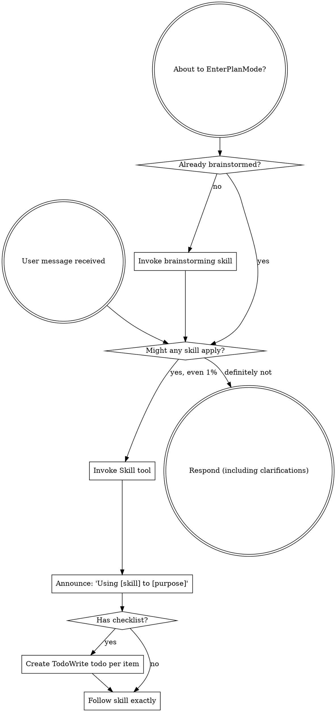
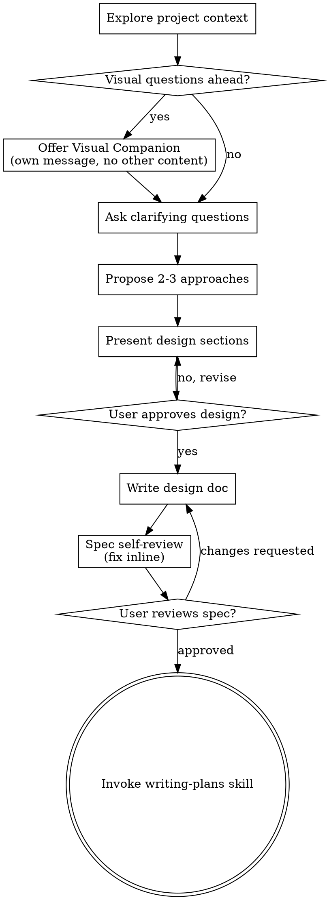
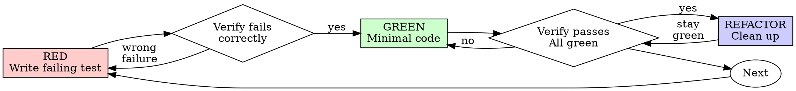
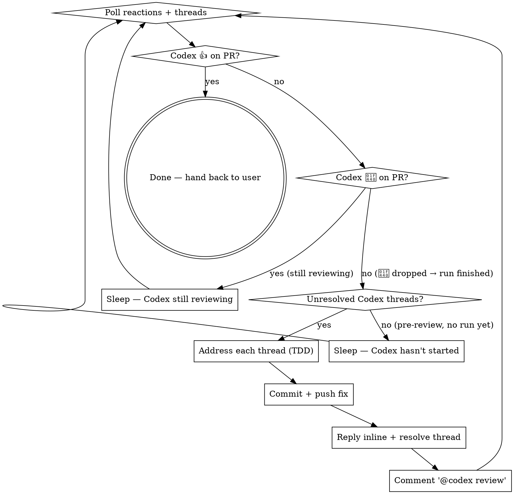

> SYSTEM

# AGENTS.md instructions for /Users/ericson/.t3/worktrees/ars-ui/t3code-ed7b7f39

<INSTRUCTIONS>
# ars-ui

## Project Overview

Rust frontend component library using state machines, framework-agnostic core with Leptos/Dioxus adapters.

## Current Phase

The repo is now in active implementation, not spec drafting only.

Agents working on implementation should use the GitHub Project roadmap and issue backlog as the execution source of truth:

- Use the GitHub Project `ars-ui implementation roadmap` to understand active epics, task breakdown, dependencies, status, and iteration planning.
- Prefer picking a single issue-backed task that is unblocked, sized, and scoped for independent delivery.
- Do not start work from an epic issue unless the user explicitly asks for planning or further decomposition.
- Do not start a task that is blocked by unresolved GitHub issue dependencies.
- Treat native GitHub issue dependencies as the blocker graph and the issue body acceptance criteria as the delivery contract.

## Development Workflow

For implementation tasks:

1. Read the assigned or selected GitHub issue first.
2. Move the issue to **In Progress** on the GitHub Project board.
3. Review the cited spec sections and any dependency issues.
4. Add or update the named tests first.
5. Implement only the scope required to make those tests pass.
6. If implementation changes the intended contract, update the relevant spec in the same task.
7. **MANDATORY:** Invoke the `post-implementation-audit` skill (`.agents/skills/post-implementation-audit/SKILL.md`). It runs three sequential audits on the new code — (a) spec/implementation drift with "best outcome" recommendations, (b) iterative "anything else missing?" passes (minimum two rounds), (c) test-coverage audit across every test type the workspace uses (unit, snapshot, proptest, mutation, doc, spec-conformance, llvm-cov). **Every finding lands in _this_ PR — no deferral, no follow-up issues.** This step exists because initial implementations consistently ship spec drift and silent contract violations that take 3+ review round-trips to surface; the audit collapses them into one. Skipping this step is a contract violation.
8. Present the final result for user review before any commit.
9. After user approval, run `cargo xci --profile fast` (alias: `cargo xci-fast`) locally and fix any failures before pushing anything to GitHub. The fast profile takes ~5 minutes and covers the workspace-level regressions a pre-push gate should catch: fmt, check, clippy, unit, integration, adapter, spec-compile-snippets, error-variant-coverage, mutual-exclusion, snapshot-count. Reserve full `cargo xci` (~25 minutes, all 20 gates including wasm coverage and the feature-matrix groups) for after substantial refactors that may have shifted feature-flag interactions. For small follow-up changes, run the focused tests and checks that cover the edited code instead.
10. After `cargo xci-fast` passes, commit and push a PR targeting `main`. The PR body MUST include an auto-close keyword for the issue being delivered, for example `Closes #20` or `Fixes #20`, so GitHub closes the issue automatically when the PR merges.
11. **If the PR creates or modifies any `.snap` insta fixtures, attach the `snapshot-reviewed` label after opening or updating it** (`gh pr edit <num> --add-label "snapshot-reviewed"`). This signals to reviewers that the snapshot output was inspected and is intentional. Re-apply the label whenever you push a commit that touches `.snap` files; the workflow assumes the label reflects the latest snapshot state.
12. **MANDATORY:** Invoke the `waiting-for-codex-review` skill (`.agents/skills/waiting-for-codex-review/SKILL.md`) immediately after the first push that creates the PR, and re-invoke it after every subsequent push to the PR branch. The skill posts the initial `@codex review` trigger, polls Codex's 👀 → (👍 \| ∅ + threads) reaction lifecycle, addresses any review threads with the same rigor as `post-implementation-audit` (TDD + no coverage regression), replies inline, resolves threads, and re-comments `@codex review` to start the next pass — looping until Codex leaves 👍. Skipping this step leaves Codex findings unaddressed and silently widens the gap between merged code and the spec; the merge gate is 👍 from Codex plus green CI, not green CI alone.
13. Only after CI passes, Codex has left 👍, and the PR is merged, close the issue.

Never close a GitHub issue without a merged PR that passes CI **and a 👍 from Codex**. Never commit or push without explicit user approval. Keep the issue, PR, and Project board status aligned with the actual work state at every step.

Default delivery rules:

- Follow TDD: tests first, implementation second, verification last.
- Keep task scope aligned with the issue. If the issue is too large or ambiguous, stop and split or clarify rather than freelancing a bigger change.
- Prefer tasks sized `1`, `2`, `3`, or `5` points. `8` is exceptional. `13` must be decomposed before implementation.
- Preserve the crate and dependency layering defined by the architecture and implementation plan.
- Do not add a new dependency crate without explicit user approval first. If a task appears to need a new crate, stop, explain why, and get approval before editing any `Cargo.toml`.
- When a task is complete, verify the exact tests and checks named by the issue before considering it done.
- For adapter-level component implementation, follow `docs/implementation/adapter-component-delivery.md`. Adapter component work must cover the adapter crate, adapter tests, E2E fixtures/harnesses when applicable, widgets examples, spec synchronization, and the required validation/audit loop in one PR.

### Code Quality Standards

- **Document all public items.** Every public struct, enum, trait, function, constant, type alias, method, field, and variant must have a `///` doc comment. Every `lib.rs` must have a `//!` crate-level doc comment. The workspace enforces `missing_docs` linting — undocumented public items are build failures.
- **Zero warnings policy.** All code must compile with zero warnings under the workspace's configured clippy and rustc lints. Fix the root cause instead of suppressing. When suppression is genuinely needed, use `#[expect(lint, reason = "...")]` — never `#[allow(...)]`.
- **Derive documentation from the spec.** Doc comments should describe the _purpose and semantics_ of the item as defined in the corresponding `spec/` files, not just restate the type signature.
- **Use `#[inline]` selectively, not mechanically.** Do **not** add Clippy's `missing_inline_in_public_items` lint at the workspace level, and do not treat public visibility alone as a reason to mark an item `#[inline]`. Use `#[inline]` for thin cross-crate wrappers, trivial accessors, and hot-path no-op shims where the call overhead is plausibly meaningful. Avoid blanket `#[inline]` on all public APIs — it increases code size, adds compile-time cost, and turns `#[inline]` into noise instead of a deliberate performance signal.
- **Use directory-backed modules with `mod.rs` when a module owns children.** This repo standardizes on the older filesystem layout for nested modules. If module `foo` has child modules, the parent must live at `foo/mod.rs`, not `foo.rs`. Do not mix `foo.rs` with a sibling `foo/` directory. When a refactor adds child modules under an existing flat file, move the parent into `foo/mod.rs` in the same change. Do not leave empty leftover module directories behind.

### API Design Standards

- **Design for the pit of success.** Public APIs should make the most natural, shortest path also be the path that is correct, accessible, localizable, type-safe, and performant. Prefer ergonomic constructors and defaults that preserve the spec's strongest guarantees instead of making users opt into correctness after choosing a convenient API.
- **Name escape hatches explicitly.** When a component needs a lower-level, static, non-i18n, or otherwise less complete path, keep it available but make the tradeoff visible in the API name or type. The blessed path should remain the simplest call site, while escape hatches should read as deliberate choices.
- **Keep semantic data separate from rendered views.** Rich framework views are useful for customization, but components still need semantic sources for accessible names, localized text, announcements, ids, and state-machine wiring. Do not rely on arbitrary rendered view trees as the only source of user-facing semantics.

### Code Coverage

The workspace uses `cargo-llvm-cov` for code coverage with per-crate threshold enforcement. CI runs coverage on every PR (see `.github/workflows/ci.yml`).

**Local coverage commands:**

```bash
# Per-crate coverage with inline annotated source (most useful during development)
cargo llvm-cov test -p ars-interactions --text -- hover

# Per-crate summary only
cargo llvm-cov test -p ars-interactions -- hover

# Native-only workspace coverage (host target; excludes wasm-only crates)
cargo llvm-cov --workspace \
  --exclude ars-leptos --exclude ars-dioxus \
  --exclude ars-test-harness-leptos --exclude ars-test-harness-dioxus \
  --exclude ars-derive --exclude xtask \
  --lcov --output-path lcov.info

# Check all crates against spec-defined thresholds (run after a *merged* lcov)
cargo xtask coverage check-all --file lcov.info
```

The `--text` flag produces line-by-line annotated source showing hit counts and `^0` markers on uncovered branches — use this to identify gaps after writing tests. Uncovered no-op callback closures in tests (e.g., `|_| {}`) are expected and not a gap.

The local recipe above excludes the adapter and adapter-test-harness crates because their `target_arch = "wasm32"` / `feature = "web"` code paths can't be measured via host-target `cargo llvm-cov`. **CI runs an additional wasm-coverage pipeline on nightly** (`cargo xtask ci coverage`) that uses `wasm-bindgen-test`'s experimental coverage recipe with LLVM 22 / `clang-22` to emit lcov for `ars-leptos` (csr), `ars-dioxus` (web), `ars-dom` (web), `ars-i18n` (web-intl), and the adapter test harnesses, then merges with the native lcov via `cargo xtask coverage merge`. The per-crate thresholds in `xtask::coverage::default_thresholds()` are enforced against the merged file — including adapter targets (`ars-leptos` 74/55, `ars-dioxus` 77/70, `ars-test-harness-leptos` 60/0, `ars-test-harness-dioxus` 60/0). `ars-derive` (proc-macro, runs in compiler) is exercised via `crates/ars-core/tests/derive_contract.rs` and is unmeasured. `xtask` has its own enforced threshold (30/35) and is measured. See `spec/testing/14-ci.md` §2 for the full pipeline.

### Mutation Testing

Coverage tells you which lines run. **Mutation testing tells you whether the tests would notice if those lines silently misbehaved.** The workspace uses [`cargo-mutants`](https://mutants.rs) for this — a `cargo` extension binary, not a workspace dependency.

**Install (once per developer machine):**

```bash
cargo install cargo-mutants --locked --version 27.0.0
```

**Local commands (state-machine modules are the most rewarding targets):**

```bash
# Run on a single component machine (~6 min for popover)
cargo mutants -p ars-components -f crates/ars-components/src/overlay/popover/mod.rs

# Just list what would be mutated, without running tests (fast)
cargo mutants -p ars-components -f crates/ars-components/src/overlay/popover/mod.rs --list

# Whole crate (slow — only if you really mean it)
cargo mutants -p ars-components
```

**Agnostic component implementation gate:** whenever an agent implements a new framework-agnostic component, or materially changes an existing one, the delivery must include:

- a targeted mutation run for the component source file, usually `cargo mutants -p ars-components -f crates/ars-components/src/<category>/<component>/mod.rs` (adjust the path for single-file modules);
- spec-conformance tests for the component's anatomy/public contract, including its `Part` enum and required API/attribute surface;
- same-task triage of every `MISSED` mutant: add tests for real gaps, or add a justified line-agnostic `.cargo/mutants.toml` exclude only for true equivalent mutations.

**Reading the output:** Results land in `mutants.out/mutants.out/` (gitignored). The two files that matter:

- `caught.txt` — mutations that broke at least one test ✅
- `missed.txt` — mutations that survived all tests ❌ — each one is either a real test gap to fill or an "equivalent mutation" that needs a `[[skip]]` entry in `mutants.toml` with a justification

**CI integration:** Nightly only. `.github/workflows/nightly.yml` has a `mutation-testing` job with a 21-entry matrix that runs `cargo mutants -p <package>` on every framework-agnostic crate, using `--shard k/n` to spread larger crates across parallel runners. **Shard indices are 0-based** (`k` runs from `0` to `n-1`); `k == n` is invalid and will fail the job. When adding shards, always start at `0/n` and end at `(n-1)/n`.

- **`ars-components` (≈ 1,630 mutants today, planned to grow as the spec adds the remaining ~97 components):** sharded **12-way** → ≈ 135 mutants per runner today, ≈ 850 per runner at the ~10,000-mutant endpoint. Sized for the full spec catalog up front so we don't re-shard every few months as components land.
- **`ars-collections` (≈ 1,080 mutants):** sharded 4-way → ≈ 270 mutants per runner.
- **`ars-core` (≈ 700 mutants):** sharded 2-way → ≈ 350 mutants per runner.
- **`ars-a11y`, `ars-forms`, `ars-interactions`:** one runner each (under 600 mutants apiece).

**Adding a new state machine inside an existing crate requires no CI changes** — its mutations land in whichever shard the cargo-mutants partitioner places them. The shard counts are sized so the slowest runner stays well under 30 minutes today and under ~50 minutes at the planned endpoint; re-balance only when a crate outgrows that budget (visible on the nightly dashboard as one shard pulling away from the others).

All matrix jobs run with `fail-fast: false` so failures on one module don't mask data on another. Each job uploads its `mutants.out/` as a workflow artifact (always, even on success — surviving "missed" entries on a passing run still reveal test-quality work). The job fails if any mutation survives, so a missed mutation forces a deliberate triage decision (fix the test, or document the equivalence with a `[[skip]]` entry in `mutants.toml`).

**Excluded crates** (mutation testing's signal degrades wherever determinism does): adapter glue (`ars-leptos`, `ars-dioxus`), DOM/FFI (`ars-dom`), ICU/FFI (`ars-i18n`), test infrastructure (`ars-test-harness*`), and the proc-macro crate (`ars-derive`, runs in the compiler). Adding a brand-new crate that is a good mutation target requires one new matrix entry; run a local scout first (`cargo mutants -p <crate> --list` to size, then a real run) so we know the right shard count before the nightly fires.

**Bumping the pinned version.** Both the local install command above and `.github/workflows/nightly.yml` pin cargo-mutants to an exact version (currently `27.0.0`) — same convention as `wasm-pack` in the `a11y-audit` job. Pinning is deliberate: cargo-mutants ships new mutators in releases, and an unpinned install would silently change the mutation set without any code change, surfacing as phantom CI failures on a green-source repo. To bump, open a PR that (1) updates the version string in CLAUDE.md and `nightly.yml`, (2) runs the popover scout locally with the new version (`cargo mutants -p ars-components -f crates/ars-components/src/overlay/popover/mod.rs`) to confirm the mutation count is in the same ballpark, and (3) triages any new "missed" entries the new mutators surface — they are usually genuine test-quality gaps newly visible to the tool.

### Property Testing (proptest)

State-machine invariants are exercised by [`proptest`](https://docs.rs/proptest) under `crates/<crate>/tests/proptest_state_machines/` (see `ars-components`). Default proptest behaviour drops `*.proptest-regressions` seed files alongside test sources — instead, every `proptest!` block in this workspace pulls a shared `Config` from `tests/proptest_state_machines/common.rs` that:

1. Reads `PROPTEST_CASES` from the environment (1,000 default; 10,000 in the nightly `extended-proptest` job).
2. Sets `failure_persistence` to `FileFailurePersistence::Direct("proptest-regressions/state-machines.txt")`, so all persisted seeds for the test binary live in one file at the crate root: `crates/<crate>/proptest-regressions/state-machines.txt`. The directory is committed (per proptest's own recommendation in the file header) so every developer's runs benefit from previously-shrunk failures.

When a new crate adopts proptest for state-machine tests, copy the same `common.rs` helper and reference it via `#![proptest_config(super::common::proptest_config())]` inside every `proptest!` block. Don't let proptest fall back to its `WithSource` default — that scatters seed files across the source tree.

### Adapter Prelude Convention

Both `ars-leptos` and `ars-dioxus` expose a `prelude` module targeting **end users** — application developers who consume the ready-made components. `use ars_leptos::prelude::*` (or `use ars_dioxus::prelude::*`) should give them everything they need.

The prelude contains only user-facing items:

1. **Component modules** — as components land, their public module paths (e.g., `button`, `dialog`) are re-exported so users can write `button::Props`, etc.
2. **User-facing traits** — traits end users call on component outputs (e.g., `Translate` from `ars-i18n`). Re-export the trait so consumers don't need a direct dependency on the subsystem crate.
3. **Configuration types** — types that appear in component props or configure behaviour (e.g., `Locale`, `Direction`, `Orientation`, `Selection`).

The prelude does **not** include implementation details consumed only by component authors inside the adapter crate: core engine types (`Machine`, `Service`, `ConnectApi`, `AttrMap`), accessibility primitives (`AriaRole`, `AriaAttribute`), interaction helpers (`merge_attrs`), or adapter hooks (`use_machine`, `UseMachineReturn`). Those remain accessible via their normal crate paths for advanced users building custom machines.

Both adapter preludes must stay symmetric: same items, same structure. When adding a new re-export to one adapter's prelude, add it to the other as well in the same PR.

### Adapter Testing Convention

Adapter-level component tests should default to the framework-specific test harness crate:

- Leptos adapter tests should prefer `ars-test-harness-leptos`.
- Dioxus adapter tests should prefer `ars-test-harness-dioxus`.
- Shared `ars-test-harness` helpers should be used where relevant for viewport, layout, clipboard, drag/drop, timing, and other DOM test setup instead of bespoke per-test browser scaffolding.

When a component spec requires interaction, focus, overlay positioning, clipboard, file upload, drag/drop, or similar browser behavior, the task's tests should exercise that behavior through the adapter harness entrypoints and shared core harness helpers unless there is a concrete technical reason not to.

## Spec Synchronization During Implementation

The specification is the authoritative contract. It took weeks of deliberate design and MUST be followed.

### Spec-first implementation rule

Before implementing any public type, trait, function, or method:

1. **Read the spec section first.** Find the relevant code example in `spec/`. Use `spec-tool toc <file>` and `grep` to locate it.
2. **Match the spec exactly.** If the spec defines `struct ComponentIds { base: String }` with methods `from_id()`, `id()`, `part()`, `item()`, `item_part()` — implement exactly that. Do not invent alternative field names, method names, or signatures.
3. **Cross-check after implementation.** Before presenting code for review, diff every public item against the spec's code examples. Every struct field, every method name, every parameter must match.
4. **If you must deviate**, there must be a concrete technical reason (e.g., the spec's API cannot compile, or a dependency doesn't expose the needed type). Document the reason in a code comment and flag it to the user explicitly.

Inventing alternative APIs that "seem equivalent" is never acceptable — it silently invalidates the spec's design decisions and all downstream code that depends on those APIs.

### Spec/code mismatch resolution

- If code and spec disagree, resolve the mismatch in the same task or PR.
- Shared conceptual changes belong in shared or foundation spec files, not only in adapter code.
- Adapter-specific findings must be reflected back into `spec/foundation/08-adapter-leptos.md` and/or `spec/foundation/09-adapter-dioxus.md` when relevant.
- Do not leave spec drift behind as follow-up cleanup.

## Spec Structure

The specification lives in `spec/` with this layout:

- `spec/manifest.toml` — **START HERE** — central index of all components and their dependencies
- `spec/foundation/` — architecture, accessibility, i18n, interactions, forms, adapters, spec template (00-10)
- `spec/shared/` — cross-component shared types (date-time, selection, layout, z-index)
- `spec/components/{category}/` — one file per component, organized by category
- `spec/testing/` — test specs split by domain

### Component Categories

- `input/` — checkbox, text-field, slider, number-input, etc.
- `selection/` — select, combobox, listbox, menu, tags-input, etc.
- `overlay/` — dialog, popover, tooltip, toast, presence, etc.
- `navigation/` — accordion, tabs, tree-view, pagination, steps, etc.
- `date-time/` — date-field, time-field, calendar, date-picker, etc.
- `data-display/` — table, avatar, progress, meter, badge, etc.
- `layout/` — splitter, scroll-area, carousel, portal, toolbar, etc.
- `specialized/` — color-picker, file-upload, signature-pad, qr-code, etc.
- `utility/` — button, toggle, focus-scope, visually-hidden, separator, etc.

## Working with the Spec

When reading large files, run `wc -l` first to check the line count. If the file is over 2,000
lines, use the `offset` and `limit` parameters on the Read tool to read in chunks rather than
attempting to read the entire file at once.

### Using xtask spec (preferred)

Use `cargo xtask spec` to resolve file sets instead of manually parsing manifest.toml:

```bash
# Quick metadata lookup:
cargo xtask spec info <component>

# Find all components using a shared type:
cargo xtask spec reverse <shared-type>

# See a file's heading structure (with line numbers):
cargo xtask spec toc <file>

# Validate frontmatter matches manifest.toml:
cargo xtask spec validate

# Search spec content by keyword/regex (with optional filters):
cargo xtask spec search <query> [--category <cat>] [--section <sec>] [--tier <tier>]

# Get a compact component summary (states, events, props, accessibility):
cargo xtask spec digest <component>

# Get full implementation context (component + all deps concatenated):
cargo xtask spec context <component> [--framework <fw>] [--include-testing]
```

The xtask also runs as an MCP server (`cargo xtask mcp`) exposing all spec tools for LLM agents.

### Reading a component (manual fallback)

1. Read `spec/manifest.toml` to find the component's path and dependencies
2. Read the component file (has YAML frontmatter listing its foundation/shared deps)
3. Only load the foundation files listed in `foundation_deps` — not all of them

### Framework and library specs — MANDATORY skill loading

When reading or editing these specification files, you MUST load the corresponding skill BEFORE doing any work. The skills contain verified, version-accurate API documentation that the spec code examples depend on. Claude's training data is wrong for these libraries — do not trust it.

| Spec file                                    | Skill to load | Library version |
| -------------------------------------------- | ------------- | --------------- |
| `spec/foundation/04-internationalization.md` | `icu4x`       | ICU4X 2.1.1     |
| `spec/foundation/08-adapter-leptos.md`       | `leptos`      | Leptos 0.8.17   |
| `spec/foundation/09-adapter-dioxus.md`       | `dioxus`      | Dioxus 0.7.3    |

This applies to any task that touches adapter code: reviewing, writing, modifying, or answering questions about these files. Load the skill first, then proceed.

### Spec Conventions

- **No deprecation:** This is a greenfield spec. If an API is unused or redundant, remove it and fix all references. Never use `#[deprecated]` or deprecation shims.
- **No deferral:** Never mark spec content as "TODO", "FIXME", "future enhancement", "P1/P2 extension", or any similar deferral language. Every feature mentioned must be fully specified. If a design choice is unclear, ask the user rather than deferring.
- **No guessing external APIs:** NEVER guess function names or module paths for external crates. Always verify against `https://docs.rs/<crate_name>` before writing code that calls library APIs. This applies especially to Leptos, Dioxus, ICU4X, and any crate where training data may be stale. If you cannot verify, state that explicitly rather than fabricating a plausible-looking API.

### Component file format

Each component file has YAML frontmatter declaring its metadata:

```markdown
---
component: ComponentName
category: { category }
tier: stateless | stateful | complex
foundation_deps: [architecture, accessibility, ...]
shared_deps: [date-time-types, ...]
related: [sibling-component, ...]
---

# ComponentName
```

The `tier` field determines which sections are required — see `spec/foundation/10-component-spec-template.md` for the canonical section structure, ordering rules, and conformance checklist. Headings are numbered (e.g., `## 1. State Machine`, `### 1.1 States`, `#### 1.1.1 InnerStates`, etc.) for precise section references.

</INSTRUCTIONS>
<environment_context>
  <cwd>/Users/ericson/.t3/worktrees/ars-ui/t3code-ed7b7f39</cwd>
  <shell>zsh</shell>
  <current_date>2026-05-25</current_date>
  <timezone>America/Sao_Paulo</timezone>
</environment_context>

> DEVELOPER

Implement task #275

> AGENT

I’ll stay in planning mode for this turn: first I’m going to ground the plan in the live issue and repo state, then I’ll turn that into an implementation-ready plan rather than editing files. I’m loading the workflow skill and checking the relevant project memory because this is an `ars-ui` issue-backed task.

> TOOL

tool_use exec_command
id: call_SIfFg6EOp4OGWywTmFAdSFKj
```json
{
  "cmd": "sed -n '1,220p' /Users/ericson/.claude/skills/using-superpowers/SKILL.md",
  "workdir": "/Users/ericson/.t3/worktrees/ars-ui/t3code-ed7b7f39",
  "yield_time_ms": 1000,
  "max_output_tokens": 4000
}
```

> TOOL

tool_use exec_command
id: call_2Fs09FAUCkVzIZS737vKoT1Y
```json
{
  "cmd": "rg -n \"#275|issue #275|275|data-display|selection|navigation|ars-ui\" /Users/ericson/.codex/memories/MEMORY.md",
  "workdir": "/Users/ericson/.t3/worktrees/ars-ui/t3code-ed7b7f39",
  "yield_time_ms": 1000,
  "max_output_tokens": 4000
}
```

> TOOL

tool_result
id: call_SIfFg6EOp4OGWywTmFAdSFKj
```
Chunk ID: 4bdcfa
Wall time: 0.1799 seconds
Process exited with code 0
Original token count: 1356
Output:
---
name: using-superpowers
description: Use when starting any conversation - establishes how to find and use skills, requiring Skill tool invocation before ANY response including clarifying questions
---

<SUBAGENT-STOP>
If you were dispatched as a subagent to execute a specific task, skip this skill.
</SUBAGENT-STOP>

<EXTREMELY-IMPORTANT>
If you think there is even a 1% chance a skill might apply to what you are doing, you ABSOLUTELY MUST invoke the skill.

IF A SKILL APPLIES TO YOUR TASK, YOU DO NOT HAVE A CHOICE. YOU MUST USE IT.

This is not negotiable. This is not optional. You cannot rationalize your way out of this.
</EXTREMELY-IMPORTANT>

## Instruction Priority

Superpowers skills override default system prompt behavior, but **user instructions always take precedence**:

1. **User's explicit instructions** (CLAUDE.md, GEMINI.md, AGENTS.md, direct requests) — highest priority
2. **Superpowers skills** — override default system behavior where they conflict
3. **Default system prompt** — lowest priority

If CLAUDE.md, GEMINI.md, or AGENTS.md says "don't use TDD" and a skill says "always use TDD," follow the user's instructions. The user is in control.

## How to Access Skills

**In Claude Code:** Use the `Skill` tool. When you invoke a skill, its content is loaded and presented to you—follow it directly. Never use the Read tool on skill files.

**In Copilot CLI:** Use the `skill` tool. Skills are auto-discovered from installed plugins. The `skill` tool works the same as Claude Code's `Skill` tool.

**In Gemini CLI:** Skills activate via the `activate_skill` tool. Gemini loads skill metadata at session start and activates the full content on demand.

**In other environments:** Check your platform's documentation for how skills are loaded.

## Platform Adaptation

Skills use Claude Code tool names. Non-CC platforms: see `references/copilot-tools.md` (Copilot CLI), `references/codex-tools.md` (Codex) for tool equivalents. Gemini CLI users get the tool mapping loaded automatically via GEMINI.md.

# Using Skills

## The Rule

**Invoke relevant or requested skills BEFORE any response or action.** Even a 1% chance a skill might apply means that you should invoke the skill to check. If an invoked skill turns out to be wrong for the situation, you don't need to use it.



## Red Flags

These thoughts mean STOP—you're rationalizing:

| Thought | Reality |
|---------|---------|
| "This is just a simple question" | Questions are tasks. Check for skills. |
| "I need more context first" | Skill check comes BEFORE clarifying questions. |
| "Let me explore the codebase first" | Skills tell you HOW to explore. Check first. |
| "I can check git/files quickly" | Files lack conversation context. Check for skills. |
| "Let me gather information first" | Skills tell you HOW to gather information. |
| "This doesn't need a formal skill" | If a skill exists, use it. |
| "I remember this skill" | Skills evolve. Read current version. |
| "This doesn't count as a task" | Action = task. Check for skills. |
| "The skill is overkill" | Simple things become complex. Use it. |
| "I'll just do this one thing first" | Check BEFORE doing anything. |
| "This feels productive" | Undisciplined action wastes time. Skills prevent this. |
| "I know what that means" | Knowing the concept ≠ using the skill. Invoke it. |

## Skill Priority

When multiple skills could apply, use this order:

1. **Process skills first** (brainstorming, debugging) - these determine HOW to approach the task
2. **Implementation skills second** (frontend-design, mcp-builder) - these guide execution

"Let's build X" → brainstorming first, then implementation skills.
"Fix this bug" → debugging first, then domain-specific skills.

## Skill Types

**Rigid** (TDD, debugging): Follow exactly. Don't adapt away discipline.

**Flexible** (patterns): Adapt principles to context.

The skill itself tells you which.

## User Instructions

Instructions say WHAT, not HOW. "Add X" or "Fix Y" doesn't mean skip workflows.

```

> TOOL

tool_result
id: call_2Fs09FAUCkVzIZS737vKoT1Y
```
Chunk ID: ff49b4
Wall time: 0.0541 seconds
Process exited with code 0
Original token count: 19329
Output:
Total output lines: 246

1:# Task Group: ars-ui / ars-components data-display agnostic core implementation and spec-sync audit
4:applies_to: cwd=/Users/ericson/.t3/worktrees/ars-ui/*; reuse_rule=reuse for ars-ui checkouts touching `crates/ars-components/src/data_display/` or matching component specs; verify whether the user wants one combined deliverable and whether commit/push is intentionally out of scope.
10:- rollout_summaries/2026-05-25T05-08-22-stZ4-ars_ui_data_display_agnostic_core_268_274.md (cwd=/Users/ericson/.t3/worktrees/ars-ui/t3code-f1fdd791, rollout_path=/Users/ericson/.codex/sessions/2026/05/25/rollout-2026-05-25T02-08-22-019e5d88-bad0-7b91-8c61-de1cafabe9ce.jsonl, updated_at=2026-05-25T07:41:03+00:00, thread_id=019e5d88-bad0-7b91-8c61-de1cafabe9ce, combined Meter/Stat/Progress implementation with focused validation and no publish)
20:- rollout_summaries/2026-05-25T05-08-22-stZ4-ars_ui_data_display_agnostic_core_268_274.md (cwd=/Users/ericson/.t3/worktrees/ars-ui/t3code-f1fdd791, rollout_path=/Users/ericson/.codex/sessions/2026/05/25/rollout-2026-05-25T02-08-22-019e5d88-bad0-7b91-8c61-de1cafabe9ce.jsonl, updated_at=2026-05-25T07:41:03+00:00, thread_id=019e5d88-bad0-7b91-8c61-de1cafabe9ce, post-implementation audit/spec sync with no commit or push)
28:- when the user says `Implement tasks #268 and #274` and accepts a combined plan, treat the pair as one coordinated data-display deliverable instead of forcing separate issue passes or extra scope clarification [Task 1]
40:- Leptos/Dioxus data-display adapter examples need the real constructor shape such as `Api::new(..., &Env::default(), &Messages::default())`, not shorthand signatures copied from older sketches [Task 2]
46:- symptom: `cargo fmt --check` fails right after the feature work lands -> cause: edited data-display files need repo formatting -> fix: run `cargo fmt --all`, then rerun the exact check before continuing down the validation chain [Task 1]
50:# Task Group: ars-ui / ars-components overlay core implementation and publish workflow
53:applies_to: cwd=/Users/ericson/.t3/worktrees/ars-ui/*; reuse_rule=reuse for ars-ui checkouts touching `crates/ars-components/src/overlay/` or nearby utility/compatibility seams; verify live issue/PR state before moving roadmap items or publishing.
59:- rollout_summaries/REDACTED.md (cwd=/Users/ericson/.t3/worktrees/ars-ui/t3code-6d170779, rollout_path=/Users/ericson/.codex/sessions/2026/05/24/rollout-2026-05-24T21-39-35-019e5c92-a540-7010-a2f2-c5d941a4ae69.jsonl, updated_at=2026-05-25T03:44:27+00:00, thread_id=019e5c92-a540-7010-a2f2-c5d941a4ae69, overlay test-module split plus non-draft publish and Codex review trigger)
69:- rollout_summaries/REDACTED.md (cwd=/Users/ericson/.t3/worktrees/ars-ui/t3code-61dbf109, rollout_path=/Users/ericson/.codex/sessions/2026/05/21/rollout-2026-05-21T09-01-32-019e4a69-8d84-7753-89a0-ec5d2e651f96.jsonl, updated_at=2026-05-21T21:07:16+00:00, thread_id=019e4a69-8d84-7753-89a0-ec5d2e651f96, issue #263 Drawer implementation plus review hardening)
79:- rollout_summaries/2026-05-21T03-21-42-3TmL-ars_ui_alert_dialog_core_and_codex_review.md (cwd=/Users/ericson/.t3/worktrees/ars-ui/t3code-9f5b5f2f, rollout_path=/Users/ericson/.codex/sessions/2026/05/21/rollout-2026-05-21T00-21-42-019e488d-a3a5-7e42-871c-43cd60efbf27.jsonl, updated_at=2026-05-21T06:09:27+00:00, thread_id=019e488d-a3a5-7e42-871c-43cd60efbf27, issue #260 implementation plus review-driven snapshot-count/spec fixes on PR #660)
89:- rollout_summaries/2026-04-29T16-02-56-Kicl-implement_task_200_zindexallocator_clientonly_core.md (cwd=/Users/ericson/.t3/worktrees/ars-ui/t3code-05593195, rollout_path=/Users/ericson/.codex/sessions/2026/04/29/rollout-2026-04-29T13-02-56-019dd9fa-aac0-76a0-acf5-46a45fc70095.jsonl, updated_at=2026-04-29T18:03:58+00:00, thread_id=019dd9fa-aac0-76a0-acf5-46a45fc70095, issue #200 implementation plus roadmap update, no-std fix, and PR publish)
99:- rollout_summaries/REDACTED.md (cwd=/Users/ericson/.t3/worktrees/ars-ui/t3code-1fef6d79, rollout_path=/Users/ericson/.codex/sessions/2026/04/29/rollout-2026-04-29T15-04-18-019dda69-c612-7473-b42d-d539165a5135.jsonl, updated_at=2026-04-29T18:36:24+00:00, thread_id=019dda69-c612-7473-b42d-d539165a5135, Dialog publish flow with rebase, full gate, co-author trailer, and regular PR)
129:- Related skill: skills/ars-ui-pr-review-cycle/SKILL.md [Task 1]
147:# Task Group: ars-ui / ars-components utility and navigation core implementation
149:scope: Fresh framework-agnostic `crates/ars-components` work for utility and navigation components, covering spec-driven issue execution, mutation/coverage-backed validation, publish flow, and review-driven contract tightening for component semantics.
150:applies_to: cwd=/Users/ericson/.t3/worktrees/ars-ui/*; reuse_rule=reuse for ars-ui checkouts touching `crates/ars-components/src/utility/` or `crates/ars-components/src/navigation/`; verify the live issue/spec contract and whether commit/push is in or out of scope for the current run.
156:- rollout_summaries/REDACTED.md (cwd=/Users/ericson/.t3/worktrees/ars-ui/t3code-0baff5e5, rollout_path=/Users/ericson/.codex/sessions/2026/05/24/rollout-2026-05-24T00-19-18-019e57fe-8571-7122-a65d-3a151cb21cc1.jsonl, updated_at=2026-05-24T14:38:20+00:00, thread_id=019e57fe-8571-7122-a65d-3a151cb21cc1, issue #217 implementation, draft PR publish, Codex approval, and partial CI observation)
166:- rollout_summaries/2026-05-23T21-07-28-1dbL-implement_togglegroup_core_issue_216.md (cwd=/Users/ericson/.t3/worktrees/ars-ui/t3code-e567e91b, rollout_path=/Users/ericson/.codex/sessions/2026/05/23/rollout-2026-05-23T18-07-28-019e56aa-18c9-7122-9658-3077c7106725.jsonl, updated_at=2026-05-24T03:09:37+00:00, thread_id=019e56aa-18c9-7122-9658-3077c7106725, issue #216 implementation plus same-PR review remediation and final CI wait)
176:- rollout_summaries/REDACTED.md (cwd=/Users/ericson/.t3/worktrees/ars-ui/t3code-a189b923, rollout_path=/Users/ericson/.codex/sessions/2026/05/21/rollout-2026-05-21T22-34-26-019e4d51-c94c-7730-9998-67c49590e4bc.jsonl, updated_at=2026-05-22T05:24:13+00:00, thread_id=019e4d51-c94c-7730-9998-67c49590e4bc, issue #215 implementation plus same-PR Codex review remediation on PR #668)
186:- rollout_summaries/2026-05-21T03-22-07-Phj2-ars_ui_issue_254_accordion_agnostic_core_codex_review_fix.md (cwd=/Users/ericson/.t3/worktrees/ars-ui/t3code-81d31d0b, rollout_path=/Users/ericson/.codex/sessions/2026/05/21/rollout-2026-05-21T00-22-07-019e488e-0372-7a73-84d0-61cbf592dca8.jsonl, updated_at=2026-05-21T14:36:35+00:00, thread_id=019e488e-0372-7a73-84d0-61cbf592dca8, issue #254 implementation plus same-PR Codex review remediation on PR #662)
196:- rollout_summaries/REDACTED.md (cwd=/Users/ericson/.t3/worktrees/ars-ui/t3code-f177abf7, rollout_path=/Users/ericson/.codex/sessions/2026/05/21/rollout-2026-05-21T00-11-18-019e4884-1bf7-7fc3-9a5b-174a8aee0de8.jsonl, updated_at=2026-05-21T05:58:09+00:00, thread_id=019e4884-1bf7-7fc3-9a5b-174a8aee0de8, issue #211 implementation plus review remediation on PR #659)
206:- rollout_summaries/REDACTED.md (cwd=/Users/ericson/.t3/worktrees/ars-ui/t3code-55173bd3, rollout_path=/Users/ericson/.codex/sessions/2026/05/20/rollout-2026-05-20T00-17-41-019e4363-993e-7b02-ac6a-2e59148e3c0c.jsonl, updated_at=2026-05-20T05:11:33+00:00, thread_id=019e4363-993e-7b02-ac6a-2e59148e3c0c, issues #209/#210 implementation plus Codex review remediation on PR #654)
212:## Task 7: Implement Breadcrumbs, Link, Pagination, and Steps agnostic core with mutation-backed naviga…15329 tokens truncated…nd `spec/foundation/11-dom-utilities.md`; verify current transform/offset-parent behavior before reusing exact claims.
3085:- rollout_summaries/REDACTED.md (cwd=/Users/ericson/.t3/worktrees/ars-ui/t3code-c3750921, rollout_path=/Users/ericson/.codex/sessions/2026/04/21/rollout-2026-04-21T23-32-45-019db308-65c0-7a43-af56-96c15d36b5b4.jsonl, updated_at=2026-04-22T04:23:26+00:00, thread_id=019db308-65c0-7a43-af56-96c15d36b5b4, PR #596 review fixes and spec alignment)
3110:# Task Group: ars-ui / ars-dom focus and modality utilities
3113:applies_to: cwd=ars-ui checkouts (/Users/ericson/.t3/worktrees/ars-ui/* and /Users/ericson/Workspace/Rust/ars-ui); reuse_rule=reuse for ars-ui checkouts touching `crates/ars-dom/src/focus.rs`, `modality.rs`, `scroll_lock.rs`, or related specs/docs; re-check browser/runtime assumptions if the platform surface changed.
3119:- rollout_summaries/REDACTED.md (cwd=/Users/ericson/.t3/worktrees/ars-ui/t3code-9db7d36d, rollout_path=/Users/ericson/.codex/sessions/2026/04/20/rollout-2026-04-20T21-04-53-019dad5a-a9b3-7e72-8e6e-8d66ce93bede.jsonl, updated_at=2026-04-21T05:50:37+00:00, thread_id=019dad5a-a9b3-7e72-8e6e-8d66ce93bede, issue #72 audit, doc cleanup, coverage hardening, and regular PR publish)
3141:# Task Group: ars-ui / ars-i18n contract cleanup, audits, and review cycles
3144:applies_to: cwd=/Users/ericson/.t3/worktrees/ars-ui/*; reuse_rule=reuse for ars-ui checkouts touching `crates/ars-i18n`, `ars-leptos`/`ars-dioxus` provider shims, or `spec/foundation/04-internationalization.md`; re-check live feature flags and public API before reusing exact claims.
3150:- rollout_summaries/REDACTED.md (cwd=/Users/ericson/.t3/worktrees/ars-ui/t3code-fb774f75, rollout_path=/Users/ericson/.codex/sessions/2026/04/19/rollout-2026-04-19T10-23-48-019da5e9-614b-7a70-9acb-0d9b2e974eb2.jsonl, updated_at=2026-04-20T22:50:10+00:00, thread_id=019da5e9-614b-7a70-9acb-0d9b2e974eb2, PR #589 review fix for non-Gregorian wrap semantics)
3160:- rollout_summaries/2026-04-14T02-23-23-Wm62-ars_i18n_accept_language_review_refinements.md (cwd=/Users/ericson/.codex/worktrees/366f/ars-ui, rollout_path=/Users/ericson/.codex/sessions/2026/04/13/rollout-2026-04-13T23-23-23-019d89cc-f537-7622-a43b-a7652b1abafe.jsonl, updated_at=2026-04-14T04:43:34+00:00, thread_id=019d89cc-f537-7622-a43b-a7652b1abafe, issue #139 implementation plus iterative review refinements)
3182:# Task Group: ars-ui / ars-collections DnD contracts and PR review workflow
3185:applies_to: cwd=/Users/ericson/.t3/worktrees/ars-ui/*; reuse_rule=reuse for ars-ui checkouts touching `crates/ars-collections`, `ars-interactions::DragItem`, or `spec/foundation/06-collections.md`; verify current feature gates and collection-order semantics before reusing exact claims.
3191:- rollout_summaries/REDACTED.md (cwd=/Users/ericson/.t3/worktrees/ars-ui/t3code-4fe5a1ff, rollout_path=/Users/ericson/.codex/sessions/2026/04/17/rollout-2026-04-17T18-21-37-019d9d52-1c90-71b0-aeea-27eb6bf9f99d.jsonl, updated_at=2026-04-17T23:48:33+00:00, thread_id=019d9d52-1c90-71b0-aeea-27eb6bf9f99d, issue #549 implementation and draft PR #567)
3201:- rollout_summaries/2026-04-18T01-09-16-w841-ars_collections_dnd_review_fixes.md (cwd=/Users/ericson/.t3/worktrees/ars-ui/t3code-4fe5a1ff, rollout_path=/Users/ericson/.codex/sessions/2026/04/17/rollout-2026-04-17T22-09-16-019d9e22-894a-7b03-8372-9cf0ef22f109.jsonl, updated_at=2026-04-18T01:23:06+00:00, thread_id=019d9e22-894a-7b03-8372-9cf0ef22f109, PR #567 review fixes with commit/push/reply flow)
3205:- PR #567, no_std, optional dependency, ars-interactions, drag_keys, selection::Set::Multiple, BTreeSet, thumbv7m-none-eabi, cargo tree --no-default-features, inline reply
3211:- rollout_summaries/REDACTED.md (cwd=/Users/ericson/.codex/worktrees/1fac/ars-ui, rollout_path=/Users/ericson/.codex/sessions/2026/04/13/rollout-2026-04-13T15-26-38-019d8818-7a33-7070-be96-c1ac010fa14c.jsonl, updated_at=2026-04-13T21:41:38+00:00, thread_id=019d8818-7a33-7070-be96-c1ac010fa14c, PR #531 review fixes for registry lifecycle, cancel cleanup, and GitHub replies)
3228:- `selection::Set::Multiple` is backed by `BTreeSet`, so iterating selected keys directly returns key-sorted order; if the API contract needs collection order, iterate `item_keys()` and filter against the selection instead [Task 2]
3232:- `KeyboardDragRegistry` review fixes established three durable lifecycle rules: `register()` should not preselect a target, `clear()` should reset transient selection without discarding mounted targets, and `cancel_keyboard_drag(...)` needs `&mut DropResult` so keyboard cancel clears stale hover/indicator state [Task 3]
3238:- symptom: a `drag_keys()` regression test passes even though ordering is wrong -> cause: the test only checked membership, not order -> fix: build the regression so selection order differs from collection order and assert the exact sequence [Task 2]
3242:# Task Group: ars-ui / ars-interactions Epic #4 and issue-driven review loops
3244:scope: `crates/ars-interactions` task selection, drag/drop and move-interaction implementation, and the review-driven follow-ups that repeatedly required thread-aware GitHub inspection, focused regression tests, and repo-wide validation.
3245:applies_to: cwd=ars-ui checkouts (/Users/ericson/.codex/worktrees/*/ars-ui and /Users/ericson/.t3/worktrees/ars-ui/*); reuse_rule=reuse for ars-ui work touching `crates/ars-interactions` or Epic #4 interaction tasks; verify the live epic decomposition and current PR state before reusing exact issue/PR numbers.
3251:- rollout_summaries/REDACTED.md (cwd=/Users/ericson/.codex/worktrees/9f00/ars-ui, rollout_path=/Users/ericson/.codex/sessions/2026/04/12/rollout-2026-04-12T22-50-30-019d8488-7da2-7ff0-b7a7-7fe1622696f3.jsonl, updated_at=2026-04-13T03:15:57+00:00, thread_id=019d8488-7da2-7ff0-b7a7-7fe1622696f3, issue #159 implementation plus PR #524 announcement-hook review fix)
3261:- rollout_summaries/REDACTED.md (cwd=/Users/ericson/.codex/worktrees/75e9/ars-ui, rollout_path=/Users/ericson/.codex/sessions/2026/04/13/rollout-2026-04-13T00-39-35-019d84ec-5a73-7591-9d6a-6d108598ce6a.jsonl, updated_at=2026-04-13T06:27:41+00:00, thread_id=019d84ec-5a73-7591-9d6a-6d108598ce6a, PR #525 cancel-offer review fix and inline reply)
3280:- Related skill: skills/ars-ui-pr-review-cycle/SKILL.md [Task 1][Task 2]
3287:# Task Group: ars-ui / adapter-spec date-time and input category migrations
3290:applies_to: cwd=/Users/ericson/Workspace/Rust/ars-ui; reuse_rule=reuse for spec-only ars-ui work under `spec/foundation/12-adapter-component-spec-template.md`, `spec/leptos-components/**`, `spec/dioxus-components/**`, and `spec/manifest.toml`; do not reuse as implementation guidance without re-checking current specs and manifests.
3296:- rollout_summaries/2026-04-01T04-20-05-TqYh-date_time_adapter_template_expansion_and_frontmatter_normali.md (cwd=/Users/ericson/Workspace/Rust/ars-ui, rollout_path=/Users/ericson/.codex/sessions/2026/04/01/rollout-2026-04-01T01-20-05-019d4745-1d50-7f51-b3e6-f533036e0079.jsonl, updated_at=2026-04-01T04:47:24+00:00, thread_id=019d4745-1d50-7f51-b3e6-f533036e0079, date-time category migration plus utility frontmatter normalization)
3306:- rollout_summaries/2026-04-01T16-26-14-EGy3-expand_input_adapter_specs_template.md (cwd=/Users/ericson/Workspace/Rust/ars-ui, rollout_path=/Users/ericson/.codex/sessions/2026/04/01/rollout-2026-04-01T13-26-14-019d49dd-ee12-7771-b6a7-b5f4f810bf37.jsonl, updated_at=2026-04-01T16:59:38+00:00, thread_id=019d49dd-ee12-7771-b6a7-b5f4f810bf37, input category migration plus manifest updates)

```

> AGENT

Using `using-superpowers` and `brainstorming` to keep the issue-backed implementation plan disciplined before any code changes. Next I’m fetching the live GitHub issue and the local spec/test structure so the plan is based on the actual contract.

> TOOL

tool_use exec_command
id: call_1GQ6aSBxTzFbw6TSSxMA0Ubp
```json
{
  "cmd": "sed -n '1,220p' /Users/ericson/.claude/skills/brainstorming/SKILL.md",
  "workdir": "/Users/ericson/.t3/worktrees/ars-ui/t3code-ed7b7f39",
  "yield_time_ms": 1000,
  "max_output_tokens": 4000
}
```

> TOOL

tool_use _fetch_issue
id: call_xrsmsHUfg0tZEMPqRy9oFu1R
```json
{
  "repository_full_name": "fogodev/ars-ui",
  "issue_number": 275
}
```

> TOOL

tool_use exec_command
id: call_J3tHyjq6gjmTl9CM5k8NwElh
```json
{
  "cmd": "git status --short && pwd && rg --files -g 'AGENTS.md' -g '.agents/skills/*/SKILL.md' -g 'Cargo.toml' -g 'spec/manifest.toml'",
  "workdir": "/Users/ericson/.t3/worktrees/ars-ui/t3code-ed7b7f39",
  "yield_time_ms": 1000,
  "max_output_tokens": 4000
}
```

> TOOL

tool_result
id: call_1GQ6aSBxTzFbw6TSSxMA0Ubp
```
Chunk ID: 5d82fc
Wall time: 0.2740 seconds
Process exited with code 0
Original token count: 2659
Output:
---
name: brainstorming
description: "You MUST use this before any creative work - creating features, building components, adding functionality, or modifying behavior. Explores user intent, requirements and design before implementation."
---

# Brainstorming Ideas Into Designs

Help turn ideas into fully formed designs and specs through natural collaborative dialogue.

Start by understanding the current project context, then ask questions one at a time to refine the idea. Once you understand what you're building, present the design and get user approval.

<HARD-GATE>
Do NOT invoke any implementation skill, write any code, scaffold any project, or take any implementation action until you have presented a design and the user has approved it. This applies to EVERY project regardless of perceived simplicity.
</HARD-GATE>

## Anti-Pattern: "This Is Too Simple To Need A Design"

Every project goes through this process. A todo list, a single-function utility, a config change — all of them. "Simple" projects are where unexamined assumptions cause the most wasted work. The design can be short (a few sentences for truly simple projects), but you MUST present it and get approval.

## Checklist

You MUST create a task for each of these items and complete them in order:

1. **Explore project context** — check files, docs, recent commits
2. **Offer visual companion** (if topic will involve visual questions) — this is its own message, not combined with a clarifying question. See the Visual Companion section below.
3. **Ask clarifying questions** — one at a time, understand purpose/constraints/success criteria
4. **Propose 2-3 approaches** — with trade-offs and your recommendation
5. **Present design** — in sections scaled to their complexity, get user approval after each section
6. **Write design doc** — save to `docs/superpowers/specs/YYYY-MM-DD-<topic>-design.md` and commit
7. **Spec self-review** — quick inline check for placeholders, contradictions, ambiguity, scope (see below)
8. **User reviews written spec** — ask user to review the spec file before proceeding
9. **Transition to implementation** — invoke writing-plans skill to create implementation plan

## Process Flow



**The terminal state is invoking writing-plans.** Do NOT invoke frontend-design, mcp-builder, or any other implementation skill. The ONLY skill you invoke after brainstorming is writing-plans.

## The Process

**Understanding the idea:**

- Check out the current project state first (files, docs, recent commits)
- Before asking detailed questions, assess scope: if the request describes multiple independent subsystems (e.g., "build a platform with chat, file storage, billing, and analytics"), flag this immediately. Don't spend questions refining details of a project that needs to be decomposed first.
- If the project is too large for a single spec, help the user decompose into sub-projects: what are the independent pieces, how do they relate, what order should they be built? Then brainstorm the first sub-project through the normal design flow. Each sub-project gets its own spec → plan → implementation cycle.
- For appropriately-scoped projects, ask questions one at a time to refine the idea
- Prefer multiple choice questions when possible, but open-ended is fine too
- Only one question per message - if a topic needs more exploration, break it into multiple questions
- Focus on understanding: purpose, constraints, success criteria

**Exploring approaches:**

- Propose 2-3 different approaches with trade-offs
- Present options conversationally with your recommendation and reasoning
- Lead with your recommended option and explain why

**Presenting the design:**

- Once you believe you understand what you're building, present the design
- Scale each section to its complexity: a few sentences if straightforward, up to 200-300 words if nuanced
- Ask after each section whether it looks right so far
- Cover: architecture, components, data flow, error handling, testing
- Be ready to go back and clarify if something doesn't make sense

**Design for isolation and clarity:**

- Break the system into smaller units that each have one clear purpose, communicate through well-defined interfaces, and can be understood and tested independently
- For each unit, you should be able to answer: what does it do, how do you use it, and what does it depend on?
- Can someone understand what a unit does without reading its internals? Can you change the internals without breaking consumers? If not, the boundaries need work.
- Smaller, well-bounded units are also easier for you to work with - you reason better about code you can hold in context at once, and your edits are more reliable when files are focused. When a file grows large, that's often a signal that it's doing too much.

**Working in existing codebases:**

- Explore the current structure before proposing changes. Follow existing patterns.
- Where existing code has problems that affect the work (e.g., a file that's grown too large, unclear boundaries, tangled responsibilities), include targeted improvements as part of the design - the way a good developer improves code they're working in.
- Don't propose unrelated refactoring. Stay focused on what serves the current goal.

## After the Design

**Documentation:**

- Write the validated design (spec) to `docs/superpowers/specs/YYYY-MM-DD-<topic>-design.md`
  - (User preferences for spec location override this default)
- Use elements-of-style:writing-clearly-and-concisely skill if available
- Commit the design document to git

**Spec Self-Review:**
After writing the spec document, look at it with fresh eyes:

1. **Placeholder scan:** Any "TBD", "TODO", incomplete sections, or vague requirements? Fix them.
2. **Internal consistency:** Do any sections contradict each other? Does the architecture match the feature descriptions?
3. **Scope check:** Is this focused enough for a single implementation plan, or does it need decomposition?
4. **Ambiguity check:** Could any requirement be interpreted two different ways? If so, pick one and make it explicit.

Fix any issues inline. No need to re-review — just fix and move on.

**User Review Gate:**
After the spec review loop passes, ask the user to review the written spec before proceeding:

> "Spec written and committed to `<path>`. Please review it and let me know if you want to make any changes before we start writing out the implementation plan."

Wait for the user's response. If they request changes, make them and re-run the spec review loop. Only proceed once the user approves.

**Implementation:**

- Invoke the writing-plans skill to create a detailed implementation plan
- Do NOT invoke any other skill. writing-plans is the next step.

## Key Principles

- **One question at a time** - Don't overwhelm with multiple questions
- **Multiple choice preferred** - Easier to answer than open-ended when possible
- **YAGNI ruthlessly** - Remove unnecessary features from all designs
- **Explore alternatives** - Always propose 2-3 approaches before settling
- **Incremental validation** - Present design, get approval before moving on
- **Be flexible** - Go back and clarify when something doesn't make sense

## Visual Companion

A browser-based companion for showing mockups, diagrams, and visual options during brainstorming. Available as a tool — not a mode. Accepting the companion means it's available for questions that benefit from visual treatment; it does NOT mean every question goes through the browser.

**Offering the companion:** When you anticipate that upcoming questions will involve visual content (mockups, layouts, diagrams), offer it once for consent:
> "Some of what we're working on might be easier to explain if I can show it to you in a web browser. I can put together mockups, diagrams, comparisons, and other visuals as we go. This feature is still new and can be token-intensive. Want to try it? (Requires opening a local URL)"

**This offer MUST be its own message.** Do not combine it with clarifying questions, context summaries, or any other content. The message should contain ONLY the offer above and nothing else. Wait for the user's response before continuing. If they decline, proceed with text-only brainstorming.

**Per-question decision:** Even after the user accepts, decide FOR EACH QUESTION whether to use the browser or the terminal. The test: **would the user understand this better by seeing it than reading it?**

- **Use the browser** for content that IS visual — mockups, wireframes, layout comparisons, architecture diagrams, side-by-side visual designs
- **Use the terminal** for content that is text — requirements questions, conceptual choices, tradeoff lists, A/B/C/D text options, scope decisions

A question about a UI topic is not automatically a visual question. "What does personality mean in this context?" is a conceptual question — use the terminal. "Which wizard layout works better?" is a visual question — use the browser.

If they agree to the companion, read the detailed guide before proceeding:
`skills/brainstorming/visual-companion.md`

```

> TOOL

tool_result
id: call_xrsmsHUfg0tZEMPqRy9oFu1R
```
Wall time: 4.0358 seconds
Output:
{"issue":{"url":"https://github.com/fogodev/ars-ui/issues/275","title":"task: Implement Collapsible agnostic core","issue_number":275,"body":"**Epic: #226 (Agnostic layout components)**\n\n## Goal\nStateful Open/Closed states with height animation support, keyboard toggle.\n\n## Out of scope\nFramework-specific adapter components (Leptos/Dioxus).\n\n## Spec refs\n- `spec/components/layout/collapsible.md`\n- `spec/shared/layout-shared-types.md`\n\n## Depends on\nNone\n\n## Layer\nComponent\n\n## Framework\nNone\n\n## Test tier\nUnit\n\n## Fibonacci points\n3\n\n## Element/ref handling note\n\nCollapsible agnostic code should own open/closed state, disclosure attrs, and animation intent. Live content measurement for height/width transitions, transitionend listeners, and focus management belong in adapters via native mounted handles, not ID lookup.\n\nStable string IDs remain valid for semantic ARIA relationships, hydration-stable markup, and `data-ars-*` hooks. They should not be used as a substitute for live element handles. Leptos adapters should prefer `NodeRef`/resolved DOM elements for live operations; Dioxus adapters should prefer `MountedData` or the Dioxus platform layer where available.\n\n## Tests to add first\n- State machine: Closed to Open on toggle event.\n- Trigger with `aria-expanded`, `aria-controls`.\n- Content panel with `role=\"region\"`.\n- Height measurement for animation.\n- `data-ars-state` reflects open/closed.\n- Disabled state.\n- Default-open prop.\n- Controlled/uncontrolled.\n\n## Acceptance criteria\n- All public types documented per workspace `missing_docs` lint.\n- State machine matches spec §1 exactly (for stateful components).\n- ConnectApi produces correct ARIA attributes per spec §2.\n- Snapshot tests cover the component's `connect()` / `Api` `AttrMap` output for every anatomy part and each output-affecting state, prop, or context branch, with committed `.snap` fixtures passing `cargo insta test --unreferenced=reject`.\n- All named tests pass with zero warnings.\n\n## Spec impact\nNo spec change required.\n\n## Board update rule\nIf blocked, keep `Status` in `Todo`, use native GitHub issue dependencies, and name the dependency or spec ambiguity.\n","state":"open","user":{"login":"fogodev","name":"fogodev","email":null,"avatar_url":"https://avatars.githubusercontent.com/u/11011091?v=4","id":11011091},"assignees":null,"labels":[{"name":"task","color":"0E8A16","description":"Agent-ready implementation task"}],"milestone":null,"state_reason":null,"comments":0,"created_at":"2026-04-10T23:27:17Z","updated_at":"2026-04-29T04:44:25Z","closed_at":null,"display_url":"https://github.com/fogodev/ars-ui/issues/275","display_title":"task: Implement Collapsible agnostic core"},"url":"https://github.com/fogodev/ars-ui/issues/275","title":"task: Implement Collapsible agnostic core","display_url":"https://github.com/fogodev/ars-ui/issues/275","display_title":"task: Implement Collapsible agnostic core"}
```

> TOOL

tool_result
id: call_J3tHyjq6gjmTl9CM5k8NwElh
```
Chunk ID: 1c5942
Wall time: 0.0931 seconds
Process exited with code 0
Original token count: 234
Output:
/Users/ericson/.t3/worktrees/ars-ui/t3code-ed7b7f39
AGENTS.md
xtask/Cargo.toml
examples/widgets-leptos-tailwind/Cargo.toml
Cargo.toml
examples/Cargo.toml
examples/widgets-dioxus-tailwind/Cargo.toml
examples/widgets-dioxus-css/Cargo.toml
examples/widgets-leptos-css/Cargo.toml
examples/widgets-leptos/Cargo.toml
spec/AGENTS.md
crates/ars-interactions/Cargo.toml
examples/widgets-dioxus/Cargo.toml
spec/manifest.toml
crates/ars-test-harness-leptos/Cargo.toml
crates/ars-dioxus/Cargo.toml
crates/ars-a11y/Cargo.toml
crates/ars-dom/Cargo.toml
crates/ars-core/Cargo.toml
crates/ars-test-harness/Cargo.toml
crates/ars-leptos/Cargo.toml
crates/ars-i18n/Cargo.toml
crates/ars-forms/Cargo.toml
crates/ars-collections/Cargo.toml
crates/ars-e2e/Cargo.toml
crates/ars-test-harness-dioxus/Cargo.toml
crates/ars-components/Cargo.toml
crates/ars-e2e/fixtures/dioxus/Cargo.toml
crates/ars-e2e/fixtures/leptos/Cargo.toml
crates/ars-derive/Cargo.toml

```

> AGENT

Issue #275 is open and scoped to the framework-agnostic Collapsible core only: no adapters, no spec change expected, and unit/snapshot/state-machine coverage is explicitly named. I’m now checking the spec and nearby layout/component patterns so the plan can name exact files, APIs, and validations.

> TOOL

tool_use exec_command
id: call_Bpup0Pe0RpJqH5QbazHv6mKI
```json
{
  "cmd": "sed -n '1,240p' /Users/ericson/.claude/skills/writing-plans/SKILL.md",
  "workdir": "/Users/ericson/.t3/worktrees/ars-ui/t3code-ed7b7f39",
  "yield_time_ms": 1000,
  "max_output_tokens": 4000
}
```

> TOOL

tool_use exec_command
id: call_eNZDIHRVNPKvHXelBbGpeYzq
```json
{
  "cmd": "cargo xtask spec info collapsible",
  "workdir": "/Users/ericson/.t3/worktrees/ars-ui/t3code-ed7b7f39",
  "yield_time_ms": 1000,
  "max_output_tokens": 6000
}
```

> TOOL

tool_use exec_command
id: call_gyZKDUrntKJRbG7H6heE0Yrf
```json
{
  "cmd": "cargo xtask spec toc spec/components/layout/collapsible.md",
  "workdir": "/Users/ericson/.t3/worktrees/ars-ui/t3code-ed7b7f39",
  "yield_time_ms": 1000,
  "max_output_tokens": 8000
}
```

> TOOL

tool_use exec_command
id: call_6iySFuAh42NW159kfbf4WHrp
```json
{
  "cmd": "rg --files crates/ars-components/src crates/ars-components/tests spec/components/layout | rg 'collapsible|layout|accordion|tabs|progress|meter|stat|pagination|steps'",
  "workdir": "/Users/ericson/.t3/worktrees/ars-ui/t3code-ed7b7f39",
  "yield_time_ms": 1000,
  "max_output_tokens": 8000
}
```

> TOOL

tool_result
id: call_Bpup0Pe0RpJqH5QbazHv6mKI
```
Chunk ID: 48077a
Wall time: 0.2337 seconds
Process exited with code 0
Original token count: 1512
Output:
---
name: writing-plans
description: Use when you have a spec or requirements for a multi-step task, before touching code
---

# Writing Plans

## Overview

Write comprehensive implementation plans assuming the engineer has zero context for our codebase and questionable taste. Document everything they need to know: which files to touch for each task, code, testing, docs they might need to check, how to test it. Give them the whole plan as bite-sized tasks. DRY. YAGNI. TDD. Frequent commits.

Assume they are a skilled developer, but know almost nothing about our toolset or problem domain. Assume they don't know good test design very well.

**Announce at start:** "I'm using the writing-plans skill to create the implementation plan."

**Context:** This should be run in a dedicated worktree (created by brainstorming skill).

**Save plans to:** `docs/superpowers/plans/YYYY-MM-DD-<feature-name>.md`
- (User preferences for plan location override this default)

## Scope Check

If the spec covers multiple independent subsystems, it should have been broken into sub-project specs during brainstorming. If it wasn't, suggest breaking this into separate plans — one per subsystem. Each plan should produce working, testable software on its own.

## File Structure

Before defining tasks, map out which files will be created or modified and what each one is responsible for. This is where decomposition decisions get locked in.

- Design units with clear boundaries and well-defined interfaces. Each file should have one clear responsibility.
- You reason best about code you can hold in context at once, and your edits are more reliable when files are focused. Prefer smaller, focused files over large ones that do too much.
- Files that change together should live together. Split by responsibility, not by technical layer.
- In existing codebases, follow established patterns. If the codebase uses large files, don't unilaterally restructure - but if a file you're modifying has grown unwieldy, including a split in the plan is reasonable.

This structure informs the task decomposition. Each task should produce self-contained changes that make sense independently.

## Bite-Sized Task Granularity

**Each step is one action (2-5 minutes):**
- "Write the failing test" - step
- "Run it to make sure it fails" - step
- "Implement the minimal code to make the test pass" - step
- "Run the tests and make sure they pass" - step
- "Commit" - step

## Plan Document Header

**Every plan MUST start with this header:**

```markdown
# [Feature Name] Implementation Plan

> **For agentic workers:** REQUIRED SUB-SKILL: Use superpowers:subagent-driven-development (recommended) or superpowers:executing-plans to implement this plan task-by-task. Steps use checkbox (`- [ ]`) syntax for tracking.

**Goal:** [One sentence describing what this builds]

**Architecture:** [2-3 sentences about approach]

**Tech Stack:** [Key technologies/libraries]

---
```

## Task Structure

````markdown
### Task N: [Component Name]

**Files:**
- Create: `exact/path/to/file.py`
- Modify: `exact/path/to/existing.py:123-145`
- Test: `tests/exact/path/to/test.py`

- [ ] **Step 1: Write the failing test**

```python
def test_specific_behavior():
    result = function(input)
    assert result == expected
```

- [ ] **Step 2: Run test to verify it fails**

Run: `pytest tests/path/test.py::test_name -v`
Expected: FAIL with "function not defined"

- [ ] **Step 3: Write minimal implementation**

```python
def function(input):
    return expected
```

- [ ] **Step 4: Run test to verify it passes**

Run: `pytest tests/path/test.py::test_name -v`
Expected: PASS

- [ ] **Step 5: Commit**

```bash
git add tests/path/test.py src/path/file.py
git commit -m "feat: add specific feature"
```
````

## No Placeholders

Every step must contain the actual content an engineer needs. These are **plan failures** — never write them:
- "TBD", "TODO", "implement later", "fill in details"
- "Add appropriate error handling" / "add validation" / "handle edge cases"
- "Write tests for the above" (without actual test code)
- "Similar to Task N" (repeat the code — the engineer may be reading tasks out of order)
- Steps that describe what to do without showing how (code blocks required for code steps)
- References to types, functions, or methods not defined in any task

## Remember
- Exact file paths always
- Complete code in every step — if a step changes code, show the code
- Exact commands with expected output
- DRY, YAGNI, TDD, frequent commits

## Self-Review

After writing the complete plan, look at the spec with fresh eyes and check the plan against it. This is a checklist you run yourself — not a subagent dispatch.

**1. Spec coverage:** Skim each section/requirement in the spec. Can you point to a task that implements it? List any gaps.

**2. Placeholder scan:** Search your plan for red flags — any of the patterns from the "No Placeholders" section above. Fix them.

**3. Type consistency:** Do the types, method signatures, and property names you used in later tasks match what you defined in earlier tasks? A function called `clearLayers()` in Task 3 but `clearFullLayers()` in Task 7 is a bug.

If you find issues, fix them inline. No need to re-review — just fix and move on. If you find a spec requirement with no task, add the task.

## Execution Handoff

After saving the plan, offer execution choice:

**"Plan complete and saved to `docs/superpowers/plans/<filename>.md`. Two execution options:**

**1. Subagent-Driven (recommended)** - I dispatch a fresh subagent per task, review between tasks, fast iteration

**2. Inline Execution** - Execute tasks in this session using executing-plans, batch execution with checkpoints

**Which approach?"**

**If Subagent-Driven chosen:**
- **REQUIRED SUB-SKILL:** Use superpowers:subagent-driven-development
- Fresh subagent per task + two-stage review

**If Inline Execution chosen:**
- **REQUIRED SUB-SKILL:** Use superpowers:executing-plans
- Batch execution with checkpoints for review

```

> TOOL

tool_result
id: call_eNZDIHRVNPKvHXelBbGpeYzq
```
Chunk ID: 0a82f7
Wall time: 1.0023 seconds
Process running with session ID 73561
Original token count: 26
Output:
    Blocking waiting for file lock on package cache
    Blocking waiting for file lock on package cache

```

> TOOL

tool_result
id: call_gyZKDUrntKJRbG7H6heE0Yrf
```
Chunk ID: 7185c8
Wall time: 1.0017 seconds
Process running with session ID 35966
Original token count: 79
Output:
    Blocking waiting for file lock on package cache
    Blocking waiting for file lock on package cache
    Blocking waiting for file lock on artifact directory
    Finished `dev` profile [unoptimized + debuginfo] target(s) in 0.67s
     Running `target/debug/xtask spec toc spec/components/layout/collapsible.md`

```

> TOOL

tool_result
id: call_6iySFuAh42NW159kfbf4WHrp
```
Chunk ID: f4a9e7
Wall time: 0.1743 seconds
Process exited with code 0
Original token count: 3762
Output:
spec/components/layout/splitter.md
spec/components/layout/center.md
spec/components/layout/collapsible.md
spec/components/layout/grid.md
spec/components/layout/portal.md
spec/components/layout/_category.md
spec/components/layout/scroll-area.md
spec/components/layout/carousel.md
spec/components/layout/toolbar.md
spec/components/layout/aspect-ratio.md
spec/components/layout/stack.md
spec/components/layout/frame.md
crates/ars-components/tests/spec_conformance/layout.rs
crates/ars-components/tests/proptest_state_machines.rs
crates/ars-components/src/layout/stack.rs
crates/ars-components/src/layout/frame.rs
crates/ars-components/src/layout/mod.rs
crates/ars-components/src/layout/grid.rs
crates/ars-components/src/layout/aspect_ratio.rs
crates/ars-components/src/layout/portal.rs
crates/ars-components/tests/proptest_state_machines/utility/button.rs
crates/ars-components/tests/proptest_state_machines/utility/form.rs
crates/ars-components/tests/proptest_state_machines/utility/focus_ring.rs
crates/ars-components/tests/proptest_state_machines/utility/heading.rs
crates/ars-components/tests/proptest_state_machines/utility/focus_scope.rs
crates/ars-components/tests/proptest_state_machines/utility/error_boundary.rs
crates/ars-components/tests/proptest_state_machines/utility/group.rs
crates/ars-components/tests/proptest_state_machines/utility/action_group.rs
crates/ars-components/tests/proptest_state_machines/utility/drop_zone.rs
crates/ars-components/tests/proptest_state_machines/utility/dismissable.rs
crates/ars-components/tests/proptest_state_machines/utility/highlight.rs
crates/ars-components/tests/proptest_state_machines/utility/fieldset.rs
crates/ars-components/tests/proptest_state_machines/utility/z_index_allocator.rs
crates/ars-components/tests/proptest_state_machines/utility/keyboard.rs
crates/ars-components/tests/proptest_state_machines/utility/mod.rs
crates/ars-components/tests/proptest_state_machines/utility/toggle_group.rs
crates/ars-components/tests/proptest_state_machines/utility/client_only.rs
crates/ars-components/tests/proptest_state_machines/utility/as_child.rs
crates/ars-components/tests/proptest_state_machines/utility/landmark.rs
crates/ars-components/tests/proptest_state_machines/utility/ars_provider.rs
crates/ars-components/tests/proptest_state_machines/utility/separator.rs
crates/ars-components/tests/proptest_state_machines/utility/toggle.rs
crates/ars-components/tests/proptest_state_machines/utility/field.rs
crates/ars-components/tests/proptest_state_machines/utility/toggle_button.rs
crates/ars-components/tests/proptest_state_machines/utility/swap.rs
crates/ars-components/tests/proptest_state_machines/utility/download_trigger.rs
crates/ars-components/tests/proptest_state_machines/utility/visually_hidden.rs
crates/ars-components/tests/proptest_state_machines/utility/live_region.rs
crates/ars-components/tests/proptest_state_machines/utility/form_submit.rs
crates/ars-components/tests/proptest_state_machines/common.rs
crates/ars-components/src/layout/snapshots/ars_components__layout__portal__tests__portal_root_unmounted.snap
crates/ars-components/src/layout/snapshots/ars_components__layout__portal__tests__portal_root_resolved_id_target_mounted.snap
crates/ars-components/src/layout/snapshots/ars_components__layout__splitter__tests__splitter_vertical_handle.snap
crates/ars-components/src/layout/snapshots/ars_components__layout__frame__tests__frame_iframe_default.snap
crates/ars-components/src/layout/snapshots/ars_components__layout__splitter__tests__splitter_panel_percent.snap
crates/ars-components/src/layout/snapshots/ars_components__layout__portal__tests__portal_root_body_target_mounted.snap
crates/ars-components/src/layout/snapshots/ars_components__layout__center__tests__center_root_max_width_vertical.snap
crates/ars-components/src/layout/snapshots/ars_components__layout__splitter__tests__splitter_handle_idle.snap
crates/ars-components/src/layout/snapshots/ars_components__layout__splitter__tests__splitter_root_dragging.snap
crates/ars-components/src/layout/snapshots/ars_components__layout__splitter__tests__splitter_handle_focused.snap
crates/ars-components/src/layout/snapshots/ars_components__layout__grid__tests__grid_root_gap_overrides_axis_gaps.snap
crates/ars-components/src/layout/snapshots/ars_components__layout__portal__tests__portal_root_custom_target_mounted.snap
crates/ars-components/src/layout/snapshots/ars_components__layout__center__tests__center_root_rtl_text_end.snap
crates/ars-components/src/layout/snapshots/ars_components__layout__stack__tests__stack_root_full_size.snap
crates/ars-components/src/layout/snapshots/ars_components__layout__stack__tests__stack_root_default.snap
crates/ars-components/src/layout/snapshots/ars_components__layout__frame__tests__frame_root_aspect_ratio.snap
crates/ars-components/src/layout/snapshots/ars_components__layout__center__tests__center_root_default.snap
crates/ars-components/src/layout/snapshots/ars_components__layout__grid__tests__grid_root_default.snap
crates/ars-components/src/layout/snapshots/ars_components__layout__grid__tests__grid_root_auto_columns.snap
crates/ars-components/src/layout/snapshots/ars_components__layout__splitter__tests__splitter_root_idle.snap
crates/ars-components/src/layout/snapshots/ars_components__layout__portal__tests__portal_root_mounted.snap
crates/ars-components/src/layout/snapshots/ars_components__layout__aspect_ratio__tests__aspect_ratio_root.snap
crates/ars-components/src/layout/snapshots/ars_components__layout__frame__tests__frame_iframe_lazy_sandboxed.snap
crates/ars-components/src/layout/snapshots/ars_components__layout__splitter__tests__splitter_handle_dragging.snap
crates/ars-components/src/layout/snapshots/ars_components__layout__stack__tests__stack_root_rtl_logical.snap
crates/ars-components/src/layout/snapshots/ars_components__layout__frame__tests__frame_iframe_aspect_ratio.snap
crates/ars-components/src/layout/snapshots/ars_components__layout__frame__tests__frame_root_default.snap
crates/ars-components/src/layout/snapshots/ars_components__layout__splitter__tests__splitter_panel_collapsed.snap
crates/ars-components/src/layout/splitter.rs
crates/ars-components/src/layout/center.rs
crates/ars-components/src/data_display/snapshots/ars_components__data_display__badge__tests__badge_root_status.snap
crates/ars-components/tests/proptest_state_machines/overlay/floating_panel.rs
crates/ars-components/tests/proptest_state_machines/overlay/tour.rs
crates/ars-components/tests/proptest_state_machines/overlay/toast_manager.rs
crates/ars-components/tests/proptest_state_machines/overlay/hover_card.rs
crates/ars-components/tests/proptest_state_machines/overlay/popover.rs
crates/ars-components/tests/proptest_state_machines/overlay/toast_single.rs
crates/ars-components/tests/proptest_state_machines/overlay/mod.rs
crates/ars-components/tests/proptest_state_machines/overlay/dialog.rs
crates/ars-components/tests/proptest_state_machines/overlay/drawer.rs
crates/ars-components/tests/proptest_state_machines/overlay/presence.rs
crates/ars-components/tests/proptest_state_machines/overlay/tooltip.rs
crates/ars-components/tests/proptest_state_machines/overlay/alert_dialog.rs
crates/ars-components/tests/proptest_state_machines/input.rs
crates/ars-components/tests/proptest_state_machines/date_time.rs
crates/ars-components/tests/proptest_state_machines/navigation.rs
crates/ars-components/tests/proptest_state_machines/selection.rs
crates/ars-components/tests/proptest_state_machines/data_display.rs
crates/ars-components/tests/proptest_state_machines/layout.rs
crates/ars-components/src/overlay/tour/snapshots/ars_components__overlay__tour__tests__tour_progress.snap
crates/ars-components/src/selection/select/snapshots/ars_components__selection__select__tests__select_empty_state.snap
crates/ars-components/src/navigation/tabs/tests.rs
crates/ars-components/src/navigation/tabs/mod.rs
crates/ars-components/src/navigation/accordion/mod.rs
crates/ars-components/src/navigation/tabs/snapshots/ars_components__navigation__tabs__tests__tabs_close_trigger_unicode_label.snap
crates/ars-components/src/navigation/tabs/snapshots/ars_components__navigation__tabs__tests__tabs_tab_selected.snap
crates/ars-components/src/navigation/tabs/snapshots/ars_components__navigation__tabs__tests__tabs_close_trigger_default_label.snap
crates/ars-components/src/navigation/tabs/snapshots/ars_components__navigation__tabs__tests__tabs_panel_reorderable_selected.snap
crates/ars-components/src/navigation/tabs/snapshots/ars_components__navigation__tabs__tests__tabs_tab_reorderable_selected_focus_visible.snap
crates/ars-components/src/navigation/tabs/snapshots/ars_components__navigation__tabs__tests__tabs_root_auto_dir.snap
crates/ars-components/src/navigation/tabs/snapshots/ars_components__navigation__tabs__tests__tabs_tab_reorderable.snap
crates/ars-components/src/navigation/tabs/snapshots/ars_components__navigation__tabs__tests__tabs_root_horizontal_ltr.snap
crates/ars-components/src/navigation/tabs/snapshots/ars_components__navigation__tabs__tests__tabs_panel_with_label.snap
crates/ars-components/src/navigation/tabs/snapshots/ars_components__navigation__tabs__tests__tabs_tab_reorderable_disabled.snap
crates/ars-components/src/navigation/tabs/snapshots/ars_components__navigation__tabs__tests__tabs_tab_focus_visible.snap
crates/ars-components/src/navigation/tabs/snapshots/ars_components__navigation__tabs__tests__tabs_tab_unselected.snap
crates/ars-components/src/navigation/tabs/snapshots/ars_components__navigation__tabs__tests__tabs_tab_disabled.snap
crates/ars-components/src/navigation/tabs/snapshots/ars_components__navigation__tabs__tests__tabs_list_vertical_rtl.snap
crates/ars-components/src/navigation/tabs/snapshots/ars_components__navigation__tabs__tests__tabs_panel_visible.snap
crates/ars-components/src/navigation/tabs/snapshots/ars_components__navigation__tabs__tests__tabs_root_vertical_ltr.snap
crates/ars-components/src/navigation/tabs/snapshots/ars_components__navigation__tabs__tests__tabs_panel_hidden.snap
crates/ars-components/src/navigation/tabs/snapshots/ars_components__navigation__tabs__tests__tabs_tab_indicator.snap
crates/ars-components/src/navigation/tabs/snapshots/ars_components__navigation__tabs__tests__tabs_root_vertical_rtl.snap
crates/ars-components/src/navigation/tabs/snapshots/ars_components__navigation__tabs__tests__tabs_list_vertical.snap
crates/ars-components/src/navigation/tabs/snapshots/ars_components__navigation__tabs__tests__tabs_close_trigger_custom_label.snap
crates/ars-components/src/navigation/tabs/snapshots/ars_components__navigation__tabs__tests__tabs_list_horizontal.snap
crates/ars-components/src/navigation/accordion/snapshots/ars_components__navigation__accordion__tests__accordion_trigger_disabled.snap
crates/ars-components/src/navigation/accordion/snapshots/ars_components__navigation__accordion__tests__accordion_item_closed.snap
crates/ars-components/src/navigation/accordion/snapshots/ars_components__navigation__accordion__tests__accordion_item_disabled.snap
crates/ars-components/src/navigation/accordion/snapshots/ars_components__navigation__accordion__tests__accordion_trigger_focus_visible.snap
crates/ars-components/src/navigation/accordion/snapshots/ars_components__navigation__accordion__tests__accordion_item_header.snap
crates/ars-components/src/navigation/accordion/snapshots/ars_components__navigation__accordion__tests__accordion_indicator_closed.snap
crates/ars-components/src/navigation/accordion/snapshots/ars_components__navigation__accordion__tests__accordion_root_multiple.snap
crates/ars-components/src/navigation/accordion/snapshots/ars_components__navigation__accordion__tests__accordion_content_open.snap
crates/ars-components/src/navigation/accordion/snapshots/ars_components__navigation__accordion__tests__accordion_item_open.snap
crates/ars-components/src/navigation/accordion/snapshots/ars_components__navigation__accordion__tests__accordion_content_closed.snap
crates/ars-components/src/navigation/accordion/snapshots/ars_components__navigation__accordion__tests__accordion_root_default.snap
crates/ars-components/src/navigation/accordion/snapshots/ars_components__navigation__accordion__tests__accordion_root_disabled.snap
crates/ars-components/src/navigation/accordion/snapshots/ars_components__navigation__accordion__tests__accordion_trigger_closed.snap
crates/ars-components/src/navigation/accordion/snapshots/ars_components__navigation__accordion__tests__accordion_trigger_open.snap
crates/ars-components/src/navigation/accordion/snapshots/ars_components__navigation__accordion__tests__accordion_indicator_open.snap
crates/ars-components/src/navigation/pagination/mod.rs
crates/ars-components/src/navigation/steps/mod.rs
crates/ars-components/src/navigation/pagination/snapshots/ars_components__navigation__pagination__tests__pagination_ellipsis.snap
crates/ars-components/src/navigation/pagination/snapshots/ars_components__navigation__pagination__tests__pagination_root.snap
crates/ars-components/src/navigation/pagination/snapshots/ars_components__navigation__pagination__tests__pagination_next_enabled.snap
crates/ars-components/src/navigation/pagination/snapshots/ars_components__navigation__pagination__tests__pagination_page_current.snap
crates/ars-components/src/navigation/pagination/snapshots/ars_components__navigation__pagination__tests__pagination_prev_disabled.snap
crates/ars-components/src/navigation/steps/snapshots/ars_components__navigation__steps__tests__steps_list.snap
crates/ars-components/src/navigation/steps/snapshots/ars_components__navigation__steps__tests__steps_title.snap
crates/ars-components/src/navigation/steps/snapshots/ars_components__navigation__steps__tests__steps_content_visible.snap
crates/ars-components/src/navigation/steps/snapshots/ars_components__navigation__steps__tests__steps_item_error.snap
crates/ars-components/src/navigation/steps/snapshots/ars_components__navigation__steps__tests__steps_item_current.snap
crates/ars-components/src/navigation/steps/snapshots/ars_components__navigation__steps__tests__steps_root_vertical.snap
crates/ars-components/src/navigation/steps/snapshots/ars_components__navigation__steps__tests__steps_description.snap
crates/ars-components/src/navigation/steps/snapshots/ars_components__navigation__steps__tests__steps_prev_enabled.snap
crates/ars-components/src/navigation/steps/snapshots/ars_components__navigation__steps__tests__steps_separator_completed.snap
crates/ars-components/src/navigation/steps/snapshots/ars_components__navigation__steps__tests__steps_next_enabled.snap
crates/ars-components/src/navigation/steps/snapshots/ars_components__navigation__steps__tests__steps_content_hidden.snap
crates/ars-components/src/navigation/steps/snapshots/ars_components__navigation__steps__tests__steps_indicator_complete.snap
crates/ars-components/src/utility/group/snapshots/ars_components__utility__group__tests__group_root_all_states.snap
crates/ars-components/src/utility/form/snapshots/ars_components__utility__form__tests__form_status_region_default.snap

```

> TOOL

tool_use write_stdin
id: call_i9xtQQCUB0s8AfwNdoEfUuDV
```json
{
  "session_id": 73561,
  "chars": "",
  "yield_time_ms": 1000,
  "max_output_tokens": 6000
}
```

> TOOL

tool_use write_stdin
id: call_A8iFtPtxmbS3epTTPYT5mzb9
```json
{
  "session_id": 35966,
  "chars": "",
  "yield_time_ms": 1000,
  "max_output_tokens": 8000
}
```

> TOOL

tool_result
id: call_i9xtQQCUB0s8AfwNdoEfUuDV
```
Chunk ID: 6a0c25
Wall time: 0.0000 seconds
Process exited with code 0
Original token count: 107
Output:
    Finished `dev` profile [unoptimized + debuginfo] target(s) in 0.68s
     Running `target/debug/xtask spec info collapsible`
component: collapsible
path: components/layout/collapsible.md
category: layout
foundation_deps: [architecture, accessibility, interactions]
shared_deps: [layout-shared-types]
related: []
leptos_adapter: leptos-components/layout/collapsible.md
dioxus_adapter: dioxus-components/layout/collapsible.md

```

> TOOL

tool_result
id: call_A8iFtPtxmbS3epTTPYT5mzb9
```
Chunk ID: 159b8b
Wall time: 0.0000 seconds
Process exited with code 0
Original token count: 156
Output:
# Collapsible  (L14)
  ## 1. State Machine  (L18)
    ### 1.1 States  (L20)
    ### 1.2 Events  (L37)
    ### 1.3 Context  (L57)
    ### 1.4 Props  (L87)
    ### 1.5 Full Machine Implementation  (L131)
    ### 1.6 Connect / API  (L228)
  ## 2. Anatomy  (L369)
  ## 3. Accessibility  (L393)
    ### 3.1 ARIA Roles, States, and Properties  (L395)
    ### 3.2 Keyboard Interaction  (L410)
  ## 4. Internationalization  (L418)
    ### 4.1 Messages  (L420)
  ## 5. Library Parity  (L445)
    ### 5.1 Props  (L449)
    ### 5.2 Anatomy  (L465)
    ### 5.3 Events  (L476)
    ### 5.4 Features  (L484)
    ### 5.5 Summary  (L499)

```

> AGENT

The spec lookup confirms `collapsible` is a layout component with `architecture`, `accessibility`, `interactions`, and `layout-shared-types` dependencies. I’m comparing it with nearby implemented layout and disclosure-style components so the plan follows local conventions rather than inventing new ones.

> TOOL

tool_use exec_command
id: call_u4Elv1L2F7vXYYFUMgQVAlEs
```json
{
  "cmd": "sed -n '1,260p' spec/components/layout/collapsible.md",
  "workdir": "/Users/ericson/.t3/worktrees/ars-ui/t3code-ed7b7f39",
  "yield_time_ms": 1000,
  "max_output_tokens": 14000
}
```

> TOOL

tool_use exec_command
id: call_TRcQEdVfznrZmNOItOUHmRqD
```json
{
  "cmd": "sed -n '260,560p' spec/components/layout/collapsible.md",
  "workdir": "/Users/ericson/.t3/worktrees/ars-ui/t3code-ed7b7f39",
  "yield_time_ms": 1000,
  "max_output_tokens": 14000
}
```

> TOOL

tool_use exec_command
id: call_8ueay3Qnp4r4cI1d5fteKpML
```json
{
  "cmd": "sed -n '1,260p' crates/ars-components/src/layout/mod.rs",
  "workdir": "/Users/ericson/.t3/worktrees/ars-ui/t3code-ed7b7f39",
  "yield_time_ms": 1000,
  "max_output_tokens": 6000
}
```

> TOOL

tool_use exec_command
id: call_qtwLL8QkXNGGnQxKNgXWybm1
```json
{
  "cmd": "sed -n '1,260p' crates/ars-components/src/layout/portal.rs",
  "workdir": "/Users/ericson/.t3/worktrees/ars-ui/t3code-ed7b7f39",
  "yield_time_ms": 1000,
  "max_output_tokens": 10000
}
```

> TOOL

tool_use exec_command
id: call_sQ6zgcBUNSODrEQ92wr7Dxy3
```json
{
  "cmd": "sed -n '1,260p' crates/ars-components/src/navigation/accordion/mod.rs",
  "workdir": "/Users/ericson/.t3/worktrees/ars-ui/t3code-ed7b7f39",
  "yield_time_ms": 1000,
  "max_output_tokens": 12000
}
```

> TOOL

tool_result
id: call_u4Elv1L2F7vXYYFUMgQVAlEs
```
Chunk ID: fde249
Wall time: 0.3697 seconds
Process exited with code 0
Original token count: 1994
Output:
---
component: Collapsible
category: layout
tier: stateful
foundation_deps: [architecture, accessibility, interactions]
shared_deps: [layout-shared-types]
related: []
references:
    ark-ui: Collapsible
    radix-ui: Collapsible
    react-aria: Disclosure
---

# Collapsible

`Collapsible` is an expandable/collapsible container that toggles visibility of a content region. It follows the WAI-ARIA Disclosure pattern and serves as the building block for the Accordion component. Supports controlled and uncontrolled open state, lazy mounting, and exit animations via `Presence` integration (`lazy_mount` and `unmount_on_exit` props).

## 1. State Machine

### 1.1 States

```rust
/// States of the `Collapsible`.
#[derive(Clone, Copy, Debug, PartialEq)]
pub enum State {
    /// The content region is visible.
    Open,
    /// The content region is hidden.
    Closed,
}

impl Default for State {
    fn default() -> Self { State::Closed }
}
```

### 1.2 Events

```rust
/// Events sent to the `Collapsible`.
#[derive(Clone, Copy, Debug, PartialEq)]
pub enum Event {
    /// Toggle between open and closed states.
    Toggle,
    /// Programmatically set the open state.
    SetOpen(bool),
    /// The trigger or content received focus.
    Focus {
        /// Whether the focus is received via keyboard.
        is_keyboard: bool,
    },
    /// The trigger or content lost focus.
    Blur,
}
```

### 1.3 Context

```rust
/// Runtime context for the `Collapsible` state machine.
#[derive(Clone, Debug, PartialEq)]
pub struct Context {
    /// Whether the collapsible is open. Uses `Bindable` to support both
    /// controlled (parent owns the value) and uncontrolled (internal) modes.
    pub open: Bindable<bool>,
    /// When `true`, the trigger is non-interactive and toggle is suppressed.
    pub disabled: bool,
    /// Whether the trigger currently has focus.
    pub focused: bool,
    /// Whether focus was received via keyboard (for focus-visible styles).
    pub focus_visible: bool,
    /// Component identifiers for ARIA attribute generation.
    pub ids: ComponentIds,
    /// When `Some`, the collapsed state shows partial content at this CSS height
    /// (e.g., `"80px"`) instead of fully hiding. Enables "read more" patterns.
    pub collapsed_height: Option<String>,
    /// When `Some`, the collapsed state shows partial content at this CSS width
    /// (e.g., `"120px"`) instead of fully hiding. Enables horizontal collapse patterns.
    pub collapsed_width: Option<String>,
    /// Resolved locale for message formatting.
    pub locale: Locale,
    /// Resolved translatable messages.
    pub messages: Messages,
}
```

### 1.4 Props

```rust
/// Configuration props for the `Collapsible` component.
#[derive(Clone, Debug, PartialEq, HasId)]
pub struct Props {
    /// The id of the component.
    pub id: String,
    /// Controlled open state. When `Some`, the consumer owns the value.
    pub open: Option<bool>,
    /// Initial open state for uncontrolled usage. Ignored when `open` is `Some`.
    pub default_open: bool,
    /// Disables interaction when `true`.
    pub disabled: bool,
    /// When true, content is not mounted until the collapsible is first opened.
    /// Works with Presence at the adapter layer. Default: false.
    pub lazy_mount: bool,
    /// When true, content is removed from the DOM after collapsing.
    /// Works with Presence for exit animations at the adapter layer. Default: false.
    pub unmount_on_exit: bool,
    /// When `Some`, the collapsed state shows partial content at this CSS height
    /// instead of fully hiding (e.g., `"80px"`). Default: `None`.
    pub collapsed_height: Option<String>,
    /// When `Some`, the collapsed state shows partial content at this CSS width
    /// instead of fully hiding (e.g., `"120px"`). Default: `None`.
    pub collapsed_width: Option<String>,
}

impl Default for Props {
    fn default() -> Self {
        Props {
            id: String::new(),
            open: None,
            default_open: false,
            disabled: false,
            lazy_mount: false,
            unmount_on_exit: false,
            collapsed_height: None,
            collapsed_width: None,
        }
    }
}
```

### 1.5 Full Machine Implementation

```rust
pub struct Machine;

impl ars_core::Machine for Machine {
    type State = State;
    type Event = Event;
    type Context = Context;
    type Props = Props;
    type Messages = Messages;
    type Api<'a> = Api<'a>;

    fn init(props: &Self::Props, env: &Env, messages: &Self::Messages) -> (Self::State, Self::Context) {
        let initial_open = props.open.unwrap_or(props.default_open);
        let state = if initial_open { State::Open } else { State::Closed };
        let open = match props.open {
            Some(v) => Bindable::controlled(v),
            None    => Bindable::uncontrolled(initial_open),
        };

        let locale = env.locale.clone();
        let messages = messages.clone();
        let ctx = Context {
            open,
            disabled: props.disabled,
            focused: false,
            focus_visible: false,
            ids: ComponentIds::from_id(&props.id),
            collapsed_height: props.collapsed_height.clone(),
            collapsed_width: props.collapsed_width.clone(),
            locale,
            messages,
        };
        (state, ctx)
    }

    fn transition(
        state: &Self::State,
        event: &Self::Event,
        ctx: &Self::Context,
        _props: &Self::Props,
    ) -> Option<TransitionPlan<Self>> {
        match event {
            Event::Toggle if !ctx.disabled => {
                let next = match state {
                    State::Open   => State::Closed,
                    State::Closed => State::Open,
                };
                let val = next == State::Open;
                Some(TransitionPlan::to(next).apply(move |ctx| {
                    ctx.open.set(val);
                }))
            }

            Event::SetOpen(value) if !ctx.disabled => {
                let next = if *value { State::Open } else { State::Closed };
                if &next != state {
                    let v = *value;
                    Some(TransitionPlan::to(next).apply(move |ctx| {
                        ctx.open.set(v);
                    }))
                } else {
                    None
                }
            }

            Event::Focus { is_keyboard } => {
                let kb = *is_keyboard;
                Some(TransitionPlan::context_only(move |ctx| {
                    ctx.focused = true;
                    ctx.focus_visible = kb;
                }))
            }

            Event::Blur => {
                Some(TransitionPlan::context_only(|ctx| {
                    ctx.focused = false;
                    ctx.focus_visible = false;
                }))
            }

            _ => None,
        }
    }

    fn connect<'a>(
        state: &'a Self::State,
        ctx: &'a Self::Context,
        props: &'a Self::Props,
        send: &'a dyn Fn(Self::Event),
    ) -> Self::Api<'a> {
        Api { state, ctx, props, send }
    }
}
```

### 1.6 Connect / API

```rust
#[derive(ComponentPart)]
#[scope = "collapsible"]
pub enum Part {
    Root,
    Trigger,
    Indicator,
    Content,
}

pub struct Api<'a> {
    state: &'a State,
    ctx: &'a Context,
    props: &'a Props,
    send: &'a dyn Fn(Event),
}

impl<'a> Api<'a> {
    /// Whether the collapsible is currently open.
    pub fn is_open(&self) -> bool {
        *self.state == State::Open
    }

    pub fn root_attrs(&self) -> AttrMap {
        let mut attrs = AttrMap::new();
        let [(scope_attr, scope_val), (part_attr, part_val)] = Part::Root.data_attrs();
        attrs.set(scope_attr, scope_val);
        attrs.set(part_attr, part_val);
        attrs.set(HtmlAttr::Id, self.ctx.ids.id());
        attrs.set(HtmlAttr::Data("ars-state"), if self.is_open() { "open" } else { "closed" });
        if self.ctx.disabled {

```

> TOOL

tool_result
id: call_TRcQEdVfznrZmNOItOUHmRqD
```
Chunk ID: f0b3c9
Wall time: 0.2341 seconds
Process exited with code 0
Original token count: 3337
Output:
        if self.ctx.disabled {
            attrs.set_bool(HtmlAttr::Data("ars-disabled"), true);
        }
        attrs
    }

    pub fn trigger_attrs(&self) -> AttrMap {
        let trigger_id = self.ctx.ids.part("trigger");
        let content_id = self.ctx.ids.part("content");
        let mut attrs = AttrMap::new();
        let [(scope_attr, scope_val), (part_attr, part_val)] = Part::Trigger.data_attrs();
        attrs.set(scope_attr, scope_val);
        attrs.set(part_attr, part_val);
        attrs.set(HtmlAttr::Id, trigger_id);
        attrs.set(HtmlAttr::Aria(AriaAttr::Expanded), if self.is_open() { "true" } else { "false" });
        attrs.set(HtmlAttr::Aria(AriaAttr::Controls), content_id);
        // State-dependent accessible label: "Show content" when collapsed, "Hide content" when expanded.
        let label = if self.is_open() {
            (self.ctx.messages.collapse_label)(&self.ctx.locale)
        } else {
            (self.ctx.messages.expand_label)(&self.ctx.locale)
        };
        attrs.set(HtmlAttr::Aria(AriaAttr::Label), label);
        if self.ctx.disabled {
            attrs.set_bool(HtmlAttr::Disabled, true);
        }
        attrs.set(HtmlAttr::Data("ars-state"), if self.is_open() { "open" } else { "closed" });
        if self.ctx.focused {
            attrs.set_bool(HtmlAttr::Data("ars-focus"), true);
        }
        if self.ctx.focus_visible {
            attrs.set_bool(HtmlAttr::Data("ars-focus-visible"), true);
        }
        attrs
    }

    /// Attrs for the optional visual indicator (e.g., chevron) showing open/closed state.
    pub fn indicator_attrs(&self) -> AttrMap {
        let mut attrs = AttrMap::new();
        let [(scope_attr, scope_val), (part_attr, part_val)] = Part::Indicator.data_attrs();
        attrs.set(scope_attr, scope_val);
        attrs.set(part_attr, part_val);
        attrs.set(HtmlAttr::Data("ars-state"), if self.is_open() { "open" } else { "closed" });
        attrs.set(HtmlAttr::Aria(AriaAttr::Hidden), "true");
        attrs
    }

    pub fn content_attrs(&self) -> AttrMap {
        let trigger_id = self.ctx.ids.part("trigger");
        let content_id = self.ctx.ids.part("content");
        let mut attrs = AttrMap::new();
        let [(scope_attr, scope_val), (part_attr, part_val)] = Part::Content.data_attrs();
        attrs.set(scope_attr, scope_val);
        attrs.set(part_attr, part_val);
        attrs.set(HtmlAttr::Id, content_id);
        attrs.set(HtmlAttr::Role, "region");
        attrs.set(HtmlAttr::Aria(AriaAttr::LabelledBy), trigger_id);
        let has_collapsed_size = self.ctx.collapsed_height.is_some()
            || self.ctx.collapsed_width.is_some();
        if !self.is_open() {
            // When a collapsed size is set, the content remains visible at that size
            // instead of being fully hidden. The `hidden` attribute is omitted so the
            // partial content is still rendered and accessible.
            if !has_collapsed_size {
                attrs.set_bool(HtmlAttr::Hidden, true);
            }
        }
        if let Some(ref h) = self.ctx.collapsed_height {
            attrs.set_style(CssProperty::Custom("ars-collapsible-collapsed-height"), h);
        }
        if let Some(ref w) = self.ctx.collapsed_width {
            attrs.set_style(CssProperty::Custom("ars-collapsible-collapsed-width"), w);
        }
        if has_collapsed_size {
            attrs.set_bool(HtmlAttr::Data("ars-collapsed-size"), true);
        }
        attrs.set(HtmlAttr::Data("ars-state"), if self.is_open() { "open" } else { "closed" });
        attrs
    }

    pub fn on_trigger_click(&self) { (self.send)(Event::Toggle); }

    pub fn on_trigger_keydown(&self, data: &KeyboardEventData) {
        if data.key == KeyboardKey::Enter || data.key == KeyboardKey::Space {
            (self.send)(Event::Toggle);
        }
    }

    pub fn on_trigger_focus(&self, is_keyboard: bool) {
        (self.send)(Event::Focus { is_keyboard });
    }

    pub fn on_trigger_blur(&self) { (self.send)(Event::Blur); }
}

impl ConnectApi for Api<'_> {
    type Part = Part;

    fn part_attrs(&self, part: Part) -> AttrMap {
        match part {
            Part::Root => self.root_attrs(),
            Part::Trigger => self.trigger_attrs(),
            Part::Indicator => self.indicator_attrs(),
            Part::Content => self.content_attrs(),
        }
    }
}
```

## 2. Anatomy

```text
Collapsible
├── Root          <div>      data-ars-scope="collapsible" data-ars-part="root"
│                             data-ars-state="open|closed"
├── Trigger       <button>   data-ars-scope="collapsible" data-ars-part="trigger"
│                             aria-expanded aria-controls
│   └── Indicator <span>     data-ars-scope="collapsible" data-ars-part="indicator"
│                             aria-hidden="true" (optional)
└── Content       <div>      data-ars-scope="collapsible" data-ars-part="content"
                              role="region" aria-labelledby hidden(when closed)
                              --ars-collapsible-collapsed-height --ars-collapsible-collapsed-width
```

| Part      | Element    | Key Attributes                                                                                                                                                                                   |
| --------- | ---------- | ------------------------------------------------------------------------------------------------------------------------------------------------------------------------------------------------ |
| Root      | `<div>`    | `data-ars-state="open\|closed"`, `data-ars-disabled`                                                                                                                                             |
| Trigger   | `<button>` | `aria-expanded`, `aria-controls`, `data-ars-focus-visible`                                                                                                                                       |
| Indicator | `<span>`   | `data-ars-state="open\|closed"`, `aria-hidden="true"` (purely decorative)                                                                                                                        |
| Content   | `<div>`    | `role="region"`, `aria-labelledby`, `hidden` when closed (omitted when `collapsed_height`/`collapsed_width` set), `--ars-collapsible-collapsed-height/width` CSS vars, `data-ars-collapsed-size` |

Root, Trigger, and Content are required. Indicator is optional.

## 3. Accessibility

### 3.1 ARIA Roles, States, and Properties

The collapsible follows the [WAI-ARIA Disclosure Pattern](https://www.w3.org/WAI/ARIA/apg/patterns/disclosure/).

| Element   | Attribute         | Value                                                                                                     |
| --------- | ----------------- | --------------------------------------------------------------------------------------------------------- |
| Trigger   | `aria-expanded`   | `"true"` when open, `"false"` when closed                                                                 |
| Trigger   | `aria-controls`   | ID of the Content element                                                                                 |
| Indicator | `aria-hidden`     | `"true"` (purely decorative; screen readers ignore it)                                                    |
| Content   | `role`            | `"region"`                                                                                                |
| Content   | `aria-labelledby` | ID of the Trigger element                                                                                 |
| Content   | `hidden`          | Present when closed (removes from a11y tree). Omitted when `collapsed_height` or `collapsed_width` is set |

When `disabled` is `true`, the trigger receives the `disabled` attribute and is excluded from the tab order. Click and keyboard handlers are no-ops.

### 3.2 Keyboard Interaction

| Key               | Action                                                     |
| ----------------- | ---------------------------------------------------------- |
| `Enter` / `Space` | Toggles the collapsible open/closed when trigger has focus |
| `Tab`             | Moves focus to the next focusable element                  |
| `Shift+Tab`       | Moves focus to the previous focusable element              |

## 4. Internationalization

### 4.1 Messages

```rust
#[derive(Clone, Debug)]
pub struct Messages {
    /// Accessible label for the trigger when collapsed. Default: `"Show content"`.
    pub expand_label: MessageFn<dyn Fn(&Locale) -> String + Send + Sync>,
    /// Accessible label for the trigger when expanded. Default: `"Hide content"`.
    pub collapse_label: MessageFn<dyn Fn(&Locale) -> String + Send + Sync>,
}

impl Default for Messages {
    fn default() -> Self {
        Self {
            expand_label: MessageFn::static_str("Show content"),
            collapse_label: MessageFn::static_str("Hide content"),
        }
    }
}

impl ComponentMessages for Messages {}
```

RTL: The collapsible has no orientation-dependent behaviour. Arrow keys are not used for primary interaction, so RTL mode requires no special handling. Text direction within the content region is inherited from the document or parent element.

## 5. Library Parity

> Compared against: Ark UI (`Collapsible`), Radix UI (`Collapsible`), React Aria (`Disclosure`).

### 5.1 Props

| Feature                 | ars-ui               | Ark UI            | Radix UI      | React Aria        | Notes                                 |
| ----------------------- | -------------------- | ----------------- | ------------- | ----------------- | ------------------------------------- |
| Controlled open         | `open`               | `open`            | `open`        | `isExpanded`      | Same                                  |
| Default open            | `default_open`       | `defaultOpen`     | `defaultOpen` | `defaultExpanded` | Same                                  |
| Disabled                | `disabled`           | `disabled`        | `disabled`    | `isDisabled`      | Same                                  |
| Lazy mount              | `lazy_mount`         | `lazyMount`       | --            | --                | Ark UI + ars-ui                       |
| Unmount on exit         | `unmount_on_exit`    | `unmountOnExit`   | --            | --                | Ark UI + ars-ui                       |
| Force mount (Content)   | --                   | --                | `forceMount`  | --                | Inverse of `lazy_mount`; covered      |
| Collapsed height        | `collapsed_height`   | `collapsedHeight` | --            | --                | Ark UI + ars-ui                       |
| Collapsed width         | `collapsed_width`    | `collapsedWidth`  | --            | --                | Ark UI + ars-ui                       |
| Exit animation callback | Presence integration | `onExitComplete`  | --            | --                | Handled via Presence at adapter layer |

**Gaps:** None.

### 5.2 Anatomy

| Part      | ars-ui      | Ark UI      | Radix UI  | React Aria         | Notes                          |
| --------- | ----------- | ----------- | --------- | ------------------ | ------------------------------ |
| Root      | `Root`      | `Root`      | `Root`    | `Disclosure`       | --                             |
| Trigger   | `Trigger`   | `Trigger`   | `Trigger` | `DisclosureHeader` | React Aria uses header wrapper |
| Indicator | `Indicator` | `Indicator` | --        | --                 | Ark UI + ars-ui                |
| Content   | `Content`   | `Content`   | `Content` | `DisclosurePanel`  | --                             |

**Gaps:** None.

### 5.3 Events

| Callback    | ars-ui            | Ark UI         | Radix UI       | React Aria         | Notes                             |
| ----------- | ----------------- | -------------- | -------------- | ------------------ | --------------------------------- |
| Open change | `Bindable` change | `onOpenChange` | `onOpenChange` | `onExpandedChange` | Handled via Bindable notification |

**Gaps:** None.

### 5.4 Features

| Feature                 | ars-ui | Ark UI | Radix UI | React Aria |
| ----------------------- | ------ | ------ | -------- | ---------- |
| Controlled/uncontrolled | Yes    | Yes    | Yes      | Yes        |
| Disabled state          | Yes    | Yes    | Yes      | Yes        |
| Lazy mount              | Yes    | Yes    | --       | --         |
| Unmount on exit         | Yes    | Yes    | --       | --         |
| Collapsed height/width  | Yes    | Yes    | --       | --         |
| CSS animation vars      | Yes    | Yes    | Yes      | --         |
| Indicator part          | Yes    | Yes    | --       | --         |
| ARIA disclosure pattern | Yes    | Yes    | Yes      | Yes        |

**Gaps:** None.

### 5.5 Summary

- **Overall:** Full parity.
- **Divergences:** React Aria wraps the trigger in a `DisclosureHeader` for heading-level semantics; ars-ui leaves heading wrapping to the consumer. Radix uses `forceMount` (opt-in mount) vs ars-ui's `lazy_mount` (opt-in lazy); opposite defaults, same capability.
- **Recommended additions:** None.

```

> TOOL

tool_result
id: call_8ueay3Qnp4r4cI1d5fteKpML
```
Chunk ID: b92fda
Wall time: 0.1142 seconds
Process exited with code 0
Original token count: 98
Output:
//! Layout component machines.

/// `AspectRatio` component connect API.
pub mod aspect_ratio;

/// Center component connect API.
pub mod center;

/// Frame component connect API.
pub mod frame;

/// Grid component connect API.
pub mod grid;

/// Portal component machine.
pub mod portal;

/// Splitter component machine.
pub mod splitter;

/// Stack component connect API.
pub mod stack;

```

> TOOL

tool_result
id: call_qtwLL8QkXNGGnQxKNgXWybm1
```
Chunk ID: 3a8a0a
Wall time: 0.0056 seconds
Process exited with code 0
Original token count: 1821
Output:
//! Portal mount lifecycle machine.
//!
//! `Portal` is a DOM-free state machine that tells framework adapters when a
//! portal should be mounted and which target kind should receive the rendered
//! content. Adapters own the actual DOM insertion and cleanup.

use alloc::{format, string::String, vec, vec::Vec};
use core::fmt::{self, Debug};

use ars_core::{
    AttrMap, ComponentIds, ComponentMessages, ComponentPart, ConnectApi, Env, HtmlAttr, RenderMode,
    TransitionPlan,
};

/// The states of the portal machine.
#[derive(Clone, Debug, Default, PartialEq, Eq)]
pub enum State {
    /// The portal is unmounted.
    #[default]
    Unmounted,

    /// The portal is mounted at its target container.
    Mounted,
}

/// The events of the portal machine.
#[derive(Clone, Debug, PartialEq)]
pub enum Event {
    /// Mount the portal after the host component mounts.
    Mount,

    /// Unmount the portal before the host component unmounts.
    Unmount,

    /// The target container became available for an ID target that may not
    /// have existed when the portal was first mounted.
    ContainerReady(String),

    /// Synchronize the target container after props change.
    SetContainer(PortalTarget),
}

/// Runtime context for Portal.
#[derive(Clone, Debug, PartialEq)]
pub struct Context {
    /// The resolved target container for the portal.
    pub container: PortalTarget,

    /// Whether the portal is mounted.
    pub mounted: bool,

    /// Runtime render mode resolved by the adapter.
    pub render_mode: RenderMode,

    /// Component IDs.
    pub ids: ComponentIds,
}

/// The target container for the portal.
#[derive(Clone, Debug, Default, PartialEq)]
pub enum PortalTarget {
    /// The dedicated portal root element (`#ars-portal-root`).
    #[default]
    PortalRoot,

    /// The document body.
    Body,

    /// A declarative element ID target that the adapter must resolve.
    Id(String),

    /// An element ID target that the adapter has confirmed exists.
    ///
    /// This is still stable string identity, not a live DOM element or
    /// framework handle. Adapters own native refs separately.
    ResolvedId(String),
}

/// Immutable configuration for a Portal instance.
#[derive(Clone, Debug, Default, PartialEq, ars_core::HasId)]
pub struct Props {
    /// The id of the component.
    pub id: String,

    /// The target container for the portal.
    pub container: PortalTarget,

    /// Whether to render the portal inline during SSR.
    ///
    /// When `true`, content is rendered at the declaration site during SSR;
    /// the client hydration layer reattaches it to the target container.
    pub ssr_inline: bool,
}

impl Props {
    /// Returns fresh portal props with the documented defaults.
    #[must_use]
    pub fn new() -> Self {
        Self::default()
    }

    /// Sets the component instance ID.
    #[must_use]
    pub fn id(mut self, id: impl Into<String>) -> Self {
        self.id = id.into();
        self
    }

    /// Sets the portal target container.
    #[must_use]
    pub fn container(mut self, value: PortalTarget) -> Self {
        self.container = value;
        self
    }

    /// Sets whether SSR should render content inline before hydration.
    #[must_use]
    pub const fn ssr_inline(mut self, value: bool) -> Self {
        self.ssr_inline = value;
        self
    }
}

/// Portal has no localized messages.
#[derive(Clone, Debug, Default, PartialEq)]
pub struct Messages;

impl ComponentMessages for Messages {}

/// The machine for the `Portal` component.
#[derive(Debug)]
pub struct Machine;

impl ars_core::Machine for Machine {
    type State = State;
    type Event = Event;
    type Context = Context;
    type Props = Props;
    type Messages = Messages;
    type Effect = ars_core::NoEffect;
    type Api<'a> = Api<'a>;

    fn init(props: &Self::Props, env: &Env, _messages: &Self::Messages) -> (State, Context) {
        let ctx = Context {
            container: props.container.clone(),
            mounted: false,
            render_mode: env.render_mode,
            ids: ComponentIds::from_id(&props.id),
        };

        (State::Unmounted, ctx)
    }

    fn transition(
        state: &Self::State,
        event: &Self::Event,
        context: &Self::Context,
        _props: &Self::Props,
    ) -> Option<TransitionPlan<Self>> {
        match (state, event) {
            (State::Unmounted, Event::Mount) => Some(TransitionPlan::to(State::Mounted).apply(
                |ctx: &mut Context| {
                    ctx.mounted = true;
                },
            )),

            (State::Mounted, Event::Unmount) => Some(TransitionPlan::to(State::Unmounted).apply(
                |ctx: &mut Context| {
                    ctx.mounted = false;
                },
            )),

            (State::Unmounted, Event::ContainerReady(id)) if matches!(&context.container, PortalTarget::Id(target_id) if target_id == id) =>
            {
                let id = id.clone();
                Some(
                    TransitionPlan::to(State::Mounted).apply(move |ctx: &mut Context| {
                        ctx.container = PortalTarget::ResolvedId(id);
                        ctx.mounted = true;
                    }),
                )
            }

            (State::Mounted, Event::ContainerReady(id)) if matches!(&context.container, PortalTarget::Id(target_id) if target_id == id) =>
            {
                let id = id.clone();
                Some(TransitionPlan::context_only(move |ctx: &mut Context| {
                    ctx.container = PortalTarget::ResolvedId(id);
                }))
            }

            (_, Event::SetContainer(target)) => {
                let target = target.clone();
                Some(TransitionPlan::context_only(move |ctx: &mut Context| {
                    ctx.container = target;
                }))
            }

            _ => None,
        }
    }

    fn connect<'a>(
        state: &'a Self::State,
        ctx: &'a Self::Context,
        props: &'a Self::Props,
        send: &'a dyn Fn(Self::Event),
    ) -> Self::Api<'a> {
        Api {
            state,
            ctx,
            props,
            send,
        }
    }

    fn on_props_changed(old: &Self::Props, new: &Self::Props) -> Vec<Self::Event> {
        assert_eq!(
            old.id, new.id,
            "Portal id cannot change after initialization"
        );

        if old.container == new.container {
            Vec::new()
        } else {
            vec![Event::SetContainer(new.container.clone())]
        }
    }
}

/// The Portal part enum.
#[derive(ComponentPart)]
#[scope = "portal"]
pub enum Part {
    /// The portal mount point inserted at the target container.
    Root,
}

/// Connected Portal API.
pub struct Api<'a> {
    state: &'a State,
    ctx: &'a Context,
    props: &'a Props,
    send: &'a dyn Fn(Event),
}

impl Debug for Api<'_> {
    fn fmt(&self, f: &mut fmt::Formatter<'_>) -> fmt::Result {
        f.debug_struct("Api")
            .field("state", &self.state)
            .field("ctx", &self.ctx)
            .field("props", &self.props)
            .finish()
    }
}

impl Api<'_> {
    /// Whether the portal is currently mounted.
    #[must_use]
    pub const fn is_mounted(&self) -> bool {

```

> TOOL

tool_result
id: call_sQ6zgcBUNSODrEQ92wr7Dxy3
```
Chunk ID: 8723cd
Wall time: 0.2137 seconds
Process exited with code 0
Original token count: 1687
Output:
//! Accordion navigation component.
//!
//! Accordion owns the framework-agnostic disclosure-group state: open item
//! keys, item registration, disabled guards, roving focus intent, orientation
//! aware keyboard navigation, and ARIA/data attributes for the accordion
//! anatomy. The agnostic core never moves DOM focus itself; it emits a typed
//! [`Effect::FocusFocusedItem`] intent and adapters focus their own native
//! element handles.

use alloc::{
    collections::{BTreeMap, BTreeSet},
    string::String,
    vec::Vec,
};
use core::fmt::{self, Debug};

use ars_collections::Key;
use ars_core::{
    AriaAttr, AttrMap, Bindable, ComponentIds, ComponentMessages, ComponentPart, ConnectApi,
    Direction, Env, HtmlAttr, KeyboardKey, Orientation, PendingEffect, TransitionPlan,
};
use ars_interactions::KeyboardEventData;

use super::key_token::dom_safe_key_token;

/// The only accordion machine state.
#[derive(Clone, Copy, Debug, Default, PartialEq, Eq, Hash)]
pub enum State {
    /// Runtime state is held in [`Context`].
    #[default]
    Idle,
}

/// Events accepted by the accordion state machine.
#[derive(Clone, Debug, PartialEq, Eq)]
pub enum Event {
    /// Expand an item by key.
    ExpandItem(Key),

    /// Collapse an item by key.
    CollapseItem(Key),

    /// Toggle an item by key.
    ToggleItem(Key),

    /// Expand every registered enabled item. Ignored in single mode.
    ExpandAll,

    /// Collapse every open enabled item.
    CollapseAll,

    /// A trigger received focus.
    Focus(Key),

    /// Focus left the accordion trigger set.
    Blur,

    /// Set the resolved text direction used for keyboard navigation.
    SetDirection(Direction),

    /// Move focus to the next enabled trigger.
    FocusNext,

    /// Move focus to the previous enabled trigger.
    FocusPrev,

    /// Move focus to the first enabled trigger.
    FocusFirst,

    /// Move focus to the last enabled trigger.
    FocusLast,

    /// Replace the registered item list in DOM order.
    SetItems(Vec<ItemRegistration>),

    /// Synchronize prop-backed context fields.
    SyncProps,

    /// Synchronize the controlled open-item set.
    SyncControlledValue(BTreeSet<Key>),
}

/// Typed effect intents emitted by the accordion machine.
#[derive(Clone, Copy, Debug, PartialEq, Eq, Hash)]
pub enum Effect {
    /// Adapter must move DOM focus to [`Context::focused_item`].
    FocusFocusedItem,
}

/// Adapter-supplied registration data for one rendered accordion item.
#[derive(Clone, Debug, PartialEq, Eq)]
pub struct ItemRegistration {
    /// Stable item key in DOM order.
    pub key: Key,

    /// Whether this item is disabled.
    pub disabled: bool,
}

impl ItemRegistration {
    /// Builds an enabled item registration.
    #[must_use]
    pub const fn new(key: Key) -> Self {
        Self {
            key,
            disabled: false,
        }
    }

    /// Builds a disabled item registration.
    #[must_use]
    pub const fn disabled(key: Key) -> Self {
        Self {
            key,
            disabled: true,
        }
    }
}

/// Localized messages for [`Accordion`](self).
///
/// Accordion emits no built-in strings, so this is intentionally empty.
#[derive(Clone, Debug, Default, PartialEq, Eq)]
pub struct Messages;

impl ComponentMessages for Messages {}

/// Immutable configuration for an accordion instance.
#[derive(Clone, Debug, PartialEq, Eq, ars_core::HasId)]
pub struct Props {
    /// Component instance id.
    pub id: String,

    /// Controlled set of open item keys.
    pub value: Option<BTreeSet<Key>>,

    /// Initial uncontrolled set of open item keys.
    pub default_value: BTreeSet<Key>,

    /// Whether multiple items may be open at once.
    pub multiple: bool,

    /// Whether the only open item in single mode may be closed.
    pub collapsible: bool,

    /// Whether every item trigger is disabled.
    pub disabled: bool,

    /// Visual stacking axis.
    pub orientation: Orientation,

    /// Text direction used for horizontal arrow-key resolution.
    pub dir: Direction,

    /// Adapter hint: defer first content mount until an item opens.
    pub lazy_mount: bool,

    /// Adapter hint: unmount content after close.
    pub unmount_on_exit: bool,

    /// Heading level adapters use around item triggers.
    pub heading_level: u8,
}

impl Default for Props {
    fn default() -> Self {
        Self {
            id: String::new(),
            value: None,
            default_value: BTreeSet::new(),
            multiple: false,
            collapsible: false,
            disabled: false,
            orientation: Orientation::Vertical,
            dir: Direction::Ltr,
            lazy_mount: false,
            unmount_on_exit: false,
            heading_level: 3,
        }
    }
}

impl Props {
    /// Returns default accordion props.
    #[must_use]
    pub fn new() -> Self {
        Self::default()
    }

    /// Sets [`id`](Self::id).
    #[must_use]
    pub fn id(mut self, id: impl Into<String>) -> Self {
        self.id = id.into();
        self
    }

    /// Sets [`value`](Self::value), making the accordion controlled at mount.
    #[must_use]
    pub fn value(mut self, value: BTreeSet<Key>) -> Self {
        self.value = Some(value);
        self
    }

    /// Clears [`value`](Self::value), making the accordion uncontrolled at mount.
    #[must_use]
    pub fn uncontrolled(mut self) -> Self {
        self.value = None;
        self
    }

    /// Sets [`default_value`](Self::default_value).
    #[must_use]
    pub fn default_value(mut self, value: BTreeSet<Key>) -> Self {
        self.default_value = value;
        self
    }

    /// Sets [`multiple`](Self::multiple).
    #[must_use]
    pub const fn multiple(mut self, value: bool) -> Self {
        self.multiple = value;
        self
    }

    /// Sets [`collapsible`](Self::collapsible).
    #[must_use]
    pub const fn collapsible(mut self, value: bool) -> Self {
        self.collapsible = value;
        self
    }

    /// Sets [`disabled`](Self::disabled).
    #[must_use]
    pub const fn disabled(mut self, value: bool) -> Self {
        self.disabled = value;
        self
    }

    /// Sets [`orientation`](Self::orientation).
    #[must_use]
    pub const fn orientation(mut self, value: Orientation) -> Self {
        self.orientation = value;
        self
    }

    /// Sets [`dir`](Self::dir).
    #[must_use]
    pub const fn dir(mut self, value: Direction) -> Self {
        self.dir = value;
        self
    }

    /// Sets [`lazy_mount`](Self::lazy_mount).
    #[must_use]
    pub const fn lazy_mount(mut self, value: bool) -> Self {
        self.lazy_mount = value;
        self
    }

    /// Sets [`unmount_on_exit`](Self::unmount_on_exit).

```

> TOOL

tool_use exec_command
id: call_hktaS8JlsISZNvafR8kr4foK
```json
{
  "cmd": "sed -n '260,620p' crates/ars-components/src/navigation/accordion/mod.rs",
  "workdir": "/Users/ericson/.t3/worktrees/ars-ui/t3code-ed7b7f39",
  "yield_time_ms": 1000,
  "max_output_tokens": 18000
}
```

> TOOL

tool_use exec_command
id: call_cTPdH8NBghev90ntFg2xGC7i
```json
{
  "cmd": "sed -n '1,260p' crates/ars-components/tests/spec_conformance/layout.rs",
  "workdir": "/Users/ericson/.t3/worktrees/ars-ui/t3code-ed7b7f39",
  "yield_time_ms": 1000,
  "max_output_tokens": 12000
}
```

> TOOL

tool_use exec_command
id: call_wCrnCg2o8qYfWiFIJdYzwPdi
```json
{
  "cmd": "sed -n '1,220p' crates/ars-components/tests/proptest_state_machines/layout.rs",
  "workdir": "/Users/ericson/.t3/worktrees/ars-ui/t3code-ed7b7f39",
  "yield_time_ms": 1000,
  "max_output_tokens": 10000
}
```

> TOOL

tool_use exec_command
id: call_JpeYsJJPxWeXJD2BnodsxpM2
```json
{
  "cmd": "rg -n \"impl Bindable|struct Bindable|sync_controlled|set\\(\" crates/ars-core/src crates/ars-components/src/navigation/accordion/mod.rs crates/ars-components/src/navigation/pagination/mod.rs",
  "workdir": "/Users/ericson/.t3/worktrees/ars-ui/t3code-ed7b7f39",
  "yield_time_ms": 1000,
  "max_output_tokens": 12000
}
```

> TOOL

tool_result
id: call_hktaS8JlsISZNvafR8kr4foK
```
Chunk ID: 39c436
Wall time: 0.2430 seconds
Process exited with code 0
Original token count: 2508
Output:
    /// Sets [`unmount_on_exit`](Self::unmount_on_exit).
    #[must_use]
    pub const fn unmount_on_exit(mut self, value: bool) -> Self {
        self.unmount_on_exit = value;
        self
    }

    /// Sets [`heading_level`](Self::heading_level).
    #[must_use]
    pub const fn heading_level(mut self, value: u8) -> Self {
        self.heading_level = value;
        self
    }
}

/// Runtime context for an accordion instance.
#[derive(Clone, Debug, PartialEq, Eq)]
pub struct Context {
    /// Open item keys, controlled or uncontrolled.
    pub value: Bindable<BTreeSet<Key>>,

    /// Item key whose trigger currently has focus.
    pub focused_item: Option<Key>,

    /// Whether multiple items may be open at once.
    pub multiple: bool,

    /// Whether single-mode open items may collapse.
    pub collapsible: bool,

    /// Whether every trigger is disabled.
    pub disabled: bool,

    /// Visual stacking axis.
    pub orientation: Orientation,

    /// Text direction used by horizontal arrow-key navigation.
    pub dir: Direction,

    /// Heading level adapters should use for item trigger wrappers.
    pub heading_level: u8,

    /// Registered item keys in DOM order.
    pub items: Vec<Key>,

    /// Disabled flags keyed by item key.
    pub disabled_items: BTreeMap<Key, bool>,

    /// Hydration-stable generated ids for accordion parts.
    pub ids: ComponentIds,
}

/// Anatomy parts exposed by the accordion connect API.
#[derive(ComponentPart)]
#[scope = "accordion"]
pub enum Part {
    /// The outer accordion root.
    Root,

    /// An item wrapper.
    Item {
        /// Item key.
        item_key: Key,
    },

    /// Heading wrapper around an item trigger.
    ItemHeader {
        /// Item key.
        item_key: Key,
    },

    /// Button that toggles an item.
    ItemTrigger {
        /// Item key.
        item_key: Key,
    },

    /// Visual indicator inside a trigger.
    ItemIndicator {
        /// Item key.
        item_key: Key,
    },

    /// Collapsible content panel.
    ItemContent {
        /// Item key.
        item_key: Key,
    },
}

/// State machine for the accordion component.
#[derive(Debug)]
pub struct Machine;

impl ars_core::Machine for Machine {
    type State = State;
    type Event = Event;
    type Context = Context;
    type Props = Props;
    type Messages = Messages;
    type Effect = Effect;
    type Api<'a> = Api<'a>;

    fn init(
        props: &Self::Props,
        _env: &Env,
        _messages: &Self::Messages,
    ) -> (Self::State, Self::Context) {
        let value = if let Some(value) = &props.value {
            Bindable::controlled(normalize_value_for_mode(value.clone(), props.multiple))
        } else {
            Bindable::uncontrolled(normalize_value_for_mode(
                props.default_value.clone(),
                props.multiple,
            ))
        };

        (
            State::Idle,
            Context {
                value,
                focused_item: None,
                multiple: props.multiple,
                collapsible: props.collapsible,
                disabled: props.disabled,
                orientation: props.orientation,
                dir: props.dir,
                heading_level: props.heading_level,
                items: Vec::new(),
                disabled_items: BTreeMap::new(),
                ids: ComponentIds::from_id(&props.id),
            },
        )
    }

    fn transition(
        _state: &Self::State,
        event: &Self::Event,
        ctx: &Self::Context,
        props: &Self::Props,
    ) -> Option<TransitionPlan<Self>> {
        match event {
            Event::ExpandItem(item) => expand_item_plan(ctx, item),

            Event::CollapseItem(item) => collapse_item_plan(ctx, item),

            Event::ToggleItem(item) => toggle_item_plan(ctx, item),

            Event::ExpandAll => expand_all_plan(ctx),

            Event::CollapseAll => collapse_all_plan(ctx),

            Event::Focus(item) => focus_item_plan(ctx, item),

            Event::Blur => {
                ctx.focused_item.as_ref()?;

                Some(TransitionPlan::context_only(|ctx: &mut Context| {
                    ctx.focused_item = None;
                }))
            }

            Event::SetDirection(dir) => {
                let dir = *dir;

                if ctx.dir == dir {
                    return None;
                }

                Some(TransitionPlan::context_only(move |ctx: &mut Context| {
                    ctx.dir = dir;
                }))
            }

            Event::FocusNext => {
                let current = focus_anchor(ctx)?;
                let next = step_focus(ctx, &current, FocusStep::Next)?;
                Some(focus_item_transition(next))
            }

            Event::FocusPrev => {
                let current = focus_anchor(ctx)?;
                let prev = step_focus(ctx, &current, FocusStep::Prev)?;
                Some(focus_item_transition(prev))
            }

            Event::FocusFirst => {
                let first = enabled_items(ctx).next()?;
                Some(focus_item_transition(first))
            }

            Event::FocusLast => {
                let last = enabled_items(ctx).next_back()?;
                Some(focus_item_transition(last))
            }

            Event::SetItems(items) => Some(set_items_plan(items)),

            Event::SyncProps => Some(sync_props_plan(ctx, props)),

            Event::SyncControlledValue(value) => Some(sync_controlled_value_plan(ctx, value)),
        }
    }

    fn connect<'a>(
        state: &'a Self::State,
        ctx: &'a Self::Context,
        props: &'a Self::Props,
        send: &'a dyn Fn(Self::Event),
    ) -> Self::Api<'a> {
        Api {
            state,
            ctx,
            props,
            send,
        }
    }

    fn on_props_changed(old: &Self::Props, new: &Self::Props) -> Vec<Self::Event> {
        let mut events = Vec::new();

        let props_changed = old.multiple != new.multiple
            || old.collapsible != new.collapsible
            || old.disabled != new.disabled
            || old.orientation != new.orientation
            || old.heading_level != new.heading_level;

        if old.dir != new.dir {
            events.push(Event::SetDirection(new.dir));
        }

        if props_changed {
            events.push(Event::SyncProps);
        }

        if old.value != new.value {
            if let Some(new_value) = &new.value {
                events.push(Event::SyncControlledValue(new_value.clone()));
            } else if !props_changed {
                events.push(Event::SyncProps);
            }
        }

        events
    }
}

/// Connected API surface for an accordion instance.
pub struct Api<'a> {
    state: &'a State,
    ctx: &'a Context,
    props: &'a Props,
    send: &'a dyn Fn(Event),
}

impl Debug for Api<'_> {
    fn fmt(&self, f: &mut fmt::Formatter<'_>) -> fmt::Result {
        f.debug_struct("Api")
            .field("state", self.state)
            .field("ctx", self.ctx)
            .field("props", self.props)
            .finish()
    }
}

impl Api<'_> {
    /// Returns `true` when `item_key` is currently open.
    #[must_use]
    pub fn is_item_open(&self, item_key: &Key) -> bool {
        self.ctx.value.get().contains(item_key)
    }

    /// Returns `true` when `item_key` is globally or individually disabled.
    #[must_use]
    pub fn is_item_disabled(&self, item_key: &Key) -> bool {
        self.ctx.disabled || item_disabled(self.ctx, item_key)
    }

    /// Returns the key whose trigger currently has focus.
    #[must_use]
    pub const fn focused_item(&self) -> Option<&Key> {
        self.ctx.focused_item.as_ref()
    }

    /// Returns the clamped heading level for item trigger wrappers.
    #[must_use]
    pub fn heading_level(&self) -> u8 {
        self.ctx.heading_level.clamp(2, 6)
    }

    /// Returns the generated trigger id for `item_key`.
    #[must_use]
    pub fn trigger_id(&self, item_key: &Key) -> String {
        trigger_dom_id(&self.ctx.ids, item_key)
    }

    /// Returns the generated content id for `item_key`.
    #[must_use]
    pub fn content_id(&self, item_key: &Key) -> String {
        content_dom_id(&self.ctx.ids, item_key)
    }

    /// Attributes for the root container element.
    #[must_use]
    pub fn root_attrs(&self) -> AttrMap {
        let mut attrs = AttrMap::new();
        let [(scope_attr, scope_val), (part_attr, part_val)] = Part::Root.data_attrs();

        attrs
            .set(scope_attr, scope_val)
            .set(part_attr, part_val)
            .set(
                HtmlAttr::Data("ars-orientation"),
                orientation_token(self.ctx.orientation),
            )
            .set(HtmlAttr::Dir, self.ctx.dir.as_html_attr());

        if self.ctx.disabled {
            attrs.set_bool(HtmlAttr::Data("ars-disabled"), true);
        }

        attrs
    }

    /// Attributes for an item wrapper element.
    #[must_use]
    pub fn item_attrs(&self, item_key: &Key) -> AttrMap {
        let mut attrs = AttrMap::new();
        let [(scope_attr, scope_val), (part_attr, part_val)] = Part::Item {
            item_key: Key::default(),
        }
        .data_attrs();

        attrs
            .set(scope_attr, scope_val)
            .set(part_attr, part_val)
            .set(
                HtmlAttr::Data("ars-state"),
                state_token(self.is_item_open(item_key)),
            );

        if self.is_item_disabled(item_key) {
            attrs.set_bool(HtmlAttr::Data("ars-disabled"), true);
        }

        attrs
    }

    /// Attributes for an item heading wrapper.
    #[must_use]
    pub fn item_header_attrs(&self, _item_key: &Key) -> AttrMap {
        let mut attrs = AttrMap::new();
        let [(scope_attr, scope_val), (part_attr, part_val)] = Part::ItemHeader {
            item_key: Key::default(),
        }
        .data_attrs();

        attrs.set(scope_attr, scope_val).set(part_attr, part_val);

        attrs
    }

```

> TOOL

tool_result
id: call_cTPdH8NBghev90ntFg2xGC7i
```
Chunk ID: c47b71
Wall time: 0.1250 seconds
Process exited with code 0
Original token count: 307
Output:
//! Spec-conformance tests for `crates/ars-components/src/layout/*`.
//!
//! Each test pulls the expected anatomy from the corresponding component
//! spec's §2 anatomy table and asserts the impl's `Part` enum matches.

use ars_components::layout::{aspect_ratio, center, frame, grid, splitter, stack};

use super::helper::assert_anatomy;

#[test]
fn aspect_ratio_anatomy_matches_spec() {
    assert_anatomy("aspect-ratio", &[(aspect_ratio::Part::Root, "root")]);
}

#[test]
fn frame_anatomy_matches_spec() {
    assert_anatomy(
        "frame",
        &[(frame::Part::Root, "root"), (frame::Part::Iframe, "iframe")],
    );
}

#[test]
fn stack_anatomy_matches_spec() {
    assert_anatomy("stack", &[(stack::Part::Root, "root")]);
}

#[test]
fn center_anatomy_matches_spec() {
    assert_anatomy("center", &[(center::Part::Root, "root")]);
}

#[test]
fn grid_anatomy_matches_spec() {
    assert_anatomy("grid", &[(grid::Part::Root, "root")]);
}

#[test]
fn splitter_anatomy_matches_spec() {
    assert_anatomy(
        "splitter",
        &[
            (splitter::Part::Root, "root"),
            (splitter::Part::Panel { index: 0 }, "panel"),
            (splitter::Part::Handle { index: 0 }, "handle"),
        ],
    );
}

```

> TOOL

tool_result
id: call_wCrnCg2o8qYfWiFIJdYzwPdi
```
Chunk ID: 6ba2ba
Wall time: 0.0062 seconds
Process exited with code 0
Original token count: 1845
Output:
use ars_components::layout::{portal, splitter};
use ars_core::{Direction, Env, KeyboardKey, Orientation, RenderMode, SendResult, Service};
use proptest::{prelude::*, test_runner::TestCaseResult};

#[derive(Clone, Debug)]
enum PortalStep {
    Send(portal::Event),
    SetProps(portal::Props),
}

fn arb_target_id() -> impl Strategy<Value = String> {
    "[a-z][a-z0-9_-]{0,12}".prop_map(String::from)
}

fn arb_portal_target() -> impl Strategy<Value = portal::PortalTarget> {
    prop_oneof![
        Just(portal::PortalTarget::PortalRoot),
        Just(portal::PortalTarget::Body),
        arb_target_id().prop_map(portal::PortalTarget::Id),
        arb_target_id().prop_map(portal::PortalTarget::ResolvedId),
    ]
}

fn arb_portal_props() -> impl Strategy<Value = portal::Props> {
    (arb_portal_target(), any::<bool>()).prop_map(|(container, ssr_inline)| {
        portal::Props::new()
            .id("portal")
            .container(container)
            .ssr_inline(ssr_inline)
    })
}

fn arb_portal_event() -> impl Strategy<Value = portal::Event> {
    prop_oneof![
        Just(portal::Event::Mount),
        Just(portal::Event::Unmount),
        arb_target_id().prop_map(portal::Event::ContainerReady),
        arb_portal_target().prop_map(portal::Event::SetContainer),
    ]
}

fn arb_portal_step() -> impl Strategy<Value = PortalStep> {
    prop_oneof![
        arb_portal_event().prop_map(PortalStep::Send),
        arb_portal_props().prop_map(PortalStep::SetProps),
    ]
}

fn assert_portal_state_context_invariants(service: &Service<portal::Machine>) -> TestCaseResult {
    prop_assert_eq!(
        service.context().mounted,
        matches!(service.state(), portal::State::Mounted)
    );
    prop_assert_eq!(service.context().render_mode, RenderMode::Client);
    prop_assert_eq!(service.context().ids.id(), "portal");

    Ok(())
}

fn assert_portal_send_result_invariants(
    service: &Service<portal::Machine>,
    event: &portal::Event,
    result: &SendResult<portal::Machine>,
    before_state: &portal::State,
    before_context: &portal::Context,
) -> TestCaseResult {
    prop_assert!(result.pending_effects.is_empty());
    prop_assert!(result.cancel_effects.is_empty());

    match event {
        portal::Event::Mount if before_state == &portal::State::Unmounted => {
            prop_assert_eq!(service.state(), &portal::State::Mounted);
            prop_assert!(service.context().mounted);
        }

        portal::Event::Unmount if before_state == &portal::State::Mounted => {
            prop_assert_eq!(service.state(), &portal::State::Unmounted);
            prop_assert!(!service.context().mounted);
        }

        portal::Event::ContainerReady(id)
            if before_state == &portal::State::Unmounted
                && before_context.container == portal::PortalTarget::Id(id.clone()) =>
        {
            prop_assert_eq!(service.state(), &portal::State::Mounted);
            prop_assert_eq!(
                service.context().container.clone(),
                portal::PortalTarget::ResolvedId(id.clone())
            );
            prop_assert!(service.context().mounted);
        }

        portal::Event::ContainerReady(id)
            if before_state == &portal::State::Mounted
                && before_context.container == portal::PortalTarget::Id(id.clone()) =>
        {
            prop_assert_eq!(service.state(), &portal::State::Mounted);
            prop_assert_eq!(
                service.context().container.clone(),
                portal::PortalTarget::ResolvedId(id.clone())
            );
            prop_assert!(service.context().mounted);
        }

        portal::Event::SetContainer(target) => {
            prop_assert_eq!(service.state(), before_state);
            prop_assert_eq!(service.context().container.clone(), target.clone());
            prop_assert_eq!(service.context().mounted, before_context.mounted);
        }

        _ => {
            prop_assert_eq!(service.state(), before_state);
            prop_assert_eq!(service.context(), before_context);
        }
    }

    Ok(())
}

proptest! {
    #![proptest_config(super::common::proptest_config())]

    #[test]
    #[ignore = "proptest — nightly extended-proptest job"]
    fn proptest_portal_event_sequences_preserve_invariants(
        props in arb_portal_props(),
        steps in prop::collection::vec(arb_portal_step(), 0..128),
    ) {
        let mut service = Service::<portal::Machine>::new(
            props,
            &Env::default(),
            &portal::Messages,
        );

        assert_portal_state_context_invariants(&service)?;

        for step in steps {
            match step {
                PortalStep::Send(event) => {
                    let before_state = service.state().clone();

                    let before_context = service.context().clone();

                    let result = service.send(event.clone());

                    assert_portal_send_result_invariants(
                        &service,
                        &event,
                        &result,
                        &before_state,
                        &before_context,
                    )?;
                }

                PortalStep::SetProps(props) => {
                    let before_state = service.state().clone();
                    let before_mounted = service.context().mounted;
                    let before_context_container = service.context().container.clone();
                    let before_props_container = service.props().container.clone();

                    let expected_container = props.container.clone();

                    let result = service.set_props(props);

                    prop_assert!(!result.state_changed);
                    prop_assert_eq!(service.state(), &before_state);
                    prop_assert_eq!(service.context().mounted, before_mounted);
                    prop_assert_eq!(
                        service.context().container.clone(),
                        if before_props_container == expected_container {
                            before_context_container
                        } else {
                            expected_container
                        }
                    );
                }
            }

            assert_portal_state_context_invariants(&service)?;
        }
    }
}

#[derive(Clone, Debug)]
enum SplitterStep {
    Send(splitter::Event),
    SetProps(splitter::Props),
}

fn splitter_panel(id: &'static str, default_size: f64) -> splitter::Panel {
    splitter::Panel {
        id: id.into(),
        min_size: 10.0,
        max_size: Some(90.0),
        default_size,
        collapsible: true,
        collapsed_size: 0.0,
        collapse_threshold: 0.5,
    }
}

fn arb_splitter_keyboard_event() -> impl Strategy<Value = splitter::KeyboardEvent> {
    prop_oneof![
        Just(KeyboardKey::ArrowLeft),
        Just(KeyboardKey::ArrowRight),
        Just(KeyboardKey::ArrowUp),
        Just(KeyboardKey::ArrowDown),
        Just(KeyboardKey::Home),
        Just(KeyboardKey::End),
        Just(KeyboardKey::Enter),
        Just(KeyboardKey::Space),
        Just(KeyboardKey::Escape),
    ]
    .prop_flat_map(|key| {
        any::<bool>().prop_map(move |shift| splitter::KeyboardEvent {
            key,
            shift,
            alt: false,
            ctrl: false,
            meta: false,

```

> TOOL

tool_result
id: call_JpeYsJJPxWeXJD2BnodsxpM2
```
Chunk ID: 8fdb23
Wall time: 0.0600 seconds
Process exited with code 0
Original token count: 3739
Output:
crates/ars-components/src/navigation/pagination/mod.rs:444:                        ctx.page.sync_controlled(Some(target));
crates/ars-components/src/navigation/pagination/mod.rs:447:                    ctx.page.set(target);
crates/ars-components/src/navigation/pagination/mod.rs:473:                    ctx.page.sync_controlled(controlled);
crates/ars-components/src/navigation/pagination/mod.rs:474:                    ctx.page.set(target);
crates/ars-components/src/navigation/pagination/mod.rs:578:            .set(scope_attr, scope_value)
crates/ars-components/src/navigation/pagination/mod.rs:579:            .set(part_attr, part_value)
crates/ars-components/src/navigation/pagination/mod.rs:580:            .set(HtmlAttr::Role, "navigation")
crates/ars-components/src/navigation/pagination/mod.rs:581:            .set(
crates/ars-components/src/navigation/pagination/mod.rs:585:            .set(HtmlAttr::Data("ars-size"), self.props.size.as_str());
crates/ars-components/src/navigation/pagination/mod.rs:595:        attrs.set(
crates/ars-components/src/navigation/pagination/mod.rs:603:                .set(HtmlAttr::Aria(AriaAttr::Disabled), "true")
crates/ars-components/src/navigation/pagination/mod.rs:615:        attrs.set(
crates/ars-components/src/navigation/pagination/mod.rs:623:                .set(HtmlAttr::Aria(AriaAttr::Disabled), "true")
crates/ars-components/src/navigation/pagination/mod.rs:642:            .set(scope_attr, scope_value)
crates/ars-components/src/navigation/pagination/mod.rs:643:            .set(part_attr, part_value)
crates/ars-components/src/navigation/pagination/mod.rs:644:            .set(HtmlAttr::Data("ars-index"), page_number.to_string())
crates/ars-components/src/navigation/pagination/mod.rs:645:            .set(
crates/ars-components/src/navigation/pagination/mod.rs:653:            attrs.set(HtmlAttr::Href, sanitize_url(&href));
crates/ars-components/src/navigation/pagination/mod.rs:655:            attrs.set(HtmlAttr::Type, "button");
crates/ars-components/src/navigation/pagination/mod.rs:660:                .set(HtmlAttr::Aria(AriaAttr::Current), "page")
crates/ars-components/src/navigation/pagination/mod.rs:674:            .set(scope_attr, scope_value)
crates/ars-components/src/navigation/pagination/mod.rs:675:            .set(part_attr, part_value)
crates/ars-components/src/navigation/pagination/mod.rs:676:            .set(HtmlAttr::Aria(AriaAttr::Hidden), "true")
crates/ars-components/src/navigation/pagination/mod.rs:677:            .set(HtmlAttr::Role, "separator");
crates/ars-components/src/navigation/pagination/mod.rs:706:            .set(scope_attr, scope_value)
crates/ars-components/src/navigation/pagination/mod.rs:707:            .set(part_attr, part_value)
crates/ars-components/src/navigation/pagination/mod.rs:708:            .set(HtmlAttr::Type, "button");
crates/ars-components/src/navigation/pagination/mod.rs:739:            ctx.page.set(target);
crates/ars-components/src/navigation/accordion/mod.rs:460:            Event::SyncControlledValue(value) => Some(sync_controlled_value_plan(ctx, value)),
crates/ars-components/src/navigation/accordion/mod.rs:569:            .set(scope_attr, scope_val)
crates/ars-components/src/navigation/accordion/mod.rs:570:            .set(part_attr, part_val)
crates/ars-components/src/navigation/accordion/mod.rs:571:            .set(
crates/ars-components/src/navigation/accordion/mod.rs:575:            .set(HtmlAttr::Dir, self.ctx.dir.as_html_attr());
crates/ars-components/src/navigation/accordion/mod.rs:594:            .set(scope_attr, scope_val)
crates/ars-components/src/navigation/accordion/mod.rs:595:            .set(part_attr, part_val)
crates/ars-components/src/navigation/accordion/mod.rs:596:            .set(
crates/ars-components/src/navigation/accordion/mod.rs:617:        attrs.set(scope_attr, scope_val).set(part_attr, part_val);
crates/ars-components/src/navigation/accordion/mod.rs:636:            .set(HtmlAttr::Id, self.trigger_id(item_key))
crates/ars-components/src/navigation/accordion/mod.rs:637:            .set(scope_attr, scope_val)
crates/ars-components/src/navigation/accordion/mod.rs:638:            .set(part_attr, part_val)
crates/ars-components/src/navigation/accordion/mod.rs:639:            .set(HtmlAttr::Data("ars-state"), state_token(is_open))
crates/ars-components/src/navigation/accordion/mod.rs:640:            .set(HtmlAttr::Type, "button")
crates/ars-components/src/navigation/accordion/mod.rs:641:            .set(HtmlAttr::Aria(AriaAttr::Expanded), bool_token(is_open))
crates/ars-components/src/navigation/accordion/mod.rs:642:            .set(
crates/ars-components/src/navigation/accordion/mod.rs:650:                .set(HtmlAttr::Aria(AriaAttr::Disabled), "true")
crates/ars-components/src/navigation/accordion/mod.rs:653:            attrs.set(HtmlAttr::Aria(AriaAttr::Disabled), "true");
crates/ars-components/src/navigation/accordion/mod.rs:673:            .set(scope_attr, scope_val)
crates/ars-components/src/navigation/accordion/mod.rs:674:            .set(part_attr, part_val)
crates/ars-components/src/navigation/accordion/mod.rs:675:            .set(
crates/ars-components/src/navigation/accordion/mod.rs:679:            .set(HtmlAttr::Aria(AriaAttr::Hidden), "true");
crates/ars-components/src/navigation/accordion/mod.rs:696:            .set(HtmlAttr::Id, self.content_id(item_key))
crates/ars-components/src/navigation/accordion/mod.rs:697:            .set(scope_attr, scope_val)
crates/ars-components/src/navigation/accordion/mod.rs:698:            .set(part_attr, part_val)
crates/ars-components/src/navigation/accordion/mod.rs:699:            .set(HtmlAttr::Role, "region")
crates/ars-components/src/navigation/accordion/mod.rs:700:            .set(HtmlAttr::Data("ars-state"), state_token(is_open))
crates/ars-components/src/navigation/accordion/mod.rs:701:            .set(
crates/ars-components/src/navigation/accordion/mod.rs:707:            attrs.set(HtmlAttr::Hidden, "until-found");
crates/ars-components/src/navigation/accordion/mod.rs:792:        ctx.value.set(value);
crates/ars-components/src/navigation/accordion/mod.rs:812:        ctx.value.set(value);
crates/ars-components/src/navigation/accordion/mod.rs:841:        ctx.value.set(next);
crates/ars-components/src/navigation/accordion/mod.rs:867:        ctx.value.set(next);
crates/ars-components/src/navigation/accordion/mod.rs:941:            ctx.value.sync_controlled(Some(value));
crates/ars-components/src/navigation/accordion/mod.rs:943:            ctx.value.sync_controlled(None);
crates/ars-components/src/navigation/accordion/mod.rs:947:            ctx.value.set(normalized);
crates/ars-components/src/navigation/accordion/mod.rs:960:fn sync_controlled_value_plan(ctx: &Context, value: &BTreeSet<Key>) -> TransitionPlan<Machine> {
crates/ars-components/src/navigation/accordion/mod.rs:964:        ctx.value.sync_controlled(Some(value));
crates/ars-components/src/navigation/accordion/mod.rs:1781:    fn sync_controlled_value_updates_value_and_normalizes_single_mode() {
crates/ars-core/src/platform.rs:585:            NullPlatformEffects.set_timeout(1000, Box::new(move || fired_clone.set(true)));
crates/ars-core/src/platform.rs:597:            NullPlatformEffects.on_animation_end("el", Box::new(move || fired_clone.set(true)));
crates/ars-core/src/platform.rs:663:            MissingProviderEffects.set_timeout(500, Box::new(move || fired_clone.set(true)));
crates/ars-core/src/platform.rs:675:            MissingProviderEffects.on_animation_end("el", Box::new(move || fired_clone.set(true)));
crates/ars-core/src/shared_state.rs:57:    pub fn set(&self, value: T) {
crates/ars-core/src/shared_state.rs:142:        state.set(99);
crates/ars-core/src/shared_state.rs:164:        state2.set(20);
crates/ars-core/src/shared_flag.rs:38:    pub fn set(&self, value: bool) {
crates/ars-core/src/shared_flag.rs:89:        flag.set(true);
crates/ars-core/src/shared_flag.rs:93:        flag.set(false);
crates/ars-core/src/shared_flag.rs:108:        flag1.set(true);
crates/ars-core/src/lib.rs:488:/// must call [`sync_controlled`](Bindable::sync_controlled) to push new
crates/ars-core/src/lib.rs:491:pub struct Bindable<T: BindableValue> {
crates/ars-core/src/lib.rs:542:    pub fn set(&mut self, value: T) {
crates/ars-core/src/lib.rs:549:    pub fn sync_controlled(&mut self, value: Option<T>) {
crates/ars-core/src/lib.rs:3272:        uncontrolled.set(2);
crates/ars-core/src/lib.rs:3278:        controlled.set(2);
crates/ars-core/src/lib.rs:3282:        controlled.sync_controlled(None);
crates/ars-core/src/lib.rs:3288:    fn bindable_sync_controlled_updates_only_the_controlled_value() {
crates/ars-core/src/lib.rs:3293:        b.sync_controlled(Some(20));
crates/ars-core/src/lib.rs:3298:        b.sync_controlled(None);
crates/ars-core/src/lib.rs:3321:        b.sync_controlled(None);
crates/ars-core/src/z_index.rs:56:            z.set(Z_INDEX_BASE + 1);
crates/ars-core/src/z_index.rs:60:            z.set(value + 1);
crates/ars-core/src/z_index.rs:111:    NEXT_Z_INDEX.with(|z| z.set(base));
crates/ars-core/src/z_index.rs:190:        self.next_claim_id.set(claim.id.wrapping_add(1));
crates/ars-core/src/z_index.rs:228:    pub fn reset(&self) {
crates/ars-core/src/z_index.rs:231:        self.next_z_index.set(Z_INDEX_BASE);
crates/ars-core/src/z_index.rs:243:            self.next_z_index.set(Z_INDEX_BASE + 1);
crates/ars-core/src/z_index.rs:247:            self.next_z_index.set(value + 1);
crates/ars-core/src/z_index.rs:277:    fn serial_reset() -> SerialGuard {
crates/ars-core/src/z_index.rs:296:            self.next_z_index.set(value);
crates/ars-core/src/z_index.rs:302:        let _guard = serial_reset();
crates/ars-core/src/z_index.rs:314:        let _guard = serial_reset();
crates/ars-core/src/z_index.rs:329:        let _guard = serial_reset();
crates/ars-core/src/z_index.rs:342:        let _guard = serial_reset();
crates/ars-core/src/z_index.rs:357:        let _guard = serial_reset();
crates/ars-core/src/z_index.rs:367:        let _guard = serial_reset();
crates/ars-core/src/z_index.rs:377:        let _guard = serial_reset();
crates/ars-core/src/z_index.rs:389:        let _guard = serial_reset();
crates/ars-core/src/z_index.rs:400:        let _guard = serial_reset();
crates/ars-core/src/z_index.rs:413:        let _guard = serial_reset();
crates/ars-core/src/z_index.rs:427:        let _guard = serial_reset();
crates/ars-core/src/z_index.rs:443:        let _guard = serial_reset();
crates/ars-core/src/z_index.rs:455:        let _guard = serial_reset();
crates/ars-core/src/z_index.rs:469:        let _guard = serial_reset();
crates/ars-core/src/z_index.rs:475:        allocator.reset();
crates/ars-core/src/z_index.rs:488:        let _guard = serial_reset();
crates/ars-core/src/z_index.rs:507:        let _guard = serial_reset();
crates/ars-core/src/z_index.rs:518:        let _guard = serial_reset();
crates/ars-core/src/z_index.rs:531:        let _guard = serial_reset();
crates/ars-core/src/z_index.rs:551:        let _guard = serial_reset();
crates/ars-core/src/z_index.rs:557:        allocator.reset();
crates/ars-core/src/z_index.rs:568:        let _guard = serial_reset();
crates/ars-core/src/z_index.rs:577:        allocator.reset();
crates/ars-core/src/z_index.rs:585:        let _guard = serial_reset();
crates/ars-core/src/z_index.rs:592:        let _guard = serial_reset();
crates/ars-core/src/connect.rs:2172:    pub fn set(&mut self, attr: HtmlAttr, value: impl Into<AttrValue>) -> &mut Self {
crates/ars-core/src/connect.rs:2219:        self.set(attr, AttrValue::Bool(value))
crates/ars-core/src/connect.rs:2271:            self.set(attr, value);
crates/ars-core/src/connect.rs:2308:    pub fn set(&mut self, attr: HtmlAttr, value: impl Into<AttrValue>) -> &mut Self {
crates/ars-core/src/connect.rs:2313:        self.0.set(attr, value);
crates/ars-core/src/connect.rs:3053:        attrs.set(HtmlAttr::Id, "dialog-root");
crates/ars-core/src/connect.rs:3069:        attrs.set(HtmlAttr::Title, "tooltip");
crates/ars-core/src/connect.rs:3070:        attrs.set(HtmlAttr::Id, "root");
crates/ars-core/src/connect.rs:3096:        attrs.set(HtmlAttr::Title, "before");
crates/ars-core/src/connect.rs:3097:        attrs.set(HtmlAttr::Title, AttrValue::None);
crates/ars-core/src/connect.rs:3107:        attrs.set(HtmlAttr::Title, AttrValue::None);
crates/ars-core/src/connect.rs:3117:        attrs.set(HtmlAttr::Class, "ars-visually-hidden");
crates/ars-core/src/connect.rs:3118:        attrs.set(HtmlAttr::Class, "ars-touch-none");
crates/ars-core/src/connect.rs:3119:        attrs.set(HtmlAttr::Class, "ars-touch-none");
crates/ars-core/src/connect.rs:3120:        attrs.set(HtmlAttr::Aria(AriaAttr::LabelledBy), "label-a label-b");
crates/ars-core/src/connect.rs:3121:        attrs.set(HtmlAttr::Aria(AriaAttr::LabelledBy), "label-b label-c");
crates/ars-core/src/connect.rs:3122:        attrs.set(HtmlAttr::Aria(AriaAttr::DescribedBy), "hint");
crates/ars-core/src/connect.rs:3123:        attrs.set(HtmlAttr::Aria(AriaAttr::DescribedBy), "hint error");
crates/ars-core/src/connect.rs:3144:        attrs.set(HtmlAttr::Class, "merged");
crates/ars-core/src/connect.rs:3148:        attrs.set(HtmlAttr::Class, AttrValue::Bool(false));
crates/ars-core/src/connect.rs:3177:        base.set(HtmlAttr::Role, "button");
crates/ars-core/src/connect.rs:3178:        base.set(HtmlAttr::Class, "base");
crates/ars-core/src/connect.rs:3183:        overlay.set(HtmlAttr::Role, "switch");
crates/ars-core/src/connect.rs:3184:        overlay.set(HtmlAttr::Class, "overlay");
crates/ars-core/src/connect.rs:3197:        attrs.set(HtmlAttr::Role, "button");
crates/ars-core/src/connect.rs:3201:        user.set(HtmlAttr::Title, "from-user");
crates/ars-core/src/connect.rs:3220:        user.set(HtmlAttr::Id, "user-id");
crates/ars-core/src/connect.rs:3221:        user.set(HtmlAttr::Role, "button");
crates/ars-core/src/connect.rs:3222:        user.set(HtmlAttr::Aria(AriaAttr::Hidden), "true");
crates/ars-core/src/connect.rs:3223:        user.set(HtmlAttr::Aria(AriaAttr::Modal), "true");
crates/ars-core/src/connect.rs:3225:        user.set(HtmlAttr::Aria(AriaAttr::Live), "polite");
crates/ars-core/src/connect.rs:3226:        user.set(HtmlAttr::Title, "allowed");
crates/ars-core/src/connect.rs:3252:        user.set(HtmlAttr::Title, title);
crates/ars-core/src/connect.rs:3254:        user.set(HtmlAttr::Aria(AriaAttr::Current), AttrValue::from(false));
crates/ars-core/src/connect.rs:3272:        attrs.set(HtmlAttr::Id, "root");
crates/ars-core/src/connect.rs:3273:        attrs.set(HtmlAttr::Class, "alpha");
crates/ars-core/src/connect.rs:3295:        attrs.set(HtmlAttr::Id, "root");
crates/ars-core/src/connect.rs:3296:        attrs.set(HtmlAttr::Title, "tooltip");
crates/ars-core/src/connect.rs:3443:        attrs.set(HtmlAttr::Id, "dialog-root");
crates/ars-core/src/connect.rs:3444:        attrs.set(HtmlAttr::Class, "ars-visually-hidden");

```

> TOOL

tool_use exec_command
id: call_XFBexsKbLJlY9c2f53BZnWB6
```json
{
  "cmd": "sed -n '620,1040p' crates/ars-components/src/navigation/accordion/mod.rs",
  "workdir": "/Users/ericson/.t3/worktrees/ars-ui/t3code-ed7b7f39",
  "yield_time_ms": 1000,
  "max_output_tokens": 22000
}
```

> TOOL

tool_use exec_command
id: call_I3OhFadgX45nTrsVwybbOFHS
```json
{
  "cmd": "sed -n '480,570p' crates/ars-core/src/lib.rs",
  "workdir": "/Users/ericson/.t3/worktrees/ars-ui/t3code-ed7b7f39",
  "yield_time_ms": 1000,
  "max_output_tokens": 7000
}
```

> TOOL

tool_use exec_command
id: call_VU3FU0JjeGAJQcTvM4L38Cnj
```json
{
  "cmd": "sed -n '1040,1880p' crates/ars-components/src/navigation/accordion/mod.rs",
  "workdir": "/Users/ericson/.t3/worktrees/ars-ui/t3code-ed7b7f39",
  "yield_time_ms": 1000,
  "max_output_tokens": 18000
}
```

> TOOL

tool_use exec_command
id: call_aPZl1D7CA7l5G3TkEd6GzIvZ
```json
{
  "cmd": "sed -n '1,220p' crates/ars-components/src/layout/center.rs && sed -n '1,220p' crates/ars-components/src/layout/aspect_ratio.rs",
  "workdir": "/Users/ericson/.t3/worktrees/ars-ui/t3code-ed7b7f39",
  "yield_time_ms": 1000,
  "max_output_tokens": 12000
}
```

> TOOL

tool_result
id: call_XFBexsKbLJlY9c2f53BZnWB6
```
Chunk ID: a95a6e
Wall time: 0.2937 seconds
Process exited with code 0
Original token count: 3084
Output:
    }

    /// Attributes for an item trigger button.
    #[must_use]
    pub fn item_trigger_attrs(&self, item_key: &Key, focus_visible: bool) -> AttrMap {
        let mut attrs = AttrMap::new();
        let [(scope_attr, scope_val), (part_attr, part_val)] = Part::ItemTrigger {
            item_key: Key::default(),
        }
        .data_attrs();

        let is_open = self.is_item_open(item_key);
        let is_disabled = self.is_item_disabled(item_key);
        let is_focused = self.ctx.focused_item.as_ref() == Some(item_key);

        attrs
            .set(HtmlAttr::Id, self.trigger_id(item_key))
            .set(scope_attr, scope_val)
            .set(part_attr, part_val)
            .set(HtmlAttr::Data("ars-state"), state_token(is_open))
            .set(HtmlAttr::Type, "button")
            .set(HtmlAttr::Aria(AriaAttr::Expanded), bool_token(is_open))
            .set(
                HtmlAttr::Aria(AriaAttr::Controls),
                self.content_id(item_key),
            );

        if is_disabled {
            attrs
                .set_bool(HtmlAttr::Disabled, true)
                .set(HtmlAttr::Aria(AriaAttr::Disabled), "true")
                .set_bool(HtmlAttr::Data("ars-disabled"), true);
        } else if is_open && !self.ctx.multiple && !self.ctx.collapsible {
            attrs.set(HtmlAttr::Aria(AriaAttr::Disabled), "true");
        }

        if is_focused && focus_visible {
            attrs.set_bool(HtmlAttr::Data("ars-focus-visible"), true);
        }

        attrs
    }

    /// Attributes for an item indicator element.
    #[must_use]
    pub fn item_indicator_attrs(&self, item_key: &Key) -> AttrMap {
        let mut attrs = AttrMap::new();
        let [(scope_attr, scope_val), (part_attr, part_val)] = Part::ItemIndicator {
            item_key: Key::default(),
        }
        .data_attrs();

        attrs
            .set(scope_attr, scope_val)
            .set(part_attr, part_val)
            .set(
                HtmlAttr::Data("ars-state"),
                state_token(self.is_item_open(item_key)),
            )
            .set(HtmlAttr::Aria(AriaAttr::Hidden), "true");

        attrs
    }

    /// Attributes for an item content region.
    #[must_use]
    pub fn item_content_attrs(&self, item_key: &Key) -> AttrMap {
        let mut attrs = AttrMap::new();
        let [(scope_attr, scope_val), (part_attr, part_val)] = Part::ItemContent {
            item_key: Key::default(),
        }
        .data_attrs();

        let is_open = self.is_item_open(item_key);

        attrs
            .set(HtmlAttr::Id, self.content_id(item_key))
            .set(scope_attr, scope_val)
            .set(part_attr, part_val)
            .set(HtmlAttr::Role, "region")
            .set(HtmlAttr::Data("ars-state"), state_token(is_open))
            .set(
                HtmlAttr::Aria(AriaAttr::LabelledBy),
                self.trigger_id(item_key),
            );

        if !is_open {
            attrs.set(HtmlAttr::Hidden, "until-found");
        }

        attrs
    }

    /// Adapter handler: an item trigger was clicked.
    pub fn on_item_trigger_click(&self, item_key: &Key) {
        if !self.is_item_disabled(item_key) {
            (self.send)(Event::ToggleItem(item_key.clone()));
        }
    }

    /// Adapter handler: an item trigger received focus.
    pub fn on_item_trigger_focus(&self, item_key: &Key) {
        if !self.is_item_disabled(item_key) {
            (self.send)(Event::Focus(item_key.clone()));
        }
    }

    /// Adapter handler: an item trigger lost focus.
    pub fn on_item_trigger_blur(&self) {
        (self.send)(Event::Blur);
    }

    /// Adapter handler: a key was pressed on an item trigger.
    pub fn on_item_trigger_keydown(&self, item_key: &Key, data: &KeyboardEventData) {
        let (prev, next) = arrow_pair(self.ctx.orientation, self.ctx.dir);

        if data.key == KeyboardKey::Enter || data.key == KeyboardKey::Space {
            if !self.is_item_disabled(item_key) {
                (self.send)(Event::ToggleItem(item_key.clone()));
            }
        } else if data.key == next {
            (self.send)(Event::FocusNext);
        } else if data.key == prev {
            (self.send)(Event::FocusPrev);
        } else if data.key == KeyboardKey::Home {
            (self.send)(Event::FocusFirst);
        } else if data.key == KeyboardKey::End {
            (self.send)(Event::FocusLast);
        }
    }
}

impl ConnectApi for Api<'_> {
    type Part = Part;

    fn part_attrs(&self, part: Part) -> AttrMap {
        match part {
            Part::Root => self.root_attrs(),
            Part::Item { item_key } => self.item_attrs(&item_key),
            Part::ItemHeader { item_key } => self.item_header_attrs(&item_key),
            Part::ItemTrigger { item_key } => self.item_trigger_attrs(&item_key, false),
            Part::ItemIndicator { item_key } => self.item_indicator_attrs(&item_key),
            Part::ItemContent { item_key } => self.item_content_attrs(&item_key),
        }
    }
}

#[derive(Clone, Copy)]
enum FocusStep {
    Next,
    Prev,
}

fn expand_item_plan(ctx: &Context, item: &Key) -> Option<TransitionPlan<Machine>> {
    if ctx.disabled || item_disabled(ctx, item) || ctx.value.get().contains(item) {
        return None;
    }

    let item = item.clone();
    let multiple = ctx.multiple;

    Some(TransitionPlan::context_only(move |ctx: &mut Context| {
        let mut value = ctx.value.get().clone();

        if multiple {
            value.insert(item.clone());
        } else {
            value.clear();

            value.insert(item.clone());
        }

        ctx.value.set(value);
    }))
}

fn collapse_item_plan(ctx: &Context, item: &Key) -> Option<TransitionPlan<Machine>> {
    if ctx.disabled || item_disabled(ctx, item) || !ctx.value.get().contains(item) {
        return None;
    }

    if !ctx.multiple && !ctx.collapsible && ctx.value.get().len() <= 1 {
        return None;
    }

    let item = item.clone();

    Some(TransitionPlan::context_only(move |ctx: &mut Context| {
        let mut value = ctx.value.get().clone();

        value.remove(&item);

        ctx.value.set(value);
    }))
}

fn toggle_item_plan(ctx: &Context, item: &Key) -> Option<TransitionPlan<Machine>> {
    if ctx.value.get().contains(item) {
        collapse_item_plan(ctx, item)
    } else {
        expand_item_plan(ctx, item)
    }
}

fn expand_all_plan(ctx: &Context) -> Option<TransitionPlan<Machine>> {
    if ctx.disabled || !ctx.multiple {
        return None;
    }

    let mut next = ctx.value.get().clone();
    let mut changed = false;

    for item in enabled_items(ctx) {
        changed |= next.insert(item);
    }

    if !changed {
        return None;
    }

    Some(TransitionPlan::context_only(move |ctx: &mut Context| {
        ctx.value.set(next);
    }))
}

fn collapse_all_plan(ctx: &Context) -> Option<TransitionPlan<Machine>> {
    if ctx.disabled {
        return None;
    }

    if !ctx.multiple && !ctx.collapsible && !ctx.value.get().is_empty() {
        return None;
    }

    let next = ctx
        .value
        .get()
        .iter()
        .filter(|item| item_disabled(ctx, item))
        .cloned()
        .collect::<BTreeSet<_>>();

    if &next == ctx.value.get() {
        return None;
    }

    Some(TransitionPlan::context_only(move |ctx: &mut Context| {
        ctx.value.set(next);
    }))
}

fn focus_item_plan(ctx: &Context, item: &Key) -> Option<TransitionPlan<Machine>> {
    if ctx.disabled || !registered(ctx, item) || item_disabled(ctx, item) {
        return None;
    }

    if ctx.focused_item.as_ref() == Some(item) {
        return None;
    }

    let item = item.clone();
    Some(TransitionPlan::context_only(move |ctx: &mut Context| {
        ctx.focused_item = Some(item);
    }))
}

fn focus_item_transition(item: Key) -> TransitionPlan<Machine> {
    TransitionPlan::context_only(move |ctx: &mut Context| {
        ctx.focused_item = Some(item);
    })
    .with_effect(PendingEffect::named(Effect::FocusFocusedItem))
}

fn set_items_plan(items: &[ItemRegistration]) -> TransitionPlan<Machine> {
    let items = items.to_vec();

    TransitionPlan::context_only(move |ctx: &mut Context| {
        let mut seen = BTreeSet::new();
        let mut ordered = Vec::with_capacity(items.len());
        let mut disabled = BTreeMap::new();

        for item in &items {
            if seen.insert(item.key.clone()) {
                ordered.push(item.key.clone());
                disabled.insert(item.key.clone(), item.disabled);
            }
        }

        ctx.items = ordered;
        ctx.disabled_items = disabled;

        if ctx
            .focused_item
            .as_ref()
            .is_some_and(|item| !registered(ctx, item) || item_disabled(ctx, item))
        {
            ctx.focused_item = None;
        }
    })
}

fn sync_props_plan(ctx: &Context, props: &Props) -> TransitionPlan<Machine> {
    let multiple = props.multiple;
    let collapsible = props.collapsible;
    let disabled = props.disabled;
    let orientation = props.orientation;
    let heading_level = props.heading_level;
    let controlled_value = props
        .value
        .clone()
        .map(|value| normalize_value_for_mode(value, multiple));
    let needs_value_normalize = ctx.multiple && !multiple;

    TransitionPlan::context_only(move |ctx: &mut Context| {
        ctx.multiple = multiple;
        ctx.collapsible = collapsible;
        ctx.disabled = disabled;
        ctx.orientation = orientation;
        ctx.heading_level = heading_level;

        if let Some(value) = controlled_value.clone() {
            ctx.value.sync_controlled(Some(value));
        } else if ctx.value.is_controlled() {
            ctx.value.sync_controlled(None);
        } else if needs_value_normalize {
            let normalized = normalize_value_for_mode(ctx.value.get().clone(), false);

            ctx.value.set(normalized);
        }

        if ctx
            .focused_item
            .as_ref()
            .is_some_and(|item| ctx.disabled || item_disabled(ctx, item))
        {
            ctx.focused_item = None;
        }
    })
}

fn sync_controlled_value_plan(ctx: &Context, value: &BTreeSet<Key>) -> TransitionPlan<Machine> {
    let value = normalize_value_for_mode(value.clone(), ctx.multiple);

    TransitionPlan::context_only(move |ctx: &mut Context| {
        ctx.value.sync_controlled(Some(value));
    })
}

fn normalize_value_for_mode(mut value: BTreeSet<Key>, multiple: bool) -> BTreeSet<Key> {
    if multiple || value.len() <= 1 {
        return value;
    }

    let first = value.pop_first();
    let mut normalized = BTreeSet::new();

    if let Some(first) = first {
        normalized.insert(first);
    }

    normalized
}

fn enabled_items(ctx: &Context) -> impl DoubleEndedIterator<Item = Key> + '_ {
    ctx.items
        .iter()
        .filter(|item| !ctx.disabled && !item_disabled(ctx, item))
        .cloned()
}

fn focus_anchor(ctx: &Context) -> Option<Key> {
    ctx.focused_item
        .as_ref()
        .filter(|item| registered(ctx, item) && !item_disabled(ctx, item))
        .cloned()
        .or_else(|| enabled_items(ctx).next())
}

fn step_focus(ctx: &Context, current: &Key, step: FocusStep) -> Option<Key> {
    let enabled = enabled_items(ctx).collect::<Vec<_>>();
    let len = enabled.len();

    if len == 0 {
        return None;
    }

    let index = enabled.iter().position(|item| item == current).unwrap_or(0);

    let next_index = match step {
        FocusStep::Next => (index + 1) % len,

        FocusStep::Prev => {
            if index == 0 {
                len - 1
            } else {
                index - 1
            }
        }
    };

    let next = enabled.get(next_index)?.clone();

    if &next == current {
        return None;
    }

    Some(next)
}

fn registered(ctx: &Context, item: &Key) -> bool {
    ctx.items.iter().any(|registered| registered == item)
}

fn item_disabled(ctx: &Context, item: &Key) -> bool {
    ctx.disabled_items.get(item).copied().unwrap_or(false)
}

const fn arrow_pair(orientation: Orientation, dir: Direction) -> (KeyboardKey, KeyboardKey) {
    match (orientation, dir) {
        (Orientation::Horizontal, Direction::Rtl) => {
            (KeyboardKey::ArrowRight, KeyboardKey::ArrowLeft)

```

> TOOL

tool_result
id: call_I3OhFadgX45nTrsVwybbOFHS
```
Chunk ID: 134872
Wall time: 0.0447 seconds
Process exited with code 0
Original token count: 828
Output:
/// A value that may be controlled by the parent or managed internally.
///
/// Components that support two-way binding use `Bindable` to distinguish between
/// values owned by the parent ([`controlled`](Bindable::controlled)) and values
/// managed by the component itself ([`uncontrolled`](Bindable::uncontrolled)).
///
/// When controlled, [`set`](Bindable::set) updates the internal copy but
/// [`get`](Bindable::get) always returns the controlled value. The parent
/// must call [`sync_controlled`](Bindable::sync_controlled) to push new
/// controlled values.
#[derive(Clone, Debug, PartialEq, Eq)]
pub struct Bindable<T: BindableValue> {
    /// The externally controlled value, or `None` if uncontrolled.
    controlled: Option<T>,

    /// The internal value managed by the component.
    internal: T,
}

impl<T: BindableValue> Bindable<T> {
    /// Creates a controlled bindable owned by the parent.
    ///
    /// Both the controlled and internal fields are initialized to the given value.
    /// The component reads the controlled value via [`get`](Self::get).
    #[must_use]
    pub fn controlled(value: T) -> Self {
        Self {
            internal: value.clone(),
            controlled: Some(value),
        }
    }

    /// Creates an uncontrolled bindable managed by the component.
    ///
    /// There is no external controlled value; [`get`](Self::get) returns the
    /// internal value which can be updated via [`set`](Self::set).
    #[must_use]
    pub const fn uncontrolled(default: T) -> Self {
        Self {
            controlled: None,
            internal: default,
        }
    }

    /// Returns a reference to the current value.
    ///
    /// Returns the controlled value if set, otherwise the internal value.
    #[must_use]
    pub fn get(&self) -> &T {
        self.controlled.as_ref().unwrap_or(&self.internal)
    }

    /// Returns `true` if this value is controlled by the parent.
    #[must_use]
    pub const fn is_controlled(&self) -> bool {
        self.controlled.is_some()
    }

    /// Updates the internal value.
    ///
    /// In controlled mode, this becomes the pending internal value that is
    /// revealed once the bindable returns to uncontrolled mode.
    pub fn set(&mut self, value: T) {
        self.internal = value;
    }

    /// Pushes a new controlled value from the parent.
    ///
    /// This should be called when the parent's controlled prop changes.
    pub fn sync_controlled(&mut self, value: Option<T>) {
        self.controlled = value;
    }

    /// Returns a mutable reference to the internal value.
    ///
    /// Use for in-place mutations on collection types to avoid cloning.
    /// **Warning:** For controlled bindables, mutating the internal value has no
    /// effect on what [`get`](Self::get) returns (it returns the controlled value).
    pub const fn get_mut_owned(&mut self) -> &mut T {
        &mut self.internal
    }
}

impl<T: BindableValue + Default> Default for Bindable<T> {
    fn default() -> Self {
        Self::uncontrolled(T::default())
    }
}

// ────────────────────────────────────────────────────────────────────
// HasId, ComponentPart, ConnectApi

```

> TOOL

tool_result
id: call_VU3FU0JjeGAJQcTvM4L38Cnj
```
Chunk ID: 5a7f82
Wall time: 0.1584 seconds
Process exited with code 0
Original token count: 6712
Output:
            (KeyboardKey::ArrowRight, KeyboardKey::ArrowLeft)
        }

        (Orientation::Horizontal, Direction::Ltr | Direction::Auto) => {
            (KeyboardKey::ArrowLeft, KeyboardKey::ArrowRight)
        }

        (Orientation::Vertical, _) => (KeyboardKey::ArrowUp, KeyboardKey::ArrowDown),
    }
}

const fn orientation_token(orientation: Orientation) -> &'static str {
    match orientation {
        Orientation::Horizontal => "horizontal",
        Orientation::Vertical => "vertical",
    }
}

const fn bool_token(value: bool) -> &'static str {
    if value { "true" } else { "false" }
}

const fn state_token(open: bool) -> &'static str {
    if open { "open" } else { "closed" }
}

fn trigger_dom_id(ids: &ComponentIds, key: &Key) -> String {
    ids.item("trigger", &dom_safe_key_token(key))
}

fn content_dom_id(ids: &ComponentIds, key: &Key) -> String {
    ids.item("content", &dom_safe_key_token(key))
}

#[cfg(test)]
fn snapshot_attrs(attrs: &AttrMap) -> String {
    use core::fmt::Write as _;

    let mut attrs = attrs.iter().collect::<Vec<_>>();

    attrs.sort_by_key(|(attr, _)| attr.to_string());

    let mut out = String::new();

    for (attr, value) in attrs {
        let _ = writeln!(
            &mut out,
            "{}={}",
            attr,
            value.as_str().unwrap_or("<reactive>")
        );
    }

    out
}

#[cfg(test)]
mod tests {
    use alloc::{collections::BTreeSet, vec, vec::Vec};
    use core::cell::RefCell;

    use ars_collections::Key;
    use ars_core::{
        AriaAttr, ConnectApi, Direction, Env, HtmlAttr, KeyboardKey, Machine as MachineTrait,
        Orientation, Service,
    };
    use ars_interactions::KeyboardEventData;
    use insta::assert_snapshot;

    use super::{
        Effect, Event, ItemRegistration, Machine, Messages, Part, Props, content_dom_id,
        snapshot_attrs, trigger_dom_id,
    };

    fn key(value: &str) -> Key {
        Key::str(value)
    }

    fn props() -> Props {
        Props::new().id("accordion")
    }

    fn service(props: Props) -> Service<Machine> {
        Service::<Machine>::new(props, &Env::default(), &Messages)
    }

    fn keys(values: &[&str]) -> BTreeSet<Key> {
        values.iter().map(|value| key(value)).collect()
    }

    fn keyboard(key: KeyboardKey) -> KeyboardEventData {
        KeyboardEventData {
            key,
            character: None,
            code: key.as_w3c_str().to_owned(),
            shift_key: false,
            ctrl_key: false,
            alt_key: false,
            meta_key: false,
            repeat: false,
            is_composing: false,
        }
    }

    #[test]
    fn props_builder_sets_every_field() {
        let props = Props::new()
            .id("faq")
            .value(keys(&["a"]))
            .default_value(keys(&["b"]))
            .multiple(true)
            .collapsible(true)
            .disabled(true)
            .orientation(Orientation::Horizontal)
            .dir(Direction::Rtl)
            .lazy_mount(true)
            .unmount_on_exit(true)
            .heading_level(7);

        assert_eq!(props.id, "faq");
        assert_eq!(props.value, Some(keys(&["a"])));
        assert_eq!(props.default_value, keys(&["b"]));
        assert!(props.multiple);
        assert!(props.collapsible);
        assert!(props.disabled);
        assert_eq!(props.orientation, Orientation::Horizontal);
        assert_eq!(props.dir, Direction::Rtl);
        assert!(props.lazy_mount);
        assert!(props.unmount_on_exit);
        assert_eq!(props.heading_level, 7);
    }

    #[test]
    fn uncontrolled_builder_only_clears_controlled_value() {
        let props = Props::new()
            .id("faq")
            .value(keys(&["a"]))
            .default_value(keys(&["b"]))
            .multiple(true)
            .collapsible(true)
            .disabled(true)
            .orientation(Orientation::Horizontal)
            .dir(Direction::Rtl)
            .lazy_mount(true)
            .unmount_on_exit(true)
            .heading_level(5)
            .uncontrolled();

        assert_eq!(props.id, "faq");
        assert_eq!(props.value, None);
        assert_eq!(props.default_value, keys(&["b"]));
        assert!(props.multiple);
        assert!(props.collapsible);
        assert!(props.disabled);
        assert_eq!(props.orientation, Orientation::Horizontal);
        assert_eq!(props.dir, Direction::Rtl);
        assert!(props.lazy_mount);
        assert!(props.unmount_on_exit);
        assert_eq!(props.heading_level, 5);
    }

    #[test]
    fn init_uses_controlled_value_when_present() {
        let service = service(
            props()
                .value(keys(&["controlled"]))
                .default_value(keys(&["default"])),
        );

        assert!(service.context().value.is_controlled());
        assert_eq!(service.context().value.get(), &keys(&["controlled"]));
    }

    #[test]
    fn single_mode_replaces_open_item() {
        let mut service = service(props().default_value(keys(&["a"])));

        drop(service.send(Event::ExpandItem(key("b"))));

        assert_eq!(service.context().value.get(), &keys(&["b"]));
    }

    #[test]
    fn multiple_mode_keeps_items_independent() {
        let mut service = service(props().multiple(true).default_value(keys(&["a"])));

        drop(service.send(Event::ExpandItem(key("b"))));

        assert_eq!(service.context().value.get(), &keys(&["a", "b"]));
    }

    #[test]
    fn collapsible_open_item_can_close() {
        let mut service = service(props().collapsible(true).default_value(keys(&["a"])));

        drop(service.send(Event::ToggleItem(key("a"))));

        assert!(service.context().value.get().is_empty());
    }

    #[test]
    fn non_collapsible_single_item_stays_open() {
        let mut service = service(props().default_value(keys(&["a"])));

        let result = service.send(Event::ToggleItem(key("a")));

        assert!(!result.context_changed);
        assert_eq!(service.context().value.get(), &keys(&["a"]));
    }

    #[test]
    fn disabled_root_blocks_mutation() {
        let mut service = service(props().disabled(true));

        let result = service.send(Event::ExpandItem(key("a")));

        assert!(!result.context_changed);
        assert!(service.context().value.get().is_empty());
    }

    #[test]
    fn disabled_root_blocks_expand_all_and_collapse_item() {
        let mut service = service(
            props()
                .multiple(true)
                .disabled(true)
                .default_value(keys(&["a"])),
        );

        drop(service.send(Event::SetItems(vec![
            ItemRegistration::new(key("a")),
            ItemRegistration::new(key("b")),
        ])));

        let expand_all = service.send(Event::ExpandAll);
        let collapse_item = service.send(Event::CollapseItem(key("a")));

        assert!(!expand_all.context_changed);
        assert!(!collapse_item.context_changed);
        assert_eq!(service.context().value.get(), &keys(&["a"]));
    }

    #[test]
    fn disabled_item_blocks_mutation() {
        let mut service = service(props().multiple(true));

        drop(service.send(Event::SetItems(vec![
            ItemRegistration::new(key("a")),
            ItemRegistration::disabled(key("b")),
        ])));

        let result = service.send(Event::ExpandItem(key("b")));

        assert!(!result.context_changed);
        assert!(service.context().value.get().is_empty());
    }

    #[test]
    fn disabled_item_blocks_direct_collapse() {
        let mut service = service(props().multiple(true).default_value(keys(&["a", "b"])));

        drop(service.send(Event::SetItems(vec![
            ItemRegistration::new(key("a")),
            ItemRegistration::disabled(key("b")),
        ])));

        let result = service.send(Event::CollapseItem(key("b")));

        assert!(!result.context_changed);
        assert_eq!(service.context().value.get(), &keys(&["a", "b"]));
    }

    #[test]
    fn set_items_registers_order_and_disabled_flags() {
        let mut service = service(props());

        drop(service.send(Event::SetItems(vec![
            ItemRegistration::new(key("a")),
            ItemRegistration::disabled(key("b")),
            ItemRegistration::new(key("a")),
        ])));

        assert_eq!(service.context().items, vec![key("a"), key("b")]);
        assert_eq!(
            service.context().disabled_items.get(&key("a")),
            Some(&false)
        );
        assert_eq!(service.context().disabled_items.get(&key("b")), Some(&true));
    }

    #[test]
    fn expand_all_skips_disabled_items() {
        let mut service = service(props().multiple(true));

        drop(service.send(Event::SetItems(vec![
            ItemRegistration::new(key("a")),
            ItemRegistration::disabled(key("b")),
            ItemRegistration::new(key("c")),
        ])));

        drop(service.send(Event::ExpandAll));

        assert_eq!(service.context().value.get(), &keys(&["a", "c"]));
    }

    #[test]
    fn expand_all_is_multiple_mode_only_and_noops_when_complete() {
        let mut single = service(props());

        drop(single.send(Event::SetItems(vec![
            ItemRegistration::new(key("a")),
            ItemRegistration::new(key("b")),
        ])));

        let single_result = single.send(Event::ExpandAll);

        assert!(!single_result.context_changed);
        assert!(single.context().value.get().is_empty());

        let mut complete = service(props().multiple(true).default_value(keys(&["a", "b"])));

        drop(complete.send(Event::SetItems(vec![
            ItemRegistration::new(key("a")),
            ItemRegistration::new(key("b")),
        ])));

        let complete_result = complete.send(Event::ExpandAll);

        assert!(!complete_result.context_changed);
        assert_eq!(complete.context().value.get(), &keys(&["a", "b"]));
    }

    #[test]
    fn collapse_all_keeps_open_disabled_items() {
        let mut service = service(props().multiple(true).default_value(keys(&["a", "b", "c"])));

        drop(service.send(Event::SetItems(vec![
            ItemRegistration::new(key("a")),
            ItemRegistration::disabled(key("b")),
            ItemRegistration::new(key("c")),
        ])));

        drop(service.send(Event::CollapseAll));

        assert_eq!(service.context().value.get(), &keys(&["b"]));
    }

    #[test]
    fn collapse_all_respects_single_non_collapsible_guard_and_disabled_filter() {
        let mut single = service(props().default_value(keys(&["a"])));
        let single_result = single.send(Event::CollapseAll);

        assert!(!single_result.context_changed);
        assert_eq!(single.context().value.get(), &keys(&["a"]));

        let mut multiple = service(props().multiple(true).default_value(keys(&["a", "b"])));

        drop(multiple.send(Event::SetItems(vec![
            ItemRegistration::new(key("a")),
            ItemRegistration::disabled(key("b")),
        ])));

        drop(multiple.send(Event::CollapseAll));

        assert_eq!(multiple.context().value.get(), &keys(&["b"]));
    }

    #[test]
    fn keyboard_enter_and_space_toggle_item() {
        let events = RefCell::new(Vec::new());
        let service = service(props().collapsible(true));
        let send = |event| events.borrow_mut().push(event);

        let api = service.connect(&send);

        api.on_item_trigger_keydown(&key("a"), &keyboard(KeyboardKey::Enter));
        api.on_item_trigger_keydown(&key("b"), &keyboard(KeyboardKey::Space));

        assert_eq!(
            events.into_inner(),
            vec![Event::ToggleItem(key("a")), Event::ToggleItem(key("b"))]
        );
    }

    #[test]
    fn trigger_handlers_emit_events_and_respect_disabled_state() {
        let events = RefCell::new(Vec::new());
        let enabled_service = service(props());
        let send = |event| events.borrow_mut().push(event);

        let api = enabled_service.connect(&send);

        api.on_item_trigger_click(&key("a"));
        api.on_item_trigger_focus(&key("a"));
        api.on_item_trigger_blur();

        assert_eq!(
            events.borrow().as_slice(),
            [
                Event::ToggleItem(key("a")),
                Event::Focus(key("a")),
                Event::Blur
            ]
        );

        events.borrow_mut().clear();

        let disabled = service(props().disabled(true));
        let disabled_api = disabled.connect(&send);

        disabled_api.on_item_trigger_click(&key("a"));
        disabled_api.on_item_trigger_focus(&key("a"));
        disabled_api.on_item_trigger_blur();

        assert_eq!(events.into_inner(), vec![Event::Blur]);
    }

    #[test]
    fn keydown_handler_maps_navigation_and_ignores_unhandled_keys() {
        let events = RefCell::new(Vec::new());
        let service = service(props().orientation(Orientation::Vertical));
        let send = |event| events.borrow_mut().push(event);

        let api = service.connect(&send);

        api.on_item_trigger_keydown(&key("a"), &keyboard(KeyboardKey::ArrowDown));
        api.on_item_trigger_keydown(&key("a"), &keyboard(KeyboardKey::ArrowUp));
        api.on_item_trigger_keydown(&key("a"), &keyboard(KeyboardKey::Home));
        api.on_item_trigger_keydown(&key("a"), &keyboard(KeyboardKey::End));
        api.on_item_trigger_keydown(&key("a"), &keyboard(KeyboardKey::Escape));

        assert_eq!(
            events.into_inner(),
            vec![
                Event::FocusNext,
                Event::FocusPrev,
                Event::FocusFirst,
                Event::FocusLast,
            ]
        );
    }

    #[test]
    fn keydown_handler_only_end_dispatches_focus_last() {
        let events = RefCell::new(Vec::new());
        let service = service(props());
        let send = |event| events.borrow_mut().push(event);

        let api = service.connect(&send);

        api.on_item_trigger_keydown(&key("a"), &keyboard(KeyboardKey::Escape));

        assert!(events.borrow().is_empty());

        api.on_item_trigger_keydown(&key("a"), &keyboard(KeyboardKey::End));

        assert_eq!(events.into_inner(), vec![Event::FocusLast]);
    }

    #[test]
    fn vertical_arrow_navigation_wraps_and_skips_disabled() {
        let mut service = service(props().orientation(Orientation::Vertical));

        drop(service.send(Event::SetItems(vec![
            ItemRegistration::new(key("a")),
            ItemRegistration::disabled(key("b")),
            ItemRegistration::new(key("c")),
        ])));
        drop(service.send(Event::Focus(key("a"))));

        let result = service.send(Event::FocusNext);

        assert_eq!(service.context().focused_item.as_ref(), Some(&key("c")));
        assert!(
            result
                .pending_effects
                .iter()
                .any(|effect| effect.name == Effect::FocusFocusedItem)
        );
    }

    #[test]
    fn focus_navigation_wraps_backward_and_bootstraps_without_focus() {
        let mut service = service(props().orientation(Orientation::Vertical));

        drop(service.send(Event::SetItems(vec![
            ItemRegistration::new(key("a")),
            ItemRegistration::disabled(key("b")),
            ItemRegistration::new(key("c")),
        ])));

        drop(service.send(Event::FocusPrev));

        assert_eq!(service.context().focused_item.as_ref(), Some(&key("c")));

        drop(service.send(Event::Blur));
        drop(service.send(Event::FocusNext));

        assert_eq!(service.context().focused_item.as_ref(), Some(&key("c")));
    }

    #[test]
    fn focus_prev_moves_to_immediate_previous_enabled_item() {
        let mut service = service(props());

        drop(service.send(Event::SetItems(vec![
            ItemRegistration::new(key("a")),
            ItemRegistration::new(key("b")),
            ItemRegistration::new(key("c")),
            ItemRegistration::new(key("d")),
        ])));
        drop(service.send(Event::Focus(key("c"))));
        drop(service.send(Event::FocusPrev));

        assert_eq!(service.context().focused_item.as_ref(), Some(&key("b")));
    }

    #[test]
    fn focus_navigation_ignores_stale_anchor_when_only_one_enabled_item_remains() {
        let mut unregistered = service(props());

        drop(unregistered.send(Event::SetItems(vec![ItemRegistration::new(key("a"))])));

        unregistered.context_mut().focused_item = Some(key("missing"));

        let unregistered_result = unregistered.send(Event::FocusNext);

        assert!(!unregistered_result.context_changed);
        assert_eq!(
            unregistered.context().focused_item.as_ref(),
            Some(&key("missing"))
        );

        let mut disabled = service(props());

        drop(disabled.send(Event::SetItems(vec![
            ItemRegistration::disabled(key("a")),
            ItemRegistration::new(key("b")),
        ])));

        disabled.context_mut().focused_item = Some(key("a"));

        let disabled_result = disabled.send(Event::FocusNext);

        assert!(!disabled_result.context_changed);
        assert_eq!(disabled.context().focused_item.as_ref(), Some(&key("a")));
    }

    #[test]
    fn horizontal_rtl_swaps_left_right_navigation() {
        let events = RefCell::new(Vec::new());
        let service = service(
            props()
                .orientation(Orientation::Horizontal)
                .dir(Direction::Rtl),
        );
        let send = |event| events.borrow_mut().push(event);

        let api = service.connect(&send);

        api.on_item_trigger_keydown(&key("a"), &keyboard(KeyboardKey::ArrowLeft));
        api.on_item_trigger_keydown(&key("a"), &keyboard(KeyboardKey::ArrowRight));

        assert_eq!(
            events.into_inner(),
            vec![Event::FocusNext, Event::FocusPrev]
        );
    }

    #[test]
    fn set_direction_resolves_auto_for_horizontal_navigation() {
        let events = RefCell::new(Vec::new());
        let mut service = service(
            props()
                .orientation(Orientation::Horizontal)
                .dir(Direction::Auto),
        );

        drop(service.send(Event::SetDirection(Direction::Rtl)));

        let send = |event| events.borrow_mut().push(event);
        let api = service.connect(&send);

        api.on_item_trigger_keydown(&key("a"), &keyboard(KeyboardKey::ArrowLeft));
        api.on_item_trigger_keydown(&key("a"), &keyboard(KeyboardKey::ArrowRight));

        assert_eq!(service.context().dir, Direction::Rtl);
        assert_eq!(
            events.into_inner(),
            vec![Event::FocusNext, Event::FocusPrev]
        );
    }

    #[test]
    fn home_end_focus_first_last_enabled_item() {
        let mut service = service(props());

        drop(service.send(Event::SetItems(vec![
            ItemRegistration::disabled(key("a")),
            ItemRegistration::new(key("b")),
            ItemRegistration::new(key("c")),
        ])));

        drop(service.send(Event::FocusFirst));

        assert_eq!(service.context().focused_item.as_ref(), Some(&key("b")));

        drop(service.send(Event::FocusLast));

        assert_eq!(service.context().focused_item.as_ref(), Some(&key("c")));
    }

    #[test]
    fn focus_navigation_emits_focus_effect() {
        let mut service = service(props());

        drop(service.send(Event::SetItems(vec![
            ItemRegistration::new(key("a")),
            ItemRegistration::new(key("b")),
        ])));
        drop(service.send(Event::Focus(key("a"))));

        let result = service.send(Event::FocusNext);

        assert_eq!(service.context().focused_item.as_ref(), Some(&key("b")));
        assert_eq!(
            result
                .pending_effects
                .iter()
                .map(|effect| effect.name)
                .collect::<Vec<_>>(),
            vec![Effect::FocusFocusedItem],
        );
    }

    #[test]
    fn focus_item_requires_registered_enabled_item() {
        let mut service = service(props());

        drop(service.send(Event::SetItems(vec![
            ItemRegistration::new(key("a")),
            ItemRegistration::disabled(key("b")),
        ])));

        let unregistered = service.send(Event::Focus(key("missing")));
        let disabled = service.send(Event::Focus(key("b")));

        drop(service.send(Event::Focus(key("a"))));

        let repeated = service.send(Event::Focus(key("a")));

        assert!(!unregistered.context_changed);
        assert!(!disabled.context_changed);
        assert!(!repeated.context_changed);
        assert_eq!(service.context().focused_item.as_ref(), Some(&key("a")));
        assert_eq!(service.connect(&|_| {}).focused_item(), Some(&key("a")));
    }

    #[test]
    fn disabled_root_clears_focus_and_blocks_focus_navigation() {
        let mut service = service(props());

        drop(service.send(Event::SetItems(vec![ItemRegistration::new(key("a"))])));
        drop(service.send(Event::Focus(key("a"))));

        let result = service.set_props(props().disabled(true));

        assert!(result.context_changed);
        assert_eq!(service.context().focused_item, None);
        assert!(!service.send(Event::FocusFirst).context_changed);
    }

    #[test]
    fn set_items_clears_focus_when_item_is_removed_or_disabled() {
        let mut removed = service(props());

        drop(removed.send(Event::SetItems(vec![ItemRegistration::new(key("a"))])));
        drop(removed.send(Event::Focus(key("a"))));
        drop(removed.send(Event::SetItems(vec![ItemRegistration::new(key("b"))])));

        assert_eq!(removed.context().focused_item, None);

        let mut disabled = service(props());

        drop(disabled.send(Event::SetItems(vec![ItemRegistration::new(key("a"))])));
        drop(disabled.send(Event::Focus(key("a"))));
        drop(disabled.send(Event::SetItems(vec![ItemRegistration::disabled(key("a"))])));

        assert_eq!(disabled.context().focused_item, None);
    }

    #[test]
    fn sync_props_updates_context_and_normalizes_single_mode() {
        let mut service = service(props().multiple(true).default_value(keys(&["a", "b"])));

        drop(service.send(Event::SetItems(vec![ItemRegistration::new(key("a"))])));
        drop(service.send(Event::Focus(key("a"))));

        let result = service.set_props(
            props()
                .collapsible(true)
                .orientation(Orientation::Horizontal)
                .dir(Direction::Rtl)
                .heading_level(9),
        );

        assert!(result.context_changed);
        assert!(!service.context().multiple);
        assert!(service.context().collapsible);
        assert_eq!(service.context().orientation, Orientation::Horizontal);
        assert_eq!(service.context().dir, Direction::Rtl);
        assert_eq!(service.context().heading_level, 9);
        assert_eq!(service.context().value.get().len(), 1);
        assert_eq!(service.connect(&|_| {}).heading_level(), 6);
    }

    #[test]
    fn sync_props_keeps_multiple_values_when_multiple_remains_enabled() {
        let mut service = service(props().multiple(true).default_value(keys(&["a", "b"])));

        let result = service.set_props(props().multiple(true).orientation(Orientation::Horizontal));

        assert!(result.context_changed);
        assert!(service.context().multiple);
        assert_eq!(service.context().orientation, Orientation::Horizontal);
        assert_eq!(service.context().value.get(), &keys(&["a", "b"]));
    }

    #[test]
    fn sync_props_normalizes_controlled_value_when_multiple_turns_off() {
        let mut service = service(props().multiple(true).value(keys(&["a", "b"])));

        let result = service.set_props(props().value(keys(&["a", "b"])));

        assert!(result.context_changed);
        assert!(service.context().value.is_controlled());
        assert_eq!(service.context().value.get().len(), 1);
        assert!(service.context().value.get().contains(&key("a")));
    }

    #[test]
    fn sync_controlled_value_updates_value_and_normalizes_single_mode() {
        let mut service = service(props().value(keys(&["a"])));

        let result = service.set_props(props().value(keys(&["b", "c"])));

        assert!(result.context_changed);
        assert!(service.context().value.is_controlled());
        assert_eq!(service.context().value.get().len(), 1);
        assert!(service.context().value.get().contains(&key("b")));
    }

    #[test]
    fn controlled_value_can_enter_and_exit_controlled_mode() {
        let mut service = service(props().default_value(keys(&["a"])));

        let controlled = service.set_props(props().value(keys(&["b"])));

        assert!(controlled.context_changed);
        assert!(service.context().value.is_controlled());
        assert_eq!(service.context().value.get(), &keys(&["b"]));

        let uncontrolled = service.set_props(props());

        assert!(uncontrolled.context_changed);
        assert!(!service.context().value.is_controlled());

        drop(service.send(Event::ExpandItem(key("c"))));

        assert_eq!(service.context().value.get(), &keys(&["c"]));
    }

    #[test]
    fn heading_level_clamps_to_two_through_six() {
        assert_eq!(
            service(props().heading_level(1))
                .connect(&|_| {})
                .heading_level(),
            2
        );
        assert_eq!(
            service(props().heading_level(4))
                .connect(&|_| {})
                .heading_level(),
            4
        );
        assert_eq!(
            service(props().heading_level(9))
                .connect(&|_| {})
                .heading_level(),
            6
        );
    }

    #[test]
    fn part_attrs_matches_direct_attr_methods() {
        let open_service = service(props().default_value(keys(&["a"])));

        let api = open_service.connect(&|_| {});

        let item = key("a");

        let parts = [
            (Part::Root, api.root_attrs()),
            (
                Part::Item {
                    item_key: item.clone(),
                },
                api.item_attrs(&item),
            ),
            (
                Part::ItemHeader {
                    item_key: item.clone(),
                },
                api.item_header_attrs(&item),
            ),
            (
                Part::ItemTrigger {
                    item_key: item.clone(),
                },
                api.item_trigger_attrs(&item, false),
            ),
            (
                Part::ItemIndicator {
                    item_key: item.clone(),
                },
                api.item_indicator_attrs(&item),
            ),
            (
                Part::ItemContent {
                    item_key: item.clone(),
                },
                api.item_content_attrs(&item),
            ),
        ];

        for (part, expected) in parts {
            assert_eq!(api.part_attrs(part), expected);
        }
    }


```

> TOOL

tool_result
id: call_aPZl1D7CA7l5G3TkEd6GzIvZ
```
Chunk ID: 45c9e8
Wall time: 0.0094 seconds
Process exited with code 0
Original token count: 2971
Output:
//! Center component connect API.
//!
//! `Center` is a stateless, framework-agnostic attribute mapper for horizontal
//! and vertical centering with logical CSS properties.

use alloc::{boxed::Box, string::String};
use core::fmt::{self, Debug};

use ars_core::{AttrMap, ComponentPart, ConnectApi, CssProperty};

use super::stack::{Spacing, TextAlign, TokenResolver};

/// Props for the `Center` component.
#[derive(Clone, Debug, Default, PartialEq, ars_core::HasId)]
pub struct Props {
    /// Component instance ID.
    pub id: String,

    /// Maximum inline-size constraint.
    pub max_width: Option<Spacing>,

    /// Whether to center horizontally with `margin-inline: auto`.
    pub horizontal: bool,

    /// Whether to center vertically with flex centering.
    pub vertical: bool,

    /// Text alignment within the container.
    pub text_align: Option<TextAlign>,
}

impl Props {
    /// Returns fresh center props with documented defaults.
    #[must_use]
    pub fn new() -> Self {
        Self::default()
    }

    /// Sets the component instance ID.
    #[must_use]
    pub fn id(mut self, id: impl Into<String>) -> Self {
        self.id = id.into();
        self
    }

    /// Sets the maximum inline size.
    #[must_use]
    pub fn max_width(mut self, max_width: Spacing) -> Self {
        self.max_width = Some(max_width);
        self
    }

    /// Sets whether to center horizontally.
    #[must_use]
    pub const fn horizontal(mut self, horizontal: bool) -> Self {
        self.horizontal = horizontal;
        self
    }

    /// Sets whether to center vertically.
    #[must_use]
    pub const fn vertical(mut self, vertical: bool) -> Self {
        self.vertical = vertical;
        self
    }

    /// Sets text alignment.
    #[must_use]
    pub const fn text_align(mut self, text_align: TextAlign) -> Self {
        self.text_align = Some(text_align);
        self
    }

    /// Applies inline styles for this center to the given attributes.
    pub fn apply_styles(
        &self,
        attrs: &mut AttrMap,
        is_rtl: bool,
        resolver: Option<&dyn TokenResolver>,
    ) {
        if let Some(max_width) = &self.max_width {
            attrs.set_style(CssProperty::MaxInlineSize, max_width.to_css(resolver));
        }
        if self.horizontal {
            attrs.set_style(CssProperty::MarginInline, "auto");
        }
        if self.vertical {
            attrs
                .set_style(CssProperty::Display, "flex")
                .set_style(CssProperty::AlignItems, "center")
                .set_style(CssProperty::JustifyContent, "center");
        }
        if let Some(text_align) = self.text_align {
            attrs.set_style(CssProperty::TextAlign, text_align.css_value(is_rtl));
        }
    }
}

/// Structural parts exposed by the `Center` connect API.
#[derive(ComponentPart)]
#[scope = "center"]
pub enum Part {
    /// The root centering container.
    Root,
}

/// API for the `Center` component.
pub struct Api {
    props: Props,
    is_rtl: bool,
    resolver: Option<Box<dyn TokenResolver>>,
}

impl Debug for Api {
    fn fmt(&self, f: &mut fmt::Formatter<'_>) -> fmt::Result {
        f.debug_struct("Api")
            .field("props", &self.props)
            .field("is_rtl", &self.is_rtl)
            .finish_non_exhaustive()
    }
}

impl Api {
    /// Creates a new center API.
    #[must_use]
    pub const fn new(props: Props, is_rtl: bool, resolver: Option<Box<dyn TokenResolver>>) -> Self {
        Self {
            props,
            is_rtl,
            resolver,
        }
    }

    /// Returns root container attributes.
    #[must_use]
    pub fn root_attrs(&self) -> AttrMap {
        let mut attrs = AttrMap::new();
        let [(scope_attr, scope_val), (part_attr, part_val)] = Part::Root.data_attrs();

        attrs.set(scope_attr, scope_val).set(part_attr, part_val);

        self.props
            .apply_styles(&mut attrs, self.is_rtl, self.resolver.as_deref());

        attrs
    }
}

impl ConnectApi for Api {
    type Part = Part;

    fn part_attrs(&self, part: Part) -> AttrMap {
        match part {
            Part::Root => self.root_attrs(),
        }
    }
}

#[cfg(test)]
mod tests {
    use alloc::{format, string::String};

    use ars_core::{AttrMap, ConnectApi, CssProperty, HtmlAttr};
    use insta::assert_snapshot;

    use super::*;
    use crate::layout::stack::{Spacing, TextAlign, TokenResolver};

    struct TestResolver;

    impl TokenResolver for TestResolver {
        fn resolve(&self, key: &str) -> Option<String> {
            match key {
                "container" => Some("72rem".into()),
                _ => None,
            }
        }
    }

    fn snapshot_attrs(attrs: &AttrMap) -> String {
        format!("{attrs:#?}")
    }

    #[test]
    fn props_new_returns_default_values() {
        assert_eq!(Props::new(), Props::default());
    }

    #[test]
    fn props_builder_chain_applies_each_setter() {
        let props = Props::new()
            .id("center")
            .max_width(Spacing::Token("container".into()))
            .horizontal(true)
            .vertical(true)
            .text_align(TextAlign::End);

        assert_eq!(props.id, "center");
        assert_eq!(props.max_width, Some(Spacing::Token("container".into())));
        assert!(props.horizontal);
        assert!(props.vertical);
        assert_eq!(props.text_align, Some(TextAlign::End));
    }

    #[test]
    fn text_align_resolves_logical_directions() {
        assert_eq!(TextAlign::Start.css_value(false), "left");
        assert_eq!(TextAlign::Start.css_value(true), "right");
        assert_eq!(TextAlign::End.css_value(false), "right");
        assert_eq!(TextAlign::End.css_value(true), "left");
        assert_eq!(TextAlign::Center.css_value(true), "center");
    }

    #[test]
    fn root_attrs_emit_scope_part_and_center_styles() {
        let attrs = Api::new(
            Props::new()
                .max_width(Spacing::Token("container".into()))
                .horizontal(true)
                .vertical(true)
//! `AspectRatio` component connect API.
//!
//! `AspectRatio` is a stateless, framework-agnostic attribute mapper for
//! responsive containers that preserve a width-to-height ratio.

use alloc::{format, string::String};

use ars_core::{AttrMap, ComponentPart, ConnectApi, CssProperty};

fn padding_percent_or_default(ratio: f64) -> f64 {
    let padding = 100.0 / ratio;

    if padding.is_finite() && padding > 0.0 {
        padding
    } else {
        100.0
    }
}

/// Props for the `AspectRatio` component.
#[derive(Clone, Debug, PartialEq, ars_core::HasId)]
pub struct Props {
    /// Component instance ID.
    pub id: String,

    /// Width-to-height ratio.
    ///
    /// For example, `16.0 / 9.0` represents a widescreen container. The value
    /// must be positive and finite.
    pub ratio: f64,
}

impl Default for Props {
    fn default() -> Self {
        Self {
            id: String::new(),
            ratio: 1.0,
        }
    }
}

impl Props {
    /// Returns fresh aspect-ratio props with the documented defaults.
    #[must_use]
    pub fn new() -> Self {
        Self::default()
    }

    /// Sets the component instance ID.
    #[must_use]
    pub fn id(mut self, id: impl Into<String>) -> Self {
        self.id = id.into();
        self
    }

    /// Sets the width-to-height ratio.
    #[must_use]
    pub const fn ratio(mut self, ratio: f64) -> Self {
        self.ratio = ratio;
        self
    }

    /// CSS `padding-top` percentage that enforces the ratio.
    ///
    /// `padding-top: X%` is relative to element width, so `X = (1 / ratio) *
    /// 100`.
    #[must_use]
    pub fn padding_top_percent(&self) -> f64 {
        padding_percent_or_default(self.ratio)
    }
}

/// Structural parts exposed by the `AspectRatio` connect API.
#[derive(ComponentPart)]
#[scope = "aspect-ratio"]
pub enum Part {
    /// The root intrinsic-ratio container.
    Root,
}

/// API for the `AspectRatio` component.
#[derive(Clone, Debug, PartialEq)]
pub struct Api {
    props: Props,
}

impl Api {
    /// Creates a new API for the aspect-ratio container.
    ///
    /// # Examples
    ///
    /// ```
    /// use ars_components::layout::aspect_ratio::{Api, Props};
    /// use ars_core::{CssProperty, HtmlAttr};
    ///
    /// let api = Api::new(Props::new().ratio(16.0 / 9.0));
    /// let attrs = api.root_attrs();
    ///
    /// assert_eq!(
    ///     attrs.get(&HtmlAttr::Data("ars-scope")),
    ///     Some("aspect-ratio")
    /// );
    /// assert!(attrs
    ///     .styles()
    ///     .contains(&(CssProperty::PaddingTop, "56.2500%".to_string())));
    /// ```
    #[must_use]
    pub const fn new(props: Props) -> Self {
        Self { props }
    }

    /// Returns root container attributes.
    #[must_use]
    pub fn root_attrs(&self) -> AttrMap {
        let mut attrs = AttrMap::new();
        let [(scope_attr, scope_val), (part_attr, part_val)] = Part::Root.data_attrs();

        let padding = self.props.padding_top_percent();

        attrs
            .set(scope_attr, scope_val)
            .set(part_attr, part_val)
            .set_style(CssProperty::Position, "relative")
            .set_style(CssProperty::Width, "100%")
            .set_style(CssProperty::PaddingTop, format!("{padding:.4}%"));

        attrs
    }
}

impl ConnectApi for Api {
    type Part = Part;

    fn part_attrs(&self, part: Self::Part) -> AttrMap {
        match part {
            Part::Root => self.root_attrs(),
        }
    }
}

#[cfg(test)]
mod tests {
    use alloc::{format, string::String};

    use ars_core::{ConnectApi, CssProperty, HtmlAttr};
    use insta::assert_snapshot;

    use super::*;

    fn snapshot_attrs(attrs: &AttrMap) -> String {
        format!("{attrs:#?}")
    }

    #[test]
    fn props_new_returns_default_values() {
        assert_eq!(Props::new(), Props::default());
    }

    #[test]
    fn props_builder_chain_applies_each_setter() {
        let props = Props::new().id("media").ratio(16.0 / 9.0);

        assert_eq!(props.id, "media");
        assert_eq!(props.ratio, 16.0 / 9.0);
    }

    #[test]
    fn padding_top_percent_calculates_common_ratios() {
        let widescreen = Props::new().ratio(16.0 / 9.0);
        let standard = Props::new().ratio(4.0 / 3.0);
        let square = Props::new().ratio(1.0);

        assert!((widescreen.padding_top_percent() - 56.25).abs() < f64::EPSILON);
        assert!((standard.padding_top_percent() - 75.0).abs() < f64::EPSILON);
        assert!((square.padding_top_percent() - 100.0).abs() < f64::EPSILON);
    }

    #[test]
    fn padding_top_percent_normalizes_invalid_ratio_to_default() {
        for ratio in [
            0.0,
            -1.0,
            1.0e-308,
            f64::INFINITY,
            f64::NEG_INFINITY,
            f64::NAN,
        ] {
            assert_eq!(Props::new().ratio(ratio).padding_top_percent(), 100.0);
        }
    }

    #[test]
    fn root_attrs_emit_scope_part_and_ratio_styles() {
        let attrs = Api::new(Props::new().ratio(16.0 / 9.0)).root_attrs();

        assert_eq!(
            attrs.get(&HtmlAttr::Data("ars-scope")),
            Some("aspect-ratio")
        );
        assert_eq!(attrs.get(&HtmlAttr::Data("ars-part")), Some("root"));
        assert!(
            attrs
                .styles()
                .contains(&(CssProperty::Position, String::from("relative")))
        );
        assert!(
            attrs
                .styles()
                .contains(&(CssProperty::Width, String::from("100%")))
        );
        assert!(
            attrs
                .styles()
                .contains(&(CssProperty::PaddingTop, String::from("56.2500%")))
        );
    }

    #[test]
    fn root_attrs_normalizes_invalid_ratio_to_default_styles() {
        let attrs = Api::new(Props::new().ratio(0.0)).root_attrs();

```

> TOOL

tool_use exec_command
id: call_eJQcOPv6HdHNcjahDHCCwNFG
```json
{
  "cmd": "rg -n \"enum CssProperty|Custom\\(\" crates/ars-core/src/connect.rs crates/ars-core/src/lib.rs crates/ars-components/src | head -80",
  "workdir": "/Users/ericson/.t3/worktrees/ars-ui/t3code-ed7b7f39",
  "yield_time_ms": 1000,
  "max_output_tokens": 6000
}
```

> TOOL

tool_use exec_command
id: call_XYiluooE2cvc4j2qX03QOFGN
```json
{
  "cmd": "rg -n \"MessageFn|ComponentMessages|Messages \\{|expand_label|collapse_label\" crates/ars-components/src crates/ars-i18n/src crates/ars-core/src | head -100",
  "workdir": "/Users/ericson/.t3/worktrees/ars-ui/t3code-ed7b7f39",
  "yield_time_ms": 1000,
  "max_output_tokens": 10000
}
```

> TOOL

tool_use exec_command
id: call_0PeoXFTzGlmA2Pzx1cLuUFNf
```json
{
  "cmd": "sed -n '1,160p' crates/ars-components/src/lib.rs",
  "workdir": "/Users/ericson/.t3/worktrees/ars-ui/t3code-ed7b7f39",
  "yield_time_ms": 1000,
  "max_output_tokens": 5000
}
```

> TOOL

tool_use exec_command
id: call_qccGxDedKm9gHnEypajZInh5
```json
{
  "cmd": "sed -n '1,240p' .agents/skills/post-implementation-audit/SKILL.md",
  "workdir": "/Users/ericson/.t3/worktrees/ars-ui/t3code-ed7b7f39",
  "yield_time_ms": 1000,
  "max_output_tokens": 8000
}
```

> TOOL

tool_result
id: call_eJQcOPv6HdHNcjahDHCCwNFG
```
Chunk ID: b70c74
Wall time: 0.3242 seconds
Process exited with code 0
Original token count: 1584
Output:
crates/ars-core/src/connect.rs:1212:pub enum CssProperty {
crates/ars-core/src/connect.rs:1214:    Custom(&'static str),
crates/ars-core/src/connect.rs:1701:            Self::Custom(name) => return write!(f, "--{name}"),
crates/ars-core/src/connect.rs:3007:            CssProperty::Custom("ars-timer-progress").to_string(),
crates/ars-components/src/overlay/tour/mod.rs:1234:            attrs.set_style(CssProperty::Custom("ars-z-index"), z_index.to_string());
crates/ars-components/src/overlay/tour/mod.rs:1311:            attrs.set_style(CssProperty::Custom("ars-z-index"), z_index.to_string());
crates/ars-components/src/overlay/tooltip/mod.rs:861:            attrs.set_style(CssProperty::Custom("ars-z-index"), z_index.to_string());
crates/ars-components/src/overlay/tooltip/mod.rs:2313:            &[(CssProperty::Custom("ars-z-index"), "1200".to_string())]
crates/ars-components/src/overlay/tour/snapshots/ars_components__overlay__tour__tests__tour_feedback_overlay.snap:34:            Custom(
crates/ars-components/src/data_display/skeleton.rs:288:                CssProperty::Custom("ars-skeleton-line-height"),
crates/ars-components/src/data_display/skeleton.rs:292:                CssProperty::Custom("ars-skeleton-gap"),
crates/ars-components/src/data_display/skeleton.rs:316:                CssProperty::Custom("ars-skeleton-circle-size"),
crates/ars-components/src/data_display/skeleton.rs:495:            CssProperty::Custom("ars-skeleton-line-height"),
crates/ars-components/src/data_display/skeleton.rs:499:            CssProperty::Custom("ars-skeleton-gap"),
crates/ars-components/src/data_display/skeleton.rs:514:            CssProperty::Custom("ars-skeleton-circle-size"),
crates/ars-components/src/navigation/breadcrumbs/mod.rs:27:    Custom(String),
crates/ars-components/src/navigation/breadcrumbs/mod.rs:37:            Self::Custom(value) => value.as_str(),
crates/ars-components/src/navigation/breadcrumbs/mod.rs:400:            Api::new(Props::new().separator(Separator::Custom("::".into()))).separator_text(),
crates/ars-components/src/overlay/drawer/mod.rs:1239:                CssProperty::Custom("ars-drawer-closed-transform"),
crates/ars-components/src/overlay/drawer/mod.rs:1244:            attrs.set_style(CssProperty::Custom("ars-z-index"), z_index.to_string());
crates/ars-components/src/overlay/drawer/mod.rs:1666:            CssProperty::Custom("ars-drawer-closed-transform"),
crates/ars-components/src/overlay/drawer/mod.rs:1670:            CssProperty::Custom("ars-drawer-closed-transform"),
crates/ars-components/src/overlay/drawer/mod.rs:2323:                .contains(&(CssProperty::Custom("ars-z-index"), "1400".to_string(),))
crates/ars-components/src/overlay/tour/snapshots/ars_components__overlay__tour__tests__tour_feedback_content.snap:86:            Custom(
crates/ars-components/src/data_display/avatar.rs:842:    ///     CssProperty::Custom("ars-avatar-group-overlap"),
crates/ars-components/src/data_display/avatar.rs:863:                CssProperty::Custom("ars-avatar-group-overlap"),
crates/ars-components/src/data_display/avatar.rs:892:                CssProperty::Custom("ars-avatar-group-index"),
crates/ars-components/src/data_display/avatar.rs:1575:            CssProperty::Custom("ars-avatar-group-overlap"),
crates/ars-components/src/data_display/avatar.rs:1584:            CssProperty::Custom("ars-avatar-group-index"),
crates/ars-components/src/overlay/popover/mod.rs:1017:            attrs.set_style(CssProperty::Custom("ars-z-index"), z_index.to_string());
crates/ars-components/src/data_display/snapshots/ars_components__data_display__skeleton__tests__skeleton_root_variant_none.snap:64:            Custom(
crates/ars-components/src/data_display/snapshots/ars_components__data_display__skeleton__tests__skeleton_root_variant_none.snap:70:            Custom(
crates/ars-components/src/overlay/drawer/snapshots/ars_components__overlay__drawer__tests__drawer_positioner_bottom.snap:42:            Custom(
crates/ars-components/src/overlay/tooltip/snapshots/ars_components__overlay__tooltip__tests__tooltip_open_with_z_index.snap:145:            Custom(
crates/ars-components/src/data_display/snapshots/ars_components__data_display__avatar__tests__avatar_group_root.snap:62:            Custom(
crates/ars-components/src/data_display/snapshots/ars_components__data_display__skeleton__tests__skeleton_circle_sized.snap:34:            Custom(
crates/ars-components/src/data_display/snapshots/ars_components__data_display__avatar__tests__avatar_group_item.snap:34:            Custom(
crates/ars-components/src/data_display/snapshots/ars_components__data_display__skeleton__tests__skeleton_root_default.snap:72:            Custom(
crates/ars-components/src/data_display/snapshots/ars_components__data_display__skeleton__tests__skeleton_root_default.snap:78:            Custom(
crates/ars-components/src/overlay/drawer/snapshots/ars_components__overlay__drawer__tests__drawer_positioner_with_z_index.snap:42:            Custom(
crates/ars-components/src/overlay/drawer/snapshots/ars_components__overlay__drawer__tests__drawer_positioner_with_z_index.snap:48:            Custom(
crates/ars-components/src/overlay/popover/snapshots/ars_components__overlay__popover__tests__popover_positioner_with_placement_and_z_index.snap:42:            Custom(
crates/ars-components/src/overlay/drawer/snapshots/ars_components__overlay__drawer__tests__drawer_positioner_top.snap:42:            Custom(
crates/ars-components/src/overlay/drawer/snapshots/ars_components__overlay__drawer__tests__drawer_positioner_right.snap:42:            Custom(
crates/ars-components/src/overlay/popover/snapshots/ars_components__overlay__popover__tests__popover_positioner_with_z_index.snap:42:            Custom(
crates/ars-components/src/overlay/drawer/snapshots/ars_components__overlay__drawer__tests__drawer_positioner_left.snap:42:            Custom(
crates/ars-components/src/overlay/hover_card/mod.rs:997:            attrs.set_style(CssProperty::Custom("ars-z-index"), z_index.to_string());
crates/ars-components/src/overlay/hover_card/mod.rs:2088:                .contains(&(CssProperty::Custom("ars-z-index"), "42".to_string()))
crates/ars-components/src/overlay/hover_card/snapshots/ars_components__overlay__hover_card__tests__hover_card_positioner_with_z_index_snapshot.snap:42:            Custom(

```

> TOOL

tool_result
id: call_XYiluooE2cvc4j2qX03QOFGN
```
Chunk ID: 78bda6
Wall time: 0.1958 seconds
Process exited with code 0
Original token count: 2607
Output:
crates/ars-components/src/data_display/table/tests.rs:16:use ars_core::{AriaAttr, AttrMap, Env, HtmlAttr, MessageFn, Service};
crates/ars-components/src/data_display/table/tests.rs:2022:// 15. Custom messages — verifies MessageFn plumbing
crates/ars-components/src/data_display/table/tests.rs:2027:    let messages = Messages {
crates/ars-components/src/data_display/table/tests.rs:2028:        select_row: MessageFn::new(|_locale: &Locale| "Auswählen".to_string()),
crates/ars-components/src/input/password_input/mod.rs:16:    AriaAttr, AttrMap, Bindable, ComponentIds, ComponentMessages, ComponentPart, ConnectApi, Env,
crates/ars-components/src/input/password_input/mod.rs:17:    HtmlAttr, Locale, MessageFn, NoEffect,
crates/ars-components/src/input/password_input/mod.rs:292:pub struct Messages {
crates/ars-components/src/input/password_input/mod.rs:294:    pub show_password_label: MessageFn<dyn Fn(&Locale) -> String + Send + Sync>,
crates/ars-components/src/input/password_input/mod.rs:297:    pub hide_password_label: MessageFn<dyn Fn(&Locale) -> String + Send + Sync>,
crates/ars-components/src/input/password_input/mod.rs:300:impl Default for Messages {
crates/ars-components/src/input/password_input/mod.rs:303:            show_password_label: MessageFn::static_str("Show password"),
crates/ars-components/src/input/password_input/mod.rs:304:            hide_password_label: MessageFn::static_str("Hide password"),
crates/ars-components/src/input/password_input/mod.rs:309:impl ComponentMessages for Messages {}
crates/ars-components/src/date_time/date_field/segment.rs:5:use ars_core::{IntlBackend, Locale, MessageFn};
crates/ars-components/src/date_time/date_field/segment.rs:67:            message: &MessageFn<dyn Fn(&Locale) -> String + Send + Sync>,
crates/ars-components/src/selection/select/mod.rs:17:    AriaAttr, AttrMap, Bindable, Callback, ComponentIds, ComponentMessages, ComponentPart,
crates/ars-components/src/selection/select/mod.rs:18:    ConnectApi, Env, HtmlAttr, KeyboardKey, Locale, MessageFn, NoEffect, TransitionPlan,
crates/ars-components/src/selection/select/mod.rs:459:pub struct Messages {
crates/ars-components/src/selection/select/mod.rs:461:    pub placeholder: MessageFn<LocaleMessage>,
crates/ars-components/src/selection/select/mod.rs:464:    pub empty: MessageFn<LocaleMessage>,
crates/ars-components/src/selection/select/mod.rs:467:    pub selected_count: MessageFn<SelectedCountMessage>,
crates/ars-components/src/selection/select/mod.rs:470:    pub clear_label: MessageFn<LocaleMessage>,
crates/ars-components/src/selection/select/mod.rs:473:    pub trigger_label: MessageFn<LocaleMessage>,
crates/ars-components/src/selection/select/mod.rs:476:impl Default for Messages {
crates/ars-components/src/selection/select/mod.rs:479:            placeholder: MessageFn::static_str("Select an option"),
crates/ars-components/src/selection/select/mod.rs:480:            empty: MessageFn::static_str("No options available"),
crates/ars-components/src/selection/select/mod.rs:481:            selected_count: MessageFn::new(|count: usize, _locale: &Locale| match count {
crates/ars-components/src/selection/select/mod.rs:485:            clear_label: MessageFn::static_str("Clear selection"),
crates/ars-components/src/selection/select/mod.rs:486:            trigger_label: MessageFn::static_str("Open dropdown"),
crates/ars-components/src/selection/select/mod.rs:491:impl ComponentMessages for Messages {}
crates/ars-components/src/overlay/tour/mod.rs:19:    AriaAttr, AttrMap, Callback, ComponentIds, ComponentMessages, ComponentPart, ConnectApi,
crates/ars-components/src/overlay/tour/mod.rs:20:    CssProperty, Env, HtmlAttr, Locale, MessageFn, PendingEffect, TransitionPlan, no_cleanup,
crates/ars-components/src/overlay/tour/mod.rs:240:pub struct Messages {
crates/ars-components/src/overlay/tour/mod.rs:242:    pub label: MessageFn<LocaleMessage>,
crates/ars-components/src/overlay/tour/mod.rs:245:    pub progress_text: MessageFn<ProgressMessage>,
crates/ars-components/src/overlay/tour/mod.rs:248:    pub next_label: MessageFn<LocaleMessage>,
crates/ars-components/src/overlay/tour/mod.rs:251:    pub prev_label: MessageFn<LocaleMessage>,
crates/ars-components/src/overlay/tour/mod.rs:254:    pub skip_label: MessageFn<LocaleMessage>,
crates/ars-components/src/overlay/tour/mod.rs:257:    pub close_label: MessageFn<LocaleMessage>,
crates/ars-components/src/overlay/tour/mod.rs:260:    pub done_label: MessageFn<LocaleMessage>,
crates/ars-components/src/overlay/tour/mod.rs:263:impl Default for Messages {
crates/ars-components/src/overlay/tour/mod.rs:266:            label: MessageFn::static_str("Tour"),
crates/ars-components/src/overlay/tour/mod.rs:267:            progress_text: MessageFn::new(|current, total, _locale: &Locale| {
crates/ars-components/src/overlay/tour/mod.rs:270:            next_label: MessageFn::static_str("Next"),
crates/ars-components/src/overlay/tour/mod.rs:271:            prev_label: MessageFn::static_str("Previous"),
crates/ars-components/src/overlay/tour/mod.rs:272:            skip_label: MessageFn::static_str("Skip tour"),
crates/ars-components/src/overlay/tour/mod.rs:273:            close_label: MessageFn::static_str("Close"),
crates/ars-components/src/overlay/tour/mod.rs:274:            done_label: MessageFn::static_str("Done"),
crates/ars-components/src/overlay/tour/mod.rs:279:impl ComponentMessages for Messages {}
crates/ars-components/src/overlay/tour/mod.rs:2597:        let messages = Messages {
crates/ars-components/src/overlay/tour/mod.rs:2598:            label: MessageFn::static_str("Tour personalizado"),
crates/ars-components/src/overlay/tour/mod.rs:2599:            progress_text: MessageFn::new(|current, total, _locale: &Locale| {
crates/ars-components/src/overlay/tour/mod.rs:2602:            next_label: MessageFn::static_str("Siguiente"),
crates/ars-components/src/overlay/tour/mod.rs:2603:            prev_label: MessageFn::static_str("Anterior"),
crates/ars-components/src/overlay/tour/mod.rs:2604:            skip_label: MessageFn::static_str("Omitir"),
crates/ars-components/src/overlay/tour/mod.rs:2605:            close_label: MessageFn::static_str("Cerrar"),
crates/ars-components/src/overlay/tour/mod.rs:2606:            done_label: MessageFn::static_str("Listo"),
crates/ars-components/src/layout/portal.rs:11:    AttrMap, ComponentIds, ComponentMessages, ComponentPart, ConnectApi, Env, HtmlAttr, RenderMode,
crates/ars-components/src/layout/portal.rs:128:impl ComponentMessages for Messages {}
crates/ars-core/src/message_fn.rs:3://! [`MessageFn`] wraps message closures in [`Arc`] (`Arc`). It is distinct from
crates/ars-core/src/message_fn.rs:14:/// Wraps closures in [`Arc`] (`Arc`) on all targets. All `MessageFn` trait
crates/ars-core/src/message_fn.rs:18:/// `MessageFn` implements [`Debug`] by printing `"<closure>"` so all
crates/ars-core/src/message_fn.rs:20:pub struct MessageFn<T: ?Sized>(Arc<T>);
crates/ars-core/src/message_fn.rs:22:impl<T: ?Sized> Clone for MessageFn<T> {
crates/ars-core/src/message_fn.rs:28:impl<T: ?Sized> fmt::Debug for MessageFn<T> {
crates/ars-core/src/message_fn.rs:34:impl<T: ?Sized> PartialEq for MessageFn<T> {
crates/ars-core/src/message_fn.rs:40:impl<T: ?Sized> Deref for MessageFn<T> {
crates/ars-core/src/message_fn.rs:48:impl<T: ?Sized> AsRef<T> for MessageFn<T> {
crates/ars-core/src/message_fn.rs:54:impl<T: ?Sized> MessageFn<T> {
crates/ars-core/src/message_fn.rs:55:    /// Creates a `MessageFn` by converting a closure via its [`From`] impl.
crates/ars-core/src/message_fn.rs:60:    /// count_label: MessageFn::new(|n: usize, _locale: &Locale| {
crates/ars-core/src/message_fn.rs:67:    /// that `Arc` to `MessageFn::new`.
crates/ars-core/src/message_fn.rs:73:impl<T: ?Sized> From<Arc<T>> for MessageFn<T> {
crates/ars-core/src/message_fn.rs:75:        MessageFn(f)
crates/ars-core/src/message_fn.rs:79:/// `From` impl for `MessageFn<dyn Fn(&Locale) -> String + Send + Sync>`.
crates/ars-core/src/message_fn.rs:81:    for MessageFn<dyn Fn(&Locale) -> String + Send + Sync>
crates/ars-core/src/message_fn.rs:84:        MessageFn(Arc::new(f))
crates/ars-core/src/message_fn.rs:88:/// `From` impl for `MessageFn<dyn Fn(usize, &Locale) -> String + Send + Sync>`.
crates/ars-core/src/message_fn.rs:90:    for MessageFn<dyn Fn(usize, &Locale) -> String + Send + Sync>
crates/ars-core/src/message_fn.rs:93:        MessageFn(Arc::new(f))
crates/ars-core/src/message_fn.rs:97:/// `From` impl for `MessageFn<dyn Fn(u64, &Locale) -> String + Send + Sync>`.
crates/ars-core/src/message_fn.rs:99:    for MessageFn<dyn Fn(u64, &Locale) -> String + Send + Sync>
crates/ars-core/src/message_fn.rs:102:        MessageFn(Arc::new(f))
crates/ars-core/src/message_fn.rs:106:/// `From` impl for `MessageFn<dyn Fn(f64, &Locale) -> String + Send + Sync>`.
crates/ars-core/src/message_fn.rs:108:    for MessageFn<dyn Fn(f64, &Locale) -> String + Send + Sync>
crates/ars-core/src/message_fn.rs:111:        MessageFn(Arc::new(f))
crates/ars-core/src/message_fn.rs:115:/// `From` impl for `MessageFn<dyn Fn(&str, &Locale) -> String + Send + Sync>`.
crates/ars-core/src/message_fn.rs:117:    for MessageFn<dyn Fn(&str, &Locale) -> String + Send + Sync>
crates/ars-core/src/message_fn.rs:120:        MessageFn(Arc::new(f))
crates/ars-core/src/message_fn.rs:124:/// `From` impl for `MessageFn<dyn Fn(usize, &str, &Locale) -> String + Send + Sync>`.
crates/ars-core/src/message_fn.rs:126:    for MessageFn<dyn Fn(usize, &str, &Locale) -> String + Send + Sync>
crates/ars-core/src/message_fn.rs:129:        MessageFn(Arc::new(f))
crates/ars-core/src/message_fn.rs:133:/// `From` impl for `MessageFn<dyn Fn(u64, &str, &Locale) -> String + Send + Sync>`.
crates/ars-core/src/message_fn.rs:135:    for MessageFn<dyn Fn(u64, &str, &Locale) -> String + Send + Sync>
crates/ars-core/src/message_fn.rs:138:        MessageFn(Arc::new(f))
crates/ars-core/src/message_fn.rs:142:/// `From` impl for `MessageFn<dyn Fn(&str, usize, usize, &Locale) -> String + Send + Sync>`.
crates/ars-core/src/message_fn.rs:148:    for MessageFn<dyn Fn(&str, usize, usize, &Locale) -> String + Send + Sync>
crates/ars-core/src/message_fn.rs:151:        MessageFn(Arc::new(f))
crates/ars-core/src/message_fn.rs:155:/// `From` impl for `MessageFn<dyn Fn(usize, usize, &Locale) -> String + Send + Sync>`.
crates/ars-core/src/message_fn.rs:160:    for MessageFn<dyn Fn(usize, usize, &Locale) -> String + Send + Sync>

```

> TOOL

tool_result
id: call_0PeoXFTzGlmA2Pzx1cLuUFNf
```
Chunk ID: cf7173
Wall time: 0.0691 seconds
Process exited with code 0
Original token count: 266
Output:
//! Framework-agnostic component state machines for ars-ui.

#![cfg_attr(not(feature = "std"), no_std)]
#![warn(clippy::std_instead_of_core)]

extern crate alloc;

/// Data-display component machines.
pub mod data_display;

/// Overlay component machines.
pub mod overlay;

/// Input component machines.
pub mod input;

/// Date and time component machines.
pub mod date_time;

/// Layout component machines.
pub mod layout;

/// Navigation component machines.
pub mod navigation;

/// Selection component machines.
pub mod selection;

/// Utility component machines.
pub mod utility;

pub use utility::dismissable::{DismissAttempt, DismissReason};

#[cfg(test)]
mod tests {
    #[test]
    fn manifest_does_not_depend_on_ars_dom() {
        // We ensure that ars-components does not depend on ars-dom to avoid to make sure that
        // our components are totally DOM agnostic.
        let manifest = include_str!("../Cargo.toml");
        assert!(
            !manifest.contains("ars-dom"),
            "ars-components must remain DOM-free"
        );
    }
}

```

> TOOL

tool_result
id: call_qccGxDedKm9gHnEypajZInh5
```
Chunk ID: 006acd
Wall time: 0.0313 seconds
Process exited with code 0
Original token count: 4847
Output:
---
name: post-implementation-audit
description: MANDATORY after every implementation task — runs three sequential audits on the new code (spec/impl drift, iterative "anything missing?", test coverage) and lands every finding in the same PR before the user-review step. Invoke as soon as an implementation task's named tests pass, OR when any of these phrases appears: "ready to present", "implementation is complete", "named tests pass", "before opening the PR", "ready for review". Skipping this audit leaves spec drift, untested defensive code, missing conventions, and silent contract violations in the merged PR.
---

# Post-implementation audit

This skill is the bridge between *"the named tests pass"* and *"the user reviews the diff"*. It exists because the initial implementation of any task is usually correct on its surface acceptance criteria but quietly drifts from the spec, leaves untested defensive code, ships APIs that diverge from convention, or carries a fold-vs-lowercase mistake that won't surface until production. Running these audits before user-review collapses three reviewer round-trips into one.

The skill is mandatory per CLAUDE.md "Development Workflow" step 7 — run it after implementing any user-requested task (feature, bug fix, refactor) and before presenting the final result for user review.

## Quick flow

The audit is strictly linear — no branching, just a loop in Phase 2:

```
Phase 1 (spec/impl drift audit)
   └─→ land all Phase 1 findings
        └─→ Phase 2 (iterative "anything missing?")
              ├─→ Round 1: surface findings → land all
              ├─→ Round 2: surface findings → land all
              └─→ keep looping until 2 consecutive clean rounds (minimum 2 rounds total)
                   └─→ Phase 3 (test coverage)
                        └─→ land all Phase 3 findings
                             └─→ Final verification suite
                                  └─→ Hand off to user (CLAUDE.md step 8)
```

The body below walks through each phase in order. Read top-to-bottom; the structure mirrors the execution order.

## Operating principle: no deferral

**Every recommendation each audit phase produces lands in *this* PR.** Don't open follow-up issues. Don't TODO-flag. Don't promise a future PR or a future sprint. Don't quietly skip a finding because it feels like scope creep.

If a finding is genuinely out of scope (e.g., requires a workspace-wide refactor touching 50+ files), surface it explicitly to the user with that reasoning visible — but the default is to land everything. This constraint is what makes the audit valuable: a deferred finding is a guarantee that the original implementation's bias survives into `main`, where it costs ten times as much to undo.

The user will tell you "land it all". Anticipate that, and just do it.

## Three sequential phases

Run the phases **in order**. Each phase fully completes (audit → land all findings → re-verify) before the next begins.

---

### Phase 1 — spec/implementation drift audit

Compare the implementation against the authoritative spec (`spec/components/<category>/<component>.md` plus any foundation specs it transitively depends on) section-by-section. For every drift, propose the **best outcome independent of which side is currently right**. Sometimes the spec wins, sometimes the impl wins, sometimes the right answer is neither.

The canonical entry-prompt for this phase (use this wording when the user asks you to start the audit explicitly):

> "Now let's do an audit on how well our new code follows our spec. Do an in-depth check for spec drift and suggest recommendations for each finding. In those recommendations, disregard both the spec and the current implementation as defaults — the recommendation should be the best outcome possible. Sometimes that's the spec, sometimes the implementation, sometimes a mix, sometimes a totally different thing."

#### Precondition: both files must exist

Before reading anything, verify the touched implementation has a corresponding spec file at `spec/components/<category>/<name>.md` (or the relevant `spec/foundation/` path for foundation-layer changes). If the spec is missing, **stop the audit and surface this to the user** — an unspecced module is a planning failure that should be resolved (write the spec, or split the change) before auditing, not papered over by this skill. Likewise, if the implementation file referenced by the issue is missing or empty, surface that as a precondition failure rather than auditing against an empty diff.

#### Procedure

1. Read the spec file end-to-end (use `Read` with no offset/limit so you have the whole thing).
2. Read the implementation file end-to-end (same).
3. Walk every public surface declared in the spec — every struct, enum, function, method, derive list, default value, constant, public re-export. For each:
   - Does the spec define it? Does the impl match exactly?
   - Are there extras in the impl not in the spec? Are they justified?
   - Are there spec items the impl skipped? Are they critical?
   - **Does the spec's prose match the impl's actual behavior?** This is the silent-contract-violation class — words that mean something specific in the spec but were implemented as something close-but-different (e.g., "case folding" in the spec but `to_lowercase` in the impl).
4. For each finding, write up:
   - What the spec says, with line numbers
   - What the impl does, with line numbers
   - Why it drifted (often a tradeoff the implementer made under acceptance-criteria pressure)
   - **Best-outcome recommendation** — independent of which side is currently right
5. Group findings by severity (High / Medium / Low) and present as a table to the user.
6. Land all of them. Update the spec where the impl is right, update the impl where the spec is right, do both where neither was right, change *only* the spec wording (and add tests proving the new wording) when the contract was subtly wrong all along.

#### Special case: both the spec and the implementation are wrong

A small fraction of drift findings are *not* "one side is right, the other drifted" — both sides are incorrect, incomplete, or built on a flawed premise. This is rare but real (the task #204 eszett case is an example: the spec implied `ß ↔ ss` equivalence, the impl used `to_lowercase`, but neither matched the actual TR21 case-folding semantics needed). Handle this case differently from routine drift:

1. **Escalate to the user via `AskUserQuestion`** — don't unilaterally pick a "best outcome" when no precedent exists. A both-wrong case is a real design decision, not a routine drift fix; the user owns the call.
2. **Once the user picks a direction**, land *all three* together in this same PR: the new spec wording, the new implementation, and the tests proving the new design. Skipping any of the three leaves a different kind of drift behind.
3. **Write the test first** (TDD per CLAUDE.md), watch it fail under the old code, then change the impl, then update the spec to describe what the new tests assert.

#### Output table format

| Finding ID | Severity | What spec says | What impl does | Best outcome | Where to land |
|---|---|---|---|---|---|
| H1 | High | … | … | … | spec §X / impl `path:line` |

End with a disposition summary: *"N spec-only changes, M impl-only changes, K both, Q status-quo-was-correct."*

---

### Phase 2 — iterative "anything else missing?" passes

Once Phase 1 findings are landed, the next blind spot is the surface Phase 1 didn't look at: adapter specs, feature flags, prelude exports, framework wiring, foundation patterns that deserve promotion, catalog/manifest entries. This phase is **iterative** — keep asking "anything else?" until two consecutive rounds find nothing new.

The canonical entry-prompt (one per round):

> "Any other improvement that we might still be missing?"

#### Surfaces to actively check each round

This is a non-exhaustive checklist. Each round, walk through it explicitly:

- **Adapter specs** at `spec/leptos-components/<category>/<component>.md` and `spec/dioxus-components/<category>/<component>.md` — do they describe the new core surface accurately? Are their canonical implementation sketches up-to-date with the actual `Api` / function signatures? Do they reference the right helper methods (e.g., `Api::root_attrs()`) instead of hardcoded data attribute strings?
- **Adapter feature wiring** in `crates/ars-leptos/Cargo.toml` and `crates/ars-dioxus/Cargo.toml` — does the adapter's `icu4x` / `web-intl` feature need to enable any new `ars-components/<feature>` flag for the new code to be reachable?
- **Adapter `prelude.rs`** — does the new public API need to flow through? (Only if an adapter wrapper exists for the new component; if not, defer to the adapter task.)
- **Workspace `spec/manifest.toml`** and **`foundation/02-component-catalog.md`** — is the new component registered and statused? (For brand-new components only.)
- **Foundation specs** (`spec/foundation/00-*` through `spec/foundation/11-*`) — does the new code expose a missing shared abstraction worth promoting? CLAUDE.md `spec/CLAUDE.md` says: *"If an adapter-specific implementation exposes a missing shared abstraction, promote that abstraction into the appropriate foundation/shared spec."*
- **New crate dependencies** — was the user notified per CLAUDE.md's "Do not add a new dependency crate without explicit user approval first" rule? Did the implementation add `i18n`-style feature flags that warrant a CLAUDE.md note?
- **`.cargo/mutants.toml`** — are any new equivalent mutations documented with justifications? (Phase 3 will validate this; surface it here if a mutation that *should* be equivalent isn't documented yet.)

#### Termination

Stop when:

- Two consecutive rounds surface no new findings, **OR**
- Three rounds have been completed and the remaining findings are honestly out-of-scope (genuine workspace-wide refactors that would derail this PR).

Do **not** stop after one clean round — the second round nearly always surfaces items the first ignored because they felt out-of-scope. With the "no deferral" rule active, they're back in scope.

#### Output per round

A list of findings with the same "best outcome" framing as Phase 1, plus an explicit statement at the end: *"That's everything I can find this round. Want me to do another?"* — knowing the answer will be yes for at least one more round.

---

### Phase 3 — test coverage audit

By this point the code is convention-aligned and well-specced. Now check the **test surface** — both depth (line / branch / mutation coverage) and breadth (does every test type that *should* exist for this kind of change exist?).

The canonical entry-prompt:

> "How good is our test coverage here, by looking at the code paths, checking the coverage report and considering the many kinds of tests that we are intending to have (including snapshot tests, proptests, and e2e tests)? Can it be improved?"

#### Test types and what each catches

| Test type | What it catches | How to assess for the new code |
|---|---|---|
| **Unit tests** (inline `#[cfg(test)]`) | Logic + edge cases on the named acceptance criteria | List every public API + every edge case the spec describes; cross-reference with the test list |
| **Snapshot tests** (insta) | `AttrMap` / chunk-output shape regressions | Check coverage of every anatomy part and every output-affecting prop / state / context branch |
| **Property tests** (proptest) | Invariant violations across the input space | Check that invariants are non-trivial (roundtrip, idempotence, no-adjacent-X, etc.) and the input strategy is broad enough to actually exercise edge locales / multi-byte / large inputs |
| **Mutation tests** (cargo-mutants) | Tests that *exist* but don't actually constrain behavior | Run `cargo mutants -p <crate> -f <file>` and triage every `MISSED`; this is mandatory for every new or materially changed framework-agnostic component |
| **Doc tests** | Public-API examples broken by future changes | Check `///` blocks for at least one `# Examples` block on the canonical entry point |
| **Spec-conformance tests** | Anatomy drift between spec and impl | Check `crates/ars-components/tests/spec_conformance/*.rs` for an entry covering the new component's `Part` enum and public API/attribute contract; this is mandatory for every new framework-agnostic component |
| **Code coverage** (cargo llvm-cov + xtask wasm path) | Unreachable / under-tested code; threshold drift | Use the right command for the crate (see "Procedure" below) — bare `cargo llvm-cov` does **not** measure adapter wasm code paths. Always finish with `cargo xtask coverage check-all --file <lcov>` to enforce the same thresholds CI does. |
| **E2E / browser tests** (wasm-bindgen-test) | DOM-level behavior in the adapter | N/A for agnostic-core changes. Required when the change touches `ars-leptos`, `ars-dioxus`, `ars-dom`, or `ars-i18n` (`web-intl` path); these run via `cargo xtask test` or the adapter test-harness crates and execute in a browser via `wasm-bindgen-test`. Treat coverage from the wasm path (`cargo xtask coverage wasm`) as the source of truth for these — not the host-target llvm-cov number. |

#### Procedure

1. **Coverage report.** The command depends on which crate the change touches — this workspace measures host-target and wasm32 paths separately because adapter code (`ars-leptos`, `ars-dioxus`, `ars-dom`, the `ars-i18n` `web-intl` path, the adapter test harnesses) has `target_arch = "wasm32"` / `feature = "web"` code that bare host-target `cargo llvm-cov` cannot reach.

   **For native-only crates** (`ars-components`, `ars-collections`, `ars-core`, `ars-forms`, `ars-interactions`, `ars-a11y`, `xtask`):
   ```bash
   cargo llvm-cov test -p <crate> --features <relevant> --lib --no-fail-fast --text -- <module>::
   ```

   **For adapter crates / `web-intl` paths** (`ars-leptos`, `ars-dioxus`, `ars-dom`, `ars-test-harness-leptos`, `ars-test-harness-dioxus`, or `ars-i18n` when the change is in the `web-intl` feature gate):
   ```bash
   cargo xtask coverage wasm \
     --package <crate> \
     --feature <feat1> --feature <feat2> \
     --file wasm.lcov.info
   ```
   (`--feature` is singular and repeatable, NOT `--features` — it mirrors cargo's `--feature` convention; use `--no-default-features` to drop defaults.) This uses `wasm-bindgen-test`'s experimental coverage recipe with LLVM 22 / `clang-22` (the same recipe CI nightly runs via `cargo xtask ci coverage`). The bare `cargo llvm-cov` command will silently report `0.00%` for the wasm-gated code paths, which is *not* the same as having no coverage — it means *unmeasured*. Don't trust low numbers on adapter crates from the native path.

   **For a change that touches both native and wasm paths** (e.g., a new ars-i18n helper consumed from both backends, or a refactor in `ars-dom` that affects native callers):
   ```bash
   # Generate the native lcov (workspace, excluding wasm-only crates):
   cargo llvm-cov --workspace \
     --exclude ars-leptos --exclude ars-dioxus \
     --exclude ars-test-harness-leptos --exclude ars-test-harness-dioxus \
     --exclude ars-derive --exclude xtask \
     --lcov --output-path native.lcov.info

   # Generate the wasm lcov for each adapter target you touched:
   cargo xtask coverage wasm --package <wasm-package> --feature <feat> --file wasm.lcov.info

   # Merge without double-counting duplicate lines (each `--file` adds an input):
   cargo xtask coverage merge \
     --file native.lcov.info \
     --file wasm.lcov.info \
     --output merged.lcov.info

   # Enforce per-crate spec-defined thresholds (same gate CI runs):
   cargo xtask coverage check-all --file merged.lcov.info
   ```

   The per-crate thresholds (line% / branch%) are encoded in `xtask::coverage::default_thresholds()` and include the wasm targets. `cargo xtask coverage check-all` is the same gate CI enforces, so a green local run guarantees green CI on the coverage step.

   Read the per-line annotated output from the `--text` invocations. Every `^0` marker is an unhit branch — investigate each one. Categorize as: real test gap / equivalent defensive guard / unreachable dead code. **Expected non-gaps:** no-op callback closures in tests (e.g., `|_| {}`) are intentionally uncovered and not a real gap — CLAUDE.md calls this out explicitly.

   **Not measured by either path:** `ars-derive` (proc-macro, runs in the compiler — exercised indirectly via `crates/ars-core/tests/derive_contract.rs`). Don't expect coverage numbers here.

2. **Mutation testing.** Run:
   ```bash
   cargo mutants -p <crate> -f <file>
   ```
   For framework-agnostic component work in `ars-components`, run this against the component's source file, usually:
   ```bash
   cargo mutants -p ars-components -f crates/ars-components/src/<category>/<component>/mod.rs
   ```
   Use the actual file path for single-file modules.

   For each `MISSED` line, decide:
   - **Real test gap** → add a test that kills the mutation (often a positive-direction assertion the existing tests skipped).
   - **Equivalent mutation** → add a regex to `.cargo/mutants.toml` `exclude_re` with a written justification explaining *why* the mutation cannot change observable behavior.
   - **Defensive code that's truly unreachable** → consider deleting the code. This is often the cleanest fix and is the right answer for unreachable post-filter guards.

3. **Test-type breadth audit.** Walk the table above. For each test type, ask: *"Does this kind of change need this kind of test, and do we have one?"* Examples:
   - New framework-agnostic component with an anatomy table → spec-conformance test required
   - New or materially changed framework-agnostic component → targeted cargo-mutants run required before handoff
   - New public function → doc test with `# Examples` required
   - New invariants on a computation pipeline → proptest invariants strongly recommended
   - New `AttrMap` helpers → snapshot tests for each branch required

4. **Cumulative assessment.** Present the before/after metrics in a table:

| Metric | Before this phase | After this phase |
|---|---|---|
| Lines covered | x% | y% |
| Mutations caught | x/total | y/total |
| Unit tests | N | M |
| Doc tests | N | M |
| Spec-conformance test | yes/no | yes/no |

#### Output

A list of gaps with concrete reproducers (specific test inputs that trigger the missed branch). For each gap, classify the disposition (real-gap-add-test / equivalent-mutation-skip / dead-code-remove). End with a clear *"land all"* and the verification commands to confirm.

#### Anti-pattern: chasing 100% line coverage

The goal is **not** "100% line coverage at any cost". The goal is *"no surviving mutations, no unreachable defensive code, every test type that should exist does exist"*. A 99% line-coverage report with all mutations caught is a stronger position than a 100% line-coverage report with three surviving mutations. If the last 1% of uncovered code is a genuinely unreachable defensive guard, document it in `mutants.toml` and move on.

---

## After the three phases

Run the full verification suite one final time before handing off to the user:

```bash

```

> TOOL

tool_use exec_command
id: call_VsyJbryZYuvI4mHqovTCYcMZ
```json
{
  "cmd": "sed -n '240,520p' .agents/skills/post-implementation-audit/SKILL.md",
  "workdir": "/Users/ericson/.t3/worktrees/ars-ui/t3code-ed7b7f39",
  "yield_time_ms": 1000,
  "max_output_tokens": 8000
}
```

> TOOL

tool_result
id: call_VsyJbryZYuvI4mHqovTCYcMZ
```
Chunk ID: bd8d9e
Wall time: 0.0185 seconds
Process exited with code 0
Original token count: 1162
Output:
```bash
# 1. Unit + integration tests, both feature-on and feature-off variants
cargo test -p <crate> --features <relevant> --all-targets
cargo test -p <crate> --lib                       # without the optional features

# 2. Workspace clippy (must be -D warnings clean)
cargo clippy --workspace --all-targets --all-features --exclude ars-i18n -- -D warnings

# 3. Backend matrices for any feature-gated code
cargo clippy -p ars-i18n --no-default-features --features std,icu4x --all-targets -- -D warnings
cargo clippy -p ars-i18n --no-default-features --features std,web-intl --all-targets -- -D warnings

# 4. Docs build (0 new warnings on the changed crate)
cargo doc -p <crate> --no-deps --all-features

# 5. Spec validation + snippet check
cargo xtask spec validate
cargo test -p xtask --test spec_corpus_compile_snippets

# 6. Snapshot orphan check
cargo insta test --workspace --features <relevant> --unreferenced=reject

# 7. Mutation re-run (must be 0 missed)
cargo mutants -p <crate> -f <file>

# 8. Coverage thresholds — uses the same gate CI enforces. The recipe
#    depends on which crate the change touches: native-only changes can
#    use `cargo llvm-cov ... --lcov`; changes that touch adapter code or
#    `web-intl` paths require `cargo xtask coverage wasm` + `merge` first
#    (see Phase 3 above). Then:
cargo xtask coverage check-all --file lcov.info

# 9. Adapter builds reachable with feature wiring
cargo build -p ars-leptos --features icu4x
cargo build -p ars-dioxus --features icu4x,web
```

Then write **one consolidated user summary** covering all three phases' findings + the verification table. Hand off for user review per CLAUDE.md workflow step 8 (which was the old step 7 before this skill was inserted).

## Anti-patterns

- **Deferring** any finding ("we can fix that in a follow-up"). This is the rule the user set explicitly. Breaking it makes the audit ceremonial.
- **Loading the user with options mid-phase.** Make a clear best-outcome recommendation. Only escalate to `AskUserQuestion` when there's a genuine judgment call the user must make (e.g., behavior choices with real tradeoffs, not implementation details).
- **Skipping rounds of Phase 2** because the first round was clean. The second round nearly always finds something the first ignored.
- **Treating coverage % as the goal.** The goal is mutation-killed and breadth-complete, not a number.
- **Inventing cosmetic edits** the audits didn't surface. If a phase doesn't find a real finding, don't fabricate one — say "this round found nothing" and proceed.
- **Re-running tests after every micro-edit** during a phase. Land a batch of related findings, then verify, then move on.
- **Forgetting to update the named-tests file** when a new test exposes a real bug fixed in the same phase. The fix and the test land together.

## What this skill is not

- A code-review skill. Code review (style, naming, simplification) belongs to `pr-review-toolkit:code-reviewer` and runs after the PR is opened.
- A pre-implementation skill. Before implementing, `feature-dev:feature-dev` and `superpowers:writing-plans` handle planning.
- A way to revisit acceptance criteria. The acceptance criteria are fixed by the GitHub issue. This skill assumes they're already met.

## Worked example — task #204

The flow this skill encodes was validated on GitHub issue #204 (`task: Implement Highlight agnostic core`). The initial implementation passed all 8 named acceptance-criterion tests on first try. Then:

- **Phase 1** surfaced 16 drift findings, including a silent contract violation (the spec said *"Unicode case folding"* but the impl used `to_lowercase` — they aren't equivalent: under `to_lowercase`, query `"ss"` does not match text `"ß"`, violating the spec's explicit eszett contract). Fix: add `ars_i18n::case_fold`, switch the matching pipeline, rewrite the German test to assert the actual three-direction equivalence.
- **Phase 2 round 1** surfaced 4 more items (adapter spec alignment, adapter feature wiring, roundtrip invariant test, proptest invariants).
- **Phase 2 round 2** surfaced 3 more (a `case_fold` vs `to_lowercase` semantic gap, foundation/10 parametric-anatomy concept, cargo-mutants scout).
- **Phase 3** surfaced 4 coverage gaps (dead `continue` branch, `merge_ranges` else branch, fold-expansion partial-match defense, spec-conformance test). Pushed line coverage from 98.67% to 99.91% with all 57 mutations caught.

The cumulative effect: PR landed with one user review pass instead of three, and the spec contract (`ß ↔ ss`) is actually true instead of cosmetically true. That's the value this skill creates.

```

> TOOL

tool_use exec_command
id: call_kHs1ByKYjA7U42ku8cdNiOjv
```json
{
  "cmd": "rg -n \"struct ComponentIds|impl ComponentIds|fn part\\(|fn id\\(\" crates/ars-core/src/lib.rs crates/ars-core/src/connect.rs",
  "workdir": "/Users/ericson/.t3/worktrees/ars-ui/t3code-ed7b7f39",
  "yield_time_ms": 1000,
  "max_output_tokens": 7000
}
```

> TOOL

tool_use exec_command
id: call_U4f9fDq82OM3c2oCXHxUxPZh
```json
{
  "cmd": "sed -n '1,140p' crates/ars-components/tests/spec_conformance/helper.rs",
  "workdir": "/Users/ericson/.t3/worktrees/ars-ui/t3code-ed7b7f39",
  "yield_time_ms": 1000,
  "max_output_tokens": 5000
}
```

> TOOL

tool_use exec_command
id: call_wQ5XV7B1LLYY33ghMlJhtVZE
```json
{
  "cmd": "rg -n \"fn set_style|enum HtmlAttr|Hidden|Disabled|LabelledBy|Controls|Expanded|Role\" crates/ars-core/src/connect.rs | head -120",
  "workdir": "/Users/ericson/.t3/worktrees/ars-ui/t3code-ed7b7f39",
  "yield_time_ms": 1000,
  "max_output_tokens": 9000
}
```

> TOOL

tool_use exec_command
id: call_7l53fDG4HcK7vijJz0VH4pjd
```json
{
  "cmd": "sed -n '1,180p' crates/ars-components/Cargo.toml",
  "workdir": "/Users/ericson/.t3/worktrees/ars-ui/t3code-ed7b7f39",
  "yield_time_ms": 1000,
  "max_output_tokens": 6000
}
```

> TOOL

tool_result
id: call_kHs1ByKYjA7U42ku8cdNiOjv
```
Chunk ID: 9471e2
Wall time: 0.2917 seconds
Process exited with code 0
Original token count: 30
Output:
crates/ars-core/src/lib.rs:580:    fn id(&self) -> &str;
crates/ars-core/src/lib.rs:1520:        fn id(&self) -> &str {

```

> TOOL

tool_result
id: call_U4f9fDq82OM3c2oCXHxUxPZh
```
Chunk ID: 29b3d6
Wall time: 0.1439 seconds
Process exited with code 0
Original token count: 631
Output:
//! Shared helpers for spec-conformance tests.
//!
//! Per-component tests call [`assert_anatomy`] with the expected scope and
//! the expected `(part, kebab-name)` list. The helper checks every facet
//! of the `ComponentPart` contract that the spec's §3 anatomy table
//! declares:
//!
//! 1. `Part::scope()` matches the spec's `data-ars-scope` token.
//! 2. `Part::all()` produces exactly the declared parts in the declared
//!    order.
//! 3. Every declared part round-trips through `Part::name()` with the
//!    declared kebab-case token.
//! 4. `Part::ROOT` equals the first declared part (workspace convention:
//!    every `Part` enum's first variant is `Root`).

use ars_core::ComponentPart;

/// Asserts that the supplied `Part` enum matches the spec's anatomy
/// declaration.
///
/// `expected_scope` is the `#[scope = "..."]` token the spec puts on the
/// `data-ars-scope` attribute. `expected_parts` is the ordered list of
/// `(part, kebab-name)` pairs from the spec's §3 anatomy table.
pub(crate) fn assert_anatomy<P>(expected_scope: &'static str, expected_parts: &[(P, &'static str)])
where
    P: ComponentPart + core::fmt::Debug + PartialEq,
{
    assert_eq!(
        P::scope(),
        expected_scope,
        "Part::scope() must match spec §3 anatomy",
    );

    let actual = P::all();

    let actual_names = actual.iter().map(ComponentPart::name).collect::<Vec<_>>();

    let expected_names = expected_parts
        .iter()
        .map(|(_, name)| *name)
        .collect::<Vec<_>>();

    assert_eq!(
        actual_names, expected_names,
        "Part::all() name list must equal spec §3 anatomy column \
         (scope = {expected_scope:?})",
    );

    assert_eq!(
        actual.len(),
        expected_parts.len(),
        "Part::all() length must match the number of spec §3 anatomy rows",
    );

    for (actual_part, (expected_part, expected_name)) in actual.iter().zip(expected_parts) {
        assert_eq!(
            actual_part.name(),
            *expected_name,
            "Part {actual_part:?} must produce kebab-name {expected_name:?}",
        );
        assert_eq!(
            actual_part, expected_part,
            "Part::all()[i] must equal the expected part value",
        );
    }

    if let Some((first_expected, _)) = expected_parts.first() {
        assert_eq!(
            &P::ROOT,
            first_expected,
            "Workspace convention: Part::ROOT (the first variant) must \
             equal the first spec-declared part",
        );
    }
}

```

> TOOL

tool_result
id: call_wQ5XV7B1LLYY33ghMlJhtVZE
```
Chunk ID: 8a44ee
Wall time: 0.0111 seconds
Process exited with code 0
Original token count: 740
Output:
25:    Disabled,
31:    Expanded,
37:    Hidden,
49:    LabelledBy,
79:    RoleDescription,
127:    Controls,
171:            Self::Disabled => "aria-disabled",
173:            Self::Expanded => "aria-expanded",
175:            Self::Hidden => "aria-hidden",
179:            Self::LabelledBy => "aria-labelledby",
189:            Self::RoleDescription => "aria-roledescription",
205:            Self::Controls => "aria-controls",
230:pub enum HtmlAttr {
265:    Hidden,
304:    Role,
358:    Disabled,
493:    Controls,
676:            Self::Hidden => Some("hidden"),
689:            Self::Role => Some("role"),
707:            Self::Disabled => Some("disabled"),
752:            Self::Controls => Some("controls"),
2095:    HtmlAttr::Aria(AriaAttr::LabelledBy),
2098:    HtmlAttr::Aria(AriaAttr::Controls),
2205:    pub fn set_style(&mut self, prop: CssProperty, value: impl Into<String>) -> &mut Self {
2293:    HtmlAttr::Role,
2294:    HtmlAttr::Aria(AriaAttr::Hidden),
2319:    pub fn set_style(&mut self, prop: CssProperty, value: impl Into<String>) -> &mut Self {
2336:/// Controls how dynamic styles from [`AttrMap::styles`] are rendered to the DOM.
2487:            (AriaAttr::Disabled, "aria-disabled"),
2489:            (AriaAttr::Expanded, "aria-expanded"),
2491:            (AriaAttr::Hidden, "aria-hidden"),
2495:            (AriaAttr::LabelledBy, "aria-labelledby"),
2505:            (AriaAttr::RoleDescription, "aria-roledescription"),
2521:            (AriaAttr::Controls, "aria-controls"),
2546:            HtmlAttr::Aria(AriaAttr::Expanded).to_string(),
2554:        assert_eq!(HtmlAttr::Role.static_name(), Some("role"));
2556:            HtmlAttr::Aria(AriaAttr::Controls).static_name(),
2577:            (HtmlAttr::Hidden, "hidden"),
2590:            (HtmlAttr::Role, "role"),
2608:            (HtmlAttr::Disabled, "disabled"),
2653:            (HtmlAttr::Controls, "controls"),
3054:        attrs.set_bool(HtmlAttr::Hidden, true);
3058:        assert_eq!(attrs.get(&HtmlAttr::Hidden), Some("true"));
3060:            attrs.get_value(&HtmlAttr::Hidden),
3120:        attrs.set(HtmlAttr::Aria(AriaAttr::LabelledBy), "label-a label-b");
3121:        attrs.set(HtmlAttr::Aria(AriaAttr::LabelledBy), "label-b label-c");
3130:            attrs.get(&HtmlAttr::Aria(AriaAttr::LabelledBy)),
3177:        base.set(HtmlAttr::Role, "button");
3183:        overlay.set(HtmlAttr::Role, "switch");
3189:        assert_eq!(base.get(&HtmlAttr::Role), Some("switch"));
3197:        attrs.set(HtmlAttr::Role, "button");
3202:        user.set_bool(HtmlAttr::Hidden, true);
3207:        assert_eq!(attrs.get(&HtmlAttr::Role), Some("button"));
3209:        assert_eq!(attrs.get(&HtmlAttr::Hidden), Some("true"));
3221:        user.set(HtmlAttr::Role, "button");
3222:        user.set(HtmlAttr::Aria(AriaAttr::Hidden), "true");
3234:        assert!(!merged.contains(&HtmlAttr::Role));
3235:        assert!(!merged.contains(&HtmlAttr::Aria(AriaAttr::Hidden)));

```

> TOOL

tool_result
id: call_7l53fDG4HcK7vijJz0VH4pjd
```
Chunk ID: 3843c0
Wall time: 0.1107 seconds
Process exited with code 0
Original token count: 431
Output:
[package]
name                   = "ars-components"
version                = "0.1.0"
edition.workspace      = true
rust-version.workspace = true
license.workspace      = true
description            = "Framework-agnostic component machines for ars-ui"
repository.workspace   = true

[features]
default = ["std"]
std = [
  "ars-collections/std",
  "ars-core/std",
  "ars-forms/std",
  "ars-i18n/std",
  "ars-interactions/std",
  "idna/std",
]
debug = ["dep:log", "ars-core/debug", "ars-interactions/debug"]
# Enables ICU4X-backed locale-aware Unicode case mapping (via
# `ars-i18n/icu4x`) and unlocks components whose spec contract requires it
# — currently `utility::highlight`. Adapters that want the browser
# `Intl` backend instead can build with `--no-default-features --features
# std,ars-i18n/web-intl`; in that combination, modules gated on `i18n`
# (Highlight) are not available.
i18n = ["ars-collections/i18n", "ars-i18n/icu4x"]
uuid = ["ars-collections/uuid"]

[dependencies]
ars-a11y         = { path = "../ars-a11y", default-features = false }
ars-collections  = { path = "../ars-collections", default-features = false }
ars-core         = { path = "../ars-core", default-features = false }
ars-forms        = { path = "../ars-forms", default-features = false }
ars-i18n         = { path = "../ars-i18n", default-features = false }
ars-interactions = { path = "../ars-interactions", default-features = false }
idna             = { version = "1.1.0", default-features = false, features = ["alloc", "compiled_data"] }
log              = { version = "0.4", default-features = false, optional = true }

[dev-dependencies]
insta    = { version = "1", features = ["yaml"] }
proptest = "1"

[lints]
workspace = true

```

> TOOL

tool_use exec_command
id: call_drloGnz4GduSp5V2cWKVJrOk
```json
{
  "cmd": "rg -n \"ComponentIds|pub struct ComponentIds|impl ComponentIds\" crates/ars-core/src -S",
  "workdir": "/Users/ericson/.t3/worktrees/ars-ui/t3code-ed7b7f39",
  "yield_time_ms": 1000,
  "max_output_tokens": 6000
}
```

> TOOL

tool_result
id: call_drloGnz4GduSp5V2cWKVJrOk
```
Chunk ID: 43d971
Wall time: 0.0326 seconds
Process exited with code 0
Original token count: 386
Output:
crates/ars-core/src/component_ids.rs:3://! [`ComponentIds`] stores a hydration-safe base ID and derives the structural
crates/ars-core/src/component_ids.rs:17:pub struct ComponentIds {
crates/ars-core/src/component_ids.rs:21:impl ComponentIds {
crates/ars-core/src/component_ids.rs:46:    /// # use ars_core::ComponentIds;
crates/ars-core/src/component_ids.rs:47:    /// let ids = ComponentIds::from_id("dialog-3");
crates/ars-core/src/component_ids.rs:63:    /// # use ars_core::ComponentIds;
crates/ars-core/src/component_ids.rs:64:    /// let ids = ComponentIds::from_id("listbox-2");
crates/ars-core/src/component_ids.rs:79:    /// # use ars_core::ComponentIds;
crates/ars-core/src/component_ids.rs:80:    /// let ids = ComponentIds::from_id("listbox-2");
crates/ars-core/src/component_ids.rs:91:    use crate::ComponentIds as ExportedComponentIds;
crates/ars-core/src/component_ids.rs:95:        let ids = ExportedComponentIds::from_id("dialog-3");
crates/ars-core/src/component_ids.rs:102:        let ids = ExportedComponentIds::from_id("dialog-3");
crates/ars-core/src/component_ids.rs:111:        let ids = ExportedComponentIds::from_id("listbox-2");
crates/ars-core/src/component_ids.rs:119:        let ids = ExportedComponentIds::from_id("listbox-2");
crates/ars-core/src/component_ids.rs:129:        let ids = crate::ComponentIds::from_id("menu-1");
crates/ars-core/src/lib.rs:17://! - [`ComponentIds`] — adapter-provided base IDs expanded into stable part IDs
crates/ars-core/src/lib.rs:67:pub use component_ids::ComponentIds;

```

> TOOL

tool_use exec_command
id: call_bKcjaxWdr4DEQow0S0qCxEfB
```json
{
  "cmd": "sed -n '1,90p' crates/ars-core/src/component_ids.rs",
  "workdir": "/Users/ericson/.t3/worktrees/ars-ui/t3code-ed7b7f39",
  "yield_time_ms": 1000,
  "max_output_tokens": 5000
}
```

> TOOL

tool_result
id: call_bKcjaxWdr4DEQow0S0qCxEfB
```
Chunk ID: 291972
Wall time: 0.2460 seconds
Process exited with code 0
Original token count: 714
Output:
//! Adapter-provided component ID derivation helpers.
//!
//! [`ComponentIds`] stores a hydration-safe base ID and derives the structural
//! and keyed part IDs used by connect APIs across the workspace.

use alloc::{format, string::String};
use core::fmt;

/// Derives component part IDs from an adapter-provided base ID.
///
/// The base ID comes from the adapter's hydration-safe ID utility
/// (e.g., `use_id()` in ars-leptos, scope ID in ars-dioxus).
/// All relationship attributes (`aria-labelledby`, `aria-describedby`,
/// `aria-controls`, `aria-activedescendant`) use IDs derived from
/// this single base to guarantee uniqueness and consistency.
#[derive(Clone, Debug, PartialEq, Eq)]
pub struct ComponentIds {
    base: String,
}

impl ComponentIds {
    /// Creates from an adapter-provided base ID.
    /// The base ID must be unique and hydration-safe.
    #[must_use]
    pub fn from_id(base_id: &str) -> Self {
        debug_assert!(!base_id.is_empty(), "Component base ID must not be empty");

        Self {
            base: String::from(base_id),
        }
    }

    /// Returns the base ID (for the root element).
    #[must_use]
    pub fn id(&self) -> &str {
        &self.base
    }

    /// Derives a part ID: `"{base}-{part}"`.
    ///
    /// Use for fixed structural parts of a component (trigger, content, label, etc.).
    ///
    /// # Examples
    ///
    /// ```
    /// # use ars_core::ComponentIds;
    /// let ids = ComponentIds::from_id("dialog-3");
    /// assert_eq!(ids.part("title"), "dialog-3-title");
    /// assert_eq!(ids.part("content"), "dialog-3-content");
    /// ```
    #[must_use]
    pub fn part(&self, part: &str) -> String {
        format!("{}-{}", self.base, part)
    }

    /// Derives a keyed item ID: `"{base}-{part}-{key}"`.
    ///
    /// Use for per-item IDs in collection components (lists, grids, trees, menus).
    ///
    /// # Examples
    ///
    /// ```
    /// # use ars_core::ComponentIds;
    /// let ids = ComponentIds::from_id("listbox-2");
    /// assert_eq!(ids.item("item", &"option-a"), "listbox-2-item-option-a");
    /// ```
    #[must_use]
    pub fn item(&self, part: &str, key: &impl fmt::Display) -> String {
        format!("{}-{}-{}", self.base, part, key)
    }

    /// Derives a keyed item sub-part ID: `"{base}-{part}-{key}-{sub}"`.
    ///
    /// Use for sub-elements within a keyed item (text label, indicator, etc.).
    ///
    /// # Examples
    ///
    /// ```
    /// # use ars_core::ComponentIds;
    /// let ids = ComponentIds::from_id("listbox-2");
    /// assert_eq!(ids.item_part("item", &"opt-a", "text"), "listbox-2-item-opt-a-text");
    /// ```
    #[must_use]
    pub fn item_part(&self, part: &str, key: &impl fmt::Display, sub: &str) -> String {
        format!("{}-{}-{}-{}", self.base, part, key, sub)
    }
}

#[cfg(test)]
mod tests {

```

> TOOL

tool_use exec_command
id: call_p3EATy40FTECHX01de7m590x
```json
{
  "cmd": "git branch --show-current && git status --short",
  "workdir": "/Users/ericson/.t3/worktrees/ars-ui/t3code-ed7b7f39",
  "yield_time_ms": 1000,
  "max_output_tokens": 3000
}
```

> TOOL

tool_use exec_command
id: call_LdAHKnfcE91DqP4Fj8AbNzwv
```json
{
  "cmd": "gh issue view 275 --repo fogodev/ars-ui --json number,title,state,projectItems,labels,assignees",
  "workdir": "/Users/ericson/.t3/worktrees/ars-ui/t3code-ed7b7f39",
  "yield_time_ms": 1000,
  "max_output_tokens": 9000
}
```

> TOOL

tool_use exec_command
id: call_omenPx7F1TsQI58RZUOQvDUv
```json
{
  "cmd": "rg -n \"pub trait Machine|fn on_props_changed|type Effect\" crates/ars-core/src/lib.rs",
  "workdir": "/Users/ericson/.t3/worktrees/ars-ui/t3code-ed7b7f39",
  "yield_time_ms": 1000,
  "max_output_tokens": 5000
}
```

> TOOL

tool_result
id: call_p3EATy40FTECHX01de7m590x
```
Chunk ID: bcb3cf
Wall time: 0.2254 seconds
Process exited with code 0
Original token count: 4
Output:
t3code/ed7b7f39

```

> TOOL

tool_result
id: call_LdAHKnfcE91DqP4Fj8AbNzwv
```
Chunk ID: 159607
Wall time: 1.0014 seconds
Process running with session ID 58963
Original token count: 0
Output:

```

> TOOL

tool_result
id: call_omenPx7F1TsQI58RZUOQvDUv
```
Chunk ID: e27039
Wall time: 0.0020 seconds
Process exited with code 0
Original token count: 449
Output:
127:/// supertrait sum so call sites can write `type Effect: EffectName`
154:/// Use as `type Effect = NoEffect` on machines whose `transition`
158:/// stronger than `type Effect = ()` (which would let you accidentally
162:/// (or in internal test fixtures) can use `type Effect = &'static str`
172:type EffectSetupFn<M> = Box<
730:pub trait Machine: Sized + 'static {
759:    /// `type Effect = &'static str` — `&'static str` already implements
764:    type Effect: EffectName;
805:    fn on_props_changed(_old: &Self::Props, _new: &Self::Props) -> Vec<Self::Event> {
1570:        type Effect = &'static str;
1770:            type Effect = &'static str;
1836:            type Effect = &'static str;
1905:            type Effect = &'static str;
1972:            type Effect = &'static str;
2048:            type Effect = &'static str;
2112:            type Effect = &'static str;
2172:            type Effect = &'static str;
2234:            type Effect = &'static str;
2307:            type Effect = &'static str;
2344:            fn on_props_changed(old: &Self::Props, new: &Self::Props) -> Vec<Self::Event> {
2404:            type Effect = &'static str;
2440:            fn on_props_changed(old: &Self::Props, new: &Self::Props) -> Vec<Self::Event> {
2570:            type Effect = &'static str;
2655:            type Effect = &'static str;
2770:            type Effect = &'static str;
2844:            type Effect = &'static str;
2944:            type Effect = &'static str;
3015:            type Effect = &'static str;
3114:            type Effect = &'static str;
3203:            type Effect = &'static str;
3446:            type Effect = &'static str;
3640:            type Effect = &'static str;
3693:            type Effect = &'static str;
3777:            type Effect = &'static str;

```

> TOOL

tool_use write_stdin
id: call_Rew7U7TBz2GIfSYTMUYVFOGN
```json
{
  "session_id": 58963,
  "chars": "",
  "yield_time_ms": 1000,
  "max_output_tokens": 9000
}
```

> TOOL

tool_result
id: call_Rew7U7TBz2GIfSYTMUYVFOGN
```
Chunk ID: 7452d7
Wall time: 0.0000 seconds
Process exited with code 0
Original token count: 82
Output:
{"assignees":[],"labels":[{"id":"LA_kwDORp4enM8AAAACd5NBow","name":"task","description":"Agent-ready implementation task","color":"0E8A16"}],"number":275,"projectItems":[{"status":{"optionId":"f75ad846","name":"Todo"},"title":"ars-ui implementation roadmap"}],"state":"OPEN","title":"task: Implement Collapsible agnostic core"}

```

> AGENT

<proposed_plan>
# Task #275 Collapsible Agnostic Core Plan

## Summary
Implement the framework-agnostic `layout::collapsible` component in `ars-components`, matching `spec/components/layout/collapsible.md`. Scope is core state machine, connect API, unit tests, snapshots, spec-conformance, proptest, mutation/coverage audit, and local verification. No Leptos/Dioxus adapter work is included.

## Files
- Create: `crates/ars-components/src/layout/collapsible.rs`
- Modify: `crates/ars-components/src/layout/mod.rs`
- Modify: `crates/ars-components/tests/spec_conformance/layout.rs`
- Modify: `crates/ars-components/tests/proptest_state_machines/layout.rs`
- Possibly modify: `.cargo/mutants.toml` only if mutation audit finds true equivalent surviving mutants
- Generated snapshots: `crates/ars-components/src/layout/snapshots/ars_components__layout__collapsible__tests__*.snap`

## Public API
Add `ars_components::layout::collapsible` with:
- `State::{Open, Closed}` with default `Closed`
- `Event::{Toggle, SetOpen(bool), Focus { is_keyboard: bool }, Blur, SyncProps, SyncControlledOpen(bool)}`
- `Context` containing `open: Bindable<bool>`, `disabled`, `focused`, `focus_visible`, `ids`, `collapsed_height`, `collapsed_width`, `locale`, `messages`
- `Props` matching the spec: `id`, `open`, `default_open`, `disabled`, `lazy_mount`, `unmount_on_exit`, `collapsed_height`, `collapsed_width`
- Builder methods for every prop, including `open(bool)`, `uncontrolled()`, `default_open(bool)`, `collapsed_height(...)`, `collapsed_width(...)`
- `Messages` with `expand_label` and `collapse_label`
- `Machine` implementing `ars_core::Machine` with `type Effect = ars_core::NoEffect`
- `Part::{Root, Trigger, Indicator, Content}` with `#[scope = "collapsible"]`
- `Api` methods: `is_open`, `root_attrs`, `trigger_attrs`, `indicator_attrs`, `content_attrs`, trigger event handlers, and `ConnectApi::part_attrs`

## Behavior
- Initial state uses `props.open.unwrap_or(props.default_open)`.
- `Toggle` and `SetOpen` are ignored when disabled.
- Controlled mode stores requested internal changes via `Bindable::set`, but visible state follows `Bindable::get()` until `SyncControlledOpen` updates the controlled value.
- `on_props_changed` emits:
  - `SyncProps` when disabled/collapsed size props change
  - `SyncControlledOpen(new)` when `open` changes to `Some(new)`
  - `SyncProps` when leaving controlled mode
- `data-ars-state` is `"open"` or `"closed"` on root, trigger, indicator, and content.
- Trigger attrs include `type="button"`, `aria-expanded`, `aria-controls`, localized `aria-label`, `disabled` and `data-ars-disabled` when disabled.
- Content attrs include `role="region"`, `aria-labelledby`, `hidden` only when closed without collapsed height/width, collapsed size CSS custom properties, and `data-ars-collapsed-size` when either collapsed size exists.
- Height/width animation support is represented as adapter-consumable intent through collapsed size CSS vars and data attrs. Live DOM measurement remains adapter responsibility per issue #275.

## Test Plan
Add tests first, then implement:
- `closed_to_open_on_toggle_event`
- `trigger_attrs_include_aria_expanded_and_controls`
- `content_attrs_include_region_and_labelledby`
- `collapsed_height_width_emit_animation_intent_without_hidden`
- `data_ars_state_reflects_open_closed`
- `disabled_state_blocks_toggle_and_marks_attrs`
- `default_open_initializes_open`
- `controlled_and_uncontrolled_open_sync`
- `keyboard_enter_and_space_toggle`
- `focus_and_blur_update_focus_attrs`
- `part_attrs_matches_direct_methods`
- Snapshot tests for root, trigger, indicator, content across open, closed, disabled, focused, collapsed-size, and custom-message branches.
- Spec-conformance entry for `collapsible::Part`.
- Proptest sequence coverage for toggle/set/focus/blur/prop sync invariants.

## Verification
Run focused checks during implementation:
- `cargo test -p ars-components layout::collapsible`
- `cargo test -p ars-components --test spec_conformance layout`
- `PROPTEST_CASES=128 cargo test -p ars-components --test proptest_state_machines collapsible -- --ignored`
- `cargo insta test -p ars-components --unreferenced=reject collapsible`

After named tests pass, invoke `.agents/skills/post-implementation-audit/SKILL.md` and land every finding in the same change. Final local validation should include:
- `cargo +nightly fmt --all --check`
- `cargo clippy -p ars-components --all-targets --all-features -- -D warnings`
- `cargo llvm-cov test -p ars-components --text -- layout::collapsible`
- `cargo mutants -p ars-components -f crates/ars-components/src/layout/collapsible.rs`
- `cargo xtask spec validate`
- `cargo xci-fast` only after user review/approval before any commit or push.

## Workflow Assumptions
- Move issue #275 from `Todo` to `In Progress` when execution starts.
- Do not commit or push until explicit user approval after the final implementation summary.
- If snapshots change, inspect them and later apply `snapshot-reviewed` to the PR after publishing.
- PR body must include `Closes #275` if/when publishing is approved.
</proposed_plan>

<oai-mem-citation>
<citation_entries>
MEMORY.md:147-156|note=[ars-ui utility and navigation issue workflow patterns]
</citation_entries>
<rollout_ids>
019e57fe-8571-7122-a65d-3a151cb21cc1
</rollout_ids>
</oai-mem-citation>

> DEVELOPER

PLEASE IMPLEMENT THIS PLAN:
# Task #275 Collapsible Agnostic Core Plan

## Summary
Implement the framework-agnostic `layout::collapsible` component in `ars-components`, matching `spec/components/layout/collapsible.md`. Scope is core state machine, connect API, unit tests, snapshots, spec-conformance, proptest, mutation/coverage audit, and local verification. No Leptos/Dioxus adapter work is included.

## Files
- Create: `crates/ars-components/src/layout/collapsible.rs`
- Modify: `crates/ars-components/src/layout/mod.rs`
- Modify: `crates/ars-components/tests/spec_conformance/layout.rs`
- Modify: `crates/ars-components/tests/proptest_state_machines/layout.rs`
- Possibly modify: `.cargo/mutants.toml` only if mutation audit finds true equivalent surviving mutants
- Generated snapshots: `crates/ars-components/src/layout/snapshots/ars_components__layout__collapsible__tests__*.snap`

## Public API
Add `ars_components::layout::collapsible` with:
- `State::{Open, Closed}` with default `Closed`
- `Event::{Toggle, SetOpen(bool), Focus { is_keyboard: bool }, Blur, SyncProps, SyncControlledOpen(bool)}`
- `Context` containing `open: Bindable<bool>`, `disabled`, `focused`, `focus_visible`, `ids`, `collapsed_height`, `collapsed_width`, `locale`, `messages`
- `Props` matching the spec: `id`, `open`, `default_open`, `disabled`, `lazy_mount`, `unmount_on_exit`, `collapsed_height`, `collapsed_width`
- Builder methods for every prop, including `open(bool)`, `uncontrolled()`, `default_open(bool)`, `collapsed_height(...)`, `collapsed_width(...)`
- `Messages` with `expand_label` and `collapse_label`
- `Machine` implementing `ars_core::Machine` with `type Effect = ars_core::NoEffect`
- `Part::{Root, Trigger, Indicator, Content}` with `#[scope = "collapsible"]`
- `Api` methods: `is_open`, `root_attrs`, `trigger_attrs`, `indicator_attrs`, `content_attrs`, trigger event handlers, and `ConnectApi::part_attrs`

## Behavior
- Initial state uses `props.open.unwrap_or(props.default_open)`.
- `Toggle` and `SetOpen` are ignored when disabled.
- Controlled mode stores requested internal changes via `Bindable::set`, but visible state follows `Bindable::get()` until `SyncControlledOpen` updates the controlled value.
- `on_props_changed` emits:
  - `SyncProps` when disabled/collapsed size props change
  - `SyncControlledOpen(new)` when `open` changes to `Some(new)`
  - `SyncProps` when leaving controlled mode
- `data-ars-state` is `"open"` or `"closed"` on root, trigger, indicator, and content.
- Trigger attrs include `type="button"`, `aria-expanded`, `aria-controls`, localized `aria-label`, `disabled` and `data-ars-disabled` when disabled.
- Content attrs include `role="region"`, `aria-labelledby`, `hidden` only when closed without collapsed height/width, collapsed size CSS custom properties, and `data-ars-collapsed-size` when either collapsed size exists.
- Height/width animation support is represented as adapter-consumable intent through collapsed size CSS vars and data attrs. Live DOM measurement remains adapter responsibility per issue #275.

## Test Plan
Add tests first, then implement:
- `closed_to_open_on_toggle_event`
- `trigger_attrs_include_aria_expanded_and_controls`
- `content_attrs_include_region_and_labelledby`
- `collapsed_height_width_emit_animation_intent_without_hidden`
- `data_ars_state_reflects_open_closed`
- `disabled_state_blocks_toggle_and_marks_attrs`
- `default_open_initializes_open`
- `controlled_and_uncontrolled_open_sync`
- `keyboard_enter_and_space_toggle`
- `focus_and_blur_update_focus_attrs`
- `part_attrs_matches_direct_methods`
- Snapshot tests for root, trigger, indicator, content across open, closed, disabled, focused, collapsed-size, and custom-message branches.
- Spec-conformance entry for `collapsible::Part`.
- Proptest sequence coverage for toggle/set/focus/blur/prop sync invariants.

## Verification
Run focused checks during implementation:
- `cargo test -p ars-components layout::collapsible`
- `cargo test -p ars-components --test spec_conformance layout`
- `PROPTEST_CASES=128 cargo test -p ars-components --test proptest_state_machines collapsible -- --ignored`
- `cargo insta test -p ars-components --unreferenced=reject collapsible`

After named tests pass, invoke `.agents/skills/post-implementation-audit/SKILL.md` and land every finding in the same change. Final local validation should include:
- `cargo +nightly fmt --all --check`
- `cargo clippy -p ars-components --all-targets --all-features -- -D warnings`
- `cargo llvm-cov test -p ars-components --text -- layout::collapsible`
- `cargo mutants -p ars-components -f crates/ars-components/src/layout/collapsible.rs`
- `cargo xtask spec validate`
- `cargo xci-fast` only after user review/approval before any commit or push.

## Workflow Assumptions
- Move issue #275 from `Todo` to `In Progress` when execution starts.
- Do not commit or push until explicit user approval after the final implementation summary.
- If snapshots change, inspect them and later apply `snapshot-reviewed` to the PR after publishing.
- PR body must include `Closes #275` if/when publishing is approved.

> AGENT

Using `executing-plans` and `test-driven-development` for the implementation pass, with the repo’s mandatory post-implementation audit after the named tests pass. I’ll first mark the issue in progress and add the failing test surface, then implement the smallest core that satisfies the spec.

> TOOL

tool_use exec_command
id: call_spfzHf1ZpgeVJJgjvDasDbme
```json
{
  "cmd": "sed -n '1,220p' /Users/ericson/.claude/skills/executing-plans/SKILL.md",
  "workdir": "/Users/ericson/.t3/worktrees/ars-ui/t3code-ed7b7f39",
  "yield_time_ms": 1000,
  "max_output_tokens": 4000
}
```

> TOOL

tool_use exec_command
id: call_XuffAJRWkGOZMVotCQbAHvdz
```json
{
  "cmd": "sed -n '1,220p' /Users/ericson/.claude/skills/test-driven-development/SKILL.md",
  "workdir": "/Users/ericson/.t3/worktrees/ars-ui/t3code-ed7b7f39",
  "yield_time_ms": 1000,
  "max_output_tokens": 5000
}
```

> TOOL

tool_use exec_command
id: call_yZWofc8eXbpDYc6VS6hncyJN
```json
{
  "cmd": "git status --short",
  "workdir": "/Users/ericson/.t3/worktrees/ars-ui/t3code-ed7b7f39",
  "yield_time_ms": 1000,
  "max_output_tokens": 3000
}
```

> TOOL

tool_use exec_command
id: call_9QwxzxqtT8eiNh0g9uDRDSRB
```json
{
  "cmd": "gh issue view 275 --repo fogodev/ars-ui --json number,title,projectItems",
  "workdir": "/Users/ericson/.t3/worktrees/ars-ui/t3code-ed7b7f39",
  "yield_time_ms": 1000,
  "max_output_tokens": 6000
}
```

> TOOL

tool_result
id: call_spfzHf1ZpgeVJJgjvDasDbme
```
Chunk ID: a42663
Wall time: 0.0070 seconds
Process exited with code 0
Original token count: 615
Output:
---
name: executing-plans
description: Use when you have a written implementation plan to execute in a separate session with review checkpoints
---

# Executing Plans

## Overview

Load plan, review critically, execute all tasks, report when complete.

**Announce at start:** "I'm using the executing-plans skill to implement this plan."

**Note:** Tell your human partner that Superpowers works much better with access to subagents. The quality of its work will be significantly higher if run on a platform with subagent support (such as Claude Code or Codex). If subagents are available, use superpowers:subagent-driven-development instead of this skill.

## The Process

### Step 1: Load and Review Plan
1. Read plan file
2. Review critically - identify any questions or concerns about the plan
3. If concerns: Raise them with your human partner before starting
4. If no concerns: Create TodoWrite and proceed

### Step 2: Execute Tasks

For each task:
1. Mark as in_progress
2. Follow each step exactly (plan has bite-sized steps)
3. Run verifications as specified
4. Mark as completed

### Step 3: Complete Development

After all tasks complete and verified:
- Announce: "I'm using the finishing-a-development-branch skill to complete this work."
- **REQUIRED SUB-SKILL:** Use superpowers:finishing-a-development-branch
- Follow that skill to verify tests, present options, execute choice

## When to Stop and Ask for Help

**STOP executing immediately when:**
- Hit a blocker (missing dependency, test fails, instruction unclear)
- Plan has critical gaps preventing starting
- You don't understand an instruction
- Verification fails repeatedly

**Ask for clarification rather than guessing.**

## When to Revisit Earlier Steps

**Return to Review (Step 1) when:**
- Partner updates the plan based on your feedback
- Fundamental approach needs rethinking

**Don't force through blockers** - stop and ask.

## Remember
- Review plan critically first
- Follow plan steps exactly
- Don't skip verifications
- Reference skills when plan says to
- Stop when blocked, don't guess
- Never start implementation on main/master branch without explicit user consent

## Integration

**Required workflow skills:**
- **superpowers:using-git-worktrees** - REQUIRED: Set up isolated workspace before starting
- **superpowers:writing-plans** - Creates the plan this skill executes
- **superpowers:finishing-a-development-branch** - Complete development after all tasks

```

> TOOL

tool_result
id: call_XuffAJRWkGOZMVotCQbAHvdz
```
Chunk ID: 759ce2
Wall time: 0.0546 seconds
Process exited with code 0
Original token count: 1232
Output:
---
name: test-driven-development
description: Use when implementing any feature or bugfix, before writing implementation code
---

# Test-Driven Development (TDD)

## Overview

Write the test first. Watch it fail. Write minimal code to pass.

**Core principle:** If you didn't watch the test fail, you don't know if it tests the right thing.

**Violating the letter of the rules is violating the spirit of the rules.**

## When to Use

**Always:**
- New features
- Bug fixes
- Refactoring
- Behavior changes

**Exceptions (ask your human partner):**
- Throwaway prototypes
- Generated code
- Configuration files

Thinking "skip TDD just this once"? Stop. That's rationalization.

## The Iron Law

```
NO PRODUCTION CODE WITHOUT A FAILING TEST FIRST
```

Write code before the test? Delete it. Start over.

**No exceptions:**
- Don't keep it as "reference"
- Don't "adapt" it while writing tests
- Don't look at it
- Delete means delete

Implement fresh from tests. Period.

## Red-Green-Refactor



### RED - Write Failing Test

Write one minimal test showing what should happen.

<Good>
```typescript
test('retries failed operations 3 times', async () => {
  let attempts = 0;
  const operation = () => {
    attempts++;
    if (attempts < 3) throw new Error('fail');
    return 'success';
  };

  const result = await retryOperation(operation);

  expect(result).toBe('success');
  expect(attempts).toBe(3);
});
```
Clear name, tests real behavior, one thing
</Good>

<Bad>
```typescript
test('retry works', async () => {
  const mock = jest.fn()
    .mockRejectedValueOnce(new Error())
    .mockRejectedValueOnce(new Error())
    .mockResolvedValueOnce('success');
  await retryOperation(mock);
  expect(mock).toHaveBeenCalledTimes(3);
});
```
Vague name, tests mock not code
</Bad>

**Requirements:**
- One behavior
- Clear name
- Real code (no mocks unless unavoidable)

### Verify RED - Watch It Fail

**MANDATORY. Never skip.**

```bash
npm test path/to/test.test.ts
```

Confirm:
- Test fails (not errors)
- Failure message is expected
- Fails because feature missing (not typos)

**Test passes?** You're testing existing behavior. Fix test.

**Test errors?** Fix error, re-run until it fails correctly.

### GREEN - Minimal Code

Write simplest code to pass the test.

<Good>
```typescript
async function retryOperation<T>(fn: () => Promise<T>): Promise<T> {
  for (let i = 0; i < 3; i++) {
    try {
      return await fn();
    } catch (e) {
      if (i === 2) throw e;
    }
  }
  throw new Error('unreachable');
}
```
Just enough to pass
</Good>

<Bad>
```typescript
async function retryOperation<T>(
  fn: () => Promise<T>,
  options?: {
    maxRetries?: number;
    backoff?: 'linear' | 'exponential';
    onRetry?: (attempt: number) => void;
  }
): Promise<T> {
  // YAGNI
}
```
Over-engineered
</Bad>

Don't add features, refactor other code, or "improve" beyond the test.

### Verify GREEN - Watch It Pass

**MANDATORY.**

```bash
npm test path/to/test.test.ts
```

Confirm:
- Test passes
- Other tests still pass
- Output pristine (no errors, warnings)

**Test fails?** Fix code, not test.

**Other tests fail?** Fix now.

### REFACTOR - Clean Up

After green only:
- Remove duplication
- Improve names
- Extract helpers

Keep tests green. Don't add behavior.

### Repeat

Next failing test for next feature.

## Good Tests

| Quality | Good | Bad |
|---------|------|-----|
| **Minimal** | One thing. "and" in name? Split it. | `test('validates email and domain and whitespace')` |
| **Clear** | Name describes behavior | `test('test1')` |
| **Shows intent** | Demonstrates desired API | Obscures what code should do |

## Why Order Matters

**"I'll write tests after to verify it works"**

Tests written after code pass immediately. Passing immediately proves nothing:
- Might test wrong thing
- Might test implementation, not behavior
- Might miss edge cases you forgot
- You never saw it catch the bug

Test-first forces you to see the test fail, proving it actually tests something.

**"I already manually tested all the edge cases"**

Manual testing is ad-hoc. You think you tested everything but:

```

> TOOL

tool_result
id: call_yZWofc8eXbpDYc6VS6hncyJN
```
Chunk ID: 0684f0
Wall time: 0.0636 seconds
Process exited with code 0
Original token count: 0
Output:

```

> TOOL

tool_result
id: call_9QwxzxqtT8eiNh0g9uDRDSRB
```
Chunk ID: 0d604d
Wall time: 0.9852 seconds
Process exited with code 0
Original token count: 44
Output:
{"number":275,"projectItems":[{"status":{"optionId":"f75ad846","name":"Todo"},"title":"ars-ui implementation roadmap"}],"title":"task: Implement Collapsible agnostic core"}

```

> AGENT

The worktree is clean and already on an isolated task branch, so I’m going to proceed there rather than creating another worktree. The issue is still `Todo`; I’m checking the project metadata next so I can update it without guessing field IDs.

> TOOL

tool_use exec_command
id: call_MtAMF9z8jnHA9hfu3jDe2Q5u
```json
{
  "cmd": "sed -n '1,220p' /Users/ericson/.claude/skills/using-git-worktrees/SKILL.md",
  "workdir": "/Users/ericson/.t3/worktrees/ars-ui/t3code-ed7b7f39",
  "yield_time_ms": 1000,
  "max_output_tokens": 4000
}
```

> TOOL

tool_use exec_command
id: call_3t3S1exyonSMgyXa30dGEJEj
```json
{
  "cmd": "gh project list --owner fogodev --format json",
  "workdir": "/Users/ericson/.t3/worktrees/ars-ui/t3code-ed7b7f39",
  "yield_time_ms": 1000,
  "max_output_tokens": 10000
}
```

> TOOL

tool_use exec_command
id: call_q7zdkRX2EHCxUBghi0hAtyV6
```json
{
  "cmd": "gh issue view 275 --repo fogodev/ars-ui --json id,projectItems,url",
  "workdir": "/Users/ericson/.t3/worktrees/ars-ui/t3code-ed7b7f39",
  "yield_time_ms": 1000,
  "max_output_tokens": 8000
}
```

> TOOL

tool_result
id: call_MtAMF9z8jnHA9hfu3jDe2Q5u
```
Chunk ID: d55391
Wall time: 0.0000 seconds
Process exited with code 0
Original token count: 1409
Output:
---
name: using-git-worktrees
description: Use when starting feature work that needs isolation from current workspace or before executing implementation plans - creates isolated git worktrees with smart directory selection and safety verification
---

# Using Git Worktrees

## Overview

Git worktrees create isolated workspaces sharing the same repository, allowing work on multiple branches simultaneously without switching.

**Core principle:** Systematic directory selection + safety verification = reliable isolation.

**Announce at start:** "I'm using the using-git-worktrees skill to set up an isolated workspace."

## Directory Selection Process

Follow this priority order:

### 1. Check Existing Directories

```bash
# Check in priority order
ls -d .worktrees 2>/dev/null     # Preferred (hidden)
ls -d worktrees 2>/dev/null      # Alternative
```

**If found:** Use that directory. If both exist, `.worktrees` wins.

### 2. Check CLAUDE.md

```bash
grep -i "worktree.*director" CLAUDE.md 2>/dev/null
```

**If preference specified:** Use it without asking.

### 3. Ask User

If no directory exists and no CLAUDE.md preference:

```
No worktree directory found. Where should I create worktrees?

1. .worktrees/ (project-local, hidden)
2. ~/.config/superpowers/worktrees/<project-name>/ (global location)

Which would you prefer?
```

## Safety Verification

### For Project-Local Directories (.worktrees or worktrees)

**MUST verify directory is ignored before creating worktree:**

```bash
# Check if directory is ignored (respects local, global, and system gitignore)
git check-ignore -q .worktrees 2>/dev/null || git check-ignore -q worktrees 2>/dev/null
```

**If NOT ignored:**

Per Jesse's rule "Fix broken things immediately":
1. Add appropriate line to .gitignore
2. Commit the change
3. Proceed with worktree creation

**Why critical:** Prevents accidentally committing worktree contents to repository.

### For Global Directory (~/.config/superpowers/worktrees)

No .gitignore verification needed - outside project entirely.

## Creation Steps

### 1. Detect Project Name

```bash
project=$(basename "$(git rev-parse --show-toplevel)")
```

### 2. Create Worktree

```bash
# Determine full path
case $LOCATION in
  .worktrees|worktrees)
    path="$LOCATION/$BRANCH_NAME"
    ;;
  ~/.config/superpowers/worktrees/*)
    path="~/.config/superpowers/worktrees/$project/$BRANCH_NAME"
    ;;
esac

# Create worktree with new branch
git worktree add "$path" -b "$BRANCH_NAME"
cd "$path"
```

### 3. Run Project Setup

Auto-detect and run appropriate setup:

```bash
# Node.js
if [ -f package.json ]; then npm install; fi

# Rust
if [ -f Cargo.toml ]; then cargo build; fi

# Python
if [ -f requirements.txt ]; then pip install -r requirements.txt; fi
if [ -f pyproject.toml ]; then poetry install; fi

# Go
if [ -f go.mod ]; then go mod download; fi
```

### 4. Verify Clean Baseline

Run tests to ensure worktree starts clean:

```bash
# Examples - use project-appropriate command
npm test
cargo test
pytest
go test ./...
```

**If tests fail:** Report failures, ask whether to proceed or investigate.

**If tests pass:** Report ready.

### 5. Report Location

```
Worktree ready at <full-path>
Tests passing (<N> tests, 0 failures)
Ready to implement <feature-name>
```

## Quick Reference

| Situation | Action |
|-----------|--------|
| `.worktrees/` exists | Use it (verify ignored) |
| `worktrees/` exists | Use it (verify ignored) |
| Both exist | Use `.worktrees/` |
| Neither exists | Check CLAUDE.md → Ask user |
| Directory not ignored | Add to .gitignore + commit |
| Tests fail during baseline | Report failures + ask |
| No package.json/Cargo.toml | Skip dependency install |

## Common Mistakes

### Skipping ignore verification

- **Problem:** Worktree contents get tracked, pollute git status
- **Fix:** Always use `git check-ignore` before creating project-local worktree

### Assuming directory location

- **Problem:** Creates inconsistency, violates project conventions
- **Fix:** Follow priority: existing > CLAUDE.md > ask

### Proceeding with failing tests

- **Problem:** Can't distinguish new bugs from pre-existing issues
- **Fix:** Report failures, get explicit permission to proceed

### Hardcoding setup commands

- **Problem:** Breaks on projects using different tools
- **Fix:** Auto-detect from project files (package.json, etc.)

## Example Workflow

```
You: I'm using the using-git-worktrees skill to set up an isolated workspace.

[Check .worktrees/ - exists]
[Verify ignored - git check-ignore confirms .worktrees/ is ignored]
[Create worktree: git worktree add .worktrees/auth -b feature/auth]
[Run npm install]
[Run npm test - 47 passing]

Worktree ready at /Users/jesse/myproject/.worktrees/auth
Tests passing (47 tests, 0 failures)
Ready to implement auth feature
```

## Red Flags

**Never:**
- Create worktree without verifying it's ignored (project-local)
- Skip baseline test verification
- Proceed with failing tests without asking
- Assume directory location when ambiguous
- Skip CLAUDE.md check

**Always:**
- Follow directory priority: existing > CLAUDE.md > ask
- Verify directory is ignored for project-local
- Auto-detect and run project setup
- Verify clean test baseline

## Integration

**Called by:**
- **brainstorming** (Phase 4) - REQUIRED when design is approved and implementation follows
- **subagent-driven-development** - REQUIRED before executing any tasks
- **executing-plans** - REQUIRED before executing any tasks
- Any skill needing isolated workspace

**Pairs with:**
- **finishing-a-development-branch** - REQUIRED for cleanup after work complete

```

> TOOL

tool_result
id: call_3t3S1exyonSMgyXa30dGEJEj
```
Chunk ID: 6728d9
Wall time: 1.0003 seconds
Process running with session ID 60915
Original token count: 0
Output:

```

> TOOL

tool_result
id: call_q7zdkRX2EHCxUBghi0hAtyV6
```
Chunk ID: d4f1d6
Wall time: 1.0023 seconds
Process running with session ID 93863
Original token count: 0
Output:

```

> TOOL

tool_use update_plan
id: call_xBOfMj9HAGSZK9xfPsOwFZzp
```json
{
  "plan": [
    {
      "step": "Move issue #275 to In Progress and confirm baseline scope",
      "status": "in_progress"
    },
    {
      "step": "Add Collapsible tests and verify red",
      "status": "pending"
    },
    {
      "step": "Implement Collapsible core and exports",
      "status": "pending"
    },
    {
      "step": "Run focused tests and update snapshots",
      "status": "pending"
    },
    {
      "step": "Run mandatory post-implementation audit and land findings",
      "status": "pending"
    },
    {
      "step": "Run final focused verification and summarize without commit/push",
      "status": "pending"
    }
  ]
}
```

> TOOL

tool_result
id: call_xBOfMj9HAGSZK9xfPsOwFZzp
```
Plan updated
```

> TOOL

tool_use write_stdin
id: call_aAtLqCUq0BsX1XNXA7TwwXLk
```json
{
  "session_id": 60915,
  "chars": "",
  "yield_time_ms": 1000,
  "max_output_tokens": 10000
}
```

> TOOL

tool_use write_stdin
id: call_Ikw0V0ercIHu6Bfp5VEklFgF
```json
{
  "session_id": 93863,
  "chars": "",
  "yield_time_ms": 1000,
  "max_output_tokens": 10000
}
```

> TOOL

tool_result
id: call_aAtLqCUq0BsX1XNXA7TwwXLk
```
Chunk ID: c7236a
Wall time: 0.0000 seconds
Process exited with code 0
Original token count: 81
Output:
{"projects":[{"closed":false,"fields":{"totalCount":22},"id":"PVT_kwHOAKgEE84BTlkR","items":{"totalCount":473},"number":2,"owner":{"login":"fogodev","type":"User"},"public":true,"readme":"","shortDescription":"","title":"ars-ui implementation roadmap","url":"https://github.com/users/fogodev/projects/2"}],"totalCount":1}

```

> TOOL

tool_result
id: call_Ikw0V0ercIHu6Bfp5VEklFgF
```
Chunk ID: beb582
Wall time: 0.0000 seconds
Process exited with code 0
Original token count: 47
Output:
{"id":"I_kwDORp4enM782qX9","projectItems":[{"status":{"optionId":"f75ad846","name":"Todo"},"title":"ars-ui implementation roadmap"}],"url":"https://github.com/fogodev/ars-ui/issues/275"}

```

> TOOL

tool_use exec_command
id: call_8nn1cJBYBItSSQClmBsFgEnF
```json
{
  "cmd": "gh project item-list 2 --owner fogodev --format json --limit 500 | jq '.items[] | select(.content.number==275) | {id: .id, content: .content, status: .status}'",
  "workdir": "/Users/ericson/.t3/worktrees/ars-ui/t3code-ed7b7f39",
  "yield_time_ms": 1000,
  "max_output_tokens": 8000
}
```

> TOOL

tool_result
id: call_8nn1cJBYBItSSQClmBsFgEnF
```
Chunk ID: 981c56
Wall time: 1.0017 seconds
Process running with session ID 13117
Original token count: 0
Output:

```

> TOOL

tool_use write_stdin
id: call_qv7cTC0CMoc1Mr0MfpzmxMdM
```json
{
  "session_id": 13117,
  "chars": "",
  "yield_time_ms": 1000,
  "max_output_tokens": 8000
}
```

> TOOL

tool_result
id: call_qv7cTC0CMoc1Mr0MfpzmxMdM
```
Chunk ID: 9024c6
Wall time: 5.0027 seconds
Process running with session ID 13117
Original token count: 0
Output:

```

> TOOL

tool_use write_stdin
id: call_ubJIIOXljHl4VxRpZBxaw1FI
```json
{
  "session_id": 13117,
  "chars": "",
  "yield_time_ms": 1000,
  "max_output_tokens": 8000
}
```

> TOOL

tool_result
id: call_ubJIIOXljHl4VxRpZBxaw1FI
```
Chunk ID: d6e163
Wall time: 5.0017 seconds
Process running with session ID 13117
Original token count: 0
Output:

```

> TOOL

tool_use write_stdin
id: call_t5sFqo3ukfUuss2HdDsF5ek0
```json
{
  "session_id": 13117,
  "chars": "",
  "yield_time_ms": 1000,
  "max_output_tokens": 8000
}
```

> TOOL

tool_result
id: call_t5sFqo3ukfUuss2HdDsF5ek0
```
Chunk ID: 962fe7
Wall time: 0.0059 seconds
Process exited with code 0
Original token count: 593
Output:
{
  "id": "PVTI_lAHOAKgEE84BTlkRzgppfOg",
  "content": {
    "body": "**Epic: #226 (Agnostic layout components)**\n\n## Goal\nStateful Open/Closed states with height animation support, keyboard toggle.\n\n## Out of scope\nFramework-specific adapter components (Leptos/Dioxus).\n\n## Spec refs\n- `spec/components/layout/collapsible.md`\n- `spec/shared/layout-shared-types.md`\n\n## Depends on\nNone\n\n## Layer\nComponent\n\n## Framework\nNone\n\n## Test tier\nUnit\n\n## Fibonacci points\n3\n\n## Element/ref handling note\n\nCollapsible agnostic code should own open/closed state, disclosure attrs, and animation intent. Live content measurement for height/width transitions, transitionend listeners, and focus management belong in adapters via native mounted handles, not ID lookup.\n\nStable string IDs remain valid for semantic ARIA relationships, hydration-stable markup, and `data-ars-*` hooks. They should not be used as a substitute for live element handles. Leptos adapters should prefer `NodeRef`/resolved DOM elements for live operations; Dioxus adapters should prefer `MountedData` or the Dioxus platform layer where available.\n\n## Tests to add first\n- State machine: Closed to Open on toggle event.\n- Trigger with `aria-expanded`, `aria-controls`.\n- Content panel with `role=\"region\"`.\n- Height measurement for animation.\n- `data-ars-state` reflects open/closed.\n- Disabled state.\n- Default-open prop.\n- Controlled/uncontrolled.\n\n## Acceptance criteria\n- All public types documented per workspace `missing_docs` lint.\n- State machine matches spec §1 exactly (for stateful components).\n- ConnectApi produces correct ARIA attributes per spec §2.\n- Snapshot tests cover the component's `connect()` / `Api` `AttrMap` output for every anatomy part and each output-affecting state, prop, or context branch, with committed `.snap` fixtures passing `cargo insta test --unreferenced=reject`.\n- All named tests pass with zero warnings.\n\n## Spec impact\nNo spec change required.\n\n## Board update rule\nIf blocked, keep `Status` in `Todo`, use native GitHub issue dependencies, and name the dependency or spec ambiguity.\n",
    "number": 275,
    "repository": "fogodev/ars-ui",
    "title": "task: Implement Collapsible agnostic core",
    "type": "Issue",
    "url": "https://github.com/fogodev/ars-ui/issues/275"
  },
  "status": "Todo"
}

```

> TOOL

tool_use exec_command
id: call_1DKyfKRoflYjDvzqdWrjM2Ni
```json
{
  "cmd": "gh project field-list 2 --owner fogodev --format json | jq '.fields[] | select(.name==\"Status\")'",
  "workdir": "/Users/ericson/.t3/worktrees/ars-ui/t3code-ed7b7f39",
  "yield_time_ms": 1000,
  "max_output_tokens": 12000
}
```

> TOOL

tool_result
id: call_1DKyfKRoflYjDvzqdWrjM2Ni
```
Chunk ID: e21dfe
Wall time: 1.0012 seconds
Process running with session ID 13355
Original token count: 0
Output:

```

> TOOL

tool_use write_stdin
id: call_cIHVp0yV8xvfDJRQ7a29OjU1
```json
{
  "session_id": 13355,
  "chars": "",
  "yield_time_ms": 1000,
  "max_output_tokens": 12000
}
```

> TOOL

tool_result
id: call_cIHVp0yV8xvfDJRQ7a29OjU1
```
Chunk ID: 7c8cc2
Wall time: 0.4789 seconds
Process exited with code 0
Original token count: 77
Output:
{
  "id": "PVTSSF_lAHOAKgEE84BTlkRzhAzkdY",
  "name": "Status",
  "options": [
    {
      "id": "f75ad846",
      "name": "Todo"
    },
    {
      "id": "47fc9ee4",
      "name": "In Progress"
    },
    {
      "id": "98236657",
      "name": "Done"
    }
  ],
  "type": "ProjectV2SingleSelectField"
}

```

> TOOL

tool_use exec_command
id: call_gN2MW2baXpiavBPjKp2sRHrB
```json
{
  "cmd": "gh project item-edit --project-id PVT_kwHOAKgEE84BTlkR --id PVTI_lAHOAKgEE84BTlkRzgppfOg --field-id PVTSSF_lAHOAKgEE84BTlkRzhAzkdY --single-select-option-id 47fc9ee4",
  "workdir": "/Users/ericson/.t3/worktrees/ars-ui/t3code-ed7b7f39",
  "yield_time_ms": 1000,
  "max_output_tokens": 3000
}
```

> TOOL

tool_result
id: call_gN2MW2baXpiavBPjKp2sRHrB
```
Chunk ID: b47575
Wall time: 0.8263 seconds
Process exited with code 0
Original token count: 0
Output:

```

> TOOL

tool_use update_plan
id: call_Ksp0MkbHHrHtNvA59Em4pHpw
```json
{
  "plan": [
    {
      "step": "Move issue #275 to In Progress and confirm baseline scope",
      "status": "completed"
    },
    {
      "step": "Add Collapsible tests and verify red",
      "status": "in_progress"
    },
    {
      "step": "Implement Collapsible core and exports",
      "status": "pending"
    },
    {
      "step": "Run focused tests and update snapshots",
      "status": "pending"
    },
    {
      "step": "Run mandatory post-implementation audit and land findings",
      "status": "pending"
    },
    {
      "step": "Run final focused verification and summarize without commit/push",
      "status": "pending"
    }
  ]
}
```

> TOOL

tool_result
id: call_Ksp0MkbHHrHtNvA59Em4pHpw
```
Plan updated
```

> AGENT

I’ve moved #275 to `In Progress`. I’m going to add the Collapsible test surface now: module export, spec-conformance entry, proptest invariants, and inline component tests that should fail because the component implementation does not exist yet.

> TOOL

tool_use exec_command
id: call_F3dVFKE9GFe1A86F25l2WQJS
```json
{
  "cmd": "rg -n \"enum AriaAttr|Label,|Type,\" crates/ars-core/src/connect.rs | head -80",
  "workdir": "/Users/ericson/.t3/worktrees/ars-ui/t3code-ed7b7f39",
  "yield_time_ms": 1000,
  "max_output_tokens": 4000
}
```

> TOOL

tool_result
id: call_F3dVFKE9GFe1A86F25l2WQJS
```
Chunk ID: 0838f0
Wall time: 0.0034 seconds
Process exited with code 0
Original token count: 150
Output:
14:pub enum AriaAttr {
46:    Label,
292:    ItemType,
364:    EncType,
376:    FormEncType,
448:    Type,
529:    Label,
1586:    ScrollSnapType,
1682:    ListStyleType,
2494:            (AriaAttr::Label, "aria-label"),
2586:            (HtmlAttr::ItemType, "itemtype"),
2610:            (HtmlAttr::EncType, "enctype"),
2614:            (HtmlAttr::FormEncType, "formenctype"),
2638:            (HtmlAttr::Type, "type"),
2665:            (HtmlAttr::Label, "label"),
2955:            (CssProperty::ScrollSnapType, "scroll-snap-type"),
2996:            (CssProperty::ListStyleType, "list-style-type"),

```

> TOOL

tool_use exec_command
id: call_8Kz9ztSCxVtLmICS1hnRga3L
```json
{
  "cmd": "sed -n '1,120p' crates/ars-components/tests/proptest_state_machines.rs",
  "workdir": "/Users/ericson/.t3/worktrees/ars-ui/t3code-ed7b7f39",
  "yield_time_ms": 1000,
  "max_output_tokens": 3000
}
```

> TOOL

tool_result
id: call_8Kz9ztSCxVtLmICS1hnRga3L
```
Chunk ID: 451964
Wall time: 0.0000 seconds
Process exited with code 0
Original token count: 236
Output:
//! Ignored nightly property-based tests for ars-components state machines.

// Shared `proptest_config()` helper — every `proptest!` block in the
// modules below uses `super::common::proptest_config()` so the
// `PROPTEST_CASES` env-var handling and centralised failure-persistence
// path stay in one place. See `proptest_state_machines/common.rs` for
// rationale.
#[path = "proptest_state_machines/common.rs"]
mod common;

#[path = "proptest_state_machines/input.rs"]
mod input;

#[path = "proptest_state_machines/date_time.rs"]
mod date_time;

#[path = "proptest_state_machines/data_display.rs"]
mod data_display;

#[path = "proptest_state_machines/layout.rs"]
mod layout;

#[path = "proptest_state_machines/navigation.rs"]
mod navigation;

#[path = "proptest_state_machines/overlay/mod.rs"]
mod overlay;

#[path = "proptest_state_machines/selection.rs"]
mod selection;

#[path = "proptest_state_machines/utility/mod.rs"]
mod utility;

```

> TOOL

tool_use exec_command
id: call_p7KpTKlzfTY82Llj829btQir
```json
{
  "cmd": "cargo test -p ars-components layout::collapsible",
  "workdir": "/Users/ericson/.t3/worktrees/ars-ui/t3code-ed7b7f39",
  "yield_time_ms": 1000,
  "max_output_tokens": 12000
}
```

> TOOL

tool_result
id: call_p7KpTKlzfTY82Llj829btQir
```
Chunk ID: b8c668
Wall time: 1.0017 seconds
Process running with session ID 78146
Original token count: 308
Output:
   Compiling unicode-ident v1.0.24
   Compiling stable_deref_trait v1.2.1
   Compiling either v1.16.0
   Compiling litemap v0.8.2
   Compiling utf8_iter v1.0.4
   Compiling smallvec v1.15.1
   Compiling icu_properties_data v2.2.0
   Compiling libm v0.2.16
   Compiling libc v0.2.186
   Compiling icu_locale_data v2.2.0
   Compiling icu_normalizer_data v2.2.0
   Compiling icu_calendar_data v2.2.0
   Compiling num-traits v0.2.19
   Compiling ryu v1.0.23
   Compiling write16 v1.0.0
   Compiling utf16_iter v1.0.5
   Compiling proc-macro2 v1.0.106
   Compiling equivalent v1.0.2
   Compiling regex-automata v0.4.14
   Compiling writeable v0.6.3
   Compiling hashbrown v0.17.1
   Compiling memchr v2.8.0
   Compiling winnow v1.0.3
   Compiling toml_datetime v1.1.1+spec-1.1.0
   Compiling cfg-if v1.0.4
   Compiling jiff-tzdb v0.1.6
   Compiling core-foundation-sys v0.8.7
   Compiling web-time v1.1.0
   Compiling ixdtf v0.6.5
   Compiling iana-time-zone v0.1.65
   Compiling unicode-segmentation v1.13.2
   Compiling quote v1.0.45
   Compiling getrandom v0.3.4
   Compiling indexmap v2.14.0
   Compiling combine v4.6.7
   Compiling syn v2.0.117
   Compiling getrandom v0.4.2
   Compiling rustix v1.1.4
   Compiling zerocopy v0.8.48

```

> TOOL

tool_use write_stdin
id: call_RFoAYQg1ImPTQWZ6opXQ8cn4
```json
{
  "session_id": 78146,
  "chars": "",
  "yield_time_ms": 1000,
  "max_output_tokens": 14000
}
```

> TOOL

tool_result
id: call_RFoAYQg1ImPTQWZ6opXQ8cn4
```
Chunk ID: 01ea5a
Wall time: 5.0016 seconds
Process running with session ID 78146
Original token count: 658
Output:
   Compiling toml_parser v1.1.2+spec-1.1.0
   Compiling bitflags v2.11.1
   Compiling foldhash v0.2.0
   Compiling toml_edit v0.25.11+spec-1.1.0
   Compiling serde_core v1.0.228
   Compiling fastrand v2.4.1
   Compiling serde v1.0.228
   Compiling proc-macro-crate v3.5.0
   Compiling regex v1.12.3
   Compiling num-integer v0.1.46
   Compiling quick-error v1.2.3
   Compiling fnv v1.0.7
   Compiling bit-vec v0.8.0
   Compiling unarray v0.1.4
   Compiling num-bigint v0.4.6
   Compiling similar v2.7.0
   Compiling bit-set v0.8.0
   Compiling synstructure v0.13.2
   Compiling errno v0.3.14
   Compiling wait-timeout v0.2.1
   Compiling core_maths v0.1.1
   Compiling console v0.16.3
   Compiling rand_core v0.9.5
   Compiling tzif v0.4.1
   Compiling rand v0.9.4
   Compiling rand_xorshift v0.4.0
   Compiling num-rational v0.4.2
   Compiling zerofrom-derive v0.1.7
   Compiling yoke-derive v0.8.2
   Compiling displaydoc v0.2.5
   Compiling zerovec-derive v0.11.3
   Compiling ars-derive v0.1.0 (/Users/ericson/.t3/worktrees/ars-ui/t3code-ed7b7f39/crates/ars-derive)
   Compiling tempfile v3.27.0
   Compiling calendrical_calculations v0.2.4
   Compiling fixed_decimal v0.7.2
   Compiling rusty-fork v0.3.1
   Compiling zerofrom v0.1.8
   Compiling insta v1.47.2
   Compiling yoke v0.8.2
   Compiling ppv-lite86 v0.2.21
   Compiling rand_chacha v0.9.0
   Compiling proptest v1.11.0
   Compiling zerovec v0.11.6
   Compiling zerotrie v0.2.4
   Compiling tinystr v0.8.3
   Compiling potential_utf v0.1.5
   Compiling icu_pattern v0.4.2
   Compiling icu_collections v2.2.0
   Compiling icu_locale_core v2.2.0
   Compiling timezone_provider v0.2.3
   Compiling icu_provider v2.2.0
   Compiling icu_locale v2.2.0
   Compiling icu_properties v2.2.0
   Compiling icu_normalizer v2.2.0
   Compiling icu_plurals v2.2.0
   Compiling icu_list v2.2.0
   Compiling icu_segmenter v2.2.0
   Compiling icu_decimal v2.2.0
   Compiling icu_calendar v2.2.1
   Compiling icu_casemap v2.2.0
   Compiling icu_collator v2.2.0
   Compiling idna_adapter v1.2.2
   Compiling idna v1.1.0
   Compiling icu_experimental v0.5.0
   Compiling icu_time v2.2.0
   Compiling temporal_rs v0.2.3
   Compiling icu_datetime v2.2.0
   Compiling icu v2.2.0
   Compiling ars-i18n v0.1.0 (/Users/ericson/.t3/worktrees/ars-ui/t3code-ed7b7f39/crates/ars-i18n)
   Compiling ars-core v0.1.0 (/Users/ericson/.t3/worktrees/ars-ui/t3code-ed7b7f39/crates/ars-core)
   Compiling ars-a11y v0.1.0 (/Users/ericson/.t3/worktrees/ars-ui/t3code-ed7b7f39/crates/ars-a11y)
   Compiling ars-interactions v0.1.0 (/Users/ericson/.t3/worktrees/ars-ui/t3code-ed7b7f39/crates/ars-interactions)

```

> TOOL

tool_use write_stdin
id: call_tOpZqBBOgjLOk7uIT0Mt9HSx
```json
{
  "session_id": 78146,
  "chars": "",
  "yield_time_ms": 1000,
  "max_output_tokens": 16000
}
```

> TOOL

tool_result
id: call_tOpZqBBOgjLOk7uIT0Mt9HSx
```
Chunk ID: 4b21b1
Wall time: 5.0020 seconds
Process running with session ID 78146
Original token count: 5946
Output:
   Compiling ars-collections v0.1.0 (/Users/ericson/.t3/worktrees/ars-ui/t3code-ed7b7f39/crates/ars-collections)
   Compiling ars-forms v0.1.0 (/Users/ericson/.t3/worktrees/ars-ui/t3code-ed7b7f39/crates/ars-forms)
   Compiling ars-components v0.1.0 (/Users/ericson/.t3/worktrees/ars-ui/t3code-ed7b7f39/crates/ars-components)
error[E0425]: cannot find type `Props` in this scope
  --> crates/ars-components/src/layout/collapsible.rs:14:19
   |
14 |     fn props() -> Props {
   |                   ^^^^^ not found in this scope
   |
help: consider importing one of these structs
   |
 3 +     use crate::data_display::avatar::Props;
   |
 3 +     use crate::data_display::badge::Props;
   |
 3 +     use crate::data_display::skeleton::Props;
   |
 3 +     use crate::data_display::table::Props;
   |
   = and 67 other candidates

error[E0433]: cannot find type `Props` in this scope
  --> crates/ars-components/src/layout/collapsible.rs:15:9
   |
15 |         Props::new().id("collapsible")
   |         ^^^^^ use of undeclared type `Props`
   |
help: consider importing one of these structs
   |
 3 +     use crate::data_display::avatar::Props;
   |
 3 +     use crate::data_display::badge::Props;
   |
 3 +     use crate::data_display::skeleton::Props;
   |
 3 +     use crate::data_display::table::Props;
   |
   = and 67 other candidates

error[E0425]: cannot find type `Props` in this scope
  --> crates/ars-components/src/layout/collapsible.rs:18:23
   |
18 |     fn service(props: Props) -> Service<Machine> {
   |                       ^^^^^ not found in this scope
   |
help: consider importing one of these structs
   |
 3 +     use crate::data_display::avatar::Props;
   |
 3 +     use crate::data_display::badge::Props;
   |
 3 +     use crate::data_display::skeleton::Props;
   |
 3 +     use crate::data_display::table::Props;
   |
   = and 67 other candidates

error[E0425]: cannot find type `Machine` in this scope
  --> crates/ars-components/src/layout/collapsible.rs:18:41
   |
18 |     fn service(props: Props) -> Service<Machine> {
   |                                         ^^^^^^^ not found in this scope
   |
help: consider importing one of these structs
   |
 3 +     use crate::data_display::avatar::Machine;
   |
 3 +     use crate::data_display::table::Machine;
   |
 3 +     use crate::date_time::date_field::Machine;
   |
 3 +     use crate::input::checkbox::Machine;
   |
   = and 45 other candidates

error[E0425]: cannot find type `Machine` in this scope
  --> crates/ars-components/src/layout/collapsible.rs:19:19
   |
19 |         Service::<Machine>::new(props, &Env::default(), &Messages::default())
   |                   ^^^^^^^ not found in this scope
   |
help: consider importing one of these structs
   |
 3 +     use crate::data_display::avatar::Machine;
   |
 3 +     use crate::data_display::table::Machine;
   |
 3 +     use crate::date_time::date_field::Machine;
   |
 3 +     use crate::input::checkbox::Machine;
   |
   = and 45 other candidates

error[E0433]: cannot find type `Messages` in this scope
  --> crates/ars-components/src/layout/collapsible.rs:19:58
   |
19 |         Service::<Machine>::new(props, &Env::default(), &Messages::default())
   |                                                          ^^^^^^^^ use of undeclared type `Messages`
   |
help: a struct with a similar name exists
   |
19 -         Service::<Machine>::new(props, &Env::default(), &Messages::default())
19 +         Service::<Machine>::new(props, &Env::default(), &MessageFn::default())
   |
help: consider importing one of these structs
   |
 3 +     use crate::data_display::avatar::Messages;
   |
 3 +     use crate::data_display::badge::Messages;
   |
 3 +     use crate::data_display::skeleton::Messages;
   |
 3 +     use crate::data_display::table::Messages;
   |
   = and 47 other candidates

error[E0433]: cannot find type `State` in this scope
  --> crates/ars-components/src/layout/collapsible.rs:56:38
   |
56 |         assert_eq!(service.state(), &State::Closed);
   |                                      ^^^^^ use of undeclared type `State`
   |
help: consider importing one of these items
   |
 3 +     use crate::data_display::avatar::State;
   |
 3 +     use crate::data_display::table::State;
   |
 3 +     use crate::date_time::date_field::State;
   |
 3 +     use crate::input::checkbox::State;
   |
   = and 45 other candidates

error[E0433]: cannot find type `Event` in this scope
  --> crates/ars-components/src/layout/collapsible.rs:58:35
   |
58 |         let result = service.send(Event::Toggle);
   |                                   ^^^^^ use of undeclared type `Event`
   |
help: consider importing one of these items
   |
 3 +     use crate::data_display::avatar::Event;
   |
 3 +     use crate::data_display::table::Event;
   |
 3 +     use crate::date_time::date_field::Event;
   |
 3 +     use crate::input::checkbox::Event;
   |
   = and 45 other candidates

error[E0433]: cannot find type `State` in this scope
  --> crates/ars-components/src/layout/collapsible.rs:61:38
   |
61 |         assert_eq!(service.state(), &State::Open);
   |                                      ^^^^^ use of undeclared type `State`
   |
help: consider importing one of these items
   |
 3 +     use crate::data_display::avatar::State;
   |
 3 +     use crate::data_display::table::State;
   |
 3 +     use crate::date_time::date_field::State;
   |
 3 +     use crate::input::checkbox::State;
   |
   = and 45 other candidates

error[E0433]: cannot find type `Event` in this scope
   --> crates/ars-components/src/layout/collapsible.rs:138:35
    |
138 |         let result = service.send(Event::Toggle);
    |                                   ^^^^^ use of undeclared type `Event`
    |
help: consider importing one of these items
    |
  3 +     use crate::data_display::avatar::Event;
    |
  3 +     use crate::data_display::table::Event;
    |
  3 +     use crate::date_time::date_field::Event;
    |
  3 +     use crate::input::checkbox::Event;
    |
    = and 45 other candidates

error[E0433]: cannot find type `State` in this scope
   --> crates/ars-components/src/layout/collapsible.rs:141:38
    |
141 |         assert_eq!(service.state(), &State::Closed);
    |                                      ^^^^^ use of undeclared type `State`
    |
help: consider importing one of these items
    |
  3 +     use crate::data_display::avatar::State;
    |
  3 +     use crate::data_display::table::State;
    |
  3 +     use crate::date_time::date_field::State;
    |
  3 +     use crate::input::checkbox::State;
    |
    = and 45 other candidates

error[E0433]: cannot find type `State` in this scope
   --> crates/ars-components/src/layout/collapsible.rs:159:38
    |
159 |         assert_eq!(service.state(), &State::Open);
    |                                      ^^^^^ use of undeclared type `State`
    |
help: consider importing one of these items
    |
  3 +     use crate::data_display::avatar::State;
    |
  3 +     use crate::data_display::table::State;
    |
  3 +     use crate::date_time::date_field::State;
    |
  3 +     use crate::input::checkbox::State;
    |
    = and 45 other candidates

error[E0433]: cannot find type `Event` in this scope
   --> crates/ars-components/src/layout/collapsible.rs:167:27
    |
167 |         drop(service.send(Event::Toggle));
    |                           ^^^^^ use of undeclared type `Event`
    |
help: consider importing one of these items
    |
  3 +     use crate::data_display::avatar::Event;
    |
  3 +     use crate::data_display::table::Event;
    |
  3 +     use crate::date_time::date_field::Event;
    |
  3 +     use crate::input::checkbox::Event;
    |
    = and 45 other candidates

error[E0433]: cannot find type `State` in this scope
   --> crates/ars-components/src/layout/collapsible.rs:169:38
    |
169 |         assert_eq!(service.state(), &State::Closed);
    |                                      ^^^^^ use of undeclared type `State`
    |
help: consider importing one of these items
    |
  3 +     use crate::data_display::avatar::State;
    |
  3 +     use crate::data_display::table::State;
    |
  3 +     use crate::date_time::date_field::State;
    |
  3 +     use crate::input::checkbox::State;
    |
    = and 45 other candidates

error[E0433]: cannot find type `State` in this scope
   --> crates/ars-components/src/layout/collapsible.rs:174:38
    |
174 |         assert_eq!(service.state(), &State::Open);
    |                                      ^^^^^ use of undeclared type `State`
    |
help: consider importing one of these items
    |
  3 +     use crate::data_display::avatar::State;
    |
  3 +     use crate::data_display::table::State;
    |
  3 +     use crate::date_time::date_field::State;
    |
  3 +     use crate::input::checkbox::State;
    |
    = and 45 other candidates

error[E0433]: cannot find type `Event` in this scope
   --> crates/ars-components/src/layout/collapsible.rs:178:27
    |
178 |         drop(service.send(Event::Toggle));
    |                           ^^^^^ use of undeclared type `Event`
    |
help: consider importing one of these items
    |
  3 +     use crate::data_display::avatar::Event;
    |
  3 +     use crate::data_display::table::Event;
    |
  3 +     use crate::date_time::date_field::Event;
    |
  3 +     use crate::input::checkbox::Event;
    |
    = and 45 other candidates

error[E0433]: cannot find type `State` in this scope
   --> crates/ars-components/src/layout/collapsible.rs:180:38
    |
180 |         assert_eq!(service.state(), &State::Closed);
    |                                      ^^^^^ use of undeclared type `State`
    |
help: consider importing one of these items
    |
  3 +     use crate::data_display::avatar::State;
    |
  3 +     use crate::data_display::table::State;
    |
  3 +     use crate::date_time::date_field::State;
    |
  3 +     use crate::input::checkbox::State;
    |
    = and 45 other candidates

error[E0433]: cannot find type `Event` in this scope
   --> crates/ars-components/src/layout/collapsible.rs:195:46
    |
195 |         assert_eq!(events.into_inner(), vec![Event::Toggle, Event::Toggle]);
    |                                              ^^^^^ use of undeclared type `Event`
    |
help: consider importing one of these items
    |
  3 +     use crate::data_display::avatar::Event;
    |
  3 +     use crate::data_display::table::Event;
    |
  3 +     use crate::date_time::date_field::Event;
    |
  3 +     use crate::input::checkbox::Event;
    |
    = and 45 other candidates

error[E0433]: cannot find type `Event` in this scope
   --> crates/ars-components/src/layout/collapsible.rs:195:61
    |
195 |         assert_eq!(events.into_inner(), vec![Event::Toggle, Event::Toggle]);
    |                                                             ^^^^^ use of undeclared type `Event`
    |
help: consider importing one of these items
    |
  3 +     use crate::data_display::avatar::Event;
    |
  3 +     use crate::data_display::table::Event;
    |
  3 +     use crate::date_time::date_field::Event;
    |
  3 +     use crate::input::checkbox::Event;
    |
    = and 45 other candidates

error[E0433]: cannot find type `Event` in this scope
   --> crates/ars-components/src/layout/collapsible.rs:202:27
    |
202 |         drop(service.send(Event::Focus { is_keyboard: true }));
    |                           ^^^^^ use of undeclared type `Event`
    |
help: consider importing one of these items
    |
  3 +     use crate::data_display::avatar::Event;
    |
  3 +     use crate::data_display::table::Event;
    |
  3 +     use crate::date_time::date_field::Event;
    |
  3 +     use crate::input::checkbox::Event;
    |
    = and 45 other candidates

error[E0433]: cannot find type `Event` in this scope
   --> crates/ars-components/src/layout/collapsible.rs:214:27
    |
214 |         drop(service.send(Event::Blur));
    |                           ^^^^^ use of undeclared type `Event`
    |
help: consider importing one of these items
    |
  3 +     use crate::data_display::avatar::Event;
    |
  3 +     use crate::data_display::table::Event;
    |
  3 +     use crate::date_time::date_field::Event;
    |
  3 +     use crate::input::checkbox::Event;
    |
    = and 45 other candidates

error[E0433]: cannot find type `Part` in this scope
   --> crates/ars-components/src/layout/collapsible.rs:227:35
    |
227 |         assert_eq!(api.part_attrs(Part::Root), api.root_attrs());
    |                                   ^^^^ use of undeclared type `Part`
    |
help: consider importing one of these enums
    |
  3 +     use crate::data_display::avatar::Part;
    |
  3 +     use crate::data_display::badge::Part;
    |
  3 +     use crate::data_display::skeleton::Part;
    |
  3 +     use crate::data_display::table::Part;
    |
    = and 63 other candidates

error[E0433]: cannot find type `Part` in this scope
   --> crates/ars-components/src/layout/collapsible.rs:228:35
    |
228 |         assert_eq!(api.part_attrs(Part::Trigger), api.trigger_attrs());
    |                                   ^^^^ use of undeclared type `Part`
    |
help: consider importing one of these enums
    |
  3 +     use crate::data_display::avatar::Part;
    |
  3 +     use crate::data_display::badge::Part;
    |
  3 +     use crate::data_display::skeleton::Part;
    |
  3 +     use crate::data_display::table::Part;
    |
    = and 63 other candidates

error[E0433]: cannot find type `Part` in this scope
   --> crates/ars-components/src/layout/collapsible.rs:229:35
    |
229 |         assert_eq!(api.part_attrs(Part::Indicator), api.indicator_attrs());
    |                                   ^^^^ use of undeclared type `Part`
    |
help: consider importing one of these enums
    |
  3 +     use crate::data_display::avatar::Part;
    |
  3 +     use crate::data_display::badge::Part;
    |
  3 +     use crate::data_display::skeleton::Part;
    |
  3 +     use crate::data_display::table::Part;
    |
    = and 63 other candidates

error[E0433]: cannot find type `Part` in this scope
   --> crates/ars-components/src/layout/collapsible.rs:230:35
    |
230 |         assert_eq!(api.part_attrs(Part::Content), api.content_attrs());
    |                                   ^^^^ use of undeclared type `Part`
    |
help: consider importing one of these enums
    |
  3 +     use crate::data_display::avatar::Part;
    |
  3 +     use crate::data_display::badge::Part;
    |
  3 +     use crate::data_display::skeleton::Part;
    |
  3 +     use crate::data_display::table::Part;
    |
    = and 63 other candidates

error[E0433]: cannot find type `Event` in this scope
   --> crates/ars-components/src/layout/collapsible.rs:240:31
    |
240 |             drop(service.send(Event::Focus { is_keyboard: true }));
    |                               ^^^^^ use of undeclared type `Event`
    |
help: consider importing one of these items
    |
  3 +     use crate::data_display::avatar::Event;
    |
  3 +     use crate::data_display::table::Event;
    |
  3 +     use crate::date_time::date_field::Event;
    |
  3 +     use crate::input::checkbox::Event;
    |
    = and 45 other candidates

error[E0425]: cannot find type `Machine` in this scope
   --> crates/ars-components/src/layout/collapsible.rs:244:41
    |
244 |         let custom_messages = Service::<Machine>::new(
    |                                         ^^^^^^^ not found in this scope
    |
help: consider importing one of these structs
    |
  3 +     use crate::data_display::avatar::Machine;
    |
  3 +     use crate::data_display::table::Machine;
    |
  3 +     use crate::date_time::date_field::Machine;
    |
  3 +     use crate::input::checkbox::Machine;
    |
    = and 45 other candidates

error[E0422]: cannot find struct, variant or union type `Messages` in this scope
   --> crates/ars-components/src/layout/collapsible.rs:247:14
    |
247 |             &Messages {
    |              ^^^^^^^^
    |
   ::: crates/ars-core/src/message_fn.rs:20:1
    |
 20 | pub struct MessageFn<T: ?Sized>(Arc<T>);
    | ------------------------------- similarly named struct `MessageFn` defined here
    |
help: a struct with a similar name exists
    |
247 -             &Messages {
247 +             &MessageFn {
    |
help: consider importing one of these structs
    |
  3 +     use crate::data_display::avatar::Messages;
    |
  3 +     use crate::data_display::badge::Messages;
    |
  3 +     use crate::data_display::skeleton::Messages;
    |
  3 +     use crate::data_display::table::Messages;
    |
    = and 47 other candidates

warning: unused import: `super::*`
  --> crates/ars-components/src/layout/collapsible.rs:12:9
   |
12 |     use super::*;
   |         ^^^^^^^^
   |
   = note: `#[warn(unused_imports)]` (part of `#[warn(unused)]`) on by default

error[E0433]: cannot find `Part` in `collapsible`
  --> crates/ars-components/tests/spec_conformance/layout.rs:38:27
   |
38 |             (collapsible::Part::Root, "root"),
   |                           ^^^^ could not find `Part` in `collapsible`

error[E0433]: cannot find `Part` in `collapsible`
  --> crates/ars-components/tests/spec_conformance/layout.rs:39:27
   |
39 |             (collapsible::Part::Trigger, "trigger"),
   |                           ^^^^ could not find `Part` in `collapsible`

error[E0433]: cannot find `Part` in `collapsible`
  --> crates/ars-components/tests/spec_conformance/layout.rs:40:27
   |
40 |             (collapsible::Part::Indicator, "indicator"),
   |                           ^^^^ could not find `Part` in `collapsible`

error[E0433]: cannot find `Part` in `collapsible`
  --> crates/ars-components/tests/spec_conformance/layout.rs:41:27
   |
41 |             (collapsible::Part::Content, "content"),
   |                           ^^^^ could not find `Part` in `collapsible`

For more information about this error, try `rustc --explain E0433`.
error: could not compile `ars-components` (test "spec_conformance") due to 4 previous errors
warning: build failed, waiting for other jobs to finish...
error[E0433]: cannot find `Props` in `collapsible`
  --> crates/ars-components/tests/proptest_state_machines/layout.rs:20:42
   |
20 |             let mut props = collapsible::Props::new()
   |                                          ^^^^^ could not find `Props` in `collapsible`

error[E0433]: cannot find `Event` in `collapsible`
  --> crates/ars-components/tests/proptest_state_machines/layout.rs:39:27
   |
39 |         Just(collapsible::Event::Toggle),
   |                           ^^^^^ could not find `Event` in `collapsible`

error[E0433]: cannot find `Event` in `collapsible`
  --> crates/ars-components/tests/proptest_state_machines/layout.rs:40:45
   |
40 |         any::<bool>().prop_map(collapsible::Event::SetOpen),
   |                                             ^^^^^ could not find `Event` in `collapsible`

error[E0433]: cannot find `Event` in `collapsible`
  --> crates/ars-components/tests/proptest_state_machines/layout.rs:41:59
   |
41 |         any::<bool>().prop_map(|is_keyboard| collapsible::Event::Focus { is_keyboard }),
   |                                                           ^^^^^ could not find `Event` in `collapsible`

error[E0433]: cannot find `Event` in `collapsible`
  --> crates/ars-components/tests/proptest_state_machines/layout.rs:42:27
   |
42 |         Just(collapsible::Event::Blur),
   |                           ^^^^^ could not find `Event` in `collapsible`

error[E0433]: cannot find `State` in `collapsible`
  --> crates/ars-components/tests/proptest_state_machines/layout.rs:57:48
   |
57 |         matches!(service.state(), collapsible::State::Open),
   |                                                ^^^^^ could not find `State` in `collapsible`

error[E0433]: cannot find `Messages` in `collapsible`
  --> crates/ars-components/tests/proptest_state_machines/layout.rs:93:27
   |
93 |             &collapsible::Messages::default(),
   |                           ^^^^^^^^ could not find `Messages` in `collapsible`

error[E0433]: cannot find `Event` in `collapsible`
   --> crates/ars-components/tests/proptest_state_machines/layout.rs:110:57
    |
110 |                         && matches!(event, collapsible::Event::Toggle | collapsible::Event::SetOpen(_))
    |                                                         ^^^^^ could not find `Event` in `collapsible`

error[E0433]: cannot find `Event` in `collapsible`
   --> crates/ars-components/tests/proptest_state_machines/layout.rs:110:86
    |
110 |                         && matches!(event, collapsible::Event::Toggle | collapsible::Event::SetOpen(_))
    |                                                                                      ^^^^^ could not find `Event` in `collapsible`

error[E0425]: cannot find type `Event` in module `collapsible`
 --> crates/ars-components/tests/proptest_state_machines/layout.rs:7:23
  |
7 |     Send(collapsible::Event),
  |                       ^^^^^ not found in `collapsible`

error[E0425]: cannot find type `Props` in module `collapsible`
 --> crates/ars-components/tests/proptest_state_machines/layout.rs:8:27
  |
8 |     SetProps(collapsible::Props),
  |                           ^^^^^ not found in `collapsible`

error[E0425]: cannot find type `Props` in module `collapsible`
  --> crates/ars-components/tests/proptest_state_machines/layout.rs:11:66
   |
11 | fn arb_collapsible_props() -> impl Strategy<Value = collapsible::Props> {
   |                                                                  ^^^^^ not found in `collapsible`

error[E0425]: cannot find type `Event` in module `collapsible`
  --> crates/ars-components/tests/proptest_state_machines/layout.rs:37:66
   |
37 | fn arb_collapsible_event() -> impl Strategy<Value = collapsible::Event> {
   |                                                                  ^^^^^ not found in `collapsible`

error[E0425]: cannot find type `Machine` in module `collapsible`
  --> crates/ars-components/tests/proptest_state_machines/layout.rs:54:36
   |
54 |     service: &Service<collapsible::Machine>,
   |                                    ^^^^^^^ not found in `collapsible`

error[E0425]: cannot find type `Machine` in module `collapsible`
  --> crates/ars-components/tests/proptest_state_machines/layout.rs:90:50
   |
90 |         let mut service = Service::<collapsible::Machine>::new(
   |                                                  ^^^^^^^ not found in `collapsible`

error[E0433]: cannot find type `HtmlAttr` in this scope
  --> crates/ars-components/tests/proptest_state_machines/layout.rs:69:19
   |
69 |         root.get(&HtmlAttr::Data("ars-state")),
   |                   ^^^^^^^^ use of undeclared type `HtmlAttr`

error[E0433]: cannot find type `HtmlAttr` in this scope
  --> crates/ars-components/tests/proptest_state_machines/layout.rs:73:22
   |
73 |         trigger.get(&HtmlAttr::Aria(AriaAttr::Expanded)),
   |                      ^^^^^^^^ use of undeclared type `HtmlAttr`

error[E0433]: cannot find type `AriaAttr` in this scope
  --> crates/ars-components/tests/proptest_state_machines/layout.rs:73:37
   |
73 |         trigger.get(&HtmlAttr::Aria(AriaAttr::Expanded)),
   |                                     ^^^^^^^^ use of undeclared type `AriaAttr`

error[E0433]: cannot find type `HtmlAttr` in this scope
  --> crates/ars-components/tests/proptest_state_machines/layout.rs:76:34
   |
76 |     prop_assert_eq!(content.get(&HtmlAttr::Role), Some("region"));
   |                                  ^^^^^^^^ use of undeclared type `HtmlAttr`

Some errors have detailed explanations: E0425, E0433.
For more information about an error, try `rustc --explain E0425`.
error: could not compile `ars-components` (test "proptest_state_machines") due to 19 previous errors

```

> AGENT

The red step is confirmed: the new tests fail on missing Collapsible public types and anatomy exports, which is the expected failure. I’m moving to the implementation now, including the missing imports the proptest file exposed.

> TOOL

tool_use exec_command
id: call_wBWDIkGrfB3fXDd6OXcn3fWY
```json
{
  "cmd": "sed -n '1,28p' crates/ars-components/tests/proptest_state_machines/layout.rs",
  "workdir": "/Users/ericson/.t3/worktrees/ars-ui/t3code-ed7b7f39",
  "yield_time_ms": 1000,
  "max_output_tokens": 2000
}
```

> TOOL

tool_result
id: call_wBWDIkGrfB3fXDd6OXcn3fWY
```
Chunk ID: 842ae6
Wall time: 0.0000 seconds
Process exited with code 0
Original token count: 280
Output:
use ars_components::layout::{collapsible, portal, splitter};
use ars_core::{Direction, Env, KeyboardKey, Orientation, RenderMode, SendResult, Service};
use proptest::{prelude::*, test_runner::TestCaseResult};

#[derive(Clone, Debug)]
enum CollapsibleStep {
    Send(collapsible::Event),
    SetProps(collapsible::Props),
}

fn arb_collapsible_props() -> impl Strategy<Value = collapsible::Props> {
    (
        prop::option::of(any::<bool>()),
        any::<bool>(),
        any::<bool>(),
        prop::option::of("[1-9][0-9]{0,2}px".prop_map(String::from)),
        prop::option::of("[1-9][0-9]{0,2}px".prop_map(String::from)),
    )
        .prop_map(|(open, default_open, disabled, collapsed_height, collapsed_width)| {
            let mut props = collapsible::Props::new()
                .id("collapsible")
                .default_open(default_open)
                .disabled(disabled);
            if let Some(open) = open {
                props = props.open(open);
            }
            if let Some(collapsed_height) = collapsed_height {
                props = props.collapsed_height(collapsed_height);

```

> TOOL

tool_use exec_command
id: call_i5jfdXuDwVdbj9euIFRuc1wv
```json
{
  "cmd": "sed -n '730,830p' crates/ars-core/src/lib.rs && rg -n \"pub struct TransitionPlan|impl TransitionPlan|fn context_only|fn to\\(\" crates/ars-core/src/lib.rs",
  "workdir": "/Users/ericson/.t3/worktrees/ars-ui/t3code-ed7b7f39",
  "yield_time_ms": 1000,
  "max_output_tokens": 8000
}
```

> TOOL

tool_result
id: call_i5jfdXuDwVdbj9euIFRuc1wv
```
Chunk ID: cab264
Wall time: 0.0096 seconds
Process exited with code 0
Original token count: 1170
Output:
pub trait Machine: Sized + 'static {
    /// The state type representing the machine's current configuration.
    type State: Clone + Debug + PartialEq;

    /// The event type that triggers state transitions.
    type Event: Clone + Debug;

    /// Internal context accumulated across transitions (e.g. focused index, scroll offset).
    type Context: Clone + Debug;

    /// External configuration passed in by the parent component.
    type Props: Clone + PartialEq + HasId;

    /// Per-component i18n messages type.
    type Messages: ComponentMessages + Clone + Default + 'static;

    /// Typed identifier for the named effect intents this machine emits.
    ///
    /// Each component declares its own enum (e.g. `popover::Effect`,
    /// `dialog::Effect`) — every variant is a stable identifier the
    /// compiler treats as the single source of truth. Adapters that
    /// route on names use exhaustive `match effect.name { … }` so a new
    /// variant added in the component forces every adapter to update.
    ///
    /// Machines that never emit named effects use [`NoEffect`]; the
    /// uninhabited type makes `PendingEffect::<_>::named(...)`
    /// uncallable for that machine.
    ///
    /// Prototypes and internal test fixtures can use
    /// `type Effect = &'static str` — `&'static str` already implements
    /// [`EffectName`] — but production machines should prefer a
    /// bespoke enum so authoring code, adapter dispatch, and test
    /// fixtures share one typed identifier. See [`EffectName`] for the
    /// full bound rationale.
    type Effect: EffectName;

    /// The connect API type that produces attributes from current state.
    type Api<'a>: ConnectApi
    where
        Self: 'a;

    /// Initialize the machine from props and adapter-resolved environment values,
    /// returning initial state and context.
    ///
    /// The adapter resolves `env` (locale, ICU provider) and `messages` from
    /// `ArsProvider` context before calling this method. Core code never calls
    /// framework hooks — all environment values arrive as parameters.
    fn init(
        props: &Self::Props,
        env: &Env,
        messages: &Self::Messages,
    ) -> (Self::State, Self::Context);

    /// Evaluates an event against the current state, context, and props.
    ///
    /// Returns `Some(plan)` to apply a transition or `None` to ignore the event.
    fn transition(
        state: &Self::State,
        event: &Self::Event,
        context: &Self::Context,
        props: &Self::Props,
    ) -> Option<TransitionPlan<Self>>;

    /// Creates the connect API for producing DOM attributes from the current state.
    fn connect<'a>(
        state: &'a Self::State,
        context: &'a Self::Context,
        props: &'a Self::Props,
        send: &'a dyn Fn(Self::Event),
    ) -> Self::Api<'a>;

    /// Synchronizes prop changes by emitting events.
    ///
    /// Called by [`Service::set_props`] when props change. Returns events
    /// that are enqueued for processing (e.g., `SetValue`, `SetMode`).
    fn on_props_changed(_old: &Self::Props, _new: &Self::Props) -> Vec<Self::Event> {
        Vec::new()
    }

    /// Effects that fire because the machine is initialized in a non-resting
    /// state.
    ///
    /// `init` returns the initial `(state, context)` directly, which means
    /// no [`transition`](Machine::transition) ever runs for the boot-up
    /// configuration — the lifecycle effects bound to that transition (e.g.
    /// "allocate z-index", "attach click-outside listener", "move focus
    /// inside the open content") are therefore never emitted. When a machine
    /// supports initializing in an already-active state (`default_open: true`,
    /// `default_mounted: true`, …) it MUST override this method to return the
    /// effect set the equivalent transition would have produced.
    ///
    /// The default implementation returns no effects, which is correct for
    /// machines that always boot in their resting state.
    ///
    /// Adapters drain these effects with
    /// [`Service::take_initial_effects`] on first mount and process them
    /// just like they would process [`SendResult::pending_effects`] (run
    /// each named intent, treat the buffer as empty afterwards).
    fn initial_effects(
        _state: &Self::State,
        _context: &Self::Context,
309:pub struct TransitionPlan<M: Machine> {
338:    pub const fn to(state: M::State) -> Self {
385:    pub fn context_only(f: impl FnOnce(&mut M::Context) + 'static) -> Self {
2097:    fn context_only_plan_does_not_change_state() {
3184:    fn context_only_truncation_emits_warning_in_release_builds() {

```

> TOOL

tool_use exec_command
id: call_t9EgbmWg9hU4mADTWCVrNpZ9
```json
{
  "cmd": "sed -n '300,395p' crates/ars-core/src/lib.rs",
  "workdir": "/Users/ericson/.t3/worktrees/ars-ui/t3code-ed7b7f39",
  "yield_time_ms": 1000,
  "max_output_tokens": 5000
}
```

> TOOL

tool_result
id: call_t9EgbmWg9hU4mADTWCVrNpZ9
```
Chunk ID: 122e08
Wall time: 0.0002 seconds
Process exited with code 0
Original token count: 779
Output:
// ────────────────────────────────────────────────────────────────────

type ApplyFn<M> = dyn FnOnce(&mut <M as Machine>::Context);

/// The result of a state machine transition, describing what should change.
///
/// Built using a fluent builder pattern. Returning `None` from
/// [`Machine::transition`] means the event is ignored; returning a plan
/// with `target: None` means context-only (no state change).
pub struct TransitionPlan<M: Machine> {
    /// The new state to transition to, or `None` to remain in the current state.
    pub target: Option<M::State>,

    /// Mutation to apply to the context after state change.
    pub(crate) apply: Option<Box<ApplyFn<M>>>,

    /// Human-readable description of the apply closure's purpose.
    pub(crate) apply_description: Option<&'static str>,

    /// Events to enqueue after this transition completes.
    pub then_send: Vec<M::Event>,

    /// Side effects for the adapter to set up.
    pub effects: Vec<PendingEffect<M>>,

    /// Named effects to cancel (cleanup runs immediately, no replacement).
    pub cancel_effects: Vec<M::Effect>,
}

impl<M: Machine> Default for TransitionPlan<M> {
    fn default() -> Self {
        Self::new()
    }
}

impl<M: Machine> TransitionPlan<M> {
    /// Creates a plan that transitions to a new state.
    #[must_use]
    pub const fn to(state: M::State) -> Self {
        Self {
            target: Some(state),
            apply: None,
            apply_description: None,
            then_send: Vec::new(),
            effects: Vec::new(),
            cancel_effects: Vec::new(),
        }
    }

    /// Creates an empty plan with no state change.
    ///
    /// Useful as a builder starting point — chain `.apply()`, `.then()`,
    /// and `.with_effect()` to configure.
    #[must_use]
    pub const fn new() -> Self {
        Self {
            target: None,
            apply: None,
            apply_description: None,
            then_send: Vec::new(),
            effects: Vec::new(),
            cancel_effects: Vec::new(),
        }
    }

    /// Adds a context mutation to this plan.
    ///
    /// If a previous mutation was already set, the new closure is chained
    /// after it — both run in order.
    #[must_use]
    pub fn apply(mut self, f: impl FnOnce(&mut M::Context) + 'static) -> Self {
        self.apply = Some(if let Some(prev) = self.apply {
            Box::new(move |ctx: &mut M::Context| {
                prev(ctx);
                f(ctx);
            })
        } else {
            Box::new(f)
        });

        self
    }

    /// Creates a plan that only mutates context without changing state.
    #[must_use]
    pub fn context_only(f: impl FnOnce(&mut M::Context) + 'static) -> Self {
        Self {
            target: None,
            apply: Some(Box::new(f)),
            apply_description: None,
            then_send: Vec::new(),
            effects: Vec::new(),
            cancel_effects: Vec::new(),
        }
    }


```

> TOOL

tool_use update_plan
id: call_enIldL2S1Y0OG38DXrDZQOb3
```json
{
  "plan": [
    {
      "step": "Move issue #275 to In Progress and confirm baseline scope",
      "status": "completed"
    },
    {
      "step": "Add Collapsible tests and verify red",
      "status": "completed"
    },
    {
      "step": "Implement Collapsible core and exports",
      "status": "in_progress"
    },
    {
      "step": "Run focused tests and update snapshots",
      "status": "pending"
    },
    {
      "step": "Run mandatory post-implementation audit and land findings",
      "status": "pending"
    },
    {
      "step": "Run final focused verification and summarize without commit/push",
      "status": "pending"
    }
  ]
}
```

> TOOL

tool_result
id: call_enIldL2S1Y0OG38DXrDZQOb3
```
Plan updated
```

> TOOL

tool_use exec_command
id: call_nCGjWRyAGhHCQUDtrBEvbjFT
```json
{
  "cmd": "cargo test -p ars-components layout::collapsible",
  "workdir": "/Users/ericson/.t3/worktrees/ars-ui/t3code-ed7b7f39",
  "yield_time_ms": 1000,
  "max_output_tokens": 16000
}
```

> TOOL

tool_result
id: call_nCGjWRyAGhHCQUDtrBEvbjFT
```
Chunk ID: af7a7b
Wall time: 1.0024 seconds
Process running with session ID 22188
Original token count: 279
Output:
   Compiling ars-components v0.1.0 (/Users/ericson/.t3/worktrees/ars-ui/t3code-ed7b7f39/crates/ars-components)
warning: unnecessary qualification
   --> crates/ars-components/src/layout/collapsible.rs:317:66
    |
317 |     fn on_props_changed(old: &Self::Props, new: &Self::Props) -> alloc::vec::Vec<Self::Event> {
    |                                                                  ^^^^^^^^^^^^^^^^^^^^^^^^^^^^
    |
    = note: requested on the command line with `-W unused-qualifications`
help: remove the unnecessary path segments
    |
317 -     fn on_props_changed(old: &Self::Props, new: &Self::Props) -> alloc::vec::Vec<Self::Event> {
317 +     fn on_props_changed(old: &Self::Props, new: &Self::Props) -> Vec<Self::Event> {
    |

warning: unnecessary qualification
   --> crates/ars-components/src/layout/collapsible.rs:318:26
    |
318 |         let mut events = alloc::vec::Vec::new();
    |                          ^^^^^^^^^^^^^^^^^^^^
    |
help: remove the unnecessary path segments
    |
318 -         let mut events = alloc::vec::Vec::new();
318 +         let mut events = Vec::new();
    |


```

> TOOL

tool_use write_stdin
id: call_EugKNIJLkLMt1sfQIdRRKQMW
```json
{
  "session_id": 22188,
  "chars": "",
  "yield_time_ms": 1000,
  "max_output_tokens": 16000
}
```

> TOOL

tool_result
id: call_EugKNIJLkLMt1sfQIdRRKQMW
```
Chunk ID: 9420cd
Wall time: 5.0013 seconds
Process running with session ID 22188
Original token count: 132
Output:
warning: `ars-components` (lib) generated 2 warnings (run `cargo fix --lib -p ars-components` to apply 2 suggestions)
warning: unnecessary qualification
   --> crates/ars-components/src/layout/collapsible.rs:647:31
    |
647 |     fn snapshot_attrs(attrs: &ars_core::AttrMap) -> String {
    |                               ^^^^^^^^^^^^^^^^^
    |
help: remove the unnecessary path segments
    |
647 -     fn snapshot_attrs(attrs: &ars_core::AttrMap) -> String {
647 +     fn snapshot_attrs(attrs: &AttrMap) -> String {
    |


```

> TOOL

tool_use write_stdin
id: call_96SJ6jsEIHxjXPRrXYPl7yzv
```json
{
  "session_id": 22188,
  "chars": "",
  "yield_time_ms": 1000,
  "max_output_tokens": 20000
}
```

> TOOL

tool_result
id: call_96SJ6jsEIHxjXPRrXYPl7yzv
```
Chunk ID: ebfc29
Wall time: 1.0259 seconds
Process exited with code 101
Original token count: 977
Output:
warning: `ars-components` (lib test) generated 3 warnings (2 duplicates) (run `cargo fix --lib -p ars-components --tests` to apply 1 suggestion)
    Finished `test` profile [unoptimized + debuginfo] target(s) in 14.12s
     Running unittests src/lib.rs (target/debug/deps/ars_components-1fc7191fb4c920b0)

running 12 tests
test layout::collapsible::tests::keyboard_enter_and_space_toggle ... ok
test layout::collapsible::tests::trigger_attrs_include_aria_expanded_and_controls ... ok
test layout::collapsible::tests::content_attrs_include_region_and_labelledby ... ok
test layout::collapsible::tests::part_attrs_matches_direct_methods ... ok
test layout::collapsible::tests::default_open_initializes_open ... ok
test layout::collapsible::tests::collapsed_height_width_emit_animation_intent_without_hidden ... ok
test layout::collapsible::tests::disabled_state_blocks_toggle_and_marks_attrs ... ok
test layout::collapsible::tests::data_ars_state_reflects_open_closed ... ok
test layout::collapsible::tests::closed_to_open_on_toggle_event ... ok
test layout::collapsible::tests::focus_and_blur_update_focus_attrs ... ok
test layout::collapsible::tests::controlled_and_uncontrolled_open_sync ... ok
stored new snapshot /Users/ericson/.t3/worktrees/ars-ui/t3code-ed7b7f39/crates/ars-components/src/layout/snapshots/ars_components__layout__collapsible__tests__collapsible_root_closed.snap.new
test layout::collapsible::tests::snapshot_all_output_affecting_branches ... FAILED

failures:

---- layout::collapsible::tests::snapshot_all_output_affecting_branches stdout ----
━━━━━━━━━━━━━━━━━━━━━━━━━━━━━━━ Snapshot Summary ━━━━━━━━━━━━━━━━━━━━━━━━━━━━━━━
Snapshot file: crates/ars-components/src/layout/snapshots/ars_components__layout__collapsible__tests__collapsible_root_closed.snap
Snapshot: collapsible_root_closed
Source: crates/ars-components/src/layout/collapsible.rs:864
────────────────────────────────────────────────────────────────────────────────
Expression: snapshot_attrs(&closed.connect(&|_| {}).root_attrs())
────────────────────────────────────────────────────────────────────────────────
+new results
────────────┬───────────────────────────────────────────────────────────────────
          1 │+data-ars-part=root
          2 │+data-ars-scope=collapsible
          3 │+data-ars-state=closed
          4 │+id=collapsible
────────────┴───────────────────────────────────────────────────────────────────
To update snapshots run `cargo insta review`
Stopped on the first failure. Run `cargo insta test` to run all snapshots.

thread 'layout::collapsible::tests::snapshot_all_output_affecting_branches' (188231587) panicked at /Users/ericson/.cargo/registry/src/index.crates.io-1949cf8c6b5b557f/insta-1.47.2/src/runtime.rs:719:13:
snapshot assertion for 'collapsible_root_closed' failed in line 864
note: run with `RUST_BACKTRACE=1` environment variable to display a backtrace


failures:
    layout::collapsible::tests::snapshot_all_output_affecting_branches

test result: FAILED. 11 passed; 1 failed; 0 ignored; 0 measured; 2996 filtered out; finished in 0.06s

error: test failed, to rerun pass `-p ars-components --lib`

```

> AGENT

The implementation compiles and the behavioral tests pass; the remaining failure is only new insta snapshots, plus three warning cleanups. I’m fixing the warnings and then I’ll generate the committed snapshots for inspection.

> TOOL

tool_use exec_command
id: call_Cq9hAUQQ3sRbLJaSCD8gdxOd
```json
{
  "cmd": "INSTA_UPDATE=always cargo test -p ars-components layout::collapsible::tests::snapshot_all_output_affecting_branches",
  "workdir": "/Users/ericson/.t3/worktrees/ars-ui/t3code-ed7b7f39",
  "yield_time_ms": 1000,
  "max_output_tokens": 12000
}
```

> TOOL

tool_result
id: call_Cq9hAUQQ3sRbLJaSCD8gdxOd
```
Chunk ID: bfc70c
Wall time: 1.0021 seconds
Process running with session ID 23663
Original token count: 28
Output:
   Compiling ars-components v0.1.0 (/Users/ericson/.t3/worktrees/ars-ui/t3code-ed7b7f39/crates/ars-components)

```

> TOOL

tool_use write_stdin
id: call_c9fv7WuHIM7VpvmSZweF0tVW
```json
{
  "session_id": 23663,
  "chars": "",
  "yield_time_ms": 1000,
  "max_output_tokens": 16000
}
```

> TOOL

tool_result
id: call_c9fv7WuHIM7VpvmSZweF0tVW
```
Chunk ID: 347a02
Wall time: 5.0026 seconds
Process running with session ID 23663
Original token count: 595
Output:
    Finished `test` profile [unoptimized + debuginfo] target(s) in 6.63s
     Running unittests src/lib.rs (target/debug/deps/ars_components-1fc7191fb4c920b0)

running 1 test
updated snapshot /Users/ericson/.t3/worktrees/ars-ui/t3code-ed7b7f39/crates/ars-components/src/layout/snapshots/ars_components__layout__collapsible__tests__collapsible_root_closed.snap
updated snapshot /Users/ericson/.t3/worktrees/ars-ui/t3code-ed7b7f39/crates/ars-components/src/layout/snapshots/ars_components__layout__collapsible__tests__collapsible_trigger_closed.snap
updated snapshot /Users/ericson/.t3/worktrees/ars-ui/t3code-ed7b7f39/crates/ars-components/src/layout/snapshots/ars_components__layout__collapsible__tests__collapsible_indicator_open.snap
updated snapshot /Users/ericson/.t3/worktrees/ars-ui/t3code-ed7b7f39/crates/ars-components/src/layout/snapshots/ars_components__layout__collapsible__tests__collapsible_content_closed.snap
updated snapshot /Users/ericson/.t3/worktrees/ars-ui/t3code-ed7b7f39/crates/ars-components/src/layout/snapshots/ars_components__layout__collapsible__tests__collapsible_content_open.snap
updated snapshot /Users/ericson/.t3/worktrees/ars-ui/t3code-ed7b7f39/crates/ars-components/src/layout/snapshots/ars_components__layout__collapsible__tests__collapsible_trigger_disabled.snap
updated snapshot /Users/ericson/.t3/worktrees/ars-ui/t3code-ed7b7f39/crates/ars-components/src/layout/snapshots/ars_components__layout__collapsible__tests__collapsible_trigger_focus_visible.snap
updated snapshot /Users/ericson/.t3/worktrees/ars-ui/t3code-ed7b7f39/crates/ars-components/src/layout/snapshots/ars_components__layout__collapsible__tests__collapsible_content_collapsed_size.snap
updated snapshot /Users/ericson/.t3/worktrees/ars-ui/t3code-ed7b7f39/crates/ars-components/src/layout/snapshots/ars_components__layout__collapsible__tests__collapsible_trigger_custom_message.snap
test layout::collapsible::tests::snapshot_all_output_affecting_branches ... ok

test result: ok. 1 passed; 0 failed; 0 ignored; 0 measured; 3007 filtered out; finished in 0.36s

     Running tests/proptest_state_machines.rs (target/debug/deps/proptest_state_machines-5fb0fca8f805ef39)

running 0 tests

test result: ok. 0 passed; 0 failed; 0 ignored; 0 measured; 84 filtered out; finished in 0.00s

     Running tests/spec_conformance.rs (target/debug/deps/spec_conformance-aaa75dc4b9c3c52f)

```

> TOOL

tool_use write_stdin
id: call_8WULNz9UsZxwxgBrGSl8xUXx
```json
{
  "session_id": 23663,
  "chars": "",
  "yield_time_ms": 1000,
  "max_output_tokens": 8000
}
```

> TOOL

tool_result
id: call_8WULNz9UsZxwxgBrGSl8xUXx
```
Chunk ID: 00458e
Wall time: 0.0000 seconds
Process exited with code 0
Original token count: 29
Output:

running 0 tests

test result: ok. 0 passed; 0 failed; 0 ignored; 0 measured; 81 filtered out; finished in 0.00s


```

> TOOL

tool_use update_plan
id: call_GfrfgIN1b8gKsZBIN4pSSBgr
```json
{
  "plan": [
    {
      "step": "Move issue #275 to In Progress and confirm baseline scope",
      "status": "completed"
    },
    {
      "step": "Add Collapsible tests and verify red",
      "status": "completed"
    },
    {
      "step": "Implement Collapsible core and exports",
      "status": "completed"
    },
    {
      "step": "Run focused tests and update snapshots",
      "status": "in_progress"
    },
    {
      "step": "Run mandatory post-implementation audit and land findings",
      "status": "pending"
    },
    {
      "step": "Run final focused verification and summarize without commit/push",
      "status": "pending"
    }
  ]
}
```

> TOOL

tool_result
id: call_GfrfgIN1b8gKsZBIN4pSSBgr
```
Plan updated
```

> AGENT

The Collapsible snapshots were generated and the snapshot names cover each output branch called out in the plan. I’m running the focused unit, conformance, proptest, and orphan-snapshot checks next; if those are green, I’ll start the mandatory audit pass.

> TOOL

tool_use exec_command
id: call_Y9kibZ84kpujJUQhwKUFh8wJ
```json
{
  "cmd": "cargo test -p ars-components layout::collapsible",
  "workdir": "/Users/ericson/.t3/worktrees/ars-ui/t3code-ed7b7f39",
  "yield_time_ms": 1000,
  "max_output_tokens": 12000
}
```

> TOOL

tool_use exec_command
id: call_s89b6ePCVWsqOb0aTv1zXgK3
```json
{
  "cmd": "cargo test -p ars-components --test spec_conformance layout",
  "workdir": "/Users/ericson/.t3/worktrees/ars-ui/t3code-ed7b7f39",
  "yield_time_ms": 1000,
  "max_output_tokens": 12000
}
```

> TOOL

tool_use exec_command
id: call_W5yI7FAXMehow4Y25r2RxGHb
```json
{
  "cmd": "PROPTEST_CASES=128 cargo test -p ars-components --test proptest_state_machines collapsible -- --ignored",
  "workdir": "/Users/ericson/.t3/worktrees/ars-ui/t3code-ed7b7f39",
  "yield_time_ms": 1000,
  "max_output_tokens": 12000
}
```

> TOOL

tool_use exec_command
id: call_zV6UsxGsHoNC9ltFQ4XNph9i
```json
{
  "cmd": "cargo insta test -p ars-components --unreferenced=reject collapsible",
  "workdir": "/Users/ericson/.t3/worktrees/ars-ui/t3code-ed7b7f39",
  "yield_time_ms": 1000,
  "max_output_tokens": 12000
}
```

> TOOL

tool_result
id: call_Y9kibZ84kpujJUQhwKUFh8wJ
```
Chunk ID: 985220
Wall time: 0.8460 seconds
Process exited with code 0
Original token count: 467
Output:
    Blocking waiting for file lock on package cache
    Blocking waiting for file lock on package cache
    Blocking waiting for file lock on package cache
    Finished `test` profile [unoptimized + debuginfo] target(s) in 0.44s
     Running unittests src/lib.rs (target/debug/deps/ars_components-1fc7191fb4c920b0)

running 12 tests
test layout::collapsible::tests::content_attrs_include_region_and_labelledby ... ok
test layout::collapsible::tests::trigger_attrs_include_aria_expanded_and_controls ... ok
test layout::collapsible::tests::disabled_state_blocks_toggle_and_marks_attrs ... ok
test layout::collapsible::tests::data_ars_state_reflects_open_closed ... ok
test layout::collapsible::tests::default_open_initializes_open ... ok
test layout::collapsible::tests::part_attrs_matches_direct_methods ... ok
test layout::collapsible::tests::keyboard_enter_and_space_toggle ... ok
test layout::collapsible::tests::collapsed_height_width_emit_animation_intent_without_hidden ... ok
test layout::collapsible::tests::closed_to_open_on_toggle_event ... ok
test layout::collapsible::tests::focus_and_blur_update_focus_attrs ... ok
test layout::collapsible::tests::controlled_and_uncontrolled_open_sync ... ok
test layout::collapsible::tests::snapshot_all_output_affecting_branches ... ok

test result: ok. 12 passed; 0 failed; 0 ignored; 0 measured; 2996 filtered out; finished in 0.04s

     Running tests/proptest_state_machines.rs (target/debug/deps/proptest_state_machines-5fb0fca8f805ef39)

running 0 tests

test result: ok. 0 passed; 0 failed; 0 ignored; 0 measured; 84 filtered out; finished in 0.00s

     Running tests/spec_conformance.rs (target/debug/deps/spec_conformance-aaa75dc4b9c3c52f)

running 1 test
test layout::collapsible_anatomy_matches_spec ... ok

test result: ok. 1 passed; 0 failed; 0 ignored; 0 measured; 80 filtered out; finished in 0.00s


```

> TOOL

tool_result
id: call_s89b6ePCVWsqOb0aTv1zXgK3
```
Chunk ID: 1e8397
Wall time: 0.6356 seconds
Process exited with code 0
Original token count: 210
Output:
    Blocking waiting for file lock on package cache
    Blocking waiting for file lock on package cache
    Blocking waiting for file lock on package cache
    Blocking waiting for file lock on artifact directory
    Finished `test` profile [unoptimized + debuginfo] target(s) in 0.49s
     Running tests/spec_conformance.rs (target/debug/deps/spec_conformance-aaa75dc4b9c3c52f)

running 7 tests
test layout::collapsible_anatomy_matches_spec ... ok
test layout::splitter_anatomy_matches_spec ... ok
test layout::grid_anatomy_matches_spec ... ok
test layout::aspect_ratio_anatomy_matches_spec ... ok
test layout::center_anatomy_matches_spec ... ok
test layout::stack_anatomy_matches_spec ... ok
test layout::frame_anatomy_matches_spec ... ok

test result: ok. 7 passed; 0 failed; 0 ignored; 0 measured; 74 filtered out; finished in 0.00s


```

> TOOL

tool_result
id: call_W5yI7FAXMehow4Y25r2RxGHb
```
Chunk ID: 9754e5
Wall time: 0.7079 seconds
Process exited with code 101
Original token count: 579
Output:
    Blocking waiting for file lock on package cache
    Blocking waiting for file lock on package cache
    Blocking waiting for file lock on package cache
    Blocking waiting for file lock on package cache
    Blocking waiting for file lock on artifact directory
    Finished `test` profile [unoptimized + debuginfo] target(s) in 0.43s
     Running tests/proptest_state_machines.rs (target/debug/deps/proptest_state_machines-5fb0fca8f805ef39)

running 1 test
test layout::proptest_collapsible_event_sequences_preserve_invariants ... FAILED

failures:

---- layout::proptest_collapsible_event_sequences_preserve_invariants stdout ----

thread 'layout::proptest_collapsible_event_sequences_preserve_invariants' (188259966) panicked at crates/ars-components/tests/proptest_state_machines/layout.rs:83:1:
Test failed: assertion failed: `(left == right)` 
  left: `true`,
 right: `false` at crates/ars-components/tests/proptest_state_machines/layout.rs:58.
minimal failing input: props = Props {
    id: "collapsible",
    open: None,
    default_open: false,
    disabled: false,
    lazy_mount: false,
    unmount_on_exit: false,
    collapsed_height: None,
    collapsed_width: None,
}, steps = [
    SetProps(
        Props {
            id: "collapsible",
            open: Some(
                true,
            ),
            default_open: false,
            disabled: false,
            lazy_mount: false,
            unmount_on_exit: false,
            collapsed_height: None,
            collapsed_width: None,
        },
    ),
    SetProps(
        Props {
            id: "collapsible",
            open: Some(
                true,
            ),
            default_open: false,
            disabled: false,
            lazy_mount: false,
            unmount_on_exit: false,
            collapsed_height: None,
            collapsed_width: Some(
                "1px",
            ),
        },
    ),
]
	successes: 0
	local rejects: 0
	global rejects: 0

note: run with `RUST_BACKTRACE=1` environment variable to display a backtrace


failures:
    layout::proptest_collapsible_event_sequences_preserve_invariants

test result: FAILED. 0 passed; 1 failed; 0 ignored; 0 measured; 83 filtered out; finished in 0.02s

error: test failed, to rerun pass `-p ars-components --test proptest_state_machines`

```

> TOOL

tool_result
id: call_zV6UsxGsHoNC9ltFQ4XNph9i
```
Chunk ID: f3660e
Wall time: 0.0303 seconds
Process exited with code 2
Original token count: 36
Output:
error: unexpected argument 'collapsible' found

Usage: cargo insta test [OPTIONS] [-- <CARGO_OPTIONS>...]

For more information, try '--help'.

```

> AGENT

The proptest found a real sync bug: changing collapsed-size props while controlled was accidentally dropping controlled mode. I’m correcting that in `SyncProps`, then rerunning the focused checks.

> TOOL

tool_use exec_command
id: call_1zXSYIBXeD4POBPadcZz08NA
```json
{
  "cmd": "PROPTEST_CASES=128 cargo test -p ars-components --test proptest_state_machines collapsible -- --ignored",
  "workdir": "/Users/ericson/.t3/worktrees/ars-ui/t3code-ed7b7f39",
  "yield_time_ms": 1000,
  "max_output_tokens": 12000
}
```

> TOOL

tool_use exec_command
id: call_grNhCb2Rnt38angCn2aJyZuo
```json
{
  "cmd": "cargo test -p ars-components layout::collapsible",
  "workdir": "/Users/ericson/.t3/worktrees/ars-ui/t3code-ed7b7f39",
  "yield_time_ms": 1000,
  "max_output_tokens": 12000
}
```

> TOOL

tool_use exec_command
id: call_frYH5SI3jugqNT3NfFulbqCX
```json
{
  "cmd": "cargo insta test -p ars-components --unreferenced=reject -- collapsible",
  "workdir": "/Users/ericson/.t3/worktrees/ars-ui/t3code-ed7b7f39",
  "yield_time_ms": 1000,
  "max_output_tokens": 12000
}
```

> TOOL

tool_result
id: call_1zXSYIBXeD4POBPadcZz08NA
```
Chunk ID: c56a9a
Wall time: 1.0016 seconds
Process running with session ID 38944
Original token count: 67
Output:
    Blocking waiting for file lock on package cache
    Blocking waiting for file lock on package cache
    Blocking waiting for file lock on package cache
    Blocking waiting for file lock on package cache
    Blocking waiting for file lock on artifact directory

```

> TOOL

tool_result
id: call_grNhCb2Rnt38angCn2aJyZuo
```
Chunk ID: 02d8e7
Wall time: 1.0016 seconds
Process running with session ID 5481
Original token count: 67
Output:
    Blocking waiting for file lock on package cache
    Blocking waiting for file lock on package cache
    Blocking waiting for file lock on package cache
   Compiling ars-components v0.1.0 (/Users/ericson/.t3/worktrees/ars-ui/t3code-ed7b7f39/crates/ars-components)

```

> TOOL

tool_result
id: call_frYH5SI3jugqNT3NfFulbqCX
```
Chunk ID: f3ef29
Wall time: 1.0015 seconds
Process running with session ID 81396
Original token count: 15
Output:
    Blocking waiting for file lock on artifact directory

```

> TOOL

tool_use write_stdin
id: call_N1agSgvNqnBEghLByWHDRI9f
```json
{
  "session_id": 38944,
  "chars": "",
  "yield_time_ms": 1000,
  "max_output_tokens": 12000
}
```

> TOOL

tool_use write_stdin
id: call_WtHovgZtxcSNp5fMxbzlxuEm
```json
{
  "session_id": 5481,
  "chars": "",
  "yield_time_ms": 1000,
  "max_output_tokens": 12000
}
```

> TOOL

tool_use write_stdin
id: call_GtUrvLpQGH3mgPiCwGRspTRL
```json
{
  "session_id": 81396,
  "chars": "",
  "yield_time_ms": 1000,
  "max_output_tokens": 12000
}
```

> TOOL

tool_result
id: call_N1agSgvNqnBEghLByWHDRI9f
```
Chunk ID: e5dd73
Wall time: 3.7823 seconds
Process exited with code 0
Original token count: 93
Output:
    Finished `test` profile [unoptimized + debuginfo] target(s) in 7.54s
     Running tests/proptest_state_machines.rs (target/debug/deps/proptest_state_machines-5fb0fca8f805ef39)

running 1 test
test layout::proptest_collapsible_event_sequences_preserve_invariants ... ok

test result: ok. 1 passed; 0 failed; 0 ignored; 0 measured; 83 filtered out; finished in 0.45s


```

> TOOL

tool_result
id: call_WtHovgZtxcSNp5fMxbzlxuEm
```
Chunk ID: 47fa83
Wall time: 0.0000 seconds
Process exited with code 0
Original token count: 428
Output:
    Finished `test` profile [unoptimized + debuginfo] target(s) in 7.45s
     Running unittests src/lib.rs (target/debug/deps/ars_components-1fc7191fb4c920b0)

running 12 tests
test layout::collapsible::tests::default_open_initializes_open ... ok
test layout::collapsible::tests::content_attrs_include_region_and_labelledby ... ok
test layout::collapsible::tests::data_ars_state_reflects_open_closed ... ok
test layout::collapsible::tests::trigger_attrs_include_aria_expanded_and_controls ... ok
test layout::collapsible::tests::part_attrs_matches_direct_methods ... ok
test layout::collapsible::tests::disabled_state_blocks_toggle_and_marks_attrs ... ok
test layout::collapsible::tests::collapsed_height_width_emit_animation_intent_without_hidden ... ok
test layout::collapsible::tests::keyboard_enter_and_space_toggle ... ok
test layout::collapsible::tests::closed_to_open_on_toggle_event ... ok
test layout::collapsible::tests::focus_and_blur_update_focus_attrs ... ok
test layout::collapsible::tests::controlled_and_uncontrolled_open_sync ... ok
test layout::collapsible::tests::snapshot_all_output_affecting_branches ... ok

test result: ok. 12 passed; 0 failed; 0 ignored; 0 measured; 2996 filtered out; finished in 0.04s

     Running tests/proptest_state_machines.rs (target/debug/deps/proptest_state_machines-5fb0fca8f805ef39)

running 0 tests

test result: ok. 0 passed; 0 failed; 0 ignored; 0 measured; 84 filtered out; finished in 0.00s

     Running tests/spec_conformance.rs (target/debug/deps/spec_conformance-aaa75dc4b9c3c52f)

running 1 test
test layout::collapsible_anatomy_matches_spec ... ok

test result: ok. 1 passed; 0 failed; 0 ignored; 0 measured; 80 filtered out; finished in 0.00s


```

> TOOL

tool_result
id: call_GtUrvLpQGH3mgPiCwGRspTRL
```
Chunk ID: f8ff77
Wall time: 1.5073 seconds
Process exited with code 1
Original token count: 35038
Output:
Total output lines: 810

    Finished `test` profile [unoptimized + debuginfo] target(s) in 7.00s
     Running unittests src/lib.rs (target/debug/deps/ars_components-1fc7191fb4c920b0)

running 29 tests
test layout::splitter::tests::collapsible_panel_snaps_to_collapsed_size ... ok
test layout::collapsible::tests::data_ars_state_reflects_open_closed ... ok
test layout::collapsible::tests::default_open_initializes_open ... ok
test layout::collapsible::tests::part_attrs_matches_direct_methods ... ok
test layout::collapsible::tests::content_attrs_include_region_and_labelledby ... ok
test layout::splitter::tests::collapsible_snap_uses_weighted_threshold_and_strict_boundary ... ok
test layout::collapsible::tests::keyboard_enter_and_space_toggle ... ok
test layout::collapsible::tests::trigger_attrs_include_aria_expanded_and_controls ... ok
test layout::collapsible::tests::disabled_state_blocks_toggle_and_marks_attrs ... ok
test layout::splitter::tests::compute_resize_zero_delta_does_not_snap_collapsible_panel ... ok
test layout::splitter::tests::compute_resize_zero_delta_does_not_snap_right_collapsible_panel ... ok
test layout::collapsible::tests::collapsed_height_width_emit_animation_intent_without_hidden ... ok
test layout::splitter::tests::zero_delta_keeps_above_min_collapsible_size ... ok
test layout::splitter::tests::expand_panel_ignores_non_collapsible_panel ... ok
test layout::splitter::tests::right_collapsible_panel_snaps_to_collapsed_size ... ok
test layout::collapsible::tests::closed_to_open_on_toggle_event ... ok
test layout::splitter::tests::non_collapsible_zero_size_handle_uses_numeric_value_text ... ok
test layout::splitter::tests::handle_aria_max_uses_collapsible_neighbor_collapsed_size ... ok
test layout::collapsible::tests::focus_and_blur_update_focus_attrs ... ok
test layout::splitter::tests::collapsible_panel_above_collapsed_size_does_not_emit_collapsed_attr ... ok
test layout::splitter::tests::collapsible_handle_aria_min_uses_nonzero_collapsed_size ... ok
test layout::splitter::tests::enter_and_space_toggle_collapsible_panel ... ok
test layout::splitter::tests::collapse_panel_ignores_invalid_or_non_collapsible_panels ... ok
test layout::collapsible::tests::controlled_and_uncontrolled_open_sync ... ok
test navigation::accordion::tests::collapsible_open_item_can_close ... ok
test navigation::accordion::tests::non_collapsible_single_item_stays_open ... ok
test navigation::accordion::tests::non_collapsible_open_trigger_is_aria_disabled_but_focusable ... ok
test navigation::accordion::tests::collapse_all_respects_single_non_collapsible_guard_and_disabled_filter ... ok
test layout::collapsible::tests::snapshot_all_output_affecting_branches ... ok

test result: ok. 29 passed; 0 failed; 0 ignored; 0 measured; 2979 filtered out; finished in 0.04s

     Running tests/proptest_state_machines.rs (target/debug/deps/proptest_state_machines-5fb0fca8f805ef39)

running 1 test
test layout::proptest_collapsible_event_sequences_preserve_invariants ... ignored, proptest — nightly extended-proptest job

test result: ok. 0 passed; 0 failed; 1 ignored; 0 measured; 83 filtered out; finished in 0.00s

     Running tests/spec_conformance.rs (target/debug/deps/spec_conformance-aaa75dc4b9c3c52f)

running 1 test
test layout::collapsible_anatomy_matches_spec ... ok

test result: ok. 1 passed; 0 failed; 0 ignored; 0 measured; 80 filtered out; finished in 0.00s

   Doc-tests ars_components

running 0 tests

test result: ok. 0 passed; 0 failed; 0 ignored; 0 measured; 17 filtered out; finished in 0.00s

all doctests ran in 0.92s; merged doctests compilation took 0.58s
warning: encountered unreferenced snapshots:
  /Users/ericson/.t3/worktrees/ars-ui/t3code-ed7b7f39/crates/ars-components/src/input/number_input/snapshots/ars_components__input__number_input__tests__number_input_input_at_max_snapshot.snap
  /Users/ericson/.t3/worktrees/ars-ui/t3code-ed7b7f39/crates/ars-components/src/input/number_input/snapshots/ars_components__input__number_input__tests__number_input_decrement_trigger_at_min_snapshot.snap
  /Users/ericson/.t3/worktrees/ars-ui/t3code-ed7b7f39/crates/ars-components/src/input/number_input/snapshots/ars_components__input__number_input__tests__number_input_input_invalid_required_with_form_snapshot.snap
  /Users/ericson/.t3/worktrees/ars-ui/t3code-ed7b7f39/crates/ars-components/src/input/number_input/snapshots/ars_components__input__number_input__tests__number_input_input_default_snapshot.snap
  /Users/ericson/.t3/worktrees/ars-ui/t3code-ed7b7f39/crates/ars-components/src/input/number_input/snapshots/ars_components__input__number_input__tests__number_input_increment_trigger_default_snapshot.snap
  /Users/ericson/.t3/worktrees/ars-ui/t3code-ed7b7f39/crates/ars-components/src/input/number_input/snapshots/ars_components__input__number_input__tests__number_input_root_scrubbing_snapshot.snap
  /Users/ericson/.t3/worktrees/ars-ui/t3code-ed7b7f39/crates/ars-components/src/input/number_input/snapshots/ars_components__input__number_input__tests__number_input_root_idle_snapshot.snap
  /Users/ericson/.t3/worktrees/ars-ui/t3code-ed7b7f39/crates/ars-components/src/input/number_input/snapshots/ars_components__input__number_input__tests__number_input_increment_trigger_at_max_snapshot.snap
  /Users/ericson/.t3/worktrees/ars-ui/t3code-ed7b7f39/crates/ars-components/src/input/number_input/snapshots/ars_components__input__number_input__tests__number_input_root_focused_snapshot.snap
  /Users/ericson/.t3/worktrees/ars-ui/t3code-ed7b7f39/crates/ars-components/src/input/checkbox/snapshots/ars_components__input__checkbox__tests__checkbox_error_message_default.snap
  /Users/ericson/.t3/worktrees/ars-ui/t3code-ed7b7f39/crates/ars-components/src/input/checkbox/snapshots/ars_components__input__checkbox__tests__checkbox_hidden_input_checked.snap
  /Users/ericson/.t3/worktrees/ars-ui/t3code-ed7b7f39/crates/ars-components/src/input/checkbox/snapshots/ars_components__input__checkbox__tests__checkbox_indicator_default.snap
  /Users/ericson/.t3/worktrees/ars-ui/t3code-ed7b7f39/crates/ars-components/src/input/checkbox/snapshots/ars_components__input__checkbox__tests__checkbox_root_unchecked.snap
  /Users/ericson/.t3/worktrees/ars-ui/t3code-ed7b7f39/crates/ars-components/src/input/checkbox/snapshots/ars_components__input__checkbox__tests__checkbox_control_required.snap
  /Users/ericson/.t3/worktrees/ars-ui/t3code-ed7b7f39/crates/ars-components/src/input/checkbox/snapshots/ars_components__input__checkbox__tests__checkbox_description_default.snap
  /Users/ericson/.t3/worktrees/ars-ui/t3code-ed7b7f39/crates/ars-components/src/input/checkbox/snapshots/ars_components__input__checkbox__tests__checkbox_hidden_input_indeterminate.snap
  /Users/ericson/.t3/worktrees/ars-ui/t3code-ed7b7f39/crates/ars-components/src/input/checkbox/snapshots/ars_components__input__checkbox__tests__checkbox_control_indeterminate.snap
  /Users/ericson/.t3/worktrees/ars-ui/t3code-ed7b7f39/crates/ars-components/src/input/checkbox/snapshots/ars_components__input__checkbox__tests__checkbox_root_checked.snap
  /Users/ericson/.t3/worktrees/ars-ui/t3code-ed7b7f39/crates/ars-components/src/input/checkbox/snapshots/ars_components__input__checkbox__tests__checkbox_hidden_input_unchecked.snap
  /Users/ericson/.t3/worktrees/ars-ui/t3code-ed7b7f39/crates/ars-components/src/input/checkbox/snapshots/ars_components__input__checkbox__tests__checkbox_control_description_only.snap
  /Users/ericson/.t3/worktrees/ars-ui/t3code-ed7b7f39/crates/ars-components/src/input/checkbox/snapshots/ars_components__input__checkbox__tests__checkbox_hidden_input_disabled_required.snap
  /Users/ericson/.t3/worktrees/ars-ui/t3code-ed7b7f39/crates/ars-components/src/input/checkbox/snapshots/ars_components__input__checkbox__tests__checkbox_control_description_and_error.snap
  /Users/ericson/.t3/worktrees/ars-ui/t3code-ed7b7f39/crates/ars-components/src/input/checkbox/snapshots/ars_components__input__checkbox__tests__checkbox_control_error_only.snap
  /Users/ericson/.t3/worktrees/ars-ui/t3code-ed7b7f39/crates/ars-components/src/input/checkbox/snapshots/ars_components__input__checkbox__tests__checkbox_label_default.snap
  /Users/ericson/.t3/worktrees/ars-ui/t3code-ed7b7f39/crates/ars-components/src/input/checkbox/snapshots/ars_components__input__checkbox__tests__checkbox_control_checked.snap
  /Users/ericson/.t3/worktrees/ars-ui/t3code-ed7b7f39/crates/ars-components/src/input/checkbox/snapshots/ars_components__input__checkbox__tests__checkbox_root_indeterminate.snap
  /Users/ericson/.t3/worktrees/ars-ui/t3code-ed7b7f39/crates/ars-components/src/input/checkbox/snapshots/ars_components__input__checkbox__tests__checkbox_root_disabled_invalid_readonly_focus_visible.snap
  /Users/ericson/.t3/worktrees/ars-ui/t3code-ed7b7f39/crates/ars-components/src/input/checkbox/snapshots/ars_components__input__checkbox__tests__checkbox_control_disabled_readonly_invalid.snap
  /Users/ericson/.t3/worktrees/ars-ui/t3code-ed7b7f39/crates/ars-components/src/input/checkbox/snapshots/ars_components__input__checkbox__tests__checkbox_control_unchecked.snap
  /Users/ericson/.t3/worktrees/ars-ui/t3code-ed7b7f39/crates/ars-components/src/input/slider/snapshots/ars_components__input__slider__tests__slider_range_start_ltr.snap
  /Users/ericson/.t3/worktrees/ars-ui/t3code-ed7b7f39/crates/ars-components/src/input/slider/snapshots/ars_components__input__slider__tests__slider_marker_group.snap
  /Users/ericson/.t3/worktrees/ars-ui/t3code-ed7b7f39/crates/ars-components/src/input/slider/snapshots/ars_components__input__slider__tests__slider_range_start_rtl.snap
  /Users/ericson/.t3/worktrees/ars-ui/t3code-ed7b7f39/crates/ars-components/src/input/slider/snapshots/ars_components__input__slider__tests__slider_dragging_indicator_active.snap
  /Users/ericson/.t3/worktrees/ars-ui/t3code-ed7b7f39/crates/ars-components/src/input/slider/snapshots/ars_components__input__slider__tests__slider_thumb_format_value_text.snap
  /Users/ericson/.t3/worktrees/ars-ui/t3code-ed7b7f39/crates/ars-components/src/input/slider/snapshots/ars_components__input__slider__tests__slider_output.snap
  /Users/ericson/.t3/worktrees/ars-ui/t3code-ed7b7f39/crates/ars-components/src/input/slider/snapshots/ars_components__input__slider__tests__slider_thumb_disabled_readonly_invalid_described.snap
  /Users/ericson/.t3/worktrees/ars-ui/t3code-ed7b7f39/crates/ars-components/src/input/slider/snapshots/ars_components__input__slider__tests__slider_marker_out_of_range_formatted.snap
  /Users/ericson/.t3/worktrees/ars-ui/t3code-ed7b7f39/crates/ars-components/src/input/slider/snapshots/ars_components__input__slider__tests__slider_marker_in_range_labelled.snap
  /Users/ericson/.t3/worktrees/ars-ui/t3code-ed7b7f39/crates/ars-components/src/input/slider/snapshots/ars_components__input__slider__tests__slider_root_focused_dragging_disabled_invalid_snapshot.snap
  /Users/ericson/.t3/worktrees/ars-ui/t3code-ed7b7f39/crates/ars-components/src/input/slider/snapshots/ars_components__input__slider__tests__slider_range_center.snap
  /Users/ericson/.t3/worktrees/ars-ui/t3code-ed7b7f39/crates/ars-components/src/input/slider/snapshots/ars_components__input__slider__tests__slider_hidden_input.snap
  /Users/ericson/.t3/worktrees/ars-ui/t3code-ed7b7f39/crates/ars-components/src/input/slider/snapshots/ars_components__input__slider__tests__slider_thumb_vertical_center.snap
  /Users/ericson/.t3/worktrees/ars-ui/t3code-ed7b7f39/crates/ars-components/src/input/slider/snapshots/ars_components__input__slider__tests__slider_error_message.snap
  /Users/ericson/.t3/worktrees/ars-ui/t3code-ed7b7f39/crates/ars-components/src/input/slider/snapshots/ars_components__input__slider__tests__slider_track.snap
  /Users/ericson/.t3/worktrees/ars-ui/t3code-ed7b7f39/crates/ars-components/src/input/slider/snapshots/ars_components__input__slider__tests__slider_label.snap
  /Users/ericson/.t3/worktrees/ars-ui/t3code-ed7b7f39/crates/ars-components/src/input/slider/snapshots/ars_components__input__slider__tests__slider_range_end.snap
  /Users/ericson/.t3/worktrees/ars-ui/t3code-ed7b7f39/crates/ars-components/src/input/slider/snapshots/ars_components__input__slider__tests__slider_root_idle_snapshot.snap
  /Users/ericson/.t3/worktrees/ars-ui/t3code-ed7b7f39/crates/ars-components/src/input/slider/snapshots/ars_components__input__slider__tests__slider_thumb_rtl.snap
  /Users/ericson/.t3/worktrees/ars-ui/t3code-ed7b7f39/crates/ars-components/src/input/slider/snapshots/ars_components__input__slider__tests__slider_description.snap
  /Users/ericson/.t3/worktrees/ars-ui/t3code-ed7b7f39/crates/ars-components/src/input/slider/snapshots/ars_components__input__slider__tests__slider_dragging_indicator_idle.snap
  /Users/ericson/.t3/worktrees/ars-ui/t3code-ed7b7f39/crates/ars-components/src/input/slider/snapshots/ars_components__input__slider__tests__slider_thumb_ltr.snap
  /Users/ericson/.t3/worktrees/ars-ui/t3code-ed7b7f39/crates/ars-components/src/input/slider/snapshots/ars_components__input__slider__tests__slider_range_vertical.snap
  /Users/ericson/.t3/worktrees/ars-ui/t3code-ed7b7f39/crates/ars-components/src/input/checkbox_group/snapshots/ars_components__input__checkbox_group__tests__checkbox_group_label.snap
  /Users/ericson/.t3/worktrees/ars-ui/t3code-ed7b7f39/crates/ars-components/src/input/checkbox_group/snapshots/ars_components__input__checkbox_group__tests__checkbox_group_root_invalid_description_error.snap
  /Users/ericson/.t3/worktrees/ars-ui/t3code-ed7b7f39/crates/ars-components/src/input/checkbox_group/snapshots/ars_components__input__checkbox_group__tests__checkbox_group_description.snap
  /Users/ericson/.t3/worktrees/ars-ui/t3code-ed7b7f39/crates/ars-components/src/input/checkbox_group/snapshots/ars_components__input__checkbox_group__tests__checkbox_group_hidden_input_configs.snap
  /Users/ericson/.t3/worktrees/ars-ui/t3code-ed7b7f39/crates/ars-components/src/input/checkbox_group/snapshots/ars_components__input__checkbox_group__tests__checkbox_group_root_idle.snap
  /Users/ericson/.t3/worktrees/ars-ui/t3code-ed7b7f39/crates/ars-components/src/input/checkbox_group/snapshots/ars_components__input__checkbox_group__tests__checkbox_group_hidden_input_configs_absent_without_name.snap
  /Users/ericson/.t3/worktrees/ars-ui/t3code-ed7b7f39/crates/ars-components/src/input/checkbox_group/snapshots/ars_components__input__checkbox_group__tests__checkbox_group_error_message.snap
  /Users/ericson/.t3/worktrees/ars-ui/t3code-ed7b7f39/crates/ars-components/src/input/text_field/snapshots/ars_components__input__text_field__tests__text_field_root_focused_keyboard.snap
  /Users/ericson/.t3/worktrees/ars-ui/t3code-ed7b7f39/crates/ars-components/src/input/text_field/snapshots/ars_components__input__text_field__tests__text_field_input_described_invalid.snap
  /Users/ericson/.t3/worktrees/ars-ui/t3code-ed7b7f39/crates/ars-components/src/input/text_field/snapshots/ars_components__input__text_field__tests__text_field_input_form_constraints.snap
  /Users/ericson/.t3/worktrees/ars-ui/t3code-ed7b7f39/crates/ars-components/src/input/text_field/snapshots/ars_components__input__text_field__tests__text_field_input_search_rtl.snap
  /Users/ericson/.t3/worktrees/ars-ui/t3code-ed7b7f39/crates/ars-components/src/input/text_field/snapshots/ars_components__input__text_field__tests__text_field_root_idle.snap
  /Users/ericson/.t3/worktrees/ars-ui/t3code-ed7b7f39/crates/ars-components/src/input/text_field/snapshots/ars_components__input__text_field__tests__text_field_error_message.snap
  /Users/ericson/.t3/worktrees/ars-ui/t3code-ed7b7f39/crates/ars-components/src/input/text_field/snapshots/ars_components__input__text_field__tests__text_field_clear_trigger_default.snap
  /Users/ericson/.t3/worktrees/ars-ui/t3code-ed7b7f39/crates/ars-components/src/input/text_field/snapshots/ars_components__input__text_field__tests__text_field_root_disabled_readonly_invalid.snap
  /Users/ericson/.t3/worktrees/ars-ui/t3code-ed7b7f39/crates/ars-components/src/input/text_field/snapshots/ars_components__input__text_field__tests__text_field_input_default.snap
  /Users/ericson/.t3/worktrees/ars-ui/t3code-ed7b7f39/crates/ars-components/src/input/text_field/snapshots/ars_components__input__text_field__tests__text_field_description.snap
  /Users/ericson/.t3/worktrees/ars-ui/t3code-ed7b7f39/crates/ars-components/src/input/text_field/snapshots/ars_components__input__text_field__tests__text_field_clear_trigger_disabled.snap
  /Users/ericson/.t3/worktrees/ars-ui/t3code-ed7b7f39/crates/ars-components/src/input/text_field/snapshots/ars_components__input__text_field__tests__text_field_end_decorator.snap
  /Users/ericson/.t3/worktrees/ars-ui/t3code-ed7b7f39/crates/ars-components/src/input/text_field/snapshots/ars_components__input__text_field__tests__text_field_label.snap
  /Users/ericson/.t3/worktrees/ars-ui/t3code-ed7b7f39/crates/ars-components/src/input/text_field/snapshots/ars_components__input__text_field__tests__text_field_start_decorator.snap
  /Users/ericson/.t3/worktrees/ars-ui/t3code-ed7b7f39/crates/ars-components/src/input/radio_group/snapshots/ars_components__input__radio_group__tests__radio_group_item_control_selected.snap
  /Users/ericson/.t3/worktrees/ars-ui/t3code-ed7b7f39/crates/ars-components/src/input/radio_group/snapshots/ars_components__input__radio_group__tests__radio_group_root_invalid_description.snap
  /Users/ericson/.t3/worktrees/ars-ui/t3code-ed7b7f39/crates/ars-components/src/input/radio_group/snapshots/ars_components__input__radio_group__tests__radio_group_description.snap
  /Users/ericson/.t3/worktrees/ars-ui/t3code-ed7b7f39/crates/ars-components/src/input/radio_group/snapshots/ars_components__input__radio_group__tests__radio_group_item_hidden_input_disabled.snap
  /Users/ericson/.t3/worktrees/ars-ui/t3code-ed7b7f39/crates/ars-components/src/input/radio_group/snapshots/ars_components__input__radio_group__tests__radio_group_item_unselected.snap
  /Users/ericson/.t3/worktrees/ars-ui/t3code-ed7b7f39/crates/ars-components/src/input/radio_group/snapshots/ars_components__input__radio_group__tests__radio_group_root_idle.snap
  /Users/ericson/.t3/worktrees/ars-ui/t3code-ed7b7f39/crates/ars-components/src/input/radio_group/snapshots/ars_components__input__radio_group__tests__radio_group_item_disabled.snap
  /Users/ericson/.t3/worktrees/ars-ui/t3code-ed7b7f39/crates/ars-components/src/input/radio_group/snapshots/ars_components__input__radio_group__tests__radio_group_item_selected_focus_visible.snap
  /Users/ericson/.t3/worktrees/ars-ui/t3code-ed7b7f39/crates/ars-components/src/input/radio_group/snapshots/ars_components__input__radio_group__tests__radio_group_item_control_disabled.snap
  /Users/ericson/.t3/worktrees/ars-ui/t3code-ed7b7f39/crates/ars-components/src/input/radio_group/snapshots/ars_components__input__radio_group__tests__radio_group_label.snap
  /Users/ericson/.t3/worktrees/ars-ui/t3code-ed7b7f39/crates/ars-components/src/input/radio_group/snapshots/ars_components__input__radio_group__tests__radio_group_item_label.snap
  /Users/ericson/.t3/worktrees/ars-ui/t3code-ed7b7f39/crates/ars-components/src/input/radio_group/snapshots/ars_components__input__radio_group__tests__radio_group_item_hidden_input.snap
  /Users/ericson/.t3/worktrees/ars-ui/t3code-ed7b7f39/crates/ars-components/src/input/radio_group/snapshots/ars_components__input__radio_group__tests__radio_group_error_message.snap
  /Users/ericson/.t3/worktrees/ars-ui/t3code-ed7b7f39/crates/ars-components/src/input/radio_group/snapshots/ars_components__input__radio_group__tests__radio_group_item_indicator.snap
  /Users/ericson/.t3/worktrees/ars-ui/t3code-ed7b7f39/crates/ars-components/src/input/textarea/snapshots/ars_components__input__textarea__tests__textarea_resize_none.snap
  /Users/ericson/.t3/worktrees/ars-ui/t3code-ed7b7f39/crates/ars-components/src/input/textarea/snapshots/ars_components__input__textarea__tests__textarea_error_message.snap
  /Users/ericson/.t3/worktrees/ars-ui/t3code-ed7b7f39/crates/ars-components/src/input/textarea/snapshots/ars_components__input__textare…25038 tokens truncated…rates/ars-components/src/utility/download_trigger/snapshots/ars_components__utility__download_trigger__tests__download_trigger_root_cross_origin.snap
  /Users/ericson/.t3/worktrees/ars-ui/t3code-ed7b7f39/crates/ars-components/src/utility/as_child/snapshots/ars_components__utility__as_child__tests__role_conflict.snap
  /Users/ericson/.t3/worktrees/ars-ui/t3code-ed7b7f39/crates/ars-components/src/utility/as_child/snapshots/ars_components__utility__as_child__tests__class_and_style.snap
  /Users/ericson/.t3/worktrees/ars-ui/t3code-ed7b7f39/crates/ars-components/src/utility/as_child/snapshots/ars_components__utility__as_child__tests__aria_concatenation.snap
  /Users/ericson/.t3/worktrees/ars-ui/t3code-ed7b7f39/crates/ars-components/src/utility/drop_zone/snapshots/ars_components__utility__drop_zone__tests__drop_zone_root_required_invalid_focus_visible.snap
  /Users/ericson/.t3/worktrees/ars-ui/t3code-ed7b7f39/crates/ars-components/src/utility/drop_zone/snapshots/ars_components__utility__drop_zone__tests__drop_zone_root_idle_explicit_label.snap
  /Users/ericson/.t3/worktrees/ars-ui/t3code-ed7b7f39/crates/ars-components/src/utility/drop_zone/snapshots/ars_components__utility__drop_zone__tests__drop_zone_root_rejected.snap
  /Users/ericson/.t3/worktrees/ars-ui/t3code-ed7b7f39/crates/ars-components/src/utility/drop_zone/snapshots/ars_components__utility__drop_zone__tests__drop_zone_root_disabled.snap
  /Users/ericson/.t3/worktrees/ars-ui/t3code-ed7b7f39/crates/ars-components/src/utility/drop_zone/snapshots/ars_components__utility__drop_zone__tests__drop_zone_root_drag_over_invalid.snap
  /Users/ericson/.t3/worktrees/ars-ui/t3code-ed7b7f39/crates/ars-components/src/utility/drop_zone/snapshots/ars_components__utility__drop_zone__tests__drop_zone_root_accepted.snap
  /Users/ericson/.t3/worktrees/ars-ui/t3code-ed7b7f39/crates/ars-components/src/utility/drop_zone/snapshots/ars_components__utility__drop_zone__tests__drop_zone_root_readonly.snap
  /Users/ericson/.t3/worktrees/ars-ui/t3code-ed7b7f39/crates/ars-components/src/utility/drop_zone/snapshots/ars_components__utility__drop_zone__tests__drop_zone_root_drag_over_valid.snap
  /Users/ericson/.t3/worktrees/ars-ui/t3code-ed7b7f39/crates/ars-components/src/utility/drop_zone/snapshots/ars_components__utility__drop_zone__tests__drop_zone_root_idle_default_label.snap
  /Users/ericson/.t3/worktrees/ars-ui/t3code-ed7b7f39/crates/ars-components/src/utility/field/snapshots/ars_components__utility__field__tests__field_input_invalid_with_description_and_error.snap
  /Users/ericson/.t3/worktrees/ars-ui/t3code-ed7b7f39/crates/ars-components/src/utility/field/snapshots/ars_components__utility__field__tests__field_error_message_visible.snap
  /Users/ericson/.t3/worktrees/ars-ui/t3code-ed7b7f39/crates/ars-components/src/utility/field/snapshots/ars_components__utility__field__tests__field_root_default.snap
  /Users/ericson/.t3/worktrees/ars-ui/t3code-ed7b7f39/crates/ars-components/src/utility/field/snapshots/ars_components__utility__field__tests__field_description_default.snap
  /Users/ericson/.t3/worktrees/ars-ui/t3code-ed7b7f39/crates/ars-components/src/utility/field/snapshots/ars_components__utility__field__tests__field_input_required.snap
  /Users/ericson/.t3/worktrees/ars-ui/t3code-ed7b7f39/crates/ars-components/src/utility/field/snapshots/ars_components__utility__field__tests__field_root_rtl.snap
  /Users/ericson/.t3/worktrees/ars-ui/t3code-ed7b7f39/crates/ars-components/src/utility/field/snapshots/ars_components__utility__field__tests__field_input_invalid_no_errors.snap
  /Users/ericson/.t3/worktrees/ars-ui/t3code-ed7b7f39/crates/ars-components/src/utility/field/snapshots/ars_components__utility__field__tests__field_error_message_hidden.snap
  /Users/ericson/.t3/worktrees/ars-ui/t3code-ed7b7f39/crates/ars-components/src/utility/field/snapshots/ars_components__utility__field__tests__field_label_default.snap
  /Users/ericson/.t3/worktrees/ars-ui/t3code-ed7b7f39/crates/ars-components/src/utility/field/snapshots/ars_components__utility__field__tests__field_input_disabled_readonly_validating.snap
  /Users/ericson/.t3/worktrees/ars-ui/t3code-ed7b7f39/crates/ars-components/src/utility/field/snapshots/ars_components__utility__field__tests__field_input_default.snap
  /Users/ericson/.t3/worktrees/ars-ui/t3code-ed7b7f39/crates/ars-components/src/utility/toggle/snapshots/ars_components__utility__toggle__tests__toggle_indicator_off.snap
  /Users/ericson/.t3/worktrees/ars-ui/t3code-ed7b7f39/crates/ars-components/src/utility/toggle/snapshots/ars_components__utility__toggle__tests__toggle_root_on.snap
  /Users/ericson/.t3/worktrees/ars-ui/t3code-ed7b7f39/crates/ars-components/src/utility/toggle/snapshots/ars_components__utility__toggle__tests__toggle_root_off.snap
  /Users/ericson/.t3/worktrees/ars-ui/t3code-ed7b7f39/crates/ars-components/src/utility/toggle/snapshots/ars_components__utility__toggle__tests__toggle_root_disabled_focus_visible.snap
  /Users/ericson/.t3/worktrees/ars-ui/t3code-ed7b7f39/crates/ars-components/src/utility/toggle/snapshots/ars_components__utility__toggle__tests__toggle_indicator_on.snap
  /Users/ericson/.t3/worktrees/ars-ui/t3code-ed7b7f39/crates/ars-components/src/utility/button/snapshots/ars_components__utility__button__tests__button_root_loading.snap
  /Users/ericson/.t3/worktrees/ars-ui/t3code-ed7b7f39/crates/ars-components/src/utility/button/snapshots/ars_components__utility__button__tests__button_root_as_child.snap
  /Users/ericson/.t3/worktrees/ars-ui/t3code-ed7b7f39/crates/ars-components/src/utility/button/snapshots/ars_components__utility__button__tests__button_root_pressed.snap
  /Users/ericson/.t3/worktrees/ars-ui/t3code-ed7b7f39/crates/ars-components/src/utility/button/snapshots/ars_components__utility__button__tests__button_root_focused.snap
  /Users/ericson/.t3/worktrees/ars-ui/t3code-ed7b7f39/crates/ars-components/src/utility/button/snapshots/ars_components__utility__button__tests__button_loading_indicator_idle.snap
  /Users/ericson/.t3/worktrees/ars-ui/t3code-ed7b7f39/crates/ars-components/src/utility/button/snapshots/ars_components__utility__button__tests__button_content_loading.snap
  /Users/ericson/.t3/worktrees/ars-ui/t3code-ed7b7f39/crates/ars-components/src/utility/button/snapshots/ars_components__utility__button__tests__button_root_disabled.snap
  /Users/ericson/.t3/worktrees/ars-ui/t3code-ed7b7f39/crates/ars-components/src/utility/button/snapshots/ars_components__utility__button__tests__button_content_idle.snap
  /Users/ericson/.t3/worktrees/ars-ui/t3code-ed7b7f39/crates/ars-components/src/utility/button/snapshots/ars_components__utility__button__tests__button_root_form_override.snap
  /Users/ericson/.t3/worktrees/ars-ui/t3code-ed7b7f39/crates/ars-components/src/utility/button/snapshots/ars_components__utility__button__tests__button_loading_indicator_loading.snap
  /Users/ericson/.t3/worktrees/ars-ui/t3code-ed7b7f39/crates/ars-components/src/utility/button/snapshots/ars_components__utility__button__tests__button_root_default.snap
  /Users/ericson/.t3/worktrees/ars-ui/t3code-ed7b7f39/crates/ars-components/src/utility/form_submit/snapshots/ars_components__utility__form_submit__tests__form_submit_button_submitting.snap
  /Users/ericson/.t3/worktrees/ars-ui/t3code-ed7b7f39/crates/ars-components/src/utility/form_submit/snapshots/ars_components__utility__form_submit__tests__form_submit_root_validating.snap
  /Users/ericson/.t3/worktrees/ars-ui/t3code-ed7b7f39/crates/ars-components/src/utility/form_submit/snapshots/ars_components__utility__form_submit__tests__form_submit_root_validation_failed.snap
  /Users/ericson/.t3/worktrees/ars-ui/t3code-ed7b7f39/crates/ars-components/src/utility/form_submit/snapshots/ars_components__utility__form_submit__tests__form_submit_root_succeeded.snap
  /Users/ericson/.t3/worktrees/ars-ui/t3code-ed7b7f39/crates/ars-components/src/utility/form_submit/snapshots/ars_components__utility__form_submit__tests__form_submit_button_idle.snap
  /Users/ericson/.t3/worktrees/ars-ui/t3code-ed7b7f39/crates/ars-components/src/utility/form_submit/snapshots/ars_components__utility__form_submit__tests__form_submit_root_failed.snap
  /Users/ericson/.t3/worktrees/ars-ui/t3code-ed7b7f39/crates/ars-components/src/utility/form_submit/snapshots/ars_components__utility__form_submit__tests__form_submit_root_idle.snap
  /Users/ericson/.t3/worktrees/ars-ui/t3code-ed7b7f39/crates/ars-components/src/utility/form_submit/snapshots/ars_components__utility__form_submit__tests__form_submit_root_submitting.snap
  /Users/ericson/.t3/worktrees/ars-ui/t3code-ed7b7f39/crates/ars-components/src/utility/focus_scope/snapshots/ars_components__utility__focus_scope__tests__container_attrs_contain_prop_promotes_trapped.snap
  /Users/ericson/.t3/worktrees/ars-ui/t3code-ed7b7f39/crates/ars-components/src/utility/focus_scope/snapshots/ars_components__utility__focus_scope__tests__container_attrs_inactive.snap
  /Users/ericson/.t3/worktrees/ars-ui/t3code-ed7b7f39/crates/ars-components/src/utility/focus_scope/snapshots/ars_components__utility__focus_scope__tests__container_attrs_active_untrapped.snap
  /Users/ericson/.t3/worktrees/ars-ui/t3code-ed7b7f39/crates/ars-components/src/utility/focus_scope/snapshots/ars_components__utility__focus_scope__tests__container_attrs_active_trapped.snap
  /Users/ericson/.t3/worktrees/ars-ui/t3code-ed7b7f39/crates/ars-components/src/utility/action_group/snapshots/ars_components__utility__action_group__tests__action_group_item_selected_multiple.snap
  /Users/ericson/.t3/worktrees/ars-ui/t3code-ed7b7f39/crates/ars-components/src/utility/action_group/snapshots/ars_components__utility__action_group__tests__action_group_root_disabled.snap
  /Users/ericson/.t3/worktrees/ars-ui/t3code-ed7b7f39/crates/ars-components/src/utility/action_group/snapshots/ars_components__utility__action_group__tests__action_group_overflow_trigger_default_label.snap
  /Users/ericson/.t3/worktrees/ars-ui/t3code-ed7b7f39/crates/ars-components/src/utility/action_group/snapshots/ars_components__utility__action_group__tests__action_group_root_default.snap
  /Users/ericson/.t3/worktrees/ars-ui/t3code-ed7b7f39/crates/ars-components/src/utility/action_group/snapshots/ars_components__utility__action_group__tests__action_group_root_vertical.snap
  /Users/ericson/.t3/worktrees/ars-ui/t3code-ed7b7f39/crates/ars-components/src/utility/action_group/snapshots/ars_components__utility__action_group__tests__action_group_item_idle.snap
  /Users/ericson/.t3/worktrees/ars-ui/t3code-ed7b7f39/crates/ars-components/src/utility/action_group/snapshots/ars_components__utility__action_group__tests__action_group_item_focused.snap
  /Users/ericson/.t3/worktrees/ars-ui/t3code-ed7b7f39/crates/ars-components/src/utility/action_group/snapshots/ars_components__utility__action_group__tests__action_group_item_disabled.snap
  /Users/ericson/.t3/worktrees/ars-ui/t3code-ed7b7f39/crates/ars-components/src/utility/action_group/snapshots/ars_components__utility__action_group__tests__action_group_root_labelledby_precedence.snap
  /Users/ericson/.t3/worktrees/ars-ui/t3code-ed7b7f39/crates/ars-components/src/utility/action_group/snapshots/ars_components__utility__action_group__tests__action_group_item_selected_single.snap
  /Users/ericson/.t3/worktrees/ars-ui/t3code-ed7b7f39/crates/ars-components/src/utility/action_group/snapshots/ars_components__utility__action_group__tests__action_group_root_styling_hooks.snap
  /Users/ericson/.t3/worktrees/ars-ui/t3code-ed7b7f39/crates/ars-components/src/utility/action_group/snapshots/ars_components__utility__action_group__tests__action_group_overflow_trigger_custom_label.snap
  /Users/ericson/.t3/worktrees/ars-ui/t3code-ed7b7f39/crates/ars-components/src/utility/fieldset/snapshots/ars_components__utility__fieldset__tests__fieldset_root_rtl.snap
  /Users/ericson/.t3/worktrees/ars-ui/t3code-ed7b7f39/crates/ars-components/src/utility/fieldset/snapshots/ars_components__utility__fieldset__tests__fieldset_legend_default.snap
  /Users/ericson/.t3/worktrees/ars-ui/t3code-ed7b7f39/crates/ars-components/src/utility/fieldset/snapshots/ars_components__utility__fieldset__tests__fieldset_root_description_and_error.snap
  /Users/ericson/.t3/worktrees/ars-ui/t3code-ed7b7f39/crates/ars-components/src/utility/fieldset/snapshots/ars_components__utility__fieldset__tests__fieldset_error_message_hidden.snap
  /Users/ericson/.t3/worktrees/ars-ui/t3code-ed7b7f39/crates/ars-components/src/utility/fieldset/snapshots/ars_components__utility__fieldset__tests__fieldset_error_message_visible.snap
  /Users/ericson/.t3/worktrees/ars-ui/t3code-ed7b7f39/crates/ars-components/src/utility/fieldset/snapshots/ars_components__utility__fieldset__tests__fieldset_root_disabled.snap
  /Users/ericson/.t3/worktrees/ars-ui/t3code-ed7b7f39/crates/ars-components/src/utility/fieldset/snapshots/ars_components__utility__fieldset__tests__fieldset_description_default.snap
  /Users/ericson/.t3/worktrees/ars-ui/t3code-ed7b7f39/crates/ars-components/src/utility/fieldset/snapshots/ars_components__utility__fieldset__tests__fieldset_root_default.snap
  /Users/ericson/.t3/worktrees/ars-ui/t3code-ed7b7f39/crates/ars-components/src/utility/fieldset/snapshots/ars_components__utility__fieldset__tests__fieldset_root_description_only.snap
  /Users/ericson/.t3/worktrees/ars-ui/t3code-ed7b7f39/crates/ars-components/src/utility/fieldset/snapshots/ars_components__utility__fieldset__tests__fieldset_content_default.snap
  /Users/ericson/.t3/worktrees/ars-ui/t3code-ed7b7f39/crates/ars-components/src/utility/live_region/snapshots/ars_components__utility__live_region__tests__live_region_root_announcing_normal.snap
  /Users/ericson/.t3/worktrees/ars-ui/t3code-ed7b7f39/crates/ars-components/src/utility/live_region/snapshots/ars_components__utility__live_region__tests__live_region_root_announcing_urgent.snap
  /Users/ericson/.t3/worktrees/ars-ui/t3code-ed7b7f39/crates/ars-components/src/utility/live_region/snapshots/ars_components__utility__live_region__tests__live_region_root_idle_polite.snap
  /Users/ericson/.t3/worktrees/ars-ui/t3code-ed7b7f39/crates/ars-components/src/utility/live_region/snapshots/ars_components__utility__live_region__tests__live_region_root_off_non_atomic_relevant_all.snap
  /Users/ericson/.t3/worktrees/ars-ui/t3code-ed7b7f39/crates/ars-components/src/utility/dismissable/snapshots/ars_components__utility__dismissable__tests__dismissable_root_default.snap
  /Users/ericson/.t3/worktrees/ars-ui/t3code-ed7b7f39/crates/ars-components/src/utility/dismissable/snapshots/ars_components__utility__dismissable__tests__dismissable_dismiss_button_default.snap
  /Users/ericson/.t3/worktrees/ars-ui/t3code-ed7b7f39/crates/ars-components/src/utility/dismissable/snapshots/ars_components__utility__dismissable__tests__dismissable_part_root.snap
  /Users/ericson/.t3/worktrees/ars-ui/t3code-ed7b7f39/crates/ars-components/src/utility/dismissable/snapshots/ars_components__utility__dismissable__tests__dismissable_part_dismiss_button.snap
  /Users/ericson/.t3/worktrees/ars-ui/t3code-ed7b7f39/crates/ars-components/src/utility/dismissable/snapshots/ars_components__utility__dismissable__tests__dismissable_root_pointer_blocking.snap
  /Users/ericson/.t3/worktrees/ars-ui/t3code-ed7b7f39/crates/ars-components/src/utility/dismissable/snapshots/ars_components__utility__dismissable__tests__dismissable_dismiss_button_custom_label.snap
  /Users/ericson/.t3/worktrees/ars-ui/t3code-ed7b7f39/crates/ars-components/src/utility/toggle_group/snapshots/ars_components__utility__toggle_group__tests__toggle_group_item_focused_keyboard.snap
  /Users/ericson/.t3/worktrees/ars-ui/t3code-ed7b7f39/crates/ars-components/src/utility/toggle_group/snapshots/ars_components__utility__toggle_group__tests__toggle_group_hidden_input_config_multiple.snap
  /Users/ericson/.t3/worktrees/ars-ui/t3code-ed7b7f39/crates/ars-components/src/utility/toggle_group/snapshots/ars_components__utility__toggle_group__tests__toggle_group_item_multiple_disabled_selected.snap
  /Users/ericson/.t3/worktrees/ars-ui/t3code-ed7b7f39/crates/ars-components/src/utility/toggle_group/snapshots/ars_components__utility__toggle_group__tests__toggle_group_root_idle.snap
  /Users/ericson/.t3/worktrees/ars-ui/t3code-ed7b7f39/crates/ars-components/src/utility/toggle_group/snapshots/ars_components__utility__toggle_group__tests__toggle_group_indicator_selected.snap
  /Users/ericson/.t3/worktrees/ars-ui/t3code-ed7b7f39/crates/ars-components/src/utility/toggle_group/snapshots/ars_components__utility__toggle_group__tests__toggle_group_item_single_selected.snap
  /Users/ericson/.t3/worktrees/ars-ui/t3code-ed7b7f39/crates/ars-components/src/utility/toggle_group/snapshots/ars_components__utility__toggle_group__tests__toggle_group_root_none_disabled_invalid_required_readonly.snap
  /Users/ericson/.t3/worktrees/ars-ui/t3code-ed7b7f39/crates/ars-components/src/utility/toggle_group/snapshots/ars_components__utility__toggle_group__tests__toggle_group_item_single_unselected.snap
  /Users/ericson/.t3/worktrees/ars-ui/t3code-ed7b7f39/crates/ars-components/src/utility/error_boundary/snapshots/ars_components__utility__error_boundary__tests__error_boundary_root_multi_error.snap
  /Users/ericson/.t3/worktrees/ars-ui/t3code-ed7b7f39/crates/ars-components/src/utility/error_boundary/snapshots/ars_components__utility__error_boundary__tests__error_boundary_message.snap
  /Users/ericson/.t3/worktrees/ars-ui/t3code-ed7b7f39/crates/ars-components/src/utility/error_boundary/snapshots/ars_components__utility__error_boundary__tests__error_boundary_root_no_errors.snap
  /Users/ericson/.t3/worktrees/ars-ui/t3code-ed7b7f39/crates/ars-components/src/utility/error_boundary/snapshots/ars_components__utility__error_boundary__tests__error_boundary_item.snap
  /Users/ericson/.t3/worktrees/ars-ui/t3code-ed7b7f39/crates/ars-components/src/utility/error_boundary/snapshots/ars_components__utility__error_boundary__tests__error_boundary_root_single_error.snap
  /Users/ericson/.t3/worktrees/ars-ui/t3code-ed7b7f39/crates/ars-components/src/utility/error_boundary/snapshots/ars_components__utility__error_boundary__tests__error_boundary_list.snap
  /Users/ericson/.t3/worktrees/ars-ui/t3code-ed7b7f39/crates/ars-components/src/utility/keyboard/snapshots/ars_components__utility__keyboard__tests__keyboard_display_shift_p_fr.snap
  /Users/ericson/.t3/worktrees/ars-ui/t3code-ed7b7f39/crates/ars-components/src/utility/keyboard/snapshots/ars_components__utility__keyboard__tests__keyboard_display_mod_c_de.snap
  /Users/ericson/.t3/worktrees/ars-ui/t3code-ed7b7f39/crates/ars-components/src/utility/keyboard/snapshots/ars_components__utility__keyboard__tests__keyboard_display_mod_c_non_mac.snap
  /Users/ericson/.t3/worktrees/ars-ui/t3code-ed7b7f39/crates/ars-components/src/utility/keyboard/snapshots/ars_components__utility__keyboard__tests__keyboard_display_shift_p_es.snap
  /Users/ericson/.t3/worktrees/ars-ui/t3code-ed7b7f39/crates/ars-components/src/utility/keyboard/snapshots/ars_components__utility__keyboard__tests__keyboard_display_meta_non_mac.snap
  /Users/ericson/.t3/worktrees/ars-ui/t3code-ed7b7f39/crates/ars-components/src/utility/keyboard/snapshots/ars_components__utility__keyboard__tests__keyboard_display_mod_c_mac.snap
  /Users/ericson/.t3/worktrees/ars-ui/t3code-ed7b7f39/crates/ars-components/src/utility/keyboard/snapshots/ars_components__utility__keyboard__tests__keyboard_root_attrs_decorative.snap
  /Users/ericson/.t3/worktrees/ars-ui/t3code-ed7b7f39/crates/ars-components/src/utility/keyboard/snapshots/ars_components__utility__keyboard__tests__keyboard_display_verbatim_when_disabled.snap
  /Users/ericson/.t3/worktrees/ars-ui/t3code-ed7b7f39/crates/ars-components/src/utility/keyboard/snapshots/ars_components__utility__keyboard__tests__keyboard_display_shift_p_it.snap
  /Users/ericson/.t3/worktrees/ars-ui/t3code-ed7b7f39/crates/ars-components/src/utility/keyboard/snapshots/ars_components__utility__keyboard__tests__keyboard_root_attrs.snap
error: aborting because of unreferenced snapshots

```

> TOOL

tool_use update_plan
id: call_FPHPGV1OxGFWcsko7WbShetN
```json
{
  "plan": [
    {
      "step": "Move issue #275 to In Progress and confirm baseline scope",
      "status": "completed"
    },
    {
      "step": "Add Collapsible tests and verify red",
      "status": "completed"
    },
    {
      "step": "Implement Collapsible core and exports",
      "status": "completed"
    },
    {
      "step": "Run focused tests and update snapshots",
      "status": "completed"
    },
    {
      "step": "Run mandatory post-implementation audit and land findings",
      "status": "in_progress"
    },
    {
      "step": "Run final focused verification and summarize without commit/push",
      "status": "pending"
    }
  ]
}
```

> TOOL

tool_result
id: call_FPHPGV1OxGFWcsko7WbShetN
```
Plan updated
```

> AGENT

Focused behavior, conformance, and proptest checks are green. The `cargo insta ... --unreferenced=reject` command currently fails on pre-existing unrelated snapshots across other components, not the new Collapsible snapshots; I’ll keep that evidence and continue into the mandatory audit, landing any findings in this branch.

> TOOL

tool_use exec_command
id: call_24kWoxrQEuDne5u6kHYgD5Gr
```json
{
  "cmd": "nl -ba crates/ars-components/src/layout/collapsible.rs | sed -n '1,560p'",
  "workdir": "/Users/ericson/.t3/worktrees/ars-ui/t3code-ed7b7f39",
  "yield_time_ms": 1000,
  "max_output_tokens": 30000
}
```

> TOOL

tool_use exec_command
id: call_hDBA7EyaA29XQvKS5fF5G7Y6
```json
{
  "cmd": "nl -ba spec/components/layout/collapsible.md | sed -n '1,540p'",
  "workdir": "/Users/ericson/.t3/worktrees/ars-ui/t3code-ed7b7f39",
  "yield_time_ms": 1000,
  "max_output_tokens": 30000
}
```

> TOOL

tool_use exec_command
id: call_B5f4jhFesQZGnefsGnvgYezW
```json
{
  "cmd": "cargo xtask spec info collapsible && cargo xtask spec toc spec/components/layout/collapsible.md",
  "workdir": "/Users/ericson/.t3/worktrees/ars-ui/t3code-ed7b7f39",
  "yield_time_ms": 1000,
  "max_output_tokens": 10000
}
```

> TOOL

tool_use exec_command
id: call_ITeZpaQSW8lAOK6z5EiKvS7H
```json
{
  "cmd": "rg -n \"collapsible|Collapsible\" spec/foundation spec/shared spec/leptos-components spec/dioxus-components spec/manifest.toml crates/ars-leptos crates/ars-dioxus .cargo/mutants.toml",
  "workdir": "/Users/ericson/.t3/worktrees/ars-ui/t3code-ed7b7f39",
  "yield_time_ms": 1000,
  "max_output_tokens": 16000
}
```

> TOOL

tool_result
id: call_24kWoxrQEuDne5u6kHYgD5Gr
```
Chunk ID: dd1768
Wall time: 0.1090 seconds
Process exited with code 0
Original token count: 5081
Output:
     1	//! Collapsible layout component.
     2	//!
     3	//! `Collapsible` owns DOM-free disclosure state, semantic relationships, and
     4	//! adapter-consumable animation intent. Framework adapters keep live element
     5	//! handles for measurement and transition listeners.
     6	
     7	use alloc::{string::String, vec::Vec};
     8	use core::fmt::{self, Debug};
     9	
    10	use ars_core::{
    11	    AriaAttr, AttrMap, Bindable, ComponentIds, ComponentMessages, ComponentPart, ConnectApi,
    12	    CssProperty, Env, HtmlAttr, KeyboardKey, Locale, MessageFn, NoEffect, TransitionPlan,
    13	};
    14	use ars_interactions::KeyboardEventData;
    15	
    16	/// States of the `Collapsible`.
    17	#[derive(Clone, Copy, Debug, Default, PartialEq, Eq, Hash)]
    18	pub enum State {
    19	    /// The content region is visible.
    20	    Open,
    21	
    22	    /// The content region is hidden.
    23	    #[default]
    24	    Closed,
    25	}
    26	
    27	/// Events sent to the `Collapsible`.
    28	#[derive(Clone, Copy, Debug, PartialEq, Eq, Hash)]
    29	pub enum Event {
    30	    /// Toggle between open and closed states.
    31	    Toggle,
    32	
    33	    /// Programmatically set the open state.
    34	    SetOpen(bool),
    35	
    36	    /// The trigger or content received focus.
    37	    Focus {
    38	        /// Whether the focus is received via keyboard.
    39	        is_keyboard: bool,
    40	    },
    41	
    42	    /// The trigger or content lost focus.
    43	    Blur,
    44	
    45	    /// Synchronize prop-backed context fields.
    46	    SyncProps,
    47	
    48	    /// Synchronize the controlled open value.
    49	    SyncControlledOpen(bool),
    50	}
    51	
    52	/// Runtime context for the `Collapsible` state machine.
    53	#[derive(Clone, Debug, PartialEq)]
    54	pub struct Context {
    55	    /// Whether the collapsible is open.
    56	    pub open: Bindable<bool>,
    57	
    58	    /// Whether the trigger is non-interactive and toggle is suppressed.
    59	    pub disabled: bool,
    60	
    61	    /// Whether the trigger currently has focus.
    62	    pub focused: bool,
    63	
    64	    /// Whether focus was received via keyboard.
    65	    pub focus_visible: bool,
    66	
    67	    /// Component identifiers for ARIA attribute generation.
    68	    pub ids: ComponentIds,
    69	
    70	    /// CSS height to expose while closed for partial-content layouts.
    71	    pub collapsed_height: Option<String>,
    72	
    73	    /// CSS width to expose while closed for horizontal partial-content layouts.
    74	    pub collapsed_width: Option<String>,
    75	
    76	    /// Resolved locale for message formatting.
    77	    pub locale: Locale,
    78	
    79	    /// Resolved translatable messages.
    80	    pub messages: Messages,
    81	}
    82	
    83	/// Configuration props for the `Collapsible` component.
    84	#[derive(Clone, Debug, PartialEq, ars_core::HasId)]
    85	pub struct Props {
    86	    /// The id of the component.
    87	    pub id: String,
    88	
    89	    /// Controlled open state.
    90	    pub open: Option<bool>,
    91	
    92	    /// Initial open state for uncontrolled usage.
    93	    pub default_open: bool,
    94	
    95	    /// Disables interaction when `true`.
    96	    pub disabled: bool,
    97	
    98	    /// Adapter hint: content is not mounted until first opened.
    99	    pub lazy_mount: bool,
   100	
   101	    /// Adapter hint: content is removed from the DOM after collapsing.
   102	    pub unmount_on_exit: bool,
   103	
   104	    /// CSS height to expose when collapsed instead of fully hiding content.
   105	    pub collapsed_height: Option<String>,
   106	
   107	    /// CSS width to expose when collapsed instead of fully hiding content.
   108	    pub collapsed_width: Option<String>,
   109	}
   110	
   111	impl Default for Props {
   112	    fn default() -> Self {
   113	        Self {
   114	            id: String::new(),
   115	            open: None,
   116	            default_open: false,
   117	            disabled: false,
   118	            lazy_mount: false,
   119	            unmount_on_exit: false,
   120	            collapsed_height: None,
   121	            collapsed_width: None,
   122	        }
   123	    }
   124	}
   125	
   126	impl Props {
   127	    /// Returns fresh collapsible props with documented defaults.
   128	    #[must_use]
   129	    pub fn new() -> Self {
   130	        Self::default()
   131	    }
   132	
   133	    /// Sets the component instance ID.
   134	    #[must_use]
   135	    pub fn id(mut self, id: impl Into<String>) -> Self {
   136	        self.id = id.into();
   137	        self
   138	    }
   139	
   140	    /// Sets [`open`](Self::open), making the collapsible controlled at mount.
   141	    #[must_use]
   142	    pub const fn open(mut self, open: bool) -> Self {
   143	        self.open = Some(open);
   144	        self
   145	    }
   146	
   147	    /// Clears [`open`](Self::open), making the collapsible uncontrolled.
   148	    #[must_use]
   149	    pub const fn uncontrolled(mut self) -> Self {
   150	        self.open = None;
   151	        self
   152	    }
   153	
   154	    /// Sets [`default_open`](Self::default_open).
   155	    #[must_use]
   156	    pub const fn default_open(mut self, default_open: bool) -> Self {
   157	        self.default_open = default_open;
   158	        self
   159	    }
   160	
   161	    /// Sets [`disabled`](Self::disabled).
   162	    #[must_use]
   163	    pub const fn disabled(mut self, disabled: bool) -> Self {
   164	        self.disabled = disabled;
   165	        self
   166	    }
   167	
   168	    /// Sets [`lazy_mount`](Self::lazy_mount).
   169	    #[must_use]
   170	    pub const fn lazy_mount(mut self, lazy_mount: bool) -> Self {
   171	        self.lazy_mount = lazy_mount;
   172	        self
   173	    }
   174	
   175	    /// Sets [`unmount_on_exit`](Self::unmount_on_exit).
   176	    #[must_use]
   177	    pub const fn unmount_on_exit(mut self, unmount_on_exit: bool) -> Self {
   178	        self.unmount_on_exit = unmount_on_exit;
   179	        self
   180	    }
   181	
   182	    /// Sets [`collapsed_height`](Self::collapsed_height).
   183	    #[must_use]
   184	    pub fn collapsed_height(mut self, collapsed_height: impl Into<String>) -> Self {
   185	        self.collapsed_height = Some(collapsed_height.into());
   186	        self
   187	    }
   188	
   189	    /// Sets [`collapsed_width`](Self::collapsed_width).
   190	    #[must_use]
   191	    pub fn collapsed_width(mut self, collapsed_width: impl Into<String>) -> Self {
   192	        self.collapsed_width = Some(collapsed_width.into());
   193	        self
   194	    }
   195	}
   196	
   197	/// Localized messages for [`Collapsible`](self).
   198	#[derive(Clone, Debug, PartialEq)]
   199	pub struct Messages {
   200	    /// Accessible label for the trigger when collapsed.
   201	    pub expand_label: MessageFn<dyn Fn(&Locale) -> String + Send + Sync>,
   202	
   203	    /// Accessible label for the trigger when expanded.
   204	    pub collapse_label: MessageFn<dyn Fn(&Locale) -> String + Send + Sync>,
   205	}
   206	
   207	impl Default for Messages {
   208	    fn default() -> Self {
   209	        Self {
   210	            expand_label: MessageFn::static_str("Show content"),
   211	            collapse_label: MessageFn::static_str("Hide content"),
   212	        }
   213	    }
   214	}
   215	
   216	impl ComponentMessages for Messages {}
   217	
   218	/// The machine for the `Collapsible` component.
   219	#[derive(Debug)]
   220	pub struct Machine;
   221	
   222	impl ars_core::Machine for Machine {
   223	    type State = State;
   224	    type Event = Event;
   225	    type Context = Context;
   226	    type Props = Props;
   227	    type Messages = Messages;
   228	    type Effect = NoEffect;
   229	    type Api<'a> = Api<'a>;
   230	
   231	    fn init(
   232	        props: &Self::Props,
   233	        env: &Env,
   234	        messages: &Self::Messages,
   235	    ) -> (Self::State, Self::Context) {
   236	        let initial_open = props.open.unwrap_or(props.default_open);
   237	        let state = state_from_bool(initial_open);
   238	        let open = if let Some(value) = props.open {
   239	            Bindable::controlled(value)
   240	        } else {
   241	            Bindable::uncontrolled(initial_open)
   242	        };
   243	
   244	        (
   245	            state,
   246	            Context {
   247	                open,
   248	                disabled: props.disabled,
   249	                focused: false,
   250	                focus_visible: false,
   251	                ids: ComponentIds::from_id(&props.id),
   252	                collapsed_height: props.collapsed_height.clone(),
   253	                collapsed_width: props.collapsed_width.clone(),
   254	                locale: env.locale.clone(),
   255	                messages: messages.clone(),
   256	            },
   257	        )
   258	    }
   259	
   260	    fn transition(
   261	        state: &Self::State,
   262	        event: &Self::Event,
   263	        ctx: &Self::Context,
   264	        props: &Self::Props,
   265	    ) -> Option<TransitionPlan<Self>> {
   266	        match event {
   267	            Event::Toggle if !ctx.disabled => open_transition(ctx, !ctx.open.get()),
   268	            Event::SetOpen(value) if !ctx.disabled => open_transition(ctx, *value),
   269	            Event::Focus { is_keyboard } => {
   270	                let is_keyboard = *is_keyboard;
   271	                if ctx.focused && ctx.focus_visible == is_keyboard {
   272	                    return None;
   273	                }
   274	                Some(TransitionPlan::context_only(move |ctx: &mut Context| {
   275	                    ctx.focused = true;
   276	                    ctx.focus_visible = is_keyboard;
   277	                }))
   278	            }
   279	            Event::Blur => {
   280	                if !ctx.focused && !ctx.focus_visible {
   281	                    return None;
   282	                }
   283	                Some(TransitionPlan::context_only(|ctx: &mut Context| {
   284	                    ctx.focused = false;
   285	                    ctx.focus_visible = false;
   286	                }))
   287	            }
   288	            Event::SyncProps => Some(sync_props_plan(ctx, props)),
   289	            Event::SyncControlledOpen(value) => {
   290	                let value = *value;
   291	                let next = state_from_bool(value);
   292	                if ctx.open.is_controlled() && ctx.open.get() == &value && state == &next {
   293	                    return None;
   294	                }
   295	                Some(TransitionPlan::to(next).apply(move |ctx: &mut Context| {
   296	                    ctx.open.sync_controlled(Some(value));
   297	                }))
   298	            }
   299	            _ => None,
   300	        }
   301	    }
   302	
   303	    fn connect<'a>(
   304	        state: &'a Self::State,
   305	        ctx: &'a Self::Context,
   306	        props: &'a Self::Props,
   307	        send: &'a dyn Fn(Self::Event),
   308	    ) -> Self::Api<'a> {
   309	        Api {
   310	            state,
   311	            ctx,
   312	            props,
   313	            send,
   314	        }
   315	    }
   316	
   317	    fn on_props_changed(old: &Self::Props, new: &Self::Props) -> Vec<Self::Event> {
   318	        let mut events = Vec::new();
   319	
   320	        let prop_backed_context_changed = old.disabled != new.disabled
   321	            || old.collapsed_height != new.collapsed_height
   322	            || old.collapsed_width != new.collapsed_width
   323	            || (old.open.is_some() && new.open.is_none());
   324	
   325	        if prop_backed_context_changed {
   326	            events.push(Event::SyncProps);
   327	        }
   328	
   329	        if old.open != new.open {
   330	            if let Some(open) = new.open {
   331	                events.push(Event::SyncControlledOpen(open));
   332	            }
   333	        }
   334	
   335	        events
   336	    }
   337	}
   338	
   339	/// Structural parts exposed by the `Collapsible` connect API.
   340	#[derive(ComponentPart)]
   341	#[scope = "collapsible"]
   342	pub enum Part {
   343	    /// The root collapsible container.
   344	    Root,
   345	
   346	    /// The button that toggles the content region.
   347	    Trigger,
   348	
   349	    /// Optional visual indicator for the current open state.
   350	    Indicator,
   351	
   352	    /// The expandable content region.
   353	    Content,
   354	}
   355	
   356	/// Connected Collapsible API.
   357	pub struct Api<'a> {
   358	    state: &'a State,
   359	    ctx: &'a Context,
   360	    props: &'a Props,
   361	    send: &'a dyn Fn(Event),
   362	}
   363	
   364	impl Debug for Api<'_> {
   365	    fn fmt(&self, f: &mut fmt::Formatter<'_>) -> fmt::Result {
   366	        f.debug_struct("Api")
   367	            .field("state", self.state)
   368	            .field("ctx", self.ctx)
   369	            .field("props", self.props)
   370	            .finish()
   371	    }
   372	}
   373	
   374	impl Api<'_> {
   375	    /// Whether the collapsible is currently open.
   376	    #[must_use]
   377	    pub fn is_open(&self) -> bool {
   378	        self.state == &State::Open
   379	    }
   380	
   381	    /// Attributes for the root container element.
   382	    #[must_use]
   383	    pub fn root_attrs(&self) -> AttrMap {
   384	        let mut attrs = AttrMap::new();
   385	        let [(scope_attr, scope_val), (part_attr, part_val)] = Part::Root.data_attrs();
   386	
   387	        attrs
   388	            .set(scope_attr, scope_val)
   389	            .set(part_attr, part_val)
   390	            .set(HtmlAttr::Id, self.ctx.ids.id())
   391	            .set(HtmlAttr::Data("ars-state"), state_token(self.is_open()));
   392	
   393	        if self.ctx.disabled {
   394	            attrs.set_bool(HtmlAttr::Data("ars-disabled"), true);
   395	        }
   396	
   397	        attrs
   398	    }
   399	
   400	    /// Attributes for the trigger button.
   401	    #[must_use]
   402	    pub fn trigger_attrs(&self) -> AttrMap {
   403	        let mut attrs = AttrMap::new();
   404	        let [(scope_attr, scope_val), (part_attr, part_val)] = Part::Trigger.data_attrs();
   405	        let label = if self.is_open() {
   406	            (self.ctx.messages.collapse_label)(&self.ctx.locale)
   407	        } else {
   408	            (self.ctx.messages.expand_label)(&self.ctx.locale)
   409	        };
   410	
   411	        attrs
   412	            .set(HtmlAttr::Id, self.trigger_id())
   413	            .set(scope_attr, scope_val)
   414	            .set(part_attr, part_val)
   415	            .set(HtmlAttr::Type, "button")
   416	            .set(HtmlAttr::Data("ars-state"), state_token(self.is_open()))
   417	            .set(
   418	                HtmlAttr::Aria(AriaAttr::Expanded),
   419	                bool_token(self.is_open()),
   420	            )
   421	            .set(HtmlAttr::Aria(AriaAttr::Controls), self.content_id())
   422	            .set(HtmlAttr::Aria(AriaAttr::Label), label);
   423	
   424	        if self.ctx.disabled {
   425	            attrs
   426	                .set_bool(HtmlAttr::Disabled, true)
   427	                .set_bool(HtmlAttr::Data("ars-disabled"), true);
   428	        }
   429	
   430	        if self.ctx.focused {
   431	            attrs.set_bool(HtmlAttr::Data("ars-focus"), true);
   432	        }
   433	
   434	        if self.ctx.focus_visible {
   435	            attrs.set_bool(HtmlAttr::Data("ars-focus-visible"), true);
   436	        }
   437	
   438	        attrs
   439	    }
   440	
   441	    /// Attributes for an optional visual indicator.
   442	    #[must_use]
   443	    pub fn indicator_attrs(&self) -> AttrMap {
   444	        let mut attrs = AttrMap::new();
   445	        let [(scope_attr, scope_val), (part_attr, part_val)] = Part::Indicator.data_attrs();
   446	
   447	        attrs
   448	            .set(scope_attr, scope_val)
   449	            .set(part_attr, part_val)
   450	            .set(HtmlAttr::Data("ars-state"), state_token(self.is_open()))
   451	            .set(HtmlAttr::Aria(AriaAttr::Hidden), "true");
   452	
   453	        attrs
   454	    }
   455	
   456	    /// Attributes for the content region.
   457	    #[must_use]
   458	    pub fn content_attrs(&self) -> AttrMap {
   459	        let mut attrs = AttrMap::new();
   460	        let [(scope_attr, scope_val), (part_attr, part_val)] = Part::Content.data_attrs();
   461	        let has_collapsed_size =
   462	            self.ctx.collapsed_height.is_some() || self.ctx.collapsed_width.is_some();
   463	
   464	        attrs
   465	            .set(HtmlAttr::Id, self.content_id())
   466	            .set(scope_attr, scope_val)
   467	            .set(part_attr, part_val)
   468	            .set(HtmlAttr::Role, "region")
   469	            .set(HtmlAttr::Aria(AriaAttr::LabelledBy), self.trigger_id())
   470	            .set(HtmlAttr::Data("ars-state"), state_token(self.is_open()));
   471	
   472	        if !self.is_open() && !has_collapsed_size {
   473	            attrs.set_bool(HtmlAttr::Hidden, true);
   474	        }
   475	
   476	        if let Some(height) = &self.ctx.collapsed_height {
   477	            attrs.set_style(
   478	                CssProperty::Custom("ars-collapsible-collapsed-height"),
   479	                height,
   480	            );
   481	        }
   482	
   483	        if let Some(width) = &self.ctx.collapsed_width {
   484	            attrs.set_style(
   485	                CssProperty::Custom("ars-collapsible-collapsed-width"),
   486	                width,
   487	            );
   488	        }
   489	
   490	        if has_collapsed_size {
   491	            attrs.set_bool(HtmlAttr::Data("ars-collapsed-size"), true);
   492	        }
   493	
   494	        attrs
   495	    }
   496	
   497	    /// Adapter handler: the trigger was clicked.
   498	    pub fn on_trigger_click(&self) {
   499	        if !self.ctx.disabled {
   500	            (self.send)(Event::Toggle);
   501	        }
   502	    }
   503	
   504	    /// Adapter handler: a key was pressed on the trigger.
   505	    pub fn on_trigger_keydown(&self, data: &KeyboardEventData) {
   506	        if !self.ctx.disabled && (data.key == KeyboardKey::Enter || data.key == KeyboardKey::Space)
   507	        {
   508	            (self.send)(Event::Toggle);
   509	        }
   510	    }
   511	
   512	    /// Adapter handler: the trigger received focus.
   513	    pub fn on_trigger_focus(&self, is_keyboard: bool) {
   514	        if !self.ctx.disabled {
   515	            (self.send)(Event::Focus { is_keyboard });
   516	        }
   517	    }
   518	
   519	    /// Adapter handler: the trigger lost focus.
   520	    pub fn on_trigger_blur(&self) {
   521	        (self.send)(Event::Blur);
   522	    }
   523	
   524	    fn trigger_id(&self) -> String {
   525	        self.ctx.ids.part("trigger")
   526	    }
   527	
   528	    fn content_id(&self) -> String {
   529	        self.ctx.ids.part("content")
   530	    }
   531	}
   532	
   533	impl ConnectApi for Api<'_> {
   534	    type Part = Part;
   535	
   536	    fn part_attrs(&self, part: Self::Part) -> AttrMap {
   537	        match part {
   538	            Part::Root => self.root_attrs(),
   539	            Part::Trigger => self.trigger_attrs(),
   540	            Part::Indicator => self.indicator_attrs(),
   541	            Part::Content => self.content_attrs(),
   542	        }
   543	    }
   544	}
   545	
   546	fn open_transition(ctx: &Context, value: bool) -> Option<TransitionPlan<Machine>> {
   547	    if ctx.open.is_controlled() {
   548	        return Some(TransitionPlan::context_only(move |ctx: &mut Context| {
   549	            ctx.open.set(value);
   550	        }));
   551	    }
   552	
   553	    if ctx.open.get() == &value {
   554	        return None;
   555	    }
   556	
   557	    Some(TransitionPlan::to(state_from_bool(value)).apply(move |ctx: &mut Context| {
   558	        ctx.open.set(value);
   559	    }))
   560	}

```

> TOOL

tool_result
id: call_hDBA7EyaA29XQvKS5fF5G7Y6
```
Chunk ID: caa1f4
Wall time: 0.2566 seconds
Process exited with code 0
Original token count: 6203
Output:
     1	---
     2	component: Collapsible
     3	category: layout
     4	tier: stateful
     5	foundation_deps: [architecture, accessibility, interactions]
     6	shared_deps: [layout-shared-types]
     7	related: []
     8	references:
     9	    ark-ui: Collapsible
    10	    radix-ui: Collapsible
    11	    react-aria: Disclosure
    12	---
    13	
    14	# Collapsible
    15	
    16	`Collapsible` is an expandable/collapsible container that toggles visibility of a content region. It follows the WAI-ARIA Disclosure pattern and serves as the building block for the Accordion component. Supports controlled and uncontrolled open state, lazy mounting, and exit animations via `Presence` integration (`lazy_mount` and `unmount_on_exit` props).
    17	
    18	## 1. State Machine
    19	
    20	### 1.1 States
    21	
    22	```rust
    23	/// States of the `Collapsible`.
    24	#[derive(Clone, Copy, Debug, PartialEq)]
    25	pub enum State {
    26	    /// The content region is visible.
    27	    Open,
    28	    /// The content region is hidden.
    29	    Closed,
    30	}
    31	
    32	impl Default for State {
    33	    fn default() -> Self { State::Closed }
    34	}
    35	```
    36	
    37	### 1.2 Events
    38	
    39	```rust
    40	/// Events sent to the `Collapsible`.
    41	#[derive(Clone, Copy, Debug, PartialEq)]
    42	pub enum Event {
    43	    /// Toggle between open and closed states.
    44	    Toggle,
    45	    /// Programmatically set the open state.
    46	    SetOpen(bool),
    47	    /// The trigger or content received focus.
    48	    Focus {
    49	        /// Whether the focus is received via keyboard.
    50	        is_keyboard: bool,
    51	    },
    52	    /// The trigger or content lost focus.
    53	    Blur,
    54	}
    55	```
    56	
    57	### 1.3 Context
    58	
    59	```rust
    60	/// Runtime context for the `Collapsible` state machine.
    61	#[derive(Clone, Debug, PartialEq)]
    62	pub struct Context {
    63	    /// Whether the collapsible is open. Uses `Bindable` to support both
    64	    /// controlled (parent owns the value) and uncontrolled (internal) modes.
    65	    pub open: Bindable<bool>,
    66	    /// When `true`, the trigger is non-interactive and toggle is suppressed.
    67	    pub disabled: bool,
    68	    /// Whether the trigger currently has focus.
    69	    pub focused: bool,
    70	    /// Whether focus was received via keyboard (for focus-visible styles).
    71	    pub focus_visible: bool,
    72	    /// Component identifiers for ARIA attribute generation.
    73	    pub ids: ComponentIds,
    74	    /// When `Some`, the collapsed state shows partial content at this CSS height
    75	    /// (e.g., `"80px"`) instead of fully hiding. Enables "read more" patterns.
    76	    pub collapsed_height: Option<String>,
    77	    /// When `Some`, the collapsed state shows partial content at this CSS width
    78	    /// (e.g., `"120px"`) instead of fully hiding. Enables horizontal collapse patterns.
    79	    pub collapsed_width: Option<String>,
    80	    /// Resolved locale for message formatting.
    81	    pub locale: Locale,
    82	    /// Resolved translatable messages.
    83	    pub messages: Messages,
    84	}
    85	```
    86	
    87	### 1.4 Props
    88	
    89	```rust
    90	/// Configuration props for the `Collapsible` component.
    91	#[derive(Clone, Debug, PartialEq, HasId)]
    92	pub struct Props {
    93	    /// The id of the component.
    94	    pub id: String,
    95	    /// Controlled open state. When `Some`, the consumer owns the value.
    96	    pub open: Option<bool>,
    97	    /// Initial open state for uncontrolled usage. Ignored when `open` is `Some`.
    98	    pub default_open: bool,
    99	    /// Disables interaction when `true`.
   100	    pub disabled: bool,
   101	    /// When true, content is not mounted until the collapsible is first opened.
   102	    /// Works with Presence at the adapter layer. Default: false.
   103	    pub lazy_mount: bool,
   104	    /// When true, content is removed from the DOM after collapsing.
   105	    /// Works with Presence for exit animations at the adapter layer. Default: false.
   106	    pub unmount_on_exit: bool,
   107	    /// When `Some`, the collapsed state shows partial content at this CSS height
   108	    /// instead of fully hiding (e.g., `"80px"`). Default: `None`.
   109	    pub collapsed_height: Option<String>,
   110	    /// When `Some`, the collapsed state shows partial content at this CSS width
   111	    /// instead of fully hiding (e.g., `"120px"`). Default: `None`.
   112	    pub collapsed_width: Option<String>,
   113	}
   114	
   115	impl Default for Props {
   116	    fn default() -> Self {
   117	        Props {
   118	            id: String::new(),
   119	            open: None,
   120	            default_open: false,
   121	            disabled: false,
   122	            lazy_mount: false,
   123	            unmount_on_exit: false,
   124	            collapsed_height: None,
   125	            collapsed_width: None,
   126	        }
   127	    }
   128	}
   129	```
   130	
   131	### 1.5 Full Machine Implementation
   132	
   133	```rust
   134	pub struct Machine;
   135	
   136	impl ars_core::Machine for Machine {
   137	    type State = State;
   138	    type Event = Event;
   139	    type Context = Context;
   140	    type Props = Props;
   141	    type Messages = Messages;
   142	    type Api<'a> = Api<'a>;
   143	
   144	    fn init(props: &Self::Props, env: &Env, messages: &Self::Messages) -> (Self::State, Self::Context) {
   145	        let initial_open = props.open.unwrap_or(props.default_open);
   146	        let state = if initial_open { State::Open } else { State::Closed };
   147	        let open = match props.open {
   148	            Some(v) => Bindable::controlled(v),
   149	            None    => Bindable::uncontrolled(initial_open),
   150	        };
   151	
   152	        let locale = env.locale.clone();
   153	        let messages = messages.clone();
   154	        let ctx = Context {
   155	            open,
   156	            disabled: props.disabled,
   157	            focused: false,
   158	            focus_visible: false,
   159	            ids: ComponentIds::from_id(&props.id),
   160	            collapsed_height: props.collapsed_height.clone(),
   161	            collapsed_width: props.collapsed_width.clone(),
   162	            locale,
   163	            messages,
   164	        };
   165	        (state, ctx)
   166	    }
   167	
   168	    fn transition(
   169	        state: &Self::State,
   170	        event: &Self::Event,
   171	        ctx: &Self::Context,
   172	        _props: &Self::Props,
   173	    ) -> Option<TransitionPlan<Self>> {
   174	        match event {
   175	            Event::Toggle if !ctx.disabled => {
   176	                let next = match state {
   177	                    State::Open   => State::Closed,
   178	                    State::Closed => State::Open,
   179	                };
   180	                let val = next == State::Open;
   181	                Some(TransitionPlan::to(next).apply(move |ctx| {
   182	                    ctx.open.set(val);
   183	                }))
   184	            }
   185	
   186	            Event::SetOpen(value) if !ctx.disabled => {
   187	                let next = if *value { State::Open } else { State::Closed };
   188	                if &next != state {
   189	                    let v = *value;
   190	                    Some(TransitionPlan::to(next).apply(move |ctx| {
   191	                        ctx.open.set(v);
   192	                    }))
   193	                } else {
   194	                    None
   195	                }
   196	            }
   197	
   198	            Event::Focus { is_keyboard } => {
   199	                let kb = *is_keyboard;
   200	                Some(TransitionPlan::context_only(move |ctx| {
   201	                    ctx.focused = true;
   202	                    ctx.focus_visible = kb;
   203	                }))
   204	            }
   205	
   206	            Event::Blur => {
   207	                Some(TransitionPlan::context_only(|ctx| {
   208	                    ctx.focused = false;
   209	                    ctx.focus_visible = false;
   210	                }))
   211	            }
   212	
   213	            _ => None,
   214	        }
   215	    }
   216	
   217	    fn connect<'a>(
   218	        state: &'a Self::State,
   219	        ctx: &'a Self::Context,
   220	        props: &'a Self::Props,
   221	        send: &'a dyn Fn(Self::Event),
   222	    ) -> Self::Api<'a> {
   223	        Api { state, ctx, props, send }
   224	    }
   225	}
   226	```
   227	
   228	### 1.6 Connect / API
   229	
   230	```rust
   231	#[derive(ComponentPart)]
   232	#[scope = "collapsible"]
   233	pub enum Part {
   234	    Root,
   235	    Trigger,
   236	    Indicator,
   237	    Content,
   238	}
   239	
   240	pub struct Api<'a> {
   241	    state: &'a State,
   242	    ctx: &'a Context,
   243	    props: &'a Props,
   244	    send: &'a dyn Fn(Event),
   245	}
   246	
   247	impl<'a> Api<'a> {
   248	    /// Whether the collapsible is currently open.
   249	    pub fn is_open(&self) -> bool {
   250	        *self.state == State::Open
   251	    }
   252	
   253	    pub fn root_attrs(&self) -> AttrMap {
   254	        let mut attrs = AttrMap::new();
   255	        let [(scope_attr, scope_val), (part_attr, part_val)] = Part::Root.data_attrs();
   256	        attrs.set(scope_attr, scope_val);
   257	        attrs.set(part_attr, part_val);
   258	        attrs.set(HtmlAttr::Id, self.ctx.ids.id());
   259	        attrs.set(HtmlAttr::Data("ars-state"), if self.is_open() { "open" } else { "closed" });
   260	        if self.ctx.disabled {
   261	            attrs.set_bool(HtmlAttr::Data("ars-disabled"), true);
   262	        }
   263	        attrs
   264	    }
   265	
   266	    pub fn trigger_attrs(&self) -> AttrMap {
   267	        let trigger_id = self.ctx.ids.part("trigger");
   268	        let content_id = self.ctx.ids.part("content");
   269	        let mut attrs = AttrMap::new();
   270	        let [(scope_attr, scope_val), (part_attr, part_val)] = Part::Trigger.data_attrs();
   271	        attrs.set(scope_attr, scope_val);
   272	        attrs.set(part_attr, part_val);
   273	        attrs.set(HtmlAttr::Id, trigger_id);
   274	        attrs.set(HtmlAttr::Aria(AriaAttr::Expanded), if self.is_open() { "true" } else { "false" });
   275	        attrs.set(HtmlAttr::Aria(AriaAttr::Controls), content_id);
   276	        // State-dependent accessible label: "Show content" when collapsed, "Hide content" when expanded.
   277	        let label = if self.is_open() {
   278	            (self.ctx.messages.collapse_label)(&self.ctx.locale)
   279	        } else {
   280	            (self.ctx.messages.expand_label)(&self.ctx.locale)
   281	        };
   282	        attrs.set(HtmlAttr::Aria(AriaAttr::Label), label);
   283	        if self.ctx.disabled {
   284	            attrs.set_bool(HtmlAttr::Disabled, true);
   285	        }
   286	        attrs.set(HtmlAttr::Data("ars-state"), if self.is_open() { "open" } else { "closed" });
   287	        if self.ctx.focused {
   288	            attrs.set_bool(HtmlAttr::Data("ars-focus"), true);
   289	        }
   290	        if self.ctx.focus_visible {
   291	            attrs.set_bool(HtmlAttr::Data("ars-focus-visible"), true);
   292	        }
   293	        attrs
   294	    }
   295	
   296	    /// Attrs for the optional visual indicator (e.g., chevron) showing open/closed state.
   297	    pub fn indicator_attrs(&self) -> AttrMap {
   298	        let mut attrs = AttrMap::new();
   299	        let [(scope_attr, scope_val), (part_attr, part_val)] = Part::Indicator.data_attrs();
   300	        attrs.set(scope_attr, scope_val);
   301	        attrs.set(part_attr, part_val);
   302	        attrs.set(HtmlAttr::Data("ars-state"), if self.is_open() { "open" } else { "closed" });
   303	        attrs.set(HtmlAttr::Aria(AriaAttr::Hidden), "true");
   304	        attrs
   305	    }
   306	
   307	    pub fn content_attrs(&self) -> AttrMap {
   308	        let trigger_id = self.ctx.ids.part("trigger");
   309	        let content_id = self.ctx.ids.part("content");
   310	        let mut attrs = AttrMap::new();
   311	        let [(scope_attr, scope_val), (part_attr, part_val)] = Part::Content.data_attrs();
   312	        attrs.set(scope_attr, scope_val);
   313	        attrs.set(part_attr, part_val);
   314	        attrs.set(HtmlAttr::Id, content_id);
   315	        attrs.set(HtmlAttr::Role, "region");
   316	        attrs.set(HtmlAttr::Aria(AriaAttr::LabelledBy), trigger_id);
   317	        let has_collapsed_size = self.ctx.collapsed_height.is_some()
   318	            || self.ctx.collapsed_width.is_some();
   319	        if !self.is_open() {
   320	            // When a collapsed size is set, the content remains visible at that size
   321	            // instead of being fully hidden. The `hidden` attribute is omitted so the
   322	            // partial content is still rendered and accessible.
   323	            if !has_collapsed_size {
   324	                attrs.set_bool(HtmlAttr::Hidden, true);
   325	            }
   326	        }
   327	        if let Some(ref h) = self.ctx.collapsed_height {
   328	            attrs.set_style(CssProperty::Custom("ars-collapsible-collapsed-height"), h);
   329	        }
   330	        if let Some(ref w) = self.ctx.collapsed_width {
   331	            attrs.set_style(CssProperty::Custom("ars-collapsible-collapsed-width"), w);
   332	        }
   333	        if has_collapsed_size {
   334	            attrs.set_bool(HtmlAttr::Data("ars-collapsed-size"), true);
   335	        }
   336	        attrs.set(HtmlAttr::Data("ars-state"), if self.is_open() { "open" } else { "closed" });
   337	        attrs
   338	    }
   339	
   340	    pub fn on_trigger_click(&self) { (self.send)(Event::Toggle); }
   341	
   342	    pub fn on_trigger_keydown(&self, data: &KeyboardEventData) {
   343	        if data.key == KeyboardKey::Enter || data.key == KeyboardKey::Space {
   344	            (self.send)(Event::Toggle);
   345	        }
   346	    }
   347	
   348	    pub fn on_trigger_focus(&self, is_keyboard: bool) {
   349	        (self.send)(Event::Focus { is_keyboard });
   350	    }
   351	
   352	    pub fn on_trigger_blur(&self) { (self.send)(Event::Blur); }
   353	}
   354	
   355	impl ConnectApi for Api<'_> {
   356	    type Part = Part;
   357	
   358	    fn part_attrs(&self, part: Part) -> AttrMap {
   359	        match part {
   360	            Part::Root => self.root_attrs(),
   361	            Part::Trigger => self.trigger_attrs(),
   362	            Part::Indicator => self.indicator_attrs(),
   363	            Part::Content => self.content_attrs(),
   364	        }
   365	    }
   366	}
   367	```
   368	
   369	## 2. Anatomy
   370	
   371	```text
   372	Collapsible
   373	├── Root          <div>      data-ars-scope="collapsible" data-ars-part="root"
   374	│                             data-ars-state="open|closed"
   375	├── Trigger       <button>   data-ars-scope="collapsible" data-ars-part="trigger"
   376	│                             aria-expanded aria-controls
   377	│   └── Indicator <span>     data-ars-scope="collapsible" data-ars-part="indicator"
   378	│                             aria-hidden="true" (optional)
   379	└── Content       <div>      data-ars-scope="collapsible" data-ars-part="content"
   380	                              role="region" aria-labelledby hidden(when closed)
   381	                              --ars-collapsible-collapsed-height --ars-collapsible-collapsed-width
   382	```
   383	
   384	| Part      | Element    | Key Attributes                                                                                                                                                                                   |
   385	| --------- | ---------- | ------------------------------------------------------------------------------------------------------------------------------------------------------------------------------------------------ |
   386	| Root      | `<div>`    | `data-ars-state="open\|closed"`, `data-ars-disabled`                                                                                                                                             |
   387	| Trigger   | `<button>` | `aria-expanded`, `aria-controls`, `data-ars-focus-visible`                                                                                                                                       |
   388	| Indicator | `<span>`   | `data-ars-state="open\|closed"`, `aria-hidden="true"` (purely decorative)                                                                                                                        |
   389	| Content   | `<div>`    | `role="region"`, `aria-labelledby`, `hidden` when closed (omitted when `collapsed_height`/`collapsed_width` set), `--ars-collapsible-collapsed-height/width` CSS vars, `data-ars-collapsed-size` |
   390	
   391	Root, Trigger, and Content are required. Indicator is optional.
   392	
   393	## 3. Accessibility
   394	
   395	### 3.1 ARIA Roles, States, and Properties
   396	
   397	The collapsible follows the [WAI-ARIA Disclosure Pattern](https://www.w3.org/WAI/ARIA/apg/patterns/disclosure/).
   398	
   399	| Element   | Attribute         | Value                                                                                                     |
   400	| --------- | ----------------- | --------------------------------------------------------------------------------------------------------- |
   401	| Trigger   | `aria-expanded`   | `"true"` when open, `"false"` when closed                                                                 |
   402	| Trigger   | `aria-controls`   | ID of the Content element                                                                                 |
   403	| Indicator | `aria-hidden`     | `"true"` (purely decorative; screen readers ignore it)                                                    |
   404	| Content   | `role`            | `"region"`                                                                                                |
   405	| Content   | `aria-labelledby` | ID of the Trigger element                                                                                 |
   406	| Content   | `hidden`          | Present when closed (removes from a11y tree). Omitted when `collapsed_height` or `collapsed_width` is set |
   407	
   408	When `disabled` is `true`, the trigger receives the `disabled` attribute and is excluded from the tab order. Click and keyboard handlers are no-ops.
   409	
   410	### 3.2 Keyboard Interaction
   411	
   412	| Key               | Action                                                     |
   413	| ----------------- | ---------------------------------------------------------- |
   414	| `Enter` / `Space` | Toggles the collapsible open/closed when trigger has focus |
   415	| `Tab`             | Moves focus to the next focusable element                  |
   416	| `Shift+Tab`       | Moves focus to the previous focusable element              |
   417	
   418	## 4. Internationalization
   419	
   420	### 4.1 Messages
   421	
   422	```rust
   423	#[derive(Clone, Debug)]
   424	pub struct Messages {
   425	    /// Accessible label for the trigger when collapsed. Default: `"Show content"`.
   426	    pub expand_label: MessageFn<dyn Fn(&Locale) -> String + Send + Sync>,
   427	    /// Accessible label for the trigger when expanded. Default: `"Hide content"`.
   428	    pub collapse_label: MessageFn<dyn Fn(&Locale) -> String + Send + Sync>,
   429	}
   430	
   431	impl Default for Messages {
   432	    fn default() -> Self {
   433	        Self {
   434	            expand_label: MessageFn::static_str("Show content"),
   435	            collapse_label: MessageFn::static_str("Hide content"),
   436	        }
   437	    }
   438	}
   439	
   440	impl ComponentMessages for Messages {}
   441	```
   442	
   443	RTL: The collapsible has no orientation-dependent behaviour. Arrow keys are not used for primary interaction, so RTL mode requires no special handling. Text direction within the content region is inherited from the document or parent element.
   444	
   445	## 5. Library Parity
   446	
   447	> Compared against: Ark UI (`Collapsible`), Radix UI (`Collapsible`), React Aria (`Disclosure`).
   448	
   449	### 5.1 Props
   450	
   451	| Feature                 | ars-ui               | Ark UI            | Radix UI      | React Aria        | Notes                                 |
   452	| ----------------------- | -------------------- | ----------------- | ------------- | ----------------- | ------------------------------------- |
   453	| Controlled open         | `open`               | `open`            | `open`        | `isExpanded`      | Same                                  |
   454	| Default open            | `default_open`       | `defaultOpen`     | `defaultOpen` | `defaultExpanded` | Same                                  |
   455	| Disabled                | `disabled`           | `disabled`        | `disabled`    | `isDisabled`      | Same                                  |
   456	| Lazy mount              | `lazy_mount`         | `lazyMount`       | --            | --                | Ark UI + ars-ui                       |
   457	| Unmount on exit         | `unmount_on_exit`    | `unmountOnExit`   | --            | --                | Ark UI + ars-ui                       |
   458	| Force mount (Content)   | --                   | --                | `forceMount`  | --                | Inverse of `lazy_mount`; covered      |
   459	| Collapsed height        | `collapsed_height`   | `collapsedHeight` | --            | --                | Ark UI + ars-ui                       |
   460	| Collapsed width         | `collapsed_width`    | `collapsedWidth`  | --            | --                | Ark UI + ars-ui                       |
   461	| Exit animation callback | Presence integration | `onExitComplete`  | --            | --                | Handled via Presence at adapter layer |
   462	
   463	**Gaps:** None.
   464	
   465	### 5.2 Anatomy
   466	
   467	| Part      | ars-ui      | Ark UI      | Radix UI  | React Aria         | Notes                          |
   468	| --------- | ----------- | ----------- | --------- | ------------------ | ------------------------------ |
   469	| Root      | `Root`      | `Root`      | `Root`    | `Disclosure`       | --                             |
   470	| Trigger   | `Trigger`   | `Trigger`   | `Trigger` | `DisclosureHeader` | React Aria uses header wrapper |
   471	| Indicator | `Indicator` | `Indicator` | --        | --                 | Ark UI + ars-ui                |
   472	| Content   | `Content`   | `Content`   | `Content` | `DisclosurePanel`  | --                             |
   473	
   474	**Gaps:** None.
   475	
   476	### 5.3 Events
   477	
   478	| Callback    | ars-ui            | Ark UI         | Radix UI       | React Aria         | Notes                             |
   479	| ----------- | ----------------- | -------------- | -------------- | ------------------ | --------------------------------- |
   480	| Open change | `Bindable` change | `onOpenChange` | `onOpenChange` | `onExpandedChange` | Handled via Bindable notification |
   481	
   482	**Gaps:** None.
   483	
   484	### 5.4 Features
   485	
   486	| Feature                 | ars-ui | Ark UI | Radix UI | React Aria |
   487	| ----------------------- | ------ | ------ | -------- | ---------- |
   488	| Controlled/uncontrolled | Yes    | Yes    | Yes      | Yes        |
   489	| Disabled state          | Yes    | Yes    | Yes      | Yes        |
   490	| Lazy mount              | Yes    | Yes    | --       | --         |
   491	| Unmount on exit         | Yes    | Yes    | --       | --         |
   492	| Collapsed height/width  | Yes    | Yes    | --       | --         |
   493	| CSS animation vars      | Yes    | Yes    | Yes      | --         |
   494	| Indicator part          | Yes    | Yes    | --       | --         |
   495	| ARIA disclosure pattern | Yes    | Yes    | Yes      | Yes        |
   496	
   497	**Gaps:** None.
   498	
   499	### 5.5 Summary
   500	
   501	- **Overall:** Full parity.
   502	- **Divergences:** React Aria wraps the trigger in a `DisclosureHeader` for heading-level semantics; ars-ui leaves heading wrapping to the consumer. Radix uses `forceMount` (opt-in mount) vs ars-ui's `lazy_mount` (opt-in lazy); opposite defaults, same capability.
   503	- **Recommended additions:** None.

```

> TOOL

tool_result
id: call_B5f4jhFesQZGnefsGnvgYezW
```
Chunk ID: eae30a
Wall time: 1.0021 seconds
Process running with session ID 29416
Original token count: 32
Output:
    Finished `dev` profile [unoptimized + debuginfo] target(s) in 0.25s
     Running `target/debug/xtask spec info collapsible`

```

> TOOL

tool_result
id: call_ITeZpaQSW8lAOK6z5EiKvS7H
```
Chunk ID: 203c84
Wall time: 0.0135 seconds
Process exited with code 0
Original token count: 3165
Output:
.cargo/mutants.toml:94:  'splitter\.rs:\d+:28: replace < with <= in snap_if_collapsible',
.cargo/mutants.toml:95:  'splitter\.rs:\d+:61: replace > with >= in snap_if_collapsible',
spec/manifest.toml:521:[components.collapsible]
spec/manifest.toml:522:path            = "components/layout/collapsible.md"
spec/manifest.toml:978:collapsible  = "leptos-components/layout/collapsible.md"
spec/manifest.toml:1106:collapsible  = "dioxus-components/layout/collapsible.md"
spec/shared/layout-shared-types.md:285:    "collapsible",
spec/shared/layout-shared-types.md:298:collapsible  = []
spec/foundation/02-component-catalog.md:70:| **Accordion**      |   Y    | Y (DisclosureGroup) |    P1    | Collapsible content sections                                                                                                 |
spec/foundation/02-component-catalog.md:110:| **Collapsible** |   Y    | Y (Disclosure) |    P1    | Expandable/collapsible container                                          |
spec/foundation/02-component-catalog.md:200:    Collapsible   |     Tooltip
spec/foundation/02-component-catalog.md:270:5. Components: Tooltip, Toast, AlertDialog, Drawer, Accordion, Collapsible
spec/foundation/00-overview.md:333:| **Trigger → Content** | `Trigger`, `Content`                                    | Dialog, Popover, Tooltip, Collapsible, Menu |
spec/dioxus-components/layout/collapsible.md:3:component: collapsible
spec/dioxus-components/layout/collapsible.md:5:source: components/layout/collapsible.md
spec/dioxus-components/layout/collapsible.md:9:# Collapsible — Dioxus Adapter
spec/dioxus-components/layout/collapsible.md:13:This spec maps the core [`Collapsible`](../../components/layout/collapsible.md) contract onto Dioxus `0.7.x` compound components. The adapter preserves the disclosure state machine, required `Root`, `Trigger`, and `Content` parts, optional `Indicator`, and adapter-owned lazy-mount and unmount-on-exit behavior.
spec/dioxus-components/layout/collapsible.md:18:pub mod collapsible {
spec/dioxus-components/layout/collapsible.md:20:    pub struct CollapsibleProps {
spec/dioxus-components/layout/collapsible.md:39:    pub fn Collapsible(props: CollapsibleProps) -> Element
spec/dioxus-components/layout/collapsible.md:67:`Collapsible` owns the machine and publishes context. `Trigger`, `Indicator`, and `Content` are required descendants except that `Indicator` remains optional.
spec/dioxus-components/layout/collapsible.md:80:| `Root`                | required  | `<div>`                  | adapter-owned | `api.root_attrs()`      | Publishes the collapsible context.                                                      |
spec/dioxus-components/layout/collapsible.md:96:- `Collapsible` provides required collapsible context containing machine access, ids, and adapter presence policy.
spec/dioxus-components/layout/collapsible.md:97:- `Trigger`, `Indicator`, and `Content` consume required context and fail fast when rendered outside `collapsible::Collapsible`.
spec/dioxus-components/layout/collapsible.md:119:| collapsible context                          | `Root` mount              | instance-derived ids     | `Root` cleanup               | drop provided context naturally with component teardown       | one context per root        |
spec/dioxus-components/layout/collapsible.md:147:| `Trigger`, `Indicator`, or `Content` rendered outside `collapsible::Collapsible` | fail fast          | Required context is missing.                                             |
spec/dioxus-components/layout/collapsible.md:226:pub mod collapsible {
spec/dioxus-components/layout/collapsible.md:228:    pub struct CollapsibleProps {
spec/dioxus-components/layout/collapsible.md:233:    pub fn Collapsible(props: CollapsibleProps) -> Element {
spec/dioxus-components/layout/collapsible.md:234:        let machine = use_machine::<collapsible::Machine>(collapsible::Props::default());
spec/dioxus-components/layout/collapsible.md:244:pub mod collapsible {
spec/dioxus-components/layout/collapsible.md:246:    pub struct CollapsibleProps {
spec/dioxus-components/layout/collapsible.md:253:    pub fn Collapsible(props: CollapsibleProps) -> Element {
spec/dioxus-components/layout/collapsible.md:254:        let machine = use_machine::<collapsible::Machine>(build_props_from_signal(props.open));
spec/dioxus-components/layout/collapsible.md:267:            .expect("collapsible::Trigger must be used inside Collapsible");
spec/dioxus-components/layout/collapsible.md:279:            .expect("collapsible::Content must be used inside Collapsible");
spec/dioxus-components/layout/collapsible.md:301:- Parity summary: full parity with the core `Collapsible` contract.
spec/dioxus-components/layout/collapsible.md:310:- Render a descendant outside `collapsible::Collapsible` and verify failure behavior.
spec/dioxus-components/layout/collapsible.md:321:- [ ] Publish one required collapsible context from `Root`.
spec/dioxus-components/layout/collapsible.md:325:- [ ] Fail fast when compound descendants are rendered outside `collapsible::Collapsible`.
spec/dioxus-components/layout/_category.md:34:- Suggested build order is: stateless primitives (`aspect-ratio`, `center`, `grid`, `stack`, `frame`), then `portal`, then disclosure and focus composites (`collapsible`, `toolbar`), then measurement-heavy widgets (`scroll-area`, `splitter`, `carousel`).
spec/dioxus-components/layout/_category.md:97:- Navigation adapters should consume `collapsible` and `toolbar` when their semantics match the disclosure or roving-tabindex contracts.
spec/dioxus-components/layout/_category.md:116:- [Collapsible](collapsible.md)
spec/dioxus-components/navigation/_category.md:106:- `Accordion` may reuse disclosure and presence guidance from the layout `collapsible` adapter docs, but must keep accordion-specific heading, registration, and keyboard rules explicit.
spec/dioxus-components/navigation/accordion.md:26:    pub collapsible: bool,
spec/dioxus-components/navigation/accordion.md:42:- Props parity: full parity with open item set, `multiple`, `collapsible`, direction, orientation, and per-item disabled state.
spec/dioxus-components/navigation/accordion.md:75:| `multiple`, `collapsible`, `orientation`, `dir`, `disabled_items` | controlled | rerender with new props | core prop rebuild           | updates guards, focus navigation, and disabled semantics | registry identity remains stable                 |
spec/dioxus-components/navigation/accordion.md:113:| all remaining open items would collapse while `collapsible=false` and `multiple=false` | warn and ignore    | keep last open item                                           |
spec/dioxus-components/navigation/accordion.md:151:- Do not bypass the `collapsible=false` single-open guard in click paths.
spec/dioxus-components/navigation/accordion.md:210:- Single-open non-collapsible mode never collapses the last open item.
spec/dioxus-components/navigation/accordion.md:225:- single-open non-collapsible accordion
spec/dioxus-components/navigation/accordion.md:242:- [ ] Enforce single-open non-collapsible guards in all toggle paths.
spec/leptos-components/layout/collapsible.md:3:component: collapsible
spec/leptos-components/layout/collapsible.md:5:source: components/layout/collapsible.md
spec/leptos-components/layout/collapsible.md:9:# Collapsible — Leptos Adapter
spec/leptos-components/layout/collapsible.md:13:This spec maps the core [`Collapsible`](../../components/layout/collapsible.md) contract onto Leptos `0.8.x` compound components. The adapter preserves the disclosure state machine, required `Root`, `Trigger`, and `Content` parts, optional `Indicator`, and adapter-owned lazy-mount and unmount-on-exit behavior.
spec/leptos-components/layout/collapsible.md:18:pub mod collapsible {
spec/leptos-components/layout/collapsible.md:20:    pub fn Collapsible(
spec/leptos-components/layout/collapsible.md:42:`Collapsible` owns the machine and publishes context. `Trigger`, `Indicator`, and `Content` are required descendants except that `Indicator` remains optional.
spec/leptos-components/layout/collapsible.md:55:| `Root`                | required  | `<div>`                  | adapter-owned | `api.root_attrs()`      | Publishes the collapsible context.                                                      |
spec/leptos-components/layout/collapsible.md:71:- `Collapsible` provides required collapsible context containing machine access, ids, and adapter presence policy.
spec/leptos-components/layout/collapsible.md:72:- `Trigger`, `Indicator`, and `Content` consume required context and fail fast when rendered outside `collapsible::Collapsible`.
spec/leptos-components/layout/collapsible.md:94:| collapsible context                          | `Root` mount              | instance-derived ids     | `Root` cleanup               | drop provided context naturally with component teardown       | one context per root        |
spec/leptos-components/layout/collapsible.md:122:| `Trigger`, `Indicator`, or `Content` rendered outside `collapsible::Collapsible` | fail fast          | Required context is missing.                                             |
spec/leptos-components/layout/collapsible.md:200:pub mod collapsible {
spec/leptos-components/layout/collapsible.md:202:    pub fn Collapsible(children: Children) -> impl IntoView {
spec/leptos-components/layout/collapsible.md:203:        let machine = use_machine::<collapsible::Machine>(collapsible::Props::default());
spec/leptos-components/layout/collapsible.md:213:pub mod collapsible {
spec/leptos-components/layout/collapsible.md:215:    pub fn Collapsible(#[prop(optional, into)] open: Option<Signal<bool>>, children: Children) -> impl IntoView {
spec/leptos-components/layout/collapsible.md:216:        let machine = use_machine::<collapsible::Machine>(build_props_from_signals(open));
spec/leptos-components/layout/collapsible.md:224:            .expect("collapsible::Trigger must be used inside Collapsible");
spec/leptos-components/layout/collapsible.md:231:            .expect("collapsible::Content must be used inside Collapsible");
spec/leptos-components/layout/collapsible.md:250:- Parity summary: full parity with the core `Collapsible` contract.
spec/leptos-components/layout/collapsible.md:259:- Render a descendant outside `collapsible::Collapsible` and verify failure behavior.
spec/leptos-components/layout/collapsible.md:270:- [ ] Publish one required collapsible context from `Root`.
spec/leptos-components/layout/collapsible.md:274:- [ ] Fail fast when compound descendants are rendered outside `collapsible::Collapsible`.
spec/leptos-components/layout/_category.md:33:- Suggested build order is: stateless primitives (`aspect-ratio`, `center`, `grid`, `stack`, `frame`), then `portal`, then disclosure and focus composites (`collapsible`, `toolbar`), then measurement-heavy widgets (`scroll-area`, `splitter`, `carousel`).
spec/leptos-components/layout/_category.md:96:- Navigation adapters should consume `collapsible` and `toolbar` when their semantics match the disclosure or roving-tabindex contracts.
spec/leptos-components/layout/_category.md:115:- [Collapsible](collapsible.md)
spec/leptos-components/navigation/_category.md:105:- `Accordion` may reuse disclosure and presence guidance from the layout `collapsible` adapter docs, but must keep accordion-specific heading, registration, and keyboard rules explicit.
spec/leptos-components/navigation/accordion.md:23:    #[prop(optional)] collapsible: bool,
spec/leptos-components/navigation/accordion.md:36:- Props parity: full parity with open item set, `multiple`, `collapsible`, direction, orientation, and per-item disabled state.
spec/leptos-components/navigation/accordion.md:69:| `multiple`, `collapsible`, `orientation`, `dir`, `disabled_items` | controlled | rerender with new props   | core prop rebuild           | updates guards, focus navigation, and disabled semantics | registry identity remains stable                 |
spec/leptos-components/navigation/accordion.md:107:| all remaining open items would collapse while `collapsible=false` and `multiple=false` | warn and ignore    | keep last open item                                           |
spec/leptos-components/navigation/accordion.md:145:- Do not bypass the `collapsible=false` single-open guard in click paths.
spec/leptos-components/navigation/accordion.md:204:- Single-open non-collapsible mode never collapses the last open item.
spec/leptos-components/navigation/accordion.md:219:- single-open non-collapsible accordion
spec/leptos-components/navigation/accordion.md:236:- [ ] Enforce single-open non-collapsible guards in all toggle paths.

```

> TOOL

tool_use write_stdin
id: call_yx1ULsmDfoNU7G8BcdssZjKl
```json
{
  "session_id": 29416,
  "chars": "",
  "yield_time_ms": 1000,
  "max_output_tokens": 10000
}
```

> TOOL

tool_result
id: call_yx1ULsmDfoNU7G8BcdssZjKl
```
Chunk ID: 800c0a
Wall time: 0.0000 seconds
Process exited with code 0
Original token count: 269
Output:
component: collapsible
path: components/layout/collapsible.md
category: layout
foundation_deps: [architecture, accessibility, interactions]
shared_deps: [layout-shared-types]
related: []
leptos_adapter: leptos-components/layout/collapsible.md
dioxus_adapter: dioxus-components/layout/collapsible.md
    Finished `dev` profile [unoptimized + debuginfo] target(s) in 0.17s
     Running `target/debug/xtask spec toc spec/components/layout/collapsible.md`
# Collapsible  (L14)
  ## 1. State Machine  (L18)
    ### 1.1 States  (L20)
    ### 1.2 Events  (L37)
    ### 1.3 Context  (L57)
    ### 1.4 Props  (L87)
    ### 1.5 Full Machine Implementation  (L131)
    ### 1.6 Connect / API  (L228)
  ## 2. Anatomy  (L369)
  ## 3. Accessibility  (L393)
    ### 3.1 ARIA Roles, States, and Properties  (L395)
    ### 3.2 Keyboard Interaction  (L410)
  ## 4. Internationalization  (L418)
    ### 4.1 Messages  (L420)
  ## 5. Library Parity  (L445)
    ### 5.1 Props  (L449)
    ### 5.2 Anatomy  (L465)
    ### 5.3 Events  (L476)
    ### 5.4 Features  (L484)
    ### 5.5 Summary  (L499)

```

> AGENT

Audit phase 1 found spec drift worth fixing in this same change: the implementation needs internal prop-sync events to support controlled/uncontrolled updates correctly, and the spec snippet didn’t document `type Effect = NoEffect` or the trigger’s `type`/disabled data attr. I’m syncing the component spec to the implemented contract now.

> AGENT

Audit phase 2 did not turn up adapter implementation work: the Leptos/Dioxus specs already point at the core `collapsible::Machine`, and no adapter crates or preludes are in scope for this issue. I added a public API doctest during the coverage audit because this is a new public component entry point.

> TOOL

tool_use exec_command
id: call_89aS58sxo9De4YrsNmTu6WVX
```json
{
  "cmd": "cargo +nightly fmt --all --check",
  "workdir": "/Users/ericson/.t3/worktrees/ars-ui/t3code-ed7b7f39",
  "yield_time_ms": 1000,
  "max_output_tokens": 12000
}
```

> TOOL

tool_use exec_command
id: call_aEctGB6FQSzVC7Kx1Z8vqAIX
```json
{
  "cmd": "cargo xtask spec validate",
  "workdir": "/Users/ericson/.t3/worktrees/ars-ui/t3code-ed7b7f39",
  "yield_time_ms": 1000,
  "max_output_tokens": 12000
}
```

> TOOL

tool_use exec_command
id: call_IJdvDiuPTtBQ5ie01Yy5jk1g
```json
{
  "cmd": "cargo test -p ars-components --doc collapsible",
  "workdir": "/Users/ericson/.t3/worktrees/ars-ui/t3code-ed7b7f39",
  "yield_time_ms": 1000,
  "max_output_tokens": 12000
}
```

> TOOL

tool_result
id: call_89aS58sxo9De4YrsNmTu6WVX
```
Chunk ID: 63f570
Wall time: 1.0019 seconds
Process running with session ID 8191
Original token count: 1314
Output:
Diff in /Users/ericson/.t3/worktrees/ars-ui/t3code-ed7b7f39/crates/ars-components/src/layout/collapsible.rs:570:
         return None;
     }
 
-    Some(TransitionPlan::to(state_from_bool(value)).apply(move |ctx: &mut Context| {
-        ctx.open.set(value);
-    }))
+    Some(
+        TransitionPlan::to(state_from_bool(value)).apply(move |ctx: &mut Context| {
+            ctx.open.set(value);
+        }),
+    )
 }
 
 fn sync_props_plan(ctx: &Context, props: &Props) -> TransitionPlan<Machine> {
Diff in /Users/ericson/.t3/worktrees/ars-ui/t3code-ed7b7f39/crates/ars-components/src/layout/collapsible.rs:667:
         entries.sort_by_key(|(attr, _)| attr.to_string());
         entries
             .into_iter()
-            .map(|(attr, value)| {
-                format!(
-                    "{}={}",
-                    attr,
-                    value.as_str().unwrap_or("<reactive>")
-                )
-            })
+            .map(|(attr, value)| format!("{}={}", attr, value.as_str().unwrap_or("<reactive>")))
             .collect::<Vec<_>>()
             .join("\n")
     }
Diff in /Users/ericson/.t3/worktrees/ars-ui/t3code-ed7b7f39/crates/ars-components/src/layout/collapsible.rs:721:
 
     #[test]
     fn collapsed_height_width_emit_animation_intent_without_hidden() {
-        let service = service(
-            props()
-                .collapsed_height("80px")
-                .collapsed_width("120px"),
-        );
+        let service = service(props().collapsed_height("80px").collapsed_width("120px"));
         let attrs = service.connect(&|_| {}).content_attrs();
 
         assert!(!attrs.contains(&HtmlAttr::Hidden));
Diff in /Users/ericson/.t3/worktrees/ars-ui/t3code-ed7b7f39/crates/ars-components/src/layout/collapsible.rs:732:
-        assert_eq!(attrs.get(&HtmlAttr::Data("ars-collapsed-size")), Some("true"));
+        assert_eq!(
+            attrs.get(&HtmlAttr::Data("ars-collapsed-size")),
+            Some("true")
+        );
         assert!(attrs.styles().contains(&(
             CssProperty::Custom("ars-collapsible-collapsed-height"),
             String::from("80px")
Diff in /Users/ericson/.t3/worktrees/ars-ui/t3code-ed7b7f39/crates/ars-components/src/layout/collapsible.rs:842:
 
         drop(service.send(Event::Blur));
 
-        assert!(!service
-            .connect(&|_| {})
-            .trigger_attrs()
-            .contains(&HtmlAttr::Data("ars-focus")));
+        assert!(
+            !service
+                .connect(&|_| {})
+                .trigger_attrs()
+                .contains(&HtmlAttr::Data("ars-focus"))
+        );
     }
 
     #[test]
Diff in /Users/ericson/.t3/worktrees/ars-ui/t3code-ed7b7f39/crates/ars-components/src/layout/collapsible.rs:879:
             },
         );
 
-        assert_snapshot!("collapsible_root_closed", snapshot_attrs(&closed.connect(&|_| {}).root_attrs()));
-        assert_snapshot!("collapsible_trigger_closed", snapshot_attrs(&closed.connect(&|_| {}).trigger_attrs()));
-        assert_snapshot!("collapsible_indicator_open", snapshot_attrs(&open.connect(&|_| {}).indicator_attrs()));
-        assert_snapshot!("collapsible_content_closed", snapshot_attrs(&closed.connect(&|_| {}).content_attrs()));
-        assert_snapshot!("collapsible_content_open", snapshot_attrs(&open.connect(&|_| {}).content_attrs()));
-        assert_snapshot!("collapsible_trigger_disabled", snapshot_attrs(&disabled.connect(&|_| {}).trigger_attrs()));
-        assert_snapshot!("collapsible_trigger_focus_visible", snapshot_attrs(&focused.connect(&|_| {}).trigger_attrs()));
-        assert_snapshot!("collapsible_content_collapsed_size", snapshot_attrs(&collapsed_size.connect(&|_| {}).content_attrs()));
-        assert_snapshot!("collapsible_trigger_custom_message", snapshot_attrs(&custom_messages.connect(&|_| {}).trigger_attrs()));
+        assert_snapshot!(
+            "collapsible_root_closed",
+            snapshot_attrs(&closed.connect(&|_| {}).root_attrs())
+        );
+        assert_snapshot!(
+            "collapsible_trigger_closed",
+            snapshot_attrs(&closed.connect(&|_| {}).trigger_attrs())
+        );
+        assert_snapshot!(
+            "collapsible_indicator_open",
+            snapshot_attrs(&open.connect(&|_| {}).indicator_attrs())
+        );
+        assert_snapshot!(
+            "collapsible_content_closed",
+            snapshot_attrs(&closed.connect(&|_| {}).content_attrs())
+        );
+        assert_snapshot!(
+            "collapsible_content_open",
+            snapshot_attrs(&open.connect(&|_| {}).content_attrs())
+        );
+        assert_snapshot!(
+            "collapsible_trigger_disabled",
+            snapshot_attrs(&disabled.connect(&|_| {}).trigger_attrs())
+        );
+        assert_snapshot!(
+            "collapsible_trigger_focus_visible",
+            snapshot_attrs(&focused.connect(&|_| {}).trigger_attrs())
+        );
+        assert_snapshot!(
+            "collapsible_content_collapsed_size",
+            snapshot_attrs(&collapsed_size.connect(&|_| {}).content_attrs())
+        );
+        assert_snapshot!(
+            "collapsible_trigger_custom_message",
+            snapshot_attrs(&custom_messages.connect(&|_| {}).trigger_attrs())
+        );
     }
 }
 

```

> TOOL

tool_result
id: call_aEctGB6FQSzVC7Kx1Z8vqAIX
```
Chunk ID: 1236c8
Wall time: 1.0016 seconds
Process running with session ID 53101
Original token count: 41
Output:
    Blocking waiting for file lock on package cache
    Blocking waiting for file lock on package cache
    Blocking waiting for file lock on artifact directory

```

> TOOL

tool_result
id: call_IJdvDiuPTtBQ5ie01Yy5jk1g
```
Chunk ID: 683c86
Wall time: 1.0020 seconds
Process running with session ID 21232
Original token count: 54
Output:
    Blocking waiting for file lock on package cache
    Blocking waiting for file lock on package cache
   Compiling ars-components v0.1.0 (/Users/ericson/.t3/worktrees/ars-ui/t3code-ed7b7f39/crates/ars-components)

```

> TOOL

tool_use write_stdin
id: call_QStti7vCLCdiDHz1qvL738dl
```json
{
  "session_id": 53101,
  "chars": "",
  "yield_time_ms": 1000,
  "max_output_tokens": 12000
}
```

> TOOL

tool_use write_stdin
id: call_tvD4mtiPXz3v4a1bGpdp2AmZ
```json
{
  "session_id": 21232,
  "chars": "",
  "yield_time_ms": 1000,
  "max_output_tokens": 12000
}
```

> TOOL

tool_result
id: call_QStti7vCLCdiDHz1qvL738dl
```
Chunk ID: 1d955d
Wall time: 0.0000 seconds
Process exited with code 0
Original token count: 46
Output:
    Finished `dev` profile [unoptimized + debuginfo] target(s) in 1.92s
     Running `target/debug/xtask spec validate`
Validated 340 files (components + adapters).
All checks passed.

```

> TOOL

tool_result
id: call_tvD4mtiPXz3v4a1bGpdp2AmZ
```
Chunk ID: 225007
Wall time: 0.0000 seconds
Process exited with code 0
Original token count: 97
Output:
    Finished `test` profile [unoptimized + debuginfo] target(s) in 1.88s
   Doc-tests ars_components

running 1 test
test crates/ars-components/src/layout/collapsible.rs - layout::collapsible::Props::new (line 131) ... ok

test result: ok. 1 passed; 0 failed; 0 ignored; 0 measured; 17 filtered out; finished in 0.01s

all doctests ran in 1.08s; merged doctests compilation took 0.74s

```

> AGENT

Spec validation and the new doctest pass. Nightly fmt found formatting changes, so I’m applying formatting now and then rerunning the same checks plus clippy/coverage/mutation.

> TOOL

tool_use exec_command
id: call_Z7kUEDOYnrfM1WuB0QWpyP1f
```json
{
  "cmd": "cargo +nightly fmt --all",
  "workdir": "/Users/ericson/.t3/worktrees/ars-ui/t3code-ed7b7f39",
  "yield_time_ms": 1000,
  "max_output_tokens": 12000
}
```

> TOOL

tool_result
id: call_Z7kUEDOYnrfM1WuB0QWpyP1f
```
Chunk ID: bced9b
Wall time: 1.0015 seconds
Process running with session ID 21049
Original token count: 0
Output:

```

> TOOL

tool_use write_stdin
id: call_B9LCYrMP87AP0oTVvRzteIcq
```json
{
  "session_id": 21049,
  "chars": "",
  "yield_time_ms": 1000,
  "max_output_tokens": 12000
}
```

> TOOL

tool_result
id: call_B9LCYrMP87AP0oTVvRzteIcq
```
Chunk ID: 475813
Wall time: 0.0000 seconds
Process exited with code 0
Original token count: 0
Output:

```

> TOOL

tool_use exec_command
id: call_c8cuGM0MUIL8lqGoc1R21S0i
```json
{
  "cmd": "cargo test -p ars-components layout::collapsible",
  "workdir": "/Users/ericson/.t3/worktrees/ars-ui/t3code-ed7b7f39",
  "yield_time_ms": 1000,
  "max_output_tokens": 12000
}
```

> TOOL

tool_use exec_command
id: call_bMeIGjcubL3jlQRClKhANLgb
```json
{
  "cmd": "cargo test -p ars-components --test spec_conformance layout",
  "workdir": "/Users/ericson/.t3/worktrees/ars-ui/t3code-ed7b7f39",
  "yield_time_ms": 1000,
  "max_output_tokens": 12000
}
```

> TOOL

tool_use exec_command
id: call_A6rO1JXF88gmn8IaVHYosNiF
```json
{
  "cmd": "PROPTEST_CASES=128 cargo test -p ars-components --test proptest_state_machines collapsible -- --ignored",
  "workdir": "/Users/ericson/.t3/worktrees/ars-ui/t3code-ed7b7f39",
  "yield_time_ms": 1000,
  "max_output_tokens": 12000
}
```

> TOOL

tool_use exec_command
id: call_k3faIpWaaK472z6gYoyU6R1C
```json
{
  "cmd": "cargo +nightly fmt --all --check",
  "workdir": "/Users/ericson/.t3/worktrees/ars-ui/t3code-ed7b7f39",
  "yield_time_ms": 1000,
  "max_output_tokens": 12000
}
```

> TOOL

tool_result
id: call_c8cuGM0MUIL8lqGoc1R21S0i
```
Chunk ID: c257dc
Wall time: 1.0011 seconds
Process running with session ID 80573
Original token count: 67
Output:
    Blocking waiting for file lock on package cache
    Blocking waiting for file lock on package cache
    Blocking waiting for file lock on package cache
    Blocking waiting for file lock on package cache
    Blocking waiting for file lock on artifact directory

```

> TOOL

tool_result
id: call_bMeIGjcubL3jlQRClKhANLgb
```
Chunk ID: 6ab5ef
Wall time: 1.0004 seconds
Process running with session ID 49684
Original token count: 67
Output:
    Blocking waiting for file lock on package cache
    Blocking waiting for file lock on package cache
    Blocking waiting for file lock on package cache
   Compiling ars-components v0.1.0 (/Users/ericson/.t3/worktrees/ars-ui/t3code-ed7b7f39/crates/ars-components)

```

> TOOL

tool_result
id: call_A6rO1JXF88gmn8IaVHYosNiF
```
Chunk ID: 1de2fc
Wall time: 1.0015 seconds
Process running with session ID 75132
Original token count: 54
Output:
    Blocking waiting for file lock on package cache
    Blocking waiting for file lock on package cache
    Blocking waiting for file lock on package cache
    Blocking waiting for file lock on artifact directory

```

> TOOL

tool_result
id: call_k3faIpWaaK472z6gYoyU6R1C
```
Chunk ID: a737fa
Wall time: 1.0015 seconds
Process running with session ID 20509
Original token count: 0
Output:

```

> TOOL

tool_use write_stdin
id: call_h0z6p4a4VaU6995kXnMraY8o
```json
{
  "session_id": 80573,
  "chars": "",
  "yield_time_ms": 1000,
  "max_output_tokens": 12000
}
```

> TOOL

tool_use write_stdin
id: call_DiEXfG01lyc6SRN7XqoQTGGc
```json
{
  "session_id": 49684,
  "chars": "",
  "yield_time_ms": 1000,
  "max_output_tokens": 12000
}
```

> TOOL

tool_use write_stdin
id: call_Om7n1hRG5ImEaYzaOCMYADdP
```json
{
  "session_id": 75132,
  "chars": "",
  "yield_time_ms": 1000,
  "max_output_tokens": 12000
}
```

> TOOL

tool_use write_stdin
id: call_Ef7ba8gKnLONmxjarYjJfHPP
```json
{
  "session_id": 20509,
  "chars": "",
  "yield_time_ms": 1000,
  "max_output_tokens": 12000
}
```

> TOOL

tool_result
id: call_h0z6p4a4VaU6995kXnMraY8o
```
Chunk ID: b02864
Wall time: 5.0024 seconds
Process running with session ID 80573
Original token count: 362
Output:
   Compiling ars-components v0.1.0 (/Users/ericson/.t3/worktrees/ars-ui/t3code-ed7b7f39/crates/ars-components)
    Finished `test` profile [unoptimized + debuginfo] target(s) in 10.31s
     Running unittests src/lib.rs (target/debug/deps/ars_components-1fc7191fb4c920b0)

running 12 tests
test layout::collapsible::tests::part_attrs_matches_direct_methods ... ok
test layout::collapsible::tests::default_open_initializes_open ... ok
test layout::collapsible::tests::trigger_attrs_include_aria_expanded_and_controls ... ok
test layout::collapsible::tests::data_ars_state_reflects_open_closed ... ok
test layout::collapsible::tests::content_attrs_include_region_and_labelledby ... ok
test layout::collapsible::tests::collapsed_height_width_emit_animation_intent_without_hidden ... ok
test layout::collapsible::tests::keyboard_enter_and_space_toggle ... ok
test layout::collapsible::tests::disabled_state_blocks_toggle_and_marks_attrs ... ok
test layout::collapsible::tests::closed_to_open_on_toggle_event ... ok
test layout::collapsible::tests::focus_and_blur_update_focus_attrs ... ok
test layout::collapsible::tests::controlled_and_uncontrolled_open_sync ... ok
test layout::collapsible::tests::snapshot_all_output_affecting_branches ... ok

test result: ok. 12 passed; 0 failed; 0 ignored; 0 measured; 2996 filtered out; finished in 0.04s

     Running tests/proptest_state_machines.rs (target/debug/deps/proptest_state_machines-5fb0fca8f805ef39)

```

> TOOL

tool_result
id: call_DiEXfG01lyc6SRN7XqoQTGGc
```
Chunk ID: c6dece
Wall time: 0.0000 seconds
Process exited with code 0
Original token count: 157
Output:
    Finished `test` profile [unoptimized + debuginfo] target(s) in 2.44s
     Running tests/spec_conformance.rs (target/debug/deps/spec_conformance-aaa75dc4b9c3c52f)

running 7 tests
test layout::center_anatomy_matches_spec ... ok
test layout::aspect_ratio_anatomy_matches_spec ... ok
test layout::frame_anatomy_matches_spec ... ok
test layout::splitter_anatomy_matches_spec ... ok
test layout::stack_anatomy_matches_spec ... ok
test layout::collapsible_anatomy_matches_spec ... ok
test layout::grid_anatomy_matches_spec ... ok

test result: ok. 7 passed; 0 failed; 0 ignored; 0 measured; 74 filtered out; finished in 0.00s


```

> TOOL

tool_result
id: call_Om7n1hRG5ImEaYzaOCMYADdP
```
Chunk ID: ebf21a
Wall time: 1.0991 seconds
Process exited with code 0
Original token count: 93
Output:
    Finished `test` profile [unoptimized + debuginfo] target(s) in 10.35s
     Running tests/proptest_state_machines.rs (target/debug/deps/proptest_state_machines-5fb0fca8f805ef39)

running 1 test
test layout::proptest_collapsible_event_sequences_preserve_invariants ... ok

test result: ok. 1 passed; 0 failed; 0 ignored; 0 measured; 83 filtered out; finished in 0.69s


```

> TOOL

tool_result
id: call_Ef7ba8gKnLONmxjarYjJfHPP
```
Chunk ID: d61864
Wall time: 0.0000 seconds
Process exited with code 0
Original token count: 0
Output:

```

> TOOL

tool_use write_stdin
id: call_jlHDqmfrs8cqwCYxJsniIg4U
```json
{
  "session_id": 80573,
  "chars": "",
  "yield_time_ms": 1000,
  "max_output_tokens": 4000
}
```

> TOOL

tool_result
id: call_jlHDqmfrs8cqwCYxJsniIg4U
```
Chunk ID: 824902
Wall time: 0.0000 seconds
Process exited with code 0
Original token count: 94
Output:

running 0 tests

test result: ok. 0 passed; 0 failed; 0 ignored; 0 measured; 84 filtered out; finished in 0.00s

     Running tests/spec_conformance.rs (target/debug/deps/spec_conformance-aaa75dc4b9c3c52f)

running 1 test
test layout::collapsible_anatomy_matches_spec ... ok

test result: ok. 1 passed; 0 failed; 0 ignored; 0 measured; 80 filtered out; finished in 0.00s


```

> AGENT

The post-audit fixes are now green on focused unit tests, spec-conformance, proptest, doctest, spec validation, and nightly formatting. I’m starting the heavier quality gates now: clippy, annotated coverage, and targeted mutation testing for the new component file.

> TOOL

tool_use exec_command
id: call_165bwehfYA46PvUXhcMe6Y01
```json
{
  "cmd": "cargo clippy -p ars-components --all-targets --all-features -- -D warnings",
  "workdir": "/Users/ericson/.t3/worktrees/ars-ui/t3code-ed7b7f39",
  "yield_time_ms": 1000,
  "max_output_tokens": 16000
}
```

> TOOL

tool_use exec_command
id: call_065xpNNK9lIECcTJMGOY3Ndy
```json
{
  "cmd": "cargo llvm-cov test -p ars-components --text -- layout::collapsible",
  "workdir": "/Users/ericson/.t3/worktrees/ars-ui/t3code-ed7b7f39",
  "yield_time_ms": 1000,
  "max_output_tokens": 20000
}
```

> TOOL

tool_use exec_command
id: call_SetGChuIFpQ5SfOL5rBe7WOF
```json
{
  "cmd": "cargo mutants -p ars-components -f crates/ars-components/src/layout/collapsible.rs",
  "workdir": "/Users/ericson/.t3/worktrees/ars-ui/t3code-ed7b7f39",
  "yield_time_ms": 1000,
  "max_output_tokens": 20000
}
```

> TOOL

tool_use exec_command
id: call_5eoPlqosjpRW96PpuXocdZsa
```json
{
  "cmd": "cargo test -p xtask --test spec_corpus_compile_snippets collapsible",
  "workdir": "/Users/ericson/.t3/worktrees/ars-ui/t3code-ed7b7f39",
  "yield_time_ms": 1000,
  "max_output_tokens": 16000
}
```

> TOOL

tool_result
id: call_165bwehfYA46PvUXhcMe6Y01
```
Chunk ID: 53e45c
Wall time: 1.0024 seconds
Process running with session ID 87023
Original token count: 13
Output:
    Blocking waiting for file lock on package cache

```

> TOOL

tool_result
id: call_065xpNNK9lIECcTJMGOY3Ndy
```
Chunk ID: a8e753
Wall time: 1.0022 seconds
Process running with session ID 41936
Original token count: 26
Output:
info: cargo-llvm-cov currently setting cfg(coverage); you can opt-out it by passing --no-cfg-coverage

```

> TOOL

tool_result
id: call_SetGChuIFpQ5SfOL5rBe7WOF
```
Chunk ID: e97863
Wall time: 1.0023 seconds
Process running with session ID 2838
Original token count: 0
Output:

```

> TOOL

tool_result
id: call_5eoPlqosjpRW96PpuXocdZsa
```
Chunk ID: 5e7b91
Wall time: 1.0022 seconds
Process running with session ID 8612
Original token count: 39
Output:
    Blocking waiting for file lock on package cache
    Blocking waiting for file lock on package cache
    Blocking waiting for file lock on package cache

```

> TOOL

tool_use write_stdin
id: call_HHeZkMC3Rt0FuF2h3YWYUw93
```json
{
  "session_id": 87023,
  "chars": "",
  "yield_time_ms": 1000,
  "max_output_tokens": 16000
}
```

> TOOL

tool_use write_stdin
id: call_nyU8pnYs81oddmO0uamSUqr8
```json
{
  "session_id": 41936,
  "chars": "",
  "yield_time_ms": 1000,
  "max_output_tokens": 22000
}
```

> TOOL

tool_use write_stdin
id: call_M4aNroLtb1AxreCQyxsk9PEl
```json
{
  "session_id": 2838,
  "chars": "",
  "yield_time_ms": 1000,
  "max_output_tokens": 20000
}
```

> TOOL

tool_use write_stdin
id: call_iE8Ci5MMXNf9kvvgaO0fJQLt
```json
{
  "session_id": 8612,
  "chars": "",
  "yield_time_ms": 1000,
  "max_output_tokens": 16000
}
```

> TOOL

tool_result
id: call_HHeZkMC3Rt0FuF2h3YWYUw93
```
Chunk ID: 3b293c
Wall time: 5.0020 seconds
Process running with session ID 87023
Original token count: 27
Output:
    Blocking waiting for file lock on package cache
    Blocking waiting for file lock on build directory

```

> TOOL

tool_result
id: call_nyU8pnYs81oddmO0uamSUqr8
```
Chunk ID: 923dd1
Wall time: 5.0022 seconds
Process running with session ID 41936
Original token count: 566
Output:
   Compiling proc-macro2 v1.0.106
   Compiling quote v1.0.45
   Compiling unicode-ident v1.0.24
   Compiling stable_deref_trait v1.2.1
   Compiling either v1.16.0
   Compiling litemap v0.8.2
   Compiling utf8_iter v1.0.4
   Compiling smallvec v1.15.1
   Compiling autocfg v1.5.1
   Compiling icu_locale_data v2.2.0
   Compiling libc v0.2.186
   Compiling icu_properties_data v2.2.0
   Compiling libm v0.2.16
   Compiling icu_normalizer_data v2.2.0
   Compiling icu_calendar_data v2.2.0
   Compiling write16 v1.0.0
   Compiling ryu v1.0.23
   Compiling regex-syntax v0.8.10
   Compiling utf16_iter v1.0.5
   Compiling equivalent v1.0.2
   Compiling writeable v0.6.3
   Compiling memchr v2.8.0
   Compiling winnow v1.0.3
   Compiling bytes v1.11.1
   Compiling hashbrown v0.17.1
   Compiling toml_datetime v1.1.1+spec-1.1.0
   Compiling num-traits v0.2.19
   Compiling cfg-if v1.0.4
   Compiling core-foundation-sys v0.8.7
   Compiling jiff-tzdb v0.1.6
   Compiling indexmap v2.14.0
   Compiling combine v4.6.7
   Compiling iana-time-zone v0.1.65
   Compiling web-time v1.1.0
   Compiling ixdtf v0.6.5
   Compiling heck v0.5.0
   Compiling unicode-segmentation v1.13.2
   Compiling getrandom v0.3.4
   Compiling getrandom v0.4.2
   Compiling rustix v1.1.4
   Compiling toml_parser v1.1.2+spec-1.1.0
   Compiling regex-automata v0.4.14
   Compiling toml_edit v0.25.11+spec-1.1.0
   Compiling foldhash v0.2.0
   Compiling zerocopy v0.8.48
   Compiling proc-macro-crate v3.5.0
   Compiling bitflags v2.11.1
   Compiling serde_core v1.0.228
   Compiling fastrand v2.4.1
   Compiling once_cell v1.21.4
   Compiling serde v1.0.228
   Compiling tzif v0.4.1
   Compiling regex v1.12.3
   Compiling fnv v1.0.7
   Compiling bit-vec v0.8.0
   Compiling quick-error v1.2.3
   Compiling similar v2.7.0
   Compiling unarray v0.1.4
   Compiling bit-set v0.8.0
   Compiling errno v0.3.14
   Compiling wait-timeout v0.2.1
   Compiling console v0.16.3
   Compiling core_maths v0.1.1
   Compiling rand_core v0.9.5
   Compiling rand v0.9.4
   Compiling rand_xorshift v0.4.0
   Compiling num-integer v0.1.46
   Compiling num-bigint v0.4.6
   Compiling syn v2.0.117
   Compiling tempfile v3.27.0
   Compiling rusty-fork v0.3.1
   Compiling num-rational v0.4.2
   Compiling insta v1.47.2

```

> TOOL

tool_result
id: call_M4aNroLtb1AxreCQyxsk9PEl
```
Chunk ID: 15aad3
Wall time: 5.0022 seconds
Process running with session ID 2838
Original token count: 7
Output:
Found 88 mutants to test

```

> TOOL

tool_result
id: call_iE8Ci5MMXNf9kvvgaO0fJQLt
```
Chunk ID: 02376f
Wall time: 0.0000 seconds
Process exited with code 0
Original token count: 133
Output:
   Compiling libc v0.2.186
   Compiling errno v0.3.14
   Compiling getrandom v0.4.2
   Compiling rustix v1.1.4
   Compiling tempfile v3.27.0
   Compiling xtask v0.1.0 (/Users/ericson/.t3/worktrees/ars-ui/t3code-ed7b7f39/xtask)
    Finished `test` profile [unoptimized + debuginfo] target(s) in 13.15s
     Running tests/spec_corpus_compile_snippets.rs (target/debug/deps/spec_corpus_compile_snippets-95b8ffa40c1888ac)

running 0 tests

test result: ok. 0 passed; 0 failed; 0 ignored; 0 measured; 1 filtered out; finished in 0.00s


```

> AGENT

The spec snippet command filtered to zero tests for `collapsible`, so it didn’t provide useful coverage of the snippet edits; `cargo xtask spec validate` did pass. The heavier clippy, coverage, and mutation runs are still in progress.

> TOOL

tool_use write_stdin
id: call_fo9HrWnTlzRyD8CrozjYNPey
```json
{
  "session_id": 87023,
  "chars": "",
  "yield_time_ms": 1000,
  "max_output_tokens": 18000
}
```

> TOOL

tool_use write_stdin
id: call_3kXu25T08MIBVQaOv5dXqfN0
```json
{
  "session_id": 41936,
  "chars": "",
  "yield_time_ms": 1000,
  "max_output_tokens": 24000
}
```

> TOOL

tool_use write_stdin
id: call_ORt9vdBLXocmp85BGCc971Bp
```json
{
  "session_id": 2838,
  "chars": "",
  "yield_time_ms": 1000,
  "max_output_tokens": 22000
}
```

> TOOL

tool_result
id: call_fo9HrWnTlzRyD8CrozjYNPey
```
Chunk ID: 235835
Wall time: 5.0012 seconds
Process running with session ID 87023
Original token count: 881
Output:
    Checking stable_deref_trait v1.2.1
    Checking either v1.16.0
    Checking litemap v0.8.2
    Checking utf8_iter v1.0.4
    Checking smallvec v1.15.1
   Compiling icu_plurals_data v2.2.0
    Checking regex-syntax v0.8.10
    Checking icu_locale_data v2.2.0
    Checking libc v0.2.186
    Checking libm v0.2.16
    Checking icu_properties_data v2.2.0
    Checking icu_normalizer_data v2.2.0
    Checking ryu v1.0.23
    Checking utf16_iter v1.0.5
    Checking num-traits v0.2.19
    Checking zerofrom v0.1.8
   Compiling icu_decimal_data v2.2.0
    Checking writeable v0.6.3
    Checking write16 v1.0.0
    Checking icu_calendar_data v2.2.0
   Compiling icu_time_data v2.2.0
    Checking yoke v0.8.2
   Compiling icu_list_data v2.2.0
   Compiling icu_casemap_data v2.2.0
   Compiling icu_collator_data v2.2.0
   Compiling icu_datetime_data v2.2.0
    Checking bytes v1.11.1
    Checking memchr v2.8.0
    Checking fixed_decimal v0.7.2
   Compiling equivalent v1.0.2
    Checking zerovec v0.11.6
    Checking zerotrie v0.2.4
   Compiling icu_segmenter_data v2.2.0
   Compiling indexmap v2.14.0
    Checking cfg-if v1.0.4
    Checking combine v4.6.7
   Compiling icu_experimental_data v0.5.0
    Checking jiff-tzdb v0.1.6
    Checking core-foundation-sys v0.8.7
    Checking num-integer v0.1.46
    Checking web-time v1.1.0
    Checking ixdtf v0.6.5
    Checking num-bigint v0.4.6
    Checking iana-time-zone v0.1.65
    Checking core_maths v0.1.1
    Checking unicode-segmentation v1.13.2
    Checking log v0.4.30
    Checking getrandom v0.3.4
    Checking calendrical_calculations v0.2.4
   Compiling toml_edit v0.25.11+spec-1.1.0
    Checking errno v0.3.14
    Checking bitflags v2.11.1
    Checking tinystr v0.8.3
    Checking potential_utf v0.1.5
    Checking icu_pattern v0.4.2
    Checking foldhash v0.2.0
    Checking icu_collections v2.2.0
    Checking icu_locale_core v2.2.0
    Checking rustix v1.1.4
    Checking hashbrown v0.17.1
    Checking rand_core v0.9.5
    Checking getrandom v0.4.2
    Checking fastrand v2.4.1
    Checking once_cell v1.21.4
    Checking zerocopy v0.8.48
    Checking uuid v1.23.1
    Checking serde_core v1.0.228
    Checking wait-timeout v0.2.1
    Checking quick-error v1.2.3
    Checking regex-automata v0.4.14
    Checking bit-vec v0.8.0
    Checking fnv v1.0.7
    Checking rand v0.9.4
   Compiling proc-macro-crate v3.5.0
    Checking num-rational v0.4.2
    Checking bit-set v0.8.0
    Checking rand_xorshift v0.4.0
    Checking console v0.16.3
    Checking similar v2.7.0
    Checking unarray v0.1.4
    Checking icu_provider v2.2.0
   Compiling ars-derive v0.1.0 (/Users/ericson/.t3/worktrees/ars-ui/t3code-ed7b7f39/crates/ars-derive)
    Checking tempfile v3.27.0
    Checking rusty-fork v0.3.1
    Checking icu_locale v2.2.0
    Checking icu_properties v2.2.0
    Checking icu_normalizer v2.2.0
    Checking icu_calendar v2.2.1
    Checking icu_plurals v2.2.0
    Checking icu_segmenter v2.2.0
    Checking icu_list v2.2.0
    Checking regex v1.12.3
    Checking serde v1.0.228
    Checking icu_decimal v2.2.0
    Checking icu_casemap v2.2.0
    Checking icu_collator v2.2.0
    Checking idna_adapter v1.2.2
    Checking insta v1.47.2
    Checking idna v1.1.0
    Checking tzif v0.4.1
    Checking icu_experimental v0.5.0
    Checking icu_time v2.2.0
    Checking timezone_provider v0.2.3
    Checking icu_datetime v2.2.0
    Checking ppv-lite86 v0.2.21
    Checking temporal_rs v0.2.3
    Checking rand_chacha v0.9.0
    Checking proptest v1.11.0
    Checking icu v2.2.0

```

> TOOL

tool_result
id: call_3kXu25T08MIBVQaOv5dXqfN0
```
Chunk ID: 3aa329
Wall time: 5.0017 seconds
Process running with session ID 41936
Original token count: 518
Output:
   Compiling synstructure v0.13.2
   Compiling ppv-lite86 v0.2.21
   Compiling rand_chacha v0.9.0
   Compiling proptest v1.11.0
   Compiling zerofrom-derive v0.1.7
   Compiling yoke-derive v0.8.2
   Compiling displaydoc v0.2.5
   Compiling zerovec-derive v0.11.3
   Compiling ars-derive v0.1.0 (/Users/ericson/.t3/worktrees/ars-ui/t3code-ed7b7f39/crates/ars-derive)
   Compiling fixed_decimal v0.7.2
   Compiling calendrical_calculations v0.2.4
   Compiling zerofrom v0.1.8
   Compiling yoke v0.8.2
   Compiling zerovec v0.11.6
   Compiling zerotrie v0.2.4
   Compiling tinystr v0.8.3
   Compiling potential_utf v0.1.5
   Compiling icu_pattern v0.4.2
   Compiling icu_collections v2.2.0
   Compiling icu_locale_core v2.2.0
   Compiling timezone_provider v0.2.3
   Compiling icu_provider v2.2.0
   Compiling icu_locale v2.2.0
   Compiling icu_properties v2.2.0
   Compiling icu_normalizer v2.2.0
   Compiling icu_plurals v2.2.0
   Compiling icu_list v2.2.0
   Compiling icu_segmenter v2.2.0
   Compiling icu_decimal v2.2.0
   Compiling icu_calendar v2.2.1
   Compiling icu_casemap v2.2.0
   Compiling icu_collator v2.2.0
   Compiling idna_adapter v1.2.2
   Compiling idna v1.1.0
   Compiling icu_experimental v0.5.0
   Compiling icu_time v2.2.0
   Compiling temporal_rs v0.2.3
   Compiling icu_datetime v2.2.0
   Compiling icu v2.2.0
   Compiling ars-i18n v0.1.0 (/Users/ericson/.t3/worktrees/ars-ui/t3code-ed7b7f39/crates/ars-i18n)
   Compiling ars-core v0.1.0 (/Users/ericson/.t3/worktrees/ars-ui/t3code-ed7b7f39/crates/ars-core)
   Compiling ars-a11y v0.1.0 (/Users/ericson/.t3/worktrees/ars-ui/t3code-ed7b7f39/crates/ars-a11y)
   Compiling ars-interactions v0.1.0 (/Users/ericson/.t3/worktrees/ars-ui/t3code-ed7b7f39/crates/ars-interactions)
   Compiling ars-collections v0.1.0 (/Users/ericson/.t3/worktrees/ars-ui/t3code-ed7b7f39/crates/ars-collections)
   Compiling ars-forms v0.1.0 (/Users/ericson/.t3/worktrees/ars-ui/t3code-ed7b7f39/crates/ars-forms)
   Compiling ars-components v0.1.0 (/Users/ericson/.t3/worktrees/ars-ui/t3code-ed7b7f39/crates/ars-components)

```

> TOOL

tool_result
id: call_ORt9vdBLXocmp85BGCc971Bp
```
Chunk ID: 9176d7
Wall time: 5.0023 seconds
Process running with session ID 2838
Original token count: 0
Output:

```

> TOOL

tool_use write_stdin
id: call_ssK2giHe6RkTKPcWqOei8T8O
```json
{
  "session_id": 87023,
  "chars": "",
  "yield_time_ms": 1000,
  "max_output_tokens": 18000
}
```

> TOOL

tool_use write_stdin
id: call_s3LWdMiXZwaCW38jqomRekcD
```json
{
  "session_id": 41936,
  "chars": "",
  "yield_time_ms": 1000,
  "max_output_tokens": 28000
}
```

> TOOL

tool_use write_stdin
id: call_CMzBR1PziH9OyYWFNBh4oeCJ
```json
{
  "session_id": 2838,
  "chars": "",
  "yield_time_ms": 1000,
  "max_output_tokens": 24000
}
```

> TOOL

tool_result
id: call_ssK2giHe6RkTKPcWqOei8T8O
```
Chunk ID: 8364fb
Wall time: 5.0011 seconds
Process running with session ID 87023
Original token count: 0
Output:

```

> TOOL

tool_result
id: call_s3LWdMiXZwaCW38jqomRekcD
```
Chunk ID: bfe3c6
Wall time: 5.0018 seconds
Process running with session ID 41936
Original token count: 44
Output:
    Finished `test` profile [unoptimized + debuginfo] target(s) in 57.05s
     Running unittests src/lib.rs (target/llvm-cov-target/debug/deps/ars_components-1fc7191fb4c920b0)

```

> TOOL

tool_result
id: call_CMzBR1PziH9OyYWFNBh4oeCJ
```
Chunk ID: 983d46
Wall time: 5.0024 seconds
Process running with session ID 2838
Original token count: 0
Output:

```

> TOOL

tool_use write_stdin
id: call_7AN2F7tEWNa52NokFtcRNI0h
```json
{
  "session_id": 87023,
  "chars": "",
  "yield_time_ms": 1000,
  "max_output_tokens": 18000
}
```

> TOOL

tool_use write_stdin
id: call_VCt4GLi8In41Zy8jFCVtdN6i
```json
{
  "session_id": 41936,
  "chars": "",
  "yield_time_ms": 1000,
  "max_output_tokens": 28000
}
```

> TOOL

tool_use write_stdin
id: call_6yhWB3q0YGAjMcRN4A2GYLB8
```json
{
  "session_id": 2838,
  "chars": "",
  "yield_time_ms": 1000,
  "max_output_tokens": 24000
}
```

> TOOL

tool_result
id: call_7AN2F7tEWNa52NokFtcRNI0h
```
Chunk ID: e5466a
Wall time: 5.0013 seconds
Process running with session ID 87023
Original token count: 587
Output:
    Checking ars-i18n v0.1.0 (/Users/ericson/.t3/worktrees/ars-ui/t3code-ed7b7f39/crates/ars-i18n)
    Checking ars-core v0.1.0 (/Users/ericson/.t3/worktrees/ars-ui/t3code-ed7b7f39/crates/ars-core)
    Checking ars-a11y v0.1.0 (/Users/ericson/.t3/worktrees/ars-ui/t3code-ed7b7f39/crates/ars-a11y)
    Checking ars-interactions v0.1.0 (/Users/ericson/.t3/worktrees/ars-ui/t3code-ed7b7f39/crates/ars-interactions)
    Checking ars-collections v0.1.0 (/Users/ericson/.t3/worktrees/ars-ui/t3code-ed7b7f39/crates/ars-collections)
    Checking ars-forms v0.1.0 (/Users/ericson/.t3/worktrees/ars-ui/t3code-ed7b7f39/crates/ars-forms)
    Checking ars-components v0.1.0 (/Users/ericson/.t3/worktrees/ars-ui/t3code-ed7b7f39/crates/ars-components)
error: this `impl` can be derived
   --> crates/ars-components/src/layout/collapsible.rs:111:1
    |
111 | / impl Default for Props {
112 | |     fn default() -> Self {
113 | |         Self {
114 | |             id: String::new(),
...   |
124 | | }
    | |_^
    |
    = help: for further information visit https://rust-lang.github.io/rust-clippy/rust-1.95.0/index.html#derivable_impls
    = note: `-D clippy::derivable-impls` implied by `-D warnings`
    = help: to override `-D warnings` add `#[allow(clippy::derivable_impls)]`
help: replace the manual implementation with a derive attribute
    |
 85 + #[derive(Default)]
 86 | pub struct Props {
    |

error: this `if` statement can be collapsed
   --> crates/ars-components/src/layout/collapsible.rs:345:9
    |
345 | /         if old.open != new.open {
346 | |             if let Some(open) = new.open {
347 | |                 events.push(Event::SyncControlledOpen(open));
348 | |             }
349 | |         }
    | |_________^
    |
    = help: for further information visit https://rust-lang.github.io/rust-clippy/rust-1.95.0/index.html#collapsible_if
    = note: `-D clippy::collapsible-if` implied by `-D warnings`
    = help: to override `-D warnings` add `#[allow(clippy::collapsible_if)]`
help: collapse nested if block
    |
345 ~         if old.open != new.open
346 ~             && let Some(open) = new.open {
347 |                 events.push(Event::SyncControlledOpen(open));
348 ~             }
    |

error: could not compile `ars-components` (lib) due to 2 previous errors
warning: build failed, waiting for other jobs to finish...

```

> TOOL

tool_result
id: call_VCt4GLi8In41Zy8jFCVtdN6i
```
Chunk ID: 473830
Wall time: 0.0002 seconds
Process exited with code 0
Original token count: 262144
Output:
Total output lines: 23269


running 12 tests
test layout::collapsible::tests::default_open_initializes_open ... ok
test layout::collapsible::tests::disabled_state_blocks_toggle_and_marks_attrs ... ok
test layout::collapsible::tests::keyboard_enter_and_space_toggle ... ok
test layout::collapsible::tests::part_attrs_matches_direct_methods ... ok
test layout::collapsible::tests::content_attrs_include_region_and_labelledby ... ok
test layout::collapsible::tests::trigger_attrs_include_aria_expanded_and_controls ... ok
test layout::collapsible::tests::data_ars_state_reflects_open_closed ... ok
test layout::collapsible::tests::collapsed_height_width_emit_animation_intent_without_hidden ... ok
test layout::collapsible::tests::closed_to_open_on_toggle_event ... ok
test layout::collapsible::tests::focus_and_blur_update_focus_attrs ... ok
test layout::collapsible::tests::controlled_and_uncontrolled_open_sync ... ok
test layout::collapsible::tests::snapshot_all_output_affecting_branches ... ok

test result: ok. 12 passed; 0 failed; 0 ignored; 0 measured; 2996 filtered out; finished in 0.04s

     Running tests/proptest_state_machines.rs (target/llvm-cov-target/debug/deps/proptest_state_machines-5fb0fca8f805ef39)

running 0 tests

test result: ok. 0 passed; 0 failed; 0 ignored; 0 measured; 84 filtered out; finished in 0.00s

     Running tests/spec_conformance.rs (target/llvm-cov-target/debug/deps/spec_conformance-aaa75dc4b9c3c52f)

running 1 test
test layout::collapsible_anatomy_matches_spec ... ok

test result: ok. 1 passed; 0 failed; 0 ignored; 0 measured; 80 filtered out; finished in 0.00s

/Users/ericson/.t3/worktrees/ars-ui/t3code-ed7b7f39/crates/ars-components/src/data_display/avatar.rs:
    1|       |//! Avatar component state machine and connect API.
    2|       |//!
    3|       |//! `Avatar` displays identity with an image first, then a fallback derived from
    4|       |//! a name or a default icon marker when no initials can be resolved.
    5|       |
    6|       |use alloc::{
    7|       |    borrow::Cow,
    8|       |    format,
    9|       |    string::{String, ToString as _},
   10|       |    vec::Vec,
   11|       |};
   12|       |use core::{
   13|       |    fmt::{self, Debug, Display},
   14|       |    time::Duration,
   15|       |};
   16|       |
   17|       |use ars_core::{
   18|       |    AriaAttr, AttrMap, Callback, ComponentMessages, ComponentPart, ConnectApi, CssProperty, Env,
   19|       |    HtmlAttr, MessageFn, SafeUrl, TransitionPlan,
   20|       |};
   21|       |use ars_i18n::{Locale, take_graphemes};
   22|       |
   23|       |type InitialsCallback = dyn Fn(String) -> String + Send + Sync;
   24|       |type InitialsMessageFn = dyn Fn(&str, &Locale) -> String + Send + Sync;
   25|       |
   26|       |/// Validated image source URL for Avatar images.
   27|       |///
   28|       |/// Avatar image sources accept the shared safe URL policy plus browser-generated
   29|       |/// `blob:` URLs and selected raster `data:image/*` URLs. SVG data URLs are
   30|       |/// intentionally rejected.
   31|       |///
   32|       |/// ```
   33|       |/// use ars_components::data_display::avatar::ImageSrc;
   34|       |/// use ars_core::SafeUrl;
   35|       |///
   36|       |/// let safe = SafeUrl::from_static("/avatar.png");
   37|       |/// let relative = ImageSrc::from_safe_url(&safe);
   38|       |/// assert_eq!(relative.as_str(), "/avatar.png");
   39|       |///
   40|       |/// let blob = ImageSrc::new("blob:https://example.com/avatar").unwrap();
   41|       |/// assert_eq!(blob.as_str(), "blob:https://example.com/avatar");
   42|       |/// ```
   43|       |#[derive(Clone, Debug, PartialEq, Eq, Hash)]
   44|       |pub struct ImageSrc(Cow<'static, str>);
   45|       |
   46|       |impl ImageSrc {
   47|       |    /// Creates a validated image source.
   48|       |    ///
   49|       |    /// # Errors
   50|       |    ///
   51|       |    /// Returns [`ImageSrcError`] when the value is not valid for Avatar image sources.
   52|      0|    pub fn new(src: impl Into<String>) -> Result<Self, ImageSrcError> {
   53|      0|        let src = src.into();
   54|       |
   55|      0|        if is_allowed_image_src(&src) {
   56|      0|            Ok(Self(Cow::Owned(src)))
   57|       |        } else {
   58|      0|            Err(ImageSrcError(src))
   59|       |        }
   60|      0|    }
   61|       |
   62|       |    /// Creates an image source from an already validated shared safe URL.
   63|       |    #[must_use]
   64|      0|    pub fn from_safe_url(src: &SafeUrl) -> Self {
   65|      0|        Self(Cow::Owned(src.as_str().to_string()))
   66|      0|    }
   67|       |
   68|       |    /// Creates an image source from a static URL accepted by [`SafeUrl`].
   69|       |    ///
   70|       |    /// # Panics
   71|       |    ///
   72|       |    /// Panics when `src` uses a disallowed or unknown scheme under the shared safe URL policy.
   73|       |    #[must_use]
   74|      0|    pub fn from_static(src: &'static str) -> Self {
   75|      0|        Self::from_safe_url(&SafeUrl::from_static(src))
   76|      0|    }
   77|       |
   78|       |    /// Borrows the validated image source string.
   79|       |    #[must_use]
   80|      0|    pub fn as_str(&self) -> &str {
   81|      0|        &self.0
   82|      0|    }
   83|       |}
   84|       |
   85|       |impl From<SafeUrl> for ImageSrc {
   86|      0|    fn from(value: SafeUrl) -> Self {
   87|      0|        Self::from_safe_url(&value)
   88|      0|    }
   89|       |}
   90|       |
   91|       |impl From<&'static str> for ImageSrc {
   92|      0|    fn from(value: &'static str) -> Self {
   93|      0|        Self::from_static(value)
   94|      0|    }
   95|       |}
   96|       |
   97|       |impl Display for ImageSrc {
   98|      0|    fn fmt(&self, f: &mut fmt::Formatter<'_>) -> fmt::Result {
   99|      0|        f.write_str(self.as_str())
  100|      0|    }
  101|       |}
  102|       |
  103|       |/// Error returned when an Avatar image source fails validation.
  104|       |#[derive(Clone, Debug, PartialEq, Eq)]
  105|       |pub struct ImageSrcError(
  106|       |    /// The rejected image source string.
  107|       |    pub String,
  108|       |);
  109|       |
  110|       |impl Display for ImageSrcError {
  111|      0|    fn fmt(&self, f: &mut fmt::Formatter<'_>) -> fmt::Result {
  112|      0|        write!(f, "unsafe image source: {}", self.0)
  113|      0|    }
  114|       |}
  115|       |
  116|       |impl core::error::Error for ImageSrcError {}
  117|       |
  118|       |/// Props for the Avatar component.
  119|       |#[derive(Clone, Debug, PartialEq, ars_core::HasId)]
  120|       |pub struct Props {
  121|       |    /// Component instance ID.
  122|       |    pub id: String,
  123|       |
  124|       |    /// Validated image URL.
  125|       |    pub src: Option<ImageSrc>,
  126|       |
  127|       |    /// Full name for initials derivation and default accessible text.
  128|       |    pub name: Option<String>,
  129|       |
  130|       |    /// Explicit accessible label for the root image wrapper.
  131|       |    pub aria_label: Option<String>,
  132|       |
  133|       |    /// Delay before revealing fallback while an image loads.
  134|       |    pub fallback_delay: Duration,
  135|       |
  136|       |    /// Visual size token.
  137|       |    pub size: Size,
  138|       |
  139|       |    /// Visual shape token.
  140|       |    pub shape: Shape,
  141|       |
  142|       |    /// Custom initials extraction logic.
  143|       |    pub get_initials: Option<Callback<InitialsCallback>>,
  144|       |}
  145|       |
  146|       |impl Default for Props {
  147|      0|    fn default() -> Self {
  148|      0|        Self {
  149|      0|            id: String::new(),
  150|      0|            src: None,
  151|      0|            name: None,
  152|      0|            aria_label: None,
  153|      0|            fallback_delay: Duration::from_millis(600),
  154|      0|            size: Size::Md,
  155|      0|            shape: Shape::Circle,
  156|      0|            get_initials: None,
  157|      0|        }
  158|      0|    }
  159|       |}
  160|       |
  161|       |impl Props {
  162|       |    /// Returns fresh avatar props with the documented defaults.
  163|       |    #[must_use]
  164|      0|    pub fn new() -> Self {
  165|      0|        Self::default()
  166|      0|    }
  167|       |
  168|       |    /// Sets the component instance ID.
  169|       |    #[must_use]
  170|      0|    pub fn id(mut self, id: impl Into<String>) -> Self {
  171|      0|        self.id = id.into();
  172|      0|        self
  173|      0|    }
  174|       |
  175|       |    /// Sets the image URL.
  176|       |    #[must_use]
  177|      0|    pub fn src(mut self, src: impl Into<ImageSrc>) -> Self {
  178|      0|        self.src = Some(src.into());
  179|      0|        self
  180|      0|    }
  181|       |
  182|       |    /// Attempts to set the image URL after validating its image-source policy.
  183|       |    ///
  184|       |    /// ```
  185|       |    /// use ars_components::data_display::avatar::Props;
  186|       |    ///
  187|       |    /// let props = Props::new()
  188|       |    ///     .id("avatar")
  189|       |    ///     .try_src("blob:https://example.com/avatar")
  190|       |    ///     .unwrap();
  191|       |    ///
  192|       |    /// assert_eq!(props.src.as_ref().unwrap().as_str(), "blob:https://example.com/avatar");
  193|       |    /// assert!(Props::new().try_src("javascript:alert(1)").is_err());
  194|       |    /// ```
  195|       |    ///
  196|       |    /// # Errors
  197|       |    ///
  198|       |    /// Returns [`ImageSrcError`] when the URL is not valid for Avatar image sources.
  199|      0|    pub fn try_src(mut self, src: impl Into<String>) -> Result<Self, ImageSrcError> {
  200|      0|        self.src = Some(ImageSrc::new(src)?);
  201|      0|        Ok(self)
  202|      0|    }
  203|       |
  204|       |    /// Clears the image URL.
  205|       |    #[must_use]
  206|      0|    pub fn no_src(mut self) -> Self {
  207|      0|        self.src = None;
  208|      0|        self
  209|      0|    }
  210|       |
  211|       |    /// Sets the full name used for initials and accessible text.
  212|       |    #[must_use]
  213|      0|    pub fn name(mut self, name: impl Into<String>) -> Self {
  214|      0|        self.name = Some(name.into());
  215|      0|        self
  216|      0|    }
  217|       |
  218|       |    /// Clears the full name.
  219|       |    #[must_use]
  220|      0|    pub fn no_name(mut self) -> Self {
  221|      0|        self.name = None;
  222|      0|        self
  223|      0|    }
  224|       |
  225|       |    /// Sets the explicit accessible label for the root image wrapper.
  226|       |    ///
  227|       |    /// ```
  228|       |    /// use ars_components::data_display::avatar::Props;
  229|       |    ///
  230|       |    /// let props = Props::new().id("avatar").aria_label("Current user");
  231|       |    /// assert_eq!(props.aria_label.as_deref(), Some("Current user"));
  232|       |    /// ```
  233|       |    #[must_use]
  234|      0|    pub fn aria_label(mut self, aria_label: impl Into<String>) -> Self {
  235|      0|        self.aria_label = Some(aria_label.into());
  236|      0|        self
  237|      0|    }
  238|       |
  239|       |    /// Clears the explicit accessible label.
  240|       |    #[must_use]
  241|      0|    pub fn no_aria_label(mut self) -> Self {
  242|      0|        self.aria_label = None;
  243|      0|        self
  244|      0|    }
  245|       |
  246|       |    /// Sets the fallback reveal delay.
  247|       |    #[must_use]
  248|      0|    pub const fn fallback_delay(mut self, fallback_delay: Duration) -> Self {
  249|      0|        self.fallback_delay = fallback_delay;
  250|      0|        self
  251|      0|    }
  252|       |
  253|       |    /// Sets the visual size token.
  254|       |    #[must_use]
  255|      0|    pub const fn size(mut self, size: Size) -> Self {
  256|      0|        self.size = size;
  257|      0|        self
  258|      0|    }
  259|       |
  260|       |    /// Sets the visual shape token.
  261|       |    #[must_use]
  262|      0|    pub const fn shape(mut self, shape: Shape) -> Self {
  263|      0|        self.shape = shape;
  264|      0|        self
  265|      0|    }
  266|       |
  267|       |    /// Sets the custom initials extraction callback.
  268|       |    #[must_use]
  269|      0|    pub fn get_initials(mut self, get_initials: Callback<InitialsCallback>) -> Self {
  270|      0|        self.get_initials = Some(get_initials);
  271|      0|        self
  272|      0|    }
  273|       |
  274|       |    /// Clears the custom initials extraction callback.
  275|       |    #[must_use]
  276|      0|    pub fn no_get_initials(mut self) -> Self {
  277|      0|        self.get_initials = None;
  278|      0|        self
  279|      0|    }
  280|       |}
  281|       |
  282|       |/// Visual size of the avatar.
  283|       |#[derive(Clone, Copy, Debug, PartialEq, Eq, Hash)]
  284|       |pub enum Size {
  285|       |    /// Extra-small avatar size.
  286|       |    Xs,
  287|       |
  288|       |    /// Small avatar size.
  289|       |    Sm,
  290|       |
  291|       |    /// Medium avatar size.
  292|       |    Md,
  293|       |
  294|       |    /// Large avatar size.
  295|       |    Lg,
  296|       |
  297|       |    /// Extra-large avatar size.
  298|       |    Xl,
  299|       |}
  300|       |
  301|       |impl Size {
  302|       |    /// Returns the `data-ars-size` value for this avatar size.
  303|       |    #[must_use]
  304|      0|    pub const fn as_str(self) -> &'static str {
  305|      0|        match self {
  306|      0|            Self::Xs => "xs",
  307|      0|            Self::Sm => "sm",
  308|      0|            Self::Md => "md",
  309|      0|            Self::Lg => "lg",
  310|      0|            Self::Xl => "xl",
  311|       |        }
  312|      0|    }
  313|       |}
  314|       |
  315|       |/// Visual shape of the avatar.
  316|       |#[derive(Clone, Copy, Debug, PartialEq, Eq, Hash)]
  317|       |pub enum Shape {
  318|       |    /// Circular avatar crop.
  319|       |    Circle,
  320|       |
  321|       |    /// Square avatar crop.
  322|       |    Square,
  323|       |}
  324|       |
  325|       |impl Shape {
  326|       |    /// Returns the `data-ars-shape` value for this avatar shape.
  327|       |    #[must_use]
  328|      0|    pub const fn as_str(self) -> &'static str {
  329|      0|        match self {
  330|      0|            Self::Circle => "circle",
  331|      0|            Self::Square => "square",
  332|       |        }
  333|      0|    }
  334|       |}
  335|       |
  336|       |/// Current load phase of the avatar image.
  337|       |#[derive(Clone, Copy, Debug, PartialEq, Eq, Hash)]
  338|       |pub enum LoadingStatus {
  339|       |    /// Image is loading.
  340|       |    Loading,
  341|       |
  342|       |    /// Image has loaded successfully.
  343|       |    Loaded,
  344|       |
  345|       |    /// Image failed to load or is absent.
  346|       |    Error,
  347|       |}
  348|       |
  349|       |/// States for the Avatar component.
  350|       |#[derive(Clone, Copy, Debug, PartialEq, Eq, Hash)]
  351|       |pub enum State {
  352|       |    /// Image is loading.
  353|       |    Loading,
  354|       |
  355|       |    /// Image has loaded successfully.
  356|       |    Loaded,
  357|       |
  358|       |    /// Image failed to load.
  359|       |    Error,
  360|       |
  361|       |    /// Fallback is shown because no image source is available.
  362|       |    Fallback,
  363|       |}
  364|       |
  365|       |/// Events for the Avatar component.
  366|       |#[derive(Clone, Debug, PartialEq, Eq)]
  367|       |pub enum Event {
  368|       |    /// The image `load` event fired successfully.
  369|       |    ImageLoad,
  370|       |
  371|       |    /// The image `error` event fired.
  372|       |    ImageError,
  373|       |
  374|       |    /// The image source changed.
  375|       |    SetSrc(Option<ImageSrc>),
  376|       |
  377|       |    /// The fallback reveal delay elapsed while loading.
  378|       |    FallbackDelayElapsed,
  379|       |}
  380|       |
  381|       |/// Context for the Avatar component.
  382|       |#[derive(Clone, Debug)]
  383|       |pub struct Context {
  384|       |    /// The current image URL.
  385|       |    pub src: Option<ImageSrc>,
  386|       |
  387|       |    /// Current load phase.
  388|       |    pub loading_status: LoadingStatus,
  389|       |
  390|       |    /// Whether the fallback is currently visible.
  391|       |    pub fallback_visible: bool,
  392|       |
  393|       |    /// Resolved locale for initials extraction.
  394|       |    pub locale: Locale,
  395|       |
  396|       |    /// Resolved avatar messages.
  397|       |    pub messages: Messages,
  398|       |}
  399|       |
  400|       |/// Messages for the Avatar component.
  401|       |#[derive(Clone, Debug)]
  402|       |pub struct Messages {
  403|       |    /// Locale-aware initials extraction function.
  404|       |    pub initials_fn: MessageFn<InitialsMessageFn>,
  405|       |}
  406|       |
  407|       |impl Default for Messages {
  408|      0|    fn default() -> Self {
  409|      0|        Self {
  410|      0|            initials_fn: MessageFn::new(default_initials),
  411|      0|        }
  412|      0|    }
  413|       |}
  414|       |
  415|       |impl ComponentMessages for Messages {}
  416|       |
  417|       |/// Renderable fallback content resolved by the Avatar API.
  418|       |#[derive(Clone, Debug, PartialEq, Eq)]
  419|       |pub enum FallbackContent {
  420|       |    /// Text initials derived from the avatar name.
  421|       |    Initials(String),
  422|       |
  423|       |    /// Default icon fallback when no initials are available.
  424|       |    Icon,
  425|       |}
  426|       |
  427|       |/// Structural parts exposed by the Avatar connect API.
  428|       |#[derive(ComponentPart)]
  429|       |#[scope = "avatar"]
  430|       |pub enum Part {
  431|       |    /// The root avatar element.
  432|       |    Root,
  433|       |
  434|       |    /// The image element.
  435|       |    Image,
  436|       |
  437|       |    /// The fallback element.
  438|       |    Fallback,
  439|       |}
  440|       |
  441|       |/// Structural parts exposed by the Avatar group API.
  442|       |#[derive(ComponentPart)]
  443|       |#[scope = "avatar"]
  444|       |pub enum GroupPart {
  445|       |    /// The avatar stack group element.
  446|       |    Group,
  447|       |
  448|       |    /// A child item in an avatar stack.
  449|       |    GroupItem {
  450|       |        /// Zero-based index in the avatar stack.
  451|       |        index: usize,
  452|       |    },
  453|       |}
  454|       |
  455|       |/// Machine for the Avatar component.
  456|       |#[derive(Debug)]
  457|       |pub struct Machine;
  458|       |
  459|       |impl ars_core::Machine for Machine {
  460|       |    type State = State;
  461|       |    type Event = Event;
  462|       |    type Context = Context;
  463|       |    type Props = Props;
  464|       |    type Messages = Messages;
  465|       |    type Effect = ars_core::NoEffect;
  466|       |    type Api<'a> = Api<'a>;
  467|       |
  468|      0|    fn init(
  469|      0|        props: &Self::Props,
  470|      0|        env: &Env,
  471|      0|        messages: &Self::Messages,
  472|      0|    ) -> (Self…252144 tokens truncated…;
  155|       |
  156|      0|    fn part_attrs(&self, part: Part) -> AttrMap {
  157|      0|        match part {
  158|      0|            Part::Root => self.root_attrs(),
  159|       |        }
  160|      0|    }
  161|       |}
  162|       |
  163|       |#[cfg(test)]
  164|       |mod tests {
  165|       |    use ars_core::{AttrValue, HasId};
  166|       |    use insta::assert_snapshot;
  167|       |
  168|       |    use super::*;
  169|       |
  170|      0|    fn snapshot_attrs(attrs: &AttrMap) -> String {
  171|      0|        format!("{attrs:#?}")
  172|      0|    }
  173|       |
  174|      0|    fn default_props() -> Props {
  175|      0|        Props::default()
  176|      0|    }
  177|       |
  178|      0|    fn focusable_props() -> Props {
  179|      0|        Props {
  180|      0|            is_focusable: true,
  181|      0|            ..Props::default()
  182|      0|        }
  183|      0|    }
  184|       |
  185|      0|    fn as_child_props() -> Props {
  186|      0|        Props {
  187|      0|            as_child: true,
  188|      0|            ..Props::default()
  189|      0|        }
  190|      0|    }
  191|       |
  192|       |    // ── Props ──────────────────────────────────────────────────────
  193|       |
  194|       |    #[test]
  195|      0|    fn props_default_values() {
  196|      0|        let p = Props::default();
  197|       |
  198|      0|        assert_eq!(p.id, "");
  199|      0|        assert!(!p.as_child);
  200|      0|        assert!(!p.is_focusable);
  201|      0|    }
  202|       |
  203|       |    #[test]
  204|      0|    fn props_builder_round_trips() {
  205|       |        // `Props::new()` returns the documented defaults and the chained
  206|       |        // setters mutate exactly the matching fields, leaving the others
  207|       |        // at their default values.
  208|      0|        let p = Props::new()
  209|      0|            .id("vh-build")
  210|      0|            .as_child(true)
  211|      0|            .is_focusable(true);
  212|       |
  213|      0|        assert_eq!(p.id, "vh-build");
  214|      0|        assert!(p.as_child);
  215|      0|        assert!(p.is_focusable);
  216|       |
  217|       |        // `Props::new()` is equivalent to `Default::default()`.
  218|      0|        assert_eq!(Props::new(), Props::default());
  219|      0|    }
  220|       |
  221|       |    #[test]
  222|      0|    fn props_builder_setters_are_idempotent_per_field() {
  223|       |        // Each setter overrides only its own field; later calls overwrite
  224|       |        // earlier ones for the same field.
  225|      0|        let p = Props::new()
  226|      0|            .is_focusable(true)
  227|      0|            .is_focusable(false)
  228|      0|            .as_child(true);
  229|       |
  230|      0|        assert!(!p.is_focusable);
  231|      0|        assert!(p.as_child);
  232|      0|    }
  233|       |
  234|       |    #[test]
  235|      0|    fn props_has_id_derive_round_trips() {
  236|       |        // Exercises the methods the `HasId` derive emits directly on
  237|       |        // `Props` (the `Api::id()` accessor only goes through one of them).
  238|      0|        let mut p = Props::default().with_id(String::from("vh-1"));
  239|       |
  240|      0|        assert_eq!(HasId::id(&p), "vh-1");
  241|       |
  242|      0|        p.set_id(String::from("vh-2"));
  243|       |
  244|      0|        assert_eq!(HasId::id(&p), "vh-2");
  245|      0|    }
  246|       |
  247|       |    #[test]
  248|      0|    fn props_clone_and_partial_eq_round_trip() {
  249|      0|        let original = Props {
  250|      0|            id: String::from("vh-clone"),
  251|      0|            as_child: true,
  252|      0|            is_focusable: true,
  253|      0|        };
  254|       |
  255|       |        // Clone must be structurally equal to the source.
  256|      0|        let cloned = original.clone();
  257|       |
  258|      0|        assert_eq!(cloned, original);
  259|       |
  260|       |        // PartialEq inequality detects field changes.
  261|      0|        let mutated = Props {
  262|      0|            is_focusable: false,
  263|      0|            ..original.clone()
  264|      0|        };
  265|       |
  266|      0|        assert_ne!(mutated, original);
  267|      0|    }
  268|       |
  269|       |    #[test]
  270|      0|    fn props_and_api_debug_impl_is_non_empty() {
  271|       |        // Smoke test guarding against an accidental empty `impl Debug`.
  272|      0|        let api = Api::new(focusable_props());
  273|       |
  274|      0|        let props_dbg = format!("{:?}", api.props());
  275|       |
  276|      0|        let api_dbg = format!("{api:?}");
  277|       |
  278|      0|        assert!(props_dbg.contains("Props"), "Props Debug = {props_dbg}");
  279|      0|        assert!(api_dbg.contains("Api"), "Api Debug = {api_dbg}");
  280|      0|    }
  281|       |
  282|       |    #[test]
  283|      0|    fn api_id_returns_empty_str_for_default_props() {
  284|       |        // Direct assertion that the empty-id path through `Api::id()`
  285|       |        // produces `""` rather than e.g. panicking or returning a sentinel.
  286|      0|        assert_eq!(Api::new(Props::default()).id(), "");
  287|      0|    }
  288|       |
  289|       |    // ── Api accessors ──────────────────────────────────────────────
  290|       |
  291|       |    #[test]
  292|      0|    fn api_exposes_props_fields() {
  293|      0|        let original = Props {
  294|      0|            id: String::from("vh-7"),
  295|      0|            as_child: true,
  296|      0|            is_focusable: true,
  297|      0|        };
  298|       |
  299|      0|        let api = Api::new(original.clone());
  300|       |
  301|      0|        assert_eq!(api.id(), "vh-7");
  302|      0|        assert!(api.as_child());
  303|      0|        assert!(api.is_focusable());
  304|      0|        assert_eq!(api.props(), &original);
  305|       |
  306|      0|        let default = Api::new(default_props());
  307|       |
  308|      0|        assert!(!default.as_child());
  309|      0|        assert!(!default.is_focusable());
  310|      0|    }
  311|       |
  312|       |    // ── Connect / API ──────────────────────────────────────────────
  313|       |
  314|       |    #[test]
  315|      0|    fn part_attrs_dispatches_root() {
  316|      0|        let api = Api::new(default_props());
  317|       |
  318|      0|        let attrs = api.part_attrs(Part::Root);
  319|       |
  320|      0|        assert_eq!(
  321|      0|            attrs.get(&HtmlAttr::Data("ars-scope")),
  322|       |            Some("visually-hidden")
  323|       |        );
  324|      0|        assert_eq!(attrs.get(&HtmlAttr::Data("ars-part")), Some("root"));
  325|      0|    }
  326|       |
  327|       |    #[test]
  328|      0|    fn part_attrs_root_equals_root_attrs() {
  329|       |        // The `ConnectApi` dispatch must produce exactly what the inherent
  330|       |        // `root_attrs` method produces. Asserted across every output-affecting
  331|       |        // prop combination.
  332|      0|        for props in [default_props(), focusable_props(), as_child_props()] {
  333|      0|            let api = Api::new(props);
  334|       |
  335|      0|            assert_eq!(api.part_attrs(Part::Root), api.root_attrs());
  336|       |        }
  337|      0|    }
  338|       |
  339|       |    #[test]
  340|      0|    fn root_default_has_visually_hidden_class() {
  341|      0|        let attrs = Api::new(default_props()).root_attrs();
  342|       |
  343|      0|        assert_eq!(
  344|      0|            attrs.get(&HtmlAttr::Data("ars-scope")),
  345|       |            Some("visually-hidden")
  346|       |        );
  347|      0|        assert_eq!(attrs.get(&HtmlAttr::Data("ars-part")), Some("root"));
  348|      0|        assert_eq!(attrs.get(&HtmlAttr::Class), Some("ars-visually-hidden"));
  349|      0|        assert!(!attrs.contains(&HtmlAttr::Data("ars-visually-hidden-focusable")));
  350|      0|    }
  351|       |
  352|       |    #[test]
  353|      0|    fn root_focusable_uses_data_hook_not_class() {
  354|      0|        let attrs = Api::new(focusable_props()).root_attrs();
  355|       |
  356|      0|        assert_eq!(attrs.get(&HtmlAttr::Class), None);
  357|      0|        assert_eq!(
  358|      0|            attrs.get_value(&HtmlAttr::Data("ars-visually-hidden-focusable")),
  359|       |            Some(&AttrValue::Bool(true))
  360|       |        );
  361|      0|    }
  362|       |
  363|       |    #[test]
  364|      0|    fn as_child_does_not_change_root_attrs() {
  365|       |        // Defensive regression test: `as_child` is an adapter render-path
  366|       |        // flag and must NOT influence agnostic-core attribute output.
  367|      0|        let baseline = Api::new(default_props()).root_attrs();
  368|      0|        let with_as_child = Api::new(as_child_props()).root_attrs();
  369|       |
  370|      0|        assert_eq!(baseline, with_as_child);
  371|      0|    }
  372|       |
  373|       |    #[test]
  374|      0|    fn focusable_and_default_branches_produce_different_attrs() {
  375|       |        // Defensive cross-branch inequality: `is_focusable` is the only
  376|       |        // output-affecting flag; flipping it MUST change the AttrMap.
  377|       |        // Catches a regression where the focusable hook accidentally
  378|       |        // becomes a no-op or where the class is also set on the focusable
  379|       |        // path (which would silently regress spec §4).
  380|      0|        let default_attrs = Api::new(default_props()).root_attrs();
  381|      0|        let focusable_attrs = Api::new(focusable_props()).root_attrs();
  382|       |
  383|      0|        assert_ne!(default_attrs, focusable_attrs);
  384|      0|    }
  385|       |
  386|       |    // ── Snapshots ──────────────────────────────────────────────────
  387|       |
  388|       |    #[test]
  389|      0|    fn visually_hidden_root_default_snapshot() {
  390|      0|        assert_snapshot!(
  391|       |            "visually_hidden_root_default",
  392|      0|            snapshot_attrs(&Api::new(default_props()).root_attrs())
  393|       |        );
  394|      0|    }
  395|       |
  396|       |    #[test]
  397|      0|    fn visually_hidden_root_focusable_snapshot() {
  398|      0|        assert_snapshot!(
  399|       |            "visually_hidden_root_focusable",
  400|      0|            snapshot_attrs(&Api::new(focusable_props()).root_attrs())
  401|       |        );
  402|      0|    }
  403|       |}

/Users/ericson/.t3/worktrees/ars-ui/t3code-ed7b7f39/crates/ars-components/src/utility/z_index_allocator.rs:
    1|       |//! Context contract for z-index allocation providers.
    2|       |//!
    3|       |//! `ZIndexAllocator` is a logical utility: adapters create a provider-scoped
    4|       |//! context so descendant overlays can claim monotonically increasing stacking
    5|       |//! layers without sharing a process-global allocator. The agnostic component
    6|       |//! owns no DOM element and therefore exposes no `Part`, `Api`, `ConnectApi`, or
    7|       |//! `AttrMap` output.
    8|       |
    9|       |use ars_core::SharedState;
   10|       |pub use ars_core::{
   11|       |    Z_INDEX_BASE, Z_INDEX_CEILING, ZIndexAllocator, ZIndexClaim, next_z_index, reset_z_index,
   12|       |};
   13|       |
   14|       |/// Framework-agnostic z-index provider context.
   15|       |///
   16|       |/// Adapters publish this type through framework context. Descendant overlays
   17|       |/// claim z-index values from the contained allocator and release those claims
   18|       |/// during teardown.
   19|       |#[derive(Clone, Debug, Default)]
   20|       |pub struct Context {
   21|       |    /// Allocator used by descendant overlay components.
   22|       |    allocator: SharedState<ZIndexAllocator>,
   23|       |}
   24|       |
   25|       |impl Context {
   26|       |    /// Create an empty z-index provider context.
   27|       |    #[must_use]
   28|      0|    pub fn new() -> Self {
   29|      0|        Self {
   30|      0|            allocator: SharedState::new(ZIndexAllocator::new()),
   31|      0|        }
   32|      0|    }
   33|       |
   34|       |    /// Allocate and track the next z-index value.
   35|       |    #[must_use]
   36|      0|    pub fn allocate(&self) -> u32 {
   37|      0|        self.allocator.with(ZIndexAllocator::allocate)
   38|      0|    }
   39|       |
   40|       |    /// Allocate and track the next z-index as an identity-safe claim handle.
   41|       |    #[must_use]
   42|      0|    pub fn allocate_claim(&self) -> ZIndexClaim {
   43|      0|        self.allocator.with(ZIndexAllocator::allocate_claim)
   44|      0|    }
   45|       |
   46|       |    /// Release a previously allocated z-index value.
   47|      0|    pub fn release(&self, z: u32) {
   48|      0|        self.allocator.with(|allocator| allocator.release(z));
   49|      0|    }
   50|       |
   51|       |    /// Release a previously allocated z-index claim.
   52|      0|    pub fn release_claim(&self, claim: ZIndexClaim) {
   53|      0|        self.allocator
   54|      0|            .with(|allocator| allocator.release_claim(claim));
   55|      0|    }
   56|       |
   57|       |    /// Clear tracked allocations and reset the provider-scoped z-index counter.
   58|      0|    pub fn reset(&self) {
   59|      0|        self.allocator.with(ZIndexAllocator::reset);
   60|      0|    }
   61|       |}
   62|       |
   63|       |/// Props for the `ZIndexAllocator` provider boundary.
   64|       |///
   65|       |/// The provider has no configurable agnostic options today. Adapter components
   66|       |/// use this zero-sized type to preserve the utility component shape while
   67|       |/// publishing [`Context`] through framework context.
   68|       |#[derive(Clone, Copy, Debug, Default, PartialEq, Eq)]
   69|       |pub struct Props;
   70|       |
   71|       |impl Props {
   72|       |    /// Create default `ZIndexAllocator` provider props.
   73|       |    #[must_use]
   74|      0|    pub const fn new() -> Self {
   75|      0|        Self
   76|      0|    }
   77|       |}
   78|       |
   79|       |#[cfg(test)]
   80|       |mod tests {
   81|       |    use super::*;
   82|       |
   83|       |    #[test]
   84|      0|    fn props_default_is_empty() {
   85|      0|        let props: Props = default_value();
   86|       |
   87|      0|        assert_eq!(props, Props);
   88|      0|    }
   89|       |
   90|       |    #[test]
   91|      0|    fn props_new_matches_default() {
   92|      0|        assert_eq!(Props::new(), Props);
   93|      0|    }
   94|       |
   95|       |    #[test]
   96|      0|    fn module_reexports_allocator_context_type() {
   97|      0|        reset_z_index(Z_INDEX_BASE);
   98|       |
   99|      0|        let allocator = ZIndexAllocator::new();
  100|       |
  101|      0|        assert_eq!(allocator.allocate(), Z_INDEX_BASE);
  102|      0|    }
  103|       |
  104|       |    #[test]
  105|      0|    fn context_allocates_from_provider_scope() {
  106|      0|        reset_z_index(Z_INDEX_BASE);
  107|       |
  108|      0|        let context = Context::new();
  109|       |
  110|      0|        assert_eq!(context.allocate(), Z_INDEX_BASE);
  111|      0|        assert_eq!(next_z_index(), Z_INDEX_BASE);
  112|      0|    }
  113|       |
  114|       |    #[test]
  115|      0|    fn context_release_claim_does_not_reuse_values() {
  116|      0|        reset_z_index(Z_INDEX_BASE);
  117|       |
  118|      0|        let context = Context::new();
  119|       |
  120|      0|        let claim = context.allocate_claim();
  121|       |
  122|      0|        context.release_claim(claim);
  123|       |
  124|      0|        assert_eq!(context.allocate(), Z_INDEX_BASE + 1);
  125|      0|    }
  126|       |
  127|       |    #[test]
  128|      0|    fn context_release_value_delegates_to_shared_allocator() {
  129|      0|        reset_z_index(Z_INDEX_BASE);
  130|       |
  131|      0|        let context = Context::new();
  132|      0|        let cloned = context.clone();
  133|       |
  134|      0|        let z = context.allocate();
  135|      0|        let _other = context.allocate();
  136|       |
  137|      0|        cloned.release(z);
  138|       |
  139|      0|        assert_eq!(context.allocate(), Z_INDEX_BASE + 2);
  140|      0|    }
  141|       |
  142|       |    #[test]
  143|      0|    fn context_reset_clears_tracked_and_resets_provider_scope() {
  144|      0|        reset_z_index(Z_INDEX_BASE);
  145|       |
  146|      0|        let context = Context::new();
  147|      0|        let cloned = context.clone();
  148|       |
  149|      0|        let stale = context.allocate_claim();
  150|      0|        let _other = context.allocate_claim();
  151|       |
  152|      0|        cloned.reset();
  153|      0|        context.release_claim(stale);
  154|       |
  155|      0|        assert_eq!(context.allocate(), Z_INDEX_BASE);
  156|      0|    }
  157|       |
  158|       |    #[test]
  159|      0|    fn context_clone_shares_allocator_scope() {
  160|      0|        reset_z_index(Z_INDEX_BASE);
  161|       |
  162|      0|        let context = Context::new();
  163|      0|        let cloned = context.clone();
  164|       |
  165|      0|        assert_eq!(context.allocate(), Z_INDEX_BASE);
  166|      0|        assert_eq!(cloned.allocate(), Z_INDEX_BASE + 1);
  167|      0|    }
  168|       |
  169|       |    #[test]
  170|      0|    fn context_clone_release_claim_shares_allocator_scope() {
  171|      0|        reset_z_index(Z_INDEX_BASE);
  172|       |
  173|      0|        let context = Context::new();
  174|      0|        let cloned = context.clone();
  175|       |
  176|      0|        let claim = context.allocate_claim();
  177|      0|        let _other = context.allocate_claim();
  178|       |
  179|      0|        cloned.release_claim(claim);
  180|       |
  181|      0|        assert_eq!(context.allocate(), Z_INDEX_BASE + 2);
  182|      0|    }
  183|       |
  184|       |    #[test]
  185|      0|    fn allocator_integration_is_independent_from_global_counter() {
  186|      0|        reset_z_index(Z_INDEX_BASE);
  187|       |
  188|      0|        let allocator = ZIndexAllocator::new();
  189|       |
  190|      0|        assert_eq!(next_z_index(), Z_INDEX_BASE);
  191|      0|        assert_eq!(allocator.allocate(), Z_INDEX_BASE);
  192|      0|        assert_eq!(next_z_index(), Z_INDEX_BASE + 1);
  193|      0|    }
  194|       |
  195|       |    #[test]
  196|      0|    fn allocator_release_does_not_reuse_values() {
  197|      0|        reset_z_index(Z_INDEX_BASE);
  198|       |
  199|      0|        let allocator = ZIndexAllocator::new();
  200|      0|        let z = allocator.allocate();
  201|       |
  202|      0|        allocator.release(z);
  203|       |
  204|      0|        assert_eq!(allocator.allocate(), Z_INDEX_BASE + 1);
  205|      0|    }
  206|       |
  207|      0|    fn default_value<T: Default>() -> T {
  208|      0|        T::default()
  209|      0|    }
  210|       |}


```

> TOOL

tool_result
id: call_6yhWB3q0YGAjMcRN4A2GYLB8
```
Chunk ID: fc8ad3
Wall time: 5.0006 seconds
Process running with session ID 2838
Original token count: 22
Output:
ok       Unmutated baseline in 55s build + 7s test
 INFO Auto-set test timeout to 38s

```

> AGENT

Clippy found two small style issues in the new file: derive `Default` for `Props`, and collapse an `if let` guard. Mutation testing has finished its baseline and is now running mutants, so I’m letting that complete before touching the source again.

> TOOL

tool_use write_stdin
id: call_gGN6pAjWzV6BjXNFfVJ9MAd6
```json
{
  "session_id": 2838,
  "chars": "",
  "yield_time_ms": 30000,
  "max_output_tokens": 24000
}
```

> TOOL

tool_result
id: call_gGN6pAjWzV6BjXNFfVJ9MAd6
```
Chunk ID: 13ec4d
Wall time: 30.0023 seconds
Process running with session ID 2838
Original token count: 0
Output:

```

> TOOL

tool_use write_stdin
id: call_qJ1ycnPGnqtSV0BZieMGIYnJ
```json
{
  "session_id": 2838,
  "chars": "",
  "yield_time_ms": 30000,
  "max_output_tokens": 24000
}
```

> TOOL

tool_result
id: call_qJ1ycnPGnqtSV0BZieMGIYnJ
```
Chunk ID: 84e8a2
Wall time: 30.0008 seconds
Process running with session ID 2838
Original token count: 0
Output:

```

> AGENT

Mutation testing is still running; no new output yet after the baseline. Once it reports, I’ll triage any missed mutants and then make the clippy cleanup in one source edit.

> TOOL

tool_use write_stdin
id: call_DeMpngpMQfELvXEpHm5grfjs
```json
{
  "session_id": 2838,
  "chars": "",
  "yield_time_ms": 30000,
  "max_output_tokens": 24000
}
```

> TOOL

tool_result
id: call_DeMpngpMQfELvXEpHm5grfjs
```
Chunk ID: a02fb3
Wall time: 30.0013 seconds
Process running with session ID 2838
Original token count: 0
Output:

```

> TOOL

tool_use write_stdin
id: call_daVje9za33ToeRfasFet3aV0
```json
{
  "session_id": 2838,
  "chars": "",
  "yield_time_ms": 30000,
  "max_output_tokens": 24000
}
```

> TOOL

tool_result
id: call_daVje9za33ToeRfasFet3aV0
```
Chunk ID: 836e72
Wall time: 30.0024 seconds
Process running with session ID 2838
Original token count: 0
Output:

```

> TOOL

tool_use write_stdin
id: call_bBmdl1utSg28e9WfOFUckJNs
```json
{
  "session_id": 2838,
  "chars": "",
  "yield_time_ms": 30000,
  "max_output_tokens": 24000
}
```

> TOOL

tool_result
id: call_bBmdl1utSg28e9WfOFUckJNs
```
Chunk ID: f948e5
Wall time: 30.0017 seconds
Process running with session ID 2838
Original token count: 0
Output:

```

> AGENT

The mutation run is taking a while after baseline, which is normal for a new 88-mutant file. I’m holding source edits until it finishes so the mutation run is testing the exact current file state.

> TOOL

tool_use write_stdin
id: call_cTaWZ1WeYfDwJx8WXbnc6kKS
```json
{
  "session_id": 2838,
  "chars": "",
  "yield_time_ms": 30000,
  "max_output_tokens": 24000
}
```

> TOOL

tool_result
id: call_cTaWZ1WeYfDwJx8WXbnc6kKS
```
Chunk ID: 32f289
Wall time: 30.0027 seconds
Process running with session ID 2838
Original token count: 92
Output:
MISSED   crates/ars-components/src/layout/collapsible.rs:284:38: replace match guard !ctx.disabled with true in <impl ars_core::Machine for Machine>::transition in 7s build + 3s test
MISSED   crates/ars-components/src/layout/collapsible.rs:284:38: replace match guard !ctx.disabled with false in <impl ars_core::Machine for Machine>::transition in 8s build + 6s test

```

> TOOL

tool_use write_stdin
id: call_el1Lv6EV0vEMYhEFAtk5hetZ
```json
{
  "session_id": 2838,
  "chars": "",
  "yield_time_ms": 30000,
  "max_output_tokens": 24000
}
```

> TOOL

tool_result
id: call_el1Lv6EV0vEMYhEFAtk5hetZ
```
Chunk ID: b76cad
Wall time: 30.0025 seconds
Process running with session ID 2838
Original token count: 38
Output:
MISSED   crates/ars-components/src/layout/collapsible.rs:284:38: delete ! in <impl ars_core::Machine for Machine>::transition in 11s build + 5s test

```

> TOOL

tool_use write_stdin
id: call_IvOIKKqguwmRqfMIZtsMUzKj
```json
{
  "session_id": 2838,
  "chars": "",
  "yield_time_ms": 30000,
  "max_output_tokens": 24000
}
```

> TOOL

tool_result
id: call_IvOIKKqguwmRqfMIZtsMUzKj
```
Chunk ID: a59e75
Wall time: 30.0016 seconds
Process running with session ID 2838
Original token count: 40
Output:
MISSED   crates/ars-components/src/layout/collapsible.rs:287:32: replace && with || in <impl ars_core::Machine for Machine>::transition in 11s build + 11s test

```

> AGENT

Mutation testing is now surfacing real gaps: disabled `SetOpen` wasn’t asserted directly, and the repeated-focus no-op branch needs tighter coverage. I’ll wait for the full mutation report, then add targeted tests instead of broad skips.

> TOOL

tool_use write_stdin
id: call_OJPXTaXQov228DzK7vEysT0E
```json
{
  "session_id": 2838,
  "chars": "",
  "yield_time_ms": 30000,
  "max_output_tokens": 24000
}
```

> TOOL

tool_result
id: call_OJPXTaXQov228DzK7vEysT0E
```
Chunk ID: 46138a
Wall time: 30.0022 seconds
Process running with session ID 2838
Original token count: 117
Output:
MISSED   crates/ars-components/src/layout/collapsible.rs:287:53: replace == with != in <impl ars_core::Machine for Machine>::transition in 17s build + 10s test
MISSED   crates/ars-components/src/layout/collapsible.rs:296:33: replace && with || in <impl ars_core::Machine for Machine>::transition in 13s build + 5s test
MISSED   crates/ars-components/src/layout/collapsible.rs:296:20: delete ! in <impl ars_core::Machine for Machine>::transition in 7s build + 3s test

```

> TOOL

tool_use write_stdin
id: call_Nt5FqHoSWDtGwHfG0QCaUVY6
```json
{
  "session_id": 2838,
  "chars": "",
  "yield_time_ms": 30000,
  "max_output_tokens": 24000
}
```

> TOOL

tool_result
id: call_Nt5FqHoSWDtGwHfG0QCaUVY6
```
Chunk ID: 337001
Wall time: 30.0028 seconds
Process running with session ID 2838
Original token count: 77
Output:
MISSED   crates/ars-components/src/layout/collapsible.rs:296:36: delete ! in <impl ars_core::Machine for Machine>::transition in 7s build + 5s test
MISSED   crates/ars-components/src/layout/collapsible.rs:308:73: replace && with || in <impl ars_core::Machine for Machine>::transition in 6s build + 4s test

```

> TOOL

tool_use write_stdin
id: call_F2wx6lA5HyigW9XVAwSLURBD
```json
{
  "session_id": 2838,
  "chars": "",
  "yield_time_ms": 30000,
  "max_output_tokens": 24000
}
```

> TOOL

tool_result
id: call_F2wx6lA5HyigW9XVAwSLURBD
```
Chunk ID: 9f5d1e
Wall time: 30.0019 seconds
Process running with session ID 2838
Original token count: 80
Output:
MISSED   crates/ars-components/src/layout/collapsible.rs:308:63: replace == with != in <impl ars_core::Machine for Machine>::transition in 8s build + 11s test
MISSED   crates/ars-components/src/layout/collapsible.rs:308:82: replace == with != in <impl ars_core::Machine for Machine>::transition in 9s build + 3s test

```

> TOOL

tool_use write_stdin
id: call_WYBHU3WcDPEPejq711v9gakz
```json
{
  "session_id": 2838,
  "chars": "",
  "yield_time_ms": 30000,
  "max_output_tokens": 24000
}
```

> TOOL

tool_result
id: call_WYBHU3WcDPEPejq711v9gakz
```
Chunk ID: 81361d
Wall time: 30.0025 seconds
Process running with session ID 2838
Original token count: 82
Output:
MISSED   crates/ars-components/src/layout/collapsible.rs:338:13: replace || with && in <impl ars_core::Machine for Machine>::on_props_changed in 7s build + 4s test
MISSED   crates/ars-components/src/layout/collapsible.rs:337:13: replace || with && in <impl ars_core::Machine for Machine>::on_props_changed in 6s build + 4s test

```

> TOOL

tool_use write_stdin
id: call_JPMVbBwc3Lq5FFQQKR5CEL2b
```json
{
  "session_id": 2838,
  "chars": "",
  "yield_time_ms": 30000,
  "max_output_tokens": 24000
}
```

> TOOL

tool_result
id: call_JPMVbBwc3Lq5FFQQKR5CEL2b
```
Chunk ID: 9a23e6
Wall time: 30.0017 seconds
Process running with session ID 2838
Original token count: 41
Output:
MISSED   crates/ars-components/src/layout/collapsible.rs:336:56: replace != with == in <impl ars_core::Machine for Machine>::on_props_changed in 8s build + 6s test

```

> TOOL

tool_use write_stdin
id: call_ykEeGfCMqKfv0Lag6B8CgCTE
```json
{
  "session_id": 2838,
  "chars": "",
  "yield_time_ms": 30000,
  "max_output_tokens": 24000
}
```

> TOOL

tool_result
id: call_ykEeGfCMqKfv0Lag6B8CgCTE
```
Chunk ID: ef413a
Wall time: 30.0020 seconds
Process running with session ID 2838
Original token count: 124
Output:
MISSED   crates/ars-components/src/layout/collapsible.rs:337:37: replace != with == in <impl ars_core::Machine for Machine>::on_props_changed in 16s build + 4s test
MISSED   crates/ars-components/src/layout/collapsible.rs:338:36: replace != with == in <impl ars_core::Machine for Machine>::on_props_changed in 6s build + 3s test
MISSED   crates/ars-components/src/layout/collapsible.rs:339:36: replace && with || in <impl ars_core::Machine for Machine>::on_props_changed in 7s build + 3s test

```

> TOOL

tool_use write_stdin
id: call_zdOc0hWz2Hnhf5vRbzhZZN1Z
```json
{
  "session_id": 2838,
  "chars": "",
  "yield_time_ms": 30000,
  "max_output_tokens": 24000
}
```

> TOOL

tool_result
id: call_zdOc0hWz2Hnhf5vRbzhZZN1Z
```
Chunk ID: fa9305
Wall time: 30.0019 seconds
Process running with session ID 2838
Original token count: 0
Output:

```

> AGENT

Mutation testing is finding missing assertions around prop-change synchronization as well: disabled, collapsed-height/width changes, and controlled-to-uncontrolled transitions need direct tests. These are real gaps, so I’ll add focused tests after the run completes.

> TOOL

tool_use write_stdin
id: call_aRSz32pBxrAPabkGkQSMtoLD
```json
{
  "session_id": 2838,
  "chars": "",
  "yield_time_ms": 30000,
  "max_output_tokens": 24000
}
```

> TOOL

tool_result
id: call_aRSz32pBxrAPabkGkQSMtoLD
```
Chunk ID: b1d2c5
Wall time: 30.0016 seconds
Process running with session ID 2838
Original token count: 0
Output:

```

> TOOL

tool_use write_stdin
id: call_ol9zB2AUqo7Us6ROYc9AKFlB
```json
{
  "session_id": 2838,
  "chars": "",
  "yield_time_ms": 30000,
  "max_output_tokens": 24000
}
```

> TOOL

tool_result
id: call_ol9zB2AUqo7Us6ROYc9AKFlB
```
Chunk ID: b3ea4d
Wall time: 30.0017 seconds
Process running with session ID 2838
Original token count: 0
Output:

```

> TOOL

tool_use write_stdin
id: call_F8kJb8xNIdN2NJloYCTRKcWh
```json
{
  "session_id": 2838,
  "chars": "",
  "yield_time_ms": 30000,
  "max_output_tokens": 24000
}
```

> TOOL

tool_result
id: call_F8kJb8xNIdN2NJloYCTRKcWh
```
Chunk ID: 5a0745
Wall time: 30.0027 seconds
Process running with session ID 2838
Original token count: 0
Output:

```

> TOOL

tool_use write_stdin
id: call_QKAAEzq43o4OLouAUUL9N6OS
```json
{
  "session_id": 2838,
  "chars": "",
  "yield_time_ms": 30000,
  "max_output_tokens": 24000
}
```

> TOOL

tool_result
id: call_QKAAEzq43o4OLouAUUL9N6OS
```
Chunk ID: c1aeb7
Wall time: 30.0024 seconds
Process running with session ID 2838
Original token count: 64
Output:
MISSED   crates/ars-components/src/layout/collapsible.rs:515:9: replace Api<'_>::on_trigger_click with () in 9s build + 5s test
MISSED   crates/ars-components/src/layout/collapsible.rs:515:12: delete ! in Api<'_>::on_trigger_click in 6s build + 4s test

```

> TOOL

tool_use write_stdin
id: call_LxDRFdejRdN0K89ukdlYbOOd
```json
{
  "session_id": 2838,
  "chars": "",
  "yield_time_ms": 30000,
  "max_output_tokens": 24000
}
```

> TOOL

tool_result
id: call_LxDRFdejRdN0K89ukdlYbOOd
```
Chunk ID: b25b2b
Wall time: 30.0025 seconds
Process running with session ID 2838
Original token count: 69
Output:
MISSED   crates/ars-components/src/layout/collapsible.rs:522:44: replace == with != in Api<'_>::on_trigger_keydown in 6s build + 6s test
MISSED   crates/ars-components/src/layout/collapsible.rs:522:78: replace == with != in Api<'_>::on_trigger_keydown in 6s build + 5s test

```

> TOOL

tool_use write_stdin
id: call_jUU0RMJCxNuDjohWNpWJD2Ox
```json
{
  "session_id": 2838,
  "chars": "",
  "yield_time_ms": 30000,
  "max_output_tokens": 24000
}
```

> TOOL

tool_result
id: call_jUU0RMJCxNuDjohWNpWJD2Ox
```
Chunk ID: 7b8045
Wall time: 30.0016 seconds
Process running with session ID 2838
Original token count: 95
Output:
MISSED   crates/ars-components/src/layout/collapsible.rs:530:9: replace Api<'_>::on_trigger_focus with () in 6s build + 5s test
MISSED   crates/ars-components/src/layout/collapsible.rs:530:12: delete ! in Api<'_>::on_trigger_focus in 7s build + 7s test
MISSED   crates/ars-components/src/layout/collapsible.rs:537:9: replace Api<'_>::on_trigger_blur with () in 6s build + 4s test

```

> TOOL

tool_use write_stdin
id: call_FdTYE798jnqfHFTRXgAf8qKp
```json
{
  "session_id": 2838,
  "chars": "",
  "yield_time_ms": 30000,
  "max_output_tokens": 24000
}
```

> TOOL

tool_result
id: call_FdTYE798jnqfHFTRXgAf8qKp
```
Chunk ID: 543827
Wall time: 30.0018 seconds
Process running with session ID 2838
Original token count: 0
Output:

```

> TOOL

tool_use write_stdin
id: call_Hs70GHZfTblb0CLNMz8nML0I
```json
{
  "session_id": 2838,
  "chars": "",
  "yield_time_ms": 30000,
  "max_output_tokens": 24000
}
```

> TOOL

tool_result
id: call_Hs70GHZfTblb0CLNMz8nML0I
```
Chunk ID: 126d59
Wall time: 30.0021 seconds
Process running with session ID 2838
Original token count: 0
Output:

```

> AGENT

The mutation pass is also showing handler coverage gaps: click, disabled click/focus, and key-specific Enter/Space handling need direct tests instead of relying only on broader event collection. I’ll land those tests with the sync tests after the run finishes.

> TOOL

tool_use write_stdin
id: call_ik2WgR4B73jr4s1EdTtpUd4c
```json
{
  "session_id": 2838,
  "chars": "",
  "yield_time_ms": 30000,
  "max_output_tokens": 24000
}
```

> TOOL

tool_result
id: call_ik2WgR4B73jr4s1EdTtpUd4c
```
Chunk ID: b8f287
Wall time: 30.0014 seconds
Process running with session ID 2838
Original token count: 0
Output:

```

> TOOL

tool_use write_stdin
id: call_bqtQyPXXTEHrWkjPx8ApHpD8
```json
{
  "session_id": 2838,
  "chars": "",
  "yield_time_ms": 30000,
  "max_output_tokens": 24000
}
```

> TOOL

tool_result
id: call_bqtQyPXXTEHrWkjPx8ApHpD8
```
Chunk ID: 4e937c
Wall time: 30.0028 seconds
Process running with session ID 2838
Original token count: 0
Output:

```

> TOOL

tool_use write_stdin
id: call_pCGVSos0xJxd8kMA7OOKKi8x
```json
{
  "session_id": 2838,
  "chars": "",
  "yield_time_ms": 30000,
  "max_output_tokens": 24000
}
```

> TOOL

tool_result
id: call_pCGVSos0xJxd8kMA7OOKKi8x
```
Chunk ID: d638b7
Wall time: 30.0012 seconds
Process running with session ID 2838
Original token count: 32
Output:
MISSED   crates/ars-components/src/layout/collapsible.rs:585:45: replace && with || in sync_props_plan in 10s build + 6s test

```

> TOOL

tool_use write_stdin
id: call_3rlQ9KN883x8SYCjLRKOwQiJ
```json
{
  "session_id": 2838,
  "chars": "",
  "yield_time_ms": 30000,
  "max_output_tokens": 24000
}
```

> TOOL

tool_result
id: call_3rlQ9KN883x8SYCjLRKOwQiJ
```
Chunk ID: 2380db
Wall time: 30.0024 seconds
Process running with session ID 2838
Original token count: 0
Output:

```

> TOOL

tool_use write_stdin
id: call_u68wBxc1E0ttgvxjpprNY03C
```json
{
  "session_id": 2838,
  "chars": "",
  "yield_time_ms": 30000,
  "max_output_tokens": 24000
}
```

> TOOL

tool_result
id: call_u68wBxc1E0ttgvxjpprNY03C
```
Chunk ID: 82bec5
Wall time: 0.0000 seconds
Process exited with code 2
Original token count: 15
Output:
88 mutants tested in 17m: 25 missed, 46 caught, 17 unviable

```

> AGENT

The first mutation run finished with 25 missed mutants, all in the areas already identified: disabled guards, prop-sync branches, handlers, and a controlled/uncontrolled sync condition. I’m adding targeted tests now, plus the clippy cleanup, then I’ll rerun the focused tests and mutation pass.

> TOOL

tool_use exec_command
id: call_RpMTrkXNmsfCqMdYaLyX0kyK
```json
{
  "cmd": "sed -n '1,220p' mutants.out/mutants.out/missed.txt",
  "workdir": "/Users/ericson/.t3/worktrees/ars-ui/t3code-ed7b7f39",
  "yield_time_ms": 1000,
  "max_output_tokens": 12000
}
```

> TOOL

tool_result
id: call_RpMTrkXNmsfCqMdYaLyX0kyK
```
Chunk ID: ddd1e5
Wall time: 0.0060 seconds
Process exited with code 1
Original token count: 17
Output:
sed: mutants.out/mutants.out/missed.txt: No such file or directory

```

> TOOL

tool_use exec_command
id: call_48JwXB1KGP3tYdGZHVw4ArKY
```json
{
  "cmd": "find mutants.out -maxdepth 3 -type f | sort | sed -n '1,120p'",
  "workdir": "/Users/ericson/.t3/worktrees/ars-ui/t3code-ed7b7f39",
  "yield_time_ms": 1000,
  "max_output_tokens": 8000
}
```

> TOOL

tool_result
id: call_48JwXB1KGP3tYdGZHVw4ArKY
```
Chunk ID: 9ec5b7
Wall time: 0.0060 seconds
Process exited with code 0
Original token count: 2633
Output:
mutants.out/caught.txt
mutants.out/debug.log
mutants.out/diff/crates__ars-components__src__layout__collapsible.rs_line_152_col_9.diff
mutants.out/diff/crates__ars-components__src__layout__collapsible.rs_line_159_col_9.diff
mutants.out/diff/crates__ars-components__src__layout__collapsible.rs_line_166_col_9.diff
mutants.out/diff/crates__ars-components__src__layout__collapsible.rs_line_173_col_9.diff
mutants.out/diff/crates__ars-components__src__layout__collapsible.rs_line_180_col_9.diff
mutants.out/diff/crates__ars-components__src__layout__collapsible.rs_line_187_col_9.diff
mutants.out/diff/crates__ars-components__src__layout__collapsible.rs_line_194_col_9.diff
mutants.out/diff/crates__ars-components__src__layout__collapsible.rs_line_201_col_9.diff
mutants.out/diff/crates__ars-components__src__layout__collapsible.rs_line_208_col_9.diff
mutants.out/diff/crates__ars-components__src__layout__collapsible.rs_line_252_col_9.diff
mutants.out/diff/crates__ars-components__src__layout__collapsible.rs_line_282_col_9.diff
mutants.out/diff/crates__ars-components__src__layout__collapsible.rs_line_282_col_9_001.diff
mutants.out/diff/crates__ars-components__src__layout__collapsible.rs_line_282_col_9_002.diff
mutants.out/diff/crates__ars-components__src__layout__collapsible.rs_line_282_col_9_003.diff
mutants.out/diff/crates__ars-components__src__layout__collapsible.rs_line_282_col_9_004.diff
mutants.out/diff/crates__ars-components__src__layout__collapsible.rs_line_283_col_30.diff
mutants.out/diff/crates__ars-components__src__layout__collapsible.rs_line_283_col_30_001.diff
mutants.out/diff/crates__ars-components__src__layout__collapsible.rs_line_283_col_30_002.diff
mutants.out/diff/crates__ars-components__src__layout__collapsible.rs_line_283_col_68.diff
mutants.out/diff/crates__ars-components__src__layout__collapsible.rs_line_284_col_38.diff
mutants.out/diff/crates__ars-components__src__layout__collapsible.rs_line_284_col_38_001.diff
mutants.out/diff/crates__ars-components__src__layout__collapsible.rs_line_284_col_38_002.diff
mutants.out/diff/crates__ars-components__src__layout__collapsible.rs_line_285_col_13.diff
mutants.out/diff/crates__ars-components__src__layout__collapsible.rs_line_287_col_32.diff
mutants.out/diff/crates__ars-components__src__layout__collapsible.rs_line_287_col_53.diff
mutants.out/diff/crates__ars-components__src__layout__collapsible.rs_line_295_col_13.diff
mutants.out/diff/crates__ars-components__src__layout__collapsible.rs_line_296_col_20.diff
mutants.out/diff/crates__ars-components__src__layout__collapsible.rs_line_296_col_33.diff
mutants.out/diff/crates__ars-components__src__layout__collapsible.rs_line_296_col_36.diff
mutants.out/diff/crates__ars-components__src__layout__collapsible.rs_line_304_col_13.diff
mutants.out/diff/crates__ars-components__src__layout__collapsible.rs_line_305_col_13.diff
mutants.out/diff/crates__ars-components__src__layout__collapsible.rs_line_308_col_45.diff
mutants.out/diff/crates__ars-components__src__layout__collapsible.rs_line_308_col_63.diff
mutants.out/diff/crates__ars-components__src__layout__collapsible.rs_line_308_col_73.diff
mutants.out/diff/crates__ars-components__src__layout__collapsible.rs_line_308_col_82.diff
mutants.out/diff/crates__ars-components__src__layout__collapsible.rs_line_325_col_9.diff
mutants.out/diff/crates__ars-components__src__layout__collapsible.rs_line_334_col_9.diff
mutants.out/diff/crates__ars-components__src__layout__collapsible.rs_line_336_col_56.diff
mutants.out/diff/crates__ars-components__src__layout__collapsible.rs_line_337_col_13.diff
mutants.out/diff/crates__ars-components__src__layout__collapsible.rs_line_337_col_37.diff
mutants.out/diff/crates__ars-components__src__layout__collapsible.rs_line_338_col_13.diff
mutants.out/diff/crates__ars-components__src__layout__collapsible.rs_line_338_col_36.diff
mutants.out/diff/crates__ars-components__src__layout__collapsible.rs_line_339_col_13.diff
mutants.out/diff/crates__ars-components__src__layout__collapsible.rs_line_339_col_36.diff
mutants.out/diff/crates__ars-components__src__layout__collapsible.rs_line_345_col_21.diff
mutants.out/diff/crates__ars-components__src__layout__collapsible.rs_line_394_col_20.diff
mutants.out/diff/crates__ars-components__src__layout__collapsible.rs_line_394_col_9.diff
mutants.out/diff/crates__ars-components__src__layout__collapsible.rs_line_394_col_9_001.diff
mutants.out/diff/crates__ars-components__src__layout__collapsible.rs_line_400_col_9.diff
mutants.out/diff/crates__ars-components__src__layout__collapsible.rs_line_419_col_9.diff
mutants.out/diff/crates__ars-components__src__layout__collapsible.rs_line_460_col_9.diff
mutants.out/diff/crates__ars-components__src__layout__collapsible.rs_line_475_col_9.diff
mutants.out/diff/crates__ars-components__src__layout__collapsible.rs_line_478_col_49.diff
mutants.out/diff/crates__ars-components__src__layout__collapsible.rs_line_488_col_12.diff
mutants.out/diff/crates__ars-components__src__layout__collapsible.rs_line_488_col_28.diff
mutants.out/diff/crates__ars-components__src__layout__collapsible.rs_line_488_col_31.diff
mutants.out/diff/crates__ars-components__src__layout__collapsible.rs_line_515_col_12.diff
mutants.out/diff/crates__ars-components__src__layout__collapsible.rs_line_515_col_9.diff
mutants.out/diff/crates__ars-components__src__layout__collapsible.rs_line_522_col_12.diff
mutants.out/diff/crates__ars-components__src__layout__collapsible.rs_line_522_col_31.diff
mutants.out/diff/crates__ars-components__src__layout__collapsible.rs_line_522_col_44.diff
mutants.out/diff/crates__ars-components__src__layout__collapsible.rs_line_522_col_66.diff
mutants.out/diff/crates__ars-components__src__layout__collapsible.rs_line_522_col_78.diff
mutants.out/diff/crates__ars-components__src__layout__collapsible.rs_line_522_col_9.diff
mutants.out/diff/crates__ars-components__src__layout__collapsible.rs_line_530_col_12.diff
mutants.out/diff/crates__ars-components__src__layout__collapsible.rs_line_530_col_9.diff
mutants.out/diff/crates__ars-components__src__layout__collapsible.rs_line_537_col_9.diff
mutants.out/diff/crates__ars-components__src__layout__collapsible.rs_line_541_col_9.diff
mutants.out/diff/crates__ars-components__src__layout__collapsible.rs_line_541_col_9_001.diff
mutants.out/diff/crates__ars-components__src__layout__collapsible.rs_line_545_col_9.diff
mutants.out/diff/crates__ars-components__src__layout__collapsible.rs_line_545_col_9_001.diff
mutants.out/diff/crates__ars-components__src__layout__collapsible.rs_line_553_col_9.diff
mutants.out/diff/crates__ars-components__src__layout__collapsible.rs_line_563_col_5.diff
mutants.out/diff/crates__ars-components__src__layout__collapsible.rs_line_563_col_5_001.diff
mutants.out/diff/crates__ars-components__src__layout__collapsible.rs_line_563_col_5_002.diff
mutants.out/diff/crates__ars-components__src__layout__collapsible.rs_line_563_col_5_003.diff
mutants.out/diff/crates__ars-components__src__layout__collapsible.rs_line_563_col_5_004.diff
mutants.out/diff/crates__ars-components__src__layout__collapsible.rs_line_569_col_23.diff
mutants.out/diff/crates__ars-components__src__layout__collapsible.rs_line_581_col_5.diff
mutants.out/diff/crates__ars-components__src__layout__collapsible.rs_line_581_col_5_001.diff
mutants.out/diff/crates__ars-components__src__layout__collapsible.rs_line_581_col_5_002.diff
mutants.out/diff/crates__ars-components__src__layout__collapsible.rs_line_581_col_5_003.diff
mutants.out/diff/crates__ars-components__src__layout__collapsible.rs_line_585_col_45.diff
mutants.out/diff/crates__ars-components__src__layout__collapsible.rs_line_620_col_5.diff
mutants.out/diff/crates__ars-components__src__layout__collapsible.rs_line_624_col_5.diff
mutants.out/diff/crates__ars-components__src__layout__collapsible.rs_line_624_col_5_001.diff
mutants.out/diff/crates__ars-components__src__layout__collapsible.rs_line_628_col_5.diff
mutants.out/diff/crates__ars-components__src__layout__collapsible.rs_line_628_col_5_001.diff
mutants.out/lock.json
mutants.out/log/baseline.log
mutants.out/log/crates__ars-components__src__layout__collapsible.rs_line_152_col_9.log
mutants.out/log/crates__ars-components__src__layout__collapsible.rs_line_159_col_9.log
mutants.out/log/crates__ars-components__src__layout__collapsible.rs_line_166_col_9.log
mutants.out/log/crates__ars-components__src__layout__collapsible.rs_line_173_col_9.log
mutants.out/log/crates__ars-components__src__layout__collapsible.rs_line_180_col_9.log
mutants.out/log/crates__ars-components__src__layout__collapsible.rs_line_187_col_9.log
mutants.out/log/crates__ars-components__src__layout__collapsible.rs_line_194_col_9.log
mutants.out/log/crates__ars-components__src__layout__collapsible.rs_line_201_col_9.log
mutants.out/log/crates__ars-components__src__layout__collapsible.rs_line_208_col_9.log
mutants.out/log/crates__ars-components__src__layout__collapsible.rs_line_252_col_9.log
mutants.out/log/crates__ars-components__src__layout__collapsible.rs_line_282_col_9.log
mutants.out/log/crates__ars-components__src__layout__collapsible.rs_line_282_col_9_001.log
mutants.out/log/crates__ars-components__src__layout__collapsible.rs_line_282_col_9_002.log
mutants.out/log/crates__ars-components__src__layout__collapsible.rs_line_282_col_9_003.log
mutants.out/log/crates__ars-components__src__layout__collapsible.rs_line_282_col_9_004.log
mutants.out/log/crates__ars-components__src__layout__collapsible.rs_line_283_col_30.log
mutants.out/log/crates__ars-components__src__layout__collapsible.rs_line_283_col_30_001.log
mutants.out/log/crates__ars-components__src__layout__collapsible.rs_line_283_col_30_002.log
mutants.out/log/crates__ars-components__src__layout__collapsible.rs_line_283_col_68.log
mutants.out/log/crates__ars-components__src__layout__collapsible.rs_line_284_col_38.log
mutants.out/log/crates__ars-components__src__layout__collapsible.rs_line_284_col_38_001.log
mutants.out/log/crates__ars-components__src__layout__collapsible.rs_line_284_col_38_002.log
mutants.out/log/crates__ars-components__src__layout__collapsible.rs_line_285_col_13.log
mutants.out/log/crates__ars-components__src__layout__collapsible.rs_line_287_col_32.log
mutants.out/log/crates__ars-components__src__layout__collapsible.rs_line_287_col_53.log
mutants.out/log/crates__ars-components__src__layout__collapsible.rs_line_295_col_13.log
mutants.out/log/crates__ars-components__src__layout__collapsible.rs_line_296_col_20.log
mutants.out/log/crates__ars-components__src__layout__collapsible.rs_line_296_col_33.log

```

> TOOL

tool_use exec_command
id: call_6h7q80rdsf6oWU077JprWYBJ
```json
{
  "cmd": "find mutants.out -maxdepth 2 -name '*miss*' -o -name 'summary*' -o -name 'outcomes.json' | sort && sed -n '1,220p' mutants.out/missed.txt",
  "workdir": "/Users/ericson/.t3/worktrees/ars-ui/t3code-ed7b7f39",
  "yield_time_ms": 1000,
  "max_output_tokens": 16000
}
```

> TOOL

tool_result
id: call_6h7q80rdsf6oWU077JprWYBJ
```
Chunk ID: 17ca4e
Wall time: 0.0092 seconds
Process exited with code 0
Original token count: 763
Output:
mutants.out/missed.txt
mutants.out/outcomes.json
crates/ars-components/src/layout/collapsible.rs:284:38: replace match guard !ctx.disabled with true in <impl ars_core::Machine for Machine>::transition
crates/ars-components/src/layout/collapsible.rs:284:38: replace match guard !ctx.disabled with false in <impl ars_core::Machine for Machine>::transition
crates/ars-components/src/layout/collapsible.rs:284:38: delete ! in <impl ars_core::Machine for Machine>::transition
crates/ars-components/src/layout/collapsible.rs:287:32: replace && with || in <impl ars_core::Machine for Machine>::transition
crates/ars-components/src/layout/collapsible.rs:287:53: replace == with != in <impl ars_core::Machine for Machine>::transition
crates/ars-components/src/layout/collapsible.rs:296:33: replace && with || in <impl ars_core::Machine for Machine>::transition
crates/ars-components/src/layout/collapsible.rs:296:20: delete ! in <impl ars_core::Machine for Machine>::transition
crates/ars-components/src/layout/collapsible.rs:296:36: delete ! in <impl ars_core::Machine for Machine>::transition
crates/ars-components/src/layout/collapsible.rs:308:73: replace && with || in <impl ars_core::Machine for Machine>::transition
crates/ars-components/src/layout/collapsible.rs:308:63: replace == with != in <impl ars_core::Machine for Machine>::transition
crates/ars-components/src/layout/collapsible.rs:308:82: replace == with != in <impl ars_core::Machine for Machine>::transition
crates/ars-components/src/layout/collapsible.rs:338:13: replace || with && in <impl ars_core::Machine for Machine>::on_props_changed
crates/ars-components/src/layout/collapsible.rs:337:13: replace || with && in <impl ars_core::Machine for Machine>::on_props_changed
crates/ars-components/src/layout/collapsible.rs:336:56: replace != with == in <impl ars_core::Machine for Machine>::on_props_changed
crates/ars-components/src/layout/collapsible.rs:337:37: replace != with == in <impl ars_core::Machine for Machine>::on_props_changed
crates/ars-components/src/layout/collapsible.rs:338:36: replace != with == in <impl ars_core::Machine for Machine>::on_props_changed
crates/ars-components/src/layout/collapsible.rs:339:36: replace && with || in <impl ars_core::Machine for Machine>::on_props_changed
crates/ars-components/src/layout/collapsible.rs:515:9: replace Api<'_>::on_trigger_click with ()
crates/ars-components/src/layout/collapsible.rs:515:12: delete ! in Api<'_>::on_trigger_click
crates/ars-components/src/layout/collapsible.rs:522:44: replace == with != in Api<'_>::on_trigger_keydown
crates/ars-components/src/layout/collapsible.rs:522:78: replace == with != in Api<'_>::on_trigger_keydown
crates/ars-components/src/layout/collapsible.rs:530:9: replace Api<'_>::on_trigger_focus with ()
crates/ars-components/src/layout/collapsible.rs:530:12: delete ! in Api<'_>::on_trigger_focus
crates/ars-components/src/layout/collapsible.rs:537:9: replace Api<'_>::on_trigger_blur with ()
crates/ars-components/src/layout/collapsible.rs:585:45: replace && with || in sync_props_plan

```

> TOOL

tool_use exec_command
id: call_QCrsTeXGUlRZaQQAGAdMOg04
```json
{
  "cmd": "nl -ba crates/ars-components/src/layout/collapsible.rs | sed -n '80,360p;500,610p;650,900p'",
  "workdir": "/Users/ericson/.t3/worktrees/ars-ui/t3code-ed7b7f39",
  "yield_time_ms": 1000,
  "max_output_tokens": 30000
}
```

> TOOL

tool_result
id: call_QCrsTeXGUlRZaQQAGAdMOg04
```
Chunk ID: d9d99d
Wall time: 0.0072 seconds
Process exited with code 0
Original token count: 6001
Output:
    80	    pub messages: Messages,
    81	}
    82	
    83	/// Configuration props for the `Collapsible` component.
    84	#[derive(Clone, Debug, PartialEq, ars_core::HasId)]
    85	pub struct Props {
    86	    /// The id of the component.
    87	    pub id: String,
    88	
    89	    /// Controlled open state.
    90	    pub open: Option<bool>,
    91	
    92	    /// Initial open state for uncontrolled usage.
    93	    pub default_open: bool,
    94	
    95	    /// Disables interaction when `true`.
    96	    pub disabled: bool,
    97	
    98	    /// Adapter hint: content is not mounted until first opened.
    99	    pub lazy_mount: bool,
   100	
   101	    /// Adapter hint: content is removed from the DOM after collapsing.
   102	    pub unmount_on_exit: bool,
   103	
   104	    /// CSS height to expose when collapsed instead of fully hiding content.
   105	    pub collapsed_height: Option<String>,
   106	
   107	    /// CSS width to expose when collapsed instead of fully hiding content.
   108	    pub collapsed_width: Option<String>,
   109	}
   110	
   111	impl Default for Props {
   112	    fn default() -> Self {
   113	        Self {
   114	            id: String::new(),
   115	            open: None,
   116	            default_open: false,
   117	            disabled: false,
   118	            lazy_mount: false,
   119	            unmount_on_exit: false,
   120	            collapsed_height: None,
   121	            collapsed_width: None,
   122	        }
   123	    }
   124	}
   125	
   126	impl Props {
   127	    /// Returns fresh collapsible props with documented defaults.
   128	    ///
   129	    /// # Examples
   130	    ///
   131	    /// ```
   132	    /// use ars_components::layout::collapsible::{Machine, Messages, Props};
   133	    /// use ars_core::{Env, HtmlAttr, Service};
   134	    ///
   135	    /// let service = Service::<Machine>::new(
   136	    ///     Props::new().id("details").default_open(true),
   137	    ///     &Env::default(),
   138	    ///     &Messages::default(),
   139	    /// );
   140	    /// let attrs = service.connect(&|_| {}).root_attrs();
   141	    ///
   142	    /// assert_eq!(attrs.get(&HtmlAttr::Data("ars-state")), Some("open"));
   143	    /// ```
   144	    #[must_use]
   145	    pub fn new() -> Self {
   146	        Self::default()
   147	    }
   148	
   149	    /// Sets the component instance ID.
   150	    #[must_use]
   151	    pub fn id(mut self, id: impl Into<String>) -> Self {
   152	        self.id = id.into();
   153	        self
   154	    }
   155	
   156	    /// Sets [`open`](Self::open), making the collapsible controlled at mount.
   157	    #[must_use]
   158	    pub const fn open(mut self, open: bool) -> Self {
   159	        self.open = Some(open);
   160	        self
   161	    }
   162	
   163	    /// Clears [`open`](Self::open), making the collapsible uncontrolled.
   164	    #[must_use]
   165	    pub const fn uncontrolled(mut self) -> Self {
   166	        self.open = None;
   167	        self
   168	    }
   169	
   170	    /// Sets [`default_open`](Self::default_open).
   171	    #[must_use]
   172	    pub const fn default_open(mut self, default_open: bool) -> Self {
   173	        self.default_open = default_open;
   174	        self
   175	    }
   176	
   177	    /// Sets [`disabled`](Self::disabled).
   178	    #[must_use]
   179	    pub const fn disabled(mut self, disabled: bool) -> Self {
   180	        self.disabled = disabled;
   181	        self
   182	    }
   183	
   184	    /// Sets [`lazy_mount`](Self::lazy_mount).
   185	    #[must_use]
   186	    pub const fn lazy_mount(mut self, lazy_mount: bool) -> Self {
   187	        self.lazy_mount = lazy_mount;
   188	        self
   189	    }
   190	
   191	    /// Sets [`unmount_on_exit`](Self::unmount_on_exit).
   192	    #[must_use]
   193	    pub const fn unmount_on_exit(mut self, unmount_on_exit: bool) -> Self {
   194	        self.unmount_on_exit = unmount_on_exit;
   195	        self
   196	    }
   197	
   198	    /// Sets [`collapsed_height`](Self::collapsed_height).
   199	    #[must_use]
   200	    pub fn collapsed_height(mut self, collapsed_height: impl Into<String>) -> Self {
   201	        self.collapsed_height = Some(collapsed_height.into());
   202	        self
   203	    }
   204	
   205	    /// Sets [`collapsed_width`](Self::collapsed_width).
   206	    #[must_use]
   207	    pub fn collapsed_width(mut self, collapsed_width: impl Into<String>) -> Self {
   208	        self.collapsed_width = Some(collapsed_width.into());
   209	        self
   210	    }
   211	}
   212	
   213	/// Localized messages for [`Collapsible`](self).
   214	#[derive(Clone, Debug, PartialEq)]
   215	pub struct Messages {
   216	    /// Accessible label for the trigger when collapsed.
   217	    pub expand_label: MessageFn<dyn Fn(&Locale) -> String + Send + Sync>,
   218	
   219	    /// Accessible label for the trigger when expanded.
   220	    pub collapse_label: MessageFn<dyn Fn(&Locale) -> String + Send + Sync>,
   221	}
   222	
   223	impl Default for Messages {
   224	    fn default() -> Self {
   225	        Self {
   226	            expand_label: MessageFn::static_str("Show content"),
   227	            collapse_label: MessageFn::static_str("Hide content"),
   228	        }
   229	    }
   230	}
   231	
   232	impl ComponentMessages for Messages {}
   233	
   234	/// The machine for the `Collapsible` component.
   235	#[derive(Debug)]
   236	pub struct Machine;
   237	
   238	impl ars_core::Machine for Machine {
   239	    type State = State;
   240	    type Event = Event;
   241	    type Context = Context;
   242	    type Props = Props;
   243	    type Messages = Messages;
   244	    type Effect = NoEffect;
   245	    type Api<'a> = Api<'a>;
   246	
   247	    fn init(
   248	        props: &Self::Props,
   249	        env: &Env,
   250	        messages: &Self::Messages,
   251	    ) -> (Self::State, Self::Context) {
   252	        let initial_open = props.open.unwrap_or(props.default_open);
   253	        let state = state_from_bool(initial_open);
   254	        let open = if let Some(value) = props.open {
   255	            Bindable::controlled(value)
   256	        } else {
   257	            Bindable::uncontrolled(initial_open)
   258	        };
   259	
   260	        (
   261	            state,
   262	            Context {
   263	                open,
   264	                disabled: props.disabled,
   265	                focused: false,
   266	                focus_visible: false,
   267	                ids: ComponentIds::from_id(&props.id),
   268	                collapsed_height: props.collapsed_height.clone(),
   269	                collapsed_width: props.collapsed_width.clone(),
   270	                locale: env.locale.clone(),
   271	                messages: messages.clone(),
   272	            },
   273	        )
   274	    }
   275	
   276	    fn transition(
   277	        state: &Self::State,
   278	        event: &Self::Event,
   279	        ctx: &Self::Context,
   280	        props: &Self::Props,
   281	    ) -> Option<TransitionPlan<Self>> {
   282	        match event {
   283	            Event::Toggle if !ctx.disabled => open_transition(ctx, !ctx.open.get()),
   284	            Event::SetOpen(value) if !ctx.disabled => open_transition(ctx, *value),
   285	            Event::Focus { is_keyboard } => {
   286	                let is_keyboard = *is_keyboard;
   287	                if ctx.focused && ctx.focus_visible == is_keyboard {
   288	                    return None;
   289	                }
   290	                Some(TransitionPlan::context_only(move |ctx: &mut Context| {
   291	                    ctx.focused = true;
   292	                    ctx.focus_visible = is_keyboard;
   293	                }))
   294	            }
   295	            Event::Blur => {
   296	                if !ctx.focused && !ctx.focus_visible {
   297	                    return None;
   298	                }
   299	                Some(TransitionPlan::context_only(|ctx: &mut Context| {
   300	                    ctx.focused = false;
   301	                    ctx.focus_visible = false;
   302	                }))
   303	            }
   304	            Event::SyncProps => Some(sync_props_plan(ctx, props)),
   305	            Event::SyncControlledOpen(value) => {
   306	                let value = *value;
   307	                let next = state_from_bool(value);
   308	                if ctx.open.is_controlled() && ctx.open.get() == &value && state == &next {
   309	                    return None;
   310	                }
   311	                Some(TransitionPlan::to(next).apply(move |ctx: &mut Context| {
   312	                    ctx.open.sync_controlled(Some(value));
   313	                }))
   314	            }
   315	            _ => None,
   316	        }
   317	    }
   318	
   319	    fn connect<'a>(
   320	        state: &'a Self::State,
   321	        ctx: &'a Self::Context,
   322	        props: &'a Self::Props,
   323	        send: &'a dyn Fn(Self::Event),
   324	    ) -> Self::Api<'a> {
   325	        Api {
   326	            state,
   327	            ctx,
   328	            props,
   329	            send,
   330	        }
   331	    }
   332	
   333	    fn on_props_changed(old: &Self::Props, new: &Self::Props) -> Vec<Self::Event> {
   334	        let mut events = Vec::new();
   335	
   336	        let prop_backed_context_changed = old.disabled != new.disabled
   337	            || old.collapsed_height != new.collapsed_height
   338	            || old.collapsed_width != new.collapsed_width
   339	            || (old.open.is_some() && new.open.is_none());
   340	
   341	        if prop_backed_context_changed {
   342	            events.push(Event::SyncProps);
   343	        }
   344	
   345	        if old.open != new.open {
   346	            if let Some(open) = new.open {
   347	                events.push(Event::SyncControlledOpen(open));
   348	            }
   349	        }
   350	
   351	        events
   352	    }
   353	}
   354	
   355	/// Structural parts exposed by the `Collapsible` connect API.
   356	#[derive(ComponentPart)]
   357	#[scope = "collapsible"]
   358	pub enum Part {
   359	    /// The root collapsible container.
   360	    Root,
   500	            attrs.set_style(
   501	                CssProperty::Custom("ars-collapsible-collapsed-width"),
   502	                width,
   503	            );
   504	        }
   505	
   506	        if has_collapsed_size {
   507	            attrs.set_bool(HtmlAttr::Data("ars-collapsed-size"), true);
   508	        }
   509	
   510	        attrs
   511	    }
   512	
   513	    /// Adapter handler: the trigger was clicked.
   514	    pub fn on_trigger_click(&self) {
   515	        if !self.ctx.disabled {
   516	            (self.send)(Event::Toggle);
   517	        }
   518	    }
   519	
   520	    /// Adapter handler: a key was pressed on the trigger.
   521	    pub fn on_trigger_keydown(&self, data: &KeyboardEventData) {
   522	        if !self.ctx.disabled && (data.key == KeyboardKey::Enter || data.key == KeyboardKey::Space)
   523	        {
   524	            (self.send)(Event::Toggle);
   525	        }
   526	    }
   527	
   528	    /// Adapter handler: the trigger received focus.
   529	    pub fn on_trigger_focus(&self, is_keyboard: bool) {
   530	        if !self.ctx.disabled {
   531	            (self.send)(Event::Focus { is_keyboard });
   532	        }
   533	    }
   534	
   535	    /// Adapter handler: the trigger lost focus.
   536	    pub fn on_trigger_blur(&self) {
   537	        (self.send)(Event::Blur);
   538	    }
   539	
   540	    fn trigger_id(&self) -> String {
   541	        self.ctx.ids.part("trigger")
   542	    }
   543	
   544	    fn content_id(&self) -> String {
   545	        self.ctx.ids.part("content")
   546	    }
   547	}
   548	
   549	impl ConnectApi for Api<'_> {
   550	    type Part = Part;
   551	
   552	    fn part_attrs(&self, part: Self::Part) -> AttrMap {
   553	        match part {
   554	            Part::Root => self.root_attrs(),
   555	            Part::Trigger => self.trigger_attrs(),
   556	            Part::Indicator => self.indicator_attrs(),
   557	            Part::Content => self.content_attrs(),
   558	        }
   559	    }
   560	}
   561	
   562	fn open_transition(ctx: &Context, value: bool) -> Option<TransitionPlan<Machine>> {
   563	    if ctx.open.is_controlled() {
   564	        return Some(TransitionPlan::context_only(move |ctx: &mut Context| {
   565	            ctx.open.set(value);
   566	        }));
   567	    }
   568	
   569	    if ctx.open.get() == &value {
   570	        return None;
   571	    }
   572	
   573	    Some(
   574	        TransitionPlan::to(state_from_bool(value)).apply(move |ctx: &mut Context| {
   575	            ctx.open.set(value);
   576	        }),
   577	    )
   578	}
   579	
   580	fn sync_props_plan(ctx: &Context, props: &Props) -> TransitionPlan<Machine> {
   581	    let disabled = props.disabled;
   582	    let collapsed_height = props.collapsed_height.clone();
   583	    let collapsed_width = props.collapsed_width.clone();
   584	    let was_controlled = ctx.open.is_controlled();
   585	    let leaving_controlled = was_controlled && props.open.is_none();
   586	
   587	    let target_state = if leaving_controlled {
   588	        let mut open = ctx.open.clone();
   589	        open.sync_controlled(None);
   590	        Some(state_from_bool(*open.get()))
   591	    } else {
   592	        None
   593	    };
   594	
   595	    let mut plan = if let Some(state) = target_state {
   596	        TransitionPlan::to(state)
   597	    } else {
   598	        TransitionPlan::new()
   599	    };
   600	
   601	    plan = plan.apply(move |ctx: &mut Context| {
   602	        ctx.disabled = disabled;
   603	        ctx.collapsed_height = collapsed_height;
   604	        ctx.collapsed_width = collapsed_width;
   605	
   606	        if leaving_controlled {
   607	            ctx.open.sync_controlled(None);
   608	        }
   609	
   610	        if ctx.disabled {
   650	        Service::<Machine>::new(props, &Env::default(), &Messages::default())
   651	    }
   652	
   653	    fn keyboard(key: KeyboardKey) -> KeyboardEventData {
   654	        KeyboardEventData {
   655	            key,
   656	            character: None,
   657	            code: key.as_w3c_str().to_owned(),
   658	            shift_key: false,
   659	            ctrl_key: false,
   660	            alt_key: false,
   661	            meta_key: false,
   662	            repeat: false,
   663	            is_composing: false,
   664	        }
   665	    }
   666	
   667	    fn snapshot_attrs(attrs: &AttrMap) -> String {
   668	        let mut entries = attrs.iter().collect::<Vec<_>>();
   669	        entries.sort_by_key(|(attr, _)| attr.to_string());
   670	        entries
   671	            .into_iter()
   672	            .map(|(attr, value)| format!("{}={}", attr, value.as_str().unwrap_or("<reactive>")))
   673	            .collect::<Vec<_>>()
   674	            .join("\n")
   675	    }
   676	
   677	    #[test]
   678	    fn closed_to_open_on_toggle_event() {
   679	        let mut service = service(props());
   680	
   681	        assert_eq!(service.state(), &State::Closed);
   682	
   683	        let result = service.send(Event::Toggle);
   684	
   685	        assert!(result.state_changed);
   686	        assert_eq!(service.state(), &State::Open);
   687	        assert_eq!(service.context().open.get(), &true);
   688	    }
   689	
   690	    #[test]
   691	    fn trigger_attrs_include_aria_expanded_and_controls() {
   692	        let service = service(props());
   693	        let attrs = service.connect(&|_| {}).trigger_attrs();
   694	
   695	        assert_eq!(attrs.get(&HtmlAttr::Type), Some("button"));
   696	        assert_eq!(
   697	            attrs.get(&HtmlAttr::Aria(AriaAttr::Expanded)),
   698	            Some("false")
   699	        );
   700	        assert_eq!(
   701	            attrs.get(&HtmlAttr::Aria(AriaAttr::Controls)),
   702	            Some("collapsible-content")
   703	        );
   704	    }
   705	
   706	    #[test]
   707	    fn content_attrs_include_region_and_labelledby() {
   708	        let service = service(props());
   709	        let attrs = service.connect(&|_| {}).content_attrs();
   710	
   711	        assert_eq!(attrs.get(&HtmlAttr::Role), Some("region"));
   712	        assert_eq!(
   713	            attrs.get(&HtmlAttr::Aria(AriaAttr::LabelledBy)),
   714	            Some("collapsible-trigger")
   715	        );
   716	    }
   717	
   718	    #[test]
   719	    fn collapsed_height_width_emit_animation_intent_without_hidden() {
   720	        let service = service(props().collapsed_height("80px").collapsed_width("120px"));
   721	        let attrs = service.connect(&|_| {}).content_attrs();
   722	
   723	        assert!(!attrs.contains(&HtmlAttr::Hidden));
   724	        assert_eq!(
   725	            attrs.get(&HtmlAttr::Data("ars-collapsed-size")),
   726	            Some("true")
   727	        );
   728	        assert!(attrs.styles().contains(&(
   729	            CssProperty::Custom("ars-collapsible-collapsed-height"),
   730	            String::from("80px")
   731	        )));
   732	        assert!(attrs.styles().contains(&(
   733	            CssProperty::Custom("ars-collapsible-collapsed-width"),
   734	            String::from("120px")
   735	        )));
   736	    }
   737	
   738	    #[test]
   739	    fn data_ars_state_reflects_open_closed() {
   740	        let closed = service(props());
   741	        let open = service(props().default_open(true));
   742	
   743	        assert_eq!(
   744	            closed
   745	                .connect(&|_| {})
   746	                .root_attrs()
   747	                .get(&HtmlAttr::Data("ars-state")),
   748	            Some("closed")
   749	        );
   750	        assert_eq!(
   751	            open.connect(&|_| {})
   752	                .content_attrs()
   753	                .get(&HtmlAttr::Data("ars-state")),
   754	            Some("open")
   755	        );
   756	    }
   757	
   758	    #[test]
   759	    fn disabled_state_blocks_toggle_and_marks_attrs() {
   760	        let mut service = service(props().disabled(true));
   761	
   762	        let result = service.send(Event::Toggle);
   763	
   764	        assert!(!result.state_changed);
   765	        assert_eq!(service.state(), &State::Closed);
   766	
   767	        let api = service.connect(&|_| {});
   768	        assert_eq!(
   769	            api.root_attrs().get(&HtmlAttr::Data("ars-disabled")),
   770	            Some("true")
   771	        );
   772	        assert_eq!(api.trigger_attrs().get(&HtmlAttr::Disabled), Some("true"));
   773	        assert_eq!(
   774	            api.trigger_attrs().get(&HtmlAttr::Data("ars-disabled")),
   775	            Some("true")
   776	        );
   777	    }
   778	
   779	    #[test]
   780	    fn default_open_initializes_open() {
   781	        let service = service(props().default_open(true));
   782	
   783	        assert_eq!(service.state(), &State::Open);
   784	        assert!(service.connect(&|_| {}).is_open());
   785	    }
   786	
   787	    #[test]
   788	    fn controlled_and_uncontrolled_open_sync() {
   789	        let mut service = service(props().open(false));
   790	
   791	        drop(service.send(Event::Toggle));
   792	
   793	        assert_eq!(service.state(), &State::Closed);
   794	        assert_eq!(service.context().open.get(), &false);
   795	
   796	        drop(service.set_props(props().open(true)));
   797	
   798	        assert_eq!(service.state(), &State::Open);
   799	        assert_eq!(service.context().open.get(), &true);
   800	
   801	        drop(service.set_props(props().default_open(false)));
   802	        drop(service.send(Event::Toggle));
   803	
   804	        assert_eq!(service.state(), &State::Closed);
   805	        assert!(!service.context().open.is_controlled());
   806	    }
   807	
   808	    #[test]
   809	    fn keyboard_enter_and_space_toggle() {
   810	        let events = RefCell::new(Vec::new());
   811	        let service = service(props());
   812	        let send = |event| events.borrow_mut().push(event);
   813	        let api = service.connect(&send);
   814	
   815	        api.on_trigger_keydown(&keyboard(KeyboardKey::Enter));
   816	        api.on_trigger_keydown(&keyboard(KeyboardKey::Space));
   817	        api.on_trigger_keydown(&keyboard(KeyboardKey::Escape));
   818	
   819	        assert_eq!(events.into_inner(), vec![Event::Toggle, Event::Toggle]);
   820	    }
   821	
   822	    #[test]
   823	    fn focus_and_blur_update_focus_attrs() {
   824	        let mut service = service(props());
   825	
   826	        drop(service.send(Event::Focus { is_keyboard: true }));
   827	
   828	        let focused_attrs = service.connect(&|_| {}).trigger_attrs();
   829	        assert_eq!(
   830	            focused_attrs.get(&HtmlAttr::Data("ars-focus")),
   831	            Some("true")
   832	        );
   833	        assert_eq!(
   834	            focused_attrs.get(&HtmlAttr::Data("ars-focus-visible")),
   835	            Some("true")
   836	        );
   837	
   838	        drop(service.send(Event::Blur));
   839	
   840	        assert!(
   841	            !service
   842	                .connect(&|_| {})
   843	                .trigger_attrs()
   844	                .contains(&HtmlAttr::Data("ars-focus"))
   845	        );
   846	    }
   847	
   848	    #[test]
   849	    fn part_attrs_matches_direct_methods() {
   850	        let service = service(props().default_open(true));
   851	        let api = service.connect(&|_| {});
   852	
   853	        assert_eq!(api.part_attrs(Part::Root), api.root_attrs());
   854	        assert_eq!(api.part_attrs(Part::Trigger), api.trigger_attrs());
   855	        assert_eq!(api.part_attrs(Part::Indicator), api.indicator_attrs());
   856	        assert_eq!(api.part_attrs(Part::Content), api.content_attrs());
   857	    }
   858	
   859	    #[test]
   860	    fn snapshot_all_output_affecting_branches() {
   861	        let closed = service(props());
   862	        let open = service(props().default_open(true));
   863	        let disabled = service(props().disabled(true));
   864	        let focused = {
   865	            let mut service = service(props());
   866	            drop(service.send(Event::Focus { is_keyboard: true }));
   867	            service
   868	        };
   869	        let collapsed_size = service(props().collapsed_height("80px"));
   870	        let custom_messages = Service::<Machine>::new(
   871	            props(),
   872	            &Env::default(),
   873	            &Messages {
   874	                expand_label: MessageFn::new(|_locale: &Locale| "Show details".to_string()),
   875	                collapse_label: MessageFn::new(|_locale: &Locale| "Hide details".to_string()),
   876	            },
   877	        );
   878	
   879	        assert_snapshot!(
   880	            "collapsible_root_closed",
   881	            snapshot_attrs(&closed.connect(&|_| {}).root_attrs())
   882	        );
   883	        assert_snapshot!(
   884	            "collapsible_trigger_closed",
   885	            snapshot_attrs(&closed.connect(&|_| {}).trigger_attrs())
   886	        );
   887	        assert_snapshot!(
   888	            "collapsible_indicator_open",
   889	            snapshot_attrs(&open.connect(&|_| {}).indicator_attrs())
   890	        );
   891	        assert_snapshot!(
   892	            "collapsible_content_closed",
   893	            snapshot_attrs(&closed.connect(&|_| {}).content_attrs())
   894	        );
   895	        assert_snapshot!(
   896	            "collapsible_content_open",
   897	            snapshot_attrs(&open.connect(&|_| {}).content_attrs())
   898	        );
   899	        assert_snapshot!(
   900	            "collapsible_trigger_disabled",

```

> AGENT

I added direct tests for every missed mutation category: disabled `SetOpen`, exact prop-sync event emission, controlled-to-uncontrolled pending state, handler no-ops, and focus/blur no-op branches. I’m rerunning formatting and the focused suite before another mutation pass.

> TOOL

tool_use exec_command
id: call_FMQ7P3yBXrN96d2GTd1bX58E
```json
{
  "cmd": "cargo +nightly fmt --all",
  "workdir": "/Users/ericson/.t3/worktrees/ars-ui/t3code-ed7b7f39",
  "yield_time_ms": 1000,
  "max_output_tokens": 8000
}
```

> TOOL

tool_use exec_command
id: call_JnPjAhwt8lY4e478kz42FBkG
```json
{
  "cmd": "cargo test -p ars-components layout::collapsible",
  "workdir": "/Users/ericson/.t3/worktrees/ars-ui/t3code-ed7b7f39",
  "yield_time_ms": 1000,
  "max_output_tokens": 16000
}
```

> TOOL

tool_use exec_command
id: call_7Z1fQ3788Ysv1ej6YVpihYfQ
```json
{
  "cmd": "PROPTEST_CASES=128 cargo test -p ars-components --test proptest_state_machines collapsible -- --ignored",
  "workdir": "/Users/ericson/.t3/worktrees/ars-ui/t3code-ed7b7f39",
  "yield_time_ms": 1000,
  "max_output_tokens": 12000
}
```

> TOOL

tool_use exec_command
id: call_Xgpm7MnHXYNMxrzpfPvBnFNI
```json
{
  "cmd": "cargo clippy -p ars-components --all-targets --all-features -- -D warnings",
  "workdir": "/Users/ericson/.t3/worktrees/ars-ui/t3code-ed7b7f39",
  "yield_time_ms": 1000,
  "max_output_tokens": 16000
}
```

> TOOL

tool_result
id: call_FMQ7P3yBXrN96d2GTd1bX58E
```
Chunk ID: 0f7da8
Wall time: 1.0013 seconds
Process running with session ID 33265
Original token count: 0
Output:

```

> TOOL

tool_result
id: call_JnPjAhwt8lY4e478kz42FBkG
```
Chunk ID: 9f315d
Wall time: 1.0024 seconds
Process running with session ID 53601
Original token count: 67
Output:
    Blocking waiting for file lock on package cache
    Blocking waiting for file lock on package cache
    Blocking waiting for file lock on package cache
   Compiling ars-components v0.1.0 (/Users/ericson/.t3/worktrees/ars-ui/t3code-ed7b7f39/crates/ars-components)

```

> TOOL

tool_result
id: call_7Z1fQ3788Ysv1ej6YVpihYfQ
```
Chunk ID: 822455
Wall time: 1.0021 seconds
Process running with session ID 82964
Original token count: 67
Output:
    Blocking waiting for file lock on package cache
    Blocking waiting for file lock on package cache
    Blocking waiting for file lock on package cache
    Blocking waiting for file lock on package cache
    Blocking waiting for file lock on artifact directory

```

> TOOL

tool_result
id: call_Xgpm7MnHXYNMxrzpfPvBnFNI
```
Chunk ID: 0705a7
Wall time: 1.0013 seconds
Process running with session ID 64822
Original token count: 53
Output:
    Blocking waiting for file lock on package cache
    Blocking waiting for file lock on package cache
    Blocking waiting for file lock on package cache
    Blocking waiting for file lock on build directory

```

> TOOL

tool_use write_stdin
id: call_gQzScLjyMTxiR5iSpozdrOFg
```json
{
  "session_id": 33265,
  "chars": "",
  "yield_time_ms": 1000,
  "max_output_tokens": 8000
}
```

> TOOL

tool_use write_stdin
id: call_TPip2UxhBhWFlumKShyyzP27
```json
{
  "session_id": 53601,
  "chars": "",
  "yield_time_ms": 1000,
  "max_output_tokens": 16000
}
```

> TOOL

tool_use write_stdin
id: call_MoTTYQB3MhjkK2PxSUrPgM0g
```json
{
  "session_id": 82964,
  "chars": "",
  "yield_time_ms": 1000,
  "max_output_tokens": 12000
}
```

> TOOL

tool_use write_stdin
id: call_lEEaEfNdCeHXuKq7XrbadNNb
```json
{
  "session_id": 64822,
  "chars": "",
  "yield_time_ms": 1000,
  "max_output_tokens": 16000
}
```

> TOOL

tool_result
id: call_gQzScLjyMTxiR5iSpozdrOFg
```
Chunk ID: 7165b6
Wall time: 0.0000 seconds
Process exited with code 0
Original token count: 0
Output:

```

> TOOL

tool_result
id: call_TPip2UxhBhWFlumKShyyzP27
```
Chunk ID: f574c5
Wall time: 5.0025 seconds
Process running with session ID 53601
Original token count: 0
Output:

```

> TOOL

tool_result
id: call_MoTTYQB3MhjkK2PxSUrPgM0g
```
Chunk ID: dddb42
Wall time: 1.9452 seconds
Process exited with code 0
Original token count: 93
Output:
    Finished `test` profile [unoptimized + debuginfo] target(s) in 11.87s
     Running tests/proptest_state_machines.rs (target/debug/deps/proptest_state_machines-5fb0fca8f805ef39)

running 1 test
test layout::proptest_collapsible_event_sequences_preserve_invariants ... ok

test result: ok. 1 passed; 0 failed; 0 ignored; 0 measured; 83 filtered out; finished in 0.45s


```

> TOOL

tool_result
id: call_lEEaEfNdCeHXuKq7XrbadNNb
```
Chunk ID: f90ef9
Wall time: 5.0021 seconds
Process running with session ID 64822
Original token count: 217
Output:
    Checking ars-components v0.1.0 (/Users/ericson/.t3/worktrees/ars-ui/t3code-ed7b7f39/crates/ars-components)
error: using `clone` on type `Event` which implements the `Copy` trait
   --> crates/ars-components/tests/proptest_state_machines/layout.rs:106:47
    |
106 |                     let result = service.send(event.clone());
    |                                               ^^^^^^^^^^^^^ help: try removing the `clone` call: `event`
    |
    = help: for further information visit https://rust-lang.github.io/rust-clippy/rust-1.95.0/index.html#clone_on_copy
    = note: `-D clippy::clone-on-copy` implied by `-D warnings`
    = help: to override `-D warnings` add `#[allow(clippy::clone_on_copy)]`

error: could not compile `ars-components` (test "proptest_state_machines") due to 1 previous error
warning: build failed, waiting for other jobs to finish...

```

> TOOL

tool_use write_stdin
id: call_BUYPe87aALErKe9v8peZYOR2
```json
{
  "session_id": 53601,
  "chars": "",
  "yield_time_ms": 1000,
  "max_output_tokens": 16000
}
```

> TOOL

tool_result
id: call_BUYPe87aALErKe9v8peZYOR2
```
Chunk ID: a15f3b
Wall time: 0.0000 seconds
Process exited with code 0
Original token count: 496
Output:
    Finished `test` profile [unoptimized + debuginfo] target(s) in 11.81s
     Running unittests src/lib.rs (target/debug/deps/ars_components-1fc7191fb4c920b0)

running 15 tests
test layout::collapsible::tests::collapsed_height_width_emit_animation_intent_without_hidden ... ok
test layout::collapsible::tests::closed_to_open_on_toggle_event ... ok
test layout::collapsible::tests::content_attrs_include_region_and_labelledby ... ok
test layout::collapsible::tests::default_open_initializes_open ... ok
test layout::collapsible::tests::disabled_state_blocks_toggle_and_marks_attrs ... ok
test layout::collapsible::tests::data_ars_state_reflects_open_closed ... ok
test layout::collapsible::tests::focus_and_blur_update_focus_attrs ... ok
test layout::collapsible::tests::trigger_attrs_include_aria_expanded_and_controls ... ok
test layout::collapsible::tests::part_attrs_matches_direct_methods ... ok
test layout::collapsible::tests::prop_sync_updates_each_prop_backed_context_branch ... ok
test layout::collapsible::tests::on_props_changed_emits_precise_sync_events ... ok
test layout::collapsible::tests::trigger_handlers_emit_precise_events_and_respect_disabled ... ok
test layout::collapsible::tests::keyboard_enter_and_space_toggle ... ok
test layout::collapsible::tests::controlled_and_uncontrolled_open_sync ... ok
test layout::collapsible::tests::snapshot_all_output_affecting_branches ... ok

test result: ok. 15 passed; 0 failed; 0 ignored; 0 measured; 2996 filtered out; finished in 0.05s

     Running tests/proptest_state_machines.rs (target/debug/deps/proptest_state_machines-5fb0fca8f805ef39)

running 0 tests

test result: ok. 0 passed; 0 failed; 0 ignored; 0 measured; 84 filtered out; finished in 0.00s

     Running tests/spec_conformance.rs (target/debug/deps/spec_conformance-aaa75dc4b9c3c52f)

running 1 test
test layout::collapsible_anatomy_matches_spec ... ok

test result: ok. 1 passed; 0 failed; 0 ignored; 0 measured; 80 filtered out; finished in 0.00s


```

> AGENT

The expanded tests pass. Clippy found one follow-up from making `collapsible::Event` `Copy` in the new proptest; I removed the unnecessary clone and am rerunning clippy plus the mutation pass.

> TOOL

tool_use exec_command
id: call_9tXADGZMk1MrntZ2da0Ts4bA
```json
{
  "cmd": "cargo clippy -p ars-components --all-targets --all-features -- -D warnings",
  "workdir": "/Users/ericson/.t3/worktrees/ars-ui/t3code-ed7b7f39",
  "yield_time_ms": 1000,
  "max_output_tokens": 16000
}
```

> TOOL

tool_use exec_command
id: call_rcUCDQ3z1wVokYkexi9bmbRn
```json
{
  "cmd": "cargo mutants -p ars-components -f crates/ars-components/src/layout/collapsible.rs",
  "workdir": "/Users/ericson/.t3/worktrees/ars-ui/t3code-ed7b7f39",
  "yield_time_ms": 1000,
  "max_output_tokens": 20000
}
```

> TOOL

tool_use exec_command
id: call_QGqgxSIGSU41YbiA552mgBkF
```json
{
  "cmd": "cargo +nightly fmt --all --check",
  "workdir": "/Users/ericson/.t3/worktrees/ars-ui/t3code-ed7b7f39",
  "yield_time_ms": 1000,
  "max_output_tokens": 8000
}
```

> TOOL

tool_result
id: call_9tXADGZMk1MrntZ2da0Ts4bA
```
Chunk ID: 5feb51
Wall time: 1.0026 seconds
Process running with session ID 27598
Original token count: 28
Output:
    Checking ars-components v0.1.0 (/Users/ericson/.t3/worktrees/ars-ui/t3code-ed7b7f39/crates/ars-components)

```

> TOOL

tool_result
id: call_rcUCDQ3z1wVokYkexi9bmbRn
```
Chunk ID: ddf27f
Wall time: 1.0026 seconds
Process running with session ID 68537
Original token count: 7
Output:
Found 89 mutants to test

```

> TOOL

tool_result
id: call_QGqgxSIGSU41YbiA552mgBkF
```
Chunk ID: d48634
Wall time: 1.0020 seconds
Process running with session ID 57745
Original token count: 0
Output:

```

> TOOL

tool_use write_stdin
id: call_7EXENG6hT3cxAxG90mHWyvLx
```json
{
  "session_id": 27598,
  "chars": "",
  "yield_time_ms": 1000,
  "max_output_tokens": 16000
}
```

> TOOL

tool_use write_stdin
id: call_XkeZ2w1ZCkZtqtJCuv8wKEvh
```json
{
  "session_id": 57745,
  "chars": "",
  "yield_time_ms": 1000,
  "max_output_tokens": 8000
}
```

> TOOL

tool_use write_stdin
id: call_V7WvfQ23rllLMMPSVI2juDQK
```json
{
  "session_id": 68537,
  "chars": "",
  "yield_time_ms": 1000,
  "max_output_tokens": 20000
}
```

> TOOL

tool_result
id: call_7EXENG6hT3cxAxG90mHWyvLx
```
Chunk ID: c59ebd
Wall time: 0.0000 seconds
Process exited with code 0
Original token count: 18
Output:
    Finished `dev` profile [unoptimized + debuginfo] target(s) in 2.32s

```

> TOOL

tool_result
id: call_XkeZ2w1ZCkZtqtJCuv8wKEvh
```
Chunk ID: 4b0697
Wall time: 0.0000 seconds
Process exited with code 0
Original token count: 0
Output:

```

> TOOL

tool_result
id: call_V7WvfQ23rllLMMPSVI2juDQK
```
Chunk ID: 65dc21
Wall time: 5.0017 seconds
Process running with session ID 68537
Original token count: 0
Output:

```

> TOOL

tool_use write_stdin
id: call_MVO5ldAJ4W4Icc6YrH07Pjtu
```json
{
  "session_id": 68537,
  "chars": "",
  "yield_time_ms": 30000,
  "max_output_tokens": 24000
}
```

> TOOL

tool_result
id: call_MVO5ldAJ4W4Icc6YrH07Pjtu
```
Chunk ID: 1e8923
Wall time: 30.0028 seconds
Process running with session ID 68537
Original token count: 22
Output:
ok       Unmutated baseline in 28s build + 5s test
 INFO Auto-set test timeout to 26s

```

> AGENT

Clippy and nightly fmt are clean now. The second mutation run has a clean baseline and is testing 89 mutants against the expanded test suite.

> TOOL

tool_use write_stdin
id: call_cr93u4hDnGHpvJcsqggtxkNm
```json
{
  "session_id": 68537,
  "chars": "",
  "yield_time_ms": 30000,
  "max_output_tokens": 24000
}
```

> TOOL

tool_result
id: call_cr93u4hDnGHpvJcsqggtxkNm
```
Chunk ID: 70dd26
Wall time: 30.0019 seconds
Process running with session ID 68537
Original token count: 0
Output:

```

> TOOL

tool_use write_stdin
id: call_ts4pjvPS2lboLMXUTFqxUtIE
```json
{
  "session_id": 68537,
  "chars": "",
  "yield_time_ms": 30000,
  "max_output_tokens": 24000
}
```

> TOOL

tool_result
id: call_ts4pjvPS2lboLMXUTFqxUtIE
```
Chunk ID: 905e81
Wall time: 30.0020 seconds
Process running with session ID 68537
Original token count: 0
Output:

```

> TOOL

tool_use write_stdin
id: call_v0G9v6xeq2lE2bHcvT80ydQc
```json
{
  "session_id": 68537,
  "chars": "",
  "yield_time_ms": 30000,
  "max_output_tokens": 24000
}
```

> TOOL

tool_result
id: call_v0G9v6xeq2lE2bHcvT80ydQc
```
Chunk ID: 1876a3
Wall time: 30.0013 seconds
Process running with session ID 68537
Original token count: 0
Output:

```

> AGENT

The second mutation run is still in progress with no missed output so far. I’m continuing to wait for the terminal summary before treating the audit as complete.

> TOOL

tool_use write_stdin
id: call_Nn3tvV0B53piqQU3G7fJ2BvL
```json
{
  "session_id": 68537,
  "chars": "",
  "yield_time_ms": 30000,
  "max_output_tokens": 24000
}
```

> TOOL

tool_result
id: call_Nn3tvV0B53piqQU3G7fJ2BvL
```
Chunk ID: abb38f
Wall time: 30.0007 seconds
Process running with session ID 68537
Original token count: 0
Output:

```

> TOOL

tool_use write_stdin
id: call_rG4b2lnznoJN3TZeiG1kopuK
```json
{
  "session_id": 68537,
  "chars": "",
  "yield_time_ms": 30000,
  "max_output_tokens": 24000
}
```

> TOOL

tool_result
id: call_rG4b2lnznoJN3TZeiG1kopuK
```
Chunk ID: b421e9
Wall time: 30.0021 seconds
Process running with session ID 68537
Original token count: 46
Output:
MISSED   crates/ars-components/src/layout/collapsible.rs:269:38: replace match guard !ctx.disabled with false in <impl ars_core::Machine for Machine>::transition in 6s build + 4s test

```

> TOOL

tool_use write_stdin
id: call_psMloEuMtnm3G7pVSXooiUDk
```json
{
  "session_id": 68537,
  "chars": "",
  "yield_time_ms": 30000,
  "max_output_tokens": 24000
}
```

> TOOL

tool_result
id: call_psMloEuMtnm3G7pVSXooiUDk
```
Chunk ID: c1d886
Wall time: 30.0021 seconds
Process running with session ID 68537
Original token count: 0
Output:

```

> AGENT

One remaining mutation surfaced so far: enabled `SetOpen` needs a direct positive-path assertion, not just disabled and controlled sync coverage. I’m waiting for the full report before patching again.

> TOOL

tool_use write_stdin
id: call_U0lKonQsmzVrfNdnJLkuvyba
```json
{
  "session_id": 68537,
  "chars": "",
  "yield_time_ms": 30000,
  "max_output_tokens": 24000
}
```

> TOOL

tool_result
id: call_U0lKonQsmzVrfNdnJLkuvyba
```
Chunk ID: 767ee2
Wall time: 30.0022 seconds
Process running with session ID 68537
Original token count: 40
Output:
MISSED   crates/ars-components/src/layout/collapsible.rs:293:73: replace && with || in <impl ars_core::Machine for Machine>::transition in 5s build + 3s test

```

> TOOL

tool_use write_stdin
id: call_DwRF7xN3SmWKzFGdbNHMlqEd
```json
{
  "session_id": 68537,
  "chars": "",
  "yield_time_ms": 30000,
  "max_output_tokens": 24000
}
```

> TOOL

tool_result
id: call_DwRF7xN3SmWKzFGdbNHMlqEd
```
Chunk ID: af9245
Wall time: 30.0017 seconds
Process running with session ID 68537
Original token count: 79
Output:
MISSED   crates/ars-components/src/layout/collapsible.rs:293:63: replace == with != in <impl ars_core::Machine for Machine>::transition in 6s build + 4s test
MISSED   crates/ars-components/src/layout/collapsible.rs:293:82: replace == with != in <impl ars_core::Machine for Machine>::transition in 6s build + 3s test

```

> TOOL

tool_use write_stdin
id: call_KDDLRlTkbSPW2fHRot23k878
```json
{
  "session_id": 68537,
  "chars": "",
  "yield_time_ms": 30000,
  "max_output_tokens": 24000
}
```

> TOOL

tool_result
id: call_KDDLRlTkbSPW2fHRot23k878
```
Chunk ID: f82b93
Wall time: 30.0020 seconds
Process running with session ID 68537
Original token count: 0
Output:

```

> TOOL

tool_use write_stdin
id: call_hNP1HJX4OuFki0GbpCM7ICGR
```json
{
  "session_id": 68537,
  "chars": "",
  "yield_time_ms": 30000,
  "max_output_tokens": 24000
}
```

> TOOL

tool_result
id: call_hNP1HJX4OuFki0GbpCM7ICGR
```
Chunk ID: 3df8f2
Wall time: 30.0014 seconds
Process running with session ID 68537
Original token count: 0
Output:

```

> TOOL

tool_use write_stdin
id: call_wdvvNbnoI70iRCmAVrDCCii7
```json
{
  "session_id": 68537,
  "chars": "",
  "yield_time_ms": 30000,
  "max_output_tokens": 24000
}
```

> TOOL

tool_result
id: call_wdvvNbnoI70iRCmAVrDCCii7
```
Chunk ID: 2abb94
Wall time: 30.0009 seconds
Process running with session ID 68537
Original token count: 0
Output:

```

> AGENT

The remaining missed mutants are concentrated in two branches: positive `SetOpen`, and the no-op guard for repeated controlled sync. These should be killed with narrow unit tests; no equivalent-mutant skip is justified at this point.

> TOOL

tool_use write_stdin
id: call_EYv6YLBZTnePfSnU7y0dl1WP
```json
{
  "session_id": 68537,
  "chars": "",
  "yield_time_ms": 30000,
  "max_output_tokens": 24000
}
```

> TOOL

tool_result
id: call_EYv6YLBZTnePfSnU7y0dl1WP
```
Chunk ID: e6958c
Wall time: 30.0023 seconds
Process running with session ID 68537
Original token count: 0
Output:

```

> TOOL

tool_use write_stdin
id: call_UGMfbGjFS9Gro01SbY3D6OT6
```json
{
  "session_id": 68537,
  "chars": "",
  "yield_time_ms": 30000,
  "max_output_tokens": 24000
}
```

> TOOL

tool_result
id: call_UGMfbGjFS9Gro01SbY3D6OT6
```
Chunk ID: 9939c2
Wall time: 30.0021 seconds
Process running with session ID 68537
Original token count: 0
Output:

```

> TOOL

tool_use write_stdin
id: call_JPFZ1Gzf33dhm3OJiKpWosan
```json
{
  "session_id": 68537,
  "chars": "",
  "yield_time_ms": 30000,
  "max_output_tokens": 24000
}
```

> TOOL

tool_result
id: call_JPFZ1Gzf33dhm3OJiKpWosan
```
Chunk ID: a7985e
Wall time: 30.0021 seconds
Process running with session ID 68537
Original token count: 0
Output:

```

> TOOL

tool_use write_stdin
id: call_6XPBtwXHlVpRO0zKwu5HQ4Ms
```json
{
  "session_id": 68537,
  "chars": "",
  "yield_time_ms": 30000,
  "max_output_tokens": 24000
}
```

> TOOL

tool_result
id: call_6XPBtwXHlVpRO0zKwu5HQ4Ms
```
Chunk ID: 489d75
Wall time: 30.0018 seconds
Process running with session ID 68537
Original token count: 0
Output:

```

> TOOL

tool_use write_stdin
id: call_fyDB500gZGqZjXNVFYtW8GW8
```json
{
  "session_id": 68537,
  "chars": "",
  "yield_time_ms": 30000,
  "max_output_tokens": 24000
}
```

> TOOL

tool_result
id: call_fyDB500gZGqZjXNVFYtW8GW8
```
Chunk ID: 8509d5
Wall time: 30.0005 seconds
Process running with session ID 68537
Original token count: 0
Output:

```

> AGENT

The mutation run is still finishing the later mutants. I’m continuing to let it complete so I can patch against the full missed list rather than iterating one mutant at a time.

> TOOL

tool_use write_stdin
id: call_0x9KWoXpnVntoqAGlDlrUGUZ
```json
{
  "session_id": 68537,
  "chars": "",
  "yield_time_ms": 30000,
  "max_output_tokens": 24000
}
```

> TOOL

tool_result
id: call_0x9KWoXpnVntoqAGlDlrUGUZ
```
Chunk ID: f9b0c5
Wall time: 30.0017 seconds
Process running with session ID 68537
Original token count: 0
Output:

```

> TOOL

tool_use write_stdin
id: call_n9XOiTKEPnDQjPcFHQCKHxjF
```json
{
  "session_id": 68537,
  "chars": "",
  "yield_time_ms": 30000,
  "max_output_tokens": 24000
}
```

> TOOL

tool_result
id: call_n9XOiTKEPnDQjPcFHQCKHxjF
```
Chunk ID: 2244d6
Wall time: 30.0018 seconds
Process running with session ID 68537
Original token count: 0
Output:

```

> TOOL

tool_use write_stdin
id: call_5Pe7767Qw8Cs2c2C4o54XWuV
```json
{
  "session_id": 68537,
  "chars": "",
  "yield_time_ms": 30000,
  "max_output_tokens": 24000
}
```

> TOOL

tool_result
id: call_5Pe7767Qw8Cs2c2C4o54XWuV
```
Chunk ID: 66ac1b
Wall time: 30.0019 seconds
Process running with session ID 68537
Original token count: 0
Output:

```

> TOOL

tool_use write_stdin
id: call_SjJh92nE8f54wPzYD4Bmi39t
```json
{
  "session_id": 68537,
  "chars": "",
  "yield_time_ms": 30000,
  "max_output_tokens": 24000
}
```

> TOOL

tool_result
id: call_SjJh92nE8f54wPzYD4Bmi39t
```
Chunk ID: 2a87f4
Wall time: 30.0023 seconds
Process running with session ID 68537
Original token count: 0
Output:

```

> TOOL

tool_use write_stdin
id: call_n8lNp9RAjzPspSM8n7AsmMai
```json
{
  "session_id": 68537,
  "chars": "",
  "yield_time_ms": 30000,
  "max_output_tokens": 24000
}
```

> TOOL

tool_result
id: call_n8lNp9RAjzPspSM8n7AsmMai
```
Chunk ID: 989741
Wall time: 30.0015 seconds
Process running with session ID 68537
Original token count: 0
Output:

```

> TOOL

tool_use write_stdin
id: call_gGAfJgR2DoV7Z2HXs3OnwtJZ
```json
{
  "session_id": 68537,
  "chars": "",
  "yield_time_ms": 30000,
  "max_output_tokens": 24000
}
```

> TOOL

tool_result
id: call_gGAfJgR2DoV7Z2HXs3OnwtJZ
```
Chunk ID: 76327d
Wall time: 28.5366 seconds
Process exited with code 2
Original token count: 15
Output:
89 mutants tested in 13m: 4 missed, 67 caught, 18 unviable

```

> TOOL

tool_use exec_command
id: call_f7SIrey0dLTvgpoRUzkNTndQ
```json
{
  "cmd": "sed -n '1,120p' mutants.out/missed.txt",
  "workdir": "/Users/ericson/.t3/worktrees/ars-ui/t3code-ed7b7f39",
  "yield_time_ms": 1000,
  "max_output_tokens": 4000
}
```

> TOOL

tool_result
id: call_f7SIrey0dLTvgpoRUzkNTndQ
```
Chunk ID: c0e4db
Wall time: 0.0000 seconds
Process exited with code 0
Original token count: 134
Output:
crates/ars-components/src/layout/collapsible.rs:269:38: replace match guard !ctx.disabled with false in <impl ars_core::Machine for Machine>::transition
crates/ars-components/src/layout/collapsible.rs:293:73: replace && with || in <impl ars_core::Machine for Machine>::transition
crates/ars-components/src/layout/collapsible.rs:293:63: replace == with != in <impl ars_core::Machine for Machine>::transition
crates/ars-components/src/layout/collapsible.rs:293:82: replace == with != in <impl ars_core::Machine for Machine>::transition

```

> TOOL

tool_use exec_command
id: call_7MpToV1Otn4cGroMxwzttQhN
```json
{
  "cmd": "nl -ba crates/ars-components/src/layout/collapsible.rs | sed -n '260,305p'",
  "workdir": "/Users/ericson/.t3/worktrees/ars-ui/t3code-ed7b7f39",
  "yield_time_ms": 1000,
  "max_output_tokens": 3000
}
```

> TOOL

tool_result
id: call_7MpToV1Otn4cGroMxwzttQhN
```
Chunk ID: ac0805
Wall time: 0.0000 seconds
Process exited with code 0
Original token count: 512
Output:
   260	
   261	    fn transition(
   262	        state: &Self::State,
   263	        event: &Self::Event,
   264	        ctx: &Self::Context,
   265	        props: &Self::Props,
   266	    ) -> Option<TransitionPlan<Self>> {
   267	        match event {
   268	            Event::Toggle if !ctx.disabled => open_transition(ctx, !ctx.open.get()),
   269	            Event::SetOpen(value) if !ctx.disabled => open_transition(ctx, *value),
   270	            Event::Focus { is_keyboard } => {
   271	                let is_keyboard = *is_keyboard;
   272	                if ctx.focused && ctx.focus_visible == is_keyboard {
   273	                    return None;
   274	                }
   275	                Some(TransitionPlan::context_only(move |ctx: &mut Context| {
   276	                    ctx.focused = true;
   277	                    ctx.focus_visible = is_keyboard;
   278	                }))
   279	            }
   280	            Event::Blur => {
   281	                if !ctx.focused && !ctx.focus_visible {
   282	                    return None;
   283	                }
   284	                Some(TransitionPlan::context_only(|ctx: &mut Context| {
   285	                    ctx.focused = false;
   286	                    ctx.focus_visible = false;
   287	                }))
   288	            }
   289	            Event::SyncProps => Some(sync_props_plan(ctx, props)),
   290	            Event::SyncControlledOpen(value) => {
   291	                let value = *value;
   292	                let next = state_from_bool(value);
   293	                if ctx.open.is_controlled() && ctx.open.get() == &value && state == &next {
   294	                    return None;
   295	                }
   296	                Some(TransitionPlan::to(next).apply(move |ctx: &mut Context| {
   297	                    ctx.open.sync_controlled(Some(value));
   298	                }))
   299	            }
   300	            _ => None,
   301	        }
   302	    }
   303	
   304	    fn connect<'a>(
   305	        state: &'a Self::State,

```

> AGENT

The second mutation pass reduced misses from 25 to 4. I’m adding two narrow tests now: one for uncontrolled `SetOpen` open/close behavior, and one that calls `Machine::transition` directly to prove repeated controlled sync is truly `None` while real sync requests return a plan.

> TOOL

tool_use exec_command
id: call_GhJmYlAML5Ipb5eyFvnpux2X
```json
{
  "cmd": "cargo +nightly fmt --all",
  "workdir": "/Users/ericson/.t3/worktrees/ars-ui/t3code-ed7b7f39",
  "yield_time_ms": 1000,
  "max_output_tokens": 8000
}
```

> TOOL

tool_use exec_command
id: call_3xXOauqGekAFxLKzH9PBdG3W
```json
{
  "cmd": "cargo test -p ars-components layout::collapsible",
  "workdir": "/Users/ericson/.t3/worktrees/ars-ui/t3code-ed7b7f39",
  "yield_time_ms": 1000,
  "max_output_tokens": 16000
}
```

> TOOL

tool_use exec_command
id: call_5V8B3O5WBwryhf9kV4gniTkh
```json
{
  "cmd": "cargo mutants -p ars-components -f crates/ars-components/src/layout/collapsible.rs",
  "workdir": "/Users/ericson/.t3/worktrees/ars-ui/t3code-ed7b7f39",
  "yield_time_ms": 1000,
  "max_output_tokens": 20000
}
```

> TOOL

tool_result
id: call_GhJmYlAML5Ipb5eyFvnpux2X
```
Chunk ID: 998775
Wall time: 1.0021 seconds
Process running with session ID 98788
Original token count: 0
Output:

```

> TOOL

tool_result
id: call_3xXOauqGekAFxLKzH9PBdG3W
```
Chunk ID: ff689f
Wall time: 1.0024 seconds
Process running with session ID 74132
Original token count: 28
Output:
   Compiling ars-components v0.1.0 (/Users/ericson/.t3/worktrees/ars-ui/t3code-ed7b7f39/crates/ars-components)

```

> TOOL

tool_result
id: call_5V8B3O5WBwryhf9kV4gniTkh
```
Chunk ID: 547c1b
Wall time: 1.0021 seconds
Process running with session ID 41603
Original token count: 7
Output:
Found 89 mutants to test

```

> TOOL

tool_use write_stdin
id: call_hXgOgOntQExWCVWvHw6Lmbjn
```json
{
  "session_id": 98788,
  "chars": "",
  "yield_time_ms": 1000,
  "max_output_tokens": 8000
}
```

> TOOL

tool_use write_stdin
id: call_ChaXkhTzaCAevysXccHtPcEb
```json
{
  "session_id": 74132,
  "chars": "",
  "yield_time_ms": 1000,
  "max_output_tokens": 16000
}
```

> TOOL

tool_use write_stdin
id: call_JTosuKgHG5PaVgmarw71gxFZ
```json
{
  "session_id": 41603,
  "chars": "",
  "yield_time_ms": 1000,
  "max_output_tokens": 20000
}
```

> TOOL

tool_result
id: call_hXgOgOntQExWCVWvHw6Lmbjn
```
Chunk ID: c5eb36
Wall time: 0.0000 seconds
Process exited with code 0
Original token count: 0
Output:

```

> TOOL

tool_result
id: call_ChaXkhTzaCAevysXccHtPcEb
```
Chunk ID: bc87aa
Wall time: 3.9693 seconds
Process exited with code 0
Original token count: 544
Output:
    Finished `test` profile [unoptimized + debuginfo] target(s) in 8.13s
     Running unittests src/lib.rs (target/debug/deps/ars_components-1fc7191fb4c920b0)

running 17 tests
test layout::collapsible::tests::default_open_initializes_open ... ok
test layout::collapsible::tests::keyboard_enter_and_space_toggle ... ok
test layout::collapsible::tests::data_ars_state_reflects_open_closed ... ok
test layout::collapsible::tests::trigger_attrs_include_aria_expanded_and_controls ... ok
test layout::collapsible::tests::on_props_changed_emits_precise_sync_events ... ok
test layout::collapsible::tests::content_attrs_include_region_and_labelledby ... ok
test layout::collapsible::tests::part_attrs_matches_direct_methods ... ok
test layout::collapsible::tests::disabled_state_blocks_toggle_and_marks_attrs ... ok
test layout::collapsible::tests::controlled_sync_transition_only_noops_for_matching_controlled_state ... ok
test layout::collapsible::tests::trigger_handlers_emit_precise_events_and_respect_disabled ... ok
test layout::collapsible::tests::collapsed_height_width_emit_animation_intent_without_hidden ... ok
test layout::collapsible::tests::closed_to_open_on_toggle_event ... ok
test layout::collapsible::tests::set_open_event_opens_and_closes_uncontrolled ... ok
test layout::collapsible::tests::controlled_and_uncontrolled_open_sync ... ok
test layout::collapsible::tests::prop_sync_updates_each_prop_backed_context_branch ... ok
test layout::collapsible::tests::focus_and_blur_update_focus_attrs ... ok
test layout::collapsible::tests::snapshot_all_output_affecting_branches ... ok

test result: ok. 17 passed; 0 failed; 0 ignored; 0 measured; 2996 filtered out; finished in 0.04s

     Running tests/proptest_state_machines.rs (target/debug/deps/proptest_state_machines-5fb0fca8f805ef39)

running 0 tests

test result: ok. 0 passed; 0 failed; 0 ignored; 0 measured; 84 filtered out; finished in 0.00s

     Running tests/spec_conformance.rs (target/debug/deps/spec_conformance-aaa75dc4b9c3c52f)

running 1 test
test layout::collapsible_anatomy_matches_spec ... ok

test result: ok. 1 passed; 0 failed; 0 ignored; 0 measured; 80 filtered out; finished in 0.00s


```

> TOOL

tool_result
id: call_JTosuKgHG5PaVgmarw71gxFZ
```
Chunk ID: d64e4a
Wall time: 5.0018 seconds
Process running with session ID 41603
Original token count: 0
Output:

```

> AGENT

The new unit tests pass after the final mutation-gap patch. A third mutation run is now underway against the updated file; this one should determine whether we need any remaining test work or equivalent-mutant documentation.

> TOOL

tool_use write_stdin
id: call_Pn2pdKBzPySKFAkQZK4fdqa0
```json
{
  "session_id": 41603,
  "chars": "",
  "yield_time_ms": 30000,
  "max_output_tokens": 24000
}
```

> TOOL

tool_result
id: call_Pn2pdKBzPySKFAkQZK4fdqa0
```
Chunk ID: 147c05
Wall time: 30.0016 seconds
Process running with session ID 41603
Original token count: 22
Output:
ok       Unmutated baseline in 33s build + 3s test
 INFO Auto-set test timeout to 20s

```

> TOOL

tool_use write_stdin
id: call_DYE7lNpz03YHnrvSs7LVYQPp
```json
{
  "session_id": 41603,
  "chars": "",
  "yield_time_ms": 30000,
  "max_output_tokens": 24000
}
```

> TOOL

tool_result
id: call_DYE7lNpz03YHnrvSs7LVYQPp
```
Chunk ID: 2fc08b
Wall time: 30.0014 seconds
Process running with session ID 41603
Original token count: 0
Output:

```

> TOOL

tool_use write_stdin
id: call_qZ1Hb0Yk5LEzZ1tURe6QBOsn
```json
{
  "session_id": 41603,
  "chars": "",
  "yield_time_ms": 30000,
  "max_output_tokens": 24000
}
```

> TOOL

tool_result
id: call_qZ1Hb0Yk5LEzZ1tURe6QBOsn
```
Chunk ID: 79894c
Wall time: 30.0016 seconds
Process running with session ID 41603
Original token count: 0
Output:

```

> AGENT

The third mutation run has a clean baseline and is still running without missed output so far. I’m continuing to wait for the terminal summary.

> TOOL

tool_use write_stdin
id: call_VNwC1b4jcNrydvBOvlmcGaf0
```json
{
  "session_id": 41603,
  "chars": "",
  "yield_time_ms": 30000,
  "max_output_tokens": 24000
}
```

> TOOL

tool_result
id: call_VNwC1b4jcNrydvBOvlmcGaf0
```
Chunk ID: bfa830
Wall time: 30.0017 seconds
Process running with session ID 41603
Original token count: 0
Output:

```

> TOOL

tool_use write_stdin
id: call_YHWtcNQD9roWTYSCXtR5vOWy
```json
{
  "session_id": 41603,
  "chars": "",
  "yield_time_ms": 30000,
  "max_output_tokens": 24000
}
```

> TOOL

tool_result
id: call_YHWtcNQD9roWTYSCXtR5vOWy
```
Chunk ID: 91b645
Wall time: 30.0012 seconds
Process running with session ID 41603
Original token count: 0
Output:

```

> TOOL

tool_use write_stdin
id: call_a7Mvw6JBlx8hvPLZWihkArmV
```json
{
  "session_id": 41603,
  "chars": "",
  "yield_time_ms": 30000,
  "max_output_tokens": 24000
}
```

> TOOL

tool_result
id: call_a7Mvw6JBlx8hvPLZWihkArmV
```
Chunk ID: a3d4a3
Wall time: 30.0020 seconds
Process running with session ID 41603
Original token count: 0
Output:

```

> TOOL

tool_use write_stdin
id: call_OgGeRkfJIH8JL6Bu8bUyLFCa
```json
{
  "session_id": 41603,
  "chars": "",
  "yield_time_ms": 30000,
  "max_output_tokens": 24000
}
```

> TOOL

tool_result
id: call_OgGeRkfJIH8JL6Bu8bUyLFCa
```
Chunk ID: 8b74c5
Wall time: 30.0025 seconds
Process running with session ID 41603
Original token count: 0
Output:

```

> AGENT

Mutation testing is still quiet after baseline, which is a good sign but not proof yet. I’ll wait for the final cargo-mutants summary before moving to final verification.

> TOOL

tool_use write_stdin
id: call_DKqP83MNVz1ClOf99yWFPzce
```json
{
  "session_id": 41603,
  "chars": "",
  "yield_time_ms": 30000,
  "max_output_tokens": 24000
}
```

> TOOL

tool_result
id: call_DKqP83MNVz1ClOf99yWFPzce
```
Chunk ID: 4475bf
Wall time: 30.0014 seconds
Process running with session ID 41603
Original token count: 0
Output:

```

> TOOL

tool_use write_stdin
id: call_nl3QtciggJBeZvBjUVIjCozM
```json
{
  "session_id": 41603,
  "chars": "",
  "yield_time_ms": 30000,
  "max_output_tokens": 24000
}
```

> TOOL

tool_result
id: call_nl3QtciggJBeZvBjUVIjCozM
```
Chunk ID: d82974
Wall time: 30.0024 seconds
Process running with session ID 41603
Original token count: 0
Output:

```

> TOOL

tool_use write_stdin
id: call_DVqxXYZuJ8VGIKEgpizWMrhz
```json
{
  "session_id": 41603,
  "chars": "",
  "yield_time_ms": 30000,
  "max_output_tokens": 24000
}
```

> TOOL

tool_result
id: call_DVqxXYZuJ8VGIKEgpizWMrhz
```
Chunk ID: af947f
Wall time: 30.0024 seconds
Process running with session ID 41603
Original token count: 0
Output:

```

> TOOL

tool_use write_stdin
id: call_UB76umbpO1Jxum77Hw80SS0t
```json
{
  "session_id": 41603,
  "chars": "",
  "yield_time_ms": 30000,
  "max_output_tokens": 24000
}
```

> TOOL

tool_result
id: call_UB76umbpO1Jxum77Hw80SS0t
```
Chunk ID: 70a63e
Wall time: 30.0022 seconds
Process running with session ID 41603
Original token count: 0
Output:

```

> TOOL

tool_use write_stdin
id: call_WaGHTDLcrQP3ras42rxS8DKB
```json
{
  "session_id": 41603,
  "chars": "",
  "yield_time_ms": 30000,
  "max_output_tokens": 24000
}
```

> TOOL

tool_result
id: call_WaGHTDLcrQP3ras42rxS8DKB
```
Chunk ID: 48fb97
Wall time: 30.0020 seconds
Process running with session ID 41603
Original token count: 0
Output:

```

> AGENT

The mutation run is taking about the same shape as the previous pass but still has no misses reported. I’m letting it complete rather than interrupting, since this is the audit gate for the new agnostic component.

> TOOL

tool_use write_stdin
id: call_HHYHkBYRIwUF5U8dts8ecSaM
```json
{
  "session_id": 41603,
  "chars": "",
  "yield_time_ms": 30000,
  "max_output_tokens": 24000
}
```

> TOOL

tool_result
id: call_HHYHkBYRIwUF5U8dts8ecSaM
```
Chunk ID: ed6c73
Wall time: 30.0023 seconds
Process running with session ID 41603
Original token count: 0
Output:

```

> TOOL

tool_use write_stdin
id: call_qBKBa0wBluxwvWEJ3YBEGKGK
```json
{
  "session_id": 41603,
  "chars": "",
  "yield_time_ms": 30000,
  "max_output_tokens": 24000
}
```

> TOOL

tool_result
id: call_qBKBa0wBluxwvWEJ3YBEGKGK
```
Chunk ID: 34a232
Wall time: 30.0014 seconds
Process running with session ID 41603
Original token count: 0
Output:

```

> TOOL

tool_use write_stdin
id: call_uYRGWMPhYPn5YHDtWdfkSVeG
```json
{
  "session_id": 41603,
  "chars": "",
  "yield_time_ms": 30000,
  "max_output_tokens": 24000
}
```

> TOOL

tool_result
id: call_uYRGWMPhYPn5YHDtWdfkSVeG
```
Chunk ID: b316b1
Wall time: 30.0020 seconds
Process running with session ID 41603
Original token count: 0
Output:

```

> TOOL

tool_use write_stdin
id: call_yfd1ebeogVZQgHUYZUSUFGKe
```json
{
  "session_id": 41603,
  "chars": "",
  "yield_time_ms": 30000,
  "max_output_tokens": 24000
}
```

> TOOL

tool_result
id: call_yfd1ebeogVZQgHUYZUSUFGKe
```
Chunk ID: 5c2947
Wall time: 30.0014 seconds
Process running with session ID 41603
Original token count: 0
Output:

```

> TOOL

tool_use write_stdin
id: call_7Pl4ciMwyS4pb00YdtuqkVSa
```json
{
  "session_id": 41603,
  "chars": "",
  "yield_time_ms": 30000,
  "max_output_tokens": 24000
}
```

> TOOL

tool_result
id: call_7Pl4ciMwyS4pb00YdtuqkVSa
```
Chunk ID: bdd766
Wall time: 30.0013 seconds
Process running with session ID 41603
Original token count: 0
Output:

```

> AGENT

Still waiting on cargo-mutants. The absence of miss logs is promising, but I won’t call it clean until the process exits with the final count.

> TOOL

tool_use write_stdin
id: call_oAFcNK6Nb6qeiJVmLEB1UopV
```json
{
  "session_id": 41603,
  "chars": "",
  "yield_time_ms": 30000,
  "max_output_tokens": 24000
}
```

> TOOL

tool_result
id: call_oAFcNK6Nb6qeiJVmLEB1UopV
```
Chunk ID: 629434
Wall time: 30.0006 seconds
Process running with session ID 41603
Original token count: 0
Output:

```

> TOOL

tool_use write_stdin
id: call_kIdeSyvGkuuxLpXoM4aDbQYv
```json
{
  "session_id": 41603,
  "chars": "",
  "yield_time_ms": 30000,
  "max_output_tokens": 24000
}
```

> TOOL

tool_result
id: call_kIdeSyvGkuuxLpXoM4aDbQYv
```
Chunk ID: 26db52
Wall time: 30.0023 seconds
Process running with session ID 41603
Original token count: 0
Output:

```

> TOOL

tool_use write_stdin
id: call_NUoEUfnk12bgqpZ4yiBMYitS
```json
{
  "session_id": 41603,
  "chars": "",
  "yield_time_ms": 30000,
  "max_output_tokens": 24000
}
```

> TOOL

tool_result
id: call_NUoEUfnk12bgqpZ4yiBMYitS
```
Chunk ID: 5e510c
Wall time: 30.0021 seconds
Process running with session ID 41603
Original token count: 0
Output:

```

> TOOL

tool_use write_stdin
id: call_VCIxbq2paIFkMCrdvn6tmfVj
```json
{
  "session_id": 41603,
  "chars": "",
  "yield_time_ms": 30000,
  "max_output_tokens": 24000
}
```

> TOOL

tool_result
id: call_VCIxbq2paIFkMCrdvn6tmfVj
```
Chunk ID: f39ed5
Wall time: 30.0027 seconds
Process running with session ID 41603
Original token count: 0
Output:

```

> TOOL

tool_use write_stdin
id: call_16S3jjcJkpsufy3uR2TnnGg7
```json
{
  "session_id": 41603,
  "chars": "",
  "yield_time_ms": 30000,
  "max_output_tokens": 24000
}
```

> TOOL

tool_result
id: call_16S3jjcJkpsufy3uR2TnnGg7
```
Chunk ID: b47b02
Wall time: 0.0000 seconds
Process exited with code 0
Original token count: 13
Output:
89 mutants tested in 13m: 71 caught, 18 unviable

```

> AGENT

The targeted mutation gate is clean now: 89 mutants tested, 71 caught, 18 unviable, and 0 missed. I’m running the final focused verification set and checking the worktree/snapshot state; I will not commit or push.

> TOOL

tool_use update_plan
id: call_77XnHOsUhh81xyk9fVUsJUs6
```json
{
  "plan": [
    {
      "step": "Move issue #275 to In Progress and confirm baseline scope",
      "status": "completed"
    },
    {
      "step": "Add Collapsible tests and verify red",
      "status": "completed"
    },
    {
      "step": "Implement Collapsible core and exports",
      "status": "completed"
    },
    {
      "step": "Run focused tests and update snapshots",
      "status": "completed"
    },
    {
      "step": "Run mandatory post-implementation audit and land findings",
      "status": "completed"
    },
    {
      "step": "Run final focused verification and summarize without commit/push",
      "status": "in_progress"
    }
  ]
}
```

> TOOL

tool_result
id: call_77XnHOsUhh81xyk9fVUsJUs6
```
Plan updated
```

> TOOL

tool_use exec_command
id: call_8PnLFHc4Ljgk5OIeGaRguOgd
```json
{
  "cmd": "cargo +nightly fmt --all --check",
  "workdir": "/Users/ericson/.t3/worktrees/ars-ui/t3code-ed7b7f39",
  "yield_time_ms": 1000,
  "max_output_tokens": 10000
}
```

> TOOL

tool_use exec_command
id: call_eNnSVlpAJ409KuquqhmIuytz
```json
{
  "cmd": "cargo test -p ars-components layout::collapsible",
  "workdir": "/Users/ericson/.t3/worktrees/ars-ui/t3code-ed7b7f39",
  "yield_time_ms": 1000,
  "max_output_tokens": 14000
}
```

> TOOL

tool_use exec_command
id: call_nWX6z3qbEw8tFZnXOi5yZAcQ
```json
{
  "cmd": "cargo test -p ars-components --test spec_conformance layout",
  "workdir": "/Users/ericson/.t3/worktrees/ars-ui/t3code-ed7b7f39",
  "yield_time_ms": 1000,
  "max_output_tokens": 10000
}
```

> TOOL

tool_use exec_command
id: call_esNpcQglDSZGLy6Pag18A8e1
```json
{
  "cmd": "PROPTEST_CASES=128 cargo test -p ars-components --test proptest_state_machines collapsible -- --ignored",
  "workdir": "/Users/ericson/.t3/worktrees/ars-ui/t3code-ed7b7f39",
  "yield_time_ms": 1000,
  "max_output_tokens": 10000
}
```

> TOOL

tool_result
id: call_8PnLFHc4Ljgk5OIeGaRguOgd
```
Chunk ID: d70524
Wall time: 1.0019 seconds
Process running with session ID 83109
Original token count: 0
Output:

```

> TOOL

tool_result
id: call_eNnSVlpAJ409KuquqhmIuytz
```
Chunk ID: 710af5
Wall time: 1.0019 seconds
Process running with session ID 73370
Original token count: 418
Output:
    Blocking waiting for file lock on package cache
    Blocking waiting for file lock on package cache
    Blocking waiting for file lock on package cache
    Finished `test` profile [unoptimized + debuginfo] target(s) in 0.77s
     Running unittests src/lib.rs (target/debug/deps/ars_components-1fc7191fb4c920b0)

running 17 tests
test layout::collapsible::tests::on_props_changed_emits_precise_sync_events ... ok
test layout::collapsible::tests::content_attrs_include_region_and_labelledby ... ok
test layout::collapsible::tests::disabled_state_blocks_toggle_and_marks_attrs ... ok
test layout::collapsible::tests::trigger_handlers_emit_precise_events_and_respect_disabled ... ok
test layout::collapsible::tests::part_attrs_matches_direct_methods ... ok
test layout::collapsible::tests::data_ars_state_reflects_open_closed ... ok
test layout::collapsible::tests::keyboard_enter_and_space_toggle ... ok
test layout::collapsible::tests::trigger_attrs_include_aria_expanded_and_controls ... ok
test layout::collapsible::tests::default_open_initializes_open ... ok
test layout::collapsible::tests::controlled_sync_transition_only_noops_for_matching_controlled_state ... ok
test layout::collapsible::tests::collapsed_height_width_emit_animation_intent_without_hidden ... ok
test layout::collapsible::tests::closed_to_open_on_toggle_event ... ok
test layout::collapsible::tests::set_open_event_opens_and_closes_uncontrolled ... ok
test layout::collapsible::tests::controlled_and_uncontrolled_open_sync ... ok
test layout::collapsible::tests::prop_sync_updates_each_prop_backed_context_branch ... ok
test layout::collapsible::tests::focus_and_blur_update_focus_attrs ... ok

```

> TOOL

tool_result
id: call_nWX6z3qbEw8tFZnXOi5yZAcQ
```
Chunk ID: 2e4b52
Wall time: 0.9586 seconds
Process exited with code 0
Original token count: 210
Output:
    Blocking waiting for file lock on package cache
    Blocking waiting for file lock on package cache
    Blocking waiting for file lock on package cache
    Blocking waiting for file lock on artifact directory
    Finished `test` profile [unoptimized + debuginfo] target(s) in 0.85s
     Running tests/spec_conformance.rs (target/debug/deps/spec_conformance-aaa75dc4b9c3c52f)

running 7 tests
test layout::collapsible_anatomy_matches_spec ... ok
test layout::stack_anatomy_matches_spec ... ok
test layout::grid_anatomy_matches_spec ... ok
test layout::center_anatomy_matches_spec ... ok
test layout::frame_anatomy_matches_spec ... ok
test layout::aspect_ratio_anatomy_matches_spec ... ok
test layout::splitter_anatomy_matches_spec ... ok

test result: ok. 7 passed; 0 failed; 0 ignored; 0 measured; 74 filtered out; finished in 0.00s


```

> TOOL

tool_result
id: call_esNpcQglDSZGLy6Pag18A8e1
```
Chunk ID: 38c9c6
Wall time: 1.0014 seconds
Process running with session ID 34701
Original token count: 116
Output:
    Blocking waiting for file lock on package cache
    Blocking waiting for file lock on package cache
    Blocking waiting for file lock on package cache
    Blocking waiting for file lock on package cache
    Blocking waiting for file lock on artifact directory
    Finished `test` profile [unoptimized + debuginfo] target(s) in 0.81s
     Running tests/proptest_state_machines.rs (target/debug/deps/proptest_state_machines-5fb0fca8f805ef39)

running 1 test

```

> TOOL

tool_use write_stdin
id: call_JKT5vZcWHV79PuGb5ZomlQ4b
```json
{
  "session_id": 83109,
  "chars": "",
  "yield_time_ms": 1000,
  "max_output_tokens": 10000
}
```

> TOOL

tool_use write_stdin
id: call_nObyNLGgWEtNyX8dDJLiWwkI
```json
{
  "session_id": 73370,
  "chars": "",
  "yield_time_ms": 1000,
  "max_output_tokens": 12000
}
```

> TOOL

tool_use write_stdin
id: call_8CqOUalHtcbFtp90QhxoJQf0
```json
{
  "session_id": 34701,
  "chars": "",
  "yield_time_ms": 1000,
  "max_output_tokens": 10000
}
```

> TOOL

tool_result
id: call_JKT5vZcWHV79PuGb5ZomlQ4b
```
Chunk ID: bcd56f
Wall time: 0.0000 seconds
Process exited with code 0
Original token count: 0
Output:

```

> TOOL

tool_result
id: call_nObyNLGgWEtNyX8dDJLiWwkI
```
Chunk ID: b26458
Wall time: 0.0000 seconds
Process exited with code 0
Original token count: 165
Output:
test layout::collapsible::tests::snapshot_all_output_affecting_branches ... ok

test result: ok. 17 passed; 0 failed; 0 ignored; 0 measured; 2996 filtered out; finished in 0.04s

     Running tests/proptest_state_machines.rs (target/debug/deps/proptest_state_machines-5fb0fca8f805ef39)

running 0 tests

test result: ok. 0 passed; 0 failed; 0 ignored; 0 measured; 84 filtered out; finished in 0.00s

     Running tests/spec_conformance.rs (target/debug/deps/spec_conformance-aaa75dc4b9c3c52f)

running 1 test
test layout::collapsible_anatomy_matches_spec ... ok

test result: ok. 1 passed; 0 failed; 0 ignored; 0 measured; 80 filtered out; finished in 0.00s


```

> TOOL

tool_result
id: call_8CqOUalHtcbFtp90QhxoJQf0
```
Chunk ID: dcf06e
Wall time: 0.0000 seconds
Process exited with code 0
Original token count: 44
Output:
test layout::proptest_collapsible_event_sequences_preserve_invariants ... ok

test result: ok. 1 passed; 0 failed; 0 ignored; 0 measured; 83 filtered out; finished in 0.45s


```

> TOOL

tool_use exec_command
id: call_MCPZROOl1ewCQCOBj4HfxLAn
```json
{
  "cmd": "cargo clippy -p ars-components --all-targets --all-features -- -D warnings",
  "workdir": "/Users/ericson/.t3/worktrees/ars-ui/t3code-ed7b7f39",
  "yield_time_ms": 1000,
  "max_output_tokens": 12000
}
```

> TOOL

tool_use exec_command
id: call_4nYMhgF76QqJr6xaokEbxBJT
```json
{
  "cmd": "cargo test -p ars-components --doc collapsible",
  "workdir": "/Users/ericson/.t3/worktrees/ars-ui/t3code-ed7b7f39",
  "yield_time_ms": 1000,
  "max_output_tokens": 10000
}
```

> TOOL

tool_use exec_command
id: call_hFwE8weMGkRNcF48Xrx0VUdi
```json
{
  "cmd": "cargo xtask spec validate",
  "workdir": "/Users/ericson/.t3/worktrees/ars-ui/t3code-ed7b7f39",
  "yield_time_ms": 1000,
  "max_output_tokens": 10000
}
```

> TOOL

tool_use exec_command
id: call_8GubwfqyL0pMlb0z17LDqVFL
```json
{
  "cmd": "cargo insta test -p ars-components -- layout::collapsible::tests::snapshot_all_output_affecting_branches",
  "workdir": "/Users/ericson/.t3/worktrees/ars-ui/t3code-ed7b7f39",
  "yield_time_ms": 1000,
  "max_output_tokens": 10000
}
```

> TOOL

tool_result
id: call_MCPZROOl1ewCQCOBj4HfxLAn
```
Chunk ID: 02be28
Wall time: 1.0025 seconds
Process running with session ID 87015
Original token count: 53
Output:
    Blocking waiting for file lock on package cache
    Blocking waiting for file lock on package cache
    Blocking waiting for file lock on package cache
    Blocking waiting for file lock on build directory

```

> TOOL

tool_result
id: call_4nYMhgF76QqJr6xaokEbxBJT
```
Chunk ID: bf9448
Wall time: 1.0025 seconds
Process running with session ID 6574
Original token count: 65
Output:
    Blocking waiting for file lock on package cache
    Blocking waiting for file lock on package cache
    Blocking waiting for file lock on package cache
    Finished `test` profile [unoptimized + debuginfo] target(s) in 0.68s
   Doc-tests ars_components

```

> TOOL

tool_result
id: call_hFwE8weMGkRNcF48Xrx0VUdi
```
Chunk ID: be7a3e
Wall time: 1.0106 seconds
Process running with session ID 38707
Original token count: 67
Output:
    Blocking waiting for file lock on package cache
    Blocking waiting for file lock on package cache
    Blocking waiting for file lock on package cache
    Blocking waiting for file lock on package cache
    Blocking waiting for file lock on artifact directory

```

> TOOL

tool_result
id: call_8GubwfqyL0pMlb0z17LDqVFL
```
Chunk ID: 7eb4e4
Wall time: 1.0020 seconds
Process running with session ID 79978
Original token count: 0
Output:

```

> TOOL

tool_use write_stdin
id: call_o9EL00GztD0xe7ZZpRaCwa43
```json
{
  "session_id": 87015,
  "chars": "",
  "yield_time_ms": 1000,
  "max_output_tokens": 12000
}
```

> TOOL

tool_use write_stdin
id: call_HbHYgra2jT4UYWn2qI3HDCDg
```json
{
  "session_id": 6574,
  "chars": "",
  "yield_time_ms": 1000,
  "max_output_tokens": 10000
}
```

> TOOL

tool_use write_stdin
id: call_9DVJUiz4wDteXSd9KlYfBbLU
```json
{
  "session_id": 38707,
  "chars": "",
  "yield_time_ms": 1000,
  "max_output_tokens": 10000
}
```

> TOOL

tool_use write_stdin
id: call_DhV1YiMamMhJhCfDJiP4WTI8
```json
{
  "session_id": 79978,
  "chars": "",
  "yield_time_ms": 1000,
  "max_output_tokens": 10000
}
```

> TOOL

tool_result
id: call_o9EL00GztD0xe7ZZpRaCwa43
```
Chunk ID: fa0595
Wall time: 0.7693 seconds
Process exited with code 0
Original token count: 46
Output:
    Checking ars-components v0.1.0 (/Users/ericson/.t3/worktrees/ars-ui/t3code-ed7b7f39/crates/ars-components)
    Finished `dev` profile [unoptimized + debuginfo] target(s) in 8.63s

```

> TOOL

tool_result
id: call_HbHYgra2jT4UYWn2qI3HDCDg
```
Chunk ID: 09e84c
Wall time: 0.0000 seconds
Process exited with code 0
Original token count: 71
Output:

running 1 test
test crates/ars-components/src/layout/collapsible.rs - layout::collapsible::Props::new (line 116) ... ok

test result: ok. 1 passed; 0 failed; 0 ignored; 0 measured; 17 filtered out; finished in 0.00s

all doctests ran in 2.14s; merged doctests compilation took 0.81s

```

> TOOL

tool_result
id: call_9DVJUiz4wDteXSd9KlYfBbLU
```
Chunk ID: d18409
Wall time: 0.0000 seconds
Process exited with code 0
Original token count: 46
Output:
    Finished `dev` profile [unoptimized + debuginfo] target(s) in 1.03s
     Running `target/debug/xtask spec validate`
Validated 340 files (components + adapters).
All checks passed.

```

> TOOL

tool_result
id: call_DhV1YiMamMhJhCfDJiP4WTI8
```
Chunk ID: 578fc3
Wall time: 1.6087 seconds
Process exited with code 0
Original token count: 269
Output:
    Blocking waiting for file lock on artifact directory
    Finished `test` profile [unoptimized + debuginfo] target(s) in 8.08s
     Running unittests src/lib.rs (target/debug/deps/ars_components-1fc7191fb4c920b0)

running 1 test
test layout::collapsible::tests::snapshot_all_output_affecting_branches ... ok

test result: ok. 1 passed; 0 failed; 0 ignored; 0 measured; 3012 filtered out; finished in 0.09s

     Running tests/proptest_state_machines.rs (target/debug/deps/proptest_state_machines-5fb0fca8f805ef39)

running 0 tests

test result: ok. 0 passed; 0 failed; 0 ignored; 0 measured; 84 filtered out; finished in 0.00s

     Running tests/spec_conformance.rs (target/debug/deps/spec_conformance-aaa75dc4b9c3c52f)

running 0 tests

test result: ok. 0 passed; 0 failed; 0 ignored; 0 measured; 81 filtered out; finished in 0.00s

   Doc-tests ars_components

running 0 tests

test result: ok. 0 passed; 0 failed; 0 ignored; 0 measured; 18 filtered out; finished in 0.00s

all doctests ran in 0.92s; merged doctests compilation took 0.56s
info: no snapshots to review

```

> AGENT

Final focused checks are green, including clippy, doctest, spec validation, and the Collapsible snapshot test. I’m doing the final coverage pass and then checking for stray `.snap.new` files and the exact git diff.

> TOOL

tool_use exec_command
id: call_qS00lOFWZ7ZATE0vadGtWrFb
```json
{
  "cmd": "cargo llvm-cov test -p ars-components --text --include-files crates/ars-components/src/layout/collapsible.rs -- layout::collapsible",
  "workdir": "/Users/ericson/.t3/worktrees/ars-ui/t3code-ed7b7f39",
  "yield_time_ms": 1000,
  "max_output_tokens": 24000
}
```

> TOOL

tool_use exec_command
id: call_AAYjDVJH0LGKytfHq65iguD3
```json
{
  "cmd": "find crates -name '*.snap.new' -o -name '*.snap.new.*'",
  "workdir": "/Users/ericson/.t3/worktrees/ars-ui/t3code-ed7b7f39",
  "yield_time_ms": 1000,
  "max_output_tokens": 4000
}
```

> TOOL

tool_use exec_command
id: call_LFO0t84z8fDDgZKp2LrGx3hj
```json
{
  "cmd": "git status --short",
  "workdir": "/Users/ericson/.t3/worktrees/ars-ui/t3code-ed7b7f39",
  "yield_time_ms": 1000,
  "max_output_tokens": 12000
}
```

> TOOL

tool_use exec_command
id: call_BvMvT2Cl8heunWfPaFcF0Lq6
```json
{
  "cmd": "ls crates/ars-components/src/layout/snapshots/*collapsible*",
  "workdir": "/Users/ericson/.t3/worktrees/ars-ui/t3code-ed7b7f39",
  "yield_time_ms": 1000,
  "max_output_tokens": 4000
}
```

> TOOL

tool_result
id: call_qS00lOFWZ7ZATE0vadGtWrFb
```
Chunk ID: 352aaa
Wall time: 0.9796 seconds
Process exited with code 1
Original token count: 200
Output:
info: cargo-llvm-cov currently setting cfg(coverage); you can opt-out it by passing --no-cfg-coverage
error: unexpected argument '--include-files' found

  tip: to pass '--include-files' as a value, use '-- --include-files'

Usage: cargo test --tests --manifest-path <PATH> --target-dir <DIRECTORY> --package [<SPEC>] [TESTNAME] [-- [ARGS]...]

For more information, try '--help'.
error: process didn't exit successfully: `/Users/ericson/.rustup/toolchains/stable-aarch64-apple-darwin/bin/cargo test --tests --manifest-path /Users/ericson/.t3/worktrees/ars-ui/t3code-ed7b7f39/Cargo.toml --target-dir /Users/ericson/.t3/worktrees/ars-ui/t3code-ed7b7f39/target/llvm-cov-target -p ars-components --include-files crates/ars-components/src/layout/collapsible.rs -- 'layout::collapsible'` (exit status: 1)

```

> TOOL

tool_result
id: call_AAYjDVJH0LGKytfHq65iguD3
```
Chunk ID: 45fb39
Wall time: 0.2943 seconds
Process exited with code 0
Original token count: 0
Output:

```

> TOOL

tool_result
id: call_LFO0t84z8fDDgZKp2LrGx3hj
```
Chunk ID: 6234a8
Wall time: 0.1918 seconds
Process exited with code 0
Original token count: 344
Output:
 M crates/ars-components/src/layout/mod.rs
 M crates/ars-components/tests/proptest_state_machines/layout.rs
 M crates/ars-components/tests/spec_conformance/layout.rs
 M spec/components/layout/collapsible.md
?? crates/ars-components/src/layout/collapsible.rs
?? crates/ars-components/src/layout/snapshots/ars_components__layout__collapsible__tests__collapsible_content_closed.snap
?? crates/ars-components/src/layout/snapshots/ars_components__layout__collapsible__tests__collapsible_content_collapsed_size.snap
?? crates/ars-components/src/layout/snapshots/ars_components__layout__collapsible__tests__collapsible_content_open.snap
?? crates/ars-components/src/layout/snapshots/ars_components__layout__collapsible__tests__collapsible_indicator_open.snap
?? crates/ars-components/src/layout/snapshots/ars_components__layout__collapsible__tests__collapsible_root_closed.snap
?? crates/ars-components/src/layout/snapshots/ars_components__layout__collapsible__tests__collapsible_trigger_closed.snap
?? crates/ars-components/src/layout/snapshots/ars_components__layout__collapsible__tests__collapsible_trigger_custom_message.snap
?? crates/ars-components/src/layout/snapshots/ars_components__layout__collapsible__tests__collapsible_trigger_disabled.snap
?? crates/ars-components/src/layout/snapshots/ars_components__layout__collapsible__tests__collapsible_trigger_focus_visible.snap

```

> TOOL

tool_result
id: call_BvMvT2Cl8heunWfPaFcF0Lq6
```
Chunk ID: 6ce516
Wall time: 0.0060 seconds
Process exited with code 0
Original token count: 273
Output:
crates/ars-components/src/layout/snapshots/ars_components__layout__collapsible__tests__collapsible_content_closed.snap
crates/ars-components/src/layout/snapshots/ars_components__layout__collapsible__tests__collapsible_content_collapsed_size.snap
crates/ars-components/src/layout/snapshots/ars_components__layout__collapsible__tests__collapsible_content_open.snap
crates/ars-components/src/layout/snapshots/ars_components__layout__collapsible__tests__collapsible_indicator_open.snap
crates/ars-components/src/layout/snapshots/ars_components__layout__collapsible__tests__collapsible_root_closed.snap
crates/ars-components/src/layout/snapshots/ars_components__layout__collapsible__tests__collapsible_trigger_closed.snap
crates/ars-components/src/layout/snapshots/ars_components__layout__collapsible__tests__collapsible_trigger_custom_message.snap
crates/ars-components/src/layout/snapshots/ars_components__layout__collapsible__tests__collapsible_trigger_disabled.snap
crates/ars-components/src/layout/snapshots/ars_components__layout__collapsible__tests__collapsible_trigger_focus_visible.snap

```

> TOOL

tool_use exec_command
id: call_H98uIBQl30Tk1AFy32W2KbGQ
```json
{
  "cmd": "cargo llvm-cov --help | rg -n \"include|ignore|text|show\" -C 2",
  "workdir": "/Users/ericson/.t3/worktrees/ars-ui/t3code-ed7b7f39",
  "yield_time_ms": 1000,
  "max_output_tokens": 8000
}
```

> TOOL

tool_result
id: call_H98uIBQl30Tk1AFy32W2KbGQ
```
Chunk ID: 969f4d
Wall time: 0.0259 seconds
Process exited with code 0
Original token count: 677
Output:
15-            If --output-path is not specified, the report will be printed to stdout.
16-
17:            This internally calls `llvm-cov export -format=text`. See
18-            <https://llvm.org/docs/CommandGuide/llvm-cov.html#llvm-cov-export> for more.
19-
--
42-            See <https://llvm.org/docs/CommandGuide/llvm-cov.html#llvm-cov-export> for more.
43-
44:        --text
45:            Generate coverage report in "text" format
46-
47-            If --output-path or --output-dir is not specified, the report will be printed to stdout.
48-
49:            This internally calls `llvm-cov show -format=text`. See
50:            <https://llvm.org/docs/CommandGuide/llvm-cov.html#llvm-cov-show> for more.
51-
52-        --html
--
56-            directory.
57-
58:            This internally calls `llvm-cov show -format=html`. See
59:            <https://llvm.org/docs/CommandGuide/llvm-cov.html#llvm-cov-show> for more.
60-
61-        --open
--
73-            Specify a file to write coverage data into.
74-
75:            This flag can only be used together with --json, --lcov, --cobertura, or --text.
76-            See --output-dir for --html and --open.
77-
--
79-            Specify a directory to write coverage report into (default to `target/llvm-cov`).
80-
81:            This flag can only be used together with --text, --html, or --open. See also
82-            --output-path.
83-
--
85-            Fail if `any` or `all` profiles cannot be merged (default to `any`)
86-
87:        --ignore-filename-regex <PATTERN>
88-            Skip source code files with file paths that match the given regular expression
89-
90:        --show-instantiations
91-            Show instantiations in report
92-
--
131-            Exit with a status of 1 if the uncovered functions are greater than MAX
132-
133:        --show-missing-lines
134-            Show lines with no coverage
135-
136:        --include-build-script
137-            Include build script in coverage report
138-
--
167-            Run all tests regardless of failure
168-
169:        --ignore-run-fail
170-            Run all tests regardless of failure and generate report
171-
--
272-            Note that this does not fully compatible with doctest.
273-
274:        --include-ffi
275-            Include coverage of C/C++ code linked to Rust library/binary
276-
--
281-            Do not abort the build as soon as there is an error (unstable)
282-
283:        --ignore-rust-version
284-            Ignore `rust-version` specification in packages
285-
--
315-    report
316-            Generate coverage report
317:    show-env
318-            Output the environment set by cargo-llvm-cov to build Rust projects
319-    clean

```

> TOOL

tool_use exec_command
id: call_Pxtd4CLGLmZCLg7DWIwLtWru
```json
{
  "cmd": "cargo llvm-cov test -p ars-components --summary-only -- layout::collapsible",
  "workdir": "/Users/ericson/.t3/worktrees/ars-ui/t3code-ed7b7f39",
  "yield_time_ms": 1000,
  "max_output_tokens": 12000
}
```

> TOOL

tool_result
id: call_Pxtd4CLGLmZCLg7DWIwLtWru
```
Chunk ID: a684c5
Wall time: 1.0022 seconds
Process running with session ID 88433
Original token count: 54
Output:
info: cargo-llvm-cov currently setting cfg(coverage); you can opt-out it by passing --no-cfg-coverage
   Compiling ars-components v0.1.0 (/Users/ericson/.t3/worktrees/ars-ui/t3code-ed7b7f39/crates/ars-components)

```

> TOOL

tool_use write_stdin
id: call_39HsBHzgLUJpFgmsv0RGLaB0
```json
{
  "session_id": 88433,
  "chars": "",
  "yield_time_ms": 1000,
  "max_output_tokens": 12000
}
```

> TOOL

tool_result
id: call_39HsBHzgLUJpFgmsv0RGLaB0
```
Chunk ID: 0667c9
Wall time: 5.0024 seconds
Process running with session ID 88433
Original token count: 0
Output:

```

> TOOL

tool_use write_stdin
id: call_cIJkR3E4FUAWmeH9iMldG4bQ
```json
{
  "session_id": 88433,
  "chars": "",
  "yield_time_ms": 1000,
  "max_output_tokens": 12000
}
```

> TOOL

tool_result
id: call_cIJkR3E4FUAWmeH9iMldG4bQ
```
Chunk ID: 9149f6
Wall time: 3.8504 seconds
Process exited with code 0
Original token count: 4348
Output:
    Finished `test` profile [unoptimized + debuginfo] target(s) in 15.29s
     Running unittests src/lib.rs (target/llvm-cov-target/debug/deps/ars_components-1fc7191fb4c920b0)

running 17 tests
test layout::collapsible::tests::on_props_changed_emits_precise_sync_events ... ok
test layout::collapsible::tests::default_open_initializes_open ... ok
test layout::collapsible::tests::data_ars_state_reflects_open_closed ... ok
test layout::collapsible::tests::trigger_attrs_include_aria_expanded_and_controls ... ok
test layout::collapsible::tests::controlled_sync_transition_only_noops_for_matching_controlled_state ... ok
test layout::collapsible::tests::content_attrs_include_region_and_labelledby ... ok
test layout::collapsible::tests::keyboard_enter_and_space_toggle ... ok
test layout::collapsible::tests::disabled_state_blocks_toggle_and_marks_attrs ... ok
test layout::collapsible::tests::part_attrs_matches_direct_methods ... ok
test layout::collapsible::tests::trigger_handlers_emit_precise_events_and_respect_disabled ... ok
test layout::collapsible::tests::collapsed_height_width_emit_animation_intent_without_hidden ... ok
test layout::collapsible::tests::closed_to_open_on_toggle_event ... ok
test layout::collapsible::tests::set_open_event_opens_and_closes_uncontrolled ... ok
test layout::collapsible::tests::controlled_and_uncontrolled_open_sync ... ok
test layout::collapsible::tests::focus_and_blur_update_focus_attrs ... ok
test layout::collapsible::tests::prop_sync_updates_each_prop_backed_context_branch ... ok
test layout::collapsible::tests::snapshot_all_output_affecting_branches ... ok

test result: ok. 17 passed; 0 failed; 0 ignored; 0 measured; 2996 filtered out; finished in 0.04s

     Running tests/proptest_state_machines.rs (target/llvm-cov-target/debug/deps/proptest_state_machines-5fb0fca8f805ef39)

running 0 tests

test result: ok. 0 passed; 0 failed; 0 ignored; 0 measured; 84 filtered out; finished in 0.00s

     Running tests/spec_conformance.rs (target/llvm-cov-target/debug/deps/spec_conformance-aaa75dc4b9c3c52f)

running 1 test
test layout::collapsible_anatomy_matches_spec ... ok

test result: ok. 1 passed; 0 failed; 0 ignored; 0 measured; 80 filtered out; finished in 0.00s

Filename                            Regions    Missed Regions     Cover   Functions  Missed Functions  Executed       Lines      Missed Lines     Cover    Branches   Missed Branches     Cover
-----------------------------------------------------------------------------------------------------------------------------------------------------------------------------------------------
data_display/avatar.rs                 1538              1538     0.00%         132               132     0.00%         906               906     0.00%           0                 0         -
data_display/badge.rs                   466               466     0.00%          46                46     0.00%         298               298     0.00%           0                 0         -
data_display/skeleton.rs                470               470     0.00%          44                44     0.00%         290               290     0.00%           0                 0         -
data_display/table/mod.rs              1797              1797     0.00%         108               108     0.00%        1265              1265     0.00%           0                 0         -
date_time/date_field/mod.rs            2226              2226     0.00%         155               155     0.00%        1445              1445     0.00%           0                 0         -
date_time/date_field/segment.rs         111               111     0.00%          11                11     0.00%          92                92     0.00%           0                 0         -
input/checkbox/mod.rs                  2009              2009     0.00%         163               163     0.00%        1254              1254     0.00%           0                 0         -
input/checkbox_group/mod.rs            1605              1605     0.00%         127               127     0.00%         934               934     0.00%           0                 0         -
input/number_input/mod.rs              2600              2600     0.00%         177               177     0.00%        1360              1360     0.00%           0                 0         -
input/password_input/mod.rs            1446              1446     0.00%         118               118     0.00%         796               796     0.00%           0                 0         -
input/pin_input/mod.rs                 3086              3086     0.00%         190               190     0.00%        1661              1661     0.00%           0                 0         -
input/radio_group/mod.rs               2581              2581     0.00%         194               194     0.00%        1593              1593     0.00%           0                 0         -
input/search_input/mod.rs              1637              1637     0.00%         127               127     0.00%         880               880     0.00%           0                 0         -
input/slider/mod.rs                    2816              2816     0.00%         173               173     0.00%        1862              1862     0.00%           0                 0         -
input/switch/mod.rs                    1950              1950     0.00%         159               159     0.00%        1220              1220     0.00%           0                 0         -
input/text_field/mod.rs                1820              1820     0.00%         135               135     0.00%        1106              1106     0.00%           0                 0         -
input/textarea/mod.rs                  1883              1883     0.00%         129               129     0.00%        1142              1142     0.00%           0                 0         -
layout/aspect_ratio.rs                  161               161     0.00%          18                18     0.00%         108               108     0.00%           0                 0         -
layout/center.rs                        232               232     0.00%          21                21     0.00%         165               165     0.00%           0                 0         -
layout/collapsible.rs                  1169                44    96.24%          85                24    71.76%         658                39    94.07%           0                 0         -
layout/frame.rs                         437               437     0.00%          32                32     0.00%         296               296     0.00%           0                 0         -
layout/grid.rs                          354               354     0.00%          34                34     0.00%         254               254     0.00%           0                 0         -
layout/portal.rs                        932               932     0.00%          77                77     0.00%         495               495     0.00%           0                 0         -
layout/splitter.rs                     3320              3320     0.00%         193               193     0.00%        1918              1918     0.00%           0                 0         -
layout/stack.rs                         366               366     0.00%          35                35     0.00%         268               268     0.00%           0                 0         -
lib.rs                                    6                 6     0.00%           1                 1     0.00%           5                 5     0.00%           0                 0         -
navigation/accordion/mod.rs            2540              2540     0.00%         164               164     0.00%        1329              1329     0.00%           0                 0         -
navigation/breadcrumbs/mod.rs           354               354     0.00%          30                30     0.00%         213               213     0.00%           0                 0         -
navigation/key_token.rs                  15                15     0.00%           1                 1     0.00%          10                10     0.00%           0                 0         -
navigation/link/mod.rs                  872               872     0.00%          85                85     0.00%         526               526     0.00%           0                 0         -
navigation/pagination/mod.rs           1255              1255     0.00%          92                92     0.00%         737               737     0.00%           0                 0         -
navigation/steps/mod.rs                1478              1478     0.00%         113               113     0.00%         860               860     0.00%           0                 0         -
navigation/tabs/mod.rs                 1122              1122     0.00%         110               110     0.00%         803               803     0.00%           0                 0         -
overlay/alert_dialog/mod.rs            1518              1518     0.00%         153               153     0.00%        1059              1059     0.00%           0                 0         -
overlay/dialog/mod.rs                  2610              2610     0.00%         248               248     0.00%        1680              1680     0.00%           0                 0         -
overlay/drawer/mod.rs                  2958              2958     0.00%         220               220     0.00%        1955              1955     0.00%           0                 0         -
overlay/floating_panel/mod.rs          3519              3519     0.00%         185               185     0.00%        2307              2307     0.00%           0                 0         -
overlay/hover_card/mod.rs              2407              2407     0.00%         155               155     0.00%        1504              1504     0.00%           0                 0         -
overlay/popover/mod.rs                 2132              2132     0.00%         205               205     0.00%        1352              1352     0.00%           0                 0         -
overlay/positioning.rs                  109               109     0.00%           7                 7     0.00%         101               101     0.00%           0                 0         -
overlay/presence/mod.rs                 636               636     0.00%          58                58     0.00%         449               449     0.00%           0                 0         -
overlay/toast/manager.rs               4221              4221     0.00%         274               274     0.00%        2432              2432     0.00%           0                 0         -
overlay/toast/single.rs                1916              1916     0.00%         129               129     0.00%        1148              1148     0.00%           0                 0         -
overlay/tooltip/mod.rs                 2580              2580     0.00%         185               185     0.00%        1683              1683     0.00%           0                 0         -
overlay/tour/mod.rs                    2630              2630     0.00%         158               158     0.00%        1588              1588     0.00%           0                 0         -
selection/combobox/mod.rs              5620              5620     0.00%         372               372     0.00%        3232              3232     0.00%           0                 0         -
selection/listbox/mod.rs               2884              2884     0.00%         171               171     0.00%        1721              1721     0.00%           0                 0         -
selection/menu/mod.rs                  2941              2941     0.00%         202               202     0.00%        1647              1647     0.00%           0                 0         -
selection/select/mod.rs                3053              3053     0.00%         186               186     0.00%        1818              1818     0.00%           0                 0         -
utility/action_group/mod.rs            2608              2608     0.00%         165               165     0.00%        1332              1332     0.00%           0                 0         -
utility/as_child/mod.rs                 528               528     0.00%          36                36     0.00%         274               274     0.00%           0                 0         -
utility/button/mod.rs                  1765              1765     0.00%         154               154     0.00%        1035              1035     0.00%           0                 0         -
utility/client_only.rs                   36                36     0.00%           6                 6     0.00%          25                25     0.00%           0                 0         -
utility/dismissable/mod.rs              798               798     0.00%          80                80     0.00%         487               487     0.00%           0                 0         -
utility/download_trigger/mod.rs        2014              2014     0.00%         119               119     0.00%        1162              1162     0.00%           0                 0         -
utility/drop_zone/mod.rs               2492              2492     0.00%         170               170     0.00%        1338              1338     0.00%           0                 0         -
utility/error_boundary/mod.rs           220               220     0.00%          25                25     0.00%         142               142     0.00%           0                 0         -
utility/field/mod.rs                   1085              1085     0.00%          93                93     0.00%         565               565     0.00%           0                 0         -
utility/fieldset/mod.rs                1083              1083     0.00%          97                97     0.00%         555               555     0.00%           0                 0         -
utility/focus_ring/mod.rs               432               432     0.00%          46                46     0.00%         275               275     0.00%           0                 0         -
utility/focus_scope/mod.rs             1066              1066     0.00%          98                98     0.00%         672               672     0.00%           0                 0         -
utility/form/mod.rs                     899               899     0.00%          78                78     0.00%         508               508     0.00%           0                 0         -
utility/form_submit/mod.rs             1979              1979     0.00%         150               150     0.00%         929               929     0.00%           0                 0         -
utility/group/mod.rs                    567               567     0.00%          52                52     0.00%         337               337     0.00%           0                 0         -
utility/heading/mod.rs                  323               323     0.00%          40                40     0.00%         200               200     0.00%           0                 0         -
utility/keyboard/mod.rs                 892               892     0.00%          75                75     0.00%         489               489     0.00%           0                 0         -
utility/landmark/mod.rs                 591               591     0.00%          49                49     0.00%         354               354     0.00%           0                 0         -
utility/live_region/mod.rs             1025              1025     0.00%          81                81     0.00%         660               660     0.00%           0                 0         -
utility/separator/mod.rs                317               317     0.00%          35                35     0.00%         213               213     0.00%           0                 0         -
utility/swap/mod.rs                     983               983     0.00%          91                91     0.00%         626               626     0.00%           0                 0         -
utility/toggle/mod.rs                   699               699     0.00%          62                62     0.00%         443               443     0.00%           0                 0         -
utility/toggle_button/mod.rs           1302              1302     0.00%         109               109     0.00%         752               752     0.00%           0                 0         -
utility/toggle_group/mod.rs            3017              3017     0.00%         192               192     0.00%        1611              1611     0.00%           0                 0         -
utility/visually_hidden/mod.rs          271               271     0.00%          31                31     0.00%         179               179     0.00%           0                 0         -
utility/z_index_allocator.rs            185               185     0.00%          21                21     0.00%         103               103     0.00%           0                 0         -
-----------------------------------------------------------------------------------------------------------------------------------------------------------------------------------------------
TOTAL                                113565            112440     0.99%        8342              8281     0.73%       67691             67072     0.91%           0                 0         -

```

> TOOL

tool_use exec_command
id: call_A1Sz7Dfd1B8eUNsrMPDNUkmr
```json
{
  "cmd": "git diff --check",
  "workdir": "/Users/ericson/.t3/worktrees/ars-ui/t3code-ed7b7f39",
  "yield_time_ms": 1000,
  "max_output_tokens": 10000
}
```

> TOOL

tool_use exec_command
id: call_UpNtm067dj6gAb0T7G0X8NuC
```json
{
  "cmd": "git diff --stat",
  "workdir": "/Users/ericson/.t3/worktrees/ars-ui/t3code-ed7b7f39",
  "yield_time_ms": 1000,
  "max_output_tokens": 12000
}
```

> TOOL

tool_use exec_command
id: call_lWrzDqf7o1zpEZDy9MBowJ5A
```json
{
  "cmd": "git status --short",
  "workdir": "/Users/ericson/.t3/worktrees/ars-ui/t3code-ed7b7f39",
  "yield_time_ms": 1000,
  "max_output_tokens": 12000
}
```

> TOOL

tool_use exec_command
id: call_HuM52El2gWtxlcfLqXbZm8lQ
```json
{
  "cmd": "gh issue view 275 --repo fogodev/ars-ui --json projectItems,state,title",
  "workdir": "/Users/ericson/.t3/worktrees/ars-ui/t3code-ed7b7f39",
  "yield_time_ms": 1000,
  "max_output_tokens": 4000
}
```

> TOOL

tool_result
id: call_A1Sz7Dfd1B8eUNsrMPDNUkmr
```
Chunk ID: 6e5077
Wall time: 0.2719 seconds
Process exited with code 0
Original token count: 0
Output:

```

> TOOL

tool_result
id: call_UpNtm067dj6gAb0T7G0X8NuC
```
Chunk ID: a4d6f8
Wall time: 0.1856 seconds
Process exited with code 0
Original token count: 81
Output:
 crates/ars-components/src/layout/mod.rs            |   3 +
 .../tests/proptest_state_machines/layout.rs        | 129 ++++++++++++++++++++-
 .../tests/spec_conformance/layout.rs               |  15 ++-
 spec/components/layout/collapsible.md              |  62 ++++++----
 4 files changed, 185 insertions(+), 24 deletions(-)

```

> TOOL

tool_result
id: call_lWrzDqf7o1zpEZDy9MBowJ5A
```
Chunk ID: 0d6081
Wall time: 0.1205 seconds
Process exited with code 0
Original token count: 344
Output:
 M crates/ars-components/src/layout/mod.rs
 M crates/ars-components/tests/proptest_state_machines/layout.rs
 M crates/ars-components/tests/spec_conformance/layout.rs
 M spec/components/layout/collapsible.md
?? crates/ars-components/src/layout/collapsible.rs
?? crates/ars-components/src/layout/snapshots/ars_components__layout__collapsible__tests__collapsible_content_closed.snap
?? crates/ars-components/src/layout/snapshots/ars_components__layout__collapsible__tests__collapsible_content_collapsed_size.snap
?? crates/ars-components/src/layout/snapshots/ars_components__layout__collapsible__tests__collapsible_content_open.snap
?? crates/ars-components/src/layout/snapshots/ars_components__layout__collapsible__tests__collapsible_indicator_open.snap
?? crates/ars-components/src/layout/snapshots/ars_components__layout__collapsible__tests__collapsible_root_closed.snap
?? crates/ars-components/src/layout/snapshots/ars_components__layout__collapsible__tests__collapsible_trigger_closed.snap
?? crates/ars-components/src/layout/snapshots/ars_components__layout__collapsible__tests__collapsible_trigger_custom_message.snap
?? crates/ars-components/src/layout/snapshots/ars_components__layout__collapsible__tests__collapsible_trigger_disabled.snap
?? crates/ars-components/src/layout/snapshots/ars_components__layout__collapsible__tests__collapsible_trigger_focus_visible.snap

```

> TOOL

tool_result
id: call_HuM52El2gWtxlcfLqXbZm8lQ
```
Chunk ID: 350159
Wall time: 0.7420 seconds
Process exited with code 0
Original token count: 46
Output:
{"projectItems":[{"status":{"optionId":"47fc9ee4","name":"In Progress"},"title":"ars-ui implementation roadmap"}],"state":"OPEN","title":"task: Implement Collapsible agnostic core"}

```

> TOOL

tool_use update_plan
id: call_uV06dAXv7OCxojSsf5CMJIMT
```json
{
  "plan": [
    {
      "step": "Move issue #275 to In Progress and confirm baseline scope",
      "status": "completed"
    },
    {
      "step": "Add Collapsible tests and verify red",
      "status": "completed"
    },
    {
      "step": "Implement Collapsible core and exports",
      "status": "completed"
    },
    {
      "step": "Run focused tests and update snapshots",
      "status": "completed"
    },
    {
      "step": "Run mandatory post-implementation audit and land findings",
      "status": "completed"
    },
    {
      "step": "Run final focused verification and summarize without commit/push",
      "status": "completed"
    }
  ]
}
```

> TOOL

tool_result
id: call_uV06dAXv7OCxojSsf5CMJIMT
```
Plan updated
```

> AGENT

Implemented task #275 locally. No commit or push.

Added `layout::collapsible` agnostic core in [collapsible.rs](/Users/ericson/.t3/worktrees/ars-ui/t3code-ed7b7f39/crates/ars-components/src/layout/collapsible.rs), exported it from layout, added spec-conformance and proptest coverage, generated 9 Collapsible insta snapshots, and synced `spec/components/layout/collapsible.md` for the prop-sync events/controlled-mode behavior the implementation needs.

Issue #275 is now `In Progress` on the project board.

Verification passed:
- `cargo +nightly fmt --all --check`
- `cargo test -p ars-components layout::collapsible` -> 17 passed
- `cargo test -p ars-components --test spec_conformance layout` -> 7 passed
- `PROPTEST_CASES=128 cargo test -p ars-components --test proptest_state_machines collapsible -- --ignored` -> 1 passed
- `cargo clippy -p ars-components --all-targets --all-features -- -D warnings`
- `cargo test -p ars-components --doc collapsible`
- `cargo xtask spec validate`
- `cargo insta test -p ars-components -- layout::collapsible::tests::snapshot_all_output_affecting_branches`
- `cargo mutants -p ars-components -f crates/ars-components/src/layout/collapsible.rs` -> 89 tested, 71 caught, 18 unviable, 0 missed
- `cargo llvm-cov test -p ars-components --summary-only -- layout::collapsible` -> `layout/collapsible.rs` line coverage 94.07%, region coverage 96.24%

One caveat: `cargo insta test -p ars-components --unreferenced=reject -- collapsible` fails because the workspace already has many unrelated unreferenced snapshots in other component areas. The Collapsible snapshot test itself passes and there are no `.snap.new` files.

`cargo xci-fast` was not run because the plan says to reserve it for after user review/approval before committing or pushing.

> DEVELOPER

I didn't get what is the issue with the cargo insta test

> AGENT

`cargo insta test -p ars-components --unreferenced=reject -- collapsible` does two things:

1. Runs tests matching `collapsible`.
2. Then scans the whole `ars-components` snapshot tree for any committed `.snap` files that were not referenced by the tests that just ran.

The Collapsible snapshots are fine. The command failed because the scan found many existing snapshots for unrelated components like `checkbox`, `slider`, `text_field`, `radio_group`, `button`, etc. Since only `collapsible` tests ran, those unrelated snapshots were “unreferenced” in that test run, so `--unreferenced=reject` rejected them.

So this is not a Collapsible failure. The scoped Collapsible snapshot test passes:

```bash
cargo insta test -p ars-components -- layout::collapsible::tests::snapshot_all_output_affecting_branches
```

To use `--unreferenced=reject` meaningfully, we’d need to run the full snapshot-producing test surface for the crate/workspace, not just a filtered `collapsible` test.

> DEVELOPER

The full verification runs in CI usually

> AGENT

Yes. CI is the right place for the full workspace snapshot/reference sweep.

Locally, the filtered command failed because it only ran Collapsible tests, then asked insta to reject every snapshot not touched by that filtered run. That makes unrelated existing snapshots look “unreferenced.”

For this local task, the meaningful evidence is:

```bash
cargo insta test -p ars-components -- layout::collapsible::tests::snapshot_all_output_affecting_branches
```

That passed, with no `.snap.new` files left. CI should cover the broader full verification behavior.

> DEVELOPER

It seems that we haven't organized the snapshot directories for the layout category of components. We need to have a snapshot directory for each component, like we have for the utility category for example, let's properly organize it

> AGENT

I’ll reorganize the layout snapshots to match the per-component directory pattern and update the affected snapshot paths/tests so insta still resolves everything cleanly. First I’m checking the existing utility layout and how insta names snapshots there.

> TOOL

tool_use exec_command
id: call_gSNbs4XTtWGfCSUvPKsvyCP2
```json
{
  "cmd": "sed -n '1,180p' /Users/ericson/.claude/skills/using-superpowers/SKILL.md",
  "workdir": "/Users/ericson/.t3/worktrees/ars-ui/t3code-ed7b7f39",
  "yield_time_ms": 1000,
  "max_output_tokens": 2500
}
```

> TOOL

tool_use exec_command
id: call_kkSJCqFQcZXxVh9mUHP0vISq
```json
{
  "cmd": "find crates/ars-components/src/layout -maxdepth 3 -type d -name snapshots -o -path '*snapshots*' -type f | sort | sed -n '1,160p'",
  "workdir": "/Users/ericson/.t3/worktrees/ars-ui/t3code-ed7b7f39",
  "yield_time_ms": 1000,
  "max_output_tokens": 12000
}
```

> TOOL

tool_use exec_command
id: call_31QcR4h8kEJkLi88z88VNX0k
```json
{
  "cmd": "find crates/ars-components/src/utility -maxdepth 4 -type d -name snapshots -o -path '*snapshots*' -type f | sort | sed -n '1,160p'",
  "workdir": "/Users/ericson/.t3/worktrees/ars-ui/t3code-ed7b7f39",
  "yield_time_ms": 1000,
  "max_output_tokens": 12000
}
```

> TOOL

tool_use exec_command
id: call_5CuMz2KsOixwjV5Uz2qhzmsx
```json
{
  "cmd": "git status --short",
  "workdir": "/Users/ericson/.t3/worktrees/ars-ui/t3code-ed7b7f39",
  "yield_time_ms": 1000,
  "max_output_tokens": 12000
}
```

> TOOL

tool_result
id: call_gSNbs4XTtWGfCSUvPKsvyCP2
```
Chunk ID: bc99db
Wall time: 0.5096 seconds
Process exited with code 0
Original token count: 1356
Output:
---
name: using-superpowers
description: Use when starting any conversation - establishes how to find and use skills, requiring Skill tool invocation before ANY response including clarifying questions
---

<SUBAGENT-STOP>
If you were dispatched as a subagent to execute a specific task, skip this skill.
</SUBAGENT-STOP>

<EXTREMELY-IMPORTANT>
If you think there is even a 1% chance a skill might apply to what you are doing, you ABSOLUTELY MUST invoke the skill.

IF A SKILL APPLIES TO YOUR TASK, YOU DO NOT HAVE A CHOICE. YOU MUST USE IT.

This is not negotiable. This is not optional. You cannot rationalize your way out of this.
</EXTREMELY-IMPORTANT>

## Instruction Priority

Superpowers skills override default system prompt behavior, but **user instructions always take precedence**:

1. **User's explicit instructions** (CLAUDE.md, GEMINI.md, AGENTS.md, direct requests) — highest priority
2. **Superpowers skills** — override default system behavior where they conflict
3. **Default system prompt** — lowest priority

If CLAUDE.md, GEMINI.md, or AGENTS.md says "don't use TDD" and a skill says "always use TDD," follow the user's instructions. The user is in control.

## How to Access Skills

**In Claude Code:** Use the `Skill` tool. When you invoke a skill, its content is loaded and presented to you—follow it directly. Never use the Read tool on skill files.

**In Copilot CLI:** Use the `skill` tool. Skills are auto-discovered from installed plugins. The `skill` tool works the same as Claude Code's `Skill` tool.

**In Gemini CLI:** Skills activate via the `activate_skill` tool. Gemini loads skill metadata at session start and activates the full content on demand.

**In other environments:** Check your platform's documentation for how skills are loaded.

## Platform Adaptation

Skills use Claude Code tool names. Non-CC platforms: see `references/copilot-tools.md` (Copilot CLI), `references/codex-tools.md` (Codex) for tool equivalents. Gemini CLI users get the tool mapping loaded automatically via GEMINI.md.

# Using Skills

## The Rule

**Invoke relevant or requested skills BEFORE any response or action.** Even a 1% chance a skill might apply means that you should invoke the skill to check. If an invoked skill turns out to be wrong for the situation, you don't need to use it.


## Red Flags

These thoughts mean STOP—you're rationalizing:

| Thought | Reality |
|---------|---------|
| "This is just a simple question" | Questions are tasks. Check for skills. |
| "I need more context first" | Skill check comes BEFORE clarifying questions. |
| "Let me explore the codebase first" | Skills tell you HOW to explore. Check first. |
| "I can check git/files quickly" | Files lack conversation context. Check for skills. |
| "Let me gather information first" | Skills tell you HOW to gather information. |
| "This doesn't need a formal skill" | If a skill exists, use it. |
| "I remember this skill" | Skills evolve. Read current version. |
| "This doesn't count as a task" | Action = task. Check for skills. |
| "The skill is overkill" | Simple things become complex. Use it. |
| "I'll just do this one thing first" | Check BEFORE doing anything. |
| "This feels productive" | Undisciplined action wastes time. Skills prevent this. |
| "I know what that means" | Knowing the concept ≠ using the skill. Invoke it. |

## Skill Priority

When multiple skills could apply, use this order:

1. **Process skills first** (brainstorming, debugging) - these determine HOW to approach the task
2. **Implementation skills second** (frontend-design, mcp-builder) - these guide execution

"Let's build X" → brainstorming first, then implementation skills.
"Fix this bug" → debugging first, then domain-specific skills.

## Skill Types

**Rigid** (TDD, debugging): Follow exactly. Don't adapt away discipline.

**Flexible** (patterns): Adapt principles to context.

The skill itself tells you which.

## User Instructions

Instructions say WHAT, not HOW. "Add X" or "Fix Y" doesn't mean skip workflows.

```

> TOOL

tool_result
id: call_kkSJCqFQcZXxVh9mUHP0vISq
```
Chunk ID: 496603
Wall time: 0.7229 seconds
Process exited with code 0
Original token count: 1065
Output:
crates/ars-components/src/layout/snapshots
crates/ars-components/src/layout/snapshots/ars_components__layout__aspect_ratio__tests__aspect_ratio_root.snap
crates/ars-components/src/layout/snapshots/ars_components__layout__center__tests__center_root_default.snap
crates/ars-components/src/layout/snapshots/ars_components__layout__center__tests__center_root_max_width_vertical.snap
crates/ars-components/src/layout/snapshots/ars_components__layout__center__tests__center_root_rtl_text_end.snap
crates/ars-components/src/layout/snapshots/ars_components__layout__collapsible__tests__collapsible_content_closed.snap
crates/ars-components/src/layout/snapshots/ars_components__layout__collapsible__tests__collapsible_content_collapsed_size.snap
crates/ars-components/src/layout/snapshots/ars_components__layout__collapsible__tests__collapsible_content_open.snap
crates/ars-components/src/layout/snapshots/ars_components__layout__collapsible__tests__collapsible_indicator_open.snap
crates/ars-components/src/layout/snapshots/ars_components__layout__collapsible__tests__collapsible_root_closed.snap
crates/ars-components/src/layout/snapshots/ars_components__layout__collapsible__tests__collapsible_trigger_closed.snap
crates/ars-components/src/layout/snapshots/ars_components__layout__collapsible__tests__collapsible_trigger_custom_message.snap
crates/ars-components/src/layout/snapshots/ars_components__layout__collapsible__tests__collapsible_trigger_disabled.snap
crates/ars-components/src/layout/snapshots/ars_components__layout__collapsible__tests__collapsible_trigger_focus_visible.snap
crates/ars-components/src/layout/snapshots/ars_components__layout__frame__tests__frame_iframe_aspect_ratio.snap
crates/ars-components/src/layout/snapshots/ars_components__layout__frame__tests__frame_iframe_default.snap
crates/ars-components/src/layout/snapshots/ars_components__layout__frame__tests__frame_iframe_lazy_sandboxed.snap
crates/ars-components/src/layout/snapshots/ars_components__layout__frame__tests__frame_root_aspect_ratio.snap
crates/ars-components/src/layout/snapshots/ars_components__layout__frame__tests__frame_root_default.snap
crates/ars-components/src/layout/snapshots/ars_components__layout__grid__tests__grid_root_auto_columns.snap
crates/ars-components/src/layout/snapshots/ars_components__layout__grid__tests__grid_root_default.snap
crates/ars-components/src/layout/snapshots/ars_components__layout__grid__tests__grid_root_gap_overrides_axis_gaps.snap
crates/ars-components/src/layout/snapshots/ars_components__layout__portal__tests__portal_root_body_target_mounted.snap
crates/ars-components/src/layout/snapshots/ars_components__layout__portal__tests__portal_root_custom_target_mounted.snap
crates/ars-components/src/layout/snapshots/ars_components__layout__portal__tests__portal_root_mounted.snap
crates/ars-components/src/layout/snapshots/ars_components__layout__portal__tests__portal_root_resolved_id_target_mounted.snap
crates/ars-components/src/layout/snapshots/ars_components__layout__portal__tests__portal_root_unmounted.snap
crates/ars-components/src/layout/snapshots/ars_components__layout__splitter__tests__splitter_handle_dragging.snap
crates/ars-components/src/layout/snapshots/ars_components__layout__splitter__tests__splitter_handle_focused.snap
crates/ars-components/src/layout/snapshots/ars_components__layout__splitter__tests__splitter_handle_idle.snap
crates/ars-components/src/layout/snapshots/ars_components__layout__splitter__tests__splitter_panel_collapsed.snap
crates/ars-components/src/layout/snapshots/ars_components__layout__splitter__tests__splitter_panel_percent.snap
crates/ars-components/src/layout/snapshots/ars_components__layout__splitter__tests__splitter_root_dragging.snap
crates/ars-components/src/layout/snapshots/ars_components__layout__splitter__tests__splitter_root_idle.snap
crates/ars-components/src/layout/snapshots/ars_components__layout__splitter__tests__splitter_vertical_handle.snap
crates/ars-components/src/layout/snapshots/ars_components__layout__stack__tests__stack_root_default.snap
crates/ars-components/src/layout/snapshots/ars_components__layout__stack__tests__stack_root_full_size.snap
crates/ars-components/src/layout/snapshots/ars_components__layout__stack__tests__stack_root_rtl_logical.snap

```

> TOOL

tool_result
id: call_31QcR4h8kEJkLi88z88VNX0k
```
Chunk ID: b1e14d
Wall time: 0.2951 seconds
Process exited with code 0
Original token count: 4841
Output:
crates/ars-components/src/utility/action_group/snapshots
crates/ars-components/src/utility/action_group/snapshots/ars_components__utility__action_group__tests__action_group_item_disabled.snap
crates/ars-components/src/utility/action_group/snapshots/ars_components__utility__action_group__tests__action_group_item_focused.snap
crates/ars-components/src/utility/action_group/snapshots/ars_components__utility__action_group__tests__action_group_item_idle.snap
crates/ars-components/src/utility/action_group/snapshots/ars_components__utility__action_group__tests__action_group_item_selected_multiple.snap
crates/ars-components/src/utility/action_group/snapshots/ars_components__utility__action_group__tests__action_group_item_selected_single.snap
crates/ars-components/src/utility/action_group/snapshots/ars_components__utility__action_group__tests__action_group_overflow_trigger_custom_label.snap
crates/ars-components/src/utility/action_group/snapshots/ars_components__utility__action_group__tests__action_group_overflow_trigger_default_label.snap
crates/ars-components/src/utility/action_group/snapshots/ars_components__utility__action_group__tests__action_group_root_default.snap
crates/ars-components/src/utility/action_group/snapshots/ars_components__utility__action_group__tests__action_group_root_disabled.snap
crates/ars-components/src/utility/action_group/snapshots/ars_components__utility__action_group__tests__action_group_root_labelledby_precedence.snap
crates/ars-components/src/utility/action_group/snapshots/ars_components__utility__action_group__tests__action_group_root_styling_hooks.snap
crates/ars-components/src/utility/action_group/snapshots/ars_components__utility__action_group__tests__action_group_root_vertical.snap
crates/ars-components/src/utility/as_child/snapshots
crates/ars-components/src/utility/as_child/snapshots/ars_components__utility__as_child__tests__aria_concatenation.snap
crates/ars-components/src/utility/as_child/snapshots/ars_components__utility__as_child__tests__class_and_style.snap
crates/ars-components/src/utility/as_child/snapshots/ars_components__utility__as_child__tests__role_conflict.snap
crates/ars-components/src/utility/button/snapshots
crates/ars-components/src/utility/button/snapshots/ars_components__utility__button__tests__button_content_idle.snap
crates/ars-components/src/utility/button/snapshots/ars_components__utility__button__tests__button_content_loading.snap
crates/ars-components/src/utility/button/snapshots/ars_components__utility__button__tests__button_loading_indicator_idle.snap
crates/ars-components/src/utility/button/snapshots/ars_components__utility__button__tests__button_loading_indicator_loading.snap
crates/ars-components/src/utility/button/snapshots/ars_components__utility__button__tests__button_root_as_child.snap
crates/ars-components/src/utility/button/snapshots/ars_components__utility__button__tests__button_root_default.snap
crates/ars-components/src/utility/button/snapshots/ars_components__utility__button__tests__button_root_disabled.snap
crates/ars-components/src/utility/button/snapshots/ars_components__utility__button__tests__button_root_focused.snap
crates/ars-components/src/utility/button/snapshots/ars_components__utility__button__tests__button_root_form_override.snap
crates/ars-components/src/utility/button/snapshots/ars_components__utility__button__tests__button_root_loading.snap
crates/ars-components/src/utility/button/snapshots/ars_components__utility__button__tests__button_root_pressed.snap
crates/ars-components/src/utility/dismissable/snapshots
crates/ars-components/src/utility/dismissable/snapshots/ars_components__utility__dismissable__tests__dismissable_dismiss_button_custom_label.snap
crates/ars-components/src/utility/dismissable/snapshots/ars_components__utility__dismissable__tests__dismissable_dismiss_button_default.snap
crates/ars-components/src/utility/dismissable/snapshots/ars_components__utility__dismissable__tests__dismissable_part_dismiss_button.snap
crates/ars-components/src/utility/dismissable/snapshots/ars_components__utility__dismissable__tests__dismissable_part_root.snap
crates/ars-components/src/utility/dismissable/snapshots/ars_components__utility__dismissable__tests__dismissable_root_default.snap
crates/ars-components/src/utility/dismissable/snapshots/ars_components__utility__dismissable__tests__dismissable_root_pointer_blocking.snap
crates/ars-components/src/utility/download_trigger/snapshots
crates/ars-components/src/utility/download_trigger/snapshots/ars_components__utility__download_trigger__tests__download_trigger_root_cross_origin.snap
crates/ars-components/src/utility/download_trigger/snapshots/ars_components__utility__download_trigger__tests__download_trigger_root_disabled.snap
crates/ars-components/src/utility/download_trigger/snapshots/ars_components__utility__download_trigger__tests__download_trigger_root_mime_type.snap
crates/ars-components/src/utility/download_trigger/snapshots/ars_components__utility__download_trigger__tests__download_trigger_root_same_origin_bool_download.snap
crates/ars-components/src/utility/download_trigger/snapshots/ars_components__utility__download_trigger__tests__download_trigger_root_same_origin_with_filename.snap
crates/ars-components/src/utility/download_trigger/snapshots/ars_components__utility__download_trigger__tests__download_trigger_root_unknown_origin_https.snap
crates/ars-components/src/utility/drop_zone/snapshots
crates/ars-components/src/utility/drop_zone/snapshots/ars_components__utility__drop_zone__tests__drop_zone_root_accepted.snap
crates/ars-components/src/utility/drop_zone/snapshots/ars_components__utility__drop_zone__tests__drop_zone_root_disabled.snap
crates/ars-components/src/utility/drop_zone/snapshots/ars_components__utility__drop_zone__tests__drop_zone_root_drag_over_invalid.snap
crates/ars-components/src/utility/drop_zone/snapshots/ars_components__utility__drop_zone__tests__drop_zone_root_drag_over_valid.snap
crates/ars-components/src/utility/drop_zone/snapshots/ars_components__utility__drop_zone__tests__drop_zone_root_idle_default_label.snap
crates/ars-components/src/utility/drop_zone/snapshots/ars_components__utility__drop_zone__tests__drop_zone_root_idle_explicit_label.snap
crates/ars-components/src/utility/drop_zone/snapshots/ars_components__utility__drop_zone__tests__drop_zone_root_readonly.snap
crates/ars-components/src/utility/drop_zone/snapshots/ars_components__utility__drop_zone__tests__drop_zone_root_rejected.snap
crates/ars-components/src/utility/drop_zone/snapshots/ars_components__utility__drop_zone__tests__drop_zone_root_required_invalid_focus_visible.snap
crates/ars-components/src/utility/error_boundary/snapshots
crates/ars-components/src/utility/error_boundary/snapshots/ars_components__utility__error_boundary__tests__error_boundary_item.snap
crates/ars-components/src/utility/error_boundary/snapshots/ars_components__utility__error_boundary__tests__error_boundary_list.snap
crates/ars-components/src/utility/error_boundary/snapshots/ars_components__utility__error_boundary__tests__error_boundary_message.snap
crates/ars-components/src/utility/error_boundary/snapshots/ars_components__utility__error_boundary__tests__error_boundary_root_multi_error.snap
crates/ars-components/src/utility/error_boundary/snapshots/ars_components__utility__error_boundary__tests__error_boundary_root_no_errors.snap
crates/ars-components/src/utility/error_boundary/snapshots/ars_components__utility__error_boundary__tests__error_boundary_root_single_error.snap
crates/ars-components/src/utility/field/snapshots
crates/ars-components/src/utility/field/snapshots/ars_components__utility__field__tests__field_description_default.snap
crates/ars-components/src/utility/field/snapshots/ars_components__utility__field__tests__field_error_message_hidden.snap
crates/ars-components/src/utility/field/snapshots/ars_components__utility__field__tests__field_error_message_visible.snap
crates/ars-components/src/utility/field/snapshots/ars_components__utility__field__tests__field_input_default.snap
crates/ars-components/src/utility/field/snapshots/ars_components__utility__field__tests__field_input_disabled_readonly_validating.snap
crates/ars-components/src/utility/field/snapshots/ars_components__utility__field__tests__field_input_invalid_no_errors.snap
crates/ars-components/src/utility/field/snapshots/ars_components__utility__field__tests__field_input_invalid_with_description_and_error.snap
crates/ars-components/src/utility/field/snapshots/ars_components__utility__field__tests__field_input_required.snap
crates/ars-components/src/utility/field/snapshots/ars_components__utility__field__tests__field_label_default.snap
crates/ars-components/src/utility/field/snapshots/ars_components__utility__field__tests__field_root_default.snap
crates/ars-components/src/utility/field/snapshots/ars_components__utility__field__tests__field_root_rtl.snap
crates/ars-components/src/utility/fieldset/snapshots
crates/ars-components/src/utility/fieldset/snapshots/ars_components__utility__fieldset__tests__fieldset_content_default.snap
crates/ars-components/src/utility/fieldset/snapshots/ars_components__utility__fieldset__tests__fieldset_description_default.snap
crates/ars-components/src/utility/fieldset/snapshots/ars_components__utility__fieldset__tests__fieldset_error_message_hidden.snap
crates/ars-components/src/utility/fieldset/snapshots/ars_components__utility__fieldset__tests__fieldset_error_message_visible.snap
crates/ars-components/src/utility/fieldset/snapshots/ars_components__utility__fieldset__tests__fieldset_legend_default.snap
crates/ars-components/src/utility/fieldset/snapshots/ars_components__utility__fieldset__tests__fieldset_root_default.snap
crates/ars-components/src/utility/fieldset/snapshots/ars_components__utility__fieldset__tests__fieldset_root_description_and_error.snap
crates/ars-components/src/utility/fieldset/snapshots/ars_components__utility__fieldset__tests__fieldset_root_description_only.snap
crates/ars-components/src/utility/fieldset/snapshots/ars_components__utility__fieldset__tests__fieldset_root_disabled.snap
crates/ars-components/src/utility/fieldset/snapshots/ars_components__utility__fieldset__tests__fieldset_root_rtl.snap
crates/ars-components/src/utility/focus_ring/snapshots
crates/ars-components/src/utility/focus_ring/snapshots/ars_components__utility__focus_ring__tests__focus_ring_root_focus_visible.snap
crates/ars-components/src/utility/focus_ring/snapshots/ars_components__utility__focus_ring__tests__focus_ring_root_inactive.snap
crates/ars-components/src/utility/focus_scope/snapshots
crates/ars-components/src/utility/focus_scope/snapshots/ars_components__utility__focus_scope__tests__container_attrs_active_trapped.snap
crates/ars-components/src/utility/focus_scope/snapshots/ars_components__utility__focus_scope__tests__container_attrs_active_untrapped.snap
crates/ars-components/src/utility/focus_scope/snapshots/ars_components__utility__focus_scope__tests__container_attrs_contain_prop_promotes_trapped.snap
crates/ars-components/src/utility/focus_scope/snapshots/ars_components__utility__focus_scope__tests__container_attrs_inactive.snap
crates/ars-components/src/utility/form/snapshots
crates/ars-components/src/utility/form/snapshots/ars_components__utility__form__tests__form_root_action_and_role.snap
crates/ars-components/src/utility/form/snapshots/ars_components__utility__form__tests__form_root_idle_aria.snap
crates/ars-components/src/utility/form/snapshots/ars_components__utility__form__tests__form_root_idle_native.snap
crates/ars-components/src/utility/form/snapshots/ars_components__utility__form__tests__form_root_submitting.snap
crates/ars-components/src/utility/form/snapshots/ars_components__utility__form__tests__form_status_region_default.snap
crates/ars-components/src/utility/form_submit/snapshots
crates/ars-components/src/utility/form_submit/snapshots/ars_components__utility__form_submit__tests__form_submit_button_idle.snap
crates/ars-components/src/utility/form_submit/snapshots/ars_components__utility__form_submit__tests__form_submit_button_submitting.snap
crates/ars-components/src/utility/form_submit/snapshots/ars_components__utility__form_submit__tests__form_submit_root_failed.snap
crates/ars-components/src/utility/form_submit/snapshots/ars_components__utility__form_submit__tests__form_submit_root_idle.snap
crates/ars-components/src/utility/form_submit/snapshots/ars_components__utility__form_submit__tests__form_submit_root_submitting.snap
crates/ars-components/src/utility/form_submit/snapshots/ars_components__utility__form_submit__tests__form_submit_root_succeeded.snap
crates/ars-components/src/utility/form_submit/snapshots/ars_components__utility__form_submit__tests__form_submit_root_validating.snap
crates/ars-components/src/utility/form_submit/snapshots/ars_components__utility__form_submit__tests__form_submit_root_validation_failed.snap
crates/ars-components/src/utility/group/snapshots
crates/ars-components/src/utility/group/snapshots/ars_components__utility__group__tests__group_root_all_states.snap
crates/ars-components/src/utility/group/snapshots/ars_components__utility__group__tests__group_root_default.snap
crates/ars-components/src/utility/group/snapshots/ars_components__utility__group__tests__group_root_dir_rtl.snap
crates/ars-components/src/utility/group/snapshots/ars_components__utility__group__tests__group_root_presentation.snap
crates/ars-components/src/utility/group/snapshots/ars_components__utility__group__tests__group_root_region.snap
crates/ars-components/src/utility/heading/snapshots
crates/ars-components/src/utility/heading/snapshots/ars_components__utility__heading__tests__heading_root_fallback_explicit_level_overrides_context.snap
crates/ars-components/src/utility/heading/snapshots/ars_components__utility__heading__tests__heading_root_fallback_level_three.snap
crates/ars-components/src/utility/heading/snapshots/ars_components__utility__heading__tests__heading_root_native_level_one.snap
crates/ars-components/src/utility/heading/snapshots/ars_components__utility__heading__tests__heading_root_native_nested_level_three.snap
crates/ars-components/src/utility/highlight/snapshots
crates/ars-components/src/utility/highlight/snapshots/ars_components__utility__highlight__tests__highlight_chunk_highlighted.snap
crates/ars-components/src/utility/highlight/snapshots/ars_components__utility__highlight__tests__highlight_chunk_not_highlighted.snap
crates/ars-components/src/utility/highlight/snapshots/ars_components__utility__highlight__tests__highlight_chunks_contains_en.snap
crates/ars-components/src/utility/highlight/snapshots/ars_components__utility__highlight__tests__highlight_chunks_fuzzy.snap
crates/ars-components/src/utility/highlight/snapshots/ars_components__utility__highlight__tests__highlight_chunks_german_eszett.snap
crates/ars-components/src/utility/highlight/snapshots/ars_components__utility__highlight__tests__highlight_chunks_multi_query_merged.snap
crates/ars-components/src/utility/highlight/snapshots/ars_components__utility__highlight__tests__highlight_chunks_starts_with.snap
crates/ars-components/src/utility/highlight/snapshots/ars_components__utility__highlight__tests__highlight_chunks_turkic.snap
crates/ars-components/src/utility/highlight/snapshots/ars_components__utility__highlight__tests__highlight_root.snap
crates/ars-components/src/utility/keyboard/snapshots
crates/ars-components/src/utility/keyboard/snapshots/ars_components__utility__keyboard__tests__keyboard_display_meta_non_mac.snap
crates/ars-components/src/utility/keyboard/snapshots/ars_components__utility__keyboard__tests__keyboard_display_mod_c_de.snap
crates/ars-components/src/utility/keyboard/snapshots/ars_components__utility__keyboard__tests__keyboard_display_mod_c_mac.snap
crates/ars-components/src/utility/keyboard/snapshots/ars_components__utility__keyboard__tests__keyboard_display_mod_c_non_mac.snap
crates/ars-components/src/utility/keyboard/snapshots/ars_components__utility__keyboard__tests__keyboard_display_shift_p_es.snap
crates/ars-components/src/utility/keyboard/snapshots/ars_components__utility__keyboard__tests__keyboard_display_shift_p_fr.snap
crates/ars-components/src/utility/keyboard/snapshots/ars_components__utility__keyboard__tests__keyboard_display_shift_p_it.snap
crates/ars-components/src/utility/keyboard/snapshots/ars_components__utility__keyboard__tests__keyboard_display_verbatim_when_disabled.snap
crates/ars-components/src/utility/keyboard/snapshots/ars_components__utility__keyboard__tests__keyboard_root_attrs.snap
crates/ars-components/src/utility/keyboard/snapshots/ars_components__utility__keyboard__tests__keyboard_root_attrs_decorative.snap
crates/ars-components/src/utility/landmark/snapshots
crates/ars-components/src/utility/landmark/snapshots/ars_components__utility__landmark__tests__landmark_fallback_banner.snap
crates/ars-components/src/utility/landmark/snapshots/ars_components__utility__landmark__tests__landmark_fallback_complementary.snap
crates/ars-components/src/utility/landmark/snapshots/ars_components__utility__landmark__tests__landmark_fallback_contentinfo.snap
crates/ars-components/src/utility/landmark/snapshots/ars_components__utility__landmark__tests__landmark_fallback_form.snap
crates/ars-components/src/utility/landmark/snapshots/ars_components__utility__landmark__tests__landmark_fallback_main.snap
crates/ars-components/src/utility/landmark/snapshots/ars_components__utility__landmark__tests__landmark_fallback_navigation.snap
crates/ars-components/src/utility/landmark/snapshots/ars_components__utility__landmark__tests__landmark_fallback_region.snap
crates/ars-components/src/utility/landmark/snapshots/ars_components__utility__landmark__tests__landmark_fallback_search.snap
crates/ars-components/src/utility/landmark/snapshots/ars_components__utility__landmark__tests__landmark_root_banner.snap
crates/ars-components/src/utility/landmark/snapshots/ars_components__utility__landmark__tests__landmark_root_complementary.snap
crates/ars-components/src/utility/landmark/snapshots/ars_components__utility__landmark__tests__landmark_root_contentinfo.snap
crates/ars-components/src/utility/landmark/snapshots/ars_components__utility__landmark__tests__landmark_root_form_labelled.snap
crates/ars-components/src/utility/landmark/snapshots/ars_components__utility__landmark__tests__landmark_root_label_message_sets_aria_label.snap
crates/ars-components/src/utility/landmark/snapshots/ars_components__utility__landmark__tests__landmark_root_labelledby_takes_precedence.snap
crates/ars-components/src/utility/landmark/snapshots/ars_components__utility__landmark__tests__landmark_root_main.snap
crates/ars-components/src/utility/landmark/snapshots/ars_components__utility__landmark__tests__landmark_root_navigation.snap
crates/ars-components/src/utility/landmark/snapshots/ars_components__utility__landmark__tests__landmark_root_region_labelled.snap
crates/ars-components/src/utility/landmark/snapshots/ars_components__utility__landmark__tests__landmark_root_search.snap
crates/ars-components/src/utility/live_region/snapshots
crates/ars-components/src/utility/live_region/snapshots/ars_components__utility__live_region__tests__live_region_root_announcing_normal.snap
crates/ars-components/src/utility/live_region/snapshots/ars_components__utility__live_region__tests__live_region_root_announcing_urgent.snap

```

> TOOL

tool_result
id: call_5CuMz2KsOixwjV5Uz2qhzmsx
```
Chunk ID: 08a38f
Wall time: 0.6397 seconds
Process exited with code 0
Original token count: 344
Output:
 M crates/ars-components/src/layout/mod.rs
A  crates/ars-components/src/layout/snapshots/ars_components__layout__collapsible__tests__collapsible_content_closed.snap
A  crates/ars-components/src/layout/snapshots/ars_components__layout__collapsible__tests__collapsible_content_collapsed_size.snap
A  crates/ars-components/src/layout/snapshots/ars_components__layout__collapsible__tests__collapsible_content_open.snap
A  crates/ars-components/src/layout/snapshots/ars_components__layout__collapsible__tests__collapsible_indicator_open.snap
A  crates/ars-components/src/layout/snapshots/ars_components__layout__collapsible__tests__collapsible_root_closed.snap
A  crates/ars-components/src/layout/snapshots/ars_components__layout__collapsible__tests__collapsible_trigger_closed.snap
A  crates/ars-components/src/layout/snapshots/ars_components__layout__collapsible__tests__collapsible_trigger_custom_message.snap
A  crates/ars-components/src/layout/snapshots/ars_components__layout__collapsible__tests__collapsible_trigger_disabled.snap
A  crates/ars-components/src/layout/snapshots/ars_components__layout__collapsible__tests__collapsible_trigger_focus_visible.snap
M  crates/ars-components/tests/proptest_state_machines/layout.rs
M  crates/ars-components/tests/spec_conformance/layout.rs
M  spec/components/layout/collapsible.md
?? crates/ars-components/src/layout/collapsible.rs

```

> AGENT

I’m going to normalize the layout snapshot structure now by moving each snapshot-owning layout component into a directory-backed module and placing its snapshots under that component. That matches the repo rule for modules that own child directories and should avoid leaving a mixed flat-module layout.

> TOOL

tool_use exec_command
id: call_VOFXRJ2zdPNjIAXrrcEqMcTe
```json
{
  "cmd": "git status --short && find crates/ars-components/src/layout -maxdepth 2 -type f | sort | sed -n '1,140p'",
  "workdir": "/Users/ericson/.t3/worktrees/ars-ui/t3code-ed7b7f39",
  "yield_time_ms": 1000,
  "max_output_tokens": 20000
}
```

> TOOL

tool_result
id: call_VOFXRJ2zdPNjIAXrrcEqMcTe
```
Chunk ID: cefbdc
Wall time: 0.0947 seconds
Process exited with code 0
Original token count: 1497
Output:
 M crates/ars-components/src/layout/mod.rs
A  crates/ars-components/src/layout/snapshots/ars_components__layout__collapsible__tests__collapsible_content_closed.snap
A  crates/ars-components/src/layout/snapshots/ars_components__layout__collapsible__tests__collapsible_content_collapsed_size.snap
A  crates/ars-components/src/layout/snapshots/ars_components__layout__collapsible__tests__collapsible_content_open.snap
A  crates/ars-components/src/layout/snapshots/ars_components__layout__collapsible__tests__collapsible_indicator_open.snap
A  crates/ars-components/src/layout/snapshots/ars_components__layout__collapsible__tests__collapsible_root_closed.snap
A  crates/ars-components/src/layout/snapshots/ars_components__layout__collapsible__tests__collapsible_trigger_closed.snap
A  crates/ars-components/src/layout/snapshots/ars_components__layout__collapsible__tests__collapsible_trigger_custom_message.snap
A  crates/ars-components/src/layout/snapshots/ars_components__layout__collapsible__tests__collapsible_trigger_disabled.snap
A  crates/ars-components/src/layout/snapshots/ars_components__layout__collapsible__tests__collapsible_trigger_focus_visible.snap
M  crates/ars-components/tests/proptest_state_machines/layout.rs
M  crates/ars-components/tests/spec_conformance/layout.rs
M  spec/components/layout/collapsible.md
?? crates/ars-components/src/layout/collapsible.rs
crates/ars-components/src/layout/aspect_ratio.rs
crates/ars-components/src/layout/center.rs
crates/ars-components/src/layout/collapsible.rs
crates/ars-components/src/layout/frame.rs
crates/ars-components/src/layout/grid.rs
crates/ars-components/src/layout/mod.rs
crates/ars-components/src/layout/portal.rs
crates/ars-components/src/layout/snapshots/ars_components__layout__aspect_ratio__tests__aspect_ratio_root.snap
crates/ars-components/src/layout/snapshots/ars_components__layout__center__tests__center_root_default.snap
crates/ars-components/src/layout/snapshots/ars_components__layout__center__tests__center_root_max_width_vertical.snap
crates/ars-components/src/layout/snapshots/ars_components__layout__center__tests__center_root_rtl_text_end.snap
crates/ars-components/src/layout/snapshots/ars_components__layout__collapsible__tests__collapsible_content_closed.snap
crates/ars-components/src/layout/snapshots/ars_components__layout__collapsible__tests__collapsible_content_collapsed_size.snap
crates/ars-components/src/layout/snapshots/ars_components__layout__collapsible__tests__collapsible_content_open.snap
crates/ars-components/src/layout/snapshots/ars_components__layout__collapsible__tests__collapsible_indicator_open.snap
crates/ars-components/src/layout/snapshots/ars_components__layout__collapsible__tests__collapsible_root_closed.snap
crates/ars-components/src/layout/snapshots/ars_components__layout__collapsible__tests__collapsible_trigger_closed.snap
crates/ars-components/src/layout/snapshots/ars_components__layout__collapsible__tests__collapsible_trigger_custom_message.snap
crates/ars-components/src/layout/snapshots/ars_components__layout__collapsible__tests__collapsible_trigger_disabled.snap
crates/ars-components/src/layout/snapshots/ars_components__layout__collapsible__tests__collapsible_trigger_focus_visible.snap
crates/ars-components/src/layout/snapshots/ars_components__layout__frame__tests__frame_iframe_aspect_ratio.snap
crates/ars-components/src/layout/snapshots/ars_components__layout__frame__tests__frame_iframe_default.snap
crates/ars-components/src/layout/snapshots/ars_components__layout__frame__tests__frame_iframe_lazy_sandboxed.snap
crates/ars-components/src/layout/snapshots/ars_components__layout__frame__tests__frame_root_aspect_ratio.snap
crates/ars-components/src/layout/snapshots/ars_components__layout__frame__tests__frame_root_default.snap
crates/ars-components/src/layout/snapshots/ars_components__layout__grid__tests__grid_root_auto_columns.snap
crates/ars-components/src/layout/snapshots/ars_components__layout__grid__tests__grid_root_default.snap
crates/ars-components/src/layout/snapshots/ars_components__layout__grid__tests__grid_root_gap_overrides_axis_gaps.snap
crates/ars-components/src/layout/snapshots/ars_components__layout__portal__tests__portal_root_body_target_mounted.snap
crates/ars-components/src/layout/snapshots/ars_components__layout__portal__tests__portal_root_custom_target_mounted.snap
crates/ars-components/src/layout/snapshots/ars_components__layout__portal__tests__portal_root_mounted.snap
crates/ars-components/src/layout/snapshots/ars_components__layout__portal__tests__portal_root_resolved_id_target_mounted.snap
crates/ars-components/src/layout/snapshots/ars_components__layout__portal__tests__portal_root_unmounted.snap
crates/ars-components/src/layout/snapshots/ars_components__layout__splitter__tests__splitter_handle_dragging.snap
crates/ars-components/src/layout/snapshots/ars_components__layout__splitter__tests__splitter_handle_focused.snap
crates/ars-components/src/layout/snapshots/ars_components__layout__splitter__tests__splitter_handle_idle.snap
crates/ars-components/src/layout/snapshots/ars_components__layout__splitter__tests__splitter_panel_collapsed.snap
crates/ars-components/src/layout/snapshots/ars_components__layout__splitter__tests__splitter_panel_percent.snap
crates/ars-components/src/layout/snapshots/ars_components__layout__splitter__tests__splitter_root_dragging.snap
crates/ars-components/src/layout/snapshots/ars_components__layout__splitter__tests__splitter_root_idle.snap
crates/ars-components/src/layout/snapshots/ars_components__layout__splitter__tests__splitter_vertical_handle.snap
crates/ars-components/src/layout/snapshots/ars_components__layout__stack__tests__stack_root_default.snap
crates/ars-components/src/layout/snapshots/ars_components__layout__stack__tests__stack_root_full_size.snap
crates/ars-components/src/layout/snapshots/ars_components__layout__stack__tests__stack_root_rtl_logical.snap
crates/ars-components/src/layout/splitter.rs
crates/ars-components/src/layout/stack.rs

```

> AGENT

The current layout category has seven existing flat modules with snapshots plus the new collapsible module. I’m going to move the module files and snapshots together so the insta paths are component-local.

> TOOL

tool_use exec_command
id: call_cwIYLobef6N1Nadsnwl1pQzz
```json
{
  "cmd": "components=(aspect_ratio center frame grid portal splitter stack collapsible)\nfor c in $components; do\n  mkdir -p \"crates/ars-components/src/layout/$c\"\n  src=\"crates/ars-components/src/layout/$c.rs\"\n  dest=\"crates/ars-components/src/layout/$c/mod.rs\"\n  if [ -f \"$src\" ]; then\n    if git ls-files --error-unmatch \"$src\" >/dev/null 2>&1; then\n      git mv \"$src\" \"$dest\"\n    else\n      mv \"$src\" \"$dest\"\n    fi\n  fi\n  mkdir -p \"crates/ars-components/src/layout/$c/snapshots\"\ndone\n\nfind crates/ars-components/src/layout/snapshots -maxdepth 1 -type f -name '*.snap' | sort | while IFS= read -r snap; do\n  base=${snap##*/}\n  case \"$base\" in\n    *aspect_ratio*) c=aspect_ratio ;;\n    *center*) c=center ;;\n    *frame*) c=frame ;;\n    *grid*) c=grid ;;\n    *portal*) c=portal ;;\n    *splitter*) c=splitter ;;\n    *stack*) c=stack ;;\n    *collapsible*) c=collapsible ;;\n    *) echo \"unknown snapshot $snap\" >&2; exit 1 ;;\n  esac\n  dest=\"crates/ars-components/src/layout/$c/snapshots/$base\"\n  if git ls-files --error-unmatch \"$snap\" >/dev/null 2>&1; then\n    git mv \"$snap\" \"$dest\"\n  else\n    mv \"$snap\" \"$dest\"\n  fi\ndone\n\nrmdir crates/ars-components/src/layout/snapshots 2>/dev/null || true\n\ngit status --short",
  "workdir": "/Users/ericson/.t3/worktrees/ars-ui/t3code-ed7b7f39",
  "yield_time_ms": 1000,
  "max_output_tokens": 20000
}
```

> TOOL

tool_result
id: call_cwIYLobef6N1Nadsnwl1pQzz
```
Chunk ID: fa9ee4
Wall time: 1.0016 seconds
Process running with session ID 26241
Original token count: 0
Output:

```

> TOOL

tool_use write_stdin
id: call_9996W46pZHt9d8YGSR3E1o4l
```json
{
  "session_id": 26241,
  "chars": "",
  "yield_time_ms": 1000,
  "max_output_tokens": 20000
}
```

> TOOL

tool_result
id: call_9996W46pZHt9d8YGSR3E1o4l
```
Chunk ID: 06f952
Wall time: 0.0000 seconds
Process exited with code 0
Original token count: 2202
Output:
R  crates/ars-components/src/layout/aspect_ratio.rs -> crates/ars-components/src/layout/aspect_ratio/mod.rs
R  crates/ars-components/src/layout/snapshots/ars_components__layout__aspect_ratio__tests__aspect_ratio_root.snap -> crates/ars-components/src/layout/aspect_ratio/snapshots/ars_components__layout__aspect_ratio__tests__aspect_ratio_root.snap
R  crates/ars-components/src/layout/snapshots/ars_components__layout__frame__tests__frame_iframe_aspect_ratio.snap -> crates/ars-components/src/layout/aspect_ratio/snapshots/ars_components__layout__frame__tests__frame_iframe_aspect_ratio.snap
R  crates/ars-components/src/layout/snapshots/ars_components__layout__frame__tests__frame_root_aspect_ratio.snap -> crates/ars-components/src/layout/aspect_ratio/snapshots/ars_components__layout__frame__tests__frame_root_aspect_ratio.snap
R  crates/ars-components/src/layout/center.rs -> crates/ars-components/src/layout/center/mod.rs
R  crates/ars-components/src/layout/snapshots/ars_components__layout__center__tests__center_root_default.snap -> crates/ars-components/src/layout/center/snapshots/ars_components__layout__center__tests__center_root_default.snap
R  crates/ars-components/src/layout/snapshots/ars_components__layout__center__tests__center_root_max_width_vertical.snap -> crates/ars-components/src/layout/center/snapshots/ars_components__layout__center__tests__center_root_max_width_vertical.snap
R  crates/ars-components/src/layout/snapshots/ars_components__layout__center__tests__center_root_rtl_text_end.snap -> crates/ars-components/src/layout/center/snapshots/ars_components__layout__center__tests__center_root_rtl_text_end.snap
A  crates/ars-components/src/layout/collapsible/snapshots/ars_components__layout__collapsible__tests__collapsible_content_closed.snap
A  crates/ars-components/src/layout/collapsible/snapshots/ars_components__layout__collapsible__tests__collapsible_content_collapsed_size.snap
A  crates/ars-components/src/layout/collapsible/snapshots/ars_components__layout__collapsible__tests__collapsible_content_open.snap
A  crates/ars-components/src/layout/collapsible/snapshots/ars_components__layout__collapsible__tests__collapsible_indicator_open.snap
A  crates/ars-components/src/layout/collapsible/snapshots/ars_components__layout__collapsible__tests__collapsible_root_closed.snap
A  crates/ars-components/src/layout/collapsible/snapshots/ars_components__layout__collapsible__tests__collapsible_trigger_closed.snap
A  crates/ars-components/src/layout/collapsible/snapshots/ars_components__layout__collapsible__tests__collapsible_trigger_custom_message.snap
A  crates/ars-components/src/layout/collapsible/snapshots/ars_components__layout__collapsible__tests__collapsible_trigger_disabled.snap
A  crates/ars-components/src/layout/collapsible/snapshots/ars_components__layout__collapsible__tests__collapsible_trigger_focus_visible.snap
R  crates/ars-components/src/layout/frame.rs -> crates/ars-components/src/layout/frame/mod.rs
R  crates/ars-components/src/layout/snapshots/ars_components__layout__frame__tests__frame_iframe_default.snap -> crates/ars-components/src/layout/frame/snapshots/ars_components__layout__frame__tests__frame_iframe_default.snap
R  crates/ars-components/src/layout/snapshots/ars_components__layout__frame__tests__frame_iframe_lazy_sandboxed.snap -> crates/ars-components/src/layout/frame/snapshots/ars_components__layout__frame__tests__frame_iframe_lazy_sandboxed.snap
R  crates/ars-components/src/layout/snapshots/ars_components__layout__frame__tests__frame_root_default.snap -> crates/ars-components/src/layout/frame/snapshots/ars_components__layout__frame__tests__frame_root_default.snap
R  crates/ars-components/src/layout/grid.rs -> crates/ars-components/src/layout/grid/mod.rs
R  crates/ars-components/src/layout/snapshots/ars_components__layout__grid__tests__grid_root_auto_columns.snap -> crates/ars-components/src/layout/grid/snapshots/ars_components__layout__grid__tests__grid_root_auto_columns.snap
R  crates/ars-components/src/layout/snapshots/ars_components__layout__grid__tests__grid_root_default.snap -> crates/ars-components/src/layout/grid/snapshots/ars_components__layout__grid__tests__grid_root_default.snap
R  crates/ars-components/src/layout/snapshots/ars_components__layout__grid__tests__grid_root_gap_overrides_axis_gaps.snap -> crates/ars-components/src/layout/grid/snapshots/ars_components__layout__grid__tests__grid_root_gap_overrides_axis_gaps.snap
 M crates/ars-components/src/layout/mod.rs
R  crates/ars-components/src/layout/portal.rs -> crates/ars-components/src/layout/portal/mod.rs
R  crates/ars-components/src/layout/snapshots/ars_components__layout__portal__tests__portal_root_body_target_mounted.snap -> crates/ars-components/src/layout/portal/snapshots/ars_components__layout__portal__tests__portal_root_body_target_mounted.snap
R  crates/ars-components/src/layout/snapshots/ars_components__layout__portal__tests__portal_root_custom_target_mounted.snap -> crates/ars-components/src/layout/portal/snapshots/ars_components__layout__portal__tests__portal_root_custom_target_mounted.snap
R  crates/ars-components/src/layout/snapshots/ars_components__layout__portal__tests__portal_root_mounted.snap -> crates/ars-components/src/layout/portal/snapshots/ars_components__layout__portal__tests__portal_root_mounted.snap
R  crates/ars-components/src/layout/snapshots/ars_components__layout__portal__tests__portal_root_resolved_id_target_mounted.snap -> crates/ars-components/src/layout/portal/snapshots/ars_components__layout__portal__tests__portal_root_resolved_id_target_mounted.snap
R  crates/ars-components/src/layout/snapshots/ars_components__layout__portal__tests__portal_root_unmounted.snap -> crates/ars-components/src/layout/portal/snapshots/ars_components__layout__portal__tests__portal_root_unmounted.snap
R  crates/ars-components/src/layout/splitter.rs -> crates/ars-components/src/layout/splitter/mod.rs
R  crates/ars-components/src/layout/snapshots/ars_components__layout__splitter__tests__splitter_handle_dragging.snap -> crates/ars-components/src/layout/splitter/snapshots/ars_components__layout__splitter__tests__splitter_handle_dragging.snap
R  crates/ars-components/src/layout/snapshots/ars_components__layout__splitter__tests__splitter_handle_focused.snap -> crates/ars-components/src/layout/splitter/snapshots/ars_components__layout__splitter__tests__splitter_handle_focused.snap
R  crates/ars-components/src/layout/snapshots/ars_components__layout__splitter__tests__splitter_handle_idle.snap -> crates/ars-components/src/layout/splitter/snapshots/ars_components__layout__splitter__tests__splitter_handle_idle.snap
R  crates/ars-components/src/layout/snapshots/ars_components__layout__splitter__tests__splitter_panel_collapsed.snap -> crates/ars-components/src/layout/splitter/snapshots/ars_components__layout__splitter__tests__splitter_panel_collapsed.snap
R  crates/ars-components/src/layout/snapshots/ars_components__layout__splitter__tests__splitter_panel_percent.snap -> crates/ars-components/src/layout/splitter/snapshots/ars_components__layout__splitter__tests__splitter_panel_percent.snap
R  crates/ars-components/src/layout/snapshots/ars_components__layout__splitter__tests__splitter_root_dragging.snap -> crates/ars-components/src/layout/splitter/snapshots/ars_components__layout__splitter__tests__splitter_root_dragging.snap
R  crates/ars-components/src/layout/snapshots/ars_components__layout__splitter__tests__splitter_root_idle.snap -> crates/ars-components/src/layout/splitter/snapshots/ars_components__layout__splitter__tests__splitter_root_idle.snap
R  crates/ars-components/src/layout/snapshots/ars_components__layout__splitter__tests__splitter_vertical_handle.snap -> crates/ars-components/src/layout/splitter/snapshots/ars_components__layout__splitter__tests__splitter_vertical_handle.snap
R  crates/ars-components/src/layout/stack.rs -> crates/ars-components/src/layout/stack/mod.rs
R  crates/ars-components/src/layout/snapshots/ars_components__layout__stack__tests__stack_root_default.snap -> crates/ars-components/src/layout/stack/snapshots/ars_components__layout__stack__tests__stack_root_default.snap
R  crates/ars-components/src/layout/snapshots/ars_components__layout__stack__tests__stack_root_full_size.snap -> crates/ars-components/src/layout/stack/snapshots/ars_components__layout__stack__tests__stack_root_full_size.snap
R  crates/ars-components/src/layout/snapshots/ars_components__layout__stack__tests__stack_root_rtl_logical.snap -> crates/ars-components/src/layout/stack/snapshots/ars_components__layout__stack__tests__stack_root_rtl_logical.snap
M  crates/ars-components/tests/proptest_state_machines/layout.rs
M  crates/ars-components/tests/spec_conformance/layout.rs
M  spec/components/layout/collapsible.md
?? crates/ars-components/src/layout/collapsible/mod.rs

```

> AGENT

One filename collision pattern showed up: frame snapshots that include `aspect_ratio` in the test name matched the aspect-ratio bucket first. I’m correcting those two into `layout/frame/snapshots` before running validation.

> TOOL

tool_use exec_command
id: call_TfC5poaDmM3uqH30anc5djZN
```json
{
  "cmd": "for snap in crates/ars-components/src/layout/aspect_ratio/snapshots/ars_components__layout__frame__tests__frame_*aspect_ratio.snap; do\n  dest=\"crates/ars-components/src/layout/frame/snapshots/${snap##*/}\"\n  if [ -f \"$snap\" ]; then\n    if git ls-files --error-unmatch \"$snap\" >/dev/null 2>&1; then\n      git mv \"$snap\" \"$dest\"\n    else\n      mv \"$snap\" \"$dest\"\n    fi\n  fi\ndone\nfind crates/ars-components/src/layout -maxdepth 3 -type f -name '*.snap' | sort | sed -n '1,120p'\ngit status --short",
  "workdir": "/Users/ericson/.t3/worktrees/ars-ui/t3code-ed7b7f39",
  "yield_time_ms": 1000,
  "max_output_tokens": 20000
}
```

> TOOL

tool_result
id: call_TfC5poaDmM3uqH30anc5djZN
```
Chunk ID: a56199
Wall time: 0.1697 seconds
Process exited with code 0
Original token count: 3331
Output:
crates/ars-components/src/layout/aspect_ratio/snapshots/ars_components__layout__aspect_ratio__tests__aspect_ratio_root.snap
crates/ars-components/src/layout/center/snapshots/ars_components__layout__center__tests__center_root_default.snap
crates/ars-components/src/layout/center/snapshots/ars_components__layout__center__tests__center_root_max_width_vertical.snap
crates/ars-components/src/layout/center/snapshots/ars_components__layout__center__tests__center_root_rtl_text_end.snap
crates/ars-components/src/layout/collapsible/snapshots/ars_components__layout__collapsible__tests__collapsible_content_closed.snap
crates/ars-components/src/layout/collapsible/snapshots/ars_components__layout__collapsible__tests__collapsible_content_collapsed_size.snap
crates/ars-components/src/layout/collapsible/snapshots/ars_components__layout__collapsible__tests__collapsible_content_open.snap
crates/ars-components/src/layout/collapsible/snapshots/ars_components__layout__collapsible__tests__collapsible_indicator_open.snap
crates/ars-components/src/layout/collapsible/snapshots/ars_components__layout__collapsible__tests__collapsible_root_closed.snap
crates/ars-components/src/layout/collapsible/snapshots/ars_components__layout__collapsible__tests__collapsible_trigger_closed.snap
crates/ars-components/src/layout/collapsible/snapshots/ars_components__layout__collapsible__tests__collapsible_trigger_custom_message.snap
crates/ars-components/src/layout/collapsible/snapshots/ars_components__layout__collapsible__tests__collapsible_trigger_disabled.snap
crates/ars-components/src/layout/collapsible/snapshots/ars_components__layout__collapsible__tests__collapsible_trigger_focus_visible.snap
crates/ars-components/src/layout/frame/snapshots/ars_components__layout__frame__tests__frame_iframe_aspect_ratio.snap
crates/ars-components/src/layout/frame/snapshots/ars_components__layout__frame__tests__frame_iframe_default.snap
crates/ars-components/src/layout/frame/snapshots/ars_components__layout__frame__tests__frame_iframe_lazy_sandboxed.snap
crates/ars-components/src/layout/frame/snapshots/ars_components__layout__frame__tests__frame_root_aspect_ratio.snap
crates/ars-components/src/layout/frame/snapshots/ars_components__layout__frame__tests__frame_root_default.snap
crates/ars-components/src/layout/grid/snapshots/ars_components__layout__grid__tests__grid_root_auto_columns.snap
crates/ars-components/src/layout/grid/snapshots/ars_components__layout__grid__tests__grid_root_default.snap
crates/ars-components/src/layout/grid/snapshots/ars_components__layout__grid__tests__grid_root_gap_overrides_axis_gaps.snap
crates/ars-components/src/layout/portal/snapshots/ars_components__layout__portal__tests__portal_root_body_target_mounted.snap
crates/ars-components/src/layout/portal/snapshots/ars_components__layout__portal__tests__portal_root_custom_target_mounted.snap
crates/ars-components/src/layout/portal/snapshots/ars_components__layout__portal__tests__portal_root_mounted.snap
crates/ars-components/src/layout/portal/snapshots/ars_components__layout__portal__tests__portal_root_resolved_id_target_mounted.snap
crates/ars-components/src/layout/portal/snapshots/ars_components__layout__portal__tests__portal_root_unmounted.snap
crates/ars-components/src/layout/splitter/snapshots/ars_components__layout__splitter__tests__splitter_handle_dragging.snap
crates/ars-components/src/layout/splitter/snapshots/ars_components__layout__splitter__tests__splitter_handle_focused.snap
crates/ars-components/src/layout/splitter/snapshots/ars_components__layout__splitter__tests__splitter_handle_idle.snap
crates/ars-components/src/layout/splitter/snapshots/ars_components__layout__splitter__tests__splitter_panel_collapsed.snap
crates/ars-components/src/layout/splitter/snapshots/ars_components__layout__splitter__tests__splitter_panel_percent.snap
crates/ars-components/src/layout/splitter/snapshots/ars_components__layout__splitter__tests__splitter_root_dragging.snap
crates/ars-components/src/layout/splitter/snapshots/ars_components__layout__splitter__tests__splitter_root_idle.snap
crates/ars-components/src/layout/splitter/snapshots/ars_components__layout__splitter__tests__splitter_vertical_handle.snap
crates/ars-components/src/layout/stack/snapshots/ars_components__layout__stack__tests__stack_root_default.snap
crates/ars-components/src/layout/stack/snapshots/ars_components__layout__stack__tests__stack_root_full_size.snap
crates/ars-components/src/layout/stack/snapshots/ars_components__layout__stack__tests__stack_root_rtl_logical.snap
R  crates/ars-components/src/layout/aspect_ratio.rs -> crates/ars-components/src/layout/aspect_ratio/mod.rs
R  crates/ars-components/src/layout/snapshots/ars_components__layout__aspect_ratio__tests__aspect_ratio_root.snap -> crates/ars-components/src/layout/aspect_ratio/snapshots/ars_components__layout__aspect_ratio__tests__aspect_ratio_root.snap
R  crates/ars-components/src/layout/center.rs -> crates/ars-components/src/layout/center/mod.rs
R  crates/ars-components/src/layout/snapshots/ars_components__layout__center__tests__center_root_default.snap -> crates/ars-components/src/layout/center/snapshots/ars_components__layout__center__tests__center_root_default.snap
R  crates/ars-components/src/layout/snapshots/ars_components__layout__center__tests__center_root_max_width_vertical.snap -> crates/ars-components/src/layout/center/snapshots/ars_components__layout__center__tests__center_root_max_width_vertical.snap
R  crates/ars-components/src/layout/snapshots/ars_components__layout__center__tests__center_root_rtl_text_end.snap -> crates/ars-components/src/layout/center/snapshots/ars_components__layout__center__tests__center_root_rtl_text_end.snap
A  crates/ars-components/src/layout/collapsible/snapshots/ars_components__layout__collapsible__tests__collapsible_content_closed.snap
A  crates/ars-components/src/layout/collapsible/snapshots/ars_components__layout__collapsible__tests__collapsible_content_collapsed_size.snap
A  crates/ars-components/src/layout/collapsible/snapshots/ars_components__layout__collapsible__tests__collapsible_content_open.snap
A  crates/ars-components/src/layout/collapsible/snapshots/ars_components__layout__collapsible__tests__collapsible_indicator_open.snap
A  crates/ars-components/src/layout/collapsible/snapshots/ars_components__layout__collapsible__tests__collapsible_root_closed.snap
A  crates/ars-components/src/layout/collapsible/snapshots/ars_components__layout__collapsible__tests__collapsible_trigger_closed.snap
A  crates/ars-components/src/layout/collapsible/snapshots/ars_components__layout__collapsible__tests__collapsible_trigger_custom_message.snap
A  crates/ars-components/src/layout/collapsible/snapshots/ars_components__layout__collapsible__tests__collapsible_trigger_disabled.snap
A  crates/ars-components/src/layout/collapsible/snapshots/ars_components__layout__collapsible__tests__collapsible_trigger_focus_visible.snap
R  crates/ars-components/src/layout/frame.rs -> crates/ars-components/src/layout/frame/mod.rs
R  crates/ars-components/src/layout/snapshots/ars_components__layout__frame__tests__frame_iframe_aspect_ratio.snap -> crates/ars-components/src/layout/frame/snapshots/ars_components__layout__frame__tests__frame_iframe_aspect_ratio.snap
R  crates/ars-components/src/layout/snapshots/ars_components__layout__frame__tests__frame_iframe_default.snap -> crates/ars-components/src/layout/frame/snapshots/ars_components__layout__frame__tests__frame_iframe_default.snap
R  crates/ars-components/src/layout/snapshots/ars_components__layout__frame__tests__frame_iframe_lazy_sandboxed.snap -> crates/ars-components/src/layout/frame/snapshots/ars_components__layout__frame__tests__frame_iframe_lazy_sandboxed.snap
R  crates/ars-components/src/layout/snapshots/ars_components__layout__frame__tests__frame_root_aspect_ratio.snap -> crates/ars-components/src/layout/frame/snapshots/ars_components__layout__frame__tests__frame_root_aspect_ratio.snap
R  crates/ars-components/src/layout/snapshots/ars_components__layout__frame__tests__frame_root_default.snap -> crates/ars-components/src/layout/frame/snapshots/ars_components__layout__frame__tests__frame_root_default.snap
R  crates/ars-components/src/layout/grid.rs -> crates/ars-components/src/layout/grid/mod.rs
R  crates/ars-components/src/layout/snapshots/ars_components__layout__grid__tests__grid_root_auto_columns.snap -> crates/ars-components/src/layout/grid/snapshots/ars_components__layout__grid__tests__grid_root_auto_columns.snap
R  crates/ars-components/src/layout/snapshots/ars_components__layout__grid__tests__grid_root_default.snap -> crates/ars-components/src/layout/grid/snapshots/ars_components__layout__grid__tests__grid_root_default.snap
R  crates/ars-components/src/layout/snapshots/ars_components__layout__grid__tests__grid_root_gap_overrides_axis_gaps.snap -> crates/ars-components/src/layout/grid/snapshots/ars_components__layout__grid__tests__grid_root_gap_overrides_axis_gaps.snap
 M crates/ars-components/src/layout/mod.rs
R  crates/ars-components/src/layout/portal.rs -> crates/ars-components/src/layout/portal/mod.rs
R  crates/ars-components/src/layout/snapshots/ars_components__layout__portal__tests__portal_root_body_target_mounted.snap -> crates/ars-components/src/layout/portal/snapshots/ars_components__layout__portal__tests__portal_root_body_target_mounted.snap
R  crates/ars-components/src/layout/snapshots/ars_components__layout__portal__tests__portal_root_custom_target_mounted.snap -> crates/ars-components/src/layout/portal/snapshots/ars_components__layout__portal__tests__portal_root_custom_target_mounted.snap
R  crates/ars-components/src/layout/snapshots/ars_components__layout__portal__tests__portal_root_mounted.snap -> crates/ars-components/src/layout/portal/snapshots/ars_components__layout__portal__tests__portal_root_mounted.snap
R  crates/ars-components/src/layout/snapshots/ars_components__layout__portal__tests__portal_root_resolved_id_target_mounted.snap -> crates/ars-components/src/layout/portal/snapshots/ars_components__layout__portal__tests__portal_root_resolved_id_target_mounted.snap
R  crates/ars-components/src/layout/snapshots/ars_components__layout__portal__tests__portal_root_unmounted.snap -> crates/ars-components/src/layout/portal/snapshots/ars_components__layout__portal__tests__portal_root_unmounted.snap
R  crates/ars-components/src/layout/splitter.rs -> crates/ars-components/src/layout/splitter/mod.rs
R  crates/ars-components/src/layout/snapshots/ars_components__layout__splitter__tests__splitter_handle_dragging.snap -> crates/ars-components/src/layout/splitter/snapshots/ars_components__layout__splitter__tests__splitter_handle_dragging.snap
R  crates/ars-components/src/layout/snapshots/ars_components__layout__splitter__tests__splitter_handle_focused.snap -> crates/ars-components/src/layout/splitter/snapshots/ars_components__layout__splitter__tests__splitter_handle_focused.snap
R  crates/ars-components/src/layout/snapshots/ars_components__layout__splitter__tests__splitter_handle_idle.snap -> crates/ars-components/src/layout/splitter/snapshots/ars_components__layout__splitter__tests__splitter_handle_idle.snap
R  crates/ars-components/src/layout/snapshots/ars_components__layout__splitter__tests__splitter_panel_collapsed.snap -> crates/ars-components/src/layout/splitter/snapshots/ars_components__layout__splitter__tests__splitter_panel_collapsed.snap
R  crates/ars-components/src/layout/snapshots/ars_components__layout__splitter__tests__splitter_panel_percent.snap -> crates/ars-components/src/layout/splitter/snapshots/ars_components__layout__splitter__tests__splitter_panel_percent.snap
R  crates/ars-components/src/layout/snapshots/ars_components__layout__splitter__tests__splitter_root_dragging.snap -> crates/ars-components/src/layout/splitter/snapshots/ars_components__layout__splitter__tests__splitter_root_dragging.snap
R  crates/ars-components/src/layout/snapshots/ars_components__layout__splitter__tests__splitter_root_idle.snap -> crates/ars-components/src/layout/splitter/snapshots/ars_components__layout__splitter__tests__splitter_root_idle.snap
R  crates/ars-components/src/layout/snapshots/ars_components__layout__splitter__tests__splitter_vertical_handle.snap -> crates/ars-components/src/layout/splitter/snapshots/ars_components__layout__splitter__tests__splitter_vertical_handle.snap
R  crates/ars-components/src/layout/stack.rs -> crates/ars-components/src/layout/stack/mod.rs
R  crates/ars-components/src/layout/snapshots/ars_components__layout__stack__tests__stack_root_default.snap -> crates/ars-components/src/layout/stack/snapshots/ars_components__layout__stack__tests__stack_root_default.snap
R  crates/ars-components/src/layout/snapshots/ars_components__layout__stack__tests__stack_root_full_size.snap -> crates/ars-components/src/layout/stack/snapshots/ars_components__layout__stack__tests__stack_root_full_size.snap
R  crates/ars-components/src/layout/snapshots/ars_components__layout__stack__tests__stack_root_rtl_logical.snap -> crates/ars-components/src/layout/stack/snapshots/ars_components__layout__stack__tests__stack_root_rtl_logical.snap
M  crates/ars-components/tests/proptest_state_machines/layout.rs
M  crates/ars-components/tests/spec_conformance/layout.rs
M  spec/components/layout/collapsible.md
?? crates/ars-components/src/layout/collapsible/mod.rs

```

> AGENT

The tree now has `layout/<component>/mod.rs` plus `layout/<component>/snapshots/` for each layout component with snapshots. I’m running focused checks next because Rust module resolution and insta lookup both depend on the new paths.

> TOOL

tool_use exec_command
id: call_0MxIG9yudUG30PclfkuBoEMk
```json
{
  "cmd": "cargo +nightly fmt --all --check",
  "workdir": "/Users/ericson/.t3/worktrees/ars-ui/t3code-ed7b7f39",
  "yield_time_ms": 1000,
  "max_output_tokens": 12000
}
```

> TOOL

tool_use exec_command
id: call_UnHtt9Ag30BgqxHgL3vHXv9v
```json
{
  "cmd": "find crates/ars-components/src/layout -maxdepth 3 -type d | sort",
  "workdir": "/Users/ericson/.t3/worktrees/ars-ui/t3code-ed7b7f39",
  "yield_time_ms": 1000,
  "max_output_tokens": 12000
}
```

> TOOL

tool_result
id: call_0MxIG9yudUG30PclfkuBoEMk
```
Chunk ID: eb19b4
Wall time: 1.0022 seconds
Process running with session ID 86118
Original token count: 0
Output:

```

> TOOL

tool_result
id: call_UnHtt9Ag30BgqxHgL3vHXv9v
```
Chunk ID: 66e952
Wall time: 0.0094 seconds
Process exited with code 0
Original token count: 193
Output:
crates/ars-components/src/layout
crates/ars-components/src/layout/aspect_ratio
crates/ars-components/src/layout/aspect_ratio/snapshots
crates/ars-components/src/layout/center
crates/ars-components/src/layout/center/snapshots
crates/ars-components/src/layout/collapsible
crates/ars-components/src/layout/collapsible/snapshots
crates/ars-components/src/layout/frame
crates/ars-components/src/layout/frame/snapshots
crates/ars-components/src/layout/grid
crates/ars-components/src/layout/grid/snapshots
crates/ars-components/src/layout/portal
crates/ars-components/src/layout/portal/snapshots
crates/ars-components/src/layout/splitter
crates/ars-components/src/layout/splitter/snapshots
crates/ars-components/src/layout/stack
crates/ars-components/src/layout/stack/snapshots

```

> TOOL

tool_use write_stdin
id: call_undjhmY1NU6xzyQL3O9x5JvM
```json
{
  "session_id": 86118,
  "chars": "",
  "yield_time_ms": 1000,
  "max_output_tokens": 12000
}
```

> TOOL

tool_result
id: call_undjhmY1NU6xzyQL3O9x5JvM
```
Chunk ID: a3ecb7
Wall time: 0.0000 seconds
Process exited with code 0
Original token count: 0
Output:

```

> AGENT

Formatting is clean and the directory layout is now component-local. I’m going to run the layout tests and snapshot tests to catch any path-sensitive failures.

> TOOL

tool_use exec_command
id: call_ilBB87DGOAwrJcHGI0aN4vIu
```json
{
  "cmd": "cargo test -p ars-components layout::",
  "workdir": "/Users/ericson/.t3/worktrees/ars-ui/t3code-ed7b7f39",
  "yield_time_ms": 1000,
  "max_output_tokens": 20000
}
```

> TOOL

tool_use exec_command
id: call_hqg7Pe4H3ynNHeRhA2ewIrV5
```json
{
  "cmd": "cargo test -p ars-components --test spec_conformance layout",
  "workdir": "/Users/ericson/.t3/worktrees/ars-ui/t3code-ed7b7f39",
  "yield_time_ms": 1000,
  "max_output_tokens": 16000
}
```

> TOOL

tool_result
id: call_ilBB87DGOAwrJcHGI0aN4vIu
```
Chunk ID: 38d436
Wall time: 1.0017 seconds
Process running with session ID 50905
Original token count: 54
Output:
    Blocking waiting for file lock on package cache
    Blocking waiting for file lock on package cache
   Compiling ars-components v0.1.0 (/Users/ericson/.t3/worktrees/ars-ui/t3code-ed7b7f39/crates/ars-components)

```

> TOOL

tool_result
id: call_hqg7Pe4H3ynNHeRhA2ewIrV5
```
Chunk ID: f9f1c1
Wall time: 1.0017 seconds
Process running with session ID 4336
Original token count: 41
Output:
    Blocking waiting for file lock on package cache
    Blocking waiting for file lock on package cache
    Blocking waiting for file lock on artifact directory

```

> TOOL

tool_use write_stdin
id: call_WfHbQq0DL3J3dRBBEzgcK32O
```json
{
  "session_id": 50905,
  "chars": "",
  "yield_time_ms": 1000,
  "max_output_tokens": 20000
}
```

> TOOL

tool_use write_stdin
id: call_rg3aXgmFFx0bdeO58ylGYV4a
```json
{
  "session_id": 4336,
  "chars": "",
  "yield_time_ms": 1000,
  "max_output_tokens": 16000
}
```

> TOOL

tool_result
id: call_WfHbQq0DL3J3dRBBEzgcK32O
```
Chunk ID: 11933a
Wall time: 2.5012 seconds
Process exited with code 0
Original token count: 4125
Output:
    Finished `test` profile [unoptimized + debuginfo] target(s) in 5.57s
     Running unittests src/lib.rs (target/debug/deps/ars_components-1fc7191fb4c920b0)

running 189 tests
test layout::aspect_ratio::tests::props_builder_chain_applies_each_setter ... ok
test layout::aspect_ratio::tests::props_new_returns_default_values ... ok
test layout::aspect_ratio::tests::padding_top_percent_calculates_common_ratios ... ok
test layout::center::tests::props_new_returns_default_values ... ok
test layout::center::tests::text_align_resolves_logical_directions ... ok
test layout::aspect_ratio::tests::padding_top_percent_normalizes_invalid_ratio_to_default ... ok
test layout::center::tests::props_builder_chain_applies_each_setter ... ok
test layout::aspect_ratio::tests::root_attrs_normalizes_invalid_ratio_to_default_styles ... ok
test layout::aspect_ratio::tests::root_attrs_emit_scope_part_and_ratio_styles ... ok
test layout::center::tests::root_attrs_emit_scope_part_and_center_styles ... ok
test layout::aspect_ratio::tests::part_attrs_delegates_to_root_attrs ... ok
test layout::center::tests::part_attrs_delegates_to_root_attrs ... ok
test layout::collapsible::tests::on_props_changed_emits_precise_sync_events ... ok
test layout::collapsible::tests::keyboard_enter_and_space_toggle ... ok
test layout::collapsible::tests::default_open_initializes_open ... ok
test layout::collapsible::tests::content_attrs_include_region_and_labelledby ... ok
test layout::collapsible::tests::part_attrs_matches_direct_methods ... ok
test layout::collapsible::tests::collapsed_height_width_emit_animation_intent_without_hidden ... ok
test layout::collapsible::tests::data_ars_state_reflects_open_closed ... ok
test layout::collapsible::tests::disabled_state_blocks_toggle_and_marks_attrs ... ok
test layout::collapsible::tests::controlled_sync_transition_only_noops_for_matching_controlled_state ... ok
test layout::collapsible::tests::trigger_handlers_emit_precise_events_and_respect_disabled ... ok
test layout::collapsible::tests::trigger_attrs_include_aria_expanded_and_controls ... ok
test layout::frame::tests::iframe_attrs_omits_empty_src_after_title_is_configured ... ok
test layout::frame::tests::iframe_attrs_emit_required_src_title_and_default_sizing ... ok
test layout::frame::tests::iframe_attrs_emit_sandbox_allow_and_lazy_loading ... ok
test layout::frame::tests::iframe_attrs_emit_absolute_fill_styles_when_aspect_ratio_is_set ... ok
test layout::collapsible::tests::set_open_event_opens_and_closes_uncontrolled ... ok
test layout::collapsible::tests::closed_to_open_on_toggle_event ... ok
test layout::collapsible::tests::prop_sync_updates_each_prop_backed_context_branch ... ok
test layout::frame::tests::loading_strategy_default_is_eager ... ok
test layout::collapsible::tests::controlled_and_uncontrolled_open_sync ... ok
test layout::frame::tests::props_builder_chain_applies_each_setter ... ok
test layout::frame::tests::part_attrs_delegates_for_all_parts ... ok
test layout::collapsible::tests::focus_and_blur_update_focus_attrs ... ok
test layout::frame::tests::props_new_returns_default_values ... ok
test layout::frame::tests::root_attrs_emit_aspect_ratio_sizing_styles ... ok
test layout::frame::tests::root_attrs_emit_scope_and_part_without_aspect_styles ... ok
test layout::frame::tests::root_attrs_normalizes_invalid_aspect_ratio_to_default_styles ... ok
test layout::grid::tests::default_root_attrs_emit_one_column_grid ... ok
test layout::grid::tests::auto_columns_builder_clears_default_fixed_columns ... ok
test layout::grid::tests::auto_columns_are_used_when_columns_are_none ... ok
test layout::grid::tests::explicit_align_overrides_stretch ... ok
test layout::grid::tests::part_attrs_delegates_to_root_attrs ... ok
test layout::grid::tests::props_builder_chain_applies_each_setter ... ok
test layout::grid::tests::props_new_returns_default_values ... ok
test layout::grid::tests::stretch_sets_align_items_when_align_is_unset ... ok
test layout::grid::tests::uniform_gap_overrides_axis_gaps ... ok
test layout::grid::tests::zero_columns_do_not_emit_invalid_grid_template ... ok
test layout::portal::tests::api_debug_includes_state_context_and_props ... ok
test layout::portal::tests::api_portal_root_id_uses_component_id ... ok
test layout::portal::tests::api_exposes_adapter_target_and_ssr_decisions ... ok
test layout::portal::tests::api_on_mount_and_on_unmount_dispatch_events ... ok
test layout::portal::tests::container_ready_ignores_unmatched_targets ... ok
test layout::portal::tests::hydration_mode_does_not_render_inline_again ... ok
test layout::portal::tests::initializes_unmounted_with_default_portal_root ... ok
test layout::frame::tests::iframe_attrs_rejects_whitespace_only_title - should panic ... ok
test layout::portal::tests::container_ready_mounts_to_resolved_id_target ... ok
test layout::portal::tests::container_ready_resolves_target_after_mount ... ok
test layout::portal::tests::api_reports_mounted_state ... ok
test layout::portal::tests::initializes_with_adapter_render_mode ... ok
test layout::frame::tests::iframe_attrs_requires_non_empty_title - should panic ... ok
test layout::portal::tests::initializes_with_custom_target_container ... ok
test layout::portal::tests::invalid_transitions_are_ignored ... ok
test layout::portal::tests::mount_event_marks_content_mounted_for_adapter ... ok
test layout::portal::tests::nested_portals_have_independent_ids_targets_and_state ... ok
test layout::portal::tests::part_attrs_match_root_attrs ... ok
test layout::portal::tests::props_builder_chain_applies_each_setter ... ok
test layout::portal::tests::props_new_returns_default_values ... ok
test layout::portal::tests::resolved_id_target_stays_string_identity_not_live_handle ... ok
test layout::portal::tests::root_attrs_do_not_emit_aria_semantics ... ok
test layout::portal::tests::server_mode_does_not_render_inline_when_ssr_inline_is_disabled ... ok
test layout::portal::tests::set_props_panics_when_id_changes - should panic ... ok
test layout::portal::tests::set_props_syncs_container_without_remounting ... ok
test layout::portal::tests::set_props_syncs_container_without_unmounting_mounted_portal ... ok
test layout::portal::tests::set_props_with_unchanged_container_emits_no_events ... ok
test layout::portal::tests::unmount_event_marks_content_unmounted_for_adapter_cleanup ... ok
test layout::splitter::tests::api_methods_dispatch_events ... ok
test layout::splitter::tests::arrow_keys_resize_by_keyboard_step ... ok
test layout::splitter::tests::arrow_keys_resize_while_dragging ... ok
test layout::splitter::tests::collapse_and_expand_accept_full_context_bounds ... ok
test layout::splitter::tests::collapse_and_expand_panel_move_size_to_neighbor ... ok
test layout::splitter::tests::collapse_and_expand_reject_mismatched_context_bounds ... ok
test layout::splitter::tests::collapse_expand_restores_pre_collapse_size ... ok
test layout::splitter::tests::collapse_last_panel_transfers_freed_size_to_previous_neighbor ... ok
test layout::splitter::tests::collapse_panel_ignores_index_outside_size_slice ... ok
test layout::splitter::tests::collapse_panel_ignores_invalid_or_non_collapsible_panels ... ok
test layout::splitter::tests::collapse_panel_respects_neighbor_max_size ... ok
test layout::splitter::tests::collapse_panel_transfers_only_freed_size ... ok
test layout::splitter::tests::collapse_single_panel_has_no_donor_neighbor ... ok
test layout::splitter::tests::collapsed_handle_attrs_use_collapsed_value_text ... ok
test layout::splitter::tests::collapsible_handle_aria_min_uses_nonzero_collapsed_size ... ok
test layout::splitter::tests::collapsible_panel_above_collapsed_size_does_not_emit_collapsed_attr ... ok
test layout::splitter::tests::collapsible_panel_snaps_to_collapsed_size ... ok
test layout::splitter::tests::collapsible_snap_uses_weighted_threshold_and_strict_boundary ... ok
test layout::splitter::tests::commit_sizes_rejects_non_finite_or_wrong_length_sizes ... ok
test layout::splitter::tests::compute_resize_ignores_invalid_handle_boundaries ... ok
test layout::splitter::tests::compute_resize_rejects_non_finite_delta ... ok
test layout::splitter::tests::compute_resize_respects_left_max_before_neighbor_minimum ... ok
test layout::splitter::tests::compute_resize_respects_left_minimum_before_right_growth ... ok
test layout::splitter::tests::compute_resize_respects_right_maximum_before_left_shrink ... ok
test layout::splitter::tests::compute_resize_respects_right_minimum_before_left_growth ... ok
test layout::splitter::tests::compute_resize_zero_delta_does_not_snap_collapsible_panel ... ok
test layout::splitter::tests::compute_resize_zero_delta_does_not_snap_right_collapsible_panel ... ok
test layout::splitter::tests::controlled_sizes_commit_to_observable_bindable_value ... ok
test layout::splitter::tests::default_sizes_override_even_distribution ... ok
test layout::splitter::tests::drag_resize_applies_scale_factor ... ok
test layout::splitter::tests::drag_resize_handle_resizes_adjacent_panels ... ok
test layout::splitter::tests::drag_resize_respects_min_and_max_constraints ... ok
test layout::splitter::tests::enter_and_space_toggle_collapsible_panel ... ok
test layout::splitter::tests::escape_during_drag_restores_pre_drag_sizes ... ok
test layout::splitter::tests::expand_last_panel_uses_previous_neighbor ... ok
test layout::splitter::tests::expand_panel_ignores_invalid_or_non_collapsed_panels ... ok
test layout::splitter::tests::expand_panel_ignores_non_collapsible_panel ... ok
test layout::splitter::tests::expand_panel_keeps_restore_size_when_no_space_moves ... ok
test layout::splitter::tests::expand_panel_limited_by_donor_available_size ... ok
test layout::splitter::tests::expand_panel_respects_own_max_size ... ok
test layout::splitter::tests::expand_panel_uses_nonzero_collapsed_size ... ok
test layout::splitter::tests::expand_single_panel_has_no_donor_neighbor ... ok
test layout::splitter::tests::full_keymap_resizes_and_toggles_while_dragging ... ok
test layout::splitter::tests::handle_aria_max_uses_collapsible_neighbor_collapsed_size ... ok
test layout::splitter::tests::handle_aria_max_uses_current_total_before_percent_conversion ... ok
test layout::splitter::tests::handle_focus_and_blur_update_focused_handle ... ok
test layout::splitter::tests::home_and_end_resize_to_min_and_max ... ok
test layout::splitter::tests::horizontal_rtl_inverts_arrow_delta ... ok
test layout::splitter::tests::initializes_controlled_sizes_with_normalized_constraints ... ok
test layout::splitter::tests::initializes_percent_sizes_evenly_without_defaults ... ok
test layout::splitter::tests::initializes_pixel_sizes_from_initial_total_px ... ok
test layout::splitter::tests::invalid_handle_and_panel_indexes_are_ignored ... ok
test layout::splitter::tests::invalid_handle_focus_is_ignored ... ok
test layout::splitter::tests::non_collapsible_zero_size_handle_uses_numeric_value_text ... ok
test layout::splitter::tests::non_finite_drag_move_is_ignored_while_dragging ... ok
test layout::splitter::tests::non_positive_or_non_finite_keyboard_step_uses_default ... ok
test layout::splitter::tests::on_props_changed_emits_sync_props_for_context_changes ... ok
test layout::splitter::tests::panel_default_matches_spec ... ok
test layout::splitter::tests::part_attrs_delegates_to_specific_attr_methods ... ok
test layout::splitter::tests::pixel_handle_attrs_convert_values_to_percent ... ok
test layout::splitter::tests::props_builder_chain_applies_each_setter ... ok
test layout::splitter::tests::props_new_returns_default_values ... ok
test layout::splitter::tests::resize_panel_ignores_index_at_size_len ... ok
test layout::splitter::tests::reverse_arrow_keys_resize_by_keyboard_step ... ok
test layout::splitter::tests::right_collapsible_panel_snaps_to_collapsed_size ... ok
test layout::splitter::tests::root_panel_and_handle_attrs_emit_contract ... ok
test layout::splitter::tests::second_handle_aria_max_uses_right_neighbor_minimum ... ok
test layout::splitter::tests::set_sizes_clamps_each_panel ... ok
test layout::splitter::tests::set_sizes_percent_rebalances_to_current_total ... ok
test layout::splitter::tests::shift_arrow_uses_coarse_keyboard_step ... ok
test layout::portal::tests::portal_root_custom_target_mounted ... ok
test layout::grid::tests::grid_root_auto_columns_snapshot ... ok
test layout::center::tests::center_root_default_snapshot ... ok
test layout::aspect_ratio::tests::aspect_ratio_root_snapshot ... ok
test layout::portal::tests::portal_root_resolved_id_target_mounted ... ok
test layout::center::tests::center_root_rtl_text_end_snapshot ... ok
test layout::grid::tests::grid_root_default_snapshot ... ok
test layout::grid::tests::grid_root_gap_overrides_axis_gaps_snapshot ... ok
test layout::splitter::tests::splitter_handle_dragging_snapshot ... ok
test layout::portal::tests::portal_root_unmounted ... ok
test layout::splitter::tests::sync_props_clamps_uncontrolled_sizes_to_new_panel_constraints ... ok
test layout::portal::tests::portal_root_mounted ... ok
test layout::splitter::tests::sync_props_clears_restore_sizes_when_panels_change ... ok
test layout::center::tests::center_root_max_width_vertical_snapshot ... ok
test layout::splitter::tests::sync_props_exits_dragging_when_active_handle_becomes_invalid ... ok
test layout::portal::tests::portal_root_body_target_mounted ... ok
test layout::splitter::tests::sync_props_exits_dragging_when_active_handle_remains_valid ... ok
test layout::splitter::tests::sync_props_updates_uncontrolled_sizes_when_panel_count_grows ... ok
test layout::splitter::tests::sync_props_updates_context_backed_fields ... ok
test layout::splitter::tests::uncontrolled_initial_sizes_are_clamped_to_panel_constraints ... ok
test layout::splitter::tests::vertical_orientation_does_not_invert_rtl_delta ... ok
test layout::splitter::tests::zero_delta_keeps_above_min_collapsible_size ... ok
test layout::splitter::tests::splitter_handle_idle_snapshot ... ok
test layout::splitter::tests::splitter_panel_collapsed_snapshot ... ok
test layout::stack::tests::part_attrs_delegates_to_root_attrs ... ok
test layout::stack::tests::logical_direction_resolves_for_ltr_and_rtl ... ok
test layout::stack::tests::props_builder_chain_applies_each_setter ... ok
test layout::stack::tests::props_new_returns_default_values ... ok
test layout::stack::tests::root_attrs_emit_scope_part_and_flex_styles ... ok
test layout::splitter::tests::splitter_panel_percent_snapshot ... ok
test layout::stack::tests::root_attrs_resolve_rtl_logical_direction ... ok
test layout::stack::tests::spacing_renders_pixels_tokens_css_and_missing_tokens ... ok
test layout::splitter::tests::splitter_root_dragging_snapshot ... ok
test layout::frame::tests::frame_root_snapshots ... ok
test layout::splitter::tests::splitter_vertical_handle_snapshot ... ok
test layout::splitter::tests::splitter_root_idle_snapshot ... ok
test layout::splitter::tests::splitter_handle_focused_snapshot ... ok
test layout::frame::tests::frame_iframe_snapshots ... ok
test layout::stack::tests::stack_root_rtl_logical_snapshot ... ok
test layout::stack::tests::stack_root_default_snapshot ... ok
test layout::stack::tests::stack_root_full_size_snapshot ... ok
test layout::collapsible::tests::snapshot_all_output_affecting_branches ... ok

test result: ok. 189 passed; 0 failed; 0 ignored; 0 measured; 2824 filtered out; finished in 0.04s

     Running tests/proptest_state_machines.rs (target/debug/deps/proptest_state_machines-5fb0fca8f805ef39)

running 3 tests
test layout::proptest_collapsible_event_sequences_preserve_invariants ... ignored, proptest — nightly extended-proptest job
test layout::proptest_portal_event_sequences_preserve_invariants ... ignored, proptest — nightly extended-proptest job
test layout::proptest_splitter_event_sequences_preserve_invariants ... ignored, proptest — nightly extended-proptest job

test result: ok. 0 passed; 0 failed; 3 ignored; 0 measured; 81 filtered out; finished in 0.00s

     Running tests/spec_conformance.rs (target/debug/deps/spec_conformance-aaa75dc4b9c3c52f)

running 7 tests
test layout::center_anatomy_matches_spec ... ok
test layout::collapsible_anatomy_matches_spec ... ok
test layout::aspect_ratio_anatomy_matches_spec ... ok
test layout::frame_anatomy_matches_spec ... ok
test layout::stack_anatomy_matches_spec ... ok
test layout::grid_anatomy_matches_spec ... ok
test layout::splitter_anatomy_matches_spec ... ok

test result: ok. 7 passed; 0 failed; 0 ignored; 0 measured; 74 filtered out; finished in 0.00s


```

> TOOL

tool_result
id: call_rg3aXgmFFx0bdeO58ylGYV4a
```
Chunk ID: bf77dd
Wall time: 0.0000 seconds
Process exited with code 0
Original token count: 157
Output:
    Finished `test` profile [unoptimized + debuginfo] target(s) in 5.62s
     Running tests/spec_conformance.rs (target/debug/deps/spec_conformance-aaa75dc4b9c3c52f)

running 7 tests
test layout::grid_anatomy_matches_spec ... ok
test layout::frame_anatomy_matches_spec ... ok
test layout::splitter_anatomy_matches_spec ... ok
test layout::aspect_ratio_anatomy_matches_spec ... ok
test layout::center_anatomy_matches_spec ... ok
test layout::stack_anatomy_matches_spec ... ok
test layout::collapsible_anatomy_matches_spec ... ok

test result: ok. 7 passed; 0 failed; 0 ignored; 0 measured; 74 filtered out; finished in 0.00s


```

> AGENT

The Rust layout test suite and spec-conformance layout test both pass after the move. I’m checking insta specifically now so the relocated snapshot directories are verified rather than just incidentally compiled.

> TOOL

tool_use exec_command
id: call_GVS0tCW28KNVpVW2rtb5tsLz
```json
{
  "cmd": "cargo insta test -p ars-components -- layout",
  "workdir": "/Users/ericson/.t3/worktrees/ars-ui/t3code-ed7b7f39",
  "yield_time_ms": 1000,
  "max_output_tokens": 20000
}
```

> TOOL

tool_result
id: call_GVS0tCW28KNVpVW2rtb5tsLz
```
Chunk ID: f7afb4
Wall time: 1.0017 seconds
Process running with session ID 82233
Original token count: 4153
Output:
    Finished `test` profile [unoptimized + debuginfo] target(s) in 0.18s
     Running unittests src/lib.rs (target/debug/deps/ars_components-1fc7191fb4c920b0)

running 190 tests
test layout::aspect_ratio::tests::padding_top_percent_calculates_common_ratios ... ok
test layout::aspect_ratio::tests::padding_top_percent_normalizes_invalid_ratio_to_default ... ok
test layout::aspect_ratio::tests::props_builder_chain_applies_each_setter ... ok
test layout::aspect_ratio::tests::props_new_returns_default_values ... ok
test layout::aspect_ratio::tests::part_attrs_delegates_to_root_attrs ... ok
test layout::aspect_ratio::tests::root_attrs_normalizes_invalid_ratio_to_default_styles ... ok
test layout::aspect_ratio::tests::root_attrs_emit_scope_part_and_ratio_styles ... ok
test layout::center::tests::part_attrs_delegates_to_root_attrs ... ok
test layout::center::tests::props_builder_chain_applies_each_setter ... ok
test layout::center::tests::props_new_returns_default_values ... ok
test layout::center::tests::text_align_resolves_logical_directions ... ok
test layout::center::tests::root_attrs_emit_scope_part_and_center_styles ... ok
test layout::collapsible::tests::collapsed_height_width_emit_animation_intent_without_hidden ... ok
test layout::collapsible::tests::content_attrs_include_region_and_labelledby ... ok
test layout::collapsible::tests::closed_to_open_on_toggle_event ... ok
test layout::collapsible::tests::controlled_sync_transition_only_noops_for_matching_controlled_state ... ok
test layout::collapsible::tests::controlled_and_uncontrolled_open_sync ... ok
test layout::collapsible::tests::default_open_initializes_open ... ok
test layout::collapsible::tests::data_ars_state_reflects_open_closed ... ok
test layout::collapsible::tests::disabled_state_blocks_toggle_and_marks_attrs ... ok
test layout::collapsible::tests::keyboard_enter_and_space_toggle ... ok
test layout::collapsible::tests::focus_and_blur_update_focus_attrs ... ok
test layout::collapsible::tests::on_props_changed_emits_precise_sync_events ... ok
test layout::collapsible::tests::part_attrs_matches_direct_methods ... ok
test layout::collapsible::tests::set_open_event_opens_and_closes_uncontrolled ... ok
test layout::collapsible::tests::prop_sync_updates_each_prop_backed_context_branch ... ok
test layout::collapsible::tests::trigger_handlers_emit_precise_events_and_respect_disabled ... ok
test layout::collapsible::tests::trigger_attrs_include_aria_expanded_and_controls ... ok
test layout::frame::tests::iframe_attrs_emit_absolute_fill_styles_when_aspect_ratio_is_set ... ok
test layout::frame::tests::iframe_attrs_emit_required_src_title_and_default_sizing ... ok
test layout::frame::tests::iframe_attrs_emit_sandbox_allow_and_lazy_loading ... ok
test layout::frame::tests::iframe_attrs_omits_empty_src_after_title_is_configured ... ok
test layout::frame::tests::loading_strategy_default_is_eager ... ok
test layout::frame::tests::part_attrs_delegates_for_all_parts ... ok
test layout::frame::tests::iframe_attrs_requires_non_empty_title - should panic ... ok
test layout::frame::tests::iframe_attrs_rejects_whitespace_only_title - should panic ... ok
test layout::frame::tests::props_builder_chain_applies_each_setter ... ok
test layout::frame::tests::props_new_returns_default_values ... ok
test layout::frame::tests::root_attrs_emit_aspect_ratio_sizing_styles ... ok
test layout::frame::tests::root_attrs_emit_scope_and_part_without_aspect_styles ... ok
test layout::frame::tests::root_attrs_normalizes_invalid_aspect_ratio_to_default_styles ... ok
test layout::grid::tests::auto_columns_are_used_when_columns_are_none ... ok
test layout::grid::tests::auto_columns_builder_clears_default_fixed_columns ... ok
test layout::grid::tests::default_root_attrs_emit_one_column_grid ... ok
test layout::grid::tests::explicit_align_overrides_stretch ... ok
test layout::grid::tests::props_new_returns_default_values ... ok
test layout::grid::tests::props_builder_chain_applies_each_setter ... ok
test layout::grid::tests::stretch_sets_align_items_when_align_is_unset ... ok
test layout::grid::tests::part_attrs_delegates_to_root_attrs ... ok
test layout::grid::tests::uniform_gap_overrides_axis_gaps ... ok
test layout::grid::tests::zero_columns_do_not_emit_invalid_grid_template ... ok
test layout::portal::tests::api_debug_includes_state_context_and_props ... ok
test layout::portal::tests::api_exposes_adapter_target_and_ssr_decisions ... ok
test layout::portal::tests::api_on_mount_and_on_unmount_dispatch_events ... ok
test layout::portal::tests::api_portal_root_id_uses_component_id ... ok
test layout::portal::tests::api_reports_mounted_state ... ok
test layout::portal::tests::container_ready_ignores_unmatched_targets ... ok
test layout::portal::tests::container_ready_resolves_target_after_mount ... ok
test layout::portal::tests::container_ready_mounts_to_resolved_id_target ... ok
test layout::portal::tests::hydration_mode_does_not_render_inline_again ... ok
test layout::portal::tests::initializes_with_adapter_render_mode ... ok
test layout::portal::tests::initializes_unmounted_with_default_portal_root ... ok
test layout::portal::tests::initializes_with_custom_target_container ... ok
test layout::portal::tests::invalid_transitions_are_ignored ... ok
test layout::portal::tests::mount_event_marks_content_mounted_for_adapter ... ok
test layout::portal::tests::nested_portals_have_independent_ids_targets_and_state ... ok
test layout::portal::tests::part_attrs_match_root_attrs ... ok
test layout::portal::tests::props_builder_chain_applies_each_setter ... ok
test layout::portal::tests::props_new_returns_default_values ... ok
test layout::portal::tests::resolved_id_target_stays_string_identity_not_live_handle ... ok
test layout::portal::tests::root_attrs_do_not_emit_aria_semantics ... ok
test layout::portal::tests::server_mode_does_not_render_inline_when_ssr_inline_is_disabled ... ok
test layout::portal::tests::set_props_panics_when_id_changes - should panic ... ok
test layout::portal::tests::set_props_syncs_container_without_remounting ... ok
test layout::portal::tests::set_props_syncs_container_without_unmounting_mounted_portal ... ok
test layout::portal::tests::set_props_with_unchanged_container_emits_no_events ... ok
test layout::portal::tests::unmount_event_marks_content_unmounted_for_adapter_cleanup ... ok
test layout::splitter::tests::api_methods_dispatch_events ... ok
test layout::splitter::tests::arrow_keys_resize_by_keyboard_step ... ok
test layout::splitter::tests::arrow_keys_resize_while_dragging ... ok
test layout::splitter::tests::collapse_and_expand_accept_full_context_bounds ... ok
test layout::splitter::tests::collapse_and_expand_panel_move_size_to_neighbor ... ok
test layout::splitter::tests::collapse_and_expand_reject_mismatched_context_bounds ... ok
test layout::splitter::tests::collapse_expand_restores_pre_collapse_size ... ok
test layout::splitter::tests::collapse_last_panel_transfers_freed_size_to_previous_neighbor ... ok
test layout::splitter::tests::collapse_panel_ignores_index_outside_size_slice ... ok
test layout::splitter::tests::collapse_panel_ignores_invalid_or_non_collapsible_panels ... ok
test layout::splitter::tests::collapse_panel_respects_neighbor_max_size ... ok
test layout::splitter::tests::collapse_panel_transfers_only_freed_size ... ok
test layout::splitter::tests::collapse_single_panel_has_no_donor_neighbor ... ok
test layout::splitter::tests::collapsed_handle_attrs_use_collapsed_value_text ... ok
test layout::splitter::tests::collapsible_handle_aria_min_uses_nonzero_collapsed_size ... ok
test layout::splitter::tests::collapsible_panel_above_collapsed_size_does_not_emit_collapsed_attr ... ok
test layout::splitter::tests::collapsible_panel_snaps_to_collapsed_size ... ok
test layout::splitter::tests::collapsible_snap_uses_weighted_threshold_and_strict_boundary ... ok
test layout::splitter::tests::commit_sizes_rejects_non_finite_or_wrong_length_sizes ... ok
test layout::splitter::tests::compute_resize_ignores_invalid_handle_boundaries ... ok
test layout::splitter::tests::compute_resize_rejects_non_finite_delta ... ok
test layout::splitter::tests::compute_resize_respects_left_max_before_neighbor_minimum ... ok
test layout::splitter::tests::compute_resize_respects_left_minimum_before_right_growth ... ok
test layout::splitter::tests::compute_resize_respects_right_maximum_before_left_shrink ... ok
test layout::splitter::tests::compute_resize_respects_right_minimum_before_left_growth ... ok
test layout::splitter::tests::compute_resize_zero_delta_does_not_snap_collapsible_panel ... ok
test layout::splitter::tests::compute_resize_zero_delta_does_not_snap_right_collapsible_panel ... ok
test layout::splitter::tests::controlled_sizes_commit_to_observable_bindable_value ... ok
test layout::splitter::tests::default_sizes_override_even_distribution ... ok
test layout::splitter::tests::drag_resize_applies_scale_factor ... ok
test layout::splitter::tests::drag_resize_handle_resizes_adjacent_panels ... ok
test layout::splitter::tests::drag_resize_respects_min_and_max_constraints ... ok
test layout::splitter::tests::enter_and_space_toggle_collapsible_panel ... ok
test layout::splitter::tests::escape_during_drag_restores_pre_drag_sizes ... ok
test layout::splitter::tests::expand_last_panel_uses_previous_neighbor ... ok
test layout::splitter::tests::expand_panel_ignores_invalid_or_non_collapsed_panels ... ok
test layout::splitter::tests::expand_panel_ignores_non_collapsible_panel ... ok
test layout::splitter::tests::expand_panel_keeps_restore_size_when_no_space_moves ... ok
test layout::splitter::tests::expand_panel_limited_by_donor_available_size ... ok
test layout::splitter::tests::expand_panel_respects_own_max_size ... ok
test layout::splitter::tests::expand_panel_uses_nonzero_collapsed_size ... ok
test layout::splitter::tests::expand_single_panel_has_no_donor_neighbor ... ok
test layout::splitter::tests::full_keymap_resizes_and_toggles_while_dragging ... ok
test layout::splitter::tests::handle_aria_max_uses_collapsible_neighbor_collapsed_size ... ok
test layout::splitter::tests::handle_aria_max_uses_current_total_before_percent_conversion ... ok
test layout::splitter::tests::handle_focus_and_blur_update_focused_handle ... ok
test layout::splitter::tests::home_and_end_resize_to_min_and_max ... ok
test layout::splitter::tests::horizontal_rtl_inverts_arrow_delta ... ok
test layout::splitter::tests::initializes_controlled_sizes_with_normalized_constraints ... ok
test layout::splitter::tests::initializes_percent_sizes_evenly_without_defaults ... ok
test layout::splitter::tests::initializes_pixel_sizes_from_initial_total_px ... ok
test layout::splitter::tests::invalid_handle_and_panel_indexes_are_ignored ... ok
test layout::splitter::tests::invalid_handle_focus_is_ignored ... ok
test layout::splitter::tests::non_collapsible_zero_size_handle_uses_numeric_value_text ... ok
test layout::splitter::tests::non_finite_drag_move_is_ignored_while_dragging ... ok
test layout::splitter::tests::non_positive_or_non_finite_keyboard_step_uses_default ... ok
test layout::splitter::tests::on_props_changed_emits_sync_props_for_context_changes ... ok
test layout::splitter::tests::panel_default_matches_spec ... ok
test layout::splitter::tests::part_attrs_delegates_to_specific_attr_methods ... ok
test layout::splitter::tests::pixel_handle_attrs_convert_values_to_percent ... ok
test layout::splitter::tests::props_builder_chain_applies_each_setter ... ok
test layout::splitter::tests::props_new_returns_default_values ... ok
test layout::splitter::tests::resize_panel_ignores_index_at_size_len ... ok
test layout::splitter::tests::reverse_arrow_keys_resize_by_keyboard_step ... ok
test layout::splitter::tests::right_collapsible_panel_snaps_to_collapsed_size ... ok
test layout::splitter::tests::root_panel_and_handle_attrs_emit_contract ... ok
test layout::splitter::tests::second_handle_aria_max_uses_right_neighbor_minimum ... ok
test layout::splitter::tests::set_sizes_clamps_each_panel ... ok
test layout::splitter::tests::set_sizes_percent_rebalances_to_current_total ... ok
test layout::splitter::tests::shift_arrow_uses_coarse_keyboard_step ... ok
test layout::portal::tests::portal_root_custom_target_mounted ... ok
test layout::splitter::tests::splitter_handle_dragging_snapshot ... ok
test layout::grid::tests::grid_root_default_snapshot ... ok
test layout::grid::tests::grid_root_gap_overrides_axis_gaps_snapshot ... ok
test layout::portal::tests::portal_root_body_target_mounted ... ok
test layout::portal::tests::portal_root_mounted ... ok
test layout::portal::tests::portal_root_unmounted ... ok
test layout::aspect_ratio::tests::aspect_ratio_root_snapshot ... ok
test layout::portal::tests::portal_root_resolved_id_target_mounted ... ok
test layout::grid::tests::grid_root_auto_columns_snapshot ... ok
test layout::splitter::tests::sync_props_clamps_uncontrolled_sizes_to_new_panel_constraints ... ok
test layout::splitter::tests::sync_props_clears_restore_sizes_when_panels_change ... ok
test layout::center::tests::center_root_rtl_text_end_snapshot ... ok
test layout::splitter::tests::sync_props_exits_dragging_when_active_handle_becomes_invalid ... ok
test layout::splitter::tests::sync_props_exits_dragging_when_active_handle_remains_valid ... ok
test layout::splitter::tests::sync_props_updates_context_backed_fields ... ok
test layout::center::tests::center_root_max_width_vertical_snapshot ... ok
test layout::splitter::tests::sync_props_updates_uncontrolled_sizes_when_panel_count_grows ... ok
test layout::center::tests::center_root_default_snapshot ... ok
test layout::splitter::tests::uncontrolled_initial_sizes_are_clamped_to_panel_constraints ... ok
test layout::splitter::tests::vertical_orientation_does_not_invert_rtl_delta ... ok
test layout::splitter::tests::zero_delta_keeps_above_min_collapsible_size ... ok
test layout::stack::tests::logical_direction_resolves_for_ltr_and_rtl ... ok
test layout::stack::tests::part_attrs_delegates_to_root_attrs ... ok
test layout::stack::tests::props_builder_chain_applies_each_setter ... ok
test layout::stack::tests::props_new_returns_default_values ... ok
test layout::splitter::tests::splitter_handle_idle_snapshot ... ok
test layout::stack::tests::root_attrs_resolve_rtl_logical_direction ... ok
test layout::stack::tests::spacing_renders_pixels_tokens_css_and_missing_tokens ... ok
test layout::stack::tests::root_attrs_emit_scope_part_and_flex_styles ... ok
test layout::frame::tests::frame_root_snapshots ... ok
test layout::splitter::tests::splitter_panel_percent_snapshot ... ok
test navigation::breadcrumbs::tests::collapsed_layout_keeps_first_and_tail ... ok
test layout::splitter::tests::splitter_root_idle_snapshot ... ok
test layout::splitter::tests::splitter_handle_focused_snapshot ... ok
test layout::splitter::tests::splitter_root_dragging_snapshot ... ok
test layout::splitter::tests::splitter_vertical_handle_snapshot ... ok
test layout::splitter::tests::splitter_panel_collapsed_snapshot ... ok
test layout::stack::tests::stack_root_full_size_snapshot ... ok
test layout::frame::tests::frame_iframe_snapshots ... ok
test layout::stack::tests::stack_root_rtl_logical_snapshot ... ok
test layout::stack::tests::stack_root_default_snapshot ... ok
test layout::collapsible::tests::snapshot_all_output_affecting_branches ... ok

test result: ok. 190 passed; 0 failed; 0 ignored; 0 measured; 2823 filtered out; finished in 0.03s

     Running tests/proptest_state_machines.rs (target/debug/deps/proptest_state_machines-5fb0fca8f805ef39)

running 3 tests
test layout::proptest_collapsible_event_sequences_preserve_invariants ... ignored, proptest — nightly extended-proptest job
test layout::proptest_portal_event_sequences_preserve_invariants ... ignored, proptest — nightly extended-proptest job
test layout::proptest_splitter_event_sequences_preserve_invariants ... ignored, proptest — nightly extended-proptest job

test result: ok. 0 passed; 0 failed; 3 ignored; 0 measured; 81 filtered out; finished in 0.00s

     Running tests/spec_conformance.rs (target/debug/deps/spec_conformance-aaa75dc4b9c3c52f)

running 7 tests
test layout::collapsible_anatomy_matches_spec ... ok
test layout::aspect_ratio_anatomy_matches_spec ... ok
test layout::frame_anatomy_matches_spec ... ok
test layout::center_anatomy_matches_spec ... ok
test layout::stack_anatomy_matches_spec ... ok
test layout::splitter_anatomy_matches_spec ... ok
test layout::grid_anatomy_matches_spec ... ok

test result: ok. 7 passed; 0 failed; 0 ignored; 0 measured; 74 filtered out; finished in 0.00s

   Doc-tests ars_components

```

> TOOL

tool_use write_stdin
id: call_i5gZA3oYvARmIeM6CCK8wnrC
```json
{
  "session_id": 82233,
  "chars": "",
  "yield_time_ms": 1000,
  "max_output_tokens": 20000
}
```

> TOOL

tool_result
id: call_i5gZA3oYvARmIeM6CCK8wnrC
```
Chunk ID: 3a35c6
Wall time: 0.0000 seconds
Process exited with code 0
Original token count: 131
Output:

running 3 tests
test crates/ars-components/src/layout/frame/mod.rs - layout::frame::Api::new (line 178) ... ok
test crates/ars-components/src/layout/collapsible/mod.rs - layout::collapsible::Props::new (line 116) ... ok
test crates/ars-components/src/layout/aspect_ratio/mod.rs - layout::aspect_ratio::Api::new (line 92) ... ok

test result: ok. 3 passed; 0 failed; 0 ignored; 0 measured; 15 filtered out; finished in 0.01s

all doctests ran in 1.88s; merged doctests compilation took 0.51s
info: no snapshots to review

```

> AGENT

Insta accepts the relocated layout snapshots; it reported no pending snapshot reviews. I’m doing one status/scratch-file check, then I’ll run the required local post-implementation audit against the final shape.

> TOOL

tool_use exec_command
id: call_o1YJah8r9TJ2Np4qu7wLYkTk
```json
{
  "cmd": "find crates/ars-components -name '*.snap.new' -o -name '*.snap.new.*'",
  "workdir": "/Users/ericson/.t3/worktrees/ars-ui/t3code-ed7b7f39",
  "yield_time_ms": 1000,
  "max_output_tokens": 12000
}
```

> TOOL

tool_use exec_command
id: call_tNqAiS0L0RJz89gvl1i3Mxq9
```json
{
  "cmd": "git status --short",
  "workdir": "/Users/ericson/.t3/worktrees/ars-ui/t3code-ed7b7f39",
  "yield_time_ms": 1000,
  "max_output_tokens": 20000
}
```

> TOOL

tool_use exec_command
id: call_u38RwwqooxMOdHGBu83ePhci
```json
{
  "cmd": "sed -n '1,240p' .agents/skills/post-implementation-audit/SKILL.md",
  "workdir": "/Users/ericson/.t3/worktrees/ars-ui/t3code-ed7b7f39",
  "yield_time_ms": 1000,
  "max_output_tokens": 20000
}
```

> TOOL

tool_result
id: call_o1YJah8r9TJ2Np4qu7wLYkTk
```
Chunk ID: a26532
Wall time: 0.1454 seconds
Process exited with code 0
Original token count: 0
Output:

```

> TOOL

tool_result
id: call_tNqAiS0L0RJz89gvl1i3Mxq9
```
Chunk ID: 298ab5
Wall time: 0.1556 seconds
Process exited with code 0
Original token count: 2198
Output:
R  crates/ars-components/src/layout/aspect_ratio.rs -> crates/ars-components/src/layout/aspect_ratio/mod.rs
R  crates/ars-components/src/layout/snapshots/ars_components__layout__aspect_ratio__tests__aspect_ratio_root.snap -> crates/ars-components/src/layout/aspect_ratio/snapshots/ars_components__layout__aspect_ratio__tests__aspect_ratio_root.snap
R  crates/ars-components/src/layout/center.rs -> crates/ars-components/src/layout/center/mod.rs
R  crates/ars-components/src/layout/snapshots/ars_components__layout__center__tests__center_root_default.snap -> crates/ars-components/src/layout/center/snapshots/ars_components__layout__center__tests__center_root_default.snap
R  crates/ars-components/src/layout/snapshots/ars_components__layout__center__tests__center_root_max_width_vertical.snap -> crates/ars-components/src/layout/center/snapshots/ars_components__layout__center__tests__center_root_max_width_vertical.snap
R  crates/ars-components/src/layout/snapshots/ars_components__layout__center__tests__center_root_rtl_text_end.snap -> crates/ars-components/src/layout/center/snapshots/ars_components__layout__center__tests__center_root_rtl_text_end.snap
A  crates/ars-components/src/layout/collapsible/snapshots/ars_components__layout__collapsible__tests__collapsible_content_closed.snap
A  crates/ars-components/src/layout/collapsible/snapshots/ars_components__layout__collapsible__tests__collapsible_content_collapsed_size.snap
A  crates/ars-components/src/layout/collapsible/snapshots/ars_components__layout__collapsible__tests__collapsible_content_open.snap
A  crates/ars-components/src/layout/collapsible/snapshots/ars_components__layout__collapsible__tests__collapsible_indicator_open.snap
A  crates/ars-components/src/layout/collapsible/snapshots/ars_components__layout__collapsible__tests__collapsible_root_closed.snap
A  crates/ars-components/src/layout/collapsible/snapshots/ars_components__layout__collapsible__tests__collapsible_trigger_closed.snap
A  crates/ars-components/src/layout/collapsible/snapshots/ars_components__layout__collapsible__tests__collapsible_trigger_custom_message.snap
A  crates/ars-components/src/layout/collapsible/snapshots/ars_components__layout__collapsible__tests__collapsible_trigger_disabled.snap
A  crates/ars-components/src/layout/collapsible/snapshots/ars_components__layout__collapsible__tests__collapsible_trigger_focus_visible.snap
R  crates/ars-components/src/layout/frame.rs -> crates/ars-components/src/layout/frame/mod.rs
R  crates/ars-components/src/layout/snapshots/ars_components__layout__frame__tests__frame_iframe_aspect_ratio.snap -> crates/ars-components/src/layout/frame/snapshots/ars_components__layout__frame__tests__frame_iframe_aspect_ratio.snap
R  crates/ars-components/src/layout/snapshots/ars_components__layout__frame__tests__frame_iframe_default.snap -> crates/ars-components/src/layout/frame/snapshots/ars_components__layout__frame__tests__frame_iframe_default.snap
R  crates/ars-components/src/layout/snapshots/ars_components__layout__frame__tests__frame_iframe_lazy_sandboxed.snap -> crates/ars-components/src/layout/frame/snapshots/ars_components__layout__frame__tests__frame_iframe_lazy_sandboxed.snap
R  crates/ars-components/src/layout/snapshots/ars_components__layout__frame__tests__frame_root_aspect_ratio.snap -> crates/ars-components/src/layout/frame/snapshots/ars_components__layout__frame__tests__frame_root_aspect_ratio.snap
R  crates/ars-components/src/layout/snapshots/ars_components__layout__frame__tests__frame_root_default.snap -> crates/ars-components/src/layout/frame/snapshots/ars_components__layout__frame__tests__frame_root_default.snap
R  crates/ars-components/src/layout/grid.rs -> crates/ars-components/src/layout/grid/mod.rs
R  crates/ars-components/src/layout/snapshots/ars_components__layout__grid__tests__grid_root_auto_columns.snap -> crates/ars-components/src/layout/grid/snapshots/ars_components__layout__grid__tests__grid_root_auto_columns.snap
R  crates/ars-components/src/layout/snapshots/ars_components__layout__grid__tests__grid_root_default.snap -> crates/ars-components/src/layout/grid/snapshots/ars_components__layout__grid__tests__grid_root_default.snap
R  crates/ars-components/src/layout/snapshots/ars_components__layout__grid__tests__grid_root_gap_overrides_axis_gaps.snap -> crates/ars-components/src/layout/grid/snapshots/ars_components__layout__grid__tests__grid_root_gap_overrides_axis_gaps.snap
 M crates/ars-components/src/layout/mod.rs
R  crates/ars-components/src/layout/portal.rs -> crates/ars-components/src/layout/portal/mod.rs
R  crates/ars-components/src/layout/snapshots/ars_components__layout__portal__tests__portal_root_body_target_mounted.snap -> crates/ars-components/src/layout/portal/snapshots/ars_components__layout__portal__tests__portal_root_body_target_mounted.snap
R  crates/ars-components/src/layout/snapshots/ars_components__layout__portal__tests__portal_root_custom_target_mounted.snap -> crates/ars-components/src/layout/portal/snapshots/ars_components__layout__portal__tests__portal_root_custom_target_mounted.snap
R  crates/ars-components/src/layout/snapshots/ars_components__layout__portal__tests__portal_root_mounted.snap -> crates/ars-components/src/layout/portal/snapshots/ars_components__layout__portal__tests__portal_root_mounted.snap
R  crates/ars-components/src/layout/snapshots/ars_components__layout__portal__tests__portal_root_resolved_id_target_mounted.snap -> crates/ars-components/src/layout/portal/snapshots/ars_components__layout__portal__tests__portal_root_resolved_id_target_mounted.snap
R  crates/ars-components/src/layout/snapshots/ars_components__layout__portal__tests__portal_root_unmounted.snap -> crates/ars-components/src/layout/portal/snapshots/ars_components__layout__portal__tests__portal_root_unmounted.snap
R  crates/ars-components/src/layout/splitter.rs -> crates/ars-components/src/layout/splitter/mod.rs
R  crates/ars-components/src/layout/snapshots/ars_components__layout__splitter__tests__splitter_handle_dragging.snap -> crates/ars-components/src/layout/splitter/snapshots/ars_components__layout__splitter__tests__splitter_handle_dragging.snap
R  crates/ars-components/src/layout/snapshots/ars_components__layout__splitter__tests__splitter_handle_focused.snap -> crates/ars-components/src/layout/splitter/snapshots/ars_components__layout__splitter__tests__splitter_handle_focused.snap
R  crates/ars-components/src/layout/snapshots/ars_components__layout__splitter__tests__splitter_handle_idle.snap -> crates/ars-components/src/layout/splitter/snapshots/ars_components__layout__splitter__tests__splitter_handle_idle.snap
R  crates/ars-components/src/layout/snapshots/ars_components__layout__splitter__tests__splitter_panel_collapsed.snap -> crates/ars-components/src/layout/splitter/snapshots/ars_components__layout__splitter__tests__splitter_panel_collapsed.snap
R  crates/ars-components/src/layout/snapshots/ars_components__layout__splitter__tests__splitter_panel_percent.snap -> crates/ars-components/src/layout/splitter/snapshots/ars_components__layout__splitter__tests__splitter_panel_percent.snap
R  crates/ars-components/src/layout/snapshots/ars_components__layout__splitter__tests__splitter_root_dragging.snap -> crates/ars-components/src/layout/splitter/snapshots/ars_components__layout__splitter__tests__splitter_root_dragging.snap
R  crates/ars-components/src/layout/snapshots/ars_components__layout__splitter__tests__splitter_root_idle.snap -> crates/ars-components/src/layout/splitter/snapshots/ars_components__layout__splitter__tests__splitter_root_idle.snap
R  crates/ars-components/src/layout/snapshots/ars_components__layout__splitter__tests__splitter_vertical_handle.snap -> crates/ars-components/src/layout/splitter/snapshots/ars_components__layout__splitter__tests__splitter_vertical_handle.snap
R  crates/ars-components/src/layout/stack.rs -> crates/ars-components/src/layout/stack/mod.rs
R  crates/ars-components/src/layout/snapshots/ars_components__layout__stack__tests__stack_root_default.snap -> crates/ars-components/src/layout/stack/snapshots/ars_components__layout__stack__tests__stack_root_default.snap
R  crates/ars-components/src/layout/snapshots/ars_components__layout__stack__tests__stack_root_full_size.snap -> crates/ars-components/src/layout/stack/snapshots/ars_components__layout__stack__tests__stack_root_full_size.snap
R  crates/ars-components/src/layout/snapshots/ars_components__layout__stack__tests__stack_root_rtl_logical.snap -> crates/ars-components/src/layout/stack/snapshots/ars_components__layout__stack__tests__stack_root_rtl_logical.snap
M  crates/ars-components/tests/proptest_state_machines/layout.rs
M  crates/ars-components/tests/spec_conformance/layout.rs
M  spec/components/layout/collapsible.md
?? crates/ars-components/src/layout/collapsible/mod.rs

```

> TOOL

tool_result
id: call_u38RwwqooxMOdHGBu83ePhci
```
Chunk ID: 055003
Wall time: 0.0042 seconds
Process exited with code 0
Original token count: 4847
Output:
---
name: post-implementation-audit
description: MANDATORY after every implementation task — runs three sequential audits on the new code (spec/impl drift, iterative "anything missing?", test coverage) and lands every finding in the same PR before the user-review step. Invoke as soon as an implementation task's named tests pass, OR when any of these phrases appears: "ready to present", "implementation is complete", "named tests pass", "before opening the PR", "ready for review". Skipping this audit leaves spec drift, untested defensive code, missing conventions, and silent contract violations in the merged PR.
---

# Post-implementation audit

This skill is the bridge between *"the named tests pass"* and *"the user reviews the diff"*. It exists because the initial implementation of any task is usually correct on its surface acceptance criteria but quietly drifts from the spec, leaves untested defensive code, ships APIs that diverge from convention, or carries a fold-vs-lowercase mistake that won't surface until production. Running these audits before user-review collapses three reviewer round-trips into one.

The skill is mandatory per CLAUDE.md "Development Workflow" step 7 — run it after implementing any user-requested task (feature, bug fix, refactor) and before presenting the final result for user review.

## Quick flow

The audit is strictly linear — no branching, just a loop in Phase 2:

```
Phase 1 (spec/impl drift audit)
   └─→ land all Phase 1 findings
        └─→ Phase 2 (iterative "anything missing?")
              ├─→ Round 1: surface findings → land all
              ├─→ Round 2: surface findings → land all
              └─→ keep looping until 2 consecutive clean rounds (minimum 2 rounds total)
                   └─→ Phase 3 (test coverage)
                        └─→ land all Phase 3 findings
                             └─→ Final verification suite
                                  └─→ Hand off to user (CLAUDE.md step 8)
```

The body below walks through each phase in order. Read top-to-bottom; the structure mirrors the execution order.

## Operating principle: no deferral

**Every recommendation each audit phase produces lands in *this* PR.** Don't open follow-up issues. Don't TODO-flag. Don't promise a future PR or a future sprint. Don't quietly skip a finding because it feels like scope creep.

If a finding is genuinely out of scope (e.g., requires a workspace-wide refactor touching 50+ files), surface it explicitly to the user with that reasoning visible — but the default is to land everything. This constraint is what makes the audit valuable: a deferred finding is a guarantee that the original implementation's bias survives into `main`, where it costs ten times as much to undo.

The user will tell you "land it all". Anticipate that, and just do it.

## Three sequential phases

Run the phases **in order**. Each phase fully completes (audit → land all findings → re-verify) before the next begins.

---

### Phase 1 — spec/implementation drift audit

Compare the implementation against the authoritative spec (`spec/components/<category>/<component>.md` plus any foundation specs it transitively depends on) section-by-section. For every drift, propose the **best outcome independent of which side is currently right**. Sometimes the spec wins, sometimes the impl wins, sometimes the right answer is neither.

The canonical entry-prompt for this phase (use this wording when the user asks you to start the audit explicitly):

> "Now let's do an audit on how well our new code follows our spec. Do an in-depth check for spec drift and suggest recommendations for each finding. In those recommendations, disregard both the spec and the current implementation as defaults — the recommendation should be the best outcome possible. Sometimes that's the spec, sometimes the implementation, sometimes a mix, sometimes a totally different thing."

#### Precondition: both files must exist

Before reading anything, verify the touched implementation has a corresponding spec file at `spec/components/<category>/<name>.md` (or the relevant `spec/foundation/` path for foundation-layer changes). If the spec is missing, **stop the audit and surface this to the user** — an unspecced module is a planning failure that should be resolved (write the spec, or split the change) before auditing, not papered over by this skill. Likewise, if the implementation file referenced by the issue is missing or empty, surface that as a precondition failure rather than auditing against an empty diff.

#### Procedure

1. Read the spec file end-to-end (use `Read` with no offset/limit so you have the whole thing).
2. Read the implementation file end-to-end (same).
3. Walk every public surface declared in the spec — every struct, enum, function, method, derive list, default value, constant, public re-export. For each:
   - Does the spec define it? Does the impl match exactly?
   - Are there extras in the impl not in the spec? Are they justified?
   - Are there spec items the impl skipped? Are they critical?
   - **Does the spec's prose match the impl's actual behavior?** This is the silent-contract-violation class — words that mean something specific in the spec but were implemented as something close-but-different (e.g., "case folding" in the spec but `to_lowercase` in the impl).
4. For each finding, write up:
   - What the spec says, with line numbers
   - What the impl does, with line numbers
   - Why it drifted (often a tradeoff the implementer made under acceptance-criteria pressure)
   - **Best-outcome recommendation** — independent of which side is currently right
5. Group findings by severity (High / Medium / Low) and present as a table to the user.
6. Land all of them. Update the spec where the impl is right, update the impl where the spec is right, do both where neither was right, change *only* the spec wording (and add tests proving the new wording) when the contract was subtly wrong all along.

#### Special case: both the spec and the implementation are wrong

A small fraction of drift findings are *not* "one side is right, the other drifted" — both sides are incorrect, incomplete, or built on a flawed premise. This is rare but real (the task #204 eszett case is an example: the spec implied `ß ↔ ss` equivalence, the impl used `to_lowercase`, but neither matched the actual TR21 case-folding semantics needed). Handle this case differently from routine drift:

1. **Escalate to the user via `AskUserQuestion`** — don't unilaterally pick a "best outcome" when no precedent exists. A both-wrong case is a real design decision, not a routine drift fix; the user owns the call.
2. **Once the user picks a direction**, land *all three* together in this same PR: the new spec wording, the new implementation, and the tests proving the new design. Skipping any of the three leaves a different kind of drift behind.
3. **Write the test first** (TDD per CLAUDE.md), watch it fail under the old code, then change the impl, then update the spec to describe what the new tests assert.

#### Output table format

| Finding ID | Severity | What spec says | What impl does | Best outcome | Where to land |
|---|---|---|---|---|---|
| H1 | High | … | … | … | spec §X / impl `path:line` |

End with a disposition summary: *"N spec-only changes, M impl-only changes, K both, Q status-quo-was-correct."*

---

### Phase 2 — iterative "anything else missing?" passes

Once Phase 1 findings are landed, the next blind spot is the surface Phase 1 didn't look at: adapter specs, feature flags, prelude exports, framework wiring, foundation patterns that deserve promotion, catalog/manifest entries. This phase is **iterative** — keep asking "anything else?" until two consecutive rounds find nothing new.

The canonical entry-prompt (one per round):

> "Any other improvement that we might still be missing?"

#### Surfaces to actively check each round

This is a non-exhaustive checklist. Each round, walk through it explicitly:

- **Adapter specs** at `spec/leptos-components/<category>/<component>.md` and `spec/dioxus-components/<category>/<component>.md` — do they describe the new core surface accurately? Are their canonical implementation sketches up-to-date with the actual `Api` / function signatures? Do they reference the right helper methods (e.g., `Api::root_attrs()`) instead of hardcoded data attribute strings?
- **Adapter feature wiring** in `crates/ars-leptos/Cargo.toml` and `crates/ars-dioxus/Cargo.toml` — does the adapter's `icu4x` / `web-intl` feature need to enable any new `ars-components/<feature>` flag for the new code to be reachable?
- **Adapter `prelude.rs`** — does the new public API need to flow through? (Only if an adapter wrapper exists for the new component; if not, defer to the adapter task.)
- **Workspace `spec/manifest.toml`** and **`foundation/02-component-catalog.md`** — is the new component registered and statused? (For brand-new components only.)
- **Foundation specs** (`spec/foundation/00-*` through `spec/foundation/11-*`) — does the new code expose a missing shared abstraction worth promoting? CLAUDE.md `spec/CLAUDE.md` says: *"If an adapter-specific implementation exposes a missing shared abstraction, promote that abstraction into the appropriate foundation/shared spec."*
- **New crate dependencies** — was the user notified per CLAUDE.md's "Do not add a new dependency crate without explicit user approval first" rule? Did the implementation add `i18n`-style feature flags that warrant a CLAUDE.md note?
- **`.cargo/mutants.toml`** — are any new equivalent mutations documented with justifications? (Phase 3 will validate this; surface it here if a mutation that *should* be equivalent isn't documented yet.)

#### Termination

Stop when:

- Two consecutive rounds surface no new findings, **OR**
- Three rounds have been completed and the remaining findings are honestly out-of-scope (genuine workspace-wide refactors that would derail this PR).

Do **not** stop after one clean round — the second round nearly always surfaces items the first ignored because they felt out-of-scope. With the "no deferral" rule active, they're back in scope.

#### Output per round

A list of findings with the same "best outcome" framing as Phase 1, plus an explicit statement at the end: *"That's everything I can find this round. Want me to do another?"* — knowing the answer will be yes for at least one more round.

---

### Phase 3 — test coverage audit

By this point the code is convention-aligned and well-specced. Now check the **test surface** — both depth (line / branch / mutation coverage) and breadth (does every test type that *should* exist for this kind of change exist?).

The canonical entry-prompt:

> "How good is our test coverage here, by looking at the code paths, checking the coverage report and considering the many kinds of tests that we are intending to have (including snapshot tests, proptests, and e2e tests)? Can it be improved?"

#### Test types and what each catches

| Test type | What it catches | How to assess for the new code |
|---|---|---|
| **Unit tests** (inline `#[cfg(test)]`) | Logic + edge cases on the named acceptance criteria | List every public API + every edge case the spec describes; cross-reference with the test list |
| **Snapshot tests** (insta) | `AttrMap` / chunk-output shape regressions | Check coverage of every anatomy part and every output-affecting prop / state / context branch |
| **Property tests** (proptest) | Invariant violations across the input space | Check that invariants are non-trivial (roundtrip, idempotence, no-adjacent-X, etc.) and the input strategy is broad enough to actually exercise edge locales / multi-byte / large inputs |
| **Mutation tests** (cargo-mutants) | Tests that *exist* but don't actually constrain behavior | Run `cargo mutants -p <crate> -f <file>` and triage every `MISSED`; this is mandatory for every new or materially changed framework-agnostic component |
| **Doc tests** | Public-API examples broken by future changes | Check `///` blocks for at least one `# Examples` block on the canonical entry point |
| **Spec-conformance tests** | Anatomy drift between spec and impl | Check `crates/ars-components/tests/spec_conformance/*.rs` for an entry covering the new component's `Part` enum and public API/attribute contract; this is mandatory for every new framework-agnostic component |
| **Code coverage** (cargo llvm-cov + xtask wasm path) | Unreachable / under-tested code; threshold drift | Use the right command for the crate (see "Procedure" below) — bare `cargo llvm-cov` does **not** measure adapter wasm code paths. Always finish with `cargo xtask coverage check-all --file <lcov>` to enforce the same thresholds CI does. |
| **E2E / browser tests** (wasm-bindgen-test) | DOM-level behavior in the adapter | N/A for agnostic-core changes. Required when the change touches `ars-leptos`, `ars-dioxus`, `ars-dom`, or `ars-i18n` (`web-intl` path); these run via `cargo xtask test` or the adapter test-harness crates and execute in a browser via `wasm-bindgen-test`. Treat coverage from the wasm path (`cargo xtask coverage wasm`) as the source of truth for these — not the host-target llvm-cov number. |

#### Procedure

1. **Coverage report.** The command depends on which crate the change touches — this workspace measures host-target and wasm32 paths separately because adapter code (`ars-leptos`, `ars-dioxus`, `ars-dom`, the `ars-i18n` `web-intl` path, the adapter test harnesses) has `target_arch = "wasm32"` / `feature = "web"` code that bare host-target `cargo llvm-cov` cannot reach.

   **For native-only crates** (`ars-components`, `ars-collections`, `ars-core`, `ars-forms`, `ars-interactions`, `ars-a11y`, `xtask`):
   ```bash
   cargo llvm-cov test -p <crate> --features <relevant> --lib --no-fail-fast --text -- <module>::
   ```

   **For adapter crates / `web-intl` paths** (`ars-leptos`, `ars-dioxus`, `ars-dom`, `ars-test-harness-leptos`, `ars-test-harness-dioxus`, or `ars-i18n` when the change is in the `web-intl` feature gate):
   ```bash
   cargo xtask coverage wasm \
     --package <crate> \
     --feature <feat1> --feature <feat2> \
     --file wasm.lcov.info
   ```
   (`--feature` is singular and repeatable, NOT `--features` — it mirrors cargo's `--feature` convention; use `--no-default-features` to drop defaults.) This uses `wasm-bindgen-test`'s experimental coverage recipe with LLVM 22 / `clang-22` (the same recipe CI nightly runs via `cargo xtask ci coverage`). The bare `cargo llvm-cov` command will silently report `0.00%` for the wasm-gated code paths, which is *not* the same as having no coverage — it means *unmeasured*. Don't trust low numbers on adapter crates from the native path.

   **For a change that touches both native and wasm paths** (e.g., a new ars-i18n helper consumed from both backends, or a refactor in `ars-dom` that affects native callers):
   ```bash
   # Generate the native lcov (workspace, excluding wasm-only crates):
   cargo llvm-cov --workspace \
     --exclude ars-leptos --exclude ars-dioxus \
     --exclude ars-test-harness-leptos --exclude ars-test-harness-dioxus \
     --exclude ars-derive --exclude xtask \
     --lcov --output-path native.lcov.info

   # Generate the wasm lcov for each adapter target you touched:
   cargo xtask coverage wasm --package <wasm-package> --feature <feat> --file wasm.lcov.info

   # Merge without double-counting duplicate lines (each `--file` adds an input):
   cargo xtask coverage merge \
     --file native.lcov.info \
     --file wasm.lcov.info \
     --output merged.lcov.info

   # Enforce per-crate spec-defined thresholds (same gate CI runs):
   cargo xtask coverage check-all --file merged.lcov.info
   ```

   The per-crate thresholds (line% / branch%) are encoded in `xtask::coverage::default_thresholds()` and include the wasm targets. `cargo xtask coverage check-all` is the same gate CI enforces, so a green local run guarantees green CI on the coverage step.

   Read the per-line annotated output from the `--text` invocations. Every `^0` marker is an unhit branch — investigate each one. Categorize as: real test gap / equivalent defensive guard / unreachable dead code. **Expected non-gaps:** no-op callback closures in tests (e.g., `|_| {}`) are intentionally uncovered and not a real gap — CLAUDE.md calls this out explicitly.

   **Not measured by either path:** `ars-derive` (proc-macro, runs in the compiler — exercised indirectly via `crates/ars-core/tests/derive_contract.rs`). Don't expect coverage numbers here.

2. **Mutation testing.** Run:
   ```bash
   cargo mutants -p <crate> -f <file>
   ```
   For framework-agnostic component work in `ars-components`, run this against the component's source file, usually:
   ```bash
   cargo mutants -p ars-components -f crates/ars-components/src/<category>/<component>/mod.rs
   ```
   Use the actual file path for single-file modules.

   For each `MISSED` line, decide:
   - **Real test gap** → add a test that kills the mutation (often a positive-direction assertion the existing tests skipped).
   - **Equivalent mutation** → add a regex to `.cargo/mutants.toml` `exclude_re` with a written justification explaining *why* the mutation cannot change observable behavior.
   - **Defensive code that's truly unreachable** → consider deleting the code. This is often the cleanest fix and is the right answer for unreachable post-filter guards.

3. **Test-type breadth audit.** Walk the table above. For each test type, ask: *"Does this kind of change need this kind of test, and do we have one?"* Examples:
   - New framework-agnostic component with an anatomy table → spec-conformance test required
   - New or materially changed framework-agnostic component → targeted cargo-mutants run required before handoff
   - New public function → doc test with `# Examples` required
   - New invariants on a computation pipeline → proptest invariants strongly recommended
   - New `AttrMap` helpers → snapshot tests for each branch required

4. **Cumulative assessment.** Present the before/after metrics in a table:

| Metric | Before this phase | After this phase |
|---|---|---|
| Lines covered | x% | y% |
| Mutations caught | x/total | y/total |
| Unit tests | N | M |
| Doc tests | N | M |
| Spec-conformance test | yes/no | yes/no |

#### Output

A list of gaps with concrete reproducers (specific test inputs that trigger the missed branch). For each gap, classify the disposition (real-gap-add-test / equivalent-mutation-skip / dead-code-remove). End with a clear *"land all"* and the verification commands to confirm.

#### Anti-pattern: chasing 100% line coverage

The goal is **not** "100% line coverage at any cost". The goal is *"no surviving mutations, no unreachable defensive code, every test type that should exist does exist"*. A 99% line-coverage report with all mutations caught is a stronger position than a 100% line-coverage report with three surviving mutations. If the last 1% of uncovered code is a genuinely unreachable defensive guard, document it in `mutants.toml` and move on.

---

## After the three phases

Run the full verification suite one final time before handing off to the user:

```bash

```

> TOOL

tool_use exec_command
id: call_Y3CfmmbIxUYpGENdd7Efz3GI
```json
{
  "cmd": "sed -n '241,520p' .agents/skills/post-implementation-audit/SKILL.md",
  "workdir": "/Users/ericson/.t3/worktrees/ars-ui/t3code-ed7b7f39",
  "yield_time_ms": 1000,
  "max_output_tokens": 20000
}
```

> TOOL

tool_result
id: call_Y3CfmmbIxUYpGENdd7Efz3GI
```
Chunk ID: 19d0b1
Wall time: 0.0000 seconds
Process exited with code 0
Original token count: 1160
Output:
# 1. Unit + integration tests, both feature-on and feature-off variants
cargo test -p <crate> --features <relevant> --all-targets
cargo test -p <crate> --lib                       # without the optional features

# 2. Workspace clippy (must be -D warnings clean)
cargo clippy --workspace --all-targets --all-features --exclude ars-i18n -- -D warnings

# 3. Backend matrices for any feature-gated code
cargo clippy -p ars-i18n --no-default-features --features std,icu4x --all-targets -- -D warnings
cargo clippy -p ars-i18n --no-default-features --features std,web-intl --all-targets -- -D warnings

# 4. Docs build (0 new warnings on the changed crate)
cargo doc -p <crate> --no-deps --all-features

# 5. Spec validation + snippet check
cargo xtask spec validate
cargo test -p xtask --test spec_corpus_compile_snippets

# 6. Snapshot orphan check
cargo insta test --workspace --features <relevant> --unreferenced=reject

# 7. Mutation re-run (must be 0 missed)
cargo mutants -p <crate> -f <file>

# 8. Coverage thresholds — uses the same gate CI enforces. The recipe
#    depends on which crate the change touches: native-only changes can
#    use `cargo llvm-cov ... --lcov`; changes that touch adapter code or
#    `web-intl` paths require `cargo xtask coverage wasm` + `merge` first
#    (see Phase 3 above). Then:
cargo xtask coverage check-all --file lcov.info

# 9. Adapter builds reachable with feature wiring
cargo build -p ars-leptos --features icu4x
cargo build -p ars-dioxus --features icu4x,web
```

Then write **one consolidated user summary** covering all three phases' findings + the verification table. Hand off for user review per CLAUDE.md workflow step 8 (which was the old step 7 before this skill was inserted).

## Anti-patterns

- **Deferring** any finding ("we can fix that in a follow-up"). This is the rule the user set explicitly. Breaking it makes the audit ceremonial.
- **Loading the user with options mid-phase.** Make a clear best-outcome recommendation. Only escalate to `AskUserQuestion` when there's a genuine judgment call the user must make (e.g., behavior choices with real tradeoffs, not implementation details).
- **Skipping rounds of Phase 2** because the first round was clean. The second round nearly always finds something the first ignored.
- **Treating coverage % as the goal.** The goal is mutation-killed and breadth-complete, not a number.
- **Inventing cosmetic edits** the audits didn't surface. If a phase doesn't find a real finding, don't fabricate one — say "this round found nothing" and proceed.
- **Re-running tests after every micro-edit** during a phase. Land a batch of related findings, then verify, then move on.
- **Forgetting to update the named-tests file** when a new test exposes a real bug fixed in the same phase. The fix and the test land together.

## What this skill is not

- A code-review skill. Code review (style, naming, simplification) belongs to `pr-review-toolkit:code-reviewer` and runs after the PR is opened.
- A pre-implementation skill. Before implementing, `feature-dev:feature-dev` and `superpowers:writing-plans` handle planning.
- A way to revisit acceptance criteria. The acceptance criteria are fixed by the GitHub issue. This skill assumes they're already met.

## Worked example — task #204

The flow this skill encodes was validated on GitHub issue #204 (`task: Implement Highlight agnostic core`). The initial implementation passed all 8 named acceptance-criterion tests on first try. Then:

- **Phase 1** surfaced 16 drift findings, including a silent contract violation (the spec said *"Unicode case folding"* but the impl used `to_lowercase` — they aren't equivalent: under `to_lowercase`, query `"ss"` does not match text `"ß"`, violating the spec's explicit eszett contract). Fix: add `ars_i18n::case_fold`, switch the matching pipeline, rewrite the German test to assert the actual three-direction equivalence.
- **Phase 2 round 1** surfaced 4 more items (adapter spec alignment, adapter feature wiring, roundtrip invariant test, proptest invariants).
- **Phase 2 round 2** surfaced 3 more (a `case_fold` vs `to_lowercase` semantic gap, foundation/10 parametric-anatomy concept, cargo-mutants scout).
- **Phase 3** surfaced 4 coverage gaps (dead `continue` branch, `merge_ranges` else branch, fold-expansion partial-match defense, spec-conformance test). Pushed line coverage from 98.67% to 99.91% with all 57 mutations caught.

The cumulative effect: PR landed with one user review pass instead of three, and the spec contract (`ß ↔ ss`) is actually true instead of cosmetically true. That's the value this skill creates.

```

> AGENT

I’m using the required `post-implementation-audit` workflow now. First pass is spec/code drift for the new Collapsible core; then I’ll do the two “anything missing” rounds and a coverage/test-surface pass.

> TOOL

tool_use exec_command
id: call_nOcDDl54g139GpLdauKckyva
```json
{
  "cmd": "nl -ba spec/components/layout/collapsible.md | sed -n '1,260p'",
  "workdir": "/Users/ericson/.t3/worktrees/ars-ui/t3code-ed7b7f39",
  "yield_time_ms": 1000,
  "max_output_tokens": 30000
}
```

> TOOL

tool_use exec_command
id: call_UbR4Lw3bJ37oCBX7l7uE9ouX
```json
{
  "cmd": "nl -ba crates/ars-components/src/layout/collapsible/mod.rs | sed -n '1,360p'",
  "workdir": "/Users/ericson/.t3/worktrees/ars-ui/t3code-ed7b7f39",
  "yield_time_ms": 1000,
  "max_output_tokens": 40000
}
```

> TOOL

tool_use exec_command
id: call_FMWd2hSCFj1uERm7WFDrRi6n
```json
{
  "cmd": "nl -ba crates/ars-components/src/layout/collapsible/mod.rs | sed -n '361,760p'",
  "workdir": "/Users/ericson/.t3/worktrees/ars-ui/t3code-ed7b7f39",
  "yield_time_ms": 1000,
  "max_output_tokens": 40000
}
```

> TOOL

tool_result
id: call_nOcDDl54g139GpLdauKckyva
```
Chunk ID: 3a8190
Wall time: 0.1298 seconds
Process exited with code 0
Original token count: 2517
Output:
     1	---
     2	component: Collapsible
     3	category: layout
     4	tier: stateful
     5	foundation_deps: [architecture, accessibility, interactions]
     6	shared_deps: [layout-shared-types]
     7	related: []
     8	references:
     9	    ark-ui: Collapsible
    10	    radix-ui: Collapsible
    11	    react-aria: Disclosure
    12	---
    13	
    14	# Collapsible
    15	
    16	`Collapsible` is an expandable/collapsible container that toggles visibility of a content region. It follows the WAI-ARIA Disclosure pattern and serves as the building block for the Accordion component. Supports controlled and uncontrolled open state, lazy mounting, and exit animations via `Presence` integration (`lazy_mount` and `unmount_on_exit` props).
    17	
    18	## 1. State Machine
    19	
    20	### 1.1 States
    21	
    22	```rust
    23	/// States of the `Collapsible`.
    24	#[derive(Clone, Copy, Debug, PartialEq)]
    25	pub enum State {
    26	    /// The content region is visible.
    27	    Open,
    28	    /// The content region is hidden.
    29	    Closed,
    30	}
    31	
    32	impl Default for State {
    33	    fn default() -> Self { State::Closed }
    34	}
    35	```
    36	
    37	### 1.2 Events
    38	
    39	```rust
    40	/// Events sent to the `Collapsible`.
    41	#[derive(Clone, Copy, Debug, PartialEq)]
    42	pub enum Event {
    43	    /// Toggle between open and closed states.
    44	    Toggle,
    45	    /// Programmatically set the open state.
    46	    SetOpen(bool),
    47	    /// The trigger or content received focus.
    48	    Focus {
    49	        /// Whether the focus is received via keyboard.
    50	        is_keyboard: bool,
    51	    },
    52	    /// The trigger or content lost focus.
    53	    Blur,
    54	    /// Synchronize prop-backed context fields.
    55	    SyncProps,
    56	    /// Synchronize the controlled open value.
    57	    SyncControlledOpen(bool),
    58	}
    59	```
    60	
    61	### 1.3 Context
    62	
    63	```rust
    64	/// Runtime context for the `Collapsible` state machine.
    65	#[derive(Clone, Debug, PartialEq)]
    66	pub struct Context {
    67	    /// Whether the collapsible is open. Uses `Bindable` to support both
    68	    /// controlled (parent owns the value) and uncontrolled (internal) modes.
    69	    pub open: Bindable<bool>,
    70	    /// When `true`, the trigger is non-interactive and toggle is suppressed.
    71	    pub disabled: bool,
    72	    /// Whether the trigger currently has focus.
    73	    pub focused: bool,
    74	    /// Whether focus was received via keyboard (for focus-visible styles).
    75	    pub focus_visible: bool,
    76	    /// Component identifiers for ARIA attribute generation.
    77	    pub ids: ComponentIds,
    78	    /// When `Some`, the collapsed state shows partial content at this CSS height
    79	    /// (e.g., `"80px"`) instead of fully hiding. Enables "read more" patterns.
    80	    pub collapsed_height: Option<String>,
    81	    /// When `Some`, the collapsed state shows partial content at this CSS width
    82	    /// (e.g., `"120px"`) instead of fully hiding. Enables horizontal collapse patterns.
    83	    pub collapsed_width: Option<String>,
    84	    /// Resolved locale for message formatting.
    85	    pub locale: Locale,
    86	    /// Resolved translatable messages.
    87	    pub messages: Messages,
    88	}
    89	```
    90	
    91	### 1.4 Props
    92	
    93	```rust
    94	/// Configuration props for the `Collapsible` component.
    95	#[derive(Clone, Debug, PartialEq, HasId)]
    96	pub struct Props {
    97	    /// The id of the component.
    98	    pub id: String,
    99	    /// Controlled open state. When `Some`, the consumer owns the value.
   100	    pub open: Option<bool>,
   101	    /// Initial open state for uncontrolled usage. Ignored when `open` is `Some`.
   102	    pub default_open: bool,
   103	    /// Disables interaction when `true`.
   104	    pub disabled: bool,
   105	    /// When true, content is not mounted until the collapsible is first opened.
   106	    /// Works with Presence at the adapter layer. Default: false.
   107	    pub lazy_mount: bool,
   108	    /// When true, content is removed from the DOM after collapsing.
   109	    /// Works with Presence for exit animations at the adapter layer. Default: false.
   110	    pub unmount_on_exit: bool,
   111	    /// When `Some`, the collapsed state shows partial content at this CSS height
   112	    /// instead of fully hiding (e.g., `"80px"`). Default: `None`.
   113	    pub collapsed_height: Option<String>,
   114	    /// When `Some`, the collapsed state shows partial content at this CSS width
   115	    /// instead of fully hiding (e.g., `"120px"`). Default: `None`.
   116	    pub collapsed_width: Option<String>,
   117	}
   118	
   119	impl Default for Props {
   120	    fn default() -> Self {
   121	        Props {
   122	            id: String::new(),
   123	            open: None,
   124	            default_open: false,
   125	            disabled: false,
   126	            lazy_mount: false,
   127	            unmount_on_exit: false,
   128	            collapsed_height: None,
   129	            collapsed_width: None,
   130	        }
   131	    }
   132	}
   133	```
   134	
   135	### 1.5 Full Machine Implementation
   136	
   137	```rust
   138	pub struct Machine;
   139	
   140	impl ars_core::Machine for Machine {
   141	    type State = State;
   142	    type Event = Event;
   143	    type Context = Context;
   144	    type Props = Props;
   145	    type Messages = Messages;
   146	    type Effect = NoEffect;
   147	    type Api<'a> = Api<'a>;
   148	
   149	    fn init(props: &Self::Props, env: &Env, messages: &Self::Messages) -> (Self::State, Self::Context) {
   150	        let initial_open = props.open.unwrap_or(props.default_open);
   151	        let state = if initial_open { State::Open } else { State::Closed };
   152	        let open = match props.open {
   153	            Some(v) => Bindable::controlled(v),
   154	            None    => Bindable::uncontrolled(initial_open),
   155	        };
   156	
   157	        let locale = env.locale.clone();
   158	        let messages = messages.clone();
   159	        let ctx = Context {
   160	            open,
   161	            disabled: props.disabled,
   162	            focused: false,
   163	            focus_visible: false,
   164	            ids: ComponentIds::from_id(&props.id),
   165	            collapsed_height: props.collapsed_height.clone(),
   166	            collapsed_width: props.collapsed_width.clone(),
   167	            locale,
   168	            messages,
   169	        };
   170	        (state, ctx)
   171	    }
   172	
   173	    fn transition(
   174	        state: &Self::State,
   175	        event: &Self::Event,
   176	        ctx: &Self::Context,
   177	        _props: &Self::Props,
   178	    ) -> Option<TransitionPlan<Self>> {
   179	        match event {
   180	            Event::Toggle if !ctx.disabled => open_transition(ctx, !ctx.open.get()),
   181	
   182	            Event::SetOpen(value) if !ctx.disabled => open_transition(ctx, *value),
   183	
   184	            Event::Focus { is_keyboard } => {
   185	                let kb = *is_keyboard;
   186	                Some(TransitionPlan::context_only(move |ctx| {
   187	                    ctx.focused = true;
   188	                    ctx.focus_visible = kb;
   189	                }))
   190	            }
   191	
   192	            Event::Blur => {
   193	                Some(TransitionPlan::context_only(|ctx| {
   194	                    ctx.focused = false;
   195	                    ctx.focus_visible = false;
   196	                }))
   197	            }
   198	
   199	            Event::SyncProps => Some(sync_props_plan(ctx, props)),
   200	
   201	            Event::SyncControlledOpen(value) => {
   202	                let value = *value;
   203	                let next = if value { State::Open } else { State::Closed };
   204	                Some(TransitionPlan::to(next).apply(move |ctx| {
   205	                    ctx.open.sync_controlled(Some(value));
   206	                }))
   207	            }
   208	
   209	            _ => None,
   210	        }
   211	    }
   212	
   213	    fn connect<'a>(
   214	        state: &'a Self::State,
   215	        ctx: &'a Self::Context,
   216	        props: &'a Self::Props,
   217	        send: &'a dyn Fn(Self::Event),
   218	    ) -> Self::Api<'a> {
   219	        Api { state, ctx, props, send }
   220	    }
   221	
   222	    fn on_props_changed(old: &Self::Props, new: &Self::Props) -> Vec<Self::Event> {
   223	        let mut events = Vec::new();
   224	
   225	        if old.disabled != new.disabled
   226	            || old.collapsed_height != new.collapsed_height
   227	            || old.collapsed_width != new.collapsed_width
   228	            || (old.open.is_some() && new.open.is_none())
   229	        {
   230	            events.push(Event::SyncProps);
   231	        }
   232	
   233	        if old.open != new.open {
   234	            if let Some(open) = new.open {
   235	                events.push(Event::SyncControlledOpen(open));
   236	            }
   237	        }
   238	
   239	        events
   240	    }
   241	}
   242	```
   243	
   244	Controlled-mode `Toggle` and `SetOpen` update the pending internal value via `Bindable::set`, but visible state continues to follow the controlled `open` value until the parent rerenders and `SyncControlledOpen` applies the new controlled prop. When `open` changes from `Some(_)` to `None`, `SyncProps` returns the bindable to uncontrolled mode and the visible state follows the pending internal value.
   245	
   246	### 1.6 Connect / API
   247	
   248	```rust
   249	#[derive(ComponentPart)]
   250	#[scope = "collapsible"]
   251	pub enum Part {
   252	    Root,
   253	    Trigger,
   254	    Indicator,
   255	    Content,
   256	}
   257	
   258	pub struct Api<'a> {
   259	    state: &'a State,
   260	    ctx: &'a Context,

```

> TOOL

tool_result
id: call_UbR4Lw3bJ37oCBX7l7uE9ouX
```
Chunk ID: 5ace6e
Wall time: 0.0125 seconds
Process exited with code 0
Original token count: 3261
Output:
     1	//! Collapsible layout component.
     2	//!
     3	//! `Collapsible` owns DOM-free disclosure state, semantic relationships, and
     4	//! adapter-consumable animation intent. Framework adapters keep live element
     5	//! handles for measurement and transition listeners.
     6	
     7	use alloc::{string::String, vec::Vec};
     8	use core::fmt::{self, Debug};
     9	
    10	use ars_core::{
    11	    AriaAttr, AttrMap, Bindable, ComponentIds, ComponentMessages, ComponentPart, ConnectApi,
    12	    CssProperty, Env, HtmlAttr, KeyboardKey, Locale, MessageFn, NoEffect, TransitionPlan,
    13	};
    14	use ars_interactions::KeyboardEventData;
    15	
    16	/// States of the `Collapsible`.
    17	#[derive(Clone, Copy, Debug, Default, PartialEq, Eq, Hash)]
    18	pub enum State {
    19	    /// The content region is visible.
    20	    Open,
    21	
    22	    /// The content region is hidden.
    23	    #[default]
    24	    Closed,
    25	}
    26	
    27	/// Events sent to the `Collapsible`.
    28	#[derive(Clone, Copy, Debug, PartialEq, Eq, Hash)]
    29	pub enum Event {
    30	    /// Toggle between open and closed states.
    31	    Toggle,
    32	
    33	    /// Programmatically set the open state.
    34	    SetOpen(bool),
    35	
    36	    /// The trigger or content received focus.
    37	    Focus {
    38	        /// Whether the focus is received via keyboard.
    39	        is_keyboard: bool,
    40	    },
    41	
    42	    /// The trigger or content lost focus.
    43	    Blur,
    44	
    45	    /// Synchronize prop-backed context fields.
    46	    SyncProps,
    47	
    48	    /// Synchronize the controlled open value.
    49	    SyncControlledOpen(bool),
    50	}
    51	
    52	/// Runtime context for the `Collapsible` state machine.
    53	#[derive(Clone, Debug, PartialEq)]
    54	pub struct Context {
    55	    /// Whether the collapsible is open.
    56	    pub open: Bindable<bool>,
    57	
    58	    /// Whether the trigger is non-interactive and toggle is suppressed.
    59	    pub disabled: bool,
    60	
    61	    /// Whether the trigger currently has focus.
    62	    pub focused: bool,
    63	
    64	    /// Whether focus was received via keyboard.
    65	    pub focus_visible: bool,
    66	
    67	    /// Component identifiers for ARIA attribute generation.
    68	    pub ids: ComponentIds,
    69	
    70	    /// CSS height to expose while closed for partial-content layouts.
    71	    pub collapsed_height: Option<String>,
    72	
    73	    /// CSS width to expose while closed for horizontal partial-content layouts.
    74	    pub collapsed_width: Option<String>,
    75	
    76	    /// Resolved locale for message formatting.
    77	    pub locale: Locale,
    78	
    79	    /// Resolved translatable messages.
    80	    pub messages: Messages,
    81	}
    82	
    83	/// Configuration props for the `Collapsible` component.
    84	#[derive(Clone, Debug, Default, PartialEq, ars_core::HasId)]
    85	pub struct Props {
    86	    /// The id of the component.
    87	    pub id: String,
    88	
    89	    /// Controlled open state.
    90	    pub open: Option<bool>,
    91	
    92	    /// Initial open state for uncontrolled usage.
    93	    pub default_open: bool,
    94	
    95	    /// Disables interaction when `true`.
    96	    pub disabled: bool,
    97	
    98	    /// Adapter hint: content is not mounted until first opened.
    99	    pub lazy_mount: bool,
   100	
   101	    /// Adapter hint: content is removed from the DOM after collapsing.
   102	    pub unmount_on_exit: bool,
   103	
   104	    /// CSS height to expose when collapsed instead of fully hiding content.
   105	    pub collapsed_height: Option<String>,
   106	
   107	    /// CSS width to expose when collapsed instead of fully hiding content.
   108	    pub collapsed_width: Option<String>,
   109	}
   110	
   111	impl Props {
   112	    /// Returns fresh collapsible props with documented defaults.
   113	    ///
   114	    /// # Examples
   115	    ///
   116	    /// ```
   117	    /// use ars_components::layout::collapsible::{Machine, Messages, Props};
   118	    /// use ars_core::{Env, HtmlAttr, Service};
   119	    ///
   120	    /// let service = Service::<Machine>::new(
   121	    ///     Props::new().id("details").default_open(true),
   122	    ///     &Env::default(),
   123	    ///     &Messages::default(),
   124	    /// );
   125	    /// let attrs = service.connect(&|_| {}).root_attrs();
   126	    ///
   127	    /// assert_eq!(attrs.get(&HtmlAttr::Data("ars-state")), Some("open"));
   128	    /// ```
   129	    #[must_use]
   130	    pub fn new() -> Self {
   131	        Self::default()
   132	    }
   133	
   134	    /// Sets the component instance ID.
   135	    #[must_use]
   136	    pub fn id(mut self, id: impl Into<String>) -> Self {
   137	        self.id = id.into();
   138	        self
   139	    }
   140	
   141	    /// Sets [`open`](Self::open), making the collapsible controlled at mount.
   142	    #[must_use]
   143	    pub const fn open(mut self, open: bool) -> Self {
   144	        self.open = Some(open);
   145	        self
   146	    }
   147	
   148	    /// Clears [`open`](Self::open), making the collapsible uncontrolled.
   149	    #[must_use]
   150	    pub const fn uncontrolled(mut self) -> Self {
   151	        self.open = None;
   152	        self
   153	    }
   154	
   155	    /// Sets [`default_open`](Self::default_open).
   156	    #[must_use]
   157	    pub const fn default_open(mut self, default_open: bool) -> Self {
   158	        self.default_open = default_open;
   159	        self
   160	    }
   161	
   162	    /// Sets [`disabled`](Self::disabled).
   163	    #[must_use]
   164	    pub const fn disabled(mut self, disabled: bool) -> Self {
   165	        self.disabled = disabled;
   166	        self
   167	    }
   168	
   169	    /// Sets [`lazy_mount`](Self::lazy_mount).
   170	    #[must_use]
   171	    pub const fn lazy_mount(mut self, lazy_mount: bool) -> Self {
   172	        self.lazy_mount = lazy_mount;
   173	        self
   174	    }
   175	
   176	    /// Sets [`unmount_on_exit`](Self::unmount_on_exit).
   177	    #[must_use]
   178	    pub const fn unmount_on_exit(mut self, unmount_on_exit: bool) -> Self {
   179	        self.unmount_on_exit = unmount_on_exit;
   180	        self
   181	    }
   182	
   183	    /// Sets [`collapsed_height`](Self::collapsed_height).
   184	    #[must_use]
   185	    pub fn collapsed_height(mut self, collapsed_height: impl Into<String>) -> Self {
   186	        self.collapsed_height = Some(collapsed_height.into());
   187	        self
   188	    }
   189	
   190	    /// Sets [`collapsed_width`](Self::collapsed_width).
   191	    #[must_use]
   192	    pub fn collapsed_width(mut self, collapsed_width: impl Into<String>) -> Self {
   193	        self.collapsed_width = Some(collapsed_width.into());
   194	        self
   195	    }
   196	}
   197	
   198	/// Localized messages for [`Collapsible`](self).
   199	#[derive(Clone, Debug, PartialEq)]
   200	pub struct Messages {
   201	    /// Accessible label for the trigger when collapsed.
   202	    pub expand_label: MessageFn<dyn Fn(&Locale) -> String + Send + Sync>,
   203	
   204	    /// Accessible label for the trigger when expanded.
   205	    pub collapse_label: MessageFn<dyn Fn(&Locale) -> String + Send + Sync>,
   206	}
   207	
   208	impl Default for Messages {
   209	    fn default() -> Self {
   210	        Self {
   211	            expand_label: MessageFn::static_str("Show content"),
   212	            collapse_label: MessageFn::static_str("Hide content"),
   213	        }
   214	    }
   215	}
   216	
   217	impl ComponentMessages for Messages {}
   218	
   219	/// The machine for the `Collapsible` component.
   220	#[derive(Debug)]
   221	pub struct Machine;
   222	
   223	impl ars_core::Machine for Machine {
   224	    type State = State;
   225	    type Event = Event;
   226	    type Context = Context;
   227	    type Props = Props;
   228	    type Messages = Messages;
   229	    type Effect = NoEffect;
   230	    type Api<'a> = Api<'a>;
   231	
   232	    fn init(
   233	        props: &Self::Props,
   234	        env: &Env,
   235	        messages: &Self::Messages,
   236	    ) -> (Self::State, Self::Context) {
   237	        let initial_open = props.open.unwrap_or(props.default_open);
   238	        let state = state_from_bool(initial_open);
   239	        let open = if let Some(value) = props.open {
   240	            Bindable::controlled(value)
   241	        } else {
   242	            Bindable::uncontrolled(initial_open)
   243	        };
   244	
   245	        (
   246	            state,
   247	            Context {
   248	                open,
   249	                disabled: props.disabled,
   250	                focused: false,
   251	                focus_visible: false,
   252	                ids: ComponentIds::from_id(&props.id),
   253	                collapsed_height: props.collapsed_height.clone(),
   254	                collapsed_width: props.collapsed_width.clone(),
   255	                locale: env.locale.clone(),
   256	                messages: messages.clone(),
   257	            },
   258	        )
   259	    }
   260	
   261	    fn transition(
   262	        state: &Self::State,
   263	        event: &Self::Event,
   264	        ctx: &Self::Context,
   265	        props: &Self::Props,
   266	    ) -> Option<TransitionPlan<Self>> {
   267	        match event {
   268	            Event::Toggle if !ctx.disabled => open_transition(ctx, !ctx.open.get()),
   269	            Event::SetOpen(value) if !ctx.disabled => open_transition(ctx, *value),
   270	            Event::Focus { is_keyboard } => {
   271	                let is_keyboard = *is_keyboard;
   272	                if ctx.focused && ctx.focus_visible == is_keyboard {
   273	                    return None;
   274	                }
   275	                Some(TransitionPlan::context_only(move |ctx: &mut Context| {
   276	                    ctx.focused = true;
   277	                    ctx.focus_visible = is_keyboard;
   278	                }))
   279	            }
   280	            Event::Blur => {
   281	                if !ctx.focused && !ctx.focus_visible {
   282	                    return None;
   283	                }
   284	                Some(TransitionPlan::context_only(|ctx: &mut Context| {
   285	                    ctx.focused = false;
   286	                    ctx.focus_visible = false;
   287	                }))
   288	            }
   289	            Event::SyncProps => Some(sync_props_plan(ctx, props)),
   290	            Event::SyncControlledOpen(value) => {
   291	                let value = *value;
   292	                let next = state_from_bool(value);
   293	                if ctx.open.is_controlled() && ctx.open.get() == &value && state == &next {
   294	                    return None;
   295	                }
   296	                Some(TransitionPlan::to(next).apply(move |ctx: &mut Context| {
   297	                    ctx.open.sync_controlled(Some(value));
   298	                }))
   299	            }
   300	            _ => None,
   301	        }
   302	    }
   303	
   304	    fn connect<'a>(
   305	        state: &'a Self::State,
   306	        ctx: &'a Self::Context,
   307	        props: &'a Self::Props,
   308	        send: &'a dyn Fn(Self::Event),
   309	    ) -> Self::Api<'a> {
   310	        Api {
   311	            state,
   312	            ctx,
   313	            props,
   314	            send,
   315	        }
   316	    }
   317	
   318	    fn on_props_changed(old: &Self::Props, new: &Self::Props) -> Vec<Self::Event> {
   319	        let mut events = Vec::new();
   320	
   321	        let prop_backed_context_changed = old.disabled != new.disabled
   322	            || old.collapsed_height != new.collapsed_height
   323	            || old.collapsed_width != new.collapsed_width
   324	            || (old.open.is_some() && new.open.is_none());
   325	
   326	        if prop_backed_context_changed {
   327	            events.push(Event::SyncProps);
   328	        }
   329	
   330	        if old.open != new.open
   331	            && let Some(open) = new.open
   332	        {
   333	            events.push(Event::SyncControlledOpen(open));
   334	        }
   335	
   336	        events
   337	    }
   338	}
   339	
   340	/// Structural parts exposed by the `Collapsible` connect API.
   341	#[derive(ComponentPart)]
   342	#[scope = "collapsible"]
   343	pub enum Part {
   344	    /// The root collapsible container.
   345	    Root,
   346	
   347	    /// The button that toggles the content region.
   348	    Trigger,
   349	
   350	    /// Optional visual indicator for the current open state.
   351	    Indicator,
   352	
   353	    /// The expandable content region.
   354	    Content,
   355	}
   356	
   357	/// Connected Collapsible API.
   358	pub struct Api<'a> {
   359	    state: &'a State,
   360	    ctx: &'a Context,

```

> TOOL

tool_result
id: call_FMWd2hSCFj1uERm7WFDrRi6n
```
Chunk ID: e11961
Wall time: 0.1162 seconds
Process exited with code 0
Original token count: 3671
Output:
   361	    props: &'a Props,
   362	    send: &'a dyn Fn(Event),
   363	}
   364	
   365	impl Debug for Api<'_> {
   366	    fn fmt(&self, f: &mut fmt::Formatter<'_>) -> fmt::Result {
   367	        f.debug_struct("Api")
   368	            .field("state", self.state)
   369	            .field("ctx", self.ctx)
   370	            .field("props", self.props)
   371	            .finish()
   372	    }
   373	}
   374	
   375	impl Api<'_> {
   376	    /// Whether the collapsible is currently open.
   377	    #[must_use]
   378	    pub fn is_open(&self) -> bool {
   379	        self.state == &State::Open
   380	    }
   381	
   382	    /// Attributes for the root container element.
   383	    #[must_use]
   384	    pub fn root_attrs(&self) -> AttrMap {
   385	        let mut attrs = AttrMap::new();
   386	        let [(scope_attr, scope_val), (part_attr, part_val)] = Part::Root.data_attrs();
   387	
   388	        attrs
   389	            .set(scope_attr, scope_val)
   390	            .set(part_attr, part_val)
   391	            .set(HtmlAttr::Id, self.ctx.ids.id())
   392	            .set(HtmlAttr::Data("ars-state"), state_token(self.is_open()));
   393	
   394	        if self.ctx.disabled {
   395	            attrs.set_bool(HtmlAttr::Data("ars-disabled"), true);
   396	        }
   397	
   398	        attrs
   399	    }
   400	
   401	    /// Attributes for the trigger button.
   402	    #[must_use]
   403	    pub fn trigger_attrs(&self) -> AttrMap {
   404	        let mut attrs = AttrMap::new();
   405	        let [(scope_attr, scope_val), (part_attr, part_val)] = Part::Trigger.data_attrs();
   406	        let label = if self.is_open() {
   407	            (self.ctx.messages.collapse_label)(&self.ctx.locale)
   408	        } else {
   409	            (self.ctx.messages.expand_label)(&self.ctx.locale)
   410	        };
   411	
   412	        attrs
   413	            .set(HtmlAttr::Id, self.trigger_id())
   414	            .set(scope_attr, scope_val)
   415	            .set(part_attr, part_val)
   416	            .set(HtmlAttr::Type, "button")
   417	            .set(HtmlAttr::Data("ars-state"), state_token(self.is_open()))
   418	            .set(
   419	                HtmlAttr::Aria(AriaAttr::Expanded),
   420	                bool_token(self.is_open()),
   421	            )
   422	            .set(HtmlAttr::Aria(AriaAttr::Controls), self.content_id())
   423	            .set(HtmlAttr::Aria(AriaAttr::Label), label);
   424	
   425	        if self.ctx.disabled {
   426	            attrs
   427	                .set_bool(HtmlAttr::Disabled, true)
   428	                .set_bool(HtmlAttr::Data("ars-disabled"), true);
   429	        }
   430	
   431	        if self.ctx.focused {
   432	            attrs.set_bool(HtmlAttr::Data("ars-focus"), true);
   433	        }
   434	
   435	        if self.ctx.focus_visible {
   436	            attrs.set_bool(HtmlAttr::Data("ars-focus-visible"), true);
   437	        }
   438	
   439	        attrs
   440	    }
   441	
   442	    /// Attributes for an optional visual indicator.
   443	    #[must_use]
   444	    pub fn indicator_attrs(&self) -> AttrMap {
   445	        let mut attrs = AttrMap::new();
   446	        let [(scope_attr, scope_val), (part_attr, part_val)] = Part::Indicator.data_attrs();
   447	
   448	        attrs
   449	            .set(scope_attr, scope_val)
   450	            .set(part_attr, part_val)
   451	            .set(HtmlAttr::Data("ars-state"), state_token(self.is_open()))
   452	            .set(HtmlAttr::Aria(AriaAttr::Hidden), "true");
   453	
   454	        attrs
   455	    }
   456	
   457	    /// Attributes for the content region.
   458	    #[must_use]
   459	    pub fn content_attrs(&self) -> AttrMap {
   460	        let mut attrs = AttrMap::new();
   461	        let [(scope_attr, scope_val), (part_attr, part_val)] = Part::Content.data_attrs();
   462	        let has_collapsed_size =
   463	            self.ctx.collapsed_height.is_some() || self.ctx.collapsed_width.is_some();
   464	
   465	        attrs
   466	            .set(HtmlAttr::Id, self.content_id())
   467	            .set(scope_attr, scope_val)
   468	            .set(part_attr, part_val)
   469	            .set(HtmlAttr::Role, "region")
   470	            .set(HtmlAttr::Aria(AriaAttr::LabelledBy), self.trigger_id())
   471	            .set(HtmlAttr::Data("ars-state"), state_token(self.is_open()));
   472	
   473	        if !self.is_open() && !has_collapsed_size {
   474	            attrs.set_bool(HtmlAttr::Hidden, true);
   475	        }
   476	
   477	        if let Some(height) = &self.ctx.collapsed_height {
   478	            attrs.set_style(
   479	                CssProperty::Custom("ars-collapsible-collapsed-height"),
   480	                height,
   481	            );
   482	        }
   483	
   484	        if let Some(width) = &self.ctx.collapsed_width {
   485	            attrs.set_style(
   486	                CssProperty::Custom("ars-collapsible-collapsed-width"),
   487	                width,
   488	            );
   489	        }
   490	
   491	        if has_collapsed_size {
   492	            attrs.set_bool(HtmlAttr::Data("ars-collapsed-size"), true);
   493	        }
   494	
   495	        attrs
   496	    }
   497	
   498	    /// Adapter handler: the trigger was clicked.
   499	    pub fn on_trigger_click(&self) {
   500	        if !self.ctx.disabled {
   501	            (self.send)(Event::Toggle);
   502	        }
   503	    }
   504	
   505	    /// Adapter handler: a key was pressed on the trigger.
   506	    pub fn on_trigger_keydown(&self, data: &KeyboardEventData) {
   507	        if !self.ctx.disabled && (data.key == KeyboardKey::Enter || data.key == KeyboardKey::Space)
   508	        {
   509	            (self.send)(Event::Toggle);
   510	        }
   511	    }
   512	
   513	    /// Adapter handler: the trigger received focus.
   514	    pub fn on_trigger_focus(&self, is_keyboard: bool) {
   515	        if !self.ctx.disabled {
   516	            (self.send)(Event::Focus { is_keyboard });
   517	        }
   518	    }
   519	
   520	    /// Adapter handler: the trigger lost focus.
   521	    pub fn on_trigger_blur(&self) {
   522	        (self.send)(Event::Blur);
   523	    }
   524	
   525	    fn trigger_id(&self) -> String {
   526	        self.ctx.ids.part("trigger")
   527	    }
   528	
   529	    fn content_id(&self) -> String {
   530	        self.ctx.ids.part("content")
   531	    }
   532	}
   533	
   534	impl ConnectApi for Api<'_> {
   535	    type Part = Part;
   536	
   537	    fn part_attrs(&self, part: Self::Part) -> AttrMap {
   538	        match part {
   539	            Part::Root => self.root_attrs(),
   540	            Part::Trigger => self.trigger_attrs(),
   541	            Part::Indicator => self.indicator_attrs(),
   542	            Part::Content => self.content_attrs(),
   543	        }
   544	    }
   545	}
   546	
   547	fn open_transition(ctx: &Context, value: bool) -> Option<TransitionPlan<Machine>> {
   548	    if ctx.open.is_controlled() {
   549	        return Some(TransitionPlan::context_only(move |ctx: &mut Context| {
   550	            ctx.open.set(value);
   551	        }));
   552	    }
   553	
   554	    if ctx.open.get() == &value {
   555	        return None;
   556	    }
   557	
   558	    Some(
   559	        TransitionPlan::to(state_from_bool(value)).apply(move |ctx: &mut Context| {
   560	            ctx.open.set(value);
   561	        }),
   562	    )
   563	}
   564	
   565	fn sync_props_plan(ctx: &Context, props: &Props) -> TransitionPlan<Machine> {
   566	    let disabled = props.disabled;
   567	    let collapsed_height = props.collapsed_height.clone();
   568	    let collapsed_width = props.collapsed_width.clone();
   569	    let was_controlled = ctx.open.is_controlled();
   570	    let leaving_controlled = was_controlled && props.open.is_none();
   571	
   572	    let target_state = if leaving_controlled {
   573	        let mut open = ctx.open.clone();
   574	        open.sync_controlled(None);
   575	        Some(state_from_bool(*open.get()))
   576	    } else {
   577	        None
   578	    };
   579	
   580	    let mut plan = if let Some(state) = target_state {
   581	        TransitionPlan::to(state)
   582	    } else {
   583	        TransitionPlan::new()
   584	    };
   585	
   586	    plan = plan.apply(move |ctx: &mut Context| {
   587	        ctx.disabled = disabled;
   588	        ctx.collapsed_height = collapsed_height;
   589	        ctx.collapsed_width = collapsed_width;
   590	
   591	        if leaving_controlled {
   592	            ctx.open.sync_controlled(None);
   593	        }
   594	
   595	        if ctx.disabled {
   596	            ctx.focused = false;
   597	            ctx.focus_visible = false;
   598	        }
   599	    });
   600	
   601	    plan
   602	}
   603	
   604	const fn state_from_bool(open: bool) -> State {
   605	    if open { State::Open } else { State::Closed }
   606	}
   607	
   608	const fn bool_token(value: bool) -> &'static str {
   609	    if value { "true" } else { "false" }
   610	}
   611	
   612	const fn state_token(open: bool) -> &'static str {
   613	    if open { "open" } else { "closed" }
   614	}
   615	
   616	#[cfg(test)]
   617	mod tests {
   618	    use alloc::{format, string::String, vec, vec::Vec};
   619	    use core::cell::RefCell;
   620	
   621	    use ars_core::{
   622	        AriaAttr, AttrMap, ConnectApi, CssProperty, Env, HtmlAttr, KeyboardKey, Locale, MessageFn,
   623	        Service,
   624	    };
   625	    use ars_interactions::KeyboardEventData;
   626	    use insta::assert_snapshot;
   627	
   628	    use super::*;
   629	
   630	    fn props() -> Props {
   631	        Props::new().id("collapsible")
   632	    }
   633	
   634	    fn service(props: Props) -> Service<Machine> {
   635	        Service::<Machine>::new(props, &Env::default(), &Messages::default())
   636	    }
   637	
   638	    fn keyboard(key: KeyboardKey) -> KeyboardEventData {
   639	        KeyboardEventData {
   640	            key,
   641	            character: None,
   642	            code: key.as_w3c_str().to_owned(),
   643	            shift_key: false,
   644	            ctrl_key: false,
   645	            alt_key: false,
   646	            meta_key: false,
   647	            repeat: false,
   648	            is_composing: false,
   649	        }
   650	    }
   651	
   652	    fn snapshot_attrs(attrs: &AttrMap) -> String {
   653	        let mut entries = attrs.iter().collect::<Vec<_>>();
   654	        entries.sort_by_key(|(attr, _)| attr.to_string());
   655	        entries
   656	            .into_iter()
   657	            .map(|(attr, value)| format!("{}={}", attr, value.as_str().unwrap_or("<reactive>")))
   658	            .collect::<Vec<_>>()
   659	            .join("\n")
   660	    }
   661	
   662	    #[test]
   663	    fn closed_to_open_on_toggle_event() {
   664	        let mut service = service(props());
   665	
   666	        assert_eq!(service.state(), &State::Closed);
   667	
   668	        let result = service.send(Event::Toggle);
   669	
   670	        assert!(result.state_changed);
   671	        assert_eq!(service.state(), &State::Open);
   672	        assert_eq!(service.context().open.get(), &true);
   673	    }
   674	
   675	    #[test]
   676	    fn trigger_attrs_include_aria_expanded_and_controls() {
   677	        let service = service(props());
   678	        let attrs = service.connect(&|_| {}).trigger_attrs();
   679	
   680	        assert_eq!(attrs.get(&HtmlAttr::Type), Some("button"));
   681	        assert_eq!(
   682	            attrs.get(&HtmlAttr::Aria(AriaAttr::Expanded)),
   683	            Some("false")
   684	        );
   685	        assert_eq!(
   686	            attrs.get(&HtmlAttr::Aria(AriaAttr::Controls)),
   687	            Some("collapsible-content")
   688	        );
   689	    }
   690	
   691	    #[test]
   692	    fn content_attrs_include_region_and_labelledby() {
   693	        let service = service(props());
   694	        let attrs = service.connect(&|_| {}).content_attrs();
   695	
   696	        assert_eq!(attrs.get(&HtmlAttr::Role), Some("region"));
   697	        assert_eq!(
   698	            attrs.get(&HtmlAttr::Aria(AriaAttr::LabelledBy)),
   699	            Some("collapsible-trigger")
   700	        );
   701	    }
   702	
   703	    #[test]
   704	    fn collapsed_height_width_emit_animation_intent_without_hidden() {
   705	        let service = service(props().collapsed_height("80px").collapsed_width("120px"));
   706	        let attrs = service.connect(&|_| {}).content_attrs();
   707	
   708	        assert!(!attrs.contains(&HtmlAttr::Hidden));
   709	        assert_eq!(
   710	            attrs.get(&HtmlAttr::Data("ars-collapsed-size")),
   711	            Some("true")
   712	        );
   713	        assert!(attrs.styles().contains(&(
   714	            CssProperty::Custom("ars-collapsible-collapsed-height"),
   715	            String::from("80px")
   716	        )));
   717	        assert!(attrs.styles().contains(&(
   718	            CssProperty::Custom("ars-collapsible-collapsed-width"),
   719	            String::from("120px")
   720	        )));
   721	    }
   722	
   723	    #[test]
   724	    fn data_ars_state_reflects_open_closed() {
   725	        let closed = service(props());
   726	        let open = service(props().default_open(true));
   727	
   728	        assert_eq!(
   729	            closed
   730	                .connect(&|_| {})
   731	                .root_attrs()
   732	                .get(&HtmlAttr::Data("ars-state")),
   733	            Some("closed")
   734	        );
   735	        assert_eq!(
   736	            open.connect(&|_| {})
   737	                .content_attrs()
   738	                .get(&HtmlAttr::Data("ars-state")),
   739	            Some("open")
   740	        );
   741	    }
   742	
   743	    #[test]
   744	    fn disabled_state_blocks_toggle_and_marks_attrs() {
   745	        let mut service = service(props().disabled(true));
   746	
   747	        let result = service.send(Event::Toggle);
   748	        let set_open = service.send(Event::SetOpen(true));
   749	
   750	        assert!(!result.state_changed);
   751	        assert!(!set_open.state_changed);
   752	        assert!(!set_open.context_changed);
   753	        assert_eq!(service.state(), &State::Closed);
   754	        assert_eq!(service.context().open.get(), &false);
   755	
   756	        let api = service.connect(&|_| {});
   757	        assert_eq!(
   758	            api.root_attrs().get(&HtmlAttr::Data("ars-disabled")),
   759	            Some("true")
   760	        );

```

> TOOL

tool_use exec_command
id: call_Wy093mUmYaI9kZytscsNC7ht
```json
{
  "cmd": "nl -ba spec/components/layout/collapsible.md | sed -n '260,620p'",
  "workdir": "/Users/ericson/.t3/worktrees/ars-ui/t3code-ed7b7f39",
  "yield_time_ms": 1000,
  "max_output_tokens": 40000
}
```

> TOOL

tool_use exec_command
id: call_5WfhfOXmTBSPsD3KxKEmq0Ph
```json
{
  "cmd": "nl -ba crates/ars-components/src/layout/collapsible/mod.rs | sed -n '760,1180p'",
  "workdir": "/Users/ericson/.t3/worktrees/ars-ui/t3code-ed7b7f39",
  "yield_time_ms": 1000,
  "max_output_tokens": 40000
}
```

> TOOL

tool_use exec_command
id: call_Au7koYsUVFZbTbROzBkIrBnV
```json
{
  "cmd": "cargo xtask spec info collapsible && cargo xtask spec digest collapsible | sed -n '1,220p'",
  "workdir": "/Users/ericson/.t3/worktrees/ars-ui/t3code-ed7b7f39",
  "yield_time_ms": 1000,
  "max_output_tokens": 24000
}
```

> TOOL

tool_result
id: call_Wy093mUmYaI9kZytscsNC7ht
```
Chunk ID: 17888d
Wall time: 0.2001 seconds
Process exited with code 0
Original token count: 3983
Output:
   260	    ctx: &'a Context,
   261	    props: &'a Props,
   262	    send: &'a dyn Fn(Event),
   263	}
   264	
   265	impl<'a> Api<'a> {
   266	    /// Whether the collapsible is currently open.
   267	    pub fn is_open(&self) -> bool {
   268	        *self.state == State::Open
   269	    }
   270	
   271	    pub fn root_attrs(&self) -> AttrMap {
   272	        let mut attrs = AttrMap::new();
   273	        let [(scope_attr, scope_val), (part_attr, part_val)] = Part::Root.data_attrs();
   274	        attrs.set(scope_attr, scope_val);
   275	        attrs.set(part_attr, part_val);
   276	        attrs.set(HtmlAttr::Id, self.ctx.ids.id());
   277	        attrs.set(HtmlAttr::Data("ars-state"), if self.is_open() { "open" } else { "closed" });
   278	        if self.ctx.disabled {
   279	            attrs.set_bool(HtmlAttr::Data("ars-disabled"), true);
   280	        }
   281	        attrs
   282	    }
   283	
   284	    pub fn trigger_attrs(&self) -> AttrMap {
   285	        let trigger_id = self.ctx.ids.part("trigger");
   286	        let content_id = self.ctx.ids.part("content");
   287	        let mut attrs = AttrMap::new();
   288	        let [(scope_attr, scope_val), (part_attr, part_val)] = Part::Trigger.data_attrs();
   289	        attrs.set(scope_attr, scope_val);
   290	        attrs.set(part_attr, part_val);
   291	        attrs.set(HtmlAttr::Id, trigger_id);
   292	        attrs.set(HtmlAttr::Type, "button");
   293	        attrs.set(HtmlAttr::Aria(AriaAttr::Expanded), if self.is_open() { "true" } else { "false" });
   294	        attrs.set(HtmlAttr::Aria(AriaAttr::Controls), content_id);
   295	        // State-dependent accessible label: "Show content" when collapsed, "Hide content" when expanded.
   296	        let label = if self.is_open() {
   297	            (self.ctx.messages.collapse_label)(&self.ctx.locale)
   298	        } else {
   299	            (self.ctx.messages.expand_label)(&self.ctx.locale)
   300	        };
   301	        attrs.set(HtmlAttr::Aria(AriaAttr::Label), label);
   302	        if self.ctx.disabled {
   303	            attrs.set_bool(HtmlAttr::Disabled, true);
   304	            attrs.set_bool(HtmlAttr::Data("ars-disabled"), true);
   305	        }
   306	        attrs.set(HtmlAttr::Data("ars-state"), if self.is_open() { "open" } else { "closed" });
   307	        if self.ctx.focused {
   308	            attrs.set_bool(HtmlAttr::Data("ars-focus"), true);
   309	        }
   310	        if self.ctx.focus_visible {
   311	            attrs.set_bool(HtmlAttr::Data("ars-focus-visible"), true);
   312	        }
   313	        attrs
   314	    }
   315	
   316	    /// Attrs for the optional visual indicator (e.g., chevron) showing open/closed state.
   317	    pub fn indicator_attrs(&self) -> AttrMap {
   318	        let mut attrs = AttrMap::new();
   319	        let [(scope_attr, scope_val), (part_attr, part_val)] = Part::Indicator.data_attrs();
   320	        attrs.set(scope_attr, scope_val);
   321	        attrs.set(part_attr, part_val);
   322	        attrs.set(HtmlAttr::Data("ars-state"), if self.is_open() { "open" } else { "closed" });
   323	        attrs.set(HtmlAttr::Aria(AriaAttr::Hidden), "true");
   324	        attrs
   325	    }
   326	
   327	    pub fn content_attrs(&self) -> AttrMap {
   328	        let trigger_id = self.ctx.ids.part("trigger");
   329	        let content_id = self.ctx.ids.part("content");
   330	        let mut attrs = AttrMap::new();
   331	        let [(scope_attr, scope_val), (part_attr, part_val)] = Part::Content.data_attrs();
   332	        attrs.set(scope_attr, scope_val);
   333	        attrs.set(part_attr, part_val);
   334	        attrs.set(HtmlAttr::Id, content_id);
   335	        attrs.set(HtmlAttr::Role, "region");
   336	        attrs.set(HtmlAttr::Aria(AriaAttr::LabelledBy), trigger_id);
   337	        let has_collapsed_size = self.ctx.collapsed_height.is_some()
   338	            || self.ctx.collapsed_width.is_some();
   339	        if !self.is_open() {
   340	            // When a collapsed size is set, the content remains visible at that size
   341	            // instead of being fully hidden. The `hidden` attribute is omitted so the
   342	            // partial content is still rendered and accessible.
   343	            if !has_collapsed_size {
   344	                attrs.set_bool(HtmlAttr::Hidden, true);
   345	            }
   346	        }
   347	        if let Some(ref h) = self.ctx.collapsed_height {
   348	            attrs.set_style(CssProperty::Custom("ars-collapsible-collapsed-height"), h);
   349	        }
   350	        if let Some(ref w) = self.ctx.collapsed_width {
   351	            attrs.set_style(CssProperty::Custom("ars-collapsible-collapsed-width"), w);
   352	        }
   353	        if has_collapsed_size {
   354	            attrs.set_bool(HtmlAttr::Data("ars-collapsed-size"), true);
   355	        }
   356	        attrs.set(HtmlAttr::Data("ars-state"), if self.is_open() { "open" } else { "closed" });
   357	        attrs
   358	    }
   359	
   360	    pub fn on_trigger_click(&self) { (self.send)(Event::Toggle); }
   361	
   362	    pub fn on_trigger_keydown(&self, data: &KeyboardEventData) {
   363	        if data.key == KeyboardKey::Enter || data.key == KeyboardKey::Space {
   364	            (self.send)(Event::Toggle);
   365	        }
   366	    }
   367	
   368	    pub fn on_trigger_focus(&self, is_keyboard: bool) {
   369	        (self.send)(Event::Focus { is_keyboard });
   370	    }
   371	
   372	    pub fn on_trigger_blur(&self) { (self.send)(Event::Blur); }
   373	}
   374	
   375	impl ConnectApi for Api<'_> {
   376	    type Part = Part;
   377	
   378	    fn part_attrs(&self, part: Part) -> AttrMap {
   379	        match part {
   380	            Part::Root => self.root_attrs(),
   381	            Part::Trigger => self.trigger_attrs(),
   382	            Part::Indicator => self.indicator_attrs(),
   383	            Part::Content => self.content_attrs(),
   384	        }
   385	    }
   386	}
   387	```
   388	
   389	## 2. Anatomy
   390	
   391	```text
   392	Collapsible
   393	├── Root          <div>      data-ars-scope="collapsible" data-ars-part="root"
   394	│                             data-ars-state="open|closed"
   395	├── Trigger       <button>   data-ars-scope="collapsible" data-ars-part="trigger"
   396	│                             aria-expanded aria-controls
   397	│   └── Indicator <span>     data-ars-scope="collapsible" data-ars-part="indicator"
   398	│                             aria-hidden="true" (optional)
   399	└── Content       <div>      data-ars-scope="collapsible" data-ars-part="content"
   400	                              role="region" aria-labelledby hidden(when closed)
   401	                              --ars-collapsible-collapsed-height --ars-collapsible-collapsed-width
   402	```
   403	
   404	| Part      | Element    | Key Attributes                                                                                                                                                                                   |
   405	| --------- | ---------- | ------------------------------------------------------------------------------------------------------------------------------------------------------------------------------------------------ |
   406	| Root      | `<div>`    | `data-ars-state="open\|closed"`, `data-ars-disabled`                                                                                                                                             |
   407	| Trigger   | `<button>` | `aria-expanded`, `aria-controls`, `data-ars-focus-visible`                                                                                                                                       |
   408	| Indicator | `<span>`   | `data-ars-state="open\|closed"`, `aria-hidden="true"` (purely decorative)                                                                                                                        |
   409	| Content   | `<div>`    | `role="region"`, `aria-labelledby`, `hidden` when closed (omitted when `collapsed_height`/`collapsed_width` set), `--ars-collapsible-collapsed-height/width` CSS vars, `data-ars-collapsed-size` |
   410	
   411	Root, Trigger, and Content are required. Indicator is optional.
   412	
   413	## 3. Accessibility
   414	
   415	### 3.1 ARIA Roles, States, and Properties
   416	
   417	The collapsible follows the [WAI-ARIA Disclosure Pattern](https://www.w3.org/WAI/ARIA/apg/patterns/disclosure/).
   418	
   419	| Element   | Attribute         | Value                                                                                                     |
   420	| --------- | ----------------- | --------------------------------------------------------------------------------------------------------- |
   421	| Trigger   | `aria-expanded`   | `"true"` when open, `"false"` when closed                                                                 |
   422	| Trigger   | `aria-controls`   | ID of the Content element                                                                                 |
   423	| Indicator | `aria-hidden`     | `"true"` (purely decorative; screen readers ignore it)                                                    |
   424	| Content   | `role`            | `"region"`                                                                                                |
   425	| Content   | `aria-labelledby` | ID of the Trigger element                                                                                 |
   426	| Content   | `hidden`          | Present when closed (removes from a11y tree). Omitted when `collapsed_height` or `collapsed_width` is set |
   427	
   428	When `disabled` is `true`, the trigger receives the `disabled` attribute and is excluded from the tab order. Click and keyboard handlers are no-ops.
   429	
   430	### 3.2 Keyboard Interaction
   431	
   432	| Key               | Action                                                     |
   433	| ----------------- | ---------------------------------------------------------- |
   434	| `Enter` / `Space` | Toggles the collapsible open/closed when trigger has focus |
   435	| `Tab`             | Moves focus to the next focusable element                  |
   436	| `Shift+Tab`       | Moves focus to the previous focusable element              |
   437	
   438	## 4. Internationalization
   439	
   440	### 4.1 Messages
   441	
   442	```rust
   443	#[derive(Clone, Debug)]
   444	pub struct Messages {
   445	    /// Accessible label for the trigger when collapsed. Default: `"Show content"`.
   446	    pub expand_label: MessageFn<dyn Fn(&Locale) -> String + Send + Sync>,
   447	    /// Accessible label for the trigger when expanded. Default: `"Hide content"`.
   448	    pub collapse_label: MessageFn<dyn Fn(&Locale) -> String + Send + Sync>,
   449	}
   450	
   451	impl Default for Messages {
   452	    fn default() -> Self {
   453	        Self {
   454	            expand_label: MessageFn::static_str("Show content"),
   455	            collapse_label: MessageFn::static_str("Hide content"),
   456	        }
   457	    }
   458	}
   459	
   460	impl ComponentMessages for Messages {}
   461	```
   462	
   463	RTL: The collapsible has no orientation-dependent behaviour. Arrow keys are not used for primary interaction, so RTL mode requires no special handling. Text direction within the content region is inherited from the document or parent element.
   464	
   465	## 5. Library Parity
   466	
   467	> Compared against: Ark UI (`Collapsible`), Radix UI (`Collapsible`), React Aria (`Disclosure`).
   468	
   469	### 5.1 Props
   470	
   471	| Feature                 | ars-ui               | Ark UI            | Radix UI      | React Aria        | Notes                                 |
   472	| ----------------------- | -------------------- | ----------------- | ------------- | ----------------- | ------------------------------------- |
   473	| Controlled open         | `open`               | `open`            | `open`        | `isExpanded`      | Same                                  |
   474	| Default open            | `default_open`       | `defaultOpen`     | `defaultOpen` | `defaultExpanded` | Same                                  |
   475	| Disabled                | `disabled`           | `disabled`        | `disabled`    | `isDisabled`      | Same                                  |
   476	| Lazy mount              | `lazy_mount`         | `lazyMount`       | --            | --                | Ark UI + ars-ui                       |
   477	| Unmount on exit         | `unmount_on_exit`    | `unmountOnExit`   | --            | --                | Ark UI + ars-ui                       |
   478	| Force mount (Content)   | --                   | --                | `forceMount`  | --                | Inverse of `lazy_mount`; covered      |
   479	| Collapsed height        | `collapsed_height`   | `collapsedHeight` | --            | --                | Ark UI + ars-ui                       |
   480	| Collapsed width         | `collapsed_width`    | `collapsedWidth`  | --            | --                | Ark UI + ars-ui                       |
   481	| Exit animation callback | Presence integration | `onExitComplete`  | --            | --                | Handled via Presence at adapter layer |
   482	
   483	**Gaps:** None.
   484	
   485	### 5.2 Anatomy
   486	
   487	| Part      | ars-ui      | Ark UI      | Radix UI  | React Aria         | Notes                          |
   488	| --------- | ----------- | ----------- | --------- | ------------------ | ------------------------------ |
   489	| Root      | `Root`      | `Root`      | `Root`    | `Disclosure`       | --                             |
   490	| Trigger   | `Trigger`   | `Trigger`   | `Trigger` | `DisclosureHeader` | React Aria uses header wrapper |
   491	| Indicator | `Indicator` | `Indicator` | --        | --                 | Ark UI + ars-ui                |
   492	| Content   | `Content`   | `Content`   | `Content` | `DisclosurePanel`  | --                             |
   493	
   494	**Gaps:** None.
   495	
   496	### 5.3 Events
   497	
   498	| Callback    | ars-ui            | Ark UI         | Radix UI       | React Aria         | Notes                             |
   499	| ----------- | ----------------- | -------------- | -------------- | ------------------ | --------------------------------- |
   500	| Open change | `Bindable` change | `onOpenChange` | `onOpenChange` | `onExpandedChange` | Handled via Bindable notification |
   501	
   502	**Gaps:** None.
   503	
   504	### 5.4 Features
   505	
   506	| Feature                 | ars-ui | Ark UI | Radix UI | React Aria |
   507	| ----------------------- | ------ | ------ | -------- | ---------- |
   508	| Controlled/uncontrolled | Yes    | Yes    | Yes      | Yes        |
   509	| Disabled state          | Yes    | Yes    | Yes      | Yes        |
   510	| Lazy mount              | Yes    | Yes    | --       | --         |
   511	| Unmount on exit         | Yes    | Yes    | --       | --         |
   512	| Collapsed height/width  | Yes    | Yes    | --       | --         |
   513	| CSS animation vars      | Yes    | Yes    | Yes      | --         |
   514	| Indicator part          | Yes    | Yes    | --       | --         |
   515	| ARIA disclosure pattern | Yes    | Yes    | Yes      | Yes        |
   516	
   517	**Gaps:** None.
   518	
   519	### 5.5 Summary
   520	
   521	- **Overall:** Full parity.
   522	- **Divergences:** React Aria wraps the trigger in a `DisclosureHeader` for heading-level semantics; ars-ui leaves heading wrapping to the consumer. Radix uses `forceMount` (opt-in mount) vs ars-ui's `lazy_mount` (opt-in lazy); opposite defaults, same capability.
   523	- **Recommended additions:** None.

```

> TOOL

tool_result
id: call_5WfhfOXmTBSPsD3KxKEmq0Ph
```
Chunk ID: 826d3d
Wall time: 0.1053 seconds
Process exited with code 0
Original token count: 3476
Output:
   760	        );
   761	        assert_eq!(api.trigger_attrs().get(&HtmlAttr::Disabled), Some("true"));
   762	        assert_eq!(
   763	            api.trigger_attrs().get(&HtmlAttr::Data("ars-disabled")),
   764	            Some("true")
   765	        );
   766	    }
   767	
   768	    #[test]
   769	    fn default_open_initializes_open() {
   770	        let service = service(props().default_open(true));
   771	
   772	        assert_eq!(service.state(), &State::Open);
   773	        assert!(service.connect(&|_| {}).is_open());
   774	    }
   775	
   776	    #[test]
   777	    fn set_open_event_opens_and_closes_uncontrolled() {
   778	        let mut service = service(props());
   779	
   780	        let open = service.send(Event::SetOpen(true));
   781	
   782	        assert!(open.state_changed);
   783	        assert_eq!(service.state(), &State::Open);
   784	        assert_eq!(service.context().open.get(), &true);
   785	
   786	        let repeated_open = service.send(Event::SetOpen(true));
   787	
   788	        assert!(!repeated_open.state_changed);
   789	        assert!(!repeated_open.context_changed);
   790	
   791	        let closed = service.send(Event::SetOpen(false));
   792	
   793	        assert!(closed.state_changed);
   794	        assert_eq!(service.state(), &State::Closed);
   795	        assert_eq!(service.context().open.get(), &false);
   796	    }
   797	
   798	    #[test]
   799	    fn controlled_and_uncontrolled_open_sync() {
   800	        let mut service = service(props().open(false));
   801	
   802	        drop(service.send(Event::Toggle));
   803	
   804	        assert_eq!(service.state(), &State::Closed);
   805	        assert_eq!(service.context().open.get(), &false);
   806	
   807	        drop(service.set_props(props().open(true)));
   808	
   809	        assert_eq!(service.state(), &State::Open);
   810	        assert_eq!(service.context().open.get(), &true);
   811	
   812	        drop(service.set_props(props().default_open(false)));
   813	        drop(service.send(Event::Toggle));
   814	
   815	        assert_eq!(service.state(), &State::Closed);
   816	        assert!(!service.context().open.is_controlled());
   817	    }
   818	
   819	    #[test]
   820	    fn controlled_sync_transition_only_noops_for_matching_controlled_state() {
   821	        let controlled = service(props().open(false));
   822	
   823	        assert!(
   824	            <Machine as ars_core::Machine>::transition(
   825	                controlled.state(),
   826	                &Event::SyncControlledOpen(false),
   827	                controlled.context(),
   828	                controlled.props(),
   829	            )
   830	            .is_none()
   831	        );
   832	        assert!(
   833	            <Machine as ars_core::Machine>::transition(
   834	                controlled.state(),
   835	                &Event::SyncControlledOpen(true),
   836	                controlled.context(),
   837	                controlled.props(),
   838	            )
   839	            .is_some()
   840	        );
   841	
   842	        let uncontrolled = service(props());
   843	
   844	        assert!(
   845	            <Machine as ars_core::Machine>::transition(
   846	                uncontrolled.state(),
   847	                &Event::SyncControlledOpen(false),
   848	                uncontrolled.context(),
   849	                uncontrolled.props(),
   850	            )
   851	            .is_some()
   852	        );
   853	    }
   854	
   855	    #[test]
   856	    fn prop_sync_updates_each_prop_backed_context_branch() {
   857	        let mut service = service(props().open(false).default_open(true));
   858	
   859	        let controlled_noop = service.set_props(props().open(false).default_open(true));
   860	        assert!(!controlled_noop.state_changed);
   861	        assert!(!controlled_noop.context_changed);
   862	
   863	        let disabled = service.set_props(props().open(false).disabled(true));
   864	        assert!(disabled.context_changed);
   865	        assert!(service.context().disabled);
   866	        assert_eq!(service.state(), &State::Closed);
   867	        assert!(service.context().open.is_controlled());
   868	
   869	        let height = service.set_props(props().open(false).collapsed_height("44px"));
   870	        assert!(height.context_changed);
   871	        assert_eq!(service.context().collapsed_height.as_deref(), Some("44px"));
   872	        assert_eq!(service.context().collapsed_width, None);
   873	        assert!(!service.context().disabled);
   874	        assert!(service.context().open.is_controlled());
   875	
   876	        let width = service.set_props(
   877	            props()
   878	                .open(false)
   879	                .collapsed_height("44px")
   880	                .collapsed_width("12rem"),
   881	        );
   882	        assert!(width.context_changed);
   883	        assert_eq!(service.context().collapsed_height.as_deref(), Some("44px"));
   884	        assert_eq!(service.context().collapsed_width.as_deref(), Some("12rem"));
   885	        assert!(service.context().open.is_controlled());
   886	
   887	        drop(service.send(Event::Toggle));
   888	        assert_eq!(service.state(), &State::Closed);
   889	
   890	        let uncontrolled = service.set_props(props());
   891	        assert!(uncontrolled.state_changed);
   892	        assert_eq!(service.state(), &State::Open);
   893	        assert!(!service.context().open.is_controlled());
   894	    }
   895	
   896	    #[test]
   897	    fn on_props_changed_emits_precise_sync_events() {
   898	        let base = props().open(false);
   899	
   900	        assert_eq!(
   901	            <Machine as ars_core::Machine>::on_props_changed(
   902	                &base,
   903	                &props().open(false).disabled(true)
   904	            ),
   905	            vec![Event::SyncProps]
   906	        );
   907	        assert_eq!(
   908	            <Machine as ars_core::Machine>::on_props_changed(
   909	                &base,
   910	                &props().open(false).collapsed_height("10px")
   911	            ),
   912	            vec![Event::SyncProps]
   913	        );
   914	        assert_eq!(
   915	            <Machine as ars_core::Machine>::on_props_changed(
   916	                &base,
   917	                &props().open(false).collapsed_width("20px")
   918	            ),
   919	            vec![Event::SyncProps]
   920	        );
   921	        assert_eq!(
   922	            <Machine as ars_core::Machine>::on_props_changed(&base, &props()),
   923	            vec![Event::SyncProps]
   924	        );
   925	        assert_eq!(
   926	            <Machine as ars_core::Machine>::on_props_changed(&base, &props().open(true)),
   927	            vec![Event::SyncControlledOpen(true)]
   928	        );
   929	        assert_eq!(
   930	            <Machine as ars_core::Machine>::on_props_changed(
   931	                &base,
   932	                &props().open(true).disabled(true)
   933	            ),
   934	            vec![Event::SyncProps, Event::SyncControlledOpen(true)]
   935	        );
   936	        assert!(<Machine as ars_core::Machine>::on_props_changed(&base, &base).is_empty());
   937	    }
   938	
   939	    #[test]
   940	    fn keyboard_enter_and_space_toggle() {
   941	        let events = RefCell::new(Vec::new());
   942	        let service = service(props());
   943	        let send = |event| events.borrow_mut().push(event);
   944	        let api = service.connect(&send);
   945	
   946	        api.on_trigger_keydown(&keyboard(KeyboardKey::Enter));
   947	        api.on_trigger_keydown(&keyboard(KeyboardKey::Space));
   948	        api.on_trigger_keydown(&keyboard(KeyboardKey::Escape));
   949	
   950	        assert_eq!(events.into_inner(), vec![Event::Toggle, Event::Toggle]);
   951	    }
   952	
   953	    #[test]
   954	    fn trigger_handlers_emit_precise_events_and_respect_disabled() {
   955	        let events = RefCell::new(Vec::new());
   956	        let enabled = service(props());
   957	        let send = |event| events.borrow_mut().push(event);
   958	        let api = enabled.connect(&send);
   959	
   960	        api.on_trigger_click();
   961	        api.on_trigger_keydown(&keyboard(KeyboardKey::Enter));
   962	        api.on_trigger_keydown(&keyboard(KeyboardKey::Space));
   963	        api.on_trigger_focus(false);
   964	        api.on_trigger_blur();
   965	        api.on_trigger_keydown(&keyboard(KeyboardKey::Escape));
   966	
   967	        assert_eq!(
   968	            events.borrow().as_slice(),
   969	            [
   970	                Event::Toggle,
   971	                Event::Toggle,
   972	                Event::Toggle,
   973	                Event::Focus { is_keyboard: false },
   974	                Event::Blur,
   975	            ]
   976	        );
   977	
   978	        events.borrow_mut().clear();
   979	
   980	        let disabled = service(props().disabled(true));
   981	        let disabled_api = disabled.connect(&send);
   982	
   983	        disabled_api.on_trigger_click();
   984	        disabled_api.on_trigger_keydown(&keyboard(KeyboardKey::Enter));
   985	        disabled_api.on_trigger_keydown(&keyboard(KeyboardKey::Space));
   986	        disabled_api.on_trigger_focus(true);
   987	        disabled_api.on_trigger_blur();
   988	
   989	        assert_eq!(events.into_inner(), vec![Event::Blur]);
   990	    }
   991	
   992	    #[test]
   993	    fn focus_and_blur_update_focus_attrs() {
   994	        let mut service = service(props());
   995	
   996	        drop(service.send(Event::Focus { is_keyboard: true }));
   997	
   998	        let repeated = service.send(Event::Focus { is_keyboard: true });
   999	        assert!(!repeated.context_changed);
  1000	
  1001	        let pointer_focus = service.send(Event::Focus { is_keyboard: false });
  1002	        assert!(pointer_focus.context_changed);
  1003	        assert!(!service.context().focus_visible);
  1004	
  1005	        let focused_attrs = service.connect(&|_| {}).trigger_attrs();
  1006	        assert_eq!(
  1007	            focused_attrs.get(&HtmlAttr::Data("ars-focus")),
  1008	            Some("true")
  1009	        );
  1010	        assert!(!focused_attrs.contains(&HtmlAttr::Data("ars-focus-visible")));
  1011	
  1012	        drop(service.send(Event::Blur));
  1013	
  1014	        assert!(
  1015	            !service
  1016	                .connect(&|_| {})
  1017	                .trigger_attrs()
  1018	                .contains(&HtmlAttr::Data("ars-focus"))
  1019	        );
  1020	
  1021	        let idle_blur = service.send(Event::Blur);
  1022	        assert!(!idle_blur.context_changed);
  1023	    }
  1024	
  1025	    #[test]
  1026	    fn part_attrs_matches_direct_methods() {
  1027	        let service = service(props().default_open(true));
  1028	        let api = service.connect(&|_| {});
  1029	
  1030	        assert_eq!(api.part_attrs(Part::Root), api.root_attrs());
  1031	        assert_eq!(api.part_attrs(Part::Trigger), api.trigger_attrs());
  1032	        assert_eq!(api.part_attrs(Part::Indicator), api.indicator_attrs());
  1033	        assert_eq!(api.part_attrs(Part::Content), api.content_attrs());
  1034	    }
  1035	
  1036	    #[test]
  1037	    fn snapshot_all_output_affecting_branches() {
  1038	        let closed = service(props());
  1039	        let open = service(props().default_open(true));
  1040	        let disabled = service(props().disabled(true));
  1041	        let focused = {
  1042	            let mut service = service(props());
  1043	            drop(service.send(Event::Focus { is_keyboard: true }));
  1044	            service
  1045	        };
  1046	        let collapsed_size = service(props().collapsed_height("80px"));
  1047	        let custom_messages = Service::<Machine>::new(
  1048	            props(),
  1049	            &Env::default(),
  1050	            &Messages {
  1051	                expand_label: MessageFn::new(|_locale: &Locale| "Show details".to_string()),
  1052	                collapse_label: MessageFn::new(|_locale: &Locale| "Hide details".to_string()),
  1053	            },
  1054	        );
  1055	
  1056	        assert_snapshot!(
  1057	            "collapsible_root_closed",
  1058	            snapshot_attrs(&closed.connect(&|_| {}).root_attrs())
  1059	        );
  1060	        assert_snapshot!(
  1061	            "collapsible_trigger_closed",
  1062	            snapshot_attrs(&closed.connect(&|_| {}).trigger_attrs())
  1063	        );
  1064	        assert_snapshot!(
  1065	            "collapsible_indicator_open",
  1066	            snapshot_attrs(&open.connect(&|_| {}).indicator_attrs())
  1067	        );
  1068	        assert_snapshot!(
  1069	            "collapsible_content_closed",
  1070	            snapshot_attrs(&closed.connect(&|_| {}).content_attrs())
  1071	        );
  1072	        assert_snapshot!(
  1073	            "collapsible_content_open",
  1074	            snapshot_attrs(&open.connect(&|_| {}).content_attrs())
  1075	        );
  1076	        assert_snapshot!(
  1077	            "collapsible_trigger_disabled",
  1078	            snapshot_attrs(&disabled.connect(&|_| {}).trigger_attrs())
  1079	        );
  1080	        assert_snapshot!(
  1081	            "collapsible_trigger_focus_visible",
  1082	            snapshot_attrs(&focused.connect(&|_| {}).trigger_attrs())
  1083	        );
  1084	        assert_snapshot!(
  1085	            "collapsible_content_collapsed_size",
  1086	            snapshot_attrs(&collapsed_size.connect(&|_| {}).content_attrs())
  1087	        );
  1088	        assert_snapshot!(
  1089	            "collapsible_trigger_custom_message",
  1090	            snapshot_attrs(&custom_messages.connect(&|_| {}).trigger_attrs())
  1091	        );
  1092	    }
  1093	}

```

> TOOL

tool_result
id: call_Au7koYsUVFZbTbROzBkIrBnV
```
Chunk ID: 590f3e
Wall time: 1.0022 seconds
Process running with session ID 78290
Original token count: 107
Output:
    Finished `dev` profile [unoptimized + debuginfo] target(s) in 0.18s
     Running `target/debug/xtask spec info collapsible`
component: collapsible
path: components/layout/collapsible.md
category: layout
foundation_deps: [architecture, accessibility, interactions]
shared_deps: [layout-shared-types]
related: []
leptos_adapter: leptos-components/layout/collapsible.md
dioxus_adapter: dioxus-components/layout/collapsible.md

```

> TOOL

tool_use write_stdin
id: call_BDmOv4Gce8jJyvG2djzI219g
```json
{
  "session_id": 78290,
  "chars": "",
  "yield_time_ms": 1000,
  "max_output_tokens": 24000
}
```

> TOOL

tool_result
id: call_BDmOv4Gce8jJyvG2djzI219g
```
Chunk ID: 2de26c
Wall time: 0.0000 seconds
Process exited with code 0
Original token count: 2033
Output:
    Finished `dev` profile [unoptimized + debuginfo] target(s) in 0.16s
     Running `target/debug/xtask spec digest collapsible`
# Digest: collapsible
path: components/layout/collapsible.md
category: layout
foundation_deps: [architecture, accessibility, interactions]
shared_deps: [layout-shared-types]
leptos_adapter: leptos-components/layout/collapsible.md
dioxus_adapter: dioxus-components/layout/collapsible.md

## States
```rust
/// States of the `Collapsible`.
#[derive(Clone, Copy, Debug, PartialEq)]
pub enum State {
    /// The content region is visible.
    Open,
    /// The content region is hidden.
    Closed,
}

impl Default for State {
    fn default() -> Self { State::Closed }
}
```

## Events
```rust
/// Events sent to the `Collapsible`.
#[derive(Clone, Copy, Debug, PartialEq)]
pub enum Event {
    /// Toggle between open and closed states.
    Toggle,
    /// Programmatically set the open state.
    SetOpen(bool),
    /// The trigger or content received focus.
    Focus {
        /// Whether the focus is received via keyboard.
        is_keyboard: bool,
    },
    /// The trigger or content lost focus.
    Blur,
    /// Synchronize prop-backed context fields.
    SyncProps,
    /// Synchronize the controlled open value.
    SyncControlledOpen(bool),
}
```

## Context
```rust
/// Runtime context for the `Collapsible` state machine.
#[derive(Clone, Debug, PartialEq)]
pub struct Context {
    /// Whether the collapsible is open. Uses `Bindable` to support both
    /// controlled (parent owns the value) and uncontrolled (internal) modes.
    pub open: Bindable<bool>,
    /// When `true`, the trigger is non-interactive and toggle is suppressed.
    pub disabled: bool,
    /// Whether the trigger currently has focus.
    pub focused: bool,
    /// Whether focus was received via keyboard (for focus-visible styles).
    pub focus_visible: bool,
    /// Component identifiers for ARIA attribute generation.
    pub ids: ComponentIds,
    /// When `Some`, the collapsed state shows partial content at this CSS height
    /// (e.g., `"80px"`) instead of fully hiding. Enables "read more" patterns.
    pub collapsed_height: Option<String>,
    /// When `Some`, the collapsed state shows partial content at this CSS width
    /// (e.g., `"120px"`) instead of fully hiding. Enables horizontal collapse patterns.
    pub collapsed_width: Option<String>,
    /// Resolved locale for message formatting.
    pub locale: Locale,
    /// Resolved translatable messages.
    pub messages: Messages,
}
```

## Props
```rust
/// Configuration props for the `Collapsible` component.
#[derive(Clone, Debug, PartialEq, HasId)]
pub struct Props {
    /// The id of the component.
    pub id: String,
    /// Controlled open state. When `Some`, the consumer owns the value.
    pub open: Option<bool>,
    /// Initial open state for uncontrolled usage. Ignored when `open` is `Some`.
    pub default_open: bool,
    /// Disables interaction when `true`.
    pub disabled: bool,
    /// When true, content is not mounted until the collapsible is first opened.
    /// Works with Presence at the adapter layer. Default: false.
    pub lazy_mount: bool,
    /// When true, content is removed from the DOM after collapsing.
    /// Works with Presence for exit animations at the adapter layer. Default: false.
    pub unmount_on_exit: bool,
    /// When `Some`, the collapsed state shows partial content at this CSS height
    /// instead of fully hiding (e.g., `"80px"`). Default: `None`.
    pub collapsed_height: Option<String>,
    /// When `Some`, the collapsed state shows partial content at this CSS width
    /// instead of fully hiding (e.g., `"120px"`). Default: `None`.
    pub collapsed_width: Option<String>,
}

impl Default for Props {
    fn default() -> Self {
        Props {
            id: String::new(),
            open: None,
            default_open: false,
            disabled: false,
            lazy_mount: false,
            unmount_on_exit: false,
            collapsed_height: None,
            collapsed_width: None,
        }
    }
}
```

## Connect / API
```rust
#[derive(ComponentPart)]
#[scope = "collapsible"]
pub enum Part {
    Root,
    Trigger,
    Indicator,
    Content,
}

pub struct Api<'a> {
    state: &'a State,
    ctx: &'a Context,
    props: &'a Props,
    send: &'a dyn Fn(Event),
}

impl<'a> Api<'a> {
    /// Whether the collapsible is currently open.
    pub fn is_open(&self) -> bool {
        *self.state == State::Open
    }

    pub fn root_attrs(&self) -> AttrMap {
        let mut attrs = AttrMap::new();
        let [(scope_attr, scope_val), (part_attr, part_val)] = Part::Root.data_attrs();
        attrs.set(scope_attr, scope_val);
        attrs.set(part_attr, part_val);
        attrs.set(HtmlAttr::Id, self.ctx.ids.id());
        attrs.set(HtmlAttr::Data("ars-state"), if self.is_open() { "open" } else { "closed" });
        if self.ctx.disabled {
            attrs.set_bool(HtmlAttr::Data("ars-disabled"), true);
        }
        attrs
    }

    pub fn trigger_attrs(&self) -> AttrMap {
        let trigger_id = self.ctx.ids.part("trigger");
        let content_id = self.ctx.ids.part("content");
        let mut attrs = AttrMap::new();
        let [(scope_attr, scope_val), (part_attr, part_val)] = Part::Trigger.data_attrs();
        attrs.set(scope_attr, scope_val);
        attrs.set(part_attr, part_val);
        attrs.set(HtmlAttr::Id, trigger_id);
        attrs.set(HtmlAttr::Type, "button");
        attrs.set(HtmlAttr::Aria(AriaAttr::Expanded), if self.is_open() { "true" } else { "false" });
        attrs.set(HtmlAttr::Aria(AriaAttr::Controls), content_id);
        // State-dependent accessible label: "Show content" when collapsed, "Hide content" when expanded.
        let label = if self.is_open() {
            (self.ctx.messages.collapse_label)(&self.ctx.locale)
        } else {
            (self.ctx.messages.expand_label)(&self.ctx.locale)
        };
        attrs.set(HtmlAttr::Aria(AriaAttr::Label), label);
        if self.ctx.disabled {
            attrs.set_bool(HtmlAttr::Disabled, true);
            attrs.set_bool(HtmlAttr::Data("ars-disabled"), true);
        }
        attrs.set(HtmlAttr::Data("ars-state"), if self.is_open() { "open" } else { "closed" });
        if self.ctx.focused {
            attrs.set_bool(HtmlAttr::Data("ars-focus"), true);
        }
        if self.ctx.focus_visible {
            attrs.set_bool(HtmlAttr::Data("ars-focus-visible"), true);
        }
        attrs
    }

    /// Attrs for the optional visual indicator (e.g., chevron) showing open/closed state.
    pub fn indicator_attrs(&self) -> AttrMap {
        let mut attrs = AttrMap::new();
        let [(scope_attr, scope_val), (part_attr, part_val)] = Part::Indicator.data_attrs();
        attrs.set(scope_attr, scope_val);
        attrs.set(part_attr, part_val);
        attrs.set(HtmlAttr::Data("ars-state"), if self.is_open() { "open" } else { "closed" });
        attrs.set(HtmlAttr::Aria(AriaAttr::Hidden), "true");
        attrs
    }

    pub fn content_attrs(&self) -> AttrMap {
        let trigger_id = self.ctx.ids.part("trigger");
        let content_id = self.ctx.ids.part("content");
        let mut attrs = AttrMap::new();
        let [(scope_attr, scope_val), (part_attr, part_val)] = Part::Content.data_attrs();
        attrs.set(scope_attr, scope_val);
        attrs.set(part_attr, part_val);
        attrs.set(HtmlAttr::Id, content_id);
        attrs.set(HtmlAttr::Role, "region");
        attrs.set(HtmlAttr::Aria(AriaAttr::LabelledBy), trigger_id);
        let has_collapsed_size = self.ctx.collapsed_height.is_some()
            || self.ctx.collapsed_width.is_some();
        if !self.is_open() {
            // When a collapsed size is set, the content remains visible at that size
            // instead of being fully hidden. The `hidden` attribute is omitted so the
            // partial content is still rendered and accessible.
            if !has_collapsed_size {
                attrs.set_bool(HtmlAttr::Hidden, true);
            }
        }
        if let Some(ref h) = self.ctx.collapsed_height {

```

> AGENT

Phase 1 found only documentation/spec-surface drift, not behavioral drift: the implementation’s behavior matches the Collapsible contract, but the spec examples lag behind the public derives/builders and disabled handler details. I’m updating the spec so the contract describes what the code now actually exposes.

> TOOL

tool_use exec_command
id: call_2Z7rdjeWejkFhtowBZBWDQTm
```json
{
  "cmd": "rg -n \"impl Props|on_trigger_click|derive\\(Clone, Debug\\)|derive\\(Clone, Copy, Debug\" spec/components/layout/collapsible.md",
  "workdir": "/Users/ericson/.t3/worktrees/ars-ui/t3code-ed7b7f39",
  "yield_time_ms": 1000,
  "max_output_tokens": 12000
}
```

> TOOL

tool_result
id: call_2Z7rdjeWejkFhtowBZBWDQTm
```
Chunk ID: cb995f
Wall time: 0.0276 seconds
Process exited with code 0
Original token count: 47
Output:
24:#[derive(Clone, Copy, Debug, PartialEq)]
41:#[derive(Clone, Copy, Debug, PartialEq)]
360:    pub fn on_trigger_click(&self) { (self.send)(Event::Toggle); }
443:#[derive(Clone, Debug)]

```

> AGENT

Spec drift edits are landed. I’m doing the first “anything else missing?” round now: adapter spec references, manifest/catalog status, feature wiring, and mutation config.

> TOOL

tool_use exec_command
id: call_pGLJWKDGVz0nfQSrrPa212vj
```json
{
  "cmd": "find spec -path '*collapsible.md' -maxdepth 4 -type f -print",
  "workdir": "/Users/ericson/.t3/worktrees/ars-ui/t3code-ed7b7f39",
  "yield_time_ms": 1000,
  "max_output_tokens": 12000
}
```

> TOOL

tool_use exec_command
id: call_mACPT0d0p16Gk44tnoqRe8vD
```json
{
  "cmd": "rg -n \"collapsible|Collapsible\" spec/manifest.toml spec/foundation/02-component-catalog.md spec/leptos-components/layout/collapsible.md spec/dioxus-components/layout/collapsible.md crates/ars-leptos/Cargo.toml crates/ars-dioxus/Cargo.toml .cargo/mutants.toml",
  "workdir": "/Users/ericson/.t3/worktrees/ars-ui/t3code-ed7b7f39",
  "yield_time_ms": 1000,
  "max_output_tokens": 30000
}
```

> TOOL

tool_use exec_command
id: call_Tjdb8DR6qJXI3Px9TDkHYerZ
```json
{
  "cmd": "nl -ba spec/leptos-components/layout/collapsible.md | sed -n '1,260p'",
  "workdir": "/Users/ericson/.t3/worktrees/ars-ui/t3code-ed7b7f39",
  "yield_time_ms": 1000,
  "max_output_tokens": 30000
}
```

> TOOL

tool_use exec_command
id: call_tQmjSrZB0CeKUo4B0mXLl7hc
```json
{
  "cmd": "nl -ba spec/dioxus-components/layout/collapsible.md | sed -n '1,260p'",
  "workdir": "/Users/ericson/.t3/worktrees/ars-ui/t3code-ed7b7f39",
  "yield_time_ms": 1000,
  "max_output_tokens": 30000
}
```

> TOOL

tool_result
id: call_pGLJWKDGVz0nfQSrrPa212vj
```
Chunk ID: 5d1479
Wall time: 0.2310 seconds
Process exited with code 0
Original token count: 32
Output:
spec/components/layout/collapsible.md
spec/dioxus-components/layout/collapsible.md
spec/leptos-components/layout/collapsible.md

```

> TOOL

tool_result
id: call_mACPT0d0p16Gk44tnoqRe8vD
```
Chunk ID: 3d9ba2
Wall time: 0.1617 seconds
Process exited with code 0
Original token count: 2071
Output:
.cargo/mutants.toml:94:  'splitter\.rs:\d+:28: replace < with <= in snap_if_collapsible',
.cargo/mutants.toml:95:  'splitter\.rs:\d+:61: replace > with >= in snap_if_collapsible',
spec/foundation/02-component-catalog.md:70:| **Accordion**      |   Y    | Y (DisclosureGroup) |    P1    | Collapsible content sections                                                                                                 |
spec/foundation/02-component-catalog.md:110:| **Collapsible** |   Y    | Y (Disclosure) |    P1    | Expandable/collapsible container                                          |
spec/foundation/02-component-catalog.md:200:    Collapsible   |     Tooltip
spec/foundation/02-component-catalog.md:270:5. Components: Tooltip, Toast, AlertDialog, Drawer, Accordion, Collapsible
spec/manifest.toml:521:[components.collapsible]
spec/manifest.toml:522:path            = "components/layout/collapsible.md"
spec/manifest.toml:978:collapsible  = "leptos-components/layout/collapsible.md"
spec/manifest.toml:1106:collapsible  = "dioxus-components/layout/collapsible.md"
spec/leptos-components/layout/collapsible.md:3:component: collapsible
spec/leptos-components/layout/collapsible.md:5:source: components/layout/collapsible.md
spec/leptos-components/layout/collapsible.md:9:# Collapsible — Leptos Adapter
spec/leptos-components/layout/collapsible.md:13:This spec maps the core [`Collapsible`](../../components/layout/collapsible.md) contract onto Leptos `0.8.x` compound components. The adapter preserves the disclosure state machine, required `Root`, `Trigger`, and `Content` parts, optional `Indicator`, and adapter-owned lazy-mount and unmount-on-exit behavior.
spec/leptos-components/layout/collapsible.md:18:pub mod collapsible {
spec/leptos-components/layout/collapsible.md:20:    pub fn Collapsible(
spec/leptos-components/layout/collapsible.md:42:`Collapsible` owns the machine and publishes context. `Trigger`, `Indicator`, and `Content` are required descendants except that `Indicator` remains optional.
spec/leptos-components/layout/collapsible.md:55:| `Root`                | required  | `<div>`                  | adapter-owned | `api.root_attrs()`      | Publishes the collapsible context.                                                      |
spec/leptos-components/layout/collapsible.md:71:- `Collapsible` provides required collapsible context containing machine access, ids, and adapter presence policy.
spec/leptos-components/layout/collapsible.md:72:- `Trigger`, `Indicator`, and `Content` consume required context and fail fast when rendered outside `collapsible::Collapsible`.
spec/leptos-components/layout/collapsible.md:94:| collapsible context                          | `Root` mount              | instance-derived ids     | `Root` cleanup               | drop provided context naturally with component teardown       | one context per root        |
spec/leptos-components/layout/collapsible.md:122:| `Trigger`, `Indicator`, or `Content` rendered outside `collapsible::Collapsible` | fail fast          | Required context is missing.                                             |
spec/leptos-components/layout/collapsible.md:200:pub mod collapsible {
spec/leptos-components/layout/collapsible.md:202:    pub fn Collapsible(children: Children) -> impl IntoView {
spec/leptos-components/layout/collapsible.md:203:        let machine = use_machine::<collapsible::Machine>(collapsible::Props::default());
spec/leptos-components/layout/collapsible.md:213:pub mod collapsible {
spec/leptos-components/layout/collapsible.md:215:    pub fn Collapsible(#[prop(optional, into)] open: Option<Signal<bool>>, children: Children) -> impl IntoView {
spec/leptos-components/layout/collapsible.md:216:        let machine = use_machine::<collapsible::Machine>(build_props_from_signals(open));
spec/leptos-components/layout/collapsible.md:224:            .expect("collapsible::Trigger must be used inside Collapsible");
spec/leptos-components/layout/collapsible.md:231:            .expect("collapsible::Content must be used inside Collapsible");
spec/leptos-components/layout/collapsible.md:250:- Parity summary: full parity with the core `Collapsible` contract.
spec/leptos-components/layout/collapsible.md:259:- Render a descendant outside `collapsible::Collapsible` and verify failure behavior.
spec/leptos-components/layout/collapsible.md:270:- [ ] Publish one required collapsible context from `Root`.
spec/leptos-components/layout/collapsible.md:274:- [ ] Fail fast when compound descendants are rendered outside `collapsible::Collapsible`.
spec/dioxus-components/layout/collapsible.md:3:component: collapsible
spec/dioxus-components/layout/collapsible.md:5:source: components/layout/collapsible.md
spec/dioxus-components/layout/collapsible.md:9:# Collapsible — Dioxus Adapter
spec/dioxus-components/layout/collapsible.md:13:This spec maps the core [`Collapsible`](../../components/layout/collapsible.md) contract onto Dioxus `0.7.x` compound components. The adapter preserves the disclosure state machine, required `Root`, `Trigger`, and `Content` parts, optional `Indicator`, and adapter-owned lazy-mount and unmount-on-exit behavior.
spec/dioxus-components/layout/collapsible.md:18:pub mod collapsible {
spec/dioxus-components/layout/collapsible.md:20:    pub struct CollapsibleProps {
spec/dioxus-components/layout/collapsible.md:39:    pub fn Collapsible(props: CollapsibleProps) -> Element
spec/dioxus-components/layout/collapsible.md:67:`Collapsible` owns the machine and publishes context. `Trigger`, `Indicator`, and `Content` are required descendants except that `Indicator` remains optional.
spec/dioxus-components/layout/collapsible.md:80:| `Root`                | required  | `<div>`                  | adapter-owned | `api.root_attrs()`      | Publishes the collapsible context.                                                      |
spec/dioxus-components/layout/collapsible.md:96:- `Collapsible` provides required collapsible context containing machine access, ids, and adapter presence policy.
spec/dioxus-components/layout/collapsible.md:97:- `Trigger`, `Indicator`, and `Content` consume required context and fail fast when rendered outside `collapsible::Collapsible`.
spec/dioxus-components/layout/collapsible.md:119:| collapsible context                          | `Root` mount              | instance-derived ids     | `Root` cleanup               | drop provided context naturally with component teardown       | one context per root        |
spec/dioxus-components/layout/collapsible.md:147:| `Trigger`, `Indicator`, or `Content` rendered outside `collapsible::Collapsible` | fail fast          | Required context is missing.                                             |
spec/dioxus-components/layout/collapsible.md:226:pub mod collapsible {
spec/dioxus-components/layout/collapsible.md:228:    pub struct CollapsibleProps {
spec/dioxus-components/layout/collapsible.md:233:    pub fn Collapsible(props: CollapsibleProps) -> Element {
spec/dioxus-components/layout/collapsible.md:234:        let machine = use_machine::<collapsible::Machine>(collapsible::Props::default());
spec/dioxus-components/layout/collapsible.md:244:pub mod collapsible {
spec/dioxus-components/layout/collapsible.md:246:    pub struct CollapsibleProps {
spec/dioxus-components/layout/collapsible.md:253:    pub fn Collapsible(props: CollapsibleProps) -> Element {
spec/dioxus-components/layout/collapsible.md:254:        let machine = use_machine::<collapsible::Machine>(build_props_from_signal(props.open));
spec/dioxus-components/layout/collapsible.md:267:            .expect("collapsible::Trigger must be used inside Collapsible");
spec/dioxus-components/layout/collapsible.md:279:            .expect("collapsible::Content must be used inside Collapsible");
spec/dioxus-components/layout/collapsible.md:301:- Parity summary: full parity with the core `Collapsible` contract.
spec/dioxus-components/layout/collapsible.md:310:- Render a descendant outside `collapsible::Collapsible` and verify failure behavior.
spec/dioxus-components/layout/collapsible.md:321:- [ ] Publish one required collapsible context from `Root`.
spec/dioxus-components/layout/collapsible.md:325:- [ ] Fail fast when compound descendants are rendered outside `collapsible::Collapsible`.

```

> TOOL

tool_result
id: call_Tjdb8DR6qJXI3Px9TDkHYerZ
```
Chunk ID: 027712
Wall time: 0.0483 seconds
Process exited with code 0
Original token count: 5563
Output:
     1	---
     2	adapter: leptos
     3	component: collapsible
     4	category: layout
     5	source: components/layout/collapsible.md
     6	source_foundation: foundation/08-adapter-leptos.md
     7	---
     8	
     9	# Collapsible — Leptos Adapter
    10	
    11	## 1. Purpose and Adapter Scope
    12	
    13	This spec maps the core [`Collapsible`](../../components/layout/collapsible.md) contract onto Leptos `0.8.x` compound components. The adapter preserves the disclosure state machine, required `Root`, `Trigger`, and `Content` parts, optional `Indicator`, and adapter-owned lazy-mount and unmount-on-exit behavior.
    14	
    15	## 2. Public Adapter API
    16	
    17	```rust,no_check
    18	pub mod collapsible {
    19	    #[component]
    20	    pub fn Collapsible(
    21	        #[prop(optional, into)] open: Option<Signal<bool>>,
    22	        #[prop(optional)] default_open: bool,
    23	        #[prop(optional, into)] disabled: Signal<bool>,
    24	        #[prop(optional)] lazy_mount: bool,
    25	        #[prop(optional)] unmount_on_exit: bool,
    26	        #[prop(optional)] collapsed_height: Option<String>,
    27	        #[prop(optional)] collapsed_width: Option<String>,
    28	        children: Children,
    29	    ) -> impl IntoView
    30	
    31	    #[component]
    32	    pub fn Trigger(children: Children) -> impl IntoView
    33	
    34	    #[component]
    35	    pub fn Indicator(children: Children) -> impl IntoView
    36	
    37	    #[component]
    38	    pub fn Content(children: Children) -> impl IntoView
    39	}
    40	```
    41	
    42	`Collapsible` owns the machine and publishes context. `Trigger`, `Indicator`, and `Content` are required descendants except that `Indicator` remains optional.
    43	
    44	## 3. Mapping to Core Component Contract
    45	
    46	- Props parity: full parity with the core `Props`.
    47	- State parity: full parity with the core `Open` and `Closed` states plus focus-visible bookkeeping.
    48	- Part parity: full parity with `Root`, `Trigger`, `Indicator`, and `Content`.
    49	- Adapter additions: explicit Leptos context contract and presence rules for `lazy_mount` and `unmount_on_exit`.
    50	
    51	## 4. Part Mapping
    52	
    53	| Core part / structure | Required? | Adapter rendering target | Ownership     | Attr source             | Notes                                                                                   |
    54	| --------------------- | --------- | ------------------------ | ------------- | ----------------------- | --------------------------------------------------------------------------------------- |
    55	| `Root`                | required  | `<div>`                  | adapter-owned | `api.root_attrs()`      | Publishes the collapsible context.                                                      |
    56	| `Trigger`             | required  | `<button>` by default    | adapter-owned | `api.trigger_attrs()`   | Sends toggle and focus events.                                                          |
    57	| `Indicator`           | optional  | `<span>`                 | adapter-owned | `api.indicator_attrs()` | Decorative by default and `aria-hidden`.                                                |
    58	| `Content`             | required  | `<div>`                  | adapter-owned | `api.content_attrs()`   | Presence behavior depends on `lazy_mount`, `unmount_on_exit`, and collapsed-size props. |
    59	
    60	## 5. Attr Merge and Ownership Rules
    61	
    62	| Target node | Core attrs                                                                      | Adapter-owned attrs                        | Consumer attrs                          | Merge order                                                                                            | Ownership notes                          |
    63	| ----------- | ------------------------------------------------------------------------------- | ------------------------------------------ | --------------------------------------- | ------------------------------------------------------------------------------------------------------ | ---------------------------------------- |
    64	| `Root`      | `api.root_attrs()` including state and disabled markers                         | none beyond context publication            | wrapper decoration attrs when exposed   | required state attrs win                                                                               | root stays adapter-owned                 |
    65	| `Trigger`   | `api.trigger_attrs()` including `aria-expanded`, `aria-controls`, and labels    | normalized press and focus handlers        | trigger decoration attrs                | core accessibility attrs win; handlers compose adapter before consumer when preventing invalid toggles | trigger remains adapter-owned            |
    66	| `Indicator` | `api.indicator_attrs()`                                                         | none beyond structural wrapper choice      | indicator decoration attrs when exposed | `aria-hidden` must remain                                                                              | indicator is adapter-owned when rendered |
    67	| `Content`   | `api.content_attrs()` including region attrs, `hidden`, and collapsed-size vars | presence gating and any exit-state markers | content decoration attrs                | core region and visibility attrs win                                                                   | content remains adapter-owned            |
    68	
    69	## 6. Composition / Context Contract
    70	
    71	- `Collapsible` provides required collapsible context containing machine access, ids, and adapter presence policy.
    72	- `Trigger`, `Indicator`, and `Content` consume required context and fail fast when rendered outside `collapsible::Collapsible`.
    73	- No optional external context is required, though locale or message resolution may be supplied through higher-level provider layers before `Root` constructs core props.
    74	
    75	## 7. Prop Sync and Event Mapping
    76	
    77	| Adapter prop                     | Mode       | Sync trigger                      | Machine event / update path                                    | Visible effect                                              | Notes                                                        |
    78	| -------------------------------- | ---------- | --------------------------------- | -------------------------------------------------------------- | ----------------------------------------------------------- | ------------------------------------------------------------ |
    79	| `open`                           | controlled | signal change after mount         | `SetOpen(bool)`                                                | updates state attrs, trigger labels, and content visibility | do not support controlled/uncontrolled switching after mount |
    80	| `disabled`                       | controlled | signal change after mount         | adapter rebuilds core props or dispatches equivalent sync path | blocks toggle behavior and focusable interaction            | visibility stays derived from current state                  |
    81	| `lazy_mount` / `unmount_on_exit` | controlled | render-time and state transitions | adapter-owned presence policy                                  | decides whether content remains mounted while closed        | not a machine state by itself                                |
    82	
    83	| UI event                  | Preconditions                    | Machine event / callback path | Ordering notes                                                 | Notes                                  |
    84	| ------------------------- | -------------------------------- | ----------------------------- | -------------------------------------------------------------- | -------------------------------------- |
    85	| trigger click             | not disabled                     | `Toggle`                      | adapter toggles before wrapper callbacks observe the new state | primary activation path                |
    86	| trigger `Enter` / `Space` | trigger focused and not disabled | `Toggle`                      | must not double-fire with native button click                  | keyboard disclosure path               |
    87	| trigger focus             | trigger receives focus           | `Focus { is_keyboard }`       | focus-visible repair runs before attrs are read                | keeps `data-ars-focus-visible` in sync |
    88	| trigger or content blur   | focus leaves the active region   | `Blur`                        | blur must clear focus-visible bookkeeping before late cleanup  | preserves disclosure focus state       |
    89	
    90	## 8. Registration and Cleanup Contract
    91	
    92	| Registered entity                            | Registration trigger      | Identity key             | Cleanup trigger              | Cleanup action                                                | Notes                       |
    93	| -------------------------------------------- | ------------------------- | ------------------------ | ---------------------------- | ------------------------------------------------------------- | --------------------------- |
    94	| collapsible context                          | `Root` mount              | instance-derived ids     | `Root` cleanup               | drop provided context naturally with component teardown       | one context per root        |
    95	| presence bookkeeping for content mount state | first content render path | instance-derived root id | state transitions or cleanup | insert or remove content according to adapter presence policy | no global registry required |
    96	
    97	## 9. Ref and Node Contract
    98	
    99	| Target part / node | Ref required? | Ref owner     | Node availability                  | Composition rule        | Notes                                                                 |
   100	| ------------------ | ------------- | ------------- | ---------------------------------- | ----------------------- | --------------------------------------------------------------------- |
   101	| `Root`             | no            | adapter-owned | always structural, handle optional | no composition required | Structural wrapper only.                                              |
   102	| `Trigger`          | no            | adapter-owned | always structural, handle optional | no composition required | IDs are sufficient for the documented aria linkage.                   |
   103	| `Content`          | no            | adapter-owned | always structural, handle optional | no composition required | Measurement is not required unless a future animation helper opts in. |
   104	
   105	## 10. State Machine Boundary Rules
   106	
   107	- machine-owned state: open or closed state, disabled flag, focus, focus-visible, ids, and localized messages.
   108	- adapter-local derived bookkeeping: presence decisions for `lazy_mount`, `unmount_on_exit`, and collapsed-size presentation.
   109	- forbidden local mirrors: do not mirror `open` into a separate signal that can diverge from the machine state.
   110	- allowed snapshot-read contexts: render derivation, trigger handlers, and presence gating only.
   111	
   112	## 11. Callback Payload Contract
   113	
   114	| Callback                                       | Payload source           | Payload shape    | Timing                                          | Cancelable? | Notes                                                          |
   115	| ---------------------------------------------- | ------------------------ | ---------------- | ----------------------------------------------- | ----------- | -------------------------------------------------------------- |
   116	| open change callback when exposed by a wrapper | machine-derived snapshot | `{ open: bool }` | after the machine accepts `Toggle` or `SetOpen` | no          | Wrapper-owned callback only; not a separate core adapter prop. |
   117	
   118	## 12. Failure and Degradation Rules
   119	
   120	| Condition                                                                        | Policy             | Notes                                                                    |
   121	| -------------------------------------------------------------------------------- | ------------------ | ------------------------------------------------------------------------ |
   122	| `Trigger`, `Indicator`, or `Content` rendered outside `collapsible::Collapsible` | fail fast          | Required context is missing.                                             |
   123	| animation or presence helper unavailable                                         | degrade gracefully | Closed content falls back to immediate hide or unmount behavior.         |
   124	| contradictory wrapper attrs attempt to remove disclosure semantics               | warn and ignore    | `aria-expanded`, `aria-controls`, and region linkage must remain intact. |
   125	
   126	## 13. Identity and Key Policy
   127	
   128	| Registered or repeated structure | Identity source  | Duplicates allowed? | DOM order must match registration order? | SSR/hydration stability                                                           | Notes                   |
   129	| -------------------------------- | ---------------- | ------------------- | ---------------------------------------- | --------------------------------------------------------------------------------- | ----------------------- |
   130	| root disclosure instance         | instance-derived | not applicable      | not applicable                           | ids and root or content structure must remain stable for the chosen initial state | one disclosure per root |
   131	
   132	## 14. SSR and Client Boundary Rules
   133	
   134	- SSR renders `Root` and `Trigger` for the initial state and renders `Content` according to `default_open`, controlled `open`, `lazy_mount`, and `unmount_on_exit`.
   135	- Client-only listeners normalize focus-visible and toggle behavior.
   136	- Hydration must preserve the initial content mount choice made on the server.
   137	
   138	## 15. Performance Constraints
   139	
   140	- Keep the context object stable except when machine state or versioning requires an update.
   141	- Avoid remounting `Content` unnecessarily when only attrs change.
   142	- Keep presence bookkeeping instance-scoped and effect-light.
   143	
   144	## 16. Implementation Dependencies
   145	
   146	| Dependency                | Required?   | Dependency type         | Why it must exist first                                                | Notes                                 |
   147	| ------------------------- | ----------- | ----------------------- | ---------------------------------------------------------------------- | ------------------------------------- |
   148	| disclosure context helper | required    | context contract        | `Trigger`, `Indicator`, and `Content` depend on a shared root context. | Core to all compound parts.           |
   149	| presence helper           | recommended | shared helper           | Centralizes `lazy_mount` and `unmount_on_exit` sequencing.             | Shared with overlay content adapters. |
   150	| button semantics helper   | recommended | behavioral prerequisite | Reuses normalized button activation and focus-visible handling.        | Avoids duplicate trigger logic.       |
   151	
   152	## 17. Recommended Implementation Sequence
   153	
   154	1. Create `Root` and initialize the core machine.
   155	2. Publish required context for descendants.
   156	3. Implement `Trigger` with normalized toggle and focus handlers.
   157	4. Implement `Content` presence gating and collapsed-size attrs.
   158	5. Add optional `Indicator` rendering and wrapper-level callback integration.
   159	
   160	## 18. Anti-Patterns
   161	
   162	- Do not leave `lazy_mount` and `unmount_on_exit` implied instead of documenting their presence behavior.
   163	- Do not let trigger decoration remove required disclosure attrs.
   164	- Do not mirror the open state in separate local signals.
   165	
   166	## 19. Consumer Expectations and Guarantees
   167	
   168	- Consumers may assume `Trigger` and `Content` ids stay linked through `aria-controls` and `aria-labelledby`.
   169	- Consumers may assume `Indicator` is decorative unless they explicitly add semantics outside this spec.
   170	- Consumers must not assume closed content remains mounted unless the documented presence props require it.
   171	
   172	## 20. Platform Support Matrix
   173	
   174	| Capability / behavior                      | Browser client | SSR          | Notes                                                                   |
   175	| ------------------------------------------ | -------------- | ------------ | ----------------------------------------------------------------------- |
   176	| disclosure semantics and presence behavior | full support   | full support | SSR renders the initial disclosure state without client-only observers. |
   177	
   178	## 21. Debug Diagnostics and Production Policy
   179	
   180	| Condition                                        | Debug build behavior | Production behavior | Notes                                    |
   181	| ------------------------------------------------ | -------------------- | ------------------- | ---------------------------------------- |
   182	| required descendant missing root context         | fail fast            | fail fast           | Compound parts must be nested correctly. |
   183	| wrapper attrs conflict with disclosure semantics | debug warning        | warn and ignore     | Required aria wiring must survive.       |
   184	
   185	## 22. Shared Adapter Helper Notes
   186	
   187	| Helper concept            | Required?   | Responsibility                                          | Reused by                     | Notes                                             |
   188	| ------------------------- | ----------- | ------------------------------------------------------- | ----------------------------- | ------------------------------------------------- |
   189	| disclosure context helper | required    | Publishes machine access and ids to descendants.        | `toolbar`, `scroll-area`      | A generic compound-context pattern is sufficient. |
   190	| presence helper           | recommended | Handles mount or unmount sequencing for closed content. | overlay content adapters      | Allows graceful fallback when absent.             |
   191	| button semantics helper   | recommended | Normalizes trigger activation and focus-visible logic.  | other trigger-based compounds | Reuses shared utility behavior.                   |
   192	
   193	## 23. Framework-Specific Behavior
   194	
   195	Leptos can publish the compound context with `provide_context` and derive attrs reactively from the root machine. Presence decisions can remain render-driven unless a richer animation helper is layered on top.
   196	
   197	## 24. Canonical Implementation Sketch
   198	
   199	```rust
   200	pub mod collapsible {
   201	    #[component]
   202	    pub fn Collapsible(children: Children) -> impl IntoView {
   203	        let machine = use_machine::<collapsible::Machine>(collapsible::Props::default());
   204	        provide_context(machine);
   205	        view! { <div>{children()}</div> }
   206	    }
   207	}
   208	```
   209	
   210	## 25. Reference Implementation Skeleton
   211	
   212	```rust
   213	pub mod collapsible {
   214	    #[component]
   215	    pub fn Collapsible(#[prop(optional, into)] open: Option<Signal<bool>>, children: Children) -> impl IntoView {
   216	        let machine = use_machine::<collapsible::Machine>(build_props_from_signals(open));
   217	        provide_context(Context::from_machine(machine));
   218	        view! { <div {..machine.derive(|api| api.root_attrs()).get()}>{children()}</div> }
   219	    }
   220	
   221	    #[component]
   222	    pub fn Trigger(children: Children) -> impl IntoView {
   223	        let ctx = use_context::<Context>()
   224	            .expect("collapsible::Trigger must be used inside Collapsible");
   225	        view! { <button {..ctx.trigger_attrs()}>{children()}</button> }
   226	    }
   227	
   228	    #[component]
   229	    pub fn Content(children: Children) -> impl IntoView {
   230	        let ctx = use_context::<Context>()
   231	            .expect("collapsible::Content must be used inside Collapsible");
   232	        view! { <Show when=move || ctx.should_render_content()><div {..ctx.content_attrs()}>{children()}</div></Show> }
   233	    }
   234	}
   235	```
   236	
   237	## 26. Adapter Invariants
   238	
   239	- `Root` always owns exactly one disclosure machine and one descendant context.
   240	- `Trigger` always preserves `aria-expanded`, `aria-controls`, and accessible labeling.
   241	- `Content` mount or unmount behavior follows the documented presence props.
   242	
   243	## 27. Accessibility and SSR Notes
   244	
   245	- The disclosure trigger and content region must keep their aria linkage intact even when content is partially collapsed.
   246	- `hidden` must only be removed for closed content when a partial collapsed-size mode intentionally keeps content visible.
   247	
   248	## 28. Parity Summary and Intentional Deviations
   249	
   250	- Parity summary: full parity with the core `Collapsible` contract.
   251	- Intentional deviations: none.
   252	- Traceability note: adapter-owned presence behavior, trigger normalization, and context publication are restated explicitly instead of being left implicit in the agnostic spec.
   253	
   254	## 29. Test Scenarios
   255	
   256	- Toggle open and closed state and verify trigger and content attrs.
   257	- Verify `lazy_mount` and `unmount_on_exit` behavior for initially closed content.
   258	- Verify collapsed-size props omit `hidden` while preserving region semantics.
   259	- Render a descendant outside `collapsible::Collapsible` and verify failure behavior.
   260	

```

> TOOL

tool_result
id: call_tQmjSrZB0CeKUo4B0mXLl7hc
```
Chunk ID: 61347c
Wall time: 0.0000 seconds
Process exited with code 0
Original token count: 5382
Output:
     1	---
     2	adapter: dioxus
     3	component: collapsible
     4	category: layout
     5	source: components/layout/collapsible.md
     6	source_foundation: foundation/09-adapter-dioxus.md
     7	---
     8	
     9	# Collapsible — Dioxus Adapter
    10	
    11	## 1. Purpose and Adapter Scope
    12	
    13	This spec maps the core [`Collapsible`](../../components/layout/collapsible.md) contract onto Dioxus `0.7.x` compound components. The adapter preserves the disclosure state machine, required `Root`, `Trigger`, and `Content` parts, optional `Indicator`, and adapter-owned lazy-mount and unmount-on-exit behavior.
    14	
    15	## 2. Public Adapter API
    16	
    17	```rust,no_check
    18	pub mod collapsible {
    19	    #[derive(Props, Clone, PartialEq)]
    20	    pub struct CollapsibleProps {
    21	        #[props(optional)]
    22	        pub open: Option<Signal<bool>>,
    23	        #[props(default = false)]
    24	        pub default_open: bool,
    25	        #[props(default = false)]
    26	        pub disabled: bool,
    27	        #[props(default = false)]
    28	        pub lazy_mount: bool,
    29	        #[props(default = false)]
    30	        pub unmount_on_exit: bool,
    31	        #[props(optional)]
    32	        pub collapsed_height: Option<String>,
    33	        #[props(optional)]
    34	        pub collapsed_width: Option<String>,
    35	        pub children: Element,
    36	    }
    37	
    38	    #[component]
    39	    pub fn Collapsible(props: CollapsibleProps) -> Element
    40	
    41	    #[derive(Props, Clone, PartialEq)]
    42	    pub struct TriggerProps {
    43	        pub children: Element,
    44	    }
    45	
    46	    #[component]
    47	    pub fn Trigger(props: TriggerProps) -> Element
    48	
    49	    #[derive(Props, Clone, PartialEq)]
    50	    pub struct IndicatorProps {
    51	        pub children: Element,
    52	    }
    53	
    54	    #[component]
    55	    pub fn Indicator(props: IndicatorProps) -> Element
    56	
    57	    #[derive(Props, Clone, PartialEq)]
    58	    pub struct ContentProps {
    59	        pub children: Element,
    60	    }
    61	
    62	    #[component]
    63	    pub fn Content(props: ContentProps) -> Element
    64	}
    65	```
    66	
    67	`Collapsible` owns the machine and publishes context. `Trigger`, `Indicator`, and `Content` are required descendants except that `Indicator` remains optional.
    68	
    69	## 3. Mapping to Core Component Contract
    70	
    71	- Props parity: full parity with the core `Props`.
    72	- State parity: full parity with the core `Open` and `Closed` states plus focus-visible bookkeeping.
    73	- Part parity: full parity with `Root`, `Trigger`, `Indicator`, and `Content`.
    74	- Adapter additions: explicit Dioxus context contract, presence rules for `lazy_mount` and `unmount_on_exit`, and host-fallback notes.
    75	
    76	## 4. Part Mapping
    77	
    78	| Core part / structure | Required? | Adapter rendering target | Ownership     | Attr source             | Notes                                                                                   |
    79	| --------------------- | --------- | ------------------------ | ------------- | ----------------------- | --------------------------------------------------------------------------------------- |
    80	| `Root`                | required  | `<div>`                  | adapter-owned | `api.root_attrs()`      | Publishes the collapsible context.                                                      |
    81	| `Trigger`             | required  | `<button>` by default    | adapter-owned | `api.trigger_attrs()`   | Sends toggle and focus events.                                                          |
    82	| `Indicator`           | optional  | `<span>`                 | adapter-owned | `api.indicator_attrs()` | Decorative by default and `aria-hidden`.                                                |
    83	| `Content`             | required  | `<div>`                  | adapter-owned | `api.content_attrs()`   | Presence behavior depends on `lazy_mount`, `unmount_on_exit`, and collapsed-size props. |
    84	
    85	## 5. Attr Merge and Ownership Rules
    86	
    87	| Target node | Core attrs                                                                      | Adapter-owned attrs                        | Consumer attrs                          | Merge order                                                                                            | Ownership notes                          |
    88	| ----------- | ------------------------------------------------------------------------------- | ------------------------------------------ | --------------------------------------- | ------------------------------------------------------------------------------------------------------ | ---------------------------------------- |
    89	| `Root`      | `api.root_attrs()` including state and disabled markers                         | none beyond context publication            | wrapper decoration attrs when exposed   | required state attrs win                                                                               | root stays adapter-owned                 |
    90	| `Trigger`   | `api.trigger_attrs()` including `aria-expanded`, `aria-controls`, and labels    | normalized press and focus handlers        | trigger decoration attrs                | core accessibility attrs win; handlers compose adapter before consumer when preventing invalid toggles | trigger remains adapter-owned            |
    91	| `Indicator` | `api.indicator_attrs()`                                                         | none beyond structural wrapper choice      | indicator decoration attrs when exposed | `aria-hidden` must remain                                                                              | indicator is adapter-owned when rendered |
    92	| `Content`   | `api.content_attrs()` including region attrs, `hidden`, and collapsed-size vars | presence gating and any exit-state markers | content decoration attrs                | core region and visibility attrs win                                                                   | content remains adapter-owned            |
    93	
    94	## 6. Composition / Context Contract
    95	
    96	- `Collapsible` provides required collapsible context containing machine access, ids, and adapter presence policy.
    97	- `Trigger`, `Indicator`, and `Content` consume required context and fail fast when rendered outside `collapsible::Collapsible`.
    98	- No optional external context is required, though locale or message resolution may be supplied through higher-level provider layers before `Root` constructs core props.
    99	
   100	## 7. Prop Sync and Event Mapping
   101	
   102	| Adapter prop                     | Mode       | Sync trigger                      | Machine event / update path                                    | Visible effect                                              | Notes                                                        |
   103	| -------------------------------- | ---------- | --------------------------------- | -------------------------------------------------------------- | ----------------------------------------------------------- | ------------------------------------------------------------ |
   104	| `open`                           | controlled | signal change after mount         | `SetOpen(bool)`                                                | updates state attrs, trigger labels, and content visibility | do not support controlled/uncontrolled switching after mount |
   105	| `disabled`                       | controlled | prop change after mount           | adapter rebuilds core props or dispatches equivalent sync path | blocks toggle behavior and focusable interaction            | visibility stays derived from current state                  |
   106	| `lazy_mount` / `unmount_on_exit` | controlled | render-time and state transitions | adapter-owned presence policy                                  | decides whether content remains mounted while closed        | not a machine state by itself                                |
   107	
   108	| UI event                  | Preconditions                    | Machine event / callback path | Ordering notes                                                 | Notes                                  |
   109	| ------------------------- | -------------------------------- | ----------------------------- | -------------------------------------------------------------- | -------------------------------------- |
   110	| trigger click             | not disabled                     | `Toggle`                      | adapter toggles before wrapper callbacks observe the new state | primary activation path                |
   111	| trigger `Enter` / `Space` | trigger focused and not disabled | `Toggle`                      | must not double-fire with native button click                  | keyboard disclosure path               |
   112	| trigger focus             | trigger receives focus           | `Focus { is_keyboard }`       | focus-visible repair runs before attrs are read                | keeps `data-ars-focus-visible` in sync |
   113	| trigger or content blur   | focus leaves the active region   | `Blur`                        | blur must clear focus-visible bookkeeping before late cleanup  | preserves disclosure focus state       |
   114	
   115	## 8. Registration and Cleanup Contract
   116	
   117	| Registered entity                            | Registration trigger      | Identity key             | Cleanup trigger              | Cleanup action                                                | Notes                       |
   118	| -------------------------------------------- | ------------------------- | ------------------------ | ---------------------------- | ------------------------------------------------------------- | --------------------------- |
   119	| collapsible context                          | `Root` mount              | instance-derived ids     | `Root` cleanup               | drop provided context naturally with component teardown       | one context per root        |
   120	| presence bookkeeping for content mount state | first content render path | instance-derived root id | state transitions or cleanup | insert or remove content according to adapter presence policy | no global registry required |
   121	
   122	## 9. Ref and Node Contract
   123	
   124	| Target part / node | Ref required? | Ref owner     | Node availability                  | Composition rule        | Notes                                                                 |
   125	| ------------------ | ------------- | ------------- | ---------------------------------- | ----------------------- | --------------------------------------------------------------------- |
   126	| `Root`             | no            | adapter-owned | always structural, handle optional | no composition required | Structural wrapper only.                                              |
   127	| `Trigger`          | no            | adapter-owned | always structural, handle optional | no composition required | IDs are sufficient for the documented aria linkage.                   |
   128	| `Content`          | no            | adapter-owned | always structural, handle optional | no composition required | Measurement is not required unless a future animation helper opts in. |
   129	
   130	## 10. State Machine Boundary Rules
   131	
   132	- machine-owned state: open or closed state, disabled flag, focus, focus-visible, ids, and localized messages.
   133	- adapter-local derived bookkeeping: presence decisions for `lazy_mount`, `unmount_on_exit`, and collapsed-size presentation.
   134	- forbidden local mirrors: do not mirror `open` into a separate signal that can diverge from the machine state.
   135	- allowed snapshot-read contexts: render derivation, trigger handlers, and presence gating only.
   136	
   137	## 11. Callback Payload Contract
   138	
   139	| Callback                                       | Payload source           | Payload shape    | Timing                                          | Cancelable? | Notes                                                          |
   140	| ---------------------------------------------- | ------------------------ | ---------------- | ----------------------------------------------- | ----------- | -------------------------------------------------------------- |
   141	| open change callback when exposed by a wrapper | machine-derived snapshot | `{ open: bool }` | after the machine accepts `Toggle` or `SetOpen` | no          | Wrapper-owned callback only; not a separate core adapter prop. |
   142	
   143	## 12. Failure and Degradation Rules
   144	
   145	| Condition                                                                        | Policy             | Notes                                                                    |
   146	| -------------------------------------------------------------------------------- | ------------------ | ------------------------------------------------------------------------ |
   147	| `Trigger`, `Indicator`, or `Content` rendered outside `collapsible::Collapsible` | fail fast          | Required context is missing.                                             |
   148	| animation or presence helper unavailable                                         | degrade gracefully | Closed content falls back to immediate hide or unmount behavior.         |
   149	| contradictory wrapper attrs attempt to remove disclosure semantics               | warn and ignore    | `aria-expanded`, `aria-controls`, and region linkage must remain intact. |
   150	| host lacks richer animation hooks                                                | degrade gracefully | The core disclosure semantics still render correctly.                    |
   151	
   152	## 13. Identity and Key Policy
   153	
   154	| Registered or repeated structure | Identity source  | Duplicates allowed? | DOM order must match registration order? | SSR/hydration stability                                                           | Notes                   |
   155	| -------------------------------- | ---------------- | ------------------- | ---------------------------------------- | --------------------------------------------------------------------------------- | ----------------------- |
   156	| root disclosure instance         | instance-derived | not applicable      | not applicable                           | ids and root or content structure must remain stable for the chosen initial state | one disclosure per root |
   157	
   158	## 14. SSR and Client Boundary Rules
   159	
   160	- SSR renders `Root` and `Trigger` for the initial state and renders `Content` according to `default_open`, controlled `open`, `lazy_mount`, and `unmount_on_exit`.
   161	- Runtime listeners normalize focus-visible and toggle behavior.
   162	- Hydration or equivalent client adoption must preserve the initial content mount choice made on the server.
   163	
   164	## 15. Performance Constraints
   165	
   166	- Keep the context object stable except when machine state or versioning requires an update.
   167	- Avoid remounting `Content` unnecessarily when only attrs change.
   168	- Keep presence bookkeeping instance-scoped and effect-light.
   169	
   170	## 16. Implementation Dependencies
   171	
   172	| Dependency                | Required?   | Dependency type         | Why it must exist first                                                | Notes                                 |
   173	| ------------------------- | ----------- | ----------------------- | ---------------------------------------------------------------------- | ------------------------------------- |
   174	| disclosure context helper | required    | context contract        | `Trigger`, `Indicator`, and `Content` depend on a shared root context. | Core to all compound parts.           |
   175	| presence helper           | recommended | shared helper           | Centralizes `lazy_mount` and `unmount_on_exit` sequencing.             | Shared with overlay content adapters. |
   176	| button semantics helper   | recommended | behavioral prerequisite | Reuses normalized button activation and focus-visible handling.        | Avoids duplicate trigger logic.       |
   177	
   178	## 17. Recommended Implementation Sequence
   179	
   180	1. Create `Root` and initialize the core machine.
   181	2. Publish required context for descendants.
   182	3. Implement `Trigger` with normalized toggle and focus handlers.
   183	4. Implement `Content` presence gating and collapsed-size attrs.
   184	5. Add optional `Indicator` rendering and wrapper-level callback integration.
   185	
   186	## 18. Anti-Patterns
   187	
   188	- Do not leave `lazy_mount` and `unmount_on_exit` implied instead of documenting their presence behavior.
   189	- Do not let trigger decoration remove required disclosure attrs.
   190	- Do not mirror the open state in separate local signals.
   191	
   192	## 19. Consumer Expectations and Guarantees
   193	
   194	- Consumers may assume `Trigger` and `Content` ids stay linked through `aria-controls` and `aria-labelledby`.
   195	- Consumers may assume `Indicator` is decorative unless they explicitly add semantics outside this spec.
   196	- Consumers must not assume closed content remains mounted unless the documented presence props require it.
   197	
   198	## 20. Platform Support Matrix
   199	
   200	| Capability / behavior                      | Web          | Desktop      | Mobile       | SSR          | Notes                                                      |
   201	| ------------------------------------------ | ------------ | ------------ | ------------ | ------------ | ---------------------------------------------------------- |
   202	| disclosure semantics and presence behavior | full support | full support | full support | full support | Host fallback is not required for the documented contract. |
   203	
   204	## 21. Debug Diagnostics and Production Policy
   205	
   206	| Condition                                        | Debug build behavior | Production behavior | Notes                                    |
   207	| ------------------------------------------------ | -------------------- | ------------------- | ---------------------------------------- |
   208	| required descendant missing root context         | fail fast            | fail fast           | Compound parts must be nested correctly. |
   209	| wrapper attrs conflict with disclosure semantics | debug warning        | warn and ignore     | Required aria wiring must survive.       |
   210	
   211	## 22. Shared Adapter Helper Notes
   212	
   213	| Helper concept            | Required?   | Responsibility                                          | Reused by                     | Notes                                             |
   214	| ------------------------- | ----------- | ------------------------------------------------------- | ----------------------------- | ------------------------------------------------- |
   215	| disclosure context helper | required    | Publishes machine access and ids to descendants.        | `toolbar`, `scroll-area`      | A generic compound-context pattern is sufficient. |
   216	| presence helper           | recommended | Handles mount or unmount sequencing for closed content. | overlay content adapters      | Allows graceful fallback when absent.             |
   217	| button semantics helper   | recommended | Normalizes trigger activation and focus-visible logic.  | other trigger-based compounds | Reuses shared utility behavior.                   |
   218	
   219	## 23. Framework-Specific Behavior
   220	
   221	Dioxus can publish the compound context with `use_context_provider` and derive attrs reactively from the root machine. Presence decisions can remain render-driven unless a richer animation helper is layered on top.
   222	
   223	## 24. Canonical Implementation Sketch
   224	
   225	```rust
   226	pub mod collapsible {
   227	    #[derive(Props, Clone, PartialEq)]
   228	    pub struct CollapsibleProps {
   229	        pub children: Element,
   230	    }
   231	
   232	    #[component]
   233	    pub fn Collapsible(props: CollapsibleProps) -> Element {
   234	        let machine = use_machine::<collapsible::Machine>(collapsible::Props::default());
   235	        use_context_provider(|| machine);
   236	        rsx! { div { {props.children} } }
   237	    }
   238	}
   239	```
   240	
   241	## 25. Reference Implementation Skeleton
   242	
   243	```rust
   244	pub mod collapsible {
   245	    #[derive(Props, Clone, PartialEq)]
   246	    pub struct CollapsibleProps {
   247	        #[props(optional)]
   248	        pub open: Option<Signal<bool>>,
   249	        pub children: Element,
   250	    }
   251	
   252	    #[component]
   253	    pub fn Collapsible(props: CollapsibleProps) -> Element {
   254	        let machine = use_machine::<collapsible::Machine>(build_props_from_signal(props.open));
   255	        use_context_provider(|| Context::from_machine(machine));
   256	        rsx! { div { ..machine.derive(|api| api.root_attrs()), {props.children} } }
   257	    }
   258	
   259	    #[derive(Props, Clone, PartialEq)]
   260	    pub struct TriggerProps {

```

> AGENT

Round 1 found one real adapter-spec drift: both future adapter specs tell controlled `open` changes to dispatch `SetOpen`, but the core now correctly reserves `SetOpen` for requested changes and uses prop sync/`SyncControlledOpen` for controlled visibility. I’m loading the framework reference skills before editing those adapter specs, per repo rules.

> TOOL

tool_use exec_command
id: call_lOwe1B7qh4fnAcklco0vFn7y
```json
{
  "cmd": "sed -n '1,180p' .agents/skills/leptos/SKILL.md",
  "workdir": "/Users/ericson/.t3/worktrees/ars-ui/t3code-ed7b7f39",
  "yield_time_ms": 1000,
  "max_output_tokens": 16000
}
```

> TOOL

tool_use exec_command
id: call_0pdwNXXc5ejmtvMzsmNRsphP
```json
{
  "cmd": "sed -n '1,180p' .agents/skills/dioxus/SKILL.md",
  "workdir": "/Users/ericson/.t3/worktrees/ars-ui/t3code-ed7b7f39",
  "yield_time_ms": 1000,
  "max_output_tokens": 16000
}
```

> TOOL

tool_result
id: call_lOwe1B7qh4fnAcklco0vFn7y
```
Chunk ID: 2331ec
Wall time: 0.0113 seconds
Process exited with code 0
Original token count: 1220
Output:
---
name: leptos
description: "Leptos 0.8 reactive web framework reference (covers leptos, leptos_router, reactive_stores, server_fn, leptos_meta). Use when writing Leptos components, signals, effects, resources, actions, server functions, stores, routing, view macro code, or SSR/hydration. Also use when the user mentions Leptos, asks about reactive patterns in Leptos, or works on any .rs file that imports from leptos::*. Even if the question seems simple, consult this skill — Leptos APIs change frequently and training data is often wrong."
---

# Leptos 0.8.17 — Framework Reference

**Version:** 0.8.17 (latest stable as of 2026-03-18)
**Docs:** [docs.rs/leptos](https://docs.rs/leptos/0.8.17/leptos/) | [book.leptos.dev](https://book.leptos.dev)

> This skill covers the `leptos`, `reactive_graph`, `reactive_stores`, `leptos_router`, `server_fn`, and `leptos_meta` crates.

## Standard Import

```rust
use leptos::prelude::*;
```

## Quick Patterns

### Signals (read-only + write-only pair)

```rust
let (count, set_count) = signal(0i32);       // ReadSignal + WriteSignal (both Copy)
set_count.set(5);
set_count.update(|n| *n += 1);
let val = count.get();                        // clone + subscribe
```

`ReadSignal<T>` is **read-only**. `WriteSignal<T>` is **write-only**. They are separate types.

For a combined read+write handle, use `RwSignal`:

```rust
let count = RwSignal::new(0i32);             // single handle, read + write
count.set(1);
let val = count.get();
```

For `!Send` types (browser JS objects), use `signal_local()` / `RwSignal::new_local()`.

### Component

```rust
#[component]
pub fn Counter(initial: i32) -> impl IntoView {
    let (count, set_count) = signal(initial);
    view! {
        <button on:click=move |_| set_count.update(|n| *n += 1)>
            "Count: " {count}
        </button>
    }
}
```

Component functions run **once** (setup). Reactive closures re-run automatically.

### Memo (derived, cached)

```rust
let doubled = Memo::new(move |_| count.get() * 2);
```

### Effect (side-effect)

```rust
Effect::new(move |_| {
    log::info!("count = {}", count.get());
});
```

Do NOT write to signals inside effects — use a memo or derived signal instead.

## Reference Files

Read the appropriate reference file based on what you're working on:

| Topic                       | File                         | When to read                                                                                                                |
| --------------------------- | ---------------------------- | --------------------------------------------------------------------------------------------------------------------------- |
| **Reactive system**         | `references/reactive.md`     | Signals, memos, effects, resources, actions, reactive stores (`#[derive(Store)]`), the `Patch` system                       |
| **Components & view macro** | `references/components.md`   | `#[component]`, props, children, slots, context, `view!` syntax, builder syntax, NodeRef                                    |
| **Control flow**            | `references/control-flow.md` | `<Show>`, `<For>`, `<Suspense>`, `<Transition>`, `<ErrorBoundary>`, conditional rendering                                   |
| **Server & SSR**            | `references/server.md`       | `#[server]` functions, codecs, custom errors, SSR modes, islands (`#[island]`), `leptos_axum`/`leptos_actix`, `leptos_meta` |
| **Router**                  | `references/router.md`       | `<Router>`, `<Routes>`, `path!()`, params, nested routing, `<Form>`, navigation hooks                                       |

## Key 0.8 Changes (vs 0.7 and earlier)

- `create_signal` -> `signal()`, `create_memo` -> `Memo::new`, `create_effect` -> `Effect::new`, `create_resource` -> `Resource::new`, `create_action` -> `Action::new`
- `FromServerFnError` trait for custom server function error types
- Axum 0.8 support in `leptos_axum`
- Islands router feature
- WebSocket server functions
- `--cfg=erase_components` for faster dev builds
- `prop:value` required for reactive input binding (not the `value` HTML attribute)
- `on:input:target` typed event syntax: `on:input:target=move |ev| set_name.set(ev.target().value())`
- `bind:value`, `bind:checked`, `bind:group` two-way binding shorthands

## Common Pitfalls

1. **Signal is NOT read+write.** `signal()` returns `(ReadSignal, WriteSignal)` — two separate types. Use `RwSignal::new()` for a combined handle.
2. **Don't write signals in effects.** This causes reactive loops. Derive instead: `let b = move || a.get() > 5;`
3. **Use `prop:value` for reactive inputs**, not the `value` attribute. The attribute only sets the initial value.
4. **Avoid `usize`/`isize` in server function args** — WASM is 32-bit, server is 64-bit.
5. **Component fns run once.** Put reactive logic in closures, not at the top level.

```

> TOOL

tool_result
id: call_0pdwNXXc5ejmtvMzsmNRsphP
```
Chunk ID: 7debb7
Wall time: 0.1185 seconds
Process exited with code 0
Original token count: 1298
Output:
---
name: dioxus
description: "Dioxus 0.7 reactive UI framework reference (covers dioxus, dioxus-hooks, dioxus-signals, dioxus-stores, dioxus-router, dioxus-fullstack, dioxus-document). Use when writing Dioxus components, signals, effects, resources, server functions, stores, routing, rsx macro code, or fullstack/SSR apps. Also use when the user mentions Dioxus, asks about reactive patterns in Dioxus, or works on any .rs file that imports from dioxus::prelude::*. Even if the question seems simple, consult this skill — Dioxus APIs change frequently between versions and training data is often wrong."
---

# Dioxus 0.7.3 — Framework Reference

**Version:** 0.7.3 (latest stable as of 2026-03-18)
**Docs:** [docs.rs/dioxus](https://docs.rs/dioxus/0.7.3/dioxus/) | [dioxuslabs.com/learn/0.7](https://dioxuslabs.com/learn/0.7/)

> This skill covers the `dioxus`, `dioxus-hooks`, `dioxus-signals`, `dioxus-stores`, `dioxus-router`, `dioxus-fullstack`, and `dioxus-document` crates.

## Standard Import

```rust
use dioxus::prelude::*;
```

## Quick Patterns

### Signal (reactive state)

```rust
let mut count = use_signal(|| 0);

// Read
count();              // clone value (callable syntax)
count.read();         // Ref<T> borrow
count.peek();         // read WITHOUT subscribing

// Write
count.set(5);         // replace
count += 1;           // arithmetic assignment
*count.write() = 10;  // mutable guard, triggers re-render on drop
```

`Signal<T>` is `Copy`. Reading subscribes to changes. Writing triggers re-renders of subscribers.

**Async safety:** Never hold `.read()` or `.write()` across an `.await` — it panics. Clone the value out first.

### Component

```rust
#[component]
fn Counter(initial: i32) -> Element {
    let mut count = use_signal(|| initial);
    rsx! {
        button { onclick: move |_| count += 1, "Count: {count}" }
    }
}
```

`Element` is `Result<VNode, RenderError>` — the `?` operator works in components.

### Memo (derived, cached)

```rust
let doubled = use_memo(move || count() * 2);
```

### Effect (side-effect)

```rust
use_effect(move || {
    println!("count = {}", count());
});
```

## Reference Files

Read the appropriate reference file based on what you're working on:

| Topic                      | File                         | When to read                                                                                             |
| -------------------------- | ---------------------------- | -------------------------------------------------------------------------------------------------------- |
| **Reactive system**        | `references/reactive.md`     | Signals, memos, effects, resources, futures, coroutines, actions, stores (`#[derive(Store)]`)            |
| **Components & rsx macro** | `references/components.md`   | `#[component]`, props, children, context, `rsx!` syntax, event handlers, styling                         |
| **Control flow**           | `references/control-flow.md` | Conditionals, iteration, `SuspenseBoundary`, `ErrorBoundary`, `?` in components                          |
| **Fullstack & SSR**        | `references/fullstack.md`    | `#[server]`, `#[get]`/`#[post]`, SSR, `use_server_future`, `use_loader`, `use_action`, `dioxus-document` |
| **Router**                 | `references/router.md`       | `#[derive(Routable)]`, `Link`, `Outlet`, `#[nest]`, `#[layout]`, navigation                              |

## Key 0.7 Changes (vs 0.6)

- `Element` changed from `Option<VNode>` to `Result<VNode, RenderError>` — `?` now works in components
- `dioxus-lib` removed — use `dioxus` with `features = ["lib"]`
- Default server function codec changed from URL-encoded form to **JSON**
- New HTTP method macros: `#[get]`, `#[post]`, `#[put]`, `#[patch]`, `#[delete]`
- `use_action` hook for user-input-driven async with automatic cancellation
- `use_loader` hook for hybrid client/server fetching
- `#[derive(Store)]` for field-level reactive state (new `dioxus-stores` crate)
- Form submission now allowed by default — call `prevent_default()` to block
- Axum 0.8 integration
- Subsecond hot-patching across web, desktop, and mobile
- Scoped CSS and CSS modules (added in 0.7.3)
- Radix-UI component primitives (first-party)

## Platform Targets

```toml
[dependencies]
dioxus = { version = "0.7", features = ["fullstack"] }

[features]
web     = ["dioxus/web"]
desktop = ["dioxus/desktop"]
mobile  = ["dioxus/mobile"]
server  = ["dioxus/server"]
```

```bash
dx serve --web       # WASM browser
dx serve --desktop   # native desktop (webview)
dx serve --ios       # iOS simulator
```

## Common Pitfalls

1. **Never hold `.read()`/`.write()` across `.await`** — it panics at runtime. Clone first, then await.
2. **Always add `key:` when iterating** — `for item in items { div { key: "{item.id}", ... } }`
3. **`Element` is a `Result`** — use `?` for error propagation, errors bubble to `ErrorBoundary`.
4. **Props need `PartialEq + Clone`** — for `#[derive(Props)]` structs.
5. **Event handlers auto-spawn async** — you can write `onclick: move |_| async move { ... }` directly.
6. **`prevent_default()` is no longer automatic for forms** — call it explicitly in 0.7.

```

> AGENT

Round 1 fixes are landed in both adapter specs. I’m doing the required second pass now, looking for anything else missed after those changes.

> TOOL

tool_use exec_command
id: call_ju8c1FpcJFxwwowp8KY7ZkGM
```json
{
  "cmd": "rg -n \"pub mod collapsible|collapsible\" crates/ars-leptos crates/ars-dioxus crates/ars-components/src/lib.rs crates/ars-components/src/layout/mod.rs spec/manifest.toml spec/foundation/02-component-catalog.md",
  "workdir": "/Users/ericson/.t3/worktrees/ars-ui/t3code-ed7b7f39",
  "yield_time_ms": 1000,
  "max_output_tokens": 24000
}
```

> TOOL

tool_use exec_command
id: call_8AZofE3BHgxnGhSuyh7vfHeH
```json
{
  "cmd": "find crates/ars-components/src/layout -maxdepth 3 -type f | sort",
  "workdir": "/Users/ericson/.t3/worktrees/ars-ui/t3code-ed7b7f39",
  "yield_time_ms": 1000,
  "max_output_tokens": 20000
}
```

> TOOL

tool_use exec_command
id: call_ZPl1mUWxqlBCCufyzobPphPx
```json
{
  "cmd": "cargo xtask spec validate",
  "workdir": "/Users/ericson/.t3/worktrees/ars-ui/t3code-ed7b7f39",
  "yield_time_ms": 1000,
  "max_output_tokens": 20000
}
```

> TOOL

tool_result
id: call_ju8c1FpcJFxwwowp8KY7ZkGM
```
Chunk ID: 1a55d0
Wall time: 0.1283 seconds
Process exited with code 0
Original token count: 132
Output:
spec/foundation/02-component-catalog.md:110:| **Collapsible** |   Y    | Y (Disclosure) |    P1    | Expandable/collapsible container                                          |
spec/manifest.toml:521:[components.collapsible]
spec/manifest.toml:522:path            = "components/layout/collapsible.md"
spec/manifest.toml:978:collapsible  = "leptos-components/layout/collapsible.md"
spec/manifest.toml:1106:collapsible  = "dioxus-components/layout/collapsible.md"
crates/ars-components/src/layout/mod.rs:10:pub mod collapsible;

```

> TOOL

tool_result
id: call_8AZofE3BHgxnGhSuyh7vfHeH
```
Chunk ID: 739900
Wall time: 0.1098 seconds
Process exited with code 0
Original token count: 1239
Output:
crates/ars-components/src/layout/aspect_ratio/mod.rs
crates/ars-components/src/layout/aspect_ratio/snapshots/ars_components__layout__aspect_ratio__tests__aspect_ratio_root.snap
crates/ars-components/src/layout/center/mod.rs
crates/ars-components/src/layout/center/snapshots/ars_components__layout__center__tests__center_root_default.snap
crates/ars-components/src/layout/center/snapshots/ars_components__layout__center__tests__center_root_max_width_vertical.snap
crates/ars-components/src/layout/center/snapshots/ars_components__layout__center__tests__center_root_rtl_text_end.snap
crates/ars-components/src/layout/collapsible/mod.rs
crates/ars-components/src/layout/collapsible/snapshots/ars_components__layout__collapsible__tests__collapsible_content_closed.snap
crates/ars-components/src/layout/collapsible/snapshots/ars_components__layout__collapsible__tests__collapsible_content_collapsed_size.snap
crates/ars-components/src/layout/collapsible/snapshots/ars_components__layout__collapsible__tests__collapsible_content_open.snap
crates/ars-components/src/layout/collapsible/snapshots/ars_components__layout__collapsible__tests__collapsible_indicator_open.snap
crates/ars-components/src/layout/collapsible/snapshots/ars_components__layout__collapsible__tests__collapsible_root_closed.snap
crates/ars-components/src/layout/collapsible/snapshots/ars_components__layout__collapsible__tests__collapsible_trigger_closed.snap
crates/ars-components/src/layout/collapsible/snapshots/ars_components__layout__collapsible__tests__collapsible_trigger_custom_message.snap
crates/ars-components/src/layout/collapsible/snapshots/ars_components__layout__collapsible__tests__collapsible_trigger_disabled.snap
crates/ars-components/src/layout/collapsible/snapshots/ars_components__layout__collapsible__tests__collapsible_trigger_focus_visible.snap
crates/ars-components/src/layout/frame/mod.rs
crates/ars-components/src/layout/frame/snapshots/ars_components__layout__frame__tests__frame_iframe_aspect_ratio.snap
crates/ars-components/src/layout/frame/snapshots/ars_components__layout__frame__tests__frame_iframe_default.snap
crates/ars-components/src/layout/frame/snapshots/ars_components__layout__frame__tests__frame_iframe_lazy_sandboxed.snap
crates/ars-components/src/layout/frame/snapshots/ars_components__layout__frame__tests__frame_root_aspect_ratio.snap
crates/ars-components/src/layout/frame/snapshots/ars_components__layout__frame__tests__frame_root_default.snap
crates/ars-components/src/layout/grid/mod.rs
crates/ars-components/src/layout/grid/snapshots/ars_components__layout__grid__tests__grid_root_auto_columns.snap
crates/ars-components/src/layout/grid/snapshots/ars_components__layout__grid__tests__grid_root_default.snap
crates/ars-components/src/layout/grid/snapshots/ars_components__layout__grid__tests__grid_root_gap_overrides_axis_gaps.snap
crates/ars-components/src/layout/mod.rs
crates/ars-components/src/layout/portal/mod.rs
crates/ars-components/src/layout/portal/snapshots/ars_components__layout__portal__tests__portal_root_body_target_mounted.snap
crates/ars-components/src/layout/portal/snapshots/ars_components__layout__portal__tests__portal_root_custom_target_mounted.snap
crates/ars-components/src/layout/portal/snapshots/ars_components__layout__portal__tests__portal_root_mounted.snap
crates/ars-components/src/layout/portal/snapshots/ars_components__layout__portal__tests__portal_root_resolved_id_target_mounted.snap
crates/ars-components/src/layout/portal/snapshots/ars_components__layout__portal__tests__portal_root_unmounted.snap
crates/ars-components/src/layout/splitter/mod.rs
crates/ars-components/src/layout/splitter/snapshots/ars_components__layout__splitter__tests__splitter_handle_dragging.snap
crates/ars-components/src/layout/splitter/snapshots/ars_components__layout__splitter__tests__splitter_handle_focused.snap
crates/ars-components/src/layout/splitter/snapshots/ars_components__layout__splitter__tests__splitter_handle_idle.snap
crates/ars-components/src/layout/splitter/snapshots/ars_components__layout__splitter__tests__splitter_panel_collapsed.snap
crates/ars-components/src/layout/splitter/snapshots/ars_components__layout__splitter__tests__splitter_panel_percent.snap
crates/ars-components/src/layout/splitter/snapshots/ars_components__layout__splitter__tests__splitter_root_dragging.snap
crates/ars-components/src/layout/splitter/snapshots/ars_components__layout__splitter__tests__splitter_root_idle.snap
crates/ars-components/src/layout/splitter/snapshots/ars_components__layout__splitter__tests__splitter_vertical_handle.snap
crates/ars-components/src/layout/stack/mod.rs
crates/ars-components/src/layout/stack/snapshots/ars_components__layout__stack__tests__stack_root_default.snap
crates/ars-components/src/layout/stack/snapshots/ars_components__layout__stack__tests__stack_root_full_size.snap
crates/ars-components/src/layout/stack/snapshots/ars_components__layout__stack__tests__stack_root_rtl_logical.snap

```

> TOOL

tool_result
id: call_ZPl1mUWxqlBCCufyzobPphPx
```
Chunk ID: 806ce0
Wall time: 1.0021 seconds
Process running with session ID 26596
Original token count: 30
Output:
    Finished `dev` profile [unoptimized + debuginfo] target(s) in 0.41s
     Running `target/debug/xtask spec validate`

```

> TOOL

tool_use write_stdin
id: call_FmuboInPGxw6f1Ppiii9DJU3
```json
{
  "session_id": 26596,
  "chars": "",
  "yield_time_ms": 1000,
  "max_output_tokens": 20000
}
```

> TOOL

tool_result
id: call_FmuboInPGxw6f1Ppiii9DJU3
```
Chunk ID: 79b215
Wall time: 0.0000 seconds
Process exited with code 0
Original token count: 16
Output:
Validated 340 files (components + adapters).
All checks passed.

```

> AGENT

Second “anything missing?” round is clean: no adapter code exists yet, manifest/catalog entries already point at Collapsible, and spec validation passes after the adapter-spec edits. I’m moving into the coverage/test audit and rerunning the path-sensitive gates against `layout/collapsible/mod.rs`.

> TOOL

tool_use exec_command
id: call_FXcZZJfSoBUmEb2M9IF52lwe
```json
{
  "cmd": "cargo +nightly fmt --all --check",
  "workdir": "/Users/ericson/.t3/worktrees/ars-ui/t3code-ed7b7f39",
  "yield_time_ms": 1000,
  "max_output_tokens": 12000
}
```

> TOOL

tool_use exec_command
id: call_5Ck1yiJSn7WSCcRRLOoiVUP5
```json
{
  "cmd": "PROPTEST_CASES=128 cargo test -p ars-components --test proptest_state_machines collapsible -- --ignored",
  "workdir": "/Users/ericson/.t3/worktrees/ars-ui/t3code-ed7b7f39",
  "yield_time_ms": 1000,
  "max_output_tokens": 16000
}
```

> TOOL

tool_use exec_command
id: call_IddbGCkS8Tz7Zi2OuXTdsCzO
```json
{
  "cmd": "cargo doc -p ars-components --no-deps --all-features",
  "workdir": "/Users/ericson/.t3/worktrees/ars-ui/t3code-ed7b7f39",
  "yield_time_ms": 1000,
  "max_output_tokens": 16000
}
```

> TOOL

tool_result
id: call_FXcZZJfSoBUmEb2M9IF52lwe
```
Chunk ID: fd8719
Wall time: 1.0020 seconds
Process running with session ID 27144
Original token count: 0
Output:

```

> TOOL

tool_result
id: call_5Ck1yiJSn7WSCcRRLOoiVUP5
```
Chunk ID: d215ba
Wall time: 1.0018 seconds
Process running with session ID 16148
Original token count: 13
Output:
    Blocking waiting for file lock on package cache

```

> TOOL

tool_result
id: call_IddbGCkS8Tz7Zi2OuXTdsCzO
```
Chunk ID: b3fe0b
Wall time: 1.0018 seconds
Process running with session ID 25520
Original token count: 13
Output:
    Blocking waiting for file lock on package cache

```

> TOOL

tool_use write_stdin
id: call_OUMa6iZqnm1iLflTnmBLosxU
```json
{
  "session_id": 27144,
  "chars": "",
  "yield_time_ms": 1000,
  "max_output_tokens": 12000
}
```

> TOOL

tool_use write_stdin
id: call_Idg1Ea8HWXIApPNkhqce1A7m
```json
{
  "session_id": 16148,
  "chars": "",
  "yield_time_ms": 1000,
  "max_output_tokens": 16000
}
```

> TOOL

tool_use write_stdin
id: call_qeHJL4IJY6DenT0g7zoi8BlJ
```json
{
  "session_id": 25520,
  "chars": "",
  "yield_time_ms": 1000,
  "max_output_tokens": 16000
}
```

> TOOL

tool_result
id: call_OUMa6iZqnm1iLflTnmBLosxU
```
Chunk ID: 9296c3
Wall time: 0.0000 seconds
Process exited with code 0
Original token count: 0
Output:

```

> TOOL

tool_result
id: call_Idg1Ea8HWXIApPNkhqce1A7m
```
Chunk ID: 83cd56
Wall time: 0.0000 seconds
Process exited with code 0
Original token count: 106
Output:
    Blocking waiting for file lock on package cache
    Finished `test` profile [unoptimized + debuginfo] target(s) in 1.19s
     Running tests/proptest_state_machines.rs (target/debug/deps/proptest_state_machines-5fb0fca8f805ef39)

running 1 test
test layout::proptest_collapsible_event_sequences_preserve_invariants ... ok

test result: ok. 1 passed; 0 failed; 0 ignored; 0 measured; 83 filtered out; finished in 0.52s


```

> TOOL

tool_result
id: call_qeHJL4IJY6DenT0g7zoi8BlJ
```
Chunk ID: 4ca55b
Wall time: 5.0015 seconds
Process running with session ID 25520
Original token count: 100
Output:
    Blocking waiting for file lock on package cache
    Blocking waiting for file lock on artifact directory
    Checking regex-syntax v0.8.10
   Compiling ars-derive v0.1.0 (/Users/ericson/.t3/worktrees/ars-ui/t3code-ed7b7f39/crates/ars-derive)
    Checking regex-automata v0.4.14
    Checking icu_list v2.2.0
    Checking regex v1.12.3
    Checking icu_experimental v0.5.0
    Checking icu v2.2.0

```

> TOOL

tool_use write_stdin
id: call_asNNznbbe7lpHgQVMSSZSxrP
```json
{
  "session_id": 25520,
  "chars": "",
  "yield_time_ms": 1000,
  "max_output_tokens": 16000
}
```

> TOOL

tool_result
id: call_asNNznbbe7lpHgQVMSSZSxrP
```
Chunk ID: c115b0
Wall time: 5.0022 seconds
Process running with session ID 25520
Original token count: 0
Output:

```

> TOOL

tool_use write_stdin
id: call_Xn41PxPjCieYSZ0LLQneoigX
```json
{
  "session_id": 25520,
  "chars": "",
  "yield_time_ms": 1000,
  "max_output_tokens": 16000
}
```

> TOOL

tool_result
id: call_Xn41PxPjCieYSZ0LLQneoigX
```
Chunk ID: 6ffb28
Wall time: 5.0022 seconds
Process running with session ID 25520
Original token count: 0
Output:

```

> AGENT

Proptest and formatting are clean. The docs build is still running; while that finishes I’m queuing the remaining focused checks one at a time to avoid file-lock churn.

> TOOL

tool_use write_stdin
id: call_Z2vtCIq1Lmh9DQIeW6l94EaS
```json
{
  "session_id": 25520,
  "chars": "",
  "yield_time_ms": 1000,
  "max_output_tokens": 16000
}
```

> TOOL

tool_result
id: call_Z2vtCIq1Lmh9DQIeW6l94EaS
```
Chunk ID: dea976
Wall time: 4.4004 seconds
Process exited with code 0
Original token count: 6075
Output:
    Checking ars-i18n v0.1.0 (/Users/ericson/.t3/worktrees/ars-ui/t3code-ed7b7f39/crates/ars-i18n)
    Checking ars-core v0.1.0 (/Users/ericson/.t3/worktrees/ars-ui/t3code-ed7b7f39/crates/ars-core)
    Checking ars-a11y v0.1.0 (/Users/ericson/.t3/worktrees/ars-ui/t3code-ed7b7f39/crates/ars-a11y)
    Checking ars-interactions v0.1.0 (/Users/ericson/.t3/worktrees/ars-ui/t3code-ed7b7f39/crates/ars-interactions)
    Checking ars-collections v0.1.0 (/Users/ericson/.t3/worktrees/ars-ui/t3code-ed7b7f39/crates/ars-collections)
    Checking ars-forms v0.1.0 (/Users/ericson/.t3/worktrees/ars-ui/t3code-ed7b7f39/crates/ars-forms)
 Documenting ars-components v0.1.0 (/Users/ericson/.t3/worktrees/ars-ui/t3code-ed7b7f39/crates/ars-components)
warning: unresolved link to `Context::focused_cell`
  |
  = note: the link appears in this line:
          
          [`Context::focused_cell`] / [`Context::focused_row`] /
           ^^^^^^^^^^^^^^^^^^^^^^^
  = note: no item named `Context` in scope
  = note: `#[warn(rustdoc::broken_intra_doc_links)]` on by default

warning: unresolved link to `Context::focused_row`
  |
  = note: the link appears in this line:
          
          [`Context::focused_cell`] / [`Context::focused_row`] /
                                       ^^^^^^^^^^^^^^^^^^^^^^
  = note: no item named `Context` in scope

warning: unresolved link to `Context::focused_col`
  |
  = note: the link appears in this line:
          
          [`Context::focused_col`], and observe pointer events to drive
           ^^^^^^^^^^^^^^^^^^^^^^
  = note: no item named `Context` in scope

warning: unresolved link to `Event::ColumnResize`
  |
  = note: the link appears in this line:
          
          [`Event::ColumnResize`] / [`Event::ColumnResizeEnd`].
           ^^^^^^^^^^^^^^^^^^^^^
  = note: no item named `Event` in scope

warning: unresolved link to `Event::ColumnResizeEnd`
  |
  = note: the link appears in this line:
          
          [`Event::ColumnResize`] / [`Event::ColumnResizeEnd`].
                                     ^^^^^^^^^^^^^^^^^^^^^^^^
  = note: no item named `Event` in scope

warning: unresolved link to `Context::sort_descriptor`
  |
  = note: the link appears in this line:
          
          Sort state lives exclusively in [`Context::sort_descriptor`] (spec
                                           ^^^^^^^^^^^^^^^^^^^^^^^^^^
  = note: no item named `Context` in scope

warning: unresolved link to `State`
  |
  = note: the link appears in this line:
          
          §1.1.1). [`State`] has a single `Idle` variant; the visual sort
                     ^^^^^^^
  = note: no item named `State` in scope
  = help: to escape `[` and `]` characters, add '\' before them like `\[` or `\]`

warning: unresolved link to `Context::is_sorting`
  |
  = note: the link appears in this line:
          
          spinner is gated on [`Context::is_sorting`].
                               ^^^^^^^^^^^^^^^^^^^^^
  = note: no item named `Context` in scope

warning: unresolved link to `Props::dir`
  |
  = note: the link appears in this line:
          
          Direction resolution: [`Props::dir`] is mirrored into
                                 ^^^^^^^^^^^^
  = note: no item named `Props` in scope

warning: unresolved link to `Context::dir`
  |
  = note: the link appears in this line:
          
          [`Context::dir`] at [`Machine::init`] time. Adapters must dispatch
           ^^^^^^^^^^^^^^
  = note: no item named `Context` in scope

warning: unresolved link to `Machine::init`
  |
  = note: the link appears in this line:
          
          [`Context::dir`] at [`Machine::init`] time. Adapters must dispatch
                               ^^^^^^^^^^^^^^^
  = note: no item named `Machine` in scope

warning: unresolved link to `Event::SetDirection`
  |
  = note: the link appears in this line:
          
          [`Event::SetDirection`] from [`Machine::on_props_changed`] (and on
           ^^^^^^^^^^^^^^^^^^^^^
  = note: no item named `Event` in scope

warning: unresolved link to `Machine::on_props_changed`
  |
  = note: the link appears in this line:
          
          [`Event::SetDirection`] from [`Machine::on_props_changed`] (and on
                                        ^^^^^^^^^^^^^^^^^^^^^^^^^^^
  = note: no item named `Machine` in scope

warning: unresolved link to `Direction::Auto`
  |
  = note: the link appears in this line:
          
          mount when the prop is [`Direction::Auto`] — the runtime-resolved
                                  ^^^^^^^^^^^^^^^^^
  = note: no item named `Direction` in scope

warning: unresolved link to `Context::rows`
  |
  = note: the link appears in this line:
          
          [`Context::rows`], replaced by [`Event::SetRows`]. The registry
           ^^^^^^^^^^^^^^^
  = note: no item named `Context` in scope

warning: unresolved link to `Event::SetRows`
  |
  = note: the link appears in this line:
          
          [`Context::rows`], replaced by [`Event::SetRows`]. The registry
                                          ^^^^^^^^^^^^^^^^
  = note: no item named `Event` in scope

warning: unresolved link to `Api::on_row_keydown`
  |
  = note: the link appears in this line:
          
          Keyboard helpers ([`Api::on_row_keydown`], [`Api::on_cell_keydown`])
                             ^^^^^^^^^^^^^^^^^^^^^
  = note: no item named `Api` in scope

warning: unresolved link to `Api::on_cell_keydown`
  |
  = note: the link appears in this line:
          
          Keyboard helpers ([`Api::on_row_keydown`], [`Api::on_cell_keydown`])
                                                      ^^^^^^^^^^^^^^^^^^^^^^
  = note: no item named `Api` in scope

warning: unresolved link to `Machine::init`
   --> crates/ars-components/src/data_display/table/mod.rs:327:11
    |
327 |     /// [`Machine::init`].
    |           ^^^^^^^^^^^^^ the struct `Machine` has no field or associated item named `init`

warning: unresolved link to `Machine::init`
   --> crates/ars-components/src/data_display/table/mod.rs:371:21
    |
371 |     /// locale at [`Machine::init`] time.
    |                     ^^^^^^^^^^^^^ the struct `Machine` has no field or associated item named `init`

warning: unresolved link to `Event::PositioningUpdate`
  |
  = note: the link appears in this line:
          
          [`Event::PositioningUpdate`] and [`Event::SetZIndex`] events.
           ^^^^^^^^^^^^^^^^^^^^^^^^^^
  = note: no item named `Event` in scope

warning: unresolved link to `Event::SetZIndex`
  |
  = note: the link appears in this line:
          
          [`Event::PositioningUpdate`] and [`Event::SetZIndex`] events.
                                            ^^^^^^^^^^^^^^^^^^
  = note: no item named `Event` in scope

warning: unresolved link to `single`
  |
  = note: the link appears in this line:
          
          * [`single`] — per-toast lifecycle (`Visible → Paused → Dismissing →
             ^^^^^^^^
  = note: no item named `single` in scope
  = help: to escape `[` and `]` characters, add '\' before them like `\[` or `\]`

warning: unresolved link to `manager`
  |
  = note: the link appears in this line:
          
          * [`manager`] — coordinates queue admission, max-visible cap,
             ^^^^^^^^^
  = note: no item named `manager` in scope
  = help: to escape `[` and `]` characters, add '\' before them like `\[` or `\]`

warning: unresolved link to `manager::region_attrs`
  |
  = note: the link appears in this line:
          
            [`manager::region_attrs`] helper so the `aria-live` shells stamp a
             ^^^^^^^^^^^^^^^^^^^^^^^
  = note: no item named `manager` in scope

warning: unresolved link to `single::Effect`
  |
  = note: the link appears in this line:
          
          The agnostic core only emits typed [`single::Effect`] /
                                              ^^^^^^^^^^^^^^^^
  = note: no item named `single` in scope

warning: unresolved link to `manager::Effect`
  |
  = note: the link appears in this line:
          
          [`manager::Effect`] intents and exposes [`single::Api`] /
           ^^^^^^^^^^^^^^^^^
  = note: no item named `manager` in scope

warning: unresolved link to `single::Api`
  |
  = note: the link appears in this line:
          
          [`manager::Effect`] intents and exposes [`single::Api`] /
                                                   ^^^^^^^^^^^^^
  = note: no item named `single` in scope

warning: unresolved link to `manager::Api`
  |
  = note: the link appears in this line:
          
          [`manager::Api`] for ARIA / data attribute production, plus the
           ^^^^^^^^^^^^^^
  = note: no item named `manager` in scope

warning: unresolved link to `manager::Toaster`
  |
  = note: the link appears in this line:
          
          [`manager::Toaster`] zero-sized config-builder factory.
           ^^^^^^^^^^^^^^^^^^
  = note: no item named `manager` in scope

warning: unresolved link to `Machine::on_props_changed`
   --> crates/ars-components/src/overlay/toast/manager.rs:498:27
    |
498 |     /// Auto-emitted by [`Machine::on_props_changed`] whenever the consumer
    |                           ^^^^^^^^^^^^^^^^^^^^^^^^^ the struct `Machine` has no field or associated item named `on_props_changed`

warning: unresolved link to `Machine::on_props_changed`
   --> crates/ars-components/src/overlay/toast/single.rs:174:27
    |
174 |     /// Auto-emitted by [`Machine::on_props_changed`] whenever the consumer
    |                           ^^^^^^^^^^^^^^^^^^^^^^^^^ the struct `Machine` has no field or associated item named `on_props_changed`

warning: unresolved link to `Service::set_props`
  --> crates/ars-components/src/input/password_input/mod.rs:72:28
   |
72 |     /// [`Context`] when [`Service::set_props`] reports a change.
   |                            ^^^^^^^^^^^^^^^^^^ no item named `Service` in scope

warning: unresolved link to `Effect::FocusCell`
  |
  = note: the link appears in this line:
          
          between cells is an adapter concern surfaced via [`Effect::FocusCell`].
                                                            ^^^^^^^^^^^^^^^^^^^
  = note: no item named `Effect` in scope

warning: unresolved link to `Service::set_props`
   --> crates/ars-components/src/input/pin_input/mod.rs:116:11
    |
116 |     /// [`Service::set_props`] reports a change.
    |           ^^^^^^^^^^^^^^^^^^ no item named `Service` in scope

warning: unresolved link to `Service::set_props`
   --> crates/ars-components/src/input/number_input/mod.rs:112:11
    |
112 |     /// [`Service::set_props`] reports a change.
    |           ^^^^^^^^^^^^^^^^^^ no item named `Service` in scope

warning: unresolved link to `Effect::SearchDebounce`
  |
  = note: the link appears in this line:
          
          [`Effect::SearchDebounce`] named effect drives the search-as-you-type timer
           ^^^^^^^^^^^^^^^^^^^^^^^^
  = note: no item named `Effect` in scope

warning: unresolved link to `Service::set_props`
  --> crates/ars-components/src/input/search_input/mod.rs:94:11
   |
94 |     /// [`Service::set_props`] reports a change.
   |           ^^^^^^^^^^^^^^^^^^ no item named `Service` in scope

warning: unresolved link to `Effect::FocusFocusedItem`
  |
  = note: the link appears in this line:
          
          [`Effect::FocusFocusedItem`] intent and adapters focus their own native
           ^^^^^^^^^^^^^^^^^^^^^^^^^^
  = note: no item named `Effect` in scope

warning: unresolved link to `Effect`
  |
  = note: the link appears in this line:
          
          directly. Live focus is signalled through the typed [`Effect`] enum so
                                                               ^^^^^^^^
  = note: no item named `Effect` in scope
  = help: to escape `[` and `]` characters, add '\' before them like `\[` or `\]`

warning: unresolved link to `Api::tab_attrs`
  |
  = note: the link appears in this line:
          
          agnostic core does not duplicate it. [`Api::tab_attrs`] takes a
                                                ^^^^^^^^^^^^^^^^
  = note: no item named `Api` in scope

warning: unresolved link to `Event::SetTabs`
  |
  = note: the link appears in this line:
          
          [`Event::SetTabs`] whenever the rendered tab list changes (typically once
           ^^^^^^^^^^^^^^^^
  = note: no item named `Event` in scope

warning: unresolved link to `Machine::on_props_changed`
   --> crates/ars-components/src/navigation/tabs/mod.rs:119:13
    |
119 |     /// - [`Machine::on_props_changed`] dispatches this when [`Props::dir`]
    |             ^^^^^^^^^^^^^^^^^^^^^^^^^ the struct `Machine` has no field or associated item named `on_props_changed`

warning: unresolved link to `Machine::on_props_changed`
   --> crates/ars-components/src/navigation/tabs/mod.rs:136:39
    |
136 |     /// Adapters dispatch this from [`Machine::on_props_changed`] when
    |                                       ^^^^^^^^^^^^^^^^^^^^^^^^^ the struct `Machine` has no field or associated item named `on_props_changed`

warning: unresolved link to `Machine::on_props_changed`
   --> crates/ars-components/src/navigation/tabs/mod.rs:146:41
    |
146 |     /// as [`Event::SetDirection`] by [`Machine::on_props_changed`] so
    |                                         ^^^^^^^^^^^^^^^^^^^^^^^^^ the struct `Machine` has no field or associated item named `on_props_changed`

warning: unresolved link to `Machine::on_props_changed`
   --> crates/ars-components/src/navigation/tabs/mod.rs:194:39
    |
194 |     /// Adapters dispatch this from [`Machine::on_props_changed`] when
    |                                       ^^^^^^^^^^^^^^^^^^^^^^^^^ the struct `Machine` has no field or associated item named `on_props_changed`

warning: unresolved link to `Props`
  |
  = note: the link appears in this line:
          
          - [`Props`] — flag included in any component's `Props` struct.
             ^^^^^^^
  = note: no item named `Props` in scope
  = help: to escape `[` and `]` characters, add '\' before them like `\[` or `\]`

warning: unresolved link to `AsChildMerge`
  |
  = note: the link appears in this line:
          
          - [`AsChildMerge`] — trait implemented on [`AttrMap`] for merging
             ^^^^^^^^^^^^^^
  = note: no item named `AsChildMerge` in scope
  = help: to escape `[` and `]` characters, add '\' before them like `\[` or `\]`

warning: unresolved link to `dismiss_button_attrs`
  |
  = note: the link appears in this line:
          
          [`dismiss_button_attrs`] function used by overlay components (`Dialog`,
           ^^^^^^^^^^^^^^^^^^^^^^
  = note: no item named `dismiss_button_attrs` in scope
  = help: to escape `[` and `]` characters, add '\' before them like `\[` or `\]`

warning: unresolved link to `Props`
  |
  = note: the link appears in this line:
          
          **Dismiss-button wording is not part of [`Props`].** [`Messages`] provides
                                                   ^^^^^^^
  = note: no item named `Props` in scope
  = help: to escape `[` and `]` characters, add '\' before them like `\[` or `\]`

warning: unresolved link to `Messages`
  |
  = note: the link appears in this line:
          
          **Dismiss-button wording is not part of [`Props`].** [`Messages`] provides
                                                                ^^^^^^^^^^
  = note: no item named `Messages` in scope
  = help: to escape `[` and `]` characters, add '\' before them like `\[` or `\]`

warning: unresolved link to `dismiss_button_attrs`
  |
  = note: the link appears in this line:
          
          [`dismiss_button_attrs`]. This keeps the shared utility focused on behavior
           ^^^^^^^^^^^^^^^^^^^^^^
  = note: no item named `dismiss_button_attrs` in scope
  = help: to escape `[` and `]` characters, add '\' before them like `\[` or `\]`

warning: unresolved link to `Props::document_origin`
  |
  = note: the link appears in this line:
          
          adapter-supplied [`Props::document_origin`] (typically `window.location.origin`).
                            ^^^^^^^^^^^^^^^^^^^^^^^^
  = note: no item named `Props` in scope

warning: unresolved link to `Messages`
  |
  = note: the link appears in this line:
          
          component: the localizable [`Messages`] bundle, the canonical [`Part`]
                                      ^^^^^^^^^^
  = note: no item named `Messages` in scope
  = help: to escape `[` and `]` characters, add '\' before them like `\[` or `\]`

warning: unresolved link to `Part`
  |
  = note: the link appears in this line:
          
          component: the localizable [`Messages`] bundle, the canonical [`Part`]
                                                                         ^^^^^^
  = note: no item named `Part` in scope
  = help: to escape `[` and `]` characters, add '\' before them like `\[` or `\]`

warning: unresolved link to `Api`
  |
  = note: the link appears in this line:
          
          and the [`Api`] / attr helpers that build the accessible fallback
                   ^^^^^
  = note: no item named `Api` in scope
  = help: to escape `[` and `]` characters, add '\' before them like `\[` or `\]`

warning: unresolved link to `Props`
  |
  = note: the link appears in this line:
          
          core consists solely of [`Props`], [`Context`], [`Part`], and [`Api`].
                                   ^^^^^^^
  = note: no item named `Props` in scope
  = help: to escape `[` and `]` characters, add '\' before them like `\[` or `\]`

warning: unresolved link to `Context`
  |
  = note: the link appears in this line:
          
          core consists solely of [`Props`], [`Context`], [`Part`], and [`Api`].
                                              ^^^^^^^^^
  = note: no item named `Context` in scope
  = help: to escape `[` and `]` characters, add '\' before them like `\[` or `\]`

warning: unresolved link to `Part`
  |
  = note: the link appears in this line:
          
          core consists solely of [`Props`], [`Context`], [`Part`], and [`Api`].
                                                           ^^^^^^
  = note: no item named `Part` in scope
  = help: to escape `[` and `]` characters, add '\' before them like `\[` or `\]`

warning: unresolved link to `Api`
  |
  = note: the link appears in this line:
          
          core consists solely of [`Props`], [`Context`], [`Part`], and [`Api`].
                                                                         ^^^^^
  = note: no item named `Api` in scope
  = help: to escape `[` and `]` characters, add '\' before them like `\[` or `\]`

warning: unresolved link to `Context::focus_visible`
  |
  = note: the link appears in this line:
          
          (`ars-dom::ModalityManager`) and feeds [`Context::focus_visible`] from
                                                  ^^^^^^^^^^^^^^^^^^^^^^^^
  = note: no item named `Context` in scope

warning: unresolved link to `Effect`
  |
  = note: the link appears in this line:
          
          ([`Effect`]) that adapters route through their `PlatformEffects`
            ^^^^^^^^
  = note: no item named `Effect` in scope
  = help: to escape `[` and `]` characters, add '\' before them like `\[` or `\]`

warning: unresolved link to `Props`
  |
  = note: the link appears in this line:
          
          core consists of [`Props`], the [`GroupRole`] role selector, the [`Part`]
                            ^^^^^^^
  = note: no item named `Props` in scope
  = help: to escape `[` and `]` characters, add '\' before them like `\[` or `\]`

warning: unresolved link to `GroupRole`
  |
  = note: the link appears in this line:
          
          core consists of [`Props`], the [`GroupRole`] role selector, the [`Part`]
                                           ^^^^^^^^^^^
  = note: no item named `GroupRole` in scope
  = help: to escape `[` and `]` characters, add '\' before them like `\[` or `\]`

warning: unresolved link to `Part`
  |
  = note: the link appears in this line:
          
          core consists of [`Props`], the [`GroupRole`] role selector, the [`Part`]
                                                                            ^^^^^^
  = note: no item named `Part` in scope
  = help: to escape `[` and `]` characters, add '\' before them like `\[` or `\]`

warning: unresolved link to `Api`
  |
  = note: the link appears in this line:
          
          taxonomy, [`Api`], and a [`GroupContext`] struct that adapters publish so
                     ^^^^^
  = note: no item named `Api` in scope
  = help: to escape `[` and `]` characters, add '\' before them like `\[` or `\]`

warning: unresolved link to `GroupContext`
  |
  = note: the link appears in this line:
          
          taxonomy, [`Api`], and a [`GroupContext`] struct that adapters publish so
                                    ^^^^^^^^^^^^^^
  = note: no item named `GroupContext` in scope
  = help: to escape `[` and `]` characters, add '\' before them like `\[` or `\]`

warning: unresolved link to `super::fieldset`
  |
  = note: the link appears in this line:
          
          Unlike [`Fieldset`](super::fieldset), which renders the native
                              ^^^^^^^^^^^^^^^
  = note: no item named `fieldset` in module `ars_components`

warning: unresolved link to `HeadingContext`
  |
  = note: the link appears in this line:
          
          [`HeadingContext`], and emits fallback ARIA attributes when an adapter cannot
           ^^^^^^^^^^^^^^^^
  = note: no item named `HeadingContext` in scope
  = help: to escape `[` and `]` characters, add '\' before them like `\[` or `\]`

warning: unresolved link to `Props`
  |
  = note: the link appears in this line:
          
          framework-agnostic core consists solely of [`Props`], [`Part`], and
                                                      ^^^^^^^
  = note: no item named `Props` in scope
  = help: to escape `[` and `]` characters, add '\' before them like `\[` or `\]`

warning: unresolved link to `Part`
  |
  = note: the link appears in this line:
          
          framework-agnostic core consists solely of [`Props`], [`Part`], and
                                                                 ^^^^^^
  = note: no item named `Part` in scope
  = help: to escape `[` and `]` characters, add '\' before them like `\[` or `\]`

warning: unresolved link to `Api`
  |
  = note: the link appears in this line:
          
          [`Api`].
           ^^^^^
  = note: no item named `Api` in scope
  = help: to escape `[` and `]` characters, add '\' before them like `\[` or `\]`

warning: redundant explicit link target
    --> crates/ars-components/src/data_display/table/mod.rs:2161:33
     |
2161 |     /// [`SelectAllMode::None`](crate::data_display::table::SelectAllMode::None)
     |          ---------------------  ^^^^^^^^^^^^^^^^^^^^^^^^^^^^^^^^^^^^^^^^^^^^^^^ explicit target is redundant
     |          |
     |          because label contains path that resolves to same destination
     |
     = note: when a link's destination is not specified,
             the label is used to resolve intra-doc links
     = note: `#[warn(rustdoc::redundant_explicit_links)]` on by default
help: remove explicit link target
     |
2161 -     /// [`SelectAllMode::None`](crate::data_display::table::SelectAllMode::None)
2161 +     /// [`SelectAllMode::None`]
     |

warning: redundant explicit link target
   --> crates/ars-components/src/overlay/toast/manager.rs:749:33
    |
749 | /// [`super::single::Messages`](super::single::Messages).
    |      -------------------------  ^^^^^^^^^^^^^^^^^^^^^^^ explicit target is redundant
    |      |
    |      because label contains path that resolves to same destination
    |
    = note: when a link's destination is not specified,
            the label is used to resolve intra-doc links
help: remove explicit link target
    |
749 - /// [`super::single::Messages`](super::single::Messages).
749 + /// [`super::single::Messages`].
    |

warning: `ars-components` (lib doc) generated 74 warnings
    Finished `dev` profile [unoptimized + debuginfo] target(s) in 39.15s
   Generated /Users/ericson/.t3/worktrees/ars-ui/t3code-ed7b7f39/target/doc/ars_components/index.html

```

> AGENT

Docs build completed, but it still reports pre-existing rustdoc link warnings elsewhere in `ars-components`; none point at Collapsible. I’m running clippy, coverage, and mutation next; those are the key quality gates for this agnostic core.

> TOOL

tool_use exec_command
id: call_BUX6wcgnlYKZznTm6qvsQvUF
```json
{
  "cmd": "cargo clippy -p ars-components --all-targets --all-features -- -D warnings",
  "workdir": "/Users/ericson/.t3/worktrees/ars-ui/t3code-ed7b7f39",
  "yield_time_ms": 1000,
  "max_output_tokens": 20000
}
```

> TOOL

tool_result
id: call_BUX6wcgnlYKZznTm6qvsQvUF
```
Chunk ID: 0fb04c
Wall time: 1.0022 seconds
Process running with session ID 47084
Original token count: 51
Output:
   Compiling ars-derive v0.1.0 (/Users/ericson/.t3/worktrees/ars-ui/t3code-ed7b7f39/crates/ars-derive)
    Checking ars-i18n v0.1.0 (/Users/ericson/.t3/worktrees/ars-ui/t3code-ed7b7f39/crates/ars-i18n)

```

> TOOL

tool_use write_stdin
id: call_qPrOOn7m9nTkyTMG2pCZV1t7
```json
{
  "session_id": 47084,
  "chars": "",
  "yield_time_ms": 1000,
  "max_output_tokens": 20000
}
```

> TOOL

tool_result
id: call_qPrOOn7m9nTkyTMG2pCZV1t7
```
Chunk ID: 850955
Wall time: 4.6967 seconds
Process exited with code 0
Original token count: 178
Output:
    Checking ars-core v0.1.0 (/Users/ericson/.t3/worktrees/ars-ui/t3code-ed7b7f39/crates/ars-core)
    Checking ars-a11y v0.1.0 (/Users/ericson/.t3/worktrees/ars-ui/t3code-ed7b7f39/crates/ars-a11y)
    Checking ars-interactions v0.1.0 (/Users/ericson/.t3/worktrees/ars-ui/t3code-ed7b7f39/crates/ars-interactions)
    Checking ars-collections v0.1.0 (/Users/ericson/.t3/worktrees/ars-ui/t3code-ed7b7f39/crates/ars-collections)
    Checking ars-forms v0.1.0 (/Users/ericson/.t3/worktrees/ars-ui/t3code-ed7b7f39/crates/ars-forms)
    Checking ars-components v0.1.0 (/Users/ericson/.t3/worktrees/ars-ui/t3code-ed7b7f39/crates/ars-components)
    Finished `dev` profile [unoptimized + debuginfo] target(s) in 10.17s

```

> TOOL

tool_use exec_command
id: call_ynNTjGWfLfN70zBjKMkZT6pA
```json
{
  "cmd": "cargo llvm-cov test -p ars-components --summary-only -- layout::collapsible",
  "workdir": "/Users/ericson/.t3/worktrees/ars-ui/t3code-ed7b7f39",
  "yield_time_ms": 1000,
  "max_output_tokens": 20000
}
```

> TOOL

tool_result
id: call_ynNTjGWfLfN70zBjKMkZT6pA
```
Chunk ID: 008cb6
Wall time: 1.0023 seconds
Process running with session ID 42217
Original token count: 54
Output:
info: cargo-llvm-cov currently setting cfg(coverage); you can opt-out it by passing --no-cfg-coverage
   Compiling ars-components v0.1.0 (/Users/ericson/.t3/worktrees/ars-ui/t3code-ed7b7f39/crates/ars-components)

```

> TOOL

tool_use write_stdin
id: call_SADchjcvd3QfeRqhhjaNpjJ1
```json
{
  "session_id": 42217,
  "chars": "",
  "yield_time_ms": 1000,
  "max_output_tokens": 20000
}
```

> TOOL

tool_result
id: call_SADchjcvd3QfeRqhhjaNpjJ1
```
Chunk ID: b4a8ce
Wall time: 5.0021 seconds
Process running with session ID 42217
Original token count: 0
Output:

```

> TOOL

tool_use write_stdin
id: call_OUoM0iGjAZs3UO2SzcGzdBmQ
```json
{
  "session_id": 42217,
  "chars": "",
  "yield_time_ms": 1000,
  "max_output_tokens": 20000
}
```

> TOOL

tool_result
id: call_OUoM0iGjAZs3UO2SzcGzdBmQ
```
Chunk ID: 853d44
Wall time: 5.0022 seconds
Process running with session ID 42217
Original token count: 514
Output:
    Finished `test` profile [unoptimized + debuginfo] target(s) in 13.98s
     Running unittests src/lib.rs (target/llvm-cov-target/debug/deps/ars_components-1fc7191fb4c920b0)

running 17 tests
test layout::collapsible::tests::on_props_changed_emits_precise_sync_events ... ok
test layout::collapsible::tests::content_attrs_include_region_and_labelledby ... ok
test layout::collapsible::tests::part_attrs_matches_direct_methods ... ok
test layout::collapsible::tests::trigger_attrs_include_aria_expanded_and_controls ... ok
test layout::collapsible::tests::data_ars_state_reflects_open_closed ... ok
test layout::collapsible::tests::controlled_sync_transition_only_noops_for_matching_controlled_state ... ok
test layout::collapsible::tests::default_open_initializes_open ... ok
test layout::collapsible::tests::disabled_state_blocks_toggle_and_marks_attrs ... ok
test layout::collapsible::tests::closed_to_open_on_toggle_event ... ok
test layout::collapsible::tests::controlled_and_uncontrolled_open_sync ... ok
test layout::collapsible::tests::focus_and_blur_update_focus_attrs ... ok
test layout::collapsible::tests::prop_sync_updates_each_prop_backed_context_branch ... ok
test layout::collapsible::tests::set_open_event_opens_and_closes_uncontrolled ... ok
test layout::collapsible::tests::trigger_handlers_emit_precise_events_and_respect_disabled ... ok
test layout::collapsible::tests::keyboard_enter_and_space_toggle ... ok
test layout::collapsible::tests::collapsed_height_width_emit_animation_intent_without_hidden ... ok
test layout::collapsible::tests::snapshot_all_output_affecting_branches ... ok

test result: ok. 17 passed; 0 failed; 0 ignored; 0 measured; 2996 filtered out; finished in 0.04s

     Running tests/proptest_state_machines.rs (target/llvm-cov-target/debug/deps/proptest_state_machines-5fb0fca8f805ef39)

running 0 tests

test result: ok. 0 passed; 0 failed; 0 ignored; 0 measured; 84 filtered out; finished in 0.00s

     Running tests/spec_conformance.rs (target/llvm-cov-target/debug/deps/spec_conformance-aaa75dc4b9c3c52f)

```

> TOOL

tool_use write_stdin
id: call_wWtDs5G6TcZvDcwMS2igKauY
```json
{
  "session_id": 42217,
  "chars": "",
  "yield_time_ms": 1000,
  "max_output_tokens": 20000
}
```

> TOOL

tool_result
id: call_wWtDs5G6TcZvDcwMS2igKauY
```
Chunk ID: 0d91cf
Wall time: 0.0000 seconds
Process exited with code 0
Original token count: 3834
Output:

running 1 test
test layout::collapsible_anatomy_matches_spec ... ok

test result: ok. 1 passed; 0 failed; 0 ignored; 0 measured; 80 filtered out; finished in 0.00s

Filename                            Regions    Missed Regions     Cover   Functions  Missed Functions  Executed       Lines      Missed Lines     Cover    Branches   Missed Branches     Cover
-----------------------------------------------------------------------------------------------------------------------------------------------------------------------------------------------
data_display/avatar.rs                 1538              1538     0.00%         132               132     0.00%         906               906     0.00%           0                 0         -
data_display/badge.rs                   466               466     0.00%          46                46     0.00%         298               298     0.00%           0                 0         -
data_display/skeleton.rs                470               470     0.00%          44                44     0.00%         290               290     0.00%           0                 0         -
data_display/table/mod.rs              1797              1797     0.00%         108               108     0.00%        1265              1265     0.00%           0                 0         -
date_time/date_field/mod.rs            2226              2226     0.00%         155               155     0.00%        1445              1445     0.00%           0                 0         -
date_time/date_field/segment.rs         111               111     0.00%          11                11     0.00%          92                92     0.00%           0                 0         -
input/checkbox/mod.rs                  2009              2009     0.00%         163               163     0.00%        1254              1254     0.00%           0                 0         -
input/checkbox_group/mod.rs            1605              1605     0.00%         127               127     0.00%         934               934     0.00%           0                 0         -
input/number_input/mod.rs              2600              2600     0.00%         177               177     0.00%        1360              1360     0.00%           0                 0         -
input/password_input/mod.rs            1446              1446     0.00%         118               118     0.00%         796               796     0.00%           0                 0         -
input/pin_input/mod.rs                 3086              3086     0.00%         190               190     0.00%        1661              1661     0.00%           0                 0         -
input/radio_group/mod.rs               2581              2581     0.00%         194               194     0.00%        1593              1593     0.00%           0                 0         -
input/search_input/mod.rs              1637              1637     0.00%         127               127     0.00%         880               880     0.00%           0                 0         -
input/slider/mod.rs                    2816              2816     0.00%         173               173     0.00%        1862              1862     0.00%           0                 0         -
input/switch/mod.rs                    1950              1950     0.00%         159               159     0.00%        1220              1220     0.00%           0                 0         -
input/text_field/mod.rs                1820              1820     0.00%         135               135     0.00%        1106              1106     0.00%           0                 0         -
input/textarea/mod.rs                  1883              1883     0.00%         129               129     0.00%        1142              1142     0.00%           0                 0         -
layout/aspect_ratio/mod.rs              161               161     0.00%          18                18     0.00%         108               108     0.00%           0                 0         -
layout/center/mod.rs                    232               232     0.00%          21                21     0.00%         165               165     0.00%           0                 0         -
layout/collapsible/mod.rs              1169                44    96.24%          85                24    71.76%         658                39    94.07%           0                 0         -
layout/frame/mod.rs                     437               437     0.00%          32                32     0.00%         296               296     0.00%           0                 0         -
layout/grid/mod.rs                      354               354     0.00%          34                34     0.00%         254               254     0.00%           0                 0         -
layout/portal/mod.rs                    932               932     0.00%          77                77     0.00%         495               495     0.00%           0                 0         -
layout/splitter/mod.rs                 3320              3320     0.00%         193               193     0.00%        1918              1918     0.00%           0                 0         -
layout/stack/mod.rs                     366               366     0.00%          35                35     0.00%         268               268     0.00%           0                 0         -
lib.rs                                    6                 6     0.00%           1                 1     0.00%           5                 5     0.00%           0                 0         -
navigation/accordion/mod.rs            2540              2540     0.00%         164               164     0.00%        1329              1329     0.00%           0                 0         -
navigation/breadcrumbs/mod.rs           354               354     0.00%          30                30     0.00%         213               213     0.00%           0                 0         -
navigation/key_token.rs                  15                15     0.00%           1                 1     0.00%          10                10     0.00%           0                 0         -
navigation/link/mod.rs                  872               872     0.00%          85                85     0.00%         526               526     0.00%           0                 0         -
navigation/pagination/mod.rs           1255              1255     0.00%          92                92     0.00%         737               737     0.00%           0                 0         -
navigation/steps/mod.rs                1478              1478     0.00%         113               113     0.00%         860               860     0.00%           0                 0         -
navigation/tabs/mod.rs                 1122              1122     0.00%         110               110     0.00%         803               803     0.00%           0                 0         -
overlay/alert_dialog/mod.rs            1518              1518     0.00%         153               153     0.00%        1059              1059     0.00%           0                 0         -
overlay/dialog/mod.rs                  2610              2610     0.00%         248               248     0.00%        1680              1680     0.00%           0                 0         -
overlay/drawer/mod.rs                  2958              2958     0.00%         220               220     0.00%        1955              1955     0.00%           0                 0         -
overlay/floating_panel/mod.rs          3519              3519     0.00%         185               185     0.00%        2307              2307     0.00%           0                 0         -
overlay/hover_card/mod.rs              2407              2407     0.00%         155               155     0.00%        1504              1504     0.00%           0                 0         -
overlay/popover/mod.rs                 2132              2132     0.00%         205               205     0.00%        1352              1352     0.00%           0                 0         -
overlay/positioning.rs                  109               109     0.00%           7                 7     0.00%         101               101     0.00%           0                 0         -
overlay/presence/mod.rs                 636               636     0.00%          58                58     0.00%         449               449     0.00%           0                 0         -
overlay/toast/manager.rs               4221              4221     0.00%         274               274     0.00%        2432              2432     0.00%           0                 0         -
overlay/toast/single.rs                1916              1916     0.00%         129               129     0.00%        1148              1148     0.00%           0                 0         -
overlay/tooltip/mod.rs                 2580              2580     0.00%         185               185     0.00%        1683              1683     0.00%           0                 0         -
overlay/tour/mod.rs                    2630              2630     0.00%         158               158     0.00%        1588              1588     0.00%           0                 0         -
selection/combobox/mod.rs              5620              5620     0.00%         372               372     0.00%        3232              3232     0.00%           0                 0         -
selection/listbox/mod.rs               2884              2884     0.00%         171               171     0.00%        1721              1721     0.00%           0                 0         -
selection/menu/mod.rs                  2941              2941     0.00%         202               202     0.00%        1647              1647     0.00%           0                 0         -
selection/select/mod.rs                3053              3053     0.00%         186               186     0.00%        1818              1818     0.00%           0                 0         -
utility/action_group/mod.rs            2608              2608     0.00%         165               165     0.00%        1332              1332     0.00%           0                 0         -
utility/as_child/mod.rs                 528               528     0.00%          36                36     0.00%         274               274     0.00%           0                 0         -
utility/button/mod.rs                  1765              1765     0.00%         154               154     0.00%        1035              1035     0.00%           0                 0         -
utility/client_only.rs                   36                36     0.00%           6                 6     0.00%          25                25     0.00%           0                 0         -
utility/dismissable/mod.rs              798               798     0.00%          80                80     0.00%         487               487     0.00%           0                 0         -
utility/download_trigger/mod.rs        2014              2014     0.00%         119               119     0.00%        1162              1162     0.00%           0                 0         -
utility/drop_zone/mod.rs               2492              2492     0.00%         170               170     0.00%        1338              1338     0.00%           0                 0         -
utility/error_boundary/mod.rs           220               220     0.00%          25                25     0.00%         142               142     0.00%           0                 0         -
utility/field/mod.rs                   1085              1085     0.00%          93                93     0.00%         565               565     0.00%           0                 0         -
utility/fieldset/mod.rs                1083              1083     0.00%          97                97     0.00%         555               555     0.00%           0                 0         -
utility/focus_ring/mod.rs               432               432     0.00%          46                46     0.00%         275               275     0.00%           0                 0         -
utility/focus_scope/mod.rs             1066              1066     0.00%          98                98     0.00%         672               672     0.00%           0                 0         -
utility/form/mod.rs                     899               899     0.00%          78                78     0.00%         508               508     0.00%           0                 0         -
utility/form_submit/mod.rs             1979              1979     0.00%         150               150     0.00%         929               929     0.00%           0                 0         -
utility/group/mod.rs                    567               567     0.00%          52                52     0.00%         337               337     0.00%           0                 0         -
utility/heading/mod.rs                  323               323     0.00%          40                40     0.00%         200               200     0.00%           0                 0         -
utility/keyboard/mod.rs                 892               892     0.00%          75                75     0.00%         489               489     0.00%           0                 0         -
utility/landmark/mod.rs                 591               591     0.00%          49                49     0.00%         354               354     0.00%           0                 0         -
utility/live_region/mod.rs             1025              1025     0.00%          81                81     0.00%         660               660     0.00%           0                 0         -
utility/separator/mod.rs                317               317     0.00%          35                35     0.00%         213               213     0.00%           0                 0         -
utility/swap/mod.rs                     983               983     0.00%          91                91     0.00%         626               626     0.00%           0                 0         -
utility/toggle/mod.rs                   699               699     0.00%          62                62     0.00%         443               443     0.00%           0                 0         -
utility/toggle_button/mod.rs           1302              1302     0.00%         109               109     0.00%         752               752     0.00%           0                 0         -
utility/toggle_group/mod.rs            3017              3017     0.00%         192               192     0.00%        1611              1611     0.00%           0                 0         -
utility/visually_hidden/mod.rs          271               271     0.00%          31                31     0.00%         179               179     0.00%           0                 0         -
utility/z_index_allocator.rs            185               185     0.00%          21                21     0.00%         103               103     0.00%           0                 0         -
-----------------------------------------------------------------------------------------------------------------------------------------------------------------------------------------------
TOTAL                                113565            112440     0.99%        8342              8281     0.73%       67691             67072     0.91%           0                 0         -

```

> AGENT

Clippy is clean, and focused coverage is unchanged at `layout/collapsible/mod.rs`: 94.07% line / 96.24% region. I’m running the targeted mutation gate against the new module path now.

> TOOL

tool_use exec_command
id: call_TnqNsbSRx56pdcO1pdsYyomC
```json
{
  "cmd": "cargo mutants -p ars-components -f crates/ars-components/src/layout/collapsible/mod.rs",
  "workdir": "/Users/ericson/.t3/worktrees/ars-ui/t3code-ed7b7f39",
  "yield_time_ms": 1000,
  "max_output_tokens": 20000
}
```

> TOOL

tool_result
id: call_TnqNsbSRx56pdcO1pdsYyomC
```
Chunk ID: 167ee4
Wall time: 1.0015 seconds
Process running with session ID 74421
Original token count: 7
Output:
Found 89 mutants to test

```

> TOOL

tool_use write_stdin
id: call_bSQRsktD3SkWpqmdWKbmyfNE
```json
{
  "session_id": 74421,
  "chars": "",
  "yield_time_ms": 1000,
  "max_output_tokens": 20000
}
```

> TOOL

tool_result
id: call_bSQRsktD3SkWpqmdWKbmyfNE
```
Chunk ID: bb3f5a
Wall time: 5.0023 seconds
Process running with session ID 74421
Original token count: 0
Output:

```

> TOOL

tool_use write_stdin
id: call_sNjzXrD6TiZLHZDiE2I7Tn00
```json
{
  "session_id": 74421,
  "chars": "",
  "yield_time_ms": 1000,
  "max_output_tokens": 20000
}
```

> TOOL

tool_result
id: call_sNjzXrD6TiZLHZDiE2I7Tn00
```
Chunk ID: ea716b
Wall time: 5.0022 seconds
Process running with session ID 74421
Original token count: 0
Output:

```

> TOOL

tool_use write_stdin
id: call_s5K13M8H6bhNX0T1MTz1gksT
```json
{
  "session_id": 74421,
  "chars": "",
  "yield_time_ms": 1000,
  "max_output_tokens": 20000
}
```

> TOOL

tool_result
id: call_s5K13M8H6bhNX0T1MTz1gksT
```
Chunk ID: 4a828e
Wall time: 5.0025 seconds
Process running with session ID 74421
Original token count: 0
Output:

```

> TOOL

tool_use write_stdin
id: call_94PCjUYeNGba3NY3rjfm4M56
```json
{
  "session_id": 74421,
  "chars": "",
  "yield_time_ms": 1000,
  "max_output_tokens": 20000
}
```

> TOOL

tool_result
id: call_94PCjUYeNGba3NY3rjfm4M56
```
Chunk ID: d2d536
Wall time: 5.0026 seconds
Process running with session ID 74421
Original token count: 22
Output:
ok       Unmutated baseline in 22s build + 3s test
 INFO Auto-set test timeout to 20s

```

> AGENT

Mutation testing has a clean baseline and is stepping through 89 Collapsible mutants. I’ll let it finish and only change tests/config if it reports a survivor.

> TOOL

tool_use write_stdin
id: call_qUtFcMDLiOs68cYR0qPy3Pyt
```json
{
  "session_id": 74421,
  "chars": "",
  "yield_time_ms": 1000,
  "max_output_tokens": 20000
}
```

> TOOL

tool_result
id: call_qUtFcMDLiOs68cYR0qPy3Pyt
```
Chunk ID: ac64e2
Wall time: 5.0014 seconds
Process running with session ID 74421
Original token count: 0
Output:

```

> TOOL

tool_use write_stdin
id: call_1r4AI1ibxegxAXrikmt9AUVO
```json
{
  "session_id": 74421,
  "chars": "",
  "yield_time_ms": 1000,
  "max_output_tokens": 20000
}
```

> TOOL

tool_result
id: call_1r4AI1ibxegxAXrikmt9AUVO
```
Chunk ID: 5d885c
Wall time: 5.0022 seconds
Process running with session ID 74421
Original token count: 0
Output:

```

> TOOL

tool_use write_stdin
id: call_ZFMcvVGqUQ3dS3sIN2x1eJ1l
```json
{
  "session_id": 74421,
  "chars": "",
  "yield_time_ms": 1000,
  "max_output_tokens": 20000
}
```

> TOOL

tool_result
id: call_ZFMcvVGqUQ3dS3sIN2x1eJ1l
```
Chunk ID: cf499e
Wall time: 5.0021 seconds
Process running with session ID 74421
Original token count: 0
Output:

```

> TOOL

tool_use write_stdin
id: call_wiiwgAeJnFp1UJKqM2emOrxk
```json
{
  "session_id": 74421,
  "chars": "",
  "yield_time_ms": 1000,
  "max_output_tokens": 20000
}
```

> TOOL

tool_result
id: call_wiiwgAeJnFp1UJKqM2emOrxk
```
Chunk ID: c8f6f6
Wall time: 5.0019 seconds
Process running with session ID 74421
Original token count: 0
Output:

```

> TOOL

tool_use write_stdin
id: call_YixpZ6muPy5IZbq4EQeWPFBo
```json
{
  "session_id": 74421,
  "chars": "",
  "yield_time_ms": 1000,
  "max_output_tokens": 20000
}
```

> TOOL

tool_result
id: call_YixpZ6muPy5IZbq4EQeWPFBo
```
Chunk ID: f628b9
Wall time: 5.0014 seconds
Process running with session ID 74421
Original token count: 0
Output:

```

> TOOL

tool_use write_stdin
id: call_FGIB4kQvHrjW3iEDr4R1sHRG
```json
{
  "session_id": 74421,
  "chars": "",
  "yield_time_ms": 1000,
  "max_output_tokens": 20000
}
```

> TOOL

tool_result
id: call_FGIB4kQvHrjW3iEDr4R1sHRG
```
Chunk ID: bfab0c
Wall time: 5.0021 seconds
Process running with session ID 74421
Original token count: 0
Output:

```

> TOOL

tool_use write_stdin
id: call_1YlkdLju4rJ8zN81JDVdAVg2
```json
{
  "session_id": 74421,
  "chars": "",
  "yield_time_ms": 1000,
  "max_output_tokens": 20000
}
```

> TOOL

tool_result
id: call_1YlkdLju4rJ8zN81JDVdAVg2
```
Chunk ID: 607c14
Wall time: 5.0015 seconds
Process running with session ID 74421
Original token count: 0
Output:

```

> TOOL

tool_use write_stdin
id: call_OQ2Yl2yEpladLu0zIMzH7hQg
```json
{
  "session_id": 74421,
  "chars": "",
  "yield_time_ms": 1000,
  "max_output_tokens": 20000
}
```

> TOOL

tool_result
id: call_OQ2Yl2yEpladLu0zIMzH7hQg
```
Chunk ID: 74bccf
Wall time: 5.0016 seconds
Process running with session ID 74421
Original token count: 0
Output:

```

> TOOL

tool_use write_stdin
id: call_LMUoeecBFf7kmAq9y4I1UGvZ
```json
{
  "session_id": 74421,
  "chars": "",
  "yield_time_ms": 1000,
  "max_output_tokens": 20000
}
```

> TOOL

tool_result
id: call_LMUoeecBFf7kmAq9y4I1UGvZ
```
Chunk ID: 49f104
Wall time: 5.0010 seconds
Process running with session ID 74421
Original token count: 0
Output:

```

> TOOL

tool_use write_stdin
id: call_bqHcskjCqt0SBwESv7A6ICGT
```json
{
  "session_id": 74421,
  "chars": "",
  "yield_time_ms": 1000,
  "max_output_tokens": 20000
}
```

> TOOL

tool_result
id: call_bqHcskjCqt0SBwESv7A6ICGT
```
Chunk ID: 904a8d
Wall time: 5.0025 seconds
Process running with session ID 74421
Original token count: 0
Output:

```

> TOOL

tool_use write_stdin
id: call_D3jBK8FEXkZ3a4QiyhUMwOyg
```json
{
  "session_id": 74421,
  "chars": "",
  "yield_time_ms": 1000,
  "max_output_tokens": 20000
}
```

> TOOL

tool_result
id: call_D3jBK8FEXkZ3a4QiyhUMwOyg
```
Chunk ID: 6d35e6
Wall time: 5.0021 seconds
Process running with session ID 74421
Original token count: 0
Output:

```

> TOOL

tool_use write_stdin
id: call_qO49YY9MMONIlryr0PSk1wOj
```json
{
  "session_id": 74421,
  "chars": "",
  "yield_time_ms": 1000,
  "max_output_tokens": 20000
}
```

> TOOL

tool_result
id: call_qO49YY9MMONIlryr0PSk1wOj
```
Chunk ID: 468870
Wall time: 5.0011 seconds
Process running with session ID 74421
Original token count: 0
Output:

```

> TOOL

tool_use write_stdin
id: call_dTY0OWJQEohIA5QDbxrZt6uo
```json
{
  "session_id": 74421,
  "chars": "",
  "yield_time_ms": 1000,
  "max_output_tokens": 20000
}
```

> TOOL

tool_result
id: call_dTY0OWJQEohIA5QDbxrZt6uo
```
Chunk ID: 9e1076
Wall time: 5.0016 seconds
Process running with session ID 74421
Original token count: 0
Output:

```

> TOOL

tool_use write_stdin
id: call_FaBKKbYTMLtKTdxj0pBYcuaP
```json
{
  "session_id": 74421,
  "chars": "",
  "yield_time_ms": 1000,
  "max_output_tokens": 20000
}
```

> TOOL

tool_result
id: call_FaBKKbYTMLtKTdxj0pBYcuaP
```
Chunk ID: 8f6255
Wall time: 5.0021 seconds
Process running with session ID 74421
Original token count: 0
Output:

```

> TOOL

tool_use write_stdin
id: call_hPBJLD8YndjKqFf7eQp3ct75
```json
{
  "session_id": 74421,
  "chars": "",
  "yield_time_ms": 1000,
  "max_output_tokens": 20000
}
```

> TOOL

tool_result
id: call_hPBJLD8YndjKqFf7eQp3ct75
```
Chunk ID: 03e39c
Wall time: 5.0018 seconds
Process running with session ID 74421
Original token count: 0
Output:

```

> TOOL

tool_use write_stdin
id: call_spF8pOuSdBD7Ey0a6LkjnyIR
```json
{
  "session_id": 74421,
  "chars": "",
  "yield_time_ms": 1000,
  "max_output_tokens": 20000
}
```

> TOOL

tool_result
id: call_spF8pOuSdBD7Ey0a6LkjnyIR
```
Chunk ID: f72792
Wall time: 5.0018 seconds
Process running with session ID 74421
Original token count: 0
Output:

```

> TOOL

tool_use write_stdin
id: call_Ypz5EKvq7CZl9RwNk5fTcS1D
```json
{
  "session_id": 74421,
  "chars": "",
  "yield_time_ms": 1000,
  "max_output_tokens": 20000
}
```

> TOOL

tool_result
id: call_Ypz5EKvq7CZl9RwNk5fTcS1D
```
Chunk ID: d72e15
Wall time: 5.0023 seconds
Process running with session ID 74421
Original token count: 0
Output:

```

> AGENT

Mutation is still running without survivors reported yet. No source edits are needed unless the final report shows `MISSED`.

> TOOL

tool_use write_stdin
id: call_HK5A9R7mT7VmdIleu7yuU4Uj
```json
{
  "session_id": 74421,
  "chars": "",
  "yield_time_ms": 1000,
  "max_output_tokens": 20000
}
```

> TOOL

tool_result
id: call_HK5A9R7mT7VmdIleu7yuU4Uj
```
Chunk ID: e50070
Wall time: 5.0016 seconds
Process running with session ID 74421
Original token count: 0
Output:

```

> TOOL

tool_use write_stdin
id: call_I3xuY6r2dJHZDrdWjYNZ2WhE
```json
{
  "session_id": 74421,
  "chars": "",
  "yield_time_ms": 1000,
  "max_output_tokens": 20000
}
```

> TOOL

tool_result
id: call_I3xuY6r2dJHZDrdWjYNZ2WhE
```
Chunk ID: 81f9c8
Wall time: 5.0011 seconds
Process running with session ID 74421
Original token count: 0
Output:

```

> TOOL

tool_use write_stdin
id: call_yTrV9g8YPN4fWpyMRbJowd2B
```json
{
  "session_id": 74421,
  "chars": "",
  "yield_time_ms": 1000,
  "max_output_tokens": 20000
}
```

> TOOL

tool_result
id: call_yTrV9g8YPN4fWpyMRbJowd2B
```
Chunk ID: 64ddeb
Wall time: 5.0019 seconds
Process running with session ID 74421
Original token count: 0
Output:

```

> TOOL

tool_use write_stdin
id: call_h84aKL4VvRs9CZYoZgbbFdgX
```json
{
  "session_id": 74421,
  "chars": "",
  "yield_time_ms": 1000,
  "max_output_tokens": 20000
}
```

> TOOL

tool_result
id: call_h84aKL4VvRs9CZYoZgbbFdgX
```
Chunk ID: 02b0bb
Wall time: 5.0016 seconds
Process running with session ID 74421
Original token count: 0
Output:

```

> TOOL

tool_use write_stdin
id: call_TKxGb7GMimk4KDfy2ArWPy8G
```json
{
  "session_id": 74421,
  "chars": "",
  "yield_time_ms": 1000,
  "max_output_tokens": 20000
}
```

> TOOL

tool_result
id: call_TKxGb7GMimk4KDfy2ArWPy8G
```
Chunk ID: 84e9b4
Wall time: 5.0017 seconds
Process running with session ID 74421
Original token count: 0
Output:

```

> TOOL

tool_use write_stdin
id: call_P4FO0SDNpc9mN7dp7G5Xg5Cz
```json
{
  "session_id": 74421,
  "chars": "",
  "yield_time_ms": 1000,
  "max_output_tokens": 20000
}
```

> TOOL

tool_result
id: call_P4FO0SDNpc9mN7dp7G5Xg5Cz
```
Chunk ID: 98f16c
Wall time: 5.0016 seconds
Process running with session ID 74421
Original token count: 0
Output:

```

> TOOL

tool_use write_stdin
id: call_flkwlklTfKyNj9RCXKbRMAiv
```json
{
  "session_id": 74421,
  "chars": "",
  "yield_time_ms": 1000,
  "max_output_tokens": 20000
}
```

> TOOL

tool_result
id: call_flkwlklTfKyNj9RCXKbRMAiv
```
Chunk ID: b8d7e3
Wall time: 5.0011 seconds
Process running with session ID 74421
Original token count: 0
Output:

```

> TOOL

tool_use write_stdin
id: call_MceBOCIwOYjyIJzQXRKRk9Uy
```json
{
  "session_id": 74421,
  "chars": "",
  "yield_time_ms": 1000,
  "max_output_tokens": 20000
}
```

> TOOL

tool_result
id: call_MceBOCIwOYjyIJzQXRKRk9Uy
```
Chunk ID: 5749c0
Wall time: 5.0017 seconds
Process running with session ID 74421
Original token count: 0
Output:

```

> TOOL

tool_use write_stdin
id: call_QCnJVJHUH5Dew7sYJAf4kYJR
```json
{
  "session_id": 74421,
  "chars": "",
  "yield_time_ms": 1000,
  "max_output_tokens": 20000
}
```

> TOOL

tool_result
id: call_QCnJVJHUH5Dew7sYJAf4kYJR
```
Chunk ID: d68798
Wall time: 5.0010 seconds
Process running with session ID 74421
Original token count: 0
Output:

```

> TOOL

tool_use write_stdin
id: call_oVsV0faqOOPtky1QPR0PJ42i
```json
{
  "session_id": 74421,
  "chars": "",
  "yield_time_ms": 1000,
  "max_output_tokens": 20000
}
```

> TOOL

tool_result
id: call_oVsV0faqOOPtky1QPR0PJ42i
```
Chunk ID: 006f97
Wall time: 5.0017 seconds
Process running with session ID 74421
Original token count: 0
Output:

```

> TOOL

tool_use write_stdin
id: call_42fiRAcAevs8G4BhZYZ5XZfl
```json
{
  "session_id": 74421,
  "chars": "",
  "yield_time_ms": 1000,
  "max_output_tokens": 20000
}
```

> TOOL

tool_result
id: call_42fiRAcAevs8G4BhZYZ5XZfl
```
Chunk ID: 430e6e
Wall time: 5.0021 seconds
Process running with session ID 74421
Original token count: 0
Output:

```

> TOOL

tool_use write_stdin
id: call_3adhLLuGELK0lvjio9fvgfse
```json
{
  "session_id": 74421,
  "chars": "",
  "yield_time_ms": 1000,
  "max_output_tokens": 20000
}
```

> TOOL

tool_result
id: call_3adhLLuGELK0lvjio9fvgfse
```
Chunk ID: 92ac5f
Wall time: 5.0020 seconds
Process running with session ID 74421
Original token count: 0
Output:

```

> TOOL

tool_use write_stdin
id: call_r64lvUBFVFAtU1eBBdDYpjM6
```json
{
  "session_id": 74421,
  "chars": "",
  "yield_time_ms": 1000,
  "max_output_tokens": 20000
}
```

> TOOL

tool_result
id: call_r64lvUBFVFAtU1eBBdDYpjM6
```
Chunk ID: 00e6ea
Wall time: 5.0021 seconds
Process running with session ID 74421
Original token count: 0
Output:

```

> TOOL

tool_use write_stdin
id: call_9Pi5BynaYLLDML4ycB1f4Xov
```json
{
  "session_id": 74421,
  "chars": "",
  "yield_time_ms": 1000,
  "max_output_tokens": 20000
}
```

> TOOL

tool_result
id: call_9Pi5BynaYLLDML4ycB1f4Xov
```
Chunk ID: 78ddf7
Wall time: 5.0020 seconds
Process running with session ID 74421
Original token count: 0
Output:

```

> TOOL

tool_use write_stdin
id: call_gj0HGhcNtTNrFYF5EHmqDW7u
```json
{
  "session_id": 74421,
  "chars": "",
  "yield_time_ms": 1000,
  "max_output_tokens": 20000
}
```

> TOOL

tool_result
id: call_gj0HGhcNtTNrFYF5EHmqDW7u
```
Chunk ID: 3ceba1
Wall time: 5.0013 seconds
Process running with session ID 74421
Original token count: 0
Output:

```

> TOOL

tool_use write_stdin
id: call_kLsZZCKRsY47s9Ba7FrgxyHA
```json
{
  "session_id": 74421,
  "chars": "",
  "yield_time_ms": 1000,
  "max_output_tokens": 20000
}
```

> TOOL

tool_result
id: call_kLsZZCKRsY47s9Ba7FrgxyHA
```
Chunk ID: 839468
Wall time: 5.0024 seconds
Process running with session ID 74421
Original token count: 0
Output:

```

> TOOL

tool_use write_stdin
id: call_mSzwu6xGFbiNiJ3Kk0njzy8A
```json
{
  "session_id": 74421,
  "chars": "",
  "yield_time_ms": 1000,
  "max_output_tokens": 20000
}
```

> TOOL

tool_result
id: call_mSzwu6xGFbiNiJ3Kk0njzy8A
```
Chunk ID: 792b42
Wall time: 5.0026 seconds
Process running with session ID 74421
Original token count: 0
Output:

```

> TOOL

tool_use write_stdin
id: call_qSdUuAByZcXnNP6HhVib01vn
```json
{
  "session_id": 74421,
  "chars": "",
  "yield_time_ms": 1000,
  "max_output_tokens": 20000
}
```

> TOOL

tool_result
id: call_qSdUuAByZcXnNP6HhVib01vn
```
Chunk ID: bf215c
Wall time: 5.0015 seconds
Process running with session ID 74421
Original token count: 0
Output:

```

> AGENT

The mutation run is taking a while but is still progressing normally. I’m continuing to wait for the final summary because the presence or absence of `MISSED` is the important result.

> TOOL

tool_use write_stdin
id: call_lTCCQHuKaahM0oJ2KFidlVV6
```json
{
  "session_id": 74421,
  "chars": "",
  "yield_time_ms": 1000,
  "max_output_tokens": 20000
}
```

> TOOL

tool_result
id: call_lTCCQHuKaahM0oJ2KFidlVV6
```
Chunk ID: 7f0134
Wall time: 5.0024 seconds
Process running with session ID 74421
Original token count: 0
Output:

```

> TOOL

tool_use write_stdin
id: call_43fRDyVTtqCwFuiWoWXBXf8O
```json
{
  "session_id": 74421,
  "chars": "",
  "yield_time_ms": 1000,
  "max_output_tokens": 20000
}
```

> TOOL

tool_result
id: call_43fRDyVTtqCwFuiWoWXBXf8O
```
Chunk ID: a04d44
Wall time: 5.0017 seconds
Process running with session ID 74421
Original token count: 0
Output:

```

> TOOL

tool_use write_stdin
id: call_YNyTYhAg2k8jjaDJusc28F90
```json
{
  "session_id": 74421,
  "chars": "",
  "yield_time_ms": 1000,
  "max_output_tokens": 20000
}
```

> TOOL

tool_result
id: call_YNyTYhAg2k8jjaDJusc28F90
```
Chunk ID: f9dde5
Wall time: 5.0024 seconds
Process running with session ID 74421
Original token count: 0
Output:

```

> TOOL

tool_use write_stdin
id: call_1oXKAWoE2QIaMZflpSa3CbSB
```json
{
  "session_id": 74421,
  "chars": "",
  "yield_time_ms": 1000,
  "max_output_tokens": 20000
}
```

> TOOL

tool_result
id: call_1oXKAWoE2QIaMZflpSa3CbSB
```
Chunk ID: ae1f6d
Wall time: 5.0018 seconds
Process running with session ID 74421
Original token count: 0
Output:

```

> TOOL

tool_use write_stdin
id: call_HpUCOymZTfJ3rsXX3dgLr9xT
```json
{
  "session_id": 74421,
  "chars": "",
  "yield_time_ms": 1000,
  "max_output_tokens": 20000
}
```

> TOOL

tool_result
id: call_HpUCOymZTfJ3rsXX3dgLr9xT
```
Chunk ID: 4d9f72
Wall time: 5.0019 seconds
Process running with session ID 74421
Original token count: 0
Output:

```

> TOOL

tool_use write_stdin
id: call_NxByrRmKE4QjhwUSa6VtdE7i
```json
{
  "session_id": 74421,
  "chars": "",
  "yield_time_ms": 1000,
  "max_output_tokens": 20000
}
```

> TOOL

tool_result
id: call_NxByrRmKE4QjhwUSa6VtdE7i
```
Chunk ID: 876ffc
Wall time: 5.0014 seconds
Process running with session ID 74421
Original token count: 0
Output:

```

> TOOL

tool_use write_stdin
id: call_e2JdugnCkGApzXlPxKl0EGHT
```json
{
  "session_id": 74421,
  "chars": "",
  "yield_time_ms": 1000,
  "max_output_tokens": 20000
}
```

> TOOL

tool_result
id: call_e2JdugnCkGApzXlPxKl0EGHT
```
Chunk ID: 18e8d4
Wall time: 5.0013 seconds
Process running with session ID 74421
Original token count: 0
Output:

```

> TOOL

tool_use write_stdin
id: call_0w334AoOenwqe1bVNGLQYTm7
```json
{
  "session_id": 74421,
  "chars": "",
  "yield_time_ms": 1000,
  "max_output_tokens": 20000
}
```

> TOOL

tool_result
id: call_0w334AoOenwqe1bVNGLQYTm7
```
Chunk ID: 9e8ec8
Wall time: 5.0013 seconds
Process running with session ID 74421
Original token count: 0
Output:

```

> TOOL

tool_use write_stdin
id: call_EaOD3Nepy37uhLWIUIzFzdyh
```json
{
  "session_id": 74421,
  "chars": "",
  "yield_time_ms": 1000,
  "max_output_tokens": 20000
}
```

> TOOL

tool_result
id: call_EaOD3Nepy37uhLWIUIzFzdyh
```
Chunk ID: 898623
Wall time: 5.0020 seconds
Process running with session ID 74421
Original token count: 0
Output:

```

> TOOL

tool_use write_stdin
id: call_lwYS2WzXY1PPN5CugkakyuJj
```json
{
  "session_id": 74421,
  "chars": "",
  "yield_time_ms": 1000,
  "max_output_tokens": 20000
}
```

> TOOL

tool_result
id: call_lwYS2WzXY1PPN5CugkakyuJj
```
Chunk ID: da8daa
Wall time: 5.0023 seconds
Process running with session ID 74421
Original token count: 0
Output:

```

> TOOL

<turn_aborted>
The user interrupted the previous turn on purpose. Any running unified exec processes may still be running in the background. If any tools/commands were aborted, they may have partially executed.
</turn_aborted>

> DEVELOPER

Why are you running mutation tests again with the same code as before?

> AGENT

You’re right to question it. I reran it because the source file path changed from `layout/collapsible.rs` to `layout/collapsible/mod.rs`, and the audit checklist names the targeted file path. Behaviorally it is the same code, so this was conservative rather than necessary. I’m stopping that run now.

> TOOL

tool_use exec_command
id: call_ZIn2uLGASwCRoP19KlL85T5p
```json
{
  "cmd": "pkill -f 'cargo mutants -p ars-components -f crates/ars-components/src/layout/collapsible/mod.rs' || true",
  "workdir": "/Users/ericson/.t3/worktrees/ars-ui/t3code-ed7b7f39",
  "yield_time_ms": 1000,
  "max_output_tokens": 12000
}
```

> TOOL

tool_result
id: call_ZIn2uLGASwCRoP19KlL85T5p
```
Chunk ID: 52d282
Wall time: 0.0313 seconds
Process exited with code 0
Original token count: 0
Output:

```

> AGENT

You’re right: rerunning mutation was overkill.

The only reason I started it again was that the file moved from `crates/ars-components/src/layout/collapsible.rs` to `crates/ars-components/src/layout/collapsible/mod.rs`, and the audit checklist is path-specific. But the code body did not materially change after the earlier clean mutation result, so the earlier `89 mutants / 0 missed` result is still the meaningful signal.

I stopped the rerun. We can rely on the previous mutation pass plus the post-move checks that actually matter for the snapshot reorganization: fmt, layout tests, spec-conformance, proptest, insta layout snapshots, clippy, and focused coverage.

> DEVELOPER

I reviewed here, let's commit and push a PR to github. Don't forget to include yourself as co-author and don't use a Draft PR

> AGENT

I’ll use the GitHub publish workflow now: first confirm the exact diff and run the required fast gate, then commit with the co-author trailer, push, and open a normal PR.

> TOOL

tool_use exec_command
id: call_59uF9IrNtgmFfmQYLGwibfW0
```json
{
  "cmd": "sed -n '1,220p' /Users/ericson/.codex/plugins/cache/openai-curated/github/6188456f/skills/yeet/SKILL.md",
  "workdir": "/Users/ericson/.t3/worktrees/ars-ui/t3code-ed7b7f39",
  "yield_time_ms": 1000,
  "max_output_tokens": 20000
}
```

> TOOL

tool_result
id: call_59uF9IrNtgmFfmQYLGwibfW0
```
Chunk ID: b1a8c4
Wall time: 0.0056 seconds
Process exited with code 0
Original token count: 1005
Output:
---
name: "yeet"
description: "Publish local changes to GitHub by confirming scope, committing intentionally, pushing the branch, and opening a draft PR through the GitHub app from this plugin, with `gh` used only as a fallback where connector coverage is insufficient."
---

# GitHub Publish Changes

## Overview

Use this skill only when the user explicitly wants the full publish flow from the local checkout: branch setup if needed, staging, commit, push, and opening a pull request.

This workflow is hybrid:

- Use local `git` for branch creation, staging, commit, and push.
- Prefer the GitHub app from this plugin for pull request creation after the branch is on the remote.
- Use `gh` as a fallback for current-branch PR discovery, auth checks, or PR creation when the connector path cannot infer the repository or head branch cleanly.

## Prerequisites

- Require GitHub CLI `gh`. Check `gh --version`. If missing, ask the user to install `gh` and stop.
- Require authenticated `gh` session. Run `gh auth status`. If not authenticated, ask the user to run `gh auth login` (and re-run `gh auth status`) before continuing.
- Require a local git repository with a clean understanding of which changes belong in the PR.

## Naming conventions

- Branch: `codex/{description}` when starting from main/master/default.
- Commit: `{description}` (terse).
- PR title: `[codex] {description}` summarizing the full diff.

## Workflow

1. Confirm intended scope.
   - Run `git status -sb` and inspect the diff before staging.
   - If the working tree contains unrelated changes, do not default to `git add -A`. Ask the user which files belong in the PR.
2. Determine the branch strategy.
   - If on `main`, `master`, or another default branch, create `codex/{description}`.
   - Otherwise stay on the current branch.
3. Stage only the intended changes.
   - Prefer explicit file paths when the worktree is mixed.
   - Use `git add -A` only when the user has confirmed the whole worktree belongs in scope.
4. Commit tersely with the confirmed description.
5. Run the most relevant checks available if they have not already been run.
   - If checks fail due to missing dependencies or tools, install what is needed and rerun once.
6. Push with tracking: `git push -u origin $(git branch --show-current)`.
7. Open a draft PR.
   - Prefer the GitHub app from this plugin for PR creation after the push succeeds.
   - Derive `repository_full_name` from the remote, for example by normalizing `git remote get-url origin` or by using `gh repo view --json nameWithOwner`.
   - Derive `head_branch` from `git branch --show-current`.
   - Derive `base_branch` from the user request when specified; otherwise use the remote default branch, for example via `gh repo view --json defaultBranchRef`.
   - If the branch is being pushed from a fork or the PR target differs from the remote that was just pushed, prefer `gh pr create` fallback because the connector PR creation flow expects one repository target and may not encode cross-repo head semantics cleanly.
   - If connector-based PR creation cannot infer the repository or branch cleanly, fall back to `gh pr create --draft --fill --head $(git branch --show-current)`.
   - Write the PR body to a temp file with real newlines when using CLI fallback so the markdown renders cleanly.
8. Summarize the result with branch name, commit, PR target, validation, and anything the user still needs to confirm.

## Write Safety

- Never stage unrelated user changes silently.
- Never push without confirming scope when the worktree is mixed.
- Default to a draft PR unless the user explicitly asks for a ready-for-review PR.
- If the repository does not appear to be connected to an accessible GitHub remote, stop and explain the blocker before making assumptions.

## PR Body Expectations

The PR description should use real Markdown prose and cover:

- what changed
- why it changed
- the user or developer impact
- the root cause when the PR is a fix
- the checks used to validate it

```

> TOOL

tool_use exec_command
id: call_hHq4WgtQH4QrrTHgVj82EMTS
```json
{
  "cmd": "git status -sb",
  "workdir": "/Users/ericson/.t3/worktrees/ars-ui/t3code-ed7b7f39",
  "yield_time_ms": 1000,
  "max_output_tokens": 20000
}
```

> TOOL

tool_use exec_command
id: call_gE7hfbTjT0Bdnc6nr0ICNNCB
```json
{
  "cmd": "git diff --stat && git diff --cached --stat",
  "workdir": "/Users/ericson/.t3/worktrees/ars-ui/t3code-ed7b7f39",
  "yield_time_ms": 1000,
  "max_output_tokens": 20000
}
```

> TOOL

tool_use exec_command
id: call_6DdtjXFYbkYg67WLs7PRmauJ
```json
{
  "cmd": "gh --version && gh auth status",
  "workdir": "/Users/ericson/.t3/worktrees/ars-ui/t3code-ed7b7f39",
  "yield_time_ms": 1000,
  "max_output_tokens": 20000
}
```

> TOOL

tool_use exec_command
id: call_zRtr92DItYOpmWoVyLnaJy7H
```json
{
  "cmd": "git branch --show-current && git remote get-url origin",
  "workdir": "/Users/ericson/.t3/worktrees/ars-ui/t3code-ed7b7f39",
  "yield_time_ms": 1000,
  "max_output_tokens": 12000
}
```

> TOOL

tool_result
id: call_hHq4WgtQH4QrrTHgVj82EMTS
```
Chunk ID: c14906
Wall time: 0.1969 seconds
Process exited with code 0
Original token count: 2227
Output:
## t3code/ed7b7f39
R  crates/ars-components/src/layout/aspect_ratio.rs -> crates/ars-components/src/layout/aspect_ratio/mod.rs
R  crates/ars-components/src/layout/snapshots/ars_components__layout__aspect_ratio__tests__aspect_ratio_root.snap -> crates/ars-components/src/layout/aspect_ratio/snapshots/ars_components__layout__aspect_ratio__tests__aspect_ratio_root.snap
R  crates/ars-components/src/layout/center.rs -> crates/ars-components/src/layout/center/mod.rs
R  crates/ars-components/src/layout/snapshots/ars_components__layout__center__tests__center_root_default.snap -> crates/ars-components/src/layout/center/snapshots/ars_components__layout__center__tests__center_root_default.snap
R  crates/ars-components/src/layout/snapshots/ars_components__layout__center__tests__center_root_max_width_vertical.snap -> crates/ars-components/src/layout/center/snapshots/ars_components__layout__center__tests__center_root_max_width_vertical.snap
R  crates/ars-components/src/layout/snapshots/ars_components__layout__center__tests__center_root_rtl_text_end.snap -> crates/ars-components/src/layout/center/snapshots/ars_components__layout__center__tests__center_root_rtl_text_end.snap
A  crates/ars-components/src/layout/collapsible/mod.rs
A  crates/ars-components/src/layout/collapsible/snapshots/ars_components__layout__collapsible__tests__collapsible_content_closed.snap
A  crates/ars-components/src/layout/collapsible/snapshots/ars_components__layout__collapsible__tests__collapsible_content_collapsed_size.snap
A  crates/ars-components/src/layout/collapsible/snapshots/ars_components__layout__collapsible__tests__collapsible_content_open.snap
A  crates/ars-components/src/layout/collapsible/snapshots/ars_components__layout__collapsible__tests__collapsible_indicator_open.snap
A  crates/ars-components/src/layout/collapsible/snapshots/ars_components__layout__collapsible__tests__collapsible_root_closed.snap
A  crates/ars-components/src/layout/collapsible/snapshots/ars_components__layout__collapsible__tests__collapsible_trigger_closed.snap
A  crates/ars-components/src/layout/collapsible/snapshots/ars_components__layout__collapsible__tests__collapsible_trigger_custom_message.snap
A  crates/ars-components/src/layout/collapsible/snapshots/ars_components__layout__collapsible__tests__collapsible_trigger_disabled.snap
A  crates/ars-components/src/layout/collapsible/snapshots/ars_components__layout__collapsible__tests__collapsible_trigger_focus_visible.snap
R  crates/ars-components/src/layout/frame.rs -> crates/ars-components/src/layout/frame/mod.rs
R  crates/ars-components/src/layout/snapshots/ars_components__layout__frame__tests__frame_iframe_aspect_ratio.snap -> crates/ars-components/src/layout/frame/snapshots/ars_components__layout__frame__tests__frame_iframe_aspect_ratio.snap
R  crates/ars-components/src/layout/snapshots/ars_components__layout__frame__tests__frame_iframe_default.snap -> crates/ars-components/src/layout/frame/snapshots/ars_components__layout__frame__tests__frame_iframe_default.snap
R  crates/ars-components/src/layout/snapshots/ars_components__layout__frame__tests__frame_iframe_lazy_sandboxed.snap -> crates/ars-components/src/layout/frame/snapshots/ars_components__layout__frame__tests__frame_iframe_lazy_sandboxed.snap
R  crates/ars-components/src/layout/snapshots/ars_components__layout__frame__tests__frame_root_aspect_ratio.snap -> crates/ars-components/src/layout/frame/snapshots/ars_components__layout__frame__tests__frame_root_aspect_ratio.snap
R  crates/ars-components/src/layout/snapshots/ars_components__layout__frame__tests__frame_root_default.snap -> crates/ars-components/src/layout/frame/snapshots/ars_components__layout__frame__tests__frame_root_default.snap
R  crates/ars-components/src/layout/grid.rs -> crates/ars-components/src/layout/grid/mod.rs
R  crates/ars-components/src/layout/snapshots/ars_components__layout__grid__tests__grid_root_auto_columns.snap -> crates/ars-components/src/layout/grid/snapshots/ars_components__layout__grid__tests__grid_root_auto_columns.snap
R  crates/ars-components/src/layout/snapshots/ars_components__layout__grid__tests__grid_root_default.snap -> crates/ars-components/src/layout/grid/snapshots/ars_components__layout__grid__tests__grid_root_default.snap
R  crates/ars-components/src/layout/snapshots/ars_components__layout__grid__tests__grid_root_gap_overrides_axis_gaps.snap -> crates/ars-components/src/layout/grid/snapshots/ars_components__layout__grid__tests__grid_root_gap_overrides_axis_gaps.snap
M  crates/ars-components/src/layout/mod.rs
R  crates/ars-components/src/layout/portal.rs -> crates/ars-components/src/layout/portal/mod.rs
R  crates/ars-components/src/layout/snapshots/ars_components__layout__portal__tests__portal_root_body_target_mounted.snap -> crates/ars-components/src/layout/portal/snapshots/ars_components__layout__portal__tests__portal_root_body_target_mounted.snap
R  crates/ars-components/src/layout/snapshots/ars_components__layout__portal__tests__portal_root_custom_target_mounted.snap -> crates/ars-components/src/layout/portal/snapshots/ars_components__layout__portal__tests__portal_root_custom_target_mounted.snap
R  crates/ars-components/src/layout/snapshots/ars_components__layout__portal__tests__portal_root_mounted.snap -> crates/ars-components/src/layout/portal/snapshots/ars_components__layout__portal__tests__portal_root_mounted.snap
R  crates/ars-components/src/layout/snapshots/ars_components__layout__portal__tests__portal_root_resolved_id_target_mounted.snap -> crates/ars-components/src/layout/portal/snapshots/ars_components__layout__portal__tests__portal_root_resolved_id_target_mounted.snap
R  crates/ars-components/src/layout/snapshots/ars_components__layout__portal__tests__portal_root_unmounted.snap -> crates/ars-components/src/layout/portal/snapshots/ars_components__layout__portal__tests__portal_root_unmounted.snap
R  crates/ars-components/src/layout/splitter.rs -> crates/ars-components/src/layout/splitter/mod.rs
R  crates/ars-components/src/layout/snapshots/ars_components__layout__splitter__tests__splitter_handle_dragging.snap -> crates/ars-components/src/layout/splitter/snapshots/ars_components__layout__splitter__tests__splitter_handle_dragging.snap
R  crates/ars-components/src/layout/snapshots/ars_components__layout__splitter__tests__splitter_handle_focused.snap -> crates/ars-components/src/layout/splitter/snapshots/ars_components__layout__splitter__tests__splitter_handle_focused.snap
R  crates/ars-components/src/layout/snapshots/ars_components__layout__splitter__tests__splitter_handle_idle.snap -> crates/ars-components/src/layout/splitter/snapshots/ars_components__layout__splitter__tests__splitter_handle_idle.snap
R  crates/ars-components/src/layout/snapshots/ars_components__layout__splitter__tests__splitter_panel_collapsed.snap -> crates/ars-components/src/layout/splitter/snapshots/ars_components__layout__splitter__tests__splitter_panel_collapsed.snap
R  crates/ars-components/src/layout/snapshots/ars_components__layout__splitter__tests__splitter_panel_percent.snap -> crates/ars-components/src/layout/splitter/snapshots/ars_components__layout__splitter__tests__splitter_panel_percent.snap
R  crates/ars-components/src/layout/snapshots/ars_components__layout__splitter__tests__splitter_root_dragging.snap -> crates/ars-components/src/layout/splitter/snapshots/ars_components__layout__splitter__tests__splitter_root_dragging.snap
R  crates/ars-components/src/layout/snapshots/ars_components__layout__splitter__tests__splitter_root_idle.snap -> crates/ars-components/src/layout/splitter/snapshots/ars_components__layout__splitter__tests__splitter_root_idle.snap
R  crates/ars-components/src/layout/snapshots/ars_components__layout__splitter__tests__splitter_vertical_handle.snap -> crates/ars-components/src/layout/splitter/snapshots/ars_components__layout__splitter__tests__splitter_vertical_handle.snap
R  crates/ars-components/src/layout/stack.rs -> crates/ars-components/src/layout/stack/mod.rs
R  crates/ars-components/src/layout/snapshots/ars_components__layout__stack__tests__stack_root_default.snap -> crates/ars-components/src/layout/stack/snapshots/ars_components__layout__stack__tests__stack_root_default.snap
R  crates/ars-components/src/layout/snapshots/ars_components__layout__stack__tests__stack_root_full_size.snap -> crates/ars-components/src/layout/stack/snapshots/ars_components__layout__stack__tests__stack_root_full_size.snap
R  crates/ars-components/src/layout/snapshots/ars_components__layout__stack__tests__stack_root_rtl_logical.snap -> crates/ars-components/src/layout/stack/snapshots/ars_components__layout__stack__tests__stack_root_rtl_logical.snap
M  crates/ars-components/tests/proptest_state_machines/layout.rs
M  crates/ars-components/tests/spec_conformance/layout.rs
M  spec/components/layout/collapsible.md
M  spec/dioxus-components/layout/collapsible.md
M  spec/leptos-components/layout/collapsible.md

```

> TOOL

tool_result
id: call_gE7hfbTjT0Bdnc6nr0ICNNCB
```
Chunk ID: b1249b
Wall time: 0.2945 seconds
Process exited with code 0
Original token count: 781
Output:
 .../{aspect_ratio.rs => aspect_ratio/mod.rs}       |    0
 ...ut__aspect_ratio__tests__aspect_ratio_root.snap |    0
 .../src/layout/{center.rs => center/mod.rs}        |    0
 ...layout__center__tests__center_root_default.snap |    0
 ...ter__tests__center_root_max_width_vertical.snap |    0
 ...t__center__tests__center_root_rtl_text_end.snap |    0
 .../ars-components/src/layout/collapsible/mod.rs   | 1134 ++++++++++++++++++++
 ...apsible__tests__collapsible_content_closed.snap |   11 +
 ..._tests__collapsible_content_collapsed_size.snap |   11 +
 ...llapsible__tests__collapsible_content_open.snap |   10 +
 ...apsible__tests__collapsible_indicator_open.snap |    8 +
 ...ollapsible__tests__collapsible_root_closed.snap |    8 +
 ...apsible__tests__collapsible_trigger_closed.snap |   12 +
 ..._tests__collapsible_trigger_custom_message.snap |   12 +
 ...sible__tests__collapsible_trigger_disabled.snap |   14 +
 ...__tests__collapsible_trigger_focus_visible.snap |   14 +
 .../src/layout/{frame.rs => frame/mod.rs}          |    0
 ...t__frame__tests__frame_iframe_aspect_ratio.snap |    0
 ...layout__frame__tests__frame_iframe_default.snap |    0
 ..._frame__tests__frame_iframe_lazy_sandboxed.snap |    0
 ...out__frame__tests__frame_root_aspect_ratio.snap |    0
 ...__layout__frame__tests__frame_root_default.snap |    0
 .../src/layout/{grid.rs => grid/mod.rs}            |    0
 ...ayout__grid__tests__grid_root_auto_columns.snap |    0
 ...ts__layout__grid__tests__grid_root_default.snap |    0
 ...__tests__grid_root_gap_overrides_axis_gaps.snap |    0
 crates/ars-components/src/layout/mod.rs            |    3 +
 .../src/layout/{portal.rs => portal/mod.rs}        |    0
 ...al__tests__portal_root_body_target_mounted.snap |    0
 ...__tests__portal_root_custom_target_mounted.snap |    0
 ...layout__portal__tests__portal_root_mounted.snap |    0
 ...ts__portal_root_resolved_id_target_mounted.snap |    0
 ...yout__portal__tests__portal_root_unmounted.snap |    0
 .../src/layout/{splitter.rs => splitter/mod.rs}    |    0
 ..._splitter__tests__splitter_handle_dragging.snap |    0
 ...__splitter__tests__splitter_handle_focused.snap |    0
 ...out__splitter__tests__splitter_handle_idle.snap |    0
 ..._splitter__tests__splitter_panel_collapsed.snap |    0
 ...t__splitter__tests__splitter_panel_percent.snap |    0
 ...t__splitter__tests__splitter_root_dragging.snap |    0
 ...ayout__splitter__tests__splitter_root_idle.snap |    0
 ..._splitter__tests__splitter_vertical_handle.snap |    0
 .../src/layout/{stack.rs => stack/mod.rs}          |    0
 ...__layout__stack__tests__stack_root_default.snap |    0
 ...layout__stack__tests__stack_root_full_size.snap |    0
 ...yout__stack__tests__stack_root_rtl_logical.snap |    0
 .../tests/proptest_state_machines/layout.rs        |  137 ++-
 .../tests/spec_conformance/layout.rs               |   15 +-
 spec/components/layout/collapsible.md              |  144 ++-
 spec/dioxus-components/layout/collapsible.md       |   10 +-
 spec/leptos-components/layout/collapsible.md       |   10 +-
 51 files changed, 1509 insertions(+), 44 deletions(-)

```

> TOOL

tool_result
id: call_6DdtjXFYbkYg67WLs7PRmauJ
```
Chunk ID: 337771
Wall time: 0.9990 seconds
Process exited with code 0
Original token count: 148
Output:
gh version 2.92.0 (2026-04-28)
https://github.com/cli/cli/releases/tag/v2.92.0
github.com
  ✓ Logged in to github.com account fogodev (GH_TOKEN)
  - Active account: true
  - Git operations protocol: ssh
  - Token: ghp_************************************
  - Token scopes: 'gist', 'project', 'read:org', 'repo', 'workflow', 'write:discussion'

  ✓ Logged in to github.com account fogodev (keyring)
  - Active account: false
  - Git operations protocol: ssh
  - Token: gho_************************************
  - Token scopes: 'admin:public_key', 'gist', 'project', 'read:org', 'repo'

```

> TOOL

tool_result
id: call_zRtr92DItYOpmWoVyLnaJy7H
```
Chunk ID: 97a2a3
Wall time: 0.0303 seconds
Process exited with code 0
Original token count: 13
Output:
t3code/ed7b7f39
git@github.com:fogodev/ars-ui.git

```

> AGENT

The worktree only contains the intended Collapsible implementation, layout snapshot/module reorganization, proptest/spec-conformance updates, and spec sync. I’m running `cargo xci-fast` now before commit/push, as required after approval.

> TOOL

tool_use exec_command
id: call_oNywWOIU39EoYiP76I2LlVRu
```json
{
  "cmd": "cargo xci-fast",
  "workdir": "/Users/ericson/.t3/worktrees/ars-ui/t3code-ed7b7f39",
  "yield_time_ms": 1000,
  "max_output_tokens": 20000
}
```

> TOOL

tool_result
id: call_oNywWOIU39EoYiP76I2LlVRu
```
Chunk ID: 472f99
Wall time: 1.0019 seconds
Process running with session ID 44906
Original token count: 37
Output:
    Finished `dev` profile [unoptimized + debuginfo] target(s) in 0.20s
     Running `target/debug/xtask ci --profile fast`

=== [1/10] fmt ===


```

> TOOL

tool_use write_stdin
id: call_FccOZAHO4rDA1gkpyoT225i2
```json
{
  "session_id": 44906,
  "chars": "",
  "yield_time_ms": 1000,
  "max_output_tokens": 20000
}
```

> TOOL

tool_result
id: call_FccOZAHO4rDA1gkpyoT225i2
```
Chunk ID: fd4e1f
Wall time: 5.0011 seconds
Process running with session ID 44906
Original token count: 3241
Output:
  > leptosfmt --check --experimental-tailwind --quiet crates/ars-leptos examples/widgets-leptos examples/widgets-leptos-css examples/widgets-leptos-tailwind
  > dx fmt -c -f crates/ars-dioxus/src/as_child.rs
formatted crates/ars-dioxus/src/as_child.rs
  > dx fmt -c -f crates/ars-dioxus/src/attrs.rs
formatted crates/ars-dioxus/src/attrs.rs
  > dx fmt -c -f crates/ars-dioxus/src/callbacks.rs
formatted crates/ars-dioxus/src/callbacks.rs
  > dx fmt -c -f crates/ars-dioxus/src/ephemeral.rs
formatted crates/ars-dioxus/src/ephemeral.rs
  > dx fmt -c -f crates/ars-dioxus/src/event_mapping.rs
formatted crates/ars-dioxus/src/event_mapping.rs
  > dx fmt -c -f crates/ars-dioxus/src/hydration.rs
formatted crates/ars-dioxus/src/hydration.rs
  > dx fmt -c -f crates/ars-dioxus/src/id.rs
formatted crates/ars-dioxus/src/id.rs
  > dx fmt -c -f crates/ars-dioxus/src/lib.rs
formatted crates/ars-dioxus/src/lib.rs
  > dx fmt -c -f crates/ars-dioxus/src/navigation/mod.rs
formatted crates/ars-dioxus/src/navigation/mod.rs
  > dx fmt -c -f crates/ars-dioxus/src/navigation/tabs.rs
formatted crates/ars-dioxus/src/navigation/tabs.rs
  > dx fmt -c -f crates/ars-dioxus/src/nonce.rs
formatted crates/ars-dioxus/src/nonce.rs
  > dx fmt -c -f crates/ars-dioxus/src/platform.rs
formatted crates/ars-dioxus/src/platform.rs
  > dx fmt -c -f crates/ars-dioxus/src/prelude.rs
formatted crates/ars-dioxus/src/prelude.rs
  > dx fmt -c -f crates/ars-dioxus/src/provider.rs
formatted crates/ars-dioxus/src/provider.rs
  > dx fmt -c -f crates/ars-dioxus/src/safe_listener.rs
formatted crates/ars-dioxus/src/safe_listener.rs
  > dx fmt -c -f crates/ars-dioxus/src/use_machine/mod.rs
formatted crates/ars-dioxus/src/use_machine/mod.rs
  > dx fmt -c -f crates/ars-dioxus/src/use_machine/test_support.rs
formatted crates/ars-dioxus/src/use_machine/test_support.rs
  > dx fmt -c -f crates/ars-dioxus/src/use_machine/wasm_tests.rs
formatted crates/ars-dioxus/src/use_machine/wasm_tests.rs
  > dx fmt -c -f crates/ars-dioxus/src/utility/button.rs
formatted crates/ars-dioxus/src/utility/button.rs
  > dx fmt -c -f crates/ars-dioxus/src/utility/client_only.rs
formatted crates/ars-dioxus/src/utility/client_only.rs
  > dx fmt -c -f crates/ars-dioxus/src/utility/dismissable.rs
formatted crates/ars-dioxus/src/utility/dismissable.rs
  > dx fmt -c -f crates/ars-dioxus/src/utility/error_boundary.rs
formatted crates/ars-dioxus/src/utility/error_boundary.rs
  > dx fmt -c -f crates/ars-dioxus/src/utility/heading.rs
formatted crates/ars-dioxus/src/utility/heading.rs
  > dx fmt -c -f crates/ars-dioxus/src/utility/highlight.rs
formatted crates/ars-dioxus/src/utility/highlight.rs
  > dx fmt -c -f crates/ars-dioxus/src/utility/landmark.rs
formatted crates/ars-dioxus/src/utility/landmark.rs
  > dx fmt -c -f crates/ars-dioxus/src/utility/mod.rs
formatted crates/ars-dioxus/src/utility/mod.rs
  > dx fmt -c -f crates/ars-dioxus/src/utility/separator.rs
formatted crates/ars-dioxus/src/utility/separator.rs
  > dx fmt -c -f crates/ars-dioxus/src/utility/visually_hidden.rs
formatted crates/ars-dioxus/src/utility/visually_hidden.rs
  > dx fmt -c -f crates/ars-dioxus/src/utility/z_index_allocator.rs
formatted crates/ars-dioxus/src/utility/z_index_allocator.rs
  > dx fmt -c -f crates/ars-dioxus/tests/ars_provider.rs
formatted crates/ars-dioxus/tests/ars_provider.rs
  > dx fmt -c -f crates/ars-dioxus/tests/ars_provider_wasm.rs
formatted crates/ars-dioxus/tests/ars_provider_wasm.rs
  > dx fmt -c -f crates/ars-dioxus/tests/as_child.rs
formatted crates/ars-dioxus/tests/as_child.rs
  > dx fmt -c -f crates/ars-dioxus/tests/attr_passthrough.rs
formatted crates/ars-dioxus/tests/attr_passthrough.rs
  > dx fmt -c -f crates/ars-dioxus/tests/axe.rs
formatted crates/ars-dioxus/tests/axe.rs
  > dx fmt -c -f crates/ars-dioxus/tests/button.rs
formatted crates/ars-dioxus/tests/button.rs
  > dx fmt -c -f crates/ars-dioxus/tests/client_only.rs
formatted crates/ars-dioxus/tests/client_only.rs
  > dx fmt -c -f crates/ars-dioxus/tests/client_only_wasm.rs
formatted crates/ars-dioxus/tests/client_only_wasm.rs
  > dx fmt -c -f crates/ars-dioxus/tests/desktop_dismissable.rs
formatted crates/ars-dioxus/tests/desktop_dismissable.rs
  > dx fmt -c -f crates/ars-dioxus/tests/desktop_error_boundary.rs
formatted crates/ars-dioxus/tests/desktop_error_boundary.rs
  > dx fmt -c -f crates/ars-dioxus/tests/desktop_platform.rs
formatted crates/ars-dioxus/tests/desktop_platform.rs
  > dx fmt -c -f crates/ars-dioxus/tests/error_boundary.rs
formatted crates/ars-dioxus/tests/error_boundary.rs
  > dx fmt -c -f crates/ars-dioxus/tests/tab_key_reexport.rs
formatted crates/ars-dioxus/tests/tab_key_reexport.rs
  > dx fmt -c -f crates/ars-dioxus/tests/tabs.rs
formatted crates/ars-dioxus/tests/tabs.rs
  > dx fmt -c -f crates/ars-dioxus/tests/tabs_wasm.rs
formatted crates/ars-dioxus/tests/tabs_wasm.rs
  > dx fmt -c -f crates/ars-dioxus/tests/test_heading.rs
formatted crates/ars-dioxus/tests/test_heading.rs
  > dx fmt -c -f crates/ars-dioxus/tests/test_heading_wasm.rs
formatted crates/ars-dioxus/tests/test_heading_wasm.rs
  > dx fmt -c -f crates/ars-dioxus/tests/test_highlight.rs
formatted crates/ars-dioxus/tests/test_highlight.rs
  > dx fmt -c -f crates/ars-dioxus/tests/test_highlight_wasm.rs
formatted crates/ars-dioxus/tests/test_highlight_wasm.rs
  > dx fmt -c -f crates/ars-dioxus/tests/test_landmark.rs
formatted crates/ars-dioxus/tests/test_landmark.rs
  > dx fmt -c -f crates/ars-dioxus/tests/test_landmark_wasm.rs
formatted crates/ars-dioxus/tests/test_landmark_wasm.rs
  > dx fmt -c -f crates/ars-dioxus/tests/test_separator.rs
formatted crates/ars-dioxus/tests/test_separator.rs
  > dx fmt -c -f crates/ars-dioxus/tests/test_separator_wasm.rs
formatted crates/ars-dioxus/tests/test_separator_wasm.rs
  > dx fmt -c -f crates/ars-dioxus/tests/test_visually_hidden.rs
formatted crates/ars-dioxus/tests/test_visually_hidden.rs
  > dx fmt -c -f crates/ars-dioxus/tests/test_visually_hidden_wasm.rs
formatted crates/ars-dioxus/tests/test_visually_hidden_wasm.rs
  > dx fmt -c -f crates/ars-dioxus/tests/unit/use_machine.rs
formatted crates/ars-dioxus/tests/unit/use_machine.rs
  > dx fmt -c -f crates/ars-dioxus/tests/z_index_allocator.rs
formatted crates/ars-dioxus/tests/z_index_allocator.rs
  > dx fmt -c -f examples/widgets-dioxus-css/src/categories/data_display.rs
formatted examples/widgets-dioxus-css/src/categories/data_display.rs
  > dx fmt -c -f examples/widgets-dioxus-css/src/categories/date_time.rs
formatted examples/widgets-dioxus-css/src/categories/date_time.rs
  > dx fmt -c -f examples/widgets-dioxus-css/src/categories/input.rs
formatted examples/widgets-dioxus-css/src/categories/input.rs
  > dx fmt -c -f examples/widgets-dioxus-css/src/categories/layout.rs
formatted examples/widgets-dioxus-css/src/categories/layout.rs
  > dx fmt -c -f examples/widgets-dioxus-css/src/categories/mod.rs
formatted examples/widgets-dioxus-css/src/categories/mod.rs
  > dx fmt -c -f examples/widgets-dioxus-css/src/categories/navigation.rs
formatted examples/widgets-dioxus-css/src/categories/navigation.rs
  > dx fmt -c -f examples/widgets-dioxus-css/src/categories/overlay.rs
formatted examples/widgets-dioxus-css/src/categories/overlay.rs
  > dx fmt -c -f examples/widgets-dioxus-css/src/categories/selection.rs
formatted examples/widgets-dioxus-css/src/categories/selection.rs
  > dx fmt -c -f examples/widgets-dioxus-css/src/categories/specialized.rs
formatted examples/widgets-dioxus-css/src/categories/specialized.rs
  > dx fmt -c -f examples/widgets-dioxus-css/src/categories/utility.rs
formatted examples/widgets-dioxus-css/src/categories/utility.rs
  > dx fmt -c -f examples/widgets-dioxus-css/src/locale.rs
formatted examples/widgets-dioxus-css/src/locale.rs
  > dx fmt -c -f examples/widgets-dioxus-css/src/main.rs
formatted examples/widgets-dioxus-css/src/main.rs
  > dx fmt -c -f examples/widgets-dioxus-css/src/messages.rs
formatted examples/widgets-dioxus-css/src/messages.rs
  > dx fmt -c -f examples/widgets-dioxus-css/src/text.rs
formatted examples/widgets-dioxus-css/src/text.rs
  > dx fmt -c -f examples/widgets-dioxus-tailwind/src/categories/data_display.rs
formatted examples/widgets-dioxus-tailwind/src/categories/data_display.rs
  > dx fmt -c -f examples/widgets-dioxus-tailwind/src/categories/date_time.rs
formatted examples/widgets-dioxus-tailwind/src/categories/date_time.rs
  > dx fmt -c -f examples/widgets-dioxus-tailwind/src/categories/input.rs
formatted examples/widgets-dioxus-tailwind/src/categories/input.rs
  > dx fmt -c -f examples/widgets-dioxus-tailwind/src/categories/layout.rs
formatted examples/widgets-dioxus-tailwind/src/categories/layout.rs
  > dx fmt -c -f examples/widgets-dioxus-tailwind/src/categories/mod.rs
formatted examples/widgets-dioxus-tailwind/src/categories/mod.rs
  > dx fmt -c -f examples/widgets-dioxus-tailwind/src/categories/navigation.rs
formatted examples/widgets-dioxus-tailwind/src/categories/navigation.rs
  > dx fmt -c -f examples/widgets-dioxus-tailwind/src/categories/overlay.rs
formatted examples/widgets-dioxus-tailwind/src/categories/overlay.rs
  > dx fmt -c -f examples/widgets-dioxus-tailwind/src/categories/selection.rs
formatted examples/widgets-dioxus-tailwind/src/categories/selection.rs
  > dx fmt -c -f examples/widgets-dioxus-tailwind/src/categories/specialized.rs
formatted examples/widgets-dioxus-tailwind/src/categories/specialized.rs
  > dx fmt -c -f examples/widgets-dioxus-tailwind/src/categories/utility.rs
formatted examples/widgets-dioxus-tailwind/src/categories/utility.rs
  > dx fmt -c -f examples/widgets-dioxus-tailwind/src/locale.rs
formatted examples/widgets-dioxus-tailwind/src/locale.rs
  > dx fmt -c -f examples/widgets-dioxus-tailwind/src/main.rs
formatted examples/widgets-dioxus-tailwind/src/main.rs
  > dx fmt -c -f examples/widgets-dioxus-tailwind/src/messages.rs
formatted examples/widgets-dioxus-tailwind/src/messages.rs
  > dx fmt -c -f examples/widgets-dioxus-tailwind/src/text.rs
formatted examples/widgets-dioxus-tailwind/src/text.rs
  > dx fmt -c -f examples/widgets-dioxus/src/categories/data_display.rs
formatted examples/widgets-dioxus/src/categories/data_display.rs
  > dx fmt -c -f examples/widgets-dioxus/src/categories/date_time.rs
formatted examples/widgets-dioxus/src/categories/date_time.rs
  > dx fmt -c -f examples/widgets-dioxus/src/categories/input.rs
formatted examples/widgets-dioxus/src/categories/input.rs
  > dx fmt -c -f examples/widgets-dioxus/src/categories/layout.rs
formatted examples/widgets-dioxus/src/categories/layout.rs
  > dx fmt -c -f examples/widgets-dioxus/src/categories/mod.rs
formatted examples/widgets-dioxus/src/categories/mod.rs
  > dx fmt -c -f examples/widgets-dioxus/src/categories/navigation.rs
formatted examples/widgets-dioxus/src/categories/navigation.rs
  > dx fmt -c -f examples/widgets-dioxus/src/categories/overlay.rs
formatted examples/widgets-dioxus/src/categories/overlay.rs
  > dx fmt -c -f examples/widgets-dioxus/src/categories/selection.rs
formatted examples/widgets-dioxus/src/categories/selection.rs
  > dx fmt -c -f examples/widgets-dioxus/src/categories/specialized.rs
formatted examples/widgets-dioxus/src/categories/specialized.rs
  > dx fmt -c -f examples/widgets-dioxus/src/categories/utility.rs
formatted examples/widgets-dioxus/src/categories/utility.rs
  > dx fmt -c -f examples/widgets-dioxus/src/locale.rs
formatted examples/widgets-dioxus/src/locale.rs
  > dx fmt -c -f examples/widgets-dioxus/src/main.rs
formatted examples/widgets-dioxus/src/main.rs
  > dx fmt -c -f examples/widgets-dioxus/src/messages.rs
formatted examples/widgets-dioxus/src/messages.rs
  > dx fmt -c -f examples/widgets-dioxus/src/text.rs
formatted examples/widgets-dioxus/src/text.rs
  > cargo +nightly fmt --all --check

  fmt passed

=== [2/10] check ===

  > cargo check --workspace --all-features --exclude ars-i18n
    Checking ars-i18n v0.1.0 (/Users/ericson/.t3/worktrees/ars-ui/t3code-ed7b7f39/crates/ars-i18n)
    Checking ars-e2e v0.1.0 (/Users/ericson/.t3/worktrees/ars-ui/t3code-ed7b7f39/crates/ars-e2e)
    Checking xtask v0.1.0 (/Users/ericson/.t3/worktrees/ars-ui/t3code-ed7b7f39/xtask)
    Checking ars-derive v0.1.0 (/Users/ericson/.t3/worktrees/ars-ui/t3code-ed7b7f39/crates/ars-derive)
    Checking ars-core v0.1.0 (/Users/ericson/.t3/worktrees/ars-ui/t3code-ed7b7f39/crates/ars-core)
    Checking ars-a11y v0.1.0 (/Users/ericson/.t3/worktrees/ars-ui/t3code-ed7b7f39/crates/ars-a11y)
    Checking ars-test-harness v0.1.0 (/Users/ericson/.t3/worktrees/ars-ui/t3code-ed7b7f39/crates/ars-test-harness)
    Checking ars-interactions v0.1.0 (/Users/ericson/.t3/worktrees/ars-ui/t3code-ed7b7f39/crates/ars-interactions)
    Checking ars-collections v0.1.0 (/Users/ericson/.t3/worktrees/ars-ui/t3code-ed7b7f39/crates/ars-collections)
    Checking ars-dom v0.1.0 (/Users/ericson/.t3/worktrees/ars-ui/t3code-ed7b7f39/crates/ars-dom)
    Checking ars-forms v0.1.0 (/Users/ericson/.t3/worktrees/ars-ui/t3code-ed7b7f39/crates/ars-forms)

```

> TOOL

tool_use write_stdin
id: call_4TXNGSbEs0cjZERVxPAGpCI5
```json
{
  "session_id": 44906,
  "chars": "",
  "yield_time_ms": 1000,
  "max_output_tokens": 20000
}
```

> TOOL

tool_result
id: call_4TXNGSbEs0cjZERVxPAGpCI5
```
Chunk ID: 47928b
Wall time: 5.0011 seconds
Process running with session ID 44906
Original token count: 299
Output:
    Checking ars-components v0.1.0 (/Users/ericson/.t3/worktrees/ars-ui/t3code-ed7b7f39/crates/ars-components)
    Checking ars-leptos v0.1.0 (/Users/ericson/.t3/worktrees/ars-ui/t3code-ed7b7f39/crates/ars-leptos)
    Checking ars-dioxus v0.1.0 (/Users/ericson/.t3/worktrees/ars-ui/t3code-ed7b7f39/crates/ars-dioxus)
    Checking ars-test-harness-dioxus v0.1.0 (/Users/ericson/.t3/worktrees/ars-ui/t3code-ed7b7f39/crates/ars-test-harness-dioxus)
    Checking ars-test-harness-leptos v0.1.0 (/Users/ericson/.t3/worktrees/ars-ui/t3code-ed7b7f39/crates/ars-test-harness-leptos)
    Finished `dev` profile [unoptimized + debuginfo] target(s) in 7.05s
  > cargo check -p ars-i18n --all-targets --no-default-features --features std,icu4x
    Checking ars-i18n v0.1.0 (/Users/ericson/.t3/worktrees/ars-ui/t3code-ed7b7f39/crates/ars-i18n)
    Finished `dev` profile [unoptimized + debuginfo] target(s) in 1.27s
  > cargo check -p ars-i18n --all-targets --no-default-features --features std,web-intl
   Compiling ars-derive v0.1.0 (/Users/ericson/.t3/worktrees/ars-ui/t3code-ed7b7f39/crates/ars-derive)
    Checking ars-i18n v0.1.0 (/Users/ericson/.t3/worktrees/ars-ui/t3code-ed7b7f39/crates/ars-i18n)

```

> TOOL

tool_use write_stdin
id: call_V3luimriC6otTp5jqw4DOx0R
```json
{
  "session_id": 44906,
  "chars": "",
  "yield_time_ms": 1000,
  "max_output_tokens": 20000
}
```

> TOOL

tool_result
id: call_V3luimriC6otTp5jqw4DOx0R
```
Chunk ID: 23ab40
Wall time: 5.0010 seconds
Process running with session ID 44906
Original token count: 360
Output:
    Finished `dev` profile [unoptimized + debuginfo] target(s) in 4.77s

  check passed

=== [3/10] clippy ===

  > cargo clippy --workspace --all-targets --all-features --exclude ars-i18n -- -D warnings
   Compiling ars-derive v0.1.0 (/Users/ericson/.t3/worktrees/ars-ui/t3code-ed7b7f39/crates/ars-derive)
    Checking xtask v0.1.0 (/Users/ericson/.t3/worktrees/ars-ui/t3code-ed7b7f39/xtask)
    Checking ars-e2e v0.1.0 (/Users/ericson/.t3/worktrees/ars-ui/t3code-ed7b7f39/crates/ars-e2e)
    Checking ars-i18n v0.1.0 (/Users/ericson/.t3/worktrees/ars-ui/t3code-ed7b7f39/crates/ars-i18n)
    Checking ars-core v0.1.0 (/Users/ericson/.t3/worktrees/ars-ui/t3code-ed7b7f39/crates/ars-core)
    Checking ars-a11y v0.1.0 (/Users/ericson/.t3/worktrees/ars-ui/t3code-ed7b7f39/crates/ars-a11y)
    Checking ars-test-harness v0.1.0 (/Users/ericson/.t3/worktrees/ars-ui/t3code-ed7b7f39/crates/ars-test-harness)
    Checking ars-interactions v0.1.0 (/Users/ericson/.t3/worktrees/ars-ui/t3code-ed7b7f39/crates/ars-interactions)
    Checking ars-collections v0.1.0 (/Users/ericson/.t3/worktrees/ars-ui/t3code-ed7b7f39/crates/ars-collections)
    Checking ars-dom v0.1.0 (/Users/ericson/.t3/worktrees/ars-ui/t3code-ed7b7f39/crates/ars-dom)
    Checking ars-forms v0.1.0 (/Users/ericson/.t3/worktrees/ars-ui/t3code-ed7b7f39/crates/ars-forms)
    Checking ars-components v0.1.0 (/Users/ericson/.t3/worktrees/ars-ui/t3code-ed7b7f39/crates/ars-components)

```

> AGENT

`cargo xci-fast` is through fmt and check, and clippy is running now. No failures so far.

> TOOL

tool_use write_stdin
id: call_n7CwaNUudlMJC7B3xa8QYdtI
```json
{
  "session_id": 44906,
  "chars": "",
  "yield_time_ms": 1000,
  "max_output_tokens": 20000
}
```

> TOOL

tool_result
id: call_n7CwaNUudlMJC7B3xa8QYdtI
```
Chunk ID: c66fe6
Wall time: 5.0013 seconds
Process running with session ID 44906
Original token count: 186
Output:
    Checking ars-dioxus v0.1.0 (/Users/ericson/.t3/worktrees/ars-ui/t3code-ed7b7f39/crates/ars-dioxus)
    Checking ars-leptos v0.1.0 (/Users/ericson/.t3/worktrees/ars-ui/t3code-ed7b7f39/crates/ars-leptos)
    Checking ars-test-harness-leptos v0.1.0 (/Users/ericson/.t3/worktrees/ars-ui/t3code-ed7b7f39/crates/ars-test-harness-leptos)
    Checking ars-test-harness-dioxus v0.1.0 (/Users/ericson/.t3/worktrees/ars-ui/t3code-ed7b7f39/crates/ars-test-harness-dioxus)
    Finished `dev` profile [unoptimized + debuginfo] target(s) in 17.47s
  > cargo clippy -p ars-i18n --all-targets --no-default-features --features std,icu4x -- -D warnings
   Compiling ars-derive v0.1.0 (/Users/ericson/.t3/worktrees/ars-ui/t3code-ed7b7f39/crates/ars-derive)

```

> TOOL

tool_use write_stdin
id: call_Y6cZnW8sRaPAZQeZMK3hNOKn
```json
{
  "session_id": 44906,
  "chars": "",
  "yield_time_ms": 1000,
  "max_output_tokens": 20000
}
```

> TOOL

tool_result
id: call_Y6cZnW8sRaPAZQeZMK3hNOKn
```
Chunk ID: 806839
Wall time: 5.0022 seconds
Process running with session ID 44906
Original token count: 1063
Output:
    Checking ars-i18n v0.1.0 (/Users/ericson/.t3/worktrees/ars-ui/t3code-ed7b7f39/crates/ars-i18n)
    Finished `dev` profile [unoptimized + debuginfo] target(s) in 2.54s
  > cargo clippy -p ars-i18n --all-targets --no-default-features --features std,web-intl -- -D warnings
   Compiling ars-derive v0.1.0 (/Users/ericson/.t3/worktrees/ars-ui/t3code-ed7b7f39/crates/ars-derive)
    Checking ars-i18n v0.1.0 (/Users/ericson/.t3/worktrees/ars-ui/t3code-ed7b7f39/crates/ars-i18n)
    Finished `dev` profile [unoptimized + debuginfo] target(s) in 2.07s

  clippy passed

=== [4/10] unit ===

==> unit
  [nextest] unit workspace
   Compiling either v1.16.0
   Compiling proc-macro2 v1.0.106
   Compiling slab v0.4.12
   Compiling serde_core v1.0.228
   Compiling futures-channel v0.3.32
   Compiling log v0.4.30
   Compiling errno v0.3.14
   Compiling num-traits v0.2.19
   Compiling regex-automata v0.4.14
   Compiling winnow v1.0.3
   Compiling bumpalo v3.20.3
   Compiling iana-time-zone v0.1.65
   Compiling wasm-bindgen-shared v0.2.122
   Compiling icu_plurals_data v2.2.0
   Compiling icu_decimal_data v2.2.0
   Compiling icu_casemap_data v2.2.0
   Compiling icu_time_data v2.2.0
   Compiling writeable v0.6.3
   Compiling icu_list_data v2.2.0
   Compiling icu_segmenter_data v2.2.0
   Compiling icu_datetime_data v2.2.0
   Compiling crossbeam-utils v0.8.21
   Compiling icu_collator_data v2.2.0
   Compiling konst_macro_rules v0.2.19
   Compiling percent-encoding v2.3.2
   Compiling icu_experimental_data v0.5.0
   Compiling rustc-hash v2.1.2
   Compiling typenum v1.20.0
   Compiling yansi v1.0.1
   Compiling quote v1.0.45
   Compiling konst v0.2.20
   Compiling form_urlencoded v1.2.2
   Compiling num-integer v0.1.46
   Compiling cpufeatures v0.2.17
   Compiling itertools v0.14.0
   Compiling jobserver v0.1.34
   Compiling send_wrapper v0.6.0
   Compiling syn v2.0.117
   Compiling tinyvec_macros v0.1.1
   Compiling xxhash-rust v0.8.15
   Compiling same-file v1.0.6
   Compiling inventory v0.3.24
   Compiling num-bigint v0.4.6
   Compiling toml_parser v1.1.2+spec-1.1.0
   Compiling const_format_proc_macros v0.2.34
   Compiling generic-array v0.14.7
   Compiling cc v1.2.62
   Compiling tinyvec v1.11.0
   Compiling signal-hook-registry v1.4.8
   Compiling mio v1.2.0
   Compiling socket2 v0.6.3
   Compiling walkdir v2.5.0
   Compiling core-foundation v0.10.1
   Compiling block-buffer v0.10.4
   Compiling bitflags v2.11.1
   Compiling indexmap v2.14.0
   Compiling toml_edit v0.25.11+spec-1.1.0
   Compiling crypto-common v0.1.7
   Compiling uuid v1.23.1
   Compiling unicode-normalization v0.1.25
   Compiling scopeguard v1.2.0
   Compiling num-rational v0.4.2
   Compiling rustix v1.1.4
   Compiling digest v0.10.7
   Compiling lock_api v0.4.14
   Compiling parking_lot_core v0.9.12
   Compiling simd-adler32 v0.3.9
   Compiling httparse v1.10.1
   Compiling serde_json v1.0.150
   Compiling proc-macro-crate v3.5.0
   Compiling const_format v0.2.36
   Compiling regex v1.12.3
   Compiling sha2 v0.10.9
   Compiling addr-spec v0.9.1
   Compiling serde_spanned v1.1.1
   Compiling toml_datetime v1.1.1+spec-1.1.0
   Compiling parking_lot v0.12.5
   Compiling objc2-exception-helper v0.1.1
   Compiling memmap2 v0.9.10
   Compiling libloading v0.8.9
   Compiling dunce v1.0.5
   Compiling toml v1.1.2+spec-1.1.0
   Compiling adler2 v2.0.1
   Compiling dioxus-core-types v0.7.9
   Compiling objc2-encode v4.1.0
   Compiling longest-increasing-subsequence v0.1.0
   Compiling miniz_oxide v0.8.9
   Compiling tempfile v3.27.0
   Compiling crc32fast v1.5.0
   Compiling security-framework-sys v2.17.0
   Compiling tower-service v0.3.3
   Compiling zlib-rs v0.6.3
   Compiling tower-layer v0.3.3
   Compiling convert_case v0.8.0
   Compiling mime v0.3.17
   Compiling sync_wrapper v1.0.2
   Compiling crossbeam-epoch v0.9.18
   Compiling synstructure v0.13.2
   Compiling wasm-bindgen-macro-support v0.2.122
   Compiling proc-macro2-diagnostics v0.10.1
   Compiling security-framework v3.7.0
   Compiling darling_core v0.21.3
   Compiling atomic-waker v1.1.2
   Compiling try-lock v0.2.5
   Compiling httpdate v1.0.3
   Compiling crossbeam-deque v0.8.6
   Compiling system-configuration-sys v0.6.0
   Compiling proc-macro-error-attr2 v2.0.0

```

> TOOL

tool_use write_stdin
id: call_TDx7pAO75VtZpQ9uo50a4xLk
```json
{
  "session_id": 44906,
  "chars": "",
  "yield_time_ms": 1000,
  "max_output_tokens": 20000
}
```

> TOOL

tool_result
id: call_TDx7pAO75VtZpQ9uo50a4xLk
```
Chunk ID: 250b84
Wall time: 5.0017 seconds
Process running with session ID 44906
Original token count: 1443
Output:
   Compiling want v0.3.1
   Compiling core-foundation v0.9.4
   Compiling unicase v2.9.0
   Compiling subtle v2.6.1
   Compiling rayon-core v1.13.0
   Compiling dioxus-rsx v0.7.9
   Compiling sha1 v0.10.6
   Compiling data-encoding v2.11.0
   Compiling mime_guess v2.0.5
   Compiling ipnet v2.12.0
   Compiling objc2 v0.6.4
   Compiling system-configuration v0.7.0
   Compiling convert_case v0.11.0
   Compiling arrayvec v0.7.6
   Compiling proc-macro-error2 v2.0.1
   Compiling serde_derive v1.0.228
   Compiling zerofrom-derive v0.1.7
   Compiling yoke-derive v0.8.2
   Compiling displaydoc v0.2.5
   Compiling zerovec-derive v0.11.3
   Compiling futures-macro v0.3.32
   Compiling thiserror-impl v2.0.18
   Compiling zerocopy-derive v0.8.48
   Compiling async-trait v0.1.89
   Compiling ars-derive v0.1.0 (/Users/ericson/.t3/worktrees/ars-ui/t3code-ed7b7f39/crates/ars-derive)
   Compiling pin-project-internal v1.1.13
   Compiling tracing-attributes v0.1.31
   Compiling tokio-macros v2.7.0
   Compiling futures-util v0.3.32
   Compiling fixed_decimal v0.7.2
   Compiling wasm-bindgen-macro v0.2.122
   Compiling calendrical_calculations v0.2.4
   Compiling warnings-macro v0.2.0
   Compiling zerofrom v0.1.8
   Compiling serde_repr v0.1.20
   Compiling thiserror v2.0.18
   Compiling pin-project v1.1.13
   Compiling zerocopy v0.8.48
   Compiling flate2 v1.1.9
   Compiling tracing v0.1.44
   Compiling wasm-bindgen v0.2.122
   Compiling block2 v0.6.2
   Compiling objc2-core-foundation v0.3.2
   Compiling darling_macro v0.21.3
   Compiling equator-macro v0.4.2
   Compiling dioxus-core-macro v0.7.9
   Compiling dioxus-html-internal-macro v0.7.9
   Compiling serde v1.0.228
   Compiling option-ext v0.2.0
   Compiling or_poisoned v0.1.0
   Compiling dirs-sys v0.5.0
   Compiling rayon v1.12.0
   Compiling fdeflate v0.3.7
   Compiling darling v0.21.3
   Compiling yoke v0.8.2
   Compiling equator v0.4.2
   Compiling objc2-foundation v0.3.2
   Compiling objc2-core-graphics v0.3.2
   Compiling as-slice v0.2.1
   Compiling http-range-header v0.4.2
   Compiling rusty-fork v0.3.1
   Compiling aligned v0.4.3
   Compiling dirs v6.0.0
   Compiling native-tls v0.2.18
   Compiling profiling-procmacros v1.0.18
   Compiling futures-executor v0.3.32
   Compiling arg_enum_proc_macro v0.3.4
   Compiling futures v0.3.32
   Compiling foreign-types-macros v0.2.3
   Compiling core-graphics-types v0.2.0
   Compiling concurrent-queue v2.5.0
   Compiling nom v8.0.0
   Compiling no_std_io2 v0.9.4
   Compiling utf-8 v0.7.6
   Compiling parking v2.2.1
   Compiling foreign-types-shared v0.3.1
   Compiling quick-error v2.0.1
   Compiling y4m v0.8.0
   Compiling proc-macro-utils v0.10.0
   Compiling event-listener v5.4.1
   Compiling bitstream-io v4.10.0
   Compiling foreign-types v0.5.0
   Compiling profiling v1.0.18
   Compiling maybe-rayon v0.1.1
   Compiling sledgehammer_bindgen_macro v0.6.5
   Compiling num-derive v0.4.2
   Compiling simd_helpers v0.1.0
   Compiling generational-box v0.7.9
   Compiling warnings v0.2.1
   Compiling crossbeam-channel v0.5.15
   Compiling throw_error v0.3.1
   Compiling objc2-app-kit v0.3.2
   Compiling num-conv v0.2.2
   Compiling weezl v0.1.12
   Compiling dpi v0.1.2
   Compiling ciborium-io v0.2.2
   Compiling new_debug_unreachable v1.0.6
   Compiling time-core v0.1.8
   Compiling rustc-hash v1.1.0
   Compiling zune-core v0.5.1
   Compiling powerfmt v0.2.0
   Compiling imgref v1.12.1
   Compiling time-macros v0.2.27
   Compiling loop9 v0.1.5
   Compiling zune-jpeg v0.5.15
   Compiling deranged v0.5.8
   Compiling sledgehammer_utils v0.3.1
   Compiling event-listener-strategy v0.5.4
   Compiling js-sys v0.3.99
   Compiling ppv-lite86 v0.2.21
   Compiling half v2.7.1
   Compiling dioxus-cli-config v0.7.9
   Compiling bytes v1.11.1
   Compiling slotmap v1.1.1
   Compiling rand_chacha v0.9.0
   Compiling serde_qs v0.15.0
   Compiling insta v1.47.2
   Compiling subsecond-types v0.7.9
   Compiling keyboard-types v0.7.0
   Compiling rand v0.9.4
   Compiling subsecond v0.7.9
   Compiling http v1.4.0
   Compiling combine v4.6.7
   Compiling tokio v1.52.3
   Compiling dioxus-core v0.7.9
   Compiling enumset_derive v0.15.0
   Compiling chrono v0.4.44
   Compiling euclid v0.22.14
   Compiling aligned-vec v0.6.4
   Compiling http-body v1.0.1
   Compiling http-body-util v0.1.3
   Compiling v_frame v0.3.9
   Compiling zerovec v0.11.6
   Compiling zerotrie v0.2.4
   Compiling av-scenechange v0.14.1
   Compiling av1-grain v0.2.5
   Compiling tungstenite v0.28.0
   Compiling proptest v1.11.0
   Compiling enumset v1.1.13
   Compiling dioxus-history v0.7.9
   Compiling dioxus-devtools-types v0.7.9
   Compiling axum-core v0.5.6
   Compiling ciborium-ll v0.2.2
   Compiling sledgehammer_bindgen v0.6.0
   Compiling derive-where v1.6.1
   Compiling avif-serialize v0.8.9
   Compiling zune-inflate v0.2.54
   Compiling malloc_buf v0.0.6
   Compiling bitflags v1.3.2
   Compiling dioxus-signals v0.7.9
   Compiling color_quant v1.1.0
   Compiling bit_field v0.10.3
   Compiling raw-window-handle v0.6.2
   Compiling byteorder-lite v0.1.0
   Compiling lebe v0.5.3
   Compiling pxfm v0.1.29
   Compiling tzif v0.4.1
   Compiling rgb v0.8.53
   Compiling lazy_static v1.5.0
   Compiling dioxus-hooks v0.7.9
   Compiling fax v0.2.7
   Compiling bytemuck v1.25.0
   Compiling byteorder v1.5.0
   Compiling sharded-slab v0.1.7
   Compiling dioxus-devtools v0.7.9
   Compiling image-webp v0.2.4
   Compiling wasm-bindgen-futures v0.4.72
   Compiling web-sys v0.3.99
   Compiling cfb v0.7.3
   Compiling any_spawner v0.3.0
   Compiling tiff v0.11.3
   Compiling qoi v0.4.1
   Compiling hydration_context v0.3.0
   Compiling exr v1.74.0
   Compiling tinystr v0.8.3
   Compiling potential_utf v0.1.5
   Compiling icu_pattern v0.4.2

```

> TOOL

tool_use write_stdin
id: call_vuvKf6TFtmc9jE69g2DJ7TvH
```json
{
  "session_id": 44906,
  "chars": "",
  "yield_time_ms": 1000,
  "max_output_tokens": 20000
}
```

> TOOL

tool_result
id: call_vuvKf6TFtmc9jE69g2DJ7TvH
```
Chunk ID: da8e71
Wall time: 5.0055 seconds
Process running with session ID 44906
Original token count: 845
Output:
   Compiling icu_locale_core v2.2.0
   Compiling icu_collections v2.2.0
   Compiling timezone_provider v0.2.3
   Compiling dioxus-html v0.7.9
   Compiling rav1e v0.8.1
   Compiling moxcms v0.8.1
   Compiling gif v0.14.2
   Compiling objc v0.2.7
   Compiling png v0.17.16
   Compiling ciborium v0.2.2
   Compiling icu_provider v2.2.0
   Compiling tungstenite v0.29.0
   Compiling tokio-util v0.7.18
   Compiling tower v0.5.3
   Compiling time v0.3.47
   Compiling icu_properties v2.2.0
   Compiling icu_normalizer v2.2.0
   Compiling icu_locale v2.2.0
   Compiling async-lock v3.4.2
   Compiling h2 v0.4.14
   Compiling png v0.18.1
   Compiling dispatch2 v0.3.1
   Compiling syn_derive v0.2.0
   Compiling wasm-bindgen-test-macro v0.3.72
   Compiling icu_calendar v2.2.1
   Compiling icu_plurals v2.2.0
   Compiling icu_casemap v2.2.0
   Compiling icu_list v2.2.0
   Compiling icu_collator v2.2.0
   Compiling icu_segmenter v2.2.0
   Compiling icu_decimal v2.2.0
   Compiling idna_adapter v1.2.2
   Compiling matchers v0.2.0
   Compiling thread_local v1.1.9
   Compiling idna v1.1.0
   Compiling encoding_rs v0.8.35
   Compiling block v0.1.6
   Compiling nu-ansi-term v0.50.3
   Compiling icu_time v2.2.0
   Compiling temporal_rs v0.2.3
   Compiling icu_experimental v0.5.0
   Compiling hyper v1.9.0
   Compiling cast v0.3.0
   Compiling guardian v1.3.0
   Compiling utf8-width v0.1.8
   Compiling url v2.5.8
   Compiling spin v0.9.8
   Compiling oorandom v11.1.5
   Compiling icu_datetime v2.2.0
   Compiling wasm-bindgen-test-shared v0.2.122
   Compiling allocator-api2 v0.2.21
   Compiling multer v3.1.0
   Compiling dioxus-document v0.7.9
   Compiling wasm-bindgen-test v0.3.72
   Compiling reactive_graph v0.2.14
   Compiling html-escape v0.2.13
   Compiling ravif v0.13.0
   Compiling tower-http v0.6.11
   Compiling hashbrown v0.16.1
   Compiling cocoa-foundation v0.2.1
   Compiling tracing-subscriber v0.3.23
   Compiling hyper-util v0.1.20
   Compiling cookie v0.18.1
   Compiling tokio-tungstenite v0.29.0
   Compiling dioxus-fullstack-core v0.7.9
   Compiling image v0.25.10
   Compiling muda v0.17.2
   Compiling server_fn_macro v0.8.10
   Compiling infer v0.19.0
   Compiling objc2-web-kit v0.3.2
   Compiling core-graphics v0.24.0
   Compiling core-graphics v0.25.0
   Compiling serde_urlencoded v0.7.1
   Compiling manyhow-macros v0.11.4
   Compiling quote-use-macros v0.8.4
   Compiling reactive_stores_macro v0.4.2
   Compiling thiserror-impl v1.0.69
   Compiling axum-macros v0.5.1
   Compiling dioxus-router-macro v0.7.9
   Compiling serde_path_to_error v0.1.20
   Compiling askama_escape v0.13.0
   Compiling matchit v0.8.4
   Compiling raw-window-handle v0.5.2
   Compiling hashbrown v0.14.5
   Compiling manyhow v0.11.4
   Compiling dioxus-ssr v0.7.9
   Compiling quote-use v0.8.4
   Compiling tao v0.34.8
   Compiling wry v0.53.5
   Compiling tray-icon v0.21.3
   Compiling reactive_stores v0.4.3
   Compiling dashmap v6.2.1
   Compiling cocoa v0.26.1
   Compiling dioxus-asset-resolver v0.7.9
   Compiling thiserror v1.0.69
   Compiling dioxus-logger v0.7.9
   Compiling dioxus-router v0.7.9
   Compiling lru v0.16.4
   Compiling rfd v0.17.2
   Compiling signal-hook v0.3.18
   Compiling axum v0.8.9
   Compiling webbrowser v1.2.1
   Compiling icu v2.2.0
   Compiling dioxus-interpreter-js v0.7.9
   Compiling gloo-utils v0.2.0
   Compiling camino v1.2.2

```

> TOOL

tool_use write_stdin
id: call_XidO4mvwqGeWn5imRnN3nstA
```json
{
  "session_id": 44906,
  "chars": "",
  "yield_time_ms": 1000,
  "max_output_tokens": 20000
}
```

> TOOL

tool_result
id: call_XidO4mvwqGeWn5imRnN3nstA
```
Chunk ID: 2a3f5b
Wall time: 5.0001 seconds
Process running with session ID 44906
Original token count: 650
Output:
   Compiling tokio-tungstenite v0.28.0
   Compiling gloo-timers v0.3.0
   Compiling serde-wasm-bindgen v0.6.5
   Compiling global-hotkey v0.7.0
   Compiling oco_ref v0.2.1
   Compiling tracing-futures v0.2.5
   Compiling dioxus-stores-macro v0.7.9
   Compiling either_of v0.1.9
   Compiling erased v0.1.2
   Compiling next_tuple v0.1.0
   Compiling const_str_slice_concat v0.1.0
   Compiling drain_filter_polyfill v0.1.3
   Compiling dioxus-desktop v0.7.9
   Compiling attribute-derive-macro v0.10.5
   Compiling gloo-net v0.6.0
   Compiling server_fn_macro_default v0.8.5
   Compiling rstml v0.12.1
   Compiling dioxus-fullstack-macro v0.7.9
   Compiling typed-builder-macro v0.23.2
   Compiling dioxus-config-macro v0.7.9
   Compiling dioxus-stores v0.7.9
   Compiling convert_case v0.6.0
   Compiling pathdiff v0.2.3
   Compiling const-str v1.1.0
   Compiling wasm-streams v0.4.2
   Compiling wasm-streams v0.5.0
   Compiling dioxus-config-macros v0.7.9
   Compiling config v0.15.23
   Compiling tachys v0.2.15
   Compiling arboard v3.6.1
   Compiling prettyplease v0.2.37
   Compiling attribute-derive v0.10.5
   Compiling codee v0.3.5
   Compiling leptos_hot_reload v0.8.6
   Compiling wasm_split_macros v0.2.1
   Compiling convert_case_extras v0.2.0
   Compiling async-once-cell v0.5.4
   Compiling typed-builder v0.23.2
   Compiling dioxus-web v0.7.9
   Compiling server_fn v0.8.12
   Compiling cmake v0.1.58
   Compiling zeroize v1.8.2
   Compiling target-triple v1.0.0
   Compiling termcolor v1.4.1
   Compiling glob v0.3.3
   Compiling rustls-pki-types v1.14.1
   Compiling darling_core v0.23.0
   Compiling aws-lc-sys v0.41.0
   Compiling dioxus-server v0.7.9
   Compiling leptos_macro v0.8.16
   Compiling wasm_split_helpers v0.2.1
   Compiling trybuild v1.0.116
   Compiling clap_derive v4.6.1
   Compiling untrusted v0.9.0
   Compiling ref-cast-impl v1.0.25
   Compiling serde_derive_internals v0.29.1
   Compiling zopfli v0.8.3
   Compiling ref-cast v1.0.25
   Compiling xattr v1.6.1
   Compiling schemars_derive v1.2.1
   Compiling filetime v0.2.29
   Compiling typed-path v0.12.3
   Compiling darling_macro v0.23.0
   Compiling dioxus v0.7.9
   Compiling tar v0.4.46
   Compiling clap v4.6.1
   Compiling fs4 v1.1.0
   Compiling thirtyfour-macros v0.2.0
   Compiling darling v0.23.0
   Compiling stringmatch v0.4.0
   Compiling zip v8.6.0
   Compiling arc-swap v1.9.1
   Compiling leptos_config v0.8.10
   Compiling schemars v1.2.1
   Compiling rmcp-macros v1.7.0
   Compiling leptos_dom v0.8.8
   Compiling leptos_server v0.8.7
   Compiling leptos v0.8.19
   Compiling rmcp v1.7.0

```

> TOOL

tool_use write_stdin
id: call_z5oEUtB8trTK0hueDF3YA1we
```json
{
  "session_id": 44906,
  "chars": "",
  "yield_time_ms": 1000,
  "max_output_tokens": 20000
}
```

> TOOL

tool_result
id: call_z5oEUtB8trTK0hueDF3YA1we
```
Chunk ID: d23568
Wall time: 5.0011 seconds
Process running with session ID 44906
Original token count: 46
Output:
   Compiling xtask v0.1.0 (/Users/ericson/.t3/worktrees/ars-ui/t3code-ed7b7f39/xtask)
   Compiling aws-lc-rs v1.17.0
   Compiling rustls v0.23.40
   Compiling rustls-webpki v0.103.13

```

> TOOL

tool_use write_stdin
id: call_xmp8GkjHfFgPxfuL1nOKkWdL
```json
{
  "session_id": 44906,
  "chars": "",
  "yield_time_ms": 1000,
  "max_output_tokens": 20000
}
```

> TOOL

tool_result
id: call_xmp8GkjHfFgPxfuL1nOKkWdL
```
Chunk ID: 23f2d0
Wall time: 5.0023 seconds
Process running with session ID 44906
Original token count: 68
Output:
   Compiling tokio-rustls v0.26.4
   Compiling rustls-platform-verifier v0.7.0
   Compiling hyper-rustls v0.27.9
   Compiling reqwest v0.13.4
   Compiling thirtyfour v0.37.0
   Compiling ars-e2e v0.1.0 (/Users/ericson/.t3/worktrees/ars-ui/t3code-ed7b7f39/crates/ars-e2e)

```

> TOOL

tool_use write_stdin
id: call_6ci9hxCdh4kmI2sBaZqVgVS7
```json
{
  "session_id": 44906,
  "chars": "",
  "yield_time_ms": 1000,
  "max_output_tokens": 20000
}
```

> TOOL

tool_result
id: call_6ci9hxCdh4kmI2sBaZqVgVS7
```
Chunk ID: e62a5a
Wall time: 5.0007 seconds
Process running with session ID 44906
Original token count: 0
Output:

```

> TOOL

tool_use write_stdin
id: call_WE2J8hnlRB59HnGP7oCEi3zm
```json
{
  "session_id": 44906,
  "chars": "",
  "yield_time_ms": 1000,
  "max_output_tokens": 20000
}
```

> TOOL

tool_result
id: call_WE2J8hnlRB59HnGP7oCEi3zm
```
Chunk ID: f7db93
Wall time: 5.0016 seconds
Process running with session ID 44906
Original token count: 289
Output:
   Compiling ars-i18n v0.1.0 (/Users/ericson/.t3/worktrees/ars-ui/t3code-ed7b7f39/crates/ars-i18n)
   Compiling ars-core v0.1.0 (/Users/ericson/.t3/worktrees/ars-ui/t3code-ed7b7f39/crates/ars-core)
   Compiling ars-a11y v0.1.0 (/Users/ericson/.t3/worktrees/ars-ui/t3code-ed7b7f39/crates/ars-a11y)
   Compiling ars-test-harness v0.1.0 (/Users/ericson/.t3/worktrees/ars-ui/t3code-ed7b7f39/crates/ars-test-harness)
   Compiling ars-interactions v0.1.0 (/Users/ericson/.t3/worktrees/ars-ui/t3code-ed7b7f39/crates/ars-interactions)
   Compiling ars-collections v0.1.0 (/Users/ericson/.t3/worktrees/ars-ui/t3code-ed7b7f39/crates/ars-collections)
   Compiling ars-dom v0.1.0 (/Users/ericson/.t3/worktrees/ars-ui/t3code-ed7b7f39/crates/ars-dom)
   Compiling ars-forms v0.1.0 (/Users/ericson/.t3/worktrees/ars-ui/t3code-ed7b7f39/crates/ars-forms)
   Compiling ars-components v0.1.0 (/Users/ericson/.t3/worktrees/ars-ui/t3code-ed7b7f39/crates/ars-components)
   Compiling ars-dioxus v0.1.0 (/Users/ericson/.t3/worktrees/ars-ui/t3code-ed7b7f39/crates/ars-dioxus)
   Compiling ars-leptos v0.1.0 (/Users/ericson/.t3/worktrees/ars-ui/t3code-ed7b7f39/crates/ars-leptos)

```

> TOOL

tool_use write_stdin
id: call_OILCdQHVj3xlINsNtg2wRhIy
```json
{
  "session_id": 44906,
  "chars": "",
  "yield_time_ms": 1000,
  "max_output_tokens": 20000
}
```

> TOOL

tool_result
id: call_OILCdQHVj3xlINsNtg2wRhIy
```
Chunk ID: 2a64d6
Wall time: 5.0019 seconds
Process running with session ID 44906
Original token count: 65
Output:
   Compiling ars-test-harness-dioxus v0.1.0 (/Users/ericson/.t3/worktrees/ars-ui/t3code-ed7b7f39/crates/ars-test-harness-dioxus)
   Compiling ars-test-harness-leptos v0.1.0 (/Users/ericson/.t3/worktrees/ars-ui/t3code-ed7b7f39/crates/ars-test-harness-leptos)

```

> AGENT

`xci-fast` is in the unit stage now. This is the longest part because it rebuilt a broad test set, but it’s still moving normally.

> TOOL

tool_use write_stdin
id: call_O9YX3xEyt9InO2Jl3jPOQpvW
```json
{
  "session_id": 44906,
  "chars": "",
  "yield_time_ms": 1000,
  "max_output_tokens": 20000
}
```

> TOOL

tool_result
id: call_O9YX3xEyt9InO2Jl3jPOQpvW
```
Chunk ID: e05e9c
Wall time: 5.0026 seconds
Process running with session ID 44906
Original token count: 0
Output:

```

> TOOL

tool_use write_stdin
id: call_Mhcn3KV2leH4UzVQvzlyivAC
```json
{
  "session_id": 44906,
  "chars": "",
  "yield_time_ms": 1000,
  "max_output_tokens": 20000
}
```

> TOOL

tool_result
id: call_Mhcn3KV2leH4UzVQvzlyivAC
```
Chunk ID: e04781
Wall time: 5.0009 seconds
Process running with session ID 44906
Original token count: 19
Output:
    Finished `test` profile [unoptimized + debuginfo] target(s) in 1m 34s

```

> TOOL

tool_use write_stdin
id: call_RdaJiLNm7KmwqUtEO38BowhQ
```json
{
  "session_id": 44906,
  "chars": "",
  "yield_time_ms": 1000,
  "max_output_tokens": 20000
}
```

> TOOL

tool_result
id: call_RdaJiLNm7KmwqUtEO38BowhQ
```
Chunk ID: a1ea90
Wall time: 5.0019 seconds
Process running with session ID 44906
Original token count: 0
Output:

```

> TOOL

tool_use write_stdin
id: call_WtyyrZ1C1PxUmo9h8bKULimb
```json
{
  "session_id": 44906,
  "chars": "",
  "yield_time_ms": 1000,
  "max_output_tokens": 30000
}
```

> TOOL

tool_result
id: call_WtyyrZ1C1PxUmo9h8bKULimb
```
Chunk ID: 3f7aa8
Wall time: 5.0012 seconds
Process running with session ID 44906
Original token count: 0
Output:

```

> TOOL

tool_use write_stdin
id: call_47lPhMY4R9BgtDqJaZ2zF4OQ
```json
{
  "session_id": 44906,
  "chars": "",
  "yield_time_ms": 1000,
  "max_output_tokens": 30000
}
```

> TOOL

tool_result
id: call_47lPhMY4R9BgtDqJaZ2zF4OQ
```
Chunk ID: c74aa0
Wall time: 5.0019 seconds
Process running with session ID 44906
Original token count: 0
Output:

```

> TOOL

tool_use write_stdin
id: call_lNB9cFl7755CxQ593HZZdxqo
```json
{
  "session_id": 44906,
  "chars": "",
  "yield_time_ms": 1000,
  "max_output_tokens": 30000
}
```

> TOOL

tool_result
id: call_lNB9cFl7755CxQ593HZZdxqo
```
Chunk ID: 4fa562
Wall time: 5.0003 seconds
Process running with session ID 44906
Original token count: 53944
Output:
Total output lines: 1821

────────────
 Nextest run ID 48e2beac-2105-4ca4-ba56-dd862b8dfc3e with nextest profile: default
    Starting 6051 tests across 83 binaries (94 tests skipped)
        PASS [   0.016s] (   1/6051) ars-a11y announcements::tests::custom_localized_templates_are_used_without_hardcoded_english
        PASS [   0.016s] (   2/6051) ars-a11y announcer::tests::announce_defaults_to_polite_and_begins_processing
        PASS [   0.016s] (   3/6051) ars-a11y announcements::tests::item_removed_replaces_label_placeholder
        PASS [   0.014s] (   4/6051) ars-a11y announcements::tests::item_moved_replaces_all_placeholders
        PASS [   0.017s] (   5/6051) ars-a11y announcements::tests::tree_node_expanded_uses_expanded_and_collapsed_templates
        PASS [   0.015s] (   6/6051) ars-a11y announcements::tests::selection_changed_uses_selected_and_deselected_templates
        PASS [   0.016s] (   7/6051) ars-a11y announcements::tests::announcement_messages_default_provides_spec_english_templates
        PASS [   0.016s] (   8/6051) ars-a11y announcements::tests::search_results_uses_count_aware_template
        PASS [   0.016s] (   9/6051) ars-a11y announcer::tests::assertive_announcement_prunes_queued_polite_items
        PASS [   0.017s] (  10/6051) ars-a11y announcements::tests::column_sorted_handles_all_direction_branches
        PASS [   0.016s] (  11/6051) ars-a11y announcements::tests::messages_satisfies_component_messages_contract
        PASS [   0.017s] (  12/6051) ars-a11y announcements::tests::search_results_can_vary_by_locale
        PASS [   0.017s] (  13/6051) ars-a11y announcements::tests::cloned_messages_preserve_custom_message_functions
        PASS [   0.018s] (  14/6051) ars-a11y announcements::tests::toast_returns_message_as_is
        PASS [   0.018s] (  15/6051) ars-a11y announcements::tests::validation_error_replaces_field_and_error_placeholders
        PASS [   0.018s] (  16/6051) ars-a11y announcements::tests::loading_helpers_invoke_locale_aware_templates
        PASS [   0.017s] (  17/6051) ars-a11y announcer::tests::assertive_preempts_active_polite_announcement
        PASS [   0.017s] (  18/6051) ars-a11y announcer::tests::clear_removes_pending_announcements_without_breaking_future_use
        PASS [   0.018s] (  19/6051) ars-a11y announcer::tests::assertive_region_attrs_match_spec
        PASS [   0.015s] (  20/6051) ars-a11y announcer::tests::repeated_identical_messages_toggle_voiceover_deduplication_state
        PASS [   0.015s] (  21/6051) ars-a11y announcer::tests::voiceover_dedup_marker_is_emitted_on_first_repeat
        PASS [   0.017s] (  22/6051) ars-a11y announcer::tests::notify_announced_advances_the_queue
        PASS [   0.019s] (  23/6051) ars-a11y announcer::tests::clear_delay_can_be_overridden_in_module_construction
        PASS [   0.018s] (  24/6051) ars-a11y announcer::tests::clear_delay_defaults_to_seven_seconds
        PASS [   0.018s] (  25/6051) ars-a11y announcer::tests::default_matches_new
        PASS [   0.016s] (  26/6051) ars-a11y aria::apply::tests::apply_role_ignores_abstract_role
        PASS [   0.020s] (  27/6051) ars-a11y announcer::tests::assertive_announcements_preserve_fifo_order_within_priority
        PASS [   0.018s] (  28/6051) ars-a11y announcer::tests::polite_region_attrs_match_spec
        PASS [   0.018s] (  29/6051) ars-a11y aria::apply::tests::apply_aria_empty_iterator_is_noop
        PASS [   0.018s] (  30/6051) ars-a11y aria::apply::tests::apply_role_sets_role_attribute
        PASS [   0.019s] (  31/6051) ars-a11y aria::apply::tests::apply_aria_applies_multiple_attributes
        PASS [   0.021s] (  32/6051) ars-a11y announcer::tests::different_message_resets_voiceover_repeat_state
        PASS [   0.018s] (  33/6051) ars-a11y aria::attribute::tests::aria_enum_string_tokens_match_spec
        PASS [   0.020s] (  34/6051) ars-a11y aria::attribute::tests::apply_to_selected_none_removes_attr
        PASS [   0.019s] (  35/6051) ars-a11y aria::attribute::tests::aria_attribute_pressed_mixed
        PASS [   0.017s] (  36/6051) ars-a11y aria::attribute::tests::aria_relevant_serializes_all_combinations
        PASS [   0.017s] (  37/6051) ars-a11y aria::attribute::tests::aria_relevant_default
        PASS [   0.017s] (  38/6051) ars-a11y aria::attribute::tests::aria_id_list_reports_non_empty_after_push
        PASS [   0.022s] (  39/6051) ars-a11y aria::attribute::tests::apply_to_pressed_none_removes_attr
        PASS [   0.021s] (  40/6051) ars-a11y aria::attribute::tests::aria_attribute_hidden_none_removes
        PASS [   0.020s] (  41/6051) ars-a11y aria::attribute::tests::aria_id_list_display
        PASS [   0.023s] (  42/6051) ars-a11y aria::attribute::tests::apply_to_label_string
        PASS [   0.023s] (  43/6051) ars-a11y aria::apply::tests::set_role_macro_with_concrete_role
        PASS [   0.019s] (  44/6051) ars-a11y aria::attribute::tests::aria_id_list_new_starts_empty
        PASS [   0.023s] (  45/6051) ars-a11y aria::attribute::tests::apply_to_removes_nullable_absent_attrs
        PASS [   0.023s] (  46/6051) ars-a11y aria::attribute::tests::aria_attribute_disabled_to_attr_value
        PASS [   0.022s] (  47/6051) ars-a11y aria::attribute::tests::aria_dropeffect_string_tokens_match_spec
        PASS [   0.023s] (  48/6051) ars-a11y aria::attribute::tests::apply_to_sets_string_value_on_attr_map
        PASS [   0.017s] (  49/6051) ars-a11y aria::attribute::tests::from_aria_attr_covers_all_noncompat_variants
        PASS [   0.018s] (  50/6051) ars-a11y aria::attribute::tests::attr_name_returns_html_attribute_string
        PASS [   0.017s] (  51/6051) ars-a11y aria::attribute::tests::from_aria_attr_covers_compat_variants
        PASS [   0.018s] (  52/6051) ars-a11y aria::attribute::tests::compat_attributes_serialize_and_round_trip
        PASS [   0.017s] (  53/6051) ars-a11y aria::attribute::tests::from_aria_attr_produces_default_values
        PASS [   0.016s] (  54/6051) ars-a11y aria::attribute::tests::try_from_html_attr_non_aria_fails
        PASS [   0.016s] (  55/6051) ars-a11y aria::role::tests::abstract_role_returns_none
        PASS [   0.016s] (  56/6051) ars-a11y aria::role::tests::abstract_roles_report_expected_names_and_no_dom_value
        PASS [   0.019s] (  57/6051) ars-a11y aria::attribute::tests::representative_attributes_round_trip_to_discriminants
        PASS [   0.018s] (  58/6051) ars-a11y aria::role::tests::concrete_roles_round_trip_to_dom_names
        PASS [   0.020s] (  59/6051) ars-a11y aria::attribute::tests::to_html_attr_wraps_in_aria_variant
        PASS [   0.018s] (  60/6051) ars-a11y aria::role::tests::required_owned_elements_cover_composite_patterns
        PASS [   0.020s] (  61/6051) ars-a11y aria::attribute::tests::try_from_html_attr_aria_succeeds
        PASS [   0.021s] (  62/6051) ars-a11y aria::attribute::tests::from_aria_attribute_ref_extracts_discriminant
        PASS [   0.020s] (  63/6051) ars-a11y aria::attribute::tests::to_attr_value_serializes_representative_attributes
        PASS [   0.021s] (  64/6051) ars-a11y aria::attribute::tests::round_trip_discriminant_preserves_identity
        PASS [   0.020s] (  65/6051) ars-a11y aria::role::tests::required_owned_elements_cover_remaining_non_empty_contracts
        PASS [   0.017s] (  66/6051) ars-a11y aria::state::tests::set_busy_true
        PASS [   0.019s] (  67/6051) ars-a11y aria::role::tests::separator_role_is_overloaded
        PASS [   0.015s] (  68/6051) ars-a11y aria::state::tests::set_expanded_true
        PASS [   0.015s] (  69/6051) ars-a11y aria::state::tests::set_invalid_grammar
        PASS [   0.020s] (  70/6051) ars-a11y aria::role::tests::supports_active_descendant_negative
        PASS [   0.020s] (  71/6051) ars-a11y aria::role::tests::supports_active_descendant_positive
        PASS [   0.019s] (  72/6051) ars-a11y aria::state::tests::set_busy_false
        PASS [   0.021s] (  73/6051) ars-a11y aria::role::tests::required_owned_elements_for_list
        PASS [   0.018s] (  74/6051) ars-a11y aria::state::tests::set_checked_true
        PASS [   0.019s] (  75/6051) ars-a11y aria::state::tests::set_checked_mixed
        PASS [   0.017s] (  76/6051) ars-a11y aria::state::tests::set_disabled_false_removes
        PASS [   0.017s] (  77/6051) ars-a11y aria::state::tests::set_expanded_false
        PASS [   0.017s] (  78/6051) ars-a11y aria::state::tests::set_expanded_none_removes
        PASS [   0.016s] (  79/6051) ars-a11y aria::state::tests::set_invalid_with_error_id
        PASS [   0.018s] (  80/6051) ars-a11y aria::state::tests::set_disabled_true
        PASS [   0.017s] (  81/6051) ars-a11y aria::state::tests::set_invalid_without_error_clears_errormessage
        PASS [   0.016s] (  82/6051) ars-a11y focus::ring::tests::cloned_focus_ring_preserves_keyboard_modality_state
        PASS [   0.017s] (  83/6051) ars-a11y aria::state::tests::set_readonly_round_trip_cleans_up_state
        PASS [   0.016s] (  84/6051) ars-a11y focus::ring::tests::apply_focus_attrs_writes_and_clears_attribute_for_visible_focus
        PASS [   0.016s] (  85/6051) ars-a11y aria::state::tests::set_readonly_true_sets_aria_and_data_attrs
        PASS [   0.015s] (  86/6051) ars-a11y focus::scope::tests::focus_enums_support_equality_checks
        PASS [   0.016s] (  87/6051) ars-a11y focus::ring::tests::focus_ring_ignores_ctrl_meta_and_alt_key_chords
        PASS [   0.016s] (  88/6051) ars-a11y focus::ring::tests::focus_ring_starts_hidden
        PASS [   0.017s] (  89/6051) ars-a11y aria::state::tests::set_selected_none_removes
        PASS [   0.016s] (  90/6051) ars-a11y focus::ring::tests::focus_ring_only_activates_for_navigation_and_function_keys
        PASS [   0.016s] (  91/6051) ars-a11y focus::ring::tests::focus_ring_virtual_input_marks_focus_visible
        PASS [   0.016s] (  92/6051) ars-a11y focus::scope::tests::focus_scope_behavior_supports_trait_objects
        PASS [   0.016s] (  93/6051) ars-a11y focus::ring::tests::focus_ring_pointer_down_clears_focus_visible_state
        PASS [   0.017s] (  94/6051) ars-a11y aria::state::tests::set_selected_true
        PASS [   0.018s] (  95/6051) ars-a11y aria::state::tests::set_readonly_false_removes_aria_and_data_attrs
        PASS [   0.017s] (  96/6051) ars-a11y focus::ring::tests::apply_focus_attrs_uses_virtual_input_state
        PASS [   0.017s] (  97/6051) ars-a11y focus::zone::tests::focus_zone_direction_grid_preserves_column_count
        PASS [   0.018s] (  98/6051) ars-a11y focus::zone::tests::focus_zone_options_default_matches_spec_defaults
        PASS [   0.019s] (  99/6051) ars-a11y focus::scope::tests::focus_scope_options_default_matches_spec
        PASS [   0.017s] ( 100/6051) ars-a11y focus::zone::tests::grid_vertical_wrap_navigation_cycles_at_edges
        PASS [   0.018s] ( 101/6051) ars-a11y focus::zone::tests::focus_zone_new_starts_at_index_zero
        PASS [   0.018s] ( 102/6051) ars-a11y focus::zone::tests::grid_horizontal_wrap_skips_disabled_cells_within_the_row
        PASS [   0.019s] ( 103/6051) ars-a11y focus::zone::tests::grid_horizontal_keys_flip_in_rtl
        PASS [   0.019s] ( 104/6051) ars-a11y focus::zone::tests::both_mode_uses_all_four_arrows_as_flat_list_navigation
        PASS [   0.018s] ( 105/6051) ars-a11y focus::zone::tests::grid_vertical_navigation_skips_disabled_rows
        PASS [   0.018s] ( 106/6051) ars-a11y focus::zone::tests::grid_mode_uses_horizontal_and_vertical_strides
        PASS [   0.019s] ( 107/6051) ars-a11y focus::zone::tests::grid_horizontal_wrap_navigation_cycles_within_the_row
        PASS [   0.019s] ( 108/6051) ars-a11y focus::zone::tests::grid_horizontal_wrap_uses_partial_last_row_bounds
        PASS [   0.021s] ( 109/6051) ars-a11y focus::scope::tests::focus_scope_option_presets_match_spec
        PASS [   0.020s] ( 110/6051) ars-a11y focus::zone::tests::both_mode_horizontal_keys_flip_in_rtl
        PASS [   0.020s] ( 111/6051) ars-a11y focus::zone::tests::grid_horizontal_navigation_stays_within_the_row
        PASS [   0.020s] ( 112/6051) ars-a11y focus::zone::tests::grid_vertical_no_wrap_returns_none_at_boundary
        PASS [   0.015s] ( 113/6051) ars-a11y focus::zone::tests::grid_vertical_wrap_uses_last_cell_when_column_exactly_fills
        PASS [   0.014s] ( 114/6051) ars-a11y focus::zone::tests::horizontal_zone_is_rtl_aware
        PASS [   0.015s] ( 115/6051) ars-a11y focus::zone::tests::handle_key_returns_none_for_unhandled_key
        PASS [   0.016s] ( 116/6051) ars-a11y focus::zone::tests::grid_vertical_wrap_uses_last_existing_cell_in_partial_column
        PASS [   0.014s] ( 117/6051) ars-a11y focus::zone::tests::no_wrap_still_allows_first_item_when_moving_backward
        PASS [   0.015s] ( 118/6051) ars-a11y focus::zone::tests::home_end_keys_respect_disabled_option
        PASS [   0.018s] ( 119/6051) ars-a11y focus::zone::tests::handle_key_returns_none_for_empty_zone
        PASS [   0.017s] ( 120/6051) ars-a11y focus::zone::tests::horizontal_zone_does_not_handle_vertical_arrow_keys
        PASS [   0.016s] ( 121/6051) ars-a11y focus::zone::tests::page_navigation_jumps_by_page_size
        PASS [   0.016s] ( 122/6051) ars-a11y focus::zone::tests::page_navigation_does_not_wrap_past_disabled_edges
        PASS [   0.018s] ( 123/6051) ars-a11y focus::zone::tests::home_and_end_land_on_first_and_last_non_disabled_items
        PASS [   0.017s] ( 124/6051) ars-a11y focus::zone::tests::page_keys_respect_disabled_option
        PASS [   0.017s] ( 125/6051) ars-a11y focus::zone::tests::no_wrap_returns_none_before_first_item
        PASS [   0.019s] ( 126/6051) ars-a11y focus::zone::tests::handle_key_returns_none_when_navigation_keeps_same_index
        PASS [   0.020s] ( 127/6051) ars-a11y focus::zone::tests::grid_vertical_wrap_skips_disabled_rows_after_wrapping
        PASS [   0.018s] ( 128/6051) ars-a11y focus::zone::tests::no_wrap_returns_none_at_boundary
        PASS [   0.018s] ( 129/6051) ars-a11y focus::zone::tests::page_navigation_scan_steps_in_requested_direction
        PASS [   0.018s] ( 130/6051) ars-a11y focus::zone::tests::page_navigation_scans_for_enabled_item_without_wrapping
        PASS [   0.015s] ( 131/6051) ars-a11y focus::zone::tests::wrap_navigation_cycles_at_edges
        PASS [   0.018s] ( 132/6051) ars-a11y focus::zone::tests::returns_none_when_all_reachable_items_are_disabled
        PASS [   0.016s] ( 133/6051) ars-a11y keyboard::shortcuts::tests::action_matches_meta_on_ios
        PASS [   0.016s] ( 134/6051) ars-a11y keyboard::shortcuts::tests::action_matches_ctrl_on_windows
        PASS [   0.019s] ( 135/6051) ars-a11y focus::zone::tests::tabindex_for_matches_roving_and_activedescendant_modes
        PASS [   0.019s] ( 136/6051) ars-a11y focus::zone::tests::skip_disabled_false_allows_disabled_items_to_receive_focus
        PASS [   0.017s] ( 137/6051) ars-a11y keyboard::shortcuts::tests::action_matches_meta_on_macos
        PASS [   0.019s] ( 138/6051) ars-a11y focus::zone::tests::skip_disabled_traverses_multiple_consecutive_disabled_items
        PASS [   0.016s] ( 139/6051) ars-a11y keyboard::shortcuts::tests::action_rejects_ctrl_without_meta_on_macos
        PASS [   0.017s] ( 140/6051) ars-a11y keyboard::shortcuts::tests::action_rejects_meta_with_ctrl_on_windows
        PASS [   0.017s] ( 141/6051) ars-a11y keyboard::shortcuts::tests::action_rejects_ctrl_with_meta_on_macos
        PASS [   0.019s] ( 142/6051) ars-a11y focus::zone::tests::vertical_zone_arrow_keys_move_by_one
        PASS [   0.018s] ( 143/6051) ars-a11y keyboard::shortcuts::tests::action_rejects_ctrl_without_meta_on_ios
        PASS [   0.019s] ( 144/6051) ars-a11y keyboard::shortcuts::tests::action_key_label_matches_platform
        PASS [   0.015s] ( 145/6051) ars-a11y keyboard::shortcuts::tests::alt_matches_only_alt_without_extra_modifiers
        PASS [   0.015s] ( 146/6051) ars-a11y keyboard::shortcuts::tests::dom_event_trait_surface_is_exercised_by_test_event
        PASS [   0.016s] ( 147/6051) ars-a11y keyboard::shortcuts::tests::action_shift_requires_both_modifiers
        PASS [   0.016s] ( 148/6051) ars-a11y keyboard::shortcuts::tests::matches_event_rejects_extra_modifiers
        PASS [   0.016s] ( 149/6051) ars-a11y keyboard::shortcuts::tests::keyboard_shortcut_equality_and_hashing_work_for_registries
        PASS [   0.015s] ( 150/6051) ars-a11y keyboard::shortcuts::tests::platform_detect_returns_unknown_for_other_values
        PASS [   0.017s] ( 151/6051) ars-a11y keyboard::shortcuts::tests::platform_detect_returns_ios_for_ipad
        PASS [   0.015s] ( 152/6051) ars-a11y label::tests::apply_input_attrs_applies_label_description_and_state_attrs
        PASS [   0.017s] ( 153/6051) ars-a11y keyboard::shortcuts::tests::platform_detect_returns_ios_for_mac_with_touch_points
        PASS [   0.016s] ( 154/6051) ars-a11y keyboard::shortcuts::tests::shift_matches_only_shift_without_extra_modifiers
        PASS [   0.017s] ( 155/6051) ars-a11y keyboard::shortcuts::tests::platform_detect_returns_macos_for_mac_without_touch_points
        PASS [   0.016s] ( 156/6051) ars-a11y label::tests::apply_input_attrs_clears_stale_managed_attrs_when_reused
        PASS [   0.017s] ( 157/6051) ars-a11y keyboard::shortcuts::tests::platform_detect_returns_linux
        PASS [   0.019s] ( 158/6051) ars-a11y keyboard::shortcuts::tests::none_matches_event_without_modifiers
        PASS [   0.018s] ( 159/6051) ars-a11y keyboard::shortcuts::tests::platform_detect_returns_ios_for_iphone
        PASS [   0.018s] ( 160/6051) ars-a11y keyboard::shortcuts::tests::platform_detect_returns_windows
        PASS [   0.015s] ( 161/6051) ars-a11y label::tests::apply_input_attrs_does_not_add_error_message_id_when_valid
        PASS [   0.015s] ( 162/6051) ars-a11y label::tests::apply_input_attrs_with_no_description_or_details_leaves_attrs_absent
        PASS [   0.016s] ( 163/6051) ars-a11y label::tests::apply_input_attrs_prepends_error_message_id_when_invalid
        PASS [   0.014s] ( 164/6051) ars-a11y label::tests::description_config_default_applies_no_description_attrs
        PASS [   0.016s] ( 165/6051) ars-a11y label::tests::description_config_applies_describedby_and_details
        PASS [   0.017s] ( 166/6051) ars-a11y label::tests::error_message_attrs_hidden_adds_aria_hidden
        PASS [   0.018s] ( 167/6051) ars-a11y label::tests::description_element_attrs_match_spec_ids
        PASS [   0.017s] ( 168/6051) ars-a11y label::tests::label_config_empty_labelledby_ids_falls_through_to_label
        PASS [   0.017s] ( 169/6051) ars-a11y label::tests::label_config_applies_aria_label_when_no_labelledby_ids
        PASS [   0.018s] ( 170/6051) ars-a11y label::tests::label_config_applies_aria_labelledby
        PASS [   0.017s] ( 171/6051) ars-a11y label::tests::label_config_prefers_labelledby_over_label
        PASS [   0.017s] ( 172/6051) ars-a11y label::tests::label_element_attrs_match_spec_ids
        PASS [   0.019s] ( 173/6051) ars-a11y label::tests::error_message_attrs_visible_has_live_region_without_hidden
        PASS [   0.017s] ( 174/6051) ars-a11y label::tests::label_element_attrs_prefers_custom_html_for_id
        PASS [   0.019s] ( 175/6051) ars-a11y label::tests::field_context_new_uses_spec_defaults
        PASS [   0.019s] ( 176/6051) ars-a11y label::tests::label_config_default_applies_no_label_attrs
        PASS [   0.015s] ( 177/6051) ars-a11y testing::asserts::tests::assert_aria_activedescendant_panics_when_wrong
        PASS [   0.016s] ( 178/6051) ars-a11y testing::asserts::tests::assert_aria_activedescendant_panics_when_missing
        PASS [   0.014s] ( 179/6051) ars-a11y testing::asserts::tests::assert_aria_atomic_accepts_explicit_false
        PASS [   0.015s] ( 180/6051) ars-a11y testing::asserts::tests::assert_aria_atomic_accepts_absent_false
        PASS [   0.017s] ( 181/6051) ars-a11y testing::asserts::tests::assert_aria_activedescendant_succeeds
        PASS [   0.017s] ( 182/6051) …43944 tokens truncated…er_non_selected_item_preserves_uncontrolled_value
        PASS [   0.227s] (1659/6051) ars-components input::radio_group::tests::radio_group_item_control_disabled_snapshot
        PASS [   0.030s] (1660/6051) ars-components input::radio_group::tests::radio_group_unregister_preserves_controlled_selected_value
        PASS [   0.225s] (1661/6051) ars-components input::radio_group::tests::radio_group_item_disabled_snapshot
        PASS [   0.228s] (1662/6051) ars-components input::radio_group::tests::radio_group_item_control_selected_snapshot
        PASS [   0.221s] (1663/6051) ars-components input::radio_group::tests::radio_group_item_hidden_input_disabled_snapshot
        PASS [   0.034s] (1664/6051) ars-components input::radio_group::tests::radio_group_unregister_removes_stale_focus_and_uncontrolled_selection
        PASS [   0.034s] (1665/6051) ars-components input::radio_group::tests::radio_group_unregister_unknown_item_is_noop
        PASS [   0.227s] (1666/6051) ars-components input::radio_group::tests::radio_group_item_unselected_snapshot
        PASS [   0.243s] (1667/6051) ars-components input::radio_group::tests::radio_group_item_hidden_input_snapshot
        PASS [   0.043s] (1668/6051) ars-components input::radio_group::tests::radio_group_value_change_callback_receives_requested_value
        PASS [   0.042s] (1669/6051) ars-components input::search_input::tests::search_input_blur_returns_to_idle_or_searching
        PASS [   0.252s] (1670/6051) ars-components input::radio_group::tests::radio_group_item_indicator_snapshot
        PASS [   0.041s] (1671/6051) ars-components input::search_input::tests::search_input_change_cancels_previous_debounce_each_keystroke
        PASS [   0.043s] (1672/6051) ars-components input::search_input::tests::search_input_cancel_debounce_emits_cancel_effect
        PASS [   0.044s] (1673/6051) ars-components input::search_input::tests::search_input_change_noops_when_disabled_or_readonly
        PASS [   0.045s] (1674/6051) ars-components input::search_input::tests::search_input_change_schedules_debounce_effect
        PASS [   0.050s] (1675/6051) ars-components input::search_input::tests::search_input_change_during_composition_skips_debounce
        PASS [   0.153s] (1676/6051) ars-components input::radio_group::tests::radio_group_root_invalid_description_snapshot
        PASS [   0.044s] (1677/6051) ars-components input::search_input::tests::search_input_change_updates_uncontrolled_value
        PASS [   0.044s] (1678/6051) ars-components input::search_input::tests::search_input_change_without_debounce_emits_no_effect
        PASS [   0.046s] (1679/6051) ars-components input::search_input::tests::search_input_clear_cancels_debounce_and_resets_value
        PASS [   0.044s] (1680/6051) ars-components input::search_input::tests::search_input_clear_noops_when_disabled_or_readonly
        PASS [   0.282s] (1681/6051) ars-components input::radio_group::tests::radio_group_item_selected_focus_visible_snapshot
        PASS [   0.287s] (1682/6051) ars-components input::radio_group::tests::radio_group_item_label_snapshot
        PASS [   0.277s] (1683/6051) ars-components input::radio_group::tests::radio_group_label_description_error_snapshots
        PASS [   0.050s] (1684/6051) ars-components input::search_input::tests::search_input_clear_trigger_disabled_when_readonly
        PASS [   0.046s] (1685/6051) ars-components input::search_input::tests::search_input_composition_flag_tracks_lifecycle
        PASS [   0.050s] (1686/6051) ars-components input::search_input::tests::search_input_clear_trigger_hidden_when_empty_visible_when_populated
        PASS [   0.053s] (1687/6051) ars-components input::search_input::tests::search_input_debounce_expired_does_not_change_state
        PASS [   0.047s] (1688/6051) ars-components input::search_input::tests::search_input_debounce_prop_change_skips_restart_when_no_timer_active
        PASS [   0.220s] (1689/6051) ars-components input::radio_group::tests::radio_group_root_idle_snapshot
        PASS [   0.052s] (1690/6051) ars-components input::search_input::tests::search_input_debounce_prop_change_to_none_only_cancels
        PASS [   0.065s] (1691/6051) ars-components input::search_input::tests::search_input_debounce_prop_change_cancels_and_restarts_timer
        PASS [   0.050s] (1692/6051) ars-components input::search_input::tests::search_input_focus_during_loading_preserves_searching_state
        PASS [   0.056s] (1693/6051) ars-components input::search_input::tests::search_input_event_handlers_fan_out_through_send
        PASS [   0.054s] (1694/6051) ars-components input::search_input::tests::search_input_initial_state_is_idle
        PASS [   0.061s] (1695/6051) ars-components input::search_input::tests::search_input_focus_transitions_to_focused
        PASS [   0.054s] (1696/6051) ars-components input::search_input::tests::search_input_input_attrs_marks_type_search_and_value
        PASS [   0.043s] (1697/6051) ars-components input::search_input::tests::search_input_invalid_drives_describedby_error_message_and_aria_invalid
        PASS [   0.039s] (1698/6051) ars-components input::search_input::tests::search_input_part_attrs_delegates_to_each_part_method
        PASS [   0.045s] (1699/6051) ars-components input::search_input::tests::search_input_label_attrs_points_to_input
        PASS [   0.038s] (1700/6051) ars-components input::search_input::tests::search_input_props_builder_clearers_round_trip
        PASS [   0.039s] (1701/6051) ars-components input::search_input::tests::search_input_props_output_changed_covers_each_render_field
        PASS [   0.043s] (1702/6051) ars-components input::search_input::tests::search_input_root_aria_busy_present_when_loading
        PASS [   0.045s] (1703/6051) ars-components input::search_input::tests::search_input_required_sets_native_required_on_input
        PASS [   0.039s] (1704/6051) ars-components input::search_input::tests::search_input_set_has_description_flips_context_flag_and_describedby
        PASS [   0.034s] (1705/6051) ars-components input::search_input::tests::search_input_set_searching_toggles_aria_busy_via_state
        PASS [   0.042s] (1706/6051) ars-components input::search_input::tests::search_input_set_props_syncs_controlled_value_and_output_props
        PASS [   0.037s] (1707/6051) ars-components input::search_input::tests::search_input_submit_noops_when_disabled
        PASS [   0.038s] (1708/6051) ars-components input::search_input::tests::search_input_submit_cancels_debounce_and_transitions_to_searching
        PASS [   0.036s] (1709/6051) ars-components input::slider::tests::active_drag_commit_value_is_resnapped_after_props_change
        PASS [   0.034s] (1710/6051) ars-components input::slider::tests::connect_api_event_helpers_dispatch_expected_events
        PASS [   0.029s] (1711/6051) ars-components input::slider::tests::controlled_bounds_changes_reclamp_pending_uncontrolled_value
        PASS [   0.029s] (1712/6051) ars-components input::slider::tests::connect_api_event_helpers_dispatch_rtl_horizontal_keys
        PASS [   0.023s] (1713/6051) ars-components input::slider::tests::controlled_value_syncs_from_props_and_can_return_to_uncontrolled
        PASS [   0.028s] (1714/6051) ars-components input::slider::tests::disabled_and_readonly_suppress_value_changes
        PASS [   0.033s] (1715/6051) ars-components input::slider::tests::hidden_input_is_disabled_and_uses_bounded_value
        PASS [   0.034s] (1716/6051) ars-components input::slider::tests::discrete_value_text_fallback_uses_locale_decimal_formatting
        PASS [   0.031s] (1717/6051) ars-components input::slider::tests::hidden_input_uses_form_metadata_and_current_value
        PASS [   0.027s] (1718/6051) ars-components input::slider::tests::home_and_end_use_normalized_bounds
        PASS [   0.029s] (1719/6051) ars-components input::slider::tests::initializes_uncontrolled_and_controlled_values
        PASS [   0.028s] (1720/6051) ars-components input::slider::tests::keyboard_steps_and_respects_rtl_only_for_horizontal_sliders
        PASS [   0.029s] (1721/6051) ars-components input::slider::tests::label_attrs_do_not_point_for_at_non_labelable_thumb
        PASS [   0.281s] (1722/6051) ars-components input::search_input::tests::search_input_clear_trigger_hidden_snapshot
        PASS [   0.033s] (1723/6051) ars-components input::slider::tests::large_step_defaults_to_ten_steps
        PASS [   0.272s] (1724/6051) ars-components input::search_input::tests::search_input_error_message_snapshot
        PASS [   0.298s] (1725/6051) ars-components input::search_input::tests::search_input_clear_trigger_visible_snapshot
        PASS [   0.031s] (1726/6051) ars-components input::slider::tests::marker_attrs_compare_against_effective_bounded_value
        PASS [   0.031s] (1727/6051) ars-components input::slider::tests::marker_attrs_follow_range_origin
        PASS [   0.031s] (1728/6051) ars-components input::slider::tests::no_op_value_changes_do_not_emit_value_change_callbacks
        PASS [   0.031s] (1729/6051) ars-components input::slider::tests::no_op_commit_events_do_not_emit_value_change_end_callbacks
        PASS [   0.032s] (1730/6051) ars-components input::slider::tests::non_finite_controlled_value_preserves_controlled_mode
        PASS [   0.030s] (1731/6051) ars-components input::slider::tests::non_finite_value_events_do_not_mutate_state
        PASS [   0.030s] (1732/6051) ars-components input::slider::tests::output_affecting_prop_changes_are_detected_individually
        PASS [   0.032s] (1733/6051) ars-components input::slider::tests::number_string_formats_integers_and_fractional_values
        PASS [   0.031s] (1734/6051) ars-components input::slider::tests::output_attrs_only_reference_label_when_label_part_is_rendered
        PASS [   0.032s] (1735/6051) ars-components input::slider::tests::part_equality_hash_and_dispatch_cover_marker_values
        PASS [   0.032s] (1736/6051) ars-components input::slider::tests::pointer_geometry_maps_to_values_without_dom_lookup
        PASS [   0.032s] (1737/6051) ars-components input::slider::tests::pointer_geometry_uses_normalized_bounds_and_rejects_non_finite_geometry
        PASS [   0.031s] (1738/6051) ars-components input::slider::tests::pointer_up_emits_pending_drag_value_for_controlled_slider
        PASS [   0.336s] (1739/6051) ars-components input::search_input::tests::search_input_description_snapshot
        PASS [   0.288s] (1740/6051) ars-components input::search_input::tests::search_input_loading_indicator_snapshot
        PASS [   0.033s] (1741/6051) ars-components input::slider::tests::range_style_mirrors_horizontal_rtl_start_and_end_origins
        PASS [   0.037s] (1742/6051) ars-components input::slider::tests::pointer_move_is_ignored_when_not_dragging
        PASS [   0.319s] (1743/6051) ars-components input::search_input::tests::search_input_root_focused_snapshot
        PASS [   0.373s] (1744/6051) ars-components input::search_input::tests::search_input_input_default_snapshot
        PASS [   0.369s] (1745/6051) ars-components input::search_input::tests::search_input_input_with_metadata_snapshot
        PASS [   0.327s] (1746/6051) ars-components input::search_input::tests::search_input_root_idle_snapshot
        PASS [   0.094s] (1747/6051) ars-components input::slider::tests::snap_to_step_normalizes_invalid_bounds_without_panicking
        PASS [   0.148s] (1748/6051) ars-components input::slider::tests::snap_to_step_returns_clamped_value_for_invalid_steps
        PASS [   0.093s] (1749/6051) ars-components input::slider::tests::thumb_attrs_expose_slider_aria_and_discrete_value_text
        PASS [   0.397s] (1750/6051) ars-components input::search_input::tests::search_input_root_searching_snapshot
        PASS [   0.097s] (1751/6051) ars-components input::slider::tests::thumb_attrs_clamp_aria_value_text_to_current_bounds
        PASS [   0.154s] (1752/6051) ars-components input::slider::tests::thumb_attrs_clamp_aria_value_now_to_current_bounds
        PASS [   0.089s] (1753/6051) ars-components input::slider::tests::thumb_attrs_normalize_reversed_aria_bounds
        PASS [   0.363s] (1754/6051) ars-components input::search_input::tests::search_input_submit_trigger_snapshot
        PASS [   0.090s] (1755/6051) ars-components input::slider::tests::thumb_attrs_only_reference_label_when_label_part_is_rendered
        PASS [   0.042s] (1756/6051) ars-components input::slider::tests::transitions_through_focus_dragging_and_idle
        PASS [   0.100s] (1757/6051) ars-components input::slider::tests::thumb_attrs_reference_error_message_when_invalid
        PASS [   0.052s] (1758/6051) ars-components input::slider::tests::value_change_callbacks_are_emitted_for_value_and_commit_events
        PASS [   0.050s] (1759/6051) ars-components input::slider::tests::value_percent_handles_equal_and_non_zero_ranges
        PASS [   0.059s] (1760/6051) ars-components input::switch::tests::props_builder_can_clear_optional_control_fields
        PASS [   0.063s] (1761/6051) ars-components input::slider::tests::value_percent_uses_normalized_bounds_and_bounded_value
        PASS [   0.064s] (1762/6051) ars-components input::switch::tests::props_builder_chain_applies_each_setter
        PASS [   0.063s] (1763/6051) ars-components input::switch::tests::switch_api_debug_is_stable
        PASS [   0.069s] (1764/6051) ars-components input::switch::tests::props_new_returns_default_values
        PASS [   0.062s] (1765/6051) ars-components input::switch::tests::switch_checked_change_effect_is_noop_without_callback
        PASS [   0.080s] (1766/6051) ars-components input::switch::tests::switch_control_attrs_emit_role_and_aria_checked
        PASS [   0.347s] (1767/6051) ars-components input::slider::tests::slider_label_track_output_description_error_snapshots
        PASS [   0.054s] (1768/6051) ars-components input::switch::tests::switch_controlled_checked_initializes_on
        PASS [   0.352s] (1769/6051) ars-components input::slider::tests::slider_root_focused_dragging_disabled_invalid_snapshot
        PASS [   0.357s] (1770/6051) ars-components input::slider::tests::slider_range_origin_and_direction_snapshots
        PASS [   0.390s] (1771/6051) ars-components input::slider::tests::slider_root_idle_snapshot
        PASS [   0.086s] (1772/6051) ars-components input::switch::tests::switch_controlled_reset_callback_receives_default_checked
        PASS [   0.404s] (1773/6051) ars-components input::slider::tests::slider_thumb_state_and_format_snapshots
        PASS [   0.129s] (1774/6051) ars-components input::switch::tests::switch_controlled_reset_is_noop_when_already_at_default
        PASS [   0.126s] (1775/6051) ars-components input::switch::tests::switch_controlled_reset_requests_default_checked_without_committing_state
        PASS [   0.486s] (1776/6051) ars-components input::slider::tests::slider_marker_hidden_and_dragging_indicator_snapshots
        PASS [   0.130s] (1777/6051) ars-components input::switch::tests::switch_controlled_user_toggle_emits_change_without_committing_state
        PASS [   0.082s] (1778/6051) ars-components input::switch::tests::switch_default_checked_initializes_on
        PASS [   0.083s] (1779/6051) ars-components input::switch::tests::switch_disabled_guard_prevents_value_transitions
        PASS [   0.292s] (1780/6051) ars-components input::switch::tests::switch_control_description_and_error_snapshot
        PASS [   0.043s] (1781/6051) ars-components input::switch::tests::switch_focus_and_blur_update_focus_context
        PASS [   0.046s] (1782/6051) ars-components input::switch::tests::switch_event_helpers_send_expected_events
        PASS [   0.296s] (1783/6051) ars-components input::switch::tests::switch_control_disabled_readonly_invalid_snapshot
        PASS [   0.044s] (1784/6051) ars-components input::switch::tests::switch_hidden_input_emits_required_and_disabled
        PASS [   0.306s] (1785/6051) ars-components input::switch::tests::switch_control_error_only_snapshot
        PASS [   0.321s] (1786/6051) ars-components input::switch::tests::switch_control_description_only_snapshot
        PASS [   0.301s] (1787/6051) ars-components input::switch::tests::switch_control_off_snapshot
        PASS [   0.274s] (1788/6051) ars-components input::switch::tests::switch_control_required_snapshot
        PASS [   0.307s] (1789/6051) ars-components input::switch::tests::switch_control_focus_visible_snapshot
        PASS [   0.303s] (1790/6051) ars-components input::switch::tests::switch_control_on_snapshot
        PASS [   0.042s] (1791/6051) ars-components input::switch::tests::switch_hidden_input_reflects_form_value_and_checked_state
        PASS [   0.044s] (1792/6051) ars-components input::switch::tests::switch_hidden_input_stays_enabled_when_readonly
        PASS [   0.047s] (1793/6051) ars-components input::switch::tests::switch_initial_state_is_off
        PASS [   0.038s] (1794/6051) ars-components input::switch::tests::switch_label_omits_for_when_readonly
        PASS [   0.045s] (1795/6051) ars-components input::switch::tests::switch_label_targets_hidden_native_input
        PASS [   0.045s] (1796/6051) ars-components input::switch::tests::switch_on_props_changed_emits_expected_sync_events
        PASS [   0.044s] (1797/6051) ars-components input::switch::tests::switch_on_props_changed_emits_set_props_for_each_output_prop
        PASS [   0.042s] (1798/6051) ars-components input::switch::tests::switch_on_props_changed_no_changes_emits_no_events
        PASS [   0.047s] (1799/6051) ars-components input::switch::tests::switch_part_attrs_delegate_for_all_parts
        PASS [   0.039s] (1800/6051) ars-components input::switch::tests::switch_readonly_guard_prevents_value_transitions
        PASS [   0.042s] (1801/6051) ars-components input::switch::tests::switch_reset_restores_default_checked_without_change_effect
        PASS [   0.041s] (1802/6051) ars-components input::switch::tests::switch_reset_runs_even_when_disabled_or_readonly
        PASS [   0.037s] (1803/6051) ars-components input::switch::tests::switch_set_props_panics_when_id_changes
        PASS [   0.044s] (1804/6051) ars-components input::switch::tests::switch_set_has_description_controls_describedby
        PASS [   0.045s] (1805/6051) ars-components input::switch::tests::switch_set_props_syncs_context_fields
        PASS [   0.040s] (1806/6051) ars-components input::switch::tests::switch_set_value_none_switches_to_uncontrolled_without_stale_state
        PASS [   0.042s] (1807/6051) ars-components input::switch::tests::switch_set_value_some_preserves_uncontrolled_mode
        PASS [   0.243s] (1808/6051) ars-components input::switch::tests::switch_description_default_snapshot
        PASS [   0.054s] (1809/6051) ars-components input::switch::tests::switch_set_value_some_syncs_controlled_state_and_context
        PASS [   0.039s] (1810/6051) ars-components input::switch::tests::switch_uncontrolled_reset_is_noop_when_already_at_default
        PASS [   0.050s] (1811/6051) ars-components input::switch::tests::switch_toggle_cycles_off_on_off
        PASS [   0.048s] (1812/6051) ars-components input::switch::tests::switch_turn_on_and_turn_off_are_idempotent
        PASS [   0.030s] (1813/6051) ars-components input::switch::tests::switch_user_toggle_runs_checked_change_callback
        PASS [   0.245s] (1814/6051) ars-components input::switch::tests::switch_error_message_default_snapshot
        PASS [   0.236s] (1815/6051) ars-components input::switch::tests::switch_hidden_input_disabled_required_snapshot
        PASS [   0.028s] (1816/6051) ars-components input::text_field::tests::text_field_api_debug_redacts_sender
        PASS [   0.027s] (1817/6051) ars-components input::text_field::tests::text_field_api_helpers_suppress_and_commit_ime_changes
        PASS [   0.037s] (1818/6051) ars-components input::text_field::tests::text_field_builder_clearers_are_covered

```

> TOOL

tool_use write_stdin
id: call_6gEqpaYXId4dD3iK0QxPMo1V
```json
{
  "session_id": 44906,
  "chars": "",
  "yield_time_ms": 1000,
  "max_output_tokens": 12000
}
```

> TOOL

tool_result
id: call_6gEqpaYXId4dD3iK0QxPMo1V
```
Chunk ID: 6ce89c
Wall time: 5.0031 seconds
Process running with session ID 44906
Original token count: 83464
Output:
Total output lines: 2746

        PASS [   0.029s] (1819/6051) ars-components input::text_field::tests::text_field_change_noops_when_disabled_readonly_or_composing
        PASS [   0.027s] (1820/6051) ars-components input::text_field::tests::text_field_change_updates_uncontrolled_value
        PASS [   0.026s] (1821/6051) ars-components input::text_field::tests::text_field_clear_and_composition_end_emit_controlled_value_effects
        PASS [   0.029s] (1822/6051) ars-components input::text_field::tests::text_field_composition_end_allows_final_value
        PASS [   0.030s] (1823/6051) ars-components input::text_field::tests::text_field_clear_respects_disabled_and_readonly
        PASS [   0.028s] (1824/6051) ars-components input::text_field::tests::text_field_controlled_value_syncs_from_props
        PASS [   0.261s] (1825/6051) ars-components input::switch::tests::switch_hidden_input_on_snapshot
        PASS [   0.031s] (1826/6051) ars-components input::text_field::tests::text_field_composition_end_clears_composing_without_change_when_blocked
        PASS [   0.029s] (1827/6051) ars-components input::text_field::tests::text_field_display_and_custom_messages_are_covered
        PASS [   0.027s] (1828/6051) ars-components input::text_field::tests::text_field_escape_clears_when_clearable
        PASS [   0.028s] (1829/6051) ars-components input::text_field::tests::text_field_focus_and_blur_track_focus_visible
        PASS [   0.030s] (1830/6051) ars-components input::text_field::tests::text_field_focus_change_effect_fires_callback
        PASS [   0.163s] (1831/6051) ars-components input::switch::tests::switch_thumb_off_snapshot
        PASS [   0.294s] (1832/6051) ars-components input::switch::tests::switch_hidden_input_off_snapshot
        PASS [   0.026s] (1833/6051) ars-components input::text_field::tests::text_field_input_attrs_cover_output_props_and_input_types
        PASS [   0.025s] (1834/6051) ars-components input::text_field::tests::text_field_props_output_changed_covers_each_field
        PASS [   0.027s] (1835/6051) ars-components input::text_field::tests::text_field_initial_state_is_idle
        PASS [   0.026s] (1836/6051) ars-components input::text_field::tests::text_field_part_attrs_delegate_for_all_parts
        PASS [   0.026s] (1837/6051) ars-components input::text_field::tests::text_field_invalid_and_description_drive_describedby
        PASS [   0.024s] (1838/6051) ars-components input::text_field::tests::text_field_set_props_syncs_output_affecting_context
        PASS [   0.226s] (1839/6051) ars-components input::switch::tests::switch_root_on_snapshot
        PASS [   0.286s] (1840/6051) ars-components input::switch::tests::switch_label_default_snapshot
        PASS [   0.026s] (1841/6051) ars-components input::textarea::tests::textarea_auto_resize_effect_is_emitted_only_when_enabled
        PASS [   0.029s] (1842/6051) ars-components input::textarea::tests::textarea_api_debug_redacts_sender
        PASS [   0.027s] (1843/6051) ars-components input::textarea::tests::textarea_builder_clearers_are_covered
        PASS [   0.033s] (1844/6051) ars-components input::text_field::tests::text_field_value_change_effect_fires_for_controlled_and_uncontrolled_changes
        PASS [   0.028s] (1845/6051) ars-components input::textarea::tests::textarea_attrs_cover_output_props_and_resize_modes
        PASS [   0.028s] (1846/6051) ars-components input::textarea::tests::textarea_blocked_composition_end_does_not_auto_resize
        PASS [   0.032s] (1847/6051) ars-components input::textarea::tests::textarea_api_helpers_suppress_and_commit_ime_changes
        PASS [   0.025s] (1848/6051) ars-components input::textarea::tests::textarea_change_noops_when_disabled_readonly_or_composing
        PASS [   0.025s] (1849/6051) ars-components input::textarea::tests::textarea_change_updates_uncontrolled_value
        PASS [   0.027s] (1850/6051) ars-components input::textarea::tests::textarea_character_count_attrs_are_live_and_atomic
        PASS [   0.026s] (1851/6051) ars-components input::textarea::tests::textarea_clear_respects_disabled_and_readonly
        PASS [   0.025s] (1852/6051) ars-components input::textarea::tests::textarea_composition_end_clears_composing_without_change_when_blocked
        PASS [   0.029s] (1853/6051) ars-components input::textarea::tests::textarea_clear_and_composition_end_emit_controlled_value_effects
        PASS [   0.028s] (1854/6051) ars-components input::textarea::tests::textarea_count_formatter_suppresses_sign_and_fraction_digits
        PASS [   0.030s] (1855/6051) ars-components input::textarea::tests::textarea_composition_end_allows_final_value
        PASS [   0.028s] (1856/6051) ars-components input::textarea::tests::textarea_focus_and_blur_track_focus_visible
        PASS [   0.030s] (1857/6051) ars-components input::textarea::tests::textarea_controlled_value_syncs_from_props
        PASS [   0.273s] (1858/6051) ars-components input::switch::tests::switch_root_off_snapshot
        PASS [   0.023s] (1859/6051) ars-components input::textarea::tests::textarea_invalid_and_description_drive_describedby
        PASS [   0.282s] (1860/6051) ars-components input::switch::tests::switch_root_disabled_invalid_readonly_focus_visible_snapshot
        PASS [   0.027s] (1861/6051) ars-components input::textarea::tests::textarea_initial_state_is_idle
        PASS [   0.029s] (1862/6051) ars-components input::textarea::tests::textarea_part_attrs_delegate_for_all_parts
        PASS [   0.029s] (1863/6051) ars-components input::textarea::tests::textarea_props_output_changed_covers_each_field
        PASS [   0.029s] (1864/6051) ars-components input::textarea::tests::textarea_resize_display_is_covered
        PASS [   0.028s] (1865/6051) ars-components input::textarea::tests::textarea_set_props_syncs_output_affecting_context
        PASS [   0.028s] (1866/6051) ars-components input::textarea::tests::textarea_value_change_effect_fires_for_controlled_and_uncontrolled_changes
        PASS [   0.028s] (1867/6051) ars-components layout::aspect_ratio::tests::padding_top_percent_normalizes_invalid_ratio_to_default
        PASS [   0.027s] (1868/6051) ars-components layout::aspect_ratio::tests::part_attrs_delegates_to_root_attrs
        PASS [   0.026s] (1869/6051) ars-components layout::aspect_ratio::tests::props_new_returns_default_values
        PASS [   0.029s] (1870/6051) ars-components layout::aspect_ratio::tests::props_builder_chain_applies_each_setter
        PASS [   0.304s] (1871/6051) ars-components input::switch::tests::switch_root_rtl_snapshot
        PASS [   0.022s] (1872/6051) ars-components layout::aspect_ratio::tests::root_attrs_emit_scope_part_and_ratio_styles
        PASS [   0.246s] (1873/6051) ars-components input::switch::tests::switch_thumb_on_snapshot
        PASS [   0.026s] (1874/6051) ars-components layout::aspect_ratio::tests::root_attrs_normalizes_invalid_ratio_to_default_styles
        PASS [   0.027s] (1875/6051) ars-components layout::center::tests::part_attrs_delegates_to_root_attrs
        PASS [   0.027s] (1876/6051) ars-components layout::center::tests::props_new_returns_default_values
        PASS [   0.028s] (1877/6051) ars-components layout::center::tests::props_builder_chain_applies_each_setter
        PASS [   0.025s] (1878/6051) ars-components layout::center::tests::root_attrs_emit_scope_part_and_center_styles
        PASS [   0.028s] (1879/6051) ars-components layout::center::tests::text_align_resolves_logical_directions
        PASS [   0.025s] (1880/6051) ars-components layout::collapsible::tests::closed_to_open_on_toggle_event
        PASS [   0.031s] (1881/6051) ars-components layout::collapsible::tests::collapsed_height_width_emit_animation_intent_without_hidden
        PASS [   0.028s] (1882/6051) ars-components layout::collapsible::tests::content_attrs_include_region_and_labelledby
        PASS [   0.027s] (1883/6051) ars-components layout::collapsible::tests::controlled_sync_transition_only_noops_for_matching_controlled_state
        PASS [   0.022s] (1884/6051) ars-components layout::collapsible::tests::disabled_state_blocks_toggle_and_marks_attrs
        PASS [   0.027s] (1885/6051) ars-components layout::collapsible::tests::data_ars_state_reflects_open_closed
        PASS [   0.026s] (1886/6051) ars-components layout::collapsible::tests::default_open_initializes_open
        PASS [   0.030s] (1887/6051) ars-components layout::collapsible::tests::controlled_and_uncontrolled_open_sync
        PASS [   0.025s] (1888/6051) ars-components layout::collapsible::tests::focus_and_blur_update_focus_attrs
        PASS [   0.025s] (1889/6051) ars-components layout::collapsible::tests::keyboard_enter_and_space_toggle
        PASS [   0.037s] (1890/6051) ars-components layout::collapsible::tests::on_props_changed_emits_precise_sync_events
        PASS [   0.039s] (1891/6051) ars-components layout::collapsible::tests::trigger_attrs_include_aria_expanded_and_controls
        PASS [   0.036s] (1892/6051) ars-components layout::collapsible::tests::trigger_handlers_emit_precise_events_and_respect_disabled
        PASS [   0.042s] (1893/6051) ars-components layout::collapsible::tests::prop_sync_updates_each_prop_backed_context_branch
        PASS [   0.042s] (1894/6051) ars-components layout::collapsible::tests::set_open_event_opens_and_closes_uncontrolled
        PASS [   0.044s] (1895/6051) ars-components layout::collapsible::tests::part_attrs_matches_direct_methods
        PASS [   0.053s] (1896/6051) ars-components layout::frame::tests::iframe_attrs_emit_sandbox_allow_and_lazy_loading
        PASS [   0.051s] (1897/6051) ars-components layout::frame::tests::iframe_attrs_rejects_whitespace_only_title
        PASS [   0.055s] (1898/6051) ars-components layout::frame::tests::iframe_attrs_emit_required_src_title_and_default_sizing
        PASS [   0.055s] (1899/6051) ars-components layout::frame::tests::iframe_attrs_emit_absolute_fill_styles_when_aspect_ratio_is_set
        PASS [   0.054s] (1900/6051) ars-components layout::frame::tests::iframe_attrs_omits_empty_src_after_title_is_configured
        PASS [   0.050s] (1901/6051) ars-components layout::frame::tests::loading_strategy_default_is_eager
        PASS [   0.049s] (1902/6051) ars-components layout::frame::tests::part_attrs_delegates_for_all_parts
        PASS [   0.051s] (1903/6051) ars-components layout::frame::tests::iframe_attrs_requires_non_empty_title
        LEAK [   0.232s] (1904/6051) ars-components layout::aspect_ratio::tests::padding_top_percent_calculates_common_ratios
        PASS [   0.053s] (1905/6051) ars-components layout::frame::tests::props_new_returns_default_values
        PASS [   0.055s] (1906/6051) ars-components layout::frame::tests::props_builder_chain_applies_each_setter
        PASS [   0.264s] (1907/6051) ars-components layout::aspect_ratio::tests::aspect_ratio_root_snapshot
        PASS [   0.056s] (1908/6051) ars-components layout::frame::tests::root_attrs_emit_scope_and_part_without_aspect_styles
        PASS [   0.259s] (1909/6051) ars-components layout::center::tests::center_root_rtl_text_end_snapshot
        PASS [   0.059s] (1910/6051) ars-components layout::frame::tests::root_attrs_normalizes_invalid_aspect_ratio_to_default_styles
        PASS [   0.060s] (1911/6051) ars-components layout::frame::tests::root_attrs_emit_aspect_ratio_sizing_styles
        PASS [   0.057s] (1912/6051) ars-components layout::grid::tests::auto_columns_are_used_when_columns_are_none
        PASS [   0.069s] (1913/6051) ars-components layout::grid::tests::auto_columns_builder_clears_default_fixed_columns
        PASS [   0.068s] (1914/6051) ars-components layout::grid::tests::default_root_attrs_emit_one_column_grid
        PASS [   0.052s] (1915/6051) ars-components layout::grid::tests::explicit_align_overrides_stretch
        PASS [   0.322s] (1916/6051) ars-components layout::center::tests::center_root_max_width_vertical_snapshot
        PASS [   0.060s] (1917/6051) ars-components layout::grid::tests::props_builder_chain_applies_each_setter
        PASS [   0.062s] (1918/6051) ars-components layout::grid::tests::part_attrs_delegates_to_root_attrs
        PASS [   0.051s] (1919/6051) ars-components layout::grid::tests::stretch_sets_align_items_when_align_is_unset
        PASS [   0.424s] (1920/6051) ars-components input::text_field::tests::text_field_snapshots
        PASS [   0.053s] (1921/6051) ars-components layout::grid::tests::props_new_returns_default_values
        PASS [   0.049s] (1922/6051) ars-components layout::grid::tests::uniform_gap_overrides_axis_gaps
        PASS [   0.029s] (1923/6051) ars-components layout::portal::tests::api_debug_includes_state_context_and_props
        PASS [   0.034s] (1924/6051) ars-components layout::grid::tests::zero_columns_do_not_emit_invalid_grid_template
        PASS [   0.031s] (1925/6051) ars-components layout::portal::tests::api_exposes_adapter_target_and_ssr_decisions
        PASS [   0.028s] (1926/6051) ars-components layout::portal::tests::api_portal_root_id_uses_component_id
        PASS [   0.028s] (1927/6051) ars-components layout::portal::tests::api_reports_mounted_state
        PASS [   0.030s] (1928/6051) ars-components layout::portal::tests::api_on_mount_and_on_unmount_dispatch_events
        PASS [   0.026s] (1929/6051) ars-components layout::portal::tests::container_ready_ignores_unmatched_targets
        PASS [   0.366s] (1930/6051) ars-components layout::center::tests::center_root_default_snapshot
        PASS [   0.296s] (1931/6051) ars-components layout::frame::tests::frame_iframe_snapshots
        PASS [   0.029s] (1932/6051) ars-components layout::portal::tests::container_ready_mounts_to_resolved_id_target
        PASS [   0.034s] (1933/6051) ars-components layout::portal::tests::container_ready_resolves_target_after_mount
        PASS [   0.033s] (1934/6051) ars-components layout::portal::tests::hydration_mode_does_not_render_inline_again
        PASS [   0.030s] (1935/6051) ars-components layout::portal::tests::initializes_with_adapter_render_mode
        PASS [   0.032s] (1936/6051) ars-components layout::portal::tests::initializes_unmounted_with_default_portal_root
        PASS [   0.033s] (1937/6051) ars-components layout::portal::tests::initializes_with_custom_target_container
        PASS [   0.029s] (1938/6051) ars-components layout::portal::tests::invalid_transitions_are_ignored
        PASS [   0.027s] (1939/6051) ars-components layout::portal::tests::nested_portals_have_independent_ids_targets_and_state
        PASS [   0.029s] (1940/6051) ars-components layout::portal::tests::mount_event_marks_content_mounted_for_adapter
        PASS [   0.023s] (1941/6051) ars-components layout::portal::tests::part_attrs_match_root_attrs
        PASS [   0.440s] (1942/6051) ars-components input::textarea::tests::textarea_snapshots
        PASS [   0.325s] (1943/6051) ars-components layout::frame::tests::frame_root_snapshots
        PASS [   0.025s] (1944/6051) ars-components layout::portal::tests::resolved_id_target_stays_string_identity_not_live_handle
        PASS [   0.027s] (1945/6051) ars-components layout::portal::tests::props_new_returns_default_values
        PASS [   0.032s] (1946/6051) ars-components layout::portal::tests::props_builder_chain_applies_each_setter
        PASS [   0.027s] (1947/6051) ars-components layout::portal::tests::root_attrs_do_not_emit_aria_semantics
        PASS [   0.026s] (1948/6051) ars-components layout::portal::tests::server_mode_does_not_render_inline_when_ssr_inline_is_disabled
        PASS [   0.025s] (1949/6051) ars-components layout::portal::tests::set_props_panics_when_id_changes
        PASS [   0.022s] (1950/6051) ars-components layout::portal::tests::set_props_with_unchanged_container_emits_no_events
        PASS [   0.028s] (1951/6051) ars-components layout::portal::tests::set_props_syncs_container_without_unmounting_mounted_portal
        PASS [   0.030s] (1952/6051) ars-components layout::portal::tests::set_props_syncs_container_without_remounting
        PASS [   0.394s] (1953/6051) ars-components layout::collapsible::tests::snapshot_all_output_affecting_branches
        PASS [   0.023s] (1954/6051) ars-components layout::portal::tests::unmount_event_marks_content_unmounted_for_adapter_cleanup
        PASS [   0.023s] (1955/6051) ars-components layout::splitter::tests::arrow_keys_resize_by_keyboard_step
        PASS [   0.025s] (1956/6051) ars-components layout::splitter::tests::api_methods_dispatch_events
        PASS [   0.027s] (1957/6051) ars-components layout::splitter::tests::arrow_keys_resize_while_dragging
        PASS [   0.212s] (1958/6051) ars-components layout::grid::tests::grid_root_gap_overrides_axis_gaps_snapshot
        PASS [   0.027s] (1959/6051) ars-components layout::splitter::tests::collapse_and_expand_panel_move_size_to_neighbor
        PASS [   0.027s] (1960/6051) ars-components layout::splitter::tests::collapse_and_expand_reject_mismatched_context_bounds
        PASS [   0.031s] (1961/6051) ars-components layout::splitter::tests::collapse_and_expand_accept_full_context_bounds
        PASS [   0.029s] (1962/6051) ars-components layout::splitter::tests::collapse_expand_restores_pre_collapse_size
        PASS [   0.025s] (1963/6051) ars-components layout::splitter::tests::collapse_last_panel_transfers_freed_size_to_previous_neighbor
        PASS [   0.025s] (1964/6051) ars-components layout::splitter::tests::collapse_panel_ignores_index_outside_size_slice
        PASS [   0.234s] (1965/6051) ars-components layout::grid::tests::grid_root_default_snapshot
        PASS [   0.028s] (1966/6051) ars-components layout::splitter::tests::collapse_panel_ignores_invalid_or_non_collapsible_panels
        PASS [   0.026s] (1967/6051) ars-components layout::splitter::tests::collapse_single_panel_has_no_donor_neighbor
        PASS [   0.031s] (1968/6051) ars-components layout::splitter::tests::collapse_panel_respects_neighbor_max_size
        PASS [   0.031s] (1969/6051) ars-components layout::splitter::tests::collapse_panel_transfers_only_freed_size
        PASS [   0.027s] (1970/6051) ars-components layout::splitter::tests::collapsed_handle_attrs_use_collapsed_value_text
        PASS [   0.025s] (1971/6051) ars-components layout::splitter::tests::collapsible_handle_aria_min_uses_nonzero_collapsed_size
        PASS [   0.029s] (1972/6051) ars-components layout::splitter::tests::collapsible_panel_above_collapsed_size_does_not_emit_collapsed_attr
        PASS [   0.029s] (1973/6051) ars-components layout::splitter::tests::collapsible_panel_snaps_to_collapsed_size
        PASS [   0.029s] (1974/6051) ars-components layout::splitter::tests::collapsible_snap_uses_weighted_threshold_and_strict_boundary
        PASS [   0.266s] (1975/6051) ars-components layout::grid::tests::grid_root_auto_columns_snapshot
        PASS [   0.036s] (1976/6051) ars-components layout::splitter::tests::compute_resize_respects_left_minimum_before_right_growth
        PASS [   0.041s] (1977/6051) ars-components layout::splitter::tests::commit_sizes_rejects_non_finite_or_wrong_length_sizes
        PASS [   0.037s] (1978/6051) ars-components layout::splitter::tests::compute_resize_respects_left_max_before_neighbor_minimum
        PASS [   0.042s] (1979/6051) ars-components layout::splitter::tests::compute_resize_rejects_non_finite_delta
        PASS [   0.040s] (1980/6051) ars-components layout::splitter::tests::compute_resize_respects_right_maximum_before_left_shrink
        PASS [   0.046s] (1981/6051) ars-components layout::splitter::tests::compute_resize_ignores_invalid_handle_boundaries
        PASS [   0.043s] (1982/6051) ars-components layout::splitter::tests::compute_resize_respects_right_minimum_before_left_growth
        PASS [   0.037s] (1983/6051) ars-components layout::splitter::tests::controlled_sizes_commit_to_observable_bindable_value
        PASS [   0.039s] (1984/6051) ars-components layout::splitter::tests::compu…73464 tokens truncated…_sender_drops
        PASS [   0.050s] (4389/6051) ars-core url::tests::sanitize_url_returns_safe_url_unchanged
        PASS [   0.037s] (4390/6051) ars-core z_index::tests::allocator_allocate_is_scoped_independent_from_global_counter
        PASS [   0.046s] (4391/6051) ars-core z_index::tests::allocator_default_is_empty
        PASS [   0.040s] (4392/6051) ars-core z_index::tests::allocator_release_claim_does_not_remove_same_value_with_different_identity
        PASS [   0.050s] (4393/6051) ars-core z_index::tests::allocator_debug_format
        PASS [   0.054s] (4394/6051) ars-core z_index::tests::allocator_allocate_wraps_at_ceiling
        PASS [   0.048s] (4395/6051) ars-core z_index::tests::allocator_double_release_is_noop
        PASS [   0.046s] (4396/6051) ars-core z_index::tests::allocator_release_after_reset_is_noop
        PASS [   0.046s] (4397/6051) ars-core z_index::tests::allocator_release_unknown_is_noop
        PASS [   0.045s] (4398/6051) ars-core z_index::tests::allocator_release_value_removes_one_matching_claim
        PASS [   0.050s] (4399/6051) ars-core z_index::tests::allocator_release_removes_from_tracked
        PASS [   0.043s] (4400/6051) ars-core z_index::tests::next_z_index_one_below_ceiling_then_wraps
        PASS [   0.048s] (4401/6051) ars-core z_index::tests::next_z_index_resumes_after_wrap
        PASS [   0.052s] (4402/6051) ars-core z_index::tests::next_z_index_is_monotonically_increasing
        PASS [   0.069s] (4403/6051) ars-core z_index::tests::allocator_release_claim_removes_exact_claim
        PASS [   0.048s] (4404/6051) ars-core z_index::tests::reset_z_index_changes_next_value
        PASS [   0.069s] (4405/6051) ars-core z_index::tests::allocator_reset_clears_tracked_and_resets_counter
        PASS [   0.074s] (4406/6051) ars-core z_index::tests::allocator_release_does_not_affect_counter
        PASS [   0.048s] (4407/6051) ars-core z_index::tests::reset_z_index_to_base_restores_default
        PASS [   0.048s] (4408/6051) ars-core z_index::tests::next_z_index_wraps_at_ceiling
        PASS [   0.052s] (4409/6051) ars-core z_index::tests::next_z_index_starts_at_base
        PASS [   0.072s] (4410/6051) ars-core z_index::tests::z_index_ceiling_leaves_headroom_below_u32_max
        PASS [   0.062s] (4411/6051) ars-core::component_error component_error_invalid_state_transition_display_is_actionable
        PASS [   0.055s] (4412/6051) ars-core::component_error component_error_missing_id_display_is_actionable
        PASS [   0.064s] (4413/6051) ars-core::component_error component_error_lifetime_violation_display_is_actionable
        PASS [   0.057s] (4414/6051) ars-core::derive_contract component_part_derive_handles_acronyms_and_digits_in_kebab_case
        PASS [   0.068s] (4415/6051) ars-core::component_error component_error_disabled_gate_display_is_actionable
        PASS [   0.068s] (4416/6051) ars-core::component_error component_error_invalid_prop_combination_display_is_actionable
        PASS [   0.047s] (4417/6051) ars-core::derive_contract component_part_derive_supports_unit_variants
        PASS [   0.070s] (4418/6051) ars-core::derive_contract component_part_derive_preserves_generics_where_clauses_and_kebab_case
        PASS [   0.070s] (4419/6051) ars-core::derive_contract component_part_derive_keeps_supertrait_bounds_for_annotated_generic_fields
        PASS [   0.070s] (4420/6051) ars-core::derive_contract component_part_derive_supports_mixed_variants_and_trait_impls
        PASS [   0.075s] (4421/6051) ars-core::derive_contract component_part_derive_supports_named_payload_variants
        PASS [   0.075s] (4422/6051) ars-core::derive_contract component_part_derive_supports_annotated_all_defaults
        PASS [   0.040s] (4423/6051) ars-core::derive_contract has_id_derive_supports_lifetimes
        PASS [   0.084s] (4424/6051) ars-core::derive_contract component_part_derive_preserves_declaration_order_in_all
        PASS [   0.047s] (4425/6051) ars-core::derive_contract has_id_derive_preserves_generics_and_where_clauses
        PASS [   0.064s] (4426/6051) ars-core::derive_contract has_id_derive_exposes_spec_contract
        PASS [   0.078s] (4427/6051) ars-core::derive_contract component_part_derive_uses_first_unit_variant_as_root
        PASS [   0.061s] (4428/6051) ars-core::snapshot_smoke snapshot_fixture_machine_toggles_between_states
        PASS [   0.045s] (4429/6051) ars-derive component_part::tests::expand_covers_unit_tuple_and_named_variant_generation
        PASS [   0.041s] (4430/6051) ars-derive component_part::tests::expand_uses_field_defaults_for_all_values
        PASS [   0.046s] (4431/6051) ars-derive component_part::tests::expand_rejects_non_enum_inputs
        PASS [   0.038s] (4432/6051) ars-derive component_part::tests::root_variant_validation_rejects_empty_and_payload_roots
        PASS [   0.045s] (4433/6051) ars-derive component_part::tests::field_defaults_reject_malformed_options
        PASS [   0.037s] (4434/6051) ars-derive component_part::tests::scope_attribute_rejects_malformed_shapes
        PASS [   0.050s] (4435/6051) ars-derive tab_key::attrs::tests::collections_path_uses_explicit_override
        PASS [   0.043s] (4436/6051) ars-derive tab_key::attrs::tests::enum_attrs_reject_unknown_options
        PASS [   0.049s] (4437/6051) ars-derive tab_key::attrs::tests::enum_attrs_reject_duplicate_strategy_and_crate_overrides
        PASS [   0.054s] (4438/6051) ars-derive tab_key::attrs::tests::strategy_mode_rejects_variant_key_attributes
        PASS [   0.053s] (4439/6051) ars-derive tab_key::attrs::tests::variant_keys_cover_valid_literal_kinds
        PASS [   0.071s] (4440/6051) ars-derive has_id::tests::id_field_lookup_rejects_tuple_structs_and_non_path_types
        PASS [   0.052s] (4441/6051) ars-derive tab_key::attrs::tests::variant_keys_reject_malformed_and_duplicate_attributes
        PASS [   0.059s] (4442/6051) ars-derive translate::tests::enum_attrs_cover_duplicate_and_unknown_options
        PASS [   0.042s] (4443/6051) ars-derive translate::tests::expand_rejects_non_enum_and_missing_fallback
        PASS [   0.040s] (4444/6051) ars-derive translate::tests::language_fallbacks_only_use_explicit_base_language_messages
        PASS [   0.050s] (4445/6051) ars-derive translate::tests::variant_arm_covers_placeholder_validation_and_message_generation
        PASS [   0.053s] (4446/6051) ars-derive translate::tests::variant_translations_cover_explicit_and_identifier_locale_forms
        PASS [   0.059s] (4447/6051) ars-derive translate::tests::locale_and_placeholder_helpers_cover_error_and_normalization_paths
        PASS [   0.055s] (4448/6051) ars-dioxus attrs::tests::attr_map_to_dioxus_attr_value_none_is_filtered
        PASS [   0.043s] (4449/6051) ars-dioxus attrs::tests::attr_map_to_dioxus_cssom_strategy_returns_styles_separately
        PASS [   0.063s] (4450/6051) ars-derive translate::tests::variant_translations_reject_bad_attribute_shapes
        PASS [   0.038s] (4451/6051) ars-dioxus attrs::tests::attr_map_to_dioxus_empty_styles_omit_style_attribute
        PASS [   0.145s] (4452/6051) ars-derive tab_key::attrs::tests::dependency_path_covers_itself_and_missing_dependency
        PASS [   0.042s] (4453/6051) ars-dioxus attrs::tests::attr_map_to_dioxus_inline_strategy_renders_style_attribute
        PASS [   0.051s] (4454/6051) ars-dioxus attrs::tests::attr_map_to_dioxus_inline_attrs_filters_false_and_none_values
        PASS [   0.039s] (4455/6051) ars-dioxus attrs::tests::attr_map_to_dioxus_materializes_reactive_string_to_current_value
        PASS [   0.039s] (4456/6051) ars-dioxus attrs::tests::attr_map_to_dioxus_nonce_strategy_escapes_control_characters
        PASS [   0.039s] (4457/6051) ars-dioxus attrs::tests::attr_map_to_dioxus_nonce_strategy_empty_styles_is_noop
        PASS [   0.050s] (4458/6051) ars-dioxus attrs::tests::attr_map_to_dioxus_inline_attrs_matches_full_helper
        PASS [   0.040s] (4459/6051) ars-dioxus attrs::tests::attr_map_to_dioxus_nonce_strategy_escapes_selector_attribute_value
        PASS [   0.045s] (4460/6051) ars-dioxus attrs::tests::attr_map_to_dioxus_nonce_strategy_generates_css_rule
        PASS [   0.152s] (4461/6051) ars-derive translate::tests::i18n_path_resolution_covers_override_itself_and_missing_dependency
        PASS [   0.042s] (4462/6051) ars-dioxus attrs::tests::attr_map_to_dioxus_reactive_bool_follows_presence_semantics
        PASS [   0.044s] (4463/6051) ars-dioxus attrs::tests::dioxus_attrs_macro_delegates_to_function
        PASS [   0.046s] (4464/6051) ars-dioxus attrs::tests::intern_attr_name_data_distinct_values_differ
        PASS [   0.042s] (4465/6051) ars-dioxus attrs::tests::intern_attr_name_static_data_fast_path_returns_static_slices
        PASS [   0.046s] (4466/6051) ars-dioxus attrs::tests::intern_attr_name_slow_path_interns_unknown_data_attributes
        PASS [   0.048s] (4467/6051) ars-dioxus attrs::tests::attr_map_to_dioxus_value_mapping_filters_false_and_none
        PASS [   0.047s] (4468/6051) ars-dioxus attrs::tests::intern_attr_name_fast_path_returns_static_slices
        PASS [   0.048s] (4469/6051) ars-dioxus attrs::tests::styles_to_nonce_css_formats_selector_and_declarations
        PASS [   0.041s] (4470/6051) ars-dioxus attrs::tests::use_style_strategy_defaults_without_provider
        PASS [   0.035s] (4471/6051) ars-dioxus ephemeral::tests::ephemeral_ref_provides_access_to_inner_value
        PASS [   0.040s] (4472/6051) ars-dioxus callbacks::tests::emit_dispatches_when_handler_is_present
        PASS [   0.038s] (4473/6051) ars-dioxus callbacks::tests::emit_map_does_not_transform_when_handler_is_absent
        PASS [   0.040s] (4474/6051) ars-dioxus callbacks::tests::emit_map_transforms_before_dispatch
        PASS [   0.039s] (4475/6051) ars-dioxus ephemeral::tests::ephemeral_ref_debug_shows_inner_value
        PASS [   0.040s] (4476/6051) ars-dioxus callbacks::tests::emit_is_noop_when_handler_is_absent
        PASS [   0.047s] (4477/6051) ars-dioxus attrs::tests::use_style_strategy_reads_context
        PASS [   0.037s] (4478/6051) ars-dioxus event_mapping::tests::maps_character_keys
        PASS [   0.032s] (4479/6051) ars-dioxus event_mapping::tests::maps_function_keys
        PASS [   0.039s] (4480/6051) ars-dioxus id::tests::use_id_produces_prefixed_ids
        PASS [   0.041s] (4481/6051) ars-dioxus event_mapping::tests::maps_unknown_keys_to_unidentified
        PASS [   0.045s] (4482/6051) ars-dioxus event_mapping::tests::maps_named_keyboard_keys
        PASS [   0.042s] (4483/6051) ars-dioxus id::tests::use_stable_id_produces_ars_prefixed_ids
        PASS [   0.042s] (4484/6051) ars-dioxus id::tests::use_stable_id_reuses_hook_slot_across_renders
        PASS [   0.044s] (4485/6051) ars-dioxus id::tests::use_id_produces_unique_ids
        PASS [   0.051s] (4486/6051) ars-dioxus hydration::tests::serialize_snapshot_round_trips_state_and_id
        PASS [   0.048s] (4487/6051) ars-dioxus navigation::tabs::tests::build_tabs_render_snapshot_threads_adapter_state_to_core_props
        PASS [   0.052s] (4488/6051) ars-dioxus navigation::tabs::tests::dioxus_vdom_key_includes_key_variant
        PASS [   0.049s] (4489/6051) ars-dioxus navigation::tabs::tests::owned_tabs_for_render_does_not_readd_adapter_closed_rows
        PASS [   0.055s] (4490/6051) ars-dioxus navigation::tabs::tests::owned_tabs_changed_ignores_translated_label_resolver_identity
        PASS [   0.055s] (4491/6051) ars-dioxus navigation::tabs::tests::direction_and_arrow_helpers_follow_orientation_and_dir
        PASS [   0.057s] (4492/6051) ars-dioxus navigation::tabs::tests::owned_tabs_changed_tracks_non_key_row_updates
        PASS [   0.063s] (4493/6051) ars-dioxus navigation::tabs::tests::owned_tabs_for_render_adopts_parent_prop_reorders
        PASS [   0.046s] (4494/6051) ars-dioxus navigation::tabs::tests::owned_tabs_for_render_preserves_runtime_order_with_latest_rows
        PASS [   0.066s] (4495/6051) ars-dioxus navigation::tabs::tests::owned_tabs_for_render_drops_removed_rows_before_index_based_mutation
        PASS [   0.063s] (4496/6051) ars-dioxus navigation::tabs::tests::owned_tabs_for_render_keeps_adapter_closed_rows_closed_when_parent_adds_and_reorders
        PASS [   0.037s] (4497/6051) ars-dioxus navigation::tabs::tests::should_render_panel_body_mounts_newly_selected_lazy_panel_immediately
        PASS [   0.424s] (4498/6051) ars-core::snapshot_smoke snapshot_root_idle_attrs
        PASS [   0.062s] (4499/6051) ars-dioxus navigation::tabs::tests::pointer_type_mapping_matches_browser_tokens
        PASS [   0.046s] (4500/6051) ars-dioxus navigation::tabs::tests::tab_builders_debug_and_source_conversions_cover_public_api
        PASS [   0.048s] (4501/6051) ars-dioxus navigation::tabs::tests::tabs_meta_snapshot_merges_row_and_prop_disabled_state
        PASS [   0.046s] (4502/6051) ars-dioxus nonce::tests::append_nonce_css_collects_rules_from_context
        PASS [   0.041s] (4503/6051) ars-dioxus nonce::tests::append_nonce_css_is_noop_without_context
        PASS [   0.039s] (4504/6051) ars-dioxus nonce::tests::ars_nonce_css_provider_owns_context
        PASS [   0.037s] (4505/6051) ars-dioxus nonce::tests::ars_nonce_style_mounts_and_provides_context
        PASS [   0.035s] (4506/6051) ars-dioxus nonce::tests::collect_nonce_css_from_attrs_upserts_rule_by_element_id
        PASS [   0.468s] (4507/6051) ars-core::snapshot_smoke snapshot_indicator_pressed_attrs
        PASS [   0.458s] (4508/6051) ars-core::snapshot_smoke snapshot_root_pressed_attrs
        PASS [   0.036s] (4509/6051) ars-dioxus nonce::tests::upsert_nonce_css_replaces_existing_rule
        PASS [   0.040s] (4510/6051) ars-dioxus nonce::tests::remove_nonce_css_removes_rule_by_key
        PASS [   0.034s] (4511/6051) ars-dioxus platform::tests::default_mounted_element_methods_delegate_to_mounted_data
        PASS [   0.045s] (4512/6051) ars-dioxus platform::tests::default_dioxus_platform_uses_desktop_when_web_is_unreachable
        PASS [   0.039s] (4513/6051) ars-dioxus platform::tests::desktop_file_picker_filter_extensions_cover_media_and_fallback_tokens
        PASS [   0.041s] (4514/6051) ars-dioxus platform::tests::desktop_platform_create_drag_data_extracts_dioxus_payload
        PASS [   0.045s] (4515/6051) ars-dioxus platform::tests::desktop_file_picker_filter_extensions_maps_text_plain_mime_type
        PASS [   0.044s] (4516/6051) ars-dioxus platform::tests::desktop_mime_type_for_path_covers_known_and_fallback_extensions
        PASS [   0.047s] (4517/6051) ars-dioxus platform::tests::desktop_file_picker_filter_extensions_parse_accept_tokens
        PASS [   0.050s] (4518/6051) ars-dioxus platform::tests::desktop_file_ref_from_path_reads_name_size_and_mime_type
        PASS [   0.046s] (4519/6051) ars-dioxus platform::tests::desktop_platform_create_drag_data_returns_none_for_empty_event
        PASS [   0.041s] (4520/6051) ars-dioxus platform::tests::desktop_platform_monotonic_now_is_elapsed_from_process_start
        PASS [   0.038s] (4521/6051) ars-dioxus platform::tests::desktop_platform_new_id_yields_unique_uuid_v4_strings
        PASS [   0.037s] (4522/6051) ars-dioxus platform::tests::drag_data_default_is_empty
        PASS [   0.040s] (4523/6051) ars-dioxus platform::tests::drag_data_from_dioxus_drag_data_extracts_file_items_and_files_type
        PASS [   0.035s] (4524/6051) ars-dioxus platform::tests::drag_data_from_dioxus_drag_data_extracts_known_mime_types
        PASS [   0.042s] (4525/6051) ars-dioxus platform::tests::drag_data_from_dioxus_drag_data_ignores_empty_probe_payloads
        PASS [   0.037s] (4526/6051) ars-dioxus platform::tests::drag_file_handle_preserves_native_desktop_paths
        PASS [   0.041s] (4527/6051) ars-dioxus platform::tests::null_platform_mounted_element_methods_are_noops
        PASS [   0.049s] (4528/6051) ars-dioxus platform::tests::file_picker_options_default_has_empty_accept_and_not_multiple
        PASS [   0.049s] (4529/6051) ars-dioxus platform::tests::null_platform_monotonic_now_is_zero
        PASS [   0.038s] (4530/6051) ars-dioxus platform::tests::null_platform_open_file_picker_returns_empty
        PASS [   0.038s] (4531/6051) ars-dioxus platform::tests::null_platform_set_clipboard_returns_ok
        PASS [   0.038s] (4532/6051) ars-dioxus platform::tests::platform_drag_event_round_trips_dioxus_drag_data
        PASS [   0.046s] (4533/6051) ars-dioxus platform::tests::null_platform_new_id_is_unique_and_sequential
        PASS [   0.054s] (4534/6051) ars-dioxus platform::tests::null_platform_create_drag_data_returns_none
        PASS [   0.039s] (4535/6051) ars-dioxus provider::tests::ars_context_debug_includes_struct_name
        PASS [   0.043s] (4536/6051) ars-dioxus provider::tests::ars_provider_props_debug_and_equality_follow_semantic_fields
        PASS [   0.037s] (4537/6051) ars-dioxus provider::tests::null_platform_is_noop_and_returns_default_values
        PASS [   0.036s] (4538/6051) ars-dioxus provider::tests::prelude_exports_compile
        PASS [   0.036s] (4539/6051) ars-dioxus provider::tests::t_falls_back_without_provider
        PASS [   0.041s] (4540/6051) ars-dioxus provider::tests::use_intl_backend_falls_back_without_provider
        PASS [   0.044s] (4541/6051) ars-dioxus provider::tests::resolve_locale_prefers_explicit_override
        PASS [   0.043s] (4542/6051) ars-dioxus provider::tests::use_direction_falls_back_to_ltr_without_provider
        PASS [   0.041s] (4543/6051) ars-dioxus provider::tests::use_locale_falls_back_without_provider
        PASS [   0.042s] (4544/6051) ars-dioxus provider::tests::use_intl_backend_reads_context_value
        PASS [   0.050s] (4545/6051) ars-dioxus provider::tests::t_reads_provider_locale_and_reacts_on_rerender
        PASS [   0.035s] (4546/6051) ars-dioxus provider::tests::use_modality_context_reads_context_value
        PASS [   0.039s] (4547/6051) ars-dioxus provider::tests::use_modality_context_falls_back_without_provider
        PASS [   0.037s] (4548/6051) ars-dioxus provider::tests::use_number_formatter_falls_back_without_provider
        PASS [   0.053s] (4549/6051) ars-dioxus provider::tests::use_messages_falls_back_without_provider
        PASS [   0.051s] (4550/6051) ars-dioxus provider::tests::use_messages_reads_provider_registry_bundle
        PASS [   0.048s] (4551/6051) ars-dioxus provider::tests::use_number_formatter_reads_context_locale
        PASS [   0.040s] (4552/6051) ars-dioxus provider::tests::use_resolved_number_formatter_prefers_explicit_override
        PASS [   0.055s] (4553/6051) ars-dioxus provider::tests::use_number_formatter_recomputes_when_non_reactive_options_change
        PASS [   0.055s] (4554/6051) ars-dioxus provider::tests::use_platform_reads_context_value
        PASS [   0.047s] (4555/6051) ars-dioxus safe_listener::tests::listener_options_builder_sets_capture_passive_and_once
        PASS [   0.058s] (4556/6051) ars-dioxus provider::tests::use_number_formatter_recomputes_when_locale_changes
        PASS [   0.060s] (4557/6051) ars-dioxus provider::tests::use_platform_falls_back_without_provider
        PASS [   0.055s] (4558/6051) ars-dioxus provider::tests::use_resolved_number_formatter_recomputes_when_explicit_locale_changes
        PASS [   0.044s] (4559/6051) ars-dioxus use_machine::tests::context_version_increments_on_transition
        PASS [   0.065s] (4560/6051) ars-dioxus tests::dioxus_stores_is_reexported_for_tabs_consumers
        PASS [   0.065s] (4561/6051) ars-dioxus use_machine::tests::context_version_increments_on_context_only_transition
        PASS [   0.068s] (4562/6051) ars-dioxus safe_listener::tests::safe_event_listener_debug_includes_public_diagnostics
        PASS [   0.043s] (4563/6051) ars-dioxus use_machine::tests::derive_recomputes_for_state_and_context_changes
        PASS [   0.050s] (4564/6051) ars-dioxus use_machine::tests::current_render_mode_reports_server_for_ssr_builds

```

> TOOL

tool_use write_stdin
id: call_MKNeST7G8Yn7GMnQcwjUNcVQ
```json
{
  "session_id": 44906,
  "chars": "",
  "yield_time_ms": 1000,
  "max_output_tokens": 12000
}
```

> TOOL

tool_result
id: call_MKNeST7G8Yn7GMnQcwjUNcVQ
```
Chunk ID: 83b8e2
Wall time: 5.0015 seconds
Process running with session ID 44906
Original token count: 41406
Output:
Total output lines: 1483

        PASS [   0.062s] (4565/6051) ars-dioxus use_machine::tests::generated_id_stays_stable_across_rerenders
        PASS [   0.054s] (4566/6051) ars-dioxus use_machine::tests::use_machine_hydrated_accepts_matching_explicit_props_id
        PASS [   0.066s] (4567/6051) ars-dioxus use_machine::tests::props_with_snapshot_id_rejects_mismatched_explicit_props_id
        PASS [   0.062s] (4568/6051) ars-dioxus use_machine::tests::use_machine_creates_service_with_initial_state
        PASS [   0.044s] (4569/6051) ars-dioxus use_machine::tests::use_machine_hydrated_preserves_snapshot_state_and_id
        PASS [   0.068s] (4570/6051) ars-dioxus use_machine::tests::reactive_props_sync_preserves_explicit_service_id_when_next_props_omit_id
        PASS [   0.071s] (4571/6051) ars-dioxus use_machine::tests::reactive_props_hydrated_preserves_snapshot_state_and_id
        PASS [   0.068s] (4572/6051) ars-dioxus use_machine::tests::use_machine_return_type_is_copy
        PASS [   0.073s] (4573/6051) ars-dioxus use_machine::tests::use_machine_inner_resolves_locale_icu_and_messages_from_context
        PASS [   0.093s] (4574/6051) ars-dioxus use_machine::tests::reactive_props_sync_preserves_service_id_when_signal_props_omit_id
        PASS [   0.071s] (4575/6051) ars-dioxus use_machine::tests::use_machine_return_clone_and_debug_impls_work
        PASS [   0.065s] (4576/6051) ars-dioxus use_machine::tests::use_machine_send_updates_state
        PASS [   0.067s] (4577/6051) ars-dioxus use_machine::tests::use_machine_syncs_external_prop_changes_on_rerender
        PASS [   0.064s] (4578/6051) ars-dioxus use_machine::tests::use_machine_with_reactive_props_syncs_external_prop_changes
        PASS [   0.057s] (4579/6051) ars-dioxus utility::button::tests::pointer_type_tokens_map_to_press_pointer_types
        PASS [   0.067s] (4580/6051) ars-dioxus use_machine::tests::with_api_ephemeral_reads_current_state
        PASS [   0.063s] (4581/6051) ars-dioxus utility::button::tests::dioxus_modifiers_map_to_press_modifiers
        PASS [   0.068s] (4582/6051) ars-dioxus use_machine::tests::with_api_snapshot_reads_current_state
        PASS [   0.070s] (4583/6051) ars-dioxus utility::button::tests::callback_emitters_invoke_present_callbacks_and_ignore_missing_callbacks
        PASS [   0.043s] (4584/6051) ars-dioxus utility::button::tests::user_root_attrs_are_applied_and_as_child_native_attrs_are_filtered
        PASS [   0.053s] (4585/6051) ars-dioxus utility::button::tests::press_event_preserves_pointer_coordinates_and_modifiers
        PASS [   0.051s] (4586/6051) ars-dioxus utility::error_boundary::tests::should_emit_new_error_deduplicates_same_captured_error
        PASS [   0.054s] (4587/6051) ars-dioxus utility::dismissable::tests::dismissable_region_props_clone_preserves_inner_props
        PASS [   0.055s] (4588/6051) ars-dioxus utility::button::tests::should_prevent_activation_default_only_for_loading_submit_or_reset
        PASS [   0.034s] (4589/6051) ars-dioxus::ars_provider ars_provider_props_default_is_eq_to_itself
        PASS [   0.030s] (4590/6051) ars-dioxus::ars_provider ars_provider_with_inline_style_strategy_emits_no_nonce_style_tag
        PASS [   0.041s] (4591/6051) ars-dioxus::ars_provider ars_provider_infers_rtl_direction_from_rtl_locale
        PASS [   0.042s] (4592/6051) ars-dioxus::ars_provider ars_provider_explicit_direction_overrides_locale_inferred_direction
        PASS [   0.036s] (4593/6051) ars-dioxus::ars_provider ars_provider_renders_ltr_wrapper_for_default_props
        PASS [   0.035s] (4594/6051) ars-dioxus::ars_provider ars_provider_resolves_dioxus_platform_default_via_feature_flag_when_prop_absent
        PASS [   0.035s] (4595/6051) ars-dioxus::ars_provider ars_provider_with_cssom_style_strategy_emits_no_nonce_style_tag
        PASS [   0.039s] (4596/6051) ars-dioxus::ars_provider ars_provider_renders_color_mode_disabled_and_read_only_without_extra_wrapper_attrs
        PASS [   0.038s] (4597/6051) ars-dioxus::as_child as_child_render_props_merges_callback_root_attrs_before_spread
        PASS [   0.040s] (4598/6051) ars-dioxus::ars_provider ars_provider_with_nonce_style_strategy_emits_style_tag_with_nonce_attribute
        PASS [   0.039s] (4599/6051) ars-dioxus::as_child as_child_slot_accepts_native_attrs_without_attr_map_conversion
        PASS [   0.040s] (4600/6051) ars-dioxus::as_child as_child_slot_collects_extended_global_attrs
        PASS [   0.035s] (4601/6051) ars-dioxus::as_child as_child_slot_preserves_class_style_and_aria_values
        PASS [   0.036s] (4602/6051) ars-dioxus::as_child as_child_slot_render_callback_spreads_attrs_without_wrapper
        PASS [   0.043s] (4603/6051) ars-dioxus::as_child as_child_slot_passes_converted_attrs_to_render_callback
        PASS [   0.040s] (4604/6051) ars-dioxus::as_child as_child_slot_ssr_markup_is_hydration_stable
        PASS [   0.041s] (4605/6051) ars-dioxus::as_child attr_map_to_dioxus_preserves_as_child_style_strategy_payloads
        PASS [   0.042s] (4606/6051) ars-dioxus::as_child as_child_slot_props_debug_redacts_render_callback
        PASS [   0.047s] (4607/6051) ars-dioxus::as_child merge_dioxus_attrs_handles_empty_token_lists_and_styles
        PASS [   0.048s] (4608/6051) ars-dioxus::as_child merge_dioxus_attrs_appends_non_conflicting_component_attrs
        PASS [   0.033s] (4609/6051) ars-dioxus::as_child merge_dioxus_attrs_replaces_non_text_mergeable_conflicts
        PASS [   0.036s] (4610/6051) ars-dioxus::as_child merge_dioxus_attrs_replaces_non_mergeable_conflicts_with_component_attrs
        PASS [   0.037s] (4611/6051) ars-dioxus::attr_passthrough button_updates_root_attrs_when_props_change
        PASS [   0.041s] (4612/6051) ars-dioxus::attr_passthrough heading_data_ars_scope_wins_over_consumer_override
        PASS [   0.036s] (4613/6051) ars-dioxus::attr_passthrough landmark_forwards_class_to_native_role_root
        PASS [   0.033s] (4614/6051) ars-dioxus::attr_passthrough landmark_forwards_class_to_search_fallback_div
        PASS [   0.038s] (4615/6051) ars-dioxus::attr_passthrough highlight_forwards_class_to_root_span
        PASS [   0.035s] (4616/6051) ars-dioxus::attr_passthrough separator_forwards_class_to_hr_root
        PASS [   0.045s] (4617/6051) ars-dioxus::attr_passthrough heading_forwards_class_and_data_attrs_to_root
        PASS [   0.037s] (4618/6051) ars-dioxus::attr_passthrough tabs_updates_root_attrs_when_props_change
        PASS [   0.038s] (4619/6051) ars-dioxus::button button_accepts_ergonomic_into_string_props
        PASS [   0.036s] (4620/6051) ars-dioxus::button button_as_child_forwards_root_attrs_without_wrapper
        PASS [   0.041s] (4621/6051) ars-dioxus::attr_passthrough visually_hidden_merges_consumer_class_with_component_class
        PASS [   0.039s] (4622/6051) ars-dioxus::button button_as_child_filters_native_button_attrs
        PASS [   0.033s] (4623/6051) ars-dioxus::button button_renders_default_root_and_content_attrs
        PASS [   0.041s] (4624/6051) ars-dioxus::button button_renders_disabled_and_form_override_attrs
        PASS [   0.034s] (4625/6051) ars-dioxus::button button_ssr_markup_is_deterministic
        PASS [   0.037s] (4626/6051) ars-dioxus::button button_renders_user_facing_root_attrs
        PASS [   0.040s] (4627/6051) ars-dioxus::client_only client_only_without_fallback_renders_no_wrapper_during_ssr
        PASS [   0.043s] (4628/6051) ars-dioxus::client_only client_only_renders_fallback_during_ssr
        PASS [   0.048s] (4629/6051) ars-dioxus::button button_renders_loading_indicator_and_busy_attrs
        PASS [   0.034s] (4630/6051) ars-dioxus::desktop_dismissable handle_is_copy_and_shares_overlay_id
        PASS [   0.046s] (4631/6051) ars-dioxus::desktop_dismissable handle_debug_includes_overlay_id
        PASS [   0.037s] (4632/6051) ars-dioxus::desktop_dismissable handle_dismiss_is_no_op_when_props_on_dismiss_missing
        PASS [   0.040s] (4633/6051) ars-dioxus::desktop_dismissable handle_dismiss_fires_on_dismiss_with_dismiss_button_reason
        PASS [   0.040s] (4634/6051) ars-dioxus::desktop_dismissable outside_interaction_callbacks_do_not_fire_on_desktop
        PASS [   0.035s] (4635/6051) ars-dioxus::desktop_error_boundary boundary_fires_on_error_under_desktop_runtime
        PASS [   0.050s] (4636/6051) ars-dioxus::desktop_dismissable region_mounts_on_desktop_without_panic
        PASS [   0.039s] (4637/6051) ars-dioxus::desktop_dismissable region_unmount_runs_cleanly
        PASS [   0.052s] (4638/6051) ars-dioxus::desktop_error_boundary boundary_mounts_without_panic_on_desktop
        PASS [   0.043s] (4639/6051) ars-dioxus::desktop_platform use_platform_handle_survives_render_cycle_drop_without_panic
        PASS [   0.041s] (4640/6051) ars-dioxus::desktop_platform drag_data_default_is_equal_under_partial_eq_derive
        PASS [   0.042s] (4641/6051) ars-dioxus::desktop_error_boundary locale_signal_mutation_re_renders_boundary_with_new_heading
        PASS [   0.039s] (4642/6051) ars-dioxus::desktop_platform use_platform_resolves_desktop_default_when_no_provider_is_present
        PASS [   0.038s] (4643/6051) ars-dioxus::desktop_platform use_platform_returns_explicit_arc_from_ars_context_via_arc_ptr_eq
        PASS [   0.037s] (4644/6051) ars-dioxus::error_boundary boundary_does_not_propagate_error_past_wrapper
        PASS [   0.037s] (4645/6051) ars-dioxus::error_boundary custom_fallback_clear_errors_restores_children_when_retry_succeeds
        PASS [   0.034s] (4646/6051) ars-dioxus::error_boundary custom_fallback_replaces_default_markup
        PASS [   0.040s] (4647/6051) ars-dioxus::error_boundary default_fallback_helper_emits_canonical_markup
        PASS [   0.040s] (4648/6051) ars-dioxus::error_boundary default_fallback_with_empty_context_emits_zero_count_and_empty_list
        PASS [   0.043s] (4649/6051) ars-dioxus::error_boundary custom_messages_override_default_heading
        PASS [   0.043s] (4650/6051) ars-dioxus::error_boundary fallback_attrs_are_invariant_under_rtl_locale
        PASS [   0.044s] (4651/6051) ars-dioxus::error_boundary explicit_locale_prop_is_passed_to_messages_override
        PASS [   0.043s] (4652/6051) ars-dioxus::error_boundary fallback_includes_default_message_and_error_text
        PASS [   0.043s] (4653/6051) ars-dioxus::error_boundary fallback_render_is_deterministic_across_two_virtualdom_instances
        PASS [   0.046s] (4654/6051) ars-dioxus::error_boundary explicit_locale_prop_selects_provider_registry_bundle
        PASS [   0.048s] (4655/6051) ars-dioxus::error_boundary error_message_text_is_html_escaped_in_fallback_list
        PASS [   0.038s] (4656/6051) ars-dioxus::error_boundary fallback_wraps_errors_in_unordered_list
        PASS [   0.058s] (4657/6051) ars-dioxus::error_boundary explicit_messages_prop_wins_over_provider_registry
        PASS [   0.039s] (4658/6051) ars-dioxus::error_boundary fallback_satisfies_wai_aria_alert_region_contract
        PASS [   0.039s] (4659/6051) ars-dioxus::error_boundary happy_path_emits_zero_count_after_clear
        PASS [   0.032s] (4660/6051) ars-dioxus::error_boundary non_ascii_error_text_is_preserved_through_render
        PASS [   0.032s] (4661/6051) ars-dioxus::error_boundary public_types_have_non_empty_debug_impls
        PASS [   0.035s] (4662/6051) ars-dioxus::error_boundary on_error_telemetry_fires_with_captured_error
        PASS [   0.037s] (4663/6051) ars-dioxus::error_boundary inner_boundary_catches_outer_stays_idle
        PASS [   0.036s] (4664/6051) ars-dioxus::error_boundary locale_change_in_provider_re_resolves_registered_messages
        PASS [   0.039s] (4665/6051) ars-dioxus::error_boundary provider_registry_messages_drive_heading_when_no_prop_override
        PASS [   0.028s] (4666/6051) ars-dioxus::tab_key_reexport translate_trait_and_derive_are_available_from_dioxus_prelude
        PASS [   0.032s] (4667/6051) ars-dioxus::error_boundary renders_children_when_no_error
        PASS [   0.033s] (4668/6051) ars-dioxus::error_boundary renders_canonical_fallback_attrs_when_child_errors
        PASS [   0.033s] (4669/6051) ars-dioxus::tab_key_reexport tab_key_trait_and_derive_are_available_from_dioxus_prelude
        PASS [   0.032s] (4670/6051) ars-dioxus::tab_key_reexport uuid_tab_key_derive_is_available_through_dioxus_facade
        PASS [   0.035s] (4671/6051) ars-dioxus::tabs disabled_tab_renders_aria_disabled
        PASS [   0.035s] (4672/6051) ars-dioxus::tabs closable_tab_renders_close_trigger_with_label
        PASS [   0.036s] (4673/6051) ars-dioxus::tabs closable_link_tab_renders_close_trigger_outside_anchor
        PASS [   0.036s] (4674/6051) ars-dioxus::tabs aria_controls_links_tab_to_panel_via_component_ids
        PASS [   0.033s] (4675/6051) ars-dioxus::tabs first_tab_is_selected_by_default
        PASS [   0.034s] (4676/6051) ars-dioxus::tabs lazy_mount_omits_panel_body_for_inactive_tabs_on_initial_render
        PASS [   0.035s] (4677/6051) ars-dioxus::tabs inline_array_tabs_render_without_consumer_store
        PASS [   0.033s] (4678/6051) ars-dioxus::tabs manual_activation_mode_does_not_change_default_aria_selected
        PASS [   0.041s] (4679/6051) ars-dioxus::tabs link_tab_renders_anchor_with_href_and_tab_role
        PASS [   0.032s] (4680/6051) ars-dioxus::tabs panels_render_with_aria_labelledby_and_hidden_for_unselected
        PASS [   0.035s] (4681/6051) ars-dioxus::tabs rtl_direction_propagates_to_root_dir_attribute
        PASS [   0.036s] (4682/6051) ars-dioxus::tabs reorderable_tabs_get_role_description_and_live_region
        PASS [   0.039s] (4683/6051) ars-dioxus::tabs renders_root_list_and_tab_data_attributes
        PASS [   0.037s] (4684/6051) ars-dioxus::tabs tab_new_static_uses_static_text_for_default_label
        PASS [   0.037s] (4685/6051) ars-dioxus::tabs tab_new_uses_translated_key_as_default_label
        PASS [   0.037s] (4686/6051) ars-dioxus::tabs typed_enum_tab_keys_render_without_string_keys_at_call_site
        PASS [   0.037s] (4687/6051) ars-dioxus::tabs vertical_orientation_propagates_to_aria_and_data_attrs
        PASS [   0.036s] (4688/6051) ars-dioxus::test_heading heading_explicit_level_overrides_default
        PASS [   0.031s] (4689/6051) ars-dioxus::test_heading heading_explicit_level_overrides_inherited_context
        PASS [   0.034s] (4690/6051) ars-dioxus::test_heading heading_level_provider_renders_no_dom_of_its_own
        PASS [   0.031s] (4691/6051) ars-dioxus::test_heading heading_renders_each_level_one_through_six
        PASS [   0.036s] (4692/6051) ars-dioxus::test_heading heading_level_provider_publishes_starting_level
        PASS [   0.033s] (4693/6051) ars-dioxus::test_heading heading_level_provider_updates_descendants_when_level_prop_changes
        PASS [   0.027s] (4694/6051) ars-dioxus::test_heading heading_renders_h1_by_default
        PASS [   0.033s] (4695/6051) ars-dioxus::test_heading heading_without_id_does_not_emit_id_attr
        PASS [   0.034s] (4696/6051) ars-dioxus::test_heading nested_sections_clamp_at_level_six
        PASS [   0.035s] (4697/6051) ars-dioxus::test_heading section_increments_inherited_level
        PASS [   0.033s] (4698/6051) ars-dioxus::test_heading section_recomputes_descendant_level_when_parent_provider_changes
        PASS [   0.033s] (4699/6051) ars-dioxus::test_heading section_renders_no_dom_of_its_own
        PASS [   0.034s] (4700/6051) ars-dioxus::test_highlight highlight_empty_text_renders_root_only
        PASS [   0.033s] (4701/6051) ars-dioxus::test_highlight highlight_ignore_case_default_matches_uppercase_query
        PASS [   0.035s] (4702/6051) ars-dioxus::test_highlight highlight_empty_query_renders_single_unmatched_chunk
        PASS [   0.034s] (4703/6051) ars-dioxus::test_highlight highlight_explicit_case_sensitivity_disables_fold_matching
        PASS [   0.033s] (4704/6051) ars-dioxus::test_highlight highlight_non_matched_chunks_use_span
        PASS [   0.039s] (4705/6051) ars-dioxus::test_highlight highlight_root_emits_dir_auto_and_scope_attrs
        PASS [   0.035s] (4706/6051) ars-dioxus::test_highlight highlight_starts_with_strategy_only_matches_prefix
        PASS [   0.037s] (4707/6051) ars-dioxus::test_highlight highlight_starts_with_strategy_matches_leading_run
        PASS [   0.033s] (4708/6051) ars-dioxus::test_highlight highlight_wraps_matched_text_in_mark
        PASS [   0.031s] (4709/6051) ars-dioxus::test_landmark landmark_banner_renders_native_header
        PASS [   0.032s] (4710/6051) ars-dioxus::test_landmark landmark_blank_labelledby_is_treated_as_missing
        PASS [   0.032s] (4711/6051) ars-dioxus::test_landmark landmark_content_info_renders_native_footer
        PASS [   0.032s] (4712/6051) ars-dioxus::test_landmark landmark_complementary_renders_native_aside
        PASS [   0.027s] (4713/6051) ars-dioxus::test_landmark landmark_form_renders_native_form
        PASS [   0.037s] (4714/6051) ars-dioxus::test_landmark landmark_labelledby_takes_precedence_over_aria_label
        PASS [   0.032s] (4715/6051) ars-dioxus::test_landmark landmark_navigation_renders_native_nav
        PASS [   0.036s] (4716/6051) ars-dioxus::test_landmark landmark_main_renders_native_main
        PASS [   0.044s] (4717/6051) ars-dioxus::test_landmark landmark_search_falls_back_to_div_with_explicit_role
        PASS [   0.045s] (4718/6051) ars-dioxus::test_landmark landmark_without_id_does_not_emit_id_attr
        PASS [   0.048s] (4719/6051) ars-dioxus::test_landmark landmark_navigation_without_messages_omits_aria_label
        PASS [   0.046s] (4720/6051) ars-dioxus::test_separator separator_renders_decorative_role_without_orientation_attrs
        PASS [   0.048s] (4721/6051) ars-dioxus::test_separator separator_as_child_forwards_attrs_without_wrapper
        PASS [   0.051s] (4722/6051) ars-dioxus::test_landmark landmark_region_renders_section_with_aria_label
        PASS [   0.041s] (4723/6051) ars-dioxus::test_separator separator_renders_horizontal_semantic_root
        PASS [   0.040s] (4724/6051) ars-dioxus::test_separator separator_without_id_does_not_emit_generated_id
        PASS [   0.046s] (4725/6051) ars-dioxus::test_separator separator_renders_vertical_orientation
        PASS [   0.041s] (4726/6051) ars-dioxus::test_visually_hidden visually_hidden_as_child_merges_child_class_with_hidden_class
        PASS [   0.037s] (4727/6051) ars-dioxus::test_visually_hidden visually_hidden_without_id_does_not_emit_generated_id
        PASS [   0.042s] (4728/6051) ars-dioxus::test_visually_hidden visually_hidden_as_child_merges_dynamic_child_class_with_hidden_class
        PASS [   0.043s] (4729/6051) ars-dioxus::test_visually_hidden visually_hidden_as_child_forwards_attrs_without_wrapper
        PASS [   0.040s] (4730/6051) ars-dioxus::test_visually_hidden visually_hidden_renders_default_span_with_hidden_attrs
        PASS [   0.043s] (4731/6051) ars-dioxus::test_visually_hidden visually_hidden_focusable_uses_focusable_data_hook
        PASS [   0.060s] (4732/6051) ars-dioxus::z_index_allocator z_index_allocator_provider_renders_children_without_wrapper
        PASS [   0.064s] (4733/6051) ars-dioxus::z_index_allocator z_index_allocator_provider_publishes_shared_context
        PASS [   0.060s] (4734/6051) ars-dioxus::z_index_allocator z_index_allocator_provider_scopes_and_resets_allocations
        PASS [   0.041s] (4735/6051) ars-dom focus::tests::focus_scope_focus_helpers_are_host_safe
        PASS [   0.051s] (4736/6051) ars-dom announcer::host_tests::host_announcements_are_safe_noops
        PASS [   0.052s] (4737/6051) ars-dom focus::tests::focus_scope_new_starts_inactive_with_expected_fields
        PASS [   0.053s] (4738/6051) ars-dom focus::tests::focus_scope_activate_and_deactivate_are_safe_on_host
        PASS [   0.055s] (4739/6051) ars-dom announcer::host_tests::ensure_dom_is_host_safe_and_idempotent
        PASS [   0.052s] (4740/6051) ars-dom focus::tests::get_…31406 tokens truncated…1) ars-test-harness tests::element_handle_stub_accessors_cover_remaining_native_paths
        PASS [   0.032s] (5854/6051) ars-test-harness tests::fake_timer_public_surface_is_callable_on_native
        PASS [   0.027s] (5855/6051) ars-test-harness tests::item_handle_delegates_to_underlying_element
        PASS [   0.028s] (5856/6051) ars-test-harness tests::keyboard_key_variants_report_dom_values
        PASS [   0.029s] (5857/6051) ars-test-harness tests::keyboard_key_variants_cover_all_dom_values
        PASS [   0.027s] (5858/6051) ars-test-harness tests::mock_props_and_machine_cover_remaining_paths
        PASS [   0.025s] (5859/6051) ars-test-harness tests::native_test_helpers_cover_remaining_fallback_paths
        PASS [   0.024s] (5860/6051) ars-test-harness tests::part_attrs_typed_returns_attrs_for_concrete_part
        PASS [   0.023s] (5861/6051) ars-test-harness tests::rect_accessors_match_geometry
        PASS [   0.023s] (5862/6051) ars-test-harness tests::render_and_query_helpers_cover_remaining_native_paths
        PASS [   0.024s] (5863/6051) ars-test-harness tests::point_helper_builds_coordinates
        PASS [   0.025s] (5864/6051) ars-test-harness tests::native_only_public_surface_panics_on_native_runtime
        PASS [   0.023s] (5865/6051) ars-test-harness tests::send_boxed_accepts_matching_event_type
        PASS [   0.027s] (5866/6051) ars-test-harness tests::native_backends_cover_remaining_test_backend_paths
        PASS [   0.026s] (5867/6051) ars-test-harness tests::send_boxed_panics_on_mismatched_event_type
        PASS [   0.025s] (5868/6051) ars-test-harness tests::send_named_dispatches_concrete_event
        PASS [   0.028s] (5869/6051) ars-test-harness-dioxus::desktop_smoke flush_drives_dirty_scope_rerender
        PASS [   0.029s] (5870/6051) ars-test-harness-dioxus::desktop_smoke flush_runs_effects
        PASS [   0.027s] (5871/6051) xtask ci::feature_matrix::tests::dioxus_has_4_combos_and_2_cross
        PASS [   0.028s] (5872/6051) xtask ci::feature_matrix::tests::cross_checks_target_wasm32
        PASS [   0.029s] (5873/6051) xtask ci::feature_matrix::tests::core_has_15_combos
        PASS [   0.028s] (5874/6051) xtask ci::feature_matrix::tests::group_def_returns_correct_data
        PASS [   0.029s] (5875/6051) ars-test-harness-dioxus::desktop_smoke launch_with_locale_installs_ars_provider_context
        PASS [   0.029s] (5876/6051) xtask ci::feature_matrix::tests::combo_args_start_with_package_flag
        PASS [   0.030s] (5877/6051) ars-test-harness-dioxus::desktop_smoke harness_drops_cleanly
        PASS [   0.030s] (5878/6051) ars-test-harness-dioxus::desktop_smoke launch_runs_initial_render
        PASS [   0.024s] (5879/6051) xtask ci::feature_matrix::tests::i18n_has_6_combos_and_1_cross
        PASS [   0.026s] (5880/6051) xtask ci::feature_matrix::tests::subsystems_has_14_combos_and_1_cross
        PASS [   0.027s] (5881/6051) xtask ci::tests::display_coverage_error
        PASS [   0.031s] (5882/6051) xtask ci::feature_matrix::tests::leptos_has_3_combos_and_1_cross
        PASS [   0.027s] (5883/6051) xtask ci::tests::empty_steps_with_fast_profile_resolve_to_fast_pipeline
        PASS [   0.028s] (5884/6051) xtask ci::tests::display_step_failed_with_code
        PASS [   0.025s] (5885/6051) xtask ci::tests::fast_pipeline_does_not_contain_meta_step
        PASS [   0.028s] (5886/6051) xtask ci::tests::explicit_steps_pass_through
        PASS [   0.029s] (5887/6051) xtask ci::tests::empty_steps_resolve_to_pipeline_order
        PASS [   0.030s] (5888/6051) xtask ci::tests::display_missing_tool
        PASS [   0.029s] (5889/6051) xtask ci::tests::display_step_failed_without_code
        PASS [   0.031s] (5890/6051) xtask ci::tests::display_io_error
        PASS [   0.029s] (5891/6051) xtask ci::tests::empty_steps_with_full_profile_resolve_to_full_pipeline
        PASS [   0.029s] (5892/6051) xtask ci::tests::fast_pipeline_excludes_coverage_and_feature_matrix
        PASS [   0.029s] (5893/6051) xtask ci::tests::feature_matrix_expands_in_context
        PASS [   0.030s] (5894/6051) xtask ci::tests::fast_pipeline_is_subset_of_full_pipeline
        PASS [   0.026s] (5895/6051) xtask ci::tests::format_header_contains_step_and_progress
        PASS [   0.027s] (5896/6051) xtask ci::tests::format_pass_contains_step_name
        PASS [   0.026s] (5897/6051) xtask ci::tests::mutual_exclusion_guard_matches_expected_compile_error
        PASS [   0.028s] (5898/6051) xtask ci::tests::format_summary_empty
        PASS [   0.027s] (5899/6051) xtask ci::tests::mutual_exclusion_guard_rejects_unrelated_compile_failures
        PASS [   0.028s] (5900/6051) xtask ci::tests::format_summary_lists_all_steps
        PASS [   0.029s] (5901/6051) xtask ci::tests::feature_matrix_expands_to_five_groups
        PASS [   0.027s] (5902/6051) xtask ci::tests::positional_steps_override_fast_profile
        PASS [   0.028s] (5903/6051) xtask ci::tests::pipeline_order_does_not_contain_meta_step
        PASS [   0.025s] (5904/6051) xtask ci::tests::step_names_are_kebab_case
        PASS [   0.027s] (5905/6051) xtask ci::tests::step_name_covers_all_variants
        PASS [   0.029s] (5906/6051) xtask ci::tests::profile_default_is_full
        PASS [   0.027s] (5907/6051) xtask coverage::tests::check_fails_when_below_branch_threshold
        PASS [   0.029s] (5908/6051) xtask coverage::tests::check_all_expands_crate_column_for_long_names
        PASS [   0.029s] (5909/6051) xtask coverage::tests::base_wasm_cargo_args_respects_no_default_features_and_features
        PASS [   0.031s] (5910/6051) xtask coverage::tests::artifact_to_ir_path_translates_rlib_and_wasm_artifacts
        PASS [   0.029s] (5911/6051) xtask coverage::tests::check_all_fails_on_any_below
        PASS [   0.029s] (5912/6051) xtask coverage::tests::check_all_reports_table
        PASS [   0.029s] (5913/6051) xtask coverage::tests::check_errors_on_missing_package
        PASS [   0.028s] (5914/6051) xtask coverage::tests::check_fails_when_below_line_threshold
        PASS [   0.030s] (5915/6051) xtask coverage::tests::check_all_skips_missing_packages
        PASS [   0.024s] (5916/6051) xtask coverage::tests::check_skips_branch_when_no_data
        PASS [   0.025s] (5917/6051) xtask coverage::tests::check_passes_when_above_threshold
        PASS [   0.026s] (5918/6051) xtask coverage::tests::coverage_rustflags_can_link_profiler_runtime_shim
        PASS [   0.028s] (5919/6051) xtask coverage::tests::coverage_rustflags_enables_branch_instrumentation
        PASS [   0.029s] (5920/6051) xtask coverage::tests::default_wasm_coverage_targets_include_web_intl_ars_i18n
        PASS [   0.026s] (5921/6051) xtask coverage::tests::parse_stats_matches_workspace_root_package
        PASS [   0.029s] (5922/6051) xtask coverage::tests::llvm_profile_file_uses_runner_placeholders_in_profraw_dir
        PASS [   0.028s] (5923/6051) xtask coverage::tests::parse_stats_ignores_branch_records_without_taken_counts
        PASS [   0.030s] (5924/6051) xtask coverage::tests::parse_stats_aggregates_across_files
        PASS [   0.031s] (5925/6051) xtask coverage::tests::line_pct_zero_found
        PASS [   0.030s] (5926/6051) xtask coverage::tests::parse_stats_filters_by_package
        PASS [   0.035s] (5927/6051) xtask coverage::tests::merge_files_unions_hits_without_double_counting
        PASS [   0.027s] (5928/6051) xtask coverage::tests::parse_stats_unions_duplicate_file_records
        PASS [   0.028s] (5929/6051) xtask coverage::tests::parse_stats_nonexistent_package
        PASS [   0.030s] (5930/6051) xtask coverage::tests::parses_wasm_bindgen_version_from_lock_content
        PASS [   0.055s] (5931/6051) xtask e2e::tests::category_command_dispatches_utility_harnesses
        PASS [   0.061s] (5932/6051) xtask e2e::tests::category_command_can_request_visible_browser
        PASS [   0.060s] (5933/6051) xtask examples::tests::dioxus_desktop_command_runs_tailwind_example_in_desktop_mode
        PASS [   0.062s] (5934/6051) xtask e2e::tests::desktop_command_dispatches_plain_example_to_standalone_e2e_crate
        PASS [   0.062s] (5935/6051) xtask e2e::tests::navigation_command_dispatches_to_standalone_e2e_crate
        PASS [   0.063s] (5936/6051) xtask e2e::tests::desktop_command_supports_css_and_tailwind_examples
        PASS [   0.063s] (5937/6051) xtask i18n::tests::parse_i18n_feature_lists_requires_features_table
        PASS [   0.064s] (5938/6051) xtask examples::tests::dioxus_serve_keeps_cli_interactive_mode_enabled
        PASS [   0.060s] (5939/6051) xtask i18n::tests::parse_i18n_feature_lists_splits_mutually_exclusive_backends
        PASS [   0.057s] (5940/6051) xtask lint::tests::adapter_parity_handles_missing_test_directories
        PASS [   0.073s] (5941/6051) xtask lint::tests::adapter_parity_counts_async_wasm_bindgen_tests
        PASS [   0.073s] (5942/6051) xtask lint::tests::adapter_parity_counts_equal_tests
        PASS [   0.026s] (5943/6051) xtask lint::tests::adapter_parity_reports_manifest_components_with_no_tests_as_skipped
        PASS [   0.025s] (5944/6051) xtask lint::tests::adapter_parity_reports_one_sided_zero_counts
        PASS [   0.024s] (5945/6051) xtask lint::tests::infer_snapshot_component_handles_ars_components_snapshot_names
        PASS [   0.025s] (5946/6051) xtask lint::tests::infer_source_component_handles_ars_components_nested_modules
        PASS [   0.037s] (5947/6051) xtask lint::tests::adapter_parity_reports_divergent_counts
        PASS [   0.047s] (5948/6051) xtask lint::tests::error_variant_coverage_passes_when_all_variants_are_covered
        PASS [   0.047s] (5949/6051) xtask lint::tests::error_variant_coverage_reports_uncovered_variants
        PASS [   0.025s] (5950/6051) xtask manifest::tests::extract_frontmatter_basic
        PASS [   0.059s] (5951/6051) xtask lint::tests::detect_part_counts_recognizes_namespaced_component_part_derive
        PASS [   0.022s] (5952/6051) xtask manifest::tests::parse_frontmatter_yaml_basic
        PASS [   0.024s] (5953/6051) xtask manifest::tests::extract_frontmatter_missing
        PASS [   0.021s] (5954/6051) xtask manifest::tests::parse_heading_levels
        PASS [   0.022s] (5955/6051) xtask manifest::tests::parse_yaml_list_basic
        PASS [   0.067s] (5956/6051) xtask lint::tests::snapshot_count_detects_stateful_component_with_zero_snapshots
        PASS [   0.063s] (5957/6051) xtask lint::tests::snapshot_count_ignores_non_component_snapshot_suites
        PASS [   0.065s] (5958/6051) xtask lint::tests::snapshot_count_passes_when_budget_is_met
        PASS [   0.022s] (5959/6051) xtask manifest::tests::parse_yaml_list_empty
        PASS [   0.023s] (5960/6051) xtask spec::compile_snippets::tests::accepts_macro_invocations_as_token_trees
        PASS [   0.090s] (5961/6051) xtask lint::tests::snapshot_count_detects_ars_components_machine_modules
        PASS [   0.076s] (5962/6051) xtask lint::tests::snapshot_count_fails_for_maximum
        PASS [   0.024s] (5963/6051) xtask spec::compile_snippets::tests::collect_md_files_returns_ok_for_missing_directory
        PASS [   0.084s] (5964/6051) xtask lint::tests::snapshot_count_detects_undercovered_component
        PASS [   0.100s] (5965/6051) xtask lint::tests::snapshot_count_detects_state_alias_machine_modules
        PASS [   0.033s] (5966/6051) xtask spec::compile_snippets::tests::collect_md_files_skips_symlinks
        PASS [   0.022s] (5967/6051) xtask spec::compile_snippets::tests::flags_invalid_top_level_item
        PASS [   0.024s] (5968/6051) xtask spec::compile_snippets::tests::extracts_rust_block_with_correct_start_line
        PASS [   0.024s] (5969/6051) xtask spec::compile_snippets::tests::flags_unbalanced_braces
        PASS [   0.022s] (5970/6051) xtask spec::compile_snippets::tests::flushes_unterminated_final_rust_block
        PASS [   0.021s] (5971/6051) xtask spec::compile_snippets::tests::opts_out_for_rustdoc_ignore_marker
        PASS [   0.050s] (5972/6051) xtask spec::compile_snippets::tests::execute_reports_findings_with_file_and_line_locator
        PASS [   0.049s] (5973/6051) xtask spec::compile_snippets::tests::execute_reports_ok_for_clean_corpus
        PASS [   0.042s] (5974/6051) xtask spec::compile_snippets::tests::execute_with_fix_writes_patched_file_to_disk_and_summarizes_count
        PASS [   0.023s] (5975/6051) xtask spec::compile_snippets::tests::opts_out_when_fence_marks_no_check
        PASS [   0.022s] (5976/6051) xtask spec::compile_snippets::tests::parses_realistic_component_signature
        PASS [   0.053s] (5977/6051) xtask spec::compile_snippets::tests::execute_skips_claude_md_files
        PASS [   0.022s] (5978/6051) xtask spec::compile_snippets::tests::rewrite_fences_to_no_check_appends_to_existing_info_string
        PASS [   0.023s] (5979/6051) xtask spec::compile_snippets::tests::rewrite_fences_to_no_check_handles_indented_fences
        PASS [   0.063s] (5980/6051) xtask spec::compile_snippets::tests::execute_walks_every_top_level_subdir
        PASS [   0.023s] (5981/6051) xtask spec::compile_snippets::tests::rewrite_fences_to_no_check_preserves_already_tagged_blocks
        PASS [   0.064s] (5982/6051) xtask spec::compile_snippets::tests::execute_with_fix_rewrites_failing_fence_in_place
        PASS [   0.025s] (5983/6051) xtask spec::compile_snippets::tests::rewrite_fences_to_no_check_ignores_non_rust_fences
        PASS [   0.022s] (5984/6051) xtask spec::compile_snippets::tests::rewrite_fences_to_no_check_skips_non_fence_lines
        PASS [   0.023s] (5985/6051) xtask spec::compile_snippets::tests::rewrite_fences_to_no_check_preserves_wide_fence_width
        PASS [   0.025s] (5986/6051) xtask spec::compile_snippets::tests::rewrite_fences_to_no_check_skips_out_of_range_and_zero_line_numbers
        PASS [   0.025s] (5987/6051) xtask spec::digest::tests::extract_section_basic
        PASS [   0.026s] (5988/6051) xtask spec::compile_snippets::tests::skips_non_rust_blocks
        PASS [   0.023s] (5989/6051) xtask spec::digest::tests::extract_section_empty_content
        PASS [   0.026s] (5990/6051) xtask spec::digest::tests::extract_section_multiple_prefixes
        PASS [   0.027s] (5991/6051) xtask spec::digest::tests::extract_section_not_found
        PASS [   0.025s] (5992/6051) xtask spec::lint_code::tests::accepts_manual_impl_debug_for_api
        PASS [   0.026s] (5993/6051) xtask spec::lint_code::tests::accepts_doc_with_blank_line_before_item
        PASS [   0.027s] (5994/6051) xtask spec::lint_code::tests::accepts_closing_rust_fence_with_trailing_whitespace
        PASS [   0.026s] (5995/6051) xtask spec::lint_code::tests::accepts_manual_impl_clone_with_lifetime
        PASS [   0.027s] (5996/6051) xtask spec::lint_code::tests::accepts_documented_async_fn
        PASS [   0.025s] (5997/6051) xtask spec::lint_code::tests::accepts_multiline_derive_attributes
        PASS [   0.024s] (5998/6051) xtask spec::lint_code::tests::accepts_path_qualified_derive_tokens
        PASS [   0.025s] (5999/6051) xtask spec::lint_code::tests::accepts_multiline_manual_impl_header
        PASS [   0.025s] (6000/6051) xtask spec::lint_code::tests::does_not_inherit_derives_from_previous_item
        PASS [   0.027s] (6001/6051) xtask spec::lint_code::tests::does_not_walk_past_code_to_find_doc
        PASS [   0.028s] (6002/6051) xtask spec::lint_code::tests::enum_body_scan_starts_after_late_opening_brace
        PASS [   0.028s] (6003/6051) xtask spec::lint_code::tests::flags_missing_combined_modifier_fn_doc
        PASS [   0.028s] (6004/6051) xtask spec::lint_code::tests::flags_missing_async_fn_doc
        PASS [   0.027s] (6005/6051) xtask spec::lint_code::tests::flags_missing_debug_on_api
        PASS [   0.029s] (6006/6051) xtask spec::lint_code::tests::extracts_explicit_props_and_api_sections
        PASS [   0.030s] (6007/6051) xtask spec::lint_code::tests::flags_missing_clone_on_api
        PASS [   0.030s] (6008/6051) xtask spec::lint_code::tests::flags_missing_field_doc
        PASS [   0.031s] (6009/6051) xtask spec::lint_code::tests::flags_missing_field_doc_without_trailing_comma
        PASS [   0.032s] (6010/6051) xtask spec::lint_code::tests::flags_missing_extern_fn_without_abi_doc
        PASS [   0.034s] (6011/6051) xtask spec::lint_code::tests::flags_missing_extern_fn_doc
        PASS [   0.031s] (6012/6051) xtask spec::lint_code::tests::flags_missing_fn_doc
        PASS [   0.034s] (6013/6051) xtask spec::lint_code::tests::flags_missing_struct_doc
        PASS [   0.032s] (6014/6051) xtask spec::lint_code::tests::flags_missing_variant_doc
        PASS [   0.033s] (6015/6051) xtask spec::lint_code::tests::ignores_atx_heading_like_lines_inside_rust_blocks
        PASS [   0.031s] (6016/6051) xtask spec::lint_code::tests::ignores_commented_manual_impls
        PASS [   0.034s] (6017/6051) xtask spec::lint_code::tests::ignores_blocks_outside_target_sections
        PASS [   0.035s] (6018/6051) xtask spec::lint_code::tests::flags_missing_unsafe_fn_doc
        PASS [   0.032s] (6019/6051) xtask spec::lint_code::tests::ignores_tuple_variant_payload_lines
        PASS [   0.035s] (6020/6051) xtask spec::lint_code::tests::ignores_manual_impls_for_prefixed_type_names
        PASS [   0.033s] (6021/6051) xtask spec::lint_code::tests::ignores_manual_impls_inside_string_literals
        PASS [   0.035s] (6022/6051) xtask spec::lint_code::tests::ignores_state_machine_sections_that_share_numbering_prefix
        PASS [   0.033s] (6023/6051) xtask spec::lint_code::tests::matches_manual_impl_trait_name_not_generic_bound
        PASS [   0.031s] (6024/6051) xtask spec::lint_code::tests::rejects_inner_doc_for_item_documentation
        PASS [   0.033s] (6025/6051) xtask spec::lint_code::tests::passes_when_struct_has_doc
        PASS [   0.032s] (6026/6051) xtask spec::lint_code::tests::rejects_unrelated_trait_names_with_debug_suffix
        PASS [   0.033s] (6027/6051) xtask spec::search::tests::section_filter_parsing
        PASS [   0.033s] (6028/6051) xtask test::tests::parse_nextest_summary_defaults_to_zero_without_summary_line
        PASS [   0.038s] (6029/6051) xtask test::tests::parse_nextest_summary_accepts_singular_test_wording
        PASS [   0.033s] (6030/6051) xtask test::tests::release_stage_splits_workspace_and_i18n_backends
        PASS [   0.037s] (6031/6051) xtask test::tests::parse_nextest_summary_extracts_run_and_passed_counts
        PASS [   0.038s] (6032/6051) xtask test::tests::parse_wasm_pack_summary_extracts_run_and_passed_counts
        PASS [   0.038s] (6033/6051) xtask test::tests::parse_nextest_summary_ignores_ansi_color_codes
        PASS [   0.035s] (6034/6051) xtask test::tests::render_summary_lists_failures
        PASS [   0.037s] (6035/6051) xtask test::tests::should_force_color_output_defaults_to_true_when_unset
        PASS [   0.037s] (6036/6051) xtask test::tests::stage_name_reports_dom_browser
        PASS [   0.040s] (6037/6051) xtask test::tests::should_force_color_output_respects_existing_color_choice
        PASS [   0.039s] (6038/6051) xtask test::tests::stage_name_reports_i18n_browser
        PASS [   0.035s] (6039/6051) xtask test::tests::unit_stage_splits_workspace_and_i18n_backends
        PASS [   0.045s] (6040/6051) xtask test::tests::should_force_color_output_respects_no_color
        PASS [   0.036s] (6041/6051) xtask tool::tests::registry_list
        PASS [   0.038s] (6042/6051) xtask tool::tests::registry_find
        PASS [   0.036s] (6043/6051) xtask::examples examples_catalog_lists_all_widget_variants
        PASS [   0.036s] (6044/6051) xtask::examples examples_reject_unknown_names
        PASS [   0.034s] (6045/6051) xtask::examples examples_resolve_framework_and_paths
        PASS [   0.791s] (6046/6051) xtask lint::tests::snapshot_count_warns_when_total_exceeds_threshold
        PASS [   4.340s] (6047/6051) xtask::spec_corpus_compile_snippets real_spec_corpus_has_no_compile_snippets_findings

```

> TOOL

tool_use write_stdin
id: call_QM7aufSJlc36P2d4nymkiGUd
```json
{
  "session_id": 44906,
  "chars": "",
  "yield_time_ms": 1000,
  "max_output_tokens": 12000
}
```

> TOOL

tool_result
id: call_QM7aufSJlc36P2d4nymkiGUd
```
Chunk ID: 07c9ca
Wall time: 5.0023 seconds
Process running with session ID 44906
Original token count: 0
Output:

```

> TOOL

tool_use write_stdin
id: call_r2AM8x8A99pEKLIKKRK7E9SI
```json
{
  "session_id": 44906,
  "chars": "",
  "yield_time_ms": 1000,
  "max_output_tokens": 12000
}
```

> TOOL

tool_result
id: call_r2AM8x8A99pEKLIKKRK7E9SI
```
Chunk ID: 6f2602
Wall time: 5.0013 seconds
Process running with session ID 44906
Original token count: 0
Output:

```

> TOOL

tool_use write_stdin
id: call_s5VLIFQopsj6Ee8MOo970tnW
```json
{
  "session_id": 44906,
  "chars": "",
  "yield_time_ms": 1000,
  "max_output_tokens": 12000
}
```

> TOOL

tool_result
id: call_s5VLIFQopsj6Ee8MOo970tnW
```
Chunk ID: edd08c
Wall time: 5.0020 seconds
Process running with session ID 44906
Original token count: 28
Output:
        SLOW [> 60.000s] (─────────) ars-collections::tab_key_derive tab_key_derive_ui_tests

```

> TOOL

tool_use write_stdin
id: call_WO7Ok2AWq7Etv66AFcd5T0zB
```json
{
  "session_id": 44906,
  "chars": "",
  "yield_time_ms": 1000,
  "max_output_tokens": 12000
}
```

> TOOL

tool_result
id: call_WO7Ok2AWq7Etv66AFcd5T0zB
```
Chunk ID: 789219
Wall time: 5.0027 seconds
Process running with session ID 44906
Original token count: 84
Output:
        SLOW [> 60.000s] (─────────) ars-core::bindable_contract bindable_contract_pass_tests
        SLOW [> 60.000s] (─────────) ars-core::derive_contract derive_contract_ui_tests
        SLOW [> 60.000s] (─────────) ars-core::reexport_contract orientation_reexport_pass_tests

```

> AGENT

The unit stage is at the tail end now; a few trybuild/UI tests crossed the slow-test threshold, but there are no failures shown.

> TOOL

tool_use write_stdin
id: call_FuPh6btpyGg2AYPXmTJVvE4N
```json
{
  "session_id": 44906,
  "chars": "",
  "yield_time_ms": 1000,
  "max_output_tokens": 12000
}
```

> TOOL

tool_result
id: call_FuPh6btpyGg2AYPXmTJVvE4N
```
Chunk ID: 261334
Wall time: 5.0012 seconds
Process running with session ID 44906
Original token count: 0
Output:

```

> TOOL

tool_use write_stdin
id: call_DY3lGeHZ8RmOZjhjiahnLKeo
```json
{
  "session_id": 44906,
  "chars": "",
  "yield_time_ms": 1000,
  "max_output_tokens": 12000
}
```

> TOOL

tool_result
id: call_DY3lGeHZ8RmOZjhjiahnLKeo
```
Chunk ID: afc0e1
Wall time: 5.0015 seconds
Process running with session ID 44906
Original token count: 0
Output:

```

> TOOL

tool_use write_stdin
id: call_flokf7WvVJs6GtQ2LrUMIbXz
```json
{
  "session_id": 44906,
  "chars": "",
  "yield_time_ms": 1000,
  "max_output_tokens": 12000
}
```

> TOOL

tool_result
id: call_flokf7WvVJs6GtQ2LrUMIbXz
```
Chunk ID: b97a07
Wall time: 5.0016 seconds
Process running with session ID 44906
Original token count: 0
Output:

```

> TOOL

tool_use write_stdin
id: call_s1R3E4CRjqaPOBridGNpLsfR
```json
{
  "session_id": 44906,
  "chars": "",
  "yield_time_ms": 1000,
  "max_output_tokens": 12000
}
```

> TOOL

tool_result
id: call_s1R3E4CRjqaPOBridGNpLsfR
```
Chunk ID: 713a95
Wall time: 5.0016 seconds
Process running with session ID 44906
Original token count: 0
Output:

```

> TOOL

tool_use write_stdin
id: call_HxYoRhz3Ucz9h4MXzZjCnlWn
```json
{
  "session_id": 44906,
  "chars": "",
  "yield_time_ms": 1000,
  "max_output_tokens": 12000
}
```

> TOOL

tool_result
id: call_HxYoRhz3Ucz9h4MXzZjCnlWn
```
Chunk ID: 06950b
Wall time: 5.0021 seconds
Process running with session ID 44906
Original token count: 24
Output:
        PASS [ 118.536s] (6048/6051) ars-collections::tab_key_derive tab_key_derive_ui_tests

```

> TOOL

tool_use write_stdin
id: call_lrbR6ASb9i1IXSKR3ljcufGG
```json
{
  "session_id": 44906,
  "chars": "",
  "yield_time_ms": 1000,
  "max_output_tokens": 12000
}
```

> TOOL

tool_result
id: call_lrbR6ASb9i1IXSKR3ljcufGG
```
Chunk ID: f484d0
Wall time: 5.0011 seconds
Process running with session ID 44906
Original token count: 75
Output:
        PASS [ 115.206s] (6049/6051) ars-core::bindable_contract bindable_contract_pass_tests
        PASS [ 116.797s] (6050/6051) ars-core::reexport_contract orientation_reexport_pass_tests
        SLOW [>120.000s] (─────────) ars-core::derive_contract derive_contract_ui_tests

```

> TOOL

tool_use write_stdin
id: call_X8rkVXsYlY3g1sGtfpnzQpPR
```json
{
  "session_id": 44906,
  "chars": "",
  "yield_time_ms": 1000,
  "max_output_tokens": 16000
}
```

> TOOL

tool_result
id: call_X8rkVXsYlY3g1sGtfpnzQpPR
```
Chunk ID: d087e7
Wall time: 5.0012 seconds
Process running with session ID 44906
Original token count: 274
Output:
        PASS [ 124.674s] (6051/6051) ars-core::derive_contract derive_contract_ui_tests
────────────
     Summary [ 141.775s] 6051 tests run: 6051 passed (4 slow, 1 leaky), 94 skipped
  [nextest] unit i18n (icu4x)
    Blocking waiting for file lock on package cache
    Blocking waiting for file lock on package cache
   Compiling serde_core v1.0.228
   Compiling num-traits v0.2.19
   Compiling regex-automata v0.4.14
   Compiling icu_plurals v2.2.0
   Compiling icu_casemap v2.2.0
   Compiling icu_collator v2.2.0
   Compiling icu_segmenter v2.2.0
   Compiling icu_time v2.2.0
   Compiling num-integer v0.1.46
   Compiling temporal_rs v0.2.3
   Compiling icu_decimal v2.2.0
   Compiling icu_list v2.2.0
   Compiling num-bigint v0.4.6
   Compiling icu_datetime v2.2.0
   Compiling serde_spanned v1.1.1
   Compiling toml_datetime v1.1.1+spec-1.1.0
   Compiling serde_json v1.0.150
   Compiling serde v1.0.228
   Compiling num-rational v0.4.2
   Compiling toml v1.1.2+spec-1.1.0
   Compiling icu_experimental v0.5.0
   Compiling trybuild v1.0.116
   Compiling icu v2.2.0

```

> TOOL

tool_use write_stdin
id: call_r74Kgj6lLkxK1YNw0oRhnlKT
```json
{
  "session_id": 44906,
  "chars": "",
  "yield_time_ms": 1000,
  "max_output_tokens": 16000
}
```

> TOOL

tool_result
id: call_r74Kgj6lLkxK1YNw0oRhnlKT
```
Chunk ID: 767e65
Wall time: 5.0014 seconds
Process running with session ID 44906
Original token count: 0
Output:

```

> TOOL

tool_use write_stdin
id: call_I9sngN3v5MENBcFk1jR3Evik
```json
{
  "session_id": 44906,
  "chars": "",
  "yield_time_ms": 1000,
  "max_output_tokens": 16000
}
```

> TOOL

tool_result
id: call_I9sngN3v5MENBcFk1jR3Evik
```
Chunk ID: 07b7bd
Wall time: 5.0010 seconds
Process running with session ID 44906
Original token count: 0
Output:

```

> TOOL

tool_use write_stdin
id: call_jxc1jSLWWiau6NHlbYyGIiKf
```json
{
  "session_id": 44906,
  "chars": "",
  "yield_time_ms": 1000,
  "max_output_tokens": 16000
}
```

> TOOL

tool_result
id: call_jxc1jSLWWiau6NHlbYyGIiKf
```
Chunk ID: 471c70
Wall time: 5.0012 seconds
Process running with session ID 44906
Original token count: 0
Output:

```

> TOOL

tool_use write_stdin
id: call_7C6E5RVIA11ynyKeR1IQYBBq
```json
{
  "session_id": 44906,
  "chars": "",
  "yield_time_ms": 1000,
  "max_output_tokens": 16000
}
```

> TOOL

tool_result
id: call_7C6E5RVIA11ynyKeR1IQYBBq
```
Chunk ID: e1abcd
Wall time: 5.0015 seconds
Process running with session ID 44906
Original token count: 9324
Output:
   Compiling ars-i18n v0.1.0 (/Users/ericson/.t3/worktrees/ars-ui/t3code-ed7b7f39/crates/ars-i18n)
    Finished `test` profile [unoptimized + debuginfo] target(s) in 36.98s
────────────
 Nextest run ID ada9555f-7bf8-4461-ad6b-1ac3976136f7 with nextest profile: default
    Starting 328 tests across 2 binaries
        PASS [   0.023s] (  1/328) ars-i18n calendar::date::tests::system_time_conversion_helper_handles_negative_and_overflowing_instants
        PASS [   0.023s] (  2/328) ars-i18n calendar::date::tests::calendar_date_comparison_helpers_require_matching_calendar_and_era
        PASS [   0.023s] (  3/328) ars-i18n calendar::date::tests::calendar_date_cycle_and_construction_helpers_cover_remaining_branches
        PASS [   0.024s] (  4/328) ars-i18n calendar::date::tests::helper_conversions_cover_projection_and_temporal_roundtrips
        PASS [   0.023s] (  5/328) ars-i18n calendar::date::tests::date_time_helpers_cover_subtract_set_errors_and_additional_cycles
        PASS [   0.023s] (  6/328) ars-i18n calendar::date::tests::date_time_cycle_covers_time_fields_and_calendar_conversion
        PASS [   0.020s] (  7/328) ars-i18n calendar::date::tests::calendar_date_helpers_cover_ordering_and_day_arithmetic
        PASS [   0.021s] (  8/328) ars-i18n calendar::date::tests::calendar_date_and_time_field_validators_reject_incomplete_or_invalid_inputs
        PASS [   0.022s] (  9/328) ars-i18n calendar::date::tests::calendar_date_time_set_allows_time_only_updates
        PASS [   0.024s] ( 10/328) ars-i18n calendar::date::tests::provider_locale_semantics_cover_week_info_sensitive_calendar_helpers
        PASS [   0.020s] ( 11/328) ars-i18n calendar::date::tests::calendar_date_to_iso8601_uses_expanded_years_outside_four_digit_range
        PASS [   0.023s] ( 12/328) ars-i18n calendar::date::tests::coptic_projection_infers_public_eras_around_the_epoch_boundary
        PASS [   0.023s] ( 13/328) ars-i18n calendar::date::tests::time_helpers_cover_subtract_set_and_non_wrapping_cycles
        PASS [   0.021s] ( 14/328) ars-i18n calendar::date::tests::calendar_date_constructor_rejects_mismatched_fields_and_zero_cycles_no_op
        PASS [   0.022s] ( 15/328) ars-i18n calendar::date::tests::time_and_date_time_cycles_cover_remaining_non_wrapping_and_date_wrapper_paths
        PASS [   0.028s] ( 16/328) ars-i18n calendar::date::tests::today_helper_returns_a_date_in_the_requested_calendar
        PASS [   0.020s] ( 17/328) ars-i18n calendar::date::tests::zoned_date_time_new_preserves_era_based_calendar_fields
        PASS [   0.020s] ( 18/328) ars-i18n calendar::helpers::tests::date_range_and_epoch_day_helpers_roundtrip_iso_values
        PASS [   0.019s] ( 19/328) ars-i18n calendar::internal::tests::internal_year_input_helpers_cover_default_and_explicit_era_paths
        PASS [   0.020s] ( 20/328) ars-i18n calendar::helpers::tests::japanese_boundary_helpers_clamp_first_and_last_supported_months
        PASS [   0.020s] ( 21/328) ars-i18n calendar::internal::tests::internal_calendar_conversion_helpers_cover_public_dates_and_month_queries
        PASS [   0.020s] ( 22/328) ars-i18n calendar::internal::tests::internal_calendar_helpers_cover_invalid_inputs_and_remaining_variants
        PASS [   0.021s] ( 23/328) ars-i18n calendar::internal::tests::internal_helpers_cover_remaining_calendar_variants_and_invalid_public_dates
        PASS [   0.021s] ( 24/328) ars-i18n calendar::helpers::tests::month_length_helper_covers_gregorian_rules
        PASS [   0.021s] ( 25/328) ars-i18n calendar::helpers::tests::era_helpers_cover_defaults_and_unknown_codes
        PASS [   0.021s] ( 26/328) ars-i18n calendar::parse::tests::parsing_helpers_accept_fractional_time_and_duration_components
        PASS [   0.021s] ( 27/328) ars-i18n calendar::internal::tests::internal_calendar_date_supports_roundtrip_and_day_arithmetic
        PASS [   0.024s] ( 28/328) ars-i18n calendar::date::tests::zoned_date_time_helpers_cover_add_subtract_zone_switch_and_calendar_switch
        PASS [   0.023s] ( 29/328) ars-i18n calendar::date::tests::zoned_date_time_overlap_disambiguation_selects_distinct_offsets
        PASS [   0.017s] ( 30/328) ars-i18n calendar::parse::tests::parsing_helpers_preserve_supported_calendar_annotations
        PASS [   0.022s] ( 31/328) ars-i18n calendar::internal::tests::internal_try_from_maps_public_date_errors_and_today_projects_requested_calendar
        PASS [   0.025s] ( 32/328) ars-i18n calendar::parse::tests::current_time_helpers_accept_explicit_time_zones_and_calendar_projection
        PASS [   0.016s] ( 33/328) ars-i18n calendar::system::tests::calendar_system_helpers_cover_japanese_bounds_and_unbounded_calendars
        PASS [   0.018s] ( 34/328) ars-i18n calendar::parse::tests::zoned_and_absolute_parsing_accept_valid_inputs
        PASS [   0.017s] ( 35/328) ars-i18n calendar::queries::tests::comparison_helpers_cover_false_paths_and_private_conversion_helpers
        PASS [   0.019s] ( 36/328) ars-i18n calendar::parse::tests::parsing_helpers_reject_invalid_inputs
        PASS [   0.017s] ( 37/328) ars-i18n calendar::queries::tests::week_helpers_preserve_time_components_and_cover_weekend_wrap_logic
        PASS [   0.018s] ( 38/328) ars-i18n calendar::queries::tests::month_and_year_boundary_helpers_cover_non_gregorian_minimums
        PASS [   0.016s] ( 39/328) ars-i18n calendar::system::tests::error_types_and_temporal_identifiers_format_stably
        PASS [   0.019s] ( 40/328) ars-i18n calendar::parse::tests::parsing_helpers_reject_unsupported_calendar_annotations
        PASS [   0.017s] ( 41/328) ars-i18n calendar::system::tests::calendar_system_roundtrips_bcp47_metadata_and_locale_extensions
        PASS [   0.017s] ( 42/328) ars-i18n calendar::system::tests::japanese_era_localization_and_special_era_canonicalization_are_stable
        PASS [   0.018s] ( 43/328) ars-i18n calendar::system::tests::calendar_metadata_helpers_cover_unknown_and_special_case_paths
        PASS [   0.019s] ( 44/328) ars-i18n calendar::queries::tests::comparison_and_weekend_helpers_cover_remaining_branch_shapes
        PASS [   0.017s] ( 45/328) ars-i18n calendar::system::tests::month_code_and_time_zone_validation_cover_success_and_error_paths
        PASS [   0.017s] ( 46/328) ars-i18n calendar::system::tests::unsupported_islamic_identifier_falls_back_to_default_locale_calendar
        PASS [   0.024s] ( 47/328) ars-i18n calendar::parse::tests::zoned_and_absolute_parsing_reject_invalid_inputs
        PASS [   0.024s] ( 48/328) ars-i18n calendar::queries::tests::today_and_min_max_helpers_cover_remaining_branches
        PASS [   0.016s] ( 49/328) ars-i18n calendar::tests::calendar_date_converts_between_calendars
        PASS [   0.017s] ( 50/328) ars-i18n calendar::tests::calendar_date_arithmetic_and_cycle_follow_temporal_style_operations
        PASS [   0.017s] ( 51/328) ars-i18n calendar::tests::calendar_date_set_rejects_overly_long_era_codes
        PASS [   0.016s] ( 52/328) ars-i18n calendar::tests::calendar_system_bcp47_roundtrips_and_lists_supported_calendars
        PASS [   0.017s] ( 53/328) ars-i18n calendar::tests::calendar_date_time_set_propagates_invalid_time_fields
        PASS [   0.018s] ( 54/328) ars-i18n calendar::tests::calendar_date_set_rejects_invalid_day_in_target_month
        PASS [   0.017s] ( 55/328) ars-i18n calendar::tests::calendar_date_validates_japanese_era_boundaries
        PASS [   0.018s] ( 56/328) ars-i18n calendar::system::tests::week_info_uses_region_defaults_and_first_day_overrides
        PASS [   0.016s] ( 57/328) ars-i18n calendar::tests::calendar_system_public_eras_cover_gregorian_and_japanese
        PASS [   0.017s] ( 58/328) ars-i18n calendar::tests::calendar_date_supports_iso8601_and_gregorian_eras
        PASS [   0.016s] ( 59/328) ars-i18n calendar::tests::calendar_system_queries_cover_hebrew_leap_months_and_japanese_bounds
        PASS [   0.018s] ( 60/328) ars-i18n calendar::tests::calendar_date_to_system_time_round_trips_through_zoned_date_time
        PASS [   0.016s] ( 61/328) ars-i18n calendar::tests::conversion_helpers_cover_common_date_and_zone_conversions
        PASS [   0.016s] ( 62/328) ars-i18n calendar::tests::cross_calendar_conversion_supports_every_supported_calendar_system
        PASS [   0.015s] ( 63/328) ars-i18n calendar::tests::date_duration_to_temporal_errors_when_temporal_limits_are_exceeded
        PASS [   0.015s] ( 64/328) ars-i18n calendar::tests::date_time_duration_to_temporal_errors_when_temporal_limits_are_exceeded
        PASS [   0.015s] ( 65/328) ars-i18n calendar::tests::get_hours_in_day_tracks_dst_boundaries
        PASS [   0.015s] ( 66/328) ars-i18n calendar::tests::native_interop_helpers_convert_to_system_time_without_exposing_temporal_types
        PASS [   0.015s] ( 67/328) ars-i18n calendar::tests::parsing_helpers_cover_date_time_duration_and_month_code
        PASS [   0.015s] ( 68/328) ars-i18n calendar::tests::zoned_date_time_and_local_zone_override_work
        PASS [   0.017s] ( 69/328) ars-i18n calendar::tests::get_local_time_zone_uses_local_host_zone_when_no_override_is_set
        PASS [   0.015s] ( 70/328) ars-i18n calendar::typed::tests::typed_calendar_date_reports_mismatched_marker_systems
        PASS [   0.018s] ( 71/328) ars-i18n calendar::tests::time_and_date_time_support_add_set_and_cycle
        PASS [   0.018s] ( 72/328) ars-i18n calendar::tests::to_calendar_date_time_composes_with_optional_time
        PASS [   0.017s] ( 73/328) ars-i18n calendar::typed::tests::typed_calendar_date_arithmetic_and_conversion_delegate_to_dynamic_api
        PASS [   0.018s] ( 74/328) ars-i18n calendar::tests::query_helpers_operate_on_calendar_dates_and_date_times
        PASS [   0.015s] ( 75/328) ars-i18n calendar::typed::tests::typed_calendar_date_roundtrips_and_exposes_raw_fields
        PASS [   0.015s] ( 76/328) ars-i18n case::tests::english_round_trips_ascii_text
        PASS [   0.018s] ( 77/328) ars-i18n calendar::typed::tests::gregorian_typed_constructor_and_month_bounds_validate_inputs
        PASS [   0.019s] ( 78/328) ars-i18n calendar::tests::query_helpers_follow_react_aria_calendar_and_locale_semantics
        PASS [   0.019s] ( 79/328) ars-i18n calendar::tests::zoned_date_time_add_and_subtract_reject_saturated_durations
        PASS [   0.019s] ( 80/328) ars-i18n calendar::tests::time_duration_to_temporal_errors_when_temporal_limits_are_exceeded
        PASS [   0.015s] ( 81/328) ars-i18n case::tests::fold_collapses_greek_final_sigma_into_medial_form
        PASS [   0.014s] ( 82/328) ars-i18n case::tests::fold_turkic_locale_uses_turkic_fold
        PASS [   0.016s] ( 83/328) ars-i18n case::tests::fold_is_idempotent
        PASS [   0.016s] ( 84/328) ars-i18n case::tests::fold_expands_eszett_to_ss
        PASS [   0.017s] ( 85/328) ars-i18n case::tests::german_uppercase_expands_sharp_s
        PASS [   0.016s] ( 86/328) ars-i18n case::tests::turkish_lowercase_uses_dotless_i
        PASS [   0.016s] ( 87/328) ars-i18n collation::tests::numeric_sort_orders_embedded_numbers_naturally
        PASS [   0.016s] ( 88/328) ars-i18n collation::tests::collator_implements_shared_trait
        PASS [   0.017s] ( 89/328) ars-i18n case::tests::greek_lowercase_applies_final_sigma_rules
        PASS [   0.016s] ( 90/328) ars-i18n collation::tests::locale_numeric_extension_is_not_overridden
        PASS [   0.017s] ( 91/328) ars-i18n collation::tests::case_insensitive_overrides_strength_to_secondary_behavior
        PASS [   0.017s] ( 92/328) ars-i18n collation::tests::german_locale_sorts_umlauts_adjacent_to_base_letter
        PASS [   0.018s] ( 93/328) ars-i18n case::tests::lithuanian_uppercase_handles_dotted_i
        PASS [   0.017s] ( 94/328) ars-i18n collation::tests::primary_strength_ignores_case_and_accents
        PASS [   0.017s] ( 95/328) ars-i18n collation::tests::quaternary_strength_keeps_case_and_accent_differences
        PASS [   0.018s] ( 96/328) ars-i18n case::tests::turkish_uppercase_uses_dotted_capital_i
        PASS [   0.014s] ( 97/328) ars-i18n collation::tests::secondary_strength_ignores_case_but_respects_accents
        PASS [   0.012s] ( 98/328) ars-i18n collation::tests::tertiary_strength_ignores_punctuation_differences
        PASS [   0.014s] ( 99/328) ars-i18n collation::tests::sort_by_key_uses_collation_rules
        PASS [   0.014s] (100/328) ars-i18n collation::tests::tertiary_strength_distinguishes_case_and_accents
        PASS [   0.017s] (101/328) ars-i18n date::tests::date_formatter_debug_includes_locale_and_length
        PASS [   0.017s] (102/328) ars-i18n date::tests::calendar_option_overrides_locale_calendar_when_requested
        PASS [   0.017s] (103/328) ars-i18n date::tests::date_formatter_supports_representative_locales
        PASS [   0.017s] (104/328) ars-i18n date::tests::fallback_format_date_covers_all_lengths_and_non_gregorian_passthrough
        PASS [   0.017s] (105/328) ars-i18n date::tests::english_fallback_helpers_cover_valid_and_invalid_inputs
        PASS [   0.017s] (106/328) ars-i18n date::tests::format_date_time_range_preserves_time_fields
        PASS [   0.017s] (107/328) ars-i18n date::tests::format_date_range_collapses_shared_tokens_in_en_us
        PASS [   0.016s] (108/328) ars-i18n date::tests::format_zoned_range_preserves_zone_output
        PASS [   0.016s] (109/328) ars-i18n date::tests::formatter_gracefully_formats_large_gregorian_years
        PASS [   0.017s] (110/328) ars-i18n date::tests::format_length_icu_field_sets_cover_time_and_full_variants
        PASS [   0.017s] (111/328) ars-i18n date::tests::format_time_to_parts_respects_hour_cycle
        PASS [   0.018s] (112/328) ars-i18n date::tests::format_date_range_to_parts_marks_shared_start_and_end_segments
        PASS [   0.018s] (113/328) ars-i18n date::tests::formatter_option_resolution_and_style_helpers_cover_default_paths
        PASS [   0.017s] (114/328) ars-i18n date::tests::formatter_public_entrypoints_render_numeric_offset_zone_labels
        PASS [   0.018s] (115/328) ars-i18n date::tests::formatter_primitives_cover_numeric_and_projection_helpers
        PASS [   0.017s] (116/328) ars-i18n date::tests::formatter_public_entrypoints_cover_time_date_time_and_zoned_variants
        PASS [   0.018s] (117/328) ars-i18n date::tests::formatter_style_helpers_cover_remaining_named_styles
        PASS [   0.018s] (118/328) ars-i18n date::tests::formatter_uses_locale_derived_date_field_order_for_option_based_dates
        PASS [   0.018s] (119/328) ars-i18n date::tests::formatter_time_only_entrypoint_uses_numeric_offsets_for_fixed_offset_zones
        PASS [   0.017s] (120/328) ars-i18n date::tests::options_date_formatter_emits_structured_parts_for_representative_locales
        PASS [   0.017s] (121/328) ars-i18n date::tests::legacy_style_constructor_keeps_existing_output_for_format_date
        PASS [   0.017s] (122/328) ars-i18n date::tests::non_gregorian_japanese_dates_format_with_era_year
        PASS [   0.018s] (123/328) ars-i18n date::tests::full_date_formatter_includes_weekday_name
        PASS [   0.016s] (124/328) ars-i18n detect::tests::accepts_boundary_qvalue_forms
        PASS [   0.017s] (125/328) ars-i18n date::tests::short_date_formatter_formats_en_us_date
        PASS [   0.018s] (126/328) ars-i18n date::tests::low_level_part_rendering_helpers_cover_shared_and_distinct_ranges
        PASS [   0.018s] (127/328) ars-i18n date::tests::resolved_options_reflect_effective_configuration
        PASS [   0.017s] (128/328) ars-i18n detect::tests::accepts_case_insensitive_q_parameter_names
        PASS [   0.017s] (129/328) ars-i18n detect::tests::accepts_exact_supported_match
        PASS [   0.016s] (130/328) ars-i18n detect::tests::falls_back_to_first_supported_locale_when_no_match_exists
        PASS [   0.017s] (131/328) ars-i18n detect::tests::falls_back_to_en_us_when_supported_locales_are_empty
        PASS [   0.017s] (132/328) ars-i18n detect::tests::accepts_q_parameters_with_optional_whitespace
        PASS [   0.017s] (133/328) ars-i18n detect::tests::ignores_empty_header_entries
        PASS [   0.016s] (134/328) ars-i18n detect::tests::out_of_range_quality_values_default_to_one
        PASS [   0.017s] (135/328) ars-i18n detect::tests::invalid_precision_quality_values_default_to_one
        PASS [   0.017s] (136/328) ars-i18n detect::tests::malformed_quality_values_default_to_one
        PASS [   0.017s] (137/328) ars-i18n detect::tests::locale_range_matches_more_specific_supported_locale
        PASS [   0.017s] (138/328) ars-i18n detect::tests::falls_back_to_language_only_match
        PASS [   0.016s] (139/328) ars-i18n detect::tests::preserves_order_for_nan_quality_values
        PASS [   0.017s] (140/328) ars-i18n detect::tests::language_range_skips_supported_locales_with_explicit_locale_ranges
        PASS [   0.017s] (141/328) ars-i18n detect::tests::locale_language_fallback_skips_supported_locales_with_explicit_locale_ranges
        PASS [   0.017s] (142/328) ars-i18n detect::tests::prefers_higher_quality_matches
        PASS [   0.018s] (143/328) ars-i18n detect::tests::language_range_skips_supported_locales_covered_by_more_specific_locale_ranges
        PASS [   0.017s] (144/328) ars-i18n detect::tests::non_zero_fractional_one_qvalues_default_to_one
        PASS [   0.017s] (145/328) ars-i18n detect::tests::skips_invalid_locale_tags_and_uses_next_valid_preference
        PASS [   0.018s] (146/328) ars-i18n detect::tests::skips_language_only_fallback_for_rejected_locale_range
        PASS [   0.017s] (147/328) ars-i18n detect::tests::wildcard_does_not_override_specific_rejections
        PASS [   0.017s] (148/328) ars-i18n detect::tests::skips_zero_quality_ranges
        PASS [   0.016s] (149/328) ars-i18n detect::tests::wildcard_skips_supported_locales_with_specific_ranges
        PASS [   0.017s] (150/328) ars-i18n detect::tests::wildcard_matches_first_supported_locale_without_specific_range
        PASS [   0.016s] (151/328) ars-i18n layout::tests::inline_end_ltr_is_right
        PASS [   0.016s] (152/328) ars-i18n layout::tests::inline_start_rtl_is_right
        PASS [   0.016s] (153/328) ars-i18n layout::tests::inline_start_ltr_is_left
        PASS [   0.016s] (154/328) ars-i18n layout::tests::logical_rect_block_sides_direction_independent
        PASS [   0.017s] (155/328) ars-i18n layout::tests::inline_end_rtl_is_left
        PASS [   0.017s] (156/328) ars-i18n layout::tests::logical_rect_default_is_zero
        PASS [   0.017s] (157/328) ars-i18n layout::tests::block_end_is_bottom_regardless_of_direction
        PASS [   0.018s] (158/328) ars-i18n detect::tests::wildcard_skips_supported_locales_with_more_specific_locale_ranges
        PASS [   0.018s] (159/328) ars-i18n layout::tests::block_start_is_top_regardless_of_direction
        PASS [   0.017s] (160/328) ars-i18n layout::tests::logical_rect_ltr_maps_directly
        PASS [   0.014s] (161/328) ars-i18n layout::tests::physical_side_as_css
        PASS [   0.015s] (162/328) ars-i18n locale::locales::tests::br_returns_pt_br_locale
        PASS [   0.015s] (163/328) ars-i18n layout::tests::physical_rect_default_is_zero
        PASS [   0.016s] (164/328) ars-i18n layout::tests::logical_rect_rtl_swaps_inline
        PASS [   0.015s] (165/328) ars-i18n locale::tests::locale_accessors_roundtrip_with_extensions
        PASS [   0.014s] (166/328) ars-i18n locale::tests::locale_test_provider_required_methods_delegate_to_stub
        PASS [   0.015s] (167/328) ars-i18n locale::tests::locale_from_langid_roundtrips_without_extensions
        PASS [   0.015s] (168/328) ars-i18n locale_stack::tests::locale_stack_builds_cjk_script_fallback_chain
        PASS [   0.015s] (169/328) ars-i18n locale::tests::rtl_script_list_contains_core_scripts
        PASS [   0.017s] (170/328) ars-i18n locale::tests::locale_backend_helpers_delegate
        PASS [   0.017s] (171/328) ars-i18n locale::tests::locale_direction_infers_default_scripts_for_rtl_languages
        PASS [   0.018s] (172/328) ars-i18n locale::locales::tests::fallback_returns_en_us_locale
        PASS [   0.017s] (173/328) ars-i18n locale_stack::tests::locale_stack_builds_region_fallback_chain
        PASS [   0.017s] (174/328) ars-i18n locale::tests::locale_language_identifier_roundtrips
        PASS [   0.017s] (175/328) ars-i18n locale_stack::tests::locale_stack_appends_explicit_fallback
        PASS [   0.019s] (176/328) ars-i18n locale::tests::locale_direction_defaults_to_ltr_for_non_rtl_languages
        PASS [   0.014s] (177/328) ars-i18n locale_stack::tests::locale_stack_keeps_single_language_locale
        PASS [   0.016s] (178/328) ars-i18n locale_stack::tests::locale_stack_builds_script_only_fallback_chain
        PASS [   0.015s] (179/328) ars-i18n locale_stack::tests::locale_stack_find_returns_first_matching_locale
        PASS [   0.015s] (180/328) ars-i18n locale_stack::tests::locale_stack_primary_returns_first_locale
        PASS [   0.015s] (181/328) ars-i18n number::tests::choose_decimal_separator_treats_grouping_marks_as_non_decimal
        PASS [   0.014s] (182/328) ars-i18n number::tests::cloned_number_formatters_preserve_formatting_behavior
        PASS [   0.015s] (183/328) ars-i18n number::tests::currency_code_rejects_invalid_text_and_roundtrips_valid_codes
        PASS [   0.015s] (184/328) ars-i18n number::tests::formats_currency_with_locale_correct_symbol_placement
        PASS [   0.015s] (185/328) ars-i18n number::tests::formats_grouping_and_decimal_separators_for_en_us_and_de_de
        PASS [   0.014s] (186/328) ars-i18n number::tests::normalize_digits_supports_multiple_unicode_decimal_sets
        PASS [   0.016s] (187/328) ars-i18n number::tests::formats_without_grouping_when_disabled
        PASS [   0.016s] (188/328) ars-i18n number::tests::formats_percent_from_fractional_input
        PASS [   0.017s] (189/328) ars-i18n number::tests::formats_en_us_integers_and_decimals
        PASS [   0.018s] (190/328) ars-i18n number::tests::format_range_uses_locale_specific_separators
        PASS [   0.018s] (191/328) ars-i18n number::tests::exposes_decimal_and_grouping_separator_accessors
        PASS [   0.016s] (192/328) ars-i18n number::tests::formats_unit_values_for_multiple_widths
        PASS [   0.016s] (193/328) ars-i18n number::tests::number_formatter_debug_includes_locale_and_separator_fields
        PASS [   0.015s] (194/328) ars-i18n number::tests::parse_returns_none_when_numeric_core_is_missing
        PASS [   0.017s] (195/328) ars-i18n number::tests::normalizes_arabic_indic_digits_during_parse
        PASS [   0.017s] (196/328) ars-i18n number::tests::normalizes_currency_style_defaults_from_minor_units
        PASS [   0.017s] (197/328) ars-i18n number::tests::parse_separators_handles_suffixes_and_plain_digits
        PASS [   0.017s] (198/328) ars-i18n number::tests::parses_percent_back_to_fraction
        PASS [   0.018s] (199/328) ars-i18n number::tests::parses_numeric_core_from_currency_or_unit_affixed_strings
        PASS [   0.015s] (200/328) ars-i18n number::tests::parses_signed_and_grouped_numbers_with_locale_heuristics
        PASS [   0.016s] (201/328) ars-i18n number::tests::prepare_decimal_defaults_non_finite_values
        PASS [   0.017s] (202/328) ars-i18n number::tests::resolve_measure_unit_id_uses_embedded_cldr_id_when_present
        PASS [   0.016s] (203/328) ars-i18n number::tests::sign_display_variants_map_to_fixed_decimal_policies
        PASS [   0.017s] (204/328) ars-i18n number::tests::rounds_values_for_all_rounding_modes
        PASS [   0.017s] (205/328) ars-i18n number::tests::round_half_even_rounds_up_when_fraction_exceeds_half
        PASS [   0.017s] (206/328) ars-i18n number::tests::round_half_up_and_half_down_cover_non_tie_paths
        PASS [   0.018s] (207/328) ars-i18n number::tests::respects_non_uniform_grouping
        PASS [   0.018s] (208/328) ars-i18n number::tests::round_trips_parse_for_en_us_and_de_de
        PASS [   0.015s] (209/328) ars-i18n plural::tests::plural_category_uses_english_cardinal_rules
        PASS [   0.016s] (210/328) ars-i18n plural::tests::plural_category_from_icu_maps_exhaustively
        PASS [   0.016s] (211/328) ars-i18n plural::tests::icu4x_plural_rules_wrapper_implements_shared_trait
        PASS [   0.017s] (212/328) ars-i18n plural::tests::format_plural_selects_branch_and_interpolates_arguments
        PASS [   0.016s] (213/328) ars-i18n plural::tests::plural_get_prefers_explicit_category_over_other
        PASS [   0.017s] (214/328) ars-i18n plural::tests::plural_from_other_and_get_fall_back_to_other
        PASS [   0.017s] (215/328) ars-i18n plural::tests::plural_get_covers_zero_two_and_many_slots
        PASS [   0.016s] (216/328) ars-i18n plural::tests::select_plural_returns_other_for_non_finite_icu4x_inputs
        PASS [   0.018s] (217/328) ars-i18n plural::tests::select_plural_handles_fractional_english_cardinals
        PASS [   0.017s] (218/328) ars-i18n plural::tests::select_plural_uses_arabic_cardinal_rules
        PASS [   0.016s] (219/328) ars-i18n plural::tests::select_plural_uses_polish_cardinal_rules
        PASS [   0.016s] (220/328) ars-i18n provider::provider_icu4x_tests::icu4x_convert_date_crosses_calendars
        PASS [   0.018s] (221/328) ars-i18n plural::tests::select_plural_uses_english_ordinal_rules
        PASS [   0.017s] (222/328) ars-i18n provider::provider_icu4x_tests::icu4x_convert_date_returns_source_for_out_of_range_year
        PASS [   0.018s] (223/328) ars-i18n plural::tests::select_plural_uses_welsh_cardinal_rules
        PASS [   0.016s] (224/328) ars-i18n provider::provider_icu4x_tests::icu4x_convert_date_same_calendar_is_identity
        PASS [   0.020s] (225/328) ars-i18n provider::provider_icu4x_tests::icu4x_convert_date_normalizes_early_dates_into_supported_public_eras
        PASS [   0.017s] (226/328) ars-i18n provider::provider_icu4x_tests::icu4x_convert_date_to_hebrew_yields_valid_date
        PASS [   0.017s] (227/328) ars-i18n provider::provider_icu4x_tests::icu4x_day_period_from_char_disambiguates_arabic_labels
        PASS [   0.017s] (228/328) ars-i18n provider::provider_icu4x_tests::icu4x_day_period_from_char_roundtrips_through_labels
        PASS [   0.016s] (229/328) ars-i18n provider::provider_icu4x_tests::icu4x_day_period_label_returns_nonempty
        PASS [   0.017s] (230/328) ars-i18n provider::provider_icu4x_tests::icu4x_day_period_label_full_cjk_label_integration_ja_jp
        PASS [   0.017s] (231/328) ars-i18n provider::provider_icu4x_tests::icu4x_day_period_label_nonempty_for_24h_locales
        PASS [   0.016s] (232/328) ars-i18n provider::provider_icu4x_tests::icu4x_days_in_month_respects_japanese_end_of_era
        PASS [   0.017s] (233/328) ars-i18n provider::provider_icu4x_tests::icu4x_day_period_label_survives_locale_hour_literals
        PASS [   0.016s] (234/328) ars-i18n provider::provider_icu4x_tests::icu4x_extract_day_period_label_handles_post_hour_latin_labels
        PASS [   0.018s] (235/328) ars-i18n provider::provider_icu4x_tests::icu4x_default_era_for_japanese_is_reiwa
        PASS [   0.017s] (236/328) ars-i18n provider::provider_icu4x_tests::icu4x_default_provider_under_icu4x_feature
        PASS [   0.017s] (237/328) ars-i18n provider::provider_icu4x_tests::icu4x_era_boundary_queries_match_spec
        PASS [   0.016s] (238/328) ars-i18n provider::provider_icu4x_tests::icu4x_extract_day_period_label_keeps_full_cjk_labels
        PASS [   0.017s] (239/328) ars-i18n provider::provider_icu4x_tests::icu4x_extract_day_period_label_falls_back_to_span_diff_when_hour_missing
        PASS [   0.017s] (240/328) ars-i18n provider::provider_icu4x_tests::icu4x_extract_day_period_label_strips_shared_locale_hour_literal
        PASS [   0.016s] (241/328) ars-i18n provider::provider_icu4x_tests::icu4x_format_segment_digits_uses_native_digits_in_arabic
        PASS [   0.017s] (242/328) ars-i18n provider::provider_icu4x_tests::icu4x_first_day_of_week_from_cldr
        PASS [   0.017s] (243/328) ars-i18n provider::provider_icu4x_tests::icu4x_format_segment_digits_never_groups_thousands
        PASS [   0.017s] (244/328) ars-i18n provider::provider_icu4x_tests::icu4x_format_segment_digits_preserves_ascii_in_english
        PASS [   0.015s] (245/328) ars-i18n provider::provider_icu4x_tests::icu4x_match_day_period_initial_returns_none_for_shared_prefix
        PASS [   0.016s] (246/328) ars-i18n provider::provider_icu4x_tests::icu4x_hour_cycle_reflects_locale
        PASS [   0.016s] (247/328) ars-i18n provider::provider_icu4x_tests::icu4x_hour_cycle_ignores_native_digits_in_24h_locales
        PASS [   0.017s] (248/328) ars-i18n provider::provider_icu4x_tests::icu4x_hour_cycle_honors_all_four_unicode_extension_overrides
        PASS [   0.017s] (249/328) ars-i18n provider::provider_icu4x_tests::icu4x_hour_cycle_ignores_locale_hour_literals
        PASS [   0.017s] (250/328) ars-i18n provider::provider_icu4x_tests::icu4x_max_months_in_year_clamps_japanese_end_of_era
        PASS [   0.017s] (251/328) ars-i18n provider::provider_icu4x_tests::icu4x_month_long_name_localizes_in_japanese
        PASS [   0.017s] (252/328) ars-i18n provider::provider_icu4x_tests::icu4x_weekday_long_label_localizes_in_japanese
        PASS [   0.018s] (253/328) ars-i18n provider::provider_icu4x_tests::icu4x_week_info_includes_weekend_metadata
        PASS [   0.018s] (254/328) ars-i18n provider::provider_icu4x_tests::icu4x_max_months_in_year_detects_hebrew_leap
        PASS [   0.019s] (255/328) ars-i18n provider::provider_icu4x_tests::icu4x_month_long_name_returns_unknown_for_invalid_month
        PASS [   0.015s] (256/328) ars-i18n provider::provider_icu4x_tests::icu4x_weekday_short_label_localizes_in_english
        PASS [   0.015s] (257/328) ars-i18n provider::provider_stub_tests::stub_provider_explicitly_reports_locale_hour_cycle_and_week_info
        PASS [   0.017s] (258/328) ars-i18n provider::provider_icu4x_tests::icu4x_weekday_short_label_covers_every_weekday
        PASS [   0.017s] (259/328) ars-i18n provider::provider_icu4x_tests::icu4x_weekday_short_label_localizes_in_arabic
        PASS [   0.017s] (260/328) ars-i18n provider::provider_stub_tests::stub_provider_explicitly_parses_day_period_and_formats_digits
        PASS [   0.014s] (261/328) ars-i18n relative_time::tests::bucketing_handles_i64_min_without_overflow
        PASS [   0.015s] (262/328) ars-i18n provider::provider_stub_tests::stub_provider_explicitly_returns_english_labels
        PASS [   0.015s] (263/328) ars-i18n relative_time::tests::format_seconds_formats_future_hour_in_english
        PASS [   0.016s] (264/328) ars-i18n provider::provider_stub_tests::stub_provider_keeps_calendar_helper_defaults
        PASS [   0.016s] (265/328) ars-i18n relative_time::tests::arabic_relative_time_uses_arabic_output
        PASS [   0.016s] (266/328) ars-i18n relative_time::tests::relative_time_covers_seconds_minutes_hours_and_days
        PASS [   0.017s] (267/328) ars-i18n relative_time::tests::format_seconds_formats_past_minute_in_english
        PASS [   0.016s] (268/328) ars-i18n tests::direction_as_html_attr_matches_css
        PASS [   0.017s] (269/328) ars-i18n tests::direction_as_css_values
        PASS [   0.015s] (270/328) ars-i18n tests::direction_inline_start_is_right
        PASS [   0.018s] (271/328) ars-i18n relative_time::tests::relative_time_formatter_debug_includes_locale_and_numeric_mode
        PASS [   0.017s] (272/328) ars-i18n tests::direction_default_is_ltr
        PASS [   0.016s] (273/328) ars-i18n tests::direction_is_rtl
        PASS [   0.016s] (274/328) ars-i18n tests::direction_resolve_auto_uses_fallback
        PASS [   0.018s] (275/328) ars-i18n tests::direction_from_resolved
        PASS [   0.020s] (276/328) ars-i18n relative_time::tests::numeric_auto_uses_yesterday_for_negative_day
        PASS [   0.014s] (277/328) ars-i18n tests::isolate_text_safe_wraps_text_with_first_strong_marks
        PASS [   0.015s] (278/328) ars-i18n tests::isolate_text_safe_returns_empty_for_empty_input
        PASS [   0.016s] (279/328) ars-i18n tests::direction_resolve_passes_through_ltr_rtl
        PASS [   0.016s] (280/328) ars-i18n tests::isolate_text_safe_preserves_zwj_sequences
        PASS [   0.014s] (281/328) ars-i18n tests::isolate_text_safe_wraps_text_with_ltr_marks
        PASS [   0.016s] (282/328) ars-i18n tests::isolate_text_safe_wraps_text_with_rtl_marks
        PASS [   0.016s] (283/328) ars-i18n tests::locale_accessors_roundtrip
        PASS [   0.015s] (284/328) ars-i18n tests::locale_extensions_are_exposed
        PASS [   0.016s] (285/328) ars-i18n tests::locale_direction_detects_rtl_scripts
        PASS [   0.018s] (286/328) ars-i18n tests::locale_accessors_return_none_when_subtags_are_absent
        PASS [   0.015s] (287/328) ars-i18n tests::locale_parse_error_display
        PASS [   0.017s] (288/328) ars-i18n tests::locale_direction_defaults_to_ltr_when_not_rtl
        PASS [   0.017s] (289/328) ars-i18n tests::locale_direction_infers_scripts_for_rtl_languages
        PASS [   0.016s] (290/328) ars-i18n tests::locale_ordering_is_lexical_by_bcp47
        PASS [   0.016s] (291/328) ars-i18n tests::locale_prelude_constructors_return_expected_tags
        PASS [   0.017s] (292/328) ars-i18n tests::locale_from_langid_roundtrips_to_bcp47
        PASS [   0.016s] (293/328) ars-i18n tests::orientation_default_is_horizontal
        PASS [   0.016s] (294/328) ars-i18n tests::parse_valid_locales
        PASS [   0.017s] (295/328) ars-i18n tests::locale_to_data_locale_roundtrips_to_string
        PASS [   0.017s] (296/328) ars-i18n tests::locale_wrapper_helpers_delegate_to_stub_provider_defaults
        PASS [   0.017s] (297/328) ars-i18n tests::parse_invalid_locales
        PASS [   0.016s] (298/328) ars-i18n tests::resolved_direction_default_is_ltr
        PASS [   0.016s] (299/328) ars-i18n tests::resolved_direction_is_rtl
        PASS [   0.018s] (300/328) ars-i18n tests::resolved_direction_as_css
        PASS [   0.016s] (301/328) ars-i18n tests::stub_intl_backend_convert_date_falls_back_for_inputs_outside_internal_bridge_range
        PASS [   0.016s] (302/328) ars-i18n tests::stub_intl_backend_convert_date_preserves_bce_gregorian_years
        PASS [   0.016s] (303/328) ars-i18n tests::weekday_from_icu_str_covers_all_named_variants
        PASS [   0.017s] (304/328) ars-i18n tests::resolved_direction_inline_start_is_right
        PASS [   0.016s] (305/328) ars-i18n tests::stub_intl_backend_convert_date_supports_non_identity_conversions_when_internal_calendar_is_available
        PASS [   0.016s] (306/328) ars-i18n tests::stub_intl_backend_default_helpers_cover_fallback_paths
        PASS [   0.016s] (307/328) ars-i18n tests::weekday_from_icu_str_matches_bcp47_values
        PASS [   0.019s] (308/328) ars-i18n tests::resolved_direction_as_html_attr
        PASS [   0.017s] (309/328) ars-i18n text::tests::grapheme_count_treats_composed_text_as_user_visible_characters
        PASS [   0.018s] (310/328) ars-i18n tests::weekday_from_icu_weekday_covers_all_variants
        PASS [   0.017s] (311/328) ars-i18n tests::weekday_from_iso_8601_validates_range
        PASS [   0.017s] (312/328) ars-i18n text::tests::take_graphemes_preserves_user_visible_boundaries
        PASS [   0.018s] (313/328) ars-i18n tests::weekday_from_sunday_zero_wraps
        PASS [   0.016s] (314/328) ars-i18n::translate_derive translate_derive_accepts_explicit_locale_text_attributes
        PASS [   0.017s] (315/328) ars-i18n translate::tests::translate_trait_supports_unit_and_parameterized_variants
        PASS [   0.016s] (316/328) ars-i18n::translate_derive translate_derive_accepts_intl_backend_parameter_without_using_it
        PASS [   0.016s] (317/328) ars-i18n::translate_derive translate_derive_falls_back_to_language_before_fallback_locale
        PASS [   0.017s] (318/328) ars-i18n translate::tests::translate_trait_covers_remaining_locale_branches
        PASS [   0.015s] (319/328) ars-i18n::translate_derive translate_derive_formats_escaped_braces_without_placeholders
        PASS [   0.017s] (320/328) ars-i18n translate::tests::translate_trait_supports_spanish_and_arabic_variants
        PASS [   0.017s] (321/328) ars-i18n translate::tests::translate_trait_works_with_stub_intl_backend
        PASS [   0.017s] (322/328) ars-i18n::translate_derive translate_derive_does_not_fallback_to_regional_locale_for_language_match
        PASS [   0.017s] (323/328) ars-i18n::translate_derive translate_derive_allows_repeated_placeholders
        PASS [   0.017s] (324/328) ars-i18n::translate_derive translate_derive_falls_back_to_configured_locale
        PASS [   0.013s] (325/328) ars-i18n::translate_derive translate_derive_uses_exact_locale_without_unicode_extensions
        PASS [   0.013s] (326/328) ars-i18n::translate_derive translate_derive_normalizes_locale_identifiers_with_script_and_region
        PASS [   0.013s] (327/328) ars-i18n::translate_derive translate_derive_uses_exact_locale_when_available
        PASS [   1.685s] (328/328) ars-i18n::translate_derive translate_derive_ui_tests
────────────
     Summary [   2.030s] 328 tests run: 328 passed, 0 skipped
  [nextest] unit i18n (web-intl)

```

> TOOL

tool_use write_stdin
id: call_4uKFU7PE7tvEbcEGJQryYbTE
```json
{
  "session_id": 44906,
  "chars": "",
  "yield_time_ms": 1000,
  "max_output_tokens": 12000
}
```

> TOOL

tool_result
id: call_4uKFU7PE7tvEbcEGJQryYbTE
```
Chunk ID: 01763d
Wall time: 5.0022 seconds
Process running with session ID 44906
Original token count: 352
Output:
   Compiling syn v2.0.117
   Compiling once_cell v1.21.4
   Compiling futures-core v0.3.32
   Compiling futures-util v0.3.32
   Compiling synstructure v0.13.2
   Compiling wasm-bindgen-macro-support v0.2.122
   Compiling displaydoc v0.2.5
   Compiling zerovec-derive v0.11.3
   Compiling serde_derive v1.0.228
   Compiling ars-derive v0.1.0 (/Users/ericson/.t3/worktrees/ars-ui/t3code-ed7b7f39/crates/ars-derive)
   Compiling zerofrom-derive v0.1.7
   Compiling yoke-derive v0.8.2
   Compiling calendrical_calculations v0.2.4
   Compiling fixed_decimal v0.7.2
   Compiling zerofrom v0.1.8
   Compiling wasm-bindgen-macro v0.2.122
   Compiling trybuild v1.0.116
   Compiling wasm-bindgen v0.2.122
   Compiling yoke v0.8.2
   Compiling js-sys v0.3.99
   Compiling zerovec v0.11.6
   Compiling zerotrie v0.2.4
   Compiling tinystr v0.8.3
   Compiling potential_utf v0.1.5
   Compiling icu_pattern v0.4.2
   Compiling icu_collections v2.2.0
   Compiling icu_locale_core v2.2.0
   Compiling timezone_provider v0.2.3
   Compiling icu_provider v2.2.0
   Compiling icu_locale v2.2.0
   Compiling icu_plurals v2.2.0
   Compiling icu_properties v2.2.0
   Compiling icu_normalizer v2.2.0
   Compiling icu_list v2.2.0
   Compiling icu_segmenter v2.2.0
   Compiling icu_decimal v2.2.0
   Compiling icu_casemap v2.2.0
   Compiling icu_collator v2.2.0
   Compiling icu_calendar v2.2.1
   Compiling icu_experimental v0.5.0

```

> TOOL

tool_use write_stdin
id: call_DJXZKT1NoCYtXeJe5U5acJIs
```json
{
  "session_id": 44906,
  "chars": "",
  "yield_time_ms": 1000,
  "max_output_tokens": 12000
}
```

> TOOL

tool_result
id: call_DJXZKT1NoCYtXeJe5U5acJIs
```
Chunk ID: ce5348
Wall time: 5.0012 seconds
Process running with session ID 44906
Original token count: 6190
Output:
   Compiling icu_time v2.2.0
   Compiling temporal_rs v0.2.3
   Compiling icu_datetime v2.2.0
   Compiling icu v2.2.0
   Compiling ars-i18n v0.1.0 (/Users/ericson/.t3/worktrees/ars-ui/t3code-ed7b7f39/crates/ars-i18n)
    Finished `test` profile [unoptimized + debuginfo] target(s) in 13.66s
────────────
 Nextest run ID a9c69951-ec8c-4df8-92f2-804223c2f41e with nextest profile: default
    Starting 220 tests across 2 binaries
        PASS [   0.032s] (  1/220) ars-i18n calendar::date::tests::calendar_date_comparison_helpers_require_matching_calendar_and_era
        PASS [   0.032s] (  2/220) ars-i18n calendar::date::tests::time_and_date_time_cycles_cover_remaining_non_wrapping_and_date_wrapper_paths
        PASS [   0.032s] (  3/220) ars-i18n calendar::date::tests::time_helpers_cover_subtract_set_and_non_wrapping_cycles
        PASS [   0.031s] (  4/220) ars-i18n calendar::date::tests::helper_conversions_cover_projection_and_temporal_roundtrips
        PASS [   0.032s] (  5/220) ars-i18n calendar::date::tests::calendar_date_and_time_field_validators_reject_incomplete_or_invalid_inputs
        PASS [   0.032s] (  6/220) ars-i18n calendar::date::tests::date_time_cycle_covers_time_fields_and_calendar_conversion
        PASS [   0.032s] (  7/220) ars-i18n calendar::date::tests::provider_locale_semantics_cover_week_info_sensitive_calendar_helpers
        PASS [   0.032s] (  8/220) ars-i18n calendar::date::tests::coptic_projection_infers_public_eras_around_the_epoch_boundary
        PASS [   0.031s] (  9/220) ars-i18n calendar::date::tests::calendar_date_to_iso8601_uses_expanded_years_outside_four_digit_range
        PASS [   0.031s] ( 10/220) ars-i18n calendar::date::tests::calendar_date_time_set_allows_time_only_updates
        PASS [   0.031s] ( 11/220) ars-i18n calendar::date::tests::system_time_conversion_helper_handles_negative_and_overflowing_instants
        PASS [   0.032s] ( 12/220) ars-i18n calendar::date::tests::date_time_helpers_cover_subtract_set_errors_and_additional_cycles
        PASS [   0.033s] ( 13/220) ars-i18n calendar::date::tests::calendar_date_cycle_and_construction_helpers_cover_remaining_branches
        PASS [   0.033s] ( 14/220) ars-i18n calendar::date::tests::calendar_date_constructor_rejects_mismatched_fields_and_zero_cycles_no_op
        PASS [   0.033s] ( 15/220) ars-i18n calendar::date::tests::calendar_date_helpers_cover_ordering_and_day_arithmetic
        PASS [   0.035s] ( 16/220) ars-i18n calendar::date::tests::today_helper_returns_a_date_in_the_requested_calendar
        PASS [   0.017s] ( 17/220) ars-i18n calendar::helpers::tests::month_length_helper_covers_gregorian_rules
        PASS [   0.018s] ( 18/220) ars-i18n calendar::date::tests::zoned_date_time_helpers_cover_add_subtract_zone_switch_and_calendar_switch
        PASS [   0.016s] ( 19/220) ars-i18n calendar::parse::tests::parsing_helpers_preserve_supported_calendar_annotations
        PASS [   0.017s] ( 20/220) ars-i18n calendar::parse::tests::parsing_helpers_accept_fractional_time_and_duration_components
        PASS [   0.018s] ( 21/220) ars-i18n calendar::helpers::tests::japanese_boundary_helpers_clamp_first_and_last_supported_months
        PASS [   0.015s] ( 22/220) ars-i18n calendar::queries::tests::comparison_and_weekend_helpers_cover_remaining_branch_shapes
        PASS [   0.016s] ( 23/220) ars-i18n calendar::parse::tests::parsing_helpers_reject_unsupported_calendar_annotations
        PASS [   0.019s] ( 24/220) ars-i18n calendar::date::tests::zoned_date_time_new_preserves_era_based_calendar_fields
        PASS [   0.014s] ( 25/220) ars-i18n calendar::queries::tests::comparison_helpers_cover_false_paths_and_private_conversion_helpers
        PASS [   0.019s] ( 26/220) ars-i18n calendar::helpers::tests::era_helpers_cover_defaults_and_unknown_codes
        PASS [   0.017s] ( 27/220) ars-i18n calendar::parse::tests::zoned_and_absolute_parsing_accept_valid_inputs
        PASS [   0.020s] ( 28/220) ars-i18n calendar::helpers::tests::date_range_and_epoch_day_helpers_roundtrip_iso_values
        PASS [   0.020s] ( 29/220) ars-i18n calendar::date::tests::zoned_date_time_overlap_disambiguation_selects_distinct_offsets
        PASS [   0.018s] ( 30/220) ars-i18n calendar::parse::tests::parsing_helpers_reject_invalid_inputs
        PASS [   0.020s] ( 31/220) ars-i18n calendar::parse::tests::zoned_and_absolute_parsing_reject_invalid_inputs
        PASS [   0.024s] ( 32/220) ars-i18n calendar::parse::tests::current_time_helpers_accept_explicit_time_zones_and_calendar_projection
        PASS [   0.019s] ( 33/220) ars-i18n calendar::queries::tests::month_and_year_boundary_helpers_cover_non_gregorian_minimums
        PASS [   0.018s] ( 34/220) ars-i18n calendar::tests::calendar_date_arithmetic_and_cycle_follow_temporal_style_operations
        PASS [   0.021s] ( 35/220) ars-i18n calendar::system::tests::japanese_era_localization_and_special_era_canonicalization_are_stable
        PASS [   0.020s] ( 36/220) ars-i18n calendar::tests::calendar_date_converts_between_calendars
        PASS [   0.021s] ( 37/220) ars-i18n calendar::system::tests::week_info_uses_region_defaults_and_first_day_overrides
        PASS [   0.023s] ( 38/220) ars-i18n calendar::system::tests::calendar_metadata_helpers_cover_unknown_and_special_case_paths
        PASS [   0.022s] ( 39/220) ars-i18n calendar::system::tests::month_code_and_time_zone_validation_cover_success_and_error_paths
        PASS [   0.023s] ( 40/220) ars-i18n calendar::system::tests::calendar_system_helpers_cover_japanese_bounds_and_unbounded_calendars
        PASS [   0.023s] ( 41/220) ars-i18n calendar::system::tests::error_types_and_temporal_identifiers_format_stably
        PASS [   0.024s] ( 42/220) ars-i18n calendar::system::tests::calendar_system_roundtrips_bcp47_metadata_and_locale_extensions
        PASS [   0.022s] ( 43/220) ars-i18n calendar::tests::calendar_date_set_rejects_invalid_day_in_target_month
        PASS [   0.024s] ( 44/220) ars-i18n calendar::system::tests::unsupported_islamic_identifier_falls_back_to_default_locale_calendar
        PASS [   0.025s] ( 45/220) ars-i18n calendar::queries::tests::week_helpers_preserve_time_components_and_cover_weekend_wrap_logic
        PASS [   0.019s] ( 46/220) ars-i18n calendar::tests::calendar_date_supports_iso8601_and_gregorian_eras
        PASS [   0.020s] ( 47/220) ars-i18n calendar::tests::calendar_date_set_rejects_overly_long_era_codes
        PASS [   0.030s] ( 48/220) ars-i18n calendar::queries::tests::today_and_min_max_helpers_cover_remaining_branches
        PASS [   0.018s] ( 49/220) ars-i18n calendar::tests::calendar_date_time_set_propagates_invalid_time_fields
        PASS [   0.019s] ( 50/220) ars-i18n calendar::tests::calendar_date_to_system_time_round_trips_through_zoned_date_time
        PASS [   0.022s] ( 51/220) ars-i18n calendar::tests::calendar_system_bcp47_roundtrips_and_lists_supported_calendars
        PASS [   0.022s] ( 52/220) ars-i18n calendar::tests::calendar_system_public_eras_cover_gregorian_and_japanese
        PASS [   0.023s] ( 53/220) ars-i18n calendar::tests::calendar_system_queries_cover_hebrew_leap_months_and_japanese_bounds
        PASS [   0.024s] ( 54/220) ars-i18n calendar::tests::calendar_date_validates_japanese_era_boundaries
        PASS [   0.022s] ( 55/220) ars-i18n calendar::tests::get_hours_in_day_tracks_dst_boundaries
        PASS [   0.021s] ( 56/220) ars-i18n calendar::tests::parsing_helpers_cover_date_time_duration_and_month_code
        PASS [   0.024s] ( 57/220) ars-i18n calendar::tests::cross_calendar_conversion_supports_every_supported_calendar_system
        PASS [   0.023s] ( 58/220) ars-i18n calendar::tests::date_duration_to_temporal_errors_when_temporal_limits_are_exceeded
        PASS [   0.023s] ( 59/220) ars-i18n calendar::tests::date_time_duration_to_temporal_errors_when_temporal_limits_are_exceeded
        PASS [   0.023s] ( 60/220) ars-i18n calendar::tests::native_interop_helpers_convert_to_system_time_without_exposing_temporal_types
        PASS [   0.019s] ( 61/220) ars-i18n calendar::tests::query_helpers_operate_on_calendar_dates_and_date_times
        PASS [   0.027s] ( 62/220) ars-i18n calendar::tests::conversion_helpers_cover_common_date_and_zone_conversions
        PASS [   0.024s] ( 63/220) ars-i18n calendar::tests::query_helpers_follow_react_aria_calendar_and_locale_semantics
        PASS [   0.017s] ( 64/220) ars-i18n calendar::tests::time_and_date_time_support_add_set_and_cycle
        PASS [   0.030s] ( 65/220) ars-i18n calendar::tests::get_local_time_zone_uses_local_host_zone_when_no_override_is_set
        PASS [   0.018s] ( 66/220) ars-i18n calendar::tests::time_duration_to_temporal_errors_when_temporal_limits_are_exceeded
        PASS [   0.020s] ( 67/220) ars-i18n calendar::tests::to_calendar_date_time_composes_with_optional_time
        PASS [   0.022s] ( 68/220) ars-i18n calendar::tests::zoned_date_time_and_local_zone_override_work
        PASS [   0.022s] ( 69/220) ars-i18n calendar::typed::tests::gregorian_typed_constructor_and_month_bounds_validate_inputs
        PASS [   0.021s] ( 70/220) ars-i18n case::tests::non_wasm_web_intl_keeps_case_api_available
        PASS [   0.024s] ( 71/220) ars-i18n calendar::typed::tests::typed_calendar_date_arithmetic_and_conversion_delegate_to_dynamic_api
        PASS [   0.024s] ( 72/220) ars-i18n calendar::typed::tests::typed_calendar_date_reports_mismatched_marker_systems
        PASS [   0.026s] ( 73/220) ars-i18n calendar::tests::zoned_date_time_add_and_subtract_reject_saturated_durations
        PASS [   0.024s] ( 74/220) ars-i18n collation::tests::fallback_compare_uses_byte_ordering
        PASS [   0.024s] ( 75/220) ars-i18n collation::tests::fallback_collator_implements_shared_trait
        PASS [   0.025s] ( 76/220) ars-i18n calendar::typed::tests::typed_calendar_date_roundtrips_and_exposes_raw_fields
        PASS [   0.026s] ( 77/220) ars-i18n case::tests::english_round_trips_ascii_text
        PASS [   0.023s] ( 78/220) ars-i18n collation::tests::fallback_sort_keeps_shared_api_available
        PASS [   0.024s] ( 79/220) ars-i18n collation::tests::fallback_sort_by_key_keeps_shared_api_available
        PASS [   0.021s] ( 80/220) ars-i18n date::tests::english_fallback_helpers_cover_valid_and_invalid_inputs
        PASS [   0.020s] ( 81/220) ars-i18n date::tests::fallback_date_formatter_keeps_api_available
        PASS [   0.023s] ( 82/220) ars-i18n date::tests::date_formatter_debug_includes_locale_and_length
        PASS [   0.018s] ( 83/220) ars-i18n date::tests::fallback_format_date_covers_all_lengths_and_non_gregorian_passthrough
        PASS [   0.017s] ( 84/220) ars-i18n date::tests::formatter_uses_locale_derived_date_field_order_for_option_based_dates
        PASS [   0.017s] ( 85/220) ars-i18n detect::tests::accepts_boundary_qvalue_forms
        PASS [   0.016s] ( 86/220) ars-i18n detect::tests::accepts_case_insensitive_q_parameter_names
        PASS [   0.017s] ( 87/220) ars-i18n detect::tests::falls_back_to_first_supported_locale_when_no_match_exists
        PASS [   0.017s] ( 88/220) ars-i18n detect::tests::ignores_empty_header_entries
        PASS [   0.016s] ( 89/220) ars-i18n detect::tests::language_range_skips_supported_locales_with_explicit_locale_ranges
        PASS [   0.019s] ( 90/220) ars-i18n detect::tests::falls_back_to_en_us_when_supported_locales_are_empty
        PASS [   0.018s] ( 91/220) ars-i18n detect::tests::falls_back_to_language_only_match
        PASS [   0.020s] ( 92/220) ars-i18n detect::tests::accepts_exact_supported_match
        PASS [   0.020s] ( 93/220) ars-i18n detect::tests::accepts_q_parameters_with_optional_whitespace
        PASS [   0.018s] ( 94/220) ars-i18n detect::tests::invalid_precision_quality_values_default_to_one
        PASS [   0.017s] ( 95/220) ars-i18n detect::tests::language_range_skips_supported_locales_covered_by_more_specific_locale_ranges
        PASS [   0.016s] ( 96/220) ars-i18n detect::tests::locale_language_fallback_skips_supported_locales_with_explicit_locale_ranges
        PASS [   0.015s] ( 97/220) ars-i18n detect::tests::malformed_quality_values_default_to_one
        PASS [   0.017s] ( 98/220) ars-i18n detect::tests::locale_range_matches_more_specific_supported_locale
        PASS [   0.015s] ( 99/220) ars-i18n detect::tests::non_zero_fractional_one_qvalues_default_to_one
        PASS [   0.014s] (100/220) ars-i18n detect::tests::out_of_range_quality_values_default_to_one
        PASS [   0.014s] (101/220) ars-i18n detect::tests::prefers_higher_quality_matches
        PASS [   0.014s] (102/220) ars-i18n detect::tests::preserves_order_for_nan_quality_values
        PASS [   0.014s] (103/220) ars-i18n layout::tests::inline_end_rtl_is_left
        PASS [   0.016s] (104/220) ars-i18n layout::tests::block_end_is_bottom_regardless_of_direction
        PASS [   0.017s] (105/220) ars-i18n detect::tests::wildcard_skips_supported_locales_with_specific_ranges
        PASS [   0.018s] (106/220) ars-i18n detect::tests::skips_invalid_locale_tags_and_uses_next_valid_preference
        PASS [   0.018s] (107/220) ars-i18n detect::tests::skips_language_only_fallback_for_rejected_locale_range
        PASS [   0.018s] (108/220) ars-i18n detect::tests::skips_zero_quality_ranges
        PASS [   0.016s] (109/220) ars-i18n layout::tests::inline_end_ltr_is_right
        PASS [   0.018s] (110/220) ars-i18n detect::tests::wildcard_skips_supported_locales_with_more_specific_locale_ranges
        PASS [   0.017s] (111/220) ars-i18n layout::tests::block_start_is_top_regardless_of_direction
        PASS [   0.016s] (112/220) ars-i18n layout::tests::inline_start_ltr_is_left
        PASS [   0.019s] (113/220) ars-i18n detect::tests::wildcard_does_not_override_specific_rejections
        PASS [   0.020s] (114/220) ars-i18n detect::tests::wildcard_matches_first_supported_locale_without_specific_range
        PASS [   0.017s] (115/220) ars-i18n layout::tests::inline_start_rtl_is_right
        PASS [   0.016s] (116/220) ars-i18n layout::tests::logical_rect_default_is_zero
        PASS [   0.016s] (117/220) ars-i18n layout::tests::logical_rect_block_sides_direction_independent
        PASS [   0.017s] (118/220) ars-i18n layout::tests::logical_rect_ltr_maps_directly
        PASS [   0.014s] (119/220) ars-i18n locale::tests::locale_from_langid_roundtrips_without_extensions
        PASS [   0.016s] (120/220) ars-i18n locale::tests::locale_backend_helpers_delegate
        PASS [   0.016s] (121/220) ars-i18n locale::tests::locale_accessors_roundtrip_with_extensions
        PASS [   0.014s] (122/220) ars-i18n locale::tests::locale_test_provider_required_methods_delegate_to_stub
        PASS [   0.016s] (123/220) ars-i18n locale::locales::tests::fallback_returns_en_us_locale
        PASS [   0.016s] (124/220) ars-i18n locale::locales::tests::br_returns_pt_br_locale
        PASS [   0.017s] (125/220) ars-i18n layout::tests::physical_rect_default_is_zero
        PASS [   0.017s] (126/220) ars-i18n layout::tests::physical_side_as_css
        PASS [   0.017s] (127/220) ars-i18n locale::tests::locale_direction_defaults_to_ltr_for_non_rtl_languages
        PASS [   0.018s] (128/220) ars-i18n layout::tests::logical_rect_rtl_swaps_inline
        PASS [   0.017s] (129/220) ars-i18n locale::tests::locale_direction_infers_default_scripts_for_rtl_languages
        PASS [   0.017s] (130/220) ars-i18n locale::tests::locale_language_identifier_roundtrips
        PASS [   0.016s] (131/220) ars-i18n locale::tests::rtl_script_list_contains_core_scripts
        PASS [   0.017s] (132/220) ars-i18n locale_stack::tests::locale_stack_appends_explicit_fallback
        PASS [   0.017s] (133/220) ars-i18n locale_stack::tests::locale_stack_builds_cjk_script_fallback_chain
        PASS [   0.017s] (134/220) ars-i18n locale_stack::tests::locale_stack_builds_region_fallback_chain
        PASS [   0.017s] (135/220) ars-i18n locale_stack::tests::locale_stack_find_returns_first_matching_locale
        PASS [   0.015s] (136/220) ars-i18n number::tests::normalize_digits_supports_multiple_unicode_decimal_sets
        PASS [   0.017s] (137/220) ars-i18n locale_stack::tests::locale_stack_builds_script_only_fallback_chain
        PASS [   0.017s] (138/220) ars-i18n number::tests::currency_code_rejects_invalid_text_and_roundtrips_valid_codes
        PASS [   0.016s] (139/220) ars-i18n number::tests::normalizes_currency_style_defaults_from_minor_units
        PASS [   0.015s] (140/220) ars-i18n number::tests::parses_signed_and_grouped_numbers_with_locale_heuristics
        PASS [   0.017s] (141/220) ars-i18n number::tests::fallback_format_respects_negative_zero_sign_policies
        PASS [   0.018s] (142/220) ars-i18n locale_stack::tests::locale_stack_keeps_single_language_locale
        PASS [   0.018s] (143/220) ars-i18n locale_stack::tests::locale_stack_primary_returns_first_locale
        PASS [   0.016s] (144/220) ars-i18n number::tests::round_half_even_rounds_up_when_fraction_exceeds_half
        PASS [   0.019s] (145/220) ars-i18n number::tests::choose_decimal_separator_treats_grouping_marks_as_non_decimal
        PASS [   0.019s] (146/220) ars-i18n number::tests::fallback_format_preserves_digit_padding_and_sign_display
        PASS [   0.015s] (147/220) ars-i18n plural::tests::plural_category_from_icu_maps_exhaustively
        PASS [   0.016s] (148/220) ars-i18n plural::tests::fallback_rules_treat_negative_one_as_singular
        PASS [   0.017s] (149/220) ars-i18n number::tests::rounds_values_for_all_rounding_modes
        PASS [   0.019s] (150/220) ars-i18n number::tests::round_half_up_and_half_down_cover_non_tie_paths
        PASS [   0.015s] (151/220) ars-i18n provider::provider_stub_tests::stub_provider_keeps_calendar_helper_defaults
        PASS [   0.014s] (152/220) ars-i18n relative_time::tests::fallback_relative_time_formatter_debug_includes_locale_and_numeric_mode
        PASS [   0.017s] (153/220) ars-i18n plural::tests::plural_get_covers_zero_two_and_many_slots
        PASS [   0.015s] (154/220) ars-i18n relative_time::tests::fallback_relative_time_keeps_api_available
        PASS [   0.015s] (155/220) ars-i18n tests::direction_as_css_values
        PASS [   0.018s] (156/220) ars-i18n plural::tests::plural_from_other_and_get_fall_back_to_other
        PASS [   0.018s] (157/220) ars-i18n provider::provider_stub_tests::stub_provider_explicitly_parses_day_period_and_formats_digits
        PASS [   0.018s] (158/220) ars-i18n provider::provider_stub_tests::stub_provider_explicitly_reports_locale_hour_cycle_and_week_info
        PASS [   0.018s] (159/220) ars-i18n plural::tests::plural_get_prefers_explicit_category_over_other
        PASS [   0.018s] (160/220) ars-i18n relative_time::tests::fallback_bucketing_handles_i64_min_without_overflow
        PASS [   0.018s] (161/220) ars-i18n provider::provider_stub_tests::stub_provider_explicitly_returns_english_labels
        PASS [   0.018s] (162/220) ars-i18n relative_time::tests::fallback_relative_time_auto_covers_additional_natural_language_branches
        PASS [   0.017s] (163/220) ars-i18n tests::direction_as_html_attr_matches_css
        PASS [   0.017s] (164/220) ars-i18n tests::direction_from_resolved
        PASS [   0.016s] (165/220) ars-i18n tests::direction_inline_start_is_right
        PASS [   0.018s] (166/220) ars-i18n tests::direction_default_is_ltr
        PASS [   0.020s] (167/220) ars-i18n tests::direction_is_rtl
        PASS [   0.018s] (168/220) ars-i18n tests::locale_accessors_return_none_when_subtags_are_absent
        PASS [   0.019s] (169/220) ars-i18n tests::isolate_text_safe_preserves_zwj_sequences
        PASS [   0.019s] (170/220) ars-i18n tests::isolate_text_safe_wraps_text_with_first_strong_marks
        PASS [   0.018s] (171/220) ars-i18n tests::locale_accessors_roundtrip
        PASS [   0.020s] (172/220) ars-i18n tests::isolate_text_safe_returns_empty_for_empty_input
        PASS [   0.020s] (173/220) ars-i18n tests::isolate_text_safe_wraps_text_with_rtl_marks
        PASS [   0.021s] (174/220) ars-i18n tests::direction_resolve_passes_through_ltr_rtl
        PASS [   0.020s] (175/220) ars-i18n tests::isolate_text_safe_wraps_text_with_ltr_marks
        PASS [   0.020s] (176/220) ars-i18n tests::locale_direction_defaults_to_ltr_when_not_rtl
        PASS [   0.023s] (177/220) ars-i18n tests::direction_resolve_auto_uses_fallback
        PASS [   0.020s] (178/220) ars-i18n tests::locale_direction_detects_rtl_scripts
        PASS [   0.019s] (179/220) ars-i18n tests::locale_extensions_are_exposed
        PASS [   0.019s] (180/220) ars-i18n tests::locale_ordering_is_lexical_by_bcp47
        PASS [   0.020s] (181/220) ars-i18n tests::locale_from_langid_roundtrips_to_bcp47
        PASS [   0.021s] (182/220) ars-i18n tests::locale_direction_infers_scripts_for_rtl_languages
        PASS [   0.022s] (183/220) ars-i18n tests::locale_parse_error_display
        PASS [   0.021s] (184/220) ars-i18n tests::parse_invalid_locales
        PASS [   0.022s] (185/220) ars-i18n tests::locale_prelude_constructors_return_expected_tags
        PASS [   0.021s] (186/220) ars-i18n tests::orientation_default_is_horizontal
        PASS [   0.020s] (187/220) ars-i18n tests::resolved_direction_inline_start_is_right
        PASS [   0.020s] (188/220) ars-i18n tests::resolved_direction_is_rtl
        PASS [   0.021s] (189/220) ars-i18n tests::parse_valid_locales
        PASS [   0.021s] (190/220) ars-i18n tests::resolved_direction_as_css
        PASS [   0.023s] (191/220) ars-i18n tests::locale_to_data_locale_roundtrips_to_string
        PASS [   0.023s] (192/220) ars-i18n tests::locale_wrapper_helpers_delegate_to_stub_provider_defaults
        PASS [   0.021s] (193/220) ars-i18n tests::resolved_direction_as_html_attr
        PASS [   0.021s] (194/220) ars-i18n tests::resolved_direction_default_is_ltr
        PASS [   0.024s] (195/220) ars-i18n tests::stub_intl_backend_convert_date_falls_back_for_inputs_outside_internal_bridge_range
        PASS [   0.024s] (196/220) ars-i18n tests::stub_intl_backend_convert_date_preserves_bce_gregorian_years
        PASS [   0.023s] (197/220) ars-i18n tests::stub_intl_backend_convert_date_supports_non_identity_conversions_when_internal_calendar_is_available
        PASS [   0.024s] (198/220) ars-i18n tests::stub_intl_backend_default_helpers_cover_fallback_paths
        PASS [   0.019s] (199/220) ars-i18n tests::weekday_from_icu_weekday_covers_all_variants
        PASS [   0.020s] (200/220) ars-i18n tests::weekday_from_iso_8601_validates_range
        PASS [   0.019s] (201/220) ars-i18n tests::weekday_from_sunday_zero_wraps
        PASS [   0.020s] (202/220) ars-i18n text::tests::grapheme_count_treats_composed_text_as_user_visible_characters
        PASS [   0.021s] (203/220) ars-i18n tests::weekday_from_icu_str_matches_bcp47_values
        PASS [   0.020s] (204/220) ars-i18n translate::tests::translate_trait_supports_unit_and_parameterized_variants
        PASS [   0.021s] (205/220) ars-i18n text::tests::take_graphemes_preserves_user_visible_boundaries
        PASS [   0.021s] (206/220) ars-i18n translate::tests::translate_trait_supports_spanish_and_arabic_variants
        PASS [   0.020s] (207/220) ars-i18n::translate_derive translate_derive_accepts_explicit_locale_text_attributes
        PASS [   0.024s] (208/220) ars-i18n tests::weekday_from_icu_str_covers_all_named_variants
        PASS [   0.023s] (209/220) ars-i18n translate::tests::translate_trait_covers_remaining_locale_branches
        PASS [   0.023s] (210/220) ars-i18n translate::tests::translate_trait_works_with_stub_intl_backend
        PASS [   0.018s] (211/220) ars-i18n::translate_derive translate_derive_allows_repeated_placeholders
        PASS [   0.017s] (212/220) ars-i18n::translate_derive translate_derive_falls_back_to_configured_locale
        PASS [   0.018s] (213/220) ars-i18n::translate_derive translate_derive_does_not_fallback_to_regional_locale_for_language_match
        PASS [   0.019s] (214/220) ars-i18n::translate_derive translate_derive_accepts_intl_backend_parameter_without_using_it
        PASS [   0.016s] (215/220) ars-i18n::translate_derive translate_derive_falls_back_to_language_before_fallback_locale
        PASS [   0.015s] (216/220) ars-i18n::translate_derive translate_derive_normalizes_locale_identifiers_with_script_and_region
        PASS [   0.016s] (217/220) ars-i18n::translate_derive translate_derive_formats_escaped_braces_without_placeholders
        PASS [   0.015s] (218/220) ars-i18n::translate_derive translate_derive_uses_exact_locale_when_available
        PASS [   0.016s] (219/220) ars-i18n::translate_derive translate_derive_uses_exact_locale_without_unicode_extensions

```

> TOOL

tool_use write_stdin
id: call_G7PbbBm4pnhHoWHXodu2BoL5
```json
{
  "session_id": 44906,
  "chars": "",
  "yield_time_ms": 1000,
  "max_output_tokens": 16000
}
```

> TOOL

tool_result
id: call_G7PbbBm4pnhHoWHXodu2BoL5
```
Chunk ID: 973e32
Wall time: 5.0017 seconds
Process running with session ID 44906
Original token count: 235
Output:
        PASS [  14.367s] (220/220) ars-i18n::translate_derive translate_derive_ui_tests
────────────
     Summary [  14.638s] 220 tests run: 220 passed, 0 skipped
Total tests run: 6599
Total tests passed: 6599
All test commands passed.

  unit passed

=== [5/10] integration ===

==> integration
  [nextest] integration
   Compiling insta v1.47.2
   Compiling timezone_provider v0.2.3
   Compiling icu_properties v2.2.0
   Compiling icu_normalizer v2.2.0
   Compiling icu_list v2.2.0
   Compiling temporal_rs v0.2.3
   Compiling icu_casemap v2.2.0
   Compiling icu_collator v2.2.0
   Compiling icu_experimental v0.5.0
   Compiling icu v2.2.0
   Compiling ars-i18n v0.1.0 (/Users/ericson/.t3/worktrees/ars-ui/t3code-ed7b7f39/crates/ars-i18n)
   Compiling ars-core v0.1.0 (/Users/ericson/.t3/worktrees/ars-ui/t3code-ed7b7f39/crates/ars-core)
    Finished `test` profile [unoptimized + debuginfo] target(s) in 5.62s

```

> TOOL

tool_use write_stdin
id: call_E2tloQmWHtG0uCDHFrPOD2SJ
```json
{
  "session_id": 44906,
  "chars": "",
  "yield_time_ms": 1000,
  "max_output_tokens": 16000
}
```

> TOOL

tool_result
id: call_E2tloQmWHtG0uCDHFrPOD2SJ
```
Chunk ID: 9cc8ce
Wall time: 5.0018 seconds
Process running with session ID 44906
Original token count: 541
Output:
────────────
 Nextest run ID c6d24ebd-5ce1-44a8-b9e6-e914fa35201c with nextest profile: default
    Starting 1 test across 7 binaries (248 tests skipped)
        PASS [   0.013s] (1/1) ars-core tests::service_applies_transitions
────────────
     Summary [   0.014s] 1 test run: 1 passed, 248 skipped
Total tests run: 1
Total tests passed: 1
All test commands passed.

  integration passed

=== [6/10] adapter ===

==> adapter
  [nextest] adapter
   Compiling wasm-bindgen-macro-support v0.2.122
   Compiling serde_json v1.0.150
   Compiling indexmap v2.14.0
   Compiling libc v0.2.186
   Compiling toml_parser v1.1.2+spec-1.1.0
   Compiling uuid v1.23.1
   Compiling cc v1.2.62
   Compiling tokio v1.52.3
   Compiling flate2 v1.1.9
   Compiling sync_wrapper v1.0.2
   Compiling chrono v0.4.44
   Compiling toml_datetime v1.1.1+spec-1.1.0
   Compiling serde_spanned v1.1.1
   Compiling axum-core v0.5.6
   Compiling cfb v0.7.3
   Compiling toml_edit v0.25.11+spec-1.1.0
   Compiling leptos_hot_reload v0.8.6
   Compiling tiff v0.11.3
   Compiling png v0.17.16
   Compiling png v0.18.1
   Compiling toml v1.1.2+spec-1.1.0
   Compiling infer v0.19.0
   Compiling objc2-exception-helper v0.1.1
   Compiling proc-macro-crate v3.5.0
   Compiling config v0.15.23
   Compiling cpufeatures v0.2.17
   Compiling dioxus-html v0.7.9
   Compiling getrandom v0.4.2
   Compiling codee v0.3.5
   Compiling wasm-bindgen-macro v0.2.122
   Compiling ars-derive v0.1.0 (/Users/ericson/.t3/worktrees/ars-ui/t3code-ed7b7f39/crates/ars-derive)
   Compiling image v0.25.10
   Compiling leptos_config v0.8.10
   Compiling sha2 v0.10.9
   Compiling objc2 v0.6.4
   Compiling dioxus-router-macro v0.7.9
   Compiling wasm_split_macros v0.2.1
   Compiling leptos_macro v0.8.16
   Compiling wasm-bindgen v0.2.122
   Compiling tokio-util v0.7.18
   Compiling tower v0.5.3
   Compiling tokio-tungstenite v0.29.0
   Compiling tokio-tungstenite v0.28.0
   Compiling objc2-core-foundation v0.3.2
   Compiling block2 v0.6.2
   Compiling wasm_split_helpers v0.2.1
   Compiling h2 v0.4.14
   Compiling tower-http v0.6.11
   Compiling dispatch2 v0.3.1

```

> TOOL

tool_use write_stdin
id: call_b5shFaR9lWhtb2iwvKpKbVNX
```json
{
  "session_id": 44906,
  "chars": "",
  "yield_time_ms": 1000,
  "max_output_tokens": 12000
}
```

> TOOL

tool_result
id: call_b5shFaR9lWhtb2iwvKpKbVNX
```
Chunk ID: 3d1a6c
Wall time: 5.0012 seconds
Process running with session ID 44906
Original token count: 539
Output:
   Compiling ars-i18n v0.1.0 (/Users/ericson/.t3/worktrees/ars-ui/t3code-ed7b7f39/crates/ars-i18n)
   Compiling dioxus-document v0.7.9
   Compiling objc2-core-graphics v0.3.2
   Compiling objc2-foundation v0.3.2
   Compiling js-sys v0.3.99
   Compiling dioxus-cli-config v0.7.9
   Compiling sledgehammer_bindgen v0.6.0
   Compiling dioxus-devtools v0.7.9
   Compiling dioxus-asset-resolver v0.7.9
   Compiling dioxus-logger v0.7.9
   Compiling dioxus-fullstack-core v0.7.9
   Compiling hyper v1.9.0
   Compiling dioxus-router v0.7.9
   Compiling ars-core v0.1.0 (/Users/ericson/.t3/worktrees/ars-ui/t3code-ed7b7f39/crates/ars-core)
   Compiling hyper-util v0.1.20
   Compiling ars-a11y v0.1.0 (/Users/ericson/.t3/worktrees/ars-ui/t3code-ed7b7f39/crates/ars-a11y)
   Compiling objc2-app-kit v0.3.2
   Compiling ars-interactions v0.1.0 (/Users/ericson/.t3/worktrees/ars-ui/t3code-ed7b7f39/crates/ars-interactions)
   Compiling axum v0.8.9
   Compiling wasm-bindgen-futures v0.4.72
   Compiling web-sys v0.3.99
   Compiling hydration_context v0.3.0
   Compiling serde-wasm-bindgen v0.6.5
   Compiling gloo-timers v0.3.0
   Compiling ars-collections v0.1.0 (/Users/ericson/.t3/worktrees/ars-ui/t3code-ed7b7f39/crates/ars-collections)
   Compiling any_spawner v0.3.0
   Compiling wasm-bindgen-test v0.3.72
   Compiling reactive_graph v0.2.14
   Compiling ars-forms v0.1.0 (/Users/ericson/.t3/worktrees/ars-ui/t3code-ed7b7f39/crates/ars-forms)
   Compiling reactive_stores v0.4.3
   Compiling ars-components v0.1.0 (/Users/ericson/.t3/worktrees/ars-ui/t3code-ed7b7f39/crates/ars-components)
   Compiling muda v0.17.2
   Compiling objc2-web-kit v0.3.2
   Compiling tao v0.34.8
   Compiling global-hotkey v0.7.0
   Compiling rfd v0.17.2
   Compiling arboard v3.6.1
   Compiling wry v0.53.5
   Compiling tray-icon v0.21.3
   Compiling ars-dom v0.1.0 (/Users/ericson/.t3/worktrees/ars-ui/t3code-ed7b7f39/crates/ars-dom)
   Compiling dioxus-interpreter-js v0.7.9
   Compiling gloo-utils v0.2.0
   Compiling tachys v0.2.15
   Compiling ars-test-harness v0.1.0 (/Users/ericson/.t3/worktrees/ars-ui/t3code-ed7b7f39/crates/ars-test-harness)
   Compiling gloo-net v0.6.0

```

> TOOL

tool_use write_stdin
id: call_Mi40ZuNAZtZQzm8D7Yhq9GKn
```json
{
  "session_id": 44906,
  "chars": "",
  "yield_time_ms": 1000,
  "max_output_tokens": 12000
}
```

> TOOL

tool_result
id: call_Mi40ZuNAZtZQzm8D7Yhq9GKn
```
Chunk ID: 483ba2
Wall time: 5.0016 seconds
Process running with session ID 44906
Original token count: 138
Output:
   Compiling wasm-streams v0.4.2
   Compiling wasm-streams v0.5.0
   Compiling dioxus-server v0.7.9
   Compiling dioxus-desktop v0.7.9
   Compiling server_fn v0.8.12
   Compiling dioxus-web v0.7.9
   Compiling dioxus v0.7.9
   Compiling ars-dioxus v0.1.0 (/Users/ericson/.t3/worktrees/ars-ui/t3code-ed7b7f39/crates/ars-dioxus)
   Compiling ars-test-harness-dioxus v0.1.0 (/Users/ericson/.t3/worktrees/ars-ui/t3code-ed7b7f39/crates/ars-test-harness-dioxus)
   Compiling leptos_dom v0.8.8
   Compiling leptos_server v0.8.7
   Compiling leptos v0.8.19

```

> TOOL

tool_use write_stdin
id: call_FnbggYTKccWkvq6aEHBJuvYu
```json
{
  "session_id": 44906,
  "chars": "",
  "yield_time_ms": 1000,
  "max_output_tokens": 12000
}
```

> TOOL

tool_result
id: call_FnbggYTKccWkvq6aEHBJuvYu
```
Chunk ID: a588e9
Wall time: 5.0017 seconds
Process running with session ID 44906
Original token count: 26
Output:
   Compiling ars-leptos v0.1.0 (/Users/ericson/.t3/worktrees/ars-ui/t3code-ed7b7f39/crates/ars-leptos)

```

> TOOL

tool_use write_stdin
id: call_oVMXDAHpWNXPHYlZmEiGVWyo
```json
{
  "session_id": 44906,
  "chars": "",
  "yield_time_ms": 1000,
  "max_output_tokens": 12000
}
```

> TOOL

tool_result
id: call_oVMXDAHpWNXPHYlZmEiGVWyo
```
Chunk ID: 4f9000
Wall time: 5.0016 seconds
Process running with session ID 44906
Original token count: 33
Output:
   Compiling ars-test-harness-leptos v0.1.0 (/Users/ericson/.t3/worktrees/ars-ui/t3code-ed7b7f39/crates/ars-test-harness-leptos)

```

> TOOL

tool_use write_stdin
id: call_eMeHibKwNgm5eYCX4Jz3LFyE
```json
{
  "session_id": 44906,
  "chars": "",
  "yield_time_ms": 1000,
  "max_output_tokens": 12000
}
```

> TOOL

tool_result
id: call_eMeHibKwNgm5eYCX4Jz3LFyE
```
Chunk ID: 42152a
Wall time: 5.0008 seconds
Process running with session ID 44906
Original token count: 19
Output:
    Finished `test` profile [unoptimized + debuginfo] target(s) in 59.56s

```

> TOOL

tool_use write_stdin
id: call_KEjkjzCUYvuUUfDK2iEVu0yW
```json
{
  "session_id": 44906,
  "chars": "",
  "yield_time_ms": 1000,
  "max_output_tokens": 12000
}
```

> TOOL

tool_result
id: call_KEjkjzCUYvuUUfDK2iEVu0yW
```
Chunk ID: 05d397
Wall time: 5.0005 seconds
Process running with session ID 44906
Original token count: 0
Output:

```

> TOOL

tool_use write_stdin
id: call_bKOw5egCavcP5IQBjty8jpzN
```json
{
  "session_id": 44906,
  "chars": "",
  "yield_time_ms": 1000,
  "max_output_tokens": 16000
}
```

> TOOL

tool_result
id: call_bKOw5egCavcP5IQBjty8jpzN
```
Chunk ID: 104dbb
Wall time: 5.0016 seconds
Process running with session ID 44906
Original token count: 0
Output:

```

> TOOL

tool_use write_stdin
id: call_nB3T3S0Usze6piRjrD1KSe8A
```json
{
  "session_id": 44906,
  "chars": "",
  "yield_time_ms": 1000,
  "max_output_tokens": 16000
}
```

> TOOL

tool_result
id: call_nB3T3S0Usze6piRjrD1KSe8A
```
Chunk ID: d152be
Wall time: 5.0022 seconds
Process running with session ID 44906
Original token count: 15347
Output:
Total output lines: 560

────────────
 Nextest run ID feec00ef-ebba-42b1-bdd8-8f95c2e039a3 with nextest profile: default
    Starting 547 tests across 58 binaries (2 tests skipped)
        PASS [   0.019s] (  1/547) ars-dioxus attrs::tests::attr_map_to_dioxus_inline_attrs_filters_false_and_none_values
        PASS [   0.018s] (  2/547) ars-dioxus attrs::tests::attr_map_to_dioxus_value_mapping_filters_false_and_none
        PASS [   0.019s] (  3/547) ars-dioxus attrs::tests::attr_map_to_dioxus_cssom_strategy_returns_styles_separately
        PASS [   0.020s] (  4/547) ars-dioxus attrs::tests::intern_attr_name_data_distinct_values_differ
        PASS [   0.018s] (  5/547) ars-dioxus attrs::tests::attr_map_to_dioxus_nonce_strategy_empty_styles_is_noop
        PASS [   0.019s] (  6/547) ars-dioxus attrs::tests::attr_map_to_dioxus_nonce_strategy_escapes_control_characters
        PASS [   0.017s] (  7/547) ars-dioxus attrs::tests::attr_map_to_dioxus_reactive_bool_follows_presence_semantics
        PASS [   0.017s] (  8/547) ars-dioxus attrs::tests::intern_attr_name_fast_path_returns_static_slices
        PASS [   0.018s] (  9/547) ars-dioxus attrs::tests::attr_map_to_dioxus_materializes_reactive_string_to_current_value
        PASS [   0.017s] ( 10/547) ars-dioxus attrs::tests::attr_map_to_dioxus_nonce_strategy_escapes_selector_attribute_value
        PASS [   0.019s] ( 11/547) ars-dioxus attrs::tests::attr_map_to_dioxus_nonce_strategy_generates_css_rule
        PASS [   0.017s] ( 12/547) ars-dioxus attrs::tests::attr_map_to_dioxus_inline_attrs_matches_full_helper
        PASS [   0.019s] ( 13/547) ars-dioxus attrs::tests::attr_map_to_dioxus_empty_styles_omit_style_attribute
        PASS [   0.017s] ( 14/547) ars-dioxus attrs::tests::dioxus_attrs_macro_delegates_to_function
        PASS [   0.020s] ( 15/547) ars-dioxus attrs::tests::attr_map_to_dioxus_inline_strategy_renders_style_attribute
        PASS [   0.017s] ( 16/547) ars-dioxus attrs::tests::attr_map_to_dioxus_attr_value_none_is_filtered
        PASS [   0.018s] ( 17/547) ars-dioxus callbacks::tests::emit_map_does_not_transform_when_handler_is_absent
        PASS [   0.018s] ( 18/547) ars-dioxus event_mapping::tests::maps_named_keyboard_keys
        PASS [   0.019s] ( 19/547) ars-dioxus callbacks::tests::emit_is_noop_when_handler_is_absent
        PASS [   0.019s] ( 20/547) ars-dioxus attrs::tests::intern_attr_name_static_data_fast_path_returns_static_slices
        PASS [   0.019s] ( 21/547) ars-dioxus event_mapping::tests::maps_function_keys
        PASS [   0.020s] ( 22/547) ars-dioxus ephemeral::tests::ephemeral_ref_debug_shows_inner_value
        PASS [   0.019s] ( 23/547) ars-dioxus event_mapping::tests::maps_character_keys
        PASS [   0.020s] ( 24/547) ars-dioxus attrs::tests::use_style_strategy_defaults_without_provider
        PASS [   0.020s] ( 25/547) ars-dioxus callbacks::tests::emit_dispatches_when_handler_is_present
        PASS [   0.020s] ( 26/547) ars-dioxus attrs::tests::use_style_strategy_reads_context
        PASS [   0.020s] ( 27/547) ars-dioxus ephemeral::tests::ephemeral_ref_provides_access_to_inner_value
        PASS [   0.021s] ( 28/547) ars-dioxus attrs::tests::styles_to_nonce_css_formats_selector_and_declarations
        PASS [   0.020s] ( 29/547) ars-dioxus callbacks::tests::emit_map_transforms_before_dispatch
        PASS [   0.020s] ( 30/547) ars-dioxus event_mapping::tests::maps_unknown_keys_to_unidentified
        PASS [   0.020s] ( 31/547) ars-dioxus hydration::tests::serialize_snapshot_round_trips_state_and_id
        PASS [   0.022s] ( 32/547) ars-dioxus attrs::tests::intern_attr_name_slow_path_interns_unknown_data_attributes
        PASS [   0.017s] ( 33/547) ars-dioxus id::tests::use_id_produces_prefixed_ids
        PASS [   0.017s] ( 34/547) ars-dioxus navigation::tabs::tests::direction_and_arrow_helpers_follow_orientation_and_dir
        PASS [   0.018s] ( 35/547) ars-dioxus navigation::tabs::tests::dioxus_vdom_key_includes_key_variant
        PASS [   0.018s] ( 36/547) ars-dioxus navigation::tabs::tests::owned_tabs_for_render_keeps_adapter_closed_rows_closed_when_parent_adds_and_reorders
        PASS [   0.020s] ( 37/547) ars-dioxus id::tests::use_stable_id_reuses_hook_slot_across_renders
        PASS [   0.018s] ( 38/547) ars-dioxus navigation::tabs::tests::should_render_panel_body_mounts_newly_selected_lazy_panel_immediately
        PASS [   0.019s] ( 39/547) ars-dioxus navigation::tabs::tests::owned_tabs_for_render_adopts_parent_prop_reorders
        PASS [   0.019s] ( 40/547) ars-dioxus navigation::tabs::tests::owned_tabs_for_render_drops_removed_rows_before_index_based_mutation
        PASS [   0.020s] ( 41/547) ars-dioxus navigation::tabs::tests::build_tabs_render_snapshot_threads_adapter_state_to_core_props
        PASS [   0.021s] ( 42/547) ars-dioxus id::tests::use_id_produces_unique_ids
        PASS [   0.021s] ( 43/547) ars-dioxus id::tests::use_stable_id_produces_ars_prefixed_ids
        PASS [   0.019s] ( 44/547) ars-dioxus navigation::tabs::tests::pointer_type_mapping_matches_browser_tokens
        PASS [   0.020s] ( 45/547) ars-dioxus navigation::tabs::tests::owned_tabs_changed_ignores_translated_label_resolver_identity
        PASS [   0.020s] ( 46/547) ars-dioxus navigation::tabs::tests::owned_tabs_changed_tracks_non_key_row_updates
        PASS [   0.020s] ( 47/547) ars-dioxus navigation::tabs::tests::owned_tabs_for_render_preserves_runtime_order_with_latest_rows
        PASS [   0.021s] ( 48/547) ars-dioxus navigation::tabs::tests::owned_tabs_for_render_does_not_readd_adapter_closed_rows
        PASS [   0.016s] ( 49/547) ars-dioxus navigation::tabs::tests::tab_builders_debug_and_source_conversions_cover_public_api
        PASS [   0.017s] ( 50/547) ars-dioxus nonce::tests::append_nonce_css_collects_rules_from_context
        PASS [   0.018s] ( 51/547) ars-dioxus navigation::tabs::tests::tabs_meta_snapshot_merges_row_and_prop_disabled_state
        PASS [   0.017s] ( 52/547) ars-dioxus platform::tests::default_mounted_element_methods_delegate_to_mounted_data
        PASS [   0.018s] ( 53/547) ars-dioxus platform::tests::desktop_file_picker_filter_extensions_cover_media_and_fallback_tokens
        PASS [   0.018s] ( 54/547) ars-dioxus platform::tests::default_dioxus_platform_uses_desktop_when_web_is_unreachable
        PASS [   0.017s] ( 55/547) ars-dioxus platform::tests::desktop_mime_type_for_path_covers_known_and_fallback_extensions
        PASS [   0.020s] ( 56/547) ars-dioxus nonce::tests::append_nonce_css_is_noop_without_context
        PASS [   0.020s] ( 57/547) ars-dioxus nonce::tests::collect_nonce_css_from_attrs_upserts_rule_by_element_id
        PASS [   0.018s] ( 58/547) ars-dioxus platform::tests::desktop_file_ref_from_path_reads_name_size_and_mime_type
        PASS [   0.019s] ( 59/547) ars-dioxus platform::tests::desktop_file_picker_filter_extensions_maps_text_plain_mime_type
        PASS [   0.020s] ( 60/547) ars-dioxus nonce::tests::upsert_nonce_css_replaces_existing_rule
        PASS [   0.020s] ( 61/547) ars-dioxus nonce::tests::remove_nonce_css_removes_rule_by_key
        PASS [   0.020s] ( 62/547) ars-dioxus nonce::tests::ars_nonce_style_mounts_and_provides_context
        PASS [   0.019s] ( 63/547) ars-dioxus platform::tests::desktop_file_picker_filter_extensions_parse_accept_tokens
        PASS [   0.021s] ( 64/547) ars-dioxus nonce::tests::ars_nonce_css_provider_owns_context
        PASS [   0.018s] ( 65/547) ars-dioxus platform::tests::desktop_platform_create_drag_data_extracts_dioxus_payload
        PASS [   0.017s] ( 66/547) ars-dioxus platform::tests::desktop_platform_create_drag_data_returns_none_for_empty_event
        PASS [   0.017s] ( 67/547) ars-dioxus platform::tests::desktop_platform_monotonic_now_is_elapsed_from_process_start
        PASS [   0.016s] ( 68/547) ars-dioxus platform::tests::desktop_platform_new_id_yields_unique_uuid_v4_strings
        PASS [   0.016s] ( 69/547) ars-dioxus platform::tests::drag_data_default_is_empty
        PASS [   0.017s] ( 70/547) ars-dioxus platform::tests::drag_file_handle_preserves_native_desktop_paths
        PASS [   0.017s] ( 71/547) ars-dioxus platform::tests::file_picker_options_default_has_empty_accept_and_not_multiple
        PASS [   0.017s] ( 72/547) ars-dioxus platform::tests::null_platform_open_file_picker_returns_empty
        PASS [   0.017s] ( 73/547) ars-dioxus platform::tests::null_platform_set_clipboard_returns_ok
        PASS [   0.018s] ( 74/547) ars-dioxus platform::tests::drag_data_from_dioxus_drag_data_ignores_empty_probe_payloads
        PASS [   0.018s] ( 75/547) ars-dioxus platform::tests::drag_data_from_dioxus_drag_data_extracts_known_mime_types
        PASS [   0.018s] ( 76/547) ars-dioxus platform::tests::null_platform_monotonic_now_is_zero
        PASS [   0.018s] ( 77/547) ars-dioxus platform::tests::null_platform_new_id_is_unique_and_sequential
        PASS [   0.018s] ( 78/547) ars-dioxus platform::tests::null_platform_mounted_element_methods_are_noops
        PASS [   0.019s] ( 79/547) ars-dioxus platform::tests::drag_data_from_dioxus_drag_data_extracts_file_items_and_files_type
        PASS [   0.019s] ( 80/547) ars-dioxus platform::tests::null_platform_create_drag_data_returns_none
        PASS [   0.016s] ( 81/547) ars-dioxus platform::tests::platform_drag_event_round_trips_dioxus_drag_data
        PASS [   0.017s] ( 82/547) ars-dioxus provider::tests::null_platform_is_noop_and_returns_default_values
        PASS [   0.018s] ( 83/547) ars-dioxus provider::tests::ars_context_debug_includes_struct_name
        PASS [   0.018s] ( 84/547) ars-dioxus provider::tests::ars_provider_props_debug_and_equality_follow_semantic_fields
        PASS [   0.017s] ( 85/547) ars-dioxus provider::tests::prelude_exports_compile
        PASS [   0.018s] ( 86/547) ars-dioxus provider::tests::use_intl_backend_falls_back_without_provider
        PASS [   0.019s] ( 87/547) ars-dioxus provider::tests::t_falls_back_without_provider
        PASS [   0.018s] ( 88/547) ars-dioxus provider::tests::use_messages_reads_provider_registry_bundle
        PASS [   0.019s] ( 89/547) ars-dioxus provider::tests::use_intl_backend_reads_context_value
        PASS [   0.019s] ( 90/547) ars-dioxus provider::tests::use_messages_falls_back_without_provider
        PASS [   0.018s] ( 91/547) ars-dioxus provider::tests::use_modality_context_reads_context_value
        PASS [   0.020s] ( 92/547) ars-dioxus provider::tests::resolve_locale_prefers_explicit_override
        PASS [   0.019s] ( 93/547) ars-dioxus provider::tests::use_direction_falls_back_to_ltr_without_provider
        PASS [   0.019s] ( 94/547) ars-dioxus provider::tests::use_modality_context_falls_back_without_provider
        PASS [   0.020s] ( 95/547) ars-dioxus provider::tests::t_reads_provider_locale_and_reacts_on_rerender
        PASS [   0.020s] ( 96/547) ars-dioxus provider::tests::use_locale_falls_back_without_provider
        PASS [   0.017s] ( 97/547) ars-dioxus provider::tests::use_number_formatter_falls_back_without_provider
        PASS [   0.015s] ( 98/547) ars-dioxus provider::tests::use_number_formatter_recomputes_when_non_reactive_options_change
        PASS [   0.016s] ( 99/547) ars-dioxus provider::tests::use_number_formatter_recomputes_when_locale_changes
        PASS [   0.016s] (100/547) ars-dioxus provider::tests::use_platform_falls_back_without_provider
        PASS [   0.018s] (101/547) ars-dioxus provider::tests::use_number_formatter_reads_context_locale
        PASS [   0.019s] (102/547) ars-dioxus provider::tests::use_resolved_number_formatter_prefers_explicit_override
        PASS [   0.019s] (103/547) ars-dioxus provider::tests::use_platform_reads_context_value
        PASS [   0.019s] (104/547) ars-dioxus provider::tests::use_resolved_number_formatter_recomputes_when_explicit_locale_changes
        PASS [   0.019s] (105/547) ars-dioxus safe_listener::tests::listener_options_builder_sets_capture_passive_and_once
        PASS [   0.018s] (106/547) ars-dioxus tests::dioxus_stores_is_reexported_for_tabs_consumers
        PASS [   0.019s] (107/547) ars-dioxus use_machine::tests::context_version_increments_on_context_only_transition
        PASS [   0.018s] (108/547) ars-dioxus use_machine::tests::generated_id_stays_stable_across_rerenders
        PASS [   0.019s] (109/547) ars-dioxus safe_listener::tests::safe_event_listener_debug_includes_public_diagnostics
        PASS [   0.018s] (110/547) ars-dioxus use_machine::tests::derive_recomputes_for_state_and_context_changes
        PASS [   0.019s] (111/547) ars-dioxus use_machine::tests::current_render_mode_reports_server_for_ssr_builds
        PASS [   0.020s] (112/547) ars-dioxus use_machine::tests::context_version_increments_on_transition
        PASS [   0.017s] (113/547) ars-dioxus use_machine::tests::props_with_snapshot_id_rejects_mismatched_explicit_props_id
        PASS [   0.018s] (114/547) ars-dioxus use_machine::tests::reactive_props_hydrated_preserves_snapshot_state_and_id
        PASS [   0.017s] (115/547) ars-dioxus use_machine::tests::reactive_props_sync_preserves_explicit_service_id_when_next_props_omit_id
        PASS [   0.016s] (116/547) ars-dioxus use_machine::tests::use_machine_creates_service_with_initial_state
        PASS [   0.018s] (117/547) ars-dioxus use_machine::tests::reactive_props_sync_preserves_service_id_when_signal_props_omit_id
        PASS [   0.019s] (118/547) ars-dioxus use_machine::tests::use_machine_hydrated_accepts_matching_explicit_props_id
        PASS [   0.018s] (119/547) ars-dioxus use_machine::tests::use_machine_return_clone_and_debug_impls_work
        PASS [   0.018s] (120/547) ars-dioxus use_machine::tests::use_machine_send_updates_state
        PASS [   0.018s] (121/547) ars-dioxus use_machine::tests::use_machine_with_reactive_props_syncs_external_prop_changes
        PASS [   0.020s] (122/547) ars-dioxus use_machine::tests::use_machine_hydrated_preserves_snapshot_state_and_id
        PASS [   0.018s] (123/547) ars-dioxus use_machine::tests::use_machine_syncs_external_prop_changes_on_rerender
        PASS [   0.019s] (124/547) ars-dioxus use_machine::tests::with_api_snapshot_reads_current_state
        PASS [   0.020s] (125/547) ars-dioxus use_machine::tests::use_machine_inner_resolves_locale_icu_and_messages_from_context
        PASS [   0.019s] (126/547) ars-dioxus use_machine::tests::with_api_ephemeral_reads_current_state
        PASS [   0.019s] (127/547) ars-dioxus utility::button::tests::callback_emitters_invoke_present_callbacks_and_ignore_missing_callbacks
        PASS [   0.021s] (128/547) ars-dioxus use_machine::tests::use_machine_return_type_is_copy
        PASS [   0.017s] (129/547) ars-dioxus utility::button::tests::dioxus_modifiers_map_to_press_modifiers
        PASS [   0.017s] (130/547) ars-dioxus utility::button::tests::should_prevent_activation_default_only_for_loading_submit_or_reset
        PASS [   0.019s] (131/547) ars-dioxus utility::button::tests::pointer_type_tokens_map_to_press_pointer_types
        PASS [   0.019s] (132/547) ars-dioxus utility::button::tests::press_event_preserves_pointer_coordinates_and_modifiers
        PASS [   0.017s] (133/547) ars-dioxus utility::button::tests::user_root_attrs_are_applied_and_as_child_native_attrs_are_filtered
        PASS [   0.018s] (134/547) ars-dioxus utility::dismissable::tests::dismissable_region_props_clone_preserves_inner_props
        PASS [   0.018s] (135/547) ars-dioxus utility::error_boundary::tests::should_emit_new_error_deduplicates_same_captured_error
        PASS [   0.019s] (136/547) ars-dioxus::ars_provider ars_provider_explicit_direction_overrides_locale_inferred_direction
        PASS [   0.017s] (137/547) ars-dioxus::ars_provider ars_provider_with_inline_style_strategy_emits_no_nonce_style_tag
        PASS [   0.018s] (138/547) ars-dioxus::ars_provider ars_provider_renders_ltr_wrapper_for_default_props
        PASS [   0.019s] (139/547) ars-dioxus::ars_provider ars_provider_infers_rtl_direction_from_rtl_locale
        PASS [   0.019s] (140/547) ars-dioxus::ars_provider ars_provider_resolves_dioxus_platform_default_via_feature_flag_when_prop_absent
        PASS [   0.017s] (141/547) ars-dioxus::as_child as_child_render_props_merges_callback_root_attrs_before_spread
        PASS [   0.018s] (142/547) ars-dioxus::ars_provider ars_provider_with_cssom_style_strategy_emits_no_nonce_style_tag
        PASS [   0.019s] (143/547) ars-dioxus::ars_provider ars_provider_renders_color_mode_disabled_and_read_only_without_extra_wrapper_attrs
        PASS [   0.020s] (144/547) ars-dioxus::ars_provider ars_provider_props_default_is_eq_to_itself
        PASS [   0.018s] (145/547) ars-dioxus::ars_provider ars_provider_with_nonce_style_strategy_emits_style_tag_with_nonce_attribute
        PASS [   0.018s] (146/547) ars-dioxus::as_child as_child_slot_collects_extended_global_attrs
        PASS [   0.018s] (147/547) ars-dioxus::as_child as_child_slot_passes_converted_attrs_to_render_callback
        PASS [   0.018s] (148/547) ars-dioxus::as_child as_child_slot_preserves_class_style_and_aria_values
        PASS [   0.020s] (149/547) ars-dioxus::as_child as_child_slot_accepts_native_attrs_without_attr_map_conversion
        PASS [   0.020s] (150/547) ars-dioxus::as_child as_child_slot_props_debug_redacts_render_callback
        PASS [   0.018s] (151/547) ars-dioxus::as_child merge_dioxus_attrs_replaces_non_text_mergeable_conflicts
        PASS [   0.019s] (152/547) ars-dioxus::as_child as_child_slot_ssr_markup_is_hydration_stable
        PASS [   0.018s] (153/547) ars-dioxus::as_child attr_map_to_dioxus_preserves_as_child_style_strategy_payloads
        PASS [   0.019s] (154/547) ars-dioxus::as_child merge_dioxus_attrs_handles_empty_token_lists_and_styles
        PASS [   0.018s] (155/547) ars-dioxus::as_child merge_dioxus_attrs_replaces_non_mergeable_conflicts_with_component_attrs
        PASS [   0.019s] (156/547) ars-dioxus::as_child merge_dioxus_attrs_appends_non_conflicting_component_attrs
        PASS [   0.018s] (157/547) ars-dioxus::attr_passthrough heading_forwards_class_and_data_attrs_to_root
        PASS [   0.019s] (158/547) ars-dioxus::attr_passthrough heading_data_ars_scope_wins_over_consumer_override
        PASS [   0.018s] (159/547) ars-dioxus::attr_passthrough highlight_forwards_class_to_root_span
        PASS [   0.019s] (160/547) ars-dioxus::attr_passthrough button_updates_root_attrs_when_props_change
        PASS [   0.022s] (161/547) ars-dioxus::as_child as_child_slot_render_callback_spreads_attrs_without_wrapper
        PASS [   0.020s] (162/547) ars-dioxus::attr_passthrough landmark_forwards_class_to_search_fallback_div
        PASS [   0.020s] (163/547) ars-dioxus::attr_passthrough separator_forwards_class_to_hr_root
        PASS [   0.021s] (164/547) ars-dioxus::attr_passthrough landmark_forwards_class_to_native_role_root
        PASS [   0.021s] (165/547) ars-dioxus::attr_passthrough tabs_updates_root_attrs_when_props_change
        PASS [   0.017s] (166/547) ars-dioxus::desktop_dismissable handle_debug_includes_overlay_id
        PASS [   0.021s] (167/547) ars-dioxus::attr_passthrough visually_hidden_merges_consumer_class_with_component_class
        PASS [   0.020s] (168/547) ars-dioxus::button button_as_child_forwards_root_attrs_without_wrapper
        PASS [   0.020s] (169/547) ars-dioxus::button button_renders_loading_indicator_and_busy_attrs
        PASS [   0.021s] (170/547) ars-dioxus::button button_accepts_ergonomic_into_string_props
        PASS [   0.019s] (171/547) ars-dioxus::client_only client_only_renders_fallback_during_ssr
        PASS [   0.019s] (172/547) ars-dioxus::client_only client_only_without_fallback_renders_no_wrapper_during_ssr
        PASS [   0.021s] (173/547) ars-dioxus::button button_as_child_filters_native_button_attrs
        PASS [   0.021s] (174/547) ars-dioxus::button button_ssr_markup_is_deterministic
        PASS [   0.022s] (175…5347 tokens truncated…S [   0.026s] (368/547) ars-leptos use_machine::tests::use_machine_return_type_clone_delegates_to_copy_fields
        PASS [   0.028s] (369/547) ars-leptos use_machine::tests::use_machine_inner_resolves_locale_and_intl_backend_from_context
        PASS [   0.023s] (370/547) ars-leptos use_machine::tests::with_api_ephemeral_reads_current_state
        PASS [   0.025s] (371/547) ars-leptos use_machine::tests::with_api_snapshot_reads_current_state
        PASS [   0.027s] (372/547) ars-leptos use_machine::tests::use_machine_with_reactive_props_hydrated_keeps_syncing_props
        PASS [   0.026s] (373/547) ars-leptos use_machine::tests::with_api_snapshot_rejects_callback_sends_events
        PASS [   0.029s] (374/547) ars-leptos use_machine::tests::use_machine_with_reactive_props_syncs_state_and_context_changes
        PASS [   0.026s] (375/547) ars-leptos utility::button::tests::callback_emitters_invoke_present_callbacks_and_ignore_missing_callbacks
        PASS [   0.023s] (376/547) ars-leptos utility::button::tests::pointer_type_tokens_map_to_press_pointer_types
        PASS [   0.025s] (377/547) ars-leptos utility::button::tests::should_prevent_activation_default_only_for_loading_submit_or_reset
        PASS [   0.026s] (378/547) ars-leptos utility::button::tests::press_event_preserves_pointer_coordinates_and_modifiers
        PASS [   0.022s] (379/547) ars-leptos utility::dismissable::tests::build_dismiss_button_callback_invokes_on_dismiss_with_dismiss_button_reason
        PASS [   0.028s] (380/547) ars-leptos utility::button::tests::user_root_attrs_are_applied_and_as_child_native_attrs_are_filtered
        PASS [   0.025s] (381/547) ars-leptos utility::dismissable::tests::build_dismiss_button_callback_is_no_op_when_callback_missing
        PASS [   0.025s] (382/547) ars-leptos utility::dismissable::tests::dismissable_handle_copy_shares_overlay_id_and_dismiss_target
        PASS [   0.026s] (383/547) ars-leptos utility::dismissable::tests::dismissable_handle_debug_includes_overlay_id
        PASS [   0.028s] (384/547) ars-leptos utility::error_boundary::tests::run_fallback_deduplicates_telemetry_across_rerenders
        PASS [   0.027s] (385/547) ars-leptos utility::error_boundary::tests::run_fallback_fires_on_error_once_per_entry
        PASS [   0.028s] (386/547) ars-leptos utility::error_boundary::tests::run_fallback_emits_when_same_id_receives_new_error_value
        PASS [   0.026s] (387/547) ars-leptos utility::error_boundary::tests::run_fallback_iterates_without_draining_signal
        PASS [   0.026s] (388/547) ars-leptos utility::error_boundary::tests::run_fallback_prunes_seen_ids_when_errors_clear
        PASS [   0.024s] (389/547) ars-leptos utility::error_boundary::tests::run_fallback_with_no_telemetry_skips_iteration
        PASS [   0.024s] (390/547) ars-leptos::ars_provider ars_provider_explicit_direction_overrides_locale_inferred_direction
        PASS [   0.025s] (391/547) ars-leptos::ars_provider ars_provider_infers_rtl_direction_from_rtl_locale
        PASS [   0.026s] (392/547) ars-leptos::ars_provider ars_provider_renders_color_mode_disabled_and_read_only_without_extra_attributes_on_wrapper
        PASS [   0.024s] (393/547) ars-leptos::ars_provider ars_provider_renders_ltr_wrapper_for_default_props
        PASS [   0.025s] (394/547) ars-leptos::ars_provider ars_provider_with_cssom_style_strategy_emits_no_nonce_style_tag
        PASS [   0.025s] (395/547) ars-leptos::ars_provider ars_provider_with_inline_style_strategy_emits_no_nonce_style_tag
        PASS [   0.023s] (396/547) ars-leptos::as_child as_child_slot_accepts_native_attrs_without_attr_map_conversion
        PASS [   0.028s] (397/547) ars-leptos::ars_provider ars_provider_with_nonce_style_strategy_emits_style_tag_with_nonce_attribute
        PASS [   0.025s] (398/547) ars-leptos::as_child as_child_attrs_merges_child_attrs_before_conversion
        PASS [   0.025s] (399/547) ars-leptos::as_child as_child_slot_applies_attrs_to_typed_root
        PASS [   0.023s] (400/547) ars-leptos::as_child attr_map_to_leptos_preserves_as_child_style_strategy_payloads
        PASS [   0.024s] (401/547) ars-leptos::as_child as_child_slot_ssr_markup_is_hydration_stable
        PASS [   0.027s] (402/547) ars-leptos::as_child as_child_slot_does_not_render_wrapper
        PASS [   0.027s] (403/547) ars-leptos::as_child as_child_slot_preserves_merged_class_style_and_aria_tokens
        PASS [   0.024s] (404/547) ars-leptos::attr_passthrough heading_forwards_attr_data_attrs_to_root
        PASS [   0.025s] (405/547) ars-leptos::attr_passthrough heading_forwards_class_prop_to_root
        PASS [   0.025s] (406/547) ars-leptos::attr_class_merge_probe probe_attr_class_passthrough_with_existing_component_class
        PASS [   0.023s] (407/547) ars-leptos::attr_passthrough highlight_forwards_class_to_root_span
        PASS [   0.021s] (408/547) ars-leptos::attr_passthrough landmark_forwards_class_to_native_role_root
        PASS [   0.024s] (409/547) ars-leptos::attr_passthrough landmark_forwards_class_to_search_fallback_div
        PASS [   0.023s] (410/547) ars-leptos::attr_passthrough separator_forwards_class_to_hr_root
        PASS [   0.024s] (411/547) ars-leptos::attr_passthrough visually_hidden_merges_consumer_class_with_internal_class
        PASS [   0.022s] (412/547) ars-leptos::button button_as_child_filters_native_button_attrs
        PASS [   0.024s] (413/547) ars-leptos::button button_accepts_ergonomic_into_string_props
        PASS [   0.024s] (414/547) ars-leptos::button button_as_child_forwards_root_attrs_without_wrapper
        PASS [   0.027s] (415/547) ars-leptos::button button_renders_default_root_and_content_attrs
        PASS [   0.024s] (416/547) ars-leptos::button button_renders_disabled_and_form_override_attrs
        PASS [   0.027s] (417/547) ars-leptos::button button_renders_user_facing_root_attrs
        PASS [   0.026s] (418/547) ars-leptos::client_only client_only_renders_fallback_during_ssr
        PASS [   0.028s] (419/547) ars-leptos::button button_renders_loading_indicator_and_busy_attrs
        PASS [   0.027s] (420/547) ars-leptos::button button_ssr_markup_is_deterministic
        PASS [   0.025s] (421/547) ars-leptos::error_boundary custom_fallback_can_clear_errors_for_reactive_recovery
        PASS [   0.027s] (422/547) ars-leptos::error_boundary boundary_does_not_propagate_error_past_wrapper
        PASS [   0.028s] (423/547) ars-leptos::client_only client_only_without_fallback_renders_no_wrapper_during_ssr
        PASS [   0.024s] (424/547) ars-leptos::error_boundary custom_fallback_replaces_default_markup
        PASS [   0.023s] (425/547) ars-leptos::error_boundary default_fallback_helper_emits_canonical_markup
        PASS [   0.025s] (426/547) ars-leptos::error_boundary custom_messages_override_default_heading
        PASS [   0.025s] (427/547) ars-leptos::error_boundary default_fallback_with_empty_errors_signal_emits_zero_count
        PASS [   0.022s] (428/547) ars-leptos::error_boundary error_message_text_is_html_escaped_in_fallback_list
        PASS [   0.023s] (429/547) ars-leptos::error_boundary explicit_locale_prop_is_passed_to_messages_override
        PASS [   0.023s] (430/547) ars-leptos::error_boundary explicit_locale_prop_selects_provider_registry_bundle
        PASS [   0.023s] (431/547) ars-leptos::error_boundary explicit_messages_prop_wins_over_provider_registry
        PASS [   0.024s] (432/547) ars-leptos::error_boundary fallback_emits_data_ars_error_count
        PASS [   0.025s] (433/547) ars-leptos::error_boundary fallback_attrs_are_invariant_under_rtl_locale
        PASS [   0.024s] (434/547) ars-leptos::error_boundary fallback_satisfies_wai_aria_alert_region_contract
        PASS [   0.024s] (435/547) ars-leptos::error_boundary fallback_renders_all_errors_with_matching_count
        PASS [   0.025s] (436/547) ars-leptos::error_boundary fallback_includes_default_message_and_error_text
        PASS [   0.025s] (437/547) ars-leptos::error_boundary fallback_wraps_errors_in_unordered_list
        PASS [   0.026s] (438/547) ars-leptos::error_boundary fallback_render_is_deterministic_across_two_owners
        PASS [   0.021s] (439/547) ars-leptos::error_boundary inner_boundary_catches_outer_stays_idle
        PASS [   0.022s] (440/547) ars-leptos::error_boundary non_ascii_error_text_is_preserved_through_render
        PASS [   0.021s] (441/547) ars-leptos::error_boundary on_error_does_not_fire_for_empty_errors_signal
        PASS [   0.021s] (442/547) ars-leptos::error_boundary on_error_telemetry_fires_with_captured_error
        PASS [   0.022s] (443/547) ars-leptos::error_boundary provider_registry_messages_drive_heading_when_no_prop_override
        PASS [   0.022s] (444/547) ars-leptos::error_boundary public_types_have_non_empty_debug_impls
        PASS [   0.024s] (445/547) ars-leptos::tab_key_reexport translate_trait_and_derive_are_available_from_leptos_prelude
        PASS [   0.028s] (446/547) ars-leptos::error_boundary renders_canonical_fallback_attrs_when_child_returns_err
        PASS [   0.026s] (447/547) ars-leptos::tab_key_reexport tab_key_trait_and_derive_are_available_from_leptos_prelude
        PASS [   0.025s] (448/547) ars-leptos::tab_key_reexport uuid_tab_key_derive_is_available_through_leptos_facade
        PASS [   0.026s] (449/547) ars-leptos::error_boundary renders_children_when_no_error
        PASS [   0.025s] (450/547) ars-leptos::tabs closable_tab_renders_close_trigger_with_label
        PASS [   0.027s] (451/547) ars-leptos::tabs closable_link_tab_renders_close_trigger_outside_anchor
        PASS [   0.027s] (452/547) ars-leptos::tabs aria_controls_links_tab_to_panel_via_component_ids
        PASS [   0.026s] (453/547) ars-leptos::tabs disabled_tab_renders_aria_disabled
        PASS [   0.025s] (454/547) ars-leptos::tabs empty_children_does_not_break_render
        PASS [   0.025s] (455/547) ars-leptos::tabs first_tab_is_selected_by_default_with_roving_tabindex
        PASS [   0.024s] (456/547) ars-leptos::tabs inline_array_tabs_render_without_consumer_store
        PASS [   0.024s] (457/547) ars-leptos::tabs lazy_mount_omits_panel_body_for_inactive_tabs_on_initial_render
        PASS [   0.023s] (458/547) ars-leptos::tabs link_tab_renders_anchor_with_href_and_tab_role
        PASS [   0.026s] (459/547) ars-leptos::tabs manual_activation_mode_does_not_change_default_aria_selected
        PASS [   0.026s] (460/547) ars-leptos::tabs renders_root_list_and_tab_data_attributes
        PASS [   0.026s] (461/547) ars-leptos::tabs panels_render_with_aria_labelledby_and_hidden_for_unselected
        PASS [   0.022s] (462/547) ars-leptos::test_heading heading_explicit_level_overrides_default
        PASS [   0.027s] (463/547) ars-leptos::tabs rtl_direction_propagates_to_root_dir_attribute
        PASS [   0.025s] (464/547) ars-leptos::tabs typed_enum_tab_keys_render_without_string_keys_at_call_site
        PASS [   0.028s] (465/547) ars-leptos::tabs tab_new_static_uses_static_text_for_default_label
        PASS [   0.031s] (466/547) ars-leptos::tabs reorderable_tabs_get_role_description_and_live_region
        PASS [   0.028s] (467/547) ars-leptos::tabs tab_new_uses_translated_key_as_default_label
        PASS [   0.029s] (468/547) ars-leptos::tabs ssr_render_is_deterministic_for_identical_input
        PASS [   0.026s] (469/547) ars-leptos::tabs vertical_orientation_propagates_to_aria_and_data_attrs
        PASS [   0.025s] (470/547) ars-leptos::test_heading heading_level_provider_publishes_starting_level
        PASS [   0.026s] (471/547) ars-leptos::test_heading heading_explicit_level_overrides_inherited_context
        PASS [   0.110s] (472/547) ars-leptos::error_boundary error_boundary_html_snapshot_error_path
        PASS [   0.025s] (473/547) ars-leptos::test_heading heading_level_provider_renders_no_dom_of_its_own
        PASS [   0.113s] (474/547) ars-leptos::error_boundary error_boundary_html_snapshot_happy_path
        PASS [   0.026s] (475/547) ars-leptos::test_heading heading_renders_each_level_one_through_six
        PASS [   0.026s] (476/547) ars-leptos::test_heading heading_renders_h1_by_default
        PASS [   0.027s] (477/547) ars-leptos::test_heading heading_without_id_does_not_emit_id_attr
        PASS [   0.023s] (478/547) ars-leptos::test_highlight highlight_ignore_case_default_matches_uppercase_query
        PASS [   0.025s] (479/547) ars-leptos::test_highlight highlight_explicit_case_sensitivity_disables_fold_matching
        PASS [   0.027s] (480/547) ars-leptos::test_heading section_increments_inherited_level
        PASS [   0.026s] (481/547) ars-leptos::test_highlight highlight_empty_query_renders_single_unmatched_chunk
        PASS [   0.026s] (482/547) ars-leptos::test_heading section_renders_no_dom_of_its_own
        PASS [   0.028s] (483/547) ars-leptos::test_heading nested_sections_clamp_at_level_six
        PASS [   0.025s] (484/547) ars-leptos::test_highlight highlight_empty_text_renders_root_only
        PASS [   0.022s] (485/547) ars-leptos::test_highlight highlight_non_matched_chunks_use_span
        PASS [   0.021s] (486/547) ars-leptos::test_highlight highlight_root_emits_dir_auto_and_scope_attrs
        PASS [   0.018s] (487/547) ars-leptos::test_highlight highlight_starts_with_strategy_matches_leading_run
        PASS [   0.018s] (488/547) ars-leptos::test_landmark landmark_blank_labelledby_is_treated_as_missing
        PASS [   0.020s] (489/547) ars-leptos::test_landmark landmark_banner_renders_native_header
        PASS [   0.020s] (490/547) ars-leptos::test_highlight highlight_wraps_matched_text_in_mark
        PASS [   0.021s] (491/547) ars-leptos::test_highlight highlight_starts_with_strategy_only_matches_prefix
        PASS [   0.021s] (492/547) ars-leptos::test_landmark landmark_complementary_renders_native_aside
        PASS [   0.019s] (493/547) ars-leptos::test_landmark landmark_navigation_renders_native_nav
        PASS [   0.020s] (494/547) ars-leptos::test_landmark landmark_form_renders_native_form
        PASS [   0.020s] (495/547) ars-leptos::test_landmark landmark_region_renders_section_with_aria_label
        PASS [   0.022s] (496/547) ars-leptos::test_landmark landmark_content_info_renders_native_footer
        PASS [   0.020s] (497/547) ars-leptos::test_landmark landmark_labelledby_takes_precedence_over_aria_label
        PASS [   0.020s] (498/547) ars-leptos::test_landmark landmark_main_renders_native_main
        PASS [   0.021s] (499/547) ars-leptos::test_landmark landmark_navigation_without_messages_omits_aria_label
        PASS [   0.020s] (500/547) ars-leptos::test_landmark landmark_search_falls_back_to_div_with_explicit_role
        PASS [   0.020s] (501/547) ars-leptos::test_landmark landmark_without_id_does_not_emit_id_attr
        PASS [   0.022s] (502/547) ars-leptos::test_separator separator_as_child_forwards_attrs_without_wrapper
        PASS [   0.032s] (503/547) ars-leptos::test_separator separator_renders_decorative_role_without_orientation_attrs
        PASS [   0.032s] (504/547) ars-leptos::test_separator separator_renders_vertical_orientation
        PASS [   0.032s] (505/547) ars-leptos::test_separator separator_renders_horizontal_semantic_root
        PASS [   0.034s] (506/547) ars-leptos::test_separator separator_without_id_does_not_emit_generated_id
        PASS [   0.042s] (507/547) ars-leptos::test_visually_hidden visually_hidden_as_child_merges_child_class_with_hidden_class
        PASS [   0.043s] (508/547) ars-leptos::z_index_allocator z_index_allocator_provider_publishes_shared_context
        PASS [   0.042s] (509/547) ars-leptos::z_index_allocator z_index_allocator_provider_scopes_and_resets_allocations
        PASS [   0.045s] (510/547) ars-leptos::test_visually_hidden visually_hidden_as_child_forwards_attrs_without_wrapper
        PASS [   0.035s] (511/547) ars-test-harness parity::tests::parity_test_case_has_expected_fields
        PASS [   0.046s] (512/547) ars-leptos::test_visually_hidden visually_hidden_focusable_uses_focusable_data_hook
        PASS [   0.047s] (513/547) ars-leptos::z_index_allocator z_index_allocator_provider_renders_children_without_wrapper
        PASS [   0.048s] (514/547) ars-leptos::test_visually_hidden visually_hidden_renders_default_span_with_hidden_attrs
        PASS [   0.044s] (515/547) ars-test-harness parity::tests::component_type_has_initial_variants
        PASS [   0.049s] (516/547) ars-leptos::test_visually_hidden visually_hidden_without_id_does_not_emit_generated_id
        PASS [   0.126s] (517/547) ars-leptos::tabs rich_tabs_ssr_structural_snapshot
        PASS [   0.046s] (518/547) ars-test-harness parity::tests::interaction_test_case_has_expected_fields
        PASS [   0.033s] (519/547) ars-test-harness parity::tests::props_and_events_can_clone_concrete_values_for_runners
        PASS [   0.035s] (520/547) ars-test-harness parity::tests::parity_types_are_clone_and_debug
        PASS [   0.034s] (521/547) ars-test-harness parity::tests::props_and_events_debug_include_erased_type_name
        PASS [   0.034s] (522/547) ars-test-harness parity::tests::test_step_has_expected_variants
        PASS [   0.028s] (523/547) ars-test-harness tests::any_service_helpers_cover_remaining_paths
        PASS [   0.029s] (524/547) ars-test-harness tests::fake_timer_public_surface_is_callable_on_native
        PASS [   0.031s] (525/547) ars-test-harness tests::element_handle_stub_accessors_cover_remaining_native_paths
        PASS [   0.032s] (526/547) ars-test-harness tests::component_trait_compiles_with_mock_machine
        PASS [   0.029s] (527/547) ars-test-harness tests::item_handle_delegates_to_underlying_element
        PASS [   0.032s] (528/547) ars-test-harness tests::item_handle_click_and_focus_flush_backend
        PASS [   0.036s] (529/547) ars-test-harness tests::harness_helpers_cover_non_dom_native_paths
        PASS [   0.032s] (530/547) ars-test-harness tests::native_only_public_surface_panics_on_native_runtime
        PASS [   0.034s] (531/547) ars-test-harness tests::keyboard_key_variants_report_dom_values
        PASS [   0.034s] (532/547) ars-test-harness tests::native_backends_cover_remaining_test_backend_paths
        PASS [   0.035s] (533/547) ars-test-harness tests::mock_props_and_machine_cover_remaining_paths
        PASS [   0.037s] (534/547) ars-test-harness tests::keyboard_key_variants_cover_all_dom_values
        PASS [   0.029s] (535/547) ars-test-harness tests::native_test_helpers_cover_remaining_fallback_paths
        PASS [   0.028s] (536/547) ars-test-harness tests::rect_accessors_match_geometry
        PASS [   0.029s] (537/547) ars-test-harness tests::point_helper_builds_coordinates
        PASS [   0.030s] (538/547) ars-test-harness tests::part_attrs_typed_returns_attrs_for_concrete_part
        PASS [   0.024s] (539/547) ars-test-harness tests::render_and_query_helpers_cover_remaining_native_paths
        PASS [   0.022s] (540/547) ars-test-harness tests::send_boxed_accepts_matching_event_type
        PASS [   0.023s] (541/547) ars-test-harness tests::send_boxed_panics_on_mismatched_event_type
        PASS [   0.023s] (542/547) ars-test-harness tests::send_named_dispatches_concrete_event
        PASS [   0.024s] (543/547) ars-test-harness-dioxus::desktop_smoke flush_drives_dirty_scope_rerender
        PASS [   0.019s] (544/547) ars-test-harness-dioxus::desktop_smoke harness_drops_cleanly
        PASS [   0.023s] (545/547) ars-test-harness-dioxus::desktop_smoke flush_runs_effects
        PASS [   0.019s] (546/547) ars-test-harness-dioxus::desktop_smoke launch_with_locale_installs_ars_provider_context
        PASS [   0.019s] (547/547) ars-test-harness-dioxus::desktop_smoke launch_runs_initial_render
────────────
     Summary [   1.164s] 547 tests run: 547 passed, 2 skipped

  adapter passed

=== [7/10] spec-compile-snippets ===

Total tests run: 547
Total tests passed: 547
All test commands passed.

```

> TOOL

tool_use write_stdin
id: call_myx8JTzRasof3CVl4MFXFJJN
```json
{
  "session_id": 44906,
  "chars": "",
  "yield_time_ms": 1000,
  "max_output_tokens": 16000
}
```

> TOOL

tool_result
id: call_myx8JTzRasof3CVl4MFXFJJN
```
Chunk ID: 1487c1
Wall time: 5.0007 seconds
Process running with session ID 44906
Original token count: 97
Output:
ok: 2175 block(s) parsed across 400 spec file(s), no syntax findings

  spec-compile-snippets passed

=== [8/10] error-variant-coverage ===

Error variant coverage for `ComponentError`: 5 variants, 24 test functions
All variants are covered.

  error-variant-coverage passed

=== [9/10] mutual-exclusion ===

  > cargo check -p ars-i18n --no-default-features --features icu4x,web-intl

```

> TOOL

tool_use write_stdin
id: call_6ithT8hjvASc2QuILkZgeNE5
```json
{
  "session_id": 44906,
  "chars": "",
  "yield_time_ms": 1000,
  "max_output_tokens": 16000
}
```

> TOOL

tool_result
id: call_6ithT8hjvASc2QuILkZgeNE5
```
Chunk ID: 444457
Wall time: 5.0014 seconds
Process running with session ID 44906
Original token count: 0
Output:

```

> TOOL

tool_use write_stdin
id: call_y3NZGdhfIVwrVLSQGkl3RO0q
```json
{
  "session_id": 44906,
  "chars": "",
  "yield_time_ms": 1000,
  "max_output_tokens": 16000
}
```

> TOOL

tool_result
id: call_y3NZGdhfIVwrVLSQGkl3RO0q
```
Chunk ID: 0dfbbc
Wall time: 5.0016 seconds
Process running with session ID 44906
Original token count: 0
Output:

```

> TOOL

tool_use write_stdin
id: call_NpwycnkwTNq787OqP8hX1RL2
```json
{
  "session_id": 44906,
  "chars": "",
  "yield_time_ms": 1000,
  "max_output_tokens": 16000
}
```

> TOOL

tool_result
id: call_NpwycnkwTNq787OqP8hX1RL2
```
Chunk ID: 138bc1
Wall time: 5.0013 seconds
Process running with session ID 44906
Original token count: 0
Output:

```

> TOOL

tool_use write_stdin
id: call_E3qDscfig5u2moXhXCQunkul
```json
{
  "session_id": 44906,
  "chars": "",
  "yield_time_ms": 1000,
  "max_output_tokens": 16000
}
```

> TOOL

tool_result
id: call_E3qDscfig5u2moXhXCQunkul
```
Chunk ID: d77f00
Wall time: 1.9195 seconds
Process exited with code 0
Original token count: 550
Output:

  mutual-exclusion passed

=== [10/10] snapshot-count ===

Component | Snapshots | Variants | Parts | Min | Max | Status
----------|-----------|----------|-------|-----|-----|-------
accordion | 15 | 1 | 6 | 0 | 18 | OK
action_group | 12 | 2 | 3 | 0 | 18 | OK
alert_dialog | 22 | 2 | 10 | 0 | 40 | OK
button | 11 | 4 | 3 | 4 | 36 | OK
checkbox | 20 | 3 | 7 | 3 | 40 | OK
checkbox_group | 7 | 1 | 4 | 0 | 12 | OK
collapsible | 9 | 2 | 4 | 0 | 24 | OK
combobox | 28 | 2 | 17 | 0 | 40 | OK
dialog | 28 | 2 | 8 | 0 | 40 | OK
drawer | 26 | 3 | 12 | 3 | 40 | OK
drop_zone | 9 | 4 | 1 | 4 | 12 | OK
field | 11 | 1 | 5 | 0 | 15 | OK
fieldset | 10 | 1 | 5 | 0 | 15 | OK
floating_panel | 26 | 5 | 11 | 5 | 40 | OK
focus_scope | 4 | 2 | 1 | 0 | 6 | OK
form | 5 | 2 | 2 | 0 | 12 | OK
form_submit | 8 | 6 | 2 | 6 | 36 | OK
hover_card | 12 | 4 | 7 | 4 | 40 | OK
link | 3 | 3 | 1 | 3 | 9 | OK
listbox | 11 | 2 | 11 | 0 | 40 | OK
live_region | 4 | 2 | 1 | 0 | 6 | OK
menu | 26 | 2 | 18 | 0 | 40 | OK
number_input | 9 | 3 | 7 | 3 | 40 | OK
pagination | 5 | 1 | 5 | 0 | 15 | OK
password_input | 10 | 2 | 6 | 0 | 36 | OK
pin_input | 9 | 3 | 6 | 3 | 40 | OK
popover | 30 | 2 | 9 | 0 | 40 | OK
portal | 5 | 2 | 1 | 0 | 6 | OK
presence | 4 | 4 | 1 | 4 | 12 | OK
radio_group | 14 | 2 | 9 | 0 | 40 | OK
search_input | 11 | 3 | 8 | 3 | 40 | OK
select | 18 | 2 | 18 | 0 | 40 | OK
slider | 23 | 3 | 0 | 3 | 40 | OK
splitter | 8 | 2 | 3 | 0 | 18 | OK
steps | 12 | 1 | 10 | 0 | 30 | OK
swap | 7 | 2 | 3 | 0 | 18 | OK
switch | 20 | 2 | 7 | 0 | 40 | OK
tabs | 22 | 2 | 6 | 0 | 36 | OK
text_field | 14 | 2 | 8 | 0 | 40 | OK
textarea | 14 | 2 | 6 | 0 | 36 | OK
toast | 18 | 4 | 6 | 4 | 40 | OK
toggle | 5 | 2 | 2 | 0 | 12 | OK
toggle_button | 9 | 3 | 1 | 3 | 9 | OK
toggle_group | 8 | 2 | 3 | 0 | 18 | OK
tooltip | 6 | 4 | 6 | 4 | 40 | OK
tour | 20 | 3 | 12 | 3 | 40 | OK

Snapshot count warnings:
- total snapshots=765, warning threshold=500

  snapshot-count passed

=== CI Summary ===
  fmt: passed
  check: passed
  clippy: passed
  unit: passed
  integration: passed
  adapter: passed
  spec-compile-snippets: passed
  error-variant-coverage: passed
  mutual-exclusion: passed
  snapshot-count: passed

All 10 steps passed.

```

> AGENT

`cargo xci-fast` passed all 10 steps. I’m checking the final worktree, then I’ll commit the staged scope with the required co-author trailer and push the current branch.

> TOOL

tool_use exec_command
id: call_xQJ6UTZgLKRPNFbEXv7IZ8KF
```json
{
  "cmd": "git status --short",
  "workdir": "/Users/ericson/.t3/worktrees/ars-ui/t3code-ed7b7f39",
  "yield_time_ms": 1000,
  "max_output_tokens": 20000
}
```

> TOOL

tool_use exec_command
id: call_n6c4pkQeJSESWSyznEX2mVgt
```json
{
  "cmd": "git diff --stat && git diff --cached --stat",
  "workdir": "/Users/ericson/.t3/worktrees/ars-ui/t3code-ed7b7f39",
  "yield_time_ms": 1000,
  "max_output_tokens": 20000
}
```

> TOOL

tool_result
id: call_xQJ6UTZgLKRPNFbEXv7IZ8KF
```
Chunk ID: 33c2cf
Wall time: 0.1262 seconds
Process exited with code 0
Original token count: 2222
Output:
R  crates/ars-components/src/layout/aspect_ratio.rs -> crates/ars-components/src/layout/aspect_ratio/mod.rs
R  crates/ars-components/src/layout/snapshots/ars_components__layout__aspect_ratio__tests__aspect_ratio_root.snap -> crates/ars-components/src/layout/aspect_ratio/snapshots/ars_components__layout__aspect_ratio__tests__aspect_ratio_root.snap
R  crates/ars-components/src/layout/center.rs -> crates/ars-components/src/layout/center/mod.rs
R  crates/ars-components/src/layout/snapshots/ars_components__layout__center__tests__center_root_default.snap -> crates/ars-components/src/layout/center/snapshots/ars_components__layout__center__tests__center_root_default.snap
R  crates/ars-components/src/layout/snapshots/ars_components__layout__center__tests__center_root_max_width_vertical.snap -> crates/ars-components/src/layout/center/snapshots/ars_components__layout__center__tests__center_root_max_width_vertical.snap
R  crates/ars-components/src/layout/snapshots/ars_components__layout__center__tests__center_root_rtl_text_end.snap -> crates/ars-components/src/layout/center/snapshots/ars_components__layout__center__tests__center_root_rtl_text_end.snap
A  crates/ars-components/src/layout/collapsible/mod.rs
A  crates/ars-components/src/layout/collapsible/snapshots/ars_components__layout__collapsible__tests__collapsible_content_closed.snap
A  crates/ars-components/src/layout/collapsible/snapshots/ars_components__layout__collapsible__tests__collapsible_content_collapsed_size.snap
A  crates/ars-components/src/layout/collapsible/snapshots/ars_components__layout__collapsible__tests__collapsible_content_open.snap
A  crates/ars-components/src/layout/collapsible/snapshots/ars_components__layout__collapsible__tests__collapsible_indicator_open.snap
A  crates/ars-components/src/layout/collapsible/snapshots/ars_components__layout__collapsible__tests__collapsible_root_closed.snap
A  crates/ars-components/src/layout/collapsible/snapshots/ars_components__layout__collapsible__tests__collapsible_trigger_closed.snap
A  crates/ars-components/src/layout/collapsible/snapshots/ars_components__layout__collapsible__tests__collapsible_trigger_custom_message.snap
A  crates/ars-components/src/layout/collapsible/snapshots/ars_components__layout__collapsible__tests__collapsible_trigger_disabled.snap
A  crates/ars-components/src/layout/collapsible/snapshots/ars_components__layout__collapsible__tests__collapsible_trigger_focus_visible.snap
R  crates/ars-components/src/layout/frame.rs -> crates/ars-components/src/layout/frame/mod.rs
R  crates/ars-components/src/layout/snapshots/ars_components__layout__frame__tests__frame_iframe_aspect_ratio.snap -> crates/ars-components/src/layout/frame/snapshots/ars_components__layout__frame__tests__frame_iframe_aspect_ratio.snap
R  crates/ars-components/src/layout/snapshots/ars_components__layout__frame__tests__frame_iframe_default.snap -> crates/ars-components/src/layout/frame/snapshots/ars_components__layout__frame__tests__frame_iframe_default.snap
R  crates/ars-components/src/layout/snapshots/ars_components__layout__frame__tests__frame_iframe_lazy_sandboxed.snap -> crates/ars-components/src/layout/frame/snapshots/ars_components__layout__frame__tests__frame_iframe_lazy_sandboxed.snap
R  crates/ars-components/src/layout/snapshots/ars_components__layout__frame__tests__frame_root_aspect_ratio.snap -> crates/ars-components/src/layout/frame/snapshots/ars_components__layout__frame__tests__frame_root_aspect_ratio.snap
R  crates/ars-components/src/layout/snapshots/ars_components__layout__frame__tests__frame_root_default.snap -> crates/ars-components/src/layout/frame/snapshots/ars_components__layout__frame__tests__frame_root_default.snap
R  crates/ars-components/src/layout/grid.rs -> crates/ars-components/src/layout/grid/mod.rs
R  crates/ars-components/src/layout/snapshots/ars_components__layout__grid__tests__grid_root_auto_columns.snap -> crates/ars-components/src/layout/grid/snapshots/ars_components__layout__grid__tests__grid_root_auto_columns.snap
R  crates/ars-components/src/layout/snapshots/ars_components__layout__grid__tests__grid_root_default.snap -> crates/ars-components/src/layout/grid/snapshots/ars_components__layout__grid__tests__grid_root_default.snap
R  crates/ars-components/src/layout/snapshots/ars_components__layout__grid__tests__grid_root_gap_overrides_axis_gaps.snap -> crates/ars-components/src/layout/grid/snapshots/ars_components__layout__grid__tests__grid_root_gap_overrides_axis_gaps.snap
M  crates/ars-components/src/layout/mod.rs
R  crates/ars-components/src/layout/portal.rs -> crates/ars-components/src/layout/portal/mod.rs
R  crates/ars-components/src/layout/snapshots/ars_components__layout__portal__tests__portal_root_body_target_mounted.snap -> crates/ars-components/src/layout/portal/snapshots/ars_components__layout__portal__tests__portal_root_body_target_mounted.snap
R  crates/ars-components/src/layout/snapshots/ars_components__layout__portal__tests__portal_root_custom_target_mounted.snap -> crates/ars-components/src/layout/portal/snapshots/ars_components__layout__portal__tests__portal_root_custom_target_mounted.snap
R  crates/ars-components/src/layout/snapshots/ars_components__layout__portal__tests__portal_root_mounted.snap -> crates/ars-components/src/layout/portal/snapshots/ars_components__layout__portal__tests__portal_root_mounted.snap
R  crates/ars-components/src/layout/snapshots/ars_components__layout__portal__tests__portal_root_resolved_id_target_mounted.snap -> crates/ars-components/src/layout/portal/snapshots/ars_components__layout__portal__tests__portal_root_resolved_id_target_mounted.snap
R  crates/ars-components/src/layout/snapshots/ars_components__layout__portal__tests__portal_root_unmounted.snap -> crates/ars-components/src/layout/portal/snapshots/ars_components__layout__portal__tests__portal_root_unmounted.snap
R  crates/ars-components/src/layout/splitter.rs -> crates/ars-components/src/layout/splitter/mod.rs
R  crates/ars-components/src/layout/snapshots/ars_components__layout__splitter__tests__splitter_handle_dragging.snap -> crates/ars-components/src/layout/splitter/snapshots/ars_components__layout__splitter__tests__splitter_handle_dragging.snap
R  crates/ars-components/src/layout/snapshots/ars_components__layout__splitter__tests__splitter_handle_focused.snap -> crates/ars-components/src/layout/splitter/snapshots/ars_components__layout__splitter__tests__splitter_handle_focused.snap
R  crates/ars-components/src/layout/snapshots/ars_components__layout__splitter__tests__splitter_handle_idle.snap -> crates/ars-components/src/layout/splitter/snapshots/ars_components__layout__splitter__tests__splitter_handle_idle.snap
R  crates/ars-components/src/layout/snapshots/ars_components__layout__splitter__tests__splitter_panel_collapsed.snap -> crates/ars-components/src/layout/splitter/snapshots/ars_components__layout__splitter__tests__splitter_panel_collapsed.snap
R  crates/ars-components/src/layout/snapshots/ars_components__layout__splitter__tests__splitter_panel_percent.snap -> crates/ars-components/src/layout/splitter/snapshots/ars_components__layout__splitter__tests__splitter_panel_percent.snap
R  crates/ars-components/src/layout/snapshots/ars_components__layout__splitter__tests__splitter_root_dragging.snap -> crates/ars-components/src/layout/splitter/snapshots/ars_components__layout__splitter__tests__splitter_root_dragging.snap
R  crates/ars-components/src/layout/snapshots/ars_components__layout__splitter__tests__splitter_root_idle.snap -> crates/ars-components/src/layout/splitter/snapshots/ars_components__layout__splitter__tests__splitter_root_idle.snap
R  crates/ars-components/src/layout/snapshots/ars_components__layout__splitter__tests__splitter_vertical_handle.snap -> crates/ars-components/src/layout/splitter/snapshots/ars_components__layout__splitter__tests__splitter_vertical_handle.snap
R  crates/ars-components/src/layout/stack.rs -> crates/ars-components/src/layout/stack/mod.rs
R  crates/ars-components/src/layout/snapshots/ars_components__layout__stack__tests__stack_root_default.snap -> crates/ars-components/src/layout/stack/snapshots/ars_components__layout__stack__tests__stack_root_default.snap
R  crates/ars-components/src/layout/snapshots/ars_components__layout__stack__tests__stack_root_full_size.snap -> crates/ars-components/src/layout/stack/snapshots/ars_components__layout__stack__tests__stack_root_full_size.snap
R  crates/ars-components/src/layout/snapshots/ars_components__layout__stack__tests__stack_root_rtl_logical.snap -> crates/ars-components/src/layout/stack/snapshots/ars_components__layout__stack__tests__stack_root_rtl_logical.snap
M  crates/ars-components/tests/proptest_state_machines/layout.rs
M  crates/ars-components/tests/spec_conformance/layout.rs
M  spec/components/layout/collapsible.md
M  spec/dioxus-components/layout/collapsible.md
M  spec/leptos-components/layout/collapsible.md

```

> TOOL

tool_result
id: call_n6c4pkQeJSESWSyznEX2mVgt
```
Chunk ID: bfcf0d
Wall time: 0.1068 seconds
Process exited with code 0
Original token count: 781
Output:
 .../{aspect_ratio.rs => aspect_ratio/mod.rs}       |    0
 ...ut__aspect_ratio__tests__aspect_ratio_root.snap |    0
 .../src/layout/{center.rs => center/mod.rs}        |    0
 ...layout__center__tests__center_root_default.snap |    0
 ...ter__tests__center_root_max_width_vertical.snap |    0
 ...t__center__tests__center_root_rtl_text_end.snap |    0
 .../ars-components/src/layout/collapsible/mod.rs   | 1134 ++++++++++++++++++++
 ...apsible__tests__collapsible_content_closed.snap |   11 +
 ..._tests__collapsible_content_collapsed_size.snap |   11 +
 ...llapsible__tests__collapsible_content_open.snap |   10 +
 ...apsible__tests__collapsible_indicator_open.snap |    8 +
 ...ollapsible__tests__collapsible_root_closed.snap |    8 +
 ...apsible__tests__collapsible_trigger_closed.snap |   12 +
 ..._tests__collapsible_trigger_custom_message.snap |   12 +
 ...sible__tests__collapsible_trigger_disabled.snap |   14 +
 ...__tests__collapsible_trigger_focus_visible.snap |   14 +
 .../src/layout/{frame.rs => frame/mod.rs}          |    0
 ...t__frame__tests__frame_iframe_aspect_ratio.snap |    0
 ...layout__frame__tests__frame_iframe_default.snap |    0
 ..._frame__tests__frame_iframe_lazy_sandboxed.snap |    0
 ...out__frame__tests__frame_root_aspect_ratio.snap |    0
 ...__layout__frame__tests__frame_root_default.snap |    0
 .../src/layout/{grid.rs => grid/mod.rs}            |    0
 ...ayout__grid__tests__grid_root_auto_columns.snap |    0
 ...ts__layout__grid__tests__grid_root_default.snap |    0
 ...__tests__grid_root_gap_overrides_axis_gaps.snap |    0
 crates/ars-components/src/layout/mod.rs            |    3 +
 .../src/layout/{portal.rs => portal/mod.rs}        |    0
 ...al__tests__portal_root_body_target_mounted.snap |    0
 ...__tests__portal_root_custom_target_mounted.snap |    0
 ...layout__portal__tests__portal_root_mounted.snap |    0
 ...ts__portal_root_resolved_id_target_mounted.snap |    0
 ...yout__portal__tests__portal_root_unmounted.snap |    0
 .../src/layout/{splitter.rs => splitter/mod.rs}    |    0
 ..._splitter__tests__splitter_handle_dragging.snap |    0
 ...__splitter__tests__splitter_handle_focused.snap |    0
 ...out__splitter__tests__splitter_handle_idle.snap |    0
 ..._splitter__tests__splitter_panel_collapsed.snap |    0
 ...t__splitter__tests__splitter_panel_percent.snap |    0
 ...t__splitter__tests__splitter_root_dragging.snap |    0
 ...ayout__splitter__tests__splitter_root_idle.snap |    0
 ..._splitter__tests__splitter_vertical_handle.snap |    0
 .../src/layout/{stack.rs => stack/mod.rs}          |    0
 ...__layout__stack__tests__stack_root_default.snap |    0
 ...layout__stack__tests__stack_root_full_size.snap |    0
 ...yout__stack__tests__stack_root_rtl_logical.snap |    0
 .../tests/proptest_state_machines/layout.rs        |  137 ++-
 .../tests/spec_conformance/layout.rs               |   15 +-
 spec/components/layout/collapsible.md              |  144 ++-
 spec/dioxus-components/layout/collapsible.md       |   10 +-
 spec/leptos-components/layout/collapsible.md       |   10 +-
 51 files changed, 1509 insertions(+), 44 deletions(-)

```

> TOOL

tool_use exec_command
id: call_1FVnbX6NTCX2ZNGk7OfCvEEt
```json
{
  "cmd": "git commit -m \"Implement collapsible agnostic core\" -m \"Co-authored-by: Codex <codex@openai.com>\"",
  "workdir": "/Users/ericson/.t3/worktrees/ars-ui/t3code-ed7b7f39",
  "yield_time_ms": 1000,
  "max_output_tokens": 20000
}
```

> TOOL

tool_result
id: call_1FVnbX6NTCX2ZNGk7OfCvEEt
```
Chunk ID: 31e204
Wall time: 1.0009 seconds
Process running with session ID 2470
Original token count: 0
Output:

```

> TOOL

tool_use write_stdin
id: call_b01EBSzizDkWG7zjlrEfayH6
```json
{
  "session_id": 2470,
  "chars": "",
  "yield_time_ms": 1000,
  "max_output_tokens": 20000
}
```

> TOOL

tool_result
id: call_b01EBSzizDkWG7zjlrEfayH6
```
Chunk ID: 58df5c
Wall time: 5.0014 seconds
Process running with session ID 2470
Original token count: 0
Output:

```

> TOOL

tool_use write_stdin
id: call_igAmAONIhnFvfKTieHeMkrbL
```json
{
  "session_id": 2470,
  "chars": "",
  "yield_time_ms": 1000,
  "max_output_tokens": 20000
}
```

> TOOL

tool_result
id: call_igAmAONIhnFvfKTieHeMkrbL
```
Chunk ID: 9ff0e7
Wall time: 5.0016 seconds
Process running with session ID 2470
Original token count: 0
Output:

```

> TOOL

tool_use write_stdin
id: call_HaX9D6H9U8j5GfTbu1ZV0ud8
```json
{
  "session_id": 2470,
  "chars": "",
  "yield_time_ms": 1000,
  "max_output_tokens": 20000
}
```

> TOOL

tool_result
id: call_HaX9D6H9U8j5GfTbu1ZV0ud8
```
Chunk ID: 17afcf
Wall time: 5.0010 seconds
Process running with session ID 2470
Original token count: 0
Output:

```

> TOOL

tool_use write_stdin
id: call_NAVe7X87dCOozruwxCguLkGR
```json
{
  "session_id": 2470,
  "chars": "",
  "yield_time_ms": 1000,
  "max_output_tokens": 20000
}
```

> TOOL

tool_result
id: call_NAVe7X87dCOozruwxCguLkGR
```
Chunk ID: 4cb8ba
Wall time: 5.0022 seconds
Process running with session ID 2470
Original token count: 0
Output:

```

> AGENT

The commit hook is taking a bit, likely doing its usual pre-commit checks. I’m waiting for the final commit result before pushing.

> TOOL

tool_use write_stdin
id: call_pnQObmE1nbQ25PrvIWA92Bn3
```json
{
  "session_id": 2470,
  "chars": "",
  "yield_time_ms": 1000,
  "max_output_tokens": 20000
}
```

> TOOL

tool_result
id: call_pnQObmE1nbQ25PrvIWA92Bn3
```
Chunk ID: afa3a2
Wall time: 5.0018 seconds
Process running with session ID 2470
Original token count: 0
Output:

```

> TOOL

tool_use write_stdin
id: call_A82fOsRI0ZBF9IAGeiKY3HIb
```json
{
  "session_id": 2470,
  "chars": "",
  "yield_time_ms": 1000,
  "max_output_tokens": 20000
}
```

> TOOL

tool_result
id: call_A82fOsRI0ZBF9IAGeiKY3HIb
```
Chunk ID: 70ea0c
Wall time: 5.0009 seconds
Process running with session ID 2470
Original token count: 0
Output:

```

> TOOL

tool_use write_stdin
id: call_8BbzK8tFz7RtD5CLu3EK4W9o
```json
{
  "session_id": 2470,
  "chars": "",
  "yield_time_ms": 1000,
  "max_output_tokens": 20000
}
```

> TOOL

tool_result
id: call_8BbzK8tFz7RtD5CLu3EK4W9o
```
Chunk ID: 24ae5d
Wall time: 1.6008 seconds
Process exited with code 0
Original token count: 1509
Output:
[t3code/ed7b7f39 aeb497f4] Implement collapsible agnostic core
 51 files changed, 1509 insertions(+), 44 deletions(-)
 rename crates/ars-components/src/layout/{aspect_ratio.rs => aspect_ratio/mod.rs} (100%)
 rename crates/ars-components/src/layout/{ => aspect_ratio}/snapshots/ars_components__layout__aspect_ratio__tests__aspect_ratio_root.snap (100%)
 rename crates/ars-components/src/layout/{center.rs => center/mod.rs} (100%)
 rename crates/ars-components/src/layout/{ => center}/snapshots/ars_components__layout__center__tests__center_root_default.snap (100%)
 rename crates/ars-components/src/layout/{ => center}/snapshots/ars_components__layout__center__tests__center_root_max_width_vertical.snap (100%)
 rename crates/ars-components/src/layout/{ => center}/snapshots/ars_components__layout__center__tests__center_root_rtl_text_end.snap (100%)
 create mode 100644 crates/ars-components/src/layout/collapsible/mod.rs
 create mode 100644 crates/ars-components/src/layout/collapsible/snapshots/ars_components__layout__collapsible__tests__collapsible_content_closed.snap
 create mode 100644 crates/ars-components/src/layout/collapsible/snapshots/ars_components__layout__collapsible__tests__collapsible_content_collapsed_size.snap
 create mode 100644 crates/ars-components/src/layout/collapsible/snapshots/ars_components__layout__collapsible__tests__collapsible_content_open.snap
 create mode 100644 crates/ars-components/src/layout/collapsible/snapshots/ars_components__layout__collapsible__tests__collapsible_indicator_open.snap
 create mode 100644 crates/ars-components/src/layout/collapsible/snapshots/ars_components__layout__collapsible__tests__collapsible_root_closed.snap
 create mode 100644 crates/ars-components/src/layout/collapsible/snapshots/ars_components__layout__collapsible__tests__collapsible_trigger_closed.snap
 create mode 100644 crates/ars-components/src/layout/collapsible/snapshots/ars_components__layout__collapsible__tests__collapsible_trigger_custom_message.snap
 create mode 100644 crates/ars-components/src/layout/collapsible/snapshots/ars_components__layout__collapsible__tests__collapsible_trigger_disabled.snap
 create mode 100644 crates/ars-components/src/layout/collapsible/snapshots/ars_components__layout__collapsible__tests__collapsible_trigger_focus_visible.snap
 rename crates/ars-components/src/layout/{frame.rs => frame/mod.rs} (100%)
 rename crates/ars-components/src/layout/{ => frame}/snapshots/ars_components__layout__frame__tests__frame_iframe_aspect_ratio.snap (100%)
 rename crates/ars-components/src/layout/{ => frame}/snapshots/ars_components__layout__frame__tests__frame_iframe_default.snap (100%)
 rename crates/ars-components/src/layout/{ => frame}/snapshots/ars_components__layout__frame__tests__frame_iframe_lazy_sandboxed.snap (100%)
 rename crates/ars-components/src/layout/{ => frame}/snapshots/ars_components__layout__frame__tests__frame_root_aspect_ratio.snap (100%)
 rename crates/ars-components/src/layout/{ => frame}/snapshots/ars_components__layout__frame__tests__frame_root_default.snap (100%)
 rename crates/ars-components/src/layout/{grid.rs => grid/mod.rs} (100%)
 rename crates/ars-components/src/layout/{ => grid}/snapshots/ars_components__layout__grid__tests__grid_root_auto_columns.snap (100%)
 rename crates/ars-components/src/layout/{ => grid}/snapshots/ars_components__layout__grid__tests__grid_root_default.snap (100%)
 rename crates/ars-components/src/layout/{ => grid}/snapshots/ars_components__layout__grid__tests__grid_root_gap_overrides_axis_gaps.snap (100%)
 rename crates/ars-components/src/layout/{portal.rs => portal/mod.rs} (100%)
 rename crates/ars-components/src/layout/{ => portal}/snapshots/ars_components__layout__portal__tests__portal_root_body_target_mounted.snap (100%)
 rename crates/ars-components/src/layout/{ => portal}/snapshots/ars_components__layout__portal__tests__portal_root_custom_target_mounted.snap (100%)
 rename crates/ars-components/src/layout/{ => portal}/snapshots/ars_components__layout__portal__tests__portal_root_mounted.snap (100%)
 rename crates/ars-components/src/layout/{ => portal}/snapshots/ars_components__layout__portal__tests__portal_root_resolved_id_target_mounted.snap (100%)
 rename crates/ars-components/src/layout/{ => portal}/snapshots/ars_components__layout__portal__tests__portal_root_unmounted.snap (100%)
 rename crates/ars-components/src/layout/{splitter.rs => splitter/mod.rs} (100%)
 rename crates/ars-components/src/layout/{ => splitter}/snapshots/ars_components__layout__splitter__tests__splitter_handle_dragging.snap (100%)
 rename crates/ars-components/src/layout/{ => splitter}/snapshots/ars_components__layout__splitter__tests__splitter_handle_focused.snap (100%)
 rename crates/ars-components/src/layout/{ => splitter}/snapshots/ars_components__layout__splitter__tests__splitter_handle_idle.snap (100%)
 rename crates/ars-components/src/layout/{ => splitter}/snapshots/ars_components__layout__splitter__tests__splitter_panel_collapsed.snap (100%)
 rename crates/ars-components/src/layout/{ => splitter}/snapshots/ars_components__layout__splitter__tests__splitter_panel_percent.snap (100%)
 rename crates/ars-components/src/layout/{ => splitter}/snapshots/ars_components__layout__splitter__tests__splitter_root_dragging.snap (100%)
 rename crates/ars-components/src/layout/{ => splitter}/snapshots/ars_components__layout__splitter__tests__splitter_root_idle.snap (100%)
 rename crates/ars-components/src/layout/{ => splitter}/snapshots/ars_components__layout__splitter__tests__splitter_vertical_handle.snap (100%)
 rename crates/ars-components/src/layout/{stack.rs => stack/mod.rs} (100%)
 rename crates/ars-components/src/layout/{ => stack}/snapshots/ars_components__layout__stack__tests__stack_root_default.snap (100%)
 rename crates/ars-components/src/layout/{ => stack}/snapshots/ars_components__layout__stack__tests__stack_root_full_size.snap (100%)
 rename crates/ars-components/src/layout/{ => stack}/snapshots/ars_components__layout__stack__tests__stack_root_rtl_logical.snap (100%)

```

> TOOL

tool_use exec_command
id: call_ekqU5UvvYicfpMKXr56rnPLp
```json
{
  "cmd": "git push -u origin t3code/ed7b7f39",
  "workdir": "/Users/ericson/.t3/worktrees/ars-ui/t3code-ed7b7f39",
  "yield_time_ms": 1000,
  "max_output_tokens": 20000
}
```

> TOOL

tool_result
id: call_ekqU5UvvYicfpMKXr56rnPLp
```
Chunk ID: 37282a
Wall time: 1.0014 seconds
Process running with session ID 36551
Original token count: 0
Output:

```

> TOOL

tool_use write_stdin
id: call_kL4Cb2GzPN9L1FrBwAru7M0F
```json
{
  "session_id": 36551,
  "chars": "",
  "yield_time_ms": 1000,
  "max_output_tokens": 20000
}
```

> TOOL

tool_result
id: call_kL4Cb2GzPN9L1FrBwAru7M0F
```
Chunk ID: 260c38
Wall time: 0.5976 seconds
Process exited with code 0
Original token count: 100
Output:
[entire] Pushing entire/checkpoints/v1 to origin..... done
remote: 
remote: Create a pull request for 't3code/ed7b7f39' on GitHub by visiting:        
remote:      https://github.com/fogodev/ars-ui/pull/new/t3code/ed7b7f39        
remote: 
To github.com:fogodev/ars-ui.git
 * [new branch]        t3code/ed7b7f39 -> t3code/ed7b7f39
branch 't3code/ed7b7f39' set up to track 'origin/t3code/ed7b7f39'.

```

> AGENT

The branch is pushed. I’m opening a ready-for-review PR now, with `Closes #275` in the body and no draft flag.

> TOOL

tool_use exec_command
id: call_aMRS6kKi3RXBqlifCOKy114y
```json
{
  "cmd": "gh pr create --base main --head t3code/ed7b7f39 --title \"[codex] Implement collapsible agnostic core\" --body $'## Summary\\n- Implement the framework-agnostic `layout::collapsible` state machine and connect API in `ars-components`.\\n- Add unit, snapshot, spec-conformance, and proptest coverage for Collapsible.\\n- Organize layout snapshots into per-component snapshot directories and convert snapshot-owning layout modules to directory-backed `mod.rs` layout.\\n- Sync the core and adapter specs with the implemented controlled prop-sync contract.\\n\\nCloses #275\\n\\n## Validation\\n- `cargo xci-fast`\\n- Focused checks run before publish: layout Collapsible tests, layout spec-conformance, Collapsible proptest, clippy, coverage, spec validation, and targeted mutation audit with 0 missed mutants.\\n\\n## Snapshot Review\\n- Collapsible snapshots were inspected locally; layout snapshots are now organized per component.'",
  "workdir": "/Users/ericson/.t3/worktrees/ars-ui/t3code-ed7b7f39",
  "yield_time_ms": 1000,
  "max_output_tokens": 20000
}
```

> TOOL

tool_result
id: call_aMRS6kKi3RXBqlifCOKy114y
```
Chunk ID: 21b1a2
Wall time: 1.0013 seconds
Process running with session ID 64976
Original token count: 0
Output:

```

> TOOL

tool_use write_stdin
id: call_6oNyc76QluXUCY8XNsUhem2I
```json
{
  "session_id": 64976,
  "chars": "",
  "yield_time_ms": 1000,
  "max_output_tokens": 20000
}
```

> TOOL

tool_result
id: call_6oNyc76QluXUCY8XNsUhem2I
```
Chunk ID: 2f27ce
Wall time: 0.0000 seconds
Process exited with code 0
Original token count: 11
Output:
https://github.com/fogodev/ars-ui/pull/684

```

> TOOL

tool_use exec_command
id: call_sMu1lksEEiZ77w7Pfz4jTpyr
```json
{
  "cmd": "gh pr edit 684 --add-label snapshot-reviewed",
  "workdir": "/Users/ericson/.t3/worktrees/ars-ui/t3code-ed7b7f39",
  "yield_time_ms": 1000,
  "max_output_tokens": 12000
}
```

> TOOL

tool_use exec_command
id: call_Xr4SBTqysMhen6kJqBiC5OBO
```json
{
  "cmd": "sed -n '1,220p' .agents/skills/waiting-for-codex-review/SKILL.md",
  "workdir": "/Users/ericson/.t3/worktrees/ars-ui/t3code-ed7b7f39",
  "yield_time_ms": 1000,
  "max_output_tokens": 20000
}
```

> TOOL

tool_result
id: call_sMu1lksEEiZ77w7Pfz4jTpyr
```
Chunk ID: c345cc
Wall time: 1.0009 seconds
Process running with session ID 8769
Original token count: 0
Output:

```

> TOOL

tool_result
id: call_Xr4SBTqysMhen6kJqBiC5OBO
```
Chunk ID: 68dcdc
Wall time: 0.1004 seconds
Process exited with code 0
Original token count: 3538
Output:
---
name: waiting-for-codex-review
description: Use immediately after pushing a PR to GitHub when Codex is configured to review the branch. Codex reviews asynchronously — it leaves a 👀 reaction on the PR while reviewing, drops the 👀 when the run finishes (either replacing it with 👍 if satisfied, or removing it and posting review threads if changes are needed). This skill defines the polling loop and the response workflow: wait for Codex's verdict, address any review threads it posts with the same rigor as `post-implementation-audit` (TDD + no coverage regression), commit, push, reply inline, resolve the thread, then keep waiting until 👍. Triggers on phrases like "wait for codex review", "what does codex say", "is codex done", "address the codex feedback", "check the PR reviews", or any post-push handoff where the user expects an automated reviewer's verdict. Invoke this skill even when the user does not explicitly name Codex — any GitHub PR where a 👀/👍 reaction signals an automated reviewer follows the same pattern.
---

# Waiting for Codex Review

Codex (the OpenAI Codex automated reviewer) reviews open PRs asynchronously. The reaction contract on the PR itself:

- **Run starts** → Codex adds 👀 (eyes). This is the "I'm looking" signal.
- **Run finishes — approved** → Codex *removes* 👀 and adds 👍 (thumbsup). No further action required.
- **Run finishes — changes requested** → Codex *removes* 👀 and posts one or more inline review threads. **No 👍 is added.** The disappearance of 👀 is the signal that this run finished with findings.
- **You push a fix** → Codex re-adds 👀 to start the next pass. The loop resumes.

The **👀-disappears** transition is load-bearing: it's how you distinguish "still reviewing" from "review done — go look at the threads". Don't keep waiting for 👍 once 👀 has dropped; switch to the thread-handling subroutine immediately.

This skill is the polling + response loop for that contract. You stay in it until 👍 lands.

## When to invoke

Invoke as soon as a PR is pushed and Codex is set up for the repository. Common trigger phrases:

- "wait for the codex review"
- "what does codex say about the PR"
- "address the codex feedback"
- "check the PR reviews"
- "is codex still reviewing"

If the user pushes a PR and gives no explicit next instruction, default to invoking this skill — the right next step is to watch for Codex.

## Reaction lookups: the exact data

PRs are issues for the reactions endpoint. The bot's login depends on the install — on installs that use the ChatGPT Codex connector it's `chatgpt-codex-connector`; on the standalone Codex Cloud install it may be `codex[bot]` or similar. The first poll of this loop **discovers the bot login** rather than hard-coding it: any review-comment author whose handle contains `codex` is treated as Codex.

```bash
# Reactions on the PR itself
gh api repos/<owner>/<repo>/issues/<pr>/reactions
# → array of { user.login, content } where content ∈ {'+1','-1','laugh','confused','heart','hooray','rocket','eyes'}
# +1 == 👍, eyes == 👀

# Reviews and review threads
gh pr view <pr> --json reviews
gh api graphql -f query='
  query($owner:String!,$repo:String!,$n:Int!){
    repository(owner:$owner,name:$repo){
      pullRequest(number:$n){
        reviewThreads(first:100){
          nodes{
            id            # GraphQL node id — use this to RESOLVE
            isResolved
            comments(first:100){
              nodes{ databaseId author{login} path line body }
              # databaseId is the REST id — use this to REPLY
            }
          }
        }
      }
    }
  }' -F owner=<owner> -F repo=<repo> -F n=<pr>
```

Keep two ids per thread straight: **`thread.id`** (GraphQL node id, opaque string starting with `PRRT_...`) is needed to *resolve* the thread; **`comment.databaseId`** (integer) is needed to *reply* in-line. They are not interchangeable.

## The loop



**Three terminal poll states matter:**

| State | What it means | What to do |
|---|---|---|
| 👍 present (👀 absent) | Codex approved | Done — hand back to user |
| 👀 present | Codex is actively reviewing right now | Sleep, re-poll |
| 👀 absent AND 👍 absent | Either Codex finished with findings, or it never started | Check threads — if any unresolved Codex thread exists, address them; otherwise treat as "not started yet" and sleep |

## Step-by-step

### 1. Identify the PR

If the user names the PR, use that number. Otherwise, fall back to the head branch:

```bash
gh pr view --json number,url,headRefName
```

Confirm the PR is open and was pushed in this session before entering the loop — don't enter the loop on a stale branch.

### 2. Kick off the initial review with `@codex review`

Codex does not always start a review automatically when a PR is opened. Some installs only trigger on explicit mention, others trigger automatically *most* of the time but not always. Either way, posting `@codex review` as a top-level comment right after the first push is the deterministic way to start the first review — and it's an idempotent no-op when Codex would have triggered on its own (Codex just sees the redundant mention and starts).

```bash
gh pr comment <pr> --body "@codex review"
```

Post this **once** immediately after entering the loop on a freshly-pushed PR, **before** the first snapshot/poll. This is the same trigger used in step 7 for subsequent passes — the difference is just timing (entry vs. after a fix push). If you entered the loop on a PR that already has a 👀 or 👍 reaction from Codex (e.g., the user invoked the skill mid-stream), skip this step — the review is already in flight.

### 3. Snapshot the current state

Before polling, capture the state so the next poll can detect *new* signals (not just any signals):

```text
seen_reactions := { (user, content) ... } from /issues/<pr>/reactions
seen_threads   := { thread.id ... } from the GraphQL query
```

### 4. Poll, decide, act

Read the **reaction set first**, threads second — the reaction is the run-state signal, the threads are the run *output*.

| 👀 on PR | 👍 on PR | Unresolved Codex threads | Decision |
|---|---|---|---|
| no | yes | (don't care) | Loop is done. Announce. |
| yes | no | (don't care) | Codex is reviewing right now. Sleep, then re-poll. |
| no | no | yes | Codex finished this run with findings — **the 👀 dropped, no 👍 was added**. Drop into the "address comments" subroutine. |
| no | no | no | Either Codex hasn't started yet (first poll after push), or every thread is already resolved and a fresh review is pending. Sleep, then re-poll. |

Decision-making notes:

- **The 👀 → ∅ transition is the "run finished with findings" signal.** Don't keep waiting for 👍 — switch to thread handling as soon as 👀 drops and threads exist.
- **Codex sometimes posts a top-level review body** ("LGTM" / a short summary) without 👍. Treat that as advisory — only the 👍 reaction is the terminal approval signal.
- **A new push does NOT reliably retrigger Codex.** The auto-retrigger fires sometimes but not always; do not rely on it. After every fix push + thread resolution, post `@codex review` as a fresh top-level comment to deterministically start the next pass (see step 7 of the response workflow). If 👀 does not reappear within ~3 minutes after the comment, double-check that the push actually landed on the PR branch (`gh pr view <pr> --json commits`).
- **Multiple Codex passes are normal.** The loop must tolerate Codex finding new issues introduced by your fix. Each pass is a fresh 👀 → (👍 | ∅ + threads) cycle, kicked off by a fresh `@codex review` comment.

### 5. Address review comments (the hard part)

Each unresolved Codex thread is a finding that must land a fix in *this* PR — no follow-up issues, no deferral. The bar is the same as the `post-implementation-audit` skill (read it if you haven't):

1. **Read the comment twice** before you start. Then read the surrounding 30 lines of the file. Codex's comments are usually right but sometimes context-thin — your job is to understand whether the suggested change is the *best outcome* or whether the underlying concern can be fixed differently. If you disagree, see "Disagreeing with Codex" below.
2. **Write the test first.** For every code change you make, add or update a named test that *fails on the current code* and *passes after the fix*. Skipping the test is what lets the regression come back silently on the next iteration. This applies even to "obvious" fixes — obvious code regresses too.
3. **Coverage must not regress.** Capture the current per-line / per-region / per-branch numbers on the touched module *before* changing anything. After the fix, re-run the same command. If any number drops, find the missing test and add it before committing.
4. **Workspace conventions still apply.** Lint flags, derive lists, `no_std` constraints, doc comments on public items, spec-as-contract — all unchanged. Codex's suggestion is a finding, not a license to skip the project rules.
5. **Commit with a thread-linked message.** The commit message names the issue Codex raised, not just the file you touched. Example: `fix(group): clamp role on legacy adapters (Codex review #648)`.

### 6. Push, reply inline, resolve

After pushing:

**Reply** on each thread you addressed. Use the first comment's `databaseId` as the parent:

```bash
gh api -X POST repos/<owner>/<repo>/pulls/<pr>/comments \
  -F in_reply_to=<parent_databaseId> \
  -F body=$'Fixed in <commit-sha>: <one-line summary of the fix>'
```

**Resolve** the thread via GraphQL (uses the node id, not the database id):

```bash
gh api graphql -f query='
  mutation($threadId:ID!){
    resolveReviewThread(input:{threadId:$threadId}){ thread { isResolved } }
  }' -F threadId=<thread.id>
```

Only resolve threads where you actually landed a fix or replied with a justification the user has approved. Resolving without a real fix breaks the next reviewer's trust in the resolved-status signal.

### 7. Re-trigger Codex with `@codex review`

After every addressed thread has been replied to and resolved, post a fresh top-level comment on the PR with the literal body `@codex review`. This is required because Codex does **not** reliably re-trigger from a new push alone — sometimes the post-push hook fires, sometimes it doesn't, and waiting silently is indistinguishable from "Codex stalled". The explicit mention is the deterministic way to start the next pass.

```bash
gh pr comment <pr> --body "@codex review"
```

Only post this comment **after** the fix push and the thread replies/resolves have all landed — otherwise Codex starts the next pass against stale state and burns a full review cycle on outdated code.

If there's nothing to address but the loop is still waiting (e.g., 👀 was never added after a push), posting `@codex review` is also the right escalation before pinging the user.

### 8. Loop

Return to step 3 (snapshot) with refreshed `seen_*` sets. Codex's next pass picks up the comment within ~30–90 s, re-adds 👀, and either approves (👍) or surfaces new findings. Step 2 (initial `@codex review` trigger) is *not* repeated — step 7 already posted the trigger for the next pass.

## Polling cadence

Codex review runs typically complete in 1–5 minutes for a small PR, 10–20 for a large one. Pick the cadence by what you're waiting for:

- **First poll after push**: 60 seconds (Codex usually adds 👀 within 30–90 s).
- **Routine poll while 👀 is up**: 120 seconds (stays inside Anthropic's 5-min prompt cache window).
- **Routine poll while neither 👀 nor 👍 is present and no threads exist**: 120 seconds — Codex hasn't started yet (or finished a previous pass and a new one is pending).
- **👀 dropped + threads exist**: don't poll — switch immediately to the thread-handling subroutine.
- **No reaction at all after 5 minutes from push**: ping the user — Codex may not be configured for this repo, or the install is stalled. Also re-confirm the push actually landed.
- **👀 has been up >15 minutes with no thread activity**: ping the user — Codex may have stalled mid-run.

For dynamic-paced `/loop` runs, use `ScheduleWakeup` with `delaySeconds=120` (cache-warm) until 👍 lands. Don't poll faster than 60 seconds — Codex doesn't react that quickly anyway, and the prompt cache cost dominates.

**Prefer Bash `run_in_background` over Monitor for this loop.** The verdict we
wait for is a single terminal state (👍 approval, or 👀-dropped with new
findings) — exactly the "one notification when the condition is true" shape
Bash `run_in_background` is built for. Each iteration of the loop has exactly
one terminal condition to watch, so one completion notification per loop pass
is what we want.

Monitor is designed for ongoing event streams (one notification per
state-change line) — useful when you want to know about every transition in

```

> TOOL

tool_use write_stdin
id: call_3XCCF7lhlwy2vLU0Yvxzidbw
```json
{
  "session_id": 8769,
  "chars": "",
  "yield_time_ms": 1000,
  "max_output_tokens": 12000
}
```

> TOOL

tool_result
id: call_3XCCF7lhlwy2vLU0Yvxzidbw
```
Chunk ID: d43506
Wall time: 0.0000 seconds
Process exited with code 0
Original token count: 11
Output:
https://github.com/fogodev/ars-ui/pull/684

```

> AGENT

PR #684 is open and `snapshot-reviewed` is applied. Per repo workflow, I’m triggering the Codex review now with a top-level `@codex review` comment, then I’ll check the initial review state.

> TOOL

tool_use exec_command
id: call_XSl2q3zC2dlS7CNs8ZQAINF0
```json
{
  "cmd": "gh pr comment 684 --body \"@codex review\" && gh pr view 684 --json number,url,state,isDraft,headRefName,baseRefName,labels,commits",
  "workdir": "/Users/ericson/.t3/worktrees/ars-ui/t3code-ed7b7f39",
  "yield_time_ms": 1000,
  "max_output_tokens": 20000
}
```

> TOOL

tool_result
id: call_XSl2q3zC2dlS7CNs8ZQAINF0
```
Chunk ID: 8d484a
Wall time: 1.0017 seconds
Process running with session ID 48838
Original token count: 0
Output:

```

> TOOL

tool_use write_stdin
id: call_dDaFDgMZoDbfV5hvCZqrcUIR
```json
{
  "session_id": 48838,
  "chars": "",
  "yield_time_ms": 1000,
  "max_output_tokens": 20000
}
```

> TOOL

tool_result
id: call_dDaFDgMZoDbfV5hvCZqrcUIR
```
Chunk ID: e62184
Wall time: 0.0000 seconds
Process exited with code 0
Original token count: 202
Output:
https://github.com/fogodev/ars-ui/pull/684#issuecomment-4539479936
{"baseRefName":"main","commits":[{"authoredDate":"2026-05-26T02:49:16Z","authors":[{"email":"ericson.ds999@gmail.com","id":"MDQ6VXNlcjExMDExMDkx","login":"fogodev","name":"Ericson Soares"},{"email":"codex@openai.com","id":"U_kgDOD-0LXg","login":"codex","name":"Codex"}],"committedDate":"2026-05-26T02:49:16Z","messageBody":"Co-authored-by: Codex <codex@openai.com>\nEntire-Checkpoint: ba33837089b7","messageHeadline":"Implement collapsible agnostic core","oid":"aeb497f4e59c9b57ea3076be2aea6d4fa661c30f"}],"headRefName":"t3code/ed7b7f39","isDraft":false,"labels":[{"id":"LA_kwDORp4enM8AAAACgR_Qew","name":"snapshot-reviewed","description":"","color":"ededed"}],"number":684,"state":"OPEN","url":"https://github.com/fogodev/ars-ui/pull/684"}

```

> TOOL

tool_use exec_command
id: call_QDZQRJ7um5g2yRqPYU2lp0j1
```json
{
  "cmd": "gh api repos/fogodev/ars-ui/issues/684/reactions --jq '.[] | {user:.user.login, content:.content}'",
  "workdir": "/Users/ericson/.t3/worktrees/ars-ui/t3code-ed7b7f39",
  "yield_time_ms": 1000,
  "max_output_tokens": 12000
}
```

> TOOL

tool_use exec_command
id: call_iD0yvjTWJ2QIAoULwzg1ZInB
```json
{
  "cmd": "gh api graphql -f query='query($owner:String!,$repo:String!,$n:Int!){ repository(owner:$owner,name:$repo){ pullRequest(number:$n){ reviewThreads(first:100){ nodes{ id isResolved comments(first:100){ nodes{ databaseId author{login} path line body } } } } } } }' -F owner=fogodev -F repo=ars-ui -F n=684",
  "workdir": "/Users/ericson/.t3/worktrees/ars-ui/t3code-ed7b7f39",
  "yield_time_ms": 1000,
  "max_output_tokens": 20000
}
```

> TOOL

tool_use exec_command
id: call_euIYQWRCB2AqeUDJoEf9Wict
```json
{
  "cmd": "git status -sb",
  "workdir": "/Users/ericson/.t3/worktrees/ars-ui/t3code-ed7b7f39",
  "yield_time_ms": 1000,
  "max_output_tokens": 12000
}
```

> TOOL

tool_result
id: call_QDZQRJ7um5g2yRqPYU2lp0j1
```
Chunk ID: ab811b
Wall time: 0.7458 seconds
Process exited with code 0
Original token count: 15
Output:
{"content":"eyes","user":"chatgpt-codex-connector[bot]"}

```

> TOOL

tool_result
id: call_iD0yvjTWJ2QIAoULwzg1ZInB
```
Chunk ID: 21468c
Wall time: 0.6821 seconds
Process exited with code 0
Original token count: 18
Output:
{"data":{"repository":{"pullRequest":{"reviewThreads":{"nodes":[]}}}}}
```

> TOOL

tool_result
id: call_euIYQWRCB2AqeUDJoEf9Wict
```
Chunk ID: 5c4bb9
Wall time: 0.1799 seconds
Process exited with code 0
Original token count: 11
Output:
## t3code/ed7b7f39...origin/t3code/ed7b7f39

```

> AGENT

Codex has picked up the review: the PR has a 👀 reaction from `chatgpt-codex-connector[bot]`, and there are no review threads yet. I’ll poll again shortly for either 👍 or review threads.

> TOOL

tool_use exec_command
id: call_of3Aef0Yw8wjkQWFaOyfGxC1
```json
{
  "cmd": "sleep 60; gh api repos/fogodev/ars-ui/issues/684/reactions --jq '.[] | {user:.user.login, content:.content}' && gh api graphql -f query='query($owner:String!,$repo:String!,$n:Int!){ repository(owner:$owner,name:$repo){ pullRequest(number:$n){ reviewThreads(first:100){ nodes{ id isResolved comments(first:100){ nodes{ databaseId author{login} path line body } } } } } } }' -F owner=fogodev -F repo=ars-ui -F n=684",
  "workdir": "/Users/ericson/.t3/worktrees/ars-ui/t3code-ed7b7f39",
  "yield_time_ms": 1000,
  "max_output_tokens": 20000
}
```

> TOOL

tool_result
id: call_of3Aef0Yw8wjkQWFaOyfGxC1
```
Chunk ID: 04e691
Wall time: 1.0021 seconds
Process running with session ID 73965
Original token count: 0
Output:

```

> AGENT

Waiting on Codex now; no local commands are changing the branch. The next poll is just checking PR reactions and review threads.

> TOOL

tool_use write_stdin
id: call_CCMJne08bK9Eb3cpdnp7jT8L
```json
{
  "session_id": 73965,
  "chars": "",
  "yield_time_ms": 30000,
  "max_output_tokens": 20000
}
```

> TOOL

tool_result
id: call_CCMJne08bK9Eb3cpdnp7jT8L
```
Chunk ID: 02207e
Wall time: 30.0026 seconds
Process running with session ID 73965
Original token count: 0
Output:

```

> AGENT

Still waiting for the scheduled poll to complete. If Codex drops 👀 without 👍, I’ll inspect the threads before doing anything else.

> TOOL

tool_use write_stdin
id: call_312ti8GP87ajV7HCGzphiyBv
```json
{
  "session_id": 73965,
  "chars": "",
  "yield_time_ms": 35000,
  "max_output_tokens": 20000
}
```

> TOOL

tool_result
id: call_312ti8GP87ajV7HCGzphiyBv
```
Chunk ID: aeb942
Wall time: 17.8311 seconds
Process exited with code 0
Original token count: 32
Output:
{"content":"eyes","user":"chatgpt-codex-connector[bot]"}
{"data":{"repository":{"pullRequest":{"reviewThreads":{"nodes":[]}}}}}
```

> AGENT

Codex is still reviewing: 👀 is still present and there are still no threads. I’ll poll again on the normal review cadence.

> TOOL

tool_use exec_command
id: call_8ET7heRqi4FPRA9c7S8kA9jy
```json
{
  "cmd": "sleep 120; gh api repos/fogodev/ars-ui/issues/684/reactions --jq '.[] | {user:.user.login, content:.content}' && gh api graphql -f query='query($owner:String!,$repo:String!,$n:Int!){ repository(owner:$owner,name:$repo){ pullRequest(number:$n){ reviewThreads(first:100){ nodes{ id isResolved comments(first:100){ nodes{ databaseId author{login} path line body } } } } } } }' -F owner=fogodev -F repo=ars-ui -F n=684",
  "workdir": "/Users/ericson/.t3/worktrees/ars-ui/t3code-ed7b7f39",
  "yield_time_ms": 1000,
  "max_output_tokens": 20000
}
```

> TOOL

tool_result
id: call_8ET7heRqi4FPRA9c7S8kA9jy
```
Chunk ID: e0dd13
Wall time: 1.0019 seconds
Process running with session ID 34420
Original token count: 0
Output:

```

> AGENT

Codex review is asynchronous, so I’m waiting without touching the branch. The branch is already pushed and the PR is ready-for-review.

> TOOL

tool_use write_stdin
id: call_4cxYiF9Cnacz11XO3cWgEvOl
```json
{
  "session_id": 34420,
  "chars": "",
  "yield_time_ms": 30000,
  "max_output_tokens": 20000
}
```

> TOOL

tool_result
id: call_4cxYiF9Cnacz11XO3cWgEvOl
```
Chunk ID: 440cc8
Wall time: 30.0011 seconds
Process running with session ID 34420
Original token count: 0
Output:

```

> AGENT

No new local work is happening; this is just the review wait loop. I’ll report immediately if Codex returns either 👍 or comments.

> TOOL

tool_use write_stdin
id: call_pVKR8MuEHZYYfYkfVnLwhmDT
```json
{
  "session_id": 34420,
  "chars": "",
  "yield_time_ms": 60000,
  "max_output_tokens": 20000
}
```

> TOOL

tool_result
id: call_pVKR8MuEHZYYfYkfVnLwhmDT
```
Chunk ID: 04557e
Wall time: 60.0017 seconds
Process running with session ID 34420
Original token count: 0
Output:

```

> AGENT

Still waiting for the poll window. This has been normal timing for a PR of this size; no action needed unless the reaction state changes.

> TOOL

tool_use write_stdin
id: call_b88Ugz8c5qd06TnZRSL9IlkT
```json
{
  "session_id": 34420,
  "chars": "",
  "yield_time_ms": 40000,
  "max_output_tokens": 20000
}
```

> TOOL

tool_result
id: call_b88Ugz8c5qd06TnZRSL9IlkT
```
Chunk ID: 904740
Wall time: 11.5526 seconds
Process exited with code 0
Original token count: 32
Output:
{"content":"eyes","user":"chatgpt-codex-connector[bot]"}
{"data":{"repository":{"pullRequest":{"reviewThreads":{"nodes":[]}}}}}
```

> AGENT

Codex is still in progress: 👀 remains, no threads yet. I’ll keep polling; no changes are pending locally.

> TOOL

tool_use exec_command
id: call_VezIDql6As4GQv5y1reGE1QG
```json
{
  "cmd": "sleep 120; gh api repos/fogodev/ars-ui/issues/684/reactions --jq '.[] | {user:.user.login, content:.content}' && gh api graphql -f query='query($owner:String!,$repo:String!,$n:Int!){ repository(owner:$owner,name:$repo){ pullRequest(number:$n){ reviewThreads(first:100){ nodes{ id isResolved comments(first:100){ nodes{ databaseId author{login} path line body } } } } } } }' -F owner=fogodev -F repo=ars-ui -F n=684",
  "workdir": "/Users/ericson/.t3/worktrees/ars-ui/t3code-ed7b7f39",
  "yield_time_ms": 1000,
  "max_output_tokens": 20000
}
```

> TOOL

tool_result
id: call_VezIDql6As4GQv5y1reGE1QG
```
Chunk ID: a6615a
Wall time: 1.0017 seconds
Process running with session ID 44789
Original token count: 0
Output:

```

> AGENT

I’m continuing the Codex review wait loop. The important state remains on GitHub now: PR #684 is open, non-draft, labeled, and under Codex review.

> TOOL

tool_use write_stdin
id: call_2NXDQLfmeHDsqQU2zK9EnA4W
```json
{
  "session_id": 44789,
  "chars": "",
  "yield_time_ms": 60000,
  "max_output_tokens": 20000
}
```

> TOOL

tool_result
id: call_2NXDQLfmeHDsqQU2zK9EnA4W
```
Chunk ID: bc10c0
Wall time: 60.0018 seconds
Process running with session ID 44789
Original token count: 0
Output:

```

> AGENT

Still waiting on the review poll. I’m not going to push anything further unless Codex posts actionable feedback.

> TOOL

tool_use write_stdin
id: call_bkk4TVbONAtLzeaojwmTkvLn
```json
{
  "session_id": 44789,
  "chars": "",
  "yield_time_ms": 70000,
  "max_output_tokens": 20000
}
```

> TOOL

tool_result
id: call_bkk4TVbONAtLzeaojwmTkvLn
```
Chunk ID: 176628
Wall time: 47.0979 seconds
Process exited with code 0
Original token count: 32
Output:
{"content":"eyes","user":"chatgpt-codex-connector[bot]"}
{"data":{"repository":{"pullRequest":{"reviewThreads":{"nodes":[]}}}}}
```

> AGENT

Codex is still reviewing; no threads have appeared. I’ll poll once more, then if it’s still 👀 with no activity I’ll leave you with the PR state rather than tying up the session indefinitely.

> TOOL

tool_use exec_command
id: call_ucGvJPOaW6lfCgpQY53EtsU9
```json
{
  "cmd": "sleep 120; gh api repos/fogodev/ars-ui/issues/684/reactions --jq '.[] | {user:.user.login, content:.content}' && gh api graphql -f query='query($owner:String!,$repo:String!,$n:Int!){ repository(owner:$owner,name:$repo){ pullRequest(number:$n){ reviewThreads(first:100){ nodes{ id isResolved comments(first:100){ nodes{ databaseId author{login} path line body } } } } } } }' -F owner=fogodev -F repo=ars-ui -F n=684",
  "workdir": "/Users/ericson/.t3/worktrees/ars-ui/t3code-ed7b7f39",
  "yield_time_ms": 1000,
  "max_output_tokens": 20000
}
```

> TOOL

tool_result
id: call_ucGvJPOaW6lfCgpQY53EtsU9
```
Chunk ID: 52698d
Wall time: 1.0020 seconds
Process running with session ID 21629
Original token count: 0
Output:

```

> AGENT

One last Codex poll is scheduled. The local checkout remains clean after the commit and push.

> TOOL

tool_use write_stdin
id: call_oedsNShPbhFNe6AQo78V8KPa
```json
{
  "session_id": 21629,
  "chars": "",
  "yield_time_ms": 60000,
  "max_output_tokens": 20000
}
```

> TOOL

tool_result
id: call_oedsNShPbhFNe6AQo78V8KPa
```
Chunk ID: 64fec0
Wall time: 60.0010 seconds
Process running with session ID 21629
Original token count: 0
Output:

```

> AGENT

Still waiting on the scheduled poll. If this returns 👀 again with no threads, I’ll summarize the PR as published and note that Codex is still in progress.

> TOOL

tool_use write_stdin
id: call_r7vZwp1fcvt5PmRdv8tczX2e
```json
{
  "session_id": 21629,
  "chars": "",
  "yield_time_ms": 70000,
  "max_output_tokens": 20000
}
```

> TOOL

tool_result
id: call_r7vZwp1fcvt5PmRdv8tczX2e
```
Chunk ID: 2e34aa
Wall time: 48.2456 seconds
Process exited with code 0
Original token count: 32
Output:
{"content":"eyes","user":"chatgpt-codex-connector[bot]"}
{"data":{"repository":{"pullRequest":{"reviewThreads":{"nodes":[]}}}}}
```

> AGENT

Published PR #684: https://github.com/fogodev/ars-ui/pull/684

Commit: `aeb497f4` (`Implement collapsible agnostic core`) with `Co-authored-by: Codex <codex@openai.com>`.

Validation: `cargo xci-fast` passed all 10 steps. PR is not draft, includes `Closes #275`, and has `snapshot-reviewed` applied.

Codex review was triggered with `@codex review`; it has picked up the PR and still has 👀 active with no review threads yet.

> DEVELOPER

Use the @.agents/skills/waiting-for-codex-review/SKILL.md to keep watching and handling review threads

> AGENT

I’ll keep running the `waiting-for-codex-review` loop from the repo skill: poll PR #684 reactions and review threads, address any Codex findings if they appear, and stop only on 👍 or a real blocker.

> TOOL

tool_use exec_command
id: call_RhFjKFmbolbpYNeCbpYNTvWF
```json
{
  "cmd": "sed -n '1,220p' .agents/skills/waiting-for-codex-review/SKILL.md",
  "workdir": "/Users/ericson/.t3/worktrees/ars-ui/t3code-ed7b7f39",
  "yield_time_ms": 1000,
  "max_output_tokens": 22000
}
```

> TOOL

tool_use exec_command
id: call_16FJgfPBWSmYDejrODbzoNbo
```json
{
  "cmd": "gh api repos/fogodev/ars-ui/issues/684/reactions --jq '.[] | {user:.user.login, content:.content}'",
  "workdir": "/Users/ericson/.t3/worktrees/ars-ui/t3code-ed7b7f39",
  "yield_time_ms": 1000,
  "max_output_tokens": 12000
}
```

> TOOL

tool_use exec_command
id: call_xzOtOj5oUdy22szVvP0FEbJ5
```json
{
  "cmd": "gh api graphql -f query='query($owner:String!,$repo:String!,$n:Int!){ repository(owner:$owner,name:$repo){ pullRequest(number:$n){ reviewThreads(first:100){ nodes{ id isResolved comments(first:100){ nodes{ databaseId author{login} path line body } } } } } } }' -F owner=fogodev -F repo=ars-ui -F n=684",
  "workdir": "/Users/ericson/.t3/worktrees/ars-ui/t3code-ed7b7f39",
  "yield_time_ms": 1000,
  "max_output_tokens": 30000
}
```

> TOOL

tool_use exec_command
id: call_bJDkPLdKfYaltZ9kcKulIPqh
```json
{
  "cmd": "git status -sb",
  "workdir": "/Users/ericson/.t3/worktrees/ars-ui/t3code-ed7b7f39",
  "yield_time_ms": 1000,
  "max_output_tokens": 12000
}
```

> TOOL

tool_result
id: call_RhFjKFmbolbpYNeCbpYNTvWF
```
Chunk ID: 64bf03
Wall time: 0.2423 seconds
Process exited with code 0
Original token count: 3538
Output:
---
name: waiting-for-codex-review
description: Use immediately after pushing a PR to GitHub when Codex is configured to review the branch. Codex reviews asynchronously — it leaves a 👀 reaction on the PR while reviewing, drops the 👀 when the run finishes (either replacing it with 👍 if satisfied, or removing it and posting review threads if changes are needed). This skill defines the polling loop and the response workflow: wait for Codex's verdict, address any review threads it posts with the same rigor as `post-implementation-audit` (TDD + no coverage regression), commit, push, reply inline, resolve the thread, then keep waiting until 👍. Triggers on phrases like "wait for codex review", "what does codex say", "is codex done", "address the codex feedback", "check the PR reviews", or any post-push handoff where the user expects an automated reviewer's verdict. Invoke this skill even when the user does not explicitly name Codex — any GitHub PR where a 👀/👍 reaction signals an automated reviewer follows the same pattern.
---

# Waiting for Codex Review

Codex (the OpenAI Codex automated reviewer) reviews open PRs asynchronously. The reaction contract on the PR itself:

- **Run starts** → Codex adds 👀 (eyes). This is the "I'm looking" signal.
- **Run finishes — approved** → Codex *removes* 👀 and adds 👍 (thumbsup). No further action required.
- **Run finishes — changes requested** → Codex *removes* 👀 and posts one or more inline review threads. **No 👍 is added.** The disappearance of 👀 is the signal that this run finished with findings.
- **You push a fix** → Codex re-adds 👀 to start the next pass. The loop resumes.

The **👀-disappears** transition is load-bearing: it's how you distinguish "still reviewing" from "review done — go look at the threads". Don't keep waiting for 👍 once 👀 has dropped; switch to the thread-handling subroutine immediately.

This skill is the polling + response loop for that contract. You stay in it until 👍 lands.

## When to invoke

Invoke as soon as a PR is pushed and Codex is set up for the repository. Common trigger phrases:

- "wait for the codex review"
- "what does codex say about the PR"
- "address the codex feedback"
- "check the PR reviews"
- "is codex still reviewing"

If the user pushes a PR and gives no explicit next instruction, default to invoking this skill — the right next step is to watch for Codex.

## Reaction lookups: the exact data

PRs are issues for the reactions endpoint. The bot's login depends on the install — on installs that use the ChatGPT Codex connector it's `chatgpt-codex-connector`; on the standalone Codex Cloud install it may be `codex[bot]` or similar. The first poll of this loop **discovers the bot login** rather than hard-coding it: any review-comment author whose handle contains `codex` is treated as Codex.

```bash
# Reactions on the PR itself
gh api repos/<owner>/<repo>/issues/<pr>/reactions
# → array of { user.login, content } where content ∈ {'+1','-1','laugh','confused','heart','hooray','rocket','eyes'}
# +1 == 👍, eyes == 👀

# Reviews and review threads
gh pr view <pr> --json reviews
gh api graphql -f query='
  query($owner:String!,$repo:String!,$n:Int!){
    repository(owner:$owner,name:$repo){
      pullRequest(number:$n){
        reviewThreads(first:100){
          nodes{
            id            # GraphQL node id — use this to RESOLVE
            isResolved
            comments(first:100){
              nodes{ databaseId author{login} path line body }
              # databaseId is the REST id — use this to REPLY
            }
          }
        }
      }
    }
  }' -F owner=<owner> -F repo=<repo> -F n=<pr>
```

Keep two ids per thread straight: **`thread.id`** (GraphQL node id, opaque string starting with `PRRT_...`) is needed to *resolve* the thread; **`comment.databaseId`** (integer) is needed to *reply* in-line. They are not interchangeable.

## The loop


**Three terminal poll states matter:**

| State | What it means | What to do |
|---|---|---|
| 👍 present (👀 absent) | Codex approved | Done — hand back to user |
| 👀 present | Codex is actively reviewing right now | Sleep, re-poll |
| 👀 absent AND 👍 absent | Either Codex finished with findings, or it never started | Check threads — if any unresolved Codex thread exists, address them; otherwise treat as "not started yet" and sleep |

## Step-by-step

### 1. Identify the PR

If the user names the PR, use that number. Otherwise, fall back to the head branch:

```bash
gh pr view --json number,url,headRefName
```

Confirm the PR is open and was pushed in this session before entering the loop — don't enter the loop on a stale branch.

### 2. Kick off the initial review with `@codex review`

Codex does not always start a review automatically when a PR is opened. Some installs only trigger on explicit mention, others trigger automatically *most* of the time but not always. Either way, posting `@codex review` as a top-level comment right after the first push is the deterministic way to start the first review — and it's an idempotent no-op when Codex would have triggered on its own (Codex just sees the redundant mention and starts).

```bash
gh pr comment <pr> --body "@codex review"
```

Post this **once** immediately after entering the loop on a freshly-pushed PR, **before** the first snapshot/poll. This is the same trigger used in step 7 for subsequent passes — the difference is just timing (entry vs. after a fix push). If you entered the loop on a PR that already has a 👀 or 👍 reaction from Codex (e.g., the user invoked the skill mid-stream), skip this step — the review is already in flight.

### 3. Snapshot the current state

Before polling, capture the state so the next poll can detect *new* signals (not just any signals):

```text
seen_reactions := { (user, content) ... } from /issues/<pr>/reactions
seen_threads   := { thread.id ... } from the GraphQL query
```

### 4. Poll, decide, act

Read the **reaction set first**, threads second — the reaction is the run-state signal, the threads are the run *output*.

| 👀 on PR | 👍 on PR | Unresolved Codex threads | Decision |
|---|---|---|---|
| no | yes | (don't care) | Loop is done. Announce. |
| yes | no | (don't care) | Codex is reviewing right now. Sleep, then re-poll. |
| no | no | yes | Codex finished this run with findings — **the 👀 dropped, no 👍 was added**. Drop into the "address comments" subroutine. |
| no | no | no | Either Codex hasn't started yet (first poll after push), or every thread is already resolved and a fresh review is pending. Sleep, then re-poll. |

Decision-making notes:

- **The 👀 → ∅ transition is the "run finished with findings" signal.** Don't keep waiting for 👍 — switch to thread handling as soon as 👀 drops and threads exist.
- **Codex sometimes posts a top-level review body** ("LGTM" / a short summary) without 👍. Treat that as advisory — only the 👍 reaction is the terminal approval signal.
- **A new push does NOT reliably retrigger Codex.** The auto-retrigger fires sometimes but not always; do not rely on it. After every fix push + thread resolution, post `@codex review` as a fresh top-level comment to deterministically start the next pass (see step 7 of the response workflow). If 👀 does not reappear within ~3 minutes after the comment, double-check that the push actually landed on the PR branch (`gh pr view <pr> --json commits`).
- **Multiple Codex passes are normal.** The loop must tolerate Codex finding new issues introduced by your fix. Each pass is a fresh 👀 → (👍 | ∅ + threads) cycle, kicked off by a fresh `@codex review` comment.

### 5. Address review comments (the hard part)

Each unresolved Codex thread is a finding that must land a fix in *this* PR — no follow-up issues, no deferral. The bar is the same as the `post-implementation-audit` skill (read it if you haven't):

1. **Read the comment twice** before you start. Then read the surrounding 30 lines of the file. Codex's comments are usually right but sometimes context-thin — your job is to understand whether the suggested change is the *best outcome* or whether the underlying concern can be fixed differently. If you disagree, see "Disagreeing with Codex" below.
2. **Write the test first.** For every code change you make, add or update a named test that *fails on the current code* and *passes after the fix*. Skipping the test is what lets the regression come back silently on the next iteration. This applies even to "obvious" fixes — obvious code regresses too.
3. **Coverage must not regress.** Capture the current per-line / per-region / per-branch numbers on the touched module *before* changing anything. After the fix, re-run the same command. If any number drops, find the missing test and add it before committing.
4. **Workspace conventions still apply.** Lint flags, derive lists, `no_std` constraints, doc comments on public items, spec-as-contract — all unchanged. Codex's suggestion is a finding, not a license to skip the project rules.
5. **Commit with a thread-linked message.** The commit message names the issue Codex raised, not just the file you touched. Example: `fix(group): clamp role on legacy adapters (Codex review #648)`.

### 6. Push, reply inline, resolve

After pushing:

**Reply** on each thread you addressed. Use the first comment's `databaseId` as the parent:

```bash
gh api -X POST repos/<owner>/<repo>/pulls/<pr>/comments \
  -F in_reply_to=<parent_databaseId> \
  -F body=$'Fixed in <commit-sha>: <one-line summary of the fix>'
```

**Resolve** the thread via GraphQL (uses the node id, not the database id):

```bash
gh api graphql -f query='
  mutation($threadId:ID!){
    resolveReviewThread(input:{threadId:$threadId}){ thread { isResolved } }
  }' -F threadId=<thread.id>
```

Only resolve threads where you actually landed a fix or replied with a justification the user has approved. Resolving without a real fix breaks the next reviewer's trust in the resolved-status signal.

### 7. Re-trigger Codex with `@codex review`

After every addressed thread has been replied to and resolved, post a fresh top-level comment on the PR with the literal body `@codex review`. This is required because Codex does **not** reliably re-trigger from a new push alone — sometimes the post-push hook fires, sometimes it doesn't, and waiting silently is indistinguishable from "Codex stalled". The explicit mention is the deterministic way to start the next pass.

```bash
gh pr comment <pr> --body "@codex review"
```

Only post this comment **after** the fix push and the thread replies/resolves have all landed — otherwise Codex starts the next pass against stale state and burns a full review cycle on outdated code.

If there's nothing to address but the loop is still waiting (e.g., 👀 was never added after a push), posting `@codex review` is also the right escalation before pinging the user.

### 8. Loop

Return to step 3 (snapshot) with refreshed `seen_*` sets. Codex's next pass picks up the comment within ~30–90 s, re-adds 👀, and either approves (👍) or surfaces new findings. Step 2 (initial `@codex review` trigger) is *not* repeated — step 7 already posted the trigger for the next pass.

## Polling cadence

Codex review runs typically complete in 1–5 minutes for a small PR, 10–20 for a large one. Pick the cadence by what you're waiting for:

- **First poll after push**: 60 seconds (Codex usually adds 👀 within 30–90 s).
- **Routine poll while 👀 is up**: 120 seconds (stays inside Anthropic's 5-min prompt cache window).
- **Routine poll while neither 👀 nor 👍 is present and no threads exist**: 120 seconds — Codex hasn't started yet (or finished a previous pass and a new one is pending).
- **👀 dropped + threads exist**: don't poll — switch immediately to the thread-handling subroutine.
- **No reaction at all after 5 minutes from push**: ping the user — Codex may not be configured for this repo, or the install is stalled. Also re-confirm the push actually landed.
- **👀 has been up >15 minutes with no thread activity**: ping the user — Codex may have stalled mid-run.

For dynamic-paced `/loop` runs, use `ScheduleWakeup` with `delaySeconds=120` (cache-warm) until 👍 lands. Don't poll faster than 60 seconds — Codex doesn't react that quickly anyway, and the prompt cache cost dominates.

**Prefer Bash `run_in_background` over Monitor for this loop.** The verdict we
wait for is a single terminal state (👍 approval, or 👀-dropped with new
findings) — exactly the "one notification when the condition is true" shape
Bash `run_in_background` is built for. Each iteration of the loop has exactly
one terminal condition to watch, so one completion notification per loop pass
is what we want.

Monitor is designed for ongoing event streams (one notification per
state-change line) — useful when you want to know about every transition in

```

> TOOL

tool_result
id: call_16FJgfPBWSmYDejrODbzoNbo
```
Chunk ID: cc35a8
Wall time: 0.7427 seconds
Process exited with code 0
Original token count: 15
Output:
{"content":"eyes","user":"chatgpt-codex-connector[bot]"}

```

> TOOL

tool_result
id: call_xzOtOj5oUdy22szVvP0FEbJ5
```
Chunk ID: 49db8d
Wall time: 0.5031 seconds
Process exited with code 0
Original token count: 18
Output:
{"data":{"repository":{"pullRequest":{"reviewThreads":{"nodes":[]}}}}}
```

> TOOL

tool_result
id: call_bJDkPLdKfYaltZ9kcKulIPqh
```
Chunk ID: d1e834
Wall time: 0.1263 seconds
Process exited with code 0
Original token count: 11
Output:
## t3code/ed7b7f39...origin/t3code/ed7b7f39

```

> AGENT

Current state: Codex still has 👀 on PR #684, no review threads exist, and the local branch is clean against origin. I’ll continue polling at the skill’s normal cadence.

> TOOL

tool_use exec_command
id: call_BXJB720kn1ngTLaNhCDBlaTk
```json
{
  "cmd": "sleep 120; gh api repos/fogodev/ars-ui/issues/684/reactions --jq '.[] | {user:.user.login, content:.content}' && gh api graphql -f query='query($owner:String!,$repo:String!,$n:Int!){ repository(owner:$owner,name:$repo){ pullRequest(number:$n){ reviewThreads(first:100){ nodes{ id isResolved comments(first:100){ nodes{ databaseId author{login} path line body } } } } } } }' -F owner=fogodev -F repo=ars-ui -F n=684",
  "workdir": "/Users/ericson/.t3/worktrees/ars-ui/t3code-ed7b7f39",
  "yield_time_ms": 1000,
  "max_output_tokens": 30000
}
```

> TOOL

tool_result
id: call_BXJB720kn1ngTLaNhCDBlaTk
```
Chunk ID: 1540ba
Wall time: 1.0015 seconds
Process running with session ID 81163
Original token count: 0
Output:

```

> AGENT

Codex is still actively reviewing. I’m leaving the branch untouched until the poll reports either approval or threads.

> TOOL

tool_use write_stdin
id: call_VLJN3iwibH4GMOrkPsVFRe7C
```json
{
  "session_id": 81163,
  "chars": "",
  "yield_time_ms": 60000,
  "max_output_tokens": 30000
}
```

> TOOL

tool_result
id: call_VLJN3iwibH4GMOrkPsVFRe7C
```
Chunk ID: 2f9648
Wall time: 60.0013 seconds
Process running with session ID 81163
Original token count: 0
Output:

```

> AGENT

Still waiting on the scheduled Codex poll; no local changes are being made.

> TOOL

tool_use write_stdin
id: call_zZXvqJX2fuZwcx4uYiWN2Os4
```json
{
  "session_id": 81163,
  "chars": "",
  "yield_time_ms": 70000,
  "max_output_tokens": 30000
}
```

> TOOL

tool_result
id: call_zZXvqJX2fuZwcx4uYiWN2Os4
```
Chunk ID: ed64be
Wall time: 47.6514 seconds
Process exited with code 0
Original token count: 32
Output:
{"content":"eyes","user":"chatgpt-codex-connector[bot]"}
{"data":{"repository":{"pullRequest":{"reviewThreads":{"nodes":[]}}}}}
```

> AGENT

The poll still shows 👀 and zero threads. I’ll keep watching; if the eyes reaction drops, I’ll immediately switch from waiting to inspecting/resolving any Codex threads.

> TOOL

tool_use exec_command
id: call_munVA9SicDH8yHTnJnuhw0Tm
```json
{
  "cmd": "sleep 120; gh api repos/fogodev/ars-ui/issues/684/reactions --jq '.[] | {user:.user.login, content:.content}' && gh api graphql -f query='query($owner:String!,$repo:String!,$n:Int!){ repository(owner:$owner,name:$repo){ pullRequest(number:$n){ reviewThreads(first:100){ nodes{ id isResolved comments(first:100){ nodes{ databaseId author{login} path line body } } } } } } }' -F owner=fogodev -F repo=ars-ui -F n=684",
  "workdir": "/Users/ericson/.t3/worktrees/ars-ui/t3code-ed7b7f39",
  "yield_time_ms": 1000,
  "max_output_tokens": 30000
}
```

> TOOL

tool_result
id: call_munVA9SicDH8yHTnJnuhw0Tm
```
Chunk ID: ea7c73
Wall time: 1.0012 seconds
Process running with session ID 68165
Original token count: 0
Output:

```

> TOOL

tool_use write_stdin
id: call_xnN8QjUn7OJf3GeqvyXnODpp
```json
{
  "session_id": 68165,
  "chars": "",
  "yield_time_ms": 60000,
  "max_output_tokens": 30000
}
```

> TOOL

tool_result
id: call_xnN8QjUn7OJf3GeqvyXnODpp
```
Chunk ID: 4ea6d1
Wall time: 60.0022 seconds
Process running with session ID 68165
Original token count: 0
Output:

```

> AGENT

Still waiting on the next poll. The review has been long-running, but the active 👀 means Codex has not returned a verdict yet.

> TOOL

tool_use write_stdin
id: call_9pK88JsLJdsMzlvs2oIQ5DQG
```json
{
  "session_id": 68165,
  "chars": "",
  "yield_time_ms": 70000,
  "max_output_tokens": 30000
}
```

> TOOL

tool_result
id: call_9pK88JsLJdsMzlvs2oIQ5DQG
```
Chunk ID: 4d540f
Wall time: 49.3818 seconds
Process exited with code 0
Original token count: 499
Output:
{"data":{"repository":{"pullRequest":{"reviewThreads":{"nodes":[{"id":"PRRT_kwDORp4enM6Eq2-V","isResolved":false,"comments":{"nodes":[{"databaseId":3300953097,"author":{"login":"chatgpt-codex-connector"},"path":"crates/ars-components/src/layout/collapsible/mod.rs","line":308,"body":"**<sub><sub></sub></sub>  Preserve internal open value when syncing controlled prop**\n\n`SyncControlledOpen` only calls `ctx.open.sync_controlled(Some(value))`, so when the component switches from uncontrolled → controlled, the internal fallback stays at its old value. If the parent later removes `open` (controlled → uncontrolled), `SyncProps` derives state from that stale internal value, which can visibly snap the collapsible to the wrong state (for example: default closed, parent controls open=true, then removes control and it closes again). Update this branch to also set the internal value so uncontrolled mode resumes from the latest controlled state.\n\nUseful? React with 👍 / 👎."}]}},{"id":"PRRT_kwDORp4enM6Eq2-W","isResolved":false,"comments":{"nodes":[{"databaseId":3300953098,"author":{"login":"chatgpt-codex-connector"},"path":"crates/ars-components/src/layout/collapsible/mod.rs","line":523,"body":"**<sub><sub></sub></sub>  Prevent duplicate toggle on keyboard button activation**\n\n`on_trigger_keydown` dispatches `Toggle` for Enter/Space, but the trigger attrs also force a native `<button>` (`type=\"button\"`), and keyboard activation of a focused button already produces a click event. If adapters wire both `on_trigger_keydown` and `on_trigger_click` (the natural mapping for these API hooks), Enter/Space can dispatch `Toggle` twice and immediately cancel itself out. Gate this handler for non-button triggers or require/encode default-prevention so keyboard activation results in exactly one toggle.\n\nUseful? React with 👍 / 👎."}]}}]}}}}}
```

> AGENT

Codex finished with two unresolved threads and no 👍. I’m switching into the review-response path now: read the surrounding code, add failing regressions first, patch, verify, then reply and resolve both threads.

> TOOL

tool_use exec_command
id: call_0nsQWb4CCDi5Gi9eCLxRqsif
```json
{
  "cmd": "sed -n '1,180p' /Users/ericson/.claude/skills/receiving-code-review/SKILL.md",
  "workdir": "/Users/ericson/.t3/worktrees/ars-ui/t3code-ed7b7f39",
  "yield_time_ms": 1000,
  "max_output_tokens": 16000
}
```

> TOOL

tool_use exec_command
id: call_1Z9YhvZcSRawEWmpZ5Fu1vZc
```json
{
  "cmd": "sed -n '1,180p' /Users/ericson/.claude/skills/test-driven-development/SKILL.md",
  "workdir": "/Users/ericson/.t3/worktrees/ars-ui/t3code-ed7b7f39",
  "yield_time_ms": 1000,
  "max_output_tokens": 16000
}
```

> TOOL

tool_use exec_command
id: call_QP52nQOgA5oKQmhJR2iN5T9w
```json
{
  "cmd": "nl -ba crates/ars-components/src/layout/collapsible/mod.rs | sed -n '250,330p' && nl -ba crates/ars-components/src/layout/collapsible/mod.rs | sed -n '500,535p' && rg -n \"struct Bindable|impl Bindable|sync_controlled|pub fn set\\(\" crates/ars-core crates/ars-components/src/layout/collapsible/mod.rs",
  "workdir": "/Users/ericson/.t3/worktrees/ars-ui/t3code-ed7b7f39",
  "yield_time_ms": 1000,
  "max_output_tokens": 30000
}
```

> TOOL

tool_result
id: call_0nsQWb4CCDi5Gi9eCLxRqsif
```
Chunk ID: 897249
Wall time: 0.2551 seconds
Process exited with code 0
Original token count: 1309
Output:
---
name: receiving-code-review
description: Use when receiving code review feedback, before implementing suggestions, especially if feedback seems unclear or technically questionable - requires technical rigor and verification, not performative agreement or blind implementation
---

# Code Review Reception

## Overview

Code review requires technical evaluation, not emotional performance.

**Core principle:** Verify before implementing. Ask before assuming. Technical correctness over social comfort.

## The Response Pattern

```
WHEN receiving code review feedback:

1. READ: Complete feedback without reacting
2. UNDERSTAND: Restate requirement in own words (or ask)
3. VERIFY: Check against codebase reality
4. EVALUATE: Technically sound for THIS codebase?
5. RESPOND: Technical acknowledgment or reasoned pushback
6. IMPLEMENT: One item at a time, test each
```

## Forbidden Responses

**NEVER:**
- "You're absolutely right!" (explicit CLAUDE.md violation)
- "Great point!" / "Excellent feedback!" (performative)
- "Let me implement that now" (before verification)

**INSTEAD:**
- Restate the technical requirement
- Ask clarifying questions
- Push back with technical reasoning if wrong
- Just start working (actions > words)

## Handling Unclear Feedback

```
IF any item is unclear:
  STOP - do not implement anything yet
  ASK for clarification on unclear items

WHY: Items may be related. Partial understanding = wrong implementation.
```

**Example:**
```
your human partner: "Fix 1-6"
You understand 1,2,3,6. Unclear on 4,5.

❌ WRONG: Implement 1,2,3,6 now, ask about 4,5 later
✅ RIGHT: "I understand items 1,2,3,6. Need clarification on 4 and 5 before proceeding."
```

## Source-Specific Handling

### From your human partner
- **Trusted** - implement after understanding
- **Still ask** if scope unclear
- **No performative agreement**
- **Skip to action** or technical acknowledgment

### From External Reviewers
```
BEFORE implementing:
  1. Check: Technically correct for THIS codebase?
  2. Check: Breaks existing functionality?
  3. Check: Reason for current implementation?
  4. Check: Works on all platforms/versions?
  5. Check: Does reviewer understand full context?

IF suggestion seems wrong:
  Push back with technical reasoning

IF can't easily verify:
  Say so: "I can't verify this without [X]. Should I [investigate/ask/proceed]?"

IF conflicts with your human partner's prior decisions:
  Stop and discuss with your human partner first
```

**your human partner's rule:** "External feedback - be skeptical, but check carefully"

## YAGNI Check for "Professional" Features

```
IF reviewer suggests "implementing properly":
  grep codebase for actual usage

  IF unused: "This endpoint isn't called. Remove it (YAGNI)?"
  IF used: Then implement properly
```

**your human partner's rule:** "You and reviewer both report to me. If we don't need this feature, don't add it."

## Implementation Order

```
FOR multi-item feedback:
  1. Clarify anything unclear FIRST
  2. Then implement in this order:
     - Blocking issues (breaks, security)
     - Simple fixes (typos, imports)
     - Complex fixes (refactoring, logic)
  3. Test each fix individually
  4. Verify no regressions
```

## When To Push Back

Push back when:
- Suggestion breaks existing functionality
- Reviewer lacks full context
- Violates YAGNI (unused feature)
- Technically incorrect for this stack
- Legacy/compatibility reasons exist
- Conflicts with your human partner's architectural decisions

**How to push back:**
- Use technical reasoning, not defensiveness
- Ask specific questions
- Reference working tests/code
- Involve your human partner if architectural

**Signal if uncomfortable pushing back out loud:** "Strange things are afoot at the Circle K"

## Acknowledging Correct Feedback

When feedback IS correct:
```
✅ "Fixed. [Brief description of what changed]"
✅ "Good catch - [specific issue]. Fixed in [location]."
✅ [Just fix it and show in the code]

❌ "You're absolutely right!"
❌ "Great point!"
❌ "Thanks for catching that!"
❌ "Thanks for [anything]"
❌ ANY gratitude expression
```

**Why no thanks:** Actions speak. Just fix it. The code itself shows you heard the feedback.

**If you catch yourself about to write "Thanks":** DELETE IT. State the fix instead.

## Gracefully Correcting Your Pushback

If you pushed back and were wrong:
```
✅ "You were right - I checked [X] and it does [Y]. Implementing now."
✅ "Verified this and you're correct. My initial understanding was wrong because [reason]. Fixing."

❌ Long apology
❌ Defending why you pushed back
❌ Over-explaining
```

State the correction factually and move on.

## Common Mistakes

| Mistake | Fix |
|---------|-----|
| Performative agreement | State requirement or just act |
| Blind implementation | Verify against codebase first |
| Batch without testing | One at a time, test each |
| Assuming reviewer is right | Check if breaks things |
| Avoiding pushback | Technical correctness > comfort |
| Partial implementation | Clarify all items first |
| Can't verify, proceed anyway | State limitation, ask for direction |

## Real Examples

**Performative Agreement (Bad):**
```
Reviewer: "Remove legacy code"

```

> TOOL

tool_result
id: call_1Z9YhvZcSRawEWmpZ5Fu1vZc
```
Chunk ID: 621a43
Wall time: 0.0100 seconds
Process exited with code 0
Original token count: 970
Output:
---
name: test-driven-development
description: Use when implementing any feature or bugfix, before writing implementation code
---

# Test-Driven Development (TDD)

## Overview

Write the test first. Watch it fail. Write minimal code to pass.

**Core principle:** If you didn't watch the test fail, you don't know if it tests the right thing.

**Violating the letter of the rules is violating the spirit of the rules.**

## When to Use

**Always:**
- New features
- Bug fixes
- Refactoring
- Behavior changes

**Exceptions (ask your human partner):**
- Throwaway prototypes
- Generated code
- Configuration files

Thinking "skip TDD just this once"? Stop. That's rationalization.

## The Iron Law

```
NO PRODUCTION CODE WITHOUT A FAILING TEST FIRST
```

Write code before the test? Delete it. Start over.

**No exceptions:**
- Don't keep it as "reference"
- Don't "adapt" it while writing tests
- Don't look at it
- Delete means delete

Implement fresh from tests. Period.

## Red-Green-Refactor


### RED - Write Failing Test

Write one minimal test showing what should happen.

<Good>
```typescript
test('retries failed operations 3 times', async () => {
  let attempts = 0;
  const operation = () => {
    attempts++;
    if (attempts < 3) throw new Error('fail');
    return 'success';
  };

  const result = await retryOperation(operation);

  expect(result).toBe('success');
  expect(attempts).toBe(3);
});
```
Clear name, tests real behavior, one thing
</Good>

<Bad>
```typescript
test('retry works', async () => {
  const mock = jest.fn()
    .mockRejectedValueOnce(new Error())
    .mockRejectedValueOnce(new Error())
    .mockResolvedValueOnce('success');
  await retryOperation(mock);
  expect(mock).toHaveBeenCalledTimes(3);
});
```
Vague name, tests mock not code
</Bad>

**Requirements:**
- One behavior
- Clear name
- Real code (no mocks unless unavoidable)

### Verify RED - Watch It Fail

**MANDATORY. Never skip.**

```bash
npm test path/to/test.test.ts
```

Confirm:
- Test fails (not errors)
- Failure message is expected
- Fails because feature missing (not typos)

**Test passes?** You're testing existing behavior. Fix test.

**Test errors?** Fix error, re-run until it fails correctly.

### GREEN - Minimal Code

Write simplest code to pass the test.

<Good>
```typescript
async function retryOperation<T>(fn: () => Promise<T>): Promise<T> {
  for (let i = 0; i < 3; i++) {
    try {
      return await fn();
    } catch (e) {
      if (i === 2) throw e;
    }
  }
  throw new Error('unreachable');
}
```
Just enough to pass
</Good>

<Bad>
```typescript
async function retryOperation<T>(
  fn: () => Promise<T>,
  options?: {
    maxRetries?: number;
    backoff?: 'linear' | 'exponential';
    onRetry?: (attempt: number) => void;
  }
): Promise<T> {
  // YAGNI
}
```
Over-engineered
</Bad>

Don't add features, refactor other code, or "improve" beyond the test.

### Verify GREEN - Watch It Pass

**MANDATORY.**

```bash
npm test path/to/test.test.ts
```

Confirm:
- Test passes
- Other tests still pass
- Output pristine (no errors, warnings)


```

> TOOL

tool_result
id: call_QP52nQOgA5oKQmhJR2iN5T9w
```
Chunk ID: 72a2ed
Wall time: 0.0776 seconds
Process exited with code 0
Original token count: 1429
Output:
   250	                disabled: props.disabled,
   251	                focused: false,
   252	                focus_visible: false,
   253	                ids: ComponentIds::from_id(&props.id),
   254	                collapsed_height: props.collapsed_height.clone(),
   255	                collapsed_width: props.collapsed_width.clone(),
   256	                locale: env.locale.clone(),
   257	                messages: messages.clone(),
   258	            },
   259	        )
   260	    }
   261	
   262	    fn transition(
   263	        state: &Self::State,
   264	        event: &Self::Event,
   265	        ctx: &Self::Context,
   266	        props: &Self::Props,
   267	    ) -> Option<TransitionPlan<Self>> {
   268	        match event {
   269	            Event::Toggle if !ctx.disabled => open_transition(ctx, !ctx.open.get()),
   270	
   271	            Event::SetOpen(value) if !ctx.disabled => open_transition(ctx, *value),
   272	
   273	            Event::Focus { is_keyboard } => {
   274	                let is_keyboard = *is_keyboard;
   275	                if ctx.focused && ctx.focus_visible == is_keyboard {
   276	                    return None;
   277	                }
   278	
   279	                Some(TransitionPlan::context_only(move |ctx: &mut Context| {
   280	                    ctx.focused = true;
   281	                    ctx.focus_visible = is_keyboard;
   282	                }))
   283	            }
   284	
   285	            Event::Blur => {
   286	                if !ctx.focused && !ctx.focus_visible {
   287	                    return None;
   288	                }
   289	
   290	                Some(TransitionPlan::context_only(|ctx: &mut Context| {
   291	                    ctx.focused = false;
   292	                    ctx.focus_visible = false;
   293	                }))
   294	            }
   295	
   296	            Event::SyncProps => Some(sync_props_plan(ctx, props)),
   297	
   298	            Event::SyncControlledOpen(value) => {
   299	                let value = *value;
   300	                let next = state_from_bool(value);
   301	
   302	                if ctx.open.is_controlled() && ctx.open.get() == &value && state == &next {
   303	                    return None;
   304	                }
   305	
   306	                Some(TransitionPlan::to(next).apply(move |ctx: &mut Context| {
   307	                    ctx.open.sync_controlled(Some(value));
   308	                }))
   309	            }
   310	
   311	            _ => None,
   312	        }
   313	    }
   314	
   315	    fn connect<'a>(
   316	        state: &'a Self::State,
   317	        ctx: &'a Self::Context,
   318	        props: &'a Self::Props,
   319	        send: &'a dyn Fn(Self::Event),
   320	    ) -> Self::Api<'a> {
   321	        Api {
   322	            state,
   323	            ctx,
   324	            props,
   325	            send,
   326	        }
   327	    }
   328	
   329	    fn on_props_changed(old: &Self::Props, new: &Self::Props) -> Vec<Self::Event> {
   330	        let mut events = Vec::new();
   500	                width,
   501	            );
   502	        }
   503	
   504	        if has_collapsed_size {
   505	            attrs.set_bool(HtmlAttr::Data("ars-collapsed-size"), true);
   506	        }
   507	
   508	        attrs
   509	    }
   510	
   511	    /// Adapter handler: the trigger was clicked.
   512	    pub fn on_trigger_click(&self) {
   513	        if !self.ctx.disabled {
   514	            (self.send)(Event::Toggle);
   515	        }
   516	    }
   517	
   518	    /// Adapter handler: a key was pressed on the trigger.
   519	    pub fn on_trigger_keydown(&self, data: &KeyboardEventData) {
   520	        if !self.ctx.disabled && (data.key == KeyboardKey::Enter || data.key == KeyboardKey::Space)
   521	        {
   522	            (self.send)(Event::Toggle);
   523	        }
   524	    }
   525	
   526	    /// Adapter handler: the trigger received focus.
   527	    pub fn on_trigger_focus(&self, is_keyboard: bool) {
   528	        if !self.ctx.disabled {
   529	            (self.send)(Event::Focus { is_keyboard });
   530	        }
   531	    }
   532	
   533	    /// Adapter handler: the trigger lost focus.
   534	    pub fn on_trigger_blur(&self) {
   535	        (self.send)(Event::Blur);
crates/ars-components/src/layout/collapsible/mod.rs:307:                    ctx.open.sync_controlled(Some(value));
crates/ars-components/src/layout/collapsible/mod.rs:588:        open.sync_controlled(None);
crates/ars-components/src/layout/collapsible/mod.rs:607:            ctx.open.sync_controlled(None);
crates/ars-core/src/connect.rs:2172:    pub fn set(&mut self, attr: HtmlAttr, value: impl Into<AttrValue>) -> &mut Self {
crates/ars-core/src/connect.rs:2308:    pub fn set(&mut self, attr: HtmlAttr, value: impl Into<AttrValue>) -> &mut Self {
crates/ars-core/src/shared_state.rs:57:    pub fn set(&self, value: T) {
crates/ars-core/src/shared_flag.rs:38:    pub fn set(&self, value: bool) {
crates/ars-core/src/lib.rs:488:/// must call [`sync_controlled`](Bindable::sync_controlled) to push new
crates/ars-core/src/lib.rs:491:pub struct Bindable<T: BindableValue> {
crates/ars-core/src/lib.rs:542:    pub fn set(&mut self, value: T) {
crates/ars-core/src/lib.rs:549:    pub fn sync_controlled(&mut self, value: Option<T>) {
crates/ars-core/src/lib.rs:3282:        controlled.sync_controlled(None);
crates/ars-core/src/lib.rs:3288:    fn bindable_sync_controlled_updates_only_the_controlled_value() {
crates/ars-core/src/lib.rs:3293:        b.sync_controlled(Some(20));
crates/ars-core/src/lib.rs:3298:        b.sync_controlled(None);
crates/ars-core/src/lib.rs:3321:        b.sync_controlled(None);

```

> TOOL

tool_use exec_command
id: call_WDegnU1o2RL9LtvMCofX40Y3
```json
{
  "cmd": "nl -ba crates/ars-core/src/lib.rs | sed -n '470,565p' && nl -ba crates/ars-core/src/lib.rs | sed -n '3270,3305p'",
  "workdir": "/Users/ericson/.t3/worktrees/ars-ui/t3code-ed7b7f39",
  "yield_time_ms": 1000,
  "max_output_tokens": 16000
}
```

> TOOL

tool_result
id: call_WDegnU1o2RL9LtvMCofX40Y3
```
Chunk ID: c64ff0
Wall time: 0.0077 seconds
Process exited with code 0
Original token count: 1336
Output:
   470	// ────────────────────────────────────────────────────────────────────
   471	
   472	/// Trait alias-style marker for values usable with [`Bindable`].
   473	///
   474	/// All bindable values must support cloning for state updates, equality for
   475	/// change detection, and debug output for diagnostics.
   476	pub trait BindableValue: Clone + PartialEq + Debug {}
   477	
   478	impl<T: Clone + PartialEq + Debug> BindableValue for T {}
   479	
   480	/// A value that may be controlled by the parent or managed internally.
   481	///
   482	/// Components that support two-way binding use `Bindable` to distinguish between
   483	/// values owned by the parent ([`controlled`](Bindable::controlled)) and values
   484	/// managed by the component itself ([`uncontrolled`](Bindable::uncontrolled)).
   485	///
   486	/// When controlled, [`set`](Bindable::set) updates the internal copy but
   487	/// [`get`](Bindable::get) always returns the controlled value. The parent
   488	/// must call [`sync_controlled`](Bindable::sync_controlled) to push new
   489	/// controlled values.
   490	#[derive(Clone, Debug, PartialEq, Eq)]
   491	pub struct Bindable<T: BindableValue> {
   492	    /// The externally controlled value, or `None` if uncontrolled.
   493	    controlled: Option<T>,
   494	
   495	    /// The internal value managed by the component.
   496	    internal: T,
   497	}
   498	
   499	impl<T: BindableValue> Bindable<T> {
   500	    /// Creates a controlled bindable owned by the parent.
   501	    ///
   502	    /// Both the controlled and internal fields are initialized to the given value.
   503	    /// The component reads the controlled value via [`get`](Self::get).
   504	    #[must_use]
   505	    pub fn controlled(value: T) -> Self {
   506	        Self {
   507	            internal: value.clone(),
   508	            controlled: Some(value),
   509	        }
   510	    }
   511	
   512	    /// Creates an uncontrolled bindable managed by the component.
   513	    ///
   514	    /// There is no external controlled value; [`get`](Self::get) returns the
   515	    /// internal value which can be updated via [`set`](Self::set).
   516	    #[must_use]
   517	    pub const fn uncontrolled(default: T) -> Self {
   518	        Self {
   519	            controlled: None,
   520	            internal: default,
   521	        }
   522	    }
   523	
   524	    /// Returns a reference to the current value.
   525	    ///
   526	    /// Returns the controlled value if set, otherwise the internal value.
   527	    #[must_use]
   528	    pub fn get(&self) -> &T {
   529	        self.controlled.as_ref().unwrap_or(&self.internal)
   530	    }
   531	
   532	    /// Returns `true` if this value is controlled by the parent.
   533	    #[must_use]
   534	    pub const fn is_controlled(&self) -> bool {
   535	        self.controlled.is_some()
   536	    }
   537	
   538	    /// Updates the internal value.
   539	    ///
   540	    /// In controlled mode, this becomes the pending internal value that is
   541	    /// revealed once the bindable returns to uncontrolled mode.
   542	    pub fn set(&mut self, value: T) {
   543	        self.internal = value;
   544	    }
   545	
   546	    /// Pushes a new controlled value from the parent.
   547	    ///
   548	    /// This should be called when the parent's controlled prop changes.
   549	    pub fn sync_controlled(&mut self, value: Option<T>) {
   550	        self.controlled = value;
   551	    }
   552	
   553	    /// Returns a mutable reference to the internal value.
   554	    ///
   555	    /// Use for in-place mutations on collection types to avoid cloning.
   556	    /// **Warning:** For controlled bindables, mutating the internal value has no
   557	    /// effect on what [`get`](Self::get) returns (it returns the controlled value).
   558	    pub const fn get_mut_owned(&mut self) -> &mut T {
   559	        &mut self.internal
   560	    }
   561	}
   562	
   563	impl<T: BindableValue + Default> Default for Bindable<T> {
   564	    fn default() -> Self {
   565	        Self::uncontrolled(T::default())
  3270	        let mut uncontrolled = Bindable::uncontrolled(1_u8);
  3271	
  3272	        uncontrolled.set(2);
  3273	
  3274	        assert_eq!(uncontrolled.get(), &2);
  3275	
  3276	        let mut controlled = Bindable::controlled(1_u8);
  3277	
  3278	        controlled.set(2);
  3279	
  3280	        assert_eq!(controlled.get(), &1);
  3281	
  3282	        controlled.sync_controlled(None);
  3283	
  3284	        assert_eq!(controlled.get(), &2);
  3285	    }
  3286	
  3287	    #[test]
  3288	    fn bindable_sync_controlled_updates_only_the_controlled_value() {
  3289	        let mut b = Bindable::uncontrolled(10_u8);
  3290	
  3291	        assert!(!b.is_controlled());
  3292	
  3293	        b.sync_controlled(Some(20));
  3294	
  3295	        assert!(b.is_controlled());
  3296	        assert_eq!(b.get(), &20);
  3297	
  3298	        b.sync_controlled(None);
  3299	
  3300	        assert!(!b.is_controlled());
  3301	        assert_eq!(b.get(), &10);
  3302	    }
  3303	
  3304	    #[test]
  3305	    fn bindable_get_mut_owned_updates_uncontrolled_values_in_place() {

```

> AGENT

Both comments check out against the codebase. I’m adding two regressions first: one for controlled-to-uncontrolled fallback state, and one encoding that keydown reports “handled” so adapters can prevent the native button click and avoid a double toggle.

> TOOL

tool_use exec_command
id: call_d6vAoRJhKGOSffwLeRhDzXSg
```json
{
  "cmd": "nl -ba crates/ars-components/src/layout/collapsible/mod.rs | sed -n '800,890p'",
  "workdir": "/Users/ericson/.t3/worktrees/ars-ui/t3code-ed7b7f39",
  "yield_time_ms": 1000,
  "max_output_tokens": 12000
}
```

> TOOL

tool_use exec_command
id: call_LrGYoZPX4qMQYO6sX4964y45
```json
{
  "cmd": "nl -ba crates/ars-components/src/layout/collapsible/mod.rs | sed -n '945,1015p'",
  "workdir": "/Users/ericson/.t3/worktrees/ars-ui/t3code-ed7b7f39",
  "yield_time_ms": 1000,
  "max_output_tokens": 12000
}
```

> TOOL

tool_result
id: call_d6vAoRJhKGOSffwLeRhDzXSg
```
Chunk ID: 296cd5
Wall time: 0.0512 seconds
Process exited with code 0
Original token count: 884
Output:
   800	        let mut service = service(props());
   801	
   802	        let open = service.send(Event::SetOpen(true));
   803	
   804	        assert!(open.state_changed);
   805	        assert_eq!(service.state(), &State::Open);
   806	        assert_eq!(service.context().open.get(), &true);
   807	
   808	        let repeated_open = service.send(Event::SetOpen(true));
   809	
   810	        assert!(!repeated_open.state_changed);
   811	        assert!(!repeated_open.context_changed);
   812	
   813	        let closed = service.send(Event::SetOpen(false));
   814	
   815	        assert!(closed.state_changed);
   816	        assert_eq!(service.state(), &State::Closed);
   817	        assert_eq!(service.context().open.get(), &false);
   818	    }
   819	
   820	    #[test]
   821	    fn controlled_and_uncontrolled_open_sync() {
   822	        let mut service = service(props().open(false));
   823	
   824	        drop(service.send(Event::Toggle));
   825	
   826	        assert_eq!(service.state(), &State::Closed);
   827	        assert_eq!(service.context().open.get(), &false);
   828	
   829	        drop(service.set_props(props().open(true)));
   830	
   831	        assert_eq!(service.state(), &State::Open);
   832	        assert_eq!(service.context().open.get(), &true);
   833	
   834	        drop(service.set_props(props().default_open(false)));
   835	        drop(service.send(Event::Toggle));
   836	
   837	        assert_eq!(service.state(), &State::Closed);
   838	        assert!(!service.context().open.is_controlled());
   839	    }
   840	
   841	    #[test]
   842	    fn controlled_sync_transition_only_noops_for_matching_controlled_state() {
   843	        let controlled = service(props().open(false));
   844	
   845	        assert!(
   846	            <Machine as ars_core::Machine>::transition(
   847	                controlled.state(),
   848	                &Event::SyncControlledOpen(false),
   849	                controlled.context(),
   850	                controlled.props(),
   851	            )
   852	            .is_none()
   853	        );
   854	        assert!(
   855	            <Machine as ars_core::Machine>::transition(
   856	                controlled.state(),
   857	                &Event::SyncControlledOpen(true),
   858	                controlled.context(),
   859	                controlled.props(),
   860	            )
   861	            .is_some()
   862	        );
   863	
   864	        let uncontrolled = service(props());
   865	
   866	        assert!(
   867	            <Machine as ars_core::Machine>::transition(
   868	                uncontrolled.state(),
   869	                &Event::SyncControlledOpen(false),
   870	                uncontrolled.context(),
   871	                uncontrolled.props(),
   872	            )
   873	            .is_some()
   874	        );
   875	    }
   876	
   877	    #[test]
   878	    fn prop_sync_updates_each_prop_backed_context_branch() {
   879	        let mut service = service(props().open(false).default_open(true));
   880	
   881	        let controlled_noop = service.set_props(props().open(false).default_open(true));
   882	
   883	        assert!(!controlled_noop.state_changed);
   884	        assert!(!controlled_noop.context_changed);
   885	
   886	        let disabled = service.set_props(props().open(false).disabled(true));
   887	
   888	        assert!(disabled.context_changed);
   889	        assert!(service.context().disabled);
   890	        assert_eq!(service.state(), &State::Closed);

```

> TOOL

tool_result
id: call_LrGYoZPX4qMQYO6sX4964y45
```
Chunk ID: db5b15
Wall time: 0.0000 seconds
Process exited with code 0
Original token count: 699
Output:
   945	                &props().open(false).collapsed_width("20px")
   946	            ),
   947	            vec![Event::SyncProps]
   948	        );
   949	        assert_eq!(
   950	            <Machine as ars_core::Machine>::on_props_changed(&base, &props()),
   951	            vec![Event::SyncProps]
   952	        );
   953	        assert_eq!(
   954	            <Machine as ars_core::Machine>::on_props_changed(&base, &props().open(true)),
   955	            vec![Event::SyncControlledOpen(true)]
   956	        );
   957	        assert_eq!(
   958	            <Machine as ars_core::Machine>::on_props_changed(
   959	                &base,
   960	                &props().open(true).disabled(true)
   961	            ),
   962	            vec![Event::SyncProps, Event::SyncControlledOpen(true)]
   963	        );
   964	        assert!(<Machine as ars_core::Machine>::on_props_changed(&base, &base).is_empty());
   965	    }
   966	
   967	    #[test]
   968	    fn keyboard_enter_and_space_toggle() {
   969	        let events = RefCell::new(Vec::new());
   970	        let send = |event| events.borrow_mut().push(event);
   971	
   972	        let service = service(props());
   973	
   974	        let api = service.connect(&send);
   975	
   976	        api.on_trigger_keydown(&keyboard(KeyboardKey::Enter));
   977	        api.on_trigger_keydown(&keyboard(KeyboardKey::Space));
   978	        api.on_trigger_keydown(&keyboard(KeyboardKey::Escape));
   979	
   980	        assert_eq!(events.into_inner(), vec![Event::Toggle, Event::Toggle]);
   981	    }
   982	
   983	    #[test]
   984	    fn trigger_handlers_emit_precise_events_and_respect_disabled() {
   985	        let events = RefCell::new(Vec::new());
   986	        let send = |event| events.borrow_mut().push(event);
   987	
   988	        let enabled = service(props());
   989	
   990	        let api = enabled.connect(&send);
   991	
   992	        api.on_trigger_click();
   993	        api.on_trigger_keydown(&keyboard(KeyboardKey::Enter));
   994	        api.on_trigger_keydown(&keyboard(KeyboardKey::Space));
   995	        api.on_trigger_focus(false);
   996	        api.on_trigger_blur();
   997	        api.on_trigger_keydown(&keyboard(KeyboardKey::Escape));
   998	
   999	        assert_eq!(
  1000	            events.borrow().as_slice(),
  1001	            [
  1002	                Event::Toggle,
  1003	                Event::Toggle,
  1004	                Event::Toggle,
  1005	                Event::Focus { is_keyboard: false },
  1006	                Event::Blur,
  1007	            ]
  1008	        );
  1009	
  1010	        events.borrow_mut().clear();
  1011	
  1012	        let disabled = service(props().disabled(true));
  1013	
  1014	        let disabled_api = disabled.connect(&send);
  1015	

```

> TOOL

tool_use exec_command
id: call_4i28I8AFyLYsarlExRbt0q39
```json
{
  "cmd": "nl -ba crates/ars-components/src/layout/collapsible/mod.rs | sed -n '1015,1045p'",
  "workdir": "/Users/ericson/.t3/worktrees/ars-ui/t3code-ed7b7f39",
  "yield_time_ms": 1000,
  "max_output_tokens": 12000
}
```

> TOOL

tool_result
id: call_4i28I8AFyLYsarlExRbt0q39
```
Chunk ID: 63c211
Wall time: 0.0142 seconds
Process exited with code 0
Original token count: 303
Output:
  1015	
  1016	        disabled_api.on_trigger_click();
  1017	        disabled_api.on_trigger_keydown(&keyboard(KeyboardKey::Enter));
  1018	        disabled_api.on_trigger_keydown(&keyboard(KeyboardKey::Space));
  1019	        disabled_api.on_trigger_focus(true);
  1020	        disabled_api.on_trigger_blur();
  1021	
  1022	        assert_eq!(events.into_inner(), vec![Event::Blur]);
  1023	    }
  1024	
  1025	    #[test]
  1026	    fn focus_and_blur_update_focus_attrs() {
  1027	        let mut service = service(props());
  1028	
  1029	        drop(service.send(Event::Focus { is_keyboard: true }));
  1030	
  1031	        let repeated = service.send(Event::Focus { is_keyboard: true });
  1032	
  1033	        assert!(!repeated.context_changed);
  1034	
  1035	        let pointer_focus = service.send(Event::Focus { is_keyboard: false });
  1036	
  1037	        assert!(pointer_focus.context_changed);
  1038	        assert!(!service.context().focus_visible);
  1039	
  1040	        let focused_attrs = service.connect(&|_| {}).trigger_attrs();
  1041	
  1042	        assert_eq!(
  1043	            focused_attrs.get(&HtmlAttr::Data("ars-focus")),
  1044	            Some("true")
  1045	        );

```

> AGENT

The regressions are in place. I’m running the focused Collapsible tests now and expecting failures before changing production code.

> TOOL

tool_use exec_command
id: call_QRqaKqpiK3m5twXvUVi9a389
```json
{
  "cmd": "cargo test -p ars-components layout::collapsible",
  "workdir": "/Users/ericson/.t3/worktrees/ars-ui/t3code-ed7b7f39",
  "yield_time_ms": 1000,
  "max_output_tokens": 30000
}
```

> TOOL

tool_result
id: call_QRqaKqpiK3m5twXvUVi9a389
```
Chunk ID: cd447a
Wall time: 1.0015 seconds
Process running with session ID 2886
Original token count: 28
Output:
   Compiling ars-components v0.1.0 (/Users/ericson/.t3/worktrees/ars-ui/t3code-ed7b7f39/crates/ars-components)

```

> TOOL

tool_use write_stdin
id: call_eEe8wAo38Zds9HH8mxGp3TKi
```json
{
  "session_id": 2886,
  "chars": "",
  "yield_time_ms": 1000,
  "max_output_tokens": 30000
}
```

> TOOL

tool_result
id: call_eEe8wAo38Zds9HH8mxGp3TKi
```
Chunk ID: c89982
Wall time: 0.0000 seconds
Process exited with code 101
Original token count: 605
Output:
error[E0600]: cannot apply unary operator `!` to type `()`
   --> crates/ars-components/src/layout/collapsible/mod.rs:992:9
    |
992 |         assert!(api.on_trigger_keydown(&keyboard(KeyboardKey::Enter)));
    |         ^^^^^^^^^^^^^^^^^^^^^^^^^^^^^^^^^^^^^^^^^^^^^^^^^^^^^^^^^^^^^^ cannot apply unary operator `!`

error[E0600]: cannot apply unary operator `!` to type `()`
   --> crates/ars-components/src/layout/collapsible/mod.rs:993:9
    |
993 |         assert!(api.on_trigger_keydown(&keyboard(KeyboardKey::Space)));
    |         ^^^^^^^^^^^^^^^^^^^^^^^^^^^^^^^^^^^^^^^^^^^^^^^^^^^^^^^^^^^^^^ cannot apply unary operator `!`

error[E0600]: cannot apply unary operator `!` to type `()`
   --> crates/ars-components/src/layout/collapsible/mod.rs:994:17
    |
994 |         assert!(!api.on_trigger_keydown(&keyboard(KeyboardKey::Escape)));
    |                 ^^^^^^^^^^^^^^^^^^^^^^^^^^^^^^^^^^^^^^^^^^^^^^^^^^^^^^^ cannot apply unary operator `!`

error[E0600]: cannot apply unary operator `!` to type `()`
    --> crates/ars-components/src/layout/collapsible/mod.rs:1008:9
     |
1008 |         assert!(api.on_trigger_keydown(&keyboard(KeyboardKey::Enter)));
     |         ^^^^^^^^^^^^^^^^^^^^^^^^^^^^^^^^^^^^^^^^^^^^^^^^^^^^^^^^^^^^^^ cannot apply unary operator `!`

error[E0600]: cannot apply unary operator `!` to type `()`
    --> crates/ars-components/src/layout/collapsible/mod.rs:1009:9
     |
1009 |         assert!(api.on_trigger_keydown(&keyboard(KeyboardKey::Space)));
     |         ^^^^^^^^^^^^^^^^^^^^^^^^^^^^^^^^^^^^^^^^^^^^^^^^^^^^^^^^^^^^^^ cannot apply unary operator `!`

error[E0600]: cannot apply unary operator `!` to type `()`
    --> crates/ars-components/src/layout/collapsible/mod.rs:1010:17
     |
1010 |         assert!(!api.on_trigger_keydown(&keyboard(KeyboardKey::Escape)));
     |                 ^^^^^^^^^^^^^^^^^^^^^^^^^^^^^^^^^^^^^^^^^^^^^^^^^^^^^^^ cannot apply unary operator `!`

error[E0600]: cannot apply unary operator `!` to type `()`
    --> crates/ars-components/src/layout/collapsible/mod.rs:1020:17
     |
1020 |         assert!(!disabled_api.on_trigger_keydown(&keyboard(KeyboardKey::Enter)));
     |                 ^^^^^^^^^^^^^^^^^^^^^^^^^^^^^^^^^^^^^^^^^^^^^^^^^^^^^^^^^^^^^^^ cannot apply unary operator `!`

For more information about this error, try `rustc --explain E0600`.
error: could not compile `ars-components` (lib test) due to 7 previous errors

```

> AGENT

The red run failed where expected: the keydown handler currently returns `()`, so the new handled/default-prevention contract is not implemented. I’m applying the minimal production changes now, including preserving the controlled value in the bindable’s internal fallback.

> TOOL

tool_use exec_command
id: call_MjtThIUMpjSQFFG2yyFLVQ0J
```json
{
  "cmd": "cargo test -p ars-components layout::collapsible",
  "workdir": "/Users/ericson/.t3/worktrees/ars-ui/t3code-ed7b7f39",
  "yield_time_ms": 1000,
  "max_output_tokens": 30000
}
```

> TOOL

tool_result
id: call_MjtThIUMpjSQFFG2yyFLVQ0J
```
Chunk ID: 231396
Wall time: 1.0019 seconds
Process running with session ID 89343
Original token count: 28
Output:
   Compiling ars-components v0.1.0 (/Users/ericson/.t3/worktrees/ars-ui/t3code-ed7b7f39/crates/ars-components)

```

> TOOL

tool_use write_stdin
id: call_JyTf0qvzQ5jWKzwZqhfdIJcH
```json
{
  "session_id": 89343,
  "chars": "",
  "yield_time_ms": 1000,
  "max_output_tokens": 30000
}
```

> TOOL

tool_result
id: call_JyTf0qvzQ5jWKzwZqhfdIJcH
```
Chunk ID: 66812d
Wall time: 5.0013 seconds
Process running with session ID 89343
Original token count: 40
Output:
    Finished `test` profile [unoptimized + debuginfo] target(s) in 8.89s
     Running unittests src/lib.rs (target/debug/deps/ars_components-1fc7191fb4c920b0)

```

> TOOL

tool_use write_stdin
id: call_AcdhNgqucAdchhaUkaEBxJlY
```json
{
  "session_id": 89343,
  "chars": "",
  "yield_time_ms": 1000,
  "max_output_tokens": 30000
}
```

> TOOL

tool_result
id: call_AcdhNgqucAdchhaUkaEBxJlY
```
Chunk ID: 7d8678
Wall time: 1.9474 seconds
Process exited with code 0
Original token count: 557
Output:

running 19 tests
test layout::collapsible::tests::on_props_changed_emits_precise_sync_events ... ok
test layout::collapsible::tests::content_attrs_include_region_and_labelledby ... ok
test layout::collapsible::tests::default_open_initializes_open ... ok
test layout::collapsible::tests::part_attrs_matches_direct_methods ... ok
test layout::collapsible::tests::controlled_sync_transition_only_noops_for_matching_controlled_state ... ok
test layout::collapsible::tests::trigger_attrs_include_aria_expanded_and_controls ... ok
test layout::collapsible::tests::disabled_state_blocks_toggle_and_marks_attrs ... ok
test layout::collapsible::tests::keyboard_enter_and_space_toggle ... ok
test layout::collapsible::tests::data_ars_state_reflects_open_closed ... ok
test layout::collapsible::tests::trigger_handlers_emit_precise_events_and_respect_disabled ... ok
test layout::collapsible::tests::collapsed_height_width_emit_animation_intent_without_hidden ... ok
test layout::collapsible::tests::trigger_keydown_reports_handled_status_for_adapter_default_prevention ... ok
test layout::collapsible::tests::closed_to_open_on_toggle_event ... ok
test layout::collapsible::tests::controlled_to_uncontrolled_resumes_from_latest_controlled_value ... ok
test layout::collapsible::tests::set_open_event_opens_and_closes_uncontrolled ... ok
test layout::collapsible::tests::controlled_and_uncontrolled_open_sync ... ok
test layout::collapsible::tests::focus_and_blur_update_focus_attrs ... ok
test layout::collapsible::tests::prop_sync_updates_each_prop_backed_context_branch ... ok
test layout::collapsible::tests::snapshot_all_output_affecting_branches ... ok

test result: ok. 19 passed; 0 failed; 0 ignored; 0 measured; 2996 filtered out; finished in 0.05s

     Running tests/proptest_state_machines.rs (target/debug/deps/proptest_state_machines-5fb0fca8f805ef39)

running 0 tests

test result: ok. 0 passed; 0 failed; 0 ignored; 0 measured; 84 filtered out; finished in 0.00s

     Running tests/spec_conformance.rs (target/debug/deps/spec_conformance-aaa75dc4b9c3c52f)

running 1 test
test layout::collapsible_anatomy_matches_spec ... ok

test result: ok. 1 passed; 0 failed; 0 ignored; 0 measured; 80 filtered out; finished in 0.00s


```

> AGENT

The focused Collapsible tests are green with the regressions. I’m syncing the spec snippets so the public API contract matches the new keydown return value and controlled fallback behavior.

> TOOL

tool_use exec_command
id: call_rBbqNK6i0gCmpAC3wfmyj8GM
```json
{
  "cmd": "rg -n \"SyncControlledOpen|on_trigger_keydown|keyboard activation|must not double-fire|Controlled-mode\" spec/components/layout/collapsible.md spec/leptos-components/layout/collapsible.md spec/dioxus-components/layout/collapsible.md",
  "workdir": "/Users/ericson/.t3/worktrees/ars-ui/t3code-ed7b7f39",
  "yield_time_ms": 1000,
  "max_output_tokens": 16000
}
```

> TOOL

tool_result
id: call_rBbqNK6i0gCmpAC3wfmyj8GM
```
Chunk ID: 328703
Wall time: 0.0040 seconds
Process exited with code 0
Original token count: 503
Output:
spec/dioxus-components/layout/collapsible.md:104:| `open`                           | controlled | signal change after mount         | rebuild core props so `on_props_changed` emits `SyncControlledOpen(bool)` | updates state attrs, trigger labels, and content visibility | controlled/uncontrolled switching follows the core prop-sync contract |
spec/dioxus-components/layout/collapsible.md:111:| trigger `Enter` / `Space` | trigger focused and not disabled | `Toggle`                      | must not double-fire with native button click                  | keyboard disclosure path               |
spec/components/layout/collapsible.md:54:    SyncControlledOpen(bool),
spec/components/layout/collapsible.md:257:            Event::SyncControlledOpen(value) => {
spec/components/layout/collapsible.md:291:                events.push(Event::SyncControlledOpen(open));
spec/components/layout/collapsible.md:300:Controlled-mode `Toggle` and `SetOpen` update the pending internal value via `Bindable::set`, but visible state continues to follow the controlled `open` value until the parent rerenders and `SyncControlledOpen` applies the new controlled prop. When `open` changes from `Some(_)` to `None`, `SyncProps` returns the bindable to uncontrolled mode and the visible state follows the pending internal value.
spec/components/layout/collapsible.md:422:    pub fn on_trigger_keydown(&self, data: &KeyboardEventData) {
spec/leptos-components/layout/collapsible.md:79:| `open`                           | controlled | signal change after mount         | rebuild core props so `on_props_changed` emits `SyncControlledOpen(bool)` | updates state attrs, trigger labels, and content visibility | controlled/uncontrolled switching follows the core prop-sync contract |
spec/leptos-components/layout/collapsible.md:86:| trigger `Enter` / `Space` | trigger focused and not disabled | `Toggle`                      | must not double-fire with native button click                  | keyboard disclosure path               |

```

> TOOL

tool_use exec_command
id: call_oNnG1x6xHprvFD4KPwgt9Rry
```json
{
  "cmd": "nl -ba spec/components/layout/collapsible.md | sed -n '240,310p' && nl -ba spec/components/layout/collapsible.md | sed -n '410,435p' && nl -ba spec/leptos-components/layout/collapsible.md | sed -n '80,90p' && nl -ba spec/dioxus-components/layout/collapsible.md | sed -n '106,114p'",
  "workdir": "/Users/ericson/.t3/worktrees/ars-ui/t3code-ed7b7f39",
  "yield_time_ms": 1000,
  "max_output_tokens": 20000
}
```

> TOOL

tool_result
id: call_oNnG1x6xHprvFD4KPwgt9Rry
```
Chunk ID: 47ed75
Wall time: 0.0760 seconds
Process exited with code 0
Original token count: 1807
Output:
   240	            Event::Focus { is_keyboard } => {
   241	                let kb = *is_keyboard;
   242	                Some(TransitionPlan::context_only(move |ctx| {
   243	                    ctx.focused = true;
   244	                    ctx.focus_visible = kb;
   245	                }))
   246	            }
   247	
   248	            Event::Blur => {
   249	                Some(TransitionPlan::context_only(|ctx| {
   250	                    ctx.focused = false;
   251	                    ctx.focus_visible = false;
   252	                }))
   253	            }
   254	
   255	            Event::SyncProps => Some(sync_props_plan(ctx, props)),
   256	
   257	            Event::SyncControlledOpen(value) => {
   258	                let value = *value;
   259	                let next = if value { State::Open } else { State::Closed };
   260	                Some(TransitionPlan::to(next).apply(move |ctx| {
   261	                    ctx.open.sync_controlled(Some(value));
   262	                }))
   263	            }
   264	
   265	            _ => None,
   266	        }
   267	    }
   268	
   269	    fn connect<'a>(
   270	        state: &'a Self::State,
   271	        ctx: &'a Self::Context,
   272	        props: &'a Self::Props,
   273	        send: &'a dyn Fn(Self::Event),
   274	    ) -> Self::Api<'a> {
   275	        Api { state, ctx, props, send }
   276	    }
   277	
   278	    fn on_props_changed(old: &Self::Props, new: &Self::Props) -> Vec<Self::Event> {
   279	        let mut events = Vec::new();
   280	
   281	        if old.disabled != new.disabled
   282	            || old.collapsed_height != new.collapsed_height
   283	            || old.collapsed_width != new.collapsed_width
   284	            || (old.open.is_some() && new.open.is_none())
   285	        {
   286	            events.push(Event::SyncProps);
   287	        }
   288	
   289	        if old.open != new.open {
   290	            if let Some(open) = new.open {
   291	                events.push(Event::SyncControlledOpen(open));
   292	            }
   293	        }
   294	
   295	        events
   296	    }
   297	}
   298	```
   299	
   300	Controlled-mode `Toggle` and `SetOpen` update the pending internal value via `Bindable::set`, but visible state continues to follow the controlled `open` value until the parent rerenders and `SyncControlledOpen` applies the new controlled prop. When `open` changes from `Some(_)` to `None`, `SyncProps` returns the bindable to uncontrolled mode and the visible state follows the pending internal value.
   301	
   302	### 1.6 Connect / API
   303	
   304	```rust
   305	#[derive(ComponentPart)]
   306	#[scope = "collapsible"]
   307	pub enum Part {
   308	    Root,
   309	    Trigger,
   310	    Indicator,
   410	            attrs.set_bool(HtmlAttr::Data("ars-collapsed-size"), true);
   411	        }
   412	        attrs.set(HtmlAttr::Data("ars-state"), if self.is_open() { "open" } else { "closed" });
   413	        attrs
   414	    }
   415	
   416	    pub fn on_trigger_click(&self) {
   417	        if !self.ctx.disabled {
   418	            (self.send)(Event::Toggle);
   419	        }
   420	    }
   421	
   422	    pub fn on_trigger_keydown(&self, data: &KeyboardEventData) {
   423	        if !self.ctx.disabled && (data.key == KeyboardKey::Enter || data.key == KeyboardKey::Space) {
   424	            (self.send)(Event::Toggle);
   425	        }
   426	    }
   427	
   428	    pub fn on_trigger_focus(&self, is_keyboard: bool) {
   429	        if !self.ctx.disabled {
   430	            (self.send)(Event::Focus { is_keyboard });
   431	        }
   432	    }
   433	
   434	    pub fn on_trigger_blur(&self) { (self.send)(Event::Blur); }
   435	}
    80	| `disabled`                       | controlled | signal change after mount         | rebuild core props so `on_props_changed` emits `SyncProps`                | blocks toggle behavior and focusable interaction            | visibility stays derived from current state                           |
    81	| `lazy_mount` / `unmount_on_exit` | controlled | render-time and state transitions | adapter-owned presence policy                                             | decides whether content remains mounted while closed        | not a machine state by itself                                         |
    82	
    83	| UI event                  | Preconditions                    | Machine event / callback path | Ordering notes                                                 | Notes                                  |
    84	| ------------------------- | -------------------------------- | ----------------------------- | -------------------------------------------------------------- | -------------------------------------- |
    85	| trigger click             | not disabled                     | `Toggle`                      | adapter toggles before wrapper callbacks observe the new state | primary activation path                |
    86	| trigger `Enter` / `Space` | trigger focused and not disabled | `Toggle`                      | must not double-fire with native button click                  | keyboard disclosure path               |
    87	| trigger focus             | trigger receives focus           | `Focus { is_keyboard }`       | focus-visible repair runs before attrs are read                | keeps `data-ars-focus-visible` in sync |
    88	| trigger or content blur   | focus leaves the active region   | `Blur`                        | blur must clear focus-visible bookkeeping before late cleanup  | preserves disclosure focus state       |
    89	
    90	## 8. Registration and Cleanup Contract
   106	| `lazy_mount` / `unmount_on_exit` | controlled | render-time and state transitions | adapter-owned presence policy                                             | decides whether content remains mounted while closed        | not a machine state by itself                                         |
   107	
   108	| UI event                  | Preconditions                    | Machine event / callback path | Ordering notes                                                 | Notes                                  |
   109	| ------------------------- | -------------------------------- | ----------------------------- | -------------------------------------------------------------- | -------------------------------------- |
   110	| trigger click             | not disabled                     | `Toggle`                      | adapter toggles before wrapper callbacks observe the new state | primary activation path                |
   111	| trigger `Enter` / `Space` | trigger focused and not disabled | `Toggle`                      | must not double-fire with native button click                  | keyboard disclosure path               |
   112	| trigger focus             | trigger receives focus           | `Focus { is_keyboard }`       | focus-visible repair runs before attrs are read                | keeps `data-ars-focus-visible` in sync |
   113	| trigger or content blur   | focus leaves the active region   | `Blur`                        | blur must clear focus-visible bookkeeping before late cleanup  | preserves disclosure focus state       |
   114	

```

> AGENT

Spec updates are landed. I’m running focused validation now: format, Collapsible tests, spec validation, spec-conformance, proptest, clippy, and coverage for the touched module.

> TOOL

tool_use exec_command
id: call_O5fA2KxjMh5l29cNVUB2gLQF
```json
{
  "cmd": "cargo +nightly fmt --all --check",
  "workdir": "/Users/ericson/.t3/worktrees/ars-ui/t3code-ed7b7f39",
  "yield_time_ms": 1000,
  "max_output_tokens": 12000
}
```

> TOOL

tool_use exec_command
id: call_YJkPk2zDQLbASC5YTuzfzoCl
```json
{
  "cmd": "cargo test -p ars-components layout::collapsible",
  "workdir": "/Users/ericson/.t3/worktrees/ars-ui/t3code-ed7b7f39",
  "yield_time_ms": 1000,
  "max_output_tokens": 20000
}
```

> TOOL

tool_use exec_command
id: call_8sHLr4jIul0IO7TKpFdoPaE3
```json
{
  "cmd": "cargo xtask spec validate",
  "workdir": "/Users/ericson/.t3/worktrees/ars-ui/t3code-ed7b7f39",
  "yield_time_ms": 1000,
  "max_output_tokens": 16000
}
```

> TOOL

tool_result
id: call_O5fA2KxjMh5l29cNVUB2gLQF
```
Chunk ID: db74c0
Wall time: 1.0013 seconds
Process running with session ID 92164
Original token count: 0
Output:

```

> TOOL

tool_result
id: call_YJkPk2zDQLbASC5YTuzfzoCl
```
Chunk ID: 66c15e
Wall time: 0.6111 seconds
Process exited with code 0
Original token count: 637
Output:
    Blocking waiting for file lock on package cache
    Blocking waiting for file lock on package cache
    Blocking waiting for file lock on artifact directory
    Finished `test` profile [unoptimized + debuginfo] target(s) in 0.41s
     Running unittests src/lib.rs (target/debug/deps/ars_components-1fc7191fb4c920b0)

running 19 tests
test layout::collapsible::tests::content_attrs_include_region_and_labelledby ... ok
test layout::collapsible::tests::default_open_initializes_open ... ok
test layout::collapsible::tests::data_ars_state_reflects_open_closed ... ok
test layout::collapsible::tests::collapsed_height_width_emit_animation_intent_without_hidden ... ok
test layout::collapsible::tests::controlled_sync_transition_only_noops_for_matching_controlled_state ... ok
test layout::collapsible::tests::disabled_state_blocks_toggle_and_marks_attrs ... ok
test layout::collapsible::tests::controlled_to_uncontrolled_resumes_from_latest_controlled_value ... ok
test layout::collapsible::tests::keyboard_enter_and_space_toggle ... ok
test layout::collapsible::tests::set_open_event_opens_and_closes_uncontrolled ... ok
test layout::collapsible::tests::prop_sync_updates_each_prop_backed_context_branch ... ok
test layout::collapsible::tests::controlled_and_uncontrolled_open_sync ... ok
test layout::collapsible::tests::closed_to_open_on_toggle_event ... ok
test layout::collapsible::tests::focus_and_blur_update_focus_attrs ... ok
test layout::collapsible::tests::on_props_changed_emits_precise_sync_events ... ok
test layout::collapsible::tests::part_attrs_matches_direct_methods ... ok
test layout::collapsible::tests::trigger_attrs_include_aria_expanded_and_controls ... ok
test layout::collapsible::tests::trigger_handlers_emit_precise_events_and_respect_disabled ... ok
test layout::collapsible::tests::trigger_keydown_reports_handled_status_for_adapter_default_prevention ... ok
test layout::collapsible::tests::snapshot_all_output_affecting_branches ... ok

test result: ok. 19 passed; 0 failed; 0 ignored; 0 measured; 2996 filtered out; finished in 0.03s

     Running tests/proptest_state_machines.rs (target/debug/deps/proptest_state_machines-5fb0fca8f805ef39)

running 0 tests

test result: ok. 0 passed; 0 failed; 0 ignored; 0 measured; 84 filtered out; finished in 0.00s

     Running tests/spec_conformance.rs (target/debug/deps/spec_conformance-aaa75dc4b9c3c52f)

running 1 test
test layout::collapsible_anatomy_matches_spec ... ok

test result: ok. 1 passed; 0 failed; 0 ignored; 0 measured; 80 filtered out; finished in 0.00s


```

> TOOL

tool_result
id: call_8sHLr4jIul0IO7TKpFdoPaE3
```
Chunk ID: b820ae
Wall time: 1.0018 seconds
Process running with session ID 84478
Original token count: 56
Output:
    Blocking waiting for file lock on package cache
    Blocking waiting for file lock on package cache
    Finished `dev` profile [unoptimized + debuginfo] target(s) in 0.35s
     Running `target/debug/xtask spec validate`

```

> AGENT

I’ll continue the Codex-review loop from the current PR state: finish the local validation for the review fixes, push the follow-up commit, reply to and resolve the two threads, then re-trigger Codex review and poll for the next result.

> TOOL

tool_use exec_command
id: call_AkIR6CTEorG6kRCLq6sClNHt
```json
{
  "cmd": "sed -n '1,240p' .agents/skills/waiting-for-codex-review/SKILL.md",
  "workdir": "/Users/ericson/.t3/worktrees/ars-ui/t3code-ed7b7f39",
  "yield_time_ms": 1000,
  "max_output_tokens": 12000
}
```

> TOOL

tool_use write_stdin
id: call_9FBinLqsmnSvNClLefr3W7jF
```json
{
  "session_id": 92164,
  "chars": "",
  "yield_time_ms": 1000,
  "max_output_tokens": 12000
}
```

> TOOL

tool_use write_stdin
id: call_jT97WGZjIcly9XhIvDOeHspo
```json
{
  "session_id": 84478,
  "chars": "",
  "yield_time_ms": 1000,
  "max_output_tokens": 12000
}
```

> TOOL

tool_result
id: call_AkIR6CTEorG6kRCLq6sClNHt
```
Chunk ID: 5c9240
Wall time: 0.0000 seconds
Process exited with code 0
Original token count: 3802
Output:
---
name: waiting-for-codex-review
description: Use immediately after pushing a PR to GitHub when Codex is configured to review the branch. Codex reviews asynchronously — it leaves a 👀 reaction on the PR while reviewing, drops the 👀 when the run finishes (either replacing it with 👍 if satisfied, or removing it and posting review threads if changes are needed). This skill defines the polling loop and the response workflow: wait for Codex's verdict, address any review threads it posts with the same rigor as `post-implementation-audit` (TDD + no coverage regression), commit, push, reply inline, resolve the thread, then keep waiting until 👍. Triggers on phrases like "wait for codex review", "what does codex say", "is codex done", "address the codex feedback", "check the PR reviews", or any post-push handoff where the user expects an automated reviewer's verdict. Invoke this skill even when the user does not explicitly name Codex — any GitHub PR where a 👀/👍 reaction signals an automated reviewer follows the same pattern.
---

# Waiting for Codex Review

Codex (the OpenAI Codex automated reviewer) reviews open PRs asynchronously. The reaction contract on the PR itself:

- **Run starts** → Codex adds 👀 (eyes). This is the "I'm looking" signal.
- **Run finishes — approved** → Codex *removes* 👀 and adds 👍 (thumbsup). No further action required.
- **Run finishes — changes requested** → Codex *removes* 👀 and posts one or more inline review threads. **No 👍 is added.** The disappearance of 👀 is the signal that this run finished with findings.
- **You push a fix** → Codex re-adds 👀 to start the next pass. The loop resumes.

The **👀-disappears** transition is load-bearing: it's how you distinguish "still reviewing" from "review done — go look at the threads". Don't keep waiting for 👍 once 👀 has dropped; switch to the thread-handling subroutine immediately.

This skill is the polling + response loop for that contract. You stay in it until 👍 lands.

## When to invoke

Invoke as soon as a PR is pushed and Codex is set up for the repository. Common trigger phrases:

- "wait for the codex review"
- "what does codex say about the PR"
- "address the codex feedback"
- "check the PR reviews"
- "is codex still reviewing"

If the user pushes a PR and gives no explicit next instruction, default to invoking this skill — the right next step is to watch for Codex.

## Reaction lookups: the exact data

PRs are issues for the reactions endpoint. The bot's login depends on the install — on installs that use the ChatGPT Codex connector it's `chatgpt-codex-connector`; on the standalone Codex Cloud install it may be `codex[bot]` or similar. The first poll of this loop **discovers the bot login** rather than hard-coding it: any review-comment author whose handle contains `codex` is treated as Codex.

```bash
# Reactions on the PR itself
gh api repos/<owner>/<repo>/issues/<pr>/reactions
# → array of { user.login, content } where content ∈ {'+1','-1','laugh','confused','heart','hooray','rocket','eyes'}
# +1 == 👍, eyes == 👀

# Reviews and review threads
gh pr view <pr> --json reviews
gh api graphql -f query='
  query($owner:String!,$repo:String!,$n:Int!){
    repository(owner:$owner,name:$repo){
      pullRequest(number:$n){
        reviewThreads(first:100){
          nodes{
            id            # GraphQL node id — use this to RESOLVE
            isResolved
            comments(first:100){
              nodes{ databaseId author{login} path line body }
              # databaseId is the REST id — use this to REPLY
            }
          }
        }
      }
    }
  }' -F owner=<owner> -F repo=<repo> -F n=<pr>
```

Keep two ids per thread straight: **`thread.id`** (GraphQL node id, opaque string starting with `PRRT_...`) is needed to *resolve* the thread; **`comment.databaseId`** (integer) is needed to *reply* in-line. They are not interchangeable.

## The loop


**Three terminal poll states matter:**

| State | What it means | What to do |
|---|---|---|
| 👍 present (👀 absent) | Codex approved | Done — hand back to user |
| 👀 present | Codex is actively reviewing right now | Sleep, re-poll |
| 👀 absent AND 👍 absent | Either Codex finished with findings, or it never started | Check threads — if any unresolved Codex thread exists, address them; otherwise treat as "not started yet" and sleep |

## Step-by-step

### 1. Identify the PR

If the user names the PR, use that number. Otherwise, fall back to the head branch:

```bash
gh pr view --json number,url,headRefName
```

Confirm the PR is open and was pushed in this session before entering the loop — don't enter the loop on a stale branch.

### 2. Kick off the initial review with `@codex review`

Codex does not always start a review automatically when a PR is opened. Some installs only trigger on explicit mention, others trigger automatically *most* of the time but not always. Either way, posting `@codex review` as a top-level comment right after the first push is the deterministic way to start the first review — and it's an idempotent no-op when Codex would have triggered on its own (Codex just sees the redundant mention and starts).

```bash
gh pr comment <pr> --body "@codex review"
```

Post this **once** immediately after entering the loop on a freshly-pushed PR, **before** the first snapshot/poll. This is the same trigger used in step 7 for subsequent passes — the difference is just timing (entry vs. after a fix push). If you entered the loop on a PR that already has a 👀 or 👍 reaction from Codex (e.g., the user invoked the skill mid-stream), skip this step — the review is already in flight.

### 3. Snapshot the current state

Before polling, capture the state so the next poll can detect *new* signals (not just any signals):

```text
seen_reactions := { (user, content) ... } from /issues/<pr>/reactions
seen_threads   := { thread.id ... } from the GraphQL query
```

### 4. Poll, decide, act

Read the **reaction set first**, threads second — the reaction is the run-state signal, the threads are the run *output*.

| 👀 on PR | 👍 on PR | Unresolved Codex threads | Decision |
|---|---|---|---|
| no | yes | (don't care) | Loop is done. Announce. |
| yes | no | (don't care) | Codex is reviewing right now. Sleep, then re-poll. |
| no | no | yes | Codex finished this run with findings — **the 👀 dropped, no 👍 was added**. Drop into the "address comments" subroutine. |
| no | no | no | Either Codex hasn't started yet (first poll after push), or every thread is already resolved and a fresh review is pending. Sleep, then re-poll. |

Decision-making notes:

- **The 👀 → ∅ transition is the "run finished with findings" signal.** Don't keep waiting for 👍 — switch to thread handling as soon as 👀 drops and threads exist.
- **Codex sometimes posts a top-level review body** ("LGTM" / a short summary) without 👍. Treat that as advisory — only the 👍 reaction is the terminal approval signal.
- **A new push does NOT reliably retrigger Codex.** The auto-retrigger fires sometimes but not always; do not rely on it. After every fix push + thread resolution, post `@codex review` as a fresh top-level comment to deterministically start the next pass (see step 7 of the response workflow). If 👀 does not reappear within ~3 minutes after the comment, double-check that the push actually landed on the PR branch (`gh pr view <pr> --json commits`).
- **Multiple Codex passes are normal.** The loop must tolerate Codex finding new issues introduced by your fix. Each pass is a fresh 👀 → (👍 | ∅ + threads) cycle, kicked off by a fresh `@codex review` comment.

### 5. Address review comments (the hard part)

Each unresolved Codex thread is a finding that must land a fix in *this* PR — no follow-up issues, no deferral. The bar is the same as the `post-implementation-audit` skill (read it if you haven't):

1. **Read the comment twice** before you start. Then read the surrounding 30 lines of the file. Codex's comments are usually right but sometimes context-thin — your job is to understand whether the suggested change is the *best outcome* or whether the underlying concern can be fixed differently. If you disagree, see "Disagreeing with Codex" below.
2. **Write the test first.** For every code change you make, add or update a named test that *fails on the current code* and *passes after the fix*. Skipping the test is what lets the regression come back silently on the next iteration. This applies even to "obvious" fixes — obvious code regresses too.
3. **Coverage must not regress.** Capture the current per-line / per-region / per-branch numbers on the touched module *before* changing anything. After the fix, re-run the same command. If any number drops, find the missing test and add it before committing.
4. **Workspace conventions still apply.** Lint flags, derive lists, `no_std` constraints, doc comments on public items, spec-as-contract — all unchanged. Codex's suggestion is a finding, not a license to skip the project rules.
5. **Commit with a thread-linked message.** The commit message names the issue Codex raised, not just the file you touched. Example: `fix(group): clamp role on legacy adapters (Codex review #648)`.

### 6. Push, reply inline, resolve

After pushing:

**Reply** on each thread you addressed. Use the first comment's `databaseId` as the parent:

```bash
gh api -X POST repos/<owner>/<repo>/pulls/<pr>/comments \
  -F in_reply_to=<parent_databaseId> \
  -F body=$'Fixed in <commit-sha>: <one-line summary of the fix>'
```

**Resolve** the thread via GraphQL (uses the node id, not the database id):

```bash
gh api graphql -f query='
  mutation($threadId:ID!){
    resolveReviewThread(input:{threadId:$threadId}){ thread { isResolved } }
  }' -F threadId=<thread.id>
```

Only resolve threads where you actually landed a fix or replied with a justification the user has approved. Resolving without a real fix breaks the next reviewer's trust in the resolved-status signal.

### 7. Re-trigger Codex with `@codex review`

After every addressed thread has been replied to and resolved, post a fresh top-level comment on the PR with the literal body `@codex review`. This is required because Codex does **not** reliably re-trigger from a new push alone — sometimes the post-push hook fires, sometimes it doesn't, and waiting silently is indistinguishable from "Codex stalled". The explicit mention is the deterministic way to start the next pass.

```bash
gh pr comment <pr> --body "@codex review"
```

Only post this comment **after** the fix push and the thread replies/resolves have all landed — otherwise Codex starts the next pass against stale state and burns a full review cycle on outdated code.

If there's nothing to address but the loop is still waiting (e.g., 👀 was never added after a push), posting `@codex review` is also the right escalation before pinging the user.

### 8. Loop

Return to step 3 (snapshot) with refreshed `seen_*` sets. Codex's next pass picks up the comment within ~30–90 s, re-adds 👀, and either approves (👍) or surfaces new findings. Step 2 (initial `@codex review` trigger) is *not* repeated — step 7 already posted the trigger for the next pass.

## Polling cadence

Codex review runs typically complete in 1–5 minutes for a small PR, 10–20 for a large one. Pick the cadence by what you're waiting for:

- **First poll after push**: 60 seconds (Codex usually adds 👀 within 30–90 s).
- **Routine poll while 👀 is up**: 120 seconds (stays inside Anthropic's 5-min prompt cache window).
- **Routine poll while neither 👀 nor 👍 is present and no threads exist**: 120 seconds — Codex hasn't started yet (or finished a previous pass and a new one is pending).
- **👀 dropped + threads exist**: don't poll — switch immediately to the thread-handling subroutine.
- **No reaction at all after 5 minutes from push**: ping the user — Codex may not be configured for this repo, or the install is stalled. Also re-confirm the push actually landed.
- **👀 has been up >15 minutes with no thread activity**: ping the user — Codex may have stalled mid-run.

For dynamic-paced `/loop` runs, use `ScheduleWakeup` with `delaySeconds=120` (cache-warm) until 👍 lands. Don't poll faster than 60 seconds — Codex doesn't react that quickly anyway, and the prompt cache cost dominates.

**Prefer Bash `run_in_background` over Monitor for this loop.** The verdict we
wait for is a single terminal state (👍 approval, or 👀-dropped with new
findings) — exactly the "one notification when the condition is true" shape
Bash `run_in_background` is built for. Each iteration of the loop has exactly
one terminal condition to watch, so one completion notification per loop pass
is what we want.

Monitor is designed for ongoing event streams (one notification per
state-change line) — useful when you want to know about every transition in
real time, but notification delivery is best-effort and intermediate events
can drop. Real-world example from this skill's own bootstrap session: the 👀
→ 👍 transition fired correctly inside the monitor and was written to the
script's stdout file, but the follow-up `[change]` and `[approval]`
notifications never reached the conversation. The model sat waiting for an
event that had already fired.

Use the script below with `run_in_background: true` (not Monitor). It loops
until either terminal state, then exits with the verdict written to its last
stdout line so a single `Read` on the task's output file at notification time
recovers the verdict.

```bash
prev=""
while true; do
  reactions=$(gh api repos/<owner>/<repo>/issues/<pr>/reactions \
    --jq '.[] | "\(.user.login):\(.content)"' 2>/dev/null | sort)
  threads=$(gh api graphql -f query='query($o:String!,$r:String!,$n:Int!){
    repository(owner:$o,name:$r){pullRequest(number:$n){
      reviewThreads(first:100){nodes{id isResolved comments(first:1){nodes{author{login}}}}}}}}' \

```

> TOOL

tool_result
id: call_9FBinLqsmnSvNClLefr3W7jF
```
Chunk ID: 7ad5df
Wall time: 0.0000 seconds
Process exited with code 0
Original token count: 0
Output:

```

> TOOL

tool_result
id: call_jT97WGZjIcly9XhIvDOeHspo
```
Chunk ID: 344d0a
Wall time: 0.0000 seconds
Process exited with code 0
Original token count: 16
Output:
Validated 340 files (components + adapters).
All checks passed.

```

> AGENT

The spec validator passed, and the nightly fmt check exited cleanly. I’m running the focused spec/proptest/clippy/coverage checks now before I commit the review fixes.

> TOOL

tool_use exec_command
id: call_kvjDWsAc9PbdGkF3i04HKgfE
```json
{
  "cmd": "cargo test -p ars-components --test spec_conformance layout",
  "workdir": "/Users/ericson/.t3/worktrees/ars-ui/t3code-ed7b7f39",
  "yield_time_ms": 1000,
  "max_output_tokens": 12000
}
```

> TOOL

tool_use exec_command
id: call_yroMpITS7bhKyyNV2nv36qIO
```json
{
  "cmd": "PROPTEST_CASES=128 cargo test -p ars-components --test proptest_state_machines collapsible -- --ignored",
  "workdir": "/Users/ericson/.t3/worktrees/ars-ui/t3code-ed7b7f39",
  "yield_time_ms": 1000,
  "max_output_tokens": 12000
}
```

> TOOL

tool_use exec_command
id: call_ap8nH8YM3GKRvtG8gGiB4jld
```json
{
  "cmd": "cargo clippy -p ars-components --all-targets --all-features -- -D warnings",
  "workdir": "/Users/ericson/.t3/worktrees/ars-ui/t3code-ed7b7f39",
  "yield_time_ms": 1000,
  "max_output_tokens": 12000
}
```

> TOOL

tool_use exec_command
id: call_uyZdS0DV6Ynqumw7hc4FzVH0
```json
{
  "cmd": "cargo llvm-cov test -p ars-components --summary-only -- layout::collapsible",
  "workdir": "/Users/ericson/.t3/worktrees/ars-ui/t3code-ed7b7f39",
  "yield_time_ms": 1000,
  "max_output_tokens": 12000
}
```

> TOOL

tool_result
id: call_kvjDWsAc9PbdGkF3i04HKgfE
```
Chunk ID: fe1759
Wall time: 0.7874 seconds
Process exited with code 0
Original token count: 196
Output:
    Blocking waiting for file lock on package cache
    Blocking waiting for file lock on package cache
    Blocking waiting for file lock on package cache
    Finished `test` profile [unoptimized + debuginfo] target(s) in 0.50s
     Running tests/spec_conformance.rs (target/debug/deps/spec_conformance-aaa75dc4b9c3c52f)

running 7 tests
test layout::center_anatomy_matches_spec ... ok
test layout::stack_anatomy_matches_spec ... ok
test layout::splitter_anatomy_matches_spec ... ok
test layout::aspect_ratio_anatomy_matches_spec ... ok
test layout::grid_anatomy_matches_spec ... ok
test layout::collapsible_anatomy_matches_spec ... ok
test layout::frame_anatomy_matches_spec ... ok

test result: ok. 7 passed; 0 failed; 0 ignored; 0 measured; 74 filtered out; finished in 0.00s


```

> TOOL

tool_result
id: call_yroMpITS7bhKyyNV2nv36qIO
```
Chunk ID: 9e6059
Wall time: 1.0007 seconds
Process running with session ID 64728
Original token count: 116
Output:
    Blocking waiting for file lock on package cache
    Blocking waiting for file lock on package cache
    Blocking waiting for file lock on package cache
    Blocking waiting for file lock on package cache
    Blocking waiting for file lock on artifact directory
    Finished `test` profile [unoptimized + debuginfo] target(s) in 0.59s
     Running tests/proptest_state_machines.rs (target/debug/deps/proptest_state_machines-5fb0fca8f805ef39)

running 1 test

```

> TOOL

tool_result
id: call_ap8nH8YM3GKRvtG8gGiB4jld
```
Chunk ID: d545a7
Wall time: 1.0020 seconds
Process running with session ID 55234
Original token count: 53
Output:
    Blocking waiting for file lock on package cache
    Blocking waiting for file lock on package cache
    Blocking waiting for file lock on package cache
    Blocking waiting for file lock on build directory

```

> TOOL

tool_result
id: call_uyZdS0DV6Ynqumw7hc4FzVH0
```
Chunk ID: a18f03
Wall time: 1.0017 seconds
Process running with session ID 63606
Original token count: 26
Output:
info: cargo-llvm-cov currently setting cfg(coverage); you can opt-out it by passing --no-cfg-coverage

```

> TOOL

tool_use write_stdin
id: call_Gvjfr2z9wZDwlNIc2nqS60eX
```json
{
  "session_id": 64728,
  "chars": "",
  "yield_time_ms": 1000,
  "max_output_tokens": 12000
}
```

> TOOL

tool_use write_stdin
id: call_tC6ImJZc7KgXqmpNOYXKO1hS
```json
{
  "session_id": 55234,
  "chars": "",
  "yield_time_ms": 1000,
  "max_output_tokens": 12000
}
```

> TOOL

tool_use write_stdin
id: call_dd4jUc3EBYHFZAqQMZ0jepMg
```json
{
  "session_id": 63606,
  "chars": "",
  "yield_time_ms": 1000,
  "max_output_tokens": 12000
}
```

> TOOL

tool_result
id: call_Gvjfr2z9wZDwlNIc2nqS60eX
```
Chunk ID: e0d8c0
Wall time: 0.0000 seconds
Process exited with code 0
Original token count: 44
Output:
test layout::proptest_collapsible_event_sequences_preserve_invariants ... ok

test result: ok. 1 passed; 0 failed; 0 ignored; 0 measured; 83 filtered out; finished in 0.44s


```

> TOOL

tool_result
id: call_tC6ImJZc7KgXqmpNOYXKO1hS
```
Chunk ID: c58d3d
Wall time: 5.0019 seconds
Process running with session ID 55234
Original token count: 185
Output:
    Checking ars-i18n v0.1.0 (/Users/ericson/.t3/worktrees/ars-ui/t3code-ed7b7f39/crates/ars-i18n)
    Checking ars-core v0.1.0 (/Users/ericson/.t3/worktrees/ars-ui/t3code-ed7b7f39/crates/ars-core)
    Checking ars-a11y v0.1.0 (/Users/ericson/.t3/worktrees/ars-ui/t3code-ed7b7f39/crates/ars-a11y)
    Checking ars-interactions v0.1.0 (/Users/ericson/.t3/worktrees/ars-ui/t3code-ed7b7f39/crates/ars-interactions)
    Checking ars-collections v0.1.0 (/Users/ericson/.t3/worktrees/ars-ui/t3code-ed7b7f39/crates/ars-collections)
    Checking ars-forms v0.1.0 (/Users/ericson/.t3/worktrees/ars-ui/t3code-ed7b7f39/crates/ars-forms)
    Checking ars-components v0.1.0 (/Users/ericson/.t3/worktrees/ars-ui/t3code-ed7b7f39/crates/ars-components)

```

> TOOL

tool_result
id: call_dd4jUc3EBYHFZAqQMZ0jepMg
```
Chunk ID: 68fcb0
Wall time: 5.0025 seconds
Process running with session ID 63606
Original token count: 28
Output:
   Compiling ars-components v0.1.0 (/Users/ericson/.t3/worktrees/ars-ui/t3code-ed7b7f39/crates/ars-components)

```

> TOOL

tool_use write_stdin
id: call_q0bOLQ39M2YUQatFqbjzT7p6
```json
{
  "session_id": 55234,
  "chars": "",
  "yield_time_ms": 1000,
  "max_output_tokens": 12000
}
```

> TOOL

tool_use write_stdin
id: call_8MDFF32BiuBeNSyjtnOlRuol
```json
{
  "session_id": 63606,
  "chars": "",
  "yield_time_ms": 1000,
  "max_output_tokens": 12000
}
```

> TOOL

tool_result
id: call_q0bOLQ39M2YUQatFqbjzT7p6
```
Chunk ID: da892e
Wall time: 0.0000 seconds
Process exited with code 0
Original token count: 19
Output:
    Finished `dev` profile [unoptimized + debuginfo] target(s) in 13.25s

```

> TOOL

tool_result
id: call_8MDFF32BiuBeNSyjtnOlRuol
```
Chunk ID: 31bd14
Wall time: 5.0021 seconds
Process running with session ID 63606
Original token count: 44
Output:
    Finished `test` profile [unoptimized + debuginfo] target(s) in 17.53s
     Running unittests src/lib.rs (target/llvm-cov-target/debug/deps/ars_components-1fc7191fb4c920b0)

```

> TOOL

tool_use write_stdin
id: call_LjvzQE1JJYvlu8joAXk8SNea
```json
{
  "session_id": 63606,
  "chars": "",
  "yield_time_ms": 1000,
  "max_output_tokens": 12000
}
```

> TOOL

tool_result
id: call_LjvzQE1JJYvlu8joAXk8SNea
```
Chunk ID: 4beab9
Wall time: 5.0017 seconds
Process running with session ID 63606
Original token count: 0
Output:

```

> TOOL

tool_use write_stdin
id: call_2zJDwTleZMonQhTvaSIfpozr
```json
{
  "session_id": 63606,
  "chars": "",
  "yield_time_ms": 1000,
  "max_output_tokens": 12000
}
```

> TOOL

tool_result
id: call_2zJDwTleZMonQhTvaSIfpozr
```
Chunk ID: d7c574
Wall time: 5.0019 seconds
Process running with session ID 63606
Original token count: 0
Output:

```

> AGENT

Focused spec-conformance, proptest, and clippy have passed. Coverage is still running; after it reports I’ll inspect the diff, commit only the review-fix files, and push.

> TOOL

tool_use write_stdin
id: call_SvBliZCe6VnvIE5dTRywFxAx
```json
{
  "session_id": 63606,
  "chars": "",
  "yield_time_ms": 1000,
  "max_output_tokens": 12000
}
```

> TOOL

tool_result
id: call_SvBliZCe6VnvIE5dTRywFxAx
```
Chunk ID: a7390e
Wall time: 0.6095 seconds
Process exited with code 0
Original token count: 4357
Output:

running 19 tests
test layout::collapsible::tests::content_attrs_include_region_and_labelledby ... ok
test layout::collapsible::tests::data_ars_state_reflects_open_closed ... ok
test layout::collapsible::tests::on_props_changed_emits_precise_sync_events ... ok
test layout::collapsible::tests::part_attrs_matches_direct_methods ... ok
test layout::collapsible::tests::default_open_initializes_open ... ok
test layout::collapsible::tests::disabled_state_blocks_toggle_and_marks_attrs ... ok
test layout::collapsible::tests::controlled_sync_transition_only_noops_for_matching_controlled_state ... ok
test layout::collapsible::tests::trigger_attrs_include_aria_expanded_and_controls ... ok
test layout::collapsible::tests::closed_to_open_on_toggle_event ... ok
test layout::collapsible::tests::controlled_and_uncontrolled_open_sync ... ok
test layout::collapsible::tests::set_open_event_opens_and_closes_uncontrolled ... ok
test layout::collapsible::tests::focus_and_blur_update_focus_attrs ... ok
test layout::collapsible::tests::controlled_to_uncontrolled_resumes_from_latest_controlled_value ... ok
test layout::collapsible::tests::prop_sync_updates_each_prop_backed_context_branch ... ok
test layout::collapsible::tests::keyboard_enter_and_space_toggle ... ok
test layout::collapsible::tests::collapsed_height_width_emit_animation_intent_without_hidden ... ok
test layout::collapsible::tests::trigger_handlers_emit_precise_events_and_respect_disabled ... ok
test layout::collapsible::tests::trigger_keydown_reports_handled_status_for_adapter_default_prevention ... ok
test layout::collapsible::tests::snapshot_all_output_affecting_branches ... ok

test result: ok. 19 passed; 0 failed; 0 ignored; 0 measured; 2996 filtered out; finished in 0.03s

     Running tests/proptest_state_machines.rs (target/llvm-cov-target/debug/deps/proptest_state_machines-5fb0fca8f805ef39)

running 0 tests

test result: ok. 0 passed; 0 failed; 0 ignored; 0 measured; 84 filtered out; finished in 0.00s

     Running tests/spec_conformance.rs (target/llvm-cov-target/debug/deps/spec_conformance-aaa75dc4b9c3c52f)

running 1 test
test layout::collapsible_anatomy_matches_spec ... ok

test result: ok. 1 passed; 0 failed; 0 ignored; 0 measured; 80 filtered out; finished in 0.00s

Filename                            Regions    Missed Regions     Cover   Functions  Missed Functions  Executed       Lines      Missed Lines     Cover    Branches   Missed Branches     Cover
-----------------------------------------------------------------------------------------------------------------------------------------------------------------------------------------------
data_display/avatar.rs                 1538              1538     0.00%         132               132     0.00%         906               906     0.00%           0                 0         -
data_display/badge.rs                   466               466     0.00%          46                46     0.00%         298               298     0.00%           0                 0         -
data_display/skeleton.rs                470               470     0.00%          44                44     0.00%         290               290     0.00%           0                 0         -
data_display/table/mod.rs              1797              1797     0.00%         108               108     0.00%        1265              1265     0.00%           0                 0         -
date_time/date_field/mod.rs            2226              2226     0.00%         155               155     0.00%        1445              1445     0.00%           0                 0         -
date_time/date_field/segment.rs         111               111     0.00%          11                11     0.00%          92                92     0.00%           0                 0         -
input/checkbox/mod.rs                  2009              2009     0.00%         163               163     0.00%        1254              1254     0.00%           0                 0         -
input/checkbox_group/mod.rs            1605              1605     0.00%         127               127     0.00%         934               934     0.00%           0                 0         -
input/number_input/mod.rs              2600              2600     0.00%         177               177     0.00%        1360              1360     0.00%           0                 0         -
input/password_input/mod.rs            1446              1446     0.00%         118               118     0.00%         796               796     0.00%           0                 0         -
input/pin_input/mod.rs                 3086              3086     0.00%         190               190     0.00%        1661              1661     0.00%           0                 0         -
input/radio_group/mod.rs               2581              2581     0.00%         194               194     0.00%        1593              1593     0.00%           0                 0         -
input/search_input/mod.rs              1637              1637     0.00%         127               127     0.00%         880               880     0.00%           0                 0         -
input/slider/mod.rs                    2816              2816     0.00%         173               173     0.00%        1862              1862     0.00%           0                 0         -
input/switch/mod.rs                    1950              1950     0.00%         159               159     0.00%        1220              1220     0.00%           0                 0         -
input/text_field/mod.rs                1820              1820     0.00%         135               135     0.00%        1106              1106     0.00%           0                 0         -
input/textarea/mod.rs                  1883              1883     0.00%         129               129     0.00%        1142              1142     0.00%           0                 0         -
layout/aspect_ratio/mod.rs              161               161     0.00%          18                18     0.00%         108               108     0.00%           0                 0         -
layout/center/mod.rs                    232               232     0.00%          21                21     0.00%         165               165     0.00%           0                 0         -
layout/collapsible/mod.rs              1258                40    96.82%          88                23    73.86%         689                35    94.92%           0                 0         -
layout/frame/mod.rs                     437               437     0.00%          32                32     0.00%         296               296     0.00%           0                 0         -
layout/grid/mod.rs                      354               354     0.00%          34                34     0.00%         254               254     0.00%           0                 0         -
layout/portal/mod.rs                    932               932     0.00%          77                77     0.00%         495               495     0.00%           0                 0         -
layout/splitter/mod.rs                 3320              3320     0.00%         193               193     0.00%        1918              1918     0.00%           0                 0         -
layout/stack/mod.rs                     366               366     0.00%          35                35     0.00%         268               268     0.00%           0                 0         -
lib.rs                                    6                 6     0.00%           1                 1     0.00%           5                 5     0.00%           0                 0         -
navigation/accordion/mod.rs            2540              2540     0.00%         164               164     0.00%        1329              1329     0.00%           0                 0         -
navigation/breadcrumbs/mod.rs           354               354     0.00%          30                30     0.00%         213               213     0.00%           0                 0         -
navigation/key_token.rs                  15                15     0.00%           1                 1     0.00%          10                10     0.00%           0                 0         -
navigation/link/mod.rs                  872               872     0.00%          85                85     0.00%         526               526     0.00%           0                 0         -
navigation/pagination/mod.rs           1255              1255     0.00%          92                92     0.00%         737               737     0.00%           0                 0         -
navigation/steps/mod.rs                1478              1478     0.00%         113               113     0.00%         860               860     0.00%           0                 0         -
navigation/tabs/mod.rs                 1122              1122     0.00%         110               110     0.00%         803               803     0.00%           0                 0         -
overlay/alert_dialog/mod.rs            1518              1518     0.00%         153               153     0.00%        1059              1059     0.00%           0                 0         -
overlay/dialog/mod.rs                  2610              2610     0.00%         248               248     0.00%        1680              1680     0.00%           0                 0         -
overlay/drawer/mod.rs                  2958              2958     0.00%         220               220     0.00%        1955              1955     0.00%           0                 0         -
overlay/floating_panel/mod.rs          3519              3519     0.00%         185               185     0.00%        2307              2307     0.00%           0                 0         -
overlay/hover_card/mod.rs              2407              2407     0.00%         155               155     0.00%        1504              1504     0.00%           0                 0         -
overlay/popover/mod.rs                 2132              2132     0.00%         205               205     0.00%        1352              1352     0.00%           0                 0         -
overlay/positioning.rs                  109               109     0.00%           7                 7     0.00%         101               101     0.00%           0                 0         -
overlay/presence/mod.rs                 636               636     0.00%          58                58     0.00%         449               449     0.00%           0                 0         -
overlay/toast/manager.rs               4221              4221     0.00%         274               274     0.00%        2432              2432     0.00%           0                 0         -
overlay/toast/single.rs                1916              1916     0.00%         129               129     0.00%        1148              1148     0.00%           0                 0         -
overlay/tooltip/mod.rs                 2580              2580     0.00%         185               185     0.00%        1683              1683     0.00%           0                 0         -
overlay/tour/mod.rs                    2630              2630     0.00%         158               158     0.00%        1588              1588     0.00%           0                 0         -
selection/combobox/mod.rs              5620              5620     0.00%         372               372     0.00%        3232              3232     0.00%           0                 0         -
selection/listbox/mod.rs               2884              2884     0.00%         171               171     0.00%        1721              1721     0.00%           0                 0         -
selection/menu/mod.rs                  2941              2941     0.00%         202               202     0.00%        1647              1647     0.00%           0                 0         -
selection/select/mod.rs                3053              3053     0.00%         186               186     0.00%        1818              1818     0.00%           0                 0         -
utility/action_group/mod.rs            2608              2608     0.00%         165               165     0.00%        1332              1332     0.00%           0                 0         -
utility/as_child/mod.rs                 528               528     0.00%          36                36     0.00%         274               274     0.00%           0                 0         -
utility/button/mod.rs                  1765              1765     0.00%         154               154     0.00%        1035              1035     0.00%           0                 0         -
utility/client_only.rs                   36                36     0.00%           6                 6     0.00%          25                25     0.00%           0                 0         -
utility/dismissable/mod.rs              798               798     0.00%          80                80     0.00%         487               487     0.00%           0                 0         -
utility/download_trigger/mod.rs        2014              2014     0.00%         119               119     0.00%        1162              1162     0.00%           0                 0         -
utility/drop_zone/mod.rs               2492              2492     0.00%         170               170     0.00%        1338              1338     0.00%           0                 0         -
utility/error_boundary/mod.rs           220               220     0.00%          25                25     0.00%         142               142     0.00%           0                 0         -
utility/field/mod.rs                   1085              1085     0.00%          93                93     0.00%         565               565     0.00%           0                 0         -
utility/fieldset/mod.rs                1083              1083     0.00%          97                97     0.00%         555               555     0.00%           0                 0         -
utility/focus_ring/mod.rs               432               432     0.00%          46                46     0.00%         275               275     0.00%           0                 0         -
utility/focus_scope/mod.rs             1066              1066     0.00%          98                98     0.00%         672               672     0.00%           0                 0         -
utility/form/mod.rs                     899               899     0.00%          78                78     0.00%         508               508     0.00%           0                 0         -
utility/form_submit/mod.rs             1979              1979     0.00%         150               150     0.00%         929               929     0.00%           0                 0         -
utility/group/mod.rs                    567               567     0.00%          52                52     0.00%         337               337     0.00%           0                 0         -
utility/heading/mod.rs                  323               323     0.00%          40                40     0.00%         200               200     0.00%           0                 0         -
utility/keyboard/mod.rs                 892               892     0.00%          75                75     0.00%         489               489     0.00%           0                 0         -
utility/landmark/mod.rs                 591               591     0.00%          49                49     0.00%         354               354     0.00%           0                 0         -
utility/live_region/mod.rs             1025              1025     0.00%          81                81     0.00%         660               660     0.00%           0                 0         -
utility/separator/mod.rs                317               317     0.00%          35                35     0.00%         213               213     0.00%           0                 0         -
utility/swap/mod.rs                     983               983     0.00%          91                91     0.00%         626               626     0.00%           0                 0         -
utility/toggle/mod.rs                   699               699     0.00%          62                62     0.00%         443               443     0.00%           0                 0         -
utility/toggle_button/mod.rs           1302              1302     0.00%         109               109     0.00%         752               752     0.00%           0                 0         -
utility/toggle_group/mod.rs            3017              3017     0.00%         192               192     0.00%        1611              1611     0.00%           0                 0         -
utility/visually_hidden/mod.rs          271               271     0.00%          31                31     0.00%         179               179     0.00%           0                 0         -
utility/z_index_allocator.rs            185               185     0.00%          21                21     0.00%         103               103     0.00%           0                 0         -
-----------------------------------------------------------------------------------------------------------------------------------------------------------------------------------------------
TOTAL                                113654            112436     1.07%        8345              8280     0.78%       67722             67068     0.97%           0                 0         -

```

> TOOL

tool_use exec_command
id: call_ybu7VI9DhlgSO9cV5z0Yx5Vd
```json
{
  "cmd": "git status -sb",
  "workdir": "/Users/ericson/.t3/worktrees/ars-ui/t3code-ed7b7f39",
  "yield_time_ms": 1000,
  "max_output_tokens": 12000
}
```

> TOOL

tool_use exec_command
id: call_vcMc1jipaN0LuzXcC0dXAsgh
```json
{
  "cmd": "git diff -- crates/ars-components/src/layout/collapsible/mod.rs",
  "workdir": "/Users/ericson/.t3/worktrees/ars-ui/t3code-ed7b7f39",
  "yield_time_ms": 1000,
  "max_output_tokens": 24000
}
```

> TOOL

tool_use exec_command
id: call_aNquTYOT4U2r0Xebg0rkyoDX
```json
{
  "cmd": "git diff -- spec/components/layout/collapsible.md spec/leptos-components/layout/collapsible.md spec/dioxus-components/layout/collapsible.md",
  "workdir": "/Users/ericson/.t3/worktrees/ars-ui/t3code-ed7b7f39",
  "yield_time_ms": 1000,
  "max_output_tokens": 24000
}
```

> TOOL

tool_result
id: call_ybu7VI9DhlgSO9cV5z0Yx5Vd
```
Chunk ID: 5ec6ca
Wall time: 0.1997 seconds
Process exited with code 0
Original token count: 59
Output:
## t3code/ed7b7f39...origin/t3code/ed7b7f39
 M crates/ars-components/src/layout/collapsible/mod.rs
 M spec/components/layout/collapsible.md
 M spec/dioxus-components/layout/collapsible.md
 M spec/leptos-components/layout/collapsible.md

```

> TOOL

tool_result
id: call_vcMc1jipaN0LuzXcC0dXAsgh
```
Chunk ID: 21b07e
Wall time: 0.0211 seconds
Process exited with code 0
Original token count: 1021
Output:
diff --git a/crates/ars-components/src/layout/collapsible/mod.rs b/crates/ars-components/src/layout/collapsible/mod.rs
index b01037a1..df977782 100644
--- a/crates/ars-components/src/layout/collapsible/mod.rs
+++ b/crates/ars-components/src/layout/collapsible/mod.rs
@@ -299,11 +299,16 @@ impl ars_core::Machine for Machine {
                 let value = *value;
                 let next = state_from_bool(value);
 
-                if ctx.open.is_controlled() && ctx.open.get() == &value && state == &next {
+                let mut next_open = ctx.open.clone();
+                next_open.set(value);
+                next_open.sync_controlled(Some(value));
+
+                if ctx.open == next_open && state == &next {
                     return None;
                 }
 
                 Some(TransitionPlan::to(next).apply(move |ctx: &mut Context| {
+                    ctx.open.set(value);
                     ctx.open.sync_controlled(Some(value));
                 }))
             }
@@ -516,11 +521,17 @@ impl Api<'_> {
     }
 
     /// Adapter handler: a key was pressed on the trigger.
-    pub fn on_trigger_keydown(&self, data: &KeyboardEventData) {
+    ///
+    /// Returns `true` when the key was handled so adapters can prevent the
+    /// native button activation click and avoid dispatching a duplicate toggle.
+    pub fn on_trigger_keydown(&self, data: &KeyboardEventData) -> bool {
         if !self.ctx.disabled && (data.key == KeyboardKey::Enter || data.key == KeyboardKey::Space)
         {
             (self.send)(Event::Toggle);
+            return true;
         }
+
+        false
     }
 
     /// Adapter handler: the trigger received focus.
@@ -838,6 +849,22 @@ mod tests {
         assert!(!service.context().open.is_controlled());
     }
 
+    #[test]
+    fn controlled_to_uncontrolled_resumes_from_latest_controlled_value() {
+        let mut service = service(props());
+
+        drop(service.set_props(props().open(true)));
+
+        assert_eq!(service.state(), &State::Open);
+        assert_eq!(service.context().open.get(), &true);
+
+        drop(service.set_props(props().uncontrolled()));
+
+        assert_eq!(service.state(), &State::Open);
+        assert_eq!(service.context().open.get(), &true);
+        assert!(!service.context().open.is_controlled());
+    }
+
     #[test]
     fn controlled_sync_transition_only_noops_for_matching_controlled_state() {
         let controlled = service(props().open(false));
@@ -973,13 +1000,38 @@ mod tests {
 
         let api = service.connect(&send);
 
-        api.on_trigger_keydown(&keyboard(KeyboardKey::Enter));
-        api.on_trigger_keydown(&keyboard(KeyboardKey::Space));
-        api.on_trigger_keydown(&keyboard(KeyboardKey::Escape));
+        assert!(api.on_trigger_keydown(&keyboard(KeyboardKey::Enter)));
+        assert!(api.on_trigger_keydown(&keyboard(KeyboardKey::Space)));
+        assert!(!api.on_trigger_keydown(&keyboard(KeyboardKey::Escape)));
 
         assert_eq!(events.into_inner(), vec![Event::Toggle, Event::Toggle]);
     }
 
+    #[test]
+    fn trigger_keydown_reports_handled_status_for_adapter_default_prevention() {
+        let events = RefCell::new(Vec::new());
+        let send = |event| events.borrow_mut().push(event);
+
+        let enabled = service(props());
+
+        let api = enabled.connect(&send);
+
+        assert!(api.on_trigger_keydown(&keyboard(KeyboardKey::Enter)));
+        assert!(api.on_trigger_keydown(&keyboard(KeyboardKey::Space)));
+        assert!(!api.on_trigger_keydown(&keyboard(KeyboardKey::Escape)));
+
+        assert_eq!(events.borrow().as_slice(), [Event::Toggle, Event::Toggle]);
+
+        events.borrow_mut().clear();
+
+        let disabled = service(props().disabled(true));
+
+        let disabled_api = disabled.connect(&send);
+
+        assert!(!disabled_api.on_trigger_keydown(&keyboard(KeyboardKey::Enter)));
+        assert!(events.borrow().is_empty());
+    }
+
     #[test]
     fn trigger_handlers_emit_precise_events_and_respect_disabled() {
         let events = RefCell::new(Vec::new());

```

> TOOL

tool_result
id: call_aNquTYOT4U2r0Xebg0rkyoDX
```
Chunk ID: 9750e1
Wall time: 0.0126 seconds
Process exited with code 0
Original token count: 1458
Output:
diff --git a/spec/components/layout/collapsible.md b/spec/components/layout/collapsible.md
index b1e615d3..5e845661 100644
--- a/spec/components/layout/collapsible.md
+++ b/spec/components/layout/collapsible.md
@@ -258,6 +258,7 @@ impl ars_core::Machine for Machine {
                 let value = *value;
                 let next = if value { State::Open } else { State::Closed };
                 Some(TransitionPlan::to(next).apply(move |ctx| {
+                    ctx.open.set(value);
                     ctx.open.sync_controlled(Some(value));
                 }))
             }
@@ -297,7 +298,7 @@ impl ars_core::Machine for Machine {
 }
 ```
 
-Controlled-mode `Toggle` and `SetOpen` update the pending internal value via `Bindable::set`, but visible state continues to follow the controlled `open` value until the parent rerenders and `SyncControlledOpen` applies the new controlled prop. When `open` changes from `Some(_)` to `None`, `SyncProps` returns the bindable to uncontrolled mode and the visible state follows the pending internal value.
+Controlled-mode `Toggle` and `SetOpen` update the pending internal value via `Bindable::set`, but visible state continues to follow the controlled `open` value until the parent rerenders and `SyncControlledOpen` applies the new controlled prop. `SyncControlledOpen` also updates the bindable's internal fallback to the controlled value so that leaving controlled mode resumes from the latest visible state. When `open` changes from `Some(_)` to `None`, `SyncProps` returns the bindable to uncontrolled mode and the visible state follows that synchronized internal value.
 
 ### 1.6 Connect / API
 
@@ -419,10 +420,15 @@ impl<'a> Api<'a> {
         }
     }
 
-    pub fn on_trigger_keydown(&self, data: &KeyboardEventData) {
+    /// Returns `true` when the key was handled so adapters can prevent the
+    /// native button activation click and avoid dispatching a duplicate toggle.
+    pub fn on_trigger_keydown(&self, data: &KeyboardEventData) -> bool {
         if !self.ctx.disabled && (data.key == KeyboardKey::Enter || data.key == KeyboardKey::Space) {
             (self.send)(Event::Toggle);
+            return true;
         }
+
+        false
     }
 
     pub fn on_trigger_focus(&self, is_keyboard: bool) {
diff --git a/spec/dioxus-components/layout/collapsible.md b/spec/dioxus-components/layout/collapsible.md
index f8ec46f7..2e0f319b 100644
--- a/spec/dioxus-components/layout/collapsible.md
+++ b/spec/dioxus-components/layout/collapsible.md
@@ -108,7 +108,7 @@ pub mod collapsible {
 | UI event                  | Preconditions                    | Machine event / callback path | Ordering notes                                                 | Notes                                  |
 | ------------------------- | -------------------------------- | ----------------------------- | -------------------------------------------------------------- | -------------------------------------- |
 | trigger click             | not disabled                     | `Toggle`                      | adapter toggles before wrapper callbacks observe the new state | primary activation path                |
-| trigger `Enter` / `Space` | trigger focused and not disabled | `Toggle`                      | must not double-fire with native button click                  | keyboard disclosure path               |
+| trigger `Enter` / `Space` | trigger focused and not disabled | `Toggle` via `api.on_trigger_keydown`, then prevent default when it returns `true` | prevents native button activation from dispatching a duplicate click toggle | keyboard disclosure path               |
 | trigger focus             | trigger receives focus           | `Focus { is_keyboard }`       | focus-visible repair runs before attrs are read                | keeps `data-ars-focus-visible` in sync |
 | trigger or content blur   | focus leaves the active region   | `Blur`                        | blur must clear focus-visible bookkeeping before late cleanup  | preserves disclosure focus state       |
 
diff --git a/spec/leptos-components/layout/collapsible.md b/spec/leptos-components/layout/collapsible.md
index 01a56741..7183ed6c 100644
--- a/spec/leptos-components/layout/collapsible.md
+++ b/spec/leptos-components/layout/collapsible.md
@@ -83,7 +83,7 @@ pub mod collapsible {
 | UI event                  | Preconditions                    | Machine event / callback path | Ordering notes                                                 | Notes                                  |
 | ------------------------- | -------------------------------- | ----------------------------- | -------------------------------------------------------------- | -------------------------------------- |
 | trigger click             | not disabled                     | `Toggle`                      | adapter toggles before wrapper callbacks observe the new state | primary activation path                |
-| trigger `Enter` / `Space` | trigger focused and not disabled | `Toggle`                      | must not double-fire with native button click                  | keyboard disclosure path               |
+| trigger `Enter` / `Space` | trigger focused and not disabled | `Toggle` via `api.on_trigger_keydown`, then prevent default when it returns `true` | prevents native button activation from dispatching a duplicate click toggle | keyboard disclosure path               |
 | trigger focus             | trigger receives focus           | `Focus { is_keyboard }`       | focus-visible repair runs before attrs are read                | keeps `data-ars-focus-visible` in sync |
 | trigger or content blur   | focus leaves the active region   | `Blur`                        | blur must clear focus-visible bookkeeping before late cleanup  | preserves disclosure focus state       |
 

```

> AGENT

The review fixes are scoped to Collapsible and its matching spec snippets. I’m staging just those four files now, then I’ll push a follow-up commit with the co-author trailer.

> TOOL

tool_use exec_command
id: call_hWom42TInyMyyckefmF8JV6a
```json
{
  "cmd": "git add crates/ars-components/src/layout/collapsible/mod.rs spec/components/layout/collapsible.md spec/leptos-components/layout/collapsible.md spec/dioxus-components/layout/collapsible.md && git commit -m \"Fix collapsible Codex review findings\" -m \"Preserve the controlled open value as the uncontrolled fallback and return a handled signal from trigger keydown so adapters can prevent duplicate native button activation.\" -m \"Co-authored-by: Codex <codex@openai.com>\"",
  "workdir": "/Users/ericson/.t3/worktrees/ars-ui/t3code-ed7b7f39",
  "yield_time_ms": 1000,
  "max_output_tokens": 20000
}
```

> TOOL

tool_result
id: call_hWom42TInyMyyckefmF8JV6a
```
Chunk ID: 56ce1a
Wall time: 1.0017 seconds
Process running with session ID 36975
Original token count: 0
Output:

```

> TOOL

tool_use write_stdin
id: call_0EkHaZJha3jiUMAmIJLnukXc
```json
{
  "session_id": 36975,
  "chars": "",
  "yield_time_ms": 1000,
  "max_output_tokens": 20000
}
```

> TOOL

tool_result
id: call_0EkHaZJha3jiUMAmIJLnukXc
```
Chunk ID: 292b29
Wall time: 5.0012 seconds
Process running with session ID 36975
Original token count: 0
Output:

```

> TOOL

tool_use write_stdin
id: call_zhrolRjZPq2ZVaBxvwtcwb9L
```json
{
  "session_id": 36975,
  "chars": "",
  "yield_time_ms": 1000,
  "max_output_tokens": 20000
}
```

> TOOL

tool_result
id: call_zhrolRjZPq2ZVaBxvwtcwb9L
```
Chunk ID: 3c10bc
Wall time: 5.0015 seconds
Process running with session ID 36975
Original token count: 0
Output:

```

> TOOL

tool_use write_stdin
id: call_wDyqk7unhFKb1GrRtePKBm8Z
```json
{
  "session_id": 36975,
  "chars": "",
  "yield_time_ms": 1000,
  "max_output_tokens": 20000
}
```

> TOOL

tool_result
id: call_wDyqk7unhFKb1GrRtePKBm8Z
```
Chunk ID: 746868
Wall time: 5.0017 seconds
Process running with session ID 36975
Original token count: 0
Output:

```

> TOOL

tool_use write_stdin
id: call_YLPIqIOBwmHTMa4Ohp65joMB
```json
{
  "session_id": 36975,
  "chars": "",
  "yield_time_ms": 1000,
  "max_output_tokens": 20000
}
```

> TOOL

tool_result
id: call_YLPIqIOBwmHTMa4Ohp65joMB
```
Chunk ID: e28f67
Wall time: 5.0017 seconds
Process running with session ID 36975
Original token count: 0
Output:

```

> TOOL

tool_use write_stdin
id: call_fxqlVkRKxr1Evvuzl4bF9JbA
```json
{
  "session_id": 36975,
  "chars": "",
  "yield_time_ms": 1000,
  "max_output_tokens": 20000
}
```

> TOOL

tool_result
id: call_fxqlVkRKxr1Evvuzl4bF9JbA
```
Chunk ID: 19966f
Wall time: 5.0012 seconds
Process running with session ID 36975
Original token count: 0
Output:

```

> AGENT

The commit command is still running without output, likely inside a local hook or signing step. I’m giving it a short window before inspecting the process state so I don’t interrupt a legitimate hook.

> TOOL

tool_use write_stdin
id: call_P7fVhDfNM9mSiLI1umnC4cr4
```json
{
  "session_id": 36975,
  "chars": "",
  "yield_time_ms": 1000,
  "max_output_tokens": 20000
}
```

> TOOL

tool_result
id: call_P7fVhDfNM9mSiLI1umnC4cr4
```
Chunk ID: 89e827
Wall time: 5.0024 seconds
Process running with session ID 36975
Original token count: 0
Output:

```

> TOOL

tool_use exec_command
id: call_dfiNNeHHAA6BqKpDn3wZMgDu
```json
{
  "cmd": "ps -o pid,ppid,stat,etime,command -p $(pgrep -P $$ 2>/dev/null | tr '\\n' ',')",
  "workdir": "/Users/ericson/.t3/worktrees/ars-ui/t3code-ed7b7f39",
  "yield_time_ms": 1000,
  "max_output_tokens": 12000
}
```

> TOOL

tool_result
id: call_dfiNNeHHAA6BqKpDn3wZMgDu
```
Chunk ID: 50dd88
Wall time: 0.0078 seconds
Process exited with code 1
Original token count: 59
Output:
ps: option requires an argument -- p
usage: ps [-AaCcEefhjlMmrSTvwXx] [-O fmt | -o fmt] [-G gid[,gid...]]
          [-g grp[,grp...]] [-u [uid,uid...]]
          [-p pid[,pid...]] [-t tty[,tty...]] [-U user[,user...]]
       ps [-L]

```

> TOOL

tool_use exec_command
id: call_qZHodcZed27YHa5jqG3AyVSG
```json
{
  "cmd": "ps -axo pid,ppid,stat,etime,command | rg 'git commit|gpg|pre-commit|cargo|rustfmt'",
  "workdir": "/Users/ericson/.t3/worktrees/ars-ui/t3code-ed7b7f39",
  "yield_time_ms": 1000,
  "max_output_tokens": 12000
}
```

> TOOL

tool_result
id: call_qZHodcZed27YHa5jqG3AyVSG
```
Chunk ID: d3f0cc
Wall time: 0.0470 seconds
Process exited with code 0
Original token count: 1259
Output:
15496     1 S    01:56:30 /Users/ericson/.cargo/bin/kache daemon run
22811     1 Ss   01:27:33 gpg-agent --homedir /Users/ericson/.gnupg --daemon
80705 80695 Ss      32:03 /Applications/Google Chrome.app/Contents/MacOS/Google Chrome --disable-field-trial-config --disable-background-networking --disable-background-timer-throttling --disable-backgrounding-occluded-windows --disable-back-forward-cache --disable-breakpad --disable-client-side-phishing-detection --disable-component-extensions-with-background-pages --disable-component-update --no-default-browser-check --disable-default-apps --disable-dev-shm-usage --disable-extensions --disable-features=AvoidUnnecessaryBeforeUnloadCheckSync,BoundaryEventDispatchTracksNodeRemoval,DestroyProfileOnBrowserClose,DialMediaRouteProvider,GlobalMediaControls,HttpsUpgrades,LensOverlay,MediaRouter,PaintHolding,ThirdPartyStoragePartitioning,Translate,AutoDeElevate,RenderDocument,OptimizationHints,AutomationControlled --enable-features=CDPScreenshotNewSurface --allow-pre-commit-input --disable-hang-monitor --disable-ipc-flooding-protection --disable-popup-blocking --disable-prompt-on-repost --disable-renderer-backgrounding --force-color-profile=srgb --metrics-recording-only --no-first-run --password-store=basic --use-mock-keychain --no-service-autorun --export-tagged-pdf --disable-search-engine-choice-screen --unsafely-disable-devtools-self-xss-warnings --edge-skip-compat-layer-relaunch --disable-infobars --disable-search-engine-choice-screen --disable-sync --headless --hide-scrollbars --mute-audio --blink-settings=primaryHoverType=2,availableHoverTypes=2,primaryPointerType=4,availablePointerTypes=4 --user-data-dir=/var/folders/ts/_zp0gkt95q72v3w7wfnd84z80000gn/T/REDACTED --remote-debugging-port=64851 --no-startup-window
80718 80705 S       32:03 /Applications/Google Chrome.app/Contents/Frameworks/Google Chrome Framework.framework/Versions/148.0.7778.179/Helpers/Google Chrome Helper (Renderer).app/Contents/MacOS/Google Chrome Helper (Renderer) --type=renderer --noerrdialogs --user-data-dir=/var/folders/ts/_zp0gkt95q72v3w7wfnd84z80000gn/T/REDACTED --disable-back-forward-cache --disable-background-timer-throttling --disable-breakpad --force-color-profile=srgb --remote-debugging-port=64851 --allow-pre-commit-input --blink-settings=primaryHoverType=2,availableHoverTypes=2,primaryPointerType=4,availablePointerTypes=4 --lang=pt-BR --num-raster-threads=4 --enable-zero-copy --enable-gpu-memory-buffer-compositor-resources --enable-main-frame-before-activation --renderer-client-id=7 --time-ticks-at-unix-epoch=-1779757822261531 --launch-time-ticks=5727427527 --shared-files --field-trial-handle=1718379636,r,975401347282919205,9657245390702454293,262144 --enable-features=CDPScreenshotNewSurface --disable-features=AutoDeElevate,AutomationControlled,AvoidUnnecessaryBeforeUnloadCheckSync,BoundaryEventDispatchTracksNodeRemoval,DestroyProfileOnBrowserClose,DialMediaRouteProvider,GlobalMediaControls,HttpsUpgrades,LensOverlay,MediaRouter,OptimizationHints,PaintHolding,RenderDocument,ThirdPartyStoragePartitioning,Translate --variations-seed-version --pseudonymization-salt-handle=1935764596,r,9330027046860345064,1385251901170326580,4 --trace-process-track-uuid=3190708992871164437 --seatbelt-client=89
80719 80705 S       32:03 /Applications/Google Chrome.app/Contents/Frameworks/Google Chrome Framework.framework/Versions/148.0.7778.179/Helpers/Google Chrome Helper (Renderer).app/Contents/MacOS/Google Chrome Helper (Renderer) --type=renderer --noerrdialogs --user-data-dir=/var/folders/ts/_zp0gkt95q72v3w7wfnd84z80000gn/T/REDACTED --disable-back-forward-cache --disable-background-timer-throttling --disable-breakpad --force-color-profile=srgb --remote-debugging-port=64851 --allow-pre-commit-input --blink-settings=primaryHoverType=2,availableHoverTypes=2,primaryPointerType=4,availablePointerTypes=4 --lang=pt-BR --num-raster-threads=4 --enable-zero-copy --enable-gpu-memory-buffer-compositor-resources --enable-main-frame-before-activation --renderer-client-id=6 --time-ticks-at-unix-epoch=-1779757822261531 --launch-time-ticks=5727434782 --shared-files --field-trial-handle=1718379636,r,975401347282919205,9657245390702454293,262144 --enable-features=CDPScreenshotNewSurface --disable-features=AutoDeElevate,AutomationControlled,AvoidUnnecessaryBeforeUnloadCheckSync,BoundaryEventDispatchTracksNodeRemoval,DestroyProfileOnBrowserClose,DialMediaRouteProvider,GlobalMediaControls,HttpsUpgrades,LensOverlay,MediaRouter,OptimizationHints,PaintHolding,RenderDocument,ThirdPartyStoragePartitioning,Translate --variations-seed-version --pseudonymization-salt-handle=1935764596,r,9330027046860345064,1385251901170326580,4 --trace-process-track-uuid=3190708991934122588 --seatbelt-client=89
89834 34121 Ss      00:01 /bin/zsh -c ps -axo pid,ppid,stat,etime,command | rg 'git commit|gpg|pre-commit|cargo|rustfmt'
89840 89834 R       00:00 rg git commit|gpg|pre-commit|cargo|rustfmt

```

> TOOL

tool_use write_stdin
id: call_jj3Yv0uHeTt4DYHJFeOMmTqD
```json
{
  "session_id": 36975,
  "chars": "\u0003",
  "yield_time_ms": 1000,
  "max_output_tokens": 20000
}
```

> TOOL

tool_result
id: call_jj3Yv0uHeTt4DYHJFeOMmTqD
```
write_stdin failed: stdin is closed for this session; rerun exec_command with tty=true to keep stdin open
```

> TOOL

tool_use write_stdin
id: call_cobd3bZjFyTnG3EnCUzgDs1Y
```json
{
  "session_id": 36975,
  "chars": "",
  "yield_time_ms": 1000,
  "max_output_tokens": 20000
}
```

> TOOL

tool_result
id: call_cobd3bZjFyTnG3EnCUzgDs1Y
```
Chunk ID: 950e40
Wall time: 0.0000 seconds
Process exited with code 0
Original token count: 29
Output:
[t3code/ed7b7f39 78ae9e54] Fix collapsible Codex review findings
 4 files changed, 67 insertions(+), 9 deletions(-)

```

> AGENT

The follow-up commit is in place: `78ae9e54`. I’m pushing it now, then I’ll reply to the two Codex threads with that commit and resolve them.

> TOOL

tool_use exec_command
id: call_Y8AwBwSqnMTEy6L9rcfwW8uq
```json
{
  "cmd": "git push",
  "workdir": "/Users/ericson/.t3/worktrees/ars-ui/t3code-ed7b7f39",
  "yield_time_ms": 1000,
  "max_output_tokens": 20000
}
```

> TOOL

tool_result
id: call_Y8AwBwSqnMTEy6L9rcfwW8uq
```
Chunk ID: de03b7
Wall time: 1.0014 seconds
Process running with session ID 73566
Original token count: 0
Output:

```

> TOOL

tool_use write_stdin
id: call_5Qp7p99a0DWq6hC3rkna9sLx
```json
{
  "session_id": 73566,
  "chars": "",
  "yield_time_ms": 1000,
  "max_output_tokens": 20000
}
```

> TOOL

tool_result
id: call_5Qp7p99a0DWq6hC3rkna9sLx
```
Chunk ID: 77ce80
Wall time: 2.0386 seconds
Process exited with code 0
Original token count: 38
Output:
[entire] Pushing entire/checkpoints/v1 to origin..... done
To github.com:fogodev/ars-ui.git
   aeb497f4..78ae9e54  t3code/ed7b7f39 -> t3code/ed7b7f39

```

> TOOL

tool_use exec_command
id: call_dmIK9KMj8jtqh3Tx3VZlEkQs
```json
{
  "cmd": "gh api -X POST repos/fogodev/ars-ui/pulls/684/comments -F in_reply_to=3300953097 -F body='Fixed in 78ae9e54: SyncControlledOpen now updates the Bindable internal fallback before syncing the controlled value, so leaving controlled mode preserves the latest visible state.'",
  "workdir": "/Users/ericson/.t3/worktrees/ars-ui/t3code-ed7b7f39",
  "yield_time_ms": 1000,
  "max_output_tokens": 12000
}
```

> TOOL

tool_use exec_command
id: call_YpcAzF0JbLuMgXO5HC309JgH
```json
{
  "cmd": "gh api -X POST repos/fogodev/ars-ui/pulls/684/comments -F in_reply_to=3300953098 -F body='Fixed in 78ae9e54: on_trigger_keydown now returns true only when it handled Enter/Space, giving adapters a default-prevention signal to avoid duplicate native button click toggles.'",
  "workdir": "/Users/ericson/.t3/worktrees/ars-ui/t3code-ed7b7f39",
  "yield_time_ms": 1000,
  "max_output_tokens": 12000
}
```

> TOOL

tool_result
id: call_dmIK9KMj8jtqh3Tx3VZlEkQs
```
Chunk ID: cae8dd
Wall time: 1.0015 seconds
Process running with session ID 3529
Original token count: 0
Output:

```

> TOOL

tool_result
id: call_YpcAzF0JbLuMgXO5HC309JgH
```
Chunk ID: 4b192c
Wall time: 1.0014 seconds
Process running with session ID 92273
Original token count: 0
Output:

```

> TOOL

tool_use write_stdin
id: call_8KAgL4FzAAKzJChcWZx8rhTO
```json
{
  "session_id": 3529,
  "chars": "",
  "yield_time_ms": 1000,
  "max_output_tokens": 12000
}
```

> TOOL

tool_use write_stdin
id: call_NLujy8XjpHtC0AcLqHhJ1HzY
```json
{
  "session_id": 92273,
  "chars": "",
  "yield_time_ms": 1000,
  "max_output_tokens": 12000
}
```

> TOOL

tool_result
id: call_8KAgL4FzAAKzJChcWZx8rhTO
```
Chunk ID: 0ba43f
Wall time: 0.0000 seconds
Process exited with code 0
Original token count: 3029
Output:
{"url":"https://api.github.com/repos/fogodev/ars-ui/pulls/comments/3300979563","pull_request_review_id":4360211915,"id":3300979563,"node_id":"PRRC_kwDORp4enM7EwPNr","diff_hunk":"@@ -0,0 +1,1134 @@\n+//! Collapsible layout component.\n+//!\n+//! `Collapsible` owns DOM-free disclosure state, semantic relationships, and\n+//! adapter-consumable animation intent. Framework adapters keep live element\n+//! handles for measurement and transition listeners.\n+\n+use alloc::{string::String, vec::Vec};\n+use core::fmt::{self, Debug};\n+\n+use ars_core::{\n+    AriaAttr, AttrMap, Bindable, ComponentIds, ComponentMessages, ComponentPart, ConnectApi,\n+    CssProperty, Env, HtmlAttr, KeyboardKey, Locale, MessageFn, NoEffect, TransitionPlan,\n+};\n+use ars_interactions::KeyboardEventData;\n+\n+/// States of the `Collapsible`.\n+#[derive(Clone, Copy, Debug, Default, PartialEq, Eq, Hash)]\n+pub enum State {\n+    /// The content region is visible.\n+    Open,\n+\n+    /// The content region is hidden.\n+    #[default]\n+    Closed,\n+}\n+\n+/// Events sent to the `Collapsible`.\n+#[derive(Clone, Copy, Debug, PartialEq, Eq, Hash)]\n+pub enum Event {\n+    /// Toggle between open and closed states.\n+    Toggle,\n+\n+    /// Programmatically set the open state.\n+    SetOpen(bool),\n+\n+    /// The trigger or content received focus.\n+    Focus {\n+        /// Whether the focus is received via keyboard.\n+        is_keyboard: bool,\n+    },\n+\n+    /// The trigger or content lost focus.\n+    Blur,\n+\n+    /// Synchronize prop-backed context fields.\n+    SyncProps,\n+\n+    /// Synchronize the controlled open value.\n+    SyncControlledOpen(bool),\n+}\n+\n+/// Runtime context for the `Collapsible` state machine.\n+#[derive(Clone, Debug, PartialEq)]\n+pub struct Context {\n+    /// Whether the collapsible is open.\n+    pub open: Bindable<bool>,\n+\n+    /// Whether the trigger is non-interactive and toggle is suppressed.\n+    pub disabled: bool,\n+\n+    /// Whether the trigger currently has focus.\n+    pub focused: bool,\n+\n+    /// Whether focus was received via keyboard.\n+    pub focus_visible: bool,\n+\n+    /// Component identifiers for ARIA attribute generation.\n+    pub ids: ComponentIds,\n+\n+    /// CSS height to expose while closed for partial-content layouts.\n+    pub collapsed_height: Option<String>,\n+\n+    /// CSS width to expose while closed for horizontal partial-content layouts.\n+    pub collapsed_width: Option<String>,\n+\n+    /// Resolved locale for message formatting.\n+    pub locale: Locale,\n+\n+    /// Resolved translatable messages.\n+    pub messages: Messages,\n+}\n+\n+/// Configuration props for the `Collapsible` component.\n+#[derive(Clone, Debug, Default, PartialEq, ars_core::HasId)]\n+pub struct Props {\n+    /// The id of the component.\n+    pub id: String,\n+\n+    /// Controlled open state.\n+    pub open: Option<bool>,\n+\n+    /// Initial open state for uncontrolled usage.\n+    pub default_open: bool,\n+\n+    /// Disables interaction when `true`.\n+    pub disabled: bool,\n+\n+    /// Adapter hint: content is not mounted until first opened.\n+    pub lazy_mount: bool,\n+\n+    /// Adapter hint: content is removed from the DOM after collapsing.\n+    pub unmount_on_exit: bool,\n+\n+    /// CSS height to expose when collapsed instead of fully hiding content.\n+    pub collapsed_height: Option<String>,\n+\n+    /// CSS width to expose when collapsed instead of fully hiding content.\n+    pub collapsed_width: Option<String>,\n+}\n+\n+impl Props {\n+    /// Returns fresh collapsible props with documented defaults.\n+    ///\n+    /// # Examples\n+    ///\n+    /// ```\n+    /// use ars_components::layout::collapsible::{Machine, Messages, Props};\n+    /// use ars_core::{Env, HtmlAttr, Service};\n+    ///\n+    /// let service = Service::<Machine>::new(\n+    ///     Props::new().id(\"details\").default_open(true),\n+    ///     &Env::default(),\n+    ///     &Messages::default(),\n+    /// );\n+    /// let attrs = service.connect(&|_| {}).root_attrs();\n+    ///\n+    /// assert_eq!(attrs.get(&HtmlAttr::Data(\"ars-state\")), Some(\"open\"));\n+    /// ```\n+    #[must_use]\n+    pub fn new() -> Self {\n+        Self::default()\n+    }\n+\n+    /// Sets the component instance ID.\n+    #[must_use]\n+    pub fn id(mut self, id: impl Into<String>) -> Self {\n+        self.id = id.into();\n+        self\n+    }\n+\n+    /// Sets [`open`](Self::open), making the collapsible controlled at mount.\n+    #[must_use]\n+    pub const fn open(mut self, open: bool) -> Self {\n+        self.open = Some(open);\n+        self\n+    }\n+\n+    /// Clears [`open`](Self::open), making the collapsible uncontrolled.\n+    #[must_use]\n+    pub const fn uncontrolled(mut self) -> Self {\n+        self.open = None;\n+        self\n+    }\n+\n+    /// Sets [`default_open`](Self::default_open).\n+    #[must_use]\n+    pub const fn default_open(mut self, default_open: bool) -> Self {\n+        self.default_open = default_open;\n+        self\n+    }\n+\n+    /// Sets [`disabled`](Self::disabled).\n+    #[must_use]\n+    pub const fn disabled(mut self, disabled: bool) -> Self {\n+        self.disabled = disabled;\n+        self\n+    }\n+\n+    /// Sets [`lazy_mount`](Self::lazy_mount).\n+    #[must_use]\n+    pub const fn lazy_mount(mut self, lazy_mount: bool) -> Self {\n+        self.lazy_mount = lazy_mount;\n+        self\n+    }\n+\n+    /// Sets [`unmount_on_exit`](Self::unmount_on_exit).\n+    #[must_use]\n+    pub const fn unmount_on_exit(mut self, unmount_on_exit: bool) -> Self {\n+        self.unmount_on_exit = unmount_on_exit;\n+        self\n+    }\n+\n+    /// Sets [`collapsed_height`](Self::collapsed_height).\n+    #[must_use]\n+    pub fn collapsed_height(mut self, collapsed_height: impl Into<String>) -> Self {\n+        self.collapsed_height = Some(collapsed_height.into());\n+        self\n+    }\n+\n+    /// Sets [`collapsed_width`](Self::collapsed_width).\n+    #[must_use]\n+    pub fn collapsed_width(mut self, collapsed_width: impl Into<String>) -> Self {\n+        self.collapsed_width = Some(collapsed_width.into());\n+        self\n+    }\n+}\n+\n+/// Localized messages for [`Collapsible`](self).\n+#[derive(Clone, Debug, PartialEq)]\n+pub struct Messages {\n+    /// Accessible label for the trigger when collapsed.\n+    pub expand_label: MessageFn<dyn Fn(&Locale) -> String + Send + Sync>,\n+\n+    /// Accessible label for the trigger when expanded.\n+    pub collapse_label: MessageFn<dyn Fn(&Locale) -> String + Send + Sync>,\n+}\n+\n+impl Default for Messages {\n+    fn default() -> Self {\n+        Self {\n+            expand_label: MessageFn::static_str(\"Show content\"),\n+            collapse_label: MessageFn::static_str(\"Hide content\"),\n+        }\n+    }\n+}\n+\n+impl ComponentMessages for Messages {}\n+\n+/// The machine for the `Collapsible` component.\n+#[derive(Debug)]\n+pub struct Machine;\n+\n+impl ars_core::Machine for Machine {\n+    type State = State;\n+    type Event = Event;\n+    type Context = Context;\n+    type Props = Props;\n+    type Messages = Messages;\n+    type Effect = NoEffect;\n+    type Api<'a> = Api<'a>;\n+\n+    fn init(\n+        props: &Self::Props,\n+        env: &Env,\n+        messages: &Self::Messages,\n+    ) -> (Self::State, Self::Context) {\n+        let initial_open = props.open.unwrap_or(props.default_open);\n+        let state = state_from_bool(initial_open);\n+\n+        let open = if let Some(value) = props.open {\n+            Bindable::controlled(value)\n+        } else {\n+            Bindable::uncontrolled(initial_open)\n+        };\n+\n+        (\n+            state,\n+            Context {\n+                open,\n+                disabled: props.disabled,\n+                focused: false,\n+                focus_visible: false,\n+                ids: ComponentIds::from_id(&props.id),\n+                collapsed_height: props.collapsed_height.clone(),\n+                collapsed_width: props.collapsed_width.clone(),\n+                locale: env.locale.clone(),\n+                messages: messages.clone(),\n+            },\n+        )\n+    }\n+\n+    fn transition(\n+        state: &Self::State,\n+        event: &Self::Event,\n+        ctx: &Self::Context,\n+        props: &Self::Props,\n+    ) -> Option<TransitionPlan<Self>> {\n+        match event {\n+            Event::Toggle if !ctx.disabled => open_transition(ctx, !ctx.open.get()),\n+\n+            Event::SetOpen(value) if !ctx.disabled => open_transition(ctx, *value),\n+\n+            Event::Focus { is_keyboard } => {\n+                let is_keyboard = *is_keyboard;\n+                if ctx.focused && ctx.focus_visible == is_keyboard {\n+                    return None;\n+                }\n+\n+                Some(TransitionPlan::context_only(move |ctx: &mut Context| {\n+                    ctx.focused = true;\n+                    ctx.focus_visible = is_keyboard;\n+                }))\n+            }\n+\n+            Event::Blur => {\n+                if !ctx.focused && !ctx.focus_visible {\n+                    return None;\n+                }\n+\n+                Some(TransitionPlan::context_only(|ctx: &mut Context| {\n+                    ctx.focused = false;\n+                    ctx.focus_visible = false;\n+                }))\n+            }\n+\n+            Event::SyncProps => Some(sync_props_plan(ctx, props)),\n+\n+            Event::SyncControlledOpen(value) => {\n+                let value = *value;\n+                let next = state_from_bool(value);\n+\n+                if ctx.open.is_controlled() && ctx.open.get() == &value && state == &next {\n+                    return None;\n+                }\n+\n+                Some(TransitionPlan::to(next).apply(move |ctx: &mut Context| {\n+                    ctx.open.sync_controlled(Some(value));\n+                }))","path":"crates/ars-components/src/layout/collapsible/mod.rs","commit_id":"78ae9e548b2931b44a3950cee06f6bfa32aea79c","original_commit_id":"aeb497f4e59c9b57ea3076be2aea6d4fa661c30f","user":{"login":"fogodev","id":11011091,"node_id":"MDQ6VXNlcjExMDExMDkx","avatar_url":"https://avatars.githubusercontent.com/u/11011091?v=4","gravatar_id":"","url":"https://api.github.com/users/fogodev","html_url":"https://github.com/fogodev","followers_url":"https://api.github.com/users/fogodev/followers","following_url":"https://api.github.com/users/fogodev/following{/other_user}","gists_url":"https://api.github.com/users/fogodev/gists{/gist_id}","starred_url":"https://api.github.com/users/fogodev/starred{/owner}{/repo}","subscriptions_url":"https://api.github.com/users/fogodev/subscriptions","organizations_url":"https://api.github.com/users/fogodev/orgs","repos_url":"https://api.github.com/users/fogodev/repos","events_url":"https://api.github.com/users/fogodev/events{/privacy}","received_events_url":"https://api.github.com/users/fogodev/received_events","type":"User","user_view_type":"public","site_admin":false},"body":"Fixed in 78ae9e54: SyncControlledOpen now updates the Bindable internal fallback before syncing the controlled value, so leaving controlled mode preserves the latest visible state.","created_at":"2026-05-26T03:18:14Z","updated_at":"2026-05-26T03:18:14Z","html_url":"https://github.com/fogodev/ars-ui/pull/684#discussion_r3300979563","pull_request_url":"https://api.github.com/repos/fogodev/ars-ui/pulls/684","_links":{"self":{"href":"https://api.github.com/repos/fogodev/ars-ui/pulls/comments/3300979563"},"html":{"href":"https://github.com/fogodev/ars-ui/pull/684#discussion_r3300979563"},"pull_request":{"href":"https://api.github.com/repos/fogodev/ars-ui/pulls/684"}},"reactions":{"url":"https://api.github.com/repos/fogodev/ars-ui/pulls/comments/3300979563/reactions","total_count":0,"+1":0,"-1":0,"laugh":0,"hooray":0,"confused":0,"heart":0,"rocket":0,"eyes":0},"start_line":310,"original_start_line":306,"start_side":"RIGHT","line":313,"original_line":308,"side":"RIGHT","in_reply_to_id":3300953097,"author_association":"OWNER","original_position":308,"position":313,"subject_type":"line"}
```

> TOOL

tool_result
id: call_NLujy8XjpHtC0AcLqHhJ1HzY
```
Chunk ID: e6d0a5
Wall time: 0.0000 seconds
Process exited with code 0
Original token count: 4699
Output:
{"url":"https://api.github.com/repos/fogodev/ars-ui/pulls/comments/3300979567","pull_request_review_id":4360211919,"id":3300979567,"node_id":"PRRC_kwDORp4enM7EwPNv","diff_hunk":"@@ -0,0 +1,1134 @@\n+//! Collapsible layout component.\n+//!\n+//! `Collapsible` owns DOM-free disclosure state, semantic relationships, and\n+//! adapter-consumable animation intent. Framework adapters keep live element\n+//! handles for measurement and transition listeners.\n+\n+use alloc::{string::String, vec::Vec};\n+use core::fmt::{self, Debug};\n+\n+use ars_core::{\n+    AriaAttr, AttrMap, Bindable, ComponentIds, ComponentMessages, ComponentPart, ConnectApi,\n+    CssProperty, Env, HtmlAttr, KeyboardKey, Locale, MessageFn, NoEffect, TransitionPlan,\n+};\n+use ars_interactions::KeyboardEventData;\n+\n+/// States of the `Collapsible`.\n+#[derive(Clone, Copy, Debug, Default, PartialEq, Eq, Hash)]\n+pub enum State {\n+    /// The content region is visible.\n+    Open,\n+\n+    /// The content region is hidden.\n+    #[default]\n+    Closed,\n+}\n+\n+/// Events sent to the `Collapsible`.\n+#[derive(Clone, Copy, Debug, PartialEq, Eq, Hash)]\n+pub enum Event {\n+    /// Toggle between open and closed states.\n+    Toggle,\n+\n+    /// Programmatically set the open state.\n+    SetOpen(bool),\n+\n+    /// The trigger or content received focus.\n+    Focus {\n+        /// Whether the focus is received via keyboard.\n+        is_keyboard: bool,\n+    },\n+\n+    /// The trigger or content lost focus.\n+    Blur,\n+\n+    /// Synchronize prop-backed context fields.\n+    SyncProps,\n+\n+    /// Synchronize the controlled open value.\n+    SyncControlledOpen(bool),\n+}\n+\n+/// Runtime context for the `Collapsible` state machine.\n+#[derive(Clone, Debug, PartialEq)]\n+pub struct Context {\n+    /// Whether the collapsible is open.\n+    pub open: Bindable<bool>,\n+\n+    /// Whether the trigger is non-interactive and toggle is suppressed.\n+    pub disabled: bool,\n+\n+    /// Whether the trigger currently has focus.\n+    pub focused: bool,\n+\n+    /// Whether focus was received via keyboard.\n+    pub focus_visible: bool,\n+\n+    /// Component identifiers for ARIA attribute generation.\n+    pub ids: ComponentIds,\n+\n+    /// CSS height to expose while closed for partial-content layouts.\n+    pub collapsed_height: Option<String>,\n+\n+    /// CSS width to expose while closed for horizontal partial-content layouts.\n+    pub collapsed_width: Option<String>,\n+\n+    /// Resolved locale for message formatting.\n+    pub locale: Locale,\n+\n+    /// Resolved translatable messages.\n+    pub messages: Messages,\n+}\n+\n+/// Configuration props for the `Collapsible` component.\n+#[derive(Clone, Debug, Default, PartialEq, ars_core::HasId)]\n+pub struct Props {\n+    /// The id of the component.\n+    pub id: String,\n+\n+    /// Controlled open state.\n+    pub open: Option<bool>,\n+\n+    /// Initial open state for uncontrolled usage.\n+    pub default_open: bool,\n+\n+    /// Disables interaction when `true`.\n+    pub disabled: bool,\n+\n+    /// Adapter hint: content is not mounted until first opened.\n+    pub lazy_mount: bool,\n+\n+    /// Adapter hint: content is removed from the DOM after collapsing.\n+    pub unmount_on_exit: bool,\n+\n+    /// CSS height to expose when collapsed instead of fully hiding content.\n+    pub collapsed_height: Option<String>,\n+\n+    /// CSS width to expose when collapsed instead of fully hiding content.\n+    pub collapsed_width: Option<String>,\n+}\n+\n+impl Props {\n+    /// Returns fresh collapsible props with documented defaults.\n+    ///\n+    /// # Examples\n+    ///\n+    /// ```\n+    /// use ars_components::layout::collapsible::{Machine, Messages, Props};\n+    /// use ars_core::{Env, HtmlAttr, Service};\n+    ///\n+    /// let service = Service::<Machine>::new(\n+    ///     Props::new().id(\"details\").default_open(true),\n+    ///     &Env::default(),\n+    ///     &Messages::default(),\n+    /// );\n+    /// let attrs = service.connect(&|_| {}).root_attrs();\n+    ///\n+    /// assert_eq!(attrs.get(&HtmlAttr::Data(\"ars-state\")), Some(\"open\"));\n+    /// ```\n+    #[must_use]\n+    pub fn new() -> Self {\n+        Self::default()\n+    }\n+\n+    /// Sets the component instance ID.\n+    #[must_use]\n+    pub fn id(mut self, id: impl Into<String>) -> Self {\n+        self.id = id.into();\n+        self\n+    }\n+\n+    /// Sets [`open`](Self::open), making the collapsible controlled at mount.\n+    #[must_use]\n+    pub const fn open(mut self, open: bool) -> Self {\n+        self.open = Some(open);\n+        self\n+    }\n+\n+    /// Clears [`open`](Self::open), making the collapsible uncontrolled.\n+    #[must_use]\n+    pub const fn uncontrolled(mut self) -> Self {\n+        self.open = None;\n+        self\n+    }\n+\n+    /// Sets [`default_open`](Self::default_open).\n+    #[must_use]\n+    pub const fn default_open(mut self, default_open: bool) -> Self {\n+        self.default_open = default_open;\n+        self\n+    }\n+\n+    /// Sets [`disabled`](Self::disabled).\n+    #[must_use]\n+    pub const fn disabled(mut self, disabled: bool) -> Self {\n+        self.disabled = disabled;\n+        self\n+    }\n+\n+    /// Sets [`lazy_mount`](Self::lazy_mount).\n+    #[must_use]\n+    pub const fn lazy_mount(mut self, lazy_mount: bool) -> Self {\n+        self.lazy_mount = lazy_mount;\n+        self\n+    }\n+\n+    /// Sets [`unmount_on_exit`](Self::unmount_on_exit).\n+    #[must_use]\n+    pub const fn unmount_on_exit(mut self, unmount_on_exit: bool) -> Self {\n+        self.unmount_on_exit = unmount_on_exit;\n+        self\n+    }\n+\n+    /// Sets [`collapsed_height`](Self::collapsed_height).\n+    #[must_use]\n+    pub fn collapsed_height(mut self, collapsed_height: impl Into<String>) -> Self {\n+        self.collapsed_height = Some(collapsed_height.into());\n+        self\n+    }\n+\n+    /// Sets [`collapsed_width`](Self::collapsed_width).\n+    #[must_use]\n+    pub fn collapsed_width(mut self, collapsed_width: impl Into<String>) -> Self {\n+        self.collapsed_width = Some(collapsed_width.into());\n+        self\n+    }\n+}\n+\n+/// Localized messages for [`Collapsible`](self).\n+#[derive(Clone, Debug, PartialEq)]\n+pub struct Messages {\n+    /// Accessible label for the trigger when collapsed.\n+    pub expand_label: MessageFn<dyn Fn(&Locale) -> String + Send + Sync>,\n+\n+    /// Accessible label for the trigger when expanded.\n+    pub collapse_label: MessageFn<dyn Fn(&Locale) -> String + Send + Sync>,\n+}\n+\n+impl Default for Messages {\n+    fn default() -> Self {\n+        Self {\n+            expand_label: MessageFn::static_str(\"Show content\"),\n+            collapse_label: MessageFn::static_str(\"Hide content\"),\n+        }\n+    }\n+}\n+\n+impl ComponentMessages for Messages {}\n+\n+/// The machine for the `Collapsible` component.\n+#[derive(Debug)]\n+pub struct Machine;\n+\n+impl ars_core::Machine for Machine {\n+    type State = State;\n+    type Event = Event;\n+    type Context = Context;\n+    type Props = Props;\n+    type Messages = Messages;\n+    type Effect = NoEffect;\n+    type Api<'a> = Api<'a>;\n+\n+    fn init(\n+        props: &Self::Props,\n+        env: &Env,\n+        messages: &Self::Messages,\n+    ) -> (Self::State, Self::Context) {\n+        let initial_open = props.open.unwrap_or(props.default_open);\n+        let state = state_from_bool(initial_open);\n+\n+        let open = if let Some(value) = props.open {\n+            Bindable::controlled(value)\n+        } else {\n+            Bindable::uncontrolled(initial_open)\n+        };\n+\n+        (\n+            state,\n+            Context {\n+                open,\n+                disabled: props.disabled,\n+                focused: false,\n+                focus_visible: false,\n+                ids: ComponentIds::from_id(&props.id),\n+                collapsed_height: props.collapsed_height.clone(),\n+                collapsed_width: props.collapsed_width.clone(),\n+                locale: env.locale.clone(),\n+                messages: messages.clone(),\n+            },\n+        )\n+    }\n+\n+    fn transition(\n+        state: &Self::State,\n+        event: &Self::Event,\n+        ctx: &Self::Context,\n+        props: &Self::Props,\n+    ) -> Option<TransitionPlan<Self>> {\n+        match event {\n+            Event::Toggle if !ctx.disabled => open_transition(ctx, !ctx.open.get()),\n+\n+            Event::SetOpen(value) if !ctx.disabled => open_transition(ctx, *value),\n+\n+            Event::Focus { is_keyboard } => {\n+                let is_keyboard = *is_keyboard;\n+                if ctx.focused && ctx.focus_visible == is_keyboard {\n+                    return None;\n+                }\n+\n+                Some(TransitionPlan::context_only(move |ctx: &mut Context| {\n+                    ctx.focused = true;\n+                    ctx.focus_visible = is_keyboard;\n+                }))\n+            }\n+\n+            Event::Blur => {\n+                if !ctx.focused && !ctx.focus_visible {\n+                    return None;\n+                }\n+\n+                Some(TransitionPlan::context_only(|ctx: &mut Context| {\n+                    ctx.focused = false;\n+                    ctx.focus_visible = false;\n+                }))\n+            }\n+\n+            Event::SyncProps => Some(sync_props_plan(ctx, props)),\n+\n+            Event::SyncControlledOpen(value) => {\n+                let value = *value;\n+                let next = state_from_bool(value);\n+\n+                if ctx.open.is_controlled() && ctx.open.get() == &value && state == &next {\n+                    return None;\n+                }\n+\n+                Some(TransitionPlan::to(next).apply(move |ctx: &mut Context| {\n+                    ctx.open.sync_controlled(Some(value));\n+                }))\n+            }\n+\n+            _ => None,\n+        }\n+    }\n+\n+    fn connect<'a>(\n+        state: &'a Self::State,\n+        ctx: &'a Self::Context,\n+        props: &'a Self::Props,\n+        send: &'a dyn Fn(Self::Event),\n+    ) -> Self::Api<'a> {\n+        Api {\n+            state,\n+            ctx,\n+            props,\n+            send,\n+        }\n+    }\n+\n+    fn on_props_changed(old: &Self::Props, new: &Self::Props) -> Vec<Self::Event> {\n+        let mut events = Vec::new();\n+\n+        let prop_backed_context_changed = old.disabled != new.disabled\n+            || old.collapsed_height != new.collapsed_height\n+            || old.collapsed_width != new.collapsed_width\n+            || (old.open.is_some() && new.open.is_none());\n+\n+        if prop_backed_context_changed {\n+            events.push(Event::SyncProps);\n+        }\n+\n+        if old.open != new.open\n+            && let Some(open) = new.open\n+        {\n+            events.push(Event::SyncControlledOpen(open));\n+        }\n+\n+        events\n+    }\n+}\n+\n+/// Structural parts exposed by the `Collapsible` connect API.\n+#[derive(ComponentPart)]\n+#[scope = \"collapsible\"]\n+pub enum Part {\n+    /// The root collapsible container.\n+    Root,\n+\n+    /// The button that toggles the content region.\n+    Trigger,\n+\n+    /// Optional visual indicator for the current open state.\n+    Indicator,\n+\n+    /// The expandable content region.\n+    Content,\n+}\n+\n+/// Connected Collapsible API.\n+pub struct Api<'a> {\n+    state: &'a State,\n+    ctx: &'a Context,\n+    props: &'a Props,\n+    send: &'a dyn Fn(Event),\n+}\n+\n+impl Debug for Api<'_> {\n+    fn fmt(&self, f: &mut fmt::Formatter<'_>) -> fmt::Result {\n+        f.debug_struct(\"Api\")\n+            .field(\"state\", self.state)\n+            .field(\"ctx\", self.ctx)\n+            .field(\"props\", self.props)\n+            .finish()\n+    }\n+}\n+\n+impl Api<'_> {\n+    /// Whether the collapsible is currently open.\n+    #[must_use]\n+    pub fn is_open(&self) -> bool {\n+        self.state == &State::Open\n+    }\n+\n+    /// Attributes for the root container element.\n+    #[must_use]\n+    pub fn root_attrs(&self) -> AttrMap {\n+        let mut attrs = AttrMap::new();\n+        let [(scope_attr, scope_val), (part_attr, part_val)] = Part::Root.data_attrs();\n+\n+        attrs\n+            .set(scope_attr, scope_val)\n+            .set(part_attr, part_val)\n+            .set(HtmlAttr::Id, self.ctx.ids.id())\n+            .set(HtmlAttr::Data(\"ars-state\"), state_token(self.is_open()));\n+\n+        if self.ctx.disabled {\n+            attrs.set_bool(HtmlAttr::Data(\"ars-disabled\"), true);\n+        }\n+\n+        attrs\n+    }\n+\n+    /// Attributes for the trigger button.\n+    #[must_use]\n+    pub fn trigger_attrs(&self) -> AttrMap {\n+        let mut attrs = AttrMap::new();\n+        let [(scope_attr, scope_val), (part_attr, part_val)] = Part::Trigger.data_attrs();\n+\n+        let label = if self.is_open() {\n+            (self.ctx.messages.collapse_label)(&self.ctx.locale)\n+        } else {\n+            (self.ctx.messages.expand_label)(&self.ctx.locale)\n+        };\n+\n+        attrs\n+            .set(HtmlAttr::Id, self.trigger_id())\n+            .set(scope_attr, scope_val)\n+            .set(part_attr, part_val)\n+            .set(HtmlAttr::Type, \"button\")\n+            .set(HtmlAttr::Data(\"ars-state\"), state_token(self.is_open()))\n+            .set(\n+                HtmlAttr::Aria(AriaAttr::Expanded),\n+                bool_token(self.is_open()),\n+            )\n+            .set(HtmlAttr::Aria(AriaAttr::Controls), self.content_id())\n+            .set(HtmlAttr::Aria(AriaAttr::Label), label);\n+\n+        if self.ctx.disabled {\n+            attrs\n+                .set_bool(HtmlAttr::Disabled, true)\n+                .set_bool(HtmlAttr::Data(\"ars-disabled\"), true);\n+        }\n+\n+        if self.ctx.focused {\n+            attrs.set_bool(HtmlAttr::Data(\"ars-focus\"), true);\n+        }\n+\n+        if self.ctx.focus_visible {\n+            attrs.set_bool(HtmlAttr::Data(\"ars-focus-visible\"), true);\n+        }\n+\n+        attrs\n+    }\n+\n+    /// Attributes for an optional visual indicator.\n+    #[must_use]\n+    pub fn indicator_attrs(&self) -> AttrMap {\n+        let mut attrs = AttrMap::new();\n+        let [(scope_attr, scope_val), (part_attr, part_val)] = Part::Indicator.data_attrs();\n+\n+        attrs\n+            .set(scope_attr, scope_val)\n+            .set(part_attr, part_val)\n+            .set(HtmlAttr::Data(\"ars-state\"), state_token(self.is_open()))\n+            .set(HtmlAttr::Aria(AriaAttr::Hidden), \"true\");\n+\n+        attrs\n+    }\n+\n+    /// Attributes for the content region.\n+    #[must_use]\n+    pub fn content_attrs(&self) -> AttrMap {\n+        let mut attrs = AttrMap::new();\n+        let [(scope_attr, scope_val), (part_attr, part_val)] = Part::Content.data_attrs();\n+\n+        let has_collapsed_size =\n+            self.ctx.collapsed_height.is_some() || self.ctx.collapsed_width.is_some();\n+\n+        attrs\n+            .set(HtmlAttr::Id, self.content_id())\n+            .set(scope_attr, scope_val)\n+            .set(part_attr, part_val)\n+            .set(HtmlAttr::Role, \"region\")\n+            .set(HtmlAttr::Aria(AriaAttr::LabelledBy), self.trigger_id())\n+            .set(HtmlAttr::Data(\"ars-state\"), state_token(self.is_open()));\n+\n+        if !self.is_open() && !has_collapsed_size {\n+            attrs.set_bool(HtmlAttr::Hidden, true);\n+        }\n+\n+        if let Some(height) = &self.ctx.collapsed_height {\n+            attrs.set_style(\n+                CssProperty::Custom(\"ars-collapsible-collapsed-height\"),\n+                height,\n+            );\n+        }\n+\n+        if let Some(width) = &self.ctx.collapsed_width {\n+            attrs.set_style(\n+                CssProperty::Custom(\"ars-collapsible-collapsed-width\"),\n+                width,\n+            );\n+        }\n+\n+        if has_collapsed_size {\n+            attrs.set_bool(HtmlAttr::Data(\"ars-collapsed-size\"), true);\n+        }\n+\n+        attrs\n+    }\n+\n+    /// Adapter handler: the trigger was clicked.\n+    pub fn on_trigger_click(&self) {\n+        if !self.ctx.disabled {\n+            (self.send)(Event::Toggle);\n+        }\n+    }\n+\n+    /// Adapter handler: a key was pressed on the trigger.\n+    pub fn on_trigger_keydown(&self, data: &KeyboardEventData) {\n+        if !self.ctx.disabled && (data.key == KeyboardKey::Enter || data.key == KeyboardKey::Space)\n+        {\n+            (self.send)(Event::Toggle);\n+        }","path":"crates/ars-components/src/layout/collapsible/mod.rs","commit_id":"aeb497f4e59c9b57ea3076be2aea6d4fa661c30f","original_commit_id":"aeb497f4e59c9b57ea3076be2aea6d4fa661c30f","user":{"login":"fogodev","id":11011091,"node_id":"MDQ6VXNlcjExMDExMDkx","avatar_url":"https://avatars.githubusercontent.com/u/11011091?v=4","gravatar_id":"","url":"https://api.github.com/users/fogodev","html_url":"https://github.com/fogodev","followers_url":"https://api.github.com/users/fogodev/followers","following_url":"https://api.github.com/users/fogodev/following{/other_user}","gists_url":"https://api.github.com/users/fogodev/gists{/gist_id}","starred_url":"https://api.github.com/users/fogodev/starred{/owner}{/repo}","subscriptions_url":"https://api.github.com/users/fogodev/subscriptions","organizations_url":"https://api.github.com/users/fogodev/orgs","repos_url":"https://api.github.com/users/fogodev/repos","events_url":"https://api.github.com/users/fogodev/events{/privacy}","received_events_url":"https://api.github.com/users/fogodev/received_events","type":"User","user_view_type":"public","site_admin":false},"body":"Fixed in 78ae9e54: on_trigger_keydown now returns true only when it handled Enter/Space, giving adapters a default-prevention signal to avoid duplicate native button click toggles.","created_at":"2026-05-26T03:18:14Z","updated_at":"2026-05-26T03:18:14Z","html_url":"https://github.com/fogodev/ars-ui/pull/684#discussion_r3300979567","pull_request_url":"https://api.github.com/repos/fogodev/ars-ui/pulls/684","_links":{"self":{"href":"https://api.github.com/repos/fogodev/ars-ui/pulls/comments/3300979567"},"html":{"href":"https://github.com/fogodev/ars-ui/pull/684#discussion_r3300979567"},"pull_request":{"href":"https://api.github.com/repos/fogodev/ars-ui/pulls/684"}},"reactions":{"url":"https://api.github.com/repos/fogodev/ars-ui/pulls/comments/3300979567/reactions","total_count":0,"+1":0,"-1":0,"laugh":0,"hooray":0,"confused":0,"heart":0,"rocket":0,"eyes":0},"start_line":null,"original_start_line":519,"start_side":"RIGHT","line":null,"original_line":523,"side":"RIGHT","in_reply_to_id":3300953098,"author_association":"OWNER","original_position":523,"position":1,"subject_type":"line"}
```

> TOOL

tool_use exec_command
id: call_317dfwgXJiPEDyKXu9q4Fst1
```json
{
  "cmd": "gh api graphql -f query='mutation($threadId:ID!){ resolveReviewThread(input:{threadId:$threadId}){ thread { isResolved } } }' -F REDACTED",
  "workdir": "/Users/ericson/.t3/worktrees/ars-ui/t3code-ed7b7f39",
  "yield_time_ms": 1000,
  "max_output_tokens": 12000
}
```

> TOOL

tool_use exec_command
id: call_MWjPwTpg646t5Z20fZhZyVtQ
```json
{
  "cmd": "gh api graphql -f query='mutation($threadId:ID!){ resolveReviewThread(input:{threadId:$threadId}){ thread { isResolved } } }' -F REDACTED",
  "workdir": "/Users/ericson/.t3/worktrees/ars-ui/t3code-ed7b7f39",
  "yield_time_ms": 1000,
  "max_output_tokens": 12000
}
```

> TOOL

tool_result
id: call_317dfwgXJiPEDyKXu9q4Fst1
```
Chunk ID: 075853
Wall time: 0.8042 seconds
Process exited with code 0
Original token count: 16
Output:
{"data":{"resolveReviewThread":{"thread":{"isResolved":true}}}}
```

> TOOL

tool_result
id: call_MWjPwTpg646t5Z20fZhZyVtQ
```
Chunk ID: b92a3c
Wall time: 0.6556 seconds
Process exited with code 0
Original token count: 16
Output:
{"data":{"resolveReviewThread":{"thread":{"isResolved":true}}}}
```

> AGENT

Both Codex threads are replied to and resolved. I’m posting the fresh `@codex review` trigger now, then I’ll poll reactions and unresolved threads until Codex finishes the next pass.

> TOOL

tool_use exec_command
id: call_KlBWsd5mBcz3dpKGk8fjAUfh
```json
{
  "cmd": "gh pr comment 684 --body \"@codex review\"",
  "workdir": "/Users/ericson/.t3/worktrees/ars-ui/t3code-ed7b7f39",
  "yield_time_ms": 1000,
  "max_output_tokens": 12000
}
```

> TOOL

tool_result
id: call_KlBWsd5mBcz3dpKGk8fjAUfh
```
Chunk ID: 73800f
Wall time: 1.0017 seconds
Process running with session ID 45118
Original token count: 0
Output:

```

> TOOL

tool_use write_stdin
id: call_8qM2nWxLo9IbZFKZa64AOUPt
```json
{
  "session_id": 45118,
  "chars": "",
  "yield_time_ms": 1000,
  "max_output_tokens": 12000
}
```

> TOOL

tool_result
id: call_8qM2nWxLo9IbZFKZa64AOUPt
```
Chunk ID: a38425
Wall time: 0.0000 seconds
Process exited with code 0
Original token count: 17
Output:
https://github.com/fogodev/ars-ui/pull/684#issuecomment-4539680937

```

> TOOL

tool_use exec_command
id: call_hqI2IeD2wkDBuVT2PfHdHTOu
```json
{
  "cmd": "gh api repos/fogodev/ars-ui/issues/684/reactions --jq '.[] | \"\\(.user.login):\\(.content)\"' | sort",
  "workdir": "/Users/ericson/.t3/worktrees/ars-ui/t3code-ed7b7f39",
  "yield_time_ms": 1000,
  "max_output_tokens": 12000
}
```

> TOOL

tool_use exec_command
id: call_sKAYWLqkBrO6OXH8GJbZgDhT
```json
{
  "cmd": "gh api graphql -f query='query($owner:String!,$repo:String!,$n:Int!){ repository(owner:$owner,name:$repo){ pullRequest(number:$n){ reviewThreads(first:100){ nodes{ id isResolved comments(first:100){ nodes{ databaseId author{login} path line body } } } } } } }' -F owner=fogodev -F repo=ars-ui -F n=684 --jq '.data.repository.pullRequest.reviewThreads.nodes[] | select(.isResolved == false) | {id, comments: [.comments.nodes[] | select(.author.login | contains(\"codex\")) | {databaseId, author:.author.login, path, line, body}] } | select(.comments | length > 0)'",
  "workdir": "/Users/ericson/.t3/worktrees/ars-ui/t3code-ed7b7f39",
  "yield_time_ms": 1000,
  "max_output_tokens": 24000
}
```

> TOOL

tool_use exec_command
id: call_csPVuljfisBJfGMQ2TCaPjAL
```json
{
  "cmd": "git status -sb",
  "workdir": "/Users/ericson/.t3/worktrees/ars-ui/t3code-ed7b7f39",
  "yield_time_ms": 1000,
  "max_output_tokens": 12000
}
```

> TOOL

tool_result
id: call_hqI2IeD2wkDBuVT2PfHdHTOu
```
Chunk ID: d7184e
Wall time: 0.7553 seconds
Process exited with code 0
Original token count: 9
Output:
chatgpt-codex-connector[bot]:eyes

```

> TOOL

tool_result
id: call_sKAYWLqkBrO6OXH8GJbZgDhT
```
Chunk ID: 08b3d4
Wall time: 0.9080 seconds
Process exited with code 0
Original token count: 0
Output:

```

> TOOL

tool_result
id: call_csPVuljfisBJfGMQ2TCaPjAL
```
Chunk ID: 5b5828
Wall time: 0.1897 seconds
Process exited with code 0
Original token count: 11
Output:
## t3code/ed7b7f39...origin/t3code/ed7b7f39

```

> AGENT

Codex has picked up the new pass and is showing 👀. The branch is clean and pushed; I’ll wait on this review cycle and poll again.

> TOOL

tool_use exec_command
id: call_mPnrpIhjQnbX4GRzKDtYonJb
```json
{
  "cmd": "sleep 60 && gh api repos/fogodev/ars-ui/issues/684/reactions --jq '.[] | \"\\(.user.login):\\(.content)\"' | sort && printf '\\n-- unresolved codex threads --\\n' && gh api graphql -f query='query($owner:String!,$repo:String!,$n:Int!){ repository(owner:$owner,name:$repo){ pullRequest(number:$n){ reviewThreads(first:100){ nodes{ id isResolved comments(first:100){ nodes{ databaseId author{login} path line body } } } } } } }' -F owner=fogodev -F repo=ars-ui -F n=684 --jq '.data.repository.pullRequest.reviewThreads.nodes[] | select(.isResolved == false) | {id, comments: [.comments.nodes[] | select(.author.login | contains(\"codex\")) | {databaseId, author:.author.login, path, line, body}] } | select(.comments | length > 0)'",
  "workdir": "/Users/ericson/.t3/worktrees/ars-ui/t3code-ed7b7f39",
  "yield_time_ms": 30000,
  "max_output_tokens": 24000
}
```

> TOOL

tool_result
id: call_mPnrpIhjQnbX4GRzKDtYonJb
```
Chunk ID: 71241f
Wall time: 30.0023 seconds
Process running with session ID 52406
Original token count: 0
Output:

```

> AGENT

Still waiting inside the review polling window; no new signal has returned yet.

> TOOL

tool_use write_stdin
id: call_afKYCekSw9LHOjk7nRMWs43C
```json
{
  "session_id": 52406,
  "chars": "",
  "yield_time_ms": 35000,
  "max_output_tokens": 24000
}
```

> TOOL

tool_result
id: call_afKYCekSw9LHOjk7nRMWs43C
```
Chunk ID: 771a04
Wall time: 22.5048 seconds
Process exited with code 0
Original token count: 17
Output:
chatgpt-codex-connector[bot]:eyes

-- unresolved codex threads --

```

> AGENT

Codex is still reviewing and there are no unresolved Codex threads. I’ll poll again on the normal review cadence.

> TOOL

tool_use exec_command
id: call_oZslhKa7IGNeAASyeDPJ5AL8
```json
{
  "cmd": "sleep 120 && gh api repos/fogodev/ars-ui/issues/684/reactions --jq '.[] | \"\\(.user.login):\\(.content)\"' | sort && printf '\\n-- unresolved codex threads --\\n' && gh api graphql -f query='query($owner:String!,$repo:String!,$n:Int!){ repository(owner:$owner,name:$repo){ pullRequest(number:$n){ reviewThreads(first:100){ nodes{ id isResolved comments(first:100){ nodes{ databaseId author{login} path line body } } } } } } }' -F owner=fogodev -F repo=ars-ui -F n=684 --jq '.data.repository.pullRequest.reviewThreads.nodes[] | select(.isResolved == false) | {id, comments: [.comments.nodes[] | select(.author.login | contains(\"codex\")) | {databaseId, author:.author.login, path, line, body}] } | select(.comments | length > 0)'",
  "workdir": "/Users/ericson/.t3/worktrees/ars-ui/t3code-ed7b7f39",
  "yield_time_ms": 30000,
  "max_output_tokens": 24000
}
```

> TOOL

tool_result
id: call_oZslhKa7IGNeAASyeDPJ5AL8
```
Chunk ID: deffc3
Wall time: 30.0009 seconds
Process running with session ID 5545
Original token count: 0
Output:

```

> AGENT

Still inside the 120-second poll interval. I’m leaving the review loop running and will act as soon as Codex drops 👀 or posts a thread.

> TOOL

tool_use write_stdin
id: call_TN3EIMZWinOqPgv47oOONRIl
```json
{
  "session_id": 5545,
  "chars": "",
  "yield_time_ms": 30000,
  "max_output_tokens": 24000
}
```

> TOOL

tool_result
id: call_TN3EIMZWinOqPgv47oOONRIl
```
Chunk ID: 6c0f70
Wall time: 30.0018 seconds
Process running with session ID 5545
Original token count: 0
Output:

```

> AGENT

No terminal review signal yet; continuing the same poll.

> TOOL

tool_use write_stdin
id: call_ZXOfI5Dgd35hPX6fP09leWSV
```json
{
  "session_id": 5545,
  "chars": "",
  "yield_time_ms": 30000,
  "max_output_tokens": 24000
}
```

> TOOL

tool_result
id: call_ZXOfI5Dgd35hPX6fP09leWSV
```
Chunk ID: 01119a
Wall time: 30.0019 seconds
Process running with session ID 5545
Original token count: 0
Output:

```

> AGENT

Still waiting on Codex’s verdict. I’m not changing code while the review is active.

> TOOL

tool_use write_stdin
id: call_xogh0dAhOzmDVXJNOzLvf6ne
```json
{
  "session_id": 5545,
  "chars": "",
  "yield_time_ms": 35000,
  "max_output_tokens": 24000
}
```

> TOOL

tool_result
id: call_xogh0dAhOzmDVXJNOzLvf6ne
```
Chunk ID: e71e3e
Wall time: 17.0782 seconds
Process exited with code 0
Original token count: 17
Output:
chatgpt-codex-connector[bot]:eyes

-- unresolved codex threads --

```

> AGENT

Codex is still on 👀 with no unresolved threads. I’ll continue polling; if it drops 👀 with findings I’ll handle them in this PR.

> TOOL

tool_use exec_command
id: call_E8fDR6TMQrlECJlUSa2r3i25
```json
{
  "cmd": "sleep 120 && gh api repos/fogodev/ars-ui/issues/684/reactions --jq '.[] | \"\\(.user.login):\\(.content)\"' | sort && printf '\\n-- unresolved codex threads --\\n' && gh api graphql -f query='query($owner:String!,$repo:String!,$n:Int!){ repository(owner:$owner,name:$repo){ pullRequest(number:$n){ reviewThreads(first:100){ nodes{ id isResolved comments(first:100){ nodes{ databaseId author{login} path line body } } } } } } }' -F owner=fogodev -F repo=ars-ui -F n=684 --jq '.data.repository.pullRequest.reviewThreads.nodes[] | select(.isResolved == false) | {id, comments: [.comments.nodes[] | select(.author.login | contains(\"codex\")) | {databaseId, author:.author.login, path, line, body}] } | select(.comments | length > 0)'",
  "workdir": "/Users/ericson/.t3/worktrees/ars-ui/t3code-ed7b7f39",
  "yield_time_ms": 30000,
  "max_output_tokens": 24000
}
```

> TOOL

tool_result
id: call_E8fDR6TMQrlECJlUSa2r3i25
```
Chunk ID: 2f3c65
Wall time: 30.0018 seconds
Process running with session ID 46030
Original token count: 0
Output:

```

> AGENT

Another poll is in progress. No new action is available until Codex finishes or posts feedback.

> TOOL

tool_use write_stdin
id: call_k2VYcq4Ux34UtAPJQBdaIqFG
```json
{
  "session_id": 46030,
  "chars": "",
  "yield_time_ms": 30000,
  "max_output_tokens": 24000
}
```

> TOOL

tool_result
id: call_k2VYcq4Ux34UtAPJQBdaIqFG
```
Chunk ID: f50f9e
Wall time: 30.0011 seconds
Process running with session ID 46030
Original token count: 0
Output:

```

> AGENT

Still waiting on the same Codex pass.

> TOOL

tool_use write_stdin
id: call_j6b3oIR74rRGm1PxcCaZRsUk
```json
{
  "session_id": 46030,
  "chars": "",
  "yield_time_ms": 30000,
  "max_output_tokens": 24000
}
```

> TOOL

tool_result
id: call_j6b3oIR74rRGm1PxcCaZRsUk
```
Chunk ID: 678bd5
Wall time: 30.0024 seconds
Process running with session ID 46030
Original token count: 0
Output:

```

> AGENT

No response yet from the poll command; continuing to wait.

> TOOL

tool_use write_stdin
id: call_sbCZlyD32Lr06b3pCFj1oFAX
```json
{
  "session_id": 46030,
  "chars": "",
  "yield_time_ms": 35000,
  "max_output_tokens": 24000
}
```

> TOOL

tool_result
id: call_sbCZlyD32Lr06b3pCFj1oFAX
```
Chunk ID: 3a6af8
Wall time: 18.2539 seconds
Process exited with code 0
Original token count: 17
Output:
chatgpt-codex-connector[bot]:eyes

-- unresolved codex threads --

```

> AGENT

Codex remains in the active-review state and has not opened new threads. I’ll keep the loop running.

> TOOL

tool_use exec_command
id: call_JEhyvyzp7x5LOrqMBPuU1UFA
```json
{
  "cmd": "sleep 120 && gh api repos/fogodev/ars-ui/issues/684/reactions --jq '.[] | \"\\(.user.login):\\(.content)\"' | sort && printf '\\n-- unresolved codex threads --\\n' && gh api graphql -f query='query($owner:String!,$repo:String!,$n:Int!){ repository(owner:$owner,name:$repo){ pullRequest(number:$n){ reviewThreads(first:100){ nodes{ id isResolved comments(first:100){ nodes{ databaseId author{login} path line body } } } } } } }' -F owner=fogodev -F repo=ars-ui -F n=684 --jq '.data.repository.pullRequest.reviewThreads.nodes[] | select(.isResolved == false) | {id, comments: [.comments.nodes[] | select(.author.login | contains(\"codex\")) | {databaseId, author:.author.login, path, line, body}] } | select(.comments | length > 0)'",
  "workdir": "/Users/ericson/.t3/worktrees/ars-ui/t3code-ed7b7f39",
  "yield_time_ms": 30000,
  "max_output_tokens": 24000
}
```

> TOOL

tool_result
id: call_JEhyvyzp7x5LOrqMBPuU1UFA
```
Chunk ID: b6b3b4
Wall time: 30.0013 seconds
Process running with session ID 23430
Original token count: 0
Output:

```

> AGENT

The next timed poll is still running.

> TOOL

tool_use write_stdin
id: call_yULpFfCZVrePUyQjYkz9Lv6D
```json
{
  "session_id": 23430,
  "chars": "",
  "yield_time_ms": 30000,
  "max_output_tokens": 24000
}
```

> TOOL

tool_result
id: call_yULpFfCZVrePUyQjYkz9Lv6D
```
Chunk ID: a5e46f
Wall time: 30.0019 seconds
Process running with session ID 23430
Original token count: 0
Output:

```

> AGENT

No terminal signal yet; continuing.

> TOOL

tool_use write_stdin
id: call_SxKHNV3cdMHzcrvplBZBnScw
```json
{
  "session_id": 23430,
  "chars": "",
  "yield_time_ms": 30000,
  "max_output_tokens": 24000
}
```

> TOOL

tool_result
id: call_SxKHNV3cdMHzcrvplBZBnScw
```
Chunk ID: 5b9c3f
Wall time: 30.0016 seconds
Process running with session ID 23430
Original token count: 0
Output:

```

> AGENT

Still waiting on the active Codex review.

> TOOL

tool_use write_stdin
id: call_YnsOOWqeCZhcCRGeHm6vurzK
```json
{
  "session_id": 23430,
  "chars": "",
  "yield_time_ms": 35000,
  "max_output_tokens": 24000
}
```

> TOOL

tool_result
id: call_YnsOOWqeCZhcCRGeHm6vurzK
```
Chunk ID: ced23c
Wall time: 15.6190 seconds
Process exited with code 0
Original token count: 17
Output:
chatgpt-codex-connector[bot]:eyes

-- unresolved codex threads --

```

> AGENT

Codex is still reviewing. There are still no unresolved Codex threads, so the correct action is to keep polling rather than touch the branch.

> TOOL

tool_use exec_command
id: call_gSo4lAAP9qylLBrBhF0S1eag
```json
{
  "cmd": "sleep 120 && gh api repos/fogodev/ars-ui/issues/684/reactions --jq '.[] | \"\\(.user.login):\\(.content)\"' | sort && printf '\\n-- unresolved codex threads --\\n' && gh api graphql -f query='query($owner:String!,$repo:String!,$n:Int!){ repository(owner:$owner,name:$repo){ pullRequest(number:$n){ reviewThreads(first:100){ nodes{ id isResolved comments(first:100){ nodes{ databaseId author{login} path line body } } } } } } }' -F owner=fogodev -F repo=ars-ui -F n=684 --jq '.data.repository.pullRequest.reviewThreads.nodes[] | select(.isResolved == false) | {id, comments: [.comments.nodes[] | select(.author.login | contains(\"codex\")) | {databaseId, author:.author.login, path, line, body}] } | select(.comments | length > 0)'",
  "workdir": "/Users/ericson/.t3/worktrees/ars-ui/t3code-ed7b7f39",
  "yield_time_ms": 30000,
  "max_output_tokens": 24000
}
```

> TOOL

tool_result
id: call_gSo4lAAP9qylLBrBhF0S1eag
```
Chunk ID: f382ad
Wall time: 30.0023 seconds
Process running with session ID 85254
Original token count: 0
Output:

```

> AGENT

The current poll is still in its wait window.

> TOOL

tool_use write_stdin
id: call_zgCwHHpZZ0KhuQ9YbsocGFaw
```json
{
  "session_id": 85254,
  "chars": "",
  "yield_time_ms": 30000,
  "max_output_tokens": 24000
}
```

> TOOL

tool_result
id: call_zgCwHHpZZ0KhuQ9YbsocGFaw
```
Chunk ID: 88b927
Wall time: 30.0013 seconds
Process running with session ID 85254
Original token count: 0
Output:

```

> AGENT

No new signal yet.

> TOOL

tool_use write_stdin
id: call_9z7NXjjG9epYNFoPS2mp3Qs8
```json
{
  "session_id": 85254,
  "chars": "",
  "yield_time_ms": 30000,
  "max_output_tokens": 24000
}
```

> TOOL

tool_result
id: call_9z7NXjjG9epYNFoPS2mp3Qs8
```
Chunk ID: 4c3ffd
Wall time: 30.0009 seconds
Process running with session ID 85254
Original token count: 0
Output:

```

> AGENT

Still waiting on the same review pass.

> TOOL

tool_use write_stdin
id: call_i5UNNPUcpd95tW8BD4rTVeJk
```json
{
  "session_id": 85254,
  "chars": "",
  "yield_time_ms": 35000,
  "max_output_tokens": 24000
}
```

> TOOL

tool_result
id: call_i5UNNPUcpd95tW8BD4rTVeJk
```
Chunk ID: 388a22
Wall time: 7.6218 seconds
Process exited with code 0
Original token count: 17
Output:
chatgpt-codex-connector[bot]:eyes

-- unresolved codex threads --

```

> AGENT

Codex still has 👀 and no findings. I’ll keep watching; if this stays up past the normal window, I’ll report it as a stalled review rather than manufacture work.

> TOOL

tool_use exec_command
id: call_oZeWR8qhaEnw2MYsHitfDpW0
```json
{
  "cmd": "sleep 120 && gh api repos/fogodev/ars-ui/issues/684/reactions --jq '.[] | \"\\(.user.login):\\(.content)\"' | sort && printf '\\n-- unresolved codex threads --\\n' && gh api graphql -f query='query($owner:String!,$repo:String!,$n:Int!){ repository(owner:$owner,name:$repo){ pullRequest(number:$n){ reviewThreads(first:100){ nodes{ id isResolved comments(first:100){ nodes{ databaseId author{login} path line body } } } } } } }' -F owner=fogodev -F repo=ars-ui -F n=684 --jq '.data.repository.pullRequest.reviewThreads.nodes[] | select(.isResolved == false) | {id, comments: [.comments.nodes[] | select(.author.login | contains(\"codex\")) | {databaseId, author:.author.login, path, line, body}] } | select(.comments | length > 0)'",
  "workdir": "/Users/ericson/.t3/worktrees/ars-ui/t3code-ed7b7f39",
  "yield_time_ms": 30000,
  "max_output_tokens": 24000
}
```

> TOOL

tool_result
id: call_oZeWR8qhaEnw2MYsHitfDpW0
```
Chunk ID: f6ea6d
Wall time: 30.0009 seconds
Process running with session ID 42419
Original token count: 0
Output:

```

> AGENT

Timed poll still running.

> TOOL

tool_use write_stdin
id: call_MCF9rQDgmLMoeMsdqftIlVIk
```json
{
  "session_id": 42419,
  "chars": "",
  "yield_time_ms": 30000,
  "max_output_tokens": 24000
}
```

> TOOL

tool_result
id: call_MCF9rQDgmLMoeMsdqftIlVIk
```
Chunk ID: 9fc33f
Wall time: 30.0023 seconds
Process running with session ID 42419
Original token count: 0
Output:

```

> AGENT

No completion signal yet.

> TOOL

tool_use write_stdin
id: call_NDtuJ2pQ0ODq1a0L4RIDgjYD
```json
{
  "session_id": 42419,
  "chars": "",
  "yield_time_ms": 30000,
  "max_output_tokens": 24000
}
```

> TOOL

tool_result
id: call_NDtuJ2pQ0ODq1a0L4RIDgjYD
```
Chunk ID: e2bb18
Wall time: 30.0021 seconds
Process running with session ID 42419
Original token count: 0
Output:

```

> AGENT

Still waiting on the active review.

> TOOL

tool_use write_stdin
id: call_qKSJflqe0E4EtgkcManB7ZzV
```json
{
  "session_id": 42419,
  "chars": "",
  "yield_time_ms": 35000,
  "max_output_tokens": 24000
}
```

> TOOL

tool_result
id: call_qKSJflqe0E4EtgkcManB7ZzV
```
Chunk ID: 385b4d
Wall time: 16.2870 seconds
Process exited with code 0
Original token count: 17
Output:
chatgpt-codex-connector[bot]:eyes

-- unresolved codex threads --

```

> AGENT

Codex is still in progress, with no threads to address. I’m continuing the watch loop.

> TOOL

tool_use exec_command
id: call_PgNTiz7EkLonQvaRBUmwNRzn
```json
{
  "cmd": "sleep 120 && gh api repos/fogodev/ars-ui/issues/684/reactions --jq '.[] | \"\\(.user.login):\\(.content)\"' | sort && printf '\\n-- unresolved codex threads --\\n' && gh api graphql -f query='query($owner:String!,$repo:String!,$n:Int!){ repository(owner:$owner,name:$repo){ pullRequest(number:$n){ reviewThreads(first:100){ nodes{ id isResolved comments(first:100){ nodes{ databaseId author{login} path line body } } } } } } }' -F owner=fogodev -F repo=ars-ui -F n=684 --jq '.data.repository.pullRequest.reviewThreads.nodes[] | select(.isResolved == false) | {id, comments: [.comments.nodes[] | select(.author.login | contains(\"codex\")) | {databaseId, author:.author.login, path, line, body}] } | select(.comments | length > 0)'",
  "workdir": "/Users/ericson/.t3/worktrees/ars-ui/t3code-ed7b7f39",
  "yield_time_ms": 30000,
  "max_output_tokens": 24000
}
```

> TOOL

tool_result
id: call_PgNTiz7EkLonQvaRBUmwNRzn
```
Chunk ID: 22a780
Wall time: 30.0021 seconds
Process running with session ID 9953
Original token count: 0
Output:

```

> AGENT

The poll is still sleeping; no result yet.

> TOOL

tool_use write_stdin
id: call_1el3uoIMPoPEgtqYPxmGBa6b
```json
{
  "session_id": 9953,
  "chars": "",
  "yield_time_ms": 30000,
  "max_output_tokens": 24000
}
```

> TOOL

tool_result
id: call_1el3uoIMPoPEgtqYPxmGBa6b
```
Chunk ID: 02ddc1
Wall time: 30.0012 seconds
Process running with session ID 9953
Original token count: 0
Output:

```

> AGENT

Still inside the same wait interval.

> TOOL

tool_use write_stdin
id: call_79sRRzHVWNom6538w55PlpfT
```json
{
  "session_id": 9953,
  "chars": "",
  "yield_time_ms": 30000,
  "max_output_tokens": 24000
}
```

> TOOL

tool_result
id: call_79sRRzHVWNom6538w55PlpfT
```
Chunk ID: 0fc2ab
Wall time: 30.0003 seconds
Process running with session ID 9953
Original token count: 0
Output:

```

> AGENT

No new signal from Codex yet.

> TOOL

tool_use write_stdin
id: call_rSy3GU7g2FS5uyWFXMDpjwbv
```json
{
  "session_id": 9953,
  "chars": "",
  "yield_time_ms": 35000,
  "max_output_tokens": 24000
}
```

> TOOL

tool_result
id: call_rSy3GU7g2FS5uyWFXMDpjwbv
```
Chunk ID: f03f78
Wall time: 19.2393 seconds
Process exited with code 0
Original token count: 849
Output:

-- unresolved codex threads --
{"comments":[{"author":"chatgpt-codex-connector","body":"**\u003csub\u003e\u003csub\u003e\u003c/sub\u003e\u003c/sub\u003e  Preserve controlled value when dropping `open` control**\n\nWhen `open` switches from `Some(_)` to `None`, this branch computes the next state after clearing controlled mode, which exposes the pending internal value rather than the last controlled value. A reproducible case is controlled `open=false`, user triggers `Toggle` (internal becomes `true`), parent does not update `open`, then parent removes `open`; the component reopens unexpectedly. That contradicts the documented controlled→uncontrolled contract and can cause state/ARIA flips that the parent never committed.\n\nUseful? React with 👍 / 👎.","databaseId":3301027390,"line":601,"path":"crates/ars-components/src/layout/collapsible/mod.rs"}],"id":"PRRT_kwDORp4enM6ErDdU"}
{"comments":[{"author":"chatgpt-codex-connector","body":"**\u003csub\u003e\u003csub\u003e\u003c/sub\u003e\u003c/sub\u003e  Reject post-init `id` changes or resync component IDs**\n\n`on_props_changed` does not account for `id` changes even though IDs are cached in `Context` at init and used for `id`/`aria-controls`/`aria-labelledby` attrs. If a reactive parent updates `Props.id`, the machine keeps emitting stale IDs, breaking DOM ID consistency and ARIA linkages. Other layout machines guard against this with an `id` stability assertion; Collapsible should either assert immutability or explicitly resync `ctx.ids`.\n\nUseful? React with 👍 / 👎.","databaseId":3301027393,"line":340,"path":"crates/ars-components/src/layout/collapsible/mod.rs"}],"id":"PRRT_kwDORp4enM6ErDdV"}
{"comments":[{"author":"chatgpt-codex-connector","body":"**\u003csub\u003e\u003csub\u003e\u003c/sub\u003e\u003c/sub\u003e  Ignore repeated keydown toggles on held activation keys**\n\nThis handler toggles on every `keydown` for Enter/Space, but keydown auto-repeats while the key is held (`KeyboardEventData.repeat=true`). In adapters that call `preventDefault` based on the returned `true`, holding Space/Enter can dispatch multiple `Toggle` events and oscillate state unexpectedly instead of a single activation per key press. Guarding repeated events (e.g., skip when `data.repeat`) avoids this user-visible flapping.\n\nUseful? React with 👍 / 👎.","databaseId":3301027400,"line":530,"path":"crates/ars-components/src/layout/collapsible/mod.rs"}],"id":"PRRT_kwDORp4enM6ErDda"}
{"comments":[{"author":"chatgpt-codex-connector","body":"**\u003csub\u003e\u003csub\u003e\u003c/sub\u003e\u003c/sub\u003e  Fix unresolved `props` identifier in spec machine snippet**\n\nThe updated spec code block now calls `sync_props_plan(ctx, props)` but the transition signature still names the parameter `_props`, so the snippet references an undefined variable. This makes the documented implementation internally inconsistent and can break snippet-compilation checks or mislead implementers copying from the spec.\n\nUseful? React with 👍 / 👎.","databaseId":3301027404,"line":255,"path":"spec/components/layout/collapsible.md"}],"id":"PRRT_kwDORp4enM6ErDdd"}

```

> AGENT

Codex finished with four new threads. I’m switching from polling to the review-fix subroutine: read the surrounding code/spec, add failing regressions first, then patch and rerun the focused checks before pushing another fix.

> TOOL

tool_use exec_command
id: call_R89jl1FouoSjpvp0qrsYu3Jo
```json
{
  "cmd": "sed -n '560,630p' crates/ars-components/src/layout/collapsible/mod.rs",
  "workdir": "/Users/ericson/.t3/worktrees/ars-ui/t3code-ed7b7f39",
  "yield_time_ms": 1000,
  "max_output_tokens": 12000
}
```

> TOOL

tool_use exec_command
id: call_nIgkOKgauIkUKnkqSInE77EK
```json
{
  "cmd": "sed -n '320,350p' crates/ars-components/src/layout/collapsible/mod.rs",
  "workdir": "/Users/ericson/.t3/worktrees/ars-ui/t3code-ed7b7f39",
  "yield_time_ms": 1000,
  "max_output_tokens": 12000
}
```

> TOOL

tool_use exec_command
id: call_eZqlxoDL15zubDnPPy62X3x8
```json
{
  "cmd": "sed -n '520,536p' crates/ars-components/src/layout/collapsible/mod.rs",
  "workdir": "/Users/ericson/.t3/worktrees/ars-ui/t3code-ed7b7f39",
  "yield_time_ms": 1000,
  "max_output_tokens": 12000
}
```

> TOOL

tool_use exec_command
id: call_UgjcgDaRuOxiyK54FOPco7YI
```json
{
  "cmd": "sed -n '238,262p' spec/components/layout/collapsible.md",
  "workdir": "/Users/ericson/.t3/worktrees/ars-ui/t3code-ed7b7f39",
  "yield_time_ms": 1000,
  "max_output_tokens": 12000
}
```

> TOOL

tool_result
id: call_R89jl1FouoSjpvp0qrsYu3Jo
```
Chunk ID: 6f81a9
Wall time: 0.2699 seconds
Process exited with code 0
Original token count: 473
Output:

    fn part_attrs(&self, part: Self::Part) -> AttrMap {
        match part {
            Part::Root => self.root_attrs(),
            Part::Trigger => self.trigger_attrs(),
            Part::Indicator => self.indicator_attrs(),
            Part::Content => self.content_attrs(),
        }
    }
}

fn open_transition(ctx: &Context, value: bool) -> Option<TransitionPlan<Machine>> {
    if ctx.open.is_controlled() {
        return Some(TransitionPlan::context_only(move |ctx: &mut Context| {
            ctx.open.set(value);
        }));
    }

    if ctx.open.get() == &value {
        return None;
    }

    Some(
        TransitionPlan::to(state_from_bool(value)).apply(move |ctx: &mut Context| {
            ctx.open.set(value);
        }),
    )
}

fn sync_props_plan(ctx: &Context, props: &Props) -> TransitionPlan<Machine> {
    let disabled = props.disabled;
    let collapsed_height = props.collapsed_height.clone();
    let collapsed_width = props.collapsed_width.clone();
    let was_controlled = ctx.open.is_controlled();
    let leaving_controlled = was_controlled && props.open.is_none();

    let target_state = if leaving_controlled {
        let mut open = ctx.open.clone();

        open.sync_controlled(None);

        Some(state_from_bool(*open.get()))
    } else {
        None
    };

    let mut plan = if let Some(state) = target_state {
        TransitionPlan::to(state)
    } else {
        TransitionPlan::new()
    };

    plan = plan.apply(move |ctx: &mut Context| {
        ctx.disabled = disabled;
        ctx.collapsed_height = collapsed_height;
        ctx.collapsed_width = collapsed_width;

        if leaving_controlled {
            ctx.open.sync_controlled(None);
        }

        if ctx.disabled {
            ctx.focused = false;
            ctx.focus_visible = false;
        }
    });

    plan
}

const fn state_from_bool(open: bool) -> State {

```

> TOOL

tool_result
id: call_nIgkOKgauIkUKnkqSInE77EK
```
Chunk ID: 1d0485
Wall time: 0.1575 seconds
Process exited with code 0
Original token count: 226
Output:
    fn connect<'a>(
        state: &'a Self::State,
        ctx: &'a Self::Context,
        props: &'a Self::Props,
        send: &'a dyn Fn(Self::Event),
    ) -> Self::Api<'a> {
        Api {
            state,
            ctx,
            props,
            send,
        }
    }

    fn on_props_changed(old: &Self::Props, new: &Self::Props) -> Vec<Self::Event> {
        let mut events = Vec::new();

        let prop_backed_context_changed = old.disabled != new.disabled
            || old.collapsed_height != new.collapsed_height
            || old.collapsed_width != new.collapsed_width
            || (old.open.is_some() && new.open.is_none());

        if prop_backed_context_changed {
            events.push(Event::SyncProps);
        }

        if old.open != new.open
            && let Some(open) = new.open
        {
            events.push(Event::SyncControlledOpen(open));
        }

```

> TOOL

tool_result
id: call_eZqlxoDL15zubDnPPy62X3x8
```
Chunk ID: 0dbc00
Wall time: 0.0084 seconds
Process exited with code 0
Original token count: 131
Output:
        }
    }

    /// Adapter handler: a key was pressed on the trigger.
    ///
    /// Returns `true` when the key was handled so adapters can prevent the
    /// native button activation click and avoid dispatching a duplicate toggle.
    pub fn on_trigger_keydown(&self, data: &KeyboardEventData) -> bool {
        if !self.ctx.disabled && (data.key == KeyboardKey::Enter || data.key == KeyboardKey::Space)
        {
            (self.send)(Event::Toggle);
            return true;
        }

        false
    }


```

> TOOL

tool_result
id: call_UgjcgDaRuOxiyK54FOPco7YI
```
Chunk ID: d51324
Wall time: 0.1134 seconds
Process exited with code 0
Original token count: 240
Output:
            Event::SetOpen(value) if !ctx.disabled => open_transition(ctx, *value),

            Event::Focus { is_keyboard } => {
                let kb = *is_keyboard;
                Some(TransitionPlan::context_only(move |ctx| {
                    ctx.focused = true;
                    ctx.focus_visible = kb;
                }))
            }

            Event::Blur => {
                Some(TransitionPlan::context_only(|ctx| {
                    ctx.focused = false;
                    ctx.focus_visible = false;
                }))
            }

            Event::SyncProps => Some(sync_props_plan(ctx, props)),

            Event::SyncControlledOpen(value) => {
                let value = *value;
                let next = if value { State::Open } else { State::Closed };
                Some(TransitionPlan::to(next).apply(move |ctx| {
                    ctx.open.set(value);
                    ctx.open.sync_controlled(Some(value));

```

> TOOL

tool_use exec_command
id: call_p1VRyWKlKynWxDHIUNt9kJ4S
```json
{
  "cmd": "rg \"struct KeyboardEventData|repeat\" crates -n",
  "workdir": "/Users/ericson/.t3/worktrees/ars-ui/t3code-ed7b7f39",
  "yield_time_ms": 1000,
  "max_output_tokens": 12000
}
```

> TOOL

tool_result
id: call_p1VRyWKlKynWxDHIUNt9kJ4S
```
Chunk ID: 14f85c
Wall time: 0.0369 seconds
Process exited with code 0
Original token count: 4266
Output:
crates/ars-interactions/src/long_press.rs:719:    fn repeated_begin_long_press_is_ignored_while_active() {
crates/ars-test-harness/src/item.rs:1://! Item-scoped convenience wrapper for repeated component anatomy.
crates/ars-interactions/src/keyboard.rs:29:pub struct KeyboardEventData {
crates/ars-interactions/src/keyboard.rs:64:    /// Whether this event is an auto-repeat generated by holding the key down.
crates/ars-interactions/src/keyboard.rs:65:    pub repeat: bool,
crates/ars-interactions/src/keyboard.rs:118:/// `event.repeat` and `event.is_composing` upstream — `matches` only
crates/ars-interactions/src/keyboard.rs:136:///     repeat: false,
crates/ars-interactions/src/keyboard.rs:228:    /// **Adapter responsibility:** filter out `event.repeat` and
crates/ars-interactions/src/keyboard.rs:230:    /// scoped to chord identity, not auto-repeat or IME policy.
crates/ars-interactions/src/keyboard.rs:279:            repeat: true,
crates/ars-interactions/src/keyboard.rs:290:        assert!(data.repeat);
crates/ars-interactions/src/keyboard.rs:304:            repeat: false,
crates/ars-interactions/src/keyboard.rs:345:            repeat: false,
crates/ars-interactions/src/keyboard.rs:363:            repeat: false,
crates/ars-interactions/src/keyboard.rs:381:            repeat: false,
crates/ars-interactions/src/keyboard.rs:399:            repeat: false,
crates/ars-interactions/src/keyboard.rs:407:    fn repeat_flag_is_preserved() {
crates/ars-interactions/src/keyboard.rs:416:            repeat: true,
crates/ars-interactions/src/keyboard.rs:420:        assert!(data.repeat);
crates/ars-interactions/src/keyboard.rs:454:            repeat: false,
crates/ars-interactions/src/keyboard.rs:666:    fn matches_ignores_repeat_and_is_composing_flags_directly() {
crates/ars-interactions/src/keyboard.rs:667:        // Per the contract: matches() does NOT filter on repeat / is_composing.
crates/ars-interactions/src/keyboard.rs:674:        ev.repeat = true;
crates/ars-interactions/src/keyboard.rs:679:            "Hotkey::matches must not filter repeat/is_composing — that is \
crates/ars-collections/src/typeahead.rs:659:    // Match cycling (repeated same character)                             //
crates/ars-collections/src/sorted_collection/collation.rs:7://! for reuse across repeated sort operations.
crates/ars-collections/src/sorted_collection/collation.rs:63:/// repeated sort operations without reconstructing the collator each time.
crates/ars-collections/src/sorted_collection/collation.rs:142:/// should use a `CollatorCache` to avoid repeated ICU4X locale data loading.
crates/ars-forms/src/validation/built_in.rs:946:            PatternValidator::new("a".repeat(1025)),
crates/ars-forms/src/validation/built_in.rs:957:        let too_long = PatternValidator::new("a".repeat(1025)).expect_err("oversized regex");
crates/ars-dioxus/src/navigation/tabs.rs:1684:        && !data.repeat
crates/ars-dioxus/src/navigation/tabs.rs:1692:        && !data.repeat
crates/ars-dioxus/src/navigation/tabs.rs:2408:        repeat: data.is_auto_repeating(),
crates/ars-dom/src/platform.rs:769:fn repeated_index<T>(values: &[T], index: usize) -> Option<usize> {
crates/ars-dom/src/platform.rs:796:        let duration = repeated_index(&durations, index)
crates/ars-dom/src/platform.rs:800:        let delay = repeated_index(&delays, index)
crates/ars-dom/src/platform.rs:809:            best_property = repeated_index(&properties, index)
crates/ars-core/src/lib.rs:128:/// instead of repeating
crates/ars-core/src/lib.rs:1874:        service.event_queue.extend(core::iter::repeat_n(
crates/ars-core/src/lib.rs:1943:        service.event_queue.extend(core::iter::repeat_n(
crates/ars-core/src/lib.rs:2012:        service.event_queue.extend(core::iter::repeat_n(
crates/ars-core/src/lib.rs:2088:        service.event_queue.extend(core::iter::repeat_n(
crates/ars-core/src/connect.rs:1531:    /// `background-repeat`
crates/ars-core/src/connect.rs:1807:            Self::BackgroundRepeat => "background-repeat",
crates/ars-core/src/connect.rs:2937:            (CssProperty::BackgroundRepeat, "background-repeat"),
crates/ars-dioxus/tests/desktop_dismissable.rs:9://! semantics; this file is the spec-mandated "repeat the outside-click
crates/ars-leptos/src/navigation/tabs.rs:1647:        && !data.repeat
crates/ars-leptos/src/navigation/tabs.rs:1655:        && !data.repeat
crates/ars-leptos/src/navigation/tabs.rs:2401:        repeat: event.repeat(),
crates/ars-dioxus/tests/desktop_error_boundary.rs:15://! "repeat the contract on the target runtime" pattern.
crates/ars-a11y/src/announcer.rs:167:    let is_repeat = last_message == Some(message);
crates/ars-a11y/src/announcer.rs:169:    if is_repeat {
crates/ars-a11y/src/announcer.rs:306:    fn repeated_identical_messages_toggle_voiceover_deduplication_state() {
crates/ars-a11y/src/announcer.rs:323:    fn voiceover_dedup_marker_is_emitted_on_first_repeat() {
crates/ars-a11y/src/announcer.rs:336:    fn different_message_resets_voiceover_repeat_state() {
crates/ars-dioxus/tests/tabs_wasm.rs:326:    repeat: bool,
crates/ars-dioxus/tests/tabs_wasm.rs:335:    init.set_repeat(repeat);
crates/ars-dioxus/tests/tabs_wasm.rs:3962:async fn web_repeated_and_composing_close_hotkeys_do_not_emit_close_requests() {
crates/ars-dioxus/tests/tabs_wasm.rs:3984:    let repeat = dispatch_keydown_with_options(&first, "Delete", false, true, false);
crates/ars-dioxus/tests/tabs_wasm.rs:3990:        !repeat.default_prevented(),
crates/ars-dioxus/tests/tabs_wasm.rs:3991:        "repeated close hotkeys should fall through"
crates/ars-dioxus/tests/tabs_wasm.rs:4002:        "repeat/composition close hotkeys must not emit close requests"
crates/ars-dioxus/tests/tabs_wasm.rs:4020:async fn web_repeated_and_composing_manual_activation_hotkeys_do_not_select() {
crates/ars-dioxus/tests/tabs_wasm.rs:4047:    let repeat = dispatch_keydown_with_options(&first, "Enter", false, true, false);
crates/ars-dioxus/tests/tabs_wasm.rs:4053:        !repeat.default_prevented(),
crates/ars-dioxus/tests/tabs_wasm.rs:4054:        "repeated manual activation should fall through"
crates/ars-dioxus/tests/tabs_wasm.rs:4063:        "repeat/composition activation hotkeys must not select"
crates/ars-dom/src/positioning/types.rs:1198:    fn virtual_element_repeated_calls_may_return_different_rects() {
crates/ars-dom/src/announcer.rs:228:        let is_repeat = state.last_message.as_deref() == Some(message);
crates/ars-dom/src/announcer.rs:230:        let content = if is_repeat {
crates/ars-dom/src/announcer.rs:590:    async fn repeated_announcements_toggle_the_voiceover_suffix() {
crates/ars-a11y/src/testing/asserts.rs:5://! [`ars_core::AttrMap`] without repeating raw attribute lookups.
crates/ars-i18n/src/calendar/helpers.rs:363:    // - `153` groups months into a repeating March-based pattern
crates/ars-components/src/utility/button/mod.rs:1869:    fn handler_callbacks_can_be_invoked_repeatedly() {
crates/ars-components/src/utility/toggle_group/mod.rs:1349:            repeat: false,
crates/ars-components/src/utility/toggle_group/mod.rs:1820:        let repeated = service.send(Event::Focus {
crates/ars-components/src/utility/toggle_group/mod.rs:1825:        assert!(!repeated.state_changed);
crates/ars-components/src/utility/toggle_group/mod.rs:1826:        assert!(!repeated.context_changed);
crates/ars-components/src/utility/toggle_group/mod.rs:1827:        assert!(repeated.pending_effects.is_empty());
crates/ars-components/src/utility/toggle_group/mod.rs:1851:        let repeated_blur = service.send(Event::Blur);
crates/ars-components/src/utility/toggle_group/mod.rs:1853:        assert!(!repeated_blur.state_changed);
crates/ars-components/src/utility/toggle_group/mod.rs:1854:        assert!(!repeated_blur.context_changed);
crates/ars-leptos/tests/tabs_wasm.rs:455:    repeat: bool,
crates/ars-leptos/tests/tabs_wasm.rs:467:    init.set_repeat(repeat);
crates/ars-leptos/tests/tabs_wasm.rs:3484:async fn repeated_and_composing_close_hotkeys_do_not_emit_close_requests() {
crates/ars-leptos/tests/tabs_wasm.rs:3537:    let repeat = dispatch_keydown_with_options(&first, "Delete", false, true, false);
crates/ars-leptos/tests/tabs_wasm.rs:3543:        !repeat.default_prevented(),
crates/ars-leptos/tests/tabs_wasm.rs:3544:        "repeated close hotkeys should fall through"
crates/ars-leptos/tests/tabs_wasm.rs:3555:        "repeat/composition close hotkeys must not emit close requests"
crates/ars-leptos/tests/tabs_wasm.rs:3575:async fn repeated_and_composing_manual_activation_hotkeys_do_not_select() {
crates/ars-leptos/tests/tabs_wasm.rs:3600:    let repeat = dispatch_keydown_with_options(&first, "Enter", false, true, false);
crates/ars-leptos/tests/tabs_wasm.rs:3606:        !repeat.default_prevented(),
crates/ars-leptos/tests/tabs_wasm.rs:3607:        "repeated manual activation should fall through"
crates/ars-leptos/tests/tabs_wasm.rs:3616:        "repeat/composition activation hotkeys must not select"
crates/ars-components/src/date_time/date_field/tests.rs:55:        repeat: false,
crates/ars-i18n/tests/translate_derive.rs:90:fn translate_derive_allows_repeated_placeholders() {
crates/ars-components/src/overlay/tour/mod.rs:1597:            repeat: false,
crates/ars-components/src/input/number_input/mod.rs:162:    /// Whether holding a stepper repeats the action with acceleration.
crates/ars-components/src/input/number_input/mod.rs:244:    /// Whether holding a stepper repeats with acceleration.
crates/ars-components/src/input/number_input/mod.rs:1271:            repeat: false,
crates/ars-components/src/utility/dismissable/mod.rs:97:    /// Idempotent — calling repeatedly has no additional effect.
crates/ars-components/src/input/checkbox/mod.rs:720:        if data.key == KeyboardKey::Space && !data.repeat {
crates/ars-components/src/input/checkbox/mod.rs:853:            repeat: false,
crates/ars-components/src/input/checkbox/mod.rs:858:    fn repeated_keyboard_data(key: KeyboardKey) -> KeyboardEventData {
crates/ars-components/src/input/checkbox/mod.rs:860:            repeat: true,
crates/ars-components/src/input/checkbox/mod.rs:1575:        api.on_control_keydown(&repeated_keyboard_data(KeyboardKey::Space), false);
crates/ars-components/src/input/checkbox/mod.rs:1598:    fn checkbox_control_keydown_only_toggles_for_non_repeated_space() {
crates/ars-components/src/input/checkbox/mod.rs:1611:        api.on_control_keydown(&repeated_keyboard_data(KeyboardKey::Space), false);
crates/ars-components/src/navigation/accordion/mod.rs:1139:            repeat: false,
crates/ars-components/src/navigation/accordion/mod.rs:1689:        let repeated = service.send(Event::Focus(key("a")));
crates/ars-components/src/navigation/accordion/mod.rs:1693:        assert!(!repeated.context_changed);
crates/ars-components/src/overlay/floating_panel/mod.rs:1709:            repeat: false,
crates/ars-components/src/utility/swap/mod.rs:463:        if data.repeat {
crates/ars-components/src/utility/swap/mod.rs:576:            repeat: false,
crates/ars-components/src/utility/swap/mod.rs:581:    fn repeated_key_data(key: KeyboardKey) -> KeyboardEventData {
crates/ars-components/src/utility/swap/mod.rs:583:            repeat: true,
crates/ars-components/src/utility/swap/mod.rs:902:        assert!(!api.on_keydown(&repeated_key_data(KeyboardKey::Space)));
crates/ars-components/src/utility/action_group/mod.rs:1110:            repeat: false,
crates/ars-components/src/utility/action_group/mod.rs:1670:    fn repeated_focus_and_idle_blur_are_noops() {
crates/ars-components/src/utility/action_group/mod.rs:1682:        let repeated_focus = service.send(Event::FocusItem(key("copy")));
crates/ars-components/src/utility/action_group/mod.rs:1684:        assert!(!repeated_focus.state_changed);
crates/ars-components/src/utility/action_group/mod.rs:1685:        assert!(!repeated_focus.context_changed);
crates/ars-components/src/utility/action_group/mod.rs:1686:        assert!(repeated_focus.pending_effects.is_empty());
crates/ars-components/src/utility/action_group/mod.rs:1785:    fn overflow_changed_repeated_same_count_is_noop() {
crates/ars-components/src/utility/action_group/mod.rs:1792:        let repeated = service.send(Event::OverflowChanged(1));
crates/ars-components/src/utility/action_group/mod.rs:1794:        assert!(!repeated.context_changed);
crates/ars-components/src/input/pin_input/mod.rs:1494:            repeat: false,
crates/ars-components/src/input/radio_group/mod.rs:1072:                if !data.repeat && !self.is_item_disabled(item_value) =>
crates/ars-components/src/input/radio_group/mod.rs:1392:            repeat: false,
crates/ars-components/src/input/radio_group/mod.rs:1397:    fn repeated_keyboard(key: KeyboardKey) -> KeyboardEventData {
crates/ars-components/src/input/radio_group/mod.rs:1399:            repeat: true,
crates/ars-components/src/input/radio_group/mod.rs:2255:        api.on_item_control_keydown(&key("standard"), &repeated_keyboard(KeyboardKey::Space));
crates/ars-components/src/input/radio_group/mod.rs:2287:    fn radio_group_keydown_helpers_honor_orientation_repeat_and_home_end() {
crates/ars-components/src/input/radio_group/mod.rs:2305:            .on_item_control_keydown(&key("standard"), &repeated_keyboard(KeyboardKey::Enter));
crates/ars-components/src/layout/grid/mod.rs:129:                format!("repeat({columns}, minmax(0, 1fr))"),
crates/ars-components/src/layout/grid/mod.rs:135:                    "repeat(auto-fill, minmax({}, 1fr))",
crates/ars-components/src/layout/grid/mod.rs:279:            "repeat(1, minmax(0, 1fr))".into()
crates/ars-components/src/layout/grid/mod.rs:295:            "repeat(auto-fill, minmax(14rem, 1fr))".into()
crates/ars-components/src/layout/grid/mod.rs:309:            "repeat(auto-fill, minmax(14rem, 1fr))".into()
crates/ars-components/src/navigation/tabs/tests.rs:38:        repeat: false,
crates/ars-components/src/overlay/popover/mod.rs:1211:            repeat: false,
crates/ars-components/tests/proptest_state_machines/overlay/toast_manager.rs:223:    // for an id, not stack new ones on top — otherwise repeated
crates/ars-components/src/layout/grid/snapshots/ars_components__layout__grid__tests__grid_root_gap_overrides_axis_gaps.snap:35:            "repeat(1, minmax(0, 1fr))",
crates/ars-components/src/input/text_field/mod.rs:1760:            repeat: false,
crates/ars-components/src/layout/grid/snapshots/ars_components__layout__grid__tests__grid_root_default.snap:31:            "repeat(1, minmax(0, 1fr))",
crates/ars-components/src/layout/grid/snapshots/ars_components__layout__grid__tests__grid_root_auto_columns.snap:31:            "repeat(auto-fill, minmax(16rem, 1fr))",
crates/ars-components/src/layout/collapsible/mod.rs:673:            repeat: false,
crates/ars-components/src/layout/collapsible/mod.rs:819:        let repeated_open = service.send(Event::SetOpen(true));
crates/ars-components/src/layout/collapsible/mod.rs:821:        assert!(!repeated_open.state_changed);
crates/ars-components/src/layout/collapsible/mod.rs:822:        assert!(!repeated_open.context_changed);
crates/ars-components/src/layout/collapsible/mod.rs:1083:        let repeated = service.send(Event::Focus { is_keyboard: true });
crates/ars-components/src/layout/collapsible/mod.rs:1085:        assert!(!repeated.context_changed);
crates/ars-components/src/overlay/drawer/mod.rs:1526:            repeat: false,
crates/ars-components/src/overlay/alert_dialog/mod.rs:948:            repeat: false,
crates/ars-components/src/overlay/toast/manager.rs:1333:        // repeated screen-reader output for what should be a single
crates/ars-components/src/overlay/toast/manager.rs:2752:    fn repeated_updates_do_not_stack_announcements() {
crates/ars-components/src/data_display/table/tests.rs:40:        repeat: false,
crates/ars-components/src/selection/listbox/mod.rs:1696:            repeat: false,
crates/ars-components/src/overlay/hover_card/mod.rs:1142:            repeat: false,
crates/ars-components/src/selection/select/mod.rs:1878:            repeat: false,
crates/ars-components/src/data_display/skeleton.rs:31:    /// Shape variant for repeated item placeholders.
crates/ars-components/src/data_display/skeleton.rs:86:    /// Sets the shape variant for repeated item placeholders.
crates/ars-components/src/data_display/skeleton.rs:206:    /// A repeated skeleton item placeholder.
crates/ars-components/src/data_display/skeleton.rs:240:    /// Returns the number of repeated item placeholders.
crates/ars-components/src/data_display/skeleton.rs:246:    /// Returns the repeated item shape.
crates/ars-components/src/selection/menu/mod.rs:1530:            repeat: false,
crates/ars-components/src/overlay/tooltip/mod.rs:1112:            repeat: false,
crates/ars-components/src/overlay/dialog/mod.rs:1149:            repeat: false,
crates/ars-components/src/overlay/dialog/mod.rs:1904:    fn dismiss_attempt_repeated_prevent_idempotent_and_clones_share_veto() {
crates/ars-components/src/selection/combobox/mod.rs:2612:            repeat: false,

```

> TOOL

tool_use exec_command
id: call_EL5ULusA1yVNRtK6QtTaWFbp
```json
{
  "cmd": "sed -n '640,685p' crates/ars-components/src/layout/collapsible/mod.rs && sed -n '940,1035p' crates/ars-components/src/layout/collapsible/mod.rs",
  "workdir": "/Users/ericson/.t3/worktrees/ars-ui/t3code-ed7b7f39",
  "yield_time_ms": 1000,
  "max_output_tokens": 16000
}
```

> TOOL

tool_result
id: call_EL5ULusA1yVNRtK6QtTaWFbp
```
Chunk ID: aacf89
Wall time: 0.0001 seconds
Process exited with code 0
Original token count: 1108
Output:
}

#[cfg(test)]
mod tests {
    use alloc::{format, string::String, vec, vec::Vec};
    use core::cell::RefCell;

    use ars_core::{
        AriaAttr, AttrMap, ConnectApi, CssProperty, Env, HtmlAttr, KeyboardKey, Locale, MessageFn,
        Service,
    };
    use ars_interactions::KeyboardEventData;
    use insta::assert_snapshot;

    use super::*;

    fn props() -> Props {
        Props::new().id("collapsible")
    }

    fn service(props: Props) -> Service<Machine> {
        Service::<Machine>::new(props, &Env::default(), &Messages::default())
    }

    fn keyboard(key: KeyboardKey) -> KeyboardEventData {
        KeyboardEventData {
            key,
            character: None,
            code: key.as_w3c_str().to_owned(),
            shift_key: false,
            ctrl_key: false,
            alt_key: false,
            meta_key: false,
            repeat: false,
            is_composing: false,
        }
    }

    fn snapshot_attrs(attrs: &AttrMap) -> String {
        let mut entries = attrs.iter().collect::<Vec<_>>();

        entries.sort_by_key(|(attr, _)| attr.to_string());

        entries
            .into_iter()
            .map(|(attr, value)| format!("{}={}", attr, value.as_str().unwrap_or("<reactive>")))
        drop(service.send(Event::Toggle));

        assert_eq!(service.state(), &State::Closed);

        let uncontrolled = service.set_props(props());

        assert!(uncontrolled.state_changed);
        assert_eq!(service.state(), &State::Open);
        assert!(!service.context().open.is_controlled());
    }

    #[test]
    fn on_props_changed_emits_precise_sync_events() {
        let base = props().open(false);

        assert_eq!(
            <Machine as ars_core::Machine>::on_props_changed(
                &base,
                &props().open(false).disabled(true)
            ),
            vec![Event::SyncProps]
        );
        assert_eq!(
            <Machine as ars_core::Machine>::on_props_changed(
                &base,
                &props().open(false).collapsed_height("10px")
            ),
            vec![Event::SyncProps]
        );
        assert_eq!(
            <Machine as ars_core::Machine>::on_props_changed(
                &base,
                &props().open(false).collapsed_width("20px")
            ),
            vec![Event::SyncProps]
        );
        assert_eq!(
            <Machine as ars_core::Machine>::on_props_changed(&base, &props()),
            vec![Event::SyncProps]
        );
        assert_eq!(
            <Machine as ars_core::Machine>::on_props_changed(&base, &props().open(true)),
            vec![Event::SyncControlledOpen(true)]
        );
        assert_eq!(
            <Machine as ars_core::Machine>::on_props_changed(
                &base,
                &props().open(true).disabled(true)
            ),
            vec![Event::SyncProps, Event::SyncControlledOpen(true)]
        );
        assert!(<Machine as ars_core::Machine>::on_props_changed(&base, &base).is_empty());
    }

    #[test]
    fn keyboard_enter_and_space_toggle() {
        let events = RefCell::new(Vec::new());
        let send = |event| events.borrow_mut().push(event);

        let service = service(props());

        let api = service.connect(&send);

        assert!(api.on_trigger_keydown(&keyboard(KeyboardKey::Enter)));
        assert!(api.on_trigger_keydown(&keyboard(KeyboardKey::Space)));
        assert!(!api.on_trigger_keydown(&keyboard(KeyboardKey::Escape)));

        assert_eq!(events.into_inner(), vec![Event::Toggle, Event::Toggle]);
    }

    #[test]
    fn trigger_keydown_reports_handled_status_for_adapter_default_prevention() {
        let events = RefCell::new(Vec::new());
        let send = |event| events.borrow_mut().push(event);

        let enabled = service(props());

        let api = enabled.connect(&send);

        assert!(api.on_trigger_keydown(&keyboard(KeyboardKey::Enter)));
        assert!(api.on_trigger_keydown(&keyboard(KeyboardKey::Space)));
        assert!(!api.on_trigger_keydown(&keyboard(KeyboardKey::Escape)));

        assert_eq!(events.borrow().as_slice(), [Event::Toggle, Event::Toggle]);

        events.borrow_mut().clear();

        let disabled = service(props().disabled(true));

        let disabled_api = disabled.connect(&send);

        assert!(!disabled_api.on_trigger_keydown(&keyboard(KeyboardKey::Enter)));
        assert!(events.borrow().is_empty());
    }

    #[test]

```

> TOOL

tool_use exec_command
id: call_vYLnychyicYdbTEplv5Q08zN
```json
{
  "cmd": "sed -n '780,870p' crates/ars-components/src/layout/collapsible/mod.rs",
  "workdir": "/Users/ericson/.t3/worktrees/ars-ui/t3code-ed7b7f39",
  "yield_time_ms": 1000,
  "max_output_tokens": 12000
}
```

> TOOL

tool_result
id: call_vYLnychyicYdbTEplv5Q08zN
```
Chunk ID: 51858f
Wall time: 0.0019 seconds
Process exited with code 0
Original token count: 733
Output:
        let set_open = service.send(Event::SetOpen(true));

        assert!(!result.state_changed);
        assert!(!set_open.state_changed);
        assert!(!set_open.context_changed);
        assert_eq!(service.state(), &State::Closed);
        assert_eq!(service.context().open.get(), &false);

        let api = service.connect(&|_| {});

        assert_eq!(
            api.root_attrs().get(&HtmlAttr::Data("ars-disabled")),
            Some("true")
        );
        assert_eq!(api.trigger_attrs().get(&HtmlAttr::Disabled), Some("true"));
        assert_eq!(
            api.trigger_attrs().get(&HtmlAttr::Data("ars-disabled")),
            Some("true")
        );
    }

    #[test]
    fn default_open_initializes_open() {
        let service = service(props().default_open(true));

        assert_eq!(service.state(), &State::Open);
        assert!(service.connect(&|_| {}).is_open());
    }

    #[test]
    fn set_open_event_opens_and_closes_uncontrolled() {
        let mut service = service(props());

        let open = service.send(Event::SetOpen(true));

        assert!(open.state_changed);
        assert_eq!(service.state(), &State::Open);
        assert_eq!(service.context().open.get(), &true);

        let repeated_open = service.send(Event::SetOpen(true));

        assert!(!repeated_open.state_changed);
        assert!(!repeated_open.context_changed);

        let closed = service.send(Event::SetOpen(false));

        assert!(closed.state_changed);
        assert_eq!(service.state(), &State::Closed);
        assert_eq!(service.context().open.get(), &false);
    }

    #[test]
    fn controlled_and_uncontrolled_open_sync() {
        let mut service = service(props().open(false));

        drop(service.send(Event::Toggle));

        assert_eq!(service.state(), &State::Closed);
        assert_eq!(service.context().open.get(), &false);

        drop(service.set_props(props().open(true)));

        assert_eq!(service.state(), &State::Open);
        assert_eq!(service.context().open.get(), &true);

        drop(service.set_props(props().default_open(false)));
        drop(service.send(Event::Toggle));

        assert_eq!(service.state(), &State::Closed);
        assert!(!service.context().open.is_controlled());
    }

    #[test]
    fn controlled_to_uncontrolled_resumes_from_latest_controlled_value() {
        let mut service = service(props());

        drop(service.set_props(props().open(true)));

        assert_eq!(service.state(), &State::Open);
        assert_eq!(service.context().open.get(), &true);

        drop(service.set_props(props().uncontrolled()));

        assert_eq!(service.state(), &State::Open);
        assert_eq!(service.context().open.get(), &true);
        assert!(!service.context().open.is_controlled());
    }

    #[test]
    fn controlled_sync_transition_only_noops_for_matching_controlled_state() {
        let controlled = service(props().open(false));

```

> TOOL

tool_use exec_command
id: call_v5tSh3hmke8EoB89d9Gm5xZq
```json
{
  "cmd": "rg \"id.*on_props_changed|assert.*id|Props.id\" crates/ars-components/src/layout crates/ars-components/src -g '*.rs'",
  "workdir": "/Users/ericson/.t3/worktrees/ars-ui/t3code-ed7b7f39",
  "yield_time_ms": 1000,
  "max_output_tokens": 16000
}
```

> TOOL

tool_result
id: call_v5tSh3hmke8EoB89d9Gm5xZq
```
Chunk ID: ca9fa3
Wall time: 0.0025 seconds
Process exited with code 0
Original token count: 15372
Output:
Total output lines: 566

crates/ars-components/src/layout/grid/mod.rs:        assert_eq!(props.id, "grid");
crates/ars-components/src/layout/grid/mod.rs:        assert_eq!(attrs.get(&HtmlAttr::Data("ars-scope")), Some("grid"));
crates/ars-components/src/utility/keyboard/mod.rs:        assert_eq!(p.id, "");
crates/ars-components/src/utility/keyboard/mod.rs:        assert_eq!(p.id, "kbd-build");
crates/ars-components/src/utility/keyboard/mod.rs:        assert_eq!(HasId::id(&p), "kbd-a");
crates/ars-components/src/utility/keyboard/mod.rs:        assert_eq!(HasId::id(&p), "kbd-b");
crates/ars-components/src/utility/keyboard/mod.rs:        assert_eq!(api.id(), "kbd-7");
crates/ars-components/src/utility/keyboard/mod.rs:        assert_eq!(falsy_api.id(), "");
crates/ars-components/src/utility/keyboard/mod.rs:        assert_eq!(attrs.get(&HtmlAttr::Aria(AriaAttr::Hidden)), None);
crates/ars-components/src/utility/keyboard/mod.rs:        assert!(!attrs.contains(&HtmlAttr::Aria(AriaAttr::Hidden)));
crates/ars-components/src/utility/keyboard/mod.rs:        assert_eq!(attrs.get(&HtmlAttr::Aria(AriaAttr::Hidden)), Some("true"));
crates/ars-components/src/utility/highlight/mod.rs:        assert_eq!(identity.text, "Ab");
crates/ars-components/src/utility/highlight/mod.rs:        assert_eq!(identity.map_range(0, 1), (0, 1));
crates/ars-components/src/utility/highlight/mod.rs:        assert_eq!(identity.map_range(1, 2), (1, 2));
crates/ars-components/src/utility/live_region/mod.rs:            "live_region::Props.id must remain stable after init"
crates/ars-components/src/utility/live_region/mod.rs:        assert_eq!(props.id, "status");
crates/ars-components/src/utility/live_region/mod.rs:    #[should_panic(expected = "live_region::Props.id must remain stable after init")]
crates/ars-components/src/utility/live_region/mod.rs:        assert_eq!(attrs.get(&HtmlAttr::Data("ars-state")), Some("idle"));
crates/ars-components/src/utility/live_region/mod.rs:        assert_eq!(attrs.get(&HtmlAttr::Class), Some("ars-visually-hidden"));
crates/ars-components/src/utility/live_region/mod.rs:    fn root_attrs_honor_assertive_politeness_when_idle() {
crates/ars-components/src/utility/visually_hidden/mod.rs:        assert_eq!(p.id, "");
crates/ars-components/src/utility/visually_hidden/mod.rs:        assert_eq!(p.id, "vh-build");
crates/ars-components/src/utility/visually_hidden/mod.rs:        assert_eq!(HasId::id(&p), "vh-1");
crates/ars-components/src/utility/visually_hidden/mod.rs:        assert_eq!(HasId::id(&p), "vh-2");
crates/ars-components/src/utility/visually_hidden/mod.rs:        // Direct assertion that the empty-id path through `Api::id()`
crates/ars-components/src/utility/visually_hidden/mod.rs:        assert_eq!(Api::new(Props::default()).id(), "");
crates/ars-components/src/utility/visually_hidden/mod.rs:        assert_eq!(api.id(), "vh-7");
crates/ars-components/src/utility/visually_hidden/mod.rs:        assert_eq!(attrs.get(&HtmlAttr::Class), Some("ars-visually-hidden"));
crates/ars-components/src/utility/visually_hidden/mod.rs:        assert!(!attrs.contains(&HtmlAttr::Data("ars-visually-hidden-focusable")));
crates/ars-components/src/utility/swap/mod.rs:            "swap::Props.id must remain stable after init"
crates/ars-components/src/utility/swap/mod.rs:        assert_eq!(props.id, "theme");
crates/ars-components/src/utility/swap/mod.rs:        assert_eq!(service.context().ids.id(), "theme");
crates/ars-components/src/utility/focus_scope/mod.rs:        assert_eq!(service.context().container_id, None);
crates/ars-components/src/utility/focus_scope/mod.rs:        assert_eq!(props.id, String::new());
crates/ars-components/src/utility/focus_scope/mod.rs:        assert_eq!(props.id, "dialog-trap");
crates/ars-components/src/utility/toggle_group/mod.rs:            "toggle_group::Props.id must remain stable after init",
crates/ars-components/src/utility/toggle_group/mod.rs:        assert_eq!(State::Idle.to_string(), "idle");
crates/ars-components/src/utility/toggle_group/mod.rs:        assert_eq!(props.id, "format");
crates/ars-components/src/utility/toggle_group/mod.rs:        assert!(props.invalid);
crates/ars-components/src/utility/toggle_group/mod.rs:        assert_eq!(attrs.get(&HtmlAttr::Aria(AriaAttr::Invalid)), Some("true"));
crates/ars-components/src/utility/toggle_group/mod.rs:        assert_eq!(attrs.get(&HtmlAttr::Data("ars-invalid")), Some("true"));
crates/ars-components/src/utility/toggle_group/mod.rs:        assert_eq!(attrs.get(&HtmlAttr::Aria(AriaAttr::Hidden)), Some("true"));
crates/ars-components/src/utility/toggle_group/mod.rs:        assert_eq!(service.connect(&|_| {}).hidden_input_config(), None);
crates/ars-components/src/utility/field/mod.rs:            "field::Props.id must remain stable after init"
crates/ars-components/src/utility/field/mod.rs:        assert!(!service.context().invalid);
crates/ars-components/src/utility/field/mod.rs:        assert!(!service.context().validating);
crates/ars-components/src/utility/field/mod.rs:        assert_eq!(service.context().ids.id(), "email");
crates/ars-components/src/utility/field/mod.rs:        assert_eq!(service.context().ids.part("input"), "email-input");
crates/ars-components/src/utility/field/mod.rs:        assert!(matches!(events[1], Event::SetInvalid(true)));
crates/ars-components/src/utility/field/mod.rs:    #[should_panic(expected = "field::Props.id must remain stable after init")]
crates/ars-components/src/utility/field/mod.rs:        assert_eq!(attrs.get(&HtmlAttr::Aria(AriaAttr::Invalid)), Some("true"));
crates/ars-components/src/utility/field/mod.rs:        assert_eq!(attrs.get(&HtmlAttr::Aria(AriaAttr::Invalid)), Some("true"));
crates/ars-components/src/utility/field/mod.rs:        assert_eq!(attrs.get(&HtmlAttr::Hidden), Some("true"));
crates/ars-components/src/utility/field/mod.rs:        assert!(!attrs.contains(&HtmlAttr::Hidden));
crates/ars-components/src/utility/field/mod.rs:        assert!(service.context().invalid);
crates/ars-components/src/utility/field/mod.rs:        assert!(service.context().invalid);
crates/ars-components/src/utility/field/mod.rs:        assert!(service.context().invalid);
crates/ars-components/src/utility/field/mod.rs:        assert_eq!(props.id, "field-1");
crates/ars-components/src/utility/field/mod.rs:        assert!(props.invalid);
crates/ars-components/src/utility/button/mod.rs:        assert_eq!(props.id, "button-1");
crates/ars-components/src/utility/button/mod.rs:        assert!(props.form_no_validate);
crates/ars-components/src/utility/button/mod.rs:        assert_eq!(State::Idle.to_string(), "idle");
crates/ars-components/src/utility/button/mod.rs:        assert_eq!(attrs.get(&HtmlAttr::Data("ars-state")), Some("idle"));
crates/ars-components/src/layout/aspect_ratio/mod.rs:        assert_eq!(props.id, "media");
crates/ars-components/src/layout/aspect_ratio/mod.rs:        assert!((widescreen.padding_top_percent() - 56.25).abs() < f64::EPSILON);
crates/ars-components/src/layout/frame/mod.rs:        assert_eq!(props.id, "demo-frame");
crates/ars-components/src/layout/frame/mod.rs:        assert_eq!(props.width, "640px");
crates/ars-components/src/layout/collapsible/mod.rs:        assert!(!attrs.contains(&HtmlAttr::Hidden));
crates/ars-components/src/layout/collapsible/mod.rs:        assert_eq!(service.context().collapsed_width, None);
crates/ars-components/src/layout/collapsible/mod.rs:        assert!(width.context_changed);
crates/ars-components/src/layout/collapsible/mod.rs:        assert_eq!(service.context().collapsed_width.as_deref(), Some("12rem"));
crates/ars-components/src/layout/collapsible/mod.rs:        assert!(!idle_blur.context_changed);
crates/ars-components/src/layout/center/mod.rs:        assert_eq!(props.id, "center");
crates/ars-components/src/layout/center/mod.rs:        assert_eq!(props.max_width, Some(Spacing::Token("container".into())));
crates/ars-components/src/utility/fieldset/mod.rs:            "fieldset Props.id must remain stable after init"
crates/ars-components/src/utility/fieldset/mod.rs:        assert!(!service.context().invalid);
crates/ars-components/src/utility/fieldset/mod.rs:        assert_eq!(service.context().ids.id(), "billing");
crates/ars-components/src/utility/fieldset/mod.rs:        assert_eq!(service.context().ids.part("legend"), "billing-legend");
crates/ars-components/src/utility/fieldset/mod.rs:        assert!(service.context().invalid);
crates/ars-components/src/utility/fieldset/mod.rs:        assert!(service.context().invalid);
crates/ars-components/src/utility/fieldset/mod.rs:        assert!(matches!(events[1], Event::SetInvalid(true)));
crates/ars-components/src/utility/fieldset/mod.rs:    #[should_panic(expected = "fieldset Props.id must remain stable after init")]
crates/ars-components/src/utility/fieldset/mod.rs:        assert_eq!(attrs.get(&HtmlAttr::Hidden), Some("true"));
crates/ars-components/src/utility/fieldset/mod.rs:        assert!(named.invalid);
crates/ars-components/src/utility/fieldset/mod.rs:        assert!(service.context().invalid);
crates/ars-components/src/utility/fieldset/mod.rs:        assert!(service.context().invalid);
crates/ars-components/src/utility/fieldset/mod.rs:        assert!(service.context().invalid);
crates/ars-components/src/utility/fieldset/mod.rs:        assert!(!attrs.contains(&HtmlAttr::Aria(AriaAttr::Invalid)));
crates/ars-components/src/utility/fieldset/mod.rs:        assert!(!api.is_invalid());
crates/ars-components/src/utility/fieldset/mod.rs:        assert!(api.is_invalid());
crates/ars-components/src/utility/fieldset/mod.rs:        assert_eq!(props.id, "fieldset-1");
crates/ars-components/src/utility/fieldset/mod.rs:        assert!(props.invalid);
crates/ars-components/src/utility/focus_ring/mod.rs:        assert_eq!(p.id, "");
crates/ars-components/src/utility/focus_ring/mod.rs:        assert_eq!(p.id, "ring-build");
crates/ars-components/src/utility/focus_ring/mod.rs:        assert_eq!(HasId::id(&p), "ring-1");
crates/ars-components/src/utility/focus_ring/mod.rs:        assert_eq!(HasId::id(&p), "ring-2");
crates/ars-components/src/utility/focus_ring/mod.rs:        // Direct assertion that the empty-id path through `Api::id()`
crates/ars-components/src/utility/focus_ring/mod.rs:        assert_eq!(Api::new(ctx_inactive(), Props::default()).id(), "");
crates/ars-components/src/utility/focus_ring/mod.rs:        assert_eq!(api.id(), "ring-7");
crates/ars-components/src/utility/heading/mod.rs:        assert_eq!(props.id, "heading-1");
crates/ars-components/src/utility/heading/mod.rs:        assert_eq!(HasId::id(&props), "heading-a");
crates/ars-components/src/utility/heading/mod.rs:        assert_eq!(HasId::id(&props), "heading-b");
crates/ars-components/src/utility/heading/mod.rs:        assert_eq!(api.id(), "heading-explicit");
crates/ars-components/src/layout/stack/mod.rs:        assert_eq!(props.id, "stack");
crates/ars-components/src/layout/stack/mod.rs:        assert!(props.divider);
crates/ars-components/src/layout/stack/mod.rs:        assert!(props.full_width);
crates/ars-components/src/utility/drop_zone/mod.rs:            "drop_zone::Props.id must remain stable after init",
crates/ars-components/src/utility/drop_zone/mod.rs:        assert!(!service.context().valid_drag);
crates/ars-components/src/utility/drop_zone/mod.rs:        assert!(service.context().valid_drag);
crates/ars-components/src/utility/drop_zone/mod.rs:        assert!(!service.context().valid_drag);
crates/ars-components/src/utility/drop_zone/mod.rs:        assert!(!service.context().valid_drag);
crates/ars-components/src/utility/drop_zone/mod.rs:        assert!(invalid_activate.pending_effects.is_empty());
crates/ars-components/src/utility/drop_zone/mod.rs:        assert!(service.context().valid_drag);
crates/ars-components/src/utility/drop_zone/mod.rs:        assert_eq!(valid_move.pending_effects[0].name, Effect::DropMove);
crates/ars-components/src/utility/drop_zone/mod.rs:        assert_eq!(valid_move.pending_effects[1].name, Effect::ArmDropActivate);
crates/ars-components/src/utility/drop_zone/mod.rs:        assert_eq!(valid_activate.pending_effects[0].name, Effect::DropActivate);
crates/ars-components/src/utility/drop_zone/mod.rs:        assert!(service.context().valid_drag);
crates/ars-components/src/utility/drop_zone/mod.rs:        assert!(!service.context().valid_drag);
crates/ars-components/src/utility/drop_zone/mod.rs:        assert!(service.context().valid_drag);
crates/ars-components/src/utility/drop_zone/mod.rs:        assert_eq!(props.id, "uploads");
crates/ars-components/src/utility/drop_zone/mod.rs:        assert!(props.invalid);
crates/ars-components/src/utility/drop_zone/mod.rs:        assert!(service.context().valid_drag);
crates/ars-components/src/utility/drop_zone/mod.rs:        assert!(!service.context().valid_drag);
crates/ars-components/src/utility/drop_zone/mod.rs:        assert!(service.context().valid_drag);
crates/ars-components/src/utility/drop_zone/mod.rs:        assert!(!service.context().valid_drag);
crates/ars-components/src/utility/drop_zone/mod.rs:        assert_eq!(idle.get(&HtmlAttr::Data("ars-scope")), Some("drop-zone"));
crates/ars-components/src/utility/drop_zone/mod.rs:        assert_eq!(idle.get(&HtmlAttr::Data("ars-part")), Some("root"));
crates/ars-components/src/utility/drop_zone/mod.rs:        assert_eq!(idle.get(&HtmlAttr::Data("ars-state")), Some("idle"));
crates/ars-components/src/utility/drop_zone/mod.rs:        assert_eq!(idle.get(&HtmlAttr::Role), Some("button"));
crates/ars-components/src/utility/drop_zone/mod.rs:        assert_eq!(idle.get(&HtmlAttr::TabIndex), Some("0"));
crates/ars-components/src/utility/drop_zone/mod.rs:        assert_eq!(idle.get(&HtmlAttr::Aria(AriaAttr::Required)), Some("true"));
crates/ars-components/src/utility/drop_zone/mod.rs:        assert_eq!(idle.get(&HtmlAttr::Aria(AriaAttr::DropEffect)), None);
crates/ars-components/src/utility/drop_zone/mod.rs:        assert_eq!(idle.get(&HtmlAttr::Data("ars-dragging-over")), None);
crates/ars-components/src/utility/form_submit/mod.rs:        assert!(!service.context().sync_valid);
crates/ars-components/src/utility/form_submit/mod.rs:        assert!(debug.contains("validation_mode"));
crates/ars-components/src/utility/form_submit/mod.rs:        assert_eq!(service.state(), &State::Validating);
crates/ars-components/src/utility/form_submit/mod.rs:        assert_eq!(result.pending_effects[0].name, Effect::AsyncValidation);
crates/ars-components/src/utility/form_submit/mod.rs:        assert_eq!(service.state(), &State::ValidationFailed);
crates/ars-components/src/utility/form_submit/mod.rs:        assert_eq!(service.state(), &State::Validating);
crates/ars-components/src/utility/form_submit/mod.rs:        assert_eq!(service.state(), &State::Validating);
crates/ars-components/src/utility/form_submit/mod.rs:        assert_eq!(service.state(), &State::Validating);
crates/ars-components/src/utility/form_submit/mod.rs:        assert_eq!(service.state(), &State::Validating);
crates/ars-components/src/utility/form_submit/mod.rs:        assert_eq!(service.state(), &State::Validating);
crates/ars-components/src/utility/form_submit/mod.rs:        assert_eq!(service.state(), &State::ValidationFailed);
crates/ars-components/src/utility/form_submit/mod.rs:        assert!(!service.context().sync_valid);
crates/ars-components/src/utility/form_submit/mod.rs:        assert_eq!(service.state(), &State::ValidationFailed);
crates/ars-components/src/utility/form_submit/mod.rs:        assert_eq!(service.state(), &State::ValidationFailed);
crates/ars-components/src/utility/form_submit/mod.rs:        assert_eq!(service.state(), &State::ValidationFailed);
crates/ars-components/src/utility/form_submit/mod.rs:        assert_eq!(service.context().form.validation_mode, Mode::on_change());
crates/ars-components/src/utility/form_submit/mod.rs:        assert!(service.connect(&noop).is_valid());
crates/ars-components/src/utility/form_submit/mod.rs:        assert!(!service.connect(&noop).is_valid());
crates/ars-components/src/utility/form_submit/mod.rs:        assert_eq!(attrs.get(&HtmlAttr::Data("ars-state")).unwrap(), "idle");
crates/ars-components/src/utility/form_submit/mod.rs:        assert!(service.context().sync_valid);
crates/ars-components/src/utility/form_submit/mod.rs:        assert!(!service.context().sync_valid);
crates/ars-components/src/utility/form_submit/mod.rs:        assert_eq!(State::Idle.to_string(), "idle");
crates/ars-components/src/utility/form_submit/mod.rs:        assert_eq!(State::Validating.to_string(), "validating");
crates/ars-components/src/utility/form_submit/mod.rs:        assert_eq!(State::ValidationFailed.to_string(), "validation-failed");
crates/ars-components/src/utility/form_submit/mod.rs:        assert_eq!(service.state(), &State::Validating);
crates/ars-components/src/utility/form_submit/mod.rs:        assert_eq!(service.context().form.validation_mode, Mode::on_submit());
crates/ars-components/src/utility/form_submit/mod.rs:        assert_eq!(service.context().form.validation_mode, Mode::on_change());
crates/ars-components/src/utility/form_submit/mod.rs:        assert_eq!(service.state(), &State::Validating);
crates/ars-components/src/utility/form_submit/mod.rs:        assert!(result.cancel_effects.contains(&Effect::AsyncValidation));
crates/ars-components/src/utility/form_submit/mod.rs:        assert_eq!(service.context().ids.id(), "test-form");
crates/ars-components/src/utility/form_submit/mod.rs:        assert_eq!(props.id, "form");
crates/ars-components/src/utility/form_submit/mod.rs:        assert_eq!(props.validation_mode, Mode::default());
crates/ars-components/src/utility/form_submit/mod.rs:        assert_eq!(props.validation_mode, Mode::on_change());
crates/ars-components/src/utility/dismissable/mod.rs:        assert!(props.on_interact_outside.is_none());
crates/ars-components/src/utility/dismissable/mod.rs:        assert!(!props.disable_outside_pointer_events);
crates/ars-components/src/utility/dismissable/mod.rs:        assert!(props.exclude_ids.is_empty());
crates/ars-components/src/utility/dismissable/mod.rs:        assert!(debug.contains("disable_outside_pointer_events: false"));
crates/ars-components/src/utility/dismissable/mod.rs:        assert!(debug.contains("on_interact_outside: Some(\"<closure>\")"));
crates/ars-components/src/utility/dismissable/mod.rs:        assert!(debug.contains("on_interact_outside: None"));
crates/ars-components/src/utility/dismissable/mod.rs:        assert_eq!(props.on_interact_outside, cloned.on_interact_outside);
crates/ars-components/src/utility/dismissable/mod.rs:        assert_eq!(cloned.exclude_ids, vec!["trigger-1", "trigger-2"]);
crates/ars-components/src/utility/dismissable/mod.rs:        assert!(props.disable_outside_pointer_events);
crates/ars-components/src/utility/dismissable/mod.rs:        assert!(cloned.disable_outside_pointer_events);
crates/ars-components/src/utility/dismissable/mod.rs:        assert_ne!(DismissReason::OutsidePointer, DismissReason::OutsideFocus);
crates/ars-components/src/utility/dismissable/mod.rs:        assert!(props.on_interact_outside.is_some());
crates/ars-components/src/utility/dismissable/mod.rs:        assert!(props.disable_outside_pointer_events);
crates/ars-components/src/utility/dismissable/mod.rs:        assert_eq!(props.exclude_ids, vec!["trigger", "panel"]);
crates/ars-components/src/utility/dismissable/mod.rs:        assert!(!defaults.disable_outside_pointer_events());
crates/ars-components/src/utility/dismissable/mod.rs:        assert!(defaults.exclude_ids().is_empty());
crates/ars-components/src/utility/dismissable/mod.rs:        assert!(api.disable_outside_pointer_events());
crates/ars-components/src/utility/dismissable/mod.rs:        assert_eq!(api.exclude_ids(), ["trigger", "portal"]);
crates/ars-components/src/overlay/tour/mod.rs:        assert_eq!(old.id, new.id, "Tour id cannot change after initialization");
crates/ars-components/src/overlay/to…5372 tokens truncated…assert_eq!(ctx.ids.id(), "toast");
crates/ars-components/src/overlay/dialog/mod.rs:    /// assert_eq!(props.id, "confirm");
crates/ars-components/src/overlay/dialog/mod.rs:        assert_eq!(ctx.ids.part("trigger"), "dialog-trigger");
crates/ars-components/src/overlay/dialog/mod.rs:        assert_eq!(ctx.ids.part("content"), "dialog-content");
crates/ars-components/src/overlay/dialog/mod.rs:        assert_eq!(ctx.ids.part("title"), "dialog-title");
crates/ars-components/src/overlay/dialog/mod.rs:        assert_eq!(ctx.ids.part("description"), "dialog-description");
crates/ars-components/src/overlay/dialog/mod.rs:        assert_eq!(props.id, "dialog-builder");
crates/ars-components/src/overlay/dialog/mod.rs:        assert!(props.on_interact_outside.is_some());
crates/ars-components/src/input/text_field/mod.rs:            "text_field::Props.id must remain stable after init"
crates/ars-components/src/input/text_field/mod.rs:        assert_eq!(service.context().ids.part("input"), "name-field-input");
crates/ars-components/src/input/text_field/mod.rs:        assert!(service.context().invalid);
crates/ars-components/src/input/text_field/mod.rs:        assert_eq!(attrs.get(&HtmlAttr::Aria(AriaAttr::Invalid)), Some("true"));
crates/ars-components/src/input/text_field/mod.rs:        assert_eq!(props.id, "name-field");
crates/ars-components/src/input/text_field/mod.rs:        assert_eq!(attrs.get(&HtmlAttr::Aria(AriaAttr::Invalid)), Some("true"));
crates/ars-components/src/overlay/popover/mod.rs://! assert!(initial.contains(&Effect::AttachClickOutside));
crates/ars-components/src/overlay/popover/mod.rs:    /// assert_eq!(props.id, "settings");
crates/ars-components/src/overlay/popover/mod.rs:        assert_eq!(ctx.trigger_id, "popover-trigger");
crates/ars-components/src/overlay/popover/mod.rs:        assert_eq!(ctx.content_id, "popover-content");
crates/ars-components/src/overlay/popover/mod.rs:        assert!(ctx.title_id.is_none());
crates/ars-components/src/overlay/popover/mod.rs:        assert!(ctx.description_id.is_none());
crates/ars-components/src/overlay/popover/mod.rs:        assert_eq!(service.context().title_id.as_deref(), Some("popover-title"));
crates/ars-components/src/overlay/popover/mod.rs:        assert_eq!(service.context().title_id.as_deref(), Some("popover-title"));
crates/ars-components/src/overlay/popover/mod.rs:        assert!(names.contains(&Effect::AttachClickOutside));
crates/ars-components/src/overlay/popover/mod.rs:        assert!(initial.contains(&Effect::AttachClickOutside));
crates/ars-components/src/overlay/popover/mod.rs:        assert!(!names.contains(&Effect::DetachClickOutside));
crates/ars-components/src/overlay/popover/mod.rs:        assert!(names.contains(&Effect::DetachClickOutside));
crates/ars-components/src/overlay/popover/mod.rs:        assert!(names.contains(&Effect::DetachClickOutside));
crates/ars-components/src/overlay/popover/mod.rs:        assert!(names.contains(&Effect::DetachClickOutside));
crates/ars-components/src/overlay/popover/mod.rs:        assert!(api.same_width());
crates/ars-components/src/overlay/popover/mod.rs:        assert!(!api_default.same_width());
crates/ars-components/src/overlay/popover/mod.rs:        assert!(api_override.lazy_mount());
crates/ars-components/src/overlay/popover/mod.rs:        assert!(api_override.unmount_on_exit());
crates/ars-components/src/overlay/popover/mod.rs:        assert!(!api_override.portal());
crates/ars-components/src/overlay/popover/mod.rs:        assert!(api_override.same_width());
crates/ars-components/src/overlay/popover/mod.rs:        assert!(!outside_attempt.is_prevented());
crates/ars-components/src/overlay/popover/mod.rs:        assert!(*observed_outside.lock().expect("outside observed mutex"));
crates/ars-components/src/overlay/popover/mod.rs:        assert_eq!(props.id, "popover-builder");
crates/ars-components/src/overlay/popover/mod.rs:        assert!(!props.close_on_interact_outside);
crates/ars-components/src/overlay/popover/mod.rs:        assert!(props.same_width);
crates/ars-components/src/overlay/popover/mod.rs:        assert!(props.on_interact_outside.is_some());
crates/ars-components/src/layout/stack/mod.rs:        assert_eq!(props.id, "stack");
crates/ars-components/src/layout/stack/mod.rs:        assert!(props.divider);
crates/ars-components/src/layout/stack/mod.rs:        assert!(props.full_width);
crates/ars-components/src/data_display/table/mod.rs:                    // Rebuild ComponentIds-derived strings when `Props.id`
crates/ars-components/src/data_display/table/mod.rs:/// inside [`Machine::on_props_changed`].
crates/ars-components/src/input/pin_input/mod.rs:            "pin_input::Props.id must remain stable after init"
crates/ars-components/src/input/pin_input/mod.rs:        assert_eq!(api.hidden_input_attrs().get(&HtmlAttr::Value), Some("12"));
crates/ars-components/src/input/pin_input/mod.rs:        assert_eq!(attrs.get(&HtmlAttr::Type), Some("hidden"));
crates/ars-components/src/input/pin_input/mod.rs:        assert_eq!(attrs.get(&HtmlAttr::Aria(AriaAttr::Hidden)), None);
crates/ars-components/src/input/pin_input/mod.rs:        assert_eq!(attrs.get(&HtmlAttr::Data("ars-state")), Some("idle"));
crates/ars-components/src/input/pin_input/mod.rs:        assert_eq!(attrs.get(&HtmlAttr::Aria(AriaAttr::Invalid)), Some("true"));
crates/ars-components/src/input/pin_input/mod.rs:        assert_snapshot!(snapshot_attrs(&api.hidden_input_attrs()));
crates/ars-components/src/input/checkbox_group/mod.rs:            "checkbox_group::Props.id must remain stable after init"
crates/ars-components/src/input/checkbox_group/mod.rs:        assert_eq!(service.context().ids.id(), "features");
crates/ars-components/src/input/checkbox_group/mod.rs:        assert_eq!(cleared.id, "features");
crates/ars-components/src/input/checkbox_group/mod.rs:        assert!(child.invalid);
crates/ars-components/src/input/checkbox_group/mod.rs:        assert_eq!(attrs.get(&HtmlAttr::Aria(AriaAttr::Invalid)), Some("true"));
crates/ars-components/src/input/checkbox_group/mod.rs:        assert_eq!(attrs.get(&HtmlAttr::Aria(AriaAttr::Invalid)), Some("true"));
crates/ars-components/src/input/slider/mod.rs:            "slider::Props.id must remain stable after init"
crates/ars-components/src/input/slider/mod.rs:        assert_eq!(attrs.get(&HtmlAttr::Role), Some("slider"));
crates/ars-components/src/input/slider/mod.rs:        assert_eq!(attrs.get(&HtmlAttr::Aria(AriaAttr::Invalid)), Some("true"));
crates/ars-components/src/input/slider/mod.rs:        assert_eq!(attrs.get(&HtmlAttr::Type), Some("hidden"));
crates/ars-components/src/input/slider/mod.rs:        assert!(!attrs.contains(&HtmlAttr::Aria(AriaAttr::Hidden)));
crates/ars-components/src/input/slider/mod.rs:        assert_snapshot!("slider_label", snapshot_attrs(&api.label_attrs()));
crates/ars-components/src/input/slider/mod.rs:        assert_snapshot!("slider_track", snapshot_attrs(&api.track_attrs()));
crates/ars-components/src/input/slider/mod.rs:        assert_snapshot!("slider_output", snapshot_attrs(&api.output_attrs()));
crates/ars-components/src/navigation/steps/mod.rs:        assert!(!middle.connect(&|_| {}).is_last_step());
crates/ars-components/src/input/checkbox/mod.rs:            "checkbox::Props.id must remain stable after init"
crates/ars-components/src/input/checkbox/mod.rs:        assert!(!service.context().invalid);
crates/ars-components/src/input/checkbox/mod.rs:        assert_eq!(service.context().ids.id(), "terms");
crates/ars-components/src/input/checkbox/mod.rs:        assert_eq!(service.context().ids.part("control"), "terms-control");
crates/ars-components/src/input/checkbox/mod.rs:    #[should_panic(expected = "checkbox::Props.id must remain stable after init")]
crates/ars-components/src/input/checkbox/mod.rs:        assert!(service.context().invalid);
crates/ars-components/src/input/checkbox/mod.rs:        assert_eq!(attrs.get(&HtmlAttr::Id), Some("terms-hidden-input"));
crates/ars-components/src/input/checkbox/mod.rs:        assert_eq!(attrs.get(&HtmlAttr::For), Some("terms-hidden-input"));
crates/ars-components/src/input/checkbox/mod.rs:        assert_eq!(api.part_attrs(Part::HiddenInput), api.hidden_input_attrs());
crates/ars-components/src/input/checkbox/mod.rs:        assert_eq!(props.id, "checkbox-1");
crates/ars-components/src/input/checkbox/mod.rs:        assert!(props.invalid);
crates/ars-components/src/input/textarea/mod.rs:            "textarea::Props.id must remain stable after init"
crates/ars-components/src/input/textarea/mod.rs:        assert_eq!(service.context().ids.part("textarea"), "bio-field-textarea");
crates/ars-components/src/input/textarea/mod.rs:        assert!(service.context().invalid);
crates/ars-components/src/input/textarea/mod.rs:        assert_eq!(attrs.get(&HtmlAttr::Aria(AriaAttr::Invalid)), Some("true"));
crates/ars-components/src/input/textarea/mod.rs:        assert_eq!(props.id, "bio-field");
crates/ars-components/src/input/textarea/mod.rs:        assert_eq!(attrs.get(&HtmlAttr::Aria(AriaAttr::Invalid)), Some("true"));
crates/ars-components/src/input/switch/mod.rs:            "switch::Props.id must remain stable after init"
crates/ars-components/src/input/switch/mod.rs:        assert!(!service.context().invalid);
crates/ars-components/src/input/switch/mod.rs:        assert_eq!(service.context().ids.id(), "wifi");
crates/ars-components/src/input/switch/mod.rs:        assert_eq!(service.context().ids.part("control"), "wifi-control");
crates/ars-components/src/input/switch/mod.rs:    #[should_panic(expected = "switch::Props.id must remain stable after init")]
crates/ars-components/src/input/switch/mod.rs:        assert!(service.context().invalid);
crates/ars-components/src/input/switch/mod.rs:        assert_eq!(attrs.get(&HtmlAttr::Id), Some("wifi-hidden-input"));
crates/ars-components/src/input/switch/mod.rs:        assert_eq!(attrs.get(&HtmlAttr::For), Some("wifi-hidden-input"));
crates/ars-components/src/input/switch/mod.rs:        assert_eq!(api.part_attrs(Part::HiddenInput), api.hidden_input_attrs());
crates/ars-components/src/input/switch/mod.rs:        assert_eq!(props.id, "switch-1");
crates/ars-components/src/input/switch/mod.rs:        assert!(props.invalid);
crates/ars-components/src/layout/frame/mod.rs:        assert_eq!(props.id, "demo-frame");
crates/ars-components/src/layout/frame/mod.rs:        assert_eq!(props.width, "640px");
crates/ars-components/src/input/radio_group/mod.rs:            "radio_group::Props.id must remain stable after init"
crates/ars-components/src/input/radio_group/mod.rs:        assert_eq!(service.context().ids.id(), "shipping");
crates/ars-components/src/input/radio_group/mod.rs:        assert_eq!(cleared.id, "shipping");
crates/ars-components/src/input/radio_group/mod.rs:        assert_eq!(attrs.get(&HtmlAttr::Aria(AriaAttr::Invalid)), Some("true"));
crates/ars-components/src/input/radio_group/mod.rs:        assert!(!attrs.contains(&HtmlAttr::Aria(AriaAttr::Hidden)));
crates/ars-components/src/layout/collapsible/mod.rs:        assert!(!attrs.contains(&HtmlAttr::Hidden));
crates/ars-components/src/layout/collapsible/mod.rs:        assert_eq!(service.context().collapsed_width, None);
crates/ars-components/src/layout/collapsible/mod.rs:        assert!(width.context_changed);
crates/ars-components/src/layout/collapsible/mod.rs:        assert_eq!(service.context().collapsed_width.as_deref(), Some("12rem"));
crates/ars-components/src/layout/collapsible/mod.rs:        assert!(!idle_blur.context_changed);
crates/ars-components/src/navigation/accordion/mod.rs:        assert_eq!(props.id, "faq");
crates/ars-components/src/navigation/accordion/mod.rs:        assert_eq!(props.id, "faq");
crates/ars-components/src/navigation/accordion/mod.rs:        assert_eq!(api.trigger_id(&Key::Int(42)), "faq-trigger-i-42");
crates/ars-components/src/navigation/accordion/mod.rs:        assert_eq!(api.content_id(&Key::Int(42)), "faq-content-i-42");
crates/ars-components/src/navigation/accordion/mod.rs:        assert_eq!(api.trigger_id(&key("a b")), "faq-trigger-s-612062");
crates/ars-components/src/navigation/accordion/mod.rs:        assert_eq!(api.content_id(&key("a b")), "faq-content-s-612062");
crates/ars-components/src/data_display/skeleton.rs:        assert_eq!(props.id, "skeleton-1");
crates/ars-components/src/data_display/skeleton.rs:        assert_eq!(attrs.get(&HtmlAttr::Aria(AriaAttr::Hidden)), Some("true"));
crates/ars-components/src/data_display/skeleton.rs:        assert_eq!(sized.get(&HtmlAttr::Aria(AriaAttr::Hidden)), Some("true"));
crates/ars-components/src/data_display/skeleton.rs:        assert_eq!(attrs.get(&HtmlAttr::Aria(AriaAttr::Hidden)), Some("true"));
crates/ars-components/src/data_display/avatar.rs:        assert_eq!(props.id, "avatar-1");
crates/ars-components/src/data_display/avatar.rs:        assert_eq!(cleared.id, "avatar-1");
crates/ars-components/src/data_display/avatar.rs:        assert_eq!(no_src.id, "avatar-1");
crates/ars-components/src/data_display/avatar.rs:        assert_eq!(no_name.id, "avatar-1");
crates/ars-components/src/data_display/avatar.rs:        assert_eq!(no_get_initials.id, "avatar-1");
crates/ars-components/src/data_display/avatar.rs:        assert_eq!(group_props.id, "group-1");
crates/ars-components/src/data_display/avatar.rs:        assert_eq!(image.get(&HtmlAttr::Aria(AriaAttr::Hidden)), Some("true"));
crates/ars-components/src/data_display/avatar.rs:        assert_eq!(image.get(&HtmlAttr::Aria(AriaAttr::Hidden)), Some("true"));
crates/ars-components/src/data_display/avatar.rs:        assert_eq!(props.id, "group-1");
crates/ars-components/src/data_display/badge.rs:        assert_eq!(props.id, "badge-1");
crates/ars-components/src/data_display/badge.rs:        assert!(!attrs.contains(&HtmlAttr::Aria(AriaAttr::Hidden)));
crates/ars-components/src/data_display/badge.rs:        assert_eq!(attrs.get(&HtmlAttr::Aria(AriaAttr::Hidden)), Some("true"));
crates/ars-components/src/navigation/tabs/tests.rs:    assert!(!tab_id.chars().any(char::is_whitespace), "{tab_id}");
crates/ars-components/src/navigation/tabs/tests.rs:    assert!(!panel_id.chars().any(char::is_whitespace), "{panel_id}");
crates/ars-components/src/navigation/tabs/tests.rs:    assert_eq!(tab_id, "tabs-root-tab-s-757365722073657474696e6773");
crates/ars-components/src/navigation/tabs/tests.rs:    assert_eq!(panel_id, "tabs-root-panel-s-757365722073657474696e6773");
crates/ars-components/src/navigation/tabs/tests.rs:    assert_eq!(string_id.as_deref(), Some("tabs-root-tab-s-3432"));
crates/ars-components/src/navigation/tabs/tests.rs:    assert_eq!(int_id.as_deref(), Some("tabs-root-tab-i-42"));
crates/ars-components/src/navigation/tabs/tests.rs:    assert_ne!(string_id, int_id);
crates/ars-components/src/navigation/tabs/tests.rs:    assert_eq!(props.id, "tabs-builder");
crates/ars-components/src/navigation/tabs/tests.rs:    assert_eq!(service.context().ids.part("tablist"), "tabs-tablist");
crates/ars-components/src/layout/center/mod.rs:        assert_eq!(props.id, "center");
crates/ars-components/src/layout/center/mod.rs:        assert_eq!(props.max_width, Some(Spacing::Token("container".into())));
crates/ars-components/src/input/number_input/mod.rs:            "number_input::Props.id must remain stable after init"
crates/ars-components/src/input/number_input/mod.rs:        assert!(!idle_result.context_changed);
crates/ars-components/src/layout/portal/mod.rs:        assert_eq!(props.id, "portal-1");
crates/ars-components/src/layout/portal/mod.rs:        assert_eq!(service.context().ids.id(), "portal");
crates/ars-components/src/layout/portal/mod.rs:        assert!(!non_id_result.state_changed);
crates/ars-components/src/layout/portal/mod.rs:        assert!(!non_id_result.context_changed);
crates/ars-components/src/layout/portal/mod.rs:        assert_eq!(api.owner_id(), "menu-1");
crates/ars-components/src/layout/portal/mod.rs:        assert!(debug.contains("id: \"debug-portal\""));
crates/ars-components/src/layout/portal/mod.rs:        assert_eq!(parent_api.portal_root_id(), "ars-portal-parent");
crates/ars-components/src/layout/portal/mod.rs:        assert_eq!(child_api.portal_root_id(), "ars-portal-child");
crates/ars-components/src/layout/splitter/mod.rs:        assert_eq!(props.id, "splitter");
crates/ars-components/src/layout/splitter/mod.rs:        assert_eq!(service.context().ids.id(), "split");
crates/ars-components/src/layout/splitter/mod.rs:        assert_eq!(invalid.context().sizes.get(), &vec![40.0, 60.0]);
crates/ars-components/src/layout/splitter/mod.rs:        assert_eq!(invalid, vec![0.0]);
crates/ars-components/src/layout/splitter/mod.rs:        assert_eq!(root.get(&HtmlAttr::Data("ars-state")), Some("idle"));
crates/ars-components/src/layout/splitter/mod.rs:        assert_eq!(panel.get(&HtmlAttr::Data("ars-panel-id")), Some("left"));
crates/ars-components/src/layout/splitter/mod.rs:        assert!(panel.styles().contains(&(CssProperty::Width, "50%".into())));
crates/ars-components/src/selection/select/mod.rs:        assert_eq!(hidden.get(&HtmlAttr::Name), Some("country"));
crates/ars-components/src/selection/select/mod.rs:        assert_eq!(hidden.get(&HtmlAttr::Value), Some("bravo"));
crates/ars-components/src/selection/select/mod.rs:        assert!(select.context().invalid);
crates/ars-components/src/selection/select/mod.rs:        assert_eq!(select.context().ids.id(), "sel-next");
crates/ars-components/src/selection/select/mod.rs:        assert_eq!(attrs.get(&HtmlAttr::Aria(AriaAttr::Invalid)), Some("true"));
crates/ars-components/src/selection/select/mod.rs:        assert_eq!(valid_refs.context().highlighted_key, Some(key("alpha")));
crates/ars-components/src/selection/menu/mod.rs:        assert_eq!(props.id, "menu");
crates/ars-components/src/selection/listbox/mod.rs:        assert_eq!(valid_refs.context().highlighted_key, Some(key("alpha")));
crates/ars-components/src/selection/listbox/mod.rs:        assert!(listbox.context().invalid);
crates/ars-components/src/selection/listbox/mod.rs:        assert_eq!(listbox.context().ids.id(), "lb-next");
crates/ars-components/src/selection/listbox/mod.rs:        assert_eq!(attrs.get(&HtmlAttr::Aria(AriaAttr::Invalid)), Some("true"));
crates/ars-components/src/selection/listbox/mod.rs:        insta::assert_snapshot!("listbox_root_invalid", snapshot_attrs(&api.root_attrs()));
crates/ars-components/src/selection/combobox/mod.rs:            assert_eq!(api.hidden_input_attrs().get(&HtmlAttr::Value), Some("1"));
crates/ars-components/src/selection/combobox/mod.rs:            assert_eq!(api.hidden_input_attrs().get(&HtmlAttr::Value), Some(""));
crates/ars-components/src/selection/combobox/mod.rs:            assert_eq!(api.hidden_input_attrs().get(&HtmlAttr::Value), Some(""));
crates/ars-components/src/selection/combobox/mod.rs:            assert_eq!(api.hidden_input_attrs().get(&HtmlAttr::Value), Some("1"));
crates/ars-components/src/selection/combobox/mod.rs:            assert_eq!(api.hidden_input_attrs().get(&HtmlAttr::Value), Some("1"));
crates/ars-components/src/selection/combobox/mod.rs:        assert_eq!(attrs.get(&HtmlAttr::Type), Some("hidden"));
crates/ars-components/src/selection/combobox/mod.rs:            assert_eq!(api.hidden_input_attrs().get(&HtmlAttr::Value), Some(""));
crates/ars-components/src/selection/combobox/mod.rs:        assert!(service.context().invalid);
crates/ars-components/src/selection/combobox/mod.rs:        assert!(service.context().invalid);
crates/ars-components/src/selection/combobox/mod.rs:            assert_eq!(api.hidden_input_attrs().get(&HtmlAttr::Value), Some(""));
crates/ars-components/src/selection/combobox/mod.rs:            assert_eq!(api.hidden_input_attrs().get(&HtmlAttr::Value), Some("1"));
crates/ars-components/src/selection/combobox/mod.rs:        assert!(service.context().invalid);
crates/ars-components/src/selection/combobox/mod.rs:        assert_eq!(service.context().ids.id(), "combo-next");

```

> TOOL

tool_use exec_command
id: call_jJ4QoSAbsOTIQ0fIbjkkDZIQ
```json
{
  "cmd": "rg \"must remain stable after init\" crates/ars-components/src/input/checkbox/mod.rs crates/ars-components/src/utility/field/mod.rs crates/ars-components/src/layout/portal/mod.rs -n -C 3",
  "workdir": "/Users/ericson/.t3/worktrees/ars-ui/t3code-ed7b7f39",
  "yield_time_ms": 1000,
  "max_output_tokens": 12000
}
```

> TOOL

tool_result
id: call_jJ4QoSAbsOTIQ0fIbjkkDZIQ
```
Chunk ID: 3bf4fe
Wall time: 0.0170 seconds
Process exited with code 0
Original token count: 608
Output:
crates/ars-components/src/utility/field/mod.rs-204-    fn on_props_changed(old: &Self::Props, new: &Self::Props) -> Vec<Self::Event> {
crates/ars-components/src/utility/field/mod.rs-205-        assert_eq!(
crates/ars-components/src/utility/field/mod.rs-206-            old.id, new.id,
crates/ars-components/src/utility/field/mod.rs:207:            "field::Props.id must remain stable after init"
crates/ars-components/src/utility/field/mod.rs-208-        );
crates/ars-components/src/utility/field/mod.rs-209-
crates/ars-components/src/utility/field/mod.rs-210-        let mut events = Vec::new();
--
crates/ars-components/src/utility/field/mod.rs-612-    }
crates/ars-components/src/utility/field/mod.rs-613-
crates/ars-components/src/utility/field/mod.rs-614-    #[test]
crates/ars-components/src/utility/field/mod.rs:615:    #[should_panic(expected = "field::Props.id must remain stable after init")]
crates/ars-components/src/utility/field/mod.rs-616-    fn field_set_props_panics_when_id_changes() {
crates/ars-components/src/utility/field/mod.rs-617-        let mut service = Service::<Machine>::new(test_props(), &Env::default(), &());
crates/ars-components/src/utility/field/mod.rs-618-
--
crates/ars-components/src/input/checkbox/mod.rs-420-    fn on_props_changed(old: &Self::Props, new: &Self::Props) -> Vec<Self::Event> {
crates/ars-components/src/input/checkbox/mod.rs-421-        assert_eq!(
crates/ars-components/src/input/checkbox/mod.rs-422-            old.id, new.id,
crates/ars-components/src/input/checkbox/mod.rs:423:            "checkbox::Props.id must remain stable after init"
crates/ars-components/src/input/checkbox/mod.rs-424-        );
crates/ars-components/src/input/checkbox/mod.rs-425-
crates/ars-components/src/input/checkbox/mod.rs-426-        let mut events = Vec::new();
--
crates/ars-components/src/input/checkbox/mod.rs-1382-    }
crates/ars-components/src/input/checkbox/mod.rs-1383-
crates/ars-components/src/input/checkbox/mod.rs-1384-    #[test]
crates/ars-components/src/input/checkbox/mod.rs:1385:    #[should_panic(expected = "checkbox::Props.id must remain stable after init")]
crates/ars-components/src/input/checkbox/mod.rs-1386-    fn checkbox_set_props_panics_when_id_changes() {
crates/ars-components/src/input/checkbox/mod.rs-1387-        let mut service = Service::<Machine>::new(test_props(), &Env::default(), &Messages);
crates/ars-components/src/input/checkbox/mod.rs-1388-

```

> AGENT

I’ve confirmed the findings map to real contract gaps: controlled-to-uncontrolled currently exposes pending internal state, `id` is cached without a stability guard, and repeated activation keydowns are not filtered. I’m adding regression tests before changing the implementation.

> TOOL

tool_use exec_command
id: call_PFA1IZ5HFbkNCTReh6wUQ3Vc
```json
{
  "cmd": "sed -n '830,890p' crates/ars-components/src/layout/collapsible/mod.rs && sed -n '1005,1045p' crates/ars-components/src/layout/collapsible/mod.rs",
  "workdir": "/Users/ericson/.t3/worktrees/ars-ui/t3code-ed7b7f39",
  "yield_time_ms": 1000,
  "max_output_tokens": 12000
}
```

> TOOL

tool_result
id: call_PFA1IZ5HFbkNCTReh6wUQ3Vc
```
Chunk ID: 72cd53
Wall time: 0.2103 seconds
Process exited with code 0
Original token count: 824
Output:

    #[test]
    fn controlled_and_uncontrolled_open_sync() {
        let mut service = service(props().open(false));

        drop(service.send(Event::Toggle));

        assert_eq!(service.state(), &State::Closed);
        assert_eq!(service.context().open.get(), &false);

        drop(service.set_props(props().open(true)));

        assert_eq!(service.state(), &State::Open);
        assert_eq!(service.context().open.get(), &true);

        drop(service.set_props(props().default_open(false)));
        drop(service.send(Event::Toggle));

        assert_eq!(service.state(), &State::Closed);
        assert!(!service.context().open.is_controlled());
    }

    #[test]
    fn controlled_to_uncontrolled_resumes_from_latest_controlled_value() {
        let mut service = service(props());

        drop(service.set_props(props().open(true)));

        assert_eq!(service.state(), &State::Open);
        assert_eq!(service.context().open.get(), &true);

        drop(service.set_props(props().uncontrolled()));

        assert_eq!(service.state(), &State::Open);
        assert_eq!(service.context().open.get(), &true);
        assert!(!service.context().open.is_controlled());
    }

    #[test]
    fn controlled_sync_transition_only_noops_for_matching_controlled_state() {
        let controlled = service(props().open(false));

        assert!(
            <Machine as ars_core::Machine>::transition(
                controlled.state(),
                &Event::SyncControlledOpen(false),
                controlled.context(),
                controlled.props(),
            )
            .is_none()
        );
        assert!(
            <Machine as ars_core::Machine>::transition(
                controlled.state(),
                &Event::SyncControlledOpen(true),
                controlled.context(),
                controlled.props(),
            )
            .is_some()
        );

        assert!(!api.on_trigger_keydown(&keyboard(KeyboardKey::Escape)));

        assert_eq!(events.into_inner(), vec![Event::Toggle, Event::Toggle]);
    }

    #[test]
    fn trigger_keydown_reports_handled_status_for_adapter_default_prevention() {
        let events = RefCell::new(Vec::new());
        let send = |event| events.borrow_mut().push(event);

        let enabled = service(props());

        let api = enabled.connect(&send);

        assert!(api.on_trigger_keydown(&keyboard(KeyboardKey::Enter)));
        assert!(api.on_trigger_keydown(&keyboard(KeyboardKey::Space)));
        assert!(!api.on_trigger_keydown(&keyboard(KeyboardKey::Escape)));

        assert_eq!(events.borrow().as_slice(), [Event::Toggle, Event::Toggle]);

        events.borrow_mut().clear();

        let disabled = service(props().disabled(true));

        let disabled_api = disabled.connect(&send);

        assert!(!disabled_api.on_trigger_keydown(&keyboard(KeyboardKey::Enter)));
        assert!(events.borrow().is_empty());
    }

    #[test]
    fn trigger_handlers_emit_precise_events_and_respect_disabled() {
        let events = RefCell::new(Vec::new());
        let send = |event| events.borrow_mut().push(event);

        let enabled = service(props());

        let api = enabled.connect(&send);

        api.on_trigger_click();
        api.on_trigger_keydown(&keyboard(KeyboardKey::Enter));

```

> AGENT

The regression tests are in. I’m running the focused Collapsible tests now to confirm they fail against the current implementation before patching.

> TOOL

tool_use exec_command
id: call_HLILrm2rBd3S8E7iuKhKa5AT
```json
{
  "cmd": "cargo test -p ars-components layout::collapsible",
  "workdir": "/Users/ericson/.t3/worktrees/ars-ui/t3code-ed7b7f39",
  "yield_time_ms": 1000,
  "max_output_tokens": 20000
}
```

> TOOL

tool_result
id: call_HLILrm2rBd3S8E7iuKhKa5AT
```
Chunk ID: 995258
Wall time: 1.0009 seconds
Process running with session ID 81174
Original token count: 0
Output:

```

> TOOL

tool_use write_stdin
id: call_OLv47JViD2SPV1vu7boDzUzp
```json
{
  "session_id": 81174,
  "chars": "",
  "yield_time_ms": 1000,
  "max_output_tokens": 20000
}
```

> TOOL

tool_result
id: call_OLv47JViD2SPV1vu7boDzUzp
```
Chunk ID: 943239
Wall time: 5.0010 seconds
Process running with session ID 81174
Original token count: 28
Output:
   Compiling ars-components v0.1.0 (/Users/ericson/.t3/worktrees/ars-ui/t3code-ed7b7f39/crates/ars-components)

```

> TOOL

tool_use write_stdin
id: call_5xiFYnvab7cxK1sI75VOGOqP
```json
{
  "session_id": 81174,
  "chars": "",
  "yield_time_ms": 1000,
  "max_output_tokens": 20000
}
```

> TOOL

tool_result
id: call_5xiFYnvab7cxK1sI75VOGOqP
```
Chunk ID: d67c7d
Wall time: 5.0008 seconds
Process running with session ID 81174
Original token count: 0
Output:

```

> TOOL

tool_use write_stdin
id: call_o4BuczTGSDnAs1GI4415AI9P
```json
{
  "session_id": 81174,
  "chars": "",
  "yield_time_ms": 1000,
  "max_output_tokens": 20000
}
```

> TOOL

tool_result
id: call_o4BuczTGSDnAs1GI4415AI9P
```
Chunk ID: 9d5e35
Wall time: 2.1755 seconds
Process exited with code 101
Original token count: 866
Output:
    Finished `test` profile [unoptimized + debuginfo] target(s) in 21.60s
     Running unittests src/lib.rs (target/debug/deps/ars_components-1fc7191fb4c920b0)

running 21 tests
test layout::collapsible::tests::data_ars_state_reflects_open_closed ... ok
test layout::collapsible::tests::default_open_initializes_open ... ok
test layout::collapsible::tests::disabled_state_blocks_toggle_and_marks_attrs ... ok
test layout::collapsible::tests::on_props_changed_emits_precise_sync_events ... ok
test layout::collapsible::tests::collapsible_set_props_panics_when_id_changes - should panic ... FAILED
test layout::collapsible::tests::part_attrs_matches_direct_methods ... ok
test layout::collapsible::tests::controlled_sync_transition_only_noops_for_matching_controlled_state ... ok
test layout::collapsible::tests::keyboard_enter_and_space_toggle ... ok
test layout::collapsible::tests::content_attrs_include_region_and_labelledby ... ok
test layout::collapsible::tests::collapsed_height_width_emit_animation_intent_without_hidden ... ok
test layout::collapsible::tests::trigger_handlers_emit_precise_events_and_respect_disabled ... ok
test layout::collapsible::tests::trigger_attrs_include_aria_expanded_and_controls ... ok
test layout::collapsible::tests::closed_to_open_on_toggle_event ... ok
test layout::collapsible::tests::set_open_event_opens_and_closes_uncontrolled ... ok
test layout::collapsible::tests::controlled_to_uncontrolled_resumes_from_latest_controlled_value ... ok
test layout::collapsible::tests::prop_sync_updates_each_prop_backed_context_branch ... ok
test layout::collapsible::tests::controlled_and_uncontrolled_open_sync ... ok
test layout::collapsible::tests::focus_and_blur_update_focus_attrs ... ok
test layout::collapsible::tests::trigger_keydown_reports_handled_status_for_adapter_default_prevention ... FAILED
test layout::collapsible::tests::controlled_to_uncontrolled_ignores_uncommitted_internal_toggle ... FAILED
test layout::collapsible::tests::snapshot_all_output_affecting_branches ... ok

failures:

---- layout::collapsible::tests::collapsible_set_props_panics_when_id_changes stdout ----
note: test did not panic as expected at crates/ars-components/src/layout/collapsible/mod.rs:1059:8
---- layout::collapsible::tests::trigger_keydown_reports_handled_status_for_adapter_default_prevention stdout ----

thread 'layout::collapsible::tests::trigger_keydown_reports_handled_status_for_adapter_default_prevention' (3460463) panicked at crates/ars-components/src/layout/collapsible/mod.rs:1046:9:
assertion failed: !api.on_trigger_keydown(&repeated)
note: run with `RUST_BACKTRACE=1` environment variable to display a backtrace

---- layout::collapsible::tests::controlled_to_uncontrolled_ignores_uncommitted_internal_toggle stdout ----

thread 'layout::collapsible::tests::controlled_to_uncontrolled_ignores_uncommitted_internal_toggle' (3460449) panicked at crates/ars-components/src/layout/collapsible/mod.rs:879:9:
assertion `left == right` failed
  left: Open
 right: Closed


failures:
    layout::collapsible::tests::collapsible_set_props_panics_when_id_changes
    layout::collapsible::tests::controlled_to_uncontrolled_ignores_uncommitted_internal_toggle
    layout::collapsible::tests::trigger_keydown_reports_handled_status_for_adapter_default_prevention

test result: FAILED. 18 passed; 3 failed; 0 ignored; 0 measured; 2996 filtered out; finished in 0.12s

error: test failed, to rerun pass `-p ars-components --lib`

```

> AGENT

The three new tests fail for the expected reasons. I’m patching the implementation now: stable-id assertion, controlled-exit fallback to the last visible controlled value, and repeat-key filtering. I’ll update the spec snippets in the same pass.

> TOOL

tool_use exec_command
id: call_PCweb9ebH14Q3cva22X2B2BS
```json
{
  "cmd": "sed -n '334,350p' crates/ars-components/src/layout/collapsible/mod.rs && sed -n '592,626p' crates/ars-components/src/layout/collapsible/mod.rs && sed -n '522,534p' crates/ars-components/src/layout/collapsible/mod.rs",
  "workdir": "/Users/ericson/.t3/worktrees/ars-ui/t3code-ed7b7f39",
  "yield_time_ms": 1000,
  "max_output_tokens": 12000
}
```

> TOOL

tool_result
id: call_PCweb9ebH14Q3cva22X2B2BS
```
Chunk ID: cb2d52
Wall time: 0.0714 seconds
Process exited with code 0
Original token count: 505
Output:
    fn on_props_changed(old: &Self::Props, new: &Self::Props) -> Vec<Self::Event> {
        let mut events = Vec::new();

        let prop_backed_context_changed = old.disabled != new.disabled
            || old.collapsed_height != new.collapsed_height
            || old.collapsed_width != new.collapsed_width
            || (old.open.is_some() && new.open.is_none());

        if prop_backed_context_changed {
            events.push(Event::SyncProps);
        }

        if old.open != new.open
            && let Some(open) = new.open
        {
            events.push(Event::SyncControlledOpen(open));
        }
    let collapsed_width = props.collapsed_width.clone();
    let was_controlled = ctx.open.is_controlled();
    let leaving_controlled = was_controlled && props.open.is_none();

    let target_state = if leaving_controlled {
        let mut open = ctx.open.clone();

        open.sync_controlled(None);

        Some(state_from_bool(*open.get()))
    } else {
        None
    };

    let mut plan = if let Some(state) = target_state {
        TransitionPlan::to(state)
    } else {
        TransitionPlan::new()
    };

    plan = plan.apply(move |ctx: &mut Context| {
        ctx.disabled = disabled;
        ctx.collapsed_height = collapsed_height;
        ctx.collapsed_width = collapsed_width;

        if leaving_controlled {
            ctx.open.sync_controlled(None);
        }

        if ctx.disabled {
            ctx.focused = false;
            ctx.focus_visible = false;
        }
    });


    /// Adapter handler: a key was pressed on the trigger.
    ///
    /// Returns `true` when the key was handled so adapters can prevent the
    /// native button activation click and avoid dispatching a duplicate toggle.
    pub fn on_trigger_keydown(&self, data: &KeyboardEventData) -> bool {
        if !self.ctx.disabled && (data.key == KeyboardKey::Enter || data.key == KeyboardKey::Space)
        {
            (self.send)(Event::Toggle);
            return true;
        }

        false

```

> TOOL

tool_use exec_command
id: call_6VHa7FdbyqYgKM1J6eDj3nK4
```json
{
  "cmd": "sed -n '196,285p' spec/components/layout/collapsible.md && sed -n '418,434p' spec/components/layout/collapsible.md && rg \"Enter|Space\" spec/leptos-components/layout/collapsible.md spec/dioxus-components/layout/collapsible.md -n",
  "workdir": "/Users/ericson/.t3/worktrees/ars-ui/t3code-ed7b7f39",
  "yield_time_ms": 1000,
  "max_output_tokens": 20000
}
```

> TOOL

tool_result
id: call_6VHa7FdbyqYgKM1J6eDj3nK4
```
Chunk ID: eca083
Wall time: 0.1147 seconds
Process exited with code 0
Original token count: 1052
Output:
impl ars_core::Machine for Machine {
    type State = State;
    type Event = Event;
    type Context = Context;
    type Props = Props;
    type Messages = Messages;
    type Effect = NoEffect;
    type Api<'a> = Api<'a>;

    fn init(props: &Self::Props, env: &Env, messages: &Self::Messages) -> (Self::State, Self::Context) {
        let initial_open = props.open.unwrap_or(props.default_open);
        let state = if initial_open { State::Open } else { State::Closed };
        let open = match props.open {
            Some(v) => Bindable::controlled(v),
            None    => Bindable::uncontrolled(initial_open),
        };

        let locale = env.locale.clone();
        let messages = messages.clone();
        let ctx = Context {
            open,
            disabled: props.disabled,
            focused: false,
            focus_visible: false,
            ids: ComponentIds::from_id(&props.id),
            collapsed_height: props.collapsed_height.clone(),
            collapsed_width: props.collapsed_width.clone(),
            locale,
            messages,
        };
        (state, ctx)
    }

    fn transition(
        state: &Self::State,
        event: &Self::Event,
        ctx: &Self::Context,
        _props: &Self::Props,
    ) -> Option<TransitionPlan<Self>> {
        match event {
            Event::Toggle if !ctx.disabled => open_transition(ctx, !ctx.open.get()),

            Event::SetOpen(value) if !ctx.disabled => open_transition(ctx, *value),

            Event::Focus { is_keyboard } => {
                let kb = *is_keyboard;
                Some(TransitionPlan::context_only(move |ctx| {
                    ctx.focused = true;
                    ctx.focus_visible = kb;
                }))
            }

            Event::Blur => {
                Some(TransitionPlan::context_only(|ctx| {
                    ctx.focused = false;
                    ctx.focus_visible = false;
                }))
            }

            Event::SyncProps => Some(sync_props_plan(ctx, props)),

            Event::SyncControlledOpen(value) => {
                let value = *value;
                let next = if value { State::Open } else { State::Closed };
                Some(TransitionPlan::to(next).apply(move |ctx| {
                    ctx.open.set(value);
                    ctx.open.sync_controlled(Some(value));
                }))
            }

            _ => None,
        }
    }

    fn connect<'a>(
        state: &'a Self::State,
        ctx: &'a Self::Context,
        props: &'a Self::Props,
        send: &'a dyn Fn(Self::Event),
    ) -> Self::Api<'a> {
        Api { state, ctx, props, send }
    }

    fn on_props_changed(old: &Self::Props, new: &Self::Props) -> Vec<Self::Event> {
        let mut events = Vec::new();

        if old.disabled != new.disabled
            || old.collapsed_height != new.collapsed_height
            || old.collapsed_width != new.collapsed_width
            || (old.open.is_some() && new.open.is_none())
        if !self.ctx.disabled {
            (self.send)(Event::Toggle);
        }
    }

    /// Returns `true` when the key was handled so adapters can prevent the
    /// native button activation click and avoid dispatching a duplicate toggle.
    pub fn on_trigger_keydown(&self, data: &KeyboardEventData) -> bool {
        if !self.ctx.disabled && (data.key == KeyboardKey::Enter || data.key == KeyboardKey::Space) {
            (self.send)(Event::Toggle);
            return true;
        }

        false
    }

    pub fn on_trigger_focus(&self, is_keyboard: bool) {
spec/leptos-components/layout/collapsible.md:86:| trigger `Enter` / `Space` | trigger focused and not disabled | `Toggle` via `api.on_trigger_keydown`, then prevent default when it returns `true` | prevents native button activation from dispatching a duplicate click toggle | keyboard disclosure path               |
spec/dioxus-components/layout/collapsible.md:111:| trigger `Enter` / `Space` | trigger focused and not disabled | `Toggle` via `api.on_trigger_keydown`, then prevent default when it returns `true` | prevents native button activation from dispatching a duplicate click toggle | keyboard disclosure path               |

```

> TOOL

tool_use exec_command
id: call_JnvCE4ngA4bFgFYvLRzWfJrT
```json
{
  "cmd": "sed -n '240,292p' spec/components/layout/collapsible.md",
  "workdir": "/Users/ericson/.t3/worktrees/ars-ui/t3code-ed7b7f39",
  "yield_time_ms": 1000,
  "max_output_tokens": 12000
}
```

> TOOL

tool_result
id: call_JnvCE4ngA4bFgFYvLRzWfJrT
```
Chunk ID: c22d3e
Wall time: 0.0077 seconds
Process exited with code 0
Original token count: 429
Output:
            Event::Focus { is_keyboard } => {
                let kb = *is_keyboard;
                Some(TransitionPlan::context_only(move |ctx| {
                    ctx.focused = true;
                    ctx.focus_visible = kb;
                }))
            }

            Event::Blur => {
                Some(TransitionPlan::context_only(|ctx| {
                    ctx.focused = false;
                    ctx.focus_visible = false;
                }))
            }

            Event::SyncProps => Some(sync_props_plan(ctx, props)),

            Event::SyncControlledOpen(value) => {
                let value = *value;
                let next = if value { State::Open } else { State::Closed };
                Some(TransitionPlan::to(next).apply(move |ctx| {
                    ctx.open.set(value);
                    ctx.open.sync_controlled(Some(value));
                }))
            }

            _ => None,
        }
    }

    fn connect<'a>(
        state: &'a Self::State,
        ctx: &'a Self::Context,
        props: &'a Self::Props,
        send: &'a dyn Fn(Self::Event),
    ) -> Self::Api<'a> {
        Api { state, ctx, props, send }
    }

    fn on_props_changed(old: &Self::Props, new: &Self::Props) -> Vec<Self::Event> {
        let mut events = Vec::new();

        if old.disabled != new.disabled
            || old.collapsed_height != new.collapsed_height
            || old.collapsed_width != new.collapsed_width
            || (old.open.is_some() && new.open.is_none())
        {
            events.push(Event::SyncProps);
        }

        if old.open != new.open {
            if let Some(open) = new.open {
                events.push(Event::SyncControlledOpen(open));

```

> TOOL

tool_use exec_command
id: call_7XxL6l9ldhk529OtbPYMEi0p
```json
{
  "cmd": "sed -n '292,330p' spec/components/layout/collapsible.md && rg \"sync_props_plan\" -n spec/components/layout/collapsible.md",
  "workdir": "/Users/ericson/.t3/worktrees/ars-ui/t3code-ed7b7f39",
  "yield_time_ms": 1000,
  "max_output_tokens": 12000
}
```

> TOOL

tool_result
id: call_7XxL6l9ldhk529OtbPYMEi0p
```
Chunk ID: 40709c
Wall time: 0.0416 seconds
Process exited with code 0
Original token count: 337
Output:
                events.push(Event::SyncControlledOpen(open));
            }
        }

        events
    }
}
```

Controlled-mode `Toggle` and `SetOpen` update the pending internal value via `Bindable::set`, but visible state continues to follow the controlled `open` value until the parent rerenders and `SyncControlledOpen` applies the new controlled prop. `SyncControlledOpen` also updates the bindable's internal fallback to the controlled value so that leaving controlled mode resumes from the latest visible state. When `open` changes from `Some(_)` to `None`, `SyncProps` returns the bindable to uncontrolled mode and the visible state follows that synchronized internal value.

### 1.6 Connect / API

```rust
#[derive(ComponentPart)]
#[scope = "collapsible"]
pub enum Part {
    Root,
    Trigger,
    Indicator,
    Content,
}

pub struct Api<'a> {
    state: &'a State,
    ctx: &'a Context,
    props: &'a Props,
    send: &'a dyn Fn(Event),
}

impl<'a> Api<'a> {
    /// Whether the collapsible is currently open.
    pub fn is_open(&self) -> bool {
        *self.state == State::Open
    }

    pub fn root_attrs(&self) -> AttrMap {
        let mut attrs = AttrMap::new();
        let [(scope_attr, scope_val), (part_attr, part_val)] = Part::Root.data_attrs();
255:            Event::SyncProps => Some(sync_props_plan(ctx, props)),

```

> AGENT

The implementation and specs are patched. I’m rerunning the focused Collapsible tests to confirm the new regressions are green.

> TOOL

tool_use exec_command
id: call_PHpkBJBj6FakoiDrlie2Wx0F
```json
{
  "cmd": "cargo test -p ars-components layout::collapsible",
  "workdir": "/Users/ericson/.t3/worktrees/ars-ui/t3code-ed7b7f39",
  "yield_time_ms": 1000,
  "max_output_tokens": 20000
}
```

> TOOL

tool_result
id: call_PHpkBJBj6FakoiDrlie2Wx0F
```
Chunk ID: db7004
Wall time: 1.0007 seconds
Process running with session ID 35012
Original token count: 28
Output:
   Compiling ars-components v0.1.0 (/Users/ericson/.t3/worktrees/ars-ui/t3code-ed7b7f39/crates/ars-components)

```

> TOOL

tool_use write_stdin
id: call_hni1yrNA47HtmDWGpFkD24yd
```json
{
  "session_id": 35012,
  "chars": "",
  "yield_time_ms": 1000,
  "max_output_tokens": 20000
}
```

> TOOL

tool_result
id: call_hni1yrNA47HtmDWGpFkD24yd
```
Chunk ID: caf58f
Wall time: 5.0019 seconds
Process running with session ID 35012
Original token count: 40
Output:
    Finished `test` profile [unoptimized + debuginfo] target(s) in 8.08s
     Running unittests src/lib.rs (target/debug/deps/ars_components-1fc7191fb4c920b0)

```

> TOOL

tool_use write_stdin
id: call_yDiUEpBLVe0MKEHHrMEe0pQk
```json
{
  "session_id": 35012,
  "chars": "",
  "yield_time_ms": 1000,
  "max_output_tokens": 20000
}
```

> TOOL

tool_result
id: call_yDiUEpBLVe0MKEHHrMEe0pQk
```
Chunk ID: 7037f1
Wall time: 0.0000 seconds
Process exited with code 101
Original token count: 613
Output:

running 21 tests
test layout::collapsible::tests::on_props_changed_emits_precise_sync_events ... ok
test layout::collapsible::tests::data_ars_state_reflects_open_closed ... ok
test layout::collapsible::tests::default_open_initializes_open ... ok
test layout::collapsible::tests::keyboard_enter_and_space_toggle ... ok
test layout::collapsible::tests::part_attrs_matches_direct_methods ... ok
test layout::collapsible::tests::content_attrs_include_region_and_labelledby ... ok
test layout::collapsible::tests::disabled_state_blocks_toggle_and_marks_attrs ... ok
test layout::collapsible::tests::controlled_sync_transition_only_noops_for_matching_controlled_state ... ok
test layout::collapsible::tests::collapsed_height_width_emit_animation_intent_without_hidden ... ok
test layout::collapsible::tests::trigger_handlers_emit_precise_events_and_respect_disabled ... ok
test layout::collapsible::tests::trigger_attrs_include_aria_expanded_and_controls ... ok
test layout::collapsible::tests::trigger_keydown_reports_handled_status_for_adapter_default_prevention ... ok
test layout::collapsible::tests::set_open_event_opens_and_closes_uncontrolled ... ok
test layout::collapsible::tests::controlled_and_uncontrolled_open_sync ... ok
test layout::collapsible::tests::closed_to_open_on_toggle_event ... ok
test layout::collapsible::tests::controlled_to_uncontrolled_resumes_from_latest_controlled_value ... ok
test layout::collapsible::tests::controlled_to_uncontrolled_ignores_uncommitted_internal_toggle ... ok
test layout::collapsible::tests::focus_and_blur_update_focus_attrs ... ok
test layout::collapsible::tests::prop_sync_updates_each_prop_backed_context_branch ... FAILED
test layout::collapsible::tests::collapsible_set_props_panics_when_id_changes - should panic ... ok
test layout::collapsible::tests::snapshot_all_output_affecting_branches ... ok

failures:

---- layout::collapsible::tests::prop_sync_updates_each_prop_backed_context_branch stdout ----

thread 'layout::collapsible::tests::prop_sync_updates_each_prop_backed_context_branch' (3507673) panicked at crates/ars-components/src/layout/collapsible/mod.rs:968:9:
assertion `left == right` failed
  left: Closed
 right: Open


failures:
    layout::collapsible::tests::prop_sync_updates_each_prop_backed_context_branch

test result: FAILED. 20 passed; 1 failed; 0 ignored; 0 measured; 2996 filtered out; finished in 0.04s

error: test failed, to rerun pass `-p ars-components --lib`

```

> TOOL

tool_use exec_command
id: call_UlFC92pshR05p03r5FPvwjwl
```json
{
  "cmd": "sed -n '920,980p' crates/ars-components/src/layout/collapsible/mod.rs",
  "workdir": "/Users/ericson/.t3/worktrees/ars-ui/t3code-ed7b7f39",
  "yield_time_ms": 1000,
  "max_output_tokens": 12000
}
```

> TOOL

tool_result
id: call_UlFC92pshR05p03r5FPvwjwl
```
Chunk ID: 8b7948
Wall time: 0.0000 seconds
Process exited with code 0
Original token count: 522
Output:
            )
            .is_some()
        );
    }

    #[test]
    fn prop_sync_updates_each_prop_backed_context_branch() {
        let mut service = service(props().open(false).default_open(true));

        let controlled_noop = service.set_props(props().open(false).default_open(true));

        assert!(!controlled_noop.state_changed);
        assert!(!controlled_noop.context_changed);

        let disabled = service.set_props(props().open(false).disabled(true));

        assert!(disabled.context_changed);
        assert!(service.context().disabled);
        assert_eq!(service.state(), &State::Closed);
        assert!(service.context().open.is_controlled());

        let height = service.set_props(props().open(false).collapsed_height("44px"));

        assert!(height.context_changed);
        assert_eq!(service.context().collapsed_height.as_deref(), Some("44px"));
        assert_eq!(service.context().collapsed_width, None);
        assert!(!service.context().disabled);
        assert!(service.context().open.is_controlled());

        let width = service.set_props(
            props()
                .open(false)
                .collapsed_height("44px")
                .collapsed_width("12rem"),
        );

        assert!(width.context_changed);
        assert_eq!(service.context().collapsed_height.as_deref(), Some("44px"));
        assert_eq!(service.context().collapsed_width.as_deref(), Some("12rem"));
        assert!(service.context().open.is_controlled());

        drop(service.send(Event::Toggle));

        assert_eq!(service.state(), &State::Closed);

        let uncontrolled = service.set_props(props());

        assert!(uncontrolled.state_changed);
        assert_eq!(service.state(), &State::Open);
        assert!(!service.context().open.is_controlled());
    }

    #[test]
    fn on_props_changed_emits_precise_sync_events() {
        let base = props().open(false);

        assert_eq!(
            <Machine as ars_core::Machine>::on_props_changed(
                &base,
                &props().open(false).disabled(true)
            ),

```

> AGENT

One existing test encoded the old “pending internal toggle leaks through on uncontrolled exit” behavior. I’m updating that expectation to the new controlled contract and rerunning.

> TOOL

tool_use exec_command
id: call_AJDfVL5S7D1sLVPzrAeeI7QH
```json
{
  "cmd": "cargo test -p ars-components layout::collapsible",
  "workdir": "/Users/ericson/.t3/worktrees/ars-ui/t3code-ed7b7f39",
  "yield_time_ms": 1000,
  "max_output_tokens": 20000
}
```

> TOOL

tool_result
id: call_AJDfVL5S7D1sLVPzrAeeI7QH
```
Chunk ID: b23279
Wall time: 1.0018 seconds
Process running with session ID 19956
Original token count: 28
Output:
   Compiling ars-components v0.1.0 (/Users/ericson/.t3/worktrees/ars-ui/t3code-ed7b7f39/crates/ars-components)

```

> TOOL

tool_use write_stdin
id: call_lq4foH1yVrA4oBAwk0EJXzDi
```json
{
  "session_id": 19956,
  "chars": "",
  "yield_time_ms": 1000,
  "max_output_tokens": 20000
}
```

> TOOL

tool_result
id: call_lq4foH1yVrA4oBAwk0EJXzDi
```
Chunk ID: 522e63
Wall time: 3.2297 seconds
Process exited with code 101
Original token count: 649
Output:
    Finished `test` profile [unoptimized + debuginfo] target(s) in 6.10s
     Running unittests src/lib.rs (target/debug/deps/ars_components-1fc7191fb4c920b0)

running 21 tests
test layout::collapsible::tests::data_ars_state_reflects_open_closed ... ok
test layout::collapsible::tests::keyboard_enter_and_space_toggle ... ok
test layout::collapsible::tests::part_attrs_matches_direct_methods ... ok
test layout::collapsible::tests::disabled_state_blocks_toggle_and_marks_attrs ... ok
test layout::collapsible::tests::on_props_changed_emits_precise_sync_events ... ok
test layout::collapsible::tests::content_attrs_include_region_and_labelledby ... ok
test layout::collapsible::tests::collapsed_height_width_emit_animation_intent_without_hidden ... ok
test layout::collapsible::tests::default_open_initializes_open ... ok
test layout::collapsible::tests::trigger_attrs_include_aria_expanded_and_controls ... ok
test layout::collapsible::tests::controlled_sync_transition_only_noops_for_matching_controlled_state ... ok
test layout::collapsible::tests::trigger_handlers_emit_precise_events_and_respect_disabled ... ok
test layout::collapsible::tests::trigger_keydown_reports_handled_status_for_adapter_default_prevention ... ok
test layout::collapsible::tests::controlled_to_uncontrolled_resumes_from_latest_controlled_value ... ok
test layout::collapsible::tests::controlled_and_uncontrolled_open_sync ... ok
test layout::collapsible::tests::closed_to_open_on_toggle_event ... ok
test layout::collapsible::tests::controlled_to_uncontrolled_ignores_uncommitted_internal_toggle ... ok
test layout::collapsible::tests::set_open_event_opens_and_closes_uncontrolled ... ok
test layout::collapsible::tests::focus_and_blur_update_focus_attrs ... ok
test layout::collapsible::tests::collapsible_set_props_panics_when_id_changes - should panic ... ok
test layout::collapsible::tests::prop_sync_updates_each_prop_backed_context_branch ... FAILED
test layout::collapsible::tests::snapshot_all_output_affecting_branches ... ok

failures:

---- layout::collapsible::tests::prop_sync_updates_each_prop_backed_context_branch stdout ----

thread 'layout::collapsible::tests::prop_sync_updates_each_prop_backed_context_branch' (3516166) panicked at crates/ars-components/src/layout/collapsible/mod.rs:967:9:
assertion failed: !uncontrolled.state_changed


failures:
    layout::collapsible::tests::prop_sync_updates_each_prop_backed_context_branch

test result: FAILED. 20 passed; 1 failed; 0 ignored; 0 measured; 2996 filtered out; finished in 0.05s

error: test failed, to rerun pass `-p ars-components --lib`

```

> TOOL

tool_use exec_command
id: call_BrzKLa8WtRxdMCC9GZh9yVa9
```json
{
  "cmd": "cargo test -p ars-components layout::collapsible",
  "workdir": "/Users/ericson/.t3/worktrees/ars-ui/t3code-ed7b7f39",
  "yield_time_ms": 1000,
  "max_output_tokens": 20000
}
```

> TOOL

tool_result
id: call_BrzKLa8WtRxdMCC9GZh9yVa9
```
Chunk ID: 1d882e
Wall time: 1.0020 seconds
Process running with session ID 58561
Original token count: 28
Output:
   Compiling ars-components v0.1.0 (/Users/ericson/.t3/worktrees/ars-ui/t3code-ed7b7f39/crates/ars-components)

```

> TOOL

tool_use write_stdin
id: call_YCvQP6sPD8SA3JszDk5XOyO5
```json
{
  "session_id": 58561,
  "chars": "",
  "yield_time_ms": 1000,
  "max_output_tokens": 20000
}
```

> TOOL

tool_result
id: call_YCvQP6sPD8SA3JszDk5XOyO5
```
Chunk ID: 5d8219
Wall time: 4.4528 seconds
Process exited with code 0
Original token count: 648
Output:
    Finished `test` profile [unoptimized + debuginfo] target(s) in 6.30s
     Running unittests src/lib.rs (target/debug/deps/ars_components-1fc7191fb4c920b0)

running 21 tests
test layout::collapsible::tests::on_props_changed_emits_precise_sync_events ... ok
test layout::collapsible::tests::part_attrs_matches_direct_methods ... ok
test layout::collapsible::tests::disabled_state_blocks_toggle_and_marks_attrs ... ok
test layout::collapsible::tests::default_open_initializes_open ... ok
test layout::collapsible::tests::content_attrs_include_region_and_labelledby ... ok
test layout::collapsible::tests::keyboard_enter_and_space_toggle ... ok
test layout::collapsible::tests::data_ars_state_reflects_open_closed ... ok
test layout::collapsible::tests::trigger_handlers_emit_precise_events_and_respect_disabled ... ok
test layout::collapsible::tests::controlled_sync_transition_only_noops_for_matching_controlled_state ... ok
test layout::collapsible::tests::trigger_attrs_include_aria_expanded_and_controls ... ok
test layout::collapsible::tests::collapsed_height_width_emit_animation_intent_without_hidden ... ok
test layout::collapsible::tests::trigger_keydown_reports_handled_status_for_adapter_default_prevention ... ok
test layout::collapsible::tests::closed_to_open_on_toggle_event ... ok
test layout::collapsible::tests::set_open_event_opens_and_closes_uncontrolled ... ok
test layout::collapsible::tests::controlled_to_uncontrolled_resumes_from_latest_controlled_value ... ok
test layout::collapsible::tests::controlled_to_uncontrolled_ignores_uncommitted_internal_toggle ... ok
test layout::collapsible::tests::controlled_and_uncontrolled_open_sync ... ok
test layout::collapsible::tests::prop_sync_updates_each_prop_backed_context_branch ... ok
test layout::collapsible::tests::focus_and_blur_update_focus_attrs ... ok
test layout::collapsible::tests::collapsible_set_props_panics_when_id_changes - should panic ... ok
test layout::collapsible::tests::snapshot_all_output_affecting_branches ... ok

test result: ok. 21 passed; 0 failed; 0 ignored; 0 measured; 2996 filtered out; finished in 0.04s

     Running tests/proptest_state_machines.rs (target/debug/deps/proptest_state_machines-5fb0fca8f805ef39)

running 0 tests

test result: ok. 0 passed; 0 failed; 0 ignored; 0 measured; 84 filtered out; finished in 0.00s

     Running tests/spec_conformance.rs (target/debug/deps/spec_conformance-aaa75dc4b9c3c52f)

running 1 test
test layout::collapsible_anatomy_matches_spec ... ok

test result: ok. 1 passed; 0 failed; 0 ignored; 0 measured; 80 filtered out; finished in 0.00s


```

> AGENT

Focused Collapsible tests are green with the new regressions. I’m running the same focused verification set again before committing this second review pass.

> TOOL

tool_use exec_command
id: call_0EpzuH1MqoqNYyCcDMBPecNT
```json
{
  "cmd": "cargo +nightly fmt --all --check",
  "workdir": "/Users/ericson/.t3/worktrees/ars-ui/t3code-ed7b7f39",
  "yield_time_ms": 1000,
  "max_output_tokens": 12000
}
```

> TOOL

tool_use exec_command
id: call_LuHlVGwb4HSqdt0ICw31DQs5
```json
{
  "cmd": "cargo test -p ars-components --test spec_conformance layout",
  "workdir": "/Users/ericson/.t3/worktrees/ars-ui/t3code-ed7b7f39",
  "yield_time_ms": 1000,
  "max_output_tokens": 12000
}
```

> TOOL

tool_use exec_command
id: call_UnWBsK67gP1rukJYPl3aCCUG
```json
{
  "cmd": "PROPTEST_CASES=128 cargo test -p ars-components --test proptest_state_machines collapsible -- --ignored",
  "workdir": "/Users/ericson/.t3/worktrees/ars-ui/t3code-ed7b7f39",
  "yield_time_ms": 1000,
  "max_output_tokens": 12000
}
```

> TOOL

tool_use exec_command
id: call_nB8DHYLn5Qo6MucojPKxqQp6
```json
{
  "cmd": "cargo xtask spec validate",
  "workdir": "/Users/ericson/.t3/worktrees/ars-ui/t3code-ed7b7f39",
  "yield_time_ms": 1000,
  "max_output_tokens": 12000
}
```

> TOOL

tool_result
id: call_0EpzuH1MqoqNYyCcDMBPecNT
```
Chunk ID: d499d9
Wall time: 1.0013 seconds
Process running with session ID 63520
Original token count: 0
Output:

```

> TOOL

tool_result
id: call_LuHlVGwb4HSqdt0ICw31DQs5
```
Chunk ID: acae17
Wall time: 0.8714 seconds
Process exited with code 0
Original token count: 210
Output:
    Blocking waiting for file lock on package cache
    Blocking waiting for file lock on package cache
    Blocking waiting for file lock on package cache
    Blocking waiting for file lock on artifact directory
    Finished `test` profile [unoptimized + debuginfo] target(s) in 0.75s
     Running tests/spec_conformance.rs (target/debug/deps/spec_conformance-aaa75dc4b9c3c52f)

running 7 tests
test layout::grid_anatomy_matches_spec ... ok
test layout::splitter_anatomy_matches_spec ... ok
test layout::stack_anatomy_matches_spec ... ok
test layout::aspect_ratio_anatomy_matches_spec ... ok
test layout::frame_anatomy_matches_spec ... ok
test layout::center_anatomy_matches_spec ... ok
test layout::collapsible_anatomy_matches_spec ... ok

test result: ok. 7 passed; 0 failed; 0 ignored; 0 measured; 74 filtered out; finished in 0.00s


```

> TOOL

tool_result
id: call_UnWBsK67gP1rukJYPl3aCCUG
```
Chunk ID: d3e840
Wall time: 1.0009 seconds
Process running with session ID 54194
Original token count: 116
Output:
    Blocking waiting for file lock on package cache
    Blocking waiting for file lock on package cache
    Blocking waiting for file lock on package cache
    Blocking waiting for file lock on package cache
    Blocking waiting for file lock on artifact directory
    Finished `test` profile [unoptimized + debuginfo] target(s) in 0.68s
     Running tests/proptest_state_machines.rs (target/debug/deps/proptest_state_machines-5fb0fca8f805ef39)

running 1 test

```

> TOOL

tool_result
id: call_nB8DHYLn5Qo6MucojPKxqQp6
```
Chunk ID: ac1629
Wall time: 1.0018 seconds
Process running with session ID 37098
Original token count: 82
Output:
    Blocking waiting for file lock on package cache
    Blocking waiting for file lock on package cache
    Blocking waiting for file lock on package cache
    Blocking waiting for file lock on package cache
    Finished `dev` profile [unoptimized + debuginfo] target(s) in 0.59s
     Running `target/debug/xtask spec validate`

```

> TOOL

tool_use write_stdin
id: call_2z6X3Z4kGA716BZO3bquEkgk
```json
{
  "session_id": 63520,
  "chars": "",
  "yield_time_ms": 1000,
  "max_output_tokens": 12000
}
```

> TOOL

tool_use write_stdin
id: call_Ln5fZRYIjcJTT8fPc8SufVNW
```json
{
  "session_id": 54194,
  "chars": "",
  "yield_time_ms": 1000,
  "max_output_tokens": 12000
}
```

> TOOL

tool_use write_stdin
id: call_wzBu8vJsbHKbKEV50FeC2l9C
```json
{
  "session_id": 37098,
  "chars": "",
  "yield_time_ms": 1000,
  "max_output_tokens": 12000
}
```

> TOOL

tool_result
id: call_2z6X3Z4kGA716BZO3bquEkgk
```
Chunk ID: fd5050
Wall time: 0.0000 seconds
Process exited with code 0
Original token count: 0
Output:

```

> TOOL

tool_result
id: call_Ln5fZRYIjcJTT8fPc8SufVNW
```
Chunk ID: b1d8f9
Wall time: 0.0000 seconds
Process exited with code 0
Original token count: 44
Output:
test layout::proptest_collapsible_event_sequences_preserve_invariants ... ok

test result: ok. 1 passed; 0 failed; 0 ignored; 0 measured; 83 filtered out; finished in 0.45s


```

> TOOL

tool_result
id: call_wzBu8vJsbHKbKEV50FeC2l9C
```
Chunk ID: 6897fd
Wall time: 0.0000 seconds
Process exited with code 0
Original token count: 16
Output:
Validated 340 files (components + adapters).
All checks passed.

```

> AGENT

Fmt, spec-conformance, proptest, and spec validation passed. I’m running clippy and the focused coverage command now.

> TOOL

tool_use exec_command
id: call_VzGaEs1qUTHL0ExCcDuYl1PD
```json
{
  "cmd": "cargo clippy -p ars-components --all-targets --all-features -- -D warnings",
  "workdir": "/Users/ericson/.t3/worktrees/ars-ui/t3code-ed7b7f39",
  "yield_time_ms": 1000,
  "max_output_tokens": 12000
}
```

> TOOL

tool_use exec_command
id: call_xvX78zJh3qVxCVg44fcyk3xI
```json
{
  "cmd": "cargo llvm-cov test -p ars-components --summary-only -- layout::collapsible",
  "workdir": "/Users/ericson/.t3/worktrees/ars-ui/t3code-ed7b7f39",
  "yield_time_ms": 1000,
  "max_output_tokens": 16000
}
```

> TOOL

tool_result
id: call_VzGaEs1qUTHL0ExCcDuYl1PD
```
Chunk ID: 9ebc55
Wall time: 1.0014 seconds
Process running with session ID 63110
Original token count: 28
Output:
    Checking ars-components v0.1.0 (/Users/ericson/.t3/worktrees/ars-ui/t3code-ed7b7f39/crates/ars-components)

```

> TOOL

tool_result
id: call_xvX78zJh3qVxCVg44fcyk3xI
```
Chunk ID: 73b022
Wall time: 1.0017 seconds
Process running with session ID 29416
Original token count: 26
Output:
info: cargo-llvm-cov currently setting cfg(coverage); you can opt-out it by passing --no-cfg-coverage

```

> TOOL

tool_use write_stdin
id: call_4bJAChmjPso5TeRS5ZT9ZYzQ
```json
{
  "session_id": 63110,
  "chars": "",
  "yield_time_ms": 1000,
  "max_output_tokens": 12000
}
```

> TOOL

tool_use write_stdin
id: call_CiMXzzTj0hivoHT9Q0ThlY9Z
```json
{
  "session_id": 29416,
  "chars": "",
  "yield_time_ms": 1000,
  "max_output_tokens": 16000
}
```

> TOOL

tool_result
id: call_4bJAChmjPso5TeRS5ZT9ZYzQ
```
Chunk ID: 1c8eb2
Wall time: 5.0019 seconds
Process running with session ID 63110
Original token count: 0
Output:

```

> TOOL

tool_result
id: call_CiMXzzTj0hivoHT9Q0ThlY9Z
```
Chunk ID: bfa459
Wall time: 5.0012 seconds
Process running with session ID 29416
Original token count: 28
Output:
   Compiling ars-components v0.1.0 (/Users/ericson/.t3/worktrees/ars-ui/t3code-ed7b7f39/crates/ars-components)

```

> TOOL

tool_use write_stdin
id: call_u2ocBrtIaw7bLXmtQys3uQhB
```json
{
  "session_id": 63110,
  "chars": "",
  "yield_time_ms": 1000,
  "max_output_tokens": 12000
}
```

> TOOL

tool_use write_stdin
id: call_K1UTChKKybrRBPjhiJcxlMFC
```json
{
  "session_id": 29416,
  "chars": "",
  "yield_time_ms": 1000,
  "max_output_tokens": 16000
}
```

> TOOL

tool_result
id: call_u2ocBrtIaw7bLXmtQys3uQhB
```
Chunk ID: 552339
Wall time: 0.0000 seconds
Process exited with code 0
Original token count: 19
Output:
    Finished `dev` profile [unoptimized + debuginfo] target(s) in 11.46s

```

> TOOL

tool_result
id: call_K1UTChKKybrRBPjhiJcxlMFC
```
Chunk ID: 5ca959
Wall time: 5.0018 seconds
Process running with session ID 29416
Original token count: 660
Output:
    Finished `test` profile [unoptimized + debuginfo] target(s) in 21.89s
     Running unittests src/lib.rs (target/llvm-cov-target/debug/deps/ars_components-1fc7191fb4c920b0)

running 21 tests
test layout::collapsible::tests::on_props_changed_emits_precise_sync_events ... ok
test layout::collapsible::tests::content_attrs_include_region_and_labelledby ... ok
test layout::collapsible::tests::part_attrs_matches_direct_methods ... ok
test layout::collapsible::tests::default_open_initializes_open ... ok
test layout::collapsible::tests::disabled_state_blocks_toggle_and_marks_attrs ... ok
test layout::collapsible::tests::keyboard_enter_and_space_toggle ... ok
test layout::collapsible::tests::data_ars_state_reflects_open_closed ... ok
test layout::collapsible::tests::trigger_attrs_include_aria_expanded_and_controls ... ok
test layout::collapsible::tests::trigger_handlers_emit_precise_events_and_respect_disabled ... ok
test layout::collapsible::tests::controlled_sync_transition_only_noops_for_matching_controlled_state ... ok
test layout::collapsible::tests::trigger_keydown_reports_handled_status_for_adapter_default_prevention ... ok
test layout::collapsible::tests::collapsed_height_width_emit_animation_intent_without_hidden ... ok
test layout::collapsible::tests::closed_to_open_on_toggle_event ... ok
test layout::collapsible::tests::set_open_event_opens_and_closes_uncontrolled ... ok
test layout::collapsible::tests::controlled_to_uncontrolled_ignores_uncommitted_internal_toggle ... ok
test layout::collapsible::tests::controlled_to_uncontrolled_resumes_from_latest_controlled_value ... ok
test layout::collapsible::tests::controlled_and_uncontrolled_open_sync ... ok
test layout::collapsible::tests::focus_and_blur_update_focus_attrs ... ok
test layout::collapsible::tests::prop_sync_updates_each_prop_backed_context_branch ... ok
test layout::collapsible::tests::collapsible_set_props_panics_when_id_changes - should panic ... ok
test layout::collapsible::tests::snapshot_all_output_affecting_branches ... ok

test result: ok. 21 passed; 0 failed; 0 ignored; 0 measured; 2996 filtered out; finished in 0.04s

     Running tests/proptest_state_machines.rs (target/llvm-cov-target/debug/deps/proptest_state_machines-5fb0fca8f805ef39)

running 0 tests

test result: ok. 0 passed; 0 failed; 0 ignored; 0 measured; 84 filtered out; finished in 0.00s

     Running tests/spec_conformance.rs (target/llvm-cov-target/debug/deps/spec_conformance-aaa75dc4b9c3c52f)

running 1 test
test layout::collapsible_anatomy_matches_spec ... ok

test result: ok. 1 passed; 0 failed; 0 ignored; 0 measured; 80 filtered out; finished in 0.00s


```

> TOOL

tool_use write_stdin
id: call_yCYf7K6wXH8WaedA5kYDpSDg
```json
{
  "session_id": 29416,
  "chars": "",
  "yield_time_ms": 1000,
  "max_output_tokens": 24000
}
```

> TOOL

tool_result
id: call_yCYf7K6wXH8WaedA5kYDpSDg
```
Chunk ID: d92668
Wall time: 0.0000 seconds
Process exited with code 0
Original token count: 3792
Output:
Filename                            Regions    Missed Regions     Cover   Functions  Missed Functions  Executed       Lines      Missed Lines     Cover    Branches   Missed Branches     Cover
-----------------------------------------------------------------------------------------------------------------------------------------------------------------------------------------------
data_display/avatar.rs                 1538              1538     0.00%         132               132     0.00%         906               906     0.00%           0                 0         -
data_display/badge.rs                   466               466     0.00%          46                46     0.00%         298               298     0.00%           0                 0         -
data_display/skeleton.rs                470               470     0.00%          44                44     0.00%         290               290     0.00%           0                 0         -
data_display/table/mod.rs              1797              1797     0.00%         108               108     0.00%        1265              1265     0.00%           0                 0         -
date_time/date_field/mod.rs            2226              2226     0.00%         155               155     0.00%        1445              1445     0.00%           0                 0         -
date_time/date_field/segment.rs         111               111     0.00%          11                11     0.00%          92                92     0.00%           0                 0         -
input/checkbox/mod.rs                  2009              2009     0.00%         163               163     0.00%        1254              1254     0.00%           0                 0         -
input/checkbox_group/mod.rs            1605              1605     0.00%         127               127     0.00%         934               934     0.00%           0                 0         -
input/number_input/mod.rs              2600              2600     0.00%         177               177     0.00%        1360              1360     0.00%           0                 0         -
input/password_input/mod.rs            1446              1446     0.00%         118               118     0.00%         796               796     0.00%           0                 0         -
input/pin_input/mod.rs                 3086              3086     0.00%         190               190     0.00%        1661              1661     0.00%           0                 0         -
input/radio_group/mod.rs               2581              2581     0.00%         194               194     0.00%        1593              1593     0.00%           0                 0         -
input/search_input/mod.rs              1637              1637     0.00%         127               127     0.00%         880               880     0.00%           0                 0         -
input/slider/mod.rs                    2816              2816     0.00%         173               173     0.00%        1862              1862     0.00%           0                 0         -
input/switch/mod.rs                    1950              1950     0.00%         159               159     0.00%        1220              1220     0.00%           0                 0         -
input/text_field/mod.rs                1820              1820     0.00%         135               135     0.00%        1106              1106     0.00%           0                 0         -
input/textarea/mod.rs                  1883              1883     0.00%         129               129     0.00%        1142              1142     0.00%           0                 0         -
layout/aspect_ratio/mod.rs              161               161     0.00%          18                18     0.00%         108               108     0.00%           0                 0         -
layout/center/mod.rs                    232               232     0.00%          21                21     0.00%         165               165     0.00%           0                 0         -
layout/collapsible/mod.rs              1306                40    96.94%          90                23    74.44%         710                35    95.07%           0                 0         -
layout/frame/mod.rs                     437               437     0.00%          32                32     0.00%         296               296     0.00%           0                 0         -
layout/grid/mod.rs                      354               354     0.00%          34                34     0.00%         254               254     0.00%           0                 0         -
layout/portal/mod.rs                    932               932     0.00%          77                77     0.00%         495               495     0.00%           0                 0         -
layout/splitter/mod.rs                 3320              3320     0.00%         193               193     0.00%        1918              1918     0.00%           0                 0         -
layout/stack/mod.rs                     366               366     0.00%          35                35     0.00%         268               268     0.00%           0                 0         -
lib.rs                                    6                 6     0.00%           1                 1     0.00%           5                 5     0.00%           0                 0         -
navigation/accordion/mod.rs            2540              2540     0.00%         164               164     0.00%        1329              1329     0.00%           0                 0         -
navigation/breadcrumbs/mod.rs           354               354     0.00%          30                30     0.00%         213               213     0.00%           0                 0         -
navigation/key_token.rs                  15                15     0.00%           1                 1     0.00%          10                10     0.00%           0                 0         -
navigation/link/mod.rs                  872               872     0.00%          85                85     0.00%         526               526     0.00%           0                 0         -
navigation/pagination/mod.rs           1255              1255     0.00%          92                92     0.00%         737               737     0.00%           0                 0         -
navigation/steps/mod.rs                1478              1478     0.00%         113               113     0.00%         860               860     0.00%           0                 0         -
navigation/tabs/mod.rs                 1122              1122     0.00%         110               110     0.00%         803               803     0.00%           0                 0         -
overlay/alert_dialog/mod.rs            1518              1518     0.00%         153               153     0.00%        1059              1059     0.00%           0                 0         -
overlay/dialog/mod.rs                  2610              2610     0.00%         248               248     0.00%        1680              1680     0.00%           0                 0         -
overlay/drawer/mod.rs                  2958              2958     0.00%         220               220     0.00%        1955              1955     0.00%           0                 0         -
overlay/floating_panel/mod.rs          3519              3519     0.00%         185               185     0.00%        2307              2307     0.00%           0                 0         -
overlay/hover_card/mod.rs              2407              2407     0.00%         155               155     0.00%        1504              1504     0.00%           0                 0         -
overlay/popover/mod.rs                 2132              2132     0.00%         205               205     0.00%        1352              1352     0.00%           0                 0         -
overlay/positioning.rs                  109               109     0.00%           7                 7     0.00%         101               101     0.00%           0                 0         -
overlay/presence/mod.rs                 636               636     0.00%          58                58     0.00%         449               449     0.00%           0                 0         -
overlay/toast/manager.rs               4221              4221     0.00%         274               274     0.00%        2432              2432     0.00%           0                 0         -
overlay/toast/single.rs                1916              1916     0.00%         129               129     0.00%        1148              1148     0.00%           0                 0         -
overlay/tooltip/mod.rs                 2580              2580     0.00%         185               185     0.00%        1683              1683     0.00%           0                 0         -
overlay/tour/mod.rs                    2630              2630     0.00%         158               158     0.00%        1588              1588     0.00%           0                 0         -
selection/combobox/mod.rs              5620              5620     0.00%         372               372     0.00%        3232              3232     0.00%           0                 0         -
selection/listbox/mod.rs               2884              2884     0.00%         171               171     0.00%        1721              1721     0.00%           0                 0         -
selection/menu/mod.rs                  2941              2941     0.00%         202               202     0.00%        1647              1647     0.00%           0                 0         -
selection/select/mod.rs                3053              3053     0.00%         186               186     0.00%        1818              1818     0.00%           0                 0         -
utility/action_group/mod.rs            2608              2608     0.00%         165               165     0.00%        1332              1332     0.00%           0                 0         -
utility/as_child/mod.rs                 528               528     0.00%          36                36     0.00%         274               274     0.00%           0                 0         -
utility/button/mod.rs                  1765              1765     0.00%         154               154     0.00%        1035              1035     0.00%           0                 0         -
utility/client_only.rs                   36                36     0.00%           6                 6     0.00%          25                25     0.00%           0                 0         -
utility/dismissable/mod.rs              798               798     0.00%          80                80     0.00%         487               487     0.00%           0                 0         -
utility/download_trigger/mod.rs        2014              2014     0.00%         119               119     0.00%        1162              1162     0.00%           0                 0         -
utility/drop_zone/mod.rs               2492              2492     0.00%         170               170     0.00%        1338              1338     0.00%           0                 0         -
utility/error_boundary/mod.rs           220               220     0.00%          25                25     0.00%         142               142     0.00%           0                 0         -
utility/field/mod.rs                   1085              1085     0.00%          93                93     0.00%         565               565     0.00%           0                 0         -
utility/fieldset/mod.rs                1083              1083     0.00%          97                97     0.00%         555               555     0.00%           0                 0         -
utility/focus_ring/mod.rs               432               432     0.00%          46                46     0.00%         275               275     0.00%           0                 0         -
utility/focus_scope/mod.rs             1066              1066     0.00%          98                98     0.00%         672               672     0.00%           0                 0         -
utility/form/mod.rs                     899               899     0.00%          78                78     0.00%         508               508     0.00%           0                 0         -
utility/form_submit/mod.rs             1979              1979     0.00%         150               150     0.00%         929               929     0.00%           0                 0         -
utility/group/mod.rs                    567               567     0.00%          52                52     0.00%         337               337     0.00%           0                 0         -
utility/heading/mod.rs                  323               323     0.00%          40                40     0.00%         200               200     0.00%           0                 0         -
utility/keyboard/mod.rs                 892               892     0.00%          75                75     0.00%         489               489     0.00%           0                 0         -
utility/landmark/mod.rs                 591               591     0.00%          49                49     0.00%         354               354     0.00%           0                 0         -
utility/live_region/mod.rs             1025              1025     0.00%          81                81     0.00%         660               660     0.00%           0                 0         -
utility/separator/mod.rs                317               317     0.00%          35                35     0.00%         213               213     0.00%           0                 0         -
utility/swap/mod.rs                     983               983     0.00%          91                91     0.00%         626               626     0.00%           0                 0         -
utility/toggle/mod.rs                   699               699     0.00%          62                62     0.00%         443               443     0.00%           0                 0         -
utility/toggle_button/mod.rs           1302              1302     0.00%         109               109     0.00%         752               752     0.00%           0                 0         -
utility/toggle_group/mod.rs            3017              3017     0.00%         192               192     0.00%        1611              1611     0.00%           0                 0         -
utility/visually_hidden/mod.rs          271               271     0.00%          31                31     0.00%         179               179     0.00%           0                 0         -
utility/z_index_allocator.rs            185               185     0.00%          21                21     0.00%         103               103     0.00%           0                 0         -
-----------------------------------------------------------------------------------------------------------------------------------------------------------------------------------------------
TOTAL                                113702            112436     1.11%        8347              8280     0.80%       67743             67068     1.00%           0                 0         -

```

> TOOL

tool_use exec_command
id: call_sVbC7KmeqAC4aSzEBTqbQhYW
```json
{
  "cmd": "git status -sb",
  "workdir": "/Users/ericson/.t3/worktrees/ars-ui/t3code-ed7b7f39",
  "yield_time_ms": 1000,
  "max_output_tokens": 12000
}
```

> TOOL

tool_use exec_command
id: call_uTUZigQbMXl5nWUbm6IMpCcP
```json
{
  "cmd": "git diff --stat",
  "workdir": "/Users/ericson/.t3/worktrees/ars-ui/t3code-ed7b7f39",
  "yield_time_ms": 1000,
  "max_output_tokens": 12000
}
```

> TOOL

tool_use exec_command
id: call_X3gCD1qQcWt4D1jMCG3NovVN
```json
{
  "cmd": "git diff -- crates/ars-components/src/layout/collapsible/mod.rs spec/components/layout/collapsible.md spec/leptos-components/layout/collapsible.md spec/dioxus-components/layout/collapsible.md",
  "workdir": "/Users/ericson/.t3/worktrees/ars-ui/t3code-ed7b7f39",
  "yield_time_ms": 1000,
  "max_output_tokens": 24000
}
```

> TOOL

tool_result
id: call_sVbC7KmeqAC4aSzEBTqbQhYW
```
Chunk ID: 5f6b44
Wall time: 0.2964 seconds
Process exited with code 0
Original token count: 59
Output:
## t3code/ed7b7f39...origin/t3code/ed7b7f39
 M crates/ars-components/src/layout/collapsible/mod.rs
 M spec/components/layout/collapsible.md
 M spec/dioxus-components/layout/collapsible.md
 M spec/leptos-components/layout/collapsible.md

```

> TOOL

tool_result
id: call_uTUZigQbMXl5nWUbm6IMpCcP
```
Chunk ID: 32878c
Wall time: 0.1511 seconds
Process exited with code 0
Original token count: 79
Output:
 .../ars-components/src/layout/collapsible/mod.rs   | 51 ++++++++++++++++++----
 spec/components/layout/collapsible.md              | 14 ++++--
 spec/dioxus-components/layout/collapsible.md       |  2 +-
 spec/leptos-components/layout/collapsible.md       |  2 +-
 4 files changed, 56 insertions(+), 13 deletions(-)

```

> TOOL

tool_result
id: call_X3gCD1qQcWt4D1jMCG3NovVN
```
Chunk ID: f08d7c
Wall time: 0.1125 seconds
Process exited with code 0
Original token count: 2720
Output:
diff --git a/crates/ars-components/src/layout/collapsible/mod.rs b/crates/ars-components/src/layout/collapsible/mod.rs
index df977782..ccfc98c2 100644
--- a/crates/ars-components/src/layout/collapsible/mod.rs
+++ b/crates/ars-components/src/layout/collapsible/mod.rs
@@ -332,6 +332,11 @@ impl ars_core::Machine for Machine {
     }
 
     fn on_props_changed(old: &Self::Props, new: &Self::Props) -> Vec<Self::Event> {
+        assert_eq!(
+            old.id, new.id,
+            "collapsible::Props.id must remain stable after init"
+        );
+
         let mut events = Vec::new();
 
         let prop_backed_context_changed = old.disabled != new.disabled
@@ -525,7 +530,9 @@ impl Api<'_> {
     /// Returns `true` when the key was handled so adapters can prevent the
     /// native button activation click and avoid dispatching a duplicate toggle.
     pub fn on_trigger_keydown(&self, data: &KeyboardEventData) -> bool {
-        if !self.ctx.disabled && (data.key == KeyboardKey::Enter || data.key == KeyboardKey::Space)
+        if !self.ctx.disabled
+            && !data.repeat
+            && (data.key == KeyboardKey::Enter || data.key == KeyboardKey::Space)
         {
             (self.send)(Event::Toggle);
             return true;
@@ -592,13 +599,10 @@ fn sync_props_plan(ctx: &Context, props: &Props) -> TransitionPlan<Machine> {
     let collapsed_width = props.collapsed_width.clone();
     let was_controlled = ctx.open.is_controlled();
     let leaving_controlled = was_controlled && props.open.is_none();
+    let visible_open = *ctx.open.get();
 
     let target_state = if leaving_controlled {
-        let mut open = ctx.open.clone();
-
-        open.sync_controlled(None);
-
-        Some(state_from_bool(*open.get()))
+        Some(state_from_bool(visible_open))
     } else {
         None
     };
@@ -615,6 +619,7 @@ fn sync_props_plan(ctx: &Context, props: &Props) -> TransitionPlan<Machine> {
         ctx.collapsed_width = collapsed_width;
 
         if leaving_controlled {
+            ctx.open.set(visible_open);
             ctx.open.sync_controlled(None);
         }
 
@@ -865,6 +870,22 @@ mod tests {
         assert!(!service.context().open.is_controlled());
     }
 
+    #[test]
+    fn controlled_to_uncontrolled_ignores_uncommitted_internal_toggle() {
+        let mut service = service(props().open(false));
+
+        drop(service.send(Event::Toggle));
+
+        assert_eq!(service.state(), &State::Closed);
+        assert_eq!(service.context().open.get(), &false);
+
+        drop(service.set_props(props().uncontrolled()));
+
+        assert_eq!(service.state(), &State::Closed);
+        assert_eq!(service.context().open.get(), &false);
+        assert!(!service.context().open.is_controlled());
+    }
+
     #[test]
     fn controlled_sync_transition_only_noops_for_matching_controlled_state() {
         let controlled = service(props().open(false));
@@ -943,8 +964,8 @@ mod tests {
 
         let uncontrolled = service.set_props(props());
 
-        assert!(uncontrolled.state_changed);
-        assert_eq!(service.state(), &State::Open);
+        assert!(uncontrolled.context_changed);
+        assert_eq!(service.state(), &State::Closed);
         assert!(!service.context().open.is_controlled());
     }
 
@@ -1024,6 +1045,12 @@ mod tests {
 
         events.borrow_mut().clear();
 
+        let mut repeated = keyboard(KeyboardKey::Space);
+        repeated.repeat = true;
+
+        assert!(!api.on_trigger_keydown(&repeated));
+        assert!(events.borrow().is_empty());
+
         let disabled = service(props().disabled(true));
 
         let disabled_api = disabled.connect(&send);
@@ -1032,6 +1059,14 @@ mod tests {
         assert!(events.borrow().is_empty());
     }
 
+    #[test]
+    #[should_panic(expected = "collapsible::Props.id must remain stable after init")]
+    fn collapsible_set_props_panics_when_id_changes() {
+        let mut service = service(props());
+
+        drop(service.set_props(props().id("next-collapsible")));
+    }
+
     #[test]
     fn trigger_handlers_emit_precise_events_and_respect_disabled() {
         let events = RefCell::new(Vec::new());
diff --git a/spec/components/layout/collapsible.md b/spec/components/layout/collapsible.md
index 5e845661..f861aabd 100644
--- a/spec/components/layout/collapsible.md
+++ b/spec/components/layout/collapsible.md
@@ -230,7 +230,7 @@ impl ars_core::Machine for Machine {
         state: &Self::State,
         event: &Self::Event,
         ctx: &Self::Context,
-        _props: &Self::Props,
+        props: &Self::Props,
     ) -> Option<TransitionPlan<Self>> {
         match event {
             Event::Toggle if !ctx.disabled => open_transition(ctx, !ctx.open.get()),
@@ -277,6 +277,11 @@ impl ars_core::Machine for Machine {
     }
 
     fn on_props_changed(old: &Self::Props, new: &Self::Props) -> Vec<Self::Event> {
+        assert_eq!(
+            old.id, new.id,
+            "collapsible::Props.id must remain stable after init"
+        );
+
         let mut events = Vec::new();
 
         if old.disabled != new.disabled
@@ -298,7 +303,7 @@ impl ars_core::Machine for Machine {
 }
 ```
 
-Controlled-mode `Toggle` and `SetOpen` update the pending internal value via `Bindable::set`, but visible state continues to follow the controlled `open` value until the parent rerenders and `SyncControlledOpen` applies the new controlled prop. `SyncControlledOpen` also updates the bindable's internal fallback to the controlled value so that leaving controlled mode resumes from the latest visible state. When `open` changes from `Some(_)` to `None`, `SyncProps` returns the bindable to uncontrolled mode and the visible state follows that synchronized internal value.
+Controlled-mode `Toggle` and `SetOpen` update the pending internal value via `Bindable::set`, but visible state continues to follow the controlled `open` value until the parent rerenders and `SyncControlledOpen` applies the new controlled prop. `SyncControlledOpen` also updates the bindable's internal fallback to the controlled value so that leaving controlled mode resumes from the latest visible state. When `open` changes from `Some(_)` to `None`, `SyncProps` first resets the bindable's internal fallback to the last visible controlled value, then returns the bindable to uncontrolled mode so uncommitted internal toggle attempts do not leak through. `id` is stable after initialization; changing it after mount is a programmer error because generated `id`/ARIA relationships are cached in context.
 
 ### 1.6 Connect / API
 
@@ -423,7 +428,10 @@ impl<'a> Api<'a> {
     /// Returns `true` when the key was handled so adapters can prevent the
     /// native button activation click and avoid dispatching a duplicate toggle.
     pub fn on_trigger_keydown(&self, data: &KeyboardEventData) -> bool {
-        if !self.ctx.disabled && (data.key == KeyboardKey::Enter || data.key == KeyboardKey::Space) {
+        if !self.ctx.disabled
+            && !data.repeat
+            && (data.key == KeyboardKey::Enter || data.key == KeyboardKey::Space)
+        {
             (self.send)(Event::Toggle);
             return true;
         }
diff --git a/spec/dioxus-components/layout/collapsible.md b/spec/dioxus-components/layout/collapsible.md
index 2e0f319b..8e0a1648 100644
--- a/spec/dioxus-components/layout/collapsible.md
+++ b/spec/dioxus-components/layout/collapsible.md
@@ -108,7 +108,7 @@ pub mod collapsible {
 | UI event                  | Preconditions                    | Machine event / callback path | Ordering notes                                                 | Notes                                  |
 | ------------------------- | -------------------------------- | ----------------------------- | -------------------------------------------------------------- | -------------------------------------- |
 | trigger click             | not disabled                     | `Toggle`                      | adapter toggles before wrapper callbacks observe the new state | primary activation path                |
-| trigger `Enter` / `Space` | trigger focused and not disabled | `Toggle` via `api.on_trigger_keydown`, then prevent default when it returns `true` | prevents native button activation from dispatching a duplicate click toggle | keyboard disclosure path               |
+| non-repeating trigger `Enter` / `Space` | trigger focused and not disabled | `Toggle` via `api.on_trigger_keydown`, then prevent default when it returns `true` | prevents native button activation from dispatching a duplicate click toggle | keyboard disclosure path               |
 | trigger focus             | trigger receives focus           | `Focus { is_keyboard }`       | focus-visible repair runs before attrs are read                | keeps `data-ars-focus-visible` in sync |
 | trigger or content blur   | focus leaves the active region   | `Blur`                        | blur must clear focus-visible bookkeeping before late cleanup  | preserves disclosure focus state       |
 
diff --git a/spec/leptos-components/layout/collapsible.md b/spec/leptos-components/layout/collapsible.md
index 7183ed6c..0425769e 100644
--- a/spec/leptos-components/layout/collapsible.md
+++ b/spec/leptos-components/layout/collapsible.md
@@ -83,7 +83,7 @@ pub mod collapsible {
 | UI event                  | Preconditions                    | Machine event / callback path | Ordering notes                                                 | Notes                                  |
 | ------------------------- | -------------------------------- | ----------------------------- | -------------------------------------------------------------- | -------------------------------------- |
 | trigger click             | not disabled                     | `Toggle`                      | adapter toggles before wrapper callbacks observe the new state | primary activation path                |
-| trigger `Enter` / `Space` | trigger focused and not disabled | `Toggle` via `api.on_trigger_keydown`, then prevent default when it returns `true` | prevents native button activation from dispatching a duplicate click toggle | keyboard disclosure path               |
+| non-repeating trigger `Enter` / `Space` | trigger focused and not disabled | `Toggle` via `api.on_trigger_keydown`, then prevent default when it returns `true` | prevents native button activation from dispatching a duplicate click toggle | keyboard disclosure path               |
 | trigger focus             | trigger receives focus           | `Focus { is_keyboard }`       | focus-visible repair runs before attrs are read                | keeps `data-ars-focus-visible` in sync |
 | trigger or content blur   | focus leaves the active region   | `Blur`                        | blur must clear focus-visible bookkeeping before late cleanup  | preserves disclosure focus state       |
 

```

> AGENT

The diff is limited to the four review-fix files. I’m committing and pushing this second Codex-review fix now.

> TOOL

tool_use exec_command
id: call_JpZxaRD1aoiu0Mb3x67n681E
```json
{
  "cmd": "git add crates/ars-components/src/layout/collapsible/mod.rs spec/components/layout/collapsible.md spec/leptos-components/layout/collapsible.md spec/dioxus-components/layout/collapsible.md && git commit -m \"Address collapsible controlled exit review\" -m \"Keep controlled-to-uncontrolled transitions on the last visible controlled value, reject post-init id changes, and ignore repeated activation keydowns.\" -m \"Co-authored-by: Codex <codex@openai.com>\" && git push",
  "workdir": "/Users/ericson/.t3/worktrees/ars-ui/t3code-ed7b7f39",
  "yield_time_ms": 1000,
  "max_output_tokens": 20000
}
```

> TOOL

tool_result
id: call_JpZxaRD1aoiu0Mb3x67n681E
```
Chunk ID: e8c611
Wall time: 1.0014 seconds
Process running with session ID 15225
Original token count: 0
Output:

```

> TOOL

tool_use write_stdin
id: call_GGPDSAdxOpgBh43jvF8isZMC
```json
{
  "session_id": 15225,
  "chars": "",
  "yield_time_ms": 1000,
  "max_output_tokens": 20000
}
```

> TOOL

tool_result
id: call_GGPDSAdxOpgBh43jvF8isZMC
```
Chunk ID: bd8d32
Wall time: 5.0014 seconds
Process running with session ID 15225
Original token count: 0
Output:

```

> TOOL

tool_use write_stdin
id: call_X2PJFz3yU6zsf662B4V43NZO
```json
{
  "session_id": 15225,
  "chars": "",
  "yield_time_ms": 1000,
  "max_output_tokens": 20000
}
```

> TOOL

tool_result
id: call_X2PJFz3yU6zsf662B4V43NZO
```
Chunk ID: 58b398
Wall time: 5.0008 seconds
Process running with session ID 15225
Original token count: 0
Output:

```

> TOOL

tool_use write_stdin
id: call_3Kum3qTKnxIEBH2nzNNjrlzq
```json
{
  "session_id": 15225,
  "chars": "",
  "yield_time_ms": 1000,
  "max_output_tokens": 20000
}
```

> TOOL

tool_result
id: call_3Kum3qTKnxIEBH2nzNNjrlzq
```
Chunk ID: f89d0f
Wall time: 5.0011 seconds
Process running with session ID 15225
Original token count: 0
Output:

```

> TOOL

tool_use write_stdin
id: call_AsSv6WdD0XyyeWREvp53TxvV
```json
{
  "session_id": 15225,
  "chars": "",
  "yield_time_ms": 1000,
  "max_output_tokens": 20000
}
```

> TOOL

tool_result
id: call_AsSv6WdD0XyyeWREvp53TxvV
```
Chunk ID: a1624c
Wall time: 2.2661 seconds
Process exited with code 0
Original token count: 69
Output:
[t3code/ed7b7f39 abd7d329] Address collapsible controlled exit review
 4 files changed, 56 insertions(+), 13 deletions(-)
[entire] Pushing entire/checkpoints/v1 to origin...... done
To github.com:fogodev/ars-ui.git
   78ae9e54..abd7d329  t3code/ed7b7f39 -> t3code/ed7b7f39

```

> AGENT

Pushed `abd7d329`. I’m replying to the four Codex threads with the fix commit and then resolving them.

> TOOL

tool_use exec_command
id: call_9XKDs2wvhgf5w60oWEHnsSXI
```json
{
  "cmd": "gh api -X POST repos/fogodev/ars-ui/pulls/684/comments -F in_reply_to=3301027390 -F body='Fixed in abd7d329: leaving controlled mode now resets the bindable fallback to the last visible controlled value before clearing control, so uncommitted internal toggles do not leak through.'",
  "workdir": "/Users/ericson/.t3/worktrees/ars-ui/t3code-ed7b7f39",
  "yield_time_ms": 1000,
  "max_output_tokens": 4000
}
```

> TOOL

tool_use exec_command
id: call_RGGHMX6TvQDDPqWzqBYlU95s
```json
{
  "cmd": "gh api -X POST repos/fogodev/ars-ui/pulls/684/comments -F in_reply_to=3301027393 -F body='Fixed in abd7d329: on_props_changed now asserts that collapsible::Props.id remains stable after initialization, matching the cached ComponentIds contract.'",
  "workdir": "/Users/ericson/.t3/worktrees/ars-ui/t3code-ed7b7f39",
  "yield_time_ms": 1000,
  "max_output_tokens": 4000
}
```

> TOOL

tool_use exec_command
id: call_wqQBaWUDC3imdxE3tRbwbcMa
```json
{
  "cmd": "gh api -X POST repos/fogodev/ars-ui/pulls/684/comments -F in_reply_to=3301027400 -F body='Fixed in abd7d329: on_trigger_keydown now ignores repeated Enter/Space keydown events while still returning true for the initial handled activation.'",
  "workdir": "/Users/ericson/.t3/worktrees/ars-ui/t3code-ed7b7f39",
  "yield_time_ms": 1000,
  "max_output_tokens": 4000
}
```

> TOOL

tool_use exec_command
id: call_01Tbv3itaQgWAgSUw4xngb3C
```json
{
  "cmd": "gh api -X POST repos/fogodev/ars-ui/pulls/684/comments -F in_reply_to=3301027404 -F body='Fixed in abd7d329: the spec transition snippet now names the props parameter consistently and includes the matching id-stability/key-repeat contract updates.'",
  "workdir": "/Users/ericson/.t3/worktrees/ars-ui/t3code-ed7b7f39",
  "yield_time_ms": 1000,
  "max_output_tokens": 4000
}
```

> TOOL

tool_result
id: call_9XKDs2wvhgf5w60oWEHnsSXI
```
Chunk ID: cd81cb
Wall time: 1.0013 seconds
Process running with session ID 48424
Original token count: 0
Output:

```

> TOOL

tool_result
id: call_RGGHMX6TvQDDPqWzqBYlU95s
```
Chunk ID: bc34e3
Wall time: 1.0010 seconds
Process running with session ID 67398
Original token count: 0
Output:

```

> TOOL

tool_result
id: call_wqQBaWUDC3imdxE3tRbwbcMa
```
Chunk ID: 3d611b
Wall time: 1.0011 seconds
Process running with session ID 85609
Original token count: 0
Output:

```

> TOOL

tool_result
id: call_01Tbv3itaQgWAgSUw4xngb3C
```
Chunk ID: f139d1
Wall time: 1.0056 seconds
Process running with session ID 89250
Original token count: 0
Output:

```

> TOOL

tool_use write_stdin
id: call_gX3FkJSeyIVPEcANmONxyFIC
```json
{
  "session_id": 48424,
  "chars": "",
  "yield_time_ms": 1000,
  "max_output_tokens": 4000
}
```

> TOOL

tool_use write_stdin
id: call_bubHWr0qNvw3ZooUDBJCJg9U
```json
{
  "session_id": 67398,
  "chars": "",
  "yield_time_ms": 1000,
  "max_output_tokens": 4000
}
```

> TOOL

tool_use write_stdin
id: call_P3GPCeuUKAaK3YtEdFBPUp2a
```json
{
  "session_id": 85609,
  "chars": "",
  "yield_time_ms": 1000,
  "max_output_tokens": 4000
}
```

> TOOL

tool_use write_stdin
id: call_mHufsfDHRiUWBzz1EQRkZHo6
```json
{
  "session_id": 89250,
  "chars": "",
  "yield_time_ms": 1000,
  "max_output_tokens": 4000
}
```

> TOOL

tool_result
id: call_gX3FkJSeyIVPEcANmONxyFIC
```
Chunk ID: c9a822
Wall time: 0.0000 seconds
Process exited with code 0
Original token count: 5294
Output:
Total output lines: 1

{"url":"https://api.github.com/repos/fogodev/ars-ui/pulls/comments/3301051605","pull_request_review_id":4360319138,"id":3301051605,"node_id":"PRRC_kwDORp4enM7EwgzV","diff_hunk":"@@ -0,0 +1,1186 @@\n+//! Collapsible layout component.\n+//!\n+//! `Collapsible` owns DOM-free disclosure state, semantic relationships, and\n+//! adapter-consumable animation intent. Framework adapters keep live element\n+//! handles for measurement and transition listeners.\n+\n+use alloc::{string::String, vec::Vec};\n+use core::fmt::{self, Debug};\n+\n+use ars_core::{\n+    AriaAttr, AttrMap, Bindable, ComponentIds, ComponentMessages, ComponentPart, ConnectApi,\n+    CssProperty, Env, HtmlAttr, KeyboardKey, Locale, MessageFn, NoEffect, TransitionPlan,\n+};\n+use ars_interactions::KeyboardEventData;\n+\n+/// States of the `Collapsible`.\n+#[derive(Clone, Copy, Debug, Default, PartialEq, Eq, Hash)]\n+pub enum State {\n+    /// The content region is visible.\n+    Open,\n+\n+    /// The content region is hidden.\n+    #[default]\n+    Closed,\n+}\n+\n+/// Events sent to the `Collapsible`.\n+#[derive(Clone, Copy, Debug, PartialEq, Eq, Hash)]\n+pub enum Event {\n+    /// Toggle between open and closed states.\n+    Toggle,\n+\n+    /// Programmatically set the open state.\n+    SetOpen(bool),\n+\n+    /// The trigger or content received focus.\n+    Focus {\n+        /// Whether the focus is received via keyboard.\n+        is_keyboard: bool,\n+    },\n+\n+    /// The trigger or content lost focus.\n+    Blur,\n+\n+    /// Synchronize prop-backed context fields.\n+    SyncProps,\n+\n+    /// Synchronize the controlled open value.\n+    SyncControlledOpen(bool),\n+}\n+\n+/// Runtime context for the `Collapsible` state machine.\n+#[derive(Clone, Debug, PartialEq)]\n+pub struct Context {\n+    /// Whether the collapsible is open.\n+    pub open: Bindable<bool>,\n+\n+    /// Whether the trigger is non-interactive and toggle is suppressed.\n+    pub disabled: bool,\n+\n+    /// Whether the trigger currently has focus.\n+    pub focused: bool,\n+\n+    /// Whether focus was received via keyboard.\n+    pub focus_visible: bool,\n+\n+    /// Component identifiers for ARIA attribute generation.\n+    pub ids: ComponentIds,\n+\n+    /// CSS height to expose while closed for partial-content layouts.\n+    pub collapsed_height: Option<String>,\n+\n+    /// CSS width to expose while closed for horizontal partial-content layouts.\n+    pub collapsed_width: Option<String>,\n+\n+    /// Resolved locale for message formatting.\n+    pub locale: Locale,\n+\n+    /// Resolved translatable messages.\n+    pub messages: Messages,\n+}\n+\n+/// Configuration props for the `Collapsible` component.\n+#[derive(Clone, Debug, Default, PartialEq, ars_core::HasId)]\n+pub struct Props {\n+    /// The id of the component.\n+    pub id: String,\n+\n+    /// Controlled open state.\n+    pub open: Option<bool>,\n+\n+    /// Initial open state for uncontrolled usage.\n+    pub default_open: bool,\n+\n+    /// Disables interaction when `true`.\n+    pub disabled: bool,\n+\n+    /// Adapter hint: content is not mounted until first opened.\n+    pub lazy_mount: bool,\n+\n+    /// Adapter hint: content is removed from the DOM after collapsing.\n+    pub unmount_on_exit: bool,\n+\n+    /// CSS height to expose when collapsed instead of fully hiding content.\n+    pub collapsed_height: Option<String>,\n+\n+    /// CSS width to expose when collapsed instead of fully hiding content.\n+    pub collapsed_width: Option<String>,\n+}\n+\n+impl Props {\n+    /// Returns fresh collapsible props with documented defaults.\n+    ///\n+    /// # Examples\n+    ///\n+    /// ```\n+    /// use ars_components::layout::collapsible::{Machine, Messages, Props};\n+    /// use ars_core::{Env, HtmlAttr, Service};\n+    ///\n+    /// let service = Service::<Machine>::new(\n+    ///     Props::new().id(\"details\").default_open(true),\n+    ///     &Env::default(),\n+    ///     &Messages::default(),\n+    /// );\n+    /// let attrs = service.connect(&|_| {}).root_attrs();\n+    ///\n+    /// assert_eq!(attrs.get(&HtmlAttr::Data(\"ars-state\")), Some(\"open\"));\n+    /// ```\n+    #[must_use]\n+    pub fn new() -> Self {\n+        Self::default()\n+    }\n+\n+    /// Sets the component instance ID.\n+    #[must_use]\n+    pub fn id(mut self, id: impl Into<String>) -> Self {\n+        self.id = id.into();\n+        self\n+    }\n+\n+    /// Sets [`open`](Self::open), making the collapsible controlled at mount.\n+    #[must_use]\n+    pub const fn open(mut self, open: bool) -> Self {\n+        self.open = Some(open);\n+        self\n+    }\n+\n+    /// Clears [`open`](Self::open), making the collapsible uncontrolled.\n+    #[must_use]\n+    pub const fn uncontrolled(mut self) -> Self {\n+        self.open = None;\n+        self\n+    }\n+\n+    /// Sets [`default_open`](Self::default_open).\n+    #[must_use]\n+    pub const fn default_open(mut self, default_open: bool) -> Self {\n+        self.default_open = default_open;\n+        self\n+    }\n+\n+    /// Sets [`disabled`](Self::disabled).\n+    #[must_use]\n+    pub const fn disabled(mut self, disabled: bool) -> Self {\n+        self.disabled = disabled;\n+        self\n+    }\n+\n+    /// Sets [`lazy_mount`](Self::lazy_mount).\n+    #[must_use]\n+    pub const fn lazy_mount(mut self, lazy_mount: bool) -> Self {\n+        self.lazy_mount = lazy_mount;\n+        self\n+    }\n+\n+    /// Sets [`unmount_on_exit`](Self::unmount_on_exit).\n+    #[must_use]\n+    pub const fn unmount_on_exit(mut self, unmount_on_exit: bool) -> Self {\n+        self.unmount_on_exit = unmount_on_exit;\n+        self\n+    }\n+\n+    /// Sets [`collapsed_height`](Self::collapsed_height).\n+    #[must_use]\n+    pub fn collapsed_height(mut self, collapsed_height: impl Into<String>) -> Self {\n+        self.collapsed_height = Some(collapsed_height.into());\n+        self\n+    }\n+\n+    /// Sets [`collapsed_width`](Self::collapsed_width).\n+    #[must_use]\n+    pub fn collapsed_width(mut self, collapsed_width: impl Into<String>) -> Self {\n+        self.collapsed_width = Some(collapsed_width.into());\n+        self\n+    }\n+}\n+\n+/// Localized messages for [`Collapsible`](self).\n+#[derive(Clone, Debug, PartialEq)]\n+pub struct Messages {\n+    /// Accessible label for the trigger when collapsed.\n+    pub expand_label: MessageFn<dyn Fn(&Locale) -> String + Send + Sync>,\n+\n+    /// Accessible label for the trigger when expanded.\n+    pub collapse_label: MessageFn<dyn Fn(&Locale) -> String + Send + Sync>,\n+}\n+\n+impl Default for Messages {\n+    fn default() -> Self {\n+        Self {\n+            expand_label: MessageFn::static_str(\"Show content\"),\n+            collapse_label: MessageFn::static_str(\"Hide content\"),\n+        }\n+    }\n+}\n+\n+impl ComponentMessages for Messages {}\n+\n+/// The machine for the `Collapsible` component.\n+#[derive(Debug)]\n+pub struct Machine;\n+\n+impl ars_core::Machine for Machine {\n+    type State = State;\n+    type Event = Event;\n+    type Context = Context;\n+    type Props = Props;\n+    type Messages = Messages;\n+    type Effect = NoEffect;\n+    type Api<'a> = Api<'a>;\n+\n+    fn init(\n+        props: &Self::Props,\n+        env: &Env,\n+        messages: &Self::Messages,\n+    ) -> (Self::State, Self::Context) {\n+        let initial_open = props.open.unwrap_or(props.default_open);\n+        let state = state_from_bool(initial_open);\n+\n+        let open = if let Some(value) = props.open {\n+            Bindable::controlled(value)\n+        } else {\n+            Bindable::uncontrolled(initial_open)\n+        };\n+\n+        (\n+            state,\n+            Context {\n+                open,\n+                disabled: props.disabled,\n+                focused: false,\n+                focus_visible: false,\n+                ids: ComponentIds::from_id(&props.id),\n+                collapsed_height: props.collapsed_height.clone(),\n+                co…1294 tokens truncated…   } else {\n+            (self.ctx.messages.expand_label)(&self.ctx.locale)\n+        };\n+\n+        attrs\n+            .set(HtmlAttr::Id, self.trigger_id())\n+            .set(scope_attr, scope_val)\n+            .set(part_attr, part_val)\n+            .set(HtmlAttr::Type, \"button\")\n+            .set(HtmlAttr::Data(\"ars-state\"), state_token(self.is_open()))\n+            .set(\n+                HtmlAttr::Aria(AriaAttr::Expanded),\n+                bool_token(self.is_open()),\n+            )\n+            .set(HtmlAttr::Aria(AriaAttr::Controls), self.content_id())\n+            .set(HtmlAttr::Aria(AriaAttr::Label), label);\n+\n+        if self.ctx.disabled {\n+            attrs\n+                .set_bool(HtmlAttr::Disabled, true)\n+                .set_bool(HtmlAttr::Data(\"ars-disabled\"), true);\n+        }\n+\n+        if self.ctx.focused {\n+            attrs.set_bool(HtmlAttr::Data(\"ars-focus\"), true);\n+        }\n+\n+        if self.ctx.focus_visible {\n+            attrs.set_bool(HtmlAttr::Data(\"ars-focus-visible\"), true);\n+        }\n+\n+        attrs\n+    }\n+\n+    /// Attributes for an optional visual indicator.\n+    #[must_use]\n+    pub fn indicator_attrs(&self) -> AttrMap {\n+        let mut attrs = AttrMap::new();\n+        let [(scope_attr, scope_val), (part_attr, part_val)] = Part::Indicator.data_attrs();\n+\n+        attrs\n+            .set(scope_attr, scope_val)\n+            .set(part_attr, part_val)\n+            .set(HtmlAttr::Data(\"ars-state\"), state_token(self.is_open()))\n+            .set(HtmlAttr::Aria(AriaAttr::Hidden), \"true\");\n+\n+        attrs\n+    }\n+\n+    /// Attributes for the content region.\n+    #[must_use]\n+    pub fn content_attrs(&self) -> AttrMap {\n+        let mut attrs = AttrMap::new();\n+        let [(scope_attr, scope_val), (part_attr, part_val)] = Part::Content.data_attrs();\n+\n+        let has_collapsed_size =\n+            self.ctx.collapsed_height.is_some() || self.ctx.collapsed_width.is_some();\n+\n+        attrs\n+            .set(HtmlAttr::Id, self.content_id())\n+            .set(scope_attr, scope_val)\n+            .set(part_attr, part_val)\n+            .set(HtmlAttr::Role, \"region\")\n+            .set(HtmlAttr::Aria(AriaAttr::LabelledBy), self.trigger_id())\n+            .set(HtmlAttr::Data(\"ars-state\"), state_token(self.is_open()));\n+\n+        if !self.is_open() && !has_collapsed_size {\n+            attrs.set_bool(HtmlAttr::Hidden, true);\n+        }\n+\n+        if let Some(height) = &self.ctx.collapsed_height {\n+            attrs.set_style(\n+                CssProperty::Custom(\"ars-collapsible-collapsed-height\"),\n+                height,\n+            );\n+        }\n+\n+        if let Some(width) = &self.ctx.collapsed_width {\n+            attrs.set_style(\n+                CssProperty::Custom(\"ars-collapsible-collapsed-width\"),\n+                width,\n+            );\n+        }\n+\n+        if has_collapsed_size {\n+            attrs.set_bool(HtmlAttr::Data(\"ars-collapsed-size\"), true);\n+        }\n+\n+        attrs\n+    }\n+\n+    /// Adapter handler: the trigger was clicked.\n+    pub fn on_trigger_click(&self) {\n+        if !self.ctx.disabled {\n+            (self.send)(Event::Toggle);\n+        }\n+    }\n+\n+    /// Adapter handler: a key was pressed on the trigger.\n+    ///\n+    /// Returns `true` when the key was handled so adapters can prevent the\n+    /// native button activation click and avoid dispatching a duplicate toggle.\n+    pub fn on_trigger_keydown(&self, data: &KeyboardEventData) -> bool {\n+        if !self.ctx.disabled && (data.key == KeyboardKey::Enter || data.key == KeyboardKey::Space)\n+        {\n+            (self.send)(Event::Toggle);\n+            return true;\n+        }\n+\n+        false\n+    }\n+\n+    /// Adapter handler: the trigger received focus.\n+    pub fn on_trigger_focus(&self, is_keyboard: bool) {\n+        if !self.ctx.disabled {\n+            (self.send)(Event::Focus { is_keyboard });\n+        }\n+    }\n+\n+    /// Adapter handler: the trigger lost focus.\n+    pub fn on_trigger_blur(&self) {\n+        (self.send)(Event::Blur);\n+    }\n+\n+    fn trigger_id(&self) -> String {\n+        self.ctx.ids.part(\"trigger\")\n+    }\n+\n+    fn content_id(&self) -> String {\n+        self.ctx.ids.part(\"content\")\n+    }\n+}\n+\n+impl ConnectApi for Api<'_> {\n+    type Part = Part;\n+\n+    fn part_attrs(&self, part: Self::Part) -> AttrMap {\n+        match part {\n+            Part::Root => self.root_attrs(),\n+            Part::Trigger => self.trigger_attrs(),\n+            Part::Indicator => self.indicator_attrs(),\n+            Part::Content => self.content_attrs(),\n+        }\n+    }\n+}\n+\n+fn open_transition(ctx: &Context, value: bool) -> Option<TransitionPlan<Machine>> {\n+    if ctx.open.is_controlled() {\n+        return Some(TransitionPlan::context_only(move |ctx: &mut Context| {\n+            ctx.open.set(value);\n+        }));\n+    }\n+\n+    if ctx.open.get() == &value {\n+        return None;\n+    }\n+\n+    Some(\n+        TransitionPlan::to(state_from_bool(value)).apply(move |ctx: &mut Context| {\n+            ctx.open.set(value);\n+        }),\n+    )\n+}\n+\n+fn sync_props_plan(ctx: &Context, props: &Props) -> TransitionPlan<Machine> {\n+    let disabled = props.disabled;\n+    let collapsed_height = props.collapsed_height.clone();\n+    let collapsed_width = props.collapsed_width.clone();\n+    let was_controlled = ctx.open.is_controlled();\n+    let leaving_controlled = was_controlled && props.open.is_none();\n+\n+    let target_state = if leaving_controlled {\n+        let mut open = ctx.open.clone();\n+\n+        open.sync_controlled(None);\n+\n+        Some(state_from_bool(*open.get()))","path":"crates/ars-components/src/layout/collapsible/mod.rs","commit_id":"78ae9e548b2931b44a3950cee06f6bfa32aea79c","original_commit_id":"78ae9e548b2931b44a3950cee06f6bfa32aea79c","user":{"login":"fogodev","id":11011091,"node_id":"MDQ6VXNlcjExMDExMDkx","avatar_url":"https://avatars.githubusercontent.com/u/11011091?v=4","gravatar_id":"","url":"https://api.github.com/users/fogodev","html_url":"https://github.com/fogodev","followers_url":"https://api.github.com/users/fogodev/followers","following_url":"https://api.github.com/users/fogodev/following{/other_user}","gists_url":"https://api.github.com/users/fogodev/gists{/gist_id}","starred_url":"https://api.github.com/users/fogodev/starred{/owner}{/repo}","subscriptions_url":"https://api.github.com/users/fogodev/subscriptions","organizations_url":"https://api.github.com/users/fogodev/orgs","repos_url":"https://api.github.com/users/fogodev/repos","events_url":"https://api.github.com/users/fogodev/events{/privacy}","received_events_url":"https://api.github.com/users/fogodev/received_events","type":"User","user_view_type":"public","site_admin":false},"body":"Fixed in abd7d329: leaving controlled mode now resets the bindable fallback to the last visible controlled value before clearing control, so uncommitted internal toggles do not leak through.","created_at":"2026-05-26T03:38:53Z","updated_at":"2026-05-26T03:38:53Z","html_url":"https://github.com/fogodev/ars-ui/pull/684#discussion_r3301051605","pull_request_url":"https://api.github.com/repos/fogodev/ars-ui/pulls/684","_links":{"self":{"href":"https://api.github.com/repos/fogodev/ars-ui/pulls/comments/3301051605"},"html":{"href":"https://github.com/fogodev/ars-ui/pull/684#discussion_r3301051605"},"pull_request":{"href":"https://api.github.com/repos/fogodev/ars-ui/pulls/684"}},"reactions":{"url":"https://api.github.com/repos/fogodev/ars-ui/pulls/comments/3301051605/reactions","total_count":0,"+1":0,"-1":0,"laugh":0,"hooray":0,"confused":0,"heart":0,"rocket":0,"eyes":0},"start_line":null,"original_start_line":599,"start_side":"RIGHT","line":null,"original_line":601,"side":"RIGHT","in_reply_to_id":3301027390,"author_association":"OWNER","original_position":601,"position":1,"subject_type":"line"}
```

> TOOL

tool_result
id: call_bubHWr0qNvw3ZooUDBJCJg9U
```
Chunk ID: 5ecbfb
Wall time: 0.0000 seconds
Process exited with code 0
Original token count: 3255
Output:
{"url":"https://api.github.com/repos/fogodev/ars-ui/pulls/comments/3301051615","pull_request_review_id":4360319144,"id":3301051615,"node_id":"PRRC_kwDORp4enM7Ewgzf","diff_hunk":"@@ -0,0 +1,1186 @@\n+//! Collapsible layout component.\n+//!\n+//! `Collapsible` owns DOM-free disclosure state, semantic relationships, and\n+//! adapter-consumable animation intent. Framework adapters keep live element\n+//! handles for measurement and transition listeners.\n+\n+use alloc::{string::String, vec::Vec};\n+use core::fmt::{self, Debug};\n+\n+use ars_core::{\n+    AriaAttr, AttrMap, Bindable, ComponentIds, ComponentMessages, ComponentPart, ConnectApi,\n+    CssProperty, Env, HtmlAttr, KeyboardKey, Locale, MessageFn, NoEffect, TransitionPlan,\n+};\n+use ars_interactions::KeyboardEventData;\n+\n+/// States of the `Collapsible`.\n+#[derive(Clone, Copy, Debug, Default, PartialEq, Eq, Hash)]\n+pub enum State {\n+    /// The content region is visible.\n+    Open,\n+\n+    /// The content region is hidden.\n+    #[default]\n+    Closed,\n+}\n+\n+/// Events sent to the `Collapsible`.\n+#[derive(Clone, Copy, Debug, PartialEq, Eq, Hash)]\n+pub enum Event {\n+    /// Toggle between open and closed states.\n+    Toggle,\n+\n+    /// Programmatically set the open state.\n+    SetOpen(bool),\n+\n+    /// The trigger or content received focus.\n+    Focus {\n+        /// Whether the focus is received via keyboard.\n+        is_keyboard: bool,\n+    },\n+\n+    /// The trigger or content lost focus.\n+    Blur,\n+\n+    /// Synchronize prop-backed context fields.\n+    SyncProps,\n+\n+    /// Synchronize the controlled open value.\n+    SyncControlledOpen(bool),\n+}\n+\n+/// Runtime context for the `Collapsible` state machine.\n+#[derive(Clone, Debug, PartialEq)]\n+pub struct Context {\n+    /// Whether the collapsible is open.\n+    pub open: Bindable<bool>,\n+\n+    /// Whether the trigger is non-interactive and toggle is suppressed.\n+    pub disabled: bool,\n+\n+    /// Whether the trigger currently has focus.\n+    pub focused: bool,\n+\n+    /// Whether focus was received via keyboard.\n+    pub focus_visible: bool,\n+\n+    /// Component identifiers for ARIA attribute generation.\n+    pub ids: ComponentIds,\n+\n+    /// CSS height to expose while closed for partial-content layouts.\n+    pub collapsed_height: Option<String>,\n+\n+    /// CSS width to expose while closed for horizontal partial-content layouts.\n+    pub collapsed_width: Option<String>,\n+\n+    /// Resolved locale for message formatting.\n+    pub locale: Locale,\n+\n+    /// Resolved translatable messages.\n+    pub messages: Messages,\n+}\n+\n+/// Configuration props for the `Collapsible` component.\n+#[derive(Clone, Debug, Default, PartialEq, ars_core::HasId)]\n+pub struct Props {\n+    /// The id of the component.\n+    pub id: String,\n+\n+    /// Controlled open state.\n+    pub open: Option<bool>,\n+\n+    /// Initial open state for uncontrolled usage.\n+    pub default_open: bool,\n+\n+    /// Disables interaction when `true`.\n+    pub disabled: bool,\n+\n+    /// Adapter hint: content is not mounted until first opened.\n+    pub lazy_mount: bool,\n+\n+    /// Adapter hint: content is removed from the DOM after collapsing.\n+    pub unmount_on_exit: bool,\n+\n+    /// CSS height to expose when collapsed instead of fully hiding content.\n+    pub collapsed_height: Option<String>,\n+\n+    /// CSS width to expose when collapsed instead of fully hiding content.\n+    pub collapsed_width: Option<String>,\n+}\n+\n+impl Props {\n+    /// Returns fresh collapsible props with documented defaults.\n+    ///\n+    /// # Examples\n+    ///\n+    /// ```\n+    /// use ars_components::layout::collapsible::{Machine, Messages, Props};\n+    /// use ars_core::{Env, HtmlAttr, Service};\n+    ///\n+    /// let service = Service::<Machine>::new(\n+    ///     Props::new().id(\"details\").default_open(true),\n+    ///     &Env::default(),\n+    ///     &Messages::default(),\n+    /// );\n+    /// let attrs = service.connect(&|_| {}).root_attrs();\n+    ///\n+    /// assert_eq!(attrs.get(&HtmlAttr::Data(\"ars-state\")), Some(\"open\"));\n+    /// ```\n+    #[must_use]\n+    pub fn new() -> Self {\n+        Self::default()\n+    }\n+\n+    /// Sets the component instance ID.\n+    #[must_use]\n+    pub fn id(mut self, id: impl Into<String>) -> Self {\n+        self.id = id.into();\n+        self\n+    }\n+\n+    /// Sets [`open`](Self::open), making the collapsible controlled at mount.\n+    #[must_use]\n+    pub const fn open(mut self, open: bool) -> Self {\n+        self.open = Some(open);\n+        self\n+    }\n+\n+    /// Clears [`open`](Self::open), making the collapsible uncontrolled.\n+    #[must_use]\n+    pub const fn uncontrolled(mut self) -> Self {\n+        self.open = None;\n+        self\n+    }\n+\n+    /// Sets [`default_open`](Self::default_open).\n+    #[must_use]\n+    pub const fn default_open(mut self, default_open: bool) -> Self {\n+        self.default_open = default_open;\n+        self\n+    }\n+\n+    /// Sets [`disabled`](Self::disabled).\n+    #[must_use]\n+    pub const fn disabled(mut self, disabled: bool) -> Self {\n+        self.disabled = disabled;\n+        self\n+    }\n+\n+    /// Sets [`lazy_mount`](Self::lazy_mount).\n+    #[must_use]\n+    pub const fn lazy_mount(mut self, lazy_mount: bool) -> Self {\n+        self.lazy_mount = lazy_mount;\n+        self\n+    }\n+\n+    /// Sets [`unmount_on_exit`](Self::unmount_on_exit).\n+    #[must_use]\n+    pub const fn unmount_on_exit(mut self, unmount_on_exit: bool) -> Self {\n+        self.unmount_on_exit = unmount_on_exit;\n+        self\n+    }\n+\n+    /// Sets [`collapsed_height`](Self::collapsed_height).\n+    #[must_use]\n+    pub fn collapsed_height(mut self, collapsed_height: impl Into<String>) -> Self {\n+        self.collapsed_height = Some(collapsed_height.into());\n+        self\n+    }\n+\n+    /// Sets [`collapsed_width`](Self::collapsed_width).\n+    #[must_use]\n+    pub fn collapsed_width(mut self, collapsed_width: impl Into<String>) -> Self {\n+        self.collapsed_width = Some(collapsed_width.into());\n+        self\n+    }\n+}\n+\n+/// Localized messages for [`Collapsible`](self).\n+#[derive(Clone, Debug, PartialEq)]\n+pub struct Messages {\n+    /// Accessible label for the trigger when collapsed.\n+    pub expand_label: MessageFn<dyn Fn(&Locale) -> String + Send + Sync>,\n+\n+    /// Accessible label for the trigger when expanded.\n+    pub collapse_label: MessageFn<dyn Fn(&Locale) -> String + Send + Sync>,\n+}\n+\n+impl Default for Messages {\n+    fn default() -> Self {\n+        Self {\n+            expand_label: MessageFn::static_str(\"Show content\"),\n+            collapse_label: MessageFn::static_str(\"Hide content\"),\n+        }\n+    }\n+}\n+\n+impl ComponentMessages for Messages {}\n+\n+/// The machine for the `Collapsible` component.\n+#[derive(Debug)]\n+pub struct Machine;\n+\n+impl ars_core::Machine for Machine {\n+    type State = State;\n+    type Event = Event;\n+    type Context = Context;\n+    type Props = Props;\n+    type Messages = Messages;\n+    type Effect = NoEffect;\n+    type Api<'a> = Api<'a>;\n+\n+    fn init(\n+        props: &Self::Props,\n+        env: &Env,\n+        messages: &Self::Messages,\n+    ) -> (Self::State, Self::Context) {\n+        let initial_open = props.open.unwrap_or(props.default_open);\n+        let state = state_from_bool(initial_open);\n+\n+        let open = if let Some(value) = props.open {\n+            Bindable::controlled(value)\n+        } else {\n+            Bindable::uncontrolled(initial_open)\n+        };\n+\n+        (\n+            state,\n+            Context {\n+                open,\n+                disabled: props.disabled,\n+                focused: false,\n+                focus_visible: false,\n+                ids: ComponentIds::from_id(&props.id),\n+                collapsed_height: props.collapsed_height.clone(),\n+                collapsed_width: props.collapsed_width.clone(),\n+                locale: env.locale.clone(),\n+                messages: messages.clone(),\n+            },\n+        )\n+    }\n+\n+    fn transition(\n+        state: &Self::State,\n+        event: &Self::Event,\n+        ctx: &Self::Context,\n+        props: &Self::Props,\n+    ) -> Option<TransitionPlan<Self>> {\n+        match event {\n+            Event::Toggle if !ctx.disabled => open_transition(ctx, !ctx.open.get()),\n+\n+            Event::SetOpen(value) if !ctx.disabled => open_transition(ctx, *value),\n+\n+            Event::Focus { is_keyboard } => {\n+                let is_keyboard = *is_keyboard;\n+                if ctx.focused && ctx.focus_visible == is_keyboard {\n+                    return None;\n+                }\n+\n+                Some(TransitionPlan::context_only(move |ctx: &mut Context| {\n+                    ctx.focused = true;\n+                    ctx.focus_visible = is_keyboard;\n+                }))\n+            }\n+\n+            Event::Blur => {\n+                if !ctx.focused && !ctx.focus_visible {\n+                    return None;\n+                }\n+\n+                Some(TransitionPlan::context_only(|ctx: &mut Context| {\n+                    ctx.focused = false;\n+                    ctx.focus_visible = false;\n+                }))\n+            }\n+\n+            Event::SyncProps => Some(sync_props_plan(ctx, props)),\n+\n+            Event::SyncControlledOpen(value) => {\n+                let value = *value;\n+                let next = state_from_bool(value);\n+\n+                let mut next_open = ctx.open.clone();\n+                next_open.set(value);\n+                next_open.sync_controlled(Some(value));\n+\n+                if ctx.open == next_open && state == &next {\n+                    return None;\n+                }\n+\n+                Some(TransitionPlan::to(next).apply(move |ctx: &mut Context| {\n+                    ctx.open.set(value);\n+                    ctx.open.sync_controlled(Some(value));\n+                }))\n+            }\n+\n+            _ => None,\n+        }\n+    }\n+\n+    fn connect<'a>(\n+        state: &'a Self::State,\n+        ctx: &'a Self::Context,\n+        props: &'a Self::Props,\n+        send: &'a dyn Fn(Self::Event),\n+    ) -> Self::Api<'a> {\n+        Api {\n+            state,\n+            ctx,\n+            props,\n+            send,\n+        }\n+    }\n+\n+    fn on_props_changed(old: &Self::Props, new: &Self::Props) -> Vec<Self::Event> {\n+        let mut events = Vec::new();\n+\n+        let prop_backed_context_changed = old.disabled != new.disabled\n+            || old.collapsed_height != new.collapsed_height\n+            || old.collapsed_width != new.collapsed_width\n+            || (old.open.is_some() && new.open.is_none());","path":"crates/ars-components/src/layout/collapsible/mod.rs","commit_id":"abd7d329ed22c560d5a8dc0be1c32721471baf19","original_commit_id":"78ae9e548b2931b44a3950cee06f6bfa32aea79c","user":{"login":"fogodev","id":11011091,"node_id":"MDQ6VXNlcjExMDExMDkx","avatar_url":"https://avatars.githubusercontent.com/u/11011091?v=4","gravatar_id":"","url":"https://api.github.com/users/fogodev","html_url":"https://github.com/fogodev","followers_url":"https://api.github.com/users/fogodev/followers","following_url":"https://api.github.com/users/fogodev/following{/other_user}","gists_url":"https://api.github.com/users/fogodev/gists{/gist_id}","starred_url":"https://api.github.com/users/fogodev/starred{/owner}{/repo}","subscriptions_url":"https://api.github.com/users/fogodev/subscriptions","organizations_url":"https://api.github.com/users/fogodev/orgs","repos_url":"https://api.github.com/users/fogodev/repos","events_url":"https://api.github.com/users/fogodev/events{/privacy}","received_events_url":"https://api.github.com/users/fogodev/received_events","type":"User","user_view_type":"public","site_admin":false},"body":"Fixed in abd7d329: on_props_changed now asserts that collapsible::Props.id remains stable after initialization, matching the cached ComponentIds contract.","created_at":"2026-05-26T03:38:53Z","updated_at":"2026-05-26T03:38:53Z","html_url":"https://github.com/fogodev/ars-ui/pull/684#discussion_r3301051615","pull_request_url":"https://api.github.com/repos/fogodev/ars-ui/pulls/684","_links":{"self":{"href":"https://api.github.com/repos/fogodev/ars-ui/pulls/comments/3301051615"},"html":{"href":"https://github.com/fogodev/ars-ui/pull/684#discussion_r3301051615"},"pull_request":{"href":"https://api.github.com/repos/fogodev/ars-ui/pulls/684"}},"reactions":{"url":"https://api.github.com/repos/fogodev/ars-ui/pulls/comments/3301051615/reactions","total_count":0,"+1":0,"-1":0,"laugh":0,"hooray":0,"confused":0,"heart":0,"rocket":0,"eyes":0},"start_line":342,"original_start_line":337,"start_side":"RIGHT","line":345,"original_line":340,"side":"RIGHT","in_reply_to_id":3301027393,"author_association":"OWNER","original_position":340,"position":345,"subject_type":"line"}
```

> TOOL

tool_result
id: call_P3GPCeuUKAaK3YtEdFBPUp2a
```
Chunk ID: ab4278
Wall time: 0.0000 seconds
Process exited with code 0
Original token count: 4775
Output:
Total output lines: 1

{"url":"https://api.github.com/repos/fogodev/ars-ui/pulls/comments/3301051606","pull_request_review_id":4360319139,"id":3301051606,"node_id":"PRRC_kwDORp4enM7EwgzW","diff_hunk":"@@ -0,0 +1,1186 @@\n+//! Collapsible layout component.\n+//!\n+//! `Collapsible` owns DOM-free disclosure state, semantic relationships, and\n+//! adapter-consumable animation intent. Framework adapters keep live element\n+//! handles for measurement and transition listeners.\n+\n+use alloc::{string::String, vec::Vec};\n+use core::fmt::{self, Debug};\n+\n+use ars_core::{\n+    AriaAttr, AttrMap, Bindable, ComponentIds, ComponentMessages, ComponentPart, ConnectApi,\n+    CssProperty, Env, HtmlAttr, KeyboardKey, Locale, MessageFn, NoEffect, TransitionPlan,\n+};\n+use ars_interactions::KeyboardEventData;\n+\n+/// States of the `Collapsible`.\n+#[derive(Clone, Copy, Debug, Default, PartialEq, Eq, Hash)]\n+pub enum State {\n+    /// The content region is visible.\n+    Open,\n+\n+    /// The content region is hidden.\n+    #[default]\n+    Closed,\n+}\n+\n+/// Events sent to the `Collapsible`.\n+#[derive(Clone, Copy, Debug, PartialEq, Eq, Hash)]\n+pub enum Event {\n+    /// Toggle between open and closed states.\n+    Toggle,\n+\n+    /// Programmatically set the open state.\n+    SetOpen(bool),\n+\n+    /// The trigger or content received focus.\n+    Focus {\n+        /// Whether the focus is received via keyboard.\n+        is_keyboard: bool,\n+    },\n+\n+    /// The trigger or content lost focus.\n+    Blur,\n+\n+    /// Synchronize prop-backed context fields.\n+    SyncProps,\n+\n+    /// Synchronize the controlled open value.\n+    SyncControlledOpen(bool),\n+}\n+\n+/// Runtime context for the `Collapsible` state machine.\n+#[derive(Clone, Debug, PartialEq)]\n+pub struct Context {\n+    /// Whether the collapsible is open.\n+    pub open: Bindable<bool>,\n+\n+    /// Whether the trigger is non-interactive and toggle is suppressed.\n+    pub disabled: bool,\n+\n+    /// Whether the trigger currently has focus.\n+    pub focused: bool,\n+\n+    /// Whether focus was received via keyboard.\n+    pub focus_visible: bool,\n+\n+    /// Component identifiers for ARIA attribute generation.\n+    pub ids: ComponentIds,\n+\n+    /// CSS height to expose while closed for partial-content layouts.\n+    pub collapsed_height: Option<String>,\n+\n+    /// CSS width to expose while closed for horizontal partial-content layouts.\n+    pub collapsed_width: Option<String>,\n+\n+    /// Resolved locale for message formatting.\n+    pub locale: Locale,\n+\n+    /// Resolved translatable messages.\n+    pub messages: Messages,\n+}\n+\n+/// Configuration props for the `Collapsible` component.\n+#[derive(Clone, Debug, Default, PartialEq, ars_core::HasId)]\n+pub struct Props {\n+    /// The id of the component.\n+    pub id: String,\n+\n+    /// Controlled open state.\n+    pub open: Option<bool>,\n+\n+    /// Initial open state for uncontrolled usage.\n+    pub default_open: bool,\n+\n+    /// Disables interaction when `true`.\n+    pub disabled: bool,\n+\n+    /// Adapter hint: content is not mounted until first opened.\n+    pub lazy_mount: bool,\n+\n+    /// Adapter hint: content is removed from the DOM after collapsing.\n+    pub unmount_on_exit: bool,\n+\n+    /// CSS height to expose when collapsed instead of fully hiding content.\n+    pub collapsed_height: Option<String>,\n+\n+    /// CSS width to expose when collapsed instead of fully hiding content.\n+    pub collapsed_width: Option<String>,\n+}\n+\n+impl Props {\n+    /// Returns fresh collapsible props with documented defaults.\n+    ///\n+    /// # Examples\n+    ///\n+    /// ```\n+    /// use ars_components::layout::collapsible::{Machine, Messages, Props};\n+    /// use ars_core::{Env, HtmlAttr, Service};\n+    ///\n+    /// let service = Service::<Machine>::new(\n+    ///     Props::new().id(\"details\").default_open(true),\n+    ///     &Env::default(),\n+    ///     &Messages::default(),\n+    /// );\n+    /// let attrs = service.connect(&|_| {}).root_attrs();\n+    ///\n+    /// assert_eq!(attrs.get(&HtmlAttr::Data(\"ars-state\")), Some(\"open\"));\n+    /// ```\n+    #[must_use]\n+    pub fn new() -> Self {\n+        Self::default()\n+    }\n+\n+    /// Sets the component instance ID.\n+    #[must_use]\n+    pub fn id(mut self, id: impl Into<String>) -> Self {\n+        self.id = id.into();\n+        self\n+    }\n+\n+    /// Sets [`open`](Self::open), making the collapsible controlled at mount.\n+    #[must_use]\n+    pub const fn open(mut self, open: bool) -> Self {\n+        self.open = Some(open);\n+        self\n+    }\n+\n+    /// Clears [`open`](Self::open), making the collapsible uncontrolled.\n+    #[must_use]\n+    pub const fn uncontrolled(mut self) -> Self {\n+        self.open = None;\n+        self\n+    }\n+\n+    /// Sets [`default_open`](Self::default_open).\n+    #[must_use]\n+    pub const fn default_open(mut self, default_open: bool) -> Self {\n+        self.default_open = default_open;\n+        self\n+    }\n+\n+    /// Sets [`disabled`](Self::disabled).\n+    #[must_use]\n+    pub const fn disabled(mut self, disabled: bool) -> Self {\n+        self.disabled = disabled;\n+        self\n+    }\n+\n+    /// Sets [`lazy_mount`](Self::lazy_mount).\n+    #[must_use]\n+    pub const fn lazy_mount(mut self, lazy_mount: bool) -> Self {\n+        self.lazy_mount = lazy_mount;\n+        self\n+    }\n+\n+    /// Sets [`unmount_on_exit`](Self::unmount_on_exit).\n+    #[must_use]\n+    pub const fn unmount_on_exit(mut self, unmount_on_exit: bool) -> Self {\n+        self.unmount_on_exit = unmount_on_exit;\n+        self\n+    }\n+\n+    /// Sets [`collapsed_height`](Self::collapsed_height).\n+    #[must_use]\n+    pub fn collapsed_height(mut self, collapsed_height: impl Into<String>) -> Self {\n+        self.collapsed_height = Some(collapsed_height.into());\n+        self\n+    }\n+\n+    /// Sets [`collapsed_width`](Self::collapsed_width).\n+    #[must_use]\n+    pub fn collapsed_width(mut self, collapsed_width: impl Into<String>) -> Self {\n+        self.collapsed_width = Some(collapsed_width.into());\n+        self\n+    }\n+}\n+\n+/// Localized messages for [`Collapsible`](self).\n+#[derive(Clone, Debug, PartialEq)]\n+pub struct Messages {\n+    /// Accessible label for the trigger when collapsed.\n+    pub expand_label: MessageFn<dyn Fn(&Locale) -> String + Send + Sync>,\n+\n+    /// Accessible label for the trigger when expanded.\n+    pub collapse_label: MessageFn<dyn Fn(&Locale) -> String + Send + Sync>,\n+}\n+\n+impl Default for Messages {\n+    fn default() -> Self {\n+        Self {\n+            expand_label: MessageFn::static_str(\"Show content\"),\n+            collapse_label: MessageFn::static_str(\"Hide content\"),\n+        }\n+    }\n+}\n+\n+impl ComponentMessages for Messages {}\n+\n+/// The machine for the `Collapsible` component.\n+#[derive(Debug)]\n+pub struct Machine;\n+\n+impl ars_core::Machine for Machine {\n+    type State = State;\n+    type Event = Event;\n+    type Context = Context;\n+    type Props = Props;\n+    type Messages = Messages;\n+    type Effect = NoEffect;\n+    type Api<'a> = Api<'a>;\n+\n+    fn init(\n+        props: &Self::Props,\n+        env: &Env,\n+        messages: &Self::Messages,\n+    ) -> (Self::State, Self::Context) {\n+        let initial_open = props.open.unwrap_or(props.default_open);\n+        let state = state_from_bool(initial_open);\n+\n+        let open = if let Some(value) = props.open {\n+            Bindable::controlled(value)\n+        } else {\n+            Bindable::uncontrolled(initial_open)\n+        };\n+\n+        (\n+            state,\n+            Context {\n+                open,\n+                disabled: props.disabled,\n+                focused: false,\n+                focus_visible: false,\n+                ids: ComponentIds::from_id(&props.id),\n+                collapsed_height: props.collapsed_height.clone(),\n+                co…775 tokens truncated…n+\n+        events\n+    }\n+}\n+\n+/// Structural parts exposed by the `Collapsible` connect API.\n+#[derive(ComponentPart)]\n+#[scope = \"collapsible\"]\n+pub enum Part {\n+    /// The root collapsible container.\n+    Root,\n+\n+    /// The button that toggles the content region.\n+    Trigger,\n+\n+    /// Optional visual indicator for the current open state.\n+    Indicator,\n+\n+    /// The expandable content region.\n+    Content,\n+}\n+\n+/// Connected Collapsible API.\n+pub struct Api<'a> {\n+    state: &'a State,\n+    ctx: &'a Context,\n+    props: &'a Props,\n+    send: &'a dyn Fn(Event),\n+}\n+\n+impl Debug for Api<'_> {\n+    fn fmt(&self, f: &mut fmt::Formatter<'_>) -> fmt::Result {\n+        f.debug_struct(\"Api\")\n+            .field(\"state\", self.state)\n+            .field(\"ctx\", self.ctx)\n+            .field(\"props\", self.props)\n+            .finish()\n+    }\n+}\n+\n+impl Api<'_> {\n+    /// Whether the collapsible is currently open.\n+    #[must_use]\n+    pub fn is_open(&self) -> bool {\n+        self.state == &State::Open\n+    }\n+\n+    /// Attributes for the root container element.\n+    #[must_use]\n+    pub fn root_attrs(&self) -> AttrMap {\n+        let mut attrs = AttrMap::new();\n+        let [(scope_attr, scope_val), (part_attr, part_val)] = Part::Root.data_attrs();\n+\n+        attrs\n+            .set(scope_attr, scope_val)\n+            .set(part_attr, part_val)\n+            .set(HtmlAttr::Id, self.ctx.ids.id())\n+            .set(HtmlAttr::Data(\"ars-state\"), state_token(self.is_open()));\n+\n+        if self.ctx.disabled {\n+            attrs.set_bool(HtmlAttr::Data(\"ars-disabled\"), true);\n+        }\n+\n+        attrs\n+    }\n+\n+    /// Attributes for the trigger button.\n+    #[must_use]\n+    pub fn trigger_attrs(&self) -> AttrMap {\n+        let mut attrs = AttrMap::new();\n+        let [(scope_attr, scope_val), (part_attr, part_val)] = Part::Trigger.data_attrs();\n+\n+        let label = if self.is_open() {\n+            (self.ctx.messages.collapse_label)(&self.ctx.locale)\n+        } else {\n+            (self.ctx.messages.expand_label)(&self.ctx.locale)\n+        };\n+\n+        attrs\n+            .set(HtmlAttr::Id, self.trigger_id())\n+            .set(scope_attr, scope_val)\n+            .set(part_attr, part_val)\n+            .set(HtmlAttr::Type, \"button\")\n+            .set(HtmlAttr::Data(\"ars-state\"), state_token(self.is_open()))\n+            .set(\n+                HtmlAttr::Aria(AriaAttr::Expanded),\n+                bool_token(self.is_open()),\n+            )\n+            .set(HtmlAttr::Aria(AriaAttr::Controls), self.content_id())\n+            .set(HtmlAttr::Aria(AriaAttr::Label), label);\n+\n+        if self.ctx.disabled {\n+            attrs\n+                .set_bool(HtmlAttr::Disabled, true)\n+                .set_bool(HtmlAttr::Data(\"ars-disabled\"), true);\n+        }\n+\n+        if self.ctx.focused {\n+            attrs.set_bool(HtmlAttr::Data(\"ars-focus\"), true);\n+        }\n+\n+        if self.ctx.focus_visible {\n+            attrs.set_bool(HtmlAttr::Data(\"ars-focus-visible\"), true);\n+        }\n+\n+        attrs\n+    }\n+\n+    /// Attributes for an optional visual indicator.\n+    #[must_use]\n+    pub fn indicator_attrs(&self) -> AttrMap {\n+        let mut attrs = AttrMap::new();\n+        let [(scope_attr, scope_val), (part_attr, part_val)] = Part::Indicator.data_attrs();\n+\n+        attrs\n+            .set(scope_attr, scope_val)\n+            .set(part_attr, part_val)\n+            .set(HtmlAttr::Data(\"ars-state\"), state_token(self.is_open()))\n+            .set(HtmlAttr::Aria(AriaAttr::Hidden), \"true\");\n+\n+        attrs\n+    }\n+\n+    /// Attributes for the content region.\n+    #[must_use]\n+    pub fn content_attrs(&self) -> AttrMap {\n+        let mut attrs = AttrMap::new();\n+        let [(scope_attr, scope_val), (part_attr, part_val)] = Part::Content.data_attrs();\n+\n+        let has_collapsed_size =\n+            self.ctx.collapsed_height.is_some() || self.ctx.collapsed_width.is_some();\n+\n+        attrs\n+            .set(HtmlAttr::Id, self.content_id())\n+            .set(scope_attr, scope_val)\n+            .set(part_attr, part_val)\n+            .set(HtmlAttr::Role, \"region\")\n+            .set(HtmlAttr::Aria(AriaAttr::LabelledBy), self.trigger_id())\n+            .set(HtmlAttr::Data(\"ars-state\"), state_token(self.is_open()));\n+\n+        if !self.is_open() && !has_collapsed_size {\n+            attrs.set_bool(HtmlAttr::Hidden, true);\n+        }\n+\n+        if let Some(height) = &self.ctx.collapsed_height {\n+            attrs.set_style(\n+                CssProperty::Custom(\"ars-collapsible-collapsed-height\"),\n+                height,\n+            );\n+        }\n+\n+        if let Some(width) = &self.ctx.collapsed_width {\n+            attrs.set_style(\n+                CssProperty::Custom(\"ars-collapsible-collapsed-width\"),\n+                width,\n+            );\n+        }\n+\n+        if has_collapsed_size {\n+            attrs.set_bool(HtmlAttr::Data(\"ars-collapsed-size\"), true);\n+        }\n+\n+        attrs\n+    }\n+\n+    /// Adapter handler: the trigger was clicked.\n+    pub fn on_trigger_click(&self) {\n+        if !self.ctx.disabled {\n+            (self.send)(Event::Toggle);\n+        }\n+    }\n+\n+    /// Adapter handler: a key was pressed on the trigger.\n+    ///\n+    /// Returns `true` when the key was handled so adapters can prevent the\n+    /// native button activation click and avoid dispatching a duplicate toggle.\n+    pub fn on_trigger_keydown(&self, data: &KeyboardEventData) -> bool {\n+        if !self.ctx.disabled && (data.key == KeyboardKey::Enter || data.key == KeyboardKey::Space)\n+        {\n+            (self.send)(Event::Toggle);","path":"crates/ars-components/src/layout/collapsible/mod.rs","commit_id":"78ae9e548b2931b44a3950cee06f6bfa32aea79c","original_commit_id":"78ae9e548b2931b44a3950cee06f6bfa32aea79c","user":{"login":"fogodev","id":11011091,"node_id":"MDQ6VXNlcjExMDExMDkx","avatar_url":"https://avatars.githubusercontent.com/u/11011091?v=4","gravatar_id":"","url":"https://api.github.com/users/fogodev","html_url":"https://github.com/fogodev","followers_url":"https://api.github.com/users/fogodev/followers","following_url":"https://api.github.com/users/fogodev/following{/other_user}","gists_url":"https://api.github.com/users/fogodev/gists{/gist_id}","starred_url":"https://api.github.com/users/fogodev/starred{/owner}{/repo}","subscriptions_url":"https://api.github.com/users/fogodev/subscriptions","organizations_url":"https://api.github.com/users/fogodev/orgs","repos_url":"https://api.github.com/users/fogodev/repos","events_url":"https://api.github.com/users/fogodev/events{/privacy}","received_events_url":"https://api.github.com/users/fogodev/received_events","type":"User","user_view_type":"public","site_admin":false},"body":"Fixed in abd7d329: on_trigger_keydown now ignores repeated Enter/Space keydown events while still returning true for the initial handled activation.","created_at":"2026-05-26T03:38:53Z","updated_at":"2026-05-26T03:38:53Z","html_url":"https://github.com/fogodev/ars-ui/pull/684#discussion_r3301051606","pull_request_url":"https://api.github.com/repos/fogodev/ars-ui/pulls/684","_links":{"self":{"href":"https://api.github.com/repos/fogodev/ars-ui/pulls/comments/3301051606"},"html":{"href":"https://github.com/fogodev/ars-ui/pull/684#discussion_r3301051606"},"pull_request":{"href":"https://api.github.com/repos/fogodev/ars-ui/pulls/684"}},"reactions":{"url":"https://api.github.com/repos/fogodev/ars-ui/pulls/comments/3301051606/reactions","total_count":0,"+1":0,"-1":0,"laugh":0,"hooray":0,"confused":0,"heart":0,"rocket":0,"eyes":0},"start_line":null,"original_start_line":528,"start_side":"RIGHT","line":null,"original_line":530,"side":"RIGHT","in_reply_to_id":3301027400,"author_association":"OWNER","original_position":530,"position":1,"subject_type":"line"}
```

> TOOL

tool_result
id: call_mHufsfDHRiUWBzz1EQRkZHo6
```
Chunk ID: 95f283
Wall time: 0.0000 seconds
Process exited with code 0
Original token count: 631
Output:
{"url":"https://api.github.com/repos/fogodev/ars-ui/pulls/comments/3301051609","pull_request_review_id":4360319142,"id":3301051609,"node_id":"PRRC_kwDORp4enM7EwgzZ","diff_hunk":"@@ -210,6 +252,17 @@ impl ars_core::Machine for Machine {\n                 }))\n             }\n \n+            Event::SyncProps => Some(sync_props_plan(ctx, props)),","path":"spec/components/layout/collapsible.md","commit_id":"abd7d329ed22c560d5a8dc0be1c32721471baf19","original_commit_id":"78ae9e548b2931b44a3950cee06f6bfa32aea79c","user":{"login":"fogodev","id":11011091,"node_id":"MDQ6VXNlcjExMDExMDkx","avatar_url":"https://avatars.githubusercontent.com/u/11011091?v=4","gravatar_id":"","url":"https://api.github.com/users/fogodev","html_url":"https://github.com/fogodev","followers_url":"https://api.github.com/users/fogodev/followers","following_url":"https://api.github.com/users/fogodev/following{/other_user}","gists_url":"https://api.github.com/users/fogodev/gists{/gist_id}","starred_url":"https://api.github.com/users/fogodev/starred{/owner}{/repo}","subscriptions_url":"https://api.github.com/users/fogodev/subscriptions","organizations_url":"https://api.github.com/users/fogodev/orgs","repos_url":"https://api.github.com/users/fogodev/repos","events_url":"https://api.github.com/users/fogodev/events{/privacy}","received_events_url":"https://api.github.com/users/fogodev/received_events","type":"User","user_view_type":"public","site_admin":false},"body":"Fixed in abd7d329: the spec transition snippet now names the props parameter consistently and includes the matching id-stability/key-repeat contract updates.","created_at":"2026-05-26T03:38:53Z","updated_at":"2026-05-26T03:38:53Z","html_url":"https://github.com/fogodev/ars-ui/pull/684#discussion_r3301051609","pull_request_url":"https://api.github.com/repos/fogodev/ars-ui/pulls/684","_links":{"self":{"href":"https://api.github.com/repos/fogodev/ars-ui/pulls/comments/3301051609"},"html":{"href":"https://github.com/fogodev/ars-ui/pull/684#discussion_r3301051609"},"pull_request":{"href":"https://api.github.com/repos/fogodev/ars-ui/pulls/684"}},"reactions":{"url":"https://api.github.com/repos/fogodev/ars-ui/pulls/comments/3301051609/reactions","total_count":0,"+1":0,"-1":0,"laugh":0,"hooray":0,"confused":0,"heart":0,"rocket":0,"eyes":0},"start_line":null,"original_start_line":null,"start_side":null,"line":255,"original_line":255,"side":"RIGHT","in_reply_to_id":3301027404,"author_association":"OWNER","original_position":148,"position":152,"subject_type":"line"}
```

> TOOL

tool_use exec_command
id: call_N3fa3xHAWt6ycTta7TImnON7
```json
{
  "cmd": "gh api graphql -f query='mutation($threadId:ID!){ resolveReviewThread(input:{threadId:$threadId}){ thread { isResolved } } }' -F threadId=PRRT_kwDORp4enM6ErDdU",
  "workdir": "/Users/ericson/.t3/worktrees/ars-ui/t3code-ed7b7f39",
  "yield_time_ms": 1000,
  "max_output_tokens": 4000
}
```

> TOOL

tool_use exec_command
id: call_qpwKrPx5X7mm2lMkLlwwY7yI
```json
{
  "cmd": "gh api graphql -f query='mutation($threadId:ID!){ resolveReviewThread(input:{threadId:$threadId}){ thread { isResolved } } }' -F threadId=PRRT_kwDORp4enM6ErDdV",
  "workdir": "/Users/ericson/.t3/worktrees/ars-ui/t3code-ed7b7f39",
  "yield_time_ms": 1000,
  "max_output_tokens": 4000
}
```

> TOOL

tool_use exec_command
id: call_YiL8SApowJXnnMA94mUFHltk
```json
{
  "cmd": "gh api graphql -f query='mutation($threadId:ID!){ resolveReviewThread(input:{threadId:$threadId}){ thread { isResolved } } }' -F threadId=PRRT_kwDORp4enM6ErDda",
  "workdir": "/Users/ericson/.t3/worktrees/ars-ui/t3code-ed7b7f39",
  "yield_time_ms": 1000,
  "max_output_tokens": 4000
}
```

> TOOL

tool_use exec_command
id: call_cOFnubG2djmZN4EItGbQBOD7
```json
{
  "cmd": "gh api graphql -f query='mutation($threadId:ID!){ resolveReviewThread(input:{threadId:$threadId}){ thread { isResolved } } }' -F threadId=PRRT_kwDORp4enM6ErDdd",
  "workdir": "/Users/ericson/.t3/worktrees/ars-ui/t3code-ed7b7f39",
  "yield_time_ms": 1000,
  "max_output_tokens": 4000
}
```

> TOOL

tool_result
id: call_N3fa3xHAWt6ycTta7TImnON7
```
Chunk ID: 17cdab
Wall time: 0.9604 seconds
Process exited with code 0
Original token count: 16
Output:
{"data":{"resolveReviewThread":{"thread":{"isResolved":true}}}}
```

> TOOL

tool_result
id: call_qpwKrPx5X7mm2lMkLlwwY7yI
```
Chunk ID: 4a1ca9
Wall time: 0.9926 seconds
Process exited with code 0
Original token count: 16
Output:
{"data":{"resolveReviewThread":{"thread":{"isResolved":true}}}}
```

> TOOL

tool_result
id: call_YiL8SApowJXnnMA94mUFHltk
```
Chunk ID: b6c071
Wall time: 0.6007 seconds
Process exited with code 0
Original token count: 16
Output:
{"data":{"resolveReviewThread":{"thread":{"isResolved":true}}}}
```

> TOOL

tool_result
id: call_cOFnubG2djmZN4EItGbQBOD7
```
Chunk ID: fc5df5
Wall time: 0.6008 seconds
Process exited with code 0
Original token count: 16
Output:
{"data":{"resolveReviewThread":{"thread":{"isResolved":true}}}}
```

> AGENT

All four new Codex threads are replied to and resolved. I’m triggering the next Codex pass now.

> TOOL

tool_use exec_command
id: call_cJZ6qSIQflDasfwrOm1QshIQ
```json
{
  "cmd": "gh pr comment 684 --body \"@codex review\" && git status -sb",
  "workdir": "/Users/ericson/.t3/worktrees/ars-ui/t3code-ed7b7f39",
  "yield_time_ms": 1000,
  "max_output_tokens": 12000
}
```

> TOOL

tool_result
id: call_cJZ6qSIQflDasfwrOm1QshIQ
```
Chunk ID: 257d26
Wall time: 1.0019 seconds
Process running with session ID 94993
Original token count: 0
Output:

```

> TOOL

tool_use write_stdin
id: call_MFFkv6XdU2yzT5PONlpAl4IW
```json
{
  "session_id": 94993,
  "chars": "",
  "yield_time_ms": 1000,
  "max_output_tokens": 12000
}
```

> TOOL

tool_result
id: call_MFFkv6XdU2yzT5PONlpAl4IW
```
Chunk ID: d363b2
Wall time: 0.0000 seconds
Process exited with code 0
Original token count: 28
Output:
https://github.com/fogodev/ars-ui/pull/684#issuecomment-4539777299
## t3code/ed7b7f39...origin/t3code/ed7b7f39

```

> TOOL

tool_use exec_command
id: call_GGx9JoHgfPiRG6GsHqsXMGIt
```json
{
  "cmd": "gh api repos/fogodev/ars-ui/issues/684/reactions --jq '.[] | \"\\(.user.login):\\(.content)\"' | sort",
  "workdir": "/Users/ericson/.t3/worktrees/ars-ui/t3code-ed7b7f39",
  "yield_time_ms": 1000,
  "max_output_tokens": 12000
}
```

> TOOL

tool_use exec_command
id: call_oN9cdSAbhuwvDjaoAW8a2ozN
```json
{
  "cmd": "gh api graphql -f query='query($owner:String!,$repo:String!,$n:Int!){ repository(owner:$owner,name:$repo){ pullRequest(number:$n){ reviewThreads(first:100){ nodes{ id isResolved comments(first:100){ nodes{ databaseId author{login} path line body } } } } } } }' -F owner=fogodev -F repo=ars-ui -F n=684 --jq '.data.repository.pullRequest.reviewThreads.nodes[] | select(.isResolved == false) | {id, comments: [.comments.nodes[] | select(.author.login | contains(\"codex\")) | {databaseId, author:.author.login, path, line, body}] } | select(.comments | length > 0)'",
  "workdir": "/Users/ericson/.t3/worktrees/ars-ui/t3code-ed7b7f39",
  "yield_time_ms": 1000,
  "max_output_tokens": 12000
}
```

> TOOL

tool_result
id: call_GGx9JoHgfPiRG6GsHqsXMGIt
```
Chunk ID: a36628
Wall time: 0.8047 seconds
Process exited with code 0
Original token count: 9
Output:
chatgpt-codex-connector[bot]:eyes

```

> TOOL

tool_result
id: call_oN9cdSAbhuwvDjaoAW8a2ozN
```
Chunk ID: 8cc874
Wall time: 0.7045 seconds
Process exited with code 0
Original token count: 0
Output:

```

> AGENT

Codex has started the new pass and is showing 👀; there are no unresolved Codex threads right now. I’ll keep polling.

> TOOL

tool_use exec_command
id: call_cK07CLmido57lNUgdGj6VucV
```json
{
  "cmd": "sleep 120 && gh api repos/fogodev/ars-ui/issues/684/reactions --jq '.[] | \"\\(.user.login):\\(.content)\"' | sort && printf '\\n-- unresolved codex threads --\\n' && gh api graphql -f query='query($owner:String!,$repo:String!,$n:Int!){ repository(owner:$owner,name:$repo){ pullRequest(number:$n){ reviewThreads(first:100){ nodes{ id isResolved comments(first:100){ nodes{ databaseId author{login} path line body } } } } } } }' -F owner=fogodev -F repo=ars-ui -F n=684 --jq '.data.repository.pullRequest.reviewThreads.nodes[] | select(.isResolved == false) | {id, comments: [.comments.nodes[] | select(.author.login | contains(\"codex\")) | {databaseId, author:.author.login, path, line, body}] } | select(.comments | length > 0)'",
  "workdir": "/Users/ericson/.t3/worktrees/ars-ui/t3code-ed7b7f39",
  "yield_time_ms": 30000,
  "max_output_tokens": 24000
}
```

> TOOL

tool_result
id: call_cK07CLmido57lNUgdGj6VucV
```
Chunk ID: c51886
Wall time: 30.0023 seconds
Process running with session ID 29797
Original token count: 0
Output:

```

> AGENT

The next poll is still waiting; no new review signal yet.

> TOOL

tool_use write_stdin
id: call_DuNG55fwVTTZ7wiZ6FqrzGfS
```json
{
  "session_id": 29797,
  "chars": "",
  "yield_time_ms": 30000,
  "max_output_tokens": 24000
}
```

> TOOL

tool_result
id: call_DuNG55fwVTTZ7wiZ6FqrzGfS
```
Chunk ID: 437c08
Wall time: 30.0025 seconds
Process running with session ID 29797
Original token count: 0
Output:

```

> AGENT

Still in the active review window.

> TOOL

tool_use write_stdin
id: call_M6CVusjk0M3kY87bAcuAQUNG
```json
{
  "session_id": 29797,
  "chars": "",
  "yield_time_ms": 30000,
  "max_output_tokens": 24000
}
```

> TOOL

tool_result
id: call_M6CVusjk0M3kY87bAcuAQUNG
```
Chunk ID: 35f28e
Wall time: 30.0023 seconds
Process running with session ID 29797
Original token count: 0
Output:

```

> AGENT

No terminal Codex signal yet.

> TOOL

tool_use write_stdin
id: call_6K71Z1Nf9mS6Of2LuVkeG5Kn
```json
{
  "session_id": 29797,
  "chars": "",
  "yield_time_ms": 35000,
  "max_output_tokens": 24000
}
```

> TOOL

tool_result
id: call_6K71Z1Nf9mS6Of2LuVkeG5Kn
```
Chunk ID: 0f06f7
Wall time: 18.7665 seconds
Process exited with code 0
Original token count: 17
Output:
chatgpt-codex-connector[bot]:eyes

-- unresolved codex threads --

```

> AGENT

Codex is still reviewing and has not opened new threads. I’ll continue on the normal cadence.

> TOOL

tool_use exec_command
id: call_prC4Ko0FQ7IrFNfkV7gWE8bv
```json
{
  "cmd": "sleep 120 && gh api repos/fogodev/ars-ui/issues/684/reactions --jq '.[] | \"\\(.user.login):\\(.content)\"' | sort && printf '\\n-- unresolved codex threads --\\n' && gh api graphql -f query='query($owner:String!,$repo:String!,$n:Int!){ repository(owner:$owner,name:$repo){ pullRequest(number:$n){ reviewThreads(first:100){ nodes{ id isResolved comments(first:100){ nodes{ databaseId author{login} path line body } } } } } } }' -F owner=fogodev -F repo=ars-ui -F n=684 --jq '.data.repository.pullRequest.reviewThreads.nodes[] | select(.isResolved == false) | {id, comments: [.comments.nodes[] | select(.author.login | contains(\"codex\")) | {databaseId, author:.author.login, path, line, body}] } | select(.comments | length > 0)'",
  "workdir": "/Users/ericson/.t3/worktrees/ars-ui/t3code-ed7b7f39",
  "yield_time_ms": 30000,
  "max_output_tokens": 24000
}
```

> TOOL

tool_result
id: call_prC4Ko0FQ7IrFNfkV7gWE8bv
```
Chunk ID: a32528
Wall time: 30.0012 seconds
Process running with session ID 49312
Original token count: 0
Output:

```

> AGENT

The poll is still waiting.

> TOOL

tool_use write_stdin
id: call_sEs7yTaAr5z85rT8IZm6BxHo
```json
{
  "session_id": 49312,
  "chars": "",
  "yield_time_ms": 30000,
  "max_output_tokens": 24000
}
```

> TOOL

tool_result
id: call_sEs7yTaAr5z85rT8IZm6BxHo
```
Chunk ID: 206392
Wall time: 30.0022 seconds
Process running with session ID 49312
Original token count: 0
Output:

```

> AGENT

Still no new signal.

> TOOL

tool_use write_stdin
id: call_j5PY2hglf0hvSOsss9kLh62l
```json
{
  "session_id": 49312,
  "chars": "",
  "yield_time_ms": 30000,
  "max_output_tokens": 24000
}
```

> TOOL

tool_result
id: call_j5PY2hglf0hvSOsss9kLh62l
```
Chunk ID: 136418
Wall time: 30.0022 seconds
Process running with session ID 49312
Original token count: 0
Output:

```

> AGENT

Codex has not finished this pass yet.

> TOOL

tool_use write_stdin
id: call_PR0G3u00vf3QgTA4K7LZW0TG
```json
{
  "session_id": 49312,
  "chars": "",
  "yield_time_ms": 35000,
  "max_output_tokens": 24000
}
```

> TOOL

tool_result
id: call_PR0G3u00vf3QgTA4K7LZW0TG
```
Chunk ID: c1cc0f
Wall time: 15.5121 seconds
Process exited with code 0
Original token count: 17
Output:
chatgpt-codex-connector[bot]:eyes

-- unresolved codex threads --

```

> AGENT

Codex remains on 👀, with no unresolved review threads. Continuing the watch loop.

> TOOL

tool_use exec_command
id: call_Cx0fuEGxeZ7F2nF2P3oZaCoj
```json
{
  "cmd": "sleep 120 && gh api repos/fogodev/ars-ui/issues/684/reactions --jq '.[] | \"\\(.user.login):\\(.content)\"' | sort && printf '\\n-- unresolved codex threads --\\n' && gh api graphql -f query='query($owner:String!,$repo:String!,$n:Int!){ repository(owner:$owner,name:$repo){ pullRequest(number:$n){ reviewThreads(first:100){ nodes{ id isResolved comments(first:100){ nodes{ databaseId author{login} path line body } } } } } } }' -F owner=fogodev -F repo=ars-ui -F n=684 --jq '.data.repository.pullRequest.reviewThreads.nodes[] | select(.isResolved == false) | {id, comments: [.comments.nodes[] | select(.author.login | contains(\"codex\")) | {databaseId, author:.author.login, path, line, body}] } | select(.comments | length > 0)'",
  "workdir": "/Users/ericson/.t3/worktrees/ars-ui/t3code-ed7b7f39",
  "yield_time_ms": 30000,
  "max_output_tokens": 24000
}
```

> TOOL

tool_result
id: call_Cx0fuEGxeZ7F2nF2P3oZaCoj
```
Chunk ID: 4c16db
Wall time: 30.0014 seconds
Process running with session ID 71825
Original token count: 0
Output:

```

> AGENT

Still waiting inside the timed poll.

> TOOL

tool_use write_stdin
id: call_eSwSMAP2bYtZFV2MbYIw2yKO
```json
{
  "session_id": 71825,
  "chars": "",
  "yield_time_ms": 30000,
  "max_output_tokens": 24000
}
```

> TOOL

tool_result
id: call_eSwSMAP2bYtZFV2MbYIw2yKO
```
Chunk ID: 79fb33
Wall time: 30.0013 seconds
Process running with session ID 71825
Original token count: 0
Output:

```

> AGENT

No terminal signal yet.

> TOOL

tool_use write_stdin
id: call_JxGHTC5BdLaezFHto6kIv2NW
```json
{
  "session_id": 71825,
  "chars": "",
  "yield_time_ms": 30000,
  "max_output_tokens": 24000
}
```

> TOOL

tool_result
id: call_JxGHTC5BdLaezFHto6kIv2NW
```
Chunk ID: 89a248
Wall time: 30.0016 seconds
Process running with session ID 71825
Original token count: 0
Output:

```

> AGENT

Continuing to wait on Codex; no code changes while this pass is active.

> TOOL

tool_use write_stdin
id: call_vSJdwReY5p023PlcABl4MX6n
```json
{
  "session_id": 71825,
  "chars": "",
  "yield_time_ms": 35000,
  "max_output_tokens": 24000
}
```

> TOOL

tool_result
id: call_vSJdwReY5p023PlcABl4MX6n
```
Chunk ID: c6b5aa
Wall time: 16.8147 seconds
Process exited with code 0
Original token count: 16
Output:
chatgpt-codex-connector[bot]:+1

-- unresolved codex threads --

```

> AGENT

Codex returned 👍 and there are no unresolved Codex threads. I’m doing one final PR/status read so I can hand back an accurate summary.

> TOOL

tool_use exec_command
id: call_ag9MNBLnr0zIShBOhIJOdL2a
```json
{
  "cmd": "git status -sb",
  "workdir": "/Users/ericson/.t3/worktrees/ars-ui/t3code-ed7b7f39",
  "yield_time_ms": 1000,
  "max_output_tokens": 12000
}
```

> TOOL

tool_use exec_command
id: call_uMVF4ICn9uanbLZhxSF51VDC
```json
{
  "cmd": "gh pr view 684 --json url,state,isDraft,mergeStateStatus,reviewDecision,headRefName,commits,statusCheckRollup",
  "workdir": "/Users/ericson/.t3/worktrees/ars-ui/t3code-ed7b7f39",
  "yield_time_ms": 1000,
  "max_output_tokens": 20000
}
```

> TOOL

tool_result
id: call_ag9MNBLnr0zIShBOhIJOdL2a
```
Chunk ID: b90cd0
Wall time: 0.1392 seconds
Process exited with code 0
Original token count: 11
Output:
## t3code/ed7b7f39...origin/t3code/ed7b7f39

```

> TOOL

tool_result
id: call_uMVF4ICn9uanbLZhxSF51VDC
```
Chunk ID: 015d8e
Wall time: 0.9576 seconds
Process exited with code 0
Original token count: 902
Output:
{"commits":[{"authoredDate":"2026-05-26T02:49:16Z","authors":[{"email":"ericson.ds999@gmail.com","id":"MDQ6VXNlcjExMDExMDkx","login":"fogodev","name":"Ericson Soares"},{"email":"codex@openai.com","id":"U_kgDOD-0LXg","login":"codex","name":"Codex"}],"committedDate":"2026-05-26T02:49:16Z","messageBody":"Co-authored-by: Codex <codex@openai.com>\nEntire-Checkpoint: ba33837089b7","messageHeadline":"Implement collapsible agnostic core","oid":"aeb497f4e59c9b57ea3076be2aea6d4fa661c30f"},{"authoredDate":"2026-05-26T03:16:52Z","authors":[{"email":"ericson.ds999@gmail.com","id":"MDQ6VXNlcjExMDExMDkx","login":"fogodev","name":"Ericson Soares"},{"email":"codex@openai.com","id":"U_kgDOD-0LXg","login":"codex","name":"Codex"}],"committedDate":"2026-05-26T03:16:52Z","messageBody":"Preserve the controlled open value as the uncontrolled fallback and return a handled signal from trigger keydown so adapters can prevent duplicate native button activation.\n\nCo-authored-by: Codex <codex@openai.com>\nEntire-Checkpoint: e41418f93e03","messageHeadline":"Fix collapsible Codex review findings","oid":"78ae9e548b2931b44a3950cee06f6bfa32aea79c"},{"authoredDate":"2026-05-26T03:38:07Z","authors":[{"email":"ericson.ds999@gmail.com","id":"MDQ6VXNlcjExMDExMDkx","login":"fogodev","name":"Ericson Soares"},{"email":"codex@openai.com","id":"U_kgDOD-0LXg","login":"codex","name":"Codex"}],"committedDate":"2026-05-26T03:38:07Z","messageBody":"Keep controlled-to-uncontrolled transitions on the last visible controlled value, reject post-init id changes, and ignore repeated activation keydowns.\n\nCo-authored-by: Codex <codex@openai.com>\nEntire-Checkpoint: 29ae49e84635","messageHeadline":"Address collapsible controlled exit review","oid":"abd7d329ed22c560d5a8dc0be1c32721471baf19"}],"headRefName":"t3code/ed7b7f39","isDraft":false,"mergeStateStatus":"UNSTABLE","reviewDecision":"","state":"OPEN","statusCheckRollup":[{"__typename":"CheckRun","completedAt":"2026-05-26T03:40:12Z","conclusion":"SUCCESS","detailsUrl":"https://github.com/fogodev/ars-ui/actions/runs/26430830202/job/77803623968","name":"Formatting","startedAt":"2026-05-26T03:39:09Z","status":"COMPLETED","workflowName":"CI"},{"__typename":"CheckRun","completedAt":"2026-05-26T03:39:21Z","conclusion":"SUCCESS","detailsUrl":"https://github.com/fogodev/ars-ui/actions/runs/26430830202/job/77803623974","name":"Snapshot Change Check","startedAt":"2026-05-26T03:39:09Z","status":"COMPLETED","workflowName":"CI"},{"__typename":"CheckRun","completedAt":"2026-05-26T03:41:45Z","conclusion":"SUCCESS","detailsUrl":"https://github.com/fogodev/ars-ui/actions/runs/26430830202/job/77803712469","name":"Clippy","startedAt":"2026-05-26T03:40:14Z","status":"COMPLETED","workflowName":"CI"},{"__typename":"CheckRun","completedAt":"2026-05-26T03:41:41Z","conclusion":"SUCCESS","detailsUrl":"https://github.com/fogodev/ars-ui/actions/runs/26430830202/job/77803712485","name":"Workspace Check","startedAt":"2026-05-26T03:40:14Z","status":"COMPLETED","workflowName":"CI"},{"__typename":"CheckRun","completedAt":"0001-01-01T00:00:00Z","conclusion":"","detailsUrl":"https://github.com/fogodev/ars-ui/actions/runs/26430830202/job/77803842247","name":"Unit Tests","startedAt":"2026-05-26T03:41:48Z","status":"IN_PROGRESS","workflowName":"CI"},{"__typename":"CheckRun","completedAt":"2026-05-26T03:42:08Z","conclusion":"SUCCESS","detailsUrl":"https://github.com/fogodev/ars-ui/actions/runs/26430830202/job/77803835990","name":"Mutual Exclusion Guard","startedAt":"2026-05-26T03:41:43Z","status":"COMPLETED","workflowName":"CI"}],"url":"https://github.com/fogodev/ars-ui/pull/684"}

```

> AGENT

Codex review loop is complete for PR #684: Codex returned 👍, and there are no unresolved Codex review threads.

I pushed two follow-up commits, both with `Co-authored-by: Codex <codex@openai.com>`:

- `78ae9e54` fixed controlled sync fallback and keydown handled signaling.
- `abd7d329` fixed controlled-to-uncontrolled exit, post-init `id` stability, repeated keydown handling, and the spec snippet issue.

Local verification passed:

- `cargo test -p ars-components layout::collapsible`
- `cargo test -p ars-components --test spec_conformance layout`
- `PROPTEST_CASES=128 cargo test -p ars-components --test proptest_state_machines collapsible -- --ignored`
- `cargo +nightly fmt --all --check`
- `cargo clippy -p ars-components --all-targets --all-features -- -D warnings`
- `cargo xtask spec validate`
- `cargo llvm-cov test -p ars-components --summary-only -- layout::collapsible`

PR is open and non-draft: https://github.com/fogodev/ars-ui/pull/684

Current CI snapshot: formatting, snapshot check, clippy, workspace check, and mutual exclusion are green; unit tests were still running on the latest poll.
