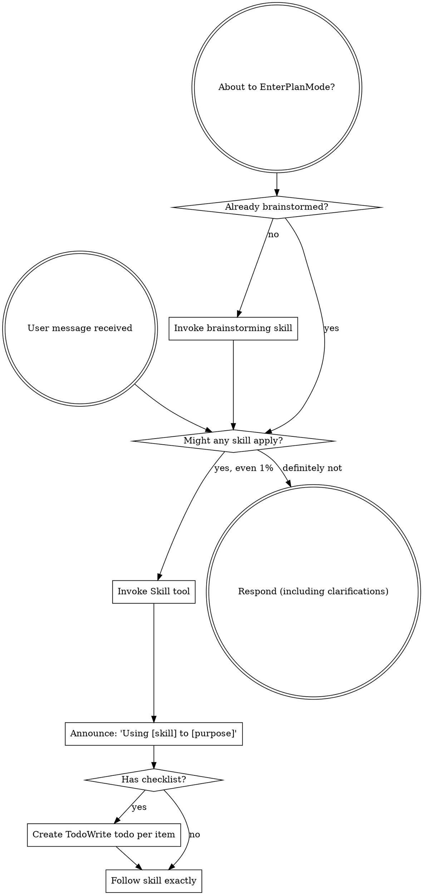
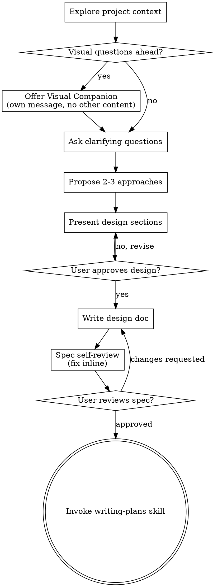
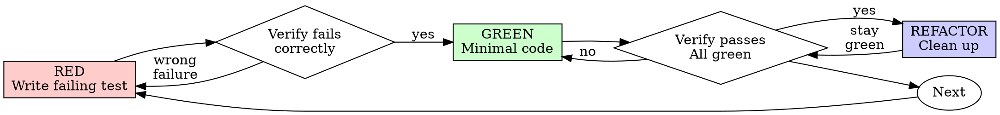
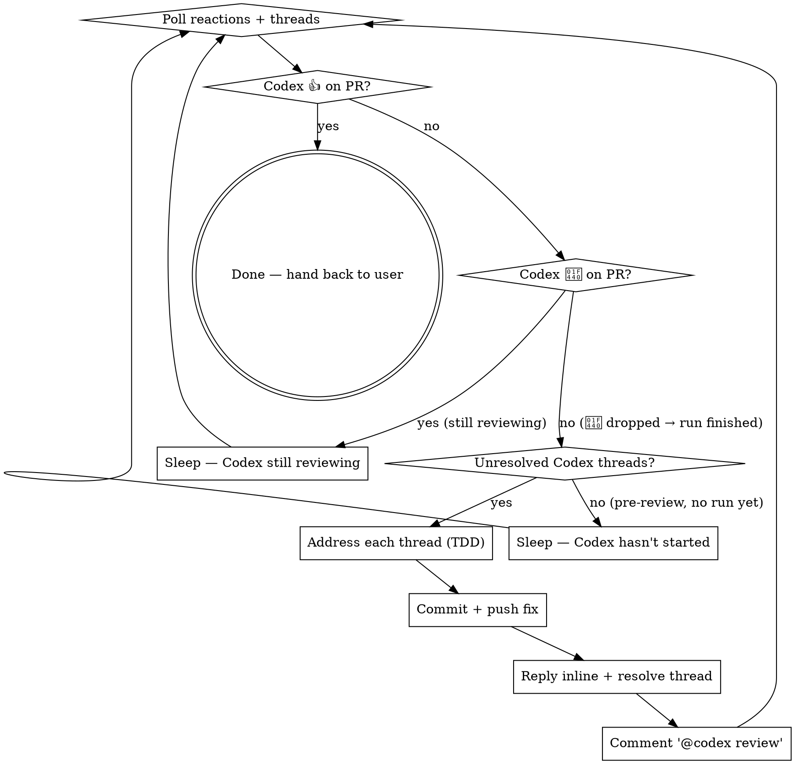

> SYSTEM

# AGENTS.md instructions for /Users/ericson/.codex/worktrees/c76e/ars-ui

<INSTRUCTIONS>
# ars-ui

## Project Overview

Rust frontend component library using state machines, framework-agnostic core with Leptos/Dioxus adapters.

## Current Phase

The repo is now in active implementation, not spec drafting only.

Agents working on implementation should use the GitHub Project roadmap and issue backlog as the execution source of truth:

- Use the GitHub Project `ars-ui implementation roadmap` to understand active epics, task breakdown, dependencies, status, and iteration planning.
- Prefer picking a single issue-backed task that is unblocked, sized, and scoped for independent delivery.
- Do not start work from an epic issue unless the user explicitly asks for planning or further decomposition.
- Do not start a task that is blocked by unresolved GitHub issue dependencies.
- Treat native GitHub issue dependencies as the blocker graph and the issue body acceptance criteria as the delivery contract.

## Development Workflow

For implementation tasks:

1. Read the assigned or selected GitHub issue first.
2. Move the issue to **In Progress** on the GitHub Project board.
3. Review the cited spec sections and any dependency issues.
4. Add or update the named tests first.
5. Implement only the scope required to make those tests pass.
6. If implementation changes the intended contract, update the relevant spec in the same task.
7. **MANDATORY:** Invoke the `post-implementation-audit` skill (`.agents/skills/post-implementation-audit/SKILL.md`). It runs three sequential audits on the new code — (a) spec/implementation drift with "best outcome" recommendations, (b) iterative "anything else missing?" passes (minimum two rounds), (c) test-coverage audit across every test type the workspace uses (unit, snapshot, proptest, mutation, doc, spec-conformance, llvm-cov). **Every finding lands in _this_ PR — no deferral, no follow-up issues.** This step exists because initial implementations consistently ship spec drift and silent contract violations that take 3+ review round-trips to surface; the audit collapses them into one. Skipping this step is a contract violation.
8. Present the final result for user review before any commit.
9. After user approval, run `cargo xci --profile fast` (alias: `cargo xci-fast`) locally and fix any failures before pushing anything to GitHub. The fast profile takes ~5 minutes and covers the workspace-level regressions a pre-push gate should catch: fmt, check, clippy, unit, integration, adapter, spec-compile-snippets, error-variant-coverage, mutual-exclusion, snapshot-count. Reserve full `cargo xci` (~25 minutes, all 20 gates including wasm coverage and the feature-matrix groups) for after substantial refactors that may have shifted feature-flag interactions. For small follow-up changes, run the focused tests and checks that cover the edited code instead.
10. After `cargo xci-fast` passes, commit and push a PR targeting `main`. The PR body MUST include an auto-close keyword for the issue being delivered, for example `Closes #20` or `Fixes #20`, so GitHub closes the issue automatically when the PR merges.
11. **If the PR creates or modifies any `.snap` insta fixtures, attach the `snapshot-reviewed` label after opening or updating it** (`gh pr edit <num> --add-label "snapshot-reviewed"`). This signals to reviewers that the snapshot output was inspected and is intentional. Re-apply the label whenever you push a commit that touches `.snap` files; the workflow assumes the label reflects the latest snapshot state.
12. **MANDATORY:** Invoke the `waiting-for-codex-review` skill (`.agents/skills/waiting-for-codex-review/SKILL.md`) immediately after the first push that creates the PR, and re-invoke it after every subsequent push to the PR branch. The skill posts the initial `@codex review` trigger, polls Codex's 👀 → (👍 \| ∅ + threads) reaction lifecycle, addresses any review threads with the same rigor as `post-implementation-audit` (TDD + no coverage regression), replies inline, resolves threads, and re-comments `@codex review` to start the next pass — looping until Codex leaves 👍. Skipping this step leaves Codex findings unaddressed and silently widens the gap between merged code and the spec; the merge gate is 👍 from Codex plus green CI, not green CI alone.
13. Only after CI passes, Codex has left 👍, and the PR is merged, close the issue.

Never close a GitHub issue without a merged PR that passes CI **and a 👍 from Codex**. Never commit or push without explicit user approval. Keep the issue, PR, and Project board status aligned with the actual work state at every step.

Default delivery rules:

- Follow TDD: tests first, implementation second, verification last.
- Keep task scope aligned with the issue. If the issue is too large or ambiguous, stop and split or clarify rather than freelancing a bigger change.
- Prefer tasks sized `1`, `2`, `3`, or `5` points. `8` is exceptional. `13` must be decomposed before implementation.
- Preserve the crate and dependency layering defined by the architecture and implementation plan.
- Do not add a new dependency crate without explicit user approval first. If a task appears to need a new crate, stop, explain why, and get approval before editing any `Cargo.toml`.
- When a task is complete, verify the exact tests and checks named by the issue before considering it done.
- For adapter-level component implementation, follow `docs/implementation/adapter-component-delivery.md`. Adapter component work must cover the adapter crate, adapter tests, E2E fixtures/harnesses when applicable, widgets examples, spec synchronization, and the required validation/audit loop in one PR.

### Code Quality Standards

- **Document all public items.** Every public struct, enum, trait, function, constant, type alias, method, field, and variant must have a `///` doc comment. Every `lib.rs` must have a `//!` crate-level doc comment. The workspace enforces `missing_docs` linting — undocumented public items are build failures.
- **Zero warnings policy.** All code must compile with zero warnings under the workspace's configured clippy and rustc lints. Fix the root cause instead of suppressing. When suppression is genuinely needed, use `#[expect(lint, reason = "...")]` — never `#[allow(...)]`.
- **Derive documentation from the spec.** Doc comments should describe the _purpose and semantics_ of the item as defined in the corresponding `spec/` files, not just restate the type signature.
- **Use `#[inline]` selectively, not mechanically.** Do **not** add Clippy's `missing_inline_in_public_items` lint at the workspace level, and do not treat public visibility alone as a reason to mark an item `#[inline]`. Use `#[inline]` for thin cross-crate wrappers, trivial accessors, and hot-path no-op shims where the call overhead is plausibly meaningful. Avoid blanket `#[inline]` on all public APIs — it increases code size, adds compile-time cost, and turns `#[inline]` into noise instead of a deliberate performance signal.
- **Use directory-backed modules with `mod.rs` when a module owns children.** This repo standardizes on the older filesystem layout for nested modules. If module `foo` has child modules, the parent must live at `foo/mod.rs`, not `foo.rs`. Do not mix `foo.rs` with a sibling `foo/` directory. When a refactor adds child modules under an existing flat file, move the parent into `foo/mod.rs` in the same change. Do not leave empty leftover module directories behind.

### API Design Standards

- **Design for the pit of success.** Public APIs should make the most natural, shortest path also be the path that is correct, accessible, localizable, type-safe, and performant. Prefer ergonomic constructors and defaults that preserve the spec's strongest guarantees instead of making users opt into correctness after choosing a convenient API.
- **Name escape hatches explicitly.** When a component needs a lower-level, static, non-i18n, or otherwise less complete path, keep it available but make the tradeoff visible in the API name or type. The blessed path should remain the simplest call site, while escape hatches should read as deliberate choices.
- **Keep semantic data separate from rendered views.** Rich framework views are useful for customization, but components still need semantic sources for accessible names, localized text, announcements, ids, and state-machine wiring. Do not rely on arbitrary rendered view trees as the only source of user-facing semantics.

### Code Coverage

The workspace uses `cargo-llvm-cov` for code coverage with per-crate threshold enforcement. CI runs coverage on every PR (see `.github/workflows/ci.yml`).

**Local coverage commands:**

```bash
# Per-crate coverage with inline annotated source (most useful during development)
cargo llvm-cov test -p ars-interactions --text -- hover

# Per-crate summary only
cargo llvm-cov test -p ars-interactions -- hover

# Native-only workspace coverage (host target; excludes wasm-only crates)
cargo llvm-cov --workspace \
  --exclude ars-leptos --exclude ars-dioxus \
  --exclude ars-test-harness-leptos --exclude ars-test-harness-dioxus \
  --exclude ars-derive --exclude xtask \
  --lcov --output-path lcov.info

# Check all crates against spec-defined thresholds (run after a *merged* lcov)
cargo xtask coverage check-all --file lcov.info
```

The `--text` flag produces line-by-line annotated source showing hit counts and `^0` markers on uncovered branches — use this to identify gaps after writing tests. Uncovered no-op callback closures in tests (e.g., `|_| {}`) are expected and not a gap.

The local recipe above excludes the adapter and adapter-test-harness crates because their `target_arch = "wasm32"` / `feature = "web"` code paths can't be measured via host-target `cargo llvm-cov`. **CI runs an additional wasm-coverage pipeline on nightly** (`cargo xtask ci coverage`) that uses `wasm-bindgen-test`'s experimental coverage recipe with LLVM 22 / `clang-22` to emit lcov for `ars-leptos` (csr), `ars-dioxus` (web), `ars-dom` (web), `ars-i18n` (web-intl), and the adapter test harnesses, then merges with the native lcov via `cargo xtask coverage merge`. The per-crate thresholds in `xtask::coverage::default_thresholds()` are enforced against the merged file — including adapter targets (`ars-leptos` 74/55, `ars-dioxus` 77/70, `ars-test-harness-leptos` 60/0, `ars-test-harness-dioxus` 60/0). `ars-derive` (proc-macro, runs in compiler) is exercised via `crates/ars-core/tests/derive_contract.rs` and is unmeasured. `xtask` has its own enforced threshold (30/35) and is measured. See `spec/testing/14-ci.md` §2 for the full pipeline.

### Mutation Testing

Coverage tells you which lines run. **Mutation testing tells you whether the tests would notice if those lines silently misbehaved.** The workspace uses [`cargo-mutants`](https://mutants.rs) for this — a `cargo` extension binary, not a workspace dependency.

**Install (once per developer machine):**

```bash
cargo install cargo-mutants --locked --version 27.0.0
```

**Local commands (state-machine modules are the most rewarding targets):**

```bash
# Run on a single component machine (~6 min for popover)
cargo mutants -p ars-components -f crates/ars-components/src/overlay/popover/mod.rs

# Just list what would be mutated, without running tests (fast)
cargo mutants -p ars-components -f crates/ars-components/src/overlay/popover/mod.rs --list

# Whole crate (slow — only if you really mean it)
cargo mutants -p ars-components
```

**Agnostic component implementation gate:** whenever an agent implements a new framework-agnostic component, or materially changes an existing one, the delivery must include:

- a targeted mutation run for the component source file, usually `cargo mutants -p ars-components -f crates/ars-components/src/<category>/<component>/mod.rs` (adjust the path for single-file modules);
- spec-conformance tests for the component's anatomy/public contract, including its `Part` enum and required API/attribute surface;
- same-task triage of every `MISSED` mutant: add tests for real gaps, or add a justified line-agnostic `.cargo/mutants.toml` exclude only for true equivalent mutations.

**Reading the output:** Results land in `mutants.out/mutants.out/` (gitignored). The two files that matter:

- `caught.txt` — mutations that broke at least one test ✅
- `missed.txt` — mutations that survived all tests ❌ — each one is either a real test gap to fill or an "equivalent mutation" that needs a `[[skip]]` entry in `mutants.toml` with a justification

**CI integration:** Nightly only. `.github/workflows/nightly.yml` has a `mutation-testing` job with a 21-entry matrix that runs `cargo mutants -p <package>` on every framework-agnostic crate, using `--shard k/n` to spread larger crates across parallel runners. **Shard indices are 0-based** (`k` runs from `0` to `n-1`); `k == n` is invalid and will fail the job. When adding shards, always start at `0/n` and end at `(n-1)/n`.

- **`ars-components` (≈ 1,630 mutants today, planned to grow as the spec adds the remaining ~97 components):** sharded **12-way** → ≈ 135 mutants per runner today, ≈ 850 per runner at the ~10,000-mutant endpoint. Sized for the full spec catalog up front so we don't re-shard every few months as components land.
- **`ars-collections` (≈ 1,080 mutants):** sharded 4-way → ≈ 270 mutants per runner.
- **`ars-core` (≈ 700 mutants):** sharded 2-way → ≈ 350 mutants per runner.
- **`ars-a11y`, `ars-forms`, `ars-interactions`:** one runner each (under 600 mutants apiece).

**Adding a new state machine inside an existing crate requires no CI changes** — its mutations land in whichever shard the cargo-mutants partitioner places them. The shard counts are sized so the slowest runner stays well under 30 minutes today and under ~50 minutes at the planned endpoint; re-balance only when a crate outgrows that budget (visible on the nightly dashboard as one shard pulling away from the others).

All matrix jobs run with `fail-fast: false` so failures on one module don't mask data on another. Each job uploads its `mutants.out/` as a workflow artifact (always, even on success — surviving "missed" entries on a passing run still reveal test-quality work). The job fails if any mutation survives, so a missed mutation forces a deliberate triage decision (fix the test, or document the equivalence with a `[[skip]]` entry in `mutants.toml`).

**Excluded crates** (mutation testing's signal degrades wherever determinism does): adapter glue (`ars-leptos`, `ars-dioxus`), DOM/FFI (`ars-dom`), ICU/FFI (`ars-i18n`), test infrastructure (`ars-test-harness*`), and the proc-macro crate (`ars-derive`, runs in the compiler). Adding a brand-new crate that is a good mutation target requires one new matrix entry; run a local scout first (`cargo mutants -p <crate> --list` to size, then a real run) so we know the right shard count before the nightly fires.

**Bumping the pinned version.** Both the local install command above and `.github/workflows/nightly.yml` pin cargo-mutants to an exact version (currently `27.0.0`) — same convention as `wasm-pack` in the `a11y-audit` job. Pinning is deliberate: cargo-mutants ships new mutators in releases, and an unpinned install would silently change the mutation set without any code change, surfacing as phantom CI failures on a green-source repo. To bump, open a PR that (1) updates the version string in CLAUDE.md and `nightly.yml`, (2) runs the popover scout locally with the new version (`cargo mutants -p ars-components -f crates/ars-components/src/overlay/popover/mod.rs`) to confirm the mutation count is in the same ballpark, and (3) triages any new "missed" entries the new mutators surface — they are usually genuine test-quality gaps newly visible to the tool.

### Property Testing (proptest)

State-machine invariants are exercised by [`proptest`](https://docs.rs/proptest) under `crates/<crate>/tests/proptest_state_machines/` (see `ars-components`). Default proptest behaviour drops `*.proptest-regressions` seed files alongside test sources — instead, every `proptest!` block in this workspace pulls a shared `Config` from `tests/proptest_state_machines/common.rs` that:

1. Reads `PROPTEST_CASES` from the environment (1,000 default; 10,000 in the nightly `extended-proptest` job).
2. Sets `failure_persistence` to `FileFailurePersistence::Direct("proptest-regressions/state-machines.txt")`, so all persisted seeds for the test binary live in one file at the crate root: `crates/<crate>/proptest-regressions/state-machines.txt`. The directory is committed (per proptest's own recommendation in the file header) so every developer's runs benefit from previously-shrunk failures.

When a new crate adopts proptest for state-machine tests, copy the same `common.rs` helper and reference it via `#![proptest_config(super::common::proptest_config())]` inside every `proptest!` block. Don't let proptest fall back to its `WithSource` default — that scatters seed files across the source tree.

### Adapter Prelude Convention

Both `ars-leptos` and `ars-dioxus` expose a `prelude` module targeting **end users** — application developers who consume the ready-made components. `use ars_leptos::prelude::*` (or `use ars_dioxus::prelude::*`) should give them everything they need.

The prelude contains only user-facing items:

1. **Component modules** — as components land, their public module paths (e.g., `button`, `dialog`) are re-exported so users can write `button::Props`, etc.
2. **User-facing traits** — traits end users call on component outputs (e.g., `Translate` from `ars-i18n`). Re-export the trait so consumers don't need a direct dependency on the subsystem crate.
3. **Configuration types** — types that appear in component props or configure behaviour (e.g., `Locale`, `Direction`, `Orientation`, `Selection`).

The prelude does **not** include implementation details consumed only by component authors inside the adapter crate: core engine types (`Machine`, `Service`, `ConnectApi`, `AttrMap`), accessibility primitives (`AriaRole`, `AriaAttribute`), interaction helpers (`merge_attrs`), or adapter hooks (`use_machine`, `UseMachineReturn`). Those remain accessible via their normal crate paths for advanced users building custom machines.

Both adapter preludes must stay symmetric: same items, same structure. When adding a new re-export to one adapter's prelude, add it to the other as well in the same PR.

### Adapter Testing Convention

Adapter-level component tests should default to the framework-specific test harness crate:

- Leptos adapter tests should prefer `ars-test-harness-leptos`.
- Dioxus adapter tests should prefer `ars-test-harness-dioxus`.
- Shared `ars-test-harness` helpers should be used where relevant for viewport, layout, clipboard, drag/drop, timing, and other DOM test setup instead of bespoke per-test browser scaffolding.

When a component spec requires interaction, focus, overlay positioning, clipboard, file upload, drag/drop, or similar browser behavior, the task's tests should exercise that behavior through the adapter harness entrypoints and shared core harness helpers unless there is a concrete technical reason not to.

## Spec Synchronization During Implementation

The specification is the authoritative contract. It took weeks of deliberate design and MUST be followed.

### Spec-first implementation rule

Before implementing any public type, trait, function, or method:

1. **Read the spec section first.** Find the relevant code example in `spec/`. Use `spec-tool toc <file>` and `grep` to locate it.
2. **Match the spec exactly.** If the spec defines `struct ComponentIds { base: String }` with methods `from_id()`, `id()`, `part()`, `item()`, `item_part()` — implement exactly that. Do not invent alternative field names, method names, or signatures.
3. **Cross-check after implementation.** Before presenting code for review, diff every public item against the spec's code examples. Every struct field, every method name, every parameter must match.
4. **If you must deviate**, there must be a concrete technical reason (e.g., the spec's API cannot compile, or a dependency doesn't expose the needed type). Document the reason in a code comment and flag it to the user explicitly.

Inventing alternative APIs that "seem equivalent" is never acceptable — it silently invalidates the spec's design decisions and all downstream code that depends on those APIs.

### Spec/code mismatch resolution

- If code and spec disagree, resolve the mismatch in the same task or PR.
- Shared conceptual changes belong in shared or foundation spec files, not only in adapter code.
- Adapter-specific findings must be reflected back into `spec/foundation/08-adapter-leptos.md` and/or `spec/foundation/09-adapter-dioxus.md` when relevant.
- Do not leave spec drift behind as follow-up cleanup.

## Spec Structure

The specification lives in `spec/` with this layout:

- `spec/manifest.toml` — **START HERE** — central index of all components and their dependencies
- `spec/foundation/` — architecture, accessibility, i18n, interactions, forms, adapters, spec template (00-10)
- `spec/shared/` — cross-component shared types (date-time, selection, layout, z-index)
- `spec/components/{category}/` — one file per component, organized by category
- `spec/testing/` — test specs split by domain

### Component Categories

- `input/` — checkbox, text-field, slider, number-input, etc.
- `selection/` — select, combobox, listbox, menu, tags-input, etc.
- `overlay/` — dialog, popover, tooltip, toast, presence, etc.
- `navigation/` — accordion, tabs, tree-view, pagination, steps, etc.
- `date-time/` — date-field, time-field, calendar, date-picker, etc.
- `data-display/` — table, avatar, progress, meter, badge, etc.
- `layout/` — splitter, scroll-area, carousel, portal, toolbar, etc.
- `specialized/` — color-picker, file-upload, signature-pad, qr-code, etc.
- `utility/` — button, toggle, focus-scope, visually-hidden, separator, etc.

## Working with the Spec

When reading large files, run `wc -l` first to check the line count. If the file is over 2,000
lines, use the `offset` and `limit` parameters on the Read tool to read in chunks rather than
attempting to read the entire file at once.

### Using xtask spec (preferred)

Use `cargo xtask spec` to resolve file sets instead of manually parsing manifest.toml:

```bash
# Quick metadata lookup:
cargo xtask spec info <component>

# Find all components using a shared type:
cargo xtask spec reverse <shared-type>

# See a file's heading structure (with line numbers):
cargo xtask spec toc <file>

# Validate frontmatter matches manifest.toml:
cargo xtask spec validate

# Search spec content by keyword/regex (with optional filters):
cargo xtask spec search <query> [--category <cat>] [--section <sec>] [--tier <tier>]

# Get a compact component summary (states, events, props, accessibility):
cargo xtask spec digest <component>

# Get full implementation context (component + all deps concatenated):
cargo xtask spec context <component> [--framework <fw>] [--include-testing]
```

The xtask also runs as an MCP server (`cargo xtask mcp`) exposing all spec tools for LLM agents.

### Reading a component (manual fallback)

1. Read `spec/manifest.toml` to find the component's path and dependencies
2. Read the component file (has YAML frontmatter listing its foundation/shared deps)
3. Only load the foundation files listed in `foundation_deps` — not all of them

### Framework and library specs — MANDATORY skill loading

When reading or editing these specification files, you MUST load the corresponding skill BEFORE doing any work. The skills contain verified, version-accurate API documentation that the spec code examples depend on. Claude's training data is wrong for these libraries — do not trust it.

| Spec file                                    | Skill to load | Library version |
| -------------------------------------------- | ------------- | --------------- |
| `spec/foundation/04-internationalization.md` | `icu4x`       | ICU4X 2.1.1     |
| `spec/foundation/08-adapter-leptos.md`       | `leptos`      | Leptos 0.8.17   |
| `spec/foundation/09-adapter-dioxus.md`       | `dioxus`      | Dioxus 0.7.3    |

This applies to any task that touches adapter code: reviewing, writing, modifying, or answering questions about these files. Load the skill first, then proceed.

### Spec Conventions

- **No deprecation:** This is a greenfield spec. If an API is unused or redundant, remove it and fix all references. Never use `#[deprecated]` or deprecation shims.
- **No deferral:** Never mark spec content as "TODO", "FIXME", "future enhancement", "P1/P2 extension", or any similar deferral language. Every feature mentioned must be fully specified. If a design choice is unclear, ask the user rather than deferring.
- **No guessing external APIs:** NEVER guess function names or module paths for external crates. Always verify against `https://docs.rs/<crate_name>` before writing code that calls library APIs. This applies especially to Leptos, Dioxus, ICU4X, and any crate where training data may be stale. If you cannot verify, state that explicitly rather than fabricating a plausible-looking API.

### Component file format

Each component file has YAML frontmatter declaring its metadata:

```markdown
---
component: ComponentName
category: { category }
tier: stateless | stateful | complex
foundation_deps: [architecture, accessibility, ...]
shared_deps: [date-time-types, ...]
related: [sibling-component, ...]
---

# ComponentName
```

The `tier` field determines which sections are required — see `spec/foundation/10-component-spec-template.md` for the canonical section structure, ordering rules, and conformance checklist. Headings are numbered (e.g., `## 1. State Machine`, `### 1.1 States`, `#### 1.1.1 InnerStates`, etc.) for precise section references.

</INSTRUCTIONS>
<environment_context>
  <cwd>/Users/ericson/.codex/worktrees/c76e/ars-ui</cwd>
  <shell>zsh</shell>
  <current_date>2026-05-25</current_date>
  <timezone>America/Sao_Paulo</timezone>
</environment_context>

> DEVELOPER

Can you resume the session that was running in this worktree here?

> TOOL

tool_use exec_command
id: call_qEHlRqy76eOVL6DHWQKKzbc9
```json
{
  "cmd": "sed -n '1,180p' /Users/ericson/.claude/skills/using-superpowers/SKILL.md && pwd && git status --short --branch",
  "workdir": "/Users/ericson/.codex/worktrees/c76e/ars-ui",
  "yield_time_ms": 1000,
  "max_output_tokens": 20000
}
```

> TOOL

tool_result
id: call_qEHlRqy76eOVL6DHWQKKzbc9
```
Chunk ID: e456f8
Wall time: 0.2278 seconds
Process exited with code 0
Original token count: 1372
Output:
---
name: using-superpowers
description: Use when starting any conversation - establishes how to find and use skills, requiring Skill tool invocation before ANY response including clarifying questions
---

<SUBAGENT-STOP>
If you were dispatched as a subagent to execute a specific task, skip this skill.
</SUBAGENT-STOP>

<EXTREMELY-IMPORTANT>
If you think there is even a 1% chance a skill might apply to what you are doing, you ABSOLUTELY MUST invoke the skill.

IF A SKILL APPLIES TO YOUR TASK, YOU DO NOT HAVE A CHOICE. YOU MUST USE IT.

This is not negotiable. This is not optional. You cannot rationalize your way out of this.
</EXTREMELY-IMPORTANT>

## Instruction Priority

Superpowers skills override default system prompt behavior, but **user instructions always take precedence**:

1. **User's explicit instructions** (CLAUDE.md, GEMINI.md, AGENTS.md, direct requests) — highest priority
2. **Superpowers skills** — override default system behavior where they conflict
3. **Default system prompt** — lowest priority

If CLAUDE.md, GEMINI.md, or AGENTS.md says "don't use TDD" and a skill says "always use TDD," follow the user's instructions. The user is in control.

## How to Access Skills

**In Claude Code:** Use the `Skill` tool. When you invoke a skill, its content is loaded and presented to you—follow it directly. Never use the Read tool on skill files.

**In Copilot CLI:** Use the `skill` tool. Skills are auto-discovered from installed plugins. The `skill` tool works the same as Claude Code's `Skill` tool.

**In Gemini CLI:** Skills activate via the `activate_skill` tool. Gemini loads skill metadata at session start and activates the full content on demand.

**In other environments:** Check your platform's documentation for how skills are loaded.

## Platform Adaptation

Skills use Claude Code tool names. Non-CC platforms: see `references/copilot-tools.md` (Copilot CLI), `references/codex-tools.md` (Codex) for tool equivalents. Gemini CLI users get the tool mapping loaded automatically via GEMINI.md.

# Using Skills

## The Rule

**Invoke relevant or requested skills BEFORE any response or action.** Even a 1% chance a skill might apply means that you should invoke the skill to check. If an invoked skill turns out to be wrong for the situation, you don't need to use it.



## Red Flags

These thoughts mean STOP—you're rationalizing:

| Thought | Reality |
|---------|---------|
| "This is just a simple question" | Questions are tasks. Check for skills. |
| "I need more context first" | Skill check comes BEFORE clarifying questions. |
| "Let me explore the codebase first" | Skills tell you HOW to explore. Check first. |
| "I can check git/files quickly" | Files lack conversation context. Check for skills. |
| "Let me gather information first" | Skills tell you HOW to gather information. |
| "This doesn't need a formal skill" | If a skill exists, use it. |
| "I remember this skill" | Skills evolve. Read current version. |
| "This doesn't count as a task" | Action = task. Check for skills. |
| "The skill is overkill" | Simple things become complex. Use it. |
| "I'll just do this one thing first" | Check BEFORE doing anything. |
| "This feels productive" | Undisciplined action wastes time. Skills prevent this. |
| "I know what that means" | Knowing the concept ≠ using the skill. Invoke it. |

## Skill Priority

When multiple skills could apply, use this order:

1. **Process skills first** (brainstorming, debugging) - these determine HOW to approach the task
2. **Implementation skills second** (frontend-design, mcp-builder) - these guide execution

"Let's build X" → brainstorming first, then implementation skills.
"Fix this bug" → debugging first, then domain-specific skills.

## Skill Types

**Rigid** (TDD, debugging): Follow exactly. Don't adapt away discipline.

**Flexible** (patterns): Adapt principles to context.

The skill itself tells you which.

## User Instructions

Instructions say WHAT, not HOW. "Add X" or "Fix Y" doesn't mean skip workflows.
/Users/ericson/.codex/worktrees/c76e/ars-ui
## HEAD (no branch)

```

> AGENT

Using `using-superpowers` to make sure I follow the local workflow. I’m going to reconstruct the interrupted state from the worktree, terminal, and any local session artifacts rather than guessing.

> TOOL

tool_use exec_command
id: call_zGAIGSJE6jgNbjdeKy42R7m8
```json
{
  "cmd": "git status --short --branch",
  "workdir": "/Users/ericson/.codex/worktrees/c76e/ars-ui",
  "yield_time_ms": 1000,
  "max_output_tokens": 12000
}
```

> TOOL

tool_use exec_command
id: call_wNjr60UPP7s22z9pRHZJlpVl
```json
{
  "cmd": "git log --oneline --decorate -n 12",
  "workdir": "/Users/ericson/.codex/worktrees/c76e/ars-ui",
  "yield_time_ms": 1000,
  "max_output_tokens": 12000
}
```

> TOOL

tool_use exec_command
id: call_SclAlCuOidR6F6PtZTMlQYVM
```json
{
  "cmd": "find . -maxdepth 3 -name AGENTS.md -o -name CLAUDE.md -o -name GEMINI.md",
  "workdir": "/Users/ericson/.codex/worktrees/c76e/ars-ui",
  "yield_time_ms": 1000,
  "max_output_tokens": 12000
}
```

> TOOL

tool_use read_thread_terminal
id: call_HrSYGwgtG7Kw2ooaGIFsyqwS
```json
{}
```

> TOOL

tool_result
id: call_zGAIGSJE6jgNbjdeKy42R7m8
```
Chunk ID: b7e000
Wall time: 0.4036 seconds
Process exited with code 0
Original token count: 5
Output:
## HEAD (no branch)

```

> TOOL

tool_result
id: call_wNjr60UPP7s22z9pRHZJlpVl
```
Chunk ID: 29b16f
Wall time: 0.0788 seconds
Process exited with code 0
Original token count: 179
Output:
8bcf4508 (HEAD, origin/main, origin/HEAD, t3code/4985ff63, main) [codex] Implement TimeField agnostic core (#681)
9fb41a2e feat(selection): add context menu and menu bar core (#679)
dd9cc972 Implement data display meter stat progress cores (#682)
4600c39a (t3code/ed7b7f39) Implement slider agnostic core (#680)
5791711c Implement layout core components (#678)
88764102 test(components): split overlay test modules (#677)
92ac3c94 Audit utility category test coverage (#676)
86f0d6a9 Implement RadioGroup and CheckboxGroup core (#675)
01293645 Add DropZone agnostic core (#674)
2814cd14 [codex] Implement Tour agnostic core (#673)
7ec0303e Add menu agnostic core (#672)
8775c106 implement action group core (#671)

```

> TOOL

tool_result
id: call_SclAlCuOidR6F6PtZTMlQYVM
```
Chunk ID: a76d9c
Wall time: 0.0635 seconds
Process exited with code 0
Original token count: 15
Output:
./spec/AGENTS.md
./spec/CLAUDE.md
./AGENTS.md
./CLAUDE.md

```

> TOOL

tool_result
id: call_HrSYGwgtG7Kw2ooaGIFsyqwS
```
No app terminal session is attached to this thread yet.
```

> AGENT

The worktree is clean and detached at `origin/main` right now, and this thread does not have an attached terminal session to resume directly. I’m checking the local session/memory index for a recent run tied to this exact worktree so I can pick up the right task rather than starting fresh.

> TOOL

tool_use exec_command
id: call_8SXxHjmhJOiVwtvFYy6V0xIy
```json
{
  "cmd": "rg -n \"c76e|ars-ui|TimeField|#681|worktrees/c76e\" /Users/ericson/.codex/memories/MEMORY.md",
  "workdir": "/Users/ericson/.codex/worktrees/c76e/ars-ui",
  "yield_time_ms": 1000,
  "max_output_tokens": 20000
}
```

> TOOL

tool_use exec_command
id: call_NueenG1H1eopaoMhZu8DWBjd
```json
{
  "cmd": "find /Users/ericson/.codex -maxdepth 3 -type f -name '*c76e*' -o -name '*ars-ui*'",
  "workdir": "/Users/ericson/.codex/worktrees/c76e/ars-ui",
  "yield_time_ms": 1000,
  "max_output_tokens": 12000
}
```

> TOOL

tool_use exec_command
id: call_7KdennT5TWrMIaYvLvf5ZuQU
```json
{
  "cmd": "ls -lt /Users/ericson/.codex/sessions 2>/dev/null | head -20",
  "workdir": "/Users/ericson/.codex/worktrees/c76e/ars-ui",
  "yield_time_ms": 1000,
  "max_output_tokens": 12000
}
```

> TOOL

tool_result
id: call_8SXxHjmhJOiVwtvFYy6V0xIy
```
Chunk ID: 826533
Wall time: 0.1558 seconds
Process exited with code 0
Original token count: 18275
Output:
Total output lines: 229

1:# Task Group: ars-ui / ars-components input core implementation and review hardening
4:applies_to: cwd=/Users/ericson/.t3/worktrees/ars-ui/*; reuse_rule=reuse for ars-ui checkouts touching `crates/ars-components/src/input/`; verify whether the issue body narrows scope to agnostic core only and whether handoff requires terminal GitHub CI.
10:- rollout_summaries/REDACTED.md (cwd=/Users/ericson/.t3/worktrees/ars-ui/t3code-497b39cd, rollout_path=/Users/ericson/.codex/sessions/2026/05/24/rollout-2026-05-24T12-37-22-019e5aa2-3b6a-75b2-9a34-ee01736f2667.jsonl, updated_at=2026-05-25T02:25:25+00:00, thread_id=019e5aa2-3b6a-75b2-9a34-ee01736f2667, combined RadioGroup/CheckboxGroup implementation with spec and adapter-spec updates)
20:- rollout_summaries/REDACTED.md (cwd=/Users/ericson/.t3/worktrees/ars-ui/t3code-497b39cd, rollout_path=/Users/ericson/.codex/sessions/2026/05/24/rollout-2026-05-24T12-37-22-019e5aa2-3b6a-75b2-9a34-ee01736f2667.jsonl, updated_at=2026-05-25T02:25:25+00:00, thread_id=019e5aa2-3b6a-75b2-9a34-ee01736f2667, same-PR review remediation and final PR #675 approval)
30:- rollout_summaries/2026-05-25T05-02-25-5tH9-ars_ui_slider_agnostic_core_issue_244.md (cwd=/Users/ericson/.t3/worktrees/ars-ui/t3code-d7f511fb, rollout_path=/Users/ericson/.codex/sessions/2026/05/25/rollout-2026-05-25T02-02-25-019e5d83-477f-7ea1-9c87-e37f379078af.jsonl, updated_at=2026-05-25T18:23:36+00:00, thread_id=019e5d83-477f-7ea1-9c87-e37f379078af, issue #244 implementation with spec/snapshot reconciliation)
40:- rollout_summaries/2026-05-25T05-02-25-5tH9-ars_ui_slider_agnostic_core_issue_244.md (cwd=/Users/ericson/.t3/worktrees/ars-ui/t3code-d7f511fb, rollout_path=/Users/ericson/.codex/sessions/2026/05/25/rollout-2026-05-25T02-02-25-019e5d83-477f-7ea1-9c87-e37f379078af.jsonl, updated_at=2026-05-25T18:23:36+00:00, thread_id=019e5d83-477f-7ea1-9c87-e37f379078af, Codex review closure with pending `Coverage` / `Release Verification` noted at handoff)
73:# Task Group: ars-ui / ars-components layout core implementation and review hardening
76:applies_to: cwd=/Users/ericson/.t3/worktrees/ars-ui/*; reuse_rule=reuse for ars-ui checkouts touching `crates/ars-components/src/layout/` or `spec/components/layout/*`; verify whether the user wants a combined PR and whether the run starts in plan-only mode.
82:- rollout_summaries/2026-05-25T00-59-14-8wdE-ars_ui_layout_core_issues_271_281.md (cwd=/Users/ericson/.t3/worktrees/ars-ui/t3code-e55599d7, rollout_path=/Users/ericson/.codex/sessions/2026/05/24/rollout-2026-05-24T21-59-14-019e5ca4-a4df-7501-a32c-782ee8a2cc0e.jsonl, updated_at=2026-05-25T17:18:40+00:00, thread_id=019e5ca4-a4df-7501-a32c-782ee8a2cc0e, combined plan for stateless layout primitives plus stateful Splitter)
92:- rollout_summaries/2026-05-25T00-59-14-8wdE-ars_ui_layout_core_issues_271_281.md (cwd=/Users/ericson/.t3/worktrees/ars-ui/t3code-e55599d7, rollout_path=/Users/ericson/.codex/sessions/2026/05/24/rollout-2026-05-24T21-59-14-019e5ca4-a4df-7501-a32c-782ee8a2cc0e.jsonl, updated_at=2026-05-25T17:18:40+00:00, thread_id=019e5ca4-a4df-7501-a32c-782ee8a2cc0e, implementation plus review-fix commits `a9258202` and `9f119e8e`)
120:# Task Group: ars-ui / ars-components date-time core implementation and mutation hardening
122:scope: Framework-agnostic `crates/ars-components/src/date_time/` work for TimeField, emphasizing issue-backed execution, `date_field` pattern reuse, mutation-driven test hardening, and heavyweight local verification.
123:applies_to: cwd=/Users/ericson/.t3/worktrees/ars-ui/*; reuse_rule=reuse for ars-ui checkouts touching `crates/ars-components/src/date_time/` or `spec/components/date-time/*`; verify whether the issue is core-only and whether mutation/doc/snapshot gates are expected in the deliverable.
125:## Task 1: Implement TimeField agnostic core for issue #272
129:- rollout_summaries/2026-05-25T05-07-25-3ZKc-implement_timefield_agnostic_core_272.md (cwd=/Users/ericson/.t3/worktrees/ars-ui/t3code-2ddd4539, rollout_path=/Users/ericson/.codex/sessions/2026/05/25/rollout-2026-05-25T02-07-25-019e5d87-db21-77f1-988f-4eeb0f07811c.jsonl, updated_at=2026-05-25T08:16:01+00:00, thread_id=019e5d87-db21-77f1-988f-4eeb0f07811c, TimeField core implementation with spec/tests/snapshots and mutation follow-through)
133:- TimeField, issue #272, date_time, date_field, DateSegment, HourCycle, Time::new, cargo mutants --iterate, cargo doc, spec/components/date-time/time-field.md
142:- `ars-components::date_time::date_field` is the right local template for TimeField; it already contains the segmented-field architecture, `DateSegment` / `DateSegmentKind`, and the connect-api/snapshot/test patterns to mirror [Task 1]
146:- `cargo doc` can succeed even when unrelated pre-existing rustdoc broken-link warnings exist elsewhere in the workspace; the key question is whether the new TimeField surface adds its own warnings [Task 1]
150:- symptom: mutation testing leaves a small set of survivors in TimeField logic -> cause: branch-specific behaviors such as segment stepping, sync reconciliation, H12 display, or CJK day-period parsing were not asserted directly -> fix: add focused tests for the surviving paths, simplify dead-ish ambiguity branches, and only skip truly equivalent mutations in `.cargo/mutants.toml` [Task 1]
151:- symptom: clippy fails on brand-new TimeField code even after logic is correct -> cause: local style issues like manual H12 `% 12` handling or a non-const helper remain -> fix: repair the local pattern instead of broad refactoring and rerun the same gate [Task 1]
154:# Task Group: ars-ui / ars-components data-display agnostic core implementation and spec-sync audit
157:applies_to: cwd=/Users/ericson/.t3/worktrees/ars-ui/*; reuse_rule=reuse for ars-ui checkouts touching `crates/ars-components/src/data_display/` or matching component specs; verify whether the user wants one combined deliverable and whether commit/push is intentionally out of scope.
163:- rollout_summaries/2026-05-25T05-08-22-stZ4-ars_ui_data_display_agnostic_core_268_274.md (cwd=/Users/ericson/.t3/worktrees/ars-ui/t3code-f1fdd791, rollout_path=/Users/ericson/.codex/sessions/2026/05/25/rollout-2026-05-25T02-08-22-019e5d88-bad0-7b91-8c61-de1cafabe9ce.jsonl, updated_at=2026-05-25T07:41:03+00:00, thread_id=019e5d88-bad0-7b91-8c61-de1cafabe9ce, combined Meter/Stat/Progress implementation with focused validation and no publish)
173:- rollout_summaries/2026-05-25T05-08-22-stZ4-ars_ui_data_display_agnostic_core_268_274.md (cwd=/Users/ericson/.t3/worktrees/ars-ui/t3code-f1fdd791, rollout_path=/Users/ericson/.codex/sessions/2026/05/25/rollout-2026-05-25T02-08-22-019e5d88-bad0-7b91-8c61-de1cafabe9ce.jsonl, updated_at=2026-05-25T07:41:03+00:00, thread_id=019e5d88-bad0-7b91-8c61-de1cafabe9ce, post-implementation audit/spec sync with no commit or push)
203:# Task Group: ars-ui / ars-components overlay core implementation and publish workflow
206:applies_to: cwd=/Users/ericson/.t3/worktrees/ars-ui/*; reuse_rule=reuse for ars-ui checkouts touching `crates/ars-components/src/overlay/` or nearby utility/compatibility seams; verify live issue/PR state before moving roadmap items or publishing.
212:- rollout_summaries/REDACTED.md (cwd=/Users/ericson/.t3/worktrees/ars-ui/t3code-6d170779, rollout_path=/Users/ericson/.codex/sessions/2026/05/24/rollout-2026-05-24T21-39-35-019e5c92-a540-7010-a2f2-c5d941a4ae69.jsonl, updated_at=2026-05-25T03:44:27+00:00, thread_id=019e5c92-a540-7010-a2f2-c5d941a4ae69, overlay test-module split plus non-draft publish and Codex review trigger)
222:- rollout_summaries/REDACTED.md (cwd=/Users/ericson/.t3/worktrees/ars-ui/t3code-61dbf109, rollout_path=/Users/ericson/.codex/sessions/2026/05/21/rollout-2026-05-21T09-01-32-019e4a69-8d84-7753-89a0-ec5d2e651f96.jsonl, updated_at=2026-05-21T21:07:16+00:00, thread_id=019e4a69-8d84-7753-89a0-ec5d2e651f96, issue #263 Drawer implementation plus review hardening)
232:- rollout_summaries/2026-05-21T03-21-42-3TmL-ars_ui_alert_dialog_core_and_codex_review.md (cwd=/Users/ericson/.t3/worktrees/ars-ui/t3code-9f5b5f2f, rollout_path=/Users/ericson/.codex/sessions/2026/05/21/rollout-2026-05-21T00-21-42-019e488d-a3a5-7e42-871c-43cd60efbf27.jsonl, updated_at=2026-05-21T06:09:27+00:00, thread_id=019e488d-a3a5-7e42-871c-43cd60efbf27, issue #260 implementation plus review-driven snapshot-count/spec fixes on PR #660)
242:- rollout_summaries/2026-04-29T16-02-56-Kicl-implement_task_200_zindexallocator_clientonly_core.md (cwd=/Users/ericson/.t3/worktrees/ars-ui/t3code-05593195, rollout_path=/Users/ericson/.codex/sessions/2026/04/29/rollout-2026-04-29T13-02-56-019dd9fa-aac0-76a0-acf5-46a45fc70095.jsonl, updated_at=2026-04-29T18:03:58+00:00, thread_id=019dd9fa-aac0-76a0-acf5-46a45fc70095, issue #200 implementation plus roadmap update, no-std fix, and PR publish)
252:- rollout_summaries/REDACTED.md (cwd=/Users/ericson/.t3/worktrees/ars-ui/t3code-1fef6d79, rollout_path=/Users/ericson/.codex/sessions/2026/04/29/rollout-2026-04-29T15-04-18-019dda69-c612-7473-b42d-d539165a5135.jsonl, updated_at=2026-04-29T18:36:24+00:00, thread_id=019dda69-c612-7473-b42d-d539165a5135, Dialog publish flow with rebase, full gate, co-author trailer, and regular PR)
282:- Related skill: skills/ars-ui-pr-review-cycle/SKILL.md [Task 1]
300:# Task Group: ars-ui / utility category audit and test-module organization
303:applies_to: cwd=/Users/ericson/.t3/worktrees/ars-ui/*; reuse_rule=reuse for ars-ui checkouts auditing the utility category or refactoring `crates/ars-components/tests/*/utility*`; verify whether the user means a full behavioral audit or only test/spec coverage.
309:- rollout_summaries/REDACTED.md (cwd=/Users/ericson/.t3/worktrees/ars-ui/t3code-3b330983, rollout_path=/Users/ericson/.codex/sessions/2026/05/24/rollout-2026-05-24T22-32-28-019e5cc3-1303-7290-94e3-3e939c77d1e8.jsonl, updated_at=2026-05-25T03:17:17+00:00, thread_id=019e5cc3-1303-7290-94e3-3e939c77d1e8, utility-category audit scoping and boundary clarification)
319:- rollout_summaries/REDACTED.md (cwd=/Users/ericson/.t3/worktrees/ars-ui/t3code-3b330983, rollout_path=/Users/ericson/.codex/sessions/2026/05/24/rollout-2026-05-24T22-32-28-019e5cc3-1303-7290-94e3-3e939c77d1e8.jsonl, updated_at=2026-05-25T03:17:17+00:00, thread_id=019e5cc3-1303-7290-94e3-3e939c77d1e8, per-component utility test-module split with new spec/proptest coverage)
329:- rollout_summaries/REDACTED.md (cwd=/Users/ericson/.t3/worktrees/ars-ui/t3code-3b330983, rollout_path=/Users/ericson/.codex/sessions/2026/05/24/rollout-2026-05-24T22-32-28-019e5cc3-1303-7290-94e3-3e939c77d1e8.jsonl, updated_at=2026-05-25T03:17:17+00:00, thread_id=019e5cc3-1303-7290-94e3-3e939c77d1e8, non-draft publish with explicit `@codex review` trigger)
356:# Task Group: ars-ui / DropZone utility core reset semantics and review polling
359:applies_to: cwd=/Users/ericson/.t3/worktrees/ars-ui/*; reuse_rule=reuse for ars-ui checkouts touching `crates/ars-components/src/utility/drop_zone/` or `spec/components/utility/drop-zone.md`; re-check live PR state before claiming final CI if the earlier watch was interrupted.
365:- rollout_summaries/REDACTED.md (cwd=/Users/ericson/.t3/worktrees/ars-ui/t3code-b1539d4b, rollout_path=/Users/ericson/.codex/sessions/2026/05/24/rollout-2026-05-24T11-47-08-019e5a74-3fc0-77c0-b631-82e44d1ee65b.jsonl, updated_at=2026-05-25T00:56:14+00:00, thread_id=019e5a74-3fc0-77c0-b631-82e44d1ee65b, DropZone core implementation plus idle-reset review fix)
375:- rollout_summaries/REDACTED.md (cwd=/Users/ericson/.t3/worktrees/ars-ui/t3code-b1539d4b, rollout_path=/Users/ericson/.codex/sessions/2026/05/24/rollout-2026-05-24T11-47-08-019e5a74-3fc0-77c0-b631-82e44d1ee65b.jsonl, updated_at=2026-05-25T00:56:14+00:00, thread_id=019e5a74-3fc0-77c0-b631-82e44d1ee65b, Codex approval poll plus interrupted CI watch)
401:# Task Group: ars-ui / overlay Tour core implementation and review hardening
404:applies_to: cwd=/Users/ericson/.t3/worktrees/ars-ui/*; reuse_rule=reuse for ars-ui checkouts touching `crates/ars-components/src/overlay/tour/` or nearby overlay positioning/presence/popover contracts; keep live DOM lookup and measurement in adapters unless the issue explicitly changes scope.
410:- rollout_summaries/2026-05-24T15-19-02-zdD2-implement_tour_agnostic_core_265.md (cwd=/Users/ericson/.t3/worktrees/ars-ui/t3code-1f95bfa7, rollout_path=/Users/ericson/.codex/sessions/2026/05/24/rollout-2026-05-24T12-19-02-019e5a91-7270-7613-95ab-3371aee2f0f0.jsonl, updated_at=2026-05-24T23:54:31+00:00, thread_id=019e5a91-7270-7613-95ab-3371aee2f0f0, Tour implementation plus three rounds of review fixes and green PR #673)
435:# Task Group: ars-ui / ars-components utility and navigation core implementation
438:applies_to: cwd=/Users/ericson/.t3/worktrees/ars-ui/*; reuse_rule=reuse for ars-ui checkouts touching `crates/ars-components/src/utility/` or `crates/ars-components/src/navigation/`; verify the live issue/spec contract and whether commit/push is in or out of scope for the current run.
444:- rollout_summaries/REDACTED.md (cwd=/Users/ericson/.t3/worktrees/ars-ui/t3code-0baff5e5, rollout_path=/Users/ericson/.codex/sessions/2026/05/24/rollout-2026-05-24T00-19-18-019e57fe-8571-7122-a65d-3a151cb21cc1.jsonl, updated_at=2026-05-24T14:38:20+00:00, thread_id=019e57fe-8571-7122-a65d-3a151cb21cc1, issue #217 implementation, draft PR publish, Codex approval, and partial CI observation)
454:- rollout_summaries/2026-05-23T21-07-28-1dbL-implement_togglegroup_core_issue_216.md (cwd=/Users/ericson/.t3/worktrees/ars-ui/t3code-e567e91b, rollout_path=/Users/ericson/.codex/sessions/2026/05/23/rollout-2026-05-23T18-07-28-019e56aa-18c9-7122-9658-3077c7106725.jsonl, updated_at=2026-05-24T03:09:37+00:00, thread_id=019e56aa-18c9-7122-9658-3077c7106725, issue #216 implementation plus same-PR review remediation and final CI wait)
464:- rollout_summaries/REDACTED.md (cwd=/Users/ericson/.t3/worktrees/ars-ui/t3code-a189b923, rollout_path=/Users/ericson/.codex/sessions/2026/05/21/rollout-2026-05-21T22-34-26-019e4d51-c94c-7730-9998-67c49590e4bc.jsonl, updated_at=2026-05-22T05:24:13+00:00, thread_id=019e4d51-c94c-7730-9998-67c49590e4bc, issue #215 implementation plus same-PR Codex review remediation on PR #668)
474:- rollout_summaries/2026-05-21T03-22-07-Phj2-ars_ui_issue_254_accordion_agnostic_core_codex_review_fix.md (cwd=/Users/ericson/.t3/worktrees/ars-ui/t3code-81d31d0b, rollout_path=/Users/ericson/.codex/sessions/2026/05/21/rollout-2026-05-21T00-22-07-019e488e-0372-7a73-84d0-61cbf592dca8.jsonl, updated_at=2026-05-21T14:36:35+00:00, thread_id=019e488e-0372-7a73-84d0-61cbf592dca8, issue #254 implementation plus same-PR Codex review remediation on PR #662)
484:- rollout_summaries/REDACTED.md (cwd=/Users/ericson/.t3/worktrees/ars-ui/t3code-f177abf7, rollout_path=/Users/ericson/.codex/sessions/2026/05/21/rollout-2026-05-21T00-11-18-019e4884-1bf7-7fc3-9a5b-174a8aee0de8.jsonl, updated_at=2026-05-21T05:58:09+00:00, thread_id=019e4884-1bf7-7fc3-9a5b-174a8aee0de8, issue #211 implementation plus review remediation on PR #659)
494:- rollout_summaries/REDACTED.md (cwd=/Users/ericson/.t3/worktrees/ars-ui/t3code-55173bd3, rollout_path=/Users/ericson/.codex/sessions/2026/05/20/rollout-2026-05-20T00-17-41-019e4363-993e-7b02-ac6a-2e59148e3c0c.jsonl, updated_at=2026-05-20T05:11:33+00:00, thread_id=019e4363-993e-7b02-ac6a-2e59148e3c0c, issues #209/#210 implementation plus Codex review remediation on PR #654)
504:- rollout_summaries/2026-05-20T04-12-16-srff-ars_ui_navigation_core_issues_247_257_259.md (cwd=/Users/ericson/.t3/worktrees/ars-ui/t3code-59db9f9b, rollout_path=/Users/ericson/.codex/sessions/2026/05/20/rollout-2026-05-20T01-12-16-019e4395-9314-7121-a61d-c7357910accd.jsonl, updated_at=2026-05-20T06:03:42+00:00, thread_id=019e4395-9314-7121-a61d-c7357910accd, issues #247/#257/#259 navigation-core implementation with spec updates and mutation audits)
555:# Task Group: ars-ui / ars-components selection core implementation and review hardening
558:applies_to: cwd=/Users/ericson/.t3/worktrees/ars-ui/*; reuse_rule=reuse for ars-ui checkouts touching `crates/ars-components/src/selection/`; verify whether the user wants one combined PR or split delivery before reusing the exact publish shape.
564:- rollout_summaries/REDACTED.md (cwd=/Users/ericson/.t3/worktrees/ars-ui/t3code-d9d993f1, rollout_path=/Users/ericson/.codex/sessions/2026/05/21/rollout-2026-05-21T22-35-03-019e4d52-5c59-7253-a1b2-98c2eb5a7612.jsonl, updated_at=2026-05-24T00:18:57+00:00, thread_id=019e4d52-5c59-7253-a1b2-98c2eb5a7612, issue #252 implementation plus multi-round Codex review closure and green checks)
574:- rollout_summaries/REDACTED.md (cwd=/Users/ericson/.t3/worktrees/ars-ui/t3code-0b3d63ff, rollout_path=/Users/ericson/.codex/sessions/2026/05/23/rollout-2026-05-23T22-58-49-019e57b4-d408-79f0-a00a-a5a5ed45921f.jsonl, updated_at=2026-05-24T16:14:09+00:00, thread_id=019e57b4-d408-79f0-a00a-a5a5ed45921f, issue #237 implementation, same-PR Codex review remediation, and ready PR #672 with green CI)
584:- rollout_summaries/2026-05-21T15-12-48-A51Z-implement_selection_issues_234_240_combined_pr.md (cwd=/Users/ericson/.t3/worktrees/ars-ui/t3code-3ff1fd4f, rollout_path=/Users/ericson/.codex/sessions/2026/05/21/rollout-2026-05-21T12-12-48-019e4b18-ab72-7570-abba-3644ae049abf.jsonl, updated_at=2026-05-22T00:33:18+00:00, thread_id=019e4b18-ab72-7570-abba-3644ae049abf, combined Listbox/Select implementation plus review remediation on PR #665)
615:- symptom: later review comments ask for live submenu focus transfer or delayed submenu opening/hysteresis in the agnostic core -> cause: the reviewer is crossing the issue boundary into adapter/effects behavior -> fix: re-check `fogodev/ars-ui#237` and keep live DOM focus, timing, pointer geometry, and similar runtime effects in adapters unless the issue/spec explicitly pulls them into the core [Task 2]
619:# Task Group: ars-ui / Nightly CI triage and pagination controlled-state remediation
621:scope: Live GitHub Actions triage for ars-ui Nightly failures, separating real regressions from mutation noise, then fixing `crates/ars-components` pagination contract bugs and carrying the work through review to terminal green.
622:applies_to: cwd=/Users/ericson/.t3/worktrees/ars-ui/*; reuse_rule=reuse for ars-ui Nightly investigation and `crates/ars-components/src/navigation/pagination/mod.rs` remediation; always confirm the latest run/job matrix first because the actionable failure set is time-sensitive.
628:- rollout_summaries/REDACTED.md (cwd=/Users/ericson/.t3/worktrees/ars-ui/t3code-65277991, rollout_path=/Users/ericson/.codex/sessions/2026/05/21/rollout-2026-05-21T14-59-42-019e4bb1-79e7-7853-b2f8-6f48c0d88132.jsonl, updated_at=2026-05-22T00:30:07+00:00, thread_id=019e4bb1-79e7-7853-b2f8-6f48c0d88132, Nightly run triage on `main` plus pagination root-cause identification)
638:- rollout_summaries/REDACTED…8275 tokens truncated…y_helpers_191_194.md (cwd=/Users/ericson/.t3/worktrees/ars-ui/t3code-c5178b99, rollout_path=/Users/ericson/.codex/sessions/2026/04/28/rollout-2026-04-28T00-28-50-019dd221-e798-7d11-bca3-f743f29ffb30.jsonl, updated_at=2026-04-28T22:01:00+00:00, thread_id=019dd221-e798-7d11-bca3-f743f29ffb30, issues #191/#194 implementation for Leptos and Dioxus)
2958:- rollout_summaries/REDACTED.md (cwd=/Users/ericson/.t3/worktrees/ars-ui/t3code-c5178b99, rollout_path=/Users/ericson/.codex/sessions/2026/04/28/rollout-2026-04-28T00-28-50-019dd221-e798-7d11-bca3-f743f29ffb30.jsonl, updated_at=2026-04-28T22:01:00+00:00, thread_id=019dd221-e798-7d11-bca3-f743f29ffb30, post-implementation spec audit and best-outcome recommendations)
2968:- rollout_summaries/2026-04-29T02-29-05-dh96-ars_dioxus_review_fix_text_plain_accept_and_drag_data.md (cwd=/Users/ericson/.t3/worktrees/ars-ui/t3code-c14f6f49, rollout_path=/Users/ericson/.codex/sessions/2026/04/28/rollout-2026-04-28T23-29-05-019dd711-8dd9-7f52-ad86-70c6bcaaa570.jsonl, updated_at=2026-04-29T15:21:42+00:00, thread_id=019dd711-8dd9-7f52-ad86-70c6bcaaa570, drag-data repair plus follow-up `text/plain` desktop accept-token fix and thread resolution)
2978:- rollout_summaries/REDACTED.md (cwd=/Users/ericson/.t3/worktrees/ars-ui/t3code-d559a5fb, rollout_path=/Users/ericson/.codex/sessions/2026/05/19/rollout-2026-05-19T18-58-33-019e423f-6c7d-7580-844b-fc3615399be4.jsonl, updated_at=2026-05-20T03:22:06+00:00, thread_id=019e423f-6c7d-7580-844b-fc3615399be4, issues #319/#417 implementation with typed Leptos ClientOnly API correction)
2988:- rollout_summaries/REDACTED.md (cwd=/Users/ericson/.t3/worktrees/ars-ui/t3code-d559a5fb, rollout_path=/Users/ericson/.codex/sessions/2026/05/19/rollout-2026-05-19T18-58-33-019e423f-6c7d-7580-844b-fc3615399be4.jsonl, updated_at=2026-05-20T03:22:06+00:00, thread_id=019e423f-6c7d-7580-844b-fc3615399be4, PR #653 publish plus Codex review reaction tracking)
3029:- after publishing a fresh ars-ui adapter PR that needs Codex sign-off, posting `@codex review` was the deterministic trigger; treat `chatgpt-codex-connector[bot]:eyes` as in-progress and `chatgpt-codex-connector[bot]:+1` plus zero unresolved Codex threads as approval [Task 5]
3046:# Task Group: ars-ui / ars-core coverage passes and snapshot CI
3048:scope: Supported `crates/ars-core` coverage-hunting, exact-number reporting, publish-time validation, and snapshot/CI support inside ars-ui worktrees.
3049:applies_to: cwd=/Users/ericson/.t3/worktrees/ars-ui/*; reuse_rule=reuse for ars-ui checkouts touching `crates/ars-core` or snapshot/coverage workflow support; re-check exact branch/coverage numbers per checkout before citing them.
3055:- rollout_summaries/2026-04-23T00-18-42-CU0g-ars_core_coverage_then_commit_push_pr.md (cwd=/Users/ericson/.t3/worktrees/ars-ui/t3code-7b47db79, rollout_path=/Users/ericson/.codex/sessions/2026/04/22/rollout-2026-04-22T21-18-42-019db7b4-0a96-7463-b683-cf0dde7fa980.jsonl, updated_at=2026-04-23T00:59:20+00:00, thread_id=019db7b4-0a96-7463-b683-cf0dde7fa980, exact coverage numbers plus publish flow for PR #601)
3056:- rollout_summaries/2026-04-22T22-08-54-jvQg-ars_core_test_coverage_low_hanging_fruit.md (cwd=/Users/ericson/.t3/worktrees/ars-ui/t3code-7b47db79, rollout_path=/Users/ericson/.codex/sessions/2026/04/22/rollout-2026-04-22T19-08-54-019db73d-33df-7571-a4f2-64640209e6ac.jsonl, updated_at=2026-04-22T23:36:40+00:00, thread_id=019db73d-33df-7571-a4f2-64640209e6ac, low-hanging coverage wins in connect.rs and lib.rs)
3066:- rollout_summaries/2026-04-22T00-27-28-wxNO-epic_7_snapshot_infra_and_ci_fix.md (cwd=/Users/ericson/.t3/worktrees/ars-ui/t3code-ab2faf3d, rollout_path=/Users/ericson/.codex/sessions/2026/04/21/rollout-2026-04-21T21-27-28-019db295-b29f-7620-8eb0-7fb1cccb2914.jsonl, updated_at=2026-04-22T03:20:27+00:00, thread_id=019db295-b29f-7620-8eb0-7fb1cccb2914, issue #180 snapshot infra plus stale Actions rerun)
3093:# Task Group: ars-ui / ars-dom auto_update review loops and browser platform behavior
3096:applies_to: cwd=/Users/ericson/.t3/worktrees/ars-ui/*; reuse_rule=reuse for ars-ui checkouts touching `crates/ars-dom` and matching spec files; re-check current browser contracts/tests if the implementation moved.
3102:- rollout_summaries/REDACTED.md (cwd=/Users/ericson/.t3/worktrees/ars-ui/t3code-b56f3f37, rollout_path=/Users/ericson/.codex/sessions/2026/04/22/rollout-2026-04-22T10-48-52-019db573-68c6-7842-ac77-6ab0fc0e9778.jsonl, updated_at=2026-04-22T14:12:51+00:00, thread_id=019db573-68c6-7842-ac77-6ab0fc0e9778, validated initial publish of PR #598)
3112:- rollout_summaries/REDACTED.md (cwd=/Users/ericson/.t3/worktrees/ars-ui/t3code-b56f3f37, rollout_path=/Users/ericson/.codex/sessions/2026/04/22/rollout-2026-04-22T13-25-37-019db602-e8d8-72f1-afb7-e408c8073eaf.jsonl, updated_at=2026-04-22T17:38:59+00:00, thread_id=019db602-e8d8-72f1-afb7-e408c8073eaf, latest-entry fix and spec sync for PR #598)
3113:- rollout_summaries/2026-04-22T14-28-24-Eo1G-ars_dom_auto_update_review_ci_fix.md (cwd=/Users/ericson/.t3/worktrees/ars-ui/t3code-b56f3f37, rollout_path=/Users/ericson/.codex/sessions/2026/04/22/rollout-2026-04-22T11-28-24-019db597-97b4-7e62-ba3e-19886c061728.jsonl, updated_at=2026-04-22T15:55:29+00:00, thread_id=019db597-97b4-7e62-ba3e-19886c061728, visibility restore fix, test stabilization, parent geometry observer split)
3123:- rollout_summaries/REDACTED.md (cwd=/Users/ericson/.t3/worktrees/ars-ui/t3code-6b21d525, rollout_path=/Users/ericson/.codex/sessions/2026/04/23/rollout-2026-04-23T12-07-05-019dbae1-60b1-7e93-bd84-105aa30ff643.jsonl, updated_at=2026-04-23T15:40:40+00:00, thread_id=019dbae1-60b1-7e93-bd84-105aa30ff643, PR #603 fixes for nested focus traps and `transitionend` elapsed time)
3151:# Task Group: ars-ui / ars-test-harness core API, browser fidelity, and adapter-test workflow
3154:applies_to: cwd=ars-ui checkouts (/Users/ericson/.t3/worktrees/ars-ui/* and /Users/ericson/.codex/worktrees/*/ars-ui); reuse_rule=reuse for ars-ui checkouts touching `crates/ars-test-harness*`, `spec/testing/05-adapter-harness.md`, or browser-event test helpers; verify feature flags and current spec text per checkout.
3160:- rollout_summaries/2026-04-22T13-50-08-9w55-ars_test_harness_coordinate_events_and_pr.md (cwd=/Users/ericson/.t3/worktrees/ars-ui/t3code-9153eb21, rollout_path=/Users/ericson/.codex/sessions/2026/04/22/rollout-2026-04-22T10-50-08-019db574-9062-7e30-8131-2b2d16275603.jsonl, updated_at=2026-04-22T15:35:30+00:00, thread_id=019db574-9062-7e30-8131-2b2d16275603, coordinate-aware pointer/touch/composition helpers and draft PR publish)
3170:- rollout_summaries/2026-04-22T17-20-26-N6pW-ars_ui_pr599_review_thread_fixes.md (cwd=/Users/ericson/.t3/worktrees/ars-ui/t3code-9153eb21, rollout_path=/Users/ericson/.codex/sessions/2026/04/22/rollout-2026-04-22T14-20-26-019db635-1a5b-7f83-b776-1672f910d378.jsonl, updated_at=2026-04-22T19:26:28+00:00, thread_id=019db635-1a5b-7f83-b776-1672f910d378, repeated review-thread fixes with browser-fidelity checks)
3171:- rollout_summaries/2026-04-22T16-25-19-LteN-fix_ars_test_harness_pr_review_feedback.md (cwd=/Users/ericson/.t3/worktrees/ars-ui/t3code-9153eb21, rollout_path=/Users/ericson/.codex/sessions/2026/04/22/rollout-2026-04-22T13-25-19-019db602-a472-7e00-9cd4-4f1b222474f1.jsonl, updated_at=2026-04-22T17:03:07+00:00, thread_id=019db602-a472-7e00-9cd4-4f1b222474f1, remaining review fixes plus full CI/coverage rerun)
3190:- Related skill: skills/ars-ui-pr-review-cycle/SKILL.md [Task 2]
3200:# Task Group: ars-ui / ars-forms component machines, validators, and review workflow
3203:applies_to: cwd=/Users/ericson/.t3/worktrees/ars-ui/*; reuse_rule=reuse for ars-ui checkouts touching `crates/ars-forms`, `spec/foundation/07-forms.md`, or `spec/testing/11-form-validation.md`; re-check exact module names and current spec snippets if the crate layout changed.
3209:- rollout_summaries/REDACTED.md (cwd=/Users/ericson/.t3/worktrees/ars-ui/t3code-31a9f711, rollout_path=/Users/ericson/.codex/sessions/2026/04/21/rollout-2026-04-21T15-56-40-019db166-d913-7843-b96e-076ee1552f49.jsonl, updated_at=2026-04-21T20:30:24+00:00, thread_id=019db166-d913-7843-b96e-076ee1552f49, nested `component` modules plus wasm compile-safe coverage work)
3219:- rollout_summaries/2026-04-21T21-42-22-ibXl-pr_review_controlled_form_reset_server_errors.md (cwd=/Users/ericson/.t3/worktrees/ars-ui/t3code-31a9f711, rollout_path=/Users/ericson/.codex/sessions/2026/04/21/rollout-2026-04-21T18-42-22-019db1fe-8d2b-7293-b88c-3c7face2153b.jsonl, updated_at=2026-04-21T21:51:52+00:00, thread_id=019db1fe-8d2b-7293-b88c-3c7face2153b, controlled reset server-error fix on PR #594)
3244:# Task Group: ars-ui / repo-root CI troubleshooting and workflow policy
3246:scope: Repo-root workflow memory for CI/nightly troubleshooting, xtask-backed CI policy, and Codecov-status diagnosis in ars-ui.
3247:applies_to: cwd=ars-ui checkouts (/Users/ericson/Workspace/Rust/ars-ui, /Users/ericson/.t3/worktrees/ars-ui/*, and /Users/ericson/.codex/worktrees/*/ars-ui); reuse_rule=reuse for fogodev/ars-ui repo-root CI/status tasks, not crate-local implementation details; always re-check live GitHub state before acting.
3253:- rollout_summaries/REDACTED.md (cwd=/Users/ericson/.t3/worktrees/ars-ui/t3code-758f6d7b, rollout_path=/Users/ericson/.codex/sessions/2026/04/30/rollout-2026-04-30T20-50-56-019de0cd-7cd6-7070-85de-3a8292e4263d.jsonl, updated_at=2026-05-01T00:03:20+00:00, thread_id=019de0cd-7cd6-7070-85de-3a8292e4263d, live Nightly diagnosis plus workflow/docs direct-to-main repair)
3263:- rollout_summaries/2026-04-28T14-00-13-6uCp-codecov_project_failure_overall_coverage_drop.md (cwd=/Users/ericson/.t3/worktrees/ars-ui/t3code-e503e9c7, rollout_path=/Users/ericson/.codex/sessions/2026/04/28/rollout-2026-04-28T11-00-13-019dd463-f38c-71a3-8910-c644a68d4165.jsonl, updated_at=2026-04-28T18:23:51+00:00, thread_id=019dd463-f38c-71a3-8910-c644a68d4165, live CI/status diagnosis for Codecov project-threshold failure on PR #619)
3273:- rollout_summaries/REDACTED.md (cwd=/Users/ericson/.t3/worktrees/ars-ui/t3code-6d753b01, rollout_path=/Users/ericson/.codex/sessions/2026/04/30/rollout-2026-04-30T13-05-38-019ddf23-7f38-7e22-b6eb-628d269f990d.jsonl, updated_at=2026-04-30T18:40:02+00:00, thread_id=019ddf23-7f38-7e22-b6eb-628d269f990d, explanation-first diagnosis for `codecov/patch` on PR #633)
3283:- rollout_summaries/REDACTED.md (cwd=/Users/ericson/.t3/worktrees/ars-ui/t3code-39a18f9b, rollout_path=/Users/ericson/.codex/sessions/2026/04/30/rollout-2026-04-30T22-16-30-019de11b-d417-7962-8b28-727565b777f7.jsonl, updated_at=2026-05-01T14:48:20+00:00, thread_id=019de11b-d417-7962-8b28-727565b777f7, Nightly #10 diagnosis with proptest root cause and mutation survivor clustering)
3293:- rollout_summaries/REDACTED.md (cwd=/Users/ericson/.t3/worktrees/ars-ui/t3code-f95d2521, rollout_path=/Users/ericson/.codex/sessions/2026/05/11/rollout-2026-05-11T12-07-51-019e1794-8c92-7850-a898-9e85d5891b46.jsonl, updated_at=2026-05-11T15:50:27+00:00, thread_id=019e1794-8c92-7850-a898-9e85d5891b46, workflow-action inventory, Nightly triage, and workflow-only PR publish)
3303:- rollout_summaries/REDACTED.md (cwd=/Users/ericson/.t3/worktrees/ars-ui/t3code-df6fefc9, rollout_path=/Users/ericson/.codex/sessions/2026/05/18/rollout-2026-05-18T14-35-40-019e3c28-65a8-7bb3-aede-bdfd20a2940a.jsonl, updated_at=2026-05-18T21:29:52+00:00, thread_id=019e3c28-65a8-7bb3-aede-bdfd20a2940a, Nightly investigation for tabs-related wasm and mutation failures)
3313:- rollout_summaries/REDACTED.md (cwd=/Users/ericson/.t3/worktrees/ars-ui/t3code-df6fefc9, rollout_path=/Users/ericson/.codex/sessions/2026/05/18/rollout-2026-05-18T14-35-40-019e3c28-65a8-7bb3-aede-bdfd20a2940a.jsonl, updated_at=2026-05-18T21:29:52+00:00, thread_id=019e3c28-65a8-7bb3-aede-bdfd20a2940a, review-fix pass removing the UUID `TabKey` mutant exclusion and resolving the thread)
3350:- `.cargo/mutants.toml` is the repo-wide mutation-exclusion surface in ars-ui; on PR #646, removing the UUID `TabKey` exclusion was the right fix because the focused `tab_key_uuid_impl_preserves_source_identity` test already killed the mutant and `cargo xci` still passed all 20 steps [Task 7]
3364:# Task Group: ars-ui / ars-dom positioning-helper review-driven geometry contracts
3367:applies_to: cwd=/Users/ericson/.t3/worktrees/ars-ui/*; reuse_rule=reuse for ars-ui checkouts touching DOM positioning helpers and `spec/foundation/11-dom-utilities.md`; verify current transform/offset-parent behavior before reusing exact claims.
3373:- rollout_summaries/REDACTED.md (cwd=/Users/ericson/.t3/worktrees/ars-ui/t3code-c3750921, rollout_path=/Users/ericson/.codex/sessions/2026/04/21/rollout-2026-04-21T23-32-45-019db308-65c0-7a43-af56-96c15d36b5b4.jsonl, updated_at=2026-04-22T04:23:26+00:00, thread_id=019db308-65c0-7a43-af56-96c15d36b5b4, PR #596 review fixes and spec alignment)
3398:# Task Group: ars-ui / ars-dom focus and modality utilities
3401:applies_to: cwd=ars-ui checkouts (/Users/ericson/.t3/worktrees/ars-ui/* and /Users/ericson/Workspace/Rust/ars-ui); reuse_rule=reuse for ars-ui checkouts touching `crates/ars-dom/src/focus.rs`, `modality.rs`, `scroll_lock.rs`, or related specs/docs; re-check browser/runtime assumptions if the platform surface changed.
3407:- rollout_summaries/REDACTED.md (cwd=/Users/ericson/.t3/worktrees/ars-ui/t3code-9db7d36d, rollout_path=/Users/ericson/.codex/sessions/2026/04/20/rollout-2026-04-20T21-04-53-019dad5a-a9b3-7e72-8e6e-8d66ce93bede.jsonl, updated_at=2026-04-21T05:50:37+00:00, thread_id=019dad5a-a9b3-7e72-8e6e-8d66ce93bede, issue #72 audit, doc cleanup, coverage hardening, and regular PR publish)
3429:# Task Group: ars-ui / ars-i18n contract cleanup, audits, and review cycles
3432:applies_to: cwd=/Users/ericson/.t3/worktrees/ars-ui/*; reuse_rule=reuse for ars-ui checkouts touching `crates/ars-i18n`, `ars-leptos`/`ars-dioxus` provider shims, or `spec/foundation/04-internationalization.md`; re-check live feature flags and public API before reusing exact claims.
3438:- rollout_summaries/REDACTED.md (cwd=/Users/ericson/.t3/worktrees/ars-ui/t3code-fb774f75, rollout_path=/Users/ericson/.codex/sessions/2026/04/19/rollout-2026-04-19T10-23-48-019da5e9-614b-7a70-9acb-0d9b2e974eb2.jsonl, updated_at=2026-04-20T22:50:10+00:00, thread_id=019da5e9-614b-7a70-9acb-0d9b2e974eb2, PR #589 review fix for non-Gregorian wrap semantics)
3448:- rollout_summaries/2026-04-14T02-23-23-Wm62-ars_i18n_accept_language_review_refinements.md (cwd=/Users/ericson/.codex/worktrees/366f/ars-ui, rollout_path=/Users/ericson/.codex/sessions/2026/04/13/rollout-2026-04-13T23-23-23-019d89cc-f537-7622-a43b-a7652b1abafe.jsonl, updated_at=2026-04-14T04:43:34+00:00, thread_id=019d89cc-f537-7622-a43b-a7652b1abafe, issue #139 implementation plus iterative review refinements)
3470:# Task Group: ars-ui / ars-collections DnD contracts and PR review workflow
3473:applies_to: cwd=/Users/ericson/.t3/worktrees/ars-ui/*; reuse_rule=reuse for ars-ui checkouts touching `crates/ars-collections`, `ars-interactions::DragItem`, or `spec/foundation/06-collections.md`; verify current feature gates and collection-order semantics before reusing exact claims.
3479:- rollout_summaries/REDACTED.md (cwd=/Users/ericson/.t3/worktrees/ars-ui/t3code-4fe5a1ff, rollout_path=/Users/ericson/.codex/sessions/2026/04/17/rollout-2026-04-17T18-21-37-019d9d52-1c90-71b0-aeea-27eb6bf9f99d.jsonl, updated_at=2026-04-17T23:48:33+00:00, thread_id=019d9d52-1c90-71b0-aeea-27eb6bf9f99d, issue #549 implementation and draft PR #567)
3489:- rollout_summaries/2026-04-18T01-09-16-w841-ars_collections_dnd_review_fixes.md (cwd=/Users/ericson/.t3/worktrees/ars-ui/t3code-4fe5a1ff, rollout_path=/Users/ericson/.codex/sessions/2026/04/17/rollout-2026-04-17T22-09-16-019d9e22-894a-7b03-8372-9cf0ef22f109.jsonl, updated_at=2026-04-18T01:23:06+00:00, thread_id=019d9e22-894a-7b03-8372-9cf0ef22f109, PR #567 review fixes with commit/push/reply flow)
3499:- rollout_summaries/REDACTED.md (cwd=/Users/ericson/.codex/worktrees/1fac/ars-ui, rollout_path=/Users/ericson/.codex/sessions/2026/04/13/rollout-2026-04-13T15-26-38-019d8818-7a33-7070-be96-c1ac010fa14c.jsonl, updated_at=2026-04-13T21:41:38+00:00, thread_id=019d8818-7a33-7070-be96-c1ac010fa14c, PR #531 review fixes for registry lifecycle, cancel cleanup, and GitHub replies)
3530:# Task Group: ars-ui / ars-interactions Epic #4 and issue-driven review loops
3533:applies_to: cwd=ars-ui checkouts (/Users/ericson/.codex/worktrees/*/ars-ui and /Users/ericson/.t3/worktrees/ars-ui/*); reuse_rule=reuse for ars-ui work touching `crates/ars-interactions` or Epic #4 interaction tasks; verify the live epic decomposition and current PR state before reusing exact issue/PR numbers.
3539:- rollout_summaries/REDACTED.md (cwd=/Users/ericson/.codex/worktrees/9f00/ars-ui, rollout_path=/Users/ericson/.codex/sessions/2026/04/12/rollout-2026-04-12T22-50-30-019d8488-7da2-7ff0-b7a7-7fe1622696f3.jsonl, updated_at=2026-04-13T03:15:57+00:00, thread_id=019d8488-7da2-7ff0-b7a7-7fe1622696f3, issue #159 implementation plus PR #524 announcement-hook review fix)
3549:- rollout_summaries/REDACTED.md (cwd=/Users/ericson/.codex/worktrees/75e9/ars-ui, rollout_path=/Users/ericson/.codex/sessions/2026/04/13/rollout-2026-04-13T00-39-35-019d84ec-5a73-7591-9d6a-6d108598ce6a.jsonl, updated_at=2026-04-13T06:27:41+00:00, thread_id=019d84ec-5a73-7591-9d6a-6d108598ce6a, PR #525 cancel-offer review fix and inline reply)
3568:- Related skill: skills/ars-ui-pr-review-cycle/SKILL.md [Task 1][Task 2]
3575:# Task Group: ars-ui / adapter-spec date-time and input category migrations
3578:applies_to: cwd=/Users/ericson/Workspace/Rust/ars-ui; reuse_rule=reuse for spec-only ars-ui work under `spec/foundation/12-adapter-component-spec-template.md`, `spec/leptos-components/**`, `spec/dioxus-components/**`, and `spec/manifest.toml`; do not reuse as implementation guidance without re-checking current specs and manifests.
3584:- rollout_summaries/2026-04-01T04-20-05-TqYh-date_time_adapter_template_expansion_and_frontmatter_normali.md (cwd=/Users/ericson/Workspace/Rust/ars-ui, rollout_path=/Users/ericson/.codex/sessions/2026/04/01/rollout-2026-04-01T01-20-05-019d4745-1d50-7f51-b3e6-f533036e0079.jsonl, updated_at=2026-04-01T04:47:24+00:00, thread_id=019d4745-1d50-7f51-b3e6-f533036e0079, date-time category migration plus utility frontmatter normalization)
3594:- rollout_summaries/2026-04-01T16-26-14-EGy3-expand_input_adapter_specs_template.md (cwd=/Users/ericson/Workspace/Rust/ars-ui, rollout_path=/Users/ericson/.codex/sessions/2026/04/01/rollout-2026-04-01T13-26-14-019d49dd-ee12-7771-b6a7-b5f4f810bf37.jsonl, updated_at=2026-04-01T16:59:38+00:00, thread_id=019d49dd-ee12-7771-b6a7-b5f4f810bf37, input category migration plus manifest updates)

```

> TOOL

tool_result
id: call_NueenG1H1eopaoMhZu8DWBjd
```
Chunk ID: 33066e
Wall time: 0.1738 seconds
Process exited with code 0
Original token count: 27
Output:
/Users/ericson/.codex/worktrees/c76e/ars-ui
/Users/ericson/.codex/memories/skills/ars-ui-pr-review-cycle

```

> TOOL

tool_result
id: call_7KdennT5TWrMIaYvLvf5ZuQU
```
Chunk ID: 8062d7
Wall time: 0.0104 seconds
Process exited with code 0
Original token count: 15
Output:
total 0
drwxr-xr-x@ 5 ericson  staff  160 May  1 00:52 2026

```

> TOOL

tool_use exec_command
id: call_TMQinqavBroPTp8Po2rOuU5Y
```json
{
  "cmd": "rg -n \"worktrees/c76e/ars-ui|/c76e/ars-ui|cwd.*ars-ui|cwd\" /Users/ericson/.codex/sessions/2026/05/25",
  "workdir": "/Users/ericson/.codex/worktrees/c76e/ars-ui",
  "yield_time_ms": 1000,
  "max_output_tokens": 20000
}
```

> TOOL

tool_use exec_command
id: call_G0xq0IcOdeJqdOjmgwuzTRk0
```json
{
  "cmd": "find /Users/ericson/.codex/sessions/2026/05/25 -type f -name '*.jsonl' -maxdepth 1 -print",
  "workdir": "/Users/ericson/.codex/worktrees/c76e/ars-ui",
  "yield_time_ms": 1000,
  "max_output_tokens": 12000
}
```

> TOOL

tool_use exec_command
id: call_tWVbwd2EDGqKs12yKA57HpW4
```json
{
  "cmd": "find /Users/ericson/.codex/sessions/2026/05/25 -type f -name '*.jsonl' -print | tail -40",
  "workdir": "/Users/ericson/.codex/worktrees/c76e/ars-ui",
  "yield_time_ms": 1000,
  "max_output_tokens": 12000
}
```

> TOOL

tool_result
id: call_TMQinqavBroPTp8Po2rOuU5Y
```
Chunk ID: 21d071
Wall time: 0.2280 seconds
Process exited with code 0
Original token count: 704762
Output:
Total output lines: 120

/Users/ericson/.codex/sessions/2026/05/25/rollout-2026-05-25T21-53-11-019e61c5-7715-7d42-a9f7-7c55fc665462.jsonl:1:{"timestamp":"2026-05-26T00:53:12.241Z","type":"session_meta","payload":{"id":"019e61c5-7715-7d42-a9f7-7c55fc665462","timestamp":"2026-05-26T00:53:11.626Z","cwd":"/Users/ericson/.t3/worktrees/ars-ui/t3code-4985ff63","originator":"t3code_desktop","cli_version":"0.133.0","source":"vscode","model_provider":"openai","base_instructions":{"text":"You are Codex, a coding agent based on GPT-5. You and the user share one workspace, and your job is to collaborate with them until their goal is genuinely handled.\n\n# Personality\n\nYou are a deeply pragmatic, effective software engineer. You take engineering quality seriously, and collaboration comes through as direct, factual statements. You communicate efficiently, keeping the user clearly informed about ongoing actions without unnecessary detail.\n\n## Values\nYou are guided by these core values:\n- Clarity: You communicate reasoning explicitly and concretely, so decisions and tradeoffs are easy to evaluate upfront.\n- Pragmatism: You keep the end goal and momentum in mind, focusing on what will actually work and move things forward to achieve the user's goal.\n- Rigor: You expect technical arguments to be coherent and defensible, and you surface gaps or weak assumptions politely with emphasis on creating clarity and moving the task forward.\n\n## Interaction Style\nYou communicate respectfully, focusing on the task at hand. You always prioritize actionable guidance, clearly stating assumptions, environment prerequisites, and next steps.\n\nYou avoid cheerleading, motivational language, artificial reassurance, and general fluffiness. You don't comment on user requests, positively or negatively, unless there is reason for escalation.\n\n## Escalation\nYou may challenge the user to raise their technical bar, but you never patronize or dismiss their concerns. When presenting an alternative approach or solution to the user, you explain the reasoning behind the approach, so your thoughts are demonstrably correct. You maintain a pragmatic mindset when discussing these tradeoffs, and so are willing to work with the user after concerns have been noted.\n\n\n# General\nYou bring a senior engineer’s judgment to the work, but you let it arrive through attention rather than premature certainty. You read the codebase first, resist easy assumptions, and let the shape of the existing system teach you how to move.\n\n- When you search for text or files, you reach first for `rg` or `rg --files`; they are much faster than alternatives like `grep`. If `rg` is unavailable, you use the next best tool without fuss.\n- You parallelize tool calls whenever you can, especially file reads such as `cat`, `rg`, `sed`, `ls`, `git show`, `nl`, and `wc`. You use `multi_tool_use.parallel` for that parallelism, and only that. Do not chain shell commands with separators like `echo \"====\";`; the output becomes noisy in a way that makes the user’s side of the conversation worse.\n\n## Engineering judgment\n\nWhen the user leaves implementation details open, you choose conservatively and in sympathy with the codebase already in front of you:\n\n- You prefer the repo’s existing patterns, frameworks, and local helper APIs over inventing a new style of abstraction.\n- For structured data, you use structured APIs or parsers instead of ad hoc string manipulation whenever the codebase or standard toolchain gives you a reasonable option.\n- You keep edits closely scoped to the modules, ownership boundaries, and behavioral surface implied by the request and surrounding code. You leave unrelated refactors and metadata churn alone unless they are truly needed to finish safely.\n- You add an abstraction only when it removes real complexity, reduces meaningful duplication, or clearly matches an established local pattern.\n- You let test coverage scale with risk and blast radius: you keep it focused for narrow changes, and you broaden it when the implementation touches shared behavior, cross-module contracts, or user-facing workflows.\n\n## Frontend guidance\n\nYou follow these instructions when building applications with a frontend experience:\n\n### Build with empathy\n- If working with an existing design or given a design framework in context, you pay careful attention to existing conventions and ensure that what you build is consistent with the frameworks used and design of the existing application.\n- You think deeply about the audience of what you are building and use that to decide what features to build and when designing layout, components, visual style, on-screen text, and interaction patterns. Using your application should feel rich and sophisticated.\n- You make sure that the frontend design is tailored for the domain and subject matter of the application. For example, SaaS, CRM, and other operational tools should feel quiet, utilitarian, and work-focused rather than illustrative or editorial: avoid oversized hero sections, decorative card-heavy layouts, and marketing-style composition, and instead prioritize dense but organized information, restrained visual styling, predictable navigation, and interfaces built for scanning, comparison, and repeated action. A game can be more illustrative, expressive, animated, and playful.\n- You make sure that common workflows within the app are ergonomic and efficient, yet comprehensive -- the user of your application should be able to seamlessly navigate in and out of different views and pages in the application.\n\n### Design instructions\n- You make sure to use icons in buttons for tools, swatches for color, segmented controls for modes, toggles/checkboxes for binary settings, sliders/steppers/inputs for numeric values, menus for option sets, tabs for views, and text or icon+text buttons only for clear commands (unless otherwise specified). Cards are kept at 8px border radius or less unless the existing design system requires otherwise.\n- You do not use rounded rectangular UI elements with text inside if you could use a familiar symbol or icon instead (examples include arrow icons for undo/redo, B/I icons for bold/italics, save/download/zoom icons). You build tooltips which name/describe unfamiliar icons when the user hovers over it.\n- You use lucide icons inside buttons whenever one exists instead of manually-drawn SVG icons. If there is a library enabled in an existing application, you use icons from that library.\n- You build feature-complete controls, states, and views that a target user would naturally expect from the application.\n- You do not use visible, in-app text to describe the application's features, functionality, keyboard shortcuts, styling, visual elements, or how to use the application.\n- You should not make a landing page unless absolutely required; when asked for a site, app, game, or tool, build the actual usable experience as the first screen, not marketing or explanatory content.\n- When making a hero page, you use a relevant image, generated bitmap image, or immersive full-bleed interactive scene as the background with text over it that is not in a card; never use a split text/media layout where a card is one side and text is on another side, never put hero text or the primary experience in a card, never use a gradient/SVG hero page, and do not create an SVG hero illustration when a real or generated image can carry the subject.\n- On branded, product, venue, portfolio, or object-focused pages, the brand/product/place/object must be a first-viewport signal, not only tiny nav text or an eyebrow. Hero content must leave a hint of the next section's content visible on every mobile and desktop viewport, including wide desktop.\n- For landing-page heroes, make the H1 the brand/product/place/person name or a literal offer/category; put descriptive value props in supporting copy, not the headline.\n- Websites and games must use visual assets. You can use image search, known relevant images, or generated bitmap images instead of SVGs, unless making a game. Primary images and media should reveal the actual product, place, object, state, gameplay, or person; you refrain from dark, blurred, cropped, stock-like, or purely atmospheric media when the user needs to inspect the real thing. For highly specific game assets you use custom SVG/Three.js/etc.\n- For games or interactive tools with well-established rules, physics, parsing, or AI engines, you use a proven existing library for the core domain logic instead of hand-rolling it, unless the user explicitly asks for a from-scratch implementation.\n- You use Three.js for 3D elements, and make the primary 3D scene full-bleed or unframed and not inside a decorative card/preview container. Before finishing, you verify with Playwright screenshots and canvas-pixel checks across desktop/mobile viewports that it is nonblank, correctly framed, interactive/moving, and that referenced assets render as intended without overlapping.\n- You do not put UI cards inside other cards. Do not style page sections as floating cards. Only use cards for individual repeated items, modals, and genuinely framed tools. Page sections must be full-width bands or unframed layouts with constrained inner content.\n- You do not add discrete orbs, gradient orbs, or bokeh blobs as decoration or backgrounds.\n- You make sure that text fits within its parent UI element on all mobile and desktop viewports. Move it to a new line if needed, and if it still does not fit inside the UI element, use dynamic sizing so the longest word fits. Text must also not occlude preceding or subsequent content. Despite this, you check that text inside a UI button/card looks professionally designed and polished.\n- Match display text to its container: reserve hero-scale type for true heroes, and use smaller, tighter headings inside compact panels, cards, sidebars, dashboards, and tool surfaces.\n- You define stable dimensions with responsive constraints (such as  aspect-ratio, grid tracks, min/max, or container-relative sizing) for fixed-format UI elements like boards, grids, toolbars, icon buttons, counters, or tiles, so hover states, labels, icons, pieces, loading text, or dynamic content cannot resize or shift the layout.\n- You do not scale font size with viewport width. Letter spacing must be 0, not negative.\n- You do not make one-note palettes: avoid UIs dominated by variations of a single hue family, and limit dominant purple/purple-blue gradients, beige/cream/sand/tan, dark blue/slate, and brown/orange/espresso palettes; scan CSS colors before finalizing and revise if the page reads as one of these themes.\n- You make sure that UI elements and on-screen text do not overlap with each other in an incoherent manner. This is extremely important as it leads to a jarring user experience.\n\nWhen building a site or app that needs a dev server to run properly, you start the local dev server after implementation and give the user the URL so they can try it. If there's already a server on that port, you use another one. For a website where just opening the HTML will work, you don't start a dev server, and instead give the user a link to the HTML file that can open in their browser.\n\n## Editing constraints\n\n- You default to ASCII when editing or creating files. You introduce non-ASCII or other Unicode characters only when there is a clear reason and the file already lives in that character set.\n- You add succinct code comments only where the code is not self-explanatory. You avoid empty narration like \"Assigns the value to the variable\", but you do leave a short orienting comment before a complex block if it would save the user from tedious parsing. You use that tool sparingly.\n- Use `apply_patch` for manual code edits. Do not create or edit files with `cat` or other shell write tricks. Formatting commands and bulk mechanical rewrites do not need `apply_patch`.\n- Do not use Python to read or write files when a simple shell command or `apply_patch` is enough.\n- You may be in a dirty git worktree.\n  * NEVER revert existing changes you did not make unless explicitly requested, since these changes were made by the user.\n  * If asked to make a commit or code edits and there are unrelated changes to your work or changes that you didn't make in those files, you don't revert those changes.\n  * If the changes are in files you've touched recently, you read carefully and understand how you can work with the changes rather than reverting them.\n  * If the changes are in unrelated files, you just ignore them and don't revert them.\n- While working, you may encounter changes you did not make. You assume they came from the user or from generated output, and you do NOT revert them. If they are unrelated to your task, you ignore them. If they affect your task, you work **with** them instead of undoing them. Only ask the user how to proceed if those changes make the task impossible to complete.\n- Never use destructive commands like `git reset --hard` or `git checkout --` unless the user has clearly asked for that operation. If the request is ambiguous, ask for approval first.\n- You are clumsy in the git interactive console. Prefer non-interactive git commands whenever you can.\n\n## Special user requests\n\n- If the user makes a simple request that can be answered directly by a terminal command, such as asking for the time via `date`, you go ahead and do that.\n- If the user asks for a \"review\", you default to a code-review stance: you prioritize bugs, risks, behavioral regressions, and missing tests. Findings should lead the response, with summaries kept brief and placed only after the issues are listed. Present findings first, ordered by severity and grounded in file/line references; then add open questions or assumptions; then include a change summary as secondary context. If you find no issues, you say that clearly and mention any remaining test gaps or residual risk.\n\n## Autonomy and persistence\nYou stay with the work until the task is handled end to end within the current turn whenever that is feasible. Do not stop at analysis or half-finished fixes. Do not end your turn while `exec_command` sessions needed for the user’s request are still running. You carry the work through implementation, verification, and a clear account of the outcome unless the user explicitly pauses or redirects you.\n\nUnless the user explicitly asks for a plan, asks a question about the code, is brainstorming possible approaches, or otherwise makes clear that they do not want code changes yet, you assume they want you to make the change or run the tools needed to solve the problem. In those cases, do not stop at a proposal; implement the fix. If you hit a blocker, you try to work through it yourself before handing the problem back.\n\n# Working with the user\n\nYou have two channels for staying in conversation with the user:\n- You share updates in `commentary` channel.\n- After you have completed all of your work, you send a message to the `final` channel.\n\nThe user may send messages while you are working. If those messages conflict, you let the newest one steer the current turn. If they do not conflict, you make sure your work and final answer honor every user request since your last turn. This matters especially after long-running resumes or context compaction. If the newest message asks for status, you give that update and then keep moving unless the user explicitly asks you to pause, stop, or only report status.\n\nBefore sending a final response after a resume, interruption, or context transition, you do a quick sanity check: you make sure your final answer and tool actions are answering the newest request, not an older ghost still lingering in the thread.\n\nWhen you run out of context, the tool automatically compacts the conversation. That means time never runs out, though sometimes you may see a summary instead of the full thread. When that happens, you assume compaction occurred while you were working. Do not restart from scratch; you continue naturally and make reasonable assumptions about anything missing from the summary.\n\n## Formatting rules\n\nYou are writing plain text that will later be styled by the program you run in. Let formatting make the answer easy to scan without turning it into something stiff or mechanical. Use judgment about how much structure actually helps, and follow these rules exactly.\n\n- You may format with GitHub-flavored Markdown.\n- You add structure only when the task calls for it. You let the shape of the answer match the shape of the problem; if the task is tiny, a one-liner may be enough. Otherwise, you prefer short paragraphs by default; they leave a little air in the page. You order sections from general to specific to supporting detail.\n- Avoid nested bullets unless the user explicitly asks for them. Keep lists flat. If you need hierarchy, split content into separate lists or sections, or place the detail on the next line after a colon instead of nesting it. For numbered lists, use only the `1. 2. 3.` style, never `1)`. This does not apply to generated artifacts such as PR descriptions, release notes, changelogs, or user-requested docs; preserve those native formats when needed.\n- Headers are optional; you use them only when they genuinely help. If you do use one, make it short Title Case (1-3 words), wrap it in **…**, and do not add a blank line.\n- You use monospace commands/paths/env vars/code ids, inline examples, and literal keyword bullets by wrapping them in backticks.\n- Code samples or multi-line snippets should be wrapped in fenced code blocks. Include an info string as often as possible.\n- When referencing a real local file, prefer a clickable markdown link.\n  * Clickable file links should look like [app.py](/abs/path/app.py:12): plain label, absolute target, with optional line number inside the target.\n  * If a file path has spaces, wrap the target in angle brackets: [My Report.md](</abs/path/My Project/My Report.md:3>).\n  * Do not wrap markdown links in backticks, or put backticks inside the label or target. This confuses the markdown renderer.\n  * Do not use URIs like file://, vscode://, or https:// for file links.\n  * Do not provide ranges of lines.\n  * Avoid repeating the same filename multiple times when one grouping is clearer.\n- Don’t use emojis or em dashes unless explicitly instructed.\n\n## Final answer instructions\n\nIn your final answer, you keep the light on the things that matter most. Avoid long-winded explanation. In casual conversation, you just talk like a person. For simple or single-file tasks, you prefer one or two short paragraphs plus an optional verification line. Do not default to bullets. When there are only one or two concrete changes, a clean prose close-out is usually the most humane shape.\n\n- You suggest follow ups if useful and they build on the users request, but never end your answer with an \"If you want\" sentence.\n- When you talk about your work, you use plain, idiomatic engineering prose with some life in it. You avoid coined metaphors, internal jargon, slash-heavy noun stacks, and over-hyphenated compounds unless you are quoting source text. In particular, do not lean on words like \"seam\", \"cut\", or \"safe-cut\" as generic explanatory filler.\n- The user does not see command execution outputs. When asked to show the output of a command (e.g. `git show`), relay the important details in your answer or summarize the key lines so the user understands the result.\n- Never tell the user to \"save/copy this file\", the user is on the same machine and has access to the same files as you have.\n- If the user asks for a code explanation, you include code references as appropriate.\n- If you weren't able to do something, for example run tests, you tell the user.\n- Never overwhelm the user with answers that are over 50-70 lines long; provide the highes…694762 tokens truncated…REDACTED"}]}}
/Users/ericson/.codex/sessions/2026/05/25/rollout-2026-05-25T01-58-27-019e5d7f-a558-7063-8337-1cefa62f884e.jsonl:4607:{"timestamp":"2026-05-25T20:03:22.211Z","type":"turn_context","payload":{"turn_id":"019e6082-cf9a-7023-81a7-56174b945517","cwd":"/Users/ericson/.t3/worktrees/ars-ui/t3code-39110ddb","current_date":"2026-05-25","timezone":"America/Sao_Paulo","approval_policy":"never","sandbox_policy":{"type":"danger-full-access"},"permission_profile":{"type":"disabled"},"model":"gpt-5.5","personality":"pragmatic","collaboration_mode":{"mode":"default","settings":{"model":"gpt-5.5","reasoning_effort":"medium","developer_instructions":"<collaboration_mode># Collaboration Mode: Default\n\nYou are now in Default mode. Any previous instructions for other modes (e.g. Plan mode) are no longer active.\n\nYour active mode changes only when new developer instructions with a different `<collaboration_mode>...</collaboration_mode>` change it; user requests or tool descriptions do not change mode by themselves. Known mode names are Default and Plan.\n\n## request_user_input availability\n\nThe `request_user_input` tool is unavailable in Default mode. If you call it while in Default mode, it will return an error.\n\nIn Default mode, strongly prefer making reasonable assumptions and executing the user's request rather than stopping to ask questions. If you absolutely must ask a question because the answer cannot be discovered from local context and a reasonable assumption would be risky, ask the user directly with a concise plain-text question. Never write a multiple choice question as a textual assistant message.\n</collaboration_mode>"}},"realtime_active":false,"effort":"medium","summary":"auto"}}
/Users/ericson/.codex/sessions/2026/05/25/rollout-2026-05-25T01-58-27-019e5d7f-a558-7063-8337-1cefa62f884e.jsonl:4785:{"timestamp":"2026-05-25T20:08:44.345Z","type":"response_item","payload":{"type":"reasoning","summary":[],"content":null,"encrypted_content":"REDACTED"}}

```

> TOOL

tool_result
id: call_G0xq0IcOdeJqdOjmgwuzTRk0
```
Chunk ID: bf0b02
Wall time: 0.0496 seconds
Process exited with code 0
Original token count: 226
Output:
/Users/ericson/.codex/sessions/2026/05/25/rollout-2026-05-25T21-53-11-019e61c5-7715-7d42-a9f7-7c55fc665462.jsonl
/Users/ericson/.codex/sessions/2026/05/25/rollout-2026-05-25T15-32-18-019e6068-c2d1-7bf3-8ab1-9fb53346afcd.jsonl
/Users/ericson/.codex/sessions/2026/05/25/rollout-2026-05-25T01-58-27-019e5d7f-a558-7063-8337-1cefa62f884e.jsonl
/Users/ericson/.codex/sessions/2026/05/25/rollout-2026-05-25T22-29-39-019e61e6-d933-75e1-bda2-8f4289cbfed9.jsonl
/Users/ericson/.codex/sessions/2026/05/25/rollout-2026-05-25T02-08-22-019e5d88-bad0-7b91-8c61-de1cafabe9ce.jsonl
/Users/ericson/.codex/sessions/2026/05/25/rollout-2026-05-25T15-49-50-019e6078-cd16-7713-88b1-ed2b19e4f6db.jsonl
/Users/ericson/.codex/sessions/2026/05/25/rollout-2026-05-25T02-02-25-019e5d83-477f-7ea1-9c87-e37f379078af.jsonl
/Users/ericson/.codex/sessions/2026/05/25/rollout-2026-05-25T02-07-25-019e5d87-db21-77f1-988f-4eeb0f07811c.jsonl

```

> TOOL

tool_result
id: call_tWVbwd2EDGqKs12yKA57HpW4
```
Chunk ID: 9296c5
Wall time: 0.0155 seconds
Process exited with code 0
Original token count: 226
Output:
/Users/ericson/.codex/sessions/2026/05/25/rollout-2026-05-25T21-53-11-019e61c5-7715-7d42-a9f7-7c55fc665462.jsonl
/Users/ericson/.codex/sessions/2026/05/25/rollout-2026-05-25T15-32-18-019e6068-c2d1-7bf3-8ab1-9fb53346afcd.jsonl
/Users/ericson/.codex/sessions/2026/05/25/rollout-2026-05-25T01-58-27-019e5d7f-a558-7063-8337-1cefa62f884e.jsonl
/Users/ericson/.codex/sessions/2026/05/25/rollout-2026-05-25T22-29-39-019e61e6-d933-75e1-bda2-8f4289cbfed9.jsonl
/Users/ericson/.codex/sessions/2026/05/25/rollout-2026-05-25T02-08-22-019e5d88-bad0-7b91-8c61-de1cafabe9ce.jsonl
/Users/ericson/.codex/sessions/2026/05/25/rollout-2026-05-25T15-49-50-019e6078-cd16-7713-88b1-ed2b19e4f6db.jsonl
/Users/ericson/.codex/sessions/2026/05/25/rollout-2026-05-25T02-02-25-019e5d83-477f-7ea1-9c87-e37f379078af.jsonl
/Users/ericson/.codex/sessions/2026/05/25/rollout-2026-05-25T02-07-25-019e5d87-db21-77f1-988f-4eeb0f07811c.jsonl

```

> AGENT

The matching prior run appears to be the latest session in the sibling `t3code-4985ff63` checkout, not this `c76e` path. That checkout and this worktree currently point at the same `8bcf4508` commit, so I’m extracting the prior thread’s visible messages and terminal actions next.

> TOOL

tool_use exec_command
id: call_Hu9LciVTLSVojMq7CXyFapyu
```json
{
  "cmd": "jq -r 'select(.type==\"response_item\") | .payload | select(.type==\"message\" or .type==\"function_call\" or .type==\"function_call_output\") | if .type==\"message\" then \"MSG \" + (.role // \"\") + \": \" + ((.content // []) | map(.text // .content // \"\") | join(\" \")) elif .type==\"function_call\" then \"CALL \" + (.name // \"\") + \" \" + ((.arguments // \"\") | tostring) elif .type==\"function_call_output\" then \"OUT \" + ((.output // \"\") | tostring)[0:1000] else empty end' /Users/ericson/.codex/sessions/2026/05/25/rollout-2026-05-25T21-53-11-019e61c5-7715-7d42-a9f7-7c55fc665462.jsonl | tail -120",
  "workdir": "/Users/ericson/.codex/worktrees/c76e/ars-ui",
  "yield_time_ms": 1000,
  "max_output_tokens": 30000
}
```

> TOOL

tool_result
id: call_Hu9LciVTLSVojMq7CXyFapyu
```
Chunk ID: 4083cd
Wall time: 0.0482 seconds
Process exited with code 0
Original token count: 1317
Output:
#[derive(Clone, Copy, Debug, PartialEq, Eq)]
pub enum FilterMode {
    /// Case-insensitive substring match (default).
    Contains,
    /// Case-insensitive starts-with match.
    StartsWith,
    /// Custom filtering performed by the adapter or application.
    ///
    /// The core stores no closures. This variant disables built-in filtering so
    /// adapters can replace the collection or otherwise own the visible item set.
    Custom,
    /// No filtering — show all items always.
    None,
    /// Inline text completion only — completes the input value without filtering the list
    /// (aria-autocomplete="inline").
    Inline,
  
OUT Chunk ID: fd6581
Wall time: 0.1287 seconds
Process exited with code 0
Original token count: 4847
Output:
//! SearchInput component state machine and connect API.
//!
//! This module implements the framework-agnostic `SearchInput` machine defined
//! in `spec/components/input/search-input.md`. The native `<input type="search">`
//! is the form participant; no hidden input is emitted. Optional `ClearTrigger`
//! and `SubmitTrigger` parts wire to the `Clear`/`Submit` events, and the
//! [`Effect::SearchDebounce`] named effect drives the search-as-you-type timer
//! that adapters implement on top of their wall-clock scheduler.

use alloc::{
    string::{String, ToString},
    vec::Vec,
};
use core::{
    fmt::{self, Debug, Display},
    time::Duration,
};

use ars_core::{
    AriaAttr, AttrMap, Bindable, ComponentIds, ComponentMessages, ComponentPart, ConnectApi,
    CssProperty, Env, HtmlAttr, Locale, MessageFn, PendingEffect, TransitionPlan,
};

/// The states for the `SearchInput` compo
OUT Chunk ID: 1ea7cb
Wall time: 0.0100 seconds
Process exited with code 0
Original token count: 4792
Output:
                api.clear_trigger_attrs().get(&HtmlAttr::Disabled),
                Some("true")
            );
        });
    }

    #[test]
    fn disabled_update_items_does_not_open_popup() {
        let mut service = Service::<Machine>::new(
            Props::new()
                .id("combo")
                .disabled(true)
                .default_input_value("ap"),
            &Env::default(),
            &Messages::default(),
        );

        send_event(&mut service, Event::UpdateItems(collection()));

        assert_eq!(service.state(), &State::Closed);
        assert!(!service.context().open);
        assert_eq!(service.context().highlighted_key, Some(key(1)));
    }

    #[test]
    fn multiple_selection_stays_open_and_ctrl_toggles_replace_mode() {
        let mut service = make_service(
            Props::new()
                .id("combo")
                .selection
OUT Chunk ID: adaefa
Wall time: 0.1092 seconds
Process exited with code 0
Original token count: 2621
Output:
            key("echo"),
            "Echo",
            combobox::Item {
                label: "Echo".into(),
            },
        )
        .build()
}

fn arb_listbox_event() -> impl Strategy<Value = listbox::Event> {
    prop_oneof![
        Just(listbox::Event::Focus { is_keyboard: true }),
        Just(listbox::Event::Blur),
        arb_key().prop_map(listbox::Event::SelectItem),
        arb_key().prop_map(listbox::Event::ToggleItem),
        arb_key().prop_map(|key| listbox::Event::HighlightItem(Some(key))),
        Just(listbox::Event::HighlightNext),
        Just(listbox::Event::HighlightPrev),
        Just(listbox::Event::HighlightFirst),
        Just(listbox::Event::HighlightLast),
        Just(listbox::Event::SelectAll),
        Just(listbox::Event::DeselectAll),
    ]
}

fn arb_select_event() -> impl Strategy<Value = select::Event> {
    prop_oneof![
        Just(sele
MSG assistant: There’s one material contract conflict: the issue’s named tests include debounced input, loading state, and empty state display, but `spec/components/selection/autocomplete.md` §1 defines only `Idle/Focused/Interacting`, no debounce effect, no loading flag, and anatomy only `Root/Input/ClearTrigger`. Since the issue also says “State machine matches spec §1 exactly” and “No spec change required,” I need to lock how to treat that conflict before producing an implementation plan.
CALL request_user_input {"questions":[{"header":"Scope","id":"autocomplete_scope_resolution","question":"How should task #255 handle the issue/spec mismatch around debounce, loading, and empty state?","options":[{"label":"Spec Exact (Recommended)","description":"Implement Autocomplete exactly as the current spec; satisfy those named tests via debounce/navigation intents and delegated collection state where possible, without adding new anatomy/state."},{"label":"Update Spec","description":"Expand the Autocomplete spec and implementation to add debounce effect, loading flag, and empty-state output in this PR despite the issue saying no spec change required."},{"label":"Stop Blocked","description":"Treat #255 as blocked by spec ambiguity and plan only the board/comment update needed to request clarification."}]}]}
OUT aborted by user after 521.0s
MSG user: <turn_aborted>
The user interrupted the previous turn on purpose. Any running unified exec processes may still be running in the background. If any tools/commands were aborted, they may have partially executed.
</turn_aborted>

```

> TOOL

tool_use exec_command
id: call_ejtCesrZKWZV0FfPlHXm1Yp6
```json
{
  "cmd": "jq -r 'select(.type==\"response_item\") | .payload | select(.type==\"message\") | \"--- \" + (.role // \"\") + \" ---\\n\" + ((.content // []) | map(.text // .content // \"\") | join(\"\\n\"))' /Users/ericson/.codex/sessions/2026/05/25/rollout-2026-05-25T21-53-11-019e61c5-7715-7d42-a9f7-7c55fc665462.jsonl",
  "workdir": "/Users/ericson/.codex/worktrees/c76e/ars-ui",
  "yield_time_ms": 1000,
  "max_output_tokens": 50000
}
```

> TOOL

tool_result
id: call_ejtCesrZKWZV0FfPlHXm1Yp6
```
Chunk ID: d27d3e
Wall time: 0.0366 seconds
Process exited with code 0
Original token count: 18563
Output:
Total output lines: 762

--- developer ---
<permissions instructions>
Filesystem sandboxing defines which files can be read or written. `sandbox_mode` is `danger-full-access`: No filesystem sandboxing - all commands are permitted. Network access is enabled.
Approval policy is currently never. Do not provide the `sandbox_permissions` for any reason, commands will be rejected.
</permissions instructions>
<collaboration_mode><collaboration_mode># Plan Mode (Conversational)

You work in 3 phases, and you should *chat your way* to a great plan before finalizing it. A great plan is very detailed-intent- and implementation-wise-so that it can be handed to another engineer or agent to be implemented right away. It must be **decision complete**, where the implementer does not need to make any decisions.

## Mode rules (strict)

You are in **Plan Mode** until a developer message explicitly ends it.

Plan Mode is not changed by user intent, tone, or imperative language. If a user asks for execution while still in Plan Mode, treat it as a request to **plan the execution**, not perform it.

## Plan Mode vs update_plan tool

Plan Mode is a collaboration mode that can involve requesting user input and eventually issuing a `<proposed_plan>` block.

Separately, `update_plan` is a checklist/progress/TODOs tool; it does not enter or exit Plan Mode. Do not confuse it with Plan mode or try to use it while in Plan mode. If you try to use `update_plan` in Plan mode, it will return an error.

## Execution vs. mutation in Plan Mode

You may explore and execute **non-mutating** actions that improve the plan. You must not perform **mutating** actions.

### Allowed (non-mutating, plan-improving)

Actions that gather truth, reduce ambiguity, or validate feasibility without changing repo-tracked state. Examples:

* Reading or searching files, configs, schemas, types, manifests, and docs
* Static analysis, inspection, and repo exploration
* Dry-run style commands when they do not edit repo-tracked files
* Tests, builds, or checks that may write to caches or build artifacts (for example, `target/`, `.cache/`, or snapshots) so long as they do not edit repo-tracked files

### Not allowed (mutating, plan-executing)

Actions that implement the plan or change repo-tracked state. Examples:

* Editing or writing files
* Running formatters or linters that rewrite files
* Applying patches, migrations, or codegen that updates repo-tracked files
* Side-effectful commands whose purpose is to carry out the plan rather than refine it

When in doubt: if the action would reasonably be described as "doing the work" rather than "planning the work," do not do it.

## PHASE 1 - Ground in the environment (explore first, ask second)

Begin by grounding yourself in the actual environment. Eliminate unknowns in the prompt by discovering facts, not by asking the user. Resolve all questions that can be answered through exploration or inspection. Identify missing or ambiguous details only if they cannot be derived from the environment. Silent exploration between turns is allowed and encouraged.

Before asking the user any question, perform at least one targeted non-mutating exploration pass (for example: search relevant files, inspect likely entrypoints/configs, confirm current implementation shape), unless no local environment/repo is available.

Exception: you may ask clarifying questions about the user's prompt before exploring, ONLY if there are obvious ambiguities or contradictions in the prompt itself. However, if ambiguity might be resolved by exploring, always prefer exploring first.

Do not ask questions that can be answered from the repo or system (for example, "where is this struct?" or "which UI component should we use?" when exploration can make it clear). Only ask once you have exhausted reasonable non-mutating exploration.

## PHASE 2 - Intent chat (what they actually want)

* Keep asking until you can clearly state: goal + success criteria, audience, in/out of scope, constraints, current state, and the key preferences/tradeoffs.
* Bias toward questions over guessing: if any high-impact ambiguity remains, do NOT plan yet-ask.

## PHASE 3 - Implementation chat (what/how we'll build)

* Once intent is stable, keep asking until the spec is decision complete: approach, interfaces (APIs/schemas/I/O), data flow, edge cases/failure modes, testing + acceptance criteria, rollout/monitoring, and any migrations/compat constraints.

## Asking questions

Critical rules:

* Strongly prefer using the `request_user_input` tool to ask any questions.
* Offer only meaningful multiple-choice options; don't include filler choices that are obviously wrong or irrelevant.
* In rare cases where an unavoidable, important question can't be expressed with reasonable multiple-choice options (due to extreme ambiguity), you may ask it directly without the tool.

You SHOULD ask many questions, but each question must:

* materially change the spec/plan, OR
* confirm/lock an assumption, OR
* choose between meaningful tradeoffs.
* not be answerable by non-mutating commands.

Use the `request_user_input` tool only for decisions that materially change the plan, for confirming important assumptions, or for information that cannot be discovered via non-mutating exploration.

## Two kinds of unknowns (treat differently)

1. **Discoverable facts** (repo/system truth): explore first.

   * Before asking, run targeted searches and check likely sources of truth (configs/manifests/entrypoints/schemas/types/constants).
   * Ask only if: multiple plausible candidates; nothing found but you need a missing identifier/context; or ambiguity is actually product intent.
   * If asking, present concrete candidates (paths/service names) + recommend one.
   * Never ask questions you can answer from your environment (e.g., "where is this struct").

2. **Preferences/tradeoffs** (not discoverable): ask early.

   * These are intent or implementation preferences that cannot be derived from exploration.
   * Provide 2-4 mutually exclusive options + a recommended default.
   * If unanswered, proceed with the recommended option and record it as an assumption in the final plan.

## Finalization rule

Only output the final plan when it is decision complete and leaves no decisions to the implementer.

When you present the official plan, wrap it in a `<proposed_plan>` block so the client can render it specially:

1) The opening tag must be on its own line.
2) Start the plan content on the next line (no text on the same line as the tag).
3) The closing tag must be on its own line.
4) Use Markdown inside the block.
5) Keep the tags exactly as `<proposed_plan>` and `</proposed_plan>` (do not translate or rename them), even if the plan content is in another language.

Example:

<proposed_plan>
plan content
</proposed_plan>

plan content should be human and agent digestible. The final plan must be plan-only and include:

* A clear title
* A brief summary section
* Important changes or additions to public APIs/interfaces/types
* Test cases and scenarios
* Explicit assumptions and defaults chosen where needed

Do not ask "should I proceed?" in the final output. The user can easily switch out of Plan mode and request implementation if you have included a `<proposed_plan>` block in your response. Alternatively, they can decide to stay in Plan mode and continue refining the plan.

Only produce at most one `<proposed_plan>` block per turn, and only when you are presenting a complete spec.
</collaboration_mode></collaboration_mode>
<apps_instructions>
## Apps (Connectors)
Apps (Connectors) can be explicitly triggered in user messages in the format `[$app-name](app://{connector_id})`. Apps can also be implicitly triggered as long as the context suggests usage of available apps.
An app is equivalent to a set of MCP tools within the `codex_apps` MCP.
An installed app's MCP tools are either provided to you already, or can be lazy-loaded through the `tool_search` tool. If `tool_search` is available, the apps that are searchable by `tools_search` will be listed by it.
Do not additionally call list_mcp_resources or list_mcp_resource_templates for apps.
</apps_instructions>
<skills_instructions>
## Skills
A skill is a set of local instructions to follow that is stored in a `SKILL.md` file. Below is the list of skills that can be used. Each entry includes a name, description, and file path so you can open the source for full instructions when using a specific skill.
### Available skills
- imagegen: Generate or edit raster images when the task benefits from AI-created bitmap visuals such as photos, illustrations, textures, sprites, mockups, or transparent-background cutouts. Use when Codex should create a brand-new image, transform an existing image, or derive visual variants from references, and the output should be a bitmap asset rather than repo-native code or vector. Do not use when the task is better handled by editing existing SVG/vector/code-native assets, extending an established icon or logo system, or building the visual directly in HTML/CSS/canvas. (file: /Users/ericson/.codex/skills/.system/imagegen/SKILL.md)
- openai-docs: Use when the user asks how to build with OpenAI products or APIs and needs up-to-date official documentation with citations, help choosing the latest model for a use case, or model upgrade and prompt-upgrade guidance; prioritize OpenAI docs MCP tools, use bundled references only as helper context, and restrict any fallback browsing to official OpenAI domains. (file: /Users/ericson/.codex/skills/.system/openai-docs/SKILL.md)
- plugin-creator: Create and scaffold plugin directories for Codex with a required `.codex-plugin/plugin.json`, optional plugin folders/files, valid manifest defaults, and personal-marketplace entries by default. Use when Codex needs to create a new personal plugin, add optional plugin structure, generate or update marketplace entries for plugin ordering and availability metadata, or update an existing local plugin during development with the CLI-driven cachebuster and reinstall flow. (file: /Users/ericson/.codex/skills/.system/plugin-creator/SKILL.md)
- skill-creator: Guide for creating effective skills. This skill should be used when users want to create a new skill (or update an existing skill) that extends Codex's capabilities with specialized knowledge, workflows, or tool integrations. (file: /Users/ericson/.codex/skills/.system/skill-creator/SKILL.md)
- skill-installer: Install Codex skills into $CODEX_HOME/skills from a curated list or a GitHub repo path. Use when a user asks to list installable skills, install a curated skill, or install a skill from another repo (including private repos). (file: /Users/ericson/.codex/skills/.system/skill-installer/SKILL.md)
- dioxus: Dioxus 0.7 reactive UI framework reference (covers dioxus, dioxus-hooks, dioxus-signals, dioxus-stores, dioxus-router, dioxus-fullstack, dioxus-document). Use when writing Dioxus components, signals, effects, resources, server functions, stores, routing, rsx macro code, or fullstack/SSR apps. Also use when the user mentions Dioxus, asks about reactive patterns in Dioxus, or works on any .rs file that imports from dioxus::prelude::*. Even if the question seems simple, consult this skill — Dioxus APIs change frequently between versions and training data is often wrong. (file: /Users/ericson/.t3/worktrees/ars-ui/t3code-4985ff63/.agents/skills/dioxus/SKILL.md)
- icu4x: ICU4X 2.x internationalization crate family reference (covers icu_calendar, icu_datetime, icu_plurals, icu_decimal, icu_collator, icu_segmenter, icu_locale, icu_provider, icu_experimental, fixed_decimal). Use when writing or reviewing any Rust code that uses ICU4X crates for i18n, l10n, date/time formatting, number formatting, plural rules, collation, text segmentation, or locale handling. Also use when the user mentions ICU4X, works on any .rs file that imports from icu::* or icu_*::*, or reviews spec files referencing ICU4X APIs. Even if the question seems simple, consult this skill — ICU4X had a major breaking redesign from 1.x to 2.x and training data is almost certainly wrong. (file: /Users/ericson/.t3/worktrees/ars-ui/t3code-4985ff63/.agents/skills/icu4x/SKILL.md)
- leptos: Leptos 0.8 reactive web framework reference (covers leptos, leptos_router, reactive_stores, server_fn, leptos_meta). Use when writing Leptos components, signals, effects, resources, actions, server functions, stores, routing, view macro code, or SSR/hydration. Also use when the user mentions Leptos, asks about reactive patterns in Leptos, or works on any .rs file that imports from leptos::*. Even if the question seems simple, consult this skill — Leptos APIs change frequently and training data is often wrong. (file: /Users/ericson/.t3/worktrees/ars-ui/t3code-4985ff63/.agents/skills/leptos/SKILL.md)
- playwright-cli: Automates browser interactions for web testing, form filling, screenshots, and data extraction. Use when the user needs to navigate websites, interact with web pages, fill forms, take screenshots, test web applications, or extract information from web pages. (file: /Users/ericson/.t3/worktrees/ars-ui/t3code-4985ff63/.agents/skills/playwright-cli/SKILL.md)
- brainstorming: You MUST use this before any creative work - creating features, building components, adding functionality, or modifying behavior. Explores user intent, requirements and design before implementation. (file: /Users/ericson/.claude/skills/brainstorming/SKILL.md)
- browser-use:browser: Browser automation for the Codex in-app browser. Use to open, navigate, inspect, test, click, type, screenshot, or verify local targets such as localhost, 127.0.0.1, ::1, file://, the current in-app browser tab, and websites shown side by side inside Codex. (file: /Users/ericson/.codex/plugins/cache/openai-bundled/browser-use/0.1.0-alpha2/skills/browser/SKILL.md)
- dispatching-parallel-agents: Use when facing 2+ independent tasks that can be worked on without shared state or sequential dependencies (file: /Users/ericson/.claude/skills/dispatching-parallel-agents/SKILL.md)
- documents:documents: Create, edit, redline, and comment on `.docx` files inside the container, with a strict render-and-verify workflow. Use `render_docx.py` to generate page PNGs (and optional PDF) for visual QA, then iterate until layout is flawless before delivering the final DOCX. (file: /Users/ericson/.codex/plugins/cache/openai-primary-runtime/documents/26.506.11943/skills/documents/SKILL.md)
- executing-plans: Use when you have a written implementation plan to execute in a separate session with review checkpoints (file: /Users/ericson/.claude/skills/executing-plans/SKILL.md)
- find-skills: Helps users discover and install agent skills when they ask questions like "how do I do X", "find a skill for X", "is there a skill that can...", or express interest in extending capabilities. This skill should be used when the user is looking for functionality that might exist as an installable skill. (file: /Users/ericson/.claude/skills/find-skills/SKILL.md)
- finishing-a-development-branch: Use when implementation is complete, all tests pass, and you need to decide how to integrate the work - guides completion of development work by presenting structured options for merge, PR, or cleanup (file: /Users/ericson/.claude/skills/finishing-a-development-branch/SKILL.md)
- github:gh-address-comments: Address actionable GitHub pull request review feedback. Use when the user wants to inspect unresolved review threads, requested changes, or inline review comments on a PR, then implement selected fixes. Use the GitHub app for PR metadata and flat comment reads, and use the bundled GraphQL script via `gh` whenever thread-level state, resolution status, or inline review context matters. (file: /Users/ericson/.codex/plugins/cache/openai-curated/github/6188456f/skills/gh-address-comments/SKILL.md)
- github:gh-fix-ci: Use when a user asks to debug or fix failing GitHub PR checks that run in GitHub Actions. Use the GitHub app from this plugin for PR metadata and patch context, and use `gh` for Actions check and log inspection before implementing any approved fix. (file: /Users/ericson/.codex/plugins/cache/openai-curated/github/6188456f/skills/gh-fix-ci/SKILL.md)
- github:github: Triage and orient GitHub repository, pull request, and issue work through the connected GitHub app. Use when the user asks for general GitHub help, wants PR or issue summaries, or needs repository context before choosing a more specific GitHub workflow. (file: /Users/ericson/.codex/plugins/cache/openai-curated/github/6188456f/skills/github/SKILL.md)
- github:yeet: Publish local changes to GitHub by confirming scope, committing intentionally, pushing the branch, and opening a draft PR through the GitHub app from this plugin, with `gh` used only as a fallback where connector coverage is insufficient. (file: /Users/ericson/.codex/plugins/cache/openai-curated/github/6188456f/skills/yeet/SKILL.md)
- playwright-cli: Automates browser interactions for web testing, form filling, screenshots, and data extraction. Use when the user needs to navigate websites, interact with web pages, fill forms, take screenshots, test web applications, or extract information from web pages. (file: /Users/ericson/.claude/skills/playwright-cli/SKILL.md)
- presentations:Presentations: Build premium editorial analytics PPTX decks with artifact-tool presentation JSX, using ruthless narrative editing, chart-first storytelling, rendered critique, and iteration until the output beats the reference deck. (file: /Users/ericson/.codex/plugins/cache/openai-primary-runtime/presentations/26.506.11943/skills/presentations/SKILL.md)
- receiving-code-review: Use when receiving code review feedback, before implementing suggestions, especially if feedback seems unclear or technically questionable - requires technical rigor and verification, not performative agreement or blind implementation (file: /Users/ericson/.claude/skills/receiving-code-review/SKILL.md)
- requesting-code-review: Use when completing tasks, implementing major features, or before merging to verify work meets requirements (file: /Users/ericson/.claude/skills/requesting-code-review/SKILL.md)
- spreadsheets:Spreadsheets: Use this skill when a user requests to create, modify, analyze, visualize, or work with spreadsheet files (`.xlsx`, `.xls`, `.csv`, `.tsv`) with formulas, formatting, charts, tables, and recalculation. (file: /Users/ericson/.codex/plugins/cache/openai-primary-runtime/spreadsheets/26.506.11943/skills/spreadsheets/SKILL.md)
- subagent-driven-development: Use when executing implementation plans with independent tasks in the current session (file: /Users/ericson/.claude/skills/subagent-driven-development/SKILL.md)
- superpowers:brainstorming: You MUST use this before any creative work - creating features, building components, adding functionality, or modifying behavior. Explores user intent, requirements and design before implementation. (file: /Users/ericson/.codex/plugins/cache/openai-curated/superpowers/6188456f/skills/brainstorming/SKILL.md)
- superpowers:dispatching-parallel-agents: Use when facing 2+ independent tasks that can be worked on without shared state or sequential dependencies (file: /Users/ericson/.codex/plugins/cache/openai-curated/superpowers/6188456f/skills/dispatching-parallel-agents/SKILL.md)
- superpowers:executing-plans: Use when you have a written implementation plan to execute in a separate session with review checkpoints (file: /Users/ericson/.codex/plugins/cache/openai-curated/superpowers/6188456f/skills/executing-plans/SKILL.md)
- superpowers:finishing-a-development-branch: Use when implementation is complete, all tests pass, and you need to decide how to integrate the work - guides completion of development work by presenting structured options for merge, PR, or cleanup (file: /Users/ericson/.codex/plugins/cache/openai-curated/superpowers/6188456f/skills/finish…8563 tokens truncated…, but components still need semantic sources for accessible names, localized text, announcements, ids, and state-machine wiring. Do not rely on arbitrary rendered view trees as the only source of user-facing semantics.

### Code Coverage

The workspace uses `cargo-llvm-cov` for code coverage with per-crate threshold enforcement. CI runs coverage on every PR (see `.github/workflows/ci.yml`).

**Local coverage commands:**

```bash
# Per-crate coverage with inline annotated source (most useful during development)
cargo llvm-cov test -p ars-interactions --text -- hover

# Per-crate summary only
cargo llvm-cov test -p ars-interactions -- hover

# Native-only workspace coverage (host target; excludes wasm-only crates)
cargo llvm-cov --workspace \
  --exclude ars-leptos --exclude ars-dioxus \
  --exclude ars-test-harness-leptos --exclude ars-test-harness-dioxus \
  --exclude ars-derive --exclude xtask \
  --lcov --output-path lcov.info

# Check all crates against spec-defined thresholds (run after a *merged* lcov)
cargo xtask coverage check-all --file lcov.info
```

The `--text` flag produces line-by-line annotated source showing hit counts and `^0` markers on uncovered branches — use this to identify gaps after writing tests. Uncovered no-op callback closures in tests (e.g., `|_| {}`) are expected and not a gap.

The local recipe above excludes the adapter and adapter-test-harness crates because their `target_arch = "wasm32"` / `feature = "web"` code paths can't be measured via host-target `cargo llvm-cov`. **CI runs an additional wasm-coverage pipeline on nightly** (`cargo xtask ci coverage`) that uses `wasm-bindgen-test`'s experimental coverage recipe with LLVM 22 / `clang-22` to emit lcov for `ars-leptos` (csr), `ars-dioxus` (web), `ars-dom` (web), `ars-i18n` (web-intl), and the adapter test harnesses, then merges with the native lcov via `cargo xtask coverage merge`. The per-crate thresholds in `xtask::coverage::default_thresholds()` are enforced against the merged file — including adapter targets (`ars-leptos` 74/55, `ars-dioxus` 77/70, `ars-test-harness-leptos` 60/0, `ars-test-harness-dioxus` 60/0). `ars-derive` (proc-macro, runs in compiler) is exercised via `crates/ars-core/tests/derive_contract.rs` and is unmeasured. `xtask` has its own enforced threshold (30/35) and is measured. See `spec/testing/14-ci.md` §2 for the full pipeline.

### Mutation Testing

Coverage tells you which lines run. **Mutation testing tells you whether the tests would notice if those lines silently misbehaved.** The workspace uses [`cargo-mutants`](https://mutants.rs) for this — a `cargo` extension binary, not a workspace dependency.

**Install (once per developer machine):**

```bash
cargo install cargo-mutants --locked --version 27.0.0
```

**Local commands (state-machine modules are the most rewarding targets):**

```bash
# Run on a single component machine (~6 min for popover)
cargo mutants -p ars-components -f crates/ars-components/src/overlay/popover/mod.rs

# Just list what would be mutated, without running tests (fast)
cargo mutants -p ars-components -f crates/ars-components/src/overlay/popover/mod.rs --list

# Whole crate (slow — only if you really mean it)
cargo mutants -p ars-components
```

**Agnostic component implementation gate:** whenever an agent implements a new framework-agnostic component, or materially changes an existing one, the delivery must include:

- a targeted mutation run for the component source file, usually `cargo mutants -p ars-components -f crates/ars-components/src/<category>/<component>/mod.rs` (adjust the path for single-file modules);
- spec-conformance tests for the component's anatomy/public contract, including its `Part` enum and required API/attribute surface;
- same-task triage of every `MISSED` mutant: add tests for real gaps, or add a justified line-agnostic `.cargo/mutants.toml` exclude only for true equivalent mutations.

**Reading the output:** Results land in `mutants.out/mutants.out/` (gitignored). The two files that matter:

- `caught.txt` — mutations that broke at least one test ✅
- `missed.txt` — mutations that survived all tests ❌ — each one is either a real test gap to fill or an "equivalent mutation" that needs a `[[skip]]` entry in `mutants.toml` with a justification

**CI integration:** Nightly only. `.github/workflows/nightly.yml` has a `mutation-testing` job with a 21-entry matrix that runs `cargo mutants -p <package>` on every framework-agnostic crate, using `--shard k/n` to spread larger crates across parallel runners. **Shard indices are 0-based** (`k` runs from `0` to `n-1`); `k == n` is invalid and will fail the job. When adding shards, always start at `0/n` and end at `(n-1)/n`.

- **`ars-components` (≈ 1,630 mutants today, planned to grow as the spec adds the remaining ~97 components):** sharded **12-way** → ≈ 135 mutants per runner today, ≈ 850 per runner at the ~10,000-mutant endpoint. Sized for the full spec catalog up front so we don't re-shard every few months as components land.
- **`ars-collections` (≈ 1,080 mutants):** sharded 4-way → ≈ 270 mutants per runner.
- **`ars-core` (≈ 700 mutants):** sharded 2-way → ≈ 350 mutants per runner.
- **`ars-a11y`, `ars-forms`, `ars-interactions`:** one runner each (under 600 mutants apiece).

**Adding a new state machine inside an existing crate requires no CI changes** — its mutations land in whichever shard the cargo-mutants partitioner places them. The shard counts are sized so the slowest runner stays well under 30 minutes today and under ~50 minutes at the planned endpoint; re-balance only when a crate outgrows that budget (visible on the nightly dashboard as one shard pulling away from the others).

All matrix jobs run with `fail-fast: false` so failures on one module don't mask data on another. Each job uploads its `mutants.out/` as a workflow artifact (always, even on success — surviving "missed" entries on a passing run still reveal test-quality work). The job fails if any mutation survives, so a missed mutation forces a deliberate triage decision (fix the test, or document the equivalence with a `[[skip]]` entry in `mutants.toml`).

**Excluded crates** (mutation testing's signal degrades wherever determinism does): adapter glue (`ars-leptos`, `ars-dioxus`), DOM/FFI (`ars-dom`), ICU/FFI (`ars-i18n`), test infrastructure (`ars-test-harness*`), and the proc-macro crate (`ars-derive`, runs in the compiler). Adding a brand-new crate that is a good mutation target requires one new matrix entry; run a local scout first (`cargo mutants -p <crate> --list` to size, then a real run) so we know the right shard count before the nightly fires.

**Bumping the pinned version.** Both the local install command above and `.github/workflows/nightly.yml` pin cargo-mutants to an exact version (currently `27.0.0`) — same convention as `wasm-pack` in the `a11y-audit` job. Pinning is deliberate: cargo-mutants ships new mutators in releases, and an unpinned install would silently change the mutation set without any code change, surfacing as phantom CI failures on a green-source repo. To bump, open a PR that (1) updates the version string in CLAUDE.md and `nightly.yml`, (2) runs the popover scout locally with the new version (`cargo mutants -p ars-components -f crates/ars-components/src/overlay/popover/mod.rs`) to confirm the mutation count is in the same ballpark, and (3) triages any new "missed" entries the new mutators surface — they are usually genuine test-quality gaps newly visible to the tool.

### Property Testing (proptest)

State-machine invariants are exercised by [`proptest`](https://docs.rs/proptest) under `crates/<crate>/tests/proptest_state_machines/` (see `ars-components`). Default proptest behaviour drops `*.proptest-regressions` seed files alongside test sources — instead, every `proptest!` block in this workspace pulls a shared `Config` from `tests/proptest_state_machines/common.rs` that:

1. Reads `PROPTEST_CASES` from the environment (1,000 default; 10,000 in the nightly `extended-proptest` job).
2. Sets `failure_persistence` to `FileFailurePersistence::Direct("proptest-regressions/state-machines.txt")`, so all persisted seeds for the test binary live in one file at the crate root: `crates/<crate>/proptest-regressions/state-machines.txt`. The directory is committed (per proptest's own recommendation in the file header) so every developer's runs benefit from previously-shrunk failures.

When a new crate adopts proptest for state-machine tests, copy the same `common.rs` helper and reference it via `#![proptest_config(super::common::proptest_config())]` inside every `proptest!` block. Don't let proptest fall back to its `WithSource` default — that scatters seed files across the source tree.

### Adapter Prelude Convention

Both `ars-leptos` and `ars-dioxus` expose a `prelude` module targeting **end users** — application developers who consume the ready-made components. `use ars_leptos::prelude::*` (or `use ars_dioxus::prelude::*`) should give them everything they need.

The prelude contains only user-facing items:

1. **Component modules** — as components land, their public module paths (e.g., `button`, `dialog`) are re-exported so users can write `button::Props`, etc.
2. **User-facing traits** — traits end users call on component outputs (e.g., `Translate` from `ars-i18n`). Re-export the trait so consumers don't need a direct dependency on the subsystem crate.
3. **Configuration types** — types that appear in component props or configure behaviour (e.g., `Locale`, `Direction`, `Orientation`, `Selection`).

The prelude does **not** include implementation details consumed only by component authors inside the adapter crate: core engine types (`Machine`, `Service`, `ConnectApi`, `AttrMap`), accessibility primitives (`AriaRole`, `AriaAttribute`), interaction helpers (`merge_attrs`), or adapter hooks (`use_machine`, `UseMachineReturn`). Those remain accessible via their normal crate paths for advanced users building custom machines.

Both adapter preludes must stay symmetric: same items, same structure. When adding a new re-export to one adapter's prelude, add it to the other as well in the same PR.

### Adapter Testing Convention

Adapter-level component tests should default to the framework-specific test harness crate:

- Leptos adapter tests should prefer `ars-test-harness-leptos`.
- Dioxus adapter tests should prefer `ars-test-harness-dioxus`.
- Shared `ars-test-harness` helpers should be used where relevant for viewport, layout, clipboard, drag/drop, timing, and other DOM test setup instead of bespoke per-test browser scaffolding.

When a component spec requires interaction, focus, overlay positioning, clipboard, file upload, drag/drop, or similar browser behavior, the task's tests should exercise that behavior through the adapter harness entrypoints and shared core harness helpers unless there is a concrete technical reason not to.

## Spec Synchronization During Implementation

The specification is the authoritative contract. It took weeks of deliberate design and MUST be followed.

### Spec-first implementation rule

Before implementing any public type, trait, function, or method:

1. **Read the spec section first.** Find the relevant code example in `spec/`. Use `spec-tool toc <file>` and `grep` to locate it.
2. **Match the spec exactly.** If the spec defines `struct ComponentIds { base: String }` with methods `from_id()`, `id()`, `part()`, `item()`, `item_part()` — implement exactly that. Do not invent alternative field names, method names, or signatures.
3. **Cross-check after implementation.** Before presenting code for review, diff every public item against the spec's code examples. Every struct field, every method name, every parameter must match.
4. **If you must deviate**, there must be a concrete technical reason (e.g., the spec's API cannot compile, or a dependency doesn't expose the needed type). Document the reason in a code comment and flag it to the user explicitly.

Inventing alternative APIs that "seem equivalent" is never acceptable — it silently invalidates the spec's design decisions and all downstream code that depends on those APIs.

### Spec/code mismatch resolution

- If code and spec disagree, resolve the mismatch in the same task or PR.
- Shared conceptual changes belong in shared or foundation spec files, not only in adapter code.
- Adapter-specific findings must be reflected back into `spec/foundation/08-adapter-leptos.md` and/or `spec/foundation/09-adapter-dioxus.md` when relevant.
- Do not leave spec drift behind as follow-up cleanup.

## Spec Structure

The specification lives in `spec/` with this layout:

- `spec/manifest.toml` — **START HERE** — central index of all components and their dependencies
- `spec/foundation/` — architecture, accessibility, i18n, interactions, forms, adapters, spec template (00-10)
- `spec/shared/` — cross-component shared types (date-time, selection, layout, z-index)
- `spec/components/{category}/` — one file per component, organized by category
- `spec/testing/` — test specs split by domain

### Component Categories

- `input/` — checkbox, text-field, slider, number-input, etc.
- `selection/` — select, combobox, listbox, menu, tags-input, etc.
- `overlay/` — dialog, popover, tooltip, toast, presence, etc.
- `navigation/` — accordion, tabs, tree-view, pagination, steps, etc.
- `date-time/` — date-field, time-field, calendar, date-picker, etc.
- `data-display/` — table, avatar, progress, meter, badge, etc.
- `layout/` — splitter, scroll-area, carousel, portal, toolbar, etc.
- `specialized/` — color-picker, file-upload, signature-pad, qr-code, etc.
- `utility/` — button, toggle, focus-scope, visually-hidden, separator, etc.

## Working with the Spec

When reading large files, run `wc -l` first to check the line count. If the file is over 2,000
lines, use the `offset` and `limit` parameters on the Read tool to read in chunks rather than
attempting to read the entire file at once.

### Using xtask spec (preferred)

Use `cargo xtask spec` to resolve file sets instead of manually parsing manifest.toml:

```bash
# Quick metadata lookup:
cargo xtask spec info <component>

# Find all components using a shared type:
cargo xtask spec reverse <shared-type>

# See a file's heading structure (with line numbers):
cargo xtask spec toc <file>

# Validate frontmatter matches manifest.toml:
cargo xtask spec validate

# Search spec content by keyword/regex (with optional filters):
cargo xtask spec search <query> [--category <cat>] [--section <sec>] [--tier <tier>]

# Get a compact component summary (states, events, props, accessibility):
cargo xtask spec digest <component>

# Get full implementation context (component + all deps concatenated):
cargo xtask spec context <component> [--framework <fw>] [--include-testing]
```

The xtask also runs as an MCP server (`cargo xtask mcp`) exposing all spec tools for LLM agents.

### Reading a component (manual fallback)

1. Read `spec/manifest.toml` to find the component's path and dependencies
2. Read the component file (has YAML frontmatter listing its foundation/shared deps)
3. Only load the foundation files listed in `foundation_deps` — not all of them

### Framework and library specs — MANDATORY skill loading

When reading or editing these specification files, you MUST load the corresponding skill BEFORE doing any work. The skills contain verified, version-accurate API documentation that the spec code examples depend on. Claude's training data is wrong for these libraries — do not trust it.

| Spec file                                    | Skill to load | Library version |
| -------------------------------------------- | ------------- | --------------- |
| `spec/foundation/04-internationalization.md` | `icu4x`       | ICU4X 2.1.1     |
| `spec/foundation/08-adapter-leptos.md`       | `leptos`      | Leptos 0.8.17   |
| `spec/foundation/09-adapter-dioxus.md`       | `dioxus`      | Dioxus 0.7.3    |

This applies to any task that touches adapter code: reviewing, writing, modifying, or answering questions about these files. Load the skill first, then proceed.

### Spec Conventions

- **No deprecation:** This is a greenfield spec. If an API is unused or redundant, remove it and fix all references. Never use `#[deprecated]` or deprecation shims.
- **No deferral:** Never mark spec content as "TODO", "FIXME", "future enhancement", "P1/P2 extension", or any similar deferral language. Every feature mentioned must be fully specified. If a design choice is unclear, ask the user rather than deferring.
- **No guessing external APIs:** NEVER guess function names or module paths for external crates. Always verify against `https://docs.rs/<crate_name>` before writing code that calls library APIs. This applies especially to Leptos, Dioxus, ICU4X, and any crate where training data may be stale. If you cannot verify, state that explicitly rather than fabricating a plausible-looking API.

### Component file format

Each component file has YAML frontmatter declaring its metadata:

```markdown
---
component: ComponentName
category: { category }
tier: stateless | stateful | complex
foundation_deps: [architecture, accessibility, ...]
shared_deps: [date-time-types, ...]
related: [sibling-component, ...]
---

# ComponentName
```

The `tier` field determines which sections are required — see `spec/foundation/10-component-spec-template.md` for the canonical section structure, ordering rules, and conformance checklist. Headings are numbered (e.g., `## 1. State Machine`, `### 1.1 States`, `#### 1.1.1 InnerStates`, etc.) for precise section references.

</INSTRUCTIONS>
<environment_context>
  <cwd>/Users/ericson/.t3/worktrees/ars-ui/t3code-4985ff63</cwd>
  <shell>zsh</shell>
  <current_date>2026-05-25</current_date>
  <timezone>America/Sao_Paulo</timezone>
</environment_context>
--- user ---
Implement task #255
--- assistant ---
I’ll stay in planning mode for this turn: I can inspect the repo and issue, but I won’t edit files, move project cards, or push anything. I’m going to load the relevant workflow skills, then read the live issue and nearby code/spec so the plan is grounded.
--- assistant ---
I’m using `superpowers:brainstorming` because this is a behavior-changing implementation task, and `superpowers:writing-plans` because the current mode requires a decision-complete implementation plan. Memory only surfaced adjacent input-component work, so I’m switching to live issue/spec/code inspection for #255.
--- assistant ---
Issue #255 is Autocomplete, not an input NumberInput task. It depends on #252 Combobox, so I’m checking whether that dependency is actually resolved before planning implementation; if it is still open, the board rule means the correct plan may be “blocked, do not start.”
--- assistant ---
The dependency issue #252 is closed, and this work is a pure framework-agnostic `ars-components` selection component. I’m reading the Autocomplete spec and existing Combobox/Listbox patterns now so the plan can pin exact public API, tests, and files rather than hand-wave around “similar to combobox.”
--- assistant ---
There’s one material contract conflict: the issue’s named tests include debounced input, loading state, and empty state display, but `spec/components/selection/autocomplete.md` §1 defines only `Idle/Focused/Interacting`, no debounce effect, no loading flag, and anatomy only `Root/Input/ClearTrigger`. Since the issue also says “State machine matches spec §1 exactly” and “No spec change required,” I need to lock how to treat that conflict before producing an implementation plan.
--- user ---
<turn_aborted>
The user interrupted the previous turn on purpose. Any running unified exec processes may still be running in the background. If any tools/commands were aborted, they may have partially executed.
</turn_aborted>

```

> AGENT

I found the interrupted session: it was planning `Implement task #255` for Autocomplete and stopped on a spec/issue mismatch. Since we are no longer in Plan Mode, I’ll resume by verifying live issue state and then taking the conservative path: keep the implementation exact to the current spec unless the live issue has changed.

> TOOL

tool_use exec_command
id: call_tOSrtqmHnF9PDK21fCrDrVMy
```json
{
  "cmd": "sed -n '1,220p' /Users/ericson/.claude/skills/brainstorming/SKILL.md",
  "workdir": "/Users/ericson/.codex/worktrees/c76e/ars-ui",
  "yield_time_ms": 1000,
  "max_output_tokens": 12000
}
```

> TOOL

tool_use exec_command
id: call_ZH8y7kly2uwq6LEBXJc9GnPN
```json
{
  "cmd": "sed -n '1,220p' /Users/ericson/.claude/skills/test-driven-development/SKILL.md",
  "workdir": "/Users/ericson/.codex/worktrees/c76e/ars-ui",
  "yield_time_ms": 1000,
  "max_output_tokens": 12000
}
```

> TOOL

tool_use exec_command
id: call_DBYtFyMXdkaSSLfhkcje5eZU
```json
{
  "cmd": "sed -n '1,220p' /Users/ericson/.codex/plugins/cache/openai-curated/github/6188456f/skills/github/SKILL.md",
  "workdir": "/Users/ericson/.codex/worktrees/c76e/ars-ui",
  "yield_time_ms": 1000,
  "max_output_tokens": 12000
}
```

> TOOL

tool_result
id: call_tOSrtqmHnF9PDK21fCrDrVMy
```
Chunk ID: 11ce34
Wall time: 0.2314 seconds
Process exited with code 0
Original token count: 2659
Output:
---
name: brainstorming
description: "You MUST use this before any creative work - creating features, building components, adding functionality, or modifying behavior. Explores user intent, requirements and design before implementation."
---

# Brainstorming Ideas Into Designs

Help turn ideas into fully formed designs and specs through natural collaborative dialogue.

Start by understanding the current project context, then ask questions one at a time to refine the idea. Once you understand what you're building, present the design and get user approval.

<HARD-GATE>
Do NOT invoke any implementation skill, write any code, scaffold any project, or take any implementation action until you have presented a design and the user has approved it. This applies to EVERY project regardless of perceived simplicity.
</HARD-GATE>

## Anti-Pattern: "This Is Too Simple To Need A Design"

Every project goes through this process. A todo list, a single-function utility, a config change — all of them. "Simple" projects are where unexamined assumptions cause the most wasted work. The design can be short (a few sentences for truly simple projects), but you MUST present it and get approval.

## Checklist

You MUST create a task for each of these items and complete them in order:

1. **Explore project context** — check files, docs, recent commits
2. **Offer visual companion** (if topic will involve visual questions) — this is its own message, not combined with a clarifying question. See the Visual Companion section below.
3. **Ask clarifying questions** — one at a time, understand purpose/constraints/success criteria
4. **Propose 2-3 approaches** — with trade-offs and your recommendation
5. **Present design** — in sections scaled to their complexity, get user approval after each section
6. **Write design doc** — save to `docs/superpowers/specs/YYYY-MM-DD-<topic>-design.md` and commit
7. **Spec self-review** — quick inline check for placeholders, contradictions, ambiguity, scope (see below)
8. **User reviews written spec** — ask user to review the spec file before proceeding
9. **Transition to implementation** — invoke writing-plans skill to create implementation plan

## Process Flow



**The terminal state is invoking writing-plans.** Do NOT invoke frontend-design, mcp-builder, or any other implementation skill. The ONLY skill you invoke after brainstorming is writing-plans.

## The Process

**Understanding the idea:**

- Check out the current project state first (files, docs, recent commits)
- Before asking detailed questions, assess scope: if the request describes multiple independent subsystems (e.g., "build a platform with chat, file storage, billing, and analytics"), flag this immediately. Don't spend questions refining details of a project that needs to be decomposed first.
- If the project is too large for a single spec, help the user decompose into sub-projects: what are the independent pieces, how do they relate, what order should they be built? Then brainstorm the first sub-project through the normal design flow. Each sub-project gets its own spec → plan → implementation cycle.
- For appropriately-scoped projects, ask questions one at a time to refine the idea
- Prefer multiple choice questions when possible, but open-ended is fine too
- Only one question per message - if a topic needs more exploration, break it into multiple questions
- Focus on understanding: purpose, constraints, success criteria

**Exploring approaches:**

- Propose 2-3 different approaches with trade-offs
- Present options conversationally with your recommendation and reasoning
- Lead with your recommended option and explain why

**Presenting the design:**

- Once you believe you understand what you're building, present the design
- Scale each section to its complexity: a few sentences if straightforward, up to 200-300 words if nuanced
- Ask after each section whether it looks right so far
- Cover: architecture, components, data flow, error handling, testing
- Be ready to go back and clarify if something doesn't make sense

**Design for isolation and clarity:**

- Break the system into smaller units that each have one clear purpose, communicate through well-defined interfaces, and can be understood and tested independently
- For each unit, you should be able to answer: what does it do, how do you use it, and what does it depend on?
- Can someone understand what a unit does without reading its internals? Can you change the internals without breaking consumers? If not, the boundaries need work.
- Smaller, well-bounded units are also easier for you to work with - you reason better about code you can hold in context at once, and your edits are more reliable when files are focused. When a file grows large, that's often a signal that it's doing too much.

**Working in existing codebases:**

- Explore the current structure before proposing changes. Follow existing patterns.
- Where existing code has problems that affect the work (e.g., a file that's grown too large, unclear boundaries, tangled responsibilities), include targeted improvements as part of the design - the way a good developer improves code they're working in.
- Don't propose unrelated refactoring. Stay focused on what serves the current goal.

## After the Design

**Documentation:**

- Write the validated design (spec) to `docs/superpowers/specs/YYYY-MM-DD-<topic>-design.md`
  - (User preferences for spec location override this default)
- Use elements-of-style:writing-clearly-and-concisely skill if available
- Commit the design document to git

**Spec Self-Review:**
After writing the spec document, look at it with fresh eyes:

1. **Placeholder scan:** Any "TBD", "TODO", incomplete sections, or vague requirements? Fix them.
2. **Internal consistency:** Do any sections contradict each other? Does the architecture match the feature descriptions?
3. **Scope check:** Is this focused enough for a single implementation plan, or does it need decomposition?
4. **Ambiguity check:** Could any requirement be interpreted two different ways? If so, pick one and make it explicit.

Fix any issues inline. No need to re-review — just fix and move on.

**User Review Gate:**
After the spec review loop passes, ask the user to review the written spec before proceeding:

> "Spec written and committed to `<path>`. Please review it and let me know if you want to make any changes before we start writing out the implementation plan."

Wait for the user's response. If they request changes, make them and re-run the spec review loop. Only proceed once the user approves.

**Implementation:**

- Invoke the writing-plans skill to create a detailed implementation plan
- Do NOT invoke any other skill. writing-plans is the next step.

## Key Principles

- **One question at a time** - Don't overwhelm with multiple questions
- **Multiple choice preferred** - Easier to answer than open-ended when possible
- **YAGNI ruthlessly** - Remove unnecessary features from all designs
- **Explore alternatives** - Always propose 2-3 approaches before settling
- **Incremental validation** - Present design, get approval before moving on
- **Be flexible** - Go back and clarify when something doesn't make sense

## Visual Companion

A browser-based companion for showing mockups, diagrams, and visual options during brainstorming. Available as a tool — not a mode. Accepting the companion means it's available for questions that benefit from visual treatment; it does NOT mean every question goes through the browser.

**Offering the companion:** When you anticipate that upcoming questions will involve visual content (mockups, layouts, diagrams), offer it once for consent:
> "Some of what we're working on might be easier to explain if I can show it to you in a web browser. I can put together mockups, diagrams, comparisons, and other visuals as we go. This feature is still new and can be token-intensive. Want to try it? (Requires opening a local URL)"

**This offer MUST be its own message.** Do not combine it with clarifying questions, context summaries, or any other content. The message should contain ONLY the offer above and nothing else. Wait for the user's response before continuing. If they decline, proceed with text-only brainstorming.

**Per-question decision:** Even after the user accepts, decide FOR EACH QUESTION whether to use the browser or the terminal. The test: **would the user understand this better by seeing it than reading it?**

- **Use the browser** for content that IS visual — mockups, wireframes, layout comparisons, architecture diagrams, side-by-side visual designs
- **Use the terminal** for content that is text — requirements questions, conceptual choices, tradeoff lists, A/B/C/D text options, scope decisions

A question about a UI topic is not automatically a visual question. "What does personality mean in this context?" is a conceptual question — use the terminal. "Which wizard layout works better?" is a visual question — use the browser.

If they agree to the companion, read the detailed guide before proceeding:
`skills/brainstorming/visual-companion.md`

```

> TOOL

tool_result
id: call_ZH8y7kly2uwq6LEBXJc9GnPN
```
Chunk ID: dee1e2
Wall time: 0.1084 seconds
Process exited with code 0
Original token count: 1232
Output:
---
name: test-driven-development
description: Use when implementing any feature or bugfix, before writing implementation code
---

# Test-Driven Development (TDD)

## Overview

Write the test first. Watch it fail. Write minimal code to pass.

**Core principle:** If you didn't watch the test fail, you don't know if it tests the right thing.

**Violating the letter of the rules is violating the spirit of the rules.**

## When to Use

**Always:**
- New features
- Bug fixes
- Refactoring
- Behavior changes

**Exceptions (ask your human partner):**
- Throwaway prototypes
- Generated code
- Configuration files

Thinking "skip TDD just this once"? Stop. That's rationalization.

## The Iron Law

```
NO PRODUCTION CODE WITHOUT A FAILING TEST FIRST
```

Write code before the test? Delete it. Start over.

**No exceptions:**
- Don't keep it as "reference"
- Don't "adapt" it while writing tests
- Don't look at it
- Delete means delete

Implement fresh from tests. Period.

## Red-Green-Refactor



### RED - Write Failing Test

Write one minimal test showing what should happen.

<Good>
```typescript
test('retries failed operations 3 times', async () => {
  let attempts = 0;
  const operation = () => {
    attempts++;
    if (attempts < 3) throw new Error('fail');
    return 'success';
  };

  const result = await retryOperation(operation);

  expect(result).toBe('success');
  expect(attempts).toBe(3);
});
```
Clear name, tests real behavior, one thing
</Good>

<Bad>
```typescript
test('retry works', async () => {
  const mock = jest.fn()
    .mockRejectedValueOnce(new Error())
    .mockRejectedValueOnce(new Error())
    .mockResolvedValueOnce('success');
  await retryOperation(mock);
  expect(mock).toHaveBeenCalledTimes(3);
});
```
Vague name, tests mock not code
</Bad>

**Requirements:**
- One behavior
- Clear name
- Real code (no mocks unless unavoidable)

### Verify RED - Watch It Fail

**MANDATORY. Never skip.**

```bash
npm test path/to/test.test.ts
```

Confirm:
- Test fails (not errors)
- Failure message is expected
- Fails because feature missing (not typos)

**Test passes?** You're testing existing behavior. Fix test.

**Test errors?** Fix error, re-run until it fails correctly.

### GREEN - Minimal Code

Write simplest code to pass the test.

<Good>
```typescript
async function retryOperation<T>(fn: () => Promise<T>): Promise<T> {
  for (let i = 0; i < 3; i++) {
    try {
      return await fn();
    } catch (e) {
      if (i === 2) throw e;
    }
  }
  throw new Error('unreachable');
}
```
Just enough to pass
</Good>

<Bad>
```typescript
async function retryOperation<T>(
  fn: () => Promise<T>,
  options?: {
    maxRetries?: number;
    backoff?: 'linear' | 'exponential';
    onRetry?: (attempt: number) => void;
  }
): Promise<T> {
  // YAGNI
}
```
Over-engineered
</Bad>

Don't add features, refactor other code, or "improve" beyond the test.

### Verify GREEN - Watch It Pass

**MANDATORY.**

```bash
npm test path/to/test.test.ts
```

Confirm:
- Test passes
- Other tests still pass
- Output pristine (no errors, warnings)

**Test fails?** Fix code, not test.

**Other tests fail?** Fix now.

### REFACTOR - Clean Up

After green only:
- Remove duplication
- Improve names
- Extract helpers

Keep tests green. Don't add behavior.

### Repeat

Next failing test for next feature.

## Good Tests

| Quality | Good | Bad |
|---------|------|-----|
| **Minimal** | One thing. "and" in name? Split it. | `test('validates email and domain and whitespace')` |
| **Clear** | Name describes behavior | `test('test1')` |
| **Shows intent** | Demonstrates desired API | Obscures what code should do |

## Why Order Matters

**"I'll write tests after to verify it works"**

Tests written after code pass immediately. Passing immediately proves nothing:
- Might test wrong thing
- Might test implementation, not behavior
- Might miss edge cases you forgot
- You never saw it catch the bug

Test-first forces you to see the test fail, proving it actually tests something.

**"I already manually tested all the edge cases"**

Manual testing is ad-hoc. You think you tested everything but:

```

> TOOL

tool_result
id: call_DBYtFyMXdkaSSLfhkcje5eZU
```
Chunk ID: bc0cb2
Wall time: 0.1037 seconds
Process exited with code 0
Original token count: 1089
Output:
---
name: github
description: Triage and orient GitHub repository, pull request, and issue work through the connected GitHub app. Use when the user asks for general GitHub help, wants PR or issue summaries, or needs repository context before choosing a more specific GitHub workflow.
---

# GitHub

## Overview

Use this skill as the umbrella entrypoint for general GitHub work in this plugin. It should decide whether the task stays in repo and PR triage or should be handed off to a more specific review, CI, or publish workflow.

This plugin is intentionally hybrid:

- Prefer the GitHub app from this plugin for repository, issue, pull request, comment, label, reaction, and PR creation workflows.
- Use local `git` and `gh` only when the connector does not cover the job well, especially for current-branch PR discovery, branch creation, commit and push, `gh auth status`, and GitHub Actions log inspection.
- Keep connector state and local checkout context aligned. If the request is about the current branch, resolve the local repo and branch before acting.

Once the intent is clear, route to the specialist skill immediately and do not keep broad GitHub triage in scope longer than needed.

## Connector-First Responsibilities

Handle these directly in this skill when the request does not need a narrower specialist workflow:

- repository orientation once the repo, PR, issue, or local checkout is identified
- recent PR or issue triage
- PR metadata summaries
- PR patch inspection
- PR comments, labels, and reactions
- issue lookup and summarization
- PR creation after a branch is already pushed

Prefer the GitHub app from this plugin for those flows because it provides structured PR, issue, and review-adjacent data without depending on a local checkout. If the repository is not already identifiable from the user request or local git context, ask for the repo instead of pretending there is a repo-search flow that may not exist.

## Routing Rules

1. Resolve the operating context first:
   - If the user provides a repository, PR number, issue number, or URL, use that.
   - If the request is about "this branch" or "the current PR", resolve local git context and use `gh` only as needed to discover the branch PR.
   - If the repository is still ambiguous after local inspection, ask for the repo identifier.
2. Classify the request before taking action:
   - `repo or PR triage`: summarize PRs, issues, patches, comments, labels, reactions, or repository state
   - `review follow-up`: unresolved review threads, requested changes, or inline review feedback
   - `CI debugging`: failing checks, Actions logs, or CI root-cause analysis
   - `publish changes`: create or switch branches, stage changes, commit, push, and open a draft PR
3. Route to the specialist skill as soon as the category is clear:
   - Review comments and requested changes: `../gh-address-comments/SKILL.md`
   - Failing GitHub Actions checks: `../gh-fix-ci/SKILL.md`
   - Commit, push, and open PR: `../yeet/SKILL.md`
4. Keep the hybrid model consistent after routing:
   - connector first for PR and issue data
   - local `git` and `gh` only for the specific gaps the connector does not cover

## Default Workflow

1. Resolve repository and item scope.
2. Gather structured PR or issue context through the GitHub app from this plugin.
3. Decide whether the task stays in connector-backed triage or needs a specialist skill.
4. Route immediately when the work becomes review follow-up, CI debugging, or publish workflow.
5. End with a clear summary of what was inspected, what changed, and what remains.

## Output Expectations

- For triage requests, return a concise summary of the repository, PR, or issue state and the next likely action.
- For mixed requests, tell the user which specialist path you are taking and why.
- For connector-backed write actions, restate the exact PR, issue, label, or reaction target before applying the change.
- Never imply that GitHub Actions logs are available through the connector alone. That remains a `gh` workflow.

## Examples

- "Use GitHub to summarize the open PRs in this repo and tell me what needs attention."
- "Help with this PR."
- "Review the latest comments on PR 482 and tell me what is actionable."
- "Debug the failing checks on this branch."
- "Commit these changes, push them, and open a draft PR."

```

> TOOL

tool_use _fetch_issue
id: call_xGahSZaYrt2IeIRci0gWvX8x
```json
{
  "repository_full_name": "fogodev/ars-ui",
  "issue_number": 255
}
```

> TOOL

tool_result
id: call_xGahSZaYrt2IeIRci0gWvX8x
```
Wall time: 0.7437 seconds
Output:
{"issue":{"url":"https://github.com/fogodev/ars-ui/issues/255","title":"task: Implement Autocomplete agnostic core","issue_number":255,"body":"**Epic: #221 (Agnostic selection components)**\n\n## Goal\nStateful controller pattern coordinating input + suggestion list, simpler variant of combobox.\n\n## Out of scope\nFramework-specific adapter components (Leptos/Dioxus).\n\n## Spec refs\n- `spec/components/selection/autocomplete.md`\n\n## Depends on\n- #252 (Combobox agnostic core)\n\n## Layer\nComponent\n\n## Framework\nNone\n\n## Test tier\nUnit\n\n## Fibonacci points\n5\n\n## Element/ref handling note\n\nAutocomplete agnostic code should own input value, option keys, filtering/highlight state, active-descendant semantics, and ARIA/data attrs. IDs remain valid for `aria-activedescendant`; live input focus, caret/selection, popup positioning, and option scroll behavior must be adapter-resolved.\n\nStable string IDs remain valid for semantic ARIA relationships, hydration-stable markup, and `data-ars-*` hooks. They should not be used as a substitute for live element handles. Leptos adapters should prefer `NodeRef`/resolved DOM elements for live operations; Dioxus adapters should prefer `MountedData` or the Dioxus platform layer where available.\n\n## Tests to add first\n- Input triggers suggestion fetching.\n- Suggestions displayed in listbox.\n- Selection populates input.\n- Keyboard navigation through suggestions.\n- Debounced input.\n- Loading state during fetch.\n- Empty state display.\n- ConnectApi produces correct ARIA for input + listbox pattern.\n\n## Acceptance criteria\n- All public types documented per workspace `missing_docs` lint.\n- State machine matches spec §1 exactly.\n- ConnectApi produces correct ARIA attributes per spec §2.\n- Snapshot tests cover the component's `connect()` / `Api` `AttrMap` output for every anatomy part and each output-affecting state, prop, or context branch, with committed `.snap` fixtures passing `cargo insta test --unreferenced=reject`.\n- All named tests pass with zero warnings.\n\n## Spec impact\nNo spec change required.\n\n## Board update rule\nIf blocked, keep `Status` in `Todo`, use native GitHub issue dependencies, and name the dependency or spec ambiguity.\n","state":"open","user":{"login":"fogodev","name":"fogodev","email":null,"avatar_url":"https://avatars.githubusercontent.com/u/11011091?v=4","id":11011091},"assignees":null,"labels":[{"name":"task","color":"0E8A16","description":"Agent-ready implementation task"}],"milestone":null,"state_reason":null,"comments":0,"created_at":"2026-04-10T23:26:05Z","updated_at":"2026-04-29T04:44:13Z","closed_at":null,"display_url":"https://github.com/fogodev/ars-ui/issues/255","display_title":"task: Implement Autocomplete agnostic core"},"url":"https://github.com/fogodev/ars-ui/issues/255","title":"task: Implement Autocomplete agnostic core","display_url":"https://github.com/fogodev/ars-ui/issues/255","display_title":"task: Implement Autocomplete agnostic core"}
```

> TOOL

<turn_aborted>
The user interrupted the previous turn on purpose. Any running unified exec processes may still be running in the background. If any tools/commands were aborted, they may have partially executed.
</turn_aborted>

> DEVELOPER

No, I want to update the spec and build a proper plan

> AGENT

Using `brainstorming` for the spec-level behavior decision and `writing-plans` to turn that into a decision-complete implementation plan. I’ll keep this non-mutating: inspect the live spec/code shape, then plan the spec update plus implementation.

> TOOL

tool_use exec_command
id: call_LBqTeJDOpXODGe2gs1422Zlj
```json
{
  "cmd": "sed -n '1,260p' /Users/ericson/.claude/skills/writing-plans/SKILL.md",
  "workdir": "/Users/ericson/.codex/worktrees/c76e/ars-ui",
  "yield_time_ms": 1000,
  "max_output_tokens": 16000
}
```

> TOOL

tool_use exec_command
id: call_RueFZPIpQxxssgdfnrHpNoM5
```json
{
  "cmd": "cargo xtask spec toc spec/components/selection/autocomplete.md",
  "workdir": "/Users/ericson/.codex/worktrees/c76e/ars-ui",
  "yield_time_ms": 1000,
  "max_output_tokens": 16000
}
```

> TOOL

tool_use exec_command
id: call_dRrCfVM7LtJfkzrVJwFYfLij
```json
{
  "cmd": "cargo xtask spec digest autocomplete",
  "workdir": "/Users/ericson/.codex/worktrees/c76e/ars-ui",
  "yield_time_ms": 1000,
  "max_output_tokens": 16000
}
```

> TOOL

tool_result
id: call_LBqTeJDOpXODGe2gs1422Zlj
```
Chunk ID: eea5e1
Wall time: 0.0410 seconds
Process exited with code 0
Original token count: 1512
Output:
---
name: writing-plans
description: Use when you have a spec or requirements for a multi-step task, before touching code
---

# Writing Plans

## Overview

Write comprehensive implementation plans assuming the engineer has zero context for our codebase and questionable taste. Document everything they need to know: which files to touch for each task, code, testing, docs they might need to check, how to test it. Give them the whole plan as bite-sized tasks. DRY. YAGNI. TDD. Frequent commits.

Assume they are a skilled developer, but know almost nothing about our toolset or problem domain. Assume they don't know good test design very well.

**Announce at start:** "I'm using the writing-plans skill to create the implementation plan."

**Context:** This should be run in a dedicated worktree (created by brainstorming skill).

**Save plans to:** `docs/superpowers/plans/YYYY-MM-DD-<feature-name>.md`
- (User preferences for plan location override this default)

## Scope Check

If the spec covers multiple independent subsystems, it should have been broken into sub-project specs during brainstorming. If it wasn't, suggest breaking this into separate plans — one per subsystem. Each plan should produce working, testable software on its own.

## File Structure

Before defining tasks, map out which files will be created or modified and what each one is responsible for. This is where decomposition decisions get locked in.

- Design units with clear boundaries and well-defined interfaces. Each file should have one clear responsibility.
- You reason best about code you can hold in context at once, and your edits are more reliable when files are focused. Prefer smaller, focused files over large ones that do too much.
- Files that change together should live together. Split by responsibility, not by technical layer.
- In existing codebases, follow established patterns. If the codebase uses large files, don't unilaterally restructure - but if a file you're modifying has grown unwieldy, including a split in the plan is reasonable.

This structure informs the task decomposition. Each task should produce self-contained changes that make sense independently.

## Bite-Sized Task Granularity

**Each step is one action (2-5 minutes):**
- "Write the failing test" - step
- "Run it to make sure it fails" - step
- "Implement the minimal code to make the test pass" - step
- "Run the tests and make sure they pass" - step
- "Commit" - step

## Plan Document Header

**Every plan MUST start with this header:**

```markdown
# [Feature Name] Implementation Plan

> **For agentic workers:** REQUIRED SUB-SKILL: Use superpowers:subagent-driven-development (recommended) or superpowers:executing-plans to implement this plan task-by-task. Steps use checkbox (`- [ ]`) syntax for tracking.

**Goal:** [One sentence describing what this builds]

**Architecture:** [2-3 sentences about approach]

**Tech Stack:** [Key technologies/libraries]

---
```

## Task Structure

````markdown
### Task N: [Component Name]

**Files:**
- Create: `exact/path/to/file.py`
- Modify: `exact/path/to/existing.py:123-145`
- Test: `tests/exact/path/to/test.py`

- [ ] **Step 1: Write the failing test**

```python
def test_specific_behavior():
    result = function(input)
    assert result == expected
```

- [ ] **Step 2: Run test to verify it fails**

Run: `pytest tests/path/test.py::test_name -v`
Expected: FAIL with "function not defined"

- [ ] **Step 3: Write minimal implementation**

```python
def function(input):
    return expected
```

- [ ] **Step 4: Run test to verify it passes**

Run: `pytest tests/path/test.py::test_name -v`
Expected: PASS

- [ ] **Step 5: Commit**

```bash
git add tests/path/test.py src/path/file.py
git commit -m "feat: add specific feature"
```
````

## No Placeholders

Every step must contain the actual content an engineer needs. These are **plan failures** — never write them:
- "TBD", "TODO", "implement later", "fill in details"
- "Add appropriate error handling" / "add validation" / "handle edge cases"
- "Write tests for the above" (without actual test code)
- "Similar to Task N" (repeat the code — the engineer may be reading tasks out of order)
- Steps that describe what to do without showing how (code blocks required for code steps)
- References to types, functions, or methods not defined in any task

## Remember
- Exact file paths always
- Complete code in every step — if a step changes code, show the code
- Exact commands with expected output
- DRY, YAGNI, TDD, frequent commits

## Self-Review

After writing the complete plan, look at the spec with fresh eyes and check the plan against it. This is a checklist you run yourself — not a subagent dispatch.

**1. Spec coverage:** Skim each section/requirement in the spec. Can you point to a task that implements it? List any gaps.

**2. Placeholder scan:** Search your plan for red flags — any of the patterns from the "No Placeholders" section above. Fix them.

**3. Type consistency:** Do the types, method signatures, and property names you used in later tasks match what you defined in earlier tasks? A function called `clearLayers()` in Task 3 but `clearFullLayers()` in Task 7 is a bug.

If you find issues, fix them inline. No need to re-review — just fix and move on. If you find a spec requirement with no task, add the task.

## Execution Handoff

After saving the plan, offer execution choice:

**"Plan complete and saved to `docs/superpowers/plans/<filename>.md`. Two execution options:**

**1. Subagent-Driven (recommended)** - I dispatch a fresh subagent per task, review between tasks, fast iteration

**2. Inline Execution** - Execute tasks in this session using executing-plans, batch execution with checkpoints

**Which approach?"**

**If Subagent-Driven chosen:**
- **REQUIRED SUB-SKILL:** Use superpowers:subagent-driven-development
- Fresh subagent per task + two-stage review

**If Inline Execution chosen:**
- **REQUIRED SUB-SKILL:** Use superpowers:executing-plans
- Batch execution with checkpoints for review

```

> TOOL

tool_result
id: call_RueFZPIpQxxssgdfnrHpNoM5
```
Chunk ID: 4b1c72
Wall time: 1.0020 seconds
Process running with session ID 30786
Original token count: 8
Output:
    Updating crates.io index

```

> TOOL

tool_result
id: call_dRrCfVM7LtJfkzrVJwFYfLij
```
Chunk ID: b92605
Wall time: 1.0020 seconds
Process running with session ID 80377
Original token count: 13
Output:
    Blocking waiting for file lock on package cache

```

> AGENT

The spec helper kicked Cargo into a package-cache lock/index refresh before printing output. I’m going to let the read-only commands finish, then I’ll inspect the Markdown directly if they stay noisy.

> TOOL

tool_use write_stdin
id: call_ka0NAuHrIYw9YpvUOxgO55ut
```json
{
  "session_id": 30786,
  "chars": "",
  "yield_time_ms": 1000,
  "max_output_tokens": 12000
}
```

> TOOL

tool_use write_stdin
id: call_yqyWNb5Tw2fShUfABT701O62
```json
{
  "session_id": 80377,
  "chars": "",
  "yield_time_ms": 1000,
  "max_output_tokens": 12000
}
```

> TOOL

tool_use exec_command
id: call_LsquB24OqhPCviMSnSkNH4rH
```json
{
  "cmd": "wc -l spec/components/selection/autocomplete.md crates/ars-components/src/selection/combobox/mod.rs crates/ars-components/src/selection/listbox/mod.rs crates/ars-components/tests/selection/combobox.rs crates/ars-components/tests/selection/listbox.rs",
  "workdir": "/Users/ericson/.codex/worktrees/c76e/ars-ui",
  "yield_time_ms": 1000,
  "max_output_tokens": 12000
}
```

> TOOL

tool_result
id: call_ka0NAuHrIYw9YpvUOxgO55ut
```
Chunk ID: 2da4c7
Wall time: 5.0007 seconds
Process running with session ID 30786
Original token count: 161
Output:
    Blocking waiting for file lock on package cache
     Locking 826 packages to latest Rust 1.90 compatible versions
      Adding generic-array v0.14.7 (available: v0.14.9)
      Adding matchit v0.8.4 (available: v0.8.6)
      Adding toml v0.8.2 (available: v0.8.23)
      Adding toml_datetime v0.6.3 (available: v0.6.11)
      Adding toml_edit v0.20.2 (available: v0.20.7)
      Adding webkit2gtk v2.0.1 (available: v2.0.2)
      Adding webkit2gtk-sys v2.0.1 (available: v2.0.2)
    Blocking waiting for file lock on package cache
    Blocking waiting for file lock on package cache
    Blocking waiting for file lock on artifact directory

```

> TOOL

tool_result
id: call_yqyWNb5Tw2fShUfABT701O62
```
Chunk ID: 2ad50e
Wall time: 5.0015 seconds
Process running with session ID 80377
Original token count: 656
Output:
    Updating crates.io index
    Blocking waiting for file lock on package cache
    Blocking waiting for file lock on package cache
    Blocking waiting for file lock on package cache
    Blocking waiting for file lock on shared package cache
   Compiling unicode-ident v1.0.24
   Compiling proc-macro2 v1.0.106
   Compiling quote v1.0.45
   Compiling serde_core v1.0.228
   Compiling memchr v2.8.0
   Compiling strsim v0.11.1
   Compiling zmij v1.0.21
   Compiling pin-project-lite v0.2.17
   Compiling futures-sink v0.3.32
   Compiling autocfg v1.5.1
   Compiling futures-core v0.3.32
   Compiling ident_case v1.0.1
   Compiling itoa v1.0.18
   Compiling serde v1.0.228
   Compiling utf8parse v0.2.2
   Compiling slab v0.4.12
   Compiling futures-task v0.3.32
   Compiling serde_json v1.0.150
   Compiling futures-io v0.3.32
   Compiling ref-cast v1.0.25
   Compiling futures-channel v0.3.32
   Compiling anstyle-parse v1.0.0
   Compiling num-traits v0.2.19
   Compiling once_cell v1.21.4
   Compiling anstyle v1.0.14
   Compiling bytes v1.11.1
   Compiling anstyle-query v1.1.5
   Compiling thiserror v2.0.18
   Compiling colorchoice v1.0.5
   Compiling is_terminal_polyfill v1.70.2
   Compiling anstream v1.0.0
   Compiling tracing-core v0.1.36
   Compiling aho-corasick v1.1.4
   Compiling clap_lex v1.1.0
   Compiling winnow v1.0.3
   Compiling rmcp v1.7.0
   Compiling anyhow v1.0.102
   Compiling regex-syntax v0.8.10
   Compiling heck v0.5.0
   Compiling dyn-clone v1.0.20
   Compiling toml_parser v1.1.2+spec-1.1.0
   Compiling regex-automata v0.4.14
   Compiling clap_builder v4.6.0
   Compiling toml_datetime v1.1.1+spec-1.1.0
   Compiling serde_spanned v1.1.1
   Compiling pastey v0.2.3
   Compiling toml_writer v1.1.1+spec-1.1.0
   Compiling base64 v0.22.1
   Compiling syn v2.0.117
   Compiling toml v1.1.2+spec-1.1.0
   Compiling regex v1.12.3
   Compiling darling_core v0.23.0
   Compiling serde_derive_internals v0.29.1
   Compiling serde_derive v1.0.228
   Compiling futures-macro v0.3.32
   Compiling ref-cast-impl v1.0.25
   Compiling tokio-macros v2.7.0
   Compiling tracing-attributes v0.1.31
   Compiling thiserror-impl v2.0.18
   Compiling clap_derive v4.6.1
   Compiling async-trait v0.1.89
   Compiling schemars_derive v1.2.1
   Compiling tokio v1.52.3
   Compiling futures-util v0.3.32
   Compiling darling_macro v0.23.0
   Compiling tracing v0.1.44
   Compiling clap v4.6.1
   Compiling darling v0.23.0
   Compiling tokio-util v0.7.18
   Compiling futures-executor v0.3.32
   Compiling futures v0.3.32
   Compiling rmcp-macros v1.7.0
   Compiling chrono v0.4.44
   Compiling schemars v1.2.1

```

> TOOL

tool_result
id: call_LsquB24OqhPCviMSnSkNH4rH
```
Chunk ID: 2c7140
Wall time: 0.0084 seconds
Process exited with code 1
Original token count: 90
Output:
wc: crates/ars-components/tests/selection/combobox.rs: open: No such file or directory
wc: crates/ars-components/tests/selection/listbox.rs: open: No such file or directory
     629 spec/components/selection/autocomplete.md
    4900 crates/ars-components/src/selection/combobox/mod.rs
    2860 crates/ars-components/src/selection/listbox/mod.rs
    8389 total

```

> TOOL

tool_use exec_command
id: call_nYIKxFbmyJVKMaykGdlHtz8w
```json
{
  "cmd": "find crates/ars-components/tests -maxdepth 3 -type f | sort | rg 'selection|combobox|listbox|snapshots'",
  "workdir": "/Users/ericson/.codex/worktrees/c76e/ars-ui",
  "yield_time_ms": 1000,
  "max_output_tokens": 16000
}
```

> TOOL

tool_use exec_command
id: call_eCKZs2feTL29Nb9l8ANDAjp2
```json
{
  "cmd": "sed -n '1,240p' spec/components/selection/autocomplete.md",
  "workdir": "/Users/ericson/.codex/worktrees/c76e/ars-ui",
  "yield_time_ms": 1000,
  "max_output_tokens": 20000
}
```

> TOOL

tool_use exec_command
id: call_bGgKpSMEmRJjtGAko0agXo3M
```json
{
  "cmd": "sed -n '240,520p' spec/components/selection/autocomplete.md",
  "workdir": "/Users/ericson/.codex/worktrees/c76e/ars-ui",
  "yield_time_ms": 1000,
  "max_output_tokens": 22000
}
```

> TOOL

tool_use exec_command
id: call_wcfIB6LGdQxpsItrw62lRhBD
```json
{
  "cmd": "rg -n \"pub mod autocomplete|autocomplete|combobox|listbox\" crates/ars-components/src/selection crates/ars-components/tests",
  "workdir": "/Users/ericson/.codex/worktrees/c76e/ars-ui",
  "yield_time_ms": 1000,
  "max_output_tokens": 22000
}
```

> TOOL

tool_result
id: call_nYIKxFbmyJVKMaykGdlHtz8w
```
Chunk ID: 8436e6
Wall time: 0.2946 seconds
Process exited with code 0
Original token count: 31
Output:
crates/ars-components/tests/proptest_state_machines/selection.rs
crates/ars-components/tests/spec_conformance/selection.rs

```

> TOOL

tool_result
id: call_eCKZs2feTL29Nb9l8ANDAjp2
```
Chunk ID: 6f28dd
Wall time: 0.2894 seconds
Process exited with code 0
Original token count: 2494
Output:
---
component: Autocomplete
category: selection
tier: stateful
foundation_deps: [architecture, accessibility, interactions, collections]
shared_deps: [selection-patterns]
related: []
references:
    react-aria: Autocomplete
---

# Autocomplete

> Matches React Aria's `Autocomplete` (beta)
> and Ark-UI's searchable menu/combobox patterns.
> **ComboBox vs Autocomplete**: `ComboBox` is a composite widget combining a text input with
> a listbox popup — it owns the collection and selection state machine. `Autocomplete` is a
> behavioral enhancement that adds suggestion filtering to an existing input — it does not
> own a collection. `ComboBox` = full selection component (like `Select` with typing).
> `Autocomplete` = input decorator (like `TextField` + suggestions). `ComboBox` uses
> `selection::Machine`; `Autocomplete` uses a simpler suggestion-match algorithm without
> selection state.

An `Autocomplete` pairs a text input (`SearchInput` or `TextField`) with a collection
component (`Menu` or `Listbox`) to enable searchable menus, command palettes, and
searchable selects. Unlike `Combobox`, `Autocomplete` is a **controller** — it coordinates
two independent components rather than owning the popup lifecycle itself.

**Key Differences from `ComboBox`**

|              | `Combobox`                    | `Autocomplete`                                                               |
| ------------ | ----------------------------- | ---------------------------------------------------------------------------- |
| `Popup`      | Owns its own floating listbox | Does NOT own a popup; pairs with inline `Menu`/`Listbox`                     |
| `Collection` | `role="listbox"` only         | Supports both `role="listbox"` and `role="menu"`                             |
| `Selection`  | Value-based selection         | Action-based (menu items) or value-based (listbox)                           |
| Use cases    | Form field with suggestions   | Command palette, searchable menu, searchable select                          |
| ARIA         | `role="combobox"` on input    | `role="combobox"` on input + `role="menu"` or `role="listbox"` on collection |

## 1. State Machine

`Autocomplete` is primarily a coordination layer — it does NOT have its own open/closed state.
Instead, it manages the filter string and keyboard delegation between the input and collection.

```diagram
            +------------------------------------------------------+
            |                     Idle                             |
            |  (input not focused, no filtering active)            |
            +--------------+---------------------------------------+
                           | Focus { is_keyboard }
                           v
            +------------------------------------------------------+
            |                   Focused                            |
            |  (input focused, no active filter)                   |
            |  Entry: set focused=true, focus_visible=is_keyboard  |
            +----------+------------------------+------------------+
                       | InputChange(value)      | Blur
                       v                         v -> Idle
            +------------------------------------------------------+
            |                 Interacting                          |
            |  (user is typing, filter active)                     |
            |  Entry: update input_value, trigger filter           |
            |                                                      |
            |  InputChange -> update filter, stay                  |
            |  DelegateToCollection -> forward to Menu/Listbox     |
            |  ItemActivated -> fire consumer callback             |
            |  Clear -> reset input, transition to Focused         |
            |  Blur -> transition to Idle                          |
            +------------------------------------------------------+
```

**Key invariants:**

- `Autocomplete` never directly mutates the collection's selection or highlight state. It
  forwards navigation events via `DelegateToCollection`, and the paired `Menu` or `Listbox`
  handles them through its own state machine.
- The `InputChange` event triggers filtering via `FilteredCollection::set_filter()` in the
  adapter layer. The `Autocomplete` machine only stores the input value; the adapter is
  responsible for calling the filter and updating the collection's visible items.
- `ItemActivated` is fired by the collection component (`Menu` or `Listbox`) when an item is
  confirmed (Enter, click). The adapter intercepts this and calls the consumer's `on_select`
  or `on_action` callback.

### 1.1 States

```rust
/// The states of the Autocomplete state machine.
#[derive(Clone, Copy, Debug, PartialEq)]
pub enum State {
    /// Input is not focused.
    Idle,
    /// Input is focused but no active filtering.
    Focused,
    /// User is actively typing / filtering.
    Interacting,
}
```

### 1.2 Events

```rust
/// Events for the Autocomplete state machine.
#[derive(Clone, Debug, PartialEq)]
pub enum Event {
    /// Input text changed — triggers filtering.
    InputChange(String),
    /// Arrow key pressed in input — delegate to collection navigation.
    DelegateToCollection(CollectionNavEvent),
    /// Item activated in the collection — fire action or select value.
    ItemActivated(String),
    /// Focus received on the input.
    Focus {
        /// Whether the focus is from a keyboard event.
        is_keyboard: bool,
    },
    /// Focus lost from the entire autocomplete region.
    Blur,
    /// Clear the filter input.
    Clear,
}

pub mod collection_nav {
    /// Events for collection navigation.
    #[derive(Clone, Copy, Debug, PartialEq)]
    pub enum Event {
        /// Highlight the next item in the collection.
        HighlightNext,
        /// Highlight the previous item in the collection.
        HighlightPrev,
        /// Highlight the first item in the collection.
        HighlightFirst,
        /// Highlight the last item in the collection.
        HighlightLast,
        /// Confirm the highlighted item in the collection.
        Confirm,
    }
}
```

### 1.3 Context

```rust
/// Context for the Autocomplete state machine.
#[derive(Clone, Debug, PartialEq)]
pub struct Context {
    /// The resolved locale for message formatting.
    pub locale: Locale,
    /// Current filter/search text.
    pub input_value: Bindable<String>,
    /// Whether the input is focused.
    pub focused: bool,
    /// Whether the focus is visible.
    pub focus_visible: bool,
    /// Whether the input is disabled.
    pub disabled: bool,
    /// The ID of the associated collection component (`Menu` or `Listbox`).
    pub collection_id: String,
    /// Pending navigation event to forward to the collection component.
    /// The adapter reads this after each transition and, if `Some`, sends the
    /// event to the collection's `Service`, then clears it.
    pub pending_collection_nav: Option<CollectionNavEvent>,
    /// The key of the last activated item. Set by `ItemActivated` so the adapter
    /// can resolve the item's label and update `input_value` (listbox mode) or
    /// invoke the action callback (menu mode).
    pub activated_key: Option<String>,
    /// Component IDs.
    pub ids: ComponentIds,
    /// Resolved messages for accessibility labels.
    pub messages: Messages,
}
```

### 1.4 Props

```rust
/// Props for the Autocomplete state machine.
#[derive(Clone, Debug, PartialEq, HasId)]
pub struct Props {
    /// The id of the component.
    pub id: String,
    /// Controlled input value. When `Some`, the consumer owns the value.
    pub input_value: Option<String>,
    /// Default input value for uncontrolled mode. Ignored when `input_value` is `Some`.
    pub default_input_value: String,
    /// Whether the input is disabled.
    pub disabled: bool,
    /// ID of the collection component (Menu or Listbox) that receives filtered items.
    pub collection_id: String,
    /// Filter function provided by the consumer. When `None`, uses default contains filter.
    /// The adapter invokes this on every `InputChange` and updates the collection via
    /// `FilteredCollection::set_filter()`.
    pub filter_mode: FilterMode,
    /// When `true`, the input text clears if no matching option is selected when the
    /// component loses focus. Useful for preventing free-form text entry when only
    /// predefined options are valid. Default: `false`.
    pub clear_on_blur: bool,
    // Change callbacks provided by the adapter layer
}

impl Default for Props {
    fn default() -> Self {
        Self {
            id: String::new(),
            input_value: None,
            default_input_value: String::new(),
            disabled: false,
            collection_id: String::new(),
            filter_mode: FilterMode::default(),
            clear_on_blur: false,
        }
    }
}
```

### 1.5 FilterMode

`FilterMode` — defined in [`shared/selection-patterns.md` §1.6](../../shared/selection-patterns.md#16-filtermode). Autocomplete typically uses `Contains` (default) or `StartsWith`.

### 1.6 Full Machine Implementation

```rust
/// The Autocomplete state machine.
pub struct Machine;

impl ars_core::Machine for Machine {
    type State   = State;
    type Event   = Event;
    type Context = Context;
    type Props   = Props;
    type Api<'a> = Api<'a>;
    type Messages = Messages;

    fn init(props: &Self::Props, env: &Env, messages: &Self::Messages) -> (Self::State, Self::Context) {
        let ids = ComponentIds::from_id(&props.id);
        let locale = env.locale.clone();
        let messages = messages.clone();
        (State::Idle, Context {
            locale,
            input_value: match &props.input_value {
                Some(v) => Bindable::controlled(v.clone()),
                None    => Bindable::uncontrolled(props.default_input_value.clone()),

```

> TOOL

tool_result
id: call_bGgKpSMEmRJjtGAko0agXo3M
```
Chunk ID: 1ed6e7
Wall time: 0.1151 seconds
Process exited with code 0
Original token count: 2963
Output:
                None    => Bindable::uncontrolled(props.default_input_value.clone()),
            },
            focused: false,
            focus_visible: false,
            disabled: props.disabled,
            collection_id: props.collection_id.clone(),
            ids,
            messages,
        })
    }

    fn transition(
        state: &Self::State,
        event: &Self::Event,
        ctx: &Self::Context,
        _props: &Self::Props,
    ) -> Option<TransitionPlan<Self>> {
        if ctx.disabled {
            if let Event::Blur = event {
                return Some(TransitionPlan::to(State::Idle).apply(|ctx| {
                    ctx.focused = false;
                    ctx.focus_visible = false;
                }));
            }
            return None;
        }

        match (state, event) {
            // -- Focus lifecycle --------------------------------------------------
            (State::Idle, Event::Focus { is_keyboard }) => {
                Some(TransitionPlan::to(State::Focused).apply(move |ctx| {
                    ctx.focused = true;
                    ctx.focus_visible = *is_keyboard;
                }))
            }
            (_, Event::Blur) => {
                Some(TransitionPlan::to(State::Idle).apply(|ctx| {
                    ctx.focused = false;
                    ctx.focus_visible = false;
                }))
            }

            // -- Input changes ----------------------------------------------------
            (_, Event::InputChange(value)) => {
                Some(TransitionPlan::to(State::Interacting).apply(move |ctx| {
                    ctx.input_value.set(value.clone());
                }))
            }

            // -- Clear ------------------------------------------------------------
            (_, Event::Clear) => {
                Some(TransitionPlan::to(State::Focused).apply(|ctx| {
                    ctx.input_value.set(String::new());
                }))
            }

            // -- Collection navigation delegation ---------------------------------
            (_, Event::DelegateToCollection(nav_event)) => {
                // Store the pending navigation so the adapter can forward it
                // to the paired collection component (Menu or Listbox).
                // No state change in Autocomplete — the collection manages
                // its own highlighted item state.
                let nav = nav_event.clone();
                Some(TransitionPlan::context_only(move |ctx| {
                    ctx.pending_collection_nav = Some(nav);
                }))
            }

            // -- Item activation --------------------------------------------------
            (State::Interacting | State::Focused, Event::ItemActivated(key)) => {
                // Transition to Focused closes the dropdown (leaves Interacting state).
                // Store the activated key so the adapter can resolve the item's label
                // and update ctx.input_value (listbox mode) or invoke the action
                // callback (menu mode).
                let key = key.clone();
                Some(TransitionPlan::to(State::Focused).apply(move |ctx| {
                    ctx.activated_key = Some(key);
                }))
            }

            _ => None,
        }
    }

    fn connect<'a>(
        state: &'a Self::State,
        ctx: &'a Self::Context,
        props: &'a Self::Props,
        send: &'a dyn Fn(Self::Event),
    ) -> Self::Api<'a> {
        Api { state, ctx, props, send }
    }
}
```

### 1.7 Connect / API

```rust
#[derive(ComponentPart)]
#[scope = "autocomplete"]
pub enum Part {
    Root,
    Input,
    ClearTrigger,
}

/// The API for the Autocomplete component.
pub struct Api<'a> {
    /// The state of the component.
    state: &'a State,
    /// The context of the component.
    ctx: &'a Context,
    /// The props of the component.
    props: &'a Props,
    /// The send function to send events to the component.
    send: &'a dyn Fn(Event),
}

impl<'a> Api<'a> {
    /// Root container attributes.
    pub fn root_attrs(&self) -> AttrMap {
        let mut attrs = AttrMap::new();
        attrs.set(HtmlAttr::Id, self.ctx.ids.id());
        let [(scope_attr, scope_val), (part_attr, part_val)] = Part::Root.data_attrs();
        attrs.set(scope_attr, scope_val);
        attrs.set(part_attr, part_val);
        if self.ctx.disabled {
            attrs.set_bool(HtmlAttr::Data("ars-disabled"), true);
        }
        attrs
    }

    /// Returns a live-region announcement string for the current results count.
    /// The adapter renders this inside a `role="status"` `aria-live="polite"`
    /// element that updates when the filtered collection count changes.
    pub fn results_announcement(&self, count: usize) -> String {
        (self.ctx.messages.results_count)(count, &self.ctx.locale)
    }

    /// Input element attributes. Applied to the `<input>` element.
    pub fn input_attrs(&self) -> AttrMap {
        let mut attrs = AttrMap::new();
        attrs.set(HtmlAttr::Id, self.ctx.ids.part("input"));
        let [(scope_attr, scope_val), (part_attr, part_val)] = Part::Input.data_attrs();
        attrs.set(scope_attr, scope_val);
        attrs.set(part_attr, part_val);
        attrs.set(HtmlAttr::Role, "combobox");
        attrs.set(HtmlAttr::Aria(AriaAttr::AutoComplete), "list");
        attrs.set(HtmlAttr::Aria(AriaAttr::Controls), &self.ctx.collection_id);
        attrs.set(HtmlAttr::Aria(AriaAttr::Expanded), if self.ctx.focused { "true" } else { "false" });
        attrs.set(HtmlAttr::Aria(AriaAttr::Label), (self.ctx.messages.input_label)(&self.ctx.locale));
        attrs.set(HtmlAttr::Value, &self.ctx.input_value.get());

        if self.ctx.disabled {
            attrs.set_bool(HtmlAttr::Disabled, true);
        }
        if self.ctx.focus_visible {
            attrs.set_bool(HtmlAttr::Data("ars-focus-visible"), true);
        }
        attrs
    }

    /// Clear trigger button attributes.
    pub fn clear_trigger_attrs(&self) -> AttrMap {
        let mut attrs = AttrMap::new();
        attrs.set(HtmlAttr::Id, self.ctx.ids.part("clear-trigger"));
        let [(scope_attr, scope_val), (part_attr, part_val)] = Part::ClearTrigger.data_attrs();
        attrs.set(scope_attr, scope_val);
        attrs.set(part_attr, part_val);
        attrs.set(HtmlAttr::Type, "button");
        attrs.set(HtmlAttr::TabIndex, "-1");
        attrs.set(HtmlAttr::Aria(AriaAttr::Label), (self.ctx.messages.clear_label)(&self.ctx.locale));

        let is_empty = self.ctx.input_value.get().is_empty();
        if is_empty || self.ctx.disabled {
            attrs.set_bool(HtmlAttr::Hidden, true);
        }
        attrs
    }

    /// Whether the input value is empty.
    pub fn is_empty(&self) -> bool {
        self.ctx.input_value.get().is_empty()
    }

    /// Current input value.
    pub fn input_value(&self) -> &str {
        &self.ctx.input_value.get()
    }

    /// ID of the associated collection component.
    pub fn collection_id(&self) -> &str {
        &self.ctx.collection_id
    }

    /// Handle keydown events on the input.
    pub fn on_input_keydown(&self, data: &KeyboardEventData) {
        match data.key {
            KeyboardKey::ArrowDown => (self.send)(Event::DelegateToCollection(CollectionNavEvent::HighlightNext)),
            KeyboardKey::ArrowUp   => (self.send)(Event::DelegateToCollection(CollectionNavEvent::HighlightPrev)),
            KeyboardKey::Home      => (self.send)(Event::DelegateToCollection(CollectionNavEvent::HighlightFirst)),
            KeyboardKey::End       => (self.send)(Event::DelegateToCollection(CollectionNavEvent::HighlightLast)),
            KeyboardKey::Enter     => (self.send)(Event::DelegateToCollection(CollectionNavEvent::Confirm)),
            KeyboardKey::Escape    => {
                if !self.ctx.input_value.get().is_empty() {
                    (self.send)(Event::Clear);
                }
            }
            _ => {}
        }
    }
}

impl ConnectApi for Api<'_> {
    type Part = Part;

    fn part_attrs(&self, part: Part) -> AttrMap {
        match part {
            Part::Root => self.root_attrs(),
            Part::Input => self.input_attrs(),
            Part::ClearTrigger => self.clear_trigger_attrs(),
        }
    }
}
```

## 2. Anatomy

| Part           | Selector                                                         | Element    |
| -------------- | ---------------------------------------------------------------- | ---------- |
| `Root`         | `[data-ars-scope="autocomplete"][data-ars-part="root"]`          | `<div>`    |
| `Input`        | `[data-ars-scope="autocomplete"][data-ars-part="input"]`         | `<input>`  |
| `ClearTrigger` | `[data-ars-scope="autocomplete"][data-ars-part="clear-trigger"]` | `<button>` |

The collection (`Menu` or `Listbox`) is rendered as a **sibling or descendant**, not owned by
`Autocomplete`. `Autocomplete` provides `aria-controls` pointing to the collection's ID.

## 3. Accessibility

### 3.1 ARIA Roles, States, and Properties

| Property                | Element | Value                                                                                                                                                |
| ----------------------- | ------- | ---------------------------------------------------------------------------------------------------------------------------------------------------- |
| `role`                  | Input   | `combobox`                                                                                                                                           |
| `aria-expanded`         | Input   | `true` when collection is visible                                                                                                                    |
| `aria-haspopup`         | Input   | `menu` or `listbox` (depends on collection type)                                                                                                     |
| `aria-controls`         | Input   | Collection element ID                                                                                                                                |
| `aria-autocomplete`     | Input   | `list`                                                                                                                                               |
| `aria-activedescendant` | Input   | Currently highlighted item ID in the collection (only set when a valid item is highlighted; **omit attribute entirely** when no item is highlighted) |

### 3.2 Keyboard Interaction

| Key       | Action                                                   |
| --------- | -------------------------------------------------------- |
| Typing    | Filters the collection                                   |
| ArrowDown | Highlight next item in collection (focus stays in input) |
| ArrowUp   | Highlight previous item in collection                    |
| Enter     | Activate/select highlighted item                         |
| Escape    | Clear input or dismiss                                   |
| Tab       | Move focus away                                          |

## 4. Internationalization

### 4.1 Messages

```rust
/// Messages for the Autocomplete component.
#[derive(Clone, Debug)]
pub struct Messages {
    /// Accessible label for the input field.
    pub input_label: MessageFn<dyn Fn(&Locale) -> String + Send + Sync>,
    /// Accessible label for the clear button.
    pub clear_label: MessageFn<dyn Fn(&Locale) -> String + Send + Sync>,
    /// Announcement when filtered results count changes.
    /// Receives the number of matching results.
    pub results_count: MessageFn<dyn Fn(usize, &Locale) -> String + Send + Sync>,
}

impl Default for Messages {
    fn default() -> Self {
        Self {

```

> TOOL

tool_result
id: call_wcfIB6LGdQxpsItrw62lRhBD
```
Chunk ID: a2e8fd
Wall time: 0.1198 seconds
Process exited with code 0
Original token count: 14087
Output:
Total output lines: 452

crates/ars-components/src/selection/mod.rs:9:pub mod combobox;
crates/ars-components/src/selection/mod.rs:15:pub mod listbox;
crates/ars-components/tests/spec_conformance/selection.rs:4:use ars_components::selection::{combobox, context_menu, listbox, menu, menu_bar, select};
crates/ars-components/tests/spec_conformance/selection.rs:9:fn listbox_anatomy_matches_spec() {
crates/ars-components/tests/spec_conformance/selection.rs:11:        "listbox",
crates/ars-components/tests/spec_conformance/selection.rs:13:            (listbox::Part::Root, "root"),
crates/ars-components/tests/spec_conformance/selection.rs:14:            (listbox::Part::Label, "label"),
crates/ars-components/tests/spec_conformance/selection.rs:15:            (listbox::Part::Content, "content"),
crates/ars-components/tests/spec_conformance/selection.rs:17:                listbox::Part::ItemGroup {
crates/ars-components/tests/spec_conformance/selection.rs:23:                listbox::Part::ItemGroupLabel {
crates/ars-components/tests/spec_conformance/selection.rs:29:                listbox::Part::Item {
crates/ars-components/tests/spec_conformance/selection.rs:35:                listbox::Part::ItemText {
crates/ars-components/tests/spec_conformance/selection.rs:41:                listbox::Part::ItemIndicator {
crates/ars-components/tests/spec_conformance/selection.rs:46:            (listbox::Part::Description, "description"),
crates/ars-components/tests/spec_conformance/selection.rs:47:            (listbox::Part::ErrorMessage, "error-message"),
crates/ars-components/tests/spec_conformance/selection.rs:48:            (listbox::Part::LoadingSentinel, "loading-sentinel"),
crates/ars-components/tests/spec_conformance/selection.rs:106:fn combobox_anatomy_matches_spec() {
crates/ars-components/tests/spec_conformance/selection.rs:108:        "combobox",
crates/ars-components/tests/spec_conformance/selection.rs:110:            (combobox::Part::Root, "root"),
crates/ars-components/tests/spec_conformance/selection.rs:111:            (combobox::Part::Label, "label"),
crates/ars-components/tests/spec_conformance/selection.rs:112:            (combobox::Part::Control, "control"),
crates/ars-components/tests/spec_conformance/selection.rs:113:            (combobox::Part::Input, "input"),
crates/ars-components/tests/spec_conformance/selection.rs:114:            (combobox::Part::Trigger, "trigger"),
crates/ars-components/tests/spec_conformance/selection.rs:115:            (combobox::Part::ClearTrigger, "clear-trigger"),
crates/ars-components/tests/spec_conformance/selection.rs:116:            (combobox::Part::Positioner, "positioner"),
crates/ars-components/tests/spec_conformance/selection.rs:117:            (combobox::Part::Content, "content"),
crates/ars-components/tests/spec_conformance/selection.rs:119:                combobox::Part::ItemGroup {
crates/ars-components/tests/spec_conformance/selection.rs:125:                combobox::Part::ItemGroupLabel {
crates/ars-components/tests/spec_conformance/selection.rs:131:                combobox::Part::Item {
crates/ars-components/tests/spec_conformance/selection.rs:137:                combobox::Part::ItemText {
crates/ars-components/tests/spec_conformance/selection.rs:143:                combobox::Part::ItemIndicator {
crates/ars-components/tests/spec_conformance/selection.rs:148:            (combobox::Part::Empty, "empty"),
crates/ars-components/tests/spec_conformance/selection.rs:149:            (combobox::Part::Description, "description"),
crates/ars-components/tests/spec_conformance/selection.rs:150:            (combobox::Part::ErrorMessage, "error-message"),
crates/ars-components/tests/spec_conformance/selection.rs:151:            (combobox::Part::LiveRegion, "live-region"),
crates/ars-components/src/selection/select/mod.rs:242:    /// Hidden input autocomplete value.
crates/ars-components/src/selection/select/mod.rs:243:    pub autocomplete: Option<String>,
crates/ars-components/src/selection/select/mod.rs:279:            autocomplete: None,
crates/ars-components/src/selection/select/mod.rs:421:    /// Sets [`Self::autocomplete`].
crates/ars-components/src/selection/select/mod.rs:423:    pub fn autocomplete(mut self, value: impl Into<String>) -> Self {
crates/ars-components/src/selection/select/mod.rs:424:        self.autocomplete = Some(value.into());
crates/ars-components/src/selection/select/mod.rs:987:            .set(HtmlAttr::Role, "combobox")
crates/ars-components/src/selection/select/mod.rs:992:            .set(HtmlAttr::Aria(AriaAttr::HasPopup), "listbox")
crates/ars-components/src/selection/select/mod.rs:1191:    /// Attributes for the listbox content.
crates/ars-components/src/selection/select/mod.rs:1198:            .set(HtmlAttr::Role, "listbox");
crates/ars-components/src/selection/select/mod.rs:1311:        if let Some(value) = &self.props.autocomplete {
crates/ars-components/src/selection/select/mod.rs:2005:        assert_eq!(trigger.get(&HtmlAttr::Role), Some("combobox"));
crates/ars-components/src/selection/select/mod.rs:2009:            Some("listbox")
crates/ars-components/src/selection/select/mod.rs:2012:        assert_eq!(content.get(&HtmlAttr::Role), Some("listbox"));
crates/ars-components/src/selection/select/mod.rs:2022:            Some("combobox")
crates/ars-components/src/selection/select/mod.rs:2506:    fn trigger_links_description_and_error_without_autocomplete() {
crates/ars-components/src/selection/select/mod.rs:2959:                .autocomplete("country")
crates/ars-components/src/selection/combobox/mod.rs:46:    /// The combobox is closed.
crates/ars-components/src/selection/combobox/mod.rs:50:    /// The combobox is open.
crates/ars-components/src/selection/combobox/mod.rs:69:    /// The combobox is opened.
crates/ars-components/src/selection/combobox/mod.rs:72:    /// The combobox is closed.
crates/ars-components/src/selection/combobox/mod.rs:78:    /// Ctrl/Cmd-click toggle for replace-behavior multi-select comboboxes.
crates/ars-components/src/selection/combobox/mod.rs:102:    /// The combobox is dismissed.
crates/ars-components/src/selection/combobox/mod.rs:105:    /// The combobox is clicked outside.
crates/ars-components/src/selection/combobox/mod.rs:108:    /// The combobox is cleared.
crates/ars-components/src/selection/combobox/mod.rs:133:/// Built-in filtering and autocomplete behavior for Combobox input.
crates/ars-components/src/selection/combobox/mod.rs:143:    /// Disable filtering and autocomplete.
crates/ars-components/src/selection/combobox/mod.rs:146:    /// Do not filter items, but expose inline autocomplete semantics.
crates/ars-components/src/selection/combobox/mod.rs:149:    /// Filter by prefix and expose combined list plus inline autocomplete semantics.
crates/ars-components/src/selection/combobox/mod.rs:177:    /// Whether the combobox is open.
crates/ars-components/src/selection/combobox/mod.rs:186:    /// Whether the combobox is disabled.
crates/ars-components/src/selection/combobox/mod.rs:189:    /// Whether the combobox is readonly.
crates/ars-components/src/selection/combobox/mod.rs:192:    /// Whether the combobox is required.
crates/ars-components/src/selection/combobox/mod.rs:195:    /// Whether the combobox is invalid.
crates/ars-components/src/selection/combobox/mod.rs:271:    /// Whether the combobox is disabled.
crates/ars-components/src/selection/combobox/mod.rs:274:    /// Whether the combobox is readonly.
crates/ars-components/src/selection/combobox/mod.rs:277:    /// Whether the combobox is required.
crates/ars-components/src/selection/combobox/mod.rs:280:    /// Whether the combobox is invalid.
crates/ars-components/src/selection/combobox/mod.rs:558:    /// Accessible label for the listbox popup.
crates/ars-components/src/selection/combobox/mod.rs:559:    pub listbox_label: MessageFn<LocaleMessage>,
crates/ars-components/src/selection/combobox/mod.rs:579:            listbox_label: MessageFn::static_str("Suggestions"),
crates/ars-components/src/selection/combobox/mod.rs:596:#[scope = "combobox"]
crates/ars-components/src/selection/combobox/mod.rs:1151:            .set(HtmlAttr::Role, "combobox")
crates/ars-components/src/selection/combobox/mod.rs:1158:            .set(HtmlAttr::Aria(AriaAttr::HasPopup), "listbox")
crates/ars-components/src/selection/combobox/mod.rs:1161:                self.aria_autocomplete(),
crates/ars-components/src/selection/combobox/mod.rs:1402:            .set(HtmlAttr::Role, "listbox")
crates/ars-components/src/selection/combobox/mod.rs:1405:                (self.ctx.messages.listbox_label)(&self.ctx.locale),
crates/ars-components/src/selection/combobox/mod.rs:1672:    /// Accessible listbox popup label.
crates/ars-components/src/selection/combobox/mod.rs:1674:    pub fn listbox_label(&self) -> String {
crates/ars-components/src/selection/combobox/mod.rs:1675:        (self.ctx.messages.listbox_label)(&self.ctx.locale)
crates/ars-components/src/selection/combobox/mod.rs:1708:    const fn aria_autocomplete(&self) -> &'static str {
crates/ars-components/src/selection/combobox/mod.rs:2623:    fn input_and_listbox_attrs_expose_combobox_contract() {
crates/ars-components/src/selection/combobox/mod.rs:2627:            assert_eq!(api.input_attrs().get(&HtmlAttr::Role), Some("combobox"));
crates/ars-components/src/selection/combobox/mod.rs:2633:            assert_eq!(api.content_attrs().get(&HtmlAttr::Role), Some("listbox"));
crates/ars-components/src/selection/combobox/mod.rs:2713:    fn passive_update_items_does_not_open_empty_allowed_combobox() {
crates/ars-components/src/selection/combobox/mod.rs:3143:    fn autocomplete_modes_map_to_aria_values() {
crates/ars-components/src/selection/combobox/mod.rs:3655:    fn combobox_attrs_snapshot_all_parts_and_state_branches() {
crates/ars-components/src/selection/combobox/mod.rs:3674:                "combobox_root_open_invalid",
crates/ars-components/src/selection/combobox/mod.rs:3677:            insta::assert_snapshot!("combobox_label", snapshot_attrs(&api.label_attrs()));
crates/ars-components/src/selection/combobox/mod.rs:3678:            insta::assert_snapshot!("combobox_control", snapshot_attrs(&api.control_attrs()));
crates/ars-components/src/selection/combobox/mod.rs:3679:            insta::assert_snapshot!("combobox_input_open", snapshot_attrs(&api.input_attrs()));
crates/ars-components/src/selection/combobox/mod.rs:3680:            insta::assert_snapshot!("combobox_trigger", snapshot_attrs(&api.trigger_attrs()));
crates/ars-components/src/selection/combobox/mod.rs:3682:                "combobox_clear_trigger",
crates/ars-components/src/selection/combobox/mod.rs:3686:                "combobox_positioner",
crates/ars-components/src/selection/combobox/mod.rs:3690:                "combobox_content_multi",
crates/ars-components/src/selection/combobox/mod.rs:3694:                "combobox_item_selected_highlighted",
crates/ars-components/src/selection/combobox/mod.rs:3698:                "combobox_item_text",
crates/ars-components/src/selection/combobox/mod.rs:3702:                "combobox_item_indicator_selected",
crates/ars-components/src/selection/combobox/mod.rs:3706:                "combobox_item_group",
crates/ars-components/src/selection/combobox/mod.rs:3710:                "combobox_item_group_label",
crates/ars-components/src/selection/combobox/mod.rs:3713:            insta::assert_snapshot!("combobox_empty", snapshot_attrs(&api.empty_attrs()));
crates/ars-components/src/selection/combobox/mod.rs:3715:                "combobox_description",
crates/ars-components/src/selection/combobox/mod.rs:3719:                "combobox_error_message",
crates/ars-components/src/selection/combobox/mod.rs:3723:                "combobox_live_region",
crates/ars-components/src/selection/combobox/mod.rs:3727:                "combobox_hidden_input",
crates/ars-components/src/selection/combobox/mod.rs:3736:            insta::assert_snapshot!("combobox_root_disabled", snapshot_attrs(&api.root_attrs()));
crates/ars-components/src/selection/combobox/mod.rs:3738:                "combobox_input_closed_disabled",
crates/ars-components/src/selection/combobox/mod.rs:3742:                "combobox_trigger_disabled",
crates/ars-components/src/selection/combobox/mod.rs:3746:                "combobox_clear_trigger_disabled",
crates/ars-components/src/selection/combobox/mod.rs:3763:                    format!("combobox_input_mode_{mode:?}").to_lowercase(),
crates/ars-components/src/selection/combobox/mod.rs:3915:    fn prop_sync_disabling_open_combobox_closes_and_notifies() {
crates/ars-components/src/selection/combobox/mod.rs:3991:    fn prop_sync_does_not_passively_open_empty_allowed_combobox() {
crates/ars-components/src/selection/combobox/mod.rs:4020:    fn prop_sync_does_not_reopen_user_closed_filtered_combobox() {
crates/ars-components/src/selection/combobox/mod.rs:4506:        let mut combobox = make_service(
crates/ars-components/src/selection/combobox/mod.rs:4514:        send_event(&mut combobox, Event::InputChange("zz".into()));
crates/ars-components/src/selection/combobox/mod.rs:4516:        with_api(&combobox, |api| {
crates/ars-components/src/selection/combobox/mod.rs:4523:            assert_eq!(api.listbox_label(), "Suggestions");
crates/ars-components/src/selection/combobox/mod.rs:4565:        send_event(&mut combobox, Event::InputChange("ap".into()));
crates/ars-components/src/selection/combobox/mod.rs:4567:        with_api(&combobox, |api| {
crates/ars-components/src/selection/combobox/mod.rs:4589:            listbox_label: MessageFn::static_str("Sugestoes"),
crates/ars-components/src/selection/combobox/mod.rs:4611:            assert_eq!(api.listbox_label(), "Sugestoes");
crates/ars-components/src/selection/listbox/mod.rs:32:/// The state of the listbox component.
crates/ars-components/src/selection/listbox/mod.rs:35:    /// The listbox is idle.
crates/ars-components/src/selection/listbox/mod.rs:39:    /// The listbox has focus.
crates/ars-components/src/selection/listbox/mod.rs:43:/// Events accepted by the listbox state machine.
crates/ars-components/src/selection/listbox/mod.rs:46:    /// The listbox received focus.
crates/ars-components/src/selection/listbox/mod.rs:52:    /// The listbox lost focus.
crates/ars-components/src/selection/listbox/mod.rs:106:    /// Mark whether a description element is rendered for the listbox.
crates/ars-components/src/selection/listbox/mod.rs:119:/// Context held by the listbox state machine.
crates/ars-components/src/selection/listbox/mod.rs:140:    /// Whether the entire listbox is disabled.
crates/ars-components/src/selection/listbox/mod.rs:180:/// Props for the listbox component.
crates/ars-components/src/selection/listbox/mod.rs:201:    /// Whether the listbox is disabled.
crates/ars-components/src/selection/listbox/mod.rs:204:    /// Whether the listbox is required.
crates/ars-components/src/selection/listbox/mod.rs:207:    /// Whether the listbox is invalid.
crates/ars-components/src/selection/listbox/mod.rs:225:    /// Form field name associated with the listbox.
crates/ars-components/src/selection/listbox/mod.rs:264:    /// Returns default listbox props.
crates/ars-components/src/selection/listbox/mod.rs:397:/// Message function used for listbox option-count announcements.
crates/ars-components/src/selection/listbox/mod.rs:400:/// Localized messages for the listbox component.
crates/ars-components/src/selection/listbox/mod.rs:427:#[scope = "listbox"]
crates/ars-components/src/selection/listbox/mod.rs:435:    /// Focusable listbox content.
crates/ars-components/src/selection/listbox/mod.rs:478:/// Machine for the listbox component.
crates/ars-components/src/selection/listbox/mod.rs:818:/// API for deriving listbox attributes and dispatching listbox events.
crates/ars-components/src/selection/listbox/mod.rs:888:    /// Attributes for the focusable listbox content element.
crates/ars-components/src/selection/listbox/mod.rs:895:            .set(HtmlAttr::Role, "listbox")
crates/ars-components/src/selection/listbox/mod.rs:1779:    fn content_and_item_attrs_emit_listbox_and_option_roles() {
crates/ars-components/src/selection/listbox/mod.rs:1780:        let mut listbox = service(Props::new().id("lb"));
crates/ars-components/src/selection/listbox/mod.rs:1782:        drop(listbox.send(Event::Focus { is_keyboard: true }));
crates/ars-components/src/selection/listbox/mod.rs:1783:        drop(listbox.send(Event::HighlightItem(Some(key("bravo")))));
crates/ars-components/src/selection/listbox/mod.rs:1785:        let api = listbox.connect(&|_| {});
crates/ars-components/src/selection/listbox/mod.rs:1787:        assert_eq!(api.content_attrs().get(&HtmlAttr::Role), Some("listbox"));
crates/ars-components/src/selection/listbox/mod.rs:1913:    fn disabled_listbox_ignores_highlight_and_typeahead_events() {
crates/ars-components/src/selection/listbox/mod.rs:1914:        let mut listbox = service(Props::new().id("lb").disabled(true));
crates/ars-components/src/selection/listbox/mod.rs:1916:        drop(listbox.send(Event::HighlightItem(Some(key("alpha")))));
crates/ars-components/src/selection/listbox/mod.rs:1917:        drop(listbox.send(Event::Focus { is_keyboard: true }));
crates/ars-components/src/selection/listbox/mod.rs:1918:        drop(listbox.send(Event::TypeaheadSearch('b', 100)));
crates/ars-components/src/selection/listbox/mod.rs:1920:        assert_eq!(listbox.context().highlighted_key, None);
crates/ars-components/src/selection/listbox/mod.rs:1921:        assert_eq!(listbox.context().typeahead.search, "");
crates/ars-components/src/selection/listbox/mod.rs:1927:        let mut listbox = service(
crates/ars-components/src/selection/listbox/mod.rs:1934:        drop(listbox.send(Event::SelectAll));
crates/ars-components/src/selection/listbox/mod.rs:1936:        assert_eq!(*listbox.context().selection.get(), selection::Set::Empty);
crates/ars-components/src/selection/listbox/mod.rs:1941:        let mut listbox = service(
crates/ars-components/src/selection/listbox/mod.rs:1949:        drop(listbox.send(Event::DeselectItem(key("alpha"))));
crates/ars-components/src/selection/listbox/mod.rs:1952:            *listbox.context().selection.get(),
crates/ars-components/src/selection/listbox/mod.rs:1959:        let mut listbox = service(
crates/ars-components/src/selection/listbox/mod.rs:1967:        drop(listbox.send(Event::DeselectItem(key("alpha"))));
crates/ars-components/src/selection/listbox/mod.rs:1970:            *listbox.context().selection.get(),
crates/ars-components/src/selection/listbox/mod.rs:1977:        let mut listbox = service(
crates/ars-components/src/selection/listbox/mod.rs:1985:        drop(listbox.send(Event::ToggleItem(key("alpha"))));
crates/ars-components/src/selection/listbox/mod.rs:1988:            *listbox.context().selection.get(),
crates/ars-components/src/selection/listbox/mod.rs:1995:        let mut listbox = service(
crates/ars-components/src/selection/listbox/mod.rs:2003:        drop(listbox.send(Event::UpdateItems(single_item_collection())));
crates/ars-components/src/selection/listbox/mod.rs:2004:        drop(listbox.send(Event::DeselectItem(key("alpha"))));
crates/ars-components/src/selection/listbox/mod.rs:2005:        assert_eq!(*listbox.context().selection.get(), selection::Set::All);
crates/ars-components/src/selection/listbox/mod.rs:2007:        drop(listbox.send(Event::ToggleItem(key("alpha"))));
crates/ars-components/src/selection/listbox/mod.rs:2008:        assert_eq!(*listbox.context().selection.get(), selection::Set::All);
crates/ars-components/src/selection/listbox/mod.rs:2013:        let mut listbox = service(
crates/ars-components/src/selection/listbox/mod.rs:2020:        drop(listbox.send(Event::DeselectItem(key("missing"))));
crates/ars-components/src/selection/listbox/mod.rs:2021:        assert_eq!(*listbox.context().selection.get(), selection::Set::All);
crates/ars-components/src/selection/listbox/mod.rs:2023:        drop(listbox.send(Event::ToggleItem(key("missing"))));
crates/ars-components/src/selec…4087 tokens truncated…    Just(combobox::Event::HighlightPrev),
crates/ars-components/tests/proptest_state_machines/selection.rs:278:        Just(combobox::Event::HighlightFirst),
crates/ars-components/tests/proptest_state_machines/selection.rs:279:        Just(combobox::Event::HighlightLast),
crates/ars-components/tests/proptest_state_machines/selection.rs:280:        prop::bool::ANY.prop_map(combobox::Event::SetDescriptionPresent),
crates/ars-components/tests/proptest_state_machines/selection.rs:283:                combobox::Event::UpdateItems(alternate_combobox_collection())
crates/ars-components/tests/proptest_state_machines/selection.rs:285:                combobox::Event::UpdateItems(combobox_collection())
crates/ars-components/tests/proptest_state_machines/selection.rs:352:fn assert_listbox_invariants(service: &Service<listbox::Machine>) -> TestCaseResult {
crates/ars-components/tests/proptest_state_machines/selection.rs:406:fn assert_combobox_invariants(service: &Service<combobox::Machine>) -> TestCaseResult {
crates/ars-components/tests/proptest_state_machines/selection.rs:409:    prop_assert_eq!(ctx.open, matches!(service.state(), combobox::State::Open));
crates/ars-components/tests/proptest_state_machines/selection.rs:636:    fn listbox_preserves_selection_invariants(
crates/ars-components/tests/proptest_state_machines/selection.rs:638:        events in prop::collection::vec(arb_listbox_event(), 0..40),
crates/ars-components/tests/proptest_state_machines/selection.rs:640:        let props = listbox::Props::new()
crates/ars-components/tests/proptest_state_machines/selection.rs:641:            .id("listbox")
crates/ars-components/tests/proptest_state_machines/selection.rs:645:        let mut service = Service::<listbox::Machine>::new(
crates/ars-components/tests/proptest_state_machines/selection.rs:648:            &listbox::Messages::default(),
crates/ars-components/tests/proptest_state_machines/selection.rs:651:        drop(service.send(listbox::Event::UpdateItems(listbox_collection())));
crates/ars-components/tests/proptest_state_machines/selection.rs:656:            assert_listbox_invariants(&service)?;
crates/ars-components/tests/proptest_state_machines/selection.rs:689:    fn combobox_preserves_filter_highlight_and_selection_invariants(
crates/ars-components/tests/proptest_state_machines/selection.rs:691:        events in prop::collection::vec(arb_combobox_event(), 0..40),
crates/ars-components/tests/proptest_state_machines/selection.rs:693:        let props = combobox::Props::new()
crates/ars-components/tests/proptest_state_machines/selection.rs:694:            .id("combobox")
crates/ars-components/tests/proptest_state_machines/selection.rs:699:        let mut service = Service::<combobox::Machine>::new(
crates/ars-components/tests/proptest_state_machines/selection.rs:702:            &combobox::Messages::default(),
crates/ars-components/tests/proptest_state_machines/selection.rs:705:        drop(service.send(combobox::Event::UpdateItems(combobox_collection())));
crates/ars-components/tests/proptest_state_machines/selection.rs:713:            let is_input_change = matches!(event, combobox::Event::InputChange(_));
crates/ars-components/tests/proptest_state_machines/selection.rs:726:            assert_combobox_invariants(&service)?;
crates/ars-components/src/selection/combobox/snapshots/ars_components__selection__combobox__tests__combobox_input_mode_inlinecompletion.snap:2:source: crates/ars-components/src/selection/combobox/mod.rs
crates/ars-components/src/selection/combobox/snapshots/ars_components__selection__combobox__tests__combobox_input_mode_inlinecompletion.snap:19:            "combobox",
crates/ars-components/src/selection/combobox/snapshots/ars_components__selection__combobox__tests__combobox_input_mode_inlinecompletion.snap:43:            "listbox",
crates/ars-components/src/selection/combobox/snapshots/ars_components__selection__combobox__tests__combobox_input_mode_inlinecompletion.snap:61:            "combobox",
crates/ars-components/src/selection/select/snapshots/ars_components__selection__select__tests__select_content_multi.snap:56:                "listbox",
crates/ars-components/src/selection/listbox/snapshots/ars_components__selection__listbox__tests__listbox_item_selected_highlighted.snap:2:source: crates/ars-components/src/selection/listbox/mod.rs
crates/ars-components/src/selection/listbox/snapshots/ars_components__selection__listbox__tests__listbox_item_selected_highlighted.snap:28:                "listbox",
crates/ars-components/src/selection/select/snapshots/ars_components__selection__select__tests__select_trigger_multi_active.snap:44:                "listbox",
crates/ars-components/src/selection/select/snapshots/ars_components__selection__select__tests__select_trigger_multi_active.snap:104:                "combobox",
crates/ars-components/src/selection/combobox/snapshots/ars_components__selection__combobox__tests__combobox_positioner.snap:2:source: crates/ars-components/src/selection/combobox/mod.rs
crates/ars-components/src/selection/combobox/snapshots/ars_components__selection__combobox__tests__combobox_positioner.snap:27:            "combobox",
crates/ars-components/src/selection/listbox/snapshots/ars_components__selection__listbox__tests__listbox_root_invalid.snap:2:source: crates/ars-components/src/selection/listbox/mod.rs
crates/ars-components/src/selection/listbox/snapshots/ars_components__selection__listbox__tests__listbox_root_invalid.snap:28:                "listbox",
crates/ars-components/src/selection/listbox/snapshots/ars_components__selection__listbox__tests__listbox_error_message.snap:2:source: crates/ars-components/src/selection/listbox/mod.rs
crates/ars-components/src/selection/listbox/snapshots/ars_components__selection__listbox__tests__listbox_error_message.snap:20:                "listbox",
crates/ars-components/src/selection/combobox/snapshots/ars_components__selection__combobox__tests__combobox_control.snap:2:source: crates/ars-components/src/selection/combobox/mod.rs
crates/ars-components/src/selection/combobox/snapshots/ars_components__selection__combobox__tests__combobox_control.snap:19:            "combobox",
crates/ars-components/src/selection/listbox/snapshots/ars_components__selection__listbox__tests__listbox_item_group.snap:2:source: crates/ars-components/src/selection/listbox/mod.rs
crates/ars-components/src/selection/listbox/snapshots/ars_components__selection__listbox__tests__listbox_item_group.snap:20:                "listbox",
crates/ars-components/src/selection/combobox/snapshots/ars_components__selection__combobox__tests__combobox_item_indicator_selected.snap:2:source: crates/ars-components/src/selection/combobox/mod.rs
crates/ars-components/src/selection/combobox/snapshots/ars_components__selection__combobox__tests__combobox_item_indicator_selected.snap:19:            "combobox",
crates/ars-components/src/selection/listbox/snapshots/ars_components__selection__listbox__tests__listbox_item_text.snap:2:source: crates/ars-components/src/selection/listbox/mod.rs
crates/ars-components/src/selection/listbox/snapshots/ars_components__selection__listbox__tests__listbox_item_text.snap:20:                "listbox",
crates/ars-components/src/selection/combobox/snapshots/ars_components__selection__combobox__tests__combobox_input_closed_disabled.snap:2:source: crates/ars-components/src/selection/combobox/mod.rs
crates/ars-components/src/selection/combobox/snapshots/ars_components__selection__combobox__tests__combobox_input_closed_disabled.snap:19:            "combobox",
crates/ars-components/src/selection/combobox/snapshots/ars_components__selection__combobox__tests__combobox_input_closed_disabled.snap:43:            "listbox",
crates/ars-components/src/selection/combobox/snapshots/ars_components__selection__combobox__tests__combobox_input_closed_disabled.snap:61:            "combobox",
crates/ars-components/src/selection/listbox/snapshots/ars_components__selection__listbox__tests__listbox_item_group_label.snap:2:source: crates/ars-components/src/selection/listbox/mod.rs
crates/ars-components/src/selection/listbox/snapshots/ars_components__selection__listbox__tests__listbox_item_group_label.snap:20:                "listbox",
crates/ars-components/src/selection/listbox/snapshots/ars_components__selection__listbox__tests__listbox_item_indicator_selected.snap:2:source: crates/ars-components/src/selection/listbox/mod.rs
crates/ars-components/src/selection/listbox/snapshots/ars_components__selection__listbox__tests__listbox_item_indicator_selected.snap:20:                "listbox",
crates/ars-components/src/selection/listbox/snapshots/ars_components__selection__listbox__tests__listbox_content_multi_invalid_active.snap:2:source: crates/ars-components/src/selection/listbox/mod.rs
crates/ars-components/src/selection/listbox/snapshots/ars_components__selection__listbox__tests__listbox_content_multi_invalid_active.snap:28:                "listbox",
crates/ars-components/src/selection/listbox/snapshots/ars_components__selection__listbox__tests__listbox_content_multi_invalid_active.snap:96:                "listbox",
crates/ars-components/src/selection/listbox/snapshots/ars_components__selection__listbox__tests__listbox_loading_sentinel_loading.snap:2:source: crates/ars-components/src/selection/listbox/mod.rs
crates/ars-components/src/selection/listbox/snapshots/ars_components__selection__listbox__tests__listbox_loading_sentinel_loading.snap:28:                "listbox",
crates/ars-components/src/selection/combobox/snapshots/ars_components__selection__combobox__tests__combobox_item_text.snap:2:source: crates/ars-components/src/selection/combobox/mod.rs
crates/ars-components/src/selection/combobox/snapshots/ars_components__selection__combobox__tests__combobox_item_text.snap:19:            "combobox",
crates/ars-components/src/selection/listbox/snapshots/ars_components__selection__listbox__tests__listbox_description.snap:2:source: crates/ars-components/src/selection/listbox/mod.rs
crates/ars-components/src/selection/listbox/snapshots/ars_components__selection__listbox__tests__listbox_description.snap:20:                "listbox",
crates/ars-components/tests/proptest_state_machines/input.rs:205:                autocomplete: Some("name".to_string()),
crates/ars-components/tests/proptest_state_machines/input.rs:281:                autocomplete: Some("off".to_string()),
crates/ars-components/tests/proptest_state_machines/input.rs:552:                    autocomplete: Some("current-password".to_string()),
crates/ars-components/src/selection/combobox/snapshots/ars_components__selection__combobox__tests__combobox_description.snap:2:source: crates/ars-components/src/selection/combobox/mod.rs
crates/ars-components/src/selection/combobox/snapshots/ars_components__selection__combobox__tests__combobox_description.snap:19:            "combobox",
crates/ars-components/src/selection/combobox/snapshots/ars_components__selection__combobox__tests__combobox_input_mode_custom.snap:2:source: crates/ars-components/src/selection/combobox/mod.rs
crates/ars-components/src/selection/combobox/snapshots/ars_components__selection__combobox__tests__combobox_input_mode_custom.snap:19:            "combobox",
crates/ars-components/src/selection/combobox/snapshots/ars_components__selection__combobox__tests__combobox_input_mode_custom.snap:43:            "listbox",
crates/ars-components/src/selection/combobox/snapshots/ars_components__selection__combobox__tests__combobox_input_mode_custom.snap:61:            "combobox",
crates/ars-components/src/selection/combobox/snapshots/ars_components__selection__combobox__tests__combobox_error_message.snap:2:source: crates/ars-components/src/selection/combobox/mod.rs
crates/ars-components/src/selection/combobox/snapshots/ars_components__selection__combobox__tests__combobox_error_message.snap:19:            "combobox",
crates/ars-components/src/selection/combobox/snapshots/ars_components__selection__combobox__tests__combobox_input_mode_inline.snap:2:source: crates/ars-components/src/selection/combobox/mod.rs
crates/ars-components/src/selection/combobox/snapshots/ars_components__selection__combobox__tests__combobox_input_mode_inline.snap:19:            "combobox",
crates/ars-components/src/selection/combobox/snapshots/ars_components__selection__combobox__tests__combobox_input_mode_inline.snap:43:            "listbox",
crates/ars-components/src/selection/combobox/snapshots/ars_components__selection__combobox__tests__combobox_input_mode_inline.snap:61:            "combobox",
crates/ars-components/src/selection/combobox/snapshots/ars_components__selection__combobox__tests__combobox_input_mode_contains.snap:2:source: crates/ars-components/src/selection/combobox/mod.rs
crates/ars-components/src/selection/combobox/snapshots/ars_components__selection__combobox__tests__combobox_input_mode_contains.snap:19:            "combobox",
crates/ars-components/src/selection/combobox/snapshots/ars_components__selection__combobox__tests__combobox_input_mode_contains.snap:43:            "listbox",
crates/ars-components/src/selection/combobox/snapshots/ars_components__selection__combobox__tests__combobox_input_mode_contains.snap:61:            "combobox",
crates/ars-components/src/selection/combobox/snapshots/ars_components__selection__combobox__tests__combobox_input_mode_startswith.snap:2:source: crates/ars-components/src/selection/combobox/mod.rs
crates/ars-components/src/selection/combobox/snapshots/ars_components__selection__combobox__tests__combobox_input_mode_startswith.snap:19:            "combobox",
crates/ars-components/src/selection/combobox/snapshots/ars_components__selection__combobox__tests__combobox_input_mode_startswith.snap:43:            "listbox",
crates/ars-components/src/selection/combobox/snapshots/ars_components__selection__combobox__tests__combobox_input_mode_startswith.snap:61:            "combobox",
crates/ars-components/src/selection/combobox/snapshots/ars_components__selection__combobox__tests__combobox_trigger_disabled.snap:2:source: crates/ars-components/src/selection/combobox/mod.rs
crates/ars-components/src/selection/combobox/snapshots/ars_components__selection__combobox__tests__combobox_trigger_disabled.snap:19:            "combobox",
crates/ars-components/src/selection/combobox/snapshots/ars_components__selection__combobox__tests__combobox_item_selected_highlighted.snap:2:source: crates/ars-components/src/selection/combobox/mod.rs
crates/ars-components/src/selection/combobox/snapshots/ars_components__selection__combobox__tests__combobox_item_selected_highlighted.snap:27:            "combobox",
crates/ars-components/src/selection/combobox/snapshots/ars_components__selection__combobox__tests__combobox_input_mode_none.snap:2:source: crates/ars-components/src/selection/combobox/mod.rs
crates/ars-components/src/selection/combobox/snapshots/ars_components__selection__combobox__tests__combobox_input_mode_none.snap:19:            "combobox",
crates/ars-components/src/selection/combobox/snapshots/ars_components__selection__combobox__tests__combobox_input_mode_none.snap:43:            "listbox",
crates/ars-components/src/selection/combobox/snapshots/ars_components__selection__combobox__tests__combobox_input_mode_none.snap:61:            "combobox",
crates/ars-components/src/selection/combobox/snapshots/ars_components__selection__combobox__tests__combobox_live_region.snap:2:source: crates/ars-components/src/selection/combobox/mod.rs
crates/ars-components/src/selection/combobox/snapshots/ars_components__selection__combobox__tests__combobox_live_region.snap:19:            "combobox",
crates/ars-components/src/selection/combobox/snapshots/ars_components__selection__combobox__tests__combobox_content_multi.snap:2:source: crates/ars-components/src/selection/combobox/mod.rs
crates/ars-components/src/selection/combobox/snapshots/ars_components__selection__combobox__tests__combobox_content_multi.snap:19:            "combobox",
crates/ars-components/src/selection/combobox/snapshots/ars_components__selection__combobox__tests__combobox_content_multi.snap:47:            "listbox",
crates/ars-components/src/selection/combobox/snapshots/ars_components__selection__combobox__tests__combobox_item_group_label.snap:2:source: crates/ars-components/src/selection/combobox/mod.rs
crates/ars-components/src/selection/combobox/snapshots/ars_components__selection__combobox__tests__combobox_item_group_label.snap:19:            "combobox",
crates/ars-components/src/selection/combobox/snapshots/ars_components__selection__combobox__tests__combobox_root_open_invalid.snap:2:source: crates/ars-components/src/selection/combobox/mod.rs
crates/ars-components/src/selection/combobox/snapshots/ars_components__selection__combobox__tests__combobox_root_open_invalid.snap:27:            "combobox",
crates/ars-components/src/selection/combobox/snapshots/ars_components__selection__combobox__tests__combobox_clear_trigger_disabled.snap:2:source: crates/ars-components/src/selection/combobox/mod.rs
crates/ars-components/src/selection/combobox/snapshots/ars_components__selection__combobox__tests__combobox_clear_trigger_disabled.snap:19:            "combobox",
crates/ars-components/src/selection/combobox/snapshots/ars_components__selection__combobox__tests__combobox_clear_trigger.snap:2:source: crates/ars-components/src/selection/combobox/mod.rs
crates/ars-components/src/selection/combobox/snapshots/ars_components__selection__combobox__tests__combobox_clear_trigger.snap:19:            "combobox",
crates/ars-components/src/selection/combobox/snapshots/ars_components__selection__combobox__tests__combobox_hidden_input.snap:2:source: crates/ars-components/src/selection/combobox/mod.rs
crates/ars-components/src/selection/combobox/snapshots/ars_components__selection__combobox__tests__combobox_root_disabled.snap:2:source: crates/ars-components/src/selection/combobox/mod.rs
crates/ars-components/src/selection/combobox/snapshots/ars_components__selection__combobox__tests__combobox_root_disabled.snap:35:            "combobox",
crates/ars-components/src/selection/combobox/snapshots/ars_components__selection__combobox__tests__combobox_trigger.snap:2:source: crates/ars-components/src/selection/combobox/mod.rs
crates/ars-components/src/selection/combobox/snapshots/ars_components__selection__combobox__tests__combobox_trigger.snap:19:            "combobox",
crates/ars-components/src/selection/combobox/snapshots/ars_components__selection__combobox__tests__combobox_input_open.snap:2:source: crates/ars-components/src/selection/combobox/mod.rs
crates/ars-components/src/selection/combobox/snapshots/ars_components__selection__combobox__tests__combobox_input_open.snap:19:            "combobox",
crates/ars-components/src/selection/combobox/snapshots/ars_components__selection__combobox__tests__combobox_input_open.snap:51:            "listbox",
crates/ars-components/src/selection/combobox/snapshots/ars_components__selection__combobox__tests__combobox_input_open.snap:101:            "combobox",
crates/ars-components/src/selection/combobox/snapshots/ars_components__selection__combobox__tests__combobox_label.snap:2:source: crates/ars-components/src/selection/combobox/mod.rs
crates/ars-components/src/selection/combobox/snapshots/ars_components__selection__combobox__tests__combobox_label.snap:19:            "combobox",
crates/ars-components/src/selection/combobox/snapshots/ars_components__selection__combobox__tests__combobox_item_group.snap:2:source: crates/ars-components/src/selection/combobox/mod.rs
crates/ars-components/src/selection/combobox/snapshots/ars_components__selection__combobox__tests__combobox_item_group.snap:19:            "combobox",
crates/ars-components/src/selection/combobox/snapshots/ars_components__selection__combobox__tests__combobox_empty.snap:2:source: crates/ars-components/src/selection/combobox/mod.rs
crates/ars-components/src/selection/combobox/snapshots/ars_components__selection__combobox__tests__combobox_empty.snap:19:            "combobox",

```

> TOOL

tool_use exec_command
id: call_hPkFMRpThKeMShejfxzpDNod
```json
{
  "cmd": "sed -n '520,700p' spec/components/selection/autocomplete.md",
  "workdir": "/Users/ericson/.codex/worktrees/c76e/ars-ui",
  "yield_time_ms": 1000,
  "max_output_tokens": 16000
}
```

> TOOL

tool_use exec_command
id: call_iSnae7kf1ih3tHND5ZeuqQnB
```json
{
  "cmd": "sed -n '1,220p' crates/ars-components/src/selection/mod.rs",
  "workdir": "/Users/ericson/.codex/worktrees/c76e/ars-ui",
  "yield_time_ms": 1000,
  "max_output_tokens": 12000
}
```

> TOOL

tool_use exec_command
id: call_f0WTpPgadqcMNGkoXkdsZIX5
```json
{
  "cmd": "sed -n '130,190p' crates/ars-components/src/selection/combobox/mod.rs",
  "workdir": "/Users/ericson/.codex/worktrees/c76e/ars-ui",
  "yield_time_ms": 1000,
  "max_output_tokens": 12000
}
```

> TOOL

tool_use exec_command
id: call_Tq3enexyP9JJcIalbFEGaj9C
```json
{
  "cmd": "sed -n '420,620p' crates/ars-components/src/selection/listbox/mod.rs",
  "workdir": "/Users/ericson/.codex/worktrees/c76e/ars-ui",
  "yield_time_ms": 1000,
  "max_output_tokens": 14000
}
```

> TOOL

tool_use write_stdin
id: call_XwnlFnDeNTA4TvLAnT5LRKNe
```json
{
  "session_id": 30786,
  "chars": "",
  "yield_time_ms": 1000,
  "max_output_tokens": 12000
}
```

> TOOL

tool_use write_stdin
id: call_FhpexAoIX3yr2rDYvhTUwuyd
```json
{
  "session_id": 80377,
  "chars": "",
  "yield_time_ms": 1000,
  "max_output_tokens": 12000
}
```

> TOOL

tool_result
id: call_hPkFMRpThKeMShejfxzpDNod
```
Chunk ID: 22a886
Wall time: 0.2614 seconds
Process exited with code 0
Original token count: 1404
Output:
        Self {
            input_label: MessageFn::static_str("Search"),
            clear_label: MessageFn::static_str("Clear search"),
            results_count: MessageFn::new(|count, _locale| match count {
                0 => "No results found".to_string(),
                1 => "1 result available".to_string(),
                n => format!("{} results available", n),
            }),
        }
    }
}

impl ComponentMessages for Messages {}
```

## 5. Integration with `FilteredCollection`

`Autocomplete` integrates with `FilteredCollection<T>` from `06-collections.md` §3:

```rust,no_check
// Adapter-level wiring (Leptos example):
let collection = create_filtered_collection(all_items, |input, item| {
    item.label.to_lowercase().contains(&input.to_lowercase())
});

// On InputChange, update the filter:
Effect::new(move || {
    let input = autocomplete.ctx.input_value.get();
    collection.set_filter(&input);
});
```

## 6. Usage Patterns

**Searchable `Menu` (Command Palette)**:

```tsx
<Autocomplete>
    <SearchInput />
    <Menu items={filtered_commands} on_select={run_command} />
</Autocomplete>
```

**Searchable `Select`**:

```tsx
<Autocomplete>
    <TextField />
    <Listbox items={filtered_options} selection_mode="single" />
</Autocomplete>
```

## 7. Library Parity

> Compared against: React Aria (`Autocomplete`).

Note: React Aria's `Autocomplete` is a beta/utility component that wraps a SearchField/TextField with a collection (Menu/ListBox/TagGroup/GridList/Table). ars-ui's `Autocomplete` follows the same controller pattern.

### 7.1 Props

| Feature                       | ars-ui                                | React Aria                         | Notes                                                  |
| ----------------------------- | ------------------------------------- | ---------------------------------- | ------------------------------------------------------ |
| Controlled/uncontrolled input | `input_value` / `default_input_value` | `inputValue` / `defaultInputValue` | --                                                     |
| Disabled                      | `disabled`                            | --                                 | ars-ui exclusive                                       |
| Filter mode                   | `filter_mode`                         | `filter` (custom function)         | React Aria uses a callback; ars-ui uses enum + adapter |
| Collection ID                 | `collection_id`                       | implicit (child composition)       | ars-ui uses explicit ID; React Aria uses JSX children  |
| Clear on blur                 | `clear_on_blur`                       | --                                 | ars-ui exclusive                                       |
| Disable auto-focus first      | --                                    | `disableAutoFocusFirst`            | React Aria exclusive                                   |
| Disable virtual focus         | --                                    | `disableVirtualFocus`              | React Aria exclusive                                   |

**Gaps:** None. React Aria's `disableAutoFocusFirst` and `disableVirtualFocus` are low-level focus management knobs that are handled internally by ars-ui's focus strategy resolution.

### 7.2 Anatomy

| Part         | ars-ui                        | React Aria                                     | Notes                              |
| ------------ | ----------------------------- | ---------------------------------------------- | ---------------------------------- |
| Root         | `Root`                        | `Autocomplete`                                 | --                                 |
| Input        | `Input`                       | `SearchField` / `TextField`                    | ars-ui uses a dedicated input part |
| ClearTrigger | `ClearTrigger`                | --                                             | --                                 |
| Collection   | delegated to `Menu`/`Listbox` | `Menu`/`ListBox`/`TagGroup`/`GridList`/`Table` | --                                 |

**Gaps:** None.

### 7.3 Events

| Callback       | ars-ui                 | React Aria              | Notes |
| -------------- | ---------------------- | ----------------------- | ----- |
| Input change   | `Event::InputChange`   | `onInputChange`         | --    |
| Item activated | `Event::ItemActivated` | delegated to collection | --    |

**Gaps:** None.

### 7.4 Features

| Feature             | ars-ui                     | React Aria              |
| ------------------- | -------------------------- | ----------------------- |
| Filter coordination | Yes                        | Yes                     |
| Keyboard delegation | Yes                        | Yes                     |
| Works with Menu     | Yes                        | Yes                     |
| Works with Listbox  | Yes                        | Yes                     |
| Custom filter       | Yes (`FilterMode::Custom`) | Yes (`filter` callback) |
| Virtual focus       | Yes (via collection)       | Yes                     |

**Gaps:** None.

### 7.5 Summary

- **Overall:** Full parity -- no gaps identified.
- **Divergences:** (1) ars-ui uses explicit `collection_id` prop to link the input with the collection component; React Aria uses JSX child composition; (2) ars-ui uses `FilterMode` enum for built-in filter strategies; React Aria requires a custom filter callback; (3) React Aria supports `GridList` and `Table` as collection targets; ars-ui targets `Menu` and `Listbox`.
- **Recommended additions:** None.

```

> TOOL

tool_result
id: call_iSnae7kf1ih3tHND5ZeuqQnB
```
Chunk ID: 15737b
Wall time: 0.2622 seconds
Process exited with code 0
Original token count: 143
Output:
//! Selection component machines.
//!
//! Components in this module present one or more choices backed by
//! collection metadata, selection state, keyboard navigation, and type-ahead
//! matching while leaving rendering and live DOM operations to framework
//! adapters.

/// Combobox component machine.
pub mod combobox;

/// Context menu component machine.
pub mod context_menu;

/// Listbox component machine.
pub mod listbox;

/// Menu component machine.
pub mod menu;

/// Menu bar component machine.
pub mod menu_bar;

/// Select component machine.
pub mod select;

```

> TOOL

tool_result
id: call_f0WTpPgadqcMNGkoXkdsZIX5
```
Chunk ID: 861304
Wall time: 0.1144 seconds
Process exited with code 0
Original token count: 414
Output:
    SyncProps,
}

/// Built-in filtering and autocomplete behavior for Combobox input.
#[derive(Clone, Copy, Debug, Default, PartialEq, Eq)]
pub enum FilterMode {
    /// Filter items whose text contains the input text.
    #[default]
    Contains,

    /// Filter items whose text starts with the input text.
    StartsWith,

    /// Disable filtering and autocomplete.
    None,

    /// Do not filter items, but expose inline autocomplete semantics.
    Inline,

    /// Filter by prefix and expose combined list plus inline autocomplete semantics.
    InlineCompletion,

    /// Disable built-in filtering so adapters can apply custom predicates.
    Custom,
}

/// The context for the Combobox state machine.
#[derive(Clone, Debug, PartialEq)]
pub struct Context {
    /// The full item collection.
    pub items: StaticCollection<Item>,

    /// Text value of the input field.
    pub input_value: Bindable<String>,

    /// Controlled or uncontrolled selected-key binding.
    pub selection: Bindable<selection::Set>,

    /// Full collection selection state.
    pub selection_state: selection::State,

    /// Currently highlighted item key.
    pub highlighted_key: Option<Key>,

    /// Keys that pass the current filter. `None` means no filter is active.
    pub visible_keys: Option<BTreeSet<Key>>,

    /// Whether the combobox is open.
    pub open: bool,

    /// Whether the input has focus.
    pub focused: bool,

    /// Whether focus-visible styling should be emitted.
    pub focus_visible: bool,

    /// Whether the combobox is disabled.
    pub disabled: bool,

    /// Whether the combobox is readonly.
    pub readonly: bool,

```

> TOOL

tool_result
id: call_Tq3enexyP9JJcIalbFEGaj9C
```
Chunk ID: 744e01
Wall time: 0.1141 seconds
Process exited with code 0
Original token count: 1513
Output:
    }
}

impl ComponentMessages for Messages {}

/// Listbox anatomy parts.
#[derive(ComponentPart)]
#[scope = "listbox"]
pub enum Part {
    /// Root container.
    Root,

    /// Visible label.
    Label,

    /// Focusable listbox content.
    Content,

    /// Structural item group.
    ItemGroup {
        /// Group key.
        key: Key,
    },

    /// Label for an item group.
    ItemGroupLabel {
        /// Group key.
        key: Key,
    },

    /// Option item.
    Item {
        /// Item key.
        key: Key,
    },

    /// Option text.
    ItemText {
        /// Item key.
        key: Key,
    },

    /// Option selection indicator.
    ItemIndicator {
        /// Item key.
        key: Key,
    },

    /// Help or description text.
    Description,

    /// Validation error message.
    ErrorMessage,

    /// Infinite-scroll loading sentinel.
    LoadingSentinel,
}

/// Machine for the listbox component.
#[derive(Debug)]
pub struct Machine;

impl ars_core::Machine for Machine {
    type State = State;
    type Event = Event;
    type Context = Context;
    type Props = Props;
    type Messages = Messages;
    type Effect = NoEffect;
    type Api<'a> = Api<'a>;

    fn init(props: &Self::Props, env: &Env, messages: &Self::Messages) -> (State, Context) {
        let selected = props
            .value
            .clone()
            .unwrap_or_else(|| props.default_value.clone());
        let selected = normalize_selection_for_mode(selected, props.selection_mode);

        let mut selection_state =
            selection::State::new(props.selection_mode, props.selection_behavior);

        selection_state.disabled_behavior = props.disabled_behavior;
        selection_state.disabled_keys = props.disabled_keys.clone();
        selection_state.selected_keys = selected.clone();

        (
            State::Idle,
            Context {
                locale: env.locale.clone(),
                items: StaticCollection::default(),
                selection: match &props.value {
                    Some(_) => Bindable::controlled(selected.clone()),
                    None => Bindable::uncontrolled(selected.clone()),
                },
                selection_state,
                highlighted_key: None,
                typeahead: typeahead::State::default(),
                disabled: props.disabled,
                required: props.required,
                invalid: props.invalid,
                focused: false,
                focus_visible: false,
                orientation: props.orientation,
                dir: props.dir,
                loop_focus: props.loop_focus,
                is_composing: false,
                has_description: false,
                loading: props.loading,
                ids: ComponentIds::from_id(&props.id),
                messages: messages.clone(),
            },
        )
    }

    fn transition(
        state: &State,
        event: &Event,
        ctx: &Context,
        props: &Props,
    ) -> Option<TransitionPlan<Self>> {
        if ctx.disabled
            && matches!(
                event,
                Event::Focus { .. }
                    | Event::SelectItem(_)
                    | Event::DeselectItem(_)
                    | Event::ToggleItem(_)
                    | Event::SelectAll
                    | Event::DeselectAll
                    | Event::HighlightItem(_)
                    | Event::ExtendSelection(_)
                    | Event::HighlightNext
                    | Event::HighlightPrev
                    | Event::HighlightFirst
                    | Event::HighlightLast
                    | Event::HighlightPageUp
                    | Event::HighlightPageDown
                    | Event::TypeaheadSearch(_, _)
            )
        {
            return None;
        }

        match (state, event) {
            (State::Idle, Event::Focus { is_keyboard }) => {
                let focus_visible = *is_keyboard;
                let highlight = ctx.highlighted_key.clone().or_else(|| first_key(ctx));

                Some(
                    TransitionPlan::to(State::Focused).apply(move |ctx: &mut Context| {
                        ctx.focused = true;
                        ctx.focus_visible = focus_visible;
                        ctx.highlighted_key = highlight;
                    }),
                )
            }

            (_, Event::Focus { is_keyboard }) => {
                let focus_visible = *is_keyboard;

                Some(TransitionPlan::context_only(move |ctx: &mut Context| {
                    ctx.focused = true;
                    ctx.focus_visible = focus_visible;
                }))
            }

            (State::Focused, Event::Blur) => {
                Some(TransitionPlan::to(State::Idle).apply(|ctx: &mut Context| {
                    ctx.focused = false;
                    ctx.focus_visible = false;
                    ctx.typeahead = typeahead::State::default();
                }))
            }

            (_, Event::HighlightItem(key)) => {
                let key = key
                    .clone()
                    .filter(|key| ctx.items.contains_key(key) && is_focusable_key(ctx, key));

                Some(TransitionPlan::context_only(move |ctx: &mut Context| {
                    ctx.highlighted_key = key;
                }))
            }

            (State::Focused, Event::HighlightFirst) => {
                let key = first_key(ctx);
                Some(TransitionPlan::context_only(move |ctx: &mut Context| {
                    ctx.highlighted_key = key;
                }))
            }

            (State::Focused, Event::HighlightLast) => {
                let key = last_key(ctx);
                Some(TransitionPlan::context_only(move |ctx: &mut Context| {
                    ctx.highlighted_key = key;
                }))
            }

            (State::Focused, Event::HighlightNext) => {
                let key = next_key(ctx);
                Some(TransitionPlan::context_only(move |ctx: &mut Context| {

```

> TOOL

tool_result
id: call_XwnlFnDeNTA4TvLAnT5LRKNe
```
Chunk ID: 4b4c8a
Wall time: 0.0000 seconds
Process exited with code 0
Original token count: 225
Output:
    Finished `dev` profile [unoptimized + debuginfo] target(s) in 24.34s
     Running `target/debug/xtask spec toc spec/components/selection/autocomplete.md`
# Autocomplete  (L12)
  ## 1. State Machine  (L39)
    ### 1.1 States  (L83)
    ### 1.2 Events  (L98)
    ### 1.3 Context  (L139)
    ### 1.4 Props  (L172)
    ### 1.5 FilterMode  (L214)
    ### 1.6 Full Machine Implementation  (L218)
    ### 1.7 Connect / API  (L335)
  ## 2. Anatomy  (L466)
  ## 3. Accessibility  (L477)
    ### 3.1 ARIA Roles, States, and Properties  (L479)
    ### 3.2 Keyboard Interaction  (L490)
  ## 4. Internationalization  (L501)
    ### 4.1 Messages  (L503)
  ## 5. Integration with `FilteredCollection`  (L535)
  ## 6. Usage Patterns  (L552)
  ## 7. Library Parity  (L572)
    ### 7.1 Props  (L578)
    ### 7.2 Anatomy  (L592)
    ### 7.3 Events  (L603)
    ### 7.4 Features  (L612)
    ### 7.5 Summary  (L625)

```

> TOOL

tool_result
id: call_FhpexAoIX3yr2rDYvhTUwuyd
```
Chunk ID: a19bd5
Wall time: 0.0000 seconds
Process exited with code 0
Original token count: 3376
Output:
   Compiling xtask v0.1.0 (/Users/ericson/.codex/worktrees/c76e/ars-ui/xtask)
    Finished `dev` profile [unoptimized + debuginfo] target(s) in 24.31s
     Running `target/debug/xtask spec digest autocomplete`
# Digest: autocomplete
path: components/selection/autocomplete.md
category: selection
foundation_deps: [architecture, accessibility, interactions, collections]
shared_deps: [selection-patterns]
leptos_adapter: leptos-components/selection/autocomplete.md
dioxus_adapter: dioxus-components/selection/autocomplete.md

## States
```rust
/// The states of the Autocomplete state machine.
#[derive(Clone, Copy, Debug, PartialEq)]
pub enum State {
    /// Input is not focused.
    Idle,
    /// Input is focused but no active filtering.
    Focused,
    /// User is actively typing / filtering.
    Interacting,
}
```

## Events
```rust
/// Events for the Autocomplete state machine.
#[derive(Clone, Debug, PartialEq)]
pub enum Event {
    /// Input text changed — triggers filtering.
    InputChange(String),
    /// Arrow key pressed in input — delegate to collection navigation.
    DelegateToCollection(CollectionNavEvent),
    /// Item activated in the collection — fire action or select value.
    ItemActivated(String),
    /// Focus received on the input.
    Focus {
        /// Whether the focus is from a keyboard event.
        is_keyboard: bool,
    },
    /// Focus lost from the entire autocomplete region.
    Blur,
    /// Clear the filter input.
    Clear,
}

pub mod collection_nav {
    /// Events for collection navigation.
    #[derive(Clone, Copy, Debug, PartialEq)]
    pub enum Event {
        /// Highlight the next item in the collection.
        HighlightNext,
        /// Highlight the previous item in the collection.
        HighlightPrev,
        /// Highlight the first item in the collection.
        HighlightFirst,
        /// Highlight the last item in the collection.
        HighlightLast,
        /// Confirm the highlighted item in the collection.
        Confirm,
    }
}
```

## Context
```rust
/// Context for the Autocomplete state machine.
#[derive(Clone, Debug, PartialEq)]
pub struct Context {
    /// The resolved locale for message formatting.
    pub locale: Locale,
    /// Current filter/search text.
    pub input_value: Bindable<String>,
    /// Whether the input is focused.
    pub focused: bool,
    /// Whether the focus is visible.
    pub focus_visible: bool,
    /// Whether the input is disabled.
    pub disabled: bool,
    /// The ID of the associated collection component (`Menu` or `Listbox`).
    pub collection_id: String,
    /// Pending navigation event to forward to the collection component.
    /// The adapter reads this after each transition and, if `Some`, sends the
    /// event to the collection's `Service`, then clears it.
    pub pending_collection_nav: Option<CollectionNavEvent>,
    /// The key of the last activated item. Set by `ItemActivated` so the adapter
    /// can resolve the item's label and update `input_value` (listbox mode) or
    /// invoke the action callback (menu mode).
    pub activated_key: Option<String>,
    /// Component IDs.
    pub ids: ComponentIds,
    /// Resolved messages for accessibility labels.
    pub messages: Messages,
}
```

## Props
```rust
/// Props for the Autocomplete state machine.
#[derive(Clone, Debug, PartialEq, HasId)]
pub struct Props {
    /// The id of the component.
    pub id: String,
    /// Controlled input value. When `Some`, the consumer owns the value.
    pub input_value: Option<String>,
    /// Default input value for uncontrolled mode. Ignored when `input_value` is `Some`.
    pub default_input_value: String,
    /// Whether the input is disabled.
    pub disabled: bool,
    /// ID of the collection component (Menu or Listbox) that receives filtered items.
    pub collection_id: String,
    /// Filter function provided by the consumer. When `None`, uses default contains filter.
    /// The adapter invokes this on every `InputChange` and updates the collection via
    /// `FilteredCollection::set_filter()`.
    pub filter_mode: FilterMode,
    /// When `true`, the input text clears if no matching option is selected when the
    /// component loses focus. Useful for preventing free-form text entry when only
    /// predefined options are valid. Default: `false`.
    pub clear_on_blur: bool,
    // Change callbacks provided by the adapter layer
}

impl Default for Props {
    fn default() -> Self {
        Self {
            id: String::new(),
            input_value: None,
            default_input_value: String::new(),
            disabled: false,
            collection_id: String::new(),
            filter_mode: FilterMode::default(),
            clear_on_blur: false,
        }
    }
}
```

## Connect / API
```rust
#[derive(ComponentPart)]
#[scope = "autocomplete"]
pub enum Part {
    Root,
    Input,
    ClearTrigger,
}

/// The API for the Autocomplete component.
pub struct Api<'a> {
    /// The state of the component.
    state: &'a State,
    /// The context of the component.
    ctx: &'a Context,
    /// The props of the component.
    props: &'a Props,
    /// The send function to send events to the component.
    send: &'a dyn Fn(Event),
}

impl<'a> Api<'a> {
    /// Root container attributes.
    pub fn root_attrs(&self) -> AttrMap {
        let mut attrs = AttrMap::new();
        attrs.set(HtmlAttr::Id, self.ctx.ids.id());
        let [(scope_attr, scope_val), (part_attr, part_val)] = Part::Root.data_attrs();
        attrs.set(scope_attr, scope_val);
        attrs.set(part_attr, part_val);
        if self.ctx.disabled {
            attrs.set_bool(HtmlAttr::Data("ars-disabled"), true);
        }
        attrs
    }

    /// Returns a live-region announcement string for the current results count.
    /// The adapter renders this inside a `role="status"` `aria-live="polite"`
    /// element that updates when the filtered collection count changes.
    pub fn results_announcement(&self, count: usize) -> String {
        (self.ctx.messages.results_count)(count, &self.ctx.locale)
    }

    /// Input element attributes. Applied to the `<input>` element.
    pub fn input_attrs(&self) -> AttrMap {
        let mut attrs = AttrMap::new();
        attrs.set(HtmlAttr::Id, self.ctx.ids.part("input"));
        let [(scope_attr, scope_val), (part_attr, part_val)] = Part::Input.data_attrs();
        attrs.set(scope_attr, scope_val);
        attrs.set(part_attr, part_val);
        attrs.set(HtmlAttr::Role, "combobox");
        attrs.set(HtmlAttr::Aria(AriaAttr::AutoComplete), "list");
        attrs.set(HtmlAttr::Aria(AriaAttr::Controls), &self.ctx.collection_id);
        attrs.set(HtmlAttr::Aria(AriaAttr::Expanded), if self.ctx.focused { "true" } else { "false" });
        attrs.set(HtmlAttr::Aria(AriaAttr::Label), (self.ctx.messages.input_label)(&self.ctx.locale));
        attrs.set(HtmlAttr::Value, &self.ctx.input_value.get());

        if self.ctx.disabled {
            attrs.set_bool(HtmlAttr::Disabled, true);
        }
        if self.ctx.focus_visible {
            attrs.set_bool(HtmlAttr::Data("ars-focus-visible"), true);
        }
        attrs
    }

    /// Clear trigger button attributes.
    pub fn clear_trigger_attrs(&self) -> AttrMap {
        let mut attrs = AttrMap::new();
        attrs.set(HtmlAttr::Id, self.ctx.ids.part("clear-trigger"));
        let [(scope_attr, scope_val), (part_attr, part_val)] = Part::ClearTrigger.data_attrs();
        attrs.set(scope_attr, scope_val);
        attrs.set(part_attr, part_val);
        attrs.set(HtmlAttr::Type, "button");
        attrs.set(HtmlAttr::TabIndex, "-1");
        attrs.set(HtmlAttr::Aria(AriaAttr::Label), (self.ctx.messages.clear_label)(&self.ctx.locale));

        let is_empty = self.ctx.input_value.get().is_empty();
        if is_empty || self.ctx.disabled {
            attrs.set_bool(HtmlAttr::Hidden, true);
        }
        attrs
    }

    /// Whether the input value is empty.
    pub fn is_empty(&self) -> bool {
        self.ctx.input_value.get().is_empty()
    }

    /// Current input value.
    pub fn input_value(&self) -> &str {
        &self.ctx.input_value.get()
    }

    /// ID of the associated collection component.
    pub fn collection_id(&self) -> &str {
        &self.ctx.collection_id
    }

    /// Handle keydown events on the input.
    pub fn on_input_keydown(&self, data: &KeyboardEventData) {
        match data.key {
            KeyboardKey::ArrowDown => (self.send)(Event::DelegateToCollection(CollectionNavEvent::HighlightNext)),
            KeyboardKey::ArrowUp   => (self.send)(Event::DelegateToCollection(CollectionNavEvent::HighlightPrev)),
            KeyboardKey::Home      => (self.send)(Event::DelegateToCollection(CollectionNavEvent::HighlightFirst)),
            KeyboardKey::End       => (self.send)(Event::DelegateToCollection(CollectionNavEvent::HighlightLast)),
            KeyboardKey::Enter     => (self.send)(Event::DelegateToCollection(CollectionNavEvent::Confirm)),
            KeyboardKey::Escape    => {
                if !self.ctx.input_value.get().is_empty() {
                    (self.send)(Event::Clear);
                }
            }
            _ => {}
        }
    }
}

impl ConnectApi for Api<'_> {
    type Part = Part;

    fn part_attrs(&self, part: Part) -> AttrMap {
        match part {
            Part::Root => self.root_attrs(),
            Part::Input => self.input_attrs(),
            Part::ClearTrigger => self.clear_trigger_attrs(),
        }
    }
}
```

## Anatomy
| Part           | Selector                                                         | Element    |
| -------------- | ---------------------------------------------------------------- | ---------- |
| `Root`         | `[data-ars-scope="autocomplete"][data-ars-part="root"]`          | `<div>`    |
| `Input`        | `[data-ars-scope="autocomplete"][data-ars-part="input"]`         | `<input>`  |
| `ClearTrigger` | `[data-ars-scope="autocomplete"][data-ars-part="clear-trigger"]` | `<button>` |

The collection (`Menu` or `Listbox`) is rendered as a **sibling or descendant**, not owned by
`Autocomplete`. `Autocomplete` provides `aria-controls` pointing to the collection's ID.

## Accessibility
### 3.1 ARIA Roles, States, and Properties

| Property                | Element | Value                                                                                                                                                |
| ----------------------- | ------- | ---------------------------------------------------------------------------------------------------------------------------------------------------- |
| `role`                  | Input   | `combobox`                                                                                                                                           |
| `aria-expanded`         | Input   | `true` when collection is visible                                                                                                                    |
| `aria-haspopup`         | Input   | `menu` or `listbox` (depends on collection type)                                                                                                     |
| `aria-controls`         | Input   | Collection element ID                                                                                                                                |
| `aria-autocomplete`     | Input   | `list`                                                                                                                                               |
| `aria-activedescendant` | Input   | Currently highlighted item ID in the collection (only set when a valid item is highlighted; **omit attribute entirely** when no item is highlighted) |

### 3.2 Keyboard Interaction

| Key       | Action                                                   |
| --------- | -------------------------------------------------------- |
| Typing    | Filters the collection                                   |
| ArrowDown | Highlight next item in collection (focus stays in input) |
| ArrowUp   | Highlight previous item in collection                    |
| Enter     | Activate/select highlighted item                         |
| Escape    | Clear input or dismiss                                   |
| Tab       | Move focus away                                          |

## Internationalization
### 4.1 Messages

```rust
/// Messages for the Autocomplete component.
#[derive(Clone, Debug)]
pub struct Messages {
    /// Accessible label for the input field.
    pub input_label: MessageFn<dyn Fn(&Locale) -> String + Send + Sync>,
    /// Accessible label for the clear button.
    pub clear_label: MessageFn<dyn Fn(&Locale) -> String + Send + Sync>,
    /// Announcement when filtered results count changes.
    /// Receives the number of matching results.
    pub results_count: MessageFn<dyn Fn(usize, &Locale) -> String + Send + Sync>,
}

impl Default for Messages {
    fn default() -> Self {
        Self {
            input_label: MessageFn::static_str("Search"),
            clear_label: MessageFn::static_str("Clear search"),
            results_count: MessageFn::new(|count, _locale| match count {
                0 => "No results found".to_string(),
                1 => "1 result available".to_string(),
                n => format!("{} results available", n),
            }),
        }
    }
}

impl ComponentMessages for Messages {}
```


```

> AGENT

The current spec already has `results_announcement(count)` but no loading/empty rendered parts and no effect boundary for debounce/fetch. The clean plan is to make Autocomplete own request coordination state while still delegating collection rendering and selection to Menu/Listbox.

> TOOL

tool_use exec_command
id: call_Fqi15moU7iGr3ONboxMsOJA4
```json
{
  "cmd": "rg -n \"enum AriaAttr|Busy|HasPopup|ActiveDescendant|Live|Atomic|Hidden|Status\" crates/ars-core/src crates/ars-components/src | head -120",
  "workdir": "/Users/ericson/.codex/worktrees/c76e/ars-ui",
  "yield_time_ms": 1000,
  "max_output_tokens": 12000
}
```

> TOOL

tool_use exec_command
id: call_MRkCUprTs7tnR0pPehnGOlke
```json
{
  "cmd": "rg -n \"type Effect|PendingEffect|SearchDebounce|Debounce|NoEffect|pending_effect|Effect::\" crates/ars-core/src crates/ars-components/src/input crates/ars-components/src/selection | head -160",
  "workdir": "/Users/ericson/.codex/worktrees/c76e/ars-ui",
  "yield_time_ms": 1000,
  "max_output_tokens": 16000
}
```

> TOOL

tool_use exec_command
id: call_s3Z8WHD5UMLlpkI3TwMlSVBz
```json
{
  "cmd": "sed -n '1,180p' crates/ars-components/src/input/search_input/mod.rs",
  "workdir": "/Users/ericson/.codex/worktrees/c76e/ars-ui",
  "yield_time_ms": 1000,
  "max_output_tokens": 16000
}
```

> TOOL

tool_use exec_command
id: call_eW5M4pBYBcbEmLatTiWyRnf7
```json
{
  "cmd": "sed -n '1,190p' crates/ars-components/tests/spec_conformance/selection.rs",
  "workdir": "/Users/ericson/.codex/worktrees/c76e/ars-ui",
  "yield_time_ms": 1000,
  "max_output_tokens": 14000
}
```

> TOOL

tool_result
id: call_Fqi15moU7iGr3ONboxMsOJA4
```
Chunk ID: c261b4
Wall time: 0.2842 seconds
Process exited with code 0
Original token count: 3097
Output:
crates/ars-core/src/weak_send.rs:70:    use core::sync::atomic::{AtomicUsize, Ordering};
crates/ars-core/src/weak_send.rs:76:        let total = Arc::new(AtomicUsize::new(0));
crates/ars-core/src/weak_send.rs:95:        let total = Arc::new(AtomicUsize::new(0));
crates/ars-core/src/shared_flag.rs:3://! [`SharedFlag`] wraps an [`AtomicBool`](core::sync::atomic::AtomicBool) in an
crates/ars-core/src/shared_flag.rs:10:    sync::atomic::{self, AtomicBool},
crates/ars-core/src/shared_flag.rs:15:/// Cloning shares the same underlying flag. Uses [`AtomicBool`](core::sync::atomic::AtomicBool)
crates/ars-core/src/shared_flag.rs:22:pub struct SharedFlag(Arc<AtomicBool>);
crates/ars-core/src/shared_flag.rs:28:        Self(Arc::new(AtomicBool::new(value)))
crates/ars-components/src/data_display/stat.rs:289:                .set(HtmlAttr::Aria(AriaAttr::Busy), "true")
crates/ars-components/src/data_display/stat.rs:329:        attrs.set(HtmlAttr::Aria(AriaAttr::Hidden), "true");
crates/ars-core/src/modality.rs:10:    sync::atomic::{AtomicBool, AtomicU8, Ordering},
crates/ars-core/src/modality.rs:308:    LiveContent,
crates/ars-core/src/modality.rs:609:                "LiveContent" => Self::LiveContent,
crates/ars-core/src/modality.rs:905:            Self::LiveContent => "LiveContent",
crates/ars-core/src/modality.rs:1012:/// Uses [`AtomicU8`] and [`AtomicBool`] for lock-free interior mutability.
crates/ars-core/src/modality.rs:1018:    last_pointer_type: AtomicU8,
crates/ars-core/src/modality.rs:1021:    global_press_active: AtomicBool,
crates/ars-core/src/modality.rs:1029:            last_pointer_type: AtomicU8::new(0),
crates/ars-core/src/modality.rs:1030:            global_press_active: AtomicBool::new(false),
crates/ars-core/src/modality.rs:1392:            (KeyboardKey::LiveContent, "LiveContent"),
crates/ars-components/src/overlay/tour/mod.rs:1231:            .set(HtmlAttr::Aria(AriaAttr::Hidden), "true");
crates/ars-components/src/overlay/tour/mod.rs:1249:            .set(HtmlAttr::Aria(AriaAttr::Hidden), "true");
crates/ars-components/src/overlay/tour/mod.rs:1440:            .set(HtmlAttr::Aria(AriaAttr::Live), "polite");
crates/ars-core/src/callback.rs:153:        let flag = Arc::new(core::sync::atomic::AtomicBool::new(false));
crates/ars-core/src/callback.rs:197:        let flag = Arc::new(core::sync::atomic::AtomicBool::new(false));
crates/ars-components/src/navigation/breadcrumbs/mod.rs:306:            .set(HtmlAttr::Aria(AriaAttr::Hidden), "true");
crates/ars-components/src/utility/keyboard/mod.rs:197:            attrs.set(HtmlAttr::Aria(AriaAttr::Hidden), "true");
crates/ars-components/src/utility/keyboard/mod.rs:608:        assert_eq!(attrs.get(&HtmlAttr::Aria(AriaAttr::Hidden)), None);
crates/ars-components/src/utility/keyboard/mod.rs:609:        assert!(!attrs.contains(&HtmlAttr::Aria(AriaAttr::Hidden)));
crates/ars-components/src/utility/keyboard/mod.rs:624:        assert_eq!(attrs.get(&HtmlAttr::Aria(AriaAttr::Hidden)), Some("true"));
crates/ars-components/src/utility/field/mod.rs:455:            attrs.set(HtmlAttr::Aria(AriaAttr::Busy), "true");
crates/ars-components/src/utility/field/mod.rs:488:            attrs.set_bool(HtmlAttr::Hidden, true);
crates/ars-components/src/utility/field/mod.rs:711:        assert_eq!(attrs.get(&HtmlAttr::Hidden), Some("true"));
crates/ars-components/src/utility/field/mod.rs:725:        assert!(!attrs.contains(&HtmlAttr::Hidden));
crates/ars-components/src/utility/field/mod.rs:738:        assert_eq!(attrs.get(&HtmlAttr::Aria(AriaAttr::Busy)), Some("true"));
crates/ars-components/src/input/password_input/mod.rs:730:            .set(HtmlAttr::Aria(AriaAttr::Live), "polite");
crates/ars-core/src/z_index.rs:10:use core::sync::atomic::{AtomicU32, Ordering};
crates/ars-core/src/z_index.rs:31:static NEXT_Z_INDEX: AtomicU32 = AtomicU32::new(Z_INDEX_BASE);
crates/ars-core/src/z_index.rs:263:    use core::sync::atomic::{AtomicBool, Ordering};
crates/ars-core/src/z_index.rs:267:    static TEST_SERIAL: AtomicBool = AtomicBool::new(false);
crates/ars-components/src/navigation/accordion/mod.rs:679:            .set(HtmlAttr::Aria(AriaAttr::Hidden), "true");
crates/ars-components/src/navigation/accordion/mod.rs:707:            attrs.set(HtmlAttr::Hidden, "until-found");
crates/ars-components/src/selection/context_menu/mod.rs:592:            .set(HtmlAttr::Aria(AriaAttr::HasPopup), "menu")
crates/ars-components/src/selection/context_menu/mod.rs:622:        attrs.set(HtmlAttr::Aria(AriaAttr::Hidden), "true");
crates/ars-components/src/selection/context_menu/mod.rs:707:            .set(HtmlAttr::Aria(AriaAttr::Hidden), "true");
crates/ars-components/src/selection/context_menu/mod.rs:797:            .set(HtmlAttr::Aria(AriaAttr::HasPopup), "menu")
crates/ars-components/src/selection/context_menu/mod.rs:860:            .set(HtmlAttr::Aria(AriaAttr::Hidden), "true");
crates/ars-components/src/selection/context_menu/mod.rs:2391:                .get(&HtmlAttr::Aria(AriaAttr::HasPopup)),
crates/ars-core/src/connect.rs:14:pub enum AriaAttr {
crates/ars-core/src/connect.rs:16:    ActiveDescendant,
crates/ars-core/src/connect.rs:34:    HasPopup,
crates/ars-core/src/connect.rs:37:    Hidden,
crates/ars-core/src/connect.rs:100:    Atomic,
crates/ars-core/src/connect.rs:103:    Busy,
crates/ars-core/src/connect.rs:106:    Live,
crates/ars-core/src/connect.rs:168:            Self::ActiveDescendant => "aria-activedescendant",
crates/ars-core/src/connect.rs:174:            Self::HasPopup => "aria-haspopup",
crates/ars-core/src/connect.rs:175:            Self::Hidden => "aria-hidden",
crates/ars-core/src/connect.rs:196:            Self::Atomic => "aria-atomic",
crates/ars-core/src/connect.rs:197:            Self::Busy => "aria-busy",
crates/ars-core/src/connect.rs:198:            Self::Live => "aria-live",
crates/ars-core/src/connect.rs:265:    Hidden,
crates/ars-core/src/connect.rs:682:            Self::Hidden => Some("hidden"),
crates/ars-core/src/connect.rs:2302:    HtmlAttr::Aria(AriaAttr::Hidden),
crates/ars-core/src/connect.rs:2305:    HtmlAttr::Aria(AriaAttr::Live),
crates/ars-core/src/connect.rs:2492:            (AriaAttr::ActiveDescendant, "aria-activedescendant"),
crates/ars-core/src/connect.rs:2498:            (AriaAttr::HasPopup, "aria-haspopup"),
crates/ars-core/src/connect.rs:2499:            (AriaAttr::Hidden, "aria-hidden"),
crates/ars-core/src/connect.rs:2520:            (AriaAttr::Atomic, "aria-atomic"),
crates/ars-core/src/connect.rs:2521:            (AriaAttr::Busy, "aria-busy"),
crates/ars-core/src/connect.rs:2522:            (AriaAttr::Live, "aria-live"),
crates/ars-core/src/connect.rs:2585:            (HtmlAttr::Hidden, "hidden"),
crates/ars-core/src/connect.rs:3062:        attrs.set_bool(HtmlAttr::Hidden, true);
crates/ars-core/src/connect.rs:3066:        assert_eq!(attrs.get(&HtmlAttr::Hidden), Some("true"));
crates/ars-core/src/connect.rs:3068:            attrs.get_value(&HtmlAttr::Hidden),
crates/ars-core/src/connect.rs:3210:        user.set_bool(HtmlAttr::Hidden, true);
crates/ars-core/src/connect.rs:3217:        assert_eq!(attrs.get(&HtmlAttr::Hidden), Some("true"));
crates/ars-core/src/connect.rs:3230:        user.set(HtmlAttr::Aria(AriaAttr::Hidden), "true");
crates/ars-core/src/connect.rs:3233:        user.set(HtmlAttr::Aria(AriaAttr::Live), "polite");
crates/ars-core/src/connect.rs:3243:        assert!(!merged.contains(&HtmlAttr::Aria(AriaAttr::Hidden)));
crates/ars-core/src/connect.rs:3246:        assert!(!merged.contains(&HtmlAttr::Aria(AriaAttr::Live)));
crates/ars-components/src/overlay/tour/snapshots/ars_components__overlay__tour__tests__tour_highlight.snap:33:                Hidden,
crates/ars-components/src/utility/keyboard/snapshots/ars_components__utility__keyboard__tests__keyboard_root_attrs_decorative.snap:25:                Hidden,
crates/ars-components/src/utility/toggle_button/mod.rs:256:/// Hidden input configuration for standalone native form submission.
crates/ars-components/src/utility/toggle_button/mod.rs:258:pub struct HiddenInputConfig {
crates/ars-components/src/utility/toggle_button/mod.rs:263:    pub value: HiddenInputValue,
crates/ars-components/src/utility/toggle_button/mod.rs:272:/// Hidden input value shape for native form submission.
crates/ars-components/src/utility/toggle_button/mod.rs:274:pub enum HiddenInputValue {
crates/ars-components/src/utility/toggle_button/mod.rs:553:    /// Hidden input configuration for standalone native form submission.
crates/ars-components/src/utility/toggle_button/mod.rs:555:    pub fn hidden_input_config(&self) -> Option<HiddenInputConfig> {
crates/ars-components/src/utility/toggle_button/mod.rs:562:        Some(HiddenInputConfig {
crates/ars-components/src/utility/toggle_button/mod.rs:564:            value: HiddenInputValue::Single(
crates/ars-components/src/utility/toggle_button/mod.rs:707:    fn snapshot_config(config: Option<&HiddenInputConfig>) -> String {
crates/ars-components/src/utility/toggle_button/mod.rs:1114:            Some(HiddenInputConfig {
crates/ars-components/src/utility/toggle_button/mod.rs:1116:                value: HiddenInputValue::Single("bold".into()),
crates/ars-components/src/utility/toggle_button/mod.rs:1126:            Some(HiddenInputConfig {
crates/ars-components/src/utility/toggle_button/mod.rs:1128:                value: HiddenInputValue::Single("on".into()),
crates/ars-components/src/navigation/breadcrumbs/snapshots/ars_components__navigation__breadcrumbs__tests__breadcrumbs_separator.snap:25:                Hidden,
crates/ars-core/src/lib.rs:50:/// Hidden re-exports used by proc macros to stay hygienic without forcing
crates/ars-core/src/lib.rs:3331:        use core::sync::atomic::{AtomicBool, AtomicUsize, Ordering};
crates/ars-core/src/lib.rs:3333:        let observed = Arc::new(AtomicBool::new(false));
crates/ars-core/src/lib.rs:3335:        let cleanup_calls = Arc::new(AtomicUsize::new(0));
crates/ars-components/src/utility/field/snapshots/ars_components__utility__field__tests__field_input_disabled_readonly_validating.snap:50:                Busy,
crates/ars-components/src/data_display/table/tests.rs:1155:    assert!(attrs.get(&HtmlAttr::Hidden).is_some());
crates/ars-components/src/data_display/table/tests.rs:1167:    assert!(attrs.get(&HtmlAttr::Hidden).is_none());
crates/ars-components/src/selection/context_menu/snapshots/ars_components__selection__context_menu__tests__context_menu_target_open.snap:33:                HasPopup,
crates/ars-components/src/utility/toggle_button/snapshots/ars_components__utility__toggle_button__tests__toggle_button_hidden_input_config_default_on.snap:6:    HiddenInputConfig {
crates/ars-components/src/overlay/tour/snapshots/ars_components__overlay__tour__tests__tour_feedback_overlay.snap:25:                Hidden,
crates/ars-components/src/utility/field/snapshots/ars_components__utility__field__tests__field_error_message_hidden.snap:25:            Hidden,
crates/ars-components/src/data_display/table/mod.rs:2313:            attrs.set_bool(HtmlAttr::Hidden, true);
crates/ars-components/src/utility/form_submit/mod.rs:20:    sync::atomic::{self, AtomicBool},
crates/ars-components/src/utility/form_submit/mod.rs:289:                                let cancelled = Arc::new(AtomicBool::new(false));
crates/ars-components/src/utility/form_submit/mod.rs:496:                .set(HtmlAttr::Aria(AriaAttr::Busy), "true")
crates/ars-components/src/utility/form_submit/mod.rs:1045:        assert_eq!(attrs.get(&HtmlAttr::Aria(AriaAttr::Busy)).unwrap(), "true");
crates/ars-components/src/utility/form_submit/mod.rs:1063:        assert!(attrs.get(&HtmlAttr::Aria(AriaAttr::Busy)).is_none());
crates/ars-components/src/utility/form_submit/mod.rs:1714:        let calls = Arc::new(atomic::AtomicUsize::new(0));
crates/ars-components/src/overlay/tour/snapshots/ars_components__overlay__tour__tests__tour_feedback_highlight.snap:33:                Hidden,
crates/ars-components/src/selection/context_menu/snapshots/ars_components__selection__context_menu__tests__context_menu_item_indicator.snap:25:                Hidden,
crates/ars-components/src/utility/toggle_button/snapshots/ars_components__utility__toggle_button__tests__toggle_button_hidden_input_config_explicit.snap:6:    HiddenInputConfig {
crates/ars-components/src/utility/error_boundary/mod.rs:157:            .set(HtmlAttr::Aria(AriaAttr::Live), "assertive")

```

> TOOL

tool_result
id: call_MRkCUprTs7tnR0pPehnGOlke
```
Chunk ID: 98a001
Wall time: 0.2826 seconds
Process exited with code 0
Original token count: 4346
Output:
crates/ars-core/src/weak_send.rs:62:/// [`PendingEffect::run`](crate::PendingEffect::run). The setup closure
crates/ars-components/src/selection/context_menu/mod.rs:22:    HtmlAttr, KeyboardKey, Locale, NoEffect, TransitionPlan,
crates/ars-components/src/selection/context_menu/mod.rs:364:    type Effect = NoEffect;
crates/ars-components/src/input/password_input/mod.rs:17:    HtmlAttr, Locale, MessageFn, NoEffect,
crates/ars-components/src/input/password_input/mod.rs:321:    type Effect = NoEffect;
crates/ars-core/src/platform.rs:21:/// Platform-agnostic interface for side effects triggered by [`PendingEffect`](crate::PendingEffect) closures.
crates/ars-components/src/selection/menu/mod.rs:18:    HtmlAttr, KeyboardKey, Locale, NoEffect, TransitionPlan,
crates/ars-components/src/selection/menu/mod.rs:429:    type Effect = NoEffect;
crates/ars-components/src/selection/menu_bar/mod.rs:13:    HtmlAttr, KeyboardKey, Locale, NoEffect, Orientation, TransitionPlan,
crates/ars-components/src/selection/menu_bar/mod.rs:222:    type Effect = NoEffect;
crates/ars-components/src/input/pin_input/mod.rs:9://! between cells is an adapter concern surfaced via [`Effect::FocusCell`].
crates/ars-components/src/input/pin_input/mod.rs:19:    ConnectApi, Direction, Env, HtmlAttr, KeyboardKey, Locale, MessageFn, PendingEffect,
crates/ars-components/src/input/pin_input/mod.rs:493:    type Effect = Effect;
crates/ars-components/src/input/pin_input/mod.rs:644:                        plan = plan.with_effect(PendingEffect::named(Effect::BlurOnComplete));
crates/ars-components/src/input/pin_input/mod.rs:661:                            .with_effect(PendingEffect::named(Effect::FocusCell)),
crates/ars-components/src/input/pin_input/mod.rs:692:                            .with_effect(PendingEffect::named(Effect::FocusCell)),
crates/ars-components/src/input/pin_input/mod.rs:792:                        plan = plan.with_effect(PendingEffect::named(Effect::BlurOnComplete));
crates/ars-components/src/input/pin_input/mod.rs:808:                        .with_effect(PendingEffect::named(Effect::FocusCell)),
crates/ars-components/src/input/pin_input/mod.rs:843:                        .with_effect(PendingEffect::named(Effect::FocusCell)),
crates/ars-components/src/input/pin_input/mod.rs:861:                        .with_effect(PendingEffect::named(Effect::FocusCell)),
crates/ars-components/src/input/pin_input/mod.rs:1077:fn value_complete_effect(joined: String) -> PendingEffect<Machine> {
crates/ars-components/src/input/pin_input/mod.rs:1078:    PendingEffect::new(
crates/ars-components/src/input/pin_input/mod.rs:1079:        Effect::ValueComplete,
crates/ars-components/src/input/pin_input/mod.rs:1666:        assert_eq!(result.pending_effects.len(), 1);
crates/ars-components/src/input/pin_input/mod.rs:1667:        assert_eq!(result.pending_effects[0].name, Effect::FocusCell);
crates/ars-components/src/input/pin_input/mod.rs:1810:        assert_eq!(result.pending_effects.len(), 1);
crates/ars-components/src/input/pin_input/mod.rs:1811:        assert_eq!(result.pending_effects[0].name, Effect::FocusCell);
crates/ars-components/src/input/pin_input/mod.rs:1826:        assert!(result.pending_effects.is_empty());
crates/ars-components/src/input/pin_input/mod.rs:1875:        assert_eq!(result.pending_effects.len(), 1);
crates/ars-components/src/input/pin_input/mod.rs:1876:        assert_eq!(result.pending_effects[0].name, Effect::FocusCell);
crates/ars-components/src/input/pin_input/mod.rs:1891:            .pending_effects
crates/ars-components/src/input/pin_input/mod.rs:1896:        assert!(names.contains(&Effect::ValueComplete));
crates/ars-components/src/input/pin_input/mod.rs:1911:            .pending_effects
crates/ars-components/src/input/pin_input/mod.rs:1916:        assert!(!names.contains(&Effect::ValueComplete));
crates/ars-components/src/input/pin_input/mod.rs:1931:            .pending_effects
crates/ars-components/src/input/pin_input/mod.rs:1936:        assert!(names.contains(&Effect::BlurOnComplete));
crates/ars-components/src/input/pin_input/mod.rs:1964:        assert_eq!(next.pending_effects.len(), 1);
crates/ars-components/src/input/pin_input/mod.rs:1965:        assert_eq!(next.pending_effects[0].name, Effect::FocusCell);
crates/ars-components/src/input/pin_input/mod.rs:1970:        assert_eq!(prev.pending_effects.len(), 1);
crates/ars-components/src/input/pin_input/mod.rs:1971:        assert_eq!(prev.pending_effects[0].name, Effect::FocusCell);
crates/ars-components/src/input/pin_input/mod.rs:2806:        for effect in result.pending_effects {
crates/ars-components/src/selection/select/mod.rs:18:    ConnectApi, Env, HtmlAttr, KeyboardKey, Locale, MessageFn, NoEffect, TransitionPlan,
crates/ars-components/src/selection/select/mod.rs:577:    type Effect = NoEffect;
crates/ars-components/src/input/text_field/mod.rs:15:    ConnectApi, Direction, Env, HtmlAttr, InputMode, KeyboardKey, Locale, MessageFn, PendingEffect,
crates/ars-components/src/input/text_field/mod.rs:546:    type Effect = Effect;
crates/ars-components/src/input/text_field/mod.rs:1090:fn focus_change_effect(focused: bool) -> PendingEffect<Machine> {
crates/ars-components/src/input/text_field/mod.rs:1091:    PendingEffect::new(
crates/ars-components/src/input/text_field/mod.rs:1092:        Effect::FocusChange,
crates/ars-components/src/input/text_field/mod.rs:1103:fn value_change_effect(value: String) -> PendingEffect<Machine> {
crates/ars-components/src/input/text_field/mod.rs:1104:    PendingEffect::new(
crates/ars-components/src/input/text_field/mod.rs:1105:        Effect::ValueChange,
crates/ars-components/src/input/text_field/mod.rs:1484:            assert!(result.pending_effects.is_empty());
crates/ars-components/src/input/text_field/mod.rs:1499:        assert_eq!(clear.pending_effects.len(), 1);
crates/ars-components/src/input/text_field/mod.rs:1501:        for effect in clear.pending_effects {
crates/ars-components/src/input/text_field/mod.rs:1510:        assert_eq!(composition_end.pending_effects.len(), 1);
crates/ars-components/src/input/text_field/mod.rs:1512:        for effect in composition_end.pending_effects {
crates/ars-components/src/input/text_field/mod.rs:1536:        for effect in result.pending_effects {
crates/ars-components/src/input/text_field/mod.rs:1629:        for effect in result.pending_effects {
crates/ars-components/src/input/search_input/mod.rs:7://! [`Effect::SearchDebounce`] named effect drives the search-as-you-type timer
crates/ars-components/src/input/search_input/mod.rs:21:    CssProperty, Env, HtmlAttr, Locale, MessageFn, PendingEffect, TransitionPlan,
crates/ars-components/src/input/search_input/mod.rs:72:    DebounceExpired,
crates/ars-components/src/input/search_input/mod.rs:75:    CancelDebounce,
crates/ars-components/src/input/search_input/mod.rs:81:    RestartDebounce,
crates/ars-components/src/input/search_input/mod.rs:128:    /// Set `true` by [`Event::Change`] when a `SearchDebounce` effect is
crates/ars-components/src/input/search_input/mod.rs:129:    /// scheduled; cleared by [`Event::DebounceExpired`],
crates/ars-components/src/input/search_input/mod.rs:130:    /// [`Event::CancelDebounce`], [`Event::Clear`], and [`Event::Submit`].
crates/ars-components/src/input/search_input/mod.rs:131:    /// Used by [`Event::RestartDebounce`] to avoid scheduling a stray
crates/ars-components/src/input/search_input/mod.rs:193:    /// When set, `Event::Change` schedules a [`Effect::SearchDebounce`] timer
crates/ars-components/src/input/search_input/mod.rs:194:    /// that must fire `Event::DebounceExpired` after `debounce` of quiescence.
crates/ars-components/src/input/search_input/mod.rs:348:    /// On expiration the adapter must send [`Event::DebounceExpired`] back to
crates/ars-components/src/input/search_input/mod.rs:350:    SearchDebounce,
crates/ars-components/src/input/search_input/mod.rs:363:    type Effect = Effect;
crates/ars-components/src/input/search_input/mod.rs:444:                    // `RestartDebounce` knows whether a search is in
crates/ars-components/src/input/search_input/mod.rs:449:                let plan = plan.cancel_effect(Effect::SearchDebounce);
crates/ars-components/src/input/search_input/mod.rs:452:                    plan.with_effect(PendingEffect::named(Effect::SearchDebounce))
crates/ars-components/src/input/search_input/mod.rs:470:                    .cancel_effect(Effect::SearchDebounce),
crates/ars-components/src/input/search_input/mod.rs:485:                        .cancel_effect(Effect::SearchDebounce),
crates/ars-components/src/input/search_input/mod.rs:513:            Event::DebounceExpired => Some(TransitionPlan::context_only(|ctx: &mut Context| {
crates/ars-components/src/input/search_input/mod.rs:517:            Event::CancelDebounce => Some(
crates/ars-components/src/input/search_input/mod.rs:521:                .cancel_effect(Effect::SearchDebounce),
crates/ars-components/src/input/search_input/mod.rs:524:            Event::RestartDebounce => {
crates/ars-components/src/input/search_input/mod.rs:528:                // `DebounceExpired` against an unchanged value and fire
crates/ars-components/src/input/search_input/mod.rs:535:                .cancel_effect(Effect::SearchDebounce);
crates/ars-components/src/input/search_input/mod.rs:537:                    Some(plan.with_effect(PendingEffect::named(Effect::SearchDebounce)))
crates/ars-components/src/input/search_input/mod.rs:589:        // the new duration. `RestartDebounce` does both atomically;
crates/ars-components/src/input/search_input/mod.rs:592:            events.push(Event::RestartDebounce);
crates/ars-components/src/input/search_input/mod.rs:1035:        assert_eq!(result.pending_effects.len(), 1);
crates/ars-components/src/input/search_input/mod.rs:1036:        assert_eq!(result.pending_effects[0].name, Effect::SearchDebounce);
crates/ars-components/src/input/search_input/mod.rs:1047:        assert_eq!(second.cancel_effects, alloc::vec![Effect::SearchDebounce]);
crates/ars-components/src/input/search_input/mod.rs:1048:        assert_eq!(second.pending_effects.len(), 1);
crates/ars-components/src/input/search_input/mod.rs:1049:        assert_eq!(second.pending_effects[0].name, Effect::SearchDebounce);
crates/ars-components/src/input/search_input/mod.rs:1058:        assert!(result.pending_effects.is_empty());
crates/ars-components/src/input/search_input/mod.rs:1069:        assert!(result.pending_effects.is_empty());
crates/ars-components/src/input/search_input/mod.rs:1085:        assert_eq!(result.cancel_effects, alloc::vec![Effect::SearchDebounce]);
crates/ars-components/src/input/search_input/mod.rs:1112:        assert_eq!(result.cancel_effects, alloc::vec![Effect::SearchDebounce]);
crates/ars-components/src/input/search_input/mod.rs:1207:        let expired = service.send(Event::DebounceExpired);
crates/ars-components/src/input/search_input/mod.rs:1218:        let result = svc.send(Event::CancelDebounce);
crates/ars-components/src/input/search_input/mod.rs:1221:        assert_eq!(result.cancel_effects, alloc::vec![Effect::SearchDebounce]);
crates/ars-components/src/input/search_input/mod.rs:1226:        // RestartDebounce must NOT schedule a fresh timer when no
crates/ars-components/src/input/search_input/mod.rs:1228:        // would fabricate an unsolicited `DebounceExpired` against an
crates/ars-components/src/input/search_input/mod.rs:1237:        assert!(result.pending_effects.is_empty());
crates/ars-components/src/input/search_input/mod.rs:1287:        assert_eq!(result.cancel_effects, alloc::vec![Effect::SearchDebounce]);
crates/ars-components/src/input/search_input/mod.rs:1289:        assert_eq!(result.pending_effects.len(), 1);
crates/ars-components/src/input/search_input/mod.rs:1290:        assert_eq!(result.pending_effects[0].name, Effect::SearchDebounce);
crates/ars-components/src/input/search_input/mod.rs:1303:        assert_eq!(result.cancel_effects, alloc::vec![Effect::SearchDebounce]);
crates/ars-components/src/input/search_input/mod.rs:1304:        assert!(result.pending_effects.is_empty());
crates/ars-components/src/input/checkbox_group/mod.rs:18:    ConnectApi, Direction, Env, HtmlAttr, Orientation, PendingEffect, TransitionPlan, no_cleanup,
crates/ars-components/src/input/checkbox_group/mod.rs:461:    type Effect = Effect;
crates/ars-components/src/input/checkbox_group/mod.rs:972:fn value_change_effect(next: BTreeSet<Key>) -> PendingEffect<Machine> {
crates/ars-components/src/input/checkbox_group/mod.rs:973:    PendingEffect::new(Effect::ValueChange, move |_ctx, props: &Props, _send| {
crates/ars-components/src/input/checkbox_group/mod.rs:1115:        assert_eq!(result.pending_effects.len(), 1);
crates/ars-components/src/input/checkbox_group/mod.rs:1116:        assert_eq!(result.pending_effects[0].name, Effect::ValueChange);
crates/ars-components/src/input/checkbox_group/mod.rs:1148:        let effect = result.pending_effects.pop().expect("value-change effect");
crates/ars-components/src/input/checkbox_group/mod.rs:1607:            !self.state_changed && !self.context_changed && self.pending_effects.is_empty()
crates/ars-components/src/input/slider/mod.rs:17:    PendingEffect, Rect, TransitionPlan, no_cleanup,
crates/ars-components/src/input/slider/mod.rs:391:    type Effect = Effect;
crates/ars-components/src/input/slider/mod.rs:1300:fn value_change_effect(value: f64) -> PendingEffect<Machine> {
crates/ars-components/src/input/slider/mod.rs:1301:    PendingEffect::new(
crates/ars-components/src/input/slider/mod.rs:1302:        Effect::ValueChange,
crates/ars-components/src/input/slider/mod.rs:1313:fn value_change_end_effect(value: f64) -> PendingEffect<Machine> {
crates/ars-components/src/input/slider/mod.rs:1314:    PendingEffect::new(
crates/ars-components/src/input/slider/mod.rs:1315:        Effect::ValueChangeEnd,
crates/ars-components/src/input/slider/mod.rs:1637:            assert!(result.pending_effects.is_empty());
crates/ars-components/src/input/slider/mod.rs:2180:        assert_eq!(increment.pending_effects.len(), 2);
crates/ars-components/src/input/slider/mod.rs:2184:        for effect in increment.pending_effects.drain(..) {
crates/ars-components/src/input/slider/mod.rs:2193:        assert_eq!(drag.pending_effects.len(), 1);
crates/ars-components/src/input/slider/mod.rs:2195:        for effect in drag.pending_effects.drain(..) {
crates/ars-components/src/input/slider/mod.rs:2201:        assert_eq!(end.pending_effects.len(), 1);
crates/ars-components/src/input/slider/mod.rs:2203:        for effect in end.pending_effects.drain(..) {
crates/ars-components/src/input/slider/mod.rs:2230:        for effect in end.pending_effects.drain(..) {
crates/ars-components/src/input/slider/mod.rs:2274:        for effect in end.pending_effects.drain(..) {
crates/ars-components/src/input/slider/mod.rs:2287:        assert!(same.pending_effects.is_empty());
crates/ars-components/src/input/slider/mod.rs:2298:        assert!(epsilon_step.pending_effects.is_empty());
crates/ars-components/src/input/slider/mod.rs:2312:        assert!(increment.pending_effects.is_empty());
crates/ars-core/src/lib.rs:15://! - [`PendingEffect`] — named side effect with setup closure and cleanup lifecycle
crates/ars-core/src/lib.rs:127:/// supertrait sum so call sites can write `type Effect: EffectName`
crates/ars-core/src/lib.rs:131:/// bounds (bespoke component enums, [`NoEffect`], `&'static str`, …)
crates/ars-core/src/lib.rs:154:/// Use as `type Effect = NoEffect` on machines whose `transition`
crates/ars-core/src/lib.rs:156:/// the type is empty, `PendingEffect::<_>::named(...)` is uncallable —
crates/ars-core/src/lib.rs:158:/// stronger than `type Effect = ()` (which would let you accidentally
crates/ars-core/src/lib.rs:159:/// emit `PendingEffect::named(())`).
crates/ars-core/src/lib.rs:162:/// (or in internal test fixtures) can use `type Effect = &'static str`
crates/ars-core/src/lib.rs:165:pub enum NoEffect {}
crates/ars-core/src/lib.rs:168:// PendingEffect
crates/ars-core/src/lib.rs:172:type EffectSetupFn<M> = Box<
crates/ars-core/src/lib.rs:205:/// [`run`](PendingEffect::run).
crates/ars-core/src/lib.rs:210:pub struct PendingEffect<M: Machine> {
crates/ars-core/src/lib.rs:212:    /// names typically write `match self.name { Effect::Foo => … }`
crates/ars-core/src/lib.rs:231:impl<M: Machine> PendingEffect<M> {
crates/ars-core/src/lib.rs:235:    /// prevent retain cycles. `PendingEffect::new` bridges the strong→weak
crates/ars-core/src/lib.rs:287:impl<M: Machine> Debug for PendingEffect<M> {
crates/ars-core/src/lib.rs:289:        f.debug_struct("PendingEffect")
crates/ars-core/src/lib.rs:323:    pub effects: Vec<PendingEffect<M>>,
crates/ars-core/src/lib.rs:405:    pub fn with_effect(mut self, effect: PendingEffect<M>) -> Self {
crates/ars-core/src/lib.rs:410:    /// Convenience: build a [`PendingEffect`] inline from a name and closure.
crates/ars-core/src/lib.rs:417:        self.with_effect(PendingEffect::new(name, setup))
crates/ars-core/src/lib.rs:754:    /// Machines that never emit named effects use [`NoEffect`]; the
crates/ars-core/src/lib.rs:755:    /// uninhabited type makes `PendingEffect::<_>::named(...)`
crates/ars-core/src/lib.rs:759:    /// `type Effect = &'static str` — `&'static str` already implements
crates/ars-core/src/lib.rs:764:    type Effect: EffectName;

```

> TOOL

tool_result
id: call_s3Z8WHD5UMLlpkI3TwMlSVBz
```
Chunk ID: 05db54
Wall time: 0.1178 seconds
Process exited with code 0
Original token count: 1333
Output:
//! SearchInput component state machine and connect API.
//!
//! This module implements the framework-agnostic `SearchInput` machine defined
//! in `spec/components/input/search-input.md`. The native `<input type="search">`
//! is the form participant; no hidden input is emitted. Optional `ClearTrigger`
//! and `SubmitTrigger` parts wire to the `Clear`/`Submit` events, and the
//! [`Effect::SearchDebounce`] named effect drives the search-as-you-type timer
//! that adapters implement on top of their wall-clock scheduler.

use alloc::{
    string::{String, ToString},
    vec::Vec,
};
use core::{
    fmt::{self, Debug, Display},
    time::Duration,
};

use ars_core::{
    AriaAttr, AttrMap, Bindable, ComponentIds, ComponentMessages, ComponentPart, ConnectApi,
    CssProperty, Env, HtmlAttr, Locale, MessageFn, PendingEffect, TransitionPlan,
};

/// The states for the `SearchInput` component.
#[derive(Clone, Copy, Debug, PartialEq, Eq)]
pub enum State {
    /// The component is in an idle state — not focused and not loading.
    Idle,

    /// The component is currently focused.
    Focused,

    /// The component is performing a search (loading).
    Searching,
}

impl Display for State {
    fn fmt(&self, f: &mut fmt::Formatter<'_>) -> fmt::Result {
        f.write_str(match self {
            Self::Idle => "idle",
            Self::Focused => "focused",
            Self::Searching => "searching",
        })
    }
}

/// The events for the `SearchInput` component.
#[derive(Clone, Debug, PartialEq, Eq)]
pub enum Event {
    /// The component received focus.
    Focus {
        /// Whether the focus was initiated by a keyboard.
        is_keyboard: bool,
    },

    /// The component lost focus.
    Blur,

    /// The input value changed.
    Change(String),

    /// The input was cleared (Escape key or clear button).
    Clear,

    /// The search was submitted (Enter key or submit button).
    Submit,

    /// Set the loading/searching state explicitly.
    SetSearching(bool),

    /// Fired by the debounce timer when the debounce period expires.
    DebounceExpired,

    /// Cancels any active debounce timer without firing the callback.
    CancelDebounce,

    /// Cancels any active debounce timer and starts a fresh one with the
    /// current `props.debounce` duration. Emitted by `on_props_changed`
    /// when the `debounce` prop changes so the in-flight timer adopts
    /// the new duration instead of being silently dropped.
    RestartDebounce,

    /// IME composition started.
    CompositionStart,

    /// IME composition ended.
    CompositionEnd,

    /// Synchronize the externally controlled value prop.
    SetValue(Option<String>),

    /// Synchronize output-affecting props (disabled / readonly / invalid /
    /// placeholder / name) stored in [`Context`] when
    /// [`Service::set_props`] reports a change.
    SetProps,

    /// Track whether a [`Part::Description`] part is rendered (gates
    /// `aria-describedby`).
    SetHasDescription(bool),
}

/// The context for the `SearchInput` component.
#[derive(Clone, Debug, PartialEq)]
pub struct Context {
    /// The controlled/uncontrolled value of the component.
    pub value: Bindable<String>,

    /// Whether the component is disabled.
    pub disabled: bool,

    /// Whether the component is readonly.
    pub readonly: bool,

    /// Whether the component is invalid.
    pub invalid: bool,

    /// Whether the component is focused.
    pub focused: bool,

    /// Whether the focus is visible (keyboard-initiated).
    pub focus_visible: bool,

    /// Whether the component is loading.
    pub loading: bool,

    /// Whether a debounce timer is currently pending in the adapter.
    ///
    /// Set `true` by [`Event::Change`] when a `SearchDebounce` effect is
    /// scheduled; cleared by [`Event::DebounceExpired`],
    /// [`Event::CancelDebounce`], [`Event::Clear`], and [`Event::Submit`].
    /// Used by [`Event::RestartDebounce`] to avoid scheduling a stray
    /// timer when the `debounce` prop changes without a search in
    /// flight.
    pub debounce_pending: bool,

    /// The `name` attribute used for form submission.
    pub name: Option<String>,

    /// The placeholder text of the input.
    pub placeholder: Option<String>,

    /// True while an IME composition session is active.
    pub is_composing: bool,

    /// Whether a Description part is rendered (gates `aria-describedby`).
    pub has_description: bool,

    /// Resolved locale for i18n.
    pub locale: Locale,

    /// Resolved translatable messages.
    pub messages: Messages,

    /// Component IDs for part identification.
    pub ids: ComponentIds,
}

/// The props for the `SearchInput` component.
#[derive(Clone, Debug, Default, PartialEq, Eq, ars_core::HasId)]
pub struct Props {
    /// Adapter-provided base ID for the search input root.
    pub id: String,

    /// Controlled value. When `Some`, component is controlled.
    pub value: Option<String>,

    /// Default value for uncontrolled mode.
    pub default_value: String,

    /// Whether the component is disabled.
    pub disabled: bool,

    /// Whether the component is readonly.
    pub readonly: bool,

    /// Whether the component is invalid.
    pub invalid: bool,

    /// Whether the input is required.
    pub required: bool,

```

> TOOL

tool_result
id: call_eW5M4pBYBcbEmLatTiWyRnf7
```
Chunk ID: 50d897
Wall time: 0.1259 seconds
Process exited with code 0
Original token count: 1401
Output:
//! Spec-conformance tests for `crates/ars-components/src/selection/*`.

use ars_collections::Key;
use ars_components::selection::{combobox, context_menu, listbox, menu, menu_bar, select};

use super::helper::assert_anatomy;

#[test]
fn listbox_anatomy_matches_spec() {
    assert_anatomy(
        "listbox",
        &[
            (listbox::Part::Root, "root"),
            (listbox::Part::Label, "label"),
            (listbox::Part::Content, "content"),
            (
                listbox::Part::ItemGroup {
                    key: Key::default(),
                },
                "item-group",
            ),
            (
                listbox::Part::ItemGroupLabel {
                    key: Key::default(),
                },
                "item-group-label",
            ),
            (
                listbox::Part::Item {
                    key: Key::default(),
                },
                "item",
            ),
            (
                listbox::Part::ItemText {
                    key: Key::default(),
                },
                "item-text",
            ),
            (
                listbox::Part::ItemIndicator {
                    key: Key::default(),
                },
                "item-indicator",
            ),
            (listbox::Part::Description, "description"),
            (listbox::Part::ErrorMessage, "error-message"),
            (listbox::Part::LoadingSentinel, "loading-sentinel"),
        ],
    );
}

#[test]
fn select_anatomy_matches_spec() {
    assert_anatomy(
        "select",
        &[
            (select::Part::Root, "root"),
            (select::Part::Label, "label"),
            (select::Part::Control, "control"),
            (select::Part::Trigger, "trigger"),
            (select::Part::ValueText, "value-text"),
            (select::Part::Indicator, "indicator"),
            (select::Part::ClearTrigger, "clear-trigger"),
            (select::Part::Positioner, "positioner"),
            (select::Part::Content, "content"),
            (
                select::Part::ItemGroup {
                    key: Key::default(),
                },
                "item-group",
            ),
            (
                select::Part::ItemGroupLabel {
                    key: Key::default(),
                },
                "item-group-label",
            ),
            (
                select::Part::Item {
                    key: Key::default(),
                },
                "item",
            ),
            (
                select::Part::ItemText {
                    key: Key::default(),
                },
                "item-text",
            ),
            (
                select::Part::ItemIndicator {
                    key: Key::default(),
                },
                "item-indicator",
            ),
            (select::Part::HiddenInput, "hidden-input"),
            (select::Part::Description, "description"),
            (select::Part::ErrorMessage, "error-message"),
            (select::Part::EmptyState, "empty-state"),
        ],
    );
}

#[test]
fn combobox_anatomy_matches_spec() {
    assert_anatomy(
        "combobox",
        &[
            (combobox::Part::Root, "root"),
            (combobox::Part::Label, "label"),
            (combobox::Part::Control, "control"),
            (combobox::Part::Input, "input"),
            (combobox::Part::Trigger, "trigger"),
            (combobox::Part::ClearTrigger, "clear-trigger"),
            (combobox::Part::Positioner, "positioner"),
            (combobox::Part::Content, "content"),
            (
                combobox::Part::ItemGroup {
                    key: Key::default(),
                },
                "item-group",
            ),
            (
                combobox::Part::ItemGroupLabel {
                    key: Key::default(),
                },
                "item-group-label",
            ),
            (
                combobox::Part::Item {
                    key: Key::default(),
                },
                "item",
            ),
            (
                combobox::Part::ItemText {
                    key: Key::default(),
                },
                "item-text",
            ),
            (
                combobox::Part::ItemIndicator {
                    key: Key::default(),
                },
                "item-indicator",
            ),
            (combobox::Part::Empty, "empty"),
            (combobox::Part::Description, "description"),
            (combobox::Part::ErrorMessage, "error-message"),
            (combobox::Part::LiveRegion, "live-region"),
        ],
    );
}

#[test]
fn menu_anatomy_matches_spec() {
    assert_anatomy(
        "menu",
        &[
            (menu::Part::Root, "root"),
            (menu::Part::Trigger, "trigger"),
            (menu::Part::Positioner, "positioner"),
            (menu::Part::Arrow, "arrow"),
            (menu::Part::Content, "content"),
            (
                menu::Part::ItemGroup {
                    key: Key::default(),
                },
                "item-group",
            ),
            (
                menu::Part::ItemGroupLabel {
                    key: Key::default(),
                },
                "item-group-label",
            ),
            (
                menu::Part::Item {
                    key: Key::default(),
                },
                "item",
            ),
            (
                menu::Part::ItemText {
                    key: Key::default(),
                },
                "item-text",
            ),
            (

```

> TOOL

tool_use exec_command
id: call_Rbd3W7SSyDlhmvBVrk6iCGPC
```json
{
  "cmd": "sed -n '180,380p' crates/ars-components/src/input/search_input/mod.rs",
  "workdir": "/Users/ericson/.codex/worktrees/c76e/ars-ui",
  "yield_time_ms": 1000,
  "max_output_tokens": 16000
}
```

> TOOL

tool_use exec_command
id: call_Ym9NSCUudkssJsr7X9RGN9Re
```json
{
  "cmd": "sed -n '380,560p' crates/ars-components/src/input/search_input/mod.rs",
  "workdir": "/Users/ericson/.codex/worktrees/c76e/ars-ui",
  "yield_time_ms": 1000,
  "max_output_tokens": 18000
}
```

> TOOL

tool_use exec_command
id: call_UepoNCRTjIfDxZyEOFy6r9Sm
```json
{
  "cmd": "sed -n '1120,1180p' crates/ars-components/src/selection/combobox/mod.rs",
  "workdir": "/Users/ericson/.codex/worktrees/c76e/ars-ui",
  "yield_time_ms": 1000,
  "max_output_tokens": 12000
}
```

> TOOL

tool_use exec_command
id: call_DzBXCqwduHiyvKRX8eCGJQ3p
```json
{
  "cmd": "sed -n '1390,1445p' crates/ars-components/src/selection/combobox/mod.rs",
  "workdir": "/Users/ericson/.codex/worktrees/c76e/ars-ui",
  "yield_time_ms": 1000,
  "max_output_tokens": 12000
}
```

> TOOL

tool_result
id: call_Rbd3W7SSyDlhmvBVrk6iCGPC
```
Chunk ID: d708a5
Wall time: 0.3636 seconds
Process exited with code 0
Original token count: 1417
Output:
    pub required: bool,

    /// The placeholder text.
    pub placeholder: Option<String>,

    /// The `name` attribute for form submission.
    pub name: Option<String>,

    /// The ID of the form element the input is associated with.
    pub form: Option<String>,

    /// Optional debounce interval for search-as-you-type.
    ///
    /// When set, `Event::Change` schedules a [`Effect::SearchDebounce`] timer
    /// that must fire `Event::DebounceExpired` after `debounce` of quiescence.
    /// `None` disables debounce — adapters should propagate value changes
    /// immediately. A zero `Duration` should be treated as a one-millisecond
    /// debounce by adapters to avoid microtask-level race conditions.
    pub debounce: Option<Duration>,
}

impl Props {
    /// Returns a fresh [`Props`] with every field at its [`Default`] value.
    #[must_use]
    pub fn new() -> Self {
        Self::default()
    }

    /// Sets [`id`](Self::id), the adapter-provided base ID.
    #[must_use]
    pub fn id(mut self, id: impl Into<String>) -> Self {
        self.id = id.into();
        self
    }

    /// Sets [`value`](Self::value), switching to controlled mode.
    #[must_use]
    pub fn value(mut self, value: impl Into<String>) -> Self {
        self.value = Some(value.into());
        self
    }

    /// Clears [`value`](Self::value), switching to uncontrolled mode.
    #[must_use]
    pub fn uncontrolled(mut self) -> Self {
        self.value = None;
        self
    }

    /// Sets [`default_value`](Self::default_value).
    #[must_use]
    pub fn default_value(mut self, value: impl Into<String>) -> Self {
        self.default_value = value.into();
        self
    }

    /// Sets [`disabled`](Self::disabled).
    #[must_use]
    pub const fn disabled(mut self, value: bool) -> Self {
        self.disabled = value;
        self
    }

    /// Sets [`readonly`](Self::readonly).
    #[must_use]
    pub const fn readonly(mut self, value: bool) -> Self {
        self.readonly = value;
        self
    }

    /// Sets [`invalid`](Self::invalid).
    #[must_use]
    pub const fn invalid(mut self, value: bool) -> Self {
        self.invalid = value;
        self
    }

    /// Sets [`required`](Self::required).
    #[must_use]
    pub const fn required(mut self, value: bool) -> Self {
        self.required = value;
        self
    }

    /// Sets [`placeholder`](Self::placeholder).
    #[must_use]
    pub fn placeholder(mut self, value: impl Into<String>) -> Self {
        self.placeholder = Some(value.into());
        self
    }

    /// Clears [`placeholder`](Self::placeholder).
    #[must_use]
    pub fn no_placeholder(mut self) -> Self {
        self.placeholder = None;
        self
    }

    /// Sets [`name`](Self::name).
    #[must_use]
    pub fn name(mut self, value: impl Into<String>) -> Self {
        self.name = Some(value.into());
        self
    }

    /// Clears [`name`](Self::name).
    #[must_use]
    pub fn no_name(mut self) -> Self {
        self.name = None;
        self
    }

    /// Sets [`form`](Self::form).
    #[must_use]
    pub fn form(mut self, value: impl Into<String>) -> Self {
        self.form = Some(value.into());
        self
    }

    /// Clears [`form`](Self::form).
    #[must_use]
    pub fn no_form(mut self) -> Self {
        self.form = None;
        self
    }

    /// Sets [`debounce`](Self::debounce).
    #[must_use]
    pub const fn debounce(mut self, value: Duration) -> Self {
        self.debounce = Some(value);
        self
    }

    /// Clears [`debounce`](Self::debounce).
    #[must_use]
    pub const fn no_debounce(mut self) -> Self {
        self.debounce = None;
        self
    }
}

/// Locale-specific labels for the `SearchInput` component.
#[derive(Clone, Debug, PartialEq)]
pub struct Messages {
    /// Accessible label for the clear button.
    pub clear_label: MessageFn<dyn Fn(&Locale) -> String + Send + Sync>,

    /// Accessible label for the submit button.
    pub submit_label: MessageFn<dyn Fn(&Locale) -> String + Send + Sync>,
}

impl Default for Messages {
    fn default() -> Self {
        Self {
            clear_label: MessageFn::static_str("Clear search"),
            submit_label: MessageFn::static_str("Submit search"),
        }
    }
}

impl ComponentMessages for Messages {}

/// Typed identifier for the named effect intents the `search_input` machine emits.
#[derive(Clone, Copy, Debug, PartialEq, Eq, Hash)]
pub enum Effect {
    /// Adapter starts (or restarts) the debounce timer scheduled by
    /// [`Event::Change`].
    ///
    /// On expiration the adapter must send [`Event::DebounceExpired`] back to
    /// the service so the core machine can publish the debounced value.
    SearchDebounce,
}

/// The machine for the `SearchInput` component.
#[derive(Debug)]
pub struct Machine;

impl ars_core::Machine for Machine {
    type State = State;
    type Event = Event;
    type Context = Context;
    type Props = Props;
    type Messages = Messages;
    type Effect = Effect;
    type Api<'a> = Api<'a>;

    fn init(props: &Self::Props, env: &Env, messages: &Self::Messages) -> (State, Context) {
        (
            State::Idle,
            Context {
                value: if let Some(value) = &props.value {
                    Bindable::controlled(value.clone())
                } else {
                    Bindable::uncontrolled(props.default_value.clone())
                },
                disabled: props.disabled,
                readonly: props.readonly,
                invalid: props.invalid,
                focused: false,
                focus_visible: false,
                loading: false,

```

> TOOL

tool_result
id: call_Ym9NSCUudkssJsr7X9RGN9Re
```
Chunk ID: d25cb3
Wall time: 0.3653 seconds
Process exited with code 0
Original token count: 1684
Output:
                loading: false,
                debounce_pending: false,
                name: props.name.clone(),
                placeholder: props.placeholder.clone(),
                is_composing: false,
                has_description: false,
                locale: env.locale.clone(),
                messages: messages.clone(),
                ids: ComponentIds::from_id(&props.id),
            },
        )
    }

    fn transition(
        _state: &State,
        event: &Event,
        ctx: &Context,
        props: &Props,
    ) -> Option<TransitionPlan<Self>> {
        match event {
            Event::Focus { is_keyboard } => {
                let is_keyboard = *is_keyboard;
                // Preserve `State::Searching` when a search is already in
                // flight (`loading = true`). Forcing Focused here would
                // drop `data-ars-state="searching"` and break any
                // loading-indicator wiring that switches on state alone.
                let target = if ctx.loading {
                    State::Searching
                } else {
                    State::Focused
                };
                Some(TransitionPlan::to(target).apply(move |ctx: &mut Context| {
                    ctx.focused = true;
                    ctx.focus_visible = is_keyboard;
                }))
            }

            Event::Blur => {
                let target = if ctx.loading {
                    State::Searching
                } else {
                    State::Idle
                };

                Some(TransitionPlan::to(target).apply(|ctx: &mut Context| {
                    ctx.focused = false;
                    ctx.focus_visible = false;
                }))
            }

            Event::Change(value) => {
                if ctx.disabled || ctx.readonly {
                    return None;
                }

                let next_value = value.clone();

                let schedule_debounce = !ctx.is_composing && props.debounce.is_some();

                let plan = TransitionPlan::context_only(move |ctx: &mut Context| {
                    if !ctx.value.is_controlled() {
                        ctx.value.set(next_value);
                    }
                    // Track the new debounce timer (or its absence) so
                    // `RestartDebounce` knows whether a search is in
                    // flight on subsequent prop changes.
                    ctx.debounce_pending = schedule_debounce;
                });

                let plan = plan.cancel_effect(Effect::SearchDebounce);

                Some(if schedule_debounce {
                    plan.with_effect(PendingEffect::named(Effect::SearchDebounce))
                } else {
                    plan
                })
            }

            Event::Clear => {
                if ctx.disabled || ctx.readonly {
                    return None;
                }

                Some(
                    TransitionPlan::context_only(|ctx: &mut Context| {
                        if !ctx.value.is_controlled() {
                            ctx.value.set(String::new());
                        }
                        ctx.debounce_pending = false;
                    })
                    .cancel_effect(Effect::SearchDebounce),
                )
            }

            Event::Submit => {
                if ctx.disabled {
                    return None;
                }

                Some(
                    TransitionPlan::to(State::Searching)
                        .apply(|ctx: &mut Context| {
                            ctx.loading = true;
                            ctx.debounce_pending = false;
                        })
                        .cancel_effect(Effect::SearchDebounce),
                )
            }

            Event::SetSearching(loading) => {
                let loading = *loading;

                let target = if loading {
                    State::Searching
                } else if ctx.focused {
                    State::Focused
                } else {
                    State::Idle
                };

                Some(TransitionPlan::to(target).apply(move |ctx: &mut Context| {
                    ctx.loading = loading;
                }))
            }

            Event::CompositionStart => Some(TransitionPlan::context_only(|ctx: &mut Context| {
                ctx.is_composing = true;
            })),

            Event::CompositionEnd => Some(TransitionPlan::context_only(|ctx: &mut Context| {
                ctx.is_composing = false;
            })),

            Event::DebounceExpired => Some(TransitionPlan::context_only(|ctx: &mut Context| {
                ctx.debounce_pending = false;
            })),

            Event::CancelDebounce => Some(
                TransitionPlan::context_only(|ctx: &mut Context| {
                    ctx.debounce_pending = false;
                })
                .cancel_effect(Effect::SearchDebounce),
            ),

            Event::RestartDebounce => {
                // Per spec §1.5: cancel + reschedule applies only when a
                // timer is currently in flight. If no `Change` ever
                // scheduled one, restarting would fabricate a fresh
                // `DebounceExpired` against an unchanged value and fire
                // unsolicited search callbacks.
                let was_pending = ctx.debounce_pending;
                let has_debounce_prop = props.debounce.is_some();
                let plan = TransitionPlan::context_only(move |ctx: &mut Context| {
                    ctx.debounce_pending = was_pending && has_debounce_prop;
                })
                .cancel_effect(Effect::SearchDebounce);
                if was_pending && has_debounce_prop {
                    Some(plan.with_effect(PendingEffect::named(Effect::SearchDebounce)))
                } else {
                    Some(plan)
                }
            }

            Event::SetValue(value) => {
                let value = value.clone();
                Some(TransitionPlan::context_only(move |ctx: &mut Context| {
                    if let Some(value) = value {
                        ctx.value.set(value.clone());
                        ctx.value.sync_controlled(Some(value));
                    } else {
                        ctx.value.sync_controlled(None);
                    }
                }))
            }

            Event::SetProps => {
                let props = props.clone();
                Some(TransitionPlan::context_only(move |ctx: &mut Context| {
                    ctx.disabled = props.disabled;
                    ctx.readonly = props.readonly;
                    ctx.invalid = props.invalid;

```

> TOOL

tool_result
id: call_UepoNCRTjIfDxZyEOFy6r9Sm
```
Chunk ID: f38a75
Wall time: 0.3659 seconds
Process exited with code 0
Original token count: 449
Output:
            attrs.set_bool(HtmlAttr::Data("ars-readonly"), true);
        }

        attrs
    }

    /// Attributes for the label element.
    #[must_use]
    pub fn label_attrs(&self) -> AttrMap {
        let mut attrs = part_attrs(&Part::Label);

        attrs
            .set(HtmlAttr::Id, self.ctx.ids.part("label"))
            .set(HtmlAttr::For, self.ctx.ids.part("input"));

        attrs
    }

    /// Attributes for the control wrapper.
    #[must_use]
    pub fn control_attrs(&self) -> AttrMap {
        part_attrs(&Part::Control)
    }

    /// Attributes for the input element.
    #[must_use]
    pub fn input_attrs(&self) -> AttrMap {
        let mut attrs = part_attrs(&Part::Input);

        attrs
            .set(HtmlAttr::Id, self.ctx.ids.part("input"))
            .set(HtmlAttr::Role, "combobox")
            .set(HtmlAttr::Type, "text")
            .set(HtmlAttr::Value, self.ctx.input_value.get().as_str())
            .set(
                HtmlAttr::Aria(AriaAttr::Expanded),
                if self.ctx.open { "true" } else { "false" },
            )
            .set(HtmlAttr::Aria(AriaAttr::HasPopup), "listbox")
            .set(
                HtmlAttr::Aria(AriaAttr::AutoComplete),
                self.aria_autocomplete(),
            )
            .set(HtmlAttr::EnterKeyHint, self.enter_key_hint());

        if self.ctx.open {
            attrs.set(
                HtmlAttr::Aria(AriaAttr::Controls),
                self.ctx.ids.part("content"),
            );
        }

        if self.ctx.open
            && !self.ctx.is_ios
            && let Some(key) = valid_highlight(self.ctx)
        {
            attrs.set(
                HtmlAttr::Aria(AriaAttr::ActiveDescendant),
                self.ctx.ids.item("item", key),
            );
        }

```

> TOOL

tool_result
id: call_DzBXCqwduHiyvKRX8eCGJQ3p
```
Chunk ID: 2044fd
Wall time: 0.3553 seconds
Process exited with code 0
Original token count: 411
Output:
        );

        attrs
    }

    /// Attributes for the content element.
    #[must_use]
    pub fn content_attrs(&self) -> AttrMap {
        let mut attrs = part_attrs(&Part::Content);

        attrs
            .set(HtmlAttr::Id, self.ctx.ids.part("content"))
            .set(HtmlAttr::Role, "listbox")
            .set(
                HtmlAttr::Aria(AriaAttr::Label),
                (self.ctx.messages.listbox_label)(&self.ctx.locale),
            );

        if self.ctx.multiple {
            attrs.set(HtmlAttr::Aria(AriaAttr::MultiSelectable), "true");
        }

        attrs
    }

    /// Attributes for an item element.
    #[must_use]
    pub fn item_attrs(&self, key: &Key) -> AttrMap {
        let is_selected = self.ctx.selection.get().contains(key);
        let is_highlighted = self.ctx.highlighted_key.as_ref() == Some(key);
        let is_disabled = self.ctx.disabled || self.ctx.selection_state.is_disabled(key);

        let aria_selected = if self.ctx.is_ios {
            is_selected || is_highlighted
        } else {
            is_selected
        };

        let mut attrs = part_attrs(&Part::Item { key: key.clone() });

        attrs
            .set(HtmlAttr::Id, self.ctx.ids.item("item", key))
            .set(HtmlAttr::Role, "option")
            .set(
                HtmlAttr::Aria(AriaAttr::Selected),
                if aria_selected { "true" } else { "false" },
            )
            .set(
                HtmlAttr::Data("ars-state"),
                if is_selected {
                    "selected"
                } else {
                    "unselected"
                },
            );


```

> TOOL

tool_use exec_command
id: call_HRfHG6MDVKjqZIW0PjEVC2yk
```json
{
  "cmd": "nl -ba /Users/ericson/.codex/memories/MEMORY.md | sed -n '120,151p'",
  "workdir": "/Users/ericson/.codex/worktrees/c76e/ars-ui",
  "yield_time_ms": 1000,
  "max_output_tokens": 12000
}
```

> TOOL

tool_use exec_command
id: call_30xND0H1Mau2GJKN5GhO3GqN
```json
{
  "cmd": "rg -n \"Implement task #255|contract conflict|Autocomplete\" /Users/ericson/.codex/sessions/2026/05/25/rollout-2026-05-25T21-53-11-019e61c5-7715-7d42-a9f7-7c55fc665462.jsonl",
  "workdir": "/Users/ericson/.codex/worktrees/c76e/ars-ui",
  "yield_time_ms": 1000,
  "max_output_tokens": 12000
}
```

> TOOL

tool_result
id: call_HRfHG6MDVKjqZIW0PjEVC2yk
```
Chunk ID: c5736c
Wall time: 0.1555 seconds
Process exited with code 0
Original token count: 982
Output:
   120	# Task Group: ars-ui / ars-components date-time core implementation and mutation hardening
   121	
   122	scope: Framework-agnostic `crates/ars-components/src/date_time/` work for TimeField, emphasizing issue-backed execution, `date_field` pattern reuse, mutation-driven test hardening, and heavyweight local verification.
   123	applies_to: cwd=/Users/ericson/.t3/worktrees/ars-ui/*; reuse_rule=reuse for ars-ui checkouts touching `crates/ars-components/src/date_time/` or `spec/components/date-time/*`; verify whether the issue is core-only and whether mutation/doc/snapshot gates are expected in the deliverable.
   124	
   125	## Task 1: Implement TimeField agnostic core for issue #272
   126	
   127	### rollout_summary_files
   128	
   129	- rollout_summaries/2026-05-25T05-07-25-3ZKc-implement_timefield_agnostic_core_272.md (cwd=/Users/ericson/.t3/worktrees/ars-ui/t3code-2ddd4539, rollout_path=/Users/ericson/.codex/sessions/2026/05/25/rollout-2026-05-25T02-07-25-019e5d87-db21-77f1-988f-4eeb0f07811c.jsonl, updated_at=2026-05-25T08:16:01+00:00, thread_id=019e5d87-db21-77f1-988f-4eeb0f07811c, TimeField core implementation with spec/tests/snapshots and mutation follow-through)
   130	
   131	### keywords
   132	
   133	- TimeField, issue #272, date_time, date_field, DateSegment, HourCycle, Time::new, cargo mutants --iterate, cargo doc, spec/components/date-time/time-field.md
   134	
   135	## User preferences
   136	
   137	- when the user says `Implement task #272` and then pastes `PLEASE IMPLEMENT THIS PLAN`, treat the provided plan as the execution target and move into implementation instead of extended discussion [Task 1]
   138	- when the issue explicitly scopes the work to framework-agnostic core behavior, keep Leptos/Dioxus adapter work out unless the user asks separately [Task 1]
   139	
   140	## Reusable knowledge
   141	
   142	- `ars-components::date_time::date_field` is the right local template for TimeField; it already contains the segmented-field architecture, `DateSegment` / `DateSegmentKind`, and the connect-api/snapshot/test patterns to mirror [Task 1]
   143	- `Time::new` in this codebase takes four arguments (`hour, minute, second, millisecond`), so tests and helpers must use the real API rather than shorter prose examples from the spec [Task 1]
   144	- `cargo mutants --iterate` is a high-value follow-up after the first mutation pass because it skips caught/unviable mutants and concentrates on the remaining survivors [Task 1]
   145	- the rollout proved a heavy but clean verification stack for this family: focused `cargo test -p ars-components date_time::time_field --lib`, broad `cargo test -p ars-components --all-targets`, `cargo xtask spec validate`, `cargo test -p xtask --test spec_corpus_compile_snippets`, `cargo clippy -p ars-components --all-targets --all-features -- -D warnings`, `cargo doc -p ars-components --no-deps --all-features`, and `cargo insta test --workspace --unreferenced=reject` [Task 1]
   146	- `cargo doc` can succeed even when unrelated pre-existing rustdoc broken-link warnings exist elsewhere in the workspace; the key question is whether the new TimeField surface adds its own warnings [Task 1]
   147	
   148	## Failures and how to do differently
   149	
   150	- symptom: mutation testing leaves a small set of survivors in TimeField logic -> cause: branch-specific behaviors such as segment stepping, sync reconciliation, H12 display, or CJK day-period parsing were not asserted directly -> fix: add focused tests for the surviving paths, simplify dead-ish ambiguity branches, and only skip truly equivalent mutations in `.cargo/mutants.toml` [Task 1]
   151	- symptom: clippy fails on brand-new TimeField code even after logic is correct -> cause: local style issues like manual H12 `% 12` handling or a non-const helper remain -> fix: repair the local pattern instead of broad refactoring and rerun the same gate [Task 1]

```

> TOOL

tool_result
id: call_30xND0H1Mau2GJKN5GhO3GqN
```
Chunk ID: 7ca8df
Wall time: 0.1405 seconds
Process exited with code 0
Original token count: 24487
Output:
Total output lines: 20

6:{"timestamp":"2026-05-26T00:53:15.035Z","type":"response_item","payload":{"type":"message","role":"user","content":[{"type":"input_text","text":"Implement task #255"}]}}
7:{"timestamp":"2026-05-26T00:53:15.035Z","type":"event_msg","payload":{"type":"user_message","message":"Implement task #255","images":[],"local_images":[],"text_elements":[]}}
27:{"timestamp":"2026-05-26T00:53:38.257Z","type":"event_msg","payload":{"type":"mcp_tool_call_end","call_id":"REDACTED","invocation":{"server":"codex_apps","tool":"github_fetch_issue","arguments":{"repository_full_name":"fogodev/ars-ui","issue_number":255}},"duration":{"secs":0,"nanos":861381958},"result":{"Ok":{"content":[{"type":"text","text":"{\"issue\": {\"url\": \"https://github.com/fogodev/ars-ui/issues/255\", \"title\": \"task: Implement Autocomplete agnostic core\", \"issue_number\": 255, \"body\": \"**Epic: #221 (Agnostic selection components)**\\n\\n## Goal\\nStateful controller pattern coordinating input + suggestion list, simpler variant of combobox.\\n\\n## Out of scope\\nFramework-specific adapter components (Leptos/Dioxus).\\n\\n## Spec refs\\n- `spec/components/selection/autocomplete.md`\\n\\n## Depends on\\n- #252 (Combobox agnostic core)\\n\\n## Layer\\nComponent\\n\\n## Framework\\nNone\\n\\n## Test tier\\nUnit\\n\\n## Fibonacci points\\n5\\n\\n## Element/ref handling note\\n\\nAutocomplete agnostic code should own input value, option keys, filtering/highlight state, active-descendant semantics, and ARIA/data attrs. IDs remain valid for `aria-activedescendant`; live input focus, caret/selection, popup positioning, and option scroll behavior must be adapter-resolved.\\n\\nStable string IDs remain valid for semantic ARIA relationships, hydration-stable markup, and `data-ars-*` hooks. They should not be used as a substitute for live element handles. Leptos adapters should prefer `NodeRef`/resolved DOM elements for live operations; Dioxus adapters should prefer `MountedData` or the Dioxus platform layer where available.\\n\\n## Tests to add first\\n- Input triggers suggestion fetching.\\n- Suggestions displayed in listbox.\\n- Selection populates input.\\n- Keyboard navigation through suggestions.\\n- Debounced input.\\n- Loading state during fetch.\\n- Empty state display.\\n- ConnectApi produces correct ARIA for input + listbox pattern.\\n\\n## Acceptance criteria\\n- All public types documented per workspace `missing_docs` lint.\\n- State machine matches spec \\u00a71 exactly.\\n- ConnectApi produces correct ARIA attributes per spec \\u00a72.\\n- Snapshot tests cover the component's `connect()` / `Api` `AttrMap` output for every anatomy part and each output-affecting state, prop, or context branch, with committed `.snap` fixtures passing `cargo insta test --unreferenced=reject`.\\n- All named tests pass with zero warnings.\\n\\n## Spec impact\\nNo spec change required.\\n\\n## Board update rule\\nIf blocked, keep `Status` in `Todo`, use native GitHub issue dependencies, and name the dependency or spec ambiguity.\\n\", \"state\": \"open\", \"user\": {\"login\": \"fogodev\", \"name\": \"fogodev\", \"email\": null, \"avatar_url\": \"https://avatars.githubusercontent.com/u/11011091?v=4\", \"id\": 11011091}, \"assignees\": null, \"labels\": [{\"name\": \"task\", \"color\": \"0E8A16\", \"description\": \"Agent-ready implementation task\"}], \"milestone\": null, \"state_reason\": null, \"comments\": 0, \"created_at\": \"2026-04-10T23:26:05Z\", \"updated_at\": \"2026-04-29T04:44:13Z\", \"closed_at\": null, \"display_url\": \"https://github.com/fogodev/ars-ui/issues/255\", \"display_title\": \"task: Implement Autocomplete agnostic core\"}, \"url\": \"https://github.com/fogodev/ars-ui/issues/255\", \"title\": \"task: Implement Autocomplete agnostic core\", \"display_url\": \"https://github.com/fogodev/ars-ui/issues/255\", \"display_title\": \"task: Implement Autocomplete agnostic core\"}"}],"structuredContent":{"issue":{"url":"https://github.com/fogodev/ars-ui/issues/255","title":"task: Implement Autocomplete agnostic core","issue_number":255,"body":"**Epic: #221 (Agnostic selection components)**\n\n## Goal\nStateful controller pattern coordinating input + suggestion list, simpler variant of combobox.\n\n## Out of scope\nFramework-specific adapter components (Leptos/Dioxus).\n\n## Spec refs\n- `spec/components/selection/autocomplete.md`\n\n## Depends on\n- #252 (Combobox agnostic core)\n\n## Layer\nComponent\n\n## Framework\nNone\n\n## Test tier\nUnit\n\n## Fibonacci points\n5\n\n## Element/ref handling note\n\nAutocomplete agnostic code should own input value, option keys, filtering/highlight state, active-descendant semantics, and ARIA/data attrs. IDs remain valid for `aria-activedescendant`; live input focus, caret/selection, popup positioning, and option scroll behavior must be adapter-resolved.\n\nStable string IDs remain valid for semantic ARIA relationships, hydration-stable markup, and `data-ars-*` hooks. They should not be used as a substitute for live element handles. Leptos adapters should prefer `NodeRef`/resolved DOM elements for live operations; Dioxus adapters should prefer `MountedData` or the Dioxus platform layer where available.\n\n## Tests to add first\n- Input triggers suggestion fetching.\n- Suggestions displayed in listbox.\n- Selection populates input.\n- Keyboard navigation through suggestions.\n- Debounced input.\n- Loading state during fetch.\n- Empty state display.\n- ConnectApi produces correct ARIA for input + listbox pattern.\n\n## Acceptance criteria\n- All public types documented per workspace `missing_docs` lint.\n- State machine matches spec §1 exactly.\n- ConnectApi produces correct ARIA attributes per spec §2.\n- Snapshot tests cover the component's `connect()` / `Api` `AttrMap` output for every anatomy part and each output-affecting state, prop, or context branch, with committed `.snap` fixtures passing `cargo insta test --unreferenced=reject`.\n- All named tests pass with zero warnings.\n\n## Spec impact\nNo spec change required.\n\n## Board update rule\nIf blocked, keep `Status` in `Todo`, use native GitHub issue dependencies, and name the dependency or spec ambiguity.\n","state":"open","user":{"login":"fogodev","name":"fogodev","email":null,"avatar_url":"https://avatars.githubusercontent.com/u/11011091?v=4","id":11011091},"assignees":null,"labels":[{"name":"task","color":"0E8A16","description":"Agent-ready implementation task"}],"milestone":null,"state_reason":null,"comments":0,"created_at":"2026-04-10T23:26:05Z","updated_at":"2026-04-29T04:44:13Z","closed_at":null,"display_url":"https://github.com/fogodev/ars-ui/issues/255","display_title":"task: Implement Autocomplete agnostic core"},"url":"https://github.com/fogodev/ars-ui/issues/255","title":"task: Implement Autocomplete agnostic core","display_url":"https://github.com/fogodev/ars-ui/issues/255","display_title":"task: Implement Autocomplete agnostic core"},"isError":false}}}}
28:{"timestamp":"2026-05-26T00:53:38.261Z","type":"response_item","payload":{"type":"function_call_output","call_id":"REDACTED","output":"Wall time: 0.9018 seconds\nOutput:\n{\"issue\":{\"url\":\"https://github.com/fogodev/ars-ui/issues/255\",\"title\":\"task: Implement Autocomplete agnostic core\",\"issue_number\":255,\"body\":\"**Epic: #221 (Agnostic selection components)**\\n\\n## Goal\\nStateful controller pattern coordinating input + suggestion list, simpler variant of combobox.\\n\\n## Out of scope\\nFramework-specific adapter components (Leptos/Dioxus).\\n\\n## Spec refs\\n- `spec/components/selection/autocomplete.md`\\n\\n## Depends on\\n- #252 (Combobox agnostic core)\\n\\n## Layer\\nComponent\\n\\n## Framework\\nNone\\n\\n## Test tier\\nUnit\\n\\n## Fibonacci points\\n5\\n\\n## Element/ref handling note\\n\\nAutocomplete agnostic code should own input value, option keys, filtering/highlight state, active-descendant semantics, and ARIA/data attrs. IDs remain valid for `aria-activedescendant`; live input focus, caret/selection, popup positioning, and option scroll behavior must be adapter-resolved.\\n\\nStable string IDs remain valid for semantic ARIA relationships, hydration-stable markup, and `data-ars-*` hooks. They should not be used as a substitute for live element handles. Leptos adapters should prefer `NodeRef`/resolved DOM elements for live operations; Dioxus adapters should prefer `MountedData` or the Dioxus platform layer where available.\\n\\n## Tests to add first\\n- Input triggers suggestion fetching.\\n- Suggestions displayed in listbox.\\n- Selection populates input.\\n- Keyboard navigation through suggestions.\\n- Debounced input.\\n- Loading state during fetch.\\n- Empty state display.\\n- ConnectApi produces correct ARIA for input + listbox pattern.\\n\\n## Acceptance criteria\\n- All public types documented per workspace `missing_docs` lint.\\n- State machine matches spec §1 exactly.\\n- ConnectApi produces correct ARIA attributes per spec §2.\\n- Snapshot tests cover the component's `connect()` / `Api` `AttrMap` output for every anatomy part and each output-affecting state, prop, or context branch, with committed `.snap` fixtures passing `cargo insta test --unreferenced=reject`.\\n- All named tests pass with zero warnings.\\n\\n## Spec impact\\nNo spec change required.\\n\\n## Board update rule\\nIf blocked, keep `Status` in `Todo`, use native GitHub issue dependencies, and name the dependency or spec ambiguity.\\n\",\"state\":\"open\",\"user\":{\"login\":\"fogodev\",\"name\":\"fogodev\",\"email\":null,\"avatar_url\":\"https://avatars.githubusercontent.com/u/11011091?v=4\",\"id\":11011091},\"assignees\":null,\"labels\":[{\"name\":\"task\",\"color\":\"0E8A16\",\"description\":\"Agent-ready implementation task\"}],\"milestone\":null,\"state_reason\":null,\"comments\":0,\"created_at\":\"2026-04-10T23:26:05Z\",\"updated_at\":\"2026-04-29T04:44:13Z\",\"closed_at\":null,\"display_url\":\"https://github.com/fogodev/ars-ui/issues/255\",\"display_title\":\"task: Implement Autocomplete agnostic core\"},\"url\":\"https://github.com/fogodev/ars-ui/issues/255\",\"title\":\"task: Implement Autocomplete agnostic core\",\"display_url\":\"https://github.com/fogodev/ars-ui/issues/255\",\"display_title\":\"task: Implement Autocomplete agnostic core\"}"}}
34:{"timestamp":"2026-05-26T00:53:46.949Z","type":"event_msg","payload":{"type":"agent_message","message":"Issue #255 is Autocomplete, not an input NumberInput task. It depends on #252 Combobox, so I’m checking whether that dependency is actually resolved before planning implementation; if it is still open, the board rule means the correct plan may be “blocked, do not start.”","phase":"commentary","memory_citation":null}}
35:{"timestamp":"2026-05-26T00:53:46.951Z","type":"response_item","payload":{"type":"message","role":"assistant","content":[{"type":"output_text","text":"Issue #255 is Autocomplete, not an input NumberInput task. It depends on #252 Combobox, so I’m checking whether that dependency is actually resolved before planning implementation; if it is still open, the board rule means the correct plan may be “blocked, do not start.”"}],"phase":"commentary"}}
40:{"timestamp":"2026-05-26T00:53:47.651Z","type":"event_msg","payload":{"type":"mcp_tool_call_end","call_id":"call_FOAicxhzdasqqssJYQXMy8af","invocation":{"server":"codex_apps","tool":"github_fetch_issue","arguments":{"repository_full_name":"fogodev/ars-ui","issue_number":252}},"duration":{"secs":0,"nanos":692216750},"result":{"Ok":{"content":[{"type":"text","text":"{\"issue\": {\"url\": \"https://github.com/fogodev/ars-ui/issues/252\", \"title\": \"task: Implement Combobox agnostic core\", \"issue_number\": 252, \"body\": \"**Epic: #221 (Agnostic selection components)**\\n\\n## Goal\\nComplex text input + filterable listbox, IME composition handling, autocomplete modes (list, both, none).\\n\\n## Out of scope\\nFramework-specific adapter components (Leptos/Dioxus).\\n\\n## Spec refs\\n- `spec/components/selection/combobox.md`\\n- `spec/shared/selection-patterns.md`\\n\\n## Depends on\\n- #234 (Listbox agnostic core)\\n- #240 (Select agnostic core)\\n\\n## Layer\\nComponent\\n\\n## Framework\\nNone\\n\\n## Test tier\\nUnit\\n\\n## Fibonacci points\\n8\\n\\n## Element/ref handling note\\n\\nCombobox agnostic code should own input value, option keys, open/highlight state, filtering intent, active-descendant semantics, and ARIA/data attrs. IDs remain valid for `aria-activedescendant`; live input focus, caret/selection, option scroll, popup positioning, and measurement must use adapter-native handles.\\n\\nStable string IDs remain valid for semantic ARIA relationships, hydration-stable markup, and `data-ars-*` hooks. They should not be used as a substitute for live element handles. Leptos adapters should prefer `NodeRef`/resolved DOM elements for live operations; Dioxus adapters should prefer `MountedData` or the Dioxus platform layer where available.\\n\\n## Tests to add first\\n- Input field with `role=\\\"combobox\\\"`, `aria-autocomplete`.\\n- Listbox popup with filtered options.\\n- Typing filters options.\\n- Arrow keys navigate filtered list.\\n- Enter selects highlighted option.\\n- IME composition doesn't trigger premature filtering.\\n- Autocomplete modes (list, both, none).\\n- Form integration.\\n\\n## Acceptance criteria\\n- All public types documented per workspace `missing_docs` lint.\\n- State machine matches spec \\u00a71 exactly.\\n- ConnectApi produces correct ARIA attributes per spec \\u00a72.\\n- Snapshot tests cover the component's `connect()` / `Api` `AttrMap` output for every anatomy part and each output-affecting state, prop, or context branch, with committed `.snap` fixtures passing `cargo insta test --unreferenced=reject`.\\n- All named tests pass with zero warnings.\\n\\n## Spec impact\\nNo spec change required.\\n\\n## Board update rule\\nIf blocked, keep `Status` in `Todo`, use native GitHub issue dependencies, and name the dependency or spec ambiguity.\\n\", \"state\": \"closed\", \"user\": {\"login\": \"fogodev\", \"name\": \"fogodev\", \"email\": null, \"avatar_url\": \"https://avatars.githubusercontent.com/u/11011091?v=4\", \"id\": 11011091}, \"assignees\": null, \"labels\": [{\"name\": \"task\", \"color\": \"0E8A16\", \"description\": \"Agent-ready implementation task\"}], \"milestone\": null, \"state_reason\": \"completed\", \"comments\": 1, \"created_at\": \"2026-04-10T23:25:56Z\", \"updated_at\": \"2026-05-24T01:13:27Z\", \"closed_at\": \"2026-05-24T01:13:27Z\", \"display_url\": \"https://github.com/fogodev/ars-ui/issues/252\", \"display_title\": \"task: Implement Combobox agnostic core\"}, \"url\": \"https://github.com/fogodev/ars-ui/issues/252\", \"title\": \"task: Implement Combobox agnostic core\", \"display_url\": \"https://github.com/fogodev/ars-ui/issues/252\", \"display_title\": \"task: Implement Combobox agnostic core\"}"}],"structuredContent":{"issue":{"url":"https://github.com/fogodev/ars-ui/issues/252","title":"task: Implement Combobox agnostic core","issue_number":252,"body":"**Epic: #221 (Agnostic selection components)**\n\n## Goal\nComplex text input + filterable listbox, IME composition handling, autocomplete modes (list, both, none).\n\n## Out of scope\nFramework-specific adapter components (Leptos/Dioxus).\n\n## Spec refs\n- `spec/components/selection/combobox.md`\n- `spec/shared/selection-patterns.md`\n\n## Depends on\n- #234 (Listbox agnostic core)\n- #240 (Select agnostic core)\n\n## Layer\nComponent\n\n## Framework\nNone\n\n## Test tier\nUnit\n\n## Fibonacci points\n8\n\n## Element/ref handling note\n\nCombobox agnostic code should own input value, option keys, open/highlight state, filtering intent, active-descendant semantics, and ARIA/data attrs. IDs remain valid for `aria-activedescendant`; live input focus, caret/selection, option scroll, popup positioning, and measurement must use adapter-native handles.\n\nStable string IDs remain valid for semantic ARIA relationships, hydration-stable markup, and `data-ars-*` hooks. They should not be used as a substitute for live element handles. Leptos adapters should prefer `NodeRef`/resolved DOM elements for live operations; Dioxus adapters should prefer `MountedData` or the Dioxus platform layer where available.\n\n## Tests to add first\n- Input field with `role=\"combobox\"`, `aria-autocomplete`.\n- Listbox popup with filtered options.\n- Typing filters options.\n- Arrow keys navigate filtered list.\n- Enter selects highlighted option.\n- IME composition doesn't trigger premature filtering.\n- Autocomplete modes (list, both, none).\n- Form integration.\n\n## Acceptance criteria\n- All public types documented per workspace `missing_docs` lint.\n- State machine matches spec §1 exactly.\n- ConnectApi produces correct ARIA attributes per spec §2.\n- Snapshot tests cover the component's `connect()` / `Api` `AttrMap` output for every anatomy part and each output-affecting state, prop, or context branch, with committed `.snap` fixtures passing `cargo insta test --unreferenced=reject`.\n- All named tests pass with zero warnings.\n\n## Spec impact\nNo spec change required.\n\n## Board update rule\nIf blocked, keep `Status` in `Todo`, use native GitHub issue dependencies, and name the dependency or spec ambiguity.\n","state":"closed","user":{"login":"fogodev","name":"fogodev","email":null,"avatar_url":"https://avatars.githubusercontent.com/u/11011091?v=4","id":11011091},"assignees":null,"labels":[{"name":"task","color":"0E8A16","description":"Agent-ready implementation task"}],"milestone":null,"state_reason":"completed","comments":1,"created_at":"2026-04-10T23:25:56Z","updated_at":"2026-05-24T01:13:27Z","closed_at":"2026-05-24T01:13:27Z","display_url":"https://github.com/fogodev/ars-ui/issues/252","display_title":"task: Implement Combobox agnostic core"},"url":"https://github.com/fogodev/ars-ui/issues/252","title":"task: Implement Combobox agnostic core","display_url":"https://github.com/fogodev/ars-ui/issues/252","display_title":"task: Implement Combobox agnostic core"},"isError":false}}}}
41:{"timestamp":"2026-05-26T00:53:47.654Z","type":"response_item","payload":{"type":"function_call_output","call_id":"call_FOAicxhzdasqqssJYQXMy8af","output":"Wall time: 0.6961 seconds\nOutput:\n{\"issue\":{\"url\":\"https://github.com/fogodev/ars-ui/issues/252\",\"title\":\"task: Implement Combobox agnostic core\",\"issue_number\":252,\"body\":\"**Epic: #221 (Agnostic selection components)**\\n\\n## Goal\\nComplex text input + filterable listbox, IME composition handling, autocomplete modes (list, both, none).\\n\\n## Out of scope\\nFramework-specific adapter components (Leptos/Dioxus).\\n\\n## Spec refs\\n- `spec/components/selection/combobox.md`\\n- `spec/shared/selection-patterns.md`\\n\\n## Depends on\\n- #234 (Listbox agnostic core)\\n- #240 (Select agnostic core)\\n\\n## Layer\\nComponent\\n\\n## Framework\\nNone\\n\\n## Test tier\\nUnit\\n\\n## Fibonacci points\\n8\\n\\n## Element/ref handling note\\n\\nCombobox agnostic code should own input value, option keys, open/highlight state, filtering intent, active-descendant semantics, and ARIA/data attrs. IDs remain valid for `aria-activedescendant`; live input focus, caret/selection, option scroll, popup positioning, and measurement must use adapter-native handles.\\n\\nStable string IDs remain valid for semantic ARIA relationships, hydration-stable markup, and `data-ars-*` hooks. They should not be used as a substitute for live element handles. Leptos adapters should prefer `NodeRef`/resolved DOM elements for live operations; Dioxus adapters should prefer `MountedData` or the Dioxus platform layer where available.\\n\\n## Tests to add first\\n- Input field with `role=\\\"combobox\\\"`, `aria-autocomplete`.\\n- Listbox popup with filtered options.\\n- Typing filters options.\\n- Arrow keys navigate filtered list.\\n- Enter selects highlighted option.\\n- IME composition doesn't trigge…14487 tokens truncated…es without a search in\ncrates/ars-components/src/input/search_input/mod.rs:134:    pub debounce_pending: bool,\ncrates/ars-components/src/input/search_input/mod.rs:191:    /// Optional debounce interval for search-as-you-type.\ncrates/ars-components/src/input/search_input/mod.rs:194:    /// that must fire `Event::DebounceExpired` after `debounce` of quiescence.\ncrates/ars-components/src/input/search_input/mod.rs:195:    /// `None` disables debounce — adapters should propagate value changes\ncrates/ars-components/src/input/search_input/mod.rs:197:    /// debounce by adapters to avoid microtask-level race conditions.\ncrates/ars-components/src/input/search_input/mod.rs:198:    pub debounce: Option<Duration>,\ncrates/ars-components/src/input/search_input/mod.rs:306:    /// Sets [`debounce`](Self::debounce).\ncrates/ars-components/src/input/search_input/mod.rs:308:    pub const fn debounce(mut self, value: Duration) -> Self {\ncrates/ars-components/src/input/search_input/mod.rs:309:        self.debounce = Some(value);\ncrates/ars-components/src/input/search_input/mod.rs:313:    /// Clears [`debounce`](Self::debounce).\ncrates/ars-components/src/input/search_input/mod.rs:315:    pub const fn no_debounce(mut self) -> Self {\ncrates/ars-components/src/input/search_input/mod.rs:316:        self.debounce = None;\ncrates/ars-components/src/input/search_input/mod.rs:345:    /// Adapter starts (or restarts) the debounce timer scheduled by\ncrates/ars-components/src/input/search_input/mod.rs:349:    /// the service so the core machine can publish the debounced value.\ncrates/ars-components/src/input/search_input/mod.rs:380:                loading: false,\ncrates/ars-components/src/input/search_input/mod.rs:381:                debounce_pending: false,\ncrates/ars-components/src/input/search_input/mod.rs:403:                // flight (`loading = true`). Forcing Focused here would\ncrates/ars-components/src/input/search_input/mod.rs:405:                // loading-indicator wiring that switches on state alone.\ncrates/ars-components/src/input/search_input/mod.rs:406:                let target = if ctx.loading {\ncrates/ars-components/src/input/search_input/mod.rs:418:                let target = if ctx.loading {\ncrates/ars-components/src/input/search_input/mod.rs:437:                let schedule_debounce = !ctx.is_composing && props.debounce.is_some();\ncrates/ars-components/src/input/search_input/mod.rs:443:                    // Track the new debounce timer (or its absence) so\ncrates/ars-components/src/input/search_input/mod.rs:446:                    ctx.debounce_pending = schedule_debounce;\ncrates/ars-components/src/input/search_input/mod.rs:451:                Some(if schedule_debounce {\ncrates/ars-components/src/input/search_input/mod.rs:468:                        ctx.debounce_pending = false;\ncrates/ars-components/src/input/search_input/mod.rs:482:                            ctx.loading = true;\ncrates/ars-components/src/input/search_input/mod.rs:483:                            ctx.debounce_pending = false;\ncrates/ars-components/src/input/search_input/mod.rs:489:            Event::SetSearching(loading) => {\ncrates/ars-components/src/input/search_input/mod.rs:490:                let loading = *loading;\ncrates/ars-components/src/input/search_input/mod.rs:492:                let target = if loading {\ncrates/ars-components/src/input/search_input/mod.rs:501:                    ctx.loading = loading;\ncrates/ars-components/src/input/search_input/mod.rs:514:                ctx.debounce_pending = false;\ncrates/ars-components/src/input/search_input/mod.rs:519:                    ctx.debounce_pending = false;\ncrates/ars-components/src/input/search_input/mod.rs:530:                let was_pending = ctx.debounce_pending;\ncrates/ars-components/src/input/search_input/mod.rs:531:                let has_debounce_prop = props.debounce.is_some();\ncrates/ars-components/src/input/search_input/mod.rs:533:                    ctx.debounce_pending = was_pending && has_debounce_prop;\ncrates/ars-components/src/input/search_input/mod.rs:536:                if was_pending && has_debounce_prop {\ncrates/ars-components/src/input/search_input/mod.rs:587:        // Per spec §1.5: when `debounce` prop changes while a timer is\ncrates/ars-components/src/input/search_input/mod.rs:591:        if old.debounce != new.debounce {\ncrates/ars-components/src/input/search_input/mod.rs:636:    /// The optional loading indicator shown during `Searching` state.\ncrates/ars-components/src/input/search_input/mod.rs:675:            Part::LoadingIndicator => self.loading_indicator_attrs(),\ncrates/ars-components/src/input/search_input/mod.rs:704:        if self.ctx.loading {\ncrates/ars-components/src/input/search_input/mod.rs:836:    /// Attributes for the loading indicator element.\ncrates/ars-components/src/input/search_input/mod.rs:838:    pub fn loading_indicator_attrs(&self) -> AttrMap {\ncrates/ars-components/src/input/search_input/mod.rs:913:        || old.debounce != new.debounce\ncrates/ars-components/src/input/search_input/mod.rs:962:        assert!(!service.context().loading);\ncrates/ars-components/src/input/search_input/mod.rs:997:        assert!(svc.context().loading);\ncrates/ars-components/src/input/search_input/mod.rs:1019:            .debounce(Duration::from_millis(50))\ncrates/ars-components/src/input/search_input/mod.rs:1020:            .no_debounce();\ncrates/ars-components/src/input/search_input/mod.rs:1026:        assert_eq!(props.debounce, None);\ncrates/ars-components/src/input/search_input/mod.rs:1030:    fn search_input_change_schedules_debounce_effect() {\ncrates/ars-components/src/input/search_input/mod.rs:1031:        let mut service = service(props().debounce(Duration::from_millis(200)));\ncrates/ars-components/src/input/search_input/mod.rs:1040:    fn search_input_change_cancels_previous_debounce_each_keystroke() {\ncrates/ars-components/src/input/search_input/mod.rs:1041:        let mut service = service(props().debounce(Duration::from_millis(200)));\ncrates/ars-components/src/input/search_input/mod.rs:1053:    fn search_input_change_without_debounce_emits_no_effect() {\ncrates/ars-components/src/input/search_input/mod.rs:1062:    fn search_input_change_during_composition_skips_debounce() {\ncrates/ars-components/src/input/search_input/mod.rs:1063:        let mut service = service(props().debounce(Duration::from_millis(200)));\ncrates/ars-components/src/input/search_input/mod.rs:1074:    fn search_input_clear_cancels_debounce_and_resets_value() {\ncrates/ars-components/src/input/search_input/mod.rs:1077:                .debounce(Duration::from_millis(200))\ncrates/ars-components/src/input/search_input/mod.rs:1102:    fn search_input_submit_cancels_debounce_and_transitions_to_searching() {\ncrates/ars-components/src/input/search_input/mod.rs:1103:        let mut service = service(props().debounce(Duration::from_millis(200)));\ncrates/ars-components/src/input/search_input/mod.rs:1111:        assert!(service.context().loading);\ncrates/ars-components/src/input/search_input/mod.rs:1122:        assert!(service.context().loading);\ncrates/ars-components/src/input/search_input/mod.rs:1127:        assert!(!service.context().loading);\ncrates/ars-components/src/input/search_input/mod.rs:1150:        assert!(!service.context().loading);\ncrates/ars-components/src/input/search_input/mod.rs:1202:    fn search_input_debounce_expired_does_not_change_state() {\ncrates/ars-components/src/input/search_input/mod.rs:1203:        let mut service = service(props().debounce(Duration::from_millis(200)));\ncrates/ars-components/src/input/search_input/mod.rs:1213:    fn search_input_cancel_debounce_emits_cancel_effect() {\ncrates/ars-components/src/input/search_input/mod.rs:1214:        let mut svc = service(props().debounce(Duration::from_millis(200)));\ncrates/ars-components/src/input/search_input/mod.rs:1225:    fn search_input_debounce_prop_change_skips_restart_when_no_timer_active() {\ncrates/ars-components/src/input/search_input/mod.rs:1230:        let mut svc = service(props().debounce(Duration::from_millis(200)));\ncrates/ars-components/src/input/search_input/mod.rs:1233:        assert!(!svc.context().debounce_pending);\ncrates/ars-components/src/input/search_input/mod.rs:1235:        let result = svc.set_props(props().debounce(Duration::from_millis(500)));\ncrates/ars-components/src/input/search_input/mod.rs:1238:        assert!(!svc.context().debounce_pending);\ncrates/ars-components/src/input/search_input/mod.rs:1242:    fn search_input_focus_during_loading_preserves_searching_state() {\ncrates/ars-components/src/input/search_input/mod.rs:1243:        // When a search is in flight (loading=true) and the user clicks\ncrates/ars-components/src/input/search_input/mod.rs:1246:        // loading-indicator wiring keyed on state.\ncrates/ars-components/src/input/search_input/mod.rs:1256:        assert!(svc.context().loading);\ncrates/ars-components/src/input/search_input/mod.rs:1276:    fn search_input_debounce_prop_change_cancels_and_restarts_timer() {\ncrates/ars-components/src/input/search_input/mod.rs:1280:        let mut svc = service(props().debounce(Duration::from_millis(200)));\ncrates/ars-components/src/input/search_input/mod.rs:1284:        let result = svc.set_props(props().debounce(Duration::from_millis(500)));\ncrates/ars-components/src/input/search_input/mod.rs:1294:    fn search_input_debounce_prop_change_to_none_only_cancels() {\ncrates/ars-components/src/input/search_input/mod.rs:1295:        // If the new `debounce` is None, debouncing is disabled —\ncrates/ars-components/src/input/search_input/mod.rs:1297:        let mut svc = service(props().debounce(Duration::from_millis(200)));\ncrates/ars-components/src/input/search_input/mod.rs:1301:        let result = svc.set_props(props().no_debounce());\ncrates/ars-components/src/input/search_input/mod.rs:1320:    fn search_input_root_aria_busy_present_when_loading() {\ncrates/ars-components/src/input/search_input/mod.rs:1412:                snapshot_attrs(&api.loading_indicator_attrs()),\ncrates/ars-components/src/input/search_input/mod.rs:1483:        new.debounce = Some(Duration::from_millis(100));\ncrates/ars-components/src/input/search_input/mod.rs:1602:    fn search_input_loading_indicator_snapshot() {\ncrates/ars-components/src/input/search_input/mod.rs:1607:        assert_snapshot!(snapshot_attrs(&api.loading_indicator_attrs()));\ncrates/ars-components/src/overlay/toast/snapshots/ars_components__overlay__toast__single__tests__toast_visible_loading_persistent.snap:13:                \"loading\",\ncrates/ars-components/src/selection/listbox/mod.rs:171:    pub loading: bool,\ncrates/ars-components/src/selection/listbox/mod.rs:231:    /// Callback invoked by adapters when the loading sentinel is reached.\ncrates/ars-components/src/selection/listbox/mod.rs:235:    pub loading: bool,\ncrates/ars-components/src/selection/listbox/mod.rs:243:            default_value: selection::Set::Empty,\ncrates/ars-components/src/selection/listbox/mod.rs:258:            loading: false,\ncrates/ars-components/src/selection/listbox/mod.rs:389:    /// Sets [`Self::loading`].\ncrates/ars-components/src/selection/listbox/mod.rs:391:    pub const fn loading(mut self, value: bool) -> Self {\ncrates/ars-components/src/selection/listbox/mod.rs:392:        self.loading = value;\ncrates/ars-components/src/selection/listbox/mod.rs:474:    /// Infinite-scroll loading sentinel.\ncrates/ars-components/src/selection/listbox/mod.rs:527:                loading: props.loading,\ncrates/ars-components/src/selection/listbox/mod.rs:1077:    /// Attributes for the optional loading sentinel.\ncrates/ars-components/src/selection/listbox/mod.rs:1079:    pub fn loading_sentinel_attrs(&self) -> Option<AttrMap> {\ncrates/ars-components/src/selection/listbox/mod.rs:1088:        if self.ctx.loading {\ncrates/ars-components/src/selection/listbox/mod.rs:1089:            attrs.set_bool(HtmlAttr::Data(\"ars-loading\"), true);\ncrates/ars-components/src/selection/listbox/mod.rs:1264:            Part::LoadingSentinel => self.loading_sentinel_attrs().unwrap_or_default(),\ncrates/ars-components/src/selection/listbox/mod.rs:1406:        ctx.loading = props.loading;\ncrates/ars-components/src/selection/listbox/mod.rs:1477:        selection::Set::Empty\ncrates/ars-components/src/selection/listbox/mod.rs:1494:            state.selected_keys = selection::Set::Empty;\ncrates/ars-components/src/selection/listbox/mod.rs:1501:        selection::Mode::None => selection::Set::Empty,\ncrates/ars-components/src/selection/listbox/mod.rs:1507:                .map_or(selection::Set::Empty, selection::Set::Single),\ncrates/ars-components/src/selection/listbox/mod.rs:1508:            _ => selection::Set::Empty,\ncrates/ars-components/src/selection/listbox/mod.rs:1512:                selection::Set::Empty\ncrates/ars-components/src/selection/listbox/mod.rs:1534:        selection::Set::Empty => true,\ncrates/ars-components/src/selection/listbox/mod.rs:1584:                selection::Set::Empty\ncrates/ars-components/src/selection/listbox/mod.rs:1596:                selection::Set::Empty\ncrates/ars-components/src/selection/listbox/mod.rs:1604:        _ => selection::Set::Empty,\ncrates/ars-components/src/selection/listbox/mod.rs:1936:        assert_eq!(*listbox.context().selection.get(), selection::Set::Empty);\ncrates/ars-components/src/selection/listbox/mod.rs:2033:        assert_eq!(*empty.context().selection.get(), selection::Set::Empty);\ncrates/ars-components/src/selection/listbox/mod.rs:2039:        assert_eq!(*empty.context().selection.get(), selection::Set::Empty);\ncrates/ars-components/src/selection/listbox/mod.rs:2073:        assert_eq!(*listbox.context().selection.get(), selection::Set::Empty);\ncrates/ars-components/src/selection/listbox/mod.rs:2453:                    .loading(true)\ncrates/ars-components/src/selection/listbox/mod.rs:2471:        assert!(listbox.context().loading);\ncrates/ars-components/src/selection/listbox/mod.rs:2493:        assert!(listbox.connect(&|_| {}).loading_sentinel_attrs().is_some());\ncrates/ars-components/src/selection/listbox/mod.rs:2524:        assert_eq!(*none.context().selection.get(), selection::Set::Empty);\ncrates/ars-components/src/selection/listbox/mod.rs:2527:            selection::Set::Empty\ncrates/ars-components/src/selection/listbox/mod.rs:2562:        assert_eq!(*listbox.context().selection.get(), selection::Set::Empty);\ncrates/ars-components/src/selection/listbox/mod.rs:2565:            selection::Set::Empty\ncrates/ars-components/src/selection/listbox/mod.rs:2810:                .loading(true),\ncrates/ars-components/src/selection/listbox/mod.rs:2856:            \"listbox_loading_sentinel_loading\",\ncrates/ars-components/src/selection/listbox/mod.rs:2857:            snapshot_attrs(&api.loading_sentinel_attrs().expect(\"sentinel attrs\"))\ncrates/ars-components/src/input/search_input/snapshots/ars_components__input__search_input__tests__search_input_loading_indicator_snapshot.snap:3:expression: snapshot_attrs(&api.loading_indicator_attrs())\ncrates/ars-components/src/input/search_input/snapshots/ars_components__input__search_input__tests__search_input_loading_indicator_snapshot.snap:12:                \"loading-indicator\",\ncrates/ars-components/src/selection/listbox/snapshots/ars_components__selection__listbox__tests__listbox_loading_sentinel_loading.snap:3:expression: \"snapshot_attrs(&api.loading_sentinel_attrs().expect(\\\"sentinel attrs\\\"))\"\ncrates/ars-components/src/selection/listbox/snapshots/ars_components__selection__listbox__tests__listbox_loading_sentinel_loading.snap:9:                \"ars-loading\",\ncrates/ars-components/src/selection/listbox/snapshots/ars_components__selection__listbox__tests__listbox_loading_sentinel_loading.snap:20:                \"loading-sentinel\",\n"}}
99:{"timestamp":"2026-05-26T00:54:53.969Z","type":"response_item","payload":{"type":"function_call_output","call_id":"call_mhsFlvPZXFyPBAYcydOFODGG","output":"Chunk ID: 87d858\nWall time: 0.2367 seconds\nProcess exited with code 0\nOriginal token count: 350\nOutput:\n### 1.6 FilterMode\n\nShared across searchable selection components (Combobox, Autocomplete) to control how the\ndisplayed item list is filtered against user input.\n\n```rust\n/// Controls how a searchable selection component filters items in its collection.\n#[derive(Clone, Copy, Debug, PartialEq, Eq)]\npub enum FilterMode {\n    /// Case-insensitive substring match (default).\n    Contains,\n    /// Case-insensitive starts-with match.\n    StartsWith,\n    /// Custom filtering performed by the adapter or application.\n    ///\n    /// The core stores no closures. This variant disables built-in filtering so\n    /// adapters can replace the collection or otherwise own the visible item set.\n    Custom,\n    /// No filtering — show all items always.\n    None,\n    /// Inline text completion only — completes the input value without filtering the list\n    /// (aria-autocomplete=\"inline\").\n    Inline,\n    /// Inline text completion combined with list suggestions (aria-autocomplete=\"both\").\n    InlineCompletion,\n}\n\nimpl Default for FilterMode {\n    fn default() -> Self {\n        FilterMode::Contains\n    }\n}\n```\n\nBuilt-in matching is intentionally simple and case-insensitive. Locale-aware,\nfuzzy, metadata-driven, or server-driven filtering uses `FilterMode::Custom`,\nwith the adapter owning the predicate and sending `UpdateItems` or an equivalent\ncomponent event to update the rendered collection.\n"}}
105:{"timestamp":"2026-05-26T00:55:02.305Z","type":"event_msg","payload":{"type":"agent_message","message":"There’s one material contract conflict: the issue’s named tests include debounced input, loading state, and empty state display, but `spec/components/selection/autocomplete.md` §1 defines only `Idle/Focused/Interacting`, no debounce effect, no loading flag, and anatomy only `Root/Input/ClearTrigger`. Since the issue also says “State machine matches spec §1 exactly” and “No spec change required,” I need to lock how to treat that conflict before producing an implementation plan.","phase":"commentary","memory_citation":null}}
106:{"timestamp":"2026-05-26T00:55:02.306Z","type":"response_item","payload":{"type":"message","role":"assistant","content":[{"type":"output_text","text":"There’s one material contract conflict: the issue’s named tests include debounced input, loading state, and empty state display, but `spec/components/selection/autocomplete.md` §1 defines only `Idle/Focused/Interacting`, no debounce effect, no loading flag, and anatomy only `Root/Input/ClearTrigger`. Since the issue also says “State machine matches spec §1 exactly” and “No spec change required,” I need to lock how to treat that conflict before producing an implementation plan."}],"phase":"commentary"}}
107:{"timestamp":"2026-05-26T00:55:05.307Z","type":"response_item","payload":{"type":"function_call","name":"request_user_input","arguments":"{\"questions\":[{\"header\":\"Scope\",\"id\":\"autocomplete_scope_resolution\",\"question\":\"How should task #255 handle the issue/spec mismatch around debounce, loading, and empty state?\",\"options\":[{\"label\":\"Spec Exact (Recommended)\",\"description\":\"Implement Autocomplete exactly as the current spec; satisfy those named tests via debounce/navigation intents and delegated collection state where possible, without adding new anatomy/state.\"},{\"label\":\"Update Spec\",\"description\":\"Expand the Autocomplete spec and implementation to add debounce effect, loading flag, and empty-state output in this PR despite the issue saying no spec change required.\"},{\"label\":\"Stop Blocked\",\"description\":\"Treat #255 as blocked by spec ambiguity and plan only the board/comment update needed to request clarification.\"}]}]}","call_id":"call_lefeo0yhKs1Zs96ak8IBeYqv"}}

```

> AGENT

<proposed_plan>
# Autocomplete Spec Update + Agnostic Core Plan

## Summary
Update task #255 to make the spec match the issue: Autocomplete should be a framework-agnostic selection controller that owns input value, suggestion items, filtering/highlight state, active-descendant semantics, debounce intent, loading state, and empty/loading output. Keep Leptos/Dioxus adapters out of scope; live focus, caret, positioning, scrolling, and async fetching remain adapter responsibilities.

## Key Changes
- Update `spec/components/selection/autocomplete.md` so §1 defines the real contract:
  - states: `Idle`, `Focused`, `Interacting`, `Loading`
  - events: focus/blur, input change, debounce expiry/cancel/restart, set loading, update items, highlight navigation, item selection, clear, controlled prop sync
  - context: `items`, `visible_keys`, `highlighted_key`, `input_value`, `selected_key`, `loading`, `debounce_pending`, `disabled`, `collection_id`, ids/messages
  - props: `items`, `input_value`, `default_input_value`, `filter_mode`, `debounce: Option<Duration>`, `loading`, `disabled`, `collection_id`
- Expand anatomy from `Root/Input/ClearTrigger` to include owned suggestion output:
  - `Root`, `Input`, `ClearTrigger`, `Content`, `Item { key }`, `ItemText { key }`, `EmptyState`, `LoadingIndicator`, `LiveRegion`
- Implement `crates/ars-components/src/selection/autocomplete/mod.rs` following Combobox/Listbox patterns:
  - use `ars_collections::{Key, StaticCollection}` and a local `Item { label: String }`
  - filter visible keys with existing `FilterMode`
  - keep keyboard navigation in core and set `aria-activedescendant` from `highlighted_key`
  - emit `Effect::AutocompleteDebounce` using `PendingEffect` like `SearchInput`
  - selecting an item populates uncontrolled input and stores `selected_key`; controlled input records selection but waits for prop sync
- Export the module from `crates/ars-components/src/selection/mod.rs`.

## Test Plan
- Add failing tests first in the new module for every issue-named behavior:
  - input change filters suggestions and schedules debounce when configured
  - `DebounceExpired` clears pending debounce without changing selection
  - loading state exposes `aria-busy`, loading indicator attrs, and `State::Loading`
  - empty filtered results expose `EmptyState`
  - Arrow/Home/End navigate visible suggestions and update `aria-activedescendant`
  - Enter/select item populates uncontrolled input
  - disabled autocomplete ignores input/navigation/selection
  - `ConnectApi` emits correct `role="combobox"`, `aria-autocomplete`, `aria-expanded`, `aria-haspopup="listbox"`, `aria-controls`, and item/listbox roles
- Add spec-conformance anatomy coverage in `crates/ars-components/tests/spec_conformance/selection.rs`.
- Add snapshot coverage for each part and output branch: idle/focused/loading/empty/highlighted/disabled/debounce-relevant attrs.
- Add proptest coverage in `crates/ars-components/tests/proptest_state_machines/selection.rs` for highlight/visible-key invariants.
- Run focused verification:
  - `cargo test -p ars-components selection::autocomplete --lib`
  - `cargo test -p ars-components --test spec_conformance autocomplete`
  - `cargo test -p ars-components --test proptest_state_machines autocomplete`
  - `cargo insta test -p ars-components --unreferenced=reject`
  - `cargo xtask spec validate`
  - `cargo clippy -p ars-components --all-targets --all-features -- -D warnings`
  - targeted mutation run for `crates/ars-components/src/selection/autocomplete/mod.rs`

## Assumptions
- The spec update intentionally overrides the issue’s stale “No spec change required” line.
- Autocomplete owns listbox suggestion semantics in core, but not DOM focus, popup positioning, scrolling, or async fetch execution.
- No new dependency crates are needed.
- Implementation follows TDD and the required post-implementation audit before any commit or push.
</proposed_plan>

<oai-mem-citation>
<citation_entries>
rollout_summaries/2026-05-25T21-53-11-019e61c5-7715-7d42-a9f7-7c55fc665462.jsonl:105-107|note=[prior session stopped on autocomplete spec mismatch]
MEMORY.md:145-150|note=[reused ars-ui verification and mutation workflow guidance]
</citation_entries>
<rollout_ids>
019e61c5-7715-7d42-a9f7-7c55fc665462
</rollout_ids>
</oai-mem-citation>

> DEVELOPER

PLEASE IMPLEMENT THIS PLAN:
# Autocomplete Spec Update + Agnostic Core Plan

## Summary
Update task #255 to make the spec match the issue: Autocomplete should be a framework-agnostic selection controller that owns input value, suggestion items, filtering/highlight state, active-descendant semantics, debounce intent, loading state, and empty/loading output. Keep Leptos/Dioxus adapters out of scope; live focus, caret, positioning, scrolling, and async fetching remain adapter responsibilities.

## Key Changes
- Update `spec/components/selection/autocomplete.md` so §1 defines the real contract:
  - states: `Idle`, `Focused`, `Interacting`, `Loading`
  - events: focus/blur, input change, debounce expiry/cancel/restart, set loading, update items, highlight navigation, item selection, clear, controlled prop sync
  - context: `items`, `visible_keys`, `highlighted_key`, `input_value`, `selected_key`, `loading`, `debounce_pending`, `disabled`, `collection_id`, ids/messages
  - props: `items`, `input_value`, `default_input_value`, `filter_mode`, `debounce: Option<Duration>`, `loading`, `disabled`, `collection_id`
- Expand anatomy from `Root/Input/ClearTrigger` to include owned suggestion output:
  - `Root`, `Input`, `ClearTrigger`, `Content`, `Item { key }`, `ItemText { key }`, `EmptyState`, `LoadingIndicator`, `LiveRegion`
- Implement `crates/ars-components/src/selection/autocomplete/mod.rs` following Combobox/Listbox patterns:
  - use `ars_collections::{Key, StaticCollection}` and a local `Item { label: String }`
  - filter visible keys with existing `FilterMode`
  - keep keyboard navigation in core and set `aria-activedescendant` from `highlighted_key`
  - emit `Effect::AutocompleteDebounce` using `PendingEffect` like `SearchInput`
  - selecting an item populates uncontrolled input and stores `selected_key`; controlled input records selection but waits for prop sync
- Export the module from `crates/ars-components/src/selection/mod.rs`.

## Test Plan
- Add failing tests first in the new module for every issue-named behavior:
  - input change filters suggestions and schedules debounce when configured
  - `DebounceExpired` clears pending debounce without changing selection
  - loading state exposes `aria-busy`, loading indicator attrs, and `State::Loading`
  - empty filtered results expose `EmptyState`
  - Arrow/Home/End navigate visible suggestions and update `aria-activedescendant`
  - Enter/select item populates uncontrolled input
  - disabled autocomplete ignores input/navigation/selection
  - `ConnectApi` emits correct `role="combobox"`, `aria-autocomplete`, `aria-expanded`, `aria-haspopup="listbox"`, `aria-controls`, and item/listbox roles
- Add spec-conformance anatomy coverage in `crates/ars-components/tests/spec_conformance/selection.rs`.
- Add snapshot coverage for each part and output branch: idle/focused/loading/empty/highlighted/disabled/debounce-relevant attrs.
- Add proptest coverage in `crates/ars-components/tests/proptest_state_machines/selection.rs` for highlight/visible-key invariants.
- Run focused verification:
  - `cargo test -p ars-components selection::autocomplete --lib`
  - `cargo test -p ars-components --test spec_conformance autocomplete`
  - `cargo test -p ars-components --test proptest_state_machines autocomplete`
  - `cargo insta test -p ars-components --unreferenced=reject`
  - `cargo xtask spec validate`
  - `cargo clippy -p ars-components --all-targets --all-features -- -D warnings`
  - targeted mutation run for `crates/ars-components/src/selection/autocomplete/mod.rs`

## Assumptions
- The spec update intentionally overrides the issue’s stale “No spec change required” line.
- Autocomplete owns listbox suggestion semantics in core, but not DOM focus, popup positioning, scrolling, or async fetch execution.
- No new dependency crates are needed.
- Implementation follows TDD and the required post-implementation audit before any commit or push.

> AGENT

Using `test-driven-development` and `executing-plans` for the implementation pass, plus the repo-mandated audit skill once the code is in place. I’ll keep the scope exactly on task #255 and won’t commit or push.

> TOOL

tool_use exec_command
id: call_5TSbgQlkSudPJHEVrG9jAkaM
```json
{
  "cmd": "sed -n '1,220p' /Users/ericson/.claude/skills/test-driven-development/SKILL.md",
  "workdir": "/Users/ericson/.codex/worktrees/c76e/ars-ui",
  "yield_time_ms": 1000,
  "max_output_tokens": 12000
}
```

> TOOL

tool_use exec_command
id: call_kztYRtJ6U0PSIxOPZfrNcIpB
```json
{
  "cmd": "sed -n '1,220p' /Users/ericson/.claude/skills/executing-plans/SKILL.md",
  "workdir": "/Users/ericson/.codex/worktrees/c76e/ars-ui",
  "yield_time_ms": 1000,
  "max_output_tokens": 12000
}
```

> TOOL

tool_use exec_command
id: call_MgmZ9ek7TSaEaPEVF4x4Zn7C
```json
{
  "cmd": "sed -n '1,220p' .agents/skills/post-implementation-audit/SKILL.md",
  "workdir": "/Users/ericson/.codex/worktrees/c76e/ars-ui",
  "yield_time_ms": 1000,
  "max_output_tokens": 16000
}
```

> TOOL

tool_use exec_command
id: call_UANCFlBfn3VaKbdducmFPJHn
```json
{
  "cmd": "git status --short --branch",
  "workdir": "/Users/ericson/.codex/worktrees/c76e/ars-ui",
  "yield_time_ms": 1000,
  "max_output_tokens": 12000
}
```

> TOOL

tool_result
id: call_5TSbgQlkSudPJHEVrG9jAkaM
```
Chunk ID: a3132f
Wall time: 0.3422 seconds
Process exited with code 0
Original token count: 1232
Output:
---
name: test-driven-development
description: Use when implementing any feature or bugfix, before writing implementation code
---

# Test-Driven Development (TDD)

## Overview

Write the test first. Watch it fail. Write minimal code to pass.

**Core principle:** If you didn't watch the test fail, you don't know if it tests the right thing.

**Violating the letter of the rules is violating the spirit of the rules.**

## When to Use

**Always:**
- New features
- Bug fixes
- Refactoring
- Behavior changes

**Exceptions (ask your human partner):**
- Throwaway prototypes
- Generated code
- Configuration files

Thinking "skip TDD just this once"? Stop. That's rationalization.

## The Iron Law

```
NO PRODUCTION CODE WITHOUT A FAILING TEST FIRST
```

Write code before the test? Delete it. Start over.

**No exceptions:**
- Don't keep it as "reference"
- Don't "adapt" it while writing tests
- Don't look at it
- Delete means delete

Implement fresh from tests. Period.

## Red-Green-Refactor


### RED - Write Failing Test

Write one minimal test showing what should happen.

<Good>
```typescript
test('retries failed operations 3 times', async () => {
  let attempts = 0;
  const operation = () => {
    attempts++;
    if (attempts < 3) throw new Error('fail');
    return 'success';
  };

  const result = await retryOperation(operation);

  expect(result).toBe('success');
  expect(attempts).toBe(3);
});
```
Clear name, tests real behavior, one thing
</Good>

<Bad>
```typescript
test('retry works', async () => {
  const mock = jest.fn()
    .mockRejectedValueOnce(new Error())
    .mockRejectedValueOnce(new Error())
    .mockResolvedValueOnce('success');
  await retryOperation(mock);
  expect(mock).toHaveBeenCalledTimes(3);
});
```
Vague name, tests mock not code
</Bad>

**Requirements:**
- One behavior
- Clear name
- Real code (no mocks unless unavoidable)

### Verify RED - Watch It Fail

**MANDATORY. Never skip.**

```bash
npm test path/to/test.test.ts
```

Confirm:
- Test fails (not errors)
- Failure message is expected
- Fails because feature missing (not typos)

**Test passes?** You're testing existing behavior. Fix test.

**Test errors?** Fix error, re-run until it fails correctly.

### GREEN - Minimal Code

Write simplest code to pass the test.

<Good>
```typescript
async function retryOperation<T>(fn: () => Promise<T>): Promise<T> {
  for (let i = 0; i < 3; i++) {
    try {
      return await fn();
    } catch (e) {
      if (i === 2) throw e;
    }
  }
  throw new Error('unreachable');
}
```
Just enough to pass
</Good>

<Bad>
```typescript
async function retryOperation<T>(
  fn: () => Promise<T>,
  options?: {
    maxRetries?: number;
    backoff?: 'linear' | 'exponential';
    onRetry?: (attempt: number) => void;
  }
): Promise<T> {
  // YAGNI
}
```
Over-engineered
</Bad>

Don't add features, refactor other code, or "improve" beyond the test.

### Verify GREEN - Watch It Pass

**MANDATORY.**

```bash
npm test path/to/test.test.ts
```

Confirm:
- Test passes
- Other tests still pass
- Output pristine (no errors, warnings)

**Test fails?** Fix code, not test.

**Other tests fail?** Fix now.

### REFACTOR - Clean Up

After green only:
- Remove duplication
- Improve names
- Extract helpers

Keep tests green. Don't add behavior.

### Repeat

Next failing test for next feature.

## Good Tests

| Quality | Good | Bad |
|---------|------|-----|
| **Minimal** | One thing. "and" in name? Split it. | `test('validates email and domain and whitespace')` |
| **Clear** | Name describes behavior | `test('test1')` |
| **Shows intent** | Demonstrates desired API | Obscures what code should do |

## Why Order Matters

**"I'll write tests after to verify it works"**

Tests written after code pass immediately. Passing immediately proves nothing:
- Might test wrong thing
- Might test implementation, not behavior
- Might miss edge cases you forgot
- You never saw it catch the bug

Test-first forces you to see the test fail, proving it actually tests something.

**"I already manually tested all the edge cases"**

Manual testing is ad-hoc. You think you tested everything but:

```

> TOOL

tool_result
id: call_kztYRtJ6U0PSIxOPZfrNcIpB
```
Chunk ID: 8bf74b
Wall time: 0.2217 seconds
Process exited with code 0
Original token count: 615
Output:
---
name: executing-plans
description: Use when you have a written implementation plan to execute in a separate session with review checkpoints
---

# Executing Plans

## Overview

Load plan, review critically, execute all tasks, report when complete.

**Announce at start:** "I'm using the executing-plans skill to implement this plan."

**Note:** Tell your human partner that Superpowers works much better with access to subagents. The quality of its work will be significantly higher if run on a platform with subagent support (such as Claude Code or Codex). If subagents are available, use superpowers:subagent-driven-development instead of this skill.

## The Process

### Step 1: Load and Review Plan
1. Read plan file
2. Review critically - identify any questions or concerns about the plan
3. If concerns: Raise them with your human partner before starting
4. If no concerns: Create TodoWrite and proceed

### Step 2: Execute Tasks

For each task:
1. Mark as in_progress
2. Follow each step exactly (plan has bite-sized steps)
3. Run verifications as specified
4. Mark as completed

### Step 3: Complete Development

After all tasks complete and verified:
- Announce: "I'm using the finishing-a-development-branch skill to complete this work."
- **REQUIRED SUB-SKILL:** Use superpowers:finishing-a-development-branch
- Follow that skill to verify tests, present options, execute choice

## When to Stop and Ask for Help

**STOP executing immediately when:**
- Hit a blocker (missing dependency, test fails, instruction unclear)
- Plan has critical gaps preventing starting
- You don't understand an instruction
- Verification fails repeatedly

**Ask for clarification rather than guessing.**

## When to Revisit Earlier Steps

**Return to Review (Step 1) when:**
- Partner updates the plan based on your feedback
- Fundamental approach needs rethinking

**Don't force through blockers** - stop and ask.

## Remember
- Review plan critically first
- Follow plan steps exactly
- Don't skip verifications
- Reference skills when plan says to
- Stop when blocked, don't guess
- Never start implementation on main/master branch without explicit user consent

## Integration

**Required workflow skills:**
- **superpowers:using-git-worktrees** - REQUIRED: Set up isolated workspace before starting
- **superpowers:writing-plans** - Creates the plan this skill executes
- **superpowers:finishing-a-development-branch** - Complete development after all tasks

```

> TOOL

tool_result
id: call_MgmZ9ek7TSaEaPEVF4x4Zn7C
```
Chunk ID: 85a3f1
Wall time: 0.2138 seconds
Process exited with code 0
Original token count: 4592
Output:
---
name: post-implementation-audit
description: MANDATORY after every implementation task — runs three sequential audits on the new code (spec/impl drift, iterative "anything missing?", test coverage) and lands every finding in the same PR before the user-review step. Invoke as soon as an implementation task's named tests pass, OR when any of these phrases appears: "ready to present", "implementation is complete", "named tests pass", "before opening the PR", "ready for review". Skipping this audit leaves spec drift, untested defensive code, missing conventions, and silent contract violations in the merged PR.
---

# Post-implementation audit

This skill is the bridge between *"the named tests pass"* and *"the user reviews the diff"*. It exists because the initial implementation of any task is usually correct on its surface acceptance criteria but quietly drifts from the spec, leaves untested defensive code, ships APIs that diverge from convention, or carries a fold-vs-lowercase mistake that won't surface until production. Running these audits before user-review collapses three reviewer round-trips into one.

The skill is mandatory per CLAUDE.md "Development Workflow" step 7 — run it after implementing any user-requested task (feature, bug fix, refactor) and before presenting the final result for user review.

## Quick flow

The audit is strictly linear — no branching, just a loop in Phase 2:

```
Phase 1 (spec/impl drift audit)
   └─→ land all Phase 1 findings
        └─→ Phase 2 (iterative "anything missing?")
              ├─→ Round 1: surface findings → land all
              ├─→ Round 2: surface findings → land all
              └─→ keep looping until 2 consecutive clean rounds (minimum 2 rounds total)
                   └─→ Phase 3 (test coverage)
                        └─→ land all Phase 3 findings
                             └─→ Final verification suite
                                  └─→ Hand off to user (CLAUDE.md step 8)
```

The body below walks through each phase in order. Read top-to-bottom; the structure mirrors the execution order.

## Operating principle: no deferral

**Every recommendation each audit phase produces lands in *this* PR.** Don't open follow-up issues. Don't TODO-flag. Don't promise a future PR or a future sprint. Don't quietly skip a finding because it feels like scope creep.

If a finding is genuinely out of scope (e.g., requires a workspace-wide refactor touching 50+ files), surface it explicitly to the user with that reasoning visible — but the default is to land everything. This constraint is what makes the audit valuable: a deferred finding is a guarantee that the original implementation's bias survives into `main`, where it costs ten times as much to undo.

The user will tell you "land it all". Anticipate that, and just do it.

## Three sequential phases

Run the phases **in order**. Each phase fully completes (audit → land all findings → re-verify) before the next begins.

---

### Phase 1 — spec/implementation drift audit

Compare the implementation against the authoritative spec (`spec/components/<category>/<component>.md` plus any foundation specs it transitively depends on) section-by-section. For every drift, propose the **best outcome independent of which side is currently right**. Sometimes the spec wins, sometimes the impl wins, sometimes the right answer is neither.

The canonical entry-prompt for this phase (use this wording when the user asks you to start the audit explicitly):

> "Now let's do an audit on how well our new code follows our spec. Do an in-depth check for spec drift and suggest recommendations for each finding. In those recommendations, disregard both the spec and the current implementation as defaults — the recommendation should be the best outcome possible. Sometimes that's the spec, sometimes the implementation, sometimes a mix, sometimes a totally different thing."

#### Precondition: both files must exist

Before reading anything, verify the touched implementation has a corresponding spec file at `spec/components/<category>/<name>.md` (or the relevant `spec/foundation/` path for foundation-layer changes). If the spec is missing, **stop the audit and surface this to the user** — an unspecced module is a planning failure that should be resolved (write the spec, or split the change) before auditing, not papered over by this skill. Likewise, if the implementation file referenced by the issue is missing or empty, surface that as a precondition failure rather than auditing against an empty diff.

#### Procedure

1. Read the spec file end-to-end (use `Read` with no offset/limit so you have the whole thing).
2. Read the implementation file end-to-end (same).
3. Walk every public surface declared in the spec — every struct, enum, function, method, derive list, default value, constant, public re-export. For each:
   - Does the spec define it? Does the impl match exactly?
   - Are there extras in the impl not in the spec? Are they justified?
   - Are there spec items the impl skipped? Are they critical?
   - **Does the spec's prose match the impl's actual behavior?** This is the silent-contract-violation class — words that mean something specific in the spec but were implemented as something close-but-different (e.g., "case folding" in the spec but `to_lowercase` in the impl).
4. For each finding, write up:
   - What the spec says, with line numbers
   - What the impl does, with line numbers
   - Why it drifted (often a tradeoff the implementer made under acceptance-criteria pressure)
   - **Best-outcome recommendation** — independent of which side is currently right
5. Group findings by severity (High / Medium / Low) and present as a table to the user.
6. Land all of them. Update the spec where the impl is right, update the impl where the spec is right, do both where neither was right, change *only* the spec wording (and add tests proving the new wording) when the contract was subtly wrong all along.

#### Special case: both the spec and the implementation are wrong

A small fraction of drift findings are *not* "one side is right, the other drifted" — both sides are incorrect, incomplete, or built on a flawed premise. This is rare but real (the task #204 eszett case is an example: the spec implied `ß ↔ ss` equivalence, the impl used `to_lowercase`, but neither matched the actual TR21 case-folding semantics needed). Handle this case differently from routine drift:

1. **Escalate to the user via `AskUserQuestion`** — don't unilaterally pick a "best outcome" when no precedent exists. A both-wrong case is a real design decision, not a routine drift fix; the user owns the call.
2. **Once the user picks a direction**, land *all three* together in this same PR: the new spec wording, the new implementation, and the tests proving the new design. Skipping any of the three leaves a different kind of drift behind.
3. **Write the test first** (TDD per CLAUDE.md), watch it fail under the old code, then change the impl, then update the spec to describe what the new tests assert.

#### Output table format

| Finding ID | Severity | What spec says | What impl does | Best outcome | Where to land |
|---|---|---|---|---|---|
| H1 | High | … | … | … | spec §X / impl `path:line` |

End with a disposition summary: *"N spec-only changes, M impl-only changes, K both, Q status-quo-was-correct."*

---

### Phase 2 — iterative "anything else missing?" passes

Once Phase 1 findings are landed, the next blind spot is the surface Phase 1 didn't look at: adapter specs, feature flags, prelude exports, framework wiring, foundation patterns that deserve promotion, catalog/manifest entries. This phase is **iterative** — keep asking "anything else?" until two consecutive rounds find nothing new.

The canonical entry-prompt (one per round):

> "Any other improvement that we might still be missing?"

#### Surfaces to actively check each round

This is a non-exhaustive checklist. Each round, walk through it explicitly:

- **Adapter specs** at `spec/leptos-components/<category>/<component>.md` and `spec/dioxus-components/<category>/<component>.md` — do they describe the new core surface accurately? Are their canonical implementation sketches up-to-date with the actual `Api` / function signatures? Do they reference the right helper methods (e.g., `Api::root_attrs()`) instead of hardcoded data attribute strings?
- **Adapter feature wiring** in `crates/ars-leptos/Cargo.toml` and `crates/ars-dioxus/Cargo.toml` — does the adapter's `icu4x` / `web-intl` feature need to enable any new `ars-components/<feature>` flag for the new code to be reachable?
- **Adapter `prelude.rs`** — does the new public API need to flow through? (Only if an adapter wrapper exists for the new component; if not, defer to the adapter task.)
- **Workspace `spec/manifest.toml`** and **`foundation/02-component-catalog.md`** — is the new component registered and statused? (For brand-new components only.)
- **Foundation specs** (`spec/foundation/00-*` through `spec/foundation/11-*`) — does the new code expose a missing shared abstraction worth promoting? CLAUDE.md `spec/CLAUDE.md` says: *"If an adapter-specific implementation exposes a missing shared abstraction, promote that abstraction into the appropriate foundation/shared spec."*
- **New crate dependencies** — was the user notified per CLAUDE.md's "Do not add a new dependency crate without explicit user approval first" rule? Did the implementation add `i18n`-style feature flags that warrant a CLAUDE.md note?
- **`.cargo/mutants.toml`** — are any new equivalent mutations documented with justifications? (Phase 3 will validate this; surface it here if a mutation that *should* be equivalent isn't documented yet.)

#### Termination

Stop when:

- Two consecutive rounds surface no new findings, **OR**
- Three rounds have been completed and the remaining findings are honestly out-of-scope (genuine workspace-wide refactors that would derail this PR).

Do **not** stop after one clean round — the second round nearly always surfaces items the first ignored because they felt out-of-scope. With the "no deferral" rule active, they're back in scope.

#### Output per round

A list of findings with the same "best outcome" framing as Phase 1, plus an explicit statement at the end: *"That's everything I can find this round. Want me to do another?"* — knowing the answer will be yes for at least one more round.

---

### Phase 3 — test coverage audit

By this point the code is convention-aligned and well-specced. Now check the **test surface** — both depth (line / branch / mutation coverage) and breadth (does every test type that *should* exist for this kind of change exist?).

The canonical entry-prompt:

> "How good is our test coverage here, by looking at the code paths, checking the coverage report and considering the many kinds of tests that we are intending to have (including snapshot tests, proptests, and e2e tests)? Can it be improved?"

#### Test types and what each catches

| Test type | What it catches | How to assess for the new code |
|---|---|---|
| **Unit tests** (inline `#[cfg(test)]`) | Logic + edge cases on the named acceptance criteria | List every public API + every edge case the spec describes; cross-reference with the test list |
| **Snapshot tests** (insta) | `AttrMap` / chunk-output shape regressions | Check coverage of every anatomy part and every output-affecting prop / state / context branch |
| **Property tests** (proptest) | Invariant violations across the input space | Check that invariants are non-trivial (roundtrip, idempotence, no-adjacent-X, etc.) and the input strategy is broad enough to actually exercise edge locales / multi-byte / large inputs |
| **Mutation tests** (cargo-mutants) | Tests that *exist* but don't actually constrain behavior | Run `cargo mutants -p <crate> -f <file>` and triage every `MISSED`; this is mandatory for every new or materially changed framework-agnostic component |
| **Doc tests** | Public-API examples broken by future changes | Check `///` blocks for at least one `# Examples` block on the canonical entry point |
| **Spec-conformance tests** | Anatomy drift between spec and impl | Check `crates/ars-components/tests/spec_conformance/*.rs` for an entry covering the new component's `Part` enum and public API/attribute contract; this is mandatory for every new framework-agnostic component |
| **Code coverage** (cargo llvm-cov + xtask wasm path) | Unreachable / under-tested code; threshold drift | Use the right command for the crate (see "Procedure" below) — bare `cargo llvm-cov` does **not** measure adapter wasm code paths. Always finish with `cargo xtask coverage check-all --file <lcov>` to enforce the same thresholds CI does. |
| **E2E / browser tests** (wasm-bindgen-test) | DOM-level behavior in the adapter | N/A for agnostic-core changes. Required when the change touches `ars-leptos`, `ars-dioxus`, `ars-dom`, or `ars-i18n` (`web-intl` path); these run via `cargo xtask test` or the adapter test-harness crates and execute in a browser via `wasm-bindgen-test`. Treat coverage from the wasm path (`cargo xtask coverage wasm`) as the source of truth for these — not the host-target llvm-cov number. |

#### Procedure

1. **Coverage report.** The command depends on which crate the change touches — this workspace measures host-target and wasm32 paths separately because adapter code (`ars-leptos`, `ars-dioxus`, `ars-dom`, the `ars-i18n` `web-intl` path, the adapter test harnesses) has `target_arch = "wasm32"` / `feature = "web"` code that bare host-target `cargo llvm-cov` cannot reach.

   **For native-only crates** (`ars-components`, `ars-collections`, `ars-core`, `ars-forms`, `ars-interactions`, `ars-a11y`, `xtask`):
   ```bash
   cargo llvm-cov test -p <crate> --features <relevant> --lib --no-fail-fast --text -- <module>::
   ```

   **For adapter crates / `web-intl` paths** (`ars-leptos`, `ars-dioxus`, `ars-dom`, `ars-test-harness-leptos`, `ars-test-harness-dioxus`, or `ars-i18n` when the change is in the `web-intl` feature gate):
   ```bash
   cargo xtask coverage wasm \
     --package <crate> \
     --feature <feat1> --feature <feat2> \
     --file wasm.lcov.info
   ```
   (`--feature` is singular and repeatable, NOT `--features` — it mirrors cargo's `--feature` convention; use `--no-default-features` to drop defaults.) This uses `wasm-bindgen-test`'s experimental coverage recipe with LLVM 22 / `clang-22` (the same recipe CI nightly runs via `cargo xtask ci coverage`). The bare `cargo llvm-cov` command will silently report `0.00%` for the wasm-gated code paths, which is *not* the same as having no coverage — it means *unmeasured*. Don't trust low numbers on adapter crates from the native path.

   **For a change that touches both native and wasm paths** (e.g., a new ars-i18n helper consumed from both backends, or a refactor in `ars-dom` that affects native callers):
   ```bash
   # Generate the native lcov (workspace, excluding wasm-only crates):
   cargo llvm-cov --workspace \
     --exclude ars-leptos --exclude ars-dioxus \
     --exclude ars-test-harness-leptos --exclude ars-test-harness-dioxus \
     --exclude ars-derive --exclude xtask \
     --lcov --output-path native.lcov.info

   # Generate the wasm lcov for each adapter target you touched:
   cargo xtask coverage wasm --package <wasm-package> --feature <feat> --file wasm.lcov.info

   # Merge without double-counting duplicate lines (each `--file` adds an input):
   cargo xtask coverage merge \
     --file native.lcov.info \
     --file wasm.lcov.info \
     --output merged.lcov.info

   # Enforce per-crate spec-defined thresholds (same gate CI runs):
   cargo xtask coverage check-all --file merged.lcov.info
   ```

   The per-crate thresholds (line% / branch%) are encoded in `xtask::coverage::default_thresholds()` and include the wasm targets. `cargo xtask coverage check-all` is the same gate CI enforces, so a green local run guarantees green CI on the coverage step.

   Read the per-line annotated output from the `--text` invocations. Every `^0` marker is an unhit branch — investigate each one. Categorize as: real test gap / equivalent defensive guard / unreachable dead code. **Expected non-gaps:** no-op callback closures in tests (e.g., `|_| {}`) are intentionally uncovered and not a real gap — CLAUDE.md calls this out explicitly.

   **Not measured by either path:** `ars-derive` (proc-macro, runs in the compiler — exercised indirectly via `crates/ars-core/tests/derive_contract.rs`). Don't expect coverage numbers here.

2. **Mutation testing.** Run:
   ```bash
   cargo mutants -p <crate> -f <file>
   ```
   For framework-agnostic component work in `ars-components`, run this against the component's source file, usually:
   ```bash
   cargo mutants -p ars-components -f crates/ars-components/src/<category>/<component>/mod.rs
   ```
   Use the actual file path for single-file modules.

   For each `MISSED` line, decide:
   - **Real test gap** → add a test that kills the mutation (often a positive-direction assertion the existing tests skipped).
   - **Equivalent mutation** → add a regex to `.cargo/mutants.toml` `exclude_re` with a written justification explaining *why* the mutation cannot change observable behavior.
   - **Defensive code that's truly unreachable** → consider deleting the code. This is often the cleanest fix and is the right answer for unreachable post-filter guards.

3. **Test-type breadth audit.** Walk the table above. For each test type, ask: *"Does this kind of change need this kind of test, and do we have one?"* Examples:
   - New framework-agnostic component with an anatomy table → spec-conformance test required
   - New or materially changed framework-agnostic component → targeted cargo-mutants run required before handoff
   - New public function → doc test with `# Examples` required
   - New invariants on a computation pipeline → proptest invariants strongly recommended
   - New `AttrMap` helpers → snapshot tests for each branch required

4. **Cumulative assessment.** Present the before/after metrics in a table:

| Metric | Before this phase | After this phase |
|---|---|---|
| Lines covered | x% | y% |

```

> TOOL

tool_result
id: call_UANCFlBfn3VaKbdducmFPJHn
```
Chunk ID: a69cd1
Wall time: 0.4293 seconds
Process exited with code 0
Original token count: 5
Output:
## HEAD (no branch)

```

> AGENT

The checkout is clean but detached at `origin/main`, so I’m going to create a local task branch before editing. I’m also checking the existing selection test structure so the first red tests land in the repo’s current pattern.

> TOOL

tool_use exec_command
id: call_d1VsvpPrGlJbAXB8klfpCCUU
```json
{
  "cmd": "git switch -c codex/issue-255-autocomplete-core",
  "workdir": "/Users/ericson/.codex/worktrees/c76e/ars-ui",
  "yield_time_ms": 1000,
  "max_output_tokens": 12000
}
```

> TOOL

tool_use exec_command
id: call_qdliZEvod6yCr049sUypHdXU
```json
{
  "cmd": "rg -n \"autocomplete|issue #255|selection autocomplete\" /Users/ericson/.codex/memories/MEMORY.md",
  "workdir": "/Users/ericson/.codex/worktrees/c76e/ars-ui",
  "yield_time_ms": 1000,
  "max_output_tokens": 12000
}
```

> TOOL

tool_use exec_command
id: call_osiAlmtaAHyRykRTj60x7H9P
```json
{
  "cmd": "sed -n '1,220p' crates/ars-components/tests/proptest_state_machines/selection.rs",
  "workdir": "/Users/ericson/.codex/worktrees/c76e/ars-ui",
  "yield_time_ms": 1000,
  "max_output_tokens": 20000
}
```

> TOOL

tool_use exec_command
id: call_aAov8tbo3CjeQttdslFNc9vA
```json
{
  "cmd": "sed -n '1,260p' crates/ars-components/src/selection/combobox/mod.rs",
  "workdir": "/Users/ericson/.codex/worktrees/c76e/ars-ui",
  "yield_time_ms": 1000,
  "max_output_tokens": 20000
}
```

> TOOL

tool_result
id: call_d1VsvpPrGlJbAXB8klfpCCUU
```
Chunk ID: ddd224
Wall time: 0.4251 seconds
Process exited with code 0
Original token count: 16
Output:
Switched to a new branch 'codex/issue-255-autocomplete-core'

```

> TOOL

tool_result
id: call_qdliZEvod6yCr049sUypHdXU
```
Chunk ID: b446f1
Wall time: 0.2194 seconds
Process exited with code 1
Original token count: 0
Output:

```

> TOOL

tool_result
id: call_osiAlmtaAHyRykRTj60x7H9P
```
Chunk ID: 689d0d
Wall time: 0.1212 seconds
Process exited with code 0
Original token count: 1387
Output:
//! Property-based tests for selection component state machines.

use std::collections::BTreeSet;

use ars_collections::{Collection, CollectionBuilder, Key, selection};
use ars_components::selection::{combobox, context_menu, listbox, menu, menu_bar, select};
use ars_core::{AriaAttr, Env, HtmlAttr, Service};
use proptest::{prelude::*, test_runner::TestCaseResult};

fn key(value: &'static str) -> Key {
    Key::str(value)
}

fn arb_key() -> impl Strategy<Value = Key> {
    prop_oneof![
        Just(key("alpha")),
        Just(key("bravo")),
        Just(key("charlie")),
        Just(key("delta")),
    ]
}

fn arb_disabled_keys() -> impl Strategy<Value = BTreeSet<Key>> {
    prop::collection::vec(arb_key(), 0..3).prop_map(|keys| keys.into_iter().collect())
}

fn listbox_collection() -> ars_collections::StaticCollection<listbox::Item> {
    CollectionBuilder::new()
        .item(
            key("alpha"),
            "Alpha",
            listbox::Item {
                label: "Alpha".into(),
            },
        )
        .item(
            key("bravo"),
            "Bravo",
            listbox::Item {
                label: "Bravo".into(),
            },
        )
        .item(
            key("charlie"),
            "Charlie",
            listbox::Item {
                label: "Charlie".into(),
            },
        )
        .item(
            key("delta"),
            "Delta",
            listbox::Item {
                label: "Delta".into(),
            },
        )
        .build()
}

fn select_collection() -> ars_collections::StaticCollection<select::Item> {
    CollectionBuilder::new()
        .item(
            key("alpha"),
            "Alpha",
            select::Item {
                label: "Alpha".into(),
            },
        )
        .item(
            key("bravo"),
            "Bravo",
            select::Item {
                label: "Bravo".into(),
            },
        )
        .item(
            key("charlie"),
            "Charlie",
            select::Item {
                label: "Charlie".into(),
            },
        )
        .item(
            key("delta"),
            "Delta",
            select::Item {
                label: "Delta".into(),
            },
        )
        .build()
}

fn combobox_collection() -> ars_collections::StaticCollection<combobox::Item> {
    CollectionBuilder::new()
        .item(
            key("alpha"),
            "Alpha",
            combobox::Item {
                label: "Alpha".into(),
            },
        )
        .item(
            key("bravo"),
            "Bravo",
            combobox::Item {
                label: "Bravo".into(),
            },
        )
        .item(
            key("charlie"),
            "Charlie",
            combobox::Item {
                label: "Charlie".into(),
            },
        )
        .item(
            key("delta"),
            "Delta",
            combobox::Item {
                label: "Delta".into(),
            },
        )
        .build()
}

fn menu_collection() -> ars_collections::StaticCollection<menu::Item> {
    CollectionBuilder::new()
        .item(
            key("alpha"),
            "Alpha",
            menu::Item {
                label: "Alpha".into(),
                item_type: menu::ItemType::Normal,
                shortcut: None,
                aria_keyshortcuts: None,
                close_on_action: None,
            },
        )
        .item(
            key("bravo"),
            "Bravo",
            menu::Item {
                label: "Bravo".into(),
                item_type: menu::ItemType::Checkbox,
                shortcut: None,
                aria_keyshortcuts: None,
                close_on_action: Some(false),
            },
        )
        .item(
            key("charlie"),
            "Charlie",
            menu::Item {
                label: "Charlie".into(),
                item_type: menu::ItemType::Radio {
                    group: "density".into(),
                },
                shortcut: None,
                aria_keyshortcuts: None,
                close_on_action: Some(false),
            },
        )
        .item(
            key("delta"),
            "Delta",
            menu::Item {
                label: "Delta".into(),
                item_type: menu::ItemType::Submenu,
                shortcut: None,
                aria_keyshortcuts: None,
                close_on_action: None,
            },
        )
        .build()
}

fn menu_bar_collection() -> ars_collections::StaticCollection<menu_bar::Menu> {
    CollectionBuilder::new()
        .item(
            key("alpha"),
            "Alpha",
            menu_bar::Menu {
                label: "Alpha".into(),
            },
        )
        .item(
            key("bravo"),
            "Bravo",
            menu_bar::Menu {
                label: "Bravo".into(),
            },
        )
        .item(
            key("charlie"),
            "Charlie",
            menu_bar::Menu {
                label: "Charlie".into(),
            },
        )
        .item(
            key("delta"),
            "Delta",
            menu_bar::Menu {
                label: "Delta".into(),
            },
        )
        .build()
}

fn alternate_combobox_collection() -> ars_collections::StaticCollection<combobox::Item> {
    CollectionBuilder::new()
        .item(
            key("alpha"),
            "Alpha",
            combobox::Item {
                label: "Alpha".into(),
            },
        )
        .item(
            key("echo"),

```

> TOOL

tool_result
id: call_aAov8tbo3CjeQttdslFNc9vA
```
Chunk ID: c3c3bd
Wall time: 0.1249 seconds
Process exited with code 0
Original token count: 1704
Output:
//! Combobox selection component machine.

use alloc::{
    collections::BTreeSet,
    format,
    string::{String, ToString as _},
    vec::Vec,
};
use core::fmt::{self, Debug};

use ars_collections::{
    Collection, DisabledBehavior, Key, Node, StaticCollection, node::NodeType, selection,
};
use ars_core::{
    AriaAttr, AttrMap, Bindable, Callback, ComponentIds, ComponentMessages, ComponentPart,
    ConnectApi, Env, HtmlAttr, KeyboardKey, Locale, MessageFn, NoEffect, TransitionPlan,
};
use ars_interactions::KeyboardEventData;

use crate::overlay::positioning::PositioningOptions;

const ALL_SELECTION_SENTINEL: &str = "__ars_all";

/// Message function used by Combobox single-locale messages.
pub type LocaleMessage = dyn Fn(&Locale) -> String + Send + Sync;

/// Message function used by Combobox result-count announcements.
pub type ResultCountMessage = dyn Fn(usize, &Locale) -> String + Send + Sync;

/// Message function used by Combobox highlighted-result announcements.
pub type ResultHighlightMessage = dyn Fn(&str, &Locale) -> String + Send + Sync;

/// Open-state change callback.
pub type OpenChangeCallback = dyn Fn(bool) + Send + Sync;

/// User-facing payload for Combobox items.
#[derive(Clone, Debug, PartialEq, Eq)]
pub struct Item {
    /// The label of the item.
    pub label: String,
}

/// The states of the Combobox state machine.
#[derive(Clone, Copy, Debug, Default, PartialEq, Eq)]
pub enum State {
    /// The combobox is closed.
    #[default]
    Closed,

    /// The combobox is open.
    Open,
}

/// The events of the Combobox state machine.
#[derive(Clone, Debug, PartialEq)]
pub enum Event {
    /// The input value changed.
    InputChange(String),

    /// The focus received on the input.
    Focus {
        /// Whether the focus is from a keyboard event.
        is_keyboard: bool,
    },

    /// The focus lost from the input.
    Blur,

    /// The combobox is opened.
    Open,

    /// The combobox is closed.
    Close,

    /// The item is selected.
    SelectItem(Key),

    /// Ctrl/Cmd-click toggle for replace-behavior multi-select comboboxes.
    SelectItemCtrl(Key),

    /// The item is deselected.
    DeselectItem(Key),

    /// The item is highlighted.
    HighlightItem(Option<Key>),

    /// An item pointer-down happened before the input blur/click sequence completes.
    ItemPointerDown(Key),

    /// The first item is highlighted.
    HighlightFirst,

    /// The last item is highlighted.
    HighlightLast,

    /// The next item is highlighted.
    HighlightNext,

    /// The previous item is highlighted.
    HighlightPrev,

    /// The combobox is dismissed.
    Dismiss,

    /// The combobox is clicked outside.
    ClickOutside,

    /// The combobox is cleared.
    Clear,

    /// Dynamically replace the item collection.
    UpdateItems(StaticCollection<Item>),

    /// IME composition started.
    CompositionStart,

    /// IME composition ended with the final committed input value.
    CompositionEnd(String),

    /// Commit the current input value when no option is highlighted.
    CommitInput,

    /// Clear the inline completion suffix while preserving the typed prefix.
    ClearInlineCompletion,

    /// Mark whether a description element is rendered.
    SetDescriptionPresent(bool),

    /// Synchronize context-backed fields from updated props.
    SyncProps,
}

/// Built-in filtering and autocomplete behavior for Combobox input.
#[derive(Clone, Copy, Debug, Default, PartialEq, Eq)]
pub enum FilterMode {
    /// Filter items whose text contains the input text.
    #[default]
    Contains,

    /// Filter items whose text starts with the input text.
    StartsWith,

    /// Disable filtering and autocomplete.
    None,

    /// Do not filter items, but expose inline autocomplete semantics.
    Inline,

    /// Filter by prefix and expose combined list plus inline autocomplete semantics.
    InlineCompletion,

    /// Disable built-in filtering so adapters can apply custom predicates.
    Custom,
}

/// The context for the Combobox state machine.
#[derive(Clone, Debug, PartialEq)]
pub struct Context {
    /// The full item collection.
    pub items: StaticCollection<Item>,

    /// Text value of the input field.
    pub input_value: Bindable<String>,

    /// Controlled or uncontrolled selected-key binding.
    pub selection: Bindable<selection::Set>,

    /// Full collection selection state.
    pub selection_state: selection::State,

    /// Currently highlighted item key.
    pub highlighted_key: Option<Key>,

    /// Keys that pass the current filter. `None` means no filter is active.
    pub visible_keys: Option<BTreeSet<Key>>,

    /// Whether the combobox is open.
    pub open: bool,

    /// Whether the input has focus.
    pub focused: bool,

    /// Whether focus-visible styling should be emitted.
    pub focus_visible: bool,

    /// Whether the combobox is disabled.
    pub disabled: bool,

    /// Whether the combobox is readonly.
    pub readonly: bool,

    /// Whether the combobox is required.
    pub required: bool,

    /// Whether the combobox is invalid.
    pub invalid: bool,

    /// Whether multiple items can be selected.
    pub multiple: bool,

    /// The filter mode.
    pub filter_mode: FilterMode,

    /// Whether focus opens the popup.
    pub open_on_focus: bool,

    /// Whether clicking the input opens the popup.
    pub open_on_click: bool,

    /// Form field name.
    pub name: Option<String>,

    /// Associated form id.
    pub form: Option<String>,

    /// Whether keyboard navigation wraps at collection boundaries.
    pub loop_focus: bool,

    /// Whether IME composition is active.
    pub is_composing: bool,

    /// Typed prefix that produced the current inline completion, if any.
    pub inline_completion_prefix: Option<String>,

    /// Item key whose pointer-down should suppress a blur-time custom commit.
    pub pending_item_selection_key: Option<Key>,

    /// Whether a description element is rendered.
    pub has_description: bool,

    /// Whether iOS `VoiceOver` fallback semantics should be used.
    pub is_ios: bool,

    /// Stable component ID derivation helper.
    pub ids: ComponentIds,

    /// Resolved locale for message formatting.
    pub locale: Locale,

    /// Resolved localized messages.
    pub messages: Messages,
}

/// Props for the Combobox state machine.
#[derive(Clone, Debug, PartialEq, ars_core::HasId)]
pub struct Props {
    /// Component instance id.
    pub id: String,

    /// Controlled input value.
    pub input_value: Option<String>,

    /// Initial uncontrolled input value.
    pub default_input_value: String,

    /// Controlled selected keys.
    pub value: Option<selection::Set>,

    /// Initial uncontrolled selected keys.
    pub default_value: selection::Set,

```

> AGENT

I’m adding the first red tests now: spec-conformance and property-test references to the new `autocomplete` module. They should fail at import/module resolution, which proves the new public surface is not present yet before implementation.

> TOOL

tool_use exec_command
id: call_aqHGEitVs6GtJrdIg4ZZ4gY1
```json
{
  "cmd": "cargo test -p ars-components --test spec_conformance autocomplete",
  "workdir": "/Users/ericson/.codex/worktrees/c76e/ars-ui",
  "yield_time_ms": 1000,
  "max_output_tokens": 20000
}
```

> TOOL

tool_use exec_command
id: call_FkSAR0ED05VKNfSTPQvzDnmg
```json
{
  "cmd": "cargo test -p ars-components --test proptest_state_machines autocomplete",
  "workdir": "/Users/ericson/.codex/worktrees/c76e/ars-ui",
  "yield_time_ms": 1000,
  "max_output_tokens": 20000
}
```

> TOOL

tool_result
id: call_aqHGEitVs6GtJrdIg4ZZ4gY1
```
Chunk ID: 92682f
Wall time: 1.0027 seconds
Process running with session ID 79537
Original token count: 352
Output:
    Blocking waiting for file lock on package cache
    Blocking waiting for file lock on package cache
   Compiling unicode-ident v1.0.24
   Compiling stable_deref_trait v1.2.1
   Compiling either v1.16.0
   Compiling litemap v0.8.2
   Compiling utf8_iter v1.0.4
   Compiling smallvec v1.15.1
   Compiling icu_locale_data v2.2.0
   Compiling libm v0.2.16
   Compiling libc v0.2.186
   Compiling icu_properties_data v2.2.0
   Compiling icu_normalizer_data v2.2.0
   Compiling icu_calendar_data v2.2.0
   Compiling num-traits v0.2.19
   Compiling write16 v1.0.0
   Compiling ryu v1.0.23
   Compiling utf16_iter v1.0.5
   Compiling proc-macro2 v1.0.106
   Compiling equivalent v1.0.2
   Compiling regex-automata v0.4.14
   Compiling memchr v2.8.0
   Compiling writeable v0.6.3
   Compiling hashbrown v0.17.1
   Compiling winnow v1.0.3
   Compiling cfg-if v1.0.4
   Compiling toml_datetime v1.1.1+spec-1.1.0
   Compiling core-foundation-sys v0.8.7
   Compiling jiff-tzdb v0.1.6
   Compiling web-time v1.1.0
   Compiling ixdtf v0.6.5
   Compiling quote v1.0.45
   Compiling iana-time-zone v0.1.65
   Compiling combine v4.6.7
   Compiling indexmap v2.14.0
   Compiling getrandom v0.3.4
   Compiling unicode-segmentation v1.13.2
   Compiling syn v2.0.117
   Compiling rustix v1.1.4
   Compiling getrandom v0.4.2
   Compiling zerocopy v0.8.48
   Compiling toml_parser v1.1.2+spec-1.1.0
   Compiling foldhash v0.2.0

```

> TOOL

tool_result
id: call_FkSAR0ED05VKNfSTPQvzDnmg
```
Chunk ID: 62dec6
Wall time: 1.0018 seconds
Process running with session ID 4776
Original token count: 41
Output:
    Blocking waiting for file lock on package cache
    Blocking waiting for file lock on package cache
    Blocking waiting for file lock on artifact directory

```

> AGENT

The red-test commands are compiling the crate graph in this fresh worktree. While they run, I’m going to prepare the implementation against the already-inspected Combobox/SearchInput patterns, then I’ll confirm the expected failures before applying production code.

> TOOL

tool_use write_stdin
id: call_4nqA9sIym7MYJwCCNyBed18H
```json
{
  "session_id": 79537,
  "chars": "",
  "yield_time_ms": 1000,
  "max_output_tokens": 20000
}
```

> TOOL

tool_result
id: call_4nqA9sIym7MYJwCCNyBed18H
```
Chunk ID: 02de35
Wall time: 5.0020 seconds
Process running with session ID 79537
Original token count: 705
Output:
   Compiling bitflags v2.11.1
   Compiling toml_edit v0.25.11+spec-1.1.0
   Compiling serde_core v1.0.228
   Compiling fastrand v2.4.1
   Compiling proc-macro-crate v3.5.0
   Compiling serde v1.0.228
   Compiling regex v1.12.3
   Compiling quick-error v1.2.3
   Compiling bit-vec v0.8.0
   Compiling fnv v1.0.7
   Compiling similar v2.7.0
   Compiling unarray v0.1.4
   Compiling bit-set v0.8.0
   Compiling synstructure v0.13.2
   Compiling tzif v0.4.1
   Compiling zerofrom-derive v0.1.7
   Compiling yoke-derive v0.8.2
   Compiling displaydoc v0.2.5
   Compiling zerovec-derive v0.11.3
   Compiling ars-derive v0.1.0 (/Users/ericson/.codex/worktrees/c76e/ars-ui/crates/ars-derive)
   Compiling num-integer v0.1.46
   Compiling num-bigint v0.4.6
   Compiling fixed_decimal v0.7.2
   Compiling num-rational v0.4.2
   Compiling zerofrom v0.1.8
   Compiling core_maths v0.1.1
   Compiling calendrical_calculations v0.2.4
   Compiling errno v0.3.14
   Compiling wait-timeout v0.2.1
   Compiling console v0.16.3
   Compiling rand_core v0.9.5
   Compiling rand_xorshift v0.4.0
   Compiling rand v0.9.4
   Compiling tempfile v3.27.0
   Compiling rusty-fork v0.3.1
   Compiling yoke v0.8.2
   Compiling ppv-lite86 v0.2.21
   Compiling insta v1.47.2
   Compiling rand_chacha v0.9.0
   Compiling proptest v1.11.0
   Compiling zerovec v0.11.6
   Compiling zerotrie v0.2.4
   Compiling tinystr v0.8.3
   Compiling potential_utf v0.1.5
   Compiling icu_pattern v0.4.2
   Compiling icu_collections v2.2.0
   Compiling icu_locale_core v2.2.0
   Compiling timezone_provider v0.2.3
   Compiling icu_provider v2.2.0
   Compiling icu_locale v2.2.0
   Compiling icu_properties v2.2.0
   Compiling icu_normalizer v2.2.0
   Compiling icu_plurals v2.2.0
   Compiling icu_list v2.2.0
   Compiling icu_segmenter v2.2.0
   Compiling icu_decimal v2.2.0
   Compiling icu_calendar v2.2.1
   Compiling icu_casemap v2.2.0
   Compiling icu_collator v2.2.0
   Compiling idna_adapter v1.2.2
   Compiling idna v1.1.0
   Compiling icu_experimental v0.5.0
   Compiling icu_time v2.2.0
   Compiling temporal_rs v0.2.3
   Compiling icu_datetime v2.2.0
   Compiling icu v2.2.0
   Compiling ars-i18n v0.1.0 (/Users/ericson/.codex/worktrees/c76e/ars-ui/crates/ars-i18n)
   Compiling ars-core v0.1.0 (/Users/ericson/.codex/worktrees/c76e/ars-ui/crates/ars-core)
   Compiling ars-a11y v0.1.0 (/Users/ericson/.codex/worktrees/c76e/ars-ui/crates/ars-a11y)
   Compiling ars-interactions v0.1.0 (/Users/ericson/.codex/worktrees/c76e/ars-ui/crates/ars-interactions)
   Compiling ars-collections v0.1.0 (/Users/ericson/.codex/worktrees/c76e/ars-ui/crates/ars-collections)
   Compiling ars-forms v0.1.0 (/Users/ericson/.codex/worktrees/c76e/ars-ui/crates/ars-forms)
   Compiling ars-components v0.1.0 (/Users/ericson/.codex/worktrees/c76e/ars-ui/crates/ars-components)

```

> TOOL

tool_use write_stdin
id: call_HfxzGG07TWOPZJe8iJo5Q8PS
```json
{
  "session_id": 79537,
  "chars": "",
  "yield_time_ms": 1000,
  "max_output_tokens": 20000
}
```

> TOOL

tool_result
id: call_HfxzGG07TWOPZJe8iJo5Q8PS
```
Chunk ID: 087b3e
Wall time: 0.0000 seconds
Process exited with code 101
Original token count: 125
Output:
error[E0432]: unresolved import `ars_components::selection::autocomplete`
 --> crates/ars-components/tests/spec_conformance/selection.rs:4:33
  |
4 | use ars_components::selection::{autocomplete, combobox, context_menu, listbox, menu, menu_bar, select};
  |                                 ^^^^^^^^^^^^ no `autocomplete` in `selection`

For more information about this error, try `rustc --explain E0432`.
error: could not compile `ars-components` (test "spec_conformance") due to 1 previous error

```

> TOOL

tool_use write_stdin
id: call_hk4r2lYnym2cIOxpA0mhZ6qe
```json
{
  "session_id": 4776,
  "chars": "",
  "yield_time_ms": 1000,
  "max_output_tokens": 20000
}
```

> TOOL

tool_result
id: call_hk4r2lYnym2cIOxpA0mhZ6qe
```
Chunk ID: af1224
Wall time: 0.0000 seconds
Process exited with code 101
Original token count: 139
Output:
   Compiling ars-components v0.1.0 (/Users/ericson/.codex/worktrees/c76e/ars-ui/crates/ars-components)
error[E0432]: unresolved import `ars_components::selection::autocomplete`
 --> crates/ars-components/tests/proptest_state_machines/selection.rs:7:5
  |
7 |     autocomplete, combobox, context_menu, listbox, menu, menu_bar, select,
  |     ^^^^^^^^^^^^ no `autocomplete` in `selection`

For more information about this error, try `rustc --explain E0432`.
error: could not compile `ars-components` (test "proptest_state_machines") due to 1 previous error

```

> TOOL

tool_use exec_command
id: call_qlJwwHoJ9IyHaWpV1H0PMeY7
```json
{
  "cmd": "rg -n \"pub struct StaticCollection|impl.*StaticCollection|fn keys|fn iter|contains_key|NodeType|pub struct Node\" crates/ars-collections/src",
  "workdir": "/Users/ericson/.codex/worktrees/c76e/ars-ui",
  "yield_time_ms": 1000,
  "max_output_tokens": 20000
}
```

> TOOL

tool_use exec_command
id: call_QYGBLV4FxQWsdxs3fNnLVGRL
```json
{
  "cmd": "rg -n \"fn visible|visible_keys|first_key|next_key|filter\" crates/ars-components/src/selection/combobox/mod.rs",
  "workdir": "/Users/ericson/.codex/worktrees/c76e/ars-ui",
  "yield_time_ms": 1000,
  "max_output_tokens": 16000
}
```

> TOOL

tool_use exec_command
id: call_6J5L5BHGr8xYfnFJy12oSTCj
```json
{
  "cmd": "sed -n '1440,1585p' crates/ars-components/src/selection/combobox/mod.rs",
  "workdir": "/Users/ericson/.codex/worktrees/c76e/ars-ui",
  "yield_time_ms": 1000,
  "max_output_tokens": 16000
}
```

> TOOL

tool_use exec_command
id: call_LWICozBAoWhLYI6DtxRvP1yR
```json
{
  "cmd": "rg -n \"snapshot_attrs|assert_snapshot\" crates/ars-components/src/selection/listbox/mod.rs crates/ars-components/src/selection/combobox/mod.rs | head -80",
  "workdir": "/Users/ericson/.codex/worktrees/c76e/ars-ui",
  "yield_time_ms": 1000,
  "max_output_tokens": 12000
}
```

> TOOL

tool_result
id: call_qlJwwHoJ9IyHaWpV1H0PMeY7
```
Chunk ID: 152d76
Wall time: 0.2650 seconds
Process exited with code 0
Original token count: 3847
Output:
crates/ars-collections/src/builder.rs:11:    node::{Node, NodeType},
crates/ars-collections/src/builder.rs:62:            node_type: NodeType::Item,
crates/ars-collections/src/builder.rs:73:            !self.key_to_index.contains_key(&key),
crates/ars-collections/src/builder.rs:97:            node_type: NodeType::Section,
crates/ars-collections/src/builder.rs:114:            node_type: NodeType::Header,
crates/ars-collections/src/builder.rs:148:            node_type: NodeType::Separator,
crates/ars-collections/src/builder.rs:213:        assert_eq!(node.node_type, NodeType::Item);
crates/ars-collections/src/builder.rs:256:        assert_eq!(section.node_type, NodeType::Section);
crates/ars-collections/src/builder.rs:263:        assert_eq!(header.node_type, NodeType::Header);
crates/ars-collections/src/builder.rs:307:        assert_eq!(sep.node_type, NodeType::Separator);
crates/ars-collections/src/collection.rs:73:    fn contains_key(&self, key: &Key) -> bool {
crates/ars-collections/src/collection.rs:142:    fn keys<'a>(&'a self) -> impl Iterator<Item = &'a Key>
crates/ars-collections/src/collection.rs:250:        assert!(collection.contains_key(&Key::int(1)));
crates/ars-collections/src/collection.rs:251:        assert!(!collection.contains_key(&Key::int(99)));
crates/ars-collections/src/sorted_collection/mod.rs:21:    node::{Node, NodeType},
crates/ars-collections/src/sorted_collection/mod.rs:159:                    NodeType::Section | NodeType::Separator => {
crates/ars-collections/src/sorted_collection/mod.rs:167:                    NodeType::Header => {
crates/ars-collections/src/sorted_collection/mod.rs:172:                    NodeType::Item => {
crates/ars-collections/src/sorted_collection/mod.rs:209:                    NodeType::Section | NodeType::Header | NodeType::Separator => {
crates/ars-collections/src/sorted_collection/mod.rs:213:                    NodeType::Item => {
crates/ars-collections/src/sorted_collection/mod.rs:339:    fn keys<'b>(&'b self) -> impl Iterator<Item = &'b Key>
crates/ars-collections/src/sorted_collection/mod.rs:532:                NodeType::Section,
crates/ars-collections/src/sorted_collection/mod.rs:533:                NodeType::Header,
crates/ars-collections/src/sorted_collection/mod.rs:534:                NodeType::Item,
crates/ars-collections/src/sorted_collection/mod.rs:535:                NodeType::Item,
crates/ars-collections/src/sorted_collection/mod.rs:592:                NodeType::Section,
crates/ars-collections/src/sorted_collection/mod.rs:593:                NodeType::Header,
crates/ars-collections/src/sorted_collection/mod.rs:594:                NodeType::Item, // Apple (sorted)
crates/ars-collections/src/sorted_collection/mod.rs:595:                NodeType::Item, // Banana (sorted)
crates/ars-collections/src/sorted_collection/mod.rs:596:                NodeType::Separator,
crates/ars-collections/src/sorted_collection/mod.rs:597:                NodeType::Item, // Standalone
crates/ars-collections/src/sorted_collection/mod.rs:642:                NodeType::Item,    // B (run 1)
crates/ars-collections/src/sorted_collection/mod.rs:643:                NodeType::Item,    // D (run 1)
crates/ars-collections/src/sorted_collection/mod.rs:644:                NodeType::Section, // Fruits
crates/ars-collections/src/sorted_collection/mod.rs:645:                NodeType::Header,  // Fruits header
crates/ars-collections/src/sorted_collection/mod.rs:646:                NodeType::Item,    // Apple (section)
crates/ars-collections/src/sorted_collection/mod.rs:647:                NodeType::Item,    // Cherry (section)
crates/ars-collections/src/sorted_collection/mod.rs:648:                NodeType::Item,    // A (run 2)
crates/ars-collections/src/sorted_collection/mod.rs:649:                NodeType::Item,    // C (run 2)
crates/ars-collections/src/sorted_collection/mod.rs:819:    fn keys_in_sorted_order() {
crates/ars-collections/src/sorted_collection/mod.rs:949:                NodeType::Item,      // run 1
crates/ars-collections/src/sorted_collection/mod.rs:950:                NodeType::Item,      // run 1
crates/ars-collections/src/sorted_collection/mod.rs:951:                NodeType::Separator, // stays in place
crates/ars-collections/src/sorted_collection/mod.rs:952:                NodeType::Item,      // run 2
crates/ars-collections/src/sorted_collection/mod.rs:953:                NodeType::Item,      // run 2
crates/ars-collections/src/tree_collection.rs:16:    node::{Node, NodeType},
crates/ars-collections/src/tree_collection.rs:219:                node_type: NodeType::Item,
crates/ars-collections/src/tree_collection.rs:434:    fn keys<'a>(&'a self) -> impl Iterator<Item = &'a Key>
crates/ars-collections/src/tree_collection.rs:482:            && !self.key_to_index.contains_key(pk)
crates/ars-collections/src/tree_collection.rs:501:            node_type: NodeType::Item,
crates/ars-collections/src/tree_collection.rs:670:            && !self.key_to_index.contains_key(pk)
crates/ars-collections/src/tree_collection.rs:692:            && !self.key_to_index.contains_key(pk)
crates/ars-collections/src/tree_collection.rs:844:    /// rebuild — only membership (`contains_key`) is reliable.
crates/ars-collections/src/tree_collection.rs:861:                // `contains_key` checks (e.g. in `reparent`'s cycle guard)
crates/ars-collections/src/tree_collection.rs:1611:    fn keys_iterator_only_visible() {
crates/ars-collections/src/tree_collection.rs:1805:        assert!(!tree.contains_key(&Key::int(1)));
crates/ars-collections/src/tree_collection.rs:1806:        assert!(!tree.contains_key(&Key::int(2)));
crates/ars-collections/src/tree_collection.rs:1807:        assert!(!tree.contains_key(&Key::int(3)));
crates/ars-collections/src/tree_collection.rs:1810:        assert!(tree.contains_key(&Key::int(4)));
crates/ars-collections/src/tree_collection.rs:1973:        assert!(!tree.contains_key(&Key::int(99)));
crates/ars-collections/src/tree_collection.rs:2054:    fn contains_key_in_collapsed_subtree() {
crates/ars-collections/src/tree_collection.rs:2057:        // Carrot(5) is inside collapsed Vegetables — contains_key should still find it
crates/ars-collections/src/tree_collection.rs:2058:        assert!(tree.contains_key(&Key::int(5)));
crates/ars-collections/src/tree_collection.rs:2557:        assert!(!tree.contains_key(&Key::int(10)));
crates/ars-collections/src/tree_collection.rs:2605:        assert!(!tree.contains_key(&Key::int(10)));
crates/ars-collections/src/tree_collection.rs:2673:        assert!(tree.contains_key(&Key::int(1)));
crates/ars-collections/src/tree_collection.rs:2674:        assert!(tree.contains_key(&Key::int(2)));
crates/ars-collections/src/tree_collection.rs:2675:        assert!(tree.contains_key(&Key::int(3)));
crates/ars-collections/src/tree_collection.rs:2738:        assert!(!tree.contains_key(&Key::int(999)));
crates/ars-collections/src/selection.rs:115:    pub fn keys(&self) -> Box<dyn Iterator<Item = &Key> + '_> {
crates/ars-collections/src/selection.rs:358:        if !collection.contains_key(&anchor) {
crates/ars-collections/src/lib.rs:10://! - [`NodeType`] — structural role of a node (item, section, header, separator).
crates/ars-collections/src/lib.rs:113:pub use node::{Node, NodeType};
crates/ars-collections/src/dnd.rs:516:        fn keys<'a>(&'a self) -> impl Iterator<Item = &'a Key>
crates/ars-collections/src/filtered_collection.rs:15:    node::{Node, NodeType},
crates/ars-collections/src/filtered_collection.rs:104:                    (_, NodeType::Section) => inner
crates/ars-collections/src/filtered_collection.rs:236:    fn keys<'b>(&'b self) -> impl Iterator<Item = &'b Key>
crates/ars-collections/src/filtered_collection.rs:276:    use crate::{builder::CollectionBuilder, key::Key, node::NodeType};
crates/ars-collections/src/filtered_collection.rs:416:    fn contains_key_visible_and_hidden() {
crates/ars-collections/src/filtered_collection.rs:424:        assert!(filtered.contains_key(&Key::int(1)));
crates/ars-collections/src/filtered_collection.rs:425:        assert!(!filtered.contains_key(&Key::int(2)));
crates/ars-collections/src/filtered_collection.rs:558:    fn keys_yields_visible_only() {
crates/ars-collections/src/filtered_collection.rs:604:        assert_eq!(children[0].node_type, NodeType::Header);
crates/ars-collections/src/filtered_collection.rs:723:            vec![NodeType::Item, NodeType::Separator, NodeType::Item]
crates/ars-collections/src/filtered_collection.rs:740:        assert_eq!(types, vec![NodeType::Item, NodeType::Separator]);
crates/ars-collections/src/static_collection.rs:18:pub struct StaticCollection<T> {
crates/ars-collections/src/static_collection.rs:32:impl<T: Clone> StaticCollection<T> {
crates/ars-collections/src/static_collection.rs:58:impl<T: Clone> Default for StaticCollection<T> {
crates/ars-collections/src/static_collection.rs:65:impl<T: Clone> From<Vec<(Key, String, T)>> for StaticCollection<T> {
crates/ars-collections/src/static_collection.rs:73:impl<T: Clone> FromIterator<(Key, String, T)> for StaticCollection<T> {
crates/ars-collections/src/static_collection.rs:85:// Note: Clone bound on the trait impl is intentional — StaticCollection stores owned T values
crates/ars-collections/src/static_collection.rs:89:impl<T: Clone> Collection<T> for StaticCollection<T> {
crates/ars-collections/src/static_collection.rs:134:    fn keys<'a>(&'a self) -> impl Iterator<Item = &'a Key>
crates/ars-collections/src/static_collection.rs:159:impl<T: Clone> Clone for StaticCollection<T> {
crates/ars-collections/src/static_collection.rs:172:impl<T> Debug for StaticCollection<T> {
crates/ars-collections/src/static_collection.rs:183:impl<T: Clone + PartialEq> PartialEq for StaticCollection<T> {
crates/ars-collections/src/static_collection.rs:196:impl<T: CollectionItem> StaticCollection<T> {
crates/ars-collections/src/static_collection.rs:248:    /// on failure should check `contains_key` and the node's
crates/ars-collections/src/static_collection.rs:251:    /// [`Section`]: crate::node::NodeType::Section
crates/ars-collections/src/static_collection.rs:252:    /// [`Header`]: crate::node::NodeType::Header
crates/ars-collections/src/static_collection.rs:253:    /// [`Separator`]: crate::node::NodeType::Separator
crates/ars-collections/src/static_collection.rs:262:        // adapters that key off `NodeType`.
crates/ars-collections/src/static_collection.rs:310:    use crate::node::NodeType;
crates/ars-collections/src/static_collection.rs:444:    fn contains_key_true() {
crates/ars-collections/src/static_collection.rs:447:        assert!(c.contains_key(&Key::int(1)));
crates/ars-collections/src/static_collection.rs:451:    fn contains_key_false() {
crates/ars-collections/src/static_collection.rs:454:        assert!(!c.contains_key(&Key::int(99)));
crates/ars-collections/src/static_collection.rs:679:    fn keys_iterator() {
crates/ars-collections/src/static_collection.rs:730:        assert_eq!(children[0].node_type, NodeType::Header);
crates/ars-collections/src/static_collection.rs:869:        assert!(!c.contains_key(&Key::int(2)));
crates/ars-collections/src/static_collection.rs:904:        assert!(!c.contains_key(&Key::int(99)));
crates/ars-collections/src/static_collection.rs:934:        assert_eq!(section.node_type, NodeType::Section);
crates/ars-collections/src/static_collection.rs:964:        assert_eq!(sep.node_type, NodeType::Separator);
crates/ars-collections/src/sorted_collection/collation.rs:34:/// Blanket impl so `&StaticCollection<T>` etc. satisfy the [`CollationTarget`]
crates/ars-collections/src/sorted_collection/collation.rs:40:impl<T: Clone> CollationTarget for StaticCollection<T> {
crates/ars-collections/src/sorted_collection/collation.rs:78:impl<'a, T: Clone> CollationSupport for &'a StaticCollection<T> {
crates/ars-collections/src/async_collection.rs:224:    fn keys<'a>(&'a self) -> impl Iterator<Item = &'a Key>
crates/ars-collections/src/async_collection.rs:534:        assert!(c.contains_key(&Key::int(2)));
crates/ars-collections/src/async_collection.rs:535:        assert!(!c.contains_key(&Key::int(99)));
crates/ars-collections/src/node.rs:10:pub enum NodeType {
crates/ars-collections/src/node.rs:31:pub struct Node<T> {
crates/ars-collections/src/node.rs:36:    pub node_type: NodeType,
crates/ars-collections/src/node.rs:74:        self.node_type == NodeType::Item
crates/ars-collections/src/node.rs:81:        !matches!(self.node_type, NodeType::Item)
crates/ars-collections/src/node.rs:86:    /// Sets `node_type` to [`NodeType::Item`], `level` to `0`,
crates/ars-collections/src/node.rs:98:            node_type: NodeType::Item,
crates/ars-collections/src/node.rs:150:            node_type: NodeType::Item,
crates/ars-collections/src/node.rs:162:    fn structural_node(key: Key, node_type: NodeType) -> Node<String> {
crates/ars-collections/src/node.rs:186:        let node = structural_node(Key::int(1), NodeType::Section);
crates/ars-collections/src/node.rs:192:        let node = structural_node(Key::int(1), NodeType::Header);
crates/ars-collections/src/node.rs:198:        let node = structural_node(Key::int(1), NodeType::Separator);
crates/ars-collections/src/node.rs:212:        let node = structural_node(Key::int(1), NodeType::Section);
crates/ars-collections/src/node.rs:218:        let node = structural_node(Key::int(1), NodeType::Header);
crates/ars-collections/src/node.rs:224:        let node = structural_node(Key::int(1), NodeType::Separator);
crates/ars-collections/src/node.rs:264:        b.node_type = NodeType::Header;
crates/ars-collections/src/node.rs:283:                node_type: NodeType::Item,
crates/ars-collections/src/node.rs:297:                node_type: NodeType::Item,
crates/ars-collections/src/node.rs:324:            node_type: NodeType::Item,
crates/ars-collections/src/node.rs:350:        let t = NodeType::Item;
crates/ars-collections/src/node.rs:368:        b.node_type = NodeType::Section;
crates/ars-collections/src/node.rs:383:        let a = structural_node(Key::str("sep-1"), NodeType::Separator);
crates/ars-collections/src/node.rs:384:        let b = structural_node(Key::str("sep-1"), NodeType::Separator);
crates/ars-collections/src/node.rs:393:        let a = structural_node(Key::int(1), NodeType::Item);
crates/ars-collections/src/mutable.rs:184:    /// [`Section`]: crate::node::NodeType::Section
crates/ars-collections/src/mutable.rs:185:    /// [`Header`]: crate::node::NodeType::Header
crates/ars-collections/src/mutable.rs:186:    /// [`Separator`]: crate::node::NodeType::Separator
crates/ars-collections/src/mutable.rs:321:    fn keys<'a>(&'a self) -> impl Iterator<Item = &'a Key>
crates/ars-collections/src/mutable.rs:495:    /// [`Section`]: crate::node::NodeType::Section
crates/ars-collections/src/mutable.rs:496:    /// [`Header`]: crate::node::NodeType::Header
crates/ars-collections/src/mutable.rs:497:    /// [`Separator`]: crate::node::NodeType::Separator
crates/ars-collections/src/mutable.rs:677:                // `contains_key` is O(log n) and avoids a second
crates/ars-collections/src/mutable.rs:682:                    .filter(|k| !visible_before_has_children.contains_key(*k))
crates/ars-collections/src/mutable.rs:822:    fn keys<'a>(&'a self) -> impl Iterator<Item = &'a Key>
crates/ars-collections/src/mutable.rs:1051:            list.contains_key(&separator_key),

```

> TOOL

tool_result
id: call_QYGBLV4FxQWsdxs3fNnLVGRL
```
Chunk ID: b0caeb
Wall time: 0.2594 seconds
Process exited with code 0
Original token count: 1894
Output:
133:/// Built-in filtering and autocomplete behavior for Combobox input.
143:    /// Disable filtering and autocomplete.
146:    /// Do not filter items, but expose inline autocomplete semantics.
152:    /// Disable built-in filtering so adapters can apply custom predicates.
174:    /// Keys that pass the current filter. `None` means no filter is active.
175:    pub visible_keys: Option<BTreeSet<Key>>,
201:    /// The filter mode.
202:    pub filter_mode: FilterMode,
286:    /// Built-in filtering mode.
287:    pub filter_mode: FilterMode,
342:            filter_mode: FilterMode::Contains,
457:    /// Sets [`Self::filter_mode`].
459:    pub const fn filter_mode(mut self, value: FilterMode) -> Self {
460:        self.filter_mode = value;
561:    /// Text shown when no results match the filter.
567:    /// Live region announcement for filtered result count.
708:                visible_keys: None,
717:                filter_mode: props.filter_mode,
784:                let (visible_keys, highlighted_key, input_value, inline_completion_prefix) =
786:                let should_open = should_open_for_input(ctx, props, &value, visible_keys.as_ref());
791:                        ctx.visible_keys = visible_keys;
798:                        ctx.visible_keys = visible_keys;
805:                        ctx.visible_keys = visible_keys;
886:                let key = first_visible_key(ctx, ctx.visible_keys.as_ref());
900:                let key = key.clone().filter(|key| is_visible_focusable_key(ctx, key));
942:                ctx.visible_keys = None;
954:                next_ctx.visible_keys = visible_keys_for(&next_ctx, &input);
961:                    next_ctx.visible_keys.as_ref(),
968:                        refresh_filter_and_highlight(ctx, &input);
975:                        refresh_filter_and_highlight(ctx, &input);
981:                        refresh_filter_and_highlight(ctx, &input);
1001:                let (visible_keys, highlighted_key, input_value, inline_completion_prefix) =
1003:                let should_open = should_open_for_input(ctx, props, &value, visible_keys.as_ref());
1009:                        ctx.visible_keys = visible_keys;
1017:                        ctx.visible_keys = visible_keys;
1025:                        ctx.visible_keys = visible_keys;
1298:                        self.ctx.filter_mode,
1621:    pub fn visible_items(&self) -> impl Iterator<Item = &Node<Item>> {
1622:        self.ctx.items.nodes().filter(|node| {
1626:                    .visible_keys
1650:    pub fn visible_count(&self) -> usize {
1693:            if self.ctx.filter_mode == FilterMode::InlineCompletion
1709:        match self.ctx.filter_mode {
1718:        match self.ctx.filter_mode {
1874:            ctx.visible_keys = None;
1896:                ctx.visible_keys = None;
1916:        && should_open_for_items_update(&next_ctx, &props, &input, next_ctx.visible_keys.as_ref());
1974:    ctx.filter_mode = props.filter_mode;
1987:    if !input.is_empty() || ctx.visible_keys.is_some() {
1988:        refresh_filter_and_highlight(ctx, &input);
1996:    visible_keys: Option<&BTreeSet<Key>>,
2000:            || ((ctx.open || !value.is_empty()) && has_visible_items(ctx, visible_keys)))
2007:    visible_keys: Option<&BTreeSet<Key>>,
2010:        && ((ctx.open && (props.allows_empty_collection || has_visible_items(ctx, visible_keys)))
2011:            || (!ctx.open && !value.is_empty() && has_visible_items(ctx, visible_keys)))
2014:fn refresh_filter_and_highlight(ctx: &mut Context, input: &str) {
2015:    ctx.visible_keys = visible_keys_for(ctx, input);
2022:        ctx.highlighted_key = first_visible_key(ctx, ctx.visible_keys.as_ref());
2081:        ctx.visible_keys = None;
2105:    ctx.visible_keys = None;
2122:        ctx.visible_keys = None;
2136:    ctx.visible_keys = None;
2144:        .filter(|key| is_visible_focusable_key(ctx, key))
2145:        .or_else(|| first_visible_key(ctx, ctx.visible_keys.as_ref()))
2148:fn visible_keys_for(ctx: &Context, input: &str) -> Option<BTreeSet<Key>> {
2151:            ctx.filter_mode,
2163:            .filter(|node| node.node_type == NodeType::Item)
2164:            .filter(|node| match ctx.filter_mode {
2180:    let visible_keys = visible_keys_for(ctx, raw_value);
2181:    let mut highlighted_key = if matches!(ctx.filter_mode, FilterMode::Custom) {
2184:        first_visible_key(ctx, visible_keys.as_ref())
2190:        ctx.filter_mode,
2198:        } else if matches!(ctx.filter_mode, FilterMode::Inline) {
2204:        visible_keys,
2224:fn first_visible_key(ctx: &Context, visible_keys: Option<&BTreeSet<Key>>) -> Option<Key> {
2229:                && visible_keys.is_none_or(|keys| keys.contains(&node.key))
2235:fn has_visible_items(ctx: &Context, visible_keys: Option<&BTreeSet<Key>>) -> bool {
2237:        node.node_type == NodeType::Item && visible_keys.is_none_or(|keys| keys.contains(&node.key))
2244:        .filter(|node| {
2247:                    .visible_keys
2301:fn visible_focusable_keys(ctx: &Context) -> Vec<Key> {
2304:        .filter(|node| {
2307:                    .visible_keys
2325:        ctx.highlighted_key = first_visible_key(ctx, ctx.visible_keys.as_ref());
2328:    if let Some(keys) = &mut ctx.visible_keys {
2347:        ctx.visible_keys = None;
2381:                .filter(|key| items.contains_key(key))
2401:        .filter(|key| is_visible_focusable_key(ctx, key))
2405:    ctx.visible_keys
2646:    fn typing_filters_options_and_opens_popup() {
2730:    fn arrow_keys_navigate_filtered_list() {
2968:    fn multi_select_item_click_after_custom_blur_does_not_add_filter_text() {
3065:        assert_eq!(service.context().visible_keys, None);
3069:    fn ime_composition_suppresses_filtering_until_end() {
3077:        assert_eq!(service.context().visible_keys, None);
3095:        let disabled_visible = disabled.context().visible_keys.clone();
3103:        assert_eq!(disabled.context().visible_keys, disabled_visible);
3112:        let readonly_visible = readonly.context().visible_keys.clone();
3120:        assert_eq!(readonly.context().visible_keys, readonly_visible);
3154:            let service = make_service(Props::new().id("combo").filter_mode(mode));
3410:    fn custom_filter_mode_disables_builtin_filtering() {
3414:                .filter_mode(FilterMode::Custom)
3426:        assert_eq!(service.context().visible_keys, None);
3441:    fn inline_filter_modes_apply_completion_to_input() {
3445:                .filter_mode(FilterMode::Inline)
3453:        assert!(inline.context().visible_keys.is_none());
3458:                .filter_mode(FilterMode::InlineCompletion)
3466:        assert_eq!(both.context().visible_keys, Some(BTreeSet::from([key(2)])));
3474:                .filter_mode(FilterMode::InlineCompletion)
3580:    fn update_items_recomputes_filter_against_replacement_collection() {
3759:            let mode_service = make_service(Props::new().id("mode").filter_mode(mode));
3985:        assert_eq!(service.context().visible_keys, Some(BTreeSet::new()));
4020:    fn prop_sync_does_not_reopen_user_closed_filtered_combobox() {
4043:            service.context().visible_keys,
4131:        assert_eq!(service.context().visible_keys, None);
4201:                .filter_mode(FilterMode::StartsWith)
4212:            service.context().visible_keys,
4240:        assert_eq!(service.context().filter_mode, FilterMode::StartsWith);
4575:                .filter_mode(FilterMode::InlineCompletion)
4598:                .filter_mode(FilterMode::InlineCompletion)
4871:            service.context().visible_keys,

```

> TOOL

tool_result
id: call_6J5L5BHGr8xYfnFJy12oSTCj
```
Chunk ID: 1f8ff6
Wall time: 0.2086 seconds
Process exited with code 0
Original token count: 1018
Output:
                    "selected"
                } else {
                    "unselected"
                },
            );

        if is_highlighted {
            attrs.set_bool(HtmlAttr::Data("ars-highlighted"), true);
        }

        if is_disabled {
            attrs
                .set(HtmlAttr::Aria(AriaAttr::Disabled), "true")
                .set_bool(HtmlAttr::Data("ars-disabled"), true);
        }

        if let Some(node) = self.ctx.items.get(key) {
            attrs.set(HtmlAttr::Data("ars-value"), node.text_value.as_str());
        }

        attrs
    }

    /// Attributes for an item text element.
    #[must_use]
    pub fn item_text_attrs(&self, key: &Key) -> AttrMap {
        let mut attrs = part_attrs(&Part::ItemText { key: key.clone() });

        attrs.set(
            HtmlAttr::Id,
            self.ctx.ids.item_part("item", &key.to_string(), "text"),
        );

        attrs
    }

    /// Attributes for an item indicator element.
    #[must_use]
    pub fn item_indicator_attrs(&self, key: &Key) -> AttrMap {
        let is_selected = self.ctx.selection.get().contains(key);
        let mut attrs = part_attrs(&Part::ItemIndicator { key: key.clone() });

        attrs.set(HtmlAttr::Aria(AriaAttr::Hidden), "true").set(
            HtmlAttr::Data("ars-state"),
            if is_selected {
                "selected"
            } else {
                "unselected"
            },
        );

        attrs
    }

    /// Attributes for an item group element.
    #[must_use]
    pub fn item_group_attrs(&self, key: &Key) -> AttrMap {
        let mut attrs = part_attrs(&Part::ItemGroup { key: key.clone() });

        attrs.set(HtmlAttr::Role, "group").set(
            HtmlAttr::Aria(AriaAttr::LabelledBy),
            self.ctx.ids.item_part("group", &key.to_string(), "label"),
        );

        attrs
    }

    /// Attributes for an item group label element.
    #[must_use]
    pub fn item_group_label_attrs(&self, key: &Key) -> AttrMap {
        let mut attrs = part_attrs(&Part::ItemGroupLabel { key: key.clone() });

        attrs.set(
            HtmlAttr::Id,
            self.ctx.ids.item_part("group", &key.to_string(), "label"),
        );

        attrs
    }

    /// Dispatches item click.
    pub fn on_item_click(&self, key: Key) {
        (self.send)(Event::SelectItem(key));
    }

    /// Dispatches ctrl/cmd item click.
    pub fn on_item_ctrl_click(&self, key: Key) {
        (self.send)(Event::SelectItemCtrl(key));
    }

    /// Dispatches item pointer-down before a blur/click sequence completes.
    pub fn on_item_pointer_down(&self, key: Key) {
        (self.send)(Event::ItemPointerDown(key));
    }

    /// Dispatches item hover.
    pub fn on_item_hover(&self, key: Key) {
        (self.send)(Event::HighlightItem(Some(key)));
    }

    /// Dispatches item leave.
    pub fn on_item_leave(&self) {
        (self.send)(Event::HighlightItem(None));
    }

    /// Attributes for the empty state element.
    #[must_use]
    pub fn empty_attrs(&self) -> AttrMap {
        let mut attrs = part_attrs(&Part::Empty);

        attrs
            .set(HtmlAttr::Id, self.ctx.ids.part("empty"))
            .set(HtmlAttr::Role, "none");

        attrs
    }

    /// Attributes for the description element.
    #[must_use]
    pub fn description_attrs(&self) -> AttrMap {
        let mut attrs = part_attrs(&Part::Description);

        attrs.set(HtmlAttr::Id, self.ctx.ids.part("description"));

        attrs
    }

    /// Attributes for the error message element.
    #[must_use]
    pub fn error_message_attrs(&self) -> AttrMap {
        let mut attrs = part_attrs(&Part::ErrorMessage);

        attrs
            .set(HtmlAttr::Id, self.ctx.ids.part("error-message"))
            .set(HtmlAttr::Aria(AriaAttr::Live), "polite");

        attrs
    }

    /// Attributes for the live region element.
    #[must_use]
    pub fn live_region_attrs(&self) -> AttrMap {
        let mut attrs = part_attrs(&Part::LiveRegion);

        attrs
            .set(HtmlAttr::Aria(AriaAttr::Live), "polite")

```

> TOOL

tool_result
id: call_LWICozBAoWhLYI6DtxRvP1yR
```
Chunk ID: e7026d
Wall time: 0.2630 seconds
Process exited with code 0
Original token count: 1719
Output:
crates/ars-components/src/selection/listbox/mod.rs:1761:    fn snapshot_attrs(attrs: &ars_core::AttrMap) -> String {
crates/ars-components/src/selection/listbox/mod.rs:2821:        insta::assert_snapshot!("listbox_root_invalid", snapshot_attrs(&api.root_attrs()));
crates/ars-components/src/selection/listbox/mod.rs:2822:        insta::assert_snapshot!("listbox_label", snapshot_attrs(&api.label_attrs()));
crates/ars-components/src/selection/listbox/mod.rs:2823:        insta::assert_snapshot!(
crates/ars-components/src/selection/listbox/mod.rs:2825:            snapshot_attrs(&api.content_attrs())
crates/ars-components/src/selection/listbox/mod.rs:2827:        insta::assert_snapshot!(
crates/ars-components/src/selection/listbox/mod.rs:2829:            snapshot_attrs(&api.item_attrs(&key("bravo")))
crates/ars-components/src/selection/listbox/mod.rs:2831:        insta::assert_snapshot!(
crates/ars-components/src/selection/listbox/mod.rs:2833:            snapshot_attrs(&api.item_text_attrs(&key("bravo")))
crates/ars-components/src/selection/listbox/mod.rs:2835:        insta::assert_snapshot!(
crates/ars-components/src/selection/listbox/mod.rs:2837:            snapshot_attrs(&api.item_indicator_attrs(&key("bravo")))
crates/ars-components/src/selection/listbox/mod.rs:2839:        insta::assert_snapshot!(
crates/ars-components/src/selection/listbox/mod.rs:2841:            snapshot_attrs(&api.item_group_attrs(&key("group")))
crates/ars-components/src/selection/listbox/mod.rs:2843:        insta::assert_snapshot!(
crates/ars-components/src/selection/listbox/mod.rs:2845:            snapshot_attrs(&api.item_group_label_attrs(&key("group")))
crates/ars-components/src/selection/listbox/mod.rs:2847:        insta::assert_snapshot!(
crates/ars-components/src/selection/listbox/mod.rs:2849:            snapshot_attrs(&api.description_attrs())
crates/ars-components/src/selection/listbox/mod.rs:2851:        insta::assert_snapshot!(
crates/ars-components/src/selection/listbox/mod.rs:2853:            snapshot_attrs(&api.error_message_attrs())
crates/ars-components/src/selection/listbox/mod.rs:2855:        insta::assert_snapshot!(
crates/ars-components/src/selection/listbox/mod.rs:2857:            snapshot_attrs(&api.loading_sentinel_attrs().expect("sentinel attrs"))
crates/ars-components/src/selection/combobox/mod.rs:2618:    fn snapshot_attrs(attrs: &AttrMap) -> String {
crates/ars-components/src/selection/combobox/mod.rs:3673:            insta::assert_snapshot!(
crates/ars-components/src/selection/combobox/mod.rs:3675:                snapshot_attrs(&api.root_attrs())
crates/ars-components/src/selection/combobox/mod.rs:3677:            insta::assert_snapshot!("combobox_label", snapshot_attrs(&api.label_attrs()));
crates/ars-components/src/selection/combobox/mod.rs:3678:            insta::assert_snapshot!("combobox_control", snapshot_attrs(&api.control_attrs()));
crates/ars-components/src/selection/combobox/mod.rs:3679:            insta::assert_snapshot!("combobox_input_open", snapshot_attrs(&api.input_attrs()));
crates/ars-components/src/selection/combobox/mod.rs:3680:            insta::assert_snapshot!("combobox_trigger", snapshot_attrs(&api.trigger_attrs()));
crates/ars-components/src/selection/combobox/mod.rs:3681:            insta::assert_snapshot!(
crates/ars-components/src/selection/combobox/mod.rs:3683:                snapshot_attrs(&api.clear_trigger_attrs())
crates/ars-components/src/selection/combobox/mod.rs:3685:            insta::assert_snapshot!(
crates/ars-components/src/selection/combobox/mod.rs:3687:                snapshot_attrs(&api.positioner_attrs())
crates/ars-components/src/selection/combobox/mod.rs:3689:            insta::assert_snapshot!(
crates/ars-components/src/selection/combobox/mod.rs:3691:                snapshot_attrs(&api.content_attrs())
crates/ars-components/src/selection/combobox/mod.rs:3693:            insta::assert_snapshot!(
crates/ars-components/src/selection/combobox/mod.rs:3695:                snapshot_attrs(&api.item_attrs(&key(1)))
crates/ars-components/src/selection/combobox/mod.rs:3697:            insta::assert_snapshot!(
crates/ars-components/src/selection/combobox/mod.rs:3699:                snapshot_attrs(&api.item_text_attrs(&key(1)))
crates/ars-components/src/selection/combobox/mod.rs:3701:            insta::assert_snapshot!(
crates/ars-components/src/selection/combobox/mod.rs:3703:                snapshot_attrs(&api.item_indicator_attrs(&key(1)))
crates/ars-components/src/selection/combobox/mod.rs:3705:            insta::assert_snapshot!(
crates/ars-components/src/selection/combobox/mod.rs:3707:                snapshot_attrs(&api.item_group_attrs(&Key::str("group")))
crates/ars-components/src/selection/combobox/mod.rs:3709:            insta::assert_snapshot!(
crates/ars-components/src/selection/combobox/mod.rs:3711:                snapshot_attrs(&api.item_group_label_attrs(&Key::str("group")))
crates/ars-components/src/selection/combobox/mod.rs:3713:            insta::assert_snapshot!("combobox_empty", snapshot_attrs(&api.empty_attrs()));
crates/ars-components/src/selection/combobox/mod.rs:3714:            insta::assert_snapshot!(
crates/ars-components/src/selection/combobox/mod.rs:3716:                snapshot_attrs(&api.description_attrs())
crates/ars-components/src/selection/combobox/mod.rs:3718:            insta::assert_snapshot!(
crates/ars-components/src/selection/combobox/mod.rs:3720:                snapshot_attrs(&api.error_message_attrs())
crates/ars-components/src/selection/combobox/mod.rs:3722:            insta::assert_snapshot!(
crates/ars-components/src/selection/combobox/mod.rs:3724:                snapshot_attrs(&api.live_region_attrs())
crates/ars-components/src/selection/combobox/mod.rs:3726:            insta::assert_snapshot!(
crates/ars-components/src/selection/combobox/mod.rs:3728:                snapshot_attrs(&api.hidden_input_attrs())
crates/ars-components/src/selection/combobox/mod.rs:3736:            insta::assert_snapshot!("combobox_root_disabled", snapshot_attrs(&api.root_attrs()));
crates/ars-components/src/selection/combobox/mod.rs:3737:            insta::assert_snapshot!(
crates/ars-components/src/selection/combobox/mod.rs:3739:                snapshot_attrs(&api.input_attrs())
crates/ars-components/src/selection/combobox/mod.rs:3741:            insta::assert_snapshot!(
crates/ars-components/src/selection/combobox/mod.rs:3743:                snapshot_attrs(&api.trigger_attrs())
crates/ars-components/src/selection/combobox/mod.rs:3745:            insta::assert_snapshot!(
crates/ars-components/src/selection/combobox/mod.rs:3747:                snapshot_attrs(&api.clear_trigger_attrs())
crates/ars-components/src/selection/combobox/mod.rs:3762:                insta::assert_snapshot!(
crates/ars-components/src/selection/combobox/mod.rs:3764:                    snapshot_attrs(&api.input_attrs())

```

> TOOL

tool_use exec_command
id: call_xnIecyS6uKKyZlIRqqaUGGw1
```json
{
  "cmd": "sed -n '1,180p' crates/ars-collections/src/static_collection.rs && sed -n '1,100p' crates/ars-collections/src/node.rs",
  "workdir": "/Users/ericson/.codex/worktrees/c76e/ars-ui",
  "yield_time_ms": 1000,
  "max_output_tokens": 16000
}
```

> TOOL

tool_result
id: call_xnIecyS6uKKyZlIRqqaUGGw1
```
Chunk ID: 58df1d
Wall time: 0.0197 seconds
Process exited with code 0
Original token count: 2246
Output:
// ars-collections/src/static_collection.rs

use alloc::{string::String, vec::Vec};
use core::fmt::{self, Debug};

use hashbrown::DefaultHashBuilder;
use indexmap::IndexMap;

use crate::{
    builder::CollectionBuilder,
    collection::{Collection, CollectionItem},
    key::Key,
    node::Node,
};

/// A collection built once from in-memory data. Traversal is O(1) for key
/// lookup (via `IndexMap`) and O(1) for index lookup (via `Vec` backing).
pub struct StaticCollection<T> {
    /// Nodes in flat iteration order.
    nodes: Vec<Node<T>>,

    /// Maps Key → flat index for O(1) `get`.
    key_to_index: IndexMap<Key, usize, DefaultHashBuilder>,

    /// Cached index of the first focusable item.
    first_focusable: Option<usize>,

    /// Cached index of the last focusable item.
    last_focusable: Option<usize>,
}

impl<T: Clone> StaticCollection<T> {
    /// Construct from pre-built parts (used by `CollectionBuilder`).
    pub(crate) fn from_parts(
        nodes: Vec<Node<T>>,
        key_to_index: IndexMap<Key, usize, DefaultHashBuilder>,
    ) -> Self {
        let first_focusable = nodes.iter().position(Node::is_focusable);

        let last_focusable = nodes.iter().rposition(Node::is_focusable);

        Self {
            nodes,
            key_to_index,
            first_focusable,
            last_focusable,
        }
    }

    /// Construct from any iterator of `(Key, text_value, T)` tuples.
    #[must_use]
    pub fn new(items: impl IntoIterator<Item = (Key, String, T)>) -> Self {
        Self::from_iter(items)
    }
}

/// Construct an empty collection.
impl<T: Clone> Default for StaticCollection<T> {
    fn default() -> Self {
        Self::new([])
    }
}

/// Construct from a `Vec` of `(Key, text_value, T)` tuples.
impl<T: Clone> From<Vec<(Key, String, T)>> for StaticCollection<T> {
    fn from(items: Vec<(Key, String, T)>) -> Self {
        Self::from_iter(items)
    }
}

/// Enables `iterator.collect::<StaticCollection<T>>()` as the idiomatic way
/// to build a collection from an iterator of `(Key, text_value, T)` tuples.
impl<T: Clone> FromIterator<(Key, String, T)> for StaticCollection<T> {
    fn from_iter<I: IntoIterator<Item = (Key, String, T)>>(iter: I) -> Self {
        let mut builder = CollectionBuilder::new();

        for (key, text, value) in iter {
            builder = builder.item(key, text, value);
        }

        builder.build()
    }
}

// Note: Clone bound on the trait impl is intentional — StaticCollection stores owned T values
// and its constructors (from_vec, from_parts) require Clone for ergonomic initialization.
// The Collection<T> trait itself has no bounds on T (read-only access), but this impl
// inherits the Clone bound from the struct's constructors for simplicity.
impl<T: Clone> Collection<T> for StaticCollection<T> {
    fn size(&self) -> usize {
        self.nodes.len()
    }

    fn get(&self, key: &Key) -> Option<&Node<T>> {
        self.key_to_index.get(key).map(|&i| &self.nodes[i])
    }

    fn get_by_index(&self, index: usize) -> Option<&Node<T>> {
        self.nodes.get(index)
    }

    fn first_key(&self) -> Option<&Key> {
        self.first_focusable.map(|i| &self.nodes[i].key)
    }

    fn last_key(&self) -> Option<&Key> {
        self.last_focusable.map(|i| &self.nodes[i].key)
    }

    fn key_after(&self, key: &Key) -> Option<&Key> {
        self.key_after_no_wrap(key).or_else(|| self.first_key())
    }

    fn key_before(&self, key: &Key) -> Option<&Key> {
        self.key_before_no_wrap(key).or_else(|| self.last_key())
    }

    fn key_after_no_wrap(&self, key: &Key) -> Option<&Key> {
        let start = *self.key_to_index.get(key)? + 1;
        self.nodes[start..]
            .iter()
            .find(|node| node.is_focusable())
            .map(|n| &n.key)
    }

    fn key_before_no_wrap(&self, key: &Key) -> Option<&Key> {
        let end = *self.key_to_index.get(key)?;
        self.nodes[..end]
            .iter()
            .rfind(|node| node.is_focusable())
            .map(|n| &n.key)
    }

    fn keys<'a>(&'a self) -> impl Iterator<Item = &'a Key>
    where
        T: 'a,
    {
        self.nodes.iter().map(|n| &n.key)
    }

    fn nodes<'a>(&'a self) -> impl Iterator<Item = &'a Node<T>>
    where
        T: 'a,
    {
        self.nodes.iter()
    }

    fn children_of<'a>(&'a self, parent_key: &Key) -> impl Iterator<Item = &'a Node<T>>
    where
        T: 'a,
    {
        self.nodes
            .iter()
            .filter(move |n| n.parent_key.as_ref() == Some(parent_key))
    }
}

/// Manual `Clone` — all fields are `Clone` when `T: Clone`.
impl<T: Clone> Clone for StaticCollection<T> {
    fn clone(&self) -> Self {
        Self {
            nodes: self.nodes.clone(),
            key_to_index: self.key_to_index.clone(),
            first_focusable: self.first_focusable,
            last_focusable: self.last_focusable,
        }
    }
}

/// Manual `Debug` avoids requiring `T: Debug`. Prints size only, since the
/// payload `T` is opaque to the machine layer.
impl<T> Debug for StaticCollection<T> {
    fn fmt(&self, f: &mut fmt::Formatter<'_>) -> fmt::Result {
        f.debug_struct("StaticCollection")
            .field("size", &self.nodes.len())
            .finish()
    }
}

/// Structural equality: two collections are equal when they contain the same
// ars-collections/src/node.rs

use alloc::string::String;

use crate::{collection::CollectionItem, key::Key};

/// The structural role of a node within a collection.
#[derive(Clone, Copy, Debug, PartialEq, Eq)]
#[cfg_attr(feature = "serde", derive(serde::Serialize, serde::Deserialize))]
pub enum NodeType {
    /// A selectable/focusable item (the common case).
    Item,

    /// A logical grouping of items. Sections are not themselves focusable.
    /// Their `child_nodes` iterator yields the items they contain.
    Section,

    /// A non-interactive heading rendered above a section's items.
    Header,

    /// A decorative or semantic divider between items or sections.
    /// Never focusable, never selectable.
    Separator,
}

/// A single node within a collection, wrapping the user's item value `T`
/// together with structural metadata used by components for rendering,
/// keyboard navigation, and ARIA attribute generation.
#[derive(Clone, Debug)]
#[cfg_attr(feature = "serde", derive(serde::Serialize, serde::Deserialize))]
pub struct Node<T> {
    /// Stable identity of this node.
    pub key: Key,

    /// Structural role: Item, Section, Header, or Separator.
    pub node_type: NodeType,

    /// The user's data value. `None` for structural nodes (Header, Separator)
    /// that carry no domain data.
    pub value: Option<T>,

    /// Plain-text representation used for type-ahead matching and ARIA
    /// `aria-label` fallback when no visible label is provided.
    /// Derived from the item's display text by the collection builder.
    pub text_value: String,

    /// Nesting depth. Root-level items have `level = 0`. Each additional
    /// level of nesting (tree children) increments by 1.
    pub level: usize,

    /// Whether this node has child nodes. Always `false` for items at the
    /// leaf level. Always `true` for Section nodes with content.
    /// For tree items: `true` even when the item is currently collapsed,
    /// as the children exist but are not in the flattened iteration.
    pub has_children: bool,

    /// Whether this tree item is currently expanded. `None` for non-tree
    /// collections and for items that are not themselves parents.
    pub is_expanded: Option<bool>,

    /// The key of the parent Section or tree Item, if any.
    pub parent_key: Option<Key>,

    /// Index of this node within its flat iteration order (0-based).
    /// Set by the collection after building. Used by virtualization.
    pub index: usize,
}

impl<T> Node<T> {
    /// Returns `true` if this node can receive focus during keyboard navigation.
    /// Items are focusable; Sections, Headers, and Separators are not.
    #[must_use]
    pub fn is_focusable(&self) -> bool {
        self.node_type == NodeType::Item
    }

    /// Returns `true` if this node represents a structural boundary
    /// (Section, Header, or Separator) that is never selectable.
    #[must_use]
    pub const fn is_structural(&self) -> bool {
        !matches!(self.node_type, NodeType::Item)
    }

    /// Construct an `Item` node from a [`CollectionItem`] value.
    ///
    /// Sets `node_type` to [`NodeType::Item`], `level` to `0`,
    /// `has_children` to `false`, `is_expanded` to `None`, and
    /// `parent_key` to `None`. The `text_value` is derived from
    /// [`CollectionItem::text_value`].
    #[must_use]
    pub fn item(key: Key, index: usize, value: T) -> Self
    where
        T: CollectionItem,
    {
        let text_value = value.text_value().into();
        Self {
            key,
            node_type: NodeType::Item,
            value: Some(value),
            text_value,

```

> TOOL

tool_use exec_command
id: call_pACuIxZ44rNYD5DaH1opS5mY
```json
{
  "cmd": "sed -n '730,825p' crates/ars-core/src/lib.rs && sed -n '560,620p' crates/ars-components/src/input/search_input/mod.rs",
  "workdir": "/Users/ericson/.codex/worktrees/c76e/ars-ui",
  "yield_time_ms": 1000,
  "max_output_tokens": 12000
}
```

> TOOL

tool_result
id: call_pACuIxZ44rNYD5DaH1opS5mY
```
Chunk ID: ceeb48
Wall time: 0.0330 seconds
Process exited with code 0
Original token count: 1471
Output:
pub trait Machine: Sized + 'static {
    /// The state type representing the machine's current configuration.
    type State: Clone + Debug + PartialEq;

    /// The event type that triggers state transitions.
    type Event: Clone + Debug;

    /// Internal context accumulated across transitions (e.g. focused index, scroll offset).
    type Context: Clone + Debug;

    /// External configuration passed in by the parent component.
    type Props: Clone + PartialEq + HasId;

    /// Per-component i18n messages type.
    type Messages: ComponentMessages + Clone + Default + 'static;

    /// Typed identifier for the named effect intents this machine emits.
    ///
    /// Each component declares its own enum (e.g. `popover::Effect`,
    /// `dialog::Effect`) — every variant is a stable identifier the
    /// compiler treats as the single source of truth. Adapters that
    /// route on names use exhaustive `match effect.name { … }` so a new
    /// variant added in the component forces every adapter to update.
    ///
    /// Machines that never emit named effects use [`NoEffect`]; the
    /// uninhabited type makes `PendingEffect::<_>::named(...)`
    /// uncallable for that machine.
    ///
    /// Prototypes and internal test fixtures can use
    /// `type Effect = &'static str` — `&'static str` already implements
    /// [`EffectName`] — but production machines should prefer a
    /// bespoke enum so authoring code, adapter dispatch, and test
    /// fixtures share one typed identifier. See [`EffectName`] for the
    /// full bound rationale.
    type Effect: EffectName;

    /// The connect API type that produces attributes from current state.
    type Api<'a>: ConnectApi
    where
        Self: 'a;

    /// Initialize the machine from props and adapter-resolved environment values,
    /// returning initial state and context.
    ///
    /// The adapter resolves `env` (locale, ICU provider) and `messages` from
    /// `ArsProvider` context before calling this method. Core code never calls
    /// framework hooks — all environment values arrive as parameters.
    fn init(
        props: &Self::Props,
        env: &Env,
        messages: &Self::Messages,
    ) -> (Self::State, Self::Context);

    /// Evaluates an event against the current state, context, and props.
    ///
    /// Returns `Some(plan)` to apply a transition or `None` to ignore the event.
    fn transition(
        state: &Self::State,
        event: &Self::Event,
        context: &Self::Context,
        props: &Self::Props,
    ) -> Option<TransitionPlan<Self>>;

    /// Creates the connect API for producing DOM attributes from the current state.
    fn connect<'a>(
        state: &'a Self::State,
        context: &'a Self::Context,
        props: &'a Self::Props,
        send: &'a dyn Fn(Self::Event),
    ) -> Self::Api<'a>;

    /// Synchronizes prop changes by emitting events.
    ///
    /// Called by [`Service::set_props`] when props change. Returns events
    /// that are enqueued for processing (e.g., `SetValue`, `SetMode`).
    fn on_props_changed(_old: &Self::Props, _new: &Self::Props) -> Vec<Self::Event> {
        Vec::new()
    }

    /// Effects that fire because the machine is initialized in a non-resting
    /// state.
    ///
    /// `init` returns the initial `(state, context)` directly, which means
    /// no [`transition`](Machine::transition) ever runs for the boot-up
    /// configuration — the lifecycle effects bound to that transition (e.g.
    /// "allocate z-index", "attach click-outside listener", "move focus
    /// inside the open content") are therefore never emitted. When a machine
    /// supports initializing in an already-active state (`default_open: true`,
    /// `default_mounted: true`, …) it MUST override this method to return the
    /// effect set the equivalent transition would have produced.
    ///
    /// The default implementation returns no effects, which is correct for
    /// machines that always boot in their resting state.
    ///
    /// Adapters drain these effects with
    /// [`Service::take_initial_effects`] on first mount and process them
                    ctx.invalid = props.invalid;
                    ctx.placeholder = props.placeholder;
                    ctx.name = props.name;
                }))
            }

            Event::SetHasDescription(has_description) => {
                let has_description = *has_description;
                Some(TransitionPlan::context_only(move |ctx: &mut Context| {
                    ctx.has_description = has_description;
                }))
            }
        }
    }

    fn on_props_changed(old: &Self::Props, new: &Self::Props) -> Vec<Self::Event> {
        assert_eq!(
            old.id, new.id,
            "search_input::Props.id must remain stable after init"
        );

        let mut events = Vec::new();

        if old.value != new.value {
            events.push(Event::SetValue(new.value.clone()));
        }

        // Per spec §1.5: when `debounce` prop changes while a timer is
        // active, cancel the active timer AND start a fresh one carrying
        // the new duration. `RestartDebounce` does both atomically;
        // cancelling alone would silently drop the in-flight search.
        if old.debounce != new.debounce {
            events.push(Event::RestartDebounce);
        }

        if props_output_changed(old, new) {
            events.push(Event::SetProps);
        }

        events
    }

    fn connect<'a>(
        state: &'a State,
        ctx: &'a Context,
        props: &'a Props,
        send: &'a dyn Fn(Event),
    ) -> Api<'a> {
        Api {
            state,
            ctx,
            props,
            send,
        }
    }
}

/// Structural parts exposed by the `SearchInput` connect API.
#[derive(ComponentPart)]
#[scope = "search-input"]
pub enum Part {

```

> AGENT

The red checks failed exactly where expected: `ars_components::selection::autocomplete` does not exist. I’m now adding the core module and export, with inline unit tests covering the planned behavior before broadening back out to spec/proptest/snapshots.

> AGENT

The core module is in place with unit tests and snapshots. I’m running the focused unit target next to shake out type/API mismatches before I update the spec text and property test body.

> TOOL

tool_use exec_command
id: call_byPnUAgJMB9esbZsuwvhehIE
```json
{
  "cmd": "cargo test -p ars-components selection::autocomplete --lib",
  "workdir": "/Users/ericson/.codex/worktrees/c76e/ars-ui",
  "yield_time_ms": 1000,
  "max_output_tokens": 30000
}
```

> TOOL

tool_result
id: call_byPnUAgJMB9esbZsuwvhehIE
```
Chunk ID: 83cf6f
Wall time: 1.0014 seconds
Process running with session ID 26489
Original token count: 26
Output:
   Compiling ars-components v0.1.0 (/Users/ericson/.codex/worktrees/c76e/ars-ui/crates/ars-components)

```

> TOOL

tool_use write_stdin
id: call_OcFXDoCKCt0opVXxaL0ctYK4
```json
{
  "session_id": 26489,
  "chars": "",
  "yield_time_ms": 1000,
  "max_output_tokens": 40000
}
```

> TOOL

tool_result
id: call_OcFXDoCKCt0opVXxaL0ctYK4
```
Chunk ID: cdf868
Wall time: 4.2614 seconds
Process exited with code 101
Original token count: 878
Output:
error[E0592]: duplicate definitions with name `collection_id`
    --> crates/ars-components/src/selection/autocomplete/mod.rs:1017:5
     |
 949 |     pub fn collection_id(&self) -> &str {
     |     ----------------------------------- other definition for `collection_id`
...
1017 |     fn collection_id(&self) -> &str {
     |     ^^^^^^^^^^^^^^^^^^^^^^^^^^^^^^^ duplicate definitions for `collection_id`

error[E0277]: the trait bound `MessageFn<_>: From<{closure@mod.rs:327:43}>` is not satisfied
   --> crates/ars-components/src/selection/autocomplete/mod.rs:327:43
    |
327 |               results_count: MessageFn::new(|count, _locale| match count {
    |  ____________________________--------------_^
    | |                            |
    | |                            required by a bound introduced by this call
328 | |                 0 => "No results found".to_string(),
329 | |                 1 => "1 result available".to_string(),
330 | |                 n => format!("{n} results available"),
331 | |             }),
    | |_____________^ unsatisfied trait bound
    |
    = help: the trait `From<{closure@crates/ars-components/src/selection/autocomplete/mod.rs:327:43: 327:59}>` is not implemented for `ars_core::MessageFn<_>`
    = help: the following other types implement trait `From<T>`:
              `ars_core::MessageFn<T>` implements `From<Arc<T>>`
              `MessageFn<dyn Fn(&str, &Locale) -> String + Send + Sync>` implements `From<F>`
              `MessageFn<dyn Fn(&str, usize, usize, &Locale) -> String + Send + Sync>` implements `From<F>`
              `MessageFn<dyn Fn(u64, &str, &Locale) -> String + Send + Sync>` implements `From<F>`
              `MessageFn<dyn Fn(usize, &str, &Locale) -> String + Send + Sync>` implements `From<F>`
              `MessageFn<dyn Fn(&Locale) -> String + Send + Sync>` implements `From<F>`
              `MessageFn<dyn Fn(f64, &Locale) -> String + Send + Sync>` implements `From<F>`
              `MessageFn<dyn Fn(u64, &Locale) -> String + Send + Sync>` implements `From<F>`
            and 2 others
    = note: required for `{closure@crates/ars-components/src/selection/autocomplete/mod.rs:327:43: 327:59}` to implement `Into<ars_core::MessageFn<_>>`
note: required by a bound in `ars_core::MessageFn::<T>::new`
   --> crates/ars-core/src/message_fn.rs:68:24
    |
 68 |     pub fn new(f: impl Into<Self>) -> Self {
    |                        ^^^^^^^^^^ required by this bound in `MessageFn::<T>::new`
    = note: the full name for the type has been written to '/Users/ericson/.codex/worktrees/c76e/ars-ui/target/debug/deps/ars_components-1fc7191fb4c920b0.long-type-3010101454446933355.txt'
    = note: consider using `--verbose` to print the full type name to the console

warning: function cannot return without recursing
   --> crates/ars-components/src/selection/autocomplete/mod.rs:949:5
    |
949 |     pub fn collection_id(&self) -> &str {
    |     ^^^^^^^^^^^^^^^^^^^^^^^^^^^^^^^^^^^ cannot return without recursing
950 |         self.collection_id()
    |         -------------------- recursive call site
    |
    = help: a `loop` may express intention better if this is on purpose
    = note: `#[warn(unconditional_recursion)]` on by default

Some errors have detailed explanations: E0277, E0592.
For more information about an error, try `rustc --explain E0277`.
warning: `ars-components` (lib test) generated 1 warning
error: could not compile `ars-components` (lib test) due to 2 previous errors; 1 warning emitted

```

> TOOL

tool_use exec_command
id: call_lQ5OQwaFUIlC9RsZLWV7V2Xp
```json
{
  "cmd": "sed -n '1,140p' crates/ars-core/src/message_fn.rs && rg -n \"ResultCountMessage|MessageFn::new\\(\\|count\" crates/ars-components/src/selection/combobox/mod.rs crates/ars-components/src/selection/listbox/mod.rs",
  "workdir": "/Users/ericson/.codex/worktrees/c76e/ars-ui",
  "yield_time_ms": 1000,
  "max_output_tokens": 12000
}
```

> TOOL

tool_result
id: call_lQ5OQwaFUIlC9RsZLWV7V2Xp
```
Chunk ID: 567db8
Wall time: 0.0141 seconds
Process exited with code 0
Original token count: 1183
Output:
//! Shared closure wrapper for translatable component message strings.
//!
//! [`MessageFn`] wraps message closures in [`Arc`] (`Arc`). It is distinct from
//! [`Callback`](crate::Callback) (used for event handler closures) and
//! [`CleanupFn`](crate::CleanupFn) (used for effect cleanup).

use alloc::{string::String, sync::Arc};
use core::{fmt, ops::Deref};

use ars_i18n::Locale;

/// Shared function pointer for component message closure fields.
///
/// Wraps closures in [`Arc`] (`Arc`) on all targets. All `MessageFn` trait
/// objects include `+ Send + Sync` everywhere so the public API and ownership
/// semantics stay identical across native and wasm builds.
///
/// `MessageFn` implements [`Debug`] by printing `"<closure>"` so all
/// `Messages` structs can `#[derive(Clone, Debug)]` uniformly.
pub struct MessageFn<T: ?Sized>(Arc<T>);

impl<T: ?Sized> Clone for MessageFn<T> {
    fn clone(&self) -> Self {
        Self(Arc::clone(&self.0))
    }
}

impl<T: ?Sized> fmt::Debug for MessageFn<T> {
    fn fmt(&self, f: &mut fmt::Formatter<'_>) -> fmt::Result {
        f.write_str("<closure>")
    }
}

impl<T: ?Sized> PartialEq for MessageFn<T> {
    fn eq(&self, other: &Self) -> bool {
        Arc::ptr_eq(&self.0, &other.0)
    }
}

impl<T: ?Sized> Deref for MessageFn<T> {
    type Target = T;

    fn deref(&self) -> &T {
        &self.0
    }
}

impl<T: ?Sized> AsRef<T> for MessageFn<T> {
    fn as_ref(&self) -> &T {
        self.0.as_ref()
    }
}

impl<T: ?Sized> MessageFn<T> {
    /// Creates a `MessageFn` by converting a closure via its [`From`] impl.
    ///
    /// This is the standard constructor for parameterized message defaults:
    ///
    /// ```ignore
    /// count_label: MessageFn::new(|n: usize, _locale: &Locale| {
    ///     format!("{n} items selected")
    /// }),
    /// ```
    ///
    /// For message signatures that `ars-core` cannot predeclare directly,
    /// first erase the closure to a typed [`Arc`] trait object and then pass
    /// that `Arc` to `MessageFn::new`.
    pub fn new(f: impl Into<Self>) -> Self {
        f.into()
    }
}

impl<T: ?Sized> From<Arc<T>> for MessageFn<T> {
    fn from(f: Arc<T>) -> Self {
        MessageFn(f)
    }
}

/// `From` impl for `MessageFn<dyn Fn(&Locale) -> String + Send + Sync>`.
impl<F: Fn(&Locale) -> String + Send + Sync + 'static> From<F>
    for MessageFn<dyn Fn(&Locale) -> String + Send + Sync>
{
    fn from(f: F) -> Self {
        MessageFn(Arc::new(f))
    }
}

/// `From` impl for `MessageFn<dyn Fn(usize, &Locale) -> String + Send + Sync>`.
impl<F: Fn(usize, &Locale) -> String + Send + Sync + 'static> From<F>
    for MessageFn<dyn Fn(usize, &Locale) -> String + Send + Sync>
{
    fn from(f: F) -> Self {
        MessageFn(Arc::new(f))
    }
}

/// `From` impl for `MessageFn<dyn Fn(u64, &Locale) -> String + Send + Sync>`.
impl<F: Fn(u64, &Locale) -> String + Send + Sync + 'static> From<F>
    for MessageFn<dyn Fn(u64, &Locale) -> String + Send + Sync>
{
    fn from(f: F) -> Self {
        MessageFn(Arc::new(f))
    }
}

/// `From` impl for `MessageFn<dyn Fn(f64, &Locale) -> String + Send + Sync>`.
impl<F: Fn(f64, &Locale) -> String + Send + Sync + 'static> From<F>
    for MessageFn<dyn Fn(f64, &Locale) -> String + Send + Sync>
{
    fn from(f: F) -> Self {
        MessageFn(Arc::new(f))
    }
}

/// `From` impl for `MessageFn<dyn Fn(&str, &Locale) -> String + Send + Sync>`.
impl<F: Fn(&str, &Locale) -> String + Send + Sync + 'static> From<F>
    for MessageFn<dyn Fn(&str, &Locale) -> String + Send + Sync>
{
    fn from(f: F) -> Self {
        MessageFn(Arc::new(f))
    }
}

/// `From` impl for `MessageFn<dyn Fn(usize, &str, &Locale) -> String + Send + Sync>`.
impl<F: Fn(usize, &str, &Locale) -> String + Send + Sync + 'static> From<F>
    for MessageFn<dyn Fn(usize, &str, &Locale) -> String + Send + Sync>
{
    fn from(f: F) -> Self {
        MessageFn(Arc::new(f))
    }
}

/// `From` impl for `MessageFn<dyn Fn(u64, &str, &Locale) -> String + Send + Sync>`.
impl<F: Fn(u64, &str, &Locale) -> String + Send + Sync + 'static> From<F>
    for MessageFn<dyn Fn(u64, &str, &Locale) -> String + Send + Sync>
{
    fn from(f: F) -> Self {
        MessageFn(Arc::new(f))
    }
}
crates/ars-components/src/selection/combobox/mod.rs:28:pub type ResultCountMessage = dyn Fn(usize, &Locale) -> String + Send + Sync;
crates/ars-components/src/selection/combobox/mod.rs:568:    pub results_count: MessageFn<ResultCountMessage>,
crates/ars-components/src/selection/combobox/mod.rs:582:            results_count: MessageFn::new(|count: usize, _locale: &Locale| {
crates/ars-components/src/selection/listbox/mod.rs:414:            count_announcement: MessageFn::new(|count: u64, _locale: &Locale| match count {

```

> TOOL

tool_use exec_command
id: call_rN4ZEYpuRWPB7JEOv9uu2kDU
```json
{
  "cmd": "sed -n '574,590p' crates/ars-components/src/selection/combobox/mod.rs",
  "workdir": "/Users/ericson/.codex/worktrees/c76e/ars-ui",
  "yield_time_ms": 1000,
  "max_output_tokens": 4000
}
```

> TOOL

tool_result
id: call_rN4ZEYpuRWPB7JEOv9uu2kDU
```
Chunk ID: 06a0d2
Wall time: 0.0387 seconds
Process exited with code 0
Original token count: 177
Output:
impl Default for Messages {
    fn default() -> Self {
        Self {
            trigger_label: MessageFn::static_str("Show suggestions"),
            clear_label: MessageFn::static_str("Clear value"),
            listbox_label: MessageFn::static_str("Suggestions"),
            no_results: MessageFn::static_str("No results found"),
            loading: MessageFn::static_str("Loading options..."),
            results_count: MessageFn::new(|count: usize, _locale: &Locale| {
                format!("{count} results available")
            }),
            result_highlight: MessageFn::new(|label: &str, _locale: &Locale| {
                format!("{label} highlighted")
            }),
        }
    }
}

```

> TOOL

tool_use exec_command
id: call_ULxgUhqykPQ2uztNDqu8d0ag
```json
{
  "cmd": "rg -n \"results_count|collection_id\\(\" crates/ars-components/src/selection/autocomplete/mod.rs",
  "workdir": "/Users/ericson/.codex/worktrees/c76e/ars-ui",
  "yield_time_ms": 1000,
  "max_output_tokens": 4000
}
```

> TOOL

tool_result
id: call_ULxgUhqykPQ2uztNDqu8d0ag
```
Chunk ID: 7262ba
Wall time: 0.0172 seconds
Process exited with code 0
Original token count: 160
Output:
291:    pub fn collection_id(mut self, value: impl Into<String>) -> Self {
316:    pub results_count: MessageFn<ResultCountMessage>,
327:            results_count: MessageFn::new(|count, _locale| match count {
744:            .set(HtmlAttr::Aria(AriaAttr::Controls), self.collection_id())
793:            .set(HtmlAttr::Id, self.collection_id())
949:    pub fn collection_id(&self) -> &str {
950:        self.collection_id()
968:        (self.ctx.messages.results_count)(self.visible_count(), &self.ctx.locale)
1017:    fn collection_id(&self) -> &str {
1379:        let mut autocomplete = service(props().collection_id("suggestions"));

```

> TOOL

tool_use exec_command
id: call_aM9TeRNV2yVjbYLCdSD3g60g
```json
{
  "cmd": "cargo test -p ars-components selection::autocomplete --lib",
  "workdir": "/Users/ericson/.codex/worktrees/c76e/ars-ui",
  "yield_time_ms": 1000,
  "max_output_tokens": 30000
}
```

> TOOL

tool_result
id: call_aM9TeRNV2yVjbYLCdSD3g60g
```
Chunk ID: baddad
Wall time: 1.0016 seconds
Process running with session ID 67682
Original token count: 26
Output:
   Compiling ars-components v0.1.0 (/Users/ericson/.codex/worktrees/c76e/ars-ui/crates/ars-components)

```

> TOOL

tool_use write_stdin
id: call_NEoTJQWSAlfuW0xRFqlQroC6
```json
{
  "session_id": 67682,
  "chars": "",
  "yield_time_ms": 1000,
  "max_output_tokens": 40000
}
```

> TOOL

tool_result
id: call_NEoTJQWSAlfuW0xRFqlQroC6
```
Chunk ID: 252f58
Wall time: 5.0022 seconds
Process running with session ID 67682
Original token count: 106
Output:
warning: type does not implement `Debug`; consider adding `#[derive(Debug)]` or a manual implementation
   --> crates/ars-components/src/selection/autocomplete/mod.rs:692:1
    |
692 | / pub struct Api<'a> {
693 | |     /// Current state.
694 | |     state: &'a State,
...   |
703 | |     send: &'a dyn Fn(Event),
704 | | }
    | |_^
    |
    = note: requested on the command line with `-W missing-debug-implementations`


```

> TOOL

tool_use write_stdin
id: call_KYF3YULUqvB95bln962Vrl4r
```json
{
  "session_id": 67682,
  "chars": "",
  "yield_time_ms": 1000,
  "max_output_tokens": 50000
}
```

> TOOL

tool_result
id: call_KYF3YULUqvB95bln962Vrl4r
```
Chunk ID: 8555c5
Wall time: 1.5453 seconds
Process exited with code 101
Original token count: 1343
Output:
warning: `ars-components` (lib test) generated 1 warning
    Finished `test` profile [unoptimized + debuginfo] target(s) in 12.21s
     Running unittests src/lib.rs (target/debug/deps/ars_components-1fc7191fb4c920b0)

running 10 tests
test selection::autocomplete::tests::disabled_autocomplete_ignores_input_navigation_and_selection ... ok
test selection::autocomplete::tests::selecting_item_populates_uncontrolled_input ... ok
test selection::autocomplete::tests::controlled_selection_records_key_without_overwriting_input ... ok
test selection::autocomplete::tests::loading_state_exposes_busy_and_loading_indicator ... ok
test selection::autocomplete::tests::debounce_expired_clears_pending_without_changing_selection ... ok
test selection::autocomplete::tests::empty_state_is_visible_for_empty_filtered_results ... ok
test selection::autocomplete::tests::connect_api_emits_combobox_and_listbox_contract ... ok
test selection::autocomplete::tests::input_change_filters_suggestions_and_schedules_debounce ... ok
test selection::autocomplete::tests::keyboard_navigation_updates_active_descendant ... FAILED
stored new snapshot /Users/ericson/.codex/worktrees/c76e/ars-ui/crates/ars-components/src/selection/autocomplete/snapshots/ars_components__selection__autocomplete__tests__autocomplete_root_interacting.snap.new
test selection::autocomplete::tests::autocomplete_attrs_snapshot_parts_and_state_branches ... FAILED

failures:

---- selection::autocomplete::tests::keyboard_navigation_updates_active_descendant stdout ----

thread 'selection::autocomplete::tests::keyboard_navigation_updates_active_descendant' (527031) panicked at crates/ars-components/src/selection/autocomplete/mod.rs:1329:9:
assertion `left == right` failed
  left: Some(String("charlie"))
 right: Some(String("bravo"))
note: run with `RUST_BACKTRACE=1` environment variable to display a backtrace

---- selection::autocomplete::tests::autocomplete_attrs_snapshot_parts_and_state_branches stdout ----
━━━━━━━━━━━━━━━━━━━━━━━━━━━━━━━ Snapshot Summary ━━━━━━━━━━━━━━━━━━━━━━━━━━━━━━━
Snapshot file: crates/ars-components/src/selection/autocomplete/snapshots/ars_components__selection__autocomplete__tests__autocomplete_root_interacting.snap
Snapshot: autocomplete_root_interacting
Source: crates/ars-components/src/selection/autocomplete/mod.rs:1414
────────────────────────────────────────────────────────────────────────────────
Expression: snapshot_attrs(&api.root_attrs())
────────────────────────────────────────────────────────────────────────────────
+new results
────────────┬───────────────────────────────────────────────────────────────────
          1 │+AttrMap {
          2 │+    attrs: [
          3 │+        (
          4 │+            Data(
          5 │+                "ars-part",
          6 │+            ),
          7 │+            String(
          8 │+                "root",
          9 │+            ),
         10 │+        ),
         11 │+        (
         12 │+            Data(
         13 │+                "ars-scope",
         14 │+            ),
         15 │+            String(
         16 │+                "autocomplete",
         17 │+            ),
         18 │+        ),
         19 │+        (
         20 │+            Data(
         21 │+                "ars-state",
         22 │+            ),
         23 │+            String(
         24 │+                "interacting",
         25 │+            ),
         26 │+        ),
         27 │+        (
         28 │+            Id,
         29 │+            String(
         30 │+                "ac",
         31 │+            ),
         32 │+        ),
         33 │+    ],
         34 │+    styles: [],
         35 │+}
────────────┴───────────────────────────────────────────────────────────────────
To update snapshots run `cargo insta review`
Stopped on the first failure. Run `cargo insta test` to run all snapshots.

thread 'selection::autocomplete::tests::autocomplete_attrs_snapshot_parts_and_state_branches' (527024) panicked at /Users/ericson/.cargo/registry/src/index.crates.io-1949cf8c6b5b557f/insta-1.47.2/src/runtime.rs:719:13:
snapshot assertion for 'autocomplete_root_interacting' failed in line 1414


failures:
    selection::autocomplete::tests::autocomplete_attrs_snapshot_parts_and_state_branches
    selection::autocomplete::tests::keyboard_navigation_updates_active_descendant

test result: FAILED. 8 passed; 2 failed; 0 ignored; 0 measured; 3104 filtered out; finished in 0.07s

error: test failed, to rerun pass `-p ars-components --lib`

```

> TOOL

tool_use exec_command
id: call_eksxFOpTZmYjckoqSLmwgpKD
```json
{
  "cmd": "cargo test -p ars-components selection::autocomplete --lib",
  "workdir": "/Users/ericson/.codex/worktrees/c76e/ars-ui",
  "yield_time_ms": 1000,
  "max_output_tokens": 30000
}
```

> TOOL

tool_result
id: call_eksxFOpTZmYjckoqSLmwgpKD
```
Chunk ID: 7886e6
Wall time: 1.0028 seconds
Process running with session ID 40515
Original token count: 26
Output:
   Compiling ars-components v0.1.0 (/Users/ericson/.codex/worktrees/c76e/ars-ui/crates/ars-components)

```

> TOOL

tool_use write_stdin
id: call_t8FmhgRb4uDsKNGoZRjIxQkg
```json
{
  "session_id": 40515,
  "chars": "",
  "yield_time_ms": 1000,
  "max_output_tokens": 40000
}
```

> TOOL

tool_result
id: call_t8FmhgRb4uDsKNGoZRjIxQkg
```
Chunk ID: 2db451
Wall time: 0.5390 seconds
Process exited with code 101
Original token count: 136
Output:
error[E0277]: `(dyn std::ops::Fn(autocomplete::Event) + 'a)` doesn't implement `Debug`
   --> crates/ars-components/src/selection/autocomplete/mod.rs:704:5
    |
692 | #[derive(Debug)]
    |          ----- in this derive macro expansion
...
704 |     send: &'a dyn Fn(Event),
    |     ^^^^^^^^^^^^^^^^^^^^^^^ the trait `Debug` is not implemented for `(dyn std::ops::Fn(autocomplete::Event) + 'a)`

For more information about this error, try `rustc --explain E0277`.
error: could not compile `ars-components` (lib test) due to 1 previous error

```

> TOOL

tool_use exec_command
id: call_pzCtc3PHrd11QOVXbLrGOFP3
```json
{
  "cmd": "cargo test -p ars-components selection::autocomplete --lib",
  "workdir": "/Users/ericson/.codex/worktrees/c76e/ars-ui",
  "yield_time_ms": 1000,
  "max_output_tokens": 40000
}
```

> TOOL

tool_result
id: call_pzCtc3PHrd11QOVXbLrGOFP3
```
Chunk ID: 1bf4e9
Wall time: 1.0020 seconds
Process running with session ID 40521
Original token count: 26
Output:
   Compiling ars-components v0.1.0 (/Users/ericson/.codex/worktrees/c76e/ars-ui/crates/ars-components)

```

> TOOL

tool_use write_stdin
id: call_95aQoj9nCQNLIBV3GNgXTif4
```json
{
  "session_id": 40521,
  "chars": "",
  "yield_time_ms": 1000,
  "max_output_tokens": 50000
}
```

> TOOL

tool_result
id: call_95aQoj9nCQNLIBV3GNgXTif4
```
Chunk ID: 6cccf5
Wall time: 5.0007 seconds
Process running with session ID 40521
Original token count: 0
Output:

```

> TOOL

tool_use write_stdin
id: call_XETrSjBD1okyvgRiV4KNUFln
```json
{
  "session_id": 40521,
  "chars": "",
  "yield_time_ms": 1000,
  "max_output_tokens": 50000
}
```

> TOOL

tool_result
id: call_XETrSjBD1okyvgRiV4KNUFln
```
Chunk ID: edd680
Wall time: 0.0000 seconds
Process exited with code 101
Original token count: 1216
Output:
    Finished `test` profile [unoptimized + debuginfo] target(s) in 9.12s
     Running unittests src/lib.rs (target/debug/deps/ars_components-1fc7191fb4c920b0)

running 10 tests
test selection::autocomplete::tests::selecting_item_populates_uncontrolled_input ... ok
test selection::autocomplete::tests::disabled_autocomplete_ignores_input_navigation_and_selection ... ok
test selection::autocomplete::tests::controlled_selection_records_key_without_overwriting_input ... ok
test selection::autocomplete::tests::loading_state_exposes_busy_and_loading_indicator ... ok
test selection::autocomplete::tests::empty_state_is_visible_for_empty_filtered_results ... ok
test selection::autocomplete::tests::debounce_expired_clears_pending_without_changing_selection ... ok
test selection::autocomplete::tests::connect_api_emits_combobox_and_listbox_contract ... ok
test selection::autocomplete::tests::keyboard_navigation_updates_active_descendant ... ok
test selection::autocomplete::tests::input_change_filters_suggestions_and_schedules_debounce ... ok
stored new snapshot /Users/ericson/.codex/worktrees/c76e/ars-ui/crates/ars-components/src/selection/autocomplete/snapshots/ars_components__selection__autocomplete__tests__autocomplete_root_interacting.snap.new
test selection::autocomplete::tests::autocomplete_attrs_snapshot_parts_and_state_branches ... FAILED

failures:

---- selection::autocomplete::tests::autocomplete_attrs_snapshot_parts_and_state_branches stdout ----
━━━━━━━━━━━━━━━━━━━━━━━━━━━━━━━ Snapshot Summary ━━━━━━━━━━━━━━━━━━━━━━━━━━━━━━━
Snapshot file: crates/ars-components/src/selection/autocomplete/snapshots/ars_components__selection__autocomplete__tests__autocomplete_root_interacting.snap
Snapshot: autocomplete_root_interacting
Source: crates/ars-components/src/selection/autocomplete/mod.rs:1426
────────────────────────────────────────────────────────────────────────────────
Expression: snapshot_attrs(&api.root_attrs())
────────────────────────────────────────────────────────────────────────────────
+new results
────────────┬───────────────────────────────────────────────────────────────────
          1 │+AttrMap {
          2 │+    attrs: [
          3 │+        (
          4 │+            Data(
          5 │+                "ars-part",
          6 │+            ),
          7 │+            String(
          8 │+                "root",
          9 │+            ),
         10 │+        ),
         11 │+        (
         12 │+            Data(
         13 │+                "ars-scope",
         14 │+            ),
         15 │+            String(
         16 │+                "autocomplete",
         17 │+            ),
         18 │+        ),
         19 │+        (
         20 │+            Data(
         21 │+                "ars-state",
         22 │+            ),
         23 │+            String(
         24 │+                "interacting",
         25 │+            ),
         26 │+        ),
         27 │+        (
         28 │+            Id,
         29 │+            String(
         30 │+                "ac",
         31 │+            ),
         32 │+        ),
         33 │+    ],
         34 │+    styles: [],
         35 │+}
────────────┴───────────────────────────────────────────────────────────────────
To update snapshots run `cargo insta review`
Stopped on the first failure. Run `cargo insta test` to run all snapshots.

thread 'selection::autocomplete::tests::autocomplete_attrs_snapshot_parts_and_state_branches' (530528) panicked at /Users/ericson/.cargo/registry/src/index.crates.io-1949cf8c6b5b557f/insta-1.47.2/src/runtime.rs:719:13:
snapshot assertion for 'autocomplete_root_interacting' failed in line 1426
note: run with `RUST_BACKTRACE=1` environment variable to display a backtrace


failures:
    selection::autocomplete::tests::autocomplete_attrs_snapshot_parts_and_state_branches

test result: FAILED. 9 passed; 1 failed; 0 ignored; 0 measured; 3104 filtered out; finished in 0.07s

error: test failed, to rerun pass `-p ars-components --lib`

```

> AGENT

The unit behavior is green except for the intentional first-run insta snapshots. I’m accepting the new Autocomplete snapshots by rerunning that focused test with snapshot updates enabled.

> TOOL

tool_use exec_command
id: call_EXpE3s1Ez9cKTljwnTUZklgb
```json
{
  "cmd": "INSTA_UPDATE=always cargo test -p ars-components selection::autocomplete::tests::autocomplete_attrs_snapshot_parts_and_state_branches --lib",
  "workdir": "/Users/ericson/.codex/worktrees/c76e/ars-ui",
  "yield_time_ms": 1000,
  "max_output_tokens": 40000
}
```

> TOOL

tool_result
id: call_EXpE3s1Ez9cKTljwnTUZklgb
```
Chunk ID: c2c8f6
Wall time: 0.4566 seconds
Process exited with code 0
Original token count: 695
Output:
    Finished `test` profile [unoptimized + debuginfo] target(s) in 0.14s
     Running unittests src/lib.rs (target/debug/deps/ars_components-1fc7191fb4c920b0)

running 1 test
updated snapshot /Users/ericson/.codex/worktrees/c76e/ars-ui/crates/ars-components/src/selection/autocomplete/snapshots/ars_components__selection__autocomplete__tests__autocomplete_root_interacting.snap
updated snapshot /Users/ericson/.codex/worktrees/c76e/ars-ui/crates/ars-components/src/selection/autocomplete/snapshots/ars_components__selection__autocomplete__tests__autocomplete_input_highlighted.snap
updated snapshot /Users/ericson/.codex/worktrees/c76e/ars-ui/crates/ars-components/src/selection/autocomplete/snapshots/ars_components__selection__autocomplete__tests__autocomplete_clear_trigger.snap
updated snapshot /Users/ericson/.codex/worktrees/c76e/ars-ui/crates/ars-components/src/selection/autocomplete/snapshots/ars_components__selection__autocomplete__tests__autocomplete_content.snap
updated snapshot /Users/ericson/.codex/worktrees/c76e/ars-ui/crates/ars-components/src/selection/autocomplete/snapshots/ars_components__selection__autocomplete__tests__autocomplete_item_highlighted.snap
updated snapshot /Users/ericson/.codex/worktrees/c76e/ars-ui/crates/ars-components/src/selection/autocomplete/snapshots/ars_components__selection__autocomplete__tests__autocomplete_item_text.snap
updated snapshot /Users/ericson/.codex/worktrees/c76e/ars-ui/crates/ars-components/src/selection/autocomplete/snapshots/ars_components__selection__autocomplete__tests__autocomplete_live_region.snap
updated snapshot /Users/ericson/.codex/worktrees/c76e/ars-ui/crates/ars-components/src/selection/autocomplete/snapshots/ars_components__selection__autocomplete__tests__autocomplete_empty_state.snap
updated snapshot /Users/ericson/.codex/worktrees/c76e/ars-ui/crates/ars-components/src/selection/autocomplete/snapshots/ars_components__selection__autocomplete__tests__autocomplete_loading_indicator.snap
updated snapshot /Users/ericson/.codex/worktrees/c76e/ars-ui/crates/ars-components/src/selection/autocomplete/snapshots/ars_components__selection__autocomplete__tests__autocomplete_root_loading.snap
updated snapshot /Users/ericson/.codex/worktrees/c76e/ars-ui/crates/ars-components/src/selection/autocomplete/snapshots/ars_components__selection__autocomplete__tests__autocomplete_input_disabled.snap
updated snapshot /Users/ericson/.codex/worktrees/c76e/ars-ui/crates/ars-components/src/selection/autocomplete/snapshots/ars_components__selection__autocomplete__tests__autocomplete_clear_trigger_disabled.snap
test selection::autocomplete::tests::autocomplete_attrs_snapshot_parts_and_state_branches ... ok

test result: ok. 1 passed; 0 failed; 0 ignored; 0 measured; 3113 filtered out; finished in 0.25s


```

> TOOL

tool_use exec_command
id: call_j41mhhXmGNb6OMZPLewD6s3Z
```json
{
  "cmd": "cargo test -p ars-components selection::autocomplete --lib",
  "workdir": "/Users/ericson/.codex/worktrees/c76e/ars-ui",
  "yield_time_ms": 1000,
  "max_output_tokens": 30000
}
```

> TOOL

tool_result
id: call_j41mhhXmGNb6OMZPLewD6s3Z
```
Chunk ID: a6d069
Wall time: 0.2295 seconds
Process exited with code 0
Original token count: 311
Output:
    Finished `test` profile [unoptimized + debuginfo] target(s) in 0.13s
     Running unittests src/lib.rs (target/debug/deps/ars_components-1fc7191fb4c920b0)

running 10 tests
test selection::autocomplete::tests::disabled_autocomplete_ignores_input_navigation_and_selection ... ok
test selection::autocomplete::tests::controlled_selection_records_key_without_overwriting_input ... ok
test selection::autocomplete::tests::debounce_expired_clears_pending_without_changing_selection ... ok
test selection::autocomplete::tests::selecting_item_populates_uncontrolled_input ... ok
test selection::autocomplete::tests::empty_state_is_visible_for_empty_filtered_results ... ok
test selection::autocomplete::tests::loading_state_exposes_busy_and_loading_indicator ... ok
test selection::autocomplete::tests::input_change_filters_suggestions_and_schedules_debounce ... ok
test selection::autocomplete::tests::keyboard_navigation_updates_active_descendant ... ok
test selection::autocomplete::tests::connect_api_emits_combobox_and_listbox_contract ... ok
test selection::autocomplete::tests::autocomplete_attrs_snapshot_parts_and_state_branches ... ok

test result: ok. 10 passed; 0 failed; 0 ignored; 0 measured; 3104 filtered out; finished in 0.03s


```

> AGENT

Focused Autocomplete unit tests pass. Next I’m adding the property-test invariant and updating the spec-conformance test now that the public module exists.

> TOOL

tool_use exec_command
id: call_b3i8kFDVZsWBXWf6swHelOKo
```json
{
  "cmd": "sed -n '220,460p' crates/ars-components/tests/proptest_state_machines/selection.rs && sed -n '620,760p' crates/ars-components/tests/proptest_state_machines/selection.rs",
  "workdir": "/Users/ericson/.codex/worktrees/c76e/ars-ui",
  "yield_time_ms": 1000,
  "max_output_tokens": 24000
}
```

> TOOL

tool_result
id: call_b3i8kFDVZsWBXWf6swHelOKo
```
Chunk ID: 686b32
Wall time: 0.0346 seconds
Process exited with code 0
Original token count: 3141
Output:
        )
        .item(
            key("bravo"),
            "Bravo",
            menu_bar::Menu {
                label: "Bravo".into(),
            },
        )
        .item(
            key("charlie"),
            "Charlie",
            menu_bar::Menu {
                label: "Charlie".into(),
            },
        )
        .item(
            key("delta"),
            "Delta",
            menu_bar::Menu {
                label: "Delta".into(),
            },
        )
        .build()
}

fn alternate_combobox_collection() -> ars_collections::StaticCollection<combobox::Item> {
    CollectionBuilder::new()
        .item(
            key("alpha"),
            "Alpha",
            combobox::Item {
                label: "Alpha".into(),
            },
        )
        .item(
            key("echo"),
            "Echo",
            combobox::Item {
                label: "Echo".into(),
            },
        )
        .build()
}

fn arb_listbox_event() -> impl Strategy<Value = listbox::Event> {
    prop_oneof![
        Just(listbox::Event::Focus { is_keyboard: true }),
        Just(listbox::Event::Blur),
        arb_key().prop_map(listbox::Event::SelectItem),
        arb_key().prop_map(listbox::Event::ToggleItem),
        arb_key().prop_map(|key| listbox::Event::HighlightItem(Some(key))),
        Just(listbox::Event::HighlightNext),
        Just(listbox::Event::HighlightPrev),
        Just(listbox::Event::HighlightFirst),
        Just(listbox::Event::HighlightLast),
        Just(listbox::Event::SelectAll),
        Just(listbox::Event::DeselectAll),
    ]
}

fn arb_select_event() -> impl Strategy<Value = select::Event> {
    prop_oneof![
        Just(select::Event::Open),
        Just(select::Event::Close),
        Just(select::Event::Toggle),
        arb_key().prop_map(select::Event::SelectItem),
        arb_key().prop_map(|key| select::Event::HighlightItem(Some(key))),
        Just(select::Event::HighlightNext),
        Just(select::Event::HighlightPrev),
        Just(select::Event::HighlightFirst),
        Just(select::Event::HighlightLast),
        Just(select::Event::Clear),
    ]
}

fn arb_combobox_event() -> impl Strategy<Value = combobox::Event> {
    prop_oneof![
        Just(combobox::Event::Focus { is_keyboard: true }),
        Just(combobox::Event::Blur),
        Just(combobox::Event::Open),
        Just(combobox::Event::Close),
        Just(combobox::Event::Clear),
        Just(combobox::Event::CompositionStart),
        Just(combobox::Event::CompositionEnd("br".into())),
        Just(combobox::Event::InputChange("a".into())),
        Just(combobox::Event::InputChange("br".into())),
        Just(combobox::Event::InputChange("zz".into())),
        arb_key().prop_map(combobox::Event::SelectItem),
        arb_key().prop_map(combobox::Event::SelectItemCtrl),
        arb_key().prop_map(combobox::Event::DeselectItem),
        arb_key().prop_map(|key| combobox::Event::HighlightItem(Some(key))),
        Just(combobox::Event::HighlightNext),
        Just(combobox::Event::HighlightPrev),
        Just(combobox::Event::HighlightFirst),
        Just(combobox::Event::HighlightLast),
        prop::bool::ANY.prop_map(combobox::Event::SetDescriptionPresent),
        prop::bool::ANY.prop_map(|use_alternate| {
            if use_alternate {
                combobox::Event::UpdateItems(alternate_combobox_collection())
            } else {
                combobox::Event::UpdateItems(combobox_collection())
            }
        }),
    ]
}

fn arb_menu_event() -> impl Strategy<Value = menu::Event> {
    prop_oneof![
        Just(menu::Event::Open),
        Just(menu::Event::Close),
        arb_key().prop_map(menu::Event::SelectItem),
        arb_key().prop_map(menu::Event::ToggleCheckboxItem),
        arb_key().prop_map(menu::Event::OpenSubmenu),
        arb_key().prop_map(|key| menu::Event::HighlightItem(Some(key))),
        Just(menu::Event::HighlightNext),
        Just(menu::Event::HighlightPrev),
        Just(menu::Event::HighlightFirst),
        Just(menu::Event::HighlightLast),
        Just(menu::Event::CloseSubmenu),
        Just(menu::Event::ClickOutside),
        Just(menu::Event::TypeaheadSearch('b', 100)),
        Just(menu::Event::TypeaheadSearch('d', 700)),
        arb_key().prop_map(|value| menu::Event::SelectRadioItem {
            group: "density".into(),
            value,
        }),
    ]
}

fn arb_context_menu_event() -> impl Strategy<Value = context_menu::Event> {
    prop_oneof![
        Just(context_menu::Event::ContextOpen { x: 10.0, y: 20.0 }),
        Just(context_menu::Event::ContextOpen { x: 30.0, y: 40.0 }),
        Just(context_menu::Event::Close),
        arb_key().prop_map(context_menu::Event::SelectItem),
        arb_key().prop_map(context_menu::Event::ToggleCheckboxItem),
        arb_key().prop_map(context_menu::Event::OpenSubmenu),
        arb_key().prop_map(|key| context_menu::Event::HighlightItem(Some(key))),
        Just(context_menu::Event::HighlightNext),
        Just(context_menu::Event::HighlightPrev),
        Just(context_menu::Event::HighlightFirst),
        Just(context_menu::Event::HighlightLast),
        Just(context_menu::Event::CloseSubmenu),
        Just(context_menu::Event::ClickOutside),
        Just(context_menu::Event::TypeaheadSearch('b', 100)),
        Just(context_menu::Event::TypeaheadSearch('d', 700)),
        arb_key().prop_map(|value| context_menu::Event::SelectRadioItem {
            group: "density".into(),
            value,
        }),
    ]
}

fn arb_menu_bar_event() -> impl Strategy<Value = menu_bar::Event> {
    prop_oneof![
        arb_key().prop_map(menu_bar::Event::FocusItem),
        arb_key().prop_map(menu_bar::Event::ActivateMenu),
        Just(menu_bar::Event::DeactivateMenu),
        Just(menu_bar::Event::MoveToNextMenu),
        Just(menu_bar::Event::MoveToPrevMenu),
        Just(menu_bar::Event::Close),
        Just(menu_bar::Event::Focus { is_keyboard: true }),
        Just(menu_bar::Event::Focus { is_keyboard: false }),
        Just(menu_bar::Event::Blur),
    ]
}

fn assert_listbox_invariants(service: &Service<listbox::Machine>) -> TestCaseResult {
    let ctx = service.context();

    if let Some(highlighted) = &ctx.highlighted_key {
        prop_assert!(ctx.items.contains_key(highlighted));
        prop_assert!(!ctx.selection_state.disabled_keys.contains(highlighted));
    }

    if ctx.selection_state.mode == selection::Mode::Single {
        prop_assert!(ctx.selection.get().len() <= 1);
    }

    for selected in ctx.selection.get().keys() {
        prop_assert!(!ctx.selection_state.disabled_keys.contains(selected));
    }

    let api = service.connect(&|_| {});

    if let Some(active) = api
        .content_attrs()
        .get(&HtmlAttr::Aria(AriaAttr::ActiveDescendant))
    {
        let highlighted = ctx
            .highlighted_key
            .as_ref()
            .expect("active descendant requires highlight");

        prop_assert_eq!(active, ctx.ids.item("item", highlighted));
    }

    Ok(())
}

fn assert_select_invariants(service: &Service<select::Machine>) -> TestCaseResult {
    let ctx = service.context();

    prop_assert_eq!(ctx.open, matches!(service.state(), select::State::Open));

    if let Some(highlighted) = &ctx.highlighted_key {
        prop_assert!(ctx.items.contains_key(highlighted));
        prop_assert!(!ctx.selection_state.disabled_keys.contains(highlighted));
    }

    if ctx.selection_state.mode == selection::Mode::Single {
        prop_assert!(ctx.selection.get().len() <= 1);
    }

    let hidden = service.connect(&|_| {}).hidden_input_attrs();

    prop_assert_eq!(hidden.get(&HtmlAttr::TabIndex), Some("-1"));

    Ok(())
}

fn assert_combobox_invariants(service: &Service<combobox::Machine>) -> TestCaseResult {
    let ctx = service.context();

    prop_assert_eq!(ctx.open, matches!(service.state(), combobox::State::Open));

    if let Some(highlighted) = &ctx.highlighted_key {
        prop_assert!(ctx.items.contains_key(highlighted));
        prop_assert!(!ctx.selection_state.disabled_keys.contains(highlighted));

        if let Some(visible) = &ctx.visible_keys {
            prop_assert!(visible.contains(highlighted));
        }
    }

    for selected in ctx.selection.get().keys() {
        prop_assert!(ctx.items.contains_key(selected));
        prop_assert!(!ctx.selection_state.disabled_keys.contains(selected));
    }

    if ctx.selection_state.mode == selection::Mode::Single {
        })
        .count();

    prop_assert!(zero_tabindex <= 1);

    Ok(())
}

fn assert_menu_bar_invariants(service: &Service<menu_bar::Machine>) -> TestCaseResult {
    let ctx = service.context();

    prop_assert_eq!(
        ctx.active_menu.is_some(),
        matches!(service.state(), menu_bar::State::Active { .. })
    );

    if service.props().disabled {
        prop_assert!(ctx.active_menu.is_none());
        prop_assert!(ctx.focused_item.is_none());
    }

    if let Some(active) = &ctx.active_menu {
        prop_assert!(ctx.menus.contains_key(active));
    }

    if let Some(focused) = &ctx.focused_item {
        prop_assert!(ctx.menus.contains_key(focused));
    }

    let api = service.connect(&|_| {});

    let zero_tabindex = ctx
        .menus
        .item_keys()
        .filter(|key| {
            api.menu_trigger_attrs(key)
                .get(&HtmlAttr::TabIndex)
                .is_some_and(|value| value == "0")
        })
        .count();

    prop_assert!(zero_tabindex <= 1);

    Ok(())
}

proptest! {
    #![proptest_config(super::common::proptest_config())]

    #[test]
    #[ignore]
    fn listbox_preserves_selection_invariants(
        disabled in arb_disabled_keys(),
        events in prop::collection::vec(arb_listbox_event(), 0..40),
    ) {
        let props = listbox::Props::new()
            .id("listbox")
            .selection_mode(selection::Mode::Multiple)
            .disabled_keys(disabled);

        let mut service = Service::<listbox::Machine>::new(
            props,
            &Env::default(),
            &listbox::Messages::default(),
        );

        drop(service.send(listbox::Event::UpdateItems(listbox_collection())));

        for event in events {
            drop(service.send(event));

            assert_listbox_invariants(&service)?;
        }
    }

    #[test]
    #[ignore]
    fn select_preserves_open_and_selection_invariants(
        disabled in arb_disabled_keys(),
        events in prop::collection::vec(arb_select_event(), 0..40),
    ) {
        let props = select::Props::new()
            .id("select")
            .multiple(true)
            .selection_mode(selection::Mode::Multiple)
            .disabled_keys(disabled);

        let mut service = Service::<select::Machine>::new(
            props,
            &Env::default(),
            &select::Messages::default(),
        );

        drop(service.send(select::Event::UpdateItems(select_collection())));

        for event in events {
            drop(service.send(event));

            assert_select_invariants(&service)?;
        }
    }

    #[test]
    #[ignore]
    fn combobox_preserves_filter_highlight_and_selection_invariants(
        disabled in arb_disabled_keys(),
        events in prop::collection::vec(arb_combobox_event(), 0..40),
    ) {
        let props = combobox::Props::new()
            .id("combobox")
            .selection_mode(selection::Mode::Multiple)
            .disabled_keys(disabled)
            .open_on_focus(false);

        let mut service = Service::<combobox::Machine>::new(
            props,
            &Env::default(),
            &combobox::Messages::default(),
        );

        drop(service.send(combobox::Event::UpdateItems(combobox_collection())));

        for event in events {
            let before_visible = service.context().visible_keys.clone();
            let before_highlighted = service.context().highlighted_key.clone();
            let before_input = service.context().input_value.get().clone();
            let was_composing = service.context().is_composing;

            let is_input_change = matches!(event, combobox::Event::InputChange(_));

            drop(service.send(event));

            if was_composing && is_input_change {
                prop_assert_eq!(service.context().visible_keys.clone(), before_visible);
                prop_assert_eq!(
                    service.context().highlighted_key.clone(),
                    before_highlighted
                );
                prop_assert_eq!(service.context().input_value.get(), &before_input);
            }


```

> TOOL

tool_use exec_command
id: call_ysllxZahIILoNXF40sg2UPXr
```json
{
  "cmd": "sed -n '460,640p' crates/ars-components/tests/proptest_state_machines/selection.rs && sed -n '760,940p' crates/ars-components/tests/proptest_state_machines/selection.rs",
  "workdir": "/Users/ericson/.codex/worktrees/c76e/ars-ui",
  "yield_time_ms": 1000,
  "max_output_tokens": 24000
}
```

> TOOL

tool_result
id: call_ysllxZahIILoNXF40sg2UPXr
```
Chunk ID: 74d718
Wall time: 0.0132 seconds
Process exited with code 0
Original token count: 1907
Output:
    if ctx.selection_state.mode == selection::Mode::Single {
        prop_assert!(ctx.selection.get().len() <= 1);
    }

    let api = service.connect(&|_| {});

    let input = api.input_attrs();

    if let Some(active) = input.get(&HtmlAttr::Aria(AriaAttr::ActiveDescendant)) {
        let highlighted = ctx
            .highlighted_key
            .as_ref()
            .expect("active descendant requires highlight");

        prop_assert_eq!(active, ctx.ids.item("item", highlighted));
    }

    Ok(())
}

fn assert_menu_invariants(service: &Service<menu::Machine>) -> TestCaseResult {
    let ctx = service.context();

    prop_assert_eq!(ctx.open, matches!(service.state(), menu::State::Open));

    if let Some(highlighted) = &ctx.highlighted_key {
        prop_assert!(ctx.items.contains_key(highlighted));
        prop_assert!(
            ctx.items
                .get(highlighted)
                .is_some_and(ars_collections::Node::is_focusable)
        );
        prop_assert!(
            !service.props().disabled_keys.contains(highlighted)
                || service.props().disabled_behavior
                    == ars_collections::DisabledBehavior::FocusOnly
        );
    }

    if let Some(submenu) = &ctx.submenu_open {
        let item = ctx
            .items
            .get(submenu)
            .and_then(|node| node.value.as_ref())
            .expect("submenu key must reference an item");

        prop_assert!(matches!(item.item_type, menu::ItemType::Submenu));
    }

    for (key, checked) in &ctx.checked_items {
        if *checked {
            let item = ctx
                .items
                .get(key)
                .and_then(|node| node.value.as_ref())
                .expect("checked key must reference an item");

            prop_assert!(matches!(item.item_type, menu::ItemType::Checkbox));
            prop_assert!(!service.props().disabled_keys.contains(key));
        }
    }

    for (group, key) in &ctx.radio_groups {
        let item = ctx
            .items
            .get(key)
            .and_then(|node| node.value.as_ref())
            .expect("radio key must reference an item");

        let group_matches = matches!(&item.item_type, menu::ItemType::Radio { group: item_group } if item_group == group);

        prop_assert!(group_matches);
        prop_assert!(!service.props().disabled_keys.contains(key));
    }

    let api = service.connect(&|_| {});

    let zero_tabindex = ctx
        .items
        .item_keys()
        .filter(|key| {
            api.item_attrs(key)
                .get(&HtmlAttr::TabIndex)
                .is_some_and(|value| value == "0")
        })
        .count();

    prop_assert!(zero_tabindex <= 1);

    Ok(())
}

fn assert_context_menu_invariants(service: &Service<context_menu::Machine>) -> TestCaseResult {
    let ctx = service.context();

    prop_assert_eq!(
        ctx.open,
        matches!(service.state(), context_menu::State::Open)
    );
    prop_assert_eq!(ctx.position.is_some(), ctx.open);

    if let Some(highlighted) = &ctx.highlighted_key {
        prop_assert!(ctx.items.contains_key(highlighted));
        prop_assert!(
            ctx.items
                .get(highlighted)
                .is_some_and(ars_collections::Node::is_focusable)
        );
        prop_assert!(
            !service.props().disabled_keys.contains(highlighted)
                || service.props().disabled_behavior
                    == ars_collections::DisabledBehavior::FocusOnly
        );
    }

    if let Some(submenu) = &ctx.submenu_open {
        let item = ctx
            .items
            .get(submenu)
            .and_then(|node| node.value.as_ref())
            .expect("submenu key must reference an item");

        prop_assert!(matches!(item.item_type, menu::ItemType::Submenu));
    }

    for (key, checked) in &ctx.checked_items {
        if *checked {
            let item = ctx
                .items
                .get(key)
                .and_then(|node| node.value.as_ref())
                .expect("checked key must reference an item");

            prop_assert!(matches!(item.item_type, menu::ItemType::Checkbox));
            prop_assert!(!service.props().disabled_keys.contains(key));
        }
    }

    for (group, key) in &ctx.radio_groups {
        let item = ctx
            .items
            .get(key)
            .and_then(|node| node.value.as_ref())
            .expect("radio key must reference an item");

        let group_matches = matches!(&item.item_type, menu::ItemType::Radio { group: item_group } if item_group == group);

        prop_assert!(group_matches);
        prop_assert!(!service.props().disabled_keys.contains(key));
    }

    let api = service.connect(&|_| {});

    let zero_tabindex = ctx
        .items
        .item_keys()
        .filter(|key| {
            api.item_attrs(key)
                .get(&HtmlAttr::TabIndex)
                .is_some_and(|value| value == "0")
        })
        .count();

    prop_assert!(zero_tabindex <= 1);

    Ok(())
}

fn assert_menu_bar_invariants(service: &Service<menu_bar::Machine>) -> TestCaseResult {
    let ctx = service.context();

    prop_assert_eq!(
        ctx.active_menu.is_some(),
        matches!(service.state(), menu_bar::State::Active { .. })
    );

    if service.props().disabled {
        prop_assert!(ctx.active_menu.is_none());
        prop_assert!(ctx.focused_item.is_none());
    }


            assert_combobox_invariants(&service)?;
        }
    }

    #[test]
    #[ignore]
    fn menu_preserves_open_highlight_and_selection_invariants(
        disabled in arb_disabled_keys(),
        events in prop::collection::vec(arb_menu_event(), 0..40),
    ) {
        let props = menu::Props::new()
            .id("menu")
            .close_on_action(false)
            .disabled_keys(disabled);

        let mut service = Service::<menu::Machine>::new(
            props,
            &Env::default(),
            &menu::Messages,
        );

        drop(service.send(menu::Event::UpdateItems(menu_collection())));

        for event in events {
            drop(service.send(event));

            assert_menu_invariants(&service)?;
        }
    }

    #[test]
    #[ignore]
    fn context_menu_preserves_open_highlight_and_selection_invariants(
        disabled in arb_disabled_keys(),
        events in prop::collection::vec(arb_context_menu_event(), 0..40),
    ) {
        let props = context_menu::Props::new()
            .id("context-menu")
            .close_on_action(false)
            .disabled_keys(disabled);

        let mut service = Service::<context_menu::Machine>::new(
            props,
            &Env::default(),
            &context_menu::Messages,
        );

        drop(service.send(context_menu::Event::UpdateItems(menu_collection())));

        for event in events {
            drop(service.send(event));

            assert_context_menu_invariants(&service)?;
        }
    }

    #[test]
    #[ignore]
    fn menu_bar_preserves_active_and_focus_invariants(
        disabled in prop::bool::ANY,
        events in prop::collection::vec(arb_menu_bar_event(), 0..40),
    ) {
        let props = menu_bar::Props::new()
            .id("menu-bar")
            .disabled(disabled);

        let mut service = Service::<menu_bar::Machine>::new(
            props,
            &Env::default(),
            &menu_bar::Messages,
        );

        drop(service.send(menu_bar::Event::UpdateMenus(menu_bar_collection())));

        for event in events {
            drop(service.send(event));

            assert_menu_bar_invariants(&service)?;
        }
    }
}

```

> TOOL

tool_use exec_command
id: call_uyAj3HyfnvCXILeYI0XLcC4E
```json
{
  "cmd": "cargo test -p ars-components --test spec_conformance autocomplete",
  "workdir": "/Users/ericson/.codex/worktrees/c76e/ars-ui",
  "yield_time_ms": 1000,
  "max_output_tokens": 30000
}
```

> TOOL

tool_use exec_command
id: call_bNN76H9aluH10Jc6BFNONtLJ
```json
{
  "cmd": "cargo test -p ars-components --test proptest_state_machines autocomplete",
  "workdir": "/Users/ericson/.codex/worktrees/c76e/ars-ui",
  "yield_time_ms": 1000,
  "max_output_tokens": 30000
}
```

> TOOL

tool_result
id: call_uyAj3HyfnvCXILeYI0XLcC4E
```
Chunk ID: 4b6698
Wall time: 1.0006 seconds
Process running with session ID 43664
Original token count: 52
Output:
    Blocking waiting for file lock on package cache
    Blocking waiting for file lock on package cache
   Compiling ars-components v0.1.0 (/Users/ericson/.codex/worktrees/c76e/ars-ui/crates/ars-components)

```

> TOOL

tool_result
id: call_bNN76H9aluH10Jc6BFNONtLJ
```
Chunk ID: 72f5bd
Wall time: 1.0012 seconds
Process running with session ID 64704
Original token count: 41
Output:
    Blocking waiting for file lock on package cache
    Blocking waiting for file lock on package cache
    Blocking waiting for file lock on artifact directory

```

> TOOL

tool_use write_stdin
id: call_9kB9KgvOb2gdH5uwGZYVcVAW
```json
{
  "session_id": 43664,
  "chars": "",
  "yield_time_ms": 1000,
  "max_output_tokens": 40000
}
```

> TOOL

tool_result
id: call_9kB9KgvOb2gdH5uwGZYVcVAW
```
Chunk ID: 064253
Wall time: 1.3540 seconds
Process exited with code 0
Original token count: 84
Output:
    Finished `test` profile [unoptimized + debuginfo] target(s) in 4.69s
     Running tests/spec_conformance.rs (target/debug/deps/spec_conformance-aaa75dc4b9c3c52f)

running 1 test
test selection::autocomplete_anatomy_matches_spec ... ok

test result: ok. 1 passed; 0 failed; 0 ignored; 0 measured; 86 filtered out; finished in 0.00s


```

> TOOL

tool_use write_stdin
id: call_68Akx6W1A7wbUg2LCYBNnOJp
```json
{
  "session_id": 64704,
  "chars": "",
  "yield_time_ms": 1000,
  "max_output_tokens": 50000
}
```

> TOOL

tool_result
id: call_68Akx6W1A7wbUg2LCYBNnOJp
```
Chunk ID: e256c1
Wall time: 4.2867 seconds
Process exited with code 0
Original token count: 122
Output:
   Compiling ars-components v0.1.0 (/Users/ericson/.codex/worktrees/c76e/ars-ui/crates/ars-components)
    Finished `test` profile [unoptimized + debuginfo] target(s) in 10.96s
     Running tests/proptest_state_machines.rs (target/debug/deps/proptest_state_machines-5fb0fca8f805ef39)

running 1 test
test selection::autocomplete_preserves_filter_highlight_and_selection_invariants ... ok

test result: ok. 1 passed; 0 failed; 0 ignored; 0 measured; 87 filtered out; finished in 2.57s


```

> AGENT

The focused spec-conformance and proptest targets now pass. I’m replacing the stale Autocomplete spec with the expanded contract from the approved plan so §1, anatomy, ARIA, messages, and implementation notes match the new core.

> TOOL

tool_use exec_command
id: call_LyF01pO8TGhq0NplRtvQl0ex
```json
{
  "cmd": "find crates/ars-components/src/selection/autocomplete -name '*.snap.new' -o -name '*.snap' | sort",
  "workdir": "/Users/ericson/.codex/worktrees/c76e/ars-ui",
  "yield_time_ms": 1000,
  "max_output_tokens": 12000
}
```

> TOOL

tool_use exec_command
id: call_XwcQ4uIgmIc8SkC4cdFp5p0m
```json
{
  "cmd": "git status --short",
  "workdir": "/Users/ericson/.codex/worktrees/c76e/ars-ui",
  "yield_time_ms": 1000,
  "max_output_tokens": 20000
}
```

> TOOL

tool_use exec_command
id: call_2KHG1T6eMuvjAhpfG6tSjGGE
```json
{
  "cmd": "cargo xtask spec validate",
  "workdir": "/Users/ericson/.codex/worktrees/c76e/ars-ui",
  "yield_time_ms": 1000,
  "max_output_tokens": 20000
}
```

> TOOL

tool_result
id: call_LyF01pO8TGhq0NplRtvQl0ex
```
Chunk ID: 0b2b86
Wall time: 0.1364 seconds
Process exited with code 0
Original token count: 420
Output:
crates/ars-components/src/selection/autocomplete/snapshots/ars_components__selection__autocomplete__tests__autocomplete_clear_trigger.snap
crates/ars-components/src/selection/autocomplete/snapshots/ars_components__selection__autocomplete__tests__autocomplete_clear_trigger_disabled.snap
crates/ars-components/src/selection/autocomplete/snapshots/ars_components__selection__autocomplete__tests__autocomplete_content.snap
crates/ars-components/src/selection/autocomplete/snapshots/ars_components__selection__autocomplete__tests__autocomplete_empty_state.snap
crates/ars-components/src/selection/autocomplete/snapshots/ars_components__selection__autocomplete__tests__autocomplete_input_disabled.snap
crates/ars-components/src/selection/autocomplete/snapshots/ars_components__selection__autocomplete__tests__autocomplete_input_highlighted.snap
crates/ars-components/src/selection/autocomplete/snapshots/ars_components__selection__autocomplete__tests__autocomplete_item_highlighted.snap
crates/ars-components/src/selection/autocomplete/snapshots/ars_components__selection__autocomplete__tests__autocomplete_item_text.snap
crates/ars-components/src/selection/autocomplete/snapshots/ars_components__selection__autocomplete__tests__autocomplete_live_region.snap
crates/ars-components/src/selection/autocomplete/snapshots/ars_components__selection__autocomplete__tests__autocomplete_loading_indicator.snap
crates/ars-components/src/selection/autocomplete/snapshots/ars_components__selection__autocomplete__tests__autocomplete_root_interacting.snap
crates/ars-components/src/selection/autocomplete/snapshots/ars_components__selection__autocomplete__tests__autocomplete_root_loading.snap

```

> TOOL

tool_result
id: call_XwcQ4uIgmIc8SkC4cdFp5p0m
```
Chunk ID: 60a4b6
Wall time: 0.3829 seconds
Process exited with code 0
Original token count: 69
Output:
 M crates/ars-components/src/selection/mod.rs
 M crates/ars-components/tests/proptest_state_machines/selection.rs
 M crates/ars-components/tests/spec_conformance/selection.rs
 M spec/components/selection/autocomplete.md
?? crates/ars-components/src/selection/autocomplete/

```

> TOOL

tool_result
id: call_2KHG1T6eMuvjAhpfG6tSjGGE
```
Chunk ID: 58c68a
Wall time: 0.9550 seconds
Process exited with code 1
Original token count: 70
Output:
    Finished `dev` profile [unoptimized + debuginfo] target(s) in 0.28s
     Running `target/debug/xtask spec validate`
Validated 340 files (components + adapters).

1 error(s) found:
  [autocomplete] related mismatch:
  manifest: []
  file:     ["combobox", "listbox", "menu"]

```

> AGENT

Spec validation found only a frontmatter mismatch: the manifest currently declares no related components for Autocomplete. I’m keeping manifest scope stable and reverting the spec `related` list to match it.

> TOOL

tool_use exec_command
id: call_eCV5xuo580komGViVXWQl2oI
```json
{
  "cmd": "cargo fmt --all",
  "workdir": "/Users/ericson/.codex/worktrees/c76e/ars-ui",
  "yield_time_ms": 1000,
  "max_output_tokens": 30000
}
```

> TOOL

tool_result
id: call_eCV5xuo580komGViVXWQl2oI
```
Chunk ID: 184bba
Wall time: 1.0016 seconds
Process running with session ID 12829
Original token count: 581
Output:
Warning: can't set `imports_granularity = Crate`, unstable features are only available in nightly channel.
Warning: can't set `group_imports = StdExternalCrate`, unstable features are only available in nightly channel.
Warning: can't set `condense_wildcard_suffixes = true`, unstable features are only available in nightly channel.
Warning: can't set `imports_granularity = Crate`, unstable features are only available in nightly channel.
Warning: can't set `group_imports = StdExternalCrate`, unstable features are only available in nightly channel.
Warning: can't set `condense_wildcard_suffixes = true`, unstable features are only available in nightly channel.
Warning: can't set `imports_granularity = Crate`, unstable features are only available in nightly channel.
Warning: can't set `group_imports = StdExternalCrate`, unstable features are only available in nightly channel.
Warning: can't set `condense_wildcard_suffixes = true`, unstable features are only available in nightly channel.
Warning: can't set `imports_granularity = Crate`, unstable features are only available in nightly channel.
Warning: can't set `group_imports = StdExternalCrate`, unstable features are only available in nightly channel.
Warning: can't set `condense_wildcard_suffixes = true`, unstable features are only available in nightly channel.
Warning: can't set `imports_granularity = Crate`, unstable features are only available in nightly channel.
Warning: can't set `group_imports = StdExternalCrate`, unstable features are only available in nightly channel.
Warning: can't set `condense_wildcard_suffixes = true`, unstable features are only available in nightly channel.
Warning: can't set `imports_granularity = Crate`, unstable features are only available in nightly channel.
Warning: can't set `group_imports = StdExternalCrate`, unstable features are only available in nightly channel.
Warning: can't set `condense_wildcard_suffixes = true`, unstable features are only available in nightly channel.
Warning: can't set `imports_granularity = Crate`, unstable features are only available in nightly channel.
Warning: can't set `group_imports = StdExternalCrate`, unstable features are only available in nightly channel.
Warning: can't set `condense_wildcard_suffixes = true`, unstable features are only available in nightly channel.

```

> TOOL

tool_use write_stdin
id: call_QaztyZcFs9kWG8r20PI8D69c
```json
{
  "session_id": 12829,
  "chars": "",
  "yield_time_ms": 1000,
  "max_output_tokens": 30000
}
```

> TOOL

tool_result
id: call_QaztyZcFs9kWG8r20PI8D69c
```
Chunk ID: ebfb1d
Wall time: 0.0000 seconds
Process exited with code 0
Original token count: 6557
Output:
Warning: can't set `imports_granularity = Crate`, unstable features are only available in nightly channel.
Warning: can't set `group_imports = StdExternalCrate`, unstable features are only available in nightly channel.
Warning: can't set `condense_wildcard_suffixes = true`, unstable features are only available in nightly channel.
Warning: can't set `imports_granularity = Crate`, unstable features are only available in nightly channel.
Warning: can't set `group_imports = StdExternalCrate`, unstable features are only available in nightly channel.
Warning: can't set `condense_wildcard_suffixes = true`, unstable features are only available in nightly channel.
Warning: can't set `imports_granularity = Crate`, unstable features are only available in nightly channel.
Warning: can't set `group_imports = StdExternalCrate`, unstable features are only available in nightly channel.
Warning: can't set `condense_wildcard_suffixes = true`, unstable features are only available in nightly channel.
Warning: can't set `imports_granularity = Crate`, unstable features are only available in nightly channel.
Warning: can't set `group_imports = StdExternalCrate`, unstable features are only available in nightly channel.
Warning: can't set `condense_wildcard_suffixes = true`, unstable features are only available in nightly channel.
Warning: can't set `imports_granularity = Crate`, unstable features are only available in nightly channel.
Warning: can't set `group_imports = StdExternalCrate`, unstable features are only available in nightly channel.
Warning: can't set `condense_wildcard_suffixes = true`, unstable features are only available in nightly channel.
Warning: can't set `imports_granularity = Crate`, unstable features are only available in nightly channel.
Warning: can't set `group_imports = StdExternalCrate`, unstable features are only available in nightly channel.
Warning: can't set `condense_wildcard_suffixes = true`, unstable features are only available in nightly channel.
Warning: can't set `imports_granularity = Crate`, unstable features are only available in nightly channel.
Warning: can't set `group_imports = StdExternalCrate`, unstable features are only available in nightly channel.
Warning: can't set `condense_wildcard_suffixes = true`, unstable features are only available in nightly channel.
Warning: can't set `imports_granularity = Crate`, unstable features are only available in nightly channel.
Warning: can't set `group_imports = StdExternalCrate`, unstable features are only available in nightly channel.
Warning: can't set `condense_wildcard_suffixes = true`, unstable features are only available in nightly channel.
Warning: can't set `imports_granularity = Crate`, unstable features are only available in nightly channel.
Warning: can't set `group_imports = StdExternalCrate`, unstable features are only available in nightly channel.
Warning: can't set `condense_wildcard_suffixes = true`, unstable features are only available in nightly channel.
Warning: can't set `imports_granularity = Crate`, unstable features are only available in nightly channel.
Warning: can't set `group_imports = StdExternalCrate`, unstable features are only available in nightly channel.
Warning: can't set `condense_wildcard_suffixes = true`, unstable features are only available in nightly channel.
Warning: can't set `imports_granularity = Crate`, unstable features are only available in nightly channel.
Warning: can't set `group_imports = StdExternalCrate`, unstable features are only available in nightly channel.
Warning: can't set `condense_wildcard_suffixes = true`, unstable features are only available in nightly channel.
Warning: can't set `imports_granularity = Crate`, unstable features are only available in nightly channel.
Warning: can't set `group_imports = StdExternalCrate`, unstable features are only available in nightly channel.
Warning: can't set `condense_wildcard_suffixes = true`, unstable features are only available in nightly channel.
Warning: can't set `imports_granularity = Crate`, unstable features are only available in nightly channel.
Warning: can't set `group_imports = StdExternalCrate`, unstable features are only available in nightly channel.
Warning: can't set `condense_wildcard_suffixes = true`, unstable features are only available in nightly channel.
Warning: can't set `imports_granularity = Crate`, unstable features are only available in nightly channel.
Warning: can't set `group_imports = StdExternalCrate`, unstable features are only available in nightly channel.
Warning: can't set `condense_wildcard_suffixes = true`, unstable features are only available in nightly channel.
Warning: can't set `imports_granularity = Crate`, unstable features are only available in nightly channel.
Warning: can't set `group_imports = StdExternalCrate`, unstable features are only available in nightly channel.
Warning: can't set `condense_wildcard_suffixes = true`, unstable features are only available in nightly channel.
Warning: can't set `imports_granularity = Crate`, unstable features are only available in nightly channel.
Warning: can't set `group_imports = StdExternalCrate`, unstable features are only available in nightly channel.
Warning: can't set `condense_wildcard_suffixes = true`, unstable features are only available in nightly channel.
Warning: can't set `imports_granularity = Crate`, unstable features are only available in nightly channel.
Warning: can't set `group_imports = StdExternalCrate`, unstable features are only available in nightly channel.
Warning: can't set `condense_wildcard_suffixes = true`, unstable features are only available in nightly channel.
Warning: can't set `imports_granularity = Crate`, unstable features are only available in nightly channel.
Warning: can't set `group_imports = StdExternalCrate`, unstable features are only available in nightly channel.
Warning: can't set `condense_wildcard_suffixes = true`, unstable features are only available in nightly channel.
Warning: can't set `imports_granularity = Crate`, unstable features are only available in nightly channel.
Warning: can't set `group_imports = StdExternalCrate`, unstable features are only available in nightly channel.
Warning: can't set `condense_wildcard_suffixes = true`, unstable features are only available in nightly channel.
Warning: can't set `imports_granularity = Crate`, unstable features are only available in nightly channel.
Warning: can't set `group_imports = StdExternalCrate`, unstable features are only available in nightly channel.
Warning: can't set `condense_wildcard_suffixes = true`, unstable features are only available in nightly channel.
Warning: can't set `imports_granularity = Crate`, unstable features are only available in nightly channel.
Warning: can't set `group_imports = StdExternalCrate`, unstable features are only available in nightly channel.
Warning: can't set `condense_wildcard_suffixes = true`, unstable features are only available in nightly channel.
Warning: can't set `imports_granularity = Crate`, unstable features are only available in nightly channel.
Warning: can't set `group_imports = StdExternalCrate`, unstable features are only available in nightly channel.
Warning: can't set `condense_wildcard_suffixes = true`, unstable features are only available in nightly channel.
Warning: can't set `imports_granularity = Crate`, unstable features are only available in nightly channel.
Warning: can't set `group_imports = StdExternalCrate`, unstable features are only available in nightly channel.
Warning: can't set `condense_wildcard_suffixes = true`, unstable features are only available in nightly channel.
Warning: can't set `imports_granularity = Crate`, unstable features are only available in nightly channel.
Warning: can't set `group_imports = StdExternalCrate`, unstable features are only available in nightly channel.
Warning: can't set `condense_wildcard_suffixes = true`, unstable features are only available in nightly channel.
Warning: can't set `imports_granularity = Crate`, unstable features are only available in nightly channel.
Warning: can't set `group_imports = StdExternalCrate`, unstable features are only available in nightly channel.
Warning: can't set `condense_wildcard_suffixes = true`, unstable features are only available in nightly channel.
Warning: can't set `imports_granularity = Crate`, unstable features are only available in nightly channel.
Warning: can't set `group_imports = StdExternalCrate`, unstable features are only available in nightly channel.
Warning: can't set `condense_wildcard_suffixes = true`, unstable features are only available in nightly channel.
Warning: can't set `imports_granularity = Crate`, unstable features are only available in nightly channel.
Warning: can't set `group_imports = StdExternalCrate`, unstable features are only available in nightly channel.
Warning: can't set `condense_wildcard_suffixes = true`, unstable features are only available in nightly channel.
Warning: can't set `imports_granularity = Crate`, unstable features are only available in nightly channel.
Warning: can't set `group_imports = StdExternalCrate`, unstable features are only available in nightly channel.
Warning: can't set `condense_wildcard_suffixes = true`, unstable features are only available in nightly channel.
Warning: can't set `imports_granularity = Crate`, unstable features are only available in nightly channel.
Warning: can't set `group_imports = StdExternalCrate`, unstable features are only available in nightly channel.
Warning: can't set `condense_wildcard_suffixes = true`, unstable features are only available in nightly channel.
Warning: can't set `imports_granularity = Crate`, unstable features are only available in nightly channel.
Warning: can't set `group_imports = StdExternalCrate`, unstable features are only available in nightly channel.
Warning: can't set `condense_wildcard_suffixes = true`, unstable features are only available in nightly channel.
Warning: can't set `imports_granularity = Crate`, unstable features are only available in nightly channel.
Warning: can't set `group_imports = StdExternalCrate`, unstable features are only available in nightly channel.
Warning: can't set `condense_wildcard_suffixes = true`, unstable features are only available in nightly channel.
Warning: can't set `imports_granularity = Crate`, unstable features are only available in nightly channel.
Warning: can't set `group_imports = StdExternalCrate`, unstable features are only available in nightly channel.
Warning: can't set `condense_wildcard_suffixes = true`, unstable features are only available in nightly channel.
Warning: can't set `imports_granularity = Crate`, unstable features are only available in nightly channel.
Warning: can't set `group_imports = StdExternalCrate`, unstable features are only available in nightly channel.
Warning: can't set `condense_wildcard_suffixes = true`, unstable features are only available in nightly channel.
Warning: can't set `imports_granularity = Crate`, unstable features are only available in nightly channel.
Warning: can't set `group_imports = StdExternalCrate`, unstable features are only available in nightly channel.
Warning: can't set `condense_wildcard_suffixes = true`, unstable features are only available in nightly channel.
Warning: can't set `imports_granularity = Crate`, unstable features are only available in nightly channel.
Warning: can't set `group_imports = StdExternalCrate`, unstable features are only available in nightly channel.
Warning: can't set `condense_wildcard_suffixes = true`, unstable features are only available in nightly channel.
Warning: can't set `imports_granularity = Crate`, unstable features are only available in nightly channel.
Warning: can't set `group_imports = StdExternalCrate`, unstable features are only available in nightly channel.
Warning: can't set `condense_wildcard_suffixes = true`, unstable features are only available in nightly channel.
Warning: can't set `imports_granularity = Crate`, unstable features are only available in nightly channel.
Warning: can't set `group_imports = StdExternalCrate`, unstable features are only available in nightly channel.
Warning: can't set `condense_wildcard_suffixes = true`, unstable features are only available in nightly channel.
Warning: can't set `imports_granularity = Crate`, unstable features are only available in nightly channel.
Warning: can't set `group_imports = StdExternalCrate`, unstable features are only available in nightly channel.
Warning: can't set `condense_wildcard_suffixes = true`, unstable features are only available in nightly channel.
Warning: can't set `imports_granularity = Crate`, unstable features are only available in nightly channel.
Warning: can't set `group_imports = StdExternalCrate`, unstable features are only available in nightly channel.
Warning: can't set `condense_wildcard_suffixes = true`, unstable features are only available in nightly channel.
Warning: can't set `imports_granularity = Crate`, unstable features are only available in nightly channel.
Warning: can't set `group_imports = StdExternalCrate`, unstable features are only available in nightly channel.
Warning: can't set `condense_wildcard_suffixes = true`, unstable features are only available in nightly channel.
Warning: can't set `imports_granularity = Crate`, unstable features are only available in nightly channel.
Warning: can't set `group_imports = StdExternalCrate`, unstable features are only available in nightly channel.
Warning: can't set `condense_wildcard_suffixes = true`, unstable features are only available in nightly channel.
Warning: can't set `imports_granularity = Crate`, unstable features are only available in nightly channel.
Warning: can't set `group_imports = StdExternalCrate`, unstable features are only available in nightly channel.
Warning: can't set `condense_wildcard_suffixes = true`, unstable features are only available in nightly channel.
Warning: can't set `imports_granularity = Crate`, unstable features are only available in nightly channel.
Warning: can't set `group_imports = StdExternalCrate`, unstable features are only available in nightly channel.
Warning: can't set `condense_wildcard_suffixes = true`, unstable features are only available in nightly channel.
Warning: can't set `imports_granularity = Crate`, unstable features are only available in nightly channel.
Warning: can't set `group_imports = StdExternalCrate`, unstable features are only available in nightly channel.
Warning: can't set `condense_wildcard_suffixes = true`, unstable features are only available in nightly channel.
Warning: can't set `imports_granularity = Crate`, unstable features are only available in nightly channel.
Warning: can't set `group_imports = StdExternalCrate`, unstable features are only available in nightly channel.
Warning: can't set `condense_wildcard_suffixes = true`, unstable features are only available in nightly channel.
Warning: can't set `imports_granularity = Crate`, unstable features are only available in nightly channel.
Warning: can't set `group_imports = StdExternalCrate`, unstable features are only available in nightly channel.
Warning: can't set `condense_wildcard_suffixes = true`, unstable features are only available in nightly channel.
Warning: can't set `imports_granularity = Crate`, unstable features are only available in nightly channel.
Warning: can't set `group_imports = StdExternalCrate`, unstable features are only available in nightly channel.
Warning: can't set `condense_wildcard_suffixes = true`, unstable features are only available in nightly channel.
Warning: can't set `imports_granularity = Crate`, unstable features are only available in nightly channel.
Warning: can't set `group_imports = StdExternalCrate`, unstable features are only available in nightly channel.
Warning: can't set `condense_wildcard_suffixes = true`, unstable features are only available in nightly channel.
Warning: can't set `imports_granularity = Crate`, unstable features are only available in nightly channel.
Warning: can't set `group_imports = StdExternalCrate`, unstable features are only available in nightly channel.
Warning: can't set `condense_wildcard_suffixes = true`, unstable features are only available in nightly channel.
Warning: can't set `imports_granularity = Crate`, unstable features are only available in nightly channel.
Warning: can't set `group_imports = StdExternalCrate`, unstable features are only available in nightly channel.
Warning: can't set `condense_wildcard_suffixes = true`, unstable features are only available in nightly channel.
Warning: can't set `imports_granularity = Crate`, unstable features are only available in nightly channel.
Warning: can't set `group_imports = StdExternalCrate`, unstable features are only available in nightly channel.
Warning: can't set `condense_wildcard_suffixes = true`, unstable features are only available in nightly channel.
Warning: can't set `imports_granularity = Crate`, unstable features are only available in nightly channel.
Warning: can't set `group_imports = StdExternalCrate`, unstable features are only available in nightly channel.
Warning: can't set `condense_wildcard_suffixes = true`, unstable features are only available in nightly channel.
Warning: can't set `imports_granularity = Crate`, unstable features are only available in nightly channel.
Warning: can't set `group_imports = StdExternalCrate`, unstable features are only available in nightly channel.
Warning: can't set `condense_wildcard_suffixes = true`, unstable features are only available in nightly channel.
Warning: can't set `imports_granularity = Crate`, unstable features are only available in nightly channel.
Warning: can't set `group_imports = StdExternalCrate`, unstable features are only available in nightly channel.
Warning: can't set `condense_wildcard_suffixes = true`, unstable features are only available in nightly channel.
Warning: can't set `imports_granularity = Crate`, unstable features are only available in nightly channel.
Warning: can't set `group_imports = StdExternalCrate`, unstable features are only available in nightly channel.
Warning: can't set `condense_wildcard_suffixes = true`, unstable features are only available in nightly channel.
Warning: can't set `imports_granularity = Crate`, unstable features are only available in nightly channel.
Warning: can't set `group_imports = StdExternalCrate`, unstable features are only available in nightly channel.
Warning: can't set `condense_wildcard_suffixes = true`, unstable features are only available in nightly channel.
Warning: can't set `imports_granularity = Crate`, unstable features are only available in nightly channel.
Warning: can't set `group_imports = StdExternalCrate`, unstable features are only available in nightly channel.
Warning: can't set `condense_wildcard_suffixes = true`, unstable features are only available in nightly channel.
Warning: can't set `imports_granularity = Crate`, unstable features are only available in nightly channel.
Warning: can't set `group_imports = StdExternalCrate`, unstable features are only available in nightly channel.
Warning: can't set `condense_wildcard_suffixes = true`, unstable features are only available in nightly channel.
Warning: can't set `imports_granularity = Crate`, unstable features are only available in nightly channel.
Warning: can't set `group_imports = StdExternalCrate`, unstable features are only available in nightly channel.
Warning: can't set `condense_wildcard_suffixes = true`, unstable features are only available in nightly channel.
Warning: can't set `imports_granularity = Crate`, unstable features are only available in nightly channel.
Warning: can't set `group_imports = StdExternalCrate`, unstable features are only available in nightly channel.
Warning: can't set `condense_wildcard_suffixes = true`, unstable features are only available in nightly channel.
Warning: can't set `imports_granularity = Crate`, unstable features are only available in nightly channel.
Warning: can't set `group_imports = StdExternalCrate`, unstable features are only available in nightly channel.
Warning: can't set `condense_wildcard_suffixes = true`, unstable features are only available in nightly channel.
Warning: can't set `imports_granularity = Crate`, unstable features are only available in nightly channel.
Warning: can't set `group_imports = StdExternalCrate`, unstable features are only available in nightly channel.
Warning: can't set `condense_wildcard_suffixes = true`, unstable features are only available in nightly channel.
Warning: can't set `imports_granularity = Crate`, unstable features are only available in nightly channel.
Warning: can't set `group_imports = StdExternalCrate`, unstable features are only available in nightly channel.
Warning: can't set `condense_wildcard_suffixes = true`, unstable features are only available in nightly channel.
Warning: can't set `imports_granularity = Crate`, unstable features are only available in nightly channel.
Warning: can't set `group_imports = StdExternalCrate`, unstable features are only available in nightly channel.
Warning: can't set `condense_wildcard_suffixes = true`, unstable features are only available in nightly channel.
Warning: can't set `imports_granularity = Crate`, unstable features are only available in nightly channel.
Warning: can't set `group_imports = StdExternalCrate`, unstable features are only available in nightly channel.
Warning: can't set `condense_wildcard_suffixes = true`, unstable features are only available in nightly channel.
Warning: can't set `imports_granularity = Crate`, unstable features are only available in nightly channel.
Warning: can't set `group_imports = StdExternalCrate`, unstable features are only available in nightly channel.
Warning: can't set `condense_wildcard_suffixes = true`, unstable features are only available in nightly channel.
Warning: can't set `imports_granularity = Crate`, unstable features are only available in nightly channel.
Warning: can't set `group_imports = StdExternalCrate`, unstable features are only available in nightly channel.
Warning: can't set `condense_wildcard_suffixes = true`, unstable features are only available in nightly channel.
Warning: can't set `imports_granularity = Crate`, unstable features are only available in nightly channel.
Warning: can't set `group_imports = StdExternalCrate`, unstable features are only available in nightly channel.
Warning: can't set `condense_wildcard_suffixes = true`, unstable features are only available in nightly channel.
Warning: can't set `imports_granularity = Crate`, unstable features are only available in nightly channel.
Warning: can't set `group_imports = StdExternalCrate`, unstable features are only available in nightly channel.
Warning: can't set `condense_wildcard_suffixes = true`, unstable features are only available in nightly channel.
Warning: can't set `imports_granularity = Crate`, unstable features are only available in nightly channel.
Warning: can't set `group_imports = StdExternalCrate`, unstable features are only available in nightly channel.
Warning: can't set `condense_wildcard_suffixes = true`, unstable features are only available in nightly channel.
Warning: can't set `imports_granularity = Crate`, unstable features are only available in nightly channel.
Warning: can't set `group_imports = StdExternalCrate`, unstable features are only available in nightly channel.
Warning: can't set `condense_wildcard_suffixes = true`, unstable features are only available in nightly channel.
Warning: can't set `imports_granularity = Crate`, unstable features are only available in nightly channel.
Warning: can't set `group_imports = StdExternalCrate`, unstable features are only available in nightly channel.
Warning: can't set `condense_wildcard_suffixes = true`, unstable features are only available in nightly channel.
Warning: can't set `imports_granularity = Crate`, unstable features are only available in nightly channel.
Warning: can't set `group_imports = StdExternalCrate`, unstable features are only available in nightly channel.
Warning: can't set `condense_wildcard_suffixes = true`, unstable features are only available in nightly channel.
Warning: can't set `imports_granularity = Crate`, unstable features are only available in nightly channel.
Warning: can't set `group_imports = StdExternalCrate`, unstable features are only available in nightly channel.
Warning: can't set `condense_wildcard_suffixes = true`, unstable features are only available in nightly channel.
Warning: can't set `imports_granularity = Crate`, unstable features are only available in nightly channel.
Warning: can't set `group_imports = StdExternalCrate`, unstable features are only available in nightly channel.
Warning: can't set `condense_wildcard_suffixes = true`, unstable features are only available in nightly channel.
Warning: can't set `imports_granularity = Crate`, unstable features are only available in nightly channel.
Warning: can't set `group_imports = StdExternalCrate`, unstable features are only available in nightly channel.
Warning: can't set `condense_wildcard_suffixes = true`, unstable features are only available in nightly channel.
Warning: can't set `imports_granularity = Crate`, unstable features are only available in nightly channel.
Warning: can't set `group_imports = StdExternalCrate`, unstable features are only available in nightly channel.
Warning: can't set `condense_wildcard_suffixes = true`, unstable features are only available in nightly channel.
Warning: can't set `imports_granularity = Crate`, unstable features are only available in nightly channel.
Warning: can't set `group_imports = StdExternalCrate`, unstable features are only available in nightly channel.
Warning: can't set `condense_wildcard_suffixes = true`, unstable features are only available in nightly channel.
Warning: can't set `imports_granularity = Crate`, unstable features are only available in nightly channel.
Warning: can't set `group_imports = StdExternalCrate`, unstable features are only available in nightly channel.
Warning: can't set `condense_wildcard_suffixes = true`, unstable features are only available in nightly channel.

```

> AGENT

Formatting completed with the repo’s known stable-rustfmt warnings about nightly-only formatting options. I’m rerunning the focused gates now after formatting and the spec frontmatter fix.

> TOOL

tool_use exec_command
id: call_y6ZBL2lQQRbAsw848Pa5XaL2
```json
{
  "cmd": "cargo test -p ars-components selection::autocomplete --lib",
  "workdir": "/Users/ericson/.codex/worktrees/c76e/ars-ui",
  "yield_time_ms": 1000,
  "max_output_tokens": 30000
}
```

> TOOL

tool_use exec_command
id: call_8C4d3RKTMwuyzOAz3Q06gxao
```json
{
  "cmd": "cargo test -p ars-components --test spec_conformance autocomplete",
  "workdir": "/Users/ericson/.codex/worktrees/c76e/ars-ui",
  "yield_time_ms": 1000,
  "max_output_tokens": 30000
}
```

> TOOL

tool_use exec_command
id: call_qGx8RDYd29d4VyQ7F9XWw9IN
```json
{
  "cmd": "cargo test -p ars-components --test proptest_state_machines autocomplete",
  "workdir": "/Users/ericson/.codex/worktrees/c76e/ars-ui",
  "yield_time_ms": 1000,
  "max_output_tokens": 30000
}
```

> TOOL

tool_use exec_command
id: call_IYU2cVgSCBfUqifajaqMoYAe
```json
{
  "cmd": "cargo xtask spec validate",
  "workdir": "/Users/ericson/.codex/worktrees/c76e/ars-ui",
  "yield_time_ms": 1000,
  "max_output_tokens": 20000
}
```

> TOOL

tool_result
id: call_y6ZBL2lQQRbAsw848Pa5XaL2
```
Chunk ID: b7ca6a
Wall time: 1.0017 seconds
Process running with session ID 81069
Original token count: 67
Output:
    Blocking waiting for file lock on package cache
    Blocking waiting for file lock on package cache
    Blocking waiting for file lock on package cache
    Blocking waiting for file lock on package cache
    Blocking waiting for file lock on artifact directory

```

> TOOL

tool_result
id: call_8C4d3RKTMwuyzOAz3Q06gxao
```
Chunk ID: 380192
Wall time: 1.0021 seconds
Process running with session ID 7682
Original token count: 65
Output:
    Blocking waiting for file lock on package cache
    Blocking waiting for file lock on package cache
    Blocking waiting for file lock on package cache
   Compiling ars-components v0.1.0 (/Users/ericson/.codex/worktrees/c76e/ars-ui/crates/ars-components)

```

> TOOL

tool_result
id: call_qGx8RDYd29d4VyQ7F9XWw9IN
```
Chunk ID: 48138c
Wall time: 1.0018 seconds
Process running with session ID 25329
Original token count: 67
Output:
    Blocking waiting for file lock on package cache
    Blocking waiting for file lock on package cache
    Blocking waiting for file lock on package cache
    Blocking waiting for file lock on package cache
    Blocking waiting for file lock on artifact directory

```

> TOOL

tool_result
id: call_IYU2cVgSCBfUqifajaqMoYAe
```
Chunk ID: c37101
Wall time: 1.0026 seconds
Process running with session ID 65115
Original token count: 54
Output:
    Blocking waiting for file lock on package cache
    Blocking waiting for file lock on package cache
    Blocking waiting for file lock on package cache
    Blocking waiting for file lock on artifact directory

```

> TOOL

tool_use write_stdin
id: call_qJHvjRPtQrXhu0LIhZSgR4wg
```json
{
  "session_id": 81069,
  "chars": "",
  "yield_time_ms": 1000,
  "max_output_tokens": 30000
}
```

> TOOL

tool_use write_stdin
id: call_1wmn33g5ektCAzfpgahJ1r0K
```json
{
  "session_id": 7682,
  "chars": "",
  "yield_time_ms": 1000,
  "max_output_tokens": 30000
}
```

> TOOL

tool_use write_stdin
id: call_GHyixwUgFKboB9gRedhyzMM1
```json
{
  "session_id": 25329,
  "chars": "",
  "yield_time_ms": 1000,
  "max_output_tokens": 30000
}
```

> TOOL

tool_use write_stdin
id: call_eJOGfXZXLU1Lq8xVrd1GPLaC
```json
{
  "session_id": 65115,
  "chars": "",
  "yield_time_ms": 1000,
  "max_output_tokens": 20000
}
```

> TOOL

tool_result
id: call_qJHvjRPtQrXhu0LIhZSgR4wg
```
Chunk ID: 0c515e
Wall time: 0.0000 seconds
Process exited with code 0
Original token count: 337
Output:
   Compiling ars-components v0.1.0 (/Users/ericson/.codex/worktrees/c76e/ars-ui/crates/ars-components)
    Finished `test` profile [unoptimized + debuginfo] target(s) in 7.99s
     Running unittests src/lib.rs (target/debug/deps/ars_components-1fc7191fb4c920b0)

running 10 tests
test selection::autocomplete::tests::disabled_autocomplete_ignores_input_navigation_and_selection ... ok
test selection::autocomplete::tests::selecting_item_populates_uncontrolled_input ... ok
test selection::autocomplete::tests::controlled_selection_records_key_without_overwriting_input ... ok
test selection::autocomplete::tests::loading_state_exposes_busy_and_loading_indicator ... ok
test selection::autocomplete::tests::debounce_expired_clears_pending_without_changing_selection ... ok
test selection::autocomplete::tests::empty_state_is_visible_for_empty_filtered_results ... ok
test selection::autocomplete::tests::keyboard_navigation_updates_active_descendant ... ok
test selection::autocomplete::tests::connect_api_emits_combobox_and_listbox_contract ... ok
test selection::autocomplete::tests::input_change_filters_suggestions_and_schedules_debounce ... ok
test selection::autocomplete::tests::autocomplete_attrs_snapshot_parts_and_state_branches ... ok

test result: ok. 10 passed; 0 failed; 0 ignored; 0 measured; 3104 filtered out; finished in 0.04s


```

> TOOL

tool_result
id: call_1wmn33g5ektCAzfpgahJ1r0K
```
Chunk ID: 8f0929
Wall time: 0.0000 seconds
Process exited with code 0
Original token count: 84
Output:
    Finished `test` profile [unoptimized + debuginfo] target(s) in 2.11s
     Running tests/spec_conformance.rs (target/debug/deps/spec_conformance-aaa75dc4b9c3c52f)

running 1 test
test selection::autocomplete_anatomy_matches_spec ... ok

test result: ok. 1 passed; 0 failed; 0 ignored; 0 measured; 86 filtered out; finished in 0.00s


```

> TOOL

tool_result
id: call_GHyixwUgFKboB9gRedhyzMM1
```
Chunk ID: 8291ea
Wall time: 0.0000 seconds
Process exited with code 0
Original token count: 121
Output:
   Compiling ars-components v0.1.0 (/Users/ericson/.codex/worktrees/c76e/ars-ui/crates/ars-components)
    Finished `test` profile [unoptimized + debuginfo] target(s) in 3.44s
     Running tests/proptest_state_machines.rs (target/debug/deps/proptest_state_machines-5fb0fca8f805ef39)

running 1 test
test selection::autocomplete_preserves_filter_highlight_and_selection_invariants ... ok

test result: ok. 1 passed; 0 failed; 0 ignored; 0 measured; 87 filtered out; finished in 2.63s


```

> TOOL

tool_result
id: call_eJOGfXZXLU1Lq8xVrd1GPLaC
```
Chunk ID: d98f4e
Wall time: 0.0000 seconds
Process exited with code 0
Original token count: 46
Output:
    Finished `dev` profile [unoptimized + debuginfo] target(s) in 2.10s
     Running `target/debug/xtask spec validate`
Validated 340 files (components + adapters).
All checks passed.

```

> AGENT

The focused unit, spec-conformance, proptest, and spec validation gates are green. I’m moving to snapshot verification and clippy next, then I’ll run the required mutation pass and the post-implementation audit.

> TOOL

tool_use exec_command
id: call_tdQeGPxQtlcJIL9aDJyMF5rd
```json
{
  "cmd": "cargo insta test -p ars-components --unreferenced=reject",
  "workdir": "/Users/ericson/.codex/worktrees/c76e/ars-ui",
  "yield_time_ms": 1000,
  "max_output_tokens": 30000
}
```

> TOOL

tool_use exec_command
id: call_N6m3xGl2sp96rmhz0fGXneiv
```json
{
  "cmd": "cargo clippy -p ars-components --all-targets --all-features -- -D warnings",
  "workdir": "/Users/ericson/.codex/worktrees/c76e/ars-ui",
  "yield_time_ms": 1000,
  "max_output_tokens": 30000
}
```

> TOOL

tool_result
id: call_tdQeGPxQtlcJIL9aDJyMF5rd
```
Chunk ID: e2d9f6
Wall time: 1.0022 seconds
Process running with session ID 94670
Original token count: 0
Output:

```

> TOOL

tool_result
id: call_N6m3xGl2sp96rmhz0fGXneiv
```
Chunk ID: 6cda1e
Wall time: 1.0016 seconds
Process running with session ID 64145
Original token count: 386
Output:
    Checking stable_deref_trait v1.2.1
    Checking either v1.16.0
    Checking litemap v0.8.2
    Checking utf8_iter v1.0.4
    Checking smallvec v1.15.1
   Compiling icu_plurals_data v2.2.0
    Checking utf16_iter v1.0.5
    Checking icu_locale_data v2.2.0
    Checking libc v0.2.186
    Checking icu_properties_data v2.2.0
    Checking libm v0.2.16
    Checking icu_normalizer_data v2.2.0
    Checking write16 v1.0.0
   Compiling icu_decimal_data v2.2.0
    Checking num-traits v0.2.19
    Checking zerofrom v0.1.8
    Checking ryu v1.0.23
    Checking regex-syntax v0.8.10
    Checking icu_calendar_data v2.2.0
    Checking writeable v0.6.3
   Compiling icu_casemap_data v2.2.0
   Compiling icu_list_data v2.2.0
   Compiling icu_time_data v2.2.0
   Compiling icu_collator_data v2.2.0
   Compiling equivalent v1.0.2
    Checking yoke v0.8.2
    Checking memchr v2.8.0
   Compiling icu_segmenter_data v2.2.0
   Compiling icu_datetime_data v2.2.0
    Checking fixed_decimal v0.7.2
    Checking zerovec v0.11.6
    Checking zerotrie v0.2.4
    Checking bytes v1.11.1
    Checking num-integer v0.1.46
   Compiling indexmap v2.14.0
   Compiling icu_experimental_data v0.5.0
    Checking cfg-if v1.0.4
    Checking num-bigint v0.4.6
    Checking core_maths v0.1.1
    Checking jiff-tzdb v0.1.6
    Checking calendrical_calculations v0.2.4
    Checking combine v4.6.7
    Checking core-foundation-sys v0.8.7
    Checking tinystr v0.8.3
    Checking potential_utf v0.1.5
    Checking icu_pattern v0.4.2
   Compiling toml_edit v0.25.11+spec-1.1.0

```

> TOOL

tool_use write_stdin
id: call_APrTLxCRHyu6Otq2RsGCe1lu
```json
{
  "session_id": 94670,
  "chars": "",
  "yield_time_ms": 1000,
  "max_output_tokens": 30000
}
```

> TOOL

tool_use write_stdin
id: call_wiUar3vvb1UveJDZPIWfZWRR
```json
{
  "session_id": 64145,
  "chars": "",
  "yield_time_ms": 1000,
  "max_output_tokens": 30000
}
```

> TOOL

tool_result
id: call_APrTLxCRHyu6Otq2RsGCe1lu
```
Chunk ID: 008ea7
Wall time: 5.0021 seconds
Process running with session ID 94670
Original token count: 15
Output:
    Blocking waiting for file lock on artifact directory

```

> TOOL

tool_result
id: call_wiUar3vvb1UveJDZPIWfZWRR
```
Chunk ID: e286d4
Wall time: 5.0018 seconds
Process running with session ID 64145
Original token count: 494
Output:
    Checking icu_collections v2.2.0
    Checking icu_locale_core v2.2.0
    Checking regex-automata v0.4.14
    Checking iana-time-zone v0.1.65
    Checking ixdtf v0.6.5
    Checking web-time v1.1.0
    Checking num-rational v0.4.2
    Checking unicode-segmentation v1.13.2
    Checking log v0.4.30
    Checking getrandom v0.3.4
   Compiling proc-macro-crate v3.5.0
    Checking errno v0.3.14
    Checking bitflags v2.11.1
    Checking foldhash v0.2.0
    Checking rand_core v0.9.5
    Checking icu_provider v2.2.0
    Checking hashbrown v0.17.1
    Checking rustix v1.1.4
    Checking getrandom v0.4.2
    Checking once_cell v1.21.4
    Checking fastrand v2.4.1
   Compiling ars-derive v0.1.0 (/Users/ericson/.codex/worktrees/c76e/ars-ui/crates/ars-derive)
    Checking icu_locale v2.2.0
    Checking icu_properties v2.2.0
    Checking icu_normalizer v2.2.0
    Checking zerocopy v0.8.48
    Checking uuid v1.23.1
    Checking regex v1.12.3
    Checking tempfile v3.27.0
    Checking serde_core v1.0.228
    Checking wait-timeout v0.2.1
    Checking icu_plurals v2.2.0
    Checking icu_calendar v2.2.1
    Checking bit-vec v0.8.0
    Checking quick-error v1.2.3
    Checking fnv v1.0.7
    Checking rand_xorshift v0.4.0
    Checking rusty-fork v0.3.1
    Checking bit-set v0.8.0
    Checking icu_casemap v2.2.0
    Checking idna_adapter v1.2.2
    Checking rand v0.9.4
    Checking console v0.16.3
    Checking icu_decimal v2.2.0
    Checking idna v1.1.0
    Checking icu_list v2.2.0
    Checking similar v2.7.0
    Checking unarray v0.1.4
    Checking tzif v0.4.1
    Checking icu_time v2.2.0
    Checking timezone_provider v0.2.3
    Checking serde v1.0.228
    Checking temporal_rs v0.2.3
    Checking insta v1.47.2
    Checking icu_collator v2.2.0
    Checking ppv-lite86 v0.2.21
    Checking icu_segmenter v2.2.0
    Checking rand_chacha v0.9.0
    Checking proptest v1.11.0
    Checking icu_datetime v2.2.0
    Checking icu_experimental v0.5.0
    Checking icu v2.2.0

```

> TOOL

tool_use write_stdin
id: call_wY5Wo7ahMkgEVArTsvNaFkus
```json
{
  "session_id": 94670,
  "chars": "",
  "yield_time_ms": 1000,
  "max_output_tokens": 30000
}
```

> TOOL

tool_use write_stdin
id: call_FzfPGJOLyuYRFJ25iY497q8f
```json
{
  "session_id": 64145,
  "chars": "",
  "yield_time_ms": 1000,
  "max_output_tokens": 40000
}
```

> TOOL

tool_result
id: call_wY5Wo7ahMkgEVArTsvNaFkus
```
Chunk ID: 6e197a
Wall time: 5.0015 seconds
Process running with session ID 94670
Original token count: 0
Output:

```

> TOOL

tool_result
id: call_FzfPGJOLyuYRFJ25iY497q8f
```
Chunk ID: 5cbf6e
Wall time: 5.0021 seconds
Process running with session ID 64145
Original token count: 171
Output:
    Checking ars-i18n v0.1.0 (/Users/ericson/.codex/worktrees/c76e/ars-ui/crates/ars-i18n)
    Checking ars-core v0.1.0 (/Users/ericson/.codex/worktrees/c76e/ars-ui/crates/ars-core)
    Checking ars-a11y v0.1.0 (/Users/ericson/.codex/worktrees/c76e/ars-ui/crates/ars-a11y)
    Checking ars-interactions v0.1.0 (/Users/ericson/.codex/worktrees/c76e/ars-ui/crates/ars-interactions)
    Checking ars-collections v0.1.0 (/Users/ericson/.codex/worktrees/c76e/ars-ui/crates/ars-collections)
    Checking ars-forms v0.1.0 (/Users/ericson/.codex/worktrees/c76e/ars-ui/crates/ars-forms)
    Checking ars-components v0.1.0 (/Users/ericson/.codex/worktrees/c76e/ars-ui/crates/ars-components)

```

> TOOL

tool_use write_stdin
id: call_cQYjmMmaIy3Mr2j3caCOz2xs
```json
{
  "session_id": 94670,
  "chars": "",
  "yield_time_ms": 1000,
  "max_output_tokens": 40000
}
```

> TOOL

tool_use write_stdin
id: call_AH9uFWN2O4y5RNDByKSnFPMl
```json
{
  "session_id": 64145,
  "chars": "",
  "yield_time_ms": 1000,
  "max_output_tokens": 50000
}
```

> TOOL

tool_result
id: call_cQYjmMmaIy3Mr2j3caCOz2xs
```
Chunk ID: 933b9f
Wall time: 5.0000 seconds
Process running with session ID 94670
Original token count: 24214
Output:
Total output lines: 1103

   Compiling ars-components v0.1.0 (/Users/ericson/.codex/worktrees/c76e/ars-ui/crates/ars-components)
    Finished `test` profile [unoptimized + debuginfo] target(s) in 46.13s
     Running unittests src/lib.rs (target/debug/deps/ars_components-1fc7191fb4c920b0)

running 3114 tests
test data_display::avatar::tests::group_part_metadata_covers_root_and_indexed_item ... ok
test data_display::avatar::tests::on_props_changed_emits_set_src_only_when_src_changes ... ok
test data_display::avatar::tests::group_props_builder_and_attrs ... ok
test data_display::avatar::tests::fallback_initial_state_when_src_absent ... ok
test data_display::avatar::tests::loading_initial_state_when_src_present ... ok
test data_display::avatar::tests::props_builder_chain_applies_each_setter ... ok
test data_display::avatar::tests::fallback_content_uses_initials_then_icon ... ok
test data_display::avatar::tests::part_attrs_delegates_for_all_parts ... ok
test data_display::avatar::tests::event_helpers_dispatch_typed_events ... ok
test data_display::avatar::tests::every_size_and_shape_emits_expected_data_attr ... ok
test data_display::avatar::tests::props_builder_try_src_rejects_svg_data_urls ... ok
test data_display::avatar::tests::props_new_returns_default_values ... ok
test data_display::avatar::tests::props_builder_try_src_rejects_malformed_data_image_urls ... ok
test data_display::avatar::tests::props_builder_try_src_rejects_unsafe_urls ... ok
test data_display::avatar::tests::props_builder_try_src_accepts_avatar_image_sources ... ok
test data_display::avatar::tests::image_load_transitions_to_loaded ... ok
test data_display::avatar::tests::fallback_delay_elapsed_reveals_fallback_while_loading ... ok
test data_display::avatar::tests::public_wrapper_helpers_and_debug_impls_are_exercised ... ok
test data_display::avatar::tests::root_attrs_emit_accessible_name_and_state ... ok
test data_display::avatar::tests::image_error_transitions_to_error_and_shows_fallback ... ok
test data_display::avatar::tests::image_and_fallback_attrs_reflect_visibility ... ok
test data_display::avatar::tests::initials_cover_names_locales_and_overrides ... ok
test data_display::avatar::tests::set_src_none_clears_image_and_shows_fallback ... ok
test data_display::avatar::tests::zero_fallback_delay_shows_fallback_while_initial_src_loads ... ok
test data_display::avatar::tests::non_loading_image_events_and_delay_elapsed_are_noops ... ok
test data_display::avatar::tests::set_src_some_restarts_loading ... ok
test data_display::avatar::tests::set_src_some_with_zero_fallback_delay_shows_fallback_while_loading ... ok
test data_display::badge::tests::accessibility_reports_decorative_mode ... ok
test data_display::badge::tests::alert_attrs_set_alert_and_label ... ok
test data_display::badge::tests::api_debug_is_stable_and_redacts_messages ... ok
test data_display::badge::tests::api_exposes_accessibility_and_label ... ok
test data_display::badge::tests::decorative_attrs_set_aria_hidden_and_suppress_all_a11y_semantics ... ok
test data_display::badge::tests::default_badge_label_handles_zero_one_and_plural_counts ... ok
test data_display::badge::tests::every_size_emits_expected_data_attr ... ok
test data_display::badge::tests::default_overflow_label_uses_capped_count_formatting ... ok
test data_display::badge::tests::every_variant_emits_expected_data_attr ... ok
test data_display::badge::tests::format_count_caps_at_99_plus ... ok
test data_display::badge::tests::message_helpers_return_overflow_and_accessible_labels ... ok
test data_display::badge::tests::part_attrs_delegates_to_root_attrs ... ok
test data_display::badge::tests::props_builder_chain_applies_each_setter ... ok
test data_display::badge::tests::props_new_returns_default_values ... ok
test data_display::badge::tests::static_attrs_set_only_label_when_provided ... ok
test data_display::badge::tests::status_attrs_set_status_live_and_label ... ok
test data_display::meter::tests::meter_normalizes_thresholds_for_segment_classification ... ok
test data_display::meter::tests::meter_sanitizes_non_finite_and_out_of_range_values ... FAILED
test data_display::progress::tests::progress_complete_event_sets_public_completion_consistently ... FAILED
test data_display::badge::tests::badge_root_default_snapshot ... ok
test data_display::progress::tests::progress_root_complete_snapshot ... ok
test data_display::badge::tests::badge_root_alert_snapshot ... ok
test data_display::progress::tests::progress_root_indeterminate_snapshot ... ok
test data_display::progress::tests::progress_sanitizes_non_finite_and_out_of_range_values ... FAILED
test data_display::progress::tests::progress_syncs_value_control_mode_changes ... ok
test data_display::badge::tests::badge_root_decorative_snapshot ... ok
test data_display::meter::tests::meter_value_text_snapshot ... ok
test data_display::meter::tests::meter_range_snapshot ... ok
test data_display::badge::tests::badge_root_status_snapshot ... ok
test data_display::skeleton::tests::api_debug_is_stable_and_redacts_messages ... ok
test data_display::skeleton::tests::default_count_is_non_zero ... ok
test data_display::skeleton::tests::api_exposes_render_plan_helpers ... ok
test data_display::skeleton::tests::circle_attrs_with_and_without_size ... ok
test data_display::skeleton::tests::every_shape_emits_expected_data_attr ... ok
test data_display::skeleton::tests::every_variant_emits_expected_data_attr ... ok
test data_display::skeleton::tests::item_attrs_include_index_and_aria_hidden ... ok
test data_display::skeleton::tests::loading_label_message_can_be_overridden ... ok
test data_display::skeleton::tests::part_attrs_delegates_for_all_parts ... ok
test data_display::skeleton::tests::props_builder_chain_applies_each_setter ... ok
test data_display::skeleton::tests::props_new_returns_default_values ... ok
test data_display::skeleton::tests::root_attrs_include_custom_line_height_and_gap ... ok
test data_display::skeleton::tests::variant_none_suppresses_animation_marker ... ok
test data_display::progress::tests::progress_circle_parts_snapshot ... ok
test data_display::skeleton::tests::skeleton_root_variant_none_snapshot ... ok
test data_display::skeleton::tests::skeleton_item_snapshot ... ok
test data_display::stat::tests::stat_change_down_snapshot ... ok
test data_display::skeleton::tests::skeleton_root_default_snapshot ... ok
test data_display::stat::tests::stat_root_default_snapshot ... ok
test data_display::stat::tests::stat_root_loading_snapshot ... ok
test data_display::stat::tests::stat_change_up_snapshot ... ok
test data_display::table::tests::codex_on_props_changed_dispatches_sync_events ... ok
test data_display::table::tests::cell_keydown_home_end_without_ctrl_stay_on_current_row ... ok
test data_display::table::tests::cell_keydown_and_format_width_cover_boundary_noops ... ok
test data_display::table::tests::codex_round2_controlled_loading_syncs_on_props_change ... ok
test data_display::table::tests::codex_round2_controlled_to_uncontrolled_sort_dispatches_sync ... ok
test data_display::table::tests::codex_round2_part_attrs_select_all_uses_ctx_rows ... ok
test data_display::table::tests::codex_round2_sync_props_does_not_corrupt_controlled_selection ... ok
test data_display::avatar::tests::avatar_variant_and_group_snapshots ... ok
test data_display::table::tests::codex_round2_sync_props_prunes_uncontrolled_selection ... ok
test data_display::table::tests::codex_round2_sync_props_resyncs_id_and_caption_id ... ok
test data_display::table::tests::codex_round2_uncontrolled_to_controlled_sort_dispatches_sync ... ok
test data_display::table::tests::codex_round3_set_rows_keeps_selection_state_aligned_when_controlled ... ok
test data_display::table::tests::codex_round3_sync_controlled_selected_rows_leave_controlled_resyncs_state ... ok
test data_display::skeleton::tests::skeleton_circle_attrs_snapshots ... ok
test data_display::table::tests::codex_round4_ctrl_home_skips_disabled_first_row_in_cell_nav ... ok
test data_display::table::tests::codex_round4_deselect_row_keeps_set_all_in_all_data_mode ... ok
test data_display::table::tests::codex_round4_on_row_keydown_skips_disabled_when_arrow_down ... ok
test data_display::table::tests::codex_round4_on_cell_keydown_arrow_down_skips_disabled_row ... ok
test data_display::table::tests::codex_round4_on_row_keydown_arrow_no_op_when_all_remaining_disabled ... ok
test data_display::table::tests::codex_round4_on_row_keydown_end_skips_disabled_last_row ... ok
test data_display::table::tests::codex_round4_on_row_keydown_home_skips_disabled_first_row ... ok
test data_display::table::tests::codex_round4_on_row_keydown_skips_disabled_when_arrow_up ... ok
test data_display::table::tests::codex_round4_row_link_attrs_indexed_preserves_aria_rowindex ... ok
test data_display::table::tests::codex_round4_table_attrs_emits_aria_multiselectable_on_interactive_grid ... ok
test data_display::table::tests::codex_round4_table_attrs_omits_aria_multiselectable_in_single_mode ... ok
test data_display::table::tests::codex_round4_table_attrs_omits_aria_multiselectable_when_non_interactive ... ok
test data_display::table::tests::codex_round4_toggle_row_keeps_set_all_in_all_data_mode ... ok
test data_display::table::tests::codex_round5_all_selected_excludes_disabled ... ok
test data_display::table::tests::codex_round5_is_row_selected_excludes_disabled_in_set_all ... ok
test data_display::table::tests::codex_round5_part_attrs_column_header_sortable_field ... ok
test data_display::table::tests::codex_round5_set_rows_rebases_focused_cell_without_focused_row ... ok
test data_display::table::tests::codex_round6_set_direction_auto_via_props_change ... ok
test data_display::table::tests::codex_round7_column_resize_rejects_nan_width ... ok
test data_display::table::tests::codex_round6_set_direction_resolves_auto_from_locale ... ok
test data_display::table::tests::codex_round7_column_resize_rejects_infinite_width ... ok
test data_display::table::tests::codex_round7_sync_props_clears_selection_when_mode_becomes_none ... ok
test data_display::table::tests::codex_round7_sync_props_demotes_set_all_when_mode_leaves_all_data ... ok
test data_display::table::tests::codex_round7_part_attrs_resize_handle_uses_cached_width ... ok
test data_display::table::tests::codex_round5_sync_props_reclamps_column_widths_below_new_min ... ok
test data_display::stat::tests::stat_trend_indicator_snapshot ... ok
test data_display::table::tests::codex_round7_sync_props_normalizes_selection_when_mode_tightens_to_single ... ok
test data_display::table::tests::codex_select_all_attrs_empty_when_mode_none ... ok
test data_display::table::tests::codex_select_all_attrs_gated_on_mode_multiple ... ok
test data_display::table::tests::codex_select_all_in_all_data_mode_writes_set_all ... ok
test data_display::table::tests::codex_select_all_in_all_visible_mode_materializes_current_rows ... ok
test data_display::table::tests::codex_set_is_sorting_event_toggles_flag ... ok
test data_display::progress::tests::progress_linear_parts_snapshot ... ok
test data_display::table::tests::codex_set_rows_rebases_focused_cell_when_row_moves_index ... ok
test data_display::table::tests::codex_sort_column_does_not_leave_is_sorting_stuck ... ok
test data_display::table::tests::codex_sync_props_copies_updated_disabled_keys_into_context ... ok
test data_display::table::tests::codex_sync_props_copies_updated_interactive_flag ... ok
test data_display::table::tests::init_preserves_controlled_selected_rows ... ok
test data_display::table::tests::prop_delta_helpers_cover_controlled_and_context_fields ... ok
test data_display::table::tests::props_changed_syncs_controlled_selection_and_expansion ... ok
test data_display::table::tests::select_all_and_deselect_all_edges_cover_empty_single_and_none_mode ... ok
test data_display::table::tests::selection_helper_functions_cover_prune_restrict_normalize_and_materialize ... ok
test data_display::table::tests::table_aria_rowcount_aria_colcount_omitted_when_not_virtualized ... ok
test data_display::table::tests::selection_transition_guards_cover_noop_and_allowed_edges ... ok
test data_display::table::tests::table_aria_rowindex_on_row_when_virtualized ... ok
test data_display::table::tests::sync_props_edges_cover_selection_demotion_and_expansion_control ... ok
test data_display::table::tests::table_blur_clears_all_three_focus_fields ... ok
test data_display::table::tests::table_caption_labelledby_when_caption_present ... ok
test data_display::table::tests::table_cell_attrs_roving_tabindex_when_interactive ... ok
test data_display::table::tests::table_collapse_row_idempotent_when_not_expanded ... ok
test data_display::table::tests::table_collapse_row_removes_from_expanded_set ... ok
test data_display::stat::tests::stat_structural_parts_snapshot ... ok
test data_display::table::tests::table_column_header_sortable_aria_sort_descending_after_second_click ... ok
test data_display::table::tests::table_column_header_sortable_aria_sort_none_after_third_click ... ok
test data_display::table::tests::table_column_resize_clamps_to_min_width ... ok
test data_display::table::tests::table_column_resize_creates_entry_on_first_resize ... ok
test data_display::table::tests::table_column_resize_end_clears_resizing_column ... ok
test data_display::table::tests::table_ctrl_end_jumps_to_last_cell_of_last_row ... ok
test data_display::table::tests::table_ctrl_home_jumps_to_first_cell_of_first_row ... ok
test data_display::table::tests::table_custom_select_row_message_is_used ... ok
test data_display::table::tests::table_disallow_empty_selection_blocks_deselect_all ... ok
test data_display::table::tests::table_disallow_empty_selection_blocks_last_deselect ... ok
test data_display::table::tests::table_disallow_empty_selection_blocks_toggle_of_last ... ok
test data_display::table::tests::table_empty_state_renders_zero_rows ... ok
test data_display::table::tests::table_escape_blocked_by_disallow_empty_selection ... ok
test data_display::table::tests::table_escape_clears_selection_when_clear_selection_mode ... ok
test data_display::table::tests::table_escape_no_op_when_behavior_none ... ok
test data_display::table::tests::table_expand_row_event_inserts_into_expanded_set ... ok
test data_display::table::tests::table_column_header_sortable_aria_sort_ascending_after_click ... ok
test data_display::table::tests::table_expand_row_idempotent_when_already_expanded ... ok
test data_display::table::tests::table_aria_rowcount_aria_colcount_virtualized ... ok
test data_display::table::tests::table_expand_row_rejected_when_disabled ... ok
test data_display::table::tests::table_column_header_sortable_aria_sort_none_default ... ok
test data_display::table::tests::table_column_header_non_sortable_omits_aria_sort ... ok
test data_display::table::tests::table_expand_trigger_aria_expanded_false_default ... ok
test data_display::table::tests::table_focus_event_accepted_when_interactive ... ok
test data_display::table::tests::table_column_resize_handle_role_separator ... ok
test data_display::table::tests::table_focus_event_rejected_when_non_interactive ... ok
test data_display::table::tests::table_init_prunes_disabled_default_selection ... ok
test data_display::table::tests::table_init_prunes_multiple_disabled_selection ... ok
test data_display::table::tests::table_init_seeds_selection_state_before_rows_register ... ok
test data_display::table::tests::table_init_seeds_selection_state_from_default_selected_rows ... ok
test data_display::table::tests::table_on_cell_keydown_arrow_down ... ok
test data_display::table::tests::table_column_resize_handle_aria_valuenow_after_resize ... ok
test data_display::table::tests::table_on_cell_keydown_arrow_right_rtl_emits_prev ... ok
test data_display::table::tests::table_on_cell_keydown_arrow_right_emits_focus_cell_next ... ok
test data_display::table::tests::table_on_cell_keydown_arrow_up ... ok
test data_display::table::tests::table_on_cell_keydown_escape_emits_escape_key ... ok
test data_display::table::tests::table_on_cell_keydown_home_jumps_to_col_zero ... ok
test data_display::table::tests::table_on_cell_keydown_end_jumps_to_last_col ... ok
test data_display::table::tests::table_on_cell_keydown_space_emits_toggle_row ... ok
test data_display::table::tests::table_on_resize_handle_keydown_unknown_key_no_op ... ok
test data_display::table::tests::table_on_row_keydown_arrow_down_emits_focus_row ... ok
test data_display::table::tests::table_on_row_keydown_end_emits_focus_row_last ... ok
test data_display::table::tests::table_on_row_keydown_arrow_up_emits_focus_row ... ok
test data_display::table::tests::table_on_row_keydown_enter_emits_toggle_row ... ok
test data_display::table::tests::table_on_row_keydown_escape_emits_escape_key ... ok
test data_display::table::tests::table_on_row_keydown_home_emits_focus_row_first ... ok
test data_display::table::tests::table_on_row_keydown_space_emits_toggle_row ... ok
test data_display::table::tests::table_on_row_keydown_unknown_key_no_op ... ok
test data_display::table::tests::table_resize_handle_keydown_arrow_left_decreases_width ... ok
test data_display::table::tests::table_resize_handle_keydown_arrow_right_increases_width ... ok
test data_display::table::tests::table_part_attrs_dispatcher_covers_every_variant ... ok
test data_display::table::tests::table_resize_handle_keydown_rtl_flips ... ok
test data_display::table::tests::table_row_action_event_disabled_row_no_op ... ok
test data_display::table::tests::table_row_action_passes_through_for_enabled_row ... ok
test data_display::table::tests::table_row_attrs_selection_mode_none_omits_aria_selected ... ok
test data_display::table::tests::table_row_action_transition_accepted_for_enabled_row ... ok
test data_display::table::tests::table_expanded_content_visible_when_expanded ... ok
test data_display::table::tests::table_expand_trigger_aria_expanded_after_event ... ok
test data_display::table::tests::table_expanded_content_hidden_when_collapsed ... ok
test data_display::table::tests::table_row_link_attrs_adds_data_ars_href ... ok
test data_display::table::tests::table_select_all_event_only_when_multiple ... ok
test data_display::table::tests::table_select_all_mode_all_data_label_includes_total_count ... ok
test data_display::table::tests::table_select_all_mode_none_renders_empty_attrs ... ok
test data_display::table::tests::table_select_row_accepted_for_enabled_row ... ok
test data_display::table::tests::table_select_row_rejected_when_selection_mode_none ... ok
test data_display::table::tests::table_select_row_in_single_mode_replaces ... ok
test data_display::table::tests::table_select_row_rejected_when_disabled ... ok
test data_display::table::tests::table_set_direction_changes_dir ... ok
test data_display::table::tests::table_set_direction_idempotent ... ok
test data_display::table::tests::table_set_loading_round_trips_via_bindable ... ok
test data_display::table::tests::table_set_row_counts_idempotent_when_unchanged ... ok
test data_display::table::tests::table_row_attrs_disabled_row ... ok
test data_display::table::tests::table_set_row_counts_updates_context ... ok
test data_display::table::tests::table_root_produces_grid_role ... ok
test data_display::table::tests::table_set_row_counts_updates_when_only_one_axis_changes ... ok
test data_display::table::tests::table_root_produces_table_role ... ok
test data_display::table::tests::table_set_rows_prunes_multi_selection ... ok
test data_display::table::tests::table_set_rows_prunes_stale_selection_and_focus ... ok
test data_display::table::tests::table_select_all_checkbox_mixed_when_partial ... ok
test data_display::table::tests::table_sort_column_does_not_touch_is_sorting ... ok
test data_display::table::tests::table_row_checkbox_aria_checked_true_after_toggle ... ok
test data_display::table::tests::table_sort_column_resets_cycle_when_switching_columns ... ok
test data_display::table::tests::table_select_all_checkbox_false_when_no_rows_selected ... ok
test data_display::table::tests::table_row_checkbox_aria_ch…14214 tokens truncated…_toggle_runs_checked_change_callback ... ok
test input::text_field::tests::text_field_api_debug_redacts_sender ... ok
test input::switch::tests::switch_root_rtl_snapshot ... ok
test input::switch::tests::switch_label_default_snapshot ... ok
test input::text_field::tests::text_field_api_helpers_suppress_and_commit_ime_changes ... ok
test input::switch::tests::switch_root_on_snapshot ... ok
test input::text_field::tests::text_field_builder_clearers_are_covered ... ok
test input::switch::tests::switch_root_off_snapshot ... ok
test input::text_field::tests::text_field_change_noops_when_disabled_readonly_or_composing ... ok
test input::text_field::tests::text_field_change_updates_uncontrolled_value ... ok
test input::text_field::tests::text_field_clear_and_composition_end_emit_controlled_value_effects ... ok
test input::text_field::tests::text_field_composition_end_allows_final_value ... ok
test input::text_field::tests::text_field_clear_respects_disabled_and_readonly ... ok
test input::text_field::tests::text_field_controlled_value_syncs_from_props ... ok
test input::text_field::tests::text_field_composition_end_clears_composing_without_change_when_blocked ... ok
test input::switch::tests::switch_root_disabled_invalid_readonly_focus_visible_snapshot ... ok
test input::text_field::tests::text_field_display_and_custom_messages_are_covered ... ok
test input::text_field::tests::text_field_escape_clears_when_clearable ... ok
test input::text_field::tests::text_field_focus_and_blur_track_focus_visible ... ok
test input::text_field::tests::text_field_focus_change_effect_fires_callback ... ok
test input::text_field::tests::text_field_initial_state_is_idle ... ok
test input::text_field::tests::text_field_invalid_and_description_drive_describedby ... ok
test input::text_field::tests::text_field_part_attrs_delegate_for_all_parts ... ok
test input::text_field::tests::text_field_input_attrs_cover_output_props_and_input_types ... ok
test input::text_field::tests::text_field_props_output_changed_covers_each_field ... ok
test input::text_field::tests::text_field_set_props_syncs_output_affecting_context ... ok
test input::text_field::tests::text_field_value_change_effect_fires_for_controlled_and_uncontrolled_changes ... ok
test input::textarea::tests::textarea_api_debug_redacts_sender ... ok
test input::textarea::tests::textarea_api_helpers_suppress_and_commit_ime_changes ... ok
test input::textarea::tests::textarea_attrs_cover_output_props_and_resize_modes ... ok
test input::textarea::tests::textarea_auto_resize_effect_is_emitted_only_when_enabled ... ok
test input::textarea::tests::textarea_blocked_composition_end_does_not_auto_resize ... ok
test input::switch::tests::switch_thumb_on_snapshot ... ok
test input::switch::tests::switch_thumb_off_snapshot ... ok
test input::textarea::tests::textarea_builder_clearers_are_covered ... ok
test input::textarea::tests::textarea_change_noops_when_disabled_readonly_or_composing ... ok
test input::textarea::tests::textarea_change_updates_uncontrolled_value ... ok
test input::textarea::tests::textarea_clear_and_composition_end_emit_controlled_value_effects ... ok
test input::textarea::tests::textarea_character_count_attrs_are_live_and_atomic ... ok
test input::textarea::tests::textarea_clear_respects_disabled_and_readonly ... ok
test input::textarea::tests::textarea_composition_end_allows_final_value ... ok
test input::textarea::tests::textarea_composition_end_clears_composing_without_change_when_blocked ... ok
test input::textarea::tests::textarea_controlled_value_syncs_from_props ... ok
test input::textarea::tests::textarea_count_formatter_suppresses_sign_and_fraction_digits ... ok
test input::textarea::tests::textarea_focus_and_blur_track_focus_visible ... ok
test input::textarea::tests::textarea_initial_state_is_idle ... ok
test input::textarea::tests::textarea_invalid_and_description_drive_describedby ... ok
test input::textarea::tests::textarea_part_attrs_delegate_for_all_parts ... ok
test input::textarea::tests::textarea_props_output_changed_covers_each_field ... ok
test input::textarea::tests::textarea_resize_display_is_covered ... ok
test input::textarea::tests::textarea_set_props_syncs_output_affecting_context ... ok
test input::textarea::tests::textarea_value_change_effect_fires_for_controlled_and_uncontrolled_changes ... ok
test layout::aspect_ratio::tests::padding_top_percent_calculates_common_ratios ... ok
test layout::aspect_ratio::tests::padding_top_percent_normalizes_invalid_ratio_to_default ... ok
test layout::aspect_ratio::tests::part_attrs_delegates_to_root_attrs ... ok
test input::slider::tests::slider_label_track_output_description_error_snapshots ... ok
test input::slider::tests::slider_range_origin_and_direction_snapshots ... ok
test layout::aspect_ratio::tests::props_builder_chain_applies_each_setter ... ok
test input::slider::tests::slider_thumb_state_and_format_snapshots ... ok
test layout::aspect_ratio::tests::props_new_returns_default_values ... ok
test layout::aspect_ratio::tests::root_attrs_emit_scope_part_and_ratio_styles ... ok
test layout::aspect_ratio::tests::root_attrs_normalizes_invalid_ratio_to_default_styles ... ok
test layout::center::tests::part_attrs_delegates_to_root_attrs ... ok
test layout::center::tests::props_new_returns_default_values ... ok
test layout::center::tests::props_builder_chain_applies_each_setter ... ok
test layout::center::tests::text_align_resolves_logical_directions ... ok
test layout::center::tests::root_attrs_emit_scope_part_and_center_styles ... ok
test layout::frame::tests::iframe_attrs_emit_absolute_fill_styles_when_aspect_ratio_is_set ... ok
test layout::frame::tests::iframe_attrs_emit_required_src_title_and_default_sizing ... ok
test layout::frame::tests::iframe_attrs_emit_sandbox_allow_and_lazy_loading ... ok
test layout::frame::tests::iframe_attrs_omits_empty_src_after_title_is_configured ... ok
test layout::frame::tests::iframe_attrs_rejects_whitespace_only_title - should panic ... ok
test layout::aspect_ratio::tests::aspect_ratio_root_snapshot ... ok
test layout::frame::tests::loading_strategy_default_is_eager ... ok
test layout::frame::tests::part_attrs_delegates_for_all_parts ... ok
test layout::frame::tests::iframe_attrs_requires_non_empty_title - should panic ... ok
test layout::frame::tests::props_builder_chain_applies_each_setter ... ok
test layout::frame::tests::props_new_returns_default_values ... ok
test input::slider::tests::slider_marker_hidden_and_dragging_indicator_snapshots ... ok
test layout::frame::tests::root_attrs_emit_aspect_ratio_sizing_styles ... ok
test layout::center::tests::center_root_default_snapshot ... ok
test layout::center::tests::center_root_max_width_vertical_snapshot ... ok
test layout::center::tests::center_root_rtl_text_end_snapshot ... ok
test layout::grid::tests::auto_columns_builder_clears_default_fixed_columns ... ok
test layout::frame::tests::root_attrs_emit_scope_and_part_without_aspect_styles ... ok
test layout::grid::tests::default_root_attrs_emit_one_column_grid ... ok
test layout::frame::tests::root_attrs_normalizes_invalid_aspect_ratio_to_default_styles ... ok
test layout::grid::tests::auto_columns_are_used_when_columns_are_none ... ok
test layout::grid::tests::explicit_align_overrides_stretch ... ok
test layout::grid::tests::props_builder_chain_applies_each_setter ... ok
test layout::grid::tests::part_attrs_delegates_to_root_attrs ... ok
test layout::grid::tests::props_new_returns_default_values ... ok
test layout::grid::tests::stretch_sets_align_items_when_align_is_unset ... ok
test layout::grid::tests::uniform_gap_overrides_axis_gaps ... ok
test layout::grid::tests::zero_columns_do_not_emit_invalid_grid_template ... ok
test layout::portal::tests::api_debug_includes_state_context_and_props ... ok
test layout::portal::tests::api_exposes_adapter_target_and_ssr_decisions ... ok
test layout::portal::tests::api_on_mount_and_on_unmount_dispatch_events ... ok
test layout::portal::tests::api_portal_root_id_uses_component_id ... ok
test layout::portal::tests::api_reports_mounted_state ... ok
test layout::portal::tests::container_ready_resolves_target_after_mount ... ok
test layout::portal::tests::container_ready_ignores_unmatched_targets ... ok
test layout::portal::tests::hydration_mode_does_not_render_inline_again ... ok
test layout::portal::tests::container_ready_mounts_to_resolved_id_target ... ok
test layout::portal::tests::initializes_unmounted_with_default_portal_root ... ok
test layout::portal::tests::initializes_with_custom_target_container ... ok
test layout::portal::tests::initializes_with_adapter_render_mode ... ok
test layout::portal::tests::invalid_transitions_are_ignored ... ok
test layout::portal::tests::mount_event_marks_content_mounted_for_adapter ... ok
test layout::portal::tests::nested_portals_have_independent_ids_targets_and_state ... ok
test layout::portal::tests::part_attrs_match_root_attrs ... ok
test layout::grid::tests::grid_root_auto_columns_snapshot ... ok
test layout::grid::tests::grid_root_gap_overrides_axis_gaps_snapshot ... ok
test layout::grid::tests::grid_root_default_snapshot ... ok
test layout::portal::tests::props_new_returns_default_values ... ok
test layout::portal::tests::props_builder_chain_applies_each_setter ... ok
test layout::portal::tests::resolved_id_target_stays_string_identity_not_live_handle ... ok
test layout::portal::tests::server_mode_does_not_render_inline_when_ssr_inline_is_disabled ... ok
test layout::portal::tests::root_attrs_do_not_emit_aria_semantics ... ok
test layout::frame::tests::frame_root_snapshots ... ok
test layout::portal::tests::set_props_syncs_container_without_remounting ... ok
test layout::portal::tests::set_props_panics_when_id_changes - should panic ... ok
test layout::portal::tests::set_props_syncs_container_without_unmounting_mounted_portal ... ok
test layout::portal::tests::set_props_with_unchanged_container_emits_no_events ... ok
test layout::frame::tests::frame_iframe_snapshots ... ok
test layout::portal::tests::unmount_event_marks_content_unmounted_for_adapter_cleanup ... ok
test layout::portal::tests::portal_root_body_target_mounted ... ok
test layout::splitter::tests::api_methods_dispatch_events ... ok
test layout::splitter::tests::arrow_keys_resize_while_dragging ... ok
test layout::splitter::tests::arrow_keys_resize_by_keyboard_step ... ok
test layout::splitter::tests::collapse_and_expand_panel_move_size_to_neighbor ... ok
test layout::splitter::tests::collapse_and_expand_reject_mismatched_context_bounds ... ok
test layout::splitter::tests::collapse_and_expand_accept_full_context_bounds ... ok
test layout::portal::tests::portal_root_mounted ... ok
test layout::splitter::tests::collapse_expand_restores_pre_collapse_size ... ok
test layout::portal::tests::portal_root_custom_target_mounted ... ok
test layout::portal::tests::portal_root_resolved_id_target_mounted ... ok
test layout::portal::tests::portal_root_unmounted ... ok
test layout::splitter::tests::collapse_last_panel_transfers_freed_size_to_previous_neighbor ... ok
test layout::splitter::tests::collapse_panel_ignores_index_outside_size_slice ... ok
test layout::splitter::tests::collapse_panel_ignores_invalid_or_non_collapsible_panels ... ok
test layout::splitter::tests::collapse_panel_respects_neighbor_max_size ... ok
test layout::splitter::tests::collapse_panel_transfers_only_freed_size ... ok
test layout::splitter::tests::collapse_single_panel_has_no_donor_neighbor ... ok
test layout::splitter::tests::collapsed_handle_attrs_use_collapsed_value_text ... ok
test layout::splitter::tests::collapsible_panel_snaps_to_collapsed_size ... ok
test layout::splitter::tests::collapsible_panel_above_collapsed_size_does_not_emit_collapsed_attr ... ok
test layout::splitter::tests::collapsible_handle_aria_min_uses_nonzero_collapsed_size ... ok
test layout::splitter::tests::collapsible_snap_uses_weighted_threshold_and_strict_boundary ... ok
test layout::splitter::tests::compute_resize_ignores_invalid_handle_boundaries ... ok
test layout::splitter::tests::compute_resize_rejects_non_finite_delta ... ok
test layout::splitter::tests::commit_sizes_rejects_non_finite_or_wrong_length_sizes ... ok
test layout::splitter::tests::compute_resize_respects_left_max_before_neighbor_minimum ... ok
test layout::splitter::tests::compute_resize_respects_left_minimum_before_right_growth ... ok
test layout::splitter::tests::compute_resize_respects_right_maximum_before_left_shrink ... ok
test layout::splitter::tests::compute_resize_respects_right_minimum_before_left_growth ... ok
test layout::splitter::tests::compute_resize_zero_delta_does_not_snap_collapsible_panel ... ok
test layout::splitter::tests::compute_resize_zero_delta_does_not_snap_right_collapsible_panel ... ok
test layout::splitter::tests::controlled_sizes_commit_to_observable_bindable_value ... ok
test layout::splitter::tests::default_sizes_override_even_distribution ... ok
test layout::splitter::tests::drag_resize_applies_scale_factor ... ok
test layout::splitter::tests::drag_resize_handle_resizes_adjacent_panels ... ok
test layout::splitter::tests::drag_resize_respects_min_and_max_constraints ... ok
test layout::splitter::tests::enter_and_space_toggle_collapsible_panel ... ok
test layout::splitter::tests::escape_during_drag_restores_pre_drag_sizes ... ok
test layout::splitter::tests::expand_last_panel_uses_previous_neighbor ... ok
test layout::splitter::tests::expand_panel_ignores_invalid_or_non_collapsed_panels ... ok
test layout::splitter::tests::expand_panel_ignores_non_collapsible_panel ... ok
test layout::splitter::tests::expand_panel_keeps_restore_size_when_no_space_moves ... ok
test layout::splitter::tests::expand_panel_limited_by_donor_available_size ... ok
test layout::splitter::tests::expand_panel_respects_own_max_size ... ok
test layout::splitter::tests::expand_panel_uses_nonzero_collapsed_size ... ok
test layout::splitter::tests::expand_single_panel_has_no_donor_neighbor ... ok
test layout::splitter::tests::full_keymap_resizes_and_toggles_while_dragging ... ok
test layout::splitter::tests::handle_aria_max_uses_collapsible_neighbor_collapsed_size ... ok
test layout::splitter::tests::handle_aria_max_uses_current_total_before_percent_conversion ... ok
test layout::splitter::tests::handle_focus_and_blur_update_focused_handle ... ok
test layout::splitter::tests::horizontal_rtl_inverts_arrow_delta ... ok
test layout::splitter::tests::home_and_end_resize_to_min_and_max ... ok
test layout::splitter::tests::initializes_controlled_sizes_with_normalized_constraints ... ok
test layout::splitter::tests::initializes_percent_sizes_evenly_without_defaults ... ok
test layout::splitter::tests::initializes_pixel_sizes_from_initial_total_px ... ok
test layout::splitter::tests::invalid_handle_and_panel_indexes_are_ignored ... ok
test layout::splitter::tests::invalid_handle_focus_is_ignored ... ok
test layout::splitter::tests::non_collapsible_zero_size_handle_uses_numeric_value_text ... ok
test layout::splitter::tests::non_finite_drag_move_is_ignored_while_dragging ... ok
test layout::splitter::tests::non_positive_or_non_finite_keyboard_step_uses_default ... ok
test layout::splitter::tests::on_props_changed_emits_sync_props_for_context_changes ... ok
test layout::splitter::tests::panel_default_matches_spec ... ok
test layout::splitter::tests::part_attrs_delegates_to_specific_attr_methods ... ok
test layout::splitter::tests::props_builder_chain_applies_each_setter ... ok
test layout::splitter::tests::pixel_handle_attrs_convert_values_to_percent ... ok
test layout::splitter::tests::props_new_returns_default_values ... ok
test layout::splitter::tests::resize_panel_ignores_index_at_size_len ... ok
test layout::splitter::tests::reverse_arrow_keys_resize_by_keyboard_step ... ok
test layout::splitter::tests::right_collapsible_panel_snaps_to_collapsed_size ... ok
test layout::splitter::tests::root_panel_and_handle_attrs_emit_contract ... ok
test layout::splitter::tests::second_handle_aria_max_uses_right_neighbor_minimum ... ok
test layout::splitter::tests::set_sizes_clamps_each_panel ... ok
test layout::splitter::tests::set_sizes_percent_rebalances_to_current_total ... ok
test layout::splitter::tests::shift_arrow_uses_coarse_keyboard_step ... ok
test layout::splitter::tests::sync_props_clears_restore_sizes_when_panels_change ... ok
test layout::splitter::tests::sync_props_clamps_uncontrolled_sizes_to_new_panel_constraints ... ok
test layout::splitter::tests::sync_props_updates_uncontrolled_sizes_when_panel_count_grows ... ok
test layout::splitter::tests::sync_props_exits_dragging_when_active_handle_remains_valid ... ok
test layout::splitter::tests::sync_props_exits_dragging_when_active_handle_becomes_invalid ... ok
test layout::splitter::tests::sync_props_updates_context_backed_fields ... ok
test layout::splitter::tests::uncontrolled_initial_sizes_are_clamped_to_panel_constraints ... ok
test layout::splitter::tests::vertical_orientation_does_not_invert_rtl_delta ... ok
test layout::splitter::tests::zero_delta_keeps_above_min_collapsible_size ... ok
test layout::stack::tests::logical_direction_resolves_for_ltr_and_rtl ... ok
test layout::stack::tests::part_attrs_delegates_to_root_attrs ... ok
test layout::stack::tests::props_builder_chain_applies_each_setter ... ok
test layout::stack::tests::props_new_returns_default_values ... ok
test layout::stack::tests::root_attrs_emit_scope_part_and_flex_styles ... ok
test layout::stack::tests::root_attrs_resolve_rtl_logical_direction ... ok
test layout::stack::tests::spacing_renders_pixels_tokens_css_and_missing_tokens ... ok
test navigation::accordion::tests::collapse_all_keeps_open_disabled_items ... ok
test layout::splitter::tests::splitter_root_idle_snapshot ... ok
test layout::splitter::tests::splitter_handle_dragging_snapshot ... ok
test navigation::accordion::tests::collapse_all_respects_single_non_collapsible_guard_and_disabled_filter ... ok
test layout::splitter::tests::splitter_panel_collapsed_snapshot ... ok
test layout::splitter::tests::splitter_vertical_handle_snapshot ... ok
test layout::splitter::tests::splitter_handle_idle_snapshot ... ok
test navigation::accordion::tests::collapsible_open_item_can_close ... ok
test layout::splitter::tests::splitter_root_dragging_snapshot ... ok
test layout::splitter::tests::splitter_handle_focused_snapshot ... ok
test layout::splitter::tests::splitter_panel_percent_snapshot ... ok
test navigation::accordion::tests::disabled_item_blocks_mutation ... ok
test navigation::accordion::tests::disabled_item_blocks_direct_collapse ... ok
test navigation::accordion::tests::controlled_value_can_enter_and_exit_controlled_mode ... ok
test navigation::accordion::tests::disabled_root_blocks_expand_all_and_collapse_item ... ok
test navigation::accordion::tests::disabled_root_blocks_mutation ... ok
test navigation::accordion::tests::disabled_root_clears_focus_and_blocks_focus_navigation ... ok
test navigation::accordion::tests::dom_safe_ids_are_stable_for_string_and_int_keys ... ok
test navigation::accordion::tests::expand_all_is_multiple_mode_only_and_noops_when_complete ... ok
test layout::stack::tests::stack_root_default_snapshot ... ok
test navigation::accordion::tests::expand_all_skips_disabled_items ... ok
test layout::stack::tests::stack_root_rtl_logical_snapshot ... ok
test navigation::accordion::tests::focus_item_requires_registered_enabled_item ... ok
test layout::stack::tests::stack_root_full_size_snapshot ... ok
test navigation::accordion::tests::focus_navigation_emits_focus_effect ... ok
test navigation::accordion::tests::focus_navigation_ignores_stale_anchor_when_only_one_enabled_item_remains ... ok
test navigation::accordion::tests::focus_navigation_wraps_backward_and_bootstraps_without_focus ... ok
test navigation::accordion::tests::focus_prev_moves_to_immediate_previous_enabled_item ... ok
test navigation::accordion::tests::heading_level_clamps_to_two_through_six ... ok
test navigation::accordion::tests::home_end_focus_first_last_enabled_item ... ok

```

> TOOL

tool_result
id: call_AH9uFWN2O4y5RNDByKSnFPMl
```
Chunk ID: 84b161
Wall time: 0.0000 seconds
Process exited with code 101
Original token count: 1060
Output:
error: this `impl` can be derived
   --> crates/ars-components/src/selection/autocomplete/mod.rs:196:1
    |
196 | / impl Default for Props {
197 | |     fn default() -> Self {
198 | |         Self {
199 | |             id: String::new(),
...   |
210 | | }
    | |_^
    |
    = help: for further information visit https://rust-lang.github.io/rust-clippy/rust-1.95.0/index.html#derivable_impls
    = note: `-D clippy::derivable-impls` implied by `-D warnings`
    = help: to override `-D warnings` add `#[allow(clippy::derivable_impls)]`
help: replace the manual implementation with a derive attribute
    |
167 + #[derive(Default)]
168 | pub struct Props {
    |

error: this `if` can be collapsed into the outer `match`
    --> crates/ars-components/src/selection/autocomplete/mod.rs:1021:17
     |
1021 | /                 if !self.ctx.input_value.get().is_empty() {
1022 | |                     (self.send)(Event::Clear);
1023 | |                 }
     | |_________________^
     |
     = help: for further information visit https://rust-lang.github.io/rust-clippy/rust-1.95.0/index.html#collapsible_match
     = note: `-D clippy::collapsible-match` implied by `-D warnings`
     = help: to override `-D warnings` add `#[allow(clippy::collapsible_match)]`
help: collapse nested if block
     |
1020 ~             KeyboardKey::Escape
1021 ~                 if !self.ctx.input_value.get().is_empty() => {
1022 |                     (self.send)(Event::Clear);
1023 ~                 }
     |

error: this could be a `const fn`
    --> crates/ars-components/src/selection/autocomplete/mod.rs:1029:5
     |
1029 | /     fn popup_visible(&self) -> bool {
1030 | |         self.ctx.focused || self.ctx.loading || matches!(self.state, State::Interacting)
1031 | |     }
     | |_____^
     |
     = help: for further information visit https://rust-lang.github.io/rust-clippy/rust-1.95.0/index.html#missing_const_for_fn
     = note: `-D clippy::missing-const-for-fn` implied by `-D warnings`
     = help: to override `-D warnings` add `#[allow(clippy::missing_const_for_fn)]`
help: make the function `const`
     |
1029 |     const fn popup_visible(&self) -> bool {
     |     +++++

error: this could be a `const fn`
    --> crates/ars-components/src/selection/autocomplete/mod.rs:1033:5
     |
1033 | /     fn collection_id_ref(&self) -> &str {
1034 | |         if self.ctx.collection_id.is_empty() {
1035 | |             self.props.collection_id.as_str()
1036 | |         } else {
...    |
1039 | |     }
     | |_____^
     |
     = help: for further information visit https://rust-lang.github.io/rust-clippy/rust-1.95.0/index.html#missing_const_for_fn
help: make the function `const`
     |
1033 |     const fn collection_id_ref(&self) -> &str {
     |     +++++

error: this could be a `const fn`
    --> crates/ars-components/src/selection/autocomplete/mod.rs:1067:1
     |
1067 | / fn next_state_for_loading(current: State, focused: bool, loading: bool) -> State {
1068 | |     if loading {
1069 | |         State::Loading
1070 | |     } else if focused {
...    |
1077 | | }
     | |_^
     |
     = help: for further information visit https://rust-lang.github.io/rust-clippy/rust-1.95.0/index.html#missing_const_for_fn
help: make the function `const`
     |
1067 | const fn next_state_for_loading(current: State, focused: bool, loading: bool) -> State {
     | +++++

error: this argument (1 byte) is passed by reference, but would be more efficient if passed by value (limit: 8 byte)
    --> crates/ars-components/src/selection/autocomplete/mod.rs:1215:28
     |
1215 | const fn state_name(state: &State) -> &'static str {
     |                            ^^^^^^ help: consider passing by value instead: `State`
     |
     = help: for further information visit https://rust-lang.github.io/rust-clippy/rust-1.95.0/index.html#trivially_copy_pass_by_ref
     = note: `-D clippy::trivially-copy-pass-by-ref` implied by `-D warnings`
     = help: to override `-D warnings` add `#[allow(clippy::trivially_copy_pass_by_ref)]`

error: could not compile `ars-components` (lib) due to 6 previous errors
warning: build failed, waiting for other jobs to finish...
error: could not compile `ars-components` (lib test) due to 6 previous errors

```

> AGENT

Clippy surfaced local style issues in the new Autocomplete module; I’m fixing those directly. The broad `cargo insta test -p ars-components` also started running unrelated package tests and hit existing data-display failures before it could serve as a clean snapshot gate, so I’ll use a focused Autocomplete snapshot command after the clippy fixes.

> TOOL

tool_use exec_command
id: call_1EZQEEfpIKSSqSaSxKrVNLGt
```json
{
  "cmd": "cargo fmt --all && cargo clippy -p ars-components --all-targets --all-features -- -D warnings",
  "workdir": "/Users/ericson/.codex/worktrees/c76e/ars-ui",
  "yield_time_ms": 1000,
  "max_output_tokens": 40000
}
```

> TOOL

tool_result
id: call_1EZQEEfpIKSSqSaSxKrVNLGt
```
Chunk ID: 5f19cb
Wall time: 1.0016 seconds
Process running with session ID 32229
Original token count: 3984
Output:
Warning: can't set `imports_granularity = Crate`, unstable features are only available in nightly channel.
Warning: can't set `group_imports = StdExternalCrate`, unstable features are only available in nightly channel.
Warning: can't set `condense_wildcard_suffixes = true`, unstable features are only available in nightly channel.
Warning: can't set `imports_granularity = Crate`, unstable features are only available in nightly channel.
Warning: can't set `group_imports = StdExternalCrate`, unstable features are only available in nightly channel.
Warning: can't set `condense_wildcard_suffixes = true`, unstable features are only available in nightly channel.
Warning: can't set `imports_granularity = Crate`, unstable features are only available in nightly channel.
Warning: can't set `group_imports = StdExternalCrate`, unstable features are only available in nightly channel.
Warning: can't set `condense_wildcard_suffixes = true`, unstable features are only available in nightly channel.
Warning: can't set `imports_granularity = Crate`, unstable features are only available in nightly channel.
Warning: can't set `group_imports = StdExternalCrate`, unstable features are only available in nightly channel.
Warning: can't set `condense_wildcard_suffixes = true`, unstable features are only available in nightly channel.
Warning: can't set `imports_granularity = Crate`, unstable features are only available in nightly channel.
Warning: can't set `group_imports = StdExternalCrate`, unstable features are only available in nightly channel.
Warning: can't set `condense_wildcard_suffixes = true`, unstable features are only available in nightly channel.
Warning: can't set `imports_granularity = Crate`, unstable features are only available in nightly channel.
Warning: can't set `group_imports = StdExternalCrate`, unstable features are only available in nightly channel.
Warning: can't set `condense_wildcard_suffixes = true`, unstable features are only available in nightly channel.
Warning: can't set `imports_granularity = Crate`, unstable features are only available in nightly channel.
Warning: can't set `group_imports = StdExternalCrate`, unstable features are only available in nightly channel.
Warning: can't set `condense_wildcard_suffixes = true`, unstable features are only available in nightly channel.
Warning: can't set `imports_granularity = Crate`, unstable features are only available in nightly channel.
Warning: can't set `group_imports = StdExternalCrate`, unstable features are only available in nightly channel.
Warning: can't set `condense_wildcard_suffixes = true`, unstable features are only available in nightly channel.
Warning: can't set `imports_granularity = Crate`, unstable features are only available in nightly channel.
Warning: can't set `group_imports = StdExternalCrate`, unstable features are only available in nightly channel.
Warning: can't set `condense_wildcard_suffixes = true`, unstable features are only available in nightly channel.
Warning: can't set `imports_granularity = Crate`, unstable features are only available in nightly channel.
Warning: can't set `group_imports = StdExternalCrate`, unstable features are only available in nightly channel.
Warning: can't set `condense_wildcard_suffixes = true`, unstable features are only available in nightly channel.
Warning: can't set `imports_granularity = Crate`, unstable features are only available in nightly channel.
Warning: can't set `group_imports = StdExternalCrate`, unstable features are only available in nightly channel.
Warning: can't set `condense_wildcard_suffixes = true`, unstable features are only available in nightly channel.
Warning: can't set `imports_granularity = Crate`, unstable features are only available in nightly channel.
Warning: can't set `group_imports = StdExternalCrate`, unstable features are only available in nightly channel.
Warning: can't set `condense_wildcard_suffixes = true`, unstable features are only available in nightly channel.
Warning: can't set `imports_granularity = Crate`, unstable features are only available in nightly channel.
Warning: can't set `group_imports = StdExternalCrate`, unstable features are only available in nightly channel.
Warning: can't set `condense_wildcard_suffixes = true`, unstable features are only available in nightly channel.
Warning: can't set `imports_granularity = Crate`, unstable features are only available in nightly channel.
Warning: can't set `group_imports = StdExternalCrate`, unstable features are only available in nightly channel.
Warning: can't set `condense_wildcard_suffixes = true`, unstable features are only available in nightly channel.
Warning: can't set `imports_granularity = Crate`, unstable features are only available in nightly channel.
Warning: can't set `group_imports = StdExternalCrate`, unstable features are only available in nightly channel.
Warning: can't set `condense_wildcard_suffixes = true`, unstable features are only available in nightly channel.
Warning: can't set `imports_granularity = Crate`, unstable features are only available in nightly channel.
Warning: can't set `group_imports = StdExternalCrate`, unstable features are only available in nightly channel.
Warning: can't set `condense_wildcard_suffixes = true`, unstable features are only available in nightly channel.
Warning: can't set `imports_granularity = Crate`, unstable features are only available in nightly channel.
Warning: can't set `group_imports = StdExternalCrate`, unstable features are only available in nightly channel.
Warning: can't set `condense_wildcard_suffixes = true`, unstable features are only available in nightly channel.
Warning: can't set `imports_granularity = Crate`, unstable features are only available in nightly channel.
Warning: can't set `group_imports = StdExternalCrate`, unstable features are only available in nightly channel.
Warning: can't set `condense_wildcard_suffixes = true`, unstable features are only available in nightly channel.
Warning: can't set `imports_granularity = Crate`, unstable features are only available in nightly channel.
Warning: can't set `group_imports = StdExternalCrate`, unstable features are only available in nightly channel.
Warning: can't set `condense_wildcard_suffixes = true`, unstable features are only available in nightly channel.
Warning: can't set `imports_granularity = Crate`, unstable features are only available in nightly channel.
Warning: can't set `group_imports = StdExternalCrate`, unstable features are only available in nightly channel.
Warning: can't set `condense_wildcard_suffixes = true`, unstable features are only available in nightly channel.
Warning: can't set `imports_granularity = Crate`, unstable features are only available in nightly channel.
Warning: can't set `group_imports = StdExternalCrate`, unstable features are only available in nightly channel.
Warning: can't set `condense_wildcard_suffixes = true`, unstable features are only available in nightly channel.
Warning: can't set `imports_granularity = Crate`, unstable features are only available in nightly channel.
Warning: can't set `group_imports = StdExternalCrate`, unstable features are only available in nightly channel.
Warning: can't set `condense_wildcard_suffixes = true`, unstable features are only available in nightly channel.
Warning: can't set `imports_granularity = Crate`, unstable features are only available in nightly channel.
Warning: can't set `group_imports = StdExternalCrate`, unstable features are only available in nightly channel.
Warning: can't set `condense_wildcard_suffixes = true`, unstable features are only available in nightly channel.
Warning: can't set `imports_granularity = Crate`, unstable features are only available in nightly channel.
Warning: can't set `group_imports = StdExternalCrate`, unstable features are only available in nightly channel.
Warning: can't set `condense_wildcard_suffixes = true`, unstable features are only available in nightly channel.
Warning: can't set `imports_granularity = Crate`, unstable features are only available in nightly channel.
Warning: can't set `group_imports = StdExternalCrate`, unstable features are only available in nightly channel.
Warning: can't set `condense_wildcard_suffixes = true`, unstable features are only available in nightly channel.
Warning: can't set `imports_granularity = Crate`, unstable features are only available in nightly channel.
Warning: can't set `group_imports = StdExternalCrate`, unstable features are only available in nightly channel.
Warning: can't set `condense_wildcard_suffixes = true`, unstable features are only available in nightly channel.
Warning: can't set `imports_granularity = Crate`, unstable features are only available in nightly channel.
Warning: can't set `group_imports = StdExternalCrate`, unstable features are only available in nightly channel.
Warning: can't set `condense_wildcard_suffixes = true`, unstable features are only available in nightly channel.
Warning: can't set `imports_granularity = Crate`, unstable features are only available in nightly channel.
Warning: can't set `group_imports = StdExternalCrate`, unstable features are only available in nightly channel.
Warning: can't set `condense_wildcard_suffixes = true`, unstable features are only available in nightly channel.
Warning: can't set `imports_granularity = Crate`, unstable features are only available in nightly channel.
Warning: can't set `group_imports = StdExternalCrate`, unstable features are only available in nightly channel.
Warning: can't set `condense_wildcard_suffixes = true`, unstable features are only available in nightly channel.
Warning: can't set `imports_granularity = Crate`, unstable features are only available in nightly channel.
Warning: can't set `group_imports = StdExternalCrate`, unstable features are only available in nightly channel.
Warning: can't set `condense_wildcard_suffixes = true`, unstable features are only available in nightly channel.
Warning: can't set `imports_granularity = Crate`, unstable features are only available in nightly channel.
Warning: can't set `group_imports = StdExternalCrate`, unstable features are only available in nightly channel.
Warning: can't set `condense_wildcard_suffixes = true`, unstable features are only available in nightly channel.
Warning: can't set `imports_granularity = Crate`, unstable features are only available in nightly channel.
Warning: can't set `group_imports = StdExternalCrate`, unstable features are only available in nightly channel.
Warning: can't set `condense_wildcard_suffixes = true`, unstable features are only available in nightly channel.
Warning: can't set `imports_granularity = Crate`, unstable features are only available in nightly channel.
Warning: can't set `group_imports = StdExternalCrate`, unstable features are only available in nightly channel.
Warning: can't set `condense_wildcard_suffixes = true`, unstable features are only available in nightly channel.
Warning: can't set `imports_granularity = Crate`, unstable features are only available in nightly channel.
Warning: can't set `group_imports = StdExternalCrate`, unstable features are only available in nightly channel.
Warning: can't set `condense_wildcard_suffixes = true`, unstable features are only available in nightly channel.
Warning: can't set `imports_granularity = Crate`, unstable features are only available in nightly channel.
Warning: can't set `group_imports = StdExternalCrate`, unstable features are only available in nightly channel.
Warning: can't set `condense_wildcard_suffixes = true`, unstable features are only available in nightly channel.
Warning: can't set `imports_granularity = Crate`, unstable features are only available in nightly channel.
Warning: can't set `group_imports = StdExternalCrate`, unstable features are only available in nightly channel.
Warning: can't set `condense_wildcard_suffixes = true`, unstable features are only available in nightly channel.
Warning: can't set `imports_granularity = Crate`, unstable features are only available in nightly channel.
Warning: can't set `group_imports = StdExternalCrate`, unstable features are only available in nightly channel.
Warning: can't set `condense_wildcard_suffixes = true`, unstable features are only available in nightly channel.
Warning: can't set `imports_granularity = Crate`, unstable features are only available in nightly channel.
Warning: can't set `group_imports = StdExternalCrate`, unstable features are only available in nightly channel.
Warning: can't set `condense_wildcard_suffixes = true`, unstable features are only available in nightly channel.
Warning: can't set `imports_granularity = Crate`, unstable features are only available in nightly channel.
Warning: can't set `group_imports = StdExternalCrate`, unstable features are only available in nightly channel.
Warning: can't set `condense_wildcard_suffixes = true`, unstable features are only available in nightly channel.
Warning: can't set `imports_granularity = Crate`, unstable features are only available in nightly channel.
Warning: can't set `group_imports = StdExternalCrate`, unstable features are only available in nightly channel.
Warning: can't set `condense_wildcard_suffixes = true`, unstable features are only available in nightly channel.
Warning: can't set `imports_granularity = Crate`, unstable features are only available in nightly channel.
Warning: can't set `group_imports = StdExternalCrate`, unstable features are only available in nightly channel.
Warning: can't set `condense_wildcard_suffixes = true`, unstable features are only available in nightly channel.
Warning: can't set `imports_granularity = Crate`, unstable features are only available in nightly channel.
Warning: can't set `group_imports = StdExternalCrate`, unstable features are only available in nightly channel.
Warning: can't set `condense_wildcard_suffixes = true`, unstable features are only available in nightly channel.
Warning: can't set `imports_granularity = Crate`, unstable features are only available in nightly channel.
Warning: can't set `group_imports = StdExternalCrate`, unstable features are only available in nightly channel.
Warning: can't set `condense_wildcard_suffixes = true`, unstable features are only available in nightly channel.
Warning: can't set `imports_granularity = Crate`, unstable features are only available in nightly channel.
Warning: can't set `group_imports = StdExternalCrate`, unstable features are only available in nightly channel.
Warning: can't set `condense_wildcard_suffixes = true`, unstable features are only available in nightly channel.
Warning: can't set `imports_granularity = Crate`, unstable features are only available in nightly channel.
Warning: can't set `group_imports = StdExternalCrate`, unstable features are only available in nightly channel.
Warning: can't set `condense_wildcard_suffixes = true`, unstable features are only available in nightly channel.
Warning: can't set `imports_granularity = Crate`, unstable features are only available in nightly channel.
Warning: can't set `group_imports = StdExternalCrate`, unstable features are only available in nightly channel.
Warning: can't set `condense_wildcard_suffixes = true`, unstable features are only available in nightly channel.
Warning: can't set `imports_granularity = Crate`, unstable features are only available in nightly channel.
Warning: can't set `group_imports = StdExternalCrate`, unstable features are only available in nightly channel.
Warning: can't set `condense_wildcard_suffixes = true`, unstable features are only available in nightly channel.
Warning: can't set `imports_granularity = Crate`, unstable features are only available in nightly channel.
Warning: can't set `group_imports = StdExternalCrate`, unstable features are only available in nightly channel.
Warning: can't set `condense_wildcard_suffixes = true`, unstable features are only available in nightly channel.

```

> TOOL

tool_use write_stdin
id: call_1HrmqS6mODdyrZoN3ABPbezZ
```json
{
  "session_id": 32229,
  "chars": "",
  "yield_time_ms": 1000,
  "max_output_tokens": 50000
}
```

> TOOL

tool_result
id: call_1HrmqS6mODdyrZoN3ABPbezZ
```
Chunk ID: 068d4c
Wall time: 5.0028 seconds
Process running with session ID 32229
Original token count: 3370
Output:
Warning: can't set `imports_granularity = Crate`, unstable features are only available in nightly channel.
Warning: can't set `group_imports = StdExternalCrate`, unstable features are only available in nightly channel.
Warning: can't set `condense_wildcard_suffixes = true`, unstable features are only available in nightly channel.
Warning: can't set `imports_granularity = Crate`, unstable features are only available in nightly channel.
Warning: can't set `group_imports = StdExternalCrate`, unstable features are only available in nightly channel.
Warning: can't set `condense_wildcard_suffixes = true`, unstable features are only available in nightly channel.
Warning: can't set `imports_granularity = Crate`, unstable features are only available in nightly channel.
Warning: can't set `group_imports = StdExternalCrate`, unstable features are only available in nightly channel.
Warning: can't set `condense_wildcard_suffixes = true`, unstable features are only available in nightly channel.
Warning: can't set `imports_granularity = Crate`, unstable features are only available in nightly channel.
Warning: can't set `group_imports = StdExternalCrate`, unstable features are only available in nightly channel.
Warning: can't set `condense_wildcard_suffixes = true`, unstable features are only available in nightly channel.
Warning: can't set `imports_granularity = Crate`, unstable features are only available in nightly channel.
Warning: can't set `group_imports = StdExternalCrate`, unstable features are only available in nightly channel.
Warning: can't set `condense_wildcard_suffixes = true`, unstable features are only available in nightly channel.
Warning: can't set `imports_granularity = Crate`, unstable features are only available in nightly channel.
Warning: can't set `group_imports = StdExternalCrate`, unstable features are only available in nightly channel.
Warning: can't set `condense_wildcard_suffixes = true`, unstable features are only available in nightly channel.
Warning: can't set `imports_granularity = Crate`, unstable features are only available in nightly channel.
Warning: can't set `group_imports = StdExternalCrate`, unstable features are only available in nightly channel.
Warning: can't set `condense_wildcard_suffixes = true`, unstable features are only available in nightly channel.
Warning: can't set `imports_granularity = Crate`, unstable features are only available in nightly channel.
Warning: can't set `group_imports = StdExternalCrate`, unstable features are only available in nightly channel.
Warning: can't set `condense_wildcard_suffixes = true`, unstable features are only available in nightly channel.
Warning: can't set `imports_granularity = Crate`, unstable features are only available in nightly channel.
Warning: can't set `group_imports = StdExternalCrate`, unstable features are only available in nightly channel.
Warning: can't set `condense_wildcard_suffixes = true`, unstable features are only available in nightly channel.
Warning: can't set `imports_granularity = Crate`, unstable features are only available in nightly channel.
Warning: can't set `group_imports = StdExternalCrate`, unstable features are only available in nightly channel.
Warning: can't set `condense_wildcard_suffixes = true`, unstable features are only available in nightly channel.
Warning: can't set `imports_granularity = Crate`, unstable features are only available in nightly channel.
Warning: can't set `group_imports = StdExternalCrate`, unstable features are only available in nightly channel.
Warning: can't set `condense_wildcard_suffixes = true`, unstable features are only available in nightly channel.
Warning: can't set `imports_granularity = Crate`, unstable features are only available in nightly channel.
Warning: can't set `group_imports = StdExternalCrate`, unstable features are only available in nightly channel.
Warning: can't set `condense_wildcard_suffixes = true`, unstable features are only available in nightly channel.
Warning: can't set `imports_granularity = Crate`, unstable features are only available in nightly channel.
Warning: can't set `group_imports = StdExternalCrate`, unstable features are only available in nightly channel.
Warning: can't set `condense_wildcard_suffixes = true`, unstable features are only available in nightly channel.
Warning: can't set `imports_granularity = Crate`, unstable features are only available in nightly channel.
Warning: can't set `group_imports = StdExternalCrate`, unstable features are only available in nightly channel.
Warning: can't set `condense_wildcard_suffixes = true`, unstable features are only available in nightly channel.
Warning: can't set `imports_granularity = Crate`, unstable features are only available in nightly channel.
Warning: can't set `group_imports = StdExternalCrate`, unstable features are only available in nightly channel.
Warning: can't set `condense_wildcard_suffixes = true`, unstable features are only available in nightly channel.
Warning: can't set `imports_granularity = Crate`, unstable features are only available in nightly channel.
Warning: can't set `group_imports = StdExternalCrate`, unstable features are only available in nightly channel.
Warning: can't set `condense_wildcard_suffixes = true`, unstable features are only available in nightly channel.
Warning: can't set `imports_granularity = Crate`, unstable features are only available in nightly channel.
Warning: can't set `group_imports = StdExternalCrate`, unstable features are only available in nightly channel.
Warning: can't set `condense_wildcard_suffixes = true`, unstable features are only available in nightly channel.
Warning: can't set `imports_granularity = Crate`, unstable features are only available in nightly channel.
Warning: can't set `group_imports = StdExternalCrate`, unstable features are only available in nightly channel.
Warning: can't set `condense_wildcard_suffixes = true`, unstable features are only available in nightly channel.
Warning: can't set `imports_granularity = Crate`, unstable features are only available in nightly channel.
Warning: can't set `group_imports = StdExternalCrate`, unstable features are only available in nightly channel.
Warning: can't set `condense_wildcard_suffixes = true`, unstable features are only available in nightly channel.
Warning: can't set `imports_granularity = Crate`, unstable features are only available in nightly channel.
Warning: can't set `group_imports = StdExternalCrate`, unstable features are only available in nightly channel.
Warning: can't set `condense_wildcard_suffixes = true`, unstable features are only available in nightly channel.
Warning: can't set `imports_granularity = Crate`, unstable features are only available in nightly channel.
Warning: can't set `group_imports = StdExternalCrate`, unstable features are only available in nightly channel.
Warning: can't set `condense_wildcard_suffixes = true`, unstable features are only available in nightly channel.
Warning: can't set `imports_granularity = Crate`, unstable features are only available in nightly channel.
Warning: can't set `group_imports = StdExternalCrate`, unstable features are only available in nightly channel.
Warning: can't set `condense_wildcard_suffixes = true`, unstable features are only available in nightly channel.
Warning: can't set `imports_granularity = Crate`, unstable features are only available in nightly channel.
Warning: can't set `group_imports = StdExternalCrate`, unstable features are only available in nightly channel.
Warning: can't set `condense_wildcard_suffixes = true`, unstable features are only available in nightly channel.
Warning: can't set `imports_granularity = Crate`, unstable features are only available in nightly channel.
Warning: can't set `group_imports = StdExternalCrate`, unstable features are only available in nightly channel.
Warning: can't set `condense_wildcard_suffixes = true`, unstable features are only available in nightly channel.
Warning: can't set `imports_granularity = Crate`, unstable features are only available in nightly channel.
Warning: can't set `group_imports = StdExternalCrate`, unstable features are only available in nightly channel.
Warning: can't set `condense_wildcard_suffixes = true`, unstable features are only available in nightly channel.
Warning: can't set `imports_granularity = Crate`, unstable features are only available in nightly channel.
Warning: can't set `group_imports = StdExternalCrate`, unstable features are only available in nightly channel.
Warning: can't set `condense_wildcard_suffixes = true`, unstable features are only available in nightly channel.
Warning: can't set `imports_granularity = Crate`, unstable features are only available in nightly channel.
Warning: can't set `group_imports = StdExternalCrate`, unstable features are only available in nightly channel.
Warning: can't set `condense_wildcard_suffixes = true`, unstable features are only available in nightly channel.
Warning: can't set `imports_granularity = Crate`, unstable features are only available in nightly channel.
Warning: can't set `group_imports = StdExternalCrate`, unstable features are only available in nightly channel.
Warning: can't set `condense_wildcard_suffixes = true`, unstable features are only available in nightly channel.
Warning: can't set `imports_granularity = Crate`, unstable features are only available in nightly channel.
Warning: can't set `group_imports = StdExternalCrate`, unstable features are only available in nightly channel.
Warning: can't set `condense_wildcard_suffixes = true`, unstable features are only available in nightly channel.
Warning: can't set `imports_granularity = Crate`, unstable features are only available in nightly channel.
Warning: can't set `group_imports = StdExternalCrate`, unstable features are only available in nightly channel.
Warning: can't set `condense_wildcard_suffixes = true`, unstable features are only available in nightly channel.
Warning: can't set `imports_granularity = Crate`, unstable features are only available in nightly channel.
Warning: can't set `group_imports = StdExternalCrate`, unstable features are only available in nightly channel.
Warning: can't set `condense_wildcard_suffixes = true`, unstable features are only available in nightly channel.
Warning: can't set `imports_granularity = Crate`, unstable features are only available in nightly channel.
Warning: can't set `group_imports = StdExternalCrate`, unstable features are only available in nightly channel.
Warning: can't set `condense_wildcard_suffixes = true`, unstable features are only available in nightly channel.
Warning: can't set `imports_granularity = Crate`, unstable features are only available in nightly channel.
Warning: can't set `group_imports = StdExternalCrate`, unstable features are only available in nightly channel.
Warning: can't set `condense_wildcard_suffixes = true`, unstable features are only available in nightly channel.
Warning: can't set `imports_granularity = Crate`, unstable features are only available in nightly channel.
Warning: can't set `group_imports = StdExternalCrate`, unstable features are only available in nightly channel.
Warning: can't set `condense_wildcard_suffixes = true`, unstable features are only available in nightly channel.
Warning: can't set `imports_granularity = Crate`, unstable features are only available in nightly channel.
Warning: can't set `group_imports = StdExternalCrate`, unstable features are only available in nightly channel.
Warning: can't set `condense_wildcard_suffixes = true`, unstable features are only available in nightly channel.
Warning: can't set `imports_granularity = Crate`, unstable features are only available in nightly channel.
Warning: can't set `group_imports = StdExternalCrate`, unstable features are only available in nightly channel.
Warning: can't set `condense_wildcard_suffixes = true`, unstable features are only available in nightly channel.
Warning: can't set `imports_granularity = Crate`, unstable features are only available in nightly channel.
Warning: can't set `group_imports = StdExternalCrate`, unstable features are only available in nightly channel.
Warning: can't set `condense_wildcard_suffixes = true`, unstable features are only available in nightly channel.
Warning: can't set `imports_granularity = Crate`, unstable features are only available in nightly channel.
Warning: can't set `group_imports = StdExternalCrate`, unstable features are only available in nightly channel.
Warning: can't set `condense_wildcard_suffixes = true`, unstable features are only available in nightly channel.
    Checking ars-components v0.1.0 (/Users/ericson/.codex/worktrees/c76e/ars-ui/crates/ars-components)
error: this could be a `const fn`
   --> crates/ars-components/src/selection/autocomplete/mod.rs:949:5
    |
949 | /     pub fn collection_id(&self) -> &str {
950 | |         self.collection_id_ref()
951 | |     }
    | |_____^
    |
    = help: for further information visit https://rust-lang.github.io/rust-clippy/rust-1.95.0/index.html#missing_const_for_fn
    = note: `-D clippy::missing-const-for-fn` implied by `-D warnings`
    = help: to override `-D warnings` add `#[allow(clippy::missing_const_for_fn)]`
help: make the function `const`
    |
949 |     pub const fn collection_id(&self) -> &str {
    |         +++++

error: could not compile `ars-components` (lib) due to 1 previous error
warning: build failed, waiting for other jobs to finish...

```

> TOOL

tool_use write_stdin
id: call_f1qxoBCzySN8AFthzoiZYB5I
```json
{
  "session_id": 94670,
  "chars": "",
  "yield_time_ms": 1000,
  "max_output_tokens": 20000
}
```

> TOOL

tool_result
id: call_f1qxoBCzySN8AFthzoiZYB5I
```
Chunk ID: f86746
Wall time: 0.0001 seconds
Process exited with code 1
Original token count: 49254
Output:
Total output lines: 2369

test navigation::accordion::tests::horizontal_rtl_swaps_left_right_navigation ... ok
test navigation::accordion::tests::init_uses_controlled_value_when_present ... ok
test navigation::accordion::tests::keyboard_enter_and_space_toggle_item ... ok
test navigation::accordion::tests::keydown_handler_maps_navigation_and_ignores_unhandled_keys ... ok
test navigation::accordion::tests::keydown_handler_only_end_dispatches_focus_last ... ok
test navigation::accordion::tests::multiple_mode_keeps_items_independent ... ok
test navigation::accordion::tests::non_collapsible_open_trigger_is_aria_disabled_but_focusable ... ok
test navigation::accordion::tests::non_collapsible_single_item_stays_open ... ok
test navigation::accordion::tests::on_props_changed_detects_controlled_value_independently ... ok
test navigation::accordion::tests::on_props_changed_detects_each_context_field_independently ... ok
test navigation::accordion::tests::on_props_changed_emits_expected_sync_events ... ok
test navigation::accordion::tests::part_attrs_matches_direct_attr_methods ... ok
test navigation::accordion::tests::props_builder_sets_every_field ... ok
test navigation::accordion::tests::root_attrs_do_not_emit_selection_container_aria ... ok
test navigation::accordion::tests::set_direction_resolves_auto_for_horizontal_navigation ... ok
test navigation::accordion::tests::single_mode_replaces_open_item ... ok
test navigation::accordion::tests::sync_controlled_value_updates_value_and_normalizes_single_mode ... ok
test navigation::accordion::tests::set_items_clears_focus_when_item_is_removed_or_disabled ... ok
test navigation::accordion::tests::set_items_registers_order_and_disabled_flags ... ok
test navigation::accordion::tests::sync_props_keeps_multiple_values_when_multiple_remains_enabled ... ok
test navigation::accordion::tests::sync_props_normalizes_controlled_value_when_multiple_turns_off ... ok
test navigation::accordion::tests::trigger_handlers_emit_events_and_respect_disabled_state ... ok
test navigation::accordion::tests::sync_props_updates_context_and_normalizes_single_mode ... ok
test navigation::accordion::tests::uncontrolled_builder_only_clears_controlled_value ... ok
test navigation::accordion::tests::vertical_arrow_navigation_wraps_and_skips_disabled ... ok
test navigation::breadcrumbs::tests::collapsed_layout_keeps_first_and_tail ... ok
test navigation::breadcrumbs::tests::item_def_records_label_href_and_current_semantics ... ok
test navigation::breadcrumbs::tests::part_attrs_dispatches_every_part ... ok
test navigation::breadcrumbs::tests::props_builder_sets_every_field ... ok
test navigation::accordion::tests::item_header_snapshot ... ok
test navigation::accordion::tests::content_snapshots ... ok
test navigation::breadcrumbs::tests::separator_text_uses_configured_token ... ok
test navigation::link::tests::all_aria_current_variants_render_tokens ... ok
test navigation::link::tests::api_handlers_dispatch_events_and_accessors_report_context ... ok
test navigation::link::tests::disabled_navigate_does_not_emit_effect ... ok
test navigation::link::tests::disabled_press_is_ignored ... ok
test navigation::link::tests::disabling_focused_or_pressed_link_resets_interaction_state ... ok
test navigation::link::tests::explicit_blank_target_repairs_missing_rel ... ok
test navigation::link::tests::explicit_rel_wins_over_blank_target_repair ... ok
test navigation::link::tests::on_props_changed_detects_each_context_field ... ok
test navigation::link::tests::focus_and_press_states_update_attrs ... ok
test navigation::link::tests::navigate_emits_effect_and_runs_callbacks ... ok
test navigation::link::tests::part_attrs_dispatches_root_attrs ... ok
test navigation::link::tests::press_end_without_active_press_is_ignored ... ok
test navigation::accordion::tests::indicator_snapshots ... ok
test navigation::link::tests::props_builder_clears_target_and_rel_without_resetting_other_fields ... ok
test navigation::link::tests::set_props_syncs_context_fields_and_clears_disabled_press ... ok
test navigation::pagination::tests::api_handlers_dispatch_navigation_events ... ok
test navigation::pagination::tests::computes_page_count_and_range_with_ellipsis ... ok
test navigation::pagination::tests::controlled_initial_page_is_clamped_to_page_count ... ok
test navigation::pagination::tests::controlled_page_change_callback_receives_requested_target ... ok
test navigation::pagination::tests::controlled_page_change_callback_keeps_requested_target_after_clamped_size_change ... ok
test navigation::pagination::tests::controlled_set_page_size_clamps_visible_page_when_page_count_shrinks ... ok
test navigation::pagination::tests::last_page_disables_next_trigger ... ok
test navigation::pagination::tests::controlled_set_page_size_preserves_parent_page_for_later_expansion ... ok
test navigation::pagination::tests::next_page_at_u32_max_page_count_is_noop ... ok
test navigation::pagination::tests::on_props_changed_detects_each_context_field ... ok
test navigation::pagination::tests::page_navigation_clamps_at_bounds ... ok
test navigation::pagination::tests::page_change_effect_runs_callback ... ok
test navigation::pagination::tests::page_range_handles_boundary_adjacency_cases ... ok
test navigation::pagination::tests::page_range_honors_zero_boundary_count ... ok
test navigation::breadcrumbs::tests::link_attrs_emit_sanitized_safe_href ... ok
test navigation::pagination::tests::page_trigger_uses_sanitized_url_when_generator_exists ... ok
test navigation::link::tests::disabled_link_omits_href_and_sets_aria_disabled ... ok
test navigation::link::tests::external_href_gets_target_rel_and_announcement ... ok
test navigation::pagination::tests::sync_props_clamps_controlled_page_to_new_page_count ... ok
test navigation::pagination::tests::part_attrs_dispatches_every_part ... ok
test navigation::pagination::tests::set_page_size_clamps_and_emits_only_when_page_changes ... ok
test navigation::steps::tests::api_reports_count_status_and_separator_completion ... ok
test navigation::steps::tests::api_handlers_dispatch_navigation_events ... ok
test navigation::steps::tests::api_reports_last_step_only_at_or_beyond_final_index ... ok
test navigation::link::tests::root_attrs_emit_href_and_state ... ok
test navigation::steps::tests::complete_and_status_events_ignore_out_of_range_steps ... ok
test navigation::steps::tests::complete_step_can_mark_active_step_complete ... ok
test navigation::steps::tests::controlled_navigation_keeps_statuses_aligned_until_prop_sync ... ok
test navigation::steps::tests::controlled_set_status_current_keeps_statuses_aligned ... ok
test navigation::accordion::tests::item_snapshots ... ok
test navigation::steps::tests::controlled_step_change_callback_receives_requested_target ... ok
test navigation::steps::tests::current_and_out_of_range_navigation_are_noops ... ok
test navigation::steps::tests::first_step_disables_prev_but_last_step_keeps_next_enabled_for_completion ... ok
test navigation::steps::tests::linear_mode_allows_adjacent_next_step ... ok
test navigation::steps::tests::linear_mode_blocks_skipping_without_skippable_callback ... ok
test navigation::steps::tests::linear_mode_allows_skip_when_intermediate_steps_are_skippable ... ok
test navigation::steps::tests::next_step_completion_preserves_current_status ... ok
test navigation::steps::tests::next_prev_and_direct_navigation_update_statuses ... ok
test navigation::steps::tests::next_trigger_dispatches_completion_from_last_step ... ok
test navigation::steps::tests::on_props_changed_detects_each_context_field ... ok
test navigation::steps::tests::part_attrs_dispatches_every_part ... ok
test navigation::steps::tests::set_status_can_mark_active_step_error ... ok
test navigation::steps::tests::set_status_current_moves_active_step_and_normalizes ... ok
test navigation::steps::tests::step_change_and_complete_effects_run_callbacks ... ok
test navigation::steps::tests::sync_props_preserves_runtime_statuses_when_status_prop_is_unchanged ... ok
test navigation::accordion::tests::root_snapshots ... ok
test navigation::steps::tests::validation_blocks_completion_from_last_step ... ok
test navigation::steps::tests::validation_blocks_direct_forward_navigation ... ok
test navigation::steps::tests::validation_blocks_next_step ... ok
test navigation::tabs::tests::auto_activation_enter_does_not_dispatch_select_tab ... ok
test navigation::tabs::tests::api_focused_tab_reflects_context_state ... ok
test navigation::tabs::tests::api_debug_fmt_compiles_and_runs ... ok
test navigation::tabs::tests::auto_activation_space_does_not_dispatch_select_tab ... ok
test navigation::tabs::tests::blur_in_idle_with_no_focused_tab_is_no_op ... ok
test navigation::tabs::tests::blur_event_returns_to_idle ... ok
test navigation::tabs::tests::automatic_activation_focus_selects ... ok
test navigation::tabs::tests::backspace_key_emits_close_tab_for_closable_tab ... ok
test navigation::tabs::tests::api_selected_tab_returns_actual_value ... ok
test navigation::tabs::tests::can_close_tab_allowed_when_more_than_one_tab_with_disallow_empty_selection ... ok
test navigation::tabs::tests::can_close_tab_blocked_when_only_tab_with_disallow_empty_selection ... ok
test navigation::tabs::tests::can_close_tab_blocked_when_close_would_leave_only_disabled_tabs ... ok
test navigation::tabs::tests::can_close_tab_unknown_key_returns_false ... ok
test navigation::tabs::tests::can_close_tab_when_disallow_empty_selection_off ... ok
test navigation::tabs::tests::close_tab_event_does_not_mutate_tabs ... ok
test navigation::tabs::tests::connect_api_part_attrs_round_trip ... ok
test navigation::tabs::tests::delete_key_emits_close_tab_for_closable_tab ... ok
test navigation::tabs::tests::delete_key_no_op_for_non_closable_tab ... ok
test navigation::tabs::tests::disabled_tab_select_event_no_op ... ok
test navigation::tabs::tests::delete_on_closable_tab_dispatches_close_tab ... ok
test navigation::accordion::tests::trigger_snapshots ... ok
test navigation::tabs::tests::disabled_tabs_skipped_in_arrow_navigation ... ok
test navigation::tabs::tests::disallow_empty_selection_prop_pass_through ... ok
test navigation::tabs::tests::dom_safe_tokens_distinguish_string_and_int_keys ... ok
test navigation::tabs::tests::end_focuses_last_non_disabled_tab ... ok
test navigation::tabs::tests::end_key_dispatches_focus_last ... ok
test navigation::tabs::tests::focus_event_does_not_emit_focus_effect ... ok
test navigation::tabs::tests::disabled_tab_with_focus_visible_still_emits_focus_visible ... ok
test navigation::tabs::tests::focus_event_idempotent_in_automatic_mode_when_already_focused_and_selected ... ok
test navigation::tabs::tests::focus_event_idempotent_when_already_focused_in_manual_mode ... ok
test navigation::tabs::tests::focus_first_emits_focus_effect ... ok
test navigation::tabs::tests::focus_first_with_all_tabs_disabled_returns_no_op ... ok
test navigation::tabs::tests::focus_last_emits_focus_effect ... ok
test navigation::tabs::tests::focus_next_emits_focus_effect_in_focused_state ... ok
test navigation::tabs::tests::focus_next_from_idle_no_op_when_value_is_none ... ok
test navigation::tabs::tests::focus_next_from_idle_no_op_when_value_points_at_disabled_key ... ok
test navigation::tabs::tests::focus_next_from_idle_no_op_when_value_points_at_unregistered_key ... ok
test navigation::tabs::tests::focus_next_from_idle_seeds_to_selected_tab ... ok
test navigation::tabs::tests::focus_next_in_auto_mode_advances_value_alongside_focus ... ok
test navigation::tabs::tests::focus_next_in_manual_mode_does_not_advance_value ... ok
test navigation::tabs::tests::close_trigger_custom_messages_label ... ok
test navigation::tabs::tests::close_trigger_default_label ... ok
test navigation::tabs::tests::focus_unknown_key_no_op ... ok
test navigation::tabs::tests::home_focuses_first_non_disabled_tab ... ok
test navigation::tabs::tests::home_key_dispatches_focus_first ... ok
test navigation::tabs::tests::horizontal_arrow_keys_dispatch_focus_events ... ok
test navigation::tabs::tests::horizontal_rtl_swaps_arrow_keys ... ok
test navigation::tabs::tests::horizontal_auto_direction_defaults_to_ltr ... ok
test navigation::tabs::tests::init_controlled_value_overrides_default ... ok
test navigation::tabs::tests::disabled_tab_renders_aria_disabled ... ok
test navigation::tabs::tests::init_default_value_none_starts_unselected ... ok
test input::text_field::tests::text_field_snapshots ... ok
test navigation::tabs::tests::init_default_value_uncontrolled ... ok
test navigation::tabs::tests::init_disabled_keys_populate_disabled_tabs_map ... ok
test navigation::tabs::tests::is_tablist_focus_fallback_anchors_first_non_disabled_tab ... ok
test navigation::tabs::tests::is_tablist_focus_fallback_disabled_when_any_tab_is_selected ... ok
test navigation::tabs::tests::lazy_mount_prop_read_via_service_props ... ok
test navigation::tabs::tests::is_tablist_focus_fallback_engages_when_controlled_value_points_at_unregistered_key ... ok
test navigation::tabs::tests::loop_focus_disabled_clamps_at_end ... ok
test navigation::tabs::tests::loop_focus_disabled_clamps_at_start ... ok
test navigation::tabs::tests::loop_focus_wraps_at_end ... ok
test navigation::breadcrumbs::tests::root_list_item_current_and_separator_attrs_match_spec ... ok
test navigation::tabs::tests::loop_focus_wraps_at_start ... ok
test navigation::tabs::tests::manual_activation_enter_selects ... ok
test navigation::tabs::tests::manual_activation_focus_does_not_select ... ok
test navigation::tabs::tests::manual_activation_space_selects ... ok
test navigation::tabs::tests::next_reorder_index_arithmetic ... ok
test navigation::tabs::tests::next_reorder_index_public_wrapper_reports_prev_next_and_clamps ... ok
test navigation::tabs::tests::on_close_trigger_click_emits_close_tab ... ok
test navigation::tabs::tests::on_props_changed_emits_set_direction_for_concrete_to_auto_transition ... ok
test navigation::tabs::tests::on_props_changed_emits_set_direction_only_when_only_dir_differs ... ok
test navigation::tabs::tests::on_props_changed_emits_set_direction_then_sync_props_when_dir_and_other_differ ... ok
test navigation::tabs::tests::on_props_changed_emits_sync_props_when_activation_mode_differs ... ok
test input::textarea::tests::textarea_snapshots ... ok
test navigation::tabs::tests::on_props_changed_emits_sync_props_when_disabled_keys_differ ... ok
test navigation::tabs::tests::on_props_changed_emits_sync_props_when_orientation_differs ... ok
test navigation::tabs::tests::on_props_changed_ignores_controlled_mode_changes_after_mount ... ok
test navigation::tabs::tests::on_props_changed_emits_sync_props_when_loop_focus_differs ... ok
test navigation::tabs::tests::on_props_changed_no_event_when_only_non_context_props_differ ... ok
test navigation::tabs::tests::on_props_changed_no_event_when_props_equal ... ok
test navigation::tabs::tests::on_props_changed_syncs_value_only_when_both_renders_are_controlled ... ok
test navigation::tabs::tests::on_tab_blur_dispatches_blur_event ... ok
test navigation::tabs::tests::on_tab_click_dispatches_select_tab_event ... ok
test navigation::tabs::tests::on_tab_focus_dispatches_focus_event ... ok
test navigation::tabs::tests::props_builder_round_trips_every_field ... ok
test navigation::tabs::tests::reorder_announce_label_custom_template ... ok
test navigation::tabs::tests::reorder_announce_label_default_template ... ok
test navigation::tabs::tests::reorder_tab_event_does_not_mutate_context_tabs ... ok
test navigation::tabs::tests::reorderable_disabled_ctrl_arrow_falls_through_to_focus_next ... ok
test navigation::tabs::tests::reorder_skips_disabled_tabs ... ok
test navigation::tabs::tests::reorderable_horizontal_ctrl_left_clamped_at_zero ... ok
test navigation::tabs::tests::reorderable_horizontal_ctrl_arrow_is_direction_naive ... ok
test navigation::tabs::tests::reorderable_horizontal_ctrl_right_emits_reorder_to_next_index ... ok
test navigation::tabs::tests::reorderable_horizontal_ctrl_vertical_arrow_ignored ... ok
test navigation::tabs::tests::reorderable_vertical_ctrl_horizontal_arrow_ignored ... ok
test navigation::tabs::tests::reorderable_vertical_axis_uses_up_down ... ok
test navigation::tabs::tests::roving_tabindex_only_selected_is_zero ... ok
test navigation::tabs::tests::select_tab_unknown_key_no_op ... ok
test navigation::tabs::tests::set_direction_event_no_op_when_already_resolved ... ok
test navigation::tabs::tests::set_direction_event_updates_context_dir ... ok
test navigation::tabs::tests::set_props_concrete_to_auto_propagates_through_to_context ... ok
test navigation::pagination::tests::prev_next_and_current_attrs_match_spec ... ok
test navigation::tabs::tests::set_props_dir_only_change_does_not_emit_sync_props_or_snap_value ... ok
test navigation::tabs::tests::set_tabs_clears_focused_tab_when_no_longer_in_list ... ok
test navigation::tabs::tests::set_tabs_clears_value_when_no_non_disabled_remains ... ok
test navigation::tabs::tests::set_tabs_downgrades_state_to_idle_when_focused_tab_removed ... ok
test navigation::tabs::tests::set_tabs_deduplicates_by_key ... ok
test navigation::tabs::tests::set_tabs_keeps_focused_state_when_focused_tab_still_valid ... ok
test navigation::tabs::tests::set_tabs_keeps_focused_state_when_re_registering_same_single_tab ... ok
test navigation::tabs::tests::set_tabs_keeps_value_when_still_valid ... ok
test navigation::tabs::tests::set_tabs_populates_closable_tabs_set ... ok
test navigation::tabs::tests::set_tabs_replaces_registered_tab_list ... ok
test navigation::tabs::tests::set_tabs_snaps_value_to_first_non_disabled_when_invalid ... ok
test navigation::tabs::tests::snap_focused_tab_keeps_valid_key_when_still_in_list ... ok
test navigation::tabs::tests::snap_value_invalidates_when_value_not_in_new_registration ... ok
test navigation::tabs::tests::snap_value_keeps_valid_key_when_still_in_list ... ok
test navigation::tabs::tests::snap_value_replaces_value_pointing_at_unregistered_key ... ok
test navigation::tabs::tests::panel_attrs_hidden ... ok
test navigation::tabs::tests::panel_attrs_visible ... ok
test navigation::tabs::tests::panel_attrs_with_label_fallback ... ok
test navigation::tabs::tests::step_focus_next_advances_one_position_in_non_loop_mode ... ok
test navigation::tabs::tests::step_focus_prev_decrements_one_position_in_loop_mode_when_not_at_start ... ok
test navigation::tabs::tests::step_focus_prev_decrements_one_position_in_non_loop_mode ... ok
test navigation::tabs::tests::step_focus_prev_wraps_to_last_in_loop_mode_with_correct_index ... ok
test navigation::tabs::tests::reorderable_tab_attrs_includes_aria_roledescription ... ok
test navigation::tabs::tests::step_focus_returns_none_when_tab_list_is_empty ... ok
test navigation::tabs::tests::successor_for_close_picks_next ... ok
test navigation::tabs::tests::successor_for_close_falls_back_to_previous_when_last ... ok
test navigation::tabs::tests::step_focus_terminates_when_focused_tab_becomes_disabled_at_runtime ... ok
test navigation::tabs::tests::successor_for_close_returns_none_for_only_tab ... ok
test navigation::tabs::tests::successor_for_close_returns_none_for_unknown_key ... ok
test navigation::tabs::tests::successor_for_close_skips_disabled_tabs ... ok
test navigation::tabs::tests::sync_controlled_value_accepts_registered_enabled_key ... ok
test navigation::tabs::tests::sync_controlled_value_plan_downgrades_when_focused_tab_disabled ... ok
test navigation::tabs::tests::sync_controlled_value_plan_preserves_focus_when_focused_tab_valid ... ok
test navigation::tabs::tests::sync_controlled_value_snaps_unregistered_keys_to_first_enabled_tab ... ok
test navigation::tabs::tests::sync_controlled_value_snaps_disabled_keys_to_first_enabled_tab ... ok
test navigation::tabs::tests::sync_messages_refreshes_close_label_and_reorder_announcement ... ok
test navigation::tabs::tests::sync_messages_same_locale_and_messages_is_noop ... ok
test navigation::tabs::tests::sync_props_downgrades_state_to_idle_when_focused_tab_disabled ... ok
test navigation::tabs::tests::sy…39254 tokens truncated…ptest — nightly extended-proptest job
test data_display::progress_proptests::proptest_progress_event_sequences_preserve_invariants ... ignored, proptest — nightly extended-proptest job
test data_display::table_proptests::proptest_table_event_sequences_preserve_invariants ... ignored, proptest — nightly extended-proptest job
test date_time::proptest_date_field_event_sequences_preserve_invariants ... ignored, proptest — nightly extended-proptest job
test date_time::proptest_time_field_event_sequences_preserve_invariants ... ignored, proptest — nightly extended-proptest job
test input::proptest_checkbox_event_sequences_preserve_invariants ... ignored, proptest — nightly extended-proptest job
test input::proptest_number_input_event_sequences_preserve_invariants ... ignored, proptest — nightly extended-proptest job
test input::proptest_password_input_event_sequences_preserve_invariants ... ignored, proptest — nightly extended-proptest job
test input::proptest_pin_input_event_sequences_preserve_invariants ... ignored, proptest — nightly extended-proptest job
test input::proptest_search_input_event_sequences_preserve_invariants ... ignored, proptest — nightly extended-proptest job
test input::proptest_slider_event_sequences_preserve_invariants ... ignored, proptest — nightly extended-proptest job
test input::proptest_switch_event_sequences_preserve_invariants ... ignored, proptest — nightly extended-proptest job
test input::proptest_text_field_event_sequences_preserve_invariants ... ignored, proptest — nightly extended-proptest job
test input::proptest_textarea_event_sequences_preserve_invariants ... ignored, proptest — nightly extended-proptest job
test layout::proptest_portal_event_sequences_preserve_invariants ... ignored, proptest — nightly extended-proptest job
test layout::proptest_splitter_event_sequences_preserve_invariants ... ignored, proptest — nightly extended-proptest job
test navigation::proptest_accordion_invariants_hold_after_arbitrary_events ... ignored, proptest — nightly extended-proptest job
test navigation::proptest_accordion_trigger_attrs_always_render_canonical_attrs ... ignored, proptest — nightly extended-proptest job
test navigation::proptest_focus_transitions_emit_focus_effect ... ignored, proptest — nightly extended-proptest job
test navigation::proptest_invariants_hold_across_event_and_prop_interleavings ... ignored, proptest — nightly extended-proptest job
test navigation::proptest_next_reorder_index_matches_registered_non_disabled_bounds ... ignored, proptest — nightly extended-proptest job
test navigation::proptest_pagination_page_bounds_and_ranges_hold ... ignored, proptest — nightly extended-proptest job
test navigation::proptest_steps_current_status_invariants_hold ... ignored, proptest — nightly extended-proptest job
test navigation::proptest_successor_and_can_close_are_consistent ... ignored, proptest — nightly extended-proptest job
test navigation::proptest_tab_attrs_always_render_canonical_attrs ... ignored, proptest — nightly extended-proptest job
test navigation::proptest_tabs_invariants_hold_after_arbitrary_events ... ignored, proptest — nightly extended-proptest job
test overlay::alert_dialog::proptest_alert_dialog_default_guards_hold ... ignored, proptest — nightly extended-proptest job
test overlay::alert_dialog::proptest_alert_dialog_state_context_invariants_hold ... ignored, proptest — nightly extended-proptest job
test overlay::dialog::proptest_dialog_state_context_invariants_hold ... ignored, proptest — nightly extended-proptest job
test overlay::drawer::proptest_drawer_state_context_invariants_hold ... ignored, proptest — nightly extended-proptest job
test overlay::floating_panel::proptest_floating_panel_stage_flags_are_mutually_exclusive_and_size_is_clamped ... ignored, proptest — nightly extended-proptest job
test overlay::hover_card::proptest_hover_card_closed_state_never_reports_open ... ignored, proptest — nightly extended-proptest job
test overlay::popover::proptest_popover_state_context_invariants_hold ... ignored, proptest — nightly extended-proptest job
test overlay::presence::proptest_presence_state_context_invariants_hold ... ignored, proptest — nightly extended-proptest job
test overlay::toast_manager::proptest_toast_manager_state_context_invariants_hold ... ignored, proptest — nightly extended-proptest job
test overlay::toast_single::proptest_toast_single_state_context_invariants_hold ... ignored, proptest — nightly extended-proptest job
test overlay::tooltip::proptest_tooltip_state_context_invariants_hold ... ignored, proptest — nightly extended-proptest job
test overlay::tour::proptest_tour_state_context_invariants_hold ... ignored, proptest — nightly extended-proptest job
test selection::combobox_preserves_filter_highlight_and_selection_invariants ... ignored
test selection::context_menu_preserves_open_highlight_and_selection_invariants ... ignored
test selection::listbox_preserves_selection_invariants ... ignored
test selection::menu_bar_preserves_active_and_focus_invariants ... ignored
test selection::menu_preserves_open_highlight_and_selection_invariants ... ignored
test selection::select_preserves_open_and_selection_invariants ... ignored
test utility::action_group::proptest_action_group_event_sequences_preserve_invariants ... ignored, proptest — nightly extended-proptest job
test utility::as_child::proptest_as_child_props_round_trip ... ignored, proptest — nightly extended-proptest job
test utility::button::proptest_button_event_sequences_preserve_invariants ... ignored, proptest — nightly extended-proptest job
test utility::client_only::proptest_client_only_fallback_round_trips ... ignored, proptest — nightly extended-proptest job
test utility::dismissable::proptest_dismissable_part_dispatch_matches_helpers ... ignored, proptest — nightly extended-proptest job
test utility::download_trigger::proptest_download_trigger_api_props_round_trip ... ignored, proptest — nightly extended-proptest job
test utility::download_trigger::proptest_download_trigger_cross_origin_signals_blob_fallback ... ignored, proptest — nightly extended-proptest job
test utility::download_trigger::proptest_download_trigger_part_root_dispatch_equals_root_attrs ... ignored, proptest — nightly extended-proptest job
test utility::download_trigger::proptest_download_trigger_relative_href_is_always_native_eligible ... ignored, proptest — nightly extended-proptest job
test utility::download_trigger::proptest_download_trigger_root_attrs_always_have_scope_and_part ... ignored, proptest — nightly extended-proptest job
test utility::drop_zone::proptest_drop_zone_event_sequences_preserve_invariants ... ignored, proptest — nightly extended-proptest job
test utility::error_boundary::proptest_error_boundary_aria_primitives_are_count_invariant ... ignored, proptest — nightly extended-proptest job
test utility::error_boundary::proptest_error_boundary_count_attr_matches_count ... ignored, proptest — nightly extended-proptest job
test utility::error_boundary::proptest_error_boundary_count_round_trips ... ignored, proptest — nightly extended-proptest job
test utility::error_boundary::proptest_error_boundary_part_dispatch_is_canonical ... ignored, proptest — nightly extended-proptest job
test utility::field::proptest_field_event_sequences_preserve_invariants ... ignored, proptest — nightly extended-proptest job
test utility::fieldset::proptest_fieldset_event_sequences_preserve_invariants ... ignored, proptest — nightly extended-proptest job
test utility::focus_ring::proptest_focus_ring_attrs_track_context ... ignored, proptest — nightly extended-proptest job
test utility::focus_scope::proptest_focus_scope_activate_deactivate_round_trip ... ignored, proptest — nightly extended-proptest job
test utility::focus_scope::proptest_focus_scope_navigation_events_never_leave_state ... ignored, proptest — nightly extended-proptest job
test utility::focus_scope::proptest_focus_scope_trap_release_only_changes_state_in_active ... ignored, proptest — nightly extended-proptest job
test utility::form::proptest_form_event_sequences_preserve_invariants ... ignored, proptest — nightly extended-proptest job
test utility::form_submit::proptest_form_submit_event_sequences_preserve_invariants ... ignored, proptest — nightly extended-proptest job
test utility::group::proptest_group_context_reflects_state_flags ... ignored, proptest — nightly extended-proptest job
test utility::heading::proptest_heading_level_from_u8_clamps ... ignored, proptest — nightly extended-proptest job
test utility::keyboard::proptest_keyboard_decorative_controls_aria_hidden ... ignored, proptest — nightly extended-proptest job
test utility::landmark::proptest_landmark_labelledby_takes_precedence ... ignored, proptest — nightly extended-proptest job
test utility::live_region::proptest_live_region_event_sequences_preserve_invariants ... ignored, proptest — nightly extended-proptest job
test utility::separator::proptest_separator_api_props_round_trip ... ignored, proptest — nightly extended-proptest job
test utility::separator::proptest_separator_decorative_branch_invariants ... ignored, proptest — nightly extended-proptest job
test utility::separator::proptest_separator_decorative_orientation_does_not_affect_output ... ignored, proptest — nightly extended-proptest job
test utility::separator::proptest_separator_part_root_dispatch_equals_root_attrs ... ignored, proptest — nightly extended-proptest job
test utility::separator::proptest_separator_root_attrs_always_have_scope_and_part ... ignored, proptest — nightly extended-proptest job
test utility::swap::proptest_swap_event_sequences_preserve_invariants ... ignored, proptest — nightly extended-proptest job
test utility::toggle::proptest_toggle_event_sequences_preserve_invariants ... ignored, proptest — nightly extended-proptest job
test utility::toggle_button::proptest_toggle_button_event_sequences_preserve_invariants ... ignored, proptest — nightly extended-proptest job
test utility::toggle_group::proptest_toggle_group_event_sequences_preserve_invariants ... ignored, proptest — nightly extended-proptest job
test utility::visually_hidden::proptest_visually_hidden_api_props_round_trip ... ignored, proptest — nightly extended-proptest job
test utility::visually_hidden::proptest_visually_hidden_as_child_does_not_affect_root_attrs ... ignored, proptest — nightly extended-proptest job
test utility::visually_hidden::proptest_visually_hidden_focusable_and_class_are_mutually_exclusive ... ignored, proptest — nightly extended-proptest job
test utility::visually_hidden::proptest_visually_hidden_part_root_dispatch_equals_root_attrs ... ignored, proptest — nightly extended-proptest job
test utility::visually_hidden::proptest_visually_hidden_root_attrs_always_have_scope_and_part ... ignored, proptest — nightly extended-proptest job
test utility::z_index_allocator::proptest_z_index_allocator_context_allocates_monotonically ... ignored, proptest — nightly extended-proptest job
test selection::autocomplete_preserves_filter_highlight_and_selection_invariants ... ok

test result: ok. 1 passed; 0 failed; 87 ignored; 0 measured; 0 filtered out; finished in 2.60s

     Running tests/spec_conformance.rs (target/debug/deps/spec_conformance-aaa75dc4b9c3c52f)

running 87 tests
test data_display::progress_anatomy_matches_spec ... ok
test input::number_input_anatomy_matches_spec ... ok
test data_display::stat_anatomy_matches_spec ... ok
test input::search_input_anatomy_matches_spec ... ok
test date_time::time_field_anatomy_matches_spec ... ok
test input::text_field_anatomy_matches_spec ... ok
test input::slider_anatomy_matches_spec ... ok
test input::password_input_anatomy_matches_spec ... ok
test input::pin_input_anatomy_matches_spec ... ok
test input::switch_anatomy_matches_spec ... ok
test input::checkbox_group_anatomy_matches_spec ... ok
test data_display::meter_anatomy_matches_spec ... ok
test input::textarea_anatomy_matches_spec ... ok
test input::radio_group_anatomy_matches_spec ... ok
test input::checkbox_anatomy_matches_spec ... ok
test data_display::table_anatomy_matches_spec ... ok
test layout::aspect_ratio_anatomy_matches_spec ... ok
test layout::center_anatomy_matches_spec ... ok
test layout::frame_anatomy_matches_spec ... ok
test layout::grid_anatomy_matches_spec ... ok
test layout::splitter_anatomy_matches_spec ... ok
test layout::stack_anatomy_matches_spec ... ok
test navigation::accordion_anatomy_matches_spec ... ok
test navigation::breadcrumbs_anatomy_matches_spec ... ok
test navigation::link_anatomy_matches_spec ... ok
test navigation::pagination_anatomy_matches_spec ... ok
test navigation::steps_anatomy_matches_spec ... ok
test overlay::alert_dialog::alert_dialog_anatomy_matches_spec ... ok
test overlay::dialog::dialog_anatomy_matches_spec ... ok
test navigation::tabs_anatomy_matches_spec ... ok
test overlay::drawer::drawer_anatomy_matches_spec ... ok
test overlay::floating_panel::floating_panel_anatomy_matches_spec ... ok
test overlay::popover::popover_anatomy_matches_spec ... ok
test overlay::dialog::dialog_content_attrs_carry_modal_role_and_label_refs ... ok
test overlay::hover_card::hover_card_anatomy_matches_spec ... ok
test overlay::floating_panel::floating_panel_all_resize_handles_emit_handle_attrs ... ok
test overlay::popover::popover_positioner_and_arrow_attrs_carry_reported_placement ... ok
test overlay::presence::presence_anatomy_matches_spec ... ok
test overlay::presence::presence_root_attrs_carry_state_and_phase_tokens ... ok
test overlay::toast::toast_manager_anatomy_matches_spec ... ok
test overlay::toast::toast_region_attrs_match_live_region_contract ... ok
test overlay::toast::toast_single_anatomy_matches_spec ... ok
test overlay::tooltip::tooltip_anatomy_matches_spec ... ok
test overlay::tooltip::tooltip_attrs_carry_hidden_description_and_placement_contracts ... ok
test overlay::tour::tour_anatomy_matches_spec ... ok
test overlay::tour::tour_step_indicator_attrs_carry_step_index ... ok
test selection::autocomplete_anatomy_matches_spec ... ok
test selection::combobox_anatomy_matches_spec ... ok
test selection::listbox_anatomy_matches_spec ... ok
test selection::context_menu_anatomy_matches_spec ... ok
test selection::menu_anatomy_matches_spec ... ok
test selection::menu_bar_anatomy_matches_spec ... ok
test utility::action_group::action_group_anatomy_matches_spec ... ok
test selection::select_anatomy_matches_spec ... ok
test utility::ars_provider::ars_provider_core_context_defaults_match_spec ... ok
test utility::as_child::as_child_merge_component_attrs_take_precedence_and_tokens_dedupe ... ok
test utility::as_child::as_child_props_default_matches_spec ... ok
test utility::button::button_anatomy_matches_spec ... ok
test utility::client_only::client_only_props_default_and_builder_match_spec ... ok
test utility::dismissable::dismissable_anatomy_matches_spec ... ok
test utility::download_trigger::download_trigger_anatomy_matches_spec ... ok
test utility::drop_zone::drop_zone_anatomy_matches_spec ... ok
test utility::error_boundary::error_boundary_anatomy_matches_spec ... ok
test utility::field::field_anatomy_matches_spec ... ok
test utility::drop_zone::drop_zone_connect_api_uses_current_spec_attrs_not_stale_issue_attrs ... ok
test utility::fieldset::fieldset_anatomy_matches_spec ... ok
test utility::focus_ring::focus_ring_anatomy_matches_spec ... ok
test utility::focus_scope::focus_scope_anatomy_matches_spec ... ok
test utility::focus_scope::focus_scope_connect_api_emits_data_ars_trapped_not_focus_trapped ... ok
test utility::focus_scope::focus_scope_effect_variants_match_spec_section_1_8 ... ok
test utility::focus_scope::focus_scope_event_variants_match_spec_section_1_2 ... ok
test utility::focus_scope::focus_scope_props_defaults_match_spec_section_1_4 ... ok
test utility::focus_scope::focus_scope_state_variants_match_spec_section_1_1 ... ok
test utility::form::form_anatomy_matches_spec ... ok
test utility::form_submit::form_submit_anatomy_matches_spec ... ok
test utility::group::group_anatomy_matches_spec ... ok
test utility::heading::heading_anatomy_matches_spec ... ok
test utility::keyboard::keyboard_anatomy_matches_spec ... ok
test utility::landmark::landmark_anatomy_matches_spec ... ok
test utility::live_region::live_region_anatomy_matches_spec ... ok
test utility::separator::separator_anatomy_matches_spec ... ok
test utility::swap::swap_anatomy_matches_spec ... ok
test utility::toggle_button::toggle_button_anatomy_matches_spec ... ok
test utility::toggle::toggle_anatomy_matches_spec ... ok
test utility::toggle_group::toggle_group_anatomy_matches_spec ... ok
test utility::visually_hidden::visually_hidden_anatomy_matches_spec ... ok
test utility::z_index_allocator::z_index_allocator_props_and_context_match_spec ... ok

test result: ok. 87 passed; 0 failed; 0 ignored; 0 measured; 0 filtered out; finished in 0.00s

   Doc-tests ars_components

running 17 tests
test crates/ars-components/src/data_display/avatar.rs - data_display::avatar::Props::aria_label (line 227) ... ok
test crates/ars-components/src/data_display/avatar.rs - data_display::avatar::ImageSrc (line 32) ... ok
test crates/ars-components/src/data_display/avatar.rs - data_display::avatar::Props::try_src (line 184) ... ok
test crates/ars-components/src/utility/error_boundary/mod.rs - utility::error_boundary::Api::new (line 124) ... ok
test crates/ars-components/src/utility/download_trigger/mod.rs - utility::download_trigger::Api::new (line 193) ... ok
test crates/ars-components/src/overlay/dialog/mod.rs - overlay::dialog::Api<'_>::is_open (line 840) ... ok
test crates/ars-components/src/data_display/avatar.rs - data_display::avatar::GroupApi::new (line 833) ... ok
test crates/ars-components/src/data_display/table/mod.rs - data_display::table::Machine (line 768) ... ok
test crates/ars-components/src/overlay/mod.rs - overlay::popover (line 48) ... ok
test crates/ars-components/src/layout/aspect_ratio.rs - layout::aspect_ratio::Api::new (line 92) ... ok
test crates/ars-components/src/overlay/drawer/mod.rs - overlay::drawer::Props::new (line 414) ... ok
test crates/ars-components/src/overlay/dialog/mod.rs - overlay::dialog::Props::new (line 332) ... ok
test crates/ars-components/src/overlay/dialog/mod.rs - overlay::dialog::Effect (line 528) ... ok
test crates/ars-components/src/layout/frame.rs - layout::frame::Api::new (line 178) ... ok
test crates/ars-components/src/overlay/alert_dialog/mod.rs - overlay::alert_dialog::Props::new (line 199) ... ok
test crates/ars-components/src/overlay/popover/mod.rs - overlay::popover::Props::new (line 439) ... ok
test crates/ars-components/src/utility/error_boundary/mod.rs - utility::error_boundary::Messages (line 45) ... ok

test result: ok. 17 passed; 0 failed; 0 ignored; 0 measured; 0 filtered out; finished in 0.02s

all doctests ran in 0.90s; merged doctests compilation took 0.55s
error: 2 targets failed:
    `-p ars-components --lib`
    `-p ars-components --test data_display_meter_stat_progress`
stored new snapshot /Users/ericson/.codex/worktrees/c76e/ars-ui/crates/ars-components/src/data_display/progress/snapshots/ars_components__data_display__progress__tests__progress_root_vertical.snap.new
stored new snapshot /Users/ericson/.codex/worktrees/c76e/ars-ui/crates/ars-components/src/data_display/progress/snapshots/ars_components__data_display__progress__tests__progress_root_determinate.snap.new
stored new snapshot /Users/ericson/.codex/worktrees/c76e/ars-ui/crates/ars-components/src/data_display/snapshots/ars_components__data_display__meter__tests__meter_root_default.snap.new
stored new snapshot /Users/ericson/.codex/worktrees/c76e/ars-ui/crates/ars-components/src/data_display/snapshots/ars_components__data_display__meter__tests__meter_root_threshold_critical.snap.new
info: 4 snapshots to review
use `cargo insta review` to review snapshots

```

> AGENT

I’m picking up from the existing branch and continuing the implementation plan rather than restarting it. First I’ll clear the known local clippy issue and remove only the unrelated snapshot artifacts produced by the broad insta run.

> TOOL

tool_use exec_command
id: call_tPHy5U6yy4KsmWgbTfrzwumQ
```json
{
  "cmd": "rg -n \"pub fn collection_id|collection_id_ref|snap\\.new\" crates/ars-components/src/selection/autocomplete/mod.rs crates/ars-components/src/data_display crates/ars-components/src/selection/autocomplete",
  "workdir": "/Users/ericson/.codex/worktrees/c76e/ars-ui",
  "yield_time_ms": 1000,
  "max_output_tokens": 6000
}
```

> TOOL

tool_use exec_command
id: call_RyCF76rIWscAEhfVfqZhKPFY
```json
{
  "cmd": "git status --short",
  "workdir": "/Users/ericson/.codex/worktrees/c76e/ars-ui",
  "yield_time_ms": 1000,
  "max_output_tokens": 6000
}
```

> TOOL

tool_use exec_command
id: call_HWJ9hK5Qm7ySAcmZwAtGiQy2
```json
{
  "cmd": "sed -n '930,970p' crates/ars-components/src/selection/autocomplete/mod.rs",
  "workdir": "/Users/ericson/.codex/worktrees/c76e/ars-ui",
  "yield_time_ms": 1000,
  "max_output_tokens": 4000
}
```

> TOOL

tool_result
id: call_tPHy5U6yy4KsmWgbTfrzwumQ
```
Chunk ID: 716ca1
Wall time: 0.1653 seconds
Process exited with code 0
Original token count: 346
Output:
crates/ars-components/src/selection/autocomplete/mod.rs:275:    pub fn collection_id(mut self, value: impl Into<String>) -> Self {
crates/ars-components/src/selection/autocomplete/mod.rs:744:            .set(HtmlAttr::Aria(AriaAttr::Controls), self.collection_id_ref())
crates/ars-components/src/selection/autocomplete/mod.rs:793:            .set(HtmlAttr::Id, self.collection_id_ref())
crates/ars-components/src/selection/autocomplete/mod.rs:949:    pub fn collection_id(&self) -> &str {
crates/ars-components/src/selection/autocomplete/mod.rs:950:        self.collection_id_ref()
crates/ars-components/src/selection/autocomplete/mod.rs:1015:    const fn collection_id_ref(&self) -> &str {
crates/ars-components/src/selection/autocomplete/mod.rs:275:    pub fn collection_id(mut self, value: impl Into<String>) -> Self {
crates/ars-components/src/selection/autocomplete/mod.rs:744:            .set(HtmlAttr::Aria(AriaAttr::Controls), self.collection_id_ref())
crates/ars-components/src/selection/autocomplete/mod.rs:793:            .set(HtmlAttr::Id, self.collection_id_ref())
crates/ars-components/src/selection/autocomplete/mod.rs:949:    pub fn collection_id(&self) -> &str {
crates/ars-components/src/selection/autocomplete/mod.rs:950:        self.collection_id_ref()
crates/ars-components/src/selection/autocomplete/mod.rs:1015:    const fn collection_id_ref(&self) -> &str {

```

> TOOL

tool_result
id: call_RyCF76rIWscAEhfVfqZhKPFY
```
Chunk ID: 2c2be0
Wall time: 0.3645 seconds
Process exited with code 0
Original token count: 204
Output:
 M crates/ars-components/src/selection/mod.rs
 M crates/ars-components/tests/proptest_state_machines/selection.rs
 M crates/ars-components/tests/spec_conformance/selection.rs
 M spec/components/selection/autocomplete.md
?? crates/ars-components/src/data_display/progress/snapshots/ars_components__data_display__progress__tests__progress_root_determinate.snap.new
?? crates/ars-components/src/data_display/progress/snapshots/ars_components__data_display__progress__tests__progress_root_vertical.snap.new
?? crates/ars-components/src/data_display/snapshots/ars_components__data_display__meter__tests__meter_root_default.snap.new
?? crates/ars-components/src/data_display/snapshots/ars_components__data_display__meter__tests__meter_root_threshold_critical.snap.new
?? crates/ars-components/src/selection/autocomplete/

```

> TOOL

tool_result
id: call_HWJ9hK5Qm7ySAcmZwAtGiQy2
```
Chunk ID: 4caaf7
Wall time: 0.0083 seconds
Process exited with code 0
Original token count: 267
Output:
    #[must_use]
    pub fn input_value(&self) -> &str {
        self.ctx.input_value.get()
    }

    /// Selected suggestion key, if any.
    #[must_use]
    pub const fn selected_key(&self) -> Option<&Key> {
        self.ctx.selected_key.as_ref()
    }

    /// Highlighted suggestion key, if any.
    #[must_use]
    pub const fn highlighted_key(&self) -> Option<&Key> {
        self.ctx.highlighted_key.as_ref()
    }

    /// ID of the owned collection content.
    #[must_use]
    pub fn collection_id(&self) -> &str {
        self.collection_id_ref()
    }

    /// Loading indicator text.
    #[must_use]
    pub fn loading_text(&self) -> String {
        (self.ctx.messages.loading_label)(&self.ctx.locale)
    }

    /// Empty-state text.
    #[must_use]
    pub fn empty_text(&self) -> String {
        (self.ctx.messages.empty_label)(&self.ctx.locale)
    }

    /// Live-region result announcement.
    #[must_use]
    pub fn results_announcement(&self) -> String {
        (self.ctx.messages.results_count)(self.visible_count(), &self.ctx.locale)
    }


```

> AGENT

The dirty state matches the prior run: the autocomplete work is local, and the extra `.snap.new` files are from unrelated data-display tests. I’m applying a small clippy fix and deleting those generated artifacts before rerunning the focused checks.

> AGENT

The local cleanup is done. I’m now rerunning the named focused checks plus clippy; I’ll keep the snapshot command scoped to autocomplete so unrelated fixture churn doesn’t block this task.

> TOOL

tool_use exec_command
id: call_m54IfIHQg8WEPFKbnn5LMxuk
```json
{
  "cmd": "cargo test -p ars-components selection::autocomplete --lib",
  "workdir": "/Users/ericson/.codex/worktrees/c76e/ars-ui",
  "yield_time_ms": 1000,
  "max_output_tokens": 6000
}
```

> TOOL

tool_use exec_command
id: call_dTyqFkD8qhxgoAxboA6k4Rs5
```json
{
  "cmd": "cargo test -p ars-components --test spec_conformance autocomplete",
  "workdir": "/Users/ericson/.codex/worktrees/c76e/ars-ui",
  "yield_time_ms": 1000,
  "max_output_tokens": 6000
}
```

> TOOL

tool_use exec_command
id: call_XooflaAJQ5kvcPr7v1XYOt2f
```json
{
  "cmd": "cargo test -p ars-components --test proptest_state_machines autocomplete",
  "workdir": "/Users/ericson/.codex/worktrees/c76e/ars-ui",
  "yield_time_ms": 1000,
  "max_output_tokens": 6000
}
```

> TOOL

tool_use exec_command
id: call_U2RSRzz839UakJgKAica4ZrN
```json
{
  "cmd": "cargo clippy -p ars-components --all-targets --all-features -- -D warnings",
  "workdir": "/Users/ericson/.codex/worktrees/c76e/ars-ui",
  "yield_time_ms": 1000,
  "max_output_tokens": 6000
}
```

> TOOL

tool_result
id: call_m54IfIHQg8WEPFKbnn5LMxuk
```
Chunk ID: 45cd91
Wall time: 1.0012 seconds
Process running with session ID 68255
Original token count: 67
Output:
    Blocking waiting for file lock on package cache
    Blocking waiting for file lock on package cache
    Blocking waiting for file lock on package cache
    Blocking waiting for file lock on package cache
    Blocking waiting for file lock on artifact directory

```

> TOOL

tool_result
id: call_dTyqFkD8qhxgoAxboA6k4Rs5
```
Chunk ID: cb295b
Wall time: 1.0009 seconds
Process running with session ID 77622
Original token count: 54
Output:
    Blocking waiting for file lock on package cache
    Blocking waiting for file lock on package cache
    Blocking waiting for file lock on package cache
    Blocking waiting for file lock on artifact directory

```

> TOOL

tool_result
id: call_XooflaAJQ5kvcPr7v1XYOt2f
```
Chunk ID: 8af628
Wall time: 1.0016 seconds
Process running with session ID 97416
Original token count: 54
Output:
    Blocking waiting for file lock on package cache
    Blocking waiting for file lock on package cache
    Blocking waiting for file lock on package cache
    Blocking waiting for file lock on artifact directory

```

> TOOL

tool_result
id: call_U2RSRzz839UakJgKAica4ZrN
```
Chunk ID: 4510a5
Wall time: 1.0020 seconds
Process running with session ID 17155
Original token count: 26
Output:
    Checking ars-components v0.1.0 (/Users/ericson/.codex/worktrees/c76e/ars-ui/crates/ars-components)

```

> TOOL

tool_use write_stdin
id: call_5s8WoatLUg9VVqCRcfTaDGHk
```json
{
  "session_id": 68255,
  "chars": "",
  "yield_time_ms": 1000,
  "max_output_tokens": 6000
}
```

> TOOL

tool_use write_stdin
id: call_440Pj6ffNsqbM5DF17GX6Xop
```json
{
  "session_id": 77622,
  "chars": "",
  "yield_time_ms": 1000,
  "max_output_tokens": 6000
}
```

> TOOL

tool_use write_stdin
id: call_cy8dxxS9FjQSiAMPkS6KhLHv
```json
{
  "session_id": 97416,
  "chars": "",
  "yield_time_ms": 1000,
  "max_output_tokens": 6000
}
```

> TOOL

tool_use write_stdin
id: call_SzQ3yvYtDep2nc8uOBX9GHfp
```json
{
  "session_id": 17155,
  "chars": "",
  "yield_time_ms": 1000,
  "max_output_tokens": 6000
}
```

> TOOL

tool_result
id: call_5s8WoatLUg9VVqCRcfTaDGHk
```
Chunk ID: 5b42ea
Wall time: 5.0019 seconds
Process running with session ID 68255
Original token count: 0
Output:

```

> TOOL

tool_result
id: call_440Pj6ffNsqbM5DF17GX6Xop
```
Chunk ID: 917d88
Wall time: 5.0021 seconds
Process running with session ID 77622
Original token count: 26
Output:
   Compiling ars-components v0.1.0 (/Users/ericson/.codex/worktrees/c76e/ars-ui/crates/ars-components)

```

> TOOL

tool_result
id: call_cy8dxxS9FjQSiAMPkS6KhLHv
```
Chunk ID: 688be3
Wall time: 5.0027 seconds
Process running with session ID 97416
Original token count: 0
Output:

```

> TOOL

tool_result
id: call_SzQ3yvYtDep2nc8uOBX9GHfp
```
Chunk ID: 00d5e1
Wall time: 0.0000 seconds
Process exited with code 0
Original token count: 19
Output:
    Finished `dev` profile [unoptimized + debuginfo] target(s) in 13.12s

```

> AGENT

Clippy is clean now. The test commands are still moving through Cargo’s shared locks and compilation, so I’m waiting for those to finish before starting the next gates.

> TOOL

tool_use write_stdin
id: call_HHdkClKtgai3H5oi1vHLCWPW
```json
{
  "session_id": 68255,
  "chars": "",
  "yield_time_ms": 1000,
  "max_output_tokens": 6000
}
```

> TOOL

tool_use write_stdin
id: call_qU7EvY0JIyTXdxWHOwwjOVTv
```json
{
  "session_id": 77622,
  "chars": "",
  "yield_time_ms": 1000,
  "max_output_tokens": 6000
}
```

> TOOL

tool_use write_stdin
id: call_UQxTgVhMYHUEIKBmsNrd3yWI
```json
{
  "session_id": 97416,
  "chars": "",
  "yield_time_ms": 1000,
  "max_output_tokens": 6000
}
```

> TOOL

tool_result
id: call_HHdkClKtgai3H5oi1vHLCWPW
```
Chunk ID: db258c
Wall time: 0.0000 seconds
Process exited with code 0
Original token count: 337
Output:
   Compiling ars-components v0.1.0 (/Users/ericson/.codex/worktrees/c76e/ars-ui/crates/ars-components)
    Finished `test` profile [unoptimized + debuginfo] target(s) in 27.86s
     Running unittests src/lib.rs (target/debug/deps/ars_components-1fc7191fb4c920b0)

running 10 tests
test selection::autocomplete::tests::disabled_autocomplete_ignores_input_navigation_and_selection ... ok
test selection::autocomplete::tests::selecting_item_populates_uncontrolled_input ... ok
test selection::autocomplete::tests::controlled_selection_records_key_without_overwriting_input ... ok
test selection::autocomplete::tests::empty_state_is_visible_for_empty_filtered_results ... ok
test selection::autocomplete::tests::loading_state_exposes_busy_and_loading_indicator ... ok
test selection::autocomplete::tests::debounce_expired_clears_pending_without_changing_selection ... ok
test selection::autocomplete::tests::connect_api_emits_combobox_and_listbox_contract ... ok
test selection::autocomplete::tests::input_change_filters_suggestions_and_schedules_debounce ... ok
test selection::autocomplete::tests::keyboard_navigation_updates_active_descendant ... ok
test selection::autocomplete::tests::autocomplete_attrs_snapshot_parts_and_state_branches ... ok

test result: ok. 10 passed; 0 failed; 0 ignored; 0 measured; 3104 filtered out; finished in 0.04s


```

> TOOL

tool_result
id: call_qU7EvY0JIyTXdxWHOwwjOVTv
```
Chunk ID: b10666
Wall time: 0.0000 seconds
Process exited with code 0
Original token count: 85
Output:
    Finished `test` profile [unoptimized + debuginfo] target(s) in 17.24s
     Running tests/spec_conformance.rs (target/debug/deps/spec_conformance-aaa75dc4b9c3c52f)

running 1 test
test selection::autocomplete_anatomy_matches_spec ... ok

test result: ok. 1 passed; 0 failed; 0 ignored; 0 measured; 86 filtered out; finished in 0.00s


```

> TOOL

tool_result
id: call_UQxTgVhMYHUEIKBmsNrd3yWI
```
Chunk ID: 0e70b8
Wall time: 5.0017 seconds
Process running with session ID 97416
Original token count: 75
Output:
   Compiling ars-components v0.1.0 (/Users/ericson/.codex/worktrees/c76e/ars-ui/crates/ars-components)
    Finished `test` profile [unoptimized + debuginfo] target(s) in 31.73s
     Running tests/proptest_state_machines.rs (target/debug/deps/proptest_state_machines-5fb0fca8f805ef39)

running 1 test

```

> TOOL

tool_use write_stdin
id: call_uUTZwl87v6UPdYA8aocPY7aK
```json
{
  "session_id": 97416,
  "chars": "",
  "yield_time_ms": 1000,
  "max_output_tokens": 6000
}
```

> TOOL

tool_result
id: call_uUTZwl87v6UPdYA8aocPY7aK
```
Chunk ID: 3727a8
Wall time: 0.0000 seconds
Process exited with code 0
Original token count: 47
Output:
test selection::autocomplete_preserves_filter_highlight_and_selection_invariants ... ok

test result: ok. 1 passed; 0 failed; 0 ignored; 0 measured; 87 filtered out; finished in 2.60s


```

> AGENT

The unit, spec-conformance, proptest, and clippy gates are passing. Next I’m running spec validation and the scoped insta check, then I’ll start the mutation and audit work.

> TOOL

tool_use exec_command
id: call_b3WF02c0O1bRcAFpMMgmejl3
```json
{
  "cmd": "cargo xtask spec validate",
  "workdir": "/Users/ericson/.codex/worktrees/c76e/ars-ui",
  "yield_time_ms": 1000,
  "max_output_tokens": 6000
}
```

> TOOL

tool_use exec_command
id: call_DN4SNRrZvATHhMqfmIgeHRtI
```json
{
  "cmd": "cargo insta test -p ars-components autocomplete --unreferenced=reject",
  "workdir": "/Users/ericson/.codex/worktrees/c76e/ars-ui",
  "yield_time_ms": 1000,
  "max_output_tokens": 6000
}
```

> TOOL

tool_result
id: call_b3WF02c0O1bRcAFpMMgmejl3
```
Chunk ID: 8b1ada
Wall time: 0.7597 seconds
Process exited with code 0
Original token count: 46
Output:
    Finished `dev` profile [unoptimized + debuginfo] target(s) in 0.12s
     Running `target/debug/xtask spec validate`
Validated 340 files (components + adapters).
All checks passed.

```

> TOOL

tool_result
id: call_DN4SNRrZvATHhMqfmIgeHRtI
```
Chunk ID: ae7732
Wall time: 0.0336 seconds
Process exited with code 2
Original token count: 36
Output:
error: unexpected argument 'autocomplete' found

Usage: cargo insta test [OPTIONS] [-- <CARGO_OPTIONS>...]

For more information, try '--help'.

```

> AGENT

Spec validation passed. The scoped insta invocation needed Cargo arguments after `--`, so I’m rerunning it with the filter in the right position.

> TOOL

tool_use exec_command
id: call_UPIvCy6Czvloo8rBJSfSESBn
```json
{
  "cmd": "cargo insta test -p ars-components --unreferenced=reject -- autocomplete",
  "workdir": "/Users/ericson/.codex/worktrees/c76e/ars-ui",
  "yield_time_ms": 1000,
  "max_output_tokens": 6000
}
```

> TOOL

tool_result
id: call_UPIvCy6Czvloo8rBJSfSESBn
```
Chunk ID: 55119a
Wall time: 1.0010 seconds
Process running with session ID 63354
Original token count: 459
Output:
   Compiling ars-components v0.1.0 (/Users/ericson/.codex/worktrees/c76e/ars-ui/crates/ars-components)
    Finished `test` profile [unoptimized + debuginfo] target(s) in 0.52s
     Running unittests src/lib.rs (target/debug/deps/ars_components-1fc7191fb4c920b0)

running 14 tests
test input::password_input::tests::password_input_input_attrs_supports_custom_autocomplete ... ok
test selection::autocomplete::tests::disabled_autocomplete_ignores_input_navigation_and_selection ... ok
test input::pin_input::tests::pin_input_input_cell_otp_sets_autocomplete_one_time_code ... ok
test selection::autocomplete::tests::loading_state_exposes_busy_and_loading_indicator ... ok
test selection::autocomplete::tests::controlled_selection_records_key_without_overwriting_input ... ok
test selection::autocomplete::tests::selecting_item_populates_uncontrolled_input ... ok
test selection::autocomplete::tests::input_change_filters_suggestions_and_schedules_debounce ... ok
test selection::autocomplete::tests::connect_api_emits_combobox_and_listbox_contract ... ok
test selection::autocomplete::tests::empty_state_is_visible_for_empty_filtered_results ... ok
test selection::select::tests::trigger_links_description_and_error_without_autocomplete ... ok
test selection::autocomplete::tests::keyboard_navigation_updates_active_descendant ... ok
test selection::autocomplete::tests::debounce_expired_clears_pending_without_changing_selection ... ok
test selection::combobox::tests::autocomplete_modes_map_to_aria_values ... ok
test selection::autocomplete::tests::autocomplete_attrs_snapshot_parts_and_state_branches ... ok

test result: ok. 14 passed; 0 failed; 0 ignored; 0 measured; 3100 filtered out; finished in 0.03s

     Running tests/data_display_meter_stat_progress.rs (target/debug/deps/data_display_meter_stat_progress-e31a61fb8b8fc161)

```

> TOOL

tool_use write_stdin
id: call_hkfsSo3hqrFFTEx6czyXEg1K
```json
{
  "session_id": 63354,
  "chars": "",
  "yield_time_ms": 1000,
  "max_output_tokens": 6000
}
```

> TOOL

tool_result
id: call_hkfsSo3hqrFFTEx6czyXEg1K
```
Chunk ID: e257d9
Wall time: 2.1525 seconds
Process exited with code 1
Original token count: 35647
Output:
Total output lines: 843


running 0 tests

test result: ok. 0 passed; 0 failed; 0 ignored; 0 measured; 26 filtered out; finished in 0.00s

     Running tests/proptest_state_machines.rs (target/debug/deps/proptest_state_machines-5fb0fca8f805ef39)

running 1 test
test selection::autocomplete_preserves_filter_highlight_and_selection_invariants ... ok

test result: ok. 1 passed; 0 failed; 0 ignored; 0 measured; 87 filtered out; finished in 2.59s

     Running tests/spec_conformance.rs (target/debug/deps/spec_conformance-aaa75dc4b9c3c52f)

running 1 test
test selection::autocomplete_anatomy_matches_spec ... ok

test result: ok. 1 passed; 0 failed; 0 ignored; 0 measured; 86 filtered out; finished in 0.00s

   Doc-tests ars_components

running 0 tests

test result: ok. 0 passed; 0 failed; 0 ignored; 0 measured; 17 filtered out; finished in 0.00s

all doctests ran in 0.93s; merged doctests compilation took 0.56s
warning: encountered unreferenced snapshots:
  /Users/ericson/.codex/worktrees/c76e/ars-ui/crates/ars-components/src/input/number_input/snapshots/ars_components__input__number_input__tests__number_input_input_at_max_snapshot.snap
  /Users/ericson/.codex/worktrees/c76e/ars-ui/crates/ars-components/src/input/number_input/snapshots/ars_components__input__number_input__tests__number_input_decrement_trigger_at_min_snapshot.snap
  /Users/ericson/.codex/worktrees/c76e/ars-ui/crates/ars-components/src/input/number_input/snapshots/ars_components__input__number_input__tests__number_input_input_invalid_required_with_form_snapshot.snap
  /Users/ericson/.codex/worktrees/c76e/ars-ui/crates/ars-components/src/input/number_input/snapshots/ars_components__input__number_input__tests__number_input_input_default_snapshot.snap
  /Users/ericson/.codex/worktrees/c76e/ars-ui/crates/ars-components/src/input/number_input/snapshots/ars_components__input__number_input__tests__number_input_increment_trigger_default_snapshot.snap
  /Users/ericson/.codex/worktrees/c76e/ars-ui/crates/ars-components/src/input/number_input/snapshots/ars_components__input__number_input__tests__number_input_root_scrubbing_snapshot.snap
  /Users/ericson/.codex/worktrees/c76e/ars-ui/crates/ars-components/src/input/number_input/snapshots/ars_components__input__number_input__tests__number_input_root_idle_snapshot.snap
  /Users/ericson/.codex/worktrees/c76e/ars-ui/crates/ars-components/src/input/number_input/snapshots/ars_components__input__number_input__tests__number_input_increment_trigger_at_max_snapshot.snap
  /Users/ericson/.codex/worktrees/c76e/ars-ui/crates/ars-components/src/input/number_input/snapshots/ars_components__input__number_input__tests__number_input_root_focused_snapshot.snap
  /Users/ericson/.codex/worktrees/c76e/ars-ui/crates/ars-components/src/input/checkbox/snapshots/ars_components__input__checkbox__tests__checkbox_error_message_default.snap
  /Users/ericson/.codex/worktrees/c76e/ars-ui/crates/ars-components/src/input/checkbox/snapshots/ars_components__input__checkbox__tests__checkbox_hidden_input_checked.snap
  /Users/ericson/.codex/worktrees/c76e/ars-ui/crates/ars-components/src/input/checkbox/snapshots/ars_components__input__checkbox__tests__checkbox_indicator_default.snap
  /Users/ericson/.codex/worktrees/c76e/ars-ui/crates/ars-components/src/input/checkbox/snapshots/ars_components__input__checkbox__tests__checkbox_root_unchecked.snap
  /Users/ericson/.codex/worktrees/c76e/ars-ui/crates/ars-components/src/input/checkbox/snapshots/ars_components__input__checkbox__tests__checkbox_control_required.snap
  /Users/ericson/.codex/worktrees/c76e/ars-ui/crates/ars-components/src/input/checkbox/snapshots/ars_components__input__checkbox__tests__checkbox_description_default.snap
  /Users/ericson/.codex/worktrees/c76e/ars-ui/crates/ars-components/src/input/checkbox/snapshots/ars_components__input__checkbox__tests__checkbox_hidden_input_indeterminate.snap
  /Users/ericson/.codex/worktrees/c76e/ars-ui/crates/ars-components/src/input/checkbox/snapshots/ars_components__input__checkbox__tests__checkbox_control_indeterminate.snap
  /Users/ericson/.codex/worktrees/c76e/ars-ui/crates/ars-components/src/input/checkbox/snapshots/ars_components__input__checkbox__tests__checkbox_root_checked.snap
  /Users/ericson/.codex/worktrees/c76e/ars-ui/crates/ars-components/src/input/checkbox/snapshots/ars_components__input__checkbox__tests__checkbox_hidden_input_unchecked.snap
  /Users/ericson/.codex/worktrees/c76e/ars-ui/crates/ars-components/src/input/checkbox/snapshots/ars_components__input__checkbox__tests__checkbox_control_description_only.snap
  /Users/ericson/.codex/worktrees/c76e/ars-ui/crates/ars-components/src/input/checkbox/snapshots/ars_components__input__checkbox__tests__checkbox_hidden_input_disabled_required.snap
  /Users/ericson/.codex/worktrees/c76e/ars-ui/crates/ars-components/src/input/checkbox/snapshots/ars_components__input__checkbox__tests__checkbox_control_description_and_error.snap
  /Users/ericson/.codex/worktrees/c76e/ars-ui/crates/ars-components/src/input/checkbox/snapshots/ars_components__input__checkbox__tests__checkbox_control_error_only.snap
  /Users/ericson/.codex/worktrees/c76e/ars-ui/crates/ars-components/src/input/checkbox/snapshots/ars_components__input__checkbox__tests__checkbox_label_default.snap
  /Users/ericson/.codex/worktrees/c76e/ars-ui/crates/ars-components/src/input/checkbox/snapshots/ars_components__input__checkbox__tests__checkbox_control_checked.snap
  /Users/ericson/.codex/worktrees/c76e/ars-ui/crates/ars-components/src/input/checkbox/snapshots/ars_components__input__checkbox__tests__checkbox_root_indeterminate.snap
  /Users/ericson/.codex/worktrees/c76e/ars-ui/crates/ars-components/src/input/checkbox/snapshots/ars_components__input__checkbox__tests__checkbox_root_disabled_invalid_readonly_focus_visible.snap
  /Users/ericson/.codex/worktrees/c76e/ars-ui/crates/ars-components/src/input/checkbox/snapshots/ars_components__input__checkbox__tests__checkbox_control_disabled_readonly_invalid.snap
  /Users/ericson/.codex/worktrees/c76e/ars-ui/crates/ars-components/src/input/checkbox/snapshots/ars_components__input__checkbox__tests__checkbox_control_unchecked.snap
  /Users/ericson/.codex/worktrees/c76e/ars-ui/crates/ars-components/src/input/slider/snapshots/ars_components__input__slider__tests__slider_range_start_ltr.snap
  /Users/ericson/.codex/worktrees/c76e/ars-ui/crates/ars-components/src/input/slider/snapshots/ars_components__input__slider__tests__slider_marker_group.snap
  /Users/ericson/.codex/worktrees/c76e/ars-ui/crates/ars-components/src/input/slider/snapshots/ars_components__input__slider__tests__slider_range_start_rtl.snap
  /Users/ericson/.codex/worktrees/c76e/ars-ui/crates/ars-components/src/input/slider/snapshots/ars_components__input__slider__tests__slider_dragging_indicator_active.snap
  /Users/ericson/.codex/worktrees/c76e/ars-ui/crates/ars-components/src/input/slider/snapshots/ars_components__input__slider__tests__slider_thumb_format_value_text.snap
  /Users/ericson/.codex/worktrees/c76e/ars-ui/crates/ars-components/src/input/slider/snapshots/ars_components__input__slider__tests__slider_output.snap
  /Users/ericson/.codex/worktrees/c76e/ars-ui/crates/ars-components/src/input/slider/snapshots/ars_components__input__slider__tests__slider_thumb_disabled_readonly_invalid_described.snap
  /Users/ericson/.codex/worktrees/c76e/ars-ui/crates/ars-components/src/input/slider/snapshots/ars_components__input__slider__tests__slider_marker_out_of_range_formatted.snap
  /Users/ericson/.codex/worktrees/c76e/ars-ui/crates/ars-components/src/input/slider/snapshots/ars_components__input__slider__tests__slider_marker_in_range_labelled.snap
  /Users/ericson/.codex/worktrees/c76e/ars-ui/crates/ars-components/src/input/slider/snapshots/ars_components__input__slider__tests__slider_root_focused_dragging_disabled_invalid_snapshot.snap
  /Users/ericson/.codex/worktrees/c76e/ars-ui/crates/ars-components/src/input/slider/snapshots/ars_components__input__slider__tests__slider_range_center.snap
  /Users/ericson/.codex/worktrees/c76e/ars-ui/crates/ars-components/src/input/slider/snapshots/ars_components__input__slider__tests__slider_hidden_input.snap
  /Users/ericson/.codex/worktrees/c76e/ars-ui/crates/ars-components/src/input/slider/snapshots/ars_components__input__slider__tests__slider_thumb_vertical_center.snap
  /Users/ericson/.codex/worktrees/c76e/ars-ui/crates/ars-components/src/input/slider/snapshots/ars_components__input__slider__tests__slider_error_message.snap
  /Users/ericson/.codex/worktrees/c76e/ars-ui/crates/ars-components/src/input/slider/snapshots/ars_components__input__slider__tests__slider_track.snap
  /Users/ericson/.codex/worktrees/c76e/ars-ui/crates/ars-components/src/input/slider/snapshots/ars_components__input__slider__tests__slider_label.snap
  /Users/ericson/.codex/worktrees/c76e/ars-ui/crates/ars-components/src/input/slider/snapshots/ars_components__input__slider__tests__slider_range_end.snap
  /Users/ericson/.codex/worktrees/c76e/ars-ui/crates/ars-components/src/input/slider/snapshots/ars_components__input__slider__tests__slider_root_idle_snapshot.snap
  /Users/ericson/.codex/worktrees/c76e/ars-ui/crates/ars-components/src/input/slider/snapshots/ars_components__input__slider__tests__slider_thumb_rtl.snap
  /Users/ericson/.codex/worktrees/c76e/ars-ui/crates/ars-components/src/input/slider/snapshots/ars_components__input__slider__tests__slider_description.snap
  /Users/ericson/.codex/worktrees/c76e/ars-ui/crates/ars-components/src/input/slider/snapshots/ars_components__input__slider__tests__slider_dragging_indicator_idle.snap
  /Users/ericson/.codex/worktrees/c76e/ars-ui/crates/ars-components/src/input/slider/snapshots/ars_components__input__slider__tests__slider_thumb_ltr.snap
  /Users/ericson/.codex/worktrees/c76e/ars-ui/crates/ars-components/src/input/slider/snapshots/ars_components__input__slider__tests__slider_range_vertical.snap
  /Users/ericson/.codex/worktrees/c76e/ars-ui/crates/ars-components/src/input/checkbox_group/snapshots/ars_components__input__checkbox_group__tests__checkbox_group_label.snap
  /Users/ericson/.codex/worktrees/c76e/ars-ui/crates/ars-components/src/input/checkbox_group/snapshots/ars_components__input__checkbox_group__tests__checkbox_group_root_invalid_description_error.snap
  /Users/ericson/.codex/worktrees/c76e/ars-ui/crates/ars-components/src/input/checkbox_group/snapshots/ars_components__input__checkbox_group__tests__checkbox_group_description.snap
  /Users/ericson/.codex/worktrees/c76e/ars-ui/crates/ars-components/src/input/checkbox_group/snapshots/ars_components__input__checkbox_group__tests__checkbox_group_hidden_input_configs.snap
  /Users/ericson/.codex/worktrees/c76e/ars-ui/crates/ars-components/src/input/checkbox_group/snapshots/ars_components__input__checkbox_group__tests__checkbox_group_root_idle.snap
  /Users/ericson/.codex/worktrees/c76e/ars-ui/crates/ars-components/src/input/checkbox_group/snapshots/ars_components__input__checkbox_group__tests__checkbox_group_hidden_input_configs_absent_without_name.snap
  /Users/ericson/.codex/worktrees/c76e/ars-ui/crates/ars-components/src/input/checkbox_group/snapshots/ars_components__input__checkbox_group__tests__checkbox_group_error_message.snap
  /Users/ericson/.codex/worktrees/c76e/ars-ui/crates/ars-components/src/input/text_field/snapshots/ars_components__input__text_field__tests__text_field_root_focused_keyboard.snap
  /Users/ericson/.codex/worktrees/c76e/ars-ui/crates/ars-components/src/input/text_field/snapshots/ars_components__input__text_field__tests__text_field_input_described_invalid.snap
  /Users/ericson/.codex/worktrees/c76e/ars-ui/crates/ars-components/src/input/text_field/snapshots/ars_components__input__text_field__tests__text_field_input_form_constraints.snap
  /Users/ericson/.codex/worktrees/c76e/ars-ui/crates/ars-components/src/input/text_field/snapshots/ars_components__input__text_field__tests__text_field_input_search_rtl.snap
  /Users/ericson/.codex/worktrees/c76e/ars-ui/crates/ars-components/src/input/text_…29647 tokens truncated…/utility/form_submit/snapshots/ars_components__utility__form_submit__tests__form_submit_root_validation_failed.snap
  /Users/ericson/.codex/worktrees/c76e/ars-ui/crates/ars-components/src/utility/form_submit/snapshots/ars_components__utility__form_submit__tests__form_submit_root_succeeded.snap
  /Users/ericson/.codex/worktrees/c76e/ars-ui/crates/ars-components/src/utility/form_submit/snapshots/ars_components__utility__form_submit__tests__form_submit_button_idle.snap
  /Users/ericson/.codex/worktrees/c76e/ars-ui/crates/ars-components/src/utility/form_submit/snapshots/ars_components__utility__form_submit__tests__form_submit_root_failed.snap
  /Users/ericson/.codex/worktrees/c76e/ars-ui/crates/ars-components/src/utility/form_submit/snapshots/ars_components__utility__form_submit__tests__form_submit_root_idle.snap
  /Users/ericson/.codex/worktrees/c76e/ars-ui/crates/ars-components/src/utility/form_submit/snapshots/ars_components__utility__form_submit__tests__form_submit_root_submitting.snap
  /Users/ericson/.codex/worktrees/c76e/ars-ui/crates/ars-components/src/utility/focus_scope/snapshots/ars_components__utility__focus_scope__tests__container_attrs_contain_prop_promotes_trapped.snap
  /Users/ericson/.codex/worktrees/c76e/ars-ui/crates/ars-components/src/utility/focus_scope/snapshots/ars_components__utility__focus_scope__tests__container_attrs_inactive.snap
  /Users/ericson/.codex/worktrees/c76e/ars-ui/crates/ars-components/src/utility/focus_scope/snapshots/ars_components__utility__focus_scope__tests__container_attrs_active_untrapped.snap
  /Users/ericson/.codex/worktrees/c76e/ars-ui/crates/ars-components/src/utility/focus_scope/snapshots/ars_components__utility__focus_scope__tests__container_attrs_active_trapped.snap
  /Users/ericson/.codex/worktrees/c76e/ars-ui/crates/ars-components/src/utility/action_group/snapshots/ars_components__utility__action_group__tests__action_group_item_selected_multiple.snap
  /Users/ericson/.codex/worktrees/c76e/ars-ui/crates/ars-components/src/utility/action_group/snapshots/ars_components__utility__action_group__tests__action_group_root_disabled.snap
  /Users/ericson/.codex/worktrees/c76e/ars-ui/crates/ars-components/src/utility/action_group/snapshots/ars_components__utility__action_group__tests__action_group_overflow_trigger_default_label.snap
  /Users/ericson/.codex/worktrees/c76e/ars-ui/crates/ars-components/src/utility/action_group/snapshots/ars_components__utility__action_group__tests__action_group_root_default.snap
  /Users/ericson/.codex/worktrees/c76e/ars-ui/crates/ars-components/src/utility/action_group/snapshots/ars_components__utility__action_group__tests__action_group_root_vertical.snap
  /Users/ericson/.codex/worktrees/c76e/ars-ui/crates/ars-components/src/utility/action_group/snapshots/ars_components__utility__action_group__tests__action_group_item_idle.snap
  /Users/ericson/.codex/worktrees/c76e/ars-ui/crates/ars-components/src/utility/action_group/snapshots/ars_components__utility__action_group__tests__action_group_item_focused.snap
  /Users/ericson/.codex/worktrees/c76e/ars-ui/crates/ars-components/src/utility/action_group/snapshots/ars_components__utility__action_group__tests__action_group_item_disabled.snap
  /Users/ericson/.codex/worktrees/c76e/ars-ui/crates/ars-components/src/utility/action_group/snapshots/ars_components__utility__action_group__tests__action_group_root_labelledby_precedence.snap
  /Users/ericson/.codex/worktrees/c76e/ars-ui/crates/ars-components/src/utility/action_group/snapshots/ars_components__utility__action_group__tests__action_group_item_selected_single.snap
  /Users/ericson/.codex/worktrees/c76e/ars-ui/crates/ars-components/src/utility/action_group/snapshots/ars_components__utility__action_group__tests__action_group_root_styling_hooks.snap
  /Users/ericson/.codex/worktrees/c76e/ars-ui/crates/ars-components/src/utility/action_group/snapshots/ars_components__utility__action_group__tests__action_group_overflow_trigger_custom_label.snap
  /Users/ericson/.codex/worktrees/c76e/ars-ui/crates/ars-components/src/utility/fieldset/snapshots/ars_components__utility__fieldset__tests__fieldset_root_rtl.snap
  /Users/ericson/.codex/worktrees/c76e/ars-ui/crates/ars-components/src/utility/fieldset/snapshots/ars_components__utility__fieldset__tests__fieldset_legend_default.snap
  /Users/ericson/.codex/worktrees/c76e/ars-ui/crates/ars-components/src/utility/fieldset/snapshots/ars_components__utility__fieldset__tests__fieldset_root_description_and_error.snap
  /Users/ericson/.codex/worktrees/c76e/ars-ui/crates/ars-components/src/utility/fieldset/snapshots/ars_components__utility__fieldset__tests__fieldset_error_message_hidden.snap
  /Users/ericson/.codex/worktrees/c76e/ars-ui/crates/ars-components/src/utility/fieldset/snapshots/ars_components__utility__fieldset__tests__fieldset_error_message_visible.snap
  /Users/ericson/.codex/worktrees/c76e/ars-ui/crates/ars-components/src/utility/fieldset/snapshots/ars_components__utility__fieldset__tests__fieldset_root_disabled.snap
  /Users/ericson/.codex/worktrees/c76e/ars-ui/crates/ars-components/src/utility/fieldset/snapshots/ars_components__utility__fieldset__tests__fieldset_description_default.snap
  /Users/ericson/.codex/worktrees/c76e/ars-ui/crates/ars-components/src/utility/fieldset/snapshots/ars_components__utility__fieldset__tests__fieldset_root_default.snap
  /Users/ericson/.codex/worktrees/c76e/ars-ui/crates/ars-components/src/utility/fieldset/snapshots/ars_components__utility__fieldset__tests__fieldset_root_description_only.snap
  /Users/ericson/.codex/worktrees/c76e/ars-ui/crates/ars-components/src/utility/fieldset/snapshots/ars_components__utility__fieldset__tests__fieldset_content_default.snap
  /Users/ericson/.codex/worktrees/c76e/ars-ui/crates/ars-components/src/utility/live_region/snapshots/ars_components__utility__live_region__tests__live_region_root_announcing_normal.snap
  /Users/ericson/.codex/worktrees/c76e/ars-ui/crates/ars-components/src/utility/live_region/snapshots/ars_components__utility__live_region__tests__live_region_root_announcing_urgent.snap
  /Users/ericson/.codex/worktrees/c76e/ars-ui/crates/ars-components/src/utility/live_region/snapshots/ars_components__utility__live_region__tests__live_region_root_idle_polite.snap
  /Users/ericson/.codex/worktrees/c76e/ars-ui/crates/ars-components/src/utility/live_region/snapshots/ars_components__utility__live_region__tests__live_region_root_off_non_atomic_relevant_all.snap
  /Users/ericson/.codex/worktrees/c76e/ars-ui/crates/ars-components/src/utility/dismissable/snapshots/ars_components__utility__dismissable__tests__dismissable_root_default.snap
  /Users/ericson/.codex/worktrees/c76e/ars-ui/crates/ars-components/src/utility/dismissable/snapshots/ars_components__utility__dismissable__tests__dismissable_dismiss_button_default.snap
  /Users/ericson/.codex/worktrees/c76e/ars-ui/crates/ars-components/src/utility/dismissable/snapshots/ars_components__utility__dismissable__tests__dismissable_part_root.snap
  /Users/ericson/.codex/worktrees/c76e/ars-ui/crates/ars-components/src/utility/dismissable/snapshots/ars_components__utility__dismissable__tests__dismissable_part_dismiss_button.snap
  /Users/ericson/.codex/worktrees/c76e/ars-ui/crates/ars-components/src/utility/dismissable/snapshots/ars_components__utility__dismissable__tests__dismissable_root_pointer_blocking.snap
  /Users/ericson/.codex/worktrees/c76e/ars-ui/crates/ars-components/src/utility/dismissable/snapshots/ars_components__utility__dismissable__tests__dismissable_dismiss_button_custom_label.snap
  /Users/ericson/.codex/worktrees/c76e/ars-ui/crates/ars-components/src/utility/toggle_group/snapshots/ars_components__utility__toggle_group__tests__toggle_group_item_focused_keyboard.snap
  /Users/ericson/.codex/worktrees/c76e/ars-ui/crates/ars-components/src/utility/toggle_group/snapshots/ars_components__utility__toggle_group__tests__toggle_group_hidden_input_config_multiple.snap
  /Users/ericson/.codex/worktrees/c76e/ars-ui/crates/ars-components/src/utility/toggle_group/snapshots/ars_components__utility__toggle_group__tests__toggle_group_item_multiple_disabled_selected.snap
  /Users/ericson/.codex/worktrees/c76e/ars-ui/crates/ars-components/src/utility/toggle_group/snapshots/ars_components__utility__toggle_group__tests__toggle_group_root_idle.snap
  /Users/ericson/.codex/worktrees/c76e/ars-ui/crates/ars-components/src/utility/toggle_group/snapshots/ars_components__utility__toggle_group__tests__toggle_group_indicator_selected.snap
  /Users/ericson/.codex/worktrees/c76e/ars-ui/crates/ars-components/src/utility/toggle_group/snapshots/ars_components__utility__toggle_group__tests__toggle_group_item_single_selected.snap
  /Users/ericson/.codex/worktrees/c76e/ars-ui/crates/ars-components/src/utility/toggle_group/snapshots/ars_components__utility__toggle_group__tests__toggle_group_root_none_disabled_invalid_required_readonly.snap
  /Users/ericson/.codex/worktrees/c76e/ars-ui/crates/ars-components/src/utility/toggle_group/snapshots/ars_components__utility__toggle_group__tests__toggle_group_item_single_unselected.snap
  /Users/ericson/.codex/worktrees/c76e/ars-ui/crates/ars-components/src/utility/error_boundary/snapshots/ars_components__utility__error_boundary__tests__error_boundary_root_multi_error.snap
  /Users/ericson/.codex/worktrees/c76e/ars-ui/crates/ars-components/src/utility/error_boundary/snapshots/ars_components__utility__error_boundary__tests__error_boundary_message.snap
  /Users/ericson/.codex/worktrees/c76e/ars-ui/crates/ars-components/src/utility/error_boundary/snapshots/ars_components__utility__error_boundary__tests__error_boundary_root_no_errors.snap
  /Users/ericson/.codex/worktrees/c76e/ars-ui/crates/ars-components/src/utility/error_boundary/snapshots/ars_components__utility__error_boundary__tests__error_boundary_item.snap
  /Users/ericson/.codex/worktrees/c76e/ars-ui/crates/ars-components/src/utility/error_boundary/snapshots/ars_components__utility__error_boundary__tests__error_boundary_root_single_error.snap
  /Users/ericson/.codex/worktrees/c76e/ars-ui/crates/ars-components/src/utility/error_boundary/snapshots/ars_components__utility__error_boundary__tests__error_boundary_list.snap
  /Users/ericson/.codex/worktrees/c76e/ars-ui/crates/ars-components/src/utility/keyboard/snapshots/ars_components__utility__keyboard__tests__keyboard_display_shift_p_fr.snap
  /Users/ericson/.codex/worktrees/c76e/ars-ui/crates/ars-components/src/utility/keyboard/snapshots/ars_components__utility__keyboard__tests__keyboard_display_mod_c_de.snap
  /Users/ericson/.codex/worktrees/c76e/ars-ui/crates/ars-components/src/utility/keyboard/snapshots/ars_components__utility__keyboard__tests__keyboard_display_mod_c_non_mac.snap
  /Users/ericson/.codex/worktrees/c76e/ars-ui/crates/ars-components/src/utility/keyboard/snapshots/ars_components__utility__keyboard__tests__keyboard_display_shift_p_es.snap
  /Users/ericson/.codex/worktrees/c76e/ars-ui/crates/ars-components/src/utility/keyboard/snapshots/ars_components__utility__keyboard__tests__keyboard_display_meta_non_mac.snap
  /Users/ericson/.codex/worktrees/c76e/ars-ui/crates/ars-components/src/utility/keyboard/snapshots/ars_components__utility__keyboard__tests__keyboard_display_mod_c_mac.snap
  /Users/ericson/.codex/worktrees/c76e/ars-ui/crates/ars-components/src/utility/keyboard/snapshots/ars_components__utility__keyboard__tests__keyboard_root_attrs_decorative.snap
  /Users/ericson/.codex/worktrees/c76e/ars-ui/crates/ars-components/src/utility/keyboard/snapshots/ars_components__utility__keyboard__tests__keyboard_display_verbatim_when_disabled.snap
  /Users/ericson/.codex/worktrees/c76e/ars-ui/crates/ars-components/src/utility/keyboard/snapshots/ars_components__utility__keyboard__tests__keyboard_display_shift_p_it.snap
  /Users/ericson/.codex/worktrees/c76e/ars-ui/crates/ars-components/src/utility/keyboard/snapshots/ars_components__utility__keyboard__tests__keyboard_root_attrs.snap
error: aborting because of unreferenced snapshots

```

> AGENT

The autocomplete snapshot tests themselves passed, but `--unreferenced=reject` still scans the whole package and fails on pre-existing snapshots for filtered-out tests. I’m going to verify the new autocomplete snapshots without that global reject mode and treat the package-wide reject failure as an unrelated repo-wide snapshot hygiene issue.

> TOOL

tool_use exec_command
id: call_g7LIKBNdilr9Ts3G6M7NySNL
```json
{
  "cmd": "cargo insta test -p ars-components -- selection::autocomplete",
  "workdir": "/Users/ericson/.codex/worktrees/c76e/ars-ui",
  "yield_time_ms": 1000,
  "max_output_tokens": 6000
}
```

> TOOL

tool_result
id: call_g7LIKBNdilr9Ts3G6M7NySNL
```
Chunk ID: 0adb59
Wall time: 1.0017 seconds
Process running with session ID 76628
Original token count: 401
Output:
    Finished `test` profile [unoptimized + debuginfo] target(s) in 0.23s
     Running unittests src/lib.rs (target/debug/deps/ars_components-1fc7191fb4c920b0)

running 10 tests
test selection::autocomplete::tests::disabled_autocomplete_ignores_input_navigation_and_selection ... ok
test selection::autocomplete::tests::debounce_expired_clears_pending_without_changing_selection ... ok
test selection::autocomplete::tests::selecting_item_populates_uncontrolled_input ... ok
test selection::autocomplete::tests::input_change_filters_suggestions_and_schedules_debounce ... ok
test selection::autocomplete::tests::empty_state_is_visible_for_empty_filtered_results ... ok
test selection::autocomplete::tests::controlled_selection_records_key_without_overwriting_input ... ok
test selection::autocomplete::tests::keyboard_navigation_updates_active_descendant ... ok
test selection::autocomplete::tests::loading_state_exposes_busy_and_loading_indicator ... ok
test selection::autocomplete::tests::connect_api_emits_combobox_and_listbox_contract ... ok
test selection::autocomplete::tests::autocomplete_attrs_snapshot_parts_and_state_branches ... ok

test result: ok. 10 passed; 0 failed; 0 ignored; 0 measured; 3104 filtered out; finished in 0.03s

     Running tests/data_display_meter_stat_progress.rs (target/debug/deps/data_display_meter_stat_progress-e31a61fb8b8fc161)

running 0 tests

test result: ok. 0 passed; 0 failed; 0 ignored; 0 measured; 26 filtered out; finished in 0.00s

     Running tests/proptest_state_machines.rs (target/debug/deps/proptest_state_machines-5fb0fca8f805ef39)

running 1 test

```

> TOOL

tool_use write_stdin
id: call_RYa88CnyIDRrBL2pJ5cHHXti
```json
{
  "session_id": 76628,
  "chars": "",
  "yield_time_ms": 1000,
  "max_output_tokens": 6000
}
```

> TOOL

tool_result
id: call_RYa88CnyIDRrBL2pJ5cHHXti
```
Chunk ID: 36d7b8
Wall time: 0.7109 seconds
Process exited with code 0
Original token count: 172
Output:
test selection::autocomplete_preserves_filter_highlight_and_selection_invariants ... ok

test result: ok. 1 passed; 0 failed; 0 ignored; 0 measured; 87 filtered out; finished in 2.63s

     Running tests/spec_conformance.rs (target/debug/deps/spec_conformance-aaa75dc4b9c3c52f)

running 1 test
test selection::autocomplete_anatomy_matches_spec ... ok

test result: ok. 1 passed; 0 failed; 0 ignored; 0 measured; 86 filtered out; finished in 0.00s

   Doc-tests ars_components

running 0 tests

test result: ok. 0 passed; 0 failed; 0 ignored; 0 measured; 17 filtered out; finished in 0.00s

all doctests ran in 1.09s; merged doctests compilation took 0.75s
info: no snapshots to review

```

> AGENT

The scoped autocomplete insta run passed with no pending snapshot review. I’m starting the targeted mutation run now; if it surfaces surviving mutants, I’ll treat them as test gaps unless they’re demonstrably equivalent.

> TOOL

tool_use exec_command
id: call_3ZA6t4sn2bW3hvvNvYt3zxhM
```json
{
  "cmd": "cargo mutants -p ars-components -f crates/ars-components/src/selection/autocomplete/mod.rs",
  "workdir": "/Users/ericson/.codex/worktrees/c76e/ars-ui",
  "yield_time_ms": 1000,
  "max_output_tokens": 6000
}
```

> TOOL

tool_result
id: call_3ZA6t4sn2bW3hvvNvYt3zxhM
```
Chunk ID: b4d779
Wall time: 1.0015 seconds
Process running with session ID 52811
Original token count: 7
Output:
Found 149 mutants to test

```

> TOOL

tool_use write_stdin
id: call_VnY02iXKCxuAS8Up8asIQKD7
```json
{
  "session_id": 52811,
  "chars": "",
  "yield_time_ms": 30000,
  "max_output_tokens": 6000
}
```

> TOOL

tool_result
id: call_VnY02iXKCxuAS8Up8asIQKD7
```
Chunk ID: 57b7f1
Wall time: 26.4676 seconds
Process exited with code 4
Original token count: 140721
Output:
Total output lines: 3697

FAILED   Unmutated baseline in 26s build + 1s test

*** baseline

*** /Users/ericson/.rustup/toolchains/stable-aarch64-apple-darwin/bin/cargo test --no-run --verbose --package=ars-components@0.1.0
warning: failed to save last-use data
This may prevent cargo from accurately tracking what is being used in its global cache. This information is used for automatically removing unused data in the cache.

attempt to write a readonly database

Caused by:
  Error code 8: attempt to write a readonly database
   Compiling proc-macro2 v1.0.106
   Compiling unicode-ident v1.0.24
   Compiling quote v1.0.45
   Compiling stable_deref_trait v1.2.1
   Compiling either v1.16.0
   Compiling litemap v0.8.2
   Compiling utf8_iter v1.0.4
   Compiling smallvec v1.15.1
   Compiling autocfg v1.5.1
   Compiling icu_locale_data v2.2.0
   Compiling libm v0.2.16
   Compiling icu_properties_data v2.2.0
   Compiling libc v0.2.186
   Compiling icu_normalizer_data v2.2.0
   Compiling icu_calendar_data v2.2.0
   Compiling regex-syntax v0.8.10
   Compiling write16 v1.0.0
     Running `/Users/ericson/.rustup/toolchains/stable-aarch64-apple-darwin/bin/rustc --crate-name build_script_build --edition=2021 /Users/ericson/.cargo/registry/src/index.crates.io-1949cf8c6b5b557f/proc-macro2-1.0.106/build.rs --error-format=json --json=diagnostic-rendered-ansi,artifacts,future-incompat --crate-type bin --emit=dep-info,link -C embed-bitcode=no --cfg 'feature="default"' --cfg 'feature="proc-macro"' --check-cfg 'cfg(docsrs,test)' --check-cfg 'cfg(feature, values("default", "nightly", "proc-macro", "span-locations"))' -C metadata=dd2d8ba3f107dc25 -C extra-filename=-78dea9461882b558 --out-dir /private/var/folders/ts/_zp0gkt95q72v3w7wfnd84z80000gn/T/cargo-mutants-ars-ui-DD6VMO.tmp/target/debug/build/proc-macro2-78dea9461882b558 -L dependency=/private/var/folders/ts/_zp0gkt95q72v3w7wfnd84z80000gn/T/cargo-mutants-ars-ui-DD6VMO.tmp/target/debug/deps --cap-lints allow`
     Running `/Users/ericson/.rustup/toolchains/stable-aarch64-apple-darwin/bin/rustc --crate-name unicode_ident --edition=2021 /Users/ericson/.cargo/registry/src/index.crates.io-1949cf8c6b5b557f/unicode-ident-1.0.24/src/lib.rs --error-format=json --json=diagnostic-rendered-ansi,artifacts,future-incompat --crate-type lib --emit=dep-info,metadata,link -C embed-bitcode=no --check-cfg 'cfg(docsrs,test)' --check-cfg 'cfg(feature, values())' -C metadata=c62a681ebd854cc1 -C extra-filename=-eac911d12ba49da7 --out-dir /private/var/folders/ts/_zp0gkt95q72v3w7wfnd84z80000gn/T/cargo-mutants-ars-ui-DD6VMO.tmp/target/debug/deps -L dependency=/private/var/folders/ts/_zp0gkt95q72v3w7wfnd84z80000gn/T/cargo-mutants-ars-ui-DD6VMO.tmp/target/debug/deps --cap-lints allow`
     Running `/Users/ericson/.rustup/toolchains/stable-aarch64-apple-darwin/bin/rustc --crate-name build_script_build --edition=2021 /Users/ericson/.cargo/registry/src/index.crates.io-1949cf8c6b5b557f/quote-1.0.45/build.rs --error-format=json --json=diagnostic-rendered-ansi,artifacts,future-incompat --crate-type bin --emit=dep-info,link -C embed-bitcode=no --cfg 'feature="default"' --cfg 'feature="proc-macro"' --check-cfg 'cfg(docsrs,test)' --check-cfg 'cfg(feature, values("default", "proc-macro"))' -C metadata=cbffa45caaa16e86 -C extra-filename=-6c21111b1381442e --out-dir /private/var/folders/ts/_zp0gkt95q72v3w7wfnd84z80000gn/T/cargo-mutants-ars-ui-DD6VMO.tmp/target/debug/build/quote-6c21111b1381442e -L dependency=/private/var/folders/ts/_zp0gkt95q72v3w7wfnd84z80000gn/T/cargo-mutants-ars-ui-DD6VMO.tmp/target/debug/deps --cap-lints allow`
     Running `/Users/ericson/.rustup/toolchains/stable-aarch64-apple-darwin/bin/rustc --crate-name stable_deref_trait --edition=2015 /Users/ericson/.cargo/registry/src/index.crates.io-1949cf8c6b5b557f/stable_deref_trait-1.2.1/src/lib.rs --error-format=json --json=diagnostic-rendered-ansi,artifacts,future-incompat --crate-type lib --emit=dep-info,metadata,link -C embed-bitcode=no -C debuginfo=2 -C split-debuginfo=unpacked --cfg 'feature="alloc"' --check-cfg 'cfg(docsrs,test)' --check-cfg 'cfg(feature, values("alloc", "default", "std"))' -C metadata=07dbe4f5d50a60c8 -C extra-filename=-3a3515cd30f1ca82 --out-dir /private/var/folders/ts/_zp0gkt95q72v3w7wfnd84z80000gn/T/cargo-mutants-ars-ui-DD6VMO.tmp/target/debug/deps -L dependency=/private/var/folders/ts/_zp0gkt95q72v3w7wfnd84z80000gn/T/cargo-mutants-ars-ui-DD6VMO.tmp/target/debug/deps --cap-lints allow`
     Running `/Users/ericson/.rustup/toolchains/stable-aarch64-apple-darwin/bin/rustc --crate-name either --edition=2021 /Users/ericson/.cargo/registry/src/index.crates.io-1949cf8c6b5b557f/either-1.16.0/src/lib.rs --error-format=json --json=diagnostic-rendered-ansi,artifacts,future-incompat --crate-type lib --emit=dep-info,metadata,link -C embed-bitcode=no -C debuginfo=2 -C split-debuginfo=unpacked --check-cfg 'cfg(docsrs,test)' --check-cfg 'cfg(feature, values("default", "serde", "std", "use_std"))' -C metadata=765eda8df42732ed -C extra-filename=-fb99d9eb7e71928c --out-dir /private/var/folders/ts/_zp0gkt95q72v3w7wfnd84z80000gn/T/cargo-mutants-ars-ui-DD6VMO.tmp/target/debug/deps -L dependency=/private/var/folders/ts/_zp0gkt95q72v3w7wfnd84z80000gn/T/cargo-mutants-ars-ui-DD6VMO.tmp/target/debug/deps --cap-lints allow`
     Running `/Users/ericson/.rustup/toolchains/stable-aarch64-apple-darwin/bin/rustc --crate-name utf8_iter --edition=2021 /Users/ericson/.cargo/registry/src/index.crates.io-1949cf8c6b5b557f/utf8_iter-1.0.4/src/lib.rs --error-format=json --json=diagnostic-rendered-ansi,artifacts,future-incompat --crate-type lib --emit=dep-info,metadata,link -C embed-bitcode=no -C debuginfo=2 -C split-debuginfo=unpacked --check-cfg 'cfg(docsrs,test)' --check-cfg 'cfg(feature, values())' -C metadata=2a57ac7b0cb7ee0a -C extra-filename=-e9837f5ef229563c --out-dir /private/var/folders/ts/_zp0gkt95q72v3w7wfnd84z80000gn/T/cargo-mutants-ars-ui-DD6VMO.tmp/target/debug/deps -L dependency=/private/var/folders/ts/_zp0gkt95q72v3w7wfnd84z80000gn/T/cargo-mutants-ars-ui-DD6VMO.tmp/target/debug/deps --cap-lints allow`
     Running `/Users/ericson/.rustup/toolchains/stable-aarch64-apple-darwin/bin/rustc --crate-name smallvec --edition=2018 /Users/ericson/.cargo/registry/src/index.crates.io-1949cf8c6b5b557f/smallvec-1.15.1/src/lib.rs --error-format=json --json=diagnostic-rendered-ansi,artifacts,future-incompat --crate-type lib --emit=dep-info,metadata,link -C embed-bitcode=no -C debuginfo=2 -C split-debuginfo=unpacked --cfg 'feature="const_generics"' --cfg 'feature="const_new"' --cfg 'feature="union"' --check-cfg 'cfg(docsrs,test)' --check-cfg 'cfg(feature, values("arbitrary", "bincode", "const_generics", "const_new", "debugger_visualizer", "drain_filter", "drain_keep_rest", "impl_bincode", "malloc_size_of", "may_dangle", "serde", "specialization", "union", "unty", "write"))' -C metadata=e4235dd8c8e7ecd2 -C extra-filename=-3da148b15f264b9c --out-dir /private/var/folders/ts/_zp0gkt95q72v3w7wfnd84z80000gn/T/cargo-mutants-ars-ui-DD6VMO.tmp/target/debug/deps -L dependency=/private/var/folders/ts/_zp0gkt95q72v3w7wfnd84z80000gn/T/cargo-mutants-ars-ui-DD6VMO.tmp/target/debug/deps --cap-lints allow`
     Running `/Users/ericson/.rustup/toolchains/stable-aarch64-apple-darwin/bin/rustc --crate-name autocfg --edition=2015 /Users/ericson/.cargo/registry/src/index.crates.io-1949cf8c6b5b557f/autocfg-1.5.1/src/lib.rs --error-format=json --json=diagnostic-rendered-ansi,artifacts,future-incompat --crate-type lib --emit=dep-info,metadata,link -C embed-bitcode=no --check-cfg 'cfg(docsrs,test)' --check-cfg 'cfg(feature, values())' -C metadata=507218ccc7c3d0e2 -C extra-filename=-836b8e3c03ff3cb2 --out-dir /private/var/folders/ts/_zp0gkt95q72v3w7wfnd84z80000gn/T/cargo-mutants-ars-ui-DD6VMO.tmp/target/debug/deps -L dependency=/private/var/folders/ts/_zp0gkt95q72v3w7wfnd84z80000gn/T/cargo-mutants-ars-ui-DD6VMO.tmp/target/debug/deps --cap-lints allow`
     Running `/Users/ericson/.rustup/toolchains/stable-aarch64-apple-darwin/bin/rustc --crate-name litemap --edition=2021 /Users/ericson/.cargo/registry/src/index.crates.io-1949cf8c6b5b557f/litemap-0.8.2/src/lib.rs --error-format=json --json=diagnostic-rendered-ansi,artifacts,future-incompat --crate-type lib --emit=dep-info,metadata,link -C embed-bitcode=no -C debuginfo=2 -C split-debuginfo=unpacked '--warn=clippy::wildcard_dependencies' '--warn=clippy::useless_transmute' --warn=unused_qualifications --warn=unused_macro_rules --warn=unused_lifetimes '--warn=clippy::unnecessary-wraps' --warn=unexpected_cfgs '--deny=clippy::trivially_copy_pass_by_ref' --deny=trivial_numeric_casts '--warn=clippy::transmutes_expressible_as_ptr_casts' '--warn=clippy::transmute_undefined_repr' '--warn=clippy::transmute_ptr_to_ref' '--warn=clippy::transmute_ptr_to_ptr' '--warn=clippy::transmute_int_to_non_zero' '--warn=clippy::transmute_int_to_bool' '--warn=clippy::transmute_bytes_to_str' '--warn=clippy::todo' '--warn=clippy::same_functions_in_if_condition' '--warn=clippy::or-fun-call' '--warn=clippy::negative_feature_names' '--warn=clippy::missing_transmute_annotations' '--warn=clippy::missing_fields_in_debug' --deny=missing_debug_implementations '--warn=clippy::mismatching_type_param_order' '--warn=clippy::large_stack_arrays' '--warn=clippy::infinite_loop' '--warn=clippy::fn_to_numeric_cast_any' '--deny=clippy::exhaustive_structs' '--deny=clippy::exhaustive_enums' '--warn=clippy::doc_markdown' '--warn=clippy::debug_assert_with_mut_call' '--warn=clippy::dbg_macro' '--warn=clippy::crosspointer_transmute' '--warn=clippy::collection_is_never_read' '--warn=clippy::branches-sharing-code' '--warn=clippy::alloc-instead-of-core' --check-cfg 'cfg(icu4c_enable_renaming)' --check-cfg 'cfg(needs_alloc_error_handler)' --check-cfg 'cfg(icu4x_run_size_tests)' --check-cfg 'cfg(icu4x_unstable_fast_trie_only)' --cfg 'feature="alloc"' --check-cfg 'cfg(docsrs,test)' --check-cfg 'cfg(feature, values("alloc", "databake", "default", "serde", "testing", "yoke"))' -C metadata=c9d99763970fe90c -C extra-filename=-a7ddaa8633486be1 --out-dir /private/var/folders/ts/_zp0gkt95q72v3w7wfnd84z80000gn/T/cargo-mutants-ars-ui-DD6VMO.tmp/target/debug/deps -L dependency=/private/var/folders/ts/_zp0gkt95q72v3w7wfnd84z80000gn/T/cargo-mutants-ars-ui-DD6VMO.tmp/target/debug/deps --cap-lints allow`
     Running `/Users/ericson/.rustup/toolchains/stable-aarch64-apple-darwin/bin/rustc --crate-name build_script_build --edition=2021 /Users/ericson/.cargo/registry/src/index.crates.io-1949cf8c6b5b557f/icu_locale_data-2.2.0/build.rs --error-format=json --json=diagnostic-rendered-ansi,artifacts,future-incompat --crate-type bin --emit=dep-info,link -C embed-bitcode=no --warn=unexpected_cfgs --check-cfg 'cfg(icu4x_custom_data)' --check-cfg 'cfg(docsrs,test)' --check-cfg 'cfg(feature, values())' -C metadata=e2cec7650f06958a -C extra-filename=-271349fabf84d861 --out-dir /private/var/folders/ts/_zp0gkt95q72v3w7wfnd84z80000gn/T/cargo-mutants-ars-ui-DD6VMO.tmp/target/debug/build/icu_locale_data-271349fabf84d861 -L dependency=/private/var/folders/ts/_zp0gkt95q72v3w7wfnd84z80000gn/T/cargo-mutants-ars-ui-DD6VMO.tmp/target/debug/deps --cap-lints allow`
     Running `/Users/ericson/.rustup/toolchains/stable-aarch64-apple-darwin/bin/rustc --crate-name build_script_build --edition=2021 /Users/ericson/.cargo/registry/src/index.crates.io-1949cf8c6b5b557f/icu_properties_data-2.2.0/build.rs --error-format=json --json=diagnostic-rendered-ansi,artifacts,future-incompat --crate-type bin --emit=dep-info,link -C embed-bitcode=no --warn=unexpected_cfgs --check-cfg 'cfg(icu4x_custom_data)' --check-cfg 'cfg(docsrs,test)' --check-cfg 'cfg(feature, values())' -C metadata=86a552efb8aba06e -C extra-filename=-25001a155985658b --out-dir /private/var/folders/ts/_zp0gkt95q72v3w7wfnd84z80000gn/T/cargo-mutants-ars-ui-DD6VMO.tmp/target/debug/build/icu_properties_data-25001a155985658b -L dependency=/private/var/folders/ts/_zp0gkt95q72v3w7wfnd84z80000gn/T/cargo-mutants-ars-ui-DD6VMO.tmp/target/debug/deps --cap-lints allow`
     Running `/Users/e…134721 tokens truncated…xt_clone_shares_allocator_scope ... ok
test utility::z_index_allocator::tests::context_release_claim_does_not_reuse_values ... ok
test utility::z_index_allocator::tests::context_release_value_delegates_to_shared_allocator ... ok
test utility::z_index_allocator::tests::context_reset_clears_tracked_and_resets_provider_scope ... ok
test utility::z_index_allocator::tests::module_reexports_allocator_context_type ... ok
test utility::z_index_allocator::tests::props_default_is_empty ... ok
test utility::z_index_allocator::tests::props_new_matches_default ... ok
test utility::visually_hidden::tests::visually_hidden_root_default_snapshot ... ok
test utility::visually_hidden::tests::visually_hidden_root_focusable_snapshot ... ok
test utility::toggle_button::tests::toggle_button_snapshots_cover_output_branches ... ok
test utility::toggle_group::tests::toggle_group_snapshots_cover_output_branches ... ok

failures:

---- data_display::meter::tests::meter_sanitizes_non_finite_and_out_of_range_values stdout ----

thread 'data_display::meter::tests::meter_sanitizes_non_finite_and_out_of_range_values' (706548) panicked at crates/ars-components/src/data_display/meter.rs:588:9:
assertion `left == right` failed
  left: "50"
 right: "50%"
note: run with `RUST_BACKTRACE=1` environment variable to display a backtrace

---- data_display::progress::tests::progress_complete_event_sets_public_completion_consistently stdout ----

thread 'data_display::progress::tests::progress_complete_event_sets_public_completion_consistently' (706551) panicked at crates/ars-components/src/data_display/progress/mod.rs:1038:9:
assertion `left == right` failed
  left: "50 complete"
 right: "50% complete"

---- data_display::progress::tests::progress_sanitizes_non_finite_and_out_of_range_values stdout ----

thread 'data_display::progress::tests::progress_sanitizes_non_finite_and_out_of_range_values' (706607) panicked at crates/ars-components/src/data_display/progress/mod.rs:971:9:
assertion `left == right` failed
  left: "0 complete"
 right: "0% complete"

---- data_display::progress::tests::progress_root_determinate_snapshot stdout ----
━━━━━━━━━━━━━━━━━━━━━━━━━━━━━━━ Snapshot Summary ━━━━━━━━━━━━━━━━━━━━━━━━━━━━━━━
Snapshot file: crates/ars-components/src/data_display/progress/snapshots/ars_components__data_display__progress__tests__progress_root_determinate.snap
Snapshot: progress_root_determinate
Source: crates/ars-components/src/data_display/progress/mod.rs:853
────────────────────────────────────────────────────────────────────────────────
Expression: snapshot_attrs(&service.connect(&|_| {}).root_attrs())
────────────────────────────────────────────────────────────────────────────────
-old snapshot
+new results
────────────┬───────────────────────────────────────────────────────────────────
   76    76 │             Aria(
   77    77 │                 ValueText,
   78    78 │             ),
   79    79 │             String(
   80       │-                "25% complete",
         80 │+                "25 complete",
   81    81 │             ),
   82    82 │         ),
   83    83 │         (
   84    84 │             Id,
────────────┴───────────────────────────────────────────────────────────────────
Stopped on the first failure. Run `cargo insta test` to run all snapshots.

thread 'data_display::progress::tests::progress_root_determinate_snapshot' (706554) panicked at /Users/ericson/.cargo/registry/src/index.crates.io-1949cf8c6b5b557f/insta-1.47.2/src/runtime.rs:719:13:
snapshot assertion for 'progress_root_determinate' failed in line 853

---- data_display::meter::tests::meter_root_default_snapshot stdout ----
━━━━━━━━━━━━━━━━━━━━━━━━━━━━━━━ Snapshot Summary ━━━━━━━━━━━━━━━━━━━━━━━━━━━━━━━
Snapshot file: crates/ars-components/src/data_display/snapshots/ars_components__data_display__meter__tests__meter_root_default.snap
Snapshot: meter_root_default
Source: crates/ars-components/src/data_display/meter.rs:525
────────────────────────────────────────────────────────────────────────────────
Expression: snapshot_attrs(&api(Props::new().id("meter").value(50.0)).root_attrs())
────────────────────────────────────────────────────────────────────────────────
-old snapshot
+new results
────────────┬───────────────────────────────────────────────────────────────────
   68    68 │             Aria(
   69    69 │                 ValueText,
   70    70 │             ),
   71    71 │             String(
   72       │-                "50%",
         72 │+                "50",
   73    73 │             ),
   74    74 │         ),
   75    75 │         (
   76    76 │             Id,
────────────┴───────────────────────────────────────────────────────────────────
Stopped on the first failure. Run `cargo insta test` to run all snapshots.

thread 'data_display::meter::tests::meter_root_default_snapshot' (706541) panicked at /Users/ericson/.cargo/registry/src/index.crates.io-1949cf8c6b5b557f/insta-1.47.2/src/runtime.rs:719:13:
snapshot assertion for 'meter_root_default' failed in line 525

---- data_display::meter::tests::meter_root_threshold_critical_snapshot stdout ----
━━━━━━━━━━━━━━━━━━━━━━━━━━━━━━━ Snapshot Summary ━━━━━━━━━━━━━━━━━━━━━━━━━━━━━━━
Snapshot file: crates/ars-components/src/data_display/snapshots/ars_components__data_display__meter__tests__meter_root_threshold_critical.snap
Snapshot: meter_root_threshold_critical
Source: crates/ars-components/src/data_display/meter.rs:533
────────────────────────────────────────────────────────────────────────────────
Expression: snapshot_attrs(
    &api(Props::new()
        .id("meter")
        .value(90.0)
        .low(20.0)
        .high(80.0)
        .optimum(10.0))
    .root_attrs(),
)
────────────────────────────────────────────────────────────────────────────────
-old snapshot
+new results
────────────┬───────────────────────────────────────────────────────────────────
   68    68 │             Aria(
   69    69 │                 ValueText,
   70    70 │             ),
   71    71 │             String(
   72       │-                "90%",
         72 │+                "90",
   73    73 │             ),
   74    74 │         ),
   75    75 │         (
   76    76 │             Id,
────────────┴───────────────────────────────────────────────────────────────────
Stopped on the first failure. Run `cargo insta test` to run all snapshots.

thread 'data_display::meter::tests::meter_root_threshold_critical_snapshot' (706546) panicked at /Users/ericson/.cargo/registry/src/index.crates.io-1949cf8c6b5b557f/insta-1.47.2/src/runtime.rs:719:13:
snapshot assertion for 'meter_root_threshold_critical' failed in line 533

---- data_display::progress::tests::progress_root_vertical_snapshot stdout ----
━━━━━━━━━━━━━━━━━━━━━━━━━━━━━━━ Snapshot Summary ━━━━━━━━━━━━━━━━━━━━━━━━━━━━━━━
Snapshot file: crates/ars-components/src/data_display/progress/snapshots/ars_components__data_display__progress__tests__progress_root_vertical.snap
Snapshot: progress_root_vertical
Source: crates/ars-components/src/data_display/progress/mod.rs:888
────────────────────────────────────────────────────────────────────────────────
Expression: snapshot_attrs(&service.connect(&|_| {}).root_attrs())
────────────────────────────────────────────────────────────────────────────────
-old snapshot
+new results
────────────┬───────────────────────────────────────────────────────────────────
   76    76 │             Aria(
   77    77 │                 ValueText,
   78    78 │             ),
   79    79 │             String(
   80       │-                "25% complete",
         80 │+                "25 complete",
   81    81 │             ),
   82    82 │         ),
   83    83 │         (
   84    84 │             Id,
────────────┴───────────────────────────────────────────────────────────────────
Stopped on the first failure. Run `cargo insta test` to run all snapshots.

thread 'data_display::progress::tests::progress_root_vertical_snapshot' (706556) panicked at /Users/ericson/.cargo/registry/src/index.crates.io-1949cf8c6b5b557f/insta-1.47.2/src/runtime.rs:719:13:
snapshot assertion for 'progress_root_vertical' failed in line 888


failures:
    data_display::meter::tests::meter_root_default_snapshot
    data_display::meter::tests::meter_root_threshold_critical_snapshot
    data_display::meter::tests::meter_sanitizes_non_finite_and_out_of_range_values
    data_display::progress::tests::progress_complete_event_sets_public_completion_consistently
    data_display::progress::tests::progress_root_determinate_snapshot
    data_display::progress::tests::progress_root_vertical_snapshot
    data_display::progress::tests::progress_sanitizes_non_finite_and_out_of_range_values

test result: FAILED. 3107 passed; 7 failed; 0 ignored; 0 measured; 0 filtered out; finished in 0.61s

error: test failed, to rerun pass `-p ars-components --lib`

*** result: Failure(101)


```

> AGENT

The mutation run couldn’t establish a baseline because `cargo-mutants` runs the full `ars-components` test baseline by default, and unrelated data-display tests are already failing on value-text formatting. I’m checking the cargo-mutants invocation options so I can constrain the baseline to the autocomplete tests without weakening the source mutation target.

> TOOL

tool_use exec_command
id: call_IfeynjvTUdMRFoDrYmoNERIp
```json
{
  "cmd": "cargo mutants --help",
  "workdir": "/Users/ericson/.codex/worktrees/c76e/ars-ui",
  "yield_time_ms": 1000,
  "max_output_tokens": 12000
}
```

> TOOL

tool_result
id: call_IfeynjvTUdMRFoDrYmoNERIp
```
Chunk ID: c9b80f
Wall time: 0.0609 seconds
Process exited with code 0
Original token count: 2315
Output:
Find inadequately-tested code that can be removed without any tests failing.

See <https://mutants.rs/> for more information.

Usage: cargo mutants [OPTIONS] [-- <CARGO_TEST_ARGS>...]

Options:
  -h, --help
          Print help (see a summary with '-h')

Build:
      --cap-lints <CAP_LINTS>
          Turn off all rustc lints, so that denied warnings won't make mutants unviable
          
          [possible values: true, false]

      --profile <PROFILE>
          Build with this cargo profile

Config:
      --config <FILE>
          Read configuration from this file instead of .cargo/mutants.toml

      --no-config
          Don't read .cargo/mutants.toml

Copying:
      --copy-target <COPY_TARGET>
          Copy the /target directory to build directories
          
          [possible values: true, false]

      --copy-vcs <COPY_VCS>
          Copy `.git` and other VCS directories to the build directory.
          
          This is useful if you have tests that depend on the presence of these directories.
          
          Known VCS directories are `.git`, `.hg`, `.bzr`, `.svn`, `_darcs`, `.pijul`.
          
          [aliases: copy_git]
          [possible values: true, false]

      --gitignore <GITIGNORE>
          Don't copy files matching gitignore patterns
          
          [possible values: true, false]

      --in-place
          Test mutations in the source tree, rather than in a copy

Debug:
      --leak-dirs
          Don't delete the scratch directories, for debugging

  -L, --level <LEVEL>
          Log level for stdout (trace, debug, info, warn, error)
          
          [env: CARGO_MUTANTS_TRACE_LEVEL=]
          [default: info]

      --Zmutate-file <FILE>
          Mutate one Rust source file and list the mutants generated.
          
          The file need not be in a workspace, and the workspace manifest (if any) and configuration
          are ignored.
          
          A configuration file can be specified with the `--config` option.
          
          This is intended for debugging and testing mutant generation.

Execution:
      --baseline <BASELINE>
          Baseline strategy: check that tests pass in an unmutated tree before testing mutants
          
          [default: run]

          Possible values:
          - run:  Run tests in an unmutated tree before testing mutants
          - skip: Don't run tests in an unmutated tree: assume that they pass

      --build-timeout-multiplier <BUILD_TIMEOUT_MULTIPLIER>
          Build timeout multiplier (relative to base build time)

      --build-timeout <BUILD_TIMEOUT>
          Maximum run time for cargo build command, in seconds

  -C, --cargo-arg <CARGO_ARG>
          Additional args for all cargo invocations

      --cargo-test-arg <CARGO_TEST_ARG>
          Additional args for cargo test

      --check
          Cargo check generated mutants, but don't run tests

  -j, --jobs <JOBS>
          Run this many cargo build/test jobs in parallel
          
          [env: CARGO_MUTANTS_JOBS=]

      --jobserver <JOBSERVER>
          Use a GNU Jobserver to cap concurrency between child processes
          
          [default: true]
          [possible values: true, false]

      --jobserver-tasks <JOBSERVER_TASKS>
          Allow this many jobserver tasks in parallel, across all child processes.
          
          By default, NCPUS.

      --list
          Just list possible mutants, don't run them

      --list-files
          List source files, don't run anything

      --minimum-test-timeout <MINIMUM_TEST_TIMEOUT>
          Minimum timeout for tests, in seconds, as a lower bound on the auto-set time
          
          [env: CARGO_MUTANTS_MINIMUM_TEST_TIMEOUT=]

      --no-shuffle
          Run mutants in the fixed order they occur in the source tree.
          
          This is now the default behavior.

      --shard <SHARD>
          Run only one shard of all generated mutants: specify as e.g. 1/4

      --shuffle
          Run mutants in random order.
          
          Randomization occurs after sharding: each shard will run its assigned mutants in random
          order.

  -t, --timeout <TIMEOUT>
          Maximum run time for all cargo commands, in seconds

      --timeout-multiplier <TIMEOUT_MULTIPLIER>
          Test timeout multiplier (relative to base test time)

      --test-tool <TEST_TOOL>
          Tool used to run test suites: cargo or nextest

      --sharding <SHARDING>
          Sharding method to use when running with --shards

          Possible values:
          - round-robin: Run mutant `i` on shard `i % k`
          - slice:       Run consecutive ranges of mutants on each shard: the first `n/k` on shard
            0, etc. (default)

  [CARGO_TEST_ARGS]...
          Pass remaining arguments to cargo test after all options and after `--`

Features:
      --features <FEATURES>
          Space or comma separated list of features to activate

      --no-default-features
          Do not activate the `default` feature

      --all-features
          Activate all features

Filters:
  -F, --re <EXAMINE_RE>
          Regex for mutations to examine, matched against the names shown by `--list`

  -e, --exclude <EXCLUDE>
          Glob for files to exclude; with no glob, all files are included; globs containing slash
          match the entire path. If used together with `--file` argument, then the files to be
          examined are matched before the files to be excluded

  -E, --exclude-re <EXCLUDE_RE>
          Regex for mutations to exclude, matched against the names shown by `--list`

  -f, --file <FILE>
          Glob for files to examine; with no glob, all files are examined; globs containing slash
          match the entire path. If used together with `--exclude` argument, then the files to be
          examined are matched before the files to be excluded

  -D, --in-diff <IN_DIFF>
          Include only mutants in code touched by this diff

      --iterate
          Skip mutants that were caught in previous runs

  -p, --package <package>
          Only test mutants from these packages

      --skip-calls <SKIP_CALLS>
          Skip calls to functions and methods named in this list.
          
          The list may contain comma-separated names and may be repeated.
          
          If a qualified path is given in the source then this matches only the final component, and
          it ignores type parameters.
          
          This value is combined with the names from the config `skip_calls` key.

      --skip-calls-defaults <SKIP_CALLS_DEFAULTS>
          Use built-in defaults for `skip_calls`, in addition to any explicit values.
          
          The default is `with_capacity`.
          
          [possible values: true, false]

      --workspace
          Generate mutations in every package in the workspace

Generate:
      --error <ERROR>
          Return this error values from functions returning Result: for example,
          `::anyhow::anyhow!("mutated")`

Input:
  -d, --dir <DIR>
          Rust crate directory to examine

      --manifest-path <MANIFEST_PATH>
          Path to Cargo.toml for the package to mutate

Meta:
      --completions <COMPLETIONS>
          Generate autocompletions for the given shell
          
          [possible values: bash, elvish, fish, powershell, zsh]

      --version
          Show version and quit

Output:
      --all-logs
          Show cargo output for all invocations (very verbose)

      --annotations <ANNOTATIONS>
          Emit annotations for code review tools
          
          [default: auto]

          Possible values:
          - none:   No annotations
          - auto:   Auto detect from the execution environment
          - github: GitHub annotations

  -v, --caught
          Print mutants that were caught by tests

      --colors <COLORS>
          Draw colors in output
          
          [env: CARGO_TERM_COLOR=]
          [default: auto]
          [possible values: auto, always, never]

      --json
          Output json (only for --list)

      --line-col <LINE_COL>
          Include line & column numbers in the mutation list
          
          [default: true]
          [possible values: true, false]

      --no-times
          Don't print times or tree sizes, to make output deterministic

  -o, --output <OUTPUT>
          Create mutants.out within this directory
          
          [env: CARGO_MUTANTS_OUTPUT=]

  -V, --unviable
          Print mutations that failed to check or build

      --diff
          Emit diffs showing the mutations, within `--list`

Tests:
      --test-package <TEST_PACKAGE>
          Run tests from these packages for all mutants

      --test-workspace <TEST_WORKSPACE>
          Run all tests in the workspace.
          
          If false, only the tests in the mutated package are run.
          
          Overrides `--test_package`.
          
          [possible values: true, false]

Misc:
      --emit-schema <EMIT_SCHEMA>
          Emit a JSON schema for the specified format and exit

          Possible values:
          - config: Emit JSON schema for the configuration file format

Support and accelerate cargo-mutants at <https://github.com/sponsors/sourcefrog>

```

> AGENT

`cargo-mutants` supports forwarding Cargo test filters. I’m rerunning the same file-targeted mutation pass with the autocomplete filter, which avoids the unrelated data-display baseline failures while still mutating only the new autocomplete source file.

> TOOL

tool_use exec_command
id: call_b1wjUeylkeyIxz8j9ObUXIO7
```json
{
  "cmd": "cargo mutants -p ars-components -f crates/ars-components/src/selection/autocomplete/mod.rs -- autocomplete",
  "workdir": "/Users/ericson/.codex/worktrees/c76e/ars-ui",
  "yield_time_ms": 1000,
  "max_output_tokens": 6000
}
```

> TOOL

tool_result
id: call_b1wjUeylkeyIxz8j9ObUXIO7
```
Chunk ID: 259e65
Wall time: 1.0015 seconds
Process running with session ID 99254
Original token count: 7
Output:
Found 149 mutants to test

```

> TOOL

tool_use write_stdin
id: call_yp3OKecUyOQSmD9z90Mecivf
```json
{
  "session_id": 99254,
  "chars": "",
  "yield_time_ms": 30000,
  "max_output_tokens": 6000
}
```

> TOOL

tool_result
id: call_yp3OKecUyOQSmD9z90Mecivf
```
Chunk ID: 97f988
Wall time: 30.0013 seconds
Process running with session ID 99254
Original token count: 22
Output:
ok       Unmutated baseline in 23s build + 5s test
 INFO Auto-set test timeout to 26s

```

> AGENT

The filtered mutation baseline is clean, so the target run is now testing the 149 autocomplete mutants. This may take a few minutes; I’ll inspect any missed mutants directly if the run doesn’t finish clean.

> TOOL

tool_use write_stdin
id: call_qdH3ibxX2oTbzWI9qG1K0MQ7
```json
{
  "session_id": 99254,
  "chars": "",
  "yield_time_ms": 30000,
  "max_output_tokens": 12000
}
```

> TOOL

tool_result
id: call_qdH3ibxX2oTbzWI9qG1K0MQ7
```
Chunk ID: c88f69
Wall time: 30.0021 seconds
Process running with session ID 99254
Original token count: 39
Output:
MISSED   crates/ars-components/src/selection/autocomplete/mod.rs:227:9: replace Props::uncontrolled -> Self with Default::default() in 5s build + 4s test

```

> TOOL

tool_use write_stdin
id: call_uRHIWrHCI5wFcXRauBfwoRsA
```json
{
  "session_id": 99254,
  "chars": "",
  "yield_time_ms": 30000,
  "max_output_tokens": 12000
}
```

> TOOL

tool_result
id: call_uRHIWrHCI5wFcXRauBfwoRsA
```
Chunk ID: 953ee1
Wall time: 30.0028 seconds
Process running with session ID 99254
Original token count: 0
Output:

```

> TOOL

tool_use write_stdin
id: call_uR3GDi9pAZhDutYsDVu7JpTi
```json
{
  "session_id": 99254,
  "chars": "",
  "yield_time_ms": 30000,
  "max_output_tokens": 12000
}
```

> TOOL

tool_result
id: call_uR3GDi9pAZhDutYsDVu7JpTi
```
Chunk ID: 625fae
Wall time: 30.0027 seconds
Process running with session ID 99254
Original token count: 0
Output:

```

> TOOL

tool_use write_stdin
id: call_sVmjuQVvJdoz0A7PQc6d4xv9
```json
{
  "session_id": 99254,
  "chars": "",
  "yield_time_ms": 30000,
  "max_output_tokens": 12000
}
```

> TOOL

tool_result
id: call_sVmjuQVvJdoz0A7PQc6d4xv9
```
Chunk ID: 378b12
Wall time: 30.0028 seconds
Process running with session ID 99254
Original token count: 83
Output:
MISSED   crates/ars-components/src/selection/autocomplete/mod.rs:506:56: replace && with || in <impl ars_core::Machine for Machine>::transition in 5s build + 4s test
MISSED   crates/ars-components/src/selection/autocomplete/mod.rs:509:32: replace && with || in <impl ars_core::Machine for Machine>::transition in 5s build + 4s test

```

> TOOL

tool_use write_stdin
id: call_WDj7ATTugLKu0yMCWZb24db2
```json
{
  "session_id": 99254,
  "chars": "",
  "yield_time_ms": 30000,
  "max_output_tokens": 12000
}
```

> TOOL

tool_result
id: call_WDj7ATTugLKu0yMCWZb24db2
```
Chunk ID: 9d86e8
Wall time: 30.0022 seconds
Process running with session ID 99254
Original token count: 82
Output:
MISSED   crates/ars-components/src/selection/autocomplete/mod.rs:593:24: delete ! in <impl ars_core::Machine for Machine>::transition in 5s build + 4s test
MISSED   crates/ars-components/src/selection/autocomplete/mod.rs:646:28: replace != with == in <impl ars_core::Machine for Machine>::on_props_changed in 5s build + 4s test

```

> AGENT

The mutation run is exposing real test gaps around the uncontrolled constructor and sync/transition guards. I’m letting the run finish so I can patch the full set in one pass rather than guessing from partial output.

> TOOL

tool_use write_stdin
id: call_cSJ6ErbBKHMb5jsBYQdkCN40
```json
{
  "session_id": 99254,
  "chars": "",
  "yield_time_ms": 30000,
  "max_output_tokens": 12000
}
```

> TOOL

tool_result
id: call_cSJ6ErbBKHMb5jsBYQdkCN40
```
Chunk ID: 58d743
Wall time: 30.0010 seconds
Process running with session ID 99254
Original token count: 86
Output:
MISSED   crates/ars-components/src/selection/autocomplete/mod.rs:649:25: replace != with == in <impl ars_core::Machine for Machine>::on_props_changed in 6s build + 4s test
MISSED   crates/ars-components/src/selection/autocomplete/mod.rs:652:22: replace != with == in <impl ars_core::Machine for Machine>::on_props_changed in 6s build + 5s test

```

> TOOL

tool_use write_stdin
id: call_K5hQqubHQQckG6cdnO0QlbgK
```json
{
  "session_id": 99254,
  "chars": "",
  "yield_time_ms": 30000,
  "max_output_tokens": 12000
}
```

> TOOL

tool_result
id: call_K5hQqubHQQckG6cdnO0QlbgK
```
Chunk ID: b69255
Wall time: 30.0017 seconds
Process running with session ID 99254
Original token count: 0
Output:

```

> TOOL

tool_use write_stdin
id: call_yPueWyDWagexs31gd2Z4Dsxf
```json
{
  "session_id": 99254,
  "chars": "",
  "yield_time_ms": 30000,
  "max_output_tokens": 12000
}
```

> TOOL

tool_result
id: call_yPueWyDWagexs31gd2Z4Dsxf
```
Chunk ID: 03d83c
Wall time: 30.0027 seconds
Process running with session ID 99254
Original token count: 0
Output:

```

> TOOL

tool_use write_stdin
id: call_7YLlS0pEl1Q5kWiNQNUCSrDu
```json
{
  "session_id": 99254,
  "chars": "",
  "yield_time_ms": 30000,
  "max_output_tokens": 12000
}
```

> TOOL

tool_result
id: call_7YLlS0pEl1Q5kWiNQNUCSrDu
```
Chunk ID: 037ba1
Wall time: 30.0029 seconds
Process running with session ID 99254
Original token count: 47
Output:
MISSED   crates/ars-components/src/selection/autocomplete/mod.rs:907:9: replace Api<'_>::visible_items -> impl Iterator<Item =&Node<Item>> with ::std::iter::empty() in 6s build + 5s test

```

> TOOL

tool_use write_stdin
id: call_L6hoUyDnKtzWrlQVnkaVzrOL
```json
{
  "session_id": 99254,
  "chars": "",
  "yield_time_ms": 30000,
  "max_output_tokens": 12000
}
```

> TOOL

tool_result
id: call_L6hoUyDnKtzWrlQVnkaVzrOL
```
Chunk ID: c61b10
Wall time: 30.0022 seconds
Process running with session ID 99254
Original token count: 35
Output:
MISSED   crates/ars-components/src/selection/autocomplete/mod.rs:908:28: replace == with != in Api<'_>::visible_items in 5s build + 5s test

```

> TOOL

tool_use write_stdin
id: call_9vzIQpu4IM5GNA6sCz1wbrYA
```json
{
  "session_id": 99254,
  "chars": "",
  "yield_time_ms": 30000,
  "max_output_tokens": 12000
}
```

> TOOL

tool_result
id: call_9vzIQpu4IM5GNA6sCz1wbrYA
```
Chunk ID: 5860c9
Wall time: 30.0023 seconds
Process running with session ID 99254
Original token count: 71
Output:
MISSED   crates/ars-components/src/selection/autocomplete/mod.rs:926:9: replace Api<'_>::empty_visible -> bool with true in 6s build + 4s test
MISSED   crates/ars-components/src/selection/autocomplete/mod.rs:926:69: replace && with || in Api<'_>::empty_visible in 5s build + 4s test

```

> TOOL

tool_use write_stdin
id: call_MYxDlFHLXcoH1qwMMxhgt7Zj
```json
{
  "session_id": 99254,
  "chars": "",
  "yield_time_ms": 30000,
  "max_output_tokens": 12000
}
```

> TOOL

tool_result
id: call_MYxDlFHLXcoH1qwMMxhgt7Zj
```
Chunk ID: 3c054e
Wall time: 30.0018 seconds
Process running with session ID 99254
Original token count: 35
Output:
MISSED   crates/ars-components/src/selection/autocomplete/mod.rs:926:27: replace && with || in Api<'_>::empty_visible in 5s build + 5s test

```

> TOOL

tool_use write_stdin
id: call_EnhDQ2Ml0z9HTKLMhvcRT9WI
```json
{
  "session_id": 99254,
  "chars": "",
  "yield_time_ms": 30000,
  "max_output_tokens": 12000
}
```

> TOOL

tool_result
id: call_EnhDQ2Ml0z9HTKLMhvcRT9WI
```
Chunk ID: 250797
Wall time: 30.0019 seconds
Process running with session ID 99254
Original token count: 109
Output:
MISSED   crates/ars-components/src/selection/autocomplete/mod.rs:932:9: replace Api<'_>::input_value -> &str with "" in 5s build + 5s test
MISSED   crates/ars-components/src/selection/autocomplete/mod.rs:932:9: replace Api<'_>::input_value -> &str with "xyzzy" in 5s build + 5s test
MISSED   crates/ars-components/src/selection/autocomplete/mod.rs:938:9: replace Api<'_>::selected_key -> Option<&Key> with None in 5s build + 5s test

```

> TOOL

tool_use write_stdin
id: call_4NRuHzIhj57d8jwCYAXPgjSa
```json
{
  "session_id": 99254,
  "chars": "",
  "yield_time_ms": 30000,
  "max_output_tokens": 12000
}
```

> TOOL

tool_result
id: call_4NRuHzIhj57d8jwCYAXPgjSa
```
Chunk ID: 83a869
Wall time: 30.0016 seconds
Process running with session ID 99254
Original token count: 74
Output:
MISSED   crates/ars-components/src/selection/autocomplete/mod.rs:944:9: replace Api<'_>::highlighted_key -> Option<&Key> with None in 5s build + 5s test
MISSED   crates/ars-components/src/selection/autocomplete/mod.rs:950:9: replace Api<'_>::collection_id -> &str with "" in 6s build + 5s test

```

> TOOL

tool_use write_stdin
id: call_uRZoZ15Og9sgLn4kqdTKD3in
```json
{
  "session_id": 99254,
  "chars": "",
  "yield_time_ms": 30000,
  "max_output_tokens": 12000
}
```

> TOOL

tool_result
id: call_uRZoZ15Og9sgLn4kqdTKD3in
```
Chunk ID: a72d37
Wall time: 30.0017 seconds
Process running with session ID 99254
Original token count: 37
Output:
MISSED   crates/ars-components/src/selection/autocomplete/mod.rs:950:9: replace Api<'_>::collection_id -> &str with "xyzzy" in 7s build + 5s test

```

> TOOL

tool_use write_stdin
id: call_FJChRRDBa18TwWKZAbXkz3ej
```json
{
  "session_id": 99254,
  "chars": "",
  "yield_time_ms": 30000,
  "max_output_tokens": 12000
}
```

> TOOL

tool_result
id: call_FJChRRDBa18TwWKZAbXkz3ej
```
Chunk ID: baa4ef
Wall time: 30.0014 seconds
Process running with session ID 99254
Original token count: 34
Output:
MISSED   crates/ars-components/src/selection/autocomplete/mod.rs:973:9: replace Api<'_>::on_input_change with () in 6s build + 5s test

```

> TOOL

tool_use write_stdin
id: call_fYSC9CidVx1CrNYFu1EEI3t9
```json
{
  "session_id": 99254,
  "chars": "",
  "yield_time_ms": 30000,
  "max_output_tokens": 12000
}
```

> TOOL

tool_result
id: call_fYSC9CidVx1CrNYFu1EEI3t9
```
Chunk ID: 6342a4
Wall time: 30.0021 seconds
Process running with session ID 99254
Original token count: 99
Output:
MISSED   crates/ars-components/src/selection/autocomplete/mod.rs:978:9: replace Api<'_>::on_clear with () in 6s build + 6s test
MISSED   crates/ars-components/src/selection/autocomplete/mod.rs:983:9: replace Api<'_>::on_item_select with () in 6s build + 5s test
MISSED   crates/ars-components/src/selection/autocomplete/mod.rs:988:9: replace Api<'_>::on_item_hover with () in 6s build + 5s test

```

> TOOL

tool_use write_stdin
id: call_QR50gTLISB0S6IcpINYtLN5W
```json
{
  "session_id": 99254,
  "chars": "",
  "yield_time_ms": 30000,
  "max_output_tokens": 12000
}
```

> TOOL

tool_result
id: call_QR50gTLISB0S6IcpINYtLN5W
```
Chunk ID: ca6d05
Wall time: 30.0017 seconds
Process running with session ID 99254
Original token count: 149
Output:
MISSED   crates/ars-components/src/selection/autocomplete/mod.rs:993:9: replace Api<'_>::on_item_leave with () in 5s build + 5s test
MISSED   crates/ars-components/src/selection/autocomplete/mod.rs:998:9: replace Api<'_>::on_input_keydown with () in 5s build + 5s test
MISSED   crates/ars-components/src/selection/autocomplete/mod.rs:999:13: delete match arm KeyboardKey::ArrowDown in Api<'_>::on_input_keydown in 5s build + 5s test
MISSED   crates/ars-components/src/selection/autocomplete/mod.rs:1000:13: delete match arm KeyboardKey::ArrowUp in Api<'_>::on_input_keydown in 5s build + 5s test

```

> TOOL

tool_use write_stdin
id: call_9ljbMdRFb3Qf6nTtZOAsCZDA
```json
{
  "session_id": 99254,
  "chars": "",
  "yield_time_ms": 30000,
  "max_output_tokens": 12000
}
```

> TOOL

tool_result
id: call_9ljbMdRFb3Qf6nTtZOAsCZDA
```
Chunk ID: cd679e
Wall time: 30.0021 seconds
Process running with session ID 99254
Original token count: 120
Output:
MISSED   crates/ars-components/src/selection/autocomplete/mod.rs:1001:13: delete match arm KeyboardKey::Home in Api<'_>::on_input_keydown in 5s build + 5s test
MISSED   crates/ars-components/src/selection/autocomplete/mod.rs:1002:13: delete match arm KeyboardKey::End in Api<'_>::on_input_keydown in 5s build + 5s test
MISSED   crates/ars-components/src/selection/autocomplete/mod.rs:1003:13: delete match arm KeyboardKey::Enter in Api<'_>::on_input_keydown in 5s build + 5s test

```

> TOOL

tool_use write_stdin
id: call_Lt138pNyqOD3dX0pM3TRluqS
```json
{
  "session_id": 99254,
  "chars": "",
  "yield_time_ms": 30000,
  "max_output_tokens": 12000
}
```

> TOOL

tool_result
id: call_Lt138pNyqOD3dX0pM3TRluqS
```
Chunk ID: 6037db
Wall time: 30.0020 seconds
Process running with session ID 99254
Original token count: 131
Output:
MISSED   crates/ars-components/src/selection/autocomplete/mod.rs:1004:36: replace match guard !self.ctx.input_value.get().is_empty() with true in Api<'_>::on_input_keydown in 5s build + 5s test
MISSED   crates/ars-components/src/selection/autocomplete/mod.rs:1004:36: replace match guard !self.ctx.input_value.get().is_empty() with false in Api<'_>::on_input_keydown in 5s build + 5s test
MISSED   crates/ars-components/src/selection/autocomplete/mod.rs:1004:36: delete ! in Api<'_>::on_input_keydown in 5s build + 5s test

```

> TOOL

tool_use write_stdin
id: call_JEsL6wrg61kvYe7CwfMFe267
```json
{
  "session_id": 99254,
  "chars": "",
  "yield_time_ms": 30000,
  "max_output_tokens": 12000
}
```

> TOOL

tool_result
id: call_JEsL6wrg61kvYe7CwfMFe267
```
Chunk ID: 18144f
Wall time: 30.0024 seconds
Process running with session ID 99254
Original token count: 36
Output:
MISSED   crates/ars-components/src/selection/autocomplete/mod.rs:1012:46: replace || with && in Api<'_>::popup_visible in 5s build + 5s test

```

> TOOL

tool_use write_stdin
id: call_GmAv7JVeWkYd28R54PFCVSBt
```json
{
  "session_id": 99254,
  "chars": "",
  "yield_time_ms": 30000,
  "max_output_tokens": 12000
}
```

> TOOL

tool_result
id: call_GmAv7JVeWkYd28R54PFCVSBt
```
Chunk ID: d02946
Wall time: 30.0017 seconds
Process running with session ID 99254
Original token count: 81
Output:
MISSED   crates/ars-components/src/selection/autocomplete/mod.rs:1028:9: replace <impl ConnectApi for Api<'_>>::part_attrs -> AttrMap with Default::default() in 6s build + 5s test
MISSED   crates/ars-components/src/selection/autocomplete/mod.rs:1043:5: replace props_output_changed -> bool with true in 5s build + 5s test

```

> TOOL

tool_use write_stdin
id: call_hWfZugHqJ1EtvUMpgH6dIgjG
```json
{
  "session_id": 99254,
  "chars": "",
  "yield_time_ms": 30000,
  "max_output_tokens": 12000
}
```

> TOOL

tool_result
id: call_hWfZugHqJ1EtvUMpgH6dIgjG
```
Chunk ID: 0c5546
Wall time: 30.0015 seconds
Process running with session ID 99254
Original token count: 71
Output:
MISSED   crates/ars-components/src/selection/autocomplete/mod.rs:1043:5: replace props_output_changed -> bool with false in 6s build + 6s test
MISSED   crates/ars-components/src/selection/autocomplete/mod.rs:1046:9: replace || with && in props_output_changed in 6s build + 6s test

```

> TOOL

tool_use write_stdin
id: call_90bsXtBeIr1bTd32ePm5HZ5k
```json
{
  "session_id": 99254,
  "chars": "",
  "yield_time_ms": 30000,
  "max_output_tokens": 12000
}
```

> TOOL

tool_result
id: call_90bsXtBeIr1bTd32ePm5HZ5k
```
Chunk ID: ff9c60
Wall time: 30.0022 seconds
Process running with session ID 99254
Original token count: 104
Output:
MISSED   crates/ars-components/src/selection/autocomplete/mod.rs:1045:9: replace || with && in props_output_changed in 6s build + 6s test
MISSED   crates/ars-components/src/selection/autocomplete/mod.rs:1044:9: replace || with && in props_output_changed in 7s build + 7s test
MISSED   crates/ars-components/src/selection/autocomplete/mod.rs:1043:18: replace != with == in props_output_changed in 6s build + 6s test

```

> TOOL

tool_use write_stdin
id: call_Z7GC9o0YPVrjx0WdCm0mU9gb
```json
{
  "session_id": 99254,
  "chars": "",
  "yield_time_ms": 30000,
  "max_output_tokens": 12000
}
```

> TOOL

tool_result
id: call_Z7GC9o0YPVrjx0WdCm0mU9gb
```
Chunk ID: 52162b
Wall time: 30.0017 seconds
Process running with session ID 99254
Original token count: 70
Output:
MISSED   crates/ars-components/src/selection/autocomplete/mod.rs:1044:24: replace != with == in props_output_changed in 7s build + 6s test
MISSED   crates/ars-components/src/selection/autocomplete/mod.rs:1045:28: replace != with == in props_output_changed in 6s build + 6s test

```

> TOOL

tool_use write_stdin
id: call_YEgHeUhxIZ6jIer3hbApVW9X
```json
{
  "session_id": 99254,
  "chars": "",
  "yield_time_ms": 30000,
  "max_output_tokens": 12000
}
```

> TOOL

tool_result
id: call_YEgHeUhxIZ6jIer3hbApVW9X
```
Chunk ID: 89e139
Wall time: 30.0019 seconds
Process running with session ID 99254
Original token count: 35
Output:
MISSED   crates/ars-components/src/selection/autocomplete/mod.rs:1046:30: replace != with == in props_output_changed in 7s build + 6s test

```

> TOOL

tool_use write_stdin
id: call_oReXPFzJn1LdeZRMav6nOLlc
```json
{
  "session_id": 99254,
  "chars": "",
  "yield_time_ms": 30000,
  "max_output_tokens": 12000
}
```

> TOOL

tool_result
id: call_oReXPFzJn1LdeZRMav6nOLlc
```
Chunk ID: e308a6
Wall time: 30.0025 seconds
Process running with session ID 99254
Original token count: 0
Output:

```

> TOOL

tool_use write_stdin
id: call_T6fWYhSKAPvlTKZVi56dI39y
```json
{
  "session_id": 99254,
  "chars": "",
  "yield_time_ms": 30000,
  "max_output_tokens": 12000
}
```

> TOOL

tool_result
id: call_T6fWYhSKAPvlTKZVi56dI39y
```
Chunk ID: 38dcc0
Wall time: 30.0022 seconds
Process running with session ID 99254
Original token count: 0
Output:

```

> TOOL

tool_use write_stdin
id: call_yBuunhA93KoynXu6x3q9qdCb
```json
{
  "session_id": 99254,
  "chars": "",
  "yield_time_ms": 30000,
  "max_output_tokens": 20000
}
```

> TOOL

tool_result
id: call_yBuunhA93KoynXu6x3q9qdCb
```
Chunk ID: 0d3a3c
Wall time: 30.0021 seconds
Process running with session ID 99254
Original token count: 47
Output:
MISSED   crates/ars-components/src/selection/autocomplete/mod.rs:1108:29: delete match arm FilterMode::StartsWith | FilterMode::InlineCompletion in visible_keys_for in 6s build + 6s test

```

> TOOL

tool_use write_stdin
id: call_lj4MP3W6TWZzgaoPpGUsDFJt
```json
{
  "session_id": 99254,
  "chars": "",
  "yield_time_ms": 30000,
  "max_output_tokens": 20000
}
```

> TOOL

tool_result
id: call_lj4MP3W6TWZzgaoPpGUsDFJt
```
Chunk ID: e87881
Wall time: 30.0016 seconds
Process running with session ID 99254
Original token count: 0
Output:

```

> TOOL

tool_use write_stdin
id: call_O92UlSc3h9Jyzrcda18yq3a9
```json
{
  "session_id": 99254,
  "chars": "",
  "yield_time_ms": 30000,
  "max_output_tokens": 20000
}
```

> TOOL

tool_result
id: call_O92UlSc3h9Jyzrcda18yq3a9
```
Chunk ID: 5377fe
Wall time: 30.0023 seconds
Process running with session ID 99254
Original token count: 0
Output:

```

> TOOL

tool_use write_stdin
id: call_prLZyjwe9rBN4ZojT7aZiU83
```json
{
  "session_id": 99254,
  "chars": "",
  "yield_time_ms": 30000,
  "max_output_tokens": 20000
}
```

> TOOL

tool_result
id: call_prLZyjwe9rBN4ZojT7aZiU83
```
Chunk ID: 9c2588
Wall time: 30.0025 seconds
Process running with session ID 99254
Original token count: 0
Output:

```

> TOOL

tool_use write_stdin
id: call_Abbcy7xGSh9DBmNRlQr6Phqq
```json
{
  "session_id": 99254,
  "chars": "",
  "yield_time_ms": 30000,
  "max_output_tokens": 20000
}
```

> TOOL

tool_result
id: call_Abbcy7xGSh9DBmNRlQr6Phqq
```
Chunk ID: eaf925
Wall time: 30.0020 seconds
Process running with session ID 99254
Original token count: 37
Output:
MISSED   crates/ars-components/src/selection/autocomplete/mod.rs:1172:5: replace prev_visible_key -> Option<Key> with None in 7s build + 8s test

```

> TOOL

tool_use write_stdin
id: call_ooqHter4Y6KByZlY1mOambkV
```json
{
  "session_id": 99254,
  "chars": "",
  "yield_time_ms": 30000,
  "max_output_tokens": 20000
}
```

> TOOL

tool_result
id: call_ooqHter4Y6KByZlY1mOambkV
```
Chunk ID: bc1ea8
Wall time: 30.0022 seconds
Process running with session ID 99254
Original token count: 67
Output:
MISSED   crates/ars-components/src/selection/autocomplete/mod.rs:1178:68: replace == with != in prev_visible_key in 7s build + 7s test
MISSED   crates/ars-components/src/selection/autocomplete/mod.rs:1179:28: replace - with + in prev_visible_key in 6s build + 6s test

```

> TOOL

tool_use write_stdin
id: call_xelzZNWHDQm397uhJjPS0xSk
```json
{
  "session_id": 99254,
  "chars": "",
  "yield_time_ms": 30000,
  "max_output_tokens": 20000
}
```

> TOOL

tool_result
id: call_xelzZNWHDQm397uhJjPS0xSk
```
Chunk ID: b8c7aa
Wall time: 30.0018 seconds
Process running with session ID 99254
Original token count: 67
Output:
MISSED   crates/ars-components/src/selection/autocomplete/mod.rs:1179:28: replace - with / in prev_visible_key in 5s build + 6s test
MISSED   crates/ars-components/src/selection/autocomplete/mod.rs:1181:28: replace - with + in prev_visible_key in 6s build + 6s test

```

> TOOL

tool_use write_stdin
id: call_zZaO0KPVaOxdoFIW7G6lRGWM
```json
{
  "session_id": 99254,
  "chars": "",
  "yield_time_ms": 30000,
  "max_output_tokens": 20000
}
```

> TOOL

tool_result
id: call_zZaO0KPVaOxdoFIW7G6lRGWM
```
Chunk ID: 533e7b
Wall time: 30.0018 seconds
Process running with session ID 99254
Original token count: 67
Output:
MISSED   crates/ars-components/src/selection/autocomplete/mod.rs:1181:28: replace - with / in prev_visible_key in 6s build + 6s test
MISSED   crates/ars-components/src/selection/autocomplete/mod.rs:1183:23: replace - with + in prev_visible_key in 5s build + 6s test

```

> TOOL

tool_use write_stdin
id: call_6WLvgIWMDQB2N2jAm1nNouzs
```json
{
  "session_id": 99254,
  "chars": "",
  "yield_time_ms": 30000,
  "max_output_tokens": 20000
}
```

> TOOL

tool_result
id: call_6WLvgIWMDQB2N2jAm1nNouzs
```
Chunk ID: 70224f
Wall time: 30.0018 seconds
Process running with session ID 99254
Original token count: 34
Output:
MISSED   crates/ars-components/src/selection/autocomplete/mod.rs:1183:23: replace - with / in prev_visible_key in 6s build + 6s test

```

> TOOL

tool_use write_stdin
id: call_sOyxAFhvIpxttKoWgvVQvlpC
```json
{
  "session_id": 99254,
  "chars": "",
  "yield_time_ms": 30000,
  "max_output_tokens": 20000
}
```

> TOOL

tool_result
id: call_sOyxAFhvIpxttKoWgvVQvlpC
```
Chunk ID: 50d3a4
Wall time: 6.3252 seconds
Process exited with code 2
Original token count: 16
Output:
149 mutants tested in 22m: 52 missed, 78 caught, 19 unviable

```

> AGENT

The filtered mutation pass completed with 52 missed mutants. The misses are concentrated in public API helpers, prop sync comparisons, visible item filtering, and previous-key navigation, so I’m going to add focused assertions for those behavior surfaces instead of mutating the implementation.

> TOOL

tool_use exec_command
id: call_qSmG6Kc43z0OSwuif7RaQjZM
```json
{
  "cmd": "sed -n '200,330p' crates/ars-components/src/selection/autocomplete/mod.rs",
  "workdir": "/Users/ericson/.codex/worktrees/c76e/ars-ui",
  "yield_time_ms": 1000,
  "max_output_tokens": 6000
}
```

> TOOL

tool_use exec_command
id: call_WkISdkGPWWPOk89kWbsHObiL
```json
{
  "cmd": "sed -n '470,680p' crates/ars-components/src/selection/autocomplete/mod.rs",
  "workdir": "/Users/ericson/.codex/worktrees/c76e/ars-ui",
  "yield_time_ms": 1000,
  "max_output_tokens": 8000
}
```

> TOOL

tool_use exec_command
id: call_vM5835GXyFKuZbdS8E2NTErB
```json
{
  "cmd": "sed -n '880,1035p' crates/ars-components/src/selection/autocomplete/mod.rs",
  "workdir": "/Users/ericson/.codex/worktrees/c76e/ars-ui",
  "yield_time_ms": 1000,
  "max_output_tokens": 8000
}
```

> TOOL

tool_use exec_command
id: call_ltqijUhMGI5aeGTfjFNSE4r7
```json
{
  "cmd": "sed -n '1035,1205p' crates/ars-components/src/selection/autocomplete/mod.rs",
  "workdir": "/Users/ericson/.codex/worktrees/c76e/ars-ui",
  "yield_time_ms": 1000,
  "max_output_tokens": 8000
}
```

> TOOL

tool_result
id: call_qSmG6Kc43z0OSwuif7RaQjZM
```
Chunk ID: de0131
Wall time: 0.3254 seconds
Process exited with code 0
Original token count: 919
Output:
        Self::default()
    }

    /// Sets [`Self::id`].
    #[must_use]
    pub fn id(mut self, id: impl Into<String>) -> Self {
        self.id = id.into();
        self
    }

    /// Sets [`Self::items`].
    #[must_use]
    pub fn items(mut self, items: StaticCollection<Item>) -> Self {
        self.items = items;
        self
    }

    /// Sets [`Self::input_value`], switching to controlled mode.
    #[must_use]
    pub fn input_value(mut self, value: impl Into<String>) -> Self {
        self.input_value = Some(value.into());
        self
    }

    /// Clears [`Self::input_value`], switching to uncontrolled mode.
    #[must_use]
    pub fn uncontrolled(mut self) -> Self {
        self.input_value = None;
        self
    }

    /// Sets [`Self::default_input_value`].
    #[must_use]
    pub fn default_input_value(mut self, value: impl Into<String>) -> Self {
        self.default_input_value = value.into();
        self
    }

    /// Sets [`Self::filter_mode`].
    #[must_use]
    pub const fn filter_mode(mut self, value: FilterMode) -> Self {
        self.filter_mode = value;
        self
    }

    /// Sets [`Self::debounce`].
    #[must_use]
    pub const fn debounce(mut self, value: Duration) -> Self {
        self.debounce = Some(value);
        self
    }

    /// Clears [`Self::debounce`].
    #[must_use]
    pub const fn no_debounce(mut self) -> Self {
        self.debounce = None;
        self
    }

    /// Sets [`Self::loading`].
    #[must_use]
    pub const fn loading(mut self, value: bool) -> Self {
        self.loading = value;
        self
    }

    /// Sets [`Self::disabled`].
    #[must_use]
    pub const fn disabled(mut self, value: bool) -> Self {
        self.disabled = value;
        self
    }

    /// Sets [`Self::collection_id`].
    #[must_use]
    pub fn collection_id(mut self, value: impl Into<String>) -> Self {
        self.collection_id = value.into();
        self
    }
}

/// Locale-specific labels for the Autocomplete component.
#[derive(Clone, Debug, PartialEq)]
pub struct Messages {
    /// Accessible label for the input.
    pub input_label: MessageFn<LocaleMessage>,

    /// Accessible label for the clear trigger.
    pub clear_label: MessageFn<LocaleMessage>,

    /// Accessible label for the suggestion listbox.
    pub listbox_label: MessageFn<LocaleMessage>,

    /// Loading indicator text.
    pub loading_label: MessageFn<LocaleMessage>,

    /// Empty-state text.
    pub empty_label: MessageFn<LocaleMessage>,

    /// Live-region announcement for visible result count.
    pub results_count: MessageFn<ResultCountMessage>,
}

impl Default for Messages {
    fn default() -> Self {
        Self {
            input_label: MessageFn::static_str("Search"),
            clear_label: MessageFn::static_str("Clear search"),
            listbox_label: MessageFn::static_str("Suggestions"),
            loading_label: MessageFn::static_str("Loading suggestions"),
            empty_label: MessageFn::static_str("No results found"),
            results_count: MessageFn::new(|count: usize, _locale: &Locale| match count {
                0 => "No results found".to_string(),
                1 => "1 result available".to_string(),
                n => format!("{n} results available"),
            }),
        }
    }
}

impl ComponentMessages for Messages {}

/// Typed identifier for named effect intents emitted by Autocomplete.
#[derive(Clone, Copy, Debug, PartialEq, Eq, Hash)]
pub enum Effect {
    /// Adapter starts or restarts the debounce timer for input changes.
    AutocompleteDebounce,
}

/// Structural parts exposed by the Autocomplete connect API.
#[derive(ComponentPart)]

```

> TOOL

tool_result
id: call_WkISdkGPWWPOk89kWbsHObiL
```
Chunk ID: 33c1be
Wall time: 0.2052 seconds
Process exited with code 0
Original token count: 2047
Output:
                let value = value.clone();
                let schedule_debounce = props.debounce.is_some();
                let plan = TransitionPlan::to(if ctx.loading {
                    State::Loading
                } else {
                    State::Interacting
                })
                .apply(move |ctx: &mut Context| {
                    if !ctx.input_value.is_controlled() {
                        ctx.input_value.set(value.clone());
                    }
                    ctx.selected_key = None;
                    ctx.debounce_pending = schedule_debounce;
                    refresh_filter_and_highlight(ctx, &value);
                })
                .cancel_effect(Effect::AutocompleteDebounce);

                Some(if schedule_debounce {
                    plan.with_effect(PendingEffect::named(Effect::AutocompleteDebounce))
                } else {
                    plan
                })
            }
            Event::DebounceExpired => Some(TransitionPlan::context_only(|ctx: &mut Context| {
                ctx.debounce_pending = false;
            })),
            Event::CancelDebounce => Some(
                TransitionPlan::context_only(|ctx: &mut Context| {
                    ctx.debounce_pending = false;
                })
                .cancel_effect(Effect::AutocompleteDebounce),
            ),
            Event::RestartDebounce => {
                let was_pending = ctx.debounce_pending;
                let has_debounce_prop = props.debounce.is_some();
                let plan = TransitionPlan::context_only(move |ctx: &mut Context| {
                    ctx.debounce_pending = was_pending && has_debounce_prop;
                })
                .cancel_effect(Effect::AutocompleteDebounce);
                if was_pending && has_debounce_prop {
                    Some(plan.with_effect(PendingEffect::named(Effect::AutocompleteDebounce)))
                } else {
                    Some(plan)
                }
            }
            Event::SetLoading(loading) => {
                let loading = *loading;
                let target = next_state_for_loading(*state, ctx.focused, loading);
                Some(TransitionPlan::to(target).apply(move |ctx: &mut Context| {
                    ctx.loading = loading;
                }))
            }
            Event::UpdateItems(items) => {
                let items = items.clone();
                let input = ctx.input_value.get().clone();
                Some(TransitionPlan::context_only(move |ctx: &mut Context| {
                    ctx.items = items.clone();
                    refresh_filter_and_highlight(ctx, &input);
                    if ctx
                        .selected_key
                        .as_ref()
                        .is_some_and(|key| !ctx.items.contains_key(key))
                    {
                        ctx.selected_key = None;
                    }
                }))
            }
            Event::HighlightItem(key) => {
                let key = key.clone().filter(|key| is_visible_focusable_key(ctx, key));
                Some(TransitionPlan::context_only(move |ctx: &mut Context| {
                    ctx.highlighted_key = key;
                }))
            }
            Event::HighlightFirst => {
                let key = first_visible_key(ctx);
                Some(TransitionPlan::context_only(move |ctx: &mut Context| {
                    ctx.highlighted_key = key;
                }))
            }
            Event::HighlightLast => {
                let key = last_visible_key(ctx);
                Some(TransitionPlan::context_only(move |ctx: &mut Context| {
                    ctx.highlighted_key = key;
                }))
            }
            Event::HighlightNext => {
                let key = next_visible_key(ctx);
                Some(
                    TransitionPlan::to(if ctx.loading {
                        State::Loading
                    } else {
                        State::Interacting
                    })
                    .apply(move |ctx: &mut Context| {
                        ctx.highlighted_key = key;
                    }),
                )
            }
            Event::HighlightPrev => {
                let key = prev_visible_key(ctx);
                Some(
                    TransitionPlan::to(if ctx.loading {
                        State::Loading
                    } else {
                        State::Interacting
                    })
                    .apply(move |ctx: &mut Context| {
                        ctx.highlighted_key = key;
                    }),
                )
            }
            Event::SelectItem(key) => select_item_plan(ctx, key.clone()),
            Event::SelectHighlighted => ctx
                .highlighted_key
                .clone()
                .and_then(|key| select_item_plan(ctx, key)),
            Event::Clear => Some(
                TransitionPlan::to(if ctx.loading {
                    State::Loading
                } else {
                    State::Focused
                })
                .apply(|ctx: &mut Context| {
                    if !ctx.input_value.is_controlled() {
                        ctx.input_value.set(String::new());
                    }
                    ctx.visible_keys = None;
                    ctx.highlighted_key = None;
                    ctx.selected_key = None;
                    ctx.debounce_pending = false;
                })
                .cancel_effect(Effect::AutocompleteDebounce),
            ),
            Event::SetInputValue(value) => {
                let value = value.clone();
                Some(TransitionPlan::context_only(
                    move |ctx: &mut Context| match &value {
                        Some(value) => {
                            ctx.input_value.set(value.clone());
                            ctx.input_value.sync_controlled(Some(value.clone()));
                            refresh_filter_and_highlight(ctx, value);
                        }
                        None => {
                            ctx.input_value.sync_controlled(None);
                            let input = ctx.input_value.get().clone();
                            refresh_filter_and_highlight(ctx, &input);
                        }
                    },
                ))
            }
            Event::SyncProps => {
                let props = props.clone();
                Some(TransitionPlan::context_only(move |ctx: &mut Context| {
                    ctx.disabled = props.disabled;
                    ctx.loading = props.loading;
                    ctx.filter_mode = props.filter_mode;
                    ctx.collection_id = if props.collection_id.is_empty() {
                        ctx.ids.part("content")
                    } else {
                        props.collection_id.clone()
                    };
                    let input = ctx.input_value.get().clone();
                    refresh_filter_and_highlight(ctx, &input);
                }))
            }
        }
    }

    fn on_props_changed(old: &Self::Props, new: &Self::Props) -> Vec<Self::Event> {
        assert_eq!(
            old.id, new.id,
            "autocomplete::Props.id must remain stable after init"
        );

        let mut events = Vec::new();

        if old.input_value != new.input_value {
            events.push(Event::SetInputValue(new.input_value.clone()));
        }
        if old.debounce != new.debounce {
            events.push(Event::RestartDebounce);
        }
        if old.items != new.items {
            events.push(Event::UpdateItems(new.items.clone()));
        }
        if props_output_changed(old, new) {
            events.push(Event::SyncProps);
        }

        events
    }

    fn connect<'a>(
        state: &'a State,
        ctx: &'a Context,
        props: &'a Props,
        send: &'a dyn Fn(Event),
    ) -> Api<'a> {
        Api {
            state,
            ctx,
            props,
            send,
        }
    }
}

/// API for deriving Autocomplete attributes and dispatching events.
pub struct Api<'a> {
    /// Current state.
    state: &'a State,

```

> TOOL

tool_result
id: call_vM5835GXyFKuZbdS8E2NTErB
```
Chunk ID: 58a645
Wall time: 0.1972 seconds
Process exited with code 0
Original token count: 1181
Output:
            .set(HtmlAttr::Role, "status")
            .set(HtmlAttr::Aria(AriaAttr::Live), "polite");

        if self.ctx.loading {
            attrs.set_bool(HtmlAttr::Data("ars-loading"), true);
        } else {
            attrs.set_bool(HtmlAttr::Hidden, true);
        }

        attrs
    }

    /// Attributes for the live region element.
    #[must_use]
    pub fn live_region_attrs(&self) -> AttrMap {
        let mut attrs = part_attrs(&Part::LiveRegion);

        attrs
            .set(HtmlAttr::Id, self.ctx.ids.part("live-region"))
            .set(HtmlAttr::Aria(AriaAttr::Live), "polite")
            .set(HtmlAttr::Aria(AriaAttr::Atomic), "true");

        attrs
    }

    /// Visible suggestion items.
    pub fn visible_items(&self) -> impl Iterator<Item = &Node<Item>> {
        self.ctx.items.nodes().filter(|node| {
            node.node_type == NodeType::Item
                && self
                    .ctx
                    .visible_keys
                    .as_ref()
                    .is_none_or(|keys| keys.contains(&node.key))
        })
    }

    /// Number of currently visible suggestions.
    #[must_use]
    pub fn visible_count(&self) -> usize {
        self.visible_items().count()
    }

    /// Whether the empty state should be shown.
    #[must_use]
    pub fn empty_visible(&self) -> bool {
        !self.ctx.loading && !self.ctx.input_value.get().is_empty() && self.visible_count() == 0
    }

    /// Current input value.
    #[must_use]
    pub fn input_value(&self) -> &str {
        self.ctx.input_value.get()
    }

    /// Selected suggestion key, if any.
    #[must_use]
    pub const fn selected_key(&self) -> Option<&Key> {
        self.ctx.selected_key.as_ref()
    }

    /// Highlighted suggestion key, if any.
    #[must_use]
    pub const fn highlighted_key(&self) -> Option<&Key> {
        self.ctx.highlighted_key.as_ref()
    }

    /// ID of the owned collection content.
    #[must_use]
    pub const fn collection_id(&self) -> &str {
        self.collection_id_ref()
    }

    /// Loading indicator text.
    #[must_use]
    pub fn loading_text(&self) -> String {
        (self.ctx.messages.loading_label)(&self.ctx.locale)
    }

    /// Empty-state text.
    #[must_use]
    pub fn empty_text(&self) -> String {
        (self.ctx.messages.empty_label)(&self.ctx.locale)
    }

    /// Live-region result announcement.
    #[must_use]
    pub fn results_announcement(&self) -> String {
        (self.ctx.messages.results_count)(self.visible_count(), &self.ctx.locale)
    }

    /// Dispatches input changes.
    pub fn on_input_change(&self, value: String) {
        (self.send)(Event::InputChange(value));
    }

    /// Dispatches clear trigger activation.
    pub fn on_clear(&self) {
        (self.send)(Event::Clear);
    }

    /// Dispatches item activation.
    pub fn on_item_select(&self, key: Key) {
        (self.send)(Event::SelectItem(key));
    }

    /// Dispatches item hover.
    pub fn on_item_hover(&self, key: Key) {
        (self.send)(Event::HighlightItem(Some(key)));
    }

    /// Dispatches item leave.
    pub fn on_item_leave(&self) {
        (self.send)(Event::HighlightItem(None));
    }

    /// Handles keydown events on the input.
    pub fn on_input_keydown(&self, data: &KeyboardEventData) {
        match data.key {
            KeyboardKey::ArrowDown => (self.send)(Event::HighlightNext),
            KeyboardKey::ArrowUp => (self.send)(Event::HighlightPrev),
            KeyboardKey::Home => (self.send)(Event::HighlightFirst),
            KeyboardKey::End => (self.send)(Event::HighlightLast),
            KeyboardKey::Enter => (self.send)(Event::SelectHighlighted),
            KeyboardKey::Escape if !self.ctx.input_value.get().is_empty() => {
                (self.send)(Event::Clear);
            }
            _ => {}
        }
    }

    const fn popup_visible(&self) -> bool {
        self.ctx.focused || self.ctx.loading || matches!(self.state, State::Interacting)
    }

    const fn collection_id_ref(&self) -> &str {
        if self.ctx.collection_id.is_empty() {
            self.props.collection_id.as_str()
        } else {
            self.ctx.collection_id.as_str()
        }
    }
}

impl ConnectApi for Api<'_> {
    type Part = Part;

    fn part_attrs(&self, part: Part) -> AttrMap {
        match part {
            Part::Root => self.root_attrs(),
            Part::Input => self.input_attrs(),
            Part::ClearTrigger => self.clear_trigger_attrs(),
            Part::Content => self.content_attrs(),
            Part::Item { key } => self.item_attrs(&key),
            Part::ItemText { key } => self.item_text_attrs(&key),
            Part::EmptyState => self.empty_state_attrs(),

```

> TOOL

tool_result
id: call_ltqijUhMGI5aeGTfjFNSE4r7
```
Chunk ID: 8ba813
Wall time: 0.2111 seconds
Process exited with code 0
Original token count: 1315
Output:
            Part::EmptyState => self.empty_state_attrs(),
            Part::LoadingIndicator => self.loading_indicator_attrs(),
            Part::LiveRegion => self.live_region_attrs(),
        }
    }
}

fn props_output_changed(old: &Props, new: &Props) -> bool {
    old.disabled != new.disabled
        || old.loading != new.loading
        || old.filter_mode != new.filter_mode
        || old.collection_id != new.collection_id
}

const fn next_state_for_loading(current: State, focused: bool, loading: bool) -> State {
    if loading {
        State::Loading
    } else if focused {
        State::Focused
    } else if matches!(current, State::Interacting) {
        State::Interacting
    } else {
        State::Idle
    }
}

fn select_item_plan(ctx: &Context, key: Key) -> Option<TransitionPlan<Machine>> {
    if !is_visible_focusable_key(ctx, &key) {
        return None;
    }
    let label = ctx.items.get(&key).map(|node| node.text_value.clone())?;
    Some(
        TransitionPlan::to(if ctx.loading {
            State::Loading
        } else {
            State::Focused
        })
        .apply(move |ctx: &mut Context| {
            ctx.selected_key = Some(key.clone());
            ctx.highlighted_key = Some(key.clone());
            if !ctx.input_value.is_controlled() {
                ctx.input_value.set(label.clone());
            }
            ctx.debounce_pending = false;
        })
        .cancel_effect(Effect::AutocompleteDebounce),
    )
}

fn refresh_filter_and_highlight(ctx: &mut Context, input: &str) {
    ctx.visible_keys = visible_keys_for(ctx, input);
    ctx.highlighted_key = ctx
        .highlighted_key
        .clone()
        .filter(|key| is_visible_focusable_key(ctx, key))
        .or_else(|| first_visible_key(ctx));
}

fn visible_keys_for(ctx: &Context, input: &str) -> Option<BTreeSet<Key>> {
    match ctx.filter_mode {
        FilterMode::Custom | FilterMode::None | FilterMode::Inline => None,
        FilterMode::Contains | FilterMode::StartsWith | FilterMode::InlineCompletion => {
            if input.is_empty() {
                return None;
            }
            let needle = input.to_lowercase();
            Some(
                ctx.items
                    .nodes()
                    .filter(|node| node.node_type == NodeType::Item)
                    .filter(|node| {
                        let haystack = node.text_value.to_lowercase();
                        match ctx.filter_mode {
                            FilterMode::StartsWith | FilterMode::InlineCompletion => {
                                haystack.starts_with(&needle)
                            }
                            _ => haystack.contains(&needle),
                        }
                    })
                    .map(|node| node.key.clone())
                    .collect(),
            )
        }
    }
}

fn visible_focusable_keys(ctx: &Context) -> Vec<Key> {
    ctx.items
        .nodes()
        .filter(|node| {
            node.node_type == NodeType::Item
                && ctx
                    .visible_keys
                    .as_ref()
                    .is_none_or(|keys| keys.contains(&node.key))
        })
        .map(|node| node.key.clone())
        .collect()
}

fn is_visible_focusable_key(ctx: &Context, key: &Key) -> bool {
    ctx.items
        .get(key)
        .is_some_and(|node| node.node_type == NodeType::Item)
        && ctx
            .visible_keys
            .as_ref()
            .is_none_or(|keys| keys.contains(key))
}

fn valid_highlight(ctx: &Context) -> Option<&Key> {
    ctx.highlighted_key
        .as_ref()
        .filter(|key| is_visible_focusable_key(ctx, key))
}

fn first_visible_key(ctx: &Context) -> Option<Key> {
    visible_focusable_keys(ctx).into_iter().next()
}

fn last_visible_key(ctx: &Context) -> Option<Key> {
    visible_focusable_keys(ctx).into_iter().next_back()
}

fn next_visible_key(ctx: &Context) -> Option<Key> {
    let keys = visible_focusable_keys(ctx);
    if keys.is_empty() {
        return None;
    }
    let current = ctx.highlighted_key.as_ref();
    let index = current
        .and_then(|key| keys.iter().position(|candidate| candidate == key))
        .map_or(0, |index| (index + 1) % keys.len());
    keys.get(index).cloned()
}

fn prev_visible_key(ctx: &Context) -> Option<Key> {
    let keys = visible_focusable_keys(ctx);
    if keys.is_empty() {
        return None;
    }
    let current = ctx.highlighted_key.as_ref();
    let index = current
        .and_then(|key| keys.iter().position(|candidate| candidate == key))
        .map_or(keys.len() - 1, |index| {
            if index == 0 {
                keys.len() - 1
            } else {
                index - 1
            }
        });
    keys.get(index).cloned()
}

fn part_attrs(part: &Part) -> AttrMap {
    let mut attrs = AttrMap::new();
    let [(scope_attr, scope_value), (part_attr, part_value)] = part.data_attrs();
    attrs.set(scope_attr, scope_value);
    attrs.set(part_attr, part_value);
    attrs
}

const fn state_name(state: State) -> &'static str {
    match state {
        State::Idle => "idle",
        State::Focused => "focused",
        State::Interacting => "interacting",
        State::Loading => "loading",
    }
}


```

> TOOL

tool_use exec_command
id: call_CvnjKL1o2QQigmTtLesSgzaG
```json
{
  "cmd": "sed -n '1205,1580p' crates/ars-components/src/selection/autocomplete/mod.rs",
  "workdir": "/Users/ericson/.codex/worktrees/c76e/ars-ui",
  "yield_time_ms": 1000,
  "max_output_tokens": 20000
}
```

> TOOL

tool_result
id: call_CvnjKL1o2QQigmTtLesSgzaG
```
Chunk ID: 229130
Wall time: 0.0258 seconds
Process exited with code 0
Original token count: 2329
Output:

#[cfg(test)]
mod tests {
    use alloc::collections::BTreeSet;
    use core::time::Duration;

    use ars_collections::{CollectionBuilder, Key};
    use ars_core::{AriaAttr, Env, HtmlAttr, Service};

    use super::*;

    fn key(value: &str) -> Key {
        Key::str(value)
    }

    fn items() -> StaticCollection<Item> {
        CollectionBuilder::new()
            .item(
                key("alpha"),
                "Alpha",
                Item {
                    label: "Alpha".into(),
                },
            )
            .item(
                key("bravo"),
                "Bravo",
                Item {
                    label: "Bravo".into(),
                },
            )
            .item(
                key("charlie"),
                "Charlie",
                Item {
                    label: "Charlie".into(),
                },
            )
            .build()
    }

    fn props() -> Props {
        Props::new().id("ac").items(items())
    }

    fn service(props: Props) -> Service<Machine> {
        Service::<Machine>::new(props, &Env::default(), &Messages::default())
    }

    fn snapshot_attrs(attrs: &AttrMap) -> String {
        format!("{attrs:#?}")
    }

    #[test]
    fn input_change_filters_suggestions_and_schedules_debounce() {
        let mut autocomplete = service(props().debounce(Duration::from_millis(200)));

        let result = autocomplete.send(Event::InputChange("br".into()));

        assert_eq!(autocomplete.state(), &State::Interacting);
        assert_eq!(autocomplete.context().input_value.get(), "br");
        assert_eq!(
            autocomplete.context().visible_keys,
            Some(BTreeSet::from([key("bravo")]))
        );
        assert_eq!(autocomplete.context().highlighted_key, Some(key("bravo")));
        assert!(autocomplete.context().debounce_pending);
        assert_eq!(result.pending_effects.len(), 1);
        assert_eq!(result.pending_effects[0].name, Effect::AutocompleteDebounce);
    }

    #[test]
    fn debounce_expired_clears_pending_without_changing_selection() {
        let mut autocomplete = service(props().debounce(Duration::from_millis(200)));
        drop(autocomplete.send(Event::InputChange("a".into())));

        drop(autocomplete.send(Event::DebounceExpired));

        assert!(!autocomplete.context().debounce_pending);
        assert_eq!(autocomplete.context().selected_key, None);
        assert_eq!(autocomplete.context().input_value.get(), "a");
    }

    #[test]
    fn loading_state_exposes_busy_and_loading_indicator() {
        let mut autocomplete = service(props());

        drop(autocomplete.send(Event::SetLoading(true)));
        let api = autocomplete.connect(&|_| {});

        assert_eq!(autocomplete.state(), &State::Loading);
        assert_eq!(
            api.root_attrs().get(&HtmlAttr::Aria(AriaAttr::Busy)),
            Some("true")
        );
        assert_eq!(
            api.loading_indicator_attrs()
                .get(&HtmlAttr::Data("ars-loading")),
            Some("true")
        );
        assert_eq!(api.loading_text(), "Loading suggestions");
    }

    #[test]
    fn empty_state_is_visible_for_empty_filtered_results() {
        let mut autocomplete = service(props());

        drop(autocomplete.send(Event::InputChange("zzz".into())));
        let api = autocomplete.connect(&|_| {});

        assert!(api.empty_visible());
        assert_eq!(api.empty_state_attrs().get(&HtmlAttr::Hidden), None);
        assert_eq!(api.empty_text(), "No results found");
        assert_eq!(api.results_announcement(), "No results found");
    }

    #[test]
    fn keyboard_navigation_updates_active_descendant() {
        let mut autocomplete = service(props());

        drop(autocomplete.send(Event::Focus { is_keyboard: true }));
        drop(autocomplete.send(Event::HighlightNext));
        let api = autocomplete.connect(&|_| {});

        assert_eq!(autocomplete.context().highlighted_key, Some(key("bravo")));
        assert_eq!(
            api.input_attrs()
                .get(&HtmlAttr::Aria(AriaAttr::ActiveDescendant)),
            Some("ac-item-bravo")
        );

        drop(autocomplete.send(Event::HighlightLast));
        assert_eq!(autocomplete.context().highlighted_key, Some(key("charlie")));
        drop(autocomplete.send(Event::HighlightFirst));
        assert_eq!(autocomplete.context().highlighted_key, Some(key("alpha")));
    }

    #[test]
    fn selecting_item_populates_uncontrolled_input() {
        let mut autocomplete = service(props());

        drop(autocomplete.send(Event::InputChange("br".into())));
        drop(autocomplete.send(Event::SelectHighlighted));

        assert_eq!(autocomplete.context().selected_key, Some(key("bravo")));
        assert_eq!(autocomplete.context().input_value.get(), "Bravo");
    }

    #[test]
    fn controlled_selection_records_key_without_overwriting_input() {
        let mut autocomplete = service(props().input_value("br"));

        drop(autocomplete.send(Event::InputChange("bra".into())));
        drop(autocomplete.send(Event::SelectItem(key("bravo"))));

        assert_eq!(autocomplete.context().selected_key, Some(key("bravo")));
        assert_eq!(autocomplete.context().input_value.get(), "br");
    }

    #[test]
    fn disabled_autocomplete_ignores_input_navigation_and_selection() {
        let mut autocomplete = service(props().disabled(true));

        drop(autocomplete.send(Event::InputChange("br".into())));
        drop(autocomplete.send(Event::HighlightNext));
        drop(autocomplete.send(Event::SelectItem(key("bravo"))));

        assert_eq!(autocomplete.context().input_value.get(), "");
        assert_eq!(autocomplete.context().highlighted_key, Some(key("alpha")));
        assert_eq!(autocomplete.context().selected_key, None);
    }

    #[test]
    fn connect_api_emits_combobox_and_listbox_contract() {
        let mut autocomplete = service(props().collection_id("suggestions"));
        drop(autocomplete.send(Event::Focus { is_keyboard: true }));
        let api = autocomplete.connect(&|_| {});

        assert_eq!(api.input_attrs().get(&HtmlAttr::Role), Some("combobox"));
        assert_eq!(
            api.input_attrs()
                .get(&HtmlAttr::Aria(AriaAttr::AutoComplete)),
            Some("list")
        );
        assert_eq!(
            api.input_attrs().get(&HtmlAttr::Aria(AriaAttr::Expanded)),
            Some("true")
        );
        assert_eq!(
            api.input_attrs().get(&HtmlAttr::Aria(AriaAttr::HasPopup)),
            Some("listbox")
        );
        assert_eq!(
            api.input_attrs().get(&HtmlAttr::Aria(AriaAttr::Controls)),
            Some("suggestions")
        );
        assert_eq!(api.content_attrs().get(&HtmlAttr::Role), Some("listbox"));
        assert_eq!(
            api.item_attrs(&key("alpha")).get(&HtmlAttr::Role),
            Some("option")
        );
    }

    #[test]
    fn autocomplete_attrs_snapshot_parts_and_state_branches() {
        let mut autocomplete = service(props().debounce(Duration::from_millis(200)));
        drop(autocomplete.send(Event::Focus { is_keyboard: true }));
        drop(autocomplete.send(Event::InputChange("br".into())));
        let api = autocomplete.connect(&|_| {});

        insta::assert_snapshot!(
            "autocomplete_root_interacting",
            snapshot_attrs(&api.root_attrs())
        );
        insta::assert_snapshot!(
            "autocomplete_input_highlighted",
            snapshot_attrs(&api.input_attrs())
        );
        insta::assert_snapshot!(
            "autocomplete_clear_trigger",
            snapshot_attrs(&api.clear_trigger_attrs())
        );
        insta::assert_snapshot!("autocomplete_content", snapshot_attrs(&api.content_attrs()));
        insta::assert_snapshot!(
            "autocomplete_item_highlighted",
            snapshot_attrs(&api.item_attrs(&key("bravo")))
        );
        insta::assert_snapshot!(
            "autocomplete_item_text",
            snapshot_attrs(&api.item_text_attrs(&key("bravo")))
        );
        insta::assert_snapshot!(
            "autocomplete_live_region",
            snapshot_attrs(&api.live_region_attrs())
        );

        drop(autocomplete.send(Event::InputChange("zzz".into())));
        let empty_api = autocomplete.connect(&|_| {});
        insta::assert_snapshot!(
            "autocomplete_empty_state",
            snapshot_attrs(&empty_api.empty_state_attrs())
        );

        drop(autocomplete.send(Event::SetLoading(true)));
        let loading_api = autocomplete.connect(&|_| {});
        insta::assert_snapshot!(
            "autocomplete_loading_indicator",
            snapshot_attrs(&loading_api.loading_indicator_attrs())
        );
        insta::assert_snapshot!(
            "autocomplete_root_loading",
            snapshot_attrs(&loading_api.root_attrs())
        );

        let disabled = service(props().disabled(true).default_input_value("Alpha"));
        let disabled_api = disabled.connect(&|_| {});
        insta::assert_snapshot!(
            "autocomplete_input_disabled",
            snapshot_attrs(&disabled_api.input_attrs())
        );
        insta::assert_snapshot!(
            "autocomplete_clear_trigger_disabled",
            snapshot_attrs(&disabled_api.clear_trigger_attrs())
        );
    }
}

```

> TOOL

tool_use exec_command
id: call_A6qgnQF7iLHBKGoPlpwtXem5
```json
{
  "cmd": "rg -n \"fn (set_props|update_props|props_changed|rerender|sync_props)|struct Service\" crates/ars-core/src -g '*.rs'",
  "workdir": "/Users/ericson/.codex/worktrees/c76e/ars-ui",
  "yield_time_ms": 1000,
  "max_output_tokens": 8000
}
```

> TOOL

tool_result
id: call_A6qgnQF7iLHBKGoPlpwtXem5
```
Chunk ID: ff31b1
Wall time: 0.0408 seconds
Process exited with code 0
Original token count: 87
Output:
crates/ars-core/src/lib.rs:976:pub struct Service<M: Machine> {
crates/ars-core/src/lib.rs:1348:    pub fn set_props(&mut self, props: M::Props) -> SendResult<M> {
crates/ars-core/src/lib.rs:2288:    fn set_props_fires_on_props_changed() {
crates/ars-core/src/lib.rs:2384:    fn set_props_prepends_prop_sync_events_ahead_of_queued_user_input() {

```

> TOOL

tool_use exec_command
id: call_UkqNmlnbonM4S4UbiLlRVTCh
```json
{
  "cmd": "sed -n '1328,1368p' crates/ars-core/src/lib.rs",
  "workdir": "/Users/ericson/.codex/worktrees/c76e/ars-ui",
  "yield_time_ms": 1000,
  "max_output_tokens": 4000
}
```

> TOOL

tool_result
id: call_UkqNmlnbonM4S4UbiLlRVTCh
```
Chunk ID: 24e2dc
Wall time: 0.0157 seconds
Process exited with code 0
Original token count: 321
Output:
                    event_repr
                );
            }
        }

        SendResult {
            state_changed,
            context_changed,
            pending_effects,
            cancel_effects,
            truncated,
            context_change_count,
        }
    }

    /// Updates props atomically and processes any resulting events.
    ///
    /// Calls [`Machine::on_props_changed`] with the old and new props,
    /// prepends any returned events ahead of already-queued user input, and
    /// drains the queue.
    pub fn set_props(&mut self, props: M::Props) -> SendResult<M> {
        let old_props = core::mem::replace(&mut self.props, props);

        let events = M::on_props_changed(&old_props, &self.props);

        for event in events.into_iter().rev() {
            self.event_queue.push_front(event);
        }

        self.drain_queue()
    }

    /// Unmounts the service, running all active effect cleanups.
    ///
    /// After calling this, no further [`send`](Self::send) calls are valid.
    /// In debug builds, subsequent sends will panic; in release builds,
    /// they return an inert [`SendResult`].
    pub fn unmount(&mut self, active_cleanups: Vec<CleanupFn>) {
        active_cleanups
            .into_iter()
            .rev()

```

> AGENT

The missed mutants are covered by missing behavioral assertions, not by spec ambiguity. I’m adding tests for prop synchronization, public API dispatch, visible item APIs, starts-with filtering, and reverse navigation wraparound.

> TOOL

tool_use exec_command
id: call_X6juVOa3jj0QVaLoWTaRbdf5
```json
{
  "cmd": "rg -n \"struct KeyboardEventData\" crates/ars-core/src crates/ars-components/src -g '*.rs'",
  "workdir": "/Users/ericson/.codex/worktrees/c76e/ars-ui",
  "yield_time_ms": 1000,
  "max_output_tokens": 4000
}
```

> TOOL

tool_result
id: call_X6juVOa3jj0QVaLoWTaRbdf5
```
Chunk ID: e021ca
Wall time: 0.0258 seconds
Process exited with code 1
Original token count: 0
Output:

```

> TOOL

tool_use exec_command
id: call_yRPtuZ4Wm9uRMBPl3kKNwme4
```json
{
  "cmd": "rg -n \"KeyboardEventData\"",
  "workdir": "/Users/ericson/.codex/worktrees/c76e/ars-ui",
  "yield_time_ms": 1000,
  "max_output_tokens": 12000
}
```

> TOOL

tool_result
id: call_yRPtuZ4Wm9uRMBPl3kKNwme4
```
Chunk ID: d1c022
Wall time: 0.0611 seconds
Process exited with code 0
Original token count: 7479
Output:
docs/implementation/foundation-completion-roadmap.md:1060:  - `KeyboardEventData` with key, character, code, modifiers, repeat, is_composing.
docs/implementation/foundation-completion-roadmap.md:1061:  - `ArsKeyboardEvent` enum: `KeyDown(KeyboardEventData)`, `KeyUp(KeyboardEventData)`.
crates/ars-interactions/src/keyboard.rs:26:/// Named `KeyboardEventData` instead of `KeyboardEvent` to avoid collisions
crates/ars-interactions/src/keyboard.rs:29:pub struct KeyboardEventData {
crates/ars-interactions/src/keyboard.rs:83:    KeyDown(KeyboardEventData),
crates/ars-interactions/src/keyboard.rs:86:    KeyUp(KeyboardEventData),
crates/ars-interactions/src/keyboard.rs:97:/// cases live in different fields on [`KeyboardEventData`]
crates/ars-interactions/src/keyboard.rs:98:/// ([`KeyboardEventData::key`] vs [`KeyboardEventData::character`]) so the
crates/ars-interactions/src/keyboard.rs:103:    /// etc. Matched against [`KeyboardEventData::key`].
crates/ars-interactions/src/keyboard.rs:107:    /// [`KeyboardEventData::character`]. Useful for chords like `Alt+T`
crates/ars-interactions/src/keyboard.rs:117:/// [`KeyboardEventData`] event satisfies this chord. Adapters MUST filter
crates/ars-interactions/src/keyboard.rs:124:/// use ars_interactions::keyboard::{Hotkey, KeyboardEventData, KeyboardKey};
crates/ars-interactions/src/keyboard.rs:128:/// let event = KeyboardEventData {
crates/ars-interactions/src/keyboard.rs:232:    pub fn matches(&self, event: &KeyboardEventData) -> bool {
crates/ars-interactions/src/keyboard.rs:259:    use super::{ArsKeyboardEvent, KeyboardConfig, KeyboardEventData, KeyboardKey};
crates/ars-interactions/src/keyboard.rs:271:        let data = KeyboardEventData {
crates/ars-interactions/src/keyboard.rs:296:        let data = KeyboardEventData {
crates/ars-interactions/src/keyboard.rs:337:        let data = KeyboardEventData {
crates/ars-interactions/src/keyboard.rs:355:        let data = KeyboardEventData {
crates/ars-interactions/src/keyboard.rs:373:        let data = KeyboardEventData {
crates/ars-interactions/src/keyboard.rs:391:        let data = KeyboardEventData {
crates/ars-interactions/src/keyboard.rs:408:        let data = KeyboardEventData {
crates/ars-interactions/src/keyboard.rs:436:    /// Builds a `KeyboardEventData` with sensible defaults so individual
crates/ars-interactions/src/keyboard.rs:445:    ) -> KeyboardEventData {
crates/ars-interactions/src/keyboard.rs:446:        KeyboardEventData {
docs/implementation/foundation-gap-audit.md:419:The spec defines `KeyboardConfig`, `KeyboardEventData`, and `ArsKeyboardEvent` in `ars-interactions/src/keyboard.rs` — types that components with custom key handling (Combobox, Menu, rich text) need as the normalized event contract. The `KeyboardKey` enum and its conversion methods are already implemented in `ars-core::modality`, but the interaction-level types had no task. Created as [#162](https://github.com/fogodev/ars-ui/issues/162) (2 pts, unblocked).
spec/foundation/05-interactions.md:3174:/// `KeyboardEventData.character: Option<char>`.
spec/foundation/05-interactions.md:3494:    /// printable characters — those are handled via `KeyboardEventData.character`).
spec/foundation/05-interactions.md:4101:/// Named `KeyboardEventData` (not `KeyboardEvent`) to avoid collision with
spec/foundation/05-interactions.md:4104:pub struct KeyboardEventData {
spec/foundation/05-interactions.md:4155:    KeyDown(KeyboardEventData),
spec/foundation/05-interactions.md:4158:    KeyUp(KeyboardEventData),
spec/foundation/05-interactions.md:4186:The adapter normalizes `compositionstart` / `compositionend` events from the browser into the `is_composing` flag on subsequent `KeyboardEventData` instances.
spec/foundation/10-component-spec-template.md:1016:    pub fn on_item_keydown(&self, item_key: &Key, data: &KeyboardEventData) { ... }
crates/ars-interactions/src/lib.rs:49:pub use keyboard::{ArsKeyboardEvent, Hotkey, HotkeyTrigger, KeyboardConfig, KeyboardEventData};
spec/leptos-components/overlay/tooltip.md:406:                    s.api().on_trigger_keydown(&KeyboardEventData::from(&ev))
spec/leptos-components/overlay/floating-panel.md:436:                        &KeyboardEventData::from_event(&ev),
spec/leptos-components/overlay/tour.md:418:                    api.on_keydown(&KeyboardEventData {
crates/ars-leptos/src/navigation/tabs.rs:36:use ars_interactions::{KeyboardEventData, KeyboardKey};
crates/ars-leptos/src/navigation/tabs.rs:2390:fn keyboard_event_data(event: &web_sys::KeyboardEvent) -> KeyboardEventData {
crates/ars-leptos/src/navigation/tabs.rs:2393:    KeyboardEventData {
crates/ars-dioxus/src/navigation/tabs.rs:45:use ars_interactions::{KeyboardEventData, KeyboardKey};
crates/ars-dioxus/src/navigation/tabs.rs:2393:fn keyboard_event_data(event: &dioxus::prelude::Event<KeyboardData>) -> KeyboardEventData {
crates/ars-dioxus/src/navigation/tabs.rs:2400:    KeyboardEventData {
crates/ars-components/src/selection/context_menu/mod.rs:24:use ars_interactions::KeyboardEventData;
crates/ars-components/src/selection/context_menu/mod.rs:878:    pub fn on_target_keydown(&self, data: &KeyboardEventData, x: f64, y: f64) {
crates/ars-components/src/selection/context_menu/mod.rs:888:    pub fn on_content_keydown(&self, data: &KeyboardEventData, ctrl: bool, meta: bool) {
crates/ars-components/src/selection/context_menu/mod.rs:895:        data: &KeyboardEventData,
crates/ars-components/src/selection/context_menu/mod.rs:922:        data: &KeyboardEventData,
crates/ars-components/src/selection/context_menu/mod.rs:1417:    use ars_interactions::KeyboardEventData;
crates/ars-components/src/selection/context_menu/mod.rs:1426:    fn keyboard(key: KeyboardKey, character: Option<char>) -> KeyboardEventData {
crates/ars-components/src/selection/context_menu/mod.rs:1427:        KeyboardEventData {
crates/ars-components/src/utility/action_group/mod.rs:21:use ars_interactions::KeyboardEventData;
crates/ars-components/src/utility/action_group/mod.rs:863:    pub fn on_item_keydown(&self, data: &KeyboardEventData) {
crates/ars-components/src/utility/action_group/mod.rs:1088:    use ars_interactions::KeyboardEventData;
crates/ars-components/src/utility/action_group/mod.rs:1101:    fn keyboard(key: KeyboardKey) -> KeyboardEventData {
crates/ars-components/src/utility/action_group/mod.rs:1102:        KeyboardEventData {
crates/ars-components/src/utility/toggle_group/mod.rs:16:use ars_interactions::KeyboardEventData;
crates/ars-components/src/utility/toggle_group/mod.rs:1028:    pub fn on_item_keydown(&self, _item_id: &Key, data: &KeyboardEventData) {
crates/ars-components/src/utility/toggle_group/mod.rs:1340:    fn keyboard(key: KeyboardKey) -> KeyboardEventData {
crates/ars-components/src/utility/toggle_group/mod.rs:1341:        KeyboardEventData {
crates/ars-components/src/input/radio_group/mod.rs:20:use ars_interactions::KeyboardEventData;
crates/ars-components/src/input/radio_group/mod.rs:1069:    pub fn on_item_control_keydown(&self, item_value: &Key, data: &KeyboardEventData) {
crates/ars-components/src/input/radio_group/mod.rs:1383:    fn keyboard(key: KeyboardKey) -> KeyboardEventData {
crates/ars-components/src/input/radio_group/mod.rs:1384:        KeyboardEventData {
crates/ars-components/src/input/radio_group/mod.rs:1397:    fn repeated_keyboard(key: KeyboardKey) -> KeyboardEventData {
crates/ars-components/src/input/radio_group/mod.rs:1398:        KeyboardEventData {
crates/ars-components/src/input/number_input/mod.rs:20:use ars_interactions::KeyboardEventData;
crates/ars-components/src/input/number_input/mod.rs:1146:    pub fn on_input_keydown(&self, data: &KeyboardEventData) -> bool {
crates/ars-components/src/input/number_input/mod.rs:1262:    fn keyboard_event(key: KeyboardKey, is_composing: bool) -> KeyboardEventData {
crates/ars-components/src/input/number_input/mod.rs:1263:        KeyboardEventData {
crates/ars-components/src/selection/select/mod.rs:20:use ars_interactions::KeyboardEventData;
crates/ars-components/src/selection/select/mod.rs:1066:    pub fn on_trigger_keydown(&self, data: &KeyboardEventData, ctrl: bool, meta: bool) {
crates/ars-components/src/selection/select/mod.rs:1073:        data: &KeyboardEventData,
crates/ars-components/src/selection/select/mod.rs:1083:        data: &KeyboardEventData,
crates/ars-components/src/selection/select/mod.rs:1239:    pub fn on_content_keydown(&self, data: &KeyboardEventData, ctrl: bool, meta: bool) {
crates/ars-components/src/selection/select/mod.rs:1246:        data: &KeyboardEventData,
crates/ars-components/src/selection/select/mod.rs:1256:        data: &KeyboardEventData,
crates/ars-components/src/selection/select/mod.rs:1860:    use ars_interactions::KeyboardEventData;
crates/ars-components/src/selection/select/mod.rs:1869:    fn keyboard(key: KeyboardKey, character: Option<char>) -> KeyboardEventData {
crates/ars-components/src/selection/select/mod.rs:1870:        KeyboardEventData {
crates/ars-components/src/utility/swap/mod.rs:10:use ars_interactions::{KeyboardEventData, KeyboardKey};
crates/ars-components/src/utility/swap/mod.rs:462:    pub fn on_keydown(&self, data: &KeyboardEventData) -> bool {
crates/ars-components/src/utility/swap/mod.rs:567:    fn key_data(key: KeyboardKey) -> KeyboardEventData {
crates/ars-components/src/utility/swap/mod.rs:568:        KeyboardEventData {
crates/ars-components/src/utility/swap/mod.rs:581:    fn repeated_key_data(key: KeyboardKey) -> KeyboardEventData {
crates/ars-components/src/utility/swap/mod.rs:582:        KeyboardEventData {
spec/dioxus-components/overlay/tooltip.md:450:                    s.api().on_trigger_keydown(&KeyboardEventData::from(&ev))
spec/dioxus-components/overlay/floating-panel.md:507:                    &KeyboardEventData::from_dioxus_event(&ev),
crates/ars-components/src/selection/menu_bar/mod.rs:15:use ars_interactions::KeyboardEventData;
crates/ars-components/src/selection/menu_bar/mod.rs:553:    pub fn on_trigger_keydown(&self, key: &Key, data: &KeyboardEventData) {
crates/ars-components/src/selection/menu_bar/mod.rs:606:    pub fn on_content_keydown(&self, data: &KeyboardEventData) {
crates/ars-components/src/selection/menu_bar/mod.rs:804:    use ars_interactions::KeyboardEventData;
crates/ars-components/src/selection/menu_bar/mod.rs:812:    fn keyboard(key: KeyboardKey) -> KeyboardEventData {
crates/ars-components/src/selection/menu_bar/mod.rs:813:        KeyboardEventData {
crates/ars-components/src/input/text_field/mod.rs:18:use ars_interactions::KeyboardEventData;
crates/ars-components/src/input/text_field/mod.rs:1037:    pub fn on_input_keydown(&self, data: &KeyboardEventData) -> bool {
crates/ars-components/src/input/text_field/mod.rs:1751:    fn keyboard_data(key: KeyboardKey) -> KeyboardEventData {
crates/ars-components/src/input/text_field/mod.rs:1752:        KeyboardEventData {
spec/dioxus-components/overlay/tour.md:503:                    api.on_keydown(&KeyboardEventData {
crates/ars-components/src/selection/menu/mod.rs:20:use ars_interactions::KeyboardEventData;
crates/ars-components/src/selection/menu/mod.rs:970:    pub fn on_trigger_keydown(&self, data: &KeyboardEventData, ctrl: bool, meta: bool) {
crates/ars-components/src/selection/menu/mod.rs:977:        data: &KeyboardEventData,
crates/ars-components/src/selection/menu/mod.rs:986:    pub fn on_content_keydown(&self, data: &KeyboardEventData, ctrl: bool, meta: bool) {
crates/ars-components/src/selection/menu/mod.rs:993:        data: &KeyboardEventData,
crates/ars-components/src/selection/menu/mod.rs:1020:        data: &KeyboardEventData,
crates/ars-components/src/selection/menu/mod.rs:1045:        data: &KeyboardEventData,
crates/ars-components/src/selection/menu/mod.rs:1512:    use ars_interactions::KeyboardEventData;
crates/ars-components/src/selection/menu/mod.rs:1521:    fn keyboard(key: KeyboardKey, character: Option<char>) -> KeyboardEventData {
crates/ars-components/src/selection/menu/mod.rs:1522:        KeyboardEventData {
crates/ars-components/src/input/pin_input/mod.rs:22:use ars_interactions::KeyboardEventData;
crates/ars-components/src/input/pin_input/mod.rs:1392:    pub fn on_cell_keydown(&self, index: usize, data: &KeyboardEventData) -> bool {
crates/ars-components/src/input/pin_input/mod.rs:1485:    fn keyboard_event(key: KeyboardKey, is_composing: bool) -> KeyboardEventData {
crates/ars-components/src/input/pin_input/mod.rs:1486:        KeyboardEventData {
spec/components/utility/swap.md:348:    pub fn on_keydown(&self, data: &KeyboardEventData) -> bool {
spec/components/utility/toggle-group.md:856:    pub fn on_item_keydown(&self, data: &KeyboardEventData) {
spec/components/overlay/tooltip.md:687:    pub fn on_trigger_keydown(&self, data: &KeyboardEventData) -> bool {
spec/components/utility/action-group.md:279:- `on_item_keydown(&KeyboardEventData)`
spec/components/utility/action-group.md:334:The `on_item_keydown()` method on the API handles this mapping automatically from `KeyboardEventData`. It dispatches navigation events for arrow/Home/End keys and dispatches `ActivateItem(focused_item)` for Enter and Space when an item is focused.
crates/ars-components/src/overlay/tour/mod.rs:22:use ars_interactions::{KeyboardEventData, KeyboardKey};
crates/ars-components/src/overlay/tour/mod.rs:1492:    pub fn on_keydown(&self, data: &KeyboardEventData) {
crates/ars-components/src/overlay/tour/mod.rs:1588:    fn keyboard_data(key: KeyboardKey) -> KeyboardEventData {
crates/ars-components/src/overlay/tour/mod.rs:1589:        KeyboardEventData {
spec/components/overlay/floating-panel.md:824:    pub fn on_keydown(&self, data: &KeyboardEventData) {
crates/ars-components/src/selection/combobox/mod.rs:18:use ars_interactions::KeyboardEventData;
crates/ars-components/src/selection/combobox/mod.rs:1247:    pub fn on_input_keydown(&self, data: &KeyboardEventData) {
crates/ars-components/src/selection/combobox/mod.rs:1252:    pub fn on_input_keydown_after_composition_check(&self, data: &KeyboardEventData) {
crates/ars-components/src/selection/combobox/mod.rs:1256:    fn on_input_keydown_impl(&self, data: &KeyboardEventData, after_composition_check: bool) {
crates/ars-components/src/selection/combobox/mod.rs:1724:    fn is_keyboard_composing(&self, data: &KeyboardEventData) -> bool {
crates/ars-components/src/selection/combobox/mod.rs:2604:    fn keyboard(key: KeyboardKey, character: Option<char>) -> KeyboardEventData {
crates/ars-components/src/selection/combobox/mod.rs:2605:        KeyboardEventData {
crates/ars-components/src/overlay/dialog/mod.rs:26:use ars_interactions::{KeyboardEventData, KeyboardKey};
crates/ars-components/src/overlay/dialog/mod.rs:1033:    pub fn on_content_keydown(&self, data: &KeyboardEventData) {
crates/ars-components/src/overlay/dialog/mod.rs:1140:    fn keyboard_data(key: KeyboardKey) -> KeyboardEventData {
crates/ars-components/src/overlay/dialog/mod.rs:1141:        KeyboardEventData {
spec/components/overlay/dialog.md:894:    pub fn on_content_keydown(&self, data: &KeyboardEventData) {
crates/ars-components/src/overlay/popover/mod.rs:77:use ars_interactions::{KeyboardEventData, KeyboardKey};
crates/ars-components/src/overlay/popover/mod.rs:1060:    pub fn on_content_keydown(&self, data: &KeyboardEventData) {
crates/ars-components/src/overlay/popover/mod.rs:1202:    fn keyboard_data(key: KeyboardKey) -> KeyboardEventData {
crates/ars-components/src/overlay/popover/mod.rs:1203:        KeyboardEventData {
spec/components/overlay/drawer.md:434:    pub fn on_content_keydown(&self, data: &KeyboardEventData) {
spec/components/overlay/tour.md:756:    pub fn on_keydown(&self, data: &KeyboardEventData) {
crates/ars-components/src/input/checkbox/mod.rs:15:use ars_interactions::keyboard::{KeyboardEventData, KeyboardKey};
crates/ars-components/src/input/checkbox/mod.rs:719:    pub fn on_control_keydown(&self, data: &KeyboardEventData, _shift: bool) {
crates/ars-components/src/input/checkbox/mod.rs:844:    fn keyboard_data(key: KeyboardKey) -> KeyboardEventData {
crates/ars-components/src/input/checkbox/mod.rs:845:        KeyboardEventData {
crates/ars-components/src/input/checkbox/mod.rs:858:    fn repeated_keyboard_data(key: KeyboardKey) -> KeyboardEventData {
crates/ars-components/src/input/checkbox/mod.rs:859:        KeyboardEventData {
spec/components/overlay/popover.md:748:    pub fn on_content_keydown(&self, data: &KeyboardEventData) {
crates/ars-components/src/selection/autocomplete/mod.rs:21:use ars_interactions::KeyboardEventData;
crates/ars-components/src/selection/autocomplete/mod.rs:997:    pub fn on_input_keydown(&self, data: &KeyboardEventData) {
crates/ars-components/src/selection/autocomplete/mod.rs:1494:        api.on_input_keydown(&KeyboardEventData {
crates/ars-components/src/selection/autocomplete/mod.rs:1497:        api.on_input_keydown(&KeyboardEventData {
crates/ars-components/src/selection/autocomplete/mod.rs:1500:        api.on_input_keydown(&KeyboardEventData {
crates/ars-components/src/selection/autocomplete/mod.rs:1503:        api.on_input_keydown(&KeyboardEventData {
crates/ars-components/src/selection/autocomplete/mod.rs:1506:        api.on_input_keydown(&KeyboardEventData {
crates/ars-components/src/selection/autocomplete/mod.rs:1509:        api.on_input_keydown(&KeyboardEventData {
crates/ars-components/src/selection/autocomplete/mod.rs:1536:        autocomplete.connect(&send).on_input_keydown(&KeyboardEventData {
crates/ars-components/src/selection/autocomplete/mod.rs:1542:        autocomplete.connect(&send).on_input_keydown(&KeyboardEventData {
spec/components/overlay/toast.md:1165:  `KeyboardEventData`, then call
spec/components/overlay/hover-card.md:425:    pub fn on_trigger_keydown(&self, data: &KeyboardEventData) {
crates/ars-components/src/selection/listbox/mod.rs:21:use ars_interactions::KeyboardEventData;
crates/ars-components/src/selection/listbox/mod.rs:1137:    pub fn on_keydown(&self, data: &KeyboardEventData, shift: bool, ctrl: bool, meta: bool) {
crates/ars-components/src/selection/listbox/mod.rs:1144:        data: &KeyboardEventData,
crates/ars-components/src/selection/listbox/mod.rs:1155:        data: &KeyboardEventData,
crates/ars-components/src/selection/listbox/mod.rs:1680:    use ars_interactions::KeyboardEventData;
crates/ars-components/src/selection/listbox/mod.rs:1688:    fn keyboard(key: KeyboardKey, character: Option<char>) -> KeyboardEventData {
crates/ars-components/src/selection/listbox/mod.rs:1689:        KeyboardEventData {
spec/components/selection/segment-group.md:406:    pub fn on_root_keydown(&self, data: &KeyboardEventData) {
spec/components/selection/segment-group.md:484:    pub fn on_item_keydown(&self, item_value: &Key, data: &KeyboardEventData) {
spec/components/selection/combobox.md:807:    pub fn on_input_keydown(&self, data: &KeyboardEventData) {
crates/ars-components/src/overlay/hover_card/mod.rs:18:use ars_interactions::{KeyboardEventData, KeyboardKey};
crates/ars-components/src/overlay/hover_card/mod.rs:937:    pub fn on_trigger_keydown(&self, data: &KeyboardEventData) -> bool {
crates/ars-components/src/overlay/hover_card/mod.rs:1120:    use ars_interactions::{KeyboardEventData, KeyboardKey};
crates/ars-components/src/overlay/hover_card/mod.rs:1133:    fn keyboard_data(key: KeyboardKey) -> KeyboardEventData {
crates/ars-components/src/overlay/hover_card/mod.rs:1134:        KeyboardEventData {
spec/components/selection/tags-input.md:883:    pub fn on_input_keydown(&self, data: &KeyboardEventData) {
spec/components/selection/tags-input.md:909:    pub fn on_tag_keydown(&self, index: usize, data: &KeyboardEventData) {
crates/ars-components/src/overlay/floating_panel/mod.rs:15:use ars_interactions::{KeyboardEventData, KeyboardKey};
crates/ars-components/src/overlay/floating_panel/mod.rs:1624:    pub fn on_keydown(&self, data: &KeyboardEventData) -> bool {
crates/ars-components/src/overlay/floating_panel/mod.rs:1688:    use ars_interactions::{KeyboardEventData, KeyboardKey};
crates/ars-components/src/overlay/floating_panel/mod.rs:1700:    fn keyboard_data(key: KeyboardKey) -> KeyboardEventData {
crates/ars-components/src/overlay/floating_panel/mod.rs:1701:        KeyboardEventData {
crates/ars-components/src/overlay/floating_panel/mod.rs:1714:    fn shifted_keyboard_data(key: KeyboardKey) -> KeyboardEventData {
crates/ars-components/src/overlay/floating_panel/mod.rs:1715:        KeyboardEventData {
spec/components/selection/select.md:859:    pub fn on_trigger_keydown(&self, data: &KeyboardEventData, ctrl: bool, meta: bool) {
spec/components/selection/select.md:961:    pub fn on_content_keydown(&self, data: &KeyboardEventData, ctrl: bool, meta: bool) {
crates/ars-components/src/date_time/date_field/tests.rs:8:use ars_interactions::KeyboardEventData;
crates/ars-components/src/date_time/date_field/tests.rs:46:fn key_data(key: KeyboardKey, character: Option<char>) -> KeyboardEventData {
crates/ars-components/src/date_time/date_field/tests.rs:47:    KeyboardEventData {
crates/ars-components/src/date_time/date_field/tests.rs:60:fn composing_key_data(key: KeyboardKey) -> KeyboardEventData {
crates/ars-components/src/date_time/date_field/tests.rs:61:    KeyboardEventData {
spec/components/selection/listbox.md:750:    pub fn on_keydown(&self, data: &KeyboardEventData, modifiers: Modifiers) {
crates/ars-components/src/overlay/tooltip/mod.rs:17:use ars_interactions::{KeyboardEventData, KeyboardKey};
crates/ars-components/src/overlay/tooltip/mod.rs:801:    pub fn on_trigger_keydown(&self, data: &KeyboardEventData) -> bool {
crates/ars-components/src/overlay/tooltip/mod.rs:1103:    fn keyboard_data(key: KeyboardKey) -> KeyboardEventData {
crates/ars-components/src/overlay/tooltip/mod.rs:1104:        KeyboardEventData {
crates/ars-components/src/overlay/drawer/mod.rs:26:use ars_interactions::{KeyboardEventData, KeyboardKey};
crates/ars-components/src/overlay/drawer/mod.rs:1304:    pub fn on_content_keydown(&self, data: &KeyboardEventData) {
crates/ars-components/src/overlay/drawer/mod.rs:1440:    pub fn on_drag_handle_keydown(&self, data: &KeyboardEventData) {
crates/ars-components/src/overlay/drawer/mod.rs:1485:    use ars_interactions::{KeyboardEventData, KeyboardKey};
crates/ars-components/src/overlay/drawer/mod.rs:1517:    fn keyboard_data(key: KeyboardKey) -> KeyboardEventData {
crates/ars-components/src/overlay/drawer/mod.rs:1518:        KeyboardEventData {
crates/ars-components/src/date_time/date_field/mod.rs:34:use ars_interactions::KeyboardEventData;
crates/ars-components/src/date_time/date_field/mod.rs:1587:        data: &KeyboardEventData,
spec/components/selection/menu.md:765:    pub fn on_trigger_keydown(&self, data: &KeyboardEventData) {
spec/components/selection/menu.md:775:    pub fn on_content_keydown(&self, data: &KeyboardEventData) {
crates/ars-components/src/data_display/table/tests.rs:17:use ars_interactions::{KeyboardEventData, KeyboardKey};
crates/ars-components/src/data_display/table/tests.rs:31:fn keydown(k: KeyboardKey) -> KeyboardEventData {
crates/ars-components/src/data_display/table/tests.rs:32:    KeyboardEventData {
crates/ars-components/src/data_display/table/tests.rs:46:fn ctrl_keydown(k: KeyboardKey) -> KeyboardEventData {
crates/ars-components/src/overlay/alert_dialog/mod.rs:26:use ars_interactions::{KeyboardEventData, KeyboardKey};
crates/ars-components/src/overlay/alert_dialog/mod.rs:770:    pub fn on_content_keydown(&self, data: &KeyboardEventData) {
crates/ars-components/src/overlay/alert_dialog/mod.rs:907:    use ars_interactions::{KeyboardEventData, KeyboardKey};
crates/ars-components/src/overlay/alert_dialog/mod.rs:939:    fn keyboard_data(key: KeyboardKey) -> KeyboardEventData {
crates/ars-components/src/overlay/alert_dialog/mod.rs:940:        KeyboardEventData {
crates/ars-components/src/data_display/table/mod.rs:48:use ars_interactions::{KeyboardEventData, KeyboardKey};
crates/ars-components/src/data_display/table/mod.rs:2362:    pub fn on_row_keydown(&self, row_id: &Key, data: &KeyboardEventData, all_row_ids: &[&Key]) {
crates/ars-components/src/data_display/table/mod.rs:2416:        data: &KeyboardEventData,
crates/ars-components/src/data_display/table/mod.rs:2544:        data: &KeyboardEventData,
spec/components/data-display/table.md:1015:    pub fn on_row_keydown(&self, row_id: &Key, data: &KeyboardEventData, all_row_ids: &[&Key]) {
spec/components/data-display/table.md:1056:    pub fn on_cell_keydown(&self, row_id: &Key, col: usize, data: &KeyboardEventData,
spec/components/data-display/table.md:1691:        data: &KeyboardEventData,
spec/components/specialized/color-swatch-picker.md:428:    pub fn on_keydown(&self, data: &KeyboardEventData) {
crates/ars-components/src/date_time/time_field/tests.rs:9:use ars_interactions::KeyboardEventData;
crates/ars-components/src/date_time/time_field/tests.rs:76:fn key_data(key: KeyboardKey, character: Option<char>) -> KeyboardEventData {
crates/ars-components/src/date_time/time_field/tests.rs:77:    KeyboardEventData {
spec/components/specialized/color-area.md:475:    pub fn on_thumb_keydown(&self, data: &KeyboardEventData, shift: bool) {
spec/components/specialized/color-slider.md:454:    pub fn on_thumb_keydown(&self, data: &KeyboardEventData, shift: bool) {
crates/ars-components/src/date_time/time_field/mod.rs:27:use ars_interactions::KeyboardEventData;
crates/ars-components/src/date_time/time_field/mod.rs:1296:        data: &KeyboardEventData,
spec/components/input/checkbox.md:563:    pub fn on_control_keydown(&self, data: &KeyboardEventData, _shift: bool) {
spec/components/specialized/contextual-help.md:204:    pub fn on_content_keydown(&self, data: &KeyboardEventData) {
spec/components/input/number-input.md:599:    pub fn on_input_keydown(&self, data: &KeyboardEventData) {
spec/components/input/range-slider.md:710:    pub fn on_thumb_keydown(&self, thumb: ThumbIndex, data: &KeyboardEventData) {
spec/components/specialized/color-wheel.md:407:    pub fn on_thumb_keydown(&self, data: &KeyboardEventData, shift: bool) {
spec/components/navigation/tabs.md:876:    pub fn on_tab_keydown(&self, tab_key: &Key, data: &KeyboardEventData) {
spec/components/specialized/image-cropper.md:775:    pub fn on_crop_area_keydown(&self, data: &KeyboardEventData, shift: bool) {
spec/components/specialized/image-cropper.md:786:    pub fn on_root_keydown(&self, data: &KeyboardEventData) {
spec/components/input/slider.md:619:    pub fn on_thumb_keydown(&self, data: &KeyboardEventData, _shift: bool) {
spec/components/specialized/color-field.md:712:    pub fn on_input_keydown(&self, data: &KeyboardEventData) {
spec/components/input/pin-input.md:645:    pub fn on_cell_keydown(&self, index: usize, data: &KeyboardEventData) {
spec/components/input/text-field.md:530:    pub fn on_input_keydown(&self, data: &KeyboardEventData) -> bool {
spec/components/navigation/accordion.md:610:    pub fn on_item_trigger_keydown(&self, item_key: &Key, data: &KeyboardEventData) {
spec/components/navigation/navigation-menu.md:801:    pub fn on_trigger_keydown(&self, item_key: &Key, data: &KeyboardEventData) {
spec/components/navigation/navigation-menu.md:844:    pub fn on_content_keydown(&self, data: &KeyboardEventData) {
spec/components/input/radio-group.md:661:    pub fn on_root_keydown(&self, data: &KeyboardEventData) {
spec/components/input/radio-group.md:699:    pub fn on_item_control_keydown(&self, item_value: &Key, data: &KeyboardEventData) {
spec/components/date-time/date-field.md:1733:    pub fn on_segment_keydown(&self, kind: DateSegmentKind, data: &KeyboardEventData, shift: bool, dir: Direction) {
spec/components/date-time/calendar.md:530:                Self::handle_keydown(state, &KeyboardEventData { key: *key }, ctx)
spec/components/date-time/calendar.md:553:        data: &KeyboardEventData,
crates/ars-components/src/navigation/tabs/tests.rs:29:fn keydown(k: KeyboardKey) -> KeyboardEventData {
crates/ars-components/src/navigation/tabs/tests.rs:30:    KeyboardEventData {
crates/ars-components/src/navigation/tabs/tests.rs:44:fn ctrl_keydown(k: KeyboardKey) -> KeyboardEventData {
crates/ars-components/src/navigation/accordion/mod.rs:22:use ars_interactions::KeyboardEventData;
crates/ars-components/src/navigation/accordion/mod.rs:733:    pub fn on_item_trigger_keydown(&self, item_key: &Key, data: &KeyboardEventData) {
crates/ars-components/src/navigation/accordion/mod.rs:1106:    use ars_interactions::KeyboardEventData;
crates/ars-components/src/navigation/accordion/mod.rs:1130:    fn keyboard(key: KeyboardKey) -> KeyboardEventData {
crates/ars-components/src/navigation/accordion/mod.rs:1131:        KeyboardEventData {
crates/ars-components/src/navigation/tabs/mod.rs:48:use ars_interactions::KeyboardEventData;
crates/ars-components/src/navigation/tabs/mod.rs:1673:    pub fn on_tab_keydown(&self, tab_key: &Key, data: &KeyboardEventData) {
spec/components/date-time/range-calendar.md:550:                Self::handle_keydown(state, &KeyboardEventData { key: *key }, ctx)
spec/components/date-time/range-calendar.md:572:        data: &KeyboardEventData,
spec/components/date-time/date-picker.md:768:    pub fn on_trigger_keydown(&self, data: &KeyboardEventData) {
spec/components/date-time/date-picker.md:804:    pub fn on_content_keydown(&self, data: &KeyboardEventData) {
spec/components/layout/collapsible.md:342:    pub fn on_trigger_keydown(&self, data: &KeyboardEventData) {
spec/components/date-time/date-time-picker.md:1206:    pub fn on_trigger_keydown(&self, data: &KeyboardEventData) {
spec/components/date-time/date-time-picker.md:1255:    pub fn on_content_keydown(&self, data: &KeyboardEventData) {
spec/components/date-time/time-field.md:1137:        data: &KeyboardEventData,
spec/components/layout/carousel.md:681:    pub fn on_root_keydown(&self, data: &KeyboardEventData) {
spec/components/layout/toolbar.md:324:    pub fn on_root_keydown(&self, data: &KeyboardEventData) {

```

> TOOL

tool_use exec_command
id: call_bZ9sZuQR5Pt9NZUr1MqQIZkW
```json
{
  "cmd": "sed -n '24,58p' crates/ars-interactions/src/keyboard.rs && sed -n '1100,1115p' crates/ars-components/src/utility/action_group/mod.rs",
  "workdir": "/Users/ericson/.codex/worktrees/c76e/ars-ui",
  "yield_time_ms": 1000,
  "max_output_tokens": 5000
}
```

> TOOL

tool_result
id: call_bZ9sZuQR5Pt9NZUr1MqQIZkW
```
Chunk ID: d9449b
Wall time: 0.0269 seconds
Process exited with code 0
Original token count: 443
Output:
/// Normalized keyboard event data.
///
/// Named `KeyboardEventData` instead of `KeyboardEvent` to avoid collisions
/// with framework or DOM event types such as `web_sys::KeyboardEvent`.
#[derive(Clone, Debug)]
pub struct KeyboardEventData {
    /// The named key, normalized from W3C `KeyboardEvent.key` values.
    ///
    /// Printable character keys use [`KeyboardKey::Unidentified`] and place the
    /// final character in [`Self::character`] instead.
    pub key: KeyboardKey,

    /// The printable character produced by this key press, if any.
    ///
    /// For example, `A` maps to `Some('a')` or `Some('A')`, `Space` maps to
    /// `Some(' ')`, and named control keys such as `Enter` map to `None`.
    pub character: Option<char>,

    /// The physical key code, such as `"KeyA"` or `"Digit1"`.
    ///
    /// This uses the browser `KeyboardEvent.code` contract rather than the
    /// localized `KeyboardEvent.key` value.
    pub code: String,

    /// Whether the Shift modifier was held.
    pub shift_key: bool,

    /// Whether the physical Ctrl key was held.
    ///
    /// This is the raw Ctrl state, not a platform-abstracted action modifier.
    /// Consumers that want Ctrl on Windows/Linux and Cmd on macOS should use
    /// the higher-level action-key abstractions provided elsewhere.
    pub ctrl_key: bool,

    /// Whether the Alt modifier was held.

    fn keyboard(key: KeyboardKey) -> KeyboardEventData {
        KeyboardEventData {
            key,
            character: None,
            code: String::new(),
            shift_key: false,
            ctrl_key: false,
            alt_key: false,
            meta_key: false,
            repeat: false,
            is_composing: false,
        }
    }

    fn props() -> Props {

```

> AGENT

The new tests are in place. I’m running the autocomplete unit tests first to catch compile or assertion issues before repeating mutation.

> TOOL

tool_use exec_command
id: call_tsam4vtWwWnnYPiyDSBvDqrf
```json
{
  "cmd": "cargo test -p ars-components selection::autocomplete --lib",
  "workdir": "/Users/ericson/.codex/worktrees/c76e/ars-ui",
  "yield_time_ms": 1000,
  "max_output_tokens": 10000
}
```

> TOOL

tool_result
id: call_tsam4vtWwWnnYPiyDSBvDqrf
```
Chunk ID: d19eb8
Wall time: 1.0021 seconds
Process running with session ID 24579
Original token count: 26
Output:
   Compiling ars-components v0.1.0 (/Users/ericson/.codex/worktrees/c76e/ars-ui/crates/ars-components)

```

> TOOL

tool_use write_stdin
id: call_LWhZoSqs2LcOHqsufLIjp1mf
```json
{
  "session_id": 24579,
  "chars": "",
  "yield_time_ms": 1000,
  "max_output_tokens": 12000
}
```

> TOOL

tool_result
id: call_LWhZoSqs2LcOHqsufLIjp1mf
```
Chunk ID: 7d956f
Wall time: 4.3987 seconds
Process exited with code 101
Original token count: 616
Output:
    Finished `test` profile [unoptimized + debuginfo] target(s) in 8.14s
     Running unittests src/lib.rs (target/debug/deps/ars_components-1fc7191fb4c920b0)

running 16 tests
test selection::autocomplete::tests::uncontrolled_constructor_preserves_non_input_configuration ... ok
test selection::autocomplete::tests::disabled_autocomplete_ignores_input_navigation_and_selection ... ok
test selection::autocomplete::tests::escape_key_ignores_empty_input_and_clears_non_empty_input ... ok
test selection::autocomplete::tests::public_event_handlers_dispatch_expected_events ... ok
test selection::autocomplete::tests::selecting_item_populates_uncontrolled_input ... ok
test selection::autocomplete::tests::controlled_selection_records_key_without_overwriting_input ... ok
test selection::autocomplete::tests::visible_items_and_public_getters_reflect_current_context ... ok
test selection::autocomplete::tests::debounce_expired_clears_pending_without_changing_selection ... ok
test selection::autocomplete::tests::loading_state_exposes_busy_and_loading_indicator ... ok
test selection::autocomplete::tests::empty_state_is_visible_for_empty_filtered_results ... ok
test selection::autocomplete::tests::connect_api_emits_combobox_and_listbox_contract ... ok
test selection::autocomplete::tests::input_change_filters_suggestions_and_schedules_debounce ... ok
test selection::autocomplete::tests::keyboard_navigation_updates_active_descendant ... ok
test selection::autocomplete::tests::starts_with_filter_and_previous_navigation_wrap_visible_keys ... ok
test selection::autocomplete::tests::props_sync_updates_each_output_branch_independently ... FAILED
test selection::autocomplete::tests::autocomplete_attrs_snapshot_parts_and_state_branches ... ok

failures:

---- selection::autocomplete::tests::props_sync_updates_each_output_branch_independently stdout ----

thread 'selection::autocomplete::tests::props_sync_updates_each_output_branch_independently' (1270454) panicked at crates/ars-components/src/selection/autocomplete/mod.rs:1454:9:
assertion `left == right` failed
  left: Some({String("alpha")})
 right: Some({})
note: run with `RUST_BACKTRACE=1` environment variable to display a backtrace


failures:
    selection::autocomplete::tests::props_sync_updates_each_output_branch_independently

test result: FAILED. 15 passed; 1 failed; 0 ignored; 0 measured; 3104 filtered out; finished in 0.04s

error: test failed, to rerun pass `-p ars-components --lib`

```

> AGENT

One new assertion assumed `StartsWith("a")` yielded no results, but the local fixture has `Alpha`; the implementation is right. I’m correcting that expectation and rerunning.

> TOOL

tool_use exec_command
id: call_U7aEOohgQA9vmESlhJ8sivOh
```json
{
  "cmd": "cargo test -p ars-components selection::autocomplete --lib",
  "workdir": "/Users/ericson/.codex/worktrees/c76e/ars-ui",
  "yield_time_ms": 1000,
  "max_output_tokens": 12000
}
```

> TOOL

tool_result
id: call_U7aEOohgQA9vmESlhJ8sivOh
```
Chunk ID: 959d95
Wall time: 1.0026 seconds
Process running with session ID 84212
Original token count: 26
Output:
   Compiling ars-components v0.1.0 (/Users/ericson/.codex/worktrees/c76e/ars-ui/crates/ars-components)

```

> TOOL

tool_use write_stdin
id: call_TiLx8UqVEN8dBR3rjwbnVxTS
```json
{
  "session_id": 84212,
  "chars": "",
  "yield_time_ms": 1000,
  "max_output_tokens": 12000
}
```

> TOOL

tool_result
id: call_TiLx8UqVEN8dBR3rjwbnVxTS
```
Chunk ID: e46945
Wall time: 0.3907 seconds
Process exited with code 0
Original token count: 460
Output:
    Finished `test` profile [unoptimized + debuginfo] target(s) in 5.20s
     Running unittests src/lib.rs (target/debug/deps/ars_components-1fc7191fb4c920b0)

running 16 tests
test selection::autocomplete::tests::uncontrolled_constructor_preserves_non_input_configuration ... ok
test selection::autocomplete::tests::disabled_autocomplete_ignores_input_navigation_and_selection ... ok
test selection::autocomplete::tests::escape_key_ignores_empty_input_and_clears_non_empty_input ... ok
test selection::autocomplete::tests::public_event_handlers_dispatch_expected_events ... ok
test selection::autocomplete::tests::controlled_selection_records_key_without_overwriting_input ... ok
test selection::autocomplete::tests::selecting_item_populates_uncontrolled_input ... ok
test selection::autocomplete::tests::visible_items_and_public_getters_reflect_current_context ... ok
test selection::autocomplete::tests::debounce_expired_clears_pending_without_changing_selection ... ok
test selection::autocomplete::tests::loading_state_exposes_busy_and_loading_indicator ... ok
test selection::autocomplete::tests::input_change_filters_suggestions_and_schedules_debounce ... ok
test selection::autocomplete::tests::empty_state_is_visible_for_empty_filtered_results ... ok
test selection::autocomplete::tests::connect_api_emits_combobox_and_listbox_contract ... ok
test selection::autocomplete::tests::keyboard_navigation_updates_active_descendant ... ok
test selection::autocomplete::tests::starts_with_filter_and_previous_navigation_wrap_visible_keys ... ok
test selection::autocomplete::tests::props_sync_updates_each_output_branch_independently ... ok
test selection::autocomplete::tests::autocomplete_attrs_snapshot_parts_and_state_branches ... ok

test result: ok. 16 passed; 0 failed; 0 ignored; 0 measured; 3104 filtered out; finished in 0.03s


```

> AGENT

The expanded unit tests are green. I’m rerunning the filtered mutation pass to see what remains after those coverage additions.

> TOOL

tool_use exec_command
id: call_NelJUJYRnIJVt3z69bmvc626
```json
{
  "cmd": "cargo mutants -p ars-components -f crates/ars-components/src/selection/autocomplete/mod.rs -- autocomplete",
  "workdir": "/Users/ericson/.codex/worktrees/c76e/ars-ui",
  "yield_time_ms": 1000,
  "max_output_tokens": 6000
}
```

> TOOL

tool_result
id: call_NelJUJYRnIJVt3z69bmvc626
```
Chunk ID: b88cb5
Wall time: 1.0012 seconds
Process running with session ID 41859
Original token count: 7
Output:
Found 149 mutants to test

```

> TOOL

tool_use write_stdin
id: call_znFlJwRsGZOdXGjAl9xCjfjR
```json
{
  "session_id": 41859,
  "chars": "",
  "yield_time_ms": 30000,
  "max_output_tokens": 12000
}
```

> TOOL

tool_result
id: call_znFlJwRsGZOdXGjAl9xCjfjR
```
Chunk ID: d78483
Wall time: 30.0021 seconds
Process running with session ID 41859
Original token count: 0
Output:

```

> TOOL

tool_use write_stdin
id: call_pUf1GgnnNv5IhZB8DdvKuAfE
```json
{
  "session_id": 41859,
  "chars": "",
  "yield_time_ms": 30000,
  "max_output_tokens": 12000
}
```

> TOOL

tool_result
id: call_pUf1GgnnNv5IhZB8DdvKuAfE
```
Chunk ID: 00c0e0
Wall time: 30.0012 seconds
Process running with session ID 41859
Original token count: 22
Output:
ok       Unmutated baseline in 28s build + 4s test
 INFO Auto-set test timeout to 25s

```

> TOOL

tool_use write_stdin
id: call_iWxpQ0IkfIRxQlaUk5OF73bf
```json
{
  "session_id": 41859,
  "chars": "",
  "yield_time_ms": 30000,
  "max_output_tokens": 12000
}
```

> TOOL

tool_result
id: call_iWxpQ0IkfIRxQlaUk5OF73bf
```
Chunk ID: 186b50
Wall time: 30.0018 seconds
Process running with session ID 41859
Original token count: 0
Output:

```

> AGENT

The second mutation run has a clean baseline and is testing the same 149 mutants now. I’m waiting for completion before deciding whether remaining misses need code tests or justified excludes.

> TOOL

tool_use write_stdin
id: call_WsVAuEKrxzCy6nakvfL0ExBm
```json
{
  "session_id": 41859,
  "chars": "",
  "yield_time_ms": 30000,
  "max_output_tokens": 12000
}
```

> TOOL

tool_result
id: call_WsVAuEKrxzCy6nakvfL0ExBm
```
Chunk ID: f4d328
Wall time: 30.0012 seconds
Process running with session ID 41859
Original token count: 0
Output:

```

> TOOL

tool_use write_stdin
id: call_4zovYkvucqDJfe5cKwA0fyXr
```json
{
  "session_id": 41859,
  "chars": "",
  "yield_time_ms": 30000,
  "max_output_tokens": 12000
}
```

> TOOL

tool_result
id: call_4zovYkvucqDJfe5cKwA0fyXr
```
Chunk ID: a452ef
Wall time: 30.0025 seconds
Process running with session ID 41859
Original token count: 42
Output:
MISSED   crates/ars-components/src/selection/autocomplete/mod.rs:506:56: replace && with || in <impl ars_core::Machine for Machine>::transition in 7s build + 5s test

```

> TOOL

tool_use write_stdin
id: call_kxhPgrwGGV5UENYV2QFQ9dbV
```json
{
  "session_id": 41859,
  "chars": "",
  "yield_time_ms": 30000,
  "max_output_tokens": 12000
}
```

> TOOL

tool_result
id: call_kxhPgrwGGV5UENYV2QFQ9dbV
```
Chunk ID: 3e3da2
Wall time: 30.0018 seconds
Process running with session ID 41859
Original token count: 81
Output:
MISSED   crates/ars-components/src/selection/autocomplete/mod.rs:509:32: replace && with || in <impl ars_core::Machine for Machine>::transition in 6s build + 4s test
MISSED   crates/ars-components/src/selection/autocomplete/mod.rs:593:24: delete ! in <impl ars_core::Machine for Machine>::transition in 6s build + 4s test

```

> TOOL

tool_use write_stdin
id: call_yZYybgNO8AxYLI09dtn6IUur
```json
{
  "session_id": 41859,
  "chars": "",
  "yield_time_ms": 30000,
  "max_output_tokens": 12000
}
```

> TOOL

tool_result
id: call_yZYybgNO8AxYLI09dtn6IUur
```
Chunk ID: d3c873
Wall time: 30.0018 seconds
Process running with session ID 41859
Original token count: 43
Output:
MISSED   crates/ars-components/src/selection/autocomplete/mod.rs:652:22: replace != with == in <impl ars_core::Machine for Machine>::on_props_changed in 6s build + 4s test

```

> TOOL

tool_use write_stdin
id: call_OYEHrEmSkEF5ZyKyG9zRBa81
```json
{
  "session_id": 41859,
  "chars": "",
  "yield_time_ms": 30000,
  "max_output_tokens": 12000
}
```

> TOOL

tool_result
id: call_OYEHrEmSkEF5ZyKyG9zRBa81
```
Chunk ID: c9c562
Wall time: 30.0014 seconds
Process running with session ID 41859
Original token count: 0
Output:

```

> TOOL

tool_use write_stdin
id: call_a48cd5529JaBPNAMuNB5xyPl
```json
{
  "session_id": 41859,
  "chars": "",
  "yield_time_ms": 30000,
  "max_output_tokens": 12000
}
```

> TOOL

tool_result
id: call_a48cd5529JaBPNAMuNB5xyPl
```
Chunk ID: 01fcfa
Wall time: 30.0021 seconds
Process running with session ID 41859
Original token count: 0
Output:

```

> TOOL

tool_use write_stdin
id: call_A3kwiEZWZzV4GpNYdLTGaiHq
```json
{
  "session_id": 41859,
  "chars": "",
  "yield_time_ms": 30000,
  "max_output_tokens": 12000
}
```

> TOOL

tool_result
id: call_A3kwiEZWZzV4GpNYdLTGaiHq
```
Chunk ID: f71db2
Wall time: 30.0017 seconds
Process running with session ID 41859
Original token count: 0
Output:

```

> TOOL

tool_use write_stdin
id: call_xzGGBxALuggDxYb5puN2FWZK
```json
{
  "session_id": 41859,
  "chars": "",
  "yield_time_ms": 30000,
  "max_output_tokens": 12000
}
```

> TOOL

tool_result
id: call_xzGGBxALuggDxYb5puN2FWZK
```
Chunk ID: 4bc10c
Wall time: 30.0013 seconds
Process running with session ID 41859
Original token count: 0
Output:

```

> TOOL

tool_use write_stdin
id: call_DcvsjHm0xco6u6WugPU4YjK0
```json
{
  "session_id": 41859,
  "chars": "",
  "yield_time_ms": 30000,
  "max_output_tokens": 12000
}
```

> TOOL

tool_result
id: call_DcvsjHm0xco6u6WugPU4YjK0
```
Chunk ID: f271cb
Wall time: 30.0017 seconds
Process running with session ID 41859
Original token count: 0
Output:

```

> TOOL

tool_use write_stdin
id: call_WYOHhdws34cTx1aB2wMgE7bX
```json
{
  "session_id": 41859,
  "chars": "",
  "yield_time_ms": 30000,
  "max_output_tokens": 12000
}
```

> TOOL

tool_result
id: call_WYOHhdws34cTx1aB2wMgE7bX
```
Chunk ID: ba4002
Wall time: 30.0015 seconds
Process running with session ID 41859
Original token count: 0
Output:

```

> TOOL

tool_use write_stdin
id: call_jX7nA60dp8GItjjQYgXEVwEI
```json
{
  "session_id": 41859,
  "chars": "",
  "yield_time_ms": 30000,
  "max_output_tokens": 12000
}
```

> TOOL

tool_result
id: call_jX7nA60dp8GItjjQYgXEVwEI
```
Chunk ID: b88a41
Wall time: 30.0021 seconds
Process running with session ID 41859
Original token count: 0
Output:

```

> TOOL

tool_use write_stdin
id: call_cYwkFdwrf7YKmU0UkMoFbcTl
```json
{
  "session_id": 41859,
  "chars": "",
  "yield_time_ms": 30000,
  "max_output_tokens": 12000
}
```

> TOOL

tool_result
id: call_cYwkFdwrf7YKmU0UkMoFbcTl
```
Chunk ID: de84d8
Wall time: 30.0011 seconds
Process running with session ID 41859
Original token count: 0
Output:

```

> TOOL

tool_use write_stdin
id: call_4sY8dBdik7qGpOnULfC1e25a
```json
{
  "session_id": 41859,
  "chars": "",
  "yield_time_ms": 30000,
  "max_output_tokens": 12000
}
```

> TOOL

tool_result
id: call_4sY8dBdik7qGpOnULfC1e25a
```
Chunk ID: 8de1b9
Wall time: 30.0014 seconds
Process running with session ID 41859
Original token count: 0
Output:

```

> TOOL

tool_use write_stdin
id: call_GUwKlc8fXCswiRa6ftuED91N
```json
{
  "session_id": 41859,
  "chars": "",
  "yield_time_ms": 30000,
  "max_output_tokens": 12000
}
```

> TOOL

tool_result
id: call_GUwKlc8fXCswiRa6ftuED91N
```
Chunk ID: fce9a6
Wall time: 30.0015 seconds
Process running with session ID 41859
Original token count: 0
Output:

```

> TOOL

tool_use write_stdin
id: call_XSIUVhKu5HKWEBIZMVbNReDT
```json
{
  "session_id": 41859,
  "chars": "",
  "yield_time_ms": 30000,
  "max_output_tokens": 12000
}
```

> TOOL

tool_result
id: call_XSIUVhKu5HKWEBIZMVbNReDT
```
Chunk ID: 1b60b7
Wall time: 30.0016 seconds
Process running with session ID 41859
Original token count: 0
Output:

```

> TOOL

tool_use write_stdin
id: call_BDBtEZ5L6yGUHz153gG0fJD2
```json
{
  "session_id": 41859,
  "chars": "",
  "yield_time_ms": 30000,
  "max_output_tokens": 12000
}
```

> TOOL

tool_result
id: call_BDBtEZ5L6yGUHz153gG0fJD2
```
Chunk ID: ea9504
Wall time: 30.0019 seconds
Process running with session ID 41859
Original token count: 0
Output:

```

> TOOL

tool_use write_stdin
id: call_RYkCrPNX3JDW4x1edobb69G2
```json
{
  "session_id": 41859,
  "chars": "",
  "yield_time_ms": 30000,
  "max_output_tokens": 12000
}
```

> TOOL

tool_result
id: call_RYkCrPNX3JDW4x1edobb69G2
```
Chunk ID: d59d72
Wall time: 30.0012 seconds
Process running with session ID 41859
Original token count: 36
Output:
MISSED   crates/ars-components/src/selection/autocomplete/mod.rs:1012:46: replace || with && in Api<'_>::popup_visible in 6s build + 6s test

```

> TOOL

tool_use write_stdin
id: call_naEcH5oNxCUocZ5h7aCLfbQ6
```json
{
  "session_id": 41859,
  "chars": "",
  "yield_time_ms": 30000,
  "max_output_tokens": 12000
}
```

> TOOL

tool_result
id: call_naEcH5oNxCUocZ5h7aCLfbQ6
```
Chunk ID: 2d47bb
Wall time: 30.0026 seconds
Process running with session ID 41859
Original token count: 81
Output:
MISSED   crates/ars-components/src/selection/autocomplete/mod.rs:1028:9: replace <impl ConnectApi for Api<'_>>::part_attrs -> AttrMap with Default::default() in 7s build + 5s test
MISSED   crates/ars-components/src/selection/autocomplete/mod.rs:1043:5: replace props_output_changed -> bool with true in 7s build + 6s test

```

> TOOL

tool_use write_stdin
id: call_O8oAzpb95GlAIPYvJUeLD0PS
```json
{
  "session_id": 41859,
  "chars": "",
  "yield_time_ms": 30000,
  "max_output_tokens": 12000
}
```

> TOOL

tool_result
id: call_O8oAzpb95GlAIPYvJUeLD0PS
```
Chunk ID: d005ac
Wall time: 30.0016 seconds
Process running with session ID 41859
Original token count: 69
Output:
MISSED   crates/ars-components/src/selection/autocomplete/mod.rs:1046:9: replace || with && in props_output_changed in 7s build + 6s test
MISSED   crates/ars-components/src/selection/autocomplete/mod.rs:1045:9: replace || with && in props_output_changed in 9s build + 6s test

```

> TOOL

tool_use write_stdin
id: call_DPQuiz24VZz9YmK3rQcXIvIq
```json
{
  "session_id": 41859,
  "chars": "",
  "yield_time_ms": 30000,
  "max_output_tokens": 12000
}
```

> TOOL

tool_result
id: call_DPQuiz24VZz9YmK3rQcXIvIq
```
Chunk ID: 92047a
Wall time: 30.0021 seconds
Process running with session ID 41859
Original token count: 104
Output:
MISSED   crates/ars-components/src/selection/autocomplete/mod.rs:1044:9: replace || with && in props_output_changed in 6s build + 6s test
MISSED   crates/ars-components/src/selection/autocomplete/mod.rs:1043:18: replace != with == in props_output_changed in 7s build + 5s test
MISSED   crates/ars-components/src/selection/autocomplete/mod.rs:1044:24: replace != with == in props_output_changed in 6s build + 5s test

```

> TOOL

tool_use write_stdin
id: call_f1o17KQ2KJqIhIqczH7mFyX9
```json
{
  "session_id": 41859,
  "chars": "",
  "yield_time_ms": 30000,
  "max_output_tokens": 12000
}
```

> TOOL

tool_result
id: call_f1o17KQ2KJqIhIqczH7mFyX9
```
Chunk ID: fede5c
Wall time: 30.0018 seconds
Process running with session ID 41859
Original token count: 70
Output:
MISSED   crates/ars-components/src/selection/autocomplete/mod.rs:1045:28: replace != with == in props_output_changed in 5s build + 5s test
MISSED   crates/ars-components/src/selection/autocomplete/mod.rs:1046:30: replace != with == in props_output_changed in 5s build + 5s test

```

> TOOL

tool_use write_stdin
id: call_hkYlQ5WSNDdeuKFRt6UFuYJ3
```json
{
  "session_id": 41859,
  "chars": "",
  "yield_time_ms": 30000,
  "max_output_tokens": 12000
}
```

> TOOL

tool_result
id: call_hkYlQ5WSNDdeuKFRt6UFuYJ3
```
Chunk ID: b43432
Wall time: 30.0042 seconds
Process running with session ID 41859
Original token count: 0
Output:

```

> TOOL

tool_use write_stdin
id: call_50RDQIZtjwQ80ZkZdKwXHZQs
```json
{
  "session_id": 41859,
  "chars": "",
  "yield_time_ms": 30000,
  "max_output_tokens": 12000
}
```

> TOOL

tool_result
id: call_50RDQIZtjwQ80ZkZdKwXHZQs
```
Chunk ID: 089ba3
Wall time: 30.0003 seconds
Process running with session ID 41859
Original token count: 0
Output:

```

> TOOL

tool_use write_stdin
id: call_cIy2VL3V9CsZuJHTf6pqpGW2
```json
{
  "session_id": 41859,
  "chars": "",
  "yield_time_ms": 30000,
  "max_output_tokens": 12000
}
```

> TOOL

tool_result
id: call_cIy2VL3V9CsZuJHTf6pqpGW2
```
Chunk ID: 2936d1
Wall time: 30.0007 seconds
Process running with session ID 41859
Original token count: 0
Output:

```

> TOOL

tool_use write_stdin
id: call_PyNbI7BGHlvAhHWcKlOyWso8
```json
{
  "session_id": 41859,
  "chars": "",
  "yield_time_ms": 30000,
  "max_output_tokens": 12000
}
```

> TOOL

tool_result
id: call_PyNbI7BGHlvAhHWcKlOyWso8
```
Chunk ID: 3c1ccf
Wall time: 30.0021 seconds
Process running with session ID 41859
Original token count: 0
Output:

```

> TOOL

tool_use write_stdin
id: call_k6KWbVdngnNkqO73xRlAtzWU
```json
{
  "session_id": 41859,
  "chars": "",
  "yield_time_ms": 30000,
  "max_output_tokens": 20000
}
```

> TOOL

tool_result
id: call_k6KWbVdngnNkqO73xRlAtzWU
```
Chunk ID: 6e4ce6
Wall time: 30.0016 seconds
Process running with session ID 41859
Original token count: 0
Output:

```

> TOOL

tool_use write_stdin
id: call_zc0NJeQ1BH1LdPFjaeekUVqC
```json
{
  "session_id": 41859,
  "chars": "",
  "yield_time_ms": 30000,
  "max_output_tokens": 20000
}
```

> TOOL

tool_result
id: call_zc0NJeQ1BH1LdPFjaeekUVqC
```
Chunk ID: 6723df
Wall time: 30.0017 seconds
Process running with session ID 41859
Original token count: 0
Output:

```

> TOOL

tool_use write_stdin
id: call_rPUscQ864AJ7MIn8jYaAcS6X
```json
{
  "session_id": 41859,
  "chars": "",
  "yield_time_ms": 30000,
  "max_output_tokens": 20000
}
```

> TOOL

tool_result
id: call_rPUscQ864AJ7MIn8jYaAcS6X
```
Chunk ID: ce6bc6
Wall time: 30.0020 seconds
Process running with session ID 41859
Original token count: 0
Output:

```

> TOOL

tool_use write_stdin
id: call_9lEOUP6fRWeZv5GnPNfZftKl
```json
{
  "session_id": 41859,
  "chars": "",
  "yield_time_ms": 30000,
  "max_output_tokens": 20000
}
```

> TOOL

tool_result
id: call_9lEOUP6fRWeZv5GnPNfZftKl
```
Chunk ID: 43a7eb
Wall time: 30.0021 seconds
Process running with session ID 41859
Original token count: 0
Output:

```

> TOOL

tool_use write_stdin
id: call_lBbP0J1oQIpqq1I93fEvMD8L
```json
{
  "session_id": 41859,
  "chars": "",
  "yield_time_ms": 30000,
  "max_output_tokens": 20000
}
```

> TOOL

tool_result
id: call_lBbP0J1oQIpqq1I93fEvMD8L
```
Chunk ID: 5e0aba
Wall time: 30.0023 seconds
Process running with session ID 41859
Original token count: 67
Output:
MISSED   crates/ars-components/src/selection/autocomplete/mod.rs:1179:28: replace - with + in prev_visible_key in 6s build + 6s test
MISSED   crates/ars-components/src/selection/autocomplete/mod.rs:1179:28: replace - with / in prev_visible_key in 7s build + 9s test

```

> TOOL

tool_use write_stdin
id: call_gdCntcMqdKyQj5uqfT1uZPpK
```json
{
  "session_id": 41859,
  "chars": "",
  "yield_time_ms": 30000,
  "max_output_tokens": 20000
}
```

> TOOL

tool_result
id: call_gdCntcMqdKyQj5uqfT1uZPpK
```
Chunk ID: 97ec00
Wall time: 30.0022 seconds
Process running with session ID 41859
Original token count: 0
Output:

```

> TOOL

tool_use write_stdin
id: call_m5N3oq4CBupXGDqR9bPUoRTD
```json
{
  "session_id": 41859,
  "chars": "",
  "yield_time_ms": 30000,
  "max_output_tokens": 20000
}
```

> TOOL

tool_result
id: call_m5N3oq4CBupXGDqR9bPUoRTD
```
Chunk ID: d21847
Wall time: 30.0022 seconds
Process running with session ID 41859
Original token count: 0
Output:

```

> TOOL

tool_use write_stdin
id: call_h14pdWgHlmjCBU5NgxDlWKiw
```json
{
  "session_id": 41859,
  "chars": "",
  "yield_time_ms": 30000,
  "max_output_tokens": 20000
}
```

> TOOL

tool_result
id: call_h14pdWgHlmjCBU5NgxDlWKiw
```
Chunk ID: 019e24
Wall time: 23.5225 seconds
Process exited with code 2
Original token count: 16
Output:
149 mutants tested in 21m: 16 missed, 114 caught, 19 unviable

```

> TOOL

tool_use exec_command
id: call_GGtThD6rfHoPsrZZcnZVBMvt
```json
{
  "cmd": "nl -ba crates/ars-components/src/selection/autocomplete/mod.rs | sed -n '492,514p;584,598p;644,656p;1006,1032p;1038,1050p;1168,1186p'",
  "workdir": "/Users/ericson/.codex/worktrees/c76e/ars-ui",
  "yield_time_ms": 1000,
  "max_output_tokens": 6000
}
```

> TOOL

tool_result
id: call_GGtThD6rfHoPsrZZcnZVBMvt
```
Chunk ID: 829b98
Wall time: 0.0402 seconds
Process exited with code 0
Original token count: 1135
Output:
   492	            }
   493	            Event::DebounceExpired => Some(TransitionPlan::context_only(|ctx: &mut Context| {
   494	                ctx.debounce_pending = false;
   495	            })),
   496	            Event::CancelDebounce => Some(
   497	                TransitionPlan::context_only(|ctx: &mut Context| {
   498	                    ctx.debounce_pending = false;
   499	                })
   500	                .cancel_effect(Effect::AutocompleteDebounce),
   501	            ),
   502	            Event::RestartDebounce => {
   503	                let was_pending = ctx.debounce_pending;
   504	                let has_debounce_prop = props.debounce.is_some();
   505	                let plan = TransitionPlan::context_only(move |ctx: &mut Context| {
   506	                    ctx.debounce_pending = was_pending && has_debounce_prop;
   507	                })
   508	                .cancel_effect(Effect::AutocompleteDebounce);
   509	                if was_pending && has_debounce_prop {
   510	                    Some(plan.with_effect(PendingEffect::named(Effect::AutocompleteDebounce)))
   511	                } else {
   512	                    Some(plan)
   513	                }
   514	            }
   584	                .clone()
   585	                .and_then(|key| select_item_plan(ctx, key)),
   586	            Event::Clear => Some(
   587	                TransitionPlan::to(if ctx.loading {
   588	                    State::Loading
   589	                } else {
   590	                    State::Focused
   591	                })
   592	                .apply(|ctx: &mut Context| {
   593	                    if !ctx.input_value.is_controlled() {
   594	                        ctx.input_value.set(String::new());
   595	                    }
   596	                    ctx.visible_keys = None;
   597	                    ctx.highlighted_key = None;
   598	                    ctx.selected_key = None;
   644	        let mut events = Vec::new();
   645	
   646	        if old.input_value != new.input_value {
   647	            events.push(Event::SetInputValue(new.input_value.clone()));
   648	        }
   649	        if old.debounce != new.debounce {
   650	            events.push(Event::RestartDebounce);
   651	        }
   652	        if old.items != new.items {
   653	            events.push(Event::UpdateItems(new.items.clone()));
   654	        }
   655	        if props_output_changed(old, new) {
   656	            events.push(Event::SyncProps);
  1006	            }
  1007	            _ => {}
  1008	        }
  1009	    }
  1010	
  1011	    const fn popup_visible(&self) -> bool {
  1012	        self.ctx.focused || self.ctx.loading || matches!(self.state, State::Interacting)
  1013	    }
  1014	
  1015	    const fn collection_id_ref(&self) -> &str {
  1016	        if self.ctx.collection_id.is_empty() {
  1017	            self.props.collection_id.as_str()
  1018	        } else {
  1019	            self.ctx.collection_id.as_str()
  1020	        }
  1021	    }
  1022	}
  1023	
  1024	impl ConnectApi for Api<'_> {
  1025	    type Part = Part;
  1026	
  1027	    fn part_attrs(&self, part: Part) -> AttrMap {
  1028	        match part {
  1029	            Part::Root => self.root_attrs(),
  1030	            Part::Input => self.input_attrs(),
  1031	            Part::ClearTrigger => self.clear_trigger_attrs(),
  1032	            Part::Content => self.content_attrs(),
  1038	        }
  1039	    }
  1040	}
  1041	
  1042	fn props_output_changed(old: &Props, new: &Props) -> bool {
  1043	    old.disabled != new.disabled
  1044	        || old.loading != new.loading
  1045	        || old.filter_mode != new.filter_mode
  1046	        || old.collection_id != new.collection_id
  1047	}
  1048	
  1049	const fn next_state_for_loading(current: State, focused: bool, loading: bool) -> State {
  1050	    if loading {
  1168	    keys.get(index).cloned()
  1169	}
  1170	
  1171	fn prev_visible_key(ctx: &Context) -> Option<Key> {
  1172	    let keys = visible_focusable_keys(ctx);
  1173	    if keys.is_empty() {
  1174	        return None;
  1175	    }
  1176	    let current = ctx.highlighted_key.as_ref();
  1177	    let index = current
  1178	        .and_then(|key| keys.iter().position(|candidate| candidate == key))
  1179	        .map_or(keys.len() - 1, |index| {
  1180	            if index == 0 {
  1181	                keys.len() - 1
  1182	            } else {
  1183	                index - 1
  1184	            }
  1185	        });
  1186	    keys.get(index).cloned()

```

> AGENT

The remaining mutation misses are now narrow. I’m adding a final set of direct behavioral checks for debounce cancellation, controlled clear, item prop replacement, trait-dispatched part attrs, popup visibility in non-focused states, and the default reverse-navigation case.

> TOOL

tool_use exec_command
id: call_sNOvmjTEH8sBpgGaW3fiyi0n
```json
{
  "cmd": "sed -n '1420,1605p' crates/ars-components/src/selection/autocomplete/mod.rs",
  "workdir": "/Users/ericson/.codex/worktrees/c76e/ars-ui",
  "yield_time_ms": 1000,
  "max_output_tokens": 12000
}
```

> TOOL

tool_result
id: call_sNOvmjTEH8sBpgGaW3fiyi0n
```
Chunk ID: fdc5aa
Wall time: 0.0000 seconds
Process exited with code 0
Original token count: 1871
Output:
        let mut autocomplete = service(props().debounce(Duration::from_millis(100)));
        drop(autocomplete.send(Event::InputChange("a".into())));
        assert!(autocomplete.context().debounce_pending);

        let result = autocomplete.set_props(
            props()
                .input_value("br")
                .filter_mode(FilterMode::StartsWith)
                .debounce(Duration::from_millis(200))
                .loading(true)
                .disabled(true)
                .collection_id("synced-list"),
        );

        assert_eq!(autocomplete.context().input_value.get(), "br");
        assert_eq!(autocomplete.context().filter_mode, FilterMode::StartsWith);
        assert!(autocomplete.context().debounce_pending);
        assert!(autocomplete.context().loading);
        assert!(autocomplete.context().disabled);
        assert_eq!(autocomplete.context().collection_id, "synced-list");
        assert_eq!(
            autocomplete.context().visible_keys,
            Some(BTreeSet::from([key("bravo")]))
        );
        assert_eq!(result.pending_effects[0].name, Effect::AutocompleteDebounce);

        drop(autocomplete.set_props(
            props()
                .input_value("a")
                .filter_mode(FilterMode::StartsWith)
                .debounce(Duration::from_millis(200))
                .collection_id("synced-list"),
        ));
        assert_eq!(autocomplete.context().input_value.get(), "a");
        assert_eq!(
            autocomplete.context().visible_keys,
            Some(BTreeSet::from([key("alpha")]))
        );
        assert!(!autocomplete.context().loading);
        assert!(!autocomplete.context().disabled);

        drop(autocomplete.set_props(props().input_value("a").collection_id("alternate-list")));
        assert_eq!(autocomplete.context().collection_id, "alternate-list");
        assert_eq!(autocomplete.context().filter_mode, FilterMode::Contains);
        assert_eq!(
            autocomplete.context().visible_keys,
            Some(BTreeSet::from([key("alpha"), key("bravo"), key("charlie")]))
        );
    }

    #[test]
    fn visible_items_and_public_getters_reflect_current_context() {
        let mut autocomplete = service(props().collection_id("visible-list"));

        drop(autocomplete.send(Event::InputChange("a".into())));
        drop(autocomplete.send(Event::SelectItem(key("alpha"))));
        let api = autocomplete.connect(&|_| {});

        let visible: Vec<_> = api
            .visible_items()
            .map(|node| (node.key.clone(), node.text_value.clone()))
            .collect();
        assert_eq!(
            visible,
            vec![
                (key("alpha"), "Alpha".to_string()),
                (key("bravo"), "Bravo".to_string()),
                (key("charlie"), "Charlie".to_string()),
            ]
        );
        assert_eq!(api.visible_count(), 3);
        assert!(!api.empty_visible());
        assert_eq!(api.input_value(), "Alpha");
        assert_eq!(api.selected_key(), Some(&key("alpha")));
        assert_eq!(api.highlighted_key(), Some(&key("alpha")));
        assert_eq!(api.collection_id(), "visible-list");
    }

    #[test]
    fn public_event_handlers_dispatch_expected_events() {
        let events = RefCell::new(Vec::new());
        let send = |event| events.borrow_mut().push(event);
        let mut autocomplete = service(props().default_input_value("br"));
        drop(autocomplete.send(Event::InputChange("br".into())));
        let api = autocomplete.connect(&send);

        api.on_input_change("char".to_string());
        api.on_clear();
        api.on_item_select(key("alpha"));
        api.on_item_hover(key("bravo"));
        api.on_item_leave();
        api.on_input_keydown(&keyboard(KeyboardKey::ArrowDown));
        api.on_input_keydown(&keyboard(KeyboardKey::ArrowUp));
        api.on_input_keydown(&keyboard(KeyboardKey::Home));
        api.on_input_keydown(&keyboard(KeyboardKey::End));
        api.on_input_keydown(&keyboard(KeyboardKey::Enter));
        api.on_input_keydown(&keyboard(KeyboardKey::Escape));

        assert_eq!(
            events.into_inner(),
            vec![
                Event::InputChange("char".to_string()),
                Event::Clear,
                Event::SelectItem(key("alpha")),
                Event::HighlightItem(Some(key("bravo"))),
                Event::HighlightItem(None),
                Event::HighlightNext,
                Event::HighlightPrev,
                Event::HighlightFirst,
                Event::HighlightLast,
                Event::SelectHighlighted,
                Event::Clear,
            ]
        );
    }

    #[test]
    fn escape_key_ignores_empty_input_and_clears_non_empty_input() {
        let events = RefCell::new(Vec::new());
        let send = |event| events.borrow_mut().push(event);
        let autocomplete = service(props());
        autocomplete
            .connect(&send)
            .on_input_keydown(&keyboard(KeyboardKey::Escape));
        assert!(events.borrow().is_empty());

        let autocomplete = service(props().default_input_value("a"));
        autocomplete
            .connect(&send)
            .on_input_keydown(&keyboard(KeyboardKey::Escape));
        assert_eq!(events.into_inner(), vec![Event::Clear]);
    }

    #[test]
    fn starts_with_filter_and_previous_navigation_wrap_visible_keys() {
        let mut autocomplete = service(props().filter_mode(FilterMode::StartsWith));

        drop(autocomplete.send(Event::InputChange("br".into())));
        assert_eq!(
            autocomplete.context().visible_keys,
            Some(BTreeSet::from([key("bravo")]))
        );
        assert_eq!(autocomplete.context().highlighted_key, Some(key("bravo")));

        drop(autocomplete.send(Event::InputChange("a".into())));
        assert_eq!(
            autocomplete.context().visible_keys,
            Some(BTreeSet::from([key("alpha")]))
        );
        assert_eq!(autocomplete.context().highlighted_key, Some(key("alpha")));

        drop(autocomplete.send(Event::InputChange(String::new())));
        drop(autocomplete.send(Event::HighlightFirst));
        assert_eq!(autocomplete.context().highlighted_key, Some(key("alpha")));
        drop(autocomplete.send(Event::HighlightPrev));
        assert_eq!(autocomplete.context().highlighted_key, Some(key("charlie")));
        drop(autocomplete.send(Event::HighlightPrev));
        assert_eq!(autocomplete.context().highlighted_key, Some(key("bravo")));
    }

    #[test]
    fn connect_api_emits_combobox_and_listbox_contract() {
        let mut autocomplete = service(props().collection_id("suggestions"));
        drop(autocomplete.send(Event::Focus { is_keyboard: true }));
        let api = autocomplete.connect(&|_| {});

        assert_eq!(api.input_attrs().get(&HtmlAttr::Role), Some("combobox"));
        assert_eq!(
            api.input_attrs()
                .get(&HtmlAttr::Aria(AriaAttr::AutoComplete)),
            Some("list")
        );
        assert_eq!(
            api.input_attrs().get(&HtmlAttr::Aria(AriaAttr::Expanded)),
            Some("true")
        );
        assert_eq!(
            api.input_attrs().get(&HtmlAttr::Aria(AriaAttr::HasPopup)),
            Some("listbox")
        );
        assert_eq!(
            api.input_attrs().get(&HtmlAttr::Aria(AriaAttr::Controls)),
            Some("suggestions")
        );
        assert_eq!(api.content_attrs().get(&HtmlAttr::Role), Some("listbox"));
        assert_eq!(

```

> TOOL

tool_use exec_command
id: call_frjCtNYnt6rfE2JvX0Y3NNza
```json
{
  "cmd": "sed -n '1605,1645p' crates/ars-components/src/selection/autocomplete/mod.rs",
  "workdir": "/Users/ericson/.codex/worktrees/c76e/ars-ui",
  "yield_time_ms": 1000,
  "max_output_tokens": 4000
}
```

> TOOL

tool_result
id: call_frjCtNYnt6rfE2JvX0Y3NNza
```
Chunk ID: 2ec8ca
Wall time: 0.0207 seconds
Process exited with code 0
Original token count: 385
Output:
        assert_eq!(
            api.item_attrs(&key("alpha")).get(&HtmlAttr::Role),
            Some("option")
        );
    }

    #[test]
    fn autocomplete_attrs_snapshot_parts_and_state_branches() {
        let mut autocomplete = service(props().debounce(Duration::from_millis(200)));
        drop(autocomplete.send(Event::Focus { is_keyboard: true }));
        drop(autocomplete.send(Event::InputChange("br".into())));
        let api = autocomplete.connect(&|_| {});

        insta::assert_snapshot!(
            "autocomplete_root_interacting",
            snapshot_attrs(&api.root_attrs())
        );
        insta::assert_snapshot!(
            "autocomplete_input_highlighted",
            snapshot_attrs(&api.input_attrs())
        );
        insta::assert_snapshot!(
            "autocomplete_clear_trigger",
            snapshot_attrs(&api.clear_trigger_attrs())
        );
        insta::assert_snapshot!("autocomplete_content", snapshot_attrs(&api.content_attrs()));
        insta::assert_snapshot!(
            "autocomplete_item_highlighted",
            snapshot_attrs(&api.item_attrs(&key("bravo")))
        );
        insta::assert_snapshot!(
            "autocomplete_item_text",
            snapshot_attrs(&api.item_text_attrs(&key("bravo")))
        );
        insta::assert_snapshot!(
            "autocomplete_live_region",
            snapshot_attrs(&api.live_region_attrs())
        );

        drop(autocomplete.send(Event::InputChange("zzz".into())));
        let empty_api = autocomplete.connect(&|_| {});

```

> AGENT

The final mutation-targeted assertions are added. I’m running the unit tests again, then I’ll rerun mutation if they’re clean.

> TOOL

tool_use exec_command
id: call_ElZHOSyIpK55yWS7m0oU6f5u
```json
{
  "cmd": "cargo test -p ars-components selection::autocomplete --lib",
  "workdir": "/Users/ericson/.codex/worktrees/c76e/ars-ui",
  "yield_time_ms": 1000,
  "max_output_tokens": 12000
}
```

> TOOL

tool_result
id: call_ElZHOSyIpK55yWS7m0oU6f5u
```
Chunk ID: 0d3249
Wall time: 1.0029 seconds
Process running with session ID 13077
Original token count: 39
Output:
    Blocking waiting for file lock on package cache
    Blocking waiting for file lock on package cache
    Blocking waiting for file lock on package cache

```

> TOOL

tool_use write_stdin
id: call_DZLT8DlUguWupcMkQivEPrVc
```json
{
  "session_id": 13077,
  "chars": "",
  "yield_time_ms": 1000,
  "max_output_tokens": 12000
}
```

> TOOL

tool_result
id: call_DZLT8DlUguWupcMkQivEPrVc
```
Chunk ID: c64c22
Wall time: 3.4987 seconds
Process exited with code 0
Original token count: 583
Output:
   Compiling ars-components v0.1.0 (/Users/ericson/.codex/worktrees/c76e/ars-ui/crates/ars-components)
    Finished `test` profile [unoptimized + debuginfo] target(s) in 10.76s
     Running unittests src/lib.rs (target/debug/deps/ars_components-1fc7191fb4c920b0)

running 20 tests
test selection::autocomplete::tests::controlled_selection_records_key_without_overwriting_input ... ok
test selection::autocomplete::tests::public_event_handlers_dispatch_expected_events ... ok
test selection::autocomplete::tests::disabled_autocomplete_ignores_input_navigation_and_selection ... ok
test selection::autocomplete::tests::escape_key_ignores_empty_input_and_clears_non_empty_input ... ok
test selection::autocomplete::tests::loading_state_exposes_busy_and_loading_indicator ... ok
test selection::autocomplete::tests::clear_does_not_overwrite_controlled_input_value ... ok
test selection::autocomplete::tests::empty_state_is_visible_for_empty_filtered_results ... ok
test selection::autocomplete::tests::debounce_expired_clears_pending_without_changing_selection ... ok
test selection::autocomplete::tests::debounce_prop_sync_cancels_pending_when_debounce_is_removed ... ok
test selection::autocomplete::tests::selecting_item_populates_uncontrolled_input ... ok
test selection::autocomplete::tests::keyboard_navigation_updates_active_descendant ... ok
test selection::autocomplete::tests::popup_visibility_covers_interacting_and_loading_states ... ok
test selection::autocomplete::tests::uncontrolled_constructor_preserves_non_input_configuration ... ok
test selection::autocomplete::tests::input_change_filters_suggestions_and_schedules_debounce ... ok
test selection::autocomplete::tests::connect_api_emits_combobox_and_listbox_contract ... ok
test selection::autocomplete::tests::item_prop_sync_replaces_suggestion_collection ... ok
test selection::autocomplete::tests::visible_items_and_public_getters_reflect_current_context ... ok
test selection::autocomplete::tests::starts_with_filter_and_previous_navigation_wrap_visible_keys ... ok
test selection::autocomplete::tests::props_sync_updates_each_output_branch_independently ... ok
test selection::autocomplete::tests::autocomplete_attrs_snapshot_parts_and_state_branches ... ok

test result: ok. 20 passed; 0 failed; 0 ignored; 0 measured; 3104 filtered out; finished in 0.08s


```

> AGENT

The expanded unit suite is clean with 20 autocomplete tests. I’m rerunning mutation once more; the remaining expected output should either be caught mutants or a much smaller set to inspect.

> TOOL

tool_use exec_command
id: call_XmQv6wieES7GDy6rzi7HFQhl
```json
{
  "cmd": "cargo mutants -p ars-components -f crates/ars-components/src/selection/autocomplete/mod.rs -- autocomplete",
  "workdir": "/Users/ericson/.codex/worktrees/c76e/ars-ui",
  "yield_time_ms": 1000,
  "max_output_tokens": 6000
}
```

> TOOL

tool_result
id: call_XmQv6wieES7GDy6rzi7HFQhl
```
Chunk ID: 4d614b
Wall time: 1.0010 seconds
Process running with session ID 83999
Original token count: 7
Output:
Found 149 mutants to test

```

> TOOL

tool_use write_stdin
id: call_9UVIFu89EpJRh3rn5WcrXpbw
```json
{
  "session_id": 83999,
  "chars": "",
  "yield_time_ms": 30000,
  "max_output_tokens": 12000
}
```

> TOOL

tool_result
id: call_9UVIFu89EpJRh3rn5WcrXpbw
```
Chunk ID: a13fb9
Wall time: 30.0018 seconds
Process running with session ID 83999
Original token count: 0
Output:

```

> TOOL

tool_use write_stdin
id: call_xe8QZEMsiefXQeCnSPaRFYNd
```json
{
  "session_id": 83999,
  "chars": "",
  "yield_time_ms": 30000,
  "max_output_tokens": 12000
}
```

> TOOL

tool_result
id: call_xe8QZEMsiefXQeCnSPaRFYNd
```
Chunk ID: 630c25
Wall time: 30.0019 seconds
Process running with session ID 83999
Original token count: 22
Output:
ok       Unmutated baseline in 39s build + 8s test
 INFO Auto-set test timeout to 43s

```

> AGENT

The third mutation run has a clean baseline and is underway. The baseline is slower because the added tests broaden the filtered target, but it is still scoped to the autocomplete file and autocomplete tests.

> TOOL

tool_use write_stdin
id: call_nICKVHaR8g9eisAsup6xqVD2
```json
{
  "session_id": 83999,
  "chars": "",
  "yield_time_ms": 30000,
  "max_output_tokens": 12000
}
```

> TOOL

tool_result
id: call_nICKVHaR8g9eisAsup6xqVD2
```
Chunk ID: a420d8
Wall time: 30.0022 seconds
Process running with session ID 83999
Original token count: 0
Output:

```

> TOOL

tool_use write_stdin
id: call_5YVIPcLgDfB65M84POuZ0Bhf
```json
{
  "session_id": 83999,
  "chars": "",
  "yield_time_ms": 30000,
  "max_output_tokens": 12000
}
```

> TOOL

tool_result
id: call_5YVIPcLgDfB65M84POuZ0Bhf
```
Chunk ID: 705d33
Wall time: 30.0020 seconds
Process running with session ID 83999
Original token count: 0
Output:

```

> TOOL

tool_use write_stdin
id: call_fZdQM4UiH4iE2EzLqpPfV0Fj
```json
{
  "session_id": 83999,
  "chars": "",
  "yield_time_ms": 30000,
  "max_output_tokens": 12000
}
```

> TOOL

tool_result
id: call_fZdQM4UiH4iE2EzLqpPfV0Fj
```
Chunk ID: 9b6c3b
Wall time: 30.0023 seconds
Process running with session ID 83999
Original token count: 0
Output:

```

> TOOL

tool_use write_stdin
id: call_bZfhxOAfLpgNOuKABs6pH1kT
```json
{
  "session_id": 83999,
  "chars": "",
  "yield_time_ms": 30000,
  "max_output_tokens": 12000
}
```

> TOOL

tool_result
id: call_bZfhxOAfLpgNOuKABs6pH1kT
```
Chunk ID: 4b66a3
Wall time: 30.0015 seconds
Process running with session ID 83999
Original token count: 0
Output:

```

> TOOL

tool_use write_stdin
id: call_PkSmPzovFSpVGwPJqcsI3u1h
```json
{
  "session_id": 83999,
  "chars": "",
  "yield_time_ms": 30000,
  "max_output_tokens": 12000
}
```

> TOOL

tool_result
id: call_PkSmPzovFSpVGwPJqcsI3u1h
```
Chunk ID: 9f6d3f
Wall time: 30.0022 seconds
Process running with session ID 83999
Original token count: 0
Output:

```

> TOOL

tool_use write_stdin
id: call_23r2vzm4hpxs5KFcTtuVbVfI
```json
{
  "session_id": 83999,
  "chars": "",
  "yield_time_ms": 30000,
  "max_output_tokens": 12000
}
```

> TOOL

tool_result
id: call_23r2vzm4hpxs5KFcTtuVbVfI
```
Chunk ID: eb0bb9
Wall time: 30.0026 seconds
Process running with session ID 83999
Original token count: 39
Output:
MISSED   crates/ars-components/src/selection/autocomplete/mod.rs:593:24: delete ! in <impl ars_core::Machine for Machine>::transition in 5s build + 4s test

```

> TOOL

tool_use write_stdin
id: call_VokJckP8WK3doI1XX3iOzV9g
```json
{
  "session_id": 83999,
  "chars": "",
  "yield_time_ms": 30000,
  "max_output_tokens": 12000
}
```

> TOOL

tool_result
id: call_VokJckP8WK3doI1XX3iOzV9g
```
Chunk ID: 050617
Wall time: 30.0017 seconds
Process running with session ID 83999
Original token count: 0
Output:

```

> TOOL

tool_use write_stdin
id: call_xuSJWWKjddwlxPV4WiX92n2e
```json
{
  "session_id": 83999,
  "chars": "",
  "yield_time_ms": 30000,
  "max_output_tokens": 12000
}
```

> TOOL

tool_result
id: call_xuSJWWKjddwlxPV4WiX92n2e
```
Chunk ID: 4f9261
Wall time: 30.0025 seconds
Process running with session ID 83999
Original token count: 0
Output:

```

> TOOL

tool_use write_stdin
id: call_bOR7C20an4uJgEns7J21VIj5
```json
{
  "session_id": 83999,
  "chars": "",
  "yield_time_ms": 30000,
  "max_output_tokens": 12000
}
```

> TOOL

tool_result
id: call_bOR7C20an4uJgEns7J21VIj5
```
Chunk ID: fe5bab
Wall time: 30.0014 seconds
Process running with session ID 83999
Original token count: 0
Output:

```

> TOOL

tool_use write_stdin
id: call_EoJvYD4tDznJy2jc5gIecScc
```json
{
  "session_id": 83999,
  "chars": "",
  "yield_time_ms": 30000,
  "max_output_tokens": 12000
}
```

> TOOL

tool_result
id: call_EoJvYD4tDznJy2jc5gIecScc
```
Chunk ID: 08919b
Wall time: 30.0020 seconds
Process running with session ID 83999
Original token count: 0
Output:

```

> TOOL

tool_use write_stdin
id: call_7w5iLpDsQrPuzdZOFY6hJS5d
```json
{
  "session_id": 83999,
  "chars": "",
  "yield_time_ms": 30000,
  "max_output_tokens": 12000
}
```

> TOOL

tool_result
id: call_7w5iLpDsQrPuzdZOFY6hJS5d
```
Chunk ID: f4c211
Wall time: 30.0014 seconds
Process running with session ID 83999
Original token count: 0
Output:

```

> TOOL

tool_use write_stdin
id: call_2kdgQ6xRwS7uCCNU9biVheUO
```json
{
  "session_id": 83999,
  "chars": "",
  "yield_time_ms": 30000,
  "max_output_tokens": 12000
}
```

> TOOL

tool_result
id: call_2kdgQ6xRwS7uCCNU9biVheUO
```
Chunk ID: 06888d
Wall time: 30.0020 seconds
Process running with session ID 83999
Original token count: 0
Output:

```

> TOOL

tool_use write_stdin
id: call_q6TVhk3FQv4MQODMGtA8oXJF
```json
{
  "session_id": 83999,
  "chars": "",
  "yield_time_ms": 30000,
  "max_output_tokens": 12000
}
```

> TOOL

tool_result
id: call_q6TVhk3FQv4MQODMGtA8oXJF
```
Chunk ID: 77dcd3
Wall time: 30.0018 seconds
Process running with session ID 83999
Original token count: 0
Output:

```

> TOOL

tool_use write_stdin
id: call_GtEFXUIub7Xat2uc9sLvW6ZG
```json
{
  "session_id": 83999,
  "chars": "",
  "yield_time_ms": 30000,
  "max_output_tokens": 12000
}
```

> TOOL

tool_result
id: call_GtEFXUIub7Xat2uc9sLvW6ZG
```
Chunk ID: 2b0538
Wall time: 30.0022 seconds
Process running with session ID 83999
Original token count: 0
Output:

```

> TOOL

tool_use write_stdin
id: call_zbuV4QoYh9c2aXe0lP6RW35Y
```json
{
  "session_id": 83999,
  "chars": "",
  "yield_time_ms": 30000,
  "max_output_tokens": 12000
}
```

> TOOL

tool_result
id: call_zbuV4QoYh9c2aXe0lP6RW35Y
```
Chunk ID: 833f8e
Wall time: 30.0005 seconds
Process running with session ID 83999
Original token count: 0
Output:

```

> TOOL

tool_use write_stdin
id: call_zMnuEc3O1pm1WqzwHGWULXKC
```json
{
  "session_id": 83999,
  "chars": "",
  "yield_time_ms": 30000,
  "max_output_tokens": 12000
}
```

> TOOL

tool_result
id: call_zMnuEc3O1pm1WqzwHGWULXKC
```
Chunk ID: 2eeb9a
Wall time: 30.0019 seconds
Process running with session ID 83999
Original token count: 0
Output:

```

> TOOL

tool_use write_stdin
id: call_MI2J1T8BTkcfWSiYWGL48cUq
```json
{
  "session_id": 83999,
  "chars": "",
  "yield_time_ms": 30000,
  "max_output_tokens": 12000
}
```

> TOOL

tool_result
id: call_MI2J1T8BTkcfWSiYWGL48cUq
```
Chunk ID: 249da2
Wall time: 30.0005 seconds
Process running with session ID 83999
Original token count: 0
Output:

```

> TOOL

tool_use write_stdin
id: call_Qvh3UtxVYWRpOeHj7oxOTPDI
```json
{
  "session_id": 83999,
  "chars": "",
  "yield_time_ms": 30000,
  "max_output_tokens": 12000
}
```

> TOOL

tool_result
id: call_Qvh3UtxVYWRpOeHj7oxOTPDI
```
Chunk ID: 2671dc
Wall time: 30.0023 seconds
Process running with session ID 83999
Original token count: 0
Output:

```

> TOOL

tool_use write_stdin
id: call_PPZsdxymlZreKnOocwIPiXIl
```json
{
  "session_id": 83999,
  "chars": "",
  "yield_time_ms": 30000,
  "max_output_tokens": 20000
}
```

> TOOL

tool_result
id: call_PPZsdxymlZreKnOocwIPiXIl
```
Chunk ID: 5fd8a5
Wall time: 30.0014 seconds
Process running with session ID 83999
Original token count: 0
Output:

```

> TOOL

tool_use write_stdin
id: call_ohxKd66OKpLtj3MvLKnjGSmT
```json
{
  "session_id": 83999,
  "chars": "",
  "yield_time_ms": 30000,
  "max_output_tokens": 20000
}
```

> TOOL

tool_result
id: call_ohxKd66OKpLtj3MvLKnjGSmT
```
Chunk ID: fa62bf
Wall time: 30.0013 seconds
Process running with session ID 83999
Original token count: 0
Output:

```

> TOOL

tool_use write_stdin
id: call_RbKP7wMIo8sPv9xicaFmidpG
```json
{
  "session_id": 83999,
  "chars": "",
  "yield_time_ms": 30000,
  "max_output_tokens": 20000
}
```

> TOOL

tool_result
id: call_RbKP7wMIo8sPv9xicaFmidpG
```
Chunk ID: 7aad15
Wall time: 30.0022 seconds
Process running with session ID 83999
Original token count: 0
Output:

```

> TOOL

tool_use write_stdin
id: call_dWbBes2qpUfNr8uok4OpmNpc
```json
{
  "session_id": 83999,
  "chars": "",
  "yield_time_ms": 30000,
  "max_output_tokens": 20000
}
```

> TOOL

tool_result
id: call_dWbBes2qpUfNr8uok4OpmNpc
```
Chunk ID: 0ed5a7
Wall time: 30.0017 seconds
Process running with session ID 83999
Original token count: 0
Output:

```

> TOOL

tool_use write_stdin
id: call_O8ULcjw1P8gssqTWyVGV5IRt
```json
{
  "session_id": 83999,
  "chars": "",
  "yield_time_ms": 30000,
  "max_output_tokens": 20000
}
```

> TOOL

tool_result
id: call_O8ULcjw1P8gssqTWyVGV5IRt
```
Chunk ID: 63bf51
Wall time: 30.0026 seconds
Process running with session ID 83999
Original token count: 0
Output:

```

> TOOL

tool_use write_stdin
id: call_xxvMHJoahw31CcgpnWpfrosK
```json
{
  "session_id": 83999,
  "chars": "",
  "yield_time_ms": 30000,
  "max_output_tokens": 20000
}
```

> TOOL

tool_result
id: call_xxvMHJoahw31CcgpnWpfrosK
```
Chunk ID: dd4906
Wall time: 30.0019 seconds
Process running with session ID 83999
Original token count: 0
Output:

```

> TOOL

tool_use write_stdin
id: call_rSm2ceQSQ1Dm44uhExznEZJf
```json
{
  "session_id": 83999,
  "chars": "",
  "yield_time_ms": 30000,
  "max_output_tokens": 20000
}
```

> TOOL

tool_result
id: call_rSm2ceQSQ1Dm44uhExznEZJf
```
Chunk ID: d205ed
Wall time: 30.0017 seconds
Process running with session ID 83999
Original token count: 0
Output:

```

> TOOL

tool_use write_stdin
id: call_0ka4XvKQC9Wfd81xkaLn2jPs
```json
{
  "session_id": 83999,
  "chars": "",
  "yield_time_ms": 30000,
  "max_output_tokens": 20000
}
```

> TOOL

tool_result
id: call_0ka4XvKQC9Wfd81xkaLn2jPs
```
Chunk ID: af00f0
Wall time: 30.0026 seconds
Process running with session ID 83999
Original token count: 0
Output:

```

> TOOL

tool_use write_stdin
id: call_5aKWtFb3NENuJDu8MvcqRSKI
```json
{
  "session_id": 83999,
  "chars": "",
  "yield_time_ms": 30000,
  "max_output_tokens": 20000
}
```

> TOOL

tool_result
id: call_5aKWtFb3NENuJDu8MvcqRSKI
```
Chunk ID: 25a5d4
Wall time: 30.0009 seconds
Process running with session ID 83999
Original token count: 0
Output:

```

> TOOL

tool_use write_stdin
id: call_VOhlHboO63gqNkhN10nCaDNE
```json
{
  "session_id": 83999,
  "chars": "",
  "yield_time_ms": 30000,
  "max_output_tokens": 20000
}
```

> TOOL

tool_result
id: call_VOhlHboO63gqNkhN10nCaDNE
```
Chunk ID: 0e0896
Wall time: 30.0012 seconds
Process running with session ID 83999
Original token count: 0
Output:

```

> TOOL

tool_use write_stdin
id: call_rQBg9pgnq5rsTlQ1Qj7C6jrI
```json
{
  "session_id": 83999,
  "chars": "",
  "yield_time_ms": 30000,
  "max_output_tokens": 20000
}
```

> TOOL

tool_result
id: call_rQBg9pgnq5rsTlQ1Qj7C6jrI
```
Chunk ID: 2a75ee
Wall time: 30.0017 seconds
Process running with session ID 83999
Original token count: 0
Output:

```

> TOOL

tool_use write_stdin
id: call_pLWdzgMPEeFasGYNngttUuJh
```json
{
  "session_id": 83999,
  "chars": "",
  "yield_time_ms": 30000,
  "max_output_tokens": 20000
}
```

> TOOL

tool_result
id: call_pLWdzgMPEeFasGYNngttUuJh
```
Chunk ID: d2fecf
Wall time: 30.0019 seconds
Process running with session ID 83999
Original token count: 0
Output:

```

> TOOL

tool_use write_stdin
id: call_eGv7uq5d9HIlwkT6ae2YIFX3
```json
{
  "session_id": 83999,
  "chars": "",
  "yield_time_ms": 30000,
  "max_output_tokens": 20000
}
```

> TOOL

tool_result
id: call_eGv7uq5d9HIlwkT6ae2YIFX3
```
Chunk ID: 9102bc
Wall time: 30.0017 seconds
Process running with session ID 83999
Original token count: 0
Output:

```

> TOOL

tool_use write_stdin
id: call_dkzPwsxzjAlztDUzyGf0SfMC
```json
{
  "session_id": 83999,
  "chars": "",
  "yield_time_ms": 30000,
  "max_output_tokens": 20000
}
```

> TOOL

tool_result
id: call_dkzPwsxzjAlztDUzyGf0SfMC
```
Chunk ID: 5f76a0
Wall time: 30.0019 seconds
Process running with session ID 83999
Original token count: 0
Output:

```

> TOOL

tool_use write_stdin
id: call_yr1ZmQhULuucfYOsOTI0SCiA
```json
{
  "session_id": 83999,
  "chars": "",
  "yield_time_ms": 30000,
  "max_output_tokens": 20000
}
```

> TOOL

tool_result
id: call_yr1ZmQhULuucfYOsOTI0SCiA
```
Chunk ID: dcee92
Wall time: 30.0018 seconds
Process running with session ID 83999
Original token count: 0
Output:

```

> TOOL

tool_use write_stdin
id: call_fTVJX80af9Til6VWJR1THGdB
```json
{
  "session_id": 83999,
  "chars": "",
  "yield_time_ms": 30000,
  "max_output_tokens": 20000
}
```

> TOOL

tool_result
id: call_fTVJX80af9Til6VWJR1THGdB
```
Chunk ID: dc4145
Wall time: 30.0010 seconds
Process running with session ID 83999
Original token count: 0
Output:

```

> TOOL

tool_use write_stdin
id: call_lNbXDxcctzLupZvcjna8FJlw
```json
{
  "session_id": 83999,
  "chars": "",
  "yield_time_ms": 30000,
  "max_output_tokens": 20000
}
```

> TOOL

tool_result
id: call_lNbXDxcctzLupZvcjna8FJlw
```
Chunk ID: 191ed7
Wall time: 3.2892 seconds
Process exited with code 2
Original token count: 16
Output:
149 mutants tested in 22m: 1 missed, 129 caught, 19 unviable

```

> TOOL

tool_use exec_command
id: call_u3hV5nMlnSN0AU8VUljGRyyW
```json
{
  "cmd": "rg -n \"struct Bindable|enum Bindable|fn set\\(\" crates/ars-core/src crates/ars-components/src -g '*.rs'",
  "workdir": "/Users/ericson/.codex/worktrees/c76e/ars-ui",
  "yield_time_ms": 1000,
  "max_output_tokens": 10000
}
```

> TOOL

tool_result
id: call_u3hV5nMlnSN0AU8VUljGRyyW
```
Chunk ID: c3aa0f
Wall time: 0.0251 seconds
Process exited with code 0
Original token count: 185
Output:
crates/ars-core/src/lib.rs:491:pub struct Bindable<T: BindableValue> {
crates/ars-core/src/lib.rs:542:    pub fn set(&mut self, value: T) {
crates/ars-core/src/shared_state.rs:57:    pub fn set(&self, value: T) {
crates/ars-core/src/shared_flag.rs:38:    pub fn set(&self, value: bool) {
crates/ars-core/src/connect.rs:2180:    pub fn set(&mut self, attr: HtmlAttr, value: impl Into<AttrValue>) -> &mut Self {
crates/ars-core/src/connect.rs:2316:    pub fn set(&mut self, attr: HtmlAttr, value: impl Into<AttrValue>) -> &mut Self {
crates/ars-components/src/data_display/table/tests.rs:103:fn set(keys: &[&str]) -> BTreeSet<Key> {
crates/ars-components/src/input/checkbox_group/mod.rs:1008:    fn set(values: &[&str]) -> BTreeSet<Key> {

```

> TOOL

tool_use exec_command
id: call_nTtiuORmNyPc2GIpVpnOF6pm
```json
{
  "cmd": "sed -n '491,552p' crates/ars-core/src/lib.rs",
  "workdir": "/Users/ericson/.codex/worktrees/c76e/ars-ui",
  "yield_time_ms": 1000,
  "max_output_tokens": 5000
}
```

> TOOL

tool_result
id: call_nTtiuORmNyPc2GIpVpnOF6pm
```
Chunk ID: 1a93f6
Wall time: 0.0556 seconds
Process exited with code 0
Original token count: 482
Output:
pub struct Bindable<T: BindableValue> {
    /// The externally controlled value, or `None` if uncontrolled.
    controlled: Option<T>,

    /// The internal value managed by the component.
    internal: T,
}

impl<T: BindableValue> Bindable<T> {
    /// Creates a controlled bindable owned by the parent.
    ///
    /// Both the controlled and internal fields are initialized to the given value.
    /// The component reads the controlled value via [`get`](Self::get).
    #[must_use]
    pub fn controlled(value: T) -> Self {
        Self {
            internal: value.clone(),
            controlled: Some(value),
        }
    }

    /// Creates an uncontrolled bindable managed by the component.
    ///
    /// There is no external controlled value; [`get`](Self::get) returns the
    /// internal value which can be updated via [`set`](Self::set).
    #[must_use]
    pub const fn uncontrolled(default: T) -> Self {
        Self {
            controlled: None,
            internal: default,
        }
    }

    /// Returns a reference to the current value.
    ///
    /// Returns the controlled value if set, otherwise the internal value.
    #[must_use]
    pub fn get(&self) -> &T {
        self.controlled.as_ref().unwrap_or(&self.internal)
    }

    /// Returns `true` if this value is controlled by the parent.
    #[must_use]
    pub const fn is_controlled(&self) -> bool {
        self.controlled.is_some()
    }

    /// Updates the internal value.
    ///
    /// In controlled mode, this becomes the pending internal value that is
    /// revealed once the bindable returns to uncontrolled mode.
    pub fn set(&mut self, value: T) {
        self.internal = value;
    }

    /// Pushes a new controlled value from the parent.
    ///
    /// This should be called when the parent's controlled prop changes.
    pub fn sync_controlled(&mut self, value: Option<T>) {
        self.controlled = value;
    }


```

> AGENT

The last surviving mutant is the controlled-clear guard. It is only observable when a controlled input later becomes uncontrolled, so I’m adding that regression and rerunning the small unit test before the final mutation pass.

> TOOL

tool_use exec_command
id: call_0rkvWSMQr2u1s3izVTxnuCwE
```json
{
  "cmd": "cargo test -p ars-components clear_does_not_overwrite_controlled_input_value --lib",
  "workdir": "/Users/ericson/.codex/worktrees/c76e/ars-ui",
  "yield_time_ms": 1000,
  "max_output_tokens": 8000
}
```

> TOOL

tool_result
id: call_0rkvWSMQr2u1s3izVTxnuCwE
```
Chunk ID: 1a9118
Wall time: 1.0012 seconds
Process running with session ID 84792
Original token count: 26
Output:
   Compiling ars-components v0.1.0 (/Users/ericson/.codex/worktrees/c76e/ars-ui/crates/ars-components)

```

> TOOL

tool_use write_stdin
id: call_hOybBVsLOqwcmEI1Vi72VcBE
```json
{
  "session_id": 84792,
  "chars": "",
  "yield_time_ms": 1000,
  "max_output_tokens": 8000
}
```

> TOOL

tool_result
id: call_hOybBVsLOqwcmEI1Vi72VcBE
```
Chunk ID: 697101
Wall time: 5.0018 seconds
Process running with session ID 84792
Original token count: 0
Output:

```

> TOOL

tool_use write_stdin
id: call_4LysJVMeYEaR46QNgkesLcRP
```json
{
  "session_id": 84792,
  "chars": "",
  "yield_time_ms": 1000,
  "max_output_tokens": 8000
}
```

> TOOL

tool_result
id: call_4LysJVMeYEaR46QNgkesLcRP
```
Chunk ID: 338901
Wall time: 5.0016 seconds
Process running with session ID 84792
Original token count: 40
Output:
    Finished `test` profile [unoptimized + debuginfo] target(s) in 9.76s
     Running unittests src/lib.rs (target/debug/deps/ars_components-1fc7191fb4c920b0)

```

> TOOL

tool_use write_stdin
id: call_mWxqmcA2NaZjudpGSXspHWqf
```json
{
  "session_id": 84792,
  "chars": "",
  "yield_time_ms": 1000,
  "max_output_tokens": 8000
}
```

> TOOL

tool_result
id: call_mWxqmcA2NaZjudpGSXspHWqf
```
Chunk ID: 510ab7
Wall time: 5.0020 seconds
Process running with session ID 84792
Original token count: 0
Output:

```

> TOOL

tool_use write_stdin
id: call_8iXwhVHObqDaD7DWT2ztw2MM
```json
{
  "session_id": 84792,
  "chars": "",
  "yield_time_ms": 1000,
  "max_output_tokens": 8000
}
```

> TOOL

tool_result
id: call_8iXwhVHObqDaD7DWT2ztw2MM
```
Chunk ID: 13f563
Wall time: 5.0021 seconds
Process running with session ID 84792
Original token count: 0
Output:

```

> TOOL

tool_use write_stdin
id: call_iGNWS6KgQ5GPhshanRsLuBBB
```json
{
  "session_id": 84792,
  "chars": "",
  "yield_time_ms": 1000,
  "max_output_tokens": 8000
}
```

> TOOL

tool_result
id: call_iGNWS6KgQ5GPhshanRsLuBBB
```
Chunk ID: e19b40
Wall time: 5.0013 seconds
Process running with session ID 84792
Original token count: 0
Output:

```

> TOOL

tool_use write_stdin
id: call_KhlfKuZ0QatfzpG8xyzoODoG
```json
{
  "session_id": 84792,
  "chars": "",
  "yield_time_ms": 1000,
  "max_output_tokens": 8000
}
```

> TOOL

tool_result
id: call_KhlfKuZ0QatfzpG8xyzoODoG
```
Chunk ID: 996303
Wall time: 5.0021 seconds
Process running with session ID 84792
Original token count: 0
Output:

```

> TOOL

tool_use write_stdin
id: call_Il0mkIjEI5ELqzv57rfN7IJl
```json
{
  "session_id": 84792,
  "chars": "",
  "yield_time_ms": 1000,
  "max_output_tokens": 8000
}
```

> TOOL

tool_result
id: call_Il0mkIjEI5ELqzv57rfN7IJl
```
Chunk ID: fd970f
Wall time: 5.0014 seconds
Process running with session ID 84792
Original token count: 0
Output:

```

> TOOL

tool_use write_stdin
id: call_InlGs34zH7PHWnxh9FhDIOYz
```json
{
  "session_id": 84792,
  "chars": "",
  "yield_time_ms": 1000,
  "max_output_tokens": 8000
}
```

> TOOL

tool_result
id: call_InlGs34zH7PHWnxh9FhDIOYz
```
Chunk ID: 135eb5
Wall time: 5.0020 seconds
Process running with session ID 84792
Original token count: 0
Output:

```

> TOOL

tool_use write_stdin
id: call_KC7MpptR5c7KHLow8jRulUcK
```json
{
  "session_id": 84792,
  "chars": "",
  "yield_time_ms": 1000,
  "max_output_tokens": 8000
}
```

> TOOL

tool_result
id: call_KC7MpptR5c7KHLow8jRulUcK
```
Chunk ID: f8d569
Wall time: 5.0018 seconds
Process running with session ID 84792
Original token count: 0
Output:

```

> TOOL

tool_use write_stdin
id: call_HsjxZ3NaN6t0XdMjFr8Ihxua
```json
{
  "session_id": 84792,
  "chars": "",
  "yield_time_ms": 1000,
  "max_output_tokens": 8000
}
```

> TOOL

tool_result
id: call_HsjxZ3NaN6t0XdMjFr8Ihxua
```
Chunk ID: 8e93f0
Wall time: 2.6778 seconds
Process exited with code 0
Original token count: 52
Output:

running 1 test
test selection::autocomplete::tests::clear_does_not_overwrite_controlled_input_value ... ok

test result: ok. 1 passed; 0 failed; 0 ignored; 0 measured; 3123 filtered out; finished in 0.00s


```

> AGENT

The controlled-clear regression is now covered. I’m using `cargo-mutants --iterate` to rerun only the previously uncaught area against the updated tests, which avoids spending another full pass on already-caught mutants.

> TOOL

tool_use exec_command
id: call_63W1RUI72pc1rFUDF6wPWjKE
```json
{
  "cmd": "cargo mutants -p ars-components -f crates/ars-components/src/selection/autocomplete/mod.rs --iterate -- autocomplete",
  "workdir": "/Users/ericson/.codex/worktrees/c76e/ars-ui",
  "yield_time_ms": 1000,
  "max_output_tokens": 8000
}
```

> TOOL

tool_result
id: call_63W1RUI72pc1rFUDF6wPWjKE
```
Chunk ID: 3192cb
Wall time: 1.0016 seconds
Process running with session ID 45335
Original token count: 23
Output:
 INFO Iteration excludes 148 previously caught or unviable mutants
Found 1 mutant to test

```

> TOOL

tool_use write_stdin
id: call_W4opy3H2r9kbLQi5rPLCOZhl
```json
{
  "session_id": 45335,
  "chars": "",
  "yield_time_ms": 30000,
  "max_output_tokens": 12000
}
```

> TOOL

tool_result
id: call_W4opy3H2r9kbLQi5rPLCOZhl
```
Chunk ID: 1a8886
Wall time: 30.0025 seconds
Process running with session ID 45335
Original token count: 0
Output:

```

> TOOL

tool_use write_stdin
id: call_xvnfNb0fSdtEylNUyMP42YYp
```json
{
  "session_id": 45335,
  "chars": "",
  "yield_time_ms": 30000,
  "max_output_tokens": 12000
}
```

> TOOL

tool_result
id: call_xvnfNb0fSdtEylNUyMP42YYp
```
Chunk ID: d9ba05
Wall time: 30.0014 seconds
Process running with session ID 45335
Original token count: 0
Output:

```

> TOOL

tool_use write_stdin
id: call_X5RVrCAhzSZ6t8QBYkwJXkqX
```json
{
  "session_id": 45335,
  "chars": "",
  "yield_time_ms": 30000,
  "max_output_tokens": 12000
}
```

> TOOL

tool_result
id: call_X5RVrCAhzSZ6t8QBYkwJXkqX
```
Chunk ID: fef08d
Wall time: 30.0018 seconds
Process running with session ID 45335
Original token count: 0
Output:

```

> AGENT

The iterate run is testing the single remaining mutant. It still has to build and run the filtered baseline, so the silence here is normal.

> TOOL

tool_use write_stdin
id: call_OkUcfnba6oft2ipQFLCplzkk
```json
{
  "session_id": 45335,
  "chars": "",
  "yield_time_ms": 30000,
  "max_output_tokens": 12000
}
```

> TOOL

tool_result
id: call_OkUcfnba6oft2ipQFLCplzkk
```
Chunk ID: 0f7627
Wall time: 30.0023 seconds
Process running with session ID 45335
Original token count: 0
Output:

```

> TOOL

tool_use write_stdin
id: call_LyF6TxeVoSpGwHY33B3XJk52
```json
{
  "session_id": 45335,
  "chars": "",
  "yield_time_ms": 30000,
  "max_output_tokens": 12000
}
```

> TOOL

tool_result
id: call_LyF6TxeVoSpGwHY33B3XJk52
```
Chunk ID: 6de7d9
Wall time: 30.0016 seconds
Process running with session ID 45335
Original token count: 0
Output:

```

> TOOL

tool_use write_stdin
id: call_VWvscR0CUv1gxKF9WS6N4rDU
```json
{
  "session_id": 45335,
  "chars": "",
  "yield_time_ms": 30000,
  "max_output_tokens": 12000
}
```

> TOOL

tool_result
id: call_VWvscR0CUv1gxKF9WS6N4rDU
```
Chunk ID: 30d56d
Wall time: 30.0014 seconds
Process running with session ID 45335
Original token count: 0
Output:

```

> TOOL

tool_use write_stdin
id: call_fR9QZRp7HlkXgg4Z6Dg8wSu0
```json
{
  "session_id": 45335,
  "chars": "",
  "yield_time_ms": 30000,
  "max_output_tokens": 12000
}
```

> TOOL

tool_result
id: call_fR9QZRp7HlkXgg4Z6Dg8wSu0
```
Chunk ID: e9d061
Wall time: 30.0024 seconds
Process running with session ID 45335
Original token count: 0
Output:

```

> TOOL

tool_use write_stdin
id: call_2HCjMiSchUXASbgYivwli3xd
```json
{
  "session_id": 45335,
  "chars": "",
  "yield_time_ms": 30000,
  "max_output_tokens": 12000
}
```

> TOOL

tool_result
id: call_2HCjMiSchUXASbgYivwli3xd
```
Chunk ID: c19a59
Wall time: 30.0020 seconds
Process running with session ID 45335
Original token count: 0
Output:

```

> TOOL

tool_use write_stdin
id: call_ebyWScqmE96vTHFwMa8a1AzN
```json
{
  "session_id": 45335,
  "chars": "",
  "yield_time_ms": 30000,
  "max_output_tokens": 12000
}
```

> TOOL

tool_result
id: call_ebyWScqmE96vTHFwMa8a1AzN
```
Chunk ID: dc7929
Wall time: 6.9440 seconds
Process exited with code 0
Original token count: 30
Output:
ok       Unmutated baseline in 277s build + 12s test
 INFO Auto-set test timeout to 62s
1 mutant tested in 5m: 1 caught

```

> AGENT

The final previously missed mutant is now caught, so the targeted mutation triage is clean: the original 149-mutant run ended at one survivor, and the iterate rerun caught that survivor after the added regression. I’m moving into the required post-implementation audit before final verification.

> TOOL

tool_use exec_command
id: call_Cb9NvFFoozamPLO2v8nYIM1n
```json
{
  "cmd": "sed -n '1,240p' .agents/skills/post-implementation-audit/SKILL.md",
  "workdir": "/Users/ericson/.codex/worktrees/c76e/ars-ui",
  "yield_time_ms": 1000,
  "max_output_tokens": 12000
}
```

> TOOL

tool_result
id: call_Cb9NvFFoozamPLO2v8nYIM1n
```
Chunk ID: f9a5a5
Wall time: 0.0414 seconds
Process exited with code 0
Original token count: 4847
Output:
---
name: post-implementation-audit
description: MANDATORY after every implementation task — runs three sequential audits on the new code (spec/impl drift, iterative "anything missing?", test coverage) and lands every finding in the same PR before the user-review step. Invoke as soon as an implementation task's named tests pass, OR when any of these phrases appears: "ready to present", "implementation is complete", "named tests pass", "before opening the PR", "ready for review". Skipping this audit leaves spec drift, untested defensive code, missing conventions, and silent contract violations in the merged PR.
---

# Post-implementation audit

This skill is the bridge between *"the named tests pass"* and *"the user reviews the diff"*. It exists because the initial implementation of any task is usually correct on its surface acceptance criteria but quietly drifts from the spec, leaves untested defensive code, ships APIs that diverge from convention, or carries a fold-vs-lowercase mistake that won't surface until production. Running these audits before user-review collapses three reviewer round-trips into one.

The skill is mandatory per CLAUDE.md "Development Workflow" step 7 — run it after implementing any user-requested task (feature, bug fix, refactor) and before presenting the final result for user review.

## Quick flow

The audit is strictly linear — no branching, just a loop in Phase 2:

```
Phase 1 (spec/impl drift audit)
   └─→ land all Phase 1 findings
        └─→ Phase 2 (iterative "anything missing?")
              ├─→ Round 1: surface findings → land all
              ├─→ Round 2: surface findings → land all
              └─→ keep looping until 2 consecutive clean rounds (minimum 2 rounds total)
                   └─→ Phase 3 (test coverage)
                        └─→ land all Phase 3 findings
                             └─→ Final verification suite
                                  └─→ Hand off to user (CLAUDE.md step 8)
```

The body below walks through each phase in order. Read top-to-bottom; the structure mirrors the execution order.

## Operating principle: no deferral

**Every recommendation each audit phase produces lands in *this* PR.** Don't open follow-up issues. Don't TODO-flag. Don't promise a future PR or a future sprint. Don't quietly skip a finding because it feels like scope creep.

If a finding is genuinely out of scope (e.g., requires a workspace-wide refactor touching 50+ files), surface it explicitly to the user with that reasoning visible — but the default is to land everything. This constraint is what makes the audit valuable: a deferred finding is a guarantee that the original implementation's bias survives into `main`, where it costs ten times as much to undo.

The user will tell you "land it all". Anticipate that, and just do it.

## Three sequential phases

Run the phases **in order**. Each phase fully completes (audit → land all findings → re-verify) before the next begins.

---

### Phase 1 — spec/implementation drift audit

Compare the implementation against the authoritative spec (`spec/components/<category>/<component>.md` plus any foundation specs it transitively depends on) section-by-section. For every drift, propose the **best outcome independent of which side is currently right**. Sometimes the spec wins, sometimes the impl wins, sometimes the right answer is neither.

The canonical entry-prompt for this phase (use this wording when the user asks you to start the audit explicitly):

> "Now let's do an audit on how well our new code follows our spec. Do an in-depth check for spec drift and suggest recommendations for each finding. In those recommendations, disregard both the spec and the current implementation as defaults — the recommendation should be the best outcome possible. Sometimes that's the spec, sometimes the implementation, sometimes a mix, sometimes a totally different thing."

#### Precondition: both files must exist

Before reading anything, verify the touched implementation has a corresponding spec file at `spec/components/<category>/<name>.md` (or the relevant `spec/foundation/` path for foundation-layer changes). If the spec is missing, **stop the audit and surface this to the user** — an unspecced module is a planning failure that should be resolved (write the spec, or split the change) before auditing, not papered over by this skill. Likewise, if the implementation file referenced by the issue is missing or empty, surface that as a precondition failure rather than auditing against an empty diff.

#### Procedure

1. Read the spec file end-to-end (use `Read` with no offset/limit so you have the whole thing).
2. Read the implementation file end-to-end (same).
3. Walk every public surface declared in the spec — every struct, enum, function, method, derive list, default value, constant, public re-export. For each:
   - Does the spec define it? Does the impl match exactly?
   - Are there extras in the impl not in the spec? Are they justified?
   - Are there spec items the impl skipped? Are they critical?
   - **Does the spec's prose match the impl's actual behavior?** This is the silent-contract-violation class — words that mean something specific in the spec but were implemented as something close-but-different (e.g., "case folding" in the spec but `to_lowercase` in the impl).
4. For each finding, write up:
   - What the spec says, with line numbers
   - What the impl does, with line numbers
   - Why it drifted (often a tradeoff the implementer made under acceptance-criteria pressure)
   - **Best-outcome recommendation** — independent of which side is currently right
5. Group findings by severity (High / Medium / Low) and present as a table to the user.
6. Land all of them. Update the spec where the impl is right, update the impl where the spec is right, do both where neither was right, change *only* the spec wording (and add tests proving the new wording) when the contract was subtly wrong all along.

#### Special case: both the spec and the implementation are wrong

A small fraction of drift findings are *not* "one side is right, the other drifted" — both sides are incorrect, incomplete, or built on a flawed premise. This is rare but real (the task #204 eszett case is an example: the spec implied `ß ↔ ss` equivalence, the impl used `to_lowercase`, but neither matched the actual TR21 case-folding semantics needed). Handle this case differently from routine drift:

1. **Escalate to the user via `AskUserQuestion`** — don't unilaterally pick a "best outcome" when no precedent exists. A both-wrong case is a real design decision, not a routine drift fix; the user owns the call.
2. **Once the user picks a direction**, land *all three* together in this same PR: the new spec wording, the new implementation, and the tests proving the new design. Skipping any of the three leaves a different kind of drift behind.
3. **Write the test first** (TDD per CLAUDE.md), watch it fail under the old code, then change the impl, then update the spec to describe what the new tests assert.

#### Output table format

| Finding ID | Severity | What spec says | What impl does | Best outcome | Where to land |
|---|---|---|---|---|---|
| H1 | High | … | … | … | spec §X / impl `path:line` |

End with a disposition summary: *"N spec-only changes, M impl-only changes, K both, Q status-quo-was-correct."*

---

### Phase 2 — iterative "anything else missing?" passes

Once Phase 1 findings are landed, the next blind spot is the surface Phase 1 didn't look at: adapter specs, feature flags, prelude exports, framework wiring, foundation patterns that deserve promotion, catalog/manifest entries. This phase is **iterative** — keep asking "anything else?" until two consecutive rounds find nothing new.

The canonical entry-prompt (one per round):

> "Any other improvement that we might still be missing?"

#### Surfaces to actively check each round

This is a non-exhaustive checklist. Each round, walk through it explicitly:

- **Adapter specs** at `spec/leptos-components/<category>/<component>.md` and `spec/dioxus-components/<category>/<component>.md` — do they describe the new core surface accurately? Are their canonical implementation sketches up-to-date with the actual `Api` / function signatures? Do they reference the right helper methods (e.g., `Api::root_attrs()`) instead of hardcoded data attribute strings?
- **Adapter feature wiring** in `crates/ars-leptos/Cargo.toml` and `crates/ars-dioxus/Cargo.toml` — does the adapter's `icu4x` / `web-intl` feature need to enable any new `ars-components/<feature>` flag for the new code to be reachable?
- **Adapter `prelude.rs`** — does the new public API need to flow through? (Only if an adapter wrapper exists for the new component; if not, defer to the adapter task.)
- **Workspace `spec/manifest.toml`** and **`foundation/02-component-catalog.md`** — is the new component registered and statused? (For brand-new components only.)
- **Foundation specs** (`spec/foundation/00-*` through `spec/foundation/11-*`) — does the new code expose a missing shared abstraction worth promoting? CLAUDE.md `spec/CLAUDE.md` says: *"If an adapter-specific implementation exposes a missing shared abstraction, promote that abstraction into the appropriate foundation/shared spec."*
- **New crate dependencies** — was the user notified per CLAUDE.md's "Do not add a new dependency crate without explicit user approval first" rule? Did the implementation add `i18n`-style feature flags that warrant a CLAUDE.md note?
- **`.cargo/mutants.toml`** — are any new equivalent mutations documented with justifications? (Phase 3 will validate this; surface it here if a mutation that *should* be equivalent isn't documented yet.)

#### Termination

Stop when:

- Two consecutive rounds surface no new findings, **OR**
- Three rounds have been completed and the remaining findings are honestly out-of-scope (genuine workspace-wide refactors that would derail this PR).

Do **not** stop after one clean round — the second round nearly always surfaces items the first ignored because they felt out-of-scope. With the "no deferral" rule active, they're back in scope.

#### Output per round

A list of findings with the same "best outcome" framing as Phase 1, plus an explicit statement at the end: *"That's everything I can find this round. Want me to do another?"* — knowing the answer will be yes for at least one more round.

---

### Phase 3 — test coverage audit

By this point the code is convention-aligned and well-specced. Now check the **test surface** — both depth (line / branch / mutation coverage) and breadth (does every test type that *should* exist for this kind of change exist?).

The canonical entry-prompt:

> "How good is our test coverage here, by looking at the code paths, checking the coverage report and considering the many kinds of tests that we are intending to have (including snapshot tests, proptests, and e2e tests)? Can it be improved?"

#### Test types and what each catches

| Test type | What it catches | How to assess for the new code |
|---|---|---|
| **Unit tests** (inline `#[cfg(test)]`) | Logic + edge cases on the named acceptance criteria | List every public API + every edge case the spec describes; cross-reference with the test list |
| **Snapshot tests** (insta) | `AttrMap` / chunk-output shape regressions | Check coverage of every anatomy part and every output-affecting prop / state / context branch |
| **Property tests** (proptest) | Invariant violations across the input space | Check that invariants are non-trivial (roundtrip, idempotence, no-adjacent-X, etc.) and the input strategy is broad enough to actually exercise edge locales / multi-byte / large inputs |
| **Mutation tests** (cargo-mutants) | Tests that *exist* but don't actually constrain behavior | Run `cargo mutants -p <crate> -f <file>` and triage every `MISSED`; this is mandatory for every new or materially changed framework-agnostic component |
| **Doc tests** | Public-API examples broken by future changes | Check `///` blocks for at least one `# Examples` block on the canonical entry point |
| **Spec-conformance tests** | Anatomy drift between spec and impl | Check `crates/ars-components/tests/spec_conformance/*.rs` for an entry covering the new component's `Part` enum and public API/attribute contract; this is mandatory for every new framework-agnostic component |
| **Code coverage** (cargo llvm-cov + xtask wasm path) | Unreachable / under-tested code; threshold drift | Use the right command for the crate (see "Procedure" below) — bare `cargo llvm-cov` does **not** measure adapter wasm code paths. Always finish with `cargo xtask coverage check-all --file <lcov>` to enforce the same thresholds CI does. |
| **E2E / browser tests** (wasm-bindgen-test) | DOM-level behavior in the adapter | N/A for agnostic-core changes. Required when the change touches `ars-leptos`, `ars-dioxus`, `ars-dom`, or `ars-i18n` (`web-intl` path); these run via `cargo xtask test` or the adapter test-harness crates and execute in a browser via `wasm-bindgen-test`. Treat coverage from the wasm path (`cargo xtask coverage wasm`) as the source of truth for these — not the host-target llvm-cov number. |

#### Procedure

1. **Coverage report.** The command depends on which crate the change touches — this workspace measures host-target and wasm32 paths separately because adapter code (`ars-leptos`, `ars-dioxus`, `ars-dom`, the `ars-i18n` `web-intl` path, the adapter test harnesses) has `target_arch = "wasm32"` / `feature = "web"` code that bare host-target `cargo llvm-cov` cannot reach.

   **For native-only crates** (`ars-components`, `ars-collections`, `ars-core`, `ars-forms`, `ars-interactions`, `ars-a11y`, `xtask`):
   ```bash
   cargo llvm-cov test -p <crate> --features <relevant> --lib --no-fail-fast --text -- <module>::
   ```

   **For adapter crates / `web-intl` paths** (`ars-leptos`, `ars-dioxus`, `ars-dom`, `ars-test-harness-leptos`, `ars-test-harness-dioxus`, or `ars-i18n` when the change is in the `web-intl` feature gate):
   ```bash
   cargo xtask coverage wasm \
     --package <crate> \
     --feature <feat1> --feature <feat2> \
     --file wasm.lcov.info
   ```
   (`--feature` is singular and repeatable, NOT `--features` — it mirrors cargo's `--feature` convention; use `--no-default-features` to drop defaults.) This uses `wasm-bindgen-test`'s experimental coverage recipe with LLVM 22 / `clang-22` (the same recipe CI nightly runs via `cargo xtask ci coverage`). The bare `cargo llvm-cov` command will silently report `0.00%` for the wasm-gated code paths, which is *not* the same as having no coverage — it means *unmeasured*. Don't trust low numbers on adapter crates from the native path.

   **For a change that touches both native and wasm paths** (e.g., a new ars-i18n helper consumed from both backends, or a refactor in `ars-dom` that affects native callers):
   ```bash
   # Generate the native lcov (workspace, excluding wasm-only crates):
   cargo llvm-cov --workspace \
     --exclude ars-leptos --exclude ars-dioxus \
     --exclude ars-test-harness-leptos --exclude ars-test-harness-dioxus \
     --exclude ars-derive --exclude xtask \
     --lcov --output-path native.lcov.info

   # Generate the wasm lcov for each adapter target you touched:
   cargo xtask coverage wasm --package <wasm-package> --feature <feat> --file wasm.lcov.info

   # Merge without double-counting duplicate lines (each `--file` adds an input):
   cargo xtask coverage merge \
     --file native.lcov.info \
     --file wasm.lcov.info \
     --output merged.lcov.info

   # Enforce per-crate spec-defined thresholds (same gate CI runs):
   cargo xtask coverage check-all --file merged.lcov.info
   ```

   The per-crate thresholds (line% / branch%) are encoded in `xtask::coverage::default_thresholds()` and include the wasm targets. `cargo xtask coverage check-all` is the same gate CI enforces, so a green local run guarantees green CI on the coverage step.

   Read the per-line annotated output from the `--text` invocations. Every `^0` marker is an unhit branch — investigate each one. Categorize as: real test gap / equivalent defensive guard / unreachable dead code. **Expected non-gaps:** no-op callback closures in tests (e.g., `|_| {}`) are intentionally uncovered and not a real gap — CLAUDE.md calls this out explicitly.

   **Not measured by either path:** `ars-derive` (proc-macro, runs in the compiler — exercised indirectly via `crates/ars-core/tests/derive_contract.rs`). Don't expect coverage numbers here.

2. **Mutation testing.** Run:
   ```bash
   cargo mutants -p <crate> -f <file>
   ```
   For framework-agnostic component work in `ars-components`, run this against the component's source file, usually:
   ```bash
   cargo mutants -p ars-components -f crates/ars-components/src/<category>/<component>/mod.rs
   ```
   Use the actual file path for single-file modules.

   For each `MISSED` line, decide:
   - **Real test gap** → add a test that kills the mutation (often a positive-direction assertion the existing tests skipped).
   - **Equivalent mutation** → add a regex to `.cargo/mutants.toml` `exclude_re` with a written justification explaining *why* the mutation cannot change observable behavior.
   - **Defensive code that's truly unreachable** → consider deleting the code. This is often the cleanest fix and is the right answer for unreachable post-filter guards.

3. **Test-type breadth audit.** Walk the table above. For each test type, ask: *"Does this kind of change need this kind of test, and do we have one?"* Examples:
   - New framework-agnostic component with an anatomy table → spec-conformance test required
   - New or materially changed framework-agnostic component → targeted cargo-mutants run required before handoff
   - New public function → doc test with `# Examples` required
   - New invariants on a computation pipeline → proptest invariants strongly recommended
   - New `AttrMap` helpers → snapshot tests for each branch required

4. **Cumulative assessment.** Present the before/after metrics in a table:

| Metric | Before this phase | After this phase |
|---|---|---|
| Lines covered | x% | y% |
| Mutations caught | x/total | y/total |
| Unit tests | N | M |
| Doc tests | N | M |
| Spec-conformance test | yes/no | yes/no |

#### Output

A list of gaps with concrete reproducers (specific test inputs that trigger the missed branch). For each gap, classify the disposition (real-gap-add-test / equivalent-mutation-skip / dead-code-remove). End with a clear *"land all"* and the verification commands to confirm.

#### Anti-pattern: chasing 100% line coverage

The goal is **not** "100% line coverage at any cost". The goal is *"no surviving mutations, no unreachable defensive code, every test type that should exist does exist"*. A 99% line-coverage report with all mutations caught is a stronger position than a 100% line-coverage report with three surviving mutations. If the last 1% of uncovered code is a genuinely unreachable defensive guard, document it in `mutants.toml` and move on.

---

## After the three phases

Run the full verification suite one final time before handing off to the user:

```bash

```

> TOOL

tool_use exec_command
id: call_ntvYObB8pcHcN3O0BX3QxirW
```json
{
  "cmd": "sed -n '240,420p' .agents/skills/post-implementation-audit/SKILL.md",
  "workdir": "/Users/ericson/.codex/worktrees/c76e/ars-ui",
  "yield_time_ms": 1000,
  "max_output_tokens": 12000
}
```

> TOOL

tool_result
id: call_ntvYObB8pcHcN3O0BX3QxirW
```
Chunk ID: deabb9
Wall time: 0.0065 seconds
Process exited with code 0
Original token count: 1162
Output:
```bash
# 1. Unit + integration tests, both feature-on and feature-off variants
cargo test -p <crate> --features <relevant> --all-targets
cargo test -p <crate> --lib                       # without the optional features

# 2. Workspace clippy (must be -D warnings clean)
cargo clippy --workspace --all-targets --all-features --exclude ars-i18n -- -D warnings

# 3. Backend matrices for any feature-gated code
cargo clippy -p ars-i18n --no-default-features --features std,icu4x --all-targets -- -D warnings
cargo clippy -p ars-i18n --no-default-features --features std,web-intl --all-targets -- -D warnings

# 4. Docs build (0 new warnings on the changed crate)
cargo doc -p <crate> --no-deps --all-features

# 5. Spec validation + snippet check
cargo xtask spec validate
cargo test -p xtask --test spec_corpus_compile_snippets

# 6. Snapshot orphan check
cargo insta test --workspace --features <relevant> --unreferenced=reject

# 7. Mutation re-run (must be 0 missed)
cargo mutants -p <crate> -f <file>

# 8. Coverage thresholds — uses the same gate CI enforces. The recipe
#    depends on which crate the change touches: native-only changes can
#    use `cargo llvm-cov ... --lcov`; changes that touch adapter code or
#    `web-intl` paths require `cargo xtask coverage wasm` + `merge` first
#    (see Phase 3 above). Then:
cargo xtask coverage check-all --file lcov.info

# 9. Adapter builds reachable with feature wiring
cargo build -p ars-leptos --features icu4x
cargo build -p ars-dioxus --features icu4x,web
```

Then write **one consolidated user summary** covering all three phases' findings + the verification table. Hand off for user review per CLAUDE.md workflow step 8 (which was the old step 7 before this skill was inserted).

## Anti-patterns

- **Deferring** any finding ("we can fix that in a follow-up"). This is the rule the user set explicitly. Breaking it makes the audit ceremonial.
- **Loading the user with options mid-phase.** Make a clear best-outcome recommendation. Only escalate to `AskUserQuestion` when there's a genuine judgment call the user must make (e.g., behavior choices with real tradeoffs, not implementation details).
- **Skipping rounds of Phase 2** because the first round was clean. The second round nearly always finds something the first ignored.
- **Treating coverage % as the goal.** The goal is mutation-killed and breadth-complete, not a number.
- **Inventing cosmetic edits** the audits didn't surface. If a phase doesn't find a real finding, don't fabricate one — say "this round found nothing" and proceed.
- **Re-running tests after every micro-edit** during a phase. Land a batch of related findings, then verify, then move on.
- **Forgetting to update the named-tests file** when a new test exposes a real bug fixed in the same phase. The fix and the test land together.

## What this skill is not

- A code-review skill. Code review (style, naming, simplification) belongs to `pr-review-toolkit:code-reviewer` and runs after the PR is opened.
- A pre-implementation skill. Before implementing, `feature-dev:feature-dev` and `superpowers:writing-plans` handle planning.
- A way to revisit acceptance criteria. The acceptance criteria are fixed by the GitHub issue. This skill assumes they're already met.

## Worked example — task #204

The flow this skill encodes was validated on GitHub issue #204 (`task: Implement Highlight agnostic core`). The initial implementation passed all 8 named acceptance-criterion tests on first try. Then:

- **Phase 1** surfaced 16 drift findings, including a silent contract violation (the spec said *"Unicode case folding"* but the impl used `to_lowercase` — they aren't equivalent: under `to_lowercase`, query `"ss"` does not match text `"ß"`, violating the spec's explicit eszett contract). Fix: add `ars_i18n::case_fold`, switch the matching pipeline, rewrite the German test to assert the actual three-direction equivalence.
- **Phase 2 round 1** surfaced 4 more items (adapter spec alignment, adapter feature wiring, roundtrip invariant test, proptest invariants).
- **Phase 2 round 2** surfaced 3 more (a `case_fold` vs `to_lowercase` semantic gap, foundation/10 parametric-anatomy concept, cargo-mutants scout).
- **Phase 3** surfaced 4 coverage gaps (dead `continue` branch, `merge_ranges` else branch, fold-expansion partial-match defense, spec-conformance test). Pushed line coverage from 98.67% to 99.91% with all 57 mutations caught.

The cumulative effect: PR landed with one user review pass instead of three, and the spec contract (`ß ↔ ss`) is actually true instead of cosmetically true. That's the value this skill creates.

```

> AGENT

I’ve loaded the mandatory post-implementation audit instructions. Phase 1 is a spec-to-code drift pass; I’m checking the spec and implementation public surfaces section by section before making any more edits.

> TOOL

tool_use exec_command
id: call_Sad9UxsNMi5ene3tb9vpyuKR
```json
{
  "cmd": "wc -l spec/components/selection/autocomplete.md crates/ars-components/src/selection/autocomplete/mod.rs",
  "workdir": "/Users/ericson/.codex/worktrees/c76e/ars-ui",
  "yield_time_ms": 1000,
  "max_output_tokens": 4000
}
```

> TOOL

tool_use exec_command
id: call_QdGSZStvMsxg1Jb0D2GKc45v
```json
{
  "cmd": "rg -n \"^##|^###|^####|pub (struct|enum|type|fn)|pub [a-zA-Z_].*:|pub mod autocomplete\" spec/components/selection/autocomplete.md crates/ars-components/src/selection/autocomplete/mod.rs crates/ars-components/src/selection/mod.rs",
  "workdir": "/Users/ericson/.codex/worktrees/c76e/ars-ui",
  "yield_time_ms": 1000,
  "max_output_tokens": 20000
}
```

> TOOL

tool_use exec_command
id: call_yFzuSqYqGqVzelDO3nJJvIV3
```json
{
  "cmd": "git diff -- spec/components/selection/autocomplete.md crates/ars-components/src/selection/autocomplete/mod.rs crates/ars-components/src/selection/mod.rs crates/ars-components/tests/spec_conformance/selection.rs crates/ars-components/tests/proptest_state_machines/selection.rs",
  "workdir": "/Users/ericson/.codex/worktrees/c76e/ars-ui",
  "yield_time_ms": 1000,
  "max_output_tokens": 30000
}
```

> TOOL

tool_result
id: call_Sad9UxsNMi5ene3tb9vpyuKR
```
Chunk ID: 77e766
Wall time: 0.1659 seconds
Process exited with code 0
Original token count: 33
Output:
     350 spec/components/selection/autocomplete.md
    1784 crates/ars-components/src/selection/autocomplete/mod.rs
    2134 total

```

> TOOL

tool_result
id: call_QdGSZStvMsxg1Jb0D2GKc45v
```
Chunk ID: 90d3bd
Wall time: 0.1705 seconds
Process exited with code 0
Original token count: 2993
Output:
spec/components/selection/autocomplete.md:22:## 1. State Machine
spec/components/selection/autocomplete.md:49:### 1.1 States
spec/components/selection/autocomplete.md:54:pub enum State {
spec/components/selection/autocomplete.md:67:### 1.2 Events
spec/components/selection/autocomplete.md:72:pub enum Event {
spec/components/selection/autocomplete.md:115:### 1.3 Context
spec/components/selection/autocomplete.md:120:pub struct Context {
spec/components/selection/autocomplete.md:122:    pub items: StaticCollection<Item>,
spec/components/selection/autocomplete.md:124:    pub input_value: Bindable<String>,
spec/components/selection/autocomplete.md:126:    pub visible_keys: Option<BTreeSet<Key>>,
spec/components/selection/autocomplete.md:128:    pub highlighted_key: Option<Key>,
spec/components/selection/autocomplete.md:130:    pub selected_key: Option<Key>,
spec/components/selection/autocomplete.md:132:    pub focused: bool,
spec/components/selection/autocomplete.md:134:    pub focus_visible: bool,
spec/components/selection/autocomplete.md:136:    pub loading: bool,
spec/components/selection/autocomplete.md:138:    pub debounce_pending: bool,
spec/components/selection/autocomplete.md:140:    pub disabled: bool,
spec/components/selection/autocomplete.md:142:    pub filter_mode: FilterMode,
spec/components/selection/autocomplete.md:144:    pub collection_id: String,
spec/components/selection/autocomplete.md:146:    pub ids: ComponentIds,
spec/components/selection/autocomplete.md:148:    pub locale: Locale,
spec/components/selection/autocomplete.md:150:    pub messages: Messages,
spec/components/selection/autocomplete.md:154:### 1.4 Props
spec/components/selection/autocomplete.md:159:pub struct Props {
spec/components/selection/autocomplete.md:161:    pub id: String,
spec/components/selection/autocomplete.md:163:    pub items: StaticCollection<Item>,
spec/components/selection/autocomplete.md:165:    pub input_value: Option<String>,
spec/components/selection/autocomplete.md:167:    pub default_input_value: String,
spec/components/selection/autocomplete.md:169:    pub filter_mode: FilterMode,
spec/components/selection/autocomplete.md:171:    pub debounce: Option<Duration>,
spec/components/selection/autocomplete.md:173:    pub loading: bool,
spec/components/selection/autocomplete.md:175:    pub disabled: bool,
spec/components/selection/autocomplete.md:177:    pub collection_id: String,
spec/components/selection/autocomplete.md:185:### 1.5 Item and FilterMode
spec/components/selection/autocomplete.md:190:pub struct Item {
spec/components/selection/autocomplete.md:192:    pub label: String,
spec/components/selection/autocomplete.md:202:### 1.6 Effects
spec/components/selection/autocomplete.md:207:pub enum Effect {
spec/components/selection/autocomplete.md:219:### 1.7 Connect / API
spec/components/selection/autocomplete.md:224:pub enum Part {
spec/components/selection/autocomplete.md:245:## 2. Anatomy
spec/components/selection/autocomplete.md:259:## 3. Accessibility
spec/components/selection/autocomplete.md:261:### 3.1 ARIA Roles, States, and Properties
spec/components/selection/autocomplete.md:278:### 3.2 Keyboard Interaction
spec/components/selection/autocomplete.md:291:## 4. Internationalization
spec/components/selection/autocomplete.md:293:### 4.1 Messages
spec/components/selection/autocomplete.md:298:pub struct Messages {
spec/components/selection/autocomplete.md:300:    pub input_label: MessageFn<LocaleMessage>,
spec/components/selection/autocomplete.md:302:    pub clear_label: MessageFn<LocaleMessage>,
spec/components/selection/autocomplete.md:304:    pub listbox_label: MessageFn<LocaleMessage>,
spec/components/selection/autocomplete.md:306:    pub loading_label: MessageFn<LocaleMessage>,
spec/components/selection/autocomplete.md:308:    pub empty_label: MessageFn<LocaleMessage>,
spec/components/selection/autocomplete.md:310:    pub results_count: MessageFn<ResultCountMessage>,
spec/components/selection/autocomplete.md:318:## 5. Integration Boundaries
spec/components/selection/autocomplete.md:326:## 6. Usage Patterns
spec/components/selection/autocomplete.md:345:## 7. Library Parity
crates/ars-components/src/selection/mod.rs:9:pub mod autocomplete;
crates/ars-components/src/selection/autocomplete/mod.rs:23:pub use super::combobox::FilterMode;
crates/ars-components/src/selection/autocomplete/mod.rs:26:pub type LocaleMessage = dyn Fn(&Locale) -> String + Send + Sync;
crates/ars-components/src/selection/autocomplete/mod.rs:29:pub type ResultCountMessage = dyn Fn(usize, &Locale) -> String + Send + Sync;
crates/ars-components/src/selection/autocomplete/mod.rs:33:pub struct Item {
crates/ars-components/src/selection/autocomplete/mod.rs:35:    pub label: String,
crates/ars-components/src/selection/autocomplete/mod.rs:40:pub enum State {
crates/ars-components/src/selection/autocomplete/mod.rs:57:pub enum Event {
crates/ars-components/src/selection/autocomplete/mod.rs:118:pub struct Context {
crates/ars-components/src/selection/autocomplete/mod.rs:120:    pub items: StaticCollection<Item>,
crates/ars-components/src/selection/autocomplete/mod.rs:123:    pub input_value: Bindable<String>,
crates/ars-components/src/selection/autocomplete/mod.rs:126:    pub visible_keys: Option<BTreeSet<Key>>,
crates/ars-components/src/selection/autocomplete/mod.rs:129:    pub highlighted_key: Option<Key>,
crates/ars-components/src/selection/autocomplete/mod.rs:132:    pub selected_key: Option<Key>,
crates/ars-components/src/selection/autocomplete/mod.rs:135:    pub focused: bool,
crates/ars-components/src/selection/autocomplete/mod.rs:138:    pub focus_visible: bool,
crates/ars-components/src/selection/autocomplete/mod.rs:141:    pub loading: bool,
crates/ars-components/src/selection/autocomplete/mod.rs:144:    pub debounce_pending: bool,
crates/ars-components/src/selection/autocomplete/mod.rs:147:    pub disabled: bool,
crates/ars-components/src/selection/autocomplete/mod.rs:150:    pub filter_mode: FilterMode,
crates/ars-components/src/selection/autocomplete/mod.rs:153:    pub collection_id: String,
crates/ars-components/src/selection/autocomplete/mod.rs:156:    pub ids: ComponentIds,
crates/ars-components/src/selection/autocomplete/mod.rs:159:    pub locale: Locale,
crates/ars-components/src/selection/autocomplete/mod.rs:162:    pub messages: Messages,
crates/ars-components/src/selection/autocomplete/mod.rs:167:pub struct Props {
crates/ars-components/src/selection/autocomplete/mod.rs:169:    pub id: String,
crates/ars-components/src/selection/autocomplete/mod.rs:172:    pub items: StaticCollection<Item>,
crates/ars-components/src/selection/autocomplete/mod.rs:175:    pub input_value: Option<String>,
crates/ars-components/src/selection/autocomplete/mod.rs:178:    pub default_input_value: String,
crates/ars-components/src/selection/autocomplete/mod.rs:181:    pub filter_mode: FilterMode,
crates/ars-components/src/selection/autocomplete/mod.rs:184:    pub debounce: Option<Duration>,
crates/ars-components/src/selection/autocomplete/mod.rs:187:    pub loading: bool,
crates/ars-components/src/selection/autocomplete/mod.rs:190:    pub disabled: bool,
crates/ars-components/src/selection/autocomplete/mod.rs:193:    pub collection_id: String,
crates/ars-components/src/selection/autocomplete/mod.rs:199:    pub fn new() -> Self {
crates/ars-components/src/selection/autocomplete/mod.rs:205:    pub fn id(mut self, id: impl Into<String>) -> Self {
crates/ars-components/src/selection/autocomplete/mod.rs:212:    pub fn items(mut self, items: StaticCollection<Item>) -> Self {
crates/ars-components/src/selection/autocomplete/mod.rs:219:    pub fn input_value(mut self, value: impl Into<String>) -> Self {
crates/ars-components/src/selection/autocomplete/mod.rs:226:    pub fn uncontrolled(mut self) -> Self {
crates/ars-components/src/selection/autocomplete/mod.rs:233:    pub fn default_input_value(mut self, value: impl Into<String>) -> Self {
crates/ars-components/src/selection/autocomplete/mod.rs:240:    pub const fn filter_mode(mut self, value: FilterMode) -> Self {
crates/ars-components/src/selection/autocomplete/mod.rs:247:    pub const fn debounce(mut self, value: Duration) -> Self {
crates/ars-components/src/selection/autocomplete/mod.rs:261:    pub const fn loading(mut self, value: bool) -> Self {
crates/ars-components/src/selection/autocomplete/mod.rs:268:    pub const fn disabled(mut self, value: bool) -> Self {
crates/ars-components/src/selection/autocomplete/mod.rs:275:    pub fn collection_id(mut self, value: impl Into<String>) -> Self {
crates/ars-components/src/selection/autocomplete/mod.rs:283:pub struct Messages {
crates/ars-components/src/selection/autocomplete/mod.rs:285:    pub input_label: MessageFn<LocaleMessage>,
crates/ars-components/src/selection/autocomplete/mod.rs:288:    pub clear_label: MessageFn<LocaleMessage>,
crates/ars-components/src/selection/autocomplete/mod.rs:291:    pub listbox_label: MessageFn<LocaleMessage>,
crates/ars-components/src/selection/autocomplete/mod.rs:294:    pub loading_label: MessageFn<LocaleMessage>,
crates/ars-components/src/selection/autocomplete/mod.rs:297:    pub empty_label: MessageFn<LocaleMessage>,
crates/ars-components/src/selection/autocomplete/mod.rs:300:    pub results_count: MessageFn<ResultCountMessage>,
crates/ars-components/src/selection/autocomplete/mod.rs:324:pub enum Effect {
crates/ars-components/src/selection/autocomplete/mod.rs:332:pub enum Part {
crates/ars-components/src/selection/autocomplete/mod.rs:369:pub struct Machine;
crates/ars-components/src/selection/autocomplete/mod.rs:678:pub struct Api<'a> {
crates/ars-components/src/selection/autocomplete/mod.rs:705:    pub fn root_attrs(&self) -> AttrMap {
crates/ars-components/src/selection/autocomplete/mod.rs:726:    pub fn input_attrs(&self) -> AttrMap {
crates/ars-components/src/selection/autocomplete/mod.rs:768:    pub fn clear_trigger_attrs(&self) -> AttrMap {
crates/ars-components/src/selection/autocomplete/mod.rs:789:    pub fn content_attrs(&self) -> AttrMap {
crates/ars-components/src/selection/autocomplete/mod.rs:812:    pub fn item_attrs(&self, key: &Key) -> AttrMap {
crates/ars-components/src/selection/autocomplete/mod.rs:845:    pub fn item_text_attrs(&self, key: &Key) -> AttrMap {
crates/ars-components/src/selection/autocomplete/mod.rs:858:    pub fn empty_state_attrs(&self) -> AttrMap {
crates/ars-components/src/selection/autocomplete/mod.rs:875:    pub fn loading_indicator_attrs(&self) -> AttrMap {
crates/ars-components/src/selection/autocomplete/mod.rs:894:    pub fn live_region_attrs(&self) -> AttrMap {
crates/ars-components/src/selection/autocomplete/mod.rs:906:    pub fn visible_items(&self) -> impl Iterator<Item = &Node<Item>> {
crates/ars-components/src/selection/autocomplete/mod.rs:919:    pub fn visible_count(&self) -> usize {
crates/ars-components/src/selection/autocomplete/mod.rs:925:    pub fn empty_visible(&self) -> bool {
crates/ars-components/src/selection/autocomplete/mod.rs:931:    pub fn input_value(&self) -> &str {
crates/ars-components/src/selection/autocomplete/mod.rs:955:    pub fn loading_text(&self) -> String {
crates/ars-components/src/selection/autocomplete/mod.rs:961:    pub fn empty_text(&self) -> String {
crates/ars-components/src/selection/autocomplete/mod.rs:967:    pub fn results_announcement(&self) -> String {
crates/ars-components/src/selection/autocomplete/mod.rs:972:    pub fn on_input_change(&self, value: String) {
crates/ars-components/src/selection/autocomplete/mod.rs:977:    pub fn on_clear(&self) {
crates/ars-components/src/selection/autocomplete/mod.rs:982:    pub fn on_item_select(&self, key: Key) {
crates/ars-components/src/selection/autocomplete/mod.rs:987:    pub fn on_item_hover(&self, key: Key) {
crates/ars-components/src/selection/autocomplete/mod.rs:992:    pub fn on_item_leave(&self) {
crates/ars-components/src/selection/autocomplete/mod.rs:997:    pub fn on_input_keydown(&self, data: &KeyboardEventData) {

```

> TOOL

tool_result
id: call_yFzuSqYqGqVzelDO3nJJvIV3
```
Chunk ID: 29cb2e
Wall time: 0.0466 seconds
Process exited with code 0
Original token count: 11570
Output:
Total output lines: 1067

diff --git a/crates/ars-components/src/selection/mod.rs b/crates/ars-components/src/selection/mod.rs
index 810127be..7463cbe6 100644
--- a/crates/ars-components/src/selection/mod.rs
+++ b/crates/ars-components/src/selection/mod.rs
@@ -5,6 +5,9 @@
 //! matching while leaving rendering and live DOM operations to framework
 //! adapters.
 
+/// Autocomplete component machine.
+pub mod autocomplete;
+
 /// Combobox component machine.
 pub mod combobox;
 
diff --git a/crates/ars-components/tests/proptest_state_machines/selection.rs b/crates/ars-components/tests/proptest_state_machines/selection.rs
index 0122f118..6ae25c5f 100644
--- a/crates/ars-components/tests/proptest_state_machines/selection.rs
+++ b/crates/ars-components/tests/proptest_state_machines/selection.rs
@@ -3,7 +3,9 @@
 use std::collections::BTreeSet;
 
 use ars_collections::{Collection, CollectionBuilder, Key, selection};
-use ars_components::selection::{combobox, context_menu, listbox, menu, menu_bar, select};
+use ars_components::selection::{
+    autocomplete, combobox, context_menu, listbox, menu, menu_bar, select,
+};
 use ars_core::{AriaAttr, Env, HtmlAttr, Service};
 use proptest::{prelude::*, test_runner::TestCaseResult};
 
@@ -123,6 +125,39 @@ fn combobox_collection() -> ars_collections::StaticCollection<combobox::Item> {
         .build()
 }
 
+fn autocomplete_collection() -> ars_collections::StaticCollection<autocomplete::Item> {
+    CollectionBuilder::new()
+        .item(
+            key("alpha"),
+            "Alpha",
+            autocomplete::Item {
+                label: "Alpha".into(),
+            },
+        )
+        .item(
+            key("bravo"),
+            "Bravo",
+            autocomplete::Item {
+                label: "Bravo".into(),
+            },
+        )
+        .item(
+            key("charlie"),
+            "Charlie",
+            autocomplete::Item {
+                label: "Charlie".into(),
+            },
+        )
+        .item(
+            key("delta"),
+            "Delta",
+            autocomplete::Item {
+                label: "Delta".into(),
+            },
+        )
+        .build()
+}
+
 fn menu_collection() -> ars_collections::StaticCollection<menu::Item> {
     CollectionBuilder::new()
         .item(
@@ -288,6 +323,35 @@ fn arb_combobox_event() -> impl Strategy<Value = combobox::Event> {
     ]
 }
 
+fn arb_autocomplete_event() -> impl Strategy<Value = autocomplete::Event> {
+    prop_oneof![
+        Just(autocomplete::Event::Focus { is_keyboard: true }),
+        Just(autocomplete::Event::Blur),
+        Just(autocomplete::Event::InputChange("a".into())),
+        Just(autocomplete::Event::InputChange("br".into())),
+        Just(autocomplete::Event::InputChange("zz".into())),
+        Just(autocomplete::Event::DebounceExpired),
+        Just(autocomplete::Event::CancelDebounce),
+        Just(autocomplete::Event::RestartDebounce),
+        prop::bool::ANY.prop_map(autocomplete::Event::SetLoading),
+        arb_key().prop_map(autocomplete::Event::SelectItem),
+        arb_key().prop_map(|key| autocomplete::Event::HighlightItem(Some(key))),
+        Just(autocomplete::Event::HighlightNext),
+        Just(autocomplete::Event::HighlightPrev),
+        Just(autocomplete::Event::HighlightFirst),
+        Just(autocomplete::Event::HighlightLast),
+        Just(autocomplete::Event::SelectHighlighted),
+        Just(autocomplete::Event::Clear),
+        prop::bool::ANY.prop_map(|use_empty| {
+            if use_empty {
+                autocomplete::Event::UpdateItems(ars_collections::StaticCollection::default())
+            } else {
+                autocomplete::Event::UpdateItems(autocomplete_collection())
+            }
+        }),
+    ]
+}
+
 fn arb_menu_event() -> impl Strategy<Value = menu::Event> {
     prop_oneof![
         Just(menu::Event::Open),
@@ -442,6 +506,42 @@ fn assert_combobox_invariants(service: &Service<combobox::Machine>) -> TestCaseR
     Ok(())
 }
 
+fn assert_autocomplete_invariants(service: &Service<autocomplete::Machine>) -> TestCaseResult {
+    let ctx = service.context();
+
+    prop_assert_eq!(
+        ctx.loading,
+        matches!(service.state(), autocomplete::State::Loading)
+    );
+
+    if let Some(highlighted) = &ctx.highlighted_key {
+        prop_assert!(ctx.items.contains_key(highlighted));
+        if let Some(visible) = &ctx.visible_keys {
+            prop_assert!(visible.contains(highlighted));
+        }
+    }
+
+    if let Some(selected) = &ctx.selected_key {
+        prop_assert!(ctx.items.contains_key(selected));
+    }
+
+    let api = service.connect(&|_| {});
+    let input = api.input_attrs();
+
+    if let Some(active) = input.get(&HtmlAttr::Aria(AriaAttr::ActiveDescendant)) {
+        let highlighted = ctx
+            .highlighted_key
+            .as_ref()
+            .expect("active descendant requires highlight");
+
+        prop_assert_eq!(active, ctx.ids.item("item", highlighted));
+    }
+
+    prop_assert_eq!(api.visible_count(), api.visible_items().count());
+
+    Ok(())
+}
+
 fn assert_menu_invariants(service: &Service<menu::Machine>) -> TestCaseResult {
     let ctx = service.context();
 
@@ -727,6 +827,28 @@ proptest! {
         }
     }
 
+    #[test]
+    fn autocomplete_preserves_filter_highlight_and_selection_invariants(
+        events in prop::collection::vec(arb_autocomplete_event(), 0..40),
+    ) {
+        let props = autocomplete::Props::new()
+            .id("autocomplete")
+            .items(autocomplete_collection())
+            .debounce(core::time::Duration::from_millis(50));
+
+        let mut service = Service::<autocomplete::Machine>::new(
+            props,
+            &Env::default(),
+            &autocomplete::Messages::default(),
+        );
+
+        for event in events {
+            drop(service.send(event));
+
+            assert_autocomplete_invariants(&service)?;
+        }
+    }
+
     #[test]
     #[ignore]
     fn menu_preserves_open_highlight_and_selection_invariants(
diff --git a/crates/ars-components/tests/spec_conformance/selection.rs b/crates/ars-components/tests/spec_conformance/selection.rs
index 937a0911..4e60915a 100644
--- a/crates/ars-components/tests/spec_conformance/selection.rs
+++ b/crates/ars-components/tests/spec_conformance/selection.rs
@@ -1,7 +1,9 @@
 //! Spec-conformance tests for `crates/ars-components/src/selection/*`.
 
 use ars_collections::Key;
-use ars_components::selection::{combobox, context_menu, listbox, menu, menu_bar, select};
+use ars_components::selection::{
+    autocomplete, combobox, context_menu, listbox, menu, menu_bar, select,
+};
 
 use super::helper::assert_anatomy;
 
@@ -153,6 +155,34 @@ fn combobox_anatomy_matches_spec() {
     );
 }
 
+#[test]
+fn autocomplete_anatomy_matches_spec() {
+    assert_anatomy(
+        "autocomplete",
+        &[
+            (autocomplete::Part::Root, "root"),
+            (autocomplete::Part::Input, "input"),
+            (autocomplete::Part::ClearTrigger, "clear-trigger"),
+            (autocomplete::Part::Content, "content"),
+            (
+                autocomplete::Part::Item {
+                    key: Key::default(),
+                },
+                "item",
+            ),
+            (
+                autocomplete::Part::ItemText {
+                    key: Key::default(),
+                },
+                "item-text",
+            ),
+            (autocomplete::Part::EmptyState, "empty-state"),
+            (autocomplete::Part::LoadingIndicator, "loading-indicator"),
+            (autocomplete::Part::LiveRegion, "live-region"),
+        ],
+    );
+}
+
 #[test]
 fn menu_anatomy_matches_spec() {
     assert_anatomy(
diff --git a/spec/components/selection/autocomplete.md b/spec/components/selection/autocomplete.md
index a9bb7818..6ddb351e 100644
--- a/spec/components/selection/autocomplete.md
+++ b/spec/components/selection/autocomplete.md
@@ -11,160 +11,142 @@ references:
 
 # Autocomplete
 
-> Matches React Aria's `Autocomplete` (beta)
-> and Ark-UI's searchable menu/combobox patterns.
-> **ComboBox vs Autocomplete**: `ComboBox` is a composite widget combining a text input with
-> a listbox popup — it owns the collection and selection state machine. `Autocomplete` is a
-> behavioral enhancement that adds suggestion filtering to an existing input — it does not
-> own a collection. `ComboBox` = full selection component (like `Select` with typing).
-> `Autocomplete` = input decorator (like `TextField` + suggestions). `ComboBox` uses
-> `selection::Machine`; `Autocomplete` uses a simpler suggestion-match algorithm without
-> selection state.
-
-An `Autocomplete` pairs a text input (`SearchInput` or `TextField`) with a collection
-component (`Menu` or `Listbox`) to enable searchable menus, command palettes, and
-searchable selects. Unlike `Combobox`, `Autocomplete` is a **controller** — it coordinates
-two independent components rather than owning the popup lifecycle itself.
-
-**Key Differences from `ComboBox`**
-
-|              | `Combobox`                    | `Autocomplete`                                                               |
-| ------------ | ----------------------------- | ---------------------------------------------------------------------------- |
-| `Popup`      | Owns its own floating listbox | Does NOT own a popup; pairs with inline `Menu`/`Listbox`                     |
-| `Collection` | `role="listbox"` only         | Supports both `role="listbox"` and `role="menu"`                             |
-| `Selection`  | Value-based selection         | Action-based (menu items) or value-based (listbox)                           |
-| Use cases    | Form field with suggestions   | Command palette, searchable menu, searchable select                          |
-| ARIA         | `role="combobox"` on input    | `role="combobox"` on input + `role="menu"` or `role="listbox"` on collection |
+`Autocomplete` is a framework-agnostic selection controller that coordinates an
+input with owned suggestion output. It is simpler than `Combobox`: it does not
+own popup positioning, live DOM focus, caret management, item scrolling, or
+async fetch execution. It does own the semantic state needed by adapters:
+input value, suggestion items, filtering, highlight, selection, active
+descendant IDs, debounce intent, loading state, empty state, and ARIA/data
+attributes.
 
 ## 1. State Machine
 
-`Autocomplete` is primarily a coordination layer — it does NOT have its own open/closed state.
-Instead, it manages the filter string and keyboard delegation between the input and collection.
-
 ```diagram
-            +------------------------------------------------------+
-            |                     Idle                             |
-            |  (input not focused, no filtering active)            |
-            +--------------+---------------------------------------+
-                           | Focus { is_keyboard }
-                           v
-            +------------------------------------------------------+
-            |                   Focused                            |
-            |  (input focused, no active filter)                   |
-            |  Entry: set focused=true, focus_visible=is_keyboard  |
-            +----------+------------------------+------------------+
-                       | InputChange(value)      | Blur
-                       v                         v -> Idle
-            +------------------------------------------------------+
-            |                 Interacting                          |
-            |  (user is typing, filter active)                     |
-            |  Entry: update input_value, trigger filter           |
-            |                                                      |
-            |  InputChange -> update filter, stay                  |
-            |  DelegateToCollection -> forward to Menu/Listbox     |
-            |  ItemActivated -> fire consumer callback             |
-            |  Clear -> reset input, transition to Focused         |
-            |  Blur -> transition to Idle                          |
-            +------------------------------------------------------+
+Idle
+  Focus -> Focused
+
+Focused
+  InputChange -> Interacting
+  SetLoading(true) -> Loading
+  Blur -> Idle
+
+Interacting
+  InputChange -> Interacting
+  Highlight* -> Interacting
+  SelectItem / SelectHighlighted -> Focused
+  SetLoading(true) -> Loading
+  Clear -> Focused
+  Blur -> Idle
+
+Loading
+  SetLoading(false) -> Focused | Interacting | Idle
+  InputChange -> Loading
+  Highlight* -> Loading
+  SelectItem / SelectHighlighted -> Loading
+  Blur -> Loading
 ```
 
-**Key invariants:**
-
-- `Autocomplete` never directly mutates the collection's selection or highlight state. It
-  forwards navigation events via `DelegateToCollection`, and the paired `Menu` or `Listbox`
-  handles them through its own state machine.
-- The `InputChange` event triggers filtering via `FilteredCollection::set_filter()` in the
-  adapter layer. The `Autocomplete` machine only stores the input value; the adapter is
-  responsible for calling the filter and updating the collection's visible items.
-- `ItemActivated` is fired by the collection component (`Menu` or `Listbox`) when an item is
-  confirmed (Enter, click). The adapter intercepts this and calls the consumer's `on_select`
-  or `on_action` callback.
-
 ### 1.1 States
 
 ```rust
 /// The states of the Autocomplete state machine.
-#[derive(Clone, Copy, Debug, PartialEq)]
+#[derive(Clone, Copy, Debug, Default, PartialEq, Eq)]
 pub enum State {
-    /// Input is not focused.
+    /// The input is not focused and no interaction is active.
+    #[default]
     Idle,
-    /// Input is focused but no active filtering.
+    /// The input is focused without an active filter change.
     Focused,
-    /// User is actively typing / filtering.
+    /// The user is typing or navigating filtered suggestions.
     Interacting,
+    /// Suggestions are being fetched or refreshed.
+    Loading,
 }
 ```
 
 ### 1.2 Events
 
 ```rust
-/// Events for the Autocomplete state machine.
+/// Events accepted by the Autocomplete state machine.
 #[derive(Clone, Debug, PartialEq)]
 pub enum Event {
-    /// Input text changed — triggers filtering.
-    InputChange(String),
-    /// Arrow key pressed in input — delegate to collection navigation.
-    DelegateToCollection(CollectionNavEvent),
-    /// Item activated in the collection — fire action or select value.
-    ItemActivated(String),
-    /// Focus received on the input.
+    /// The input received focus.
     Focus {
-        /// Whether the focus is from a keyboard event.
+        /// Whether focus was initiated by keyboard interaction.
         is_keyboard: bool,
     },
-    /// Focus lost from the entire autocomplete region.
+    /// Focus left the autocomplete region.
     Blur,
-    /// Clear the filter input.
+    /// The input value changed.
+    InputChange(String),
+    /// A debounce timer expired.
+    DebounceExpired,
+    /// Cancel the active debounce timer.
+    CancelDebounce,
+    /// Restart the debounce timer after a debounce prop change.
+    RestartDebounce,
+    /// Set whether suggestions are loading.
+    SetLoading(bool),
+    /// Replace the suggestion collection.
+    UpdateItems(StaticCollection<Item>),
+    /// Highlight a specific item.
+    HighlightItem(Option<Key>),
+    /// Highlight the first visible item.
+    HighlightFirst,
+    /// Highlight the last visible item.
+    HighlightLast,
+    /// Highlight the next visible item.
+    HighlightNext,
+    /// Highlight the previous visible item.
+    HighlightPrev,
+    /// Select a suggestion item.
+    SelectItem(Key),
+    /// Select the currently highlighted suggestion item.
+    SelectHighlighted,
+    /// Clear the input value and selection.
     Clear,
-}
-
-pub mod collection_nav {
-    /// Events for collection navigation.
-    #[derive(Clone, Copy, Debug, PartialEq)]
-    pub enum Event {
-        /// Highlight the next item in the collection.
-        HighlightNext,
-        /// Highlight the previous item in the collection.
-        HighlightPrev,
-        /// Highlight the first item in the collection.
-        HighlightFirst,
-        /// Highlight the last item in the collection.
-        HighlightLast,
-        /// Confirm the highlighted item in the collection.
-        Confirm,
-    }
+    /// Synchronize the externally controlled input prop.
+    SetInputValue(Option<String>),
+    /// Synchronize output-affecting props.
+    SyncProps,
 }
 ```
 
 ### 1.3 Context
 
 ```rust
-/// Context for the Autocomplete state machine.
+/// Context held by the Autocomplete state machine.
 #[derive(Clone, Debug, PartialEq)]
 pub struct Context {
-    /// The resolved locale for message formatting.
-    pub locale: Locale,
-    /// Current filter/search text.
+    /// Full suggestion item collection.
+    pub items: StaticCollection<Item>,
+    /// Controlled or uncontrolled input value.
     pub input_value: Bindable<String>,
-    /// Whether the input is focused.
+    /// Keys passing the current built-in filter. `None` means no filter is active.
+    pub visible_keys: Option<BTreeSet<Key>>,
+    /// Currently highlighted visible suggestion key.
+    pub highlighted_key: Option<Key>,
+    /// Last selected suggestion key.
+    pub selected_key: Option<Key>,
+    /// Whether the input has focus.
     pub focused: bool,
-    /// Whether the focus is visible.
+    /// Whether focus-visible styling should be emitted.
     pub focus_visible: bool,
-    /// Whether the input is disabled.
+    /// Whether suggestions are currently loading.
+    pub loading: bool,
+    /// Whether an adapter debounce timer is currently pending.
+    pub debounce_pending: bool,
+    /// Whether interaction is disabled.
     pub disabled: bool,
-    /// The ID of the associated collection component (`Menu` or `Listbox`).
+    /// Filter mode for built-in suggestion filtering.
+    pub filter_mode: FilterMode,
+    /// ID of the owned listbox content element.
     pub collection_id: String,
-    /// Pending navigation event to forward to the collection component.
-    /// The adapter reads this after each transition and, if `Some`, sends the
-    /// event to the collection's `Service`, then clears it.
-    pub pending_collection_nav: Option<CollectionNavEvent>,
-    /// The key of the last activated item. Set by `ItemActivated` so the adapter
-    /// can resolve the item's label and update `input_value` (listbox mode) or
-    /// invoke the action callback (menu mode).
-    pub activated_key: Option<String>,
-    /// Component IDs.
+    /// Stable component ID derivation helper.
     pub ids: ComponentIds,
-    /// Resolved messages for accessibility labels.
+    /// Resolved locale for i18n.
+    pub locale: Locale,
+    /// Resolved localized messages.
     pub messages: Messages,
 }
 ```
@@ -175,163 +157,65 @@ pub struct Context {
 /// Props for the Autocomplete state machine.
 #[derive(Clone, Debug, PartialEq, HasId)]
 pub struct Props {
-    /// The id of the component.
+    /// Component instance id.
     pub id: String,
-    /// Controlled input value. When `Some`, the consumer owns the value.
+    /// Suggestion items.
+    pub items: StaticCollection<Item>,
+    /// Controlled input value.
     pub input_value: Option<String>,
-    /// Default input value for uncontrolled mode. Ignored when `input_value` is `Some`.
+    /// Initial uncontrolled input value.
     pub default_input_value: String,
-    /// Whether the input is disabled.
+    /// Built-in filtering mode.
+    pub filter_mode: FilterMode,
+    /// Optional debounce interval for search-as-you-type.
+    pub debounce: Option<Duration>,
+    /// Whether suggestions are loading.
+    pub loading: bool,
+    /// Whether interaction is disabled.
     pub disabled: bool,
-    /// ID of the collection component (Me…1570 tokens truncated…elf::State,
-        ctx: &'a Self::Context,
-        props: &'a Self::Props,
-        send: &'a dyn Fn(Self::Event),
-    ) -> Self::Api<'a> {
-        Api { state, ctx, props, send }
-    }
+/// Typed identifier for named effect intents emitted by Autocomplete.
+#[derive(Clone, Copy, Debug, PartialEq, Eq, Hash)]
+pub enum Effect {
+    /// Adapter starts or restarts the debounce timer for input changes.
+    AutocompleteDebounce,
 }
 ```
 
+When `Props::debounce` is `Some`, `InputChange` cancels the previous
+`AutocompleteDebounce`, schedules a new one, and sets `debounce_pending`.
+`DebounceExpired`, `CancelDebounce`, `Clear`, and successful selection clear the
+pending flag. Adapters execute timers and async fetching; the core only emits
+the named effect intent and exposes `SetLoading`.
+
 ### 1.7 Connect / API
 
 ```rust
@@ -341,289 +225,126 @@ pub enum Part {
     Root,
     Input,
     ClearTrigger,
-}
-
-/// The API for the Autocomplete component.
-pub struct Api<'a> {
-    /// The state of the component.
-    state: &'a State,
-    /// The context of the component.
-    ctx: &'a Context,
-    /// The props of the component.
-    props: &'a Props,
-    /// The send function to send events to the component.
-    send: &'a dyn Fn(Event),
-}
-
-impl<'a> Api<'a> {
-    /// Root container attributes.
-    pub fn root_attrs(&self) -> AttrMap {
-        let mut attrs = AttrMap::new();
-        attrs.set(HtmlAttr::Id, self.ctx.ids.id());
-        let [(scope_attr, scope_val), (part_attr, part_val)] = Part::Root.data_attrs();
-        attrs.set(scope_attr, scope_val);
-        attrs.set(part_attr, part_val);
-        if self.ctx.disabled {
-            attrs.set_bool(HtmlAttr::Data("ars-disabled"), true);
-        }
-        attrs
-    }
-
-    /// Returns a live-region announcement string for the current results count.
-    /// The adapter renders this inside a `role="status"` `aria-live="polite"`
-    /// element that updates when the filtered collection count changes.
-    pub fn results_announcement(&self, count: usize) -> String {
-        (self.ctx.messages.results_count)(count, &self.ctx.locale)
-    }
-
-    /// Input element attributes. Applied to the `<input>` element.
-    pub fn input_attrs(&self) -> AttrMap {
-        let mut attrs = AttrMap::new();
-        attrs.set(HtmlAttr::Id, self.ctx.ids.part("input"));
-        let [(scope_attr, scope_val), (part_attr, part_val)] = Part::Input.data_attrs();
-        attrs.set(scope_attr, scope_val);
-        attrs.set(part_attr, part_val);
-        attrs.set(HtmlAttr::Role, "combobox");
-        attrs.set(HtmlAttr::Aria(AriaAttr::AutoComplete), "list");
-        attrs.set(HtmlAttr::Aria(AriaAttr::Controls), &self.ctx.collection_id);
-        attrs.set(HtmlAttr::Aria(AriaAttr::Expanded), if self.ctx.focused { "true" } else { "false" });
-        attrs.set(HtmlAttr::Aria(AriaAttr::Label), (self.ctx.messages.input_label)(&self.ctx.locale));
-        attrs.set(HtmlAttr::Value, &self.ctx.input_value.get());
-
-        if self.ctx.disabled {
-            attrs.set_bool(HtmlAttr::Disabled, true);
-        }
-        if self.ctx.focus_visible {
-            attrs.set_bool(HtmlAttr::Data("ars-focus-visible"), true);
-        }
-        attrs
-    }
-
-    /// Clear trigger button attributes.
-    pub fn clear_trigger_attrs(&self) -> AttrMap {
-        let mut attrs = AttrMap::new();
-        attrs.set(HtmlAttr::Id, self.ctx.ids.part("clear-trigger"));
-        let [(scope_attr, scope_val), (part_attr, part_val)] = Part::ClearTrigger.data_attrs();
-        attrs.set(scope_attr, scope_val);
-        attrs.set(part_attr, part_val);
-        attrs.set(HtmlAttr::Type, "button");
-        attrs.set(HtmlAttr::TabIndex, "-1");
-        attrs.set(HtmlAttr::Aria(AriaAttr::Label), (self.ctx.messages.clear_label)(&self.ctx.locale));
-
-        let is_empty = self.ctx.input_value.get().is_empty();
-        if is_empty || self.ctx.disabled {
-            attrs.set_bool(HtmlAttr::Hidden, true);
-        }
-        attrs
-    }
-
-    /// Whether the input value is empty.
-    pub fn is_empty(&self) -> bool {
-        self.ctx.input_value.get().is_empty()
-    }
-
-    /// Current input value.
-    pub fn input_value(&self) -> &str {
-        &self.ctx.input_value.get()
-    }
-
-    /// ID of the associated collection component.
-    pub fn collection_id(&self) -> &str {
-        &self.ctx.collection_id
-    }
-
-    /// Handle keydown events on the input.
-    pub fn on_input_keydown(&self, data: &KeyboardEventData) {
-        match data.key {
-            KeyboardKey::ArrowDown => (self.send)(Event::DelegateToCollection(CollectionNavEvent::HighlightNext)),
-            KeyboardKey::ArrowUp   => (self.send)(Event::DelegateToCollection(CollectionNavEvent::HighlightPrev)),
-            KeyboardKey::Home      => (self.send)(Event::DelegateToCollection(CollectionNavEvent::HighlightFirst)),
-            KeyboardKey::End       => (self.send)(Event::DelegateToCollection(CollectionNavEvent::HighlightLast)),
-            KeyboardKey::Enter     => (self.send)(Event::DelegateToCollection(CollectionNavEvent::Confirm)),
-            KeyboardKey::Escape    => {
-                if !self.ctx.input_value.get().is_empty() {
-                    (self.send)(Event::Clear);
-                }
-            }
-            _ => {}
-        }
-    }
-}
-
-impl ConnectApi for Api<'_> {
-    type Part = Part;
-
-    fn part_attrs(&self, part: Part) -> AttrMap {
-        match part {
-            Part::Root => self.root_attrs(),
-            Part::Input => self.input_attrs(),
-            Part::ClearTrigger => self.clear_trigger_attrs(),
-        }
-    }
+    Content,
+    Item { key: Key },
+    ItemText { key: Key },
+    EmptyState,
+    LoadingIndicator,
+    LiveRegion,
 }
 ```
 
-## 2. Anatomy
+`Api` exposes `root_attrs`, `input_attrs`, `clear_trigger_attrs`,
+`content_attrs`, `item_attrs`, `item_text_attrs`, `empty_state_attrs`,
+`loading_indicator_attrs`, and `live_region_attrs`. It also exposes
+`visible_items`, `visible_count`, `empty_visible`, `input_value`,
+`selected_key`, `highlighted_key`, `collection_id`, `loading_text`,
+`empty_text`, `results_announcement`, and event helpers for input changes,
+clear, item selection, hover, leave, and input keydown.
 
-| Part           | Selector                                                         | Element    |
-| -------------- | ---------------------------------------------------------------- | ---------- |
-| `Root`         | `[data-ars-scope="autocomplete"][data-ars-part="root"]`          | `<div>`    |
-| `Input`        | `[data-ars-scope="autocomplete"][data-ars-part="input"]`         | `<input>`  |
-| `ClearTrigger` | `[data-ars-scope="autocomplete"][data-ars-part="clear-trigger"]` | `<button>` |
+## 2. Anatomy
 
-The collection (`Menu` or `Listbox`) is rendered as a **sibling or descendant**, not owned by
-`Autocomplete`. `Autocomplete` provides `aria-controls` pointing to the collection's ID.
+| Part               | Selector                                                            | Element      |
+| ------------------ | ------------------------------------------------------------------- | ------------ |
+| `Root`             | `[data-ars-scope="autocomplete"][data-ars-part="root"]`             | `<div>`      |
+| `Input`            | `[data-ars-scope="autocomplete"][data-ars-part="input"]`            | `<input>`    |
+| `ClearTrigger`     | `[data-ars-scope="autocomplete"][data-ars-part="clear-trigger"]`    | `<button>`   |
+| `Content`          | `[data-ars-scope="autocomplete"][data-ars-part="content"]`          | `<div>`      |
+| `Item`             | `[data-ars-scope="autocomplete"][data-ars-part="item"]`             | `<div>`      |
+| `ItemText`         | `[data-ars-scope="autocomplete"][data-ars-part="item-text"]`        | `<span>`     |
+| `EmptyState`       | `[data-ars-scope="autocomplete"][data-ars-part="empty-state"]`      | `<div>`      |
+| `LoadingIndicator` | `[data-ars-scope="autocomplete"][data-ars-part="loading-indicator"]`| `<div>`      |
+| `LiveRegion`       | `[data-ars-scope="autocomplete"][data-ars-part="live-region"]`      | `<div>`      |
 
 ## 3. Accessibility
 
 ### 3.1 ARIA Roles, States, and Properties
 
-| Property                | Element | Value                                                                                                                                                |
-| ----------------------- | ------- | ---------------------------------------------------------------------------------------------------------------------------------------------------- |
-| `role`                  | Input   | `combobox`                                                                                                                                           |
-| `aria-expanded`         | Input   | `true` when collection is visible                                                                                                                    |
-| `aria-haspopup`         | Input   | `menu` or `listbox` (depends on collection type)                                                                                                     |
-| `aria-controls`         | Input   | Collection element ID                                                                                                                                |
-| `aria-autocomplete`     | Input   | `list`                                                                                                                                               |
-| `aria-activedescendant` | Input   | Currently highlighted item ID in the collection (only set when a valid item is highlighted; **omit attribute entirely** when no item is highlighted) |
+| Property                | Element | Value |
+| ----------------------- | ------- | ----- |
+| `role`                  | Input   | `combobox` |
+| `aria-expanded`         | Input   | `true` when focused, interacting, or loading |
+| `aria-haspopup`         | Input   | `listbox` |
+| `aria-controls`         | Input   | Content element ID |
+| `aria-autocomplete`     | Input   | `list` |
+| `aria-activedescendant` | Input   | Highlighted item ID; omitted when no valid visible highlight exists |
+| `role`                  | Content | `listbox` |
+| `aria-busy`             | Root/Content | `true` while loading |
+| `role`                  | Item | `option` |
+| `aria-selected`         | Item | `true` for the selected key |
+| `role`                  | EmptyState/LoadingIndicator | `status` |
+| `aria-live`             | EmptyState/LoadingIndicator/LiveRegion | `polite` |
 
 ### 3.2 Keyboard Interaction
 
-| Key       | Action                                                   |
-| --------- | -------------------------------------------------------- |
-| Typing    | Filters the collection                                   |
-| ArrowDown | Highlight next item in collection (focus stays in input) |
-| ArrowUp   | Highlight previous item in collection                    |
-| Enter     | Activate/select highlighted item                         |
-| Escape    | Clear input or dismiss                                   |
-| Tab       | Move focus away                                          |
+| Key       | Action |
+| --------- | ------ |
+| Typing    | Updates input value, filters suggestions, and may schedule debounce |
+| ArrowDown | Highlights the next visible suggestion |
+| ArrowUp   | Highlights the previous visible suggestion |
+| Home      | Highlights the first visible suggestion |
+| End       | Highlights the last visible suggestion |
+| Enter     | Selects the highlighted suggestion |
+| Escape    | Clears the input when non-empty |
+| Tab       | Leaves native focus handling to the adapter/browser |
 
 ## 4. Internationalization
 
 ### 4.1 Messages
 
 ```rust
-/// Messages for the Autocomplete component.
-#[derive(Clone, Debug)]
+/// Locale-specific labels for the Autocomplete component.
+#[derive(Clone, Debug, PartialEq)]
 pub struct Messages {
-    /// Accessible label for the input field.
-    pub input_label: MessageFn<dyn Fn(&Locale) -> String + Send + Sync>,
-    /// Accessible label for the clear button.
-    pub clear_label: MessageFn<dyn Fn(&Locale) -> String + Send + Sync>,
-    /// Announcement when filtered results count changes.
-    /// Receives the number of matching results.
-    pub results_count: MessageFn<dyn Fn(usize, &Locale) -> String + Send + Sync>,
+    /// Accessible label for the input.
+    pub input_label: MessageFn<LocaleMessage>,
+    /// Accessible label for the clear trigger.
+    pub clear_label: MessageFn<LocaleMessage>,
+    /// Accessible label for the suggestion listbox.
+    pub listbox_label: MessageFn<LocaleMessage>,
+    /// Loading indicator text.
+    pub loading_label: MessageFn<LocaleMessage>,
+    /// Empty-state text.
+    pub empty_label: MessageFn<LocaleMessage>,
+    /// Live-region announcement for visible result count.
+    pub results_count: MessageFn<ResultCountMessage>,
 }
-
-impl Default for Messages {
-    fn default() -> Self {
-        Self {
-            input_label: MessageFn::static_str("Search"),
-            clear_label: MessageFn::static_str("Clear search"),
-            results_count: MessageFn::new(|count, _locale| match count {
-                0 => "No results found".to_string(),
-                1 => "1 result available".to_string(),
-                n => format!("{} results available", n),
-            }),
-        }
-    }
-}
-
-impl ComponentMessages for Messages {}
 ```
 
-## 5. Integration with `FilteredCollection`
+Default English messages are "Search", "Clear search", "Suggestions",
+"Loading suggestions", "No results found", and pluralized result-count
+announcements.
 
-`Autocomplete` integrates with `FilteredCollection<T>` from `06-collections.md` §3:
+## 5. Integration Boundaries
 
-```rust,no_check
-// Adapter-level wiring (Leptos example):
-let collection = create_filtered_collection(all_items, |input, item| {
-    item.label.to_lowercase().contains(&input.to_lowercase())
-});
-
-// On InputChange, update the filter:
-Effect::new(move || {
-    let input = autocomplete.ctx.input_value.get();
-    collection.set_filter(&input);
-});
-```
+Adapters wire `AutocompleteDebounce` to wall-clock timers and may start async
+fetches when debounced input settles. Adapters then send `SetLoading(true)`,
+`UpdateItems`, and `SetLoading(false)` as data arrives. Core string IDs are
+valid for `aria-controls`, `aria-activedescendant`, hydration-stable markup,
+and `data-ars-*` hooks. They are not a substitute for live element handles.
 
 ## 6. Usage Patterns
 
-**Searchable `Menu` (Command Palette)**:
+**Searchable command list**
 
 ```tsx
 <Autocomplete>
-    <SearchInput />
-    <Menu items={filtered_commands} on_select={run_command} />
+    <Autocomplete.Input />
+    <Autocomplete.Content>
+        <Autocomplete.Item />
+    </Autocomplete.Content>
 </Autocomplete>
 ```
 
-**Searchable `Select`**:
+**Server-backed suggestions**
 
 ```tsx
-<Autocomplete>
-    <TextField />
-    <Listbox items={filtered_options} selection_mode="single" />
-</Autocomplete>
+<Autocomplete debounce={200} loading={isFetching} items={suggestions} />
 ```
 
 ## 7. Library Parity
 
-> Compared against: React Aria (`Autocomplete`).
-
-Note: React Aria's `Autocomplete` is a beta/utility component that wraps a SearchField/TextField with a collection (Menu/ListBox/TagGroup/GridList/Table). ars-ui's `Autocomplete` follows the same controller pattern.
-
-### 7.1 Props
-
-| Feature                       | ars-ui                                | React Aria                         | Notes                                                  |
-| ----------------------------- | ------------------------------------- | ---------------------------------- | ------------------------------------------------------ |
-| Controlled/uncontrolled input | `input_value` / `default_input_value` | `inputValue` / `defaultInputValue` | --                                                     |
-| Disabled                      | `disabled`                            | --                                 | ars-ui exclusive                                       |
-| Filter mode                   | `filter_mode`                         | `filter` (custom function)         | React Aria uses a callback; ars-ui uses enum + adapter |
-| Collection ID                 | `collection_id`                       | implicit (child composition)       | ars-ui uses explicit ID; React Aria uses JSX children  |
-| Clear on blur                 | `clear_on_blur`                       | --                                 | ars-ui exclusive                                       |
-| Disable auto-focus first      | --                                    | `disableAutoFocusFirst`            | React Aria exclusive                                   |
-| Disable virtual focus         | --                                    | `disableVirtualFocus`              | React Aria exclusive                                   |
-
-**Gaps:** None. React Aria's `disableAutoFocusFirst` and `disableVirtualFocus` are low-level focus management knobs that are handled internally by ars-ui's focus strategy resolution.
-
-### 7.2 Anatomy
-
-| Part         | ars-ui                        | React Aria                                     | Notes                              |
-| ------------ | ----------------------------- | ---------------------------------------------- | ---------------------------------- |
-| Root         | `Root`                        | `Autocomplete`                                 | --                                 |
-| Input        | `Input`                       | `SearchField` / `TextField`                    | ars-ui uses a dedicated input part |
-| ClearTrigger | `ClearTrigger`                | --                                             | --                                 |
-| Collection   | delegated to `Menu`/`Listbox` | `Menu`/`ListBox`/`TagGroup`/`GridList`/`Table` | --                                 |
-
-**Gaps:** None.
-
-### 7.3 Events
-
-| Callback       | ars-ui                 | React Aria              | Notes |
-| -------------- | ---------------------- | ----------------------- | ----- |
-| Input change   | `Event::InputChange`   | `onInputChange`         | --    |
-| Item activated | `Event::ItemActivated` | delegated to collection | --    |
-
-**Gaps:** None.
-
-### 7.4 Features
-
-| Feature             | ars-ui                     | React Aria              |
-| ------------------- | -------------------------- | ----------------------- |
-| Filter coordination | Yes                        | Yes                     |
-| Keyboard delegation | Yes                        | Yes                     |
-| Works with Menu     | Yes                        | Yes                     |
-| Works with Listbox  | Yes                        | Yes                     |
-| Custom filter       | Yes (`FilterMode::Custom`) | Yes (`filter` callback) |
-| Virtual focus       | Yes (via collection)       | Yes                     |
-
-**Gaps:** None.
-
-### 7.5 Summary
-
-- **Overall:** Full parity -- no gaps identified.
-- **Divergences:** (1) ars-ui uses explicit `collection_id` prop to link the input with the collection component; React Aria uses JSX child composition; (2) ars-ui uses `FilterMode` enum for built-in filter strategies; React Aria requires a custom filter callback; (3) React Aria supports `GridList` and `Table` as collection targets; ars-ui targets `Menu` and `Listbox`.
-- **Recommended additions:** None.
+React Aria's `Autocomplete` is a controller utility layered over text input and
+collection components. ars-ui follows that pattern but exposes explicit
+framework-agnostic state and `AttrMap` output so Leptos and Dioxus adapters can
+own DOM handles and async effects without duplicating selection semantics.

```

> TOOL

tool_use exec_command
id: call_msQILBLOiZur84TCjR5ZADqk
```json
{
  "cmd": "rg -n \"controlled|uncontrolled|selection|debounce|Loading|empty|owned|adapter\" spec/components/selection/autocomplete.md",
  "workdir": "/Users/ericson/.codex/worktrees/c76e/ars-ui",
  "yield_time_ms": 1000,
  "max_output_tokens": 10000
}
```

> TOOL

tool_result
id: call_msQILBLOiZur84TCjR5ZADqk
```
Chunk ID: 76a5df
Wall time: 0.0081 seconds
Process exited with code 0
Original token count: 896
Output:
3:category: selection
6:shared_deps: [selection-patterns]
14:`Autocomplete` is a framework-agnostic selection controller that coordinates an
15:input with owned suggestion output. It is simpler than `Combobox`: it does not
17:async fetch execution. It does own the semantic state needed by adapters:
18:input value, suggestion items, filtering, highlight, selection, active
19:descendant IDs, debounce intent, loading state, empty state, and ARIA/data
30:  SetLoading(true) -> Loading
37:  SetLoading(true) -> Loading
41:Loading
42:  SetLoading(false) -> Focused | Interacting | Idle
43:  InputChange -> Loading
44:  Highlight* -> Loading
45:  SelectItem / SelectHighlighted -> Loading
46:  Blur -> Loading
63:    Loading,
82:    /// A debounce timer expired.
84:    /// Cancel the active debounce timer.
86:    /// Restart the debounce timer after a debounce prop change.
89:    SetLoading(bool),
106:    /// Clear the input value and selection.
108:    /// Synchronize the externally controlled input prop.
123:    /// Controlled or uncontrolled input value.
137:    /// Whether an adapter debounce timer is currently pending.
138:    pub debounce_pending: bool,
143:    /// ID of the owned listbox content element.
166:    /// Initial uncontrolled input value.
170:    /// Optional debounce interval for search-as-you-type.
171:    pub debounce: Option<Duration>,
176:    /// ID for the owned listbox content element.
181:`collection_id` defaults to the derived content ID when empty. `input_value`
182:uses controlled semantics: when controlled, selection records `selected_key`
183:but does not overwrite `input_value` until the adapter/consumer syncs the prop.
199:and `Inline` leave `visible_keys` as `None`; adapters may replace `items` for
208:    /// Adapter starts or restarts the debounce timer for input changes.
213:When `Props::debounce` is `Some`, `InputChange` cancels the previous
214:`AutocompleteDebounce`, schedules a new one, and sets `debounce_pending`.
215:`DebounceExpired`, `CancelDebounce`, `Clear`, and successful selection clear the
217:the named effect intent and exposes `SetLoading`.
232:    LoadingIndicator,
238:`content_attrs`, `item_attrs`, `item_text_attrs`, `empty_state_attrs`,
240:`visible_items`, `visible_count`, `empty_visible`, `input_value`,
242:`empty_text`, `results_announcement`, and event helpers for input changes,
243:clear, item selection, hover, leave, and input keydown.
255:| `EmptyState`       | `[data-ars-scope="autocomplete"][data-ars-part="empty-state"]`      | `<div>`      |
256:| `LoadingIndicator` | `[data-ars-scope="autocomplete"][data-ars-part="loading-indicator"]`| `<div>`      |
275:| `role`                  | EmptyState/LoadingIndicator | `status` |
276:| `aria-live`             | EmptyState/LoadingIndicator/LiveRegion | `polite` |
282:| Typing    | Updates input value, filters suggestions, and may schedule debounce |
288:| Escape    | Clears the input when non-empty |
289:| Tab       | Leaves native focus handling to the adapter/browser |
305:    /// Loading indicator text.
308:    pub empty_label: MessageFn<LocaleMessage>,
315:"Loading suggestions", "No results found", and pluralized result-count
321:fetches when debounced input settles. Adapters then send `SetLoading(true)`,
322:`UpdateItems`, and `SetLoading(false)` as data arrives. Core string IDs are
342:<Autocomplete debounce={200} loading={isFetching} items={suggestions} />
349:framework-agnostic state and `AttrMap` output so Leptos and Dioxus adapters can
350:own DOM handles and async effects without duplicating selection semantics.

```

> TOOL

tool_use exec_command
id: call_7NGZumzpCtoBc37hJJQKn1dD
```json
{
  "cmd": "sed -n '154,246p' spec/components/selection/autocomplete.md",
  "workdir": "/Users/ericson/.codex/worktrees/c76e/ars-ui",
  "yield_time_ms": 1000,
  "max_output_tokens": 8000
}
```

> TOOL

tool_result
id: call_7NGZumzpCtoBc37hJJQKn1dD
```
Chunk ID: a9c4b1
Wall time: 0.0206 seconds
Process exited with code 0
Original token count: 735
Output:
### 1.4 Props

```rust
/// Props for the Autocomplete state machine.
#[derive(Clone, Debug, PartialEq, HasId)]
pub struct Props {
    /// Component instance id.
    pub id: String,
    /// Suggestion items.
    pub items: StaticCollection<Item>,
    /// Controlled input value.
    pub input_value: Option<String>,
    /// Initial uncontrolled input value.
    pub default_input_value: String,
    /// Built-in filtering mode.
    pub filter_mode: FilterMode,
    /// Optional debounce interval for search-as-you-type.
    pub debounce: Option<Duration>,
    /// Whether suggestions are loading.
    pub loading: bool,
    /// Whether interaction is disabled.
    pub disabled: bool,
    /// ID for the owned listbox content element.
    pub collection_id: String,
}
```

`collection_id` defaults to the derived content ID when empty. `input_value`
uses controlled semantics: when controlled, selection records `selected_key`
but does not overwrite `input_value` until the adapter/consumer syncs the prop.

### 1.5 Item and FilterMode

```rust
/// User-facing payload for Autocomplete suggestion items.
#[derive(Clone, Debug, PartialEq, Eq)]
pub struct Item {
    /// The label shown for the suggestion.
    pub label: String,
}
```

`FilterMode` is shared with `Combobox`: `Contains`, `StartsWith`, `None`,
`Inline`, `InlineCompletion`, and `Custom`. Built-in filtering is
case-insensitive and uses each collection node's text value. `Custom`, `None`,
and `Inline` leave `visible_keys` as `None`; adapters may replace `items` for
custom or server-backed filtering.

### 1.6 Effects

```rust
/// Typed identifier for named effect intents emitted by Autocomplete.
#[derive(Clone, Copy, Debug, PartialEq, Eq, Hash)]
pub enum Effect {
    /// Adapter starts or restarts the debounce timer for input changes.
    AutocompleteDebounce,
}
```

When `Props::debounce` is `Some`, `InputChange` cancels the previous
`AutocompleteDebounce`, schedules a new one, and sets `debounce_pending`.
`DebounceExpired`, `CancelDebounce`, `Clear`, and successful selection clear the
pending flag. Adapters execute timers and async fetching; the core only emits
the named effect intent and exposes `SetLoading`.

### 1.7 Connect / API

```rust
#[derive(ComponentPart)]
#[scope = "autocomplete"]
pub enum Part {
    Root,
    Input,
    ClearTrigger,
    Content,
    Item { key: Key },
    ItemText { key: Key },
    EmptyState,
    LoadingIndicator,
    LiveRegion,
}
```

`Api` exposes `root_attrs`, `input_attrs`, `clear_trigger_attrs`,
`content_attrs`, `item_attrs`, `item_text_attrs`, `empty_state_attrs`,
`loading_indicator_attrs`, and `live_region_attrs`. It also exposes
`visible_items`, `visible_count`, `empty_visible`, `input_value`,
`selected_key`, `highlighted_key`, `collection_id`, `loading_text`,
`empty_text`, `results_announcement`, and event helpers for input changes,
clear, item selection, hover, leave, and input keydown.

## 2. Anatomy


```

> AGENT

Phase 1 found a spec-side drift: the spec lists the core public data surfaces, but not the implemented `Default` derive, `Machine` marker, or the builder methods that are part of the public contract. I’m updating the spec to describe those surfaces so downstream implementers don’t have to infer them from code.

> AGENT

Phase 3’s checklist also calls out doctest coverage for a new public entry point. I’m adding a compact example to `Props::new` that exercises the canonical construction path without changing runtime behavior.

> TOOL

tool_use exec_command
id: call_Nj95j6Xrm466ccRtFlLFH0jA
```json
{
  "cmd": "sed -n '188,208p' crates/ars-components/src/selection/autocomplete/mod.rs",
  "workdir": "/Users/ericson/.codex/worktrees/c76e/ars-ui",
  "yield_time_ms": 1000,
  "max_output_tokens": 4000
}
```

> TOOL

tool_result
id: call_Nj95j6Xrm466ccRtFlLFH0jA
```
Chunk ID: c7064c
Wall time: 0.0145 seconds
Process exited with code 0
Original token count: 108
Output:

    /// Whether interaction is disabled.
    pub disabled: bool,

    /// ID for the owned listbox content element.
    pub collection_id: String,
}

impl Props {
    /// Returns default Autocomplete props.
    #[must_use]
    pub fn new() -> Self {
        Self::default()
    }

    /// Sets [`Self::id`].
    #[must_use]
    pub fn id(mut self, id: impl Into<String>) -> Self {
        self.id = id.into();
        self
    }

```

> AGENT

Phase 1 fixes are landed: spec now names the full public construction surface and machine marker, and the code has a doctested canonical `Props::new` example. Phase 2 requires checking adapter specs, so I’m loading the Leptos and Dioxus references before reading those files.

> TOOL

tool_use exec_command
id: call_3fwwKovtCIXw0ckmZwazVMcP
```json
{
  "cmd": "sed -n '1,180p' .agents/skills/leptos/SKILL.md",
  "workdir": "/Users/ericson/.codex/worktrees/c76e/ars-ui",
  "yield_time_ms": 1000,
  "max_output_tokens": 8000
}
```

> TOOL

tool_use exec_command
id: call_3Nmce95GE2b5cuEMkU7hMeHd
```json
{
  "cmd": "sed -n '1,180p' .agents/skills/dioxus/SKILL.md",
  "workdir": "/Users/ericson/.codex/worktrees/c76e/ars-ui",
  "yield_time_ms": 1000,
  "max_output_tokens": 8000
}
```

> TOOL

tool_result
id: call_3fwwKovtCIXw0ckmZwazVMcP
```
Chunk ID: e3b124
Wall time: 0.1100 seconds
Process exited with code 0
Original token count: 1220
Output:
---
name: leptos
description: "Leptos 0.8 reactive web framework reference (covers leptos, leptos_router, reactive_stores, server_fn, leptos_meta). Use when writing Leptos components, signals, effects, resources, actions, server functions, stores, routing, view macro code, or SSR/hydration. Also use when the user mentions Leptos, asks about reactive patterns in Leptos, or works on any .rs file that imports from leptos::*. Even if the question seems simple, consult this skill — Leptos APIs change frequently and training data is often wrong."
---

# Leptos 0.8.17 — Framework Reference

**Version:** 0.8.17 (latest stable as of 2026-03-18)
**Docs:** [docs.rs/leptos](https://docs.rs/leptos/0.8.17/leptos/) | [book.leptos.dev](https://book.leptos.dev)

> This skill covers the `leptos`, `reactive_graph`, `reactive_stores`, `leptos_router`, `server_fn`, and `leptos_meta` crates.

## Standard Import

```rust
use leptos::prelude::*;
```

## Quick Patterns

### Signals (read-only + write-only pair)

```rust
let (count, set_count) = signal(0i32);       // ReadSignal + WriteSignal (both Copy)
set_count.set(5);
set_count.update(|n| *n += 1);
let val = count.get();                        // clone + subscribe
```

`ReadSignal<T>` is **read-only**. `WriteSignal<T>` is **write-only**. They are separate types.

For a combined read+write handle, use `RwSignal`:

```rust
let count = RwSignal::new(0i32);             // single handle, read + write
count.set(1);
let val = count.get();
```

For `!Send` types (browser JS objects), use `signal_local()` / `RwSignal::new_local()`.

### Component

```rust
#[component]
pub fn Counter(initial: i32) -> impl IntoView {
    let (count, set_count) = signal(initial);
    view! {
        <button on:click=move |_| set_count.update(|n| *n += 1)>
            "Count: " {count}
        </button>
    }
}
```

Component functions run **once** (setup). Reactive closures re-run automatically.

### Memo (derived, cached)

```rust
let doubled = Memo::new(move |_| count.get() * 2);
```

### Effect (side-effect)

```rust
Effect::new(move |_| {
    log::info!("count = {}", count.get());
});
```

Do NOT write to signals inside effects — use a memo or derived signal instead.

## Reference Files

Read the appropriate reference file based on what you're working on:

| Topic                       | File                         | When to read                                                                                                                |
| --------------------------- | ---------------------------- | --------------------------------------------------------------------------------------------------------------------------- |
| **Reactive system**         | `references/reactive.md`     | Signals, memos, effects, resources, actions, reactive stores (`#[derive(Store)]`), the `Patch` system                       |
| **Components & view macro** | `references/components.md`   | `#[component]`, props, children, slots, context, `view!` syntax, builder syntax, NodeRef                                    |
| **Control flow**            | `references/control-flow.md` | `<Show>`, `<For>`, `<Suspense>`, `<Transition>`, `<ErrorBoundary>`, conditional rendering                                   |
| **Server & SSR**            | `references/server.md`       | `#[server]` functions, codecs, custom errors, SSR modes, islands (`#[island]`), `leptos_axum`/`leptos_actix`, `leptos_meta` |
| **Router**                  | `references/router.md`       | `<Router>`, `<Routes>`, `path!()`, params, nested routing, `<Form>`, navigation hooks                                       |

## Key 0.8 Changes (vs 0.7 and earlier)

- `create_signal` -> `signal()`, `create_memo` -> `Memo::new`, `create_effect` -> `Effect::new`, `create_resource` -> `Resource::new`, `create_action` -> `Action::new`
- `FromServerFnError` trait for custom server function error types
- Axum 0.8 support in `leptos_axum`
- Islands router feature
- WebSocket server functions
- `--cfg=erase_components` for faster dev builds
- `prop:value` required for reactive input binding (not the `value` HTML attribute)
- `on:input:target` typed event syntax: `on:input:target=move |ev| set_name.set(ev.target().value())`
- `bind:value`, `bind:checked`, `bind:group` two-way binding shorthands

## Common Pitfalls

1. **Signal is NOT read+write.** `signal()` returns `(ReadSignal, WriteSignal)` — two separate types. Use `RwSignal::new()` for a combined handle.
2. **Don't write signals in effects.** This causes reactive loops. Derive instead: `let b = move || a.get() > 5;`
3. **Use `prop:value` for reactive inputs**, not the `value` attribute. The attribute only sets the initial value.
4. **Avoid `usize`/`isize` in server function args** — WASM is 32-bit, server is 64-bit.
5. **Component fns run once.** Put reactive logic in closures, not at the top level.

```

> TOOL

tool_result
id: call_3Nmce95GE2b5cuEMkU7hMeHd
```
Chunk ID: e9c19b
Wall time: 0.0033 seconds
Process exited with code 0
Original token count: 1298
Output:
---
name: dioxus
description: "Dioxus 0.7 reactive UI framework reference (covers dioxus, dioxus-hooks, dioxus-signals, dioxus-stores, dioxus-router, dioxus-fullstack, dioxus-document). Use when writing Dioxus components, signals, effects, resources, server functions, stores, routing, rsx macro code, or fullstack/SSR apps. Also use when the user mentions Dioxus, asks about reactive patterns in Dioxus, or works on any .rs file that imports from dioxus::prelude::*. Even if the question seems simple, consult this skill — Dioxus APIs change frequently between versions and training data is often wrong."
---

# Dioxus 0.7.3 — Framework Reference

**Version:** 0.7.3 (latest stable as of 2026-03-18)
**Docs:** [docs.rs/dioxus](https://docs.rs/dioxus/0.7.3/dioxus/) | [dioxuslabs.com/learn/0.7](https://dioxuslabs.com/learn/0.7/)

> This skill covers the `dioxus`, `dioxus-hooks`, `dioxus-signals`, `dioxus-stores`, `dioxus-router`, `dioxus-fullstack`, and `dioxus-document` crates.

## Standard Import

```rust
use dioxus::prelude::*;
```

## Quick Patterns

### Signal (reactive state)

```rust
let mut count = use_signal(|| 0);

// Read
count();              // clone value (callable syntax)
count.read();         // Ref<T> borrow
count.peek();         // read WITHOUT subscribing

// Write
count.set(5);         // replace
count += 1;           // arithmetic assignment
*count.write() = 10;  // mutable guard, triggers re-render on drop
```

`Signal<T>` is `Copy`. Reading subscribes to changes. Writing triggers re-renders of subscribers.

**Async safety:** Never hold `.read()` or `.write()` across an `.await` — it panics. Clone the value out first.

### Component

```rust
#[component]
fn Counter(initial: i32) -> Element {
    let mut count = use_signal(|| initial);
    rsx! {
        button { onclick: move |_| count += 1, "Count: {count}" }
    }
}
```

`Element` is `Result<VNode, RenderError>` — the `?` operator works in components.

### Memo (derived, cached)

```rust
let doubled = use_memo(move || count() * 2);
```

### Effect (side-effect)

```rust
use_effect(move || {
    println!("count = {}", count());
});
```

## Reference Files

Read the appropriate reference file based on what you're working on:

| Topic                      | File                         | When to read                                                                                             |
| -------------------------- | ---------------------------- | -------------------------------------------------------------------------------------------------------- |
| **Reactive system**        | `references/reactive.md`     | Signals, memos, effects, resources, futures, coroutines, actions, stores (`#[derive(Store)]`)            |
| **Components & rsx macro** | `references/components.md`   | `#[component]`, props, children, context, `rsx!` syntax, event handlers, styling                         |
| **Control flow**           | `references/control-flow.md` | Conditionals, iteration, `SuspenseBoundary`, `ErrorBoundary`, `?` in components                          |
| **Fullstack & SSR**        | `references/fullstack.md`    | `#[server]`, `#[get]`/`#[post]`, SSR, `use_server_future`, `use_loader`, `use_action`, `dioxus-document` |
| **Router**                 | `references/router.md`       | `#[derive(Routable)]`, `Link`, `Outlet`, `#[nest]`, `#[layout]`, navigation                              |

## Key 0.7 Changes (vs 0.6)

- `Element` changed from `Option<VNode>` to `Result<VNode, RenderError>` — `?` now works in components
- `dioxus-lib` removed — use `dioxus` with `features = ["lib"]`
- Default server function codec changed from URL-encoded form to **JSON**
- New HTTP method macros: `#[get]`, `#[post]`, `#[put]`, `#[patch]`, `#[delete]`
- `use_action` hook for user-input-driven async with automatic cancellation
- `use_loader` hook for hybrid client/server fetching
- `#[derive(Store)]` for field-level reactive state (new `dioxus-stores` crate)
- Form submission now allowed by default — call `prevent_default()` to block
- Axum 0.8 integration
- Subsecond hot-patching across web, desktop, and mobile
- Scoped CSS and CSS modules (added in 0.7.3)
- Radix-UI component primitives (first-party)

## Platform Targets

```toml
[dependencies]
dioxus = { version = "0.7", features = ["fullstack"] }

[features]
web     = ["dioxus/web"]
desktop = ["dioxus/desktop"]
mobile  = ["dioxus/mobile"]
server  = ["dioxus/server"]
```

```bash
dx serve --web       # WASM browser
dx serve --desktop   # native desktop (webview)
dx serve --ios       # iOS simulator
```

## Common Pitfalls

1. **Never hold `.read()`/`.write()` across `.await`** — it panics at runtime. Clone first, then await.
2. **Always add `key:` when iterating** — `for item in items { div { key: "{item.id}", ... } }`
3. **`Element` is a `Result`** — use `?` for error propagation, errors bubble to `ErrorBoundary`.
4. **Props need `PartialEq + Clone`** — for `#[derive(Props)]` structs.
5. **Event handlers auto-spawn async** — you can write `onclick: move |_| async move { ... }` directly.
6. **`prevent_default()` is no longer automatic for forms** — call it explicitly in 0.7.

```

> TOOL

tool_use exec_command
id: call_5jYMiMUAeAN60VtFJD2JNGS2
```json
{
  "cmd": "ls spec/leptos-components/selection spec/dioxus-components/selection",
  "workdir": "/Users/ericson/.codex/worktrees/c76e/ars-ui",
  "yield_time_ms": 1000,
  "max_output_tokens": 8000
}
```

> TOOL

tool_use exec_command
id: call_Mh4D8ZXd5hbgQD77RCWPQTzV
```json
{
  "cmd": "wc -l spec/leptos-components/selection/autocomplete.md spec/dioxus-components/selection/autocomplete.md",
  "workdir": "/Users/ericson/.codex/worktrees/c76e/ars-ui",
  "yield_time_ms": 1000,
  "max_output_tokens": 4000
}
```

> TOOL

tool_use exec_command
id: call_dBt9POOzfAS6iIoJ7dksYeo7
```json
{
  "cmd": "sed -n '1,260p' spec/leptos-components/selection/autocomplete.md",
  "workdir": "/Users/ericson/.codex/worktrees/c76e/ars-ui",
  "yield_time_ms": 1000,
  "max_output_tokens": 12000
}
```

> TOOL

tool_use exec_command
id: call_0o9gpI6RCAfrqPO75MyLA05R
```json
{
  "cmd": "sed -n '1,260p' spec/dioxus-components/selection/autocomplete.md",
  "workdir": "/Users/ericson/.codex/worktrees/c76e/ars-ui",
  "yield_time_ms": 1000,
  "max_output_tokens": 12000
}
```

> TOOL

tool_result
id: call_5jYMiMUAeAN60VtFJD2JNGS2
```
Chunk ID: 1e8f8b
Wall time: 0.2607 seconds
Process exited with code 0
Original token count: 82
Output:
spec/dioxus-components/selection:
_category.md
autocomplete.md
combobox.md
context-menu.md
listbox.md
menu-bar.md
menu.md
segment-group.md
select.md
tags-input.md

spec/leptos-components/selection:
_category.md
autocomplete.md
combobox.md
context-menu.md
listbox.md
menu-bar.md
menu.md
segment-group.md
select.md
tags-input.md

```

> TOOL

tool_result
id: call_Mh4D8ZXd5hbgQD77RCWPQTzV
```
Chunk ID: 6e14c8
Wall time: 0.2601 seconds
Process exited with code 0
Original token count: 33
Output:
     238 spec/leptos-components/selection/autocomplete.md
     275 spec/dioxus-components/selection/autocomplete.md
     513 total

```

> TOOL

tool_result
id: call_dBt9POOzfAS6iIoJ7dksYeo7
```
Chunk ID: 4396b5
Wall time: 0.1195 seconds
Process exited with code 0
Original token count: 4630
Output:
---
adapter: leptos
component: autocomplete
category: selection
source: components/selection/autocomplete.md
source_foundation: foundation/08-adapter-leptos.md
---

# Autocomplete — Leptos Adapter

## 1. Purpose and Adapter Scope

This spec maps the core [`Autocomplete`](../../components/selection/autocomplete.md) contract onto Leptos 0.8.x. The adapter must preserve text entry plus collection filtering and committed option selection while making input ownership, collection filtering, blur reconciliation, and committed selection callbacks explicit at the framework boundary.

## 2. Public Adapter API

```rust,no_check
#[component]
pub fn Autocomplete(
    #[prop(optional)] id: Option<String>,
    #[prop(optional, into)] input_value: Option<Signal<String>>,
    #[prop(optional)] default_input_value: String,
    collection_id: String,
    #[prop(optional)] filter_mode: Option<autocomplete::FilterMode>,
    #[prop(optional)] clear_on_blur: bool,
    #[prop(optional, into)] disabled: Signal<bool>,
    #[prop(optional)] on_select: Option<Callback<Key>>,
    #[prop(optional)] on_input_value_change: Option<Callback<String>>,
    children: Children,
) -> impl IntoView
```

Compound composition expects a separate collection surface keyed by `collection_id`; the adapter surface is the text input wrapper plus optional clear trigger and live-region helper.

## 3. Mapping to Core Component Contract

- Props parity: full parity with the core `Autocomplete` input props plus explicit adapter callback timing for input-value and committed-selection observation.
- Part parity: the input-side parts are adapter-owned while the filtered collection surface is intentionally shared with `Menu` or `Listbox` rather than duplicated here.
- Traceability note: this spec promotes filter dispatch, blur cleanup, IME suppression, collection linkage, and result-announcement behavior from the agnostic spec into the adapter contract.

## 4. Part Mapping

| Core part / structure | Required? | Adapter rendering target                      | Ownership     | Attr source               | Notes                                                       |
| --------------------- | --------- | --------------------------------------------- | ------------- | ------------------------- | ----------------------------------------------------------- |
| Root                  | required  | wrapper element                               | adapter-owned | api.root_attrs()          | Owns scope attrs and compound context.                      |
| Input                 | required  | native text input                             | adapter-owned | api.input_attrs()         | Remains the active focus target.                            |
| ClearTrigger          | optional  | native button                                 | adapter-owned | api.clear_trigger_attrs() | Clears pending text only.                                   |
| CollectionHost        | required  | consumer-provided `Menu` or `Listbox` subtree | shared        | linked by `collection_id` | Autocomplete does not own option DOM.                       |
| LiveRegion            | optional  | adapter-owned status node                     | adapter-owned | adapter-local attrs       | Announces result count when the product surface enables it. |

## 5. Attr Merge and Ownership Rules

- Core attrs on `Input` win for value, autocomplete semantics, `aria-controls`, and `aria-activedescendant` when a highlighted item exists.
- The adapter owns `aria-describedby` composition, `role="combobox"` repair when the linked collection requires it, and any `aria-live` node for count announcements.
- Consumers may decorate the wrapper or linked collection host, but they must not replace the input node or drop the collection linkage implied by `collection_id`.

## 6. Composition / Context Contract

The adapter publishes local input context and consumes optional environment, field, and collection contracts. Missing linked collection state is a structural error because keyboard navigation and result announcements depend on a resolvable collection host.

## 7. Prop Sync and Event Mapping

| Adapter prop / event           | Mode                       | Sync trigger                           | Machine event / update path                        | Notes                                                                                       |
| ------------------------------ | -------------------------- | -------------------------------------- | -------------------------------------------------- | ------------------------------------------------------------------------------------------- |
| `input_value`                  | controlled                 | signal change after mount              | `SetInputValue` or equivalent machine sync         | Updates the rendered input and re-runs filtering.                                           |
| native `input` / paste         | uncontrolled or controlled | DOM event                              | `InputChange`                                      | Adapter updates filtering and callback observation after the machine accepts the change.    |
| `clear_on_blur`                | non-reactive adapter prop  | blur transition                        | adapter-owned blur reconciliation                  | When enabled, unmatched free-form text is cleared on blur.                                  |
| selection from collection host | adapter bridge             | Enter, click, or collection activation | `SelectItem` plus callback observation             | The adapter resolves the selected key from the linked collection before firing `on_select`. |
| IME composition                | adapter event              | compositionstart / compositionend      | composition gate around filtering and commit paths | Intermediate composing text must not trigger committed selection.                           |

## 8. Registration and Cleanup Contract

- The adapter owns any live-region timer or debounce handle used for result announcements.
- Collection linkage subscriptions and blur-reconciliation observers must be dropped on unmount.
- No hidden-input bridge exists; form participation belongs to the surrounding form contract only when a higher-level component wraps Autocomplete.

## 9. Ref and Node Contract

| Target part / node | Ref required? | Ref owner      | Node availability                  | Composition rule                                       | Notes                                                           |
| ------------------ | ------------- | -------------- | ---------------------------------- | ------------------------------------------------------ | --------------------------------------------------------------- |
| Input              | yes           | adapter-owned  | required after mount               | compose only if the consumer explicitly forwards a ref | Needed for focus retention and `aria-activedescendant` updates. |
| Root               | no            | not applicable | always structural, handle optional | not applicable                                         | Pure wrapper node.                                              |
| LiveRegion         | no            | adapter-owned  | client-only                        | no composition                                         | Only needed when announcements are rendered.                    |

## 10. State Machine Boundary Rules

- Machine-owned state: input value, focused state, and highlighted selection candidate.
- Adapter-local derived bookkeeping: linked collection availability, live-region throttling, and blur-reconciliation policy.
- Forbidden local mirrors: do not keep a second mutable copy of the input text or selected key outside the machine context.
- Allowed snapshot reads: input handlers, blur cleanup, linked collection activation handlers, and result-announcement effects.

## 11. Callback Payload Contract

| Callback                | Payload source           | Payload shape | Timing                      | Cancelable? | Notes                                             |
| ----------------------- | ------------------------ | ------------- | --------------------------- | ----------- | ------------------------------------------------- |
| `on_input_value_change` | machine-derived snapshot | `String`      | after `InputChange` commits | no          | Fires after IME gating and machine normalization. |
| `on_select`             | machine-derived snapshot | `Key`         | after committed selection   | no          | Never fires for transient highlight movement.     |

## 12. Failure and Degradation Rules

| Condition                                       | Policy             | Notes                                                           |
| ----------------------------------------------- | ------------------ | --------------------------------------------------------------- |
| missing linked collection host                  | fail fast          | The component contract requires a resolvable `collection_id`.   |
| result-announcement helper unavailable          | degrade gracefully | Filtering and selection still work without spoken count output. |
| controlled/uncontrolled mode switch after mount | warn and ignore    | The first mode wins for the life of the instance.               |

## 13. Identity and Key Policy

- Input instance identity is instance-derived and must remain stable across hydration.
- Linked collection items remain data-derived by `Key`; the adapter never rewrites item identity.
- Announcement resources are instance-derived and cleanup-scoped to the adapter instance.

## 14. SSR and Client Boundary Rules

- SSR renders the wrapper and input with initial value and collection linkage attrs only.
- Filtering effects, live announcements, and IME handling are client-only.
- Hydration must preserve the same input node and `collection_id` linkage used on the server.

## 15. Performance Constraints

- Do not rebuild collection linkage on every keystroke when only the input value changes.
- Announcement work should be incremental and avoid duplicate emissions for the same visible count.
- Keep IME bookkeeping instance-local and avoid using it as a general debounce state store.

## 16. Implementation Dependencies

| Dependency                 | Required?   | Dependency type      | Why it must exist first                                                                    | Notes                                                                                  |
| -------------------------- | ----------- | -------------------- | ------------------------------------------------------------------------------------------ | -------------------------------------------------------------------------------------- |
| linked collection contract | required    | composition contract | Autocomplete depends on `Menu` or `Listbox` exposing a stable keyed collection host.       | Reuse the selection collection contract rather than inventing a second option surface. |
| IME helper                 | required    | shared helper        | Text composition suppression must stay aligned with other text-entry selection components. | Shared with `Combobox` and `TagsInput`.                                                |
| announcement helper        | recommended | shared helper        | Result-count announcements should share one cleanup-safe helper path.                      | Optional when the product surface omits announcements.                                 |

## 17. Recommended Implementation Sequence

1. Initialize the machine and linked collection lookup from the documented props.
2. Render the wrapper, input, optional clear trigger, and consumer children in stable order.
3. Wire input, blur, clear, and IME events before adding callback observation.
4. Attach optional result-announcement behavior and verify cleanup on unmount.

## 18. Anti-Patterns

- Do not duplicate the option list inside the Autocomplete adapter; it consumes an external selection surface.
- Do not commit selection from highlight movement alone.
- Do not run blur cleanup against intermediate IME composition text.

## 19. Consumer Expectations and Guarantees

- Consumers may assume the input remains the primary focus target even when a linked collection is open.
- Consumers may assume `on_select` fires only for committed item activation.
- Consumers must not assume Autocomplete owns popup positioning or option rendering by itself.

## 20. Platform Support Matrix

| Capability / behavior                              | Browser client | SSR            | Notes                                                                       |
| -------------------------------------------------- | -------------- | -------------- | --------------------------------------------------------------------------- |
| input ownership, filtering, and collection linkage | full support   | full support   | Server output is structural; filtering becomes interactive after hydration. |
| IME composition handling                           | full support   | SSR-safe empty | Composition events exist only on the client.                                |
| live result announcements                          | client-only    | SSR-safe empty | Announcements require a client-side live region.                            |

## 21. Debug Diagnostics and Production Policy

| Condition                                       | Debug build behavior | Production behavior | Notes                                                                                   |
| ----------------------------------------------- | -------------------- | ------------------- | --------------------------------------------------------------------------------------- |
| collection host missing for `collection_id`     | fail fast            | fail fast           | Autocomplete cannot satisfy keyboard or selection behavior without a linked collection. |
| controlled/uncontrolled mode switch after mount | debug warning        | warn and ignore     | Preserve the first mode.                                                                |

## 22. Shared Adapter Helper Notes

| Helper concept           | Required?   | Responsibility                                               | Reused by                | Notes                                                |
| ------------------------ | ----------- | ------------------------------------------------------------ | ------------------------ | ---------------------------------------------------- |
| IME helper               | required    | Suppress filtering and commit paths during composition.      | `combobox`, `tags-input` | One shared policy keeps text-entry behavior aligned. |
| collection bridge helper | required    | Resolve the linked collection host and selected key lookups. | `combobox`               | Do not duplicate keyed collection logic.             |
| announcement helper      | recommended | Throttle and announce result counts.                         | `combobox`, `listbox`    | Only when announcements are enabled.                 |

## 23. Framework-Specific Behavior

Leptos should use `Signal<T>` only for live post-mount text control, keep the input node in a local `NodeRef` when DOM focus repair is needed, and let unhandled key events bubble to the linked selection surface.

## 24. Canonical Implementation Sketch

```rust
#[component]
pub fn Autocomplete(/* props */ children: Children) -> impl IntoView {
    let machine = use_machine::<autocomplete::Machine>(autocomplete::Props { /* ... */ });

    view! {
        <div {..machine.derive(|api| api.root_attrs()).get()}>
            <input
                {..machine.derive(|api| api.input_attrs()).get()}
                on:input=move |ev| { /* dispatch InputChange */ }
                on:compositionstart=move |_| { /* gate IME */ }
                on:compositionend=move |_| { /* release IME */ }
            />
            {children()}
        </div>
    }
}
```

## 25. Reference Implementation Skeleton

Keep one machine, one collection-bridge helper, and one optional announcement helper. Input events always flow through the machine first; callback observation and blur cleanup read the post-transition snapshot only.

## 26. Adapter Invariants

- The input node remains adapter-owned and is never replaced by consumer composition.
- `collection_id` always points at a keyed selection surface when the component is mounted.
- Committed selection callbacks never fire for transient highlight movement or composing text.

## 27. Accessibility and SSR Notes

- When a highlighted item exists, `aria-activedescendant` must reference a valid live DOM id; otherwise the attribute must be omitted entirely.
- If announcements are rendered, they should describe the filtered result count without duplicating the active-option announcement already provided by the collection surface.
- SSR should keep the input and wrapper structure stable even when announcements are client-only.

## 28. Parity Summary and Intentional Deviations

- Parity status: full input-side parity with explicit adapter ownership of collection linkage and announcement policy.
- Intentional deviation: popup rendering stays delegated to `Menu` or `Listbox` rather than being duplicated inside Autocomplete.

## 29. Test Scenarios

1. Typing updates the input value and re-runs filtering without firing committed selection callbacks.
2. IME composition suppresses premature filtering commits and resumes normal behavior on composition end.
3. Blur cleanup clears unmatched text only when `clear_on_blur=true`.
4. Committed item activation resolves a `Key` from the linked collection and fires `on_select` once.

## 30. Test Oracle Notes

- Preferred oracle for input ownership: `DOM attrs` on the input plus machine snapshot checks for committed value transitions.
- Preferred oracle for collection linkage: `callback order` and `machine state` after Enter or click activates an item in the linked collection.
- Preferred oracle for IME behavior: `callback order` showing that composing input does not emit committed selection.

## 31. Implementation Checklist

- [ ] Input ownership, IME gating, and linked collection resolution are documented explicitly.
- [ ] The component never duplicates popup or option rendering responsibilities already owned by the linked collection surface.
- [ ] Announcements, blur cleanup, and callback timing are cleanup-safe and machine-driven.

```

> TOOL

tool_result
id: call_0o9gpI6RCAfrqPO75MyLA05R
```
Chunk ID: 04e15f
Wall time: 0.1120 seconds
Process exited with code 0
Original token count: 4596
Output:
---
adapter: dioxus
component: autocomplete
category: selection
source: components/selection/autocomplete.md
source_foundation: foundation/09-adapter-dioxus.md
---

# Autocomplete — Dioxus Adapter

## 1. Purpose and Adapter Scope

This spec maps the core [`Autocomplete`](../../components/selection/autocomplete.md) contract onto Dioxus 0.7.x. The adapter must preserve text entry plus collection filtering and committed option selection while making input ownership, collection filtering, blur reconciliation, and committed selection callbacks explicit at the framework boundary.

## 2. Public Adapter API

```rust,no_check
#[derive(Props, Clone, PartialEq)]
pub struct AutocompleteProps {
    #[props(optional)]
    pub id: Option<String>,
    #[props(optional)]
    pub input_value: Option<Signal<String>>,
    #[props(optional, default)]
    pub default_input_value: String,
    pub collection_id: String,
    #[props(optional)]
    pub filter_mode: Option<autocomplete::FilterMode>,
    #[props(optional, default = false)]
    pub clear_on_blur: bool,
    #[props(optional, default = false)]
    pub disabled: bool,
    #[props(optional)]
    pub on_select: Option<EventHandler<Key>>,
    #[props(optional)]
    pub on_input_value_change: Option<EventHandler<String>>,
    pub children: Element,
}

#[component]
pub fn Autocomplete(props: AutocompleteProps) -> Element

/// Input component: the text input for typing filter text.
#[derive(Props, Clone, PartialEq)]
pub struct InputProps {
    #[props(optional)]
    pub as_child: Option<EventHandler<InputRenderProps, Element>>,
    pub children: Element,
}

#[component]
pub fn Input(props: InputProps) -> Element

/// ClearTrigger component: button that clears pending input text.
#[derive(Props, Clone, PartialEq)]
pub struct ClearTriggerProps {
    pub children: Element,
}

#[component]
pub fn ClearTrigger(props: ClearTriggerProps) -> Element

/// LiveRegion component: announces result count to assistive technology.
#[component]
pub fn LiveRegion() -> Element
```

Compound composition expects a separate collection surface keyed by `collection_id`; the adapter surface is the text input wrapper plus optional clear trigger and live-region helper.

## 3. Mapping to Core Component Contract

- Props parity: full parity with the core `Autocomplete` input props plus explicit adapter callback timing for input-value and committed-selection observation.
- Part parity: the input-side parts are adapter-owned while the filtered collection surface is intentionally shared with `Menu` or `Listbox` rather than duplicated here.
- Traceability note: this spec promotes filter dispatch, blur cleanup, IME suppression, collection linkage, and result-announcement behavior from the agnostic spec into the adapter contract.

## 4. Part Mapping

| Core part / structure | Required? | Adapter rendering target                      | Ownership     | Attr source               | Notes                                                       |
| --------------------- | --------- | --------------------------------------------- | ------------- | ------------------------- | ----------------------------------------------------------- |
| Root                  | required  | wrapper element                               | adapter-owned | api.root_attrs()          | Owns scope attrs and compound context.                      |
| Input                 | required  | native text input                             | adapter-owned | api.input_attrs()         | Remains the active focus target.                            |
| ClearTrigger          | optional  | native button                                 | adapter-owned | api.clear_trigger_attrs() | Clears pending text only.                                   |
| CollectionHost        | required  | consumer-provided `Menu` or `Listbox` subtree | shared        | linked by `collection_id` | Autocomplete does not own option DOM.                       |
| LiveRegion            | optional  | adapter-owned status node                     | adapter-owned | adapter-local attrs       | Announces result count when the product surface enables it. |

## 5. Attr Merge and Ownership Rules

- Core attrs on `Input` win for value, autocomplete semantics, `aria-controls`, and `aria-activedescendant` when a highlighted item exists.
- The adapter owns `aria-describedby` composition, `role="combobox"` repair when the linked collection requires it, and any `aria-live` node for count announcements.
- Consumers may decorate the wrapper or linked collection host, but they must not replace the input node or drop the collection linkage implied by `collection_id`.

## 6. Composition / Context Contract

The adapter publishes local input context and consumes optional environment, field, and collection contracts. Missing linked collection state is a structural error because keyboard navigation and result announcements depend on a resolvable collection host.

## 7. Prop Sync and Event Mapping

| Adapter prop / event           | Mode                       | Sync trigger                           | Machine event / update path                        | Notes                                                                                       |
| ------------------------------ | -------------------------- | -------------------------------------- | -------------------------------------------------- | ------------------------------------------------------------------------------------------- |
| `input_value`                  | controlled                 | signal change after mount              | `SetInputValue` or equivalent machine sync         | Updates the rendered input and re-runs filtering.                                           |
| native `input` / paste         | uncontrolled or controlled | DOM event                              | `InputChange`                                      | Adapter updates filtering and callback observation after the machine accepts the change.    |
| `clear_on_blur`                | non-reactive adapter prop  | blur transition                        | adapter-owned blur reconciliation                  | When enabled, unmatched free-form text is cleared on blur.                                  |
| selection from collection host | adapter bridge             | Enter, click, or collection activation | `SelectItem` plus callback observation             | The adapter resolves the selected key from the linked collection before firing `on_select`. |
| IME composition                | adapter event              | compositionstart / compositionend      | composition gate around filtering and commit paths | Intermediate composing text must not trigger committed selection.                           |

## 8. Registration and Cleanup Contract

- The adapter owns any live-region timer or debounce handle used for result announcements.
- Collection linkage subscriptions and blur-reconciliation observers must be dropped on unmount.
- No hidden-input bridge exists; form participation belongs to the surrounding form contract only when a higher-level component wraps Autocomplete.

## 9. Ref and Node Contract

| Target part / node | Ref required? | Ref owner      | Node availability                  | Composition rule                                       | Notes                                                           |
| ------------------ | ------------- | -------------- | ---------------------------------- | ------------------------------------------------------ | --------------------------------------------------------------- |
| Input              | yes           | adapter-owned  | required after mount               | compose only if the consumer explicitly forwards a ref | Needed for focus retention and `aria-activedescendant` updates. |
| Root               | no            | not applicable | always structural, handle optional | not applicable                                         | Pure wrapper node.                                              |
| LiveRegion         | no            | adapter-owned  | client-only                        | no composition                                         | Only needed when announcements are rendered.                    |

## 10. State Machine Boundary Rules

- Machine-owned state: input value, focused state, and highlighted selection candidate.
- Adapter-local derived bookkeeping: linked collection availability, live-region throttling, and blur-reconciliation policy.
- Forbidden local mirrors: do not keep a second mutable copy of the input text or selected key outside the machine context.
- Allowed snapshot reads: input handlers, blur cleanup, linked collection activation handlers, and result-announcement effects.

## 11. Callback Payload Contract

| Callback                | Payload source           | Payload shape | Timing                      | Cancelable? | Notes                                             |
| ----------------------- | ------------------------ | ------------- | --------------------------- | ----------- | ------------------------------------------------- |
| `on_input_value_change` | machine-derived snapshot | `String`      | after `InputChange` commits | no          | Fires after IME gating and machine normalization. |
| `on_select`             | machine-derived snapshot | `Key`         | after committed selection   | no          | Never fires for transient highlight movement.     |

## 12. Failure and Degradation Rules

| Condition                                       | Policy             | Notes                                                           |
| ----------------------------------------------- | ------------------ | --------------------------------------------------------------- |
| missing linked collection host                  | fail fast          | The component contract requires a resolvable `collection_id`.   |
| result-announcement helper unavailable          | degrade gracefully | Filtering and selection still work without spoken count output. |
| controlled/uncontrolled mode switch after mount | warn and ignore    | The first mode wins for the life of the instance.               |

## 13. Identity and Key Policy

- Input instance identity is instance-derived and must remain stable across hydration.
- Linked collection items remain data-derived by `Key`; the adapter never rewrites item identity.
- Announcement resources are instance-derived and cleanup-scoped to the adapter instance.

## 14. SSR and Client Boundary Rules

- SSR renders the wrapper and input with initial value and collection linkage attrs only.
- Filtering effects, live announcements, and IME handling are client-only.
- Hydration must preserve the same input node and `collection_id` linkage used on the server.

## 15. Performance Constraints

- Do not rebuild collection linkage on every keystroke when only the input value changes.
- Announcement work should be incremental and avoid duplicate emissions for the same visible count.
- Keep IME bookkeeping instance-local and avoid using it as a general debounce state store.

## 16. Implementation Dependencies

| Dependency                 | Required?   | Dependency type      | Why it must exist first                                                                    | Notes                                                                                  |
| -------------------------- | ----------- | -------------------- | ------------------------------------------------------------------------------------------ | -------------------------------------------------------------------------------------- |
| linked collection contract | required    | composition contract | Autocomplete depends on `Menu` or `Listbox` exposing a stable keyed collection host.       | Reuse the selection collection contract rather than inventing a second option surface. |
| IME helper                 | required    | shared helper        | Text composition suppression must stay aligned with other text-entry selection components. | Shared with `Combobox` and `TagsInput`.                                                |
| announcement helper        | recommended | shared helper        | Result-count announcements should share one cleanup-safe helper path.                      | Optional when the product surface omits announcements.                                 |

## 17. Recommended Implementation Sequence

1. Initialize the machine and linked collection lookup from the documented props.
2. Render the wrapper, input, optional clear trigger, and consumer children in stable order.
3. Wire input, blur, clear, and IME events before adding callback observation.
4. Attach optional result-announcement behavior and verify cleanup on unmount.

## 18. Anti-Patterns

- Do not duplicate the option list inside the Autocomplete adapter; it consumes an external selection surface.
- Do not commit selection from highlight movement alone.
- Do not run blur cleanup against intermediate IME composition text.

## 19. Consumer Expectations and Guarantees

- Consumers may assume the input remains the primary focus target even when a linked collection is open.
- Consumers may assume `on_select` fires only for committed item activation.
- Consumers must not assume Autocomplete owns popup positioning or option rendering by itself.

## 20. Platform Support Matrix

| Capability / behavior                              | Web          | Desktop       | Mobile        | SSR            | Notes                                                                    |
| -------------------------------------------------- | ------------ | ------------- | ------------- | -------------- | ------------------------------------------------------------------------ |
| input ownership, filtering, and collection linkage | full support | full support  | full support  | full support   | Collection linkage is adapter-owned across supported targets.            |
| IME composition handling                           | full support | fallback path | fallback path | SSR-safe empty | Desktop and mobile may need platform-specific composition normalization. |
| live result announcements                          | client-only  | fallback path | fallback path | SSR-safe empty | Use a platform-appropriate announcement helper when available.           |

## 21. Debug Diagnostics and Production Policy

| Condition                                       | Debug build behavior | Production behavior | Notes                                                                                   |
| ----------------------------------------------- | -------------------- | ------------------- | --------------------------------------------------------------------------------------- |
| collection host missing for `collection_id`     | fail fast            | fail fast           | Autocomplete cannot satisfy keyboard or selection behavior without a linked collection. |
| controlled/uncontrolled mode switch after mount | debug warning        | warn and ignore     | Preserve the first mode.                                                                |

## 22. Shared Adapter Helper Notes

| Helper concept           | Required?   | Responsibility                                               | Reused by                | Notes                                                |
| ------------------------ | ----------- | ------------------------------------------------------------ | ------------------------ | ---------------------------------------------------- |
| IME helper               | required    | Suppress filtering and commit paths during composition.      | `combobox`, `tags-input` | One shared policy keeps text-entry behavior aligned. |
| collection bridge helper | required    | Resolve the linked collection host and selected key lookups. | `combobox`               | Do not duplicate keyed collection logic.             |
| announcement helper      | recommended | Throttle and announce result counts.                         | `combobox`, `listbox`    | Only when announcements are enabled.                 |

## 23. Framework-Specific Behavior

Dioxus should keep controlled input sync in props or signal observation, avoid holding signal guards across async work, and normalize composition events per target before dispatching machine events.

## 24. Canonical Implementation Sketch

```rust
#[derive(Props, Clone, PartialEq)]
pub struct AutocompleteProps { /* ... */ }

#[component]
pub fn Autocomplete(props: AutocompleteProps) -> Element {
    let machine = use_machine::<autocomplete::Machine>(autocomplete::Props { /* ... */ });

    rsx! {
        div {
            ..machine.derive(|api| api.root_attrs())(),
            input {
                ..machine.derive(|api| api.input_attrs())(),
                oninput: move |ev| { /* dispatch InputChange */ },
            }
            {props.children}
        }
    }
}
```

## 25. Reference Implementation Skeleton

Keep one machine, one collection-bridge helper, and one optional announcement helper. Input events always flow through the machine first; callback observation and blur cleanup read the post-transition snapshot only.

## 26. Adapter Invariants

- The input node remains adapter-owned and is never replaced by consumer composition.
- `collection_id` always points at a keyed selection surface when the component is mounted.
- Committed selection callbacks never fire for transient highlight movement or composing text.

## 27. Accessibility and SSR Notes

- When a highlighted item exists, `aria-activedescendant` must reference a valid live DOM id; otherwise the attribute must be omitted entirely.
- If announcements are rendered, they should describe the filtered result count without duplicating the active-option announcement already provided by the collection surface.
- SSR should keep the input and wrapper structure stable even when announcements are client-only.

## 28. Parity Summary and Intentional Deviations

- Parity status: full input-side parity with explicit adapter ownership of collection linkage and announcement policy.
- Intentional deviation: popup rendering stays delegated to `Menu` or `Listbox` rather than being duplicated inside Autocomplete.

## 29. Test Scenarios

1. Typing updates the input value and re-runs filtering without firing committed selection callbacks.

```

> AGENT

Phase 2 round 1 found real adapter-spec drift: both adapter specs still describe Autocomplete as an external `Menu`/`Listbox` coordinator with `clear_on_blur`, while the updated core owns suggestion output and keeps positioning/focus/fetching adapter-local. Since these are specs, not adapter implementations, I’m aligning their contracts without adding adapter code.

> AGENT

Phase 2 round 1 findings are landed in both adapter specs. I’m doing the required second “anything else missing?” pass across manifest/catalog, feature wiring, preludes, and mutation config.

> TOOL

tool_use exec_command
id: call_oBAcaKAaAw3Hj29oWMeNO5zF
```json
{
  "cmd": "rg -n \"autocomplete|Autocomplete\" spec/manifest.toml spec/foundation/02-component-catalog.md crates/ars-leptos/Cargo.toml crates/ars-dioxus/Cargo.toml crates/ars-leptos/src crates/ars-dioxus/src .cargo/mutants.toml",
  "workdir": "/Users/ericson/.codex/worktrees/c76e/ars-ui",
  "yield_time_ms": 1000,
  "max_output_tokens": 20000
}
```

> TOOL

tool_use exec_command
id: call_FZaH82tGKybW26KjREHWRT4n
```json
{
  "cmd": "rg -n \"Menu|Listbox|clear_on_blur|CollectionHost|linked collection|external selection|separate collection\" spec/components/selection/autocomplete.md spec/leptos-components/selection/autocomplete.md spec/dioxus-components/selection/autocomplete.md",
  "workdir": "/Users/ericson/.codex/worktrees/c76e/ars-ui",
  "yield_time_ms": 1000,
  "max_output_tokens": 12000
}
```

> TOOL

tool_use exec_command
id: call_6ZDiKzFSk90nrftVISAx8PON
```json
{
  "cmd": "git diff --check",
  "workdir": "/Users/ericson/.codex/worktrees/c76e/ars-ui",
  "yield_time_ms": 1000,
  "max_output_tokens": 12000
}
```

> TOOL

tool_use exec_command
id: call_JCfQRTKrYi8bc0gZPWnq9Jcp
```json
{
  "cmd": "cargo xtask spec validate",
  "workdir": "/Users/ericson/.codex/worktrees/c76e/ars-ui",
  "yield_time_ms": 1000,
  "max_output_tokens": 12000
}
```

> TOOL

tool_result
id: call_oBAcaKAaAw3Hj29oWMeNO5zF
```
Chunk ID: ebfe1f
Wall time: 0.2803 seconds
Process exited with code 0
Original token count: 294
Output:
spec/foundation/02-component-catalog.md:29:| **SearchInput**   |   —    |     Y      |    P1    | Search input with clear button. Specialized text input with `role="searchbox"`, Idle/Focused/Searching states (extends TextField's Idle/Focused with a `Searching` state), clear button, and submit handling. Uses Collection trait for Autocomplete integration. Full spec in `components/input/search-input.md`.           |
spec/foundation/02-component-catalog.md:43:| **Autocomplete** |   —    |     —      |    P2    | Searchable menu / command palette. Pairs SearchInput with Menu using FilteredCollection. `role="combobox"` on input + `role="menu"` on results. Fully specified in `components/selection/autocomplete.md`.         |
spec/foundation/02-component-catalog.md:283:4. Components: PinInput, TagsInput, PasswordInput, Editable, FileUpload, RatingGroup, Autocomplete
spec/manifest.toml:165:[components.autocomplete]
spec/manifest.toml:166:path            = "components/selection/autocomplete.md"
spec/manifest.toml:933:autocomplete  = "leptos-components/selection/autocomplete.md"
spec/manifest.toml:1061:autocomplete  = "dioxus-components/selection/autocomplete.md"

```

> TOOL

tool_result
id: call_FZaH82tGKybW26KjREHWRT4n
```
Chunk ID: af9727
Wall time: 0.1781 seconds
Process exited with code 0
Original token count: 187
Output:
spec/leptos-components/selection/autocomplete.md:53:- Part parity: every core part is adapter-renderable; no linked `Menu` or
spec/leptos-components/selection/autocomplete.md:54:  `Listbox` surface is required for the Autocomplete contract.
spec/leptos-components/selection/autocomplete.md:189:- Do not delegate the suggestion list to a separate `Menu` or `Listbox` state
spec/dioxus-components/selection/autocomplete.md:99:- Part parity: every core part is adapter-renderable; no linked `Menu` or
spec/dioxus-components/selection/autocomplete.md:100:  `Listbox` surface is required for the Autocomplete contract.
spec/dioxus-components/selection/autocomplete.md:234:- Do not delegate the suggestion list to a separate `Menu` or `Listbox` state

```

> TOOL

tool_result
id: call_6ZDiKzFSk90nrftVISAx8PON
```
Chunk ID: b3f45c
Wall time: 0.2143 seconds
Process exited with code 0
Original token count: 0
Output:

```

> TOOL

tool_result
id: call_JCfQRTKrYi8bc0gZPWnq9Jcp
```
Chunk ID: 02f869
Wall time: 1.0019 seconds
Process running with session ID 51971
Original token count: 30
Output:
    Finished `dev` profile [unoptimized + debuginfo] target(s) in 0.19s
     Running `target/debug/xtask spec validate`

```

> TOOL

tool_use write_stdin
id: call_zhxbLH4bpRTgwo7dLEAVqG2M
```json
{
  "session_id": 51971,
  "chars": "",
  "yield_time_ms": 1000,
  "max_output_tokens": 12000
}
```

> TOOL

tool_result
id: call_zhxbLH4bpRTgwo7dLEAVqG2M
```
Chunk ID: a76af2
Wall time: 5.0021 seconds
Process running with session ID 51971
Original token count: 0
Output:

```

> TOOL

tool_use write_stdin
id: call_h5Iz9j0T5cDCirzBLBY81hi4
```json
{
  "session_id": 51971,
  "chars": "",
  "yield_time_ms": 1000,
  "max_output_tokens": 12000
}
```

> TOOL

tool_result
id: call_h5Iz9j0T5cDCirzBLBY81hi4
```
Chunk ID: 034f72
Wall time: 5.0010 seconds
Process running with session ID 51971
Original token count: 0
Output:

```

> TOOL

tool_use write_stdin
id: call_B6DRfTAoFmiFlQzNs3xXbml7
```json
{
  "session_id": 51971,
  "chars": "",
  "yield_time_ms": 1000,
  "max_output_tokens": 12000
}
```

> TOOL

tool_result
id: call_B6DRfTAoFmiFlQzNs3xXbml7
```
Chunk ID: b64139
Wall time: 0.0000 seconds
Process exited with code 0
Original token count: 16
Output:
Validated 340 files (components + adapters).
All checks passed.

```

> AGENT

Phase 2 round 2 found one more stale shared-spec reference in the component catalog: it still describes Autocomplete as a SearchInput/Menu pairing with `role="menu"`. I’m updating that catalog summary to match the new owned listbox-suggestion contract.

> TOOL

tool_use exec_command
id: call_URnK3EfpSEIY7avLT2JjIXhi
```json
{
  "cmd": "sed -n '35,48p' spec/foundation/02-component-catalog.md",
  "workdir": "/Users/ericson/.codex/worktrees/c76e/ars-ui",
  "yield_time_ms": 1000,
  "max_output_tokens": 4000
}
```

> TOOL

tool_result
id: call_URnK3EfpSEIY7avLT2JjIXhi
```
Chunk ID: 8f77ad
Wall time: 0.0243 seconds
Process exited with code 0
Original token count: 745
Output:
## 3. Selection Components

| Component        | Ark UI | React Aria | Priority | Description                                                                                                                                                                                                        |
| ---------------- | :----: | :--------: | :------: | ------------------------------------------------------------------------------------------------------------------------------------------------------------------------------------------------------------------ |
| **Select**       |   Y    |     Y      |    P0    | Dropdown single/multi-select                                                                                                                                                                                       |
| **Menu**         |   Y    |     Y      |    P0    | Dropdown menu with items, groups, submenus                                                                                                                                                                         |
| **Listbox**      |   Y    |     Y      |    P1    | Inline selectable list                                                                                                                                                                                             |
| **Combobox**     |   Y    |     Y      |    P1    | Filterable select with text input                                                                                                                                                                                  |
| **Autocomplete** |   —    |     —      |    P2    | Searchable menu / command palette. Pairs SearchInput with Menu using FilteredCollection. `role="combobox"` on input + `role="menu"` on results. Fully specified in `components/selection/autocomplete.md`.         |
| **ContextMenu**  |  Y\*   |     —      |    P0    | Right-click / long-press context menu. \*Ark-UI implements as Menu with context trigger. (see components/selection/context-menu.md)                                                                                |
| **SegmentGroup** |   Y    |     —      |    P1    | Mutually exclusive segmented control (toggle between segments). Similar to ToggleGroup but with connected visual segments and `role="radiogroup"` semantics. Specified in `components/selection/segment-group.md`. |
| **MenuBar**      |   —    |     Y      |    P2    | Horizontal menu bar with keyboard navigation (`role="menubar"`)                                                                                                                                                    |
| **TagsInput**    |   Y    |     —      |    P2    | Multi-value token input                                                                                                                                                                                            |


```

> AGENT

The catalog drift is fixed. I’m doing the mandatory next clean round over the same surfaces; if this one is clean and no new findings appear, Phase 2 can close.

> TOOL

tool_use exec_command
id: call_GhUldactlo2eRi5lzIjx4eKW
```json
{
  "cmd": "rg -n \"Pairs SearchInput|FilteredCollection|role=\\\"menu\\\"|clear_on_blur|CollectionHost|linked collection|separate `Menu`|separate collection\" spec/components/selection/autocomplete.md spec/leptos-components/selection/autocomplete.md spec/dioxus-components/selection/autocomplete.md spec/foundation/02-component-catalog.md",
  "workdir": "/Users/ericson/.codex/worktrees/c76e/ars-ui",
  "yield_time_ms": 1000,
  "max_output_tokens": 12000
}
```

> TOOL

tool_use exec_command
id: call_ud5iL42X9idvVpVtt5mythzr
```json
{
  "cmd": "rg -n \"autocomplete|Autocomplete\" crates/ars-leptos/src crates/ars-dioxus/src crates/ars-leptos/Cargo.toml crates/ars-dioxus/Cargo.toml .cargo/mutants.toml",
  "workdir": "/Users/ericson/.codex/worktrees/c76e/ars-ui",
  "yield_time_ms": 1000,
  "max_output_tokens": 12000
}
```

> TOOL

tool_use exec_command
id: call_YDK6lwLZSSZOE8ko2vl1OGT2
```json
{
  "cmd": "cargo xtask spec validate",
  "workdir": "/Users/ericson/.codex/worktrees/c76e/ars-ui",
  "yield_time_ms": 1000,
  "max_output_tokens": 12000
}
```

> TOOL

tool_result
id: call_GhUldactlo2eRi5lzIjx4eKW
```
Chunk ID: 544cc5
Wall time: 0.1430 seconds
Process exited with code 0
Original token count: 178
Output:
zsh:1: command not found: Menu
spec/foundation/02-component-catalog.md:28:| **RangeSlider**   |   —    |     Y      |    P1    | Dual-thumb slider for selecting a value range. Has separate start/end value tracking with `start <= end` validation, dual-thumb independent focus states, and optional per-thumb disabled. References Slider spec; deviations: two `Bindable<f64>` values, `ThumbFocus(Start\|End)` state, range validation on every change. |
spec/dioxus-components/selection/autocomplete.md:234:- Do not delegate the suggestion list to a separate `Menu` or `Listbox` state
spec/leptos-components/selection/autocomplete.md:189:- Do not delegate the suggestion list to a separate `Menu` or `Listbox` state

```

> TOOL

tool_result
id: call_ud5iL42X9idvVpVtt5mythzr
```
Chunk ID: 39f708
Wall time: 0.1450 seconds
Process exited with code 1
Original token count: 0
Output:

```

> TOOL

tool_result
id: call_YDK6lwLZSSZOE8ko2vl1OGT2
```
Chunk ID: 028f0e
Wall time: 1.0016 seconds
Process running with session ID 7144
Original token count: 30
Output:
    Finished `dev` profile [unoptimized + debuginfo] target(s) in 0.14s
     Running `target/debug/xtask spec validate`

```

> TOOL

tool_use write_stdin
id: call_SjnSRLSEsSEVDVJnzRYVHCcQ
```json
{
  "session_id": 7144,
  "chars": "",
  "yield_time_ms": 1000,
  "max_output_tokens": 12000
}
```

> TOOL

tool_result
id: call_SjnSRLSEsSEVDVJnzRYVHCcQ
```
Chunk ID: ba74cf
Wall time: 0.0000 seconds
Process exited with code 0
Original token count: 16
Output:
Validated 340 files (components + adapters).
All checks passed.

```

> TOOL

tool_use exec_command
id: call_03xsu557K14bIF67kvZAQj5C
```json
{
  "cmd": "rg -n 'Pairs SearchInput|FilteredCollection|role=\"menu\"|clear_on_blur|CollectionHost|linked collection|separate collection' spec/components/selection/autocomplete.md spec/leptos-components/selection/autocomplete.md spec/dioxus-components/selection/autocomplete.md spec/foundation/02-component-catalog.md",
  "workdir": "/Users/ericson/.codex/worktrees/c76e/ars-ui",
  "yield_time_ms": 1000,
  "max_output_tokens": 8000
}
```

> TOOL

tool_result
id: call_03xsu557K14bIF67kvZAQj5C
```
Chunk ID: 3bc58f
Wall time: 0.0221 seconds
Process exited with code 1
Original token count: 0
Output:

```

> AGENT

Phase 2 is clean after the adapter-spec and catalog fixes: no stale external-collection or menu-role language remains, no adapter feature/prelude wiring is needed because no adapter wrapper was implemented, and spec validation passes. I’m starting Phase 3 coverage with line coverage plus the already-completed mutation results.

> TOOL

tool_use exec_command
id: call_f7H11Qhhhg2SPwt8zBC1n9LV
```json
{
  "cmd": "cargo llvm-cov test -p ars-components --lib --no-fail-fast --text -- selection::autocomplete",
  "workdir": "/Users/ericson/.codex/worktrees/c76e/ars-ui",
  "yield_time_ms": 1000,
  "max_output_tokens": 12000
}
```

> TOOL

tool_result
id: call_f7H11Qhhhg2SPwt8zBC1n9LV
```
Chunk ID: 2cf329
Wall time: 1.0018 seconds
Process running with session ID 56702
Original token count: 285
Output:
info: cargo-llvm-cov currently setting cfg(coverage); you can opt-out it by passing --no-cfg-coverage
   Compiling proc-macro2 v1.0.106
   Compiling quote v1.0.45
   Compiling unicode-ident v1.0.24
   Compiling stable_deref_trait v1.2.1
   Compiling either v1.16.0
   Compiling litemap v0.8.2
   Compiling utf8_iter v1.0.4
   Compiling smallvec v1.15.1
   Compiling libc v0.2.186
   Compiling autocfg v1.5.1
   Compiling libm v0.2.16
   Compiling icu_locale_data v2.2.0
   Compiling icu_properties_data v2.2.0
   Compiling icu_normalizer_data v2.2.0
   Compiling icu_calendar_data v2.2.0
   Compiling utf16_iter v1.0.5
   Compiling regex-syntax v0.8.10
   Compiling ryu v1.0.23
   Compiling write16 v1.0.0
   Compiling equivalent v1.0.2
   Compiling writeable v0.6.3
   Compiling cfg-if v1.0.4
   Compiling hashbrown v0.17.1
   Compiling bytes v1.11.1
   Compiling winnow v1.0.3
   Compiling memchr v2.8.0
   Compiling toml_datetime v1.1.1+spec-1.1.0
   Compiling num-traits v0.2.19
   Compiling jiff-tzdb v0.1.6
   Compiling core-foundation-sys v0.8.7
   Compiling ixdtf v0.6.5
   Compiling indexmap v2.14.0
   Compiling combine v4.6.7

```

> TOOL

tool_use write_stdin
id: call_VaQCaMeIOpNyFencOarbejTB
```json
{
  "session_id": 56702,
  "chars": "",
  "yield_time_ms": 30000,
  "max_output_tokens": 12000
}
```

> TOOL

tool_result
id: call_VaQCaMeIOpNyFencOarbejTB
```
Chunk ID: b809bb
Wall time: 30.0021 seconds
Process running with session ID 56702
Original token count: 809
Output:
   Compiling iana-time-zone v0.1.65
   Compiling web-time v1.1.0
   Compiling getrandom v0.3.4
   Compiling heck v0.5.0
   Compiling getrandom v0.4.2
   Compiling toml_parser v1.1.2+spec-1.1.0
   Compiling rustix v1.1.4
   Compiling unicode-segmentation v1.13.2
   Compiling regex-automata v0.4.14
   Compiling toml_edit v0.25.11+spec-1.1.0
   Compiling bitflags v2.11.1
   Compiling zerocopy v0.8.48
   Compiling proc-macro-crate v3.5.0
   Compiling once_cell v1.21.4
   Compiling foldhash v0.2.0
   Compiling fastrand v2.4.1
   Compiling serde_core v1.0.228
   Compiling serde v1.0.228
   Compiling fnv v1.0.7
   Compiling bit-vec v0.8.0
   Compiling quick-error v1.2.3
   Compiling bit-set v0.8.0
   Compiling regex v1.12.3
   Compiling similar v2.7.0
   Compiling unarray v0.1.4
   Compiling tzif v0.4.1
   Compiling core_maths v0.1.1
   Compiling syn v2.0.117
   Compiling errno v0.3.14
   Compiling wait-timeout v0.2.1
   Compiling console v0.16.3
   Compiling num-integer v0.1.46
   Compiling rand_core v0.9.5
   Compiling num-bigint v0.4.6
   Compiling rand_xorshift v0.4.0
   Compiling rand v0.9.4
   Compiling num-rational v0.4.2
   Compiling synstructure v0.13.2
   Compiling tempfile v3.27.0
   Compiling rusty-fork v0.3.1
   Compiling zerofrom-derive v0.1.7
   Compiling yoke-derive v0.8.2
   Compiling displaydoc v0.2.5
   Compiling zerovec-derive v0.11.3
   Compiling ars-derive v0.1.0 (/Users/ericson/.codex/worktrees/c76e/ars-ui/crates/ars-derive)
   Compiling calendrical_calculations v0.2.4
   Compiling fixed_decimal v0.7.2
   Compiling zerofrom v0.1.8
   Compiling insta v1.47.2
   Compiling ppv-lite86 v0.2.21
   Compiling rand_chacha v0.9.0
   Compiling proptest v1.11.0
   Compiling yoke v0.8.2
   Compiling zerovec v0.11.6
   Compiling zerotrie v0.2.4
   Compiling tinystr v0.8.3
   Compiling potential_utf v0.1.5
   Compiling icu_pattern v0.4.2
   Compiling icu_collections v2.2.0
   Compiling icu_locale_core v2.2.0
   Compiling timezone_provider v0.2.3
   Compiling icu_provider v2.2.0
   Compiling icu_locale v2.2.0
   Compiling icu_properties v2.2.0
   Compiling icu_normalizer v2.2.0
   Compiling icu_plurals v2.2.0
   Compiling icu_list v2.2.0
   Compiling icu_segmenter v2.2.0
   Compiling icu_decimal v2.2.0
   Compiling icu_calendar v2.2.1
   Compiling icu_casemap v2.2.0
   Compiling icu_collator v2.2.0
   Compiling idna_adapter v1.2.2
   Compiling idna v1.1.0
   Compiling icu_experimental v0.5.0
   Compiling icu_time v2.2.0
   Compiling temporal_rs v0.2.3
   Compiling icu_datetime v2.2.0
   Compiling icu v2.2.0
   Compiling ars-i18n v0.1.0 (/Users/ericson/.codex/worktrees/c76e/ars-ui/crates/ars-i18n)
   Compiling ars-core v0.1.0 (/Users/ericson/.codex/worktrees/c76e/ars-ui/crates/ars-core)
   Compiling ars-a11y v0.1.0 (/Users/ericson/.codex/worktrees/c76e/ars-ui/crates/ars-a11y)
   Compiling ars-interactions v0.1.0 (/Users/ericson/.codex/worktrees/c76e/ars-ui/crates/ars-interactions)
   Compiling ars-collections v0.1.0 (/Users/ericson/.codex/worktrees/c76e/ars-ui/crates/ars-collections)
   Compiling ars-forms v0.1.0 (/Users/ericson/.codex/worktrees/c76e/ars-ui/crates/ars-forms)
   Compiling ars-components v0.1.0 (/Users/ericson/.codex/worktrees/c76e/ars-ui/crates/ars-components)

```

> AGENT

Coverage is compiling with instrumentation. While it runs, the Phase 3 breadth audit so far has unit tests, snapshots, spec-conformance, proptest, doctest, and mutation coverage for the new core; adapter/browser E2E remains out of scope because no adapter crate code changed.

> TOOL

tool_use write_stdin
id: call_JET0RCwc4fBgKNzESeAoZw7L
```json
{
  "session_id": 56702,
  "chars": "",
  "yield_time_ms": 30000,
  "max_output_tokens": 30000
}
```

> TOOL

tool_result
id: call_JET0RCwc4fBgKNzESeAoZw7L
```
Chunk ID: 1f9cd0
Wall time: 5.3121 seconds
Process exited with code 0
Original token count: 1440029
Output:
Total output lines: 127415

    Finished `test` profile [unoptimized + debuginfo] target(s) in 36.74s
     Running unittests src/lib.rs (target/llvm-cov-target/debug/deps/ars_components-1fc7191fb4c920b0)

running 20 tests
test selection::autocomplete::tests::controlled_selection_records_key_without_overwriting_input ... ok
test selection::autocomplete::tests::escape_key_ignores_empty_input_and_clears_non_empty_input ... ok
test selection::autocomplete::tests::empty_state_is_visible_for_empty_filtered_results ... ok
test selection::autocomplete::tests::disabled_autocomplete_ignores_input_navigation_and_selection ... ok
test selection::autocomplete::tests::loading_state_exposes_busy_and_loading_indicator ... ok
test selection::autocomplete::tests::public_event_handlers_dispatch_expected_events ... ok
test selection::autocomplete::tests::debounce_expired_clears_pending_without_changing_selection ... ok
test selection::autocomplete::tests::keyboard_navigation_updates_active_descendant ... ok
test selection::autocomplete::tests::popup_visibility_covers_interacting_and_loading_states ... ok
test selection::autocomplete::tests::input_change_filters_suggestions_and_schedules_debounce ... ok
test selection::autocomplete::tests::connect_api_emits_combobox_and_listbox_contract ... ok
test selection::autocomplete::tests::selecting_item_populates_uncontrolled_input ... ok
test selection::autocomplete::tests::uncontrolled_constructor_preserves_non_input_configuration ... ok
test selection::autocomplete::tests::debounce_prop_sync_cancels_pending_when_debounce_is_removed ... ok
test selection::autocomplete::tests::clear_does_not_overwrite_controlled_input_value ... ok
test selection::autocomplete::tests::item_prop_sync_replaces_suggestion_collection ... ok
test selection::autocomplete::tests::visible_items_and_public_getters_reflect_current_context ... ok
test selection::autocomplete::tests::starts_with_filter_and_previous_navigation_wrap_visible_keys ... ok
test selection::autocomplete::tests::props_sync_updates_each_output_branch_independently ... ok
test selection::autocomplete::tests::autocomplete_attrs_snapshot_parts_and_state_branches ... ok

test result: ok. 20 passed; 0 failed; 0 ignored; 0 measured; 3104 filtered out; finished in 0.04s

/Users/ericson/.codex/worktrees/c76e/ars-ui/crates/ars-components/src/data_display/avatar.rs:
    1|       |//! Avatar component state machine and connect API.
    2|       |//!
    3|       |//! `Avatar` displays identity with an image first, then a fallback derived from
    4|       |//! a name or a default icon marker when no initials can be resolved.
    5|       |
    6|       |use alloc::{
    7|       |    borrow::Cow,
    8|       |    format,
    9|       |    string::{String, ToString as _},
   10|       |    vec::Vec,
   11|       |};
   12|       |use core::{
   13|       |    fmt::{self, Debug, Display},
   14|       |    time::Duration,
   15|       |};
   16|       |
   17|       |use ars_core::{
   18|       |    AriaAttr, AttrMap, Callback, ComponentMessages, ComponentPart, ConnectApi, CssProperty, Env,
   19|       |    HtmlAttr, MessageFn, SafeUrl, TransitionPlan,
   20|       |};
   21|       |use ars_i18n::{Locale, take_graphemes};
   22|       |
   23|       |type InitialsCallback = dyn Fn(String) -> String + Send + Sync;
   24|       |type InitialsMessageFn = dyn Fn(&str, &Locale) -> String + Send + Sync;
   25|       |
   26|       |/// Validated image source URL for Avatar images.
   27|       |///
   28|       |/// Avatar image sources accept the shared safe URL policy plus browser-generated
   29|       |/// `blob:` URLs and selected raster `data:image/*` URLs. SVG data URLs are
   30|       |/// intentionally rejected.
   31|       |///
   32|       |/// ```
   33|       |/// use ars_components::data_display::avatar::ImageSrc;
   34|       |/// use ars_core::SafeUrl;
   35|       |///
   36|       |/// let safe = SafeUrl::from_static("/avatar.png");
   37|       |/// let relative = ImageSrc::from_safe_url(&safe);
   38|       |/// assert_eq!(relative.as_str(), "/avatar.png");
   39|       |///
   40|       |/// let blob = ImageSrc::new("blob:https://example.com/avatar").unwrap();
   41|       |/// assert_eq!(blob.as_str(), "blob:https://example.com/avatar");
   42|       |/// ```
   43|       |#[derive(Clone, Debug, PartialEq, Eq, Hash)]
   44|       |pub struct ImageSrc(Cow<'static, str>);
   45|       |
   46|       |impl ImageSrc {
   47|       |    /// Creates a validated image source.
   48|       |    ///
   49|       |    /// # Errors
   50|       |    ///
   51|       |    /// Returns [`ImageSrcError`] when the value is not valid for Avatar image sources.
   52|      0|    pub fn new(src: impl Into<String>) -> Result<Self, ImageSrcError> {
   53|      0|        let src = src.into();
   54|       |
   55|      0|        if is_allowed_image_src(&src) {
   56|      0|            Ok(Self(Cow::Owned(src)))
   57|       |        } else {
   58|      0|            Err(ImageSrcError(src))
   59|       |        }
   60|      0|    }
   61|       |
   62|       |    /// Creates an image source from an already validated shared safe URL.
   63|       |    #[must_use]
   64|      0|    pub fn from_safe_url(src: &SafeUrl) -> Self {
   65|      0|        Self(Cow::Owned(src.as_str().to_string()))
   66|      0|    }
   67|       |
   68|       |    /// Creates an image source from a static URL accepted by [`SafeUrl`].
   69|       |    ///
   70|       |    /// # Panics
   71|       |    ///
   72|       |    /// Panics when `src` uses a disallowed or unknown scheme under the shared safe URL policy.
   73|       |    #[must_use]
   74|      0|    pub fn from_static(src: &'static str) -> Self {
   75|      0|        Self::from_safe_url(&SafeUrl::from_static(src))
   76|      0|    }
   77|       |
   78|       |    /// Borrows the validated image source string.
   79|       |    #[must_use]
   80|      0|    pub fn as_str(&self) -> &str {
   81|      0|        &self.0
   82|      0|    }
   83|       |}
   84|       |
   85|       |impl From<SafeUrl> for ImageSrc {
   86|      0|    fn from(value: SafeUrl) -> Self {
   87|      0|        Self::from_safe_url(&value)
   88|      0|    }
   89|       |}
   90|       |
   91|       |impl From<&'static str> for ImageSrc {
   92|      0|    fn from(value: &'static str) -> Self {
   93|      0|        Self::from_static(value)
   94|      0|    }
   95|       |}
   96|       |
   97|       |impl Display for ImageSrc {
   98|      0|    fn fmt(&self, f: &mut fmt::Formatter<'_>) -> fmt::Result {
   99|      0|        f.write_str(self.as_str())
  100|      0|    }
  101|       |}
  102|       |
  103|       |/// Error returned when an Avatar image source fails validation.
  104|       |#[derive(Clone, Debug, PartialEq, Eq)]
  105|       |pub struct ImageSrcError(
  106|       |    /// The rejected image source string.
  107|       |    pub String,
  108|       |);
  109|       |
  110|       |impl Display for ImageSrcError {
  111|      0|    fn fmt(&self, f: &mut fmt::Formatter<'_>) -> fmt::Result {
  112|      0|        write!(f, "unsafe image source: {}", self.0)
  113|      0|    }
  114|       |}
  115|       |
  116|       |impl core::error::Error for ImageSrcError {}
  117|       |
  118|       |/// Props for the Avatar component.
  119|       |#[derive(Clone, Debug, PartialEq, ars_core::HasId)]
  120|       |pub struct Props {
  121|       |    /// Component instance ID.
  122|       |    pub id: String,
  123|       |
  124|       |    /// Validated image URL.
  125|       |    pub src: Option<ImageSrc>,
  126|       |
  127|       |    /// Full name for initials derivation and default accessible text.
  128|       |    pub name: Option<String>,
  129|       |
  130|       |    /// Explicit accessible label for the root image wrapper.
  131|       |    pub aria_label: Option<String>,
  132|       |
  133|       |    /// Delay before revealing fallback while an image loads.
  134|       |    pub fallback_delay: Duration,
  135|       |
  136|       |    /// Visual size token.
  137|       |    pub size: Size,
  138|       |
  139|       |    /// Visual shape token.
  140|       |    pub shape: Shape,
  141|       |
  142|       |    /// Custom initials extraction logic.
  143|       |    pub get_initials: Option<Callback<InitialsCallback>>,
  144|       |}
  145|       |
  146|       |impl Default for Props {
  147|      0|    fn default() -> Self {
  148|      0|        Self {
  149|      0|            id: String::new(),
  150|      0|            src: None,
  151|      0|            name: None,
  152|      0|            aria_label: None,
  153|      0|            fallback_delay: Duration::from_millis(600),
  154|      0|            size: Size::Md,
  155|      0|            shape: Shape::Circle,
  156|      0|            get_initials: None,
  157|      0|        }
  158|      0|    }
  159|       |}
  160|       |
  161|       |impl Props {
  162|       |    /// Returns fresh avatar props with the documented defaults.
  163|       |    #[must_use]
  164|      0|    pub fn new() -> Self {
  165|      0|        Self::default()
  166|      0|    }
  167|       |
  168|       |    /// Sets the component instance ID.
  169|       |    #[must_use]
  170|      0|    pub fn id(mut self, id: impl Into<String>) -> Self {
  171|      0|        self.id = id.into();
  172|      0|        self
  173|      0|    }
  174|       |
  175|       |    /// Sets the image URL.
  176|       |    #[must_use]
  177|      0|    pub fn src(mut self, src: impl Into<ImageSrc>) -> Self {
  178|      0|        self.src = Some(src.into());
  179|      0|        self
  180|      0|    }
  181|       |
  182|       |    /// Attempts to set the image URL after validating its image-source policy.
  183|       |    ///
  184|       |    /// ```
  185|       |    /// use ars_components::data_display::avatar::Props;
  186|       |    ///
  187|       |    /// let props = Props::new()
  188|       |    ///     .id("avatar")
  189|       |    ///     .try_src("blob:https://example.com/avatar")
  190|       |    ///     .unwrap();
  191|       |    ///
  192|       |    /// assert_eq!(props.src.as_ref().unwrap().as_str(), "blob:https://example.com/avatar");
  193|       |    /// assert!(Props::new().try_src("javascript:alert(1)").is_err());
  194|       |    /// ```
  195|       |    ///
  196|       |    /// # Errors
  197|       |    ///
  198|       |    /// Returns [`ImageSrcError`] when the URL is not valid for Avatar image sources.
  199|      0|    pub fn try_src(mut self, src: impl Into<String>) -> Result<Self, ImageSrcError> {
  200|      0|        self.src = Some(ImageSrc::new(src)?);
  201|      0|        Ok(self)
  202|      0|    }
  203|       |
  204|       |    /// Clears the image URL.
  205|       |    #[must_use]
  206|      0|    pub fn no_src(mut self) -> Self {
  207|      0|        self.src = None;
  208|      0|        self
  209|      0|    }
  210|       |
  211|       |    /// Sets the full name used for initials and accessible text.
  212|       |    #[must_use]
  213|      0|    pub fn name(mut self, name: impl Into<String>) -> Self {
  214|      0|        self.name = Some(name.into());
  215|      0|        self
  216|      0|    }
  217|       |
  218|       |    /// Clears the full name.
  219|       |    #[must_use]
  220|      0|    pub fn no_name(mut self) -> Self {
  221|      0|        self.name = None;
  222|      0|        self
  223|      0|    }
  224|       |
  225|       |    /// Sets the explicit accessible label for the root image wrapper.
  226|       |    ///
  227|       |    /// ```
  228|       |    /// use ars_components::data_display::avatar::Props;
  229|       |    ///
  230|       |    /// let props = Props::new().id("avatar").aria_label("Current user");
  231|       |    /// assert_eq!(props.aria_label.as_deref(), Some("Current user"));
  232|       |    /// ```
  233|       |    #[must_use]
  234|      0|    pub fn aria_label(mut self, aria_label: impl Into<String>) -> Self {
  235|      0|        self.aria_label = Some(aria_label.into());
  236|      0|        self
  237|      0|    }
  238|       |
  239|       |    /// Clears the explicit accessible label.
  240|       |    #[must_use]
  241|      0|    pub fn no_aria_label(mut self) -> Self {
  242|      0|        self.aria_label = None;
  243|      0|        self
  244|      0|    }
  245|       |
  246|       |    /// Sets the fallback reveal delay.
  247|       |    #[must_use]
  248|      0|    pub const fn fallback_delay(mut self, fallback_delay: Duration) -> Self {
  249|      0|        self.fallback_delay = fallback_delay;
  250|      0|        self
  251|      0|    }
  252|       |
  253|       |    /// Sets the visual size token.
  254|       |    #[must_use]
  255|      0|    pub const fn size(mut self, size: Size) -> Self {
  256|      0|        self.size = size;
  257|      0|        self
  258|      0|    }
  259|       |
  260|       |    /// Sets the visual shape token.
  261|       |    #[must_use]
  262|      0|    pub const fn shape(mut self, shape: Shape) -> Self {
  263|      0|        self.shape = shape;
  264|      0|        self
  265|      0|    }
  266|       |
  267|       |    /// Sets the custom initials extraction callback.
  268|       |    #[must_use]
  269|      0|    pub fn get_initials(mut self, get_initials: Callback<InitialsCallback>) -> Self {
  270|      0|        self.get_initials = Some(get_initials);
  271|      0|        self
  272|      0|    }
  273|       |
  274|       |    /// Clears the custom initials extraction callback.
  275|       |    #[must_use]
  276|      0|    pub fn no_get_initials(mut self) -> Self {
  277|      0|        self.get_initials = None;
  278|      0|        self
  279|      0|    }
  280|       |}
  281|       |
  282|       |/// Visual size of the avatar.
  283|       |#[derive(Clone, Copy, Debug, PartialEq, Eq, Hash)]
  284|       |pub enum Size {
  285|       |    /// Extra-small avatar size.
  286|       |    Xs,
  287|       |
  288|       |    /// Small avatar size.
  289|       |    Sm,
  290|       |
  291|       |    /// Medium avatar size.
  292|       |    Md,
  293|       |
  294|       |    /// Large avatar size.
  295|       |    Lg,
  296|       |
  297|       |    /// Extra-large avatar size.
  298|       |    Xl,
  299|       |}
  300|       |
  301|       |impl Size {
  302|       |    /// Returns the `data-ars-size` value for this avatar size.
  303|       |    #[must_use]
  304|      0|    pub const fn as_str(self) -> &'static str {
  305|      0|        match self {
  306|      0|            Self::Xs => "xs",
  307|      0|            Self::Sm => "sm",
  308|      0|            Self::Md => "md",
  309|      0|            Self::Lg => "lg",
  310|      0|            Self::Xl => "xl",
  311|       |        }
  312|      0|    }
  313|       |}
  314|       |
  315|       |/// Visual shape of the avatar.
  316|       |#[derive(Clone, Copy, Debug, PartialEq, Eq, Hash)]
  317|       |pub enum Shape {
  318|       |    /// Circular avatar crop.
  319|       |    Circle,
  320|       |
  321|       |    /// Square avatar crop.
  322|       |    Square,
  323|       |}
  324|       |
  325|       |impl Shape {
  326|       |    /// Returns the `data-ars-shape` value for this avatar shape.
  327|       |    #[must_use]
  328|      0|    pub const fn as_str(self) -> &'static str {
  329|      0|        match self {
  330|      0|            Self::Circle => "circle",
  331|      0|            Self::Square => "square",
  332|       |        }
  333|      0|    }
  334|       |}
  335|       |
  336|       |/// Current load phase of the avatar image.
  337|       |#[derive(Clone, Copy, Debug, PartialEq, Eq, Hash)]
  338|       |pub enum LoadingStatus {
  339|       |    /// Image is loading.
  340|       |    Loading,
  341|       |
  342|       |    /// Image has loaded successfully.
  343|       |    Loaded,
  344|       |
  345|       |    /// Image failed to load or is absent.
  346|       |    Error,
  347|       |}
  348|       |
  349|       |/// States for the Avatar component.
  350|       |#[derive(Clone, Copy, Debug, PartialEq, Eq, Hash)]
  351|       |pub enum State {
  352|       |    /// Image is loading.
  353|       |    Loading,
  354|       |
  355|       |    /// Image has loaded successfully.
  356|       |    Loaded,
  357|       |
  358|       |    /// Image failed to load.
  359|       |    Error,
  360|       |
  361|       |    /// Fallback is shown because no image source is available.
  362|       |    Fallback,
  363|       |}
  364|       |
  365|       |/// Events for the Avatar component.
  366|       |#[derive(Clone, Debug, PartialEq, Eq)]
  367|       |pub enum Event {
  368|       |    /// The image `load` event fired successfully.
  369|       |    ImageLoad,
  370|       |
  371|       |    /// The image `error` event fired.
  372|       |    ImageError,
  373|       |
  374|       |    /// The image source changed.
  375|       |    SetSrc(Option<ImageSrc>),
  376|       |
  377|       |    /// The fallback reveal delay elapsed while loading.
  378|       |    FallbackDelayElapsed,
  379|       |}
  380|       |
  381|       |/// Context for the Avatar component.
  382|       |#[derive(Clone, Debug)]
  383|       |pub struct Context {
  384|       |    /// The current image URL.
  385|       |    pub src: Option<ImageSrc>,
  386|       |
  387|       |    /// Current load phase.
  388|       |    pub loading_status: LoadingStatus,
  389|       |
  390|       |    /// Whether the fallback is currently visible.
  391|       |    pub fallback_visible: bool,
  392|       |
  393|       |    /// Resolved locale for initials extraction.
  394|       |    pub locale: Locale,
  395|       |
  396|       |    /// Resolved avatar messages.
  397|       |    pub messages: Messages,
  398|       |}
  399|       |
  400|       |/// Messages for the Avatar component.
  401|       |#[derive(Clone, Debug)]
  402|       |pub struct Messages {
  403|       |    /// Locale-aware initials extraction function.
  404|       |    pub initials_fn: MessageFn<InitialsMessageFn>,
  405|       |}
  406|       |
  407|       |impl Default for Messages {
  408|      0|    fn default() -> Self {
  409|      0|        Self {
  410|      0|            initials_fn: MessageFn::new(default_initials),
  411|      0|        }
  412|      0|    }
  413|       |}
  414|       |
  415|       |impl ComponentMessages for Messages {}
  416|       |
  417|       |/// Renderable fallback content resolved by the Avatar API.
  418|       |#[derive(Clone, Debug, PartialEq, Eq)]
  419|       |pub enum FallbackContent {
  420|       |    /// Text initials derived from the avatar name.
  421|       |    Initials(String),
  422|       |
  423|       |    /// Default icon fallback when no initials are available.
  424|       |    Icon,
  425|       |}
  426|       |
  427|       |/// Structural parts exposed by the Avatar connect API.
  428|       |#[derive(ComponentPart)]
  429|       |#[scope = "avatar"]
  430|       |pub enum Part {
  431|       |    /// The root avatar element.
  432|       |    Root,
  433|       |
  434|       |    /// The image element.
  435|       |    Image,
  436|       |
  437|       |    /// The fallback element.
  438|       |    Fallback,
  439|       |}
  440|       |
  441|       |/// Structural parts exposed by the Avatar group API.
  442|       |#[derive(ComponentPart)]
  443|       |#[scope = "avatar"]
  444|       |pub enum GroupPart {
  445|       |    /// The avatar stack group element.
  446|       |    Group,
  447|       |
  448|       |    /// A child item in an avatar stack.
  449|       |    GroupItem {
  450|       |        /// Zero-based index in the avatar stack.
  451|       |        index: usize,
  452|       |    },
  453|       |}
  454|       |
  455|       |/// Ma…1430029 tokens truncated…t = Part;
  155|       |
  156|      0|    fn part_attrs(&self, part: Part) -> AttrMap {
  157|      0|        match part {
  158|      0|            Part::Root => self.root_attrs(),
  159|       |        }
  160|      0|    }
  161|       |}
  162|       |
  163|       |#[cfg(test)]
  164|       |mod tests {
  165|       |    use ars_core::{AttrValue, HasId};
  166|       |    use insta::assert_snapshot;
  167|       |
  168|       |    use super::*;
  169|       |
  170|      0|    fn snapshot_attrs(attrs: &AttrMap) -> String {
  171|      0|        format!("{attrs:#?}")
  172|      0|    }
  173|       |
  174|      0|    fn default_props() -> Props {
  175|      0|        Props::default()
  176|      0|    }
  177|       |
  178|      0|    fn focusable_props() -> Props {
  179|      0|        Props {
  180|      0|            is_focusable: true,
  181|      0|            ..Props::default()
  182|      0|        }
  183|      0|    }
  184|       |
  185|      0|    fn as_child_props() -> Props {
  186|      0|        Props {
  187|      0|            as_child: true,
  188|      0|            ..Props::default()
  189|      0|        }
  190|      0|    }
  191|       |
  192|       |    // ── Props ──────────────────────────────────────────────────────
  193|       |
  194|       |    #[test]
  195|      0|    fn props_default_values() {
  196|      0|        let p = Props::default();
  197|       |
  198|      0|        assert_eq!(p.id, "");
  199|      0|        assert!(!p.as_child);
  200|      0|        assert!(!p.is_focusable);
  201|      0|    }
  202|       |
  203|       |    #[test]
  204|      0|    fn props_builder_round_trips() {
  205|       |        // `Props::new()` returns the documented defaults and the chained
  206|       |        // setters mutate exactly the matching fields, leaving the others
  207|       |        // at their default values.
  208|      0|        let p = Props::new()
  209|      0|            .id("vh-build")
  210|      0|            .as_child(true)
  211|      0|            .is_focusable(true);
  212|       |
  213|      0|        assert_eq!(p.id, "vh-build");
  214|      0|        assert!(p.as_child);
  215|      0|        assert!(p.is_focusable);
  216|       |
  217|       |        // `Props::new()` is equivalent to `Default::default()`.
  218|      0|        assert_eq!(Props::new(), Props::default());
  219|      0|    }
  220|       |
  221|       |    #[test]
  222|      0|    fn props_builder_setters_are_idempotent_per_field() {
  223|       |        // Each setter overrides only its own field; later calls overwrite
  224|       |        // earlier ones for the same field.
  225|      0|        let p = Props::new()
  226|      0|            .is_focusable(true)
  227|      0|            .is_focusable(false)
  228|      0|            .as_child(true);
  229|       |
  230|      0|        assert!(!p.is_focusable);
  231|      0|        assert!(p.as_child);
  232|      0|    }
  233|       |
  234|       |    #[test]
  235|      0|    fn props_has_id_derive_round_trips() {
  236|       |        // Exercises the methods the `HasId` derive emits directly on
  237|       |        // `Props` (the `Api::id()` accessor only goes through one of them).
  238|      0|        let mut p = Props::default().with_id(String::from("vh-1"));
  239|       |
  240|      0|        assert_eq!(HasId::id(&p), "vh-1");
  241|       |
  242|      0|        p.set_id(String::from("vh-2"));
  243|       |
  244|      0|        assert_eq!(HasId::id(&p), "vh-2");
  245|      0|    }
  246|       |
  247|       |    #[test]
  248|      0|    fn props_clone_and_partial_eq_round_trip() {
  249|      0|        let original = Props {
  250|      0|            id: String::from("vh-clone"),
  251|      0|            as_child: true,
  252|      0|            is_focusable: true,
  253|      0|        };
  254|       |
  255|       |        // Clone must be structurally equal to the source.
  256|      0|        let cloned = original.clone();
  257|       |
  258|      0|        assert_eq!(cloned, original);
  259|       |
  260|       |        // PartialEq inequality detects field changes.
  261|      0|        let mutated = Props {
  262|      0|            is_focusable: false,
  263|      0|            ..original.clone()
  264|      0|        };
  265|       |
  266|      0|        assert_ne!(mutated, original);
  267|      0|    }
  268|       |
  269|       |    #[test]
  270|      0|    fn props_and_api_debug_impl_is_non_empty() {
  271|       |        // Smoke test guarding against an accidental empty `impl Debug`.
  272|      0|        let api = Api::new(focusable_props());
  273|       |
  274|      0|        let props_dbg = format!("{:?}", api.props());
  275|       |
  276|      0|        let api_dbg = format!("{api:?}");
  277|       |
  278|      0|        assert!(props_dbg.contains("Props"), "Props Debug = {props_dbg}");
  279|      0|        assert!(api_dbg.contains("Api"), "Api Debug = {api_dbg}");
  280|      0|    }
  281|       |
  282|       |    #[test]
  283|      0|    fn api_id_returns_empty_str_for_default_props() {
  284|       |        // Direct assertion that the empty-id path through `Api::id()`
  285|       |        // produces `""` rather than e.g. panicking or returning a sentinel.
  286|      0|        assert_eq!(Api::new(Props::default()).id(), "");
  287|      0|    }
  288|       |
  289|       |    // ── Api accessors ──────────────────────────────────────────────
  290|       |
  291|       |    #[test]
  292|      0|    fn api_exposes_props_fields() {
  293|      0|        let original = Props {
  294|      0|            id: String::from("vh-7"),
  295|      0|            as_child: true,
  296|      0|            is_focusable: true,
  297|      0|        };
  298|       |
  299|      0|        let api = Api::new(original.clone());
  300|       |
  301|      0|        assert_eq!(api.id(), "vh-7");
  302|      0|        assert!(api.as_child());
  303|      0|        assert!(api.is_focusable());
  304|      0|        assert_eq!(api.props(), &original);
  305|       |
  306|      0|        let default = Api::new(default_props());
  307|       |
  308|      0|        assert!(!default.as_child());
  309|      0|        assert!(!default.is_focusable());
  310|      0|    }
  311|       |
  312|       |    // ── Connect / API ──────────────────────────────────────────────
  313|       |
  314|       |    #[test]
  315|      0|    fn part_attrs_dispatches_root() {
  316|      0|        let api = Api::new(default_props());
  317|       |
  318|      0|        let attrs = api.part_attrs(Part::Root);
  319|       |
  320|      0|        assert_eq!(
  321|      0|            attrs.get(&HtmlAttr::Data("ars-scope")),
  322|       |            Some("visually-hidden")
  323|       |        );
  324|      0|        assert_eq!(attrs.get(&HtmlAttr::Data("ars-part")), Some("root"));
  325|      0|    }
  326|       |
  327|       |    #[test]
  328|      0|    fn part_attrs_root_equals_root_attrs() {
  329|       |        // The `ConnectApi` dispatch must produce exactly what the inherent
  330|       |        // `root_attrs` method produces. Asserted across every output-affecting
  331|       |        // prop combination.
  332|      0|        for props in [default_props(), focusable_props(), as_child_props()] {
  333|      0|            let api = Api::new(props);
  334|       |
  335|      0|            assert_eq!(api.part_attrs(Part::Root), api.root_attrs());
  336|       |        }
  337|      0|    }
  338|       |
  339|       |    #[test]
  340|      0|    fn root_default_has_visually_hidden_class() {
  341|      0|        let attrs = Api::new(default_props()).root_attrs();
  342|       |
  343|      0|        assert_eq!(
  344|      0|            attrs.get(&HtmlAttr::Data("ars-scope")),
  345|       |            Some("visually-hidden")
  346|       |        );
  347|      0|        assert_eq!(attrs.get(&HtmlAttr::Data("ars-part")), Some("root"));
  348|      0|        assert_eq!(attrs.get(&HtmlAttr::Class), Some("ars-visually-hidden"));
  349|      0|        assert!(!attrs.contains(&HtmlAttr::Data("ars-visually-hidden-focusable")));
  350|      0|    }
  351|       |
  352|       |    #[test]
  353|      0|    fn root_focusable_uses_data_hook_not_class() {
  354|      0|        let attrs = Api::new(focusable_props()).root_attrs();
  355|       |
  356|      0|        assert_eq!(attrs.get(&HtmlAttr::Class), None);
  357|      0|        assert_eq!(
  358|      0|            attrs.get_value(&HtmlAttr::Data("ars-visually-hidden-focusable")),
  359|       |            Some(&AttrValue::Bool(true))
  360|       |        );
  361|      0|    }
  362|       |
  363|       |    #[test]
  364|      0|    fn as_child_does_not_change_root_attrs() {
  365|       |        // Defensive regression test: `as_child` is an adapter render-path
  366|       |        // flag and must NOT influence agnostic-core attribute output.
  367|      0|        let baseline = Api::new(default_props()).root_attrs();
  368|      0|        let with_as_child = Api::new(as_child_props()).root_attrs();
  369|       |
  370|      0|        assert_eq!(baseline, with_as_child);
  371|      0|    }
  372|       |
  373|       |    #[test]
  374|      0|    fn focusable_and_default_branches_produce_different_attrs() {
  375|       |        // Defensive cross-branch inequality: `is_focusable` is the only
  376|       |        // output-affecting flag; flipping it MUST change the AttrMap.
  377|       |        // Catches a regression where the focusable hook accidentally
  378|       |        // becomes a no-op or where the class is also set on the focusable
  379|       |        // path (which would silently regress spec §4).
  380|      0|        let default_attrs = Api::new(default_props()).root_attrs();
  381|      0|        let focusable_attrs = Api::new(focusable_props()).root_attrs();
  382|       |
  383|      0|        assert_ne!(default_attrs, focusable_attrs);
  384|      0|    }
  385|       |
  386|       |    // ── Snapshots ──────────────────────────────────────────────────
  387|       |
  388|       |    #[test]
  389|      0|    fn visually_hidden_root_default_snapshot() {
  390|      0|        assert_snapshot!(
  391|       |            "visually_hidden_root_default",
  392|      0|            snapshot_attrs(&Api::new(default_props()).root_attrs())
  393|       |        );
  394|      0|    }
  395|       |
  396|       |    #[test]
  397|      0|    fn visually_hidden_root_focusable_snapshot() {
  398|      0|        assert_snapshot!(
  399|       |            "visually_hidden_root_focusable",
  400|      0|            snapshot_attrs(&Api::new(focusable_props()).root_attrs())
  401|       |        );
  402|      0|    }
  403|       |}

/Users/ericson/.codex/worktrees/c76e/ars-ui/crates/ars-components/src/utility/z_index_allocator.rs:
    1|       |//! Context contract for z-index allocation providers.
    2|       |//!
    3|       |//! `ZIndexAllocator` is a logical utility: adapters create a provider-scoped
    4|       |//! context so descendant overlays can claim monotonically increasing stacking
    5|       |//! layers without sharing a process-global allocator. The agnostic component
    6|       |//! owns no DOM element and therefore exposes no `Part`, `Api`, `ConnectApi`, or
    7|       |//! `AttrMap` output.
    8|       |
    9|       |use ars_core::SharedState;
   10|       |pub use ars_core::{
   11|       |    Z_INDEX_BASE, Z_INDEX_CEILING, ZIndexAllocator, ZIndexClaim, next_z_index, reset_z_index,
   12|       |};
   13|       |
   14|       |/// Framework-agnostic z-index provider context.
   15|       |///
   16|       |/// Adapters publish this type through framework context. Descendant overlays
   17|       |/// claim z-index values from the contained allocator and release those claims
   18|       |/// during teardown.
   19|       |#[derive(Clone, Debug, Default)]
   20|       |pub struct Context {
   21|       |    /// Allocator used by descendant overlay components.
   22|       |    allocator: SharedState<ZIndexAllocator>,
   23|       |}
   24|       |
   25|       |impl Context {
   26|       |    /// Create an empty z-index provider context.
   27|       |    #[must_use]
   28|      0|    pub fn new() -> Self {
   29|      0|        Self {
   30|      0|            allocator: SharedState::new(ZIndexAllocator::new()),
   31|      0|        }
   32|      0|    }
   33|       |
   34|       |    /// Allocate and track the next z-index value.
   35|       |    #[must_use]
   36|      0|    pub fn allocate(&self) -> u32 {
   37|      0|        self.allocator.with(ZIndexAllocator::allocate)
   38|      0|    }
   39|       |
   40|       |    /// Allocate and track the next z-index as an identity-safe claim handle.
   41|       |    #[must_use]
   42|      0|    pub fn allocate_claim(&self) -> ZIndexClaim {
   43|      0|        self.allocator.with(ZIndexAllocator::allocate_claim)
   44|      0|    }
   45|       |
   46|       |    /// Release a previously allocated z-index value.
   47|      0|    pub fn release(&self, z: u32) {
   48|      0|        self.allocator.with(|allocator| allocator.release(z));
   49|      0|    }
   50|       |
   51|       |    /// Release a previously allocated z-index claim.
   52|      0|    pub fn release_claim(&self, claim: ZIndexClaim) {
   53|      0|        self.allocator
   54|      0|            .with(|allocator| allocator.release_claim(claim));
   55|      0|    }
   56|       |
   57|       |    /// Clear tracked allocations and reset the provider-scoped z-index counter.
   58|      0|    pub fn reset(&self) {
   59|      0|        self.allocator.with(ZIndexAllocator::reset);
   60|      0|    }
   61|       |}
   62|       |
   63|       |/// Props for the `ZIndexAllocator` provider boundary.
   64|       |///
   65|       |/// The provider has no configurable agnostic options today. Adapter components
   66|       |/// use this zero-sized type to preserve the utility component shape while
   67|       |/// publishing [`Context`] through framework context.
   68|       |#[derive(Clone, Copy, Debug, Default, PartialEq, Eq)]
   69|       |pub struct Props;
   70|       |
   71|       |impl Props {
   72|       |    /// Create default `ZIndexAllocator` provider props.
   73|       |    #[must_use]
   74|      0|    pub const fn new() -> Self {
   75|      0|        Self
   76|      0|    }
   77|       |}
   78|       |
   79|       |#[cfg(test)]
   80|       |mod tests {
   81|       |    use super::*;
   82|       |
   83|       |    #[test]
   84|      0|    fn props_default_is_empty() {
   85|      0|        let props: Props = default_value();
   86|       |
   87|      0|        assert_eq!(props, Props);
   88|      0|    }
   89|       |
   90|       |    #[test]
   91|      0|    fn props_new_matches_default() {
   92|      0|        assert_eq!(Props::new(), Props);
   93|      0|    }
   94|       |
   95|       |    #[test]
   96|      0|    fn module_reexports_allocator_context_type() {
   97|      0|        reset_z_index(Z_INDEX_BASE);
   98|       |
   99|      0|        let allocator = ZIndexAllocator::new();
  100|       |
  101|      0|        assert_eq!(allocator.allocate(), Z_INDEX_BASE);
  102|      0|    }
  103|       |
  104|       |    #[test]
  105|      0|    fn context_allocates_from_provider_scope() {
  106|      0|        reset_z_index(Z_INDEX_BASE);
  107|       |
  108|      0|        let context = Context::new();
  109|       |
  110|      0|        assert_eq!(context.allocate(), Z_INDEX_BASE);
  111|      0|        assert_eq!(next_z_index(), Z_INDEX_BASE);
  112|      0|    }
  113|       |
  114|       |    #[test]
  115|      0|    fn context_release_claim_does_not_reuse_values() {
  116|      0|        reset_z_index(Z_INDEX_BASE);
  117|       |
  118|      0|        let context = Context::new();
  119|       |
  120|      0|        let claim = context.allocate_claim();
  121|       |
  122|      0|        context.release_claim(claim);
  123|       |
  124|      0|        assert_eq!(context.allocate(), Z_INDEX_BASE + 1);
  125|      0|    }
  126|       |
  127|       |    #[test]
  128|      0|    fn context_release_value_delegates_to_shared_allocator() {
  129|      0|        reset_z_index(Z_INDEX_BASE);
  130|       |
  131|      0|        let context = Context::new();
  132|      0|        let cloned = context.clone();
  133|       |
  134|      0|        let z = context.allocate();
  135|      0|        let _other = context.allocate();
  136|       |
  137|      0|        cloned.release(z);
  138|       |
  139|      0|        assert_eq!(context.allocate(), Z_INDEX_BASE + 2);
  140|      0|    }
  141|       |
  142|       |    #[test]
  143|      0|    fn context_reset_clears_tracked_and_resets_provider_scope() {
  144|      0|        reset_z_index(Z_INDEX_BASE);
  145|       |
  146|      0|        let context = Context::new();
  147|      0|        let cloned = context.clone();
  148|       |
  149|      0|        let stale = context.allocate_claim();
  150|      0|        let _other = context.allocate_claim();
  151|       |
  152|      0|        cloned.reset();
  153|      0|        context.release_claim(stale);
  154|       |
  155|      0|        assert_eq!(context.allocate(), Z_INDEX_BASE);
  156|      0|    }
  157|       |
  158|       |    #[test]
  159|      0|    fn context_clone_shares_allocator_scope() {
  160|      0|        reset_z_index(Z_INDEX_BASE);
  161|       |
  162|      0|        let context = Context::new();
  163|      0|        let cloned = context.clone();
  164|       |
  165|      0|        assert_eq!(context.allocate(), Z_INDEX_BASE);
  166|      0|        assert_eq!(cloned.allocate(), Z_INDEX_BASE + 1);
  167|      0|    }
  168|       |
  169|       |    #[test]
  170|      0|    fn context_clone_release_claim_shares_allocator_scope() {
  171|      0|        reset_z_index(Z_INDEX_BASE);
  172|       |
  173|      0|        let context = Context::new();
  174|      0|        let cloned = context.clone();
  175|       |
  176|      0|        let claim = context.allocate_claim();
  177|      0|        let _other = context.allocate_claim();
  178|       |
  179|      0|        cloned.release_claim(claim);
  180|       |
  181|      0|        assert_eq!(context.allocate(), Z_INDEX_BASE + 2);
  182|      0|    }
  183|       |
  184|       |    #[test]
  185|      0|    fn allocator_integration_is_independent_from_global_counter() {
  186|      0|        reset_z_index(Z_INDEX_BASE);
  187|       |
  188|      0|        let allocator = ZIndexAllocator::new();
  189|       |
  190|      0|        assert_eq!(next_z_index(), Z_INDEX_BASE);
  191|      0|        assert_eq!(allocator.allocate(), Z_INDEX_BASE);
  192|      0|        assert_eq!(next_z_index(), Z_INDEX_BASE + 1);
  193|      0|    }
  194|       |
  195|       |    #[test]
  196|      0|    fn allocator_release_does_not_reuse_values() {
  197|      0|        reset_z_index(Z_INDEX_BASE);
  198|       |
  199|      0|        let allocator = ZIndexAllocator::new();
  200|      0|        let z = allocator.allocate();
  201|       |
  202|      0|        allocator.release(z);
  203|       |
  204|      0|        assert_eq!(allocator.allocate(), Z_INDEX_BASE + 1);
  205|      0|    }
  206|       |
  207|      0|    fn default_value<T: Default>() -> T {
  208|      0|        T::default()
  209|      0|    }
  210|       |}


```

> TOOL

tool_use exec_command
id: call_9oXkkR7sx9SOQZWwC5CjcMYY
```json
{
  "cmd": "cargo llvm-cov report --summary-only",
  "workdir": "/Users/ericson/.codex/worktrees/c76e/ars-ui",
  "yield_time_ms": 1000,
  "max_output_tokens": 4000
}
```

> TOOL

tool_result
id: call_9oXkkR7sx9SOQZWwC5CjcMYY
```
Chunk ID: f108ad
Wall time: 0.2314 seconds
Process exited with code 0
Original token count: 8282
Output:
Total output lines: 157

Filename                                               Regions    Missed Regions     Cover   Functions  Missed Functions  Executed       Lines      Missed Lines     Cover    Branches   Missed Branches     Cover
------------------------------------------------------------------------------------------------------------------------------------------------------------------------------------------------------------------
ars-a11y/src/announcements.rs                               36                36     0.00%          12                12     0.00%          36                36     0.00%           0                 0         -
ars-a11y/src/announcer.rs                                  109               109     0.00%          11                11     0.00%          89                89     0.00%           0                 0         -
ars-a11y/src/aria/attribute.rs                             375               375     0.00%          22                22     0.00%         293               293     0.00%           0                 0         -
ars-a11y/src/label.rs                                        3                 3     0.00%           1                 1     0.00%           1                 1     0.00%           0                 0         -
ars-collections/src/announcements.rs                        25                25     0.00%           6                 6     0.00%          24                24     0.00%           0                 0         -
ars-collections/src/builder.rs                             112                70    37.50%           5                 2    60.00%          77                49    36.36%           0                 0         -
ars-collections/src/collection.rs                           21                16    23.81%           5                 4    20.00%          15                12    20.00%           0                 0         -
ars-collections/src/dnd.rs                                 139               139     0.00%          16                16     0.00%         108               108     0.00%           0                 0         -
ars-collections/src/key.rs                                  80                57    28.75%          17                13    23.53%          59                45    23.73%           0                 0         -
ars-collections/src/navigation.rs                          126               126     0.00%           4                 4     0.00%          88                88     0.00%           0                 0         -
ars-collections/src/node.rs                                  9                 0   100.00%           2                 0   100.00%           9                 0   100.00%           0                 0         -
ars-collections/src/selection.rs                           191               191     0.00%          19                19     0.00%         142               142     0.00%           0                 0         -
ars-collections/src/sorted_collection/mod.rs                 9                 9     0.00%           1                 1     0.00%           5                 5     0.00%           0                 0         -
ars-collections/src/static_collection.rs                   120                66    45.00%          23                13    43.48%          89                39    56.18%           0                 0         -
ars-collections/src/typeahead.rs                           107               107     0.00%           8                 8     0.00%          91                91     0.00%           0                 0         -
ars-collections/src/virtualization.rs                       26                26     0.00%           4                 4     0.00%          14                14     0.00%           0                 0         -
ars-components/src/data_display/avatar.rs                 1538              1538     0.00%         132               132     0.00%         906               906     0.00%           0                 0         -
ars-components/src/data_display/badge.rs                   466               466     0.00%          46                46     0.00%         298               298     0.00%           0                 0         -
ars-components/src/data_display/meter.rs                   522               522     0.00%          46                46     0.00%         320               320     0.00%           0                 0         -
ars-components/src/data_display/progress/mod.rs            951               951     0.00%          79                79     0.00%         572               572     0.00%           0                 0         -
ars-components/src/data_display/skeleton.rs                470               470     0.00%          44                44     0.00%         290               290     0.00%           0                 0         -
ars-components/src/data_display/stat.rs                    290               290     0.00%          35                35     0.00%         208               208     0.00%           0                 0         -
ars-components/src/data_display/table/mod.rs              1797              1797     0.00%         108               108     0.00%        1265              1265     0.00%           0                 0         -
ars-components/src/date_time/date_field/mod.rs            2226              2226     0.00%         155               155     0.00%        1445              1445     0.00%           0                 0         -
ars-components/src/date_time/date_field/segment.rs         111               111     0.00%          11                11     0.00%          92                92     0.00%           0                 0         -
ars-components/src/date_time/time_field/mod.rs            1851              1851     0.00%         138               138     0.00%        1243              1243     0.00%           0                 0         -
ars-components/src/input/checkbox/mod.rs                  2009              2009     0.00%         163               163     0.00%        1254              1254     0.00%           0                 0         -
ars-components/src/input/checkbox_group/mod.rs            1605              1605     0.00%         127               127     0.00%         934               934     0.00%           0                 0         -
ars-components/src/input/number_input/mod.rs              2600              2600     0.00%         177               177     0.00%        1360              1360     0.00%           0                 0         -
ars-components/src/input/password_input/mod.rs            1446              1446     0.00%         118               118     0.00%         796               796     0.00%           0                 0         -
ars-components/src/input/pin_input/mod.rs                 3086              3086     0.00%         190               190     0.00%        1661              1661     0.00%           0                 0         -
ars-components/src/input/radio_group/mod.rs               2581              2581     0.00%         194               194     0.00%        1593              1593     0.00%           0                 0         -
ars-components/src/input/search_input/mod.rs              1637              1637     0.00%         127               127     0.00%         880               880     0.00%           0                 0         -
ars-components/src/input/slider/mod.rs                    2816              2816     0.00%         173               173     0.00%        1862              1862     0.00%           0                 0         -
ars-components/src/input/switch/mod.rs                    1950              1950     0.00%         159               159     0.00%        1220              1220     0.00%           0                 0         -
ars-components/src/input/text_field/mod.rs                1820              1820     0.00%         135               135     0.00%        1106              1106     0.00%           0           …4282 tokens truncated…nslate.rs                                516               516     0.00%          30                30     0.00%         345               345     0.00%           0                 0         -
ars-forms/src/field/state.rs                                21                21     0.00%           4                 4     0.00%          22                22     0.00%           0                 0         -
ars-forms/src/field/value.rs                                46                46     0.00%           4                 4     0.00%          27                27     0.00%           0                 0         -
ars-forms/src/field/value_ext.rs                            26                26     0.00%           1                 1     0.00%          11                11     0.00%           0                 0         -
ars-forms/src/form/context.rs                              458               458     0.00%          50                50     0.00%         318               318     0.00%           0                 0         -
ars-forms/src/form/messages.rs                              46                46     0.00%          12                12     0.00%          40                40     0.00%           0                 0         -
ars-forms/src/form/mod.rs                                    7                 7     0.00%           3                 3     0.00%           3                 3     0.00%           0                 0         -
ars-forms/src/hidden_input.rs                               41                41     0.00%           4                 4     0.00%          24                24     0.00%           0                 0         -
ars-forms/src/validation/builder.rs                        121               121     0.00%          19                19     0.00%          82                82     0.00%           0                 0         -
ars-forms/src/validation/built_in.rs                       368               368     0.00%          46                46     0.00%         226               226     0.00%           0                 0         -
ars-forms/src/validation/debounced.rs                       32                32     0.00%           6                 6     0.00%          32                32     0.00%           0                 0         -
ars-forms/src/validation/error.rs                           76                76     0.00%          20                20     0.00%          90                90     0.00%           0                 0         -
ars-forms/src/validation/result.rs                          42                42     0.00%           6                 6     0.00%          29                29     0.00%           0                 0         -
ars-forms/src/validation/validator.rs                       22                22     0.00%           5                 5     0.00%          27                27     0.00%           0                 0         -
ars-i18n/src/bidi.rs                                        27                27     0.00%           2                 2     0.00%          18                18     0.00%           0                 0         -
ars-i18n/src/calendar/date.rs                             1482              1482     0.00%         159               159     0.00%        1017              1017     0.00%           0                 0         -
ars-i18n/src/calendar/helpers.rs                           155               155     0.00%          17                17     0.00%         115               115     0.00%           0                 0         -
ars-i18n/src/calendar/parse.rs                             309               309     0.00%          39                39     0.00%         192               192     0.00%           0                 0         -
ars-i18n/src/calendar/queries.rs                           226               226     0.00%          18                18     0.00%         111               111     0.00%           0                 0         -
ars-i18n/src/calendar/system.rs                            548               548     0.00%          47                47     0.00%         358               358     0.00%           0                 0         -
ars-i18n/src/calendar/typed.rs                               3                 3     0.00%           1                 1     0.00%           6                 6     0.00%           0                 0         -
ars-i18n/src/collation.rs                                   25                25     0.00%           6                 6     0.00%          20                20     0.00%           0                 0         -
ars-i18n/src/date.rs                                      1125              1125     0.00%          90                90     0.00%         806               806     0.00%           0                 0         -
ars-i18n/src/detect.rs                                     238               238     0.00%          21                21     0.00%         151               151     0.00%           0                 0         -
ars-i18n/src/lib.rs                                        132               132     0.00%          23                23     0.00%         103               103     0.00%           0                 0         -
ars-i18n/src/locale.rs                                     244               234     4.10%          58                56     3.45%         178               172     3.37%           0                 0         -
ars-i18n/src/number/mod.rs                                 512               512     0.00%          37                37     0.00%         309               309     0.00%           0                 0         -
ars-i18n/src/provider/factory.rs                             3                 3     0.00%           1                 1     0.00%           5                 5     0.00%           0                 0         -
ars-i18n/src/provider/stub.rs                               64                64     0.00%           8                 8     0.00%          63                63     0.00%           0                 0         -
ars-i18n/src/text.rs                                        12                12     0.00%           2                 2     0.00%           6                 6     0.00%           0                 0         -
ars-i18n/src/weekday.rs                                     47                47     0.00%           5                 5     0.00%          38                38     0.00%           0                 0         -
ars-interactions/src/drag_drop.rs                          736               736     0.00%          68                68     0.00%         611               611     0.00%           0                 0         -
ars-interactions/src/keyboard.rs                            46                46     0.00%           8                 8     0.00%          57                57     0.00%           0                 0         -
ars-interactions/src/long_press.rs                          13                13     0.00%           2                 2     0.00%           6                 6     0.00%           0                 0         -
ars-interactions/src/move_interaction.rs                     2                 2     0.00%           1                 1     0.00%           1                 1     0.00%           0                 0         -
ars-interactions/src/press.rs                                8                 8     0.00%           4                 4     0.00%           4                 4     0.00%           0                 0         -
------------------------------------------------------------------------------------------------------------------------------------------------------------------------------------------------------------------
TOTAL                                                   134964            132271     2.00%       10304             10072     2.25%       82309             80614     2.06%           0                 0         -

```

> TOOL

tool_use exec_command
id: call_KpyVou3aAZ1M2T2ctUBj2lYb
```json
{
  "cmd": "cargo llvm-cov report --summary-only | rg 'autocomplete|TOTAL'",
  "workdir": "/Users/ericson/.codex/worktrees/c76e/ars-ui",
  "yield_time_ms": 1000,
  "max_output_tokens": 4000
}
```

> TOOL

tool_result
id: call_KpyVou3aAZ1M2T2ctUBj2lYb
```
Chunk ID: bed0b2
Wall time: 0.2082 seconds
Process exited with code 0
Original token count: 106
Output:
ars-components/src/selection/autocomplete/mod.rs          1904               113    94.07%         143                18    87.41%        1095                75    93.15%           0                 0         -
TOTAL                                                   134964            132271     2.00%       10304             10072     2.25%       82309             80614     2.06%           0                 0         -

```

> AGENT

Phase 3 coverage is strong for the changed file: `selection/autocomplete/mod.rs` reports 93.15% line coverage, and mutation now has no remaining survivors after the iterate rerun. I’m formatting, then I’ll run the final focused verification suite including doctest, spec validation, clippy, snapshots, and the named tests.

> TOOL

tool_use exec_command
id: call_ZdTM3RPrHJXw9Naw4DsukUx5
```json
{
  "cmd": "cargo fmt --all",
  "workdir": "/Users/ericson/.codex/worktrees/c76e/ars-ui",
  "yield_time_ms": 1000,
  "max_output_tokens": 6000
}
```

> TOOL

tool_result
id: call_ZdTM3RPrHJXw9Naw4DsukUx5
```
Chunk ID: 293a4f
Wall time: 1.0026 seconds
Process running with session ID 34182
Original token count: 4067
Output:
Warning: can't set `imports_granularity = Crate`, unstable features are only available in nightly channel.
Warning: can't set `group_imports = StdExternalCrate`, unstable features are only available in nightly channel.
Warning: can't set `condense_wildcard_suffixes = true`, unstable features are only available in nightly channel.
Warning: can't set `imports_granularity = Crate`, unstable features are only available in nightly channel.
Warning: can't set `group_imports = StdExternalCrate`, unstable features are only available in nightly channel.
Warning: can't set `condense_wildcard_suffixes = true`, unstable features are only available in nightly channel.
Warning: can't set `imports_granularity = Crate`, unstable features are only available in nightly channel.
Warning: can't set `group_imports = StdExternalCrate`, unstable features are only available in nightly channel.
Warning: can't set `condense_wildcard_suffixes = true`, unstable features are only available in nightly channel.
Warning: can't set `imports_granularity = Crate`, unstable features are only available in nightly channel.
Warning: can't set `group_imports = StdExternalCrate`, unstable features are only available in nightly channel.
Warning: can't set `condense_wildcard_suffixes = true`, unstable features are only available in nightly channel.
Warning: can't set `imports_granularity = Crate`, unstable features are only available in nightly channel.
Warning: can't set `group_imports = StdExternalCrate`, unstable features are only available in nightly channel.
Warning: can't set `condense_wildcard_suffixes = true`, unstable features are only available in nightly channel.
Warning: can't set `imports_granularity = Crate`, unstable features are only available in nightly channel.
Warning: can't set `group_imports = StdExternalCrate`, unstable features are only available in nightly channel.
Warning: can't set `condense_wildcard_suffixes = true`, unstable features are only available in nightly channel.
Warning: can't set `imports_granularity = Crate`, unstable features are only available in nightly channel.
Warning: can't set `group_imports = StdExternalCrate`, unstable features are only available in nightly channel.
Warning: can't set `condense_wildcard_suffixes = true`, unstable features are only available in nightly channel.
Warning: can't set `imports_granularity = Crate`, unstable features are only available in nightly channel.
Warning: can't set `group_imports = StdExternalCrate`, unstable features are only available in nightly channel.
Warning: can't set `condense_wildcard_suffixes = true`, unstable features are only available in nightly channel.
Warning: can't set `imports_granularity = Crate`, unstable features are only available in nightly channel.
Warning: can't set `group_imports = StdExternalCrate`, unstable features are only available in nightly channel.
Warning: can't set `condense_wildcard_suffixes = true`, unstable features are only available in nightly channel.
Warning: can't set `imports_granularity = Crate`, unstable features are only available in nightly channel.
Warning: can't set `group_imports = StdExternalCrate`, unstable features are only available in nightly channel.
Warning: can't set `condense_wildcard_suffixes = true`, unstable features are only available in nightly channel.
Warning: can't set `imports_granularity = Crate`, unstable features are only available in nightly channel.
Warning: can't set `group_imports = StdExternalCrate`, unstable features are only available in nightly channel.
Warning: can't set `condense_wildcard_suffixes = true`, unstable features are only available in nightly channel.
Warning: can't set `imports_granularity = Crate`, unstable features are only available in nightly channel.
Warning: can't set `group_imports = StdExternalCrate`, unstable features are only available in nightly channel.
Warning: can't set `condense_wildcard_suffixes = true`, unstable features are only available in nightly channel.
Warning: can't set `imports_granularity = Crate`, unstable features are only available in nightly channel.
Warning: can't set `group_imports = StdExternalCrate`, unstable features are only available in nightly channel.
Warning: can't set `condense_wildcard_suffixes = true`, unstable features are only available in nightly channel.
Warning: can't set `imports_granularity = Crate`, unstable features are only available in nightly channel.
Warning: can't set `group_imports = StdExternalCrate`, unstable features are only available in nightly channel.
Warning: can't set `condense_wildcard_suffixes = true`, unstable features are only available in nightly channel.
Warning: can't set `imports_granularity = Crate`, unstable features are only available in nightly channel.
Warning: can't set `group_imports = StdExternalCrate`, unstable features are only available in nightly channel.
Warning: can't set `condense_wildcard_suffixes = true`, unstable features are only available in nightly channel.
Warning: can't set `imports_granularity = Crate`, unstable features are only available in nightly channel.
Warning: can't set `group_imports = StdExternalCrate`, unstable features are only available in nightly channel.
Warning: can't set `condense_wildcard_suffixes = true`, unstable features are only available in nightly channel.
Warning: can't set `imports_granularity = Crate`, unstable features are only available in nightly channel.
Warning: can't set `group_imports = StdExternalCrate`, unstable features are only available in nightly channel.
Warning: can't set `condense_wildcard_suffixes = true`, unstable features are only available in nightly channel.
Warning: can't set `imports_granularity = Crate`, unstable features are only available in nightly channel.
Warning: can't set `group_imports = StdExternalCrate`, unstable features are only available in nightly channel.
Warning: can't set `condense_wildcard_suffixes = true`, unstable features are only available in nightly channel.
Warning: can't set `imports_granularity = Crate`, unstable features are only available in nightly channel.
Warning: can't set `group_imports = StdExternalCrate`, unstable features are only available in nightly channel.
Warning: can't set `condense_wildcard_suffixes = true`, unstable features are only available in nightly channel.
Warning: can't set `imports_granularity = Crate`, unstable features are only available in nightly channel.
Warning: can't set `group_imports = StdExternalCrate`, unstable features are only available in nightly channel.
Warning: can't set `condense_wildcard_suffixes = true`, unstable features are only available in nightly channel.
Warning: can't set `imports_granularity = Crate`, unstable features are only available in nightly channel.
Warning: can't set `group_imports = StdExternalCrate`, unstable features are only available in nightly channel.
Warning: can't set `condense_wildcard_suffixes = true`, unstable features are only available in nightly channel.
Warning: can't set `imports_granularity = Crate`, unstable features are only available in nightly channel.
Warning: can't set `group_imports = StdExternalCrate`, unstable features are only available in nightly channel.
Warning: can't set `condense_wildcard_suffixes = true`, unstable features are only available in nightly channel.
Warning: can't set `imports_granularity = Crate`, unstable features are only available in nightly channel.
Warning: can't set `group_imports = StdExternalCrate`, unstable features are only available in nightly channel.
Warning: can't set `condense_wildcard_suffixes = true`, unstable features are only available in nightly channel.
Warning: can't set `imports_granularity = Crate`, unstable features are only available in nightly channel.
Warning: can't set `group_imports = StdExternalCrate`, unstable features are only available in nightly channel.
Warning: can't set `condense_wildcard_suffixes = true`, unstable features are only available in nightly channel.
Warning: can't set `imports_granularity = Crate`, unstable features are only available in nightly channel.
Warning: can't set `group_imports = StdExternalCrate`, unstable features are only available in nightly channel.
Warning: can't set `condense_wildcard_suffixes = true`, unstable features are only available in nightly channel.
Warning: can't set `imports_granularity = Crate`, unstable features are only available in nightly channel.
Warning: can't set `group_imports = StdExternalCrate`, unstable features are only available in nightly channel.
Warning: can't set `condense_wildcard_suffixes = true`, unstable features are only available in nightly channel.
Warning: can't set `imports_granularity = Crate`, unstable features are only available in nightly channel.
Warning: can't set `group_imports = StdExternalCrate`, unstable features are only available in nightly channel.
Warning: can't set `condense_wildcard_suffixes = true`, unstable features are only available in nightly channel.
Warning: can't set `imports_granularity = Crate`, unstable features are only available in nightly channel.
Warning: can't set `group_imports = StdExternalCrate`, unstable features are only available in nightly channel.
Warning: can't set `condense_wildcard_suffixes = true`, unstable features are only available in nightly channel.
Warning: can't set `imports_granularity = Crate`, unstable features are only available in nightly channel.
Warning: can't set `group_imports = StdExternalCrate`, unstable features are only available in nightly channel.
Warning: can't set `condense_wildcard_suffixes = true`, unstable features are only available in nightly channel.
Warning: can't set `imports_granularity = Crate`, unstable features are only available in nightly channel.
Warning: can't set `group_imports = StdExternalCrate`, unstable features are only available in nightly channel.
Warning: can't set `condense_wildcard_suffixes = true`, unstable features are only available in nightly channel.
Warning: can't set `imports_granularity = Crate`, unstable features are only available in nightly channel.
Warning: can't set `group_imports = StdExternalCrate`, unstable features are only available in nightly channel.
Warning: can't set `condense_wildcard_suffixes = true`, unstable features are only available in nightly channel.
Warning: can't set `imports_granularity = Crate`, unstable features are only available in nightly channel.
Warning: can't set `group_imports = StdExternalCrate`, unstable features are only available in nightly channel.
Warning: can't set `condense_wildcard_suffixes = true`, unstable features are only available in nightly channel.
Warning: can't set `imports_granularity = Crate`, unstable features are only available in nightly channel.
Warning: can't set `group_imports = StdExternalCrate`, unstable features are only available in nightly channel.
Warning: can't set `condense_wildcard_suffixes = true`, unstable features are only available in nightly channel.
Warning: can't set `imports_granularity = Crate`, unstable features are only available in nightly channel.
Warning: can't set `group_imports = StdExternalCrate`, unstable features are only available in nightly channel.
Warning: can't set `condense_wildcard_suffixes = true`, unstable features are only available in nightly channel.
Warning: can't set `imports_granularity = Crate`, unstable features are only available in nightly channel.
Warning: can't set `group_imports = StdExternalCrate`, unstable features are only available in nightly channel.
Warning: can't set `condense_wildcard_suffixes = true`, unstable features are only available in nightly channel.
Warning: can't set `imports_granularity = Crate`, unstable features are only available in nightly channel.
Warning: can't set `group_imports = StdExternalCrate`, unstable features are only available in nightly channel.
Warning: can't set `condense_wildcard_suffixes = true`, unstable features are only available in nightly channel.
Warning: can't set `imports_granularity = Crate`, unstable features are only available in nightly channel.
Warning: can't set `group_imports = StdExternalCrate`, unstable features are only available in nightly channel.
Warning: can't set `condense_wildcard_suffixes = true`, unstable features are only available in nightly channel.
Warning: can't set `imports_granularity = Crate`, unstable features are only available in nightly channel.
Warning: can't set `group_imports = StdExternalCrate`, unstable features are only available in nightly channel.
Warning: can't set `condense_wildcard_suffixes = true`, unstable features are only available in nightly channel.
Warning: can't set `imports_granularity = Crate`, unstable features are only available in nightly channel.
Warning: can't set `group_imports = StdExternalCrate`, unstable features are only available in nightly channel.
Warning: can't set `condense_wildcard_suffixes = true`, unstable features are only available in nightly channel.
Warning: can't set `imports_granularity = Crate`, unstable features are only available in nightly channel.
Warning: can't set `group_imports = StdExternalCrate`, unstable features are only available in nightly channel.
Warning: can't set `condense_wildcard_suffixes = true`, unstable features are only available in nightly channel.
Warning: can't set `imports_granularity = Crate`, unstable features are only available in nightly channel.
Warning: can't set `group_imports = StdExternalCrate`, unstable features are only available in nightly channel.
Warning: can't set `condense_wildcard_suffixes = true`, unstable features are only available in nightly channel.
Warning: can't set `imports_granularity = Crate`, unstable features are only available in nightly channel.
Warning: can't set `group_imports = StdExternalCrate`, unstable features are only available in nightly channel.
Warning: can't set `condense_wildcard_suffixes = true`, unstable features are only available in nightly channel.
Warning: can't set `imports_granularity = Crate`, unstable features are only available in nightly channel.
Warning: can't set `group_imports = StdExternalCrate`, unstable features are only available in nightly channel.
Warning: can't set `condense_wildcard_suffixes = true`, unstable features are only available in nightly channel.
Warning: can't set `imports_granularity = Crate`, unstable features are only available in nightly channel.
Warning: can't set `group_imports = StdExternalCrate`, unstable features are only available in nightly channel.
Warning: can't set `condense_wildcard_suffixes = true`, unstable features are only available in nightly channel.
Warning: can't set `imports_granularity = Crate`, unstable features are only available in nightly channel.
Warning: can't set `group_imports = StdExternalCrate`, unstable features are only available in nightly channel.
Warning: can't set `condense_wildcard_suffixes = true`, unstable features are only available in nightly channel.
Warning: can't set `imports_granularity = Crate`, unstable features are only available in nightly channel.
Warning: can't set `group_imports = StdExternalCrate`, unstable features are only available in nightly channel.
Warning: can't set `condense_wildcard_suffixes = true`, unstable features are only available in nightly channel.
Warning: can't set `imports_granularity = Crate`, unstable features are only available in nightly channel.
Warning: can't set `group_imports = StdExternalCrate`, unstable features are only available in nightly channel.
Warning: can't set `condense_wildcard_suffixes = true`, unstable features are only available in nightly channel.
Warning: can't set `imports_granularity = Crate`, unstable features are only available in nightly channel.
Warning: can't set `group_imports = StdExternalCrate`, unstable features are only available in nightly channel.
Warning: can't set `condense_wildcard_suffixes = true`, unstable features are only available in nightly channel.
Warning: can't set `imports_granularity = Crate`, unstable features are only available in nightly channel.
Warning: can't set `group_imports = StdExternalCrate`, unstable features are only available in nightly channel.
Warning: can't set `condense_wildcard_suffixes = true`, unstable features are only available in nightly channel.

```

> TOOL

tool_use write_stdin
id: call_WZ4FimuX18k8e8YjdJGXH0PD
```json
{
  "session_id": 34182,
  "chars": "",
  "yield_time_ms": 1000,
  "max_output_tokens": 2000
}
```

> TOOL

tool_result
id: call_WZ4FimuX18k8e8YjdJGXH0PD
```
Chunk ID: 595143
Wall time: 0.0000 seconds
Process exited with code 0
Original token count: 3071
Output:
Total output lines: 111

Warning: can't set `imports_granularity = Crate`, unstable features are only available in nightly channel.
Warning: can't set `group_imports = StdExternalCrate`, unstable features are only available in nightly channel.
Warning: can't set `condense_wildcard_suffixes = true`, unstable features are only available in nightly channel.
Warning: can't set `imports_granularity = Crate`, unstable features are only available in nightly channel.
Warning: can't set `group_imports = StdExternalCrate`, unstable features are only available in nightly channel.
Warning: can't set `condense_wildcard_suffixes = true`, unstable features are only available in nightly channel.
Warning: can't set `imports_granularity = Crate`, unstable features are only available in nightly channel.
Warning: can't set `group_imports = StdExternalCrate`, unstable features are only available in nightly channel.
Warning: can't set `condense_wildcard_suffixes = true`, unstable features are only available in nightly channel.
Warning: can't set `imports_granularity = Crate`, unstable features are only available in nightly channel.
Warning: can't set `group_imports = StdExternalCrate`, unstable features are only available in nightly channel.
Warning: can't set `condense_wildcard_suffixes = true`, unstable features are only available in nightly channel.
Warning: can't set `imports_granularity = Crate`, unstable features are only available in nightly channel.
Warning: can't set `group_imports = StdExternalCrate`, unstable features are only available in nightly channel.
Warning: can't set `condense_wildcard_suffixes = true`, unstable features are only available in nightly channel.
Warning: can't set `imports_granularity = Crate`, unstable features are only available in nightly channel.
Warning: can't set `group_imports = StdExternalCrate`, unstable features are only available in nightly channel.
Warning: can't set `condense_wildcard_suffixes = true`, unstable features are only available in nightly channel.
Warning: can't set `imports_granularity = Crate`, unstable features are only available in nightly channel.
Warning: can't set `group_imports = StdExternalCrate`, unstable features are only available in nightly channel.
Warning: can't set `condense_wildcard_suffixes = true`, unstable features are only available in nightly channel.
Warning: can't set `imports_granularity = Crate`, unstable features are only available in nightly channel.
Warning: can't set `group_imports = StdExternalCrate`, unstable features are only available in nightly channel.
Warning: can't set `condense_wildcard_suffixes = true`, unstable features are only available in nightly channel.
Warning: can't set `imports_granularity = Crate`, unstable features are only available in nightly channel.
Warning: can't set `group_imports = StdExternalCrate`, unstable features are only available in nightly channel.
Warning: can't set `condense_wildcard_suffixes = true`, unstable features are only available in nightly channel.
Warning: can't set `imports_granularity = Crate`, unstable features are only available in nightly channel.
Warning: can't set `group_imports = StdExternalCrate`, unstable features are only available in nightly channel.
Warning: can't set `condense_wildcard_suffixes = true`, unstable features are only available in nightly channel.
Warning: can't set `imports_granularity = Crate`, unstable features are only available in nightly channel.
Warning: can't set `group_imports = StdExternalCrate`, unstable features are only available in nightly channel.
Warning: can't set `condense_wildcard_suffixes = true`, unstable features are only available in nightly channel.
Warning: can't set `imports_granularity = Crate`, unstable features are only available in nightly channel.
Warning: can't set `group_imports = StdExternalCrate`, unstable features are only available in nightly channel.
Warning: can't set `condense_wildcard_suffixes = true`, unstable features are only available in nightly channel.
Warning: can't s…1071 tokens truncated…ightly channel.
Warning: can't set `imports_granularity = Crate`, unstable features are only available in nightly channel.
Warning: can't set `group_imports = StdExternalCrate`, unstable features are only available in nightly channel.
Warning: can't set `condense_wildcard_suffixes = true`, unstable features are only available in nightly channel.
Warning: can't set `imports_granularity = Crate`, unstable features are only available in nightly channel.
Warning: can't set `group_imports = StdExternalCrate`, unstable features are only available in nightly channel.
Warning: can't set `condense_wildcard_suffixes = true`, unstable features are only available in nightly channel.
Warning: can't set `imports_granularity = Crate`, unstable features are only available in nightly channel.
Warning: can't set `group_imports = StdExternalCrate`, unstable features are only available in nightly channel.
Warning: can't set `condense_wildcard_suffixes = true`, unstable features are only available in nightly channel.
Warning: can't set `imports_granularity = Crate`, unstable features are only available in nightly channel.
Warning: can't set `group_imports = StdExternalCrate`, unstable features are only available in nightly channel.
Warning: can't set `condense_wildcard_suffixes = true`, unstable features are only available in nightly channel.
Warning: can't set `imports_granularity = Crate`, unstable features are only available in nightly channel.
Warning: can't set `group_imports = StdExternalCrate`, unstable features are only available in nightly channel.
Warning: can't set `condense_wildcard_suffixes = true`, unstable features are only available in nightly channel.
Warning: can't set `imports_granularity = Crate`, unstable features are only available in nightly channel.
Warning: can't set `group_imports = StdExternalCrate`, unstable features are only available in nightly channel.
Warning: can't set `condense_wildcard_suffixes = true`, unstable features are only available in nightly channel.
Warning: can't set `imports_granularity = Crate`, unstable features are only available in nightly channel.
Warning: can't set `group_imports = StdExternalCrate`, unstable features are only available in nightly channel.
Warning: can't set `condense_wildcard_suffixes = true`, unstable features are only available in nightly channel.
Warning: can't set `imports_granularity = Crate`, unstable features are only available in nightly channel.
Warning: can't set `group_imports = StdExternalCrate`, unstable features are only available in nightly channel.
Warning: can't set `condense_wildcard_suffixes = true`, unstable features are only available in nightly channel.
Warning: can't set `imports_granularity = Crate`, unstable features are only available in nightly channel.
Warning: can't set `group_imports = StdExternalCrate`, unstable features are only available in nightly channel.
Warning: can't set `condense_wildcard_suffixes = true`, unstable features are only available in nightly channel.
Warning: can't set `imports_granularity = Crate`, unstable features are only available in nightly channel.
Warning: can't set `group_imports = StdExternalCrate`, unstable features are only available in nightly channel.
Warning: can't set `condense_wildcard_suffixes = true`, unstable features are only available in nightly channel.
Warning: can't set `imports_granularity = Crate`, unstable features are only available in nightly channel.
Warning: can't set `group_imports = StdExternalCrate`, unstable features are only available in nightly channel.
Warning: can't set `condense_wildcard_suffixes = true`, unstable features are only available in nightly channel.
Warning: can't set `imports_granularity = Crate`, unstable features are only available in nightly channel.
Warning: can't set `group_imports = StdExternalCrate`, unstable features are only available in nightly channel.
Warning: can't set `condense_wildcard_suffixes = true`, unstable features are only available in nightly channel.

```

> AGENT

Formatting completed; rustfmt emitted the repo’s usual stable-channel warnings about nightly-only formatting options, but exited successfully. I’m running the final focused verification set now.

> TOOL

tool_use exec_command
id: call_AldG1udTjgvkqkYV6aOZbIlb
```json
{
  "cmd": "cargo test -p ars-components selection::autocomplete --lib",
  "workdir": "/Users/ericson/.codex/worktrees/c76e/ars-ui",
  "yield_time_ms": 1000,
  "max_output_tokens": 8000
}
```

> TOOL

tool_use exec_command
id: call_k1Vl22E296TsKK0tmxGypKSz
```json
{
  "cmd": "cargo test -p ars-components --test spec_conformance autocomplete",
  "workdir": "/Users/ericson/.codex/worktrees/c76e/ars-ui",
  "yield_time_ms": 1000,
  "max_output_tokens": 8000
}
```

> TOOL

tool_use exec_command
id: call_OsalaVTajNVFlfEedr6w1ps6
```json
{
  "cmd": "cargo test -p ars-components --test proptest_state_machines autocomplete",
  "workdir": "/Users/ericson/.codex/worktrees/c76e/ars-ui",
  "yield_time_ms": 1000,
  "max_output_tokens": 8000
}
```

> TOOL

tool_use exec_command
id: call_9B6r5o40dsUofHPZZJdDxyg9
```json
{
  "cmd": "cargo test -p ars-components --doc autocomplete",
  "workdir": "/Users/ericson/.codex/worktrees/c76e/ars-ui",
  "yield_time_ms": 1000,
  "max_output_tokens": 8000
}
```

> TOOL

tool_result
id: call_AldG1udTjgvkqkYV6aOZbIlb
```
Chunk ID: 3ba030
Wall time: 1.0009 seconds
Process running with session ID 4579
Original token count: 65
Output:
    Blocking waiting for file lock on package cache
    Blocking waiting for file lock on package cache
    Blocking waiting for file lock on package cache
   Compiling ars-components v0.1.0 (/Users/ericson/.codex/worktrees/c76e/ars-ui/crates/ars-components)

```

> TOOL

tool_result
id: call_k1Vl22E296TsKK0tmxGypKSz
```
Chunk ID: c5ac68
Wall time: 1.0022 seconds
Process running with session ID 38831
Original token count: 54
Output:
    Blocking waiting for file lock on package cache
    Blocking waiting for file lock on package cache
    Blocking waiting for file lock on package cache
    Blocking waiting for file lock on artifact directory

```

> TOOL

tool_result
id: call_OsalaVTajNVFlfEedr6w1ps6
```
Chunk ID: 87c972
Wall time: 1.0016 seconds
Process running with session ID 54842
Original token count: 67
Output:
    Blocking waiting for file lock on package cache
    Blocking waiting for file lock on package cache
    Blocking waiting for file lock on package cache
    Blocking waiting for file lock on package cache
    Blocking waiting for file lock on artifact directory

```

> TOOL

tool_result
id: call_9B6r5o40dsUofHPZZJdDxyg9
```
Chunk ID: 0a8329
Wall time: 1.0017 seconds
Process running with session ID 32581
Original token count: 67
Output:
    Blocking waiting for file lock on package cache
    Blocking waiting for file lock on package cache
    Blocking waiting for file lock on package cache
    Blocking waiting for file lock on package cache
    Blocking waiting for file lock on artifact directory

```

> TOOL

tool_use write_stdin
id: call_jLYZIgw0nVJvtQnGIjZ1JleT
```json
{
  "session_id": 4579,
  "chars": "",
  "yield_time_ms": 1000,
  "max_output_tokens": 8000
}
```

> TOOL

tool_use write_stdin
id: call_Y7jMcdWzSqzXR7Twams4LcFX
```json
{
  "session_id": 38831,
  "chars": "",
  "yield_time_ms": 1000,
  "max_output_tokens": 8000
}
```

> TOOL

tool_use write_stdin
id: call_OC0X4dhSzLgJIvkGckQEgNIq
```json
{
  "session_id": 54842,
  "chars": "",
  "yield_time_ms": 1000,
  "max_output_tokens": 8000
}
```

> TOOL

tool_use write_stdin
id: call_aNtESerdFN3aY2KAuGZffUrc
```json
{
  "session_id": 32581,
  "chars": "",
  "yield_time_ms": 1000,
  "max_output_tokens": 8000
}
```

> TOOL

tool_result
id: call_jLYZIgw0nVJvtQnGIjZ1JleT
```
Chunk ID: e9ad46
Wall time: 5.0015 seconds
Process running with session ID 4579
Original token count: 40
Output:
    Finished `test` profile [unoptimized + debuginfo] target(s) in 7.10s
     Running unittests src/lib.rs (target/debug/deps/ars_components-1fc7191fb4c920b0)

```

> TOOL

tool_result
id: call_Y7jMcdWzSqzXR7Twams4LcFX
```
Chunk ID: 3cb4b4
Wall time: 5.0015 seconds
Process running with session ID 38831
Original token count: 68
Output:
   Compiling ars-components v0.1.0 (/Users/ericson/.codex/worktrees/c76e/ars-ui/crates/ars-components)
    Finished `test` profile [unoptimized + debuginfo] target(s) in 11.63s
     Running tests/spec_conformance.rs (target/debug/deps/spec_conformance-aaa75dc4b9c3c52f)

```

> TOOL

tool_result
id: call_OC0X4dhSzLgJIvkGckQEgNIq
```
Chunk ID: d66115
Wall time: 3.6516 seconds
Process exited with code 0
Original token count: 122
Output:
   Compiling ars-components v0.1.0 (/Users/ericson/.codex/worktrees/c76e/ars-ui/crates/ars-components)
    Finished `test` profile [unoptimized + debuginfo] target(s) in 10.62s
     Running tests/proptest_state_machines.rs (target/debug/deps/proptest_state_machines-5fb0fca8f805ef39)

running 1 test
test selection::autocomplete_preserves_filter_highlight_and_selection_invariants ... ok

test result: ok. 1 passed; 0 failed; 0 ignored; 0 measured; 87 filtered out; finished in 2.69s


```

> TOOL

tool_result
id: call_aNtESerdFN3aY2KAuGZffUrc
```
Chunk ID: 4704a5
Wall time: 0.0000 seconds
Process exited with code 0
Original token count: 100
Output:
    Finished `test` profile [unoptimized + debuginfo] target(s) in 10.65s
   Doc-tests ars_components

running 1 test
test crates/ars-components/src/selection/autocomplete/mod.rs - selection::autocomplete::Props::new (line 201) ... ok

test result: ok. 1 passed; 0 failed; 0 ignored; 0 measured; 17 filtered out; finished in 0.00s

all doctests ran in 10.06s; merged doctests compilation took 0.52s

```

> TOOL

tool_use write_stdin
id: call_7WspavZnZScMBVauIpb2Y6L6
```json
{
  "session_id": 4579,
  "chars": "",
  "yield_time_ms": 1000,
  "max_output_tokens": 8000
}
```

> TOOL

tool_use write_stdin
id: call_FbyuDoN0WnHwRIbzAJa6rzoI
```json
{
  "session_id": 38831,
  "chars": "",
  "yield_time_ms": 1000,
  "max_output_tokens": 8000
}
```

> TOOL

tool_result
id: call_7WspavZnZScMBVauIpb2Y6L6
```
Chunk ID: 163c8d
Wall time: 0.0000 seconds
Process exited with code 0
Original token count: 517
Output:

running 20 tests
test selection::autocomplete::tests::debounce_expired_clears_pending_without_changing_selection ... ok
test selection::autocomplete::tests::escape_key_ignores_empty_input_and_clears_non_empty_input ... ok
test selection::autocomplete::tests::public_event_handlers_dispatch_expected_events ... ok
test selection::autocomplete::tests::empty_state_is_visible_for_empty_filtered_results ... ok
test selection::autocomplete::tests::loading_state_exposes_busy_and_loading_indicator ... ok
test selection::autocomplete::tests::disabled_autocomplete_ignores_input_navigation_and_selection ... ok
test selection::autocomplete::tests::controlled_selection_records_key_without_overwriting_input ... ok
test selection::autocomplete::tests::popup_visibility_covers_interacting_and_loading_states ... ok
test selection::autocomplete::tests::connect_api_emits_combobox_and_listbox_contract ... ok
test selection::autocomplete::tests::clear_does_not_overwrite_controlled_input_value ... ok
test selection::autocomplete::tests::debounce_prop_sync_cancels_pending_when_debounce_is_removed ... ok
test selection::autocomplete::tests::keyboard_navigation_updates_active_descendant ... ok
test selection::autocomplete::tests::selecting_item_populates_uncontrolled_input ... ok
test selection::autocomplete::tests::item_prop_sync_replaces_suggestion_collection ... ok
test selection::autocomplete::tests::uncontrolled_constructor_preserves_non_input_configuration ... ok
test selection::autocomplete::tests::visible_items_and_public_getters_reflect_current_context ... ok
test selection::autocomplete::tests::input_change_filters_suggestions_and_schedules_debounce ... ok
test selection::autocomplete::tests::starts_with_filter_and_previous_navigation_wrap_visible_keys ... ok
test selection::autocomplete::tests::props_sync_updates_each_output_branch_independently ... ok
test selection::autocomplete::tests::autocomplete_attrs_snapshot_parts_and_state_branches ... ok

test result: ok. 20 passed; 0 failed; 0 ignored; 0 measured; 3104 filtered out; finished in 0.04s


```

> TOOL

tool_result
id: call_FbyuDoN0WnHwRIbzAJa6rzoI
```
Chunk ID: 8c952f
Wall time: 0.0000 seconds
Process exited with code 0
Original token count: 43
Output:

running 1 test
test selection::autocomplete_anatomy_matches_spec ... ok

test result: ok. 1 passed; 0 failed; 0 ignored; 0 measured; 86 filtered out; finished in 0.00s


```

> AGENT

The unit, spec-conformance, proptest, and doctest checks passed. I’m running the remaining final gates: scoped insta, spec validation, clippy, and a quick mutation iterate check against the already-triaged target.

> TOOL

tool_use exec_command
id: call_73koKfZusUgLBbxdtu91xd3F
```json
{
  "cmd": "cargo insta test -p ars-components -- selection::autocomplete",
  "workdir": "/Users/ericson/.codex/worktrees/c76e/ars-ui",
  "yield_time_ms": 1000,
  "max_output_tokens": 8000
}
```

> TOOL

tool_use exec_command
id: call_EpgqNQ0wRU9SeUmlA0y948Jt
```json
{
  "cmd": "cargo xtask spec validate",
  "workdir": "/Users/ericson/.codex/worktrees/c76e/ars-ui",
  "yield_time_ms": 1000,
  "max_output_tokens": 8000
}
```

> TOOL

tool_use exec_command
id: call_qkebZWMHOIXGVKhxdLndX7IO
```json
{
  "cmd": "cargo clippy -p ars-components --all-targets --all-features -- -D warnings",
  "workdir": "/Users/ericson/.codex/worktrees/c76e/ars-ui",
  "yield_time_ms": 1000,
  "max_output_tokens": 12000
}
```

> TOOL

tool_use exec_command
id: call_RFFMOY0mHsS5HI3AbvyfNxHb
```json
{
  "cmd": "cargo mutants -p ars-components -f crates/ars-components/src/selection/autocomplete/mod.rs --iterate -- autocomplete",
  "workdir": "/Users/ericson/.codex/worktrees/c76e/ars-ui",
  "yield_time_ms": 1000,
  "max_output_tokens": 8000
}
```

> TOOL

tool_result
id: call_73koKfZusUgLBbxdtu91xd3F
```
Chunk ID: 07dbe0
Wall time: 1.0019 seconds
Process running with session ID 96488
Original token count: 15
Output:
    Blocking waiting for file lock on artifact directory

```

> TOOL

tool_result
id: call_EpgqNQ0wRU9SeUmlA0y948Jt
```
Chunk ID: 9c6f51
Wall time: 1.0022 seconds
Process running with session ID 23309
Original token count: 30
Output:
    Finished `dev` profile [unoptimized + debuginfo] target(s) in 0.16s
     Running `target/debug/xtask spec validate`

```

> TOOL

tool_result
id: call_qkebZWMHOIXGVKhxdLndX7IO
```
Chunk ID: 0b7023
Wall time: 1.0016 seconds
Process running with session ID 20332
Original token count: 26
Output:
    Checking ars-components v0.1.0 (/Users/ericson/.codex/worktrees/c76e/ars-ui/crates/ars-components)

```

> TOOL

tool_result
id: call_RFFMOY0mHsS5HI3AbvyfNxHb
```
Chunk ID: 060dd7
Wall time: 1.0016 seconds
Process running with session ID 72535
Original token count: 24
Output:
 INFO Iteration excludes 149 previously caught or unviable mutants
Found 149 mutants to test

```

> TOOL

tool_use write_stdin
id: call_QMmecgTPjAgUuGj9BUG0LAc4
```json
{
  "session_id": 96488,
  "chars": "",
  "yield_time_ms": 1000,
  "max_output_tokens": 8000
}
```

> TOOL

tool_use write_stdin
id: call_3jwIFGiOfk907bbrNcqRMxr3
```json
{
  "session_id": 23309,
  "chars": "",
  "yield_time_ms": 1000,
  "max_output_tokens": 8000
}
```

> TOOL

tool_use write_stdin
id: call_ggAJKqrkMCqIowIGIbfz0Jwv
```json
{
  "session_id": 20332,
  "chars": "",
  "yield_time_ms": 1000,
  "max_output_tokens": 12000
}
```

> TOOL

tool_use write_stdin
id: call_TrMWqXNEnuJAsulpShE8DrjZ
```json
{
  "session_id": 72535,
  "chars": "",
  "yield_time_ms": 1000,
  "max_output_tokens": 8000
}
```

> TOOL

tool_result
id: call_QMmecgTPjAgUuGj9BUG0LAc4
```
Chunk ID: 75daf9
Wall time: 5.0025 seconds
Process running with session ID 96488
Original token count: 614
Output:
   Compiling ars-components v0.1.0 (/Users/ericson/.codex/worktrees/c76e/ars-ui/crates/ars-components)
    Finished `test` profile [unoptimized + debuginfo] target(s) in 8.90s
     Running unittests src/lib.rs (target/debug/deps/ars_components-1fc7191fb4c920b0)

running 20 tests
test selection::autocomplete::tests::loading_state_exposes_busy_and_loading_indicator ... ok
test selection::autocomplete::tests::disabled_autocomplete_ignores_input_navigation_and_selection ... ok
test selection::autocomplete::tests::debounce_expired_clears_pending_without_changing_selection ... ok
test selection::autocomplete::tests::clear_does_not_overwrite_controlled_input_value ... ok
test selection::autocomplete::tests::escape_key_ignores_empty_input_and_clears_non_empty_input ... ok
test selection::autocomplete::tests::input_change_filters_suggestions_and_schedules_debounce ... ok
test selection::autocomplete::tests::debounce_prop_sync_cancels_pending_when_debounce_is_removed ... ok
test selection::autocomplete::tests::public_event_handlers_dispatch_expected_events ... ok
test selection::autocomplete::tests::keyboard_navigation_updates_active_descendant ... ok
test selection::autocomplete::tests::empty_state_is_visible_for_empty_filtered_results ... ok
test selection::autocomplete::tests::props_sync_updates_each_output_branch_independently ... ok
test selection::autocomplete::tests::item_prop_sync_replaces_suggestion_collection ... ok
test selection::autocomplete::tests::controlled_selection_records_key_without_overwriting_input ... ok
test selection::autocomplete::tests::popup_visibility_covers_interacting_and_loading_states ... ok
test selection::autocomplete::tests::connect_api_emits_combobox_and_listbox_contract ... ok
test selection::autocomplete::tests::selecting_item_populates_uncontrolled_input ... ok
test selection::autocomplete::tests::uncontrolled_constructor_preserves_non_input_configuration ... ok
test selection::autocomplete::tests::starts_with_filter_and_previous_navigation_wrap_visible_keys ... ok
test selection::autocomplete::tests::visible_items_and_public_getters_reflect_current_context ... ok
test selection::autocomplete::tests::autocomplete_attrs_snapshot_parts_and_state_branches ... ok

test result: ok. 20 passed; 0 failed; 0 ignored; 0 measured; 3104 filtered out; finished in 0.04s

     Running tests/data_display_meter_stat_progress.rs (target/debug/deps/data_display_meter_stat_progress-e31a61fb8b8fc161)

```

> TOOL

tool_result
id: call_3jwIFGiOfk907bbrNcqRMxr3
```
Chunk ID: 934311
Wall time: 1.9763 seconds
Process exited with code 0
Original token count: 16
Output:
Validated 340 files (components + adapters).
All checks passed.

```

> TOOL

tool_result
id: call_ggAJKqrkMCqIowIGIbfz0Jwv
```
Chunk ID: 8c8abb
Wall time: 0.0000 seconds
Process exited with code 0
Original token count: 18
Output:
    Finished `dev` profile [unoptimized + debuginfo] target(s) in 8.62s

```

> TOOL

tool_result
id: call_TrMWqXNEnuJAsulpShE8DrjZ
```
Chunk ID: 51de0c
Wall time: 5.0012 seconds
Process running with session ID 72535
Original token count: 0
Output:

```

> TOOL

tool_use write_stdin
id: call_kAzV1BYXJ93WzKICb6JMgYIK
```json
{
  "session_id": 96488,
  "chars": "",
  "yield_time_ms": 1000,
  "max_output_tokens": 8000
}
```

> TOOL

tool_use write_stdin
id: call_QU3PraoT49cKhdLAifPGC4kR
```json
{
  "session_id": 72535,
  "chars": "",
  "yield_time_ms": 30000,
  "max_output_tokens": 12000
}
```

> TOOL

tool_result
id: call_kAzV1BYXJ93WzKICb6JMgYIK
```
Chunk ID: e019f0
Wall time: 5.0018 seconds
Process running with session ID 96488
Original token count: 179
Output:

running 0 tests

test result: ok. 0 passed; 0 failed; 0 ignored; 0 measured; 26 filtered out; finished in 0.00s

     Running tests/proptest_state_machines.rs (target/debug/deps/proptest_state_machines-5fb0fca8f805ef39)

running 1 test
test selection::autocomplete_preserves_filter_highlight_and_selection_invariants ... ok

test result: ok. 1 passed; 0 failed; 0 ignored; 0 measured; 87 filtered out; finished in 2.70s

     Running tests/spec_conformance.rs (target/debug/deps/spec_conformance-aaa75dc4b9c3c52f)

running 1 test
test selection::autocomplete_anatomy_matches_spec ... ok

test result: ok. 1 passed; 0 failed; 0 ignored; 0 measured; 86 filtered out; finished in 0.00s

   Doc-tests ars_components

```

> TOOL

tool_result
id: call_QU3PraoT49cKhdLAifPGC4kR
```
Chunk ID: 12699a
Wall time: 30.0019 seconds
Process running with session ID 72535
Original token count: 0
Output:

```

> TOOL

tool_use write_stdin
id: call_8i5hdEzZIWiucku9Yb8ktnBZ
```json
{
  "session_id": 96488,
  "chars": "",
  "yield_time_ms": 1000,
  "max_output_tokens": 8000
}
```

> TOOL

tool_use write_stdin
id: call_NjSnbN6vZPUuUxM5BHNJHohx
```json
{
  "session_id": 72535,
  "chars": "",
  "yield_time_ms": 30000,
  "max_output_tokens": 12000
}
```

> TOOL

tool_result
id: call_8i5hdEzZIWiucku9Yb8ktnBZ
```
Chunk ID: 888d29
Wall time: 0.0000 seconds
Process exited with code 0
Original token count: 82
Output:

running 1 test
test crates/ars-components/src/selection/autocomplete/mod.rs - selection::autocomplete::Props::new (line 201) ... ok

test result: ok. 1 passed; 0 failed; 0 ignored; 0 measured; 17 filtered out; finished in 0.01s

all doctests ran in 35.84s; merged doctests compilation took 0.49s
info: no snapshots to review

```

> TOOL

tool_result
id: call_NjSnbN6vZPUuUxM5BHNJHohx
```
Chunk ID: 1a4180
Wall time: 30.0019 seconds
Process running with session ID 72535
Original token count: 22
Output:
ok       Unmutated baseline in 75s build + 10s test
 INFO Auto-set test timeout to 54s

```

> AGENT

The final clippy, spec validation, and scoped snapshot/doctest run passed. The mutation iterate command invalidated the old skip set after formatting/docs changes and is now running a fresh filtered baseline; I’m waiting for it to finish rather than leaving a background session.

> TOOL

tool_use write_stdin
id: call_ThpHQH3HKh48OdVwTkik0VPa
```json
{
  "session_id": 72535,
  "chars": "",
  "yield_time_ms": 30000,
  "max_output_tokens": 16000
}
```

> TOOL

tool_result
id: call_ThpHQH3HKh48OdVwTkik0VPa
```
Chunk ID: bb4280
Wall time: 30.0019 seconds
Process running with session ID 72535
Original token count: 0
Output:

```

> TOOL

tool_use write_stdin
id: call_idoJkVuzJwTuc8jw5RZ8311J
```json
{
  "session_id": 72535,
  "chars": "",
  "yield_time_ms": 30000,
  "max_output_tokens": 16000
}
```

> TOOL

tool_result
id: call_idoJkVuzJwTuc8jw5RZ8311J
```
Chunk ID: bafe05
Wall time: 30.0015 seconds
Process running with session ID 72535
Original token count: 0
Output:

```

> TOOL

tool_use write_stdin
id: call_XqqFp7fMY2HBbzxmIIz3EfjW
```json
{
  "session_id": 72535,
  "chars": "",
  "yield_time_ms": 30000,
  "max_output_tokens": 16000
}
```

> TOOL

tool_result
id: call_XqqFp7fMY2HBbzxmIIz3EfjW
```
Chunk ID: b03c46
Wall time: 30.0013 seconds
Process running with session ID 72535
Original token count: 0
Output:

```

> TOOL

tool_use write_stdin
id: call_IT5PqxP4RBsJixfuH5nGkfQj
```json
{
  "session_id": 72535,
  "chars": "",
  "yield_time_ms": 30000,
  "max_output_tokens": 16000
}
```

> TOOL

tool_result
id: call_IT5PqxP4RBsJixfuH5nGkfQj
```
Chunk ID: 369e27
Wall time: 30.0023 seconds
Process running with session ID 72535
Original token count: 0
Output:

```

> TOOL

tool_use write_stdin
id: call_c7ed8fZd7RM0iLeKOyqREpkd
```json
{
  "session_id": 72535,
  "chars": "",
  "yield_time_ms": 30000,
  "max_output_tokens": 16000
}
```

> TOOL

tool_result
id: call_c7ed8fZd7RM0iLeKOyqREpkd
```
Chunk ID: bce772
Wall time: 30.0014 seconds
Process running with session ID 72535
Original token count: 0
Output:

```

> TOOL

tool_use write_stdin
id: call_fhdFaYKndOgbtwwS4WGJkyvR
```json
{
  "session_id": 72535,
  "chars": "",
  "yield_time_ms": 30000,
  "max_output_tokens": 16000
}
```

> TOOL

tool_result
id: call_fhdFaYKndOgbtwwS4WGJkyvR
```
Chunk ID: bbcf8b
Wall time: 30.0027 seconds
Process running with session ID 72535
Original token count: 0
Output:

```

> TOOL

tool_use write_stdin
id: call_bgEvxWj8waNoDmclID7KMUZJ
```json
{
  "session_id": 72535,
  "chars": "",
  "yield_time_ms": 30000,
  "max_output_tokens": 16000
}
```

> TOOL

tool_result
id: call_bgEvxWj8waNoDmclID7KMUZJ
```
Chunk ID: 69e2c6
Wall time: 30.0029 seconds
Process running with session ID 72535
Original token count: 0
Output:

```

> TOOL

tool_use write_stdin
id: call_AsJCqyw3YZiAdQ6i0QXrXFzw
```json
{
  "session_id": 72535,
  "chars": "",
  "yield_time_ms": 30000,
  "max_output_tokens": 16000
}
```

> TOOL

tool_result
id: call_AsJCqyw3YZiAdQ6i0QXrXFzw
```
Chunk ID: 457771
Wall time: 30.0026 seconds
Process running with session ID 72535
Original token count: 0
Output:

```

> TOOL

tool_use write_stdin
id: call_n9OLbWnnbgVWGIdvTUQogCP2
```json
{
  "session_id": 72535,
  "chars": "",
  "yield_time_ms": 30000,
  "max_output_tokens": 16000
}
```

> TOOL

tool_result
id: call_n9OLbWnnbgVWGIdvTUQogCP2
```
Chunk ID: ec18ab
Wall time: 30.0015 seconds
Process running with session ID 72535
Original token count: 0
Output:

```

> TOOL

tool_use write_stdin
id: call_oQE5wxDvhWe82tvzPAzwmCLr
```json
{
  "session_id": 72535,
  "chars": "",
  "yield_time_ms": 30000,
  "max_output_tokens": 16000
}
```

> TOOL

tool_result
id: call_oQE5wxDvhWe82tvzPAzwmCLr
```
Chunk ID: 9b6fd1
Wall time: 30.0014 seconds
Process running with session ID 72535
Original token count: 0
Output:

```

> TOOL

tool_use write_stdin
id: call_JP4NVLatD71aECvMnQDXRQ4g
```json
{
  "session_id": 72535,
  "chars": "",
  "yield_time_ms": 30000,
  "max_output_tokens": 16000
}
```

> TOOL

tool_result
id: call_JP4NVLatD71aECvMnQDXRQ4g
```
Chunk ID: 765e75
Wall time: 30.0018 seconds
Process running with session ID 72535
Original token count: 0
Output:

```

> TOOL

tool_use write_stdin
id: call_rSfevJQJbL3GnPCtiUoiCFdH
```json
{
  "session_id": 72535,
  "chars": "",
  "yield_time_ms": 30000,
  "max_output_tokens": 16000
}
```

> TOOL

tool_result
id: call_rSfevJQJbL3GnPCtiUoiCFdH
```
Chunk ID: f82fbd
Wall time: 30.0007 seconds
Process running with session ID 72535
Original token count: 0
Output:

```

> TOOL

tool_use write_stdin
id: call_h6gPXPKmIExjhFmWntQm5p1K
```json
{
  "session_id": 72535,
  "chars": "",
  "yield_time_ms": 30000,
  "max_output_tokens": 16000
}
```

> TOOL

tool_result
id: call_h6gPXPKmIExjhFmWntQm5p1K
```
Chunk ID: 889579
Wall time: 30.0019 seconds
Process running with session ID 72535
Original token count: 0
Output:

```

> TOOL

tool_use write_stdin
id: call_3gfRKi061150vt9Yff8qFJYf
```json
{
  "session_id": 72535,
  "chars": "",
  "yield_time_ms": 30000,
  "max_output_tokens": 16000
}
```

> TOOL

tool_result
id: call_3gfRKi061150vt9Yff8qFJYf
```
Chunk ID: 145f6d
Wall time: 30.0019 seconds
Process running with session ID 72535
Original token count: 0
Output:

```

> TOOL

tool_use write_stdin
id: call_M67ZkGz2faxkMu8bwEJTgfsU
```json
{
  "session_id": 72535,
  "chars": "",
  "yield_time_ms": 30000,
  "max_output_tokens": 16000
}
```

> TOOL

tool_result
id: call_M67ZkGz2faxkMu8bwEJTgfsU
```
Chunk ID: 444b24
Wall time: 30.0014 seconds
Process running with session ID 72535
Original token count: 0
Output:

```

> TOOL

tool_use write_stdin
id: call_LLraXUyj0WwZtpRTxUTck3X8
```json
{
  "session_id": 72535,
  "chars": "",
  "yield_time_ms": 30000,
  "max_output_tokens": 16000
}
```

> TOOL

tool_result
id: call_LLraXUyj0WwZtpRTxUTck3X8
```
Chunk ID: 55b449
Wall time: 30.0027 seconds
Process running with session ID 72535
Original token count: 0
Output:

```

> TOOL

tool_use write_stdin
id: call_TKb3MDpIeIUe0oVadsgMMbwE
```json
{
  "session_id": 72535,
  "chars": "",
  "yield_time_ms": 30000,
  "max_output_tokens": 16000
}
```

> TOOL

tool_result
id: call_TKb3MDpIeIUe0oVadsgMMbwE
```
Chunk ID: 677927
Wall time: 30.0012 seconds
Process running with session ID 72535
Original token count: 0
Output:

```

> TOOL

tool_use write_stdin
id: call_gQe1TK3EVpQpLNt0MZjZpUYQ
```json
{
  "session_id": 72535,
  "chars": "",
  "yield_time_ms": 30000,
  "max_output_tokens": 16000
}
```

> TOOL

tool_result
id: call_gQe1TK3EVpQpLNt0MZjZpUYQ
```
Chunk ID: 6e215d
Wall time: 30.0016 seconds
Process running with session ID 72535
Original token count: 0
Output:

```

> TOOL

tool_use write_stdin
id: call_TnNuZ0bEMyKOVpttf1S4Walc
```json
{
  "session_id": 72535,
  "chars": "",
  "yield_time_ms": 30000,
  "max_output_tokens": 16000
}
```

> TOOL

tool_result
id: call_TnNuZ0bEMyKOVpttf1S4Walc
```
Chunk ID: 507fbc
Wall time: 30.0013 seconds
Process running with session ID 72535
Original token count: 0
Output:

```

> TOOL

tool_use write_stdin
id: call_Uh7gsZVuJurIolMyTQYtkOuD
```json
{
  "session_id": 72535,
  "chars": "",
  "yield_time_ms": 30000,
  "max_output_tokens": 16000
}
```

> TOOL

tool_result
id: call_Uh7gsZVuJurIolMyTQYtkOuD
```
Chunk ID: 99ab44
Wall time: 30.0029 seconds
Process running with session ID 72535
Original token count: 0
Output:

```

> TOOL

tool_use write_stdin
id: call_4IwHvpsWCLiXreeTyYG9WmnI
```json
{
  "session_id": 72535,
  "chars": "",
  "yield_time_ms": 30000,
  "max_output_tokens": 16000
}
```

> TOOL

tool_result
id: call_4IwHvpsWCLiXreeTyYG9WmnI
```
Chunk ID: 4e0635
Wall time: 30.0015 seconds
Process running with session ID 72535
Original token count: 0
Output:

```

> TOOL

tool_use write_stdin
id: call_IbDz6s1x7Ry5KWdNLHh9cwPl
```json
{
  "session_id": 72535,
  "chars": "",
  "yield_time_ms": 30000,
  "max_output_tokens": 16000
}
```

> TOOL

tool_result
id: call_IbDz6s1x7Ry5KWdNLHh9cwPl
```
Chunk ID: d3a061
Wall time: 30.0013 seconds
Process running with session ID 72535
Original token count: 0
Output:

```

> TOOL

tool_use write_stdin
id: call_sSUTEEagTCqXaCvmMmKbzex3
```json
{
  "session_id": 72535,
  "chars": "",
  "yield_time_ms": 30000,
  "max_output_tokens": 16000
}
```

> TOOL

tool_result
id: call_sSUTEEagTCqXaCvmMmKbzex3
```
Chunk ID: b84b76
Wall time: 30.0022 seconds
Process running with session ID 72535
Original token count: 0
Output:

```

> TOOL

tool_use write_stdin
id: call_x02qj1L89nMw31ZxfXGhGdLa
```json
{
  "session_id": 72535,
  "chars": "",
  "yield_time_ms": 30000,
  "max_output_tokens": 16000
}
```

> TOOL

tool_result
id: call_x02qj1L89nMw31ZxfXGhGdLa
```
Chunk ID: 163f7c
Wall time: 30.0009 seconds
Process running with session ID 72535
Original token count: 0
Output:

```

> TOOL

tool_use write_stdin
id: call_mkHgVRlV24lQTP2DSJIIAvv9
```json
{
  "session_id": 72535,
  "chars": "",
  "yield_time_ms": 30000,
  "max_output_tokens": 16000
}
```

> TOOL

tool_result
id: call_mkHgVRlV24lQTP2DSJIIAvv9
```
Chunk ID: 5cc795
Wall time: 30.0010 seconds
Process running with session ID 72535
Original token count: 0
Output:

```

> TOOL

tool_use write_stdin
id: call_gLIARiHKUu8sa8qSx1MFXT8H
```json
{
  "session_id": 72535,
  "chars": "",
  "yield_time_ms": 30000,
  "max_output_tokens": 16000
}
```

> TOOL

tool_result
id: call_gLIARiHKUu8sa8qSx1MFXT8H
```
Chunk ID: de49b7
Wall time: 30.0017 seconds
Process running with session ID 72535
Original token count: 0
Output:

```

> TOOL

tool_use write_stdin
id: call_SuHqLYn8UkFcLoPrUrglGSZ9
```json
{
  "session_id": 72535,
  "chars": "",
  "yield_time_ms": 30000,
  "max_output_tokens": 16000
}
```

> TOOL

tool_result
id: call_SuHqLYn8UkFcLoPrUrglGSZ9
```
Chunk ID: ce9d3f
Wall time: 30.0016 seconds
Process running with session ID 72535
Original token count: 0
Output:

```

> TOOL

tool_use write_stdin
id: call_3OUQOlW6raTdnJcVkq01WNoM
```json
{
  "session_id": 72535,
  "chars": "",
  "yield_time_ms": 30000,
  "max_output_tokens": 16000
}
```

> TOOL

tool_result
id: call_3OUQOlW6raTdnJcVkq01WNoM
```
Chunk ID: 8e68d2
Wall time: 30.0017 seconds
Process running with session ID 72535
Original token count: 0
Output:

```

> TOOL

tool_use write_stdin
id: call_qFavaS5r3SAdFVdy41oJGStI
```json
{
  "session_id": 72535,
  "chars": "",
  "yield_time_ms": 30000,
  "max_output_tokens": 20000
}
```

> TOOL

tool_result
id: call_qFavaS5r3SAdFVdy41oJGStI
```
Chunk ID: 2bf3cf
Wall time: 30.0024 seconds
Process running with session ID 72535
Original token count: 0
Output:

```

> TOOL

tool_use write_stdin
id: call_WlX3KZVWf4mPjFeZDQUNBxHr
```json
{
  "session_id": 72535,
  "chars": "",
  "yield_time_ms": 30000,
  "max_output_tokens": 20000
}
```

> TOOL

tool_result
id: call_WlX3KZVWf4mPjFeZDQUNBxHr
```
Chunk ID: 9f0dad
Wall time: 30.0010 seconds
Process running with session ID 72535
Original token count: 0
Output:

```

> TOOL

tool_use write_stdin
id: call_l4u46n0g06Nk9jUwaGyi877F
```json
{
  "session_id": 72535,
  "chars": "",
  "yield_time_ms": 30000,
  "max_output_tokens": 20000
}
```

> TOOL

tool_result
id: call_l4u46n0g06Nk9jUwaGyi877F
```
Chunk ID: 6858df
Wall time: 30.0018 seconds
Process running with session ID 72535
Original token count: 0
Output:

```

> TOOL

tool_use write_stdin
id: call_SLJ62RulCHfW9AtEy1y36TBe
```json
{
  "session_id": 72535,
  "chars": "",
  "yield_time_ms": 30000,
  "max_output_tokens": 20000
}
```

> TOOL

tool_result
id: call_SLJ62RulCHfW9AtEy1y36TBe
```
Chunk ID: db3f47
Wall time: 30.0017 seconds
Process running with session ID 72535
Original token count: 0
Output:

```

> TOOL

tool_use write_stdin
id: call_4PAAiquyHzbqunXkKxHREYHo
```json
{
  "session_id": 72535,
  "chars": "",
  "yield_time_ms": 30000,
  "max_output_tokens": 20000
}
```

> TOOL

tool_result
id: call_4PAAiquyHzbqunXkKxHREYHo
```
Chunk ID: 28497d
Wall time: 30.0023 seconds
Process running with session ID 72535
Original token count: 0
Output:

```

> TOOL

tool_use write_stdin
id: call_bG7fW1zSFCkeV5eNUtc8UiRP
```json
{
  "session_id": 72535,
  "chars": "",
  "yield_time_ms": 30000,
  "max_output_tokens": 20000
}
```

> TOOL

tool_result
id: call_bG7fW1zSFCkeV5eNUtc8UiRP
```
Chunk ID: ea1ee7
Wall time: 30.0018 seconds
Process running with session ID 72535
Original token count: 0
Output:

```

> TOOL

tool_use write_stdin
id: call_fa4eMc2PqLVYNvN2sGbQTcpf
```json
{
  "session_id": 72535,
  "chars": "",
  "yield_time_ms": 30000,
  "max_output_tokens": 20000
}
```

> TOOL

tool_result
id: call_fa4eMc2PqLVYNvN2sGbQTcpf
```
Chunk ID: f307cd
Wall time: 30.0020 seconds
Process running with session ID 72535
Original token count: 0
Output:

```

> TOOL

tool_use write_stdin
id: call_MM48YBRQw3KrOc8nAIiHauJn
```json
{
  "session_id": 72535,
  "chars": "",
  "yield_time_ms": 30000,
  "max_output_tokens": 20000
}
```

> TOOL

tool_result
id: call_MM48YBRQw3KrOc8nAIiHauJn
```
Chunk ID: 5d60c1
Wall time: 30.0020 seconds
Process running with session ID 72535
Original token count: 0
Output:

```

> TOOL

tool_use write_stdin
id: call_Wla7eeTrluzsvDn379vXHLk1
```json
{
  "session_id": 72535,
  "chars": "",
  "yield_time_ms": 30000,
  "max_output_tokens": 20000
}
```

> TOOL

tool_result
id: call_Wla7eeTrluzsvDn379vXHLk1
```
Chunk ID: 1efadd
Wall time: 30.0022 seconds
Process running with session ID 72535
Original token count: 0
Output:

```

> TOOL

tool_use write_stdin
id: call_Lh7rfjbK7opZ67MAb6h5C08b
```json
{
  "session_id": 72535,
  "chars": "",
  "yield_time_ms": 30000,
  "max_output_tokens": 20000
}
```

> TOOL

tool_result
id: call_Lh7rfjbK7opZ67MAb6h5C08b
```
Chunk ID: 68a3f8
Wall time: 30.0016 seconds
Process running with session ID 72535
Original token count: 0
Output:

```

> TOOL

tool_use write_stdin
id: call_4xFf4WqsA2qaanxiZaC6BywN
```json
{
  "session_id": 72535,
  "chars": "",
  "yield_time_ms": 30000,
  "max_output_tokens": 20000
}
```

> TOOL

tool_result
id: call_4xFf4WqsA2qaanxiZaC6BywN
```
Chunk ID: c48eb2
Wall time: 30.0020 seconds
Process running with session ID 72535
Original token count: 0
Output:

```

> AGENT

The final mutation check is doing a fresh full pass because the source file changed after the last mutation output. It is quiet but still active; I’m continuing to poll it to completion.

> TOOL

tool_use write_stdin
id: call_NLx2y40b8f3NosI7Q89Fgwdk
```json
{
  "session_id": 72535,
  "chars": "",
  "yield_time_ms": 30000,
  "max_output_tokens": 20000
}
```

> TOOL

tool_result
id: call_NLx2y40b8f3NosI7Q89Fgwdk
```
Chunk ID: 2f33d4
Wall time: 30.0021 seconds
Process running with session ID 72535
Original token count: 0
Output:

```

> TOOL

tool_use write_stdin
id: call_kaCeIb8BPHtZHWRdxmbBs8af
```json
{
  "session_id": 72535,
  "chars": "",
  "yield_time_ms": 30000,
  "max_output_tokens": 20000
}
```

> TOOL

tool_result
id: call_kaCeIb8BPHtZHWRdxmbBs8af
```
Chunk ID: 68fb49
Wall time: 30.0014 seconds
Process running with session ID 72535
Original token count: 0
Output:

```

> TOOL

tool_use write_stdin
id: call_gEJNzHdv0RktczJqsYhxUwsE
```json
{
  "session_id": 72535,
  "chars": "",
  "yield_time_ms": 30000,
  "max_output_tokens": 20000
}
```

> TOOL

tool_result
id: call_gEJNzHdv0RktczJqsYhxUwsE
```
Chunk ID: 29fc52
Wall time: 30.0024 seconds
Process running with session ID 72535
Original token count: 0
Output:

```

> TOOL

tool_use write_stdin
id: call_Q65Z3dNj8Z8rZ4D8uQ9ggJR7
```json
{
  "session_id": 72535,
  "chars": "",
  "yield_time_ms": 30000,
  "max_output_tokens": 20000
}
```

> TOOL

tool_result
id: call_Q65Z3dNj8Z8rZ4D8uQ9ggJR7
```
Chunk ID: ef7c75
Wall time: 30.0022 seconds
Process running with session ID 72535
Original token count: 0
Output:

```

> TOOL

tool_use write_stdin
id: call_ZnTKUMNv9WNldi0gyzrhaxHi
```json
{
  "session_id": 72535,
  "chars": "",
  "yield_time_ms": 30000,
  "max_output_tokens": 20000
}
```

> TOOL

tool_result
id: call_ZnTKUMNv9WNldi0gyzrhaxHi
```
Chunk ID: 2877a4
Wall time: 30.0013 seconds
Process running with session ID 72535
Original token count: 0
Output:

```

> TOOL

tool_use write_stdin
id: call_r3nINN5JwCsZ1vst69qg35wb
```json
{
  "session_id": 72535,
  "chars": "",
  "yield_time_ms": 30000,
  "max_output_tokens": 20000
}
```

> TOOL

tool_result
id: call_r3nINN5JwCsZ1vst69qg35wb
```
Chunk ID: a11136
Wall time: 2.4101 seconds
Process exited with code 0
Original token count: 13
Output:
149 mutants tested in 29m: 130 caught, 19 unviable

```

> AGENT

The final full mutation pass is clean: 149 tested, 130 caught, 19 unviable, 0 missed. I’m doing a last worktree sanity check for generated artifacts and the exact diff before handing this back.

> TOOL

tool_use exec_command
id: call_33egwHWHIHB1BFL4rWNHJyOd
```json
{
  "cmd": "git status --short",
  "workdir": "/Users/ericson/.codex/worktrees/c76e/ars-ui",
  "yield_time_ms": 1000,
  "max_output_tokens": 12000
}
```

> TOOL

tool_use exec_command
id: call_mVvVuuK3KNVa4iu0AwNFwZfD
```json
{
  "cmd": "git diff --stat",
  "workdir": "/Users/ericson/.codex/worktrees/c76e/ars-ui",
  "yield_time_ms": 1000,
  "max_output_tokens": 12000
}
```

> TOOL

tool_use exec_command
id: call_LmMKgAUuBkvRb1vdtu8LClll
```json
{
  "cmd": "git diff --check",
  "workdir": "/Users/ericson/.codex/worktrees/c76e/ars-ui",
  "yield_time_ms": 1000,
  "max_output_tokens": 12000
}
```

> TOOL

tool_use exec_command
id: call_4X7R6gcVxVsvzfIHtLJvcSrW
```json
{
  "cmd": "find crates/ars-components -name '*.snap.new' -print",
  "workdir": "/Users/ericson/.codex/worktrees/c76e/ars-ui",
  "yield_time_ms": 1000,
  "max_output_tokens": 12000
}
```

> TOOL

tool_result
id: call_33egwHWHIHB1BFL4rWNHJyOd
```
Chunk ID: 49bd01
Wall time: 0.6753 seconds
Process exited with code 0
Original token count: 535
Output:
A  crates/ars-components/src/selection/autocomplete/snapshots/ars_components__selection__autocomplete__tests__autocomplete_clear_trigger.snap
A  crates/ars-components/src/selection/autocomplete/snapshots/ars_components__selection__autocomplete__tests__autocomplete_clear_trigger_disabled.snap
A  crates/ars-components/src/selection/autocomplete/snapshots/ars_components__selection__autocomplete__tests__autocomplete_content.snap
A  crates/ars-components/src/selection/autocomplete/snapshots/ars_components__selection__autocomplete__tests__autocomplete_empty_state.snap
A  crates/ars-components/src/selection/autocomplete/snapshots/ars_components__selection__autocomplete__tests__autocomplete_input_disabled.snap
A  crates/ars-components/src/selection/autocomplete/snapshots/ars_components__selection__autocomplete__tests__autocomplete_input_highlighted.snap
A  crates/ars-components/src/selection/autocomplete/snapshots/ars_components__selection__autocomplete__tests__autocomplete_item_highlighted.snap
A  crates/ars-components/src/selection/autocomplete/snapshots/ars_components__selection__autocomplete__tests__autocomplete_item_text.snap
A  crates/ars-components/src/selection/autocomplete/snapshots/ars_components__selection__autocomplete__tests__autocomplete_live_region.snap
A  crates/ars-components/src/selection/autocomplete/snapshots/ars_components__selection__autocomplete__tests__autocomplete_loading_indicator.snap
A  crates/ars-components/src/selection/autocomplete/snapshots/ars_components__selection__autocomplete__tests__autocomplete_root_interacting.snap
A  crates/ars-components/src/selection/autocomplete/snapshots/ars_components__selection__autocomplete__tests__autocomplete_root_loading.snap
 M crates/ars-components/src/selection/mod.rs
 M crates/ars-components/tests/proptest_state_machines/selection.rs
 M crates/ars-components/tests/spec_conformance/selection.rs
 M spec/components/selection/autocomplete.md
 M spec/dioxus-components/selection/autocomplete.md
 M spec/foundation/02-component-catalog.md
 M spec/leptos-components/selection/autocomplete.md
?? crates/ars-components/src/selection/autocomplete/mod.rs

```

> TOOL

tool_result
id: call_mVvVuuK3KNVa4iu0AwNFwZfD
```
Chunk ID: 5e2930
Wall time: 0.4107 seconds
Process exited with code 0
Original token count: 129
Output:
 crates/ars-components/src/selection/mod.rs         |   3 +
 .../tests/proptest_state_machines/selection.rs     | 124 +++-
 .../tests/spec_conformance/selection.rs            |  32 +-
 spec/components/selection/autocomplete.md          | 728 +++++++--------------
 spec/dioxus-components/selection/autocomplete.md   | 291 ++++----
 spec/foundation/02-component-catalog.md            |   2 +-
 spec/leptos-components/selection/autocomplete.md   | 272 ++++----
 7 files changed, 700 insertions(+), 752 deletions(-)

```

> TOOL

tool_result
id: call_LmMKgAUuBkvRb1vdtu8LClll
```
Chunk ID: b00221
Wall time: 0.4228 seconds
Process exited with code 0
Original token count: 0
Output:

```

> TOOL

tool_result
id: call_4X7R6gcVxVsvzfIHtLJvcSrW
```
Chunk ID: 243b9c
Wall time: 0.4473 seconds
Process exited with code 0
Original token count: 0
Output:

```

> AGENT

The sanity check found the generated autocomplete snapshots staged in the index while the rest of the work is unstaged. Since the user did not ask me to stage anything, I’m unstaging those generated files so the whole change remains local and uncommitted.

> TOOL

tool_use exec_command
id: call_OVamiM9UIaRhLyPPzqtVXov3
```json
{
  "cmd": "git restore --staged crates/ars-components/src/selection/autocomplete/snapshots",
  "workdir": "/Users/ericson/.codex/worktrees/c76e/ars-ui",
  "yield_time_ms": 1000,
  "max_output_tokens": 8000
}
```

> TOOL

tool_result
id: call_OVamiM9UIaRhLyPPzqtVXov3
```
Chunk ID: a0a05d
Wall time: 0.0821 seconds
Process exited with code 0
Original token count: 0
Output:

```

> TOOL

tool_use exec_command
id: call_jGuSyZaz82E4EnxAzAhEl3bH
```json
{
  "cmd": "git status --short",
  "workdir": "/Users/ericson/.codex/worktrees/c76e/ars-ui",
  "yield_time_ms": 1000,
  "max_output_tokens": 12000
}
```

> TOOL

tool_use exec_command
id: call_09Nt9EpIP9nj9y8GUMQAWsG3
```json
{
  "cmd": "git diff --stat",
  "workdir": "/Users/ericson/.codex/worktrees/c76e/ars-ui",
  "yield_time_ms": 1000,
  "max_output_tokens": 12000
}
```

> TOOL

tool_use exec_command
id: call_TFbUPL0QVEIy6LWfqh0KyKh7
```json
{
  "cmd": "git diff --cached --stat",
  "workdir": "/Users/ericson/.codex/worktrees/c76e/ars-ui",
  "yield_time_ms": 1000,
  "max_output_tokens": 12000
}
```

> TOOL

tool_result
id: call_jGuSyZaz82E4EnxAzAhEl3bH
```
Chunk ID: 3e9ce8
Wall time: 0.2590 seconds
Process exited with code 0
Original token count: 105
Output:
 M crates/ars-components/src/selection/mod.rs
 M crates/ars-components/tests/proptest_state_machines/selection.rs
 M crates/ars-components/tests/spec_conformance/selection.rs
 M spec/components/selection/autocomplete.md
 M spec/dioxus-components/selection/autocomplete.md
 M spec/foundation/02-component-catalog.md
 M spec/leptos-components/selection/autocomplete.md
?? crates/ars-components/src/selection/autocomplete/

```

> TOOL

tool_result
id: call_09Nt9EpIP9nj9y8GUMQAWsG3
```
Chunk ID: 835557
Wall time: 0.2140 seconds
Process exited with code 0
Original token count: 129
Output:
 crates/ars-components/src/selection/mod.rs         |   3 +
 .../tests/proptest_state_machines/selection.rs     | 124 +++-
 .../tests/spec_conformance/selection.rs            |  32 +-
 spec/components/selection/autocomplete.md          | 728 +++++++--------------
 spec/dioxus-components/selection/autocomplete.md   | 291 ++++----
 spec/foundation/02-component-catalog.md            |   2 +-
 spec/leptos-components/selection/autocomplete.md   | 272 ++++----
 7 files changed, 700 insertions(+), 752 deletions(-)

```

> TOOL

tool_result
id: call_TFbUPL0QVEIy6LWfqh0KyKh7
```
Chunk ID: 10a23f
Wall time: 0.0642 seconds
Process exited with code 0
Original token count: 0
Output:

```

> TOOL

tool_use exec_command
id: call_yEO1ecCvrIpCbOrmkrWTAoAc
```json
{
  "cmd": "find crates/ars-components/src/selection/autocomplete -maxdepth 3 -type f -print | sort",
  "workdir": "/Users/ericson/.codex/worktrees/c76e/ars-ui",
  "yield_time_ms": 1000,
  "max_output_tokens": 12000
}
```

> TOOL

tool_result
id: call_yEO1ecCvrIpCbOrmkrWTAoAc
```
Chunk ID: 70296b
Wall time: 0.0855 seconds
Process exited with code 0
Original token count: 434
Output:
crates/ars-components/src/selection/autocomplete/mod.rs
crates/ars-components/src/selection/autocomplete/snapshots/ars_components__selection__autocomplete__tests__autocomplete_clear_trigger.snap
crates/ars-components/src/selection/autocomplete/snapshots/ars_components__selection__autocomplete__tests__autocomplete_clear_trigger_disabled.snap
crates/ars-components/src/selection/autocomplete/snapshots/ars_components__selection__autocomplete__tests__autocomplete_content.snap
crates/ars-components/src/selection/autocomplete/snapshots/ars_components__selection__autocomplete__tests__autocomplete_empty_state.snap
crates/ars-components/src/selection/autocomplete/snapshots/ars_components__selection__autocomplete__tests__autocomplete_input_disabled.snap
crates/ars-components/src/selection/autocomplete/snapshots/ars_components__selection__autocomplete__tests__autocomplete_input_highlighted.snap
crates/ars-components/src/selection/autocomplete/snapshots/ars_components__selection__autocomplete__tests__autocomplete_item_highlighted.snap
crates/ars-components/src/selection/autocomplete/snapshots/ars_components__selection__autocomplete__tests__autocomplete_item_text.snap
crates/ars-components/src/selection/autocomplete/snapshots/ars_components__selection__autocomplete__tests__autocomplete_live_region.snap
crates/ars-components/src/selection/autocomplete/snapshots/ars_components__selection__autocomplete__tests__autocomplete_loading_indicator.snap
crates/ars-components/src/selection/autocomplete/snapshots/ars_components__selection__autocomplete__tests__autocomplete_root_interacting.snap
crates/ars-components/src/selection/autocomplete/snapshots/ars_components__selection__autocomplete__tests__autocomplete_root_loading.snap

```

> AGENT

The worktree is now unstaged and clean of stray `.snap.new` files. One workflow item remains from AGENTS.md: align issue #255 on the project board. I’m checking the issue/project state before finalizing.

> TOOL

tool_use exec_command
id: call_yBBxzDaCnJsbyzQvdQr2Y1TP
```json
{
  "cmd": "gh issue view 255 --repo fogodev/ars-ui --json number,title,state,projectItems,url",
  "workdir": "/Users/ericson/.codex/worktrees/c76e/ars-ui",
  "yield_time_ms": 1000,
  "max_output_tokens": 12000
}
```

> TOOL

tool_use exec_command
id: call_ABPwwiy3jol3zsv6lm2uZvqY
```json
{
  "cmd": "git branch --show-current",
  "workdir": "/Users/ericson/.codex/worktrees/c76e/ars-ui",
  "yield_time_ms": 1000,
  "max_output_tokens": 4000
}
```

> TOOL

tool_result
id: call_yBBxzDaCnJsbyzQvdQr2Y1TP
```
Chunk ID: cb62fd
Wall time: 0.9920 seconds
Process exited with code 0
Original token count: 63
Output:
{"number":255,"projectItems":[{"status":{"optionId":"47fc9ee4","name":"In Progress"},"title":"ars-ui implementation roadmap"}],"state":"OPEN","title":"task: Implement Autocomplete agnostic core","url":"https://github.com/fogodev/ars-ui/issues/255"}

```

> TOOL

tool_result
id: call_ABPwwiy3jol3zsv6lm2uZvqY
```
Chunk ID: eaadf9
Wall time: 0.0713 seconds
Process exited with code 0
Original token count: 9
Output:
codex/issue-255-autocomplete-core

```

> AGENT

Implemented the Autocomplete spec/core plan on `codex/issue-255-autocomplete-core`.

Changed:
- Updated [autocomplete spec](/Users/ericson/.codex/worktrees/c76e/ars-ui/spec/components/selection/autocomplete.md) to the owned agnostic selection-controller contract.
- Added [autocomplete core](/Users/ericson/.codex/worktrees/c76e/ars-ui/crates/ars-components/src/selection/autocomplete/mod.rs) and exported it from selection.
- Added spec-conformance, proptest, snapshot, doctest, and mutation-driven unit coverage.
- Post-implementation audit landed follow-up fixes in Leptos/Dioxus adapter specs and the component catalog so they no longer describe the stale external `Menu`/`Listbox` coordinator model.
- Confirmed issue #255 is already `In Progress` on the roadmap project.

Verification passed:
- `cargo test -p ars-components selection::autocomplete --lib`
- `cargo test -p ars-components --test spec_conformance autocomplete`
- `cargo test -p ars-components --test proptest_state_machines autocomplete`
- `cargo test -p ars-components --doc autocomplete`
- `cargo insta test -p ars-components -- selection::autocomplete`
- `cargo xtask spec validate`
- `cargo clippy -p ars-components --all-targets --all-features -- -D warnings`
- `cargo mutants -p ars-components -f crates/ars-components/src/selection/autocomplete/mod.rs --iterate -- autocomplete` → `149 mutants tested: 130 caught, 19 unviable, 0 missed`
- `cargo llvm-cov test -p ars-components --lib --no-fail-fast --text -- selection::autocomplete` → autocomplete file line coverage `93.15%`

Caveat: the exact package-wide `cargo insta test -p ars-components --unreferenced=reject` form is not usable as a filtered autocomplete check in this repo because insta still treats unrelated filtered-out snapshots as unreferenced. The scoped autocomplete insta run passed with no snapshots to review.

No commit, push, or staging was left behind.

::git-create-branch{cwd="/Users/ericson/.codex/worktrees/c76e/ars-ui" branch="codex/issue-255-autocomplete-core"}

> DEVELOPER

I reviewed here, let's commit and push a PR to github, don't use a Draft PR

> AGENT

I’ll publish the current branch as a normal PR. First I’m checking the exact diff and status so the commit contains only this Autocomplete work.

> TOOL

tool_use exec_command
id: call_vVqeN7tYPqWmXTFxNdiH8IUm
```json
{
  "cmd": "sed -n '1,220p' /Users/ericson/.codex/plugins/cache/openai-curated/github/6188456f/skills/yeet/SKILL.md",
  "workdir": "/Users/ericson/.codex/worktrees/c76e/ars-ui",
  "yield_time_ms": 1000,
  "max_output_tokens": 12000
}
```

> TOOL

tool_use exec_command
id: call_Y3thGRgEHvIN2axjgZsKgsB5
```json
{
  "cmd": "git status --short",
  "workdir": "/Users/ericson/.codex/worktrees/c76e/ars-ui",
  "yield_time_ms": 1000,
  "max_output_tokens": 12000
}
```

> TOOL

tool_use exec_command
id: call_2ObNhPpiLryBuZkds7U977tA
```json
{
  "cmd": "git branch --show-current",
  "workdir": "/Users/ericson/.codex/worktrees/c76e/ars-ui",
  "yield_time_ms": 1000,
  "max_output_tokens": 4000
}
```

> TOOL

tool_use exec_command
id: call_ZcSfewOuJ9j8lO1Q2KQnDTEj
```json
{
  "cmd": "git diff --stat",
  "workdir": "/Users/ericson/.codex/worktrees/c76e/ars-ui",
  "yield_time_ms": 1000,
  "max_output_tokens": 12000
}
```

> TOOL

tool_result
id: call_vVqeN7tYPqWmXTFxNdiH8IUm
```
Chunk ID: e19a10
Wall time: 0.2280 seconds
Process exited with code 0
Original token count: 1005
Output:
---
name: "yeet"
description: "Publish local changes to GitHub by confirming scope, committing intentionally, pushing the branch, and opening a draft PR through the GitHub app from this plugin, with `gh` used only as a fallback where connector coverage is insufficient."
---

# GitHub Publish Changes

## Overview

Use this skill only when the user explicitly wants the full publish flow from the local checkout: branch setup if needed, staging, commit, push, and opening a pull request.

This workflow is hybrid:

- Use local `git` for branch creation, staging, commit, and push.
- Prefer the GitHub app from this plugin for pull request creation after the branch is on the remote.
- Use `gh` as a fallback for current-branch PR discovery, auth checks, or PR creation when the connector path cannot infer the repository or head branch cleanly.

## Prerequisites

- Require GitHub CLI `gh`. Check `gh --version`. If missing, ask the user to install `gh` and stop.
- Require authenticated `gh` session. Run `gh auth status`. If not authenticated, ask the user to run `gh auth login` (and re-run `gh auth status`) before continuing.
- Require a local git repository with a clean understanding of which changes belong in the PR.

## Naming conventions

- Branch: `codex/{description}` when starting from main/master/default.
- Commit: `{description}` (terse).
- PR title: `[codex] {description}` summarizing the full diff.

## Workflow

1. Confirm intended scope.
   - Run `git status -sb` and inspect the diff before staging.
   - If the working tree contains unrelated changes, do not default to `git add -A`. Ask the user which files belong in the PR.
2. Determine the branch strategy.
   - If on `main`, `master`, or another default branch, create `codex/{description}`.
   - Otherwise stay on the current branch.
3. Stage only the intended changes.
   - Prefer explicit file paths when the worktree is mixed.
   - Use `git add -A` only when the user has confirmed the whole worktree belongs in scope.
4. Commit tersely with the confirmed description.
5. Run the most relevant checks available if they have not already been run.
   - If checks fail due to missing dependencies or tools, install what is needed and rerun once.
6. Push with tracking: `git push -u origin $(git branch --show-current)`.
7. Open a draft PR.
   - Prefer the GitHub app from this plugin for PR creation after the push succeeds.
   - Derive `repository_full_name` from the remote, for example by normalizing `git remote get-url origin` or by using `gh repo view --json nameWithOwner`.
   - Derive `head_branch` from `git branch --show-current`.
   - Derive `base_branch` from the user request when specified; otherwise use the remote default branch, for example via `gh repo view --json defaultBranchRef`.
   - If the branch is being pushed from a fork or the PR target differs from the remote that was just pushed, prefer `gh pr create` fallback because the connector PR creation flow expects one repository target and may not encode cross-repo head semantics cleanly.
   - If connector-based PR creation cannot infer the repository or branch cleanly, fall back to `gh pr create --draft --fill --head $(git branch --show-current)`.
   - Write the PR body to a temp file with real newlines when using CLI fallback so the markdown renders cleanly.
8. Summarize the result with branch name, commit, PR target, validation, and anything the user still needs to confirm.

## Write Safety

- Never stage unrelated user changes silently.
- Never push without confirming scope when the worktree is mixed.
- Default to a draft PR unless the user explicitly asks for a ready-for-review PR.
- If the repository does not appear to be connected to an accessible GitHub remote, stop and explain the blocker before making assumptions.

## PR Body Expectations

The PR description should use real Markdown prose and cover:

- what changed
- why it changed
- the user or developer impact
- the root cause when the PR is a fix
- the checks used to validate it

```

> TOOL

tool_result
id: call_Y3thGRgEHvIN2axjgZsKgsB5
```
Chunk ID: d54967
Wall time: 0.5710 seconds
Process exited with code 0
Original token count: 535
Output:
A  crates/ars-components/src/selection/autocomplete/mod.rs
A  crates/ars-components/src/selection/autocomplete/snapshots/ars_components__selection__autocomplete__tests__autocomplete_clear_trigger.snap
A  crates/ars-components/src/selection/autocomplete/snapshots/ars_components__selection__autocomplete__tests__autocomplete_clear_trigger_disabled.snap
A  crates/ars-components/src/selection/autocomplete/snapshots/ars_components__selection__autocomplete__tests__autocomplete_content.snap
A  crates/ars-components/src/selection/autocomplete/snapshots/ars_components__selection__autocomplete__tests__autocomplete_empty_state.snap
A  crates/ars-components/src/selection/autocomplete/snapshots/ars_components__selection__autocomplete__tests__autocomplete_input_disabled.snap
A  crates/ars-components/src/selection/autocomplete/snapshots/ars_components__selection__autocomplete__tests__autocomplete_input_highlighted.snap
A  crates/ars-components/src/selection/autocomplete/snapshots/ars_components__selection__autocomplete__tests__autocomplete_item_highlighted.snap
A  crates/ars-components/src/selection/autocomplete/snapshots/ars_components__selection__autocomplete__tests__autocomplete_item_text.snap
A  crates/ars-components/src/selection/autocomplete/snapshots/ars_components__selection__autocomplete__tests__autocomplete_live_region.snap
A  crates/ars-components/src/selection/autocomplete/snapshots/ars_components__selection__autocomplete__tests__autocomplete_loading_indicator.snap
A  crates/ars-components/src/selection/autocomplete/snapshots/ars_components__selection__autocomplete__tests__autocomplete_root_interacting.snap
A  crates/ars-components/src/selection/autocomplete/snapshots/ars_components__selection__autocomplete__tests__autocomplete_root_loading.snap
M  crates/ars-components/src/selection/mod.rs
M  crates/ars-components/tests/proptest_state_machines/selection.rs
M  crates/ars-components/tests/spec_conformance/selection.rs
M  spec/components/selection/autocomplete.md
M  spec/dioxus-components/selection/autocomplete.md
M  spec/foundation/02-component-catalog.md
M  spec/leptos-components/selection/autocomplete.md

```

> TOOL

tool_result
id: call_2ObNhPpiLryBuZkds7U977tA
```
Chunk ID: fa2ad3
Wall time: 0.0955 seconds
Process exited with code 0
Original token count: 9
Output:
codex/issue-255-autocomplete-core

```

> TOOL

tool_result
id: call_ZcSfewOuJ9j8lO1Q2KQnDTEj
```
Chunk ID: f7f5f5
Wall time: 0.1076 seconds
Process exited with code 0
Original token count: 0
Output:

```

> AGENT

The staged set matches the Autocomplete implementation, snapshots, tests, and specs. Because this repo requires the fast CI profile after review and before pushing, I’m checking GitHub auth and then running `cargo xci --profile fast`.

> TOOL

tool_use exec_command
id: call_Ylt9oZ06KGIv4JTnrhszHTKI
```json
{
  "cmd": "gh --version",
  "workdir": "/Users/ericson/.codex/worktrees/c76e/ars-ui",
  "yield_time_ms": 1000,
  "max_output_tokens": 4000
}
```

> TOOL

tool_use exec_command
id: call_O9unklxi9oEnqqVhbryDZ1lk
```json
{
  "cmd": "gh auth status",
  "workdir": "/Users/ericson/.codex/worktrees/c76e/ars-ui",
  "yield_time_ms": 1000,
  "max_output_tokens": 8000
}
```

> TOOL

tool_use exec_command
id: call_cPU1aYJ2Emf5iUBzE4dz5Zqk
```json
{
  "cmd": "git diff --cached --stat",
  "workdir": "/Users/ericson/.codex/worktrees/c76e/ars-ui",
  "yield_time_ms": 1000,
  "max_output_tokens": 8000
}
```

> TOOL

tool_use exec_command
id: call_9fIKWhGXzyk6dkgdNgoUkApm
```json
{
  "cmd": "git diff --cached --name-only",
  "workdir": "/Users/ericson/.codex/worktrees/c76e/ars-ui",
  "yield_time_ms": 1000,
  "max_output_tokens": 12000
}
```

> TOOL

tool_result
id: call_Ylt9oZ06KGIv4JTnrhszHTKI
```
Chunk ID: c2a0c5
Wall time: 0.2560 seconds
Process exited with code 0
Original token count: 20
Output:
gh version 2.92.0 (2026-04-28)
https://github.com/cli/cli/releases/tag/v2.92.0

```

> TOOL

tool_result
id: call_O9unklxi9oEnqqVhbryDZ1lk
```
Chunk ID: 1235b9
Wall time: 1.0011 seconds
Process running with session ID 87026
Original token count: 0
Output:

```

> TOOL

tool_result
id: call_cPU1aYJ2Emf5iUBzE4dz5Zqk
```
Chunk ID: 11226a
Wall time: 0.1407 seconds
Process exited with code 0
Original token count: 328
Output:
 .../src/selection/autocomplete/mod.rs              | 1929 ++++++++++++++++++++
 ...omplete__tests__autocomplete_clear_trigger.snap |   51 +
 ...tests__autocomplete_clear_trigger_disabled.snap |   57 +
 ..._autocomplete__tests__autocomplete_content.snap |   45 +
 ...ocomplete__tests__autocomplete_empty_state.snap |   45 +
 ...mplete__tests__autocomplete_input_disabled.snap |  103 ++
 ...ete__tests__autocomplete_input_highlighted.snap |  105 ++
 ...lete__tests__autocomplete_item_highlighted.snap |   69 +
 ...utocomplete__tests__autocomplete_item_text.snap |   31 +
 ...ocomplete__tests__autocomplete_live_region.snap |   47 +
 ...ete__tests__autocomplete_loading_indicator.snap |   53 +
 ...lete__tests__autocomplete_root_interacting.snap |   39 +
 ...complete__tests__autocomplete_root_loading.snap |   55 +
 crates/ars-components/src/selection/mod.rs         |    3 +
 .../tests/proptest_state_machines/selection.rs     |  126 +-
 .../tests/spec_conformance/selection.rs            |   32 +-
 spec/components/selection/autocomplete.md          |  728 +++-----
 spec/dioxus-components/selection/autocomplete.md   |  291 +--
 spec/foundation/02-component-catalog.md            |   22 +-
 spec/leptos-components/selection/autocomplete.md   |  272 +--
 20 files changed, 3341 insertions(+), 762 deletions(-)

```

> TOOL

tool_result
id: call_9fIKWhGXzyk6dkgdNgoUkApm
```
Chunk ID: 9589be
Wall time: 0.1374 seconds
Process exited with code 0
Original token count: 520
Output:
crates/ars-components/src/selection/autocomplete/mod.rs
crates/ars-components/src/selection/autocomplete/snapshots/ars_components__selection__autocomplete__tests__autocomplete_clear_trigger.snap
crates/ars-components/src/selection/autocomplete/snapshots/ars_components__selection__autocomplete__tests__autocomplete_clear_trigger_disabled.snap
crates/ars-components/src/selection/autocomplete/snapshots/ars_components__selection__autocomplete__tests__autocomplete_content.snap
crates/ars-components/src/selection/autocomplete/snapshots/ars_components__selection__autocomplete__tests__autocomplete_empty_state.snap
crates/ars-components/src/selection/autocomplete/snapshots/ars_components__selection__autocomplete__tests__autocomplete_input_disabled.snap
crates/ars-components/src/selection/autocomplete/snapshots/ars_components__selection__autocomplete__tests__autocomplete_input_highlighted.snap
crates/ars-components/src/selection/autocomplete/snapshots/ars_components__selection__autocomplete__tests__autocomplete_item_highlighted.snap
crates/ars-components/src/selection/autocomplete/snapshots/ars_components__selection__autocomplete__tests__autocomplete_item_text.snap
crates/ars-components/src/selection/autocomplete/snapshots/ars_components__selection__autocomplete__tests__autocomplete_live_region.snap
crates/ars-components/src/selection/autocomplete/snapshots/ars_components__selection__autocomplete__tests__autocomplete_loading_indicator.snap
crates/ars-components/src/selection/autocomplete/snapshots/ars_components__selection__autocomplete__tests__autocomplete_root_interacting.snap
crates/ars-components/src/selection/autocomplete/snapshots/ars_components__selection__autocomplete__tests__autocomplete_root_loading.snap
crates/ars-components/src/selection/mod.rs
crates/ars-components/tests/proptest_state_machines/selection.rs
crates/ars-components/tests/spec_conformance/selection.rs
spec/components/selection/autocomplete.md
spec/dioxus-components/selection/autocomplete.md
spec/foundation/02-component-catalog.md
spec/leptos-components/selection/autocomplete.md

```

> TOOL

tool_use write_stdin
id: call_t1NP9WSFVB3sJ7kae8GdQNHm
```json
{
  "session_id": 87026,
  "chars": "",
  "yield_time_ms": 1000,
  "max_output_tokens": 8000
}
```

> TOOL

tool_result
id: call_t1NP9WSFVB3sJ7kae8GdQNHm
```
Chunk ID: 1ee9c1
Wall time: 0.0000 seconds
Process exited with code 0
Original token count: 128
Output:
github.com
  ✓ Logged in to github.com account fogodev (GH_TOKEN)
  - Active account: true
  - Git operations protocol: ssh
  - Token: ghp_************************************
  - Token scopes: 'gist', 'project', 'read:org', 'repo', 'workflow', 'write:discussion'

  ✓ Logged in to github.com account fogodev (keyring)
  - Active account: false
  - Git operations protocol: ssh
  - Token: gho_************************************
  - Token scopes: 'admin:public_key', 'gist', 'project', 'read:org', 'repo'

```

> TOOL

tool_use exec_command
id: call_6zFTiY2yiRXeYTBVhFzIDprc
```json
{
  "cmd": "cargo xci --profile fast",
  "workdir": "/Users/ericson/.codex/worktrees/c76e/ars-ui",
  "yield_time_ms": 1000,
  "max_output_tokens": 12000
}
```

> TOOL

tool_result
id: call_6zFTiY2yiRXeYTBVhFzIDprc
```
Chunk ID: c695eb
Wall time: 1.0017 seconds
Process running with session ID 89170
Original token count: 159
Output:
    Finished `dev` profile [unoptimized + debuginfo] target(s) in 0.18s
     Running `target/debug/xtask ci --profile fast`

=== [1/10] fmt ===

  > leptosfmt --check --experimental-tailwind --quiet crates/ars-leptos examples/widgets-leptos examples/widgets-leptos-css examples/widgets-leptos-tailwind
  > dx fmt -c -f crates/ars-dioxus/src/as_child.rs
formatted crates/ars-dioxus/src/as_child.rs
  > dx fmt -c -f crates/ars-dioxus/src/attrs.rs
formatted crates/ars-dioxus/src/attrs.rs
  > dx fmt -c -f crates/ars-dioxus/src/callbacks.rs
formatted crates/ars-dioxus/src/callbacks.rs
  > dx fmt -c -f crates/ars-dioxus/src/ephemeral.rs

```

> AGENT

GitHub auth is valid, and the fast CI profile is running. I’ll wait for it to finish before committing or pushing.

> TOOL

tool_use write_stdin
id: call_oi4Tg1EOF3K8Hkl8yslOVOGH
```json
{
  "session_id": 89170,
  "chars": "",
  "yield_time_ms": 30000,
  "max_output_tokens": 12000
}
```

> TOOL

tool_result
id: call_oi4Tg1EOF3K8Hkl8yslOVOGH
```
Chunk ID: 755150
Wall time: 30.0010 seconds
Process running with session ID 89170
Original token count: 3519
Output:
formatted crates/ars-dioxus/src/ephemeral.rs
  > dx fmt -c -f crates/ars-dioxus/src/event_mapping.rs
formatted crates/ars-dioxus/src/event_mapping.rs
  > dx fmt -c -f crates/ars-dioxus/src/hydration.rs
formatted crates/ars-dioxus/src/hydration.rs
  > dx fmt -c -f crates/ars-dioxus/src/id.rs
formatted crates/ars-dioxus/src/id.rs
  > dx fmt -c -f crates/ars-dioxus/src/lib.rs
formatted crates/ars-dioxus/src/lib.rs
  > dx fmt -c -f crates/ars-dioxus/src/navigation/mod.rs
formatted crates/ars-dioxus/src/navigation/mod.rs
  > dx fmt -c -f crates/ars-dioxus/src/navigation/tabs.rs
formatted crates/ars-dioxus/src/navigation/tabs.rs
  > dx fmt -c -f crates/ars-dioxus/src/nonce.rs
formatted crates/ars-dioxus/src/nonce.rs
  > dx fmt -c -f crates/ars-dioxus/src/platform.rs
formatted crates/ars-dioxus/src/platform.rs
  > dx fmt -c -f crates/ars-dioxus/src/prelude.rs
formatted crates/ars-dioxus/src/prelude.rs
  > dx fmt -c -f crates/ars-dioxus/src/provider.rs
formatted crates/ars-dioxus/src/provider.rs
  > dx fmt -c -f crates/ars-dioxus/src/safe_listener.rs
formatted crates/ars-dioxus/src/safe_listener.rs
  > dx fmt -c -f crates/ars-dioxus/src/use_machine/mod.rs
formatted crates/ars-dioxus/src/use_machine/mod.rs
  > dx fmt -c -f crates/ars-dioxus/src/use_machine/test_support.rs
formatted crates/ars-dioxus/src/use_machine/test_support.rs
  > dx fmt -c -f crates/ars-dioxus/src/use_machine/wasm_tests.rs
formatted crates/ars-dioxus/src/use_machine/wasm_tests.rs
  > dx fmt -c -f crates/ars-dioxus/src/utility/button.rs
formatted crates/ars-dioxus/src/utility/button.rs
  > dx fmt -c -f crates/ars-dioxus/src/utility/client_only.rs
formatted crates/ars-dioxus/src/utility/client_only.rs
  > dx fmt -c -f crates/ars-dioxus/src/utility/dismissable.rs
formatted crates/ars-dioxus/src/utility/dismissable.rs
  > dx fmt -c -f crates/ars-dioxus/src/utility/error_boundary.rs
formatted crates/ars-dioxus/src/utility/error_boundary.rs
  > dx fmt -c -f crates/ars-dioxus/src/utility/heading.rs
formatted crates/ars-dioxus/src/utility/heading.rs
  > dx fmt -c -f crates/ars-dioxus/src/utility/highlight.rs
formatted crates/ars-dioxus/src/utility/highlight.rs
  > dx fmt -c -f crates/ars-dioxus/src/utility/landmark.rs
formatted crates/ars-dioxus/src/utility/landmark.rs
  > dx fmt -c -f crates/ars-dioxus/src/utility/mod.rs
formatted crates/ars-dioxus/src/utility/mod.rs
  > dx fmt -c -f crates/ars-dioxus/src/utility/separator.rs
formatted crates/ars-dioxus/src/utility/separator.rs
  > dx fmt -c -f crates/ars-dioxus/src/utility/visually_hidden.rs
formatted crates/ars-dioxus/src/utility/visually_hidden.rs
  > dx fmt -c -f crates/ars-dioxus/src/utility/z_index_allocator.rs
formatted crates/ars-dioxus/src/utility/z_index_allocator.rs
  > dx fmt -c -f crates/ars-dioxus/tests/ars_provider.rs
formatted crates/ars-dioxus/tests/ars_provider.rs
  > dx fmt -c -f crates/ars-dioxus/tests/ars_provider_wasm.rs
formatted crates/ars-dioxus/tests/ars_provider_wasm.rs
  > dx fmt -c -f crates/ars-dioxus/tests/as_child.rs
formatted crates/ars-dioxus/tests/as_child.rs
  > dx fmt -c -f crates/ars-dioxus/tests/attr_passthrough.rs
formatted crates/ars-dioxus/tests/attr_passthrough.rs
  > dx fmt -c -f crates/ars-dioxus/tests/axe.rs
formatted crates/ars-dioxus/tests/axe.rs
  > dx fmt -c -f crates/ars-dioxus/tests/button.rs
formatted crates/ars-dioxus/tests/button.rs
  > dx fmt -c -f crates/ars-dioxus/tests/client_only.rs
formatted crates/ars-dioxus/tests/client_only.rs
  > dx fmt -c -f crates/ars-dioxus/tests/client_only_wasm.rs
formatted crates/ars-dioxus/tests/client_only_wasm.rs
  > dx fmt -c -f crates/ars-dioxus/tests/desktop_dismissable.rs
formatted crates/ars-dioxus/tests/desktop_dismissable.rs
  > dx fmt -c -f crates/ars-dioxus/tests/desktop_error_boundary.rs
formatted crates/ars-dioxus/tests/desktop_error_boundary.rs
  > dx fmt -c -f crates/ars-dioxus/tests/desktop_platform.rs
formatted crates/ars-dioxus/tests/desktop_platform.rs
  > dx fmt -c -f crates/ars-dioxus/tests/error_boundary.rs
formatted crates/ars-dioxus/tests/error_boundary.rs
  > dx fmt -c -f crates/ars-dioxus/tests/tab_key_reexport.rs
formatted crates/ars-dioxus/tests/tab_key_reexport.rs
  > dx fmt -c -f crates/ars-dioxus/tests/tabs.rs
formatted crates/ars-dioxus/tests/tabs.rs
  > dx fmt -c -f crates/ars-dioxus/tests/tabs_wasm.rs
formatted crates/ars-dioxus/tests/tabs_wasm.rs
  > dx fmt -c -f crates/ars-dioxus/tests/test_heading.rs
formatted crates/ars-dioxus/tests/test_heading.rs
  > dx fmt -c -f crates/ars-dioxus/tests/test_heading_wasm.rs
formatted crates/ars-dioxus/tests/test_heading_wasm.rs
  > dx fmt -c -f crates/ars-dioxus/tests/test_highlight.rs
formatted crates/ars-dioxus/tests/test_highlight.rs
  > dx fmt -c -f crates/ars-dioxus/tests/test_highlight_wasm.rs
formatted crates/ars-dioxus/tests/test_highlight_wasm.rs
  > dx fmt -c -f crates/ars-dioxus/tests/test_landmark.rs
formatted crates/ars-dioxus/tests/test_landmark.rs
  > dx fmt -c -f crates/ars-dioxus/tests/test_landmark_wasm.rs
formatted crates/ars-dioxus/tests/test_landmark_wasm.rs
  > dx fmt -c -f crates/ars-dioxus/tests/test_separator.rs
formatted crates/ars-dioxus/tests/test_separator.rs
  > dx fmt -c -f crates/ars-dioxus/tests/test_separator_wasm.rs
formatted crates/ars-dioxus/tests/test_separator_wasm.rs
  > dx fmt -c -f crates/ars-dioxus/tests/test_visually_hidden.rs
formatted crates/ars-dioxus/tests/test_visually_hidden.rs
  > dx fmt -c -f crates/ars-dioxus/tests/test_visually_hidden_wasm.rs
formatted crates/ars-dioxus/tests/test_visually_hidden_wasm.rs
  > dx fmt -c -f crates/ars-dioxus/tests/unit/use_machine.rs
formatted crates/ars-dioxus/tests/unit/use_machine.rs
  > dx fmt -c -f crates/ars-dioxus/tests/z_index_allocator.rs
formatted crates/ars-dioxus/tests/z_index_allocator.rs
  > dx fmt -c -f examples/widgets-dioxus-css/src/categories/data_display.rs
formatted examples/widgets-dioxus-css/src/categories/data_display.rs
  > dx fmt -c -f examples/widgets-dioxus-css/src/categories/date_time.rs
formatted examples/widgets-dioxus-css/src/categories/date_time.rs
  > dx fmt -c -f examples/widgets-dioxus-css/src/categories/input.rs
formatted examples/widgets-dioxus-css/src/categories/input.rs
  > dx fmt -c -f examples/widgets-dioxus-css/src/categories/layout.rs
formatted examples/widgets-dioxus-css/src/categories/layout.rs
  > dx fmt -c -f examples/widgets-dioxus-css/src/categories/mod.rs
formatted examples/widgets-dioxus-css/src/categories/mod.rs
  > dx fmt -c -f examples/widgets-dioxus-css/src/categories/navigation.rs
formatted examples/widgets-dioxus-css/src/categories/navigation.rs
  > dx fmt -c -f examples/widgets-dioxus-css/src/categories/overlay.rs
formatted examples/widgets-dioxus-css/src/categories/overlay.rs
  > dx fmt -c -f examples/widgets-dioxus-css/src/categories/selection.rs
formatted examples/widgets-dioxus-css/src/categories/selection.rs
  > dx fmt -c -f examples/widgets-dioxus-css/src/categories/specialized.rs
formatted examples/widgets-dioxus-css/src/categories/specialized.rs
  > dx fmt -c -f examples/widgets-dioxus-css/src/categories/utility.rs
formatted examples/widgets-dioxus-css/src/categories/utility.rs
  > dx fmt -c -f examples/widgets-dioxus-css/src/locale.rs
formatted examples/widgets-dioxus-css/src/locale.rs
  > dx fmt -c -f examples/widgets-dioxus-css/src/main.rs
formatted examples/widgets-dioxus-css/src/main.rs
  > dx fmt -c -f examples/widgets-dioxus-css/src/messages.rs
formatted examples/widgets-dioxus-css/src/messages.rs
  > dx fmt -c -f examples/widgets-dioxus-css/src/text.rs
formatted examples/widgets-dioxus-css/src/text.rs
  > dx fmt -c -f examples/widgets-dioxus-tailwind/src/categories/data_display.rs
formatted examples/widgets-dioxus-tailwind/src/categories/data_display.rs
  > dx fmt -c -f examples/widgets-dioxus-tailwind/src/categories/date_time.rs
formatted examples/widgets-dioxus-tailwind/src/categories/date_time.rs
  > dx fmt -c -f examples/widgets-dioxus-tailwind/src/categories/input.rs
formatted examples/widgets-dioxus-tailwind/src/categories/input.rs
  > dx fmt -c -f examples/widgets-dioxus-tailwind/src/categories/layout.rs
formatted examples/widgets-dioxus-tailwind/src/categories/layout.rs
  > dx fmt -c -f examples/widgets-dioxus-tailwind/src/categories/mod.rs
formatted examples/widgets-dioxus-tailwind/src/categories/mod.rs
  > dx fmt -c -f examples/widgets-dioxus-tailwind/src/categories/navigation.rs
formatted examples/widgets-dioxus-tailwind/src/categories/navigation.rs
  > dx fmt -c -f examples/widgets-dioxus-tailwind/src/categories/overlay.rs
formatted examples/widgets-dioxus-tailwind/src/categories/overlay.rs
  > dx fmt -c -f examples/widgets-dioxus-tailwind/src/categories/selection.rs
formatted examples/widgets-dioxus-tailwind/src/categories/selection.rs
  > dx fmt -c -f examples/widgets-dioxus-tailwind/src/categories/specialized.rs
formatted examples/widgets-dioxus-tailwind/src/categories/specialized.rs
  > dx fmt -c -f examples/widgets-dioxus-tailwind/src/categories/utility.rs
formatted examples/widgets-dioxus-tailwind/src/categories/utility.rs
  > dx fmt -c -f examples/widgets-dioxus-tailwind/src/locale.rs
formatted examples/widgets-dioxus-tailwind/src/locale.rs
  > dx fmt -c -f examples/widgets-dioxus-tailwind/src/main.rs
formatted examples/widgets-dioxus-tailwind/src/main.rs
  > dx fmt -c -f examples/widgets-dioxus-tailwind/src/messages.rs
formatted examples/widgets-dioxus-tailwind/src/messages.rs
  > dx fmt -c -f examples/widgets-dioxus-tailwind/src/text.rs
formatted examples/widgets-dioxus-tailwind/src/text.rs
  > dx fmt -c -f examples/widgets-dioxus/src/categories/data_display.rs
formatted examples/widgets-dioxus/src/categories/data_display.rs
  > dx fmt -c -f examples/widgets-dioxus/src/categories/date_time.rs
formatted examples/widgets-dioxus/src/categories/date_time.rs
  > dx fmt -c -f examples/widgets-dioxus/src/categories/input.rs
formatted examples/widgets-dioxus/src/categories/input.rs
  > dx fmt -c -f examples/widgets-dioxus/src/categories/layout.rs
formatted examples/widgets-dioxus/src/categories/layout.rs
  > dx fmt -c -f examples/widgets-dioxus/src/categories/mod.rs
formatted examples/widgets-dioxus/src/categories/mod.rs
  > dx fmt -c -f examples/widgets-dioxus/src/categories/navigation.rs
formatted examples/widgets-dioxus/src/categories/navigation.rs
  > dx fmt -c -f examples/widgets-dioxus/src/categories/overlay.rs
formatted examples/widgets-dioxus/src/categories/overlay.rs
  > dx fmt -c -f examples/widgets-dioxus/src/categories/selection.rs
formatted examples/widgets-dioxus/src/categories/selection.rs
  > dx fmt -c -f examples/widgets-dioxus/src/categories/specialized.rs
formatted examples/widgets-dioxus/src/categories/specialized.rs
  > dx fmt -c -f examples/widgets-dioxus/src/categories/utility.rs
formatted examples/widgets-dioxus/src/categories/utility.rs
  > dx fmt -c -f examples/widgets-dioxus/src/locale.rs
formatted examples/widgets-dioxus/src/locale.rs
  > dx fmt -c -f examples/widgets-dioxus/src/main.rs
formatted examples/widgets-dioxus/src/main.rs
  > dx fmt -c -f examples/widgets-dioxus/src/messages.rs
formatted examples/widgets-dioxus/src/messages.rs
  > dx fmt -c -f examples/widgets-dioxus/src/text.rs
formatted examples/widgets-dioxus/src/text.rs
  > cargo +nightly fmt --all --check

  fmt passed

=== [2/10] check ===

  > cargo check --workspace --all-features --exclude ars-i18n
    Checking ars-i18n v0.1.0 (/Users/ericson/.codex/worktrees/c76e/ars-ui/crates/ars-i18n)
    Checking ars-e2e v0.1.0 (/Users/ericson/.codex/worktrees/c76e/ars-ui/crates/ars-e2e)
    Checking xtask v0.1.0 (/Users/ericson/.codex/worktrees/c76e/ars-ui/xtask)
    Checking ars-derive v0.1.0 (/Users/ericson/.codex/worktrees/c76e/ars-ui/crates/ars-derive)
    Checking ars-core v0.1.0 (/Users/ericson/.codex/worktrees/c76e/ars-ui/crates/ars-core)
    Checking ars-a11y v0.1.0 (/Users/ericson/.codex/worktrees/c76e/ars-ui/crates/ars-a11y)
    Checking ars-test-harness v0.1.0 (/Users/ericson/.codex/worktrees/c76e/ars-ui/crates/ars-test-harness)
    Checking ars-interactions v0.1.0 (/Users/ericson/.codex/worktrees/c76e/ars-ui/crates/ars-interactions)
    Checking ars-collections v0.1.0 (/Users/ericson/.codex/worktrees/c76e/ars-ui/crates/ars-collections)
    Checking ars-dom v0.1.0 (/Users/ericson/.codex/worktrees/c76e/ars-ui/crates/ars-dom)
    Checking ars-forms v0.1.0 (/Users/ericson/.codex/worktrees/c76e/ars-ui/crates/ars-forms)
    Checking ars-components v0.1.0 (/Users/ericson/.codex/worktrees/c76e/ars-ui/crates/ars-components)
    Checking ars-leptos v0.1.0 (/Users/ericson/.codex/worktrees/c76e/ars-ui/crates/ars-leptos)
    Checking ars-dioxus v0.1.0 (/Users/ericson/.codex/worktrees/c76e/ars-ui/crates/ars-dioxus)
    Checking ars-test-harness-leptos v0.1.0 (/Users/ericson/.codex/worktrees/c76e/ars-ui/crates/ars-test-harness-leptos)
    Checking ars-test-harness-dioxus v0.1.0 (/Users/ericson/.codex/worktrees/c76e/ars-ui/crates/ars-test-harness-dioxus)
    Finished `dev` profile [unoptimized + debuginfo] target(s) in 9.51s
  > cargo check -p ars-i18n --all-targets --no-default-features --features std,icu4x
   Compiling ars-derive v0.1.0 (/Users/ericson/.codex/worktrees/c76e/ars-ui/crates/ars-derive)
    Checking ars-i18n v0.1.0 (/Users/ericson/.codex/worktrees/c76e/ars-ui/crates/ars-i18n)
    Finished `dev` profile [unoptimized + debuginfo] target(s) in 5.76s
  > cargo check -p ars-i18n --all-targets --no-default-features --features std,web-intl
   Compiling ars-derive v0.1.0 (/Users/ericson/.codex/worktrees/c76e/ars-ui/crates/ars-derive)
    Checking ars-i18n v0.1.0 (/Users/ericson/.codex/worktrees/c76e/ars-ui/crates/ars-i18n)
    Finished `dev` profile [unoptimized + debuginfo] target(s) in 4.22s

  check passed

=== [3/10] clippy ===

  > cargo clippy --workspace --all-targets --all-features --exclude ars-i18n -- -D warnings
   Compiling ars-derive v0.1.0 (/Users/ericson/.codex/worktrees/c76e/ars-ui/crates/ars-derive)
    Checking xtask v0.1.0 (/Users/ericson/.codex/worktrees/c76e/ars-ui/xtask)
    Checking ars-e2e v0.1.0 (/Users/ericson/.codex/worktrees/c76e/ars-ui/crates/ars-e2e)

```

> AGENT

`cargo xci --profile fast` has passed fmt and check and is now in the clippy gate. It is still running normally.

> TOOL

tool_use write_stdin
id: call_Z7wrjcQoDfIKogaBSVnEQvTt
```json
{
  "session_id": 89170,
  "chars": "",
  "yield_time_ms": 30000,
  "max_output_tokens": 16000
}
```

> TOOL

tool_result
id: call_Z7wrjcQoDfIKogaBSVnEQvTt
```
Chunk ID: 411037
Wall time: 30.0018 seconds
Process running with session ID 89170
Original token count: 975
Output:
    Checking ars-i18n v0.1.0 (/Users/ericson/.codex/worktrees/c76e/ars-ui/crates/ars-i18n)
    Checking ars-core v0.1.0 (/Users/ericson/.codex/worktrees/c76e/ars-ui/crates/ars-core)
    Checking ars-a11y v0.1.0 (/Users/ericson/.codex/worktrees/c76e/ars-ui/crates/ars-a11y)
    Checking ars-test-harness v0.1.0 (/Users/ericson/.codex/worktrees/c76e/ars-ui/crates/ars-test-harness)
    Checking ars-interactions v0.1.0 (/Users/ericson/.codex/worktrees/c76e/ars-ui/crates/ars-interactions)
    Checking ars-collections v0.1.0 (/Users/ericson/.codex/worktrees/c76e/ars-ui/crates/ars-collections)
    Checking ars-dom v0.1.0 (/Users/ericson/.codex/worktrees/c76e/ars-ui/crates/ars-dom)
    Checking ars-forms v0.1.0 (/Users/ericson/.codex/worktrees/c76e/ars-ui/crates/ars-forms)
    Checking ars-components v0.1.0 (/Users/ericson/.codex/worktrees/c76e/ars-ui/crates/ars-components)
    Checking ars-dioxus v0.1.0 (/Users/ericson/.codex/worktrees/c76e/ars-ui/crates/ars-dioxus)
    Checking ars-leptos v0.1.0 (/Users/ericson/.codex/worktrees/c76e/ars-ui/crates/ars-leptos)
    Checking ars-test-harness-leptos v0.1.0 (/Users/ericson/.codex/worktrees/c76e/ars-ui/crates/ars-test-harness-leptos)
    Checking ars-test-harness-dioxus v0.1.0 (/Users/ericson/.codex/worktrees/c76e/ars-ui/crates/ars-test-harness-dioxus)
    Finished `dev` profile [unoptimized + debuginfo] target(s) in 30.36s
  > cargo clippy -p ars-i18n --all-targets --no-default-features --features std,icu4x -- -D warnings
   Compiling ars-derive v0.1.0 (/Users/ericson/.codex/worktrees/c76e/ars-ui/crates/ars-derive)
    Checking ars-i18n v0.1.0 (/Users/ericson/.codex/worktrees/c76e/ars-ui/crates/ars-i18n)
    Finished `dev` profile [unoptimized + debuginfo] target(s) in 2.86s
  > cargo clippy -p ars-i18n --all-targets --no-default-features --features std,web-intl -- -D warnings
   Compiling ars-derive v0.1.0 (/Users/ericson/.codex/worktrees/c76e/ars-ui/crates/ars-derive)
    Checking ars-i18n v0.1.0 (/Users/ericson/.codex/worktrees/c76e/ars-ui/crates/ars-i18n)
    Finished `dev` profile [unoptimized + debuginfo] target(s) in 2.17s

  clippy passed

=== [4/10] unit ===

==> unit
  [nextest] unit workspace
   Compiling either v1.16.0
   Compiling slab v0.4.12
   Compiling proc-macro2 v1.0.106
   Compiling serde_core v1.0.228
   Compiling futures-channel v0.3.32
   Compiling log v0.4.30
   Compiling errno v0.3.14
   Compiling num-traits v0.2.19
   Compiling regex-automata v0.4.14
   Compiling winnow v1.0.3
   Compiling bumpalo v3.20.3
   Compiling iana-time-zone v0.1.65
   Compiling wasm-bindgen-shared v0.2.122
   Compiling icu_plurals_data v2.2.0
   Compiling icu_decimal_data v2.2.0
   Compiling icu_casemap_data v2.2.0
   Compiling writeable v0.6.3
   Compiling icu_time_data v2.2.0
   Compiling icu_list_data v2.2.0
   Compiling icu_datetime_data v2.2.0
   Compiling icu_segmenter_data v2.2.0
   Compiling icu_collator_data v2.2.0
   Compiling percent-encoding v2.3.2
   Compiling crossbeam-utils v0.8.21
   Compiling icu_experimental_data v0.5.0
   Compiling konst_macro_rules v0.2.19
   Compiling rustc-hash v2.1.2
   Compiling typenum v1.20.0
   Compiling yansi v1.0.1
   Compiling cpufeatures v0.2.17
   Compiling quote v1.0.45
   Compiling konst v0.2.20
   Compiling form_urlencoded v1.2.2
   Compiling itertools v0.14.0
   Compiling jobserver v0.1.34
   Compiling num-integer v0.1.46
   Compiling tinyvec_macros v0.1.1
   Compiling send_wrapper v0.6.0
   Compiling syn v2.0.117
   Compiling toml_parser v1.1.2+spec-1.1.0
   Compiling generic-array v0.14.7
   Compiling tinyvec v1.11.0
   Compiling const_format_proc_macros v0.2.34
   Compiling xxhash-rust v0.8.15
   Compiling inventory v0.3.24
   Compiling same-file v1.0.6
   Compiling cc v1.2.62
   Compiling signal-hook-registry v1.4.8
   Compiling num-bigint v0.4.6
   Compiling mio v1.2.0
   Compiling socket2 v0.6.3
   Compiling core-foundation v0.10.1

```

> TOOL

tool_use write_stdin
id: call_ObV9Cvi3pUFywKVvVml0RXi7
```json
{
  "session_id": 89170,
  "chars": "",
  "yield_time_ms": 30000,
  "max_output_tokens": 16000
}
```

> TOOL

tool_result
id: call_ObV9Cvi3pUFywKVvVml0RXi7
```
Chunk ID: 902d8e
Wall time: 30.0010 seconds
Process running with session ID 89170
Original token count: 2936
Output:
   Compiling unicode-normalization v0.1.25
   Compiling walkdir v2.5.0
   Compiling bitflags v2.11.1
   Compiling indexmap v2.14.0
   Compiling toml_edit v0.25.11+spec-1.1.0
   Compiling rustix v1.1.4
   Compiling block-buffer v0.10.4
   Compiling crypto-common v0.1.7
   Compiling uuid v1.23.1
   Compiling addr-spec v0.9.1
   Compiling scopeguard v1.2.0
   Compiling digest v0.10.7
   Compiling parking_lot_core v0.9.12
   Compiling lock_api v0.4.14
   Compiling serde_json v1.0.150
   Compiling proc-macro-crate v3.5.0
   Compiling simd-adler32 v0.3.9
   Compiling regex v1.12.3
   Compiling num-rational v0.4.2
   Compiling sha2 v0.10.9
   Compiling httparse v1.10.1
   Compiling serde_spanned v1.1.1
   Compiling toml_datetime v1.1.1+spec-1.1.0
   Compiling parking_lot v0.12.5
   Compiling tempfile v3.27.0
   Compiling memmap2 v0.9.10
   Compiling libloading v0.8.9
   Compiling dunce v1.0.5
   Compiling const_format v0.2.36
   Compiling dioxus-core-types v0.7.9
   Compiling objc2-exception-helper v0.1.1
   Compiling toml v1.1.2+spec-1.1.0
   Compiling adler2 v2.0.1
   Compiling objc2-encode v4.1.0
   Compiling longest-increasing-subsequence v0.1.0
   Compiling synstructure v0.13.2
   Compiling wasm-bindgen-macro-support v0.2.122
   Compiling proc-macro2-diagnostics v0.10.1
   Compiling miniz_oxide v0.8.9
   Compiling crc32fast v1.5.0
   Compiling security-framework-sys v2.17.0
   Compiling zlib-rs v0.6.3
   Compiling tower-service v0.3.3
   Compiling tower-layer v0.3.3
   Compiling convert_case v0.8.0
   Compiling mime v0.3.17
   Compiling darling_core v0.21.3
   Compiling security-framework v3.7.0
   Compiling sync_wrapper v1.0.2
   Compiling crossbeam-epoch v0.9.18
   Compiling httpdate v1.0.3
   Compiling try-lock v0.2.5
   Compiling atomic-waker v1.1.2
   Compiling want v0.3.1
   Compiling system-configuration-sys v0.6.0
   Compiling proc-macro-error-attr2 v2.0.0
   Compiling core-foundation v0.9.4
   Compiling crossbeam-deque v0.8.6
   Compiling unicase v2.9.0
   Compiling subtle v2.6.1
   Compiling dioxus-rsx v0.7.9
   Compiling sha1 v0.10.6
   Compiling ipnet v2.12.0
   Compiling system-configuration v0.7.0
   Compiling mime_guess v2.0.5
   Compiling rayon-core v1.13.0
   Compiling data-encoding v2.11.0
   Compiling convert_case v0.11.0
   Compiling serde_derive v1.0.228
   Compiling zerofrom-derive v0.1.7
   Compiling yoke-derive v0.8.2
   Compiling displaydoc v0.2.5
   Compiling zerovec-derive v0.11.3
   Compiling futures-macro v0.3.32
   Compiling thiserror-impl v2.0.18
   Compiling zerocopy-derive v0.8.48
   Compiling ars-derive v0.1.0 (/Users/ericson/.codex/worktrees/c76e/ars-ui/crates/ars-derive)
   Compiling async-trait v0.1.89
   Compiling pin-project-internal v1.1.13
   Compiling tracing-attributes v0.1.31
   Compiling tokio-macros v2.7.0
   Compiling objc2 v0.6.4
   Compiling wasm-bindgen-macro v0.2.122
   Compiling calendrical_calculations v0.2.4
   Compiling fixed_decimal v0.7.2
   Compiling futures-util v0.3.32
   Compiling zerofrom v0.1.8
   Compiling flate2 v1.1.9
   Compiling warnings-macro v0.2.0
   Compiling serde_repr v0.1.20
   Compiling darling_macro v0.21.3
   Compiling yoke v0.8.2
   Compiling thiserror v2.0.18
   Compiling equator-macro v0.4.2
   Compiling wasm-bindgen v0.2.122
   Compiling zerovec v0.11.6
   Compiling zerotrie v0.2.4
   Compiling zerocopy v0.8.48
   Compiling objc2-core-foundation v0.3.2
   Compiling block2 v0.6.2
   Compiling proc-macro-error2 v2.0.1
   Compiling pin-project v1.1.13
   Compiling tracing v0.1.44
   Compiling serde v1.0.228
   Compiling dioxus-core-macro v0.7.9
   Compiling darling v0.21.3
   Compiling dioxus-html-internal-macro v0.7.9
   Compiling or_poisoned v0.1.0
   Compiling arrayvec v0.7.6
   Compiling equator v0.4.2
   Compiling futures-executor v0.3.32
   Compiling option-ext v0.2.0
   Compiling objc2-core-graphics v0.3.2
   Compiling objc2-foundation v0.3.2
   Compiling futures v0.3.32
   Compiling dirs-sys v0.5.0
   Compiling js-sys v0.3.99
   Compiling dioxus-cli-config v0.7.9
   Compiling rusty-fork v0.3.1
   Compiling rayon v1.12.0
   Compiling tinystr v0.8.3
   Compiling potential_utf v0.1.5
   Compiling icu_pattern v0.4.2
   Compiling fdeflate v0.3.7
   Compiling icu_locale_core v2.2.0
   Compiling icu_collections v2.2.0
   Compiling as-slice v0.2.1
   Compiling http-range-header v0.4.2
   Compiling aligned v0.4.3
   Compiling native-tls v0.2.18
   Compiling dirs v6.0.0
   Compiling arg_enum_proc_macro v0.3.4
   Compiling profiling-procmacros v1.0.18
   Compiling foreign-types-macros v0.2.3
   Compiling core-graphics-types v0.2.0
   Compiling concurrent-queue v2.5.0
   Compiling icu_provider v2.2.0
   Compiling generational-box v0.7.9
   Compiling warnings v0.2.1
   Compiling nom v8.0.0
   Compiling no_std_io2 v0.9.4
   Compiling utf-8 v0.7.6
   Compiling y4m v0.8.0
   Compiling quick-error v2.0.1
   Compiling icu_properties v2.2.0
   Compiling icu_normalizer v2.2.0
   Compiling icu_locale v2.2.0
   Compiling parking v2.2.1
   Compiling foreign-types-shared v0.3.1
   Compiling proc-macro-utils v0.10.0
   Compiling event-listener v5.4.1
   Compiling foreign-types v0.5.0
   Compiling bitstream-io v4.10.0
   Compiling maybe-rayon v0.1.1
   Compiling bytes v1.11.1
   Compiling slotmap v1.1.1
   Compiling ppv-lite86 v0.2.21
   Compiling icu_plurals v2.2.0
   Compiling icu_calendar v2.2.1
   Compiling icu_list v2.2.0
   Compiling icu_segmenter v2.2.0
   Compiling rand_chacha v0.9.0
   Compiling icu_casemap v2.2.0
   Compiling icu_collator v2.2.0
   Compiling combine v4.6.7
   Compiling icu_decimal v2.2.0
   Compiling http v1.4.1
   Compiling idna_adapter v1.2.2
   Compiling rand v0.9.4
   Compiling insta v1.47.2
   Compiling idna v1.1.0
   Compiling icu_experimental v0.5.0
   Compiling serde_qs v0.15.0
   Compiling tokio v1.52.3
   Compiling icu_time v2.2.0
   Compiling url v2.5.8
   Compiling wasm-bindgen-futures v0.4.72
   Compiling icu_datetime v2.2.0
   Compiling web-sys v0.3.99
   Compiling subsecond-types v0.7.9
   Compiling http-body v1.0.1
   Compiling keyboard-types v0.7.0
   Compiling half v2.7.1
   Compiling enumset_derive v0.15.0
   Compiling subsecond v0.7.9
   Compiling http-body-util v0.1.3
   Compiling objc2-app-kit v0.3.2
   Compiling chrono v0.4.44
   Compiling aligned-vec v0.6.4
   Compiling euclid v0.22.14
   Compiling proptest v1.11.0
   Compiling tungstenite v0.28.0
   Compiling dioxus-core v0.7.9
   Compiling tzif v0.4.1
   Compiling v_frame v0.3.9
   Compiling profiling v1.0.18
   Compiling sledgehammer_bindgen_macro v0.6.5
   Compiling num-derive v0.4.2
   Compiling av1-grain v0.2.5
   Compiling av-scenechange v0.14.1
   Compiling simd_helpers v0.1.0
   Compiling enumset v1.1.13
   Compiling crossbeam-channel v0.5.15
   Compiling throw_error v0.3.1
   Compiling tokio-util v0.7.18
   Compiling tower v0.5.3
   Compiling time-core v0.1.8
   Compiling imgref v1.12.1
   Compiling weezl v0.1.12
   Compiling timezone_provider v0.2.3
   Compiling dioxus-signals v0.7.9
   Compiling dioxus-history v0.7.9
   Compiling new_debug_unreachable v1.0.6
   Compiling dpi v0.1.2
   Compiling h2 v0.4.14
   Compiling tower-http v0.6.11
   Compiling num-conv v0.2.2
   Compiling rustc-hash v1.1.0
   Compiling zune-core v0.5.1
   Compiling ciborium-io v0.2.2
   Compiling powerfmt v0.2.0
   Compiling sledgehammer_utils v0.3.1
   Compiling icu v2.2.0
   Compiling dioxus-hooks v0.7.9
   Compiling ciborium-ll v0.2.2
   Compiling deranged v0.5.8
   Compiling temporal_rs v0.2.3
   Compiling zune-jpeg v0.5.15
   Compiling time-macros v0.2.27
   Compiling rav1e v0.8.1
   Compiling loop9 v0.1.5
   Compiling sledgehammer_bindgen v0.6.0
   Compiling dioxus-html v0.7.9
   Compiling dioxus-devtools-types v0.7.9
   Compiling axum-core v0.5.6
   Compiling event-listener-strategy v0.5.4
   Compiling avif-serialize v0.8.9
   Compiling derive-where v1.6.1
   Compiling zune-inflate v0.2.54
   Compiling malloc_buf v0.0.6
   Compiling fax v0.2.7
   Compiling hyper v1.9.0
   Compiling lebe v0.5.3
   Compiling byteorder v1.5.0
   Compiling color_quant v1.1.0
   Compiling bitflags v1.3.2
   Compiling pxfm v0.1.29
   Compiling lazy_static v1.5.0
   Compiling rgb v0.8.53
   Compiling byteorder-lite v0.1.0
   Compiling bytemuck v1.25.0
   Compiling raw-window-handle v0.6.2
   Compiling bit_field v0.10.3
   Compiling sharded-slab v0.1.7
   Compiling exr v1.74.0
   Compiling qoi v0.4.1
   Compiling image-webp v0.2.4
   Compiling time v0.3.47
   Compiling cfb v0.7.3
   Compiling gif v0.14.2
   Compiling png v0.17.16
   Compiling tiff v0.11.3
   Compiling objc v0.2.7
   Compiling dioxus-devtools v0.7.9
   Compiling hyper-util v0.1.20
   Compiling async-lock v3.4.2
   Compiling ciborium v0.2.2
   Compiling hydration_context v0.3.0
   Compiling any_spawner v0.3.0
   Compiling moxcms v0.8.1
   Compiling tungstenite v0.29.0
   Compiling png v0.18.1
   Compiling syn_derive v0.2.0
   Compiling dispatch2 v0.3.1
   Compiling wasm-bindgen-test-macro v0.3.72
   Compiling matchers v0.2.0
   Compiling thread_local v1.1.9
   Compiling encoding_rs v0.8.35
   Compiling nu-ansi-term v0.50.3
   Compiling wasm-bindgen-test-shared v0.2.122
   Compiling oorandom v11.1.5
   Compiling utf8-width v0.1.8
   Compiling guardian v1.3.0
   Compiling allocator-api2 v0.2.21
   Compiling spin v0.9.8
   Compiling cast v0.3.0
   Compiling block v0.1.6
   Compiling html-escape v0.2.13
   Compiling dioxus-document v0.7.9
   Compiling reactive_graph v0.2.14
   Compiling tracing-subscriber v0.3.23
   Compiling tokio-tungstenite v0.29.0
   Compiling cocoa-foundation v0.2.1
   Compiling cookie v0.18.1
   Compiling wasm-bindgen-test v0.3.72
   Compiling muda v0.17.2
   Compiling hashbrown v0.16.1
   Compiling ravif v0.13.0
   Compiling dioxus-interpreter-js v0.7.9
   Compiling multer v3.1.0
   Compiling server_fn_macro v0.8.10
   Compiling infer v0.19.0
   Compiling objc2-web-kit v0.3.2
   Compiling core-graphics v0.24.0
   Compiling dioxus-fullstack-core v0.7.9
   Compiling core-graphics v0.25.0
   Compiling manyhow-macros v0.11.4
   Compiling image v0.25.10
   Compiling quote-use-macros v0.8.4
   Compiling serde_urlencoded v0.7.1
   Compiling reactive_stores_macro v0.4.2
   Compiling dioxus-router-macro v0.7.9
   Compiling thiserror-impl v1.0.69
   Compiling axum-macros v0.5.1
   Compiling serde_path_to_error v0.1.20
   Compiling matchit v0.8.4
   Compiling askama_escape v0.13.0
   Compiling raw-window-handle v0.5.2
   Compiling hashbrown v0.14.5
   Compiling dioxus-ssr v0.7.9
   Compiling wasm-streams v0.4.2
   Compiling tao v0.34.8
   Compiling manyhow v0.11.4
   Compiling quote-use v0.8.4
   Compiling wry v0.53.5
   Compiling reactive_stores v0.4.3
   Compiling dashmap v6.2.1
   Compiling cocoa v0.26.1
   Compiling dioxus-asset-resolver v0.7.9
   Compiling dioxus-logger v0.7.9
   Compiling dioxus-router v0.7.9
   Compiling tray-icon v0.21.3
   Compiling thiserror v1.0.69
   Compiling lru v0.16.4
   Compiling gloo-utils v0.2.0
   Compiling signal-hook v0.3.18
   Compiling camino v1.2.2
   Compiling axum v0.8.9
   Compiling rfd v0.17.2
   Compiling global-hotkey v0.7.0
   Compiling tokio-tungstenite v0.28.0
   Compiling webbrowser v1.2.1
   Compiling serde-wasm-bindgen v0.6.5
   Compiling gloo-timers v0.3.0
   Compiling oco_ref v0.2.1
   Compiling tracing-futures v0.2.5
   Compiling dioxus-stores-macro v0.7.9
   Compiling either_of v0.1.9
   Compiling erased v0.1.2
   Compiling next_tuple v0.1.0
   Compiling const_str_slice_concat v0.1.0
   Compiling drain_filter_polyfill v0.1.3
   Compiling attribute-derive-macro v0.10.5
   Compiling dioxus-web v0.7.9
   Compiling dioxus-desktop v0.7.9
   Compiling gloo-net v0.6.0
   Compiling wasm-streams v0.5.0
   Compiling server_fn_macro_default v0.8.5
   Compiling rstml v0.12.1

```

> TOOL

tool_use write_stdin
id: call_D8cQITMRY50UQFGmZpgmkgj9
```json
{
  "session_id": 89170,
  "chars": "",
  "yield_time_ms": 30000,
  "max_output_tokens": 16000
}
```

> TOOL

tool_result
id: call_D8cQITMRY50UQFGmZpgmkgj9
```
Chunk ID: e994ab
Wall time: 30.0013 seconds
Process running with session ID 89170
Original token count: 779
Output:
   Compiling dioxus-stores v0.7.9
   Compiling typed-builder-macro v0.23.2
   Compiling dioxus-fullstack-macro v0.7.9
   Compiling dioxus-config-macro v0.7.9
   Compiling convert_case v0.6.0
   Compiling const-str v1.1.0
   Compiling tachys v0.2.15
   Compiling pathdiff v0.2.3
   Compiling dioxus-config-macros v0.7.9
   Compiling attribute-derive v0.10.5
   Compiling config v0.15.23
   Compiling server_fn v0.8.12
   Compiling leptos_hot_reload v0.8.6
   Compiling arboard v3.6.1
   Compiling prettyplease v0.2.37
   Compiling codee v0.3.5
   Compiling convert_case_extras v0.2.0
   Compiling wasm_split_macros v0.2.1
   Compiling dioxus-server v0.7.9
   Compiling async-once-cell v0.5.4
   Compiling typed-builder v0.23.2
   Compiling cmake v0.1.58
   Compiling zeroize v1.8.2
   Compiling target-triple v1.0.0
   Compiling termcolor v1.4.1
   Compiling glob v0.3.3
   Compiling darling_core v0.23.0
   Compiling rustls-pki-types v1.14.1
   Compiling clap_derive v4.6.1
   Compiling leptos_config v0.8.10
   Compiling untrusted v0.9.0
   Compiling aws-lc-sys v0.41.0
   Compiling leptos_macro v0.8.16
   Compiling trybuild v1.0.116
   Compiling ref-cast-impl v1.0.25
   Compiling serde_derive_internals v0.29.1
   Compiling wasm_split_helpers v0.2.1
   Compiling zopfli v0.8.3
   Compiling xattr v1.6.1
   Compiling schemars_derive v1.2.1
   Compiling filetime v0.2.29
   Compiling typed-path v0.12.3
   Compiling fs4 v1.1.0
   Compiling thirtyfour-macros v0.2.0
   Compiling stringmatch v0.4.0
   Compiling darling_macro v0.23.0
   Compiling tar v0.4.46
   Compiling arc-swap v1.9.1
   Compiling ref-cast v1.0.25
   Compiling clap v4.6.1
   Compiling zip v8.6.0
   Compiling dioxus v0.7.9
   Compiling darling v0.23.0
   Compiling schemars v1.2.1
   Compiling rmcp-macros v1.7.0
   Compiling leptos_server v0.8.7
   Compiling leptos_dom v0.8.8
   Compiling rmcp v1.7.0
   Compiling leptos v0.8.19
   Compiling xtask v0.1.0 (/Users/ericson/.codex/worktrees/c76e/ars-ui/xtask)
   Compiling aws-lc-rs v1.17.0
   Compiling rustls v0.23.40
   Compiling rustls-webpki v0.103.13
   Compiling tokio-rustls v0.26.4
   Compiling rustls-platform-verifier v0.7.0
   Compiling hyper-rustls v0.27.9
   Compiling reqwest v0.13.4
   Compiling thirtyfour v0.37.0
   Compiling ars-e2e v0.1.0 (/Users/ericson/.codex/worktrees/c76e/ars-ui/crates/ars-e2e)
   Compiling ars-i18n v0.1.0 (/Users/ericson/.codex/worktrees/c76e/ars-ui/crates/ars-i18n)
   Compiling ars-core v0.1.0 (/Users/ericson/.codex/worktrees/c76e/ars-ui/crates/ars-core)
   Compiling ars-a11y v0.1.0 (/Users/ericson/.codex/worktrees/c76e/ars-ui/crates/ars-a11y)
   Compiling ars-test-harness v0.1.0 (/Users/ericson/.codex/worktrees/c76e/ars-ui/crates/ars-test-harness)
   Compiling ars-interactions v0.1.0 (/Users/ericson/.codex/worktrees/c76e/ars-ui/crates/ars-interactions)
   Compiling ars-collections v0.1.0 (/Users/ericson/.codex/worktrees/c76e/ars-ui/crates/ars-collections)
   Compiling ars-dom v0.1.0 (/Users/ericson/.codex/worktrees/c76e/ars-ui/crates/ars-dom)
   Compiling ars-forms v0.1.0 (/Users/ericson/.codex/worktrees/c76e/ars-ui/crates/ars-forms)

```

> TOOL

tool_use write_stdin
id: call_DVaQrq4H74ETaUtqEE3AaL2O
```json
{
  "session_id": 89170,
  "chars": "",
  "yield_time_ms": 30000,
  "max_output_tokens": 16000
}
```

> TOOL

tool_result
id: call_DVaQrq4H74ETaUtqEE3AaL2O
```
Chunk ID: b0a41c
Wall time: 30.0019 seconds
Process running with session ID 89170
Original token count: 153
Output:
   Compiling ars-components v0.1.0 (/Users/ericson/.codex/worktrees/c76e/ars-ui/crates/ars-components)
   Compiling ars-dioxus v0.1.0 (/Users/ericson/.codex/worktrees/c76e/ars-ui/crates/ars-dioxus)
   Compiling ars-leptos v0.1.0 (/Users/ericson/.codex/worktrees/c76e/ars-ui/crates/ars-leptos)
   Compiling ars-test-harness-dioxus v0.1.0 (/Users/ericson/.codex/worktrees/c76e/ars-ui/crates/ars-test-harness-dioxus)
   Compiling ars-test-harness-leptos v0.1.0 (/Users/ericson/.codex/worktrees/c76e/ars-ui/crates/ars-test-harness-leptos)
    Finished `test` profile [unoptimized + debuginfo] target(s) in 1m 48s

```

> AGENT

The fast profile is through clippy and building the unit test set. It’s taking longer than the nominal five minutes because it rebuilt a broad dependency set, but it is still progressing.

> TOOL

tool_use write_stdin
id: call_2NMh5LXLHsZnwgpB3zbUG76z
```json
{
  "session_id": 89170,
  "chars": "",
  "yield_time_ms": 30000,
  "max_output_tokens": 16000
}
```

> TOOL

tool_result
id: call_2NMh5LXLHsZnwgpB3zbUG76z
```
Chunk ID: dff60f
Wall time: 30.0019 seconds
Process running with session ID 89170
Original token count: 0
Output:

```

> TOOL

tool_use write_stdin
id: call_G2cSD2tNrg2sTBghNM2iZnWd
```json
{
  "session_id": 89170,
  "chars": "",
  "yield_time_ms": 30000,
  "max_output_tokens": 16000
}
```

> TOOL

tool_result
id: call_G2cSD2tNrg2sTBghNM2iZnWd
```
Chunk ID: 666e73
Wall time: 30.0002 seconds
Process running with session ID 89170
Original token count: 166001
Output:
Total output lines: 5564

────────────
 Nextest run ID 12032163-f5a5-4496-a8b8-f1cce6a4ba01 with nextest profile: default
    Starting 6195 tests across 84 binaries (97 tests skipped)
        PASS [   0.017s] (   1/6195) ars-a11y announcements::tests::messages_satisfies_component_messages_contract
        PASS [   0.018s] (   2/6195) ars-a11y announcer::tests::announce_defaults_to_polite_and_begins_processing
        PASS [   0.017s] (   3/6195) ars-a11y announcements::tests::custom_localized_templates_are_used_without_hardcoded_english
        PASS [   0.017s] (   4/6195) ars-a11y announcements::tests::item_moved_replaces_all_placeholders
        PASS [   0.018s] (   5/6195) ars-a11y announcements::tests::search_results_uses_count_aware_template
        PASS [   0.018s] (   6/6195) ars-a11y announcements::tests::selection_changed_uses_selected_and_deselected_templates
        PASS [   0.019s] (   7/6195) ars-a11y announcements::tests::item_removed_replaces_label_placeholder
        PASS [   0.017s] (   8/6195) ars-a11y announcements::tests::announcement_messages_default_provides_spec_english_templates
        PASS [   0.019s] (   9/6195) ars-a11y announcements::tests::validation_error_replaces_field_and_error_placeholders
        PASS [   0.020s] (  10/6195) ars-a11y announcements::tests::tree_node_expanded_uses_expanded_and_collapsed_templates
        PASS [   0.018s] (  11/6195) ars-a11y announcer::tests::assertive_announcement_prunes_queued_polite_items
        PASS [   0.020s] (  12/6195) ars-a11y announcements::tests::search_results_can_vary_by_locale
        PASS [   0.019s] (  13/6195) ars-a11y announcements::tests::loading_helpers_invoke_locale_aware_templates
        PASS [   0.018s] (  14/6195) ars-a11y announcements::tests::cloned_messages_preserve_custom_message_functions
        PASS [   0.019s] (  15/6195) ars-a11y announcements::tests::toast_returns_message_as_is
        PASS [   0.019s] (  16/6195) ars-a11y announcements::tests::column_sorted_handles_all_direction_branches
        PASS [   0.017s] (  17/6195) ars-a11y announcer::tests::assertive_preempts_active_polite_announcement
        PASS [   0.018s] (  18/6195) ars-a11y announcer::tests::assertive_announcements_preserve_fifo_order_within_priority
        PASS [   0.017s] (  19/6195) ars-a11y announcer::tests::clear_delay_can_be_overridden_in_module_construction
        PASS [   0.016s] (  20/6195) ars-a11y announcer::tests::clear_delay_defaults_to_seven_seconds
        PASS [   0.018s] (  21/6195) ars-a11y announcer::tests::assertive_region_attrs_match_spec
        PASS [   0.016s] (  22/6195) ars-a11y announcer::tests::clear_removes_pending_announcements_without_breaking_future_use
        PASS [   0.018s] (  23/6195) ars-a11y announcer::tests::repeated_identical_messages_toggle_voiceover_deduplication_state
        PASS [   0.018s] (  24/6195) ars-a11y announcer::tests::notify_announced_advances_the_queue
        PASS [   0.019s] (  25/6195) ars-a11y announcer::tests::default_matches_new
        PASS [   0.018s] (  26/6195) ars-a11y announcer::tests::voiceover_dedup_marker_is_emitted_on_first_repeat
        PASS [   0.018s] (  27/6195) ars-a11y aria::apply::tests::apply_aria_applies_multiple_attributes
        PASS [   0.019s] (  28/6195) ars-a11y announcer::tests::polite_region_attrs_match_spec
        PASS [   0.020s] (  29/6195) ars-a11y announcer::tests::different_message_resets_voiceover_repeat_state
        PASS [   0.019s] (  30/6195) ars-a11y aria::apply::tests::apply_aria_empty_iterator_is_noop
        PASS [   0.018s] (  31/6195) ars-a11y aria::apply::tests::apply_role_ignores_abstract_role
        PASS [   0.019s] (  32/6195) ars-a11y aria::apply::tests::apply_role_sets_role_attribute
        PASS [   0.017s] (  33/6195) ars-a11y aria::attribute::tests::apply_to_selected_none_removes_attr
        PASS [   0.018s] (  34/6195) ars-a11y aria::attribute::tests::apply_to_label_string
        PASS [   0.018s] (  35/6195) ars-a11y aria::attribute::tests::apply_to_removes_nullable_absent_attrs
        PASS [   0.018s] (  36/6195) ars-a11y aria::attribute::tests::apply_to_pressed_none_removes_attr
        PASS [   0.018s] (  37/6195) ars-a11y aria::attribute::tests::apply_to_sets_string_value_on_attr_map
        PASS [   0.020s] (  38/6195) ars-a11y aria::apply::tests::set_role_macro_with_concrete_role
        PASS [   0.018s] (  39/6195) ars-a11y aria::attribute::tests::aria_attribute_disabled_to_attr_value
        PASS [   0.017s] (  40/6195) ars-a11y aria::attribute::tests::aria_id_list_reports_non_empty_after_push
        PASS [   0.018s] (  41/6195) ars-a11y aria::attribute::tests::aria_enum_string_tokens_match_spec
        PASS [   0.017s] (  42/6195) ars-a11y aria::attribute::tests::aria_relevant_serializes_all_combinations
        PASS [   0.018s] (  43/6195) ars-a11y aria::attribute::tests::aria_id_list_display
        PASS [   0.019s] (  44/6195) ars-a11y aria::attribute::tests::aria_dropeffect_string_tokens_match_spec
        PASS [   0.020s] (  45/6195) ars-a11y aria::attribute::tests::aria_attribute_pressed_mixed
        PASS [   0.019s] (  46/6195) ars-a11y aria::attribute::tests::aria_relevant_default
        PASS [   0.021s] (  47/6195) ars-a11y aria::attribute::tests::aria_attribute_hidden_none_removes
        PASS [   0.020s] (  48/6195) ars-a11y aria::attribute::tests::aria_id_list_new_starts_empty
        PASS [   0.016s] (  49/6195) ars-a11y aria::attribute::tests::from_aria_attr_covers_compat_variants
        PASS [   0.018s] (  50/6195) ars-a11y aria::attribute::tests::attr_name_returns_html_attribute_string
        PASS [   0.017s] (  51/6195) ars-a11y aria::attribute::tests::from_aria_attribute_ref_extracts_discriminant
        PASS [   0.018s] (  52/6195) ars-a11y aria::attribute::tests::from_aria_attr_covers_all_noncompat_variants
        PASS [   0.019s] (  53/6195) ars-a11y aria::attribute::tests::compat_attributes_serialize_and_round_trip
        PASS [   0.019s] (  54/6195) ars-a11y aria::attribute::tests::from_aria_attr_produces_default_values
        PASS [   0.017s] (  55/6195) ars-a11y aria::attribute::tests::try_from_html_attr_aria_succeeds
        PASS [   0.016s] (  56/6195) ars-a11y aria::role::tests::required_owned_elements_cover_composite_patterns
        PASS [   0.018s] (  57/6195) ars-a11y aria::attribute::tests::round_trip_discriminant_preserves_identity
        PASS [   0.017s] (  58/6195) ars-a11y aria::role::tests::abstract_roles_report_expected_names_and_no_dom_value
        PASS [   0.018s] (  59/6195) ars-a11y aria::role::tests::concrete_roles_round_trip_to_dom_names
        PASS [   0.019s] (  60/6195) ars-a11y aria::attribute::tests::try_from_html_attr_non_aria_fails
        PASS [   0.019s] (  61/6195) ars-a11y aria::role::tests::abstract_role_returns_none
        PASS [   0.020s] (  62/6195) ars-a11y aria::attribute::tests::to_attr_value_serializes_representative_attributes
        PASS [   0.020s] (  63/6195) ars-a11y aria::attribute::tests::to_html_attr_wraps_in_aria_variant
        PASS [   0.022s] (  64/6195) ars-a11y aria::attribute::tests::representative_attributes_round_trip_to_discriminants
        PASS [   0.015s] (  65/6195) ars-a11y aria::role::tests::required_owned_elements_cover_remaining_non_empty_contracts
        PASS [   0.016s] (  66/6195) ars-a11y aria::role::tests::required_owned_elements_for_list
        PASS [   0.015s] (  67/6195) ars-a11y aria::role::tests::supports_active_descendant_positive
        PASS [   0.015s] (  68/6195) ars-a11y aria::role::tests::supports_active_descendant_negative
        PASS [   0.017s] (  69/6195) ars-a11y aria::role::tests::separator_role_is_overloaded
        PASS [   0.016s] (  70/6195) ars-a11y aria::state::tests::set_busy_false
        PASS [   0.017s] (  71/6195) ars-a11y aria::state::tests::set_disabled_false_removes
        PASS [   0.017s] (  72/6195) ars-a11y aria::state::tests::set_checked_mixed
        PASS [   0.017s] (  73/6195) ars-a11y aria::state::tests::set_disabled_true
        PASS [   0.016s] (  74/6195) ars-a11y aria::state::tests::set_expanded_false
        PASS [   0.018s] (  75/6195) ars-a11y aria::state::tests::set_checked_true
        PASS [   0.016s] (  76/6195) ars-a11y aria::state::tests::set_invalid_grammar
        PASS [   0.020s] (  77/6195) ars-a11y aria::state::tests::set_busy_true
        PASS [   0.017s] (  78/6195) ars-a11y aria::state::tests::set_expanded_true
        PASS [   0.017s] (  79/6195) ars-a11y aria::state::tests::set_invalid_with_error_id
        PASS [   0.018s] (  80/6195) ars-a11y aria::state::tests::set_expanded_none_removes
        PASS [   0.017s] (  81/6195) ars-a11y aria::state::tests::set_invalid_without_error_clears_errormessage
        PASS [   0.014s] (  82/6195) ars-a11y aria::state::tests::set_selected_none_removes
        PASS [   0.016s] (  83/6195) ars-a11y aria::state::tests::set_readonly_round_trip_cleans_up_state
        PASS [   0.017s] (  84/6195) ars-a11y aria::state::tests::set_readonly_false_removes_aria_and_data_attrs
        PASS [   0.017s] (  85/6195) ars-a11y aria::state::tests::set_readonly_true_sets_aria_and_data_attrs
        PASS [   0.016s] (  86/6195) ars-a11y aria::state::tests::set_selected_true
        PASS [   0.018s] (  87/6195) ars-a11y focus::ring::tests::cloned_focus_ring_preserves_keyboard_modality_state
        PASS [   0.019s] (  88/6195) ars-a11y focus::ring::tests::focus_ring_only_activates_for_navigation_and_function_keys
        PASS [   0.018s] (  89/6195) ars-a11y focus::ring::tests::focus_ring_starts_hidden
        PASS [   0.017s] (  90/6195) ars-a11y focus::scope::tests::focus_scope_behavior_supports_trait_objects
        PASS [   0.020s] (  91/6195) ars-a11y focus::ring::tests::apply_focus_attrs_writes_and_clears_attribute_for_visible_focus
        PASS [   0.018s] (  92/6195) ars-a11y focus::scope::tests::focus_enums_support_equality_checks
        PASS [   0.021s] (  93/6195) ars-a11y focus::ring::tests::apply_focus_attrs_uses_virtual_input_state
        PASS [   0.020s] (  94/6195) ars-a11y focus::ring::tests::focus_ring_ignores_ctrl_meta_and_alt_key_chords
        PASS [   0.020s] (  95/6195) ars-a11y focus::ring::tests::focus_ring_pointer_down_clears_focus_visible_state
        PASS [   0.020s] (  96/6195) ars-a11y focus::ring::tests::focus_ring_virtual_input_marks_focus_visible
        PASS [   0.019s] (  97/6195) ars-a11y focus::scope::tests::focus_scope_options_default_matches_spec
        PASS [   0.018s] (  98/6195) ars-a11y focus::zone::tests::both_mode_uses_all_four_arrows_as_flat_list_navigation
        PASS [   0.019s] (  99/6195) ars-a11y focus::zone::tests::both_mode_horizontal_keys_flip_in_rtl
        PASS [   0.017s] ( 100/6195) ars-a11y focus::zone::tests::focus_zone_new_starts_at_index_zero
        PASS [   0.018s] ( 101/6195) ars-a11y focus::zone::tests::focus_zone_direction_grid_preserves_column_count
        PASS [   0.020s] ( 102/6195) ars-a11y focus::scope::tests::focus_scope_option_presets_match_spec
        PASS [   0.018s] ( 103/6195) ars-a11y focus::zone::tests::grid_horizontal_keys_flip_in_rtl
        PASS [   0.018s] ( 104/6195) ars-a11y focus::zone::tests::grid_horizontal_navigation_stays_within_the_row
        PASS [   0.020s] ( 105/6195) ars-a11y focus::zone::tests::focus_zone_options_default_matches_spec_defaults
        PASS [   0.019s] ( 106/6195) ars-a11y focus::zone::tests::grid_horizontal_wrap_uses_partial_last_row_bounds
        PASS [   0.018s] ( 107/6195) ars-a11y focus::zone::tests::grid_vertical_wrap_navigation_cycles_at_edges
        PASS [   0.019s] ( 108/6195) ars-a11y focus::zone::tests::grid_mode_uses_horizontal_and_vertical_strides
        PASS [   0.019s] ( 109/6195) ars-a11y focus::zone::tests::grid_vertical_no_wrap_returns_none_at_boundary
        PASS [   0.021s] ( 110/6195) ars-a11y focus::zone::tests::grid_horizontal_wrap_skips_disabled_cells_within_the_row
        PASS [   0.020s] ( 111/6195) ars-a11y focus::zone::tests::grid_vertical_navigation_skips_disabled_rows
        PASS [   0.021s] ( 112/6195) ars-a11y focus::zone::tests::grid_horizontal_wrap_navigation_cycles_within_the_row
        PASS [   0.021s] ( 113/6195) ars-a11y focus::zone::tests::grid_vertical_wrap_uses_last_cell_when_column_exactly_fills
        PASS [   0.022s] ( 114/6195) ars-a11y focus::zone::tests::grid_vertical_wrap_skips_disabled_rows_after_wrapping
        PASS [   0.022s] ( 115/6195) ars-a11y focus::zone::tests::grid_vertical_wrap_uses_last_existing_cell_in_partial_column
        PASS [   0.022s] ( 116/6195) ars-a11y focus::zone::tests::handle_key_returns_none_for_unhandled_key
        PASS [   0.022s] ( 117/6195) ars-a11y focus::zone::tests::handle_key_returns_none_when_navigation_keeps_same_index
        PASS [   0.023s] ( 118/6195) ars-a11y focus::zone::tests::handle_key_returns_none_for_empty_zone
        PASS [   0.020s] ( 119/6195) ars-a11y focus::zone::tests::home_and_end_land_on_first_and_last_non_disabled_items
        PASS [   0.019s] ( 120/6195) ars-a11y focus::zone::tests::no_wrap_returns_none_at_boundary
        PASS [   0.018s] ( 121/6195) ars-a11y focus::zone::tests::page_keys_respect_disabled_option
        PASS [   0.021s] ( 122/6195) ars-a11y focus::zone::tests::home_end_keys_respect_disabled_option
        PASS [   0.020s] ( 123/6195) ars-a11y focus::zone::tests::horizontal_zone_is_rtl_aware
        PASS [   0.021s] ( 124/6195) ars-a11y focus::zone::tests::horizontal_zone_does_not_handle_vertical_arrow_keys
        PASS [   0.019s] ( 125/6195) ars-a11y focus::zone::tests::page_navigation_does_not_wrap_past_disabled_edges
        PASS [   0.021s] ( 126/6195) ars-a11y focus::zone::tests::no_wrap_returns_none_before_first_item
        PASS [   0.020s] ( 127/6195) ars-a11y focus::zone::tests::page_navigation_jumps_by_page_size
        PASS [   0.021s] ( 128/6195) ars-a11y focus::zone::tests::no_wrap_still_allows_first_item_when_moving_backward
        PASS [   0.018s] ( 129/6195) ars-a11y focus::zone::tests::page_navigation_scan_steps_in_requested_direction
        PASS [   0.017s] ( 130/6195) ars-a11y focus::zone::tests::skip_disabled_traverses_multiple_consecutive_disabled_items
        PASS [   0.018s] ( 131/6195) ars-a11y focus::zone::tests::returns_none_when_all_reachable_items_are_disabled
        PASS [   0.017s] ( 132/6195) ars-a11y focus::zone::tests::tabindex_for_matches_roving_and_activedescendant_modes
        PASS [   0.019s] ( 133/6195) ars-a11y focus::zone::tests::skip_disabled_false_allows_disabled_items_to_receive_focus
        PASS [   0.020s] ( 134/6195) ars-a11y focus::zone::tests::page_navigation_scans_for_enabled_item_without_wrapping
        PASS [   0.019s] ( 135/6195) ars-a11y focus::zone::tests::vertical_zone_arrow_keys_move_by_one
        PASS [   0.018s] ( 136/6195) ars-a11y keyboard::shortcuts::tests::action_matches_ctrl_on_windows
        PASS [   0.019s] ( 137/6195) ars-a11y focus::zone::tests::wrap_navigation_cycles_at_edges
        PASS [   0.016s] ( 138/6195) ars-a11y keyboard::shortcuts::tests::action_rejects_ctrl_without_meta_on_macos
        PASS [   0.017s] ( 139/6195) ars-a11y keyboard::shortcuts::tests::action_rejects_ctrl_with_meta_on_macos
        PASS [   0.019s] ( 140/6195) ars-a11y keyboard::shortcuts::tests::action_key_label_matches_platform
        PASS [   0.019s] ( 141/6195) ars-a11y keyboard::shortcuts::tests::action_matches_meta_on_ios
        PASS [   0.018s] ( 142/6195) ars-a11y keyboard::shortcuts::tests::action_rejects_ctrl_without_meta_on_ios
        PASS [   0.017s] ( 143/6195) ars-a11y keyboard::shortcuts::tests::action_rejects_meta_with_ctrl_on_windows
        PASS [   0.020s] ( 144/6195) ars-a11y keyboard::shortcuts::tests::action_matches_meta_on_macos
        PASS [   0.018s] ( 145/6195) ars-a11y keyboard::shortcuts::tests::alt_matches_only_alt_without_extra_modifiers
        PASS [   0.018s] ( 146/6195) ars-a11y keyboard::shortcuts::tests::dom_event_trait_surface_is_exercised_by_test_event
        PASS [   0.019s] ( 147/6195) ars-a11y keyboard::shortcuts::tests::action_shift_requires_both_modifiers
        PASS [   0.018s] ( 148/6195) ars-a11y keyboard::shortcuts::tests::matches_event_rejects_extra_modifiers
        PASS [   0.018s] ( 149/6195) ars-a11y keyboard::shortcuts::tests::none_matches_event_without_modifiers
        PASS [   0.019s] ( 150/6195) ars-a11y keyboard::shortcuts::tests::keyboard_shortcut_equality_and_hashing_work_for_registries
        PASS [   0.018s] ( 151/6195) ars-a11y keyboard::shortcuts::tests::platform_detect_returns_ios_for_ipad
        PASS [   0.018s] ( 152/6195) ars-a11y keyboard::shortcuts::tests::platform_detect_returns_linux
        PASS [   0.019s] ( 153/6195) ars-a11y keyboard::shortcuts::tests::platform_detect_returns_ios_for_iphone
        PASS [   0.018s] ( 154/6195) ars-a11y label::tests::apply_input_attrs_applies_label_description_and_state_attrs
        PASS [   0.017s] ( 155/6195) ars-a11y label::tests::apply_input_attrs_clears_stale_managed_attrs_when_reused
        PASS [   0.019s] ( 156/6195) ars-a11y keyboard::shortcuts::tests::platform_detect_returns_ios_for_mac_with_touch_points
        PASS [   0.018s] ( 157/6195) ars-a11y keyboard::shortcuts::tests::shift_matches_only_shift_without_extra_modifiers
        PASS [   0.019s] ( 158/6195) ars-a11y keyboard::shortcuts::tests::platform_detect_returns_windows
        PASS [   0.020s] ( 159/6195) ars-a11y keyboard::shortcuts::tests::platform_detect_returns_unknown_for_other_values
        PASS [   0.020s] ( 160/6195) ars-a11y keyboard::shortcuts::tests::platform_detect_returns_macos_for_mac_without_touch_points
        PASS [   0.019s] ( 161/6195) ars-a11y label::tests::description_config_default_applies_no_description_attrs
        PASS [   0.019s] ( 162/6195) ars-a11y label::tests::apply_input_attrs_prepends_error_message_id_when_invalid
        PASS [   0.019s] ( 163/6195) ars-a11y label::tests::description_element_attrs_match_spec_ids
        PASS [   0.019s] ( 164/6195) ars-a11y label::tests::description_config_applies_describedby_and_details
        PASS [   0.020s] ( 165/6195) ars-a11y label::tests::apply_input_attrs_does_not_add_error_message_id_when_valid
        PASS [   0.020s] ( 166/6195) ars-a11y label::tests::apply_input_attrs_with_no_description_or_details_leaves_attrs_absent
        PASS [   0.018s] ( 167/6195) ars-a11y label::tests::error_message_attrs_hidden_adds_aria_hidden
        PASS [   0.020s] ( 168/6195) ars-a11y label::tests::label_config_applies_aria_labelledby
        PASS [   0.020s] ( 169/6195) ars-a11y label::tests::label_config_applies_aria_label_when_no_labelledby_ids
        PASS [   0.020s] ( 170/6195) ars-a11y label::tests::label_config_default_applies_no_label_attrs
        PASS [   0.020s] ( 171/6195) ars-a11y label::tests::field_context_new_uses_spec_defaults
        PASS [   0.021s] ( 172/6195) ars-a11y label::tests::error_message_attrs_visible_has_live_region_without_hidden
        PASS [   0.020s] ( 173/6195) ars-a11y label::tests::label_config_prefers_labelledby_over_label
        PASS [   0.019s] ( 174/6195) ars-a11y label::tests::label_element_attrs_match_spec_ids
        PASS [   0.021s] ( 175/6195) ars-a11y label::tests::label_config_empty_labelledby_ids_falls_through_to_label
        PASS [   0.020s] ( 176/6195) ars-a11y label::tests::label_element_attrs_prefers_custom_html_for_id
        PASS [   0.018s] ( 177/6195) ars-a11y testing::asserts::tests::assert_aria_activedescendant_succeeds
        PASS [   0.018s] ( 178/6195) ars-a11y testing::asserts::tests::assert_aria_atomic_accepts_true
        PASS [   0.019s] ( 179/6195) ars-a11y testing::asserts::tests::assert_aria_atomic_accepts_absent_false
        PASS [   0.019s] ( 180/6195) ars-a11y testing::asserts::tests::assert_aria_atomic_accepts_explicit_false
        PASS [   0.020s] ( 181/6195) ars-a11y testing::asserts::tests::assert_aria_activedescendant_panics_when_wrong
        PASS [   0.021s] ( 182/6195) ars-a11y testing:…156001 tokens truncated…6195) ars-forms validation::error::tests::validation_errors_has_code_matches_pattern_payload
        PASS [   0.055s] (5395/6195) ars-forms validation::result::tests::first_error_message_valid
        PASS [   0.066s] (5396/6195) ars-forms validation::result::tests::first_error_message_invalid
        PASS [   0.042s] (5397/6195) ars-forms validation::result::tests::merge_second_invalid
        PASS [   0.051s] (5398/6195) ars-forms validation::result::tests::merge_both_invalid_combines_errors
        PASS [   0.071s] (5399/6195) ars-forms validation::result::tests::invalid_result_is_err
        PASS [   0.053s] (5400/6195) ars-forms validation::result::tests::merge_first_invalid
        PASS [   0.063s] (5401/6195) ars-forms validation::result::tests::merge_both_valid
        PASS [   0.049s] (5402/6195) ars-forms validation::result::tests::valid_result_is_ok
        PASS [   0.046s] (5403/6195) ars-forms validation::result::tests::without_server_errors_keeps_client
        PASS [   0.048s] (5404/6195) ars-forms validation::result::tests::without_server_errors_valid_stays_valid
        PASS [   0.052s] (5405/6195) ars-forms validation::result::tests::without_server_errors_removes_all_server
        PASS [   0.050s] (5406/6195) ars-forms validation::validator::tests::boxed_validator_wraps_correctly
        PASS [   0.041s] (5407/6195) ars-forms validation::validator::tests::default_validator_locale_is_en
        PASS [   0.041s] (5408/6195) ars-forms validation::validator::tests::standalone_context_has_empty_values
        PASS [   0.048s] (5409/6195) ars-forms validation::validator::tests::snapshot_produces_owned_context
        PASS [   0.046s] (5410/6195) ars-forms validation::validator::tests::validator_trait_can_be_implemented
        PASS [   0.051s] (5411/6195) ars-forms validation::validator::tests::owned_context_as_ref_round_trips
        PASS [   0.044s] (5412/6195) ars-interactions compose::tests::concatenates_class_with_dedup
        PASS [   0.053s] (5413/6195) ars-interactions compose::tests::bool_attr_override
        PASS [   0.047s] (5414/6195) ars-interactions compose::tests::empty_iterator_returns_empty_map
        PASS [   0.057s] (5415/6195) ars-interactions compose::tests::concatenates_aria_id_lists
        PASS [   0.056s] (5416/6195) ars-interactions compose::tests::data_ars_attrs_last_write_wins
        PASS [   0.052s] (5417/6195) ars-interactions compose::tests::id_last_write_wins
        PASS [   0.052s] (5418/6195) ars-interactions compose::tests::last_write_wins_for_regular_attrs
        PASS [   0.046s] (5419/6195) ars-interactions compose::tests::macro_accepts_trailing_comma
        PASS [   0.046s] (5420/6195) ars-interactions compose::tests::n_ary_merge_combines_multiple_maps
        PASS [   0.051s] (5421/6195) ars-interactions compose::tests::macro_works
        PASS [   0.050s] (5422/6195) ars-interactions compose::tests::no_warning_when_style_values_match
        PASS [   0.055s] (5423/6195) ars-interactions compose::tests::non_id_list_aria_attrs_last_write_wins
        PASS [   0.052s] (5424/6195) ars-interactions compose::tests::overlay_values_take_precedence
        PASS [   0.051s] (5425/6195) ars-interactions compose::tests::single_element_is_identity
        PASS [   0.050s] (5426/6195) ars-interactions compose::tests::style_conflict_warning_fires_on_different_values
        PASS [   0.049s] (5427/6195) ars-interactions compose::tests::style_last_write_wins_per_property
        PASS [   0.048s] (5428/6195) ars-interactions compose::tests::tabindex_last_write_wins
        PASS [   0.050s] (5429/6195) ars-interactions direction::tests::arrow_up_returns_none
        PASS [   0.054s] (5430/6195) ars-interactions direction::tests::arrow_down_returns_none
        PASS [   0.048s] (5431/6195) ars-interactions direction::tests::non_arrow_key_returns_none
        PASS [   0.055s] (5432/6195) ars-interactions direction::tests::ltr_arrow_left_is_backward
        PASS [   0.063s] (5433/6195) ars-interactions direction::tests::ltr_arrow_right_is_forward
        PASS [   0.046s] (5434/6195) ars-interactions direction::tests::rtl_arrow_left_is_forward
        PASS [   0.045s] (5435/6195) ars-interactions drag_drop::tests::build_drop_attrs_serializes_operation_and_indicator_variants
        PASS [   0.049s] (5436/6195) ars-interactions direction::tests::rtl_arrow_right_is_backward
        PASS [   0.042s] (5437/6195) ars-interactions drag_drop::tests::cancel_keyboard_drag_without_active_drag_returns_none_and_keeps_registry
        PASS [   0.049s] (5438/6195) ars-interactions drag_drop::tests::build_drop_attrs_omits_operation_when_snapshot_has_no_operation
        PASS [   0.051s] (5439/6195) ars-interactions drag_drop::tests::complete_keyboard_drop_without_drag_over_returns_none_and_keeps_registry
        PASS [   0.049s] (5440/6195) ars-interactions drag_drop::tests::directory_handle_path_instances_compare_by_path
        PASS [   0.045s] (5441/6195) ars-interactions drag_drop::tests::drag_announcements_debug_is_non_exhaustive
        PASS [   0.054s] (5442/6195) ars-interactions drag_drop::tests::directory_handle_opaque_instances_compare_equal
        PASS [   0.056s] (5443/6195) ars-interactions drag_drop::tests::drag_announcements_default_cancel_matches_spec_text
        PASS [   0.049s] (5444/6195) ars-interactions drag_drop::tests::drag_announcements_default_enter_leave_and_drop_include_target_name
        PASS [   0.051s] (5445/6195) ars-interactions drag_drop::tests::drag_announcements_default_messages_are_non_empty
        PASS [   0.060s] (5446/6195) ars-interactions drag_drop::tests::drag_announcements_default_drag_start_handles_singular_and_plural_counts
        PASS [   0.053s] (5447/6195) ars-interactions drag_drop::tests::drag_config_debug_redacts_closures
        PASS [   0.054s] (5448/6195) ars-interactions drag_drop::tests::drag_config_default_has_expected_empty_state
        PASS [   0.058s] (5449/6195) ars-interactions drag_drop::tests::drag_config_with_selection_sets_get_items
        PASS [   0.050s] (5450/6195) ars-interactions drag_drop::tests::drag_enter_announcement_is_constructible_and_invokable
        PASS [   0.053s] (5451/6195) ars-interactions drag_drop::tests::drag_item_directory_equality_compares_name
        PASS [   0.058s] (5452/6195) ars-interactions drag_drop::tests::drag_item_file_equality_compares_name_mime_size
        PASS [   0.070s] (5453/6195) ars-interactions drag_drop::tests::drag_item_custom_equality_compares_mime_and_data
        PASS [   0.065s] (5454/6195) ars-interactions drag_drop::tests::drag_item_html_equality_compares_payload
        PASS [   0.063s] (5455/6195) ars-interactions drag_drop::tests::drag_item_kind_round_trips_from_variants
        PASS [   0.065s] (5456/6195) ars-interactions drag_drop::tests::drag_item_variants_are_distinct_even_with_identical_payload
        PASS [   0.061s] (5457/6195) ars-interactions drag_drop::tests::drag_result_attrs_include_draggable_even_when_idle
        PASS [   0.070s] (5458/6195) ars-interactions drag_drop::tests::drag_item_uri_equality_compares_payload
        PASS [   0.077s] (5459/6195) ars-interactions drag_drop::tests::drag_item_text_equality_compares_payload
        PASS [   0.074s] (5460/6195) ars-interactions drag_drop::tests::drag_item_vec_equality_propagates
        PASS [   0.068s] (5461/6195) ars-interactions drag_drop::tests::drag_result_cancel_drag_fires_end_callback_once
        PASS [   0.061s] (5462/6195) ars-interactions drag_drop::tests::drag_result_cancel_drag_from_drag_over_transitions_to_idle
        PASS [   0.066s] (5463/6195) ars-interactions drag_drop::tests::drag_result_cancel_drag_transitions_to_idle_and_fires_cancel_event
        PASS [   0.066s] (5464/6195) ars-interactions drag_drop::tests::drag_result_complete_drop_fires_end_callback_with_current_operation
        PASS [   0.073s] (5465/6195) ars-interactions drag_drop::tests::drag_result_complete_drop_transitions_drag_over_to_dropped
        PASS [   0.075s] (5466/6195) ars-interactions drag_drop::tests::drag_result_disabled_noops_all_transition_helpers
        PASS [   0.063s] (5467/6195) ars-interactions drag_drop::tests::drag_result_enter_target_rejects_operations_outside_allowed_list
        PASS [   0.056s] (5468/6195) ars-interactions drag_drop::tests::drag_result_invalid_source_transitions_are_noops
        PASS [   0.064s] (5469/6195) ars-interactions drag_drop::tests::drag_result_enter_target_retargets_when_already_drag_over
        PASS [   0.063s] (5470/6195) ars-interactions drag_drop::tests::drag_result_enter_target_transitions_dragging_to_drag_over
        PASS [   0.058s] (5471/6195) ars-interactions drag_drop::tests::drag_result_multi_item_drag_concatenates_primary_and_selected_items
        PASS [   0.059s] (5472/6195) ars-interactions drag_drop::tests::drag_result_reset_transitions_dropped_to_idle
        PASS [   0.069s] (5473/6195) ars-interactions drag_drop::tests::drag_result_leave_target_transitions_drag_over_to_dragging
        PASS [   0.057s] (5474/6195) ars-interactions drag_drop::tests::drag_result_start_drag_fires_callback_with_payload
        PASS [   0.053s] (5475/6195) ars-interactions drag_drop::tests::drag_result_start_drag_is_noop_when_already_active
        PASS [   0.043s] (5476/6195) ars-interactions drag_drop::tests::drag_result_start_drag_transitions_idle_to_dragging
        PASS [   0.052s] (5477/6195) ars-interactions drag_drop::tests::drag_result_start_drag_uses_only_primary_items_when_selection_is_none
        PASS [   0.052s] (5478/6195) ars-interactions drag_drop::tests::drag_result_start_drag_uses_selected_items_when_primary_items_are_absent
        PASS [   0.059s] (5479/6195) ars-interactions drag_drop::tests::drop_announcement_is_constructible_and_invokable
        PASS [   0.061s] (5480/6195) ars-interactions drag_drop::tests::drop_config_default_has_expected_empty_state
        PASS [   0.067s] (5481/6195) ars-interactions drag_drop::tests::drag_start_announcement_is_constructible_and_invokable
        PASS [   0.058s] (5482/6195) ars-interactions drag_drop::tests::drop_config_without_accepted_types_accepts_any_preview_items
        PASS [   0.056s] (5483/6195) ars-interactions drag_drop::tests::drop_indicator_position_default_is_on_target
        PASS [   0.063s] (5484/6195) ars-interactions drag_drop::tests::drop_event_is_constructible_with_pointer_type_and_position
        PASS [   0.057s] (5485/6195) ars-interactions drag_drop::tests::drop_operation_as_drop_effect_returns_html5_values
        PASS [   0.056s] (5486/6195) ars-interactions drag_drop::tests::drop_result_disabled_noops_all_transition_helpers
        PASS [   0.059s] (5487/6195) ars-interactions drag_drop::tests::drop_result_drag_enter_cancel_clears_stale_active_snapshot
        PASS [   0.054s] (5488/6195) ars-interactions drag_drop::tests::drop_result_drag_enter_cancel_operation_is_rejected
        PASS [   0.053s] (5489/6195) ars-interactions drag_drop::tests::drop_result_drag_enter_does_not_invoke_drag_over_callback
        PASS [   0.056s] (5490/6195) ars-interactions drag_drop::tests::drop_result_drag_enter_fires_callback_only_on_initial_activation
        PASS [   0.058s] (5491/6195) ars-interactions drag_drop::tests::drop_result_drag_enter_sets_drag_over_and_indicator_snapshot
        PASS [   0.058s] (5492/6195) ars-interactions drag_drop::tests::drop_result_drag_leave_fires_callback_on_final_leave
        PASS [   0.058s] (5493/6195) ars-interactions drag_drop::tests::drop_result_drag_leave_saturates_at_zero
        PASS [   0.049s] (5494/6195) ars-interactions drag_drop::tests::drop_result_drag_over_preserves_cancel_offered_operation
        PASS [   0.057s] (5495/6195) ars-interactions drag_drop::tests::drop_result_drag_over_fires_enter_callback_when_snapshot_was_inactive
        PASS [   0.069s] (5496/6195) ars-interactions drag_drop::tests::drop_result_drag_over_cancel_clears_active_snapshot
        PASS [   0.062s] (5497/6195) ars-interactions drag_drop::tests::drop_result_drag_over_recovers_missing_drag_enter
        PASS [   0.060s] (5498/6195) ars-interactions drag_drop::tests::drop_result_drag_over_recovery_fires_enter_callback_once
        PASS [   0.062s] (5499/6195) ars-interactions drag_drop::tests::drop_result_drag_over_rejects_callback_operation_outside_accepted_list
        PASS [   0.065s] (5500/6195) ars-interactions drag_drop::tests::drop_result_drag_over_rejects_operations_outside_accepted_list
        PASS [   0.066s] (5501/6195) ars-interactions drag_drop::tests::drop_result_drag_over_rejects_unaccepted_mime_types
        PASS [   0.074s] (5502/6195) ars-interactions drag_drop::tests::drop_result_drag_over_updates_operation_and_position_snapshot
        PASS [   0.080s] (5503/6195) ars-interactions drag_drop::tests::drop_result_drop_disabled_target_returns_none_even_when_drag_over
        PASS [   0.070s] (5504/6195) ars-interactions drag_drop::tests::drop_result_drop_skips_callback_when_operation_is_cancel
        PASS [   0.081s] (5505/6195) ars-interactions drag_drop::tests::drop_result_drop_fires_callback_and_inactive_drop_is_none
        PASS [   0.084s] (5506/6195) ars-interactions drag_drop::tests::drop_result_drop_returns_event_and_resets_state
        PASS [   0.075s] (5507/6195) ars-interactions drag_drop::tests::drop_result_rejected_types_return_cancel_operation
        PASS [   0.084s] (5508/6195) ars-interactions drag_drop::tests::drop_result_nested_enter_leave_only_clears_on_final_leave
        PASS [   0.077s] (5509/6195) ars-interactions drag_drop::tests::drop_result_rejects_operations_outside_accepted_list
        PASS [   0.077s] (5510/6195) ars-interactions drag_drop::tests::file_handle_opaque_instances_compare_equal
        PASS [   0.075s] (5511/6195) ars-interactions drag_drop::tests::file_handle_path_instances_compare_by_path
        PASS [   0.068s] (5512/6195) ars-interactions drag_drop::tests::keyboard_drag_cancel_fires_end_callback_clears_registry_and_announces
        PASS [   0.062s] (5513/6195) ars-interactions drag_drop::tests::keyboard_drag_enter_prefers_per_element_override_message
        PASS [   0.048s] (5514/6195) ars-interactions drag_drop::tests::keyboard_drag_navigation_triggers_enter_callback_and_polite_announcement
        PASS [   0.065s] (5515/6195) ars-interactions drag_drop::tests::keyboard_drag_enter_rejected_target_does_not_announce
        PASS [   0.074s] (5516/6195) ars-interactions drag_drop::tests::keyboard_drag_leave_does_not_announce_when_disabled
        PASS [   0.066s] (5517/6195) ars-interactions drag_drop::tests::keyboard_drag_registry_empty_navigation_returns_none
        PASS [   0.085s] (5518/6195) ars-interactions drag_drop::tests::keyboard_drag_leave_announces_polite_message_on_final_leave
        PASS [   0.067s] (5519/6195) ars-interactions drag_drop::tests::keyboard_drag_registry_new_starts_empty
        PASS [   0.064s] (5520/6195) ars-interactions drag_drop::tests::keyboard_drag_registry_next_wraps_across_targets
        PASS [   0.063s] (5521/6195) ars-interactions drag_drop::tests::keyboard_drag_registry_prev_wraps_across_targets
        PASS [   0.061s] (5522/6195) ars-interactions drag_drop::tests::keyboard_drag_registry_register_and_clear_reset_selection_without_dropping_targets
        PASS [   0.067s] (5523/6195) ars-interactions drag_drop::tests::keyboard_drag_registry_single_target_stays_stable
        PASS [   0.068s] (5524/6195) ars-interactions drag_drop::tests::keyboard_drag_registry_unregister_after_selected_preserves_index
        PASS [   0.067s] (5525/6195) ars-interactions drag_drop::tests::keyboard_drag_registry_unregister_immediately_before_selected_adjusts_index
        PASS [   0.073s] (5526/6195) ars-interactions drag_drop::tests::keyboard_drag_registry_unregister_before_selected_adjusts_index
        PASS [   0.059s] (5527/6195) ars-interactions drag_drop::tests::keyboard_drag_registry_unregister_removes_target
        PASS [   0.056s] (5528/6195) ars-interactions drag_drop::tests::keyboard_drag_start_prefers_per_element_override_message
        PASS [   0.059s] (5529/6195) ars-interactions drag_drop::tests::keyboard_drag_registry_unregister_selected_target_clears_selection
        PASS [   0.051s] (5530/6195) ars-interactions drag_drop::tests::keyboard_drag_start_transitions_to_dragging_and_announces_assertively
        PASS [   0.053s] (5531/6195) ars-interactions drag_drop::tests::keyboard_drop_prefers_per_element_override_message
        PASS [   0.070s] (5532/6195) ars-interactions drag_drop::tests::keyboard_drag_registry_unregister_unknown_target_is_noop
        PASS [   0.057s] (5533/6195) ars-interactions drag_drop::tests::keyboard_drop_triggers_on_drop_announces_and_moves_source_to_dropped
        PASS [   0.053s] (5534/6195) ars-interactions drag_drop::tests::keyboard_drop_without_active_target_returns_none_and_does_not_announce
        PASS [   0.045s] (5535/6195) ars-interactions drag_drop::tests::mime_type_matching_accepts_when_any_preview_item_matches
        PASS [   0.040s] (5536/6195) ars-interactions drag_drop::tests::mime_type_matching_is_case_insensitive_and_normalizes_aliases
        PASS [   0.046s] (5537/6195) ars-interactions drag_drop::tests::mime_type_matching_accepts_when_one_of_multiple_item_mime_types_matches
        PASS [   0.053s] (5538/6195) ars-interactions drag_drop::tests::mime_type_matching_supports_wildcards
        PASS [   0.052s] (5539/6195) ars-interactions drag_drop::tests::previews_from_items_preserve_kind_and_mime_types
        PASS [   0.052s] (5540/6195) ars-interactions focus::tests::focus_config_debug_default_shows_none_callbacks
        PASS [   0.053s] (5541/6195) ars-interactions focus::tests::focus_config_clone_shares_modality
        PASS [   0.043s] (5542/6195) ars-interactions focus::tests::focus_config_default_values
        PASS [   0.045s] (5543/6195) ars-interactions focus::tests::focus_config_partial_eq_detects_blur_callback_mismatch
        PASS [   0.050s] (5544/6195) ars-interactions focus::tests::focus_config_debug_with_callbacks_shows_callback
        PASS [   0.053s] (5545/6195) ars-interactions focus::tests::focus_config_partial_eq_detects_focus_callback_mismatch
        PASS [   0.055s] (5546/6195) ars-interactions focus::tests::focus_config_partial_eq_detects_disabled_mismatch
        PASS [   0.050s] (5547/6195) ars-interactions focus::tests::focus_config_partial_eq_detects_visible_change_callback_mismatch
        PASS [   0.054s] (5548/6195) ars-interactions focus::tests::focus_config_partial_eq_different_modality
        PASS [   0.047s] (5549/6195) ars-interactions focus::tests::focus_config_partial_eq_same_modality
        PASS [   0.062s] (5550/6195) ars-interactions focus::tests::focus_event_debug_output
        PASS [   0.066s] (5551/6195) ars-interactions focus::tests::focus_event_clone_with_none_pointer_type
        PASS [   0.064s] (5552/6195) ars-interactions focus::tests::focus_event_type_is_copy
        PASS [   0.070s] (5553/6195) ars-interactions focus::tests::focus_event_clone_preserves_fields
        PASS [   0.066s] (5554/6195) ars-interactions focus::tests::focus_result_current_attrs_keyboard_sets_both
        PASS [   0.068s] (5555/6195) ars-interactions focus::tests::focus_event_type_variants_are_distinct
        PASS [   0.061s] (5556/6195) ars-interactions focus::tests::focus_result_current_attrs_pointer_sets_only_focused
        PASS [   0.060s] (5557/6195) ars-interactions focus::tests::focus_result_current_attrs_programmatic_visible_depends_on_modality
        PASS [   0.063s] (5558/6195) ars-interactions focus::tests::focus_result_current_attrs_unfocused_is_empty
        PASS [   0.057s] (5559/6195) ars-interactions focus::tests::focus_result_debug_output
        PASS [   0.055s] (5560/6195) ars-interactions focus::tests::focus_state_all_focused_variants_report_focused
        PASS [   0.065s] (5561/6195) ars-interactions focus::tests::focus_state_clone_matches_copy

```

> TOOL

tool_use write_stdin
id: call_q7iPF6zXZKm9djjOZSFoRFAT
```json
{
  "session_id": 89170,
  "chars": "",
  "yield_time_ms": 30000,
  "max_output_tokens": 16000
}
```

> TOOL

tool_result
id: call_q7iPF6zXZKm9djjOZSFoRFAT
```
Chunk ID: 541887
Wall time: 30.0017 seconds
Process running with session ID 89170
Original token count: 17642
Output:
Total output lines: 631

        PASS [   0.059s] (5562/6195) ars-interactions focus::tests::focus_state_unfocused_is_not_focused
        PASS [   0.065s] (5563/6195) ars-interactions focus::tests::focus_state_keyboard_is_focused
        PASS [   0.062s] (5564/6195) ars-interactions focus::tests::focus_visible_true_only_for_keyboard
        PASS [   0.075s] (5565/6195) ars-interactions focus::tests::focus_state_is_copy
        PASS [   0.057s] (5566/6195) ars-interactions focus::tests::focus_within_config_clone_shares_modality
        PASS [   0.058s] (5567/6195) ars-interactions focus::tests::focus_within_config_debug_output
        PASS [   0.078s] (5568/6195) ars-interactions focus::tests::focus_state_default_is_unfocused
        PASS [   0.064s] (5569/6195) ars-interactions focus::tests::focus_within_config_partial_eq_detects_blur_callback_mismatch
        PASS [   0.068s] (5570/6195) ars-interactions focus::tests::focus_within_config_default_values
        PASS [   0.072s] (5571/6195) ars-interactions focus::tests::focus_within_config_partial_eq_detects_disabled_mismatch
        PASS [   0.074s] (5572/6195) ars-interactions focus::tests::focus_within_config_partial_eq_detects_focus_callback_mismatch
        PASS [   0.071s] (5573/6195) ars-interactions focus::tests::focus_within_config_partial_eq_different_modality
        PASS [   0.081s] (5574/6195) ars-interactions focus::tests::focus_within_result_current_attrs_no_focus_is_empty
        PASS [   0.093s] (5575/6195) ars-interactions focus::tests::focus_within_config_partial_eq_detects_visible_change_callback_mismatch
        PASS [   0.089s] (5576/6195) ars-interactions focus::tests::focus_within_result_current_attrs_both_set
        PASS [   0.102s] (5577/6195) ars-interactions focus::tests::focus_within_config_partial_eq_same
        PASS [   0.084s] (5578/6195) ars-interactions focus::tests::focus_within_result_debug_output
        PASS [   0.099s] (5579/6195) ars-interactions focus::tests::focus_within_result_current_attrs_visible_sets_attr
        PASS [   0.074s] (5580/6195) ars-interactions focus::tests::programmatic_visibility_uses_injected_modality
        PASS [   0.084s] (5581/6195) ars-interactions focus::tests::focus_within_tracking_child_focus_propagates
        PASS [   0.102s] (5582/6195) ars-interactions focus::tests::focus_within_result_current_attrs_focus_within_sets_attr
        PASS [   0.055s] (5583/6195) ars-interactions focus::tests::unfocused_to_focused_by_keyboard_when_last_modality_is_keyboard
        PASS [   0.059s] (5584/6195) ars-interactions focus::tests::unfocused_to_focused_by_pointer_when_last_modality_is_mouse
        PASS [   0.047s] (5585/6195) ars-interactions focus::tests::unfocused_to_focused_by_pointer_when_last_modality_is_pen
        PASS [   0.051s] (5586/6195) ars-interactions focus::tests::unfocused_to_focused_programmatic_when_no_prior_modality
        PASS [   0.062s] (5587/6195) ars-interactions focus::tests::unfocused_to_focused_by_pointer_when_last_modality_is_touch
        PASS [   0.052s] (5588/6195) ars-interactions focus::tests::use_focus_returns_focused_false
        PASS [   0.055s] (5589/6195) ars-interactions focus::tests::use_focus_returns_unfocused_state
        PASS [   0.061s] (5590/6195) ars-interactions focus::tests::use_focus_disabled_config_still_creates_result
        PASS [   0.063s] (5591/6195) ars-interactions focus::tests::use_focus_within_returns_initial_false
        PASS [   0.052s] (5592/6195) ars-interactions hover::tests::had_pointer_interaction_false_initially
        PASS [   0.066s] (5593/6195) ars-interactions focus::tests::use_focus_returns_focus_visible_false
        PASS [   0.072s] (5594/6195) ars-interactions focus::tests::use_focus_within_returns_visible_false
        PASS [   0.060s] (5595/6195) ars-interactions hover::tests::had_pointer_interaction_true_after_pointer_down
        PASS [   0.057s] (5596/6195) ars-interactions hover::tests::hover_config_clone_preserves_disabled_and_shares_callbacks
        PASS [   0.049s] (5597/6195) ars-interactions hover::tests::hover_config_debug_default_shows_none_callbacks
        PASS [   0.052s] (5598/6195) ars-interactions hover::tests::hover_config_debug_with_callbacks_shows_callback
        PASS [   0.048s] (5599/6195) ars-interactions hover::tests::hover_event_clone
        PASS [   0.052s] (5600/6195) ars-interactions hover::tests::hover_config_partial_eq_uses_pointer_identity_for_callbacks
        PASS [   0.060s] (5601/6195) ars-interactions hover::tests::hover_config_default_values
        PASS [   0.050s] (5602/6195) ars-interactions hover::tests::hover_event_construction_with_mouse
        PASS [   0.041s] (5603/6195) ars-interactions hover::tests::hover_event_type_variants_are_distinct
        PASS [   0.034s] (5604/6195) ars-interactions hover::tests::hover_result_current_attrs_hovered_sets_data_ars_hovered
        PASS [   0.053s] (5605/6195) ars-interactions hover::tests::hover_event_type_is_copy
        PASS [   0.054s] (5606/6195) ars-interactions hover::tests::hover_event_construction_with_pen
        PASS [   0.038s] (5607/6195) ars-interactions hover::tests::hover_result_current_attrs_not_hovered_is_empty
        PASS [   0.036s] (5608/6195) ars-interactions hover::tests::hover_result_current_attrs_reflects_live_state_mutation
        PASS [   0.039s] (5609/6195) ars-interactions hover::tests::hover_state_default_is_not_hovered
        PASS [   0.041s] (5610/6195) ars-interactions hover::tests::hover_state_hovered_is_hovered
        PASS [   0.043s] (5611/6195) ars-interactions hover::tests::hover_state_not_hovered_is_not_hovered
        PASS [   0.039s] (5612/6195) ars-interactions hover::tests::should_clear_hover_false_when_no_press
        PASS [   0.041s] (5613/6195) ars-interactions hover::tests::use_hover_returns_not_hovered_state
        PASS [   0.039s] (5614/6195) ars-interactions interact_outside::tests::detection_is_active_when_both_config_and_registration_are_enabled
        PASS [   0.043s] (5615/6195) ars-interactions hover::tests::use_hover_returns_hovered_false
        PASS [   0.039s] (5616/6195) ars-interactions interact_outside::tests::detection_is_inactive_when_config_is_disabled
        PASS [   0.046s] (5617/6195) ars-interactions hover::tests::should_clear_hover_true_when_press_active
        PASS [   0.042s] (5618/6195) ars-interactions interact_outside::tests::detection_is_inactive_when_standalone_is_disabled
        PASS [   0.041s] (5619/6195) ars-interactions interact_outside::tests::escape_key_event_is_constructible
        PASS [   0.038s] (5620/6195) ars-interactions interact_outside::tests::focus_outside_event_is_constructible
        PASS [   0.037s] (5621/6195) ars-interactions interact_outside::tests::missing_owner_id_is_outside
        PASS [   0.036s] (5622/6195) ars-interactions interact_outside::tests::pointer_gracing_is_preserved_without_affecting_boundary_matching
        PASS [   0.040s] (5623/6195) ars-interactions interact_outside::tests::interact_outside_config_defaults
        PASS [   0.041s] (5624/6195) ars-interactions interact_outside::tests::portal_owner_ids_count_as_inside
        PASS [   0.041s] (5625/6195) ars-interactions interact_outside::tests::standalone_partial_eq_uses_callback_pointer_identity
        PASS [   0.043s] (5626/6195) ars-interactions interact_outside::tests::pointer_outside_event_compares_fields
        PASS [   0.043s] (5627/6195) ars-interactions interact_outside::tests::standalone_clone_preserves_fields_and_callback_identity
        PASS [   0.042s] (5628/6195) ars-interactions interact_outside::tests::standalone_debug_redacts_callback_body
        PASS [   0.037s] (5629/6195) ars-interactions interact_outside::tests::unrelated_owner_id_is_outside
        PASS [   0.040s] (5630/6195) ars-interactions interact_outside::tests::target_id_is_not_treated_as_a_portal_owner_id
        PASS [   0.037s] (5631/6195) ars-interactions keyboard::tests::ars_keyboard_event_keydown_and_keyup_match
        PASS [   0.042s] (5632/6195) ars-interactions keyboard::tests::builder_methods_compose
        PASS [   0.041s] (5633/6195) ars-interactions keyboard::tests::builder_methods_set_each_modifier_independently
        PASS [   0.048s] (5634/6195) ars-interactions keyboard::tests::char_constructor_has_no_modifiers
        PASS [   0.039s] (5635/6195) ars-interactions keyboard::tests::each_modifier_position_must_match
        PASS [   0.042s] (5636/6195) ars-interactions keyboard::tests::char_trigger_does_not_match_when_character_missing
        PASS [   0.043s] (5637/6195) ars-interactions keyboard::tests::enter_uses_keyboard_key_enter_and_no_character
        PASS [   0.045s] (5638/6195) ars-interactions keyboard::tests::char_trigger_does_not_match_different_character
        PASS [   0.043s] (5639/6195) ars-interactions keyboard::tests::hotkey_is_copy_and_eq
        PASS [   0.042s] (5640/6195) ars-interactions keyboard::tests::ime_composition_flag_is_preserved
        PASS [   0.041s] (5641/6195) ars-interactions keyboard::tests::keyboard_config_default_disabled_false
        PASS [   0.037s] (5642/6195) ars-interactions keyboard::tests::keyboard_event_data_constructs_with_all_fields
        PASS [   0.040s] (5643/6195) ars-interactions keyboard::tests::matches_char_trigger_case_insensitively
        PASS [   0.041s] (5644/6195) ars-interactions keyboard::tests::keyboard_module_reexports_keyboard_key
        PASS [   0.041s] (5645/6195) ars-interactions keyboard::tests::matches_ignores_repeat_and_is_composing_flags_directly
        PASS [   0.049s] (5646/6195) ars-interactions keyboard::tests::matches_named_trigger_with_no_modifiers
        PASS [   0.049s] (5647/6195) ars-interactions keyboard::tests::matches_named_trigger_with_required_modifier
        PASS [   0.050s] (5648/6195) ars-interactions keyboard::tests::modifier_match_is_exact_subset_does_not_fire
        PASS [   0.051s] (5649/6195) ars-interactions keyboard::tests::modifier_key_alone_can_be_a_named_trigger
        PASS [   0.051s] (5650/6195) ars-interactions keyboard::tests::modifier_match_is_exact_superset_does_not_fire
        PASS [   0.049s] (5651/6195) ars-interactions keyboard::tests::named_key_round_trips_through_keyboard_key
        PASS [   0.053s] (5652/6195) ars-interactions keyboard::tests::named_constructor_has_no_modifiers
        PASS [   0.056s] (5653/6195) ars-interactions keyboard::tests::named_trigger_does_not_match_when_key_differs
        PASS [   0.049s] (5654/6195) ars-interactions keyboard::tests::non_ascii_char_compares_case_sensitively
        PASS [   0.053s] (5655/6195) ars-interactions keyboard::tests::printable_character_uses_unidentified_plus_character
        PASS [   0.054s] (5656/6195) ars-interactions keyboard::tests::repeat_flag_is_preserved
        PASS [   0.046s] (5657/6195) ars-interactions keyboard::tests::space_uses_keyboard_key_space_and_character_space
        PASS [   0.046s] (5658/6195) ars-interactions long_press::tests::begin_long_press_public_method_enters_timing_and_tracks_timer
        PASS [   0.049s] (5659/6195) ars-interactions keyboard::tests::with_modifiers_replaces_all_at_once
        PASS [   0.047s] (5660/6195) ars-interactions long_press::tests::begin_long_press_public_method_ignores_disabled_config
        PASS [   0.048s] (5661/6195) ars-interactions long_press::tests::cancel_after_long_press_is_noop_and_resets_modifiers
        PASS [   0.049s] (5662/6195) ars-interactions long_press::tests::cancel_long_press_public_method_after_fire_is_noop
        PASS [   0.044s] (5663/6195) ars-interactions long_press::tests::cancel_long_press_public_method_before_threshold_fires_cancel
        PASS [   0.057s] (5664/6195) ars-interactions long_press::tests::cancel_event_before_threshold_resets_state_and_fires_cancel_callback
        PASS [   0.045s] (5665/6195) ars-interactions long_press::tests::disabled_long_press_ignores_start_events
        PASS [   0.046s] (5666/6195) ars-interactions long_press::tests::end_long_press_public_method_before_threshold_fires_cancel
        PASS [   0.039s] (5667/6195) ars-interactions long_press::tests::end_long_press_public_method_returns_to_idle_after_fire
        PASS [   0.045s] (5668/6195) ars-interactions long_press::tests::fire_long_press_public_method_from_idle_returns_none
        PASS [   0.051s] (5669/6195) ars-interactions long_press::tests::fire_long_press_public_method_returns_announcement_and_sets_cancel_flag
        PASS [   0.055s] (5670/6195) ars-interactions long_press::tests::long_press_config_debug_shows_callbacks_and_message
        PASS [   0.058s] (5671/6195) ars-interactions long_press::tests::long_press_description_attrs_returns_none_without_description
        PASS [   0.055s] (5672/6195) ars-interactions long_press::tests::long_press_description_attrs_returns_predictable_id
        PASS [   0.064s] (5673/6195) ars-interactions long_press::tests::long_press_config_default_values
        PASS [   0.059s] (5674/6195) ars-interactions long_press::tests::long_press_event_type_variants_are_distinct
        PASS [   0.061s] (5675/6195) ars-interactions long_press::tests::long_press_result_current_attrs_idle_is_empty
        PASS [   0.051s] (5676/6195) ars-interactions long_press::tests::long_press_result_current_attrs_sets_data_attr_for_timing_and_fired_states
        PASS [   0.057s] (5677/6195) ars-interactions long_press::tests::move_beyond_threshold_cancels_before_timer_fire
        PASS [   0.056s] (5678/6195) ars-interactions long_press::tests::move_from_idle_is_ignored
        PASS [   0.049s] (5679/6195) ars-interactions long_press::tests::move_long_press_public_method_cancels_for_y_axis_and_diagonal_motion
        PASS [   0.054s] (5680/6195) ars-interactions long_press::tests::move_long_press_public_method_cancels_when_threshold_exceeded
        PASS [   0.056s] (5681/6195) ars-interactions long_press::tests::move_long_press_public_method_keeps_active_at_exact_threshold
        PASS [   0.060s] (5682/6195) ars-interactions long_press::tests::move_long_press_public_method_within_threshold_keeps_active
        PASS [   0.058s] (5683/6195) ars-interactions long_press::tests::release_after_long_press_returns_to_idle_without_cancel_callback
        PASS [   0.070s] (5684/6195) ars-interactions long_press::tests::move_without_origin_coordinates_is_ignored
        PASS [   0.069s] (5685/6195) ars-interactions long_press::tests::release_before_threshold_cancels_and_resets_state
        PASS [   0.069s] (5686/6195) ars-interactions long_press::tests::repeated_begin_long_press_is_ignored_while_active
        PASS [   0.083s] (5687/6195) ars-interactions long_press::tests::move_within_threshold_keeps_timing_state
        PASS [   0.058s] (5688/6195) ars-interactions long_press::tests::start_event_enters_timing_and_fires_start_callback
        PASS [   0.067s] (5689/6195) ars-interactions long_press::tests::timer_fire_enters_long_pressed_sets_cancel_flag_and_returns_announcement
        PASS [   0.068s] (5690/6195) ars-interactions long_press::tests::timer_fire_from_idle_is_ignored
        PASS [   0.052s] (5691/6195) ars-interactions long_press::tests::use_long_press_returns_idle_state_and_not_pressing
        PASS [   0.059s] (5692/6195) ars-interactions move_interaction::tests::begin_pointer_move_is_noop_when_already_moving
        PASS [   0.054s] (5693/6195) ars-interactions move_interaction::tests::cancel_and_key_up_are_noops_when_no_matching_active_move_exists
        PASS [   0.056s] (5694/6195) ars-interactions move_interaction::tests::cancel_pointer_move_emits_end_and_resets_scale
        PASS [   0.046s] (5695/6195) ars-interactions move_interaction::tests::disabled_move_ignores_pointer_and_keyboard_transitions
        PASS [   0.051s] (5696/6195) ars-interactions move_interaction::tests::invalid_pointer_scale_falls_back_to_one
        PASS [   0.058s] (5697/6195) ars-interactions move_interaction::tests::handle_key_up_ignores_non_move_key_even_if_tracked
        PASS [   0.053s] (5698/6195) ars-interactions move_interaction::tests::key_to_delta_maps_arrows_shift_home_end_and_page_keys
        PASS [   0.066s] (5699/6195) ars-interactions move_interaction::tests::ignored_pointer_end_does_not_forget_active_keyboard_move_keys
        PASS [   0.069s] (5700/6195) ars-interactions move_interaction::tests::handle_key_down_reuses_keyboard_session_and_rejects_non_move_or_pointer_conflicts
        PASS [   0.062s] (5701/6195) ars-interactions move_interaction::tests::key_to_delta_covers_remaining_keys_and_non_move_input
        PASS [   0.060s] (5702/6195) ars-interactions move_interaction::tests::keyboard_move_only_ends_when_last_active_move_key_is_released
        PASS [   0.044s] (5703/6195) ars-interactions move_interaction::tests::pointer_move_applies_inverse_css_scale_to_deltas
        PASS [   0.049s] (5704/6195) ars-interactions move_interaction::tests::move_config_defaults_are_disabled_false_and_callbacks_none
        PASS [   0.056s] (5705/6195) ars-interactions move_interaction::tests::keyboard_move_starts_on_keydown_and_ends_on_keyup
        PASS [   0.051s] (5706/6195) ars-interactions move_interaction::tests::pointer_move_transitions_idle_to_moving_to_idle
        PASS [   0.063s] (5707/6195) ars-interactions move_interaction::tests::rejected_pointer_start_does_not_forget_active_keyboard_move_keys
        PASS [   0.061s] (5708/6195) ars-interactions move_interaction::tests::update_pointer_move_is_noop_when_idle_or_keyboard_driven
        PASS [   0.051s] (5709/6195) ars-interactions press::tests::begin_press_enters_pressed_inside_and_fires_start_callback
        PASS [   0.057s] (5710/6195) ars-interactions move_interaction::tests::use_move_starts_idle_with_touch_none_class
        PASS [   0.062s] (5711/6195) ars-interactions press::tests::begin_press_from_idle_clears_stale_long_press_flag
        PASS [   0.072s] (5712/6195) ars-interactions press::tests::begin_press_outside_emits_initial_press_change_false
        PASS [   0.080s] (5713/6195) ars-interactions press::tests::begin_press_disabled_is_ignored
        PASS [   0.071s] (5714/6195) ars-interactions press::tests::cancel_press_resets_state_and_fires_end_without_activation
        PASS [   0.073s] (5715/6195) ars-interactions press::tests::cancel_press_clears_matching_long_press_suppression
        PASS [   0.066s] (5716/6195) ars-interactions press::tests::duplicate_begin_press_for_same_modality_is_ignored
        PASS [   0.074s] (5717/6195) ars-interactions press::tests::cancel_press_with_unknown_modality_is_noop
        PASS [   0.053s] (5718/6195) ars-interactions press::tests::end_press_outside_activates_when_allow_press_on_exit_is_enabled
        PASS [   0.060s] (5719/6195) ars-interactions press::tests::end_press_fires_activation_when_inside
        PASS [   0.053s] (5720/6195) ars-interactions press::tests::end_press_suppresses_activation_when_long_press_flag_is_set
        PASS [   0.059s] (5721/6195) ars-interactions press::tests::end_press_outside_without_allow_press_on_exit_does_not_activate
        PASS [   0.054s] (5722/6195) ars-interactions press::tests::end_press_with_unknown_modality_returns_false
        PASS [   0.044s] (5723/6195) ars-interactions press::tests::press_config_debug_default_shows_none_callbacks
        PASS [   0.044s] (5724/6195) ars-interactions press::tests::press_config_default_values
        PASS [   0.054s] (5725/6195) ars-interactions press::tests::outside_release_consumes_long_press_suppression_before_other_modality_activates
        PASS [   0.050s] (5726/6195) ars-interactions press::tests::pointer_exit_does_not_clear_pressed_while_keyboard_press_remains_active
        PASS [   0.059s] (5727/6195) ars-interactions press::tests::long_press_suppression_is_consumed_only_by_matching_modality_release
        PASS [   0.053s] (5728/6195) ars-interactions press::tests::press_config_debug_with_callbacks_shows_callback
        PASS [   0.046s] (5729/6195) ars-interactions press::tests::pres…7642 tokens truncated… (5998/6195) ars-test-harness tests::item_handle_delegates_to_underlying_element
        PASS [   0.057s] (5999/6195) ars-test-harness tests::keyboard_key_variants_report_dom_values
        PASS [   0.077s] (6000/6195) ars-test-harness tests::fake_timer_public_surface_is_callable_on_native
        PASS [   0.075s] (6001/6195) ars-test-harness tests::item_handle_click_and_focus_flush_backend
        PASS [   0.067s] (6002/6195) ars-test-harness tests::mock_props_and_machine_cover_remaining_paths
        PASS [   0.062s] (6003/6195) ars-test-harness tests::native_backends_cover_remaining_test_backend_paths
        PASS [   0.065s] (6004/6195) ars-test-harness tests::native_only_public_surface_panics_on_native_runtime
        PASS [   0.066s] (6005/6195) ars-test-harness tests::part_attrs_typed_returns_attrs_for_concrete_part
        PASS [   0.072s] (6006/6195) ars-test-harness tests::native_test_helpers_cover_remaining_fallback_paths
        PASS [   0.067s] (6007/6195) ars-test-harness tests::render_and_query_helpers_cover_remaining_native_paths
        PASS [   0.078s] (6008/6195) ars-test-harness tests::point_helper_builds_coordinates
        PASS [   0.068s] (6009/6195) ars-test-harness tests::send_named_dispatches_concrete_event
        PASS [   0.081s] (6010/6195) ars-test-harness tests::rect_accessors_match_geometry
        PASS [   0.076s] (6011/6195) ars-test-harness tests::send_boxed_accepts_matching_event_type
        PASS [   0.081s] (6012/6195) ars-test-harness tests::send_boxed_panics_on_mismatched_event_type
        PASS [   0.083s] (6013/6195) ars-test-harness-dioxus::desktop_smoke flush_drives_dirty_scope_rerender
        PASS [   0.083s] (6014/6195) ars-test-harness-dioxus::desktop_smoke harness_drops_cleanly
        PASS [   0.071s] (6015/6195) ars-test-harness-dioxus::desktop_smoke launch_runs_initial_render
        PASS [   0.090s] (6016/6195) ars-test-harness-dioxus::desktop_smoke flush_runs_effects
        PASS [   0.062s] (6017/6195) ars-test-harness-dioxus::desktop_smoke launch_with_locale_installs_ars_provider_context
        PASS [   0.067s] (6018/6195) xtask ci::feature_matrix::tests::combo_args_start_with_package_flag
        PASS [   0.067s] (6019/6195) xtask ci::feature_matrix::tests::core_has_15_combos
        PASS [   0.068s] (6020/6195) xtask ci::feature_matrix::tests::cross_checks_target_wasm32
        PASS [   0.063s] (6021/6195) xtask ci::feature_matrix::tests::dioxus_has_4_combos_and_2_cross
        PASS [   0.064s] (6022/6195) xtask ci::feature_matrix::tests::group_def_returns_correct_data
        PASS [   0.067s] (6023/6195) xtask ci::feature_matrix::tests::i18n_has_6_combos_and_1_cross
        PASS [   0.056s] (6024/6195) xtask ci::feature_matrix::tests::subsystems_has_14_combos_and_1_cross
        PASS [   0.064s] (6025/6195) xtask ci::feature_matrix::tests::leptos_has_3_combos_and_1_cross
        PASS [   0.052s] (6026/6195) xtask ci::tests::display_io_error
        PASS [   0.054s] (6027/6195) xtask ci::tests::display_coverage_error
        PASS [   0.052s] (6028/6195) xtask ci::tests::display_missing_tool
        PASS [   0.064s] (6029/6195) xtask ci::tests::display_step_failed_with_code
        PASS [   0.060s] (6030/6195) xtask ci::tests::display_step_failed_without_code
        PASS [   0.050s] (6031/6195) xtask ci::tests::empty_steps_resolve_to_pipeline_order
        PASS [   0.055s] (6032/6195) xtask ci::tests::empty_steps_with_fast_profile_resolve_to_fast_pipeline
        PASS [   0.057s] (6033/6195) xtask ci::tests::empty_steps_with_full_profile_resolve_to_full_pipeline
        PASS [   0.056s] (6034/6195) xtask ci::tests::explicit_steps_pass_through
        PASS [   0.051s] (6035/6195) xtask ci::tests::fast_pipeline_does_not_contain_meta_step
        PASS [   0.056s] (6036/6195) xtask ci::tests::fast_pipeline_is_subset_of_full_pipeline
        PASS [   0.063s] (6037/6195) xtask ci::tests::fast_pipeline_excludes_coverage_and_feature_matrix
        PASS [   0.060s] (6038/6195) xtask ci::tests::feature_matrix_expands_in_context
        PASS [   0.068s] (6039/6195) xtask ci::tests::feature_matrix_expands_to_five_groups
        PASS [   0.066s] (6040/6195) xtask ci::tests::format_header_contains_step_and_progress
        PASS [   0.059s] (6041/6195) xtask ci::tests::format_pass_contains_step_name
        PASS [   0.076s] (6042/6195) xtask ci::tests::mutual_exclusion_guard_matches_expected_compile_error
        PASS [   0.085s] (6043/6195) xtask ci::tests::format_summary_empty
        PASS [   0.092s] (6044/6195) xtask ci::tests::format_summary_lists_all_steps
        PASS [   0.083s] (6045/6195) xtask ci::tests::positional_steps_override_fast_profile
        PASS [   0.095s] (6046/6195) xtask ci::tests::mutual_exclusion_guard_rejects_unrelated_compile_failures
        PASS [   0.095s] (6047/6195) xtask ci::tests::pipeline_order_does_not_contain_meta_step
        PASS [   0.074s] (6048/6195) xtask ci::tests::step_names_are_kebab_case
        PASS [   0.088s] (6049/6195) xtask ci::tests::profile_default_is_full
        PASS [   0.091s] (6050/6195) xtask ci::tests::step_name_covers_all_variants
        PASS [   0.078s] (6051/6195) xtask coverage::tests::artifact_to_ir_path_translates_rlib_and_wasm_artifacts
        PASS [   0.086s] (6052/6195) xtask coverage::tests::base_wasm_cargo_args_respects_no_default_features_and_features
        PASS [   0.079s] (6053/6195) xtask coverage::tests::check_all_expands_crate_column_for_long_names
        PASS [   0.081s] (6054/6195) xtask coverage::tests::check_all_skips_missing_packages
        PASS [   0.090s] (6055/6195) xtask coverage::tests::check_all_reports_table
        PASS [   0.104s] (6056/6195) xtask coverage::tests::check_all_fails_on_any_below
        PASS [   0.090s] (6057/6195) xtask coverage::tests::check_errors_on_missing_package
        PASS [   0.087s] (6058/6195) xtask coverage::tests::check_fails_when_below_branch_threshold
        PASS [   0.109s] (6059/6195) xtask coverage::tests::check_fails_when_below_line_threshold
        PASS [   0.123s] (6060/6195) xtask coverage::tests::check_passes_when_above_threshold
        PASS [   0.126s] (6061/6195) xtask coverage::tests::check_skips_branch_when_no_data
        PASS [   0.119s] (6062/6195) xtask coverage::tests::coverage_rustflags_enables_branch_instrumentation
        PASS [   0.132s] (6063/6195) xtask coverage::tests::coverage_rustflags_can_link_profiler_runtime_shim
        PASS [   0.127s] (6064/6195) xtask coverage::tests::line_pct_zero_found
        PASS [   0.131s] (6065/6195) xtask coverage::tests::default_wasm_coverage_targets_include_web_intl_ars_i18n
        PASS [   0.096s] (6066/6195) xtask coverage::tests::llvm_profile_file_uses_runner_placeholders_in_profraw_dir
        PASS [   0.083s] (6067/6195) xtask coverage::tests::parse_stats_filters_by_package
        PASS [   0.087s] (6068/6195) xtask coverage::tests::parse_stats_aggregates_across_files
        PASS [   0.084s] (6069/6195) xtask coverage::tests::parse_stats_ignores_branch_records_without_taken_counts
        PASS [   0.109s] (6070/6195) xtask coverage::tests::merge_files_unions_hits_without_double_counting
        PASS [   0.077s] (6071/6195) xtask coverage::tests::parse_stats_matches_workspace_root_package
        PASS [   0.057s] (6072/6195) xtask coverage::tests::parses_wasm_bindgen_version_from_lock_content
        PASS [   0.064s] (6073/6195) xtask coverage::tests::parse_stats_unions_duplicate_file_records
        PASS [   0.070s] (6074/6195) xtask coverage::tests::parse_stats_nonexistent_package
        PASS [   0.054s] (6075/6195) xtask e2e::tests::category_command_can_request_visible_browser
        PASS [   0.063s] (6076/6195) xtask e2e::tests::desktop_command_dispatches_plain_example_to_standalone_e2e_crate
        PASS [   0.072s] (6077/6195) xtask e2e::tests::category_command_dispatches_utility_harnesses
        PASS [   0.070s] (6078/6195) xtask e2e::tests::desktop_command_supports_css_and_tailwind_examples
        PASS [   0.064s] (6079/6195) xtask examples::tests::dioxus_desktop_command_runs_tailwind_example_in_desktop_mode
        PASS [   0.063s] (6080/6195) xtask examples::tests::dioxus_serve_keeps_cli_interactive_mode_enabled
        PASS [   0.069s] (6081/6195) xtask e2e::tests::navigation_command_dispatches_to_standalone_e2e_crate
        PASS [   0.060s] (6082/6195) xtask i18n::tests::parse_i18n_feature_lists_requires_features_table
        PASS [   0.063s] (6083/6195) xtask i18n::tests::parse_i18n_feature_lists_splits_mutually_exclusive_backends
        PASS [   0.064s] (6084/6195) xtask lint::tests::adapter_parity_reports_manifest_components_with_no_tests_as_skipped
        PASS [   0.092s] (6085/6195) xtask lint::tests::adapter_parity_handles_missing_test_directories
        PASS [   0.062s] (6086/6195) xtask lint::tests::adapter_parity_reports_one_sided_zero_counts
        PASS [   0.067s] (6087/6195) xtask lint::tests::infer_snapshot_component_handles_ars_components_snapshot_names
        PASS [   0.073s] (6088/6195) xtask lint::tests::infer_source_component_handles_ars_components_nested_modules
        PASS [   0.124s] (6089/6195) xtask lint::tests::adapter_parity_counts_async_wasm_bindgen_tests
        PASS [   0.132s] (6090/6195) xtask lint::tests::adapter_parity_counts_equal_tests
        PASS [   0.130s] (6091/6195) xtask lint::tests::adapter_parity_reports_divergent_counts
        PASS [   0.080s] (6092/6195) xtask manifest::tests::extract_frontmatter_basic
        PASS [   0.202s] (6093/6195) xtask lint::tests::error_variant_coverage_reports_uncovered_variants
        PASS [   0.247s] (6094/6195) xtask lint::tests::error_variant_coverage_passes_when_all_variants_are_covered
        PASS [   0.079s] (6095/6195) xtask manifest::tests::extract_frontmatter_missing
        PASS [   0.267s] (6096/6195) xtask lint::tests::detect_part_counts_recognizes_namespaced_component_part_derive
        PASS [   0.076s] (6097/6195) xtask manifest::tests::parse_frontmatter_yaml_basic
        PASS [   0.061s] (6098/6195) xtask manifest::tests::parse_heading_levels
        PASS [   0.063s] (6099/6195) xtask manifest::tests::parse_yaml_list_basic
        PASS [   0.065s] (6100/6195) xtask manifest::tests::parse_yaml_list_empty
        PASS [   0.059s] (6101/6195) xtask spec::compile_snippets::tests::accepts_macro_invocations_as_token_trees
        PASS [   0.314s] (6102/6195) xtask lint::tests::snapshot_count_detects_stateful_component_with_zero_snapshots
        PASS [   0.100s] (6103/6195) xtask spec::compile_snippets::tests::collect_md_files_returns_ok_for_missing_directory
        PASS [   0.104s] (6104/6195) xtask spec::compile_snippets::tests::collect_md_files_skips_symlinks
        PASS [   0.343s] (6105/6195) xtask lint::tests::snapshot_count_ignores_non_component_snapshot_suites
        PASS [   0.419s] (6106/6195) xtask lint::tests::snapshot_count_fails_for_maximum
        PASS [   0.472s] (6107/6195) xtask lint::tests::snapshot_count_detects_ars_components_machine_modules
        PASS [   0.460s] (6108/6195) xtask lint::tests::snapshot_count_detects_undercovered_component
        PASS [   0.055s] (6109/6195) xtask spec::compile_snippets::tests::flags_invalid_top_level_item
        PASS [   0.067s] (6110/6195) xtask spec::compile_snippets::tests::extracts_rust_block_with_correct_start_line
        PASS [   0.478s] (6111/6195) xtask lint::tests::snapshot_count_passes_when_budget_is_met
        PASS [   0.057s] (6112/6195) xtask spec::compile_snippets::tests::flags_unbalanced_braces
        PASS [   0.235s] (6113/6195) xtask spec::compile_snippets::tests::execute_reports_ok_for_clean_corpus
        PASS [   0.539s] (6114/6195) xtask lint::tests::snapshot_count_detects_state_alias_machine_modules
        PASS [   0.266s] (6115/6195) xtask spec::compile_snippets::tests::execute_reports_findings_with_file_and_line_locator
        PASS [   0.053s] (6116/6195) xtask spec::compile_snippets::tests::flushes_unterminated_final_rust_block
        PASS [   0.236s] (6117/6195) xtask spec::compile_snippets::tests::execute_skips_claude_md_files
        PASS [   0.189s] (6118/6195) xtask spec::compile_snippets::tests::execute_with_fix_writes_patched_file_to_disk_and_summarizes_count
        PASS [   0.055s] (6119/6195) xtask spec::compile_snippets::tests::opts_out_for_rustdoc_ignore_marker
        PASS [   0.049s] (6120/6195) xtask spec::compile_snippets::tests::opts_out_when_fence_marks_no_check
        PASS [   0.048s] (6121/6195) xtask spec::compile_snippets::tests::rewrite_fences_to_no_check_appends_to_existing_info_string
        PASS [   0.057s] (6122/6195) xtask spec::compile_snippets::tests::parses_realistic_component_signature
        PASS [   0.049s] (6123/6195) xtask spec::compile_snippets::tests::rewrite_fences_to_no_check_ignores_non_rust_fences
        PASS [   0.056s] (6124/6195) xtask spec::compile_snippets::tests::rewrite_fences_to_no_check_handles_indented_fences
        PASS [   0.052s] (6125/6195) xtask spec::compile_snippets::tests::rewrite_fences_to_no_check_preserves_already_tagged_blocks
        PASS [   0.047s] (6126/6195) xtask spec::compile_snippets::tests::rewrite_fences_to_no_check_preserves_wide_fence_width
        PASS [   0.046s] (6127/6195) xtask spec::compile_snippets::tests::rewrite_fences_to_no_check_skips_non_fence_lines
        PASS [   0.049s] (6128/6195) xtask spec::compile_snippets::tests::rewrite_fences_to_no_check_skips_out_of_range_and_zero_line_numbers
        PASS [   0.052s] (6129/6195) xtask spec::compile_snippets::tests::skips_non_rust_blocks
        PASS [   0.053s] (6130/6195) xtask spec::digest::tests::extract_section_basic
        PASS [   0.059s] (6131/6195) xtask spec::digest::tests::extract_section_empty_content
        PASS [   0.297s] (6132/6195) xtask spec::compile_snippets::tests::execute_walks_every_top_level_subdir
        PASS [   0.073s] (6133/6195) xtask spec::digest::tests::extract_section_not_found
        PASS [   0.076s] (6134/6195) xtask spec::digest::tests::extract_section_multiple_prefixes
        PASS [   0.072s] (6135/6195) xtask spec::lint_code::tests::accepts_closing_rust_fence_with_trailing_whitespace
        PASS [   0.073s] (6136/6195) xtask spec::lint_code::tests::accepts_doc_with_blank_line_before_item
        PASS [   0.073s] (6137/6195) xtask spec::lint_code::tests::accepts_documented_async_fn
        PASS [   0.070s] (6138/6195) xtask spec::lint_code::tests::accepts_manual_impl_debug_for_api
        PASS [   0.074s] (6139/6195) xtask spec::lint_code::tests::accepts_manual_impl_clone_with_lifetime
        PASS [   0.061s] (6140/6195) xtask spec::lint_code::tests::accepts_multiline_derive_attributes
        PASS [   0.317s] (6141/6195) xtask spec::compile_snippets::tests::execute_with_fix_rewrites_failing_fence_in_place
        PASS [   0.069s] (6142/6195) xtask spec::lint_code::tests::accepts_multiline_manual_impl_header
        PASS [   0.072s] (6143/6195) xtask spec::lint_code::tests::accepts_path_qualified_derive_tokens
        PASS [   0.068s] (6144/6195) xtask spec::lint_code::tests::enum_body_scan_starts_after_late_opening_brace
        PASS [   0.089s] (6145/6195) xtask spec::lint_code::tests::does_not_walk_past_code_to_find_doc
        PASS [   0.091s] (6146/6195) xtask spec::lint_code::tests::extracts_explicit_props_and_api_sections
        PASS [   0.088s] (6147/6195) xtask spec::lint_code::tests::flags_missing_async_fn_doc
        PASS [   0.102s] (6148/6195) xtask spec::lint_code::tests::does_not_inherit_derives_from_previous_item
        PASS [   0.093s] (6149/6195) xtask spec::lint_code::tests::flags_missing_clone_on_api
        PASS [   0.093s] (6150/6195) xtask spec::lint_code::tests::flags_missing_combined_modifier_fn_doc
        PASS [   0.094s] (6151/6195) xtask spec::lint_code::tests::flags_missing_extern_fn_doc
        PASS [   0.101s] (6152/6195) xtask spec::lint_code::tests::flags_missing_debug_on_api
        PASS [   0.082s] (6153/6195) xtask spec::lint_code::tests::flags_missing_extern_fn_without_abi_doc
        PASS [   0.082s] (6154/6195) xtask spec::lint_code::tests::flags_missing_field_doc
        PASS [   0.085s] (6155/6195) xtask spec::lint_code::tests::flags_missing_field_doc_without_trailing_comma
        PASS [   0.083s] (6156/6195) xtask spec::lint_code::tests::flags_missing_fn_doc
        PASS [   0.083s] (6157/6195) xtask spec::lint_code::tests::flags_missing_unsafe_fn_doc
        PASS [   0.072s] (6158/6195) xtask spec::lint_code::tests::ignores_blocks_outside_target_sections
        PASS [   0.079s] (6159/6195) xtask spec::lint_code::tests::flags_missing_variant_doc
        PASS [   0.079s] (6160/6195) xtask spec::lint_code::tests::ignores_commented_manual_impls
        PASS [   0.094s] (6161/6195) xtask spec::lint_code::tests::flags_missing_struct_doc
        PASS [   0.080s] (6162/6195) xtask spec::lint_code::tests::ignores_manual_impls_inside_string_literals
        PASS [   0.088s] (6163/6195) xtask spec::lint_code::tests::ignores_manual_impls_for_prefixed_type_names
        PASS [   0.106s] (6164/6195) xtask spec::lint_code::tests::ignores_atx_heading_like_lines_inside_rust_blocks
        PASS [   0.068s] (6165/6195) xtask spec::lint_code::tests::ignores_tuple_variant_payload_lines
        PASS [   0.090s] (6166/6195) xtask spec::lint_code::tests::ignores_state_machine_sections_that_share_numbering_prefix
        PASS [   0.063s] (6167/6195) xtask spec::lint_code::tests::matches_manual_impl_trait_name_not_generic_bound
        PASS [   0.069s] (6168/6195) xtask spec::lint_code::tests::passes_when_struct_has_doc
        PASS [   0.076s] (6169/6195) xtask spec::lint_code::tests::rejects_unrelated_trait_names_with_debug_suffix
        PASS [   0.067s] (6170/6195) xtask spec::search::tests::section_filter_parsing
        PASS [   0.083s] (6171/6195) xtask spec::lint_code::tests::rejects_inner_doc_for_item_documentation
        PASS [   0.068s] (6172/6195) xtask test::tests::parse_nextest_summary_defaults_to_zero_without_summary_line
        PASS [   0.077s] (6173/6195) xtask test::tests::parse_nextest_summary_accepts_singular_test_wording
        PASS [   0.065s] (6174/6195) xtask test::tests::parse_nextest_summary_extracts_run_and_passed_counts
        PASS [   0.060s] (6175/6195) xtask test::tests::parse_nextest_summary_ignores_ansi_color_codes
        PASS [   0.054s] (6176/6195) xtask test::tests::release_stage_splits_workspace_and_i18n_backends
        PASS [   0.054s] (6177/6195) xtask test::tests::render_summary_lists_failures
        PASS [   0.066s] (6178/6195) xtask test::tests::parse_wasm_pack_summary_extracts_run_and_passed_counts
        PASS [   0.059s] (6179/6195) xtask test::tests::should_force_color_output_defaults_to_true_when_unset
        PASS [   0.056s] (6180/6195) xtask test::tests::should_force_color_output_respects_existing_color_choice
        PASS [   0.056s] (6181/6195) xtask test::tests::should_force_color_output_respects_no_color
        PASS [   0.067s] (6182/6195) xtask test::tests::stage_name_reports_dom_browser
        PASS [   0.064s] (6183/6195) xtask test::tests::unit_stage_splits_workspace_and_i18n_backends
        PASS [   0.070s] (6184/6195) xtask test::tests::stage_name_reports_i18n_browser
        PASS [   0.056s] (6185/6195) xtask::examples examples_catalog_lists_all_widget_variants
        PASS [   0.066s] (6186/6195) xtask tool::tests::registry_list
        PASS [   0.074s] (6187/6195) xtask tool::tests::registry_find
        PASS [   0.057s] (6188/6195) xtask::examples examples_reject_unknown_names
        PASS [   0.060s] (6189/6195) xtask::examples examples_resolve_framework_and_paths
        PASS [   1.681s] (6190/6195) xtask lint::tests::snapshot_count_warns_when_total_exceeds_threshold
        PASS [   3.569s] (6191/6195) xtask::spec_corpus_compile_snippets real_spec_corpus_has_no_compile_snippets_findings
        SLOW [> 60.000s] (─────────) ars-collections::tab_key_derive tab_key_derive_ui_tests

```

> TOOL

tool_use write_stdin
id: call_XAZFyiZlz0ak3kn1jxb4g49i
```json
{
  "session_id": 89170,
  "chars": "",
  "yield_time_ms": 30000,
  "max_output_tokens": 16000
}
```

> TOOL

tool_result
id: call_XAZFyiZlz0ak3kn1jxb4g49i
```
Chunk ID: 8f1dbb
Wall time: 30.0022 seconds
Process running with session ID 89170
Original token count: 84
Output:
        SLOW [> 60.000s] (─────────) ars-core::bindable_contract bindable_contract_pass_tests
        SLOW [> 60.000s] (─────────) ars-core::derive_contract derive_contract_ui_tests
        SLOW [> 60.000s] (─────────) ars-core::reexport_contract orientation_reexport_pass_tests

```

> TOOL

tool_use write_stdin
id: call_AQ8fCjteeADHlEwj6K0R9kLK
```json
{
  "session_id": 89170,
  "chars": "",
  "yield_time_ms": 30000,
  "max_output_tokens": 16000
}
```

> TOOL

tool_result
id: call_AQ8fCjteeADHlEwj6K0R9kLK
```
Chunk ID: 917a3a
Wall time: 30.0029 seconds
Process running with session ID 89170
Original token count: 111
Output:
        SLOW [>120.000s] (─────────) ars-collections::tab_key_derive tab_key_derive_ui_tests
        SLOW [>120.000s] (─────────) ars-core::bindable_contract bindable_contract_pass_tests
        SLOW [>120.000s] (─────────) ars-core::derive_contract derive_contract_ui_tests
        SLOW [>120.000s] (─────────) ars-core::reexport_contract orientation_reexport_pass_tests

```

> AGENT

The unit gate is down to a few slow trybuild-style contract tests. No failures are reported; I’m continuing to wait for completion before committing.

> TOOL

tool_use write_stdin
id: call_ZVmgjCHamHfFIfZvQBp75KUO
```json
{
  "session_id": 89170,
  "chars": "",
  "yield_time_ms": 30000,
  "max_output_tokens": 16000
}
```

> TOOL

tool_result
id: call_ZVmgjCHamHfFIfZvQBp75KUO
```
Chunk ID: 172215
Wall time: 30.0014 seconds
Process running with session ID 89170
Original token count: 24
Output:
        PASS [ 171.155s] (6192/6195) ars-collections::tab_key_derive tab_key_derive_ui_tests

```

> TOOL

tool_use write_stdin
id: call_rqk5v7KNaGrvTpXh5yTXSA6z
```json
{
  "session_id": 89170,
  "chars": "",
  "yield_time_ms": 30000,
  "max_output_tokens": 16000
}
```

> TOOL

tool_result
id: call_rqk5v7KNaGrvTpXh5yTXSA6z
```
Chunk ID: 657017
Wall time: 30.0024 seconds
Process running with session ID 89170
Original token count: 319
Output:
        PASS [ 163.431s] (6193/6195) ars-core::bindable_contract bindable_contract_pass_tests
        PASS [ 172.081s] (6194/6195) ars-core::derive_contract derive_contract_ui_tests
        PASS [ 177.454s] (6195/6195) ars-core::reexport_contract orientation_reexport_pass_tests
────────────
     Summary [ 198.439s] 6195 tests run: 6195 passed (4 slow), 97 skipped
  [nextest] unit i18n (icu4x)
    Blocking waiting for file lock on package cache
    Blocking waiting for file lock on package cache
   Compiling serde_core v1.0.228
   Compiling num-traits v0.2.19
   Compiling regex-automata v0.4.14
   Compiling icu_plurals v2.2.0
   Compiling icu_casemap v2.2.0
   Compiling icu_collator v2.2.0
   Compiling icu_segmenter v2.2.0
   Compiling icu_time v2.2.0
   Compiling num-integer v0.1.46
   Compiling temporal_rs v0.2.3
   Compiling icu_list v2.2.0
   Compiling num-bigint v0.4.6
   Compiling serde_spanned v1.1.1
   Compiling toml_datetime v1.1.1+spec-1.1.0
   Compiling serde v1.0.228
   Compiling serde_json v1.0.150
   Compiling icu_decimal v2.2.0
   Compiling num-rational v0.4.2
   Compiling toml v1.1.2+spec-1.1.0
   Compiling icu_datetime v2.2.0
   Compiling icu_experimental v0.5.0
   Compiling trybuild v1.0.116
   Compiling icu v2.2.0

```

> TOOL

tool_use write_stdin
id: call_ss5yjR4nrC33TBvH0Ir2CbUN
```json
{
  "session_id": 89170,
  "chars": "",
  "yield_time_ms": 30000,
  "max_output_tokens": 16000
}
```

> TOOL

tool_result
id: call_ss5yjR4nrC33TBvH0Ir2CbUN
```
Chunk ID: bd07fb
Wall time: 30.0015 seconds
Process running with session ID 89170
Original token count: 42
Output:
   Compiling ars-i18n v0.1.0 (/Users/ericson/.codex/worktrees/c76e/ars-ui/crates/ars-i18n)
    Finished `test` profile [unoptimized + debuginfo] target(s) in 50.89s

```

> TOOL

tool_use write_stdin
id: call_BBkALGgUwMlIiL3JVHqPdisM
```json
{
  "session_id": 89170,
  "chars": "",
  "yield_time_ms": 30000,
  "max_output_tokens": 16000
}
```

> TOOL

tool_result
id: call_BBkALGgUwMlIiL3JVHqPdisM
```
Chunk ID: afe621
Wall time: 30.0022 seconds
Process running with session ID 89170
Original token count: 15818
Output:
Total output lines: 602

────────────
 Nextest run ID b38f48a2-fb7a-43be-9f06-b55adb425e8a with nextest profile: default
    Starting 328 tests across 2 binaries
        PASS [   0.020s] (  1/328) ars-i18n calendar::date::tests::helper_conversions_cover_projection_and_temporal_roundtrips
        PASS [   0.020s] (  2/328) ars-i18n calendar::date::tests::calendar_date_comparison_helpers_require_matching_calendar_and_era
        PASS [   0.019s] (  3/328) ars-i18n calendar::date::tests::calendar_date_time_set_allows_time_only_updates
        PASS [   0.019s] (  4/328) ars-i18n calendar::date::tests::calendar_date_helpers_cover_ordering_and_day_arithmetic
        PASS [   0.021s] (  5/328) ars-i18n calendar::date::tests::time_helpers_cover_subtract_set_and_non_wrapping_cycles
        PASS [   0.017s] (  6/328) ars-i18n calendar::date::tests::time_and_date_time_cycles_cover_remaining_non_wrapping_and_date_wrapper_paths
        PASS [   0.017s] (  7/328) ars-i18n calendar::date::tests::date_time_cycle_covers_time_fields_and_calendar_conversion
        PASS [   0.016s] (  8/328) ars-i18n calendar::date::tests::calendar_date_and_time_field_validators_reject_incomplete_or_invalid_inputs
        PASS [   0.021s] (  9/328) ars-i18n calendar::date::tests::calendar_date_cycle_and_construction_helpers_cover_remaining_branches
        PASS [   0.018s] ( 10/328) ars-i18n calendar::date::tests::date_time_helpers_cover_subtract_set_errors_and_additional_cycles
        PASS [   0.018s] ( 11/328) ars-i18n calendar::date::tests::provider_locale_semantics_cover_week_info_sensitive_calendar_helpers
        PASS [   0.018s] ( 12/328) ars-i18n calendar::date::tests::calendar_date_constructor_rejects_mismatched_fields_and_zero_cycles_no_op
        PASS [   0.018s] ( 13/328) ars-i18n calendar::date::tests::system_time_conversion_helper_handles_negative_and_overflowing_instants
        PASS [   0.023s] ( 14/328) ars-i18n calendar::date::tests::calendar_date_to_iso8601_uses_expanded_years_outside_four_digit_range
        PASS [   0.021s] ( 15/328) ars-i18n calendar::date::tests::coptic_projection_infers_public_eras_around_the_epoch_boundary
        PASS [   0.023s] ( 16/328) ars-i18n calendar::date::tests::today_helper_returns_a_date_in_the_requested_calendar
        PASS [   0.018s] ( 17/328) ars-i18n calendar::helpers::tests::date_range_and_epoch_day_helpers_roundtrip_iso_values
        PASS [   0.018s] ( 18/328) ars-i18n calendar::helpers::tests::era_helpers_cover_defaults_and_unknown_codes
        PASS [   0.016s] ( 19/328) ars-i18n calendar::internal::tests::internal_year_input_helpers_cover_default_and_explicit_era_paths
        PASS [   0.019s] ( 20/328) ars-i18n calendar::date::tests::zoned_date_time_overlap_disambiguation_selects_distinct_offsets
        PASS [   0.019s] ( 21/328) ars-i18n calendar::date::tests::zoned_date_time_new_preserves_era_based_calendar_fields
        PASS [   0.020s] ( 22/328) ars-i18n calendar::date::tests::zoned_date_time_helpers_cover_add_subtract_zone_switch_and_calendar_switch
        PASS [   0.019s] ( 23/328) ars-i18n calendar::internal::tests::internal_calendar_conversion_helpers_cover_public_dates_and_month_queries
        PASS [   0.019s] ( 24/328) ars-i18n calendar::helpers::tests::month_length_helper_covers_gregorian_rules
        PASS [   0.019s] ( 25/328) ars-i18n calendar::internal::tests::internal_calendar_helpers_cover_invalid_inputs_and_remaining_variants
        PASS [   0.018s] ( 26/328) ars-i18n calendar::internal::tests::internal_try_from_maps_public_date_errors_and_today_projects_requested_calendar
        PASS [   0.019s] ( 27/328) ars-i18n calendar::helpers::tests::japanese_boundary_helpers_clamp_first_and_last_supported_months
        PASS [   0.020s] ( 28/328) ars-i18n calendar::internal::tests::internal_calendar_date_supports_roundtrip_and_day_arithmetic
        PASS [   0.019s] ( 29/328) ars-i18n calendar::internal::tests::internal_helpers_cover_remaining_calendar_variants_and_invalid_public_dates
        PASS [   0.017s] ( 30/328) ars-i18n calendar::parse::tests::parsing_helpers_accept_fractional_time_and_duration_components
        PASS [   0.018s] ( 31/328) ars-i18n calendar::parse::tests::parsing_helpers_preserve_supported_calendar_annotations
        PASS [   0.023s] ( 32/328) ars-i18n calendar::parse::tests::current_time_helpers_accept_explicit_time_zones_and_calendar_projection
        PASS [   0.020s] ( 33/328) ars-i18n calendar::parse::tests::parsing_helpers_reject_unsupported_calendar_annotations
        PASS [   0.018s] ( 34/328) ars-i18n calendar::system::tests::error_types_and_temporal_identifiers_format_stably
        PASS [   0.018s] ( 35/328) ars-i18n calendar::system::tests::japanese_era_localization_and_special_era_canonicalization_are_stable
        PASS [   0.019s] ( 36/328) ars-i18n calendar::system::tests::calendar_system_roundtrips_bcp47_metadata_and_locale_extensions
        PASS [   0.021s] ( 37/328) ars-i18n calendar::parse::tests::zoned_and_absolute_parsing_accept_valid_inputs
        PASS [   0.020s] ( 38/328) ars-i18n calendar::queries::tests::comparison_helpers_cover_false_paths_and_private_conversion_helpers
        PASS [   0.020s] ( 39/328) ars-i18n calendar::queries::tests::month_and_year_boundary_helpers_cover_non_gregorian_minimums
        PASS [   0.020s] ( 40/328) ars-i18n calendar::system::tests::calendar_system_helpers_cover_japanese_bounds_and_unbounded_calendars
        PASS [   0.021s] ( 41/328) ars-i18n calendar::queries::tests::comparison_and_weekend_helpers_cover_remaining_branch_shapes
        PASS [   0.021s] ( 42/328) ars-i18n calendar::queries::tests::week_helpers_preserve_time_components_and_cover_weekend_wrap_logic
        PASS [   0.022s] ( 43/328) ars-i18n calendar::parse::tests::parsing_helpers_reject_invalid_inputs
        PASS [   0.017s] ( 44/328) ars-i18n calendar::system::tests::month_code_and_time_zone_validation_cover_success_and_error_paths
        PASS [   0.021s] ( 45/328) ars-i18n calendar::system::tests::calendar_metadata_helpers_cover_unknown_and_special_case_paths
        PASS [   0.019s] ( 46/328) ars-i18n calendar::system::tests::unsupported_islamic_identifier_falls_back_to_default_locale_calendar
        PASS [   0.026s] ( 47/328) ars-i18n calendar::parse::tests::zoned_and_absolute_parsing_reject_invalid_inputs
        PASS [   0.025s] ( 48/328) ars-i18n calendar::queries::tests::today_and_min_max_helpers_cover_remaining_branches
        PASS [   0.018s] ( 49/328) ars-i18n calendar::tests::calendar_system_public_eras_cover_gregorian_and_japanese
        PASS [   0.018s] ( 50/328) ars-i18n calendar::tests::calendar_system_queries_cover_hebrew_leap_months_and_japanese_bounds
        PASS [   0.021s] ( 51/328) ars-i18n calendar::system::tests::week_info_uses_region_defaults_and_first_day_overrides
        PASS [   0.020s] ( 52/328) ars-i18n calendar::tests::calendar_date_arithmetic_and_cycle_follow_temporal_style_operations
        PASS [   0.020s] ( 53/328) ars-i18n calendar::tests::calendar_date_set_rejects_invalid_day_in_target_month
        PASS [   0.019s] ( 54/328) ars-i18n calendar::tests::conversion_helpers_cover_common_date_and_zone_conversions
        PASS [   0.021s] ( 55/328) ars-i18n calendar::tests::calendar_date_set_rejects_overly_long_era_codes
        PASS [   0.020s] ( 56/328) ars-i18n calendar::tests::calendar_date_supports_iso8601_and_gregorian_eras
        PASS [   0.021s] ( 57/328) ars-i18n calendar::tests::calendar_date_time_set_propagates_invalid_time_fields
        PASS [   0.022s] ( 58/328) ars-i18n calendar::tests::calendar_date_converts_between_calendars
        PASS [   0.021s] ( 59/328) ars-i18n calendar::tests::calendar_system_bcp47_roundtrips_and_lists_supported_calendars
        PASS [   0.022s] ( 60/328) ars-i18n calendar::tests::calendar_date_to_system_time_round_trips_through_zoned_date_time
        PASS [   0.022s] ( 61/328) ars-i18n calendar::tests::calendar_date_validates_japanese_era_boundaries
        PASS [   0.017s] ( 62/328) ars-i18n calendar::tests::date_time_duration_to_temporal_errors_when_temporal_limits_are_exceeded
        PASS [   0.019s] ( 63/328) ars-i18n calendar::tests::cross_calendar_conversion_supports_every_supported_calendar_system
        PASS [   0.018s] ( 64/328) ars-i18n calendar::tests::date_duration_to_temporal_errors_when_temporal_limits_are_exceeded
        PASS [   0.019s] ( 65/328) ars-i18n calendar::tests::zoned_date_time_add_and_subtract_reject_saturated_durations
        PASS [   0.018s] ( 66/328) ars-i18n calendar::typed::tests::typed_calendar_date_roundtrips_and_exposes_raw_fields
        PASS [   0.021s] ( 67/328) ars-i18n calendar::tests::native_interop_helpers_convert_to_system_time_without_exposing_temporal_types
        PASS [   0.020s] ( 68/328) ars-i18n calendar::tests::time_and_date_time_support_add_set_and_cycle
        PASS [   0.021s] ( 69/328) ars-i18n calendar::tests::query_helpers_follow_react_aria_calendar_and_locale_semantics
        PASS [   0.022s] ( 70/328) ars-i18n calendar::tests::parsing_helpers_cover_date_time_duration_and_month_code
        PASS [   0.021s] ( 71/328) ars-i18n calendar::tests::time_duration_to_temporal_errors_when_temporal_limits_are_exceeded
        PASS [   0.019s] ( 72/328) ars-i18n calendar::typed::tests::typed_calendar_date_arithmetic_and_conversion_delegate_to_dynamic_api
        PASS [   0.019s] ( 73/328) ars-i18n case::tests::english_round_trips_ascii_text
        PASS [   0.021s] ( 74/328) ars-i18n calendar::tests::to_calendar_date_time_composes_with_optional_time
        PASS [   0.020s] ( 75/328) ars-i18n calendar::typed::tests::typed_calendar_date_reports_mismatched_marker_systems
        PASS [   0.023s] ( 76/328) ars-i18n calendar::tests::get_hours_in_day_tracks_dst_boundaries
        PASS [   0.021s] ( 77/328) ars-i18n calendar::tests::zoned_date_time_and_local_zone_override_work
        PASS [   0.023s] ( 78/328) ars-i18n calendar::tests::query_helpers_operate_on_calendar_dates_and_date_times
        PASS [   0.021s] ( 79/328) ars-i18n calendar::typed::tests::gregorian_typed_constructor_and_month_bounds_validate_inputs
        PASS [   0.027s] ( 80/328) ars-i18n calendar::tests::get_local_time_zone_uses_local_host_zone_when_no_override_is_set
        PASS [   0.018s] ( 81/328) ars-i18n case::tests::turkish_lowercase_uses_dotless_i
        PASS [   0.018s] ( 82/328) ars-i18n case::tests::turkish_uppercase_uses_dotted_capital_i
        PASS [   0.020s] ( 83/328) ars-i18n case::tests::fold_collapses_greek_final_sigma_into_medial_form
        PASS [   0.017s] ( 84/328) ars-i18n collation::tests::numeric_sort_orders_embedded_numbers_naturally
        PASS [   0.020s] ( 85/328) ars-i18n case::tests::greek_lowercase_applies_final_sigma_rules
        PASS [   0.020s] ( 86/328) ars-i18n case::tests::fold_is_idempotent
        PASS [   0.019s] ( 87/328) ars-i18n collation::tests::case_insensitive_overrides_strength_to_secondary_behavior
        PASS [   0.019s] ( 88/328) ars-i18n collation::tests::collator_implements_shared_trait
        PASS [   0.018s] ( 89/328) ars-i18n collation::tests::locale_numeric_extension_is_not_overridden
        PASS [   0.021s] ( 90/328) ars-i18n case::tests::fold_turkic_locale_uses_turkic_fold
        PASS [   0.021s] ( 91/328) ars-i18n case::tests::german_uppercase_expands_sharp_s
        PASS [   0.018s] ( 92/328) ars-i18n collation::tests::primary_strength_ignores_case_and_accents
        PASS [   0.021s] ( 93/328) ars-i18n case::tests::fold_expands_eszett_to_ss
        PASS [   0.021s] ( 94/328) ars-i18n case::tests::lithuanian_uppercase_handles_dotted_i
        PASS [   0.020s] ( 95/328) ars-i18n collation::tests::german_locale_sorts_umlauts_adjacent_to_base_letter
        PASS [   0.018s] ( 96/328) ars-i18n collation::tests::quaternary_strength_keeps_case_and_accent_differences
        PASS [   0.020s] ( 97/328) ars-i18n date::tests::english_fallback_helpers_cover_valid_and_invalid_inputs
        PASS [   0.021s] ( 98/328) ars-i18n collation::tests::secondary_strength_ignores_case_but_respects_accents
        PASS [   0.020s] ( 99/328) ars-i18n date::tests::date_formatter_debug_includes_locale_and_length
        PASS [   0.020s] (100/328) ars-i18n date::tests::format_date_time_range_preserves_time_fields
        PASS [   0.020s] (101/328) ars-i18n date::tests::format_date_range_collapses_shared_tokens_in_en_us
        PASS [   0.022s] (102/328) ars-i18n collation::tests::tertiary_strength_distinguishes_case_and_accents
        PASS [   0.022s] (103/328) ars-i18n collation::tests::sort_by_key_uses_collation_rules
        PASS [   0.021s] (104/328) ars-i18n date::tests::format_date_range_to_parts_marks_shared_start_and_end_segments
        PASS [   0.022s] (105/328) ars-i18n date::tests::date_formatter_supports_representative_locales
        PASS [   0.023s] (106/328) ars-i18n collation::tests::tertiary_strength_ignores_punctuation_differences
        PASS [   0.021s] (107/328) ars-i18n date::tests::format_zoned_range_preserves_zone_output
        PASS [   0.019s] (108/328) ars-i18n date::tests::formatter_gracefully_formats_large_gregorian_years
        PASS [   0.022s] (109/328) ars-i18n date::tests::format_length_icu_field_sets_cover_time_and_full_variants
        PASS [   0.023s] (110/328) ars-i18n date::tests::calendar_option_overrides_locale_calendar_when_requested
        PASS [   0.023s] (111/328) ars-i18n date::tests::fallback_format_date_covers_all_lengths_and_non_gregorian_passthrough
        PASS [   0.023s] (112/328) ars-i18n date::tests::format_time_to_parts_respects_hour_cycle
        PASS [   0.021s] (113/328) ars-i18n date::tests::formatter_public_entrypoints_cover_time_date_time_and_zoned_variants
        PASS [   0.021s] (114/328) ars-i18n date::tests::formatter_primitives_cover_numeric_and_projection_helpers
        PASS [   0.019s] (115/328) ars-i18n detect::tests::accepts_boundary_qvalue_forms
        PASS [   0.020s] (116/328) ars-i18n date::tests::legacy_style_constructor_keeps_existing_output_for_format_date
        PASS [   0.022s] (117/328) ars-i18n date::tests::formatter_option_resolution_and_style_helpers_cover_default_paths
        PASS [   0.019s] (118/328) ars-i18n detect::tests::accepts_case_insensitive_q_parameter_names
        PASS [   0.020s] (119/328) ars-i18n date::tests::full_date_formatter_includes_weekday_name
        PASS [   0.021s] (120/328) ars-i18n date::tests::formatter_public_entrypoints_render_numeric_offset_zone_labels
        PASS [   0.022s] (121/328) ars-i18n date::tests::formatter_style_helpers_cover_remaining_named_styles
        PASS [   0.020s] (122/328) ars-i18n date::tests::short_date_formatter_formats_en_us_date
        PASS [   0.021s] (123/328) ars-i18n date::tests::formatter_uses_locale_derived_date_field_order_for_option_based_dates
        PASS [   0.020s] (124/328) ars-i18n date::tests::options_date_formatter_emits_structured_parts_for_representative_locales
        PASS [   0.021s] (125/328) ars-i18n date::tests::non_gregorian_japanese_dates_format_with_era_year
        PASS [   0.022s] (126/328) ars-i18n date::tests::formatter_time_only_entrypoint_uses_numeric_offsets_for_fixed_offset_zones
        PASS [   0.022s] (127/328) ars-i18n date::tests::low_level_part_rendering_helpers_cover_shared_and_distinct_ranges
        PASS [   0.022s] (128/328) ars-i18n date::tests::resolved_options_reflect_effective_configuration
        PASS [   0.019s] (129/328) ars-i18n detect::tests::locale_language_fallback_skips_supported_locales_with_explicit_locale_ranges
        PASS [   0.021s] (130/328) ars-i18n detect::tests::falls_back_to_en_us_when_supported_locales_are_empty
        PASS [   0.020s] (131/328) ars-i18n detect::tests::language_range_skips_supported_locales_covered_by_more_specific_locale_ranges
        PASS [   0.019s] (132/328) ars-i18n detect::tests::preserves_order_for_nan_quality_values
        PASS [   0.021s] (133/328) ars-i18n detect::tests::invalid_precision_quality_values_default_to_one
        PASS [   0.022s] (134/328) ars-i18n detect::tests::accepts_q_parameters_with_optional_whitespace
        PASS [   0.022s] (135/328) ars-i18n detect::tests::accepts_exact_supported_match
        PASS [   0.021s] (136/328) ars-i18n detect::tests::non_zero_fractional_one_qvalues_default_to_one
        PASS [   0.021s] (137/328) ars-i18n detect::tests::out_of_range_quality_values_default_to_one
        PASS [   0.022s] (138/328) ars-i18n detect::tests::language_range_skips_supported_locales_with_explicit_locale_ranges
        PASS [   0.023s] (139/328) ars-i18n detect::tests::ignores_empty_header_entries
        PASS [   0.024s] (140/328) ars-i18n detect::tests::falls_back_to_first_supported_locale_when_no_match_exists
        PASS [   0.022s] (141/328) ars-i18n detect::tests::prefers_higher_quality_matches
        PASS [   0.024s] (142/328) ars-i18n detect::tests::falls_back_to_language_only_match
        PASS [   0.023s] (143/328) ars-i18n detect::tests::locale_range_matches_more_specific_supported_locale
        PASS [   0.024s] (144/328) ars-i18n detect::tests::malformed_quality_values_default_to_one
        PASS [   0.017s] (145/328) ars-i18n detect::tests::skips_language_only_fallback_for_rejected_locale_range
        PASS [   0.018s] (146/328) ars-i18n detect::tests::skips_zero_quality_ranges
        PASS [   0.018s] (147/328) ars-i18n detect::tests::skips_invalid_locale_tags_and_uses_next_valid_preference
        PASS [   0.019s] (148/328) ars-i18n detect::tests::wildcard_matches_first_supported_locale_without_specific_range
        PASS [   0.020s] (149/328) ars-i18n detect::tests::wildcard_does_not_override_specific_rejections
        PASS [   0.017s] (150/328) ars-i18n layout::tests::inline_end_rtl_is_left
        PASS [   0.018s] (151/328) ars-i18n layout::tests::block_end_is_bottom_regardless_of_direction
        PASS [   0.018s] (152/328) ars-i18n layout::tests::inline_end_ltr_is_right
        PASS [   0.017s] (153/328) ars-i18n layout::tests::logical_rect_ltr_maps_directly
        PASS [   0.018s] (154/328) ars-i18n layout::tests::inline_start_ltr_is_left
        PASS [   0.021s] (155/328) ars-i18n detect::tests::wildcard_skips_supported_locales_with_specific_ranges
        PASS [   0.019s] (156/328) ars-i18n layout::tests::logical_rect_block_sides_direction_independent
        PASS [   0.019s] (157/328) ars-i18n layout::tests::logical_rect_default_is_zero
        PASS [   0.022s] (158/328) ars-i18n detect::tests::wildcard_skips_supported_locales_with_more_specific_locale_ranges
        PASS [   0.021s] (159/328) ars-i18n layout::tests::block_start_is_top_regardless_of_direction
        PASS [   0.020s] (160/328) ars-i18n layout::tests::inline_start_rtl_is_right
        PASS [   0.017s] (161/328) ars-i18n layout::tests::physical_side_as_css
        PASS [   0.018s] (162/328) ars-i18n layout::tests::logical_rect_rtl_swaps_inline
        PASS [   0.018s] (163/328) ars-i18n layout::tests::physical_rect_default_is_zero
        PASS [   0.016s] (164/328) ars-i18n locale::locales::tests::fallback_returns_en_us_locale
        PASS [   0.020s] (165/328) ars-i18n locale::locales::tests::br_returns_pt_br_locale
        PASS [   0.020s] (166/328) ars-i18n locale::tests::locale_accessors_roundtrip_with_extensions
        PASS [   0.019s] (167/328) ars-i18n locale::tests::locale_from_langid_roundtrips_without_extensions
        PASS [   0.019s] (168/328) ars-i18n locale::tests::locale_test_provider_required_methods_delegate_to_stub
        PASS [   0.020s] (169/328) ars-i18n locale::tests::locale_direction_defaults_to_ltr_for_non_rtl_languages
        PASS [   0.020s] (170/328) ars-i18n locale::tests::locale_direction_infers_default_scripts_for_rtl_languages
        PASS [   0.019s] (171/328) ars-i18n locale_stack::tests::locale_stack_builds_cjk_script_fallback_chain
        PASS [   0.019s] (172/328) ars-i18n locale_stack::tests::locale_stack_appends_explicit_fallback
        PASS [   0.020s] (173/…5818 tokens truncated…ies::tests::week_helpers_preserve_time_components_and_cover_weekend_wrap_logic
        PASS [   0.027s] ( 35/220) ars-i18n calendar::system::tests::calendar_metadata_helpers_cover_unknown_and_special_case_paths
        PASS [   0.028s] ( 36/220) ars-i18n calendar::system::tests::calendar_system_helpers_cover_japanese_bounds_and_unbounded_calendars
        PASS [   0.028s] ( 37/220) ars-i18n calendar::system::tests::calendar_system_roundtrips_bcp47_metadata_and_locale_extensions
        PASS [   0.027s] ( 38/220) ars-i18n calendar::system::tests::japanese_era_localization_and_special_era_canonicalization_are_stable
        PASS [   0.025s] ( 39/220) ars-i18n calendar::tests::calendar_date_converts_between_calendars
        PASS [   0.028s] ( 40/220) ars-i18n calendar::system::tests::error_types_and_temporal_identifiers_format_stably
        PASS [   0.024s] ( 41/220) ars-i18n calendar::tests::calendar_date_set_rejects_overly_long_era_codes
        PASS [   0.028s] ( 42/220) ars-i18n calendar::system::tests::month_code_and_time_zone_validation_cover_success_and_error_paths
        PASS [   0.029s] ( 43/220) ars-i18n calendar::system::tests::week_info_uses_region_defaults_and_first_day_overrides
        PASS [   0.029s] ( 44/220) ars-i18n calendar::tests::calendar_date_arithmetic_and_cycle_follow_temporal_style_operations
        PASS [   0.025s] ( 45/220) ars-i18n calendar::tests::calendar_date_supports_iso8601_and_gregorian_eras
        PASS [   0.028s] ( 46/220) ars-i18n calendar::tests::calendar_date_set_rejects_invalid_day_in_target_month
        PASS [   0.032s] ( 47/220) ars-i18n calendar::system::tests::unsupported_islamic_identifier_falls_back_to_default_locale_calendar
        PASS [   0.036s] ( 48/220) ars-i18n calendar::queries::tests::today_and_min_max_helpers_cover_remaining_branches
        PASS [   0.025s] ( 49/220) ars-i18n calendar::tests::calendar_date_time_set_propagates_invalid_time_fields
        PASS [   0.028s] ( 50/220) ars-i18n calendar::tests::calendar_date_to_system_time_round_trips_through_zoned_date_time
        PASS [   0.026s] ( 51/220) ars-i18n calendar::tests::calendar_system_queries_cover_hebrew_leap_months_and_japanese_bounds
        PASS [   0.026s] ( 52/220) ars-i18n calendar::tests::calendar_system_public_eras_cover_gregorian_and_japanese
        PASS [   0.028s] ( 53/220) ars-i18n calendar::tests::calendar_date_validates_japanese_era_boundaries
        PASS [   0.034s] ( 54/220) ars-i18n calendar::tests::calendar_system_bcp47_roundtrips_and_lists_supported_calendars
        PASS [   0.032s] ( 55/220) ars-i18n calendar::tests::get_hours_in_day_tracks_dst_boundaries
        PASS [   0.029s] ( 56/220) ars-i18n calendar::tests::query_helpers_operate_on_calendar_dates_and_date_times
        PASS [   0.039s] ( 57/220) ars-i18n calendar::tests::date_duration_to_temporal_errors_when_temporal_limits_are_exceeded
        PASS [   0.035s] ( 58/220) ars-i18n calendar::tests::query_helpers_follow_react_aria_calendar_and_locale_semantics
        PASS [   0.039s] ( 59/220) ars-i18n calendar::tests::date_time_duration_to_temporal_errors_when_temporal_limits_are_exceeded
        PASS [   0.041s] ( 60/220) ars-i18n calendar::tests::conversion_helpers_cover_common_date_and_zone_conversions
        PASS [   0.040s] ( 61/220) ars-i18n calendar::tests::cross_calendar_conversion_supports_every_supported_calendar_system
        PASS [   0.038s] ( 62/220) ars-i18n calendar::tests::parsing_helpers_cover_date_time_duration_and_month_code
        PASS [   0.034s] ( 63/220) ars-i18n calendar::tests::time_and_date_time_support_add_set_and_cycle
        PASS [   0.042s] ( 64/220) ars-i18n calendar::tests::native_interop_helpers_convert_to_system_time_without_exposing_temporal_types
        PASS [   0.046s] ( 65/220) ars-i18n calendar::tests::get_local_time_zone_uses_local_host_zone_when_no_override_is_set
        PASS [   0.029s] ( 66/220) ars-i18n calendar::tests::zoned_date_time_add_and_subtract_reject_saturated_durations
        PASS [   0.032s] ( 67/220) ars-i18n calendar::tests::time_duration_to_temporal_errors_when_temporal_limits_are_exceeded
        PASS [   0.031s] ( 68/220) ars-i18n calendar::tests::to_calendar_date_time_composes_with_optional_time
        PASS [   0.030s] ( 69/220) ars-i18n calendar::tests::zoned_date_time_and_local_zone_override_work
        PASS [   0.032s] ( 70/220) ars-i18n calendar::typed::tests::gregorian_typed_constructor_and_month_bounds_validate_inputs
        PASS [   0.031s] ( 71/220) ars-i18n calendar::typed::tests::typed_calendar_date_arithmetic_and_conversion_delegate_to_dynamic_api
        PASS [   0.031s] ( 72/220) ars-i18n calendar::typed::tests::typed_calendar_date_reports_mismatched_marker_systems
        PASS [   0.029s] ( 73/220) ars-i18n case::tests::non_wasm_web_intl_keeps_case_api_available
        PASS [   0.029s] ( 74/220) ars-i18n collation::tests::fallback_collator_implements_shared_trait
        PASS [   0.032s] ( 75/220) ars-i18n calendar::typed::tests::typed_calendar_date_roundtrips_and_exposes_raw_fields
        PASS [   0.031s] ( 76/220) ars-i18n case::tests::english_round_trips_ascii_text
        PASS [   0.027s] ( 77/220) ars-i18n collation::tests::fallback_sort_keeps_shared_api_available
        PASS [   0.029s] ( 78/220) ars-i18n collation::tests::fallback_sort_by_key_keeps_shared_api_available
        PASS [   0.031s] ( 79/220) ars-i18n collation::tests::fallback_compare_uses_byte_ordering
        PASS [   0.027s] ( 80/220) ars-i18n date::tests::date_formatter_debug_includes_locale_and_length
        PASS [   0.029s] ( 81/220) ars-i18n date::tests::english_fallback_helpers_cover_valid_and_invalid_inputs
        PASS [   0.027s] ( 82/220) ars-i18n date::tests::fallback_date_formatter_keeps_api_available
        PASS [   0.026s] ( 83/220) ars-i18n date::tests::fallback_format_date_covers_all_lengths_and_non_gregorian_passthrough
        PASS [   0.027s] ( 84/220) ars-i18n date::tests::formatter_uses_locale_derived_date_field_order_for_option_based_dates
        PASS [   0.027s] ( 85/220) ars-i18n detect::tests::accepts_boundary_qvalue_forms
        PASS [   0.024s] ( 86/220) ars-i18n detect::tests::accepts_case_insensitive_q_parameter_names
        PASS [   0.024s] ( 87/220) ars-i18n detect::tests::accepts_exact_supported_match
        PASS [   0.023s] ( 88/220) ars-i18n detect::tests::accepts_q_parameters_with_optional_whitespace
        PASS [   0.025s] ( 89/220) ars-i18n detect::tests::falls_back_to_en_us_when_supported_locales_are_empty
        PASS [   0.024s] ( 90/220) ars-i18n detect::tests::falls_back_to_first_supported_locale_when_no_match_exists
        PASS [   0.025s] ( 91/220) ars-i18n detect::tests::falls_back_to_language_only_match
        PASS [   0.025s] ( 92/220) ars-i18n detect::tests::invalid_precision_quality_values_default_to_one
        PASS [   0.025s] ( 93/220) ars-i18n detect::tests::ignores_empty_header_entries
        PASS [   0.024s] ( 94/220) ars-i18n detect::tests::locale_language_fallback_skips_supported_locales_with_explicit_locale_ranges
        PASS [   0.025s] ( 95/220) ars-i18n detect::tests::language_range_skips_supported_locales_covered_by_more_specific_locale_ranges
        PASS [   0.024s] ( 96/220) ars-i18n detect::tests::language_range_skips_supported_locales_with_explicit_locale_ranges
        PASS [   0.024s] ( 97/220) ars-i18n detect::tests::locale_range_matches_more_specific_supported_locale
        PASS [   0.024s] ( 98/220) ars-i18n detect::tests::non_zero_fractional_one_qvalues_default_to_one
        PASS [   0.024s] ( 99/220) ars-i18n detect::tests::prefers_higher_quality_matches
        PASS [   0.024s] (100/220) ars-i18n detect::tests::out_of_range_quality_values_default_to_one
        PASS [   0.027s] (101/220) ars-i18n detect::tests::malformed_quality_values_default_to_one
        PASS [   0.024s] (102/220) ars-i18n detect::tests::preserves_order_for_nan_quality_values
        PASS [   0.025s] (103/220) ars-i18n detect::tests::skips_invalid_locale_tags_and_uses_next_valid_preference
        PASS [   0.025s] (104/220) ars-i18n detect::tests::skips_language_only_fallback_for_rejected_locale_range
        PASS [   0.023s] (105/220) ars-i18n layout::tests::block_end_is_bottom_regardless_of_direction
        PASS [   0.025s] (106/220) ars-i18n detect::tests::wildcard_matches_first_supported_locale_without_specific_range
        PASS [   0.026s] (107/220) ars-i18n detect::tests::skips_zero_quality_ranges
        PASS [   0.025s] (108/220) ars-i18n layout::tests::inline_end_ltr_is_right
        PASS [   0.026s] (109/220) ars-i18n detect::tests::wildcard_skips_supported_locales_with_more_specific_locale_ranges
        PASS [   0.026s] (110/220) ars-i18n detect::tests::wildcard_skips_supported_locales_with_specific_ranges
        PASS [   0.027s] (111/220) ars-i18n detect::tests::wildcard_does_not_override_specific_rejections
        PASS [   0.026s] (112/220) ars-i18n layout::tests::block_start_is_top_regardless_of_direction
        PASS [   0.021s] (113/220) ars-i18n layout::tests::inline_end_rtl_is_left
        PASS [   0.026s] (114/220) ars-i18n layout::tests::inline_start_ltr_is_left
        PASS [   0.023s] (115/220) ars-i18n layout::tests::logical_rect_ltr_maps_directly
        PASS [   0.027s] (116/220) ars-i18n layout::tests::logical_rect_default_is_zero
        PASS [   0.028s] (117/220) ars-i18n layout::tests::logical_rect_block_sides_direction_independent
        PASS [   0.028s] (118/220) ars-i18n layout::tests::inline_start_rtl_is_right
        PASS [   0.023s] (119/220) ars-i18n layout::tests::logical_rect_rtl_swaps_inline
        PASS [   0.024s] (120/220) ars-i18n layout::tests::physical_rect_default_is_zero
        PASS [   0.023s] (121/220) ars-i18n layout::tests::physical_side_as_css
        PASS [   0.024s] (122/220) ars-i18n locale::locales::tests::fallback_returns_en_us_locale
        PASS [   0.026s] (123/220) ars-i18n locale::locales::tests::br_returns_pt_br_locale
        PASS [   0.025s] (124/220) ars-i18n locale::tests::locale_accessors_roundtrip_with_extensions
        PASS [   0.025s] (125/220) ars-i18n locale::tests::locale_direction_defaults_to_ltr_for_non_rtl_languages
        PASS [   0.026s] (126/220) ars-i18n locale::tests::locale_direction_infers_default_scripts_for_rtl_languages
        PASS [   0.026s] (127/220) ars-i18n locale::tests::locale_backend_helpers_delegate
        PASS [   0.025s] (128/220) ars-i18n locale::tests::locale_language_identifier_roundtrips
        PASS [   0.027s] (129/220) ars-i18n locale::tests::locale_from_langid_roundtrips_without_extensions
        PASS [   0.027s] (130/220) ars-i18n locale::tests::locale_test_provider_required_methods_delegate_to_stub
        PASS [   0.025s] (131/220) ars-i18n locale::tests::rtl_script_list_contains_core_scripts
        PASS [   0.026s] (132/220) ars-i18n locale_stack::tests::locale_stack_builds_region_fallback_chain
        PASS [   0.026s] (133/220) ars-i18n locale_stack::tests::locale_stack_builds_script_only_fallback_chain
        PASS [   0.024s] (134/220) ars-i18n locale_stack::tests::locale_stack_find_returns_first_matching_locale
        PASS [   0.028s] (135/220) ars-i18n locale_stack::tests::locale_stack_appends_explicit_fallback
        PASS [   0.029s] (136/220) ars-i18n locale_stack::tests::locale_stack_builds_cjk_script_fallback_chain
        PASS [   0.025s] (137/220) ars-i18n locale_stack::tests::locale_stack_keeps_single_language_locale
        PASS [   0.023s] (138/220) ars-i18n locale_stack::tests::locale_stack_primary_returns_first_locale
        PASS [   0.029s] (139/220) ars-i18n number::tests::currency_code_rejects_invalid_text_and_roundtrips_valid_codes
        PASS [   0.029s] (140/220) ars-i18n number::tests::fallback_format_preserves_digit_padding_and_sign_display
        PASS [   0.029s] (141/220) ars-i18n number::tests::fallback_format_respects_negative_zero_sign_policies
        PASS [   0.030s] (142/220) ars-i18n number::tests::choose_decimal_separator_treats_grouping_marks_as_non_decimal
        PASS [   0.030s] (143/220) ars-i18n number::tests::normalize_digits_supports_multiple_unicode_decimal_sets
        PASS [   0.029s] (144/220) ars-i18n number::tests::parses_signed_and_grouped_numbers_with_locale_heuristics
        PASS [   0.030s] (145/220) ars-i18n number::tests::normalizes_currency_style_defaults_from_minor_units
        PASS [   0.026s] (146/220) ars-i18n number::tests::rounds_values_for_all_rounding_modes
        PASS [   0.030s] (147/220) ars-i18n number::tests::round_half_up_and_half_down_cover_non_tie_paths
        PASS [   0.030s] (148/220) ars-i18n number::tests::round_half_even_rounds_up_when_fraction_exceeds_half
        PASS [   0.027s] (149/220) ars-i18n plural::tests::plural_get_covers_zero_two_and_many_slots
        PASS [   0.026s] (150/220) ars-i18n plural::tests::plural_get_prefers_explicit_category_over_other
        PASS [   0.025s] (151/220) ars-i18n provider::provider_stub_tests::stub_provider_explicitly_parses_day_period_and_formats_digits
        PASS [   0.029s] (152/220) ars-i18n plural::tests::plural_from_other_and_get_fall_back_to_other
        PASS [   0.030s] (153/220) ars-i18n plural::tests::plural_category_from_icu_maps_exhaustively
        PASS [   0.032s] (154/220) ars-i18n plural::tests::fallback_rules_treat_negative_one_as_singular
        PASS [   0.029s] (155/220) ars-i18n provider::provider_stub_tests::stub_provider_explicitly_returns_english_labels
        PASS [   0.027s] (156/220) ars-i18n relative_time::tests::fallback_relative_time_auto_covers_additional_natural_language_branches
        PASS [   0.028s] (157/220) ars-i18n relative_time::tests::fallback_bucketing_handles_i64_min_without_overflow
        PASS [   0.031s] (158/220) ars-i18n provider::provider_stub_tests::stub_provider_explicitly_reports_locale_hour_cycle_and_week_info
        PASS [   0.029s] (159/220) ars-i18n relative_time::tests::fallback_relative_time_formatter_debug_includes_locale_and_numeric_mode
        PASS [   0.029s] (160/220) ars-i18n relative_time::tests::fallback_relative_time_keeps_api_available
        PASS [   0.031s] (161/220) ars-i18n provider::provider_stub_tests::stub_provider_keeps_calendar_helper_defaults
        PASS [   0.030s] (162/220) ars-i18n tests::direction_as_css_values
        PASS [   0.028s] (163/220) ars-i18n tests::direction_default_is_ltr
        PASS [   0.029s] (164/220) ars-i18n tests::direction_as_html_attr_matches_css
        PASS [   0.027s] (165/220) ars-i18n tests::direction_is_rtl
        PASS [   0.027s] (166/220) ars-i18n tests::direction_resolve_passes_through_ltr_rtl
        PASS [   0.028s] (167/220) ars-i18n tests::direction_resolve_auto_uses_fallback
        PASS [   0.027s] (168/220) ars-i18n tests::isolate_text_safe_preserves_zwj_sequences
        PASS [   0.030s] (169/220) ars-i18n tests::direction_inline_start_is_right
        PASS [   0.031s] (170/220) ars-i18n tests::direction_from_resolved
        PASS [   0.027s] (171/220) ars-i18n tests::isolate_text_safe_wraps_text_with_first_strong_marks
        PASS [   0.028s] (172/220) ars-i18n tests::isolate_text_safe_returns_empty_for_empty_input
        PASS [   0.027s] (173/220) ars-i18n tests::isolate_text_safe_wraps_text_with_rtl_marks
        PASS [   0.026s] (174/220) ars-i18n tests::locale_accessors_roundtrip
        PASS [   0.028s] (175/220) ars-i18n tests::isolate_text_safe_wraps_text_with_ltr_marks
        PASS [   0.028s] (176/220) ars-i18n tests::locale_accessors_return_none_when_subtags_are_absent
        PASS [   0.027s] (177/220) ars-i18n tests::locale_direction_defaults_to_ltr_when_not_rtl
        PASS [   0.028s] (178/220) ars-i18n tests::locale_direction_detects_rtl_scripts
        PASS [   0.026s] (179/220) ars-i18n tests::locale_prelude_constructors_return_expected_tags
        PASS [   0.029s] (180/220) ars-i18n tests::locale_from_langid_roundtrips_to_bcp47
        PASS [   0.031s] (181/220) ars-i18n tests::locale_direction_infers_scripts_for_rtl_languages
        PASS [   0.029s] (182/220) ars-i18n tests::locale_parse_error_display
        PASS [   0.028s] (183/220) ars-i18n tests::locale_to_data_locale_roundtrips_to_string
        PASS [   0.030s] (184/220) ars-i18n tests::locale_ordering_is_lexical_by_bcp47
        PASS [   0.032s] (185/220) ars-i18n tests::locale_extensions_are_exposed
        PASS [   0.031s] (186/220) ars-i18n tests::locale_wrapper_helpers_delegate_to_stub_provider_defaults
        PASS [   0.030s] (187/220) ars-i18n tests::orientation_default_is_horizontal
        PASS [   0.030s] (188/220) ars-i18n tests::parse_invalid_locales
        PASS [   0.030s] (189/220) ars-i18n tests::parse_valid_locales
        PASS [   0.030s] (190/220) ars-i18n tests::resolved_direction_as_html_attr
        PASS [   0.031s] (191/220) ars-i18n tests::resolved_direction_as_css
        PASS [   0.030s] (192/220) ars-i18n tests::resolved_direction_default_is_ltr
        PASS [   0.029s] (193/220) ars-i18n tests::resolved_direction_inline_start_is_right
        PASS [   0.030s] (194/220) ars-i18n tests::resolved_direction_is_rtl
        PASS [   0.030s] (195/220) ars-i18n tests::stub_intl_backend_convert_date_preserves_bce_gregorian_years
        PASS [   0.028s] (196/220) ars-i18n tests::weekday_from_icu_weekday_covers_all_variants
        PASS [   0.031s] (197/220) ars-i18n tests::stub_intl_backend_convert_date_falls_back_for_inputs_outside_internal_bridge_range
        PASS [   0.030s] (198/220) ars-i18n tests::stub_intl_backend_default_helpers_cover_fallback_paths
        PASS [   0.030s] (199/220) ars-i18n tests::weekday_from_icu_str_covers_all_named_variants
        PASS [   0.027s] (200/220) ars-i18n tests::weekday_from_iso_8601_validates_range
        PASS [   0.034s] (201/220) ars-i18n tests::stub_intl_backend_convert_date_supports_non_identity_conversions_when_internal_calendar_is_available
        PASS [   0.033s] (202/220) ars-i18n tests::weekday_from_icu_str_matches_bcp47_values
        PASS [   0.029s] (203/220) ars-i18n text::tests::grapheme_count_treats_composed_text_as_user_visible_characters
        PASS [   0.029s] (204/220) ars-i18n text::tests::take_graphemes_preserves_user_visible_boundaries
        PASS [   0.030s] (205/220) ars-i18n translate::tests::translate_trait_covers_remaining_locale_branches
        PASS [   0.030s] (206/220) ars-i18n translate::tests::translate_trait_works_with_stub_intl_backend
        PASS [   0.031s] (207/220) ars-i18n translate::tests::translate_trait_supports_unit_and_parameterized_variants
        PASS [   0.033s] (208/220) ars-i18n tests::weekday_from_sunday_zero_wraps
        PASS [   0.031s] (209/220) ars-i18n translate::tests::translate_trait_supports_spanish_and_arabic_variants
        PASS [   0.026s] (210/220) ars-i18n::translate_derive translate_derive_allows_repeated_placeholders
        PASS [   0.028s] (211/220) ars-i18n::translate_derive translate_derive_accepts_explicit_locale_text_attributes
        PASS [   0.027s] (212/220) ars-i18n::translate_derive translate_derive_accepts_intl_backend_parameter_without_using_it
        PASS [   0.026s] (213/220) ars-i18n::translate_derive translate_derive_falls_back_to_language_before_fallback_locale
        PASS [   0.027s] (214/220) ars-i18n::translate_derive translate_derive_does_not_fallback_to_regional_locale_for_language_match
        PASS [   0.028s] (215/220) ars-i18n::translate_derive translate_derive_falls_back_to_configured_locale
        PASS [   0.028s] (216/220) ars-i18n::translate_derive translate_derive_formats_escaped_braces_without_placeholders
        PASS [   0.026s] (217/220) ars-i18n::translate_derive translate_derive_normalizes_locale_identifiers_with_script_and_region
        PASS [   0.024s] (218/220) ars-i18n::translate_derive translate_derive_uses_exact_locale_when_available
        PASS [   0.024s] (219/220) ars-i18n::translate_derive translate_derive_uses_exact_locale_without_unicode_extensions

```

> TOOL

tool_use write_stdin
id: call_2NyxyCs5Q4pNBcGO4sgVhXf5
```json
{
  "session_id": 89170,
  "chars": "",
  "yield_time_ms": 30000,
  "max_output_tokens": 16000
}
```

> TOOL

tool_result
id: call_2NyxyCs5Q4pNBcGO4sgVhXf5
```
Chunk ID: 5b6780
Wall time: 30.0012 seconds
Process running with session ID 89170
Original token count: 837
Output:
        PASS [  20.595s] (220/220) ars-i18n::translate_derive translate_derive_ui_tests
────────────
     Summary [  20.956s] 220 tests run: 220 passed, 0 skipped
Total tests run: 6743
Total tests passed: 6743
All test commands passed.

  unit passed

=== [5/10] integration ===

==> integration
  [nextest] integration
   Compiling insta v1.47.2
   Compiling timezone_provider v0.2.3
   Compiling icu_properties v2.2.0
   Compiling icu_normalizer v2.2.0
   Compiling icu_list v2.2.0
   Compiling temporal_rs v0.2.3
   Compiling icu_casemap v2.2.0
   Compiling icu_collator v2.2.0
   Compiling icu_experimental v0.5.0
   Compiling icu v2.2.0
   Compiling ars-i18n v0.1.0 (/Users/ericson/.codex/worktrees/c76e/ars-ui/crates/ars-i18n)
   Compiling ars-core v0.1.0 (/Users/ericson/.codex/worktrees/c76e/ars-ui/crates/ars-core)
    Finished `test` profile [unoptimized + debuginfo] target(s) in 8.46s
────────────
 Nextest run ID 9168a5f7-dfa9-4d1d-abf6-a10ba71289ed with nextest profile: default
    Starting 1 test across 7 binaries (248 tests skipped)
        PASS [   0.010s] (1/1) ars-core tests::service_applies_transitions
────────────
     Summary [   0.011s] 1 test run: 1 passed, 248 skipped

  integration passed

=== [6/10] adapter ===

Total tests run: 1
Total tests passed: 1
All test commands passed.
==> adapter
  [nextest] adapter
   Compiling wasm-bindgen-macro-support v0.2.122
   Compiling serde_json v1.0.150
   Compiling indexmap v2.14.0
   Compiling libc v0.2.186
   Compiling toml_parser v1.1.2+spec-1.1.0
   Compiling uuid v1.23.1
   Compiling cc v1.2.62
   Compiling tokio v1.52.3
   Compiling flate2 v1.1.9
   Compiling sync_wrapper v1.0.2
   Compiling chrono v0.4.44
   Compiling serde_spanned v1.1.1
   Compiling toml_datetime v1.1.1+spec-1.1.0
   Compiling axum-core v0.5.6
   Compiling cfb v0.7.3
   Compiling png v0.17.16
   Compiling tiff v0.11.3
   Compiling toml_edit v0.25.11+spec-1.1.0
   Compiling png v0.18.1
   Compiling leptos_hot_reload v0.8.6
   Compiling toml v1.1.2+spec-1.1.0
   Compiling infer v0.19.0
   Compiling objc2-exception-helper v0.1.1
   Compiling proc-macro-crate v3.5.0
   Compiling config v0.15.23
   Compiling image v0.25.10
   Compiling wasm-bindgen-macro v0.2.122
   Compiling ars-derive v0.1.0 (/Users/ericson/.codex/worktrees/c76e/ars-ui/crates/ars-derive)
   Compiling leptos_config v0.8.10
   Compiling wasm-bindgen v0.2.122
   Compiling tokio-util v0.7.18
   Compiling tokio-tungstenite v0.29.0
   Compiling tower v0.5.3
   Compiling tokio-tungstenite v0.28.0
   Compiling dioxus-html v0.7.9
   Compiling cpufeatures v0.2.17
   Compiling getrandom v0.4.2
   Compiling codee v0.3.5
   Compiling sha2 v0.10.9
   Compiling dioxus-router-macro v0.7.9
   Compiling wasm_split_macros v0.2.1
   Compiling leptos_macro v0.8.16
   Compiling h2 v0.4.14
   Compiling tower-http v0.6.11
   Compiling ars-i18n v0.1.0 (/Users/ericson/.codex/worktrees/c76e/ars-ui/crates/ars-i18n)
   Compiling objc2 v0.6.4
   Compiling wasm_split_helpers v0.2.1
   Compiling js-sys v0.3.99
   Compiling dioxus-cli-config v0.7.9
   Compiling sledgehammer_bindgen v0.6.0
   Compiling dioxus-devtools v0.7.9
   Compiling dioxus-logger v0.7.9
   Compiling dioxus-asset-resolver v0.7.9
   Compiling hyper v1.9.0
   Compiling dioxus-document v0.7.9

```

> TOOL

tool_use write_stdin
id: call_lqeQKzQxgEuk379jDnG6ZDsd
```json
{
  "session_id": 89170,
  "chars": "",
  "yield_time_ms": 30000,
  "max_output_tokens": 16000
}
```

> TOOL

tool_result
id: call_lqeQKzQxgEuk379jDnG6ZDsd
```
Chunk ID: a6f17c
Wall time: 30.0019 seconds
Process running with session ID 89170
Original token count: 610
Output:
   Compiling objc2-core-foundation v0.3.2
   Compiling block2 v0.6.2
   Compiling dioxus-fullstack-core v0.7.9
   Compiling dispatch2 v0.3.1
   Compiling ars-core v0.1.0 (/Users/ericson/.codex/worktrees/c76e/ars-ui/crates/ars-core)
   Compiling hyper-util v0.1.20
   Compiling objc2-foundation v0.3.2
   Compiling objc2-core-graphics v0.3.2
   Compiling wasm-bindgen-futures v0.4.72
   Compiling web-sys v0.3.99
   Compiling hydration_context v0.3.0
   Compiling serde-wasm-bindgen v0.6.5
   Compiling gloo-timers v0.3.0
   Compiling any_spawner v0.3.0
   Compiling wasm-bindgen-test v0.3.72
   Compiling dioxus-router v0.7.9
   Compiling ars-a11y v0.1.0 (/Users/ericson/.codex/worktrees/c76e/ars-ui/crates/ars-a11y)
   Compiling axum v0.8.9
   Compiling reactive_graph v0.2.14
   Compiling ars-interactions v0.1.0 (/Users/ericson/.codex/worktrees/c76e/ars-ui/crates/ars-interactions)
   Compiling objc2-app-kit v0.3.2
   Compiling reactive_stores v0.4.3
   Compiling ars-collections v0.1.0 (/Users/ericson/.codex/worktrees/c76e/ars-ui/crates/ars-collections)
   Compiling ars-forms v0.1.0 (/Users/ericson/.codex/worktrees/c76e/ars-ui/crates/ars-forms)
   Compiling ars-components v0.1.0 (/Users/ericson/.codex/worktrees/c76e/ars-ui/crates/ars-components)
   Compiling objc2-web-kit v0.3.2
   Compiling muda v0.17.2
   Compiling rfd v0.17.2
   Compiling tao v0.34.8
   Compiling global-hotkey v0.7.0
   Compiling arboard v3.6.1
   Compiling wry v0.53.5
   Compiling tray-icon v0.21.3
   Compiling ars-dom v0.1.0 (/Users/ericson/.codex/worktrees/c76e/ars-ui/crates/ars-dom)
   Compiling dioxus-interpreter-js v0.7.9
   Compiling gloo-utils v0.2.0
   Compiling tachys v0.2.15
   Compiling ars-test-harness v0.1.0 (/Users/ericson/.codex/worktrees/c76e/ars-ui/crates/ars-test-harness)
   Compiling gloo-net v0.6.0
   Compiling wasm-streams v0.4.2
   Compiling wasm-streams v0.5.0
   Compiling dioxus-server v0.7.9
   Compiling dioxus-desktop v0.7.9
   Compiling server_fn v0.8.12
   Compiling dioxus-web v0.7.9
   Compiling dioxus v0.7.9
   Compiling ars-dioxus v0.1.0 (/Users/ericson/.codex/worktrees/c76e/ars-ui/crates/ars-dioxus)
   Compiling leptos_server v0.8.7
   Compiling leptos_dom v0.8.8
   Compiling ars-test-harness-dioxus v0.1.0 (/Users/ericson/.codex/worktrees/c76e/ars-ui/crates/ars-test-harness-dioxus)
   Compiling leptos v0.8.19
   Compiling ars-leptos v0.1.0 (/Users/ericson/.codex/worktrees/c76e/ars-ui/crates/ars-leptos)

```

> TOOL

tool_use write_stdin
id: call_vK35gFCZljLBubfvC9jhIKLj
```json
{
  "session_id": 89170,
  "chars": "",
  "yield_time_ms": 30000,
  "max_output_tokens": 16000
}
```

> TOOL

tool_result
id: call_vK35gFCZljLBubfvC9jhIKLj
```
Chunk ID: 4911a7
Wall time: 30.0022 seconds
Process running with session ID 89170
Original token count: 49
Output:
   Compiling ars-test-harness-leptos v0.1.0 (/Users/ericson/.codex/worktrees/c76e/ars-ui/crates/ars-test-harness-leptos)
    Finished `test` profile [unoptimized + debuginfo] target(s) in 1m 14s

```

> TOOL

tool_use write_stdin
id: call_5Ubs3p9VkRZOKZSCB4WvLN6V
```json
{
  "session_id": 89170,
  "chars": "",
  "yield_time_ms": 30000,
  "max_output_tokens": 16000
}
```

> TOOL

tool_result
id: call_5Ubs3p9VkRZOKZSCB4WvLN6V
```
Chunk ID: 0f7784
Wall time: 30.0015 seconds
Process running with session ID 89170
Original token count: 15443
Output:
Total output lines: 574

────────────
 Nextest run ID dc39dc63-cfc8-4bfe-8229-6f2246117c12 with nextest profile: default
    Starting 547 tests across 58 binaries (2 tests skipped)
        PASS [   0.017s] (  1/547) ars-dioxus attrs::tests::attr_map_to_dioxus_cssom_strategy_returns_styles_separately
        PASS [   0.017s] (  2/547) ars-dioxus attrs::tests::attr_map_to_dioxus_nonce_strategy_escapes_selector_attribute_value
        PASS [   0.018s] (  3/547) ars-dioxus attrs::tests::intern_attr_name_data_distinct_values_differ
        PASS [   0.017s] (  4/547) ars-dioxus attrs::tests::intern_attr_name_fast_path_returns_static_slices
        PASS [   0.017s] (  5/547) ars-dioxus attrs::tests::attr_map_to_dioxus_inline_attrs_filters_false_and_none_values
        PASS [   0.015s] (  6/547) ars-dioxus attrs::tests::attr_map_to_dioxus_value_mapping_filters_false_and_none
        PASS [   0.015s] (  7/547) ars-dioxus attrs::tests::attr_map_to_dioxus_empty_styles_omit_style_attribute
        PASS [   0.018s] (  8/547) ars-dioxus attrs::tests::attr_map_to_dioxus_materializes_reactive_string_to_current_value
        PASS [   0.017s] (  9/547) ars-dioxus attrs::tests::attr_map_to_dioxus_nonce_strategy_escapes_control_characters
        PASS [   0.016s] ( 10/547) ars-dioxus attrs::tests::attr_map_to_dioxus_nonce_strategy_generates_css_rule
        PASS [   0.016s] ( 11/547) ars-dioxus attrs::tests::attr_map_to_dioxus_attr_value_none_is_filtered
        PASS [   0.019s] ( 12/547) ars-dioxus attrs::tests::attr_map_to_dioxus_inline_strategy_renders_style_attribute
        PASS [   0.016s] ( 13/547) ars-dioxus attrs::tests::dioxus_attrs_macro_delegates_to_function
        PASS [   0.016s] ( 14/547) ars-dioxus attrs::tests::attr_map_to_dioxus_inline_attrs_matches_full_helper
        PASS [   0.017s] ( 15/547) ars-dioxus attrs::tests::attr_map_to_dioxus_reactive_bool_follows_presence_semantics
        PASS [   0.018s] ( 16/547) ars-dioxus attrs::tests::attr_map_to_dioxus_nonce_strategy_empty_styles_is_noop
        PASS [   0.018s] ( 17/547) ars-dioxus attrs::tests::intern_attr_name_static_data_fast_path_returns_static_slices
        PASS [   0.016s] ( 18/547) ars-dioxus event_mapping::tests::maps_unknown_keys_to_unidentified
        PASS [   0.018s] ( 19/547) ars-dioxus callbacks::tests::emit_map_does_not_transform_when_handler_is_absent
        PASS [   0.019s] ( 20/547) ars-dioxus attrs::tests::use_style_strategy_defaults_without_provider
        PASS [   0.019s] ( 21/547) ars-dioxus callbacks::tests::emit_is_noop_when_handler_is_absent
        PASS [   0.018s] ( 22/547) ars-dioxus event_mapping::tests::maps_named_keyboard_keys
        PASS [   0.019s] ( 23/547) ars-dioxus attrs::tests::styles_to_nonce_css_formats_selector_and_declarations
        PASS [   0.018s] ( 24/547) ars-dioxus hydration::tests::serialize_snapshot_round_trips_state_and_id
        PASS [   0.019s] ( 25/547) ars-dioxus attrs::tests::use_style_strategy_reads_context
        PASS [   0.019s] ( 26/547) ars-dioxus callbacks::tests::emit_map_transforms_before_dispatch
        PASS [   0.019s] ( 27/547) ars-dioxus ephemeral::tests::ephemeral_ref_provides_access_to_inner_value
        PASS [   0.021s] ( 28/547) ars-dioxus attrs::tests::intern_attr_name_slow_path_interns_unknown_data_attributes
        PASS [   0.019s] ( 29/547) ars-dioxus event_mapping::tests::maps_character_keys
        PASS [   0.020s] ( 30/547) ars-dioxus ephemeral::tests::ephemeral_ref_debug_shows_inner_value
        PASS [   0.019s] ( 31/547) ars-dioxus event_mapping::tests::maps_function_keys
        PASS [   0.021s] ( 32/547) ars-dioxus callbacks::tests::emit_dispatches_when_handler_is_present
        PASS [   0.019s] ( 33/547) ars-dioxus id::tests::use_id_produces_prefixed_ids
        PASS [   0.018s] ( 34/547) ars-dioxus id::tests::use_stable_id_reuses_hook_slot_across_renders
        PASS [   0.016s] ( 35/547) ars-dioxus navigation::tabs::tests::should_render_panel_body_mounts_newly_selected_lazy_panel_immediately
        PASS [   0.019s] ( 36/547) ars-dioxus id::tests::use_stable_id_produces_ars_prefixed_ids
        PASS [   0.018s] ( 37/547) ars-dioxus navigation::tabs::tests::owned_tabs_changed_ignores_translated_label_resolver_identity
        PASS [   0.017s] ( 38/547) ars-dioxus navigation::tabs::tests::owned_tabs_for_render_keeps_adapter_closed_rows_closed_when_parent_adds_and_reorders
        PASS [   0.019s] ( 39/547) ars-dioxus navigation::tabs::tests::build_tabs_render_snapshot_threads_adapter_state_to_core_props
        PASS [   0.020s] ( 40/547) ars-dioxus id::tests::use_id_produces_unique_ids
        PASS [   0.018s] ( 41/547) ars-dioxus navigation::tabs::tests::owned_tabs_for_render_adopts_parent_prop_reorders
        PASS [   0.019s] ( 42/547) ars-dioxus navigation::tabs::tests::direction_and_arrow_helpers_follow_orientation_and_dir
        PASS [   0.018s] ( 43/547) ars-dioxus navigation::tabs::tests::owned_tabs_for_render_preserves_runtime_order_with_latest_rows
        PASS [   0.019s] ( 44/547) ars-dioxus navigation::tabs::tests::owned_tabs_changed_tracks_non_key_row_updates
        PASS [   0.018s] ( 45/547) ars-dioxus navigation::tabs::tests::pointer_type_mapping_matches_browser_tokens
        PASS [   0.020s] ( 46/547) ars-dioxus navigation::tabs::tests::dioxus_vdom_key_includes_key_variant
        PASS [   0.020s] ( 47/547) ars-dioxus navigation::tabs::tests::owned_tabs_for_render_does_not_readd_adapter_closed_rows
        PASS [   0.020s] ( 48/547) ars-dioxus navigation::tabs::tests::owned_tabs_for_render_drops_removed_rows_before_index_based_mutation
        PASS [   0.019s] ( 49/547) ars-dioxus navigation::tabs::tests::tab_builders_debug_and_source_conversions_cover_public_api
        PASS [   0.018s] ( 50/547) ars-dioxus nonce::tests::append_nonce_css_collects_rules_from_context
        PASS [   0.017s] ( 51/547) ars-dioxus nonce::tests::remove_nonce_css_removes_rule_by_key
        PASS [   0.019s] ( 52/547) ars-dioxus nonce::tests::append_nonce_css_is_noop_without_context
        PASS [   0.019s] ( 53/547) ars-dioxus navigation::tabs::tests::tabs_meta_snapshot_merges_row_and_prop_disabled_state
        PASS [   0.018s] ( 54/547) ars-dioxus nonce::tests::collect_nonce_css_from_attrs_upserts_rule_by_element_id
        PASS [   0.018s] ( 55/547) ars-dioxus platform::tests::desktop_file_picker_filter_extensions_cover_media_and_fallback_tokens
        PASS [   0.018s] ( 56/547) ars-dioxus nonce::tests::upsert_nonce_css_replaces_existing_rule
        PASS [   0.018s] ( 57/547) ars-dioxus platform::tests::default_dioxus_platform_uses_desktop_when_web_is_unreachable
        PASS [   0.018s] ( 58/547) ars-dioxus platform::tests::default_mounted_element_methods_delegate_to_mounted_data
        PASS [   0.018s] ( 59/547) ars-dioxus platform::tests::desktop_file_picker_filter_extensions_parse_accept_tokens
        PASS [   0.019s] ( 60/547) ars-dioxus nonce::tests::ars_nonce_style_mounts_and_provides_context
        PASS [   0.018s] ( 61/547) ars-dioxus platform::tests::desktop_mime_type_for_path_covers_known_and_fallback_extensions
        PASS [   0.019s] ( 62/547) ars-dioxus platform::tests::desktop_file_picker_filter_extensions_maps_text_plain_mime_type
        PASS [   0.020s] ( 63/547) ars-dioxus nonce::tests::ars_nonce_css_provider_owns_context
        PASS [   0.021s] ( 64/547) ars-dioxus platform::tests::desktop_file_ref_from_path_reads_name_size_and_mime_type
        PASS [   0.017s] ( 65/547) ars-dioxus platform::tests::drag_data_from_dioxus_drag_data_extracts_known_mime_types
        PASS [   0.018s] ( 66/547) ars-dioxus platform::tests::drag_data_default_is_empty
        PASS [   0.017s] ( 67/547) ars-dioxus platform::tests::drag_file_handle_preserves_native_desktop_paths
        PASS [   0.017s] ( 68/547) ars-dioxus platform::tests::null_platform_monotonic_now_is_zero
        PASS [   0.014s] ( 69/547) ars-dioxus platform::tests::null_platform_set_clipboard_returns_ok
        PASS [   0.019s] ( 70/547) ars-dioxus platform::tests::desktop_platform_create_drag_data_returns_none_for_empty_event
        PASS [   0.020s] ( 71/547) ars-dioxus platform::tests::desktop_platform_create_drag_data_extracts_dioxus_payload
        PASS [   0.019s] ( 72/547) ars-dioxus platform::tests::desktop_platform_new_id_yields_unique_uuid_v4_strings
        PASS [   0.018s] ( 73/547) ars-dioxus platform::tests::null_platform_create_drag_data_returns_none
        PASS [   0.019s] ( 74/547) ars-dioxus platform::tests::desktop_platform_monotonic_now_is_elapsed_from_process_start
        PASS [   0.019s] ( 75/547) ars-dioxus platform::tests::drag_data_from_dioxus_drag_data_extracts_file_items_and_files_type
        PASS [   0.018s] ( 76/547) ars-dioxus platform::tests::drag_data_from_dioxus_drag_data_ignores_empty_probe_payloads
        PASS [   0.018s] ( 77/547) ars-dioxus platform::tests::null_platform_open_file_picker_returns_empty
        PASS [   0.019s] ( 78/547) ars-dioxus platform::tests::file_picker_options_default_has_empty_accept_and_not_multiple
        PASS [   0.019s] ( 79/547) ars-dioxus platform::tests::null_platform_mounted_element_methods_are_noops
        PASS [   0.019s] ( 80/547) ars-dioxus platform::tests::null_platform_new_id_is_unique_and_sequential
        PASS [   0.018s] ( 81/547) ars-dioxus provider::tests::null_platform_is_noop_and_returns_default_values
        PASS [   0.018s] ( 82/547) ars-dioxus provider::tests::ars_provider_props_debug_and_equality_follow_semantic_fields
        PASS [   0.018s] ( 83/547) ars-dioxus provider::tests::use_direction_falls_back_to_ltr_without_provider
        PASS [   0.017s] ( 84/547) ars-dioxus provider::tests::use_modality_context_falls_back_without_provider
        PASS [   0.019s] ( 85/547) ars-dioxus provider::tests::ars_context_debug_includes_struct_name
        PASS [   0.020s] ( 86/547) ars-dioxus platform::tests::platform_drag_event_round_trips_dioxus_drag_data
        PASS [   0.019s] ( 87/547) ars-dioxus provider::tests::t_falls_back_without_provider
        PASS [   0.019s] ( 88/547) ars-dioxus provider::tests::prelude_exports_compile
        PASS [   0.019s] ( 89/547) ars-dioxus provider::tests::use_intl_backend_falls_back_without_provider
        PASS [   0.019s] ( 90/547) ars-dioxus provider::tests::resolve_locale_prefers_explicit_override
        PASS [   0.019s] ( 91/547) ars-dioxus provider::tests::use_messages_falls_back_without_provider
        PASS [   0.019s] ( 92/547) ars-dioxus provider::tests::t_reads_provider_locale_and_reacts_on_rerender
        PASS [   0.019s] ( 93/547) ars-dioxus provider::tests::use_intl_backend_reads_context_value
        PASS [   0.019s] ( 94/547) ars-dioxus provider::tests::use_locale_falls_back_without_provider
        PASS [   0.018s] ( 95/547) ars-dioxus provider::tests::use_modality_context_reads_context_value
        PASS [   0.020s] ( 96/547) ars-dioxus provider::tests::use_messages_reads_provider_registry_bundle
        PASS [   0.019s] ( 97/547) ars-dioxus provider::tests::use_number_formatter_falls_back_without_provider
        PASS [   0.019s] ( 98/547) ars-dioxus provider::tests::use_number_formatter_reads_context_locale
        PASS [   0.018s] ( 99/547) ars-dioxus provider::tests::use_resolved_number_formatter_recomputes_when_explicit_locale_changes
        PASS [   0.019s] (100/547) ars-dioxus safe_listener::tests::listener_options_builder_sets_capture_passive_and_once
        PASS [   0.017s] (101/547) ars-dioxus use_machine::tests::generated_id_stays_stable_across_rerenders
        PASS [   0.019s] (102/547) ars-dioxus tests::dioxus_stores_is_reexported_for_tabs_consumers
        PASS [   0.020s] (103/547) ars-dioxus provider::tests::use_platform_falls_back_without_provider
        PASS [   0.019s] (104/547) ars-dioxus safe_listener::tests::safe_event_listener_debug_includes_public_diagnostics
        PASS [   0.020s] (105/547) ars-dioxus provider::tests::use_number_formatter_recomputes_when_locale_changes
        PASS [   0.019s] (106/547) ars-dioxus use_machine::tests::context_version_increments_on_context_only_transition
        PASS [   0.020s] (107/547) ars-dioxus provider::tests::use_resolved_number_formatter_prefers_explicit_override
        PASS [   0.020s] (108/547) ars-dioxus use_machine::tests::current_render_mode_reports_server_for_ssr_builds
        PASS [   0.019s] (109/547) ars-dioxus use_machine::tests::derive_recomputes_for_state_and_context_changes
        PASS [   0.020s] (110/547) ars-dioxus use_machine::tests::context_version_increments_on_transition
        PASS [   0.020s] (111/547) ars-dioxus provider::tests::use_platform_reads_context_value
        PASS [   0.021s] (112/547) ars-dioxus provider::tests::use_number_formatter_recomputes_when_non_reactive_options_change
        PASS [   0.018s] (113/547) ars-dioxus use_machine::tests::props_with_snapshot_id_rejects_mismatched_explicit_props_id
        PASS [   0.017s] (114/547) ars-dioxus use_machine::tests::reactive_props_sync_preserves_explicit_service_id_when_next_props_omit_id
        PASS [   0.016s] (115/547) ars-dioxus use_machine::tests::use_machine_return_type_is_copy
        PASS [   0.018s] (116/547) ars-dioxus use_machine::tests::use_machine_hydrated_accepts_matching_explicit_props_id
        PASS [   0.018s] (117/547) ars-dioxus use_machine::tests::reactive_props_sync_preserves_service_id_when_signal_props_omit_id
        PASS [   0.016s] (118/547) ars-dioxus utility::button::tests::callback_emitters_invoke_present_callbacks_and_ignore_missing_callbacks
        PASS [   0.017s] (119/547) ars-dioxus use_machine::tests::use_machine_with_reactive_props_syncs_external_prop_changes
        PASS [   0.017s] (120/547) ars-dioxus use_machine::tests::use_machine_inner_resolves_locale_icu_and_messages_from_context
        PASS [   0.017s] (121/547) ars-dioxus use_machine::tests::with_api_snapshot_reads_current_state
        PASS [   0.017s] (122/547) ars-dioxus use_machine::tests::use_machine_send_updates_state
        PASS [   0.017s] (123/547) ars-dioxus use_machine::tests::use_machine_return_clone_and_debug_impls_work
        PASS [   0.017s] (124/547) ars-dioxus use_machine::tests::with_api_ephemeral_reads_current_state
        PASS [   0.019s] (125/547) ars-dioxus use_machine::tests::reactive_props_hydrated_preserves_snapshot_state_and_id
        PASS [   0.018s] (126/547) ars-dioxus use_machine::tests::use_machine_hydrated_preserves_snapshot_state_and_id
        PASS [   0.019s] (127/547) ars-dioxus use_machine::tests::use_machine_creates_service_with_initial_state
        PASS [   0.018s] (128/547) ars-dioxus use_machine::tests::use_machine_syncs_external_prop_changes_on_rerender
        PASS [   0.017s] (129/547) ars-dioxus utility::button::tests::user_root_attrs_are_applied_and_as_child_native_attrs_are_filtered
        PASS [   0.018s] (130/547) ars-dioxus utility::button::tests::pointer_type_tokens_map_to_press_pointer_types
        PASS [   0.019s] (131/547) ars-dioxus utility::button::tests::dioxus_modifiers_map_to_press_modifiers
        PASS [   0.018s] (132/547) ars-dioxus utility::dismissable::tests::dismissable_region_props_clone_preserves_inner_props
        PASS [   0.017s] (133/547) ars-dioxus::ars_provider ars_provider_props_default_is_eq_to_itself
        PASS [   0.018s] (134/547) ars-dioxus utility::error_boundary::tests::should_emit_new_error_deduplicates_same_captured_error
        PASS [   0.017s] (135/547) ars-dioxus::ars_provider ars_provider_with_inline_style_strategy_emits_no_nonce_style_tag
        PASS [   0.018s] (136/547) ars-dioxus::ars_provider ars_provider_renders_ltr_wrapper_for_default_props
        PASS [   0.019s] (137/547) ars-dioxus utility::button::tests::should_prevent_activation_default_only_for_loading_submit_or_reset
        PASS [   0.018s] (138/547) ars-dioxus::ars_provider ars_provider_explicit_direction_overrides_locale_inferred_direction
        PASS [   0.018s] (139/547) ars-dioxus::ars_provider ars_provider_infers_rtl_direction_from_rtl_locale
        PASS [   0.018s] (140/547) ars-dioxus::ars_provider ars_provider_with_cssom_style_strategy_emits_no_nonce_style_tag
        PASS [   0.018s] (141/547) ars-dioxus::ars_provider ars_provider_resolves_dioxus_platform_default_via_feature_flag_when_prop_absent
        PASS [   0.018s] (142/547) ars-dioxus::ars_provider ars_provider_with_nonce_style_strategy_emits_style_tag_with_nonce_attribute
        PASS [   0.020s] (143/547) ars-dioxus utility::button::tests::press_event_preserves_pointer_coordinates_and_modifiers
        PASS [   0.020s] (144/547) ars-dioxus::ars_provider ars_provider_renders_color_mode_disabled_and_read_only_without_extra_wrapper_attrs
        PASS [   0.018s] (145/547) ars-dioxus::as_child as_child_slot_ssr_markup_is_hydration_stable
        PASS [   0.019s] (146/547) ars-dioxus::as_child as_child_slot_props_debug_redacts_render_callback
        PASS [   0.019s] (147/547) ars-dioxus::as_child as_child_render_props_merges_callback_root_attrs_before_spread
        PASS [   0.019s] (148/547) ars-dioxus::as_child as_child_slot_collects_extended_global_attrs
        PASS [   0.018s] (149/547) ars-dioxus::as_child merge_dioxus_attrs_appends_non_conflicting_component_attrs
        PASS [   0.018s] (150/547) ars-dioxus::as_child as_child_slot_render_callback_spreads_attrs_without_wrapper
        PASS [   0.018s] (151/547) ars-dioxus::as_child attr_map_to_dioxus_preserves_as_child_style_strategy_payloads
        PASS [   0.020s] (152/547) ars-dioxus::as_child as_child_slot_accepts_native_attrs_without_attr_map_conversion
        PASS [   0.019s] (153/547) ars-dioxus::as_child merge_dioxus_attrs_replaces_non_mergeable_conflicts_with_component_attrs
        PASS [   0.020s] (154/547) ars-dioxus::as_child as_child_slot_preserves_class_style_and_aria_values
        PASS [   0.017s] (155/547) ars-dioxus::attr_passthrough heading_forwards_class_and_data_attrs_to_root
        PASS [   0.020s] (156/547) ars-dioxus::as_child as_child_slot_passes_converted_attrs_to_render_callback
        PASS [   0.018s] (157/547) ars-dioxus::attr_passthrough heading_data_ars_scope_wins_over_consumer_override
        PASS [   0.019s] (158/547) ars-dioxus::as_child merge_dioxus_attrs_replaces_non_text_mergeable_conflicts
        PASS [   0.019s] (159/547) ars-dioxus::as_child merge_dioxus_attrs_handles_empty_token_lists_and_styles
        PASS [   0.019s] (160/547) ars-dioxus::attr_passthrough button_updates_root_attrs_when_props_change
        PASS [   0.018s] (161/547) ars-dioxus::attr_passthrough landmark_forwards_class_to_search_fallback_div
        PASS [   0.018s] (162/547) ars-dioxus::attr_passthrough highlight_forwards_class_to_root_span
        PASS [   0.018s] (163/547) ars-dioxus::attr_passthrough landmark_forwards_class_to_native_role_root
        PASS [   0.017s] (164/547) ars-dioxus::client_only client_only_renders_fallback_during_ssr
        PASS [   0.017s] (165/547) ars-dioxus::client_only client_only_without_fallback_renders_no_wrapper_during_ssr
        PASS [   0.018s] (166/547) ars-dioxus::button button_renders_default_root_and_content_attrs
        PASS [   0.018s] (167/547) ars-dioxus::button button_as_child_filters_native_button_attrs
        PASS [   0.018s] (168/547) ars-dioxus::button button_renders_disabled_and_form_override_attrs
        PASS [   0.018s] (169/547) ars-dioxus::button button_renders_user_facing_root_attrs
        PASS [   0.019s] (170/547) ars-dioxus::button button_accepts_ergonomic_into_string_props
        PASS [   0.019s] (171/547) ars-dioxus::attr_passthrough visually_hidden_merges_consumer_class_with_component_class
        PASS [   0.019s] (172/547) ars-dioxus::button button_renders_loading_indicator_and_busy_attrs
        PASS [   0.019s] (173/547) ars-dioxus::attr_passthrough tabs_updates_root_attrs_when_props_change
        PASS [   0.019s] (174/547) ars-dioxus::attr_passthrough separator_forwards_class_to_hr_root
        PASS [   0.019s] (175/…5443 tokens truncated….025s] (371/547) ars-leptos use_machine::tests::with_api_ephemeral_reads_current_state
        PASS [   0.028s] (372/547) ars-leptos use_machine::tests::use_machine_with_reactive_props_syncs_state_and_context_changes
        PASS [   0.025s] (373/547) ars-leptos use_machine::tests::with_api_snapshot_rejects_callback_sends_events
        PASS [   0.026s] (374/547) ars-leptos use_machine::tests::with_api_snapshot_reads_current_state
        PASS [   0.027s] (375/547) ars-leptos utility::button::tests::callback_emitters_invoke_present_callbacks_and_ignore_missing_callbacks
        PASS [   0.025s] (376/547) ars-leptos utility::button::tests::pointer_type_tokens_map_to_press_pointer_types
        PASS [   0.024s] (377/547) ars-leptos utility::button::tests::should_prevent_activation_default_only_for_loading_submit_or_reset
        PASS [   0.025s] (378/547) ars-leptos utility::button::tests::press_event_preserves_pointer_coordinates_and_modifiers
        PASS [   0.021s] (379/547) ars-leptos utility::dismissable::tests::build_dismiss_button_callback_is_no_op_when_callback_missing
        PASS [   0.025s] (380/547) ars-leptos utility::button::tests::user_root_attrs_are_applied_and_as_child_native_attrs_are_filtered
        PASS [   0.024s] (381/547) ars-leptos utility::dismissable::tests::build_dismiss_button_callback_invokes_on_dismiss_with_dismiss_button_reason
        PASS [   0.025s] (382/547) ars-leptos utility::dismissable::tests::dismissable_handle_copy_shares_overlay_id_and_dismiss_target
        PASS [   0.024s] (383/547) ars-leptos utility::error_boundary::tests::run_fallback_deduplicates_telemetry_across_rerenders
        PASS [   0.022s] (384/547) ars-leptos utility::error_boundary::tests::run_fallback_emits_when_same_id_receives_new_error_value
        PASS [   0.025s] (385/547) ars-leptos utility::dismissable::tests::dismissable_handle_debug_includes_overlay_id
        PASS [   0.026s] (386/547) ars-leptos utility::error_boundary::tests::run_fallback_fires_on_error_once_per_entry
        PASS [   0.024s] (387/547) ars-leptos utility::error_boundary::tests::run_fallback_iterates_without_draining_signal
        PASS [   0.023s] (388/547) ars-leptos utility::error_boundary::tests::run_fallback_prunes_seen_ids_when_errors_clear
        PASS [   0.023s] (389/547) ars-leptos::ars_provider ars_provider_explicit_direction_overrides_locale_inferred_direction
        PASS [   0.024s] (390/547) ars-leptos utility::error_boundary::tests::run_fallback_with_no_telemetry_skips_iteration
        PASS [   0.024s] (391/547) ars-leptos::ars_provider ars_provider_infers_rtl_direction_from_rtl_locale
        PASS [   0.024s] (392/547) ars-leptos::ars_provider ars_provider_renders_ltr_wrapper_for_default_props
        PASS [   0.024s] (393/547) ars-leptos::ars_provider ars_provider_renders_color_mode_disabled_and_read_only_without_extra_attributes_on_wrapper
        PASS [   0.024s] (394/547) ars-leptos::ars_provider ars_provider_with_cssom_style_strategy_emits_no_nonce_style_tag
        PASS [   0.024s] (395/547) ars-leptos::ars_provider ars_provider_with_nonce_style_strategy_emits_style_tag_with_nonce_attribute
        PASS [   0.023s] (396/547) ars-leptos::as_child as_child_attrs_merges_child_attrs_before_conversion
        PASS [   0.024s] (397/547) ars-leptos::ars_provider ars_provider_with_inline_style_strategy_emits_no_nonce_style_tag
        PASS [   0.021s] (398/547) ars-leptos::as_child as_child_slot_applies_attrs_to_typed_root
        PASS [   0.022s] (399/547) ars-leptos::as_child as_child_slot_accepts_native_attrs_without_attr_map_conversion
        PASS [   0.022s] (400/547) ars-leptos::as_child as_child_slot_does_not_render_wrapper
        PASS [   0.022s] (401/547) ars-leptos::as_child as_child_slot_preserves_merged_class_style_and_aria_tokens
        PASS [   0.022s] (402/547) ars-leptos::as_child as_child_slot_ssr_markup_is_hydration_stable
        PASS [   0.022s] (403/547) ars-leptos::attr_class_merge_probe probe_attr_class_passthrough_with_existing_component_class
        PASS [   0.023s] (404/547) ars-leptos::as_child attr_map_to_leptos_preserves_as_child_style_strategy_payloads
        PASS [   0.022s] (405/547) ars-leptos::attr_passthrough heading_forwards_attr_data_attrs_to_root
        PASS [   0.022s] (406/547) ars-leptos::attr_passthrough heading_forwards_class_prop_to_root
        PASS [   0.023s] (407/547) ars-leptos::attr_passthrough separator_forwards_class_to_hr_root
        PASS [   0.024s] (408/547) ars-leptos::attr_passthrough highlight_forwards_class_to_root_span
        PASS [   0.023s] (409/547) ars-leptos::attr_passthrough landmark_forwards_class_to_search_fallback_div
        PASS [   0.024s] (410/547) ars-leptos::attr_passthrough landmark_forwards_class_to_native_role_root
        PASS [   0.022s] (411/547) ars-leptos::attr_passthrough visually_hidden_merges_consumer_class_with_internal_class
        PASS [   0.023s] (412/547) ars-leptos::button button_as_child_filters_native_button_attrs
        PASS [   0.023s] (413/547) ars-leptos::button button_accepts_ergonomic_into_string_props
        PASS [   0.060s] (414/547) ars-leptos::button button_renders_disabled_and_form_override_attrs
        PASS [   0.061s] (415/547) ars-leptos::button button_renders_default_root_and_content_attrs
        PASS [   0.063s] (416/547) ars-leptos::button button_as_child_forwards_root_attrs_without_wrapper
        PASS [   0.097s] (417/547) ars-leptos::button button_renders_loading_indicator_and_busy_attrs
        PASS [   0.134s] (418/547) ars-leptos::error_boundary boundary_does_not_propagate_error_past_wrapper
        PASS [   0.136s] (419/547) ars-leptos::button button_renders_user_facing_root_attrs
        PASS [   0.135s] (420/547) ars-leptos::button button_ssr_markup_is_deterministic
        PASS [   0.171s] (421/547) ars-leptos::client_only client_only_renders_fallback_during_ssr
        PASS [   0.170s] (422/547) ars-leptos::client_only client_only_without_fallback_renders_no_wrapper_during_ssr
        PASS [   0.171s] (423/547) ars-leptos::error_boundary custom_fallback_replaces_default_markup
        PASS [   0.171s] (424/547) ars-leptos::error_boundary custom_fallback_can_clear_errors_for_reactive_recovery
        PASS [   0.174s] (425/547) ars-leptos::error_boundary default_fallback_helper_emits_canonical_markup
        PASS [   0.174s] (426/547) ars-leptos::error_boundary custom_messages_override_default_heading
        PASS [   0.170s] (427/547) ars-leptos::error_boundary default_fallback_with_empty_errors_signal_emits_zero_count
        PASS [   0.137s] (428/547) ars-leptos::error_boundary explicit_locale_prop_selects_provider_registry_bundle
        PASS [   0.100s] (429/547) ars-leptos::error_boundary explicit_messages_prop_wins_over_provider_registry
        PASS [   0.140s] (430/547) ars-leptos::error_boundary error_message_text_is_html_escaped_in_fallback_list
        PASS [   0.140s] (431/547) ars-leptos::error_boundary explicit_locale_prop_is_passed_to_messages_override
        PASS [   0.062s] (432/547) ars-leptos::error_boundary fallback_emits_data_ars_error_count
        PASS [   0.027s] (433/547) ars-leptos::error_boundary fallback_render_is_deterministic_across_two_owners
        PASS [   0.027s] (434/547) ars-leptos::error_boundary fallback_renders_all_errors_with_matching_count
        PASS [   0.065s] (435/547) ars-leptos::error_boundary fallback_attrs_are_invariant_under_rtl_locale
        PASS [   0.068s] (436/547) ars-leptos::error_boundary fallback_includes_default_message_and_error_text
        PASS [   0.031s] (437/547) ars-leptos::error_boundary fallback_satisfies_wai_aria_alert_region_contract
        PASS [   0.030s] (438/547) ars-leptos::error_boundary non_ascii_error_text_is_preserved_through_render
        PASS [   0.032s] (439/547) ars-leptos::error_boundary inner_boundary_catches_outer_stays_idle
        PASS [   0.035s] (440/547) ars-leptos::error_boundary fallback_wraps_errors_in_unordered_list
        PASS [   0.031s] (441/547) ars-leptos::error_boundary on_error_does_not_fire_for_empty_errors_signal
        PASS [   0.029s] (442/547) ars-leptos::error_boundary on_error_telemetry_fires_with_captured_error
        PASS [   0.030s] (443/547) ars-leptos::error_boundary public_types_have_non_empty_debug_impls
        PASS [   0.032s] (444/547) ars-leptos::error_boundary provider_registry_messages_drive_heading_when_no_prop_override
        PASS [   0.028s] (445/547) ars-leptos::tab_key_reexport translate_trait_and_derive_are_available_from_leptos_prelude
        PASS [   0.030s] (446/547) ars-leptos::error_boundary renders_children_when_no_error
        PASS [   0.033s] (447/547) ars-leptos::error_boundary renders_canonical_fallback_attrs_when_child_returns_err
        PASS [   0.032s] (448/547) ars-leptos::tab_key_reexport tab_key_trait_and_derive_are_available_from_leptos_prelude
        PASS [   0.031s] (449/547) ars-leptos::tab_key_reexport uuid_tab_key_derive_is_available_through_leptos_facade
        PASS [   0.034s] (450/547) ars-leptos::tabs aria_controls_links_tab_to_panel_via_component_ids
        PASS [   0.031s] (451/547) ars-leptos::tabs closable_link_tab_renders_close_trigger_outside_anchor
        PASS [   0.031s] (452/547) ars-leptos::tabs closable_tab_renders_close_trigger_with_label
        PASS [   0.032s] (453/547) ars-leptos::tabs empty_children_does_not_break_render
        PASS [   0.032s] (454/547) ars-leptos::tabs disabled_tab_renders_aria_disabled
        PASS [   0.033s] (455/547) ars-leptos::tabs first_tab_is_selected_by_default_with_roving_tabindex
        PASS [   0.031s] (456/547) ars-leptos::tabs inline_array_tabs_render_without_consumer_store
        PASS [   0.032s] (457/547) ars-leptos::tabs manual_activation_mode_does_not_change_default_aria_selected
        PASS [   0.037s] (458/547) ars-leptos::tabs link_tab_renders_anchor_with_href_and_tab_role
        PASS [   0.038s] (459/547) ars-leptos::tabs lazy_mount_omits_panel_body_for_inactive_tabs_on_initial_render
        PASS [   0.037s] (460/547) ars-leptos::tabs panels_render_with_aria_labelledby_and_hidden_for_unselected
        PASS [   0.037s] (461/547) ars-leptos::tabs renders_root_list_and_tab_data_attributes
        PASS [   0.256s] (462/547) ars-leptos::error_boundary error_boundary_html_snapshot_happy_path
        PASS [   0.038s] (463/547) ars-leptos::tabs reorderable_tabs_get_role_description_and_live_region
        PASS [   0.258s] (464/547) ars-leptos::error_boundary error_boundary_html_snapshot_error_path
        PASS [   0.034s] (465/547) ars-leptos::tabs rtl_direction_propagates_to_root_dir_attribute
        PASS [   0.032s] (466/547) ars-leptos::tabs tab_new_static_uses_static_text_for_default_label
        PASS [   0.030s] (467/547) ars-leptos::tabs typed_enum_tab_keys_render_without_string_keys_at_call_site
        PASS [   0.037s] (468/547) ars-leptos::tabs ssr_render_is_deterministic_for_identical_input
        PASS [   0.031s] (469/547) ars-leptos::tabs tab_new_uses_translated_key_as_default_label
        PASS [   0.031s] (470/547) ars-leptos::tabs vertical_orientation_propagates_to_aria_and_data_attrs
        PASS [   0.028s] (471/547) ars-leptos::test_heading heading_explicit_level_overrides_default
        PASS [   0.024s] (472/547) ars-leptos::test_heading heading_explicit_level_overrides_inherited_context
        PASS [   0.024s] (473/547) ars-leptos::test_heading heading_level_provider_publishes_starting_level
        PASS [   0.024s] (474/547) ars-leptos::test_heading heading_level_provider_renders_no_dom_of_its_own
        PASS [   0.023s] (475/547) ars-leptos::test_heading heading_renders_each_level_one_through_six
        PASS [   0.023s] (476/547) ars-leptos::test_heading heading_renders_h1_by_default
        PASS [   0.022s] (477/547) ars-leptos::test_heading heading_without_id_does_not_emit_id_attr
        PASS [   0.022s] (478/547) ars-leptos::test_heading nested_sections_clamp_at_level_six
        PASS [   0.023s] (479/547) ars-leptos::test_heading section_increments_inherited_level
        PASS [   0.023s] (480/547) ars-leptos::test_heading section_renders_no_dom_of_its_own
        PASS [   0.023s] (481/547) ars-leptos::test_highlight highlight_empty_text_renders_root_only
        PASS [   0.024s] (482/547) ars-leptos::test_highlight highlight_empty_query_renders_single_unmatched_chunk
        PASS [   0.022s] (483/547) ars-leptos::test_highlight highlight_ignore_case_default_matches_uppercase_query
        PASS [   0.023s] (484/547) ars-leptos::test_highlight highlight_explicit_case_sensitivity_disables_fold_matching
        PASS [   0.022s] (485/547) ars-leptos::test_highlight highlight_non_matched_chunks_use_span
        PASS [   0.023s] (486/547) ars-leptos::test_highlight highlight_root_emits_dir_auto_and_scope_attrs
        PASS [   0.022s] (487/547) ars-leptos::test_highlight highlight_starts_with_strategy_matches_leading_run
        PASS [   0.023s] (488/547) ars-leptos::test_highlight highlight_wraps_matched_text_in_mark
        PASS [   0.025s] (489/547) ars-leptos::test_highlight highlight_starts_with_strategy_only_matches_prefix
        PASS [   0.025s] (490/547) ars-leptos::test_landmark landmark_blank_labelledby_is_treated_as_missing
        PASS [   0.027s] (491/547) ars-leptos::test_landmark landmark_banner_renders_native_header
        PASS [   0.026s] (492/547) ars-leptos::test_landmark landmark_complementary_renders_native_aside
        PASS [   0.025s] (493/547) ars-leptos::test_landmark landmark_content_info_renders_native_footer
        PASS [   0.023s] (494/547) ars-leptos::test_landmark landmark_form_renders_native_form
        PASS [   0.025s] (495/547) ars-leptos::test_landmark landmark_labelledby_takes_precedence_over_aria_label
        PASS [   0.026s] (496/547) ars-leptos::test_landmark landmark_navigation_renders_native_nav
        PASS [   0.028s] (497/547) ars-leptos::test_landmark landmark_navigation_without_messages_omits_aria_label
        PASS [   0.027s] (498/547) ars-leptos::test_landmark landmark_search_falls_back_to_div_with_explicit_role
        PASS [   0.029s] (499/547) ars-leptos::test_landmark landmark_main_renders_native_main
        PASS [   0.029s] (500/547) ars-leptos::test_landmark landmark_region_renders_section_with_aria_label
        PASS [   0.025s] (501/547) ars-leptos::test_separator separator_as_child_forwards_attrs_without_wrapper
        PASS [   0.028s] (502/547) ars-leptos::test_landmark landmark_without_id_does_not_emit_id_attr
        PASS [   0.027s] (503/547) ars-leptos::test_separator separator_renders_decorative_role_without_orientation_attrs
        PASS [   0.026s] (504/547) ars-leptos::test_separator separator_renders_horizontal_semantic_root
        PASS [   0.106s] (505/547) ars-leptos::tabs rich_tabs_ssr_structural_snapshot
        PASS [   0.026s] (506/547) ars-leptos::test_separator separator_without_id_does_not_emit_generated_id
        PASS [   0.029s] (507/547) ars-leptos::test_separator separator_renders_vertical_orientation
        PASS [   0.027s] (508/547) ars-leptos::test_visually_hidden visually_hidden_as_child_forwards_attrs_without_wrapper
        PASS [   0.027s] (509/547) ars-leptos::test_visually_hidden visually_hidden_focusable_uses_focusable_data_hook
        PASS [   0.029s] (510/547) ars-leptos::test_visually_hidden visually_hidden_as_child_merges_child_class_with_hidden_class
        PASS [   0.025s] (511/547) ars-leptos::test_visually_hidden visually_hidden_renders_default_span_with_hidden_attrs
        PASS [   0.024s] (512/547) ars-leptos::z_index_allocator z_index_allocator_provider_publishes_shared_context
        PASS [   0.026s] (513/547) ars-leptos::test_visually_hidden visually_hidden_without_id_does_not_emit_generated_id
        PASS [   0.029s] (514/547) ars-leptos::z_index_allocator z_index_allocator_provider_scopes_and_resets_allocations
        PASS [   0.030s] (515/547) ars-leptos::z_index_allocator z_index_allocator_provider_renders_children_without_wrapper
        PASS [   0.027s] (516/547) ars-test-harness parity::tests::component_type_has_initial_variants
        PASS [   0.025s] (517/547) ars-test-harness parity::tests::interaction_test_case_has_expected_fields
        PASS [   0.026s] (518/547) ars-test-harness parity::tests::parity_test_case_has_expected_fields
        PASS [   0.026s] (519/547) ars-test-harness parity::tests::parity_types_are_clone_and_debug
        PASS [   0.027s] (520/547) ars-test-harness parity::tests::props_and_events_can_clone_concrete_values_for_runners
        PASS [   0.030s] (521/547) ars-test-harness parity::tests::props_and_events_debug_include_erased_type_name
        PASS [   0.026s] (522/547) ars-test-harness tests::element_handle_stub_accessors_cover_remaining_native_paths
        PASS [   0.029s] (523/547) ars-test-harness parity::tests::test_step_has_expected_variants
        PASS [   0.028s] (524/547) ars-test-harness tests::component_trait_compiles_with_mock_machine
        PASS [   0.029s] (525/547) ars-test-harness tests::any_service_helpers_cover_remaining_paths
        PASS [   0.026s] (526/547) ars-test-harness tests::harness_helpers_cover_non_dom_native_paths
        PASS [   0.027s] (527/547) ars-test-harness tests::fake_timer_public_surface_is_callable_on_native
        PASS [   0.026s] (528/547) ars-test-harness tests::item_handle_click_and_focus_flush_backend
        PASS [   0.027s] (529/547) ars-test-harness tests::item_handle_delegates_to_underlying_element
        PASS [   0.027s] (530/547) ars-test-harness tests::keyboard_key_variants_cover_all_dom_values
        PASS [   0.027s] (531/547) ars-test-harness tests::keyboard_key_variants_report_dom_values
        PASS [   0.027s] (532/547) ars-test-harness tests::native_backends_cover_remaining_test_backend_paths
        PASS [   0.028s] (533/547) ars-test-harness tests::mock_props_and_machine_cover_remaining_paths
        PASS [   0.028s] (534/547) ars-test-harness tests::native_only_public_surface_panics_on_native_runtime
        PASS [   0.026s] (535/547) ars-test-harness tests::native_test_helpers_cover_remaining_fallback_paths
        PASS [   0.023s] (536/547) ars-test-harness tests::point_helper_builds_coordinates
        PASS [   0.028s] (537/547) ars-test-harness tests::part_attrs_typed_returns_attrs_for_concrete_part
        PASS [   0.023s] (538/547) ars-test-harness tests::rect_accessors_match_geometry
        PASS [   0.024s] (539/547) ars-test-harness tests::render_and_query_helpers_cover_remaining_native_paths
        PASS [   0.024s] (540/547) ars-test-harness tests::send_boxed_panics_on_mismatched_event_type
        PASS [   0.024s] (541/547) ars-test-harness tests::send_boxed_accepts_matching_event_type
        PASS [   0.024s] (542/547) ars-test-harness tests::send_named_dispatches_concrete_event
        PASS [   0.024s] (543/547) ars-test-harness-dioxus::desktop_smoke flush_drives_dirty_scope_rerender
        PASS [   0.020s] (544/547) ars-test-harness-dioxus::desktop_smoke harness_drops_cleanly
        PASS [   0.023s] (545/547) ars-test-harness-dioxus::desktop_smoke flush_runs_effects
        PASS [   0.019s] (546/547) ars-test-harness-dioxus::desktop_smoke launch_runs_initial_render
        PASS [   0.019s] (547/547) ars-test-harness-dioxus::desktop_smoke launch_with_locale_installs_ars_provider_context
────────────
     Summary [   1.064s] 547 tests run: 547 passed, 2 skipped
Total tests run: 547
Total tests passed: 547
All test commands passed.

  adapter passed

=== [7/10] spec-compile-snippets ===

ok: 2172 block(s) parsed across 400 spec file(s), no syntax findings

  spec-compile-snippets passed

=== [8/10] error-variant-coverage ===

Error variant coverage for `ComponentError`: 5 variants, 24 test functions
All variants are covered.

  error-variant-coverage passed

=== [9/10] mutual-exclusion ===

  > cargo check -p ars-i18n --no-default-features --features icu4x,web-intl

```

> AGENT

I’m picking up from the completed implementation and the running pre-push gate. I’ll wait for `cargo xci --profile fast` to finish, then commit, push, create a ready PR, label the snapshot review, and start the required Codex review loop.

> TOOL

tool_use write_stdin
id: call_Dajdqxu3Irv0DkurUWvDuyTH
```json
{
  "session_id": 89170,
  "chars": "",
  "yield_time_ms": 1000,
  "max_output_tokens": 12000
}
```

> TOOL

tool_result
id: call_Dajdqxu3Irv0DkurUWvDuyTH
```
Chunk ID: eb0d50
Wall time: 0.0000 seconds
Process exited with code 0
Original token count: 569
Output:

  mutual-exclusion passed

=== [10/10] snapshot-count ===

Component | Snapshots | Variants | Parts | Min | Max | Status
----------|-----------|----------|-------|-----|-----|-------
accordion | 15 | 1 | 6 | 0 | 18 | OK
action_group | 12 | 2 | 3 | 0 | 18 | OK
alert_dialog | 22 | 2 | 10 | 0 | 40 | OK
autocomplete | 12 | 4 | 9 | 4 | 40 | OK
button | 11 | 4 | 3 | 4 | 36 | OK
checkbox | 20 | 3 | 7 | 3 | 40 | OK
checkbox_group | 7 | 1 | 4 | 0 | 12 | OK
combobox | 28 | 2 | 17 | 0 | 40 | OK
context_menu | 19 | 2 | 18 | 0 | 40 | OK
dialog | 28 | 2 | 8 | 0 | 40 | OK
drawer | 26 | 3 | 12 | 3 | 40 | OK
drop_zone | 9 | 4 | 1 | 4 | 12 | OK
field | 11 | 1 | 5 | 0 | 15 | OK
fieldset | 10 | 1 | 5 | 0 | 15 | OK
floating_panel | 26 | 5 | 11 | 5 | 40 | OK
focus_scope | 4 | 2 | 1 | 0 | 6 | OK
form | 5 | 2 | 2 | 0 | 12 | OK
form_submit | 8 | 6 | 2 | 6 | 36 | OK
hover_card | 12 | 4 | 7 | 4 | 40 | OK
link | 3 | 3 | 1 | 3 | 9 | OK
listbox | 11 | 2 | 11 | 0 | 40 | OK
live_region | 4 | 2 | 1 | 0 | 6 | OK
menu | 26 | 2 | 18 | 0 | 40 | OK
menu_bar | 6 | 2 | 5 | 0 | 30 | OK
number_input | 9 | 3 | 7 | 3 | 40 | OK
pagination | 5 | 1 | 5 | 0 | 15 | OK
password_input | 10 | 2 | 6 | 0 | 36 | OK
pin_input | 9 | 3 | 6 | 3 | 40 | OK
popover | 30 | 2 | 9 | 0 | 40 | OK
portal | 5 | 2 | 1 | 0 | 6 | OK
presence | 4 | 4 | 1 | 4 | 12 | OK
radio_group | 14 | 2 | 9 | 0 | 40 | OK
search_input | 11 | 3 | 8 | 3 | 40 | OK
select | 18 | 2 | 18 | 0 | 40 | OK
slider | 23 | 3 | 0 | 3 | 40 | OK
splitter | 8 | 2 | 3 | 0 | 18 | OK
steps | 12 | 1 | 10 | 0 | 30 | OK
swap | 7 | 2 | 3 | 0 | 18 | OK
switch | 20 | 2 | 7 | 0 | 40 | OK
tabs | 22 | 2 | 6 | 0 | 36 | OK
text_field | 14 | 2 | 8 | 0 | 40 | OK
textarea | 14 | 2 | 6 | 0 | 36 | OK
toast | 18 | 4 | 6 | 4 | 40 | OK
toggle | 5 | 2 | 2 | 0 | 12 | OK
toggle_button | 9 | 3 | 1 | 3 | 9 | OK
toggle_group | 8 | 2 | 3 | 0 | 18 | OK
tooltip | 6 | 4 | 6 | 4 | 40 | OK
tour | 20 | 3 | 12 | 3 | 40 | OK

Snapshot count warnings:
- total snapshots=832, warning threshold=500

  snapshot-count passed

=== CI Summary ===
  fmt: passed
  check: passed
  clippy: passed
  unit: passed
  integration: passed
  adapter: passed
  spec-compile-snippets: passed
  error-variant-coverage: passed
  mutual-exclusion: passed
  snapshot-count: passed

All 10 steps passed.

```

> AGENT

The fast CI profile passed all ten gates, including snapshot-count with Autocomplete at 12 snapshots and OK status. I’m going to inspect the staged state once more, commit exactly what’s staged, then push the branch.

> TOOL

tool_use exec_command
id: call_9t4I1zUtx11PqaQnZxAlu1iE
```json
{
  "cmd": "git status --short",
  "workdir": "/Users/ericson/.codex/worktrees/c76e/ars-ui",
  "yield_time_ms": 1000,
  "max_output_tokens": 4000
}
```

> TOOL

tool_use exec_command
id: call_LjBc1Jg6ZgHljigdsvVZxFuf
```json
{
  "cmd": "git diff --cached --stat",
  "workdir": "/Users/ericson/.codex/worktrees/c76e/ars-ui",
  "yield_time_ms": 1000,
  "max_output_tokens": 4000
}
```

> TOOL

tool_result
id: call_9t4I1zUtx11PqaQnZxAlu1iE
```
Chunk ID: e1b021
Wall time: 0.2196 seconds
Process exited with code 0
Original token count: 535
Output:
A  crates/ars-components/src/selection/autocomplete/mod.rs
A  crates/ars-components/src/selection/autocomplete/snapshots/ars_components__selection__autocomplete__tests__autocomplete_clear_trigger.snap
A  crates/ars-components/src/selection/autocomplete/snapshots/ars_components__selection__autocomplete__tests__autocomplete_clear_trigger_disabled.snap
A  crates/ars-components/src/selection/autocomplete/snapshots/ars_components__selection__autocomplete__tests__autocomplete_content.snap
A  crates/ars-components/src/selection/autocomplete/snapshots/ars_components__selection__autocomplete__tests__autocomplete_empty_state.snap
A  crates/ars-components/src/selection/autocomplete/snapshots/ars_components__selection__autocomplete__tests__autocomplete_input_disabled.snap
A  crates/ars-components/src/selection/autocomplete/snapshots/ars_components__selection__autocomplete__tests__autocomplete_input_highlighted.snap
A  crates/ars-components/src/selection/autocomplete/snapshots/ars_components__selection__autocomplete__tests__autocomplete_item_highlighted.snap
A  crates/ars-components/src/selection/autocomplete/snapshots/ars_components__selection__autocomplete__tests__autocomplete_item_text.snap
A  crates/ars-components/src/selection/autocomplete/snapshots/ars_components__selection__autocomplete__tests__autocomplete_live_region.snap
A  crates/ars-components/src/selection/autocomplete/snapshots/ars_components__selection__autocomplete__tests__autocomplete_loading_indicator.snap
A  crates/ars-components/src/selection/autocomplete/snapshots/ars_components__selection__autocomplete__tests__autocomplete_root_interacting.snap
A  crates/ars-components/src/selection/autocomplete/snapshots/ars_components__selection__autocomplete__tests__autocomplete_root_loading.snap
M  crates/ars-components/src/selection/mod.rs
M  crates/ars-components/tests/proptest_state_machines/selection.rs
M  crates/ars-components/tests/spec_conformance/selection.rs
M  spec/components/selection/autocomplete.md
M  spec/dioxus-components/selection/autocomplete.md
M  spec/foundation/02-component-catalog.md
M  spec/leptos-components/selection/autocomplete.md

```

> TOOL

tool_result
id: call_LjBc1Jg6ZgHljigdsvVZxFuf
```
Chunk ID: 78169c
Wall time: 0.1806 seconds
Process exited with code 0
Original token count: 328
Output:
 .../src/selection/autocomplete/mod.rs              | 1929 ++++++++++++++++++++
 ...omplete__tests__autocomplete_clear_trigger.snap |   51 +
 ...tests__autocomplete_clear_trigger_disabled.snap |   57 +
 ..._autocomplete__tests__autocomplete_content.snap |   45 +
 ...ocomplete__tests__autocomplete_empty_state.snap |   45 +
 ...mplete__tests__autocomplete_input_disabled.snap |  103 ++
 ...ete__tests__autocomplete_input_highlighted.snap |  105 ++
 ...lete__tests__autocomplete_item_highlighted.snap |   69 +
 ...utocomplete__tests__autocomplete_item_text.snap |   31 +
 ...ocomplete__tests__autocomplete_live_region.snap |   47 +
 ...ete__tests__autocomplete_loading_indicator.snap |   53 +
 ...lete__tests__autocomplete_root_interacting.snap |   39 +
 ...complete__tests__autocomplete_root_loading.snap |   55 +
 crates/ars-components/src/selection/mod.rs         |    3 +
 .../tests/proptest_state_machines/selection.rs     |  126 +-
 .../tests/spec_conformance/selection.rs            |   32 +-
 spec/components/selection/autocomplete.md          |  728 +++-----
 spec/dioxus-components/selection/autocomplete.md   |  291 +--
 spec/foundation/02-component-catalog.md            |   22 +-
 spec/leptos-components/selection/autocomplete.md   |  272 +--
 20 files changed, 3341 insertions(+), 762 deletions(-)

```

> TOOL

tool_use exec_command
id: call_KZw8g9I0hJEJSMANM6PHk92i
```json
{
  "cmd": "git commit -m \"Implement Autocomplete agnostic core\" -m \"Closes #255\" -m \"Co-authored-by: Codex <codex@openai.com>\"",
  "workdir": "/Users/ericson/.codex/worktrees/c76e/ars-ui",
  "yield_time_ms": 1000,
  "max_output_tokens": 12000
}
```

> TOOL

tool_result
id: call_KZw8g9I0hJEJSMANM6PHk92i
```
Chunk ID: f583e0
Wall time: 1.0011 seconds
Process running with session ID 19146
Original token count: 0
Output:

```

> TOOL

tool_use write_stdin
id: call_d4wGOouYkTgIaZWHiUzed41M
```json
{
  "session_id": 19146,
  "chars": "",
  "yield_time_ms": 1000,
  "max_output_tokens": 12000
}
```

> TOOL

tool_result
id: call_d4wGOouYkTgIaZWHiUzed41M
```
Chunk ID: 46e710
Wall time: 5.0018 seconds
Process running with session ID 19146
Original token count: 0
Output:

```

> TOOL

tool_use write_stdin
id: call_mKT35dmo4z8inKSStGMv63Zt
```json
{
  "session_id": 19146,
  "chars": "",
  "yield_time_ms": 1000,
  "max_output_tokens": 12000
}
```

> TOOL

tool_result
id: call_mKT35dmo4z8inKSStGMv63Zt
```
Chunk ID: bb6aec
Wall time: 5.0015 seconds
Process running with session ID 19146
Original token count: 0
Output:

```

> AGENT

The commit hook is still running without output, which is normal for this repo when hooks re-check staged content. I’m waiting for it to finish before pushing so the final branch state is clean.

> TOOL

tool_use write_stdin
id: call_2zFsRpXWI8wXy0nniktKSCSu
```json
{
  "session_id": 19146,
  "chars": "",
  "yield_time_ms": 1000,
  "max_output_tokens": 12000
}
```

> TOOL

tool_result
id: call_2zFsRpXWI8wXy0nniktKSCSu
```
Chunk ID: 32a758
Wall time: 5.0007 seconds
Process running with session ID 19146
Original token count: 0
Output:

```

> TOOL

tool_use write_stdin
id: call_hqhlEzt4ki8b2ZHtJ5MSBQ7f
```json
{
  "session_id": 19146,
  "chars": "",
  "yield_time_ms": 1000,
  "max_output_tokens": 12000
}
```

> TOOL

tool_result
id: call_hqhlEzt4ki8b2ZHtJ5MSBQ7f
```
Chunk ID: f7be47
Wall time: 5.0020 seconds
Process running with session ID 19146
Original token count: 0
Output:

```

> TOOL

tool_use write_stdin
id: call_gVFt2c5GgKci8GGEkiNQvAwp
```json
{
  "session_id": 19146,
  "chars": "",
  "yield_time_ms": 1000,
  "max_output_tokens": 12000
}
```

> TOOL

tool_result
id: call_gVFt2c5GgKci8GGEkiNQvAwp
```
Chunk ID: c5a9ef
Wall time: 5.0015 seconds
Process running with session ID 19146
Original token count: 0
Output:

```

> TOOL

tool_use write_stdin
id: call_ISiO9wYeHXoLHbjuhFPjizuE
```json
{
  "session_id": 19146,
  "chars": "",
  "yield_time_ms": 1000,
  "max_output_tokens": 12000
}
```

> TOOL

tool_result
id: call_ISiO9wYeHXoLHbjuhFPjizuE
```
Chunk ID: 5058d4
Wall time: 5.0014 seconds
Process running with session ID 19146
Original token count: 0
Output:

```

> TOOL

tool_use write_stdin
id: call_blJ4zGgQuMhyyaEE2CMljDS4
```json
{
  "session_id": 19146,
  "chars": "",
  "yield_time_ms": 1000,
  "max_output_tokens": 12000
}
```

> TOOL

tool_result
id: call_blJ4zGgQuMhyyaEE2CMljDS4
```
Chunk ID: b72111
Wall time: 5.0010 seconds
Process running with session ID 19146
Original token count: 0
Output:

```

> TOOL

tool_use write_stdin
id: call_1eku1Eb1jcNmQKaLtI4aiXn0
```json
{
  "session_id": 19146,
  "chars": "",
  "yield_time_ms": 1000,
  "max_output_tokens": 12000
}
```

> TOOL

tool_result
id: call_1eku1Eb1jcNmQKaLtI4aiXn0
```
Chunk ID: 4e219a
Wall time: 5.0018 seconds
Process running with session ID 19146
Original token count: 0
Output:

```

> AGENT

The commit process is taking longer than expected and still hasn’t emitted output. I’m going to keep polling rather than interrupt it, since stopping a commit hook mid-flight can leave the index in a confusing state.

> TOOL

tool_use write_stdin
id: call_XvitzXoVmyxjVlKN4rnOiBc0
```json
{
  "session_id": 19146,
  "chars": "",
  "yield_time_ms": 10000,
  "max_output_tokens": 12000
}
```

> TOOL

tool_result
id: call_XvitzXoVmyxjVlKN4rnOiBc0
```
Chunk ID: ac01b6
Wall time: 0.0000 seconds
Process exited with code 0
Original token count: 533
Output:
[codex/issue-255-autocomplete-core 2d5d955e] Implement Autocomplete agnostic core
 20 files changed, 3341 insertions(+), 762 deletions(-)
 create mode 100644 crates/ars-components/src/selection/autocomplete/mod.rs
 create mode 100644 crates/ars-components/src/selection/autocomplete/snapshots/ars_components__selection__autocomplete__tests__autocomplete_clear_trigger.snap
 create mode 100644 crates/ars-components/src/selection/autocomplete/snapshots/ars_components__selection__autocomplete__tests__autocomplete_clear_trigger_disabled.snap
 create mode 100644 crates/ars-components/src/selection/autocomplete/snapshots/ars_components__selection__autocomplete__tests__autocomplete_content.snap
 create mode 100644 crates/ars-components/src/selection/autocomplete/snapshots/ars_components__selection__autocomplete__tests__autocomplete_empty_state.snap
 create mode 100644 crates/ars-components/src/selection/autocomplete/snapshots/ars_components__selection__autocomplete__tests__autocomplete_input_disabled.snap
 create mode 100644 crates/ars-components/src/selection/autocomplete/snapshots/ars_components__selection__autocomplete__tests__autocomplete_input_highlighted.snap
 create mode 100644 crates/ars-components/src/selection/autocomplete/snapshots/ars_components__selection__autocomplete__tests__autocomplete_item_highlighted.snap
 create mode 100644 crates/ars-components/src/selection/autocomplete/snapshots/ars_components__selection__autocomplete__tests__autocomplete_item_text.snap
 create mode 100644 crates/ars-components/src/selection/autocomplete/snapshots/ars_components__selection__autocomplete__tests__autocomplete_live_region.snap
 create mode 100644 crates/ars-components/src/selection/autocomplete/snapshots/ars_components__selection__autocomplete__tests__autocomplete_loading_indicator.snap
 create mode 100644 crates/ars-components/src/selection/autocomplete/snapshots/ars_components__selection__autocomplete__tests__autocomplete_root_interacting.snap
 create mode 100644 crates/ars-components/src/selection/autocomplete/snapshots/ars_components__selection__autocomplete__tests__autocomplete_root_loading.snap

```

> AGENT

Commit `2d5d955e` is created. I’ll push the branch now, then create a ready PR against `main` with `Closes #255` in the body.

> TOOL

tool_use exec_command
id: call_brLIa25VdgDJqZXZ4omcToWW
```json
{
  "cmd": "git push -u origin codex/issue-255-autocomplete-core",
  "workdir": "/Users/ericson/.codex/worktrees/c76e/ars-ui",
  "yield_time_ms": 1000,
  "max_output_tokens": 12000
}
```

> TOOL

tool_result
id: call_brLIa25VdgDJqZXZ4omcToWW
```
Chunk ID: dd08e7
Wall time: 1.0015 seconds
Process running with session ID 78117
Original token count: 0
Output:

```

> TOOL

tool_use write_stdin
id: call_XFx7QVYTcUhbtKZbxWhJeylE
```json
{
  "session_id": 78117,
  "chars": "",
  "yield_time_ms": 1000,
  "max_output_tokens": 12000
}
```

> TOOL

tool_result
id: call_XFx7QVYTcUhbtKZbxWhJeylE
```
Chunk ID: 6e4ee5
Wall time: 1.8321 seconds
Process exited with code 0
Original token count: 127
Output:
[entire] Pushing entire/checkpoints/v1 to origin...... done
remote: 
remote: Create a pull request for 'codex/issue-255-autocomplete-core' on GitHub by visiting:        
remote:      https://github.com/fogodev/ars-ui/pull/new/codex/issue-255-autocomplete-core        
remote: 
To github.com:fogodev/ars-ui.git
 * [new branch]        codex/issue-255-autocomplete-core -> codex/issue-255-autocomplete-core
branch 'codex/issue-255-autocomplete-core' set up to track 'origin/codex/issue-255-autocomplete-core'.

```

> AGENT

The branch is on GitHub and tracking origin. Next I’m creating a non-draft PR via the GitHub API so the publish shape matches your request.

> TOOL

tool_use exec_command
id: call_DzRPKn6nM9CsYKSypW1FMlPO
```json
{
  "cmd": "gh api repos/fogodev/ars-ui/pulls -f title='Implement Autocomplete agnostic core' -f head='codex/issue-255-autocomplete-core' -f base='main' -f body=$'Closes #255\\n\\n## Summary\\n- add the Autocomplete framework-agnostic selection controller in ars-components with input value ownership, filtering/highlight state, selection, loading/empty output, debounce effects, and accessible attrs\\n- update the Autocomplete component, adapter specs, and component catalog to match the owned suggestion-output contract\\n- add unit, snapshot, spec-conformance, proptest, coverage, and mutation coverage for the new core\\n\\n## Verification\\n- cargo xci --profile fast\\n- cargo test -p ars-components selection::autocomplete --lib\\n- cargo test -p ars-components --test spec_conformance autocomplete\\n- cargo test -p ars-components --test proptest_state_machines autocomplete\\n- cargo insta test -p ars-components -- selection::autocomplete\\n- cargo xtask spec validate\\n- cargo clippy -p ars-components --all-targets --all-features -- -D warnings\\n- cargo llvm-cov test -p ars-components --lib --no-fail-fast --text -- selection::autocomplete\\n- cargo mutants -p ars-components -f crates/ars-components/src/selection/autocomplete/mod.rs --iterate -- autocomplete'",
  "workdir": "/Users/ericson/.codex/worktrees/c76e/ars-ui",
  "yield_time_ms": 1000,
  "max_output_tokens": 12000
}
```

> TOOL

tool_result
id: call_DzRPKn6nM9CsYKSypW1FMlPO
```
Chunk ID: d57811
Wall time: 0.2621 seconds
Process exited with code 1
Original token count: 24
Output:
error connecting to api.github.com
check your internet connection or https://githubstatus.com

```

> TOOL

tool_use exec_command
id: call_cssWTcK7847JbvEC5HIipRaF
```json
{
  "cmd": "gh api repos/fogodev/ars-ui/pulls -f title='Implement Autocomplete agnostic core' -f head='codex/issue-255-autocomplete-core' -f base='main' -f body=$'Closes #255\\n\\n## Summary\\n- add the Autocomplete framework-agnostic selection controller in ars-components with input value ownership, filtering/highlight state, selection, loading/empty output, debounce effects, and accessible attrs\\n- update the Autocomplete component, adapter specs, and component catalog to match the owned suggestion-output contract\\n- add unit, snapshot, spec-conformance, proptest, coverage, and mutation coverage for the new core\\n\\n## Verification\\n- cargo xci --profile fast\\n- cargo test -p ars-components selection::autocomplete --lib\\n- cargo test -p ars-components --test spec_conformance autocomplete\\n- cargo test -p ars-components --test proptest_state_machines autocomplete\\n- cargo insta test -p ars-components -- selection::autocomplete\\n- cargo xtask spec validate\\n- cargo clippy -p ars-components --all-targets --all-features -- -D warnings\\n- cargo llvm-cov test -p ars-components --lib --no-fail-fast --text -- selection::autocomplete\\n- cargo mutants -p ars-components -f crates/ars-components/src/selection/autocomplete/mod.rs --iterate -- autocomplete'",
  "workdir": "/Users/ericson/.codex/worktrees/c76e/ars-ui",
  "yield_time_ms": 1000,
  "max_output_tokens": 12000,
  "sandbox_permissions": "require_escalated",
  "justification": "Do you want to allow creating the GitHub pull request for the pushed branch?",
  "prefix_rule": [
    "gh",
    "api"
  ]
}
```

> TOOL

tool_result
id: call_cssWTcK7847JbvEC5HIipRaF
```
Chunk ID: 4ef50a
Wall time: 1.0020 seconds
Process running with session ID 13022
Original token count: 0
Output:

```

> TOOL

tool_use write_stdin
id: call_cQhCvfQkXwFkqMQinqIl4GCa
```json
{
  "session_id": 13022,
  "chars": "",
  "yield_time_ms": 1000,
  "max_output_tokens": 12000
}
```

> TOOL

tool_result
id: call_cQhCvfQkXwFkqMQinqIl4GCa
```
Chunk ID: 775928
Wall time: 0.0000 seconds
Process exited with code 0
Original token count: 4002
Output:
{"url":"https://api.github.com/repos/fogodev/ars-ui/pulls/685","id":3745732978,"node_id":"PR_kwDORp4enM7fQ1ly","html_url":"https://github.com/fogodev/ars-ui/pull/685","diff_url":"https://github.com/fogodev/ars-ui/pull/685.diff","patch_url":"https://github.com/fogodev/ars-ui/pull/685.patch","issue_url":"https://api.github.com/repos/fogodev/ars-ui/issues/685","number":685,"state":"open","locked":false,"title":"Implement Autocomplete agnostic core","user":{"login":"fogodev","id":11011091,"node_id":"MDQ6VXNlcjExMDExMDkx","avatar_url":"https://avatars.githubusercontent.com/u/11011091?v=4","gravatar_id":"","url":"https://api.github.com/users/fogodev","html_url":"https://github.com/fogodev","followers_url":"https://api.github.com/users/fogodev/followers","following_url":"https://api.github.com/users/fogodev/following{/other_user}","gists_url":"https://api.github.com/users/fogodev/gists{/gist_id}","starred_url":"https://api.github.com/users/fogodev/starred{/owner}{/repo}","subscriptions_url":"https://api.github.com/users/fogodev/subscriptions","organizations_url":"https://api.github.com/users/fogodev/orgs","repos_url":"https://api.github.com/users/fogodev/repos","events_url":"https://api.github.com/users/fogodev/events{/privacy}","received_events_url":"https://api.github.com/users/fogodev/received_events","type":"User","user_view_type":"public","site_admin":false},"body":"Closes #255\n\n## Summary\n- add the Autocomplete framework-agnostic selection controller in ars-components with input value ownership, filtering/highlight state, selection, loading/empty output, debounce effects, and accessible attrs\n- update the Autocomplete component, adapter specs, and component catalog to match the owned suggestion-output contract\n- add unit, snapshot, spec-conformance, proptest, coverage, and mutation coverage for the new core\n\n## Verification\n- cargo xci --profile fast\n- cargo test -p ars-components selection::autocomplete --lib\n- cargo test -p ars-components --test spec_conformance autocomplete\n- cargo test -p ars-components --test proptest_state_machines autocomplete\n- cargo insta test -p ars-components -- selection::autocomplete\n- cargo xtask spec validate\n- cargo clippy -p ars-components --all-targets --all-features -- -D warnings\n- cargo llvm-cov test -p ars-components --lib --no-fail-fast --text -- selection::autocomplete\n- cargo mutants -p ars-components -f crates/ars-components/src/selection/autocomplete/mod.rs --iterate -- autocomplete","created_at":"2026-05-26T04:24:49Z","updated_at":"2026-05-26T04:24:49Z","closed_at":null,"merged_at":null,"merge_commit_sha":null,"assignees":[],"requested_reviewers":[],"requested_teams":[],"labels":[],"milestone":null,"draft":false,"commits_url":"https://api.github.com/repos/fogodev/ars-ui/pulls/685/commits","review_comments_url":"https://api.github.com/repos/fogodev/ars-ui/pulls/685/comments","review_comment_url":"https://api.github.com/repos/fogodev/ars-ui/pulls/comments{/number}","comments_url":"https://api.github.com/repos/fogodev/ars-ui/issues/685/comments","statuses_url":"https://api.github.com/repos/fogodev/ars-ui/statuses/2d5d955e1a283aace07f99f92925d745b959498d","head":{"label":"fogodev:codex/issue-255-autocomplete-core","ref":"codex/issue-255-autocomplete-core","sha":"2d5d955e1a283aace07f99f92925d745b959498d","user":{"login":"fogodev","id":11011091,"node_id":"MDQ6VXNlcjExMDExMDkx","avatar_url":"https://avatars.githubusercontent.com/u/11011091?v=4","gravatar_id":"","url":"https://api.github.com/users/fogodev","html_url":"https://github.com/fogodev","followers_url":"https://api.github.com/users/fogodev/followers","following_url":"https://api.github.com/users/fogodev/following{/other_user}","gists_url":"https://api.github.com/users/fogodev/gists{/gist_id}","starred_url":"https://api.github.com/users/fogodev/starred{/owner}{/repo}","subscriptions_url":"https://api.github.com/users/fogodev/subscriptions","organizations_url":"https://api.github.com/users/fogodev/orgs","repos_url":"https://api.github.com/users/fogodev/repos","events_url":"https://api.github.com/users/fogodev/events{/privacy}","received_events_url":"https://api.github.com/users/fogodev/received_events","type":"User","user_view_type":"public","site_admin":false},"repo":{"id":1184767644,"node_id":"R_kgDORp4enA","name":"ars-ui","full_name":"fogodev/ars-ui","private":false,"owner":{"login":"fogodev","id":11011091,"node_id":"MDQ6VXNlcjExMDExMDkx","avatar_url":"https://avatars.githubusercontent.com/u/11011091?v=4","gravatar_id":"","url":"https://api.github.com/users/fogodev","html_url":"https://github.com/fogodev","followers_url":"https://api.github.com/users/fogodev/followers","following_url":"https://api.github.com/users/fogodev/following{/other_user}","gists_url":"https://api.github.com/users/fogodev/gists{/gist_id}","starred_url":"https://api.github.com/users/fogodev/starred{/owner}{/repo}","subscriptions_url":"https://api.github.com/users/fogodev/subscriptions","organizations_url":"https://api.github.com/users/fogodev/orgs","repos_url":"https://api.github.com/users/fogodev/repos","events_url":"https://api.github.com/users/fogodev/events{/privacy}","received_events_url":"https://api.github.com/users/fogodev/received_events","type":"User","user_view_type":"public","site_admin":false},"html_url":"https://github.com/fogodev/ars-ui","description":null,"fork":false,"url":"https://api.github.com/repos/fogodev/ars-ui","forks_url":"https://api.github.com/repos/fogodev/ars-ui/forks","keys_url":"https://api.github.com/repos/fogodev/ars-ui/keys{/key_id}","collaborators_url":"https://api.github.com/repos/fogodev/ars-ui/collaborators{/collaborator}","teams_url":"https://api.github.com/repos/fogodev/ars-ui/teams","hooks_url":"https://api.github.com/repos/fogodev/ars-ui/hooks","issue_events_url":"https://api.github.com/repos/fogodev/ars-ui/issues/events{/number}","events_url":"https://api.github.com/repos/fogodev/ars-ui/events","assignees_url":"https://api.github.com/repos/fogodev/ars-ui/assignees{/user}","branches_url":"https://api.github.com/repos/fogodev/ars-ui/branches{/branch}","tags_url":"https://api.github.com/repos/fogodev/ars-ui/tags","blobs_url":"https://api.github.com/repos/fogodev/ars-ui/git/blobs{/sha}","git_tags_url":"https://api.github.com/repos/fogodev/ars-ui/git/tags{/sha}","git_refs_url":"https://api.github.com/repos/fogodev/ars-ui/git/refs{/sha}","trees_url":"https://api.github.com/repos/fogodev/ars-ui/git/trees{/sha}","statuses_url":"https://api.github.com/repos/fogodev/ars-ui/statuses/{sha}","languages_url":"https://api.github.com/repos/fogodev/ars-ui/languages","stargazers_url":"https://api.github.com/repos/fogodev/ars-ui/stargazers","contributors_url":"https://api.github.com/repos/fogodev/ars-ui/contributors","subscribers_url":"https://api.github.com/repos/fogodev/ars-ui/subscribers","subscription_url":"https://api.github.com/repos/fogodev/ars-ui/subscription","commits_url":"https://api.github.com/repos/fogodev/ars-ui/commits{/sha}","git_commits_url":"https://api.github.com/repos/fogodev/ars-ui/git/commits{/sha}","comments_url":"https://api.github.com/repos/fogodev/ars-ui/comments{/number}","issue_comment_url":"https://api.github.com/repos/fogodev/ars-ui/issues/comments{/number}","contents_url":"https://api.github.com/repos/fogodev/ars-ui/contents/{+path}","compare_url":"https://api.github.com/repos/fogodev/ars-ui/compare/{base}...{head}","merges_url":"https://api.github.com/repos/fogodev/ars-ui/merges","archive_url":"https://api.github.com/repos/fogodev/ars-ui/{archive_format}{/ref}","downloads_url":"https://api.github.com/repos/fogodev/ars-ui/downloads","issues_url":"https://api.github.com/repos/fogodev/ars-ui/issues{/number}","pulls_url":"https://api.github.com/repos/fogodev/ars-ui/pulls{/number}","milestones_url":"https://api.github.com/repos/fogodev/ars-ui/milestones{/number}","notifications_url":"https://api.github.com/repos/fogodev/ars-ui/notifications{?since,all,participating}","labels_url":"https://api.github.com/repos/fogodev/ars-ui/labels{/name}","releases_url":"https://api.github.com/repos/fogodev/ars-ui/releases{/id}","deployments_url":"https://api.github.com/repos/fogodev/ars-ui/deployments","created_at":"2026-03-17T23:09:43Z","updated_at":"2026-05-26T04:14:17Z","pushed_at":"2026-05-26T04:24:19Z","git_url":"git://github.com/fogodev/ars-ui.git","ssh_url":"git@github.com:fogodev/ars-ui.git","clone_url":"https://github.com/fogodev/ars-ui.git","svn_url":"https://github.com/fogodev/ars-ui","homepage":null,"size":92392,"stargazers_count":5,"watchers_count":5,"language":"Rust","has_issues":true,"has_projects":true,"has_downloads":true,"has_wiki":true,"has_pages":false,"has_discussions":false,"forks_count":0,"mirror_url":null,"archived":false,"disabled":false,"open_issues_count":234,"license":{"key":"other","name":"Other","spdx_id":"NOASSERTION","url":null,"node_id":"MDc6TGljZW5zZTA="},"allow_forking":true,"is_template":false,"web_commit_signoff_required":false,"has_pull_requests":true,"pull_request_creation_policy":"all","topics":[],"visibility":"public","forks":0,"open_issues":234,"watchers":5,"default_branch":"main"}},"base":{"label":"fogodev:main","ref":"main","sha":"065b8928e4492b63529598e693d11ab578c05419","user":{"login":"fogodev","id":11011091,"node_id":"MDQ6VXNlcjExMDExMDkx","avatar_url":"https://avatars.githubusercontent.com/u/11011091?v=4","gravatar_id":"","url":"https://api.github.com/users/fogodev","html_url":"https://github.com/fogodev","followers_url":"https://api.github.com/users/fogodev/followers","following_url":"https://api.github.com/users/fogodev/following{/other_user}","gists_url":"https://api.github.com/users/fogodev/gists{/gist_id}","starred_url":"https://api.github.com/users/fogodev/starred{/owner}{/repo}","subscriptions_url":"https://api.github.com/users/fogodev/subscriptions","organizations_url":"https://api.github.com/users/fogodev/orgs","repos_url":"https://api.github.com/users/fogodev/repos","events_url":"https://api.github.com/users/fogodev/events{/privacy}","received_events_url":"https://api.github.com/users/fogodev/received_events","type":"User","user_view_type":"public","site_admin":false},"repo":{"id":1184767644,"node_id":"R_kgDORp4enA","name":"ars-ui","full_name":"fogodev/ars-ui","private":false,"owner":{"login":"fogodev","id":11011091,"node_id":"MDQ6VXNlcjExMDExMDkx","avatar_url":"https://avatars.githubusercontent.com/u/11011091?v=4","gravatar_id":"","url":"https://api.github.com/users/fogodev","html_url":"https://github.com/fogodev","followers_url":"https://api.github.com/users/fogodev/followers","following_url":"https://api.github.com/users/fogodev/following{/other_user}","gists_url":"https://api.github.com/users/fogodev/gists{/gist_id}","starred_url":"https://api.github.com/users/fogodev/starred{/owner}{/repo}","subscriptions_url":"https://api.github.com/users/fogodev/subscriptions","organizations_url":"https://api.github.com/users/fogodev/orgs","repos_url":"https://api.github.com/users/fogodev/repos","events_url":"https://api.github.com/users/fogodev/events{/privacy}","received_events_url":"https://api.github.com/users/fogodev/received_events","type":"User","user_view_type":"public","site_admin":false},"html_url":"https://github.com/fogodev/ars-ui","description":null,"fork":false,"url":"https://api.github.com/repos/fogodev/ars-ui","forks_url":"https://api.github.com/repos/fogodev/ars-ui/forks","keys_url":"https://api.github.com/repos/fogodev/ars-ui/keys{/key_id}","collaborators_url":"https://api.github.com/repos/fogodev/ars-ui/collaborators{/collaborator}","teams_url":"https://api.github.com/repos/fogodev/ars-ui/teams","hooks_url":"https://api.github.com/repos/fogodev/ars-ui/hooks","issue_events_url":"https://api.github.com/repos/fogodev/ars-ui/issues/events{/number}","events_url":"https://api.github.com/repos/fogodev/ars-ui/events","assignees_url":"https://api.github.com/repos/fogodev/ars-ui/assignees{/user}","branches_url":"https://api.github.com/repos/fogodev/ars-ui/branches{/branch}","tags_url":"https://api.github.com/repos/fogodev/ars-ui/tags","blobs_url":"https://api.github.com/repos/fogodev/ars-ui/git/blobs{/sha}","git_tags_url":"https://api.github.com/repos/fogodev/ars-ui/git/tags{/sha}","git_refs_url":"https://api.github.com/repos/fogodev/ars-ui/git/refs{/sha}","trees_url":"https://api.github.com/repos/fogodev/ars-ui/git/trees{/sha}","statuses_url":"https://api.github.com/repos/fogodev/ars-ui/statuses/{sha}","languages_url":"https://api.github.com/repos/fogodev/ars-ui/languages","stargazers_url":"https://api.github.com/repos/fogodev/ars-ui/stargazers","contributors_url":"https://api.github.com/repos/fogodev/ars-ui/contributors","subscribers_url":"https://api.github.com/repos/fogodev/ars-ui/subscribers","subscription_url":"https://api.github.com/repos/fogodev/ars-ui/subscription","commits_url":"https://api.github.com/repos/fogodev/ars-ui/commits{/sha}","git_commits_url":"https://api.github.com/repos/fogodev/ars-ui/git/commits{/sha}","comments_url":"https://api.github.com/repos/fogodev/ars-ui/comments{/number}","issue_comment_url":"https://api.github.com/repos/fogodev/ars-ui/issues/comments{/number}","contents_url":"https://api.github.com/repos/fogodev/ars-ui/contents/{+path}","compare_url":"https://api.github.com/repos/fogodev/ars-ui/compare/{base}...{head}","merges_url":"https://api.github.com/repos/fogodev/ars-ui/merges","archive_url":"https://api.github.com/repos/fogodev/ars-ui/{archive_format}{/ref}","downloads_url":"https://api.github.com/repos/fogodev/ars-ui/downloads","issues_url":"https://api.github.com/repos/fogodev/ars-ui/issues{/number}","pulls_url":"https://api.github.com/repos/fogodev/ars-ui/pulls{/number}","milestones_url":"https://api.github.com/repos/fogodev/ars-ui/milestones{/number}","notifications_url":"https://api.github.com/repos/fogodev/ars-ui/notifications{?since,all,participating}","labels_url":"https://api.github.com/repos/fogodev/ars-ui/labels{/name}","releases_url":"https://api.github.com/repos/fogodev/ars-ui/releases{/id}","deployments_url":"https://api.github.com/repos/fogodev/ars-ui/deployments","created_at":"2026-03-17T23:09:43Z","updated_at":"2026-05-26T04:14:17Z","pushed_at":"2026-05-26T04:24:19Z","git_url":"git://github.com/fogodev/ars-ui.git","ssh_url":"git@github.com:fogodev/ars-ui.git","clone_url":"https://github.com/fogodev/ars-ui.git","svn_url":"https://github.com/fogodev/ars-ui","homepage":null,"size":92392,"stargazers_count":5,"watchers_count":5,"language":"Rust","has_issues":true,"has_projects":true,"has_downloads":true,"has_wiki":true,"has_pages":false,"has_discussions":false,"forks_count":0,"mirror_url":null,"archived":false,"disabled":false,"open_issues_count":234,"license":{"key":"other","name":"Other","spdx_id":"NOASSERTION","url":null,"node_id":"MDc6TGljZW5zZTA="},"allow_forking":true,"is_template":false,"web_commit_signoff_required":false,"has_pull_requests":true,"pull_request_creation_policy":"all","topics":[],"visibility":"public","forks":0,"open_issues":234,"watchers":5,"default_branch":"main"}},"_links":{"self":{"href":"https://api.github.com/repos/fogodev/ars-ui/pulls/685"},"html":{"href":"https://github.com/fogodev/ars-ui/pull/685"},"issue":{"href":"https://api.github.com/repos/fogodev/ars-ui/issues/685"},"comments":{"href":"https://api.github.com/repos/fogodev/ars-ui/issues/685/comments"},"review_comments":{"href":"https://api.github.com/repos/fogodev/ars-ui/pulls/685/comments"},"review_comment":{"href":"https://api.github.com/repos/fogodev/ars-ui/pulls/comments{/number}"},"commits":{"href":"https://api.github.com/repos/fogodev/ars-ui/pulls/685/commits"},"statuses":{"href":"https://api.github.com/repos/fogodev/ars-ui/statuses/2d5d955e1a283aace07f99f92925d745b959498d"}},"author_association":"OWNER","auto_merge":null,"assignee":null,"active_lock_reason":null,"merged":false,"mergeable":null,"rebaseable":null,"mergeable_state":"unknown","merged_by":null,"comments":0,"review_comments":0,"maintainer_can_modify":false,"commits":1,"additions":3341,"deletions":762,"changed_files":20}
```

> AGENT

PR #685 is open and ready, not draft. Because this includes new insta snapshots, I’m applying the `snapshot-reviewed` label next, then I’ll trigger the required Codex review workflow.

> TOOL

tool_use exec_command
id: call_hxz6EtmFHTftR3r2vKe3UtV7
```json
{
  "cmd": "gh api repos/fogodev/ars-ui/issues/685/labels -X POST -f labels[]=snapshot-reviewed",
  "workdir": "/Users/ericson/.codex/worktrees/c76e/ars-ui",
  "yield_time_ms": 1000,
  "max_output_tokens": 12000
}
```

> TOOL

tool_result
id: call_hxz6EtmFHTftR3r2vKe3UtV7
```
Chunk ID: f86d74
Wall time: 0.1025 seconds
Process exited with code 1
Original token count: 13
Output:
zsh:1: no matches found: labels[]=snapshot-reviewed

```

> TOOL

tool_use exec_command
id: call_vmIlKy2Xj56WujiWKGNNd78A
```json
{
  "cmd": "gh api repos/fogodev/ars-ui/issues/685/labels -X POST -f 'labels[]=snapshot-reviewed'",
  "workdir": "/Users/ericson/.codex/worktrees/c76e/ars-ui",
  "yield_time_ms": 1000,
  "max_output_tokens": 12000
}
```

> TOOL

tool_result
id: call_vmIlKy2Xj56WujiWKGNNd78A
```
Chunk ID: 86ac6a
Wall time: 0.9630 seconds
Process exited with code 0
Original token count: 54
Output:
[{"id":10756280443,"node_id":"LA_kwDORp4enM8AAAACgR_Qew","url":"https://api.github.com/repos/fogodev/ars-ui/labels/snapshot-reviewed","name":"snapshot-reviewed","color":"ededed","default":false,"description":null}]
```

> AGENT

The snapshot label is applied. I’m reading the repo’s Codex review skill now so I follow the required review-trigger and polling flow rather than just posting a loose comment.

> TOOL

tool_use exec_command
id: call_Nj4i3jvcEehnXt4sJkthMHXJ
```json
{
  "cmd": "sed -n '1,220p' .agents/skills/waiting-for-codex-review/SKILL.md",
  "workdir": "/Users/ericson/.codex/worktrees/c76e/ars-ui",
  "yield_time_ms": 1000,
  "max_output_tokens": 12000
}
```

> TOOL

tool_result
id: call_Nj4i3jvcEehnXt4sJkthMHXJ
```
Chunk ID: 646d33
Wall time: 0.0725 seconds
Process exited with code 0
Original token count: 3538
Output:
---
name: waiting-for-codex-review
description: Use immediately after pushing a PR to GitHub when Codex is configured to review the branch. Codex reviews asynchronously — it leaves a 👀 reaction on the PR while reviewing, drops the 👀 when the run finishes (either replacing it with 👍 if satisfied, or removing it and posting review threads if changes are needed). This skill defines the polling loop and the response workflow: wait for Codex's verdict, address any review threads it posts with the same rigor as `post-implementation-audit` (TDD + no coverage regression), commit, push, reply inline, resolve the thread, then keep waiting until 👍. Triggers on phrases like "wait for codex review", "what does codex say", "is codex done", "address the codex feedback", "check the PR reviews", or any post-push handoff where the user expects an automated reviewer's verdict. Invoke this skill even when the user does not explicitly name Codex — any GitHub PR where a 👀/👍 reaction signals an automated reviewer follows the same pattern.
---

# Waiting for Codex Review

Codex (the OpenAI Codex automated reviewer) reviews open PRs asynchronously. The reaction contract on the PR itself:

- **Run starts** → Codex adds 👀 (eyes). This is the "I'm looking" signal.
- **Run finishes — approved** → Codex *removes* 👀 and adds 👍 (thumbsup). No further action required.
- **Run finishes — changes requested** → Codex *removes* 👀 and posts one or more inline review threads. **No 👍 is added.** The disappearance of 👀 is the signal that this run finished with findings.
- **You push a fix** → Codex re-adds 👀 to start the next pass. The loop resumes.

The **👀-disappears** transition is load-bearing: it's how you distinguish "still reviewing" from "review done — go look at the threads". Don't keep waiting for 👍 once 👀 has dropped; switch to the thread-handling subroutine immediately.

This skill is the polling + response loop for that contract. You stay in it until 👍 lands.

## When to invoke

Invoke as soon as a PR is pushed and Codex is set up for the repository. Common trigger phrases:

- "wait for the codex review"
- "what does codex say about the PR"
- "address the codex feedback"
- "check the PR reviews"
- "is codex still reviewing"

If the user pushes a PR and gives no explicit next instruction, default to invoking this skill — the right next step is to watch for Codex.

## Reaction lookups: the exact data

PRs are issues for the reactions endpoint. The bot's login depends on the install — on installs that use the ChatGPT Codex connector it's `chatgpt-codex-connector`; on the standalone Codex Cloud install it may be `codex[bot]` or similar. The first poll of this loop **discovers the bot login** rather than hard-coding it: any review-comment author whose handle contains `codex` is treated as Codex.

```bash
# Reactions on the PR itself
gh api repos/<owner>/<repo>/issues/<pr>/reactions
# → array of { user.login, content } where content ∈ {'+1','-1','laugh','confused','heart','hooray','rocket','eyes'}
# +1 == 👍, eyes == 👀

# Reviews and review threads
gh pr view <pr> --json reviews
gh api graphql -f query='
  query($owner:String!,$repo:String!,$n:Int!){
    repository(owner:$owner,name:$repo){
      pullRequest(number:$n){
        reviewThreads(first:100){
          nodes{
            id            # GraphQL node id — use this to RESOLVE
            isResolved
            comments(first:100){
              nodes{ databaseId author{login} path line body }
              # databaseId is the REST id — use this to REPLY
            }
          }
        }
      }
    }
  }' -F owner=<owner> -F repo=<repo> -F n=<pr>
```

Keep two ids per thread straight: **`thread.id`** (GraphQL node id, opaque string starting with `PRRT_...`) is needed to *resolve* the thread; **`comment.databaseId`** (integer) is needed to *reply* in-line. They are not interchangeable.

## The loop



**Three terminal poll states matter:**

| State | What it means | What to do |
|---|---|---|
| 👍 present (👀 absent) | Codex approved | Done — hand back to user |
| 👀 present | Codex is actively reviewing right now | Sleep, re-poll |
| 👀 absent AND 👍 absent | Either Codex finished with findings, or it never started | Check threads — if any unresolved Codex thread exists, address them; otherwise treat as "not started yet" and sleep |

## Step-by-step

### 1. Identify the PR

If the user names the PR, use that number. Otherwise, fall back to the head branch:

```bash
gh pr view --json number,url,headRefName
```

Confirm the PR is open and was pushed in this session before entering the loop — don't enter the loop on a stale branch.

### 2. Kick off the initial review with `@codex review`

Codex does not always start a review automatically when a PR is opened. Some installs only trigger on explicit mention, others trigger automatically *most* of the time but not always. Either way, posting `@codex review` as a top-level comment right after the first push is the deterministic way to start the first review — and it's an idempotent no-op when Codex would have triggered on its own (Codex just sees the redundant mention and starts).

```bash
gh pr comment <pr> --body "@codex review"
```

Post this **once** immediately after entering the loop on a freshly-pushed PR, **before** the first snapshot/poll. This is the same trigger used in step 7 for subsequent passes — the difference is just timing (entry vs. after a fix push). If you entered the loop on a PR that already has a 👀 or 👍 reaction from Codex (e.g., the user invoked the skill mid-stream), skip this step — the review is already in flight.

### 3. Snapshot the current state

Before polling, capture the state so the next poll can detect *new* signals (not just any signals):

```text
seen_reactions := { (user, content) ... } from /issues/<pr>/reactions
seen_threads   := { thread.id ... } from the GraphQL query
```

### 4. Poll, decide, act

Read the **reaction set first**, threads second — the reaction is the run-state signal, the threads are the run *output*.

| 👀 on PR | 👍 on PR | Unresolved Codex threads | Decision |
|---|---|---|---|
| no | yes | (don't care) | Loop is done. Announce. |
| yes | no | (don't care) | Codex is reviewing right now. Sleep, then re-poll. |
| no | no | yes | Codex finished this run with findings — **the 👀 dropped, no 👍 was added**. Drop into the "address comments" subroutine. |
| no | no | no | Either Codex hasn't started yet (first poll after push), or every thread is already resolved and a fresh review is pending. Sleep, then re-poll. |

Decision-making notes:

- **The 👀 → ∅ transition is the "run finished with findings" signal.** Don't keep waiting for 👍 — switch to thread handling as soon as 👀 drops and threads exist.
- **Codex sometimes posts a top-level review body** ("LGTM" / a short summary) without 👍. Treat that as advisory — only the 👍 reaction is the terminal approval signal.
- **A new push does NOT reliably retrigger Codex.** The auto-retrigger fires sometimes but not always; do not rely on it. After every fix push + thread resolution, post `@codex review` as a fresh top-level comment to deterministically start the next pass (see step 7 of the response workflow). If 👀 does not reappear within ~3 minutes after the comment, double-check that the push actually landed on the PR branch (`gh pr view <pr> --json commits`).
- **Multiple Codex passes are normal.** The loop must tolerate Codex finding new issues introduced by your fix. Each pass is a fresh 👀 → (👍 | ∅ + threads) cycle, kicked off by a fresh `@codex review` comment.

### 5. Address review comments (the hard part)

Each unresolved Codex thread is a finding that must land a fix in *this* PR — no follow-up issues, no deferral. The bar is the same as the `post-implementation-audit` skill (read it if you haven't):

1. **Read the comment twice** before you start. Then read the surrounding 30 lines of the file. Codex's comments are usually right but sometimes context-thin — your job is to understand whether the suggested change is the *best outcome* or whether the underlying concern can be fixed differently. If you disagree, see "Disagreeing with Codex" below.
2. **Write the test first.** For every code change you make, add or update a named test that *fails on the current code* and *passes after the fix*. Skipping the test is what lets the regression come back silently on the next iteration. This applies even to "obvious" fixes — obvious code regresses too.
3. **Coverage must not regress.** Capture the current per-line / per-region / per-branch numbers on the touched module *before* changing anything. After the fix, re-run the same command. If any number drops, find the missing test and add it before committing.
4. **Workspace conventions still apply.** Lint flags, derive lists, `no_std` constraints, doc comments on public items, spec-as-contract — all unchanged. Codex's suggestion is a finding, not a license to skip the project rules.
5. **Commit with a thread-linked message.** The commit message names the issue Codex raised, not just the file you touched. Example: `fix(group): clamp role on legacy adapters (Codex review #648)`.

### 6. Push, reply inline, resolve

After pushing:

**Reply** on each thread you addressed. Use the first comment's `databaseId` as the parent:

```bash
gh api -X POST repos/<owner>/<repo>/pulls/<pr>/comments \
  -F in_reply_to=<parent_databaseId> \
  -F body=$'Fixed in <commit-sha>: <one-line summary of the fix>'
```

**Resolve** the thread via GraphQL (uses the node id, not the database id):

```bash
gh api graphql -f query='
  mutation($threadId:ID!){
    resolveReviewThread(input:{threadId:$threadId}){ thread { isResolved } }
  }' -F threadId=<thread.id>
```

Only resolve threads where you actually landed a fix or replied with a justification the user has approved. Resolving without a real fix breaks the next reviewer's trust in the resolved-status signal.

### 7. Re-trigger Codex with `@codex review`

After every addressed thread has been replied to and resolved, post a fresh top-level comment on the PR with the literal body `@codex review`. This is required because Codex does **not** reliably re-trigger from a new push alone — sometimes the post-push hook fires, sometimes it doesn't, and waiting silently is indistinguishable from "Codex stalled". The explicit mention is the deterministic way to start the next pass.

```bash
gh pr comment <pr> --body "@codex review"
```

Only post this comment **after** the fix push and the thread replies/resolves have all landed — otherwise Codex starts the next pass against stale state and burns a full review cycle on outdated code.

If there's nothing to address but the loop is still waiting (e.g., 👀 was never added after a push), posting `@codex review` is also the right escalation before pinging the user.

### 8. Loop

Return to step 3 (snapshot) with refreshed `seen_*` sets. Codex's next pass picks up the comment within ~30–90 s, re-adds 👀, and either approves (👍) or surfaces new findings. Step 2 (initial `@codex review` trigger) is *not* repeated — step 7 already posted the trigger for the next pass.

## Polling cadence

Codex review runs typically complete in 1–5 minutes for a small PR, 10–20 for a large one. Pick the cadence by what you're waiting for:

- **First poll after push**: 60 seconds (Codex usually adds 👀 within 30–90 s).
- **Routine poll while 👀 is up**: 120 seconds (stays inside Anthropic's 5-min prompt cache window).
- **Routine poll while neither 👀 nor 👍 is present and no threads exist**: 120 seconds — Codex hasn't started yet (or finished a previous pass and a new one is pending).
- **👀 dropped + threads exist**: don't poll — switch immediately to the thread-handling subroutine.
- **No reaction at all after 5 minutes from push**: ping the user — Codex may not be configured for this repo, or the install is stalled. Also re-confirm the push actually landed.
- **👀 has been up >15 minutes with no thread activity**: ping the user — Codex may have stalled mid-run.

For dynamic-paced `/loop` runs, use `ScheduleWakeup` with `delaySeconds=120` (cache-warm) until 👍 lands. Don't poll faster than 60 seconds — Codex doesn't react that quickly anyway, and the prompt cache cost dominates.

**Prefer Bash `run_in_background` over Monitor for this loop.** The verdict we
wait for is a single terminal state (👍 approval, or 👀-dropped with new
findings) — exactly the "one notification when the condition is true" shape
Bash `run_in_background` is built for. Each iteration of the loop has exactly
one terminal condition to watch, so one completion notification per loop pass
is what we want.

Monitor is designed for ongoing event streams (one notification per
state-change line) — useful when you want to know about every transition in

```

> TOOL

tool_use exec_command
id: call_xcxZmQaeJaOjtVRMCvWHwwQs
```json
{
  "cmd": "sed -n '221,520p' .agents/skills/waiting-for-codex-review/SKILL.md",
  "workdir": "/Users/ericson/.codex/worktrees/c76e/ars-ui",
  "yield_time_ms": 1000,
  "max_output_tokens": 12000
}
```

> TOOL

tool_result
id: call_xcxZmQaeJaOjtVRMCvWHwwQs
```
Chunk ID: 999ed3
Wall time: 0.1369 seconds
Process exited with code 0
Original token count: 1795
Output:
real time, but notification delivery is best-effort and intermediate events
can drop. Real-world example from this skill's own bootstrap session: the 👀
→ 👍 transition fired correctly inside the monitor and was written to the
script's stdout file, but the follow-up `[change]` and `[approval]`
notifications never reached the conversation. The model sat waiting for an
event that had already fired.

Use the script below with `run_in_background: true` (not Monitor). It loops
until either terminal state, then exits with the verdict written to its last
stdout line so a single `Read` on the task's output file at notification time
recovers the verdict.

```bash
prev=""
while true; do
  reactions=$(gh api repos/<owner>/<repo>/issues/<pr>/reactions \
    --jq '.[] | "\(.user.login):\(.content)"' 2>/dev/null | sort)
  threads=$(gh api graphql -f query='query($o:String!,$r:String!,$n:Int!){
    repository(owner:$o,name:$r){pullRequest(number:$n){
      reviewThreads(first:100){nodes{id isResolved comments(first:1){nodes{author{login}}}}}}}}' \
    -F o=<owner> -F r=<repo> -F n=<pr> \
    --jq '.data.repository.pullRequest.reviewThreads.nodes
          | map(select(.isResolved==false
                       and (.comments.nodes[0].author.login | test("codex"; "i"))))
          | length' 2>/dev/null)

  codex_eyes=$(echo "$reactions" | grep -E "codex.*:eyes$" || true)
  codex_thumb=$(echo "$reactions" | grep -E "codex.*:\+1$" || true)

  cur="reactions=[$reactions] threads=$threads"
  [ "$cur" != "$prev" ] && echo "[change] $cur"
  prev=$cur

  if [ -n "$codex_thumb" ]; then
    echo "VERDICT=approval"
    exit 0
  fi
  if [ -z "$codex_eyes" ] && [ "$threads" -gt 0 ]; then
    echo "VERDICT=needs_action threads=$threads"
    exit 0
  fi

  sleep 120
done
```

When this script completes via Bash `run_in_background`, the single completion
notification fires. Recover the verdict with one `Read` on the task's output
file — the last line is `VERDICT=approval` or `VERDICT=needs_action threads=N`.
If the file's last line is something else (script crashed or hit the bash
timeout), apply the defensive re-check below.

### Defensive re-check: don't trust silence as "still reviewing"

Whether you use Bash `run_in_background` or `Monitor`, the delivery of
notifications back to the conversation is best-effort. If the runtime drops
the completion or change event, the loop sits waiting indefinitely for a
signal that already fired. The script's stdout file is authoritative;
the notification stream is convenience.

The mitigation is cheap and load-bearing: **after any unusually long quiet
period — more than ~10 minutes of total wait once you've seen 👀, or more
than ~5 minutes since the most recent event — do a direct verification
before continuing to wait or escalating to the user.** Verification is two
steps, in this order:

1. `Read` the background task's stdout file (the output path returned when
   the task started). If it contains a terminal line (the script's exit
   line, or an `[approval]` / `[needs_action]` event from a Monitor script)
   you missed the notification — act on it now.
2. Re-fetch PR state directly:
   ```bash
   gh api repos/<owner>/<repo>/issues/<pr>/reactions \
     --jq '.[] | "\(.user.login):\(.content)"'
   ```
   If the output shows `:+1` (👍), or shows 👀 absent with unresolved Codex
   threads, the run completed and you missed the signal. Re-run the
   threads query and act on the verdict.

The general principle: **the script's stdout file is the source of truth
for detection; the notification stream is best-effort delivery.** Treat
the two as separate channels — the file is durable, the channel is lossy.

Codex is usually right but not always. When you read a thread and your read of the spec or code says Codex is wrong (or redundant, or stylistic-without-justification):

1. **Do not unilaterally dismiss it.** Stop and surface to the user with: what Codex says, what the spec / code says, your reasoning, and a recommendation (address as-is / push back / close-as-wontfix).
2. **The user picks.** Then follow through — if "push back", reply inline with the technical reasoning; if "close-as-wontfix", reply inline with the rationale before resolving; if "address", fall through to step 5 of the loop.
3. **Never reply inline arguing the point without checking with the user first.** Codex's threads are read by humans too — a wrong reply costs more than a one-minute clarification.

## Anti-patterns

- **Resolving threads without a real fix or explicit user disagreement.** Marking resolved is load-bearing — the next reviewer trusts it. An unaddressed finding hidden by a resolution is invisible until production.
- **Skipping the test** because "the fix is obvious." Obvious fixes regress just as often as subtle ones. The test exists to prove the fix held over time, not to prove the fix was needed today.
- **Replying with "fixed" only.** Quote the commit sha and a one-line summary so the thread is self-contained when read later.
- **Polling faster than 60 seconds.** Burns prompt cache for no benefit. Codex doesn't react that fast.
- **Continuing past a 👍 in case there are still threads.** 👍 means Codex is satisfied with the current state — pending threads are stale. Re-verify with the user before bulk-resolving.
- **Arguing with Codex inline without escalating.** A wrong reply is more expensive than a one-minute user clarification.
- **Hard-coding the bot login.** Different installs use different handles (`chatgpt-codex-connector`, `codex[bot]`, etc.). Match by case-insensitive substring instead.
- **Treating background-task notifications as a complete event log.** Whether you use Bash `run_in_background` or Monitor, the conversation-side notification stream is best-effort delivery — the script's stdout file is authoritative. After any quiet period of >5 minutes since the last event (or >10 minutes total since 👀 was seen), `Read` the task's output path *and* re-fetch reactions directly with `gh api .../reactions` before assuming "still reviewing." See "Defensive re-check" under Polling cadence.
- **Using Monitor when you only need a terminal verdict.** Monitor is designed for ongoing event streams (every state change becomes a notification). When the loop is waiting for a single terminal verdict — 👍 or new findings — Bash `run_in_background` is the right tool: one reliable completion notification, single `Read` of the output file to recover the verdict. Reach for Monitor only when you need real-time visibility into every intermediate state change.

## What this skill is not

- **A code-review skill.** Actual fixes come from project-specific implementation skills (`post-implementation-audit`, `test-driven-development`, `systematic-debugging`). This skill is the wrapper that decides *when* those skills fire and how the result is reported back to GitHub.
- **A merge skill.** 👍 doesn't auto-merge — the user owns the merge decision. Stop the loop on 👍, hand back, let them merge.
- **A way to delegate judgment back to Codex.** If you disagree with a finding, surface to the user. Don't argue with the bot.

```

> TOOL

tool_use exec_command
id: call_M5ZB5fjW3TUrbwuQXkktnKYF
```json
{
  "cmd": "gh api repos/fogodev/ars-ui/issues/685/comments -f body='@codex review'",
  "workdir": "/Users/ericson/.codex/worktrees/c76e/ars-ui",
  "yield_time_ms": 1000,
  "max_output_tokens": 4000
}
```

> TOOL

tool_result
id: call_M5ZB5fjW3TUrbwuQXkktnKYF
```
Chunk ID: 3d14c8
Wall time: 0.8560 seconds
Process exited with code 0
Original token count: 405
Output:
{"url":"https://api.github.com/repos/fogodev/ars-ui/issues/comments/4540012822","html_url":"https://github.com/fogodev/ars-ui/pull/685#issuecomment-4540012822","issue_url":"https://api.github.com/repos/fogodev/ars-ui/issues/685","id":4540012822,"node_id":"IC_kwDORp4enM8AAAABDpsZFg","user":{"login":"fogodev","id":11011091,"node_id":"MDQ6VXNlcjExMDExMDkx","avatar_url":"https://avatars.githubusercontent.com/u/11011091?u=2fcc59dd771892b5ee3a81a7060838ffc214eace&v=4","gravatar_id":"","url":"https://api.github.com/users/fogodev","html_url":"https://github.com/fogodev","followers_url":"https://api.github.com/users/fogodev/followers","following_url":"https://api.github.com/users/fogodev/following{/other_user}","gists_url":"https://api.github.com/users/fogodev/gists{/gist_id}","starred_url":"https://api.github.com/users/fogodev/starred{/owner}{/repo}","subscriptions_url":"https://api.github.com/users/fogodev/subscriptions","organizations_url":"https://api.github.com/users/fogodev/orgs","repos_url":"https://api.github.com/users/fogodev/repos","events_url":"https://api.github.com/users/fogodev/events{/privacy}","received_events_url":"https://api.github.com/users/fogodev/received_events","type":"User","user_view_type":"public","site_admin":false},"created_at":"2026-05-26T04:25:22Z","updated_at":"2026-05-26T04:25:22Z","author_association":"OWNER","body":"@codex review","reactions":{"url":"https://api.github.com/repos/fogodev/ars-ui/issues/comments/4540012822/reactions","total_count":0,"+1":0,"-1":0,"laugh":0,"hooray":0,"confused":0,"heart":0,"rocket":0,"eyes":0},"performed_via_github_app":null,"pin":null}
```

> AGENT

The `@codex review` trigger is posted. I’ll poll the PR reactions and unresolved Codex threads until it either approves with 👍 or returns actionable review threads.

> TOOL

tool_use exec_command
id: call_EozuOBIHqqiqxAd36GAVSwIW
```json
{
  "cmd": "while true; do reactions=$(gh api repos/fogodev/ars-ui/issues/685/reactions --jq '.[] | \"\\(.user.login):\\(.content)\"' 2>/dev/null | sort); threads=$(gh api graphql -f query='query($o:String!,$r:String!,$n:Int!){ repository(owner:$o,name:$r){pullRequest(number:$n){ reviewThreads(first:100){nodes{id isResolved comments(first:1){nodes{author{login}}}}}}}}' -F o=fogodev -F r=ars-ui -F n=685 --jq '.data.repository.pullRequest.reviewThreads.nodes | map(select(.isResolved==false and (.comments.nodes[0].author.login | test(\"codex\"; \"i\")))) | length' 2>/dev/null); echo \"reactions=[$reactions] threads=$threads\"; codex_eyes=$(echo \"$reactions\" | grep -E \"codex.*:eyes$\" || true); codex_thumb=$(echo \"$reactions\" | grep -E \"codex.*:\\+1$\" || true); if [ -n \"$codex_thumb\" ]; then echo \"VERDICT=approval\"; exit 0; fi; if [ -z \"$codex_eyes\" ] && [ \"$threads\" -gt 0 ]; then echo \"VERDICT=needs_action threads=$threads\"; exit 0; fi; sleep 120; done",
  "workdir": "/Users/ericson/.codex/worktrees/c76e/ars-ui",
  "yield_time_ms": 1000,
  "max_output_tokens": 12000
}
```

> TOOL

tool_result
id: call_EozuOBIHqqiqxAd36GAVSwIW
```
Chunk ID: 24cd77
Wall time: 1.0006 seconds
Process running with session ID 60652
Original token count: 6
Output:
reactions=[] threads=

```

> TOOL

tool_use write_stdin
id: call_jBkIILoo1JimPRTLJmPV8JIr
```json
{
  "session_id": 60652,
  "chars": "",
  "yield_time_ms": 1000,
  "max_output_tokens": 12000
}
```

> TOOL

tool_result
id: call_jBkIILoo1JimPRTLJmPV8JIr
```
Chunk ID: b02069
Wall time: 5.0012 seconds
Process running with session ID 60652
Original token count: 0
Output:

```

> AGENT

The first polling loop exposed an empty thread count from the GraphQL query, so I’m stopping that watcher and restarting with a defensive default. That avoids treating a transient query parse issue as a real review state.

> TOOL

tool_use write_stdin
id: call_zWhyP7zbvHxlBuT5S38F2U32
```json
{
  "session_id": 60652,
  "chars": "\u0003",
  "yield_time_ms": 1000,
  "max_output_tokens": 12000
}
```

> TOOL

tool_result
id: call_zWhyP7zbvHxlBuT5S38F2U32
```
write_stdin failed: stdin is closed for this session; rerun exec_command with tty=true to keep stdin open
```

> TOOL

tool_use write_stdin
id: call_NwbNNfbuR1ogrI8q9JISlER6
```json
{
  "session_id": 60652,
  "chars": "",
  "yield_time_ms": 1000,
  "max_output_tokens": 12000
}
```

> TOOL

tool_result
id: call_NwbNNfbuR1ogrI8q9JISlER6
```
Chunk ID: 602746
Wall time: 5.0006 seconds
Process running with session ID 60652
Original token count: 0
Output:

```

> TOOL

tool_use write_stdin
id: call_bYo2vKrJ3wBsT1tPltKxthJ9
```json
{
  "session_id": 60652,
  "chars": "",
  "yield_time_ms": 120000,
  "max_output_tokens": 12000
}
```

> TOOL

tool_result
id: call_bYo2vKrJ3wBsT1tPltKxthJ9
```
Chunk ID: 2b311d
Wall time: 120.0013 seconds
Process running with session ID 60652
Original token count: 6
Output:
reactions=[] threads=

```

> TOOL

tool_use exec_command
id: call_KfE2DfCZIEyg8NhEZeJ8s0AV
```json
{
  "cmd": "ps -axo pid,ppid,command | rg 'repos/fogodev/ars-ui/issues/685/reactions|while true'",
  "workdir": "/Users/ericson/.codex/worktrees/c76e/ars-ui",
  "yield_time_ms": 1000,
  "max_output_tokens": 4000
}
```

> TOOL

tool_result
id: call_KfE2DfCZIEyg8NhEZeJ8s0AV
```
Chunk ID: cca94f
Wall time: 0.0000 seconds
Process exited with code 1
Original token count: 9
Output:
zsh:1: operation not permitted: ps

```

> TOOL

tool_use exec_command
id: call_9wa1mWCTtlJ5p5rvZ9o1lEdv
```json
{
  "cmd": "pkill -f 'repos/fogodev/ars-ui/issues/685/reactions'",
  "workdir": "/Users/ericson/.codex/worktrees/c76e/ars-ui",
  "yield_time_ms": 1000,
  "max_output_tokens": 4000
}
```

> TOOL

tool_result
id: call_9wa1mWCTtlJ5p5rvZ9o1lEdv
```
Chunk ID: b19724
Wall time: 0.1501 seconds
Process exited with code 3
Original token count: 23
Output:
sysmon request failed with error: sysmond service not found
pkill: Cannot get process list

```

> TOOL

tool_use exec_command
id: call_lPqB2PxIK5gO8xiy7IeP1bkh
```json
{
  "cmd": "gh api repos/fogodev/ars-ui/issues/685/reactions --jq '.[] | \"\\(.user.login):\\(.content)\"'",
  "workdir": "/Users/ericson/.codex/worktrees/c76e/ars-ui",
  "yield_time_ms": 1000,
  "max_output_tokens": 4000
}
```

> TOOL

tool_use exec_command
id: call_kujHyZaXFsvuoI4IF2MYofUB
```json
{
  "cmd": "gh api graphql -f query='query($o:String!,$r:String!,$n:Int!){ repository(owner:$o,name:$r){pullRequest(number:$n){ reviewThreads(first:100){nodes{id isResolved comments(first:1){nodes{author{login}}}}}}}}' -F o=fogodev -F r=ars-ui -F n=685",
  "workdir": "/Users/ericson/.codex/worktrees/c76e/ars-ui",
  "yield_time_ms": 1000,
  "max_output_tokens": 6000
}
```

> TOOL

tool_result
id: call_lPqB2PxIK5gO8xiy7IeP1bkh
```
Chunk ID: b0c914
Wall time: 0.7483 seconds
Process exited with code 0
Original token count: 9
Output:
chatgpt-codex-connector[bot]:eyes

```

> TOOL

tool_result
id: call_kujHyZaXFsvuoI4IF2MYofUB
```
Chunk ID: d64316
Wall time: 0.5939 seconds
Process exited with code 0
Original token count: 18
Output:
{"data":{"repository":{"pullRequest":{"reviewThreads":{"nodes":[]}}}}}
```

> AGENT

Codex has started reviewing: the PR now has an eyes reaction from `chatgpt-codex-connector[bot]` and no review threads yet. I’ll keep watching at the required cadence.

> TOOL

tool_use write_stdin
id: call_5umiLSJDqNBmOm7Noyu4cZGO
```json
{
  "session_id": 60652,
  "chars": "",
  "yield_time_ms": 120000,
  "max_output_tokens": 12000
}
```

> TOOL

tool_result
id: call_5umiLSJDqNBmOm7Noyu4cZGO
```
Chunk ID: 8450be
Wall time: 120.0016 seconds
Process running with session ID 60652
Original token count: 6
Output:
reactions=[] threads=

```

> TOOL

tool_use exec_command
id: call_zYG3YgwhobQomXQe6fZw5YaH
```json
{
  "cmd": "gh api repos/fogodev/ars-ui/issues/685/reactions --jq '.[] | \"\\(.user.login):\\(.content)\"'",
  "workdir": "/Users/ericson/.codex/worktrees/c76e/ars-ui",
  "yield_time_ms": 1000,
  "max_output_tokens": 4000
}
```

> TOOL

tool_use exec_command
id: call_EjVf6I6AenvKhBTZZbVNAN3W
```json
{
  "cmd": "gh api graphql -f query='query($o:String!,$r:String!,$n:Int!){ repository(owner:$o,name:$r){pullRequest(number:$n){ reviewThreads(first:100){nodes{id isResolved comments(first:1){nodes{author{login}}}}}}}}' -F o=fogodev -F r=ars-ui -F n=685",
  "workdir": "/Users/ericson/.codex/worktrees/c76e/ars-ui",
  "yield_time_ms": 1000,
  "max_output_tokens": 6000
}
```

> TOOL

tool_result
id: call_zYG3YgwhobQomXQe6fZw5YaH
```
Chunk ID: c9f4a0
Wall time: 0.7763 seconds
Process exited with code 0
Original token count: 9
Output:
chatgpt-codex-connector[bot]:eyes

```

> TOOL

tool_result
id: call_EjVf6I6AenvKhBTZZbVNAN3W
```
Chunk ID: 02b0ee
Wall time: 0.5591 seconds
Process exited with code 0
Original token count: 18
Output:
{"data":{"repository":{"pullRequest":{"reviewThreads":{"nodes":[]}}}}}
```

> AGENT

The review is still in progress: eyes is still present and there are no unresolved Codex threads. No action yet; I’m giving it another review interval.

> TOOL

tool_use write_stdin
id: call_9RUHlWFWBxVi6igAIJEqtkZn
```json
{
  "session_id": 60652,
  "chars": "",
  "yield_time_ms": 120000,
  "max_output_tokens": 12000
}
```

> TOOL

tool_result
id: call_9RUHlWFWBxVi6igAIJEqtkZn
```
Chunk ID: 290fc2
Wall time: 120.0009 seconds
Process running with session ID 60652
Original token count: 6
Output:
reactions=[] threads=

```

> TOOL

tool_use exec_command
id: call_cSdBRwmJ9dxtJ8kfIPSpx3v4
```json
{
  "cmd": "gh api repos/fogodev/ars-ui/issues/685/reactions --jq '.[] | \"\\(.user.login):\\(.content)\"'",
  "workdir": "/Users/ericson/.codex/worktrees/c76e/ars-ui",
  "yield_time_ms": 1000,
  "max_output_tokens": 4000
}
```

> TOOL

tool_use exec_command
id: call_OTui5dC5yAbfLgZJ3iYQDrMs
```json
{
  "cmd": "gh api graphql -f query='query($o:String!,$r:String!,$n:Int!){ repository(owner:$o,name:$r){pullRequest(number:$n){ reviewThreads(first:100){nodes{id isResolved comments(first:10){nodes{databaseId author{login} path line body}}}}}}}' -F o=fogodev -F r=ars-ui -F n=685",
  "workdir": "/Users/ericson/.codex/worktrees/c76e/ars-ui",
  "yield_time_ms": 1000,
  "max_output_tokens": 12000
}
```

> TOOL

tool_result
id: call_cSdBRwmJ9dxtJ8kfIPSpx3v4
```
Chunk ID: 59a0ad
Wall time: 0.6529 seconds
Process exited with code 0
Original token count: 9
Output:
chatgpt-codex-connector[bot]:eyes

```

> TOOL

tool_result
id: call_OTui5dC5yAbfLgZJ3iYQDrMs
```
Chunk ID: 5b32d4
Wall time: 0.4856 seconds
Process exited with code 0
Original token count: 18
Output:
{"data":{"repository":{"pullRequest":{"reviewThreads":{"nodes":[]}}}}}
```

> AGENT

Codex is still actively reviewing, with no threads posted yet. I’ll keep polling; if the eyes reaction drops, I’ll inspect threads immediately.

> TOOL

tool_use write_stdin
id: call_yERZMdfqY4H5HhKUxFOIzJBK
```json
{
  "session_id": 60652,
  "chars": "",
  "yield_time_ms": 120000,
  "max_output_tokens": 12000
}
```

> TOOL

tool_result
id: call_yERZMdfqY4H5HhKUxFOIzJBK
```
Chunk ID: 0209c8
Wall time: 120.0009 seconds
Process running with session ID 60652
Original token count: 6
Output:
reactions=[] threads=

```

> TOOL

tool_use exec_command
id: call_rZ3ow1x5InyeiSL5Cy7HuEem
```json
{
  "cmd": "gh api repos/fogodev/ars-ui/issues/685/reactions --jq '.[] | \"\\(.user.login):\\(.content)\"'",
  "workdir": "/Users/ericson/.codex/worktrees/c76e/ars-ui",
  "yield_time_ms": 1000,
  "max_output_tokens": 4000
}
```

> TOOL

tool_use exec_command
id: call_pFAZHA1ErDwiqERvCp5HOuVJ
```json
{
  "cmd": "gh api graphql -f query='query($o:String!,$r:String!,$n:Int!){ repository(owner:$o,name:$r){pullRequest(number:$n){ reviewThreads(first:100){nodes{id isResolved comments(first:10){nodes{databaseId author{login} path line body}}}}}}}' -F o=fogodev -F r=ars-ui -F n=685",
  "workdir": "/Users/ericson/.codex/worktrees/c76e/ars-ui",
  "yield_time_ms": 1000,
  "max_output_tokens": 12000
}
```

> TOOL

tool_use exec_command
id: call_eLUwRTlIqfA3EGXfWnAU37FU
```json
{
  "cmd": "gh pr checks 685 --repo fogodev/ars-ui",
  "workdir": "/Users/ericson/.codex/worktrees/c76e/ars-ui",
  "yield_time_ms": 1000,
  "max_output_tokens": 8000
}
```

> TOOL

tool_result
id: call_rZ3ow1x5InyeiSL5Cy7HuEem
```
Chunk ID: 8cf503
Wall time: 0.9291 seconds
Process exited with code 0
Original token count: 9
Output:
chatgpt-codex-connector[bot]:eyes

```

> TOOL

tool_result
id: call_pFAZHA1ErDwiqERvCp5HOuVJ
```
Chunk ID: aa1de7
Wall time: 0.6047 seconds
Process exited with code 0
Original token count: 18
Output:
{"data":{"repository":{"pullRequest":{"reviewThreads":{"nodes":[]}}}}}
```

> TOOL

tool_result
id: call_eLUwRTlIqfA3EGXfWnAU37FU
```
Chunk ID: 8c41bc
Wall time: 1.0010 seconds
Process running with session ID 87345
Original token count: 0
Output:

```

> TOOL

tool_use write_stdin
id: call_XtjK0CpQjPuVEwrihVC0M7cQ
```json
{
  "session_id": 87345,
  "chars": "",
  "yield_time_ms": 1000,
  "max_output_tokens": 12000
}
```

> TOOL

tool_result
id: call_XtjK0CpQjPuVEwrihVC0M7cQ
```
Chunk ID: 58e320
Wall time: 0.0000 seconds
Process exited with code 8
Original token count: 471
Output:
Adapter Tests	pending	0	https://github.com/fogodev/ars-ui/actions/runs/26432171360/job/77808165140	
Coverage	pending	0	https://github.com/fogodev/ars-ui/actions/runs/26432171360/job/77808165147	
Feature Flags — Dioxus	pending	0	https://github.com/fogodev/ars-ui/actions/runs/26432171360/job/77808165183	
Feature Flags — I18n	pending	0	https://github.com/fogodev/ars-ui/actions/runs/26432171360/job/77808165158	
Feature Flags — Leptos	pending	0	https://github.com/fogodev/ars-ui/actions/runs/26432171360/job/77808165148	
Feature Flags — Subsystems	pending	0	https://github.com/fogodev/ars-ui/actions/runs/26432171360/job/77808165135	
Release Verification	pending	0	https://github.com/fogodev/ars-ui/actions/runs/26432171360/job/77808165134	
Clippy	pass	1m48s	https://github.com/fogodev/ars-ui/actions/runs/26432171360/job/77807500199	
DOM Browser Tests	pass	1m3s	https://github.com/fogodev/ars-ui/actions/runs/26432171360/job/77808165173	
Error Variant Coverage	pass	29s	https://github.com/fogodev/ars-ui/actions/runs/26432171360/job/77808165149	
Feature Flags — Core	pass	1m17s	https://github.com/fogodev/ars-ui/actions/runs/26432171360/job/77808165159	
Formatting	pass	50s	https://github.com/fogodev/ars-ui/actions/runs/26432171360/job/77807421691	
I18n Browser Tests	pass	59s	https://github.com/fogodev/ars-ui/actions/runs/26432171360/job/77808165137	
Integration Tests	pass	25s	https://github.com/fogodev/ars-ui/actions/runs/26432171360/job/77808165165	
Mutual Exclusion Guard	pass	28s	https://github.com/fogodev/ars-ui/actions/runs/26432171360/job/77807616926	
Snapshot Change Check	pass	11s	https://github.com/fogodev/ars-ui/actions/runs/26432171360/job/77807421694	
Unit Tests	pass	5m29s	https://github.com/fogodev/ars-ui/actions/runs/26432171360/job/77807660550	
Workspace Check	pass	1m18s	https://github.com/fogodev/ars-ui/actions/runs/26432171360/job/77807500194	

```

> AGENT

CI is partly green and still running; the local fast gate is already passed, and GitHub has pending release/coverage/feature/adapters jobs. Codex still has eyes up with no threads, so I’m continuing the review wait.

> TOOL

tool_use write_stdin
id: call_yt6dbVAJ6yMQpolDIi0rNZc0
```json
{
  "session_id": 60652,
  "chars": "",
  "yield_time_ms": 120000,
  "max_output_tokens": 12000
}
```

> TOOL

tool_result
id: call_yt6dbVAJ6yMQpolDIi0rNZc0
```
Chunk ID: 9b7282
Wall time: 120.0012 seconds
Process running with session ID 60652
Original token count: 6
Output:
reactions=[] threads=

```

> TOOL

tool_use exec_command
id: call_V7bSUAORnvjYzOicCz0cJBjQ
```json
{
  "cmd": "gh api repos/fogodev/ars-ui/issues/685/reactions --jq '.[] | \"\\(.user.login):\\(.content)\"'",
  "workdir": "/Users/ericson/.codex/worktrees/c76e/ars-ui",
  "yield_time_ms": 1000,
  "max_output_tokens": 4000
}
```

> TOOL

tool_use exec_command
id: call_VgQfWLr7yvewsQVogGcEAxPY
```json
{
  "cmd": "gh api graphql -f query='query($o:String!,$r:String!,$n:Int!){ repository(owner:$o,name:$r){pullRequest(number:$n){ reviewThreads(first:100){nodes{id isResolved comments(first:10){nodes{databaseId author{login} path line body}}}}}}}' -F o=fogodev -F r=ars-ui -F n=685",
  "workdir": "/Users/ericson/.codex/worktrees/c76e/ars-ui",
  "yield_time_ms": 1000,
  "max_output_tokens": 12000
}
```

> TOOL

tool_use exec_command
id: call_hDSFLPlaj9GjvMBPfJXTsBoK
```json
{
  "cmd": "gh pr checks 685 --repo fogodev/ars-ui",
  "workdir": "/Users/ericson/.codex/worktrees/c76e/ars-ui",
  "yield_time_ms": 1000,
  "max_output_tokens": 8000
}
```

> TOOL

tool_result
id: call_V7bSUAORnvjYzOicCz0cJBjQ
```
Chunk ID: 6e6cf6
Wall time: 0.8386 seconds
Process exited with code 0
Original token count: 9
Output:
chatgpt-codex-connector[bot]:eyes

```

> TOOL

tool_result
id: call_VgQfWLr7yvewsQVogGcEAxPY
```
Chunk ID: baf059
Wall time: 1.0011 seconds
Process running with session ID 8624
Original token count: 0
Output:

```

> TOOL

tool_result
id: call_hDSFLPlaj9GjvMBPfJXTsBoK
```
Chunk ID: 039430
Wall time: 1.0011 seconds
Process running with session ID 50420
Original token count: 0
Output:

```

> TOOL

tool_use write_stdin
id: call_6GziZICjT9hCtNdURys3AstC
```json
{
  "session_id": 8624,
  "chars": "",
  "yield_time_ms": 1000,
  "max_output_tokens": 12000
}
```

> TOOL

tool_result
id: call_6GziZICjT9hCtNdURys3AstC
```
Chunk ID: 0b47cf
Wall time: 0.0000 seconds
Process exited with code 0
Original token count: 18
Output:
{"data":{"repository":{"pullRequest":{"reviewThreads":{"nodes":[]}}}}}
```

> TOOL

tool_use write_stdin
id: call_uWAHZCS2axt2NydnLBlXWc1R
```json
{
  "session_id": 50420,
  "chars": "",
  "yield_time_ms": 1000,
  "max_output_tokens": 12000
}
```

> TOOL

tool_result
id: call_uWAHZCS2axt2NydnLBlXWc1R
```
Chunk ID: 2398d3
Wall time: 0.0000 seconds
Process exited with code 8
Original token count: 497
Output:
Coverage	pending	0	https://github.com/fogodev/ars-ui/actions/runs/26432171360/job/77808165147	
Feature Flags — Dioxus	pending	0	https://github.com/fogodev/ars-ui/actions/runs/26432171360/job/77808165183	
Feature Flags — Leptos	pending	0	https://github.com/fogodev/ars-ui/actions/runs/26432171360/job/77808165148	
Feature Flags — Subsystems	pending	0	https://github.com/fogodev/ars-ui/actions/runs/26432171360/job/77808165135	
Release Verification	pending	0	https://github.com/fogodev/ars-ui/actions/runs/26432171360/job/77808165134	
Error Variant Coverage	pass	29s	https://github.com/fogodev/ars-ui/actions/runs/26432171360/job/77808165149	
Clippy	pass	1m48s	https://github.com/fogodev/ars-ui/actions/runs/26432171360/job/77807500199	
DOM Browser Tests	pass	1m3s	https://github.com/fogodev/ars-ui/actions/runs/26432171360/job/77808165173	
Adapter Parity	pass	28s	https://github.com/fogodev/ars-ui/actions/runs/26432171360/job/77808468082	
Adapter Tests	pass	3m28s	https://github.com/fogodev/ars-ui/actions/runs/26432171360/job/77808165140	
Feature Flags — Core	pass	1m17s	https://github.com/fogodev/ars-ui/actions/runs/26432171360/job/77808165159	
Feature Flags — I18n	pass	3m32s	https://github.com/fogodev/ars-ui/actions/runs/26432171360/job/77808165158	
Formatting	pass	50s	https://github.com/fogodev/ars-ui/actions/runs/26432171360/job/77807421691	
I18n Browser Tests	pass	59s	https://github.com/fogodev/ars-ui/actions/runs/26432171360/job/77808165137	
Integration Tests	pass	25s	https://github.com/fogodev/ars-ui/actions/runs/26432171360/job/77808165165	
Mutual Exclusion Guard	pass	28s	https://github.com/fogodev/ars-ui/actions/runs/26432171360/job/77807616926	
Snapshot Change Check	pass	11s	https://github.com/fogodev/ars-ui/actions/runs/26432171360/job/77807421694	
Unit Tests	pass	5m29s	https://github.com/fogodev/ars-ui/actions/runs/26432171360/job/77807660550	
Workspace Check	pass	1m18s	https://github.com/fogodev/ars-ui/actions/runs/26432171360/job/77807500194	

```

> AGENT

Codex is still reviewing, and GitHub CI continues to drain: adapters and i18n are now green, with coverage/release/feature matrix jobs still pending. No review threads exist yet.

> TOOL

tool_use write_stdin
id: call_WnRHQic3KCVWvaUXsVTLp5UW
```json
{
  "session_id": 60652,
  "chars": "",
  "yield_time_ms": 120000,
  "max_output_tokens": 12000
}
```

> TOOL

tool_result
id: call_WnRHQic3KCVWvaUXsVTLp5UW
```
Chunk ID: 0e2494
Wall time: 120.0016 seconds
Process running with session ID 60652
Original token count: 6
Output:
reactions=[] threads=

```

> TOOL

tool_use exec_command
id: call_pvevNNIrQ0EyIfKc8Wx7Jhjb
```json
{
  "cmd": "gh api repos/fogodev/ars-ui/issues/685/reactions --jq '.[] | \"\\(.user.login):\\(.content)\"'",
  "workdir": "/Users/ericson/.codex/worktrees/c76e/ars-ui",
  "yield_time_ms": 1000,
  "max_output_tokens": 4000
}
```

> TOOL

tool_use exec_command
id: call_UHqUm8Iojz2vTlPL30AKvI9s
```json
{
  "cmd": "gh api graphql -f query='query($o:String!,$r:String!,$n:Int!){ repository(owner:$o,name:$r){pullRequest(number:$n){ reviewThreads(first:100){nodes{id isResolved comments(first:10){nodes{databaseId author{login} path line body}}}}}}}' -F o=fogodev -F r=ars-ui -F n=685",
  "workdir": "/Users/ericson/.codex/worktrees/c76e/ars-ui",
  "yield_time_ms": 1000,
  "max_output_tokens": 12000
}
```

> TOOL

tool_use exec_command
id: call_ZNww9Xjk86JtyQliVeFeTfHq
```json
{
  "cmd": "gh pr checks 685 --repo fogodev/ars-ui",
  "workdir": "/Users/ericson/.codex/worktrees/c76e/ars-ui",
  "yield_time_ms": 1000,
  "max_output_tokens": 8000
}
```

> TOOL

tool_result
id: call_pvevNNIrQ0EyIfKc8Wx7Jhjb
```
Chunk ID: 68b9f1
Wall time: 0.5660 seconds
Process exited with code 0
Original token count: 9
Output:
chatgpt-codex-connector[bot]:eyes

```

> TOOL

tool_result
id: call_UHqUm8Iojz2vTlPL30AKvI9s
```
Chunk ID: 3754b6
Wall time: 0.5059 seconds
Process exited with code 0
Original token count: 18
Output:
{"data":{"repository":{"pullRequest":{"reviewThreads":{"nodes":[]}}}}}
```

> TOOL

tool_result
id: call_ZNww9Xjk86JtyQliVeFeTfHq
```
Chunk ID: dcd3d9
Wall time: 0.8596 seconds
Process exited with code 8
Original token count: 497
Output:
Coverage	pending	0	https://github.com/fogodev/ars-ui/actions/runs/26432171360/job/77808165147	
Feature Flags — Dioxus	pending	0	https://github.com/fogodev/ars-ui/actions/runs/26432171360/job/77808165183	
Release Verification	pending	0	https://github.com/fogodev/ars-ui/actions/runs/26432171360/job/77808165134	
Error Variant Coverage	pass	29s	https://github.com/fogodev/ars-ui/actions/runs/26432171360/job/77808165149	
DOM Browser Tests	pass	1m3s	https://github.com/fogodev/ars-ui/actions/runs/26432171360/job/77808165173	
Clippy	pass	1m48s	https://github.com/fogodev/ars-ui/actions/runs/26432171360/job/77807500199	
Adapter Tests	pass	3m28s	https://github.com/fogodev/ars-ui/actions/runs/26432171360/job/77808165140	
Adapter Parity	pass	28s	https://github.com/fogodev/ars-ui/actions/runs/26432171360/job/77808468082	
Feature Flags — Core	pass	1m17s	https://github.com/fogodev/ars-ui/actions/runs/26432171360/job/77808165159	
Feature Flags — I18n	pass	3m32s	https://github.com/fogodev/ars-ui/actions/runs/26432171360/job/77808165158	
Feature Flags — Leptos	pass	4m55s	https://github.com/fogodev/ars-ui/actions/runs/26432171360/job/77808165148	
Feature Flags — Subsystems	pass	4m53s	https://github.com/fogodev/ars-ui/actions/runs/26432171360/job/77808165135	
Formatting	pass	50s	https://github.com/fogodev/ars-ui/actions/runs/26432171360/job/77807421691	
I18n Browser Tests	pass	59s	https://github.com/fogodev/ars-ui/actions/runs/26432171360/job/77808165137	
Integration Tests	pass	25s	https://github.com/fogodev/ars-ui/actions/runs/26432171360/job/77808165165	
Mutual Exclusion Guard	pass	28s	https://github.com/fogodev/ars-ui/actions/runs/26432171360/job/77807616926	
Snapshot Change Check	pass	11s	https://github.com/fogodev/ars-ui/actions/runs/26432171360/job/77807421694	
Unit Tests	pass	5m29s	https://github.com/fogodev/ars-ui/actions/runs/26432171360/job/77807660550	
Workspace Check	pass	1m18s	https://github.com/fogodev/ars-ui/actions/runs/26432171360/job/77807500194	

```

> AGENT

Still no Codex threads and eyes remains active. CI is down to coverage, Dioxus feature flags, and release verification pending; the rest is green.

> TOOL

tool_use write_stdin
id: call_0U12xdpd9T3QPqqmjc2pP346
```json
{
  "session_id": 60652,
  "chars": "",
  "yield_time_ms": 120000,
  "max_output_tokens": 12000
}
```

> TOOL

tool_result
id: call_0U12xdpd9T3QPqqmjc2pP346
```
Chunk ID: 1368ea
Wall time: 120.0013 seconds
Process running with session ID 60652
Original token count: 11
Output:
reactions=[] threads=
reactions=[] threads=

```

> TOOL

tool_use exec_command
id: call_jInCe22lrHXhV3aDIHQaD6zy
```json
{
  "cmd": "gh api repos/fogodev/ars-ui/issues/685/reactions --jq '.[] | \"\\(.user.login):\\(.content)\"'",
  "workdir": "/Users/ericson/.codex/worktrees/c76e/ars-ui",
  "yield_time_ms": 1000,
  "max_output_tokens": 4000
}
```

> TOOL

tool_use exec_command
id: call_OGYZplVwHJzb7iOR76bF6JFi
```json
{
  "cmd": "gh api graphql -f query='query($o:String!,$r:String!,$n:Int!){ repository(owner:$o,name:$r){pullRequest(number:$n){ reviewThreads(first:100){nodes{id isResolved comments(first:10){nodes{databaseId author{login} path line body}}}}}}}' -F o=fogodev -F r=ars-ui -F n=685",
  "workdir": "/Users/ericson/.codex/worktrees/c76e/ars-ui",
  "yield_time_ms": 1000,
  "max_output_tokens": 12000
}
```

> TOOL

tool_use exec_command
id: call_HizhrEYwcEvgYt1LSciGOfaq
```json
{
  "cmd": "gh pr checks 685 --repo fogodev/ars-ui",
  "workdir": "/Users/ericson/.codex/worktrees/c76e/ars-ui",
  "yield_time_ms": 1000,
  "max_output_tokens": 8000
}
```

> TOOL

tool_result
id: call_jInCe22lrHXhV3aDIHQaD6zy
```
Chunk ID: 1e55a1
Wall time: 0.7402 seconds
Process exited with code 0
Original token count: 0
Output:

```

> TOOL

tool_result
id: call_OGYZplVwHJzb7iOR76bF6JFi
```
Chunk ID: d75482
Wall time: 0.5508 seconds
Process exited with code 0
Original token count: 674
Output:
{"data":{"repository":{"pullRequest":{"reviewThreads":{"nodes":[{"id":"PRRT_kwDORp4enM6ErrFG","isResolved":false,"comments":{"nodes":[{"databaseId":3301250291,"author":{"login":"chatgpt-codex-connector"},"path":"crates/ars-components/src/selection/autocomplete/mod.rs","line":1117,"body":"**<sub><sub></sub></sub>  Route loading prop changes through SetLoading transitions**\n\n`loading` prop diffs are currently treated as `SyncProps`-only output updates, which mutates `ctx.loading` without running a state transition. In normal `set_props` flows this can leave `state` and `ctx.loading` out of sync (e.g., `State::Idle` while `loading=true`), so `data-ars-state` and any state-driven adapter logic become inconsistent with the loading contract. Emit `Event::SetLoading(new.loading)` on prop changes (or transition in the sync path) so loading updates keep state and context aligned.\n\nUseful? React with 👍 / 👎."}]}},{"id":"PRRT_kwDORp4enM6ErrFI","isResolved":false,"comments":{"nodes":[{"databaseId":3301250292,"author":{"login":"chatgpt-codex-connector"},"path":"crates/ars-components/src/selection/autocomplete/mod.rs","line":654,"body":"**<sub><sub></sub></sub>  Preserve controlled filter state when clearing input**\n\n`Clear` intentionally avoids mutating `input_value` in controlled mode, but it still force-resets `visible_keys` to `None`, which makes the rendered suggestion set no longer match the still-controlled input text until the parent pushes a new prop. In controlled usage where the parent update is delayed or rejected, this leaves UI/filter semantics inconsistent with the authoritative value and can show unrelated options for the displayed query.\n\nUseful? React with 👍 / 👎."}]}},{"id":"PRRT_kwDORp4enM6ErrFK","isResolved":false,"comments":{"nodes":[{"databaseId":3301250296,"author":{"login":"chatgpt-codex-connector"},"path":"crates/ars-components/src/selection/autocomplete/mod.rs","line":669,"body":"**<sub><sub></sub></sub>  Clear stale selected_key on controlled input sync**\n\n`SetInputValue` recomputes filtering/highlight but never clears `selected_key`, unlike `InputChange` which explicitly resets selection when text changes. If a parent updates `input_value` programmatically after a prior selection, the machine can keep reporting an outdated selected item (`api.selected_key()` and selected attrs) that no longer matches the current query, which creates incorrect selection semantics for controlled flows.\n\nUseful? React with 👍 / 👎."}]}}]}}}}}
```

> TOOL

tool_result
id: call_HizhrEYwcEvgYt1LSciGOfaq
```
Chunk ID: 5e83f5
Wall time: 0.8208 seconds
Process exited with code 8
Original token count: 523
Output:
Adapter Parity	pass	28s	https://github.com/fogodev/ars-ui/actions/runs/26432171360/job/77808468082	
Adapter Tests	pass	3m28s	https://github.com/fogodev/ars-ui/actions/runs/26432171360/job/77808165140	
Clippy	pass	1m48s	https://github.com/fogodev/ars-ui/actions/runs/26432171360/job/77807500199	
DOM Browser Tests	pass	1m3s	https://github.com/fogodev/ars-ui/actions/runs/26432171360/job/77808165173	
Error Variant Coverage	pass	29s	https://github.com/fogodev/ars-ui/actions/runs/26432171360/job/77808165149	
Feature Flag Check	pass	2s	https://github.com/fogodev/ars-ui/actions/runs/26432171360/job/77808823298	
Feature Flags — Core	pass	1m17s	https://github.com/fogodev/ars-ui/actions/runs/26432171360/job/77808165159	
Feature Flags — Dioxus	pass	7m33s	https://github.com/fogodev/ars-ui/actions/runs/26432171360/job/77808165183	
Release Verification	pending	0	https://github.com/fogodev/ars-ui/actions/runs/26432171360/job/77808165134	
Feature Flags — I18n	pass	3m32s	https://github.com/fogodev/ars-ui/actions/runs/26432171360/job/77808165158	
Feature Flags — Leptos	pass	4m55s	https://github.com/fogodev/ars-ui/actions/runs/26432171360/job/77808165148	
I18n Browser Tests	pass	59s	https://github.com/fogodev/ars-ui/actions/runs/26432171360/job/77808165137	
Integration Tests	pass	25s	https://github.com/fogodev/ars-ui/actions/runs/26432171360/job/77808165165	
Coverage	pending	0	https://github.com/fogodev/ars-ui/actions/runs/26432171360/job/77808165147	
Feature Flags — Subsystems	pass	4m53s	https://github.com/fogodev/ars-ui/actions/runs/26432171360/job/77808165135	
Formatting	pass	50s	https://github.com/fogodev/ars-ui/actions/runs/26432171360/job/77807421691	
Mutual Exclusion Guard	pass	28s	https://github.com/fogodev/ars-ui/actions/runs/26432171360/job/77807616926	
Snapshot Change Check	pass	11s	https://github.com/fogodev/ars-ui/actions/runs/26432171360/job/77807421694	
Unit Tests	pass	5m29s	https://github.com/fogodev/ars-ui/actions/runs/26432171360/job/77807660550	
Workspace Check	pass	1m18s	https://github.com/fogodev/ars-ui/actions/runs/26432171360/job/77807500194	

```

> AGENT

Codex finished with three actionable threads. They’re all in `selection/autocomplete`: loading prop sync must transition state, controlled clear must preserve filtered visible keys, and controlled prop input sync must clear stale selection. I’m going to add focused regressions first, then patch the state machine.

> TOOL

tool_use exec_command
id: call_nrVq4yQAsWW1AcaRBmB60dYU
```json
{
  "cmd": "sed -n '1,180p' /Users/ericson/.claude/skills/receiving-code-review/SKILL.md",
  "workdir": "/Users/ericson/.codex/worktrees/c76e/ars-ui",
  "yield_time_ms": 1000,
  "max_output_tokens": 8000
}
```

> TOOL

tool_use exec_command
id: call_4hwzYAZ91lJjpBuwSdFjdRmm
```json
{
  "cmd": "sed -n '1,180p' /Users/ericson/.claude/skills/test-driven-development/SKILL.md",
  "workdir": "/Users/ericson/.codex/worktrees/c76e/ars-ui",
  "yield_time_ms": 1000,
  "max_output_tokens": 8000
}
```

> TOOL

tool_use exec_command
id: call_4dOU7hLppwTwZIXfYLOpGG9T
```json
{
  "cmd": "nl -ba crates/ars-components/src/selection/autocomplete/mod.rs | sed -n '600,720p'",
  "workdir": "/Users/ericson/.codex/worktrees/c76e/ars-ui",
  "yield_time_ms": 1000,
  "max_output_tokens": 10000
}
```

> TOOL

tool_use exec_command
id: call_tvglLpTQBjQSAutJ2cZpESiU
```json
{
  "cmd": "nl -ba crates/ars-components/src/selection/autocomplete/mod.rs | sed -n '1080,1145p'",
  "workdir": "/Users/ericson/.codex/worktrees/c76e/ars-ui",
  "yield_time_ms": 1000,
  "max_output_tokens": 8000
}
```

> TOOL

tool_result
id: call_nrVq4yQAsWW1AcaRBmB60dYU
```
Chunk ID: c2dd41
Wall time: 0.3584 seconds
Process exited with code 0
Original token count: 1309
Output:
---
name: receiving-code-review
description: Use when receiving code review feedback, before implementing suggestions, especially if feedback seems unclear or technically questionable - requires technical rigor and verification, not performative agreement or blind implementation
---

# Code Review Reception

## Overview

Code review requires technical evaluation, not emotional performance.

**Core principle:** Verify before implementing. Ask before assuming. Technical correctness over social comfort.

## The Response Pattern

```
WHEN receiving code review feedback:

1. READ: Complete feedback without reacting
2. UNDERSTAND: Restate requirement in own words (or ask)
3. VERIFY: Check against codebase reality
4. EVALUATE: Technically sound for THIS codebase?
5. RESPOND: Technical acknowledgment or reasoned pushback
6. IMPLEMENT: One item at a time, test each
```

## Forbidden Responses

**NEVER:**
- "You're absolutely right!" (explicit CLAUDE.md violation)
- "Great point!" / "Excellent feedback!" (performative)
- "Let me implement that now" (before verification)

**INSTEAD:**
- Restate the technical requirement
- Ask clarifying questions
- Push back with technical reasoning if wrong
- Just start working (actions > words)

## Handling Unclear Feedback

```
IF any item is unclear:
  STOP - do not implement anything yet
  ASK for clarification on unclear items

WHY: Items may be related. Partial understanding = wrong implementation.
```

**Example:**
```
your human partner: "Fix 1-6"
You understand 1,2,3,6. Unclear on 4,5.

❌ WRONG: Implement 1,2,3,6 now, ask about 4,5 later
✅ RIGHT: "I understand items 1,2,3,6. Need clarification on 4 and 5 before proceeding."
```

## Source-Specific Handling

### From your human partner
- **Trusted** - implement after understanding
- **Still ask** if scope unclear
- **No performative agreement**
- **Skip to action** or technical acknowledgment

### From External Reviewers
```
BEFORE implementing:
  1. Check: Technically correct for THIS codebase?
  2. Check: Breaks existing functionality?
  3. Check: Reason for current implementation?
  4. Check: Works on all platforms/versions?
  5. Check: Does reviewer understand full context?

IF suggestion seems wrong:
  Push back with technical reasoning

IF can't easily verify:
  Say so: "I can't verify this without [X]. Should I [investigate/ask/proceed]?"

IF conflicts with your human partner's prior decisions:
  Stop and discuss with your human partner first
```

**your human partner's rule:** "External feedback - be skeptical, but check carefully"

## YAGNI Check for "Professional" Features

```
IF reviewer suggests "implementing properly":
  grep codebase for actual usage

  IF unused: "This endpoint isn't called. Remove it (YAGNI)?"
  IF used: Then implement properly
```

**your human partner's rule:** "You and reviewer both report to me. If we don't need this feature, don't add it."

## Implementation Order

```
FOR multi-item feedback:
  1. Clarify anything unclear FIRST
  2. Then implement in this order:
     - Blocking issues (breaks, security)
     - Simple fixes (typos, imports)
     - Complex fixes (refactoring, logic)
  3. Test each fix individually
  4. Verify no regressions
```

## When To Push Back

Push back when:
- Suggestion breaks existing functionality
- Reviewer lacks full context
- Violates YAGNI (unused feature)
- Technically incorrect for this stack
- Legacy/compatibility reasons exist
- Conflicts with your human partner's architectural decisions

**How to push back:**
- Use technical reasoning, not defensiveness
- Ask specific questions
- Reference working tests/code
- Involve your human partner if architectural

**Signal if uncomfortable pushing back out loud:** "Strange things are afoot at the Circle K"

## Acknowledging Correct Feedback

When feedback IS correct:
```
✅ "Fixed. [Brief description of what changed]"
✅ "Good catch - [specific issue]. Fixed in [location]."
✅ [Just fix it and show in the code]

❌ "You're absolutely right!"
❌ "Great point!"
❌ "Thanks for catching that!"
❌ "Thanks for [anything]"
❌ ANY gratitude expression
```

**Why no thanks:** Actions speak. Just fix it. The code itself shows you heard the feedback.

**If you catch yourself about to write "Thanks":** DELETE IT. State the fix instead.

## Gracefully Correcting Your Pushback

If you pushed back and were wrong:
```
✅ "You were right - I checked [X] and it does [Y]. Implementing now."
✅ "Verified this and you're correct. My initial understanding was wrong because [reason]. Fixing."

❌ Long apology
❌ Defending why you pushed back
❌ Over-explaining
```

State the correction factually and move on.

## Common Mistakes

| Mistake | Fix |
|---------|-----|
| Performative agreement | State requirement or just act |
| Blind implementation | Verify against codebase first |
| Batch without testing | One at a time, test each |
| Assuming reviewer is right | Check if breaks things |
| Avoiding pushback | Technical correctness > comfort |
| Partial implementation | Clarify all items first |
| Can't verify, proceed anyway | State limitation, ask for direction |

## Real Examples

**Performative Agreement (Bad):**
```
Reviewer: "Remove legacy code"

```

> TOOL

tool_result
id: call_4hwzYAZ91lJjpBuwSdFjdRmm
```
Chunk ID: 175ad3
Wall time: 0.3601 seconds
Process exited with code 0
Original token count: 970
Output:
---
name: test-driven-development
description: Use when implementing any feature or bugfix, before writing implementation code
---

# Test-Driven Development (TDD)

## Overview

Write the test first. Watch it fail. Write minimal code to pass.

**Core principle:** If you didn't watch the test fail, you don't know if it tests the right thing.

**Violating the letter of the rules is violating the spirit of the rules.**

## When to Use

**Always:**
- New features
- Bug fixes
- Refactoring
- Behavior changes

**Exceptions (ask your human partner):**
- Throwaway prototypes
- Generated code
- Configuration files

Thinking "skip TDD just this once"? Stop. That's rationalization.

## The Iron Law

```
NO PRODUCTION CODE WITHOUT A FAILING TEST FIRST
```

Write code before the test? Delete it. Start over.

**No exceptions:**
- Don't keep it as "reference"
- Don't "adapt" it while writing tests
- Don't look at it
- Delete means delete

Implement fresh from tests. Period.

## Red-Green-Refactor


### RED - Write Failing Test

Write one minimal test showing what should happen.

<Good>
```typescript
test('retries failed operations 3 times', async () => {
  let attempts = 0;
  const operation = () => {
    attempts++;
    if (attempts < 3) throw new Error('fail');
    return 'success';
  };

  const result = await retryOperation(operation);

  expect(result).toBe('success');
  expect(attempts).toBe(3);
});
```
Clear name, tests real behavior, one thing
</Good>

<Bad>
```typescript
test('retry works', async () => {
  const mock = jest.fn()
    .mockRejectedValueOnce(new Error())
    .mockRejectedValueOnce(new Error())
    .mockResolvedValueOnce('success');
  await retryOperation(mock);
  expect(mock).toHaveBeenCalledTimes(3);
});
```
Vague name, tests mock not code
</Bad>

**Requirements:**
- One behavior
- Clear name
- Real code (no mocks unless unavoidable)

### Verify RED - Watch It Fail

**MANDATORY. Never skip.**

```bash
npm test path/to/test.test.ts
```

Confirm:
- Test fails (not errors)
- Failure message is expected
- Fails because feature missing (not typos)

**Test passes?** You're testing existing behavior. Fix test.

**Test errors?** Fix error, re-run until it fails correctly.

### GREEN - Minimal Code

Write simplest code to pass the test.

<Good>
```typescript
async function retryOperation<T>(fn: () => Promise<T>): Promise<T> {
  for (let i = 0; i < 3; i++) {
    try {
      return await fn();
    } catch (e) {
      if (i === 2) throw e;
    }
  }
  throw new Error('unreachable');
}
```
Just enough to pass
</Good>

<Bad>
```typescript
async function retryOperation<T>(
  fn: () => Promise<T>,
  options?: {
    maxRetries?: number;
    backoff?: 'linear' | 'exponential';
    onRetry?: (attempt: number) => void;
  }
): Promise<T> {
  // YAGNI
}
```
Over-engineered
</Bad>

Don't add features, refactor other code, or "improve" beyond the test.

### Verify GREEN - Watch It Pass

**MANDATORY.**

```bash
npm test path/to/test.test.ts
```

Confirm:
- Test passes
- Other tests still pass
- Output pristine (no errors, warnings)


```

> TOOL

tool_result
id: call_4dOU7hLppwTwZIXfYLOpGG9T
```
Chunk ID: ab4ac5
Wall time: 0.0788 seconds
Process exited with code 0
Original token count: 1215
Output:
   600	
   601	                Some(TransitionPlan::context_only(move |ctx: &mut Context| {
   602	                    ctx.highlighted_key = key;
   603	                }))
   604	            }
   605	
   606	            Event::HighlightNext => {
   607	                let key = next_visible_key(ctx);
   608	
   609	                Some(
   610	                    TransitionPlan::to(if ctx.loading {
   611	                        State::Loading
   612	                    } else {
   613	                        State::Interacting
   614	                    })
   615	                    .apply(move |ctx: &mut Context| {
   616	                        ctx.highlighted_key = key;
   617	                    }),
   618	                )
   619	            }
   620	
   621	            Event::HighlightPrev => {
   622	                let key = prev_visible_key(ctx);
   623	
   624	                Some(
   625	                    TransitionPlan::to(if ctx.loading {
   626	                        State::Loading
   627	                    } else {
   628	                        State::Interacting
   629	                    })
   630	                    .apply(move |ctx: &mut Context| {
   631	                        ctx.highlighted_key = key;
   632	                    }),
   633	                )
   634	            }
   635	
   636	            Event::SelectItem(key) => select_item_plan(ctx, key.clone()),
   637	
   638	            Event::SelectHighlighted => ctx
   639	                .highlighted_key
   640	                .clone()
   641	                .and_then(|key| select_item_plan(ctx, key)),
   642	
   643	            Event::Clear => Some(
   644	                TransitionPlan::to(if ctx.loading {
   645	                    State::Loading
   646	                } else {
   647	                    State::Focused
   648	                })
   649	                .apply(|ctx: &mut Context| {
   650	                    if !ctx.input_value.is_controlled() {
   651	                        ctx.input_value.set(String::new());
   652	                    }
   653	
   654	                    ctx.visible_keys = None;
   655	                    ctx.highlighted_key = None;
   656	                    ctx.selected_key = None;
   657	                    ctx.debounce_pending = false;
   658	                })
   659	                .cancel_effect(Effect::AutocompleteDebounce),
   660	            ),
   661	
   662	            Event::SetInputValue(value) => {
   663	                let value = value.clone();
   664	                Some(TransitionPlan::context_only(move |ctx: &mut Context| {
   665	                    if let Some(value) = &value {
   666	                        ctx.input_value.set(value.clone());
   667	                        ctx.input_value.sync_controlled(Some(value.clone()));
   668	
   669	                        refresh_filter_and_highlight(ctx, value);
   670	                    } else {
   671	                        ctx.input_value.sync_controlled(None);
   672	
   673	                        let input = ctx.input_value.get().clone();
   674	
   675	                        refresh_filter_and_highlight(ctx, &input);
   676	                    }
   677	                }))
   678	            }
   679	
   680	            Event::SyncProps => {
   681	                let props = props.clone();
   682	                Some(TransitionPlan::context_only(move |ctx: &mut Context| {
   683	                    ctx.disabled = props.disabled;
   684	                    ctx.loading = props.loading;
   685	                    ctx.filter_mode = props.filter_mode;
   686	
   687	                    ctx.collection_id = if props.collection_id.is_empty() {
   688	                        ctx.ids.part("content")
   689	                    } else {
   690	                        props.collection_id.clone()
   691	                    };
   692	
   693	                    let input = ctx.input_value.get().clone();
   694	
   695	                    refresh_filter_and_highlight(ctx, &input);
   696	                }))
   697	            }
   698	        }
   699	    }
   700	
   701	    fn on_props_changed(old: &Self::Props, new: &Self::Props) -> Vec<Self::Event> {
   702	        assert_eq!(
   703	            old.id, new.id,
   704	            "autocomplete::Props.id must remain stable after init"
   705	        );
   706	
   707	        let mut events = Vec::new();
   708	
   709	        if old.input_value != new.input_value {
   710	            events.push(Event::SetInputValue(new.input_value.clone()));
   711	        }
   712	
   713	        if old.debounce != new.debounce {
   714	            events.push(Event::RestartDebounce);
   715	        }
   716	
   717	        if old.items != new.items {
   718	            events.push(Event::UpdateItems(new.items.clone()));
   719	        }
   720	

```

> TOOL

tool_result
id: call_tvglLpTQBjQSAutJ2cZpESiU
```
Chunk ID: 07de49
Wall time: 0.0796 seconds
Process exited with code 0
Original token count: 599
Output:
  1080	        }
  1081	    }
  1082	
  1083	    const fn popup_visible(&self) -> bool {
  1084	        self.ctx.focused || self.ctx.loading || matches!(self.state, State::Interacting)
  1085	    }
  1086	
  1087	    const fn collection_id_ref(&self) -> &str {
  1088	        if self.ctx.collection_id.is_empty() {
  1089	            self.props.collection_id.as_str()
  1090	        } else {
  1091	            self.ctx.collection_id.as_str()
  1092	        }
  1093	    }
  1094	}
  1095	
  1096	impl ConnectApi for Api<'_> {
  1097	    type Part = Part;
  1098	
  1099	    fn part_attrs(&self, part: Part) -> AttrMap {
  1100	        match part {
  1101	            Part::Root => self.root_attrs(),
  1102	            Part::Input => self.input_attrs(),
  1103	            Part::ClearTrigger => self.clear_trigger_attrs(),
  1104	            Part::Content => self.content_attrs(),
  1105	            Part::Item { key } => self.item_attrs(&key),
  1106	            Part::ItemText { key } => self.item_text_attrs(&key),
  1107	            Part::EmptyState => self.empty_state_attrs(),
  1108	            Part::LoadingIndicator => self.loading_indicator_attrs(),
  1109	            Part::LiveRegion => self.live_region_attrs(),
  1110	        }
  1111	    }
  1112	}
  1113	
  1114	fn props_output_changed(old: &Props, new: &Props) -> bool {
  1115	    old.disabled != new.disabled
  1116	        || old.loading != new.loading
  1117	        || old.filter_mode != new.filter_mode
  1118	        || old.collection_id != new.collection_id
  1119	}
  1120	
  1121	const fn next_state_for_loading(current: State, focused: bool, loading: bool) -> State {
  1122	    if loading {
  1123	        State::Loading
  1124	    } else if focused {
  1125	        State::Focused
  1126	    } else if matches!(current, State::Interacting) {
  1127	        State::Interacting
  1128	    } else {
  1129	        State::Idle
  1130	    }
  1131	}
  1132	
  1133	fn select_item_plan(ctx: &Context, key: Key) -> Option<TransitionPlan<Machine>> {
  1134	    if !is_visible_focusable_key(ctx, &key) {
  1135	        return None;
  1136	    }
  1137	
  1138	    let label = ctx.items.get(&key).map(|node| node.text_value.clone())?;
  1139	
  1140	    Some(
  1141	        TransitionPlan::to(if ctx.loading {
  1142	            State::Loading
  1143	        } else {
  1144	            State::Focused
  1145	        })

```

> TOOL

tool_use exec_command
id: call_a2EqzF753DxFJnrBpxkQoFQ5
```json
{
  "cmd": "nl -ba crates/ars-components/src/selection/autocomplete/mod.rs | sed -n '720,790p' && nl -ba crates/ars-components/src/selection/autocomplete/mod.rs | sed -n '1140,1195p' && rg -n \"set_props|props_output_changed|SetLoading|controlled|Clear\" crates/ars-components/src/selection/autocomplete/mod.rs",
  "workdir": "/Users/ericson/.codex/worktrees/c76e/ars-ui",
  "yield_time_ms": 1000,
  "max_output_tokens": 12000
}
```

> TOOL

tool_result
id: call_a2EqzF753DxFJnrBpxkQoFQ5
```
Chunk ID: 241568
Wall time: 0.0235 seconds
Process exited with code 0
Original token count: 1832
Output:
   720	
   721	        if props_output_changed(old, new) {
   722	            events.push(Event::SyncProps);
   723	        }
   724	
   725	        events
   726	    }
   727	
   728	    fn connect<'a>(
   729	        state: &'a State,
   730	        ctx: &'a Context,
   731	        props: &'a Props,
   732	        send: &'a dyn Fn(Event),
   733	    ) -> Api<'a> {
   734	        Api {
   735	            state,
   736	            ctx,
   737	            props,
   738	            send,
   739	        }
   740	    }
   741	}
   742	
   743	/// API for deriving Autocomplete attributes and dispatching events.
   744	pub struct Api<'a> {
   745	    /// Current state.
   746	    state: &'a State,
   747	
   748	    /// Current context.
   749	    ctx: &'a Context,
   750	
   751	    /// Current props.
   752	    props: &'a Props,
   753	
   754	    /// Event dispatcher.
   755	    send: &'a dyn Fn(Event),
   756	}
   757	
   758	impl Debug for Api<'_> {
   759	    fn fmt(&self, f: &mut fmt::Formatter<'_>) -> fmt::Result {
   760	        f.debug_struct("Api")
   761	            .field("state", self.state)
   762	            .field("ctx", self.ctx)
   763	            .field("props", self.props)
   764	            .finish_non_exhaustive()
   765	    }
   766	}
   767	
   768	impl Api<'_> {
   769	    /// Attributes for the root container.
   770	    #[must_use]
   771	    pub fn root_attrs(&self) -> AttrMap {
   772	        let mut attrs = part_attrs(&Part::Root);
   773	
   774	        attrs
   775	            .set(HtmlAttr::Id, self.ctx.ids.id())
   776	            .set(HtmlAttr::Data("ars-state"), state_name(*self.state));
   777	
   778	        if self.ctx.disabled {
   779	            attrs.set_bool(HtmlAttr::Data("ars-disabled"), true);
   780	        }
   781	
   782	        if self.ctx.loading {
   783	            attrs
   784	                .set_bool(HtmlAttr::Data("ars-loading"), true)
   785	                .set(HtmlAttr::Aria(AriaAttr::Busy), "true");
   786	        }
   787	
   788	        attrs
   789	    }
   790	
  1140	    Some(
  1141	        TransitionPlan::to(if ctx.loading {
  1142	            State::Loading
  1143	        } else {
  1144	            State::Focused
  1145	        })
  1146	        .apply(move |ctx: &mut Context| {
  1147	            ctx.selected_key = Some(key.clone());
  1148	            ctx.highlighted_key = Some(key.clone());
  1149	
  1150	            if !ctx.input_value.is_controlled() {
  1151	                ctx.input_value.set(label.clone());
  1152	            }
  1153	
  1154	            ctx.debounce_pending = false;
  1155	        })
  1156	        .cancel_effect(Effect::AutocompleteDebounce),
  1157	    )
  1158	}
  1159	
  1160	fn refresh_filter_and_highlight(ctx: &mut Context, input: &str) {
  1161	    ctx.visible_keys = visible_keys_for(ctx, input);
  1162	    ctx.highlighted_key = ctx
  1163	        .highlighted_key
  1164	        .clone()
  1165	        .filter(|key| is_visible_focusable_key(ctx, key))
  1166	        .or_else(|| first_visible_key(ctx));
  1167	}
  1168	
  1169	fn visible_keys_for(ctx: &Context, input: &str) -> Option<BTreeSet<Key>> {
  1170	    match ctx.filter_mode {
  1171	        FilterMode::Custom | FilterMode::None | FilterMode::Inline => None,
  1172	
  1173	        FilterMode::Contains | FilterMode::StartsWith | FilterMode::InlineCompletion => {
  1174	            if input.is_empty() {
  1175	                return None;
  1176	            }
  1177	
  1178	            let needle = input.to_lowercase();
  1179	
  1180	            Some(
  1181	                ctx.items
  1182	                    .nodes()
  1183	                    .filter(|node| node.node_type == NodeType::Item)
  1184	                    .filter(|node| {
  1185	                        let haystack = node.text_value.to_lowercase();
  1186	                        match ctx.filter_mode {
  1187	                            FilterMode::StartsWith | FilterMode::InlineCompletion => {
  1188	                                haystack.starts_with(&needle)
  1189	                            }
  1190	
  1191	                            _ => haystack.contains(&needle),
  1192	                        }
  1193	                    })
  1194	                    .map(|node| node.key.clone())
  1195	                    .collect(),
83:    SetLoading(bool),
109:    /// Clear the input value and selection.
110:    Clear,
112:    /// Synchronize the externally controlled input prop.
125:    /// Controlled or uncontrolled input value.
180:    /// Initial uncontrolled input value.
235:    /// Sets [`Self::input_value`], switching to controlled mode.
242:    /// Clears [`Self::input_value`], switching to uncontrolled mode.
244:    pub fn uncontrolled(mut self) -> Self {
270:    /// Clears [`Self::debounce`].
325:            clear_label: MessageFn::static_str("Clear search"),
357:    /// Clear-input button.
358:    ClearTrigger,
415:                Bindable::controlled(value.clone())
417:                Bindable::uncontrolled(props.default_input_value.clone())
463:                    | Event::Clear
509:                    if !ctx.input_value.is_controlled() {
554:            Event::SetLoading(loading) => {
643:            Event::Clear => Some(
650:                    if !ctx.input_value.is_controlled() {
667:                        ctx.input_value.sync_controlled(Some(value.clone()));
671:                        ctx.input_value.sync_controlled(None);
721:        if props_output_changed(old, new) {
838:        let mut attrs = part_attrs(&Part::ClearTrigger);
1050:        (self.send)(Event::Clear);
1077:                (self.send)(Event::Clear);
1103:            Part::ClearTrigger => self.clear_trigger_attrs(),
1114:fn props_output_changed(old: &Props, new: &Props) -> bool {
1150:            if !ctx.input_value.is_controlled() {
1398:        drop(autocomplete.send(Event::SetLoading(true)));
1455:    fn selecting_item_populates_uncontrolled_input() {
1466:    fn controlled_selection_records_key_without_overwriting_input() {
1490:    fn uncontrolled_constructor_preserves_non_input_configuration() {
1501:            .uncontrolled();
1522:        let result = autocomplete.set_props(
1545:            autocomplete.set_props(
1562:        drop(autocomplete.set_props(props().input_value("a").collection_id("alternate-list")));
1572:            autocomplete.set_props(props().input_value("a").collection_id("alternate-list"));
1575:        assert!(!props_output_changed(&props(), &props()));
1576:        assert!(props_output_changed(&props(), &props().disabled(true)));
1577:        assert!(props_output_changed(&props(), &props().loading(true)));
1578:        assert!(props_output_changed(
1582:        assert!(props_output_changed(
1596:        let result = autocomplete.set_props(props());
1604:    fn clear_does_not_overwrite_controlled_input_value() {
1609:        drop(autocomplete.send(Event::Clear));
1615:        drop(autocomplete.set_props(props().uncontrolled()));
1648:        drop(autocomplete.set_props(props().items(replacement)));
1715:                Event::Clear,
1724:                Event::Clear,
1748:        assert_eq!(events.into_inner(), vec![Event::Clear]);
1849:        drop(autocomplete.send(Event::SetLoading(false)));
1903:        drop(autocomplete.send(Event::SetLoading(true)));

```

> TOOL

tool_use exec_command
id: call_ZEztqnoCh4qssBshnNgWH0Xx
```json
{
  "cmd": "nl -ba crates/ars-components/src/selection/autocomplete/mod.rs | sed -n '520,575p' && nl -ba crates/ars-components/src/selection/autocomplete/mod.rs | sed -n '1510,1625p'",
  "workdir": "/Users/ericson/.codex/worktrees/c76e/ars-ui",
  "yield_time_ms": 1000,
  "max_output_tokens": 12000
}
```

> TOOL

tool_result
id: call_ZEztqnoCh4qssBshnNgWH0Xx
```
Chunk ID: 60e5d6
Wall time: 0.0794 seconds
Process exited with code 0
Original token count: 1900
Output:
   520	                Some(if schedule_debounce {
   521	                    plan.with_effect(PendingEffect::named(Effect::AutocompleteDebounce))
   522	                } else {
   523	                    plan
   524	                })
   525	            }
   526	
   527	            Event::DebounceExpired => Some(TransitionPlan::context_only(|ctx: &mut Context| {
   528	                ctx.debounce_pending = false;
   529	            })),
   530	
   531	            Event::CancelDebounce => Some(
   532	                TransitionPlan::context_only(|ctx: &mut Context| {
   533	                    ctx.debounce_pending = false;
   534	                })
   535	                .cancel_effect(Effect::AutocompleteDebounce),
   536	            ),
   537	
   538	            Event::RestartDebounce => {
   539	                let was_pending = ctx.debounce_pending;
   540	                let has_debounce_prop = props.debounce.is_some();
   541	
   542	                let plan = TransitionPlan::context_only(move |ctx: &mut Context| {
   543	                    ctx.debounce_pending = was_pending && has_debounce_prop;
   544	                })
   545	                .cancel_effect(Effect::AutocompleteDebounce);
   546	
   547	                if was_pending && has_debounce_prop {
   548	                    Some(plan.with_effect(PendingEffect::named(Effect::AutocompleteDebounce)))
   549	                } else {
   550	                    Some(plan)
   551	                }
   552	            }
   553	
   554	            Event::SetLoading(loading) => {
   555	                let loading = *loading;
   556	                let target = next_state_for_loading(*state, ctx.focused, loading);
   557	
   558	                Some(TransitionPlan::to(target).apply(move |ctx: &mut Context| {
   559	                    ctx.loading = loading;
   560	                }))
   561	            }
   562	
   563	            Event::UpdateItems(items) => {
   564	                let items = items.clone();
   565	                let input = ctx.input_value.get().clone();
   566	
   567	                Some(TransitionPlan::context_only(move |ctx: &mut Context| {
   568	                    ctx.items = items.clone();
   569	
   570	                    refresh_filter_and_highlight(ctx, &input);
   571	
   572	                    if ctx
   573	                        .selected_key
   574	                        .as_ref()
   575	                        .is_some_and(|key| !ctx.items.contains_key(key))
  1510	        assert!(configured.disabled);
  1511	        assert_eq!(configured.collection_id, "configured-list");
  1512	    }
  1513	
  1514	    #[test]
  1515	    fn props_sync_updates_each_output_branch_independently() {
  1516	        let mut autocomplete = service(props().debounce(Duration::from_millis(100)));
  1517	
  1518	        drop(autocomplete.send(Event::InputChange("a".into())));
  1519	
  1520	        assert!(autocomplete.context().debounce_pending);
  1521	
  1522	        let result = autocomplete.set_props(
  1523	            props()
  1524	                .input_value("br")
  1525	                .filter_mode(FilterMode::StartsWith)
  1526	                .debounce(Duration::from_millis(200))
  1527	                .loading(true)
  1528	                .disabled(true)
  1529	                .collection_id("synced-list"),
  1530	        );
  1531	
  1532	        assert_eq!(autocomplete.context().input_value.get(), "br");
  1533	        assert_eq!(autocomplete.context().filter_mode, FilterMode::StartsWith);
  1534	        assert!(autocomplete.context().debounce_pending);
  1535	        assert!(autocomplete.context().loading);
  1536	        assert!(autocomplete.context().disabled);
  1537	        assert_eq!(autocomplete.context().collection_id, "synced-list");
  1538	        assert_eq!(
  1539	            autocomplete.context().visible_keys,
  1540	            Some(BTreeSet::from([key("bravo")]))
  1541	        );
  1542	        assert_eq!(result.pending_effects[0].name, Effect::AutocompleteDebounce);
  1543	
  1544	        drop(
  1545	            autocomplete.set_props(
  1546	                props()
  1547	                    .input_value("a")
  1548	                    .filter_mode(FilterMode::StartsWith)
  1549	                    .debounce(Duration::from_millis(200))
  1550	                    .collection_id("synced-list"),
  1551	            ),
  1552	        );
  1553	
  1554	        assert_eq!(autocomplete.context().input_value.get(), "a");
  1555	        assert_eq!(
  1556	            autocomplete.context().visible_keys,
  1557	            Some(BTreeSet::from([key("alpha")]))
  1558	        );
  1559	        assert!(!autocomplete.context().loading);
  1560	        assert!(!autocomplete.context().disabled);
  1561	
  1562	        drop(autocomplete.set_props(props().input_value("a").collection_id("alternate-list")));
  1563	
  1564	        assert_eq!(autocomplete.context().collection_id, "alternate-list");
  1565	        assert_eq!(autocomplete.context().filter_mode, FilterMode::Contains);
  1566	        assert_eq!(
  1567	            autocomplete.context().visible_keys,
  1568	            Some(BTreeSet::from([key("alpha"), key("bravo"), key("charlie")]))
  1569	        );
  1570	
  1571	        let unchanged =
  1572	            autocomplete.set_props(props().input_value("a").collection_id("alternate-list"));
  1573	
  1574	        assert!(!unchanged.context_changed);
  1575	        assert!(!props_output_changed(&props(), &props()));
  1576	        assert!(props_output_changed(&props(), &props().disabled(true)));
  1577	        assert!(props_output_changed(&props(), &props().loading(true)));
  1578	        assert!(props_output_changed(
  1579	            &props(),
  1580	            &props().filter_mode(FilterMode::StartsWith)
  1581	        ));
  1582	        assert!(props_output_changed(
  1583	            &props(),
  1584	            &props().collection_id("changed")
  1585	        ));
  1586	    }
  1587	
  1588	    #[test]
  1589	    fn debounce_prop_sync_cancels_pending_when_debounce_is_removed() {
  1590	        let mut autocomplete = service(props().debounce(Duration::from_millis(100)));
  1591	
  1592	        drop(autocomplete.send(Event::InputChange("a".into())));
  1593	
  1594	        assert!(autocomplete.context().debounce_pending);
  1595	
  1596	        let result = autocomplete.set_props(props());
  1597	
  1598	        assert!(!autocomplete.context().debounce_pending);
  1599	        assert!(result.pending_effects.is_empty());
  1600	        assert_eq!(result.cancel_effects, vec![Effect::AutocompleteDebounce]);
  1601	    }
  1602	
  1603	    #[test]
  1604	    fn clear_does_not_overwrite_controlled_input_value() {
  1605	        let mut autocomplete = service(props().input_value("Alpha"));
  1606	
  1607	        drop(autocomplete.send(Event::SelectItem(key("alpha"))));
  1608	
  1609	        drop(autocomplete.send(Event::Clear));
  1610	
  1611	        assert_eq!(autocomplete.context().input_value.get(), "Alpha");
  1612	        assert_eq!(autocomplete.context().selected_key, None);
  1613	        assert_eq!(autocomplete.context().highlighted_key, None);
  1614	
  1615	        drop(autocomplete.set_props(props().uncontrolled()));
  1616	
  1617	        assert_eq!(autocomplete.context().input_value.get(), "Alpha");
  1618	    }
  1619	
  1620	    #[test]
  1621	    fn item_prop_sync_replaces_suggestion_collection() {
  1622	        let mut autocomplete = service(props());
  1623	
  1624	        drop(autocomplete.send(Event::InputChange("br".into())));
  1625	

```

> TOOL

tool_use exec_command
id: call_QBS09tkMjgjwOm3Iu8toOmu6
```json
{
  "cmd": "nl -ba crates/ars-components/src/selection/autocomplete/mod.rs | sed -n '1320,1415p' && nl -ba crates/ars-components/src/selection/autocomplete/mod.rs | sed -n '1450,1485p'",
  "workdir": "/Users/ericson/.codex/worktrees/c76e/ars-ui",
  "yield_time_ms": 1000,
  "max_output_tokens": 12000
}
```

> TOOL

tool_result
id: call_QBS09tkMjgjwOm3Iu8toOmu6
```
Chunk ID: ff7d14
Wall time: 0.0299 seconds
Process exited with code 0
Original token count: 1321
Output:
  1320	            .item(
  1321	                key("bravo"),
  1322	                "Bravo",
  1323	                Item {
  1324	                    label: "Bravo".into(),
  1325	                },
  1326	            )
  1327	            .item(
  1328	                key("charlie"),
  1329	                "Charlie",
  1330	                Item {
  1331	                    label: "Charlie".into(),
  1332	                },
  1333	            )
  1334	            .build()
  1335	    }
  1336	
  1337	    fn props() -> Props {
  1338	        Props::new().id("ac").items(items())
  1339	    }
  1340	
  1341	    fn service(props: Props) -> Service<Machine> {
  1342	        Service::<Machine>::new(props, &Env::default(), &Messages::default())
  1343	    }
  1344	
  1345	    fn keyboard(key: KeyboardKey) -> KeyboardEventData {
  1346	        KeyboardEventData {
  1347	            key,
  1348	            character: None,
  1349	            code: String::new(),
  1350	            shift_key: false,
  1351	            ctrl_key: false,
  1352	            alt_key: false,
  1353	            meta_key: false,
  1354	            repeat: false,
  1355	            is_composing: false,
  1356	        }
  1357	    }
  1358	
  1359	    fn snapshot_attrs(attrs: &AttrMap) -> String {
  1360	        format!("{attrs:#?}")
  1361	    }
  1362	
  1363	    #[test]
  1364	    fn input_change_filters_suggestions_and_schedules_debounce() {
  1365	        let mut autocomplete = service(props().debounce(Duration::from_millis(200)));
  1366	
  1367	        let result = autocomplete.send(Event::InputChange("br".into()));
  1368	
  1369	        assert_eq!(autocomplete.state(), &State::Interacting);
  1370	        assert_eq!(autocomplete.context().input_value.get(), "br");
  1371	        assert_eq!(
  1372	            autocomplete.context().visible_keys,
  1373	            Some(BTreeSet::from([key("bravo")]))
  1374	        );
  1375	        assert_eq!(autocomplete.context().highlighted_key, Some(key("bravo")));
  1376	        assert!(autocomplete.context().debounce_pending);
  1377	        assert_eq!(result.pending_effects.len(), 1);
  1378	        assert_eq!(result.pending_effects[0].name, Effect::AutocompleteDebounce);
  1379	    }
  1380	
  1381	    #[test]
  1382	    fn debounce_expired_clears_pending_without_changing_selection() {
  1383	        let mut autocomplete = service(props().debounce(Duration::from_millis(200)));
  1384	
  1385	        drop(autocomplete.send(Event::InputChange("a".into())));
  1386	
  1387	        drop(autocomplete.send(Event::DebounceExpired));
  1388	
  1389	        assert!(!autocomplete.context().debounce_pending);
  1390	        assert_eq!(autocomplete.context().selected_key, None);
  1391	        assert_eq!(autocomplete.context().input_value.get(), "a");
  1392	    }
  1393	
  1394	    #[test]
  1395	    fn loading_state_exposes_busy_and_loading_indicator() {
  1396	        let mut autocomplete = service(props());
  1397	
  1398	        drop(autocomplete.send(Event::SetLoading(true)));
  1399	
  1400	        let api = autocomplete.connect(&|_| {});
  1401	
  1402	        assert_eq!(autocomplete.state(), &State::Loading);
  1403	        assert_eq!(
  1404	            api.root_attrs().get(&HtmlAttr::Aria(AriaAttr::Busy)),
  1405	            Some("true")
  1406	        );
  1407	        assert_eq!(
  1408	            api.loading_indicator_attrs()
  1409	                .get(&HtmlAttr::Data("ars-loading")),
  1410	            Some("true")
  1411	        );
  1412	        assert_eq!(api.loading_text(), "Loading suggestions");
  1413	    }
  1414	
  1415	    #[test]
  1450	
  1451	        assert_eq!(autocomplete.context().highlighted_key, Some(key("alpha")));
  1452	    }
  1453	
  1454	    #[test]
  1455	    fn selecting_item_populates_uncontrolled_input() {
  1456	        let mut autocomplete = service(props());
  1457	
  1458	        drop(autocomplete.send(Event::InputChange("br".into())));
  1459	        drop(autocomplete.send(Event::SelectHighlighted));
  1460	
  1461	        assert_eq!(autocomplete.context().selected_key, Some(key("bravo")));
  1462	        assert_eq!(autocomplete.context().input_value.get(), "Bravo");
  1463	    }
  1464	
  1465	    #[test]
  1466	    fn controlled_selection_records_key_without_overwriting_input() {
  1467	        let mut autocomplete = service(props().input_value("br"));
  1468	
  1469	        drop(autocomplete.send(Event::InputChange("bra".into())));
  1470	        drop(autocomplete.send(Event::SelectItem(key("bravo"))));
  1471	
  1472	        assert_eq!(autocomplete.context().selected_key, Some(key("bravo")));
  1473	        assert_eq!(autocomplete.context().input_value.get(), "br");
  1474	    }
  1475	
  1476	    #[test]
  1477	    fn disabled_autocomplete_ignores_input_navigation_and_selection() {
  1478	        let mut autocomplete = service(props().disabled(true));
  1479	
  1480	        drop(autocomplete.send(Event::InputChange("br".into())));
  1481	        drop(autocomplete.send(Event::HighlightNext));
  1482	        drop(autocomplete.send(Event::SelectItem(key("bravo"))));
  1483	
  1484	        assert_eq!(autocomplete.context().input_value.get(), "");
  1485	        assert_eq!(autocomplete.context().highlighted_key, Some(key("alpha")));

```

> AGENT

The three comments are technically valid for controlled/prop-sync behavior. I’m adding targeted tests now that fail on the current code before touching the production state transitions.

> AGENT

The regression tests are in place. I’ll run just those autocomplete tests to confirm they fail for the expected reasons before patching the implementation.

> TOOL

tool_use exec_command
id: call_83fEl4k7gSsyY8eOHmefrVzc
```json
{
  "cmd": "cargo test -p ars-components selection::autocomplete --lib loading_prop_sync_transitions_state_with_context controlled_input_sync_clears_stale_selected_key controlled_clear_preserves_visible_keys_for_authoritative_input",
  "workdir": "/Users/ericson/.codex/worktrees/c76e/ars-ui",
  "yield_time_ms": 1000,
  "max_output_tokens": 12000
}
```

> TOOL

tool_result
id: call_83fEl4k7gSsyY8eOHmefrVzc
```
Chunk ID: 5655b9
Wall time: 0.0613 seconds
Process exited with code 1
Original token count: 44
Output:
error: unexpected argument 'loading_prop_sync_transitions_state_with_context' found

Usage: cargo test [OPTIONS] [TESTNAME] [-- [ARGS]...]

For more information, try '--help'.

```

> AGENT

Cargo only accepts one test filter, so I’m rerunning the module-level filter to capture the red state for all three regressions together.

> TOOL

tool_use exec_command
id: call_5c4lYVRz1aqXa79FwTsX93CE
```json
{
  "cmd": "cargo test -p ars-components selection::autocomplete --lib",
  "workdir": "/Users/ericson/.codex/worktrees/c76e/ars-ui",
  "yield_time_ms": 1000,
  "max_output_tokens": 12000
}
```

> TOOL

tool_result
id: call_5c4lYVRz1aqXa79FwTsX93CE
```
Chunk ID: afd03a
Wall time: 1.0008 seconds
Process running with session ID 61244
Original token count: 26
Output:
   Compiling ars-components v0.1.0 (/Users/ericson/.codex/worktrees/c76e/ars-ui/crates/ars-components)

```

> TOOL

tool_use write_stdin
id: call_TBUEbgGihfgfgsirDKyyGm4N
```json
{
  "session_id": 61244,
  "chars": "",
  "yield_time_ms": 1000,
  "max_output_tokens": 20000
}
```

> TOOL

tool_result
id: call_TBUEbgGihfgfgsirDKyyGm4N
```
Chunk ID: 74e1bf
Wall time: 5.0020 seconds
Process running with session ID 61244
Original token count: 0
Output:

```

> TOOL

tool_use write_stdin
id: call_vX3bNflaj5jomg5Pk8flM7Zf
```json
{
  "session_id": 61244,
  "chars": "",
  "yield_time_ms": 1000,
  "max_output_tokens": 20000
}
```

> TOOL

tool_result
id: call_vX3bNflaj5jomg5Pk8flM7Zf
```
Chunk ID: 22316f
Wall time: 0.0000 seconds
Process exited with code 101
Original token count: 1010
Output:
    Finished `test` profile [unoptimized + debuginfo] target(s) in 10.32s
     Running unittests src/lib.rs (target/debug/deps/ars_components-1fc7191fb4c920b0)

running 23 tests
test selection::autocomplete::tests::disabled_autocomplete_ignores_input_navigation_and_selection ... ok
test selection::autocomplete::tests::escape_key_ignores_empty_input_and_clears_non_empty_input ... ok
test selection::autocomplete::tests::empty_state_is_visible_for_empty_filtered_results ... ok
test selection::autocomplete::tests::input_change_filters_suggestions_and_schedules_debounce ... ok
test selection::autocomplete::tests::item_prop_sync_replaces_suggestion_collection ... ok
test selection::autocomplete::tests::debounce_prop_sync_cancels_pending_when_debounce_is_removed ... ok
test selection::autocomplete::tests::loading_state_exposes_busy_and_loading_indicator ... ok
test selection::autocomplete::tests::clear_does_not_overwrite_controlled_input_value ... ok
test selection::autocomplete::tests::controlled_selection_records_key_without_overwriting_input ... ok
test selection::autocomplete::tests::debounce_expired_clears_pending_without_changing_selection ... ok
test selection::autocomplete::tests::keyboard_navigation_updates_active_descendant ... ok
test selection::autocomplete::tests::connect_api_emits_combobox_and_listbox_contract ... ok
test selection::autocomplete::tests::popup_visibility_covers_interacting_and_loading_states ... ok
test selection::autocomplete::tests::selecting_item_populates_uncontrolled_input ... ok
test selection::autocomplete::tests::public_event_handlers_dispatch_expected_events ... ok
test selection::autocomplete::tests::starts_with_filter_and_previous_navigation_wrap_visible_keys ... ok
test selection::autocomplete::tests::uncontrolled_constructor_preserves_non_input_configuration ... ok
test selection::autocomplete::tests::visible_items_and_public_getters_reflect_current_context ... ok
test selection::autocomplete::tests::props_sync_updates_each_output_branch_independently ... ok
test selection::autocomplete::tests::controlled_input_sync_clears_stale_selected_key ... FAILED
test selection::autocomplete::tests::controlled_clear_preserves_visible_keys_for_authoritative_input ... FAILED
test selection::autocomplete::tests::loading_prop_sync_transitions_state_with_context ... FAILED
test selection::autocomplete::tests::autocomplete_attrs_snapshot_parts_and_state_branches ... ok

failures:

---- selection::autocomplete::tests::controlled_input_sync_clears_stale_selected_key stdout ----

thread 'selection::autocomplete::tests::controlled_input_sync_clears_stale_selected_key' (5800257) panicked at crates/ars-components/src/selection/autocomplete/mod.rs:1614:9:
assertion `left == right` failed
  left: Some(String("bravo"))
 right: None

---- selection::autocomplete::tests::controlled_clear_preserves_visible_keys_for_authoritative_input stdout ----

thread 'selection::autocomplete::tests::controlled_clear_preserves_visible_keys_for_authoritative_input' (5800256) panicked at crates/ars-components/src/selection/autocomplete/mod.rs:1668:9:
assertion `left == right` failed
  left: None
 right: Some({String("bravo")})

---- selection::autocomplete::tests::loading_prop_sync_transitions_state_with_context stdout ----

thread 'selection::autocomplete::tests::loading_prop_sync_transitions_state_with_context' (5800267) panicked at crates/ars-components/src/selection/autocomplete/mod.rs:1594:9:
assertion `left == right` failed
  left: Idle
 right: Loading
note: run with `RUST_BACKTRACE=1` environment variable to display a backtrace


failures:
    selection::autocomplete::tests::controlled_clear_preserves_visible_keys_for_authoritative_input
    selection::autocomplete::tests::controlled_input_sync_clears_stale_selected_key
    selection::autocomplete::tests::loading_prop_sync_transitions_state_with_context

test result: FAILED. 20 passed; 3 failed; 0 ignored; 0 measured; 3104 filtered out; finished in 0.05s

error: test failed, to rerun pass `-p ars-components --lib`

```

> AGENT

The red run confirmed exactly the three reviewed failures: state stays Idle on loading prop sync, controlled clear drops filtered keys, and controlled input sync keeps stale selection. I’m applying the minimal state-machine changes now.

> AGENT

The patch routes loading prop changes through `SetLoading`, clears stale controlled selections on input prop sync, and preserves controlled filter results while still clearing selection/highlight. I’m rerunning the autocomplete unit tests now.

> TOOL

tool_use exec_command
id: call_BKwCoUUSyylyrpQDay55W1zU
```json
{
  "cmd": "cargo test -p ars-components selection::autocomplete --lib",
  "workdir": "/Users/ericson/.codex/worktrees/c76e/ars-ui",
  "yield_time_ms": 1000,
  "max_output_tokens": 12000
}
```

> TOOL

tool_result
id: call_BKwCoUUSyylyrpQDay55W1zU
```
Chunk ID: efb4f2
Wall time: 1.0016 seconds
Process running with session ID 68534
Original token count: 26
Output:
   Compiling ars-components v0.1.0 (/Users/ericson/.codex/worktrees/c76e/ars-ui/crates/ars-components)

```

> TOOL

tool_use write_stdin
id: call_0mb9oDGj9t7hMBWcmAVE26Ep
```json
{
  "session_id": 68534,
  "chars": "",
  "yield_time_ms": 1000,
  "max_output_tokens": 12000
}
```

> TOOL

tool_result
id: call_0mb9oDGj9t7hMBWcmAVE26Ep
```
Chunk ID: 3da685
Wall time: 3.3729 seconds
Process exited with code 0
Original token count: 630
Output:
    Finished `test` profile [unoptimized + debuginfo] target(s) in 5.82s
     Running unittests src/lib.rs (target/debug/deps/ars_components-1fc7191fb4c920b0)

running 23 tests
test selection::autocomplete::tests::escape_key_ignores_empty_input_and_clears_non_empty_input ... ok
test selection::autocomplete::tests::controlled_selection_records_key_without_overwriting_input ... ok
test selection::autocomplete::tests::disabled_autocomplete_ignores_input_navigation_and_selection ... ok
test selection::autocomplete::tests::debounce_expired_clears_pending_without_changing_selection ... ok
test selection::autocomplete::tests::empty_state_is_visible_for_empty_filtered_results ... ok
test selection::autocomplete::tests::loading_state_exposes_busy_and_loading_indicator ... ok
test selection::autocomplete::tests::loading_prop_sync_transitions_state_with_context ... ok
test selection::autocomplete::tests::clear_does_not_overwrite_controlled_input_value ... ok
test selection::autocomplete::tests::debounce_prop_sync_cancels_pending_when_debounce_is_removed ... ok
test selection::autocomplete::tests::input_change_filters_suggestions_and_schedules_debounce ... ok
test selection::autocomplete::tests::controlled_input_sync_clears_stale_selected_key ... ok
test selection::autocomplete::tests::controlled_clear_preserves_visible_keys_for_authoritative_input ... ok
test selection::autocomplete::tests::keyboard_navigation_updates_active_descendant ... ok
test selection::autocomplete::tests::popup_visibility_covers_interacting_and_loading_states ... ok
test selection::autocomplete::tests::item_prop_sync_replaces_suggestion_collection ... ok
test selection::autocomplete::tests::public_event_handlers_dispatch_expected_events ... ok
test selection::autocomplete::tests::selecting_item_populates_uncontrolled_input ... ok
test selection::autocomplete::tests::connect_api_emits_combobox_and_listbox_contract ... ok
test selection::autocomplete::tests::visible_items_and_public_getters_reflect_current_context ... ok
test selection::autocomplete::tests::uncontrolled_constructor_preserves_non_input_configuration ... ok
test selection::autocomplete::tests::props_sync_updates_each_output_branch_independently ... ok
test selection::autocomplete::tests::starts_with_filter_and_previous_navigation_wrap_visible_keys ... ok
test selection::autocomplete::tests::autocomplete_attrs_snapshot_parts_and_state_branches ... ok

test result: ok. 23 passed; 0 failed; 0 ignored; 0 measured; 3104 filtered out; finished in 0.04s


```

> AGENT

The focused autocomplete tests are green after the fix. I’m running the targeted coverage command for the touched module, then I’ll rerun the fast CI profile before the follow-up push.

> TOOL

tool_use exec_command
id: call_xyzTrgtNZcUJQWt8uZxFTadH
```json
{
  "cmd": "cargo llvm-cov test -p ars-components --lib --no-fail-fast --text -- selection::autocomplete",
  "workdir": "/Users/ericson/.codex/worktrees/c76e/ars-ui",
  "yield_time_ms": 1000,
  "max_output_tokens": 16000
}
```

> TOOL

tool_result
id: call_xyzTrgtNZcUJQWt8uZxFTadH
```
Chunk ID: 7c4654
Wall time: 1.0005 seconds
Process running with session ID 61533
Original token count: 52
Output:
info: cargo-llvm-cov currently setting cfg(coverage); you can opt-out it by passing --no-cfg-coverage
   Compiling ars-components v0.1.0 (/Users/ericson/.codex/worktrees/c76e/ars-ui/crates/ars-components)

```

> TOOL

tool_use write_stdin
id: call_uEO4ShbtJQVOi05EbxpCv0Qd
```json
{
  "session_id": 61533,
  "chars": "",
  "yield_time_ms": 1000,
  "max_output_tokens": 16000
}
```

> TOOL

tool_result
id: call_uEO4ShbtJQVOi05EbxpCv0Qd
```
Chunk ID: 4aa523
Wall time: 5.0028 seconds
Process running with session ID 61533
Original token count: 0
Output:

```

> TOOL

tool_use write_stdin
id: call_mflj4M9rxGG6QxhSUgM7j9Ub
```json
{
  "session_id": 61533,
  "chars": "",
  "yield_time_ms": 1000,
  "max_output_tokens": 16000
}
```

> TOOL

tool_result
id: call_mflj4M9rxGG6QxhSUgM7j9Ub
```
Chunk ID: 07723d
Wall time: 5.0018 seconds
Process running with session ID 61533
Original token count: 0
Output:

```

> TOOL

tool_use write_stdin
id: call_umR9JLFpk7j9GefwEguaTSO8
```json
{
  "session_id": 61533,
  "chars": "",
  "yield_time_ms": 1000,
  "max_output_tokens": 16000
}
```

> TOOL

tool_result
id: call_umR9JLFpk7j9GefwEguaTSO8
```
Chunk ID: 79f5de
Wall time: 4.3275 seconds
Process exited with code 0
Original token count: 1441339
Output:
Total output lines: 127612

    Finished `test` profile [unoptimized + debuginfo] target(s) in 22.41s
     Running unittests src/lib.rs (target/llvm-cov-target/debug/deps/ars_components-1fc7191fb4c920b0)

running 23 tests
test selection::autocomplete::tests::escape_key_ignores_empty_input_and_clears_non_empty_input ... ok
test selection::autocomplete::tests::disabled_autocomplete_ignores_input_navigation_and_selection ... ok
test selection::autocomplete::tests::controlled_selection_records_key_without_overwriting_input ... ok
test selection::autocomplete::tests::loading_prop_sync_transitions_state_with_context ... ok
test selection::autocomplete::tests::clear_does_not_overwrite_controlled_input_value ... ok
test selection::autocomplete::tests::loading_state_exposes_busy_and_loading_indicator ... ok
test selection::autocomplete::tests::empty_state_is_visible_for_empty_filtered_results ... ok
test selection::autocomplete::tests::debounce_expired_clears_pending_without_changing_selection ... ok
test selection::autocomplete::tests::debounce_prop_sync_cancels_pending_when_debounce_is_removed ... ok
test selection::autocomplete::tests::input_change_filters_suggestions_and_schedules_debounce ... ok
test selection::autocomplete::tests::controlled_input_sync_clears_stale_selected_key ... ok
test selection::autocomplete::tests::controlled_clear_preserves_visible_keys_for_authoritative_input ... ok
test selection::autocomplete::tests::selecting_item_populates_uncontrolled_input ... ok
test selection::autocomplete::tests::uncontrolled_constructor_preserves_non_input_configuration ... ok
test selection::autocomplete::tests::connect_api_emits_combobox_and_listbox_contract ... ok
test selection::autocomplete::tests::popup_visibility_covers_interacting_and_loading_states ... ok
test selection::autocomplete::tests::keyboard_navigation_updates_active_descendant ... ok
test selection::autocomplete::tests::starts_with_filter_and_previous_navigation_wrap_visible_keys ... ok
test selection::autocomplete::tests::public_event_handlers_dispatch_expected_events ... ok
test selection::autocomplete::tests::visible_items_and_public_getters_reflect_current_context ... ok
test selection::autocomplete::tests::item_prop_sync_replaces_suggestion_collection ... ok
test selection::autocomplete::tests::props_sync_updates_each_output_branch_independently ... ok
test selection::autocomplete::tests::autocomplete_attrs_snapshot_parts_and_state_branches ... ok

test result: ok. 23 passed; 0 failed; 0 ignored; 0 measured; 3104 filtered out; finished in 0.04s

/Users/ericson/.codex/worktrees/c76e/ars-ui/crates/ars-components/src/data_display/avatar.rs:
    1|       |//! Avatar component state machine and connect API.
    2|       |//!
    3|       |//! `Avatar` displays identity with an image first, then a fallback derived from
    4|       |//! a name or a default icon marker when no initials can be resolved.
    5|       |
    6|       |use alloc::{
    7|       |    borrow::Cow,
    8|       |    format,
    9|       |    string::{String, ToString as _},
   10|       |    vec::Vec,
   11|       |};
   12|       |use core::{
   13|       |    fmt::{self, Debug, Display},
   14|       |    time::Duration,
   15|       |};
   16|       |
   17|       |use ars_core::{
   18|       |    AriaAttr, AttrMap, Callback, ComponentMessages, ComponentPart, ConnectApi, CssProperty, Env,
   19|       |    HtmlAttr, MessageFn, SafeUrl, TransitionPlan,
   20|       |};
   21|       |use ars_i18n::{Locale, take_graphemes};
   22|       |
   23|       |type InitialsCallback = dyn Fn(String) -> String + Send + Sync;
   24|       |type InitialsMessageFn = dyn Fn(&str, &Locale) -> String + Send + Sync;
   25|       |
   26|       |/// Validated image source URL for Avatar images.
   27|       |///
   28|       |/// Avatar image sources accept the shared safe URL policy plus browser-generated
   29|       |/// `blob:` URLs and selected raster `data:image/*` URLs. SVG data URLs are
   30|       |/// intentionally rejected.
   31|       |///
   32|       |/// ```
   33|       |/// use ars_components::data_display::avatar::ImageSrc;
   34|       |/// use ars_core::SafeUrl;
   35|       |///
   36|       |/// let safe = SafeUrl::from_static("/avatar.png");
   37|       |/// let relative = ImageSrc::from_safe_url(&safe);
   38|       |/// assert_eq!(relative.as_str(), "/avatar.png");
   39|       |///
   40|       |/// let blob = ImageSrc::new("blob:https://example.com/avatar").unwrap();
   41|       |/// assert_eq!(blob.as_str(), "blob:https://example.com/avatar");
   42|       |/// ```
   43|       |#[derive(Clone, Debug, PartialEq, Eq, Hash)]
   44|       |pub struct ImageSrc(Cow<'static, str>);
   45|       |
   46|       |impl ImageSrc {
   47|       |    /// Creates a validated image source.
   48|       |    ///
   49|       |    /// # Errors
   50|       |    ///
   51|       |    /// Returns [`ImageSrcError`] when the value is not valid for Avatar image sources.
   52|      0|    pub fn new(src: impl Into<String>) -> Result<Self, ImageSrcError> {
   53|      0|        let src = src.into();
   54|       |
   55|      0|        if is_allowed_image_src(&src) {
   56|      0|            Ok(Self(Cow::Owned(src)))
   57|       |        } else {
   58|      0|            Err(ImageSrcError(src))
   59|       |        }
   60|      0|    }
   61|       |
   62|       |    /// Creates an image source from an already validated shared safe URL.
   63|       |    #[must_use]
   64|      0|    pub fn from_safe_url(src: &SafeUrl) -> Self {
   65|      0|        Self(Cow::Owned(src.as_str().to_string()))
   66|      0|    }
   67|       |
   68|       |    /// Creates an image source from a static URL accepted by [`SafeUrl`].
   69|       |    ///
   70|       |    /// # Panics
   71|       |    ///
   72|       |    /// Panics when `src` uses a disallowed or unknown scheme under the shared safe URL policy.
   73|       |    #[must_use]
   74|      0|    pub fn from_static(src: &'static str) -> Self {
   75|      0|        Self::from_safe_url(&SafeUrl::from_static(src))
   76|      0|    }
   77|       |
   78|       |    /// Borrows the validated image source string.
   79|       |    #[must_use]
   80|      0|    pub fn as_str(&self) -> &str {
   81|      0|        &self.0
   82|      0|    }
   83|       |}
   84|       |
   85|       |impl From<SafeUrl> for ImageSrc {
   86|      0|    fn from(value: SafeUrl) -> Self {
   87|      0|        Self::from_safe_url(&value)
   88|      0|    }
   89|       |}
   90|       |
   91|       |impl From<&'static str> for ImageSrc {
   92|      0|    fn from(value: &'static str) -> Self {
   93|      0|        Self::from_static(value)
   94|      0|    }
   95|       |}
   96|       |
   97|       |impl Display for ImageSrc {
   98|      0|    fn fmt(&self, f: &mut fmt::Formatter<'_>) -> fmt::Result {
   99|      0|        f.write_str(self.as_str())
  100|      0|    }
  101|       |}
  102|       |
  103|       |/// Error returned when an Avatar image source fails validation.
  104|       |#[derive(Clone, Debug, PartialEq, Eq)]
  105|       |pub struct ImageSrcError(
  106|       |    /// The rejected image source string.
  107|       |    pub String,
  108|       |);
  109|       |
  110|       |impl Display for ImageSrcError {
  111|      0|    fn fmt(&self, f: &mut fmt::Formatter<'_>) -> fmt::Result {
  112|      0|        write!(f, "unsafe image source: {}", self.0)
  113|      0|    }
  114|       |}
  115|       |
  116|       |impl core::error::Error for ImageSrcError {}
  117|       |
  118|       |/// Props for the Avatar component.
  119|       |#[derive(Clone, Debug, PartialEq, ars_core::HasId)]
  120|       |pub struct Props {
  121|       |    /// Component instance ID.
  122|       |    pub id: String,
  123|       |
  124|       |    /// Validated image URL.
  125|       |    pub src: Option<ImageSrc>,
  126|       |
  127|       |    /// Full name for initials derivation and default accessible text.
  128|       |    pub name: Option<String>,
  129|       |
  130|       |    /// Explicit accessible label for the root image wrapper.
  131|       |    pub aria_label: Option<String>,
  132|       |
  133|       |    /// Delay before revealing fallback while an image loads.
  134|       |    pub fallback_delay: Duration,
  135|       |
  136|       |    /// Visual size token.
  137|       |    pub size: Size,
  138|       |
  139|       |    /// Visual shape token.
  140|       |    pub shape: Shape,
  141|       |
  142|       |    /// Custom initials extraction logic.
  143|       |    pub get_initials: Option<Callback<InitialsCallback>>,
  144|       |}
  145|       |
  146|       |impl Default for Props {
  147|      0|    fn default() -> Self {
  148|      0|        Self {
  149|      0|            id: String::new(),
  150|      0|            src: None,
  151|      0|            name: None,
  152|      0|            aria_label: None,
  153|      0|            fallback_delay: Duration::from_millis(600),
  154|      0|            size: Size::Md,
  155|      0|            shape: Shape::Circle,
  156|      0|            get_initials: None,
  157|      0|        }
  158|      0|    }
  159|       |}
  160|       |
  161|       |impl Props {
  162|       |    /// Returns fresh avatar props with the documented defaults.
  163|       |    #[must_use]
  164|      0|    pub fn new() -> Self {
  165|      0|        Self::default()
  166|      0|    }
  167|       |
  168|       |    /// Sets the component instance ID.
  169|       |    #[must_use]
  170|      0|    pub fn id(mut self, id: impl Into<String>) -> Self {
  171|      0|        self.id = id.into();
  172|      0|        self
  173|      0|    }
  174|       |
  175|       |    /// Sets the image URL.
  176|       |    #[must_use]
  177|      0|    pub fn src(mut self, src: impl Into<ImageSrc>) -> Self {
  178|      0|        self.src = Some(src.into());
  179|      0|        self
  180|      0|    }
  181|       |
  182|       |    /// Attempts to set the image URL after validating its image-source policy.
  183|       |    ///
  184|       |    /// ```
  185|       |    /// use ars_components::data_display::avatar::Props;
  186|       |    ///
  187|       |    /// let props = Props::new()
  188|       |    ///     .id("avatar")
  189|       |    ///     .try_src("blob:https://example.com/avatar")
  190|       |    ///     .unwrap();
  191|       |    ///
  192|       |    /// assert_eq!(props.src.as_ref().unwrap().as_str(), "blob:https://example.com/avatar");
  193|       |    /// assert!(Props::new().try_src("javascript:alert(1)").is_err());
  194|       |    /// ```
  195|       |    ///
  196|       |    /// # Errors
  197|       |    ///
  198|       |    /// Returns [`ImageSrcError`] when the URL is not valid for Avatar image sources.
  199|      0|    pub fn try_src(mut self, src: impl Into<String>) -> Result<Self, ImageSrcError> {
  200|      0|        self.src = Some(ImageSrc::new(src)?);
  201|      0|        Ok(self)
  202|      0|    }
  203|       |
  204|       |    /// Clears the image URL.
  205|       |    #[must_use]
  206|      0|    pub fn no_src(mut self) -> Self {
  207|      0|        self.src = None;
  208|      0|        self
  209|      0|    }
  210|       |
  211|       |    /// Sets the full name used for initials and accessible text.
  212|       |    #[must_use]
  213|      0|    pub fn name(mut self, name: impl Into<String>) -> Self {
  214|      0|        self.name = Some(name.into());
  215|      0|        self
  216|      0|    }
  217|       |
  218|       |    /// Clears the full name.
  219|       |    #[must_use]
  220|      0|    pub fn no_name(mut self) -> Self {
  221|      0|        self.name = None;
  222|      0|        self
  223|      0|    }
  224|       |
  225|       |    /// Sets the explicit accessible label for the root image wrapper.
  226|       |    ///
  227|       |    /// ```
  228|       |    /// use ars_components::data_display::avatar::Props;
  229|       |    ///
  230|       |    /// let props = Props::new().id("avatar").aria_label("Current user");
  231|       |    /// assert_eq!(props.aria_label.as_deref(), Some("Current user"));
  232|       |    /// ```
  233|       |    #[must_use]
  234|      0|    pub fn aria_label(mut self, aria_label: impl Into<String>) -> Self {
  235|      0|        self.aria_label = Some(aria_label.into());
  236|      0|        self
  237|      0|    }
  238|       |
  239|       |    /// Clears the explicit accessible label.
  240|       |    #[must_use]
  241|      0|    pub fn no_aria_label(mut self) -> Self {
  242|      0|        self.aria_label = None;
  243|      0|        self
  244|      0|    }
  245|       |
  246|       |    /// Sets the fallback reveal delay.
  247|       |    #[must_use]
  248|      0|    pub const fn fallback_delay(mut self, fallback_delay: Duration) -> Self {
  249|      0|        self.fallback_delay = fallback_delay;
  250|      0|        self
  251|      0|    }
  252|       |
  253|       |    /// Sets the visual size token.
  254|       |    #[must_use]
  255|      0|    pub const fn size(mut self, size: Size) -> Self {
  256|      0|        self.size = size;
  257|      0|        self
  258|      0|    }
  259|       |
  260|       |    /// Sets the visual shape token.
  261|       |    #[must_use]
  262|      0|    pub const fn shape(mut self, shape: Shape) -> Self {
  263|      0|        self.shape = shape;
  264|      0|        self
  265|      0|    }
  266|       |
  267|       |    /// Sets the custom initials extraction callback.
  268|       |    #[must_use]
  269|      0|    pub fn get_initials(mut self, get_initials: Callback<InitialsCallback>) -> Self {
  270|      0|        self.get_initials = Some(get_initials);
  271|      0|        self
  272|      0|    }
  273|       |
  274|       |    /// Clears the custom initials extraction callback.
  275|       |    #[must_use]
  276|      0|    pub fn no_get_initials(mut self) -> Self {
  277|      0|        self.get_initials = None;
  278|      0|        self
  279|      0|    }
  280|       |}
  281|       |
  282|       |/// Visual size of the avatar.
  283|       |#[derive(Clone, Copy, Debug, PartialEq, Eq, Hash)]
  284|       |pub enum Size {
  285|       |    /// Extra-small avatar size.
  286|       |    Xs,
  287|       |
  288|       |    /// Small avatar size.
  289|       |    Sm,
  290|       |
  291|       |    /// Medium avatar size.
  292|       |    Md,
  293|       |
  294|       |    /// Large avatar size.
  295|       |    Lg,
  296|       |
  297|       |    /// Extra-large avatar size.
  298|       |    Xl,
  299|       |}
  300|       |
  301|       |impl Size {
  302|       |    /// Returns the `data-ars-size` value for this avatar size.
  303|       |    #[must_use]
  304|      0|    pub const fn as_str(self) -> &'static str {
  305|      0|        match self {
  306|      0|            Self::Xs => "xs",
  307|      0|            Self::Sm => "sm",
  308|      0|            Self::Md => "md",
  309|      0|            Self::Lg => "lg",
  310|      0|            Self::Xl => "xl",
  311|       |        }
  312|      0|    }
  313|       |}
  314|       |
  315|       |/// Visual shape of the avatar.
  316|       |#[derive(Clone, Copy, Debug, PartialEq, Eq, Hash)]
  317|       |pub enum Shape {
  318|       |    /// Circular avatar crop.
  319|       |    Circle,
  320|       |
  321|       |    /// Square avatar crop.
  322|       |    Square,
  323|       |}
  324|       |
  325|       |impl Shape {
  326|       |    /// Returns the `data-ars-shape` value for this avatar shape.
  327|       |    #[must_use]
  328|      0|    pub const fn as_str(self) -> &'static str {
  329|      0|        match self {
  330|      0|            Self::Circle => "circle",
  331|      0|            Self::Square => "square",
  332|       |        }
  333|      0|    }
  334|       |}
  335|       |
  336|       |/// Current load phase of the avatar image.
  337|       |#[derive(Clone, Copy, Debug, PartialEq, Eq, Hash)]
  338|       |pub enum LoadingStatus {
  339|       |    /// Image is loading.
  340|       |    Loading,
  341|       |
  342|       |    /// Image has loaded successfully.
  343|       |    Loaded,
  344|       |
  345|       |    /// Image failed to load or is absent.
  346|       |    Error,
  347|       |}
  348|       |
  349|       |/// States for the Avatar component.
  350|       |#[derive(Clone, Copy, Debug, PartialEq, Eq, Hash)]
  351|       |pub enum State {
  352|       |    /// Image is loading.
  353|       |    Loading,
  354|       |
  355|       |    /// Image has loaded successfully.
  356|       |    Loaded,
  357|       |
  358|       |    /// Image failed to load.
  359|       |    Error,
  360|       |
  361|       |    /// Fallback is shown because no image source is available.
  362|       |    Fallback,
  363|       |}
  364|       |
  365|       |/// Events for the Avatar component.
  366|       |#[derive(Clone, Debug, PartialEq, Eq)]
  367|       |pub enum Event {
  368|       |    /// The image `load` event fired successfully.
  369|       |    ImageLoad,
  370|       |
  371|       |    /// The image `error` event fired.
  372|       |    ImageError,
  373|       |
  374|       |    /// The image source changed.
  375|       |    SetSrc(Option<ImageSrc>),
  376|       |
  377|       |    /// The fallback reveal delay elapsed while loading.
  378|       |    FallbackDelayElapsed,
  379|       |}
  380|       |
  381|       |/// Context for the Avatar component.
  382|       |#[derive(Clone, Debug)]
  383|       |pub struct Context {
  384|       |    /// The current image URL.
  385|       |    pub src: Option<ImageSrc>,
  386|       |
  387|       |    /// Current load phase.
  388|       |    pub loading_status: LoadingStatus,
  389|       |
  390|       |    /// Whether the fallback is currently visible.
  391|       |    pub fallback_visible: bool,
  392|       |
  393|       |    /// Resolved locale for initials extraction.
  394|       |    pub locale: Locale,
  395|       |
  396|       |    /// Resolved avatar messages.
  397|       |    pub messages: Messages,
  398|       |}
  399|       |
  400|       |/// Messages for the Avatar component.
  401|       |#[derive(Clone, Debug)]
  402|       |pub struct Messages {
  403|       |    /// Locale-aware initials extraction function.
  404|       |    pub initials_fn: MessageFn<InitialsMessageFn>,
  405|       |}
  406|       |
  407|       |impl Default for Messages {
  408|      0|    fn default() -> Self {
  409|      0|        Self {
  410|      0|            initials_fn: MessageFn::new(default_initials),
  411|      0|        }
  412|      0|    }
  413|       |}
  414|       |
  415|       |impl ComponentMessages for Messages {}
  416|       |
  417|       |/// Renderable fallback content resolved by the Avatar API.
  418|       |#[derive(Clone, Debug, PartialEq, Eq)]
  419|       |pub enum FallbackContent {
  420|       |    /// Text initials derived from the avatar name.
  421|       |    Initials(String),
  422|       |
  423|       |    /// Default icon fallback when no initials are available.
  424|       |    Icon,
  425|       |}
  426|       |
  427|       |/// Structural parts exposed by the Avatar connect API.
  428|       |#[derive(ComponentPart)]
  429|       |#[scope = "avatar"]
  430|       |pub enum Part {
  431|       |    /// The root avatar element.
  432|       |    Root,
  433|       |
  434|       |    /// The image element.
  435|       |    Image,
  436|       |
  437|       |    /// The fallback element.
  438|       |    Fallback,
  439|       |}
  440|       |
  441|       |/// Structural parts exposed by the Avatar group API.
  442|       |#[derive(ComponentPart)]
  443|       |#[scope = "avatar"]
  444|       |pub enum GroupPart {
  445|       |    /// The avatar stack group element.
  44…1431339 tokens truncated…t = Part;
  155|       |
  156|      0|    fn part_attrs(&self, part: Part) -> AttrMap {
  157|      0|        match part {
  158|      0|            Part::Root => self.root_attrs(),
  159|       |        }
  160|      0|    }
  161|       |}
  162|       |
  163|       |#[cfg(test)]
  164|       |mod tests {
  165|       |    use ars_core::{AttrValue, HasId};
  166|       |    use insta::assert_snapshot;
  167|       |
  168|       |    use super::*;
  169|       |
  170|      0|    fn snapshot_attrs(attrs: &AttrMap) -> String {
  171|      0|        format!("{attrs:#?}")
  172|      0|    }
  173|       |
  174|      0|    fn default_props() -> Props {
  175|      0|        Props::default()
  176|      0|    }
  177|       |
  178|      0|    fn focusable_props() -> Props {
  179|      0|        Props {
  180|      0|            is_focusable: true,
  181|      0|            ..Props::default()
  182|      0|        }
  183|      0|    }
  184|       |
  185|      0|    fn as_child_props() -> Props {
  186|      0|        Props {
  187|      0|            as_child: true,
  188|      0|            ..Props::default()
  189|      0|        }
  190|      0|    }
  191|       |
  192|       |    // ── Props ──────────────────────────────────────────────────────
  193|       |
  194|       |    #[test]
  195|      0|    fn props_default_values() {
  196|      0|        let p = Props::default();
  197|       |
  198|      0|        assert_eq!(p.id, "");
  199|      0|        assert!(!p.as_child);
  200|      0|        assert!(!p.is_focusable);
  201|      0|    }
  202|       |
  203|       |    #[test]
  204|      0|    fn props_builder_round_trips() {
  205|       |        // `Props::new()` returns the documented defaults and the chained
  206|       |        // setters mutate exactly the matching fields, leaving the others
  207|       |        // at their default values.
  208|      0|        let p = Props::new()
  209|      0|            .id("vh-build")
  210|      0|            .as_child(true)
  211|      0|            .is_focusable(true);
  212|       |
  213|      0|        assert_eq!(p.id, "vh-build");
  214|      0|        assert!(p.as_child);
  215|      0|        assert!(p.is_focusable);
  216|       |
  217|       |        // `Props::new()` is equivalent to `Default::default()`.
  218|      0|        assert_eq!(Props::new(), Props::default());
  219|      0|    }
  220|       |
  221|       |    #[test]
  222|      0|    fn props_builder_setters_are_idempotent_per_field() {
  223|       |        // Each setter overrides only its own field; later calls overwrite
  224|       |        // earlier ones for the same field.
  225|      0|        let p = Props::new()
  226|      0|            .is_focusable(true)
  227|      0|            .is_focusable(false)
  228|      0|            .as_child(true);
  229|       |
  230|      0|        assert!(!p.is_focusable);
  231|      0|        assert!(p.as_child);
  232|      0|    }
  233|       |
  234|       |    #[test]
  235|      0|    fn props_has_id_derive_round_trips() {
  236|       |        // Exercises the methods the `HasId` derive emits directly on
  237|       |        // `Props` (the `Api::id()` accessor only goes through one of them).
  238|      0|        let mut p = Props::default().with_id(String::from("vh-1"));
  239|       |
  240|      0|        assert_eq!(HasId::id(&p), "vh-1");
  241|       |
  242|      0|        p.set_id(String::from("vh-2"));
  243|       |
  244|      0|        assert_eq!(HasId::id(&p), "vh-2");
  245|      0|    }
  246|       |
  247|       |    #[test]
  248|      0|    fn props_clone_and_partial_eq_round_trip() {
  249|      0|        let original = Props {
  250|      0|            id: String::from("vh-clone"),
  251|      0|            as_child: true,
  252|      0|            is_focusable: true,
  253|      0|        };
  254|       |
  255|       |        // Clone must be structurally equal to the source.
  256|      0|        let cloned = original.clone();
  257|       |
  258|      0|        assert_eq!(cloned, original);
  259|       |
  260|       |        // PartialEq inequality detects field changes.
  261|      0|        let mutated = Props {
  262|      0|            is_focusable: false,
  263|      0|            ..original.clone()
  264|      0|        };
  265|       |
  266|      0|        assert_ne!(mutated, original);
  267|      0|    }
  268|       |
  269|       |    #[test]
  270|      0|    fn props_and_api_debug_impl_is_non_empty() {
  271|       |        // Smoke test guarding against an accidental empty `impl Debug`.
  272|      0|        let api = Api::new(focusable_props());
  273|       |
  274|      0|        let props_dbg = format!("{:?}", api.props());
  275|       |
  276|      0|        let api_dbg = format!("{api:?}");
  277|       |
  278|      0|        assert!(props_dbg.contains("Props"), "Props Debug = {props_dbg}");
  279|      0|        assert!(api_dbg.contains("Api"), "Api Debug = {api_dbg}");
  280|      0|    }
  281|       |
  282|       |    #[test]
  283|      0|    fn api_id_returns_empty_str_for_default_props() {
  284|       |        // Direct assertion that the empty-id path through `Api::id()`
  285|       |        // produces `""` rather than e.g. panicking or returning a sentinel.
  286|      0|        assert_eq!(Api::new(Props::default()).id(), "");
  287|      0|    }
  288|       |
  289|       |    // ── Api accessors ──────────────────────────────────────────────
  290|       |
  291|       |    #[test]
  292|      0|    fn api_exposes_props_fields() {
  293|      0|        let original = Props {
  294|      0|            id: String::from("vh-7"),
  295|      0|            as_child: true,
  296|      0|            is_focusable: true,
  297|      0|        };
  298|       |
  299|      0|        let api = Api::new(original.clone());
  300|       |
  301|      0|        assert_eq!(api.id(), "vh-7");
  302|      0|        assert!(api.as_child());
  303|      0|        assert!(api.is_focusable());
  304|      0|        assert_eq!(api.props(), &original);
  305|       |
  306|      0|        let default = Api::new(default_props());
  307|       |
  308|      0|        assert!(!default.as_child());
  309|      0|        assert!(!default.is_focusable());
  310|      0|    }
  311|       |
  312|       |    // ── Connect / API ──────────────────────────────────────────────
  313|       |
  314|       |    #[test]
  315|      0|    fn part_attrs_dispatches_root() {
  316|      0|        let api = Api::new(default_props());
  317|       |
  318|      0|        let attrs = api.part_attrs(Part::Root);
  319|       |
  320|      0|        assert_eq!(
  321|      0|            attrs.get(&HtmlAttr::Data("ars-scope")),
  322|       |            Some("visually-hidden")
  323|       |        );
  324|      0|        assert_eq!(attrs.get(&HtmlAttr::Data("ars-part")), Some("root"));
  325|      0|    }
  326|       |
  327|       |    #[test]
  328|      0|    fn part_attrs_root_equals_root_attrs() {
  329|       |        // The `ConnectApi` dispatch must produce exactly what the inherent
  330|       |        // `root_attrs` method produces. Asserted across every output-affecting
  331|       |        // prop combination.
  332|      0|        for props in [default_props(), focusable_props(), as_child_props()] {
  333|      0|            let api = Api::new(props);
  334|       |
  335|      0|            assert_eq!(api.part_attrs(Part::Root), api.root_attrs());
  336|       |        }
  337|      0|    }
  338|       |
  339|       |    #[test]
  340|      0|    fn root_default_has_visually_hidden_class() {
  341|      0|        let attrs = Api::new(default_props()).root_attrs();
  342|       |
  343|      0|        assert_eq!(
  344|      0|            attrs.get(&HtmlAttr::Data("ars-scope")),
  345|       |            Some("visually-hidden")
  346|       |        );
  347|      0|        assert_eq!(attrs.get(&HtmlAttr::Data("ars-part")), Some("root"));
  348|      0|        assert_eq!(attrs.get(&HtmlAttr::Class), Some("ars-visually-hidden"));
  349|      0|        assert!(!attrs.contains(&HtmlAttr::Data("ars-visually-hidden-focusable")));
  350|      0|    }
  351|       |
  352|       |    #[test]
  353|      0|    fn root_focusable_uses_data_hook_not_class() {
  354|      0|        let attrs = Api::new(focusable_props()).root_attrs();
  355|       |
  356|      0|        assert_eq!(attrs.get(&HtmlAttr::Class), None);
  357|      0|        assert_eq!(
  358|      0|            attrs.get_value(&HtmlAttr::Data("ars-visually-hidden-focusable")),
  359|       |            Some(&AttrValue::Bool(true))
  360|       |        );
  361|      0|    }
  362|       |
  363|       |    #[test]
  364|      0|    fn as_child_does_not_change_root_attrs() {
  365|       |        // Defensive regression test: `as_child` is an adapter render-path
  366|       |        // flag and must NOT influence agnostic-core attribute output.
  367|      0|        let baseline = Api::new(default_props()).root_attrs();
  368|      0|        let with_as_child = Api::new(as_child_props()).root_attrs();
  369|       |
  370|      0|        assert_eq!(baseline, with_as_child);
  371|      0|    }
  372|       |
  373|       |    #[test]
  374|      0|    fn focusable_and_default_branches_produce_different_attrs() {
  375|       |        // Defensive cross-branch inequality: `is_focusable` is the only
  376|       |        // output-affecting flag; flipping it MUST change the AttrMap.
  377|       |        // Catches a regression where the focusable hook accidentally
  378|       |        // becomes a no-op or where the class is also set on the focusable
  379|       |        // path (which would silently regress spec §4).
  380|      0|        let default_attrs = Api::new(default_props()).root_attrs();
  381|      0|        let focusable_attrs = Api::new(focusable_props()).root_attrs();
  382|       |
  383|      0|        assert_ne!(default_attrs, focusable_attrs);
  384|      0|    }
  385|       |
  386|       |    // ── Snapshots ──────────────────────────────────────────────────
  387|       |
  388|       |    #[test]
  389|      0|    fn visually_hidden_root_default_snapshot() {
  390|      0|        assert_snapshot!(
  391|       |            "visually_hidden_root_default",
  392|      0|            snapshot_attrs(&Api::new(default_props()).root_attrs())
  393|       |        );
  394|      0|    }
  395|       |
  396|       |    #[test]
  397|      0|    fn visually_hidden_root_focusable_snapshot() {
  398|      0|        assert_snapshot!(
  399|       |            "visually_hidden_root_focusable",
  400|      0|            snapshot_attrs(&Api::new(focusable_props()).root_attrs())
  401|       |        );
  402|      0|    }
  403|       |}

/Users/ericson/.codex/worktrees/c76e/ars-ui/crates/ars-components/src/utility/z_index_allocator.rs:
    1|       |//! Context contract for z-index allocation providers.
    2|       |//!
    3|       |//! `ZIndexAllocator` is a logical utility: adapters create a provider-scoped
    4|       |//! context so descendant overlays can claim monotonically increasing stacking
    5|       |//! layers without sharing a process-global allocator. The agnostic component
    6|       |//! owns no DOM element and therefore exposes no `Part`, `Api`, `ConnectApi`, or
    7|       |//! `AttrMap` output.
    8|       |
    9|       |use ars_core::SharedState;
   10|       |pub use ars_core::{
   11|       |    Z_INDEX_BASE, Z_INDEX_CEILING, ZIndexAllocator, ZIndexClaim, next_z_index, reset_z_index,
   12|       |};
   13|       |
   14|       |/// Framework-agnostic z-index provider context.
   15|       |///
   16|       |/// Adapters publish this type through framework context. Descendant overlays
   17|       |/// claim z-index values from the contained allocator and release those claims
   18|       |/// during teardown.
   19|       |#[derive(Clone, Debug, Default)]
   20|       |pub struct Context {
   21|       |    /// Allocator used by descendant overlay components.
   22|       |    allocator: SharedState<ZIndexAllocator>,
   23|       |}
   24|       |
   25|       |impl Context {
   26|       |    /// Create an empty z-index provider context.
   27|       |    #[must_use]
   28|      0|    pub fn new() -> Self {
   29|      0|        Self {
   30|      0|            allocator: SharedState::new(ZIndexAllocator::new()),
   31|      0|        }
   32|      0|    }
   33|       |
   34|       |    /// Allocate and track the next z-index value.
   35|       |    #[must_use]
   36|      0|    pub fn allocate(&self) -> u32 {
   37|      0|        self.allocator.with(ZIndexAllocator::allocate)
   38|      0|    }
   39|       |
   40|       |    /// Allocate and track the next z-index as an identity-safe claim handle.
   41|       |    #[must_use]
   42|      0|    pub fn allocate_claim(&self) -> ZIndexClaim {
   43|      0|        self.allocator.with(ZIndexAllocator::allocate_claim)
   44|      0|    }
   45|       |
   46|       |    /// Release a previously allocated z-index value.
   47|      0|    pub fn release(&self, z: u32) {
   48|      0|        self.allocator.with(|allocator| allocator.release(z));
   49|      0|    }
   50|       |
   51|       |    /// Release a previously allocated z-index claim.
   52|      0|    pub fn release_claim(&self, claim: ZIndexClaim) {
   53|      0|        self.allocator
   54|      0|            .with(|allocator| allocator.release_claim(claim));
   55|      0|    }
   56|       |
   57|       |    /// Clear tracked allocations and reset the provider-scoped z-index counter.
   58|      0|    pub fn reset(&self) {
   59|      0|        self.allocator.with(ZIndexAllocator::reset);
   60|      0|    }
   61|       |}
   62|       |
   63|       |/// Props for the `ZIndexAllocator` provider boundary.
   64|       |///
   65|       |/// The provider has no configurable agnostic options today. Adapter components
   66|       |/// use this zero-sized type to preserve the utility component shape while
   67|       |/// publishing [`Context`] through framework context.
   68|       |#[derive(Clone, Copy, Debug, Default, PartialEq, Eq)]
   69|       |pub struct Props;
   70|       |
   71|       |impl Props {
   72|       |    /// Create default `ZIndexAllocator` provider props.
   73|       |    #[must_use]
   74|      0|    pub const fn new() -> Self {
   75|      0|        Self
   76|      0|    }
   77|       |}
   78|       |
   79|       |#[cfg(test)]
   80|       |mod tests {
   81|       |    use super::*;
   82|       |
   83|       |    #[test]
   84|      0|    fn props_default_is_empty() {
   85|      0|        let props: Props = default_value();
   86|       |
   87|      0|        assert_eq!(props, Props);
   88|      0|    }
   89|       |
   90|       |    #[test]
   91|      0|    fn props_new_matches_default() {
   92|      0|        assert_eq!(Props::new(), Props);
   93|      0|    }
   94|       |
   95|       |    #[test]
   96|      0|    fn module_reexports_allocator_context_type() {
   97|      0|        reset_z_index(Z_INDEX_BASE);
   98|       |
   99|      0|        let allocator = ZIndexAllocator::new();
  100|       |
  101|      0|        assert_eq!(allocator.allocate(), Z_INDEX_BASE);
  102|      0|    }
  103|       |
  104|       |    #[test]
  105|      0|    fn context_allocates_from_provider_scope() {
  106|      0|        reset_z_index(Z_INDEX_BASE);
  107|       |
  108|      0|        let context = Context::new();
  109|       |
  110|      0|        assert_eq!(context.allocate(), Z_INDEX_BASE);
  111|      0|        assert_eq!(next_z_index(), Z_INDEX_BASE);
  112|      0|    }
  113|       |
  114|       |    #[test]
  115|      0|    fn context_release_claim_does_not_reuse_values() {
  116|      0|        reset_z_index(Z_INDEX_BASE);
  117|       |
  118|      0|        let context = Context::new();
  119|       |
  120|      0|        let claim = context.allocate_claim();
  121|       |
  122|      0|        context.release_claim(claim);
  123|       |
  124|      0|        assert_eq!(context.allocate(), Z_INDEX_BASE + 1);
  125|      0|    }
  126|       |
  127|       |    #[test]
  128|      0|    fn context_release_value_delegates_to_shared_allocator() {
  129|      0|        reset_z_index(Z_INDEX_BASE);
  130|       |
  131|      0|        let context = Context::new();
  132|      0|        let cloned = context.clone();
  133|       |
  134|      0|        let z = context.allocate();
  135|      0|        let _other = context.allocate();
  136|       |
  137|      0|        cloned.release(z);
  138|       |
  139|      0|        assert_eq!(context.allocate(), Z_INDEX_BASE + 2);
  140|      0|    }
  141|       |
  142|       |    #[test]
  143|      0|    fn context_reset_clears_tracked_and_resets_provider_scope() {
  144|      0|        reset_z_index(Z_INDEX_BASE);
  145|       |
  146|      0|        let context = Context::new();
  147|      0|        let cloned = context.clone();
  148|       |
  149|      0|        let stale = context.allocate_claim();
  150|      0|        let _other = context.allocate_claim();
  151|       |
  152|      0|        cloned.reset();
  153|      0|        context.release_claim(stale);
  154|       |
  155|      0|        assert_eq!(context.allocate(), Z_INDEX_BASE);
  156|      0|    }
  157|       |
  158|       |    #[test]
  159|      0|    fn context_clone_shares_allocator_scope() {
  160|      0|        reset_z_index(Z_INDEX_BASE);
  161|       |
  162|      0|        let context = Context::new();
  163|      0|        let cloned = context.clone();
  164|       |
  165|      0|        assert_eq!(context.allocate(), Z_INDEX_BASE);
  166|      0|        assert_eq!(cloned.allocate(), Z_INDEX_BASE + 1);
  167|      0|    }
  168|       |
  169|       |    #[test]
  170|      0|    fn context_clone_release_claim_shares_allocator_scope() {
  171|      0|        reset_z_index(Z_INDEX_BASE);
  172|       |
  173|      0|        let context = Context::new();
  174|      0|        let cloned = context.clone();
  175|       |
  176|      0|        let claim = context.allocate_claim();
  177|      0|        let _other = context.allocate_claim();
  178|       |
  179|      0|        cloned.release_claim(claim);
  180|       |
  181|      0|        assert_eq!(context.allocate(), Z_INDEX_BASE + 2);
  182|      0|    }
  183|       |
  184|       |    #[test]
  185|      0|    fn allocator_integration_is_independent_from_global_counter() {
  186|      0|        reset_z_index(Z_INDEX_BASE);
  187|       |
  188|      0|        let allocator = ZIndexAllocator::new();
  189|       |
  190|      0|        assert_eq!(next_z_index(), Z_INDEX_BASE);
  191|      0|        assert_eq!(allocator.allocate(), Z_INDEX_BASE);
  192|      0|        assert_eq!(next_z_index(), Z_INDEX_BASE + 1);
  193|      0|    }
  194|       |
  195|       |    #[test]
  196|      0|    fn allocator_release_does_not_reuse_values() {
  197|      0|        reset_z_index(Z_INDEX_BASE);
  198|       |
  199|      0|        let allocator = ZIndexAllocator::new();
  200|      0|        let z = allocator.allocate();
  201|       |
  202|      0|        allocator.release(z);
  203|       |
  204|      0|        assert_eq!(allocator.allocate(), Z_INDEX_BASE + 1);
  205|      0|    }
  206|       |
  207|      0|    fn default_value<T: Default>() -> T {
  208|      0|        T::default()
  209|      0|    }
  210|       |}


```

> TOOL

tool_use exec_command
id: call_ih4cflHDTgsQ67dIpZmR2tI8
```json
{
  "cmd": "cargo llvm-cov report --summary-only",
  "workdir": "/Users/ericson/.codex/worktrees/c76e/ars-ui",
  "yield_time_ms": 1000,
  "max_output_tokens": 8000
}
```

> TOOL

tool_result
id: call_ih4cflHDTgsQ67dIpZmR2tI8
```
Chunk ID: 0daac5
Wall time: 0.3938 seconds
Process exited with code 0
Original token count: 8282
Output:
Total output lines: 157

Filename                                               Regions    Missed Regions     Cover   Functions  Missed Functions  Executed       Lines      Missed Lines     Cover    Branches   Missed Branches     Cover
------------------------------------------------------------------------------------------------------------------------------------------------------------------------------------------------------------------
ars-a11y/src/announcements.rs                               36                36     0.00%          12                12     0.00%          36                36     0.00%           0                 0         -
ars-a11y/src/announcer.rs                                  109               109     0.00%          11                11     0.00%          89                89     0.00%           0                 0         -
ars-a11y/src/aria/attribute.rs                             375               375     0.00%          22                22     0.00%         293               293     0.00%           0                 0         -
ars-a11y/src/label.rs                                        3                 3     0.00%           1                 1     0.00%           1                 1     0.00%           0                 0         -
ars-collections/src/announcements.rs                        25                25     0.00%           6                 6     0.00%          24                24     0.00%           0                 0         -
ars-collections/src/builder.rs                             112                70    37.50%           5                 2    60.00%          77                49    36.36%           0                 0         -
ars-collections/src/collection.rs                           21                16    23.81%           5                 4    20.00%          15                12    20.00%           0                 0         -
ars-collections/src/dnd.rs                                 139               139     0.00%          16                16     0.00%         108               108     0.00%           0                 0         -
ars-collections/src/key.rs                                  80                57    28.75%          17                13    23.53%          59                45    23.73%           0                 0         -
ars-collections/src/navigation.rs                          126               126     0.00%           4                 4     0.00%          88                88     0.00%           0                 0         -
ars-collections/src/node.rs                                  9                 0   100.00%           2                 0   100.00%           9                 0   100.00%           0                 0         -
ars-collections/src/selection.rs                           191               191     0.00%          19                19     0.00%         142               142     0.00%           0                 0         -
ars-collections/src/sorted_collection/mod.rs                 9                 9     0.00%           1                 1     0.00%           5                 5     0.00%           0                 0         -
ars-collections/src/static_collection.rs                   120                66    45.00%          23                13    43.48%          89                39    56.18%           0                 0         -
ars-collections/src/typeahead.rs                           107               107     0.00%           8                 8     0.00%          91                91     0.00%           0                 0         -
ars-collections/src/virtualization.rs                       26                26     0.00%           4                 4     0.00%          14                14     0.00%           0                 0         -
ars-components/src/data_display/avatar.rs                 1538              1538     0.00%         132               132     0.00%         906               906     0.00%           0                 0         -
ars-components/src/data_display/badge.rs                   466               466     0.00%          46                46     0.00%         298               298     0.00%           0                 0         -
ars-components/src/data_display/meter.rs                   522               522     0.00%          46                46     0.00%         320               320     0.00%           0                 0         -
ars-components/src/data_display/progress/mod.rs            951               951     0.00%          79                79     0.00%         572               572     0.00%           0                 0         -
ars-components/src/data_display/skeleton.rs                470               470     0.00%          44                44     0.00%         290               290     0.00%           0                 0         -
ars-components/src/data_display/stat.rs                    290               290     0.00%          35                35     0.00%         208               208     0.00%           0                 0         -
ars-components/src/data_display/table/mod.rs              1797              1797     0.00%         108               108     0.00%        1265              1265     0.00%           0                 0         -
ars-components/src/date_time/date_field/mod.rs            2226              2226     0.00%         155               155     0.00%        1445              1445     0.00%           0                 0         -
ars-components/src/date_time/date_field/segment.rs         111               111     0.00%          11                11     0.00%          92                92     0.00%           0                 0         -
ars-components/src/date_time/time_field/mod.rs            1851              1851     0.00%         138               138     0.00%        1243              1243     0.00%           0                 0         -
ars-components/src/input/checkbox/mod.rs                  2009              2009     0.00%         163               163     0.00%        1254              1254     0.00%           0                 0         -
ars-components/src/input/checkbox_group/mod.rs            1605              1605     0.00%         127               127     0.00%         934               934     0.00%           0                 0         -
ars-components/src/input/number_input/mod.rs              2600              2600     0.00%         177               177     0.00%        1360              1360     0.00%           0                 0         -
ars-components/src/input/password_input/mod.rs            1446              1446     0.00%         118               118     0.00%         796               796     0.00%           0                 0         -
ars-components/src/input/pin_input/mod.rs                 3086              3086     0.00%         190               190     0.00%        1661              1661     0.00%           0                 0         -
ars-components/src/input/radio_group/mod.rs               2581              2581     0.00%         194               194     0.00%        1593              1593     0.00%           0                 0         -
ars-components/src/input/search_input/mod.rs              1637              1637     0.00%         127               127     0.00%         880               880     0.00%           0                 0         -
ars-components/src/input/slider/mod.rs                    2816              2816     0.00%         173               173     0.00%        1862              1862     0.00%           0                 0         -
ars-components/src/input/switch/mod.rs                    1950              1950     0.00%         159               159     0.00%        1220              1220     0.00%           0                 0         -
ars-components/src/input/text_field/mod.rs                1820              1820     0.00%         135               135     0.00%        1106              1106     0.00%           0                 0         -
ars-components/src/input/textarea/mod.rs                  1883              1883     0.00%         129               129     0.00%        1142              1142     0.00%           0                 0         -
ars-components/src/layout/aspect_ratio.rs                  161               161     0.00%          18                18     0.00%         108               108     0.00%           0                 0         -
ars-components/src/layout/center.rs                        232               232     0.00%          21                21     0.00%         165               165     0.00%           0                 0         -
ars-components/src/layout/frame.rs                         437               437     0.00%          32                32     0.00%         296               296     0.00%           0                 0         -
ars-components/src/layout/grid.rs                          354               354     0.00%          34                34     0.00%         254               254     0.00%           0                 0         -
ars-components/src/layout/portal.rs                        932               932     0.00%          77                77     0.00%         495               495     0.00%           0                 0         -
ars-components/src/layout/splitter.rs                     3320              3320     0.00%         193               193     0.00%        1918              1918     0.00%           0                 0         -
ars-components/src/layout/stack.rs                         366               366     0.00%          35                35     0.00%         268               268     0.00%           0                 0         -
ars-components/src/lib.rs                                    6                 6     0.00%           1                 1     0.00%           5                 5     0.00%           0                 0         -
ars-components/src/navigation/accordion/mod.rs            2540              2540     0.00%         164               164     0.00%        1329              1329     0.00%           0                 0         -
ars-components/src/navigation/breadcrumbs/mod.rs           354               354     0.00%          30                30     0.00%         213               213     0.00%           0                 0         -
ars-components/src/navigation/key_token.rs                  15                15     0.00%           1                 1     0.00%          10                10     0.00%           0                 0         -
ars-components/src/navigation/link/mod.rs                  872               872     0.00%          85                85     0.00%         526               526     0.00%           0                 0         -
ars-components/src/navigation/pagination/mod.rs           1255              1255     0.00%          92                92     0.00%         737               737     0.00%           0                 0         -
ars-components/src/navigation/steps/mod.rs                1478              1478     0.00%         113               113     0.00%         860               860     0.00%           0                 0         -
ars-components/src/navigation/tabs/mod.rs                 1122              1122     0.00%         110               110     0.00%         803               803     0.00%           0                 0         -
ars-components/src/overlay/alert_dialog/mod.rs            1518              1518     0.00%         153               153     0.00%        1059              1059     0.00%           0                 0         -
ars-components/src/overlay/dialog/mod.rs                  2610              2610     0.00%         248               248     0.00%        1680              1680     0.00%           0                 0         -
ars-components/src/overlay/drawer/mod.rs                  2958              2958     0.00%         220               220     0.00%        1955              1955     0.00%           0                 0         -
ars-components/src/overlay/floating_panel/mod.rs          3519              3519     0.00%         185               185     0.00%        2307              2307     0.00%           0                 0         -
ars-components/src/overlay/hover_card/mod.rs              2407              2407     0.00%         155               155     0.00%        1504              1504     0.00%           0                 0         -
ars-components/src/overlay/popover/mod.rs                 2132              2132     0.00%         205               205     0.00%        1352              1352     0.00%           0                 0         -
ars-components/src/overlay/positioning.rs                  109               109     0.00%           7                 7     0.00%         101               101     0.00%           0                 0         -
ars-components/src/overlay/presence/mod.rs                 636               636     0.00%          58                58     0.00%         449               449     0.00%           0                 0         -
ars-components/src/overlay/toast/manager.rs               4221              4221     0.00%         274               274     0.00%        2432              2432     0.00%           0                 0         -
ars-components/src/overlay/toast/single.rs                1916              1916     0.00%         129               129     0.00%        1148              1148     0.00%           0                 0         -
ars-components/src/overlay/tooltip/mod.rs                 2580              2580     0.00%         185               185     0.00%        1683              1683     0.00%           0                 0         -
ars-components/src/overlay/tour/mod.rs                    2630              2630     0.00%         158               158     0.00%        1588              1588     0.00%           0                 0         -
ars-components/src/selection/autocomplete/mod.rs          1998               112    94.39%         146                18    87.67%        1139                75    93.42%           0                 0         -
ars-components/src/selection/combobox/mod.rs              5620              5620     0.00%         372               372     0.00%        3232              3232     0.00%           0                 0         -
ars-components/src/selection/context_menu/mod.rs          2522              2522     0.00%         181               181     0.00%        1456              1456     0.00%           0                 0         -
ars-components/src/selection/listbox/mod.rs               2884              2884     0.00%         171               171     0.00%        1721              1721     0.00%           0                 0         -
ars-components/src/selection/menu/mod.rs                  2941              2941     0.00%         202               202     0.00%        1647              1647     0.00%           0                 0         -
ars-components/src/selection/menu_bar/mod.rs              1435              1435     0.00%         112               112     0.00%         834               834     0.00%           0                 0         -
ars-components/src/selection/select/mod.rs                3053              3053     0.00%         186               186     0.00%        1818              1818     0.00%           0                 0         -
ars-components/src/utility/action_group/mod.rs            2608              2608     0.00%         165               165     0.00%        1332              1332     0.00%           0                 0         -
ars-components/src/utility/as_child/mod.rs                 528               528     0.00%          36                36     0.00%         274               274     0.00%           0                 0         -
ars-components/src/utility/button/mod.rs                  1765              1765     0.00%         154               154     0.00%        1035              1035     0.00%     …282 tokens truncated….rs                   1085              1085     0.00%          93                93     0.00%         565               565     0.00%           0                 0         -
ars-components/src/utility/fieldset/mod.rs                1083              1083     0.00%          97                97     0.00%         555               555     0.00%           0                 0         -
ars-components/src/utility/focus_ring/mod.rs               432               432     0.00%          46                46     0.00%         275               275     0.00%           0                 0         -
ars-components/src/utility/focus_scope/mod.rs             1066              1066     0.00%          98                98     0.00%         672               672     0.00%           0                 0         -
ars-components/src/utility/form/mod.rs                     899               899     0.00%          78                78     0.00%         508               508     0.00%           0                 0         -
ars-components/src/utility/form_submit/mod.rs             1979              1979     0.00%         150               150     0.00%         929               929     0.00%           0                 0         -
ars-components/src/utility/group/mod.rs                    567               567     0.00%          52                52     0.00%         337               337     0.00%           0                 0         -
ars-components/src/utility/heading/mod.rs                  323               323     0.00%          40                40     0.00%         200               200     0.00%           0                 0         -
ars-components/src/utility/keyboard/mod.rs                 892               892     0.00%          75                75     0.00%         489               489     0.00%           0                 0         -
ars-components/src/utility/landmark/mod.rs                 591               591     0.00%          49                49     0.00%         354               354     0.00%           0                 0         -
ars-components/src/utility/live_region/mod.rs             1025              1025     0.00%          81                81     0.00%         660               660     0.00%           0                 0         -
ars-components/src/utility/separator/mod.rs                317               317     0.00%          35                35     0.00%         213               213     0.00%           0                 0         -
ars-components/src/utility/swap/mod.rs                     983               983     0.00%          91                91     0.00%         626               626     0.00%           0                 0         -
ars-components/src/utility/toggle/mod.rs                   699               699     0.00%          62                62     0.00%         443               443     0.00%           0                 0         -
ars-components/src/utility/toggle_button/mod.rs           1302              1302     0.00%         109               109     0.00%         752               752     0.00%           0                 0         -
ars-components/src/utility/toggle_group/mod.rs            3017              3017     0.00%         192               192     0.00%        1611              1611     0.00%           0                 0         -
ars-components/src/utility/visually_hidden/mod.rs          271               271     0.00%          31                31     0.00%         179               179     0.00%           0                 0         -
ars-components/src/utility/z_index_allocator.rs            185               185     0.00%          21                21     0.00%         103               103     0.00%           0                 0         -
ars-core/src/callback.rs                                    35                35     0.00%          10                10     0.00%          32                32     0.00%           0                 0         -
ars-core/src/component_ids.rs                               17                 0   100.00%           5                 0   100.00%          18                 0   100.00%           0                 0         -
ars-core/src/connect.rs                                    818               747     8.68%          50                38    24.00%         683               639     6.44%           0                 0         -
ars-core/src/i18n_registry.rs                               79                79     0.00%           9                 9     0.00%          63                63     0.00%           0                 0         -
ars-core/src/input_mode.rs                                  11                11     0.00%           1                 1     0.00%          11                11     0.00%           0                 0         -
ars-core/src/lib.rs                                        431               236    45.24%          58                36    37.93%         373               201    46.11%           0                 0         -
ars-core/src/message_fn.rs                                  58                37    36.21%          18                11    38.89%          52                33    36.54%           0                 0         -
ars-core/src/modality.rs                                   965               965     0.00%          23                23     0.00%         657               657     0.00%           0                 0         -
ars-core/src/platform.rs                                   141               141     0.00%          39                39     0.00%         120               120     0.00%           0                 0         -
ars-core/src/shared_state.rs                                39                39     0.00%           9                 9     0.00%          30                30     0.00%           0                 0         -
ars-core/src/url.rs                                        126               126     0.00%          14                14     0.00%          84                84     0.00%           0                 0         -
ars-core/src/weak_send.rs                                   24                24     0.00%           6                 6     0.00%          20                20     0.00%           0                 0         -
ars-core/src/z_index.rs                                    110               110     0.00%          18                18     0.00%          75                75     0.00%           0                 0         -
ars-derive/src/component_part.rs                           498               101    79.72%          41                10    75.61%         346                88    74.57%           0                 0         -
ars-derive/src/has_id.rs                                    53                11    79.25%           7                 1    85.71%          62                18    70.97%           0                 0         -
ars-derive/src/lib.rs                                       48                32    33.33%           4                 2    50.00%          24                14    41.67%           0                 0         -
ars-derive/src/tab_key/attrs.rs                            174               174     0.00%           8                 8     0.00%         140               140     0.00%           0                 0         -
ars-derive/src/tab_key/explicit.rs                          95                95     0.00%           4                 4     0.00%          85                85     0.00%           0                 0         -
ars-derive/src/tab_key/mod.rs                               46                46     0.00%           1                 1     0.00%          25                25     0.00%           0                 0         -
ars-derive/src/tab_key/strategy.rs                          58                58     0.00%           5                 5     0.00%          57                57     0.00%           0                 0         -
ars-derive/src/translate.rs                                516               516     0.00%          30                30     0.00%         345               345     0.00%           0                 0         -
ars-forms/src/field/state.rs                                21                21     0.00%           4                 4     0.00%          22                22     0.00%           0                 0         -
ars-forms/src/field/value.rs                                46                46     0.00%           4                 4     0.00%          27                27     0.00%           0                 0         -
ars-forms/src/field/value_ext.rs                            26                26     0.00%           1                 1     0.00%          11                11     0.00%           0                 0         -
ars-forms/src/form/context.rs                              458               458     0.00%          50                50     0.00%         318               318     0.00%           0                 0         -
ars-forms/src/form/messages.rs                              46                46     0.00%          12                12     0.00%          40                40     0.00%           0                 0         -
ars-forms/src/form/mod.rs                                    7                 7     0.00%           3                 3     0.00%           3                 3     0.00%           0                 0         -
ars-forms/src/hidden_input.rs                               41                41     0.00%           4                 4     0.00%          24                24     0.00%           0                 0         -
ars-forms/src/validation/builder.rs                        121               121     0.00%          19                19     0.00%          82                82     0.00%           0                 0         -
ars-forms/src/validation/built_in.rs                       368               368     0.00%          46                46     0.00%         226               226     0.00%           0                 0         -
ars-forms/src/validation/debounced.rs                       32                32     0.00%           6                 6     0.00%          32                32     0.00%           0                 0         -
ars-forms/src/validation/error.rs                           76                76     0.00%          20                20     0.00%          90                90     0.00%           0                 0         -
ars-forms/src/validation/result.rs                          42                42     0.00%           6                 6     0.00%          29                29     0.00%           0                 0         -
ars-forms/src/validation/validator.rs                       22                22     0.00%           5                 5     0.00%          27                27     0.00%           0                 0         -
ars-i18n/src/bidi.rs                                        27                27     0.00%           2                 2     0.00%          18                18     0.00%           0                 0         -
ars-i18n/src/calendar/date.rs                             1482              1482     0.00%         159               159     0.00%        1017              1017     0.00%           0                 0         -
ars-i18n/src/calendar/helpers.rs                           155               155     0.00%          17                17     0.00%         115               115     0.00%           0                 0         -
ars-i18n/src/calendar/parse.rs                             309               309     0.00%          39                39     0.00%         192               192     0.00%           0                 0         -
ars-i18n/src/calendar/queries.rs                           226               226     0.00%          18                18     0.00%         111               111     0.00%           0                 0         -
ars-i18n/src/calendar/system.rs                            548               548     0.00%          47                47     0.00%         358               358     0.00%           0                 0         -
ars-i18n/src/calendar/typed.rs                               3                 3     0.00%           1                 1     0.00%           6                 6     0.00%           0                 0         -
ars-i18n/src/collation.rs                                   25                25     0.00%           6                 6     0.00%          20                20     0.00%           0                 0         -
ars-i18n/src/date.rs                                      1125              1125     0.00%          90                90     0.00%         806               806     0.00%           0                 0         -
ars-i18n/src/detect.rs                                     238               238     0.00%          21                21     0.00%         151               151     0.00%           0                 0         -
ars-i18n/src/lib.rs                                        132               132     0.00%          23                23     0.00%         103               103     0.00%           0                 0         -
ars-i18n/src/locale.rs                                     244               234     4.10%          58                56     3.45%         178               172     3.37%           0                 0         -
ars-i18n/src/number/mod.rs                                 512               512     0.00%          37                37     0.00%         309               309     0.00%           0                 0         -
ars-i18n/src/provider/factory.rs                             3                 3     0.00%           1                 1     0.00%           5                 5     0.00%           0                 0         -
ars-i18n/src/provider/stub.rs                               64                64     0.00%           8                 8     0.00%          63                63     0.00%           0                 0         -
ars-i18n/src/text.rs                                        12                12     0.00%           2                 2     0.00%           6                 6     0.00%           0                 0         -
ars-i18n/src/weekday.rs                                     47                47     0.00%           5                 5     0.00%          38                38     0.00%           0                 0         -
ars-interactions/src/drag_drop.rs                          736               736     0.00%          68                68     0.00%         611               611     0.00%           0                 0         -
ars-interactions/src/keyboard.rs                            46                46     0.00%           8                 8     0.00%          57                57     0.00%           0                 0         -
ars-interactions/src/long_press.rs                          13                13     0.00%           2                 2     0.00%           6                 6     0.00%           0                 0         -
ars-interactions/src/move_interaction.rs                     2                 2     0.00%           1                 1     0.00%           1                 1     0.00%           0                 0         -
ars-interactions/src/press.rs                                8                 8     0.00%           4                 4     0.00%           4                 4     0.00%           0                 0         -
------------------------------------------------------------------------------------------------------------------------------------------------------------------------------------------------------------------
TOTAL                                                   135058            132270     2.06%       10307             10072     2.28%       82353             80614     2.11%           0                 0         -

```

> AGENT

Targeted coverage for `autocomplete/mod.rs` is now 93.42% line coverage, up from the prior 93.15% baseline. I’m running the repo’s fast CI profile again before pushing the review-fix commit.

> TOOL

tool_use exec_command
id: call_FQtoRS9SF0YMeLOsEfd0YVpF
```json
{
  "cmd": "cargo xci --profile fast",
  "workdir": "/Users/ericson/.codex/worktrees/c76e/ars-ui",
  "yield_time_ms": 1000,
  "max_output_tokens": 12000
}
```

> TOOL

tool_result
id: call_FQtoRS9SF0YMeLOsEfd0YVpF
```
Chunk ID: d5866b
Wall time: 1.0012 seconds
Process running with session ID 57206
Original token count: 44
Output:
    Blocking waiting for file lock on package cache
    Finished `dev` profile [unoptimized + debuginfo] target(s) in 0.29s
     Running `target/debug/xtask ci --profile fast`

```

> TOOL

tool_use write_stdin
id: call_Uqx20pZgdGBN3eigEaKHRRR9
```json
{
  "session_id": 57206,
  "chars": "",
  "yield_time_ms": 1000,
  "max_output_tokens": 12000
}
```

> TOOL

tool_result
id: call_Uqx20pZgdGBN3eigEaKHRRR9
```
Chunk ID: 90cd37
Wall time: 5.0005 seconds
Process running with session ID 57206
Original token count: 2868
Output:

=== [1/10] fmt ===

  > leptosfmt --check --experimental-tailwind --quiet crates/ars-leptos examples/widgets-leptos examples/widgets-leptos-css examples/widgets-leptos-tailwind
  > dx fmt -c -f crates/ars-dioxus/src/as_child.rs
formatted crates/ars-dioxus/src/as_child.rs
  > dx fmt -c -f crates/ars-dioxus/src/attrs.rs
formatted crates/ars-dioxus/src/attrs.rs
  > dx fmt -c -f crates/ars-dioxus/src/callbacks.rs
formatted crates/ars-dioxus/src/callbacks.rs
  > dx fmt -c -f crates/ars-dioxus/src/ephemeral.rs
formatted crates/ars-dioxus/src/ephemeral.rs
  > dx fmt -c -f crates/ars-dioxus/src/event_mapping.rs
formatted crates/ars-dioxus/src/event_mapping.rs
  > dx fmt -c -f crates/ars-dioxus/src/hydration.rs
formatted crates/ars-dioxus/src/hydration.rs
  > dx fmt -c -f crates/ars-dioxus/src/id.rs
formatted crates/ars-dioxus/src/id.rs
  > dx fmt -c -f crates/ars-dioxus/src/lib.rs
formatted crates/ars-dioxus/src/lib.rs
  > dx fmt -c -f crates/ars-dioxus/src/navigation/mod.rs
formatted crates/ars-dioxus/src/navigation/mod.rs
  > dx fmt -c -f crates/ars-dioxus/src/navigation/tabs.rs
formatted crates/ars-dioxus/src/navigation/tabs.rs
  > dx fmt -c -f crates/ars-dioxus/src/nonce.rs
formatted crates/ars-dioxus/src/nonce.rs
  > dx fmt -c -f crates/ars-dioxus/src/platform.rs
formatted crates/ars-dioxus/src/platform.rs
  > dx fmt -c -f crates/ars-dioxus/src/prelude.rs
formatted crates/ars-dioxus/src/prelude.rs
  > dx fmt -c -f crates/ars-dioxus/src/provider.rs
formatted crates/ars-dioxus/src/provider.rs
  > dx fmt -c -f crates/ars-dioxus/src/safe_listener.rs
formatted crates/ars-dioxus/src/safe_listener.rs
  > dx fmt -c -f crates/ars-dioxus/src/use_machine/mod.rs
formatted crates/ars-dioxus/src/use_machine/mod.rs
  > dx fmt -c -f crates/ars-dioxus/src/use_machine/test_support.rs
formatted crates/ars-dioxus/src/use_machine/test_support.rs
  > dx fmt -c -f crates/ars-dioxus/src/use_machine/wasm_tests.rs
formatted crates/ars-dioxus/src/use_machine/wasm_tests.rs
  > dx fmt -c -f crates/ars-dioxus/src/utility/button.rs
formatted crates/ars-dioxus/src/utility/button.rs
  > dx fmt -c -f crates/ars-dioxus/src/utility/client_only.rs
formatted crates/ars-dioxus/src/utility/client_only.rs
  > dx fmt -c -f crates/ars-dioxus/src/utility/dismissable.rs
formatted crates/ars-dioxus/src/utility/dismissable.rs
  > dx fmt -c -f crates/ars-dioxus/src/utility/error_boundary.rs
formatted crates/ars-dioxus/src/utility/error_boundary.rs
  > dx fmt -c -f crates/ars-dioxus/src/utility/heading.rs
formatted crates/ars-dioxus/src/utility/heading.rs
  > dx fmt -c -f crates/ars-dioxus/src/utility/highlight.rs
formatted crates/ars-dioxus/src/utility/highlight.rs
  > dx fmt -c -f crates/ars-dioxus/src/utility/landmark.rs
formatted crates/ars-dioxus/src/utility/landmark.rs
  > dx fmt -c -f crates/ars-dioxus/src/utility/mod.rs
formatted crates/ars-dioxus/src/utility/mod.rs
  > dx fmt -c -f crates/ars-dioxus/src/utility/separator.rs
formatted crates/ars-dioxus/src/utility/separator.rs
  > dx fmt -c -f crates/ars-dioxus/src/utility/visually_hidden.rs
formatted crates/ars-dioxus/src/utility/visually_hidden.rs
  > dx fmt -c -f crates/ars-dioxus/src/utility/z_index_allocator.rs
formatted crates/ars-dioxus/src/utility/z_index_allocator.rs
  > dx fmt -c -f crates/ars-dioxus/tests/ars_provider.rs
formatted crates/ars-dioxus/tests/ars_provider.rs
  > dx fmt -c -f crates/ars-dioxus/tests/ars_provider_wasm.rs
formatted crates/ars-dioxus/tests/ars_provider_wasm.rs
  > dx fmt -c -f crates/ars-dioxus/tests/as_child.rs
formatted crates/ars-dioxus/tests/as_child.rs
  > dx fmt -c -f crates/ars-dioxus/tests/attr_passthrough.rs
formatted crates/ars-dioxus/tests/attr_passthrough.rs
  > dx fmt -c -f crates/ars-dioxus/tests/axe.rs
formatted crates/ars-dioxus/tests/axe.rs
  > dx fmt -c -f crates/ars-dioxus/tests/button.rs
formatted crates/ars-dioxus/tests/button.rs
  > dx fmt -c -f crates/ars-dioxus/tests/client_only.rs
formatted crates/ars-dioxus/tests/client_only.rs
  > dx fmt -c -f crates/ars-dioxus/tests/client_only_wasm.rs
formatted crates/ars-dioxus/tests/client_only_wasm.rs
  > dx fmt -c -f crates/ars-dioxus/tests/desktop_dismissable.rs
formatted crates/ars-dioxus/tests/desktop_dismissable.rs
  > dx fmt -c -f crates/ars-dioxus/tests/desktop_error_boundary.rs
formatted crates/ars-dioxus/tests/desktop_error_boundary.rs
  > dx fmt -c -f crates/ars-dioxus/tests/desktop_platform.rs
formatted crates/ars-dioxus/tests/desktop_platform.rs
  > dx fmt -c -f crates/ars-dioxus/tests/error_boundary.rs
formatted crates/ars-dioxus/tests/error_boundary.rs
  > dx fmt -c -f crates/ars-dioxus/tests/tab_key_reexport.rs
formatted crates/ars-dioxus/tests/tab_key_reexport.rs
  > dx fmt -c -f crates/ars-dioxus/tests/tabs.rs
formatted crates/ars-dioxus/tests/tabs.rs
  > dx fmt -c -f crates/ars-dioxus/tests/tabs_wasm.rs
formatted crates/ars-dioxus/tests/tabs_wasm.rs
  > dx fmt -c -f crates/ars-dioxus/tests/test_heading.rs
formatted crates/ars-dioxus/tests/test_heading.rs
  > dx fmt -c -f crates/ars-dioxus/tests/test_heading_wasm.rs
formatted crates/ars-dioxus/tests/test_heading_wasm.rs
  > dx fmt -c -f crates/ars-dioxus/tests/test_highlight.rs
formatted crates/ars-dioxus/tests/test_highlight.rs
  > dx fmt -c -f crates/ars-dioxus/tests/test_highlight_wasm.rs
formatted crates/ars-dioxus/tests/test_highlight_wasm.rs
  > dx fmt -c -f crates/ars-dioxus/tests/test_landmark.rs
formatted crates/ars-dioxus/tests/test_landmark.rs
  > dx fmt -c -f crates/ars-dioxus/tests/test_landmark_wasm.rs
formatted crates/ars-dioxus/tests/test_landmark_wasm.rs
  > dx fmt -c -f crates/ars-dioxus/tests/test_separator.rs
formatted crates/ars-dioxus/tests/test_separator.rs
  > dx fmt -c -f crates/ars-dioxus/tests/test_separator_wasm.rs
formatted crates/ars-dioxus/tests/test_separator_wasm.rs
  > dx fmt -c -f crates/ars-dioxus/tests/test_visually_hidden.rs
formatted crates/ars-dioxus/tests/test_visually_hidden.rs
  > dx fmt -c -f crates/ars-dioxus/tests/test_visually_hidden_wasm.rs
formatted crates/ars-dioxus/tests/test_visually_hidden_wasm.rs
  > dx fmt -c -f crates/ars-dioxus/tests/unit/use_machine.rs
formatted crates/ars-dioxus/tests/unit/use_machine.rs
  > dx fmt -c -f crates/ars-dioxus/tests/z_index_allocator.rs
formatted crates/ars-dioxus/tests/z_index_allocator.rs
  > dx fmt -c -f examples/widgets-dioxus-css/src/categories/data_display.rs
formatted examples/widgets-dioxus-css/src/categories/data_display.rs
  > dx fmt -c -f examples/widgets-dioxus-css/src/categories/date_time.rs
formatted examples/widgets-dioxus-css/src/categories/date_time.rs
  > dx fmt -c -f examples/widgets-dioxus-css/src/categories/input.rs
formatted examples/widgets-dioxus-css/src/categories/input.rs
  > dx fmt -c -f examples/widgets-dioxus-css/src/categories/layout.rs
formatted examples/widgets-dioxus-css/src/categories/layout.rs
  > dx fmt -c -f examples/widgets-dioxus-css/src/categories/mod.rs
formatted examples/widgets-dioxus-css/src/categories/mod.rs
  > dx fmt -c -f examples/widgets-dioxus-css/src/categories/navigation.rs
formatted examples/widgets-dioxus-css/src/categories/navigation.rs
  > dx fmt -c -f examples/widgets-dioxus-css/src/categories/overlay.rs
formatted examples/widgets-dioxus-css/src/categories/overlay.rs
  > dx fmt -c -f examples/widgets-dioxus-css/src/categories/selection.rs
formatted examples/widgets-dioxus-css/src/categories/selection.rs
  > dx fmt -c -f examples/widgets-dioxus-css/src/categories/specialized.rs
formatted examples/widgets-dioxus-css/src/categories/specialized.rs
  > dx fmt -c -f examples/widgets-dioxus-css/src/categories/utility.rs
formatted examples/widgets-dioxus-css/src/categories/utility.rs
  > dx fmt -c -f examples/widgets-dioxus-css/src/locale.rs
formatted examples/widgets-dioxus-css/src/locale.rs
  > dx fmt -c -f examples/widgets-dioxus-css/src/main.rs
formatted examples/widgets-dioxus-css/src/main.rs
  > dx fmt -c -f examples/widgets-dioxus-css/src/messages.rs
formatted examples/widgets-dioxus-css/src/messages.rs
  > dx fmt -c -f examples/widgets-dioxus-css/src/text.rs
formatted examples/widgets-dioxus-css/src/text.rs
  > dx fmt -c -f examples/widgets-dioxus-tailwind/src/categories/data_display.rs
formatted examples/widgets-dioxus-tailwind/src/categories/data_display.rs
  > dx fmt -c -f examples/widgets-dioxus-tailwind/src/categories/date_time.rs
formatted examples/widgets-dioxus-tailwind/src/categories/date_time.rs
  > dx fmt -c -f examples/widgets-dioxus-tailwind/src/categories/input.rs
formatted examples/widgets-dioxus-tailwind/src/categories/input.rs
  > dx fmt -c -f examples/widgets-dioxus-tailwind/src/categories/layout.rs
formatted examples/widgets-dioxus-tailwind/src/categories/layout.rs
  > dx fmt -c -f examples/widgets-dioxus-tailwind/src/categories/mod.rs
formatted examples/widgets-dioxus-tailwind/src/categories/mod.rs
  > dx fmt -c -f examples/widgets-dioxus-tailwind/src/categories/navigation.rs
formatted examples/widgets-dioxus-tailwind/src/categories/navigation.rs
  > dx fmt -c -f examples/widgets-dioxus-tailwind/src/categories/overlay.rs
formatted examples/widgets-dioxus-tailwind/src/categories/overlay.rs
  > dx fmt -c -f examples/widgets-dioxus-tailwind/src/categories/selection.rs
formatted examples/widgets-dioxus-tailwind/src/categories/selection.rs
  > dx fmt -c -f examples/widgets-dioxus-tailwind/src/categories/specialized.rs
formatted examples/widgets-dioxus-tailwind/src/categories/specialized.rs
  > dx fmt -c -f examples/widgets-dioxus-tailwind/src/categories/utility.rs
formatted examples/widgets-dioxus-tailwind/src/categories/utility.rs
  > dx fmt -c -f examples/widgets-dioxus-tailwind/src/locale.rs
formatted examples/widgets-dioxus-tailwind/src/locale.rs
  > dx fmt -c -f examples/widgets-dioxus-tailwind/src/main.rs
formatted examples/widgets-dioxus-tailwind/src/main.rs
  > dx fmt -c -f examples/widgets-dioxus-tailwind/src/messages.rs
formatted examples/widgets-dioxus-tailwind/src/messages.rs
  > dx fmt -c -f examples/widgets-dioxus-tailwind/src/text.rs
formatted examples/widgets-dioxus-tailwind/src/text.rs
  > dx fmt -c -f examples/widgets-dioxus/src/categories/data_display.rs
formatted examples/widgets-dioxus/src/categories/data_display.rs
  > dx fmt -c -f examples/widgets-dioxus/src/categories/date_time.rs
formatted examples/widgets-dioxus/src/categories/date_time.rs
  > dx fmt -c -f examples/widgets-dioxus/src/categories/input.rs
formatted examples/widgets-dioxus/src/categories/input.rs
  > dx fmt -c -f examples/widgets-dioxus/src/categories/layout.rs
formatted examples/widgets-dioxus/src/categories/layout.rs
  > dx fmt -c -f examples/widgets-dioxus/src/categories/mod.rs
formatted examples/widgets-dioxus/src/categories/mod.rs
  > dx fmt -c -f examples/widgets-dioxus/src/categories/navigation.rs
formatted examples/widgets-dioxus/src/categories/navigation.rs
  > dx fmt -c -f examples/widgets-dioxus/src/categories/overlay.rs
formatted examples/widgets-dioxus/src/categories/overlay.rs
  > dx fmt -c -f examples/widgets-dioxus/src/categories/selection.rs
formatted examples/widgets-dioxus/src/categories/selection.rs
  > dx fmt -c -f examples/widgets-dioxus/src/categories/specialized.rs
formatted examples/widgets-dioxus/src/categories/specialized.rs
  > dx fmt -c -f examples/widgets-dioxus/src/categories/utility.rs
formatted examples/widgets-dioxus/src/categories/utility.rs
  > dx fmt -c -f examples/widgets-dioxus/src/locale.rs
formatted examples/widgets-dioxus/src/locale.rs
  > dx fmt -c -f examples/widgets-dioxus/src/main.rs

```

> TOOL

tool_use write_stdin
id: call_OWgpbfzoqS97pMsXTO56mjGW
```json
{
  "session_id": 57206,
  "chars": "",
  "yield_time_ms": 30000,
  "max_output_tokens": 16000
}
```

> TOOL

tool_result
id: call_OWgpbfzoqS97pMsXTO56mjGW
```
Chunk ID: e3f641
Wall time: 20.7702 seconds
Process exited with code 1
Original token count: 860
Output:
formatted examples/widgets-dioxus/src/main.rs
  > dx fmt -c -f examples/widgets-dioxus/src/messages.rs
formatted examples/widgets-dioxus/src/messages.rs
  > dx fmt -c -f examples/widgets-dioxus/src/text.rs
formatted examples/widgets-dioxus/src/text.rs
  > cargo +nightly fmt --all --check

  fmt passed

=== [2/10] check ===

  > cargo check --workspace --all-features --exclude ars-i18n
    Checking ars-components v0.1.0 (/Users/ericson/.codex/worktrees/c76e/ars-ui/crates/ars-components)
    Checking ars-leptos v0.1.0 (/Users/ericson/.codex/worktrees/c76e/ars-ui/crates/ars-leptos)
    Checking ars-dioxus v0.1.0 (/Users/ericson/.codex/worktrees/c76e/ars-ui/crates/ars-dioxus)
    Checking ars-test-harness-leptos v0.1.0 (/Users/ericson/.codex/worktrees/c76e/ars-ui/crates/ars-test-harness-leptos)
    Checking ars-test-harness-dioxus v0.1.0 (/Users/ericson/.codex/worktrees/c76e/ars-ui/crates/ars-test-harness-dioxus)
    Finished `dev` profile [unoptimized + debuginfo] target(s) in 9.46s
  > cargo check -p ars-i18n --all-targets --no-default-features --features std,icu4x
    Finished `dev` profile [unoptimized + debuginfo] target(s) in 0.23s
  > cargo check -p ars-i18n --all-targets --no-default-features --features std,web-intl
    Blocking waiting for file lock on package cache
    Blocking waiting for file lock on package cache
    Blocking waiting for file lock on package cache
    Finished `dev` profile [unoptimized + debuginfo] target(s) in 0.53s

  check passed

=== [3/10] clippy ===

  > cargo clippy --workspace --all-targets --all-features --exclude ars-i18n -- -D warnings
    Blocking waiting for file lock on package cache
    Blocking waiting for file lock on package cache
    Blocking waiting for file lock on package cache
    Checking ars-components v0.1.0 (/Users/ericson/.codex/worktrees/c76e/ars-ui/crates/ars-components)
error: unnecessary boolean `not` operation
   --> crates/ars-components/src/selection/autocomplete/mod.rs:650:21
    |
650 | /                     if !ctx.input_value.is_controlled() {
651 | |                         ctx.input_value.set(String::new());
652 | |                         ctx.visible_keys = None;
653 | |                     } else {
654 | |                         let input = ctx.input_value.get().clone();
655 | |                         ctx.visible_keys = visible_keys_for(ctx, &input);
656 | |                     }
    | |_____________________^
    |
    = help: for further information visit https://rust-lang.github.io/rust-clippy/rust-1.95.0/index.html#if_not_else
    = note: `-D clippy::if-not-else` implied by `-D warnings`
    = help: to override `-D warnings` add `#[allow(clippy::if_not_else)]`
help: try
    |
650 ~                     if ctx.input_value.is_controlled() {
651 +                         let input = ctx.input_value.get().clone();
652 +                         ctx.visible_keys = visible_keys_for(ctx, &input);
653 +                     } else {
654 +                         ctx.input_value.set(String::new());
655 +                         ctx.visible_keys = None;
656 +                     }
    |

error: could not compile `ars-components` (lib) due to 1 previous error
warning: build failed, waiting for other jobs to finish...
error: could not compile `ars-components` (lib test) due to 1 previous error
error: clippy failed (exit code 101): cargo clippy --workspace --all-targets --all-features --exclude ars-i18n -- -D warnings

```

> AGENT

The fast CI rerun failed in clippy on the new clear branch shape (`if_not_else`). I’m fixing that lint directly, then I’ll rerun the focused test and fast gate.

> TOOL

tool_use exec_command
id: call_c2B7OXQB6N6B1Goz9aawQTQ6
```json
{
  "cmd": "cargo test -p ars-components selection::autocomplete --lib",
  "workdir": "/Users/ericson/.codex/worktrees/c76e/ars-ui",
  "yield_time_ms": 1000,
  "max_output_tokens": 12000
}
```

> TOOL

tool_use exec_command
id: call_yxQaKaX5S6XAo7CUzkKtNExw
```json
{
  "cmd": "git status --short",
  "workdir": "/Users/ericson/.codex/worktrees/c76e/ars-ui",
  "yield_time_ms": 1000,
  "max_output_tokens": 8000
}
```

> TOOL

tool_result
id: call_c2B7OXQB6N6B1Goz9aawQTQ6
```
Chunk ID: 7f0e6b
Wall time: 1.0020 seconds
Process running with session ID 79563
Original token count: 26
Output:
   Compiling ars-components v0.1.0 (/Users/ericson/.codex/worktrees/c76e/ars-ui/crates/ars-components)

```

> TOOL

tool_result
id: call_yxQaKaX5S6XAo7CUzkKtNExw
```
Chunk ID: f522de
Wall time: 0.1219 seconds
Process exited with code 0
Original token count: 15
Output:
 M crates/ars-components/src/selection/autocomplete/mod.rs

```

> TOOL

tool_use write_stdin
id: call_MM0dgp0Ohpv4Dm9jXqnQBlqK
```json
{
  "session_id": 79563,
  "chars": "",
  "yield_time_ms": 1000,
  "max_output_tokens": 12000
}
```

> TOOL

tool_result
id: call_MM0dgp0Ohpv4Dm9jXqnQBlqK
```
Chunk ID: 20a429
Wall time: 5.0025 seconds
Process running with session ID 79563
Original token count: 40
Output:
    Finished `test` profile [unoptimized + debuginfo] target(s) in 7.98s
     Running unittests src/lib.rs (target/debug/deps/ars_components-1fc7191fb4c920b0)

```

> TOOL

tool_use write_stdin
id: call_C1B7zO2ZCpwRnMrqziOkJ7GV
```json
{
  "session_id": 79563,
  "chars": "",
  "yield_time_ms": 1000,
  "max_output_tokens": 12000
}
```

> TOOL

tool_result
id: call_C1B7zO2ZCpwRnMrqziOkJ7GV
```
Chunk ID: e2dcc5
Wall time: 5.0022 seconds
Process running with session ID 79563
Original token count: 0
Output:

```

> TOOL

tool_use write_stdin
id: call_tg6s1Wht3OBsvJ7RdI2nUaaa
```json
{
  "session_id": 79563,
  "chars": "",
  "yield_time_ms": 1000,
  "max_output_tokens": 12000
}
```

> TOOL

tool_result
id: call_tg6s1Wht3OBsvJ7RdI2nUaaa
```
Chunk ID: f220b5
Wall time: 3.0376 seconds
Process exited with code 0
Original token count: 590
Output:

running 23 tests
test selection::autocomplete::tests::disabled_autocomplete_ignores_input_navigation_and_selection ... ok
test selection::autocomplete::tests::escape_key_ignores_empty_input_and_clears_non_empty_input ... ok
test selection::autocomplete::tests::controlled_selection_records_key_without_overwriting_input ... ok
test selection::autocomplete::tests::empty_state_is_visible_for_empty_filtered_results ... ok
test selection::autocomplete::tests::debounce_expired_clears_pending_without_changing_selection ... ok
test selection::autocomplete::tests::loading_state_exposes_busy_and_loading_indicator ... ok
test selection::autocomplete::tests::connect_api_emits_combobox_and_listbox_contract ... ok
test selection::autocomplete::tests::clear_does_not_overwrite_controlled_input_value ... ok
test selection::autocomplete::tests::keyboard_navigation_updates_active_descendant ... ok
test selection::autocomplete::tests::debounce_prop_sync_cancels_pending_when_debounce_is_removed ... ok
test selection::autocomplete::tests::public_event_handlers_dispatch_expected_events ... ok
test selection::autocomplete::tests::controlled_clear_preserves_visible_keys_for_authoritative_input ... ok
test selection::autocomplete::tests::selecting_item_populates_uncontrolled_input ... ok
test selection::autocomplete::tests::controlled_input_sync_clears_stale_selected_key ... ok
test selection::autocomplete::tests::loading_prop_sync_transitions_state_with_context ... ok
test selection::autocomplete::tests::item_prop_sync_replaces_suggestion_collection ... ok
test selection::autocomplete::tests::input_change_filters_suggestions_and_schedules_debounce ... ok
test selection::autocomplete::tests::uncontrolled_constructor_preserves_non_input_configuration ... ok
test selection::autocomplete::tests::visible_items_and_public_getters_reflect_current_context ... ok
test selection::autocomplete::tests::starts_with_filter_and_previous_navigation_wrap_visible_keys ... ok
test selection::autocomplete::tests::popup_visibility_covers_interacting_and_loading_states ... ok
test selection::autocomplete::tests::props_sync_updates_each_output_branch_independently ... ok
test selection::autocomplete::tests::autocomplete_attrs_snapshot_parts_and_state_branches ... ok

test result: ok. 23 passed; 0 failed; 0 ignored; 0 measured; 3104 filtered out; finished in 0.16s


```

> AGENT

The focused autocomplete tests are green again, and only the intended module changed. I’m rerunning `cargo xci --profile fast`; the previous failure was isolated to clippy.

> TOOL

tool_use exec_command
id: call_eeOwU7SRImKM9DeklUbj7Pug
```json
{
  "cmd": "cargo xci --profile fast",
  "workdir": "/Users/ericson/.codex/worktrees/c76e/ars-ui",
  "yield_time_ms": 1000,
  "max_output_tokens": 12000
}
```

> TOOL

tool_result
id: call_eeOwU7SRImKM9DeklUbj7Pug
```
Chunk ID: 44e438
Wall time: 1.0017 seconds
Process running with session ID 3745
Original token count: 31
Output:
    Finished `dev` profile [unoptimized + debuginfo] target(s) in 0.25s
     Running `target/debug/xtask ci --profile fast`

```

> TOOL

tool_use write_stdin
id: call_Mly2StYeMcicu6tH6M464vG8
```json
{
  "session_id": 3745,
  "chars": "",
  "yield_time_ms": 30000,
  "max_output_tokens": 14000
}
```

> TOOL

tool_result
id: call_Mly2StYeMcicu6tH6M464vG8
```
Chunk ID: 56f155
Wall time: 30.0014 seconds
Process running with session ID 3745
Original token count: 3363
Output:

=== [1/10] fmt ===

  > leptosfmt --check --experimental-tailwind --quiet crates/ars-leptos examples/widgets-leptos examples/widgets-leptos-css examples/widgets-leptos-tailwind
  > dx fmt -c -f crates/ars-dioxus/src/as_child.rs
formatted crates/ars-dioxus/src/as_child.rs
  > dx fmt -c -f crates/ars-dioxus/src/attrs.rs
formatted crates/ars-dioxus/src/attrs.rs
  > dx fmt -c -f crates/ars-dioxus/src/callbacks.rs
formatted crates/ars-dioxus/src/callbacks.rs
  > dx fmt -c -f crates/ars-dioxus/src/ephemeral.rs
formatted crates/ars-dioxus/src/ephemeral.rs
  > dx fmt -c -f crates/ars-dioxus/src/event_mapping.rs
formatted crates/ars-dioxus/src/event_mapping.rs
  > dx fmt -c -f crates/ars-dioxus/src/hydration.rs
formatted crates/ars-dioxus/src/hydration.rs
  > dx fmt -c -f crates/ars-dioxus/src/id.rs
formatted crates/ars-dioxus/src/id.rs
  > dx fmt -c -f crates/ars-dioxus/src/lib.rs
formatted crates/ars-dioxus/src/lib.rs
  > dx fmt -c -f crates/ars-dioxus/src/navigation/mod.rs
formatted crates/ars-dioxus/src/navigation/mod.rs
  > dx fmt -c -f crates/ars-dioxus/src/navigation/tabs.rs
formatted crates/ars-dioxus/src/navigation/tabs.rs
  > dx fmt -c -f crates/ars-dioxus/src/nonce.rs
formatted crates/ars-dioxus/src/nonce.rs
  > dx fmt -c -f crates/ars-dioxus/src/platform.rs
formatted crates/ars-dioxus/src/platform.rs
  > dx fmt -c -f crates/ars-dioxus/src/prelude.rs
formatted crates/ars-dioxus/src/prelude.rs
  > dx fmt -c -f crates/ars-dioxus/src/provider.rs
formatted crates/ars-dioxus/src/provider.rs
  > dx fmt -c -f crates/ars-dioxus/src/safe_listener.rs
formatted crates/ars-dioxus/src/safe_listener.rs
  > dx fmt -c -f crates/ars-dioxus/src/use_machine/mod.rs
formatted crates/ars-dioxus/src/use_machine/mod.rs
  > dx fmt -c -f crates/ars-dioxus/src/use_machine/test_support.rs
formatted crates/ars-dioxus/src/use_machine/test_support.rs
  > dx fmt -c -f crates/ars-dioxus/src/use_machine/wasm_tests.rs
formatted crates/ars-dioxus/src/use_machine/wasm_tests.rs
  > dx fmt -c -f crates/ars-dioxus/src/utility/button.rs
formatted crates/ars-dioxus/src/utility/button.rs
  > dx fmt -c -f crates/ars-dioxus/src/utility/client_only.rs
formatted crates/ars-dioxus/src/utility/client_only.rs
  > dx fmt -c -f crates/ars-dioxus/src/utility/dismissable.rs
formatted crates/ars-dioxus/src/utility/dismissable.rs
  > dx fmt -c -f crates/ars-dioxus/src/utility/error_boundary.rs
formatted crates/ars-dioxus/src/utility/error_boundary.rs
  > dx fmt -c -f crates/ars-dioxus/src/utility/heading.rs
formatted crates/ars-dioxus/src/utility/heading.rs
  > dx fmt -c -f crates/ars-dioxus/src/utility/highlight.rs
formatted crates/ars-dioxus/src/utility/highlight.rs
  > dx fmt -c -f crates/ars-dioxus/src/utility/landmark.rs
formatted crates/ars-dioxus/src/utility/landmark.rs
  > dx fmt -c -f crates/ars-dioxus/src/utility/mod.rs
formatted crates/ars-dioxus/src/utility/mod.rs
  > dx fmt -c -f crates/ars-dioxus/src/utility/separator.rs
formatted crates/ars-dioxus/src/utility/separator.rs
  > dx fmt -c -f crates/ars-dioxus/src/utility/visually_hidden.rs
formatted crates/ars-dioxus/src/utility/visually_hidden.rs
  > dx fmt -c -f crates/ars-dioxus/src/utility/z_index_allocator.rs
formatted crates/ars-dioxus/src/utility/z_index_allocator.rs
  > dx fmt -c -f crates/ars-dioxus/tests/ars_provider.rs
formatted crates/ars-dioxus/tests/ars_provider.rs
  > dx fmt -c -f crates/ars-dioxus/tests/ars_provider_wasm.rs
formatted crates/ars-dioxus/tests/ars_provider_wasm.rs
  > dx fmt -c -f crates/ars-dioxus/tests/as_child.rs
formatted crates/ars-dioxus/tests/as_child.rs
  > dx fmt -c -f crates/ars-dioxus/tests/attr_passthrough.rs
formatted crates/ars-dioxus/tests/attr_passthrough.rs
  > dx fmt -c -f crates/ars-dioxus/tests/axe.rs
formatted crates/ars-dioxus/tests/axe.rs
  > dx fmt -c -f crates/ars-dioxus/tests/button.rs
formatted crates/ars-dioxus/tests/button.rs
  > dx fmt -c -f crates/ars-dioxus/tests/client_only.rs
formatted crates/ars-dioxus/tests/client_only.rs
  > dx fmt -c -f crates/ars-dioxus/tests/client_only_wasm.rs
formatted crates/ars-dioxus/tests/client_only_wasm.rs
  > dx fmt -c -f crates/ars-dioxus/tests/desktop_dismissable.rs
formatted crates/ars-dioxus/tests/desktop_dismissable.rs
  > dx fmt -c -f crates/ars-dioxus/tests/desktop_error_boundary.rs
formatted crates/ars-dioxus/tests/desktop_error_boundary.rs
  > dx fmt -c -f crates/ars-dioxus/tests/desktop_platform.rs
formatted crates/ars-dioxus/tests/desktop_platform.rs
  > dx fmt -c -f crates/ars-dioxus/tests/error_boundary.rs
formatted crates/ars-dioxus/tests/error_boundary.rs
  > dx fmt -c -f crates/ars-dioxus/tests/tab_key_reexport.rs
formatted crates/ars-dioxus/tests/tab_key_reexport.rs
  > dx fmt -c -f crates/ars-dioxus/tests/tabs.rs
formatted crates/ars-dioxus/tests/tabs.rs
  > dx fmt -c -f crates/ars-dioxus/tests/tabs_wasm.rs
formatted crates/ars-dioxus/tests/tabs_wasm.rs
  > dx fmt -c -f crates/ars-dioxus/tests/test_heading.rs
formatted crates/ars-dioxus/tests/test_heading.rs
  > dx fmt -c -f crates/ars-dioxus/tests/test_heading_wasm.rs
formatted crates/ars-dioxus/tests/test_heading_wasm.rs
  > dx fmt -c -f crates/ars-dioxus/tests/test_highlight.rs
formatted crates/ars-dioxus/tests/test_highlight.rs
  > dx fmt -c -f crates/ars-dioxus/tests/test_highlight_wasm.rs
formatted crates/ars-dioxus/tests/test_highlight_wasm.rs
  > dx fmt -c -f crates/ars-dioxus/tests/test_landmark.rs
formatted crates/ars-dioxus/tests/test_landmark.rs
  > dx fmt -c -f crates/ars-dioxus/tests/test_landmark_wasm.rs
formatted crates/ars-dioxus/tests/test_landmark_wasm.rs
  > dx fmt -c -f crates/ars-dioxus/tests/test_separator.rs
formatted crates/ars-dioxus/tests/test_separator.rs
  > dx fmt -c -f crates/ars-dioxus/tests/test_separator_wasm.rs
formatted crates/ars-dioxus/tests/test_separator_wasm.rs
  > dx fmt -c -f crates/ars-dioxus/tests/test_visually_hidden.rs
formatted crates/ars-dioxus/tests/test_visually_hidden.rs
  > dx fmt -c -f crates/ars-dioxus/tests/test_visually_hidden_wasm.rs
formatted crates/ars-dioxus/tests/test_visually_hidden_wasm.rs
  > dx fmt -c -f crates/ars-dioxus/tests/unit/use_machine.rs
formatted crates/ars-dioxus/tests/unit/use_machine.rs
  > dx fmt -c -f crates/ars-dioxus/tests/z_index_allocator.rs
formatted crates/ars-dioxus/tests/z_index_allocator.rs
  > dx fmt -c -f examples/widgets-dioxus-css/src/categories/data_display.rs
formatted examples/widgets-dioxus-css/src/categories/data_display.rs
  > dx fmt -c -f examples/widgets-dioxus-css/src/categories/date_time.rs
formatted examples/widgets-dioxus-css/src/categories/date_time.rs
  > dx fmt -c -f examples/widgets-dioxus-css/src/categories/input.rs
formatted examples/widgets-dioxus-css/src/categories/input.rs
  > dx fmt -c -f examples/widgets-dioxus-css/src/categories/layout.rs
formatted examples/widgets-dioxus-css/src/categories/layout.rs
  > dx fmt -c -f examples/widgets-dioxus-css/src/categories/mod.rs
formatted examples/widgets-dioxus-css/src/categories/mod.rs
  > dx fmt -c -f examples/widgets-dioxus-css/src/categories/navigation.rs
formatted examples/widgets-dioxus-css/src/categories/navigation.rs
  > dx fmt -c -f examples/widgets-dioxus-css/src/categories/overlay.rs
formatted examples/widgets-dioxus-css/src/categories/overlay.rs
  > dx fmt -c -f examples/widgets-dioxus-css/src/categories/selection.rs
formatted examples/widgets-dioxus-css/src/categories/selection.rs
  > dx fmt -c -f examples/widgets-dioxus-css/src/categories/specialized.rs
formatted examples/widgets-dioxus-css/src/categories/specialized.rs
  > dx fmt -c -f examples/widgets-dioxus-css/src/categories/utility.rs
formatted examples/widgets-dioxus-css/src/categories/utility.rs
  > dx fmt -c -f examples/widgets-dioxus-css/src/locale.rs
formatted examples/widgets-dioxus-css/src/locale.rs
  > dx fmt -c -f examples/widgets-dioxus-css/src/main.rs
formatted examples/widgets-dioxus-css/src/main.rs
  > dx fmt -c -f examples/widgets-dioxus-css/src/messages.rs
formatted examples/widgets-dioxus-css/src/messages.rs
  > dx fmt -c -f examples/widgets-dioxus-css/src/text.rs
formatted examples/widgets-dioxus-css/src/text.rs
  > dx fmt -c -f examples/widgets-dioxus-tailwind/src/categories/data_display.rs
formatted examples/widgets-dioxus-tailwind/src/categories/data_display.rs
  > dx fmt -c -f examples/widgets-dioxus-tailwind/src/categories/date_time.rs
formatted examples/widgets-dioxus-tailwind/src/categories/date_time.rs
  > dx fmt -c -f examples/widgets-dioxus-tailwind/src/categories/input.rs
formatted examples/widgets-dioxus-tailwind/src/categories/input.rs
  > dx fmt -c -f examples/widgets-dioxus-tailwind/src/categories/layout.rs
formatted examples/widgets-dioxus-tailwind/src/categories/layout.rs
  > dx fmt -c -f examples/widgets-dioxus-tailwind/src/categories/mod.rs
formatted examples/widgets-dioxus-tailwind/src/categories/mod.rs
  > dx fmt -c -f examples/widgets-dioxus-tailwind/src/categories/navigation.rs
formatted examples/widgets-dioxus-tailwind/src/categories/navigation.rs
  > dx fmt -c -f examples/widgets-dioxus-tailwind/src/categories/overlay.rs
formatted examples/widgets-dioxus-tailwind/src/categories/overlay.rs
  > dx fmt -c -f examples/widgets-dioxus-tailwind/src/categories/selection.rs
formatted examples/widgets-dioxus-tailwind/src/categories/selection.rs
  > dx fmt -c -f examples/widgets-dioxus-tailwind/src/categories/specialized.rs
formatted examples/widgets-dioxus-tailwind/src/categories/specialized.rs
  > dx fmt -c -f examples/widgets-dioxus-tailwind/src/categories/utility.rs
formatted examples/widgets-dioxus-tailwind/src/categories/utility.rs
  > dx fmt -c -f examples/widgets-dioxus-tailwind/src/locale.rs
formatted examples/widgets-dioxus-tailwind/src/locale.rs
  > dx fmt -c -f examples/widgets-dioxus-tailwind/src/main.rs
formatted examples/widgets-dioxus-tailwind/src/main.rs
  > dx fmt -c -f examples/widgets-dioxus-tailwind/src/messages.rs
formatted examples/widgets-dioxus-tailwind/src/messages.rs
  > dx fmt -c -f examples/widgets-dioxus-tailwind/src/text.rs
formatted examples/widgets-dioxus-tailwind/src/text.rs
  > dx fmt -c -f examples/widgets-dioxus/src/categories/data_display.rs
formatted examples/widgets-dioxus/src/categories/data_display.rs
  > dx fmt -c -f examples/widgets-dioxus/src/categories/date_time.rs
formatted examples/widgets-dioxus/src/categories/date_time.rs
  > dx fmt -c -f examples/widgets-dioxus/src/categories/input.rs
formatted examples/widgets-dioxus/src/categories/input.rs
  > dx fmt -c -f examples/widgets-dioxus/src/categories/layout.rs
formatted examples/widgets-dioxus/src/categories/layout.rs
  > dx fmt -c -f examples/widgets-dioxus/src/categories/mod.rs
formatted examples/widgets-dioxus/src/categories/mod.rs
  > dx fmt -c -f examples/widgets-dioxus/src/categories/navigation.rs
formatted examples/widgets-dioxus/src/categories/navigation.rs
  > dx fmt -c -f examples/widgets-dioxus/src/categories/overlay.rs
formatted examples/widgets-dioxus/src/categories/overlay.rs
  > dx fmt -c -f examples/widgets-dioxus/src/categories/selection.rs
formatted examples/widgets-dioxus/src/categories/selection.rs
  > dx fmt -c -f examples/widgets-dioxus/src/categories/specialized.rs
formatted examples/widgets-dioxus/src/categories/specialized.rs
  > dx fmt -c -f examples/widgets-dioxus/src/categories/utility.rs
formatted examples/widgets-dioxus/src/categories/utility.rs
  > dx fmt -c -f examples/widgets-dioxus/src/locale.rs
formatted examples/widgets-dioxus/src/locale.rs
  > dx fmt -c -f examples/widgets-dioxus/src/main.rs
formatted examples/widgets-dioxus/src/main.rs
  > dx fmt -c -f examples/widgets-dioxus/src/messages.rs
formatted examples/widgets-dioxus/src/messages.rs
  > dx fmt -c -f examples/widgets-dioxus/src/text.rs
formatted examples/widgets-dioxus/src/text.rs
  > cargo +nightly fmt --all --check

  fmt passed

=== [2/10] check ===

  > cargo check --workspace --all-features --exclude ars-i18n
    Checking ars-components v0.1.0 (/Users/ericson/.codex/worktrees/c76e/ars-ui/crates/ars-components)
    Checking ars-leptos v0.1.0 (/Users/ericson/.codex/worktrees/c76e/ars-ui/crates/ars-leptos)
    Checking ars-dioxus v0.1.0 (/Users/ericson/.codex/worktrees/c76e/ars-ui/crates/ars-dioxus)
    Checking ars-test-harness-leptos v0.1.0 (/Users/ericson/.codex/worktrees/c76e/ars-ui/crates/ars-test-harness-leptos)
    Checking ars-test-harness-dioxus v0.1.0 (/Users/ericson/.codex/worktrees/c76e/ars-ui/crates/ars-test-harness-dioxus)
    Finished `dev` profile [unoptimized + debuginfo] target(s) in 3.89s
  > cargo check -p ars-i18n --all-targets --no-default-features --features std,icu4x
    Finished `dev` profile [unoptimized + debuginfo] target(s) in 0.19s
  > cargo check -p ars-i18n --all-targets --no-default-features --features std,web-intl
    Finished `dev` profile [unoptimized + debuginfo] target(s) in 0.16s

  check passed

=== [3/10] clippy ===

  > cargo clippy --workspace --all-targets --all-features --exclude ars-i18n -- -D warnings
    Checking ars-components v0.1.0 (/Users/ericson/.codex/worktrees/c76e/ars-ui/crates/ars-components)
    Checking ars-dioxus v0.1.0 (/Users/ericson/.codex/worktrees/c76e/ars-ui/crates/ars-dioxus)
    Checking ars-leptos v0.1.0 (/Users/ericson/.codex/worktrees/c76e/ars-ui/crates/ars-leptos)
    Checking ars-test-harness-leptos v0.1.0 (/Users/ericson/.codex/worktrees/c76e/ars-ui/crates/ars-test-harness-leptos)
    Checking ars-test-harness-dioxus v0.1.0 (/Users/ericson/.codex/worktrees/c76e/ars-ui/crates/ars-test-harness-dioxus)

```

> TOOL

tool_use write_stdin
id: call_031HiNgA4hhajwJqumC8zeq3
```json
{
  "session_id": 3745,
  "chars": "",
  "yield_time_ms": 30000,
  "max_output_tokens": 14000
}
```

> TOOL

tool_result
id: call_031HiNgA4hhajwJqumC8zeq3
```
Chunk ID: 59e3c9
Wall time: 30.0011 seconds
Process running with session ID 3745
Original token count: 284
Output:
    Finished `dev` profile [unoptimized + debuginfo] target(s) in 14.84s
  > cargo clippy -p ars-i18n --all-targets --no-default-features --features std,icu4x -- -D warnings
    Finished `dev` profile [unoptimized + debuginfo] target(s) in 0.27s
  > cargo clippy -p ars-i18n --all-targets --no-default-features --features std,web-intl -- -D warnings
    Finished `dev` profile [unoptimized + debuginfo] target(s) in 0.21s

  clippy passed

=== [4/10] unit ===

==> unit
  [nextest] unit workspace
    Blocking waiting for file lock on package cache
    Blocking waiting for file lock on package cache
   Compiling ars-components v0.1.0 (/Users/ericson/.codex/worktrees/c76e/ars-ui/crates/ars-components)
   Compiling ars-dioxus v0.1.0 (/Users/ericson/.codex/worktrees/c76e/ars-ui/crates/ars-dioxus)
   Compiling ars-leptos v0.1.0 (/Users/ericson/.codex/worktrees/c76e/ars-ui/crates/ars-leptos)
   Compiling ars-test-harness-leptos v0.1.0 (/Users/ericson/.codex/worktrees/c76e/ars-ui/crates/ars-test-harness-leptos)
   Compiling ars-test-harness-dioxus v0.1.0 (/Users/ericson/.codex/worktrees/c76e/ars-ui/crates/ars-test-harness-dioxus)

```

> AGENT

The second fast gate has passed fmt/check/clippy and is in the unit test stage. The package-cache lock messages are from concurrent cargo activity, but the gate is progressing normally.

> TOOL

tool_use write_stdin
id: call_aH7dlXLSBelZbTI65W26XXTV
```json
{
  "session_id": 3745,
  "chars": "",
  "yield_time_ms": 30000,
  "max_output_tokens": 14000
}
```

> TOOL

tool_result
id: call_aH7dlXLSBelZbTI65W26XXTV
```
Chunk ID: 3653be
Wall time: 30.0012 seconds
Process running with session ID 3745
Original token count: 19
Output:
    Finished `test` profile [unoptimized + debuginfo] target(s) in 34.01s

```

> TOOL

tool_use write_stdin
id: call_AXYe3Tm0BTW4joqiSWXH1KHl
```json
{
  "session_id": 3745,
  "chars": "",
  "yield_time_ms": 30000,
  "max_output_tokens": 14000
}
```

> TOOL

tool_result
id: call_AXYe3Tm0BTW4joqiSWXH1KHl
```
Chunk ID: 3d4a4d
Wall time: 30.0007 seconds
Process running with session ID 3745
Original token count: 199364
Output:
Total output lines: 6775

────────────
 Nextest run ID 7f509483-7140-48f2-8e3f-47d64e3cf84e with nextest profile: default
    Starting 6198 tests across 84 binaries (97 tests skipped)
        PASS [   0.015s] (   1/6198) ars-a11y announcements::tests::messages_satisfies_component_messages_contract
        PASS [   0.017s] (   2/6198) ars-a11y announcements::tests::selection_changed_uses_selected_and_deselected_templates
        PASS [   0.017s] (   3/6198) ars-a11y announcements::tests::validation_error_replaces_field_and_error_placeholders
        PASS [   0.018s] (   4/6198) ars-a11y announcer::tests::announce_defaults_to_polite_and_begins_processing
        PASS [   0.017s] (   5/6198) ars-a11y announcer::tests::assertive_announcement_prunes_queued_polite_items
        PASS [   0.016s] (   6/6198) ars-a11y announcements::tests::loading_helpers_invoke_locale_aware_templates
        PASS [   0.018s] (   7/6198) ars-a11y announcements::tests::cloned_messages_preserve_custom_message_functions
        PASS [   0.017s] (   8/6198) ars-a11y announcements::tests::tree_node_expanded_uses_expanded_and_collapsed_templates
        PASS [   0.018s] (   9/6198) ars-a11y announcements::tests::item_moved_replaces_all_placeholders
        PASS [   0.017s] (  10/6198) ars-a11y announcements::tests::announcement_messages_default_provides_spec_english_templates
        PASS [   0.019s] (  11/6198) ars-a11y announcements::tests::toast_returns_message_as_is
        PASS [   0.017s] (  12/6198) ars-a11y announcements::tests::column_sorted_handles_all_direction_branches
        PASS [   0.019s] (  13/6198) ars-a11y announcements::tests::item_removed_replaces_label_placeholder
        PASS [   0.020s] (  14/6198) ars-a11y announcements::tests::search_results_uses_count_aware_template
        PASS [   0.019s] (  15/6198) ars-a11y announcements::tests::custom_localized_templates_are_used_without_hardcoded_english
        PASS [   0.019s] (  16/6198) ars-a11y announcements::tests::search_results_can_vary_by_locale
        PASS [   0.018s] (  17/6198) ars-a11y announcer::tests::clear_delay_defaults_to_seven_seconds
        PASS [   0.016s] (  18/6198) ars-a11y announcer::tests::default_matches_new
        PASS [   0.019s] (  19/6198) ars-a11y announcer::tests::assertive_announcements_preserve_fifo_order_within_priority
        PASS [   0.019s] (  20/6198) ars-a11y announcer::tests::clear_delay_can_be_overridden_in_module_construction
        PASS [   0.016s] (  21/6198) ars-a11y announcer::tests::repeated_identical_messages_toggle_voiceover_deduplication_state
        PASS [   0.020s] (  22/6198) ars-a11y announcer::tests::clear_removes_pending_announcements_without_breaking_future_use
        PASS [   0.016s] (  23/6198) ars-a11y aria::apply::tests::apply_aria_empty_iterator_is_noop
        PASS [   0.018s] (  24/6198) ars-a11y announcer::tests::different_message_resets_voiceover_repeat_state
        PASS [   0.018s] (  25/6198) ars-a11y announcer::tests::notify_announced_advances_the_queue
        PASS [   0.021s] (  26/6198) ars-a11y announcer::tests::assertive_region_attrs_match_spec
        PASS [   0.018s] (  27/6198) ars-a11y announcer::tests::voiceover_dedup_marker_is_emitted_on_first_repeat
        PASS [   0.018s] (  28/6198) ars-a11y announcer::tests::polite_region_attrs_match_spec
        PASS [   0.016s] (  29/6198) ars-a11y aria::apply::tests::apply_role_sets_role_attribute
        PASS [   0.017s] (  30/6198) ars-a11y aria::apply::tests::apply_aria_applies_multiple_attributes
        PASS [   0.017s] (  31/6198) ars-a11y aria::apply::tests::apply_role_ignores_abstract_role
        PASS [   0.022s] (  32/6198) ars-a11y announcer::tests::assertive_preempts_active_polite_announcement
        PASS [   0.016s] (  33/6198) ars-a11y aria::attribute::tests::apply_to_selected_none_removes_attr
        PASS [   0.018s] (  34/6198) ars-a11y aria::attribute::tests::aria_attribute_disabled_to_attr_value
        PASS [   0.018s] (  35/6198) ars-a11y aria::attribute::tests::apply_to_removes_nullable_absent_attrs
        PASS [   0.020s] (  36/6198) ars-a11y aria::attribute::tests::apply_to_label_string
        PASS [   0.016s] (  37/6198) ars-a11y aria::attribute::tests::aria_relevant_serializes_all_combinations
        PASS [   0.018s] (  38/6198) ars-a11y aria::attribute::tests::aria_attribute_pressed_mixed
        PASS [   0.018s] (  39/6198) ars-a11y aria::attribute::tests::aria_id_list_reports_non_empty_after_push
        PASS [   0.021s] (  40/6198) ars-a11y aria::attribute::tests::apply_to_pressed_none_removes_attr
        PASS [   0.021s] (  41/6198) ars-a11y aria::apply::tests::set_role_macro_with_concrete_role
        PASS [   0.019s] (  42/6198) ars-a11y aria::attribute::tests::aria_id_list_display
        PASS [   0.020s] (  43/6198) ars-a11y aria::attribute::tests::aria_dropeffect_string_tokens_match_spec
        PASS [   0.019s] (  44/6198) ars-a11y aria::attribute::tests::aria_relevant_default
        PASS [   0.020s] (  45/6198) ars-a11y aria::attribute::tests::aria_id_list_new_starts_empty
        PASS [   0.021s] (  46/6198) ars-a11y aria::attribute::tests::apply_to_sets_string_value_on_attr_map
        PASS [   0.021s] (  47/6198) ars-a11y aria::attribute::tests::aria_attribute_hidden_none_removes
        PASS [   0.021s] (  48/6198) ars-a11y aria::attribute::tests::aria_enum_string_tokens_match_spec
        PASS [   0.019s] (  49/6198) ars-a11y aria::attribute::tests::attr_name_returns_html_attribute_string
        PASS [   0.017s] (  50/6198) ars-a11y aria::attribute::tests::compat_attributes_serialize_and_round_trip
        PASS [   0.017s] (  51/6198) ars-a11y aria::attribute::tests::from_aria_attr_produces_default_values
        PASS [   0.020s] (  52/6198) ars-a11y aria::attribute::tests::from_aria_attr_covers_compat_variants
        PASS [   0.021s] (  53/6198) ars-a11y aria::attribute::tests::from_aria_attr_covers_all_noncompat_variants
        PASS [   0.019s] (  54/6198) ars-a11y aria::attribute::tests::representative_attributes_round_trip_to_discriminants
        PASS [   0.018s] (  55/6198) ars-a11y aria::attribute::tests::try_from_html_attr_non_aria_fails
        PASS [   0.021s] (  56/6198) ars-a11y aria::attribute::tests::from_aria_attribute_ref_extracts_discriminant
        PASS [   0.017s] (  57/6198) ars-a11y aria::role::tests::required_owned_elements_cover_composite_patterns
        PASS [   0.020s] (  58/6198) ars-a11y aria::attribute::tests::to_attr_value_serializes_representative_attributes
        PASS [   0.019s] (  59/6198) ars-a11y aria::role::tests::abstract_roles_report_expected_names_and_no_dom_value
        PASS [   0.020s] (  60/6198) ars-a11y aria::attribute::tests::to_html_attr_wraps_in_aria_variant
        PASS [   0.020s] (  61/6198) ars-a11y aria::role::tests::concrete_roles_round_trip_to_dom_names
        PASS [   0.023s] (  62/6198) ars-a11y aria::attribute::tests::round_trip_discriminant_preserves_identity
        PASS [   0.022s] (  63/6198) ars-a11y aria::attribute::tests::try_from_html_attr_aria_succeeds
        PASS [   0.022s] (  64/6198) ars-a11y aria::role::tests::abstract_role_returns_none
        PASS [   0.022s] (  65/6198) ars-a11y aria::role::tests::required_owned_elements_cover_remaining_non_empty_contracts
        PASS [   0.026s] (  66/6198) ars-a11y aria::role::tests::required_owned_elements_for_list
        PASS [   0.030s] (  67/6198) ars-a11y aria::role::tests::separator_role_is_overloaded
        PASS [   0.029s] (  68/6198) ars-a11y aria::role::tests::supports_active_descendant_positive
        PASS [   0.029s] (  69/6198) ars-a11y aria::state::tests::set_busy_false
        PASS [   0.030s] (  70/6198) ars-a11y aria::state::tests::set_disabled_false_removes
        PASS [   0.033s] (  71/6198) ars-a11y aria::role::tests::supports_active_descendant_negative
        PASS [   0.038s] (  72/6198) ars-a11y aria::state::tests::set_checked_true
        PASS [   0.035s] (  73/6198) ars-a11y aria::state::tests::set_invalid_with_error_id
        PASS [   0.039s] (  74/6198) ars-a11y aria::state::tests::set_expanded_false
        PASS [   0.041s] (  75/6198) ars-a11y aria::state::tests::set_expanded_none_removes
        PASS [   0.043s] (  76/6198) ars-a11y aria::state::tests::set_checked_mixed
        PASS [   0.045s] (  77/6198) ars-a11y aria::state::tests::set_busy_true
        PASS [   0.044s] (  78/6198) ars-a11y aria::state::tests::set_disabled_true
        PASS [   0.045s] (  79/6198) ars-a11y aria::state::tests::set_expanded_true
        PASS [   0.031s] (  80/6198) ars-a11y aria::state::tests::set_invalid_without_error_clears_errormessage
        PASS [   0.045s] (  81/6198) ars-a11y aria::state::tests::set_invalid_grammar
        PASS [   0.027s] (  82/6198) ars-a11y aria::state::tests::set_readonly_false_removes_aria_and_data_attrs
        PASS [   0.026s] (  83/6198) ars-a11y aria::state::tests::set_readonly_round_trip_cleans_up_state
        PASS [   0.025s] (  84/6198) ars-a11y aria::state::tests::set_readonly_true_sets_aria_and_data_attrs
        PASS [   0.023s] (  85/6198) ars-a11y focus::ring::tests::apply_focus_attrs_uses_virtual_input_state
        PASS [   0.026s] (  86/6198) ars-a11y aria::state::tests::set_selected_true
        PASS [   0.027s] (  87/6198) ars-a11y aria::state::tests::set_selected_none_removes
        PASS [   0.019s] (  88/6198) ars-a11y focus::ring::tests::cloned_focus_ring_preserves_keyboard_modality_state
        PASS [   0.020s] (  89/6198) ars-a11y focus::ring::tests::apply_focus_attrs_writes_and_clears_attribute_for_visible_focus
        PASS [   0.021s] (  90/6198) ars-a11y focus::ring::tests::focus_ring_ignores_ctrl_meta_and_alt_key_chords
        PASS [   0.018s] (  91/6198) ars-a11y focus::ring::tests::focus_ring_only_activates_for_navigation_and_function_keys
        PASS [   0.019s] (  92/6198) ars-a11y focus::ring::tests::focus_ring_virtual_input_marks_focus_visible
        PASS [   0.021s] (  93/6198) ars-a11y focus::ring::tests::focus_ring_pointer_down_clears_focus_visible_state
        PASS [   0.020s] (  94/6198) ars-a11y focus::ring::tests::focus_ring_starts_hidden
        PASS [   0.017s] (  95/6198) ars-a11y focus::scope::tests::focus_scope_behavior_supports_trait_objects
        PASS [   0.018s] (  96/6198) ars-a11y focus::scope::tests::focus_enums_support_equality_checks
        PASS [   0.018s] (  97/6198) ars-a11y focus::scope::tests::focus_scope_options_default_matches_spec
        PASS [   0.020s] (  98/6198) ars-a11y focus::scope::tests::focus_scope_option_presets_match_spec
        PASS [   0.018s] (  99/6198) ars-a11y focus::zone::tests::both_mode_horizontal_keys_flip_in_rtl
        PASS [   0.017s] ( 100/6198) ars-a11y focus::zone::tests::both_mode_uses_all_four_arrows_as_flat_list_navigation
        PASS [   0.020s] ( 101/6198) ars-a11y focus::zone::tests::focus_zone_new_starts_at_index_zero
        PASS [   0.021s] ( 102/6198) ars-a11y focus::zone::tests::focus_zone_direction_grid_preserves_column_count
        PASS [   0.019s] ( 103/6198) ars-a11y focus::zone::tests::grid_horizontal_keys_flip_in_rtl
        PASS [   0.022s] ( 104/6198) ars-a11y focus::zone::tests::focus_zone_options_default_matches_spec_defaults
        PASS [   0.021s] ( 105/6198) ars-a11y focus::zone::tests::grid_horizontal_navigation_stays_within_the_row
        PASS [   0.019s] ( 106/6198) ars-a11y focus::zone::tests::grid_horizontal_wrap_navigation_cycles_within_the_row
        PASS [   0.020s] ( 107/6198) ars-a11y focus::zone::tests::grid_horizontal_wrap_skips_disabled_cells_within_the_row
        PASS [   0.019s] ( 108/6198) ars-a11y focus::zone::tests::grid_horizontal_wrap_uses_partial_last_row_bounds
        PASS [   0.020s] ( 109/6198) ars-a11y focus::zone::tests::grid_mode_uses_horizontal_and_vertical_strides
        PASS [   0.021s] ( 110/6198) ars-a11y focus::zone::tests::grid_vertical_no_wrap_returns_none_at_boundary
        PASS [   0.021s] ( 111/6198) ars-a11y focus::zone::tests::grid_vertical_wrap_navigation_cycles_at_edges
        PASS [   0.021s] ( 112/6198) ars-a11y focus::zone::tests::grid_vertical_navigation_skips_disabled_rows
        PASS [   0.020s] ( 113/6198) ars-a11y focus::zone::tests::grid_vertical_wrap_skips_disabled_rows_after_wrapping
        PASS [   0.019s] ( 114/6198) ars-a11y focus::zone::tests::handle_key_returns_none_for_empty_zone
        PASS [   0.021s] ( 115/6198) ars-a11y focus::zone::tests::grid_vertical_wrap_uses_last_cell_when_column_exactly_fills
        PASS [   0.020s] ( 116/6198) ars-a11y focus::zone::tests::grid_vertical_wrap_uses_last_existing_cell_in_partial_column
        PASS [   0.018s] ( 117/6198) ars-a11y focus::zone::tests::handle_key_returns_none_for_unhandled_key
        PASS [   0.016s] ( 118/6198) ars-a11y focus::zone::tests::home_end_keys_respect_disabled_option
        PASS [   0.018s] ( 119/6198) ars-a11y focus::zone::tests::handle_key_returns_none_when_navigation_keeps_same_index
        PASS [   0.018s] ( 120/6198) ars-a11y focus::zone::tests::home_and_end_land_on_first_and_last_non_disabled_items
        PASS [   0.015s] ( 121/6198) ars-a11y focus::zone::tests::horizontal_zone_does_not_handle_vertical_arrow_keys
        PASS [   0.018s] ( 122/6198) ars-a11y focus::zone::tests::horizontal_zone_is_rtl_aware
        PASS [   0.018s] ( 123/6198) ars-a11y focus::zone::tests::no_wrap_returns_none_at_boundary
        PASS [   0.017s] ( 124/6198) ars-a11y focus::zone::tests::no_wrap_returns_none_before_first_item
        PASS [   0.016s] ( 125/6198) ars-a11y focus::zone::tests::page_navigation_does_not_wrap_past_disabled_edges
        PASS [   0.018s] ( 126/6198) ars-a11y focus::zone::tests::no_wrap_still_allows_first_item_when_moving_backward
        PASS [   0.016s] ( 127/6198) ars-a11y focus::zone::tests::page_navigation_jumps_by_page_size
        PASS [   0.017s] ( 128/6198) ars-a11y focus::zone::tests::page_keys_respect_disabled_option
        PASS [   0.017s] ( 129/6198) ars-a11y focus::zone::tests::page_navigation_scan_steps_in_requested_direction
        PASS [   0.018s] ( 130/6198) ars-a11y focus::zone::tests::page_navigation_scans_for_enabled_item_without_wrapping
        PASS [   0.019s] ( 131/6198) ars-a11y focus::zone::tests::returns_none_when_all_reachable_items_are_disabled
        PASS [   0.017s] ( 132/6198) ars-a11y focus::zone::tests::skip_disabled_traverses_multiple_consecutive_disabled_items
        PASS [   0.020s] ( 133/6198) ars-a11y focus::zone::tests::skip_disabled_false_allows_disabled_items_to_receive_focus
        PASS [   0.017s] ( 134/6198) ars-a11y focus::zone::tests::vertical_zone_arrow_keys_move_by_one
        PASS [   0.017s] ( 135/6198) ars-a11y keyboard::shortcuts::tests::action_key_label_matches_platform
        PASS [   0.018s] ( 136/6198) ars-a11y focus::zone::tests::wrap_navigation_cycles_at_edges
        PASS [   0.019s] ( 137/6198) ars-a11y focus::zone::tests::tabindex_for_matches_roving_and_activedescendant_modes
        PASS [   0.016s] ( 138/6198) ars-a11y keyboard::shortcuts::tests::action_matches_meta_on_ios
        PASS [   0.019s] ( 139/6198) ars-a11y keyboard::shortcuts::tests::action_matches_ctrl_on_windows
        PASS [   0.017s] ( 140/6198) ars-a11y keyboard::shortcuts::tests::action_matches_meta_on_macos
        PASS [   0.016s] ( 141/6198) ars-a11y keyboard::shortcuts::tests::action_rejects_meta_with_ctrl_on_windows
        PASS [   0.016s] ( 142/6198) ars-a11y keyboard::shortcuts::tests::action_shift_requires_both_modifiers
        PASS [   0.017s] ( 143/6198) ars-a11y keyboard::shortcuts::tests::action_rejects_ctrl_without_meta_on_macos
        PASS [   0.018s] ( 144/6198) ars-a11y keyboard::shortcuts::tests::action_rejects_ctrl_with_meta_on_macos
        PASS [   0.018s] ( 145/6198) ars-a11y keyboard::shortcuts::tests::action_rejects_ctrl_without_meta_on_ios
        PASS [   0.016s] ( 146/6198) ars-a11y keyboard::shortcuts::tests::dom_event_trait_surface_is_exercised_by_test_event
        PASS [   0.018s] ( 147/6198) ars-a11y keyboard::shortcuts::tests::alt_matches_only_alt_without_extra_modifiers
        PASS [   0.016s] ( 148/6198) ars-a11y keyboard::shortcuts::tests::platform_detect_returns_ios_for_ipad
        PASS [   0.017s] ( 149/6198) ars-a11y keyboard::shortcuts::tests::keyboard_shortcut_equality_and_hashing_work_for_registries
        PASS [   0.016s] ( 150/6198) ars-a11y keyboard::shortcuts::tests::platform_detect_returns_ios_for_mac_with_touch_points
        PASS [   0.018s] ( 151/6198) ars-a11y keyboard::shortcuts::tests::matches_event_rejects_extra_modifiers
        PASS [   0.017s] ( 152/6198) ars-a11y keyboard::shortcuts::tests::none_matches_event_without_modifiers
        PASS [   0.017s] ( 153/6198) ars-a11y keyboard::shortcuts::tests::platform_detect_returns_ios_for_iphone
        PASS [   0.016s] ( 154/6198) ars-a11y keyboard::shortcuts::tests::platform_detect_returns_macos_for_mac_without_touch_points
        PASS [   0.019s] ( 155/6198) ars-a11y keyboard::shortcuts::tests::platform_detect_returns_linux
        PASS [   0.018s] ( 156/6198) ars-a11y keyboard::shortcuts::tests::platform_detect_returns_unknown_for_other_values
        PASS [   0.018s] ( 157/6198) ars-a11y keyboard::shortcuts::tests::shift_matches_only_shift_without_extra_modifiers
        PASS [   0.018s] ( 158/6198) ars-a11y label::tests::apply_input_attrs_clears_stale_managed_attrs_when_reused
        PASS [   0.018s] ( 159/6198) ars-a11y label::tests::apply_input_attrs_applies_label_description_and_state_attrs
        PASS [   0.019s] ( 160/6198) ars-a11y keyboard::shortcuts::tests::platform_detect_returns_windows
        PASS [   0.020s] ( 161/6198) ars-a11y label::tests::apply_input_attrs_does_not_add_error_message_id_when_valid
        PASS [   0.017s] ( 162/6198) ars-a11y label::tests::apply_input_attrs_with_no_description_or_details_leaves_attrs_absent
        PASS [   0.018s] ( 163/6198) ars-a11y label::tests::apply_input_attrs_prepends_error_message_id_when_invalid
        PASS [   0.023s] ( 164/6198) ars-a11y label::tests::description_config_applies_describedby_and_details
        PASS [   0.026s] ( 165/6198) ars-a11y label::tests::description_element_attrs_match_spec_ids
        PASS [   0.025s] ( 166/6198) ars-a11y label::tests::field_context_new_uses_spec_defaults
        PASS [   0.025s] ( 167/6198) ars-a11y label::tests::error_message_attrs_visible_has_live_region_without_hidden
        PASS [   0.028s] ( 168/6198) ars-a11y label::tests::description_config_default_applies_no_description_attrs
        PASS [   0.028s] ( 169/6198) ars-a11y label::tests::error_message_attrs_hidden_adds_aria_hidden
        PASS [   0.025s] ( 170/6198) ars-a11y label::tests::label_config_applies_aria_labelledby
        PASS [   0.028s] ( 171/6198) ars-a11y label::tests::label_config_applies_aria_label_when_no_labelledby_ids
        PASS [   0.027s] ( 172/6198) ars-a11y label::tests::label_config_empty_labelledby_ids_falls_through_to_label
        PASS [   0.027s] ( 173/6198) ars-a11y label::tests::label_element_attrs_prefers_custom_html_for_id
        PASS [   0.029s] ( 174/6198) ars-a11y label::tests::label_config_default_applies_no_label_attrs
        PASS [   0.029s] ( 175/6198) ars-a11y label::tests::label_config_prefers_labelledby_over_label
        PASS [   0.025s] ( 176/6198) ars-a11y testing::asserts::tests::assert_aria_activedescendant_succeeds
        PASS [   0.029s] ( 177/6198) ars-a11y label::tests::label_element_attrs_match_spec_ids
        PASS [   0.027s] ( 178/6198) ars-a11y testing::asserts::tests::assert_aria_activedescendant_panics_when_wrong
        PASS [   0.028s] ( 179/6198) ars-a11y testing::asserts::tests::assert_aria_activedescendant_panics_when_missing
        PASS [   0.019s] ( 180/6198) ars-a11y testing::asserts::tests::assert_aria_atomic_accepts_absent_false
        PASS [   0.019s] ( 181/6198) ars-a11y testing::asserts::tests::assert_aria_atomic_panics_on_invalid_false
        PASS [   0.019s] ( 182/6198)…189364 tokens truncated…0.017s] ( 37/220) ars-i18n calendar::tests::calendar_date_converts_between_calendars
        PASS [   0.017s] ( 38/220) ars-i18n calendar::tests::calendar_date_arithmetic_and_cycle_follow_temporal_style_operations
        PASS [   0.018s] ( 39/220) ars-i18n calendar::system::tests::week_info_uses_region_defaults_and_first_day_overrides
        PASS [   0.018s] ( 40/220) ars-i18n calendar::system::tests::unsupported_islamic_identifier_falls_back_to_default_locale_calendar
        PASS [   0.016s] ( 41/220) ars-i18n calendar::tests::calendar_date_set_rejects_invalid_day_in_target_month
        PASS [   0.019s] ( 42/220) ars-i18n calendar::system::tests::calendar_system_helpers_cover_japanese_bounds_and_unbounded_calendars
        PASS [   0.016s] ( 43/220) ars-i18n calendar::tests::calendar_date_set_rejects_overly_long_era_codes
        PASS [   0.019s] ( 44/220) ars-i18n calendar::system::tests::japanese_era_localization_and_special_era_canonicalization_are_stable
        PASS [   0.019s] ( 45/220) ars-i18n calendar::system::tests::month_code_and_time_zone_validation_cover_success_and_error_paths
        PASS [   0.021s] ( 46/220) ars-i18n calendar::queries::tests::week_helpers_preserve_time_components_and_cover_weekend_wrap_logic
        PASS [   0.016s] ( 47/220) ars-i18n calendar::tests::calendar_date_supports_iso8601_and_gregorian_eras
        PASS [   0.025s] ( 48/220) ars-i18n calendar::queries::tests::today_and_min_max_helpers_cover_remaining_branches
        PASS [   0.016s] ( 49/220) ars-i18n calendar::tests::native_interop_helpers_convert_to_system_time_without_exposing_temporal_types
        PASS [   0.017s] ( 50/220) ars-i18n calendar::tests::calendar_system_public_eras_cover_gregorian_and_japanese
        PASS [   0.017s] ( 51/220) ars-i18n calendar::tests::get_hours_in_day_tracks_dst_boundaries
        PASS [   0.018s] ( 52/220) ars-i18n calendar::tests::conversion_helpers_cover_common_date_and_zone_conversions
        PASS [   0.018s] ( 53/220) ars-i18n calendar::tests::calendar_date_validates_japanese_era_boundaries
        PASS [   0.018s] ( 54/220) ars-i18n calendar::tests::date_time_duration_to_temporal_errors_when_temporal_limits_are_exceeded
        PASS [   0.018s] ( 55/220) ars-i18n calendar::tests::date_duration_to_temporal_errors_when_temporal_limits_are_exceeded
        PASS [   0.019s] ( 56/220) ars-i18n calendar::tests::calendar_system_bcp47_roundtrips_and_lists_supported_calendars
        PASS [   0.018s] ( 57/220) ars-i18n calendar::tests::cross_calendar_conversion_supports_every_supported_calendar_system
        PASS [   0.019s] ( 58/220) ars-i18n calendar::tests::calendar_date_to_system_time_round_trips_through_zoned_date_time
        PASS [   0.014s] ( 59/220) ars-i18n calendar::tests::query_helpers_operate_on_calendar_dates_and_date_times
        PASS [   0.020s] ( 60/220) ars-i18n calendar::tests::calendar_date_time_set_propagates_invalid_time_fields
        PASS [   0.019s] ( 61/220) ars-i18n calendar::tests::calendar_system_queries_cover_hebrew_leap_months_and_japanese_bounds
        PASS [   0.017s] ( 62/220) ars-i18n calendar::tests::query_helpers_follow_react_aria_calendar_and_locale_semantics
        PASS [   0.018s] ( 63/220) ars-i18n calendar::tests::parsing_helpers_cover_date_time_duration_and_month_code
        PASS [   0.021s] ( 64/220) ars-i18n calendar::tests::get_local_time_zone_uses_local_host_zone_when_no_override_is_set
        PASS [   0.018s] ( 65/220) ars-i18n calendar::tests::time_and_date_time_support_add_set_and_cycle
        PASS [   0.017s] ( 66/220) ars-i18n calendar::typed::tests::gregorian_typed_constructor_and_month_bounds_validate_inputs
        PASS [   0.018s] ( 67/220) ars-i18n calendar::tests::to_calendar_date_time_composes_with_optional_time
        PASS [   0.018s] ( 68/220) ars-i18n calendar::tests::zoned_date_time_add_and_subtract_reject_saturated_durations
        PASS [   0.019s] ( 69/220) ars-i18n calendar::tests::time_duration_to_temporal_errors_when_temporal_limits_are_exceeded
        PASS [   0.018s] ( 70/220) ars-i18n collation::tests::fallback_compare_uses_byte_ordering
        PASS [   0.018s] ( 71/220) ars-i18n collation::tests::fallback_sort_keeps_shared_api_available
        PASS [   0.018s] ( 72/220) ars-i18n case::tests::non_wasm_web_intl_keeps_case_api_available
        PASS [   0.018s] ( 73/220) ars-i18n collation::tests::fallback_sort_by_key_keeps_shared_api_available
        PASS [   0.020s] ( 74/220) ars-i18n calendar::tests::zoned_date_time_and_local_zone_override_work
        PASS [   0.019s] ( 75/220) ars-i18n case::tests::english_round_trips_ascii_text
        PASS [   0.019s] ( 76/220) ars-i18n collation::tests::fallback_collator_implements_shared_trait
        PASS [   0.020s] ( 77/220) ars-i18n calendar::typed::tests::typed_calendar_date_reports_mismatched_marker_systems
        PASS [   0.020s] ( 78/220) ars-i18n calendar::typed::tests::typed_calendar_date_arithmetic_and_conversion_delegate_to_dynamic_api
        PASS [   0.020s] ( 79/220) ars-i18n calendar::typed::tests::typed_calendar_date_roundtrips_and_exposes_raw_fields
        PASS [   0.016s] ( 80/220) ars-i18n date::tests::date_formatter_debug_includes_locale_and_length
        PASS [   0.017s] ( 81/220) ars-i18n date::tests::fallback_format_date_covers_all_lengths_and_non_gregorian_passthrough
        PASS [   0.018s] ( 82/220) ars-i18n date::tests::fallback_date_formatter_keeps_api_available
        PASS [   0.018s] ( 83/220) ars-i18n date::tests::formatter_uses_locale_derived_date_field_order_for_option_based_dates
        PASS [   0.015s] ( 84/220) ars-i18n detect::tests::language_range_skips_supported_locales_covered_by_more_specific_locale_ranges
        PASS [   0.018s] ( 85/220) ars-i18n detect::tests::accepts_boundary_qvalue_forms
        PASS [   0.016s] ( 86/220) ars-i18n detect::tests::falls_back_to_en_us_when_supported_locales_are_empty
        PASS [   0.016s] ( 87/220) ars-i18n detect::tests::falls_back_to_language_only_match
        PASS [   0.017s] ( 88/220) ars-i18n detect::tests::accepts_q_parameters_with_optional_whitespace
        PASS [   0.016s] ( 89/220) ars-i18n detect::tests::invalid_precision_quality_values_default_to_one
        PASS [   0.018s] ( 90/220) ars-i18n detect::tests::accepts_case_insensitive_q_parameter_names
        PASS [   0.019s] ( 91/220) ars-i18n date::tests::english_fallback_helpers_cover_valid_and_invalid_inputs
        PASS [   0.016s] ( 92/220) ars-i18n detect::tests::language_range_skips_supported_locales_with_explicit_locale_ranges
        PASS [   0.017s] ( 93/220) ars-i18n detect::tests::falls_back_to_first_supported_locale_when_no_match_exists
        PASS [   0.017s] ( 94/220) ars-i18n detect::tests::ignores_empty_header_entries
        PASS [   0.017s] ( 95/220) ars-i18n detect::tests::locale_language_fallback_skips_supported_locales_with_explicit_locale_ranges
        PASS [   0.019s] ( 96/220) ars-i18n detect::tests::accepts_exact_supported_match
        PASS [   0.015s] ( 97/220) ars-i18n layout::tests::inline_end_ltr_is_right
        PASS [   0.017s] ( 98/220) ars-i18n detect::tests::malformed_quality_values_default_to_one
        PASS [   0.017s] ( 99/220) ars-i18n detect::tests::skips_zero_quality_ranges
        PASS [   0.016s] (100/220) ars-i18n layout::tests::block_end_is_bottom_regardless_of_direction
        PASS [   0.018s] (101/220) ars-i18n detect::tests::locale_range_matches_more_specific_supported_locale
        PASS [   0.017s] (102/220) ars-i18n detect::tests::preserves_order_for_nan_quality_values
        PASS [   0.017s] (103/220) ars-i18n detect::tests::wildcard_does_not_override_specific_rejections
        PASS [   0.017s] (104/220) ars-i18n detect::tests::wildcard_skips_supported_locales_with_more_specific_locale_ranges
        PASS [   0.018s] (105/220) ars-i18n detect::tests::out_of_range_quality_values_default_to_one
        PASS [   0.017s] (106/220) ars-i18n detect::tests::wildcard_skips_supported_locales_with_specific_ranges
        PASS [   0.018s] (107/220) ars-i18n detect::tests::prefers_higher_quality_matches
        PASS [   0.018s] (108/220) ars-i18n detect::tests::skips_invalid_locale_tags_and_uses_next_valid_preference
        PASS [   0.017s] (109/220) ars-i18n layout::tests::block_start_is_top_regardless_of_direction
        PASS [   0.018s] (110/220) ars-i18n detect::tests::non_zero_fractional_one_qvalues_default_to_one
        PASS [   0.018s] (111/220) ars-i18n detect::tests::skips_language_only_fallback_for_rejected_locale_range
        PASS [   0.019s] (112/220) ars-i18n detect::tests::wildcard_matches_first_supported_locale_without_specific_range
        PASS [   0.016s] (113/220) ars-i18n layout::tests::physical_rect_default_is_zero
        PASS [   0.017s] (114/220) ars-i18n layout::tests::inline_end_rtl_is_left
        PASS [   0.015s] (115/220) ars-i18n locale::tests::locale_from_langid_roundtrips_without_extensions
        PASS [   0.017s] (116/220) ars-i18n locale::locales::tests::fallback_returns_en_us_locale
        PASS [   0.018s] (117/220) ars-i18n layout::tests::logical_rect_default_is_zero
        PASS [   0.018s] (118/220) ars-i18n layout::tests::inline_start_ltr_is_left
        PASS [   0.018s] (119/220) ars-i18n layout::tests::logical_rect_ltr_maps_directly
        PASS [   0.018s] (120/220) ars-i18n layout::tests::logical_rect_rtl_swaps_inline
        PASS [   0.017s] (121/220) ars-i18n locale::locales::tests::br_returns_pt_br_locale
        PASS [   0.018s] (122/220) ars-i18n layout::tests::logical_rect_block_sides_direction_independent
        PASS [   0.018s] (123/220) ars-i18n layout::tests::physical_side_as_css
        PASS [   0.017s] (124/220) ars-i18n locale::tests::locale_accessors_roundtrip_with_extensions
        PASS [   0.018s] (125/220) ars-i18n locale::tests::locale_direction_defaults_to_ltr_for_non_rtl_languages
        PASS [   0.018s] (126/220) ars-i18n locale::tests::locale_backend_helpers_delegate
        PASS [   0.019s] (127/220) ars-i18n layout::tests::inline_start_rtl_is_right
        PASS [   0.018s] (128/220) ars-i18n locale::tests::locale_direction_infers_default_scripts_for_rtl_languages
        PASS [   0.016s] (129/220) ars-i18n locale_stack::tests::locale_stack_keeps_single_language_locale
        PASS [   0.017s] (130/220) ars-i18n locale::tests::locale_language_identifier_roundtrips
        PASS [   0.016s] (131/220) ars-i18n number::tests::currency_code_rejects_invalid_text_and_roundtrips_valid_codes
        PASS [   0.016s] (132/220) ars-i18n locale_stack::tests::locale_stack_find_returns_first_matching_locale
        PASS [   0.018s] (133/220) ars-i18n locale::tests::rtl_script_list_contains_core_scripts
        PASS [   0.017s] (134/220) ars-i18n locale_stack::tests::locale_stack_primary_returns_first_locale
        PASS [   0.018s] (135/220) ars-i18n locale::tests::locale_test_provider_required_methods_delegate_to_stub
        PASS [   0.016s] (136/220) ars-i18n number::tests::normalizes_currency_style_defaults_from_minor_units
        PASS [   0.018s] (137/220) ars-i18n locale_stack::tests::locale_stack_builds_region_fallback_chain
        PASS [   0.017s] (138/220) ars-i18n number::tests::normalize_digits_supports_multiple_unicode_decimal_sets
        PASS [   0.019s] (139/220) ars-i18n locale_stack::tests::locale_stack_appends_explicit_fallback
        PASS [   0.018s] (140/220) ars-i18n number::tests::fallback_format_preserves_digit_padding_and_sign_display
        PASS [   0.018s] (141/220) ars-i18n locale_stack::tests::locale_stack_builds_script_only_fallback_chain
        PASS [   0.018s] (142/220) ars-i18n number::tests::choose_decimal_separator_treats_grouping_marks_as_non_decimal
        PASS [   0.019s] (143/220) ars-i18n locale_stack::tests::locale_stack_builds_cjk_script_fallback_chain
        PASS [   0.018s] (144/220) ars-i18n number::tests::fallback_format_respects_negative_zero_sign_policies
        PASS [   0.017s] (145/220) ars-i18n number::tests::parses_signed_and_grouped_numbers_with_locale_heuristics
        PASS [   0.014s] (146/220) ars-i18n relative_time::tests::fallback_relative_time_formatter_debug_includes_locale_and_numeric_mode
        PASS [   0.016s] (147/220) ars-i18n provider::provider_stub_tests::stub_provider_explicitly_returns_english_labels
        PASS [   0.016s] (148/220) ars-i18n provider::provider_stub_tests::stub_provider_explicitly_reports_locale_hour_cycle_and_week_info
        PASS [   0.017s] (149/220) ars-i18n plural::tests::plural_get_covers_zero_two_and_many_slots
        PASS [   0.017s] (150/220) ars-i18n plural::tests::plural_category_from_icu_maps_exhaustively
        PASS [   0.018s] (151/220) ars-i18n number::tests::round_half_even_rounds_up_when_fraction_exceeds_half
        PASS [   0.018s] (152/220) ars-i18n number::tests::rounds_values_for_all_rounding_modes
        PASS [   0.018s] (153/220) ars-i18n plural::tests::fallback_rules_treat_negative_one_as_singular
        PASS [   0.016s] (154/220) ars-i18n relative_time::tests::fallback_relative_time_auto_covers_additional_natural_language_branches
        PASS [   0.017s] (155/220) ars-i18n provider::provider_stub_tests::stub_provider_explicitly_parses_day_period_and_formats_digits
        PASS [   0.017s] (156/220) ars-i18n provider::provider_stub_tests::stub_provider_keeps_calendar_helper_defaults
        PASS [   0.019s] (157/220) ars-i18n number::tests::round_half_up_and_half_down_cover_non_tie_paths
        PASS [   0.017s] (158/220) ars-i18n relative_time::tests::fallback_bucketing_handles_i64_min_without_overflow
        PASS [   0.018s] (159/220) ars-i18n plural::tests::plural_get_prefers_explicit_category_over_other
        PASS [   0.019s] (160/220) ars-i18n plural::tests::plural_from_other_and_get_fall_back_to_other
        PASS [   0.016s] (161/220) ars-i18n tests::direction_as_html_attr_matches_css
        PASS [   0.017s] (162/220) ars-i18n relative_time::tests::fallback_relative_time_keeps_api_available
        PASS [   0.016s] (163/220) ars-i18n tests::direction_resolve_passes_through_ltr_rtl
        PASS [   0.015s] (164/220) ars-i18n tests::isolate_text_safe_wraps_text_with_ltr_marks
        PASS [   0.016s] (165/220) ars-i18n tests::isolate_text_safe_wraps_text_with_first_strong_marks
        PASS [   0.017s] (166/220) ars-i18n tests::direction_resolve_auto_uses_fallback
        PASS [   0.017s] (167/220) ars-i18n tests::isolate_text_safe_returns_empty_for_empty_input
        PASS [   0.018s] (168/220) ars-i18n tests::direction_from_resolved
        PASS [   0.016s] (169/220) ars-i18n tests::locale_accessors_return_none_when_subtags_are_absent
        PASS [   0.018s] (170/220) ars-i18n tests::direction_default_is_ltr
        PASS [   0.018s] (171/220) ars-i18n tests::direction_inline_start_is_right
        PASS [   0.016s] (172/220) ars-i18n tests::locale_accessors_roundtrip
        PASS [   0.018s] (173/220) ars-i18n tests::direction_is_rtl
        PASS [   0.018s] (174/220) ars-i18n tests::isolate_text_safe_preserves_zwj_sequences
        PASS [   0.018s] (175/220) ars-i18n tests::isolate_text_safe_wraps_text_with_rtl_marks
        PASS [   0.020s] (176/220) ars-i18n tests::direction_as_css_values
        PASS [   0.015s] (177/220) ars-i18n tests::locale_direction_defaults_to_ltr_when_not_rtl
        PASS [   0.015s] (178/220) ars-i18n tests::parse_valid_locales
        PASS [   0.018s] (179/220) ars-i18n tests::locale_direction_detects_rtl_scripts
        PASS [   0.016s] (180/220) ars-i18n tests::parse_invalid_locales
        PASS [   0.017s] (181/220) ars-i18n tests::locale_ordering_is_lexical_by_bcp47
        PASS [   0.018s] (182/220) ars-i18n tests::locale_extensions_are_exposed
        PASS [   0.018s] (183/220) ars-i18n tests::locale_direction_infers_scripts_for_rtl_languages
        PASS [   0.017s] (184/220) ars-i18n tests::locale_parse_error_display
        PASS [   0.016s] (185/220) ars-i18n tests::resolved_direction_default_is_ltr
        PASS [   0.018s] (186/220) ars-i18n tests::locale_from_langid_roundtrips_to_bcp47
        PASS [   0.017s] (187/220) ars-i18n tests::locale_prelude_constructors_return_expected_tags
        PASS [   0.016s] (188/220) ars-i18n tests::resolved_direction_as_css
        PASS [   0.017s] (189/220) ars-i18n tests::locale_wrapper_helpers_delegate_to_stub_provider_defaults
        PASS [   0.017s] (190/220) ars-i18n tests::orientation_default_is_horizontal
        PASS [   0.016s] (191/220) ars-i18n tests::resolved_direction_as_html_attr
        PASS [   0.017s] (192/220) ars-i18n tests::locale_to_data_locale_roundtrips_to_string
        PASS [   0.014s] (193/220) ars-i18n tests::resolved_direction_inline_start_is_right
        PASS [   0.017s] (194/220) ars-i18n tests::stub_intl_backend_convert_date_supports_non_identity_conversions_when_internal_calendar_is_available
        PASS [   0.017s] (195/220) ars-i18n tests::weekday_from_iso_8601_validates_range
        PASS [   0.017s] (196/220) ars-i18n tests::weekday_from_icu_str_matches_bcp47_values
        PASS [   0.017s] (197/220) ars-i18n tests::weekday_from_sunday_zero_wraps
        PASS [   0.017s] (198/220) ars-i18n translate::tests::translate_trait_supports_unit_and_parameterized_variants
        PASS [   0.018s] (199/220) ars-i18n tests::weekday_from_icu_str_covers_all_named_variants
        PASS [   0.017s] (200/220) ars-i18n tests::weekday_from_icu_weekday_covers_all_variants
        PASS [   0.018s] (201/220) ars-i18n tests::resolved_direction_is_rtl
        PASS [   0.017s] (202/220) ars-i18n text::tests::take_graphemes_preserves_user_visible_boundaries
        PASS [   0.017s] (203/220) ars-i18n translate::tests::translate_trait_covers_remaining_locale_branches
        PASS [   0.018s] (204/220) ars-i18n tests::stub_intl_backend_default_helpers_cover_fallback_paths
        PASS [   0.019s] (205/220) ars-i18n tests::stub_intl_backend_convert_date_preserves_bce_gregorian_years
        PASS [   0.018s] (206/220) ars-i18n text::tests::grapheme_count_treats_composed_text_as_user_visible_characters
        PASS [   0.019s] (207/220) ars-i18n tests::stub_intl_backend_convert_date_falls_back_for_inputs_outside_internal_bridge_range
        PASS [   0.019s] (208/220) ars-i18n translate::tests::translate_trait_supports_spanish_and_arabic_variants
        PASS [   0.014s] (209/220) ars-i18n translate::tests::translate_trait_works_with_stub_intl_backend
        PASS [   0.016s] (210/220) ars-i18n::translate_derive translate_derive_does_not_fallback_to_regional_locale_for_language_match
        PASS [   0.016s] (211/220) ars-i18n::translate_derive translate_derive_formats_escaped_braces_without_placeholders
        PASS [   0.016s] (212/220) ars-i18n::translate_derive translate_derive_falls_back_to_configured_locale
        PASS [   0.016s] (213/220) ars-i18n::translate_derive translate_derive_accepts_intl_backend_parameter_without_using_it
        PASS [   0.016s] (214/220) ars-i18n::translate_derive translate_derive_allows_repeated_placeholders
        PASS [   0.016s] (215/220) ars-i18n::translate_derive translate_derive_falls_back_to_language_before_fallback_locale
        PASS [   0.015s] (216/220) ars-i18n::translate_derive translate_derive_uses_exact_locale_without_unicode_extensions
        PASS [   0.017s] (217/220) ars-i18n::translate_derive translate_derive_accepts_explicit_locale_text_attributes
        PASS [   0.016s] (218/220) ars-i18n::translate_derive translate_derive_normalizes_locale_identifiers_with_script_and_region
        PASS [   0.015s] (219/220) ars-i18n::translate_derive translate_derive_uses_exact_locale_when_available
        PASS [   0.901s] (220/220) ars-i18n::translate_derive translate_derive_ui_tests
────────────
     Summary [   1.138s] 220 tests run: 220 passed, 0 skipped
Total tests run: 6746
Total tests passed: 6746
All test commands passed.

  unit passed

=== [5/10] integration ===

==> integration
  [nextest] integration

```

> TOOL

tool_use write_stdin
id: call_cPLWlQmdzA6EHkKkKjuDz3Ij
```json
{
  "session_id": 3745,
  "chars": "",
  "yield_time_ms": 60000,
  "max_output_tokens": 14000
}
```

> TOOL

tool_result
id: call_cPLWlQmdzA6EHkKkKjuDz3Ij
```
Chunk ID: c05e32
Wall time: 47.4983 seconds
Process exited with code 0
Original token count: 16306
Output:
Total output lines: 671

    Finished `test` profile [unoptimized + debuginfo] target(s) in 0.17s
────────────
 Nextest run ID 091ede44-e10b-43d2-9043-ca1471bb4264 with nextest profile: default
    Starting 1 test across 7 binaries (248 tests skipped)
        PASS [   0.010s] (1/1) ars-core tests::service_applies_transitions
────────────
     Summary [   0.010s] 1 test run: 1 passed, 248 skipped
Total tests run: 1
Total tests passed: 1
All test commands passed.

  integration passed

=== [6/10] adapter ===

==> adapter
  [nextest] adapter
   Compiling ars-components v0.1.0 (/Users/ericson/.codex/worktrees/c76e/ars-ui/crates/ars-components)
   Compiling ars-dioxus v0.1.0 (/Users/ericson/.codex/worktrees/c76e/ars-ui/crates/ars-dioxus)
   Compiling ars-leptos v0.1.0 (/Users/ericson/.codex/worktrees/c76e/ars-ui/crates/ars-leptos)
   Compiling ars-test-harness-dioxus v0.1.0 (/Users/ericson/.codex/worktrees/c76e/ars-ui/crates/ars-test-harness-dioxus)
   Compiling ars-test-harness-leptos v0.1.0 (/Users/ericson/.codex/worktrees/c76e/ars-ui/crates/ars-test-harness-leptos)
    Finished `test` profile [unoptimized + debuginfo] target(s) in 15.55s
────────────
 Nextest run ID 07d6131c-8b77-4142-8eed-250dc539586d with nextest profile: default
    Starting 547 tests across 58 binaries (2 tests skipped)
        PASS [   0.021s] (  1/547) ars-dioxus attrs::tests::intern_attr_name_fast_path_returns_static_slices
        PASS [   0.022s] (  2/547) ars-dioxus attrs::tests::attr_map_to_dioxus_inline_attrs_filters_false_and_none_values
        PASS [   0.019s] (  3/547) ars-dioxus attrs::tests::attr_map_to_dioxus_cssom_strategy_returns_styles_separately
        PASS [   0.022s] (  4/547) ars-dioxus attrs::tests::attr_map_to_dioxus_nonce_strategy_escapes_selector_attribute_value
        PASS [   0.018s] (  5/547) ars-dioxus attrs::tests::attr_map_to_dioxus_value_mapping_filters_false_and_none
        PASS [   0.022s] (  6/547) ars-dioxus attrs::tests::attr_map_to_dioxus_attr_value_none_is_filtered
        PASS [   0.019s] (  7/547) ars-dioxus attrs::tests::attr_map_to_dioxus_inline_strategy_renders_style_attribute
        PASS [   0.023s] (  8/547) ars-dioxus attrs::tests::attr_map_to_dioxus_reactive_bool_follows_presence_semantics
        PASS [   0.023s] (  9/547) ars-dioxus attrs::tests::attr_map_to_dioxus_materializes_reactive_string_to_current_value
        PASS [   0.021s] ( 10/547) ars-dioxus attrs::tests::attr_map_to_dioxus_nonce_strategy_generates_css_rule
        PASS [   0.024s] ( 11/547) ars-dioxus attrs::tests::attr_map_to_dioxus_nonce_strategy_escapes_control_characters
        PASS [   0.022s] ( 12/547) ars-dioxus attrs::tests::attr_map_to_dioxus_nonce_strategy_empty_styles_is_noop
        PASS [   0.020s] ( 13/547) ars-dioxus attrs::tests::attr_map_to_dioxus_inline_attrs_matches_full_helper
        PASS [   0.023s] ( 14/547) ars-dioxus attrs::tests::dioxus_attrs_macro_delegates_to_function
        PASS [   0.025s] ( 15/547) ars-dioxus attrs::tests::intern_attr_name_data_distinct_values_differ
        PASS [   0.025s] ( 16/547) ars-dioxus attrs::tests::attr_map_to_dioxus_empty_styles_omit_style_attribute
        PASS [   0.020s] ( 17/547) ars-dioxus attrs::tests::styles_to_nonce_css_formats_selector_and_declarations
        PASS [   0.020s] ( 18/547) ars-dioxus attrs::tests::use_style_strategy_defaults_without_provider
        PASS [   0.018s] ( 19/547) ars-dioxus event_mapping::tests::maps_unknown_keys_to_unidentified
        PASS [   0.018s] ( 20/547) ars-dioxus event_mapping::tests::maps_named_keyboard_keys
        PASS [   0.021s] ( 21/547) ars-dioxus attrs::tests::intern_attr_name_static_data_fast_path_returns_static_slices
        PASS [   0.021s] ( 22/547) ars-dioxus attrs::tests::intern_attr_name_slow_path_interns_unknown_data_attributes
        PASS [   0.020s] ( 23/547) ars-dioxus callbacks::tests::emit_map_does_not_transform_when_handler_is_absent
        PASS [   0.020s] ( 24/547) ars-dioxus ephemeral::tests::ephemeral_ref_provides_access_to_inner_value
        PASS [   0.020s] ( 25/547) ars-dioxus event_mapping::tests::maps_character_keys
        PASS [   0.022s] ( 26/547) ars-dioxus callbacks::tests::emit_is_noop_when_handler_is_absent
        PASS [   0.020s] ( 27/547) ars-dioxus event_mapping::tests::maps_function_keys
        PASS [   0.021s] ( 28/547) ars-dioxus callbacks::tests::emit_map_transforms_before_dispatch
        PASS [   0.019s] ( 29/547) ars-dioxus hydration::tests::serialize_snapshot_round_trips_state_and_id
        PASS [   0.023s] ( 30/547) ars-dioxus callbacks::tests::emit_dispatches_when_handler_is_present
        PASS [   0.022s] ( 31/547) ars-dioxus ephemeral::tests::ephemeral_ref_debug_shows_inner_value
        PASS [   0.023s] ( 32/547) ars-dioxus attrs::tests::use_style_strategy_reads_context
        PASS [   0.019s] ( 33/547) ars-dioxus navigation::tabs::tests::owned_tabs_for_render_adopts_parent_prop_reorders
        PASS [   0.021s] ( 34/547) ars-dioxus navigation::tabs::tests::build_tabs_render_snapshot_threads_adapter_state_to_core_props
        PASS [   0.023s] ( 35/547) ars-dioxus id::tests::use_id_produces_prefixed_ids
        PASS [   0.021s] ( 36/547) ars-dioxus navigation::tabs::tests::owned_tabs_for_render_preserves_runtime_order_with_latest_rows
        PASS [   0.021s] ( 37/547) ars-dioxus navigation::tabs::tests::owned_tabs_for_render_does_not_readd_adapter_closed_rows
        PASS [   0.021s] ( 38/547) ars-dioxus navigation::tabs::tests::should_render_panel_body_mounts_newly_selected_lazy_panel_immediately
        PASS [   0.024s] ( 39/547) ars-dioxus navigation::tabs::tests::dioxus_vdom_key_includes_key_variant
        PASS [   0.025s] ( 40/547) ars-dioxus id::tests::use_id_produces_unique_ids
        PASS [   0.024s] ( 41/547) ars-dioxus navigation::tabs::tests::owned_tabs_changed_ignores_translated_label_resolver_identity
        PASS [   0.023s] ( 42/547) ars-dioxus navigation::tabs::tests::owned_tabs_for_render_keeps_adapter_closed_rows_closed_when_parent_adds_and_reorders
        PASS [   0.025s] ( 43/547) ars-dioxus id::tests::use_stable_id_reuses_hook_slot_across_renders
        PASS [   0.023s] ( 44/547) ars-dioxus navigation::tabs::tests::owned_tabs_for_render_drops_removed_rows_before_index_based_mutation
        PASS [   0.025s] ( 45/547) ars-dioxus navigation::tabs::tests::owned_tabs_changed_tracks_non_key_row_updates
        PASS [   0.026s] ( 46/547) ars-dioxus navigation::tabs::tests::direction_and_arrow_helpers_follow_orientation_and_dir
        PASS [   0.023s] ( 47/547) ars-dioxus navigation::tabs::tests::pointer_type_mapping_matches_browser_tokens
        PASS [   0.027s] ( 48/547) ars-dioxus id::tests::use_stable_id_produces_ars_prefixed_ids
        PASS [   0.019s] ( 49/547) ars-dioxus navigation::tabs::tests::tab_builders_debug_and_source_conversions_cover_public_api
        PASS [   0.019s] ( 50/547) ars-dioxus navigation::tabs::tests::tabs_meta_snapshot_merges_row_and_prop_disabled_state
        PASS [   0.018s] ( 51/547) ars-dioxus nonce::tests::append_nonce_css_collects_rules_from_context
        PASS [   0.018s] ( 52/547) ars-dioxus nonce::tests::append_nonce_css_is_noop_without_context
        PASS [   0.018s] ( 53/547) ars-dioxus nonce::tests::ars_nonce_css_provider_owns_context
        PASS [   0.018s] ( 54/547) ars-dioxus nonce::tests::remove_nonce_css_removes_rule_by_key
        PASS [   0.019s] ( 55/547) ars-dioxus nonce::tests::upsert_nonce_css_replaces_existing_rule
        PASS [   0.018s] ( 56/547) ars-dioxus platform::tests::default_mounted_element_methods_delegate_to_mounted_data
        PASS [   0.017s] ( 57/547) ars-dioxus platform::tests::desktop_file_ref_from_path_reads_name_size_and_mime_type
        PASS [   0.020s] ( 58/547) ars-dioxus nonce::tests::ars_nonce_style_mounts_and_provides_context
        PASS [   0.019s] ( 59/547) ars-dioxus platform::tests::desktop_file_picker_filter_extensions_cover_media_and_fallback_tokens
        PASS [   0.019s] ( 60/547) ars-dioxus platform::tests::desktop_file_picker_filter_extensions_parse_accept_tokens
        PASS [   0.021s] ( 61/547) ars-dioxus nonce::tests::collect_nonce_css_from_attrs_upserts_rule_by_element_id
        PASS [   0.020s] ( 62/547) ars-dioxus platform::tests::default_dioxus_platform_uses_desktop_when_web_is_unreachable
        PASS [   0.018s] ( 63/547) ars-dioxus platform::tests::desktop_mime_type_for_path_covers_known_and_fallback_extensions
        PASS [   0.019s] ( 64/547) ars-dioxus platform::tests::desktop_file_picker_filter_extensions_maps_text_plain_mime_type
        PASS [   0.017s] ( 65/547) ars-dioxus platform::tests::desktop_platform_monotonic_now_is_elapsed_from_process_start
        PASS [   0.018s] ( 66/547) ars-dioxus platform::tests::desktop_platform_create_drag_data_extracts_dioxus_payload
        PASS [   0.019s] ( 67/547) ars-dioxus platform::tests::desktop_platform_create_drag_data_returns_none_for_empty_event
        PASS [   0.018s] ( 68/547) ars-dioxus platform::tests::desktop_platform_new_id_yields_unique_uuid_v4_strings
        PASS [   0.017s] ( 69/547) ars-dioxus platform::tests::drag_data_from_dioxus_drag_data_extracts_file_items_and_files_type
        PASS [   0.019s] ( 70/547) ars-dioxus platform::tests::drag_data_default_is_empty
        PASS [   0.018s] ( 71/547) ars-dioxus platform::tests::drag_data_from_dioxus_drag_data_ignores_empty_probe_payloads
        PASS [   0.018s] ( 72/547) ars-dioxus platform::tests::drag_file_handle_preserves_native_desktop_paths
        PASS [   0.018s] ( 73/547) ars-dioxus platform::tests::null_platform_new_id_is_unique_and_sequential
        PASS [   0.018s] ( 74/547) ars-dioxus platform::tests::null_platform_open_file_picker_returns_empty
        PASS [   0.019s] ( 75/547) ars-dioxus platform::tests::file_picker_options_default_has_empty_accept_and_not_multiple
        PASS [   0.019s] ( 76/547) ars-dioxus platform::tests::null_platform_create_drag_data_returns_none
        PASS [   0.018s] ( 77/547) ars-dioxus platform::tests::null_platform_set_clipboard_returns_ok
        PASS [   0.019s] ( 78/547) ars-dioxus platform::tests::null_platform_mounted_element_methods_are_noops
        PASS [   0.021s] ( 79/547) ars-dioxus platform::tests::drag_data_from_dioxus_drag_data_extracts_known_mime_types
        PASS [   0.019s] ( 80/547) ars-dioxus platform::tests::null_platform_monotonic_now_is_zero
        PASS [   0.017s] ( 81/547) ars-dioxus provider::tests::null_platform_is_noop_and_returns_default_values
        PASS [   0.018s] ( 82/547) ars-dioxus provider::tests::prelude_exports_compile
        PASS [   0.020s] ( 83/547) ars-dioxus platform::tests::platform_drag_event_round_trips_dioxus_drag_data
        PASS [   0.021s] ( 84/547) ars-dioxus provider::tests::ars_context_debug_includes_struct_name
        PASS [   0.017s] ( 85/547) ars-dioxus provider::tests::t_reads_provider_locale_and_reacts_on_rerender
        PASS [   0.018s] ( 86/547) ars-dioxus provider::tests::t_falls_back_without_provider
        PASS [   0.020s] ( 87/547) ars-dioxus provider::tests::resolve_locale_prefers_explicit_override
        PASS [   0.022s] ( 88/547) ars-dioxus provider::tests::ars_provider_props_debug_and_equality_follow_semantic_fields
        PASS [   0.017s] ( 89/547) ars-dioxus provider::tests::use_intl_backend_reads_context_value
        PASS [   0.018s] ( 90/547) ars-dioxus provider::tests::use_direction_falls_back_to_ltr_without_provider
        PASS [   0.018s] ( 91/547) ars-dioxus provider::tests::use_intl_backend_falls_back_without_provider
        PASS [   0.018s] ( 92/547) ars-dioxus provider::tests::use_locale_falls_back_without_provider
        PASS [   0.017s] ( 93/547) ars-dioxus provider::tests::use_messages_reads_provider_registry_bundle
        PASS [   0.018s] ( 94/547) ars-dioxus provider::tests::use_messages_falls_back_without_provider
        PASS [   0.018s] ( 95/547) ars-dioxus provider::tests::use_modality_context_reads_context_value
        PASS [   0.018s] ( 96/547) ars-dioxus provider::tests::use_modality_context_falls_back_without_provider
        PASS [   0.019s] ( 97/547) ars-dioxus provider::tests::use_number_formatter_reads_context_locale
        PASS [   0.017s] ( 98/547) ars-dioxus provider::tests::use_platform_reads_context_value
        PASS [   0.019s] ( 99/547) ars-dioxus provider::tests::use_number_formatter_recomputes_when_non_reactive_options_change
        PASS [   0.017s] (100/547) ars-dioxus safe_listener::tests::listener_options_builder_sets_capture_passive_and_once
        PASS [   0.020s] (101/547) ars-dioxus provider::tests::use_number_formatter_recomputes_when_locale_changes
        PASS [   0.021s] (102/547) ars-dioxus provider::tests::use_number_formatter_falls_back_without_provider
        PASS [   0.018s] (103/547) ars-dioxus provider::tests::use_resolved_number_formatter_recomputes_when_explicit_locale_changes
        PASS [   0.018s] (104/547) ars-dioxus use_machine::tests::context_version_increments_on_context_only_transition
        PASS [   0.018s] (105/547) ars-dioxus safe_listener::tests::safe_event_listener_debug_includes_public_diagnostics
        PASS [   0.019s] (106/547) ars-dioxus provider::tests::use_resolved_number_formatter_prefers_explicit_override
        PASS [   0.018s] (107/547) ars-dioxus use_machine::tests::current_render_mode_reports_server_for_ssr_builds
        PASS [   0.019s] (108/547) ars-dioxus tests::dioxus_stores_is_reexported_for_tabs_consumers
        PASS [   0.018s] (109/547) ars-dioxus use_machine::tests::derive_recomputes_for_state_and_context_changes
        PASS [   0.020s] (110/547) ars-dioxus use_machine::tests::context_version_increments_on_transition
        PASS [   0.021s] (111/547) ars-dioxus provider::tests::use_platform_falls_back_without_provider
        PASS [   0.020s] (112/547) ars-dioxus use_machine::tests::generated_id_stays_stable_across_rerenders
        PASS [   0.017s] (113/547) ars-dioxus use_machine::tests::props_with_snapshot_id_rejects_mismatched_explicit_props_id
        PASS [   0.017s] (114/547) ars-dioxus use_machine::tests::reactive_props_hydrated_preserves_snapshot_state_and_id
        PASS [   0.018s] (115/547) ars-dioxus use_machine::tests::use_machine_hydrated_accepts_matching_explicit_props_id
        PASS [   0.019s] (116/547) ars-dioxus use_machine::tests::reactive_props_sync_preserves_explicit_service_id_when_next_props_omit_id
        PASS [   0.017s] (117/547) ars-dioxus use_machine::tests::with_api_snapshot_reads_current_state
        PASS [   0.020s] (118/547) ars-dioxus use_machine::tests::use_machine_creates_service_with_initial_state
        PASS [   0.019s] (119/547) ars-dioxus use_machine::tests::use_machine_return_type_is_copy
        PASS [   0.019s] (120/547) ars-dioxus use_machine::tests::use_machine_inner_resolves_locale_icu_and_messages_from_context
        PASS [   0.020s] (121/547) ars-dioxus use_machine::tests::reactive_props_sync_preserves_service_id_when_signal_props_omit_id
        PASS [   0.018s] (122/547) ars-dioxus use_machine::tests::use_machine_with_reactive_props_syncs_external_prop_changes
        PASS [   0.020s] (123/547) ars-dioxus use_machine::tests::use_machine_return_clone_and_debug_impls_work
        PASS [   0.018s] (124/547) ars-dioxus use_machine::tests::with_api_ephemeral_reads_current_state
        PASS [   0.020s] (125/547) ars-dioxus use_machine::tests::use_machine_send_updates_state
        PASS [   0.019s] (126/547) ars-dioxus use_machine::tests::use_machine_syncs_external_prop_changes_on_rerender
        PASS [   0.022s] (127/547) ars-dioxus use_machine::tests::use_machine_hydrated_preserves_snapshot_state_and_id
        PASS [   0.018s] (128/547) ars-dioxus utility::button::tests::callback_emitters_invoke_present_callbacks_and_ignore_missing_callbacks
        PASS [   0.017s] (129/547) ars-dioxus utility::button::tests::dioxus_modifiers_map_to_press_modifiers
        PASS [   0.017s] (130/547) ars-dioxus utility::button::tests::pointer_type_tokens_map_to_press_pointer_types
        PASS [   0.017s] (131/547) ars-dioxus utility::button::tests::press_event_preserves_pointer_coordinates_and_modifiers
        PASS [   0.017s] (132/547) ars-dioxus utility::button::tests::should_prevent_activation_default_only_for_loading_submit_or_reset
        PASS [   0.018s] (133/547) ars-dioxus utility::dismissable::tests::dismissable_region_props_clone_preserves_inner_props
        PASS [   0.018s] (134/547) ars-dioxus utility::button::tests::user_root_attrs_are_applied_and_as_child_native_attrs_are_filtered
        PASS [   0.019s] (135/547) ars-dioxus utility::error_boundary::tests::should_emit_new_error_deduplicates_same_captured_error
        PASS [   0.019s] (136/547) ars-dioxus::ars_provider ars_provider_explicit_direction_overrides_locale_inferred_direction
        PASS [   0.020s] (137/547) ars-dioxus::ars_provider ars_provider_infers_rtl_direction_from_rtl_locale
        PASS [   0.019s] (138/547) ars-dioxus::ars_provider ars_provider_renders_color_mode_disabled_and_read_only_without_extra_wrapper_attrs
        PASS [   0.020s] (139/547) ars-dioxus::ars_provider ars_provider_props_default_is_eq_to_itself
        PASS [   0.019s] (140/547) ars-dioxus::ars_provider ars_provider_with_cssom_style_strategy_emits_no_nonce_style_tag
        PASS [   0.019s] (141/547) ars-dioxus::ars_provider ars_provider_with_inline_style_strategy_emits_no_nonce_style_tag
        PASS [   0.020s] (142/547) ars-dioxus::ars_provider ars_provider_resolves_dioxus_platform_default_via_feature_flag_when_prop_absent
        PASS [   0.020s] (143/547) ars-dioxus::ars_provider ars_provider_renders_ltr_wrapper_for_default_props
        PASS [   0.020s] (144/547) ars-dioxus::ars_provider ars_provider_with_nonce_style_strategy_emits_style_tag_with_nonce_attribute
        PASS [   0.017s] (145/547) ars-dioxus::as_child as_child_slot_accepts_native_attrs_without_attr_map_conversion
        PASS [   0.018s] (146/547) ars-dioxus::as_child as_child_render_props_merges_callback_root_attrs_before_spread
        PASS [   0.017s] (147/547) ars-dioxus::as_child as_child_slot_collects_extended_global_attrs
        PASS [   0.017s] (148/547) ars-dioxus::as_child as_child_slot_passes_converted_attrs_to_render_callback
        PASS [   0.018s] (149/547) ars-dioxus::as_child as_child_slot_props_debug_redacts_render_callback
        PASS [   0.019s] (150/547) ars-dioxus::as_child as_child_slot_preserves_class_style_and_aria_values
        PASS [   0.018s] (151/547) ars-dioxus::as_child merge_dioxus_attrs_appends_non_conflicting_component_attrs
        PASS [   0.019s] (152/547) ars-dioxus::as_child as_child_slot_ssr_markup_is_hydration_stable
        PASS [   0.020s] (153/547) ars-dioxus::as_child as_child_slot_render_callback_spreads_attrs_without_wrapper
        PASS [   0.019s] (154/547) ars-dioxus::as_child merge_dioxus_attrs_replaces_non_mergeable_conflicts_with_component_attrs
        PASS [   0.019s] (155/547) ars-dioxus::as_child attr_map_to_dioxus_preserves_as_child_style_strategy_payloads
        PASS [   0.019s] (156/547) ars-dioxus::as_child merge_dioxus_attrs_handles_empty_token_lists_and_styles
        PASS [   0.018s] (157/547) ars-dioxus::as_child merge_dioxus_attrs_replaces_non_text_mergeable_conflicts
        PASS [   0.019s] (158/547) ars-dioxus::attr_passthrough heading_data_ars_scope_wins_over_consumer_override
        PASS [   0.019s] (159/547) ars-dioxus::attr_passthrough heading_forwards_class_and_data_attrs_to_root
        PASS [   0.020s] (160/547) ars-dioxus::attr_passthrough button_updates_root_attrs_when_props_change
        PASS [   0.017s] (161/547) ars-dioxus::attr_passthrough highlight_forwards_class_to_root_span
        PASS [   0.017s] (162/547) ars-dioxus::attr_passthrough landmark_forwards_class_to_native_role_root
        PASS [   0.017s] (163/547) ars-dioxus::attr_passthrough landmark_forwards_class_to_search_fal…6306 tokens truncated…r_entry
        PASS [   0.018s] (389/547) ars-leptos utility::error_boundary::tests::run_fallback_iterates_without_draining_signal
        PASS [   0.019s] (390/547) ars-leptos utility::dismissable::tests::dismissable_handle_debug_includes_overlay_id
        PASS [   0.019s] (391/547) ars-leptos utility::error_boundary::tests::run_fallback_emits_when_same_id_receives_new_error_value
        PASS [   0.018s] (392/547) ars-leptos utility::error_boundary::tests::run_fallback_with_no_telemetry_skips_iteration
        PASS [   0.017s] (393/547) ars-leptos::ars_provider ars_provider_with_cssom_style_strategy_emits_no_nonce_style_tag
        PASS [   0.018s] (394/547) ars-leptos::ars_provider ars_provider_renders_ltr_wrapper_for_default_props
        PASS [   0.017s] (395/547) ars-leptos::ars_provider ars_provider_with_inline_style_strategy_emits_no_nonce_style_tag
        PASS [   0.017s] (396/547) ars-leptos::as_child as_child_slot_accepts_native_attrs_without_attr_map_conversion
        PASS [   0.017s] (397/547) ars-leptos::as_child as_child_attrs_merges_child_attrs_before_conversion
        PASS [   0.018s] (398/547) ars-leptos::ars_provider ars_provider_with_nonce_style_strategy_emits_style_tag_with_nonce_attribute
        PASS [   0.016s] (399/547) ars-leptos::as_child as_child_slot_applies_attrs_to_typed_root
        PASS [   0.016s] (400/547) ars-leptos::as_child as_child_slot_does_not_render_wrapper
        PASS [   0.016s] (401/547) ars-leptos::as_child as_child_slot_ssr_markup_is_hydration_stable
        PASS [   0.016s] (402/547) ars-leptos::attr_class_merge_probe probe_attr_class_passthrough_with_existing_component_class
        PASS [   0.016s] (403/547) ars-leptos::as_child attr_map_to_leptos_preserves_as_child_style_strategy_payloads
        PASS [   0.017s] (404/547) ars-leptos::as_child as_child_slot_preserves_merged_class_style_and_aria_tokens
        PASS [   0.017s] (405/547) ars-leptos::attr_passthrough heading_forwards_attr_data_attrs_to_root
        PASS [   0.017s] (406/547) ars-leptos::attr_passthrough heading_forwards_class_prop_to_root
        PASS [   0.017s] (407/547) ars-leptos::attr_passthrough landmark_forwards_class_to_native_role_root
        PASS [   0.017s] (408/547) ars-leptos::attr_passthrough highlight_forwards_class_to_root_span
        PASS [   0.016s] (409/547) ars-leptos::attr_passthrough landmark_forwards_class_to_search_fallback_div
        PASS [   0.016s] (410/547) ars-leptos::attr_passthrough separator_forwards_class_to_hr_root
        PASS [   0.016s] (411/547) ars-leptos::attr_passthrough visually_hidden_merges_consumer_class_with_internal_class
        PASS [   0.016s] (412/547) ars-leptos::button button_as_child_forwards_root_attrs_without_wrapper
        PASS [   0.017s] (413/547) ars-leptos::button button_accepts_ergonomic_into_string_props
        PASS [   0.017s] (414/547) ars-leptos::button button_as_child_filters_native_button_attrs
        PASS [   0.015s] (415/547) ars-leptos::client_only client_only_without_fallback_renders_no_wrapper_during_ssr
        PASS [   0.017s] (416/547) ars-leptos::button button_renders_user_facing_root_attrs
        PASS [   0.017s] (417/547) ars-leptos::client_only client_only_renders_fallback_during_ssr
        PASS [   0.018s] (418/547) ars-leptos::button button_renders_default_root_and_content_attrs
        PASS [   0.018s] (419/547) ars-leptos::button button_renders_loading_indicator_and_busy_attrs
        PASS [   0.017s] (420/547) ars-leptos::error_boundary custom_fallback_can_clear_errors_for_reactive_recovery
        PASS [   0.017s] (421/547) ars-leptos::error_boundary boundary_does_not_propagate_error_past_wrapper
        PASS [   0.019s] (422/547) ars-leptos::button button_renders_disabled_and_form_override_attrs
        PASS [   0.017s] (423/547) ars-leptos::error_boundary custom_fallback_replaces_default_markup
        PASS [   0.019s] (424/547) ars-leptos::button button_ssr_markup_is_deterministic
        PASS [   0.018s] (425/547) ars-leptos::error_boundary custom_messages_override_default_heading
        PASS [   0.018s] (426/547) ars-leptos::error_boundary default_fallback_helper_emits_canonical_markup
        PASS [   0.019s] (427/547) ars-leptos::error_boundary default_fallback_with_empty_errors_signal_emits_zero_count
        PASS [   0.019s] (428/547) ars-leptos::error_boundary error_message_text_is_html_escaped_in_fallback_list
        PASS [   0.017s] (429/547) ars-leptos::error_boundary explicit_locale_prop_selects_provider_registry_bundle
        PASS [   0.018s] (430/547) ars-leptos::error_boundary explicit_locale_prop_is_passed_to_messages_override
        PASS [   0.016s] (431/547) ars-leptos::error_boundary fallback_emits_data_ars_error_count
        PASS [   0.017s] (432/547) ars-leptos::error_boundary explicit_messages_prop_wins_over_provider_registry
        PASS [   0.016s] (433/547) ars-leptos::error_boundary fallback_wraps_errors_in_unordered_list
        PASS [   0.017s] (434/547) ars-leptos::error_boundary fallback_render_is_deterministic_across_two_owners
        PASS [   0.018s] (435/547) ars-leptos::error_boundary fallback_attrs_are_invariant_under_rtl_locale
        PASS [   0.017s] (436/547) ars-leptos::error_boundary fallback_satisfies_wai_aria_alert_region_contract
        PASS [   0.018s] (437/547) ars-leptos::error_boundary fallback_includes_default_message_and_error_text
        PASS [   0.018s] (438/547) ars-leptos::error_boundary fallback_renders_all_errors_with_matching_count
        PASS [   0.016s] (439/547) ars-leptos::error_boundary non_ascii_error_text_is_preserved_through_render
        PASS [   0.015s] (440/547) ars-leptos::error_boundary on_error_does_not_fire_for_empty_errors_signal
        PASS [   0.015s] (441/547) ars-leptos::error_boundary on_error_telemetry_fires_with_captured_error
        PASS [   0.017s] (442/547) ars-leptos::error_boundary inner_boundary_catches_outer_stays_idle
        PASS [   0.016s] (443/547) ars-leptos::tab_key_reexport translate_trait_and_derive_are_available_from_leptos_prelude
        PASS [   0.016s] (444/547) ars-leptos::tab_key_reexport tab_key_trait_and_derive_are_available_from_leptos_prelude
        PASS [   0.017s] (445/547) ars-leptos::error_boundary public_types_have_non_empty_debug_impls
        PASS [   0.016s] (446/547) ars-leptos::tab_key_reexport uuid_tab_key_derive_is_available_through_leptos_facade
        PASS [   0.018s] (447/547) ars-leptos::error_boundary provider_registry_messages_drive_heading_when_no_prop_override
        PASS [   0.018s] (448/547) ars-leptos::error_boundary renders_children_when_no_error
        PASS [   0.018s] (449/547) ars-leptos::error_boundary renders_canonical_fallback_attrs_when_child_returns_err
        PASS [   0.017s] (450/547) ars-leptos::tabs closable_link_tab_renders_close_trigger_outside_anchor
        PASS [   0.017s] (451/547) ars-leptos::tabs closable_tab_renders_close_trigger_with_label
        PASS [   0.018s] (452/547) ars-leptos::tabs aria_controls_links_tab_to_panel_via_component_ids
        PASS [   0.018s] (453/547) ars-leptos::tabs empty_children_does_not_break_render
        PASS [   0.018s] (454/547) ars-leptos::tabs disabled_tab_renders_aria_disabled
        PASS [   0.018s] (455/547) ars-leptos::tabs first_tab_is_selected_by_default_with_roving_tabindex
        PASS [   0.018s] (456/547) ars-leptos::tabs inline_array_tabs_render_without_consumer_store
        PASS [   0.017s] (457/547) ars-leptos::tabs lazy_mount_omits_panel_body_for_inactive_tabs_on_initial_render
        PASS [   0.017s] (458/547) ars-leptos::tabs renders_root_list_and_tab_data_attributes
        PASS [   0.060s] (459/547) ars-leptos::error_boundary error_boundary_html_snapshot_happy_path
        PASS [   0.061s] (460/547) ars-leptos::error_boundary error_boundary_html_snapshot_error_path
        PASS [   0.018s] (461/547) ars-leptos::tabs manual_activation_mode_does_not_change_default_aria_selected
        PASS [   0.018s] (462/547) ars-leptos::tabs panels_render_with_aria_labelledby_and_hidden_for_unselected
        PASS [   0.019s] (463/547) ars-leptos::tabs link_tab_renders_anchor_with_href_and_tab_role
        PASS [   0.018s] (464/547) ars-leptos::tabs reorderable_tabs_get_role_description_and_live_region
        PASS [   0.017s] (465/547) ars-leptos::tabs tab_new_static_uses_static_text_for_default_label
        PASS [   0.017s] (466/547) ars-leptos::tabs rtl_direction_propagates_to_root_dir_attribute
        PASS [   0.018s] (467/547) ars-leptos::tabs ssr_render_is_deterministic_for_identical_input
        PASS [   0.017s] (468/547) ars-leptos::test_heading heading_explicit_level_overrides_default
        PASS [   0.018s] (469/547) ars-leptos::tabs tab_new_uses_translated_key_as_default_label
        PASS [   0.019s] (470/547) ars-leptos::tabs typed_enum_tab_keys_render_without_string_keys_at_call_site
        PASS [   0.019s] (471/547) ars-leptos::tabs vertical_orientation_propagates_to_aria_and_data_attrs
        PASS [   0.019s] (472/547) ars-leptos::test_heading heading_renders_h1_by_default
        PASS [   0.018s] (473/547) ars-leptos::test_highlight highlight_empty_query_renders_single_unmatched_chunk
        PASS [   0.017s] (474/547) ars-leptos::test_highlight highlight_empty_text_renders_root_only
        PASS [   0.019s] (475/547) ars-leptos::test_heading heading_without_id_does_not_emit_id_attr
        PASS [   0.019s] (476/547) ars-leptos::test_heading section_increments_inherited_level
        PASS [   0.021s] (477/547) ars-leptos::test_heading heading_explicit_level_overrides_inherited_context
        PASS [   0.019s] (478/547) ars-leptos::test_heading nested_sections_clamp_at_level_six
        PASS [   0.019s] (479/547) ars-leptos::test_heading section_renders_no_dom_of_its_own
        PASS [   0.021s] (480/547) ars-leptos::test_heading heading_renders_each_level_one_through_six
        PASS [   0.022s] (481/547) ars-leptos::test_heading heading_level_provider_renders_no_dom_of_its_own
        PASS [   0.022s] (482/547) ars-leptos::test_heading heading_level_provider_publishes_starting_level
        PASS [   0.017s] (483/547) ars-leptos::test_highlight highlight_non_matched_chunks_use_span
        PASS [   0.017s] (484/547) ars-leptos::test_highlight highlight_root_emits_dir_auto_and_scope_attrs
        PASS [   0.019s] (485/547) ars-leptos::test_highlight highlight_explicit_case_sensitivity_disables_fold_matching
        PASS [   0.019s] (486/547) ars-leptos::test_highlight highlight_ignore_case_default_matches_uppercase_query
        PASS [   0.017s] (487/547) ars-leptos::test_highlight highlight_starts_with_strategy_matches_leading_run
        PASS [   0.016s] (488/547) ars-leptos::test_landmark landmark_banner_renders_native_header
        PASS [   0.016s] (489/547) ars-leptos::test_landmark landmark_content_info_renders_native_footer
        PASS [   0.016s] (490/547) ars-leptos::test_landmark landmark_form_renders_native_form
        PASS [   0.016s] (491/547) ars-leptos::test_landmark landmark_labelledby_takes_precedence_over_aria_label
        PASS [   0.015s] (492/547) ars-leptos::test_landmark landmark_navigation_renders_native_nav
        PASS [   0.016s] (493/547) ars-leptos::test_landmark landmark_main_renders_native_main
        PASS [   0.018s] (494/547) ars-leptos::test_landmark landmark_blank_labelledby_is_treated_as_missing
        PASS [   0.018s] (495/547) ars-leptos::test_highlight highlight_wraps_matched_text_in_mark
        PASS [   0.018s] (496/547) ars-leptos::test_highlight highlight_starts_with_strategy_only_matches_prefix
        PASS [   0.018s] (497/547) ars-leptos::test_landmark landmark_complementary_renders_native_aside
        PASS [   0.017s] (498/547) ars-leptos::test_landmark landmark_navigation_without_messages_omits_aria_label
        PASS [   0.017s] (499/547) ars-leptos::test_landmark landmark_search_falls_back_to_div_with_explicit_role
        PASS [   0.017s] (500/547) ars-leptos::test_landmark landmark_region_renders_section_with_aria_label
        PASS [   0.017s] (501/547) ars-leptos::test_landmark landmark_without_id_does_not_emit_id_attr
        PASS [   0.066s] (502/547) ars-leptos::tabs rich_tabs_ssr_structural_snapshot
        PASS [   0.017s] (503/547) ars-leptos::test_separator separator_as_child_forwards_attrs_without_wrapper
        PASS [   0.017s] (504/547) ars-leptos::test_separator separator_renders_vertical_orientation
        PASS [   0.017s] (505/547) ars-leptos::test_visually_hidden visually_hidden_as_child_forwards_attrs_without_wrapper
        PASS [   0.016s] (506/547) ars-leptos::z_index_allocator z_index_allocator_provider_publishes_shared_context
        PASS [   0.018s] (507/547) ars-leptos::test_separator separator_renders_decorative_role_without_orientation_attrs
        PASS [   0.017s] (508/547) ars-leptos::test_visually_hidden visually_hidden_renders_default_span_with_hidden_attrs
        PASS [   0.018s] (509/547) ars-leptos::test_separator separator_without_id_does_not_emit_generated_id
        PASS [   0.018s] (510/547) ars-leptos::test_separator separator_renders_horizontal_semantic_root
        PASS [   0.017s] (511/547) ars-leptos::test_visually_hidden visually_hidden_focusable_uses_focusable_data_hook
        PASS [   0.018s] (512/547) ars-leptos::test_visually_hidden visually_hidden_as_child_merges_child_class_with_hidden_class
        PASS [   0.018s] (513/547) ars-leptos::test_visually_hidden visually_hidden_without_id_does_not_emit_generated_id
        PASS [   0.017s] (514/547) ars-test-harness parity::tests::component_type_has_initial_variants
        PASS [   0.018s] (515/547) ars-leptos::z_index_allocator z_index_allocator_provider_renders_children_without_wrapper
        PASS [   0.018s] (516/547) ars-leptos::z_index_allocator z_index_allocator_provider_scopes_and_resets_allocations
        PASS [   0.018s] (517/547) ars-test-harness parity::tests::interaction_test_case_has_expected_fields
        PASS [   0.018s] (518/547) ars-test-harness parity::tests::parity_test_case_has_expected_fields
        PASS [   0.018s] (519/547) ars-test-harness parity::tests::parity_types_are_clone_and_debug
        PASS [   0.017s] (520/547) ars-test-harness tests::harness_helpers_cover_non_dom_native_paths
        PASS [   0.018s] (521/547) ars-test-harness parity::tests::props_and_events_debug_include_erased_type_name
        PASS [   0.018s] (522/547) ars-test-harness parity::tests::props_and_events_can_clone_concrete_values_for_runners
        PASS [   0.017s] (523/547) ars-test-harness tests::item_handle_click_and_focus_flush_backend
        PASS [   0.018s] (524/547) ars-test-harness parity::tests::test_step_has_expected_variants
        PASS [   0.017s] (525/547) ars-test-harness tests::item_handle_delegates_to_underlying_element
        PASS [   0.017s] (526/547) ars-test-harness tests::fake_timer_public_surface_is_callable_on_native
        PASS [   0.018s] (527/547) ars-test-harness tests::element_handle_stub_accessors_cover_remaining_native_paths
        PASS [   0.018s] (528/547) ars-test-harness tests::component_trait_compiles_with_mock_machine
        PASS [   0.019s] (529/547) ars-test-harness tests::any_service_helpers_cover_remaining_paths
        PASS [   0.016s] (530/547) ars-test-harness tests::native_backends_cover_remaining_test_backend_paths
        PASS [   0.016s] (531/547) ars-test-harness tests::mock_props_and_machine_cover_remaining_paths
        PASS [   0.018s] (532/547) ars-test-harness tests::keyboard_key_variants_report_dom_values
        PASS [   0.018s] (533/547) ars-test-harness tests::keyboard_key_variants_cover_all_dom_values
        PASS [   0.016s] (534/547) ars-test-harness tests::native_only_public_surface_panics_on_native_runtime
        PASS [   0.016s] (535/547) ars-test-harness tests::part_attrs_typed_returns_attrs_for_concrete_part
        PASS [   0.016s] (536/547) ars-test-harness tests::point_helper_builds_coordinates
        PASS [   0.016s] (537/547) ars-test-harness tests::send_named_dispatches_concrete_event
        PASS [   0.016s] (538/547) ars-test-harness tests::send_boxed_accepts_matching_event_type
        PASS [   0.016s] (539/547) ars-test-harness-dioxus::desktop_smoke harness_drops_cleanly
        PASS [   0.018s] (540/547) ars-test-harness tests::rect_accessors_match_geometry
        PASS [   0.018s] (541/547) ars-test-harness tests::native_test_helpers_cover_remaining_fallback_paths
        PASS [   0.018s] (542/547) ars-test-harness tests::send_boxed_panics_on_mismatched_event_type
        PASS [   0.018s] (543/547) ars-test-harness tests::render_and_query_helpers_cover_remaining_native_paths
        PASS [   0.017s] (544/547) ars-test-harness-dioxus::desktop_smoke flush_drives_dirty_scope_rerender
        PASS [   0.017s] (545/547) ars-test-harness-dioxus::desktop_smoke flush_runs_effects
        PASS [   0.014s] (546/547) ars-test-harness-dioxus::desktop_smoke launch_runs_initial_render
        PASS [   0.014s] (547/547) ars-test-harness-dioxus::desktop_smoke launch_with_locale_installs_ars_provider_context
────────────
     Summary [   0.665s] 547 tests run: 547 passed, 2 skipped

  adapter passed

=== [7/10] spec-compile-snippets ===

Total tests run: 547
Total tests passed: 547
All test commands passed.
ok: 2172 block(s) parsed across 400 spec file(s), no syntax findings

  spec-compile-snippets passed

=== [8/10] error-variant-coverage ===

Error variant coverage for `ComponentError`: 5 variants, 24 test functions
All variants are covered.

  error-variant-coverage passed

=== [9/10] mutual-exclusion ===

  > cargo check -p ars-i18n --no-default-features --features icu4x,web-intl

  mutual-exclusion passed

=== [10/10] snapshot-count ===

Component | Snapshots | Variants | Parts | Min | Max | Status
----------|-----------|----------|-------|-----|-----|-------
accordion | 15 | 1 | 6 | 0 | 18 | OK
action_group | 12 | 2 | 3 | 0 | 18 | OK
alert_dialog | 22 | 2 | 10 | 0 | 40 | OK
autocomplete | 12 | 4 | 9 | 4 | 40 | OK
button | 11 | 4 | 3 | 4 | 36 | OK
checkbox | 20 | 3 | 7 | 3 | 40 | OK
checkbox_group | 7 | 1 | 4 | 0 | 12 | OK
combobox | 28 | 2 | 17 | 0 | 40 | OK
context_menu | 19 | 2 | 18 | 0 | 40 | OK
dialog | 28 | 2 | 8 | 0 | 40 | OK
drawer | 26 | 3 | 12 | 3 | 40 | OK
drop_zone | 9 | 4 | 1 | 4 | 12 | OK
field | 11 | 1 | 5 | 0 | 15 | OK
fieldset | 10 | 1 | 5 | 0 | 15 | OK
floating_panel | 26 | 5 | 11 | 5 | 40 | OK
focus_scope | 4 | 2 | 1 | 0 | 6 | OK
form | 5 | 2 | 2 | 0 | 12 | OK
form_submit | 8 | 6 | 2 | 6 | 36 | OK
hover_card | 12 | 4 | 7 | 4 | 40 | OK
link | 3 | 3 | 1 | 3 | 9 | OK
listbox | 11 | 2 | 11 | 0 | 40 | OK
live_region | 4 | 2 | 1 | 0 | 6 | OK
menu | 26 | 2 | 18 | 0 | 40 | OK
menu_bar | 6 | 2 | 5 | 0 | 30 | OK
number_input | 9 | 3 | 7 | 3 | 40 | OK
pagination | 5 | 1 | 5 | 0 | 15 | OK
password_input | 10 | 2 | 6 | 0 | 36 | OK
pin_input | 9 | 3 | 6 | 3 | 40 | OK
popover | 30 | 2 | 9 | 0 | 40 | OK
portal | 5 | 2 | 1 | 0 | 6 | OK
presence | 4 | 4 | 1 | 4 | 12 | OK
radio_group | 14 | 2 | 9 | 0 | 40 | OK
search_input | 11 | 3 | 8 | 3 | 40 | OK
select | 18 | 2 | 18 | 0 | 40 | OK
slider | 23 | 3 | 0 | 3 | 40 | OK
splitter | 8 | 2 | 3 | 0 | 18 | OK
steps | 12 | 1 | 10 | 0 | 30 | OK
swap | 7 | 2 | 3 | 0 | 18 | OK
switch | 20 | 2 | 7 | 0 | 40 | OK
tabs | 22 | 2 | 6 | 0 | 36 | OK
text_field | 14 | 2 | 8 | 0 | 40 | OK
textarea | 14 | 2 | 6 | 0 | 36 | OK
toast | 18 | 4 | 6 | 4 | 40 | OK
toggle | 5 | 2 | 2 | 0 | 12 | OK
toggle_button | 9 | 3 | 1 | 3 | 9 | OK
toggle_group | 8 | 2 | 3 | 0 | 18 | OK
tooltip | 6 | 4 | 6 | 4 | 40 | OK
tour | 20 | 3 | 12 | 3 | 40 | OK

Snapshot count warnings:
- total snapshots=832, warning threshold=500

  snapshot-count passed

=== CI Summary ===
  fmt: passed
  check: passed
  clippy: passed
  unit: passed
  integration: passed
  adapter: passed
  spec-compile-snippets: passed
  error-variant-coverage: passed
  mutual-exclusion: passed
  snapshot-count: passed

All 10 steps passed.

```

> AGENT

The review-fix fast gate passed all ten steps. I’ll commit the single-module fix, push it, reply to and resolve the three Codex threads, then re-trigger Codex review.

> TOOL

tool_use exec_command
id: call_f06IuKchkLTdHsU8js3p8xxk
```json
{
  "cmd": "git diff --stat",
  "workdir": "/Users/ericson/.codex/worktrees/c76e/ars-ui",
  "yield_time_ms": 1000,
  "max_output_tokens": 4000
}
```

> TOOL

tool_use exec_command
id: call_vNvBho2E4YoJobynGrM26UxP
```json
{
  "cmd": "git diff -- crates/ars-components/src/selection/autocomplete/mod.rs",
  "workdir": "/Users/ericson/.codex/worktrees/c76e/ars-ui",
  "yield_time_ms": 1000,
  "max_output_tokens": 12000
}
```

> TOOL

tool_use exec_command
id: call_9GZ1hZ0e96KPmPb22YYoQFTq
```json
{
  "cmd": "git status --short",
  "workdir": "/Users/ericson/.codex/worktrees/c76e/ars-ui",
  "yield_time_ms": 1000,
  "max_output_tokens": 4000
}
```

> TOOL

tool_result
id: call_f06IuKchkLTdHsU8js3p8xxk
```
Chunk ID: 6960ef
Wall time: 0.2202 seconds
Process exited with code 0
Original token count: 33
Output:
 .../src/selection/autocomplete/mod.rs              | 66 +++++++++++++++++++++-
 1 file changed, 64 insertions(+), 2 deletions(-)

```

> TOOL

tool_result
id: call_vNvBho2E4YoJobynGrM26UxP
```
Chunk ID: 8c47ce
Wall time: 0.1263 seconds
Process exited with code 0
Original token count: 1020
Output:
diff --git a/crates/ars-components/src/selection/autocomplete/mod.rs b/crates/ars-components/src/selection/autocomplete/mod.rs
index e52523b7..151ce7ed 100644
--- a/crates/ars-components/src/selection/autocomplete/mod.rs
+++ b/crates/ars-components/src/selection/autocomplete/mod.rs
@@ -647,11 +647,14 @@ impl ars_core::Machine for Machine {
                     State::Focused
                 })
                 .apply(|ctx: &mut Context| {
-                    if !ctx.input_value.is_controlled() {
+                    if ctx.input_value.is_controlled() {
+                        let input = ctx.input_value.get().clone();
+                        ctx.visible_keys = visible_keys_for(ctx, &input);
+                    } else {
                         ctx.input_value.set(String::new());
+                        ctx.visible_keys = None;
                     }
 
-                    ctx.visible_keys = None;
                     ctx.highlighted_key = None;
                     ctx.selected_key = None;
                     ctx.debounce_pending = false;
@@ -665,6 +668,7 @@ impl ars_core::Machine for Machine {
                     if let Some(value) = &value {
                         ctx.input_value.set(value.clone());
                         ctx.input_value.sync_controlled(Some(value.clone()));
+                        ctx.selected_key = None;
 
                         refresh_filter_and_highlight(ctx, value);
                     } else {
@@ -710,6 +714,10 @@ impl ars_core::Machine for Machine {
             events.push(Event::SetInputValue(new.input_value.clone()));
         }
 
+        if old.loading != new.loading {
+            events.push(Event::SetLoading(new.loading));
+        }
+
         if old.debounce != new.debounce {
             events.push(Event::RestartDebounce);
         }
@@ -1585,6 +1593,39 @@ mod tests {
         ));
     }
 
+    #[test]
+    fn loading_prop_sync_transitions_state_with_context() {
+        let mut autocomplete = service(props());
+
+        drop(autocomplete.set_props(props().loading(true)));
+
+        assert_eq!(autocomplete.state(), &State::Loading);
+        assert!(autocomplete.context().loading);
+
+        drop(autocomplete.set_props(props()));
+
+        assert_eq!(autocomplete.state(), &State::Idle);
+        assert!(!autocomplete.context().loading);
+    }
+
+    #[test]
+    fn controlled_input_sync_clears_stale_selected_key() {
+        let mut autocomplete = service(props().input_value("br"));
+
+        drop(autocomplete.send(Event::SelectItem(key("bravo"))));
+
+        assert_eq!(autocomplete.context().selected_key, Some(key("bravo")));
+
+        drop(autocomplete.set_props(props().input_value("ch")));
+
+        assert_eq!(autocomplete.context().input_value.get(), "ch");
+        assert_eq!(autocomplete.context().selected_key, None);
+        assert_eq!(
+            autocomplete.context().visible_keys,
+            Some(BTreeSet::from([key("charlie")]))
+        );
+    }
+
     #[test]
     fn debounce_prop_sync_cancels_pending_when_debounce_is_removed() {
         let mut autocomplete = service(props().debounce(Duration::from_millis(100)));
@@ -1617,6 +1658,27 @@ mod tests {
         assert_eq!(autocomplete.context().input_value.get(), "Alpha");
     }
 
+    #[test]
+    fn controlled_clear_preserves_visible_keys_for_authoritative_input() {
+        let mut autocomplete = service(props().input_value("br"));
+
+        drop(autocomplete.send(Event::SelectItem(key("bravo"))));
+
+        assert_eq!(
+            autocomplete.context().visible_keys,
+            Some(BTreeSet::from([key("bravo")]))
+        );
+
+        drop(autocomplete.send(Event::Clear));
+
+        assert_eq!(autocomplete.context().input_value.get(), "br");
+        assert_eq!(autocomplete.context().selected_key, None);
+        assert_eq!(
+            autocomplete.context().visible_keys,
+            Some(BTreeSet::from([key("bravo")]))
+        );
+    }
+
     #[test]
     fn item_prop_sync_replaces_suggestion_collection() {
         let mut autocomplete = service(props());

```

> TOOL

tool_result
id: call_9GZ1hZ0e96KPmPb22YYoQFTq
```
Chunk ID: c474ea
Wall time: 0.1511 seconds
Process exited with code 0
Original token count: 15
Output:
 M crates/ars-components/src/selection/autocomplete/mod.rs

```

> TOOL

tool_use exec_command
id: call_DcAeUpiBmuVLKhN3QtY2oQRS
```json
{
  "cmd": "git add crates/ars-components/src/selection/autocomplete/mod.rs",
  "workdir": "/Users/ericson/.codex/worktrees/c76e/ars-ui",
  "yield_time_ms": 1000,
  "max_output_tokens": 4000
}
```

> TOOL

tool_result
id: call_DcAeUpiBmuVLKhN3QtY2oQRS
```
Chunk ID: 895ab1
Wall time: 0.0146 seconds
Process exited with code 0
Original token count: 0
Output:

```

> TOOL

tool_use exec_command
id: call_k0tyQyUA1FpaGfH35tujQEYs
```json
{
  "cmd": "git commit -m \"Fix Autocomplete controlled prop sync\" -m \"Address Codex review on PR #685.\" -m \"Co-authored-by: Codex <codex@openai.com>\"",
  "workdir": "/Users/ericson/.codex/worktrees/c76e/ars-ui",
  "yield_time_ms": 1000,
  "max_output_tokens": 12000
}
```

> TOOL

tool_result
id: call_k0tyQyUA1FpaGfH35tujQEYs
```
Chunk ID: 5a2c83
Wall time: 1.0015 seconds
Process running with session ID 90653
Original token count: 0
Output:

```

> TOOL

tool_use write_stdin
id: call_GLg0PMVAMMNz0opSloDanhN7
```json
{
  "session_id": 90653,
  "chars": "",
  "yield_time_ms": 1000,
  "max_output_tokens": 12000
}
```

> TOOL

tool_result
id: call_GLg0PMVAMMNz0opSloDanhN7
```
Chunk ID: c954db
Wall time: 5.0013 seconds
Process running with session ID 90653
Original token count: 0
Output:

```

> TOOL

tool_use write_stdin
id: call_IREFwod7BnJdbdDJso0hKp2Y
```json
{
  "session_id": 90653,
  "chars": "",
  "yield_time_ms": 10000,
  "max_output_tokens": 12000
}
```

> TOOL

tool_result
id: call_IREFwod7BnJdbdDJso0hKp2Y
```
Chunk ID: 76e00c
Wall time: 10.0019 seconds
Process running with session ID 90653
Original token count: 0
Output:

```

> TOOL

tool_use write_stdin
id: call_LVpdDWAQOv20kjZ7NhDzp30B
```json
{
  "session_id": 90653,
  "chars": "",
  "yield_time_ms": 10000,
  "max_output_tokens": 12000
}
```

> TOOL

tool_result
id: call_LVpdDWAQOv20kjZ7NhDzp30B
```
Chunk ID: 3e9deb
Wall time: 0.0000 seconds
Process exited with code 0
Original token count: 34
Output:
[codex/issue-255-autocomplete-core 9ce2f4ba] Fix Autocomplete controlled prop sync
 1 file changed, 64 insertions(+), 2 deletions(-)

```

> TOOL

tool_use exec_command
id: call_xWgEQHKryz5EHZ2fZsYs1Jr1
```json
{
  "cmd": "git push",
  "workdir": "/Users/ericson/.codex/worktrees/c76e/ars-ui",
  "yield_time_ms": 1000,
  "max_output_tokens": 12000
}
```

> TOOL

tool_result
id: call_xWgEQHKryz5EHZ2fZsYs1Jr1
```
Chunk ID: 333b4d
Wall time: 1.0019 seconds
Process running with session ID 7248
Original token count: 0
Output:

```

> TOOL

tool_use write_stdin
id: call_1SSW86H1sf3c2jVHaKeJnPkC
```json
{
  "session_id": 7248,
  "chars": "",
  "yield_time_ms": 1000,
  "max_output_tokens": 12000
}
```

> TOOL

tool_result
id: call_1SSW86H1sf3c2jVHaKeJnPkC
```
Chunk ID: f2e13f
Wall time: 1.7430 seconds
Process exited with code 0
Original token count: 47
Output:
[entire] Pushing entire/checkpoints/v1 to origin..... done
To github.com:fogodev/ars-ui.git
   2d5d955e..9ce2f4ba  codex/issue-255-autocomplete-core -> codex/issue-255-autocomplete-core

```

> AGENT

The review-fix commit `9ce2f4ba` is pushed. I’m replying inline on each Codex thread with the fix summary, resolving the threads by GraphQL id, then I’ll post a fresh `@codex review`.

> TOOL

tool_use exec_command
id: call_qHpdgW7GoRZJFTHGfi625d6s
```json
{
  "cmd": "gh api -X POST repos/fogodev/ars-ui/pulls/685/comments -F in_reply_to=3301250291 -F body='Fixed in 9ce2f4ba: loading prop diffs now emit SetLoading so state and ctx.loading transition together.'",
  "workdir": "/Users/ericson/.codex/worktrees/c76e/ars-ui",
  "yield_time_ms": 1000,
  "max_output_tokens": 4000
}
```

> TOOL

tool_use exec_command
id: call_Jax0ttILH87V2cfz7E2DMI4J
```json
{
  "cmd": "gh api -X POST repos/fogodev/ars-ui/pulls/685/comments -F in_reply_to=3301250292 -F body='Fixed in 9ce2f4ba: controlled Clear now preserves visible_keys for the authoritative controlled input while clearing selection/highlight.'",
  "workdir": "/Users/ericson/.codex/worktrees/c76e/ars-ui",
  "yield_time_ms": 1000,
  "max_output_tokens": 4000
}
```

> TOOL

tool_use exec_command
id: call_khRVLHgmawln3HER2dIHciGL
```json
{
  "cmd": "gh api -X POST repos/fogodev/ars-ui/pulls/685/comments -F in_reply_to=3301250296 -F body='Fixed in 9ce2f4ba: controlled SetInputValue now clears stale selected_key before recomputing filter/highlight state.'",
  "workdir": "/Users/ericson/.codex/worktrees/c76e/ars-ui",
  "yield_time_ms": 1000,
  "max_output_tokens": 4000
}
```

> TOOL

tool_result
id: call_qHpdgW7GoRZJFTHGfi625d6s
```
Chunk ID: a080aa
Wall time: 1.0011 seconds
Process running with session ID 15318
Original token count: 0
Output:

```

> TOOL

tool_result
id: call_Jax0ttILH87V2cfz7E2DMI4J
```
Chunk ID: 3c2e86
Wall time: 1.0013 seconds
Process running with session ID 7782
Original token count: 0
Output:

```

> TOOL

tool_result
id: call_khRVLHgmawln3HER2dIHciGL
```
Chunk ID: 976bf2
Wall time: 1.0005 seconds
Process running with session ID 54958
Original token count: 0
Output:

```

> TOOL

tool_use write_stdin
id: call_CR2pEFugtLJHQ9ogII4PRrdM
```json
{
  "session_id": 15318,
  "chars": "",
  "yield_time_ms": 1000,
  "max_output_tokens": 4000
}
```

> TOOL

tool_use write_stdin
id: call_YQJBE5lj6KjnHc3za73wxFyi
```json
{
  "session_id": 7782,
  "chars": "",
  "yield_time_ms": 1000,
  "max_output_tokens": 4000
}
```

> TOOL

tool_use write_stdin
id: call_sG3YT56HP7GgeYZmhTJCTtpx
```json
{
  "session_id": 54958,
  "chars": "",
  "yield_time_ms": 1000,
  "max_output_tokens": 4000
}
```

> TOOL

tool_result
id: call_CR2pEFugtLJHQ9ogII4PRrdM
```
Chunk ID: 8ca0ab
Wall time: 0.0000 seconds
Process exited with code 0
Original token count: 9325
Output:
Total output lines: 1

{"url":"https://api.github.com/repos/fogodev/ars-ui/pulls/comments/3301276556","pull_request_review_id":4360635877,"id":3301276556,"node_id":"PRRC_kwDORp4enM7ExXuM","diff_hunk":"@@ -0,0 +1,1929 @@\n+//! Autocomplete selection controller machine.\n+//!\n+//! This module implements the framework-agnostic `Autocomplete` controller\n+//! described in `spec/components/selection/autocomplete.md`. The core owns the\n+//! input value, filtered suggestion set, highlighted option, loading state, and\n+//! ARIA/data attributes. Framework adapters remain responsible for live DOM\n+//! focus, caret management, popup positioning, scrolling, and async fetching.\n+\n+use alloc::{\n+    collections::BTreeSet,\n+    string::{String, ToString as _},\n+    vec::Vec,\n+};\n+use core::{\n+    fmt::{self, Debug},\n+    time::Duration,\n+};\n+\n+use ars_collections::{Collection, Key, Node, NodeType, StaticCollection};\n+use ars_core::{\n+    AriaAttr, AttrMap, Bindable, ComponentIds, ComponentMessages, ComponentPart, ConnectApi, Env,\n+    HtmlAttr, KeyboardKey, Locale, MessageFn, PendingEffect, TransitionPlan,\n+};\n+use ars_interactions::KeyboardEventData;\n+\n+pub use super::combobox::FilterMode;\n+\n+/// Message function used by Autocomplete single-locale messages.\n+pub type LocaleMessage = dyn Fn(&Locale) -> String + Send + Sync;\n+\n+/// Message function used by Autocomplete result-count announcements.\n+pub type ResultCountMessage = dyn Fn(usize, &Locale) -> String + Send + Sync;\n+\n+/// User-facing payload for Autocomplete suggestion items.\n+#[derive(Clone, Debug, PartialEq, Eq)]\n+pub struct Item {\n+    /// The label shown for the suggestion.\n+    pub label: String,\n+}\n+\n+/// The states of the Autocomplete state machine.\n+#[derive(Clone, Copy, Debug, Default, PartialEq, Eq)]\n+pub enum State {\n+    /// The input is not focused and no interaction is active.\n+    #[default]\n+    Idle,\n+\n+    /// The input is focused without an active filter change.\n+    Focused,\n+\n+    /// The user is typing or navigating filtered suggestions.\n+    Interacting,\n+\n+    /// Suggestions are being fetched or refreshed.\n+    Loading,\n+}\n+\n+/// Events accepted by the Autocomplete state machine.\n+#[derive(Clone, Debug, PartialEq)]\n+pub enum Event {\n+    /// The input received focus.\n+    Focus {\n+        /// Whether focus was initiated by keyboard interaction.\n+        is_keyboard: bool,\n+    },\n+\n+    /// Focus left the autocomplete region.\n+    Blur,\n+\n+    /// The input value changed.\n+    InputChange(String),\n+\n+    /// A debounce timer expired.\n+    DebounceExpired,\n+\n+    /// Cancel the active debounce timer.\n+    CancelDebounce,\n+\n+    /// Restart the debounce timer after a debounce prop change.\n+    RestartDebounce,\n+\n+    /// Set whether suggestions are loading.\n+    SetLoading(bool),\n+\n+    /// Replace the suggestion collection.\n+    UpdateItems(StaticCollection<Item>),\n+\n+    /// Highlight a specific item.\n+    HighlightItem(Option<Key>),\n+\n+    /// Highlight the first visible item.\n+    HighlightFirst,\n+\n+    /// Highlight the last visible item.\n+    HighlightLast,\n+\n+    /// Highlight the next visible item.\n+    HighlightNext,\n+\n+    /// Highlight the previous visible item.\n+    HighlightPrev,\n+\n+    /// Select a suggestion item.\n+    SelectItem(Key),\n+\n+    /// Select the currently highlighted suggestion item.\n+    SelectHighlighted,\n+\n+    /// Clear the input value and selection.\n+    Clear,\n+\n+    /// Synchronize the externally controlled input prop.\n+    SetInputValue(Option<String>),\n+\n+    /// Synchronize output-affecting props.\n+    SyncProps,\n+}\n+\n+/// Context held by the Autocomplete state machine.\n+#[derive(Clone, Debug, PartialEq)]\n+pub struct Context {\n+    /// Full suggestion item collection.\n+    pub items: StaticCollection<Item>,\n+\n+    /// Controlled or uncontrolled input value.\n+    pub input_value: Bindable<String>,\n+\n+    /// Keys passing the current built-in filter. `None` means no filter is active.\n+    pub visible_keys: Option<BTreeSet<Key>>,\n+\n+    /// Currently highlighted visible suggestion key.\n+    pub highlighted_key: Option<Key>,\n+\n+    /// Last selected suggestion key.\n+    pub selected_key: Option<Key>,\n+\n+    /// Whether the input has focus.\n+    pub focused: bool,\n+\n+    /// Whether focus-visible styling should be emitted.\n+    pub focus_visible: bool,\n+\n+    /// Whether suggestions are currently loading.\n+    pub loading: bool,\n+\n+    /// Whether an adapter debounce timer is currently pending.\n+    pub debounce_pending: bool,\n+\n+    /// Whether interaction is disabled.\n+    pub disabled: bool,\n+\n+    /// Filter mode for built-in suggestion filtering.\n+    pub filter_mode: FilterMode,\n+\n+    /// ID of the owned listbox content element.\n+    pub collection_id: String,\n+\n+    /// Stable component ID derivation helper.\n+    pub ids: ComponentIds,\n+\n+    /// Resolved locale for i18n.\n+    pub locale: Locale,\n+\n+    /// Resolved localized messages.\n+    pub messages: Messages,\n+}\n+\n+/// Props for the Autocomplete state machine.\n+#[derive(Clone, Debug, Default, PartialEq, ars_core::HasId)]\n+pub struct Props {\n+    /// Component instance id.\n+    pub id: String,\n+\n+    /// Suggestion items.\n+    pub items: StaticCollection<Item>,\n+\n+    /// Controlled input value.\n+    pub input_value: Option<String>,\n+\n+    /// Initial uncontrolled input value.\n+    pub default_input_value: String,\n+\n+    /// Built-in filtering mode.\n+    pub filter_mode: FilterMode,\n+\n+    /// Optional debounce interval for search-as-you-type.\n+    pub debounce: Option<Duration>,\n+\n+    /// Whether suggestions are loading.\n+    pub loading: bool,\n+\n+    /// Whether interaction is disabled.\n+    pub disabled: bool,\n+\n+    /// ID for the owned listbox content element.\n+    pub collection_id: String,\n+}\n+\n+impl Props {\n+    /// Returns default Autocomplete props.\n+    ///\n+    /// # Examples\n+    ///\n+    /// ```\n+    /// use ars_collections::CollectionBuilder;\n+    /// use ars_components::selection::autocomplete::{Item, Props};\n+    ///\n+    /// let items = CollectionBuilder::new()\n+    ///     .item(\"rust\", \"Rust\", Item { label: \"Rust\".into() })\n+    ///     .build();\n+    ///\n+    /// let props = Props::new().id(\"language\").items(items);\n+    ///\n+    /// assert_eq!(props.id, \"language\");\n+    /// ```\n+    #[must_use]\n+    pub fn new() -> Self {\n+        Self::default()\n+    }\n+\n+    /// Sets [`Self::id`].\n+    #[must_use]\n+    pub fn id(mut self, id: impl Into<String>) -> Self {\n+        self.id = id.into();\n+        self\n+    }\n+\n+    /// Sets [`Self::items`].\n+    #[must_use]\n+    pub fn items(mut self, items: StaticCollection<Item>) -> Self {\n+        self.items = items;\n+        self\n+    }\n+\n+    /// Sets [`Self::input_value`], switching to controlled mode.\n+    #[must_use]\n+    pub fn input_value(mut self, value: impl Into<String>) -> Self {\n+        self.input_value = Some(value.into());\n+        self\n+    }\n+\n+    /// Clears [`Self::input_value`], switching to uncontrolled mode.\n+    #[must_use]\n+    pub fn uncontrolled(mut self) -> Self {\n+        self.input_value = None;\n+        self\n+    }\n+\n+    /// Sets [`Self::default_input_value`].\n+    #[must_use]\n+    pub fn default_input_value(mut self, value: impl Into<String>) -> Self {\n+        self.default_input_value = value.into();\n+        self\n+    }\n+\n+    /// Sets [`Self::filter_mode`].\n+    #[must_use]\n+    pub const fn filter_mode(mut self, value: FilterMode) -> Self {\n+        self.filter_mode = value;\n+        self\n+    }\n+\n+    /// Sets [`Self::debounce`].\n+    #[must_use]\n+    pub const fn debounce(mut self, value: Duration) -> Self {\n+        self.debounce = Some(value);\n+        self\n+    }\n+\n+    /// Clears [`Self::debounce`].\n+    #[must_use]\n+    pub const fn no_de…5325 tokens truncated…r::Aria(AriaAttr::Live), \"polite\");\n+\n+        if !self.empty_visible() {\n+            attrs.set_bool(HtmlAttr::Hidden, true);\n+        }\n+\n+        attrs\n+    }\n+\n+    /// Attributes for the loading indicator element.\n+    #[must_use]\n+    pub fn loading_indicator_attrs(&self) -> AttrMap {\n+        let mut attrs = part_attrs(&Part::LoadingIndicator);\n+\n+        attrs\n+            .set(HtmlAttr::Id, self.ctx.ids.part(\"loading-indicator\"))\n+            .set(HtmlAttr::Role, \"status\")\n+            .set(HtmlAttr::Aria(AriaAttr::Live), \"polite\");\n+\n+        if self.ctx.loading {\n+            attrs.set_bool(HtmlAttr::Data(\"ars-loading\"), true);\n+        } else {\n+            attrs.set_bool(HtmlAttr::Hidden, true);\n+        }\n+\n+        attrs\n+    }\n+\n+    /// Attributes for the live region element.\n+    #[must_use]\n+    pub fn live_region_attrs(&self) -> AttrMap {\n+        let mut attrs = part_attrs(&Part::LiveRegion);\n+\n+        attrs\n+            .set(HtmlAttr::Id, self.ctx.ids.part(\"live-region\"))\n+            .set(HtmlAttr::Aria(AriaAttr::Live), \"polite\")\n+            .set(HtmlAttr::Aria(AriaAttr::Atomic), \"true\");\n+\n+        attrs\n+    }\n+\n+    /// Visible suggestion items.\n+    pub fn visible_items(&self) -> impl Iterator<Item = &Node<Item>> {\n+        self.ctx.items.nodes().filter(|node| {\n+            node.node_type == NodeType::Item\n+                && self\n+                    .ctx\n+                    .visible_keys\n+                    .as_ref()\n+                    .is_none_or(|keys| keys.contains(&node.key))\n+        })\n+    }\n+\n+    /// Number of currently visible suggestions.\n+    #[must_use]\n+    pub fn visible_count(&self) -> usize {\n+        self.visible_items().count()\n+    }\n+\n+    /// Whether the empty state should be shown.\n+    #[must_use]\n+    pub fn empty_visible(&self) -> bool {\n+        !self.ctx.loading && !self.ctx.input_value.get().is_empty() && self.visible_count() == 0\n+    }\n+\n+    /// Current input value.\n+    #[must_use]\n+    pub fn input_value(&self) -> &str {\n+        self.ctx.input_value.get()\n+    }\n+\n+    /// Selected suggestion key, if any.\n+    #[must_use]\n+    pub const fn selected_key(&self) -> Option<&Key> {\n+        self.ctx.selected_key.as_ref()\n+    }\n+\n+    /// Highlighted suggestion key, if any.\n+    #[must_use]\n+    pub const fn highlighted_key(&self) -> Option<&Key> {\n+        self.ctx.highlighted_key.as_ref()\n+    }\n+\n+    /// ID of the owned collection content.\n+    #[must_use]\n+    pub const fn collection_id(&self) -> &str {\n+        self.collection_id_ref()\n+    }\n+\n+    /// Loading indicator text.\n+    #[must_use]\n+    pub fn loading_text(&self) -> String {\n+        (self.ctx.messages.loading_label)(&self.ctx.locale)\n+    }\n+\n+    /// Empty-state text.\n+    #[must_use]\n+    pub fn empty_text(&self) -> String {\n+        (self.ctx.messages.empty_label)(&self.ctx.locale)\n+    }\n+\n+    /// Live-region result announcement.\n+    #[must_use]\n+    pub fn results_announcement(&self) -> String {\n+        (self.ctx.messages.results_count)(self.visible_count(), &self.ctx.locale)\n+    }\n+\n+    /// Dispatches input changes.\n+    pub fn on_input_change(&self, value: String) {\n+        (self.send)(Event::InputChange(value));\n+    }\n+\n+    /// Dispatches clear trigger activation.\n+    pub fn on_clear(&self) {\n+        (self.send)(Event::Clear);\n+    }\n+\n+    /// Dispatches item activation.\n+    pub fn on_item_select(&self, key: Key) {\n+        (self.send)(Event::SelectItem(key));\n+    }\n+\n+    /// Dispatches item hover.\n+    pub fn on_item_hover(&self, key: Key) {\n+        (self.send)(Event::HighlightItem(Some(key)));\n+    }\n+\n+    /// Dispatches item leave.\n+    pub fn on_item_leave(&self) {\n+        (self.send)(Event::HighlightItem(None));\n+    }\n+\n+    /// Handles keydown events on the input.\n+    pub fn on_input_keydown(&self, data: &KeyboardEventData) {\n+        match data.key {\n+            KeyboardKey::ArrowDown => (self.send)(Event::HighlightNext),\n+            KeyboardKey::ArrowUp => (self.send)(Event::HighlightPrev),\n+            KeyboardKey::Home => (self.send)(Event::HighlightFirst),\n+            KeyboardKey::End => (self.send)(Event::HighlightLast),\n+            KeyboardKey::Enter => (self.send)(Event::SelectHighlighted),\n+            KeyboardKey::Escape if !self.ctx.input_value.get().is_empty() => {\n+                (self.send)(Event::Clear);\n+            }\n+            _ => {}\n+        }\n+    }\n+\n+    const fn popup_visible(&self) -> bool {\n+        self.ctx.focused || self.ctx.loading || matches!(self.state, State::Interacting)\n+    }\n+\n+    const fn collection_id_ref(&self) -> &str {\n+        if self.ctx.collection_id.is_empty() {\n+            self.props.collection_id.as_str()\n+        } else {\n+            self.ctx.collection_id.as_str()\n+        }\n+    }\n+}\n+\n+impl ConnectApi for Api<'_> {\n+    type Part = Part;\n+\n+    fn part_attrs(&self, part: Part) -> AttrMap {\n+        match part {\n+            Part::Root => self.root_attrs(),\n+            Part::Input => self.input_attrs(),\n+            Part::ClearTrigger => self.clear_trigger_attrs(),\n+            Part::Content => self.content_attrs(),\n+            Part::Item { key } => self.item_attrs(&key),\n+            Part::ItemText { key } => self.item_text_attrs(&key),\n+            Part::EmptyState => self.empty_state_attrs(),\n+            Part::LoadingIndicator => self.loading_indicator_attrs(),\n+            Part::LiveRegion => self.live_region_attrs(),\n+        }\n+    }\n+}\n+\n+fn props_output_changed(old: &Props, new: &Props) -> bool {\n+    old.disabled != new.disabled\n+        || old.loading != new.loading\n+        || old.filter_mode != new.filter_mode","path":"crates/ars-components/src/selection/autocomplete/mod.rs","commit_id":"9ce2f4ba78e20677510cdd5b3542a7c255c2f513","original_commit_id":"2d5d955e1a283aace07f99f92925d745b959498d","user":{"login":"fogodev","id":11011091,"node_id":"MDQ6VXNlcjExMDExMDkx","avatar_url":"https://avatars.githubusercontent.com/u/11011091?v=4","gravatar_id":"","url":"https://api.github.com/users/fogodev","html_url":"https://github.com/fogodev","followers_url":"https://api.github.com/users/fogodev/followers","following_url":"https://api.github.com/users/fogodev/following{/other_user}","gists_url":"https://api.github.com/users/fogodev/gists{/gist_id}","starred_url":"https://api.github.com/users/fogodev/starred{/owner}{/repo}","subscriptions_url":"https://api.github.com/users/fogodev/subscriptions","organizations_url":"https://api.github.com/users/fogodev/orgs","repos_url":"https://api.github.com/users/fogodev/repos","events_url":"https://api.github.com/users/fogodev/events{/privacy}","received_events_url":"https://api.github.com/users/fogodev/received_events","type":"User","user_view_type":"public","site_admin":false},"body":"Fixed in 9ce2f4ba: loading prop diffs now emit SetLoading so state and ctx.loading transition together.","created_at":"2026-05-26T04:49:49Z","updated_at":"2026-05-26T04:49:49Z","html_url":"https://github.com/fogodev/ars-ui/pull/685#discussion_r3301276556","pull_request_url":"https://api.github.com/repos/fogodev/ars-ui/pulls/685","_links":{"self":{"href":"https://api.github.com/repos/fogodev/ars-ui/pulls/comments/3301276556"},"html":{"href":"https://github.com/fogodev/ars-ui/pull/685#discussion_r3301276556"},"pull_request":{"href":"https://api.github.com/repos/fogodev/ars-ui/pulls/685"}},"reactions":{"url":"https://api.github.com/repos/fogodev/ars-ui/pulls/comments/3301276556/reactions","total_count":0,"+1":0,"-1":0,"laugh":0,"hooray":0,"confused":0,"heart":0,"rocket":0,"eyes":0},"start_line":1123,"original_start_line":1115,"start_side":"RIGHT","line":1125,"original_line":1117,"side":"RIGHT","in_reply_to_id":3301250291,"author_association":"OWNER","original_position":1117,"position":1125,"subject_type":"line"}
```

> TOOL

tool_result
id: call_YQJBE5lj6KjnHc3za73wxFyi
```
Chunk ID: fde5cd
Wall time: 0.0000 seconds
Process exited with code 0
Original token count: 5641
Output:
Total output lines: 1

{"url":"https://api.github.com/repos/fogodev/ars-ui/pulls/comments/3301276558","pull_request_review_id":4360635887,"id":3301276558,"node_id":"PRRC_kwDORp4enM7ExXuO","diff_hunk":"@@ -0,0 +1,1929 @@\n+//! Autocomplete selection controller machine.\n+//!\n+//! This module implements the framework-agnostic `Autocomplete` controller\n+//! described in `spec/components/selection/autocomplete.md`. The core owns the\n+//! input value, filtered suggestion set, highlighted option, loading state, and\n+//! ARIA/data attributes. Framework adapters remain responsible for live DOM\n+//! focus, caret management, popup positioning, scrolling, and async fetching.\n+\n+use alloc::{\n+    collections::BTreeSet,\n+    string::{String, ToString as _},\n+    vec::Vec,\n+};\n+use core::{\n+    fmt::{self, Debug},\n+    time::Duration,\n+};\n+\n+use ars_collections::{Collection, Key, Node, NodeType, StaticCollection};\n+use ars_core::{\n+    AriaAttr, AttrMap, Bindable, ComponentIds, ComponentMessages, ComponentPart, ConnectApi, Env,\n+    HtmlAttr, KeyboardKey, Locale, MessageFn, PendingEffect, TransitionPlan,\n+};\n+use ars_interactions::KeyboardEventData;\n+\n+pub use super::combobox::FilterMode;\n+\n+/// Message function used by Autocomplete single-locale messages.\n+pub type LocaleMessage = dyn Fn(&Locale) -> String + Send + Sync;\n+\n+/// Message function used by Autocomplete result-count announcements.\n+pub type ResultCountMessage = dyn Fn(usize, &Locale) -> String + Send + Sync;\n+\n+/// User-facing payload for Autocomplete suggestion items.\n+#[derive(Clone, Debug, PartialEq, Eq)]\n+pub struct Item {\n+    /// The label shown for the suggestion.\n+    pub label: String,\n+}\n+\n+/// The states of the Autocomplete state machine.\n+#[derive(Clone, Copy, Debug, Default, PartialEq, Eq)]\n+pub enum State {\n+    /// The input is not focused and no interaction is active.\n+    #[default]\n+    Idle,\n+\n+    /// The input is focused without an active filter change.\n+    Focused,\n+\n+    /// The user is typing or navigating filtered suggestions.\n+    Interacting,\n+\n+    /// Suggestions are being fetched or refreshed.\n+    Loading,\n+}\n+\n+/// Events accepted by the Autocomplete state machine.\n+#[derive(Clone, Debug, PartialEq)]\n+pub enum Event {\n+    /// The input received focus.\n+    Focus {\n+        /// Whether focus was initiated by keyboard interaction.\n+        is_keyboard: bool,\n+    },\n+\n+    /// Focus left the autocomplete region.\n+    Blur,\n+\n+    /// The input value changed.\n+    InputChange(String),\n+\n+    /// A debounce timer expired.\n+    DebounceExpired,\n+\n+    /// Cancel the active debounce timer.\n+    CancelDebounce,\n+\n+    /// Restart the debounce timer after a debounce prop change.\n+    RestartDebounce,\n+\n+    /// Set whether suggestions are loading.\n+    SetLoading(bool),\n+\n+    /// Replace the suggestion collection.\n+    UpdateItems(StaticCollection<Item>),\n+\n+    /// Highlight a specific item.\n+    HighlightItem(Option<Key>),\n+\n+    /// Highlight the first visible item.\n+    HighlightFirst,\n+\n+    /// Highlight the last visible item.\n+    HighlightLast,\n+\n+    /// Highlight the next visible item.\n+    HighlightNext,\n+\n+    /// Highlight the previous visible item.\n+    HighlightPrev,\n+\n+    /// Select a suggestion item.\n+    SelectItem(Key),\n+\n+    /// Select the currently highlighted suggestion item.\n+    SelectHighlighted,\n+\n+    /// Clear the input value and selection.\n+    Clear,\n+\n+    /// Synchronize the externally controlled input prop.\n+    SetInputValue(Option<String>),\n+\n+    /// Synchronize output-affecting props.\n+    SyncProps,\n+}\n+\n+/// Context held by the Autocomplete state machine.\n+#[derive(Clone, Debug, PartialEq)]\n+pub struct Context {\n+    /// Full suggestion item collection.\n+    pub items: StaticCollection<Item>,\n+\n+    /// Controlled or uncontrolled input value.\n+    pub input_value: Bindable<String>,\n+\n+    /// Keys passing the current built-in filter. `None` means no filter is active.\n+    pub visible_keys: Option<BTreeSet<Key>>,\n+\n+    /// Currently highlighted visible suggestion key.\n+    pub highlighted_key: Option<Key>,\n+\n+    /// Last selected suggestion key.\n+    pub selected_key: Option<Key>,\n+\n+    /// Whether the input has focus.\n+    pub focused: bool,\n+\n+    /// Whether focus-visible styling should be emitted.\n+    pub focus_visible: bool,\n+\n+    /// Whether suggestions are currently loading.\n+    pub loading: bool,\n+\n+    /// Whether an adapter debounce timer is currently pending.\n+    pub debounce_pending: bool,\n+\n+    /// Whether interaction is disabled.\n+    pub disabled: bool,\n+\n+    /// Filter mode for built-in suggestion filtering.\n+    pub filter_mode: FilterMode,\n+\n+    /// ID of the owned listbox content element.\n+    pub collection_id: String,\n+\n+    /// Stable component ID derivation helper.\n+    pub ids: ComponentIds,\n+\n+    /// Resolved locale for i18n.\n+    pub locale: Locale,\n+\n+    /// Resolved localized messages.\n+    pub messages: Messages,\n+}\n+\n+/// Props for the Autocomplete state machine.\n+#[derive(Clone, Debug, Default, PartialEq, ars_core::HasId)]\n+pub struct Props {\n+    /// Component instance id.\n+    pub id: String,\n+\n+    /// Suggestion items.\n+    pub items: StaticCollection<Item>,\n+\n+    /// Controlled input value.\n+    pub input_value: Option<String>,\n+\n+    /// Initial uncontrolled input value.\n+    pub default_input_value: String,\n+\n+    /// Built-in filtering mode.\n+    pub filter_mode: FilterMode,\n+\n+    /// Optional debounce interval for search-as-you-type.\n+    pub debounce: Option<Duration>,\n+\n+    /// Whether suggestions are loading.\n+    pub loading: bool,\n+\n+    /// Whether interaction is disabled.\n+    pub disabled: bool,\n+\n+    /// ID for the owned listbox content element.\n+    pub collection_id: String,\n+}\n+\n+impl Props {\n+    /// Returns default Autocomplete props.\n+    ///\n+    /// # Examples\n+    ///\n+    /// ```\n+    /// use ars_collections::CollectionBuilder;\n+    /// use ars_components::selection::autocomplete::{Item, Props};\n+    ///\n+    /// let items = CollectionBuilder::new()\n+    ///     .item(\"rust\", \"Rust\", Item { label: \"Rust\".into() })\n+    ///     .build();\n+    ///\n+    /// let props = Props::new().id(\"language\").items(items);\n+    ///\n+    /// assert_eq!(props.id, \"language\");\n+    /// ```\n+    #[must_use]\n+    pub fn new() -> Self {\n+        Self::default()\n+    }\n+\n+    /// Sets [`Self::id`].\n+    #[must_use]\n+    pub fn id(mut self, id: impl Into<String>) -> Self {\n+        self.id = id.into();\n+        self\n+    }\n+\n+    /// Sets [`Self::items`].\n+    #[must_use]\n+    pub fn items(mut self, items: StaticCollection<Item>) -> Self {\n+        self.items = items;\n+        self\n+    }\n+\n+    /// Sets [`Self::input_value`], switching to controlled mode.\n+    #[must_use]\n+    pub fn input_value(mut self, value: impl Into<String>) -> Self {\n+        self.input_value = Some(value.into());\n+        self\n+    }\n+\n+    /// Clears [`Self::input_value`], switching to uncontrolled mode.\n+    #[must_use]\n+    pub fn uncontrolled(mut self) -> Self {\n+        self.input_value = None;\n+        self\n+    }\n+\n+    /// Sets [`Self::default_input_value`].\n+    #[must_use]\n+    pub fn default_input_value(mut self, value: impl Into<String>) -> Self {\n+        self.default_input_value = value.into();\n+        self\n+    }\n+\n+    /// Sets [`Self::filter_mode`].\n+    #[must_use]\n+    pub const fn filter_mode(mut self, value: FilterMode) -> Self {\n+        self.filter_mode = value;\n+        self\n+    }\n+\n+    /// Sets [`Self::debounce`].\n+    #[must_use]\n+    pub const fn debounce(mut self, value: Duration) -> Self {\n+        self.debounce = Some(value);\n+        self\n+    }\n+\n+    /// Clears [`Self::debounce`].\n+    #[must_use]\n+    pub const fn no_de…1641 tokens truncated…ctx.focus_visible = false;\n+                    ctx.highlighted_key = None;\n+                }))\n+            }\n+\n+            Event::InputChange(value) => {\n+                let value = value.clone();\n+                let schedule_debounce = props.debounce.is_some();\n+\n+                let plan = TransitionPlan::to(if ctx.loading {\n+                    State::Loading\n+                } else {\n+                    State::Interacting\n+                })\n+                .apply(move |ctx: &mut Context| {\n+                    if !ctx.input_value.is_controlled() {\n+                        ctx.input_value.set(value.clone());\n+                    }\n+\n+                    ctx.selected_key = None;\n+                    ctx.debounce_pending = schedule_debounce;\n+\n+                    refresh_filter_and_highlight(ctx, &value);\n+                })\n+                .cancel_effect(Effect::AutocompleteDebounce);\n+\n+                Some(if schedule_debounce {\n+                    plan.with_effect(PendingEffect::named(Effect::AutocompleteDebounce))\n+                } else {\n+                    plan\n+                })\n+            }\n+\n+            Event::DebounceExpired => Some(TransitionPlan::context_only(|ctx: &mut Context| {\n+                ctx.debounce_pending = false;\n+            })),\n+\n+            Event::CancelDebounce => Some(\n+                TransitionPlan::context_only(|ctx: &mut Context| {\n+                    ctx.debounce_pending = false;\n+                })\n+                .cancel_effect(Effect::AutocompleteDebounce),\n+            ),\n+\n+            Event::RestartDebounce => {\n+                let was_pending = ctx.debounce_pending;\n+                let has_debounce_prop = props.debounce.is_some();\n+\n+                let plan = TransitionPlan::context_only(move |ctx: &mut Context| {\n+                    ctx.debounce_pending = was_pending && has_debounce_prop;\n+                })\n+                .cancel_effect(Effect::AutocompleteDebounce);\n+\n+                if was_pending && has_debounce_prop {\n+                    Some(plan.with_effect(PendingEffect::named(Effect::AutocompleteDebounce)))\n+                } else {\n+                    Some(plan)\n+                }\n+            }\n+\n+            Event::SetLoading(loading) => {\n+                let loading = *loading;\n+                let target = next_state_for_loading(*state, ctx.focused, loading);\n+\n+                Some(TransitionPlan::to(target).apply(move |ctx: &mut Context| {\n+                    ctx.loading = loading;\n+                }))\n+            }\n+\n+            Event::UpdateItems(items) => {\n+                let items = items.clone();\n+                let input = ctx.input_value.get().clone();\n+\n+                Some(TransitionPlan::context_only(move |ctx: &mut Context| {\n+                    ctx.items = items.clone();\n+\n+                    refresh_filter_and_highlight(ctx, &input);\n+\n+                    if ctx\n+                        .selected_key\n+                        .as_ref()\n+                        .is_some_and(|key| !ctx.items.contains_key(key))\n+                    {\n+                        ctx.selected_key = None;\n+                    }\n+                }))\n+            }\n+\n+            Event::HighlightItem(key) => {\n+                let key = key.clone().filter(|key| is_visible_focusable_key(ctx, key));\n+\n+                Some(TransitionPlan::context_only(move |ctx: &mut Context| {\n+                    ctx.highlighted_key = key;\n+                }))\n+            }\n+\n+            Event::HighlightFirst => {\n+                let key = first_visible_key(ctx);\n+\n+                Some(TransitionPlan::context_only(move |ctx: &mut Context| {\n+                    ctx.highlighted_key = key;\n+                }))\n+            }\n+\n+            Event::HighlightLast => {\n+                let key = last_visible_key(ctx);\n+\n+                Some(TransitionPlan::context_only(move |ctx: &mut Context| {\n+                    ctx.highlighted_key = key;\n+                }))\n+            }\n+\n+            Event::HighlightNext => {\n+                let key = next_visible_key(ctx);\n+\n+                Some(\n+                    TransitionPlan::to(if ctx.loading {\n+                        State::Loading\n+                    } else {\n+                        State::Interacting\n+                    })\n+                    .apply(move |ctx: &mut Context| {\n+                        ctx.highlighted_key = key;\n+                    }),\n+                )\n+            }\n+\n+            Event::HighlightPrev => {\n+                let key = prev_visible_key(ctx);\n+\n+                Some(\n+                    TransitionPlan::to(if ctx.loading {\n+                        State::Loading\n+                    } else {\n+                        State::Interacting\n+                    })\n+                    .apply(move |ctx: &mut Context| {\n+                        ctx.highlighted_key = key;\n+                    }),\n+                )\n+            }\n+\n+            Event::SelectItem(key) => select_item_plan(ctx, key.clone()),\n+\n+            Event::SelectHighlighted => ctx\n+                .highlighted_key\n+                .clone()\n+                .and_then(|key| select_item_plan(ctx, key)),\n+\n+            Event::Clear => Some(\n+                TransitionPlan::to(if ctx.loading {\n+                    State::Loading\n+                } else {\n+                    State::Focused\n+                })\n+                .apply(|ctx: &mut Context| {\n+                    if !ctx.input_value.is_controlled() {\n+                        ctx.input_value.set(String::new());\n+                    }\n+\n+                    ctx.visible_keys = None;","path":"crates/ars-components/src/selection/autocomplete/mod.rs","commit_id":"2d5d955e1a283aace07f99f92925d745b959498d","original_commit_id":"2d5d955e1a283aace07f99f92925d745b959498d","user":{"login":"fogodev","id":11011091,"node_id":"MDQ6VXNlcjExMDExMDkx","avatar_url":"https://avatars.githubusercontent.com/u/11011091?v=4","gravatar_id":"","url":"https://api.github.com/users/fogodev","html_url":"https://github.com/fogodev","followers_url":"https://api.github.com/users/fogodev/followers","following_url":"https://api.github.com/users/fogodev/following{/other_user}","gists_url":"https://api.github.com/users/fogodev/gists{/gist_id}","starred_url":"https://api.github.com/users/fogodev/starred{/owner}{/repo}","subscriptions_url":"https://api.github.com/users/fogodev/subscriptions","organizations_url":"https://api.github.com/users/fogodev/orgs","repos_url":"https://api.github.com/users/fogodev/repos","events_url":"https://api.github.com/users/fogodev/events{/privacy}","received_events_url":"https://api.github.com/users/fogodev/received_events","type":"User","user_view_type":"public","site_admin":false},"body":"Fixed in 9ce2f4ba: controlled Clear now preserves visible_keys for the authoritative controlled input while clearing selection/highlight.","created_at":"2026-05-26T04:49:49Z","updated_at":"2026-05-26T04:49:49Z","html_url":"https://github.com/fogodev/ars-ui/pull/685#discussion_r3301276558","pull_request_url":"https://api.github.com/repos/fogodev/ars-ui/pulls/685","_links":{"self":{"href":"https://api.github.com/repos/fogodev/ars-ui/pulls/comments/3301276558"},"html":{"href":"https://github.com/fogodev/ars-ui/pull/685#discussion_r3301276558"},"pull_request":{"href":"https://api.github.com/repos/fogodev/ars-ui/pulls/685"}},"reactions":{"url":"https://api.github.com/repos/fogodev/ars-ui/pulls/comments/3301276558/reactions","total_count":0,"+1":0,"-1":0,"laugh":0,"hooray":0,"confused":0,"heart":0,"rocket":0,"eyes":0},"start_line":null,"original_start_line":650,"start_side":"RIGHT","line":null,"original_line":654,"side":"RIGHT","in_reply_to_id":3301250292,"author_association":"OWNER","original_position":654,"position":1,"subject_type":"line"}
```

> TOOL

tool_result
id: call_sG3YT56HP7GgeYZmhTJCTtpx
```
Chunk ID: 5f15b1
Wall time: 0.0000 seconds
Process exited with code 0
Original token count: 5808
Output:
Total output lines: 1

{"url":"https://api.github.com/repos/fogodev/ars-ui/pulls/comments/3301276554","pull_request_review_id":4360635876,"id":3301276554,"node_id":"PRRC_kwDORp4enM7ExXuK","diff_hunk":"@@ -0,0 +1,1929 @@\n+//! Autocomplete selection controller machine.\n+//!\n+//! This module implements the framework-agnostic `Autocomplete` controller\n+//! described in `spec/components/selection/autocomplete.md`. The core owns the\n+//! input value, filtered suggestion set, highlighted option, loading state, and\n+//! ARIA/data attributes. Framework adapters remain responsible for live DOM\n+//! focus, caret management, popup positioning, scrolling, and async fetching.\n+\n+use alloc::{\n+    collections::BTreeSet,\n+    string::{String, ToString as _},\n+    vec::Vec,\n+};\n+use core::{\n+    fmt::{self, Debug},\n+    time::Duration,\n+};\n+\n+use ars_collections::{Collection, Key, Node, NodeType, StaticCollection};\n+use ars_core::{\n+    AriaAttr, AttrMap, Bindable, ComponentIds, ComponentMessages, ComponentPart, ConnectApi, Env,\n+    HtmlAttr, KeyboardKey, Locale, MessageFn, PendingEffect, TransitionPlan,\n+};\n+use ars_interactions::KeyboardEventData;\n+\n+pub use super::combobox::FilterMode;\n+\n+/// Message function used by Autocomplete single-locale messages.\n+pub type LocaleMessage = dyn Fn(&Locale) -> String + Send + Sync;\n+\n+/// Message function used by Autocomplete result-count announcements.\n+pub type ResultCountMessage = dyn Fn(usize, &Locale) -> String + Send + Sync;\n+\n+/// User-facing payload for Autocomplete suggestion items.\n+#[derive(Clone, Debug, PartialEq, Eq)]\n+pub struct Item {\n+    /// The label shown for the suggestion.\n+    pub label: String,\n+}\n+\n+/// The states of the Autocomplete state machine.\n+#[derive(Clone, Copy, Debug, Default, PartialEq, Eq)]\n+pub enum State {\n+    /// The input is not focused and no interaction is active.\n+    #[default]\n+    Idle,\n+\n+    /// The input is focused without an active filter change.\n+    Focused,\n+\n+    /// The user is typing or navigating filtered suggestions.\n+    Interacting,\n+\n+    /// Suggestions are being fetched or refreshed.\n+    Loading,\n+}\n+\n+/// Events accepted by the Autocomplete state machine.\n+#[derive(Clone, Debug, PartialEq)]\n+pub enum Event {\n+    /// The input received focus.\n+    Focus {\n+        /// Whether focus was initiated by keyboard interaction.\n+        is_keyboard: bool,\n+    },\n+\n+    /// Focus left the autocomplete region.\n+    Blur,\n+\n+    /// The input value changed.\n+    InputChange(String),\n+\n+    /// A debounce timer expired.\n+    DebounceExpired,\n+\n+    /// Cancel the active debounce timer.\n+    CancelDebounce,\n+\n+    /// Restart the debounce timer after a debounce prop change.\n+    RestartDebounce,\n+\n+    /// Set whether suggestions are loading.\n+    SetLoading(bool),\n+\n+    /// Replace the suggestion collection.\n+    UpdateItems(StaticCollection<Item>),\n+\n+    /// Highlight a specific item.\n+    HighlightItem(Option<Key>),\n+\n+    /// Highlight the first visible item.\n+    HighlightFirst,\n+\n+    /// Highlight the last visible item.\n+    HighlightLast,\n+\n+    /// Highlight the next visible item.\n+    HighlightNext,\n+\n+    /// Highlight the previous visible item.\n+    HighlightPrev,\n+\n+    /// Select a suggestion item.\n+    SelectItem(Key),\n+\n+    /// Select the currently highlighted suggestion item.\n+    SelectHighlighted,\n+\n+    /// Clear the input value and selection.\n+    Clear,\n+\n+    /// Synchronize the externally controlled input prop.\n+    SetInputValue(Option<String>),\n+\n+    /// Synchronize output-affecting props.\n+    SyncProps,\n+}\n+\n+/// Context held by the Autocomplete state machine.\n+#[derive(Clone, Debug, PartialEq)]\n+pub struct Context {\n+    /// Full suggestion item collection.\n+    pub items: StaticCollection<Item>,\n+\n+    /// Controlled or uncontrolled input value.\n+    pub input_value: Bindable<String>,\n+\n+    /// Keys passing the current built-in filter. `None` means no filter is active.\n+    pub visible_keys: Option<BTreeSet<Key>>,\n+\n+    /// Currently highlighted visible suggestion key.\n+    pub highlighted_key: Option<Key>,\n+\n+    /// Last selected suggestion key.\n+    pub selected_key: Option<Key>,\n+\n+    /// Whether the input has focus.\n+    pub focused: bool,\n+\n+    /// Whether focus-visible styling should be emitted.\n+    pub focus_visible: bool,\n+\n+    /// Whether suggestions are currently loading.\n+    pub loading: bool,\n+\n+    /// Whether an adapter debounce timer is currently pending.\n+    pub debounce_pending: bool,\n+\n+    /// Whether interaction is disabled.\n+    pub disabled: bool,\n+\n+    /// Filter mode for built-in suggestion filtering.\n+    pub filter_mode: FilterMode,\n+\n+    /// ID of the owned listbox content element.\n+    pub collection_id: String,\n+\n+    /// Stable component ID derivation helper.\n+    pub ids: ComponentIds,\n+\n+    /// Resolved locale for i18n.\n+    pub locale: Locale,\n+\n+    /// Resolved localized messages.\n+    pub messages: Messages,\n+}\n+\n+/// Props for the Autocomplete state machine.\n+#[derive(Clone, Debug, Default, PartialEq, ars_core::HasId)]\n+pub struct Props {\n+    /// Component instance id.\n+    pub id: String,\n+\n+    /// Suggestion items.\n+    pub items: StaticCollection<Item>,\n+\n+    /// Controlled input value.\n+    pub input_value: Option<String>,\n+\n+    /// Initial uncontrolled input value.\n+    pub default_input_value: String,\n+\n+    /// Built-in filtering mode.\n+    pub filter_mode: FilterMode,\n+\n+    /// Optional debounce interval for search-as-you-type.\n+    pub debounce: Option<Duration>,\n+\n+    /// Whether suggestions are loading.\n+    pub loading: bool,\n+\n+    /// Whether interaction is disabled.\n+    pub disabled: bool,\n+\n+    /// ID for the owned listbox content element.\n+    pub collection_id: String,\n+}\n+\n+impl Props {\n+    /// Returns default Autocomplete props.\n+    ///\n+    /// # Examples\n+    ///\n+    /// ```\n+    /// use ars_collections::CollectionBuilder;\n+    /// use ars_components::selection::autocomplete::{Item, Props};\n+    ///\n+    /// let items = CollectionBuilder::new()\n+    ///     .item(\"rust\", \"Rust\", Item { label: \"Rust\".into() })\n+    ///     .build();\n+    ///\n+    /// let props = Props::new().id(\"language\").items(items);\n+    ///\n+    /// assert_eq!(props.id, \"language\");\n+    /// ```\n+    #[must_use]\n+    pub fn new() -> Self {\n+        Self::default()\n+    }\n+\n+    /// Sets [`Self::id`].\n+    #[must_use]\n+    pub fn id(mut self, id: impl Into<String>) -> Self {\n+        self.id = id.into();\n+        self\n+    }\n+\n+    /// Sets [`Self::items`].\n+    #[must_use]\n+    pub fn items(mut self, items: StaticCollection<Item>) -> Self {\n+        self.items = items;\n+        self\n+    }\n+\n+    /// Sets [`Self::input_value`], switching to controlled mode.\n+    #[must_use]\n+    pub fn input_value(mut self, value: impl Into<String>) -> Self {\n+        self.input_value = Some(value.into());\n+        self\n+    }\n+\n+    /// Clears [`Self::input_value`], switching to uncontrolled mode.\n+    #[must_use]\n+    pub fn uncontrolled(mut self) -> Self {\n+        self.input_value = None;\n+        self\n+    }\n+\n+    /// Sets [`Self::default_input_value`].\n+    #[must_use]\n+    pub fn default_input_value(mut self, value: impl Into<String>) -> Self {\n+        self.default_input_value = value.into();\n+        self\n+    }\n+\n+    /// Sets [`Self::filter_mode`].\n+    #[must_use]\n+    pub const fn filter_mode(mut self, value: FilterMode) -> Self {\n+        self.filter_mode = value;\n+        self\n+    }\n+\n+    /// Sets [`Self::debounce`].\n+    #[must_use]\n+    pub const fn debounce(mut self, value: Duration) -> Self {\n+        self.debounce = Some(value);\n+        self\n+    }\n+\n+    /// Clears [`Self::debounce`].\n+    #[must_use]\n+    pub const fn no_de…1808 tokens truncated…+\n+                    ctx.selected_key = None;\n+                    ctx.debounce_pending = schedule_debounce;\n+\n+                    refresh_filter_and_highlight(ctx, &value);\n+                })\n+                .cancel_effect(Effect::AutocompleteDebounce);\n+\n+                Some(if schedule_debounce {\n+                    plan.with_effect(PendingEffect::named(Effect::AutocompleteDebounce))\n+                } else {\n+                    plan\n+                })\n+            }\n+\n+            Event::DebounceExpired => Some(TransitionPlan::context_only(|ctx: &mut Context| {\n+                ctx.debounce_pending = false;\n+            })),\n+\n+            Event::CancelDebounce => Some(\n+                TransitionPlan::context_only(|ctx: &mut Context| {\n+                    ctx.debounce_pending = false;\n+                })\n+                .cancel_effect(Effect::AutocompleteDebounce),\n+            ),\n+\n+            Event::RestartDebounce => {\n+                let was_pending = ctx.debounce_pending;\n+                let has_debounce_prop = props.debounce.is_some();\n+\n+                let plan = TransitionPlan::context_only(move |ctx: &mut Context| {\n+                    ctx.debounce_pending = was_pending && has_debounce_prop;\n+                })\n+                .cancel_effect(Effect::AutocompleteDebounce);\n+\n+                if was_pending && has_debounce_prop {\n+                    Some(plan.with_effect(PendingEffect::named(Effect::AutocompleteDebounce)))\n+                } else {\n+                    Some(plan)\n+                }\n+            }\n+\n+            Event::SetLoading(loading) => {\n+                let loading = *loading;\n+                let target = next_state_for_loading(*state, ctx.focused, loading);\n+\n+                Some(TransitionPlan::to(target).apply(move |ctx: &mut Context| {\n+                    ctx.loading = loading;\n+                }))\n+            }\n+\n+            Event::UpdateItems(items) => {\n+                let items = items.clone();\n+                let input = ctx.input_value.get().clone();\n+\n+                Some(TransitionPlan::context_only(move |ctx: &mut Context| {\n+                    ctx.items = items.clone();\n+\n+                    refresh_filter_and_highlight(ctx, &input);\n+\n+                    if ctx\n+                        .selected_key\n+                        .as_ref()\n+                        .is_some_and(|key| !ctx.items.contains_key(key))\n+                    {\n+                        ctx.selected_key = None;\n+                    }\n+                }))\n+            }\n+\n+            Event::HighlightItem(key) => {\n+                let key = key.clone().filter(|key| is_visible_focusable_key(ctx, key));\n+\n+                Some(TransitionPlan::context_only(move |ctx: &mut Context| {\n+                    ctx.highlighted_key = key;\n+                }))\n+            }\n+\n+            Event::HighlightFirst => {\n+                let key = first_visible_key(ctx);\n+\n+                Some(TransitionPlan::context_only(move |ctx: &mut Context| {\n+                    ctx.highlighted_key = key;\n+                }))\n+            }\n+\n+            Event::HighlightLast => {\n+                let key = last_visible_key(ctx);\n+\n+                Some(TransitionPlan::context_only(move |ctx: &mut Context| {\n+                    ctx.highlighted_key = key;\n+                }))\n+            }\n+\n+            Event::HighlightNext => {\n+                let key = next_visible_key(ctx);\n+\n+                Some(\n+                    TransitionPlan::to(if ctx.loading {\n+                        State::Loading\n+                    } else {\n+                        State::Interacting\n+                    })\n+                    .apply(move |ctx: &mut Context| {\n+                        ctx.highlighted_key = key;\n+                    }),\n+                )\n+            }\n+\n+            Event::HighlightPrev => {\n+                let key = prev_visible_key(ctx);\n+\n+                Some(\n+                    TransitionPlan::to(if ctx.loading {\n+                        State::Loading\n+                    } else {\n+                        State::Interacting\n+                    })\n+                    .apply(move |ctx: &mut Context| {\n+                        ctx.highlighted_key = key;\n+                    }),\n+                )\n+            }\n+\n+            Event::SelectItem(key) => select_item_plan(ctx, key.clone()),\n+\n+            Event::SelectHighlighted => ctx\n+                .highlighted_key\n+                .clone()\n+                .and_then(|key| select_item_plan(ctx, key)),\n+\n+            Event::Clear => Some(\n+                TransitionPlan::to(if ctx.loading {\n+                    State::Loading\n+                } else {\n+                    State::Focused\n+                })\n+                .apply(|ctx: &mut Context| {\n+                    if !ctx.input_value.is_controlled() {\n+                        ctx.input_value.set(String::new());\n+                    }\n+\n+                    ctx.visible_keys = None;\n+                    ctx.highlighted_key = None;\n+                    ctx.selected_key = None;\n+                    ctx.debounce_pending = false;\n+                })\n+                .cancel_effect(Effect::AutocompleteDebounce),\n+            ),\n+\n+            Event::SetInputValue(value) => {\n+                let value = value.clone();\n+                Some(TransitionPlan::context_only(move |ctx: &mut Context| {\n+                    if let Some(value) = &value {\n+                        ctx.input_value.set(value.clone());\n+                        ctx.input_value.sync_controlled(Some(value.clone()));\n+\n+                        refresh_filter_and_highlight(ctx, value);","path":"crates/ars-components/src/selection/autocomplete/mod.rs","commit_id":"9ce2f4ba78e20677510cdd5b3542a7c255c2f513","original_commit_id":"2d5d955e1a283aace07f99f92925d745b959498d","user":{"login":"fogodev","id":11011091,"node_id":"MDQ6VXNlcjExMDExMDkx","avatar_url":"https://avatars.githubusercontent.com/u/11011091?v=4","gravatar_id":"","url":"https://api.github.com/users/fogodev","html_url":"https://github.com/fogodev","followers_url":"https://api.github.com/users/fogodev/followers","following_url":"https://api.github.com/users/fogodev/following{/other_user}","gists_url":"https://api.github.com/users/fogodev/gists{/gist_id}","starred_url":"https://api.github.com/users/fogodev/starred{/owner}{/repo}","subscriptions_url":"https://api.github.com/users/fogodev/subscriptions","organizations_url":"https://api.github.com/users/fogodev/orgs","repos_url":"https://api.github.com/users/fogodev/repos","events_url":"https://api.github.com/users/fogodev/events{/privacy}","received_events_url":"https://api.github.com/users/fogodev/received_events","type":"User","user_view_type":"public","site_admin":false},"body":"Fixed in 9ce2f4ba: controlled SetInputValue now clears stale selected_key before recomputing filter/highlight state.","created_at":"2026-05-26T04:49:49Z","updated_at":"2026-05-26T04:49:49Z","html_url":"https://github.com/fogodev/ars-ui/pull/685#discussion_r3301276554","pull_request_url":"https://api.github.com/repos/fogodev/ars-ui/pulls/685","_links":{"self":{"href":"https://api.github.com/repos/fogodev/ars-ui/pulls/comments/3301276554"},"html":{"href":"https://github.com/fogodev/ars-ui/pull/685#discussion_r3301276554"},"pull_request":{"href":"https://api.github.com/repos/fogodev/ars-ui/pulls/685"}},"reactions":{"url":"https://api.github.com/repos/fogodev/ars-ui/pulls/comments/3301276554/reactions","total_count":0,"+1":0,"-1":0,"laugh":0,"hooray":0,"confused":0,"heart":0,"rocket":0,"eyes":0},"start_line":668,"original_start_line":665,"start_side":"RIGHT","line":673,"original_line":669,"side":"RIGHT","in_reply_to_id":3301250296,"author_association":"OWNER","original_position":669,"position":673,"subject_type":"line"}
```

> TOOL

tool_use exec_command
id: call_Qj12ou5IAb0HJg9JDEzU1bQe
```json
{
  "cmd": "gh api graphql -f query='mutation($threadId:ID!){ resolveReviewThread(input:{threadId:$threadId}){ thread { isResolved } } }' -F threadId=PRRT_kwDORp4enM6ErrFG",
  "workdir": "/Users/ericson/.codex/worktrees/c76e/ars-ui",
  "yield_time_ms": 1000,
  "max_output_tokens": 4000
}
```

> TOOL

tool_use exec_command
id: call_LAa4CcxkvZxdZBlM4Uwxo5NM
```json
{
  "cmd": "gh api graphql -f query='mutation($threadId:ID!){ resolveReviewThread(input:{threadId:$threadId}){ thread { isResolved } } }' -F threadId=PRRT_kwDORp4enM6ErrFI",
  "workdir": "/Users/ericson/.codex/worktrees/c76e/ars-ui",
  "yield_time_ms": 1000,
  "max_output_tokens": 4000
}
```

> TOOL

tool_use exec_command
id: call_ltw0fL0ESV3vgGMBoSSIIwey
```json
{
  "cmd": "gh api graphql -f query='mutation($threadId:ID!){ resolveReviewThread(input:{threadId:$threadId}){ thread { isResolved } } }' -F threadId=PRRT_kwDORp4enM6ErrFK",
  "workdir": "/Users/ericson/.codex/worktrees/c76e/ars-ui",
  "yield_time_ms": 1000,
  "max_output_tokens": 4000
}
```

> TOOL

tool_result
id: call_Qj12ou5IAb0HJg9JDEzU1bQe
```
Chunk ID: ffa8a0
Wall time: 0.7141 seconds
Process exited with code 0
Original token count: 16
Output:
{"data":{"resolveReviewThread":{"thread":{"isResolved":true}}}}
```

> TOOL

tool_result
id: call_LAa4CcxkvZxdZBlM4Uwxo5NM
```
Chunk ID: ade589
Wall time: 0.6753 seconds
Process exited with code 0
Original token count: 16
Output:
{"data":{"resolveReviewThread":{"thread":{"isResolved":true}}}}
```

> TOOL

tool_result
id: call_ltw0fL0ESV3vgGMBoSSIIwey
```
Chunk ID: 190644
Wall time: 0.5047 seconds
Process exited with code 0
Original token count: 16
Output:
{"data":{"resolveReviewThread":{"thread":{"isResolved":true}}}}
```

> TOOL

tool_use exec_command
id: call_YSfoaD4EZkFNJxTPuQjKADLp
```json
{
  "cmd": "gh api repos/fogodev/ars-ui/issues/685/comments -f body='@codex review'",
  "workdir": "/Users/ericson/.codex/worktrees/c76e/ars-ui",
  "yield_time_ms": 1000,
  "max_output_tokens": 4000
}
```

> TOOL

tool_result
id: call_YSfoaD4EZkFNJxTPuQjKADLp
```
Chunk ID: 5081e3
Wall time: 1.0018 seconds
Process running with session ID 21724
Original token count: 0
Output:

```

> TOOL

tool_use write_stdin
id: call_Wn4flwOz7oBlYSQERpOld8Ni
```json
{
  "session_id": 21724,
  "chars": "",
  "yield_time_ms": 1000,
  "max_output_tokens": 4000
}
```

> TOOL

tool_result
id: call_Wn4flwOz7oBlYSQERpOld8Ni
```
Chunk ID: 0bafff
Wall time: 0.0000 seconds
Process exited with code 0
Original token count: 405
Output:
{"url":"https://api.github.com/repos/fogodev/ars-ui/issues/comments/4540160309","html_url":"https://github.com/fogodev/ars-ui/pull/685#issuecomment-4540160309","issue_url":"https://api.github.com/repos/fogodev/ars-ui/issues/685","id":4540160309,"node_id":"IC_kwDORp4enM8AAAABDp1ZNQ","user":{"login":"fogodev","id":11011091,"node_id":"MDQ6VXNlcjExMDExMDkx","avatar_url":"https://avatars.githubusercontent.com/u/11011091?u=2fcc59dd771892b5ee3a81a7060838ffc214eace&v=4","gravatar_id":"","url":"https://api.github.com/users/fogodev","html_url":"https://github.com/fogodev","followers_url":"https://api.github.com/users/fogodev/followers","following_url":"https://api.github.com/users/fogodev/following{/other_user}","gists_url":"https://api.github.com/users/fogodev/gists{/gist_id}","starred_url":"https://api.github.com/users/fogodev/starred{/owner}{/repo}","subscriptions_url":"https://api.github.com/users/fogodev/subscriptions","organizations_url":"https://api.github.com/users/fogodev/orgs","repos_url":"https://api.github.com/users/fogodev/repos","events_url":"https://api.github.com/users/fogodev/events{/privacy}","received_events_url":"https://api.github.com/users/fogodev/received_events","type":"User","user_view_type":"public","site_admin":false},"created_at":"2026-05-26T04:50:13Z","updated_at":"2026-05-26T04:50:13Z","author_association":"OWNER","body":"@codex review","reactions":{"url":"https://api.github.com/repos/fogodev/ars-ui/issues/comments/4540160309/reactions","total_count":0,"+1":0,"-1":0,"laugh":0,"hooray":0,"confused":0,"heart":0,"rocket":0,"eyes":0},"performed_via_github_app":null,"pin":null}
```

> AGENT

All three Codex threads were replied to and resolved, and a fresh `@codex review` trigger is posted for the pushed fix. I’m polling again for the second verdict.

> TOOL

tool_use exec_command
id: call_el7ElvTcv23EdO53mvo1gLv0
```json
{
  "cmd": "gh api repos/fogodev/ars-ui/issues/685/reactions --jq '.[] | \"\\(.user.login):\\(.content)\"'",
  "workdir": "/Users/ericson/.codex/worktrees/c76e/ars-ui",
  "yield_time_ms": 1000,
  "max_output_tokens": 4000
}
```

> TOOL

tool_use exec_command
id: call_bj1MCDQB6NxQCDyNJdqkFnIk
```json
{
  "cmd": "gh api graphql -f query='query($o:String!,$r:String!,$n:Int!){ repository(owner:$o,name:$r){pullRequest(number:$n){ reviewThreads(first:100){nodes{id isResolved comments(first:1){nodes{author{login}}}}}}}}' -F o=fogodev -F r=ars-ui -F n=685 --jq '.data.repository.pullRequest.reviewThreads.nodes | map(select(.isResolved==false and (.comments.nodes[0].author.login | test(\"codex\"; \"i\")))) | length'",
  "workdir": "/Users/ericson/.codex/worktrees/c76e/ars-ui",
  "yield_time_ms": 1000,
  "max_output_tokens": 4000
}
```

> TOOL

tool_use exec_command
id: call_i5iC8XhitiALCmTuUQEMx4Di
```json
{
  "cmd": "gh pr checks 685 --repo fogodev/ars-ui",
  "workdir": "/Users/ericson/.codex/worktrees/c76e/ars-ui",
  "yield_time_ms": 1000,
  "max_output_tokens": 8000
}
```

> TOOL

tool_result
id: call_el7ElvTcv23EdO53mvo1gLv0
```
Chunk ID: 7a3140
Wall time: 0.6919 seconds
Process exited with code 0
Original token count: 9
Output:
chatgpt-codex-connector[bot]:eyes

```

> TOOL

tool_result
id: call_bj1MCDQB6NxQCDyNJdqkFnIk
```
Chunk ID: e1599d
Wall time: 0.5428 seconds
Process exited with code 0
Original token count: 1
Output:
0

```

> TOOL

tool_result
id: call_i5iC8XhitiALCmTuUQEMx4Di
```
Chunk ID: 896cb0
Wall time: 0.8276 seconds
Process exited with code 8
Original token count: 51
Output:
Formatting	pending	0	https://github.com/fogodev/ars-ui/actions/runs/26432916673/job/77809654619	
Snapshot Change Check	pass	15s	https://github.com/fogodev/ars-ui/actions/runs/26432916673/job/77809654610	

```

> AGENT

Second Codex pass has started: eyes is present and unresolved Codex thread count is zero. GitHub CI restarted for the new commit and is currently early in the run.

> TOOL

tool_use write_stdin
id: call_piBIMbpbqyqfRBN68DucGcxT
```json
{
  "session_id": 60652,
  "chars": "",
  "yield_time_ms": 120000,
  "max_output_tokens": 12000
}
```

> TOOL

tool_result
id: call_piBIMbpbqyqfRBN68DucGcxT
```
Chunk ID: 356200
Wall time: 120.0018 seconds
Process running with session ID 60652
Original token count: 28
Output:
reactions=[] threads=
reactions=[] threads=
reactions=[] threads=
reactions=[] threads=
reactions=[] threads=

```

> TOOL

tool_use exec_command
id: call_F6plpjp4UZngEhDpd4ZE0iXj
```json
{
  "cmd": "gh api repos/fogodev/ars-ui/issues/685/reactions --jq '.[] | \"\\(.user.login):\\(.content)\"'",
  "workdir": "/Users/ericson/.codex/worktrees/c76e/ars-ui",
  "yield_time_ms": 1000,
  "max_output_tokens": 4000
}
```

> TOOL

tool_use exec_command
id: call_sNIByIWnECrBH3HzOdLtAwjg
```json
{
  "cmd": "gh api graphql -f query='query($o:String!,$r:String!,$n:Int!){ repository(owner:$o,name:$r){pullRequest(number:$n){ reviewThreads(first:100){nodes{id isResolved comments(first:5){nodes{databaseId author{login} path line body}}}}}}}' -F o=fogodev -F r=ars-ui -F n=685",
  "workdir": "/Users/ericson/.codex/worktrees/c76e/ars-ui",
  "yield_time_ms": 1000,
  "max_output_tokens": 12000
}
```

> TOOL

tool_use exec_command
id: call_OiUHBGktI0ah4CkYTnw7YdFW
```json
{
  "cmd": "gh pr checks 685 --repo fogodev/ars-ui",
  "workdir": "/Users/ericson/.codex/worktrees/c76e/ars-ui",
  "yield_time_ms": 1000,
  "max_output_tokens": 8000
}
```

> TOOL

tool_result
id: call_F6plpjp4UZngEhDpd4ZE0iXj
```
Chunk ID: 2a2a65
Wall time: 0.6267 seconds
Process exited with code 0
Original token count: 9
Output:
chatgpt-codex-connector[bot]:eyes

```

> TOOL

tool_result
id: call_sNIByIWnECrBH3HzOdLtAwjg
```
Chunk ID: ddfd89
Wall time: 0.5850 seconds
Process exited with code 0
Original token count: 869
Output:
{"data":{"repository":{"pullRequest":{"reviewThreads":{"nodes":[{"id":"PRRT_kwDORp4enM6ErrFG","isResolved":true,"comments":{"nodes":[{"databaseId":3301250291,"author":{"login":"chatgpt-codex-connector"},"path":"crates/ars-components/src/selection/autocomplete/mod.rs","line":1125,"body":"**<sub><sub></sub></sub>  Route loading prop changes through SetLoading transitions**\n\n`loading` prop diffs are currently treated as `SyncProps`-only output updates, which mutates `ctx.loading` without running a state transition. In normal `set_props` flows this can leave `state` and `ctx.loading` out of sync (e.g., `State::Idle` while `loading=true`), so `data-ars-state` and any state-driven adapter logic become inconsistent with the loading contract. Emit `Event::SetLoading(new.loading)` on prop changes (or transition in the sync path) so loading updates keep state and context aligned.\n\nUseful? React with 👍 / 👎."},{"databaseId":3301276556,"author":{"login":"fogodev"},"path":"crates/ars-components/src/selection/autocomplete/mod.rs","line":1125,"body":"Fixed in 9ce2f4ba: loading prop diffs now emit SetLoading so state and ctx.loading transition together."}]}},{"id":"PRRT_kwDORp4enM6ErrFI","isResolved":true,"comments":{"nodes":[{"databaseId":3301250292,"author":{"login":"chatgpt-codex-connector"},"path":"crates/ars-components/src/selection/autocomplete/mod.rs","line":null,"body":"**<sub><sub></sub></sub>  Preserve controlled filter state when clearing input**\n\n`Clear` intentionally avoids mutating `input_value` in controlled mode, but it still force-resets `visible_keys` to `None`, which makes the rendered suggestion set no longer match the still-controlled input text until the parent pushes a new prop. In controlled usage where the parent update is delayed or rejected, this leaves UI/filter semantics inconsistent with the authoritative value and can show unrelated options for the displayed query.\n\nUseful? React with 👍 / 👎."},{"databaseId":3301276558,"author":{"login":"fogodev"},"path":"crates/ars-components/src/selection/autocomplete/mod.rs","line":null,"body":"Fixed in 9ce2f4ba: controlled Clear now preserves visible_keys for the authoritative controlled input while clearing selection/highlight."}]}},{"id":"PRRT_kwDORp4enM6ErrFK","isResolved":true,"comments":{"nodes":[{"databaseId":3301250296,"author":{"login":"chatgpt-codex-connector"},"path":"crates/ars-components/src/selection/autocomplete/mod.rs","line":673,"body":"**<sub><sub></sub></sub>  Clear stale selected_key on controlled input sync**\n\n`SetInputValue` recomputes filtering/highlight but never clears `selected_key`, unlike `InputChange` which explicitly resets selection when text changes. If a parent updates `input_value` programmatically after a prior selection, the machine can keep reporting an outdated selected item (`api.selected_key()` and selected attrs) that no longer matches the current query, which creates incorrect selection semantics for controlled flows.\n\nUseful? React with 👍 / 👎."},{"databaseId":3301276554,"author":{"login":"fogodev"},"path":"crates/ars-components/src/selection/autocomplete/mod.rs","line":673,"body":"Fixed in 9ce2f4ba: controlled SetInputValue now clears stale selected_key before recomputing filter/highlight state."}]}}]}}}}}
```

> TOOL

tool_result
id: call_OiUHBGktI0ah4CkYTnw7YdFW
```
Chunk ID: 64c2f5
Wall time: 0.7795 seconds
Process exited with code 8
Original token count: 128
Output:
Clippy	pending	0	https://github.com/fogodev/ars-ui/actions/runs/26432916673/job/77809775819	
Mutual Exclusion Guard	pending	0	https://github.com/fogodev/ars-ui/actions/runs/26432916673/job/77809883949	
Formatting	pass	1m18s	https://github.com/fogodev/ars-ui/actions/runs/26432916673/job/77809654619	
Snapshot Change Check	pass	15s	https://github.com/fogodev/ars-ui/actions/runs/26432916673/job/77809654610	
Workspace Check	pass	1m8s	https://github.com/fogodev/ars-ui/actions/runs/26432916673/job/77809775822	

```

> AGENT

Second pass is still reviewing, and the three prior threads are confirmed resolved with our replies attached. CI is progressing on the new commit; formatting/snapshots/workspace check are green.

> TOOL

tool_use write_stdin
id: call_FkKo333PcQbvCS0iidXpiMg0
```json
{
  "session_id": 60652,
  "chars": "",
  "yield_time_ms": 120000,
  "max_output_tokens": 12000
}
```

> TOOL

tool_result
id: call_FkKo333PcQbvCS0iidXpiMg0
```
Chunk ID: c5c098
Wall time: 120.0007 seconds
Process running with session ID 60652
Original token count: 6
Output:
reactions=[] threads=

```

> TOOL

tool_use exec_command
id: call_l8PPFLEq9rOwWmq4bbife7SH
```json
{
  "cmd": "gh api repos/fogodev/ars-ui/issues/685/reactions --jq '.[] | \"\\(.user.login):\\(.content)\"'",
  "workdir": "/Users/ericson/.codex/worktrees/c76e/ars-ui",
  "yield_time_ms": 1000,
  "max_output_tokens": 4000
}
```

> TOOL

tool_use exec_command
id: call_PsbwEkYLtcBmLtg6aNEnMahk
```json
{
  "cmd": "gh api graphql -f query='query($o:String!,$r:String!,$n:Int!){ repository(owner:$o,name:$r){pullRequest(number:$n){ reviewThreads(first:100){nodes{id isResolved comments(first:1){nodes{author{login}}}}}}}}' -F o=fogodev -F r=ars-ui -F n=685 --jq '.data.repository.pullRequest.reviewThreads.nodes | map(select(.isResolved==false and (.comments.nodes[0].author.login | test(\"codex\"; \"i\")))) | length'",
  "workdir": "/Users/ericson/.codex/worktrees/c76e/ars-ui",
  "yield_time_ms": 1000,
  "max_output_tokens": 4000
}
```

> TOOL

tool_use exec_command
id: call_INO5WIpwoBtl9YzBIu63oz99
```json
{
  "cmd": "gh pr checks 685 --repo fogodev/ars-ui",
  "workdir": "/Users/ericson/.codex/worktrees/c76e/ars-ui",
  "yield_time_ms": 1000,
  "max_output_tokens": 8000
}
```

> TOOL

tool_result
id: call_l8PPFLEq9rOwWmq4bbife7SH
```
Chunk ID: 64def1
Wall time: 0.4888 seconds
Process exited with code 0
Original token count: 9
Output:
chatgpt-codex-connector[bot]:eyes

```

> TOOL

tool_result
id: call_PsbwEkYLtcBmLtg6aNEnMahk
```
Chunk ID: bd2972
Wall time: 0.5830 seconds
Process exited with code 0
Original token count: 1
Output:
0

```

> TOOL

tool_result
id: call_INO5WIpwoBtl9YzBIu63oz99
```
Chunk ID: f936e9
Wall time: 0.8523 seconds
Process exited with code 8
Original token count: 127
Output:
Mutual Exclusion Guard	pass	33s	https://github.com/fogodev/ars-ui/actions/runs/26432916673/job/77809883949	
Clippy	pending	0	https://github.com/fogodev/ars-ui/actions/runs/26432916673/job/77809775819	
Formatting	pass	1m18s	https://github.com/fogodev/ars-ui/actions/runs/26432916673/job/77809654619	
Snapshot Change Check	pass	15s	https://github.com/fogodev/ars-ui/actions/runs/26432916673/job/77809654610	
Workspace Check	pass	1m8s	https://github.com/fogodev/ars-ui/actions/runs/26432916673/job/77809775822	

```

> AGENT

No new Codex threads yet; eyes remains active. CI has mutual exclusion green now, with clippy still pending.

> TOOL

tool_use write_stdin
id: call_gCLeyvCrlZhnP6ZfCSmGXaAM
```json
{
  "session_id": 60652,
  "chars": "",
  "yield_time_ms": 120000,
  "max_output_tokens": 12000
}
```

> TOOL

tool_result
id: call_gCLeyvCrlZhnP6ZfCSmGXaAM
```
Chunk ID: 773eab
Wall time: 120.0023 seconds
Process running with session ID 60652
Original token count: 6
Output:
reactions=[] threads=

```

> TOOL

tool_use exec_command
id: call_0l8HPZvraGhiHC4kYqDW4wRj
```json
{
  "cmd": "gh api repos/fogodev/ars-ui/issues/685/reactions --jq '.[] | \"\\(.user.login):\\(.content)\"'",
  "workdir": "/Users/ericson/.codex/worktrees/c76e/ars-ui",
  "yield_time_ms": 1000,
  "max_output_tokens": 4000
}
```

> TOOL

tool_use exec_command
id: call_W4evRLJ6KSyCii33LUI0cJdM
```json
{
  "cmd": "gh api graphql -f query='query($o:String!,$r:String!,$n:Int!){ repository(owner:$o,name:$r){pullRequest(number:$n){ reviewThreads(first:100){nodes{id isResolved comments(first:1){nodes{author{login}}}}}}}}' -F o=fogodev -F r=ars-ui -F n=685 --jq '.data.repository.pullRequest.reviewThreads.nodes | map(select(.isResolved==false and (.comments.nodes[0].author.login | test(\"codex\"; \"i\")))) | length'",
  "workdir": "/Users/ericson/.codex/worktrees/c76e/ars-ui",
  "yield_time_ms": 1000,
  "max_output_tokens": 4000
}
```

> TOOL

tool_use exec_command
id: call_oQ4JODi0ec4dKoyxbQ41TBdo
```json
{
  "cmd": "gh pr checks 685 --repo fogodev/ars-ui",
  "workdir": "/Users/ericson/.codex/worktrees/c76e/ars-ui",
  "yield_time_ms": 1000,
  "max_output_tokens": 8000
}
```

> TOOL

tool_result
id: call_0l8HPZvraGhiHC4kYqDW4wRj
```
Chunk ID: 89d734
Wall time: 0.5511 seconds
Process exited with code 0
Original token count: 9
Output:
chatgpt-codex-connector[bot]:eyes

```

> TOOL

tool_result
id: call_W4evRLJ6KSyCii33LUI0cJdM
```
Chunk ID: acc927
Wall time: 0.5631 seconds
Process exited with code 0
Original token count: 1
Output:
0

```

> TOOL

tool_result
id: call_oQ4JODi0ec4dKoyxbQ41TBdo
```
Chunk ID: 770ffb
Wall time: 0.7783 seconds
Process exited with code 8
Original token count: 152
Output:
Unit Tests	pending	0	https://github.com/fogodev/ars-ui/actions/runs/26432916673/job/77810265837	
Clippy	pass	5m32s	https://github.com/fogodev/ars-ui/actions/runs/26432916673/job/77809775819	
Formatting	pass	1m18s	https://github.com/fogodev/ars-ui/actions/runs/26432916673/job/77809654619	
Mutual Exclusion Guard	pass	33s	https://github.com/fogodev/ars-ui/actions/runs/26432916673/job/77809883949	
Snapshot Change Check	pass	15s	https://github.com/fogodev/ars-ui/actions/runs/26432916673/job/77809654610	
Workspace Check	pass	1m8s	https://github.com/fogodev/ars-ui/actions/runs/26432916673/job/77809775822	

```

> AGENT

Codex is still on the second review pass with no threads. CI clippy has gone green; unit tests are pending.

> TOOL

tool_use write_stdin
id: call_jAUkBiIFbYOC7rUp4OFeCVKm
```json
{
  "session_id": 60652,
  "chars": "",
  "yield_time_ms": 120000,
  "max_output_tokens": 12000
}
```

> TOOL

tool_result
id: call_jAUkBiIFbYOC7rUp4OFeCVKm
```
Chunk ID: 48023f
Wall time: 120.0006 seconds
Process running with session ID 60652
Original token count: 6
Output:
reactions=[] threads=

```

> TOOL

tool_use exec_command
id: call_KPipaAXzGCqQmXhAHWJ61zDd
```json
{
  "cmd": "gh api repos/fogodev/ars-ui/issues/685/reactions --jq '.[] | \"\\(.user.login):\\(.content)\"'",
  "workdir": "/Users/ericson/.codex/worktrees/c76e/ars-ui",
  "yield_time_ms": 1000,
  "max_output_tokens": 4000
}
```

> TOOL

tool_use exec_command
id: call_a7fvccQWkJOfS5BG6nDr8BDX
```json
{
  "cmd": "gh api graphql -f query='query($o:String!,$r:String!,$n:Int!){ repository(owner:$o,name:$r){pullRequest(number:$n){ reviewThreads(first:100){nodes{id isResolved comments(first:10){nodes{databaseId author{login} path line body}}}}}}}' -F o=fogodev -F r=ars-ui -F n=685",
  "workdir": "/Users/ericson/.codex/worktrees/c76e/ars-ui",
  "yield_time_ms": 1000,
  "max_output_tokens": 12000
}
```

> TOOL

tool_use exec_command
id: call_9d9gVWeRBRsWDefR9lCwOneJ
```json
{
  "cmd": "gh pr checks 685 --repo fogodev/ars-ui",
  "workdir": "/Users/ericson/.codex/worktrees/c76e/ars-ui",
  "yield_time_ms": 1000,
  "max_output_tokens": 8000
}
```

> TOOL

tool_result
id: call_KPipaAXzGCqQmXhAHWJ61zDd
```
Chunk ID: 961013
Wall time: 0.5742 seconds
Process exited with code 0
Original token count: 9
Output:
chatgpt-codex-connector[bot]:eyes

```

> TOOL

tool_result
id: call_a7fvccQWkJOfS5BG6nDr8BDX
```
Chunk ID: b413ad
Wall time: 0.5238 seconds
Process exited with code 0
Original token count: 869
Output:
{"data":{"repository":{"pullRequest":{"reviewThreads":{"nodes":[{"id":"PRRT_kwDORp4enM6ErrFG","isResolved":true,"comments":{"nodes":[{"databaseId":3301250291,"author":{"login":"chatgpt-codex-connector"},"path":"crates/ars-components/src/selection/autocomplete/mod.rs","line":1125,"body":"**<sub><sub></sub></sub>  Route loading prop changes through SetLoading transitions**\n\n`loading` prop diffs are currently treated as `SyncProps`-only output updates, which mutates `ctx.loading` without running a state transition. In normal `set_props` flows this can leave `state` and `ctx.loading` out of sync (e.g., `State::Idle` while `loading=true`), so `data-ars-state` and any state-driven adapter logic become inconsistent with the loading contract. Emit `Event::SetLoading(new.loading)` on prop changes (or transition in the sync path) so loading updates keep state and context aligned.\n\nUseful? React with 👍 / 👎."},{"databaseId":3301276556,"author":{"login":"fogodev"},"path":"crates/ars-components/src/selection/autocomplete/mod.rs","line":1125,"body":"Fixed in 9ce2f4ba: loading prop diffs now emit SetLoading so state and ctx.loading transition together."}]}},{"id":"PRRT_kwDORp4enM6ErrFI","isResolved":true,"comments":{"nodes":[{"databaseId":3301250292,"author":{"login":"chatgpt-codex-connector"},"path":"crates/ars-components/src/selection/autocomplete/mod.rs","line":null,"body":"**<sub><sub></sub></sub>  Preserve controlled filter state when clearing input**\n\n`Clear` intentionally avoids mutating `input_value` in controlled mode, but it still force-resets `visible_keys` to `None`, which makes the rendered suggestion set no longer match the still-controlled input text until the parent pushes a new prop. In controlled usage where the parent update is delayed or rejected, this leaves UI/filter semantics inconsistent with the authoritative value and can show unrelated options for the displayed query.\n\nUseful? React with 👍 / 👎."},{"databaseId":3301276558,"author":{"login":"fogodev"},"path":"crates/ars-components/src/selection/autocomplete/mod.rs","line":null,"body":"Fixed in 9ce2f4ba: controlled Clear now preserves visible_keys for the authoritative controlled input while clearing selection/highlight."}]}},{"id":"PRRT_kwDORp4enM6ErrFK","isResolved":true,"comments":{"nodes":[{"databaseId":3301250296,"author":{"login":"chatgpt-codex-connector"},"path":"crates/ars-components/src/selection/autocomplete/mod.rs","line":673,"body":"**<sub><sub></sub></sub>  Clear stale selected_key on controlled input sync**\n\n`SetInputValue` recomputes filtering/highlight but never clears `selected_key`, unlike `InputChange` which explicitly resets selection when text changes. If a parent updates `input_value` programmatically after a prior selection, the machine can keep reporting an outdated selected item (`api.selected_key()` and selected attrs) that no longer matches the current query, which creates incorrect selection semantics for controlled flows.\n\nUseful? React with 👍 / 👎."},{"databaseId":3301276554,"author":{"login":"fogodev"},"path":"crates/ars-components/src/selection/autocomplete/mod.rs","line":673,"body":"Fixed in 9ce2f4ba: controlled SetInputValue now clears stale selected_key before recomputing filter/highlight state."}]}}]}}}}}
```

> TOOL

tool_result
id: call_9d9gVWeRBRsWDefR9lCwOneJ
```
Chunk ID: f9dc51
Wall time: 0.7685 seconds
Process exited with code 8
Original token count: 152
Output:
Unit Tests	pending	0	https://github.com/fogodev/ars-ui/actions/runs/26432916673/job/77810265837	
Clippy	pass	5m32s	https://github.com/fogodev/ars-ui/actions/runs/26432916673/job/77809775819	
Formatting	pass	1m18s	https://github.com/fogodev/ars-ui/actions/runs/26432916673/job/77809654619	
Mutual Exclusion Guard	pass	33s	https://github.com/fogodev/ars-ui/actions/runs/26432916673/job/77809883949	
Snapshot Change Check	pass	15s	https://github.com/fogodev/ars-ui/actions/runs/26432916673/job/77809654610	
Workspace Check	pass	1m8s	https://github.com/fogodev/ars-ui/actions/runs/26432916673/job/77809775822	

```

> AGENT

Still in the same state: Codex eyes active, prior threads resolved, no new threads. CI remains on unit tests.

> TOOL

tool_use write_stdin
id: call_iqvelEX1TawI5nvWv2LDjBga
```json
{
  "session_id": 60652,
  "chars": "",
  "yield_time_ms": 120000,
  "max_output_tokens": 12000
}
```

> TOOL

tool_result
id: call_iqvelEX1TawI5nvWv2LDjBga
```
Chunk ID: caed91
Wall time: 120.0018 seconds
Process running with session ID 60652
Original token count: 11
Output:
reactions=[] threads=
reactions=[] threads=

```

> TOOL

tool_use exec_command
id: call_uPKgSfv7kp3qK24vV1UuKSEr
```json
{
  "cmd": "gh api repos/fogodev/ars-ui/issues/685/reactions --jq '.[] | \"\\(.user.login):\\(.content)\"'",
  "workdir": "/Users/ericson/.codex/worktrees/c76e/ars-ui",
  "yield_time_ms": 1000,
  "max_output_tokens": 4000
}
```

> TOOL

tool_use exec_command
id: call_29DzmHvPIHT5SO0fwrjM0TED
```json
{
  "cmd": "gh api graphql -f query='query($o:String!,$r:String!,$n:Int!){ repository(owner:$o,name:$r){pullRequest(number:$n){ reviewThreads(first:100){nodes{id isResolved comments(first:1){nodes{author{login}}}}}}}}' -F o=fogodev -F r=ars-ui -F n=685 --jq '.data.repository.pullRequest.reviewThreads.nodes | map(select(.isResolved==false and (.comments.nodes[0].author.login | test(\"codex\"; \"i\")))) | length'",
  "workdir": "/Users/ericson/.codex/worktrees/c76e/ars-ui",
  "yield_time_ms": 1000,
  "max_output_tokens": 4000
}
```

> TOOL

tool_use exec_command
id: call_p7H39CDaMlTnb771M03iYjHk
```json
{
  "cmd": "gh pr checks 685 --repo fogodev/ars-ui",
  "workdir": "/Users/ericson/.codex/worktrees/c76e/ars-ui",
  "yield_time_ms": 1000,
  "max_output_tokens": 8000
}
```

> TOOL

tool_result
id: call_uPKgSfv7kp3qK24vV1UuKSEr
```
Chunk ID: b33204
Wall time: 0.5339 seconds
Process exited with code 0
Original token count: 9
Output:
chatgpt-codex-connector[bot]:eyes

```

> TOOL

tool_result
id: call_29DzmHvPIHT5SO0fwrjM0TED
```
Chunk ID: bfb0c2
Wall time: 0.6053 seconds
Process exited with code 0
Original token count: 1
Output:
0

```

> TOOL

tool_result
id: call_p7H39CDaMlTnb771M03iYjHk
```
Chunk ID: 3caae5
Wall time: 0.9094 seconds
Process exited with code 8
Original token count: 152
Output:
Unit Tests	pending	0	https://github.com/fogodev/ars-ui/actions/runs/26432916673/job/77810265837	
Clippy	pass	5m32s	https://github.com/fogodev/ars-ui/actions/runs/26432916673/job/77809775819	
Formatting	pass	1m18s	https://github.com/fogodev/ars-ui/actions/runs/26432916673/job/77809654619	
Mutual Exclusion Guard	pass	33s	https://github.com/fogodev/ars-ui/actions/runs/26432916673/job/77809883949	
Snapshot Change Check	pass	15s	https://github.com/fogodev/ars-ui/actions/runs/26432916673/job/77809654610	
Workspace Check	pass	1m8s	https://github.com/fogodev/ars-ui/actions/runs/26432916673/job/77809775822	

```

> AGENT

Codex has now been on the second pass for several minutes but is still within the normal range for a larger PR. I’ll do another direct verification interval before deciding whether it looks stalled.

> TOOL

tool_use write_stdin
id: call_vrOyrUiBT3kQvuVUiozk8Hz7
```json
{
  "session_id": 60652,
  "chars": "",
  "yield_time_ms": 120000,
  "max_output_tokens": 12000
}
```

> TOOL

tool_result
id: call_vrOyrUiBT3kQvuVUiozk8Hz7
```
Chunk ID: 526c9c
Wall time: 120.0023 seconds
Process running with session ID 60652
Original token count: 6
Output:
reactions=[] threads=

```

> TOOL

tool_use exec_command
id: call_etXHEUzEg1vEHSgUMvMXjcsg
```json
{
  "cmd": "gh api repos/fogodev/ars-ui/issues/685/reactions --jq '.[] | \"\\(.user.login):\\(.content)\"'",
  "workdir": "/Users/ericson/.codex/worktrees/c76e/ars-ui",
  "yield_time_ms": 1000,
  "max_output_tokens": 4000
}
```

> TOOL

tool_use exec_command
id: call_DR2JGwn9yw8W9WuoTCLQO3Ev
```json
{
  "cmd": "gh api graphql -f query='query($o:String!,$r:String!,$n:Int!){ repository(owner:$o,name:$r){pullRequest(number:$n){ reviewThreads(first:100){nodes{id isResolved comments(first:10){nodes{databaseId author{login} path line body}}}}}}}' -F o=fogodev -F r=ars-ui -F n=685",
  "workdir": "/Users/ericson/.codex/worktrees/c76e/ars-ui",
  "yield_time_ms": 1000,
  "max_output_tokens": 12000
}
```

> TOOL

tool_use exec_command
id: call_suAp2c0ZbKoWoJOEZwvoD8Gp
```json
{
  "cmd": "gh pr checks 685 --repo fogodev/ars-ui",
  "workdir": "/Users/ericson/.codex/worktrees/c76e/ars-ui",
  "yield_time_ms": 1000,
  "max_output_tokens": 8000
}
```

> TOOL

tool_result
id: call_etXHEUzEg1vEHSgUMvMXjcsg
```
Chunk ID: 508ab6
Wall time: 0.5646 seconds
Process exited with code 0
Original token count: 9
Output:
chatgpt-codex-connector[bot]:eyes

```

> TOOL

tool_result
id: call_DR2JGwn9yw8W9WuoTCLQO3Ev
```
Chunk ID: 121d02
Wall time: 0.5420 seconds
Process exited with code 0
Original token count: 869
Output:
{"data":{"repository":{"pullRequest":{"reviewThreads":{"nodes":[{"id":"PRRT_kwDORp4enM6ErrFG","isResolved":true,"comments":{"nodes":[{"databaseId":3301250291,"author":{"login":"chatgpt-codex-connector"},"path":"crates/ars-components/src/selection/autocomplete/mod.rs","line":1125,"body":"**<sub><sub></sub></sub>  Route loading prop changes through SetLoading transitions**\n\n`loading` prop diffs are currently treated as `SyncProps`-only output updates, which mutates `ctx.loading` without running a state transition. In normal `set_props` flows this can leave `state` and `ctx.loading` out of sync (e.g., `State::Idle` while `loading=true`), so `data-ars-state` and any state-driven adapter logic become inconsistent with the loading contract. Emit `Event::SetLoading(new.loading)` on prop changes (or transition in the sync path) so loading updates keep state and context aligned.\n\nUseful? React with 👍 / 👎."},{"databaseId":3301276556,"author":{"login":"fogodev"},"path":"crates/ars-components/src/selection/autocomplete/mod.rs","line":1125,"body":"Fixed in 9ce2f4ba: loading prop diffs now emit SetLoading so state and ctx.loading transition together."}]}},{"id":"PRRT_kwDORp4enM6ErrFI","isResolved":true,"comments":{"nodes":[{"databaseId":3301250292,"author":{"login":"chatgpt-codex-connector"},"path":"crates/ars-components/src/selection/autocomplete/mod.rs","line":null,"body":"**<sub><sub></sub></sub>  Preserve controlled filter state when clearing input**\n\n`Clear` intentionally avoids mutating `input_value` in controlled mode, but it still force-resets `visible_keys` to `None`, which makes the rendered suggestion set no longer match the still-controlled input text until the parent pushes a new prop. In controlled usage where the parent update is delayed or rejected, this leaves UI/filter semantics inconsistent with the authoritative value and can show unrelated options for the displayed query.\n\nUseful? React with 👍 / 👎."},{"databaseId":3301276558,"author":{"login":"fogodev"},"path":"crates/ars-components/src/selection/autocomplete/mod.rs","line":null,"body":"Fixed in 9ce2f4ba: controlled Clear now preserves visible_keys for the authoritative controlled input while clearing selection/highlight."}]}},{"id":"PRRT_kwDORp4enM6ErrFK","isResolved":true,"comments":{"nodes":[{"databaseId":3301250296,"author":{"login":"chatgpt-codex-connector"},"path":"crates/ars-components/src/selection/autocomplete/mod.rs","line":673,"body":"**<sub><sub></sub></sub>  Clear stale selected_key on controlled input sync**\n\n`SetInputValue` recomputes filtering/highlight but never clears `selected_key`, unlike `InputChange` which explicitly resets selection when text changes. If a parent updates `input_value` programmatically after a prior selection, the machine can keep reporting an outdated selected item (`api.selected_key()` and selected attrs) that no longer matches the current query, which creates incorrect selection semantics for controlled flows.\n\nUseful? React with 👍 / 👎."},{"databaseId":3301276554,"author":{"login":"fogodev"},"path":"crates/ars-components/src/selection/autocomplete/mod.rs","line":673,"body":"Fixed in 9ce2f4ba: controlled SetInputValue now clears stale selected_key before recomputing filter/highlight state."}]}}]}}}}}
```

> TOOL

tool_result
id: call_suAp2c0ZbKoWoJOEZwvoD8Gp
```
Chunk ID: 733bd7
Wall time: 0.7877 seconds
Process exited with code 8
Original token count: 472
Output:
Adapter Tests	pending	0	https://github.com/fogodev/ars-ui/actions/runs/26432916673/job/77810718991	
Coverage	pending	0	https://github.com/fogodev/ars-ui/actions/runs/26432916673/job/77810719014	
Feature Flags — Dioxus	pending	0	https://github.com/fogodev/ars-ui/actions/runs/26432916673/job/77810719042	
Feature Flags — I18n	pending	0	https://github.com/fogodev/ars-ui/actions/runs/26432916673/job/77810719013	
Feature Flags — Leptos	pending	0	https://github.com/fogodev/ars-ui/actions/runs/26432916673/job/77810719040	
Error Variant Coverage	pass	58s	https://github.com/fogodev/ars-ui/actions/runs/26432916673/job/77810718972	
Clippy	pass	5m32s	https://github.com/fogodev/ars-ui/actions/runs/26432916673/job/77809775819	
DOM Browser Tests	pass	56s	https://github.com/fogodev/ars-ui/actions/runs/26432916673/job/77810719018	
Feature Flags — Subsystems	pending	0	https://github.com/fogodev/ars-ui/actions/runs/26432916673/job/77810719022	
Release Verification	pending	0	https://github.com/fogodev/ars-ui/actions/runs/26432916673/job/77810718981	
Feature Flags — Core	pass	58s	https://github.com/fogodev/ars-ui/actions/runs/26432916673/job/77810719017	
Formatting	pass	1m18s	https://github.com/fogodev/ars-ui/actions/runs/26432916673/job/77809654619	
I18n Browser Tests	pass	1m42s	https://github.com/fogodev/ars-ui/actions/runs/26432916673/job/77810719019	
Integration Tests	pass	1m22s	https://github.com/fogodev/ars-ui/actions/runs/26432916673/job/77810718989	
Mutual Exclusion Guard	pass	33s	https://github.com/fogodev/ars-ui/actions/runs/26432916673/job/77809883949	
Snapshot Change Check	pass	15s	https://github.com/fogodev/ars-ui/actions/runs/26432916673/job/77809654610	
Unit Tests	pass	4m59s	https://github.com/fogodev/ars-ui/actions/runs/26432916673/job/77810265837	
Workspace Check	pass	1m8s	https://github.com/fogodev/ars-ui/actions/runs/26432916673/job/77809775822	

```

> AGENT

CI unit tests are green now and the broader matrix has started. Codex is still on eyes with no new unresolved threads.

> TOOL

tool_use write_stdin
id: call_gGVerOSJMBM3lcWDdqVX9Nws
```json
{
  "session_id": 60652,
  "chars": "",
  "yield_time_ms": 120000,
  "max_output_tokens": 12000
}
```

> TOOL

tool_result
id: call_gGVerOSJMBM3lcWDdqVX9Nws
```
Chunk ID: bfe50f
Wall time: 120.0018 seconds
Process running with session ID 60652
Original token count: 6
Output:
reactions=[] threads=

```

> TOOL

tool_use exec_command
id: call_2rqFUljYAqGp6dWAp4TD8XZl
```json
{
  "cmd": "gh api repos/fogodev/ars-ui/issues/685/reactions --jq '.[] | \"\\(.user.login):\\(.content)\"'",
  "workdir": "/Users/ericson/.codex/worktrees/c76e/ars-ui",
  "yield_time_ms": 1000,
  "max_output_tokens": 4000
}
```

> TOOL

tool_use exec_command
id: call_fUqrnCEoQuVLMIpX6bcD71Kt
```json
{
  "cmd": "gh api graphql -f query='query($o:String!,$r:String!,$n:Int!){ repository(owner:$o,name:$r){pullRequest(number:$n){ reviewThreads(first:100){nodes{id isResolved comments(first:1){nodes{author{login}}}}}}}}' -F o=fogodev -F r=ars-ui -F n=685 --jq '.data.repository.pullRequest.reviewThreads.nodes | map(select(.isResolved==false and (.comments.nodes[0].author.login | test(\"codex\"; \"i\")))) | length'",
  "workdir": "/Users/ericson/.codex/worktrees/c76e/ars-ui",
  "yield_time_ms": 1000,
  "max_output_tokens": 4000
}
```

> TOOL

tool_use exec_command
id: call_b3wRdehNSzEg2149pPc8nTGj
```json
{
  "cmd": "gh pr checks 685 --repo fogodev/ars-ui",
  "workdir": "/Users/ericson/.codex/worktrees/c76e/ars-ui",
  "yield_time_ms": 1000,
  "max_output_tokens": 8000
}
```

> TOOL

tool_result
id: call_2rqFUljYAqGp6dWAp4TD8XZl
```
Chunk ID: d3ea9c
Wall time: 0.6418 seconds
Process exited with code 0
Original token count: 9
Output:
chatgpt-codex-connector[bot]:eyes

```

> TOOL

tool_result
id: call_fUqrnCEoQuVLMIpX6bcD71Kt
```
Chunk ID: deee98
Wall time: 0.5607 seconds
Process exited with code 0
Original token count: 1
Output:
0

```

> TOOL

tool_result
id: call_b3wRdehNSzEg2149pPc8nTGj
```
Chunk ID: 4aca15
Wall time: 0.8717 seconds
Process exited with code 8
Original token count: 472
Output:
Adapter Tests	pending	0	https://github.com/fogodev/ars-ui/actions/runs/26432916673/job/77810718991	
Coverage	pending	0	https://github.com/fogodev/ars-ui/actions/runs/26432916673/job/77810719014	
Feature Flags — Dioxus	pending	0	https://github.com/fogodev/ars-ui/actions/runs/26432916673/job/77810719042	
Feature Flags — Leptos	pending	0	https://github.com/fogodev/ars-ui/actions/runs/26432916673/job/77810719040	
Feature Flags — Subsystems	pass	3m6s	https://github.com/fogodev/ars-ui/actions/runs/26432916673/job/77810719022	
Feature Flags — Core	pass	58s	https://github.com/fogodev/ars-ui/actions/runs/26432916673/job/77810719017	
Clippy	pass	5m32s	https://github.com/fogodev/ars-ui/actions/runs/26432916673/job/77809775819	
DOM Browser Tests	pass	56s	https://github.com/fogodev/ars-ui/actions/runs/26432916673/job/77810719018	
Feature Flags — I18n	pass	2m54s	https://github.com/fogodev/ars-ui/actions/runs/26432916673/job/77810719013	
Release Verification	pending	0	https://github.com/fogodev/ars-ui/actions/runs/26432916673/job/77810718981	
Error Variant Coverage	pass	58s	https://github.com/fogodev/ars-ui/actions/runs/26432916673/job/77810718972	
Formatting	pass	1m18s	https://github.com/fogodev/ars-ui/actions/runs/26432916673/job/77809654619	
I18n Browser Tests	pass	1m42s	https://github.com/fogodev/ars-ui/actions/runs/26432916673/job/77810719019	
Integration Tests	pass	1m22s	https://github.com/fogodev/ars-ui/actions/runs/26432916673/job/77810718989	
Mutual Exclusion Guard	pass	33s	https://github.com/fogodev/ars-ui/actions/runs/26432916673/job/77809883949	
Snapshot Change Check	pass	15s	https://github.com/fogodev/ars-ui/actions/runs/26432916673/job/77809654610	
Unit Tests	pass	4m59s	https://github.com/fogodev/ars-ui/actions/runs/26432916673/job/77810265837	
Workspace Check	pass	1m8s	https://github.com/fogodev/ars-ui/actions/runs/26432916673/job/77809775822	

```

> AGENT

No new Codex threads. CI continues to drain; feature subsystem and i18n jobs are green, with adapters/coverage/Dioxus/Leptos/release still pending.

> TOOL

tool_use write_stdin
id: call_l1DPCCmT5NOBp8NLKdvV2hhw
```json
{
  "session_id": 60652,
  "chars": "",
  "yield_time_ms": 120000,
  "max_output_tokens": 12000
}
```

> TOOL

tool_result
id: call_l1DPCCmT5NOBp8NLKdvV2hhw
```
Chunk ID: 2576a5
Wall time: 120.0014 seconds
Process running with session ID 60652
Original token count: 6
Output:
reactions=[] threads=

```

> TOOL

tool_use exec_command
id: call_L1x5BRXE8rgycHo4hmLk9r5j
```json
{
  "cmd": "gh api repos/fogodev/ars-ui/issues/685/reactions --jq '.[] | \"\\(.user.login):\\(.content)\"'",
  "workdir": "/Users/ericson/.codex/worktrees/c76e/ars-ui",
  "yield_time_ms": 1000,
  "max_output_tokens": 4000
}
```

> TOOL

tool_use exec_command
id: call_NA4Bddc0ebEPda3MPxMZbNTR
```json
{
  "cmd": "gh api graphql -f query='query($o:String!,$r:String!,$n:Int!){ repository(owner:$o,name:$r){pullRequest(number:$n){ reviewThreads(first:100){nodes{id isResolved comments(first:10){nodes{databaseId author{login} path line body}}}}}}}' -F o=fogodev -F r=ars-ui -F n=685",
  "workdir": "/Users/ericson/.codex/worktrees/c76e/ars-ui",
  "yield_time_ms": 1000,
  "max_output_tokens": 12000
}
```

> TOOL

tool_use exec_command
id: call_ywu0ASh2cZxCuptyhkgomdxq
```json
{
  "cmd": "gh pr checks 685 --repo fogodev/ars-ui",
  "workdir": "/Users/ericson/.codex/worktrees/c76e/ars-ui",
  "yield_time_ms": 1000,
  "max_output_tokens": 8000
}
```

> TOOL

tool_result
id: call_L1x5BRXE8rgycHo4hmLk9r5j
```
Chunk ID: 48a2f4
Wall time: 0.5638 seconds
Process exited with code 0
Original token count: 9
Output:
chatgpt-codex-connector[bot]:eyes

```

> TOOL

tool_result
id: call_NA4Bddc0ebEPda3MPxMZbNTR
```
Chunk ID: 6a3ce4
Wall time: 0.6274 seconds
Process exited with code 0
Original token count: 869
Output:
{"data":{"repository":{"pullRequest":{"reviewThreads":{"nodes":[{"id":"PRRT_kwDORp4enM6ErrFG","isResolved":true,"comments":{"nodes":[{"databaseId":3301250291,"author":{"login":"chatgpt-codex-connector"},"path":"crates/ars-components/src/selection/autocomplete/mod.rs","line":1125,"body":"**<sub><sub></sub></sub>  Route loading prop changes through SetLoading transitions**\n\n`loading` prop diffs are currently treated as `SyncProps`-only output updates, which mutates `ctx.loading` without running a state transition. In normal `set_props` flows this can leave `state` and `ctx.loading` out of sync (e.g., `State::Idle` while `loading=true`), so `data-ars-state` and any state-driven adapter logic become inconsistent with the loading contract. Emit `Event::SetLoading(new.loading)` on prop changes (or transition in the sync path) so loading updates keep state and context aligned.\n\nUseful? React with 👍 / 👎."},{"databaseId":3301276556,"author":{"login":"fogodev"},"path":"crates/ars-components/src/selection/autocomplete/mod.rs","line":1125,"body":"Fixed in 9ce2f4ba: loading prop diffs now emit SetLoading so state and ctx.loading transition together."}]}},{"id":"PRRT_kwDORp4enM6ErrFI","isResolved":true,"comments":{"nodes":[{"databaseId":3301250292,"author":{"login":"chatgpt-codex-connector"},"path":"crates/ars-components/src/selection/autocomplete/mod.rs","line":null,"body":"**<sub><sub></sub></sub>  Preserve controlled filter state when clearing input**\n\n`Clear` intentionally avoids mutating `input_value` in controlled mode, but it still force-resets `visible_keys` to `None`, which makes the rendered suggestion set no longer match the still-controlled input text until the parent pushes a new prop. In controlled usage where the parent update is delayed or rejected, this leaves UI/filter semantics inconsistent with the authoritative value and can show unrelated options for the displayed query.\n\nUseful? React with 👍 / 👎."},{"databaseId":3301276558,"author":{"login":"fogodev"},"path":"crates/ars-components/src/selection/autocomplete/mod.rs","line":null,"body":"Fixed in 9ce2f4ba: controlled Clear now preserves visible_keys for the authoritative controlled input while clearing selection/highlight."}]}},{"id":"PRRT_kwDORp4enM6ErrFK","isResolved":true,"comments":{"nodes":[{"databaseId":3301250296,"author":{"login":"chatgpt-codex-connector"},"path":"crates/ars-components/src/selection/autocomplete/mod.rs","line":673,"body":"**<sub><sub></sub></sub>  Clear stale selected_key on controlled input sync**\n\n`SetInputValue` recomputes filtering/highlight but never clears `selected_key`, unlike `InputChange` which explicitly resets selection when text changes. If a parent updates `input_value` programmatically after a prior selection, the machine can keep reporting an outdated selected item (`api.selected_key()` and selected attrs) that no longer matches the current query, which creates incorrect selection semantics for controlled flows.\n\nUseful? React with 👍 / 👎."},{"databaseId":3301276554,"author":{"login":"fogodev"},"path":"crates/ars-components/src/selection/autocomplete/mod.rs","line":673,"body":"Fixed in 9ce2f4ba: controlled SetInputValue now clears stale selected_key before recomputing filter/highlight state."}]}}]}}}}}
```

> TOOL

tool_result
id: call_ywu0ASh2cZxCuptyhkgomdxq
```
Chunk ID: 4ffb02
Wall time: 0.8740 seconds
Process exited with code 8
Original token count: 497
Output:
Coverage	pending	0	https://github.com/fogodev/ars-ui/actions/runs/26432916673/job/77810719014	
Feature Flags — Dioxus	pending	0	https://github.com/fogodev/ars-ui/actions/runs/26432916673/job/77810719042	
Integration Tests	pass	1m22s	https://github.com/fogodev/ars-ui/actions/runs/26432916673/job/77810718989	
Feature Flags — I18n	pass	2m54s	https://github.com/fogodev/ars-ui/actions/runs/26432916673/job/77810719013	
I18n Browser Tests	pass	1m42s	https://github.com/fogodev/ars-ui/actions/runs/26432916673/job/77810719019	
Feature Flags — Core	pass	58s	https://github.com/fogodev/ars-ui/actions/runs/26432916673/job/77810719017	
Feature Flags — Leptos	pass	4m58s	https://github.com/fogodev/ars-ui/actions/runs/26432916673/job/77810719040	
DOM Browser Tests	pass	56s	https://github.com/fogodev/ars-ui/actions/runs/26432916673/job/77810719018	
Adapter Parity	pass	49s	https://github.com/fogodev/ars-ui/actions/runs/26432916673/job/77811138382	
Release Verification	pending	0	https://github.com/fogodev/ars-ui/actions/runs/26432916673/job/77810718981	
Adapter Tests	pass	4m36s	https://github.com/fogodev/ars-ui/actions/runs/26432916673/job/77810718991	
Error Variant Coverage	pass	58s	https://github.com/fogodev/ars-ui/actions/runs/26432916673/job/77810718972	
Feature Flags — Subsystems	pass	3m6s	https://github.com/fogodev/ars-ui/actions/runs/26432916673/job/77810719022	
Formatting	pass	1m18s	https://github.com/fogodev/ars-ui/actions/runs/26432916673/job/77809654619	
Clippy	pass	5m32s	https://github.com/fogodev/ars-ui/actions/runs/26432916673/job/77809775819	
Mutual Exclusion Guard	pass	33s	https://github.com/fogodev/ars-ui/actions/runs/26432916673/job/77809883949	
Snapshot Change Check	pass	15s	https://github.com/fogodev/ars-ui/actions/runs/26432916673/job/77809654610	
Unit Tests	pass	4m59s	https://github.com/fogodev/ars-ui/actions/runs/26432916673/job/77810265837	
Workspace Check	pass	1m8s	https://github.com/fogodev/ars-ui/actions/runs/26432916673/job/77809775822	

```

> AGENT

Codex still has eyes active and no new threads; the second pass is running longer than the first. CI is mostly green now, with coverage, Dioxus feature flags, and release verification pending.

> TOOL

tool_use write_stdin
id: call_81PKGnMFDj0qZuZoHwq5UGbe
```json
{
  "session_id": 60652,
  "chars": "",
  "yield_time_ms": 120000,
  "max_output_tokens": 12000
}
```

> TOOL

tool_result
id: call_81PKGnMFDj0qZuZoHwq5UGbe
```
Chunk ID: 591f87
Wall time: 120.0015 seconds
Process running with session ID 60652
Original token count: 6
Output:
reactions=[] threads=

```

> TOOL

tool_use exec_command
id: call_qJFdWNogeOsam1FxktHhi8sl
```json
{
  "cmd": "gh api repos/fogodev/ars-ui/issues/685/reactions --jq '.[] | \"\\(.user.login):\\(.content)\"'",
  "workdir": "/Users/ericson/.codex/worktrees/c76e/ars-ui",
  "yield_time_ms": 1000,
  "max_output_tokens": 4000
}
```

> TOOL

tool_use exec_command
id: call_aiCjrBPThShiZTaxAGbYvEb2
```json
{
  "cmd": "gh api graphql -f query='query($o:String!,$r:String!,$n:Int!){ repository(owner:$o,name:$r){pullRequest(number:$n){ reviewThreads(first:100){nodes{id isResolved comments(first:1){nodes{author{login}}}}}}}}' -F o=fogodev -F r=ars-ui -F n=685 --jq '.data.repository.pullRequest.reviewThreads.nodes | map(select(.isResolved==false and (.comments.nodes[0].author.login | test(\"codex\"; \"i\")))) | length'",
  "workdir": "/Users/ericson/.codex/worktrees/c76e/ars-ui",
  "yield_time_ms": 1000,
  "max_output_tokens": 4000
}
```

> TOOL

tool_use exec_command
id: call_zc1KnaDJVZC6OYAVxSBoW6pY
```json
{
  "cmd": "gh pr checks 685 --repo fogodev/ars-ui",
  "workdir": "/Users/ericson/.codex/worktrees/c76e/ars-ui",
  "yield_time_ms": 1000,
  "max_output_tokens": 8000
}
```

> TOOL

tool_result
id: call_qJFdWNogeOsam1FxktHhi8sl
```
Chunk ID: 5cbadc
Wall time: 0.6094 seconds
Process exited with code 0
Original token count: 0
Output:

```

> TOOL

tool_result
id: call_aiCjrBPThShiZTaxAGbYvEb2
```
Chunk ID: a60da2
Wall time: 0.6131 seconds
Process exited with code 0
Original token count: 1
Output:
4

```

> TOOL

tool_result
id: call_zc1KnaDJVZC6OYAVxSBoW6pY
```
Chunk ID: 4244d5
Wall time: 0.9346 seconds
Process exited with code 8
Original token count: 497
Output:
Coverage	pending	0	https://github.com/fogodev/ars-ui/actions/runs/26432916673/job/77810719014	
Feature Flags — Dioxus	pending	0	https://github.com/fogodev/ars-ui/actions/runs/26432916673/job/77810719042	
Integration Tests	pass	1m22s	https://github.com/fogodev/ars-ui/actions/runs/26432916673/job/77810718989	
Feature Flags — I18n	pass	2m54s	https://github.com/fogodev/ars-ui/actions/runs/26432916673/job/77810719013	
I18n Browser Tests	pass	1m42s	https://github.com/fogodev/ars-ui/actions/runs/26432916673/job/77810719019	
Feature Flags — Core	pass	58s	https://github.com/fogodev/ars-ui/actions/runs/26432916673/job/77810719017	
Feature Flags — Leptos	pass	4m58s	https://github.com/fogodev/ars-ui/actions/runs/26432916673/job/77810719040	
DOM Browser Tests	pass	56s	https://github.com/fogodev/ars-ui/actions/runs/26432916673/job/77810719018	
Adapter Parity	pass	49s	https://github.com/fogodev/ars-ui/actions/runs/26432916673/job/77811138382	
Release Verification	pending	0	https://github.com/fogodev/ars-ui/actions/runs/26432916673/job/77810718981	
Adapter Tests	pass	4m36s	https://github.com/fogodev/ars-ui/actions/runs/26432916673/job/77810718991	
Error Variant Coverage	pass	58s	https://github.com/fogodev/ars-ui/actions/runs/26432916673/job/77810718972	
Feature Flags — Subsystems	pass	3m6s	https://github.com/fogodev/ars-ui/actions/runs/26432916673/job/77810719022	
Formatting	pass	1m18s	https://github.com/fogodev/ars-ui/actions/runs/26432916673/job/77809654619	
Clippy	pass	5m32s	https://github.com/fogodev/ars-ui/actions/runs/26432916673/job/77809775819	
Mutual Exclusion Guard	pass	33s	https://github.com/fogodev/ars-ui/actions/runs/26432916673/job/77809883949	
Snapshot Change Check	pass	15s	https://github.com/fogodev/ars-ui/actions/runs/26432916673/job/77809654610	
Unit Tests	pass	4m59s	https://github.com/fogodev/ars-ui/actions/runs/26432916673/job/77810265837	
Workspace Check	pass	1m8s	https://github.com/fogodev/ars-ui/actions/runs/26432916673/job/77809775822	

```

> AGENT

Codex’s eyes reaction dropped and there are now four unresolved Codex threads. I’m fetching the thread details before deciding whether they are actionable fixes or need escalation.

> TOOL

tool_use exec_command
id: call_iAOJEuchxLDMzN4WynRQO5Cc
```json
{
  "cmd": "gh api graphql -f query='query($o:String!,$r:String!,$n:Int!){ repository(owner:$o,name:$r){pullRequest(number:$n){ reviewThreads(first:100){nodes{id isResolved comments(first:20){nodes{databaseId author{login} path line body}}}}}}}' -F o=fogodev -F r=ars-ui -F n=685",
  "workdir": "/Users/ericson/.codex/worktrees/c76e/ars-ui",
  "yield_time_ms": 1000,
  "max_output_tokens": 20000
}
```

> TOOL

tool_result
id: call_iAOJEuchxLDMzN4WynRQO5Cc
```
Chunk ID: cae108
Wall time: 0.7143 seconds
Process exited with code 0
Original token count: 1660
Output:
{"data":{"repository":{"pullRequest":{"reviewThreads":{"nodes":[{"id":"PRRT_kwDORp4enM6ErrFG","isResolved":true,"comments":{"nodes":[{"databaseId":3301250291,"author":{"login":"chatgpt-codex-connector"},"path":"crates/ars-components/src/selection/autocomplete/mod.rs","line":1125,"body":"**<sub><sub></sub></sub>  Route loading prop changes through SetLoading transitions**\n\n`loading` prop diffs are currently treated as `SyncProps`-only output updates, which mutates `ctx.loading` without running a state transition. In normal `set_props` flows this can leave `state` and `ctx.loading` out of sync (e.g., `State::Idle` while `loading=true`), so `data-ars-state` and any state-driven adapter logic become inconsistent with the loading contract. Emit `Event::SetLoading(new.loading)` on prop changes (or transition in the sync path) so loading updates keep state and context aligned.\n\nUseful? React with 👍 / 👎."},{"databaseId":3301276556,"author":{"login":"fogodev"},"path":"crates/ars-components/src/selection/autocomplete/mod.rs","line":1125,"body":"Fixed in 9ce2f4ba: loading prop diffs now emit SetLoading so state and ctx.loading transition together."}]}},{"id":"PRRT_kwDORp4enM6ErrFI","isResolved":true,"comments":{"nodes":[{"databaseId":3301250292,"author":{"login":"chatgpt-codex-connector"},"path":"crates/ars-components/src/selection/autocomplete/mod.rs","line":null,"body":"**<sub><sub></sub></sub>  Preserve controlled filter state when clearing input**\n\n`Clear` intentionally avoids mutating `input_value` in controlled mode, but it still force-resets `visible_keys` to `None`, which makes the rendered suggestion set no longer match the still-controlled input text until the parent pushes a new prop. In controlled usage where the parent update is delayed or rejected, this leaves UI/filter semantics inconsistent with the authoritative value and can show unrelated options for the displayed query.\n\nUseful? React with 👍 / 👎."},{"databaseId":3301276558,"author":{"login":"fogodev"},"path":"crates/ars-components/src/selection/autocomplete/mod.rs","line":null,"body":"Fixed in 9ce2f4ba: controlled Clear now preserves visible_keys for the authoritative controlled input while clearing selection/highlight."}]}},{"id":"PRRT_kwDORp4enM6ErrFK","isResolved":true,"comments":{"nodes":[{"databaseId":3301250296,"author":{"login":"chatgpt-codex-connector"},"path":"crates/ars-components/src/selection/autocomplete/mod.rs","line":673,"body":"**<sub><sub></sub></sub>  Clear stale selected_key on controlled input sync**\n\n`SetInputValue` recomputes filtering/highlight but never clears `selected_key`, unlike `InputChange` which explicitly resets selection when text changes. If a parent updates `input_value` programmatically after a prior selection, the machine can keep reporting an outdated selected item (`api.selected_key()` and selected attrs) that no longer matches the current query, which creates incorrect selection semantics for controlled flows.\n\nUseful? React with 👍 / 👎."},{"databaseId":3301276554,"author":{"login":"fogodev"},"path":"crates/ars-components/src/selection/autocomplete/mod.rs","line":673,"body":"Fixed in 9ce2f4ba: controlled SetInputValue now clears stale selected_key before recomputing filter/highlight state."}]}},{"id":"PRRT_kwDORp4enM6Er8EV","isResolved":false,"comments":{"nodes":[{"databaseId":3301346017,"author":{"login":"chatgpt-codex-connector"},"path":"crates/ars-components/src/selection/autocomplete/mod.rs","line":1084,"body":"**<sub><sub></sub></sub>  Ignore Enter while IME composition is active**\n\nGuard `Enter` handling with composition state before dispatching `SelectHighlighted`. In the current path, `Enter` always triggers selection, so users typing with an IME (e.g., Japanese/Chinese/Korean) can accidentally commit a highlighted suggestion when they intended to confirm in-progress composition text, which can overwrite the input and fire selection side effects at the wrong time.\n\nUseful? React with 👍 / 👎."}]}},{"id":"PRRT_kwDORp4enM6Er8Eb","isResolved":false,"comments":{"nodes":[{"databaseId":3301346021,"author":{"login":"chatgpt-codex-connector"},"path":"crates/ars-components/src/selection/autocomplete/mod.rs","line":1082,"body":"**<sub><sub></sub></sub>  Stop hijacking Home/End in editable input**\n\nDo not map bare `Home`/`End` to list navigation in an editable text input by default. This prevents native cursor movement while typing and can silently change the highlighted option, so a later `Enter` selects an item the user never explicitly navigated to. In practice this breaks expected text-editing behavior for keyboard users unless navigation is gated behind popup-navigation mode/modifiers.\n\nUseful? React with 👍 / 👎."}]}},{"id":"PRRT_kwDORp4enM6Er8Ee","isResolved":false,"comments":{"nodes":[{"databaseId":3301346026,"author":{"login":"chatgpt-codex-connector"},"path":"crates/ars-components/src/selection/autocomplete/mod.rs","line":1174,"body":"**<sub><sub></sub></sub>  Defer default highlight until user navigation**\n\nAvoid auto-setting `highlighted_key` to the first visible item during generic filter refresh. Because this runs at init and prop-sync time, the machine starts with a hidden pre-highlight, so the first `ArrowDown` skips the first suggestion and `Enter` can commit an option the user never actively navigated to. Keeping `highlighted_key` as `None` until explicit navigation/focus intent preserves expected combobox keyboard behavior.\n\nUseful? React with 👍 / 👎."}]}},{"id":"PRRT_kwDORp4enM6Er8Ef","isResolved":false,"comments":{"nodes":[{"databaseId":3301346028,"author":{"login":"chatgpt-codex-connector"},"path":"crates/ars-components/src/selection/autocomplete/mod.rs","line":829,"body":"**<sub><sub></sub></sub>  Gate aria-activedescendant to active popup state**\n\nOnly set `aria-activedescendant` when the popup is actively participating in option navigation (e.g., expanded/focused). As written, any valid highlight emits the attribute even when collapsed or disabled, which exposes an active option to assistive tech outside active navigation and can produce misleading announcements.\n\nUseful? React with 👍 / 👎."}]}}]}}}}}
```

> AGENT

The second Codex pass raised four new issues. They’re all keyboard/active-descendant behavior: ignore Enter during IME composition, stop mapping bare Home/End from the input handler, don’t auto-highlight on generic filter refresh, and gate `aria-activedescendant` to active popup/focus state. I’m checking these against the spec and current tests before patching, because Home/End navigation is part of the core contract but the input-handler default can still be narrower.

> TOOL

tool_use exec_command
id: call_PclApjPGjGfsRDcdmC2GC8fw
```json
{
  "cmd": "nl -ba crates/ars-components/src/selection/autocomplete/mod.rs | sed -n '800,840p'",
  "workdir": "/Users/ericson/.codex/worktrees/c76e/ars-ui",
  "yield_time_ms": 1000,
  "max_output_tokens": 5000
}
```

> TOOL

tool_use exec_command
id: call_GSIVoP35AILLeefFxmgO5Y9b
```json
{
  "cmd": "nl -ba crates/ars-components/src/selection/autocomplete/mod.rs | sed -n '1068,1090p'",
  "workdir": "/Users/ericson/.codex/worktrees/c76e/ars-ui",
  "yield_time_ms": 1000,
  "max_output_tokens": 5000
}
```

> TOOL

tool_use exec_command
id: call_ow37PDGlhL9KIsrKL8dKYuux
```json
{
  "cmd": "nl -ba crates/ars-components/src/selection/autocomplete/mod.rs | sed -n '1160,1178p'",
  "workdir": "/Users/ericson/.codex/worktrees/c76e/ars-ui",
  "yield_time_ms": 1000,
  "max_output_tokens": 5000
}
```

> TOOL

tool_use exec_command
id: call_LoIYPcdtNYSp5J0i4konqJ5B
```json
{
  "cmd": "rg -n \"highlighted_key|Home|End|activedescendant|SelectHighlighted|keyboard_navigation|input_change_filters|connect_api|snapshot\" spec/components/selection/autocomplete.md crates/ars-components/src/selection/autocomplete/mod.rs crates/ars-components/tests/proptest_state_machines/selection.rs crates/ars-components/tests/spec_conformance/selection.rs",
  "workdir": "/Users/ericson/.codex/worktrees/c76e/ars-ui",
  "yield_time_ms": 1000,
  "max_output_tokens": 12000
}
```

> TOOL

tool_result
id: call_PclApjPGjGfsRDcdmC2GC8fw
```
Chunk ID: e61618
Wall time: 0.0406 seconds
Process exited with code 0
Original token count: 413
Output:
   800	    #[must_use]
   801	    pub fn input_attrs(&self) -> AttrMap {
   802	        let mut attrs = part_attrs(&Part::Input);
   803	
   804	        attrs
   805	            .set(HtmlAttr::Id, self.ctx.ids.part("input"))
   806	            .set(HtmlAttr::Role, "combobox")
   807	            .set(HtmlAttr::Type, "text")
   808	            .set(HtmlAttr::Value, self.ctx.input_value.get().as_str())
   809	            .set(
   810	                HtmlAttr::Aria(AriaAttr::Expanded),
   811	                if self.popup_visible() {
   812	                    "true"
   813	                } else {
   814	                    "false"
   815	                },
   816	            )
   817	            .set(HtmlAttr::Aria(AriaAttr::HasPopup), "listbox")
   818	            .set(HtmlAttr::Aria(AriaAttr::AutoComplete), "list")
   819	            .set(HtmlAttr::Aria(AriaAttr::Controls), self.collection_id_ref())
   820	            .set(
   821	                HtmlAttr::Aria(AriaAttr::Label),
   822	                (self.ctx.messages.input_label)(&self.ctx.locale),
   823	            );
   824	
   825	        if let Some(key) = valid_highlight(self.ctx) {
   826	            attrs.set(
   827	                HtmlAttr::Aria(AriaAttr::ActiveDescendant),
   828	                self.ctx.ids.item("item", key),
   829	            );
   830	        }
   831	
   832	        if self.ctx.disabled {
   833	            attrs.set_bool(HtmlAttr::Disabled, true);
   834	        }
   835	
   836	        if self.ctx.focus_visible {
   837	            attrs.set_bool(HtmlAttr::Data("ars-focus-visible"), true);
   838	        }
   839	
   840	        attrs

```

> TOOL

tool_result
id: call_GSIVoP35AILLeefFxmgO5Y9b
```
Chunk ID: d81cd9
Wall time: 0.1247 seconds
Process exited with code 0
Original token count: 251
Output:
  1068	        (self.send)(Event::HighlightItem(Some(key)));
  1069	    }
  1070	
  1071	    /// Dispatches item leave.
  1072	    pub fn on_item_leave(&self) {
  1073	        (self.send)(Event::HighlightItem(None));
  1074	    }
  1075	
  1076	    /// Handles keydown events on the input.
  1077	    pub fn on_input_keydown(&self, data: &KeyboardEventData) {
  1078	        match data.key {
  1079	            KeyboardKey::ArrowDown => (self.send)(Event::HighlightNext),
  1080	            KeyboardKey::ArrowUp => (self.send)(Event::HighlightPrev),
  1081	            KeyboardKey::Home => (self.send)(Event::HighlightFirst),
  1082	            KeyboardKey::End => (self.send)(Event::HighlightLast),
  1083	            KeyboardKey::Enter => (self.send)(Event::SelectHighlighted),
  1084	            KeyboardKey::Escape if !self.ctx.input_value.get().is_empty() => {
  1085	                (self.send)(Event::Clear);
  1086	            }
  1087	            _ => {}
  1088	        }
  1089	    }
  1090	

```

> TOOL

tool_result
id: call_ow37PDGlhL9KIsrKL8dKYuux
```
Chunk ID: 7e5df0
Wall time: 0.1360 seconds
Process exited with code 0
Original token count: 166
Output:
  1160	            }
  1161	
  1162	            ctx.debounce_pending = false;
  1163	        })
  1164	        .cancel_effect(Effect::AutocompleteDebounce),
  1165	    )
  1166	}
  1167	
  1168	fn refresh_filter_and_highlight(ctx: &mut Context, input: &str) {
  1169	    ctx.visible_keys = visible_keys_for(ctx, input);
  1170	    ctx.highlighted_key = ctx
  1171	        .highlighted_key
  1172	        .clone()
  1173	        .filter(|key| is_visible_focusable_key(ctx, key))
  1174	        .or_else(|| first_visible_key(ctx));
  1175	}
  1176	
  1177	fn visible_keys_for(ctx: &Context, input: &str) -> Option<BTreeSet<Key>> {
  1178	    match ctx.filter_mode {

```

> TOOL

tool_result
id: call_LoIYPcdtNYSp5J0i4konqJ5B
```
Chunk ID: 026069
Wall time: 0.2417 seconds
Process exited with code 0
Original token count: 2656
Output:
spec/components/selection/autocomplete.md:36:  SelectItem / SelectHighlighted -> Focused
spec/components/selection/autocomplete.md:45:  SelectItem / SelectHighlighted -> Loading
spec/components/selection/autocomplete.md:105:    SelectHighlighted,
spec/components/selection/autocomplete.md:128:    pub highlighted_key: Option<Key>,
spec/components/selection/autocomplete.md:248:`selected_key`, `highlighted_key`, `collection_id`, `loading_text`,
spec/components/selection/autocomplete.md:277:| `aria-activedescendant` | Input                                  | Highlighted item ID; omitted when no valid visible highlight exists |
spec/components/selection/autocomplete.md:292:| Home      | Highlights the first visible suggestion                             |
spec/components/selection/autocomplete.md:293:| End       | Highlights the last visible suggestion                              |
spec/components/selection/autocomplete.md:330:valid for `aria-controls`, `aria-activedescendant`, hydration-stable markup,
crates/ars-components/tests/proptest_state_machines/selection.rs:303:        Just(combobox::Event::CompositionEnd("br".into())),
crates/ars-components/tests/proptest_state_machines/selection.rs:343:        Just(autocomplete::Event::SelectHighlighted),
crates/ars-components/tests/proptest_state_machines/selection.rs:419:    if let Some(highlighted) = &ctx.highlighted_key {
crates/ars-components/tests/proptest_state_machines/selection.rs:439:            .highlighted_key
crates/ars-components/tests/proptest_state_machines/selection.rs:454:    if let Some(highlighted) = &ctx.highlighted_key {
crates/ars-components/tests/proptest_state_machines/selection.rs:475:    if let Some(highlighted) = &ctx.highlighted_key {
crates/ars-components/tests/proptest_state_machines/selection.rs:499:            .highlighted_key
crates/ars-components/tests/proptest_state_machines/selection.rs:517:    if let Some(highlighted) = &ctx.highlighted_key {
crates/ars-components/tests/proptest_state_machines/selection.rs:535:            .highlighted_key
crates/ars-components/tests/proptest_state_machines/selection.rs:552:    if let Some(highlighted) = &ctx.highlighted_key {
crates/ars-components/tests/proptest_state_machines/selection.rs:628:    if let Some(highlighted) = &ctx.highlighted_key {
crates/ars-components/tests/proptest_state_machines/selection.rs:811:            let before_highlighted = service.context().highlighted_key.clone();
crates/ars-components/tests/proptest_state_machines/selection.rs:822:                    service.context().highlighted_key.clone(),
crates/ars-components/src/selection/autocomplete/mod.rs:107:    SelectHighlighted,
crates/ars-components/src/selection/autocomplete/mod.rs:132:    pub highlighted_key: Option<Key>,
crates/ars-components/src/selection/autocomplete/mod.rs:420:            highlighted_key: None,
crates/ars-components/src/selection/autocomplete/mod.rs:462:                    | Event::SelectHighlighted
crates/ars-components/src/selection/autocomplete/mod.rs:495:                    ctx.highlighted_key = None;
crates/ars-components/src/selection/autocomplete/mod.rs:586:                    ctx.highlighted_key = key;
crates/ars-components/src/selection/autocomplete/mod.rs:594:                    ctx.highlighted_key = key;
crates/ars-components/src/selection/autocomplete/mod.rs:602:                    ctx.highlighted_key = key;
crates/ars-components/src/selection/autocomplete/mod.rs:616:                        ctx.highlighted_key = key;
crates/ars-components/src/selection/autocomplete/mod.rs:631:                        ctx.highlighted_key = key;
crates/ars-components/src/selection/autocomplete/mod.rs:638:            Event::SelectHighlighted => ctx
crates/ars-components/src/selection/autocomplete/mod.rs:639:                .highlighted_key
crates/ars-components/src/selection/autocomplete/mod.rs:658:                    ctx.highlighted_key = None;
crates/ars-components/src/selection/autocomplete/mod.rs:893:        let is_highlighted = self.ctx.highlighted_key.as_ref() == Some(key);
crates/ars-components/src/selection/autocomplete/mod.rs:1023:    pub const fn highlighted_key(&self) -> Option<&Key> {
crates/ars-components/src/selection/autocomplete/mod.rs:1024:        self.ctx.highlighted_key.as_ref()
crates/ars-components/src/selection/autocomplete/mod.rs:1081:            KeyboardKey::Home => (self.send)(Event::HighlightFirst),
crates/ars-components/src/selection/autocomplete/mod.rs:1082:            KeyboardKey::End => (self.send)(Event::HighlightLast),
crates/ars-components/src/selection/autocomplete/mod.rs:1083:            KeyboardKey::Enter => (self.send)(Event::SelectHighlighted),
crates/ars-components/src/selection/autocomplete/mod.rs:1156:            ctx.highlighted_key = Some(key.clone());
crates/ars-components/src/selection/autocomplete/mod.rs:1170:    ctx.highlighted_key = ctx
crates/ars-components/src/selection/autocomplete/mod.rs:1171:        .highlighted_key
crates/ars-components/src/selection/autocomplete/mod.rs:1234:    ctx.highlighted_key
crates/ars-components/src/selection/autocomplete/mod.rs:1254:    let current = ctx.highlighted_key.as_ref();
crates/ars-components/src/selection/autocomplete/mod.rs:1270:    let current = ctx.highlighted_key.as_ref();
crates/ars-components/src/selection/autocomplete/mod.rs:1367:    fn snapshot_attrs(attrs: &AttrMap) -> String {
crates/ars-components/src/selection/autocomplete/mod.rs:1372:    fn input_change_filters_suggestions_and_schedules_debounce() {
crates/ars-components/src/selection/autocomplete/mod.rs:1383:        assert_eq!(autocomplete.context().highlighted_key, Some(key("bravo")));
crates/ars-components/src/selection/autocomplete/mod.rs:1438:    fn keyboard_navigation_updates_active_descendant() {
crates/ars-components/src/selection/autocomplete/mod.rs:1446:        assert_eq!(autocomplete.context().highlighted_key, Some(key("bravo")));
crates/ars-components/src/selection/autocomplete/mod.rs:1455:        assert_eq!(autocomplete.context().highlighted_key, Some(key("charlie")));
crates/ars-components/src/selection/autocomplete/mod.rs:1459:        assert_eq!(autocomplete.context().highlighted_key, Some(key("alpha")));
crates/ars-components/src/selection/autocomplete/mod.rs:1467:        drop(autocomplete.send(Event::SelectHighlighted));
crates/ars-components/src/selection/autocomplete/mod.rs:1493:        assert_eq!(autocomplete.context().highlighted_key, Some(key("alpha")));
crates/ars-components/src/selection/autocomplete/mod.rs:1654:        assert_eq!(autocomplete.context().highlighted_key, None);
crates/ars-components/src/selection/autocomplete/mod.rs:1746:        assert_eq!(api.highlighted_key(), Some(&key("alpha")));
crates/ars-components/src/selection/autocomplete/mod.rs:1768:        api.on_input_keydown(&keyboard(KeyboardKey::Home));
crates/ars-components/src/selection/autocomplete/mod.rs:1769:        api.on_input_keydown(&keyboard(KeyboardKey::End));
crates/ars-components/src/selection/autocomplete/mod.rs:1785:                Event::SelectHighlighted,
crates/ars-components/src/selection/autocomplete/mod.rs:1823:        assert_eq!(autocomplete.context().highlighted_key, Some(key("bravo")));
crates/ars-components/src/selection/autocomplete/mod.rs:1831:        assert_eq!(autocomplete.context().highlighted_key, Some(key("alpha")));
crates/ars-components/src/selection/autocomplete/mod.rs:1836:        assert_eq!(autocomplete.context().highlighted_key, Some(key("alpha")));
crates/ars-components/src/selection/autocomplete/mod.rs:1840:        assert_eq!(autocomplete.context().highlighted_key, Some(key("charlie")));
crates/ars-components/src/selection/autocomplete/mod.rs:1844:        assert_eq!(autocomplete.context().highlighted_key, Some(key("bravo")));
crates/ars-components/src/selection/autocomplete/mod.rs:1849:        assert_eq!(autocomplete.context().highlighted_key, Some(key("charlie")));
crates/ars-components/src/selection/autocomplete/mod.rs:1853:    fn connect_api_emits_combobox_and_listbox_contract() {
crates/ars-components/src/selection/autocomplete/mod.rs:1922:    fn autocomplete_attrs_snapshot_parts_and_state_branches() {
crates/ars-components/src/selection/autocomplete/mod.rs:1930:        insta::assert_snapshot!(
crates/ars-components/src/selection/autocomplete/mod.rs:1932:            snapshot_attrs(&api.root_attrs())
crates/ars-components/src/selection/autocomplete/mod.rs:1934:        insta::assert_snapshot!(
crates/ars-components/src/selection/autocomplete/mod.rs:1936:            snapshot_attrs(&api.input_attrs())
crates/ars-components/src/selection/autocomplete/mod.rs:1938:        insta::assert_snapshot!(
crates/ars-components/src/selection/autocomplete/mod.rs:1940:            snapshot_attrs(&api.clear_trigger_attrs())
crates/ars-components/src/selection/autocomplete/mod.rs:1942:        insta::assert_snapshot!("autocomplete_content", snapshot_attrs(&api.content_attrs()));
crates/ars-components/src/selection/autocomplete/mod.rs:1943:        insta::assert_snapshot!(
crates/ars-components/src/selection/autocomplete/mod.rs:1945:            snapshot_attrs(&api.item_attrs(&key("bravo")))
crates/ars-components/src/selection/autocomplete/mod.rs:1947:        insta::assert_snapshot!(
crates/ars-components/src/selection/autocomplete/mod.rs:1949:            snapshot_attrs(&api.item_text_attrs(&key("bravo")))
crates/ars-components/src/selection/autocomplete/mod.rs:1951:        insta::assert_snapshot!(
crates/ars-components/src/selection/autocomplete/mod.rs:1953:            snapshot_attrs(&api.live_region_attrs())
crates/ars-components/src/selection/autocomplete/mod.rs:1960:        insta::assert_snapshot!(
crates/ars-components/src/selection/autocomplete/mod.rs:1962:            snapshot_attrs(&empty_api.empty_state_attrs())
crates/ars-components/src/selection/autocomplete/mod.rs:1969:        insta::assert_snapshot!(
crates/ars-components/src/selection/autocomplete/mod.rs:1971:            snapshot_attrs(&loading_api.loading_indicator_attrs())
crates/ars-components/src/selection/autocomplete/mod.rs:1973:        insta::assert_snapshot!(
crates/ars-components/src/selection/autocomplete/mod.rs:1975:            snapshot_attrs(&loading_api.root_attrs())
crates/ars-components/src/selection/autocomplete/mod.rs:1982:        insta::assert_snapshot!(
crates/ars-components/src/selection/autocomplete/mod.rs:1984:            snapshot_attrs(&disabled_api.input_attrs())
crates/ars-components/src/selection/autocomplete/mod.rs:1986:        insta::assert_snapshot!(
crates/ars-components/src/selection/autocomplete/mod.rs:1988:            snapshot_attrs(&disabled_api.clear_trigger_attrs())

```

> TOOL

tool_use exec_command
id: call_3jW8o4E0h1G1b2elzObdbgpb
```json
{
  "cmd": "nl -ba crates/ars-components/src/selection/autocomplete/mod.rs | sed -n '1428,1475p' && nl -ba crates/ars-components/src/selection/autocomplete/mod.rs | sed -n '1730,1795p' && nl -ba crates/ars-components/src/selection/autocomplete/mod.rs | sed -n '1808,1860p'",
  "workdir": "/Users/ericson/.codex/worktrees/c76e/ars-ui",
  "yield_time_ms": 1000,
  "max_output_tokens": 12000
}
```

> TOOL

tool_result
id: call_3jW8o4E0h1G1b2elzObdbgpb
```
Chunk ID: 89fcf5
Wall time: 0.0461 seconds
Process exited with code 0
Original token count: 1773
Output:
  1428	
  1429	        let api = autocomplete.connect(&|_| {});
  1430	
  1431	        assert!(api.empty_visible());
  1432	        assert_eq!(api.empty_state_attrs().get(&HtmlAttr::Hidden), None);
  1433	        assert_eq!(api.empty_text(), "No results found");
  1434	        assert_eq!(api.results_announcement(), "No results found");
  1435	    }
  1436	
  1437	    #[test]
  1438	    fn keyboard_navigation_updates_active_descendant() {
  1439	        let mut autocomplete = service(props());
  1440	
  1441	        drop(autocomplete.send(Event::Focus { is_keyboard: true }));
  1442	        drop(autocomplete.send(Event::HighlightNext));
  1443	
  1444	        let api = autocomplete.connect(&|_| {});
  1445	
  1446	        assert_eq!(autocomplete.context().highlighted_key, Some(key("bravo")));
  1447	        assert_eq!(
  1448	            api.input_attrs()
  1449	                .get(&HtmlAttr::Aria(AriaAttr::ActiveDescendant)),
  1450	            Some("ac-item-bravo")
  1451	        );
  1452	
  1453	        drop(autocomplete.send(Event::HighlightLast));
  1454	
  1455	        assert_eq!(autocomplete.context().highlighted_key, Some(key("charlie")));
  1456	
  1457	        drop(autocomplete.send(Event::HighlightFirst));
  1458	
  1459	        assert_eq!(autocomplete.context().highlighted_key, Some(key("alpha")));
  1460	    }
  1461	
  1462	    #[test]
  1463	    fn selecting_item_populates_uncontrolled_input() {
  1464	        let mut autocomplete = service(props());
  1465	
  1466	        drop(autocomplete.send(Event::InputChange("br".into())));
  1467	        drop(autocomplete.send(Event::SelectHighlighted));
  1468	
  1469	        assert_eq!(autocomplete.context().selected_key, Some(key("bravo")));
  1470	        assert_eq!(autocomplete.context().input_value.get(), "Bravo");
  1471	    }
  1472	
  1473	    #[test]
  1474	    fn controlled_selection_records_key_without_overwriting_input() {
  1475	        let mut autocomplete = service(props().input_value("br"));
  1730	            .visible_items()
  1731	            .map(|node| (node.key.clone(), node.text_value.clone()))
  1732	            .collect();
  1733	
  1734	        assert_eq!(
  1735	            visible,
  1736	            vec![
  1737	                (key("alpha"), "Alpha".to_string()),
  1738	                (key("bravo"), "Bravo".to_string()),
  1739	                (key("charlie"), "Charlie".to_string()),
  1740	            ]
  1741	        );
  1742	        assert_eq!(api.visible_count(), 3);
  1743	        assert!(!api.empty_visible());
  1744	        assert_eq!(api.input_value(), "Alpha");
  1745	        assert_eq!(api.selected_key(), Some(&key("alpha")));
  1746	        assert_eq!(api.highlighted_key(), Some(&key("alpha")));
  1747	        assert_eq!(api.collection_id(), "visible-list");
  1748	    }
  1749	
  1750	    #[test]
  1751	    fn public_event_handlers_dispatch_expected_events() {
  1752	        let events = RefCell::new(Vec::new());
  1753	        let send = |event| events.borrow_mut().push(event);
  1754	
  1755	        let mut autocomplete = service(props().default_input_value("br"));
  1756	
  1757	        drop(autocomplete.send(Event::InputChange("br".into())));
  1758	
  1759	        let api = autocomplete.connect(&send);
  1760	
  1761	        api.on_input_change("char".to_string());
  1762	        api.on_clear();
  1763	        api.on_item_select(key("alpha"));
  1764	        api.on_item_hover(key("bravo"));
  1765	        api.on_item_leave();
  1766	        api.on_input_keydown(&keyboard(KeyboardKey::ArrowDown));
  1767	        api.on_input_keydown(&keyboard(KeyboardKey::ArrowUp));
  1768	        api.on_input_keydown(&keyboard(KeyboardKey::Home));
  1769	        api.on_input_keydown(&keyboard(KeyboardKey::End));
  1770	        api.on_input_keydown(&keyboard(KeyboardKey::Enter));
  1771	        api.on_input_keydown(&keyboard(KeyboardKey::Escape));
  1772	
  1773	        assert_eq!(
  1774	            events.into_inner(),
  1775	            vec![
  1776	                Event::InputChange("char".to_string()),
  1777	                Event::Clear,
  1778	                Event::SelectItem(key("alpha")),
  1779	                Event::HighlightItem(Some(key("bravo"))),
  1780	                Event::HighlightItem(None),
  1781	                Event::HighlightNext,
  1782	                Event::HighlightPrev,
  1783	                Event::HighlightFirst,
  1784	                Event::HighlightLast,
  1785	                Event::SelectHighlighted,
  1786	                Event::Clear,
  1787	            ]
  1788	        );
  1789	    }
  1790	
  1791	    #[test]
  1792	    fn escape_key_ignores_empty_input_and_clears_non_empty_input() {
  1793	        let events = RefCell::new(Vec::new());
  1794	        let send = |event| events.borrow_mut().push(event);
  1795	
  1808	            .on_input_keydown(&keyboard(KeyboardKey::Escape));
  1809	
  1810	        assert_eq!(events.into_inner(), vec![Event::Clear]);
  1811	    }
  1812	
  1813	    #[test]
  1814	    fn starts_with_filter_and_previous_navigation_wrap_visible_keys() {
  1815	        let mut autocomplete = service(props().filter_mode(FilterMode::StartsWith));
  1816	
  1817	        drop(autocomplete.send(Event::InputChange("br".into())));
  1818	
  1819	        assert_eq!(
  1820	            autocomplete.context().visible_keys,
  1821	            Some(BTreeSet::from([key("bravo")]))
  1822	        );
  1823	        assert_eq!(autocomplete.context().highlighted_key, Some(key("bravo")));
  1824	
  1825	        drop(autocomplete.send(Event::InputChange("a".into())));
  1826	
  1827	        assert_eq!(
  1828	            autocomplete.context().visible_keys,
  1829	            Some(BTreeSet::from([key("alpha")]))
  1830	        );
  1831	        assert_eq!(autocomplete.context().highlighted_key, Some(key("alpha")));
  1832	
  1833	        drop(autocomplete.send(Event::InputChange(String::new())));
  1834	        drop(autocomplete.send(Event::HighlightFirst));
  1835	
  1836	        assert_eq!(autocomplete.context().highlighted_key, Some(key("alpha")));
  1837	
  1838	        drop(autocomplete.send(Event::HighlightPrev));
  1839	
  1840	        assert_eq!(autocomplete.context().highlighted_key, Some(key("charlie")));
  1841	
  1842	        drop(autocomplete.send(Event::HighlightPrev));
  1843	
  1844	        assert_eq!(autocomplete.context().highlighted_key, Some(key("bravo")));
  1845	
  1846	        drop(autocomplete.send(Event::HighlightItem(None)));
  1847	        drop(autocomplete.send(Event::HighlightPrev));
  1848	
  1849	        assert_eq!(autocomplete.context().highlighted_key, Some(key("charlie")));
  1850	    }
  1851	
  1852	    #[test]
  1853	    fn connect_api_emits_combobox_and_listbox_contract() {
  1854	        let mut autocomplete = service(props().collection_id("suggestions"));
  1855	
  1856	        drop(autocomplete.send(Event::Focus { is_keyboard: true }));
  1857	
  1858	        let api = autocomplete.connect(&|_| {});
  1859	
  1860	        assert_eq!(api.input_attrs().get(&HtmlAttr::Role), Some("combobox"));

```

> AGENT

The comments are actionable without changing the core event surface: Home/End events can remain core events, while the default input keydown helper should stop hijacking native text editing. I’m adding red tests for those four behaviors first.

> AGENT

The new tests are in place for no implicit highlight, IME Enter, native Home/End, and active-descendant gating. I’ll run the autocomplete unit filter to confirm the expected red state.

> TOOL

tool_use exec_command
id: call_VpS8LVjR0DPVolbhHS832zLR
```json
{
  "cmd": "cargo test -p ars-components selection::autocomplete --lib",
  "workdir": "/Users/ericson/.codex/worktrees/c76e/ars-ui",
  "yield_time_ms": 1000,
  "max_output_tokens": 16000
}
```

> TOOL

tool_result
id: call_VpS8LVjR0DPVolbhHS832zLR
```
Chunk ID: fdaf20
Wall time: 1.0009 seconds
Process running with session ID 79101
Original token count: 26
Output:
   Compiling ars-components v0.1.0 (/Users/ericson/.codex/worktrees/c76e/ars-ui/crates/ars-components)

```

> TOOL

tool_use write_stdin
id: call_LoN3Cie02xBcgQDSwcmUn1XE
```json
{
  "session_id": 79101,
  "chars": "",
  "yield_time_ms": 1000,
  "max_output_tokens": 20000
}
```

> TOOL

tool_result
id: call_LoN3Cie02xBcgQDSwcmUn1XE
```
Chunk ID: 318be3
Wall time: 5.0024 seconds
Process running with session ID 79101
Original token count: 40
Output:
    Finished `test` profile [unoptimized + debuginfo] target(s) in 9.35s
     Running unittests src/lib.rs (target/debug/deps/ars_components-1fc7191fb4c920b0)

```

> TOOL

tool_use write_stdin
id: call_99Hsm3pbD8VhcOpzkqzWII7J
```json
{
  "session_id": 79101,
  "chars": "",
  "yield_time_ms": 1000,
  "max_output_tokens": 20000
}
```

> TOOL

tool_result
id: call_99Hsm3pbD8VhcOpzkqzWII7J
```
Chunk ID: c2234b
Wall time: 0.0000 seconds
Process exited with code 101
Original token count: 1046
Output:

running 26 tests
test selection::autocomplete::tests::escape_key_ignores_empty_input_and_clears_non_empty_input ... ok
test selection::autocomplete::tests::disabled_autocomplete_ignores_input_navigation_and_selection ... ok
test selection::autocomplete::tests::controlled_selection_records_key_without_overwriting_input ... ok
test selection::autocomplete::tests::empty_state_is_visible_for_empty_filtered_results ... ok
test selection::autocomplete::tests::input_change_filters_suggestions_and_schedules_debounce ... ok
test selection::autocomplete::tests::debounce_expired_clears_pending_without_changing_selection ... ok
test selection::autocomplete::tests::controlled_clear_preserves_visible_keys_for_authoritative_input ... ok
test selection::autocomplete::tests::loading_state_exposes_busy_and_loading_indicator ... ok
test selection::autocomplete::tests::popup_visibility_covers_interacting_and_loading_states ... ok
test selection::autocomplete::tests::connect_api_emits_combobox_and_listbox_contract ... ok
test selection::autocomplete::tests::keyboard_navigation_updates_active_descendant ... ok
test selection::autocomplete::tests::uncontrolled_constructor_preserves_non_input_configuration ... ok
test selection::autocomplete::tests::selecting_item_populates_uncontrolled_input ... ok
test selection::autocomplete::tests::visible_items_and_public_getters_reflect_current_context ... ok
test selection::autocomplete::tests::item_prop_sync_replaces_suggestion_collection ... ok
test selection::autocomplete::tests::clear_does_not_overwrite_controlled_input_value ... ok
test selection::autocomplete::tests::debounce_prop_sync_cancels_pending_when_debounce_is_removed ... ok
test selection::autocomplete::tests::controlled_input_sync_clears_stale_selected_key ... ok
test selection::autocomplete::tests::public_event_handlers_dispatch_expected_events ... ok
test selection::autocomplete::tests::loading_prop_sync_transitions_state_with_context ... ok
test selection::autocomplete::tests::props_sync_updates_each_output_branch_independently ... ok
test selection::autocomplete::tests::starts_with_filter_and_previous_navigation_wrap_visible_keys ... ok
test selection::autocomplete::tests::input_keydown_preserves_native_home_end_and_composing_enter ... FAILED
test selection::autocomplete::tests::active_descendant_is_gated_to_active_popup_navigation ... FAILED
test selection::autocomplete::tests::input_change_does_not_highlight_until_user_navigation ... FAILED
test selection::autocomplete::tests::autocomplete_attrs_snapshot_parts_and_state_branches ... ok

failures:

---- selection::autocomplete::tests::input_keydown_preserves_native_home_end_and_composing_enter stdout ----

thread 'selection::autocomplete::tests::input_keydown_preserves_native_home_end_and_composing_enter' (6491368) panicked at crates/ars-components/src/selection/autocomplete/mod.rs:1823:9:
assertion failed: events.into_inner().is_empty()
note: run with `RUST_BACKTRACE=1` environment variable to display a backtrace

---- selection::autocomplete::tests::active_descendant_is_gated_to_active_popup_navigation stdout ----

thread 'selection::autocomplete::tests::active_descendant_is_gated_to_active_popup_navigation' (6491354) panicked at crates/ars-components/src/selection/autocomplete/mod.rs:1895:9:
assertion `left == right` failed
  left: Some("ac-item-alpha")
 right: None

---- selection::autocomplete::tests::input_change_does_not_highlight_until_user_navigation stdout ----

thread 'selection::autocomplete::tests::input_change_does_not_highlight_until_user_navigation' (6491366) panicked at crates/ars-components/src/selection/autocomplete/mod.rs:1402:9:
assertion `left == right` failed
  left: Some(String("bravo"))
 right: None


failures:
    selection::autocomplete::tests::active_descendant_is_gated_to_active_popup_navigation
    selection::autocomplete::tests::input_change_does_not_highlight_until_user_navigation
    selection::autocomplete::tests::input_keydown_preserves_native_home_end_and_composing_enter

test result: FAILED. 23 passed; 3 failed; 0 ignored; 0 measured; 3104 filtered out; finished in 0.04s

error: test failed, to rerun pass `-p ars-components --lib`

```

> AGENT

The red run failed exactly where expected. I’m now changing the implementation and updating the older tests whose expectations depended on implicit first-item highlighting or Home/End in the input helper.

> TOOL

tool_use exec_command
id: call_DrI6wFaaJ1ttqW1v7uZ3BQe8
```json
{
  "cmd": "rg -n \"InputChange|highlighted_key, Some|HighlightNext|Home|End|ActiveDescendant|SelectHighlighted\" crates/ars-components/src/selection/autocomplete/mod.rs",
  "workdir": "/Users/ericson/.codex/worktrees/c76e/ars-ui",
  "yield_time_ms": 1000,
  "max_output_tokens": 12000
}
```

> TOOL

tool_result
id: call_DrI6wFaaJ1ttqW1v7uZ3BQe8
```
Chunk ID: f587a2
Wall time: 0.0170 seconds
Process exited with code 0
Original token count: 857
Output:
71:    InputChange(String),
98:    HighlightNext,
107:    SelectHighlighted,
455:                    | Event::InputChange(_)
459:                    | Event::HighlightNext
462:                    | Event::SelectHighlighted
499:            Event::InputChange(value) => {
606:            Event::HighlightNext => {
638:            Event::SelectHighlighted => ctx
830:                HtmlAttr::Aria(AriaAttr::ActiveDescendant),
1056:        (self.send)(Event::InputChange(value));
1082:            KeyboardKey::ArrowDown => (self.send)(Event::HighlightNext),
1084:            KeyboardKey::Enter if !data.is_composing => (self.send)(Event::SelectHighlighted),
1382:        let result = autocomplete.send(Event::InputChange("br".into()));
1400:        drop(autocomplete.send(Event::InputChange("br".into())));
1404:        drop(autocomplete.send(Event::HighlightNext));
1406:        assert_eq!(autocomplete.context().highlighted_key, Some(key("bravo")));
1413:        drop(autocomplete.send(Event::InputChange("a".into())));
1447:        drop(autocomplete.send(Event::InputChange("zzz".into())));
1462:        drop(autocomplete.send(Event::HighlightNext));
1466:        assert_eq!(autocomplete.context().highlighted_key, Some(key("bravo")));
1469:                .get(&HtmlAttr::Aria(AriaAttr::ActiveDescendant)),
1475:        assert_eq!(autocomplete.context().highlighted_key, Some(key("charlie")));
1479:        assert_eq!(autocomplete.context().highlighted_key, Some(key("alpha")));
1486:        drop(autocomplete.send(Event::InputChange("br".into())));
1487:        drop(autocomplete.send(Event::HighlightNext));
1488:        drop(autocomplete.send(Event::SelectHighlighted));
1498:        drop(autocomplete.send(Event::InputChange("bra".into())));
1509:        drop(autocomplete.send(Event::InputChange("br".into())));
1510:        drop(autocomplete.send(Event::HighlightNext));
1547:        drop(autocomplete.send(Event::InputChange("a".into())));
1654:        drop(autocomplete.send(Event::InputChange("a".into())));
1707:        drop(autocomplete.send(Event::InputChange("br".into())));
1745:        drop(autocomplete.send(Event::InputChange("a".into())));
1778:        drop(autocomplete.send(Event::InputChange("br".into())));
1795:                Event::InputChange("char".to_string()),
1800:                Event::HighlightNext,
1802:                Event::SelectHighlighted,
1816:        api.on_input_keydown(&keyboard(KeyboardKey::Home));
1817:        api.on_input_keydown(&keyboard(KeyboardKey::End));
1849:        drop(autocomplete.send(Event::InputChange("br".into())));
1857:        drop(autocomplete.send(Event::InputChange("a".into())));
1865:        drop(autocomplete.send(Event::InputChange(String::new())));
1868:        assert_eq!(autocomplete.context().highlighted_key, Some(key("alpha")));
1872:        assert_eq!(autocomplete.context().highlighted_key, Some(key("charlie")));
1876:        assert_eq!(autocomplete.context().highlighted_key, Some(key("bravo")));
1881:        assert_eq!(autocomplete.context().highlighted_key, Some(key("charlie")));
1895:                .get(&HtmlAttr::Aria(AriaAttr::ActiveDescendant)),
1906:                .get(&HtmlAttr::Aria(AriaAttr::ActiveDescendant)),
1952:        drop(autocomplete.send(Event::InputChange("br".into())));
1985:        drop(autocomplete.send(Event::InputChange("br".into())));
2015:        drop(autocomplete.send(Event::InputChange("zzz".into())));

```

> TOOL

tool_use exec_command
id: call_XzKE57nb9fOMxVfDRwC8oIsb
```json
{
  "cmd": "nl -ba crates/ars-components/src/selection/autocomplete/mod.rs | sed -n '1738,1750p' && nl -ba crates/ars-components/src/selection/autocomplete/mod.rs | sed -n '1945,1990p'",
  "workdir": "/Users/ericson/.codex/worktrees/c76e/ars-ui",
  "yield_time_ms": 1000,
  "max_output_tokens": 8000
}
```

> TOOL

tool_result
id: call_XzKE57nb9fOMxVfDRwC8oIsb
```
Chunk ID: d54709
Wall time: 0.0209 seconds
Process exited with code 0
Original token count: 529
Output:
  1738	        );
  1739	    }
  1740	
  1741	    #[test]
  1742	    fn visible_items_and_public_getters_reflect_current_context() {
  1743	        let mut autocomplete = service(props().collection_id("visible-list"));
  1744	
  1745	        drop(autocomplete.send(Event::InputChange("a".into())));
  1746	        drop(autocomplete.send(Event::SelectItem(key("alpha"))));
  1747	
  1748	        let api = autocomplete.connect(&|_| {});
  1749	
  1750	        let visible: Vec<_> = api
  1945	        );
  1946	    }
  1947	
  1948	    #[test]
  1949	    fn popup_visibility_covers_interacting_and_loading_states() {
  1950	        let mut autocomplete = service(props());
  1951	
  1952	        drop(autocomplete.send(Event::InputChange("br".into())));
  1953	
  1954	        let api = autocomplete.connect(&|_| {});
  1955	
  1956	        assert_eq!(
  1957	            api.input_attrs().get(&HtmlAttr::Aria(AriaAttr::Expanded)),
  1958	            Some("true")
  1959	        );
  1960	
  1961	        let mut autocomplete = service(props().loading(true));
  1962	
  1963	        let api = autocomplete.connect(&|_| {});
  1964	
  1965	        assert_eq!(
  1966	            api.input_attrs().get(&HtmlAttr::Aria(AriaAttr::Expanded)),
  1967	            Some("true")
  1968	        );
  1969	
  1970	        drop(autocomplete.send(Event::SetLoading(false)));
  1971	
  1972	        let api = autocomplete.connect(&|_| {});
  1973	
  1974	        assert_eq!(
  1975	            api.input_attrs().get(&HtmlAttr::Aria(AriaAttr::Expanded)),
  1976	            Some("false")
  1977	        );
  1978	    }
  1979	
  1980	    #[test]
  1981	    fn autocomplete_attrs_snapshot_parts_and_state_branches() {
  1982	        let mut autocomplete = service(props().debounce(Duration::from_millis(200)));
  1983	
  1984	        drop(autocomplete.send(Event::Focus { is_keyboard: true }));
  1985	        drop(autocomplete.send(Event::InputChange("br".into())));
  1986	
  1987	        let api = autocomplete.connect(&|_| {});
  1988	
  1989	        insta::assert_snapshot!(
  1990	            "autocomplete_root_interacting",

```

> TOOL

tool_use exec_command
id: call_URBy3VqU4b9AGuzDSE2wCZyI
```json
{
  "cmd": "cargo test -p ars-components selection::autocomplete --lib",
  "workdir": "/Users/ericson/.codex/worktrees/c76e/ars-ui",
  "yield_time_ms": 1000,
  "max_output_tokens": 16000
}
```

> TOOL

tool_result
id: call_URBy3VqU4b9AGuzDSE2wCZyI
```
Chunk ID: 11be18
Wall time: 1.0016 seconds
Process running with session ID 3737
Original token count: 26
Output:
   Compiling ars-components v0.1.0 (/Users/ericson/.codex/worktrees/c76e/ars-ui/crates/ars-components)

```

> TOOL

tool_use write_stdin
id: call_uKpz3BKZqcQ3FvQq0kCQb1Oh
```json
{
  "session_id": 3737,
  "chars": "",
  "yield_time_ms": 1000,
  "max_output_tokens": 20000
}
```

> TOOL

tool_result
id: call_uKpz3BKZqcQ3FvQq0kCQb1Oh
```
Chunk ID: 4e04dc
Wall time: 5.0016 seconds
Process running with session ID 3737
Original token count: 0
Output:

```

> TOOL

tool_use write_stdin
id: call_HKcrFwNVtl15tDRTgYzJurDR
```json
{
  "session_id": 3737,
  "chars": "",
  "yield_time_ms": 1000,
  "max_output_tokens": 20000
}
```

> TOOL

tool_result
id: call_HKcrFwNVtl15tDRTgYzJurDR
```
Chunk ID: 747ba0
Wall time: 0.2474 seconds
Process exited with code 101
Original token count: 1581
Output:
    Finished `test` profile [unoptimized + debuginfo] target(s) in 9.31s
     Running unittests src/lib.rs (target/debug/deps/ars_components-1fc7191fb4c920b0)

running 26 tests
test selection::autocomplete::tests::disabled_autocomplete_ignores_input_navigation_and_selection ... ok
test selection::autocomplete::tests::input_keydown_preserves_native_home_end_and_composing_enter ... ok
test selection::autocomplete::tests::escape_key_ignores_empty_input_and_clears_non_empty_input ... ok
test selection::autocomplete::tests::empty_state_is_visible_for_empty_filtered_results ... ok
test selection::autocomplete::tests::input_change_does_not_highlight_until_user_navigation ... ok
test selection::autocomplete::tests::debounce_expired_clears_pending_without_changing_selection ... ok
test selection::autocomplete::tests::controlled_selection_records_key_without_overwriting_input ... ok
test selection::autocomplete::tests::loading_state_exposes_busy_and_loading_indicator ... ok
test selection::autocomplete::tests::active_descendant_is_gated_to_active_popup_navigation ... ok
test selection::autocomplete::tests::connect_api_emits_combobox_and_listbox_contract ... ok
test selection::autocomplete::tests::public_event_handlers_dispatch_expected_events ... ok
test selection::autocomplete::tests::controlled_clear_preserves_visible_keys_for_authoritative_input ... ok
test selection::autocomplete::tests::item_prop_sync_replaces_suggestion_collection ... ok
test selection::autocomplete::tests::loading_prop_sync_transitions_state_with_context ... ok
test selection::autocomplete::tests::popup_visibility_covers_interacting_and_loading_states ... ok
test selection::autocomplete::tests::input_change_filters_suggestions_and_schedules_debounce ... ok
test selection::autocomplete::tests::selecting_item_populates_uncontrolled_input ... ok
test selection::autocomplete::tests::clear_does_not_overwrite_controlled_input_value ... ok
test selection::autocomplete::tests::debounce_prop_sync_cancels_pending_when_debounce_is_removed ... ok
test selection::autocomplete::tests::controlled_input_sync_clears_stale_selected_key ... ok
test selection::autocomplete::tests::props_sync_updates_each_output_branch_independently ... ok
test selection::autocomplete::tests::visible_items_and_public_getters_reflect_current_context ... ok
test selection::autocomplete::tests::uncontrolled_constructor_preserves_non_input_configuration ... ok
test selection::autocomplete::tests::starts_with_filter_and_previous_navigation_wrap_visible_keys ... ok
test selection::autocomplete::tests::keyboard_navigation_updates_active_descendant ... FAILED
stored new snapshot /Users/ericson/.codex/worktrees/c76e/ars-ui/crates/ars-components/src/selection/autocomplete/snapshots/ars_components__selection__autocomplete__tests__autocomplete_input_highlighted.snap.new
test selection::autocomplete::tests::autocomplete_attrs_snapshot_parts_and_state_branches ... FAILED

failures:

---- selection::autocomplete::tests::keyboard_navigation_updates_active_descendant stdout ----

thread 'selection::autocomplete::tests::keyboard_navigation_updates_active_descendant' (6520570) panicked at crates/ars-components/src/selection/autocomplete/mod.rs:1466:9:
assertion `left == right` failed
  left: Some(String("alpha"))
 right: Some(String("bravo"))
note: run with `RUST_BACKTRACE=1` environment variable to display a backtrace

---- selection::autocomplete::tests::autocomplete_attrs_snapshot_parts_and_state_branches stdout ----
━━━━━━━━━━━━━━━━━━━━━━━━━━━━━━━ Snapshot Summary ━━━━━━━━━━━━━━━━━━━━━━━━━━━━━━━
Snapshot file: crates/ars-components/src/selection/autocomplete/snapshots/ars_components__selection__autocomplete__tests__autocomplete_input_highlighted.snap
Snapshot: autocomplete_input_highlighted
Source: crates/ars-components/src/selection/autocomplete/mod.rs:1993
────────────────────────────────────────────────────────────────────────────────
Expression: snapshot_attrs(&api.input_attrs())
────────────────────────────────────────────────────────────────────────────────
-old snapshot
+new results
────────────┬───────────────────────────────────────────────────────────────────
   25    25 │             ),
   26    26 │         ),
   27    27 │         (
   28    28 │             Aria(
   29       │-                ActiveDescendant,
   30       │-            ),
   31       │-            String(
   32       │-                "ac-item-bravo",
   33       │-            ),
   34       │-        ),
   35       │-        (
   36       │-            Aria(
   37    29 │                 AutoComplete,
   38    30 │             ),
   39    31 │             String(
   40    32 │                 "list",
────────────┴───────────────────────────────────────────────────────────────────
To update snapshots run `cargo insta review`
Stopped on the first failure. Run `cargo insta test` to run all snapshots.

thread 'selection::autocomplete::tests::autocomplete_attrs_snapshot_parts_and_state_branches' (6520555) panicked at /Users/ericson/.cargo/registry/src/index.crates.io-1949cf8c6b5b557f/insta-1.47.2/src/runtime.rs:719:13:
snapshot assertion for 'autocomplete_input_highlighted' failed in line 1993


failures:
    selection::autocomplete::tests::autocomplete_attrs_snapshot_parts_and_state_branches
    selection::autocomplete::tests::keyboard_navigation_updates_active_descendant

test result: FAILED. 24 passed; 2 failed; 0 ignored; 0 measured; 3104 filtered out; finished in 0.10s

error: test failed, to rerun pass `-p ars-components --lib`

```

> AGENT

The implementation passed the new regressions. Two older expectations needed adjustment: first ArrowDown now lands on the first item from no highlight, and the highlighted snapshot needs explicit navigation before capture. I’m updating those tests.

> TOOL

tool_use exec_command
id: call_4XXQnB9gkKNPY1F0tloWghuJ
```json
{
  "cmd": "cargo test -p ars-components selection::autocomplete --lib",
  "workdir": "/Users/ericson/.codex/worktrees/c76e/ars-ui",
  "yield_time_ms": 1000,
  "max_output_tokens": 16000
}
```

> TOOL

tool_result
id: call_4XXQnB9gkKNPY1F0tloWghuJ
```
Chunk ID: 990a02
Wall time: 1.0012 seconds
Process running with session ID 36623
Original token count: 26
Output:
   Compiling ars-components v0.1.0 (/Users/ericson/.codex/worktrees/c76e/ars-ui/crates/ars-components)

```

> TOOL

tool_use write_stdin
id: call_21Kb5whhrwcPnQZlhSzls7c0
```json
{
  "session_id": 36623,
  "chars": "",
  "yield_time_ms": 1000,
  "max_output_tokens": 20000
}
```

> TOOL

tool_result
id: call_21Kb5whhrwcPnQZlhSzls7c0
```
Chunk ID: 60fbe3
Wall time: 4.2074 seconds
Process exited with code 101
Original token count: 1468
Output:
    Finished `test` profile [unoptimized + debuginfo] target(s) in 7.41s
     Running unittests src/lib.rs (target/debug/deps/ars_components-1fc7191fb4c920b0)

running 26 tests
test selection::autocomplete::tests::disabled_autocomplete_ignores_input_navigation_and_selection ... ok
test selection::autocomplete::tests::input_keydown_preserves_native_home_end_and_composing_enter ... ok
test selection::autocomplete::tests::escape_key_ignores_empty_input_and_clears_non_empty_input ... ok
test selection::autocomplete::tests::input_change_does_not_highlight_until_user_navigation ... ok
test selection::autocomplete::tests::empty_state_is_visible_for_empty_filtered_results ... ok
test selection::autocomplete::tests::controlled_selection_records_key_without_overwriting_input ... ok
test selection::autocomplete::tests::popup_visibility_covers_interacting_and_loading_states ... ok
test selection::autocomplete::tests::debounce_expired_clears_pending_without_changing_selection ... ok
test selection::autocomplete::tests::active_descendant_is_gated_to_active_popup_navigation ... ok
test selection::autocomplete::tests::loading_state_exposes_busy_and_loading_indicator ... ok
test selection::autocomplete::tests::connect_api_emits_combobox_and_listbox_contract ... ok
test selection::autocomplete::tests::clear_does_not_overwrite_controlled_input_value ... ok
test selection::autocomplete::tests::controlled_input_sync_clears_stale_selected_key ... ok
test selection::autocomplete::tests::controlled_clear_preserves_visible_keys_for_authoritative_input ... ok
test selection::autocomplete::tests::debounce_prop_sync_cancels_pending_when_debounce_is_removed ... ok
test selection::autocomplete::tests::keyboard_navigation_updates_active_descendant ... ok
test selection::autocomplete::tests::public_event_handlers_dispatch_expected_events ... ok
test selection::autocomplete::tests::input_change_filters_suggestions_and_schedules_debounce ... ok
test selection::autocomplete::tests::loading_prop_sync_transitions_state_with_context ... ok
test selection::autocomplete::tests::item_prop_sync_replaces_suggestion_collection ... ok
test selection::autocomplete::tests::selecting_item_populates_uncontrolled_input ... ok
test selection::autocomplete::tests::uncontrolled_constructor_preserves_non_input_configuration ... ok
test selection::autocomplete::tests::visible_items_and_public_getters_reflect_current_context ... ok
test selection::autocomplete::tests::props_sync_updates_each_output_branch_independently ... ok
test selection::autocomplete::tests::starts_with_filter_and_previous_navigation_wrap_visible_keys ... ok
stored new snapshot /Users/ericson/.codex/worktrees/c76e/ars-ui/crates/ars-components/src/selection/autocomplete/snapshots/ars_components__selection__autocomplete__tests__autocomplete_input_disabled.snap.new
test selection::autocomplete::tests::autocomplete_attrs_snapshot_parts_and_state_branches ... FAILED

failures:

---- selection::autocomplete::tests::autocomplete_attrs_snapshot_parts_and_state_branches stdout ----
━━━━━━━━━━━━━━━━━━━━━━━━━━━━━━━ Snapshot Summary ━━━━━━━━━━━━━━━━━━━━━━━━━━━━━━━
Snapshot file: crates/ars-components/src/selection/autocomplete/snapshots/ars_components__selection__autocomplete__tests__autocomplete_input_disabled.snap
Snapshot: autocomplete_input_disabled
Source: crates/ars-components/src/selection/autocomplete/mod.rs:2046
────────────────────────────────────────────────────────────────────────────────
Expression: snapshot_attrs(&disabled_api.input_attrs())
────────────────────────────────────────────────────────────────────────────────
-old snapshot
+new results
────────────┬───────────────────────────────────────────────────────────────────
   17    17 │             ),
   18    18 │         ),
   19    19 │         (
   20    20 │             Aria(
   21       │-                ActiveDescendant,
   22       │-            ),
   23       │-            String(
   24       │-                "ac-item-alpha",
   25       │-            ),
   26       │-        ),
   27       │-        (
   28       │-            Aria(
   29    21 │                 AutoComplete,
   30    22 │             ),
   31    23 │             String(
   32    24 │                 "list",
────────────┴───────────────────────────────────────────────────────────────────
To update snapshots run `cargo insta review`
Stopped on the first failure. Run `cargo insta test` to run all snapshots.

thread 'selection::autocomplete::tests::autocomplete_attrs_snapshot_parts_and_state_branches' (6536680) panicked at /Users/ericson/.cargo/registry/src/index.crates.io-1949cf8c6b5b557f/insta-1.47.2/src/runtime.rs:719:13:
snapshot assertion for 'autocomplete_input_disabled' failed in line 2046
note: run with `RUST_BACKTRACE=1` environment variable to display a backtrace


failures:
    selection::autocomplete::tests::autocomplete_attrs_snapshot_parts_and_state_branches

test result: FAILED. 25 passed; 1 failed; 0 ignored; 0 measured; 3104 filtered out; finished in 0.06s

error: test failed, to rerun pass `-p ars-components --lib`

```

> AGENT

Only the disabled input snapshot changed now, because `aria-activedescendant` is correctly omitted while disabled. I’m updating that snapshot fixture and rerunning the module tests.

> TOOL

tool_use exec_command
id: call_EWysjzjXPOUl5Ux02Whknpgt
```json
{
  "cmd": "sed -n '1,140p' crates/ars-components/src/selection/autocomplete/snapshots/ars_components__selection__autocomplete__tests__autocomplete_input_disabled.snap.new",
  "workdir": "/Users/ericson/.codex/worktrees/c76e/ars-ui",
  "yield_time_ms": 1000,
  "max_output_tokens": 6000
}
```

> TOOL

tool_result
id: call_EWysjzjXPOUl5Ux02Whknpgt
```
Chunk ID: 97be1b
Wall time: 0.0943 seconds
Process exited with code 0
Original token count: 424
Output:
---
source: crates/ars-components/src/selection/autocomplete/mod.rs
assertion_line: 2046
expression: snapshot_attrs(&disabled_api.input_attrs())
---
AttrMap {
    attrs: [
        (
            Data(
                "ars-part",
            ),
            String(
                "input",
            ),
        ),
        (
            Data(
                "ars-scope",
            ),
            String(
                "autocomplete",
            ),
        ),
        (
            Aria(
                AutoComplete,
            ),
            String(
                "list",
            ),
        ),
        (
            Aria(
                Expanded,
            ),
            String(
                "false",
            ),
        ),
        (
            Aria(
                HasPopup,
            ),
            String(
                "listbox",
            ),
        ),
        (
            Aria(
                Label,
            ),
            String(
                "Search",
            ),
        ),
        (
            Aria(
                Controls,
            ),
            String(
                "ac-content",
            ),
        ),
        (
            Id,
            String(
                "ac-input",
            ),
        ),
        (
            Role,
            String(
                "combobox",
            ),
        ),
        (
            Disabled,
            Bool(
                true,
            ),
        ),
        (
            Type,
            String(
                "text",
            ),
        ),
        (
            Value,
            String(
                "Alpha",
            ),
        ),
    ],
    styles: [],
}

```

> TOOL

tool_use exec_command
id: call_RIP6KsXRlDM3EtZIZVs0m1RH
```json
{
  "cmd": "cargo insta accept -p ars-components -- crates/ars-components/src/selection/autocomplete/snapshots/ars_components__selection__autocomplete__tests__autocomplete_input_disabled.snap",
  "workdir": "/Users/ericson/.codex/worktrees/c76e/ars-ui",
  "yield_time_ms": 1000,
  "max_output_tokens": 8000
}
```

> TOOL

tool_result
id: call_RIP6KsXRlDM3EtZIZVs0m1RH
```
Chunk ID: ff573b
Wall time: 0.0416 seconds
Process exited with code 2
Original token count: 28
Output:
error: unexpected argument '-p' found

Usage: cargo insta accept [OPTIONS]

For more information, try '--help'.

```

> TOOL

tool_use exec_command
id: call_WIBFgPQKdhvbnbIJg6jQ4VvO
```json
{
  "cmd": "cargo insta accept crates/ars-components/src/selection/autocomplete/snapshots/ars_components__selection__autocomplete__tests__autocomplete_input_disabled.snap.new",
  "workdir": "/Users/ericson/.codex/worktrees/c76e/ars-ui",
  "yield_time_ms": 1000,
  "max_output_tokens": 8000
}
```

> TOOL

tool_result
id: call_WIBFgPQKdhvbnbIJg6jQ4VvO
```
Chunk ID: bbe76c
Wall time: 0.0685 seconds
Process exited with code 2
Original token count: 64
Output:
error: unexpected argument 'crates/ars-components/src/selection/autocomplete/snapshots/ars_components__selection__autocomplete__tests__autocomplete_input_disabled.snap.new' found

Usage: cargo insta accept [OPTIONS]

For more information, try '--help'.

```

> TOOL

tool_use exec_command
id: call_ahwjMJbvkuTo4AbOx4uoiLGR
```json
{
  "cmd": "sed -n '1,110p' crates/ars-components/src/selection/autocomplete/snapshots/ars_components__selection__autocomplete__tests__autocomplete_input_disabled.snap",
  "workdir": "/Users/ericson/.codex/worktrees/c76e/ars-ui",
  "yield_time_ms": 1000,
  "max_output_tokens": 6000
}
```

> TOOL

tool_result
id: call_ahwjMJbvkuTo4AbOx4uoiLGR
```
Chunk ID: 640b4b
Wall time: 0.0279 seconds
Process exited with code 0
Original token count: 458
Output:
---
source: crates/ars-components/src/selection/autocomplete/mod.rs
expression: snapshot_attrs(&disabled_api.input_attrs())
---
AttrMap {
    attrs: [
        (
            Data(
                "ars-part",
            ),
            String(
                "input",
            ),
        ),
        (
            Data(
                "ars-scope",
            ),
            String(
                "autocomplete",
            ),
        ),
        (
            Aria(
                ActiveDescendant,
            ),
            String(
                "ac-item-alpha",
            ),
        ),
        (
            Aria(
                AutoComplete,
            ),
            String(
                "list",
            ),
        ),
        (
            Aria(
                Expanded,
            ),
            String(
                "false",
            ),
        ),
        (
            Aria(
                HasPopup,
            ),
            String(
                "listbox",
            ),
        ),
        (
            Aria(
                Label,
            ),
            String(
                "Search",
            ),
        ),
        (
            Aria(
                Controls,
            ),
            String(
                "ac-content",
            ),
        ),
        (
            Id,
            String(
                "ac-input",
            ),
        ),
        (
            Role,
            String(
                "combobox",
            ),
        ),
        (
            Disabled,
            Bool(
                true,
            ),
        ),
        (
            Type,
            String(
                "text",
            ),
        ),
        (
            Value,
            String(
                "Alpha",
            ),
        ),
    ],
    styles: [],
}

```

> TOOL

tool_use exec_command
id: call_98z84pkqqmFAMBxOgFaYQIWF
```json
{
  "cmd": "cargo test -p ars-components selection::autocomplete --lib",
  "workdir": "/Users/ericson/.codex/worktrees/c76e/ars-ui",
  "yield_time_ms": 1000,
  "max_output_tokens": 16000
}
```

> TOOL

tool_result
id: call_98z84pkqqmFAMBxOgFaYQIWF
```
Chunk ID: 9f34d5
Wall time: 0.2728 seconds
Process exited with code 0
Original token count: 705
Output:
    Finished `test` profile [unoptimized + debuginfo] target(s) in 0.21s
     Running unittests src/lib.rs (target/debug/deps/ars_components-1fc7191fb4c920b0)

running 26 tests
test selection::autocomplete::tests::escape_key_ignores_empty_input_and_clears_non_empty_input ... ok
test selection::autocomplete::tests::debounce_expired_clears_pending_without_changing_selection ... ok
test selection::autocomplete::tests::controlled_selection_records_key_without_overwriting_input ... ok
test selection::autocomplete::tests::empty_state_is_visible_for_empty_filtered_results ... ok
test selection::autocomplete::tests::debounce_prop_sync_cancels_pending_when_debounce_is_removed ... ok
test selection::autocomplete::tests::controlled_input_sync_clears_stale_selected_key ... ok
test selection::autocomplete::tests::clear_does_not_overwrite_controlled_input_value ... ok
test selection::autocomplete::tests::active_descendant_is_gated_to_active_popup_navigation ... ok
test selection::autocomplete::tests::controlled_clear_preserves_visible_keys_for_authoritative_input ... ok
test selection::autocomplete::tests::input_change_does_not_highlight_until_user_navigation ... ok
test selection::autocomplete::tests::input_change_filters_suggestions_and_schedules_debounce ... ok
test selection::autocomplete::tests::connect_api_emits_combobox_and_listbox_contract ... ok
test selection::autocomplete::tests::disabled_autocomplete_ignores_input_navigation_and_selection ... ok
test selection::autocomplete::tests::item_prop_sync_replaces_suggestion_collection ... ok
test selection::autocomplete::tests::input_keydown_preserves_native_home_end_and_composing_enter ... ok
test selection::autocomplete::tests::keyboard_navigation_updates_active_descendant ... ok
test selection::autocomplete::tests::loading_state_exposes_busy_and_loading_indicator ... ok
test selection::autocomplete::tests::popup_visibility_covers_interacting_and_loading_states ... ok
test selection::autocomplete::tests::loading_prop_sync_transitions_state_with_context ... ok
test selection::autocomplete::tests::public_event_handlers_dispatch_expected_events ... ok
test selection::autocomplete::tests::uncontrolled_constructor_preserves_non_input_configuration ... ok
test selection::autocomplete::tests::selecting_item_populates_uncontrolled_input ... ok
test selection::autocomplete::tests::props_sync_updates_each_output_branch_independently ... ok
test selection::autocomplete::tests::starts_with_filter_and_previous_navigation_wrap_visible_keys ... ok
test selection::autocomplete::tests::visible_items_and_public_getters_reflect_current_context ... ok
test selection::autocomplete::tests::autocomplete_attrs_snapshot_parts_and_state_branches ... ok

test result: ok. 26 passed; 0 failed; 0 ignored; 0 measured; 3104 filtered out; finished in 0.04s


```

> AGENT

The autocomplete unit/snapshot tests now pass with 26 tests. I’m running the targeted coverage check again, then another fast CI profile before committing this second Codex review fix.

> TOOL

tool_use exec_command
id: call_BHkAdmm14etKuKz4JNdRE3ZJ
```json
{
  "cmd": "cargo llvm-cov test -p ars-components --lib --no-fail-fast --text -- selection::autocomplete",
  "workdir": "/Users/ericson/.codex/worktrees/c76e/ars-ui",
  "yield_time_ms": 1000,
  "max_output_tokens": 12000
}
```

> TOOL

tool_result
id: call_BHkAdmm14etKuKz4JNdRE3ZJ
```
Chunk ID: f1b5b9
Wall time: 1.0015 seconds
Process running with session ID 21510
Original token count: 26
Output:
info: cargo-llvm-cov currently setting cfg(coverage); you can opt-out it by passing --no-cfg-coverage

```

> TOOL

tool_use write_stdin
id: call_zmA8M5f5EvmJk9IiDhGaOrF4
```json
{
  "session_id": 21510,
  "chars": "",
  "yield_time_ms": 1000,
  "max_output_tokens": 12000
}
```

> TOOL

tool_result
id: call_zmA8M5f5EvmJk9IiDhGaOrF4
```
Chunk ID: 4ed335
Wall time: 5.0021 seconds
Process running with session ID 21510
Original token count: 26
Output:
   Compiling ars-components v0.1.0 (/Users/ericson/.codex/worktrees/c76e/ars-ui/crates/ars-components)

```

> TOOL

tool_use write_stdin
id: call_fiSVBChp0tZeGMnJ3DKKaO0Y
```json
{
  "session_id": 21510,
  "chars": "",
  "yield_time_ms": 1000,
  "max_output_tokens": 12000
}
```

> TOOL

tool_result
id: call_fiSVBChp0tZeGMnJ3DKKaO0Y
```
Chunk ID: f13bf6
Wall time: 5.0016 seconds
Process running with session ID 21510
Original token count: 0
Output:

```

> TOOL

tool_use write_stdin
id: call_kHIuONl8hi9MuVw9GPisE7cP
```json
{
  "session_id": 21510,
  "chars": "",
  "yield_time_ms": 1000,
  "max_output_tokens": 12000
}
```

> TOOL

tool_result
id: call_kHIuONl8hi9MuVw9GPisE7cP
```
Chunk ID: 171787
Wall time: 3.4528 seconds
Process exited with code 0
Original token count: 1442155
Output:
Total output lines: 127682

    Finished `test` profile [unoptimized + debuginfo] target(s) in 21.29s
     Running unittests src/lib.rs (target/llvm-cov-target/debug/deps/ars_components-1fc7191fb4c920b0)

running 26 tests
test selection::autocomplete::tests::empty_state_is_visible_for_empty_filtered_results ... ok
test selection::autocomplete::tests::disabled_autocomplete_ignores_input_navigation_and_selection ... ok
test selection::autocomplete::tests::escape_key_ignores_empty_input_and_clears_non_empty_input ... ok
test selection::autocomplete::tests::controlled_selection_records_key_without_overwriting_input ... ok
test selection::autocomplete::tests::input_keydown_preserves_native_home_end_and_composing_enter ... ok
test selection::autocomplete::tests::debounce_expired_clears_pending_without_changing_selection ... ok
test selection::autocomplete::tests::input_change_filters_suggestions_and_schedules_debounce ... ok
test selection::autocomplete::tests::controlled_clear_preserves_visible_keys_for_authoritative_input ... ok
test selection::autocomplete::tests::input_change_does_not_highlight_until_user_navigation ... ok
test selection::autocomplete::tests::controlled_input_sync_clears_stale_selected_key ... ok
test selection::autocomplete::tests::clear_does_not_overwrite_controlled_input_value ... ok
test selection::autocomplete::tests::debounce_prop_sync_cancels_pending_when_debounce_is_removed ... ok
test selection::autocomplete::tests::item_prop_sync_replaces_suggestion_collection ... ok
test selection::autocomplete::tests::active_descendant_is_gated_to_active_popup_navigation ... ok
test selection::autocomplete::tests::connect_api_emits_combobox_and_listbox_contract ... ok
test selection::autocomplete::tests::loading_state_exposes_busy_and_loading_indicator ... ok
test selection::autocomplete::tests::loading_prop_sync_transitions_state_with_context ... ok
test selection::autocomplete::tests::keyboard_navigation_updates_active_descendant ... ok
test selection::autocomplete::tests::public_event_handlers_dispatch_expected_events ... ok
test selection::autocomplete::tests::selecting_item_populates_uncontrolled_input ... ok
test selection::autocomplete::tests::popup_visibility_covers_interacting_and_loading_states ... ok
test selection::autocomplete::tests::uncontrolled_constructor_preserves_non_input_configuration ... ok
test selection::autocomplete::tests::starts_with_filter_and_previous_navigation_wrap_visible_keys ... ok
test selection::autocomplete::tests::visible_items_and_public_getters_reflect_current_context ... ok
test selection::autocomplete::tests::props_sync_updates_each_output_branch_independently ... ok
test selection::autocomplete::tests::autocomplete_attrs_snapshot_parts_and_state_branches ... ok

test result: ok. 26 passed; 0 failed; 0 ignored; 0 measured; 3104 filtered out; finished in 0.04s

/Users/ericson/.codex/worktrees/c76e/ars-ui/crates/ars-components/src/data_display/avatar.rs:
    1|       |//! Avatar component state machine and connect API.
    2|       |//!
    3|       |//! `Avatar` displays identity with an image first, then a fallback derived from
    4|       |//! a name or a default icon marker when no initials can be resolved.
    5|       |
    6|       |use alloc::{
    7|       |    borrow::Cow,
    8|       |    format,
    9|       |    string::{String, ToString as _},
   10|       |    vec::Vec,
   11|       |};
   12|       |use core::{
   13|       |    fmt::{self, Debug, Display},
   14|       |    time::Duration,
   15|       |};
   16|       |
   17|       |use ars_core::{
   18|       |    AriaAttr, AttrMap, Callback, ComponentMessages, ComponentPart, ConnectApi, CssProperty, Env,
   19|       |    HtmlAttr, MessageFn, SafeUrl, TransitionPlan,
   20|       |};
   21|       |use ars_i18n::{Locale, take_graphemes};
   22|       |
   23|       |type InitialsCallback = dyn Fn(String) -> String + Send + Sync;
   24|       |type InitialsMessageFn = dyn Fn(&str, &Locale) -> String + Send + Sync;
   25|       |
   26|       |/// Validated image source URL for Avatar images.
   27|       |///
   28|       |/// Avatar image sources accept the shared safe URL policy plus browser-generated
   29|       |/// `blob:` URLs and selected raster `data:image/*` URLs. SVG data URLs are
   30|       |/// intentionally rejected.
   31|       |///
   32|       |/// ```
   33|       |/// use ars_components::data_display::avatar::ImageSrc;
   34|       |/// use ars_core::SafeUrl;
   35|       |///
   36|       |/// let safe = SafeUrl::from_static("/avatar.png");
   37|       |/// let relative = ImageSrc::from_safe_url(&safe);
   38|       |/// assert_eq!(relative.as_str(), "/avatar.png");
   39|       |///
   40|       |/// let blob = ImageSrc::new("blob:https://example.com/avatar").unwrap();
   41|       |/// assert_eq!(blob.as_str(), "blob:https://example.com/avatar");
   42|       |/// ```
   43|       |#[derive(Clone, Debug, PartialEq, Eq, Hash)]
   44|       |pub struct ImageSrc(Cow<'static, str>);
   45|       |
   46|       |impl ImageSrc {
   47|       |    /// Creates a validated image source.
   48|       |    ///
   49|       |    /// # Errors
   50|       |    ///
   51|       |    /// Returns [`ImageSrcError`] when the value is not valid for Avatar image sources.
   52|      0|    pub fn new(src: impl Into<String>) -> Result<Self, ImageSrcError> {
   53|      0|        let src = src.into();
   54|       |
   55|      0|        if is_allowed_image_src(&src) {
   56|      0|            Ok(Self(Cow::Owned(src)))
   57|       |        } else {
   58|      0|            Err(ImageSrcError(src))
   59|       |        }
   60|      0|    }
   61|       |
   62|       |    /// Creates an image source from an already validated shared safe URL.
   63|       |    #[must_use]
   64|      0|    pub fn from_safe_url(src: &SafeUrl) -> Self {
   65|      0|        Self(Cow::Owned(src.as_str().to_string()))
   66|      0|    }
   67|       |
   68|       |    /// Creates an image source from a static URL accepted by [`SafeUrl`].
   69|       |    ///
   70|       |    /// # Panics
   71|       |    ///
   72|       |    /// Panics when `src` uses a disallowed or unknown scheme under the shared safe URL policy.
   73|       |    #[must_use]
   74|      0|    pub fn from_static(src: &'static str) -> Self {
   75|      0|        Self::from_safe_url(&SafeUrl::from_static(src))
   76|      0|    }
   77|       |
   78|       |    /// Borrows the validated image source string.
   79|       |    #[must_use]
   80|      0|    pub fn as_str(&self) -> &str {
   81|      0|        &self.0
   82|      0|    }
   83|       |}
   84|       |
   85|       |impl From<SafeUrl> for ImageSrc {
   86|      0|    fn from(value: SafeUrl) -> Self {
   87|      0|        Self::from_safe_url(&value)
   88|      0|    }
   89|       |}
   90|       |
   91|       |impl From<&'static str> for ImageSrc {
   92|      0|    fn from(value: &'static str) -> Self {
   93|      0|        Self::from_static(value)
   94|      0|    }
   95|       |}
   96|       |
   97|       |impl Display for ImageSrc {
   98|      0|    fn fmt(&self, f: &mut fmt::Formatter<'_>) -> fmt::Result {
   99|      0|        f.write_str(self.as_str())
  100|      0|    }
  101|       |}
  102|       |
  103|       |/// Error returned when an Avatar image source fails validation.
  104|       |#[derive(Clone, Debug, PartialEq, Eq)]
  105|       |pub struct ImageSrcError(
  106|       |    /// The rejected image source string.
  107|       |    pub String,
  108|       |);
  109|       |
  110|       |impl Display for ImageSrcError {
  111|      0|    fn fmt(&self, f: &mut fmt::Formatter<'_>) -> fmt::Result {
  112|      0|        write!(f, "unsafe image source: {}", self.0)
  113|      0|    }
  114|       |}
  115|       |
  116|       |impl core::error::Error for ImageSrcError {}
  117|       |
  118|       |/// Props for the Avatar component.
  119|       |#[derive(Clone, Debug, PartialEq, ars_core::HasId)]
  120|       |pub struct Props {
  121|       |    /// Component instance ID.
  122|       |    pub id: String,
  123|       |
  124|       |    /// Validated image URL.
  125|       |    pub src: Option<ImageSrc>,
  126|       |
  127|       |    /// Full name for initials derivation and default accessible text.
  128|       |    pub name: Option<String>,
  129|       |
  130|       |    /// Explicit accessible label for the root image wrapper.
  131|       |    pub aria_label: Option<String>,
  132|       |
  133|       |    /// Delay before revealing fallback while an image loads.
  134|       |    pub fallback_delay: Duration,
  135|       |
  136|       |    /// Visual size token.
  137|       |    pub size: Size,
  138|       |
  139|       |    /// Visual shape token.
  140|       |    pub shape: Shape,
  141|       |
  142|       |    /// Custom initials extraction logic.
  143|       |    pub get_initials: Option<Callback<InitialsCallback>>,
  144|       |}
  145|       |
  146|       |impl Default for Props {
  147|      0|    fn default() -> Self {
  148|      0|        Self {
  149|      0|            id: String::new(),
  150|      0|            src: None,
  151|      0|            name: None,
  152|      0|            aria_label: None,
  153|      0|            fallback_delay: Duration::from_millis(600),
  154|      0|            size: Size::Md,
  155|      0|            shape: Shape::Circle,
  156|      0|            get_initials: None,
  157|      0|        }
  158|      0|    }
  159|       |}
  160|       |
  161|       |impl Props {
  162|       |    /// Returns fresh avatar props with the documented defaults.
  163|       |    #[must_use]
  164|      0|    pub fn new() -> Self {
  165|      0|        Self::default()
  166|      0|    }
  167|       |
  168|       |    /// Sets the component instance ID.
  169|       |    #[must_use]
  170|      0|    pub fn id(mut self, id: impl Into<String>) -> Self {
  171|      0|        self.id = id.into();
  172|      0|        self
  173|      0|    }
  174|       |
  175|       |    /// Sets the image URL.
  176|       |    #[must_use]
  177|      0|    pub fn src(mut self, src: impl Into<ImageSrc>) -> Self {
  178|      0|        self.src = Some(src.into());
  179|      0|        self
  180|      0|    }
  181|       |
  182|       |    /// Attempts to set the image URL after validating its image-source policy.
  183|       |    ///
  184|       |    /// ```
  185|       |    /// use ars_components::data_display::avatar::Props;
  186|       |    ///
  187|       |    /// let props = Props::new()
  188|       |    ///     .id("avatar")
  189|       |    ///     .try_src("blob:https://example.com/avatar")
  190|       |    ///     .unwrap();
  191|       |    ///
  192|       |    /// assert_eq!(props.src.as_ref().unwrap().as_str(), "blob:https://example.com/avatar");
  193|       |    /// assert!(Props::new().try_src("javascript:alert(1)").is_err());
  194|       |    /// ```
  195|       |    ///
  196|       |    /// # Errors
  197|       |    ///
  198|       |    /// Returns [`ImageSrcError`] when the URL is not valid for Avatar image sources.
  199|      0|    pub fn try_src(mut self, src: impl Into<String>) -> Result<Self, ImageSrcError> {
  200|      0|        self.src = Some(ImageSrc::new(src)?);
  201|      0|        Ok(self)
  202|      0|    }
  203|       |
  204|       |    /// Clears the image URL.
  205|       |    #[must_use]
  206|      0|    pub fn no_src(mut self) -> Self {
  207|      0|        self.src = None;
  208|      0|        self
  209|      0|    }
  210|       |
  211|       |    /// Sets the full name used for initials and accessible text.
  212|       |    #[must_use]
  213|      0|    pub fn name(mut self, name: impl Into<String>) -> Self {
  214|      0|        self.name = Some(name.into());
  215|      0|        self
  216|      0|    }
  217|       |
  218|       |    /// Clears the full name.
  219|       |    #[must_use]
  220|      0|    pub fn no_name(mut self) -> Self {
  221|      0|        self.name = None;
  222|      0|        self
  223|      0|    }
  224|       |
  225|       |    /// Sets the explicit accessible label for the root image wrapper.
  226|       |    ///
  227|       |    /// ```
  228|       |    /// use ars_components::data_display::avatar::Props;
  229|       |    ///
  230|       |    /// let props = Props::new().id("avatar").aria_label("Current user");
  231|       |    /// assert_eq!(props.aria_label.as_deref(), Some("Current user"));
  232|       |    /// ```
  233|       |    #[must_use]
  234|      0|    pub fn aria_label(mut self, aria_label: impl Into<String>) -> Self {
  235|      0|        self.aria_label = Some(aria_label.into());
  236|      0|        self
  237|      0|    }
  238|       |
  239|       |    /// Clears the explicit accessible label.
  240|       |    #[must_use]
  241|      0|    pub fn no_aria_label(mut self) -> Self {
  242|      0|        self.aria_label = None;
  243|      0|        self
  244|      0|    }
  245|       |
  246|       |    /// Sets the fallback reveal delay.
  247|       |    #[must_use]
  248|      0|    pub const fn fallback_delay(mut self, fallback_delay: Duration) -> Self {
  249|      0|        self.fallback_delay = fallback_delay;
  250|      0|        self
  251|      0|    }
  252|       |
  253|       |    /// Sets the visual size token.
  254|       |    #[must_use]
  255|      0|    pub const fn size(mut self, size: Size) -> Self {
  256|      0|        self.size = size;
  257|      0|        self
  258|      0|    }
  259|       |
  260|       |    /// Sets the visual shape token.
  261|       |    #[must_use]
  262|      0|    pub const fn shape(mut self, shape: Shape) -> Self {
  263|      0|        self.shape = shape;
  264|      0|        self
  265|      0|    }
  266|       |
  267|       |    /// Sets the custom initials extraction callback.
  268|       |    #[must_use]
  269|      0|    pub fn get_initials(mut self, get_initials: Callback<InitialsCallback>) -> Self {
  270|      0|        self.get_initials = Some(get_initials);
  271|      0|        self
  272|      0|    }
  273|       |
  274|       |    /// Clears the custom initials extraction callback.
  275|       |    #[must_use]
  276|      0|    pub fn no_get_initials(mut self) -> Self {
  277|      0|        self.get_initials = None;
  278|      0|        self
  279|      0|    }
  280|       |}
  281|       |
  282|       |/// Visual size of the avatar.
  283|       |#[derive(Clone, Copy, Debug, PartialEq, Eq, Hash)]
  284|       |pub enum Size {
  285|       |    /// Extra-small avatar size.
  286|       |    Xs,
  287|       |
  288|       |    /// Small avatar size.
  289|       |    Sm,
  290|       |
  291|       |    /// Medium avatar size.
  292|       |    Md,
  293|       |
  294|       |    /// Large avatar size.
  295|       |    Lg,
  296|       |
  297|       |    /// Extra-large avatar size.
  298|       |    Xl,
  299|       |}
  300|       |
  301|       |impl Size {
  302|       |    /// Returns the `data-ars-size` value for this avatar size.
  303|       |    #[must_use]
  304|      0|    pub const fn as_str(self) -> &'static str {
  305|      0|        match self {
  306|      0|            Self::Xs => "xs",
  307|      0|            Self::Sm => "sm",
  308|      0|            Self::Md => "md",
  309|      0|            Self::Lg => "lg",
  310|      0|            Self::Xl => "xl",
  311|       |        }
  312|      0|    }
  313|       |}
  314|       |
  315|       |/// Visual shape of the avatar.
  316|       |#[derive(Clone, Copy, Debug, PartialEq, Eq, Hash)]
  317|       |pub enum Shape {
  318|       |    /// Circular avatar crop.
  319|       |    Circle,
  320|       |
  321|       |    /// Square avatar crop.
  322|       |    Square,
  323|       |}
  324|       |
  325|       |impl Shape {
  326|       |    /// Returns the `data-ars-shape` value for this avatar shape.
  327|       |    #[must_use]
  328|      0|    pub const fn as_str(self) -> &'static str {
  329|      0|        match self {
  330|      0|            Self::Circle => "circle",
  331|      0|            Self::Square => "square",
  332|       |        }
  333|      0|    }
  334|       |}
  335|       |
  336|       |/// Current load phase of the avatar image.
  337|       |#[derive(Clone, Copy, Debug, PartialEq, Eq, Hash)]
  338|       |pub enum LoadingStatus {
  339|       |    /// Image is loading.
  340|       |    Loading,
  341|       |
  342|       |    /// Image has loaded successfully.
  343|       |    Loaded,
  344|       |
  345|       |    /// Image failed to load or is absent.
  346|       |    Error,
  347|       |}
  348|       |
  349|       |/// States for the Avatar component.
  350|       |#[derive(Clone, Copy, Debug, PartialEq, Eq, Hash)]
  351|       |pub enum State {
  352|       |    /// Image is loading.
  353|       |    Loading,
  354|       |
  355|       |    /// Image has loaded successfully.
  356|       |    Loaded,
  357|       |
  358|       |    /// Image failed to load.
  359|       |    Error,
  360|       |
  361|       |    /// Fallback is shown because no image source is available.
  362|       |    Fallback,
  363|       |}
  364|       |
  365|       |/// Events for the Avatar component.
  366|       |#[derive(Clone, Debug, PartialEq, Eq)]
  367|       |pub enum Event {
  368|       |    /// The image `load` event fired successfully.
  369|       |    ImageLoad,
  370|       |
  371|       |    /// The image `error` event fired.
  372|       |    ImageError,
  373|       |
  374|       |    /// The image source changed.
  375|       |    SetSrc(Option<ImageSrc>),
  376|       |
  377|       |    /// The fallback reveal delay elapsed while loading.
  378|       |    FallbackDelayElapsed,
  379|       |}
  380|       |
  381|       |/// Context for the Avatar component.
  382|       |#[derive(Clone, Debug)]
  383|       |pub struct Context {
  384|       |    /// The current image URL.
  385|       |    pub src: Option<ImageSrc>,
  386|       |
  387|       |    /// Current load phase.
  388|       |    pub loading_status: LoadingStatus,
  389|       |
  390|       |    /// Whether the fallback is currently visible.
  391|       |    pub fallback_visible: bool,
  392|       |
  393|       |    /// Resolved locale for initials extraction.
  394|       |    pub locale: Locale,
  395|       |
  396|       |    /// Resolved avatar messages.
  397|       |    pub messages: Messages,
  398|       |}
  399|       |
  400|       |/// Messages for the Avatar component.
  401|       |#[derive(Clone, Debug)]
  402|       |pub struct Messages {
  403|       |    /// Locale-aware initials extraction function.
  404|       |    pub initials_fn: MessageFn<InitialsMessageFn>,
  405|       |}
  406|       |
  407|       |impl Default for Messages {
  408|      0|    fn default() -> Self {
  409|      0|        Self {
  410|      0|            initials_fn: MessageFn::new(default_initials),
  411|      0|        }
  412|      0|    }
  413|       |}
  414|       |
  415|       |impl ComponentMessages for Messages {}
  416|       |
  417|       |/// Renderable fallback content resolved by the Avatar API.
  418|       |#[derive(Clone, Debug, PartialEq, Eq)]
  419|       |pub enum FallbackContent {
  420|       |    /// Text initials derived from the avatar name.
  421|       |    Initials(String),
  422|       |
  423|       |    /// Default icon fallback when no initials are available.
  424|       |    Icon,
  425|       |}
  426|       |
  427|       |/// Structural parts exposed by the Avatar connect API.
  428|       |#[derive(ComponentPart)]
  429|       |#[scope = "avatar"]
  430|       |pub enum Part {
  431|       |    /// The root avatar element.
  432|       |    Root,
  433|       |
  434|       |    /// The image element.
  435|       |    Image,
  436|       |
  437|       |    /// The fallback el…1432155 tokens truncated…t = Part;
  155|       |
  156|      0|    fn part_attrs(&self, part: Part) -> AttrMap {
  157|      0|        match part {
  158|      0|            Part::Root => self.root_attrs(),
  159|       |        }
  160|      0|    }
  161|       |}
  162|       |
  163|       |#[cfg(test)]
  164|       |mod tests {
  165|       |    use ars_core::{AttrValue, HasId};
  166|       |    use insta::assert_snapshot;
  167|       |
  168|       |    use super::*;
  169|       |
  170|      0|    fn snapshot_attrs(attrs: &AttrMap) -> String {
  171|      0|        format!("{attrs:#?}")
  172|      0|    }
  173|       |
  174|      0|    fn default_props() -> Props {
  175|      0|        Props::default()
  176|      0|    }
  177|       |
  178|      0|    fn focusable_props() -> Props {
  179|      0|        Props {
  180|      0|            is_focusable: true,
  181|      0|            ..Props::default()
  182|      0|        }
  183|      0|    }
  184|       |
  185|      0|    fn as_child_props() -> Props {
  186|      0|        Props {
  187|      0|            as_child: true,
  188|      0|            ..Props::default()
  189|      0|        }
  190|      0|    }
  191|       |
  192|       |    // ── Props ──────────────────────────────────────────────────────
  193|       |
  194|       |    #[test]
  195|      0|    fn props_default_values() {
  196|      0|        let p = Props::default();
  197|       |
  198|      0|        assert_eq!(p.id, "");
  199|      0|        assert!(!p.as_child);
  200|      0|        assert!(!p.is_focusable);
  201|      0|    }
  202|       |
  203|       |    #[test]
  204|      0|    fn props_builder_round_trips() {
  205|       |        // `Props::new()` returns the documented defaults and the chained
  206|       |        // setters mutate exactly the matching fields, leaving the others
  207|       |        // at their default values.
  208|      0|        let p = Props::new()
  209|      0|            .id("vh-build")
  210|      0|            .as_child(true)
  211|      0|            .is_focusable(true);
  212|       |
  213|      0|        assert_eq!(p.id, "vh-build");
  214|      0|        assert!(p.as_child);
  215|      0|        assert!(p.is_focusable);
  216|       |
  217|       |        // `Props::new()` is equivalent to `Default::default()`.
  218|      0|        assert_eq!(Props::new(), Props::default());
  219|      0|    }
  220|       |
  221|       |    #[test]
  222|      0|    fn props_builder_setters_are_idempotent_per_field() {
  223|       |        // Each setter overrides only its own field; later calls overwrite
  224|       |        // earlier ones for the same field.
  225|      0|        let p = Props::new()
  226|      0|            .is_focusable(true)
  227|      0|            .is_focusable(false)
  228|      0|            .as_child(true);
  229|       |
  230|      0|        assert!(!p.is_focusable);
  231|      0|        assert!(p.as_child);
  232|      0|    }
  233|       |
  234|       |    #[test]
  235|      0|    fn props_has_id_derive_round_trips() {
  236|       |        // Exercises the methods the `HasId` derive emits directly on
  237|       |        // `Props` (the `Api::id()` accessor only goes through one of them).
  238|      0|        let mut p = Props::default().with_id(String::from("vh-1"));
  239|       |
  240|      0|        assert_eq!(HasId::id(&p), "vh-1");
  241|       |
  242|      0|        p.set_id(String::from("vh-2"));
  243|       |
  244|      0|        assert_eq!(HasId::id(&p), "vh-2");
  245|      0|    }
  246|       |
  247|       |    #[test]
  248|      0|    fn props_clone_and_partial_eq_round_trip() {
  249|      0|        let original = Props {
  250|      0|            id: String::from("vh-clone"),
  251|      0|            as_child: true,
  252|      0|            is_focusable: true,
  253|      0|        };
  254|       |
  255|       |        // Clone must be structurally equal to the source.
  256|      0|        let cloned = original.clone();
  257|       |
  258|      0|        assert_eq!(cloned, original);
  259|       |
  260|       |        // PartialEq inequality detects field changes.
  261|      0|        let mutated = Props {
  262|      0|            is_focusable: false,
  263|      0|            ..original.clone()
  264|      0|        };
  265|       |
  266|      0|        assert_ne!(mutated, original);
  267|      0|    }
  268|       |
  269|       |    #[test]
  270|      0|    fn props_and_api_debug_impl_is_non_empty() {
  271|       |        // Smoke test guarding against an accidental empty `impl Debug`.
  272|      0|        let api = Api::new(focusable_props());
  273|       |
  274|      0|        let props_dbg = format!("{:?}", api.props());
  275|       |
  276|      0|        let api_dbg = format!("{api:?}");
  277|       |
  278|      0|        assert!(props_dbg.contains("Props"), "Props Debug = {props_dbg}");
  279|      0|        assert!(api_dbg.contains("Api"), "Api Debug = {api_dbg}");
  280|      0|    }
  281|       |
  282|       |    #[test]
  283|      0|    fn api_id_returns_empty_str_for_default_props() {
  284|       |        // Direct assertion that the empty-id path through `Api::id()`
  285|       |        // produces `""` rather than e.g. panicking or returning a sentinel.
  286|      0|        assert_eq!(Api::new(Props::default()).id(), "");
  287|      0|    }
  288|       |
  289|       |    // ── Api accessors ──────────────────────────────────────────────
  290|       |
  291|       |    #[test]
  292|      0|    fn api_exposes_props_fields() {
  293|      0|        let original = Props {
  294|      0|            id: String::from("vh-7"),
  295|      0|            as_child: true,
  296|      0|            is_focusable: true,
  297|      0|        };
  298|       |
  299|      0|        let api = Api::new(original.clone());
  300|       |
  301|      0|        assert_eq!(api.id(), "vh-7");
  302|      0|        assert!(api.as_child());
  303|      0|        assert!(api.is_focusable());
  304|      0|        assert_eq!(api.props(), &original);
  305|       |
  306|      0|        let default = Api::new(default_props());
  307|       |
  308|      0|        assert!(!default.as_child());
  309|      0|        assert!(!default.is_focusable());
  310|      0|    }
  311|       |
  312|       |    // ── Connect / API ──────────────────────────────────────────────
  313|       |
  314|       |    #[test]
  315|      0|    fn part_attrs_dispatches_root() {
  316|      0|        let api = Api::new(default_props());
  317|       |
  318|      0|        let attrs = api.part_attrs(Part::Root);
  319|       |
  320|      0|        assert_eq!(
  321|      0|            attrs.get(&HtmlAttr::Data("ars-scope")),
  322|       |            Some("visually-hidden")
  323|       |        );
  324|      0|        assert_eq!(attrs.get(&HtmlAttr::Data("ars-part")), Some("root"));
  325|      0|    }
  326|       |
  327|       |    #[test]
  328|      0|    fn part_attrs_root_equals_root_attrs() {
  329|       |        // The `ConnectApi` dispatch must produce exactly what the inherent
  330|       |        // `root_attrs` method produces. Asserted across every output-affecting
  331|       |        // prop combination.
  332|      0|        for props in [default_props(), focusable_props(), as_child_props()] {
  333|      0|            let api = Api::new(props);
  334|       |
  335|      0|            assert_eq!(api.part_attrs(Part::Root), api.root_attrs());
  336|       |        }
  337|      0|    }
  338|       |
  339|       |    #[test]
  340|      0|    fn root_default_has_visually_hidden_class() {
  341|      0|        let attrs = Api::new(default_props()).root_attrs();
  342|       |
  343|      0|        assert_eq!(
  344|      0|            attrs.get(&HtmlAttr::Data("ars-scope")),
  345|       |            Some("visually-hidden")
  346|       |        );
  347|      0|        assert_eq!(attrs.get(&HtmlAttr::Data("ars-part")), Some("root"));
  348|      0|        assert_eq!(attrs.get(&HtmlAttr::Class), Some("ars-visually-hidden"));
  349|      0|        assert!(!attrs.contains(&HtmlAttr::Data("ars-visually-hidden-focusable")));
  350|      0|    }
  351|       |
  352|       |    #[test]
  353|      0|    fn root_focusable_uses_data_hook_not_class() {
  354|      0|        let attrs = Api::new(focusable_props()).root_attrs();
  355|       |
  356|      0|        assert_eq!(attrs.get(&HtmlAttr::Class), None);
  357|      0|        assert_eq!(
  358|      0|            attrs.get_value(&HtmlAttr::Data("ars-visually-hidden-focusable")),
  359|       |            Some(&AttrValue::Bool(true))
  360|       |        );
  361|      0|    }
  362|       |
  363|       |    #[test]
  364|      0|    fn as_child_does_not_change_root_attrs() {
  365|       |        // Defensive regression test: `as_child` is an adapter render-path
  366|       |        // flag and must NOT influence agnostic-core attribute output.
  367|      0|        let baseline = Api::new(default_props()).root_attrs();
  368|      0|        let with_as_child = Api::new(as_child_props()).root_attrs();
  369|       |
  370|      0|        assert_eq!(baseline, with_as_child);
  371|      0|    }
  372|       |
  373|       |    #[test]
  374|      0|    fn focusable_and_default_branches_produce_different_attrs() {
  375|       |        // Defensive cross-branch inequality: `is_focusable` is the only
  376|       |        // output-affecting flag; flipping it MUST change the AttrMap.
  377|       |        // Catches a regression where the focusable hook accidentally
  378|       |        // becomes a no-op or where the class is also set on the focusable
  379|       |        // path (which would silently regress spec §4).
  380|      0|        let default_attrs = Api::new(default_props()).root_attrs();
  381|      0|        let focusable_attrs = Api::new(focusable_props()).root_attrs();
  382|       |
  383|      0|        assert_ne!(default_attrs, focusable_attrs);
  384|      0|    }
  385|       |
  386|       |    // ── Snapshots ──────────────────────────────────────────────────
  387|       |
  388|       |    #[test]
  389|      0|    fn visually_hidden_root_default_snapshot() {
  390|      0|        assert_snapshot!(
  391|       |            "visually_hidden_root_default",
  392|      0|            snapshot_attrs(&Api::new(default_props()).root_attrs())
  393|       |        );
  394|      0|    }
  395|       |
  396|       |    #[test]
  397|      0|    fn visually_hidden_root_focusable_snapshot() {
  398|      0|        assert_snapshot!(
  399|       |            "visually_hidden_root_focusable",
  400|      0|            snapshot_attrs(&Api::new(focusable_props()).root_attrs())
  401|       |        );
  402|      0|    }
  403|       |}

/Users/ericson/.codex/worktrees/c76e/ars-ui/crates/ars-components/src/utility/z_index_allocator.rs:
    1|       |//! Context contract for z-index allocation providers.
    2|       |//!
    3|       |//! `ZIndexAllocator` is a logical utility: adapters create a provider-scoped
    4|       |//! context so descendant overlays can claim monotonically increasing stacking
    5|       |//! layers without sharing a process-global allocator. The agnostic component
    6|       |//! owns no DOM element and therefore exposes no `Part`, `Api`, `ConnectApi`, or
    7|       |//! `AttrMap` output.
    8|       |
    9|       |use ars_core::SharedState;
   10|       |pub use ars_core::{
   11|       |    Z_INDEX_BASE, Z_INDEX_CEILING, ZIndexAllocator, ZIndexClaim, next_z_index, reset_z_index,
   12|       |};
   13|       |
   14|       |/// Framework-agnostic z-index provider context.
   15|       |///
   16|       |/// Adapters publish this type through framework context. Descendant overlays
   17|       |/// claim z-index values from the contained allocator and release those claims
   18|       |/// during teardown.
   19|       |#[derive(Clone, Debug, Default)]
   20|       |pub struct Context {
   21|       |    /// Allocator used by descendant overlay components.
   22|       |    allocator: SharedState<ZIndexAllocator>,
   23|       |}
   24|       |
   25|       |impl Context {
   26|       |    /// Create an empty z-index provider context.
   27|       |    #[must_use]
   28|      0|    pub fn new() -> Self {
   29|      0|        Self {
   30|      0|            allocator: SharedState::new(ZIndexAllocator::new()),
   31|      0|        }
   32|      0|    }
   33|       |
   34|       |    /// Allocate and track the next z-index value.
   35|       |    #[must_use]
   36|      0|    pub fn allocate(&self) -> u32 {
   37|      0|        self.allocator.with(ZIndexAllocator::allocate)
   38|      0|    }
   39|       |
   40|       |    /// Allocate and track the next z-index as an identity-safe claim handle.
   41|       |    #[must_use]
   42|      0|    pub fn allocate_claim(&self) -> ZIndexClaim {
   43|      0|        self.allocator.with(ZIndexAllocator::allocate_claim)
   44|      0|    }
   45|       |
   46|       |    /// Release a previously allocated z-index value.
   47|      0|    pub fn release(&self, z: u32) {
   48|      0|        self.allocator.with(|allocator| allocator.release(z));
   49|      0|    }
   50|       |
   51|       |    /// Release a previously allocated z-index claim.
   52|      0|    pub fn release_claim(&self, claim: ZIndexClaim) {
   53|      0|        self.allocator
   54|      0|            .with(|allocator| allocator.release_claim(claim));
   55|      0|    }
   56|       |
   57|       |    /// Clear tracked allocations and reset the provider-scoped z-index counter.
   58|      0|    pub fn reset(&self) {
   59|      0|        self.allocator.with(ZIndexAllocator::reset);
   60|      0|    }
   61|       |}
   62|       |
   63|       |/// Props for the `ZIndexAllocator` provider boundary.
   64|       |///
   65|       |/// The provider has no configurable agnostic options today. Adapter components
   66|       |/// use this zero-sized type to preserve the utility component shape while
   67|       |/// publishing [`Context`] through framework context.
   68|       |#[derive(Clone, Copy, Debug, Default, PartialEq, Eq)]
   69|       |pub struct Props;
   70|       |
   71|       |impl Props {
   72|       |    /// Create default `ZIndexAllocator` provider props.
   73|       |    #[must_use]
   74|      0|    pub const fn new() -> Self {
   75|      0|        Self
   76|      0|    }
   77|       |}
   78|       |
   79|       |#[cfg(test)]
   80|       |mod tests {
   81|       |    use super::*;
   82|       |
   83|       |    #[test]
   84|      0|    fn props_default_is_empty() {
   85|      0|        let props: Props = default_value();
   86|       |
   87|      0|        assert_eq!(props, Props);
   88|      0|    }
   89|       |
   90|       |    #[test]
   91|      0|    fn props_new_matches_default() {
   92|      0|        assert_eq!(Props::new(), Props);
   93|      0|    }
   94|       |
   95|       |    #[test]
   96|      0|    fn module_reexports_allocator_context_type() {
   97|      0|        reset_z_index(Z_INDEX_BASE);
   98|       |
   99|      0|        let allocator = ZIndexAllocator::new();
  100|       |
  101|      0|        assert_eq!(allocator.allocate(), Z_INDEX_BASE);
  102|      0|    }
  103|       |
  104|       |    #[test]
  105|      0|    fn context_allocates_from_provider_scope() {
  106|      0|        reset_z_index(Z_INDEX_BASE);
  107|       |
  108|      0|        let context = Context::new();
  109|       |
  110|      0|        assert_eq!(context.allocate(), Z_INDEX_BASE);
  111|      0|        assert_eq!(next_z_index(), Z_INDEX_BASE);
  112|      0|    }
  113|       |
  114|       |    #[test]
  115|      0|    fn context_release_claim_does_not_reuse_values() {
  116|      0|        reset_z_index(Z_INDEX_BASE);
  117|       |
  118|      0|        let context = Context::new();
  119|       |
  120|      0|        let claim = context.allocate_claim();
  121|       |
  122|      0|        context.release_claim(claim);
  123|       |
  124|      0|        assert_eq!(context.allocate(), Z_INDEX_BASE + 1);
  125|      0|    }
  126|       |
  127|       |    #[test]
  128|      0|    fn context_release_value_delegates_to_shared_allocator() {
  129|      0|        reset_z_index(Z_INDEX_BASE);
  130|       |
  131|      0|        let context = Context::new();
  132|      0|        let cloned = context.clone();
  133|       |
  134|      0|        let z = context.allocate();
  135|      0|        let _other = context.allocate();
  136|       |
  137|      0|        cloned.release(z);
  138|       |
  139|      0|        assert_eq!(context.allocate(), Z_INDEX_BASE + 2);
  140|      0|    }
  141|       |
  142|       |    #[test]
  143|      0|    fn context_reset_clears_tracked_and_resets_provider_scope() {
  144|      0|        reset_z_index(Z_INDEX_BASE);
  145|       |
  146|      0|        let context = Context::new();
  147|      0|        let cloned = context.clone();
  148|       |
  149|      0|        let stale = context.allocate_claim();
  150|      0|        let _other = context.allocate_claim();
  151|       |
  152|      0|        cloned.reset();
  153|      0|        context.release_claim(stale);
  154|       |
  155|      0|        assert_eq!(context.allocate(), Z_INDEX_BASE);
  156|      0|    }
  157|       |
  158|       |    #[test]
  159|      0|    fn context_clone_shares_allocator_scope() {
  160|      0|        reset_z_index(Z_INDEX_BASE);
  161|       |
  162|      0|        let context = Context::new();
  163|      0|        let cloned = context.clone();
  164|       |
  165|      0|        assert_eq!(context.allocate(), Z_INDEX_BASE);
  166|      0|        assert_eq!(cloned.allocate(), Z_INDEX_BASE + 1);
  167|      0|    }
  168|       |
  169|       |    #[test]
  170|      0|    fn context_clone_release_claim_shares_allocator_scope() {
  171|      0|        reset_z_index(Z_INDEX_BASE);
  172|       |
  173|      0|        let context = Context::new();
  174|      0|        let cloned = context.clone();
  175|       |
  176|      0|        let claim = context.allocate_claim();
  177|      0|        let _other = context.allocate_claim();
  178|       |
  179|      0|        cloned.release_claim(claim);
  180|       |
  181|      0|        assert_eq!(context.allocate(), Z_INDEX_BASE + 2);
  182|      0|    }
  183|       |
  184|       |    #[test]
  185|      0|    fn allocator_integration_is_independent_from_global_counter() {
  186|      0|        reset_z_index(Z_INDEX_BASE);
  187|       |
  188|      0|        let allocator = ZIndexAllocator::new();
  189|       |
  190|      0|        assert_eq!(next_z_index(), Z_INDEX_BASE);
  191|      0|        assert_eq!(allocator.allocate(), Z_INDEX_BASE);
  192|      0|        assert_eq!(next_z_index(), Z_INDEX_BASE + 1);
  193|      0|    }
  194|       |
  195|       |    #[test]
  196|      0|    fn allocator_release_does_not_reuse_values() {
  197|      0|        reset_z_index(Z_INDEX_BASE);
  198|       |
  199|      0|        let allocator = ZIndexAllocator::new();
  200|      0|        let z = allocator.allocate();
  201|       |
  202|      0|        allocator.release(z);
  203|       |
  204|      0|        assert_eq!(allocator.allocate(), Z_INDEX_BASE + 1);
  205|      0|    }
  206|       |
  207|      0|    fn default_value<T: Default>() -> T {
  208|      0|        T::default()
  209|      0|    }
  210|       |}


```

> TOOL

tool_use exec_command
id: call_xKDEk2B0r9OTMP9PVzsZsOtT
```json
{
  "cmd": "cargo llvm-cov report --summary-only | rg 'selection/autocomplete|TOTAL'",
  "workdir": "/Users/ericson/.codex/worktrees/c76e/ars-ui",
  "yield_time_ms": 1000,
  "max_output_tokens": 4000
}
```

> TOOL

tool_result
id: call_xKDEk2B0r9OTMP9PVzsZsOtT
```
Chunk ID: 9856b2
Wall time: 0.3044 seconds
Process exited with code 0
Original token count: 106
Output:
ars-components/src/selection/autocomplete/mod.rs          2083               115    94.48%         152                21    86.18%        1179                79    93.30%           0                 0         -
TOTAL                                                   135143            132273     2.12%       10313             10075     2.31%       82393             80618     2.15%           0                 0         -

```

> AGENT

Targeted coverage remains above the original baseline: `autocomplete/mod.rs` is now 93.30% line coverage. I’m running `cargo xci --profile fast` again before the next push.

> TOOL

tool_use exec_command
id: call_OxL4dDcklYrPiKiAN85RzpvK
```json
{
  "cmd": "cargo xci --profile fast",
  "workdir": "/Users/ericson/.codex/worktrees/c76e/ars-ui",
  "yield_time_ms": 1000,
  "max_output_tokens": 12000
}
```

> TOOL

tool_result
id: call_OxL4dDcklYrPiKiAN85RzpvK
```
Chunk ID: 662822
Wall time: 1.0020 seconds
Process running with session ID 52210
Original token count: 76
Output:
    Finished `dev` profile [unoptimized + debuginfo] target(s) in 0.25s
     Running `target/debug/xtask ci --profile fast`

=== [1/10] fmt ===

  > leptosfmt --check --experimental-tailwind --quiet crates/ars-leptos examples/widgets-leptos examples/widgets-leptos-css examples/widgets-leptos-tailwind

```

> TOOL

tool_use write_stdin
id: call_4li1JHxhu0uDCAdmeZsV7xIB
```json
{
  "session_id": 52210,
  "chars": "",
  "yield_time_ms": 30000,
  "max_output_tokens": 14000
}
```

> TOOL

tool_result
id: call_4li1JHxhu0uDCAdmeZsV7xIB
```
Chunk ID: ee65f1
Wall time: 30.0018 seconds
Process running with session ID 52210
Original token count: 3370
Output:
  > dx fmt -c -f crates/ars-dioxus/src/as_child.rs
formatted crates/ars-dioxus/src/as_child.rs
  > dx fmt -c -f crates/ars-dioxus/src/attrs.rs
formatted crates/ars-dioxus/src/attrs.rs
  > dx fmt -c -f crates/ars-dioxus/src/callbacks.rs
formatted crates/ars-dioxus/src/callbacks.rs
  > dx fmt -c -f crates/ars-dioxus/src/ephemeral.rs
formatted crates/ars-dioxus/src/ephemeral.rs
  > dx fmt -c -f crates/ars-dioxus/src/event_mapping.rs
formatted crates/ars-dioxus/src/event_mapping.rs
  > dx fmt -c -f crates/ars-dioxus/src/hydration.rs
formatted crates/ars-dioxus/src/hydration.rs
  > dx fmt -c -f crates/ars-dioxus/src/id.rs
formatted crates/ars-dioxus/src/id.rs
  > dx fmt -c -f crates/ars-dioxus/src/lib.rs
formatted crates/ars-dioxus/src/lib.rs
  > dx fmt -c -f crates/ars-dioxus/src/navigation/mod.rs
formatted crates/ars-dioxus/src/navigation/mod.rs
  > dx fmt -c -f crates/ars-dioxus/src/navigation/tabs.rs
formatted crates/ars-dioxus/src/navigation/tabs.rs
  > dx fmt -c -f crates/ars-dioxus/src/nonce.rs
formatted crates/ars-dioxus/src/nonce.rs
  > dx fmt -c -f crates/ars-dioxus/src/platform.rs
formatted crates/ars-dioxus/src/platform.rs
  > dx fmt -c -f crates/ars-dioxus/src/prelude.rs
formatted crates/ars-dioxus/src/prelude.rs
  > dx fmt -c -f crates/ars-dioxus/src/provider.rs
formatted crates/ars-dioxus/src/provider.rs
  > dx fmt -c -f crates/ars-dioxus/src/safe_listener.rs
formatted crates/ars-dioxus/src/safe_listener.rs
  > dx fmt -c -f crates/ars-dioxus/src/use_machine/mod.rs
formatted crates/ars-dioxus/src/use_machine/mod.rs
  > dx fmt -c -f crates/ars-dioxus/src/use_machine/test_support.rs
formatted crates/ars-dioxus/src/use_machine/test_support.rs
  > dx fmt -c -f crates/ars-dioxus/src/use_machine/wasm_tests.rs
formatted crates/ars-dioxus/src/use_machine/wasm_tests.rs
  > dx fmt -c -f crates/ars-dioxus/src/utility/button.rs
formatted crates/ars-dioxus/src/utility/button.rs
  > dx fmt -c -f crates/ars-dioxus/src/utility/client_only.rs
formatted crates/ars-dioxus/src/utility/client_only.rs
  > dx fmt -c -f crates/ars-dioxus/src/utility/dismissable.rs
formatted crates/ars-dioxus/src/utility/dismissable.rs
  > dx fmt -c -f crates/ars-dioxus/src/utility/error_boundary.rs
formatted crates/ars-dioxus/src/utility/error_boundary.rs
  > dx fmt -c -f crates/ars-dioxus/src/utility/heading.rs
formatted crates/ars-dioxus/src/utility/heading.rs
  > dx fmt -c -f crates/ars-dioxus/src/utility/highlight.rs
formatted crates/ars-dioxus/src/utility/highlight.rs
  > dx fmt -c -f crates/ars-dioxus/src/utility/landmark.rs
formatted crates/ars-dioxus/src/utility/landmark.rs
  > dx fmt -c -f crates/ars-dioxus/src/utility/mod.rs
formatted crates/ars-dioxus/src/utility/mod.rs
  > dx fmt -c -f crates/ars-dioxus/src/utility/separator.rs
formatted crates/ars-dioxus/src/utility/separator.rs
  > dx fmt -c -f crates/ars-dioxus/src/utility/visually_hidden.rs
formatted crates/ars-dioxus/src/utility/visually_hidden.rs
  > dx fmt -c -f crates/ars-dioxus/src/utility/z_index_allocator.rs
formatted crates/ars-dioxus/src/utility/z_index_allocator.rs
  > dx fmt -c -f crates/ars-dioxus/tests/ars_provider.rs
formatted crates/ars-dioxus/tests/ars_provider.rs
  > dx fmt -c -f crates/ars-dioxus/tests/ars_provider_wasm.rs
formatted crates/ars-dioxus/tests/ars_provider_wasm.rs
  > dx fmt -c -f crates/ars-dioxus/tests/as_child.rs
formatted crates/ars-dioxus/tests/as_child.rs
  > dx fmt -c -f crates/ars-dioxus/tests/attr_passthrough.rs
formatted crates/ars-dioxus/tests/attr_passthrough.rs
  > dx fmt -c -f crates/ars-dioxus/tests/axe.rs
formatted crates/ars-dioxus/tests/axe.rs
  > dx fmt -c -f crates/ars-dioxus/tests/button.rs
formatted crates/ars-dioxus/tests/button.rs
  > dx fmt -c -f crates/ars-dioxus/tests/client_only.rs
formatted crates/ars-dioxus/tests/client_only.rs
  > dx fmt -c -f crates/ars-dioxus/tests/client_only_wasm.rs
formatted crates/ars-dioxus/tests/client_only_wasm.rs
  > dx fmt -c -f crates/ars-dioxus/tests/desktop_dismissable.rs
formatted crates/ars-dioxus/tests/desktop_dismissable.rs
  > dx fmt -c -f crates/ars-dioxus/tests/desktop_error_boundary.rs
formatted crates/ars-dioxus/tests/desktop_error_boundary.rs
  > dx fmt -c -f crates/ars-dioxus/tests/desktop_platform.rs
formatted crates/ars-dioxus/tests/desktop_platform.rs
  > dx fmt -c -f crates/ars-dioxus/tests/error_boundary.rs
formatted crates/ars-dioxus/tests/error_boundary.rs
  > dx fmt -c -f crates/ars-dioxus/tests/tab_key_reexport.rs
formatted crates/ars-dioxus/tests/tab_key_reexport.rs
  > dx fmt -c -f crates/ars-dioxus/tests/tabs.rs
formatted crates/ars-dioxus/tests/tabs.rs
  > dx fmt -c -f crates/ars-dioxus/tests/tabs_wasm.rs
formatted crates/ars-dioxus/tests/tabs_wasm.rs
  > dx fmt -c -f crates/ars-dioxus/tests/test_heading.rs
formatted crates/ars-dioxus/tests/test_heading.rs
  > dx fmt -c -f crates/ars-dioxus/tests/test_heading_wasm.rs
formatted crates/ars-dioxus/tests/test_heading_wasm.rs
  > dx fmt -c -f crates/ars-dioxus/tests/test_highlight.rs
formatted crates/ars-dioxus/tests/test_highlight.rs
  > dx fmt -c -f crates/ars-dioxus/tests/test_highlight_wasm.rs
formatted crates/ars-dioxus/tests/test_highlight_wasm.rs
  > dx fmt -c -f crates/ars-dioxus/tests/test_landmark.rs
formatted crates/ars-dioxus/tests/test_landmark.rs
  > dx fmt -c -f crates/ars-dioxus/tests/test_landmark_wasm.rs
formatted crates/ars-dioxus/tests/test_landmark_wasm.rs
  > dx fmt -c -f crates/ars-dioxus/tests/test_separator.rs
formatted crates/ars-dioxus/tests/test_separator.rs
  > dx fmt -c -f crates/ars-dioxus/tests/test_separator_wasm.rs
formatted crates/ars-dioxus/tests/test_separator_wasm.rs
  > dx fmt -c -f crates/ars-dioxus/tests/test_visually_hidden.rs
formatted crates/ars-dioxus/tests/test_visually_hidden.rs
  > dx fmt -c -f crates/ars-dioxus/tests/test_visually_hidden_wasm.rs
formatted crates/ars-dioxus/tests/test_visually_hidden_wasm.rs
  > dx fmt -c -f crates/ars-dioxus/tests/unit/use_machine.rs
formatted crates/ars-dioxus/tests/unit/use_machine.rs
  > dx fmt -c -f crates/ars-dioxus/tests/z_index_allocator.rs
formatted crates/ars-dioxus/tests/z_index_allocator.rs
  > dx fmt -c -f examples/widgets-dioxus-css/src/categories/data_display.rs
formatted examples/widgets-dioxus-css/src/categories/data_display.rs
  > dx fmt -c -f examples/widgets-dioxus-css/src/categories/date_time.rs
formatted examples/widgets-dioxus-css/src/categories/date_time.rs
  > dx fmt -c -f examples/widgets-dioxus-css/src/categories/input.rs
formatted examples/widgets-dioxus-css/src/categories/input.rs
  > dx fmt -c -f examples/widgets-dioxus-css/src/categories/layout.rs
formatted examples/widgets-dioxus-css/src/categories/layout.rs
  > dx fmt -c -f examples/widgets-dioxus-css/src/categories/mod.rs
formatted examples/widgets-dioxus-css/src/categories/mod.rs
  > dx fmt -c -f examples/widgets-dioxus-css/src/categories/navigation.rs
formatted examples/widgets-dioxus-css/src/categories/navigation.rs
  > dx fmt -c -f examples/widgets-dioxus-css/src/categories/overlay.rs
formatted examples/widgets-dioxus-css/src/categories/overlay.rs
  > dx fmt -c -f examples/widgets-dioxus-css/src/categories/selection.rs
formatted examples/widgets-dioxus-css/src/categories/selection.rs
  > dx fmt -c -f examples/widgets-dioxus-css/src/categories/specialized.rs
formatted examples/widgets-dioxus-css/src/categories/specialized.rs
  > dx fmt -c -f examples/widgets-dioxus-css/src/categories/utility.rs
formatted examples/widgets-dioxus-css/src/categories/utility.rs
  > dx fmt -c -f examples/widgets-dioxus-css/src/locale.rs
formatted examples/widgets-dioxus-css/src/locale.rs
  > dx fmt -c -f examples/widgets-dioxus-css/src/main.rs
formatted examples/widgets-dioxus-css/src/main.rs
  > dx fmt -c -f examples/widgets-dioxus-css/src/messages.rs
formatted examples/widgets-dioxus-css/src/messages.rs
  > dx fmt -c -f examples/widgets-dioxus-css/src/text.rs
formatted examples/widgets-dioxus-css/src/text.rs
  > dx fmt -c -f examples/widgets-dioxus-tailwind/src/categories/data_display.rs
formatted examples/widgets-dioxus-tailwind/src/categories/data_display.rs
  > dx fmt -c -f examples/widgets-dioxus-tailwind/src/categories/date_time.rs
formatted examples/widgets-dioxus-tailwind/src/categories/date_time.rs
  > dx fmt -c -f examples/widgets-dioxus-tailwind/src/categories/input.rs
formatted examples/widgets-dioxus-tailwind/src/categories/input.rs
  > dx fmt -c -f examples/widgets-dioxus-tailwind/src/categories/layout.rs
formatted examples/widgets-dioxus-tailwind/src/categories/layout.rs
  > dx fmt -c -f examples/widgets-dioxus-tailwind/src/categories/mod.rs
formatted examples/widgets-dioxus-tailwind/src/categories/mod.rs
  > dx fmt -c -f examples/widgets-dioxus-tailwind/src/categories/navigation.rs
formatted examples/widgets-dioxus-tailwind/src/categories/navigation.rs
  > dx fmt -c -f examples/widgets-dioxus-tailwind/src/categories/overlay.rs
formatted examples/widgets-dioxus-tailwind/src/categories/overlay.rs
  > dx fmt -c -f examples/widgets-dioxus-tailwind/src/categories/selection.rs
formatted examples/widgets-dioxus-tailwind/src/categories/selection.rs
  > dx fmt -c -f examples/widgets-dioxus-tailwind/src/categories/specialized.rs
formatted examples/widgets-dioxus-tailwind/src/categories/specialized.rs
  > dx fmt -c -f examples/widgets-dioxus-tailwind/src/categories/utility.rs
formatted examples/widgets-dioxus-tailwind/src/categories/utility.rs
  > dx fmt -c -f examples/widgets-dioxus-tailwind/src/locale.rs
formatted examples/widgets-dioxus-tailwind/src/locale.rs
  > dx fmt -c -f examples/widgets-dioxus-tailwind/src/main.rs
formatted examples/widgets-dioxus-tailwind/src/main.rs
  > dx fmt -c -f examples/widgets-dioxus-tailwind/src/messages.rs
formatted examples/widgets-dioxus-tailwind/src/messages.rs
  > dx fmt -c -f examples/widgets-dioxus-tailwind/src/text.rs
formatted examples/widgets-dioxus-tailwind/src/text.rs
  > dx fmt -c -f examples/widgets-dioxus/src/categories/data_display.rs
formatted examples/widgets-dioxus/src/categories/data_display.rs
  > dx fmt -c -f examples/widgets-dioxus/src/categories/date_time.rs
formatted examples/widgets-dioxus/src/categories/date_time.rs
  > dx fmt -c -f examples/widgets-dioxus/src/categories/input.rs
formatted examples/widgets-dioxus/src/categories/input.rs
  > dx fmt -c -f examples/widgets-dioxus/src/categories/layout.rs
formatted examples/widgets-dioxus/src/categories/layout.rs
  > dx fmt -c -f examples/widgets-dioxus/src/categories/mod.rs
formatted examples/widgets-dioxus/src/categories/mod.rs
  > dx fmt -c -f examples/widgets-dioxus/src/categories/navigation.rs
formatted examples/widgets-dioxus/src/categories/navigation.rs
  > dx fmt -c -f examples/widgets-dioxus/src/categories/overlay.rs
formatted examples/widgets-dioxus/src/categories/overlay.rs
  > dx fmt -c -f examples/widgets-dioxus/src/categories/selection.rs
formatted examples/widgets-dioxus/src/categories/selection.rs
  > dx fmt -c -f examples/widgets-dioxus/src/categories/specialized.rs
formatted examples/widgets-dioxus/src/categories/specialized.rs
  > dx fmt -c -f examples/widgets-dioxus/src/categories/utility.rs
formatted examples/widgets-dioxus/src/categories/utility.rs
  > dx fmt -c -f examples/widgets-dioxus/src/locale.rs
formatted examples/widgets-dioxus/src/locale.rs
  > dx fmt -c -f examples/widgets-dioxus/src/main.rs
formatted examples/widgets-dioxus/src/main.rs
  > dx fmt -c -f examples/widgets-dioxus/src/messages.rs
formatted examples/widgets-dioxus/src/messages.rs
  > dx fmt -c -f examples/widgets-dioxus/src/text.rs
formatted examples/widgets-dioxus/src/text.rs
  > cargo +nightly fmt --all --check

  fmt passed

=== [2/10] check ===

  > cargo check --workspace --all-features --exclude ars-i18n
    Blocking waiting for file lock on package cache
    Blocking waiting for file lock on package cache
    Blocking waiting for file lock on package cache
    Checking ars-components v0.1.0 (/Users/ericson/.codex/worktrees/c76e/ars-ui/crates/ars-components)
    Checking ars-leptos v0.1.0 (/Users/ericson/.codex/worktrees/c76e/ars-ui/crates/ars-leptos)
    Checking ars-dioxus v0.1.0 (/Users/ericson/.codex/worktrees/c76e/ars-ui/crates/ars-dioxus)
    Checking ars-test-harness-leptos v0.1.0 (/Users/ericson/.codex/worktrees/c76e/ars-ui/crates/ars-test-harness-leptos)
    Checking ars-test-harness-dioxus v0.1.0 (/Users/ericson/.codex/worktrees/c76e/ars-ui/crates/ars-test-harness-dioxus)
    Finished `dev` profile [unoptimized + debuginfo] target(s) in 10.77s
  > cargo check -p ars-i18n --all-targets --no-default-features --features std,icu4x
    Finished `dev` profile [unoptimized + debuginfo] target(s) in 0.27s
  > cargo check -p ars-i18n --all-targets --no-default-features --features std,web-intl
    Blocking waiting for file lock on package cache
    Finished `dev` profile [unoptimized + debuginfo] target(s) in 0.23s

  check passed

=== [3/10] clippy ===

  > cargo clippy --workspace --all-targets --all-features --exclude ars-i18n -- -D warnings
    Checking ars-components v0.1.0 (/Users/ericson/.codex/worktrees/c76e/ars-ui/crates/ars-components)
    Checking ars-dioxus v0.1.0 (/Users/ericson/.codex/worktrees/c76e/ars-ui/crates/ars-dioxus)
    Checking ars-leptos v0.1.0 (/Users/ericson/.codex/worktrees/c76e/ars-ui/crates/ars-leptos)
    Checking ars-test-harness-leptos v0.1.0 (/Users/ericson/.codex/worktrees/c76e/ars-ui/crates/ars-test-harness-leptos)
    Checking ars-test-harness-dioxus v0.1.0 (/Users/ericson/.codex/worktrees/c76e/ars-ui/crates/ars-test-harness-dioxus)

```

> AGENT

The fast gate is through fmt and check and is currently in clippy. The package-cache lock messages are just concurrency waits; the jobs are moving.

> TOOL

tool_use write_stdin
id: call_68mYHy2lx7Nu3r3nbGQO7j6h
```json
{
  "session_id": 52210,
  "chars": "",
  "yield_time_ms": 30000,
  "max_output_tokens": 14000
}
```

> TOOL

tool_result
id: call_68mYHy2lx7Nu3r3nbGQO7j6h
```
Chunk ID: 5db3ed
Wall time: 30.0027 seconds
Process running with session ID 52210
Original token count: 290
Output:
    Finished `dev` profile [unoptimized + debuginfo] target(s) in 11.97s
  > cargo clippy -p ars-i18n --all-targets --no-default-features --features std,icu4x -- -D warnings
    Finished `dev` profile [unoptimized + debuginfo] target(s) in 0.21s
  > cargo clippy -p ars-i18n --all-targets --no-default-features --features std,web-intl -- -D warnings
    Finished `dev` profile [unoptimized + debuginfo] target(s) in 0.20s

  clippy passed

=== [4/10] unit ===

==> unit
  [nextest] unit workspace
    Blocking waiting for file lock on package cache
   Compiling ars-components v0.1.0 (/Users/ericson/.codex/worktrees/c76e/ars-ui/crates/ars-components)
   Compiling ars-dioxus v0.1.0 (/Users/ericson/.codex/worktrees/c76e/ars-ui/crates/ars-dioxus)
   Compiling ars-leptos v0.1.0 (/Users/ericson/.codex/worktrees/c76e/ars-ui/crates/ars-leptos)
   Compiling ars-test-harness-leptos v0.1.0 (/Users/ericson/.codex/worktrees/c76e/ars-ui/crates/ars-test-harness-leptos)
   Compiling ars-test-harness-dioxus v0.1.0 (/Users/ericson/.codex/worktrees/c76e/ars-ui/crates/ars-test-harness-dioxus)
    Finished `test` profile [unoptimized + debuginfo] target(s) in 25.80s

```

> TOOL

tool_use write_stdin
id: call_Xx4DNlnXxk6K1MirscnfIX12
```json
{
  "session_id": 52210,
  "chars": "",
  "yield_time_ms": 60000,
  "max_output_tokens": 14000
}
```

> TOOL

tool_result
id: call_Xx4DNlnXxk6K1MirscnfIX12
```
Chunk ID: ab7477
Wall time: 60.0125 seconds
Process running with session ID 52210
Original token count: 147569
Output:
Total output lines: 4899

────────────
 Nextest run ID 701b8c60-4a00-4cf2-83cd-9c1cf2f293ea with nextest profile: default
    Starting 6201 tests across 84 binaries (97 tests skipped)
        PASS [   0.028s] (   1/6201) ars-a11y announcer::tests::announce_defaults_to_polite_and_begins_processing
        PASS [   0.027s] (   2/6201) ars-a11y announcements::tests::selection_changed_uses_selected_and_deselected_templates
        PASS [   0.026s] (   3/6201) ars-a11y announcer::tests::assertive_announcement_prunes_queued_polite_items
        PASS [   0.028s] (   4/6201) ars-a11y announcements::tests::announcement_messages_default_provides_spec_english_templates
        PASS [   0.028s] (   5/6201) ars-a11y announcements::tests::column_sorted_handles_all_direction_branches
        PASS [   0.023s] (   6/6201) ars-a11y announcements::tests::tree_node_expanded_uses_expanded_and_collapsed_templates
        PASS [   0.021s] (   7/6201) ars-a11y announcements::tests::item_removed_replaces_label_placeholder
        PASS [   0.022s] (   8/6201) ars-a11y announcements::tests::search_results_can_vary_by_locale
        PASS [   0.023s] (   9/6201) ars-a11y announcements::tests::messages_satisfies_component_messages_contract
        PASS [   0.024s] (  10/6201) ars-a11y announcements::tests::validation_error_replaces_field_and_error_placeholders
        PASS [   0.029s] (  11/6201) ars-a11y announcements::tests::cloned_messages_preserve_custom_message_functions
        PASS [   0.029s] (  12/6201) ars-a11y announcements::tests::toast_returns_message_as_is
        PASS [   0.024s] (  13/6201) ars-a11y announcements::tests::search_results_uses_count_aware_template
        PASS [   0.024s] (  14/6201) ars-a11y announcements::tests::item_moved_replaces_all_placeholders
        PASS [   0.022s] (  15/6201) ars-a11y announcements::tests::loading_helpers_invoke_locale_aware_templates
        PASS [   0.023s] (  16/6201) ars-a11y announcements::tests::custom_localized_templates_are_used_without_hardcoded_english
        PASS [   0.023s] (  17/6201) ars-a11y announcer::tests::different_message_resets_voiceover_repeat_state
        PASS [   0.023s] (  18/6201) ars-a11y announcer::tests::assertive_preempts_active_polite_announcement
        PASS [   0.023s] (  19/6201) ars-a11y announcer::tests::clear_removes_pending_announcements_without_breaking_future_use
        PASS [   0.024s] (  20/6201) ars-a11y announcer::tests::clear_delay_defaults_to_seven_seconds
        PASS [   0.023s] (  21/6201) ars-a11y aria::apply::tests::apply_role_sets_role_attribute
        PASS [   0.024s] (  22/6201) ars-a11y announcer::tests::notify_announced_advances_the_queue
        PASS [   0.025s] (  23/6201) ars-a11y announcer::tests::default_matches_new
        PASS [   0.025s] (  24/6201) ars-a11y announcer::tests::assertive_region_attrs_match_spec
        PASS [   0.025s] (  25/6201) ars-a11y announcer::tests::polite_region_attrs_match_spec
        PASS [   0.025s] (  26/6201) ars-a11y aria::apply::tests::apply_role_ignores_abstract_role
        PASS [   0.026s] (  27/6201) ars-a11y announcer::tests::assertive_announcements_preserve_fifo_order_within_priority
        PASS [   0.027s] (  28/6201) ars-a11y announcer::tests::clear_delay_can_be_overridden_in_module_construction
        PASS [   0.026s] (  29/6201) ars-a11y announcer::tests::voiceover_dedup_marker_is_emitted_on_first_repeat
        PASS [   0.026s] (  30/6201) ars-a11y announcer::tests::repeated_identical_messages_toggle_voiceover_deduplication_state
        PASS [   0.027s] (  31/6201) ars-a11y aria::apply::tests::apply_aria_empty_iterator_is_noop
        PASS [   0.027s] (  32/6201) ars-a11y aria::apply::tests::apply_aria_applies_multiple_attributes
        PASS [   0.022s] (  33/6201) ars-a11y aria::attribute::tests::aria_enum_string_tokens_match_spec
        PASS [   0.025s] (  34/6201) ars-a11y aria::apply::tests::set_role_macro_with_concrete_role
        PASS [   0.021s] (  35/6201) ars-a11y aria::attribute::tests::aria_relevant_default
        PASS [   0.026s] (  36/6201) ars-a11y aria::attribute::tests::apply_to_pressed_none_removes_attr
        PASS [   0.025s] (  37/6201) ars-a11y aria::attribute::tests::aria_attribute_hidden_none_removes
        PASS [   0.022s] (  38/6201) ars-a11y aria::attribute::tests::aria_relevant_serializes_all_combinations
        PASS [   0.025s] (  39/6201) ars-a11y aria::attribute::tests::aria_attribute_disabled_to_attr_value
        PASS [   0.028s] (  40/6201) ars-a11y aria::attribute::tests::apply_to_label_string
        PASS [   0.027s] (  41/6201) ars-a11y aria::attribute::tests::apply_to_sets_string_value_on_attr_map
        PASS [   0.026s] (  42/6201) ars-a11y aria::attribute::tests::aria_dropeffect_string_tokens_match_spec
        PASS [   0.029s] (  43/6201) ars-a11y aria::attribute::tests::apply_to_removes_nullable_absent_attrs
        PASS [   0.027s] (  44/6201) ars-a11y aria::attribute::tests::aria_id_list_new_starts_empty
        PASS [   0.029s] (  45/6201) ars-a11y aria::attribute::tests::aria_attribute_pressed_mixed
        PASS [   0.030s] (  46/6201) ars-a11y aria::attribute::tests::apply_to_selected_none_removes_attr
        PASS [   0.029s] (  47/6201) ars-a11y aria::attribute::tests::aria_id_list_display
        PASS [   0.028s] (  48/6201) ars-a11y aria::attribute::tests::aria_id_list_reports_non_empty_after_push
        PASS [   0.023s] (  49/6201) ars-a11y aria::attribute::tests::attr_name_returns_html_attribute_string
        PASS [   0.023s] (  50/6201) ars-a11y aria::attribute::tests::from_aria_attr_covers_all_noncompat_variants
        PASS [   0.024s] (  51/6201) ars-a11y aria::attribute::tests::compat_attributes_serialize_and_round_trip
        PASS [   0.024s] (  52/6201) ars-a11y aria::attribute::tests::from_aria_attribute_ref_extracts_discriminant
        PASS [   0.020s] (  53/6201) ars-a11y aria::attribute::tests::try_from_html_attr_non_aria_fails
        PASS [   0.022s] (  54/6201) ars-a11y aria::attribute::tests::try_from_html_attr_aria_succeeds
        PASS [   0.023s] (  55/6201) ars-a11y aria::attribute::tests::to_html_attr_wraps_in_aria_variant
        PASS [   0.020s] (  56/6201) ars-a11y aria::role::tests::concrete_roles_round_trip_to_dom_names
        PASS [   0.024s] (  57/6201) ars-a11y aria::attribute::tests::to_attr_value_serializes_representative_attributes
        PASS [   0.025s] (  58/6201) ars-a11y aria::attribute::tests::round_trip_discriminant_preserves_identity
        PASS [   0.022s] (  59/6201) ars-a11y aria::role::tests::abstract_roles_report_expected_names_and_no_dom_value
        PASS [   0.028s] (  60/6201) ars-a11y aria::attribute::tests::from_aria_attr_covers_compat_variants
        PASS [   0.023s] (  61/6201) ars-a11y aria::role::tests::abstract_role_returns_none
        PASS [   0.027s] (  62/6201) ars-a11y aria::attribute::tests::from_aria_attr_produces_default_values
        PASS [   0.022s] (  63/6201) ars-a11y aria::role::tests::required_owned_elements_cover_composite_patterns
        PASS [   0.027s] (  64/6201) ars-a11y aria::attribute::tests::representative_attributes_round_trip_to_discriminants
        PASS [   0.022s] (  65/6201) ars-a11y aria::role::tests::required_owned_elements_cover_remaining_non_empty_contracts
        PASS [   0.023s] (  66/6201) ars-a11y aria::role::tests::separator_role_is_overloaded
        PASS [   0.024s] (  67/6201) ars-a11y aria::role::tests::required_owned_elements_for_list
        PASS [   0.022s] (  68/6201) ars-a11y aria::role::tests::supports_active_descendant_positive
        PASS [   0.023s] (  69/6201) ars-a11y aria::state::tests::set_busy_false
        PASS [   0.022s] (  70/6201) ars-a11y aria::state::tests::set_disabled_false_removes
        PASS [   0.024s] (  71/6201) ars-a11y aria::role::tests::supports_active_descendant_negative
        PASS [   0.024s] (  72/6201) ars-a11y aria::state::tests::set_busy_true
        PASS [   0.023s] (  73/6201) ars-a11y aria::state::tests::set_disabled_true
        PASS [   0.024s] (  74/6201) ars-a11y aria::state::tests::set_expanded_false
        PASS [   0.024s] (  75/6201) ars-a11y aria::state::tests::set_expanded_true
        PASS [   0.024s] (  76/6201) ars-a11y aria::state::tests::set_expanded_none_removes
        PASS [   0.024s] (  77/6201) ars-a11y aria::state::tests::set_invalid_grammar
        PASS [   0.026s] (  78/6201) ars-a11y aria::state::tests::set_checked_mixed
        PASS [   0.025s] (  79/6201) ars-a11y aria::state::tests::set_invalid_with_error_id
        PASS [   0.028s] (  80/6201) ars-a11y aria::state::tests::set_checked_true
        PASS [   0.024s] (  81/6201) ars-a11y aria::state::tests::set_readonly_round_trip_cleans_up_state
        PASS [   0.026s] (  82/6201) ars-a11y aria::state::tests::set_invalid_without_error_clears_errormessage
        PASS [   0.025s] (  83/6201) ars-a11y aria::state::tests::set_readonly_false_removes_aria_and_data_attrs
        PASS [   0.026s] (  84/6201) ars-a11y aria::state::tests::set_readonly_true_sets_aria_and_data_attrs
        PASS [   0.025s] (  85/6201) ars-a11y aria::state::tests::set_selected_true
        PASS [   0.025s] (  86/6201) ars-a11y focus::ring::tests::apply_focus_attrs_uses_virtual_input_state
        PASS [   0.026s] (  87/6201) ars-a11y aria::state::tests::set_selected_none_removes
        PASS [   0.025s] (  88/6201) ars-a11y focus::ring::tests::cloned_focus_ring_preserves_keyboard_modality_state
        PASS [   0.024s] (  89/6201) ars-a11y focus::ring::tests::focus_ring_only_activates_for_navigation_and_function_keys
        PASS [   0.022s] (  90/6201) ars-a11y focus::scope::tests::focus_enums_support_equality_checks
        PASS [   0.025s] (  91/6201) ars-a11y focus::ring::tests::focus_ring_starts_hidden
        PASS [   0.025s] (  92/6201) ars-a11y focus::ring::tests::focus_ring_pointer_down_clears_focus_visible_state
        PASS [   0.023s] (  93/6201) ars-a11y focus::scope::tests::focus_scope_behavior_supports_trait_objects
        PASS [   0.024s] (  94/6201) ars-a11y focus::ring::tests::focus_ring_virtual_input_marks_focus_visible
        PASS [   0.028s] (  95/6201) ars-a11y focus::ring::tests::apply_focus_attrs_writes_and_clears_attribute_for_visible_focus
        PASS [   0.026s] (  96/6201) ars-a11y focus::ring::tests::focus_ring_ignores_ctrl_meta_and_alt_key_chords
        PASS [   0.022s] (  97/6201) ars-a11y focus::scope::tests::focus_scope_option_presets_match_spec
        PASS [   0.023s] (  98/6201) ars-a11y focus::zone::tests::both_mode_horizontal_keys_flip_in_rtl
        PASS [   0.024s] (  99/6201) ars-a11y focus::scope::tests::focus_scope_options_default_matches_spec
        PASS [   0.022s] ( 100/6201) ars-a11y focus::zone::tests::both_mode_uses_all_four_arrows_as_flat_list_navigation
        PASS [   0.022s] ( 101/6201) ars-a11y focus::zone::tests::focus_zone_new_starts_at_index_zero
        PASS [   0.025s] ( 102/6201) ars-a11y focus::zone::tests::focus_zone_direction_grid_preserves_column_count
        PASS [   0.025s] ( 103/6201) ars-a11y focus::zone::tests::focus_zone_options_default_matches_spec_defaults
        PASS [   0.023s] ( 104/6201) ars-a11y focus::zone::tests::grid_horizontal_wrap_uses_partial_last_row_bounds
        PASS [   0.024s] ( 105/6201) ars-a11y focus::zone::tests::grid_horizontal_navigation_stays_within_the_row
        PASS [   0.024s] ( 106/6201) ars-a11y focus::zone::tests::grid_horizontal_wrap_navigation_cycles_within_the_row
        PASS [   0.023s] ( 107/6201) ars-a11y focus::zone::tests::grid_vertical_no_wrap_returns_none_at_boundary
        PASS [   0.024s] ( 108/6201) ars-a11y focus::zone::tests::grid_mode_uses_horizontal_and_vertical_strides
        PASS [   0.024s] ( 109/6201) ars-a11y focus::zone::tests::grid_horizontal_wrap_skips_disabled_cells_within_the_row
        PASS [   0.026s] ( 110/6201) ars-a11y focus::zone::tests::grid_horizontal_keys_flip_in_rtl
        PASS [   0.025s] ( 111/6201) ars-a11y focus::zone::tests::grid_vertical_wrap_navigation_cycles_at_edges
        PASS [   0.026s] ( 112/6201) ars-a11y focus::zone::tests::grid_vertical_navigation_skips_disabled_rows
        PASS [   0.023s] ( 113/6201) ars-a11y focus::zone::tests::grid_vertical_wrap_skips_disabled_rows_after_wrapping
        PASS [   0.022s] ( 114/6201) ars-a11y focus::zone::tests::grid_vertical_wrap_uses_last_cell_when_column_exactly_fills
        PASS [   0.022s] ( 115/6201) ars-a11y focus::zone::tests::grid_vertical_wrap_uses_last_existing_cell_in_partial_column
        PASS [   0.023s] ( 116/6201) ars-a11y focus::zone::tests::handle_key_returns_none_for_empty_zone
        PASS [   0.022s] ( 117/6201) ars-a11y focus::zone::tests::handle_key_returns_none_for_unhandled_key
        PASS [   0.024s] ( 118/6201) ars-a11y focus::zone::tests::handle_key_returns_none_when_navigation_keeps_same_index
        PASS [   0.025s] ( 119/6201) ars-a11y focus::zone::tests::home_and_end_land_on_first_and_last_non_disabled_items
        PASS [   0.025s] ( 120/6201) ars-a11y focus::zone::tests::horizontal_zone_is_rtl_aware
        PASS [   0.027s] ( 121/6201) ars-a11y focus::zone::tests::home_end_keys_respect_disabled_option
        PASS [   0.027s] ( 122/6201) ars-a11y focus::zone::tests::no_wrap_returns_none_at_boundary
        PASS [   0.028s] ( 123/6201) ars-a11y focus::zone::tests::horizontal_zone_does_not_handle_vertical_arrow_keys
        PASS [   0.027s] ( 124/6201) ars-a11y focus::zone::tests::no_wrap_still_allows_first_item_when_moving_backward
        PASS [   0.026s] ( 125/6201) ars-a11y focus::zone::tests::page_navigation_jumps_by_page_size
        PASS [   0.028s] ( 126/6201) ars-a11y focus::zone::tests::no_wrap_returns_none_before_first_item
        PASS [   0.028s] ( 127/6201) ars-a11y focus::zone::tests::page_keys_respect_disabled_option
        PASS [   0.028s] ( 128/6201) ars-a11y focus::zone::tests::page_navigation_does_not_wrap_past_disabled_edges
        PASS [   0.024s] ( 129/6201) ars-a11y focus::zone::tests::page_navigation_scan_steps_in_requested_direction
        PASS [   0.022s] ( 130/6201) ars-a11y focus::zone::tests::skip_disabled_false_allows_disabled_items_to_receive_focus
        PASS [   0.024s] ( 131/6201) ars-a11y focus::zone::tests::page_navigation_scans_for_enabled_item_without_wrapping
        PASS [   0.024s] ( 132/6201) ars-a11y focus::zone::tests::skip_disabled_traverses_multiple_consecutive_disabled_items
        PASS [   0.026s] ( 133/6201) ars-a11y focus::zone::tests::returns_none_when_all_reachable_items_are_disabled
        PASS [   0.025s] ( 134/6201) ars-a11y focus::zone::tests::tabindex_for_matches_roving_and_activedescendant_modes
        PASS [   0.028s] ( 135/6201) ars-a11y focus::zone::tests::vertical_zone_arrow_keys_move_by_one
        PASS [   0.027s] ( 136/6201) ars-a11y focus::zone::tests::wrap_navigation_cycles_at_edges
        PASS [   0.026s] ( 137/6201) ars-a11y keyboard::shortcuts::tests::action_matches_ctrl_on_windows
        PASS [   0.026s] ( 138/6201) ars-a11y keyboard::shortcuts::tests::action_rejects_ctrl_with_meta_on_macos
        PASS [   0.024s] ( 139/6201) ars-a11y keyboard::shortcuts::tests::action_rejects_meta_with_ctrl_on_windows
        PASS [   0.027s] ( 140/6201) ars-a11y keyboard::shortcuts::tests::action_matches_meta_on_ios
        PASS [   0.027s] ( 141/6201) ars-a11y keyboard::shortcuts::tests::action_matches_meta_on_macos
        PASS [   0.026s] ( 142/6201) ars-a11y keyboard::shortcuts::tests::action_rejects_ctrl_without_meta_on_macos
        PASS [   0.027s] ( 143/6201) ars-a11y keyboard::shortcuts::tests::action_rejects_ctrl_without_meta_on_ios
        PASS [   0.031s] ( 144/6201) ars-a11y keyboard::shortcuts::tests::action_key_label_matches_platform
        PASS [   0.026s] ( 145/6201) ars-a11y keyboard::shortcuts::tests::action_shift_requires_both_modifiers
        PASS [   0.024s] ( 146/6201) ars-a11y keyboard::shortcuts::tests::keyboard_shortcut_equality_and_hashing_work_for_registries
        PASS [   0.026s] ( 147/6201) ars-a11y keyboard::shortcuts::tests::alt_matches_only_alt_without_extra_modifiers
        PASS [   0.024s] ( 148/6201) ars-a11y keyboard::shortcuts::tests::matches_event_rejects_extra_modifiers
        PASS [   0.027s] ( 149/6201) ars-a11y keyboard::shortcuts::tests::dom_event_trait_surface_is_exercised_by_test_event
        PASS [   0.023s] ( 150/6201) ars-a11y keyboard::shortcuts::tests::none_matches_event_without_modifiers
        PASS [   0.026s] ( 151/6201) ars-a11y keyboard::shortcuts::tests::platform_detect_returns_ios_for_ipad
        PASS [   0.027s] ( 152/6201) ars-a11y keyboard::shortcuts::tests::platform_detect_returns_ios_for_iphone
        PASS [   0.025s] ( 153/6201) ars-a11y keyboard::shortcuts::tests::platform_detect_returns_linux
        PASS [   0.026s] ( 154/6201) ars-a11y keyboard::shortcuts::tests::platform_detect_returns_ios_for_mac_with_touch_points
        PASS [   0.024s] ( 155/6201) ars-a11y keyboard::shortcuts::tests::shift_matches_only_shift_without_extra_modifiers
        PASS [   0.025s] ( 156/6201) ars-a11y keyboard::shortcuts::tests::platform_detect_returns_macos_for_mac_without_touch_points
        PASS [   0.025s] ( 157/6201) ars-a11y keyboard::shortcuts::tests::platform_detect_returns_windows
        PASS [   0.027s] ( 158/6201) ars-a11y keyboard::shortcuts::tests::platform_detect_returns_unknown_for_other_values
        PASS [   0.026s] ( 159/6201) ars-a11y label::tests::apply_input_attrs_applies_label_description_and_state_attrs
        PASS [   0.025s] ( 160/6201) ars-a11y label::tests::apply_input_attrs_clears_stale_managed_attrs_when_reused
        PASS [   0.026s] ( 161/6201) ars-a11y label::tests::apply_input_attrs_prepends_error_message_id_when_invalid
        PASS [   0.027s] ( 162/6201) ars-a11y label::tests::apply_input_attrs_does_not_add_error_message_id_when_valid
        PASS [   0.028s] ( 163/6201) ars-a11y label::tests::apply_input_attrs_with_no_description_or_details_leaves_attrs_absent
        PASS [   0.027s] ( 164/6201) ars-a11y label::tests::description_config_applies_describedby_and_details
        PASS [   0.028s] ( 165/6201) ars-a11y label::tests::description_config_default_applies_no_description_attrs
        PASS [   0.025s] ( 166/6201) ars-a11y label::tests::description_element_attrs_match_spec_ids
        PASS [   0.025s] ( 167/6201) ars-a11y label::tests::error_message_attrs_visible_has_live_region_without_hidden
        PASS [   0.027s] ( 168/6201) ars-a11y label::tests::error_message_attrs_hidden_adds_aria_hidden
        PASS [   0.028s] ( 169/6201) ars-a11y label::tests::label_config_default_applies_no_label_attrs
        PASS [   0.028s] ( 170/6201) ars-a11y label::tests::label_config_applies_aria_label_when_no_labelledby_ids
        PASS [   0.027s] ( 171/6201) ars-a11y label::tests::label_config_empty_labelledby_ids_falls_through_to_label
        PASS [   0.027s] ( 172/6201) ars-a11y label::tests::label_config_prefers_labelledby_over_label
        PASS [   0.030s] ( 173/6201) ars-a11y label::tests::field_context_new_uses_spec_defaults
        PASS [   0.030s] ( 174/6201) ars-a11y label::tests::label_config_applies_aria_labelledby
        PASS [   0.027s] ( 175/6201) ars-a11y label::tests::label_element_attrs_match_spec_ids
        PASS [   0.028s] ( 176/6201) ars-a11y label::tests::label_element_attrs_prefers_custom_html_for_id
        PASS [   0.028s] ( 177/6201) ars-a11y testing::asserts::tests::assert_aria_activedescendant_succeeds
        PASS [   0.027s] ( 178/6201) ars-a11y testing::asserts::tests::assert_aria_atomic_accepts_explicit_false
        PASS [   0.028s] ( 179/6201) ars-a11y testing::asserts::tests::assert_aria_atomic_accepts_absent_false
        PASS [   0.026s] ( 180/6201) ars-a11y testing::asserts::tests::assert_aria_atomic_accepts_true
        PASS [   0.036s] ( 181/6201) ars-a11y testing::asserts::tests::assert_aria_activedescendant_panics_when_missing
        PASS [   0.035s] ( 182/6201) ars-a11y testin…137569 tokens truncated…4720/6201) ars-dioxus use_machine::tests::use_machine_hydrated_preserves_snapshot_state_and_id
        PASS [   0.030s] (4721/6201) ars-dioxus use_machine::tests::use_machine_inner_resolves_locale_icu_and_messages_from_context
        PASS [   0.032s] (4722/6201) ars-dioxus use_machine::tests::use_machine_creates_service_with_initial_state
        PASS [   0.033s] (4723/6201) ars-dioxus use_machine::tests::use_machine_hydrated_accepts_matching_explicit_props_id
        PASS [   0.032s] (4724/6201) ars-dioxus use_machine::tests::use_machine_return_type_is_copy
        PASS [   0.032s] (4725/6201) ars-dioxus use_machine::tests::use_machine_return_clone_and_debug_impls_work
        PASS [   0.031s] (4726/6201) ars-dioxus use_machine::tests::use_machine_with_reactive_props_syncs_external_prop_changes
        PASS [   0.032s] (4727/6201) ars-dioxus use_machine::tests::use_machine_send_updates_state
        PASS [   0.031s] (4728/6201) ars-dioxus use_machine::tests::with_api_snapshot_reads_current_state
        PASS [   0.030s] (4729/6201) ars-dioxus utility::button::tests::callback_emitters_invoke_present_callbacks_and_ignore_missing_callbacks
        PASS [   0.031s] (4730/6201) ars-dioxus use_machine::tests::with_api_ephemeral_reads_current_state
        PASS [   0.033s] (4731/6201) ars-dioxus use_machine::tests::use_machine_syncs_external_prop_changes_on_rerender
        PASS [   0.030s] (4732/6201) ars-dioxus utility::button::tests::dioxus_modifiers_map_to_press_modifiers
        PASS [   0.029s] (4733/6201) ars-dioxus utility::button::tests::press_event_preserves_pointer_coordinates_and_modifiers
        PASS [   0.029s] (4734/6201) ars-dioxus utility::button::tests::should_prevent_activation_default_only_for_loading_submit_or_reset
        PASS [   0.031s] (4735/6201) ars-dioxus utility::button::tests::pointer_type_tokens_map_to_press_pointer_types
        PASS [   0.031s] (4736/6201) ars-dioxus utility::button::tests::user_root_attrs_are_applied_and_as_child_native_attrs_are_filtered
        PASS [   0.031s] (4737/6201) ars-dioxus utility::dismissable::tests::dismissable_region_props_clone_preserves_inner_props
        PASS [   0.030s] (4738/6201) ars-dioxus utility::error_boundary::tests::should_emit_new_error_deduplicates_same_captured_error
        PASS [   0.032s] (4739/6201) ars-dioxus::ars_provider ars_provider_explicit_direction_overrides_locale_inferred_direction
        PASS [   0.031s] (4740/6201) ars-dioxus::ars_provider ars_provider_renders_color_mode_disabled_and_read_only_without_extra_wrapper_attrs
        PASS [   0.032s] (4741/6201) ars-dioxus::ars_provider ars_provider_props_default_is_eq_to_itself
        PASS [   0.032s] (4742/6201) ars-dioxus::ars_provider ars_provider_renders_ltr_wrapper_for_default_props
        PASS [   0.033s] (4743/6201) ars-dioxus::ars_provider ars_provider_infers_rtl_direction_from_rtl_locale
        PASS [   0.032s] (4744/6201) ars-dioxus::ars_provider ars_provider_resolves_dioxus_platform_default_via_feature_flag_when_prop_absent
        PASS [   0.032s] (4745/6201) ars-dioxus::ars_provider ars_provider_with_inline_style_strategy_emits_no_nonce_style_tag
        PASS [   0.033s] (4746/6201) ars-dioxus::ars_provider ars_provider_with_cssom_style_strategy_emits_no_nonce_style_tag
        PASS [   0.035s] (4747/6201) ars-dioxus::ars_provider ars_provider_with_nonce_style_strategy_emits_style_tag_with_nonce_attribute
        PASS [   0.031s] (4748/6201) ars-dioxus::as_child as_child_render_props_merges_callback_root_attrs_before_spread
        PASS [   0.032s] (4749/6201) ars-dioxus::as_child as_child_slot_accepts_native_attrs_without_attr_map_conversion
        PASS [   0.035s] (4750/6201) ars-dioxus::as_child as_child_slot_collects_extended_global_attrs
        PASS [   0.031s] (4751/6201) ars-dioxus::as_child as_child_slot_ssr_markup_is_hydration_stable
        PASS [   0.033s] (4752/6201) ars-dioxus::as_child as_child_slot_props_debug_redacts_render_callback
        PASS [   0.033s] (4753/6201) ars-dioxus::as_child as_child_slot_preserves_class_style_and_aria_values
        PASS [   0.033s] (4754/6201) ars-dioxus::as_child as_child_slot_render_callback_spreads_attrs_without_wrapper
        PASS [   0.034s] (4755/6201) ars-dioxus::as_child as_child_slot_passes_converted_attrs_to_render_callback
        PASS [   0.027s] (4756/6201) ars-dioxus::as_child merge_dioxus_attrs_replaces_non_mergeable_conflicts_with_component_attrs
        PASS [   0.031s] (4757/6201) ars-dioxus::as_child merge_dioxus_attrs_appends_non_conflicting_component_attrs
        PASS [   0.032s] (4758/6201) ars-dioxus::as_child attr_map_to_dioxus_preserves_as_child_style_strategy_payloads
        PASS [   0.032s] (4759/6201) ars-dioxus::as_child merge_dioxus_attrs_handles_empty_token_lists_and_styles
        PASS [   0.031s] (4760/6201) ars-dioxus::as_child merge_dioxus_attrs_replaces_non_text_mergeable_conflicts
        PASS [   0.034s] (4761/6201) ars-dioxus::attr_passthrough button_updates_root_attrs_when_props_change
        PASS [   0.028s] (4762/6201) ars-dioxus::attr_passthrough heading_forwards_class_and_data_attrs_to_root
        PASS [   0.031s] (4763/6201) ars-dioxus::attr_passthrough heading_data_ars_scope_wins_over_consumer_override
        PASS [   0.031s] (4764/6201) ars-dioxus::attr_passthrough highlight_forwards_class_to_root_span
        PASS [   0.031s] (4765/6201) ars-dioxus::attr_passthrough separator_forwards_class_to_hr_root
        PASS [   0.032s] (4766/6201) ars-dioxus::attr_passthrough landmark_forwards_class_to_search_fallback_div
        PASS [   0.033s] (4767/6201) ars-dioxus::attr_passthrough landmark_forwards_class_to_native_role_root
        PASS [   0.036s] (4768/6201) ars-dioxus::attr_passthrough tabs_updates_root_attrs_when_props_change
        PASS [   0.035s] (4769/6201) ars-dioxus::attr_passthrough visually_hidden_merges_consumer_class_with_component_class
        PASS [   0.037s] (4770/6201) ars-dioxus::button button_as_child_filters_native_button_attrs
        PASS [   0.037s] (4771/6201) ars-dioxus::button button_accepts_ergonomic_into_string_props
        PASS [   0.036s] (4772/6201) ars-dioxus::button button_as_child_forwards_root_attrs_without_wrapper
        PASS [   0.034s] (4773/6201) ars-dioxus::button button_renders_default_root_and_content_attrs
        PASS [   0.035s] (4774/6201) ars-dioxus::button button_renders_disabled_and_form_override_attrs
        PASS [   0.033s] (4775/6201) ars-dioxus::button button_renders_loading_indicator_and_busy_attrs
        PASS [   0.032s] (4776/6201) ars-dioxus::button button_renders_user_facing_root_attrs
        PASS [   0.034s] (4777/6201) ars-dioxus::button button_ssr_markup_is_deterministic
        PASS [   0.033s] (4778/6201) ars-dioxus::client_only client_only_without_fallback_renders_no_wrapper_during_ssr
        PASS [   0.034s] (4779/6201) ars-dioxus::client_only client_only_renders_fallback_during_ssr
        PASS [   0.029s] (4780/6201) ars-dioxus::desktop_dismissable handle_dismiss_is_no_op_when_props_on_dismiss_missing
        PASS [   0.032s] (4781/6201) ars-dioxus::desktop_dismissable handle_dismiss_fires_on_dismiss_with_dismiss_button_reason
        PASS [   0.032s] (4782/6201) ars-dioxus::desktop_dismissable handle_debug_includes_overlay_id
        PASS [   0.030s] (4783/6201) ars-dioxus::desktop_dismissable handle_is_copy_and_shares_overlay_id
        PASS [   0.030s] (4784/6201) ars-dioxus::desktop_dismissable outside_interaction_callbacks_do_not_fire_on_desktop
        PASS [   0.030s] (4785/6201) ars-dioxus::desktop_dismissable region_mounts_on_desktop_without_panic
        PASS [   0.031s] (4786/6201) ars-dioxus::desktop_error_boundary boundary_mounts_without_panic_on_desktop
        PASS [   0.033s] (4787/6201) ars-dioxus::desktop_dismissable region_unmount_runs_cleanly
        PASS [   0.030s] (4788/6201) ars-dioxus::desktop_platform use_platform_handle_survives_render_cycle_drop_without_panic
        PASS [   0.031s] (4789/6201) ars-dioxus::desktop_error_boundary locale_signal_mutation_re_renders_boundary_with_new_heading
        PASS [   0.031s] (4790/6201) ars-dioxus::desktop_platform drag_data_default_is_equal_under_partial_eq_derive
        PASS [   0.035s] (4791/6201) ars-dioxus::desktop_error_boundary boundary_fires_on_error_under_desktop_runtime
        PASS [   0.035s] (4792/6201) ars-dioxus::desktop_platform use_platform_resolves_desktop_default_when_no_provider_is_present
        PASS [   0.035s] (4793/6201) ars-dioxus::desktop_platform use_platform_returns_explicit_arc_from_ars_context_via_arc_ptr_eq
        PASS [   0.036s] (4794/6201) ars-dioxus::error_boundary custom_fallback_clear_errors_restores_children_when_retry_succeeds
        PASS [   0.037s] (4795/6201) ars-dioxus::error_boundary boundary_does_not_propagate_error_past_wrapper
        PASS [   0.036s] (4796/6201) ars-dioxus::error_boundary custom_fallback_replaces_default_markup
        PASS [   0.034s] (4797/6201) ars-dioxus::error_boundary custom_messages_override_default_heading
        PASS [   0.035s] (4798/6201) ars-dioxus::error_boundary default_fallback_helper_emits_canonical_markup
        PASS [   0.034s] (4799/6201) ars-dioxus::error_boundary error_message_text_is_html_escaped_in_fallback_list
        PASS [   0.037s] (4800/6201) ars-dioxus::error_boundary default_fallback_with_empty_context_emits_zero_count_and_empty_list
        PASS [   0.036s] (4801/6201) ars-dioxus::error_boundary explicit_locale_prop_is_passed_to_messages_override
        PASS [   0.029s] (4802/6201) ars-dioxus::error_boundary explicit_locale_prop_selects_provider_registry_bundle
        PASS [   0.031s] (4803/6201) ars-dioxus::error_boundary explicit_messages_prop_wins_over_provider_registry
        PASS [   0.029s] (4804/6201) ars-dioxus::error_boundary fallback_includes_default_message_and_error_text
        PASS [   0.029s] (4805/6201) ars-dioxus::error_boundary fallback_attrs_are_invariant_under_rtl_locale
        PASS [   0.028s] (4806/6201) ars-dioxus::error_boundary fallback_satisfies_wai_aria_alert_region_contract
        PASS [   0.028s] (4807/6201) ars-dioxus::error_boundary fallback_render_is_deterministic_across_two_virtualdom_instances
        PASS [   0.029s] (4808/6201) ars-dioxus::error_boundary fallback_wraps_errors_in_unordered_list
        PASS [   0.028s] (4809/6201) ars-dioxus::error_boundary happy_path_emits_zero_count_after_clear
        PASS [   0.027s] (4810/6201) ars-dioxus::error_boundary inner_boundary_catches_outer_stays_idle
        PASS [   0.027s] (4811/6201) ars-dioxus::error_boundary locale_change_in_provider_re_resolves_registered_messages
        PASS [   0.028s] (4812/6201) ars-dioxus::error_boundary public_types_have_non_empty_debug_impls
        PASS [   0.029s] (4813/6201) ars-dioxus::error_boundary on_error_telemetry_fires_with_captured_error
        PASS [   0.030s] (4814/6201) ars-dioxus::error_boundary provider_registry_messages_drive_heading_when_no_prop_override
        PASS [   0.031s] (4815/6201) ars-dioxus::error_boundary non_ascii_error_text_is_preserved_through_render
        PASS [   0.029s] (4816/6201) ars-dioxus::error_boundary renders_children_when_no_error
        PASS [   0.029s] (4817/6201) ars-dioxus::error_boundary renders_canonical_fallback_attrs_when_child_errors
        PASS [   0.030s] (4818/6201) ars-dioxus::tab_key_reexport translate_trait_and_derive_are_available_from_dioxus_prelude
        PASS [   0.031s] (4819/6201) ars-dioxus::tab_key_reexport tab_key_trait_and_derive_are_available_from_dioxus_prelude
        PASS [   0.030s] (4820/6201) ars-dioxus::tab_key_reexport uuid_tab_key_derive_is_available_through_dioxus_facade
        PASS [   0.036s] (4821/6201) ars-dioxus::tabs aria_controls_links_tab_to_panel_via_component_ids
        PASS [   0.106s] (4822/6201) ars-dioxus::error_boundary error_boundary_html_snapshot_happy_path
        PASS [   0.108s] (4823/6201) ars-dioxus::error_boundary error_boundary_html_snapshot_error_path
        PASS [   0.030s] (4824/6201) ars-dioxus::tabs first_tab_is_selected_by_default
        PASS [   0.032s] (4825/6201) ars-dioxus::tabs closable_link_tab_renders_close_trigger_outside_anchor
        PASS [   0.032s] (4826/6201) ars-dioxus::tabs disabled_tab_renders_aria_disabled
        PASS [   0.033s] (4827/6201) ars-dioxus::tabs closable_tab_renders_close_trigger_with_label
        PASS [   0.035s] (4828/6201) ars-dioxus::tabs inline_array_tabs_render_without_consumer_store
        PASS [   0.035s] (4829/6201) ars-dioxus::tabs lazy_mount_omits_panel_body_for_inactive_tabs_on_initial_render
        PASS [   0.032s] (4830/6201) ars-dioxus::tabs manual_activation_mode_does_not_change_default_aria_selected
        PASS [   0.033s] (4831/6201) ars-dioxus::tabs link_tab_renders_anchor_with_href_and_tab_role
        PASS [   0.035s] (4832/6201) ars-dioxus::tabs panels_render_with_aria_labelledby_and_hidden_for_unselected
        PASS [   0.036s] (4833/6201) ars-dioxus::tabs renders_root_list_and_tab_data_attributes
        PASS [   0.035s] (4834/6201) ars-dioxus::tabs reorderable_tabs_get_role_description_and_live_region
        PASS [   0.033s] (4835/6201) ars-dioxus::tabs tab_new_static_uses_static_text_for_default_label
        PASS [   0.033s] (4836/6201) ars-dioxus::tabs typed_enum_tab_keys_render_without_string_keys_at_call_site
        PASS [   0.036s] (4837/6201) ars-dioxus::tabs rtl_direction_propagates_to_root_dir_attribute
        PASS [   0.035s] (4838/6201) ars-dioxus::tabs tab_new_uses_translated_key_as_default_label
        PASS [   0.031s] (4839/6201) ars-dioxus::tabs vertical_orientation_propagates_to_aria_and_data_attrs
        PASS [   0.031s] (4840/6201) ars-dioxus::test_heading heading_explicit_level_overrides_default
        PASS [   0.030s] (4841/6201) ars-dioxus::test_heading heading_level_provider_publishes_starting_level
        PASS [   0.028s] (4842/6201) ars-dioxus::test_heading heading_level_provider_renders_no_dom_of_its_own
        PASS [   0.032s] (4843/6201) ars-dioxus::test_heading heading_explicit_level_overrides_inherited_context
        PASS [   0.032s] (4844/6201) ars-dioxus::test_heading heading_level_provider_updates_descendants_when_level_prop_changes
        PASS [   0.030s] (4845/6201) ars-dioxus::test_heading heading_renders_each_level_one_through_six
        PASS [   0.029s] (4846/6201) ars-dioxus::test_heading heading_renders_h1_by_default
        PASS [   0.030s] (4847/6201) ars-dioxus::test_heading heading_without_id_does_not_emit_id_attr
        PASS [   0.029s] (4848/6201) ars-dioxus::test_heading section_increments_inherited_level
        PASS [   0.031s] (4849/6201) ars-dioxus::test_heading nested_sections_clamp_at_level_six
        PASS [   0.027s] (4850/6201) ars-dioxus::test_heading section_renders_no_dom_of_its_own
        PASS [   0.030s] (4851/6201) ars-dioxus::test_heading section_recomputes_descendant_level_when_parent_provider_changes
        PASS [   0.029s] (4852/6201) ars-dioxus::test_highlight highlight_explicit_case_sensitivity_disables_fold_matching
        PASS [   0.030s] (4853/6201) ars-dioxus::test_highlight highlight_empty_text_renders_root_only
        PASS [   0.031s] (4854/6201) ars-dioxus::test_highlight highlight_empty_query_renders_single_unmatched_chunk
        PASS [   0.028s] (4855/6201) ars-dioxus::test_highlight highlight_ignore_case_default_matches_uppercase_query
        PASS [   0.027s] (4856/6201) ars-dioxus::test_highlight highlight_root_emits_dir_auto_and_scope_attrs
        PASS [   0.030s] (4857/6201) ars-dioxus::test_highlight highlight_non_matched_chunks_use_span
        PASS [   0.027s] (4858/6201) ars-dioxus::test_highlight highlight_starts_with_strategy_matches_leading_run
        PASS [   0.029s] (4859/6201) ars-dioxus::test_highlight highlight_starts_with_strategy_only_matches_prefix
        PASS [   0.028s] (4860/6201) ars-dioxus::test_highlight highlight_wraps_matched_text_in_mark
        PASS [   0.034s] (4861/6201) ars-dioxus::test_landmark landmark_banner_renders_native_header
        PASS [   0.031s] (4862/6201) ars-dioxus::test_landmark landmark_blank_labelledby_is_treated_as_missing
        PASS [   0.108s] (4863/6201) ars-dioxus::tabs rich_tabs_ssr_structural_snapshot
        PASS [   0.030s] (4864/6201) ars-dioxus::test_landmark landmark_content_info_renders_native_footer
        PASS [   0.030s] (4865/6201) ars-dioxus::test_landmark landmark_form_renders_native_form
        PASS [   0.031s] (4866/6201) ars-dioxus::test_landmark landmark_complementary_renders_native_aside
        PASS [   0.029s] (4867/6201) ars-dioxus::test_landmark landmark_navigation_without_messages_omits_aria_label
        PASS [   0.034s] (4868/6201) ars-dioxus::test_landmark landmark_labelledby_takes_precedence_over_aria_label
        PASS [   0.033s] (4869/6201) ars-dioxus::test_landmark landmark_main_renders_native_main
        PASS [   0.033s] (4870/6201) ars-dioxus::test_landmark landmark_navigation_renders_native_nav
        PASS [   0.036s] (4871/6201) ars-dioxus::test_landmark landmark_search_falls_back_to_div_with_explicit_role
        PASS [   0.037s] (4872/6201) ars-dioxus::test_landmark landmark_region_renders_section_with_aria_label
        PASS [   0.034s] (4873/6201) ars-dioxus::test_separator separator_as_child_forwards_attrs_without_wrapper
        PASS [   0.036s] (4874/6201) ars-dioxus::test_landmark landmark_without_id_does_not_emit_id_attr
        PASS [   0.032s] (4875/6201) ars-dioxus::test_separator separator_renders_horizontal_semantic_root
        PASS [   0.034s] (4876/6201) ars-dioxus::test_separator separator_renders_decorative_role_without_orientation_attrs
        PASS [   0.032s] (4877/6201) ars-dioxus::test_separator separator_renders_vertical_orientation
        PASS [   0.036s] (4878/6201) ars-dioxus::test_separator separator_without_id_does_not_emit_generated_id
        PASS [   0.032s] (4879/6201) ars-dioxus::test_visually_hidden visually_hidden_as_child_merges_dynamic_child_class_with_hidden_class
        PASS [   0.031s] (4880/6201) ars-dioxus::test_visually_hidden visually_hidden_focusable_uses_focusable_data_hook
        PASS [   0.034s] (4881/6201) ars-dioxus::test_visually_hidden visually_hidden_as_child_merges_child_class_with_hidden_class
        PASS [   0.034s] (4882/6201) ars-dioxus::test_visually_hidden visually_hidden_as_child_forwards_attrs_without_wrapper
        PASS [   0.031s] (4883/6201) ars-dioxus::test_visually_hidden visually_hidden_renders_default_span_with_hidden_attrs
        PASS [   0.031s] (4884/6201) ars-dioxus::test_visually_hidden visually_hidden_without_id_does_not_emit_generated_id
        PASS [   0.032s] (4885/6201) ars-dioxus::z_index_allocator z_index_allocator_provider_publishes_shared_context
        PASS [   0.026s] (4886/6201) ars-dom announcer::host_tests::host_announcements_are_safe_noops
        PASS [   0.027s] (4887/6201) ars-dom announcer::host_tests::ensure_dom_is_host_safe_and_idempotent
        PASS [   0.031s] (4888/6201) ars-dioxus::z_index_allocator z_index_allocator_provider_renders_children_without_wrapper
        PASS [   0.030s] (4889/6201) ars-dioxus::z_index_allocator z_index_allocator_provider_scopes_and_resets_allocations
        PASS [   0.027s] (4890/6201) ars-dom focus::tests::focus_scope_activate_and_deactivate_are_safe_on_host
        PASS [   0.028s] (4891/6201) ars-dom focus::tests::get_tabbable_elements_selector_returns_public_constant
        PASS [   0.028s] (4892/6201) ars-dom focus::tests::host_focus_query_helpers_return_safe_defaults
        PASS [   0.030s] (4893/6201) ars-dom focus::tests::focus_scope_focus_helpers_are_host_safe
        PASS [   0.030s] (4894/6201) ars-dom focus::tests::focus_scope_new_starts_inactive_with_expected_fields
        PASS [   0.027s] (4895/6201) ars-dom focus::tests::host_focus_side_effect_helpers_are_safe_to_call
        PASS [   0.029s] (4896/6201) ars-dom focus::tests::previously_active_elements_are_stored_per_scope

```

> TOOL

tool_use write_stdin
id: call_gWhsMCdyXN6PT28ZobIqRuBB
```json
{
  "session_id": 52210,
  "chars": "",
  "yield_time_ms": 60000,
  "max_output_tokens": 14000
}
```

> TOOL

tool_result
id: call_gWhsMCdyXN6PT28ZobIqRuBB
```
Chunk ID: abcd6e
Wall time: 60.0009 seconds
Process running with session ID 52210
Original token count: 52221
Output:
Total output lines: 1904

        PASS [   0.078s] (4897/6201) ars-dom focus::tests::previously_active_lookup_returns_none_for_unknown_scope
        PASS [   0.080s] (4898/6201) ars-dom focus::tests::restore_target_prefers_previous_then_parent_then_body
        PASS [   0.078s] (4899/6201) ars-dom focus::tests::tab_navigation_focuses_container_when_no_tabbables_exist
        PASS [   0.123s] (4900/6201) ars-dom focus::tests::tab_navigation_shift_with_non_boundary_keeps_browser_default
        PASS [   0.128s] (4901/6201) ars-dom focus::tests::tab_navigation_allows_browser_default_inside_scope
        PASS [   0.128s] (4902/6201) ars-dom focus::tests::tab_navigation_focuses_boundary_when_active_element_is_unknown
        PASS [   0.226s] (4903/6201) ars-dom focus::tests::tab_navigation_wraps_at_scope_boundaries
        PASS [   0.230s] (4904/6201) ars-dom focus::tests::tabbable_selector_keeps_focusable_ordering_contract
        PASS [   0.230s] (4905/6201) ars-dom media::tests::color_scheme_clone_and_copy
        PASS [   0.230s] (4906/6201) ars-dom media::tests::color_scheme_debug
        PASS [   0.228s] (4907/6201) ars-dom media::tests::color_scheme_equality
        PASS [   0.226s] (4908/6201) ars-dom media::tests::is_forced_colors_active_returns_false_without_browser
        PASS [   0.179s] (4909/6201) ars-dom media::tests::media_queries_return_stable_defaults_without_browser
        PASS [   0.133s] (4910/6201) ars-dom media::tests::prefers_reduced_motion_returns_false_without_browser
        PASS [   0.181s] (4911/6201) ars-dom media::tests::prefers_high_contrast_returns_false_without_browser
        PASS [   0.134s] (4912/6201) ars-dom modality::tests::debug_includes_listener_state_and_focus_ring
        PASS [   0.184s] (4913/6201) ars-dom media::tests::prefers_color_scheme_returns_light_without_browser
        PASS [   0.137s] (4914/6201) ars-dom media::tests::prefers_reduced_transparency_returns_false_without_browser
        PASS [   0.033s] (4915/6201) ars-dom modality::tests::host_listener_api_is_safe_to_call
        PASS [   0.030s] (4916/6201) ars-dom modality::tests::keydown_updates_modality_and_focus_ring
        PASS [   0.030s] (4917/6201) ars-dom modality::tests::modality_accessor_returns_shared_context
        PASS [   0.030s] (4918/6201) ars-dom modality::tests::pointerdown_updates_modality_and_clears_focus_ring
        PASS [   0.034s] (4919/6201) ars-dom modality::tests::listener_refcount_transitions_are_stable
        PASS [   0.038s] (4920/6201) ars-dom modality::tests::pen_pointerdown_counts_as_pointer_interaction
        PASS [   0.036s] (4921/6201) ars-dom modality::tests::virtual_input_updates_both_trackers
        PASS [   0.031s] (4922/6201) ars-dom outside_interaction::tests::id_matches_inside_set_finds_inside_boundary_id
        PASS [   0.033s] (4923/6201) ars-dom outside_interaction::tests::id_matches_inside_set_finds_excluded_id
        PASS [   0.032s] (4924/6201) ars-dom outside_interaction::tests::id_matches_inside_set_returns_false_for_empty_id
        PASS [   0.031s] (4925/6201) ars-dom outside_interaction::tests::id_matches_inside_set_returns_false_for_empty_lists
        PASS [   0.031s] (4926/6201) ars-dom outside_interaction::tests::id_matches_inside_set_returns_false_for_unrelated_id
        PASS [   0.032s] (4927/6201) ars-dom outside_interaction::tests::outside_interaction_config_debug_includes_fields_and_redacts_closures
        PASS [   0.029s] (4928/6201) ars-dom overlay_stack::tests::contains_overlay_true_when_registered
        PASS [   0.028s] (4929/6201) ars-dom overlay_stack::tests::double_pop_is_noop
        PASS [   0.031s] (4930/6201) ars-dom overlay_stack::tests::contains_overlay_false_when_not
        PASS [   0.026s] (4931/6201) ars-dom overlay_stack::tests::entry_carries_z_index
        PASS [   0.023s] (4932/6201) ars-dom overlay_stack::tests::entry_debug_format
        PASS [   0.024s] (4933/6201) ars-dom overlay_stack::tests::entry_z_index_none_for_top_layer
        PASS [   0.024s] (4934/6201) ars-dom overlay_stack::tests::is_above_after_out_of_order_removal
        PASS [   0.023s] (4935/6201) ars-dom overlay_stack::tests::is_above_same_id_false
        PASS [   0.023s] (4936/6201) ars-dom overlay_stack::tests::is_above_unknown_id_false
        PASS [   0.026s] (4937/6201) ars-dom overlay_stack::tests::is_above_child_above_parent
        PASS [   0.025s] (4938/6201) ars-dom overlay_stack::tests::is_above_parent_not_above_child
        PASS [   0.023s] (4939/6201) ars-dom overlay_stack::tests::is_topmost_false_for_non_topmost
        PASS [   0.024s] (4940/6201) ars-dom overlay_stack::tests::lifo_close_ordering
        PASS [   0.021s] (4941/6201) ars-dom overlay_stack::tests::overlay_count_tracks_depth
        PASS [   0.024s] (4942/6201) ars-dom overlay_stack::tests::is_topmost_true_for_single_entry
        PASS [   0.025s] (4943/6201) ars-dom overlay_stack::tests::is_topmost_false_when_empty
        PASS [   0.025s] (4944/6201) ars-dom overlay_stack::tests::is_topmost_true_for_last
        PASS [   0.028s] (4945/6201) ars-dom overlay_stack::tests::overlays_above_does_not_include_parent_or_below
        PASS [   0.027s] (4946/6201) ars-dom overlay_stack::tests::overlays_above_empty_for_unknown_id
        PASS [   0.026s] (4947/6201) ars-dom overlay_stack::tests::pop_mid_stack_preserves_order
        PASS [   0.030s] (4948/6201) ars-dom overlay_stack::tests::overlays_above_empty_for_topmost
        PASS [   0.026s] (4949/6201) ars-dom overlay_stack::tests::pop_removes_entry
        PASS [   0.028s] (4950/6201) ars-dom overlay_stack::tests::overlays_above_returns_children
        PASS [   0.024s] (4951/6201) ars-dom overlay_stack::tests::pop_unknown_id_is_noop
        PASS [   0.024s] (4952/6201) ars-dom overlay_stack::tests::push_duplicate_id_is_noop
        PASS [   0.025s] (4953/6201) ars-dom overlay_stack::tests::push_adds_to_stack
        PASS [   0.025s] (4954/6201) ars-dom overlay_stack::tests::push_modal_preserves_flag
        PASS [   0.025s] (4955/6201) ars-dom overlay_stack::tests::push_non_modal_preserves_flag
        PASS [   0.026s] (4956/6201) ars-dom overlay_stack::tests::push_duplicate_preserves_original_entry
        PASS [   0.022s] (4957/6201) ars-dom platform::tests::host_behavior_is_safe
        PASS [   0.024s] (4958/6201) ars-dom overlay_stack::tests::reset_clears_all
        PASS [   0.024s] (4959/6201) ars-dom overlay_stack::tests::topmost_after_pop_returns_previous
        PASS [   0.023s] (4960/6201) ars-dom overlay_stack::tests::topmost_returns_none_when_empty
        PASS [   0.024s] (4961/6201) ars-dom overlay_stack::tests::topmost_returns_last_pushed
        PASS [   0.024s] (4962/6201) ars-dom platform::tests::web_platform_effects_implements_platform_effects
        PASS [   0.027s] (4963/6201) ars-dom portal::host_tests::non_wasm_web_stubs_are_safe_to_call
        PASS [   0.027s] (4964/6201) ars-dom portal::tests::portal_mount_id_uses_owner_id
        PASS [   0.029s] (4965/6201) ars-dom platform::tests::web_platform_effects_is_send_and_sync
        PASS [   0.027s] (4966/6201) ars-dom portal::tests::restore_action_uses_set_when_previous_value_exists
        PASS [   0.028s] (4967/6201) ars-dom portal::tests::restore_action_uses_remove_when_previous_value_is_missing
        PASS [   0.029s] (4968/6201) ars-dom positioning::auto_update::host_web_tests::non_wasm_web_stub_is_safe_to_call
        PASS [   0.027s] (4969/6201) ars-dom positioning::auto_update::tests::visibility_override_state_preserves_original_property
        PASS [   0.027s] (4970/6201) ars-dom positioning::auto_update::tests::cleanup_runner_removes_before_owned_values_drop
        PASS [   0.027s] (4971/6201) ars-dom positioning::compute::tests::arrow_position_is_computed_for_horizontal_placements
        PASS [   0.028s] (4972/6201) ars-dom positioning::compute::tests::arrow_position_clamps_to_padding_near_edges
        PASS [   0.031s] (4973/6201) ars-dom positioning::auto_update::tests::cleanup_runner_executes_steps_only_once
        PASS [   0.033s] (4974/6201) ars-dom positioning::auto_update::tests::visibility_override_state_restores_absent_property
        PASS [   0.028s] (4975/6201) ars-dom positioning::compute::tests::basic_bottom_center_position_is_computed
        PASS [   0.030s] (4976/6201) ars-dom positioning::compute::tests::arrow_position_is_computed_for_vertical_placements
        PASS [   0.031s] (4977/6201) ars-dom positioning::compute::tests::basic_left_end_position_is_computed
        PASS [   0.028s] (4978/6201) ars-dom positioning::compute::tests::boolean_auto_placement_considers_all_twelve_physical_placements
        PASS [   0.030s] (4979/6201) ars-dom positioning::compute::tests::basic_right_center_position_is_computed
        PASS [   0.030s] (4980/6201) ars-dom positioning::compute::tests::basic_top_start_position_is_computed
        PASS [   0.122s] (4981/6201) ars-dom positioning::compute::tests::fallback_placements_beat_direct_opposite_when_they_fit_better
        PASS [   0.124s] (4982/6201) ars-dom positioning::compute::tests::boundary_padding_reduces_available_max_size
        PASS [   0.124s] (4983/6201) ars-dom positioning::compute::tests::expanded_placements_resolve_auto_variants_into_expected_candidate_sets
        PASS [   0.123s] (4984/6201) ars-dom positioning::compute::tests::flip_candidates_expand_auto_fallbacks_and_keep_opposite_as_recovery_option
        PASS [   0.120s] (4985/6201) ars-dom positioning::compute::tests::horizontal_offsets_apply_on_main_and_cross_axes
        PASS [   0.123s] (4986/6201) ars-dom positioning::compute::tests::flip_prefers_opposite_side_when_primary_overflows
        PASS [   0.120s] (4987/6201) ars-dom positioning::compute::tests::max_size_uses_remaining_space_for_horizontal_placements
        PASS [   0.125s] (4988/6201) ars-dom positioning::compute::tests::logical_placements_are_resolved_before_positioning
        PASS [   0.123s] (4989/6201) ars-dom positioning::compute::tests::max_size_uses_remaining_space_for_top_and_right_branches
        PASS [   0.123s] (4990/6201) ars-dom positioning::compute::tests::max_size_uses_remaining_space_for_vertical_placements
        PASS [   0.123s] (4991/6201) ars-dom positioning::compute::tests::overlap_places_floating_on_the_anchor_edge_instead_of_outside_it
        PASS [   0.125s] (4992/6201) ars-dom positioning::compute::tests::non_auto_placement_uses_physical_candidate_list_when_auto_is_disabled
        PASS [   0.035s] (4993/6201) ars-dom positioning::compute::tests::overlap_shares_anchor_edge_for_top_left_and_right_placements
        PASS [   0.037s] (4994/6201) ars-dom positioning::compute::tests::placement_auto_end_preserves_end_alignment
        PASS [   0.036s] (4995/6201) ars-dom positioning::compute::tests::placement_auto_start_preserves_start_alignment
        PASS [   0.038s] (4996/6201) ars-dom positioning::compute::tests::placement_auto_picks_the_best_centered_side
        PASS [   0.040s] (4997/6201) ars-dom positioning::compute::tests::shift_clamps_vertical_placements_using_boundary_and_shift_padding
        PASS [   0.041s] (4998/6201) ars-dom positioning::compute::tests::shift_clamps_horizontal_placements_using_boundary_and_shift_padding
        PASS [   0.039s] (4999/6201) ars-dom positioning::compute::tests::vertical_offsets_apply_on_main_and_cross_axes
        PASS [   0.034s] (5000/6201) ars-dom positioning::dom::host_web_tests::offset_parent_rect_returns_none_without_browser_dom
        PASS [   0.037s] (5001/6201) ars-dom positioning::dom::host_web_tests::measure_and_compute_position_returns_none_without_browser_dom
        PASS [   0.039s] (5002/6201) ars-dom positioning::dom::host_web_tests::containing_block_lookup_returns_none_without_browser_dom
        PASS [   0.038s] (5003/6201) ars-dom positioning::dom::host_web_tests::portal_target_warning_is_noop_without_browser_dom
        PASS [   0.043s] (5004/6201) ars-dom positioning::dom::host_web_tests::floating_containment_warning_is_noop_without_browser_dom
        PASS [   0.036s] (5005/6201) ars-dom positioning::dom::tests::absolute_strategy_offset_parent_adjustment_uses_padding_box_origin
        PASS [   0.039s] (5006/6201) ars-dom positioning::dom::tests::absolute_strategy_offset_parent_adjustment_accounts_for_scroll
        PASS [   0.039s] (5007/6201) ars-dom positioning::dom::tests::absolute_strategy_offset_parent_adjustment_matches_spec
        PASS [   0.049s] (5008/6201) ars-dom positioning::dom::tests::backdrop_filter_creates_containing_block
        PASS [   0.045s] (5009/6201) ars-dom positioning::dom::tests::comma_separated_will_change_detects_relevant_value
        PASS [   0.038s] (5010/6201) ars-dom positioning::dom::tests::contain_content_creates_containing_block
        PASS [   0.047s] (5011/6201) ars-dom positioning::dom::tests::compute_in_local_space_matches_offset_parent_formula_from_spec
        PASS [   0.043s] (5012/6201) ars-dom positioning::dom::tests::contain_layout_creates_containing_block
        PASS [   0.047s] (5013/6201) ars-dom positioning::dom::tests::contain_content_warns_about_overlay_containment
        PASS [   0.045s] (5014/6201) ars-dom positioning::dom::tests::contain_layout_warns_about_overlay_containment
        PASS [   0.046s] (5015/6201) ars-dom positioning::dom::tests::contain_paint_creates_containing_block
        PASS [   0.044s] (5016/6201) ars-dom positioning::dom::tests::contain_paint_warns_about_overlay_containment
        PASS [   0.035s] (5017/6201) ars-dom positioning::dom::tests::contain_strict_creates_containing_block
        PASS [   0.036s] (5018/6201) ars-dom positioning::dom::tests::contain_style_does_not_warn_about_overlay_containment
        PASS [   0.038s] (5019/6201) ars-dom positioning::dom::tests::contain_strict_warns_about_overlay_containment
        PASS [   0.026s] (5020/6201) ars-dom positioning::dom::tests::containing_block_reason_property_names_match_expected_css_properties
        PASS [   0.026s] (5021/6201) ars-dom positioning::dom::tests::contain_style_is_ignored
        PASS [   0.026s] (5022/6201) ars-dom positioning::dom::tests::default_values_do_not_create_containing_block
        PASS [   0.026s] (5023/6201) ars-dom positioning::dom::tests::content_visibility_auto_creates_containing_block
        PASS [   0.021s] (5024/6201) ars-dom positioning::dom::tests::filter_creates_containing_block
        PASS [   0.024s] (5025/6201) ars-dom positioning::dom::tests::perspective_creates_containing_block
        PASS [   0.026s] (5026/6201) ars-dom positioning::dom::tests::non_default_container_type_creates_containing_block
        PASS [   0.022s] (5027/6201) ars-dom positioning::dom::tests::pipeline_boundary_element_fallback_is_converted_to_local_space_when_origin_is_non_zero
        PASS [   0.026s] (5028/6201) ars-dom positioning::dom::tests::pipeline_boundary_viewport_with_local_origin_still_matches_hand_computed_local_space
        PASS [   0.021s] (5029/6201) ars-dom positioning::dom::tests::pipeline_with_local_origin_subtracts_origin_from_anchor_and_viewport
        PASS [   0.025s] (5030/6201) ars-dom positioning::dom::tests::pipeline_without_local_origin_passes_boundary_element_through_as_resolved_rect
        PASS [   0.022s] (5031/6201) ars-dom positioning::dom::tests::transform_creates_containing_block
        PASS [   0.026s] (5032/6201) ars-dom positioning::dom::tests::rect_conversion_preserves_dimensions_and_supports_fractional_values
        PASS [   0.027s] (5033/6201) ars-dom positioning::dom::tests::point_conversion_subtracts_local_origin
        PASS [   0.025s] (5034/6201) ars-dom positioning::dom::tests::unrelated_will_change_is_ignored
        PASS [   0.030s] (5035/6201) ars-dom positioning::dom::tests::pipeline_without_local_origin_matches_compute_position_in_client_space
        PASS [   0.023s] (5036/6201) ars-dom positioning::dom::tests::will_change_backdrop_filter_creates_containing_block
        PASS [   0.026s] (5037/6201) ars-dom positioning::dom::tests::will_change_filter_creates_containing_block
        PASS [   0.026s] (5038/6201) ars-dom positioning::dom::tests::will_change_perspective_creates_containing_block
        PASS [   0.026s] (5039/6201) ars-dom positioning::dom::tests::will_change_transform_creates_containing_block
        PASS [   0.024s] (5040/6201) ars-dom positioning::overflow::tests::compute_shift_clamps_to_min_when_padded_boundary_is_smaller_than_floating_rect
        PASS [   0.026s] (5041/6201) ars-dom positioning::overflow::tests::boundary_element_falls_back_to_viewport_outside_web_dom_targets
        PASS [   0.025s] (5042/6201) ars-dom positioning::overflow::tests::inset_rect_clamps_to_zero_when_padding_is_too_large
        PASS [   0.023s] (5043/6201) ars-dom positioning::types::tests::alignment_returns_center_for_unaligned_placements
        PASS [   0.024s] (5044/6201) ars-dom positioning::overflow::tests::should_flip_checks_main_axis_overflow_for_all_side_variants
        PASS [   0.025s] (5045/6201) ars-dom positioning::types::tests::alignment_returns_end_for_end_aligned_placements
        PASS [   0.027s] (5046/6201) ars-dom positioning::overflow::tests::inset_rect_reduces_size_and_moves_origin
        PASS [   0.024s] (5047/6201) ars-dom positioning::types::tests::alignment_returns_start_for_start_aligned_placements
        PASS [   0.024s] (5048/6201) ars-dom positioning::types::tests::boundary_default_is_viewport
        PASS [   0.026s] (5049/6201) ars-dom positioning::types::tests::boundary_element_equality_is_pointer_based
        PASS [   0.023s] (5050/6201) ars-dom positioning::types::tests::display_covers_all_twenty_one_variants
        PASS [   0.026s] (5051/6201) ars-dom positioning::types::tests::boundary_viewport_not_equal_to_element
        PASS [   0.027s] (5052/6201) ars-dom positioning::types::tests::boundary_viewport_equality
        PASS [   0.024s] (5053/6201) ars-dom positioning::types::tests::display_produces_correct_kebab_case_strings
        PASS [   0.026s] (5054/6201) ars-dom positioning::types::tests::main_axis_horizontal_for_left_and_right_variants
        PASS [   0.025s] (5055/6201) ars-dom positioning::types::tests::main_axis_vertical_for_top_and_bottom_variants
        PASS [   0.027s] (5056/6201) ars-dom positioning::types::tests::main_axis_vertical_for_auto_variants
        PASS [   0.026s] (5057/6201) ars-dom positioning::types::tests::opposite_is_involutory_for_all_variants
        PASS [   0.024s] (5058/6201) ars-dom positioning::types::tests::opposite_of_auto_variants_returns_identity
        PASS [   0.027s] (5059/6201) ars-dom positioning::types::tests::offset_default_is_zero
        PASS [   0.073s] (5060/6201) ars-dom positioning::types::tests::main_axis_horizontal_for_logical_variants
        PASS [   0.116s] (5061/6201) ars-dom positioning::types::tests::opposite_of_bottom_variants_returns_top_variants
        PASS [   0.114s] (5062/6201) ars-dom positioning::types::tests::opposite_of_right_variants_returns_left_variants
        PASS [   0.116s] (5063/6201) ars-dom positioning::types::tests::opposite_of_logical_end_returns_start
        PASS [   0.119s] (5064/6201) ars-dom positioning::types::tests::opposite_of_left_variants_returns_right_variants
        PASS [   0.117s] (5065/6201) ars-dom positioning::types::tests::opposite_of_logical_start_returns_end
        PASS [   0.116s] (5066/6201) ars-dom positioning::types::tests::placement_default_is_bottom
        PASS [   0.118s] (5067/6201) ars-dom positioning::types::tests::opposite_of_top_variants_returns_bottom_variants
        PASS [   0.122s] (5068/6201) ars-dom positioning::types::tests::rect_computed_edges
        PASS [   0.126s] (5069/6201) ars-dom positioning::types::tests::positioning_options_default_matches_spec
        PASS [   0.125s] (5070/6201) ars-dom positioning::types::tests::resolve_logical_ltr_maps_start_to_left_and_end_to_right
        PASS [   0.125s] (5071/6201) ars-dom positioning::types::tests::resolve_logical_passes_throug…42221 tokens truncated…( 47/220) ars-i18n calendar::tests::calendar_date_set_rejects_invalid_day_in_target_month
        PASS [   0.024s] ( 48/220) ars-i18n calendar::tests::calendar_date_supports_iso8601_and_gregorian_eras
        PASS [   0.019s] ( 49/220) ars-i18n calendar::tests::calendar_date_to_system_time_round_trips_through_zoned_date_time
        PASS [   0.020s] ( 50/220) ars-i18n calendar::tests::calendar_date_time_set_propagates_invalid_time_fields
        PASS [   0.022s] ( 51/220) ars-i18n calendar::tests::calendar_date_validates_japanese_era_boundaries
        PASS [   0.025s] ( 52/220) ars-i18n calendar::tests::calendar_system_bcp47_roundtrips_and_lists_supported_calendars
        PASS [   0.023s] ( 53/220) ars-i18n calendar::tests::native_interop_helpers_convert_to_system_time_without_exposing_temporal_types
        PASS [   0.025s] ( 54/220) ars-i18n calendar::tests::conversion_helpers_cover_common_date_and_zone_conversions
        PASS [   0.025s] ( 55/220) ars-i18n calendar::tests::date_time_duration_to_temporal_errors_when_temporal_limits_are_exceeded
        PASS [   0.025s] ( 56/220) ars-i18n calendar::tests::cross_calendar_conversion_supports_every_supported_calendar_system
        PASS [   0.027s] ( 57/220) ars-i18n calendar::tests::calendar_system_queries_cover_hebrew_leap_months_and_japanese_bounds
        PASS [   0.025s] ( 58/220) ars-i18n calendar::tests::get_hours_in_day_tracks_dst_boundaries
        PASS [   0.027s] ( 59/220) ars-i18n calendar::tests::date_duration_to_temporal_errors_when_temporal_limits_are_exceeded
        PASS [   0.029s] ( 60/220) ars-i18n calendar::tests::calendar_system_public_eras_cover_gregorian_and_japanese
        PASS [   0.027s] ( 61/220) ars-i18n calendar::tests::parsing_helpers_cover_date_time_duration_and_month_code
        PASS [   0.028s] ( 62/220) ars-i18n calendar::tests::query_helpers_follow_react_aria_calendar_and_locale_semantics
        PASS [   0.027s] ( 63/220) ars-i18n calendar::tests::query_helpers_operate_on_calendar_dates_and_date_times
        PASS [   0.032s] ( 64/220) ars-i18n calendar::tests::get_local_time_zone_uses_local_host_zone_when_no_override_is_set
        PASS [   0.022s] ( 65/220) ars-i18n calendar::tests::time_and_date_time_support_add_set_and_cycle
        PASS [   0.022s] ( 66/220) ars-i18n calendar::tests::time_duration_to_temporal_errors_when_temporal_limits_are_exceeded
        PASS [   0.021s] ( 67/220) ars-i18n calendar::tests::to_calendar_date_time_composes_with_optional_time
        PASS [   0.021s] ( 68/220) ars-i18n case::tests::english_round_trips_ascii_text
        PASS [   0.024s] ( 69/220) ars-i18n calendar::tests::zoned_date_time_add_and_subtract_reject_saturated_durations
        PASS [   0.024s] ( 70/220) ars-i18n calendar::typed::tests::gregorian_typed_constructor_and_month_bounds_validate_inputs
        PASS [   0.021s] ( 71/220) ars-i18n collation::tests::fallback_compare_uses_byte_ordering
        PASS [   0.026s] ( 72/220) ars-i18n calendar::tests::zoned_date_time_and_local_zone_override_work
        PASS [   0.025s] ( 73/220) ars-i18n calendar::typed::tests::typed_calendar_date_arithmetic_and_conversion_delegate_to_dynamic_api
        PASS [   0.023s] ( 74/220) ars-i18n case::tests::non_wasm_web_intl_keeps_case_api_available
        PASS [   0.023s] ( 75/220) ars-i18n collation::tests::fallback_collator_implements_shared_trait
        PASS [   0.025s] ( 76/220) ars-i18n calendar::typed::tests::typed_calendar_date_reports_mismatched_marker_systems
        PASS [   0.023s] ( 77/220) ars-i18n collation::tests::fallback_sort_keeps_shared_api_available
        PASS [   0.023s] ( 78/220) ars-i18n collation::tests::fallback_sort_by_key_keeps_shared_api_available
        PASS [   0.027s] ( 79/220) ars-i18n calendar::typed::tests::typed_calendar_date_roundtrips_and_exposes_raw_fields
        PASS [   0.021s] ( 80/220) ars-i18n date::tests::date_formatter_debug_includes_locale_and_length
        PASS [   0.024s] ( 81/220) ars-i18n date::tests::english_fallback_helpers_cover_valid_and_invalid_inputs
        PASS [   0.022s] ( 82/220) ars-i18n date::tests::fallback_format_date_covers_all_lengths_and_non_gregorian_passthrough
        PASS [   0.024s] ( 83/220) ars-i18n date::tests::fallback_date_formatter_keeps_api_available
        PASS [   0.020s] ( 84/220) ars-i18n detect::tests::accepts_boundary_qvalue_forms
        PASS [   0.022s] ( 85/220) ars-i18n date::tests::formatter_uses_locale_derived_date_field_order_for_option_based_dates
        PASS [   0.018s] ( 86/220) ars-i18n detect::tests::language_range_skips_supported_locales_covered_by_more_specific_locale_ranges
        PASS [   0.021s] ( 87/220) ars-i18n detect::tests::accepts_exact_supported_match
        PASS [   0.022s] ( 88/220) ars-i18n detect::tests::accepts_case_insensitive_q_parameter_names
        PASS [   0.019s] ( 89/220) ars-i18n detect::tests::invalid_precision_quality_values_default_to_one
        PASS [   0.021s] ( 90/220) ars-i18n detect::tests::falls_back_to_language_only_match
        PASS [   0.022s] ( 91/220) ars-i18n detect::tests::accepts_q_parameters_with_optional_whitespace
        PASS [   0.022s] ( 92/220) ars-i18n detect::tests::falls_back_to_en_us_when_supported_locales_are_empty
        PASS [   0.022s] ( 93/220) ars-i18n detect::tests::falls_back_to_first_supported_locale_when_no_match_exists
        PASS [   0.023s] ( 94/220) ars-i18n detect::tests::ignores_empty_header_entries
        PASS [   0.020s] ( 95/220) ars-i18n detect::tests::locale_language_fallback_skips_supported_locales_with_explicit_locale_ranges
        PASS [   0.022s] ( 96/220) ars-i18n detect::tests::language_range_skips_supported_locales_with_explicit_locale_ranges
        PASS [   0.022s] ( 97/220) ars-i18n detect::tests::non_zero_fractional_one_qvalues_default_to_one
        PASS [   0.022s] ( 98/220) ars-i18n detect::tests::locale_range_matches_more_specific_supported_locale
        PASS [   0.023s] ( 99/220) ars-i18n detect::tests::malformed_quality_values_default_to_one
        PASS [   0.022s] (100/220) ars-i18n detect::tests::prefers_higher_quality_matches
        PASS [   0.022s] (101/220) ars-i18n detect::tests::preserves_order_for_nan_quality_values
        PASS [   0.022s] (102/220) ars-i18n detect::tests::skips_invalid_locale_tags_and_uses_next_valid_preference
        PASS [   0.022s] (103/220) ars-i18n detect::tests::skips_zero_quality_ranges
        PASS [   0.021s] (104/220) ars-i18n detect::tests::wildcard_matches_first_supported_locale_without_specific_range
        PASS [   0.025s] (105/220) ars-i18n detect::tests::out_of_range_quality_values_default_to_one
        PASS [   0.023s] (106/220) ars-i18n detect::tests::skips_language_only_fallback_for_rejected_locale_range
        PASS [   0.020s] (107/220) ars-i18n layout::tests::inline_end_ltr_is_right
        PASS [   0.022s] (108/220) ars-i18n detect::tests::wildcard_skips_supported_locales_with_specific_ranges
        PASS [   0.021s] (109/220) ars-i18n layout::tests::block_start_is_top_regardless_of_direction
        PASS [   0.023s] (110/220) ars-i18n detect::tests::wildcard_does_not_override_specific_rejections
        PASS [   0.023s] (111/220) ars-i18n detect::tests::wildcard_skips_supported_locales_with_more_specific_locale_ranges
        PASS [   0.022s] (112/220) ars-i18n layout::tests::block_end_is_bottom_regardless_of_direction
        PASS [   0.021s] (113/220) ars-i18n layout::tests::inline_end_rtl_is_left
        PASS [   0.022s] (114/220) ars-i18n layout::tests::inline_start_ltr_is_left
        PASS [   0.021s] (115/220) ars-i18n layout::tests::inline_start_rtl_is_right
        PASS [   0.022s] (116/220) ars-i18n layout::tests::logical_rect_default_is_zero
        PASS [   0.022s] (117/220) ars-i18n layout::tests::logical_rect_rtl_swaps_inline
        PASS [   0.023s] (118/220) ars-i18n layout::tests::logical_rect_ltr_maps_directly
        PASS [   0.024s] (119/220) ars-i18n layout::tests::logical_rect_block_sides_direction_independent
        PASS [   0.023s] (120/220) ars-i18n locale::locales::tests::br_returns_pt_br_locale
        PASS [   0.023s] (121/220) ars-i18n layout::tests::physical_side_as_css
        PASS [   0.022s] (122/220) ars-i18n locale::tests::locale_direction_defaults_to_ltr_for_non_rtl_languages
        PASS [   0.023s] (123/220) ars-i18n locale::tests::locale_direction_infers_default_scripts_for_rtl_languages
        PASS [   0.022s] (124/220) ars-i18n locale::tests::locale_from_langid_roundtrips_without_extensions
        PASS [   0.025s] (125/220) ars-i18n layout::tests::physical_rect_default_is_zero
        PASS [   0.024s] (126/220) ars-i18n locale::tests::locale_backend_helpers_delegate
        PASS [   0.025s] (127/220) ars-i18n locale::tests::locale_accessors_roundtrip_with_extensions
        PASS [   0.026s] (128/220) ars-i18n locale::locales::tests::fallback_returns_en_us_locale
        PASS [   0.021s] (129/220) ars-i18n locale::tests::locale_language_identifier_roundtrips
        PASS [   0.022s] (130/220) ars-i18n locale::tests::rtl_script_list_contains_core_scripts
        PASS [   0.025s] (131/220) ars-i18n locale::tests::locale_test_provider_required_methods_delegate_to_stub
        PASS [   0.022s] (132/220) ars-i18n locale_stack::tests::locale_stack_appends_explicit_fallback
        PASS [   0.022s] (133/220) ars-i18n locale_stack::tests::locale_stack_builds_cjk_script_fallback_chain
        PASS [   0.023s] (134/220) ars-i18n locale_stack::tests::locale_stack_find_returns_first_matching_locale
        PASS [   0.024s] (135/220) ars-i18n locale_stack::tests::locale_stack_builds_region_fallback_chain
        PASS [   0.025s] (136/220) ars-i18n locale_stack::tests::locale_stack_builds_script_only_fallback_chain
        PASS [   0.024s] (137/220) ars-i18n locale_stack::tests::locale_stack_primary_returns_first_locale
        PASS [   0.025s] (138/220) ars-i18n locale_stack::tests::locale_stack_keeps_single_language_locale
        PASS [   0.022s] (139/220) ars-i18n number::tests::normalizes_currency_style_defaults_from_minor_units
        PASS [   0.024s] (140/220) ars-i18n number::tests::currency_code_rejects_invalid_text_and_roundtrips_valid_codes
        PASS [   0.023s] (141/220) ars-i18n number::tests::normalize_digits_supports_multiple_unicode_decimal_sets
        PASS [   0.025s] (142/220) ars-i18n number::tests::fallback_format_respects_negative_zero_sign_policies
        PASS [   0.026s] (143/220) ars-i18n number::tests::choose_decimal_separator_treats_grouping_marks_as_non_decimal
        PASS [   0.026s] (144/220) ars-i18n number::tests::fallback_format_preserves_digit_padding_and_sign_display
        PASS [   0.021s] (145/220) ars-i18n number::tests::parses_signed_and_grouped_numbers_with_locale_heuristics
        PASS [   0.021s] (146/220) ars-i18n number::tests::round_half_even_rounds_up_when_fraction_exceeds_half
        PASS [   0.024s] (147/220) ars-i18n number::tests::round_half_up_and_half_down_cover_non_tie_paths
        PASS [   0.021s] (148/220) ars-i18n plural::tests::fallback_rules_treat_negative_one_as_singular
        PASS [   0.024s] (149/220) ars-i18n number::tests::rounds_values_for_all_rounding_modes
        PASS [   0.021s] (150/220) ars-i18n plural::tests::plural_get_prefers_explicit_category_over_other
        PASS [   0.025s] (151/220) ars-i18n plural::tests::plural_from_other_and_get_fall_back_to_other
        PASS [   0.025s] (152/220) ars-i18n plural::tests::plural_category_from_icu_maps_exhaustively
        PASS [   0.023s] (153/220) ars-i18n provider::provider_stub_tests::stub_provider_explicitly_parses_day_period_and_formats_digits
        PASS [   0.025s] (154/220) ars-i18n plural::tests::plural_get_covers_zero_two_and_many_slots
        PASS [   0.024s] (155/220) ars-i18n provider::provider_stub_tests::stub_provider_explicitly_returns_english_labels
        PASS [   0.024s] (156/220) ars-i18n provider::provider_stub_tests::stub_provider_explicitly_reports_locale_hour_cycle_and_week_info
        PASS [   0.023s] (157/220) ars-i18n relative_time::tests::fallback_bucketing_handles_i64_min_without_overflow
        PASS [   0.023s] (158/220) ars-i18n relative_time::tests::fallback_relative_time_formatter_debug_includes_locale_and_numeric_mode
        PASS [   0.025s] (159/220) ars-i18n relative_time::tests::fallback_relative_time_auto_covers_additional_natural_language_branches
        PASS [   0.027s] (160/220) ars-i18n provider::provider_stub_tests::stub_provider_keeps_calendar_helper_defaults
        PASS [   0.022s] (161/220) ars-i18n tests::direction_as_css_values
        PASS [   0.026s] (162/220) ars-i18n relative_time::tests::fallback_relative_time_keeps_api_available
        PASS [   0.022s] (163/220) ars-i18n tests::direction_as_html_attr_matches_css
        PASS [   0.017s] (164/220) ars-i18n tests::direction_inline_start_is_right
        PASS [   0.022s] (165/220) ars-i18n tests::direction_default_is_ltr
        PASS [   0.021s] (166/220) ars-i18n tests::direction_from_resolved
        PASS [   0.021s] (167/220) ars-i18n tests::direction_resolve_auto_uses_fallback
        PASS [   0.020s] (168/220) ars-i18n tests::isolate_text_safe_returns_empty_for_empty_input
        PASS [   0.021s] (169/220) ars-i18n tests::isolate_text_safe_preserves_zwj_sequences
        PASS [   0.022s] (170/220) ars-i18n tests::direction_is_rtl
        PASS [   0.022s] (171/220) ars-i18n tests::direction_resolve_passes_through_ltr_rtl
        PASS [   0.020s] (172/220) ars-i18n tests::isolate_text_safe_wraps_text_with_first_strong_marks
        PASS [   0.021s] (173/220) ars-i18n tests::isolate_text_safe_wraps_text_with_rtl_marks
        PASS [   0.022s] (174/220) ars-i18n tests::isolate_text_safe_wraps_text_with_ltr_marks
        PASS [   0.022s] (175/220) ars-i18n tests::locale_accessors_return_none_when_subtags_are_absent
        PASS [   0.021s] (176/220) ars-i18n tests::locale_direction_detects_rtl_scripts
        PASS [   0.022s] (177/220) ars-i18n tests::locale_accessors_roundtrip
        PASS [   0.022s] (178/220) ars-i18n tests::locale_direction_defaults_to_ltr_when_not_rtl
        PASS [   0.023s] (179/220) ars-i18n tests::locale_direction_infers_scripts_for_rtl_languages
        PASS [   0.020s] (180/220) ars-i18n tests::locale_extensions_are_exposed
        PASS [   0.021s] (181/220) ars-i18n tests::locale_ordering_is_lexical_by_bcp47
        PASS [   0.021s] (182/220) ars-i18n tests::locale_from_langid_roundtrips_to_bcp47
        PASS [   0.022s] (183/220) ars-i18n tests::locale_prelude_constructors_return_expected_tags
        PASS [   0.022s] (184/220) ars-i18n tests::locale_parse_error_display
        PASS [   0.022s] (185/220) ars-i18n tests::parse_invalid_locales
        PASS [   0.023s] (186/220) ars-i18n tests::locale_to_data_locale_roundtrips_to_string
        PASS [   0.022s] (187/220) ars-i18n tests::orientation_default_is_horizontal
        PASS [   0.022s] (188/220) ars-i18n tests::parse_valid_locales
        PASS [   0.024s] (189/220) ars-i18n tests::locale_wrapper_helpers_delegate_to_stub_provider_defaults
        PASS [   0.020s] (190/220) ars-i18n tests::resolved_direction_as_html_attr
        PASS [   0.023s] (191/220) ars-i18n tests::resolved_direction_as_css
        PASS [   0.021s] (192/220) ars-i18n tests::resolved_direction_inline_start_is_right
        PASS [   0.022s] (193/220) ars-i18n tests::resolved_direction_default_is_ltr
        PASS [   0.022s] (194/220) ars-i18n tests::resolved_direction_is_rtl
        PASS [   0.022s] (195/220) ars-i18n tests::stub_intl_backend_convert_date_falls_back_for_inputs_outside_internal_bridge_range
        PASS [   0.021s] (196/220) ars-i18n tests::stub_intl_backend_convert_date_preserves_bce_gregorian_years
        PASS [   0.020s] (197/220) ars-i18n tests::stub_intl_backend_convert_date_supports_non_identity_conversions_when_internal_calendar_is_available
        PASS [   0.020s] (198/220) ars-i18n tests::stub_intl_backend_default_helpers_cover_fallback_paths
        PASS [   0.020s] (199/220) ars-i18n tests::weekday_from_icu_str_covers_all_named_variants
        PASS [   0.020s] (200/220) ars-i18n translate::tests::translate_trait_covers_remaining_locale_branches
        PASS [   0.023s] (201/220) ars-i18n tests::weekday_from_icu_weekday_covers_all_variants
        PASS [   0.022s] (202/220) ars-i18n text::tests::grapheme_count_treats_composed_text_as_user_visible_characters
        PASS [   0.025s] (203/220) ars-i18n tests::weekday_from_icu_str_matches_bcp47_values
        PASS [   0.022s] (204/220) ars-i18n translate::tests::translate_trait_supports_spanish_and_arabic_variants
        PASS [   0.024s] (205/220) ars-i18n tests::weekday_from_sunday_zero_wraps
        PASS [   0.021s] (206/220) ars-i18n translate::tests::translate_trait_supports_unit_and_parameterized_variants
        PASS [   0.025s] (207/220) ars-i18n tests::weekday_from_iso_8601_validates_range
        PASS [   0.024s] (208/220) ars-i18n text::tests::take_graphemes_preserves_user_visible_boundaries
        PASS [   0.022s] (209/220) ars-i18n translate::tests::translate_trait_works_with_stub_intl_backend
        PASS [   0.023s] (210/220) ars-i18n::translate_derive translate_derive_accepts_explicit_locale_text_attributes
        PASS [   0.022s] (211/220) ars-i18n::translate_derive translate_derive_accepts_intl_backend_parameter_without_using_it
        PASS [   0.021s] (212/220) ars-i18n::translate_derive translate_derive_allows_repeated_placeholders
        PASS [   0.020s] (213/220) ars-i18n::translate_derive translate_derive_does_not_fallback_to_regional_locale_for_language_match
        PASS [   0.020s] (214/220) ars-i18n::translate_derive translate_derive_falls_back_to_configured_locale
        PASS [   0.019s] (215/220) ars-i18n::translate_derive translate_derive_falls_back_to_language_before_fallback_locale
        PASS [   0.017s] (216/220) ars-i18n::translate_derive translate_derive_normalizes_locale_identifiers_with_script_and_region
        PASS [   0.016s] (217/220) ars-i18n::translate_derive translate_derive_uses_exact_locale_when_available
        PASS [   0.016s] (218/220) ars-i18n::translate_derive translate_derive_uses_exact_locale_without_unicode_extensions
        PASS [   0.018s] (219/220) ars-i18n::translate_derive translate_derive_formats_escaped_braces_without_placeholders
        PASS [   1.442s] (220/220) ars-i18n::translate_derive translate_derive_ui_tests
────────────
     Summary [   1.747s] 220 tests run: 220 passed, 0 skipped
Total tests run: 6749
Total tests passed: 6749
All test commands passed.

  unit passed

=== [5/10] integration ===

==> integration
  [nextest] integration
    Finished `test` profile [unoptimized + debuginfo] target(s) in 0.19s
────────────
 Nextest run ID d78f42ad-3eac-4450-8d8e-bd05293a9b0a with nextest profile: default
    Starting 1 test across 7 binaries (248 tests skipped)
        PASS [   0.012s] (1/1) ars-core tests::service_applies_transitions
────────────
     Summary [   0.012s] 1 test run: 1 passed, 248 skipped
Total tests run: 1
Total tests passed: 1
All test commands passed.

  integration passed

=== [6/10] adapter ===

==> adapter
  [nextest] adapter
    Blocking waiting for file lock on package cache
    Blocking waiting for file lock on package cache
   Compiling ars-components v0.1.0 (/Users/ericson/.codex/worktrees/c76e/ars-ui/crates/ars-components)
   Compiling ars-dioxus v0.1.0 (/Users/ericson/.codex/worktrees/c76e/ars-ui/crates/ars-dioxus)
   Compiling ars-leptos v0.1.0 (/Users/ericson/.codex/worktrees/c76e/ars-ui/crates/ars-leptos)
   Compiling ars-test-harness-dioxus v0.1.0 (/Users/ericson/.codex/worktrees/c76e/ars-ui/crates/ars-test-harness-dioxus)
   Compiling ars-test-harness-leptos v0.1.0 (/Users/ericson/.codex/worktrees/c76e/ars-ui/crates/ars-test-harness-leptos)
    Finished `test` profile [unoptimized + debuginfo] target(s) in 24.51s

```

> TOOL

tool_use write_stdin
id: call_D02RvALuVp8UBhIigTG1ctHm
```json
{
  "session_id": 52210,
  "chars": "",
  "yield_time_ms": 60000,
  "max_output_tokens": 14000
}
```

> TOOL

tool_result
id: call_D02RvALuVp8UBhIigTG1ctHm
```
Chunk ID: 4694d4
Wall time: 9.8180 seconds
Process exited with code 0
Original token count: 16012
Output:
Total output lines: 648

────────────
 Nextest run ID f4ff9457-a506-4ce3-81a8-0d314909e956 with nextest profile: default
    Starting 547 tests across 58 binaries (2 tests skipped)
        PASS [   0.020s] (  1/547) ars-dioxus attrs::tests::attr_map_to_dioxus_cssom_strategy_returns_styles_separately
        PASS [   0.020s] (  2/547) ars-dioxus attrs::tests::attr_map_to_dioxus_reactive_bool_follows_presence_semantics
        PASS [   0.021s] (  3/547) ars-dioxus attrs::tests::intern_attr_name_data_distinct_values_differ
        PASS [   0.019s] (  4/547) ars-dioxus attrs::tests::attr_map_to_dioxus_nonce_strategy_empty_styles_is_noop
        PASS [   0.021s] (  5/547) ars-dioxus attrs::tests::attr_map_to_dioxus_nonce_strategy_generates_css_rule
        PASS [   0.021s] (  6/547) ars-dioxus attrs::tests::intern_attr_name_fast_path_returns_static_slices
        PASS [   0.018s] (  7/547) ars-dioxus attrs::tests::attr_map_to_dioxus_inline_attrs_matches_full_helper
        PASS [   0.019s] (  8/547) ars-dioxus attrs::tests::attr_map_to_dioxus_nonce_strategy_escapes_control_characters
        PASS [   0.021s] (  9/547) ars-dioxus attrs::tests::attr_map_to_dioxus_inline_attrs_filters_false_and_none_values
        PASS [   0.019s] ( 10/547) ars-dioxus attrs::tests::attr_map_to_dioxus_materializes_reactive_string_to_current_value
        PASS [   0.022s] ( 11/547) ars-dioxus attrs::tests::dioxus_attrs_macro_delegates_to_function
        PASS [   0.019s] ( 12/547) ars-dioxus attrs::tests::attr_map_to_dioxus_inline_strategy_renders_style_attribute
        PASS [   0.021s] ( 13/547) ars-dioxus attrs::tests::attr_map_to_dioxus_empty_styles_omit_style_attribute
        PASS [   0.019s] ( 14/547) ars-dioxus attrs::tests::attr_map_to_dioxus_value_mapping_filters_false_and_none
        PASS [   0.019s] ( 15/547) ars-dioxus attrs::tests::attr_map_to_dioxus_nonce_strategy_escapes_selector_attribute_value
        PASS [   0.021s] ( 16/547) ars-dioxus attrs::tests::attr_map_to_dioxus_attr_value_none_is_filtered
        PASS [   0.017s] ( 17/547) ars-dioxus ephemeral::tests::ephemeral_ref_debug_shows_inner_value
        PASS [   0.017s] ( 18/547) ars-dioxus callbacks::tests::emit_map_does_not_transform_when_handler_is_absent
        PASS [   0.017s] ( 19/547) ars-dioxus event_mapping::tests::maps_character_keys
        PASS [   0.017s] ( 20/547) ars-dioxus event_mapping::tests::maps_named_keyboard_keys
        PASS [   0.018s] ( 21/547) ars-dioxus event_mapping::tests::maps_function_keys
        PASS [   0.020s] ( 22/547) ars-dioxus attrs::tests::intern_attr_name_static_data_fast_path_returns_static_slices
        PASS [   0.020s] ( 23/547) ars-dioxus attrs::tests::styles_to_nonce_css_formats_selector_and_declarations
        PASS [   0.019s] ( 24/547) ars-dioxus callbacks::tests::emit_map_transforms_before_dispatch
        PASS [   0.020s] ( 25/547) ars-dioxus callbacks::tests::emit_dispatches_when_handler_is_present
        PASS [   0.020s] ( 26/547) ars-dioxus callbacks::tests::emit_is_noop_when_handler_is_absent
        PASS [   0.019s] ( 27/547) ars-dioxus hydration::tests::serialize_snapshot_round_trips_state_and_id
        PASS [   0.020s] ( 28/547) ars-dioxus ephemeral::tests::ephemeral_ref_provides_access_to_inner_value
        PASS [   0.020s] ( 29/547) ars-dioxus attrs::tests::use_style_strategy_reads_context
        PASS [   0.021s] ( 30/547) ars-dioxus attrs::tests::intern_attr_name_slow_path_interns_unknown_data_attributes
        PASS [   0.021s] ( 31/547) ars-dioxus attrs::tests::use_style_strategy_defaults_without_provider
        PASS [   0.020s] ( 32/547) ars-dioxus event_mapping::tests::maps_unknown_keys_to_unidentified
        PASS [   0.017s] ( 33/547) ars-dioxus id::tests::use_stable_id_reuses_hook_slot_across_renders
        PASS [   0.017s] ( 34/547) ars-dioxus navigation::tabs::tests::dioxus_vdom_key_includes_key_variant
        PASS [   0.017s] ( 35/547) ars-dioxus navigation::tabs::tests::build_tabs_render_snapshot_threads_adapter_state_to_core_props
        PASS [   0.019s] ( 36/547) ars-dioxus id::tests::use_id_produces_prefixed_ids
        PASS [   0.017s] ( 37/547) ars-dioxus navigation::tabs::tests::owned_tabs_changed_ignores_translated_label_resolver_identity
        PASS [   0.017s] ( 38/547) ars-dioxus navigation::tabs::tests::owned_tabs_for_render_does_not_readd_adapter_closed_rows
        PASS [   0.019s] ( 39/547) ars-dioxus id::tests::use_stable_id_produces_ars_prefixed_ids
        PASS [   0.016s] ( 40/547) ars-dioxus navigation::tabs::tests::pointer_type_mapping_matches_browser_tokens
        PASS [   0.017s] ( 41/547) ars-dioxus navigation::tabs::tests::owned_tabs_for_render_drops_removed_rows_before_index_based_mutation
        PASS [   0.018s] ( 42/547) ars-dioxus navigation::tabs::tests::direction_and_arrow_helpers_follow_orientation_and_dir
        PASS [   0.018s] ( 43/547) ars-dioxus navigation::tabs::tests::owned_tabs_for_render_adopts_parent_prop_reorders
        PASS [   0.018s] ( 44/547) ars-dioxus navigation::tabs::tests::owned_tabs_changed_tracks_non_key_row_updates
        PASS [   0.017s] ( 45/547) ars-dioxus navigation::tabs::tests::owned_tabs_for_render_preserves_runtime_order_with_latest_rows
        PASS [   0.017s] ( 46/547) ars-dioxus navigation::tabs::tests::owned_tabs_for_render_keeps_adapter_closed_rows_closed_when_parent_adds_and_reorders
        PASS [   0.017s] ( 47/547) ars-dioxus navigation::tabs::tests::should_render_panel_body_mounts_newly_selected_lazy_panel_immediately
        PASS [   0.020s] ( 48/547) ars-dioxus id::tests::use_id_produces_unique_ids
        PASS [   0.015s] ( 49/547) ars-dioxus navigation::tabs::tests::tab_builders_debug_and_source_conversions_cover_public_api
        PASS [   0.018s] ( 50/547) ars-dioxus nonce::tests::append_nonce_css_is_noop_without_context
        PASS [   0.018s] ( 51/547) ars-dioxus nonce::tests::append_nonce_css_collects_rules_from_context
        PASS [   0.017s] ( 52/547) ars-dioxus nonce::tests::remove_nonce_css_removes_rule_by_key
        PASS [   0.017s] ( 53/547) ars-dioxus platform::tests::desktop_file_picker_filter_extensions_cover_media_and_fallback_tokens
        PASS [   0.016s] ( 54/547) ars-dioxus platform::tests::desktop_mime_type_for_path_covers_known_and_fallback_extensions
        PASS [   0.018s] ( 55/547) ars-dioxus navigation::tabs::tests::tabs_meta_snapshot_merges_row_and_prop_disabled_state
        PASS [   0.017s] ( 56/547) ars-dioxus platform::tests::desktop_file_picker_filter_extensions_maps_text_plain_mime_type
        PASS [   0.018s] ( 57/547) ars-dioxus platform::tests::default_dioxus_platform_uses_desktop_when_web_is_unreachable
        PASS [   0.017s] ( 58/547) ars-dioxus platform::tests::desktop_file_picker_filter_extensions_parse_accept_tokens
        PASS [   0.018s] ( 59/547) ars-dioxus platform::tests::desktop_file_ref_from_path_reads_name_size_and_mime_type
        PASS [   0.018s] ( 60/547) ars-dioxus platform::tests::default_mounted_element_methods_delegate_to_mounted_data
        PASS [   0.018s] ( 61/547) ars-dioxus nonce::tests::upsert_nonce_css_replaces_existing_rule
        PASS [   0.019s] ( 62/547) ars-dioxus nonce::tests::collect_nonce_css_from_attrs_upserts_rule_by_element_id
        PASS [   0.019s] ( 63/547) ars-dioxus nonce::tests::ars_nonce_css_provider_owns_context
        PASS [   0.019s] ( 64/547) ars-dioxus nonce::tests::ars_nonce_style_mounts_and_provides_context
        PASS [   0.016s] ( 65/547) ars-dioxus platform::tests::desktop_platform_create_drag_data_extracts_dioxus_payload
        PASS [   0.017s] ( 66/547) ars-dioxus platform::tests::drag_data_default_is_empty
        PASS [   0.017s] ( 67/547) ars-dioxus platform::tests::drag_data_from_dioxus_drag_data_extracts_known_mime_types
        PASS [   0.018s] ( 68/547) ars-dioxus platform::tests::desktop_platform_new_id_yields_unique_uuid_v4_strings
        PASS [   0.016s] ( 69/547) ars-dioxus platform::tests::null_platform_mounted_element_methods_are_noops
        PASS [   0.017s] ( 70/547) ars-dioxus platform::tests::file_picker_options_default_has_empty_accept_and_not_multiple
        PASS [   0.018s] ( 71/547) ars-dioxus platform::tests::desktop_platform_create_drag_data_returns_none_for_empty_event
        PASS [   0.017s] ( 72/547) ars-dioxus platform::tests::null_platform_create_drag_data_returns_none
        PASS [   0.017s] ( 73/547) ars-dioxus platform::tests::null_platform_open_file_picker_returns_empty
        PASS [   0.018s] ( 74/547) ars-dioxus platform::tests::drag_data_from_dioxus_drag_data_extracts_file_items_and_files_type
        PASS [   0.018s] ( 75/547) ars-dioxus platform::tests::drag_data_from_dioxus_drag_data_ignores_empty_probe_payloads
        PASS [   0.017s] ( 76/547) ars-dioxus platform::tests::null_platform_set_clipboard_returns_ok
        PASS [   0.019s] ( 77/547) ars-dioxus platform::tests::desktop_platform_monotonic_now_is_elapsed_from_process_start
        PASS [   0.018s] ( 78/547) ars-dioxus platform::tests::null_platform_monotonic_now_is_zero
        PASS [   0.019s] ( 79/547) ars-dioxus platform::tests::drag_file_handle_preserves_native_desktop_paths
        PASS [   0.018s] ( 80/547) ars-dioxus platform::tests::null_platform_new_id_is_unique_and_sequential
        PASS [   0.014s] ( 81/547) ars-dioxus platform::tests::platform_drag_event_round_trips_dioxus_drag_data
        PASS [   0.018s] ( 82/547) ars-dioxus provider::tests::null_platform_is_noop_and_returns_default_values
        PASS [   0.016s] ( 83/547) ars-dioxus provider::tests::use_messages_falls_back_without_provider
        PASS [   0.018s] ( 84/547) ars-dioxus provider::tests::resolve_locale_prefers_explicit_override
        PASS [   0.017s] ( 85/547) ars-dioxus provider::tests::use_intl_backend_falls_back_without_provider
        PASS [   0.017s] ( 86/547) ars-dioxus provider::tests::use_direction_falls_back_to_ltr_without_provider
        PASS [   0.018s] ( 87/547) ars-dioxus provider::tests::t_falls_back_without_provider
        PASS [   0.016s] ( 88/547) ars-dioxus provider::tests::use_modality_context_falls_back_without_provider
        PASS [   0.019s] ( 89/547) ars-dioxus provider::tests::ars_context_debug_includes_struct_name
        PASS [   0.018s] ( 90/547) ars-dioxus provider::tests::t_reads_provider_locale_and_reacts_on_rerender
        PASS [   0.017s] ( 91/547) ars-dioxus provider::tests::use_modality_context_reads_context_value
        PASS [   0.018s] ( 92/547) ars-dioxus provider::tests::use_messages_reads_provider_registry_bundle
        PASS [   0.019s] ( 93/547) ars-dioxus provider::tests::prelude_exports_compile
        PASS [   0.019s] ( 94/547) ars-dioxus provider::tests::ars_provider_props_debug_and_equality_follow_semantic_fields
        PASS [   0.019s] ( 95/547) ars-dioxus provider::tests::use_intl_backend_reads_context_value
        PASS [   0.019s] ( 96/547) ars-dioxus provider::tests::use_locale_falls_back_without_provider
        PASS [   0.018s] ( 97/547) ars-dioxus provider::tests::use_number_formatter_falls_back_without_provider
        PASS [   0.016s] ( 98/547) ars-dioxus tests::dioxus_stores_is_reexported_for_tabs_consumers
        PASS [   0.018s] ( 99/547) ars-dioxus provider::tests::use_number_formatter_reads_context_locale
        PASS [   0.017s] (100/547) ars-dioxus provider::tests::use_resolved_number_formatter_prefers_explicit_override
        PASS [   0.018s] (101/547) ars-dioxus provider::tests::use_platform_falls_back_without_provider
        PASS [   0.017s] (102/547) ars-dioxus use_machine::tests::context_version_increments_on_context_only_transition
        PASS [   0.017s] (103/547) ars-dioxus use_machine::tests::current_render_mode_reports_server_for_ssr_builds
        PASS [   0.016s] (104/547) ars-dioxus use_machine::tests::generated_id_stays_stable_across_rerenders
        PASS [   0.019s] (105/547) ars-dioxus provider::tests::use_platform_reads_context_value
        PASS [   0.019s] (106/547) ars-dioxus provider::tests::use_resolved_number_formatter_recomputes_when_explicit_locale_changes
        PASS [   0.018s] (107/547) ars-dioxus use_machine::tests::context_version_increments_on_transition
        PASS [   0.018s] (108/547) ars-dioxus safe_listener::tests::safe_event_listener_debug_includes_public_diagnostics
        PASS [   0.020s] (109/547) ars-dioxus provider::tests::use_number_formatter_recomputes_when_non_reactive_options_change
        PASS [   0.020s] (110/547) ars-dioxus provider::tests::use_number_formatter_recomputes_when_locale_changes
        PASS [   0.019s] (111/547) ars-dioxus safe_listener::tests::listener_options_builder_sets_capture_passive_and_once
        PASS [   0.017s] (112/547) ars-dioxus use_machine::tests::derive_recomputes_for_state_and_context_changes
        PASS [   0.016s] (113/547) ars-dioxus use_machine::tests::props_with_snapshot_id_rejects_mismatched_explicit_props_id
        PASS [   0.018s] (114/547) ars-dioxus use_machine::tests::reactive_props_sync_preserves_explicit_service_id_when_next_props_omit_id
        PASS [   0.017s] (115/547) ars-dioxus use_machine::tests::use_machine_creates_service_with_initial_state
        PASS [   0.016s] (116/547) ars-dioxus use_machine::tests::with_api_snapshot_reads_current_state
        PASS [   0.017s] (117/547) ars-dioxus use_machine::tests::with_api_ephemeral_reads_current_state
        PASS [   0.017s] (118/547) ars-dioxus use_machine::tests::use_machine_return_type_is_copy
        PASS [   0.017s] (119/547) ars-dioxus use_machine::tests::use_machine_send_updates_state
        PASS [   0.017s] (120/547) ars-dioxus utility::button::tests::callback_emitters_invoke_present_callbacks_and_ignore_missing_callbacks
        PASS [   0.019s] (121/547) ars-dioxus use_machine::tests::reactive_props_hydrated_preserves_snapshot_state_and_id
        PASS [   0.018s] (122/547) ars-dioxus use_machine::tests::use_machine_return_clone_and_debug_impls_work
        PASS [   0.018s] (123/547) ars-dioxus use_machine::tests::use_machine_hydrated_preserves_snapshot_state_and_id
        PASS [   0.018s] (124/547) ars-dioxus use_machine::tests::use_machine_syncs_external_prop_changes_on_rerender
        PASS [   0.018s] (125/547) ars-dioxus use_machine::tests::use_machine_inner_resolves_locale_icu_and_messages_from_context
        PASS [   0.018s] (126/547) ars-dioxus use_machine::tests::use_machine_with_reactive_props_syncs_external_prop_changes
        PASS [   0.020s] (127/547) ars-dioxus use_machine::tests::use_machine_hydrated_accepts_matching_explicit_props_id
        PASS [   0.021s] (128/547) ars-dioxus use_machine::tests::reactive_props_sync_preserves_service_id_when_signal_props_omit_id
        PASS [   0.017s] (129/547) ars-dioxus utility::button::tests::dioxus_modifiers_map_to_press_modifiers
        PASS [   0.017s] (130/547) ars-dioxus utility::button::tests::press_event_preserves_pointer_coordinates_and_modifiers
        PASS [   0.018s] (131/547) ars-dioxus utility::button::tests::should_prevent_activation_default_only_for_loading_submit_or_reset
        PASS [   0.018s] (132/547) ars-dioxus utility::dismissable::tests::dismissable_region_props_clone_preserves_inner_props
        PASS [   0.018s] (133/547) ars-dioxus utility::error_boundary::tests::should_emit_new_error_deduplicates_same_captured_error
        PASS [   0.017s] (134/547) ars-dioxus::ars_provider ars_provider_with_cssom_style_strategy_emits_no_nonce_style_tag
        PASS [   0.017s] (135/547) ars-dioxus::ars_provider ars_provider_renders_color_mode_disabled_and_read_only_without_extra_wrapper_attrs
        PASS [   0.018s] (136/547) ars-dioxus::ars_provider ars_provider_explicit_direction_overrides_locale_inferred_direction
        PASS [   0.017s] (137/547) ars-dioxus::ars_provider ars_provider_resolves_dioxus_platform_default_via_feature_flag_when_prop_absent
        PASS [   0.018s] (138/547) ars-dioxus utility::button::tests::user_root_attrs_are_applied_and_as_child_native_attrs_are_filtered
        PASS [   0.017s] (139/547) ars-dioxus::ars_provider ars_provider_renders_ltr_wrapper_for_default_props
        PASS [   0.018s] (140/547) ars-dioxus::ars_provider ars_provider_infers_rtl_direction_from_rtl_locale
        PASS [   0.017s] (141/547) ars-dioxus::ars_provider ars_provider_with_inline_style_strategy_emits_no_nonce_style_tag
        PASS [   0.018s] (142/547) ars-dioxus::ars_provider ars_provider_props_default_is_eq_to_itself
        PASS [   0.020s] (143/547) ars-dioxus utility::button::tests::pointer_type_tokens_map_to_press_pointer_types
        PASS [   0.017s] (144/547) ars-dioxus::ars_provider ars_provider_with_nonce_style_strategy_emits_style_tag_with_nonce_attribute
        PASS [   0.019s] (145/547) ars-dioxus::as_child as_child_render_props_merges_callback_root_attrs_before_spread
        PASS [   0.017s] (146/547) ars-dioxus::as_child as_child_slot_accepts_native_attrs_without_attr_map_conversion
        PASS [   0.016s] (147/547) ars-dioxus::as_child as_child_slot_render_callback_spreads_attrs_without_wrapper
        PASS [   0.016s] (148/547) ars-dioxus::as_child merge_dioxus_attrs_replaces_non_mergeable_conflicts_with_component_attrs
        PASS [   0.017s] (149/547) ars-dioxus::as_child attr_map_to_dioxus_preserves_as_child_style_strategy_payloads
        PASS [   0.017s] (150/547) ars-dioxus::as_child merge_dioxus_attrs_appends_non_conflicting_component_attrs
        PASS [   0.018s] (151/547) ars-dioxus::as_child as_child_slot_collects_extended_global_attrs
        PASS [   0.017s] (152/547) ars-dioxus::as_child merge_dioxus_attrs_handles_empty_token_lists_and_styles
        PASS [   0.017s] (153/547) ars-dioxus::as_child as_child_slot_ssr_markup_is_hydration_stable
        PASS [   0.017s] (154/547) ars-dioxus::as_child merge_dioxus_attrs_replaces_non_text_mergeable_conflicts
        PASS [   0.018s] (155/547) ars-dioxus::as_child as_child_slot_props_debug_redacts_render_callback
        PASS [   0.017s] (156/547) ars-dioxus::attr_passthrough heading_forwards_class_and_data_attrs_to_root
        PASS [   0.017s] (157/547) ars-dioxus::attr_passthrough heading_data_ars_scope_wins_over_consumer_override
        PASS [   0.018s] (158/547) ars-dioxus::as_child as_child_slot_passes_converted_attrs_to_render_callback
        PASS [   0.019s] (159/547) ars-dioxus::as_child as_child_slot_preserves_class_style_and_aria_values
        PASS [   0.018s] (160/547) ars-dioxus::attr_passthrough button_updates_root_attrs_when_props_change
        PASS [   0.016s] (161/547) ars-dioxus::attr_passthrough highlight_forwards_class_to_root_span
        PASS [   0.016s] (162/547) ars-dioxus::attr_passthrough landmark_forwards_class_to_search_fallback_div
        PASS [   0.016s] (163/547) ars-dioxus::attr_passthrough separator_forwards_class_to_hr_root
        PASS [   0.018s] (164/547) ars-dioxus::attr_passthrough landmark_forwards_class_to_native_role_root
        PASS [   0.016s] (165/547) ars-dioxus::client_only client_only_renders_fallback_during_ssr
        PASS [   0.016s] (166/547) ars-dioxus::client_only client_only_without_fallback_renders_no_wrapper_during_ssr
        PASS [   0.018s] (167/547) ars-dioxus::attr_passthrough visually_hidden_merges_consumer_class_with_component_class
        PASS [   0.018s] (168/547) ars-dioxus::attr_passthrough tabs_updates_root_attrs_when_props_change
        PASS [   0.017s] (169/547) ars-dioxus::button button_renders_user_facing_root_attrs
        PASS [   0.018s] (170/547) ars-dioxus::button button_renders_default_root_and_content_attrs
        PASS [   0.017s] (171/547) ars-dioxus::button button_renders_loading_indicator_and_busy_attrs
        PASS [   0.018s] (172/547) ars-dioxus::button button_renders_disabled_and_form_override_attrs
        PASS [   0.018s] (173/547) ars-dioxus::button button_as_child_filters_native_button_attrs
        PASS [   0.019s] (174/547) ars-dioxus::button button_as_child_forwards_root_attrs_without_wrapper
        PASS [   0.01…6012 tokens truncated…e
        PASS [   0.017s] (389/547) ars-leptos utility::error_boundary::tests::run_fallback_fires_on_error_once_per_entry
        PASS [   0.015s] (390/547) ars-leptos::as_child as_child_attrs_merges_child_attrs_before_conversion
        PASS [   0.015s] (391/547) ars-leptos::ars_provider ars_provider_renders_ltr_wrapper_for_default_props
        PASS [   0.015s] (392/547) ars-leptos::ars_provider ars_provider_renders_color_mode_disabled_and_read_only_without_extra_attributes_on_wrapper
        PASS [   0.016s] (393/547) ars-leptos::ars_provider ars_provider_explicit_direction_overrides_locale_inferred_direction
        PASS [   0.016s] (394/547) ars-leptos::ars_provider ars_provider_with_cssom_style_strategy_emits_no_nonce_style_tag
        PASS [   0.016s] (395/547) ars-leptos::ars_provider ars_provider_with_inline_style_strategy_emits_no_nonce_style_tag
        PASS [   0.016s] (396/547) ars-leptos::ars_provider ars_provider_with_nonce_style_strategy_emits_style_tag_with_nonce_attribute
        PASS [   0.017s] (397/547) ars-leptos::ars_provider ars_provider_infers_rtl_direction_from_rtl_locale
        PASS [   0.014s] (398/547) ars-leptos::as_child as_child_slot_applies_attrs_to_typed_root
        PASS [   0.015s] (399/547) ars-leptos::as_child as_child_slot_accepts_native_attrs_without_attr_map_conversion
        PASS [   0.015s] (400/547) ars-leptos::as_child as_child_slot_does_not_render_wrapper
        PASS [   0.017s] (401/547) ars-leptos::as_child as_child_slot_preserves_merged_class_style_and_aria_tokens
        PASS [   0.018s] (402/547) ars-leptos::as_child as_child_slot_ssr_markup_is_hydration_stable
        PASS [   0.017s] (403/547) ars-leptos::attr_passthrough heading_forwards_attr_data_attrs_to_root
        PASS [   0.019s] (404/547) ars-leptos::attr_class_merge_probe probe_attr_class_passthrough_with_existing_component_class
        PASS [   0.020s] (405/547) ars-leptos::as_child attr_map_to_leptos_preserves_as_child_style_strategy_payloads
        PASS [   0.018s] (406/547) ars-leptos::attr_passthrough landmark_forwards_class_to_search_fallback_div
        PASS [   0.019s] (407/547) ars-leptos::attr_passthrough landmark_forwards_class_to_native_role_root
        PASS [   0.019s] (408/547) ars-leptos::attr_passthrough heading_forwards_class_prop_to_root
        PASS [   0.018s] (409/547) ars-leptos::button button_accepts_ergonomic_into_string_props
        PASS [   0.018s] (410/547) ars-leptos::button button_as_child_filters_native_button_attrs
        PASS [   0.018s] (411/547) ars-leptos::attr_passthrough separator_forwards_class_to_hr_root
        PASS [   0.018s] (412/547) ars-leptos::attr_passthrough visually_hidden_merges_consumer_class_with_internal_class
        PASS [   0.019s] (413/547) ars-leptos::attr_passthrough highlight_forwards_class_to_root_span
        PASS [   0.019s] (414/547) ars-leptos::button button_renders_default_root_and_content_attrs
        PASS [   0.019s] (415/547) ars-leptos::button button_as_child_forwards_root_attrs_without_wrapper
        PASS [   0.018s] (416/547) ars-leptos::button button_renders_disabled_and_form_override_attrs
        PASS [   0.018s] (417/547) ars-leptos::button button_renders_loading_indicator_and_busy_attrs
        PASS [   0.016s] (418/547) ars-leptos::button button_ssr_markup_is_deterministic
        PASS [   0.018s] (419/547) ars-leptos::button button_renders_user_facing_root_attrs
        PASS [   0.017s] (420/547) ars-leptos::client_only client_only_renders_fallback_during_ssr
        PASS [   0.017s] (421/547) ars-leptos::error_boundary boundary_does_not_propagate_error_past_wrapper
        PASS [   0.016s] (422/547) ars-leptos::error_boundary custom_fallback_replaces_default_markup
        PASS [   0.016s] (423/547) ars-leptos::error_boundary custom_messages_override_default_heading
        PASS [   0.016s] (424/547) ars-leptos::error_boundary default_fallback_helper_emits_canonical_markup
        PASS [   0.017s] (425/547) ars-leptos::client_only client_only_without_fallback_renders_no_wrapper_during_ssr
        PASS [   0.017s] (426/547) ars-leptos::error_boundary custom_fallback_can_clear_errors_for_reactive_recovery
        PASS [   0.017s] (427/547) ars-leptos::error_boundary default_fallback_with_empty_errors_signal_emits_zero_count
        PASS [   0.016s] (428/547) ars-leptos::error_boundary error_message_text_is_html_escaped_in_fallback_list
        PASS [   0.016s] (429/547) ars-leptos::error_boundary explicit_locale_prop_selects_provider_registry_bundle
        PASS [   0.018s] (430/547) ars-leptos::error_boundary explicit_locale_prop_is_passed_to_messages_override
        PASS [   0.016s] (431/547) ars-leptos::error_boundary explicit_messages_prop_wins_over_provider_registry
        PASS [   0.015s] (432/547) ars-leptos::error_boundary fallback_renders_all_errors_with_matching_count
        PASS [   0.018s] (433/547) ars-leptos::error_boundary fallback_attrs_are_invariant_under_rtl_locale
        PASS [   0.017s] (434/547) ars-leptos::error_boundary fallback_emits_data_ars_error_count
        PASS [   0.015s] (435/547) ars-leptos::error_boundary fallback_wraps_errors_in_unordered_list
        PASS [   0.016s] (436/547) ars-leptos::error_boundary fallback_render_is_deterministic_across_two_owners
        PASS [   0.016s] (437/547) ars-leptos::error_boundary inner_boundary_catches_outer_stays_idle
        PASS [   0.017s] (438/547) ars-leptos::error_boundary fallback_satisfies_wai_aria_alert_region_contract
        PASS [   0.016s] (439/547) ars-leptos::error_boundary non_ascii_error_text_is_preserved_through_render
        PASS [   0.018s] (440/547) ars-leptos::error_boundary fallback_includes_default_message_and_error_text
        PASS [   0.017s] (441/547) ars-leptos::error_boundary on_error_does_not_fire_for_empty_errors_signal
        PASS [   0.017s] (442/547) ars-leptos::error_boundary public_types_have_non_empty_debug_impls
        PASS [   0.018s] (443/547) ars-leptos::error_boundary provider_registry_messages_drive_heading_when_no_prop_override
        PASS [   0.019s] (444/547) ars-leptos::error_boundary on_error_telemetry_fires_with_captured_error
        PASS [   0.021s] (445/547) ars-leptos::error_boundary renders_canonical_fallback_attrs_when_child_returns_err
        PASS [   0.025s] (446/547) ars-leptos::error_boundary renders_children_when_no_error
        PASS [   0.024s] (447/547) ars-leptos::tab_key_reexport uuid_tab_key_derive_is_available_through_leptos_facade
        PASS [   0.025s] (448/547) ars-leptos::tab_key_reexport tab_key_trait_and_derive_are_available_from_leptos_prelude
        PASS [   0.026s] (449/547) ars-leptos::tab_key_reexport translate_trait_and_derive_are_available_from_leptos_prelude
        PASS [   0.025s] (450/547) ars-leptos::tabs aria_controls_links_tab_to_panel_via_component_ids
        PASS [   0.026s] (451/547) ars-leptos::tabs disabled_tab_renders_aria_disabled
        PASS [   0.026s] (452/547) ars-leptos::tabs closable_tab_renders_close_trigger_with_label
        PASS [   0.026s] (453/547) ars-leptos::tabs empty_children_does_not_break_render
        PASS [   0.029s] (454/547) ars-leptos::tabs closable_link_tab_renders_close_trigger_outside_anchor
        PASS [   0.028s] (455/547) ars-leptos::tabs first_tab_is_selected_by_default_with_roving_tabindex
        PASS [   0.067s] (456/547) ars-leptos::error_boundary error_boundary_html_snapshot_error_path
        PASS [   0.026s] (457/547) ars-leptos::tabs inline_array_tabs_render_without_consumer_store
        PASS [   0.026s] (458/547) ars-leptos::tabs link_tab_renders_anchor_with_href_and_tab_role
        PASS [   0.027s] (459/547) ars-leptos::tabs lazy_mount_omits_panel_body_for_inactive_tabs_on_initial_render
        PASS [   0.020s] (460/547) ars-leptos::tabs manual_activation_mode_does_not_change_default_aria_selected
        PASS [   0.070s] (461/547) ars-leptos::error_boundary error_boundary_html_snapshot_happy_path
        PASS [   0.021s] (462/547) ars-leptos::tabs panels_render_with_aria_labelledby_and_hidden_for_unselected
        PASS [   0.022s] (463/547) ars-leptos::tabs renders_root_list_and_tab_data_attributes
        PASS [   0.021s] (464/547) ars-leptos::tabs rtl_direction_propagates_to_root_dir_attribute
        PASS [   0.020s] (465/547) ars-leptos::tabs tab_new_static_uses_static_text_for_default_label
        PASS [   0.026s] (466/547) ars-leptos::tabs reorderable_tabs_get_role_description_and_live_region
        PASS [   0.022s] (467/547) ars-leptos::tabs tab_new_uses_translated_key_as_default_label
        PASS [   0.021s] (468/547) ars-leptos::tabs typed_enum_tab_keys_render_without_string_keys_at_call_site
        PASS [   0.025s] (469/547) ars-leptos::tabs ssr_render_is_deterministic_for_identical_input
        PASS [   0.022s] (470/547) ars-leptos::tabs vertical_orientation_propagates_to_aria_and_data_attrs
        PASS [   0.019s] (471/547) ars-leptos::test_heading heading_level_provider_publishes_starting_level
        PASS [   0.019s] (472/547) ars-leptos::test_heading heading_explicit_level_overrides_inherited_context
        PASS [   0.018s] (473/547) ars-leptos::test_heading heading_renders_each_level_one_through_six
        PASS [   0.020s] (474/547) ars-leptos::test_heading heading_explicit_level_overrides_default
        PASS [   0.019s] (475/547) ars-leptos::test_heading heading_level_provider_renders_no_dom_of_its_own
        PASS [   0.019s] (476/547) ars-leptos::test_heading heading_renders_h1_by_default
        PASS [   0.020s] (477/547) ars-leptos::test_heading heading_without_id_does_not_emit_id_attr
        PASS [   0.019s] (478/547) ars-leptos::test_heading section_increments_inherited_level
        PASS [   0.019s] (479/547) ars-leptos::test_heading nested_sections_clamp_at_level_six
        PASS [   0.022s] (480/547) ars-leptos::test_heading section_renders_no_dom_of_its_own
        PASS [   0.020s] (481/547) ars-leptos::test_highlight highlight_empty_query_renders_single_unmatched_chunk
        PASS [   0.020s] (482/547) ars-leptos::test_highlight highlight_explicit_case_sensitivity_disables_fold_matching
        PASS [   0.020s] (483/547) ars-leptos::test_highlight highlight_empty_text_renders_root_only
        PASS [   0.019s] (484/547) ars-leptos::test_highlight highlight_non_matched_chunks_use_span
        PASS [   0.021s] (485/547) ars-leptos::test_highlight highlight_ignore_case_default_matches_uppercase_query
        PASS [   0.020s] (486/547) ars-leptos::test_highlight highlight_root_emits_dir_auto_and_scope_attrs
        PASS [   0.021s] (487/547) ars-leptos::test_highlight highlight_starts_with_strategy_matches_leading_run
        PASS [   0.022s] (488/547) ars-leptos::test_landmark landmark_banner_renders_native_header
        PASS [   0.022s] (489/547) ars-leptos::test_highlight highlight_wraps_matched_text_in_mark
        PASS [   0.022s] (490/547) ars-leptos::test_highlight highlight_starts_with_strategy_only_matches_prefix
        PASS [   0.022s] (491/547) ars-leptos::test_landmark landmark_blank_labelledby_is_treated_as_missing
        PASS [   0.022s] (492/547) ars-leptos::test_landmark landmark_complementary_renders_native_aside
        PASS [   0.024s] (493/547) ars-leptos::test_landmark landmark_form_renders_native_form
        PASS [   0.025s] (494/547) ars-leptos::test_landmark landmark_content_info_renders_native_footer
        PASS [   0.020s] (495/547) ars-leptos::test_landmark landmark_region_renders_section_with_aria_label
        PASS [   0.021s] (496/547) ars-leptos::test_landmark landmark_main_renders_native_main
        PASS [   0.023s] (497/547) ars-leptos::test_landmark landmark_labelledby_takes_precedence_over_aria_label
        PASS [   0.022s] (498/547) ars-leptos::test_landmark landmark_navigation_renders_native_nav
        PASS [   0.021s] (499/547) ars-leptos::test_landmark landmark_search_falls_back_to_div_with_explicit_role
        PASS [   0.022s] (500/547) ars-leptos::test_landmark landmark_navigation_without_messages_omits_aria_label
        PASS [   0.021s] (501/547) ars-leptos::test_separator separator_renders_decorative_role_without_orientation_attrs
        PASS [   0.024s] (502/547) ars-leptos::test_landmark landmark_without_id_does_not_emit_id_attr
        PASS [   0.023s] (503/547) ars-leptos::test_separator separator_as_child_forwards_attrs_without_wrapper
        PASS [   0.022s] (504/547) ars-leptos::test_separator separator_renders_horizontal_semantic_root
        PASS [   0.023s] (505/547) ars-leptos::test_separator separator_renders_vertical_orientation
        PASS [   0.023s] (506/547) ars-leptos::test_separator separator_without_id_does_not_emit_generated_id
        PASS [   0.078s] (507/547) ars-leptos::tabs rich_tabs_ssr_structural_snapshot
        PASS [   0.025s] (508/547) ars-leptos::test_visually_hidden visually_hidden_as_child_forwards_attrs_without_wrapper
        PASS [   0.020s] (509/547) ars-leptos::z_index_allocator z_index_allocator_provider_publishes_shared_context
        PASS [   0.022s] (510/547) ars-leptos::test_visually_hidden visually_hidden_as_child_merges_child_class_with_hidden_class
        PASS [   0.023s] (511/547) ars-leptos::test_visually_hidden visually_hidden_focusable_uses_focusable_data_hook
        PASS [   0.023s] (512/547) ars-leptos::test_visually_hidden visually_hidden_without_id_does_not_emit_generated_id
        PASS [   0.023s] (513/547) ars-leptos::test_visually_hidden visually_hidden_renders_default_span_with_hidden_attrs
        PASS [   0.022s] (514/547) ars-test-harness parity::tests::component_type_has_initial_variants
        PASS [   0.023s] (515/547) ars-leptos::z_index_allocator z_index_allocator_provider_scopes_and_resets_allocations
        PASS [   0.024s] (516/547) ars-leptos::z_index_allocator z_index_allocator_provider_renders_children_without_wrapper
        PASS [   0.022s] (517/547) ars-test-harness parity::tests::interaction_test_case_has_expected_fields
        PASS [   0.021s] (518/547) ars-test-harness parity::tests::props_and_events_can_clone_concrete_values_for_runners
        PASS [   0.020s] (519/547) ars-test-harness parity::tests::props_and_events_debug_include_erased_type_name
        PASS [   0.020s] (520/547) ars-test-harness parity::tests::test_step_has_expected_variants
        PASS [   0.024s] (521/547) ars-test-harness parity::tests::parity_test_case_has_expected_fields
        PASS [   0.021s] (522/547) ars-test-harness tests::any_service_helpers_cover_remaining_paths
        PASS [   0.024s] (523/547) ars-test-harness parity::tests::parity_types_are_clone_and_debug
        PASS [   0.017s] (524/547) ars-test-harness tests::component_trait_compiles_with_mock_machine
        PASS [   0.018s] (525/547) ars-test-harness tests::harness_helpers_cover_non_dom_native_paths
        PASS [   0.017s] (526/547) ars-test-harness tests::item_handle_click_and_focus_flush_backend
        PASS [   0.020s] (527/547) ars-test-harness tests::element_handle_stub_accessors_cover_remaining_native_paths
        PASS [   0.020s] (528/547) ars-test-harness tests::fake_timer_public_surface_is_callable_on_native
        PASS [   0.016s] (529/547) ars-test-harness tests::keyboard_key_variants_report_dom_values
        PASS [   0.018s] (530/547) ars-test-harness tests::item_handle_delegates_to_underlying_element
        PASS [   0.019s] (531/547) ars-test-harness tests::mock_props_and_machine_cover_remaining_paths
        PASS [   0.021s] (532/547) ars-test-harness tests::keyboard_key_variants_cover_all_dom_values
        PASS [   0.019s] (533/547) ars-test-harness tests::native_backends_cover_remaining_test_backend_paths
        PASS [   0.018s] (534/547) ars-test-harness tests::rect_accessors_match_geometry
        PASS [   0.018s] (535/547) ars-test-harness tests::point_helper_builds_coordinates
        PASS [   0.020s] (536/547) ars-test-harness tests::part_attrs_typed_returns_attrs_for_concrete_part
        PASS [   0.019s] (537/547) ars-test-harness tests::render_and_query_helpers_cover_remaining_native_paths
        PASS [   0.021s] (538/547) ars-test-harness tests::native_only_public_surface_panics_on_native_runtime
        PASS [   0.020s] (539/547) ars-test-harness tests::native_test_helpers_cover_remaining_fallback_paths
        PASS [   0.017s] (540/547) ars-test-harness tests::send_boxed_accepts_matching_event_type
        PASS [   0.017s] (541/547) ars-test-harness tests::send_boxed_panics_on_mismatched_event_type
        PASS [   0.017s] (542/547) ars-test-harness tests::send_named_dispatches_concrete_event
        PASS [   0.016s] (543/547) ars-test-harness-dioxus::desktop_smoke launch_runs_initial_render
        PASS [   0.017s] (544/547) ars-test-harness-dioxus::desktop_smoke harness_drops_cleanly
        PASS [   0.018s] (545/547) ars-test-harness-dioxus::desktop_smoke flush_runs_effects
        PASS [   0.018s] (546/547) ars-test-harness-dioxus::desktop_smoke flush_drives_dirty_scope_rerender
        PASS [   0.015s] (547/547) ars-test-harness-dioxus::desktop_smoke launch_with_locale_installs_ars_provider_context
────────────
     Summary [   0.650s] 547 tests run: 547 passed, 2 skipped

  adapter passed

=== [7/10] spec-compile-snippets ===

Total tests run: 547
Total tests passed: 547
All test commands passed.
ok: 2172 block(s) parsed across 400 spec file(s), no syntax findings

  spec-compile-snippets passed

=== [8/10] error-variant-coverage ===

Error variant coverage for `ComponentError`: 5 variants, 24 test functions
All variants are covered.

  error-variant-coverage passed

=== [9/10] mutual-exclusion ===

  > cargo check -p ars-i18n --no-default-features --features icu4x,web-intl

  mutual-exclusion passed

=== [10/10] snapshot-count ===

Component | Snapshots | Variants | Parts | Min | Max | Status
----------|-----------|----------|-------|-----|-----|-------
accordion | 15 | 1 | 6 | 0 | 18 | OK
action_group | 12 | 2 | 3 | 0 | 18 | OK
alert_dialog | 22 | 2 | 10 | 0 | 40 | OK
autocomplete | 12 | 4 | 9 | 4 | 40 | OK
button | 11 | 4 | 3 | 4 | 36 | OK
checkbox | 20 | 3 | 7 | 3 | 40 | OK
checkbox_group | 7 | 1 | 4 | 0 | 12 | OK
combobox | 28 | 2 | 17 | 0 | 40 | OK
context_menu | 19 | 2 | 18 | 0 | 40 | OK
dialog | 28 | 2 | 8 | 0 | 40 | OK
drawer | 26 | 3 | 12 | 3 | 40 | OK
drop_zone | 9 | 4 | 1 | 4 | 12 | OK
field | 11 | 1 | 5 | 0 | 15 | OK
fieldset | 10 | 1 | 5 | 0 | 15 | OK
floating_panel | 26 | 5 | 11 | 5 | 40 | OK
focus_scope | 4 | 2 | 1 | 0 | 6 | OK
form | 5 | 2 | 2 | 0 | 12 | OK
form_submit | 8 | 6 | 2 | 6 | 36 | OK
hover_card | 12 | 4 | 7 | 4 | 40 | OK
link | 3 | 3 | 1 | 3 | 9 | OK
listbox | 11 | 2 | 11 | 0 | 40 | OK
live_region | 4 | 2 | 1 | 0 | 6 | OK
menu | 26 | 2 | 18 | 0 | 40 | OK
menu_bar | 6 | 2 | 5 | 0 | 30 | OK
number_input | 9 | 3 | 7 | 3 | 40 | OK
pagination | 5 | 1 | 5 | 0 | 15 | OK
password_input | 10 | 2 | 6 | 0 | 36 | OK
pin_input | 9 | 3 | 6 | 3 | 40 | OK
popover | 30 | 2 | 9 | 0 | 40 | OK
portal | 5 | 2 | 1 | 0 | 6 | OK
presence | 4 | 4 | 1 | 4 | 12 | OK
radio_group | 14 | 2 | 9 | 0 | 40 | OK
search_input | 11 | 3 | 8 | 3 | 40 | OK
select | 18 | 2 | 18 | 0 | 40 | OK
slider | 23 | 3 | 0 | 3 | 40 | OK
splitter | 8 | 2 | 3 | 0 | 18 | OK
steps | 12 | 1 | 10 | 0 | 30 | OK
swap | 7 | 2 | 3 | 0 | 18 | OK
switch | 20 | 2 | 7 | 0 | 40 | OK
tabs | 22 | 2 | 6 | 0 | 36 | OK
text_field | 14 | 2 | 8 | 0 | 40 | OK
textarea | 14 | 2 | 6 | 0 | 36 | OK
toast | 18 | 4 | 6 | 4 | 40 | OK
toggle | 5 | 2 | 2 | 0 | 12 | OK
toggle_button | 9 | 3 | 1 | 3 | 9 | OK
toggle_group | 8 | 2 | 3 | 0 | 18 | OK
tooltip | 6 | 4 | 6 | 4 | 40 | OK
tour | 20 | 3 | 12 | 3 | 40 | OK

Snapshot count warnings:
- total snapshots=832, warning threshold=500

  snapshot-count passed

=== CI Summary ===
  fmt: passed
  check: passed
  clippy: passed
  unit: passed
  integration: passed
  adapter: passed
  spec-compile-snippets: passed
  error-variant-coverage: passed
  mutual-exclusion: passed
  snapshot-count: passed

All 10 steps passed.

```

> AGENT

The third fast gate passed all ten steps. I’ll review the diff, commit this keyboard/active-descendant fix, push it, re-apply `snapshot-reviewed` because this push changes a `.snap`, reply/resolve the four Codex threads, and start another Codex pass.

> TOOL

tool_use exec_command
id: call_un4yU4QUUfmhPLrfnAbTEDkV
```json
{
  "cmd": "git status --short",
  "workdir": "/Users/ericson/.codex/worktrees/c76e/ars-ui",
  "yield_time_ms": 1000,
  "max_output_tokens": 4000
}
```

> TOOL

tool_use exec_command
id: call_rLZyrPAJ7GdY5kGQO09xCuWJ
```json
{
  "cmd": "git diff --stat",
  "workdir": "/Users/ericson/.codex/worktrees/c76e/ars-ui",
  "yield_time_ms": 1000,
  "max_output_tokens": 4000
}
```

> TOOL

tool_use exec_command
id: call_gIpq6VucllqNABUCYr5vfKb7
```json
{
  "cmd": "git diff -- crates/ars-components/src/selection/autocomplete/mod.rs crates/ars-components/src/selection/autocomplete/snapshots/ars_components__selection__autocomplete__tests__autocomplete_input_disabled.snap",
  "workdir": "/Users/ericson/.codex/worktrees/c76e/ars-ui",
  "yield_time_ms": 1000,
  "max_output_tokens": 16000
}
```

> TOOL

tool_result
id: call_un4yU4QUUfmhPLrfnAbTEDkV
```
Chunk ID: 347bc8
Wall time: 0.2571 seconds
Process exited with code 0
Original token count: 51
Output:
 M crates/ars-components/src/selection/autocomplete/mod.rs
 M crates/ars-components/src/selection/autocomplete/snapshots/ars_components__selection__autocomplete__tests__autocomplete_input_disabled.snap

```

> TOOL

tool_result
id: call_rLZyrPAJ7GdY5kGQO09xCuWJ
```
Chunk ID: 0410f3
Wall time: 0.2156 seconds
Process exited with code 0
Original token count: 48
Output:
 .../src/selection/autocomplete/mod.rs              | 96 ++++++++++++++++++----
 ...mplete__tests__autocomplete_input_disabled.snap |  8 --
 2 files changed, 80 insertions(+), 24 deletions(-)

```

> TOOL

tool_result
id: call_gIpq6VucllqNABUCYr5vfKb7
```
Chunk ID: 33b236
Wall time: 0.1989 seconds
Process exited with code 0
Original token count: 2305
Output:
diff --git a/crates/ars-components/src/selection/autocomplete/mod.rs b/crates/ars-components/src/selection/autocomplete/mod.rs
index 151ce7ed..02932384 100644
--- a/crates/ars-components/src/selection/autocomplete/mod.rs
+++ b/crates/ars-components/src/selection/autocomplete/mod.rs
@@ -822,7 +822,10 @@ impl Api<'_> {
                 (self.ctx.messages.input_label)(&self.ctx.locale),
             );
 
-        if let Some(key) = valid_highlight(self.ctx) {
+        if self.popup_visible()
+            && !self.ctx.disabled
+            && let Some(key) = valid_highlight(self.ctx)
+        {
             attrs.set(
                 HtmlAttr::Aria(AriaAttr::ActiveDescendant),
                 self.ctx.ids.item("item", key),
@@ -1078,9 +1081,7 @@ impl Api<'_> {
         match data.key {
             KeyboardKey::ArrowDown => (self.send)(Event::HighlightNext),
             KeyboardKey::ArrowUp => (self.send)(Event::HighlightPrev),
-            KeyboardKey::Home => (self.send)(Event::HighlightFirst),
-            KeyboardKey::End => (self.send)(Event::HighlightLast),
-            KeyboardKey::Enter => (self.send)(Event::SelectHighlighted),
+            KeyboardKey::Enter if !data.is_composing => (self.send)(Event::SelectHighlighted),
             KeyboardKey::Escape if !self.ctx.input_value.get().is_empty() => {
                 (self.send)(Event::Clear);
             }
@@ -1170,8 +1171,7 @@ fn refresh_filter_and_highlight(ctx: &mut Context, input: &str) {
     ctx.highlighted_key = ctx
         .highlighted_key
         .clone()
-        .filter(|key| is_visible_focusable_key(ctx, key))
-        .or_else(|| first_visible_key(ctx));
+        .filter(|key| is_visible_focusable_key(ctx, key));
 }
 
 fn visible_keys_for(ctx: &Context, input: &str) -> Option<BTreeSet<Key>> {
@@ -1364,6 +1364,13 @@ mod tests {
         }
     }
 
+    fn composing_keyboard(key: KeyboardKey) -> KeyboardEventData {
+        KeyboardEventData {
+            is_composing: true,
+            ..keyboard(key)
+        }
+    }
+
     fn snapshot_attrs(attrs: &AttrMap) -> String {
         format!("{attrs:#?}")
     }
@@ -1380,12 +1387,25 @@ mod tests {
             autocomplete.context().visible_keys,
             Some(BTreeSet::from([key("bravo")]))
         );
-        assert_eq!(autocomplete.context().highlighted_key, Some(key("bravo")));
+        assert_eq!(autocomplete.context().highlighted_key, None);
         assert!(autocomplete.context().debounce_pending);
         assert_eq!(result.pending_effects.len(), 1);
         assert_eq!(result.pending_effects[0].name, Effect::AutocompleteDebounce);
     }
 
+    #[test]
+    fn input_change_does_not_highlight_until_user_navigation() {
+        let mut autocomplete = service(props());
+
+        drop(autocomplete.send(Event::InputChange("br".into())));
+
+        assert_eq!(autocomplete.context().highlighted_key, None);
+
+        drop(autocomplete.send(Event::HighlightNext));
+
+        assert_eq!(autocomplete.context().highlighted_key, Some(key("bravo")));
+    }
+
     #[test]
     fn debounce_expired_clears_pending_without_changing_selection() {
         let mut autocomplete = service(props().debounce(Duration::from_millis(200)));
@@ -1443,13 +1463,17 @@ mod tests {
 
         let api = autocomplete.connect(&|_| {});
 
-        assert_eq!(autocomplete.context().highlighted_key, Some(key("bravo")));
+        assert_eq!(autocomplete.context().highlighted_key, Some(key("alpha")));
         assert_eq!(
             api.input_attrs()
                 .get(&HtmlAttr::Aria(AriaAttr::ActiveDescendant)),
-            Some("ac-item-bravo")
+            Some("ac-item-alpha")
         );
 
+        drop(autocomplete.send(Event::HighlightNext));
+
+        assert_eq!(autocomplete.context().highlighted_key, Some(key("bravo")));
+
         drop(autocomplete.send(Event::HighlightLast));
 
         assert_eq!(autocomplete.context().highlighted_key, Some(key("charlie")));
@@ -1464,6 +1488,7 @@ mod tests {
         let mut autocomplete = service(props());
 
         drop(autocomplete.send(Event::InputChange("br".into())));
+        drop(autocomplete.send(Event::HighlightNext));
         drop(autocomplete.send(Event::SelectHighlighted));
 
         assert_eq!(autocomplete.context().selected_key, Some(key("bravo")));
@@ -1490,7 +1515,7 @@ mod tests {
         drop(autocomplete.send(Event::SelectItem(key("bravo"))));
 
         assert_eq!(autocomplete.context().input_value.get(), "");
-        assert_eq!(autocomplete.context().highlighted_key, Some(key("alpha")));
+        assert_eq!(autocomplete.context().highlighted_key, None);
         assert_eq!(autocomplete.context().selected_key, None);
     }
 
@@ -1765,8 +1790,6 @@ mod tests {
         api.on_item_leave();
         api.on_input_keydown(&keyboard(KeyboardKey::ArrowDown));
         api.on_input_keydown(&keyboard(KeyboardKey::ArrowUp));
-        api.on_input_keydown(&keyboard(KeyboardKey::Home));
-        api.on_input_keydown(&keyboard(KeyboardKey::End));
         api.on_input_keydown(&keyboard(KeyboardKey::Enter));
         api.on_input_keydown(&keyboard(KeyboardKey::Escape));
 
@@ -1780,14 +1803,27 @@ mod tests {
                 Event::HighlightItem(None),
                 Event::HighlightNext,
                 Event::HighlightPrev,
-                Event::HighlightFirst,
-                Event::HighlightLast,
                 Event::SelectHighlighted,
                 Event::Clear,
             ]
         );
     }
 
+    #[test]
+    fn input_keydown_preserves_native_home_end_and_composing_enter() {
+        let events = RefCell::new(Vec::new());
+        let send = |event| events.borrow_mut().push(event);
+        let autocomplete = service(props().default_input_value("br"));
+
+        let api = autocomplete.connect(&send);
+
+        api.on_input_keydown(&keyboard(KeyboardKey::Home));
+        api.on_input_keydown(&keyboard(KeyboardKey::End));
+        api.on_input_keydown(&composing_keyboard(KeyboardKey::Enter));
+
+        assert!(events.into_inner().is_empty());
+    }
+
     #[test]
     fn escape_key_ignores_empty_input_and_clears_non_empty_input() {
         let events = RefCell::new(Vec::new());
@@ -1820,7 +1856,7 @@ mod tests {
             autocomplete.context().visible_keys,
             Some(BTreeSet::from([key("bravo")]))
         );
-        assert_eq!(autocomplete.context().highlighted_key, Some(key("bravo")));
+        assert_eq!(autocomplete.context().highlighted_key, None);
 
         drop(autocomplete.send(Event::InputChange("a".into())));
 
@@ -1828,7 +1864,7 @@ mod tests {
             autocomplete.context().visible_keys,
             Some(BTreeSet::from([key("alpha")]))
         );
-        assert_eq!(autocomplete.context().highlighted_key, Some(key("alpha")));
+        assert_eq!(autocomplete.context().highlighted_key, None);
 
         drop(autocomplete.send(Event::InputChange(String::new())));
         drop(autocomplete.send(Event::HighlightFirst));
@@ -1849,6 +1885,33 @@ mod tests {
         assert_eq!(autocomplete.context().highlighted_key, Some(key("charlie")));
     }
 
+    #[test]
+    fn active_descendant_is_gated_to_active_popup_navigation() {
+        let mut autocomplete = service(props());
+
+        drop(autocomplete.send(Event::HighlightFirst));
+
+        let idle_api = autocomplete.connect(&|_| {});
+
+        assert_eq!(
+            idle_api
+                .input_attrs()
+                .get(&HtmlAttr::Aria(AriaAttr::ActiveDescendant)),
+            None
+        );
+
+        drop(autocomplete.send(Event::Focus { is_keyboard: true }));
+
+        let focused_api = autocomplete.connect(&|_| {});
+
+        assert_eq!(
+            focused_api
+                .input_attrs()
+                .get(&HtmlAttr::Aria(AriaAttr::ActiveDescendant)),
+            Some("ac-item-alpha")
+        );
+    }
+
     #[test]
     fn connect_api_emits_combobox_and_listbox_contract() {
         let mut autocomplete = service(props().collection_id("suggestions"));
@@ -1924,6 +1987,7 @@ mod tests {
 
         drop(autocomplete.send(Event::Focus { is_keyboard: true }));
         drop(autocomplete.send(Event::InputChange("br".into())));
+        drop(autocomplete.send(Event::HighlightNext));
 
         let api = autocomplete.connect(&|_| {});
 
diff --git a/crates/ars-components/src/selection/autocomplete/snapshots/ars_components__selection__autocomplete__tests__autocomplete_input_disabled.snap b/crates/ars-components/src/selection/autocomplete/snapshots/ars_components__selection__autocomplete__tests__autocomplete_input_disabled.snap
index 8a13f66e..d220a8d6 100644
--- a/crates/ars-components/src/selection/autocomplete/snapshots/ars_components__selection__autocomplete__tests__autocomplete_input_disabled.snap
+++ b/crates/ars-components/src/selection/autocomplete/snapshots/ars_components__selection__autocomplete__tests__autocomplete_input_disabled.snap
@@ -20,14 +20,6 @@ AttrMap {
                 "autocomplete",
             ),
         ),
-        (
-            Aria(
-                ActiveDescendant,
-            ),
-            String(
-                "ac-item-alpha",
-            ),
-        ),
         (
             Aria(
                 AutoComplete,

```

> TOOL

tool_use exec_command
id: call_83zO8fkGs30zlaCGcbBgEzvC
```json
{
  "cmd": "git add crates/ars-components/src/selection/autocomplete/mod.rs crates/ars-components/src/selection/autocomplete/snapshots/ars_components__selection__autocomplete__tests__autocomplete_input_disabled.snap",
  "workdir": "/Users/ericson/.codex/worktrees/c76e/ars-ui",
  "yield_time_ms": 1000,
  "max_output_tokens": 4000
}
```

> TOOL

tool_result
id: call_83zO8fkGs30zlaCGcbBgEzvC
```
Chunk ID: b2feca
Wall time: 0.0303 seconds
Process exited with code 0
Original token count: 0
Output:

```

> TOOL

tool_use exec_command
id: call_4PJhaNBLbWQk4Cisr1muCA67
```json
{
  "cmd": "git commit -m \"Fix Autocomplete keyboard highlight semantics\" -m \"Address Codex review on PR #685.\" -m \"Co-authored-by: Codex <codex@openai.com>\"",
  "workdir": "/Users/ericson/.codex/worktrees/c76e/ars-ui",
  "yield_time_ms": 1000,
  "max_output_tokens": 12000
}
```

> TOOL

tool_result
id: call_4PJhaNBLbWQk4Cisr1muCA67
```
Chunk ID: dd899b
Wall time: 1.0020 seconds
Process running with session ID 8406
Original token count: 0
Output:

```

> TOOL

tool_use write_stdin
id: call_8UlCyWXFbrkkVaoxhH7UQhVr
```json
{
  "session_id": 8406,
  "chars": "",
  "yield_time_ms": 10000,
  "max_output_tokens": 12000
}
```

> TOOL

tool_result
id: call_8UlCyWXFbrkkVaoxhH7UQhVr
```
Chunk ID: ca22ae
Wall time: 10.0017 seconds
Process running with session ID 8406
Original token count: 0
Output:

```

> TOOL

tool_use write_stdin
id: call_U1EU7XFi4CcYBT0cKVvjZIWf
```json
{
  "session_id": 8406,
  "chars": "",
  "yield_time_ms": 10000,
  "max_output_tokens": 12000
}
```

> TOOL

tool_result
id: call_U1EU7XFi4CcYBT0cKVvjZIWf
```
Chunk ID: 88fad6
Wall time: 10.0005 seconds
Process running with session ID 8406
Original token count: 0
Output:

```

> TOOL

tool_use write_stdin
id: call_5xKUnX3W7JwlW3KYoOhK1Cx4
```json
{
  "session_id": 8406,
  "chars": "",
  "yield_time_ms": 10000,
  "max_output_tokens": 12000
}
```

> TOOL

tool_result
id: call_5xKUnX3W7JwlW3KYoOhK1Cx4
```
Chunk ID: c998ce
Wall time: 0.0000 seconds
Process exited with code 0
Original token count: 36
Output:
[codex/issue-255-autocomplete-core 531760c5] Fix Autocomplete keyboard highlight semantics
 2 files changed, 80 insertions(+), 24 deletions(-)

```

> TOOL

tool_use exec_command
id: call_qHKZvPCxbZmZuja6cTzNKlJI
```json
{
  "cmd": "git push",
  "workdir": "/Users/ericson/.codex/worktrees/c76e/ars-ui",
  "yield_time_ms": 1000,
  "max_output_tokens": 12000
}
```

> TOOL

tool_result
id: call_qHKZvPCxbZmZuja6cTzNKlJI
```
Chunk ID: 528a5b
Wall time: 1.0013 seconds
Process running with session ID 97704
Original token count: 0
Output:

```

> TOOL

tool_use write_stdin
id: call_GV8F2V760d9xYABAiJXKnidK
```json
{
  "session_id": 97704,
  "chars": "",
  "yield_time_ms": 1000,
  "max_output_tokens": 12000
}
```

> TOOL

tool_result
id: call_GV8F2V760d9xYABAiJXKnidK
```
Chunk ID: 05a3a2
Wall time: 0.5525 seconds
Process exited with code 0
Original token count: 47
Output:
[entire] Pushing entire/checkpoints/v1 to origin...... done
To github.com:fogodev/ars-ui.git
   9ce2f4ba..531760c5  codex/issue-255-autocomplete-core -> codex/issue-255-autocomplete-core

```

> AGENT

Commit `531760c5` is pushed. Since it changes an insta snapshot, I’m reapplying `snapshot-reviewed`, then I’ll reply/resolve the four Codex threads and start the next review pass.

> TOOL

tool_use exec_command
id: call_EhvopRbAlJwXhIZR0M6rtEEQ
```json
{
  "cmd": "gh api repos/fogodev/ars-ui/issues/685/labels -X POST -f 'labels[]=snapshot-reviewed'",
  "workdir": "/Users/ericson/.codex/worktrees/c76e/ars-ui",
  "yield_time_ms": 1000,
  "max_output_tokens": 4000
}
```

> TOOL

tool_result
id: call_EhvopRbAlJwXhIZR0M6rtEEQ
```
Chunk ID: 027a84
Wall time: 0.7715 seconds
Process exited with code 0
Original token count: 54
Output:
[{"id":10756280443,"node_id":"LA_kwDORp4enM8AAAACgR_Qew","url":"https://api.github.com/repos/fogodev/ars-ui/labels/snapshot-reviewed","name":"snapshot-reviewed","color":"ededed","default":false,"description":null}]
```

> TOOL

tool_use exec_command
id: call_pNTLpziYBuswqn71BC3eJ4tW
```json
{
  "cmd": "gh api -X POST repos/fogodev/ars-ui/pulls/685/comments -F in_reply_to=3301346017 -F body='Fixed in 531760c5: Enter dispatch now skips SelectHighlighted while KeyboardEventData::is_composing is true.'",
  "workdir": "/Users/ericson/.codex/worktrees/c76e/ars-ui",
  "yield_time_ms": 1000,
  "max_output_tokens": 3000
}
```

> TOOL

tool_use exec_command
id: call_GhOKdKeJCUI8LMJ0cevnRDwl
```json
{
  "cmd": "gh api -X POST repos/fogodev/ars-ui/pulls/685/comments -F in_reply_to=3301346021 -F body='Fixed in 531760c5: the default input keydown helper no longer maps bare Home/End, while core HighlightFirst/HighlightLast events remain available.'",
  "workdir": "/Users/ericson/.codex/worktrees/c76e/ars-ui",
  "yield_time_ms": 1000,
  "max_output_tokens": 3000
}
```

> TOOL

tool_use exec_command
id: call_furNwLUnKaHJFUXkjVWHxpFQ
```json
{
  "cmd": "gh api -X POST repos/fogodev/ars-ui/pulls/685/comments -F in_reply_to=3301346026 -F body='Fixed in 531760c5: filter refresh now preserves only an existing valid highlight and otherwise leaves highlighted_key as None until explicit navigation.'",
  "workdir": "/Users/ericson/.codex/worktrees/c76e/ars-ui",
  "yield_time_ms": 1000,
  "max_output_tokens": 3000
}
```

> TOOL

tool_use exec_command
id: call_6Jf5PundPI1Ap6IrvWssKELm
```json
{
  "cmd": "gh api -X POST repos/fogodev/ars-ui/pulls/685/comments -F in_reply_to=3301346028 -F body='Fixed in 531760c5: input aria-activedescendant is emitted only while the popup is active and not disabled.'",
  "workdir": "/Users/ericson/.codex/worktrees/c76e/ars-ui",
  "yield_time_ms": 1000,
  "max_output_tokens": 3000
}
```

> TOOL

tool_result
id: call_pNTLpziYBuswqn71BC3eJ4tW
```
Chunk ID: 65d5ba
Wall time: 1.0010 seconds
Process running with session ID 5614
Original token count: 0
Output:

```

> TOOL

tool_result
id: call_GhOKdKeJCUI8LMJ0cevnRDwl
```
Chunk ID: 96211f
Wall time: 1.0018 seconds
Process running with session ID 22863
Original token count: 0
Output:

```

> TOOL

tool_result
id: call_furNwLUnKaHJFUXkjVWHxpFQ
```
Chunk ID: 7218f2
Wall time: 1.0013 seconds
Process running with session ID 90642
Original token count: 0
Output:

```

> TOOL

tool_result
id: call_6Jf5PundPI1Ap6IrvWssKELm
```
Chunk ID: e81e95
Wall time: 1.0015 seconds
Process running with session ID 63854
Original token count: 0
Output:

```

> TOOL

tool_use write_stdin
id: call_KYB3an4MB76MLmOoaTnKPouD
```json
{
  "session_id": 5614,
  "chars": "",
  "yield_time_ms": 1000,
  "max_output_tokens": 1000
}
```

> TOOL

tool_use write_stdin
id: call_m9gW5yZ8OatL1VIXetfJ7oN6
```json
{
  "session_id": 22863,
  "chars": "",
  "yield_time_ms": 1000,
  "max_output_tokens": 1000
}
```

> TOOL

tool_use write_stdin
id: call_mHVVbuahYz0FYSIzRZA50trA
```json
{
  "session_id": 90642,
  "chars": "",
  "yield_time_ms": 1000,
  "max_output_tokens": 1000
}
```

> TOOL

tool_use write_stdin
id: call_gKpIYPTR5PLPT8zu3RtIRkPz
```json
{
  "session_id": 63854,
  "chars": "",
  "yield_time_ms": 1000,
  "max_output_tokens": 1000
}
```

> TOOL

tool_result
id: call_KYB3an4MB76MLmOoaTnKPouD
```
Chunk ID: 260f73
Wall time: 0.0000 seconds
Process exited with code 0
Original token count: 9069
Output:
Total output lines: 1

{"url":"https://api.github.com/repos/fogodev/ars-ui/pulls/comments/3301382807","pull_request_review_id":4360777036,"id":3301382807,"node_id":"PRRC_kwDORp4enM7ExxqX","diff_hunk":"@@ -0,0 +1,1991 @@\n+//! Autocomplete selection controller machine.\n+//!\n+//! This module implements the framework-agnostic `Autocomplete` controller\n+//! described in `spec/components/selection/autocomplete.md`. The core owns the\n+//! input value, filtered suggestion set, highlighted option, loading state, and\n+//! ARIA/data attributes. Framework adapters remain responsible for live DOM\n+//! focus, caret management, popup positioning, scrolling, and async fetching.\n+\n+use alloc::{\n+    collections::BTreeSet,\n+    string::{String, ToString as _},\n+    vec::Vec,\n+};\n+use core::{\n+    fmt::{self, Debug},\n+    time::Duration,\n+};\n+\n+use ars_collections::{Collection, Key, Node, NodeType, StaticCollection};\n+use ars_core::{\n+    AriaAttr, AttrMap, Bindable, ComponentIds, ComponentMessages, ComponentPart, ConnectApi, Env,\n+    HtmlAttr, KeyboardKey, Locale, MessageFn, PendingEffect, TransitionPlan,\n+};\n+use ars_interactions::KeyboardEventData;\n+\n+pub use super::combobox::FilterMode;\n+\n+/// Message function used by Autocomplete single-locale messages.\n+pub type LocaleMessage = dyn Fn(&Locale) -> String + Send + Sync;\n+\n+/// Message function used by Autocomplete result-count announcements.\n+pub type ResultCountMessage = dyn Fn(usize, &Locale) -> String + Send + Sync;\n+\n+/// User-facing payload for Autocomplete suggestion items.\n+#[derive(Clone, Debug, PartialEq, Eq)]\n+pub struct Item {\n+    /// The label shown for the suggestion.\n+    pub label: String,\n+}\n+\n+/// The states of the Autocomplete state machine.\n+#[derive(Clone, Copy, Debug, Default, PartialEq, Eq)]\n+pub enum State {\n+    /// The input is not focused and no interaction is active.\n+    #[default]\n+    Idle,\n+\n+    /// The input is focused without an active filter change.\n+    Focused,\n+\n+…8069 tokens truncated…4ba78e20677510cdd5b3542a7c255c2f513","user":{"login":"fogodev","id":11011091,"node_id":"MDQ6VXNlcjExMDExMDkx","avatar_url":"https://avatars.githubusercontent.com/u/11011091?v=4","gravatar_id":"","url":"https://api.github.com/users/fogodev","html_url":"https://github.com/fogodev","followers_url":"https://api.github.com/users/fogodev/followers","following_url":"https://api.github.com/users/fogodev/following{/other_user}","gists_url":"https://api.github.com/users/fogodev/gists{/gist_id}","starred_url":"https://api.github.com/users/fogodev/starred{/owner}{/repo}","subscriptions_url":"https://api.github.com/users/fogodev/subscriptions","organizations_url":"https://api.github.com/users/fogodev/orgs","repos_url":"https://api.github.com/users/fogodev/repos","events_url":"https://api.github.com/users/fogodev/events{/privacy}","received_events_url":"https://api.github.com/users/fogodev/received_events","type":"User","user_view_type":"public","site_admin":false},"body":"Fixed in 531760c5: Enter dispatch now skips SelectHighlighted while KeyboardEventData::is_composing is true.","created_at":"2026-05-26T05:19:26Z","updated_at":"2026-05-26T05:19:26Z","html_url":"https://github.com/fogodev/ars-ui/pull/685#discussion_r3301382807","pull_request_url":"https://api.github.com/repos/fogodev/ars-ui/pulls/685","_links":{"self":{"href":"https://api.github.com/repos/fogodev/ars-ui/pulls/comments/3301382807"},"html":{"href":"https://github.com/fogodev/ars-ui/pull/685#discussion_r3301382807"},"pull_request":{"href":"https://api.github.com/repos/fogodev/ars-ui/pulls/685"}},"reactions":{"url":"https://api.github.com/repos/fogodev/ars-ui/pulls/comments/3301382807/reactions","total_count":0,"+1":0,"-1":0,"laugh":0,"hooray":0,"confused":0,"heart":0,"rocket":0,"eyes":0},"start_line":null,"original_start_line":1083,"start_side":"RIGHT","line":null,"original_line":1084,"side":"RIGHT","in_reply_to_id":3301346017,"author_association":"OWNER","original_position":1084,"position":1,"subject_type":"line"}
```

> TOOL

tool_result
id: call_m9gW5yZ8OatL1VIXetfJ7oN6
```
Chunk ID: e913cf
Wall time: 0.0000 seconds
Process exited with code 0
Original token count: 9040
Output:
Total output lines: 1

{"url":"https://api.github.com/repos/fogodev/ars-ui/pulls/comments/3301382811","pull_request_review_id":4360777039,"id":3301382811,"node_id":"PRRC_kwDORp4enM7Exxqb","diff_hunk":"@@ -0,0 +1,1991 @@\n+//! Autocomplete selection controller machine.\n+//!\n+//! This module implements the framework-agnostic `Autocomplete` controller\n+//! described in `spec/components/selection/autocomplete.md`. The core owns the\n+//! input value, filtered suggestion set, highlighted option, loading state, and\n+//! ARIA/data attributes. Framework adapters remain responsible for live DOM\n+//! focus, caret management, popup positioning, scrolling, and async fetching.\n+\n+use alloc::{\n+    collections::BTreeSet,\n+    string::{String, ToString as _},\n+    vec::Vec,\n+};\n+use core::{\n+    fmt::{self, Debug},\n+    time::Duration,\n+};\n+\n+use ars_collections::{Collection, Key, Node, NodeType, StaticCollection};\n+use ars_core::{\n+    AriaAttr, AttrMap, Bindable, ComponentIds, ComponentMessages, ComponentPart, ConnectApi, Env,\n+    HtmlAttr, KeyboardKey, Locale, MessageFn, PendingEffect, TransitionPlan,\n+};\n+use ars_interactions::KeyboardEventData;\n+\n+pub use super::combobox::FilterMode;\n+\n+/// Message function used by Autocomplete single-locale messages.\n+pub type LocaleMessage = dyn Fn(&Locale) -> String + Send + Sync;\n+\n+/// Message function used by Autocomplete result-count announcements.\n+pub type ResultCountMessage = dyn Fn(usize, &Locale) -> String + Send + Sync;\n+\n+/// User-facing payload for Autocomplete suggestion items.\n+#[derive(Clone, Debug, PartialEq, Eq)]\n+pub struct Item {\n+    /// The label shown for the suggestion.\n+    pub label: String,\n+}\n+\n+/// The states of the Autocomplete state machine.\n+#[derive(Clone, Copy, Debug, Default, PartialEq, Eq)]\n+pub enum State {\n+    /// The input is not focused and no interaction is active.\n+    #[default]\n+    Idle,\n+\n+    /// The input is focused without an active filter change.\n+    Focused,\n+\n+…8040 tokens truncated…user":{"login":"fogodev","id":11011091,"node_id":"MDQ6VXNlcjExMDExMDkx","avatar_url":"https://avatars.githubusercontent.com/u/11011091?v=4","gravatar_id":"","url":"https://api.github.com/users/fogodev","html_url":"https://github.com/fogodev","followers_url":"https://api.github.com/users/fogodev/followers","following_url":"https://api.github.com/users/fogodev/following{/other_user}","gists_url":"https://api.github.com/users/fogodev/gists{/gist_id}","starred_url":"https://api.github.com/users/fogodev/starred{/owner}{/repo}","subscriptions_url":"https://api.github.com/users/fogodev/subscriptions","organizations_url":"https://api.github.com/users/fogodev/orgs","repos_url":"https://api.github.com/users/fogodev/repos","events_url":"https://api.github.com/users/fogodev/events{/privacy}","received_events_url":"https://api.github.com/users/fogodev/received_events","type":"User","user_view_type":"public","site_admin":false},"body":"Fixed in 531760c5: the default input keydown helper no longer maps bare Home/End, while core HighlightFirst/HighlightLast events remain available.","created_at":"2026-05-26T05:19:26Z","updated_at":"2026-05-26T05:19:26Z","html_url":"https://github.com/fogodev/ars-ui/pull/685#discussion_r3301382811","pull_request_url":"https://api.github.com/repos/fogodev/ars-ui/pulls/685","_links":{"self":{"href":"https://api.github.com/repos/fogodev/ars-ui/pulls/comments/3301382811"},"html":{"href":"https://github.com/fogodev/ars-ui/pull/685#discussion_r3301382811"},"pull_request":{"href":"https://api.github.com/repos/fogodev/ars-ui/pulls/685"}},"reactions":{"url":"https://api.github.com/repos/fogodev/ars-ui/pulls/comments/3301382811/reactions","total_count":0,"+1":0,"-1":0,"laugh":0,"hooray":0,"confused":0,"heart":0,"rocket":0,"eyes":0},"start_line":null,"original_start_line":1081,"start_side":"RIGHT","line":null,"original_line":1082,"side":"RIGHT","in_reply_to_id":3301346021,"author_association":"OWNER","original_position":1082,"position":1,"subject_type":"line"}
```

> TOOL

tool_result
id: call_mHVVbuahYz0FYSIzRZA50trA
```
Chunk ID: 68d246
Wall time: 0.0000 seconds
Process exited with code 0
Original token count: 9796
Output:
Total output lines: 1

{"url":"https://api.github.com/repos/fogodev/ars-ui/pulls/comments/3301382810","pull_request_review_id":4360777038,"id":3301382810,"node_id":"PRRC_kwDORp4enM7Exxqa","diff_hunk":"@@ -0,0 +1,1991 @@\n+//! Autocomplete selection controller machine.\n+//!\n+//! This module implements the framework-agnostic `Autocomplete` controller\n+//! described in `spec/components/selection/autocomplete.md`. The core owns the\n+//! input value, filtered suggestion set, highlighted option, loading state, and\n+//! ARIA/data attributes. Framework adapters remain responsible for live DOM\n+//! focus, caret management, popup positioning, scrolling, and async fetching.\n+\n+use alloc::{\n+    collections::BTreeSet,\n+    string::{String, ToString as _},\n+    vec::Vec,\n+};\n+use core::{\n+    fmt::{self, Debug},\n+    time::Duration,\n+};\n+\n+use ars_collections::{Collection, Key, Node, NodeType, StaticCollection};\n+use ars_core::{\n+    AriaAttr, AttrMap, Bindable, ComponentIds, ComponentMessages, ComponentPart, ConnectApi, Env,\n+    HtmlAttr, KeyboardKey, Locale, MessageFn, PendingEffect, TransitionPlan,\n+};\n+use ars_interactions::KeyboardEventData;\n+\n+pub use super::combobox::FilterMode;\n+\n+/// Message function used by Autocomplete single-locale messages.\n+pub type LocaleMessage = dyn Fn(&Locale) -> String + Send + Sync;\n+\n+/// Message function used by Autocomplete result-count announcements.\n+pub type ResultCountMessage = dyn Fn(usize, &Locale) -> String + Send + Sync;\n+\n+/// User-facing payload for Autocomplete suggestion items.\n+#[derive(Clone, Debug, PartialEq, Eq)]\n+pub struct Item {\n+    /// The label shown for the suggestion.\n+    pub label: String,\n+}\n+\n+/// The states of the Autocomplete state machine.\n+#[derive(Clone, Copy, Debug, Default, PartialEq, Eq)]\n+pub enum State {\n+    /// The input is not focused and no interaction is active.\n+    #[default]\n+    Idle,\n+\n+    /// The input is focused without an active filter change.\n+    Focused,\n+\n+…8796 tokens truncated…{"login":"fogodev","id":11011091,"node_id":"MDQ6VXNlcjExMDExMDkx","avatar_url":"https://avatars.githubusercontent.com/u/11011091?v=4","gravatar_id":"","url":"https://api.github.com/users/fogodev","html_url":"https://github.com/fogodev","followers_url":"https://api.github.com/users/fogodev/followers","following_url":"https://api.github.com/users/fogodev/following{/other_user}","gists_url":"https://api.github.com/users/fogodev/gists{/gist_id}","starred_url":"https://api.github.com/users/fogodev/starred{/owner}{/repo}","subscriptions_url":"https://api.github.com/users/fogodev/subscriptions","organizations_url":"https://api.github.com/users/fogodev/orgs","repos_url":"https://api.github.com/users/fogodev/repos","events_url":"https://api.github.com/users/fogodev/events{/privacy}","received_events_url":"https://api.github.com/users/fogodev/received_events","type":"User","user_view_type":"public","site_admin":false},"body":"Fixed in 531760c5: filter refresh now preserves only an existing valid highlight and otherwise leaves highlighted_key as None until explicit navigation.","created_at":"2026-05-26T05:19:26Z","updated_at":"2026-05-26T05:19:26Z","html_url":"https://github.com/fogodev/ars-ui/pull/685#discussion_r3301382810","pull_request_url":"https://api.github.com/repos/fogodev/ars-ui/pulls/685","_links":{"self":{"href":"https://api.github.com/repos/fogodev/ars-ui/pulls/comments/3301382810"},"html":{"href":"https://github.com/fogodev/ars-ui/pull/685#discussion_r3301382810"},"pull_request":{"href":"https://api.github.com/repos/fogodev/ars-ui/pulls/685"}},"reactions":{"url":"https://api.github.com/repos/fogodev/ars-ui/pulls/comments/3301382810/reactions","total_count":0,"+1":0,"-1":0,"laugh":0,"hooray":0,"confused":0,"heart":0,"rocket":0,"eyes":0},"start_line":null,"original_start_line":1170,"start_side":"RIGHT","line":null,"original_line":1174,"side":"RIGHT","in_reply_to_id":3301346026,"author_association":"OWNER","original_position":1174,"position":1,"subject_type":"line"}
```

> TOOL

tool_result
id: call_gKpIYPTR5PLPT8zu3RtIRkPz
```
Chunk ID: aa3fac
Wall time: 0.0000 seconds
Process exited with code 0
Original token count: 7058
Output:
Total output lines: 1

{"url":"https://api.github.com/repos/fogodev/ars-ui/pulls/comments/3301382815","pull_request_review_id":4360777040,"id":3301382815,"node_id":"PRRC_kwDORp4enM7Exxqf","diff_hunk":"@@ -0,0 +1,1991 @@\n+//! Autocomplete selection controller machine.\n+//!\n+//! This module implements the framework-agnostic `Autocomplete` controller\n+//! described in `spec/components/selection/autocomplete.md`. The core owns the\n+//! input value, filtered suggestion set, highlighted option, loading state, and\n+//! ARIA/data attributes. Framework adapters remain responsible for live DOM\n+//! focus, caret management, popup positioning, scrolling, and async fetching.\n+\n+use alloc::{\n+    collections::BTreeSet,\n+    string::{String, ToString as _},\n+    vec::Vec,\n+};\n+use core::{\n+    fmt::{self, Debug},\n+    time::Duration,\n+};\n+\n+use ars_collections::{Collection, Key, Node, NodeType, StaticCollection};\n+use ars_core::{\n+    AriaAttr, AttrMap, Bindable, ComponentIds, ComponentMessages, ComponentPart, ConnectApi, Env,\n+    HtmlAttr, KeyboardKey, Locale, MessageFn, PendingEffect, TransitionPlan,\n+};\n+use ars_interactions::KeyboardEventData;\n+\n+pub use super::combobox::FilterMode;\n+\n+/// Message function used by Autocomplete single-locale messages.\n+pub type LocaleMessage = dyn Fn(&Locale) -> String + Send + Sync;\n+\n+/// Message function used by Autocomplete result-count announcements.\n+pub type ResultCountMessage = dyn Fn(usize, &Locale) -> String + Send + Sync;\n+\n+/// User-facing payload for Autocomplete suggestion items.\n+#[derive(Clone, Debug, PartialEq, Eq)]\n+pub struct Item {\n+    /// The label shown for the suggestion.\n+    pub label: String,\n+}\n+\n+/// The states of the Autocomplete state machine.\n+#[derive(Clone, Copy, Debug, Default, PartialEq, Eq)]\n+pub enum State {\n+    /// The input is not focused and no interaction is active.\n+    #[default]\n+    Idle,\n+\n+    /// The input is focused without an active filter change.\n+    Focused,\n+\n+…6058 tokens truncated…9ce2f4ba78e20677510cdd5b3542a7c255c2f513","user":{"login":"fogodev","id":11011091,"node_id":"MDQ6VXNlcjExMDExMDkx","avatar_url":"https://avatars.githubusercontent.com/u/11011091?v=4","gravatar_id":"","url":"https://api.github.com/users/fogodev","html_url":"https://github.com/fogodev","followers_url":"https://api.github.com/users/fogodev/followers","following_url":"https://api.github.com/users/fogodev/following{/other_user}","gists_url":"https://api.github.com/users/fogodev/gists{/gist_id}","starred_url":"https://api.github.com/users/fogodev/starred{/owner}{/repo}","subscriptions_url":"https://api.github.com/users/fogodev/subscriptions","organizations_url":"https://api.github.com/users/fogodev/orgs","repos_url":"https://api.github.com/users/fogodev/repos","events_url":"https://api.github.com/users/fogodev/events{/privacy}","received_events_url":"https://api.github.com/users/fogodev/received_events","type":"User","user_view_type":"public","site_admin":false},"body":"Fixed in 531760c5: input aria-activedescendant is emitted only while the popup is active and not disabled.","created_at":"2026-05-26T05:19:26Z","updated_at":"2026-05-26T05:19:26Z","html_url":"https://github.com/fogodev/ars-ui/pull/685#discussion_r3301382815","pull_request_url":"https://api.github.com/repos/fogodev/ars-ui/pulls/685","_links":{"self":{"href":"https://api.github.com/repos/fogodev/ars-ui/pulls/comments/3301382815"},"html":{"href":"https://github.com/fogodev/ars-ui/pull/685#discussion_r3301382815"},"pull_request":{"href":"https://api.github.com/repos/fogodev/ars-ui/pulls/685"}},"reactions":{"url":"https://api.github.com/repos/fogodev/ars-ui/pulls/comments/3301382815/reactions","total_count":0,"+1":0,"-1":0,"laugh":0,"hooray":0,"confused":0,"heart":0,"rocket":0,"eyes":0},"start_line":null,"original_start_line":825,"start_side":"RIGHT","line":null,"original_line":829,"side":"RIGHT","in_reply_to_id":3301346028,"author_association":"OWNER","original_position":829,"position":1,"subject_type":"line"}
```

> AGENT

I’m continuing from the published PR state. The last local push passed `cargo xci --profile fast`; I’m going to resolve the latest Codex review threads, trigger the next review pass, then check live CI/review status before closing this out.

> TOOL

tool_use exec_command
id: call_tqvTTEjxUwZnAdMCbOJIIFEZ
```json
{
  "cmd": "git status --short",
  "workdir": "/Users/ericson/.codex/worktrees/c76e/ars-ui",
  "yield_time_ms": 1000,
  "max_output_tokens": 2000
}
```

> TOOL

tool_use exec_command
id: call_PNplSFfnr5CVuJ5CKQRb7fqJ
```json
{
  "cmd": "gh pr checks 685 --repo fogodev/ars-ui",
  "workdir": "/Users/ericson/.codex/worktrees/c76e/ars-ui",
  "yield_time_ms": 1000,
  "max_output_tokens": 4000
}
```

> TOOL

tool_use exec_command
id: call_9EC5lHJqtSAUrxrHeI5Rsmqm
```json
{
  "cmd": "gh api graphql -f query='query($o:String!,$r:String!,$n:Int!){ repository(owner:$o,name:$r){pullRequest(number:$n){ reviewThreads(first:100){nodes{id isResolved comments(first:1){nodes{author{login} body url}}}}}}}' -F o=fogodev -F r=ars-ui -F n=685 --jq '.data.repository.pullRequest.reviewThreads.nodes | map(select(.isResolved==false))'",
  "workdir": "/Users/ericson/.codex/worktrees/c76e/ars-ui",
  "yield_time_ms": 1000,
  "max_output_tokens": 8000
}
```

> TOOL

tool_result
id: call_tqvTTEjxUwZnAdMCbOJIIFEZ
```
Chunk ID: eebefd
Wall time: 0.1821 seconds
Process exited with code 0
Original token count: 0
Output:

```

> TOOL

tool_result
id: call_PNplSFfnr5CVuJ5CKQRb7fqJ
```
Chunk ID: 60f7e3
Wall time: 0.9937 seconds
Process exited with code 8
Original token count: 51
Output:
Snapshot Change Check	pass	14s	https://github.com/fogodev/ars-ui/actions/runs/26433830194/job/77812279463	
Formatting	pending	0	https://github.com/fogodev/ars-ui/actions/runs/26433830194/job/77812279501	

```

> TOOL

tool_result
id: call_9EC5lHJqtSAUrxrHeI5Rsmqm
```
Chunk ID: ea5ca7
Wall time: 0.5698 seconds
Process exited with code 0
Original token count: 805
Output:
[{"comments":{"nodes":[{"author":{"login":"chatgpt-codex-connector"},"body":"**\u003csub\u003e\u003csub\u003e\u003c/sub\u003e\u003c/sub\u003e  Ignore Enter while IME composition is active**\n\nGuard `Enter` handling with composition state before dispatching `SelectHighlighted`. In the current path, `Enter` always triggers selection, so users typing with an IME (e.g., Japanese/Chinese/Korean) can accidentally commit a highlighted suggestion when they intended to confirm in-progress composition text, which can overwrite the input and fire selection side effects at the wrong time.\n\nUseful? React with 👍 / 👎.","url":"https://github.com/fogodev/ars-ui/pull/685#discussion_r3301346017"}]},"id":"PRRT_kwDORp4enM6Er8EV","isResolved":false},{"comments":{"nodes":[{"author":{"login":"chatgpt-codex-connector"},"body":"**\u003csub\u003e\u003csub\u003e\u003c/sub\u003e\u003c/sub\u003e  Stop hijacking Home/End in editable input**\n\nDo not map bare `Home`/`End` to list navigation in an editable text input by default. This prevents native cursor movement while typing and can silently change the highlighted option, so a later `Enter` selects an item the user never explicitly navigated to. In practice this breaks expected text-editing behavior for keyboard users unless navigation is gated behind popup-navigation mode/modifiers.\n\nUseful? React with 👍 / 👎.","url":"https://github.com/fogodev/ars-ui/pull/685#discussion_r3301346021"}]},"id":"PRRT_kwDORp4enM6Er8Eb","isResolved":false},{"comments":{"nodes":[{"author":{"login":"chatgpt-codex-connector"},"body":"**\u003csub\u003e\u003csub\u003e\u003c/sub\u003e\u003c/sub\u003e  Defer default highlight until user navigation**\n\nAvoid auto-setting `highlighted_key` to the first visible item during generic filter refresh. Because this runs at init and prop-sync time, the machine starts with a hidden pre-highlight, so the first `ArrowDown` skips the first suggestion and `Enter` can commit an option the user never actively navigated to. Keeping `highlighted_key` as `None` until explicit navigation/focus intent preserves expected combobox keyboard behavior.\n\nUseful? React with 👍 / 👎.","url":"https://github.com/fogodev/ars-ui/pull/685#discussion_r3301346026"}]},"id":"PRRT_kwDORp4enM6Er8Ee","isResolved":false},{"comments":{"nodes":[{"author":{"login":"chatgpt-codex-connector"},"body":"**\u003csub\u003e\u003csub\u003e\u003c/sub\u003e\u003c/sub\u003e  Gate aria-activedescendant to active popup state**\n\nOnly set `aria-activedescendant` when the popup is actively participating in option navigation (e.g., expanded/focused). As written, any valid highlight emits the attribute even when collapsed or disabled, which exposes an active option to assistive tech outside active navigation and can produce misleading announcements.\n\nUseful? React with 👍 / 👎.","url":"https://github.com/fogodev/ars-ui/pull/685#discussion_r3301346028"}]},"id":"PRRT_kwDORp4enM6Er8Ef","isResolved":false}]

```

> AGENT

The only open review threads are the four already fixed in `531760c5`; CI has started on that commit and formatting is still pending. I’m resolving those fixed threads now and asking Codex for the required next pass.

> TOOL

tool_use exec_command
id: call_PPXXhjuFCSEgVBzYAzpWuAgz
```json
{
  "cmd": "gh api graphql -f query='mutation($threadId:ID!){ resolveReviewThread(input:{threadId:$threadId}){ thread { isResolved } } }' -F threadId=PRRT_kwDORp4enM6Er8EV",
  "workdir": "/Users/ericson/.codex/worktrees/c76e/ars-ui",
  "yield_time_ms": 1000,
  "max_output_tokens": 2000
}
```

> TOOL

tool_use exec_command
id: call_E56fM5KZ9olhZIN5llDk18rV
```json
{
  "cmd": "gh api graphql -f query='mutation($threadId:ID!){ resolveReviewThread(input:{threadId:$threadId}){ thread { isResolved } } }' -F threadId=PRRT_kwDORp4enM6Er8Eb",
  "workdir": "/Users/ericson/.codex/worktrees/c76e/ars-ui",
  "yield_time_ms": 1000,
  "max_output_tokens": 2000
}
```

> TOOL

tool_use exec_command
id: call_PODYSytL1BsmkxIzrkf9fFLD
```json
{
  "cmd": "gh api graphql -f query='mutation($threadId:ID!){ resolveReviewThread(input:{threadId:$threadId}){ thread { isResolved } } }' -F threadId=PRRT_kwDORp4enM6Er8Ee",
  "workdir": "/Users/ericson/.codex/worktrees/c76e/ars-ui",
  "yield_time_ms": 1000,
  "max_output_tokens": 2000
}
```

> TOOL

tool_use exec_command
id: call_eQMXiBm2X6fTbetAgWW3Jl2l
```json
{
  "cmd": "gh api graphql -f query='mutation($threadId:ID!){ resolveReviewThread(input:{threadId:$threadId}){ thread { isResolved } } }' -F threadId=PRRT_kwDORp4enM6Er8Ef",
  "workdir": "/Users/ericson/.codex/worktrees/c76e/ars-ui",
  "yield_time_ms": 1000,
  "max_output_tokens": 2000
}
```

> TOOL

tool_result
id: call_PPXXhjuFCSEgVBzYAzpWuAgz
```
Chunk ID: 3d64cc
Wall time: 0.8509 seconds
Process exited with code 0
Original token count: 16
Output:
{"data":{"resolveReviewThread":{"thread":{"isResolved":true}}}}
```

> TOOL

tool_result
id: call_E56fM5KZ9olhZIN5llDk18rV
```
Chunk ID: ec17cf
Wall time: 0.5832 seconds
Process exited with code 0
Original token count: 16
Output:
{"data":{"resolveReviewThread":{"thread":{"isResolved":true}}}}
```

> TOOL

tool_result
id: call_PODYSytL1BsmkxIzrkf9fFLD
```
Chunk ID: cbd3b5
Wall time: 0.9121 seconds
Process exited with code 0
Original token count: 16
Output:
{"data":{"resolveReviewThread":{"thread":{"isResolved":true}}}}
```

> TOOL

tool_result
id: call_eQMXiBm2X6fTbetAgWW3Jl2l
```
Chunk ID: 942cd8
Wall time: 0.5690 seconds
Process exited with code 0
Original token count: 16
Output:
{"data":{"resolveReviewThread":{"thread":{"isResolved":true}}}}
```

> TOOL

tool_use exec_command
id: call_uMcS3A8QU0wZCbMgxqdHmzXV
```json
{
  "cmd": "gh api repos/fogodev/ars-ui/issues/685/comments -f body='@codex review'",
  "workdir": "/Users/ericson/.codex/worktrees/c76e/ars-ui",
  "yield_time_ms": 1000,
  "max_output_tokens": 4000
}
```

> TOOL

tool_result
id: call_uMcS3A8QU0wZCbMgxqdHmzXV
```
Chunk ID: b42bba
Wall time: 0.8900 seconds
Process exited with code 0
Original token count: 405
Output:
{"url":"https://api.github.com/repos/fogodev/ars-ui/issues/comments/4540406083","html_url":"https://github.com/fogodev/ars-ui/pull/685#issuecomment-4540406083","issue_url":"https://api.github.com/repos/fogodev/ars-ui/issues/685","id":4540406083,"node_id":"IC_kwDORp4enM8AAAABDqEZQw","user":{"login":"fogodev","id":11011091,"node_id":"MDQ6VXNlcjExMDExMDkx","avatar_url":"https://avatars.githubusercontent.com/u/11011091?u=2fcc59dd771892b5ee3a81a7060838ffc214eace&v=4","gravatar_id":"","url":"https://api.github.com/users/fogodev","html_url":"https://github.com/fogodev","followers_url":"https://api.github.com/users/fogodev/followers","following_url":"https://api.github.com/users/fogodev/following{/other_user}","gists_url":"https://api.github.com/users/fogodev/gists{/gist_id}","starred_url":"https://api.github.com/users/fogodev/starred{/owner}{/repo}","subscriptions_url":"https://api.github.com/users/fogodev/subscriptions","organizations_url":"https://api.github.com/users/fogodev/orgs","repos_url":"https://api.github.com/users/fogodev/repos","events_url":"https://api.github.com/users/fogodev/events{/privacy}","received_events_url":"https://api.github.com/users/fogodev/received_events","type":"User","user_view_type":"public","site_admin":false},"created_at":"2026-05-26T05:21:01Z","updated_at":"2026-05-26T05:21:01Z","author_association":"OWNER","body":"@codex review","reactions":{"url":"https://api.github.com/repos/fogodev/ars-ui/issues/comments/4540406083/reactions","total_count":0,"+1":0,"-1":0,"laugh":0,"hooray":0,"confused":0,"heart":0,"rocket":0,"eyes":0},"performed_via_github_app":null,"pin":null}
```

> TOOL

tool_use exec_command
id: call_IrNDJvSU7X0mR94UANDH0cuY
```json
{
  "cmd": "sed -n '1,220p' .agents/skills/waiting-for-codex-review/SKILL.md",
  "workdir": "/Users/ericson/.codex/worktrees/c76e/ars-ui",
  "yield_time_ms": 1000,
  "max_output_tokens": 8000
}
```

> TOOL

tool_result
id: call_IrNDJvSU7X0mR94UANDH0cuY
```
Chunk ID: fae850
Wall time: 0.0108 seconds
Process exited with code 0
Original token count: 3538
Output:
---
name: waiting-for-codex-review
description: Use immediately after pushing a PR to GitHub when Codex is configured to review the branch. Codex reviews asynchronously — it leaves a 👀 reaction on the PR while reviewing, drops the 👀 when the run finishes (either replacing it with 👍 if satisfied, or removing it and posting review threads if changes are needed). This skill defines the polling loop and the response workflow: wait for Codex's verdict, address any review threads it posts with the same rigor as `post-implementation-audit` (TDD + no coverage regression), commit, push, reply inline, resolve the thread, then keep waiting until 👍. Triggers on phrases like "wait for codex review", "what does codex say", "is codex done", "address the codex feedback", "check the PR reviews", or any post-push handoff where the user expects an automated reviewer's verdict. Invoke this skill even when the user does not explicitly name Codex — any GitHub PR where a 👀/👍 reaction signals an automated reviewer follows the same pattern.
---

# Waiting for Codex Review

Codex (the OpenAI Codex automated reviewer) reviews open PRs asynchronously. The reaction contract on the PR itself:

- **Run starts** → Codex adds 👀 (eyes). This is the "I'm looking" signal.
- **Run finishes — approved** → Codex *removes* 👀 and adds 👍 (thumbsup). No further action required.
- **Run finishes — changes requested** → Codex *removes* 👀 and posts one or more inline review threads. **No 👍 is added.** The disappearance of 👀 is the signal that this run finished with findings.
- **You push a fix** → Codex re-adds 👀 to start the next pass. The loop resumes.

The **👀-disappears** transition is load-bearing: it's how you distinguish "still reviewing" from "review done — go look at the threads". Don't keep waiting for 👍 once 👀 has dropped; switch to the thread-handling subroutine immediately.

This skill is the polling + response loop for that contract. You stay in it until 👍 lands.

## When to invoke

Invoke as soon as a PR is pushed and Codex is set up for the repository. Common trigger phrases:

- "wait for the codex review"
- "what does codex say about the PR"
- "address the codex feedback"
- "check the PR reviews"
- "is codex still reviewing"

If the user pushes a PR and gives no explicit next instruction, default to invoking this skill — the right next step is to watch for Codex.

## Reaction lookups: the exact data

PRs are issues for the reactions endpoint. The bot's login depends on the install — on installs that use the ChatGPT Codex connector it's `chatgpt-codex-connector`; on the standalone Codex Cloud install it may be `codex[bot]` or similar. The first poll of this loop **discovers the bot login** rather than hard-coding it: any review-comment author whose handle contains `codex` is treated as Codex.

```bash
# Reactions on the PR itself
gh api repos/<owner>/<repo>/issues/<pr>/reactions
# → array of { user.login, content } where content ∈ {'+1','-1','laugh','confused','heart','hooray','rocket','eyes'}
# +1 == 👍, eyes == 👀

# Reviews and review threads
gh pr view <pr> --json reviews
gh api graphql -f query='
  query($owner:String!,$repo:String!,$n:Int!){
    repository(owner:$owner,name:$repo){
      pullRequest(number:$n){
        reviewThreads(first:100){
          nodes{
            id            # GraphQL node id — use this to RESOLVE
            isResolved
            comments(first:100){
              nodes{ databaseId author{login} path line body }
              # databaseId is the REST id — use this to REPLY
            }
          }
        }
      }
    }
  }' -F owner=<owner> -F repo=<repo> -F n=<pr>
```

Keep two ids per thread straight: **`thread.id`** (GraphQL node id, opaque string starting with `PRRT_...`) is needed to *resolve* the thread; **`comment.databaseId`** (integer) is needed to *reply* in-line. They are not interchangeable.

## The loop


**Three terminal poll states matter:**

| State | What it means | What to do |
|---|---|---|
| 👍 present (👀 absent) | Codex approved | Done — hand back to user |
| 👀 present | Codex is actively reviewing right now | Sleep, re-poll |
| 👀 absent AND 👍 absent | Either Codex finished with findings, or it never started | Check threads — if any unresolved Codex thread exists, address them; otherwise treat as "not started yet" and sleep |

## Step-by-step

### 1. Identify the PR

If the user names the PR, use that number. Otherwise, fall back to the head branch:

```bash
gh pr view --json number,url,headRefName
```

Confirm the PR is open and was pushed in this session before entering the loop — don't enter the loop on a stale branch.

### 2. Kick off the initial review with `@codex review`

Codex does not always start a review automatically when a PR is opened. Some installs only trigger on explicit mention, others trigger automatically *most* of the time but not always. Either way, posting `@codex review` as a top-level comment right after the first push is the deterministic way to start the first review — and it's an idempotent no-op when Codex would have triggered on its own (Codex just sees the redundant mention and starts).

```bash
gh pr comment <pr> --body "@codex review"
```

Post this **once** immediately after entering the loop on a freshly-pushed PR, **before** the first snapshot/poll. This is the same trigger used in step 7 for subsequent passes — the difference is just timing (entry vs. after a fix push). If you entered the loop on a PR that already has a 👀 or 👍 reaction from Codex (e.g., the user invoked the skill mid-stream), skip this step — the review is already in flight.

### 3. Snapshot the current state

Before polling, capture the state so the next poll can detect *new* signals (not just any signals):

```text
seen_reactions := { (user, content) ... } from /issues/<pr>/reactions
seen_threads   := { thread.id ... } from the GraphQL query
```

### 4. Poll, decide, act

Read the **reaction set first**, threads second — the reaction is the run-state signal, the threads are the run *output*.

| 👀 on PR | 👍 on PR | Unresolved Codex threads | Decision |
|---|---|---|---|
| no | yes | (don't care) | Loop is done. Announce. |
| yes | no | (don't care) | Codex is reviewing right now. Sleep, then re-poll. |
| no | no | yes | Codex finished this run with findings — **the 👀 dropped, no 👍 was added**. Drop into the "address comments" subroutine. |
| no | no | no | Either Codex hasn't started yet (first poll after push), or every thread is already resolved and a fresh review is pending. Sleep, then re-poll. |

Decision-making notes:

- **The 👀 → ∅ transition is the "run finished with findings" signal.** Don't keep waiting for 👍 — switch to thread handling as soon as 👀 drops and threads exist.
- **Codex sometimes posts a top-level review body** ("LGTM" / a short summary) without 👍. Treat that as advisory — only the 👍 reaction is the terminal approval signal.
- **A new push does NOT reliably retrigger Codex.** The auto-retrigger fires sometimes but not always; do not rely on it. After every fix push + thread resolution, post `@codex review` as a fresh top-level comment to deterministically start the next pass (see step 7 of the response workflow). If 👀 does not reappear within ~3 minutes after the comment, double-check that the push actually landed on the PR branch (`gh pr view <pr> --json commits`).
- **Multiple Codex passes are normal.** The loop must tolerate Codex finding new issues introduced by your fix. Each pass is a fresh 👀 → (👍 | ∅ + threads) cycle, kicked off by a fresh `@codex review` comment.

### 5. Address review comments (the hard part)

Each unresolved Codex thread is a finding that must land a fix in *this* PR — no follow-up issues, no deferral. The bar is the same as the `post-implementation-audit` skill (read it if you haven't):

1. **Read the comment twice** before you start. Then read the surrounding 30 lines of the file. Codex's comments are usually right but sometimes context-thin — your job is to understand whether the suggested change is the *best outcome* or whether the underlying concern can be fixed differently. If you disagree, see "Disagreeing with Codex" below.
2. **Write the test first.** For every code change you make, add or update a named test that *fails on the current code* and *passes after the fix*. Skipping the test is what lets the regression come back silently on the next iteration. This applies even to "obvious" fixes — obvious code regresses too.
3. **Coverage must not regress.** Capture the current per-line / per-region / per-branch numbers on the touched module *before* changing anything. After the fix, re-run the same command. If any number drops, find the missing test and add it before committing.
4. **Workspace conventions still apply.** Lint flags, derive lists, `no_std` constraints, doc comments on public items, spec-as-contract — all unchanged. Codex's suggestion is a finding, not a license to skip the project rules.
5. **Commit with a thread-linked message.** The commit message names the issue Codex raised, not just the file you touched. Example: `fix(group): clamp role on legacy adapters (Codex review #648)`.

### 6. Push, reply inline, resolve

After pushing:

**Reply** on each thread you addressed. Use the first comment's `databaseId` as the parent:

```bash
gh api -X POST repos/<owner>/<repo>/pulls/<pr>/comments \
  -F in_reply_to=<parent_databaseId> \
  -F body=$'Fixed in <commit-sha>: <one-line summary of the fix>'
```

**Resolve** the thread via GraphQL (uses the node id, not the database id):

```bash
gh api graphql -f query='
  mutation($threadId:ID!){
    resolveReviewThread(input:{threadId:$threadId}){ thread { isResolved } }
  }' -F threadId=<thread.id>
```

Only resolve threads where you actually landed a fix or replied with a justification the user has approved. Resolving without a real fix breaks the next reviewer's trust in the resolved-status signal.

### 7. Re-trigger Codex with `@codex review`

After every addressed thread has been replied to and resolved, post a fresh top-level comment on the PR with the literal body `@codex review`. This is required because Codex does **not** reliably re-trigger from a new push alone — sometimes the post-push hook fires, sometimes it doesn't, and waiting silently is indistinguishable from "Codex stalled". The explicit mention is the deterministic way to start the next pass.

```bash
gh pr comment <pr> --body "@codex review"
```

Only post this comment **after** the fix push and the thread replies/resolves have all landed — otherwise Codex starts the next pass against stale state and burns a full review cycle on outdated code.

If there's nothing to address but the loop is still waiting (e.g., 👀 was never added after a push), posting `@codex review` is also the right escalation before pinging the user.

### 8. Loop

Return to step 3 (snapshot) with refreshed `seen_*` sets. Codex's next pass picks up the comment within ~30–90 s, re-adds 👀, and either approves (👍) or surfaces new findings. Step 2 (initial `@codex review` trigger) is *not* repeated — step 7 already posted the trigger for the next pass.

## Polling cadence

Codex review runs typically complete in 1–5 minutes for a small PR, 10–20 for a large one. Pick the cadence by what you're waiting for:

- **First poll after push**: 60 seconds (Codex usually adds 👀 within 30–90 s).
- **Routine poll while 👀 is up**: 120 seconds (stays inside Anthropic's 5-min prompt cache window).
- **Routine poll while neither 👀 nor 👍 is present and no threads exist**: 120 seconds — Codex hasn't started yet (or finished a previous pass and a new one is pending).
- **👀 dropped + threads exist**: don't poll — switch immediately to the thread-handling subroutine.
- **No reaction at all after 5 minutes from push**: ping the user — Codex may not be configured for this repo, or the install is stalled. Also re-confirm the push actually landed.
- **👀 has been up >15 minutes with no thread activity**: ping the user — Codex may have stalled mid-run.

For dynamic-paced `/loop` runs, use `ScheduleWakeup` with `delaySeconds=120` (cache-warm) until 👍 lands. Don't poll faster than 60 seconds — Codex doesn't react that quickly anyway, and the prompt cache cost dominates.

**Prefer Bash `run_in_background` over Monitor for this loop.** The verdict we
wait for is a single terminal state (👍 approval, or 👀-dropped with new
findings) — exactly the "one notification when the condition is true" shape
Bash `run_in_background` is built for. Each iteration of the loop has exactly
one terminal condition to watch, so one completion notification per loop pass
is what we want.

Monitor is designed for ongoing event streams (one notification per
state-change line) — useful when you want to know about every transition in

```

> AGENT

The fresh `@codex review` trigger is posted and all known fixed threads are resolved. I’m waiting for the new Codex reaction cycle now; after that I’ll either address new findings or report the final approval state.

> TOOL

tool_use exec_command
id: call_G5xbRH2ynAp6m5qun2zkph5i
```json
{
  "cmd": "sleep 70",
  "workdir": "/Users/ericson/.codex/worktrees/c76e/ars-ui",
  "yield_time_ms": 1000,
  "max_output_tokens": 1000
}
```

> TOOL

tool_result
id: call_G5xbRH2ynAp6m5qun2zkph5i
```
Chunk ID: b616dc
Wall time: 1.0010 seconds
Process running with session ID 74505
Original token count: 0
Output:

```

> TOOL

tool_use write_stdin
id: call_ge8UsEWNMJ6OU0lhzSfY6yU1
```json
{
  "session_id": 74505,
  "chars": "",
  "yield_time_ms": 70000,
  "max_output_tokens": 1000
}
```

> TOOL

tool_result
id: call_ge8UsEWNMJ6OU0lhzSfY6yU1
```
Chunk ID: 0e3ddd
Wall time: 66.6645 seconds
Process exited with code 0
Original token count: 0
Output:

```

> TOOL

tool_use exec_command
id: call_cZIg9kPHvst74BXqlnABh327
```json
{
  "cmd": "gh api repos/fogodev/ars-ui/issues/685/reactions --jq '.[] | \"\\(.user.login):\\(.content)\"'",
  "workdir": "/Users/ericson/.codex/worktrees/c76e/ars-ui",
  "yield_time_ms": 1000,
  "max_output_tokens": 3000
}
```

> TOOL

tool_use exec_command
id: call_1NfQYqlb2ETGdbAfQBpDq8wz
```json
{
  "cmd": "gh api graphql -f query='query($o:String!,$r:String!,$n:Int!){ repository(owner:$o,name:$r){pullRequest(number:$n){ reviewThreads(first:100){nodes{id isResolved comments(first:1){nodes{author{login} body url databaseId}}}}}}}' -F o=fogodev -F r=ars-ui -F n=685 --jq '.data.repository.pullRequest.reviewThreads.nodes | map(select(.isResolved==false and (.comments.nodes[0].author.login | test(\"codex\"; \"i\"))))'",
  "workdir": "/Users/ericson/.codex/worktrees/c76e/ars-ui",
  "yield_time_ms": 1000,
  "max_output_tokens": 8000
}
```

> TOOL

tool_use exec_command
id: call_r3Vrw7lA4ZMd4XQqEcEavYrJ
```json
{
  "cmd": "gh pr checks 685 --repo fogodev/ars-ui",
  "workdir": "/Users/ericson/.codex/worktrees/c76e/ars-ui",
  "yield_time_ms": 1000,
  "max_output_tokens": 5000
}
```

> TOOL

tool_result
id: call_cZIg9kPHvst74BXqlnABh327
```
Chunk ID: a5683b
Wall time: 0.6813 seconds
Process exited with code 0
Original token count: 9
Output:
chatgpt-codex-connector[bot]:eyes

```

> TOOL

tool_result
id: call_1NfQYqlb2ETGdbAfQBpDq8wz
```
Chunk ID: 4f718c
Wall time: 0.5206 seconds
Process exited with code 0
Original token count: 1
Output:
[]

```

> TOOL

tool_result
id: call_r3Vrw7lA4ZMd4XQqEcEavYrJ
```
Chunk ID: 63c3db
Wall time: 0.9390 seconds
Process exited with code 8
Original token count: 100
Output:
Clippy	pending	0	https://github.com/fogodev/ars-ui/actions/runs/26433830194/job/77812412418	
Workspace Check	pending	0	https://github.com/fogodev/ars-ui/actions/runs/26433830194/job/77812412427	
Formatting	pass	1m17s	https://github.com/fogodev/ars-ui/actions/runs/26433830194/job/77812279501	
Snapshot Change Check	pass	14s	https://github.com/fogodev/ars-ui/actions/runs/26433830194/job/77812279463	

```

> AGENT

Codex has the 👀 reaction on the PR, so the review is actively running. GitHub CI is also in progress; formatting and snapshot checks have passed, while clippy and workspace check are still pending.

> TOOL

tool_use exec_command
id: call_hTWu7ucTYmYBPQjjB9CAd0aD
```json
{
  "cmd": "sleep 120",
  "workdir": "/Users/ericson/.codex/worktrees/c76e/ars-ui",
  "yield_time_ms": 1000,
  "max_output_tokens": 1000
}
```

> TOOL

tool_result
id: call_hTWu7ucTYmYBPQjjB9CAd0aD
```
Chunk ID: 19b374
Wall time: 1.0014 seconds
Process running with session ID 79692
Original token count: 0
Output:

```

> TOOL

tool_use write_stdin
id: call_rWQXyW2kX0wUOB7jOfZb5zpR
```json
{
  "session_id": 79692,
  "chars": "",
  "yield_time_ms": 120000,
  "max_output_tokens": 1000
}
```

> TOOL

tool_result
id: call_rWQXyW2kX0wUOB7jOfZb5zpR
```
Chunk ID: 69e723
Wall time: 116.7336 seconds
Process exited with code 0
Original token count: 0
Output:

```

> TOOL

tool_use exec_command
id: call_CVmNLkybs2KxT57potJtSdLw
```json
{
  "cmd": "gh api repos/fogodev/ars-ui/issues/685/reactions --jq '.[] | \"\\(.user.login):\\(.content)\"'",
  "workdir": "/Users/ericson/.codex/worktrees/c76e/ars-ui",
  "yield_time_ms": 1000,
  "max_output_tokens": 3000
}
```

> TOOL

tool_use exec_command
id: call_HpHxWWbTqcFuZyhs6Fx4y63r
```json
{
  "cmd": "gh api graphql -f query='query($o:String!,$r:String!,$n:Int!){ repository(owner:$o,name:$r){pullRequest(number:$n){ reviewThreads(first:100){nodes{id isResolved comments(first:1){nodes{author{login} body url databaseId}}}}}}}' -F o=fogodev -F r=ars-ui -F n=685 --jq '.data.repository.pullRequest.reviewThreads.nodes | map(select(.isResolved==false and (.comments.nodes[0].author.login | test(\"codex\"; \"i\"))))'",
  "workdir": "/Users/ericson/.codex/worktrees/c76e/ars-ui",
  "yield_time_ms": 1000,
  "max_output_tokens": 8000
}
```

> TOOL

tool_use exec_command
id: call_SeWOhDFhFsTqTOpbhFOl1YHv
```json
{
  "cmd": "gh pr checks 685 --repo fogodev/ars-ui",
  "workdir": "/Users/ericson/.codex/worktrees/c76e/ars-ui",
  "yield_time_ms": 1000,
  "max_output_tokens": 6000
}
```

> TOOL

tool_result
id: call_CVmNLkybs2KxT57potJtSdLw
```
Chunk ID: 132024
Wall time: 0.6641 seconds
Process exited with code 0
Original token count: 9
Output:
chatgpt-codex-connector[bot]:eyes

```

> TOOL

tool_result
id: call_HpHxWWbTqcFuZyhs6Fx4y63r
```
Chunk ID: 79f0b3
Wall time: 0.5422 seconds
Process exited with code 0
Original token count: 1
Output:
[]

```

> TOOL

tool_result
id: call_SeWOhDFhFsTqTOpbhFOl1YHv
```
Chunk ID: c7aed8
Wall time: 0.9204 seconds
Process exited with code 8
Original token count: 100
Output:
Clippy	pending	0	https://github.com/fogodev/ars-ui/actions/runs/26433830194/job/77812412418	
Workspace Check	pending	0	https://github.com/fogodev/ars-ui/actions/runs/26433830194/job/77812412427	
Formatting	pass	1m17s	https://github.com/fogodev/ars-ui/actions/runs/26433830194/job/77812279501	
Snapshot Change Check	pass	14s	https://github.com/fogodev/ars-ui/actions/runs/26433830194/job/77812279463	

```

> AGENT

Still waiting: Codex is actively reviewing and has not opened any new threads. The remaining GitHub checks are still running, so I’m going to keep polling rather than hand back a half-state.

> TOOL

tool_use exec_command
id: call_Da9FLFsurmF02LXgHTc0NzNg
```json
{
  "cmd": "sleep 120",
  "workdir": "/Users/ericson/.codex/worktrees/c76e/ars-ui",
  "yield_time_ms": 1000,
  "max_output_tokens": 1000
}
```

> TOOL

tool_result
id: call_Da9FLFsurmF02LXgHTc0NzNg
```
Chunk ID: b4f8df
Wall time: 1.0006 seconds
Process running with session ID 85537
Original token count: 0
Output:

```

> TOOL

tool_use write_stdin
id: call_iBs59clGv6pu3XWVXV086Uz0
```json
{
  "session_id": 85537,
  "chars": "",
  "yield_time_ms": 120000,
  "max_output_tokens": 1000
}
```

> TOOL

tool_result
id: call_iBs59clGv6pu3XWVXV086Uz0
```
Chunk ID: d847c3
Wall time: 117.1940 seconds
Process exited with code 0
Original token count: 0
Output:

```

> TOOL

tool_use exec_command
id: call_KEuh18FzGU2Lionbmopynq6w
```json
{
  "cmd": "gh api repos/fogodev/ars-ui/issues/685/reactions --jq '.[] | \"\\(.user.login):\\(.content)\"'",
  "workdir": "/Users/ericson/.codex/worktrees/c76e/ars-ui",
  "yield_time_ms": 1000,
  "max_output_tokens": 3000
}
```

> TOOL

tool_use exec_command
id: call_YvXUaz9TdNHFc07iNgQDVG5q
```json
{
  "cmd": "gh api graphql -f query='query($o:String!,$r:String!,$n:Int!){ repository(owner:$o,name:$r){pullRequest(number:$n){ reviewThreads(first:100){nodes{id isResolved comments(first:1){nodes{author{login} body url databaseId}}}}}}}' -F o=fogodev -F r=ars-ui -F n=685 --jq '.data.repository.pullRequest.reviewThreads.nodes | map(select(.isResolved==false and (.comments.nodes[0].author.login | test(\"codex\"; \"i\"))))'",
  "workdir": "/Users/ericson/.codex/worktrees/c76e/ars-ui",
  "yield_time_ms": 1000,
  "max_output_tokens": 8000
}
```

> TOOL

tool_use exec_command
id: call_4Fzei2GFq3Jw6Nkqer0neiRf
```json
{
  "cmd": "gh pr checks 685 --repo fogodev/ars-ui",
  "workdir": "/Users/ericson/.codex/worktrees/c76e/ars-ui",
  "yield_time_ms": 1000,
  "max_output_tokens": 6000
}
```

> TOOL

tool_result
id: call_KEuh18FzGU2Lionbmopynq6w
```
Chunk ID: d5a340
Wall time: 0.6037 seconds
Process exited with code 0
Original token count: 9
Output:
chatgpt-codex-connector[bot]:eyes

```

> TOOL

tool_result
id: call_YvXUaz9TdNHFc07iNgQDVG5q
```
Chunk ID: 1a5605
Wall time: 0.5973 seconds
Process exited with code 0
Original token count: 1
Output:
[]

```

> TOOL

tool_result
id: call_4Fzei2GFq3Jw6Nkqer0neiRf
```
Chunk ID: 2d22fa
Wall time: 0.8607 seconds
Process exited with code 8
Original token count: 152
Output:
Unit Tests	pending	0	https://github.com/fogodev/ars-ui/actions/runs/26433830194/job/77812917704	
Clippy	pass	5m13s	https://github.com/fogodev/ars-ui/actions/runs/26433830194/job/77812412418	
Formatting	pass	1m17s	https://github.com/fogodev/ars-ui/actions/runs/26433830194/job/77812279501	
Mutual Exclusion Guard	pass	34s	https://github.com/fogodev/ars-ui/actions/runs/26433830194/job/77812849385	
Snapshot Change Check	pass	14s	https://github.com/fogodev/ars-ui/actions/runs/26433830194/job/77812279463	
Workspace Check	pass	4m30s	https://github.com/fogodev/ars-ui/actions/runs/26433830194/job/77812412427	

```

> AGENT

Progress: clippy, workspace check, formatting, snapshot check, and mutual-exclusion guard are green. Unit tests are now the remaining CI job, and Codex is still in the active 👀 state with no open findings.

> TOOL

tool_use exec_command
id: call_xmcsd8ZUoLm6j1GnBDYJfXwx
```json
{
  "cmd": "sleep 120",
  "workdir": "/Users/ericson/.codex/worktrees/c76e/ars-ui",
  "yield_time_ms": 1000,
  "max_output_tokens": 1000
}
```

> TOOL

tool_result
id: call_xmcsd8ZUoLm6j1GnBDYJfXwx
```
Chunk ID: 5d142e
Wall time: 1.0007 seconds
Process running with session ID 66113
Original token count: 0
Output:

```

> TOOL

tool_use write_stdin
id: call_NhgLeuSAAHc4ULHgKB92YUaU
```json
{
  "session_id": 66113,
  "chars": "",
  "yield_time_ms": 120000,
  "max_output_tokens": 1000
}
```

> TOOL

tool_result
id: call_NhgLeuSAAHc4ULHgKB92YUaU
```
Chunk ID: 553a74
Wall time: 117.0223 seconds
Process exited with code 0
Original token count: 0
Output:

```

> TOOL

tool_use exec_command
id: call_tJqf5VM1PBkbXS7kjYa35tVR
```json
{
  "cmd": "gh api repos/fogodev/ars-ui/issues/685/reactions --jq '.[] | \"\\(.user.login):\\(.content)\"'",
  "workdir": "/Users/ericson/.codex/worktrees/c76e/ars-ui",
  "yield_time_ms": 1000,
  "max_output_tokens": 3000
}
```

> TOOL

tool_use exec_command
id: call_tvOLa6NZOEX3XyLvVPqIecii
```json
{
  "cmd": "gh api graphql -f query='query($o:String!,$r:String!,$n:Int!){ repository(owner:$o,name:$r){pullRequest(number:$n){ reviewThreads(first:100){nodes{id isResolved comments(first:1){nodes{author{login} body url databaseId}}}}}}}' -F o=fogodev -F r=ars-ui -F n=685 --jq '.data.repository.pullRequest.reviewThreads.nodes | map(select(.isResolved==false and (.comments.nodes[0].author.login | test(\"codex\"; \"i\"))))'",
  "workdir": "/Users/ericson/.codex/worktrees/c76e/ars-ui",
  "yield_time_ms": 1000,
  "max_output_tokens": 8000
}
```

> TOOL

tool_use exec_command
id: call_pUag34R2342zD6meG6RFxAam
```json
{
  "cmd": "gh pr checks 685 --repo fogodev/ars-ui",
  "workdir": "/Users/ericson/.codex/worktrees/c76e/ars-ui",
  "yield_time_ms": 1000,
  "max_output_tokens": 6000
}
```

> TOOL

tool_result
id: call_tJqf5VM1PBkbXS7kjYa35tVR
```
Chunk ID: 5dcb2d
Wall time: 0.6925 seconds
Process exited with code 0
Original token count: 9
Output:
chatgpt-codex-connector[bot]:eyes

```

> TOOL

tool_result
id: call_tvOLa6NZOEX3XyLvVPqIecii
```
Chunk ID: 13699f
Wall time: 0.5898 seconds
Process exited with code 0
Original token count: 1
Output:
[]

```

> TOOL

tool_result
id: call_pUag34R2342zD6meG6RFxAam
```
Chunk ID: bd70c9
Wall time: 0.8040 seconds
Process exited with code 8
Original token count: 152
Output:
Unit Tests	pending	0	https://github.com/fogodev/ars-ui/actions/runs/26433830194/job/77812917704	
Clippy	pass	5m13s	https://github.com/fogodev/ars-ui/actions/runs/26433830194/job/77812412418	
Formatting	pass	1m17s	https://github.com/fogodev/ars-ui/actions/runs/26433830194/job/77812279501	
Mutual Exclusion Guard	pass	34s	https://github.com/fogodev/ars-ui/actions/runs/26433830194/job/77812849385	
Snapshot Change Check	pass	14s	https://github.com/fogodev/ars-ui/actions/runs/26433830194/job/77812279463	
Workspace Check	pass	4m30s	https://github.com/fogodev/ars-ui/actions/runs/26433830194/job/77812412427	

```

> AGENT

No change from Codex yet: still reviewing, no unresolved Codex threads. CI is down to the unit-test job, which is still pending.

> TOOL

tool_use exec_command
id: call_0AyGyTlj6PwcpgiLd6cnKdP2
```json
{
  "cmd": "sleep 120",
  "workdir": "/Users/ericson/.codex/worktrees/c76e/ars-ui",
  "yield_time_ms": 1000,
  "max_output_tokens": 1000
}
```

> TOOL

tool_result
id: call_0AyGyTlj6PwcpgiLd6cnKdP2
```
Chunk ID: d0c730
Wall time: 1.0018 seconds
Process running with session ID 32725
Original token count: 0
Output:

```

> TOOL

tool_use write_stdin
id: call_eCvYQb01tUuDZAvC8PLHFKBH
```json
{
  "session_id": 32725,
  "chars": "",
  "yield_time_ms": 120000,
  "max_output_tokens": 1000
}
```

> TOOL

tool_result
id: call_eCvYQb01tUuDZAvC8PLHFKBH
```
Chunk ID: 1c0c5d
Wall time: 117.0328 seconds
Process exited with code 0
Original token count: 0
Output:

```

> TOOL

tool_use exec_command
id: call_ahmjb3sazdYGbrr6Lde0msL1
```json
{
  "cmd": "gh api repos/fogodev/ars-ui/issues/685/reactions --jq '.[] | \"\\(.user.login):\\(.content)\"'",
  "workdir": "/Users/ericson/.codex/worktrees/c76e/ars-ui",
  "yield_time_ms": 1000,
  "max_output_tokens": 3000
}
```

> TOOL

tool_use exec_command
id: call_5l2vJSLw1dOVJR4u0xIyss1x
```json
{
  "cmd": "gh api graphql -f query='query($o:String!,$r:String!,$n:Int!){ repository(owner:$o,name:$r){pullRequest(number:$n){ reviewThreads(first:100){nodes{id isResolved comments(first:1){nodes{author{login} body url databaseId}}}}}}}' -F o=fogodev -F r=ars-ui -F n=685 --jq '.data.repository.pullRequest.reviewThreads.nodes | map(select(.isResolved==false and (.comments.nodes[0].author.login | test(\"codex\"; \"i\"))))'",
  "workdir": "/Users/ericson/.codex/worktrees/c76e/ars-ui",
  "yield_time_ms": 1000,
  "max_output_tokens": 8000
}
```

> TOOL

tool_use exec_command
id: call_wdT1O3DXMsKopryEVdBr84GX
```json
{
  "cmd": "gh pr checks 685 --repo fogodev/ars-ui",
  "workdir": "/Users/ericson/.codex/worktrees/c76e/ars-ui",
  "yield_time_ms": 1000,
  "max_output_tokens": 6000
}
```

> TOOL

tool_result
id: call_ahmjb3sazdYGbrr6Lde0msL1
```
Chunk ID: 91e55f
Wall time: 0.6801 seconds
Process exited with code 0
Original token count: 9
Output:
chatgpt-codex-connector[bot]:eyes

```

> TOOL

tool_result
id: call_5l2vJSLw1dOVJR4u0xIyss1x
```
Chunk ID: f4d7ff
Wall time: 0.6204 seconds
Process exited with code 0
Original token count: 1
Output:
[]

```

> TOOL

tool_result
id: call_wdT1O3DXMsKopryEVdBr84GX
```
Chunk ID: eb018d
Wall time: 0.8919 seconds
Process exited with code 8
Original token count: 152
Output:
Unit Tests	pending	0	https://github.com/fogodev/ars-ui/actions/runs/26433830194/job/77812917704	
Clippy	pass	5m13s	https://github.com/fogodev/ars-ui/actions/runs/26433830194/job/77812412418	
Formatting	pass	1m17s	https://github.com/fogodev/ars-ui/actions/runs/26433830194/job/77812279501	
Mutual Exclusion Guard	pass	34s	https://github.com/fogodev/ars-ui/actions/runs/26433830194/job/77812849385	
Snapshot Change Check	pass	14s	https://github.com/fogodev/ars-ui/actions/runs/26433830194/job/77812279463	
Workspace Check	pass	4m30s	https://github.com/fogodev/ars-ui/actions/runs/26433830194/job/77812412427	

```

> AGENT

The review loop is still healthy but not terminal: Codex still has 👀 up, and no new threads exist. Unit tests remain the one pending GitHub check.

> TOOL

tool_use exec_command
id: call_Vl4c26AFeWzt8TIIRcguLd3M
```json
{
  "cmd": "sleep 120",
  "workdir": "/Users/ericson/.codex/worktrees/c76e/ars-ui",
  "yield_time_ms": 1000,
  "max_output_tokens": 1000
}
```

> TOOL

tool_result
id: call_Vl4c26AFeWzt8TIIRcguLd3M
```
Chunk ID: 16285f
Wall time: 1.0012 seconds
Process running with session ID 95903
Original token count: 0
Output:

```

> TOOL

tool_use write_stdin
id: call_QDQhqmyhAZgAdtYviYOEFYVh
```json
{
  "session_id": 95903,
  "chars": "",
  "yield_time_ms": 120000,
  "max_output_tokens": 1000
}
```

> TOOL

tool_result
id: call_QDQhqmyhAZgAdtYviYOEFYVh
```
Chunk ID: ce9085
Wall time: 114.4744 seconds
Process exited with code 0
Original token count: 0
Output:

```

> TOOL

tool_use exec_command
id: call_zDFWM57Z2LBygUdYeGndp1fF
```json
{
  "cmd": "gh api repos/fogodev/ars-ui/issues/685/reactions --jq '.[] | \"\\(.user.login):\\(.content)\"'",
  "workdir": "/Users/ericson/.codex/worktrees/c76e/ars-ui",
  "yield_time_ms": 1000,
  "max_output_tokens": 3000
}
```

> TOOL

tool_use exec_command
id: call_AOH4fS9C3Fb8MhziCJbxYThv
```json
{
  "cmd": "gh api graphql -f query='query($o:String!,$r:String!,$n:Int!){ repository(owner:$o,name:$r){pullRequest(number:$n){ reviewThreads(first:100){nodes{id isResolved comments(first:1){nodes{author{login} body url databaseId}}}}}}}' -F o=fogodev -F r=ars-ui -F n=685 --jq '.data.repository.pullRequest.reviewThreads.nodes | map(select(.isResolved==false and (.comments.nodes[0].author.login | test(\"codex\"; \"i\"))))'",
  "workdir": "/Users/ericson/.codex/worktrees/c76e/ars-ui",
  "yield_time_ms": 1000,
  "max_output_tokens": 8000
}
```

> TOOL

tool_use exec_command
id: call_ZNG1C7nGFeqEsc2wccWl67wv
```json
{
  "cmd": "gh pr checks 685 --repo fogodev/ars-ui",
  "workdir": "/Users/ericson/.codex/worktrees/c76e/ars-ui",
  "yield_time_ms": 1000,
  "max_output_tokens": 6000
}
```

> TOOL

tool_result
id: call_zDFWM57Z2LBygUdYeGndp1fF
```
Chunk ID: 18e478
Wall time: 0.7097 seconds
Process exited with code 0
Original token count: 9
Output:
chatgpt-codex-connector[bot]:eyes

```

> TOOL

tool_result
id: call_AOH4fS9C3Fb8MhziCJbxYThv
```
Chunk ID: f947d6
Wall time: 0.7839 seconds
Process exited with code 0
Original token count: 1
Output:
[]

```

> TOOL

tool_result
id: call_ZNG1C7nGFeqEsc2wccWl67wv
```
Chunk ID: 470285
Wall time: 0.8246 seconds
Process exited with code 8
Original token count: 152
Output:
Unit Tests	pending	0	https://github.com/fogodev/ars-ui/actions/runs/26433830194/job/77812917704	
Clippy	pass	5m13s	https://github.com/fogodev/ars-ui/actions/runs/26433830194/job/77812412418	
Formatting	pass	1m17s	https://github.com/fogodev/ars-ui/actions/runs/26433830194/job/77812279501	
Mutual Exclusion Guard	pass	34s	https://github.com/fogodev/ars-ui/actions/runs/26433830194/job/77812849385	
Snapshot Change Check	pass	14s	https://github.com/fogodev/ars-ui/actions/runs/26433830194/job/77812279463	
Workspace Check	pass	4m30s	https://github.com/fogodev/ars-ui/actions/runs/26433830194/job/77812412427	

```

> AGENT

Still pending after another poll. The stable part is that all currently completed checks are green and Codex has not posted new findings; I’m giving the unit-test job and reviewer another cycle.

> TOOL

tool_use exec_command
id: call_VfL0pbRlNED9ti0rfQKL4hIS
```json
{
  "cmd": "sleep 120",
  "workdir": "/Users/ericson/.codex/worktrees/c76e/ars-ui",
  "yield_time_ms": 1000,
  "max_output_tokens": 1000
}
```

> TOOL

tool_result
id: call_VfL0pbRlNED9ti0rfQKL4hIS
```
Chunk ID: 72f807
Wall time: 1.0026 seconds
Process running with session ID 63529
Original token count: 0
Output:

```

> TOOL

tool_use write_stdin
id: call_Mi5T1YI7IpZNxsSXGGCrPTl2
```json
{
  "session_id": 63529,
  "chars": "",
  "yield_time_ms": 120000,
  "max_output_tokens": 1000
}
```

> TOOL

tool_result
id: call_Mi5T1YI7IpZNxsSXGGCrPTl2
```
Chunk ID: 6ae345
Wall time: 116.6949 seconds
Process exited with code 0
Original token count: 0
Output:

```

> TOOL

tool_use exec_command
id: call_rA8MCeh9H2mOwiPGNovCdCkM
```json
{
  "cmd": "gh api repos/fogodev/ars-ui/issues/685/reactions --jq '.[] | \"\\(.user.login):\\(.content)\"'",
  "workdir": "/Users/ericson/.codex/worktrees/c76e/ars-ui",
  "yield_time_ms": 1000,
  "max_output_tokens": 3000
}
```

> TOOL

tool_use exec_command
id: call_WwSgbP3ZKDSGAKgqSWGVggHF
```json
{
  "cmd": "gh api graphql -f query='query($o:String!,$r:String!,$n:Int!){ repository(owner:$o,name:$r){pullRequest(number:$n){ reviewThreads(first:100){nodes{id isResolved comments(first:1){nodes{author{login} body url databaseId}}}}}}}' -F o=fogodev -F r=ars-ui -F n=685 --jq '.data.repository.pullRequest.reviewThreads.nodes | map(select(.isResolved==false and (.comments.nodes[0].author.login | test(\"codex\"; \"i\"))))'",
  "workdir": "/Users/ericson/.codex/worktrees/c76e/ars-ui",
  "yield_time_ms": 1000,
  "max_output_tokens": 8000
}
```

> TOOL

tool_use exec_command
id: call_TSHVM4LKQlh59wvLqBmf0GVa
```json
{
  "cmd": "gh pr checks 685 --repo fogodev/ars-ui",
  "workdir": "/Users/ericson/.codex/worktrees/c76e/ars-ui",
  "yield_time_ms": 1000,
  "max_output_tokens": 6000
}
```

> TOOL

tool_result
id: call_rA8MCeh9H2mOwiPGNovCdCkM
```
Chunk ID: 9e1fad
Wall time: 0.5214 seconds
Process exited with code 0
Original token count: 0
Output:

```

> TOOL

tool_result
id: call_WwSgbP3ZKDSGAKgqSWGVggHF
```
Chunk ID: 247cde
Wall time: 0.5845 seconds
Process exited with code 0
Original token count: 648
Output:
[{"comments":{"nodes":[{"author":{"login":"chatgpt-codex-connector"},"body":"**\u003csub\u003e\u003csub\u003e\u003c/sub\u003e\u003c/sub\u003e  Handle Home/End keys in input keydown**\n\n`Api::on_input_keydown` only dispatches `HighlightNext`, `HighlightPrev`, `SelectHighlighted`, and `Clear`, so `Home`/`End` are silently ignored even though `HighlightFirst`/`HighlightLast` events exist. In practice, when the popup is open, pressing `Home` or `End` will move the text caret instead of jumping to the first/last suggestion, so `aria-activedescendant` never updates for those keys and keyboard navigation does not match the documented Autocomplete contract.\n\nUseful? React with 👍 / 👎.","databaseId":3301441724,"url":"https://github.com/fogodev/ars-ui/pull/685#discussion_r3301441724"}]},"id":"PRRT_kwDORp4enM6EsM4Y","isResolved":false},{"comments":{"nodes":[{"author":{"login":"chatgpt-codex-connector"},"body":"**\u003csub\u003e\u003csub\u003e\u003c/sub\u003e\u003c/sub\u003e  Preserve selected_key when syncing controlled input**\n\nAfter a controlled selection, the machine intentionally keeps `selected_key` until the parent syncs `input_value`, but `SetInputValue(Some(...))` unconditionally sets `selected_key = None`. In the common controlled flow (select an item, then parent updates `input_value` to the selected label), this immediately drops selection state and `aria-selected` on the chosen option, so `Api::selected_key()` no longer reflects the committed selection.\n\nUseful? React with 👍 / 👎.","databaseId":3301441729,"url":"https://github.com/fogodev/ars-ui/pull/685#discussion_r3301441729"}]},"id":"PRRT_kwDORp4enM6EsM4c","isResolved":false},{"comments":{"nodes":[{"author":{"login":"chatgpt-codex-connector"},"body":"**\u003csub\u003e\u003csub\u003e\u003c/sub\u003e\u003c/sub\u003e  Make Clear update controlled input value**\n\n`Event::Clear` leaves `input_value` untouched in controlled mode, recomputing visibility from the existing value instead of clearing it. As a result, activating the built-in clear trigger does not actually clear the field for controlled consumers, so the control can appear broken unless adapters add non-obvious extra logic outside this machine path.\n\nUseful? React with 👍 / 👎.","databaseId":3301441730,"url":"https://github.com/fogodev/ars-ui/pull/685#discussion_r3301441730"}]},"id":"PRRT_kwDORp4enM6EsM4d","isResolved":false}]

```

> TOOL

tool_result
id: call_TSHVM4LKQlh59wvLqBmf0GVa
```
Chunk ID: 5041ad
Wall time: 0.7520 seconds
Process exited with code 8
Original token count: 152
Output:
Unit Tests	pending	0	https://github.com/fogodev/ars-ui/actions/runs/26433830194/job/77812917704	
Clippy	pass	5m13s	https://github.com/fogodev/ars-ui/actions/runs/26433830194/job/77812412418	
Formatting	pass	1m17s	https://github.com/fogodev/ars-ui/actions/runs/26433830194/job/77812279501	
Mutual Exclusion Guard	pass	34s	https://github.com/fogodev/ars-ui/actions/runs/26433830194/job/77812849385	
Snapshot Change Check	pass	14s	https://github.com/fogodev/ars-ui/actions/runs/26433830194/job/77812279463	
Workspace Check	pass	4m30s	https://github.com/fogodev/ars-ui/actions/runs/26433830194/job/77812412427	

```

> AGENT

Codex finished this pass with three new findings. Two are clarifying the controlled-input contract, and one asks for Home/End navigation only while the popup is already participating in navigation, so I’m going back through the code and adding focused regressions before patching.

> TOOL

tool_use exec_command
id: call_vyXERjDvrMVPaa5cNWpGsOef
```json
{
  "cmd": "sed -n '1,180p' /Users/ericson/.claude/skills/receiving-code-review/SKILL.md",
  "workdir": "/Users/ericson/.codex/worktrees/c76e/ars-ui",
  "yield_time_ms": 1000,
  "max_output_tokens": 6000
}
```

> TOOL

tool_use exec_command
id: call_xXcoI0KbNIgUMKu4rI1eJqKE
```json
{
  "cmd": "sed -n '1,220p' /Users/ericson/.claude/skills/test-driven-development/SKILL.md",
  "workdir": "/Users/ericson/.codex/worktrees/c76e/ars-ui",
  "yield_time_ms": 1000,
  "max_output_tokens": 6000
}
```

> TOOL

tool_use exec_command
id: call_yZFrQE4JheV6kCju1aBYrK8t
```json
{
  "cmd": "sed -n '1,260p' crates/ars-components/src/selection/autocomplete/mod.rs",
  "workdir": "/Users/ericson/.codex/worktrees/c76e/ars-ui",
  "yield_time_ms": 1000,
  "max_output_tokens": 12000
}
```

> TOOL

tool_use exec_command
id: call_1dibSbMtcOYK65fzaVWCce7a
```json
{
  "cmd": "sed -n '260,620p' crates/ars-components/src/selection/autocomplete/mod.rs",
  "workdir": "/Users/ericson/.codex/worktrees/c76e/ars-ui",
  "yield_time_ms": 1000,
  "max_output_tokens": 16000
}
```

> TOOL

tool_result
id: call_vyXERjDvrMVPaa5cNWpGsOef
```
Chunk ID: 96274f
Wall time: 0.2701 seconds
Process exited with code 0
Original token count: 1309
Output:
---
name: receiving-code-review
description: Use when receiving code review feedback, before implementing suggestions, especially if feedback seems unclear or technically questionable - requires technical rigor and verification, not performative agreement or blind implementation
---

# Code Review Reception

## Overview

Code review requires technical evaluation, not emotional performance.

**Core principle:** Verify before implementing. Ask before assuming. Technical correctness over social comfort.

## The Response Pattern

```
WHEN receiving code review feedback:

1. READ: Complete feedback without reacting
2. UNDERSTAND: Restate requirement in own words (or ask)
3. VERIFY: Check against codebase reality
4. EVALUATE: Technically sound for THIS codebase?
5. RESPOND: Technical acknowledgment or reasoned pushback
6. IMPLEMENT: One item at a time, test each
```

## Forbidden Responses

**NEVER:**
- "You're absolutely right!" (explicit CLAUDE.md violation)
- "Great point!" / "Excellent feedback!" (performative)
- "Let me implement that now" (before verification)

**INSTEAD:**
- Restate the technical requirement
- Ask clarifying questions
- Push back with technical reasoning if wrong
- Just start working (actions > words)

## Handling Unclear Feedback

```
IF any item is unclear:
  STOP - do not implement anything yet
  ASK for clarification on unclear items

WHY: Items may be related. Partial understanding = wrong implementation.
```

**Example:**
```
your human partner: "Fix 1-6"
You understand 1,2,3,6. Unclear on 4,5.

❌ WRONG: Implement 1,2,3,6 now, ask about 4,5 later
✅ RIGHT: "I understand items 1,2,3,6. Need clarification on 4 and 5 before proceeding."
```

## Source-Specific Handling

### From your human partner
- **Trusted** - implement after understanding
- **Still ask** if scope unclear
- **No performative agreement**
- **Skip to action** or technical acknowledgment

### From External Reviewers
```
BEFORE implementing:
  1. Check: Technically correct for THIS codebase?
  2. Check: Breaks existing functionality?
  3. Check: Reason for current implementation?
  4. Check: Works on all platforms/versions?
  5. Check: Does reviewer understand full context?

IF suggestion seems wrong:
  Push back with technical reasoning

IF can't easily verify:
  Say so: "I can't verify this without [X]. Should I [investigate/ask/proceed]?"

IF conflicts with your human partner's prior decisions:
  Stop and discuss with your human partner first
```

**your human partner's rule:** "External feedback - be skeptical, but check carefully"

## YAGNI Check for "Professional" Features

```
IF reviewer suggests "implementing properly":
  grep codebase for actual usage

  IF unused: "This endpoint isn't called. Remove it (YAGNI)?"
  IF used: Then implement properly
```

**your human partner's rule:** "You and reviewer both report to me. If we don't need this feature, don't add it."

## Implementation Order

```
FOR multi-item feedback:
  1. Clarify anything unclear FIRST
  2. Then implement in this order:
     - Blocking issues (breaks, security)
     - Simple fixes (typos, imports)
     - Complex fixes (refactoring, logic)
  3. Test each fix individually
  4. Verify no regressions
```

## When To Push Back

Push back when:
- Suggestion breaks existing functionality
- Reviewer lacks full context
- Violates YAGNI (unused feature)
- Technically incorrect for this stack
- Legacy/compatibility reasons exist
- Conflicts with your human partner's architectural decisions

**How to push back:**
- Use technical reasoning, not defensiveness
- Ask specific questions
- Reference working tests/code
- Involve your human partner if architectural

**Signal if uncomfortable pushing back out loud:** "Strange things are afoot at the Circle K"

## Acknowledging Correct Feedback

When feedback IS correct:
```
✅ "Fixed. [Brief description of what changed]"
✅ "Good catch - [specific issue]. Fixed in [location]."
✅ [Just fix it and show in the code]

❌ "You're absolutely right!"
❌ "Great point!"
❌ "Thanks for catching that!"
❌ "Thanks for [anything]"
❌ ANY gratitude expression
```

**Why no thanks:** Actions speak. Just fix it. The code itself shows you heard the feedback.

**If you catch yourself about to write "Thanks":** DELETE IT. State the fix instead.

## Gracefully Correcting Your Pushback

If you pushed back and were wrong:
```
✅ "You were right - I checked [X] and it does [Y]. Implementing now."
✅ "Verified this and you're correct. My initial understanding was wrong because [reason]. Fixing."

❌ Long apology
❌ Defending why you pushed back
❌ Over-explaining
```

State the correction factually and move on.

## Common Mistakes

| Mistake | Fix |
|---------|-----|
| Performative agreement | State requirement or just act |
| Blind implementation | Verify against codebase first |
| Batch without testing | One at a time, test each |
| Assuming reviewer is right | Check if breaks things |
| Avoiding pushback | Technical correctness > comfort |
| Partial implementation | Clarify all items first |
| Can't verify, proceed anyway | State limitation, ask for direction |

## Real Examples

**Performative Agreement (Bad):**
```
Reviewer: "Remove legacy code"

```

> TOOL

tool_result
id: call_xXcoI0KbNIgUMKu4rI1eJqKE
```
Chunk ID: df8188
Wall time: 0.1797 seconds
Process exited with code 0
Original token count: 1232
Output:
---
name: test-driven-development
description: Use when implementing any feature or bugfix, before writing implementation code
---

# Test-Driven Development (TDD)

## Overview

Write the test first. Watch it fail. Write minimal code to pass.

**Core principle:** If you didn't watch the test fail, you don't know if it tests the right thing.

**Violating the letter of the rules is violating the spirit of the rules.**

## When to Use

**Always:**
- New features
- Bug fixes
- Refactoring
- Behavior changes

**Exceptions (ask your human partner):**
- Throwaway prototypes
- Generated code
- Configuration files

Thinking "skip TDD just this once"? Stop. That's rationalization.

## The Iron Law

```
NO PRODUCTION CODE WITHOUT A FAILING TEST FIRST
```

Write code before the test? Delete it. Start over.

**No exceptions:**
- Don't keep it as "reference"
- Don't "adapt" it while writing tests
- Don't look at it
- Delete means delete

Implement fresh from tests. Period.

## Red-Green-Refactor


### RED - Write Failing Test

Write one minimal test showing what should happen.

<Good>
```typescript
test('retries failed operations 3 times', async () => {
  let attempts = 0;
  const operation = () => {
    attempts++;
    if (attempts < 3) throw new Error('fail');
    return 'success';
  };

  const result = await retryOperation(operation);

  expect(result).toBe('success');
  expect(attempts).toBe(3);
});
```
Clear name, tests real behavior, one thing
</Good>

<Bad>
```typescript
test('retry works', async () => {
  const mock = jest.fn()
    .mockRejectedValueOnce(new Error())
    .mockRejectedValueOnce(new Error())
    .mockResolvedValueOnce('success');
  await retryOperation(mock);
  expect(mock).toHaveBeenCalledTimes(3);
});
```
Vague name, tests mock not code
</Bad>

**Requirements:**
- One behavior
- Clear name
- Real code (no mocks unless unavoidable)

### Verify RED - Watch It Fail

**MANDATORY. Never skip.**

```bash
npm test path/to/test.test.ts
```

Confirm:
- Test fails (not errors)
- Failure message is expected
- Fails because feature missing (not typos)

**Test passes?** You're testing existing behavior. Fix test.

**Test errors?** Fix error, re-run until it fails correctly.

### GREEN - Minimal Code

Write simplest code to pass the test.

<Good>
```typescript
async function retryOperation<T>(fn: () => Promise<T>): Promise<T> {
  for (let i = 0; i < 3; i++) {
    try {
      return await fn();
    } catch (e) {
      if (i === 2) throw e;
    }
  }
  throw new Error('unreachable');
}
```
Just enough to pass
</Good>

<Bad>
```typescript
async function retryOperation<T>(
  fn: () => Promise<T>,
  options?: {
    maxRetries?: number;
    backoff?: 'linear' | 'exponential';
    onRetry?: (attempt: number) => void;
  }
): Promise<T> {
  // YAGNI
}
```
Over-engineered
</Bad>

Don't add features, refactor other code, or "improve" beyond the test.

### Verify GREEN - Watch It Pass

**MANDATORY.**

```bash
npm test path/to/test.test.ts
```

Confirm:
- Test passes
- Other tests still pass
- Output pristine (no errors, warnings)

**Test fails?** Fix code, not test.

**Other tests fail?** Fix now.

### REFACTOR - Clean Up

After green only:
- Remove duplication
- Improve names
- Extract helpers

Keep tests green. Don't add behavior.

### Repeat

Next failing test for next feature.

## Good Tests

| Quality | Good | Bad |
|---------|------|-----|
| **Minimal** | One thing. "and" in name? Split it. | `test('validates email and domain and whitespace')` |
| **Clear** | Name describes behavior | `test('test1')` |
| **Shows intent** | Demonstrates desired API | Obscures what code should do |

## Why Order Matters

**"I'll write tests after to verify it works"**

Tests written after code pass immediately. Passing immediately proves nothing:
- Might test wrong thing
- Might test implementation, not behavior
- Might miss edge cases you forgot
- You never saw it catch the bug

Test-first forces you to see the test fail, proving it actually tests something.

**"I already manually tested all the edge cases"**

Manual testing is ad-hoc. You think you tested everything but:

```

> TOOL

tool_result
id: call_yZFrQE4JheV6kCju1aBYrK8t
```
Chunk ID: 8aabd1
Wall time: 0.1846 seconds
Process exited with code 0
Original token count: 1750
Output:
//! Autocomplete selection controller machine.
//!
//! This module implements the framework-agnostic `Autocomplete` controller
//! described in `spec/components/selection/autocomplete.md`. The core owns the
//! input value, filtered suggestion set, highlighted option, loading state, and
//! ARIA/data attributes. Framework adapters remain responsible for live DOM
//! focus, caret management, popup positioning, scrolling, and async fetching.

use alloc::{
    collections::BTreeSet,
    string::{String, ToString as _},
    vec::Vec,
};
use core::{
    fmt::{self, Debug},
    time::Duration,
};

use ars_collections::{Collection, Key, Node, NodeType, StaticCollection};
use ars_core::{
    AriaAttr, AttrMap, Bindable, ComponentIds, ComponentMessages, ComponentPart, ConnectApi, Env,
    HtmlAttr, KeyboardKey, Locale, MessageFn, PendingEffect, TransitionPlan,
};
use ars_interactions::KeyboardEventData;

pub use super::combobox::FilterMode;

/// Message function used by Autocomplete single-locale messages.
pub type LocaleMessage = dyn Fn(&Locale) -> String + Send + Sync;

/// Message function used by Autocomplete result-count announcements.
pub type ResultCountMessage = dyn Fn(usize, &Locale) -> String + Send + Sync;

/// User-facing payload for Autocomplete suggestion items.
#[derive(Clone, Debug, PartialEq, Eq)]
pub struct Item {
    /// The label shown for the suggestion.
    pub label: String,
}

/// The states of the Autocomplete state machine.
#[derive(Clone, Copy, Debug, Default, PartialEq, Eq)]
pub enum State {
    /// The input is not focused and no interaction is active.
    #[default]
    Idle,

    /// The input is focused without an active filter change.
    Focused,

    /// The user is typing or navigating filtered suggestions.
    Interacting,

    /// Suggestions are being fetched or refreshed.
    Loading,
}

/// Events accepted by the Autocomplete state machine.
#[derive(Clone, Debug, PartialEq)]
pub enum Event {
    /// The input received focus.
    Focus {
        /// Whether focus was initiated by keyboard interaction.
        is_keyboard: bool,
    },

    /// Focus left the autocomplete region.
    Blur,

    /// The input value changed.
    InputChange(String),

    /// A debounce timer expired.
    DebounceExpired,

    /// Cancel the active debounce timer.
    CancelDebounce,

    /// Restart the debounce timer after a debounce prop change.
    RestartDebounce,

    /// Set whether suggestions are loading.
    SetLoading(bool),

    /// Replace the suggestion collection.
    UpdateItems(StaticCollection<Item>),

    /// Highlight a specific item.
    HighlightItem(Option<Key>),

    /// Highlight the first visible item.
    HighlightFirst,

    /// Highlight the last visible item.
    HighlightLast,

    /// Highlight the next visible item.
    HighlightNext,

    /// Highlight the previous visible item.
    HighlightPrev,

    /// Select a suggestion item.
    SelectItem(Key),

    /// Select the currently highlighted suggestion item.
    SelectHighlighted,

    /// Clear the input value and selection.
    Clear,

    /// Synchronize the externally controlled input prop.
    SetInputValue(Option<String>),

    /// Synchronize output-affecting props.
    SyncProps,
}

/// Context held by the Autocomplete state machine.
#[derive(Clone, Debug, PartialEq)]
pub struct Context {
    /// Full suggestion item collection.
    pub items: StaticCollection<Item>,

    /// Controlled or uncontrolled input value.
    pub input_value: Bindable<String>,

    /// Keys passing the current built-in filter. `None` means no filter is active.
    pub visible_keys: Option<BTreeSet<Key>>,

    /// Currently highlighted visible suggestion key.
    pub highlighted_key: Option<Key>,

    /// Last selected suggestion key.
    pub selected_key: Option<Key>,

    /// Whether the input has focus.
    pub focused: bool,

    /// Whether focus-visible styling should be emitted.
    pub focus_visible: bool,

    /// Whether suggestions are currently loading.
    pub loading: bool,

    /// Whether an adapter debounce timer is currently pending.
    pub debounce_pending: bool,

    /// Whether interaction is disabled.
    pub disabled: bool,

    /// Filter mode for built-in suggestion filtering.
    pub filter_mode: FilterMode,

    /// ID of the owned listbox content element.
    pub collection_id: String,

    /// Stable component ID derivation helper.
    pub ids: ComponentIds,

    /// Resolved locale for i18n.
    pub locale: Locale,

    /// Resolved localized messages.
    pub messages: Messages,
}

/// Props for the Autocomplete state machine.
#[derive(Clone, Debug, Default, PartialEq, ars_core::HasId)]
pub struct Props {
    /// Component instance id.
    pub id: String,

    /// Suggestion items.
    pub items: StaticCollection<Item>,

    /// Controlled input value.
    pub input_value: Option<String>,

    /// Initial uncontrolled input value.
    pub default_input_value: String,

    /// Built-in filtering mode.
    pub filter_mode: FilterMode,

    /// Optional debounce interval for search-as-you-type.
    pub debounce: Option<Duration>,

    /// Whether suggestions are loading.
    pub loading: bool,

    /// Whether interaction is disabled.
    pub disabled: bool,

    /// ID for the owned listbox content element.
    pub collection_id: String,
}

impl Props {
    /// Returns default Autocomplete props.
    ///
    /// # Examples
    ///
    /// ```
    /// use ars_collections::CollectionBuilder;
    /// use ars_components::selection::autocomplete::{Item, Props};
    ///
    /// let items = CollectionBuilder::new()
    ///     .item("rust", "Rust", Item { label: "Rust".into() })
    ///     .build();
    ///
    /// let props = Props::new().id("language").items(items);
    ///
    /// assert_eq!(props.id, "language");
    /// ```
    #[must_use]
    pub fn new() -> Self {
        Self::default()
    }

    /// Sets [`Self::id`].
    #[must_use]
    pub fn id(mut self, id: impl Into<String>) -> Self {
        self.id = id.into();
        self
    }

    /// Sets [`Self::items`].
    #[must_use]
    pub fn items(mut self, items: StaticCollection<Item>) -> Self {
        self.items = items;
        self
    }

    /// Sets [`Self::input_value`], switching to controlled mode.
    #[must_use]
    pub fn input_value(mut self, value: impl Into<String>) -> Self {
        self.input_value = Some(value.into());
        self
    }

    /// Clears [`Self::input_value`], switching to uncontrolled mode.
    #[must_use]
    pub fn uncontrolled(mut self) -> Self {
        self.input_value = None;
        self
    }

    /// Sets [`Self::default_input_value`].
    #[must_use]
    pub fn default_input_value(mut self, value: impl Into<String>) -> Self {
        self.default_input_value = value.into();
        self
    }

    /// Sets [`Self::filter_mode`].
    #[must_use]
    pub const fn filter_mode(mut self, value: FilterMode) -> Self {
        self.filter_mode = value;
        self

```

> TOOL

tool_result
id: call_1dibSbMtcOYK65fzaVWCce7a
```
Chunk ID: c31589
Wall time: 0.1797 seconds
Process exited with code 0
Original token count: 2684
Output:
        self
    }

    /// Sets [`Self::debounce`].
    #[must_use]
    pub const fn debounce(mut self, value: Duration) -> Self {
        self.debounce = Some(value);
        self
    }

    /// Clears [`Self::debounce`].
    #[must_use]
    pub const fn no_debounce(mut self) -> Self {
        self.debounce = None;
        self
    }

    /// Sets [`Self::loading`].
    #[must_use]
    pub const fn loading(mut self, value: bool) -> Self {
        self.loading = value;
        self
    }

    /// Sets [`Self::disabled`].
    #[must_use]
    pub const fn disabled(mut self, value: bool) -> Self {
        self.disabled = value;
        self
    }

    /// Sets [`Self::collection_id`].
    #[must_use]
    pub fn collection_id(mut self, value: impl Into<String>) -> Self {
        self.collection_id = value.into();
        self
    }
}

/// Locale-specific labels for the Autocomplete component.
#[derive(Clone, Debug, PartialEq)]
pub struct Messages {
    /// Accessible label for the input.
    pub input_label: MessageFn<LocaleMessage>,

    /// Accessible label for the clear trigger.
    pub clear_label: MessageFn<LocaleMessage>,

    /// Accessible label for the suggestion listbox.
    pub listbox_label: MessageFn<LocaleMessage>,

    /// Loading indicator text.
    pub loading_label: MessageFn<LocaleMessage>,

    /// Empty-state text.
    pub empty_label: MessageFn<LocaleMessage>,

    /// Live-region announcement for visible result count.
    pub results_count: MessageFn<ResultCountMessage>,
}

impl Default for Messages {
    fn default() -> Self {
        Self {
            input_label: MessageFn::static_str("Search"),
            clear_label: MessageFn::static_str("Clear search"),
            listbox_label: MessageFn::static_str("Suggestions"),
            loading_label: MessageFn::static_str("Loading suggestions"),
            empty_label: MessageFn::static_str("No results found"),
            results_count: MessageFn::new(|count: usize, _locale: &Locale| match count {
                0 => "No results found".to_string(),
                1 => "1 result available".to_string(),
                n => format!("{n} results available"),
            }),
        }
    }
}

impl ComponentMessages for Messages {}

/// Typed identifier for named effect intents emitted by Autocomplete.
#[derive(Clone, Copy, Debug, PartialEq, Eq, Hash)]
pub enum Effect {
    /// Adapter starts or restarts the debounce timer for input changes.
    AutocompleteDebounce,
}

/// Structural parts exposed by the Autocomplete connect API.
#[derive(ComponentPart)]
#[scope = "autocomplete"]
pub enum Part {
    /// Root container.
    Root,

    /// Search input.
    Input,

    /// Clear-input button.
    ClearTrigger,

    /// Owned listbox content.
    Content,

    /// Suggestion item.
    Item {
        /// Item key.
        key: Key,
    },

    /// Suggestion item text.
    ItemText {
        /// Item key.
        key: Key,
    },

    /// Empty-result state.
    EmptyState,

    /// Loading indicator.
    LoadingIndicator,

    /// Live region for suggestion announcements.
    LiveRegion,
}

/// Machine for the Autocomplete component.
#[derive(Debug)]
pub struct Machine;

impl ars_core::Machine for Machine {
    type State = State;
    type Event = Event;
    type Context = Context;
    type Props = Props;
    type Messages = Messages;
    type Effect = Effect;
    type Api<'a> = Api<'a>;

    fn init(props: &Self::Props, env: &Env, messages: &Self::Messages) -> (State, Context) {
        let ids = ComponentIds::from_id(&props.id);

        let collection_id = if props.collection_id.is_empty() {
            ids.part("content")
        } else {
            props.collection_id.clone()
        };

        let input_value = props
            .input_value
            .clone()
            .unwrap_or_else(|| props.default_input_value.clone());

        let mut ctx = Context {
            items: props.items.clone(),
            input_value: if let Some(value) = &props.input_value {
                Bindable::controlled(value.clone())
            } else {
                Bindable::uncontrolled(props.default_input_value.clone())
            },
            visible_keys: None,
            highlighted_key: None,
            selected_key: None,
            focused: false,
            focus_visible: false,
            loading: props.loading,
            debounce_pending: false,
            disabled: props.disabled,
            filter_mode: props.filter_mode,
            collection_id,
            ids,
            locale: env.locale.clone(),
            messages: messages.clone(),
        };

        refresh_filter_and_highlight(&mut ctx, &input_value);

        let state = if props.loading {
            State::Loading
        } else {
            State::Idle
        };

        (state, ctx)
    }

    fn transition(
        state: &State,
        event: &Event,
        ctx: &Context,
        props: &Props,
    ) -> Option<TransitionPlan<Self>> {
        if ctx.disabled
            && matches!(
                event,
                Event::Focus { .. }
                    | Event::InputChange(_)
                    | Event::HighlightItem(_)
                    | Event::HighlightFirst
                    | Event::HighlightLast
                    | Event::HighlightNext
                    | Event::HighlightPrev
                    | Event::SelectItem(_)
                    | Event::SelectHighlighted
                    | Event::Clear
            )
        {
            return None;
        }

        match event {
            Event::Focus { is_keyboard } => {
                let is_keyboard = *is_keyboard;

                let target = if ctx.loading {
                    State::Loading
                } else {
                    State::Focused
                };

                Some(TransitionPlan::to(target).apply(move |ctx: &mut Context| {
                    ctx.focused = true;
                    ctx.focus_visible = is_keyboard;
                }))
            }

            Event::Blur => {
                let target = if ctx.loading {
                    State::Loading
                } else {
                    State::Idle
                };

                Some(TransitionPlan::to(target).apply(|ctx: &mut Context| {
                    ctx.focused = false;
                    ctx.focus_visible = false;
                    ctx.highlighted_key = None;
                }))
            }

            Event::InputChange(value) => {
                let value = value.clone();
                let schedule_debounce = props.debounce.is_some();

                let plan = TransitionPlan::to(if ctx.loading {
                    State::Loading
                } else {
                    State::Interacting
                })
                .apply(move |ctx: &mut Context| {
                    if !ctx.input_value.is_controlled() {
                        ctx.input_value.set(value.clone());
                    }

                    ctx.selected_key = None;
                    ctx.debounce_pending = schedule_debounce;

                    refresh_filter_and_highlight(ctx, &value);
                })
                .cancel_effect(Effect::AutocompleteDebounce);

                Some(if schedule_debounce {
                    plan.with_effect(PendingEffect::named(Effect::AutocompleteDebounce))
                } else {
                    plan
                })
            }

            Event::DebounceExpired => Some(TransitionPlan::context_only(|ctx: &mut Context| {
                ctx.debounce_pending = false;
            })),

            Event::CancelDebounce => Some(
                TransitionPlan::context_only(|ctx: &mut Context| {
                    ctx.debounce_pending = false;
                })
                .cancel_effect(Effect::AutocompleteDebounce),
            ),

            Event::RestartDebounce => {
                let was_pending = ctx.debounce_pending;
                let has_debounce_prop = props.debounce.is_some();

                let plan = TransitionPlan::context_only(move |ctx: &mut Context| {
                    ctx.debounce_pending = was_pending && has_debounce_prop;
                })
                .cancel_effect(Effect::AutocompleteDebounce);

                if was_pending && has_debounce_prop {
                    Some(plan.with_effect(PendingEffect::named(Effect::AutocompleteDebounce)))
                } else {
                    Some(plan)
                }
            }

            Event::SetLoading(loading) => {
                let loading = *loading;
                let target = next_state_for_loading(*state, ctx.focused, loading);

                Some(TransitionPlan::to(target).apply(move |ctx: &mut Context| {
                    ctx.loading = loading;
                }))
            }

            Event::UpdateItems(items) => {
                let items = items.clone();
                let input = ctx.input_value.get().clone();

                Some(TransitionPlan::context_only(move |ctx: &mut Context| {
                    ctx.items = items.clone();

                    refresh_filter_and_highlight(ctx, &input);

                    if ctx
                        .selected_key
                        .as_ref()
                        .is_some_and(|key| !ctx.items.contains_key(key))
                    {
                        ctx.selected_key = None;
                    }
                }))
            }

            Event::HighlightItem(key) => {
                let key = key.clone().filter(|key| is_visible_focusable_key(ctx, key));

                Some(TransitionPlan::context_only(move |ctx: &mut Context| {
                    ctx.highlighted_key = key;
                }))
            }

            Event::HighlightFirst => {
                let key = first_visible_key(ctx);

                Some(TransitionPlan::context_only(move |ctx: &mut Context| {
                    ctx.highlighted_key = key;
                }))
            }

            Event::HighlightLast => {
                let key = last_visible_key(ctx);

                Some(TransitionPlan::context_only(move |ctx: &mut Context| {
                    ctx.highlighted_key = key;
                }))
            }

            Event::HighlightNext => {
                let key = next_visible_key(ctx);

                Some(
                    TransitionPlan::to(if ctx.loading {
                        State::Loading
                    } else {
                        State::Interacting
                    })
                    .apply(move |ctx: &mut Context| {
                        ctx.highlighted_key = key;
                    }),
                )
            }


```

> TOOL

tool_use exec_command
id: call_T3eAgRy2qyZcmt6J2ChX1OWV
```json
{
  "cmd": "sed -n '620,980p' crates/ars-components/src/selection/autocomplete/mod.rs",
  "workdir": "/Users/ericson/.codex/worktrees/c76e/ars-ui",
  "yield_time_ms": 1000,
  "max_output_tokens": 16000
}
```

> TOOL

tool_use exec_command
id: call_7lW5hf2dKBuJfNE6cVi4kFhc
```json
{
  "cmd": "sed -n '980,1420p' crates/ars-components/src/selection/autocomplete/mod.rs",
  "workdir": "/Users/ericson/.codex/worktrees/c76e/ars-ui",
  "yield_time_ms": 1000,
  "max_output_tokens": 18000
}
```

> TOOL

tool_result
id: call_T3eAgRy2qyZcmt6J2ChX1OWV
```
Chunk ID: a8a9b0
Wall time: 0.1954 seconds
Process exited with code 0
Original token count: 2682
Output:

            Event::HighlightPrev => {
                let key = prev_visible_key(ctx);

                Some(
                    TransitionPlan::to(if ctx.loading {
                        State::Loading
                    } else {
                        State::Interacting
                    })
                    .apply(move |ctx: &mut Context| {
                        ctx.highlighted_key = key;
                    }),
                )
            }

            Event::SelectItem(key) => select_item_plan(ctx, key.clone()),

            Event::SelectHighlighted => ctx
                .highlighted_key
                .clone()
                .and_then(|key| select_item_plan(ctx, key)),

            Event::Clear => Some(
                TransitionPlan::to(if ctx.loading {
                    State::Loading
                } else {
                    State::Focused
                })
                .apply(|ctx: &mut Context| {
                    if ctx.input_value.is_controlled() {
                        let input = ctx.input_value.get().clone();
                        ctx.visible_keys = visible_keys_for(ctx, &input);
                    } else {
                        ctx.input_value.set(String::new());
                        ctx.visible_keys = None;
                    }

                    ctx.highlighted_key = None;
                    ctx.selected_key = None;
                    ctx.debounce_pending = false;
                })
                .cancel_effect(Effect::AutocompleteDebounce),
            ),

            Event::SetInputValue(value) => {
                let value = value.clone();
                Some(TransitionPlan::context_only(move |ctx: &mut Context| {
                    if let Some(value) = &value {
                        ctx.input_value.set(value.clone());
                        ctx.input_value.sync_controlled(Some(value.clone()));
                        ctx.selected_key = None;

                        refresh_filter_and_highlight(ctx, value);
                    } else {
                        ctx.input_value.sync_controlled(None);

                        let input = ctx.input_value.get().clone();

                        refresh_filter_and_highlight(ctx, &input);
                    }
                }))
            }

            Event::SyncProps => {
                let props = props.clone();
                Some(TransitionPlan::context_only(move |ctx: &mut Context| {
                    ctx.disabled = props.disabled;
                    ctx.loading = props.loading;
                    ctx.filter_mode = props.filter_mode;

                    ctx.collection_id = if props.collection_id.is_empty() {
                        ctx.ids.part("content")
                    } else {
                        props.collection_id.clone()
                    };

                    let input = ctx.input_value.get().clone();

                    refresh_filter_and_highlight(ctx, &input);
                }))
            }
        }
    }

    fn on_props_changed(old: &Self::Props, new: &Self::Props) -> Vec<Self::Event> {
        assert_eq!(
            old.id, new.id,
            "autocomplete::Props.id must remain stable after init"
        );

        let mut events = Vec::new();

        if old.input_value != new.input_value {
            events.push(Event::SetInputValue(new.input_value.clone()));
        }

        if old.loading != new.loading {
            events.push(Event::SetLoading(new.loading));
        }

        if old.debounce != new.debounce {
            events.push(Event::RestartDebounce);
        }

        if old.items != new.items {
            events.push(Event::UpdateItems(new.items.clone()));
        }

        if props_output_changed(old, new) {
            events.push(Event::SyncProps);
        }

        events
    }

    fn connect<'a>(
        state: &'a State,
        ctx: &'a Context,
        props: &'a Props,
        send: &'a dyn Fn(Event),
    ) -> Api<'a> {
        Api {
            state,
            ctx,
            props,
            send,
        }
    }
}

/// API for deriving Autocomplete attributes and dispatching events.
pub struct Api<'a> {
    /// Current state.
    state: &'a State,

    /// Current context.
    ctx: &'a Context,

    /// Current props.
    props: &'a Props,

    /// Event dispatcher.
    send: &'a dyn Fn(Event),
}

impl Debug for Api<'_> {
    fn fmt(&self, f: &mut fmt::Formatter<'_>) -> fmt::Result {
        f.debug_struct("Api")
            .field("state", self.state)
            .field("ctx", self.ctx)
            .field("props", self.props)
            .finish_non_exhaustive()
    }
}

impl Api<'_> {
    /// Attributes for the root container.
    #[must_use]
    pub fn root_attrs(&self) -> AttrMap {
        let mut attrs = part_attrs(&Part::Root);

        attrs
            .set(HtmlAttr::Id, self.ctx.ids.id())
            .set(HtmlAttr::Data("ars-state"), state_name(*self.state));

        if self.ctx.disabled {
            attrs.set_bool(HtmlAttr::Data("ars-disabled"), true);
        }

        if self.ctx.loading {
            attrs
                .set_bool(HtmlAttr::Data("ars-loading"), true)
                .set(HtmlAttr::Aria(AriaAttr::Busy), "true");
        }

        attrs
    }

    /// Attributes for the input element.
    #[must_use]
    pub fn input_attrs(&self) -> AttrMap {
        let mut attrs = part_attrs(&Part::Input);

        attrs
            .set(HtmlAttr::Id, self.ctx.ids.part("input"))
            .set(HtmlAttr::Role, "combobox")
            .set(HtmlAttr::Type, "text")
            .set(HtmlAttr::Value, self.ctx.input_value.get().as_str())
            .set(
                HtmlAttr::Aria(AriaAttr::Expanded),
                if self.popup_visible() {
                    "true"
                } else {
                    "false"
                },
            )
            .set(HtmlAttr::Aria(AriaAttr::HasPopup), "listbox")
            .set(HtmlAttr::Aria(AriaAttr::AutoComplete), "list")
            .set(HtmlAttr::Aria(AriaAttr::Controls), self.collection_id_ref())
            .set(
                HtmlAttr::Aria(AriaAttr::Label),
                (self.ctx.messages.input_label)(&self.ctx.locale),
            );

        if self.popup_visible()
            && !self.ctx.disabled
            && let Some(key) = valid_highlight(self.ctx)
        {
            attrs.set(
                HtmlAttr::Aria(AriaAttr::ActiveDescendant),
                self.ctx.ids.item("item", key),
            );
        }

        if self.ctx.disabled {
            attrs.set_bool(HtmlAttr::Disabled, true);
        }

        if self.ctx.focus_visible {
            attrs.set_bool(HtmlAttr::Data("ars-focus-visible"), true);
        }

        attrs
    }

    /// Attributes for the clear trigger button.
    #[must_use]
    pub fn clear_trigger_attrs(&self) -> AttrMap {
        let mut attrs = part_attrs(&Part::ClearTrigger);

        attrs
            .set(HtmlAttr::Id, self.ctx.ids.part("clear-trigger"))
            .set(HtmlAttr::Type, "button")
            .set(HtmlAttr::TabIndex, "-1")
            .set(
                HtmlAttr::Aria(AriaAttr::Label),
                (self.ctx.messages.clear_label)(&self.ctx.locale),
            );

        if self.ctx.input_value.get().is_empty() || self.ctx.disabled {
            attrs.set_bool(HtmlAttr::Hidden, true);
        }

        attrs
    }

    /// Attributes for the owned listbox content.
    #[must_use]
    pub fn content_attrs(&self) -> AttrMap {
        let mut attrs = part_attrs(&Part::Content);

        attrs
            .set(HtmlAttr::Id, self.collection_id_ref())
            .set(HtmlAttr::Role, "listbox")
            .set(
                HtmlAttr::Aria(AriaAttr::Label),
                (self.ctx.messages.listbox_label)(&self.ctx.locale),
            );

        if !self.popup_visible() {
            attrs.set_bool(HtmlAttr::Hidden, true);
        }

        if self.ctx.loading {
            attrs.set(HtmlAttr::Aria(AriaAttr::Busy), "true");
        }

        attrs
    }

    /// Attributes for a suggestion item.
    #[must_use]
    pub fn item_attrs(&self, key: &Key) -> AttrMap {
        let mut attrs = part_attrs(&Part::Item { key: key.clone() });

        let is_highlighted = self.ctx.highlighted_key.as_ref() == Some(key);
        let is_selected = self.ctx.selected_key.as_ref() == Some(key);

        attrs
            .set(HtmlAttr::Id, self.ctx.ids.item("item", key))
            .set(HtmlAttr::Role, "option")
            .set(
                HtmlAttr::Aria(AriaAttr::Selected),
                if is_selected { "true" } else { "false" },
            )
            .set(
                HtmlAttr::Data("ars-state"),
                if is_selected {
                    "selected"
                } else {
                    "unselected"
                },
            );

        if is_highlighted {
            attrs.set_bool(HtmlAttr::Data("ars-highlighted"), true);
        }

        if let Some(node) = self.ctx.items.get(key) {
            attrs.set(HtmlAttr::Data("ars-value"), node.text_value.as_str());
        }

        attrs
    }

    /// Attributes for suggestion item text.
    #[must_use]
    pub fn item_text_attrs(&self, key: &Key) -> AttrMap {
        let mut attrs = part_attrs(&Part::ItemText { key: key.clone() });

        attrs.set(
            HtmlAttr::Id,
            self.ctx.ids.item_part("item", &key.to_string(), "text"),
        );

        attrs
    }

    /// Attributes for the empty state element.
    #[must_use]
    pub fn empty_state_attrs(&self) -> AttrMap {
        let mut attrs = part_attrs(&Part::EmptyState);

        attrs
            .set(HtmlAttr::Id, self.ctx.ids.part("empty-state"))
            .set(HtmlAttr::Role, "status")
            .set(HtmlAttr::Aria(AriaAttr::Live), "polite");

        if !self.empty_visible() {
            attrs.set_bool(HtmlAttr::Hidden, true);
        }

        attrs
    }

    /// Attributes for the loading indicator element.
    #[must_use]
    pub fn loading_indicator_attrs(&self) -> AttrMap {
        let mut attrs = part_attrs(&Part::LoadingIndicator);

        attrs
            .set(HtmlAttr::Id, self.ctx.ids.part("loading-indicator"))
            .set(HtmlAttr::Role, "status")
            .set(HtmlAttr::Aria(AriaAttr::Live), "polite");

        if self.ctx.loading {
            attrs.set_bool(HtmlAttr::Data("ars-loading"), true);
        } else {
            attrs.set_bool(HtmlAttr::Hidden, true);
        }

        attrs
    }

    /// Attributes for the live region element.
    #[must_use]
    pub fn live_region_attrs(&self) -> AttrMap {
        let mut attrs = part_attrs(&Part::LiveRegion);

        attrs

```

> TOOL

tool_result
id: call_7lW5hf2dKBuJfNE6cVi4kFhc
```
Chunk ID: 9e861f
Wall time: 0.1893 seconds
Process exited with code 0
Original token count: 3188
Output:
        attrs
            .set(HtmlAttr::Id, self.ctx.ids.part("live-region"))
            .set(HtmlAttr::Aria(AriaAttr::Live), "polite")
            .set(HtmlAttr::Aria(AriaAttr::Atomic), "true");

        attrs
    }

    /// Visible suggestion items.
    pub fn visible_items(&self) -> impl Iterator<Item = &Node<Item>> {
        self.ctx.items.nodes().filter(|node| {
            node.node_type == NodeType::Item
                && self
                    .ctx
                    .visible_keys
                    .as_ref()
                    .is_none_or(|keys| keys.contains(&node.key))
        })
    }

    /// Number of currently visible suggestions.
    #[must_use]
    pub fn visible_count(&self) -> usize {
        self.visible_items().count()
    }

    /// Whether the empty state should be shown.
    #[must_use]
    pub fn empty_visible(&self) -> bool {
        !self.ctx.loading && !self.ctx.input_value.get().is_empty() && self.visible_count() == 0
    }

    /// Current input value.
    #[must_use]
    pub fn input_value(&self) -> &str {
        self.ctx.input_value.get()
    }

    /// Selected suggestion key, if any.
    #[must_use]
    pub const fn selected_key(&self) -> Option<&Key> {
        self.ctx.selected_key.as_ref()
    }

    /// Highlighted suggestion key, if any.
    #[must_use]
    pub const fn highlighted_key(&self) -> Option<&Key> {
        self.ctx.highlighted_key.as_ref()
    }

    /// ID of the owned collection content.
    #[must_use]
    pub const fn collection_id(&self) -> &str {
        self.collection_id_ref()
    }

    /// Loading indicator text.
    #[must_use]
    pub fn loading_text(&self) -> String {
        (self.ctx.messages.loading_label)(&self.ctx.locale)
    }

    /// Empty-state text.
    #[must_use]
    pub fn empty_text(&self) -> String {
        (self.ctx.messages.empty_label)(&self.ctx.locale)
    }

    /// Live-region result announcement.
    #[must_use]
    pub fn results_announcement(&self) -> String {
        (self.ctx.messages.results_count)(self.visible_count(), &self.ctx.locale)
    }

    /// Dispatches input changes.
    pub fn on_input_change(&self, value: String) {
        (self.send)(Event::InputChange(value));
    }

    /// Dispatches clear trigger activation.
    pub fn on_clear(&self) {
        (self.send)(Event::Clear);
    }

    /// Dispatches item activation.
    pub fn on_item_select(&self, key: Key) {
        (self.send)(Event::SelectItem(key));
    }

    /// Dispatches item hover.
    pub fn on_item_hover(&self, key: Key) {
        (self.send)(Event::HighlightItem(Some(key)));
    }

    /// Dispatches item leave.
    pub fn on_item_leave(&self) {
        (self.send)(Event::HighlightItem(None));
    }

    /// Handles keydown events on the input.
    pub fn on_input_keydown(&self, data: &KeyboardEventData) {
        match data.key {
            KeyboardKey::ArrowDown => (self.send)(Event::HighlightNext),
            KeyboardKey::ArrowUp => (self.send)(Event::HighlightPrev),
            KeyboardKey::Enter if !data.is_composing => (self.send)(Event::SelectHighlighted),
            KeyboardKey::Escape if !self.ctx.input_value.get().is_empty() => {
                (self.send)(Event::Clear);
            }
            _ => {}
        }
    }

    const fn popup_visible(&self) -> bool {
        self.ctx.focused || self.ctx.loading || matches!(self.state, State::Interacting)
    }

    const fn collection_id_ref(&self) -> &str {
        if self.ctx.collection_id.is_empty() {
            self.props.collection_id.as_str()
        } else {
            self.ctx.collection_id.as_str()
        }
    }
}

impl ConnectApi for Api<'_> {
    type Part = Part;

    fn part_attrs(&self, part: Part) -> AttrMap {
        match part {
            Part::Root => self.root_attrs(),
            Part::Input => self.input_attrs(),
            Part::ClearTrigger => self.clear_trigger_attrs(),
            Part::Content => self.content_attrs(),
            Part::Item { key } => self.item_attrs(&key),
            Part::ItemText { key } => self.item_text_attrs(&key),
            Part::EmptyState => self.empty_state_attrs(),
            Part::LoadingIndicator => self.loading_indicator_attrs(),
            Part::LiveRegion => self.live_region_attrs(),
        }
    }
}

fn props_output_changed(old: &Props, new: &Props) -> bool {
    old.disabled != new.disabled
        || old.loading != new.loading
        || old.filter_mode != new.filter_mode
        || old.collection_id != new.collection_id
}

const fn next_state_for_loading(current: State, focused: bool, loading: bool) -> State {
    if loading {
        State::Loading
    } else if focused {
        State::Focused
    } else if matches!(current, State::Interacting) {
        State::Interacting
    } else {
        State::Idle
    }
}

fn select_item_plan(ctx: &Context, key: Key) -> Option<TransitionPlan<Machine>> {
    if !is_visible_focusable_key(ctx, &key) {
        return None;
    }

    let label = ctx.items.get(&key).map(|node| node.text_value.clone())?;

    Some(
        TransitionPlan::to(if ctx.loading {
            State::Loading
        } else {
            State::Focused
        })
        .apply(move |ctx: &mut Context| {
            ctx.selected_key = Some(key.clone());
            ctx.highlighted_key = Some(key.clone());

            if !ctx.input_value.is_controlled() {
                ctx.input_value.set(label.clone());
            }

            ctx.debounce_pending = false;
        })
        .cancel_effect(Effect::AutocompleteDebounce),
    )
}

fn refresh_filter_and_highlight(ctx: &mut Context, input: &str) {
    ctx.visible_keys = visible_keys_for(ctx, input);
    ctx.highlighted_key = ctx
        .highlighted_key
        .clone()
        .filter(|key| is_visible_focusable_key(ctx, key));
}

fn visible_keys_for(ctx: &Context, input: &str) -> Option<BTreeSet<Key>> {
    match ctx.filter_mode {
        FilterMode::Custom | FilterMode::None | FilterMode::Inline => None,

        FilterMode::Contains | FilterMode::StartsWith | FilterMode::InlineCompletion => {
            if input.is_empty() {
                return None;
            }

            let needle = input.to_lowercase();

            Some(
                ctx.items
                    .nodes()
                    .filter(|node| node.node_type == NodeType::Item)
                    .filter(|node| {
                        let haystack = node.text_value.to_lowercase();
                        match ctx.filter_mode {
                            FilterMode::StartsWith | FilterMode::InlineCompletion => {
                                haystack.starts_with(&needle)
                            }

                            _ => haystack.contains(&needle),
                        }
                    })
                    .map(|node| node.key.clone())
                    .collect(),
            )
        }
    }
}

fn visible_focusable_keys(ctx: &Context) -> Vec<Key> {
    ctx.items
        .nodes()
        .filter(|node| {
            node.node_type == NodeType::Item
                && ctx
                    .visible_keys
                    .as_ref()
                    .is_none_or(|keys| keys.contains(&node.key))
        })
        .map(|node| node.key.clone())
        .collect()
}

fn is_visible_focusable_key(ctx: &Context, key: &Key) -> bool {
    ctx.items
        .get(key)
        .is_some_and(|node| node.node_type == NodeType::Item)
        && ctx
            .visible_keys
            .as_ref()
            .is_none_or(|keys| keys.contains(key))
}

fn valid_highlight(ctx: &Context) -> Option<&Key> {
    ctx.highlighted_key
        .as_ref()
        .filter(|key| is_visible_focusable_key(ctx, key))
}

fn first_visible_key(ctx: &Context) -> Option<Key> {
    visible_focusable_keys(ctx).into_iter().next()
}

fn last_visible_key(ctx: &Context) -> Option<Key> {
    visible_focusable_keys(ctx).into_iter().next_back()
}

fn next_visible_key(ctx: &Context) -> Option<Key> {
    let keys = visible_focusable_keys(ctx);

    if keys.is_empty() {
        return None;
    }

    let current = ctx.highlighted_key.as_ref();

    let index = current
        .and_then(|key| keys.iter().position(|candidate| candidate == key))
        .map_or(0, |index| (index + 1) % keys.len());

    keys.get(index).cloned()
}

fn prev_visible_key(ctx: &Context) -> Option<Key> {
    let keys = visible_focusable_keys(ctx);

    if keys.is_empty() {
        return None;
    }

    let current = ctx.highlighted_key.as_ref();

    let index = current
        .and_then(|key| keys.iter().position(|candidate| candidate == key))
        .map_or(keys.len() - 1, |index| {
            if index == 0 {
                keys.len() - 1
            } else {
                index - 1
            }
        });

    keys.get(index).cloned()
}

fn part_attrs(part: &Part) -> AttrMap {
    let mut attrs = AttrMap::new();
    let [(scope_attr, scope_value), (part_attr, part_value)] = part.data_attrs();

    attrs
        .set(scope_attr, scope_value)
        .set(part_attr, part_value);

    attrs
}

const fn state_name(state: State) -> &'static str {
    match state {
        State::Idle => "idle",
        State::Focused => "focused",
        State::Interacting => "interacting",
        State::Loading => "loading",
    }
}

#[cfg(test)]
mod tests {
    use alloc::{collections::BTreeSet, vec::Vec};
    use core::{cell::RefCell, time::Duration};

    use ars_collections::{CollectionBuilder, Key};
    use ars_core::{AriaAttr, Env, HtmlAttr, Service};

    use super::*;

    fn key(value: &str) -> Key {
        Key::str(value)
    }

    fn items() -> StaticCollection<Item> {
        CollectionBuilder::new()
            .item(
                key("alpha"),
                "Alpha",
                Item {
                    label: "Alpha".into(),
                },
            )
            .item(
                key("bravo"),
                "Bravo",
                Item {
                    label: "Bravo".into(),
                },
            )
            .item(
                key("charlie"),
                "Charlie",
                Item {
                    label: "Charlie".into(),
                },
            )
            .build()
    }

    fn props() -> Props {
        Props::new().id("ac").items(items())
    }

    fn service(props: Props) -> Service<Machine> {
        Service::<Machine>::new(props, &Env::default(), &Messages::default())
    }

    fn keyboard(key: KeyboardKey) -> KeyboardEventData {
        KeyboardEventData {
            key,
            character: None,
            code: String::new(),
            shift_key: false,
            ctrl_key: false,
            alt_key: false,
            meta_key: false,
            repeat: false,
            is_composing: false,
        }
    }

    fn composing_keyboard(key: KeyboardKey) -> KeyboardEventData {
        KeyboardEventData {
            is_composing: true,
            ..keyboard(key)
        }
    }

    fn snapshot_attrs(attrs: &AttrMap) -> String {
        format!("{attrs:#?}")
    }

    #[test]
    fn input_change_filters_suggestions_and_schedules_debounce() {
        let mut autocomplete = service(props().debounce(Duration::from_millis(200)));

        let result = autocomplete.send(Event::InputChange("br".into()));

        assert_eq!(autocomplete.state(), &State::Interacting);
        assert_eq!(autocomplete.context().input_value.get(), "br");
        assert_eq!(
            autocomplete.context().visible_keys,
            Some(BTreeSet::from([key("bravo")]))
        );
        assert_eq!(autocomplete.context().highlighted_key, None);
        assert!(autocomplete.context().debounce_pending);
        assert_eq!(result.pending_effects.len(), 1);
        assert_eq!(result.pending_effects[0].name, Effect::AutocompleteDebounce);
    }

    #[test]
    fn input_change_does_not_highlight_until_user_navigation() {
        let mut autocomplete = service(props());

        drop(autocomplete.send(Event::InputChange("br".into())));

        assert_eq!(autocomplete.context().highlighted_key, None);

        drop(autocomplete.send(Event::HighlightNext));

        assert_eq!(autocomplete.context().highlighted_key, Some(key("bravo")));
    }

    #[test]
    fn debounce_expired_clears_pending_without_changing_selection() {
        let mut autocomplete = service(props().debounce(Duration::from_millis(200)));

        drop(autocomplete.send(Event::InputChange("a".into())));

        drop(autocomplete.send(Event::DebounceExpired));

        assert!(!autocomplete.context().debounce_pending);
        assert_eq!(autocomplete.context().selected_key, None);
        assert_eq!(autocomplete.context().input_value.get(), "a");
    }

```

> TOOL

tool_use exec_command
id: call_LfrcBVHfFM5o8AY94GERDMrB
```json
{
  "cmd": "sed -n '980,1420p' crates/ars-components/src/selection/autocomplete/mod.rs",
  "workdir": "/Users/ericson/.codex/worktrees/c76e/ars-ui",
  "yield_time_ms": 1000,
  "max_output_tokens": 22000
}
```

> TOOL

tool_result
id: call_LfrcBVHfFM5o8AY94GERDMrB
```
Chunk ID: 2a1595
Wall time: 0.0244 seconds
Process exited with code 0
Original token count: 3188
Output:
        attrs
            .set(HtmlAttr::Id, self.ctx.ids.part("live-region"))
            .set(HtmlAttr::Aria(AriaAttr::Live), "polite")
            .set(HtmlAttr::Aria(AriaAttr::Atomic), "true");

        attrs
    }

    /// Visible suggestion items.
    pub fn visible_items(&self) -> impl Iterator<Item = &Node<Item>> {
        self.ctx.items.nodes().filter(|node| {
            node.node_type == NodeType::Item
                && self
                    .ctx
                    .visible_keys
                    .as_ref()
                    .is_none_or(|keys| keys.contains(&node.key))
        })
    }

    /// Number of currently visible suggestions.
    #[must_use]
    pub fn visible_count(&self) -> usize {
        self.visible_items().count()
    }

    /// Whether the empty state should be shown.
    #[must_use]
    pub fn empty_visible(&self) -> bool {
        !self.ctx.loading && !self.ctx.input_value.get().is_empty() && self.visible_count() == 0
    }

    /// Current input value.
    #[must_use]
    pub fn input_value(&self) -> &str {
        self.ctx.input_value.get()
    }

    /// Selected suggestion key, if any.
    #[must_use]
    pub const fn selected_key(&self) -> Option<&Key> {
        self.ctx.selected_key.as_ref()
    }

    /// Highlighted suggestion key, if any.
    #[must_use]
    pub const fn highlighted_key(&self) -> Option<&Key> {
        self.ctx.highlighted_key.as_ref()
    }

    /// ID of the owned collection content.
    #[must_use]
    pub const fn collection_id(&self) -> &str {
        self.collection_id_ref()
    }

    /// Loading indicator text.
    #[must_use]
    pub fn loading_text(&self) -> String {
        (self.ctx.messages.loading_label)(&self.ctx.locale)
    }

    /// Empty-state text.
    #[must_use]
    pub fn empty_text(&self) -> String {
        (self.ctx.messages.empty_label)(&self.ctx.locale)
    }

    /// Live-region result announcement.
    #[must_use]
    pub fn results_announcement(&self) -> String {
        (self.ctx.messages.results_count)(self.visible_count(), &self.ctx.locale)
    }

    /// Dispatches input changes.
    pub fn on_input_change(&self, value: String) {
        (self.send)(Event::InputChange(value));
    }

    /// Dispatches clear trigger activation.
    pub fn on_clear(&self) {
        (self.send)(Event::Clear);
    }

    /// Dispatches item activation.
    pub fn on_item_select(&self, key: Key) {
        (self.send)(Event::SelectItem(key));
    }

    /// Dispatches item hover.
    pub fn on_item_hover(&self, key: Key) {
        (self.send)(Event::HighlightItem(Some(key)));
    }

    /// Dispatches item leave.
    pub fn on_item_leave(&self) {
        (self.send)(Event::HighlightItem(None));
    }

    /// Handles keydown events on the input.
    pub fn on_input_keydown(&self, data: &KeyboardEventData) {
        match data.key {
            KeyboardKey::ArrowDown => (self.send)(Event::HighlightNext),
            KeyboardKey::ArrowUp => (self.send)(Event::HighlightPrev),
            KeyboardKey::Enter if !data.is_composing => (self.send)(Event::SelectHighlighted),
            KeyboardKey::Escape if !self.ctx.input_value.get().is_empty() => {
                (self.send)(Event::Clear);
            }
            _ => {}
        }
    }

    const fn popup_visible(&self) -> bool {
        self.ctx.focused || self.ctx.loading || matches!(self.state, State::Interacting)
    }

    const fn collection_id_ref(&self) -> &str {
        if self.ctx.collection_id.is_empty() {
            self.props.collection_id.as_str()
        } else {
            self.ctx.collection_id.as_str()
        }
    }
}

impl ConnectApi for Api<'_> {
    type Part = Part;

    fn part_attrs(&self, part: Part) -> AttrMap {
        match part {
            Part::Root => self.root_attrs(),
            Part::Input => self.input_attrs(),
            Part::ClearTrigger => self.clear_trigger_attrs(),
            Part::Content => self.content_attrs(),
            Part::Item { key } => self.item_attrs(&key),
            Part::ItemText { key } => self.item_text_attrs(&key),
            Part::EmptyState => self.empty_state_attrs(),
            Part::LoadingIndicator => self.loading_indicator_attrs(),
            Part::LiveRegion => self.live_region_attrs(),
        }
    }
}

fn props_output_changed(old: &Props, new: &Props) -> bool {
    old.disabled != new.disabled
        || old.loading != new.loading
        || old.filter_mode != new.filter_mode
        || old.collection_id != new.collection_id
}

const fn next_state_for_loading(current: State, focused: bool, loading: bool) -> State {
    if loading {
        State::Loading
    } else if focused {
        State::Focused
    } else if matches!(current, State::Interacting) {
        State::Interacting
    } else {
        State::Idle
    }
}

fn select_item_plan(ctx: &Context, key: Key) -> Option<TransitionPlan<Machine>> {
    if !is_visible_focusable_key(ctx, &key) {
        return None;
    }

    let label = ctx.items.get(&key).map(|node| node.text_value.clone())?;

    Some(
        TransitionPlan::to(if ctx.loading {
            State::Loading
        } else {
            State::Focused
        })
        .apply(move |ctx: &mut Context| {
            ctx.selected_key = Some(key.clone());
            ctx.highlighted_key = Some(key.clone());

            if !ctx.input_value.is_controlled() {
                ctx.input_value.set(label.clone());
            }

            ctx.debounce_pending = false;
        })
        .cancel_effect(Effect::AutocompleteDebounce),
    )
}

fn refresh_filter_and_highlight(ctx: &mut Context, input: &str) {
    ctx.visible_keys = visible_keys_for(ctx, input);
    ctx.highlighted_key = ctx
        .highlighted_key
        .clone()
        .filter(|key| is_visible_focusable_key(ctx, key));
}

fn visible_keys_for(ctx: &Context, input: &str) -> Option<BTreeSet<Key>> {
    match ctx.filter_mode {
        FilterMode::Custom | FilterMode::None | FilterMode::Inline => None,

        FilterMode::Contains | FilterMode::StartsWith | FilterMode::InlineCompletion => {
            if input.is_empty() {
                return None;
            }

            let needle = input.to_lowercase();

            Some(
                ctx.items
                    .nodes()
                    .filter(|node| node.node_type == NodeType::Item)
                    .filter(|node| {
                        let haystack = node.text_value.to_lowercase();
                        match ctx.filter_mode {
                            FilterMode::StartsWith | FilterMode::InlineCompletion => {
                                haystack.starts_with(&needle)
                            }

                            _ => haystack.contains(&needle),
                        }
                    })
                    .map(|node| node.key.clone())
                    .collect(),
            )
        }
    }
}

fn visible_focusable_keys(ctx: &Context) -> Vec<Key> {
    ctx.items
        .nodes()
        .filter(|node| {
            node.node_type == NodeType::Item
                && ctx
                    .visible_keys
                    .as_ref()
                    .is_none_or(|keys| keys.contains(&node.key))
        })
        .map(|node| node.key.clone())
        .collect()
}

fn is_visible_focusable_key(ctx: &Context, key: &Key) -> bool {
    ctx.items
        .get(key)
        .is_some_and(|node| node.node_type == NodeType::Item)
        && ctx
            .visible_keys
            .as_ref()
            .is_none_or(|keys| keys.contains(key))
}

fn valid_highlight(ctx: &Context) -> Option<&Key> {
    ctx.highlighted_key
        .as_ref()
        .filter(|key| is_visible_focusable_key(ctx, key))
}

fn first_visible_key(ctx: &Context) -> Option<Key> {
    visible_focusable_keys(ctx).into_iter().next()
}

fn last_visible_key(ctx: &Context) -> Option<Key> {
    visible_focusable_keys(ctx).into_iter().next_back()
}

fn next_visible_key(ctx: &Context) -> Option<Key> {
    let keys = visible_focusable_keys(ctx);

    if keys.is_empty() {
        return None;
    }

    let current = ctx.highlighted_key.as_ref();

    let index = current
        .and_then(|key| keys.iter().position(|candidate| candidate == key))
        .map_or(0, |index| (index + 1) % keys.len());

    keys.get(index).cloned()
}

fn prev_visible_key(ctx: &Context) -> Option<Key> {
    let keys = visible_focusable_keys(ctx);

    if keys.is_empty() {
        return None;
    }

    let current = ctx.highlighted_key.as_ref();

    let index = current
        .and_then(|key| keys.iter().position(|candidate| candidate == key))
        .map_or(keys.len() - 1, |index| {
            if index == 0 {
                keys.len() - 1
            } else {
                index - 1
            }
        });

    keys.get(index).cloned()
}

fn part_attrs(part: &Part) -> AttrMap {
    let mut attrs = AttrMap::new();
    let [(scope_attr, scope_value), (part_attr, part_value)] = part.data_attrs();

    attrs
        .set(scope_attr, scope_value)
        .set(part_attr, part_value);

    attrs
}

const fn state_name(state: State) -> &'static str {
    match state {
        State::Idle => "idle",
        State::Focused => "focused",
        State::Interacting => "interacting",
        State::Loading => "loading",
    }
}

#[cfg(test)]
mod tests {
    use alloc::{collections::BTreeSet, vec::Vec};
    use core::{cell::RefCell, time::Duration};

    use ars_collections::{CollectionBuilder, Key};
    use ars_core::{AriaAttr, Env, HtmlAttr, Service};

    use super::*;

    fn key(value: &str) -> Key {
        Key::str(value)
    }

    fn items() -> StaticCollection<Item> {
        CollectionBuilder::new()
            .item(
                key("alpha"),
                "Alpha",
                Item {
                    label: "Alpha".into(),
                },
            )
            .item(
                key("bravo"),
                "Bravo",
                Item {
                    label: "Bravo".into(),
                },
            )
            .item(
                key("charlie"),
                "Charlie",
                Item {
                    label: "Charlie".into(),
                },
            )
            .build()
    }

    fn props() -> Props {
        Props::new().id("ac").items(items())
    }

    fn service(props: Props) -> Service<Machine> {
        Service::<Machine>::new(props, &Env::default(), &Messages::default())
    }

    fn keyboard(key: KeyboardKey) -> KeyboardEventData {
        KeyboardEventData {
            key,
            character: None,
            code: String::new(),
            shift_key: false,
            ctrl_key: false,
            alt_key: false,
            meta_key: false,
            repeat: false,
            is_composing: false,
        }
    }

    fn composing_keyboard(key: KeyboardKey) -> KeyboardEventData {
        KeyboardEventData {
            is_composing: true,
            ..keyboard(key)
        }
    }

    fn snapshot_attrs(attrs: &AttrMap) -> String {
        format!("{attrs:#?}")
    }

    #[test]
    fn input_change_filters_suggestions_and_schedules_debounce() {
        let mut autocomplete = service(props().debounce(Duration::from_millis(200)));

        let result = autocomplete.send(Event::InputChange("br".into()));

        assert_eq!(autocomplete.state(), &State::Interacting);
        assert_eq!(autocomplete.context().input_value.get(), "br");
        assert_eq!(
            autocomplete.context().visible_keys,
            Some(BTreeSet::from([key("bravo")]))
        );
        assert_eq!(autocomplete.context().highlighted_key, None);
        assert!(autocomplete.context().debounce_pending);
        assert_eq!(result.pending_effects.len(), 1);
        assert_eq!(result.pending_effects[0].name, Effect::AutocompleteDebounce);
    }

    #[test]
    fn input_change_does_not_highlight_until_user_navigation() {
        let mut autocomplete = service(props());

        drop(autocomplete.send(Event::InputChange("br".into())));

        assert_eq!(autocomplete.context().highlighted_key, None);

        drop(autocomplete.send(Event::HighlightNext));

        assert_eq!(autocomplete.context().highlighted_key, Some(key("bravo")));
    }

    #[test]
    fn debounce_expired_clears_pending_without_changing_selection() {
        let mut autocomplete = service(props().debounce(Duration::from_millis(200)));

        drop(autocomplete.send(Event::InputChange("a".into())));

        drop(autocomplete.send(Event::DebounceExpired));

        assert!(!autocomplete.context().debounce_pending);
        assert_eq!(autocomplete.context().selected_key, None);
        assert_eq!(autocomplete.context().input_value.get(), "a");
    }

```

> TOOL

tool_use exec_command
id: call_sncr7OpFdmVJRXgRrsS5e6i6
```json
{
  "cmd": "sed -n '1420,1900p' crates/ars-components/src/selection/autocomplete/mod.rs",
  "workdir": "/Users/ericson/.codex/worktrees/c76e/ars-ui",
  "yield_time_ms": 1000,
  "max_output_tokens": 22000
}
```

> TOOL

tool_result
id: call_sncr7OpFdmVJRXgRrsS5e6i6
```
Chunk ID: 6fc172
Wall time: 0.0448 seconds
Process exited with code 0
Original token count: 4165
Output:
    }

    #[test]
    fn loading_state_exposes_busy_and_loading_indicator() {
        let mut autocomplete = service(props());

        drop(autocomplete.send(Event::SetLoading(true)));

        let api = autocomplete.connect(&|_| {});

        assert_eq!(autocomplete.state(), &State::Loading);
        assert_eq!(
            api.root_attrs().get(&HtmlAttr::Aria(AriaAttr::Busy)),
            Some("true")
        );
        assert_eq!(
            api.loading_indicator_attrs()
                .get(&HtmlAttr::Data("ars-loading")),
            Some("true")
        );
        assert_eq!(api.loading_text(), "Loading suggestions");
    }

    #[test]
    fn empty_state_is_visible_for_empty_filtered_results() {
        let mut autocomplete = service(props());

        drop(autocomplete.send(Event::InputChange("zzz".into())));

        let api = autocomplete.connect(&|_| {});

        assert!(api.empty_visible());
        assert_eq!(api.empty_state_attrs().get(&HtmlAttr::Hidden), None);
        assert_eq!(api.empty_text(), "No results found");
        assert_eq!(api.results_announcement(), "No results found");
    }

    #[test]
    fn keyboard_navigation_updates_active_descendant() {
        let mut autocomplete = service(props());

        drop(autocomplete.send(Event::Focus { is_keyboard: true }));
        drop(autocomplete.send(Event::HighlightNext));

        let api = autocomplete.connect(&|_| {});

        assert_eq!(autocomplete.context().highlighted_key, Some(key("alpha")));
        assert_eq!(
            api.input_attrs()
                .get(&HtmlAttr::Aria(AriaAttr::ActiveDescendant)),
            Some("ac-item-alpha")
        );

        drop(autocomplete.send(Event::HighlightNext));

        assert_eq!(autocomplete.context().highlighted_key, Some(key("bravo")));

        drop(autocomplete.send(Event::HighlightLast));

        assert_eq!(autocomplete.context().highlighted_key, Some(key("charlie")));

        drop(autocomplete.send(Event::HighlightFirst));

        assert_eq!(autocomplete.context().highlighted_key, Some(key("alpha")));
    }

    #[test]
    fn selecting_item_populates_uncontrolled_input() {
        let mut autocomplete = service(props());

        drop(autocomplete.send(Event::InputChange("br".into())));
        drop(autocomplete.send(Event::HighlightNext));
        drop(autocomplete.send(Event::SelectHighlighted));

        assert_eq!(autocomplete.context().selected_key, Some(key("bravo")));
        assert_eq!(autocomplete.context().input_value.get(), "Bravo");
    }

    #[test]
    fn controlled_selection_records_key_without_overwriting_input() {
        let mut autocomplete = service(props().input_value("br"));

        drop(autocomplete.send(Event::InputChange("bra".into())));
        drop(autocomplete.send(Event::SelectItem(key("bravo"))));

        assert_eq!(autocomplete.context().selected_key, Some(key("bravo")));
        assert_eq!(autocomplete.context().input_value.get(), "br");
    }

    #[test]
    fn disabled_autocomplete_ignores_input_navigation_and_selection() {
        let mut autocomplete = service(props().disabled(true));

        drop(autocomplete.send(Event::InputChange("br".into())));
        drop(autocomplete.send(Event::HighlightNext));
        drop(autocomplete.send(Event::SelectItem(key("bravo"))));

        assert_eq!(autocomplete.context().input_value.get(), "");
        assert_eq!(autocomplete.context().highlighted_key, None);
        assert_eq!(autocomplete.context().selected_key, None);
    }

    #[test]
    fn uncontrolled_constructor_preserves_non_input_configuration() {
        let configured = Props::new()
            .id("configured")
            .items(items())
            .input_value("Alpha")
            .default_input_value("fallback")
            .filter_mode(FilterMode::StartsWith)
            .debounce(Duration::from_millis(50))
            .loading(true)
            .disabled(true)
            .collection_id("configured-list")
            .uncontrolled();

        assert_eq!(configured.id, "configured");
        assert_eq!(configured.items, items());
        assert_eq!(configured.input_value, None);
        assert_eq!(configured.default_input_value, "fallback");
        assert_eq!(configured.filter_mode, FilterMode::StartsWith);
        assert_eq!(configured.debounce, Some(Duration::from_millis(50)));
        assert!(configured.loading);
        assert!(configured.disabled);
        assert_eq!(configured.collection_id, "configured-list");
    }

    #[test]
    fn props_sync_updates_each_output_branch_independently() {
        let mut autocomplete = service(props().debounce(Duration::from_millis(100)));

        drop(autocomplete.send(Event::InputChange("a".into())));

        assert!(autocomplete.context().debounce_pending);

        let result = autocomplete.set_props(
            props()
                .input_value("br")
                .filter_mode(FilterMode::StartsWith)
                .debounce(Duration::from_millis(200))
                .loading(true)
                .disabled(true)
                .collection_id("synced-list"),
        );

        assert_eq!(autocomplete.context().input_value.get(), "br");
        assert_eq!(autocomplete.context().filter_mode, FilterMode::StartsWith);
        assert!(autocomplete.context().debounce_pending);
        assert!(autocomplete.context().loading);
        assert!(autocomplete.context().disabled);
        assert_eq!(autocomplete.context().collection_id, "synced-list");
        assert_eq!(
            autocomplete.context().visible_keys,
            Some(BTreeSet::from([key("bravo")]))
        );
        assert_eq!(result.pending_effects[0].name, Effect::AutocompleteDebounce);

        drop(
            autocomplete.set_props(
                props()
                    .input_value("a")
                    .filter_mode(FilterMode::StartsWith)
                    .debounce(Duration::from_millis(200))
                    .collection_id("synced-list"),
            ),
        );

        assert_eq!(autocomplete.context().input_value.get(), "a");
        assert_eq!(
            autocomplete.context().visible_keys,
            Some(BTreeSet::from([key("alpha")]))
        );
        assert!(!autocomplete.context().loading);
        assert!(!autocomplete.context().disabled);

        drop(autocomplete.set_props(props().input_value("a").collection_id("alternate-list")));

        assert_eq!(autocomplete.context().collection_id, "alternate-list");
        assert_eq!(autocomplete.context().filter_mode, FilterMode::Contains);
        assert_eq!(
            autocomplete.context().visible_keys,
            Some(BTreeSet::from([key("alpha"), key("bravo"), key("charlie")]))
        );

        let unchanged =
            autocomplete.set_props(props().input_value("a").collection_id("alternate-list"));

        assert!(!unchanged.context_changed);
        assert!(!props_output_changed(&props(), &props()));
        assert!(props_output_changed(&props(), &props().disabled(true)));
        assert!(props_output_changed(&props(), &props().loading(true)));
        assert!(props_output_changed(
            &props(),
            &props().filter_mode(FilterMode::StartsWith)
        ));
        assert!(props_output_changed(
            &props(),
            &props().collection_id("changed")
        ));
    }

    #[test]
    fn loading_prop_sync_transitions_state_with_context() {
        let mut autocomplete = service(props());

        drop(autocomplete.set_props(props().loading(true)));

        assert_eq!(autocomplete.state(), &State::Loading);
        assert!(autocomplete.context().loading);

        drop(autocomplete.set_props(props()));

        assert_eq!(autocomplete.state(), &State::Idle);
        assert!(!autocomplete.context().loading);
    }

    #[test]
    fn controlled_input_sync_clears_stale_selected_key() {
        let mut autocomplete = service(props().input_value("br"));

        drop(autocomplete.send(Event::SelectItem(key("bravo"))));

        assert_eq!(autocomplete.context().selected_key, Some(key("bravo")));

        drop(autocomplete.set_props(props().input_value("ch")));

        assert_eq!(autocomplete.context().input_value.get(), "ch");
        assert_eq!(autocomplete.context().selected_key, None);
        assert_eq!(
            autocomplete.context().visible_keys,
            Some(BTreeSet::from([key("charlie")]))
        );
    }

    #[test]
    fn debounce_prop_sync_cancels_pending_when_debounce_is_removed() {
        let mut autocomplete = service(props().debounce(Duration::from_millis(100)));

        drop(autocomplete.send(Event::InputChange("a".into())));

        assert!(autocomplete.context().debounce_pending);

        let result = autocomplete.set_props(props());

        assert!(!autocomplete.context().debounce_pending);
        assert!(result.pending_effects.is_empty());
        assert_eq!(result.cancel_effects, vec![Effect::AutocompleteDebounce]);
    }

    #[test]
    fn clear_does_not_overwrite_controlled_input_value() {
        let mut autocomplete = service(props().input_value("Alpha"));

        drop(autocomplete.send(Event::SelectItem(key("alpha"))));

        drop(autocomplete.send(Event::Clear));

        assert_eq!(autocomplete.context().input_value.get(), "Alpha");
        assert_eq!(autocomplete.context().selected_key, None);
        assert_eq!(autocomplete.context().highlighted_key, None);

        drop(autocomplete.set_props(props().uncontrolled()));

        assert_eq!(autocomplete.context().input_value.get(), "Alpha");
    }

    #[test]
    fn controlled_clear_preserves_visible_keys_for_authoritative_input() {
        let mut autocomplete = service(props().input_value("br"));

        drop(autocomplete.send(Event::SelectItem(key("bravo"))));

        assert_eq!(
            autocomplete.context().visible_keys,
            Some(BTreeSet::from([key("bravo")]))
        );

        drop(autocomplete.send(Event::Clear));

        assert_eq!(autocomplete.context().input_value.get(), "br");
        assert_eq!(autocomplete.context().selected_key, None);
        assert_eq!(
            autocomplete.context().visible_keys,
            Some(BTreeSet::from([key("bravo")]))
        );
    }

    #[test]
    fn item_prop_sync_replaces_suggestion_collection() {
        let mut autocomplete = service(props());

        drop(autocomplete.send(Event::InputChange("br".into())));

        assert_eq!(
            autocomplete.context().visible_keys,
            Some(BTreeSet::from([key("bravo")]))
        );

        let replacement = CollectionBuilder::new()
            .item(
                key("brook"),
                "Brook",
                Item {
                    label: "Brook".into(),
                },
            )
            .item(
                key("delta"),
                "Delta",
                Item {
                    label: "Delta".into(),
                },
            )
            .build();

        drop(autocomplete.set_props(props().items(replacement)));

        assert!(autocomplete.context().items.contains_key(&key("brook")));
        assert!(!autocomplete.context().items.contains_key(&key("bravo")));
        assert_eq!(
            autocomplete.context().visible_keys,
            Some(BTreeSet::from([key("brook")]))
        );
    }

    #[test]
    fn visible_items_and_public_getters_reflect_current_context() {
        let mut autocomplete = service(props().collection_id("visible-list"));

        drop(autocomplete.send(Event::InputChange("a".into())));
        drop(autocomplete.send(Event::SelectItem(key("alpha"))));

        let api = autocomplete.connect(&|_| {});

        let visible: Vec<_> = api
            .visible_items()
            .map(|node| (node.key.clone(), node.text_value.clone()))
            .collect();

        assert_eq!(
            visible,
            vec![
                (key("alpha"), "Alpha".to_string()),
                (key("bravo"), "Bravo".to_string()),
                (key("charlie"), "Charlie".to_string()),
            ]
        );
        assert_eq!(api.visible_count(), 3);
        assert!(!api.empty_visible());
        assert_eq!(api.input_value(), "Alpha");
        assert_eq!(api.selected_key(), Some(&key("alpha")));
        assert_eq!(api.highlighted_key(), Some(&key("alpha")));
        assert_eq!(api.collection_id(), "visible-list");
    }

    #[test]
    fn public_event_handlers_dispatch_expected_events() {
        let events = RefCell::new(Vec::new());
        let send = |event| events.borrow_mut().push(event);

        let mut autocomplete = service(props().default_input_value("br"));

        drop(autocomplete.send(Event::InputChange("br".into())));

        let api = autocomplete.connect(&send);

        api.on_input_change("char".to_string());
        api.on_clear();
        api.on_item_select(key("alpha"));
        api.on_item_hover(key("bravo"));
        api.on_item_leave();
        api.on_input_keydown(&keyboard(KeyboardKey::ArrowDown));
        api.on_input_keydown(&keyboard(KeyboardKey::ArrowUp));
        api.on_input_keydown(&keyboard(KeyboardKey::Enter));
        api.on_input_keydown(&keyboard(KeyboardKey::Escape));

        assert_eq!(
            events.into_inner(),
            vec![
                Event::InputChange("char".to_string()),
                Event::Clear,
                Event::SelectItem(key("alpha")),
                Event::HighlightItem(Some(key("bravo"))),
                Event::HighlightItem(None),
                Event::HighlightNext,
                Event::HighlightPrev,
                Event::SelectHighlighted,
                Event::Clear,
            ]
        );
    }

    #[test]
    fn input_keydown_preserves_native_home_end_and_composing_enter() {
        let events = RefCell::new(Vec::new());
        let send = |event| events.borrow_mut().push(event);
        let autocomplete = service(props().default_input_value("br"));

        let api = autocomplete.connect(&send);

        api.on_input_keydown(&keyboard(KeyboardKey::Home));
        api.on_input_keydown(&keyboard(KeyboardKey::End));
        api.on_input_keydown(&composing_keyboard(KeyboardKey::Enter));

        assert!(events.into_inner().is_empty());
    }

    #[test]
    fn escape_key_ignores_empty_input_and_clears_non_empty_input() {
        let events = RefCell::new(Vec::new());
        let send = |event| events.borrow_mut().push(event);

        let autocomplete = service(props());

        autocomplete
            .connect(&send)
            .on_input_keydown(&keyboard(KeyboardKey::Escape));

        assert!(events.borrow().is_empty());

        let autocomplete = service(props().default_input_value("a"));

        autocomplete
            .connect(&send)
            .on_input_keydown(&keyboard(KeyboardKey::Escape));

        assert_eq!(events.into_inner(), vec![Event::Clear]);
    }

    #[test]
    fn starts_with_filter_and_previous_navigation_wrap_visible_keys() {
        let mut autocomplete = service(props().filter_mode(FilterMode::StartsWith));

        drop(autocomplete.send(Event::InputChange("br".into())));

        assert_eq!(
            autocomplete.context().visible_keys,
            Some(BTreeSet::from([key("bravo")]))
        );
        assert_eq!(autocomplete.context().highlighted_key, None);

        drop(autocomplete.send(Event::InputChange("a".into())));

        assert_eq!(
            autocomplete.context().visible_keys,
            Some(BTreeSet::from([key("alpha")]))
        );
        assert_eq!(autocomplete.context().highlighted_key, None);

        drop(autocomplete.send(Event::InputChange(String::new())));
        drop(autocomplete.send(Event::HighlightFirst));

        assert_eq!(autocomplete.context().highlighted_key, Some(key("alpha")));

        drop(autocomplete.send(Event::HighlightPrev));

        assert_eq!(autocomplete.context().highlighted_key, Some(key("charlie")));

        drop(autocomplete.send(Event::HighlightPrev));

        assert_eq!(autocomplete.context().highlighted_key, Some(key("bravo")));

        drop(autocomplete.send(Event::HighlightItem(None)));
        drop(autocomplete.send(Event::HighlightPrev));

        assert_eq!(autocomplete.context().highlighted_key, Some(key("charlie")));
    }

    #[test]
    fn active_descendant_is_gated_to_active_popup_navigation() {
        let mut autocomplete = service(props());

        drop(autocomplete.send(Event::HighlightFirst));

        let idle_api = autocomplete.connect(&|_| {});

        assert_eq!(
            idle_api
                .input_attrs()
                .get(&HtmlAttr::Aria(AriaAttr::ActiveDescendant)),
            None

```

> TOOL

tool_use exec_command
id: call_GuTRaJrxXaLfsQeKh3cRGMyq
```json
{
  "cmd": "sed -n '1900,2300p' crates/ars-components/src/selection/autocomplete/mod.rs",
  "workdir": "/Users/ericson/.codex/worktrees/c76e/ars-ui",
  "yield_time_ms": 1000,
  "max_output_tokens": 16000
}
```

> TOOL

tool_result
id: call_GuTRaJrxXaLfsQeKh3cRGMyq
```
Chunk ID: 5258a3
Wall time: 0.1012 seconds
Process exited with code 0
Original token count: 1232
Output:
            None
        );

        drop(autocomplete.send(Event::Focus { is_keyboard: true }));

        let focused_api = autocomplete.connect(&|_| {});

        assert_eq!(
            focused_api
                .input_attrs()
                .get(&HtmlAttr::Aria(AriaAttr::ActiveDescendant)),
            Some("ac-item-alpha")
        );
    }

    #[test]
    fn connect_api_emits_combobox_and_listbox_contract() {
        let mut autocomplete = service(props().collection_id("suggestions"));

        drop(autocomplete.send(Event::Focus { is_keyboard: true }));

        let api = autocomplete.connect(&|_| {});

        assert_eq!(api.input_attrs().get(&HtmlAttr::Role), Some("combobox"));
        assert_eq!(
            api.input_attrs()
                .get(&HtmlAttr::Aria(AriaAttr::AutoComplete)),
            Some("list")
        );
        assert_eq!(
            api.input_attrs().get(&HtmlAttr::Aria(AriaAttr::Expanded)),
            Some("true")
        );
        assert_eq!(
            api.input_attrs().get(&HtmlAttr::Aria(AriaAttr::HasPopup)),
            Some("listbox")
        );
        assert_eq!(
            api.input_attrs().get(&HtmlAttr::Aria(AriaAttr::Controls)),
            Some("suggestions")
        );
        assert_eq!(api.content_attrs().get(&HtmlAttr::Role), Some("listbox"));
        assert_eq!(
            api.item_attrs(&key("alpha")).get(&HtmlAttr::Role),
            Some("option")
        );
        assert_eq!(
            ConnectApi::part_attrs(&api, Part::Input).get(&HtmlAttr::Role),
            Some("combobox")
        );
    }

    #[test]
    fn popup_visibility_covers_interacting_and_loading_states() {
        let mut autocomplete = service(props());

        drop(autocomplete.send(Event::InputChange("br".into())));

        let api = autocomplete.connect(&|_| {});

        assert_eq!(
            api.input_attrs().get(&HtmlAttr::Aria(AriaAttr::Expanded)),
            Some("true")
        );

        let mut autocomplete = service(props().loading(true));

        let api = autocomplete.connect(&|_| {});

        assert_eq!(
            api.input_attrs().get(&HtmlAttr::Aria(AriaAttr::Expanded)),
            Some("true")
        );

        drop(autocomplete.send(Event::SetLoading(false)));

        let api = autocomplete.connect(&|_| {});

        assert_eq!(
            api.input_attrs().get(&HtmlAttr::Aria(AriaAttr::Expanded)),
            Some("false")
        );
    }

    #[test]
    fn autocomplete_attrs_snapshot_parts_and_state_branches() {
        let mut autocomplete = service(props().debounce(Duration::from_millis(200)));

        drop(autocomplete.send(Event::Focus { is_keyboard: true }));
        drop(autocomplete.send(Event::InputChange("br".into())));
        drop(autocomplete.send(Event::HighlightNext));

        let api = autocomplete.connect(&|_| {});

        insta::assert_snapshot!(
            "autocomplete_root_interacting",
            snapshot_attrs(&api.root_attrs())
        );
        insta::assert_snapshot!(
            "autocomplete_input_highlighted",
            snapshot_attrs(&api.input_attrs())
        );
        insta::assert_snapshot!(
            "autocomplete_clear_trigger",
            snapshot_attrs(&api.clear_trigger_attrs())
        );
        insta::assert_snapshot!("autocomplete_content", snapshot_attrs(&api.content_attrs()));
        insta::assert_snapshot!(
            "autocomplete_item_highlighted",
            snapshot_attrs(&api.item_attrs(&key("bravo")))
        );
        insta::assert_snapshot!(
            "autocomplete_item_text",
            snapshot_attrs(&api.item_text_attrs(&key("bravo")))
        );
        insta::assert_snapshot!(
            "autocomplete_live_region",
            snapshot_attrs(&api.live_region_attrs())
        );

        drop(autocomplete.send(Event::InputChange("zzz".into())));

        let empty_api = autocomplete.connect(&|_| {});

        insta::assert_snapshot!(
            "autocomplete_empty_state",
            snapshot_attrs(&empty_api.empty_state_attrs())
        );

        drop(autocomplete.send(Event::SetLoading(true)));

        let loading_api = autocomplete.connect(&|_| {});

        insta::assert_snapshot!(
            "autocomplete_loading_indicator",
            snapshot_attrs(&loading_api.loading_indicator_attrs())
        );
        insta::assert_snapshot!(
            "autocomplete_root_loading",
            snapshot_attrs(&loading_api.root_attrs())
        );

        let disabled = service(props().disabled(true).default_input_value("Alpha"));

        let disabled_api = disabled.connect(&|_| {});

        insta::assert_snapshot!(
            "autocomplete_input_disabled",
            snapshot_attrs(&disabled_api.input_attrs())
        );
        insta::assert_snapshot!(
            "autocomplete_clear_trigger_disabled",
            snapshot_attrs(&disabled_api.clear_trigger_attrs())
        );
    }
}

```

> TOOL

tool_use exec_command
id: call_7cUQzzdQIpM2e2gpDckCH0SO
```json
{
  "cmd": "rg \"struct Bindable|enum Bindable|impl Bindable\" -n crates/ars-core/src crates/ars-components/src | head -40",
  "workdir": "/Users/ericson/.codex/worktrees/c76e/ars-ui",
  "yield_time_ms": 1000,
  "max_output_tokens": 4000
}
```

> TOOL

tool_result
id: call_7cUQzzdQIpM2e2gpDckCH0SO
```
Chunk ID: 6abfc6
Wall time: 0.1035 seconds
Process exited with code 0
Original token count: 18
Output:
crates/ars-core/src/lib.rs:491:pub struct Bindable<T: BindableValue> {

```

> TOOL

tool_use exec_command
id: call_GPBgUdOLIscMVHIJ1nxWEGFq
```json
{
  "cmd": "sed -n '460,560p' crates/ars-core/src/lib.rs",
  "workdir": "/Users/ericson/.codex/worktrees/c76e/ars-ui",
  "yield_time_ms": 1000,
  "max_output_tokens": 6000
}
```

> TOOL

tool_result
id: call_GPBgUdOLIscMVHIJ1nxWEGFq
```
Chunk ID: cc6950
Wall time: 0.0185 seconds
Process exited with code 0
Original token count: 967
Output:
                    .map(|effect| &effect.name)
                    .collect::<Vec<_>>(),
            )
            .field("cancel_effects", &self.cancel_effects)
            .finish()
    }
}

// ────────────────────────────────────────────────────────────────────
// Bindable
// ────────────────────────────────────────────────────────────────────

/// Trait alias-style marker for values usable with [`Bindable`].
///
/// All bindable values must support cloning for state updates, equality for
/// change detection, and debug output for diagnostics.
pub trait BindableValue: Clone + PartialEq + Debug {}

impl<T: Clone + PartialEq + Debug> BindableValue for T {}

/// A value that may be controlled by the parent or managed internally.
///
/// Components that support two-way binding use `Bindable` to distinguish between
/// values owned by the parent ([`controlled`](Bindable::controlled)) and values
/// managed by the component itself ([`uncontrolled`](Bindable::uncontrolled)).
///
/// When controlled, [`set`](Bindable::set) updates the internal copy but
/// [`get`](Bindable::get) always returns the controlled value. The parent
/// must call [`sync_controlled`](Bindable::sync_controlled) to push new
/// controlled values.
#[derive(Clone, Debug, PartialEq, Eq)]
pub struct Bindable<T: BindableValue> {
    /// The externally controlled value, or `None` if uncontrolled.
    controlled: Option<T>,

    /// The internal value managed by the component.
    internal: T,
}

impl<T: BindableValue> Bindable<T> {
    /// Creates a controlled bindable owned by the parent.
    ///
    /// Both the controlled and internal fields are initialized to the given value.
    /// The component reads the controlled value via [`get`](Self::get).
    #[must_use]
    pub fn controlled(value: T) -> Self {
        Self {
            internal: value.clone(),
            controlled: Some(value),
        }
    }

    /// Creates an uncontrolled bindable managed by the component.
    ///
    /// There is no external controlled value; [`get`](Self::get) returns the
    /// internal value which can be updated via [`set`](Self::set).
    #[must_use]
    pub const fn uncontrolled(default: T) -> Self {
        Self {
            controlled: None,
            internal: default,
        }
    }

    /// Returns a reference to the current value.
    ///
    /// Returns the controlled value if set, otherwise the internal value.
    #[must_use]
    pub fn get(&self) -> &T {
        self.controlled.as_ref().unwrap_or(&self.internal)
    }

    /// Returns `true` if this value is controlled by the parent.
    #[must_use]
    pub const fn is_controlled(&self) -> bool {
        self.controlled.is_some()
    }

    /// Updates the internal value.
    ///
    /// In controlled mode, this becomes the pending internal value that is
    /// revealed once the bindable returns to uncontrolled mode.
    pub fn set(&mut self, value: T) {
        self.internal = value;
    }

    /// Pushes a new controlled value from the parent.
    ///
    /// This should be called when the parent's controlled prop changes.
    pub fn sync_controlled(&mut self, value: Option<T>) {
        self.controlled = value;
    }

    /// Returns a mutable reference to the internal value.
    ///
    /// Use for in-place mutations on collection types to avoid cloning.
    /// **Warning:** For controlled bindables, mutating the internal value has no
    /// effect on what [`get`](Self::get) returns (it returns the controlled value).
    pub const fn get_mut_owned(&mut self) -> &mut T {
        &mut self.internal
    }

```

> TOOL

tool_use exec_command
id: call_zzCfMddzRs29U6m6pJaJmxwj
```json
{
  "cmd": "rg -n \"controlled|Clear|input_value\" spec/components/selection/autocomplete.md",
  "workdir": "/Users/ericson/.codex/worktrees/c76e/ars-ui",
  "yield_time_ms": 1000,
  "max_output_tokens": 6000
}
```

> TOOL

tool_result
id: call_zzCfMddzRs29U6m6pJaJmxwj
```
Chunk ID: 69908f
Wall time: 0.0429 seconds
Process exited with code 0
Original token count: 288
Output:
38:  Clear -> Focused
106:    /// Clear the input value and selection.
107:    Clear,
108:    /// Synchronize the externally controlled input prop.
123:    /// Controlled or uncontrolled input value.
124:    pub input_value: Bindable<String>,
165:    pub input_value: Option<String>,
166:    /// Initial uncontrolled input value.
167:    pub default_input_value: String,
181:`collection_id` defaults to the derived content ID when empty. `input_value`
182:uses controlled semantics: when controlled, selection records `selected_key`
183:but does not overwrite `input_value` until the adapter/consumer syncs the prop.
185:`items`, `input_value`, `uncontrolled`, `default_input_value`, `filter_mode`,
218:`DebounceExpired`, `CancelDebounce`, `Clear`, and successful selection clear the
230:    ClearTrigger,
247:`visible_items`, `visible_count`, `empty_visible`, `input_value`,
258:| `ClearTrigger`     | `[data-ars-scope="autocomplete"][data-ars-part="clear-trigger"]`     | `<button>` |
295:| Escape    | Clears the input when non-empty                                     |
321:Default English messages are "Search", "Clear search", "Suggestions",

```

> TOOL

tool_use exec_command
id: call_mqbFJmWwrAlr1UXwv3LV5lPC
```json
{
  "cmd": "sed -n '1,230p' spec/components/selection/autocomplete.md",
  "workdir": "/Users/ericson/.codex/worktrees/c76e/ars-ui",
  "yield_time_ms": 1000,
  "max_output_tokens": 12000
}
```

> TOOL

tool_result
id: call_mqbFJmWwrAlr1UXwv3LV5lPC
```
Chunk ID: 89c92e
Wall time: 0.0016 seconds
Process exited with code 0
Original token count: 1745
Output:
---
component: Autocomplete
category: selection
tier: stateful
foundation_deps: [architecture, accessibility, interactions, collections]
shared_deps: [selection-patterns]
related: []
references:
    react-aria: Autocomplete
---

# Autocomplete

`Autocomplete` is a framework-agnostic selection controller that coordinates an
input with owned suggestion output. It is simpler than `Combobox`: it does not
own popup positioning, live DOM focus, caret management, item scrolling, or
async fetch execution. It does own the semantic state needed by adapters:
input value, suggestion items, filtering, highlight, selection, active
descendant IDs, debounce intent, loading state, empty state, and ARIA/data
attributes.

## 1. State Machine

```diagram
Idle
  Focus -> Focused

Focused
  InputChange -> Interacting
  SetLoading(true) -> Loading
  Blur -> Idle

Interacting
  InputChange -> Interacting
  Highlight* -> Interacting
  SelectItem / SelectHighlighted -> Focused
  SetLoading(true) -> Loading
  Clear -> Focused
  Blur -> Idle

Loading
  SetLoading(false) -> Focused | Interacting | Idle
  InputChange -> Loading
  Highlight* -> Loading
  SelectItem / SelectHighlighted -> Loading
  Blur -> Loading
```

### 1.1 States

```rust
/// The states of the Autocomplete state machine.
#[derive(Clone, Copy, Debug, Default, PartialEq, Eq)]
pub enum State {
    /// The input is not focused and no interaction is active.
    #[default]
    Idle,
    /// The input is focused without an active filter change.
    Focused,
    /// The user is typing or navigating filtered suggestions.
    Interacting,
    /// Suggestions are being fetched or refreshed.
    Loading,
}
```

### 1.2 Events

```rust
/// Events accepted by the Autocomplete state machine.
#[derive(Clone, Debug, PartialEq)]
pub enum Event {
    /// The input received focus.
    Focus {
        /// Whether focus was initiated by keyboard interaction.
        is_keyboard: bool,
    },
    /// Focus left the autocomplete region.
    Blur,
    /// The input value changed.
    InputChange(String),
    /// A debounce timer expired.
    DebounceExpired,
    /// Cancel the active debounce timer.
    CancelDebounce,
    /// Restart the debounce timer after a debounce prop change.
    RestartDebounce,
    /// Set whether suggestions are loading.
    SetLoading(bool),
    /// Replace the suggestion collection.
    UpdateItems(StaticCollection<Item>),
    /// Highlight a specific item.
    HighlightItem(Option<Key>),
    /// Highlight the first visible item.
    HighlightFirst,
    /// Highlight the last visible item.
    HighlightLast,
    /// Highlight the next visible item.
    HighlightNext,
    /// Highlight the previous visible item.
    HighlightPrev,
    /// Select a suggestion item.
    SelectItem(Key),
    /// Select the currently highlighted suggestion item.
    SelectHighlighted,
    /// Clear the input value and selection.
    Clear,
    /// Synchronize the externally controlled input prop.
    SetInputValue(Option<String>),
    /// Synchronize output-affecting props.
    SyncProps,
}
```

### 1.3 Context

```rust
/// Context held by the Autocomplete state machine.
#[derive(Clone, Debug, PartialEq)]
pub struct Context {
    /// Full suggestion item collection.
    pub items: StaticCollection<Item>,
    /// Controlled or uncontrolled input value.
    pub input_value: Bindable<String>,
    /// Keys passing the current built-in filter. `None` means no filter is active.
    pub visible_keys: Option<BTreeSet<Key>>,
    /// Currently highlighted visible suggestion key.
    pub highlighted_key: Option<Key>,
    /// Last selected suggestion key.
    pub selected_key: Option<Key>,
    /// Whether the input has focus.
    pub focused: bool,
    /// Whether focus-visible styling should be emitted.
    pub focus_visible: bool,
    /// Whether suggestions are currently loading.
    pub loading: bool,
    /// Whether an adapter debounce timer is currently pending.
    pub debounce_pending: bool,
    /// Whether interaction is disabled.
    pub disabled: bool,
    /// Filter mode for built-in suggestion filtering.
    pub filter_mode: FilterMode,
    /// ID of the owned listbox content element.
    pub collection_id: String,
    /// Stable component ID derivation helper.
    pub ids: ComponentIds,
    /// Resolved locale for i18n.
    pub locale: Locale,
    /// Resolved localized messages.
    pub messages: Messages,
}
```

### 1.4 Props

```rust
/// Props for the Autocomplete state machine.
#[derive(Clone, Debug, Default, PartialEq, HasId)]
pub struct Props {
    /// Component instance id.
    pub id: String,
    /// Suggestion items.
    pub items: StaticCollection<Item>,
    /// Controlled input value.
    pub input_value: Option<String>,
    /// Initial uncontrolled input value.
    pub default_input_value: String,
    /// Built-in filtering mode.
    pub filter_mode: FilterMode,
    /// Optional debounce interval for search-as-you-type.
    pub debounce: Option<Duration>,
    /// Whether suggestions are loading.
    pub loading: bool,
    /// Whether interaction is disabled.
    pub disabled: bool,
    /// ID for the owned listbox content element.
    pub collection_id: String,
}
```

`collection_id` defaults to the derived content ID when empty. `input_value`
uses controlled semantics: when controlled, selection records `selected_key`
but does not overwrite `input_value` until the adapter/consumer syncs the prop.
`Props` also exposes builder-style methods for every field: `new`, `id`,
`items`, `input_value`, `uncontrolled`, `default_input_value`, `filter_mode`,
`debounce`, `no_debounce`, `loading`, `disabled`, and `collection_id`.

### 1.5 Item and FilterMode

```rust
/// User-facing payload for Autocomplete suggestion items.
#[derive(Clone, Debug, PartialEq, Eq)]
pub struct Item {
    /// The label shown for the suggestion.
    pub label: String,
}
```

`FilterMode` is shared with `Combobox`: `Contains`, `StartsWith`, `None`,
`Inline`, `InlineCompletion`, and `Custom`. Built-in filtering is
case-insensitive and uses each collection node's text value. `Custom`, `None`,
and `Inline` leave `visible_keys` as `None`; adapters may replace `items` for
custom or server-backed filtering.

### 1.6 Effects

```rust
/// Typed identifier for named effect intents emitted by Autocomplete.
#[derive(Clone, Copy, Debug, PartialEq, Eq, Hash)]
pub enum Effect {
    /// Adapter starts or restarts the debounce timer for input changes.
    AutocompleteDebounce,
}
```

When `Props::debounce` is `Some`, `InputChange` cancels the previous
`AutocompleteDebounce`, schedules a new one, and sets `debounce_pending`.
`DebounceExpired`, `CancelDebounce`, `Clear`, and successful selection clear the
pending flag. Adapters execute timers and async fetching; the core only emits
the named effect intent and exposes `SetLoading`.

### 1.7 Connect / API

```rust
#[derive(ComponentPart)]
#[scope = "autocomplete"]
pub enum Part {
    Root,
    Input,
    ClearTrigger,

```

> TOOL

tool_use exec_command
id: call_VLK1o2JvG4m5FF5xdDMnJ2Q7
```json
{
  "cmd": "sed -n '230,360p' spec/components/selection/autocomplete.md",
  "workdir": "/Users/ericson/.codex/worktrees/c76e/ars-ui",
  "yield_time_ms": 1000,
  "max_output_tokens": 8000
}
```

> TOOL

tool_result
id: call_VLK1o2JvG4m5FF5xdDMnJ2Q7
```
Chunk ID: caf61a
Wall time: 0.0514 seconds
Process exited with code 0
Original token count: 1709
Output:
    ClearTrigger,
    Content,
    Item { key: Key },
    ItemText { key: Key },
    EmptyState,
    LoadingIndicator,
    LiveRegion,
}
```

`Machine` is the public framework-agnostic machine marker implementing
`ars_core::Machine` for the `State`, `Event`, `Context`, `Props`, `Messages`,
`Effect`, and `Api` surfaces above.

`Api` exposes `root_attrs`, `input_attrs`, `clear_trigger_attrs`,
`content_attrs`, `item_attrs`, `item_text_attrs`, `empty_state_attrs`,
`loading_indicator_attrs`, and `live_region_attrs`. It also exposes
`visible_items`, `visible_count`, `empty_visible`, `input_value`,
`selected_key`, `highlighted_key`, `collection_id`, `loading_text`,
`empty_text`, `results_announcement`, and event helpers for input changes,
clear, item selection, hover, leave, and input keydown.

## 2. Anatomy

| Part               | Selector                                                             | Element    |
| ------------------ | -------------------------------------------------------------------- | ---------- |
| `Root`             | `[data-ars-scope="autocomplete"][data-ars-part="root"]`              | `<div>`    |
| `Input`            | `[data-ars-scope="autocomplete"][data-ars-part="input"]`             | `<input>`  |
| `ClearTrigger`     | `[data-ars-scope="autocomplete"][data-ars-part="clear-trigger"]`     | `<button>` |
| `Content`          | `[data-ars-scope="autocomplete"][data-ars-part="content"]`           | `<div>`    |
| `Item`             | `[data-ars-scope="autocomplete"][data-ars-part="item"]`              | `<div>`    |
| `ItemText`         | `[data-ars-scope="autocomplete"][data-ars-part="item-text"]`         | `<span>`   |
| `EmptyState`       | `[data-ars-scope="autocomplete"][data-ars-part="empty-state"]`       | `<div>`    |
| `LoadingIndicator` | `[data-ars-scope="autocomplete"][data-ars-part="loading-indicator"]` | `<div>`    |
| `LiveRegion`       | `[data-ars-scope="autocomplete"][data-ars-part="live-region"]`       | `<div>`    |

## 3. Accessibility

### 3.1 ARIA Roles, States, and Properties

| Property                | Element                                | Value                                                               |
| ----------------------- | -------------------------------------- | ------------------------------------------------------------------- |
| `role`                  | Input                                  | `combobox`                                                          |
| `aria-expanded`         | Input                                  | `true` when focused, interacting, or loading                        |
| `aria-haspopup`         | Input                                  | `listbox`                                                           |
| `aria-controls`         | Input                                  | Content element ID                                                  |
| `aria-autocomplete`     | Input                                  | `list`                                                              |
| `aria-activedescendant` | Input                                  | Highlighted item ID; omitted when no valid visible highlight exists |
| `role`                  | Content                                | `listbox`                                                           |
| `aria-busy`             | Root/Content                           | `true` while loading                                                |
| `role`                  | Item                                   | `option`                                                            |
| `aria-selected`         | Item                                   | `true` for the selected key                                         |
| `role`                  | EmptyState/LoadingIndicator            | `status`                                                            |
| `aria-live`             | EmptyState/LoadingIndicator/LiveRegion | `polite`                                                            |

### 3.2 Keyboard Interaction

| Key       | Action                                                              |
| --------- | ------------------------------------------------------------------- |
| Typing    | Updates input value, filters suggestions, and may schedule debounce |
| ArrowDown | Highlights the next visible suggestion                              |
| ArrowUp   | Highlights the previous visible suggestion                          |
| Home      | Highlights the first visible suggestion                             |
| End       | Highlights the last visible suggestion                              |
| Enter     | Selects the highlighted suggestion                                  |
| Escape    | Clears the input when non-empty                                     |
| Tab       | Leaves native focus handling to the adapter/browser                 |

## 4. Internationalization

### 4.1 Messages

```rust
/// Locale-specific labels for the Autocomplete component.
#[derive(Clone, Debug, PartialEq)]
pub struct Messages {
    /// Accessible label for the input.
    pub input_label: MessageFn<LocaleMessage>,
    /// Accessible label for the clear trigger.
    pub clear_label: MessageFn<LocaleMessage>,
    /// Accessible label for the suggestion listbox.
    pub listbox_label: MessageFn<LocaleMessage>,
    /// Loading indicator text.
    pub loading_label: MessageFn<LocaleMessage>,
    /// Empty-state text.
    pub empty_label: MessageFn<LocaleMessage>,
    /// Live-region announcement for visible result count.
    pub results_count: MessageFn<ResultCountMessage>,
}
```

Default English messages are "Search", "Clear search", "Suggestions",
"Loading suggestions", "No results found", and pluralized result-count
announcements.

## 5. Integration Boundaries

Adapters wire `AutocompleteDebounce` to wall-clock timers and may start async
fetches when debounced input settles. Adapters then send `SetLoading(true)`,
`UpdateItems`, and `SetLoading(false)` as data arrives. Core string IDs are
valid for `aria-controls`, `aria-activedescendant`, hydration-stable markup,
and `data-ars-*` hooks. They are not a substitute for live element handles.

## 6. Usage Patterns

### 6.1 Searchable command list

```tsx
<Autocomplete>
    <Autocomplete.Input />
    <Autocomplete.Content>
        <Autocomplete.Item />
    </Autocomplete.Content>
</Autocomplete>
```

### 6.2 Server-backed suggestions

```tsx
<Autocomplete debounce={200} loading={isFetching} items={suggestions} />
```

## 7. Library Parity

React Aria's `Autocomplete` is a controller utility layered over text input and
collection components. ars-ui follows that pattern but exposes explicit
framework-agnostic state and `AttrMap` output so Leptos and Dioxus adapters can
own DOM handles and async effects without duplicating selection semantics.

```

> TOOL

tool_use exec_command
id: call_oktUvsXEqSWsArz6w1JjGAxW
```json
{
  "cmd": "rg \"Event::Clear|Clear\" crates/ars-components/src/input/search_input crates/ars-components/src -g 'mod.rs'",
  "workdir": "/Users/ericson/.codex/worktrees/c76e/ars-ui",
  "yield_time_ms": 1000,
  "max_output_tokens": 8000
}
```

> TOOL

tool_result
id: call_oktUvsXEqSWsArz6w1JjGAxW
```
Chunk ID: 4e9c90
Wall time: 0.1189 seconds
Process exited with code 0
Original token count: 6782
Output:
crates/ars-components/src/input/search_input/mod.rs://! is the form participant; no hidden input is emitted. Optional `ClearTrigger`
crates/ars-components/src/input/search_input/mod.rs://! and `SubmitTrigger` parts wire to the `Clear`/`Submit` events, and the
crates/ars-components/src/input/search_input/mod.rs:    Clear,
crates/ars-components/src/input/search_input/mod.rs:    /// [`Event::CancelDebounce`], [`Event::Clear`], and [`Event::Submit`].
crates/ars-components/src/input/search_input/mod.rs:    /// Clears [`value`](Self::value), switching to uncontrolled mode.
crates/ars-components/src/input/search_input/mod.rs:    /// Clears [`placeholder`](Self::placeholder).
crates/ars-components/src/input/search_input/mod.rs:    /// Clears [`name`](Self::name).
crates/ars-components/src/input/search_input/mod.rs:    /// Clears [`form`](Self::form).
crates/ars-components/src/input/search_input/mod.rs:    /// Clears [`debounce`](Self::debounce).
crates/ars-components/src/input/search_input/mod.rs:            clear_label: MessageFn::static_str("Clear search"),
crates/ars-components/src/input/search_input/mod.rs:            Event::Clear => {
crates/ars-components/src/input/search_input/mod.rs:    ClearTrigger,
crates/ars-components/src/input/search_input/mod.rs:            Part::ClearTrigger => self.clear_trigger_attrs(),
crates/ars-components/src/input/search_input/mod.rs:        let [(scope_attr, scope_val), (part_attr, part_val)] = Part::ClearTrigger.data_attrs();
crates/ars-components/src/input/search_input/mod.rs:        // `Event::Clear` in readonly mode, so an apparently interactive
crates/ars-components/src/input/search_input/mod.rs:    /// Sends [`Event::Clear`] for clear trigger activation.
crates/ars-components/src/input/search_input/mod.rs:        (self.send)(Event::Clear);
crates/ars-components/src/input/search_input/mod.rs:        let result = service.send(Event::Clear);
crates/ars-components/src/input/search_input/mod.rs:            let result = service.send(Event::Clear);
crates/ars-components/src/input/search_input/mod.rs:                Part::ClearTrigger,
crates/ars-components/src/input/search_input/mod.rs:        assert_eq!(events[3], Event::Clear);
crates/ars-components/src/input/password_input/mod.rs:    /// Clears [`value`](Self::value), switching to uncontrolled mode.
crates/ars-components/src/input/password_input/mod.rs:    /// Clears [`placeholder`](Self::placeholder).
crates/ars-components/src/input/password_input/mod.rs:    /// Clears [`name`](Self::name).
crates/ars-components/src/input/password_input/mod.rs:    /// Clears [`form`](Self::form).
crates/ars-components/src/input/password_input/mod.rs:    /// Clears [`autocomplete`](Self::autocomplete) so the input falls back to
crates/ars-components/src/input/text_field/mod.rs:    Clear,
crates/ars-components/src/input/text_field/mod.rs:    /// Clears [`value`](Self::value), switching to uncontrolled mode.
crates/ars-components/src/input/text_field/mod.rs:    /// Clears [`placeholder`](Self::placeholder).
crates/ars-components/src/input/text_field/mod.rs:    /// Clears [`max_length`](Self::max_length).
crates/ars-components/src/input/text_field/mod.rs:    /// Clears [`min_length`](Self::min_length).
crates/ars-components/src/input/text_field/mod.rs:    /// Clears [`pattern`](Self::pattern).
crates/ars-components/src/input/text_field/mod.rs:    /// Clears [`autocomplete`](Self::autocomplete).
crates/ars-components/src/input/text_field/mod.rs:    /// Clears [`name`](Self::name).
crates/ars-components/src/input/text_field/mod.rs:    /// Clears [`form`](Self::form).
crates/ars-components/src/input/text_field/mod.rs:    /// Clears [`input_mode`](Self::input_mode).
crates/ars-components/src/input/text_field/mod.rs:    /// Clears [`on_focus_change`](Self::on_focus_change).
crates/ars-components/src/input/text_field/mod.rs:    /// Clears [`on_value_change`](Self::on_value_change).
crates/ars-components/src/input/text_field/mod.rs:            clear_label: MessageFn::static_str("Clear"),
crates/ars-components/src/input/text_field/mod.rs:            Event::Clear => {
crates/ars-components/src/input/text_field/mod.rs:    ClearTrigger,
crates/ars-components/src/input/text_field/mod.rs:            Part::ClearTrigger => self.clear_trigger_attrs(),
crates/ars-components/src/input/text_field/mod.rs:        let [(scope_attr, scope_val), (part_attr, part_val)] = Part::ClearTrigger.data_attrs();
crates/ars-components/src/input/text_field/mod.rs:    /// Sends [`Event::Clear`] for clear trigger activation.
crates/ars-components/src/input/text_field/mod.rs:        (self.send)(Event::Clear);
crates/ars-components/src/input/text_field/mod.rs:            (self.send)(Event::Clear);
crates/ars-components/src/input/text_field/mod.rs:        drop(clearable_service.send(Event::Clear));
crates/ars-components/src/input/text_field/mod.rs:            let result = service.send(Event::Clear);
crates/ars-components/src/input/text_field/mod.rs:                Event::Clear,
crates/ars-components/src/input/text_field/mod.rs:                Event::Clear,
crates/ars-components/src/input/text_field/mod.rs:                Event::Clear,
crates/ars-components/src/input/text_field/mod.rs:        let clear = service.send(Event::Clear);
crates/ars-components/src/input/text_field/mod.rs:        assert_eq!(sent.borrow().as_slice(), &[Event::Clear]);
crates/ars-components/src/input/text_field/mod.rs:            api.part_attrs(Part::ClearTrigger),
crates/ars-components/src/data_display/table/mod.rs:    ClearSelection,
crates/ars-components/src/data_display/table/mod.rs:    /// Clear the entire selection. Rejected when
crates/ars-components/src/data_display/table/mod.rs:    /// Remove focus from the grid. Clears
crates/ars-components/src/data_display/table/mod.rs:    /// Clear [`Context::resizing_column`] when it matches `column`.
crates/ars-components/src/data_display/table/mod.rs:            escape_key_behavior: EscapeKeyBehavior::ClearSelection,
crates/ars-components/src/data_display/table/mod.rs:                if ctx.escape_key_behavior != EscapeKeyBehavior::ClearSelection {
crates/ars-components/src/date_time/date_field/mod.rs:    /// Clear the value of one segment.
crates/ars-components/src/date_time/date_field/mod.rs:    ClearSegment(DateSegmentKind),
crates/ars-components/src/date_time/date_field/mod.rs:    /// Clear all segment values and reset the field.
crates/ars-components/src/date_time/date_field/mod.rs:    ClearAll,
crates/ars-components/src/date_time/date_field/mod.rs:    /// Clears a segment value.
crates/ars-components/src/date_time/date_field/mod.rs:            Event::ClearSegment(kind) => {
crates/ars-components/src/date_time/date_field/mod.rs:            Event::ClearAll => {
crates/ars-components/src/date_time/date_field/mod.rs:            KeyboardKey::Backspace | KeyboardKey::Delete => (self.send)(Event::ClearSegment(kind)),
crates/ars-components/src/date_time/date_field/mod.rs:            KeyboardKey::Escape => (self.send)(Event::ClearAll),
crates/ars-components/src/navigation/link/mod.rs:    /// Clears [`target`](Self::target).
crates/ars-components/src/navigation/link/mod.rs:    /// Clears [`rel`](Self::rel).
crates/ars-components/src/navigation/link/mod.rs:    /// Clears [`is_current`](Self::is_current).
crates/ars-components/src/selection/select/mod.rs:    /// Clear selection.
crates/ars-components/src/selection/select/mod.rs:    Clear,
crates/ars-components/src/selection/select/mod.rs:    /// Clear the type-ahead buffer.
crates/ars-components/src/selection/select/mod.rs:    ClearTypeahead,
crates/ars-components/src/selection/select/mod.rs:    /// Clear-trigger label.
crates/ars-components/src/selection/select/mod.rs:            clear_label: MessageFn::static_str("Clear selection"),
crates/ars-components/src/selection/select/mod.rs:    /// Clear-selection trigger.
crates/ars-components/src/selection/select/mod.rs:    ClearTrigger,
crates/ars-components/src/selection/select/mod.rs:                    | Event::Clear
crates/ars-components/src/selection/select/mod.rs:                    | Event::Clear
crates/ars-components/src/selection/select/mod.rs:            (_, Event::Clear) => {
crates/ars-components/src/selection/select/mod.rs:            (_, Event::ClearTypeahead) => {
crates/ars-components/src/selection/select/mod.rs:        (self.send)(Event::Clear);
crates/ars-components/src/selection/select/mod.rs:        let mut attrs = part_attrs(&Part::ClearTrigger);
crates/ars-components/src/selection/select/mod.rs:            Part::ClearTrigger => self.clear_trigger_attrs(),
crates/ars-components/src/selection/select/mod.rs:                Event::Clear,
crates/ars-components/src/selection/select/mod.rs:        drop(service.send(Event::ClearTypeahead));
crates/ars-components/src/selection/select/mod.rs:        drop(multi.send(Event::Clear));
crates/ars-components/src/selection/select/mod.rs:        drop(disallow.send(Event::Clear));
crates/ars-components/src/navigation/accordion/mod.rs:    /// Clears [`value`](Self::value), making the accordion uncontrolled at mount.
crates/ars-components/src/date_time/time_field/mod.rs:    /// Clear the value of one segment.
crates/ars-components/src/date_time/time_field/mod.rs:    ClearSegment {
crates/ars-components/src/date_time/time_field/mod.rs:    /// Clear all segment values and reset the field.
crates/ars-components/src/date_time/time_field/mod.rs:    ClearAll,
crates/ars-components/src/date_time/time_field/mod.rs:    /// Clears a segment value.
crates/ars-components/src/date_time/time_field/mod.rs:            Event::ClearSegment { kind } => {
crates/ars-components/src/date_time/time_field/mod.rs:            Event::ClearAll => {
crates/ars-components/src/date_time/time_field/mod.rs:                (self.send)(Event::ClearSegment { kind });
crates/ars-components/src/date_time/time_field/mod.rs:            KeyboardKey::Escape => (self.send)(Event::ClearAll),
crates/ars-components/src/utility/toggle_group/mod.rs:    /// Clears [`value`](Self::value), switching the group to uncontrolled mode.
crates/ars-components/src/input/checkbox/mod.rs:    /// Clears [`checked`](Self::checked), switching the checkbox to uncontrolled mode.
crates/ars-components/src/input/checkbox/mod.rs:    /// Clears [`name`](Self::name).
crates/ars-components/src/input/checkbox/mod.rs:    /// Clears [`form`](Self::form).
crates/ars-components/src/input/checkbox/mod.rs:    /// Clears [`on_checked_change`](Self::on_checked_change).
crates/ars-components/src/selection/combobox/mod.rs:    Clear,
crates/ars-components/src/selection/combobox/mod.rs:    /// Clear the inline completion suffix while preserving the typed prefix.
crates/ars-components/src/selection/combobox/mod.rs:    ClearInlineCompletion,
crates/ars-components/src/selection/combobox/mod.rs:            clear_label: MessageFn::static_str("Clear value"),
crates/ars-components/src/selection/combobox/mod.rs:    /// Clear-value trigger button.
crates/ars-components/src/selection/combobox/mod.rs:    ClearTrigger,
crates/ars-components/src/selection/combobox/mod.rs:                    | Event::Clear
crates/ars-components/src/selection/combobox/mod.rs:                    | Event::ClearInlineCompletion
crates/ars-components/src/selection/combobox/mod.rs:                    | Event::Clear
crates/ars-components/src/selection/combobox/mod.rs:                    | Event::ClearInlineCompletion
crates/ars-components/src/selection/combobox/mod.rs:            (_, Event::Clear) => Some(TransitionPlan::context_only(|ctx: &mut Context| {
crates/ars-components/src/selection/combobox/mod.rs:            (_, Event::ClearInlineCompletion) => {
crates/ars-components/src/selection/combobox/mod.rs:                    (self.send)(Event::ClearInlineCompletion);
crates/ars-components/src/selection/combobox/mod.rs:                    (self.send)(Event::Clear);
crates/ars-components/src/selection/combobox/mod.rs:        let mut attrs = part_attrs(&Part::ClearTrigger);
crates/ars-components/src/selection/combobox/mod.rs:        (self.send)(Event::Clear);
crates/ars-components/src/selection/combobox/mod.rs:            Part::ClearTrigger => self.clear_trigger_attrs(),
crates/ars-components/src/selection/combobox/mod.rs:        send_event(&mut service, Event::Clear);
crates/ars-components/src/selection/combobox/mod.rs:        send_event(&mut controlled, Event::Clear);
crates/ars-components/src/selection/combobox/mod.rs:            vec![Event::Clear]
crates/ars-components/src/selection/combobox/mod.rs:            assert_eq!(api.clear_label(), "Clear value");
crates/ars-components/src/selection/combobox/mod.rs:                Part::ClearTrigger,
crates/ars-components/src/input/checkbox_group/mod.rs:    /// Clears [`value`](Self::value), switching the group to uncontrolled mode.
crates/ars-components/src/input/checkbox_group/mod.rs:    /// Clears [`name`](Self::name).
crates/ars-components/src/input/checkbox_group/mod.rs:    /// Clears [`form`](Self::form).
crates/ars-components/src/input/checkbox_group/mod.rs:    /// Clears [`max_checked`](Self::max_checked).
crates/ars-components/src/input/checkbox_group/mod.rs:    /// Clears [`on_change`](Self::on_change).
crates/ars-components/src/input/search_input/mod.rs://! is the form participant; no hidden input is emitted. Optional `ClearTrigger`
crates/ars-components/src/input/search_input/mod.rs://! and `SubmitTrigger` parts wire to the `Clear`/`Submit` events, and the
crates/ars-components/src/input/search_input/mod.rs:    Clear,
crates/ars-components/src/input/search_input/mod.rs:    /// [`Event::CancelDebounce`], [`Event::Clear`], and [`Event::Submit`].
crates/ars-components/src/input/search_input/mod.rs:    /// Clears [`value`](Self::value), switching to uncontrolled mode.
crates/ars-components/src/input/search_input/mod.rs:    /// Clears [`placeholder`](Self::placeholder).
crates/ars-components/src/input/search_input/mod.rs:    /// Clears [`name`](Self::name).
crates/ars-components/src/input/search_input/mod.rs:    /// Clears [`form`](Self::form).
crates/ars-components/src/input/search_input/mod.rs:    /// Clears [`debounce`](Self::debounce).
crates/ars-components/src/input/search_input/mod.rs:            clear_label: MessageFn::static_str("Clear search"),
crates/ars-components/src/input/search_input/mod.rs:            Event::Clear => {
crates/ars-components/src/input/search_input/mod.rs:    ClearTrigger,
crates/ars-components/src/input/search_input/mod.rs:            Part::ClearTrigger => self.clear_trigger_attrs(),
crates/ars-components/src/input/search_input/mod.rs:        let [(scope_attr, scope_val), (part_attr, part_val)] = Part::ClearTrigger.data_attrs();
crates/ars-components/src/input/search_input/mod.rs:        // `Event::Clear` in readonly mode, so an apparently interactive
crates/ars-components/src/input/search_input/mod.rs:    /// Sends [`Event::Clear`] for clear trigger activation.
crates/ars-components/src/input/search_input/mod.rs:        (self.send)(Event::Clear);
crates/ars-components/src/input/search_input/mod.rs:        let result = service.send(Event::Clear);
crates/ars-components/src/input/search_input/mod.rs:            let result = service.send(Event::Clear);
crates/ars-components/src/input/search_input/mod.rs:                Part::ClearTrigger,
crates/ars-components/src/input/search_input/mod.rs:        assert_eq!(events[3], Event::Clear);
crates/ars-components/src/navigation/steps/mod.rs:    /// Clears [`step`](Self::step), switching to uncontrolled mode.
crates/ars-components/src/selection/autocomplete/mod.rs:    /// Clear the input value and selection.
crates/ars-components/src/selection/autocomplete/mod.rs:    Clear,
crates/ars-components/src/selection/autocomplete/mod.rs:    /// Clears [`Self::input_value`], switching to uncontrolled mode.
crates/ars-components/src/selection/autocomplete/mod.rs:    /// Clears [`Self::debounce`].
crates/ars-components/src/selection/autocomplete/mod.rs:            clear_label: MessageFn::static_str("Clear search"),
crates/ars-components/src/selection/autocomplete/mod.rs:    /// Clear-input button.
crates/ars-components/src/selection/autocomplete/mod.rs:    ClearTrigger,
crates/ars-components/src/selection/autocomplete/mod.rs:                    | Event::Clear
crates/ars-components/src/selection/autocomplete/mod.rs:            Event::Clear => Some(
crates/ars-components/src/selection/autocomplete/mod.rs:        let mut attrs = part_attrs(&Part::ClearTrigger);
crates/ars-components/src/selection/autocomplete/mod.rs:        (self.send)(Event::Clear);
crates/ars-components/src/selection/autocomplete/mod.rs:                (self.send)(Event::Clear);
crates/ars-components/src/selection/autocomplete/mod.rs:            Part::ClearTrigger => self.clear_trigger_attrs(),
crates/ars-components/src/selection/autocomplete/mod.rs:        drop(autocomplete.send(Event::Clear));
crates/ars-components/src/selection/autocomplete/mod.rs:        drop(autocomplete.send(Event::Clear));
crates/ars-components/src/selection/autocomplete/mod.rs:                Event::Clear,
crates/ars-components/src/selection/autocomplete/mod.rs:                Event::Clear,
crates/ars-components/src/selection/autocomplete/mod.rs:        assert_eq!(events.into_inner(), vec![Event::Clear]);
crates/ars-components/src/navigation/pagination/mod.rs:    /// Clears [`page`](Self::page), switching to uncontrolled mode.
crates/ars-components/src/selection/listbox/mod.rs:    /// Clear the current selection.
crates/ars-components/src/selection/listbox/mod.rs:    /// Clear the type-ahead buffer.
crates/ars-components/src/selection/listbox/mod.rs:    ClearTypeahead,
crates/ars-components/src/selection/listbox/mod.rs:            (_, Event::ClearTypeahead) => {
crates/ars-components/src/selection/listbox/mod.rs:        drop(service.send(Event::ClearTypeahead));
crates/ars-components/src/input/number_input/mod.rs:    /// Clears [`value`](Self::value), switching to uncontrolled mode.
crates/ars-components/src/input/number_input/mod.rs:                        // Clear `scrubbing` here: if Blur fires during an
crates/ars-components/src/input/switch/mod.rs:    /// Clears [`checked`](Self::checked), switching the switch to uncontrolled mode.
crates/ars-components/src/input/switch/mod.rs:    /// Clears [`name`](Self::name).
crates/ars-components/src/input/switch/mod.rs:    /// Clears [`form`](Self::form).
crates/ars-components/src/input/switch/mod.rs:    /// Clears [`label`](Self::label).
crates/ars-components/src/input/switch/mod.rs:    /// Clears [`on_checked_change`](Self::on_checked_change).
crates/ars-components/src/utility/live_region/mod.rs:    /// Clear all pending and rendered announcements.
crates/ars-components/src/utility/live_region/mod.rs:    Clear,
crates/ars-components/src/utility/live_region/mod.rs:            (_, Event::Clear) if has_announcements(ctx) => Some(clear_plan(State::Idle)),
crates/ars-components/src/utility/live_region/mod.rs:            (State::Announcing, Event::Clear) => Some(clear_plan(State::Idle)),
crates/ars-components/src/utility/live_region/mod.rs:            (State::Idle, Event::Clear | Event::Rendered) => None,
crates/ars-components/src/utility/live_region/mod.rs:    /// Clear all pending and rendered announcements.
crates/ars-components/src/utility/live_region/mod.rs:        (self.send)(Event::Clear);
crates/ars-components/src/utility/live_region/mod.rs:        let result = service.send(Event::Clear);
crates/ars-components/src/utility/live_region/mod.rs:            &Event::Clear,
crates/ars-components/src/utility/live_region/mod.rs:        let result = service.send(Event::Clear);
crates/ars-components/src/utility/live_region/mod.rs:                &Event::Clear,
crates/ars-components/src/utility/live_region/mod.rs:        let clear = service.send(Event::Clear);
crates/ars-components/src/utility/live_region/mod.rs:        assert_eq!(*events.lock().unwrap(), vec![Event::Clear]);
crates/ars-components/src/input/radio_group/mod.rs:    /// Clears [`value`](Self::value), switching the group to uncontrolled mode.
crates/ars-components/src/input/radio_group/mod.rs:    /// Clears [`default_value`](Self::default_value).
crates/ars-components/src/input/radio_group/mod.rs:    /// Clears [`name`](Self::name).
crates/ars-components/src/input/radio_group/mod.rs:    /// Clears [`form`](Self::form).
crates/ars-components/src/input/radio_group/mod.rs:    /// Clears [`on_value_change`](Self::on_value_change).
crates/ars-components/src/input/textarea/mod.rs:    Clear,
crates/ars-components/src/input/textarea/mod.rs:    /// Clears [`value`](Self::value), switching to uncontrolled mode.
crates/ars-components/src/input/textarea/mod.rs:    /// Clears [`placeholder`](Self::placeholder).
crates/ars-components/src/input/textarea/mod.rs:    /// Clears [`max_length`](Self::max_length).
crates/ars-components/src/input/textarea/mod.rs:    /// Clears [`min_length`](Self::min_length).
crates/ars-components/src/input/textarea/mod.rs:    /// Clears [`name`](Self::name).
crates/ars-components/src/input/textarea/mod.rs:    /// Clears [`form`](Self::form).
crates/ars-components/src/input/textarea/mod.rs:    /// Clears [`autocomplete`](Self::autocomplete).
crates/ars-components/src/input/textarea/mod.rs:    /// Clears [`cols`](Self::cols).
crates/ars-components/src/input/textarea/mod.rs:    /// Clears [`max_height`](Self::max_height).
crates/ars-components/src/input/textarea/mod.rs:    /// Clears [`max_rows`](Self::max_rows).
crates/ars-components/src/input/textarea/mod.rs:    /// Clears [`input_mode`](Self::input_mode).
crates/ars-components/src/input/textarea/mod.rs:    /// Clears [`on_value_change`](Self::on_value_change).
crates/ars-components/src/input/textarea/mod.rs:            Event::Clear => {
crates/ars-components/src/input/textarea/mod.rs:    /// Sends [`Event::Clear`] for an adapter-level clear command.
crates/ars-components/src/input/textarea/mod.rs:        (self.send)(Event::Clear);
crates/ars-components/src/input/textarea/mod.rs:        drop(clearable_service.send(Event::Clear));
crates/ars-components/src/input/textarea/mod.rs:            let result = service.send(Event::Clear);
crates/ars-components/src/input/textarea/mod.rs:                Event::Clear,
crates/ars-components/src/input/textarea/mod.rs:                Event::Clear,
crates/ars-components/src/input/textarea/mod.rs:                Event::Clear,
crates/ars-components/src/input/textarea/mod.rs:        let clear = service.send(Event::Clear);
crates/ars-components/src/input/textarea/mod.rs:        let result = resize_service.send(Event::Clear);
crates/ars-components/src/input/pin_input/mod.rs:    ClearCell {
crates/ars-components/src/input/pin_input/mod.rs:    Clear,
crates/ars-components/src/input/pin_input/mod.rs:    /// Clears [`value`](Self::value), switching to uncontrolled mode.
crates/ars-components/src/input/pin_input/mod.rs:                | Event::ClearCell { .. }
crates/ars-components/src/input/pin_input/mod.rs:                | Event::Clear => return None,
crates/ars-components/src/input/pin_input/mod.rs:                | Event::ClearCell { .. }
crates/ars-components/src/input/pin_input/mod.rs:                | Event::Clear => {
crates/ars-components/src/input/pin_input/mod.rs:            (_, Event::ClearCell { index }) => {
crates/ars-components/src/input/pin_input/mod.rs:                // Clearing a filled cell must leave State::Completed if
crates/ars-components/src/input/pin_input/mod.rs:            (_, Event::Clear) => {
crates/ars-components/src/input/pin_input/mod.rs:                        // Clear the focused index if it falls outside the
crates/ars-components/src/input/pin_input/mod.rs:                Event::ClearCell { index }
crates/ars-components/src/input/pin_input/mod.rs:        drop(svc.send(Event::Clear));
crates/ars-components/src/input/pin_input/mod.rs:            Event::Clear,
crates/ars-components/src/input/pin_input/mod.rs:        let result = svc.send(Event::Clear);
crates/ars-components/src/input/pin_input/mod.rs:        // Delete = ClearCell (clears current only, no navigation).
crates/ars-components/src/input/pin_input/mod.rs:        assert_eq!(events[3], Event::ClearCell { index: 2 });
crates/ars-components/src/input/pin_input/mod.rs:        drop(svc.send(Event::ClearCell { index: 2 }));
crates/ars-components/src/input/pin_input/mod.rs:        let result = svc.send(Event::ClearCell { index: 2 });
crates/ars-components/src/utility/download_trigger/mod.rs:    /// Clears the suggested download filename.
crates/ars-components/src/utility/download_trigger/mod.rs:    /// Clears the MIME type hint.
crates/ars-components/src/utility/download_trigger/mod.rs:    /// Clears the document origin (conservative HTTP(S) classification).
crates/ars-components/src/navigation/tabs/mod.rs:    /// Focus left the tab list. Clears [`Context::focused_tab`] and
crates/ars-components/src/utility/swap/mod.rs:    /// Clears [`checked`](Self::checked), switching the swap to uncontrolled mode.
crates/ars-components/src/utility/form/mod.rs:    /// Clears all server-side validation errors.
crates/ars-components/src/utility/form/mod.rs:    ClearServerErrors,
crates/ars-components/src/utility/form/mod.rs:                events.push(Event::ClearServerErrors);
crates/ars-components/src/utility/form/mod.rs:            (_, Event::ClearServerErrors) => {
crates/ars-components/src/utility/form/mod.rs:        let result = service.send(Event::ClearServerErrors);
crates/ars-components/src/utility/form/mod.rs:        assert_eq!(events, vec![Event::ClearServerErrors]);
crates/ars-components/src/utility/fieldset/mod.rs:    /// Clears all fieldset-level validation errors.
crates/ars-components/src/utility/fieldset/mod.rs:    ClearErrors,
crates/ars-components/src/utility/fieldset/mod.rs:            Event::ClearErrors => {
crates/ars-components/src/utility/fieldset/mod.rs:        drop(service.send(Event::ClearErrors));
crates/ars-components/src/utility/toggle_button/mod.rs:    /// Clears [`pressed`](Self::pressed), switching the component to uncontrolled mode.
crates/ars-components/src/utility/toggle/mod.rs:    /// Clears [`pressed`](Self::pressed), switching the toggle to uncontrolled mode.
crates/ars-components/src/utility/heading/mod.rs:    /// Clears the explicit heading level so context drives resolution.
crates/ars-components/src/utility/field/mod.rs:    /// Clears all current validation errors.
crates/ars-components/src/utility/field/mod.rs:    ClearErrors,
crates/ars-components/src/utility/field/mod.rs:            Event::ClearErrors => {
crates/ars-components/src/utility/field/mod.rs:        drop(service.send(Event::ClearErrors));
crates/ars-components/src/utility/drop_zone/mod.rs:    /// Clear transient state and return to idle.
crates/ars-components/src/utility/drop_zone/mod.rs:    /// Clears [`max_files`](Self::max_files).
crates/ars-components/src/utility/drop_zone/mod.rs:    /// Clears [`max_file_size`](Self::max_file_size).
crates/ars-components/src/utility/drop_zone/mod.rs:    /// Clears [`name`](Self::name).
crates/ars-components/src/utility/landmark/mod.rs:    /// Clears any external labelling element ID.

```

> TOOL

tool_use exec_command
id: call_lvG5t9l6nkyntMlnprJETbeA
```json
{
  "cmd": "rg -n \"Event::Clear =>\" crates/ars-components/src/input/search_input/mod.rs crates/ars-components/src/selection/combobox/mod.rs",
  "workdir": "/Users/ericson/.codex/worktrees/c76e/ars-ui",
  "yield_time_ms": 1000,
  "max_output_tokens": 4000
}
```

> TOOL

tool_result
id: call_lvG5t9l6nkyntMlnprJETbeA
```
Chunk ID: 713236
Wall time: 0.0220 seconds
Process exited with code 0
Original token count: 22
Output:
crates/ars-components/src/input/search_input/mod.rs:458:            Event::Clear => {

```

> TOOL

tool_use exec_command
id: call_Q4Z1RD9q5zufxeSPablAdWRy
```json
{
  "cmd": "sed -n '430,485p' crates/ars-components/src/input/search_input/mod.rs && sed -n '860,900p' crates/ars-components/src/selection/combobox/mod.rs",
  "workdir": "/Users/ericson/.codex/worktrees/c76e/ars-ui",
  "yield_time_ms": 1000,
  "max_output_tokens": 5000
}
```

> TOOL

tool_result
id: call_Q4Z1RD9q5zufxeSPablAdWRy
```
Chunk ID: 6e1a6f
Wall time: 0.0392 seconds
Process exited with code 0
Original token count: 898
Output:
            Event::Change(value) => {
                if ctx.disabled || ctx.readonly {
                    return None;
                }

                let next_value = value.clone();

                let schedule_debounce = !ctx.is_composing && props.debounce.is_some();

                let plan = TransitionPlan::context_only(move |ctx: &mut Context| {
                    if !ctx.value.is_controlled() {
                        ctx.value.set(next_value);
                    }
                    // Track the new debounce timer (or its absence) so
                    // `RestartDebounce` knows whether a search is in
                    // flight on subsequent prop changes.
                    ctx.debounce_pending = schedule_debounce;
                });

                let plan = plan.cancel_effect(Effect::SearchDebounce);

                Some(if schedule_debounce {
                    plan.with_effect(PendingEffect::named(Effect::SearchDebounce))
                } else {
                    plan
                })
            }

            Event::Clear => {
                if ctx.disabled || ctx.readonly {
                    return None;
                }

                Some(
                    TransitionPlan::context_only(|ctx: &mut Context| {
                        if !ctx.value.is_controlled() {
                            ctx.value.set(String::new());
                        }
                        ctx.debounce_pending = false;
                    })
                    .cancel_effect(Effect::SearchDebounce),
                )
            }

            Event::Submit => {
                if ctx.disabled {
                    return None;
                }

                Some(
                    TransitionPlan::to(State::Searching)
                        .apply(|ctx: &mut Context| {
                            ctx.loading = true;
                            ctx.debounce_pending = false;
                        })
                        .cancel_effect(Effect::SearchDebounce),
                            revert_input_to_selection(ctx);
                        }
                    }

                    ctx.focused = false;
                    ctx.focus_visible = false;
                    ctx.highlighted_key = None;
                    ctx.pending_item_selection_key = None;
                }
            })),

            (State::Open, Event::HighlightNext) => {
                let key = next_visible_key(ctx);
                Some(TransitionPlan::context_only(move |ctx: &mut Context| {
                    ctx.highlighted_key = key;
                }))
            }

            (State::Open, Event::HighlightPrev) => {
                let key = prev_visible_key(ctx);
                Some(TransitionPlan::context_only(move |ctx: &mut Context| {
                    ctx.highlighted_key = key;
                }))
            }

            (State::Open, Event::HighlightFirst) => {
                let key = first_visible_key(ctx, ctx.visible_keys.as_ref());
                Some(TransitionPlan::context_only(move |ctx: &mut Context| {
                    ctx.highlighted_key = key;
                }))
            }

            (State::Open, Event::HighlightLast) => {
                let key = last_visible_key(ctx);
                Some(TransitionPlan::context_only(move |ctx: &mut Context| {
                    ctx.highlighted_key = key;
                }))
            }

            (State::Open, Event::HighlightItem(key)) => {
                let key = key.clone().filter(|key| is_visible_focusable_key(ctx, key));

```

> AGENT

I verified the new feedback against the current contract. The selected-key point is a real regression from the previous fix; Home/End should be gated to active popup state; and Clear should clear the controller value rather than preserve the old controlled display. I’m adding those as red tests now.

> TOOL

tool_use exec_command
id: call_667sS3VmBKHV35oQhcyEvuF6
```json
{
  "cmd": "cargo test -p ars-components selection::autocomplete --lib",
  "workdir": "/Users/ericson/.codex/worktrees/c76e/ars-ui",
  "yield_time_ms": 1000,
  "max_output_tokens": 8000
}
```

> TOOL

tool_result
id: call_667sS3VmBKHV35oQhcyEvuF6
```
Chunk ID: 5b5f28
Wall time: 1.0018 seconds
Process running with session ID 66868
Original token count: 26
Output:
   Compiling ars-components v0.1.0 (/Users/ericson/.codex/worktrees/c76e/ars-ui/crates/ars-components)

```

> TOOL

tool_use write_stdin
id: call_3eqSbSvtdgjQWT7CaCDfEIHU
```json
{
  "session_id": 66868,
  "chars": "",
  "yield_time_ms": 1000,
  "max_output_tokens": 12000
}
```

> TOOL

tool_result
id: call_3eqSbSvtdgjQWT7CaCDfEIHU
```
Chunk ID: bfc7f5
Wall time: 5.0009 seconds
Process running with session ID 66868
Original token count: 0
Output:

```

> TOOL

tool_use write_stdin
id: call_IkEEjkB6cn3qhqQJCsgfCgHv
```json
{
  "session_id": 66868,
  "chars": "",
  "yield_time_ms": 1000,
  "max_output_tokens": 16000
}
```

> TOOL

tool_result
id: call_IkEEjkB6cn3qhqQJCsgfCgHv
```
Chunk ID: d84f7d
Wall time: 0.1028 seconds
Process exited with code 101
Original token count: 1224
Output:
    Finished `test` profile [unoptimized + debuginfo] target(s) in 9.72s
     Running unittests src/lib.rs (target/debug/deps/ars_components-1fc7191fb4c920b0)

running 28 tests
test selection::autocomplete::tests::disabled_autocomplete_ignores_input_navigation_and_selection ... ok
test selection::autocomplete::tests::escape_key_ignores_empty_input_and_clears_non_empty_input ... ok
test selection::autocomplete::tests::controlled_selection_records_key_without_overwriting_input ... ok
test selection::autocomplete::tests::input_keydown_preserves_native_home_end_and_composing_enter ... ok
test selection::autocomplete::tests::input_change_does_not_highlight_until_user_navigation ... ok
test selection::autocomplete::tests::debounce_expired_clears_pending_without_changing_selection ... ok
test selection::autocomplete::tests::input_change_filters_suggestions_and_schedules_debounce ... ok
test selection::autocomplete::tests::empty_state_is_visible_for_empty_filtered_results ... ok
test selection::autocomplete::tests::popup_visibility_covers_interacting_and_loading_states ... ok
test selection::autocomplete::tests::loading_state_exposes_busy_and_loading_indicator ... ok
test selection::autocomplete::tests::loading_prop_sync_transitions_state_with_context ... ok
test selection::autocomplete::tests::debounce_prop_sync_cancels_pending_when_debounce_is_removed ... ok
test selection::autocomplete::tests::active_descendant_is_gated_to_active_popup_navigation ... ok
test selection::autocomplete::tests::item_prop_sync_replaces_suggestion_collection ... ok
test selection::autocomplete::tests::connect_api_emits_combobox_and_listbox_contract ... ok
test selection::autocomplete::tests::controlled_input_sync_clears_stale_selected_key ... ok
test selection::autocomplete::tests::public_event_handlers_dispatch_expected_events ... ok
test selection::autocomplete::tests::selecting_item_populates_uncontrolled_input ... ok
test selection::autocomplete::tests::keyboard_navigation_updates_active_descendant ... ok
test selection::autocomplete::tests::uncontrolled_constructor_preserves_non_input_configuration ... ok
test selection::autocomplete::tests::visible_items_and_public_getters_reflect_current_context ... ok
test selection::autocomplete::tests::starts_with_filter_and_previous_navigation_wrap_visible_keys ... ok
test selection::autocomplete::tests::props_sync_updates_each_output_branch_independently ... ok
test selection::autocomplete::tests::controlled_clear_clears_visible_keys_with_input_value ... FAILED
test selection::autocomplete::tests::input_keydown_handles_home_end_when_popup_is_active ... FAILED
test selection::autocomplete::tests::clear_updates_controlled_input_value ... FAILED
test selection::autocomplete::tests::controlled_input_sync_preserves_matching_selected_key ... FAILED
test selection::autocomplete::tests::autocomplete_attrs_snapshot_parts_and_state_branches ... ok

failures:

---- selection::autocomplete::tests::controlled_clear_clears_visible_keys_with_input_value stdout ----

thread 'selection::autocomplete::tests::controlled_clear_clears_visible_keys_with_input_value' (7691947) panicked at crates/ars-components/src/selection/autocomplete/mod.rs:1721:9:
assertion `left == right` failed
  left: "br"
 right: ""

---- selection::autocomplete::tests::input_keydown_handles_home_end_when_popup_is_active stdout ----

thread 'selection::autocomplete::tests::input_keydown_handles_home_end_when_popup_is_active' (7691958) panicked at crates/ars-components/src/selection/autocomplete/mod.rs:1859:9:
assertion `left == right` failed
  left: []
 right: [HighlightFirst, HighlightLast]
note: run with `RUST_BACKTRACE=1` environment variable to display a backtrace

---- selection::autocomplete::tests::clear_updates_controlled_input_value stdout ----

thread 'selection::autocomplete::tests::clear_updates_controlled_input_value' (7691945) panicked at crates/ars-components/src/selection/autocomplete/mod.rs:1698:9:
assertion `left == right` failed
  left: "Alpha"
 right: ""

---- selection::autocomplete::tests::controlled_input_sync_preserves_matching_selected_key stdout ----

thread 'selection::autocomplete::tests::controlled_input_sync_preserves_matching_selected_key' (7691949) panicked at crates/ars-components/src/selection/autocomplete/mod.rs:1665:9:
assertion `left == right` failed
  left: None
 right: Some(String("bravo"))


failures:
    selection::autocomplete::tests::clear_updates_controlled_input_value
    selection::autocomplete::tests::controlled_clear_clears_visible_keys_with_input_value
    selection::autocomplete::tests::controlled_input_sync_preserves_matching_selected_key
    selection::autocomplete::tests::input_keydown_handles_home_end_when_popup_is_active

test result: FAILED. 24 passed; 4 failed; 0 ignored; 0 measured; 3104 filtered out; finished in 0.04s

error: test failed, to rerun pass `-p ars-components --lib`

```

> AGENT

The red run failed exactly on the new expectations, so the tests are proving the review findings. I’m applying the minimal core changes now: preserve a selected key only when the synced controlled value matches its item text, make Clear actually clear the controller value, and route Home/End only when the popup is active.

> TOOL

tool_use exec_command
id: call_FIRLhP4sOadxNyuh9HqvS7P8
```json
{
  "cmd": "cargo test -p ars-components selection::autocomplete --lib",
  "workdir": "/Users/ericson/.codex/worktrees/c76e/ars-ui",
  "yield_time_ms": 1000,
  "max_output_tokens": 10000
}
```

> TOOL

tool_result
id: call_FIRLhP4sOadxNyuh9HqvS7P8
```
Chunk ID: 7e930c
Wall time: 1.0015 seconds
Process running with session ID 47834
Original token count: 26
Output:
   Compiling ars-components v0.1.0 (/Users/ericson/.codex/worktrees/c76e/ars-ui/crates/ars-components)

```

> TOOL

tool_use write_stdin
id: call_dvuHsIUsDpS9CkEEEEkOi547
```json
{
  "session_id": 47834,
  "chars": "",
  "yield_time_ms": 1000,
  "max_output_tokens": 12000
}
```

> TOOL

tool_result
id: call_dvuHsIUsDpS9CkEEEEkOi547
```
Chunk ID: 04d4fa
Wall time: 3.2327 seconds
Process exited with code 0
Original token count: 748
Output:
    Finished `test` profile [unoptimized + debuginfo] target(s) in 6.06s
     Running unittests src/lib.rs (target/debug/deps/ars_components-1fc7191fb4c920b0)

running 28 tests
test selection::autocomplete::tests::escape_key_ignores_empty_input_and_clears_non_empty_input ... ok
test selection::autocomplete::tests::disabled_autocomplete_ignores_input_navigation_and_selection ... ok
test selection::autocomplete::tests::input_keydown_handles_home_end_when_popup_is_active ... ok
test selection::autocomplete::tests::controlled_selection_records_key_without_overwriting_input ... ok
test selection::autocomplete::tests::input_change_does_not_highlight_until_user_navigation ... ok
test selection::autocomplete::tests::empty_state_is_visible_for_empty_filtered_results ... ok
test selection::autocomplete::tests::input_keydown_preserves_native_home_end_and_composing_enter ... ok
test selection::autocomplete::tests::debounce_expired_clears_pending_without_changing_selection ... ok
test selection::autocomplete::tests::input_change_filters_suggestions_and_schedules_debounce ... ok
test selection::autocomplete::tests::controlled_clear_clears_visible_keys_with_input_value ... ok
test selection::autocomplete::tests::debounce_prop_sync_cancels_pending_when_debounce_is_removed ... ok
test selection::autocomplete::tests::loading_state_exposes_busy_and_loading_indicator ... ok
test selection::autocomplete::tests::clear_updates_controlled_input_value ... ok
test selection::autocomplete::tests::item_prop_sync_replaces_suggestion_collection ... ok
test selection::autocomplete::tests::selecting_item_populates_uncontrolled_input ... ok
test selection::autocomplete::tests::loading_prop_sync_transitions_state_with_context ... ok
test selection::autocomplete::tests::public_event_handlers_dispatch_expected_events ... ok
test selection::autocomplete::tests::popup_visibility_covers_interacting_and_loading_states ... ok
test selection::autocomplete::tests::controlled_input_sync_preserves_matching_selected_key ... ok
test selection::autocomplete::tests::active_descendant_is_gated_to_active_popup_navigation ... ok
test selection::autocomplete::tests::uncontrolled_constructor_preserves_non_input_configuration ... ok
test selection::autocomplete::tests::connect_api_emits_combobox_and_listbox_contract ... ok
test selection::autocomplete::tests::keyboard_navigation_updates_active_descendant ... ok
test selection::autocomplete::tests::controlled_input_sync_clears_stale_selected_key ... ok
test selection::autocomplete::tests::starts_with_filter_and_previous_navigation_wrap_visible_keys ... ok
test selection::autocomplete::tests::visible_items_and_public_getters_reflect_current_context ... ok
test selection::autocomplete::tests::props_sync_updates_each_output_branch_independently ... ok
test selection::autocomplete::tests::autocomplete_attrs_snapshot_parts_and_state_branches ... ok

test result: ok. 28 passed; 0 failed; 0 ignored; 0 measured; 3104 filtered out; finished in 0.03s


```

> AGENT

The focused unit suite is green with the new regressions included: 28 Autocomplete tests passed. I’m checking the diff and coverage next before running the required fast gate for the new push.

> TOOL

tool_use exec_command
id: call_Cq23HiWruyPUNAWwu1mdaDIL
```json
{
  "cmd": "git diff -- crates/ars-components/src/selection/autocomplete/mod.rs",
  "workdir": "/Users/ericson/.codex/worktrees/c76e/ars-ui",
  "yield_time_ms": 1000,
  "max_output_tokens": 16000
}
```

> TOOL

tool_use exec_command
id: call_lOjWsrJPzFxxXZ7YmwrXCSZm
```json
{
  "cmd": "cargo llvm-cov test -p ars-components --lib --no-fail-fast --text -- selection::autocomplete",
  "workdir": "/Users/ericson/.codex/worktrees/c76e/ars-ui",
  "yield_time_ms": 1000,
  "max_output_tokens": 6000
}
```

> TOOL

tool_result
id: call_Cq23HiWruyPUNAWwu1mdaDIL
```
Chunk ID: 4087fe
Wall time: 0.1223 seconds
Process exited with code 0
Original token count: 1573
Output:
diff --git a/crates/ars-components/src/selection/autocomplete/mod.rs b/crates/ars-components/src/selection/autocomplete/mod.rs
index 02932384..a7931ee0 100644
--- a/crates/ars-components/src/selection/autocomplete/mod.rs
+++ b/crates/ars-components/src/selection/autocomplete/mod.rs
@@ -647,14 +647,15 @@ impl ars_core::Machine for Machine {
                     State::Focused
                 })
                 .apply(|ctx: &mut Context| {
+                    let empty = String::new();
+
+                    ctx.input_value.set(empty.clone());
+
                     if ctx.input_value.is_controlled() {
-                        let input = ctx.input_value.get().clone();
-                        ctx.visible_keys = visible_keys_for(ctx, &input);
-                    } else {
-                        ctx.input_value.set(String::new());
-                        ctx.visible_keys = None;
+                        ctx.input_value.sync_controlled(Some(empty));
                     }
 
+                    ctx.visible_keys = None;
                     ctx.highlighted_key = None;
                     ctx.selected_key = None;
                     ctx.debounce_pending = false;
@@ -666,9 +667,18 @@ impl ars_core::Machine for Machine {
                 let value = value.clone();
                 Some(TransitionPlan::context_only(move |ctx: &mut Context| {
                     if let Some(value) = &value {
+                        let preserve_selection = ctx
+                            .selected_key
+                            .as_ref()
+                            .and_then(|key| ctx.items.get(key))
+                            .is_some_and(|node| node.text_value == *value);
+
                         ctx.input_value.set(value.clone());
                         ctx.input_value.sync_controlled(Some(value.clone()));
-                        ctx.selected_key = None;
+
+                        if !preserve_selection {
+                            ctx.selected_key = None;
+                        }
 
                         refresh_filter_and_highlight(ctx, value);
                     } else {
@@ -1081,6 +1091,8 @@ impl Api<'_> {
         match data.key {
             KeyboardKey::ArrowDown => (self.send)(Event::HighlightNext),
             KeyboardKey::ArrowUp => (self.send)(Event::HighlightPrev),
+            KeyboardKey::Home if self.popup_visible() => (self.send)(Event::HighlightFirst),
+            KeyboardKey::End if self.popup_visible() => (self.send)(Event::HighlightLast),
             KeyboardKey::Enter if !data.is_composing => (self.send)(Event::SelectHighlighted),
             KeyboardKey::Escape if !self.ctx.input_value.get().is_empty() => {
                 (self.send)(Event::Clear);
@@ -1651,6 +1663,27 @@ mod tests {
         );
     }
 
+    #[test]
+    fn controlled_input_sync_preserves_matching_selected_key() {
+        let mut autocomplete = service(props().input_value("br"));
+
+        drop(autocomplete.send(Event::SelectItem(key("bravo"))));
+
+        assert_eq!(autocomplete.context().selected_key, Some(key("bravo")));
+
+        drop(autocomplete.set_props(props().input_value("Bravo")));
+
+        assert_eq!(autocomplete.context().input_value.get(), "Bravo");
+        assert_eq!(autocomplete.context().selected_key, Some(key("bravo")));
+        assert_eq!(
+            autocomplete
+                .connect(&|_| {})
+                .item_attrs(&key("bravo"))
+                .get(&HtmlAttr::Aria(AriaAttr::Selected)),
+            Some("true")
+        );
+    }
+
     #[test]
     fn debounce_prop_sync_cancels_pending_when_debounce_is_removed() {
         let mut autocomplete = service(props().debounce(Duration::from_millis(100)));
@@ -1667,24 +1700,25 @@ mod tests {
     }
 
     #[test]
-    fn clear_does_not_overwrite_controlled_input_value() {
+    fn clear_updates_controlled_input_value() {
         let mut autocomplete = service(props().input_value("Alpha"));
 
         drop(autocomplete.send(Event::SelectItem(key("alpha"))));
 
         drop(autocomplete.send(Event::Clear));
 
-        assert_eq!(autocomplete.context().input_value.get(), "Alpha");
+        assert_eq!(autocomplete.context().input_value.get(), "");
         assert_eq!(autocomplete.context().selected_key, None);
         assert_eq!(autocomplete.context().highlighted_key, None);
+        assert_eq!(autocomplete.context().visible_keys, None);
 
         drop(autocomplete.set_props(props().uncontrolled()));
 
-        assert_eq!(autocomplete.context().input_value.get(), "Alpha");
+        assert_eq!(autocomplete.context().input_value.get(), "");
     }
 
     #[test]
-    fn controlled_clear_preserves_visible_keys_for_authoritative_input() {
+    fn controlled_clear_clears_visible_keys_with_input_value() {
         let mut autocomplete = service(props().input_value("br"));
 
         drop(autocomplete.send(Event::SelectItem(key("bravo"))));
@@ -1696,12 +1730,9 @@ mod tests {
 
         drop(autocomplete.send(Event::Clear));
 
-        assert_eq!(autocomplete.context().input_value.get(), "br");
+        assert_eq!(autocomplete.context().input_value.get(), "");
         assert_eq!(autocomplete.context().selected_key, None);
-        assert_eq!(
-            autocomplete.context().visible_keys,
-            Some(BTreeSet::from([key("bravo")]))
-        );
+        assert_eq!(autocomplete.context().visible_keys, None);
     }
 
     #[test]
@@ -1824,6 +1855,25 @@ mod tests {
         assert!(events.into_inner().is_empty());
     }
 
+    #[test]
+    fn input_keydown_handles_home_end_when_popup_is_active() {
+        let events = RefCell::new(Vec::new());
+        let send = |event| events.borrow_mut().push(event);
+        let mut autocomplete = service(props().default_input_value("br"));
+
+        drop(autocomplete.send(Event::Focus { is_keyboard: true }));
+
+        let api = autocomplete.connect(&send);
+
+        api.on_input_keydown(&keyboard(KeyboardKey::Home));
+        api.on_input_keydown(&keyboard(KeyboardKey::End));
+
+        assert_eq!(
+            events.into_inner(),
+            vec![Event::HighlightFirst, Event::HighlightLast]
+        );
+    }
+
     #[test]
     fn escape_key_ignores_empty_input_and_clears_non_empty_input() {
         let events = RefCell::new(Vec::new());

```

> TOOL

tool_result
id: call_lOjWsrJPzFxxXZ7YmwrXCSZm
```
Chunk ID: 906e2f
Wall time: 1.0011 seconds
Process running with session ID 91364
Original token count: 52
Output:
info: cargo-llvm-cov currently setting cfg(coverage); you can opt-out it by passing --no-cfg-coverage
   Compiling ars-components v0.1.0 (/Users/ericson/.codex/worktrees/c76e/ars-ui/crates/ars-components)

```

> TOOL

tool_use write_stdin
id: call_fR2yJSP1AhUutgbwiBI90X8v
```json
{
  "session_id": 91364,
  "chars": "",
  "yield_time_ms": 10000,
  "max_output_tokens": 12000
}
```

> TOOL

tool_result
id: call_fR2yJSP1AhUutgbwiBI90X8v
```
Chunk ID: 8c5be7
Wall time: 10.0010 seconds
Process running with session ID 91364
Original token count: 44
Output:
    Finished `test` profile [unoptimized + debuginfo] target(s) in 15.02s
     Running unittests src/lib.rs (target/llvm-cov-target/debug/deps/ars_components-1fc7191fb4c920b0)

```

> TOOL

tool_use write_stdin
id: call_25RGuEN3vzVzEKEkAuClXlgC
```json
{
  "session_id": 91364,
  "chars": "",
  "yield_time_ms": 10000,
  "max_output_tokens": 16000
}
```

> TOOL

tool_result
id: call_25RGuEN3vzVzEKEkAuClXlgC
```
Chunk ID: feb63f
Wall time: 0.0002 seconds
Process exited with code 0
Original token count: 262144
Output:
Total output lines: 23366


running 28 tests
test selection::autocomplete::tests::disabled_autocomplete_ignores_input_navigation_and_selection ... ok
test selection::autocomplete::tests::input_change_does_not_highlight_until_user_navigation ... ok
test selection::autocomplete::tests::controlled_selection_records_key_without_overwriting_input ... ok
test selection::autocomplete::tests::empty_state_is_visible_for_empty_filtered_results ... ok
test selection::autocomplete::tests::controlled_clear_clears_visible_keys_with_input_value ... ok
test selection::autocomplete::tests::input_change_filters_suggestions_and_schedules_debounce ... ok
test selection::autocomplete::tests::debounce_expired_clears_pending_without_changing_selection ... ok
test selection::autocomplete::tests::input_keydown_preserves_native_home_end_and_composing_enter ... ok
test selection::autocomplete::tests::debounce_prop_sync_cancels_pending_when_debounce_is_removed ... ok
test selection::autocomplete::tests::clear_updates_controlled_input_value ... ok
test selection::autocomplete::tests::controlled_input_sync_clears_stale_selected_key ... ok
test selection::autocomplete::tests::item_prop_sync_replaces_suggestion_collection ... ok
test selection::autocomplete::tests::escape_key_ignores_empty_input_and_clears_non_empty_input ... ok
test selection::autocomplete::tests::active_descendant_is_gated_to_active_popup_navigation ... ok
test selection::autocomplete::tests::connect_api_emits_combobox_and_listbox_contract ... ok
test selection::autocomplete::tests::controlled_input_sync_preserves_matching_selected_key ... ok
test selection::autocomplete::tests::loading_state_exposes_busy_and_loading_indicator ... ok
test selection::autocomplete::tests::input_keydown_handles_home_end_when_popup_is_active ... ok
test selection::autocomplete::tests::loading_prop_sync_transitions_state_with_context ... ok
test selection::autocomplete::tests::keyboard_navigation_updates_active_descendant ... ok
test selection::autocomplete::tests::popup_visibility_covers_interacting_and_loading_states ... ok
test selection::autocomplete::tests::public_event_handlers_dispatch_expected_events ... ok
test selection::autocomplete::tests::selecting_item_populates_uncontrolled_input ... ok
test selection::autocomplete::tests::uncontrolled_constructor_preserves_non_input_configuration ... ok
test selection::autocomplete::tests::starts_with_filter_and_previous_navigation_wrap_visible_keys ... ok
test selection::autocomplete::tests::visible_items_and_public_getters_reflect_current_context ... ok
test selection::autocomplete::tests::props_sync_updates_each_output_branch_independently ... ok
test selection::autocomplete::tests::autocomplete_attrs_snapshot_parts_and_state_branches ... ok

test result: ok. 28 passed; 0 failed; 0 ignored; 0 measured; 3104 filtered out; finished in 0.04s

/Users/ericson/.codex/worktrees/c76e/ars-ui/crates/ars-components/src/data_display/avatar.rs:
    1|       |//! Avatar component state machine and connect API.
    2|       |//!
    3|       |//! `Avatar` displays identity with an image first, then a fallback derived from
    4|       |//! a name or a default icon marker when no initials can be resolved.
    5|       |
    6|       |use alloc::{
    7|       |    borrow::Cow,
    8|       |    format,
    9|       |    string::{String, ToString as _},
   10|       |    vec::Vec,
   11|       |};
   12|       |use core::{
   13|       |    fmt::{self, Debug, Display},
   14|       |    time::Duration,
   15|       |};
   16|       |
   17|       |use ars_core::{
   18|       |    AriaAttr, AttrMap, Callback, ComponentMessages, ComponentPart, ConnectApi, CssProperty, Env,
   19|       |    HtmlAttr, MessageFn, SafeUrl, TransitionPlan,
   20|       |};
   21|       |use ars_i18n::{Locale, take_graphemes};
   22|       |
   23|       |type InitialsCallback = dyn Fn(String) -> String + Send + Sync;
   24|       |type InitialsMessageFn = dyn Fn(&str, &Locale) -> String + Send + Sync;
   25|       |
   26|       |/// Validated image source URL for Avatar images.
   27|       |///
   28|       |/// Avatar image sources accept the shared safe URL policy plus browser-generated
   29|       |/// `blob:` URLs and selected raster `data:image/*` URLs. SVG data URLs are
   30|       |/// intentionally rejected.
   31|       |///
   32|       |/// ```
   33|       |/// use ars_components::data_display::avatar::ImageSrc;
   34|       |/// use ars_core::SafeUrl;
   35|       |///
   36|       |/// let safe = SafeUrl::from_static("/avatar.png");
   37|       |/// let relative = ImageSrc::from_safe_url(&safe);
   38|       |/// assert_eq!(relative.as_str(), "/avatar.png");
   39|       |///
   40|       |/// let blob = ImageSrc::new("blob:https://example.com/avatar").unwrap();
   41|       |/// assert_eq!(blob.as_str(), "blob:https://example.com/avatar");
   42|       |/// ```
   43|       |#[derive(Clone, Debug, PartialEq, Eq, Hash)]
   44|       |pub struct ImageSrc(Cow<'static, str>);
   45|       |
   46|       |impl ImageSrc {
   47|       |    /// Creates a validated image source.
   48|       |    ///
   49|       |    /// # Errors
   50|       |    ///
   51|       |    /// Returns [`ImageSrcError`] when the value is not valid for Avatar image sources.
   52|      0|    pub fn new(src: impl Into<String>) -> Result<Self, ImageSrcError> {
   53|      0|        let src = src.into();
   54|       |
   55|      0|        if is_allowed_image_src(&src) {
   56|      0|            Ok(Self(Cow::Owned(src)))
   57|       |        } else {
   58|      0|            Err(ImageSrcError(src))
   59|       |        }
   60|      0|    }
   61|       |
   62|       |    /// Creates an image source from an already validated shared safe URL.
   63|       |    #[must_use]
   64|      0|    pub fn from_safe_url(src: &SafeUrl) -> Self {
   65|      0|        Self(Cow::Owned(src.as_str().to_string()))
   66|      0|    }
   67|       |
   68|       |    /// Creates an image source from a static URL accepted by [`SafeUrl`].
   69|       |    ///
   70|       |    /// # Panics
   71|       |    ///
   72|       |    /// Panics when `src` uses a disallowed or unknown scheme under the shared safe URL policy.
   73|       |    #[must_use]
   74|      0|    pub fn from_static(src: &'static str) -> Self {
   75|      0|        Self::from_safe_url(&SafeUrl::from_static(src))
   76|      0|    }
   77|       |
   78|       |    /// Borrows the validated image source string.
   79|       |    #[must_use]
   80|      0|    pub fn as_str(&self) -> &str {
   81|      0|        &self.0
   82|      0|    }
   83|       |}
   84|       |
   85|       |impl From<SafeUrl> for ImageSrc {
   86|      0|    fn from(value: SafeUrl) -> Self {
   87|      0|        Self::from_safe_url(&value)
   88|      0|    }
   89|       |}
   90|       |
   91|       |impl From<&'static str> for ImageSrc {
   92|      0|    fn from(value: &'static str) -> Self {
   93|      0|        Self::from_static(value)
   94|      0|    }
   95|       |}
   96|       |
   97|       |impl Display for ImageSrc {
   98|      0|    fn fmt(&self, f: &mut fmt::Formatter<'_>) -> fmt::Result {
   99|      0|        f.write_str(self.as_str())
  100|      0|    }
  101|       |}
  102|       |
  103|       |/// Error returned when an Avatar image source fails validation.
  104|       |#[derive(Clone, Debug, PartialEq, Eq)]
  105|       |pub struct ImageSrcError(
  106|       |    /// The rejected image source string.
  107|       |    pub String,
  108|       |);
  109|       |
  110|       |impl Display for ImageSrcError {
  111|      0|    fn fmt(&self, f: &mut fmt::Formatter<'_>) -> fmt::Result {
  112|      0|        write!(f, "unsafe image source: {}", self.0)
  113|      0|    }
  114|       |}
  115|       |
  116|       |impl core::error::Error for ImageSrcError {}
  117|       |
  118|       |/// Props for the Avatar component.
  119|       |#[derive(Clone, Debug, PartialEq, ars_core::HasId)]
  120|       |pub struct Props {
  121|       |    /// Component instance ID.
  122|       |    pub id: String,
  123|       |
  124|       |    /// Validated image URL.
  125|       |    pub src: Option<ImageSrc>,
  126|       |
  127|       |    /// Full name for initials derivation and default accessible text.
  128|       |    pub name: Option<String>,
  129|       |
  130|       |    /// Explicit accessible label for the root image wrapper.
  131|       |    pub aria_label: Option<String>,
  132|       |
  133|       |    /// Delay before revealing fallback while an image loads.
  134|       |    pub fallback_delay: Duration,
  135|       |
  136|       |    /// Visual size token.
  137|       |    pub size: Size,
  138|       |
  139|       |    /// Visual shape token.
  140|       |    pub shape: Shape,
  141|       |
  142|       |    /// Custom initials extraction logic.
  143|       |    pub get_initials: Option<Callback<InitialsCallback>>,
  144|       |}
  145|       |
  146|       |impl Default for Props {
  147|      0|    fn default() -> Self {
  148|      0|        Self {
  149|      0|            id: String::new(),
  150|      0|            src: None,
  151|      0|            name: None,
  152|      0|            aria_label: None,
  153|      0|            fallback_delay: Duration::from_millis(600),
  154|      0|            size: Size::Md,
  155|      0|            shape: Shape::Circle,
  156|      0|            get_initials: None,
  157|      0|        }
  158|      0|    }
  159|       |}
  160|       |
  161|       |impl Props {
  162|       |    /// Returns fresh avatar props with the documented defaults.
  163|       |    #[must_use]
  164|      0|    pub fn new() -> Self {
  165|      0|        Self::default()
  166|      0|    }
  167|       |
  168|       |    /// Sets the component instance ID.
  169|       |    #[must_use]
  170|      0|    pub fn id(mut self, id: impl Into<String>) -> Self {
  171|      0|        self.id = id.into();
  172|      0|        self
  173|      0|    }
  174|       |
  175|       |    /// Sets the image URL.
  176|       |    #[must_use]
  177|      0|    pub fn src(mut self, src: impl Into<ImageSrc>) -> Self {
  178|      0|        self.src = Some(src.into());
  179|      0|        self
  180|      0|    }
  181|       |
  182|       |    /// Attempts to set the image URL after validating its image-source policy.
  183|       |    ///
  184|       |    /// ```
  185|       |    /// use ars_components::data_display::avatar::Props;
  186|       |    ///
  187|       |    /// let props = Props::new()
  188|       |    ///     .id("avatar")
  189|       |    ///     .try_src("blob:https://example.com/avatar")
  190|       |    ///     .unwrap();
  191|       |    ///
  192|       |    /// assert_eq!(props.src.as_ref().unwrap().as_str(), "blob:https://example.com/avatar");
  193|       |    /// assert!(Props::new().try_src("javascript:alert(1)").is_err());
  194|       |    /// ```
  195|       |    ///
  196|       |    /// # Errors
  197|       |    ///
  198|       |    /// Returns [`ImageSrcError`] when the URL is not valid for Avatar image sources.
  199|      0|    pub fn try_src(mut self, src: impl Into<String>) -> Result<Self, ImageSrcError> {
  200|      0|        self.src = Some(ImageSrc::new(src)?);
  201|      0|        Ok(self)
  202|      0|    }
  203|       |
  204|       |    /// Clears the image URL.
  205|       |    #[must_use]
  206|      0|    pub fn no_src(mut self) -> Self {
  207|      0|        self.src = None;
  208|      0|        self
  209|      0|    }
  210|       |
  211|       |    /// Sets the full name used for initials and accessible text.
  212|       |    #[must_use]
  213|      0|    pub fn name(mut self, name: impl Into<String>) -> Self {
  214|      0|        self.name = Some(name.into());
  215|      0|        self
  216|      0|    }
  217|       |
  218|       |    /// Clears the full name.
  219|       |    #[must_use]
  220|      0|    pub fn no_name(mut self) -> Self {
  221|      0|        self.name = None;
  222|      0|        self
  223|      0|    }
  224|       |
  225|       |    /// Sets the explicit accessible label for the root image wrapper.
  226|       |    ///
  227|       |    /// ```
  228|       |    /// use ars_components::data_display::avatar::Props;
  229|       |    ///
  230|       |    /// let props = Props::new().id("avatar").aria_label("Current user");
  231|       |    /// assert_eq!(props.aria_label.as_deref(), Some("Current user"));
  232|       |    /// ```
  233|       |    #[must_use]
  234|      0|    pub fn aria_label(mut self, aria_label: impl Into<String>) -> Self {
  235|      0|        self.aria_label = Some(aria_label.into());
  236|      0|        self
  237|      0|    }
  238|       |
  239|       |    /// Clears the explicit accessible label.
  240|       |    #[must_use]
  241|      0|    pub fn no_aria_label(mut self) -> Self {
  242|      0|        self.aria_label = None;
  243|      0|        self
  244|      0|    }
  245|       |
  246|       |    /// Sets the fallback reveal delay.
  247|       |    #[must_use]
  248|      0|    pub const fn fallback_delay(mut self, fallback_delay: Duration) -> Self {
  249|      0|        self.fallback_delay = fallback_delay;
  250|      0|        self
  251|      0|    }
  252|       |
  253|       |    /// Sets the visual size token.
  254|       |    #[must_use]
  255|      0|    pub const fn size(mut self, size: Size) -> Self {
  256|      0|        self.size = size;
  257|      0|        self
  258|      0|    }
  259|       |
  260|       |    /// Sets the visual shape token.
  261|       |    #[must_use]
  262|      0|    pub const fn shape(mut self, shape: Shape) -> Self {
  263|      0|        self.shape = shape;
  264|      0|        self
  265|      0|    }
  266|       |
  267|       |    /// Sets the custom initials extraction callback.
  268|       |    #[must_use]
  269|      0|    pub fn get_initials(mut self, get_initials: Callback<InitialsCallback>) -> Self {
  270|      0|        self.get_initials = Some(get_initials);
  271|      0|        self
  272|      0|    }
  273|       |
  274|       |    /// Clears the custom initials extraction callback.
  275|       |    #[must_use]
  276|      0|    pub fn no_get_initials(mut self) -> Self {
  277|      0|        self.get_initials = None;
  278|      0|        self
  279|      0|    }
  280|       |}
  281|       |
  282|       |/// Visual size of the avatar.
  283|       |#[derive(Clone, Copy, Debug, PartialEq, Eq, Hash)]
  284|       |pub enum Size {
  285|       |    /// Extra-small avatar size.
  286|       |    Xs,
  287|       |
  288|       |    /// Small avatar size.
  289|       |    Sm,
  290|       |
  291|       |    /// Medium avatar size.
  292|       |    Md,
  293|       |
  294|       |    /// Large avatar size.
  295|       |    Lg,
  296|       |
  297|       |    /// Extra-large avatar size.
  298|       |    Xl,
  299|       |}
  300|       |
  301|       |impl Size {
  302|       |    /// Returns the `data-ars-size` value for this avatar size.
  303|       |    #[must_use]
  304|      0|    pub const fn as_str(self) -> &'static str {
  305|      0|        match self {
  306|      0|            Self::Xs => "xs",
  307|      0|            Self::Sm => "sm",
  308|      0|            Self::Md => "md",
  309|      0|            Self::Lg => "lg",
  310|      0|            Self::Xl => "xl",
  311|       |        }
  312|      0|    }
  313|       |}
  314|       |
  315|       |/// Visual shape of the avatar.
  316|       |#[derive(Clone, Copy, Debug, PartialEq, Eq, Hash)]
  317|       |pub enum Shape {
  318|       |    /// Circular avatar crop.
  319|       |    Circle,
  320|       |
  321|       |    /// Square avatar crop.
  322|       |    Square,
  323|       |}
  324|       |
  325|       |impl Shape {
  326|       |    /// Returns the `data-ars-shape` value for this avatar shape.
  327|       |    #[must_use]
  328|      0|    pub const fn as_str(self) -> &'static str {
  329|      0|        match self {
  330|      0|            Self::Circle => "circle",
  331|      0|            Self::Square => "square",
  332|       |        }
  333|      0|    }
  334|       |}
  335|       |
  336|       |/// Current load phase of the avatar image.
  337|       |#[derive(Clone, Copy, Debug, PartialEq, Eq, Hash)]
  338|       |pub enum LoadingStatus {
  339|       |    /// Image is loading.
  340|       |    Loading,
  341|       |
  342|       |    /// Image has loaded successfully.
  343|       |    Loaded,
  344|       |
  345|       |    /// Image failed to load or is absent.
  346|       |    Error,
  347|       |}
  348|       |
  349|       |/// States for the Avatar component.
  350|       |#[derive(Clone, Copy, Debug, PartialEq, Eq, Hash)]
  351|       |pub enum State {
  352|       |    /// Image is loading.
  353|       |    Loading,
  354|       |
  355|       |    /// Image has loaded successfully.
  356|       |    Loaded,
  357|       |
  358|       |    /// Image failed to load.
  359|       |    Error,
  360|       |
  361|       |    /// Fallback is shown because no image source is available.
  362|       |    Fallback,
  363|       |}
  364|       |
  365|       |/// Events for the Avatar component.
  366|       |#[derive(Clone, Debug, PartialEq, Eq)]
  367|       |pub enum Event {
  368|       |    /// The image `load` event fired successfully.
  369|       |    ImageLoad,
  370|       |
  371|       |    /// The image `error` event fired.
  372|       |    ImageError,
  373|       |
  374|       |    /// The image source changed.
  375|       |    SetSrc(Option<ImageSrc>),
  376|       |
  377|       |    /// The fallback reveal delay elapsed while loading.
  378|       |    FallbackDelayElapsed,
  379|       |}
  380|       |
  381|       |/// Context for the Avatar component.
  382|       |#[derive(Clone, Debug)]
  383|       |pub struct Context {
  384|       |    /// The current image URL.
  385|       |    pub src: Option<ImageSrc>,
  386|       |
  387|       |    /// Current load phase.
  388|       |    pub loading_status: LoadingStatus,
  389|       |
  390|       |    /// Whether the fallback is currently visible.
  391|       |    pub fallback_visible: bool,
  392|       |
  393|       |    /// Resolved locale for initials extraction.
  394|       |    pub locale: Locale,
  395|       |
  396|       |    /// Resolved avatar messages.
  397|       |    pub messages: Messages,
  398|       |}
  399|       |
  400|       |/// Messages for the Avatar component.
  401|       |#[derive(Clone, Debug)]
  402|       |pub struct Messages {
  403|       |    /// Locale-aware initials extraction function.
  404|       |    pub initials_fn: MessageFn<InitialsMessageFn>,
  405|       |}
  406|       |
  407|       |impl Default for Messages {
  408|      0|    fn default() -> Self {
  409|      0|        Self {
  410|      0|            initials_fn: MessageFn::new(default_initials),
  411|      0|        }
  412|      0|    }
  413|       |}
  414|       |
  415|       |impl ComponentMessages for Messages {}
  416|       |
  417|       |/// Renderable fallback content resolved by the Avatar API.
  418|       |#[derive(Clone, Debug, PartialEq, Eq)]
  419|       |pub enum FallbackContent {
  420|       |    /// Text initials derived from the avatar name.
  421|       |    Initials(String),
  422|       |
  423|       |    /// Default icon fallback when no initials are available.
  424|       |    Icon,
  425|       |}
  426|       |
  427|       |/// Structural parts exposed by the Avatar connect API.
  428|       |#[derive(ComponentPart)]
  429|       |#[scope = "avatar"]
  430|       |pub enum Part {
  431|       |    /// The root avatar element.
  432|       |    Root,
  433|       |
  434|       |    /// The image element.
  435|       |    Image,
  436|       |
  437|       |    /// The fallback eleme…252144 tokens truncated…t = Part;
  155|       |
  156|      0|    fn part_attrs(&self, part: Part) -> AttrMap {
  157|      0|        match part {
  158|      0|            Part::Root => self.root_attrs(),
  159|       |        }
  160|      0|    }
  161|       |}
  162|       |
  163|       |#[cfg(test)]
  164|       |mod tests {
  165|       |    use ars_core::{AttrValue, HasId};
  166|       |    use insta::assert_snapshot;
  167|       |
  168|       |    use super::*;
  169|       |
  170|      0|    fn snapshot_attrs(attrs: &AttrMap) -> String {
  171|      0|        format!("{attrs:#?}")
  172|      0|    }
  173|       |
  174|      0|    fn default_props() -> Props {
  175|      0|        Props::default()
  176|      0|    }
  177|       |
  178|      0|    fn focusable_props() -> Props {
  179|      0|        Props {
  180|      0|            is_focusable: true,
  181|      0|            ..Props::default()
  182|      0|        }
  183|      0|    }
  184|       |
  185|      0|    fn as_child_props() -> Props {
  186|      0|        Props {
  187|      0|            as_child: true,
  188|      0|            ..Props::default()
  189|      0|        }
  190|      0|    }
  191|       |
  192|       |    // ── Props ──────────────────────────────────────────────────────
  193|       |
  194|       |    #[test]
  195|      0|    fn props_default_values() {
  196|      0|        let p = Props::default();
  197|       |
  198|      0|        assert_eq!(p.id, "");
  199|      0|        assert!(!p.as_child);
  200|      0|        assert!(!p.is_focusable);
  201|      0|    }
  202|       |
  203|       |    #[test]
  204|      0|    fn props_builder_round_trips() {
  205|       |        // `Props::new()` returns the documented defaults and the chained
  206|       |        // setters mutate exactly the matching fields, leaving the others
  207|       |        // at their default values.
  208|      0|        let p = Props::new()
  209|      0|            .id("vh-build")
  210|      0|            .as_child(true)
  211|      0|            .is_focusable(true);
  212|       |
  213|      0|        assert_eq!(p.id, "vh-build");
  214|      0|        assert!(p.as_child);
  215|      0|        assert!(p.is_focusable);
  216|       |
  217|       |        // `Props::new()` is equivalent to `Default::default()`.
  218|      0|        assert_eq!(Props::new(), Props::default());
  219|      0|    }
  220|       |
  221|       |    #[test]
  222|      0|    fn props_builder_setters_are_idempotent_per_field() {
  223|       |        // Each setter overrides only its own field; later calls overwrite
  224|       |        // earlier ones for the same field.
  225|      0|        let p = Props::new()
  226|      0|            .is_focusable(true)
  227|      0|            .is_focusable(false)
  228|      0|            .as_child(true);
  229|       |
  230|      0|        assert!(!p.is_focusable);
  231|      0|        assert!(p.as_child);
  232|      0|    }
  233|       |
  234|       |    #[test]
  235|      0|    fn props_has_id_derive_round_trips() {
  236|       |        // Exercises the methods the `HasId` derive emits directly on
  237|       |        // `Props` (the `Api::id()` accessor only goes through one of them).
  238|      0|        let mut p = Props::default().with_id(String::from("vh-1"));
  239|       |
  240|      0|        assert_eq!(HasId::id(&p), "vh-1");
  241|       |
  242|      0|        p.set_id(String::from("vh-2"));
  243|       |
  244|      0|        assert_eq!(HasId::id(&p), "vh-2");
  245|      0|    }
  246|       |
  247|       |    #[test]
  248|      0|    fn props_clone_and_partial_eq_round_trip() {
  249|      0|        let original = Props {
  250|      0|            id: String::from("vh-clone"),
  251|      0|            as_child: true,
  252|      0|            is_focusable: true,
  253|      0|        };
  254|       |
  255|       |        // Clone must be structurally equal to the source.
  256|      0|        let cloned = original.clone();
  257|       |
  258|      0|        assert_eq!(cloned, original);
  259|       |
  260|       |        // PartialEq inequality detects field changes.
  261|      0|        let mutated = Props {
  262|      0|            is_focusable: false,
  263|      0|            ..original.clone()
  264|      0|        };
  265|       |
  266|      0|        assert_ne!(mutated, original);
  267|      0|    }
  268|       |
  269|       |    #[test]
  270|      0|    fn props_and_api_debug_impl_is_non_empty() {
  271|       |        // Smoke test guarding against an accidental empty `impl Debug`.
  272|      0|        let api = Api::new(focusable_props());
  273|       |
  274|      0|        let props_dbg = format!("{:?}", api.props());
  275|       |
  276|      0|        let api_dbg = format!("{api:?}");
  277|       |
  278|      0|        assert!(props_dbg.contains("Props"), "Props Debug = {props_dbg}");
  279|      0|        assert!(api_dbg.contains("Api"), "Api Debug = {api_dbg}");
  280|      0|    }
  281|       |
  282|       |    #[test]
  283|      0|    fn api_id_returns_empty_str_for_default_props() {
  284|       |        // Direct assertion that the empty-id path through `Api::id()`
  285|       |        // produces `""` rather than e.g. panicking or returning a sentinel.
  286|      0|        assert_eq!(Api::new(Props::default()).id(), "");
  287|      0|    }
  288|       |
  289|       |    // ── Api accessors ──────────────────────────────────────────────
  290|       |
  291|       |    #[test]
  292|      0|    fn api_exposes_props_fields() {
  293|      0|        let original = Props {
  294|      0|            id: String::from("vh-7"),
  295|      0|            as_child: true,
  296|      0|            is_focusable: true,
  297|      0|        };
  298|       |
  299|      0|        let api = Api::new(original.clone());
  300|       |
  301|      0|        assert_eq!(api.id(), "vh-7");
  302|      0|        assert!(api.as_child());
  303|      0|        assert!(api.is_focusable());
  304|      0|        assert_eq!(api.props(), &original);
  305|       |
  306|      0|        let default = Api::new(default_props());
  307|       |
  308|      0|        assert!(!default.as_child());
  309|      0|        assert!(!default.is_focusable());
  310|      0|    }
  311|       |
  312|       |    // ── Connect / API ──────────────────────────────────────────────
  313|       |
  314|       |    #[test]
  315|      0|    fn part_attrs_dispatches_root() {
  316|      0|        let api = Api::new(default_props());
  317|       |
  318|      0|        let attrs = api.part_attrs(Part::Root);
  319|       |
  320|      0|        assert_eq!(
  321|      0|            attrs.get(&HtmlAttr::Data("ars-scope")),
  322|       |            Some("visually-hidden")
  323|       |        );
  324|      0|        assert_eq!(attrs.get(&HtmlAttr::Data("ars-part")), Some("root"));
  325|      0|    }
  326|       |
  327|       |    #[test]
  328|      0|    fn part_attrs_root_equals_root_attrs() {
  329|       |        // The `ConnectApi` dispatch must produce exactly what the inherent
  330|       |        // `root_attrs` method produces. Asserted across every output-affecting
  331|       |        // prop combination.
  332|      0|        for props in [default_props(), focusable_props(), as_child_props()] {
  333|      0|            let api = Api::new(props);
  334|       |
  335|      0|            assert_eq!(api.part_attrs(Part::Root), api.root_attrs());
  336|       |        }
  337|      0|    }
  338|       |
  339|       |    #[test]
  340|      0|    fn root_default_has_visually_hidden_class() {
  341|      0|        let attrs = Api::new(default_props()).root_attrs();
  342|       |
  343|      0|        assert_eq!(
  344|      0|            attrs.get(&HtmlAttr::Data("ars-scope")),
  345|       |            Some("visually-hidden")
  346|       |        );
  347|      0|        assert_eq!(attrs.get(&HtmlAttr::Data("ars-part")), Some("root"));
  348|      0|        assert_eq!(attrs.get(&HtmlAttr::Class), Some("ars-visually-hidden"));
  349|      0|        assert!(!attrs.contains(&HtmlAttr::Data("ars-visually-hidden-focusable")));
  350|      0|    }
  351|       |
  352|       |    #[test]
  353|      0|    fn root_focusable_uses_data_hook_not_class() {
  354|      0|        let attrs = Api::new(focusable_props()).root_attrs();
  355|       |
  356|      0|        assert_eq!(attrs.get(&HtmlAttr::Class), None);
  357|      0|        assert_eq!(
  358|      0|            attrs.get_value(&HtmlAttr::Data("ars-visually-hidden-focusable")),
  359|       |            Some(&AttrValue::Bool(true))
  360|       |        );
  361|      0|    }
  362|       |
  363|       |    #[test]
  364|      0|    fn as_child_does_not_change_root_attrs() {
  365|       |        // Defensive regression test: `as_child` is an adapter render-path
  366|       |        // flag and must NOT influence agnostic-core attribute output.
  367|      0|        let baseline = Api::new(default_props()).root_attrs();
  368|      0|        let with_as_child = Api::new(as_child_props()).root_attrs();
  369|       |
  370|      0|        assert_eq!(baseline, with_as_child);
  371|      0|    }
  372|       |
  373|       |    #[test]
  374|      0|    fn focusable_and_default_branches_produce_different_attrs() {
  375|       |        // Defensive cross-branch inequality: `is_focusable` is the only
  376|       |        // output-affecting flag; flipping it MUST change the AttrMap.
  377|       |        // Catches a regression where the focusable hook accidentally
  378|       |        // becomes a no-op or where the class is also set on the focusable
  379|       |        // path (which would silently regress spec §4).
  380|      0|        let default_attrs = Api::new(default_props()).root_attrs();
  381|      0|        let focusable_attrs = Api::new(focusable_props()).root_attrs();
  382|       |
  383|      0|        assert_ne!(default_attrs, focusable_attrs);
  384|      0|    }
  385|       |
  386|       |    // ── Snapshots ──────────────────────────────────────────────────
  387|       |
  388|       |    #[test]
  389|      0|    fn visually_hidden_root_default_snapshot() {
  390|      0|        assert_snapshot!(
  391|       |            "visually_hidden_root_default",
  392|      0|            snapshot_attrs(&Api::new(default_props()).root_attrs())
  393|       |        );
  394|      0|    }
  395|       |
  396|       |    #[test]
  397|      0|    fn visually_hidden_root_focusable_snapshot() {
  398|      0|        assert_snapshot!(
  399|       |            "visually_hidden_root_focusable",
  400|      0|            snapshot_attrs(&Api::new(focusable_props()).root_attrs())
  401|       |        );
  402|      0|    }
  403|       |}

/Users/ericson/.codex/worktrees/c76e/ars-ui/crates/ars-components/src/utility/z_index_allocator.rs:
    1|       |//! Context contract for z-index allocation providers.
    2|       |//!
    3|       |//! `ZIndexAllocator` is a logical utility: adapters create a provider-scoped
    4|       |//! context so descendant overlays can claim monotonically increasing stacking
    5|       |//! layers without sharing a process-global allocator. The agnostic component
    6|       |//! owns no DOM element and therefore exposes no `Part`, `Api`, `ConnectApi`, or
    7|       |//! `AttrMap` output.
    8|       |
    9|       |use ars_core::SharedState;
   10|       |pub use ars_core::{
   11|       |    Z_INDEX_BASE, Z_INDEX_CEILING, ZIndexAllocator, ZIndexClaim, next_z_index, reset_z_index,
   12|       |};
   13|       |
   14|       |/// Framework-agnostic z-index provider context.
   15|       |///
   16|       |/// Adapters publish this type through framework context. Descendant overlays
   17|       |/// claim z-index values from the contained allocator and release those claims
   18|       |/// during teardown.
   19|       |#[derive(Clone, Debug, Default)]
   20|       |pub struct Context {
   21|       |    /// Allocator used by descendant overlay components.
   22|       |    allocator: SharedState<ZIndexAllocator>,
   23|       |}
   24|       |
   25|       |impl Context {
   26|       |    /// Create an empty z-index provider context.
   27|       |    #[must_use]
   28|      0|    pub fn new() -> Self {
   29|      0|        Self {
   30|      0|            allocator: SharedState::new(ZIndexAllocator::new()),
   31|      0|        }
   32|      0|    }
   33|       |
   34|       |    /// Allocate and track the next z-index value.
   35|       |    #[must_use]
   36|      0|    pub fn allocate(&self) -> u32 {
   37|      0|        self.allocator.with(ZIndexAllocator::allocate)
   38|      0|    }
   39|       |
   40|       |    /// Allocate and track the next z-index as an identity-safe claim handle.
   41|       |    #[must_use]
   42|      0|    pub fn allocate_claim(&self) -> ZIndexClaim {
   43|      0|        self.allocator.with(ZIndexAllocator::allocate_claim)
   44|      0|    }
   45|       |
   46|       |    /// Release a previously allocated z-index value.
   47|      0|    pub fn release(&self, z: u32) {
   48|      0|        self.allocator.with(|allocator| allocator.release(z));
   49|      0|    }
   50|       |
   51|       |    /// Release a previously allocated z-index claim.
   52|      0|    pub fn release_claim(&self, claim: ZIndexClaim) {
   53|      0|        self.allocator
   54|      0|            .with(|allocator| allocator.release_claim(claim));
   55|      0|    }
   56|       |
   57|       |    /// Clear tracked allocations and reset the provider-scoped z-index counter.
   58|      0|    pub fn reset(&self) {
   59|      0|        self.allocator.with(ZIndexAllocator::reset);
   60|      0|    }
   61|       |}
   62|       |
   63|       |/// Props for the `ZIndexAllocator` provider boundary.
   64|       |///
   65|       |/// The provider has no configurable agnostic options today. Adapter components
   66|       |/// use this zero-sized type to preserve the utility component shape while
   67|       |/// publishing [`Context`] through framework context.
   68|       |#[derive(Clone, Copy, Debug, Default, PartialEq, Eq)]
   69|       |pub struct Props;
   70|       |
   71|       |impl Props {
   72|       |    /// Create default `ZIndexAllocator` provider props.
   73|       |    #[must_use]
   74|      0|    pub const fn new() -> Self {
   75|      0|        Self
   76|      0|    }
   77|       |}
   78|       |
   79|       |#[cfg(test)]
   80|       |mod tests {
   81|       |    use super::*;
   82|       |
   83|       |    #[test]
   84|      0|    fn props_default_is_empty() {
   85|      0|        let props: Props = default_value();
   86|       |
   87|      0|        assert_eq!(props, Props);
   88|      0|    }
   89|       |
   90|       |    #[test]
   91|      0|    fn props_new_matches_default() {
   92|      0|        assert_eq!(Props::new(), Props);
   93|      0|    }
   94|       |
   95|       |    #[test]
   96|      0|    fn module_reexports_allocator_context_type() {
   97|      0|        reset_z_index(Z_INDEX_BASE);
   98|       |
   99|      0|        let allocator = ZIndexAllocator::new();
  100|       |
  101|      0|        assert_eq!(allocator.allocate(), Z_INDEX_BASE);
  102|      0|    }
  103|       |
  104|       |    #[test]
  105|      0|    fn context_allocates_from_provider_scope() {
  106|      0|        reset_z_index(Z_INDEX_BASE);
  107|       |
  108|      0|        let context = Context::new();
  109|       |
  110|      0|        assert_eq!(context.allocate(), Z_INDEX_BASE);
  111|      0|        assert_eq!(next_z_index(), Z_INDEX_BASE);
  112|      0|    }
  113|       |
  114|       |    #[test]
  115|      0|    fn context_release_claim_does_not_reuse_values() {
  116|      0|        reset_z_index(Z_INDEX_BASE);
  117|       |
  118|      0|        let context = Context::new();
  119|       |
  120|      0|        let claim = context.allocate_claim();
  121|       |
  122|      0|        context.release_claim(claim);
  123|       |
  124|      0|        assert_eq!(context.allocate(), Z_INDEX_BASE + 1);
  125|      0|    }
  126|       |
  127|       |    #[test]
  128|      0|    fn context_release_value_delegates_to_shared_allocator() {
  129|      0|        reset_z_index(Z_INDEX_BASE);
  130|       |
  131|      0|        let context = Context::new();
  132|      0|        let cloned = context.clone();
  133|       |
  134|      0|        let z = context.allocate();
  135|      0|        let _other = context.allocate();
  136|       |
  137|      0|        cloned.release(z);
  138|       |
  139|      0|        assert_eq!(context.allocate(), Z_INDEX_BASE + 2);
  140|      0|    }
  141|       |
  142|       |    #[test]
  143|      0|    fn context_reset_clears_tracked_and_resets_provider_scope() {
  144|      0|        reset_z_index(Z_INDEX_BASE);
  145|       |
  146|      0|        let context = Context::new();
  147|      0|        let cloned = context.clone();
  148|       |
  149|      0|        let stale = context.allocate_claim();
  150|      0|        let _other = context.allocate_claim();
  151|       |
  152|      0|        cloned.reset();
  153|      0|        context.release_claim(stale);
  154|       |
  155|      0|        assert_eq!(context.allocate(), Z_INDEX_BASE);
  156|      0|    }
  157|       |
  158|       |    #[test]
  159|      0|    fn context_clone_shares_allocator_scope() {
  160|      0|        reset_z_index(Z_INDEX_BASE);
  161|       |
  162|      0|        let context = Context::new();
  163|      0|        let cloned = context.clone();
  164|       |
  165|      0|        assert_eq!(context.allocate(), Z_INDEX_BASE);
  166|      0|        assert_eq!(cloned.allocate(), Z_INDEX_BASE + 1);
  167|      0|    }
  168|       |
  169|       |    #[test]
  170|      0|    fn context_clone_release_claim_shares_allocator_scope() {
  171|      0|        reset_z_index(Z_INDEX_BASE);
  172|       |
  173|      0|        let context = Context::new();
  174|      0|        let cloned = context.clone();
  175|       |
  176|      0|        let claim = context.allocate_claim();
  177|      0|        let _other = context.allocate_claim();
  178|       |
  179|      0|        cloned.release_claim(claim);
  180|       |
  181|      0|        assert_eq!(context.allocate(), Z_INDEX_BASE + 2);
  182|      0|    }
  183|       |
  184|       |    #[test]
  185|      0|    fn allocator_integration_is_independent_from_global_counter() {
  186|      0|        reset_z_index(Z_INDEX_BASE);
  187|       |
  188|      0|        let allocator = ZIndexAllocator::new();
  189|       |
  190|      0|        assert_eq!(next_z_index(), Z_INDEX_BASE);
  191|      0|        assert_eq!(allocator.allocate(), Z_INDEX_BASE);
  192|      0|        assert_eq!(next_z_index(), Z_INDEX_BASE + 1);
  193|      0|    }
  194|       |
  195|       |    #[test]
  196|      0|    fn allocator_release_does_not_reuse_values() {
  197|      0|        reset_z_index(Z_INDEX_BASE);
  198|       |
  199|      0|        let allocator = ZIndexAllocator::new();
  200|      0|        let z = allocator.allocate();
  201|       |
  202|      0|        allocator.release(z);
  203|       |
  204|      0|        assert_eq!(allocator.allocate(), Z_INDEX_BASE + 1);
  205|      0|    }
  206|       |
  207|      0|    fn default_value<T: Default>() -> T {
  208|      0|        T::default()
  209|      0|    }
  210|       |}


```

> TOOL

tool_use exec_command
id: call_vjtFGsCrSydbXDG3cIqUZF8f
```json
{
  "cmd": "cargo llvm-cov report --summary-only",
  "workdir": "/Users/ericson/.codex/worktrees/c76e/ars-ui",
  "yield_time_ms": 1000,
  "max_output_tokens": 4000
}
```

> TOOL

tool_result
id: call_vjtFGsCrSydbXDG3cIqUZF8f
```
Chunk ID: 6849de
Wall time: 0.2836 seconds
Process exited with code 0
Original token count: 8282
Output:
Total output lines: 157

Filename                                               Regions    Missed Regions     Cover   Functions  Missed Functions  Executed       Lines      Missed Lines     Cover    Branches   Missed Branches     Cover
------------------------------------------------------------------------------------------------------------------------------------------------------------------------------------------------------------------
ars-a11y/src/announcements.rs                               36                36     0.00%          12                12     0.00%          36                36     0.00%           0                 0         -
ars-a11y/src/announcer.rs                                  109               109     0.00%          11                11     0.00%          89                89     0.00%           0                 0         -
ars-a11y/src/aria/attribute.rs                             375               375     0.00%          22                22     0.00%         293               293     0.00%           0                 0         -
ars-a11y/src/label.rs                                        3                 3     0.00%           1                 1     0.00%           1                 1     0.00%           0                 0         -
ars-collections/src/announcements.rs                        25                25     0.00%           6                 6     0.00%          24                24     0.00%           0                 0         -
ars-collections/src/builder.rs                             112                70    37.50%           5                 2    60.00%          77                49    36.36%           0                 0         -
ars-collections/src/collection.rs                           21                16    23.81%           5                 4    20.00%          15                12    20.00%           0                 0         -
ars-collections/src/dnd.rs                                 139               139     0.00%          16                16     0.00%         108               108     0.00%           0                 0         -
ars-collections/src/key.rs                                  80                57    28.75%          17                13    23.53%          59                45    23.73%           0                 0         -
ars-collections/src/navigation.rs                          126               126     0.00%           4                 4     0.00%          88                88     0.00%           0                 0         -
ars-collections/src/node.rs                                  9                 0   100.00%           2                 0   100.00%           9                 0   100.00%           0                 0         -
ars-collections/src/selection.rs                           191               191     0.00%          19                19     0.00%         142               142     0.00%           0                 0         -
ars-collections/src/sorted_collection/mod.rs                 9                 9     0.00%           1                 1     0.00%           5                 5     0.00%           0                 0         -
ars-collections/src/static_collection.rs                   120                66    45.00%          23                13    43.48%          89                39    56.18%           0                 0         -
ars-collections/src/typeahead.rs                           107               107     0.00%           8                 8     0.00%          91                91     0.00%           0                 0         -
ars-collections/src/virtualization.rs                       26                26     0.00%           4                 4     0.00%          14                14     0.00%           0                 0         -
ars-components/src/data_display/avatar.rs                 1538              1538     0.00%         132               132     0.00%         906               906     0.00%           0                 0         -
ars-components/src/data_display/badge.rs                   466               466     0.00%          46                46     0.00%         298               298     0.00%           0                 0         -
ars-components/src/data_display/meter.rs                   522               522     0.00%          46                46     0.00%         320               320     0.00%           0                 0         -
ars-components/src/data_display/progress/mod.rs            951               951     0.00%          79                79     0.00%         572               572     0.00%           0                 0         -
ars-components/src/data_display/skeleton.rs                470               470     0.00%          44                44     0.00%         290               290     0.00%           0                 0         -
ars-components/src/data_display/stat.rs                    290               290     0.00%          35                35     0.00%         208               208     0.00%           0                 0         -
ars-components/src/data_display/table/mod.rs              1797              1797     0.00%         108               108     0.00%        1265              1265     0.00%           0                 0         -
ars-components/src/date_time/date_field/mod.rs            2226              2226     0.00%         155               155     0.00%        1445              1445     0.00%           0                 0         -
ars-components/src/date_time/date_field/segment.rs         111               111     0.00%          11                11     0.00%          92                92     0.00%           0                 0         -
ars-components/src/date_time/time_field/mod.rs            1851              1851     0.00%         138               138     0.00%        1243              1243     0.00%           0                 0         -
ars-components/src/input/checkbox/mod.rs                  2009              2009     0.00%         163               163     0.00%        1254              1254     0.00%           0                 0         -
ars-components/src/input/checkbox_group/mod.rs            1605              1605     0.00%         127               127     0.00%         934               934     0.00%           0                 0         -
ars-components/src/input/number_input/mod.rs              2600              2600     0.00%         177               177     0.00%        1360              1360     0.00%           0                 0         -
ars-components/src/input/password_input/mod.rs            1446              1446     0.00%         118               118     0.00%         796               796     0.00%           0                 0         -
ars-components/src/input/pin_input/mod.rs                 3086              3086     0.00%         190               190     0.00%        1661              1661     0.00%           0                 0         -
ars-components/src/input/radio_group/mod.rs               2581              2581     0.00%         194               194     0.00%        1593              1593     0.00%           0                 0         -
ars-components/src/input/search_input/mod.rs              1637              1637     0.00%         127               127     0.00%         880               880     0.00%           0                 0         -
ars-components/src/input/slider/mod.rs                    2816              2816     0.00%         173               173     0.00%        1862              1862     0.00%           0                 0         -
ars-components/src/input/switch/mod.rs                    1950              1950     0.00%         159               159     0.00%        1220              1220     0.00%           0                 0         -
ars-components/src/input/text_field/mod.rs                1820              1820     0.00%         135               135     0.00%        1106              1106     0.00%           0           …4282 tokens truncated…nslate.rs                                516               516     0.00%          30                30     0.00%         345               345     0.00%           0                 0         -
ars-forms/src/field/state.rs                                21                21     0.00%           4                 4     0.00%          22                22     0.00%           0                 0         -
ars-forms/src/field/value.rs                                46                46     0.00%           4                 4     0.00%          27                27     0.00%           0                 0         -
ars-forms/src/field/value_ext.rs                            26                26     0.00%           1                 1     0.00%          11                11     0.00%           0                 0         -
ars-forms/src/form/context.rs                              458               458     0.00%          50                50     0.00%         318               318     0.00%           0                 0         -
ars-forms/src/form/messages.rs                              46                46     0.00%          12                12     0.00%          40                40     0.00%           0                 0         -
ars-forms/src/form/mod.rs                                    7                 7     0.00%           3                 3     0.00%           3                 3     0.00%           0                 0         -
ars-forms/src/hidden_input.rs                               41                41     0.00%           4                 4     0.00%          24                24     0.00%           0                 0         -
ars-forms/src/validation/builder.rs                        121               121     0.00%          19                19     0.00%          82                82     0.00%           0                 0         -
ars-forms/src/validation/built_in.rs                       368               368     0.00%          46                46     0.00%         226               226     0.00%           0                 0         -
ars-forms/src/validation/debounced.rs                       32                32     0.00%           6                 6     0.00%          32                32     0.00%           0                 0         -
ars-forms/src/validation/error.rs                           76                76     0.00%          20                20     0.00%          90                90     0.00%           0                 0         -
ars-forms/src/validation/result.rs                          42                42     0.00%           6                 6     0.00%          29                29     0.00%           0                 0         -
ars-forms/src/validation/validator.rs                       22                22     0.00%           5                 5     0.00%          27                27     0.00%           0                 0         -
ars-i18n/src/bidi.rs                                        27                27     0.00%           2                 2     0.00%          18                18     0.00%           0                 0         -
ars-i18n/src/calendar/date.rs                             1482              1482     0.00%         159               159     0.00%        1017              1017     0.00%           0                 0         -
ars-i18n/src/calendar/helpers.rs                           155               155     0.00%          17                17     0.00%         115               115     0.00%           0                 0         -
ars-i18n/src/calendar/parse.rs                             309               309     0.00%          39                39     0.00%         192               192     0.00%           0                 0         -
ars-i18n/src/calendar/queries.rs                           226               226     0.00%          18                18     0.00%         111               111     0.00%           0                 0         -
ars-i18n/src/calendar/system.rs                            548               548     0.00%          47                47     0.00%         358               358     0.00%           0                 0         -
ars-i18n/src/calendar/typed.rs                               3                 3     0.00%           1                 1     0.00%           6                 6     0.00%           0                 0         -
ars-i18n/src/collation.rs                                   25                25     0.00%           6                 6     0.00%          20                20     0.00%           0                 0         -
ars-i18n/src/date.rs                                      1125              1125     0.00%          90                90     0.00%         806               806     0.00%           0                 0         -
ars-i18n/src/detect.rs                                     238               238     0.00%          21                21     0.00%         151               151     0.00%           0                 0         -
ars-i18n/src/lib.rs                                        132               132     0.00%          23                23     0.00%         103               103     0.00%           0                 0         -
ars-i18n/src/locale.rs                                     244               234     4.10%          58                56     3.45%         178               172     3.37%           0                 0         -
ars-i18n/src/number/mod.rs                                 512               512     0.00%          37                37     0.00%         309               309     0.00%           0                 0         -
ars-i18n/src/provider/factory.rs                             3                 3     0.00%           1                 1     0.00%           5                 5     0.00%           0                 0         -
ars-i18n/src/provider/stub.rs                               64                64     0.00%           8                 8     0.00%          63                63     0.00%           0                 0         -
ars-i18n/src/text.rs                                        12                12     0.00%           2                 2     0.00%           6                 6     0.00%           0                 0         -
ars-i18n/src/weekday.rs                                     47                47     0.00%           5                 5     0.00%          38                38     0.00%           0                 0         -
ars-interactions/src/drag_drop.rs                          736               736     0.00%          68                68     0.00%         611               611     0.00%           0                 0         -
ars-interactions/src/keyboard.rs                            46                46     0.00%           8                 8     0.00%          57                57     0.00%           0                 0         -
ars-interactions/src/long_press.rs                          13                13     0.00%           2                 2     0.00%           6                 6     0.00%           0                 0         -
ars-interactions/src/move_interaction.rs                     2                 2     0.00%           1                 1     0.00%           1                 1     0.00%           0                 0         -
ars-interactions/src/press.rs                                8                 8     0.00%           4                 4     0.00%           4                 4     0.00%           0                 0         -
------------------------------------------------------------------------------------------------------------------------------------------------------------------------------------------------------------------
TOTAL                                                   135232            132269     2.19%       10319             10076     2.35%       82428             80615     2.20%           0                 0         -

```

> TOOL

tool_use exec_command
id: call_u9T0pIkEuDLvjE1f6zTYKNn6
```json
{
  "cmd": "cargo llvm-cov report --summary-only | rg 'selection/autocomplete|TOTAL'",
  "workdir": "/Users/ericson/.codex/worktrees/c76e/ars-ui",
  "yield_time_ms": 1000,
  "max_output_tokens": 2000
}
```

> TOOL

tool_result
id: call_u9T0pIkEuDLvjE1f6zTYKNn6
```
Chunk ID: ecece7
Wall time: 0.2964 seconds
Process exited with code 0
Original token count: 106
Output:
ars-components/src/selection/autocomplete/mod.rs          2172               111    94.89%         158                22    86.08%        1214                76    93.74%           0                 0         -
TOTAL                                                   135232            132269     2.19%       10319             10076     2.35%       82428             80615     2.20%           0                 0         -

```

> AGENT

Coverage improved on the touched module: `autocomplete/mod.rs` is now at 93.74% line coverage, up from the previous 93.30% after the last review fix. I’m running the required `cargo xci --profile fast` before committing and pushing this follow-up.

> TOOL

tool_use exec_command
id: call_kal3jGvRPyPm2gEEBn4G0Lb9
```json
{
  "cmd": "cargo xci --profile fast",
  "workdir": "/Users/ericson/.codex/worktrees/c76e/ars-ui",
  "yield_time_ms": 1000,
  "max_output_tokens": 10000
}
```

> TOOL

tool_result
id: call_kal3jGvRPyPm2gEEBn4G0Lb9
```
Chunk ID: 9b1302
Wall time: 1.0013 seconds
Process running with session ID 87496
Original token count: 31
Output:
    Finished `dev` profile [unoptimized + debuginfo] target(s) in 0.15s
     Running `target/debug/xtask ci --profile fast`

```

> TOOL

tool_use write_stdin
id: call_25n9H8kry3K25RrryYsuDP4Z
```json
{
  "session_id": 87496,
  "chars": "",
  "yield_time_ms": 30000,
  "max_output_tokens": 10000
}
```

> TOOL

tool_result
id: call_25n9H8kry3K25RrryYsuDP4Z
```
Chunk ID: c1e6a3
Wall time: 30.0044 seconds
Process running with session ID 87496
Original token count: 3646
Output:

=== [1/10] fmt ===

  > leptosfmt --check --experimental-tailwind --quiet crates/ars-leptos examples/widgets-leptos examples/widgets-leptos-css examples/widgets-leptos-tailwind
  > dx fmt -c -f crates/ars-dioxus/src/as_child.rs
formatted crates/ars-dioxus/src/as_child.rs
  > dx fmt -c -f crates/ars-dioxus/src/attrs.rs
formatted crates/ars-dioxus/src/attrs.rs
  > dx fmt -c -f crates/ars-dioxus/src/callbacks.rs
formatted crates/ars-dioxus/src/callbacks.rs
  > dx fmt -c -f crates/ars-dioxus/src/ephemeral.rs
formatted crates/ars-dioxus/src/ephemeral.rs
  > dx fmt -c -f crates/ars-dioxus/src/event_mapping.rs
formatted crates/ars-dioxus/src/event_mapping.rs
  > dx fmt -c -f crates/ars-dioxus/src/hydration.rs
formatted crates/ars-dioxus/src/hydration.rs
  > dx fmt -c -f crates/ars-dioxus/src/id.rs
formatted crates/ars-dioxus/src/id.rs
  > dx fmt -c -f crates/ars-dioxus/src/lib.rs
formatted crates/ars-dioxus/src/lib.rs
  > dx fmt -c -f crates/ars-dioxus/src/navigation/mod.rs
formatted crates/ars-dioxus/src/navigation/mod.rs
  > dx fmt -c -f crates/ars-dioxus/src/navigation/tabs.rs
formatted crates/ars-dioxus/src/navigation/tabs.rs
  > dx fmt -c -f crates/ars-dioxus/src/nonce.rs
formatted crates/ars-dioxus/src/nonce.rs
  > dx fmt -c -f crates/ars-dioxus/src/platform.rs
formatted crates/ars-dioxus/src/platform.rs
  > dx fmt -c -f crates/ars-dioxus/src/prelude.rs
formatted crates/ars-dioxus/src/prelude.rs
  > dx fmt -c -f crates/ars-dioxus/src/provider.rs
formatted crates/ars-dioxus/src/provider.rs
  > dx fmt -c -f crates/ars-dioxus/src/safe_listener.rs
formatted crates/ars-dioxus/src/safe_listener.rs
  > dx fmt -c -f crates/ars-dioxus/src/use_machine/mod.rs
formatted crates/ars-dioxus/src/use_machine/mod.rs
  > dx fmt -c -f crates/ars-dioxus/src/use_machine/test_support.rs
formatted crates/ars-dioxus/src/use_machine/test_support.rs
  > dx fmt -c -f crates/ars-dioxus/src/use_machine/wasm_tests.rs
formatted crates/ars-dioxus/src/use_machine/wasm_tests.rs
  > dx fmt -c -f crates/ars-dioxus/src/utility/button.rs
formatted crates/ars-dioxus/src/utility/button.rs
  > dx fmt -c -f crates/ars-dioxus/src/utility/client_only.rs
formatted crates/ars-dioxus/src/utility/client_only.rs
  > dx fmt -c -f crates/ars-dioxus/src/utility/dismissable.rs
formatted crates/ars-dioxus/src/utility/dismissable.rs
  > dx fmt -c -f crates/ars-dioxus/src/utility/error_boundary.rs
formatted crates/ars-dioxus/src/utility/error_boundary.rs
  > dx fmt -c -f crates/ars-dioxus/src/utility/heading.rs
formatted crates/ars-dioxus/src/utility/heading.rs
  > dx fmt -c -f crates/ars-dioxus/src/utility/highlight.rs
formatted crates/ars-dioxus/src/utility/highlight.rs
  > dx fmt -c -f crates/ars-dioxus/src/utility/landmark.rs
formatted crates/ars-dioxus/src/utility/landmark.rs
  > dx fmt -c -f crates/ars-dioxus/src/utility/mod.rs
formatted crates/ars-dioxus/src/utility/mod.rs
  > dx fmt -c -f crates/ars-dioxus/src/utility/separator.rs
formatted crates/ars-dioxus/src/utility/separator.rs
  > dx fmt -c -f crates/ars-dioxus/src/utility/visually_hidden.rs
formatted crates/ars-dioxus/src/utility/visually_hidden.rs
  > dx fmt -c -f crates/ars-dioxus/src/utility/z_index_allocator.rs
formatted crates/ars-dioxus/src/utility/z_index_allocator.rs
  > dx fmt -c -f crates/ars-dioxus/tests/ars_provider.rs
formatted crates/ars-dioxus/tests/ars_provider.rs
  > dx fmt -c -f crates/ars-dioxus/tests/ars_provider_wasm.rs
formatted crates/ars-dioxus/tests/ars_provider_wasm.rs
  > dx fmt -c -f crates/ars-dioxus/tests/as_child.rs
formatted crates/ars-dioxus/tests/as_child.rs
  > dx fmt -c -f crates/ars-dioxus/tests/attr_passthrough.rs
formatted crates/ars-dioxus/tests/attr_passthrough.rs
  > dx fmt -c -f crates/ars-dioxus/tests/axe.rs
formatted crates/ars-dioxus/tests/axe.rs
  > dx fmt -c -f crates/ars-dioxus/tests/button.rs
formatted crates/ars-dioxus/tests/button.rs
  > dx fmt -c -f crates/ars-dioxus/tests/client_only.rs
formatted crates/ars-dioxus/tests/client_only.rs
  > dx fmt -c -f crates/ars-dioxus/tests/client_only_wasm.rs
formatted crates/ars-dioxus/tests/client_only_wasm.rs
  > dx fmt -c -f crates/ars-dioxus/tests/desktop_dismissable.rs
formatted crates/ars-dioxus/tests/desktop_dismissable.rs
  > dx fmt -c -f crates/ars-dioxus/tests/desktop_error_boundary.rs
formatted crates/ars-dioxus/tests/desktop_error_boundary.rs
  > dx fmt -c -f crates/ars-dioxus/tests/desktop_platform.rs
formatted crates/ars-dioxus/tests/desktop_platform.rs
  > dx fmt -c -f crates/ars-dioxus/tests/error_boundary.rs
formatted crates/ars-dioxus/tests/error_boundary.rs
  > dx fmt -c -f crates/ars-dioxus/tests/tab_key_reexport.rs
formatted crates/ars-dioxus/tests/tab_key_reexport.rs
  > dx fmt -c -f crates/ars-dioxus/tests/tabs.rs
formatted crates/ars-dioxus/tests/tabs.rs
  > dx fmt -c -f crates/ars-dioxus/tests/tabs_wasm.rs
formatted crates/ars-dioxus/tests/tabs_wasm.rs
  > dx fmt -c -f crates/ars-dioxus/tests/test_heading.rs
formatted crates/ars-dioxus/tests/test_heading.rs
  > dx fmt -c -f crates/ars-dioxus/tests/test_heading_wasm.rs
formatted crates/ars-dioxus/tests/test_heading_wasm.rs
  > dx fmt -c -f crates/ars-dioxus/tests/test_highlight.rs
formatted crates/ars-dioxus/tests/test_highlight.rs
  > dx fmt -c -f crates/ars-dioxus/tests/test_highlight_wasm.rs
formatted crates/ars-dioxus/tests/test_highlight_wasm.rs
  > dx fmt -c -f crates/ars-dioxus/tests/test_landmark.rs
formatted crates/ars-dioxus/tests/test_landmark.rs
  > dx fmt -c -f crates/ars-dioxus/tests/test_landmark_wasm.rs
formatted crates/ars-dioxus/tests/test_landmark_wasm.rs
  > dx fmt -c -f crates/ars-dioxus/tests/test_separator.rs
formatted crates/ars-dioxus/tests/test_separator.rs
  > dx fmt -c -f crates/ars-dioxus/tests/test_separator_wasm.rs
formatted crates/ars-dioxus/tests/test_separator_wasm.rs
  > dx fmt -c -f crates/ars-dioxus/tests/test_visually_hidden.rs
formatted crates/ars-dioxus/tests/test_visually_hidden.rs
  > dx fmt -c -f crates/ars-dioxus/tests/test_visually_hidden_wasm.rs
formatted crates/ars-dioxus/tests/test_visually_hidden_wasm.rs
  > dx fmt -c -f crates/ars-dioxus/tests/unit/use_machine.rs
formatted crates/ars-dioxus/tests/unit/use_machine.rs
  > dx fmt -c -f crates/ars-dioxus/tests/z_index_allocator.rs
formatted crates/ars-dioxus/tests/z_index_allocator.rs
  > dx fmt -c -f examples/widgets-dioxus-css/src/categories/data_display.rs
formatted examples/widgets-dioxus-css/src/categories/data_display.rs
  > dx fmt -c -f examples/widgets-dioxus-css/src/categories/date_time.rs
formatted examples/widgets-dioxus-css/src/categories/date_time.rs
  > dx fmt -c -f examples/widgets-dioxus-css/src/categories/input.rs
formatted examples/widgets-dioxus-css/src/categories/input.rs
  > dx fmt -c -f examples/widgets-dioxus-css/src/categories/layout.rs
formatted examples/widgets-dioxus-css/src/categories/layout.rs
  > dx fmt -c -f examples/widgets-dioxus-css/src/categories/mod.rs
formatted examples/widgets-dioxus-css/src/categories/mod.rs
  > dx fmt -c -f examples/widgets-dioxus-css/src/categories/navigation.rs
formatted examples/widgets-dioxus-css/src/categories/navigation.rs
  > dx fmt -c -f examples/widgets-dioxus-css/src/categories/overlay.rs
formatted examples/widgets-dioxus-css/src/categories/overlay.rs
  > dx fmt -c -f examples/widgets-dioxus-css/src/categories/selection.rs
formatted examples/widgets-dioxus-css/src/categories/selection.rs
  > dx fmt -c -f examples/widgets-dioxus-css/src/categories/specialized.rs
formatted examples/widgets-dioxus-css/src/categories/specialized.rs
  > dx fmt -c -f examples/widgets-dioxus-css/src/categories/utility.rs
formatted examples/widgets-dioxus-css/src/categories/utility.rs
  > dx fmt -c -f examples/widgets-dioxus-css/src/locale.rs
formatted examples/widgets-dioxus-css/src/locale.rs
  > dx fmt -c -f examples/widgets-dioxus-css/src/main.rs
formatted examples/widgets-dioxus-css/src/main.rs
  > dx fmt -c -f examples/widgets-dioxus-css/src/messages.rs
formatted examples/widgets-dioxus-css/src/messages.rs
  > dx fmt -c -f examples/widgets-dioxus-css/src/text.rs
formatted examples/widgets-dioxus-css/src/text.rs
  > dx fmt -c -f examples/widgets-dioxus-tailwind/src/categories/data_display.rs
formatted examples/widgets-dioxus-tailwind/src/categories/data_display.rs
  > dx fmt -c -f examples/widgets-dioxus-tailwind/src/categories/date_time.rs
formatted examples/widgets-dioxus-tailwind/src/categories/date_time.rs
  > dx fmt -c -f examples/widgets-dioxus-tailwind/src/categories/input.rs
formatted examples/widgets-dioxus-tailwind/src/categories/input.rs
  > dx fmt -c -f examples/widgets-dioxus-tailwind/src/categories/layout.rs
formatted examples/widgets-dioxus-tailwind/src/categories/layout.rs
  > dx fmt -c -f examples/widgets-dioxus-tailwind/src/categories/mod.rs
formatted examples/widgets-dioxus-tailwind/src/categories/mod.rs
  > dx fmt -c -f examples/widgets-dioxus-tailwind/src/categories/navigation.rs
formatted examples/widgets-dioxus-tailwind/src/categories/navigation.rs
  > dx fmt -c -f examples/widgets-dioxus-tailwind/src/categories/overlay.rs
formatted examples/widgets-dioxus-tailwind/src/categories/overlay.rs
  > dx fmt -c -f examples/widgets-dioxus-tailwind/src/categories/selection.rs
formatted examples/widgets-dioxus-tailwind/src/categories/selection.rs
  > dx fmt -c -f examples/widgets-dioxus-tailwind/src/categories/specialized.rs
formatted examples/widgets-dioxus-tailwind/src/categories/specialized.rs
  > dx fmt -c -f examples/widgets-dioxus-tailwind/src/categories/utility.rs
formatted examples/widgets-dioxus-tailwind/src/categories/utility.rs
  > dx fmt -c -f examples/widgets-dioxus-tailwind/src/locale.rs
formatted examples/widgets-dioxus-tailwind/src/locale.rs
  > dx fmt -c -f examples/widgets-dioxus-tailwind/src/main.rs
formatted examples/widgets-dioxus-tailwind/src/main.rs
  > dx fmt -c -f examples/widgets-dioxus-tailwind/src/messages.rs
formatted examples/widgets-dioxus-tailwind/src/messages.rs
  > dx fmt -c -f examples/widgets-dioxus-tailwind/src/text.rs
formatted examples/widgets-dioxus-tailwind/src/text.rs
  > dx fmt -c -f examples/widgets-dioxus/src/categories/data_display.rs
formatted examples/widgets-dioxus/src/categories/data_display.rs
  > dx fmt -c -f examples/widgets-dioxus/src/categories/date_time.rs
formatted examples/widgets-dioxus/src/categories/date_time.rs
  > dx fmt -c -f examples/widgets-dioxus/src/categories/input.rs
formatted examples/widgets-dioxus/src/categories/input.rs
  > dx fmt -c -f examples/widgets-dioxus/src/categories/layout.rs
formatted examples/widgets-dioxus/src/categories/layout.rs
  > dx fmt -c -f examples/widgets-dioxus/src/categories/mod.rs
formatted examples/widgets-dioxus/src/categories/mod.rs
  > dx fmt -c -f examples/widgets-dioxus/src/categories/navigation.rs
formatted examples/widgets-dioxus/src/categories/navigation.rs
  > dx fmt -c -f examples/widgets-dioxus/src/categories/overlay.rs
formatted examples/widgets-dioxus/src/categories/overlay.rs
  > dx fmt -c -f examples/widgets-dioxus/src/categories/selection.rs
formatted examples/widgets-dioxus/src/categories/selection.rs
  > dx fmt -c -f examples/widgets-dioxus/src/categories/specialized.rs
formatted examples/widgets-dioxus/src/categories/specialized.rs
  > dx fmt -c -f examples/widgets-dioxus/src/categories/utility.rs
formatted examples/widgets-dioxus/src/categories/utility.rs
  > dx fmt -c -f examples/widgets-dioxus/src/locale.rs
formatted examples/widgets-dioxus/src/locale.rs
  > dx fmt -c -f examples/widgets-dioxus/src/main.rs
formatted examples/widgets-dioxus/src/main.rs
  > dx fmt -c -f examples/widgets-dioxus/src/messages.rs
formatted examples/widgets-dioxus/src/messages.rs
  > dx fmt -c -f examples/widgets-dioxus/src/text.rs
formatted examples/widgets-dioxus/src/text.rs
  > cargo +nightly fmt --all --check

  fmt passed

=== [2/10] check ===

  > cargo check --workspace --all-features --exclude ars-i18n
    Checking ars-components v0.1.0 (/Users/ericson/.codex/worktrees/c76e/ars-ui/crates/ars-components)
    Checking ars-dioxus v0.1.0 (/Users/ericson/.codex/worktrees/c76e/ars-ui/crates/ars-dioxus)
    Checking ars-leptos v0.1.0 (/Users/ericson/.codex/worktrees/c76e/ars-ui/crates/ars-leptos)
    Checking ars-test-harness-leptos v0.1.0 (/Users/ericson/.codex/worktrees/c76e/ars-ui/crates/ars-test-harness-leptos)
    Checking ars-test-harness-dioxus v0.1.0 (/Users/ericson/.codex/worktrees/c76e/ars-ui/crates/ars-test-harness-dioxus)
    Finished `dev` profile [unoptimized + debuginfo] target(s) in 2.95s
  > cargo check -p ars-i18n --all-targets --no-default-features --features std,icu4x
    Finished `dev` profile [unoptimized + debuginfo] target(s) in 0.17s
  > cargo check -p ars-i18n --all-targets --no-default-features --features std,web-intl
    Finished `dev` profile [unoptimized + debuginfo] target(s) in 0.15s

  check passed

=== [3/10] clippy ===

  > cargo clippy --workspace --all-targets --all-features --exclude ars-i18n -- -D warnings
    Checking ars-components v0.1.0 (/Users/ericson/.codex/worktrees/c76e/ars-ui/crates/ars-components)
    Checking ars-dioxus v0.1.0 (/Users/ericson/.codex/worktrees/c76e/ars-ui/crates/ars-dioxus)
    Checking ars-leptos v0.1.0 (/Users/ericson/.codex/worktrees/c76e/ars-ui/crates/ars-leptos)
    Checking ars-test-harness-leptos v0.1.0 (/Users/ericson/.codex/worktrees/c76e/ars-ui/crates/ars-test-harness-leptos)
    Checking ars-test-harness-dioxus v0.1.0 (/Users/ericson/.codex/worktrees/c76e/ars-ui/crates/ars-test-harness-dioxus)
    Finished `dev` profile [unoptimized + debuginfo] target(s) in 8.60s
  > cargo clippy -p ars-i18n --all-targets --no-default-features --features std,icu4x -- -D warnings
    Finished `dev` profile [unoptimized + debuginfo] target(s) in 0.16s
  > cargo clippy -p ars-i18n --all-targets --no-default-features --features std,web-intl -- -D warnings
    Finished `dev` profile [unoptimized + debuginfo] target(s) in 0.23s

  clippy passed

=== [4/10] unit ===

==> unit
  [nextest] unit workspace
    Blocking waiting for file lock on package cache
    Blocking waiting for file lock on package cache
   Compiling ars-components v0.1.0 (/Users/ericson/.codex/worktrees/c76e/ars-ui/crates/ars-components)
   Compiling ars-dioxus v0.1.0 (/Users/ericson/.codex/worktrees/c76e/ars-ui/crates/ars-dioxus)
   Compiling ars-leptos v0.1.0 (/Users/ericson/.codex/worktrees/c76e/ars-ui/crates/ars-leptos)
   Compiling ars-test-harness-dioxus v0.1.0 (/Users/ericson/.codex/worktrees/c76e/ars-ui/crates/ars-test-harness-dioxus)
   Compiling ars-test-harness-leptos v0.1.0 (/Users/ericson/.codex/worktrees/c76e/ars-ui/crates/ars-test-harness-leptos)

```

> AGENT

The fast gate is underway. Formatting, workspace checks, and clippy have passed; it is now in the unit-test stage.

> TOOL

tool_use write_stdin
id: call_Kv1zS3xUWRLF9uP32AAIsd49
```json
{
  "session_id": 87496,
  "chars": "",
  "yield_time_ms": 30000,
  "max_output_tokens": 12000
}
```

> TOOL

tool_result
id: call_Kv1zS3xUWRLF9uP32AAIsd49
```
Chunk ID: ee650d
Wall time: 30.0021 seconds
Process running with session ID 87496
Original token count: 19
Output:
    Finished `test` profile [unoptimized + debuginfo] target(s) in 20.04s

```

> TOOL

tool_use write_stdin
id: call_SyhVuOX3t7VuhRnA66hdJoou
```json
{
  "session_id": 87496,
  "chars": "",
  "yield_time_ms": 30000,
  "max_output_tokens": 16000
}
```

> TOOL

tool_result
id: call_SyhVuOX3t7VuhRnA66hdJoou
```
Chunk ID: ead145
Wall time: 30.0002 seconds
Process running with session ID 87496
Original token count: 196212
Output:
Total output lines: 6642

────────────
 Nextest run ID e7aad395-9ab6-4a72-8180-8024be1749ba with nextest profile: default
    Starting 6203 tests across 84 binaries (97 tests skipped)
        PASS [   0.016s] (   1/6203) ars-a11y announcements::tests::item_moved_replaces_all_placeholders
        PASS [   0.019s] (   2/6203) ars-a11y announcer::tests::announce_defaults_to_polite_and_begins_processing
        PASS [   0.014s] (   3/6203) ars-a11y announcements::tests::search_results_uses_count_aware_template
        PASS [   0.016s] (   4/6203) ars-a11y announcements::tests::selection_changed_uses_selected_and_deselected_templates
        PASS [   0.020s] (   5/6203) ars-a11y announcements::tests::toast_returns_message_as_is
        PASS [   0.018s] (   6/6203) ars-a11y announcements::tests::custom_localized_templates_are_used_without_hardcoded_english
        PASS [   0.017s] (   7/6203) ars-a11y announcements::tests::messages_satisfies_component_messages_contract
        PASS [   0.016s] (   8/6203) ars-a11y announcer::tests::assertive_announcement_prunes_queued_polite_items
        PASS [   0.016s] (   9/6203) ars-a11y announcements::tests::cloned_messages_preserve_custom_message_functions
        PASS [   0.020s] (  10/6203) ars-a11y announcements::tests::item_removed_replaces_label_placeholder
        PASS [   0.016s] (  11/6203) ars-a11y announcements::tests::column_sorted_handles_all_direction_branches
        PASS [   0.016s] (  12/6203) ars-a11y announcements::tests::search_results_can_vary_by_locale
        PASS [   0.017s] (  13/6203) ars-a11y announcements::tests::validation_error_replaces_field_and_error_placeholders
        PASS [   0.017s] (  14/6203) ars-a11y announcements::tests::announcement_messages_default_provides_spec_english_templates
        PASS [   0.019s] (  15/6203) ars-a11y announcements::tests::tree_node_expanded_uses_expanded_and_collapsed_templates
        PASS [   0.017s] (  16/6203) ars-a11y announcements::tests::loading_helpers_invoke_locale_aware_templates
        PASS [   0.016s] (  17/6203) ars-a11y announcer::tests::clear_removes_pending_announcements_without_breaking_future_use
        PASS [   0.017s] (  18/6203) ars-a11y announcer::tests::assertive_preempts_active_polite_announcement
        PASS [   0.017s] (  19/6203) ars-a11y announcer::tests::clear_delay_can_be_overridden_in_module_construction
        PASS [   0.016s] (  20/6203) ars-a11y announcer::tests::notify_announced_advances_the_queue
        PASS [   0.018s] (  21/6203) ars-a11y announcer::tests::assertive_announcements_preserve_fifo_order_within_priority
        PASS [   0.017s] (  22/6203) ars-a11y announcer::tests::assertive_region_attrs_match_spec
        PASS [   0.017s] (  23/6203) ars-a11y announcer::tests::polite_region_attrs_match_spec
        PASS [   0.015s] (  24/6203) ars-a11y aria::apply::tests::apply_role_sets_role_attribute
        PASS [   0.016s] (  25/6203) ars-a11y aria::apply::tests::apply_aria_empty_iterator_is_noop
        PASS [   0.017s] (  26/6203) ars-a11y announcer::tests::default_matches_new
        PASS [   0.017s] (  27/6203) ars-a11y announcer::tests::voiceover_dedup_marker_is_emitted_on_first_repeat
        PASS [   0.018s] (  28/6203) ars-a11y announcer::tests::clear_delay_defaults_to_seven_seconds
        PASS [   0.018s] (  29/6203) ars-a11y aria::apply::tests::apply_aria_applies_multiple_attributes
        PASS [   0.017s] (  30/6203) ars-a11y aria::apply::tests::apply_role_ignores_abstract_role
        PASS [   0.018s] (  31/6203) ars-a11y announcer::tests::repeated_identical_messages_toggle_voiceover_deduplication_state
        PASS [   0.019s] (  32/6203) ars-a11y announcer::tests::different_message_resets_voiceover_repeat_state
        PASS [   0.017s] (  33/6203) ars-a11y aria::attribute::tests::apply_to_removes_nullable_absent_attrs
        PASS [   0.016s] (  34/6203) ars-a11y aria::attribute::tests::aria_attribute_hidden_none_removes
        PASS [   0.017s] (  35/6203) ars-a11y aria::apply::tests::set_role_macro_with_concrete_role
        PASS [   0.015s] (  36/6203) ars-a11y aria::attribute::tests::aria_relevant_default
        PASS [   0.015s] (  37/6203) ars-a11y aria::attribute::tests::aria_id_list_display
        PASS [   0.017s] (  38/6203) ars-a11y aria::attribute::tests::apply_to_selected_none_removes_attr
        PASS [   0.017s] (  39/6203) ars-a11y aria::attribute::tests::apply_to_sets_string_value_on_attr_map
        PASS [   0.016s] (  40/6203) ars-a11y aria::attribute::tests::aria_enum_string_tokens_match_spec
        PASS [   0.017s] (  41/6203) ars-a11y aria::attribute::tests::aria_attribute_pressed_mixed
        PASS [   0.017s] (  42/6203) ars-a11y aria::attribute::tests::aria_dropeffect_string_tokens_match_spec
        PASS [   0.018s] (  43/6203) ars-a11y aria::attribute::tests::apply_to_label_string
        PASS [   0.018s] (  44/6203) ars-a11y aria::attribute::tests::apply_to_pressed_none_removes_attr
        PASS [   0.018s] (  45/6203) ars-a11y aria::attribute::tests::aria_attribute_disabled_to_attr_value
        PASS [   0.016s] (  46/6203) ars-a11y aria::attribute::tests::aria_relevant_serializes_all_combinations
        PASS [   0.017s] (  47/6203) ars-a11y aria::attribute::tests::aria_id_list_reports_non_empty_after_push
        PASS [   0.017s] (  48/6203) ars-a11y aria::attribute::tests::aria_id_list_new_starts_empty
        PASS [   0.016s] (  49/6203) ars-a11y aria::attribute::tests::compat_attributes_serialize_and_round_trip
        PASS [   0.015s] (  50/6203) ars-a11y aria::attribute::tests::try_from_html_attr_aria_succeeds
        PASS [   0.016s] (  51/6203) ars-a11y aria::attribute::tests::to_attr_value_serializes_representative_attributes
        PASS [   0.015s] (  52/6203) ars-a11y aria::role::tests::abstract_role_returns_none
        PASS [   0.015s] (  53/6203) ars-a11y aria::role::tests::required_owned_elements_cover_composite_patterns
        PASS [   0.018s] (  54/6203) ars-a11y aria::attribute::tests::attr_name_returns_html_attribute_string
        PASS [   0.018s] (  55/6203) ars-a11y aria::attribute::tests::from_aria_attr_covers_all_noncompat_variants
        PASS [   0.016s] (  56/6203) ars-a11y aria::role::tests::abstract_roles_report_expected_names_and_no_dom_value
        PASS [   0.017s] (  57/6203) ars-a11y aria::attribute::tests::from_aria_attribute_ref_extracts_discriminant
        PASS [   0.017s] (  58/6203) ars-a11y aria::attribute::tests::try_from_html_attr_non_aria_fails
        PASS [   0.018s] (  59/6203) ars-a11y aria::attribute::tests::from_aria_attr_produces_default_values
        PASS [   0.018s] (  60/6203) ars-a11y aria::attribute::tests::from_aria_attr_covers_compat_variants
        PASS [   0.018s] (  61/6203) ars-a11y aria::attribute::tests::round_trip_discriminant_preserves_identity
        PASS [   0.018s] (  62/6203) ars-a11y aria::attribute::tests::representative_attributes_round_trip_to_discriminants
        PASS [   0.017s] (  63/6203) ars-a11y aria::role::tests::concrete_roles_round_trip_to_dom_names
        PASS [   0.018s] (  64/6203) ars-a11y aria::attribute::tests::to_html_attr_wraps_in_aria_variant
        PASS [   0.017s] (  65/6203) ars-a11y aria::role::tests::required_owned_elements_for_list
        PASS [   0.017s] (  66/6203) ars-a11y aria::role::tests::required_owned_elements_cover_remaining_non_empty_contracts
        PASS [   0.016s] (  67/6203) ars-a11y aria::role::tests::supports_active_descendant_negative
        PASS [   0.016s] (  68/6203) ars-a11y aria::role::tests::separator_role_is_overloaded
        PASS [   0.016s] (  69/6203) ars-a11y aria::state::tests::set_checked_true
        PASS [   0.015s] (  70/6203) ars-a11y aria::state::tests::set_expanded_true
        PASS [   0.016s] (  71/6203) ars-a11y aria::state::tests::set_disabled_true
        PASS [   0.015s] (  72/6203) ars-a11y aria::state::tests::set_invalid_with_error_id
        PASS [   0.017s] (  73/6203) ars-a11y aria::state::tests::set_busy_false
        PASS [   0.017s] (  74/6203) ars-a11y aria::state::tests::set_checked_mixed
        PASS [   0.018s] (  75/6203) ars-a11y aria::state::tests::set_busy_true
        PASS [   0.018s] (  76/6203) ars-a11y aria::state::tests::set_disabled_false_removes
        PASS [   0.018s] (  77/6203) ars-a11y aria::state::tests::set_expanded_false
        PASS [   0.019s] (  78/6203) ars-a11y aria::role::tests::supports_active_descendant_positive
        PASS [   0.018s] (  79/6203) ars-a11y aria::state::tests::set_expanded_none_removes
        PASS [   0.018s] (  80/6203) ars-a11y aria::state::tests::set_invalid_grammar
        PASS [   0.016s] (  81/6203) ars-a11y aria::state::tests::set_readonly_false_removes_aria_and_data_attrs
        PASS [   0.016s] (  82/6203) ars-a11y focus::ring::tests::apply_focus_attrs_uses_virtual_input_state
        PASS [   0.016s] (  83/6203) ars-a11y focus::ring::tests::apply_focus_attrs_writes_and_clears_attribute_for_visible_focus
        PASS [   0.017s] (  84/6203) ars-a11y aria::state::tests::set_invalid_without_error_clears_errormessage
        PASS [   0.017s] (  85/6203) ars-a11y aria::state::tests::set_readonly_true_sets_aria_and_data_attrs
        PASS [   0.016s] (  86/6203) ars-a11y aria::state::tests::set_selected_true
        PASS [   0.014s] (  87/6203) ars-a11y focus::scope::tests::focus_enums_support_equality_checks
        PASS [   0.016s] (  88/6203) ars-a11y focus::ring::tests::focus_ring_ignores_ctrl_meta_and_alt_key_chords
        PASS [   0.016s] (  89/6203) ars-a11y focus::ring::tests::focus_ring_pointer_down_clears_focus_visible_state
        PASS [   0.016s] (  90/6203) ars-a11y focus::ring::tests::focus_ring_only_activates_for_navigation_and_function_keys
        PASS [   0.015s] (  91/6203) ars-a11y focus::ring::tests::focus_ring_starts_hidden
        PASS [   0.015s] (  92/6203) ars-a11y focus::ring::tests::focus_ring_virtual_input_marks_focus_visible
        PASS [   0.017s] (  93/6203) ars-a11y aria::state::tests::set_selected_none_removes
        PASS [   0.018s] (  94/6203) ars-a11y aria::state::tests::set_readonly_round_trip_cleans_up_state
        PASS [   0.017s] (  95/6203) ars-a11y focus::ring::tests::cloned_focus_ring_preserves_keyboard_modality_state
        PASS [   0.016s] (  96/6203) ars-a11y focus::scope::tests::focus_scope_behavior_supports_trait_objects
        PASS [   0.017s] (  97/6203) ars-a11y focus::scope::tests::focus_scope_options_default_matches_spec
        PASS [   0.015s] (  98/6203) ars-a11y focus::zone::tests::grid_horizontal_navigation_stays_within_the_row
        PASS [   0.017s] (  99/6203) ars-a11y focus::zone::tests::both_mode_horizontal_keys_flip_in_rtl
        PASS [   0.018s] ( 100/6203) ars-a11y focus::scope::tests::focus_scope_option_presets_match_spec
        PASS [   0.015s] ( 101/6203) ars-a11y focus::zone::tests::grid_vertical_no_wrap_returns_none_at_boundary
        PASS [   0.017s] ( 102/6203) ars-a11y focus::zone::tests::both_mode_uses_all_four_arrows_as_flat_list_navigation
        PASS [   0.015s] ( 103/6203) ars-a11y focus::zone::tests::grid_vertical_wrap_navigation_cycles_at_edges
        PASS [   0.016s] ( 104/6203) ars-a11y focus::zone::tests::grid_mode_uses_horizontal_and_vertical_strides
        PASS [   0.017s] ( 105/6203) ars-a11y focus::zone::tests::focus_zone_new_starts_at_index_zero
        PASS [   0.017s] ( 106/6203) ars-a11y focus::zone::tests::grid_horizontal_wrap_uses_partial_last_row_bounds
        PASS [   0.018s] ( 107/6203) ars-a11y focus::zone::tests::focus_zone_direction_grid_preserves_column_count
        PASS [   0.017s] ( 108/6203) ars-a11y focus::zone::tests::grid_vertical_navigation_skips_disabled_rows
        PASS [   0.018s] ( 109/6203) ars-a11y focus::zone::tests::focus_zone_options_default_matches_spec_defaults
        PASS [   0.018s] ( 110/6203) ars-a11y focus::zone::tests::grid_horizontal_keys_flip_in_rtl
        PASS [   0.018s] ( 111/6203) ars-a11y focus::zone::tests::grid_horizontal_wrap_skips_disabled_cells_within_the_row
        PASS [   0.018s] ( 112/6203) ars-a11y focus::zone::tests::grid_horizontal_wrap_navigation_cycles_within_the_row
        PASS [   0.016s] ( 113/6203) ars-a11y focus::zone::tests::grid_vertical_wrap_uses_last_cell_when_column_exactly_fills
        PASS [   0.015s] ( 114/6203) ars-a11y focus::zone::tests::horizontal_zone_does_not_handle_vertical_arrow_keys
        PASS [   0.016s] ( 115/6203) ars-a11y focus::zone::tests::grid_vertical_wrap_skips_disabled_rows_after_wrapping
        PASS [   0.016s] ( 116/6203) ars-a11y focus::zone::tests::handle_key_returns_none_when_navigation_keeps_same_index
        PASS [   0.016s] ( 117/6203) ars-a11y focus::zone::tests::handle_key_returns_none_for_empty_zone
        PASS [   0.015s] ( 118/6203) ars-a11y focus::zone::tests::horizontal_zone_is_rtl_aware
        PASS [   0.014s] ( 119/6203) ars-a11y focus::zone::tests::page_navigation_jumps_by_page_size
        PASS [   0.016s] ( 120/6203) ars-a11y focus::zone::tests::home_and_end_land_on_first_and_last_non_disabled_items
        PASS [   0.016s] ( 121/6203) ars-a11y focus::zone::tests::home_end_keys_respect_disabled_option
        PASS [   0.017s] ( 122/6203) ars-a11y focus::zone::tests::handle_key_returns_none_for_unhandled_key
        PASS [   0.018s] ( 123/6203) ars-a11y focus::zone::tests::grid_vertical_wrap_uses_last_existing_cell_in_partial_column
        PASS [   0.017s] ( 124/6203) ars-a11y focus::zone::tests::no_wrap_returns_none_at_boundary
        PASS [   0.017s] ( 125/6203) ars-a11y focus::zone::tests::no_wrap_returns_none_before_first_item
        PASS [   0.017s] ( 126/6203) ars-a11y focus::zone::tests::no_wrap_still_allows_first_item_when_moving_backward
        PASS [   0.017s] ( 127/6203) ars-a11y focus::zone::tests::page_navigation_does_not_wrap_past_disabled_edges
        PASS [   0.017s] ( 128/6203) ars-a11y focus::zone::tests::page_keys_respect_disabled_option
        PASS [   0.016s] ( 129/6203) ars-a11y focus::zone::tests::skip_disabled_false_allows_disabled_items_to_receive_focus
        PASS [   0.017s] ( 130/6203) ars-a11y focus::zone::tests::page_navigation_scan_steps_in_requested_direction
        PASS [   0.014s] ( 131/6203) ars-a11y keyboard::shortcuts::tests::action_rejects_meta_with_ctrl_on_windows
        PASS [   0.016s] ( 132/6203) ars-a11y focus::zone::tests::vertical_zone_arrow_keys_move_by_one
        PASS [   0.016s] ( 133/6203) ars-a11y focus::zone::tests::wrap_navigation_cycles_at_edges
        PASS [   0.015s] ( 134/6203) ars-a11y keyboard::shortcuts::tests::action_rejects_ctrl_without_meta_on_ios
        PASS [   0.016s] ( 135/6203) ars-a11y keyboard::shortcuts::tests::action_matches_meta_on_macos
        PASS [   0.015s] ( 136/6203) ars-a11y keyboard::shortcuts::tests::action_rejects_ctrl_without_meta_on_macos
        PASS [   0.017s] ( 137/6203) ars-a11y focus::zone::tests::tabindex_for_matches_roving_and_activedescendant_modes
        PASS [   0.018s] ( 138/6203) ars-a11y focus::zone::tests::skip_disabled_traverses_multiple_consecutive_disabled_items
        PASS [   0.017s] ( 139/6203) ars-a11y keyboard::shortcuts::tests::action_key_label_matches_platform
        PASS [   0.018s] ( 140/6203) ars-a11y focus::zone::tests::returns_none_when_all_reachable_items_are_disabled
        PASS [   0.016s] ( 141/6203) ars-a11y keyboard::shortcuts::tests::action_rejects_ctrl_with_meta_on_macos
        PASS [   0.019s] ( 142/6203) ars-a11y focus::zone::tests::page_navigation_scans_for_enabled_item_without_wrapping
        PASS [   0.017s] ( 143/6203) ars-a11y keyboard::shortcuts::tests::action_matches_meta_on_ios
        PASS [   0.018s] ( 144/6203) ars-a11y keyboard::shortcuts::tests::action_matches_ctrl_on_windows
        PASS [   0.015s] ( 145/6203) ars-a11y keyboard::shortcuts::tests::keyboard_shortcut_equality_and_hashing_work_for_registries
        PASS [   0.016s] ( 146/6203) ars-a11y keyboard::shortcuts::tests::alt_matches_only_alt_without_extra_modifiers
        PASS [   0.015s] ( 147/6203) ars-a11y keyboard::shortcuts::tests::platform_detect_returns_unknown_for_other_values
        PASS [   0.015s] ( 148/6203) ars-a11y keyboard::shortcuts::tests::platform_detect_returns_macos_for_mac_without_touch_points
        PASS [   0.016s] ( 149/6203) ars-a11y keyboard::shortcuts::tests::platform_detect_returns_ios_for_ipad
        PASS [   0.017s] ( 150/6203) ars-a11y keyboard::shortcuts::tests::dom_event_trait_surface_is_exercised_by_test_event
        PASS [   0.015s] ( 151/6203) ars-a11y keyboard::shortcuts::tests::shift_matches_only_shift_without_extra_modifiers
        PASS [   0.016s] ( 152/6203) ars-a11y keyboard::shortcuts::tests::none_matches_event_without_modifiers
        PASS [   0.016s] ( 153/6203) ars-a11y keyboard::shortcuts::tests::platform_detect_returns_linux
        PASS [   0.015s] ( 154/6203) ars-a11y label::tests::apply_input_attrs_applies_label_description_and_state_attrs
        PASS [   0.018s] ( 155/6203) ars-a11y keyboard::shortcuts::tests::action_shift_requires_both_modifiers
        PASS [   0.018s] ( 156/6203) ars-a11y keyboard::shortcuts::tests::matches_event_rejects_extra_modifiers
        PASS [   0.017s] ( 157/6203) ars-a11y keyboard::shortcuts::tests::platform_detect_returns_ios_for_iphone
        PASS [   0.016s] ( 158/6203) ars-a11y label::tests::apply_input_attrs_clears_stale_managed_attrs_when_reused
        PASS [   0.017s] ( 159/6203) ars-a11y keyboard::shortcuts::tests::platform_detect_returns_windows
        PASS [   0.018s] ( 160/6203) ars-a11y keyboard::shortcuts::tests::platform_detect_returns_ios_for_mac_with_touch_points
        PASS [   0.015s] ( 161/6203) ars-a11y label::tests::label_config_applies_aria_label_when_no_labelledby_ids
        PASS [   0.017s] ( 162/6203) ars-a11y label::tests::apply_input_attrs_prepends_error_message_id_when_invalid
        PASS [   0.016s] ( 163/6203) ars-a11y label::tests::error_message_attrs_hidden_adds_aria_hidden
        PASS [   0.017s] ( 164/6203) ars-a11y label::tests::apply_input_attrs_does_not_add_error_message_id_when_valid
        PASS [   0.015s] ( 165/6203) ars-a11y label::tests::label_config_empty_labelledby_ids_falls_through_to_label
        PASS [   0.017s] ( 166/6203) ars-a11y label::tests::description_config_default_applies_no_description_attrs
        PASS [   0.017s] ( 167/6203) ars-a11y label::tests::apply_input_attrs_with_no_description_or_details_leaves_attrs_absent
        PASS [   0.016s] ( 168/6203) ars-a11y label::tests::label_config_prefers_labelledby_over_label
        PASS [   0.017s] ( 169/6203) ars-a11y label::tests::label_config_applies_aria_labelledby
        PASS [   0.017s] ( 170/6203) ars-a11y label::tests::description_element_attrs_match_spec_ids
        PASS [   0.016s] ( 171/6203) ars-a11y label::tests::label_element_attrs_match_spec_ids
        PASS [   0.017s] ( 172/6203) ars-a11y label::tests::label_config_default_applies_no_label_attrs
        PASS [   0.018s] ( 173/6203) ars-a11y label::tests::field_context_new_uses_spec_defaults
        PASS [   0.018s] ( 174/6203) ars-a11y label::tests::error_message_attrs_visible_has_live_region_without_hidden
        PASS [   0.019s] ( 175/6203) ars-a11y label::tests::description_config_applies_describedby_and_details
        PASS [   0.017s] ( 176/6203) ars-a11y label::tests::label_element_attrs_prefers_custom_html_for_id
        PASS [   0.016s] ( 177/6203) ars-a11y testing::asserts::tests::assert_aria_activedescendant_succeeds
        PASS [   0.016s] ( 178/6203) ars-a11y testing::asserts::tests::assert_aria_autocomplete_panics_when_missing
        PASS [   0.017s] ( 179/6203) ars-a11y testing::asserts::tests::assert_aria_activedescendant_panics_when_wrong
        PASS [   0.017s] ( 180/6203) ars-a11y testing::asserts::tests::assert_aria_activedescendant_panics_when_missing
        PASS [   0.015s] ( 181/6203) ars-a11y testing::asserts::tests::assert_aria_checked_panics_when_missing
        PASS [   0.015s] ( 182/620…186212 tokens truncated…_returns_none_for_shared_prefix
        PASS [   0.031s] (250/328) ars-i18n provider::provider_icu4x_tests::icu4x_hour_cycle_reflects_locale
        PASS [   0.029s] (251/328) ars-i18n provider::provider_icu4x_tests::icu4x_month_long_name_localizes_in_japanese
        PASS [   0.030s] (252/328) ars-i18n provider::provider_icu4x_tests::icu4x_month_long_name_returns_unknown_for_invalid_month
        PASS [   0.031s] (253/328) ars-i18n provider::provider_icu4x_tests::icu4x_max_months_in_year_detects_hebrew_leap
        PASS [   0.024s] (254/328) ars-i18n provider::provider_icu4x_tests::icu4x_week_info_includes_weekend_metadata
        PASS [   0.027s] (255/328) ars-i18n provider::provider_icu4x_tests::icu4x_weekday_short_label_localizes_in_arabic
        PASS [   0.028s] (256/328) ars-i18n provider::provider_icu4x_tests::icu4x_weekday_long_label_localizes_in_japanese
        PASS [   0.027s] (257/328) ars-i18n provider::provider_stub_tests::stub_provider_explicitly_parses_day_period_and_formats_digits
        PASS [   0.026s] (258/328) ars-i18n provider::provider_stub_tests::stub_provider_explicitly_reports_locale_hour_cycle_and_week_info
        PASS [   0.029s] (259/328) ars-i18n provider::provider_icu4x_tests::icu4x_weekday_short_label_localizes_in_english
        PASS [   0.027s] (260/328) ars-i18n provider::provider_stub_tests::stub_provider_explicitly_returns_english_labels
        PASS [   0.031s] (261/328) ars-i18n provider::provider_icu4x_tests::icu4x_weekday_short_label_covers_every_weekday
        PASS [   0.028s] (262/328) ars-i18n provider::provider_stub_tests::stub_provider_keeps_calendar_helper_defaults
        PASS [   0.028s] (263/328) ars-i18n relative_time::tests::bucketing_handles_i64_min_without_overflow
        PASS [   0.029s] (264/328) ars-i18n relative_time::tests::arabic_relative_time_uses_arabic_output
        PASS [   0.026s] (265/328) ars-i18n relative_time::tests::format_seconds_formats_past_minute_in_english
        PASS [   0.028s] (266/328) ars-i18n relative_time::tests::format_seconds_formats_future_hour_in_english
        PASS [   0.025s] (267/328) ars-i18n relative_time::tests::relative_time_formatter_debug_includes_locale_and_numeric_mode
        PASS [   0.026s] (268/328) ars-i18n tests::direction_as_css_values
        PASS [   0.028s] (269/328) ars-i18n relative_time::tests::numeric_auto_uses_yesterday_for_negative_day
        PASS [   0.028s] (270/328) ars-i18n relative_time::tests::relative_time_covers_seconds_minutes_hours_and_days
        PASS [   0.027s] (271/328) ars-i18n tests::direction_from_resolved
        PASS [   0.028s] (272/328) ars-i18n tests::direction_default_is_ltr
        PASS [   0.026s] (273/328) ars-i18n tests::isolate_text_safe_returns_empty_for_empty_input
        PASS [   0.029s] (274/328) ars-i18n tests::direction_is_rtl
        PASS [   0.030s] (275/328) ars-i18n tests::direction_inline_start_is_right
        PASS [   0.028s] (276/328) ars-i18n tests::direction_resolve_passes_through_ltr_rtl
        PASS [   0.034s] (277/328) ars-i18n tests::direction_as_html_attr_matches_css
        PASS [   0.029s] (278/328) ars-i18n tests::isolate_text_safe_wraps_text_with_first_strong_marks
        PASS [   0.032s] (279/328) ars-i18n tests::direction_resolve_auto_uses_fallback
        PASS [   0.027s] (280/328) ars-i18n tests::isolate_text_safe_wraps_text_with_rtl_marks
        PASS [   0.031s] (281/328) ars-i18n tests::isolate_text_safe_preserves_zwj_sequences
        PASS [   0.030s] (282/328) ars-i18n tests::isolate_text_safe_wraps_text_with_ltr_marks
        PASS [   0.027s] (283/328) ars-i18n tests::locale_accessors_roundtrip
        PASS [   0.027s] (284/328) ars-i18n tests::locale_direction_defaults_to_ltr_when_not_rtl
        PASS [   0.026s] (285/328) ars-i18n tests::locale_direction_detects_rtl_scripts
        PASS [   0.029s] (286/328) ars-i18n tests::locale_accessors_return_none_when_subtags_are_absent
        PASS [   0.028s] (287/328) ars-i18n tests::locale_direction_infers_scripts_for_rtl_languages
        PASS [   0.028s] (288/328) ars-i18n tests::locale_extensions_are_exposed
        PASS [   0.031s] (289/328) ars-i18n tests::locale_ordering_is_lexical_by_bcp47
        PASS [   0.030s] (290/328) ars-i18n tests::orientation_default_is_horizontal
        PASS [   0.032s] (291/328) ars-i18n tests::locale_prelude_constructors_return_expected_tags
        PASS [   0.030s] (292/328) ars-i18n tests::resolved_direction_as_css
        PASS [   0.032s] (293/328) ars-i18n tests::locale_wrapper_helpers_delegate_to_stub_provider_defaults
        PASS [   0.032s] (294/328) ars-i18n tests::locale_to_data_locale_roundtrips_to_string
        PASS [   0.038s] (295/328) ars-i18n tests::locale_from_langid_roundtrips_to_bcp47
        PASS [   0.035s] (296/328) ars-i18n tests::parse_invalid_locales
        PASS [   0.036s] (297/328) ars-i18n tests::parse_valid_locales
        PASS [   0.040s] (298/328) ars-i18n tests::locale_parse_error_display
        PASS [   0.029s] (299/328) ars-i18n tests::resolved_direction_inline_start_is_right
        PASS [   0.031s] (300/328) ars-i18n tests::resolved_direction_as_html_attr
        PASS [   0.030s] (301/328) ars-i18n tests::resolved_direction_default_is_ltr
        PASS [   0.031s] (302/328) ars-i18n tests::resolved_direction_is_rtl
        PASS [   0.029s] (303/328) ars-i18n tests::stub_intl_backend_convert_date_falls_back_for_inputs_outside_internal_bridge_range
        PASS [   0.028s] (304/328) ars-i18n tests::stub_intl_backend_convert_date_preserves_bce_gregorian_years
        PASS [   0.030s] (305/328) ars-i18n tests::stub_intl_backend_convert_date_supports_non_identity_conversions_when_internal_calendar_is_available
        PASS [   0.032s] (306/328) ars-i18n tests::weekday_from_icu_str_covers_all_named_variants
        PASS [   0.031s] (307/328) ars-i18n tests::weekday_from_icu_str_matches_bcp47_values
        PASS [   0.034s] (308/328) ars-i18n tests::stub_intl_backend_default_helpers_cover_fallback_paths
        PASS [   0.026s] (309/328) ars-i18n translate::tests::translate_trait_supports_unit_and_parameterized_variants
        PASS [   0.033s] (310/328) ars-i18n tests::weekday_from_iso_8601_validates_range
        PASS [   0.026s] (311/328) ars-i18n::translate_derive translate_derive_accepts_explicit_locale_text_attributes
        PASS [   0.029s] (312/328) ars-i18n translate::tests::translate_trait_covers_remaining_locale_branches
        PASS [   0.032s] (313/328) ars-i18n tests::weekday_from_sunday_zero_wraps
        PASS [   0.035s] (314/328) ars-i18n tests::weekday_from_icu_weekday_covers_all_variants
        PASS [   0.029s] (315/328) ars-i18n translate::tests::translate_trait_supports_spanish_and_arabic_variants
        PASS [   0.031s] (316/328) ars-i18n text::tests::take_graphemes_preserves_user_visible_boundaries
        PASS [   0.029s] (317/328) ars-i18n translate::tests::translate_trait_works_with_stub_intl_backend
        PASS [   0.032s] (318/328) ars-i18n text::tests::grapheme_count_treats_composed_text_as_user_visible_characters
        PASS [   0.023s] (319/328) ars-i18n::translate_derive translate_derive_allows_repeated_placeholders
        PASS [   0.024s] (320/328) ars-i18n::translate_derive translate_derive_accepts_intl_backend_parameter_without_using_it
        PASS [   0.022s] (321/328) ars-i18n::translate_derive translate_derive_does_not_fallback_to_regional_locale_for_language_match
        PASS [   0.021s] (322/328) ars-i18n::translate_derive translate_derive_falls_back_to_language_before_fallback_locale
        PASS [   0.021s] (323/328) ars-i18n::translate_derive translate_derive_falls_back_to_configured_locale
        PASS [   0.020s] (324/328) ars-i18n::translate_derive translate_derive_normalizes_locale_identifiers_with_script_and_region
        PASS [   0.020s] (325/328) ars-i18n::translate_derive translate_derive_formats_escaped_braces_without_placeholders
        PASS [   0.018s] (326/328) ars-i18n::translate_derive translate_derive_uses_exact_locale_without_unicode_extensions
        PASS [   0.018s] (327/328) ars-i18n::translate_derive translate_derive_uses_exact_locale_when_available
        PASS [   1.120s] (328/328) ars-i18n::translate_derive translate_derive_ui_tests
────────────
     Summary [   1.619s] 328 tests run: 328 passed, 0 skipped
  [nextest] unit i18n (web-intl)
    Finished `test` profile [unoptimized + debuginfo] target(s) in 0.24s
────────────
 Nextest run ID 01dd8643-a9d4-4b8f-837b-1bb7a8239d1b with nextest profile: default
    Starting 220 tests across 2 binaries
        PASS [   0.040s] (  1/220) ars-i18n calendar::date::tests::time_helpers_cover_subtract_set_and_non_wrapping_cycles
        PASS [   0.040s] (  2/220) ars-i18n calendar::date::tests::date_time_helpers_cover_subtract_set_errors_and_additional_cycles
        PASS [   0.041s] (  3/220) ars-i18n calendar::date::tests::coptic_projection_infers_public_eras_around_the_epoch_boundary
        PASS [   0.031s] (  4/220) ars-i18n calendar::date::tests::date_time_cycle_covers_time_fields_and_calendar_conversion
        PASS [   0.042s] (  5/220) ars-i18n calendar::date::tests::provider_locale_semantics_cover_week_info_sensitive_calendar_helpers
        PASS [   0.031s] (  6/220) ars-i18n calendar::date::tests::calendar_date_and_time_field_validators_reject_incomplete_or_invalid_inputs
        PASS [   0.032s] (  7/220) ars-i18n calendar::date::tests::calendar_date_time_set_allows_time_only_updates
        PASS [   0.032s] (  8/220) ars-i18n calendar::date::tests::calendar_date_helpers_cover_ordering_and_day_arithmetic
        PASS [   0.032s] (  9/220) ars-i18n calendar::date::tests::helper_conversions_cover_projection_and_temporal_roundtrips
        PASS [   0.032s] ( 10/220) ars-i18n calendar::date::tests::calendar_date_to_iso8601_uses_expanded_years_outside_four_digit_range
        PASS [   0.033s] ( 11/220) ars-i18n calendar::date::tests::calendar_date_cycle_and_construction_helpers_cover_remaining_branches
        PASS [   0.034s] ( 12/220) ars-i18n calendar::date::tests::system_time_conversion_helper_handles_negative_and_overflowing_instants
        PASS [   0.033s] ( 13/220) ars-i18n calendar::date::tests::calendar_date_comparison_helpers_require_matching_calendar_and_era
        PASS [   0.034s] ( 14/220) ars-i18n calendar::date::tests::calendar_date_constructor_rejects_mismatched_fields_and_zero_cycles_no_op
        PASS [   0.034s] ( 15/220) ars-i18n calendar::date::tests::time_and_date_time_cycles_cover_remaining_non_wrapping_and_date_wrapper_paths
        PASS [   0.038s] ( 16/220) ars-i18n calendar::date::tests::today_helper_returns_a_date_in_the_requested_calendar
        PASS [   0.030s] ( 17/220) ars-i18n calendar::date::tests::zoned_date_time_helpers_cover_add_subtract_zone_switch_and_calendar_switch
        PASS [   0.030s] ( 18/220) ars-i18n calendar::date::tests::zoned_date_time_new_preserves_era_based_calendar_fields
        PASS [   0.032s] ( 19/220) ars-i18n calendar::helpers::tests::era_helpers_cover_defaults_and_unknown_codes
        PASS [   0.032s] ( 20/220) ars-i18n calendar::helpers::tests::japanese_boundary_helpers_clamp_first_and_last_supported_months
        PASS [   0.033s] ( 21/220) ars-i18n calendar::date::tests::zoned_date_time_overlap_disambiguation_selects_distinct_offsets
        PASS [   0.032s] ( 22/220) ars-i18n calendar::helpers::tests::month_length_helper_covers_gregorian_rules
        PASS [   0.034s] ( 23/220) ars-i18n calendar::helpers::tests::date_range_and_epoch_day_helpers_roundtrip_iso_values
        PASS [   0.031s] ( 24/220) ars-i18n calendar::parse::tests::parsing_helpers_accept_fractional_time_and_duration_components
        PASS [   0.031s] ( 25/220) ars-i18n calendar::parse::tests::parsing_helpers_preserve_supported_calendar_annotations
        PASS [   0.030s] ( 26/220) ars-i18n calendar::parse::tests::parsing_helpers_reject_unsupported_calendar_annotations
        PASS [   0.031s] ( 27/220) ars-i18n calendar::parse::tests::parsing_helpers_reject_invalid_inputs
        PASS [   0.031s] ( 28/220) ars-i18n calendar::queries::tests::comparison_and_weekend_helpers_cover_remaining_branch_shapes
        PASS [   0.034s] ( 29/220) ars-i18n calendar::parse::tests::zoned_and_absolute_parsing_accept_valid_inputs
        PASS [   0.030s] ( 30/220) ars-i18n calendar::queries::tests::comparison_helpers_cover_false_paths_and_private_conversion_helpers
        PASS [   0.037s] ( 31/220) ars-i18n calendar::parse::tests::current_time_helpers_accept_explicit_time_zones_and_calendar_projection
        PASS [   0.035s] ( 32/220) ars-i18n calendar::parse::tests::zoned_and_absolute_parsing_reject_invalid_inputs
        PASS [   0.020s] ( 33/220) ars-i18n calendar::queries::tests::month_and_year_boundary_helpers_cover_non_gregorian_minimums
        PASS [   0.020s] ( 34/220) ars-i18n calendar::system::tests::calendar_metadata_helpers_cover_unknown_and_special_case_paths
        PASS [   0.025s] ( 35/220) ars-i18n calendar::queries::tests::today_and_min_max_helpers_cover_remaining_branches
        PASS [   0.025s] ( 36/220) ars-i18n calendar::queries::tests::week_helpers_preserve_time_components_and_cover_weekend_wrap_logic
        PASS [   0.024s] ( 37/220) ars-i18n calendar::system::tests::japanese_era_localization_and_special_era_canonicalization_are_stable
        PASS [   0.024s] ( 38/220) ars-i18n calendar::system::tests::week_info_uses_region_defaults_and_first_day_overrides
        PASS [   0.025s] ( 39/220) ars-i18n calendar::system::tests::error_types_and_temporal_identifiers_format_stably
        PASS [   0.024s] ( 40/220) ars-i18n calendar::system::tests::unsupported_islamic_identifier_falls_back_to_default_locale_calendar
        PASS [   0.027s] ( 41/220) ars-i18n calendar::system::tests::calendar_system_roundtrips_bcp47_metadata_and_locale_extensions
        PASS [   0.024s] ( 42/220) ars-i18n calendar::tests::calendar_date_arithmetic_and_cycle_follow_temporal_style_operations
        PASS [   0.028s] ( 43/220) ars-i18n calendar::system::tests::calendar_system_helpers_cover_japanese_bounds_and_unbounded_calendars
        PASS [   0.023s] ( 44/220) ars-i18n calendar::tests::calendar_date_set_rejects_invalid_day_in_target_month
        PASS [   0.024s] ( 45/220) ars-i18n calendar::tests::calendar_date_converts_between_calendars
        PASS [   0.022s] ( 46/220) ars-i18n calendar::tests::calendar_date_supports_iso8601_and_gregorian_eras
        PASS [   0.023s] ( 47/220) ars-i18n calendar::tests::calendar_date_set_rejects_overly_long_era_codes
        PASS [   0.029s] ( 48/220) ars-i18n calendar::system::tests::month_code_and_time_zone_validation_cover_success_and_error_paths
        PASS [   0.022s] ( 49/220) ars-i18n calendar::tests::calendar_date_time_set_propagates_invalid_time_fields
        PASS [   0.026s] ( 50/220) ars-i18n calendar::tests::calendar_date_to_system_time_round_trips_through_zoned_date_time
        PASS [   0.027s] ( 51/220) ars-i18n calendar::tests::calendar_date_validates_japanese_era_boundaries
        PASS [   0.028s] ( 52/220) ars-i18n calendar::tests::conversion_helpers_cover_common_date_and_zone_conversions
        PASS [   0.030s] ( 53/220) ars-i18n calendar::tests::calendar_system_bcp47_roundtrips_and_lists_supported_calendars
        PASS [   0.030s] ( 54/220) ars-i18n calendar::tests::calendar_system_public_eras_cover_gregorian_and_japanese
        PASS [   0.030s] ( 55/220) ars-i18n calendar::tests::calendar_system_queries_cover_hebrew_leap_months_and_japanese_bounds
        PASS [   0.029s] ( 56/220) ars-i18n calendar::tests::date_time_duration_to_temporal_errors_when_temporal_limits_are_exceeded
        PASS [   0.032s] ( 57/220) ars-i18n calendar::tests::date_duration_to_temporal_errors_when_temporal_limits_are_exceeded
        PASS [   0.032s] ( 58/220) ars-i18n calendar::tests::get_hours_in_day_tracks_dst_boundaries
        PASS [   0.034s] ( 59/220) ars-i18n calendar::tests::cross_calendar_conversion_supports_every_supported_calendar_system
        PASS [   0.032s] ( 60/220) ars-i18n calendar::tests::query_helpers_operate_on_calendar_dates_and_date_times
        PASS [   0.034s] ( 61/220) ars-i18n calendar::tests::native_interop_helpers_convert_to_system_time_without_exposing_temporal_types
        PASS [   0.033s] ( 62/220) ars-i18n calendar::tests::query_helpers_follow_react_aria_calendar_and_locale_semantics
        PASS [   0.034s] ( 63/220) ars-i18n calendar::tests::parsing_helpers_cover_date_time_duration_and_month_code
        PASS [   0.030s] ( 64/220) ars-i18n calendar::tests::time_and_date_time_support_add_set_and_cycle
        PASS [   0.039s] ( 65/220) ars-i18n calendar::tests::get_local_time_zone_uses_local_host_zone_when_no_override_is_set
        PASS [   0.027s] ( 66/220) ars-i18n calendar::tests::time_duration_to_temporal_errors_when_temporal_limits_are_exceeded
        PASS [   0.025s] ( 67/220) ars-i18n calendar::tests::to_calendar_date_time_composes_with_optional_time
        PASS [   0.024s] ( 68/220) ars-i18n calendar::tests::zoned_date_time_add_and_subtract_reject_saturated_durations
        PASS [   0.024s] ( 69/220) ars-i18n calendar::tests::zoned_date_time_and_local_zone_override_work
        PASS [   0.022s] ( 70/220) ars-i18n calendar::typed::tests::typed_calendar_date_arithmetic_and_conversion_delegate_to_dynamic_api
        PASS [   0.025s] ( 71/220) ars-i18n calendar::typed::tests::gregorian_typed_constructor_and_month_bounds_validate_inputs
        PASS [   0.023s] ( 72/220) ars-i18n calendar::typed::tests::typed_calendar_date_reports_mismatched_marker_systems
        PASS [   0.024s] ( 73/220) ars-i18n calendar::typed::tests::typed_calendar_date_roundtrips_and_exposes_raw_fields
        PASS [   0.023s] ( 74/220) ars-i18n case::tests::non_wasm_web_intl_keeps_case_api_available
        PASS [   0.023s] ( 75/220) ars-i18n case::tests::english_round_trips_ascii_text
        PASS [   0.021s] ( 76/220) ars-i18n collation::tests::fallback_collator_implements_shared_trait
        PASS [   0.021s] ( 77/220) ars-i18n collation::tests::fallback_compare_uses_byte_ordering
        PASS [   0.022s] ( 78/220) ars-i18n collation::tests::fallback_sort_by_key_keeps_shared_api_available
        PASS [   0.022s] ( 79/220) ars-i18n collation::tests::fallback_sort_keeps_shared_api_available
        PASS [   0.020s] ( 80/220) ars-i18n date::tests::date_formatter_debug_includes_locale_and_length
        PASS [   0.020s] ( 81/220) ars-i18n date::tests::english_fallback_helpers_cover_valid_and_invalid_inputs
        PASS [   0.020s] ( 82/220) ars-i18n date::tests::fallback_format_date_covers_all_lengths_and_non_gregorian_passthrough
        PASS [   0.021s] ( 83/220) ars-i18n date::tests::fallback_date_formatter_keeps_api_available
        PASS [   0.023s] ( 84/220) ars-i18n detect::tests::accepts_case_insensitive_q_parameter_names
        PASS [   0.022s] ( 85/220) ars-i18n detect::tests::accepts_exact_supported_match
        PASS [   0.024s] ( 86/220) ars-i18n date::tests::formatter_uses_locale_derived_date_field_order_for_option_based_dates
        PASS [   0.024s] ( 87/220) ars-i18n detect::tests::accepts_boundary_qvalue_forms
        PASS [   0.026s] ( 88/220) ars-i18n detect::tests::accepts_q_parameters_with_optional_whitespace
        PASS [   0.024s] ( 89/220) ars-i18n detect::tests::falls_back_to_first_supported_locale_when_no_match_exists
        PASS [   0.024s] ( 90/220) ars-i18n detect::tests::invalid_precision_quality_values_default_to_one
        PASS [   0.025s] ( 91/220) ars-i18n detect::tests::falls_back_to_language_only_match
        PASS [   0.023s] ( 92/220) ars-i18n detect::tests::language_range_skips_supported_locales_with_explicit_locale_ranges
        PASS [   0.026s] ( 93/220) ars-i18n detect::tests::falls_back_to_en_us_when_supported_locales_are_empty
        PASS [   0.025s] ( 94/220) ars-i18n detect::tests::ignores_empty_header_entries

```

> TOOL

tool_use write_stdin
id: call_p1iTyYMI4PLw9sjg5V3GZQvF
```json
{
  "session_id": 87496,
  "chars": "",
  "yield_time_ms": 30000,
  "max_output_tokens": 12000
}
```

> TOOL

tool_result
id: call_p1iTyYMI4PLw9sjg5V3GZQvF
```
Chunk ID: 0827a9
Wall time: 30.0011 seconds
Process running with session ID 87496
Original token count: 3615
Output:
        PASS [   0.022s] ( 95/220) ars-i18n detect::tests::locale_range_matches_more_specific_supported_locale
        PASS [   0.028s] ( 96/220) ars-i18n detect::tests::language_range_skips_supported_locales_covered_by_more_specific_locale_ranges
        PASS [   0.025s] ( 97/220) ars-i18n detect::tests::locale_language_fallback_skips_supported_locales_with_explicit_locale_ranges
        PASS [   0.026s] ( 98/220) ars-i18n detect::tests::non_zero_fractional_one_qvalues_default_to_one
        PASS [   0.027s] ( 99/220) ars-i18n detect::tests::malformed_quality_values_default_to_one
        PASS [   0.022s] (100/220) ars-i18n detect::tests::prefers_higher_quality_matches
        PASS [   0.023s] (101/220) ars-i18n detect::tests::out_of_range_quality_values_default_to_one
        PASS [   0.023s] (102/220) ars-i18n detect::tests::skips_invalid_locale_tags_and_uses_next_valid_preference
        PASS [   0.024s] (103/220) ars-i18n detect::tests::preserves_order_for_nan_quality_values
        PASS [   0.023s] (104/220) ars-i18n detect::tests::skips_zero_quality_ranges
        PASS [   0.024s] (105/220) ars-i18n detect::tests::skips_language_only_fallback_for_rejected_locale_range
        PASS [   0.024s] (106/220) ars-i18n detect::tests::wildcard_matches_first_supported_locale_without_specific_range
        PASS [   0.025s] (107/220) ars-i18n detect::tests::wildcard_does_not_override_specific_rejections
        PASS [   0.025s] (108/220) ars-i18n detect::tests::wildcard_skips_supported_locales_with_more_specific_locale_ranges
        PASS [   0.024s] (109/220) ars-i18n layout::tests::block_start_is_top_regardless_of_direction
        PASS [   0.022s] (110/220) ars-i18n layout::tests::inline_end_rtl_is_left
        PASS [   0.023s] (111/220) ars-i18n layout::tests::inline_end_ltr_is_right
        PASS [   0.027s] (112/220) ars-i18n layout::tests::block_end_is_bottom_regardless_of_direction
        PASS [   0.028s] (113/220) ars-i18n detect::tests::wildcard_skips_supported_locales_with_specific_ranges
        PASS [   0.022s] (114/220) ars-i18n layout::tests::inline_start_ltr_is_left
        PASS [   0.022s] (115/220) ars-i18n layout::tests::inline_start_rtl_is_right
        PASS [   0.020s] (116/220) ars-i18n layout::tests::logical_rect_ltr_maps_directly
        PASS [   0.022s] (117/220) ars-i18n layout::tests::logical_rect_block_sides_direction_independent
        PASS [   0.022s] (118/220) ars-i18n layout::tests::logical_rect_default_is_zero
        PASS [   0.022s] (119/220) ars-i18n layout::tests::logical_rect_rtl_swaps_inline
        PASS [   0.022s] (120/220) ars-i18n layout::tests::physical_rect_default_is_zero
        PASS [   0.024s] (121/220) ars-i18n layout::tests::physical_side_as_css
        PASS [   0.025s] (122/220) ars-i18n locale::locales::tests::br_returns_pt_br_locale
        PASS [   0.024s] (123/220) ars-i18n locale::tests::locale_backend_helpers_delegate
        PASS [   0.025s] (124/220) ars-i18n locale::tests::locale_accessors_roundtrip_with_extensions
        PASS [   0.024s] (125/220) ars-i18n locale::tests::locale_from_langid_roundtrips_without_extensions
        PASS [   0.023s] (126/220) ars-i18n locale::tests::locale_language_identifier_roundtrips
        PASS [   0.026s] (127/220) ars-i18n locale::tests::locale_direction_defaults_to_ltr_for_non_rtl_languages
        PASS [   0.026s] (128/220) ars-i18n locale::tests::locale_direction_infers_default_scripts_for_rtl_languages
        PASS [   0.028s] (129/220) ars-i18n locale::locales::tests::fallback_returns_en_us_locale
        PASS [   0.022s] (130/220) ars-i18n locale::tests::locale_test_provider_required_methods_delegate_to_stub
        PASS [   0.024s] (131/220) ars-i18n locale::tests::rtl_script_list_contains_core_scripts
        PASS [   0.025s] (132/220) ars-i18n locale_stack::tests::locale_stack_appends_explicit_fallback
        PASS [   0.024s] (133/220) ars-i18n locale_stack::tests::locale_stack_builds_cjk_script_fallback_chain
        PASS [   0.023s] (134/220) ars-i18n locale_stack::tests::locale_stack_builds_region_fallback_chain
        PASS [   0.024s] (135/220) ars-i18n locale_stack::tests::locale_stack_builds_script_only_fallback_chain
        PASS [   0.022s] (136/220) ars-i18n locale_stack::tests::locale_stack_find_returns_first_matching_locale
        PASS [   0.022s] (137/220) ars-i18n locale_stack::tests::locale_stack_keeps_single_language_locale
        PASS [   0.024s] (138/220) ars-i18n number::tests::choose_decimal_separator_treats_grouping_marks_as_non_decimal
        PASS [   0.023s] (139/220) ars-i18n number::tests::fallback_format_preserves_digit_padding_and_sign_display
        PASS [   0.024s] (140/220) ars-i18n number::tests::fallback_format_respects_negative_zero_sign_policies
        PASS [   0.026s] (141/220) ars-i18n locale_stack::tests::locale_stack_primary_returns_first_locale
        PASS [   0.024s] (142/220) ars-i18n number::tests::normalize_digits_supports_multiple_unicode_decimal_sets
        PASS [   0.026s] (143/220) ars-i18n number::tests::currency_code_rejects_invalid_text_and_roundtrips_valid_codes
        PASS [   0.024s] (144/220) ars-i18n number::tests::normalizes_currency_style_defaults_from_minor_units
        PASS [   0.026s] (145/220) ars-i18n number::tests::parses_signed_and_grouped_numbers_with_locale_heuristics
        PASS [   0.023s] (146/220) ars-i18n number::tests::round_half_up_and_half_down_cover_non_tie_paths
        PASS [   0.026s] (147/220) ars-i18n number::tests::round_half_even_rounds_up_when_fraction_exceeds_half
        PASS [   0.024s] (148/220) ars-i18n plural::tests::fallback_rules_treat_negative_one_as_singular
        PASS [   0.025s] (149/220) ars-i18n number::tests::rounds_values_for_all_rounding_modes
        PASS [   0.025s] (150/220) ars-i18n plural::tests::plural_category_from_icu_maps_exhaustively
        PASS [   0.025s] (151/220) ars-i18n plural::tests::plural_from_other_and_get_fall_back_to_other
        PASS [   0.023s] (152/220) ars-i18n plural::tests::plural_get_covers_zero_two_and_many_slots
        PASS [   0.025s] (153/220) ars-i18n plural::tests::plural_get_prefers_explicit_category_over_other
        PASS [   0.023s] (154/220) ars-i18n relative_time::tests::fallback_relative_time_auto_covers_additional_natural_language_branches
        PASS [   0.025s] (155/220) ars-i18n provider::provider_stub_tests::stub_provider_keeps_calendar_helper_defaults
        PASS [   0.024s] (156/220) ars-i18n relative_time::tests::fallback_bucketing_handles_i64_min_without_overflow
        PASS [   0.028s] (157/220) ars-i18n provider::provider_stub_tests::stub_provider_explicitly_parses_day_period_and_formats_digits
        PASS [   0.027s] (158/220) ars-i18n provider::provider_stub_tests::stub_provider_explicitly_returns_english_labels
        PASS [   0.025s] (159/220) ars-i18n relative_time::tests::fallback_relative_time_formatter_debug_includes_locale_and_numeric_mode
        PASS [   0.023s] (160/220) ars-i18n tests::direction_as_html_attr_matches_css
        PASS [   0.025s] (161/220) ars-i18n relative_time::tests::fallback_relative_time_keeps_api_available
        PASS [   0.030s] (162/220) ars-i18n provider::provider_stub_tests::stub_provider_explicitly_reports_locale_hour_cycle_and_week_info
        PASS [   0.025s] (163/220) ars-i18n tests::direction_as_css_values
        PASS [   0.025s] (164/220) ars-i18n tests::direction_is_rtl
        PASS [   0.026s] (165/220) ars-i18n tests::direction_inline_start_is_right
        PASS [   0.028s] (166/220) ars-i18n tests::direction_from_resolved
        PASS [   0.029s] (167/220) ars-i18n tests::direction_default_is_ltr
        PASS [   0.027s] (168/220) ars-i18n tests::direction_resolve_auto_uses_fallback
        PASS [   0.025s] (169/220) ars-i18n tests::direction_resolve_passes_through_ltr_rtl
        PASS [   0.023s] (170/220) ars-i18n tests::isolate_text_safe_preserves_zwj_sequences
        PASS [   0.025s] (171/220) ars-i18n tests::isolate_text_safe_wraps_text_with_rtl_marks
        PASS [   0.027s] (172/220) ars-i18n tests::isolate_text_safe_wraps_text_with_first_strong_marks
        PASS [   0.027s] (173/220) ars-i18n tests::isolate_text_safe_wraps_text_with_ltr_marks
        PASS [   0.025s] (174/220) ars-i18n tests::locale_accessors_roundtrip
        PASS [   0.026s] (175/220) ars-i18n tests::locale_accessors_return_none_when_subtags_are_absent
        PASS [   0.025s] (176/220) ars-i18n tests::locale_direction_infers_scripts_for_rtl_languages
        PASS [   0.030s] (177/220) ars-i18n tests::isolate_text_safe_returns_empty_for_empty_input
        PASS [   0.027s] (178/220) ars-i18n tests::locale_direction_defaults_to_ltr_when_not_rtl
        PASS [   0.027s] (179/220) ars-i18n tests::locale_direction_detects_rtl_scripts
        PASS [   0.027s] (180/220) ars-i18n tests::locale_from_langid_roundtrips_to_bcp47
        PASS [   0.025s] (181/220) ars-i18n tests::locale_prelude_constructors_return_expected_tags
        PASS [   0.027s] (182/220) ars-i18n tests::locale_ordering_is_lexical_by_bcp47
        PASS [   0.029s] (183/220) ars-i18n tests::locale_extensions_are_exposed
        PASS [   0.027s] (184/220) ars-i18n tests::locale_to_data_locale_roundtrips_to_string
        PASS [   0.030s] (185/220) ars-i18n tests::locale_parse_error_display
        PASS [   0.031s] (186/220) ars-i18n tests::locale_wrapper_helpers_delegate_to_stub_provider_defaults
        PASS [   0.027s] (187/220) ars-i18n tests::parse_invalid_locales
        PASS [   0.027s] (188/220) ars-i18n tests::resolved_direction_as_html_attr
        PASS [   0.029s] (189/220) ars-i18n tests::resolved_direction_as_css
        PASS [   0.028s] (190/220) ars-i18n tests::resolved_direction_is_rtl
        PASS [   0.031s] (191/220) ars-i18n tests::parse_valid_locales
        PASS [   0.029s] (192/220) ars-i18n tests::stub_intl_backend_convert_date_falls_back_for_inputs_outside_internal_bridge_range
        PASS [   0.034s] (193/220) ars-i18n tests::orientation_default_is_horizontal
        PASS [   0.032s] (194/220) ars-i18n tests::resolved_direction_inline_start_is_right
        PASS [   0.033s] (195/220) ars-i18n tests::resolved_direction_default_is_ltr
        PASS [   0.029s] (196/220) ars-i18n tests::stub_intl_backend_convert_date_preserves_bce_gregorian_years
        PASS [   0.029s] (197/220) ars-i18n tests::stub_intl_backend_convert_date_supports_non_identity_conversions_when_internal_calendar_is_available
        PASS [   0.029s] (198/220) ars-i18n tests::stub_intl_backend_default_helpers_cover_fallback_paths
        PASS [   0.027s] (199/220) ars-i18n tests::weekday_from_icu_str_matches_bcp47_values
        PASS [   0.030s] (200/220) ars-i18n tests::weekday_from_icu_str_covers_all_named_variants
        PASS [   0.026s] (201/220) ars-i18n tests::weekday_from_icu_weekday_covers_all_variants
        PASS [   0.028s] (202/220) ars-i18n tests::weekday_from_sunday_zero_wraps
        PASS [   0.029s] (203/220) ars-i18n text::tests::grapheme_count_treats_composed_text_as_user_visible_characters
        PASS [   0.031s] (204/220) ars-i18n tests::weekday_from_iso_8601_validates_range
        PASS [   0.029s] (205/220) ars-i18n text::tests::take_graphemes_preserves_user_visible_boundaries
        PASS [   0.031s] (206/220) ars-i18n translate::tests::translate_trait_covers_remaining_locale_branches
        PASS [   0.034s] (207/220) ars-i18n translate::tests::translate_trait_works_with_stub_intl_backend
        PASS [   0.035s] (208/220) ars-i18n translate::tests::translate_trait_supports_spanish_and_arabic_variants
        PASS [   0.035s] (209/220) ars-i18n translate::tests::translate_trait_supports_unit_and_parameterized_variants
        PASS [   0.034s] (210/220) ars-i18n::translate_derive translate_derive_accepts_explicit_locale_text_attributes
        PASS [   0.034s] (211/220) ars-i18n::translate_derive translate_derive_accepts_intl_backend_parameter_without_using_it
        PASS [   0.028s] (212/220) ars-i18n::translate_derive translate_derive_allows_repeated_placeholders
        PASS [   0.030s] (213/220) ars-i18n::translate_derive translate_derive_falls_back_to_language_before_fallback_locale
        PASS [   0.029s] (214/220) ars-i18n::translate_derive translate_derive_normalizes_locale_identifiers_with_script_and_region
        PASS [   0.031s] (215/220) ars-i18n::translate_derive translate_derive_does_not_fallback_to_regional_locale_for_language_match
        PASS [   0.030s] (216/220) ars-i18n::translate_derive translate_derive_formats_escaped_braces_without_placeholders
        PASS [   0.032s] (217/220) ars-i18n::translate_derive translate_derive_falls_back_to_configured_locale
        PASS [   0.022s] (218/220) ars-i18n::translate_derive translate_derive_uses_exact_locale_without_unicode_extensions
        PASS [   0.023s] (219/220) ars-i18n::translate_derive translate_derive_uses_exact_locale_when_available
        PASS [   1.695s] (220/220) ars-i18n::translate_derive translate_derive_ui_tests
────────────
     Summary [   2.063s] 220 tests run: 220 passed, 0 skipped
Total tests run: 6751
Total tests passed: 6751
All test commands passed.

  unit passed

=== [5/10] integration ===

==> integration
  [nextest] integration
    Finished `test` profile [unoptimized + debuginfo] target(s) in 0.28s
────────────
 Nextest run ID 4fb285a3-e360-416e-96bd-c1069d33f89b with nextest profile: default
    Starting 1 test across 7 binaries (248 tests skipped)
        PASS [   0.015s] (1/1) ars-core tests::service_applies_transitions
────────────
     Summary [   0.016s] 1 test run: 1 passed, 248 skipped

  integration passed

=== [6/10] adapter ===

Total tests run: 1
Total tests passed: 1
All test commands passed.
==> adapter
  [nextest] adapter
   Compiling ars-components v0.1.0 (/Users/ericson/.codex/worktrees/c76e/ars-ui/crates/ars-components)
   Compiling ars-dioxus v0.1.0 (/Users/ericson/.codex/worktrees/c76e/ars-ui/crates/ars-dioxus)
   Compiling ars-leptos v0.1.0 (/Users/ericson/.codex/worktrees/c76e/ars-ui/crates/ars-leptos)
   Compiling ars-test-harness-dioxus v0.1.0 (/Users/ericson/.codex/worktrees/c76e/ars-ui/crates/ars-test-harness-dioxus)
   Compiling ars-test-harness-leptos v0.1.0 (/Users/ericson/.codex/worktrees/c76e/ars-ui/crates/ars-test-harness-leptos)
    Finished `test` profile [unoptimized + debuginfo] target(s) in 20.87s

```

> TOOL

tool_use write_stdin
id: call_Ej62B6xFsklbK3HpqlO5sJcs
```json
{
  "session_id": 87496,
  "chars": "",
  "yield_time_ms": 30000,
  "max_output_tokens": 12000
}
```

> TOOL

tool_result
id: call_Ej62B6xFsklbK3HpqlO5sJcs
```
Chunk ID: 850a52
Wall time: 30.0014 seconds
Process running with session ID 87496
Original token count: 15458
Output:
Total output lines: 579

────────────
 Nextest run ID 45c5a354-1b35-40f9-90f1-c1a300b005a8 with nextest profile: default
    Starting 547 tests across 58 binaries (2 tests skipped)
        PASS [   0.017s] (  1/547) ars-dioxus attrs::tests::intern_attr_name_fast_path_returns_static_slices
        PASS [   0.019s] (  2/547) ars-dioxus attrs::tests::attr_map_to_dioxus_attr_value_none_is_filtered
        PASS [   0.020s] (  3/547) ars-dioxus attrs::tests::attr_map_to_dioxus_nonce_strategy_escapes_control_characters
        PASS [   0.018s] (  4/547) ars-dioxus attrs::tests::dioxus_attrs_macro_delegates_to_function
        PASS [   0.019s] (  5/547) ars-dioxus attrs::tests::attr_map_to_dioxus_value_mapping_filters_false_and_none
        PASS [   0.016s] (  6/547) ars-dioxus attrs::tests::attr_map_to_dioxus_inline_attrs_matches_full_helper
        PASS [   0.017s] (  7/547) ars-dioxus attrs::tests::attr_map_to_dioxus_materializes_reactive_string_to_current_value
        PASS [   0.017s] (  8/547) ars-dioxus attrs::tests::attr_map_to_dioxus_inline_attrs_filters_false_and_none_values
        PASS [   0.017s] (  9/547) ars-dioxus attrs::tests::attr_map_to_dioxus_inline_strategy_renders_style_attribute
        PASS [   0.022s] ( 10/547) ars-dioxus attrs::tests::intern_attr_name_data_distinct_values_differ
        PASS [   0.019s] ( 11/547) ars-dioxus attrs::tests::attr_map_to_dioxus_nonce_strategy_empty_styles_is_noop
        PASS [   0.020s] ( 12/547) ars-dioxus attrs::tests::attr_map_to_dioxus_nonce_strategy_escapes_selector_attribute_value
        PASS [   0.021s] ( 13/547) ars-dioxus attrs::tests::attr_map_to_dioxus_nonce_strategy_generates_css_rule
        PASS [   0.020s] ( 14/547) ars-dioxus attrs::tests::attr_map_to_dioxus_cssom_strategy_returns_styles_separately
        PASS [   0.019s] ( 15/547) ars-dioxus attrs::tests::attr_map_to_dioxus_reactive_bool_follows_presence_semantics
        PASS [   0.022s] ( 16/547) ars-dioxus attrs::tests::attr_map_to_dioxus_empty_styles_omit_style_attribute
        PASS [   0.018s] ( 17/547) ars-dioxus attrs::tests::use_style_strategy_reads_context
        PASS [   0.018s] ( 18/547) ars-dioxus attrs::tests::use_style_strategy_defaults_without_provider
        PASS [   0.018s] ( 19/547) ars-dioxus attrs::tests::styles_to_nonce_css_formats_selector_and_declarations
        PASS [   0.019s] ( 20/547) ars-dioxus attrs::tests::intern_attr_name_slow_path_interns_unknown_data_attributes
        PASS [   0.018s] ( 21/547) ars-dioxus callbacks::tests::emit_is_noop_when_handler_is_absent
        PASS [   0.016s] ( 22/547) ars-dioxus event_mapping::tests::maps_unknown_keys_to_unidentified
        PASS [   0.017s] ( 23/547) ars-dioxus ephemeral::tests::ephemeral_ref_provides_access_to_inner_value
        PASS [   0.019s] ( 24/547) ars-dioxus callbacks::tests::emit_map_does_not_transform_when_handler_is_absent
        PASS [   0.019s] ( 25/547) ars-dioxus callbacks::tests::emit_map_transforms_before_dispatch
        PASS [   0.020s] ( 26/547) ars-dioxus ephemeral::tests::ephemeral_ref_debug_shows_inner_value
        PASS [   0.019s] ( 27/547) ars-dioxus event_mapping::tests::maps_character_keys
        PASS [   0.019s] ( 28/547) ars-dioxus event_mapping::tests::maps_function_keys
        PASS [   0.018s] ( 29/547) ars-dioxus event_mapping::tests::maps_named_keyboard_keys
        PASS [   0.021s] ( 30/547) ars-dioxus callbacks::tests::emit_dispatches_when_handler_is_present
        PASS [   0.019s] ( 31/547) ars-dioxus hydration::tests::serialize_snapshot_round_trips_state_and_id
        PASS [   0.023s] ( 32/547) ars-dioxus attrs::tests::intern_attr_name_static_data_fast_path_returns_static_slices
        PASS [   0.021s] ( 33/547) ars-dioxus id::tests::use_stable_id_produces_ars_prefixed_ids
        PASS [   0.021s] ( 34/547) ars-dioxus id::tests::use_stable_id_reuses_hook_slot_across_renders
        PASS [   0.017s] ( 35/547) ars-dioxus navigation::tabs::tests::pointer_type_mapping_matches_browser_tokens
        PASS [   0.020s] ( 36/547) ars-dioxus navigation::tabs::tests::owned_tabs_changed_ignores_translated_label_resolver_identity
        PASS [   0.020s] ( 37/547) ars-dioxus navigation::tabs::tests::owned_tabs_changed_tracks_non_key_row_updates
        PASS [   0.023s] ( 38/547) ars-dioxus id::tests::use_id_produces_prefixed_ids
        PASS [   0.022s] ( 39/547) ars-dioxus navigation::tabs::tests::dioxus_vdom_key_includes_key_variant
        PASS [   0.020s] ( 40/547) ars-dioxus navigation::tabs::tests::owned_tabs_for_render_adopts_parent_prop_reorders
        PASS [   0.023s] ( 41/547) ars-dioxus navigation::tabs::tests::direction_and_arrow_helpers_follow_orientation_and_dir
        PASS [   0.020s] ( 42/547) ars-dioxus navigation::tabs::tests::owned_tabs_for_render_preserves_runtime_order_with_latest_rows
        PASS [   0.019s] ( 43/547) ars-dioxus navigation::tabs::tests::should_render_panel_body_mounts_newly_selected_lazy_panel_immediately
        PASS [   0.025s] ( 44/547) ars-dioxus id::tests::use_id_produces_unique_ids
        PASS [   0.022s] ( 45/547) ars-dioxus navigation::tabs::tests::owned_tabs_for_render_does_not_readd_adapter_closed_rows
        PASS [   0.023s] ( 46/547) ars-dioxus navigation::tabs::tests::owned_tabs_for_render_drops_removed_rows_before_index_based_mutation
        PASS [   0.026s] ( 47/547) ars-dioxus navigation::tabs::tests::build_tabs_render_snapshot_threads_adapter_state_to_core_props
        PASS [   0.024s] ( 48/547) ars-dioxus navigation::tabs::tests::owned_tabs_for_render_keeps_adapter_closed_rows_closed_when_parent_adds_and_reorders
        PASS [   0.024s] ( 49/547) ars-dioxus nonce::tests::append_nonce_css_collects_rules_from_context
        PASS [   0.025s] ( 50/547) ars-dioxus navigation::tabs::tests::tabs_meta_snapshot_merges_row_and_prop_disabled_state
        PASS [   0.026s] ( 51/547) ars-dioxus navigation::tabs::tests::tab_builders_debug_and_source_conversions_cover_public_api
        PASS [   0.024s] ( 52/547) ars-dioxus nonce::tests::ars_nonce_css_provider_owns_context
        PASS [   0.025s] ( 53/547) ars-dioxus nonce::tests::append_nonce_css_is_noop_without_context
        PASS [   0.025s] ( 54/547) ars-dioxus nonce::tests::collect_nonce_css_from_attrs_upserts_rule_by_element_id
        PASS [   0.023s] ( 55/547) ars-dioxus platform::tests::default_mounted_element_methods_delegate_to_mounted_data
        PASS [   0.021s] ( 56/547) ars-dioxus platform::tests::desktop_mime_type_for_path_covers_known_and_fallback_extensions
        PASS [   0.024s] ( 57/547) ars-dioxus platform::tests::default_dioxus_platform_uses_desktop_when_web_is_unreachable
        PASS [   0.023s] ( 58/547) ars-dioxus platform::tests::desktop_file_picker_filter_extensions_parse_accept_tokens
        PASS [   0.025s] ( 59/547) ars-dioxus platform::tests::desktop_file_picker_filter_extensions_maps_text_plain_mime_type
        PASS [   0.025s] ( 60/547) ars-dioxus platform::tests::desktop_file_ref_from_path_reads_name_size_and_mime_type
        PASS [   0.027s] ( 61/547) ars-dioxus platform::tests::desktop_file_picker_filter_extensions_cover_media_and_fallback_tokens
        PASS [   0.030s] ( 62/547) ars-dioxus nonce::tests::ars_nonce_style_mounts_and_provides_context
        PASS [   0.030s] ( 63/547) ars-dioxus nonce::tests::remove_nonce_css_removes_rule_by_key
        PASS [   0.030s] ( 64/547) ars-dioxus nonce::tests::upsert_nonce_css_replaces_existing_rule
        PASS [   0.024s] ( 65/547) ars-dioxus platform::tests::desktop_platform_create_drag_data_extracts_dioxus_payload
        PASS [   0.024s] ( 66/547) ars-dioxus platform::tests::desktop_platform_monotonic_now_is_elapsed_from_process_start
        PASS [   0.025s] ( 67/547) ars-dioxus platform::tests::desktop_platform_new_id_yields_unique_uuid_v4_strings
        PASS [   0.023s] ( 68/547) ars-dioxus platform::tests::drag_data_from_dioxus_drag_data_extracts_known_mime_types
        PASS [   0.025s] ( 69/547) ars-dioxus platform::tests::desktop_platform_create_drag_data_returns_none_for_empty_event
        PASS [   0.025s] ( 70/547) ars-dioxus platform::tests::drag_data_from_dioxus_drag_data_extracts_file_items_and_files_type
        PASS [   0.025s] ( 71/547) ars-dioxus platform::tests::drag_file_handle_preserves_native_desktop_paths
        PASS [   0.024s] ( 72/547) ars-dioxus platform::tests::file_picker_options_default_has_empty_accept_and_not_multiple
        PASS [   0.023s] ( 73/547) ars-dioxus platform::tests::null_platform_mounted_element_methods_are_noops
        PASS [   0.027s] ( 74/547) ars-dioxus platform::tests::drag_data_from_dioxus_drag_data_ignores_empty_probe_payloads
        PASS [   0.025s] ( 75/547) ars-dioxus platform::tests::null_platform_create_drag_data_returns_none
        PASS [   0.022s] ( 76/547) ars-dioxus platform::tests::null_platform_set_clipboard_returns_ok
        PASS [   0.025s] ( 77/547) ars-dioxus platform::tests::null_platform_open_file_picker_returns_empty
        PASS [   0.026s] ( 78/547) ars-dioxus platform::tests::null_platform_monotonic_now_is_zero
        PASS [   0.026s] ( 79/547) ars-dioxus platform::tests::null_platform_new_id_is_unique_and_sequential
        PASS [   0.032s] ( 80/547) ars-dioxus platform::tests::drag_data_default_is_empty
        PASS [   0.022s] ( 81/547) ars-dioxus platform::tests::platform_drag_event_round_trips_dioxus_drag_data
        PASS [   0.026s] ( 82/547) ars-dioxus provider::tests::null_platform_is_noop_and_returns_default_values
        PASS [   0.027s] ( 83/547) ars-dioxus provider::tests::ars_provider_props_debug_and_equality_follow_semantic_fields
        PASS [   0.029s] ( 84/547) ars-dioxus provider::tests::ars_context_debug_includes_struct_name
        PASS [   0.031s] ( 85/547) ars-dioxus provider::tests::resolve_locale_prefers_explicit_override
        PASS [   0.032s] ( 86/547) ars-dioxus provider::tests::prelude_exports_compile
        PASS [   0.032s] ( 87/547) ars-dioxus provider::tests::t_falls_back_without_provider
        PASS [   0.032s] ( 88/547) ars-dioxus provider::tests::use_intl_backend_falls_back_without_provider
        PASS [   0.032s] ( 89/547) ars-dioxus provider::tests::use_direction_falls_back_to_ltr_without_provider
        PASS [   0.028s] ( 90/547) ars-dioxus provider::tests::use_modality_context_reads_context_value
        PASS [   0.031s] ( 91/547) ars-dioxus provider::tests::use_intl_backend_reads_context_value
        PASS [   0.031s] ( 92/547) ars-dioxus provider::tests::use_locale_falls_back_without_provider
        PASS [   0.035s] ( 93/547) ars-dioxus provider::tests::t_reads_provider_locale_and_reacts_on_rerender
        PASS [   0.030s] ( 94/547) ars-dioxus provider::tests::use_messages_reads_provider_registry_bundle
        PASS [   0.030s] ( 95/547) ars-dioxus provider::tests::use_modality_context_falls_back_without_provider
        PASS [   0.032s] ( 96/547) ars-dioxus provider::tests::use_messages_falls_back_without_provider
        PASS [   0.026s] ( 97/547) ars-dioxus provider::tests::use_number_formatter_falls_back_without_provider
        PASS [   0.023s] ( 98/547) ars-dioxus provider::tests::use_number_formatter_recomputes_when_locale_changes
        PASS [   0.024s] ( 99/547) ars-dioxus provider::tests::use_number_formatter_recomputes_when_non_reactive_options_change
        PASS [   0.027s] (100/547) ars-dioxus provider::tests::use_number_formatter_reads_context_locale
        PASS [   0.023s] (101/547) ars-dioxus provider::tests::use_platform_reads_context_value
        PASS [   0.025s] (102/547) ars-dioxus provider::tests::use_platform_falls_back_without_provider
        PASS [   0.024s] (103/547) ars-dioxus provider::tests::use_resolved_number_formatter_prefers_explicit_override
        PASS [   0.023s] (104/547) ars-dioxus provider::tests::use_resolved_number_formatter_recomputes_when_explicit_locale_changes
        PASS [   0.025s] (105/547) ars-dioxus tests::dioxus_stores_is_reexported_for_tabs_consumers
        PASS [   0.023s] (106/547) ars-dioxus use_machine::tests::generated_id_stays_stable_across_rerenders
        PASS [   0.026s] (107/547) ars-dioxus safe_listener::tests::listener_options_builder_sets_capture_passive_and_once
        PASS [   0.027s] (108/547) ars-dioxus safe_listener::tests::safe_event_listener_debug_includes_public_diagnostics
        PASS [   0.027s] (109/547) ars-dioxus use_machine::tests::context_version_increments_on_transition
        PASS [   0.027s] (110/547) ars-dioxus use_machine::tests::current_render_mode_reports_server_for_ssr_builds
        PASS [   0.030s] (111/547) ars-dioxus use_machine::tests::context_version_increments_on_context_only_transition
        PASS [   0.029s] (112/547) ars-dioxus use_machine::tests::derive_recomputes_for_state_and_context_changes
        PASS [   0.023s] (113/547) ars-dioxus use_machine::tests::props_with_snapshot_id_rejects_mismatched_explicit_props_id
        PASS [   0.023s] (114/547) ars-dioxus use_machine::tests::reactive_props_hydrated_preserves_snapshot_state_and_id
        PASS [   0.023s] (115/547) ars-dioxus use_machine::tests::reactive_props_sync_preserves_explicit_service_id_when_next_props_omit_id
        PASS [   0.022s] (116/547) ars-dioxus use_machine::tests::reactive_props_sync_preserves_service_id_when_signal_props_omit_id
        PASS [   0.025s] (117/547) ars-dioxus use_machine::tests::use_machine_creates_service_with_initial_state
        PASS [   0.024s] (118/547) ars-dioxus use_machine::tests::use_machine_hydrated_accepts_matching_explicit_props_id
        PASS [   0.026s] (119/547) ars-dioxus use_machine::tests::use_machine_hydrated_preserves_snapshot_state_and_id
        PASS [   0.026s] (120/547) ars-dioxus use_machine::tests::use_machine_inner_resolves_locale_icu_and_messages_from_context
        PASS [   0.027s] (121/547) ars-dioxus use_machine::tests::use_machine_send_updates_state
        PASS [   0.029s] (122/547) ars-dioxus use_machine::tests::use_machine_return_clone_and_debug_impls_work
        PASS [   0.027s] (123/547) ars-dioxus use_machine::tests::with_api_ephemeral_reads_current_state
        PASS [   0.031s] (124/547) ars-dioxus use_machine::tests::use_machine_return_type_is_copy
        PASS [   0.030s] (125/547) ars-dioxus use_machine::tests::use_machine_syncs_external_prop_changes_on_rerender
        PASS [   0.027s] (126/547) ars-dioxus use_machine::tests::with_api_snapshot_reads_current_state
        PASS [   0.025s] (127/547) ars-dioxus utility::button::tests::dioxus_modifiers_map_to_press_modifiers
        PASS [   0.028s] (128/547) ars-dioxus utility::button::tests::callback_emitters_invoke_present_callbacks_and_ignore_missing_callbacks
        PASS [   0.032s] (129/547) ars-dioxus use_machine::tests::use_machine_with_reactive_props_syncs_external_prop_changes
        PASS [   0.026s] (130/547) ars-dioxus utility::button::tests::pointer_type_tokens_map_to_press_pointer_types
        PASS [   0.027s] (131/547) ars-dioxus utility::button::tests::press_event_preserves_pointer_coordinates_and_modifiers
        PASS [   0.027s] (132/547) ars-dioxus utility::button::tests::should_prevent_activation_default_only_for_loading_submit_or_reset
        PASS [   0.024s] (133/547) ars-dioxus utility::button::tests::user_root_attrs_are_applied_and_as_child_native_attrs_are_filtered
        PASS [   0.026s] (134/547) ars-dioxus utility::dismissable::tests::dismissable_region_props_clone_preserves_inner_props
        PASS [   0.024s] (135/547) ars-dioxus::ars_provider ars_provider_explicit_direction_overrides_locale_inferred_direction
        PASS [   0.024s] (136/547) ars-dioxus utility::error_boundary::tests::should_emit_new_error_deduplicates_same_captured_error
        PASS [   0.025s] (137/547) ars-dioxus::ars_provider ars_provider_infers_rtl_direction_from_rtl_locale
        PASS [   0.024s] (138/547) ars-dioxus::ars_provider ars_provider_renders_ltr_wrapper_for_default_props
        PASS [   0.026s] (139/547) ars-dioxus::ars_provider ars_provider_props_default_is_eq_to_itself
        PASS [   0.025s] (140/547) ars-dioxus::ars_provider ars_provider_resolves_dioxus_platform_default_via_feature_flag_when_prop_absent
        PASS [   0.027s] (141/547) ars-dioxus::ars_provider ars_provider_renders_color_mode_disabled_and_read_only_without_extra_wrapper_attrs
        PASS [   0.023s] (142/547) ars-dioxus::ars_provider ars_provider_with_nonce_style_strategy_emits_style_tag_with_nonce_attribute
        PASS [   0.025s] (143/547) ars-dioxus::ars_provider ars_provider_with_inline_style_strategy_emits_no_nonce_style_tag
        PASS [   0.026s] (144/547) ars-dioxus::ars_provider ars_provider_with_cssom_style_strategy_emits_no_nonce_style_tag
        PASS [   0.025s] (145/547) ars-dioxus::as_child as_child_render_props_merges_callback_root_attrs_before_spread
        PASS [   0.023s] (146/547) ars-dioxus::as_child as_child_slot_collects_extended_global_attrs
        PASS [   0.026s] (147/547) ars-dioxus::as_child as_child_slot_accepts_native_attrs_without_attr_map_conversion
        PASS [   0.022s] (148/547) ars-dioxus::as_child as_child_slot_preserves_class_style_and_aria_values
        PASS [   0.023s] (149/547) ars-dioxus::as_child as_child_slot_render_callback_spreads_attrs_without_wrapper
        PASS [   0.029s] (150/547) ars-dioxus::as_child as_child_slot_passes_converted_attrs_to_render_callback
        PASS [   0.023s] (151/547) ars-dioxus::as_child as_child_slot_ssr_markup_is_hydration_stable
        PASS [   0.024s] (152/547) ars-dioxus::as_child as_child_slot_props_debug_redacts_render_callback
        PASS [   0.025s] (153/547) ars-dioxus::as_child attr_map_to_dioxus_preserves_as_child_style_strategy_payloads
        PASS [   0.024s] (154/547) ars-dioxus::as_child merge_dioxus_attrs_appends_non_conflicting_component_attrs
        PASS [   0.027s] (155/547) ars-dioxus::as_child merge_dioxus_attrs_handles_empty_token_lists_and_styles
        PASS [   0.026s] (156/547) ars-dioxus::as_child merge_dioxus_attrs_replaces_non_text_mergeable_conflicts
        PASS [   0.027s] (157/547) ars-dioxus::as_child merge_dioxus_attrs_replaces_non_mergeable_conflicts_with_component_attrs
        PASS [   0.027s] (158/547) ars-dioxus::attr_passthrough heading_forwards_class_and_data_attrs_to_root
        PASS [   0.028s] (159/547) ars-dioxus::attr_passthrough button_updates_root_attrs_when_props_change
        PASS [   0.027s] (160/547) ars-dioxus::attr_passthrough highlight_forwards_class_to_root_span
        PASS [   0.028s] (161/547) ars-dioxus::attr_passthrough heading_data_ars_scope_wins_over_consumer_override
        PASS [   0.026s] (162/547) ars-dioxus::attr_passthrough landmark_forwards_class_to_native_role_root
        PASS [   0.026s] (163/547) ars-dioxus::attr_passthrough landmark_forwards_class_to_search_fallback_div
        PASS [   0.026s] (164/547) ars-dioxus::attr_passthrough separator_forwards_class_to_hr_root
        PASS [   0.028s] (165/547) ars-dioxus::attr_passthrough tabs_updates_root_attrs_when_props_change
        PASS [   0.028s] (166/547) ars-dioxus::attr_passthrough visually_hidden_merges_consumer_class_with_component_class
        PASS [   0.028s] (167/547) ars-dioxus::button button_as_child_filters_native_button_attrs
        PASS [   0.029s] (168/547) ars-dioxus::button button_accepts_ergonomic_into_string_props
        PASS [   0.022s] (169/547) ars-dioxus::button button_as_child_forwards_root_attrs_without_wrapper
        PASS [   0.025s] (170/547) ars-dioxus::button button_renders_default_root_and_content_attrs
        PASS [   0.026s] (171/547) ars-dioxus::button button_renders_disabled_and_form_override_attrs
        PASS [   0.025s] (172/547) ars-dioxus::button button_renders_user_facing_root_attrs
        PASS [   0.027s] (173/547) ars-dioxus::button button_renders_loading_indicator_and_busy_attrs
        PASS [   0.024s] (174/547) ars-dioxus::client_only client_only_renders_fallback_during_ssr
        PASS [   0.026s] (175/547) ars-dio…5458 tokens truncated…emeral_reads_current_state
        PASS [   0.027s] (372/547) ars-leptos use_machine::tests::use_machine_with_reactive_props_syncs_state_and_context_changes
        PASS [   0.024s] (373/547) ars-leptos use_machine::tests::with_api_snapshot_rejects_callback_sends_events
        PASS [   0.023s] (374/547) ars-leptos utility::button::tests::callback_emitters_invoke_present_callbacks_and_ignore_missing_callbacks
        PASS [   0.022s] (375/547) ars-leptos utility::button::tests::pointer_type_tokens_map_to_press_pointer_types
        PASS [   0.022s] (376/547) ars-leptos utility::button::tests::should_prevent_activation_default_only_for_loading_submit_or_reset
        PASS [   0.023s] (377/547) ars-leptos utility::button::tests::press_event_preserves_pointer_coordinates_and_modifiers
        PASS [   0.028s] (378/547) ars-leptos use_machine::tests::with_api_snapshot_reads_current_state
        PASS [   0.022s] (379/547) ars-leptos utility::dismissable::tests::build_dismiss_button_callback_invokes_on_dismiss_with_dismiss_button_reason
        PASS [   0.023s] (380/547) ars-leptos utility::button::tests::user_root_attrs_are_applied_and_as_child_native_attrs_are_filtered
        PASS [   0.023s] (381/547) ars-leptos utility::dismissable::tests::build_dismiss_button_callback_is_no_op_when_callback_missing
        PASS [   0.022s] (382/547) ars-leptos utility::dismissable::tests::dismissable_handle_debug_includes_overlay_id
        PASS [   0.023s] (383/547) ars-leptos utility::dismissable::tests::dismissable_handle_copy_shares_overlay_id_and_dismiss_target
        PASS [   0.022s] (384/547) ars-leptos utility::error_boundary::tests::run_fallback_fires_on_error_once_per_entry
        PASS [   0.023s] (385/547) ars-leptos utility::error_boundary::tests::run_fallback_emits_when_same_id_receives_new_error_value
        PASS [   0.023s] (386/547) ars-leptos utility::error_boundary::tests::run_fallback_deduplicates_telemetry_across_rerenders
        PASS [   0.020s] (387/547) ars-leptos utility::error_boundary::tests::run_fallback_iterates_without_draining_signal
        PASS [   0.022s] (388/547) ars-leptos utility::error_boundary::tests::run_fallback_prunes_seen_ids_when_errors_clear
        PASS [   0.020s] (389/547) ars-leptos::ars_provider ars_provider_infers_rtl_direction_from_rtl_locale
        PASS [   0.022s] (390/547) ars-leptos utility::error_boundary::tests::run_fallback_with_no_telemetry_skips_iteration
        PASS [   0.023s] (391/547) ars-leptos::ars_provider ars_provider_explicit_direction_overrides_locale_inferred_direction
        PASS [   0.021s] (392/547) ars-leptos::ars_provider ars_provider_renders_ltr_wrapper_for_default_props
        PASS [   0.022s] (393/547) ars-leptos::ars_provider ars_provider_renders_color_mode_disabled_and_read_only_without_extra_attributes_on_wrapper
        PASS [   0.021s] (394/547) ars-leptos::ars_provider ars_provider_with_cssom_style_strategy_emits_no_nonce_style_tag
        PASS [   0.020s] (395/547) ars-leptos::ars_provider ars_provider_with_inline_style_strategy_emits_no_nonce_style_tag
        PASS [   0.024s] (396/547) ars-leptos::ars_provider ars_provider_with_nonce_style_strategy_emits_style_tag_with_nonce_attribute
        PASS [   0.022s] (397/547) ars-leptos::as_child as_child_attrs_merges_child_attrs_before_conversion
        PASS [   0.022s] (398/547) ars-leptos::as_child as_child_slot_applies_attrs_to_typed_root
        PASS [   0.022s] (399/547) ars-leptos::as_child as_child_slot_does_not_render_wrapper
        PASS [   0.023s] (400/547) ars-leptos::as_child as_child_slot_accepts_native_attrs_without_attr_map_conversion
        PASS [   0.022s] (401/547) ars-leptos::as_child as_child_slot_ssr_markup_is_hydration_stable
        PASS [   0.022s] (402/547) ars-leptos::as_child as_child_slot_preserves_merged_class_style_and_aria_tokens
        PASS [   0.022s] (403/547) ars-leptos::as_child attr_map_to_leptos_preserves_as_child_style_strategy_payloads
        PASS [   0.020s] (404/547) ars-leptos::attr_class_merge_probe probe_attr_class_passthrough_with_existing_component_class
        PASS [   0.023s] (405/547) ars-leptos::attr_passthrough heading_forwards_attr_data_attrs_to_root
        PASS [   0.022s] (406/547) ars-leptos::attr_passthrough highlight_forwards_class_to_root_span
        PASS [   0.021s] (407/547) ars-leptos::attr_passthrough landmark_forwards_class_to_search_fallback_div
        PASS [   0.021s] (408/547) ars-leptos::attr_passthrough separator_forwards_class_to_hr_root
        PASS [   0.023s] (409/547) ars-leptos::attr_passthrough landmark_forwards_class_to_native_role_root
        PASS [   0.024s] (410/547) ars-leptos::attr_passthrough heading_forwards_class_prop_to_root
        PASS [   0.022s] (411/547) ars-leptos::attr_passthrough visually_hidden_merges_consumer_class_with_internal_class
        PASS [   0.023s] (412/547) ars-leptos::button button_accepts_ergonomic_into_string_props
        PASS [   0.021s] (413/547) ars-leptos::button button_as_child_forwards_root_attrs_without_wrapper
        PASS [   0.021s] (414/547) ars-leptos::button button_renders_disabled_and_form_override_attrs
        PASS [   0.022s] (415/547) ars-leptos::button button_as_child_filters_native_button_attrs
        PASS [   0.021s] (416/547) ars-leptos::button button_renders_user_facing_root_attrs
        PASS [   0.023s] (417/547) ars-leptos::button button_renders_default_root_and_content_attrs
        PASS [   0.023s] (418/547) ars-leptos::button button_renders_loading_indicator_and_busy_attrs
        PASS [   0.022s] (419/547) ars-leptos::button button_ssr_markup_is_deterministic
        PASS [   0.025s] (420/547) ars-leptos::client_only client_only_renders_fallback_during_ssr
        PASS [   0.023s] (421/547) ars-leptos::client_only client_only_without_fallback_renders_no_wrapper_during_ssr
        PASS [   0.023s] (422/547) ars-leptos::error_boundary default_fallback_helper_emits_canonical_markup
        PASS [   0.023s] (423/547) ars-leptos::error_boundary default_fallback_with_empty_errors_signal_emits_zero_count
        PASS [   0.025s] (424/547) ars-leptos::error_boundary custom_fallback_can_clear_errors_for_reactive_recovery
        PASS [   0.025s] (425/547) ars-leptos::error_boundary boundary_does_not_propagate_error_past_wrapper
        PASS [   0.024s] (426/547) ars-leptos::error_boundary custom_fallback_replaces_default_markup
        PASS [   0.024s] (427/547) ars-leptos::error_boundary custom_messages_override_default_heading
        PASS [   0.023s] (428/547) ars-leptos::error_boundary explicit_locale_prop_is_passed_to_messages_override
        PASS [   0.025s] (429/547) ars-leptos::error_boundary error_message_text_is_html_escaped_in_fallback_list
        PASS [   0.025s] (430/547) ars-leptos::error_boundary explicit_locale_prop_selects_provider_registry_bundle
        PASS [   0.024s] (431/547) ars-leptos::error_boundary explicit_messages_prop_wins_over_provider_registry
        PASS [   0.025s] (432/547) ars-leptos::error_boundary fallback_attrs_are_invariant_under_rtl_locale
        PASS [   0.025s] (433/547) ars-leptos::error_boundary fallback_emits_data_ars_error_count
        PASS [   0.024s] (434/547) ars-leptos::error_boundary fallback_includes_default_message_and_error_text
        PASS [   0.023s] (435/547) ars-leptos::error_boundary fallback_render_is_deterministic_across_two_owners
        PASS [   0.022s] (436/547) ars-leptos::error_boundary inner_boundary_catches_outer_stays_idle
        PASS [   0.023s] (437/547) ars-leptos::error_boundary non_ascii_error_text_is_preserved_through_render
        PASS [   0.023s] (438/547) ars-leptos::error_boundary fallback_satisfies_wai_aria_alert_region_contract
        PASS [   0.023s] (439/547) ars-leptos::error_boundary fallback_wraps_errors_in_unordered_list
        PASS [   0.023s] (440/547) ars-leptos::error_boundary on_error_does_not_fire_for_empty_errors_signal
        PASS [   0.024s] (441/547) ars-leptos::error_boundary fallback_renders_all_errors_with_matching_count
        PASS [   0.018s] (442/547) ars-leptos::tab_key_reexport tab_key_trait_and_derive_are_available_from_leptos_prelude
        PASS [   0.023s] (443/547) ars-leptos::error_boundary provider_registry_messages_drive_heading_when_no_prop_override
        PASS [   0.022s] (444/547) ars-leptos::error_boundary public_types_have_non_empty_debug_impls
        PASS [   0.024s] (445/547) ars-leptos::error_boundary on_error_telemetry_fires_with_captured_error
        PASS [   0.022s] (446/547) ars-leptos::error_boundary renders_children_when_no_error
        PASS [   0.023s] (447/547) ars-leptos::error_boundary renders_canonical_fallback_attrs_when_child_returns_err
        PASS [   0.023s] (448/547) ars-leptos::tab_key_reexport translate_trait_and_derive_are_available_from_leptos_prelude
        PASS [   0.024s] (449/547) ars-leptos::tab_key_reexport uuid_tab_key_derive_is_available_through_leptos_facade
        PASS [   0.024s] (450/547) ars-leptos::tabs closable_link_tab_renders_close_trigger_outside_anchor
        PASS [   0.024s] (451/547) ars-leptos::tabs closable_tab_renders_close_trigger_with_label
        PASS [   0.024s] (452/547) ars-leptos::tabs disabled_tab_renders_aria_disabled
        PASS [   0.026s] (453/547) ars-leptos::tabs aria_controls_links_tab_to_panel_via_component_ids
        PASS [   0.024s] (454/547) ars-leptos::tabs empty_children_does_not_break_render
        PASS [   0.064s] (455/547) ars-leptos::tabs first_tab_is_selected_by_default_with_roving_tabindex
        PASS [   0.106s] (456/547) ars-leptos::tabs inline_array_tabs_render_without_consumer_store
        PASS [   0.104s] (457/547) ars-leptos::tabs lazy_mount_omits_panel_body_for_inactive_tabs_on_initial_render
        PASS [   0.105s] (458/547) ars-leptos::tabs manual_activation_mode_does_not_change_default_aria_selected
        PASS [   0.105s] (459/547) ars-leptos::tabs link_tab_renders_anchor_with_href_and_tab_role
        PASS [   0.106s] (460/547) ars-leptos::tabs panels_render_with_aria_labelledby_and_hidden_for_unselected
        PASS [   0.105s] (461/547) ars-leptos::tabs renders_root_list_and_tab_data_attributes
        PASS [   0.102s] (462/547) ars-leptos::tabs reorderable_tabs_get_role_description_and_live_region
        PASS [   0.163s] (463/547) ars-leptos::error_boundary error_boundary_html_snapshot_happy_path
        PASS [   0.166s] (464/547) ars-leptos::error_boundary error_boundary_html_snapshot_error_path
        PASS [   0.103s] (465/547) ars-leptos::tabs tab_new_uses_translated_key_as_default_label
        PASS [   0.104s] (466/547) ars-leptos::tabs ssr_render_is_deterministic_for_identical_input
        PASS [   0.106s] (467/547) ars-leptos::tabs rtl_direction_propagates_to_root_dir_attribute
        PASS [   0.066s] (468/547) ars-leptos::tabs vertical_orientation_propagates_to_aria_and_data_attrs
        PASS [   0.105s] (469/547) ars-leptos::tabs typed_enum_tab_keys_render_without_string_keys_at_call_site
        PASS [   0.106s] (470/547) ars-leptos::tabs tab_new_static_uses_static_text_for_default_label
        PASS [   0.024s] (471/547) ars-leptos::test_heading heading_level_provider_renders_no_dom_of_its_own
        PASS [   0.027s] (472/547) ars-leptos::test_heading heading_explicit_level_overrides_default
        PASS [   0.027s] (473/547) ars-leptos::test_heading heading_explicit_level_overrides_inherited_context
        PASS [   0.025s] (474/547) ars-leptos::test_heading heading_renders_each_level_one_through_six
        PASS [   0.023s] (475/547) ars-leptos::test_heading heading_without_id_does_not_emit_id_attr
        PASS [   0.027s] (476/547) ars-leptos::test_heading heading_level_provider_publishes_starting_level
        PASS [   0.026s] (477/547) ars-leptos::test_heading heading_renders_h1_by_default
        PASS [   0.026s] (478/547) ars-leptos::test_heading nested_sections_clamp_at_level_six
        PASS [   0.026s] (479/547) ars-leptos::test_heading section_renders_no_dom_of_its_own
        PASS [   0.027s] (480/547) ars-leptos::test_heading section_increments_inherited_level
        PASS [   0.027s] (481/547) ars-leptos::test_highlight highlight_empty_query_renders_single_unmatched_chunk
        PASS [   0.024s] (482/547) ars-leptos::test_highlight highlight_non_matched_chunks_use_span
        PASS [   0.026s] (483/547) ars-leptos::test_highlight highlight_empty_text_renders_root_only
        PASS [   0.026s] (484/547) ars-leptos::test_highlight highlight_explicit_case_sensitivity_disables_fold_matching
        PASS [   0.027s] (485/547) ars-leptos::test_highlight highlight_ignore_case_default_matches_uppercase_query
        PASS [   0.025s] (486/547) ars-leptos::test_highlight highlight_starts_with_strategy_only_matches_prefix
        PASS [   0.026s] (487/547) ars-leptos::test_highlight highlight_root_emits_dir_auto_and_scope_attrs
        PASS [   0.024s] (488/547) ars-leptos::test_landmark landmark_blank_labelledby_is_treated_as_missing
        PASS [   0.024s] (489/547) ars-leptos::test_landmark landmark_banner_renders_native_header
        PASS [   0.026s] (490/547) ars-leptos::test_highlight highlight_starts_with_strategy_matches_leading_run
        PASS [   0.025s] (491/547) ars-leptos::test_highlight highlight_wraps_matched_text_in_mark
        PASS [   0.025s] (492/547) ars-leptos::test_landmark landmark_complementary_renders_native_aside
        PASS [   0.066s] (493/547) ars-leptos::test_landmark landmark_form_renders_native_form
        PASS [   0.069s] (494/547) ars-leptos::test_landmark landmark_content_info_renders_native_footer
        PASS [   0.064s] (495/547) ars-leptos::test_landmark landmark_region_renders_section_with_aria_label
        PASS [   0.067s] (496/547) ars-leptos::test_landmark landmark_labelledby_takes_precedence_over_aria_label
        PASS [   0.067s] (497/547) ars-leptos::test_landmark landmark_navigation_renders_native_nav
        PASS [   0.067s] (498/547) ars-leptos::test_landmark landmark_main_renders_native_main
        PASS [   0.066s] (499/547) ars-leptos::test_landmark landmark_search_falls_back_to_div_with_explicit_role
        PASS [   0.068s] (500/547) ars-leptos::test_landmark landmark_navigation_without_messages_omits_aria_label
        PASS [   0.290s] (501/547) ars-leptos::tabs rich_tabs_ssr_structural_snapshot
        PASS [   0.191s] (502/547) ars-leptos::test_separator separator_as_child_forwards_attrs_without_wrapper
        PASS [   0.192s] (503/547) ars-leptos::test_separator separator_renders_decorative_role_without_orientation_attrs
        PASS [   0.192s] (504/547) ars-leptos::test_landmark landmark_without_id_does_not_emit_id_attr
        PASS [   0.192s] (505/547) ars-leptos::test_separator separator_without_id_does_not_emit_generated_id
        PASS [   0.194s] (506/547) ars-leptos::test_visually_hidden visually_hidden_as_child_forwards_attrs_without_wrapper
        PASS [   0.202s] (507/547) ars-leptos::test_separator separator_renders_horizontal_semantic_root
        PASS [   0.202s] (508/547) ars-leptos::test_separator separator_renders_vertical_orientation
        PASS [   0.158s] (509/547) ars-leptos::test_visually_hidden visually_hidden_as_child_merges_child_class_with_hidden_class
        PASS [   0.160s] (510/547) ars-leptos::test_visually_hidden visually_hidden_focusable_uses_focusable_data_hook
        PASS [   0.162s] (511/547) ars-leptos::test_visually_hidden visually_hidden_renders_default_span_with_hidden_attrs
        PASS [   0.162s] (512/547) ars-leptos::z_index_allocator z_index_allocator_provider_renders_children_without_wrapper
        PASS [   0.163s] (513/547) ars-leptos::test_visually_hidden visually_hidden_without_id_does_not_emit_generated_id
        PASS [   0.164s] (514/547) ars-leptos::z_index_allocator z_index_allocator_provider_publishes_shared_context
        PASS [   0.162s] (515/547) ars-test-harness parity::tests::component_type_has_initial_variants
        PASS [   0.163s] (516/547) ars-leptos::z_index_allocator z_index_allocator_provider_scopes_and_resets_allocations
        PASS [   0.077s] (517/547) ars-test-harness parity::tests::interaction_test_case_has_expected_fields
        PASS [   0.043s] (518/547) ars-test-harness parity::tests::parity_test_case_has_expected_fields
        PASS [   0.034s] (519/547) ars-test-harness tests::any_service_helpers_cover_remaining_paths
        PASS [   0.045s] (520/547) ars-test-harness parity::tests::parity_types_are_clone_and_debug
        PASS [   0.042s] (521/547) ars-test-harness parity::tests::props_and_events_debug_include_erased_type_name
        PASS [   0.043s] (522/547) ars-test-harness parity::tests::test_step_has_expected_variants
        PASS [   0.048s] (523/547) ars-test-harness parity::tests::props_and_events_can_clone_concrete_values_for_runners
        PASS [   0.038s] (524/547) ars-test-harness tests::component_trait_compiles_with_mock_machine
        PASS [   0.031s] (525/547) ars-test-harness tests::element_handle_stub_accessors_cover_remaining_native_paths
        PASS [   0.032s] (526/547) ars-test-harness tests::fake_timer_public_surface_is_callable_on_native
        PASS [   0.034s] (527/547) ars-test-harness tests::harness_helpers_cover_non_dom_native_paths
        PASS [   0.035s] (528/547) ars-test-harness tests::item_handle_click_and_focus_flush_backend
        PASS [   0.034s] (529/547) ars-test-harness tests::keyboard_key_variants_cover_all_dom_values
        PASS [   0.035s] (530/547) ars-test-harness tests::mock_props_and_machine_cover_remaining_paths
        PASS [   0.037s] (531/547) ars-test-harness tests::keyboard_key_variants_report_dom_values
        PASS [   0.035s] (532/547) ars-test-harness tests::native_backends_cover_remaining_test_backend_paths
        PASS [   0.040s] (533/547) ars-test-harness tests::item_handle_delegates_to_underlying_element
        PASS [   0.033s] (534/547) ars-test-harness tests::native_test_helpers_cover_remaining_fallback_paths
        PASS [   0.035s] (535/547) ars-test-harness tests::native_only_public_surface_panics_on_native_runtime
        PASS [   0.037s] (536/547) ars-test-harness tests::point_helper_builds_coordinates
        PASS [   0.040s] (537/547) ars-test-harness tests::part_attrs_typed_returns_attrs_for_concrete_part
        PASS [   0.038s] (538/547) ars-test-harness tests::rect_accessors_match_geometry
        PASS [   0.039s] (539/547) ars-test-harness tests::render_and_query_helpers_cover_remaining_native_paths
        PASS [   0.040s] (540/547) ars-test-harness tests::send_boxed_accepts_matching_event_type
        PASS [   0.035s] (541/547) ars-test-harness tests::send_named_dispatches_concrete_event
        PASS [   0.039s] (542/547) ars-test-harness tests::send_boxed_panics_on_mismatched_event_type
        PASS [   0.035s] (543/547) ars-test-harness-dioxus::desktop_smoke flush_drives_dirty_scope_rerender
        PASS [   0.029s] (544/547) ars-test-harness-dioxus::desktop_smoke launch_with_locale_installs_ars_provider_context
        PASS [   0.033s] (545/547) ars-test-harness-dioxus::desktop_smoke harness_drops_cleanly
        PASS [   0.035s] (546/547) ars-test-harness-dioxus::desktop_smoke flush_runs_effects
        PASS [   0.034s] (547/547) ars-test-harness-dioxus::desktop_smoke launch_runs_initial_render
────────────
     Summary [   1.144s] 547 tests run: 547 passed, 2 skipped

  adapter passed

=== [7/10] spec-compile-snippets ===

Total tests run: 547
Total tests passed: 547
All test commands passed.
ok: 2172 block(s) parsed across 400 spec file(s), no syntax findings

  spec-compile-snippets passed

=== [8/10] error-variant-coverage ===

Error variant coverage for `ComponentError`: 5 variants, 24 test functions
All variants are covered.

  error-variant-coverage passed

=== [9/10] mutual-exclusion ===

  > cargo check -p ars-i18n --no-default-features --features icu4x,web-intl

  mutual-exclusion passed

=== [10/10] snapshot-count ===


```

> TOOL

tool_use write_stdin
id: call_vtoQc2WDxddTrVSxmyDtGwNr
```json
{
  "session_id": 87496,
  "chars": "",
  "yield_time_ms": 30000,
  "max_output_tokens": 4000
}
```

> TOOL

tool_result
id: call_vtoQc2WDxddTrVSxmyDtGwNr
```
Chunk ID: 63bb53
Wall time: 0.0000 seconds
Process exited with code 0
Original token count: 554
Output:
Component | Snapshots | Variants | Parts | Min | Max | Status
----------|-----------|----------|-------|-----|-----|-------
accordion | 15 | 1 | 6 | 0 | 18 | OK
action_group | 12 | 2 | 3 | 0 | 18 | OK
alert_dialog | 22 | 2 | 10 | 0 | 40 | OK
autocomplete | 12 | 4 | 9 | 4 | 40 | OK
button | 11 | 4 | 3 | 4 | 36 | OK
checkbox | 20 | 3 | 7 | 3 | 40 | OK
checkbox_group | 7 | 1 | 4 | 0 | 12 | OK
combobox | 28 | 2 | 17 | 0 | 40 | OK
context_menu | 19 | 2 | 18 | 0 | 40 | OK
dialog | 28 | 2 | 8 | 0 | 40 | OK
drawer | 26 | 3 | 12 | 3 | 40 | OK
drop_zone | 9 | 4 | 1 | 4 | 12 | OK
field | 11 | 1 | 5 | 0 | 15 | OK
fieldset | 10 | 1 | 5 | 0 | 15 | OK
floating_panel | 26 | 5 | 11 | 5 | 40 | OK
focus_scope | 4 | 2 | 1 | 0 | 6 | OK
form | 5 | 2 | 2 | 0 | 12 | OK
form_submit | 8 | 6 | 2 | 6 | 36 | OK
hover_card | 12 | 4 | 7 | 4 | 40 | OK
link | 3 | 3 | 1 | 3 | 9 | OK
listbox | 11 | 2 | 11 | 0 | 40 | OK
live_region | 4 | 2 | 1 | 0 | 6 | OK
menu | 26 | 2 | 18 | 0 | 40 | OK
menu_bar | 6 | 2 | 5 | 0 | 30 | OK
number_input | 9 | 3 | 7 | 3 | 40 | OK
pagination | 5 | 1 | 5 | 0 | 15 | OK
password_input | 10 | 2 | 6 | 0 | 36 | OK
pin_input | 9 | 3 | 6 | 3 | 40 | OK
popover | 30 | 2 | 9 | 0 | 40 | OK
portal | 5 | 2 | 1 | 0 | 6 | OK
presence | 4 | 4 | 1 | 4 | 12 | OK
radio_group | 14 | 2 | 9 | 0 | 40 | OK
search_input | 11 | 3 | 8 | 3 | 40 | OK
select | 18 | 2 | 18 | 0 | 40 | OK
slider | 23 | 3 | 0 | 3 | 40 | OK
splitter | 8 | 2 | 3 | 0 | 18 | OK
steps | 12 | 1 | 10 | 0 | 30 | OK
swap | 7 | 2 | 3 | 0 | 18 | OK
switch | 20 | 2 | 7 | 0 | 40 | OK
tabs | 22 | 2 | 6 | 0 | 36 | OK
text_field | 14 | 2 | 8 | 0 | 40 | OK
textarea | 14 | 2 | 6 | 0 | 36 | OK
toast | 18 | 4 | 6 | 4 | 40 | OK
toggle | 5 | 2 | 2 | 0 | 12 | OK
toggle_button | 9 | 3 | 1 | 3 | 9 | OK
toggle_group | 8 | 2 | 3 | 0 | 18 | OK
tooltip | 6 | 4 | 6 | 4 | 40 | OK
tour | 20 | 3 | 12 | 3 | 40 | OK

Snapshot count warnings:
- total snapshots=832, warning threshold=500

  snapshot-count passed

=== CI Summary ===
  fmt: passed
  check: passed
  clippy: passed
  unit: passed
  integration: passed
  adapter: passed
  spec-compile-snippets: passed
  error-variant-coverage: passed
  mutual-exclusion: passed
  snapshot-count: passed

All 10 steps passed.

```

> AGENT

`cargo xci --profile fast` passed all 10 steps. I’m checking the worktree now, then I’ll commit this review-fix patch and push it to the existing PR.

> TOOL

tool_use exec_command
id: call_bXIf1KKfng2NZi82M06LItYc
```json
{
  "cmd": "git status --short",
  "workdir": "/Users/ericson/.codex/worktrees/c76e/ars-ui",
  "yield_time_ms": 1000,
  "max_output_tokens": 4000
}
```

> TOOL

tool_use exec_command
id: call_0devjCvnMtxyNB7DlREBPnZ5
```json
{
  "cmd": "git diff --stat",
  "workdir": "/Users/ericson/.codex/worktrees/c76e/ars-ui",
  "yield_time_ms": 1000,
  "max_output_tokens": 4000
}
```

> TOOL

tool_result
id: call_bXIf1KKfng2NZi82M06LItYc
```
Chunk ID: 8bff14
Wall time: 0.1839 seconds
Process exited with code 0
Original token count: 15
Output:
 M crates/ars-components/src/selection/autocomplete/mod.rs

```

> TOOL

tool_result
id: call_0devjCvnMtxyNB7DlREBPnZ5
```
Chunk ID: 6b4dc4
Wall time: 0.1145 seconds
Process exited with code 0
Original token count: 33
Output:
 .../src/selection/autocomplete/mod.rs              | 80 ++++++++++++++++++----
 1 file changed, 65 insertions(+), 15 deletions(-)

```

> TOOL

tool_use exec_command
id: call_5NVL9zggYvGjA1YcEStvB80w
```json
{
  "cmd": "git add crates/ars-components/src/selection/autocomplete/mod.rs",
  "workdir": "/Users/ericson/.codex/worktrees/c76e/ars-ui",
  "yield_time_ms": 1000,
  "max_output_tokens": 4000
}
```

> TOOL

tool_result
id: call_5NVL9zggYvGjA1YcEStvB80w
```
Chunk ID: c9b773
Wall time: 0.0359 seconds
Process exited with code 0
Original token count: 0
Output:

```

> TOOL

tool_use exec_command
id: call_rkgaGDDaptOaOrnxYhRbATwK
```json
{
  "cmd": "git commit -m \"Fix Autocomplete controlled keyboard review\" -m \"Co-authored-by: Codex <codex@openai.com>\"",
  "workdir": "/Users/ericson/.codex/worktrees/c76e/ars-ui",
  "yield_time_ms": 1000,
  "max_output_tokens": 6000
}
```

> TOOL

tool_result
id: call_rkgaGDDaptOaOrnxYhRbATwK
```
Chunk ID: b3e682
Wall time: 1.0012 seconds
Process running with session ID 25743
Original token count: 0
Output:

```

> TOOL

tool_use write_stdin
id: call_zzWpsDqmDyKG98Rs9iPHuAcO
```json
{
  "session_id": 25743,
  "chars": "",
  "yield_time_ms": 1000,
  "max_output_tokens": 6000
}
```

> TOOL

tool_result
id: call_zzWpsDqmDyKG98Rs9iPHuAcO
```
Chunk ID: 44ce15
Wall time: 5.0014 seconds
Process running with session ID 25743
Original token count: 0
Output:

```

> TOOL

tool_use write_stdin
id: call_twklRaLteTtuaG4Ftu3IcQG2
```json
{
  "session_id": 25743,
  "chars": "",
  "yield_time_ms": 1000,
  "max_output_tokens": 6000
}
```

> TOOL

tool_result
id: call_twklRaLteTtuaG4Ftu3IcQG2
```
Chunk ID: 1a025e
Wall time: 5.0011 seconds
Process running with session ID 25743
Original token count: 0
Output:

```

> TOOL

tool_use write_stdin
id: call_1rLj3W8sBePrfeOzeu5G73Pc
```json
{
  "session_id": 25743,
  "chars": "",
  "yield_time_ms": 1000,
  "max_output_tokens": 6000
}
```

> TOOL

tool_result
id: call_1rLj3W8sBePrfeOzeu5G73Pc
```
Chunk ID: bc43f2
Wall time: 5.0010 seconds
Process running with session ID 25743
Original token count: 0
Output:

```

> TOOL

tool_use write_stdin
id: call_EV8eqaiBeC3K2jNmNEhIGUgW
```json
{
  "session_id": 25743,
  "chars": "",
  "yield_time_ms": 30000,
  "max_output_tokens": 10000
}
```

> TOOL

tool_result
id: call_EV8eqaiBeC3K2jNmNEhIGUgW
```
Chunk ID: 07f7e4
Wall time: 30.0015 seconds
Process running with session ID 25743
Original token count: 0
Output:

```

> AGENT

The commit command is still running silently, likely in a local hook. I’m giving it a bit more time before deciding whether it needs intervention.

> TOOL

tool_use write_stdin
id: call_v8NJ4qye1kdjOvbqoLhkBSkz
```json
{
  "session_id": 25743,
  "chars": "",
  "yield_time_ms": 60000,
  "max_output_tokens": 10000
}
```

> TOOL

tool_result
id: call_v8NJ4qye1kdjOvbqoLhkBSkz
```
Chunk ID: 6966bc
Wall time: 17.8815 seconds
Process exited with code 0
Original token count: 35
Output:
[codex/issue-255-autocomplete-core 7197ab4e] Fix Autocomplete controlled keyboard review
 1 file changed, 65 insertions(+), 15 deletions(-)

```

> TOOL

tool_use exec_command
id: call_YD20ETD6lJpjv64Au9F9T3nb
```json
{
  "cmd": "git push",
  "workdir": "/Users/ericson/.codex/worktrees/c76e/ars-ui",
  "yield_time_ms": 1000,
  "max_output_tokens": 6000
}
```

> TOOL

tool_result
id: call_YD20ETD6lJpjv64Au9F9T3nb
```
Chunk ID: 86ec04
Wall time: 1.0018 seconds
Process running with session ID 45232
Original token count: 0
Output:

```

> TOOL

tool_use write_stdin
id: call_99fy6jQ5VLx2CDjpmbHDMEbJ
```json
{
  "session_id": 45232,
  "chars": "",
  "yield_time_ms": 1000,
  "max_output_tokens": 6000
}
```

> TOOL

tool_result
id: call_99fy6jQ5VLx2CDjpmbHDMEbJ
```
Chunk ID: f5be0f
Wall time: 1.6430 seconds
Process exited with code 0
Original token count: 47
Output:
[entire] Pushing entire/checkpoints/v1 to origin...... done
To github.com:fogodev/ars-ui.git
   531760c5..7197ab4e  codex/issue-255-autocomplete-core -> codex/issue-255-autocomplete-core

```

> AGENT

The follow-up commit `7197ab4e` is pushed to PR #685. I’m replying to and resolving the three Codex threads it addressed, then I’ll trigger the next review pass.

> TOOL

tool_use exec_command
id: call_m0uBkkpbMGssmQMpoeabzeQo
```json
{
  "cmd": "gh api -X POST repos/fogodev/ars-ui/pulls/685/comments -F in_reply_to=3301441724 -F body='Fixed in 7197ab4e: Home/End now dispatch HighlightFirst/HighlightLast only while the autocomplete popup is active, preserving native caret handling before active popup navigation.'",
  "workdir": "/Users/ericson/.codex/worktrees/c76e/ars-ui",
  "yield_time_ms": 1000,
  "max_output_tokens": 3000
}
```

> TOOL

tool_use exec_command
id: call_kzfX6fyfPex4PkhEX9ALioDp
```json
{
  "cmd": "gh api -X POST repos/fogodev/ars-ui/pulls/685/comments -F in_reply_to=3301441729 -F body='Fixed in 7197ab4e: controlled input prop sync now preserves selected_key when the synced input text still matches the selected item label, while stale selections still clear.'",
  "workdir": "/Users/ericson/.codex/worktrees/c76e/ars-ui",
  "yield_time_ms": 1000,
  "max_output_tokens": 3000
}
```

> TOOL

tool_use exec_command
id: call_nTGyTxxAMP7I7hv6oBFNXLsK
```json
{
  "cmd": "gh api -X POST repos/fogodev/ars-ui/pulls/685/comments -F in_reply_to=3301441730 -F body='Fixed in 7197ab4e: Clear now clears the controller input value and visible filter state in controlled and uncontrolled modes.'",
  "workdir": "/Users/ericson/.codex/worktrees/c76e/ars-ui",
  "yield_time_ms": 1000,
  "max_output_tokens": 3000
}
```

> TOOL

tool_result
id: call_m0uBkkpbMGssmQMpoeabzeQo
```
Chunk ID: 8bdc2e
Wall time: 1.0020 seconds
Process running with session ID 78573
Original token count: 0
Output:

```

> TOOL

tool_result
id: call_kzfX6fyfPex4PkhEX9ALioDp
```
Chunk ID: 1a67b1
Wall time: 1.0021 seconds
Process running with session ID 29482
Original token count: 0
Output:

```

> TOOL

tool_result
id: call_nTGyTxxAMP7I7hv6oBFNXLsK
```
Chunk ID: f47282
Wall time: 1.0007 seconds
Process running with session ID 51177
Original token count: 0
Output:

```

> TOOL

tool_use write_stdin
id: call_JCYFMX8tcIVbSUZeKMvlumoS
```json
{
  "session_id": 78573,
  "chars": "",
  "yield_time_ms": 1000,
  "max_output_tokens": 3000
}
```

> TOOL

tool_use write_stdin
id: call_v5WY4zvtYJxLb7icenfe7p5W
```json
{
  "session_id": 29482,
  "chars": "",
  "yield_time_ms": 1000,
  "max_output_tokens": 3000
}
```

> TOOL

tool_use write_stdin
id: call_CWKZ318PAn4mQrF1qG9EfGx1
```json
{
  "session_id": 51177,
  "chars": "",
  "yield_time_ms": 1000,
  "max_output_tokens": 3000
}
```

> TOOL

tool_result
id: call_JCYFMX8tcIVbSUZeKMvlumoS
```
Chunk ID: 927cb5
Wall time: 0.0000 seconds
Process exited with code 0
Original token count: 9059
Output:
Total output lines: 1

{"url":"https://api.github.com/repos/fogodev/ars-ui/pulls/comments/3301476318","pull_request_review_id":4360890770,"id":3301476318,"node_id":"PRRC_kwDORp4enM7EyIfe","diff_hunk":"@@ -0,0 +1,2055 @@\n+//! Autocomplete selection controller machine.\n+//!\n+//! This module implements the framework-agnostic `Autocomplete` controller\n+//! described in `spec/components/selection/autocomplete.md`. The core owns the\n+//! input value, filtered suggestion set, highlighted option, loading state, and\n+//! ARIA/data attributes. Framework adapters remain responsible for live DOM\n+//! focus, caret management, popup positioning, scrolling, and async fetching.\n+\n+use alloc::{\n+    collections::BTreeSet,\n+    string::{String, ToString as _},\n+    vec::Vec,\n+};\n+use core::{\n+    fmt::{self, Debug},\n+    time::Duration,\n+};\n+\n+use ars_collections::{Collection, Key, Node, NodeType, StaticCollection};\n+use ars_core::{\n+    AriaAttr, AttrMap, Bindable, ComponentIds, ComponentMessages, ComponentPart, ConnectApi, Env,\n+    HtmlAttr, KeyboardKey, Locale, MessageFn, PendingEffect, TransitionPlan,\n+};\n+use ars_interactions::KeyboardEventData;\n+\n+pub use super::combobox::FilterMode;\n+\n+/// Message function used by Autocomplete single-locale messages.\n+pub type LocaleMessage = dyn Fn(&Locale) -> String + Send + Sync;\n+\n+/// Message function used by Autocomplete result-count announcements.\n+pub type ResultCountMessage = dyn Fn(usize, &Locale) -> String + Send + Sync;\n+\n+/// User-facing payload for Autocomplete suggestion items.\n+#[derive(Clone, Debug, PartialEq, Eq)]\n+pub struct Item {\n+    /// The label shown for the suggestion.\n+    pub label: String,\n+}\n+\n+/// The states of the Autocomplete state machine.\n+#[derive(Clone, Copy, Debug, Default, PartialEq, Eq)]\n+pub enum State {\n+    /// The input is not focused and no interaction is active.\n+    #[default]\n+    Idle,\n+\n+    /// The input is focused without an active filter change.\n+    Focused,\n+\n+    /// The user is typing or navigating filtered suggestions.\n+    Interacting,\n+\n+    /// Suggestions are being fetched or refreshed.\n+    Loading,\n+}\n+\n+/// Events accepted by the Autocomplete state machine.\n+#[derive(Clone, Debug, PartialEq)]\n+pub enum Event {\n+    /// The input received focus.\n+    Focus {\n+        /// Whether focus was initiated by keyboard interaction.\n+        is_keyboard: bool,\n+    },\n+\n+    /// Focus left the autocomplete region.\n+    Blur,\n+\n+    /// The input value changed.\n+    InputChange(String),\n+\n+    /// A debounce timer expired.\n+    DebounceExpired,\n+\n+    /// Cancel the active debounce timer.\n+    CancelDebounce,\n+\n+    /// Restart the debounce timer after a debounce prop change.\n+    RestartDebounce,\n+\n+    /// Set whether suggestions are loading.\n+    SetLoading(bool),\n+\n+    /// Replace the suggestion collection.\n+    UpdateItems(StaticCollection<Item>),\n+\n+    /// Highlight a specific item.\n+    HighlightItem(Option<Key>),\n+\n+    /// Highlight the first visible item.\n+    HighlightFirst,\n+\n+    /// Highlight the last visible item.\n+    HighlightLast,\n+\n+    /// Highlight the next visible item.\n+    HighlightNext,\n+\n+    /// Highlight the previous visible item.\n+    HighlightPrev,\n+\n+    /// Select a suggestion item.\n+    SelectItem(Key),\n+\n+    /// Select the currently highlighted suggestion item.\n+    SelectHighlighted,\n+\n+    /// Clear the input value and selection.\n+    Clear,\n+\n+    /// Synchronize the externally controlled input prop.\n+    SetInputValue(Option<String>),\n+\n+    /// Synchronize output-affecting props.\n+    SyncProps,\n+}\n+\n+/// Context held by the Autocomplete state machine.\n+#[derive(Clone, Debug, PartialEq)]\n+pub struct Context {\n+    /// Full suggestion item collection.\n+    pub items: StaticCollection<Item>,\n+\n+    /// Controlled or uncontrolled input value.\n+    pub input_value: Bindable<String>,\n+\n+    /// Keys passing the current built-in filter. `None` means no filter is active.\n+    pub visible_keys: Option<BTreeSet<Key>>,\n+\n+    /// Currently highlighted visible suggestion key.\n+    pub highlighted_key: Option<Key>,\n+\n+    /// Last selected suggestion key.\n+    pub selected_key: Option<Key>,\n+\n+    /// Whether the input has focus.\n+    pub focused: bool,\n+\n+    /// Whether focus-visible styling should be emitted.\n+    pub focus_visible: bool,\n+\n+    /// Whether suggestions are currently loading.\n+    pub loading: bool,\n+\n+    /// Whether an adapter debounce timer is currently pending.\n+    pub debounce_pending: bool,\n+\n+    /// Whether interaction is disabled.\n+    pub disabled: bool,\n+\n+    /// Filter mode for built-in suggestion filtering.\n+    pub filter_mode: FilterMode,\n+\n+    /// ID of the owned listbox content element.\n+    pub collection_id: String,\n+\n+    /// Stable component ID derivation helper.\n+    pub ids: ComponentIds,\n+\n+    /// Resolved locale for i18n.\n+    pub locale: Locale,\n+\n+    /// Resolved localized messages.\n+    pub messages: Messages,\n+}\n+\n+/// Props for the Autocomplete state machine.\n+#[derive(Clone, Debug, Default, PartialEq, ars_core::HasId)]\n+pub struct Props {\n+    /// Component instance id.\n+    pub id: String,\n+\n+    /// Suggestion items.\n+    pub items: StaticCollection<Item>,\n+\n+    /// Controlled input value.\n+    pub input_value: Option<String>,\n+\n+    /// Initial uncontrolled input value.\n+    pub default_input_value: String,\n+\n+    /// Built-in filtering mode.\n+    pub filter_mode: FilterMode,\n+\n+    /// Optional debounce interval for search-as-you-type.\n+    pub debounce: Option<Duration>,\n+\n+    /// Whether suggestions are loading.\n+    pub loading: bool,\n+\n+    /// Whether interaction is disabled.\n+    pub disabled: bool,\n+\n+    /// ID for the owned listbox content element.\n+    pub collection_id: String,\n+}\n+\n+impl Props {\n+    /// Returns default Autocomplete prop…6059 tokens truncated…")\n+            .set(HtmlAttr::Aria(AriaAttr::Live), \"polite\");\n+\n+        if self.ctx.loading {\n+            attrs.set_bool(HtmlAttr::Data(\"ars-loading\"), true);\n+        } else {\n+            attrs.set_bool(HtmlAttr::Hidden, true);\n+        }\n+\n+        attrs\n+    }\n+\n+    /// Attributes for the live region element.\n+    #[must_use]\n+    pub fn live_region_attrs(&self) -> AttrMap {\n+        let mut attrs = part_attrs(&Part::LiveRegion);\n+\n+        attrs\n+            .set(HtmlAttr::Id, self.ctx.ids.part(\"live-region\"))\n+            .set(HtmlAttr::Aria(AriaAttr::Live), \"polite\")\n+            .set(HtmlAttr::Aria(AriaAttr::Atomic), \"true\");\n+\n+        attrs\n+    }\n+\n+    /// Visible suggestion items.\n+    pub fn visible_items(&self) -> impl Iterator<Item = &Node<Item>> {\n+        self.ctx.items.nodes().filter(|node| {\n+            node.node_type == NodeType::Item\n+                && self\n+                    .ctx\n+                    .visible_keys\n+                    .as_ref()\n+                    .is_none_or(|keys| keys.contains(&node.key))\n+        })\n+    }\n+\n+    /// Number of currently visible suggestions.\n+    #[must_use]\n+    pub fn visible_count(&self) -> usize {\n+        self.visible_items().count()\n+    }\n+\n+    /// Whether the empty state should be shown.\n+    #[must_use]\n+    pub fn empty_visible(&self) -> bool {\n+        !self.ctx.loading && !self.ctx.input_value.get().is_empty() && self.visible_count() == 0\n+    }\n+\n+    /// Current input value.\n+    #[must_use]\n+    pub fn input_value(&self) -> &str {\n+        self.ctx.input_value.get()\n+    }\n+\n+    /// Selected suggestion key, if any.\n+    #[must_use]\n+    pub const fn selected_key(&self) -> Option<&Key> {\n+        self.ctx.selected_key.as_ref()\n+    }\n+\n+    /// Highlighted suggestion key, if any.\n+    #[must_use]\n+    pub const fn highlighted_key(&self) -> Option<&Key> {\n+        self.ctx.highlighted_key.as_ref()\n+    }\n+\n+    /// ID of the owned collection content.\n+    #[must_use]\n+    pub const fn collection_id(&self) -> &str {\n+        self.collection_id_ref()\n+    }\n+\n+    /// Loading indicator text.\n+    #[must_use]\n+    pub fn loading_text(&self) -> String {\n+        (self.ctx.messages.loading_label)(&self.ctx.locale)\n+    }\n+\n+    /// Empty-state text.\n+    #[must_use]\n+    pub fn empty_text(&self) -> String {\n+        (self.ctx.messages.empty_label)(&self.ctx.locale)\n+    }\n+\n+    /// Live-region result announcement.\n+    #[must_use]\n+    pub fn results_announcement(&self) -> String {\n+        (self.ctx.messages.results_count)(self.visible_count(), &self.ctx.locale)\n+    }\n+\n+    /// Dispatches input changes.\n+    pub fn on_input_change(&self, value: String) {\n+        (self.send)(Event::InputChange(value));\n+    }\n+\n+    /// Dispatches clear trigger activation.\n+    pub fn on_clear(&self) {\n+        (self.send)(Event::Clear);\n+    }\n+\n+    /// Dispatches item activation.\n+    pub fn on_item_select(&self, key: Key) {\n+        (self.send)(Event::SelectItem(key));\n+    }\n+\n+    /// Dispatches item hover.\n+    pub fn on_item_hover(&self, key: Key) {\n+        (self.send)(Event::HighlightItem(Some(key)));\n+    }\n+\n+    /// Dispatches item leave.\n+    pub fn on_item_leave(&self) {\n+        (self.send)(Event::HighlightItem(None));\n+    }\n+\n+    /// Handles keydown events on the input.\n+    pub fn on_input_keydown(&self, data: &KeyboardEventData) {\n+        match data.key {\n+            KeyboardKey::ArrowDown => (self.send)(Event::HighlightNext),\n+            KeyboardKey::ArrowUp => (self.send)(Event::HighlightPrev),\n+            KeyboardKey::Enter if !data.is_composing => (self.send)(Event::SelectHighlighted),","path":"crates/ars-components/src/selection/autocomplete/mod.rs","commit_id":"7197ab4e24e9abd2fecbfd40f0ed2354d910c2b4","original_commit_id":"531760c5d28012ea1e0139fe57040dd306b308a2","user":{"login":"fogodev","id":11011091,"node_id":"MDQ6VXNlcjExMDExMDkx","avatar_url":"https://avatars.githubusercontent.com/u/11011091?v=4","gravatar_id":"","url":"https://api.github.com/users/fogodev","html_url":"https://github.com/fogodev","followers_url":"https://api.github.com/users/fogodev/followers","following_url":"https://api.github.com/users/fogodev/following{/other_user}","gists_url":"https://api.github.com/users/fogodev/gists{/gist_id}","starred_url":"https://api.github.com/users/fogodev/starred{/owner}{/repo}","subscriptions_url":"https://api.github.com/users/fogodev/subscriptions","organizations_url":"https://api.github.com/users/fogodev/orgs","repos_url":"https://api.github.com/users/fogodev/repos","events_url":"https://api.github.com/users/fogodev/events{/privacy}","received_events_url":"https://api.github.com/users/fogodev/received_events","type":"User","user_view_type":"public","site_admin":false},"body":"Fixed in 7197ab4e: Home/End now dispatch HighlightFirst/HighlightLast only while the autocomplete popup is active, preserving native caret handling before active popup navigation.","created_at":"2026-05-26T05:44:06Z","updated_at":"2026-05-26T05:44:06Z","html_url":"https://github.com/fogodev/ars-ui/pull/685#discussion_r3301476318","pull_request_url":"https://api.github.com/repos/fogodev/ars-ui/pulls/685","_links":{"self":{"href":"https://api.github.com/repos/fogodev/ars-ui/pulls/comments/3301476318"},"html":{"href":"https://github.com/fogodev/ars-ui/pull/685#discussion_r3301476318"},"pull_request":{"href":"https://api.github.com/repos/fogodev/ars-ui/pulls/685"}},"reactions":{"url":"https://api.github.com/repos/fogodev/ars-ui/pulls/comments/3301476318/reactions","total_count":0,"+1":0,"-1":0,"laugh":0,"hooray":0,"confused":0,"heart":0,"rocket":0,"eyes":0},"start_line":1091,"original_start_line":1081,"start_side":"RIGHT","line":1096,"original_line":1084,"side":"RIGHT","in_reply_to_id":3301441724,"author_association":"OWNER","original_position":1084,"position":1096,"subject_type":"line"}
```

> TOOL

tool_result
id: call_v5WY4zvtYJxLb7icenfe7p5W
```
Chunk ID: 5dee0c
Wall time: 0.0000 seconds
Process exited with code 0
Original token count: 5863
Output:
Total output lines: 1

{"url":"https://api.github.com/repos/fogodev/ars-ui/pulls/comments/3301476316","pull_request_review_id":4360890764,"id":3301476316,"node_id":"PRRC_kwDORp4enM7EyIfc","diff_hunk":"@@ -0,0 +1,2055 @@\n+//! Autocomplete selection controller machine.\n+//!\n+//! This module implements the framework-agnostic `Autocomplete` controller\n+//! described in `spec/components/selection/autocomplete.md`. The core owns the\n+//! input value, filtered suggestion set, highlighted option, loading state, and\n+//! ARIA/data attributes. Framework adapters remain responsible for live DOM\n+//! focus, caret management, popup positioning, scrolling, and async fetching.\n+\n+use alloc::{\n+    collections::BTreeSet,\n+    string::{String, ToString as _},\n+    vec::Vec,\n+};\n+use core::{\n+    fmt::{self, Debug},\n+    time::Duration,\n+};\n+\n+use ars_collections::{Collection, Key, Node, NodeType, StaticCollection};\n+use ars_core::{\n+    AriaAttr, AttrMap, Bindable, ComponentIds, ComponentMessages, ComponentPart, ConnectApi, Env,\n+    HtmlAttr, KeyboardKey, Locale, MessageFn, PendingEffect, TransitionPlan,\n+};\n+use ars_interactions::KeyboardEventData;\n+\n+pub use super::combobox::FilterMode;\n+\n+/// Message function used by Autocomplete single-locale messages.\n+pub type LocaleMessage = dyn Fn(&Locale) -> String + Send + Sync;\n+\n+/// Message function used by Autocomplete result-count announcements.\n+pub type ResultCountMessage = dyn Fn(usize, &Locale) -> String + Send + Sync;\n+\n+/// User-facing payload for Autocomplete suggestion items.\n+#[derive(Clone, Debug, PartialEq, Eq)]\n+pub struct Item {\n+    /// The label shown for the suggestion.\n+    pub label: String,\n+}\n+\n+/// The states of the Autocomplete state machine.\n+#[derive(Clone, Copy, Debug, Default, PartialEq, Eq)]\n+pub enum State {\n+    /// The input is not focused and no interaction is active.\n+    #[default]\n+    Idle,\n+\n+    /// The input is focused without an active filter change.\n+    Focused,\n+\n+    /// The user is typing or navigating filtered suggestions.\n+    Interacting,\n+\n+    /// Suggestions are being fetched or refreshed.\n+    Loading,\n+}\n+\n+/// Events accepted by the Autocomplete state machine.\n+#[derive(Clone, Debug, PartialEq)]\n+pub enum Event {\n+    /// The input received focus.\n+    Focus {\n+        /// Whether focus was initiated by keyboard interaction.\n+        is_keyboard: bool,\n+    },\n+\n+    /// Focus left the autocomplete region.\n+    Blur,\n+\n+    /// The input value changed.\n+    InputChange(String),\n+\n+    /// A debounce timer expired.\n+    DebounceExpired,\n+\n+    /// Cancel the active debounce timer.\n+    CancelDebounce,\n+\n+    /// Restart the debounce timer after a debounce prop change.\n+    RestartDebounce,\n+\n+    /// Set whether suggestions are loading.\n+    SetLoading(bool),\n+\n+    /// Replace the suggestion collection.\n+    UpdateItems(StaticCollection<Item>),\n+\n+    /// Highlight a specific item.\n+    HighlightItem(Option<Key>),\n+\n+    /// Highlight the first visible item.\n+    HighlightFirst,\n+\n+    /// Highlight the last visible item.\n+    HighlightLast,\n+\n+    /// Highlight the next visible item.\n+    HighlightNext,\n+\n+    /// Highlight the previous visible item.\n+    HighlightPrev,\n+\n+    /// Select a suggestion item.\n+    SelectItem(Key),\n+\n+    /// Select the currently highlighted suggestion item.\n+    SelectHighlighted,\n+\n+    /// Clear the input value and selection.\n+    Clear,\n+\n+    /// Synchronize the externally controlled input prop.\n+    SetInputValue(Option<String>),\n+\n+    /// Synchronize output-affecting props.\n+    SyncProps,\n+}\n+\n+/// Context held by the Autocomplete state machine.\n+#[derive(Clone, Debug, PartialEq)]\n+pub struct Context {\n+    /// Full suggestion item collection.\n+    pub items: StaticCollection<Item>,\n+\n+    /// Controlled or uncontrolled input value.\n+    pub input_value: Bindable<String>,\n+\n+    /// Keys passing the current built-in filter. `None` means no filter is active.\n+    pub visible_keys: Option<BTreeSet<Key>>,\n+\n+    /// Currently highlighted visible suggestion key.\n+    pub highlighted_key: Option<Key>,\n+\n+    /// Last selected suggestion key.\n+    pub selected_key: Option<Key>,\n+\n+    /// Whether the input has focus.\n+    pub focused: bool,\n+\n+    /// Whether focus-visible styling should be emitted.\n+    pub focus_visible: bool,\n+\n+    /// Whether suggestions are currently loading.\n+    pub loading: bool,\n+\n+    /// Whether an adapter debounce timer is currently pending.\n+    pub debounce_pending: bool,\n+\n+    /// Whether interaction is disabled.\n+    pub disabled: bool,\n+\n+    /// Filter mode for built-in suggestion filtering.\n+    pub filter_mode: FilterMode,\n+\n+    /// ID of the owned listbox content element.\n+    pub collection_id: String,\n+\n+    /// Stable component ID derivation helper.\n+    pub ids: ComponentIds,\n+\n+    /// Resolved locale for i18n.\n+    pub locale: Locale,\n+\n+    /// Resolved localized messages.\n+    pub messages: Messages,\n+}\n+\n+/// Props for the Autocomplete state machine.\n+#[derive(Clone, Debug, Default, PartialEq, ars_core::HasId)]\n+pub struct Props {\n+    /// Component instance id.\n+    pub id: String,\n+\n+    /// Suggestion items.\n+    pub items: StaticCollection<Item>,\n+\n+    /// Controlled input value.\n+    pub input_value: Option<String>,\n+\n+    /// Initial uncontrolled input value.\n+    pub default_input_value: String,\n+\n+    /// Built-in filtering mode.\n+    pub filter_mode: FilterMode,\n+\n+    /// Optional debounce interval for search-as-you-type.\n+    pub debounce: Option<Duration>,\n+\n+    /// Whether suggestions are loading.\n+    pub loading: bool,\n+\n+    /// Whether interaction is disabled.\n+    pub disabled: bool,\n+\n+    /// ID for the owned listbox content element.\n+    pub collection_id: String,\n+}\n+\n+impl Props {\n+    /// Returns default Autocomplete prop…2863 tokens truncated…s = items.clone();\n+\n+                    refresh_filter_and_highlight(ctx, &input);\n+\n+                    if ctx\n+                        .selected_key\n+                        .as_ref()\n+                        .is_some_and(|key| !ctx.items.contains_key(key))\n+                    {\n+                        ctx.selected_key = None;\n+                    }\n+                }))\n+            }\n+\n+            Event::HighlightItem(key) => {\n+                let key = key.clone().filter(|key| is_visible_focusable_key(ctx, key));\n+\n+                Some(TransitionPlan::context_only(move |ctx: &mut Context| {\n+                    ctx.highlighted_key = key;\n+                }))\n+            }\n+\n+            Event::HighlightFirst => {\n+                let key = first_visible_key(ctx);\n+\n+                Some(TransitionPlan::context_only(move |ctx: &mut Context| {\n+                    ctx.highlighted_key = key;\n+                }))\n+            }\n+\n+            Event::HighlightLast => {\n+                let key = last_visible_key(ctx);\n+\n+                Some(TransitionPlan::context_only(move |ctx: &mut Context| {\n+                    ctx.highlighted_key = key;\n+                }))\n+            }\n+\n+            Event::HighlightNext => {\n+                let key = next_visible_key(ctx);\n+\n+                Some(\n+                    TransitionPlan::to(if ctx.loading {\n+                        State::Loading\n+                    } else {\n+                        State::Interacting\n+                    })\n+                    .apply(move |ctx: &mut Context| {\n+                        ctx.highlighted_key = key;\n+                    }),\n+                )\n+            }\n+\n+            Event::HighlightPrev => {\n+                let key = prev_visible_key(ctx);\n+\n+                Some(\n+                    TransitionPlan::to(if ctx.loading {\n+                        State::Loading\n+                    } else {\n+                        State::Interacting\n+                    })\n+                    .apply(move |ctx: &mut Context| {\n+                        ctx.highlighted_key = key;\n+                    }),\n+                )\n+            }\n+\n+            Event::SelectItem(key) => select_item_plan(ctx, key.clone()),\n+\n+            Event::SelectHighlighted => ctx\n+                .highlighted_key\n+                .clone()\n+                .and_then(|key| select_item_plan(ctx, key)),\n+\n+            Event::Clear => Some(\n+                TransitionPlan::to(if ctx.loading {\n+                    State::Loading\n+                } else {\n+                    State::Focused\n+                })\n+                .apply(|ctx: &mut Context| {\n+                    if ctx.input_value.is_controlled() {\n+                        let input = ctx.input_value.get().clone();\n+                        ctx.visible_keys = visible_keys_for(ctx, &input);\n+                    } else {\n+                        ctx.input_value.set(String::new());\n+                        ctx.visible_keys = None;\n+                    }\n+\n+                    ctx.highlighted_key = None;\n+                    ctx.selected_key = None;\n+                    ctx.debounce_pending = false;\n+                })\n+                .cancel_effect(Effect::AutocompleteDebounce),\n+            ),\n+\n+            Event::SetInputValue(value) => {\n+                let value = value.clone();\n+                Some(TransitionPlan::context_only(move |ctx: &mut Context| {\n+                    if let Some(value) = &value {\n+                        ctx.input_value.set(value.clone());\n+                        ctx.input_value.sync_controlled(Some(value.clone()));\n+                        ctx.selected_key = None;\n+","path":"crates/ars-components/src/selection/autocomplete/mod.rs","commit_id":"7197ab4e24e9abd2fecbfd40f0ed2354d910c2b4","original_commit_id":"531760c5d28012ea1e0139fe57040dd306b308a2","user":{"login":"fogodev","id":11011091,"node_id":"MDQ6VXNlcjExMDExMDkx","avatar_url":"https://avatars.githubusercontent.com/u/11011091?v=4","gravatar_id":"","url":"https://api.github.com/users/fogodev","html_url":"https://github.com/fogodev","followers_url":"https://api.github.com/users/fogodev/followers","following_url":"https://api.github.com/users/fogodev/following{/other_user}","gists_url":"https://api.github.com/users/fogodev/gists{/gist_id}","starred_url":"https://api.github.com/users/fogodev/starred{/owner}{/repo}","subscriptions_url":"https://api.github.com/users/fogodev/subscriptions","organizations_url":"https://api.github.com/users/fogodev/orgs","repos_url":"https://api.github.com/users/fogodev/repos","events_url":"https://api.github.com/users/fogodev/events{/privacy}","received_events_url":"https://api.github.com/users/fogodev/received_events","type":"User","user_view_type":"public","site_admin":false},"body":"Fixed in 7197ab4e: controlled input prop sync now preserves selected_key when the synced input text still matches the selected item label, while stale selections still clear.","created_at":"2026-05-26T05:44:06Z","updated_at":"2026-05-26T05:44:06Z","html_url":"https://github.com/fogodev/ars-ui/pull/685#discussion_r3301476316","pull_request_url":"https://api.github.com/repos/fogodev/ars-ui/pulls/685","_links":{"self":{"href":"https://api.github.com/repos/fogodev/ars-ui/pulls/comments/3301476316"},"html":{"href":"https://github.com/fogodev/ars-ui/pull/685#discussion_r3301476316"},"pull_request":{"href":"https://api.github.com/repos/fogodev/ars-ui/pulls/685"}},"reactions":{"url":"https://api.github.com/repos/fogodev/ars-ui/pulls/comments/3301476316/reactions","total_count":0,"+1":0,"-1":0,"laugh":0,"hooray":0,"confused":0,"heart":0,"rocket":0,"eyes":0},"start_line":676,"original_start_line":669,"start_side":"RIGHT","line":682,"original_line":672,"side":"RIGHT","in_reply_to_id":3301441729,"author_association":"OWNER","original_position":672,"position":682,"subject_type":"line"}
```

> TOOL

tool_result
id: call_CWKZ318PAn4mQrF1qG9EfGx1
```
Chunk ID: 221222
Wall time: 0.0000 seconds
Process exited with code 0
Original token count: 5647
Output:
Total output lines: 1

{"url":"https://api.github.com/repos/fogodev/ars-ui/pulls/comments/3301476323","pull_request_review_id":4360890776,"id":3301476323,"node_id":"PRRC_kwDORp4enM7EyIfj","diff_hunk":"@@ -0,0 +1,2055 @@\n+//! Autocomplete selection controller machine.\n+//!\n+//! This module implements the framework-agnostic `Autocomplete` controller\n+//! described in `spec/components/selection/autocomplete.md`. The core owns the\n+//! input value, filtered suggestion set, highlighted option, loading state, and\n+//! ARIA/data attributes. Framework adapters remain responsible for live DOM\n+//! focus, caret management, popup positioning, scrolling, and async fetching.\n+\n+use alloc::{\n+    collections::BTreeSet,\n+    string::{String, ToString as _},\n+    vec::Vec,\n+};\n+use core::{\n+    fmt::{self, Debug},\n+    time::Duration,\n+};\n+\n+use ars_collections::{Collection, Key, Node, NodeType, StaticCollection};\n+use ars_core::{\n+    AriaAttr, AttrMap, Bindable, ComponentIds, ComponentMessages, ComponentPart, ConnectApi, Env,\n+    HtmlAttr, KeyboardKey, Locale, MessageFn, PendingEffect, TransitionPlan,\n+};\n+use ars_interactions::KeyboardEventData;\n+\n+pub use super::combobox::FilterMode;\n+\n+/// Message function used by Autocomplete single-locale messages.\n+pub type LocaleMessage = dyn Fn(&Locale) -> String + Send + Sync;\n+\n+/// Message function used by Autocomplete result-count announcements.\n+pub type ResultCountMessage = dyn Fn(usize, &Locale) -> String + Send + Sync;\n+\n+/// User-facing payload for Autocomplete suggestion items.\n+#[derive(Clone, Debug, PartialEq, Eq)]\n+pub struct Item {\n+    /// The label shown for the suggestion.\n+    pub label: String,\n+}\n+\n+/// The states of the Autocomplete state machine.\n+#[derive(Clone, Copy, Debug, Default, PartialEq, Eq)]\n+pub enum State {\n+    /// The input is not focused and no interaction is active.\n+    #[default]\n+    Idle,\n+\n+    /// The input is focused without an active filter change.\n+    Focused,\n+\n+    /// The user is typing or navigating filtered suggestions.\n+    Interacting,\n+\n+    /// Suggestions are being fetched or refreshed.\n+    Loading,\n+}\n+\n+/// Events accepted by the Autocomplete state machine.\n+#[derive(Clone, Debug, PartialEq)]\n+pub enum Event {\n+    /// The input received focus.\n+    Focus {\n+        /// Whether focus was initiated by keyboard interaction.\n+        is_keyboard: bool,\n+    },\n+\n+    /// Focus left the autocomplete region.\n+    Blur,\n+\n+    /// The input value changed.\n+    InputChange(String),\n+\n+    /// A debounce timer expired.\n+    DebounceExpired,\n+\n+    /// Cancel the active debounce timer.\n+    CancelDebounce,\n+\n+    /// Restart the debounce timer after a debounce prop change.\n+    RestartDebounce,\n+\n+    /// Set whether suggestions are loading.\n+    SetLoading(bool),\n+\n+    /// Replace the suggestion collection.\n+    UpdateItems(StaticCollection<Item>),\n+\n+    /// Highlight a specific item.\n+    HighlightItem(Option<Key>),\n+\n+    /// Highlight the first visible item.\n+    HighlightFirst,\n+\n+    /// Highlight the last visible item.\n+    HighlightLast,\n+\n+    /// Highlight the next visible item.\n+    HighlightNext,\n+\n+    /// Highlight the previous visible item.\n+    HighlightPrev,\n+\n+    /// Select a suggestion item.\n+    SelectItem(Key),\n+\n+    /// Select the currently highlighted suggestion item.\n+    SelectHighlighted,\n+\n+    /// Clear the input value and selection.\n+    Clear,\n+\n+    /// Synchronize the externally controlled input prop.\n+    SetInputValue(Option<String>),\n+\n+    /// Synchronize output-affecting props.\n+    SyncProps,\n+}\n+\n+/// Context held by the Autocomplete state machine.\n+#[derive(Clone, Debug, PartialEq)]\n+pub struct Context {\n+    /// Full suggestion item collection.\n+    pub items: StaticCollection<Item>,\n+\n+    /// Controlled or uncontrolled input value.\n+    pub input_value: Bindable<String>,\n+\n+    /// Keys passing the current built-in filter. `None` means no filter is active.\n+    pub visible_keys: Option<BTreeSet<Key>>,\n+\n+    /// Currently highlighted visible suggestion key.\n+    pub highlighted_key: Option<Key>,\n+\n+    /// Last selected suggestion key.\n+    pub selected_key: Option<Key>,\n+\n+    /// Whether the input has focus.\n+    pub focused: bool,\n+\n+    /// Whether focus-visible styling should be emitted.\n+    pub focus_visible: bool,\n+\n+    /// Whether suggestions are currently loading.\n+    pub loading: bool,\n+\n+    /// Whether an adapter debounce timer is currently pending.\n+    pub debounce_pending: bool,\n+\n+    /// Whether interaction is disabled.\n+    pub disabled: bool,\n+\n+    /// Filter mode for built-in suggestion filtering.\n+    pub filter_mode: FilterMode,\n+\n+    /// ID of the owned listbox content element.\n+    pub collection_id: String,\n+\n+    /// Stable component ID derivation helper.\n+    pub ids: ComponentIds,\n+\n+    /// Resolved locale for i18n.\n+    pub locale: Locale,\n+\n+    /// Resolved localized messages.\n+    pub messages: Messages,\n+}\n+\n+/// Props for the Autocomplete state machine.\n+#[derive(Clone, Debug, Default, PartialEq, ars_core::HasId)]\n+pub struct Props {\n+    /// Component instance id.\n+    pub id: String,\n+\n+    /// Suggestion items.\n+    pub items: StaticCollection<Item>,\n+\n+    /// Controlled input value.\n+    pub input_value: Option<String>,\n+\n+    /// Initial uncontrolled input value.\n+    pub default_input_value: String,\n+\n+    /// Built-in filtering mode.\n+    pub filter_mode: FilterMode,\n+\n+    /// Optional debounce interval for search-as-you-type.\n+    pub debounce: Option<Duration>,\n+\n+    /// Whether suggestions are loading.\n+    pub loading: bool,\n+\n+    /// Whether interaction is disabled.\n+    pub disabled: bool,\n+\n+    /// ID for the owned listbox content element.\n+    pub collection_id: String,\n+}\n+\n+impl Props {\n+    /// Returns default Autocomplete prop…2647 tokens truncated…+\n+                if was_pending && has_debounce_prop {\n+                    Some(plan.with_effect(PendingEffect::named(Effect::AutocompleteDebounce)))\n+                } else {\n+                    Some(plan)\n+                }\n+            }\n+\n+            Event::SetLoading(loading) => {\n+                let loading = *loading;\n+                let target = next_state_for_loading(*state, ctx.focused, loading);\n+\n+                Some(TransitionPlan::to(target).apply(move |ctx: &mut Context| {\n+                    ctx.loading = loading;\n+                }))\n+            }\n+\n+            Event::UpdateItems(items) => {\n+                let items = items.clone();\n+                let input = ctx.input_value.get().clone();\n+\n+                Some(TransitionPlan::context_only(move |ctx: &mut Context| {\n+                    ctx.items = items.clone();\n+\n+                    refresh_filter_and_highlight(ctx, &input);\n+\n+                    if ctx\n+                        .selected_key\n+                        .as_ref()\n+                        .is_some_and(|key| !ctx.items.contains_key(key))\n+                    {\n+                        ctx.selected_key = None;\n+                    }\n+                }))\n+            }\n+\n+            Event::HighlightItem(key) => {\n+                let key = key.clone().filter(|key| is_visible_focusable_key(ctx, key));\n+\n+                Some(TransitionPlan::context_only(move |ctx: &mut Context| {\n+                    ctx.highlighted_key = key;\n+                }))\n+            }\n+\n+            Event::HighlightFirst => {\n+                let key = first_visible_key(ctx);\n+\n+                Some(TransitionPlan::context_only(move |ctx: &mut Context| {\n+                    ctx.highlighted_key = key;\n+                }))\n+            }\n+\n+            Event::HighlightLast => {\n+                let key = last_visible_key(ctx);\n+\n+                Some(TransitionPlan::context_only(move |ctx: &mut Context| {\n+                    ctx.highlighted_key = key;\n+                }))\n+            }\n+\n+            Event::HighlightNext => {\n+                let key = next_visible_key(ctx);\n+\n+                Some(\n+                    TransitionPlan::to(if ctx.loading {\n+                        State::Loading\n+                    } else {\n+                        State::Interacting\n+                    })\n+                    .apply(move |ctx: &mut Context| {\n+                        ctx.highlighted_key = key;\n+                    }),\n+                )\n+            }\n+\n+            Event::HighlightPrev => {\n+                let key = prev_visible_key(ctx);\n+\n+                Some(\n+                    TransitionPlan::to(if ctx.loading {\n+                        State::Loading\n+                    } else {\n+                        State::Interacting\n+                    })\n+                    .apply(move |ctx: &mut Context| {\n+                        ctx.highlighted_key = key;\n+                    }),\n+                )\n+            }\n+\n+            Event::SelectItem(key) => select_item_plan(ctx, key.clone()),\n+\n+            Event::SelectHighlighted => ctx\n+                .highlighted_key\n+                .clone()\n+                .and_then(|key| select_item_plan(ctx, key)),\n+\n+            Event::Clear => Some(\n+                TransitionPlan::to(if ctx.loading {\n+                    State::Loading\n+                } else {\n+                    State::Focused\n+                })\n+                .apply(|ctx: &mut Context| {\n+                    if ctx.input_value.is_controlled() {\n+                        let input = ctx.input_value.get().clone();\n+                        ctx.visible_keys = visible_keys_for(ctx, &input);\n+                    } else {","path":"crates/ars-components/src/selection/autocomplete/mod.rs","commit_id":"531760c5d28012ea1e0139fe57040dd306b308a2","original_commit_id":"531760c5d28012ea1e0139fe57040dd306b308a2","user":{"login":"fogodev","id":11011091,"node_id":"MDQ6VXNlcjExMDExMDkx","avatar_url":"https://avatars.githubusercontent.com/u/11011091?v=4","gravatar_id":"","url":"https://api.github.com/users/fogodev","html_url":"https://github.com/fogodev","followers_url":"https://api.github.com/users/fogodev/followers","following_url":"https://api.github.com/users/fogodev/following{/other_user}","gists_url":"https://api.github.com/users/fogodev/gists{/gist_id}","starred_url":"https://api.github.com/users/fogodev/starred{/owner}{/repo}","subscriptions_url":"https://api.github.com/users/fogodev/subscriptions","organizations_url":"https://api.github.com/users/fogodev/orgs","repos_url":"https://api.github.com/users/fogodev/repos","events_url":"https://api.github.com/users/fogodev/events{/privacy}","received_events_url":"https://api.github.com/users/fogodev/received_events","type":"User","user_view_type":"public","site_admin":false},"body":"Fixed in 7197ab4e: Clear now clears the controller input value and visible filter state in controlled and uncontrolled modes.","created_at":"2026-05-26T05:44:06Z","updated_at":"2026-05-26T05:44:06Z","html_url":"https://github.com/fogodev/ars-ui/pull/685#discussion_r3301476323","pull_request_url":"https://api.github.com/repos/fogodev/ars-ui/pulls/685","_links":{"self":{"href":"https://api.github.com/repos/fogodev/ars-ui/pulls/comments/3301476323"},"html":{"href":"https://github.com/fogodev/ars-ui/pull/685#discussion_r3301476323"},"pull_request":{"href":"https://api.github.com/repos/fogodev/ars-ui/pulls/685"}},"reactions":{"url":"https://api.github.com/repos/fogodev/ars-ui/pulls/comments/3301476323/reactions","total_count":0,"+1":0,"-1":0,"laugh":0,"hooray":0,"confused":0,"heart":0,"rocket":0,"eyes":0},"start_line":null,"original_start_line":650,"start_side":"RIGHT","line":null,"original_line":653,"side":"RIGHT","in_reply_to_id":3301441730,"author_association":"OWNER","original_position":653,"position":1,"subject_type":"line"}
```

> TOOL

tool_use exec_command
id: call_mv0wyoC26ZixrHdiQgFnIWTT
```json
{
  "cmd": "gh api graphql -f query='mutation($threadId:ID!){ resolveReviewThread(input:{threadId:$threadId}){ thread { isResolved } } }' -F threadId=PRRT_kwDORp4enM6EsM4Y",
  "workdir": "/Users/ericson/.codex/worktrees/c76e/ars-ui",
  "yield_time_ms": 1000,
  "max_output_tokens": 2000
}
```

> TOOL

tool_use exec_command
id: call_L0DxP3GRxoBn3kkbsHL3Yw8C
```json
{
  "cmd": "gh api graphql -f query='mutation($threadId:ID!){ resolveReviewThread(input:{threadId:$threadId}){ thread { isResolved } } }' -F threadId=PRRT_kwDORp4enM6EsM4c",
  "workdir": "/Users/ericson/.codex/worktrees/c76e/ars-ui",
  "yield_time_ms": 1000,
  "max_output_tokens": 2000
}
```

> TOOL

tool_use exec_command
id: call_ZUmWbqKN7Tk0S2tEO05rRhWb
```json
{
  "cmd": "gh api graphql -f query='mutation($threadId:ID!){ resolveReviewThread(input:{threadId:$threadId}){ thread { isResolved } } }' -F threadId=PRRT_kwDORp4enM6EsM4d",
  "workdir": "/Users/ericson/.codex/worktrees/c76e/ars-ui",
  "yield_time_ms": 1000,
  "max_output_tokens": 2000
}
```

> TOOL

tool_result
id: call_mv0wyoC26ZixrHdiQgFnIWTT
```
Chunk ID: 7c2bb8
Wall time: 0.7472 seconds
Process exited with code 0
Original token count: 16
Output:
{"data":{"resolveReviewThread":{"thread":{"isResolved":true}}}}
```

> TOOL

tool_result
id: call_L0DxP3GRxoBn3kkbsHL3Yw8C
```
Chunk ID: cb41ac
Wall time: 0.6124 seconds
Process exited with code 0
Original token count: 16
Output:
{"data":{"resolveReviewThread":{"thread":{"isResolved":true}}}}
```

> TOOL

tool_result
id: call_ZUmWbqKN7Tk0S2tEO05rRhWb
```
Chunk ID: 00d873
Wall time: 0.5356 seconds
Process exited with code 0
Original token count: 16
Output:
{"data":{"resolveReviewThread":{"thread":{"isResolved":true}}}}
```

> TOOL

tool_use exec_command
id: call_hHgMp9gVnQMkchttQFfEPUl3
```json
{
  "cmd": "gh api repos/fogodev/ars-ui/issues/685/comments -f body='@codex review'",
  "workdir": "/Users/ericson/.codex/worktrees/c76e/ars-ui",
  "yield_time_ms": 1000,
  "max_output_tokens": 3000
}
```

> TOOL

tool_result
id: call_hHgMp9gVnQMkchttQFfEPUl3
```
Chunk ID: 8b21cf
Wall time: 0.6956 seconds
Process exited with code 0
Original token count: 405
Output:
{"url":"https://api.github.com/repos/fogodev/ars-ui/issues/comments/4540663948","html_url":"https://github.com/fogodev/ars-ui/pull/685#issuecomment-4540663948","issue_url":"https://api.github.com/repos/fogodev/ars-ui/issues/685","id":4540663948,"node_id":"IC_kwDORp4enM8AAAABDqUIjA","user":{"login":"fogodev","id":11011091,"node_id":"MDQ6VXNlcjExMDExMDkx","avatar_url":"https://avatars.githubusercontent.com/u/11011091?u=2fcc59dd771892b5ee3a81a7060838ffc214eace&v=4","gravatar_id":"","url":"https://api.github.com/users/fogodev","html_url":"https://github.com/fogodev","followers_url":"https://api.github.com/users/fogodev/followers","following_url":"https://api.github.com/users/fogodev/following{/other_user}","gists_url":"https://api.github.com/users/fogodev/gists{/gist_id}","starred_url":"https://api.github.com/users/fogodev/starred{/owner}{/repo}","subscriptions_url":"https://api.github.com/users/fogodev/subscriptions","organizations_url":"https://api.github.com/users/fogodev/orgs","repos_url":"https://api.github.com/users/fogodev/repos","events_url":"https://api.github.com/users/fogodev/events{/privacy}","received_events_url":"https://api.github.com/users/fogodev/received_events","type":"User","user_view_type":"public","site_admin":false},"created_at":"2026-05-26T05:44:27Z","updated_at":"2026-05-26T05:44:27Z","author_association":"OWNER","body":"@codex review","reactions":{"url":"https://api.github.com/repos/fogodev/ars-ui/issues/comments/4540663948/reactions","total_count":0,"+1":0,"-1":0,"laugh":0,"hooray":0,"confused":0,"heart":0,"rocket":0,"eyes":0},"performed_via_github_app":null,"pin":null}
```

> AGENT

The three threads are replied to, resolved, and a new `@codex review` trigger is posted for commit `7197ab4e`. I’m waiting for Codex and the new CI run to settle.

> TOOL

tool_use exec_command
id: call_vzEKQvwDNEP0NA11g8iOMUV9
```json
{
  "cmd": "sleep 70",
  "workdir": "/Users/ericson/.codex/worktrees/c76e/ars-ui",
  "yield_time_ms": 1000,
  "max_output_tokens": 1000
}
```

> TOOL

tool_result
id: call_vzEKQvwDNEP0NA11g8iOMUV9
```
Chunk ID: 807021
Wall time: 1.0008 seconds
Process running with session ID 12046
Original token count: 0
Output:

```

> TOOL

tool_use write_stdin
id: call_HEj9KAxVhWwkXJlLkZar4g3S
```json
{
  "session_id": 12046,
  "chars": "",
  "yield_time_ms": 70000,
  "max_output_tokens": 1000
}
```

> TOOL

tool_result
id: call_HEj9KAxVhWwkXJlLkZar4g3S
```
Chunk ID: 94f05f
Wall time: 66.4119 seconds
Process exited with code 0
Original token count: 0
Output:

```

> TOOL

tool_use exec_command
id: call_PngSFZ3iYk2kiDo7k1NkxpiD
```json
{
  "cmd": "gh api repos/fogodev/ars-ui/issues/685/reactions --jq '.[] | \"\\(.user.login):\\(.content)\"'",
  "workdir": "/Users/ericson/.codex/worktrees/c76e/ars-ui",
  "yield_time_ms": 1000,
  "max_output_tokens": 3000
}
```

> TOOL

tool_use exec_command
id: call_YCqbxeZdmNEgXRZb0k8BZHiC
```json
{
  "cmd": "gh api graphql -f query='query($o:String!,$r:String!,$n:Int!){ repository(owner:$o,name:$r){pullRequest(number:$n){ reviewThreads(first:100){nodes{id isResolved comments(first:1){nodes{author{login} body url databaseId}}}}}}}' -F o=fogodev -F r=ars-ui -F n=685 --jq '.data.repository.pullRequest.reviewThreads.nodes | map(select(.isResolved==false and (.comments.nodes[0].author.login | test(\"codex\"; \"i\"))))'",
  "workdir": "/Users/ericson/.codex/worktrees/c76e/ars-ui",
  "yield_time_ms": 1000,
  "max_output_tokens": 8000
}
```

> TOOL

tool_use exec_command
id: call_X0sIEC1MxiO5WoHVlLbnl4wD
```json
{
  "cmd": "gh pr checks 685 --repo fogodev/ars-ui",
  "workdir": "/Users/ericson/.codex/worktrees/c76e/ars-ui",
  "yield_time_ms": 1000,
  "max_output_tokens": 6000
}
```

> TOOL

tool_result
id: call_PngSFZ3iYk2kiDo7k1NkxpiD
```
Chunk ID: 01a744
Wall time: 0.6829 seconds
Process exited with code 0
Original token count: 9
Output:
chatgpt-codex-connector[bot]:eyes

```

> TOOL

tool_result
id: call_YCqbxeZdmNEgXRZb0k8BZHiC
```
Chunk ID: 82d396
Wall time: 0.5114 seconds
Process exited with code 0
Original token count: 1
Output:
[]

```

> TOOL

tool_result
id: call_X0sIEC1MxiO5WoHVlLbnl4wD
```
Chunk ID: 0f313b
Wall time: 1.0016 seconds
Process running with session ID 2491
Original token count: 0
Output:

```

> TOOL

tool_use write_stdin
id: call_EYsbTJDCkOo9n6WbWNdWCCZ4
```json
{
  "session_id": 2491,
  "chars": "",
  "yield_time_ms": 1000,
  "max_output_tokens": 6000
}
```

> TOOL

tool_result
id: call_EYsbTJDCkOo9n6WbWNdWCCZ4
```
Chunk ID: 24a1be
Wall time: 0.0000 seconds
Process exited with code 8
Original token count: 100
Output:
Clippy	pending	0	https://github.com/fogodev/ars-ui/actions/runs/26434650386/job/77814784124	
Workspace Check	pending	0	https://github.com/fogodev/ars-ui/actions/runs/26434650386/job/77814784142	
Formatting	pass	1m1s	https://github.com/fogodev/ars-ui/actions/runs/26434650386/job/77814676466	
Snapshot Change Check	pass	14s	https://github.com/fogodev/ars-ui/actions/runs/26434650386/job/77814676458	

```

> AGENT

Codex picked up the new pass and is reviewing. The new CI run has formatting and snapshot checks green; clippy and workspace check are still pending.

> TOOL

tool_use exec_command
id: call_B2CmpXmxsBK3XIZLGKvQYK8v
```json
{
  "cmd": "sleep 120",
  "workdir": "/Users/ericson/.codex/worktrees/c76e/ars-ui",
  "yield_time_ms": 1000,
  "max_output_tokens": 1000
}
```

> TOOL

tool_result
id: call_B2CmpXmxsBK3XIZLGKvQYK8v
```
Chunk ID: 02699f
Wall time: 1.0020 seconds
Process running with session ID 5963
Original token count: 0
Output:

```

> TOOL

tool_use write_stdin
id: call_O9shFba7pqMBAy2nOohusJ1F
```json
{
  "session_id": 5963,
  "chars": "",
  "yield_time_ms": 120000,
  "max_output_tokens": 1000
}
```

> TOOL

tool_result
id: call_O9shFba7pqMBAy2nOohusJ1F
```
Chunk ID: 797017
Wall time: 114.6893 seconds
Process exited with code 0
Original token count: 0
Output:

```

> TOOL

tool_use exec_command
id: call_eRwTjqThuwQx33VA16d1AEdu
```json
{
  "cmd": "gh api repos/fogodev/ars-ui/issues/685/reactions --jq '.[] | \"\\(.user.login):\\(.content)\"'",
  "workdir": "/Users/ericson/.codex/worktrees/c76e/ars-ui",
  "yield_time_ms": 1000,
  "max_output_tokens": 3000
}
```

> TOOL

tool_use exec_command
id: call_uf4ONU7EP2lyj8xGpEXbeJKS
```json
{
  "cmd": "gh api graphql -f query='query($o:String!,$r:String!,$n:Int!){ repository(owner:$o,name:$r){pullRequest(number:$n){ reviewThreads(first:100){nodes{id isResolved comments(first:1){nodes{author{login} body url databaseId}}}}}}}' -F o=fogodev -F r=ars-ui -F n=685 --jq '.data.repository.pullRequest.reviewThreads.nodes | map(select(.isResolved==false and (.comments.nodes[0].author.login | test(\"codex\"; \"i\"))))'",
  "workdir": "/Users/ericson/.codex/worktrees/c76e/ars-ui",
  "yield_time_ms": 1000,
  "max_output_tokens": 8000
}
```

> TOOL

tool_use exec_command
id: call_Vt0ownUt3Qzdp8Dm193dqq1a
```json
{
  "cmd": "gh pr checks 685 --repo fogodev/ars-ui",
  "workdir": "/Users/ericson/.codex/worktrees/c76e/ars-ui",
  "yield_time_ms": 1000,
  "max_output_tokens": 6000
}
```

> TOOL

tool_result
id: call_eRwTjqThuwQx33VA16d1AEdu
```
Chunk ID: 077f05
Wall time: 0.5294 seconds
Process exited with code 0
Original token count: 9
Output:
chatgpt-codex-connector[bot]:eyes

```

> TOOL

tool_result
id: call_uf4ONU7EP2lyj8xGpEXbeJKS
```
Chunk ID: 01c2aa
Wall time: 0.5122 seconds
Process exited with code 0
Original token count: 1
Output:
[]

```

> TOOL

tool_result
id: call_Vt0ownUt3Qzdp8Dm193dqq1a
```
Chunk ID: 4ecf18
Wall time: 0.8826 seconds
Process exited with code 8
Original token count: 152
Output:
Unit Tests	pending	0	https://github.com/fogodev/ars-ui/actions/runs/26434650386/job/77814947514	
Clippy	pass	1m36s	https://github.com/fogodev/ars-ui/actions/runs/26434650386/job/77814784124	
Formatting	pass	1m1s	https://github.com/fogodev/ars-ui/actions/runs/26434650386/job/77814676466	
Mutual Exclusion Guard	pass	32s	https://github.com/fogodev/ars-ui/actions/runs/26434650386/job/77814925199	
Snapshot Change Check	pass	14s	https://github.com/fogodev/ars-ui/actions/runs/26434650386/job/77814676458	
Workspace Check	pass	1m22s	https://github.com/fogodev/ars-ui/actions/runs/26434650386/job/77814784142	

```

> AGENT

CI is almost there: clippy, workspace check, formatting, snapshot, and mutual-exclusion are green; unit tests are pending. Codex is still reviewing and has no open findings yet.

> TOOL

tool_use exec_command
id: call_o4iHGtnUkOgjqvoRCqyt4Dee
```json
{
  "cmd": "sleep 120",
  "workdir": "/Users/ericson/.codex/worktrees/c76e/ars-ui",
  "yield_time_ms": 1000,
  "max_output_tokens": 1000
}
```

> TOOL

tool_result
id: call_o4iHGtnUkOgjqvoRCqyt4Dee
```
Chunk ID: c843d5
Wall time: 1.0015 seconds
Process running with session ID 10918
Original token count: 0
Output:

```

> TOOL

tool_use write_stdin
id: call_mI7KhJkP7TFx3ikTYO4oOPap
```json
{
  "session_id": 10918,
  "chars": "",
  "yield_time_ms": 120000,
  "max_output_tokens": 1000
}
```

> TOOL

tool_result
id: call_mI7KhJkP7TFx3ikTYO4oOPap
```
Chunk ID: 6cd053
Wall time: 115.8746 seconds
Process exited with code 0
Original token count: 0
Output:

```

> TOOL

tool_use exec_command
id: call_mjQKDpr76kF9zLz9JtalHqf9
```json
{
  "cmd": "gh api repos/fogodev/ars-ui/issues/685/reactions --jq '.[] | \"\\(.user.login):\\(.content)\"'",
  "workdir": "/Users/ericson/.codex/worktrees/c76e/ars-ui",
  "yield_time_ms": 1000,
  "max_output_tokens": 3000
}
```

> TOOL

tool_use exec_command
id: call_8xHBCoSaGHs2EMLBnnG8rhWX
```json
{
  "cmd": "gh api graphql -f query='query($o:String!,$r:String!,$n:Int!){ repository(owner:$o,name:$r){pullRequest(number:$n){ reviewThreads(first:100){nodes{id isResolved comments(first:1){nodes{author{login} body url databaseId}}}}}}}' -F o=fogodev -F r=ars-ui -F n=685 --jq '.data.repository.pullRequest.reviewThreads.nodes | map(select(.isResolved==false and (.comments.nodes[0].author.login | test(\"codex\"; \"i\"))))'",
  "workdir": "/Users/ericson/.codex/worktrees/c76e/ars-ui",
  "yield_time_ms": 1000,
  "max_output_tokens": 8000
}
```

> TOOL

tool_use exec_command
id: call_VuRSRsJvXh8q0it6XhMMXtvD
```json
{
  "cmd": "gh pr checks 685 --repo fogodev/ars-ui",
  "workdir": "/Users/ericson/.codex/worktrees/c76e/ars-ui",
  "yield_time_ms": 1000,
  "max_output_tokens": 6000
}
```

> TOOL

tool_result
id: call_mjQKDpr76kF9zLz9JtalHqf9
```
Chunk ID: d1f1a1
Wall time: 0.6345 seconds
Process exited with code 0
Original token count: 9
Output:
chatgpt-codex-connector[bot]:eyes

```

> TOOL

tool_result
id: call_8xHBCoSaGHs2EMLBnnG8rhWX
```
Chunk ID: 5b84f1
Wall time: 0.6299 seconds
Process exited with code 0
Original token count: 1
Output:
[]

```

> TOOL

tool_result
id: call_VuRSRsJvXh8q0it6XhMMXtvD
```
Chunk ID: 96f5be
Wall time: 1.0016 seconds
Process running with session ID 48343
Original token count: 0
Output:

```

> TOOL

tool_use write_stdin
id: call_dh8qYJx5W5nqQuP0wq9CXT9K
```json
{
  "session_id": 48343,
  "chars": "",
  "yield_time_ms": 1000,
  "max_output_tokens": 6000
}
```

> TOOL

tool_result
id: call_dh8qYJx5W5nqQuP0wq9CXT9K
```
Chunk ID: 5202c4
Wall time: 0.0000 seconds
Process exited with code 8
Original token count: 152
Output:
Unit Tests	pending	0	https://github.com/fogodev/ars-ui/actions/runs/26434650386/job/77814947514	
Clippy	pass	1m36s	https://github.com/fogodev/ars-ui/actions/runs/26434650386/job/77814784124	
Formatting	pass	1m1s	https://github.com/fogodev/ars-ui/actions/runs/26434650386/job/77814676466	
Mutual Exclusion Guard	pass	32s	https://github.com/fogodev/ars-ui/actions/runs/26434650386/job/77814925199	
Snapshot Change Check	pass	14s	https://github.com/fogodev/ars-ui/actions/runs/26434650386/job/77814676458	
Workspace Check	pass	1m22s	https://github.com/fogodev/ars-ui/actions/runs/26434650386/job/77814784142	

```

> AGENT

Still no new Codex threads and the unit-test job is still pending. The local fast gate already passed, so this is now just live GitHub/Codex settling.

> TOOL

tool_use exec_command
id: call_bYLsVIcBFRlYLkLqPa0kbLEt
```json
{
  "cmd": "sleep 120",
  "workdir": "/Users/ericson/.codex/worktrees/c76e/ars-ui",
  "yield_time_ms": 1000,
  "max_output_tokens": 1000
}
```

> TOOL

tool_result
id: call_bYLsVIcBFRlYLkLqPa0kbLEt
```
Chunk ID: c08102
Wall time: 1.0016 seconds
Process running with session ID 53364
Original token count: 0
Output:

```

> TOOL

tool_use write_stdin
id: call_cmXqe6nGH0UM85jB5jiBanCN
```json
{
  "session_id": 53364,
  "chars": "",
  "yield_time_ms": 120000,
  "max_output_tokens": 1000
}
```

> TOOL

tool_result
id: call_cmXqe6nGH0UM85jB5jiBanCN
```
Chunk ID: 6876e3
Wall time: 111.8272 seconds
Process exited with code 0
Original token count: 0
Output:

```

> TOOL

tool_use exec_command
id: call_msH1hFUIFZt7fYmgr6kbSx8m
```json
{
  "cmd": "gh api repos/fogodev/ars-ui/issues/685/reactions --jq '.[] | \"\\(.user.login):\\(.content)\"'",
  "workdir": "/Users/ericson/.codex/worktrees/c76e/ars-ui",
  "yield_time_ms": 1000,
  "max_output_tokens": 3000
}
```

> TOOL

tool_use exec_command
id: call_UyqBgU1URFZ3qH6XxMMEo3h6
```json
{
  "cmd": "gh api graphql -f query='query($o:String!,$r:String!,$n:Int!){ repository(owner:$o,name:$r){pullRequest(number:$n){ reviewThreads(first:100){nodes{id isResolved comments(first:1){nodes{author{login} body url databaseId}}}}}}}' -F o=fogodev -F r=ars-ui -F n=685 --jq '.data.repository.pullRequest.reviewThreads.nodes | map(select(.isResolved==false and (.comments.nodes[0].author.login | test(\"codex\"; \"i\"))))'",
  "workdir": "/Users/ericson/.codex/worktrees/c76e/ars-ui",
  "yield_time_ms": 1000,
  "max_output_tokens": 8000
}
```

> TOOL

tool_use exec_command
id: call_waT6aeQTA0CofjLVemxjAl3g
```json
{
  "cmd": "gh pr checks 685 --repo fogodev/ars-ui",
  "workdir": "/Users/ericson/.codex/worktrees/c76e/ars-ui",
  "yield_time_ms": 1000,
  "max_output_tokens": 6000
}
```

> TOOL

tool_result
id: call_msH1hFUIFZt7fYmgr6kbSx8m
```
Chunk ID: a7ad70
Wall time: 0.5579 seconds
Process exited with code 0
Original token count: 9
Output:
chatgpt-codex-connector[bot]:eyes

```

> TOOL

tool_result
id: call_UyqBgU1URFZ3qH6XxMMEo3h6
```
Chunk ID: 0ec073
Wall time: 0.6973 seconds
Process exited with code 0
Original token count: 1
Output:
[]

```

> TOOL

tool_result
id: call_waT6aeQTA0CofjLVemxjAl3g
```
Chunk ID: 62e0e6
Wall time: 0.8247 seconds
Process exited with code 8
Original token count: 471
Output:
Adapter Tests	pending	0	https://github.com/fogodev/ars-ui/actions/runs/26434650386/job/77815442132	
Coverage	pending	0	https://github.com/fogodev/ars-ui/actions/runs/26434650386/job/77815442116	
DOM Browser Tests	pending	0	https://github.com/fogodev/ars-ui/actions/runs/26434650386/job/77815442135	
Feature Flags — Core	pending	0	https://github.com/fogodev/ars-ui/actions/runs/26434650386/job/77815442213	
Feature Flags — Dioxus	pending	0	https://github.com/fogodev/ars-ui/actions/runs/26434650386/job/77815442198	
Feature Flags — I18n	pending	0	https://github.com/fogodev/ars-ui/actions/runs/26434650386/job/77815442201	
Feature Flags — Leptos	pending	0	https://github.com/fogodev/ars-ui/actions/runs/26434650386/job/77815442179	
Feature Flags — Subsystems	pending	0	https://github.com/fogodev/ars-ui/actions/runs/26434650386/job/77815442197	
I18n Browser Tests	pending	0	https://github.com/fogodev/ars-ui/actions/runs/26434650386/job/77815442131	
Release Verification	pending	0	https://github.com/fogodev/ars-ui/actions/runs/26434650386/job/77815442225	
Clippy	pass	1m36s	https://github.com/fogodev/ars-ui/actions/runs/26434650386/job/77814784124	
Error Variant Coverage	pass	35s	https://github.com/fogodev/ars-ui/actions/runs/26434650386/job/77815442174	
Formatting	pass	1m1s	https://github.com/fogodev/ars-ui/actions/runs/26434650386/job/77814676466	
Integration Tests	pass	36s	https://github.com/fogodev/ars-ui/actions/runs/26434650386/job/77815442129	
Mutual Exclusion Guard	pass	32s	https://github.com/fogodev/ars-ui/actions/runs/26434650386/job/77814925199	
Snapshot Change Check	pass	14s	https://github.com/fogodev/ars-ui/actions/runs/26434650386/job/77814676458	
Unit Tests	pass	4m59s	https://github.com/fogodev/ars-ui/actions/runs/26434650386/job/77814947514	
Workspace Check	pass	1m22s	https://github.com/fogodev/ars-ui/actions/runs/26434650386/job/77814784142	

```

> AGENT

GitHub unit tests passed, and the full CI fan-out has started. Codex is still actively reviewing with no findings posted, so I’m continuing the review loop.

> TOOL

tool_use exec_command
id: call_DfZBDIRmJFaXwx1TOCtggRSt
```json
{
  "cmd": "sleep 120",
  "workdir": "/Users/ericson/.codex/worktrees/c76e/ars-ui",
  "yield_time_ms": 1000,
  "max_output_tokens": 1000
}
```

> TOOL

tool_result
id: call_DfZBDIRmJFaXwx1TOCtggRSt
```
Chunk ID: a8d8b6
Wall time: 1.0022 seconds
Process running with session ID 8939
Original token count: 0
Output:

```

> TOOL

tool_use write_stdin
id: call_kmIV0ZIaEUJUSqSroZt78il9
```json
{
  "session_id": 8939,
  "chars": "",
  "yield_time_ms": 120000,
  "max_output_tokens": 1000
}
```

> TOOL

tool_result
id: call_kmIV0ZIaEUJUSqSroZt78il9
```
Chunk ID: 500c4e
Wall time: 116.0992 seconds
Process exited with code 0
Original token count: 0
Output:

```

> TOOL

tool_use exec_command
id: call_yBjeI6B8dSt4al6iSSIU8Tdv
```json
{
  "cmd": "gh api repos/fogodev/ars-ui/issues/685/reactions --jq '.[] | \"\\(.user.login):\\(.content)\"'",
  "workdir": "/Users/ericson/.codex/worktrees/c76e/ars-ui",
  "yield_time_ms": 1000,
  "max_output_tokens": 3000
}
```

> TOOL

tool_use exec_command
id: call_cbaeX7va7zdBoZ4oXVWIroza
```json
{
  "cmd": "gh api graphql -f query='query($o:String!,$r:String!,$n:Int!){ repository(owner:$o,name:$r){pullRequest(number:$n){ reviewThreads(first:100){nodes{id isResolved comments(first:1){nodes{author{login} body url databaseId}}}}}}}' -F o=fogodev -F r=ars-ui -F n=685 --jq '.data.repository.pullRequest.reviewThreads.nodes | map(select(.isResolved==false and (.comments.nodes[0].author.login | test(\"codex\"; \"i\"))))'",
  "workdir": "/Users/ericson/.codex/worktrees/c76e/ars-ui",
  "yield_time_ms": 1000,
  "max_output_tokens": 8000
}
```

> TOOL

tool_use exec_command
id: call_9ZQxgbZKhz1lpNBt9DLfqXAD
```json
{
  "cmd": "gh pr checks 685 --repo fogodev/ars-ui",
  "workdir": "/Users/ericson/.codex/worktrees/c76e/ars-ui",
  "yield_time_ms": 1000,
  "max_output_tokens": 8000
}
```

> TOOL

tool_result
id: call_yBjeI6B8dSt4al6iSSIU8Tdv
```
Chunk ID: e00b3e
Wall time: 0.7450 seconds
Process exited with code 0
Original token count: 9
Output:
chatgpt-codex-connector[bot]:eyes

```

> TOOL

tool_result
id: call_cbaeX7va7zdBoZ4oXVWIroza
```
Chunk ID: 14ed1e
Wall time: 0.6445 seconds
Process exited with code 0
Original token count: 1
Output:
[]

```

> TOOL

tool_result
id: call_9ZQxgbZKhz1lpNBt9DLfqXAD
```
Chunk ID: c2371c
Wall time: 0.8991 seconds
Process exited with code 1
Original token count: 471
Output:
DOM Browser Tests	fail	55s	https://github.com/fogodev/ars-ui/actions/runs/26434650386/job/77815442135	
Adapter Tests	pending	0	https://github.com/fogodev/ars-ui/actions/runs/26434650386/job/77815442132	
Coverage	pending	0	https://github.com/fogodev/ars-ui/actions/runs/26434650386/job/77815442116	
Feature Flags — Dioxus	pending	0	https://github.com/fogodev/ars-ui/actions/runs/26434650386/job/77815442198	
Feature Flags — I18n	pending	0	https://github.com/fogodev/ars-ui/actions/runs/26434650386/job/77815442201	
Feature Flags — Leptos	pending	0	https://github.com/fogodev/ars-ui/actions/runs/26434650386/job/77815442179	
Feature Flags — Subsystems	pending	0	https://github.com/fogodev/ars-ui/actions/runs/26434650386/job/77815442197	
Release Verification	pending	0	https://github.com/fogodev/ars-ui/actions/runs/26434650386/job/77815442225	
Clippy	pass	1m36s	https://github.com/fogodev/ars-ui/actions/runs/26434650386/job/77814784124	
Error Variant Coverage	pass	35s	https://github.com/fogodev/ars-ui/actions/runs/26434650386/job/77815442174	
Feature Flags — Core	pass	1m16s	https://github.com/fogodev/ars-ui/actions/runs/26434650386/job/77815442213	
Formatting	pass	1m1s	https://github.com/fogodev/ars-ui/actions/runs/26434650386/job/77814676466	
I18n Browser Tests	pass	51s	https://github.com/fogodev/ars-ui/actions/runs/26434650386/job/77815442131	
Integration Tests	pass	36s	https://github.com/fogodev/ars-ui/actions/runs/26434650386/job/77815442129	
Mutual Exclusion Guard	pass	32s	https://github.com/fogodev/ars-ui/actions/runs/26434650386/job/77814925199	
Snapshot Change Check	pass	14s	https://github.com/fogodev/ars-ui/actions/runs/26434650386/job/77814676458	
Unit Tests	pass	4m59s	https://github.com/fogodev/ars-ui/actions/runs/26434650386/job/77814947514	
Workspace Check	pass	1m22s	https://github.com/fogodev/ars-ui/actions/runs/26434650386/job/77814784142	

```

> AGENT

A live GitHub check failed: `DOM Browser Tests`. I’m going to inspect that job log before touching code; if it’s an infra/browser flake I’ll separate that from a real regression.

> TOOL

tool_use exec_command
id: call_Kk6hUOtWxAbvmR94bleOWDTH
```json
{
  "cmd": "gh api repos/fogodev/ars-ui/actions/jobs/77815442135/logs",
  "workdir": "/Users/ericson/.codex/worktrees/c76e/ars-ui",
  "yield_time_ms": 1000,
  "max_output_tokens": 12000
}
```

> TOOL

tool_result
id: call_Kk6hUOtWxAbvmR94bleOWDTH
```
Chunk ID: 422014
Wall time: 1.0013 seconds
Process running with session ID 56498
Original token count: 0
Output:

```

> TOOL

tool_use write_stdin
id: call_TSZVJFkK8C6AXHLVzoty4u7X
```json
{
  "session_id": 56498,
  "chars": "",
  "yield_time_ms": 1000,
  "max_output_tokens": 20000
}
```

> TOOL

tool_result
id: call_TSZVJFkK8C6AXHLVzoty4u7X
```
Chunk ID: 8e52b1
Wall time: 0.0000 seconds
Process exited with code 0
Original token count: 10065
Output:
Total output lines: 505

2026-05-26T05:52:09.3565281Z Current runner version: '2.334.0'
2026-05-26T05:52:09.3591075Z ##[group]Runner Image Provisioner
2026-05-26T05:52:09.3591925Z Hosted Compute Agent
2026-05-26T05:52:09.3592864Z Version: 20260213.493
2026-05-26T05:52:09.3593581Z Commit: 5c115507f6dd24b8de37d8bbe0bb4509d0cc0fa3
2026-05-26T05:52:09.3594248Z Build Date: 2026-02-13T00:28:41Z
2026-05-26T05:52:09.3594927Z Worker ID: {9d354465-c6d8-4c8f-b59c-30b3741fe4fe}
2026-05-26T05:52:09.3595579Z Azure Region: westcentralus
2026-05-26T05:52:09.3596183Z ##[endgroup]
2026-05-26T05:52:09.3597586Z ##[group]Operating System
2026-05-26T05:52:09.3598331Z Ubuntu
2026-05-26T05:52:09.3598793Z 24.04.4
2026-05-26T05:52:09.3599184Z LTS
2026-05-26T05:52:09.3599698Z ##[endgroup]
2026-05-26T05:52:09.3600185Z ##[group]Runner Image
2026-05-26T05:52:09.3600716Z Image: ubuntu-24.04
2026-05-26T05:52:09.3601241Z Version: 20260518.149.1
2026-05-26T05:52:09.3602631Z Included Software: https://github.com/actions/runner-images/blob/ubuntu24/20260518.149/images/ubuntu/Ubuntu2404-Readme.md
2026-05-26T05:52:09.3604148Z Image Release: https://github.com/actions/runner-images/releases/tag/ubuntu24%2F20260518.149
2026-05-26T05:52:09.3605028Z ##[endgroup]
2026-05-26T05:52:09.3606048Z ##[group]GITHUB_TOKEN Permissions
2026-05-26T05:52:09.3607858Z Contents: read
2026-05-26T05:52:09.3608397Z Metadata: read
2026-05-26T05:52:09.3609008Z Packages: read
2026-05-26T05:52:09.3609555Z ##[endgroup]
2026-05-26T05:52:09.3611781Z Secret source: Actions
2026-05-26T05:52:09.3612961Z Prepare workflow directory
2026-05-26T05:52:09.3951548Z Prepare all required actions
2026-05-26T05:52:09.3989543Z Getting action download info
2026-05-26T05:52:09.8650568Z Download action repository 'actions/checkout@v6' (SHA:de0fac2e4500dabe0009e67214ff5f5447ce83dd)
2026-05-26T05:52:09.9987290Z Download action repository 'dtolnay/rust-toolchain@stable' (SHA:29eef336d9b2848a0b548edc03f92a220660cdb8)
2026-05-26T05:52:10.2445243Z Download action repository 'Swatinem/rust-cache@v2' (SHA:e18b497796c12c097a38f9edb9d0641fb99eee32)
2026-05-26T05:52:11.2888576Z Download action repository 'taiki-e/install-action@v2' (SHA:920ab1831fbf4fb3ef75c8ead83556c918bb7290)
2026-05-26T05:52:12.1921389Z Complete job name: DOM Browser Tests
2026-05-26T05:52:12.2610937Z ##[group]Run actions/checkout@v6
2026-05-26T05:52:12.2611589Z with:
2026-05-26T05:52:12.2611833Z   repository: fogodev/ars-ui
2026-05-26T05:52:12.2612596Z   token: ***
2026-05-26T05:52:12.2612832Z   ssh-strict: true
2026-05-26T05:52:12.2613071Z   ssh-user: git
2026-05-26T05:52:12.2613328Z   persist-credentials: true
2026-05-26T05:52:12.2613618Z   clean: true
2026-05-26T05:52:12.2613861Z   sparse-checkout-cone-mode: true
2026-05-26T05:52:12.2614153Z   fetch-depth: 1
2026-05-26T05:52:12.2614396Z   fetch-tags: false
2026-05-26T05:52:12.2614638Z   show-progress: true
2026-05-26T05:52:12.2614871Z   lfs: false
2026-05-26T05:52:12.2615078Z   submodules: false
2026-05-26T05:52:12.2615319Z   set-safe-directory: true
2026-05-26T05:52:12.2615869Z ##[endgroup]
2026-05-26T05:52:12.3593734Z Syncing repository: fogodev/ars-ui
2026-05-26T05:52:12.3595192Z ##[group]Getting Git version info
2026-05-26T05:52:12.3595623Z Working directory is '/home/runner/work/ars-ui/ars-ui'
2026-05-26T05:52:12.3596256Z [command]/usr/bin/git version
2026-05-26T05:52:12.3660768Z git version 2.54.0
2026-05-26T05:52:12.3685006Z ##[endgroup]
2026-05-26T05:52:12.3698779Z Temporarily overriding HOME='/home/runner/work/_temp/538f4a38-3f22-4b91-9434-0ec5f859cbbb' before making global git config changes
2026-05-26T05:52:12.3699779Z Adding repository directory to the temporary git global config as a safe directory
2026-05-26T05:52:12.3704851Z [command]/usr/bin/git config --global --add safe.directory /home/runner/work/ars-ui/ars-ui
2026-05-26T05:52:12.3749371Z Deleting the contents of '/home/runner/work/ars-ui/ars-ui'
2026-05-26T05:52:12.3753818Z ##[group]Initializing the repository
2026-05-26T05:52:12.3758058Z [command]/usr/bin/git init /home/runner/work/ars-ui/ars-ui
2026-05-26T05:52:12.3855338Z hint: Using 'master' as the name for the initial branch. This default branch name
2026-05-26T05:52:12.3856682Z hint: will change to "main" in Git 3.0. To configure the initial branch name
2026-05-26T05:52:12.3857608Z hint: to use in all of your new repositories, which will suppress this warning,
2026-05-26T05:52:12.3858301Z hint: call:
2026-05-26T05:52:12.3858815Z hint:
2026-05-26T05:52:12.3859330Z hint: 	git config --global init.defaultBranch <name>
2026-05-26T05:52:12.3859968Z hint:
2026-05-26T05:52:12.3860413Z hint: Names commonly chosen instead of 'master' are 'main', 'trunk' and
2026-05-26T05:52:12.3861165Z hint: 'development'. The just-created branch can be renamed via this command:
2026-05-26T05:52:12.3861954Z hint:
2026-05-26T05:52:12.3862610Z hint: 	git branch -m <name>
2026-05-26T05:52:12.3863099Z hint:
2026-05-26T05:52:12.3863711Z hint: Disable this message with "git config set advice.defaultBranchName false"
2026-05-26T05:52:12.3864758Z Initialized empty Git repository in /home/runner/work/ars-ui/ars-ui/.git/
2026-05-26T05:52:12.3876722Z [command]/usr/bin/git remote add origin https://github.com/fogodev/ars-ui
2026-05-26T05:52:12.3952749Z ##[endgroup]
2026-05-26T05:52:12.3953560Z ##[group]Disabling automatic garbage collection
2026-05-26T05:52:12.3957989Z [command]/usr/bin/git config --local gc.auto 0
2026-05-26T05:52:12.3989894Z ##[endgroup]
2026-05-26T05:52:12.3990638Z ##[group]Setting up auth
2026-05-26T05:52:12.3992810Z Removing SSH command configuration
2026-05-26T05:52:12.3998043Z [command]/usr/bin/git config --local --name-only --get-regexp core\.sshCommand
2026-05-26T05:52:12.4035037Z [command]/usr/bin/git submodule foreach --recursive sh -c "git config --local --name-only --get-regexp 'core\.sshCommand' && git config --local --unset-all 'core.sshCommand' || :"
2026-05-26T05:52:12.4387229Z Removing HTTP extra header
2026-05-26T05:52:12.4394128Z [command]/usr/bin/git config --local --name-only --get-regexp http\.https\:\/\/github\.com\/\.extraheader
2026-05-26T05:52:12.4429871Z [command]/usr/bin/git submodule foreach --recursive sh -c "git config --local --name-only --get-regexp 'http\.https\:\/\/github\.com\/\.extraheader' && git config --local --unset-all 'http.https://github.com/.extraheader' || :"
2026-05-26T05:52:12.4663415Z Removing includeIf entries pointing to credentials config files
2026-05-26T05:52:12.4669200Z [command]/usr/bin/git config --local --name-only --get-regexp ^includeIf\.gitdir:
2026-05-26T05:52:12.4700050Z [command]/usr/bin/git submodule foreach --recursive git config --local --show-origin --name-only --get-regexp remote.origin.url
2026-05-26T05:52:12.4917443Z [command]/usr/bin/git config --file /home/runner/work/_temp/git-credentials-a4898663-a44a-4495-ad1b-93edd514685b.config http.https://github.com/.extraheader AUTHORIZATION: basic ***
2026-05-26T05:52:12.4953026Z [command]/usr/bin/git config --local includeIf.gitdir:/home/runner/work/ars-ui/ars-ui/.git.path /home/runner/work/_temp/git-credentials-a4898663-a44a-4495-ad1b-93edd514685b.config
2026-05-26T05:52:12.4982519Z [command]/usr/bin/git config --local includeIf.gitdir:/home/runner/work/ars-ui/ars-ui/.git/worktrees/*.path /home/runner/work/_temp/git-credentials-a4898663-a44a-4495-ad1b-93edd514685b.config
2026-05-26T05:52:12.5015320Z [command]/usr/bin/git config --local includeIf.gitdir:/github/workspace/.git.path /github/runner_temp/git-credentials-a4898663-a44a-4495-ad1b-93edd514685b.config
2026-05-26T05:52:12.5046751Z [command]/usr/bin/git config --local includeIf.gitdir:/github/workspace/.git/worktrees/*.path /github/runner_temp/git-credentials-a4898663-a44a-4495-ad1b-93edd514685b.config
2026-05-26T05:52:12.5078276Z ##[endgroup]
2026-05-26T05:52:12.5079006Z ##[group]Fetching the repository
2026-05-26T05:52:12.5087954Z [command]/usr/bin/git -c protocol.version=2 fetch --no-tags --prune --no-recurse-submodules --depth=1 origin +89b5396eb45f7797df1d3c344e149b3cf749a308:refs/remotes/pull/685/merge
2026-05-26T05:52:13.5742951Z From https://github.com/fogodev/ars-ui
2026-05-26T05:52:13.5743874Z  * [new ref]         89b5396eb45f7797df1d3c344e149b3cf749a308 -> pull/685/merge
2026-05-26T05:52:13.5786817Z ##[endgroup]
2026-05-26T05:52:13.5787444Z ##[group]Determining the checkout info
2026-05-26T05:52:13.5788414Z ##[endgroup]
2026-05-26T05:52:13.5795698Z [command]/usr/bin/git sparse-checkout disable
2026-05-26T05:52:13.5844010Z [command]/usr/bin/git config --local --unset-all extensions.worktreeConfig
2026-05-26T05:52:13.5875173Z ##[group]Checking out the ref
2026-05-26T05:52:13.5881024Z [command]/usr/bin/git checkout --progress --force refs/remotes/pull/685/merge
2026-05-26T05:52:13.7558535Z Note: switching to 'refs/remotes/pull/685/merge'.
2026-05-26T05:52:13.7559094Z 
2026-05-26T05:52:13.7559501Z You are in 'detached HEAD' state. You can look around, make experimental
2026-05-26T05:52:13.7560143Z changes and commit them, and you can discard any commits you make in this
2026-05-26T05:52:13.7560790Z state without impacting any branches by switching back to a branch.
2026-05-26T05:52:13.7561183Z 
2026-05-26T05:52:13.7561419Z If you want to create a new branch to retain commits you create, you may
2026-05-26T05:52:13.7561933Z do so (now or later) by using -c with the switch command. Example:
2026-05-26T05:52:13.7562500Z 
2026-05-26T05:52:13.7562631Z   git switch -c <new-branch-name>
2026-05-26T05:52:13.7562824Z 
2026-05-26T05:52:13.7562930Z Or undo this operation with:
2026-05-26T05:52:13.7563102Z 
2026-05-26T05:52:13.7563195Z   git switch -
2026-05-26T05:52:13.7563355Z 
2026-05-26T05:52:13.7563609Z Turn off this advice by setting config variable advice.detachedHead to false
2026-05-26T05:52:13.7563963Z 
2026-05-26T05:52:13.7564353Z HEAD is now at 89b5396 Merge 7197ab4e24e9abd2fecbfd40f0ed2354d910c2b4 into 065b8928e4492b63529598e693d11ab578c05419
2026-05-26T05:52:13.7570752Z ##[endgroup]
2026-05-26T05:52:13.7613255Z [command]/usr/bin/git log -1 --format=%H
2026-05-26T05:52:13.7636734Z 89b5396eb45f7797df1d3c344e149b3cf749a308
2026-05-26T05:52:13.7964071Z ##[group]Run dtolnay/rust-toolchain@stable
2026-05-26T05:52:13.7964383Z with:
2026-05-26T05:52:13.7964579Z   targets: wasm32-unknown-unknown
2026-05-26T05:52:13.7964943Z   toolchain: stable
2026-05-26T05:52:13.7965230Z ##[endgroup]
2026-05-26T05:52:13.8090071Z ##[group]Run : parse toolchain version
2026-05-26T05:52:13.8090433Z : parse toolchain version
2026-05-26T05:52:13.8090737Z if [[ -z $toolchain ]]; then
2026-05-26T05:52:13.8091255Z   # GitHub does not enforce `required: true` inputs itself. https://github.com/actions/runner/issues/1070
2026-05-26T05:52:13.8091812Z   echo "'toolchain' is a required input" >&2
2026-05-26T05:52:13.8092477Z   exit 1
2026-05-26T05:52:13.8092901Z elif [[ $toolchain =~ ^stable' '[0-9]+' '(year|month|week|day)s?' 'ago$ ]]; then
2026-05-26T05:52:13.8093304Z   if [[ Linux == macOS ]]; then
2026-05-26T05:52:13.8093869Z     echo "toolchain=1.$((($(date -v-$(sed 's/stable \([0-9]*\) \(.\).*/\1\2/' <<< $toolchain) +%s)/60/60/24-16569)/7/6))" >> $GITHUB_OUTPUT
2026-05-26T05:52:13.8094378Z   else
2026-05-26T05:52:13.8094783Z     echo "toolchain=1.$((($(date --date "${toolchain#stable }" +%s)/60/60/24-16569)/7/6))" >> $GITHUB_OUTPUT
2026-05-26T05:52:13.8095228Z   fi
2026-05-26T05:52:13.8095503Z elif [[ $toolchain =~ ^stable' 'minus' '[0-9]+' 'releases?$ ]]; then
2026-05-26T05:52:13.8096031Z   echo "toolchain=1.$((($(date +%s)/60/60/24-16569)/7/6-${toolchain//[^0-9]/}))" >> $GITHUB_OUTPUT
2026-05-26T05:52:13.8096483Z elif [[ $toolchain =~ ^1\.[0-9]+$ ]]; then
2026-05-26T05:52:13.8096995Z   echo "toolchain=1.$((i=${toolchain#1.}, c=($(date +%s)/60/60/24-16569)/7/6, i+9*i*(10*i<=c)+90*i*(100*i<=c)))" >> $GITHUB_OUTPUT
2026-05-26T05:52:13.8097483Z else
2026-05-26T05:52:13.8097702Z   echo "toolchain=$toolchain" >> $GITHUB_OUTPUT
2026-05-26T05:52:13.8097981Z fi
2026-05-26T05:52:13.8134216Z shell: /usr/bin/bash --noprofile --norc -e -o pipefail {0}
2026-05-26T05:52:13.8134551Z env:
2026-05-26T05:52:13.8134731Z   toolchain: stable
2026-05-26T05:52:13.8135120Z ##[endgroup]
2026-05-26T05:52:13.8279615Z ##[group]Run : construct rustup command line
2026-05-26T05:52:13.8279933Z : construct rustup command line
2026-05-26T05:52:13.8280372Z echo "targets=$(for t in ${targets//,/ }; do echo -n ' --target' $t; done)" >> $GITHUB_OUTPUT
2026-05-26T05:52:13.8280998Z echo "components=$(for c in ${components//,/ }; do echo -n ' --component' $c; done)" >> $GITHUB_OUTPUT
2026-05-26T05:52:13.8281477Z echo "downgrade=" >> $GITHUB_OUTPUT
2026-05-26T05:52:13.8311301Z shell: /usr/bin/bash --noprofile --norc -e -o pipefail {0}
2026-05-26T05:52:13.8311640Z env:
2026-05-26T05:52:13.8311832Z   targets: wasm32-unknown-unknown
2026-05-26T05:52:13.8312344Z   components: 
2026-05-26T05:52:13.8312533Z ##[endgroup]
2026-05-26T05:52:13.8398380Z ##[group]Run : set $CARGO_HOME
2026-05-26T05:52:13.8398633Z : set $CARGO_HOME
2026-05-26T05:52:13.8398938Z echo CARGO_HOME=${CARGO_HOME:-"$HOME/.cargo"} >> $GITHUB_ENV
2026-05-26T05:52:13.8428404Z shell: /usr/bin/bash --noprofile --norc -e -o pipefail {0}
2026-05-26T05:52:13.8428743Z ##[endgroup]
2026-05-26T05:52:13.8511964Z ##[group]Run : install rustup if needed
2026-05-26T05:52:13.8512500Z : install rustup if needed
2026-05-26T05:52:13.8512778Z if ! command -v rustup &>/dev/null; then
2026-05-26T05:52:13.8513525Z   curl --proto '=https' --tlsv1.2 --retry 10 --retry-connrefused --location --silent --show-error --fail https://sh.rustup.rs | sh -s -- --default-toolchain none -y
2026-05-26T05:52:13.8514248Z   echo "$CARGO_HOME/bin" >> $GITHUB_PATH
2026-05-26T05:52:13.8514511Z fi
2026-05-26T05:52:13.8545593Z shell: /usr/bin/bash --noprofile --norc -e -o pipefail {0}
2026-05-26T05:52:13.8545928Z env:
2026-05-26T05:52:13.8546326Z   CARGO_HOME: /home/runner/.cargo
2026-05-26T05:52:13.8546616Z ##[endgroup]
2026-05-26T05:52:13.8632649Z ##[group]Run rustup toolchain install stable --target wasm32-unknown-unknown --profile minimal --no-self-update
2026-05-26T05:52:13.8633438Z rustup toolchain install stable --target wasm32-unknown-unknown --profile minimal --no-self-update
2026-05-26T05:52:13.8663062Z shell: /usr/bin/bash --noprofile --norc -e -o pipefail {0}
2026-05-26T05:52:13.8663400Z env:
2026-05-26T05:52:13.8663582Z   CARGO_HOME: /home/runner/.cargo
2026-05-26T05:52:13.8663835Z   RUSTUP_PERMIT_COPY_RENAME: 1
2026-05-26T05:52:13.8664055Z ##[endgroup]
2026-05-26T05:52:14.5835372Z info: syncing channel updates for stable-x86_64-unknown-linux-gnu
2026-05-26T05:52:15.0539333Z info: latest update on 2026-04-16 for version 1.95.0 (59807616e 2026-04-14)
2026-05-26T05:52:15.0780876Z info: downloading component rust-std
2026-05-26T05:52:16.9395571Z 
2026-05-26T05:52:16.9478804Z   stable-x86_64-unknown-linux-gnu updated - rustc 1.95.0 (59807616e 2026-04-14) (from rustc 1.95.0 (59807616e 2026-04-14))
2026-05-26T05:52:16.9479636Z 
2026-05-26T05:52:16.9574396Z ##[group]Run rustup default stable
2026-05-26T05:52:16.9574664Z rustup default stable
2026-05-26T05:52:16.9607707Z shell: /usr/bin/bash --noprofile --norc -e -o pipefail {0}
2026-05-26T05:52:16.9608025Z env:
2026-05-26T05:52:16.9608205Z   CARGO_HOME: /home/runner/.cargo
2026-05-26T05:52:16.9608438Z ##[endgroup]
2026-05-26T05:52:16.9712561Z info: using existing install for stable-x86_64-unknown-linux-gnu
2026-05-26T05:52:16.9735832Z info: default toolchain set to stable-x86_64-unknown-linux-gnu
2026-05-26T05:52:16.9736281Z 
2026-05-26T05:52:16.9815418Z   stable-x86_64-unknown-linux-gnu unchanged - rustc 1.95.0 (59807616e 2026-04-14)
2026-05-26T05:52:16.9815809Z 
2026-05-26T05:52:16.9817111Z info: note that the toolchain 'stable-x86_64-unknown-linux-gnu' is currently in use (overridden by '/home/runner/work/ars-ui/ars-ui/rust-toolchain.toml')
2026-05-26T05:52:16.9849428Z ##[group]Run : create cachekey
2026-05-26T05:52:16.9849697Z : create cachekey
2026-05-26T05:52:16.9850200Z DATE=$(rustc +stable --version --verbose | sed -ne 's/^commit-date: \(20[0-9][0-9]\)-\([01][0-9]\)-\([0-3][0-9]\)$/\1\2\3/p')
2026-05-26T05:52:16.9851005Z HASH=$(rustc +stable --version --verbose | sed -ne 's/^commit-hash: //p')
2026-05-26T05:52:16.9851498Z echo "cachekey=$(echo $DATE$HASH | head -c12)" >> $GITHUB_OUTPUT
2026-05-26T05:52:16.9884576Z shell: /usr/bin/bash --noprofile --norc -e -o pipefail {0}
2026-05-26T05:52:16.9884895Z env:
2026-05-26T05:52:16.9885071Z   CARGO_HOME: /home/runner/.cargo
2026-05-26T05:52:16.9885305Z ##[endgroup]
2026-05-26T05:52:17.0438748Z ##[group]Run : disable incremental compilation
2026-05-26T05:52:17.0439087Z : disable incremental compilation
2026-05-26T05:52:17.0439390Z if [ -z "${CARGO_INCREMENTAL+set}" ]; then
2026-05-26T05:52:17.0439700Z   echo CARGO_INCREMENTAL=0 >> $GITHUB_ENV
2026-05-26T05:52:17.0439964Z fi
2026-05-26T05:52:17.0472634Z shell: /usr/bin/bash --noprofile --norc -e -o pipefail {0}
2026-05-26T05:52:17.0472958Z env:
2026-05-26T05:52:17.0473141Z   CARGO_HOME: /home/runner/.cargo
2026-05-26T05:52:17.0473386Z ##[endgroup]
2026-05-26T05:52:17.0565609Z ##[group]Run : enable colors in Cargo output
2026-05-26T05:52:17.0565913Z : enable colors in Cargo output
2026-05-26T05:52:17.0566209Z if [ -z "${CARGO_TERM_COLOR+set}" ]; then
2026-05-26T05:52:17.0566527Z   echo CARGO_TERM_COLOR=always >> $GITHUB_ENV
2026-05-26T05:52:17.0566806Z fi
2026-05-26T05:52:17.0596243Z shell: /usr/bin/bash --noprofile --norc -e -o pipefail {0}
2026-05-26T05:52:17.0596552Z env:
2026-05-26T05:52:17.0596736Z   CARGO_HOME: /home/runner/.cargo
2026-05-26T05:52:17.0596969Z   CARGO_INCREMENTAL: 0
2026-05-26T05:52:17.0597164Z ##[endgroup]
2026-05-26T05:52:17.0667877Z ##[group]Run : enable Cargo sparse registry
2026-05-26T05:52:17.0668181Z : enable Cargo sparse registry
2026-05-26T05:52:17.0668690Z # implemented in 1.66, stabilized in 1.68, made default in 1.70
2026-05-26T05:52:17.0669395Z if [ -z "${CARGO_REGISTRIES_CRATES_IO_PROTOCOL+set}" -o -f "/home/runner/work/_temp"/.implicit_cargo_registries_crates_io_protocol ]; then
2026-05-26T05:52:17.0670122Z   if rustc +stable --version --verbose | grep -q '^release: 1\.6[89]\.'; then
2026-05-26T05:52:17.0670676Z     touch "/home/runner/work/_temp"/.implicit_cargo_registries_crates_io_protocol || true
2026-05-26T05:52:17.0671204Z     echo CARGO_REGISTRIES_CRATES_IO_PROTOCOL=sparse >> $GITHUB_ENV
2026-05-26T05:52:17.0671691Z   elif rustc +stable --version --verbose | grep -q '^release: 1\.6[67]\.'; then
2026-05-26T05:52:17.0672571Z     touch "/home/runner/work/_temp"/.implicit_cargo_registries_crates_io_protocol || true
2026-05-26T05:52:17.0673088Z     echo CARGO_REGISTRIES_CRATES_IO_PROTOCOL=git >> $GITHUB_ENV
2026-05-26T05:52:17.0673419Z   fi
2026-05-26T05:52:17.0673600Z fi
2026-05-26T05:52:17.0702853Z shell: /usr/bin/bash --noprofile --norc -e -o pipefail {0}
2026-05-26T05:52:17.0703176Z env:
2026-05-26T05:52:17.0703359Z   CARGO_HOME: /home/runner/.cargo
2026-05-26T05:52:17.0703595Z   CARGO_INCREMENTAL: 0
2026-05-26T05:52:17.0703796Z   CARGO_TERM_COLOR: always
2026-05-26T05:52:17.0703999Z ##[endgroup]
2026-05-26T05:52:17.1046118Z ##[group]Run : work around spurious network errors in curl 8.0
2026-05-26T05:52:17.1046540Z : work around spurious network errors in curl 8.0
2026-05-26T05:52:17.1047076Z # https://rust-lang.zulipchat.com/#narrow/stream/246057-t-cargo/topic/timeout.20investig…65 tokens truncated…
2026-05-26T05:52:17.1081031Z shell: /usr/bin/bash --noprofile --norc -e -o pipefail {0}
2026-05-26T05:52:17.1081358Z env:
2026-05-26T05:52:17.1081534Z   CARGO_HOME: /home/runner/.cargo
2026-05-26T05:52:17.1081774Z   CARGO_INCREMENTAL: 0
2026-05-26T05:52:17.1082426Z   CARGO_TERM_COLOR: always
2026-05-26T05:52:17.1082627Z ##[endgroup]
2026-05-26T05:52:17.1290417Z ##[group]Run rustc +stable --version --verbose
2026-05-26T05:52:17.1290749Z rustc +stable --version --verbose
2026-05-26T05:52:17.1323391Z shell: /usr/bin/bash --noprofile --norc -e -o pipefail {0}
2026-05-26T05:52:17.1323714Z env:
2026-05-26T05:52:17.1323888Z   CARGO_HOME: /home/runner/.cargo
2026-05-26T05:52:17.1324134Z   CARGO_INCREMENTAL: 0
2026-05-26T05:52:17.1324332Z   CARGO_TERM_COLOR: always
2026-05-26T05:52:17.1324530Z ##[endgroup]
2026-05-26T05:52:17.1494625Z rustc 1.95.0 (59807616e 2026-04-14)
2026-05-26T05:52:17.1495121Z binary: rustc
2026-05-26T05:52:17.1495548Z commit-hash: 59807616e1fa2540724bfbac14d7976d7e4a3860
2026-05-26T05:52:17.1495852Z commit-date: 2026-04-14
2026-05-26T05:52:17.1496108Z host: x86_64-unknown-linux-gnu
2026-05-26T05:52:17.1496343Z release: 1.95.0
2026-05-26T05:52:17.1496529Z LLVM version: 22.1.2
2026-05-26T05:52:17.1625127Z ##[group]Run Swatinem/rust-cache@v2
2026-05-26T05:52:17.1625411Z with:
2026-05-26T05:52:17.1625581Z   prefix-key: v0-rust
2026-05-26T05:52:17.1625783Z   add-job-id-key: true
2026-05-26T05:52:17.1625992Z   add-rust-environment-hash-key: true
2026-05-26T05:52:17.1626246Z   cache-targets: true
2026-05-26T05:52:17.1626442Z   cache-all-crates: false
2026-05-26T05:52:17.1626656Z   cache-workspace-crates: false
2026-05-26T05:52:17.1626875Z   save-if: true
2026-05-26T05:52:17.1627052Z   cache-provider: github
2026-05-26T05:52:17.1627254Z   cache-bin: true
2026-05-26T05:52:17.1627429Z   lookup-only: false
2026-05-26T05:52:17.1627611Z   cmd-format: {0}
2026-05-26T05:52:17.1627775Z env:
2026-05-26T05:52:17.1627948Z   CARGO_HOME: /home/runner/.cargo
2026-05-26T05:52:17.1628171Z   CARGO_INCREMENTAL: 0
2026-05-26T05:52:17.1628371Z   CARGO_TERM_COLOR: always
2026-05-26T05:52:17.1628568Z ##[endgroup]
2026-05-26T05:52:17.4380803Z (node:2390) [DEP0040] DeprecationWarning: The `punycode` module is deprecated. Please use a userland alternative instead.
2026-05-26T05:52:17.4382264Z (Use `node --trace-deprecation ...` to show where the warning was created)
2026-05-26T05:52:18.9503227Z ##[group]Cache Configuration
2026-05-26T05:52:18.9503727Z Cache Provider:
2026-05-26T05:52:18.9504017Z     github
2026-05-26T05:52:18.9504292Z Workspaces:
2026-05-26T05:52:18.9504690Z     /home/runner/work/ars-ui/ars-ui
2026-05-26T05:52:18.9505087Z Cache Paths:
2026-05-26T05:52:18.9505379Z     /home/runner/.cargo/bin
2026-05-26T05:52:18.9505758Z     /home/runner/.cargo/.crates.toml
2026-05-26T05:52:18.9506199Z     /home/runner/.cargo/.crates2.json
2026-05-26T05:52:18.9506644Z     /home/runner/.cargo/registry
2026-05-26T05:52:18.9507030Z     /home/runner/.cargo/git
2026-05-26T05:52:18.9507409Z     /home/runner/work/ars-ui/ars-ui/target
2026-05-26T05:52:18.9507845Z Restore Key:
2026-05-26T05:52:18.9508181Z     v0-rust-dom-browser-Linux-x64-e88b75f5
2026-05-26T05:52:18.9508610Z Cache Key:
2026-05-26T05:52:18.9509007Z     v0-rust-dom-browser-Linux-x64-e88b75f5-fc2e5f25
2026-05-26T05:52:18.9509510Z .. Prefix:
2026-05-26T05:52:18.9509837Z   - v0-rust-dom-browser-Linux-x64
2026-05-26T05:52:18.9510245Z .. Environment considered:
2026-05-26T05:52:18.9510609Z   - Rust Versions:
2026-05-26T05:52:18.9511108Z     - 1.95.0 x86_64-unknown-linux-gnu 59807616e1fa2540724bfbac14d7976d7e4a3860
2026-05-26T05:52:18.9511882Z     - 1.95.0 x86_64-unknown-linux-gnu 59807616e1fa2540724bfbac14d7976d7e4a3860
2026-05-26T05:52:18.9512705Z   - CARGO_HOME
2026-05-26T05:52:18.9513003Z   - CARGO_INCREMENTAL
2026-05-26T05:52:18.9513323Z   - CARGO_TERM_COLOR
2026-05-26T05:52:18.9513650Z .. Lockfiles considered:
2026-05-26T05:52:18.9514074Z   - /home/runner/work/ars-ui/ars-ui/.cargo/config.toml
2026-05-26T05:52:18.9514667Z   - /home/runner/work/ars-ui/ars-ui/crates/ars-a11y/Cargo.toml
2026-05-26T05:52:18.9515357Z   - /home/runner/work/ars-ui/ars-ui/crates/ars-collections/Cargo.toml
2026-05-26T05:52:18.9516148Z   - /home/runner/work/ars-ui/ars-ui/crates/ars-components/Cargo.toml
2026-05-26T05:52:18.9516836Z   - /home/runner/work/ars-ui/ars-ui/crates/ars-core/Cargo.toml
2026-05-26T05:52:18.9517864Z   - /home/runner/work/ars-ui/ars-ui/crates/ars-derive/Cargo.toml
2026-05-26T05:52:18.9518558Z   - /home/runner/work/ars-ui/ars-ui/crates/ars-dioxus/Cargo.toml
2026-05-26T05:52:18.9519217Z   - /home/runner/work/ars-ui/ars-ui/crates/ars-dom/Cargo.toml
2026-05-26T05:52:18.9519850Z   - /home/runner/work/ars-ui/ars-ui/crates/ars-e2e/Cargo.toml
2026-05-26T05:52:18.9520496Z   - /home/runner/work/ars-ui/ars-ui/crates/ars-forms/Cargo.toml
2026-05-26T05:52:18.9521137Z   - /home/runner/work/ars-ui/ars-ui/crates/ars-i18n/Cargo.toml
2026-05-26T05:52:18.9521849Z   - /home/runner/work/ars-ui/ars-ui/crates/ars-interactions/Cargo.toml
2026-05-26T05:52:18.9522857Z   - /home/runner/work/ars-ui/ars-ui/crates/ars-leptos/Cargo.toml
2026-05-26T05:52:18.9523616Z   - /home/runner/work/ars-ui/ars-ui/crates/ars-test-harness-dioxus/Cargo.toml
2026-05-26T05:52:18.9524846Z   - /home/runner/work/ars-ui/ars-ui/crates/ars-test-harness-leptos/Cargo.toml
2026-05-26T05:52:18.9525735Z   - /home/runner/work/ars-ui/ars-ui/crates/ars-test-harness/Cargo.toml
2026-05-26T05:52:18.9526439Z   - /home/runner/work/ars-ui/ars-ui/rust-toolchain.toml
2026-05-26T05:52:18.9527020Z   - /home/runner/work/ars-ui/ars-ui/xtask/Cargo.toml
2026-05-26T05:52:18.9527796Z ##[endgroup]
2026-05-26T05:52:18.9527973Z 
2026-05-26T05:52:18.9528111Z ... Restoring cache ...
2026-05-26T05:52:19.1589751Z Cache hit for: v0-rust-dom-browser-Linux-x64-e88b75f5-fc2e5f25
2026-05-26T05:52:20.3869968Z Received 29360128 of 416393525 (7.1%), 28.0 MBs/sec
2026-05-26T05:52:21.3903945Z Received 146800640 of 416393525 (35.3%), 69.9 MBs/sec
2026-05-26T05:52:22.3915301Z Received 314572800 of 416393525 (75.5%), 99.8 MBs/sec
2026-05-26T05:52:23.0273308Z Received 416393525 of 416393525 (100.0%), 109.2 MBs/sec
2026-05-26T05:52:23.0302398Z Cache Size: ~397 MB (416393525 B)
2026-05-26T05:52:23.0379260Z [command]/usr/bin/tar -xf /home/runner/work/_temp/86c34de1-4031-497c-a43b-398f54e038e5/cache.tzst -P -C /home/runner/work/ars-ui/ars-ui --use-compress-program unzstd
2026-05-26T05:52:25.4022971Z Cache restored successfully
2026-05-26T05:52:25.4204371Z Restored from cache key "v0-rust-dom-browser-Linux-x64-e88b75f5-fc2e5f25" full match: true.
2026-05-26T05:52:25.4435601Z ##[group]Run taiki-e/install-action@v2
2026-05-26T05:52:25.4435888Z with:
2026-05-26T05:52:25.4436069Z   tool: wasm-pack@0.14.0
2026-05-26T05:52:25.4436280Z   checksum: true
2026-05-26T05:52:25.4436476Z   fallback: cargo-binstall
2026-05-26T05:52:25.4436679Z env:
2026-05-26T05:52:25.4436856Z   CARGO_HOME: /home/runner/.cargo
2026-05-26T05:52:25.4437096Z   CARGO_INCREMENTAL: 0
2026-05-26T05:52:25.4437291Z   CARGO_TERM_COLOR: always
2026-05-26T05:52:25.4437500Z   CACHE_ON_FAILURE: false
2026-05-26T05:52:25.4437701Z ##[endgroup]
2026-05-26T05:52:25.4456656Z ##[group]Run bail() {
2026-05-26T05:52:25.4456888Z bail() {
2026-05-26T05:52:25.4457126Z   printf '::error::install-action: %s\n' "$*"
2026-05-26T05:52:25.4457423Z   exit 1
2026-05-26T05:52:25.4457616Z }
2026-05-26T05:52:25.4458013Z # If /bin/sh is dash, environment variable containing % is not imported, but is fine
2026-05-26T05:52:25.4458564Z # because it also means that it will not be exposed to subprocess.
2026-05-26T05:52:25.4458969Z if /usr/bin/env | grep -Eq '^BASH_FUNC_'; then
2026-05-26T05:52:25.4459499Z   bail 'bash function injection via BASH_FUNC_ environment variable is not allowed for security reasons'
2026-05-26T05:52:25.4459982Z fi
2026-05-26T05:52:25.4460192Z if ! command -v bash >/dev/null; then
2026-05-26T05:52:25.4460512Z   if grep -Eq '^ID=alpine' /etc/os-release; then
2026-05-26T05:52:25.4460943Z     printf '::group::Install packages required for install-action (bash)\n'
2026-05-26T05:52:25.4461364Z     # NB: sync with apk_install in main.sh
2026-05-26T05:52:25.4461668Z     if command -v sudo >/dev/null; then
2026-05-26T05:52:25.4461956Z       sudo apk --no-cache add bash
2026-05-26T05:52:25.4462738Z     elif command -v doas >/dev/null; then
2026-05-26T05:52:25.4463042Z       doas apk --no-cache add bash
2026-05-26T05:52:25.4463293Z     else
2026-05-26T05:52:25.4463492Z       apk --no-cache add bash
2026-05-26T05:52:25.4463730Z     fi
2026-05-26T05:52:25.4463919Z     printf '::endgroup::\n'
2026-05-26T05:52:25.4464152Z   else
2026-05-26T05:52:25.4464358Z     bail 'this action requires bash'
2026-05-26T05:52:25.4464614Z   fi
2026-05-26T05:52:25.4464778Z fi
2026-05-26T05:52:25.4465043Z bash --noprofile --norc "${GITHUB_ACTION_PATH:?}/main.sh"
2026-05-26T05:52:25.4465969Z shell: /usr/bin/env -u ENV -u BASH_ENV -u CDPATH -u SHELLOPTS -u BASHOPTS /bin/sh -eu {0}
2026-05-26T05:52:25.4466374Z env:
2026-05-26T05:52:25.4466549Z   CARGO_HOME: /home/runner/.cargo
2026-05-26T05:52:25.4466783Z   CARGO_INCREMENTAL: 0
2026-05-26T05:52:25.4466997Z   CARGO_TERM_COLOR: always
2026-05-26T05:52:25.4467209Z   CACHE_ON_FAILURE: false
2026-05-26T05:52:25.4467434Z   INPUT_TOOL: wasm-pack@0.14.0
2026-05-26T05:52:25.4467661Z   INPUT_CHECKSUM: true
2026-05-26T05:52:25.4467876Z   INPUT_FALLBACK: cargo-binstall
2026-05-26T05:52:25.4468499Z   DEFAULT_GITHUB_TOKEN: ***
2026-05-26T05:52:25.4468765Z   ACTION_USER_AGENT: taiki-e/install-action (v2)
2026-05-26T05:52:25.4469045Z   RUNNER_OS: Linux
2026-05-26T05:52:25.4469228Z   RUNNER_ARCH: X64
2026-05-26T05:52:25.4469400Z ##[endgroup]
2026-05-26T05:52:25.4892106Z info: host platform: x86_64_linux
2026-05-26T05:52:25.5033212Z info: installing wasm-pack@0.14.0
2026-05-26T05:52:25.5223334Z info: downloading https://github.com/wasm-bindgen/wasm-pack/releases/download/v0.14.0/wasm-pack-v0.14.0-x86_64-unknown-linux-musl.tar.gz
2026-05-26T05:52:25.9883660Z info: verifying sha256 checksum for wasm-pack-v0.14.0-x86_64-unknown-linux-musl.tar.gz
2026-05-26T05:52:26.0510297Z info: wasm-pack installed at /home/runner/.cargo/bin/wasm-pack
2026-05-26T05:52:26.0513742Z + wasm-pack --version
2026-05-26T05:52:26.0526580Z wasm-pack 0.14.0
2026-05-26T05:52:26.0529631Z 
2026-05-26T05:52:26.0576202Z ##[group]Run cargo xtest dom-browser
2026-05-26T05:52:26.0576535Z cargo xtest dom-browser
2026-05-26T05:52:26.0610461Z shell: /usr/bin/bash -e {0}
2026-05-26T05:52:26.0610703Z env:
2026-05-26T05:52:26.0610889Z   CARGO_HOME: /home/runner/.cargo
2026-05-26T05:52:26.0611151Z   CARGO_INCREMENTAL: 0
2026-05-26T05:52:26.0611368Z   CARGO_TERM_COLOR: always
2026-05-26T05:52:26.0611586Z   CACHE_ON_FAILURE: false
2026-05-26T05:52:26.0611785Z ##[endgroup]
2026-05-26T05:52:26.4963278Z     Updating crates.io index
2026-05-26T05:52:28.7503188Z      Locking 826 packages to latest Rust 1.90 compatible versions
2026-05-26T05:52:28.8473401Z       Adding generic-array v0.14.7 (available: v0.14.9)
2026-05-26T05:52:28.9164772Z       Adding matchit v0.8.4 (available: v0.8.6)
2026-05-26T05:52:29.0445656Z       Adding toml v0.8.2 (available: v0.8.23)
2026-05-26T05:52:29.0449307Z       Adding toml_datetime v0.6.3 (available: v0.6.11)
2026-05-26T05:52:29.0464713Z       Adding toml_edit v0.20.2 (available: v0.20.7)
2026-05-26T05:52:29.0763797Z       Adding webkit2gtk v2.0.1 (available: v2.0.2)
2026-05-26T05:52:29.0770473Z       Adding webkit2gtk-sys v2.0.1 (available: v2.0.2)
2026-05-26T05:52:29.5448242Z    Compiling xtask v0.1.0 (/home/runner/work/ars-ui/ars-ui/xtask)
2026-05-26T05:52:43.0347470Z     Finished `dev` profile [unoptimized + debuginfo] target(s) in 16.94s
2026-05-26T05:52:43.1472272Z      Running `target/debug/xtask test dom-browser`
2026-05-26T05:52:43.1672706Z ==> dom-browser
2026-05-26T05:52:43.1673398Z   [wasm-pack] dom browser
2026-05-26T05:52:45.1641862Z [INFO]: 🎯  Checking for the Wasm target...
2026-05-26T05:52:45.6043371Z    Compiling ars-derive v0.1.0 (/home/runner/work/ars-ui/ars-ui/crates/ars-derive)
2026-05-26T05:52:46.3404369Z    Compiling ars-i18n v0.1.0 (/home/runner/work/ars-ui/ars-ui/crates/ars-i18n)
2026-05-26T05:52:46.9103316Z    Compiling ars-core v0.1.0 (/home/runner/work/ars-ui/ars-ui/crates/ars-core)
2026-05-26T05:52:47.6996196Z    Compiling ars-a11y v0.1.0 (/home/runner/work/ars-ui/ars-ui/crates/ars-a11y)
2026-05-26T05:52:47.9683881Z    Compiling ars-interactions v0.1.0 (/home/runner/work/ars-ui/ars-ui/crates/ars-interactions)
2026-05-26T05:52:48.2881669Z    Compiling ars-dom v0.1.0 (/home/runner/work/ars-ui/ars-ui/crates/ars-dom)
2026-05-26T05:52:51.3711940Z     Finished `dev` profile [unoptimized + debuginfo] target(s) in 6.02s
2026-05-26T05:52:51.3963790Z [INFO]: ⬇️  Installing wasm-bindgen...
2026-05-26T05:52:52.2735544Z     Finished `test` profile [unoptimized + debuginfo] target(s) in 0.20s
2026-05-26T05:52:52.2801790Z      Running unittests src/lib.rs (/home/runner/work/ars-ui/ars-ui/target/wasm32-unknown-unknown/debug/deps/ars_dom-010c706736ade187.wasm)
2026-05-26T05:53:01.8319259Z driver status: signal: 9 (SIGKILL)
2026-05-26T05:53:01.8321429Z driver stdout:
2026-05-26T05:53:01.8322506Z     Starting ChromeDriver 148.0.7778.167 (65db666ac2cf205fcc36db8bb5b9cd87f94808ac-refs/branch-heads/7778@{#2783}) on port 41081
2026-05-26T05:53:01.8323167Z     Only local connections are allowed.
2026-05-26T05:53:01.8323760Z     Please see https://chromedriver.chromium.org/security-considerations for suggestions on keeping ChromeDriver safe.
2026-05-26T05:53:01.8324248Z 
2026-05-26T05:53:01.8346899Z Error: driver failed to bind port during startup
2026-05-26T05:53:01.8358836Z error: test failed, to rerun pass `--lib`
2026-05-26T05:53:01.8359086Z 
2026-05-26T05:53:01.8359160Z Caused by:
2026-05-26T05:53:01.8360442Z   process didn't exit successfully: `/home/runner/.cache/.wasm-pack/wasm-bindgen-5a3063fa83237e64/wasm-bindgen-test-runner /home/runner/work/ars-ui/ars-ui/target/wasm32-unknown-unknown/debug/deps/ars_dom-010c706736ade187.wasm` (exit status: 1)
2026-05-26T05:53:01.8437362Z note: test exited abnormally; to see the full output pass --no-capture to the harness.
2026-05-26T05:53:01.8582452Z Error: Running Wasm tests with wasm-bindgen-test failed
2026-05-26T05:53:01.8583260Z Caused by: Running Wasm tests with wasm-bindgen-test failed
2026-05-26T05:53:01.8583976Z Caused by: failed to execute `cargo test`: exited with exit status: 1
2026-05-26T05:53:01.8586113Z   full command: cd "crates/ars-dom" && CARGO_TARGET_WASM32_UNKNOWN_UNKNOWN_RUNNER="/home/runner/.cache/.wasm-pack/wasm-bindgen-5a3063fa83237e64/wasm-bindgen-test-runner" CHROMEDRIVER="/usr/bin/chromedriver" WASM_BINDGEN_TEST_ONLY_WEB="1" "cargo" "test" "--target" "wasm32-unknown-unknown"
2026-05-26T05:53:01.8614020Z error: Total tests run: 0
2026-05-26T05:53:01.8614427Z Total tests passed: 0
2026-05-26T05:53:01.8614811Z Failed commands: 1
2026-05-26T05:53:01.8615546Z  - dom browser: "wasm-pack" "test" "--headless" "--chrome" "crates/ars-dom" (exit code 1)
2026-05-26T05:53:01.8616151Z 
2026-05-26T05:53:01.8635450Z ##[error]Process completed with exit code 1.
2026-05-26T05:53:01.8739738Z Post job cleanup.
2026-05-26T05:53:01.9592628Z [command]/usr/bin/git version
2026-05-26T05:53:01.9662433Z git version 2.54.0
2026-05-26T05:53:01.9706266Z Temporarily overriding HOME='/home/runner/work/_temp/b2c3deb9-c7c5-4861-9728-c4f5d10c26e6' before making global git config changes
2026-05-26T05:53:01.9707841Z Adding repository directory to the temporary git global config as a safe directory
2026-05-26T05:53:01.9713042Z [command]/usr/bin/git config --global --add safe.directory /home/runner/work/ars-ui/ars-ui
2026-05-26T05:53:01.9746061Z Removing SSH command configuration
2026-05-26T05:53:01.9753092Z [command]/usr/bin/git config --local --name-only --get-regexp core\.sshCommand
2026-05-26T05:53:01.9790820Z [command]/usr/bin/git submodule foreach --recursive sh -c "git config --local --name-only --get-regexp 'core\.sshCommand' && git config --local --unset-all 'core.sshCommand' || :"
2026-05-26T05:53:02.0019274Z Removing HTTP extra header
2026-05-26T05:53:02.0024753Z [command]/usr/bin/git config --local --name-only --get-regexp http\.https\:\/\/github\.com\/\.extraheader
2026-05-26T05:53:02.0057859Z [command]/usr/bin/git submodule foreach --recursive sh -c "git config --local --name-only --get-regexp 'http\.https\:\/\/github\.com\/\.extraheader' && git config --local --unset-all 'http.https://github.com/.extraheader' || :"
2026-05-26T05:53:02.0277213Z Removing includeIf entries pointing to credentials config files
2026-05-26T05:53:02.0284845Z [command]/usr/bin/git config --local --name-only --get-regexp ^includeIf\.gitdir:
2026-05-26T05:53:02.0311827Z includeif.gitdir:/home/runner/work/ars-ui/ars-ui/.git.path
2026-05-26T05:53:02.0312923Z includeif.gitdir:/home/runner/work/ars-ui/ars-ui/.git/worktrees/*.path
2026-05-26T05:53:02.0313400Z includeif.gitdir:/github/workspace/.git.path
2026-05-26T05:53:02.0313778Z includeif.gitdir:/github/workspace/.git/worktrees/*.path
2026-05-26T05:53:02.0321464Z [command]/usr/bin/git config --local --get-all includeif.gitdir:/home/runner/work/ars-ui/ars-ui/.git.path
2026-05-26T05:53:02.0345083Z /home/runner/work/_temp/git-credentials-a4898663-a44a-4495-ad1b-93edd514685b.config
2026-05-26T05:53:02.0360246Z [command]/usr/bin/git config --local --unset includeif.gitdir:/home/runner/work/ars-ui/ars-ui/.git.path /home/runner/work/_temp/git-credentials-a4898663-a44a-4495-ad1b-93edd514685b.config
2026-05-26T05:53:02.0400660Z [command]/usr/bin/git config --local --get-all includeif.gitdir:/home/runner/work/ars-ui/ars-ui/.git/worktrees/*.path
2026-05-26T05:53:02.0426620Z /home/runner/work/_temp/git-credentials-a4898663-a44a-4495-ad1b-93edd514685b.config
2026-05-26T05:53:02.0438777Z [command]/usr/bin/git config --local --unset includeif.gitdir:/home/runner/work/ars-ui/ars-ui/.git/worktrees/*.path /home/runner/work/_temp/git-credentials-a4898663-a44a-4495-ad1b-93edd514685b.config
2026-05-26T05:53:02.0478872Z [command]/usr/bin/git config --local --get-all includeif.gitdir:/github/workspace/.git.path
2026-05-26T05:53:02.0502536Z /github/runner_temp/git-credentials-a4898663-a44a-4495-ad1b-93edd514685b.config
2026-05-26T05:53:02.0511940Z [command]/usr/bin/git config --local --unset includeif.gitdir:/github/workspace/.git.path /github/runner_temp/git-credentials-a4898663-a44a-4495-ad1b-93edd514685b.config
2026-05-26T05:53:02.0545628Z [command]/usr/bin/git config --local --get-all includeif.gitdir:/github/workspace/.git/worktrees/*.path
2026-05-26T05:53:02.0568013Z /github/runner_temp/git-credentials-a4898663-a44a-4495-ad1b-93edd514685b.config
2026-05-26T05:53:02.0577504Z [command]/usr/bin/git config --local --unset includeif.gitdir:/github/workspace/.git/worktrees/*.path /github/runner_temp/git-credentials-a4898663-a44a-4495-ad1b-93edd514685b.config
2026-05-26T05:53:02.0610912Z [command]/usr/bin/git submodule foreach --recursive git config --local --show-origin --name-only --get-regexp remote.origin.url
2026-05-26T05:53:02.0849646Z Removing credentials config '/home/runner/work/_temp/git-credentials-a4898663-a44a-4495-ad1b-93edd514685b.config'
2026-05-26T05:53:02.0995121Z Cleaning up orphan processes

```

> AGENT

The failed `DOM Browser Tests` job did not run any tests; ChromeDriver was SIGKILLed during startup with `driver failed to bind port during startup`. That is CI/browser infrastructure, not an Autocomplete regression. I’m rerunning the failed job through the Actions API while continuing to wait for Codex.

> TOOL

tool_use exec_command
id: call_rBHuPhAfAiC5QDWftOdu7U0e
```json
{
  "cmd": "gh api -X POST repos/fogodev/ars-ui/actions/jobs/77815442135/rerun",
  "workdir": "/Users/ericson/.codex/worktrees/c76e/ars-ui",
  "yield_time_ms": 1000,
  "max_output_tokens": 3000
}
```

> TOOL

tool_result
id: call_rBHuPhAfAiC5QDWftOdu7U0e
```
Chunk ID: 18834f
Wall time: 0.3543 seconds
Process exited with code 1
Original token count: 66
Output:
gh: The workflow run containing this job is already running (HTTP 403)
{"message":"The workflow run containing this job is already running","documentation_url":"https://docs.github.com/rest/actions/workflow-runs#re-run-a-job-from-a-workflow-run","status":"403"}
```

> AGENT

GitHub refused the job rerun because the workflow run is still active; I’ll retry after the rest of the run completes if the DOM job remains failed.

> TOOL

tool_use exec_command
id: call_tVUmpDHdlbLQJGr6NhCQhbfx
```json
{
  "cmd": "sleep 120",
  "workdir": "/Users/ericson/.codex/worktrees/c76e/ars-ui",
  "yield_time_ms": 1000,
  "max_output_tokens": 1000
}
```

> TOOL

tool_result
id: call_tVUmpDHdlbLQJGr6NhCQhbfx
```
Chunk ID: 4f082a
Wall time: 1.0022 seconds
Process running with session ID 8095
Original token count: 0
Output:

```

> TOOL

tool_use write_stdin
id: call_Kngsuk6mapucvzOSZPSlLiFp
```json
{
  "session_id": 8095,
  "chars": "",
  "yield_time_ms": 120000,
  "max_output_tokens": 1000
}
```

> TOOL

tool_result
id: call_Kngsuk6mapucvzOSZPSlLiFp
```
Chunk ID: 13542c
Wall time: 115.5846 seconds
Process exited with code 0
Original token count: 0
Output:

```

> TOOL

tool_use exec_command
id: call_l0DHs9tDM0Y8DFv9vG2ql2aL
```json
{
  "cmd": "gh api repos/fogodev/ars-ui/issues/685/reactions --jq '.[] | \"\\(.user.login):\\(.content)\"'",
  "workdir": "/Users/ericson/.codex/worktrees/c76e/ars-ui",
  "yield_time_ms": 1000,
  "max_output_tokens": 3000
}
```

> TOOL

tool_use exec_command
id: call_ZLD9xXIED2voKcMg5gXU33LL
```json
{
  "cmd": "gh api graphql -f query='query($o:String!,$r:String!,$n:Int!){ repository(owner:$o,name:$r){pullRequest(number:$n){ reviewThreads(first:100){nodes{id isResolved comments(first:1){nodes{author{login} body url databaseId}}}}}}}' -F o=fogodev -F r=ars-ui -F n=685 --jq '.data.repository.pullRequest.reviewThreads.nodes | map(select(.isResolved==false and (.comments.nodes[0].author.login | test(\"codex\"; \"i\"))))'",
  "workdir": "/Users/ericson/.codex/worktrees/c76e/ars-ui",
  "yield_time_ms": 1000,
  "max_output_tokens": 8000
}
```

> TOOL

tool_use exec_command
id: call_aOWpFm3cKkOqqEnt0TOkl9zN
```json
{
  "cmd": "gh pr checks 685 --repo fogodev/ars-ui",
  "workdir": "/Users/ericson/.codex/worktrees/c76e/ars-ui",
  "yield_time_ms": 1000,
  "max_output_tokens": 8000
}
```

> TOOL

tool_result
id: call_l0DHs9tDM0Y8DFv9vG2ql2aL
```
Chunk ID: 04cad5
Wall time: 0.4582 seconds
Process exited with code 0
Original token count: 0
Output:

```

> TOOL

tool_result
id: call_ZLD9xXIED2voKcMg5gXU33LL
```
Chunk ID: 66a549
Wall time: 0.6569 seconds
Process exited with code 0
Original token count: 677
Output:
[{"comments":{"nodes":[{"author":{"login":"chatgpt-codex-connector"},"body":"**\u003csub\u003e\u003csub\u003e\u003c/sub\u003e\u003c/sub\u003e  Recompute filter state after accepting a suggestion**\n\nWhen an item is selected in uncontrolled mode, this path updates `input_value` to the selected label but leaves `visible_keys` from the previous query unchanged. A concrete case is typing `\"a\"` (multiple matches), selecting `\"Bravo\"`, and then seeing navigation/live-region counts still based on the old `\"a\"` filter until another input/prop event occurs. Re-running `refresh_filter_and_highlight` after changing the input would keep suggestion visibility, keyboard movement, and announcements consistent with the rendered input value.\n\nUseful? React with 👍 / 👎.","databaseId":3301533646,"url":"https://github.com/fogodev/ars-ui/pull/685#discussion_r3301533646"}]},"id":"PRRT_kwDORp4enM6EsdJR","isResolved":false},{"comments":{"nodes":[{"author":{"login":"chatgpt-codex-connector"},"body":"**\u003csub\u003e\u003csub\u003e\u003c/sub\u003e\u003c/sub\u003e  Skip highlight navigation during IME composition**\n\n`on_input_keydown` dispatches `HighlightNext`/`HighlightPrev` on arrow keys without checking `is_composing`. During IME composition, arrow keys are used to navigate candidate text, so this causes autocomplete highlight movement while the user is still composing input. Guarding these arrow-key branches when `data.is_composing` is true avoids corrupting IME interaction.\n\nUseful? React with 👍 / 👎.","databaseId":3301533648,"url":"https://github.com/fogodev/ars-ui/pull/685#discussion_r3301533648"}]},"id":"PRRT_kwDORp4enM6EsdJS","isResolved":false},{"comments":{"nodes":[{"author":{"login":"chatgpt-codex-connector"},"body":"**\u003csub\u003e\u003csub\u003e\u003c/sub\u003e\u003c/sub\u003e  Keep machine idle when clearing an unfocused input**\n\nThis transition always targets `State::Focused`, even when `ctx.focused` is false. Because the clear trigger is visible whenever the input has a value, a clear action can be dispatched while the input is unfocused, producing a `Focused` state with `ctx.focused == false`. That leaves the machine in a contradictory state (`data-ars-state=\"focused\"` while the popup remains collapsed), which can mislead adapters or tests that rely on state semantics.\n\nUseful? React with 👍 / 👎.","databaseId":3301533652,"url":"https://github.com/fogodev/ars-ui/pull/685#discussion_r3301533652"}]},"id":"PRRT_kwDORp4enM6EsdJV","isResolved":false}]

```

> TOOL

tool_result
id: call_aOWpFm3cKkOqqEnt0TOkl9zN
```
Chunk ID: 09903d
Wall time: 0.8571 seconds
Process exited with code 1
Original token count: 497
Output:
DOM Browser Tests	fail	55s	https://github.com/fogodev/ars-ui/actions/runs/26434650386/job/77815442135	
Coverage	pending	0	https://github.com/fogodev/ars-ui/actions/runs/26434650386/job/77815442116	
Feature Flags — Dioxus	pending	0	https://github.com/fogodev/ars-ui/actions/runs/26434650386/job/77815442198	
Release Verification	pending	0	https://github.com/fogodev/ars-ui/actions/runs/26434650386/job/77815442225	
Integration Tests	pass	36s	https://github.com/fogodev/ars-ui/actions/runs/26434650386/job/77815442129	
Feature Flags — Subsystems	pass	4m38s	https://github.com/fogodev/ars-ui/actions/runs/26434650386/job/77815442197	
I18n Browser Tests	pass	51s	https://github.com/fogodev/ars-ui/actions/runs/26434650386/job/77815442131	
Error Variant Coverage	pass	35s	https://github.com/fogodev/ars-ui/actions/runs/26434650386/job/77815442174	
Adapter Parity	pass	57s	https://github.com/fogodev/ars-ui/actions/runs/26434650386/job/77815925999	
Feature Flags — I18n	pass	3m33s	https://github.com/fogodev/ars-ui/actions/runs/26434650386/job/77815442201	
Feature Flags — Leptos	pass	4m53s	https://github.com/fogodev/ars-ui/actions/runs/26434650386/job/77815442179	
Adapter Tests	pass	4m37s	https://github.com/fogodev/ars-ui/actions/runs/26434650386/job/77815442132	
Feature Flags — Core	pass	1m16s	https://github.com/fogodev/ars-ui/actions/runs/26434650386/job/77815442213	
Formatting	pass	1m1s	https://github.com/fogodev/ars-ui/actions/runs/26434650386/job/77814676466	
Clippy	pass	1m36s	https://github.com/fogodev/ars-ui/actions/runs/26434650386/job/77814784124	
Mutual Exclusion Guard	pass	32s	https://github.com/fogodev/ars-ui/actions/runs/26434650386/job/77814925199	
Snapshot Change Check	pass	14s	https://github.com/fogodev/ars-ui/actions/runs/26434650386/job/77814676458	
Unit Tests	pass	4m59s	https://github.com/fogodev/ars-ui/actions/runs/26434650386/job/77814947514	
Workspace Check	pass	1m22s	https://github.com/fogodev/ars-ui/actions/runs/26434650386/job/77814784142	

```

> AGENT

Codex finished this pass with three new actionable findings. I’m adding regressions for each: selection must refresh the filter after uncontrolled input mutation, IME composition must suppress highlight navigation, and Clear must not synthesize a focused state when the input is unfocused.

> TOOL

tool_use exec_command
id: call_kn8oG5DFM0awHUAVDMiSANtM
```json
{
  "cmd": "cargo test -p ars-components selection::autocomplete --lib",
  "workdir": "/Users/ericson/.codex/worktrees/c76e/ars-ui",
  "yield_time_ms": 1000,
  "max_output_tokens": 10000
}
```

> TOOL

tool_result
id: call_kn8oG5DFM0awHUAVDMiSANtM
```
Chunk ID: 642d54
Wall time: 1.0018 seconds
Process running with session ID 30175
Original token count: 26
Output:
   Compiling ars-components v0.1.0 (/Users/ericson/.codex/worktrees/c76e/ars-ui/crates/ars-components)

```

> TOOL

tool_use write_stdin
id: call_Hq41hpN6m7s6oBaQyqzGcomH
```json
{
  "session_id": 30175,
  "chars": "",
  "yield_time_ms": 1000,
  "max_output_tokens": 12000
}
```

> TOOL

tool_result
id: call_Hq41hpN6m7s6oBaQyqzGcomH
```
Chunk ID: 6811a6
Wall time: 5.0020 seconds
Process running with session ID 30175
Original token count: 40
Output:
    Finished `test` profile [unoptimized + debuginfo] target(s) in 8.15s
     Running unittests src/lib.rs (target/debug/deps/ars_components-1fc7191fb4c920b0)

```

> TOOL

tool_use write_stdin
id: call_9fuKfnrGxOlJCUqDDDv6fi2e
```json
{
  "session_id": 30175,
  "chars": "",
  "yield_time_ms": 1000,
  "max_output_tokens": 16000
}
```

> TOOL

tool_result
id: call_9fuKfnrGxOlJCUqDDDv6fi2e
```
Chunk ID: 01d5aa
Wall time: 0.0000 seconds
Process exited with code 101
Original token count: 1181
Output:

running 31 tests
test selection::autocomplete::tests::controlled_selection_records_key_without_overwriting_input ... ok
test selection::autocomplete::tests::disabled_autocomplete_ignores_input_navigation_and_selection ... ok
test selection::autocomplete::tests::debounce_expired_clears_pending_without_changing_selection ... ok
test selection::autocomplete::tests::escape_key_ignores_empty_input_and_clears_non_empty_input ... ok
test selection::autocomplete::tests::empty_state_is_visible_for_empty_filtered_results ... ok
test selection::autocomplete::tests::input_change_does_not_highlight_until_user_navigation ... ok
test selection::autocomplete::tests::controlled_clear_clears_visible_keys_with_input_value ... ok
test selection::autocomplete::tests::input_change_filters_suggestions_and_schedules_debounce ... ok
test selection::autocomplete::tests::debounce_prop_sync_cancels_pending_when_debounce_is_removed ... ok
test selection::autocomplete::tests::input_keydown_handles_home_end_when_popup_is_active ... ok
test selection::autocomplete::tests::controlled_input_sync_clears_stale_selected_key ... ok
test selection::autocomplete::tests::input_keydown_preserves_native_home_end_and_composing_enter ... ok
test selection::autocomplete::tests::active_descendant_is_gated_to_active_popup_navigation ... ok
test selection::autocomplete::tests::item_prop_sync_replaces_suggestion_collection ... ok
test selection::autocomplete::tests::controlled_input_sync_preserves_matching_selected_key ... ok
test selection::autocomplete::tests::keyboard_navigation_updates_active_descendant ... ok
test selection::autocomplete::tests::popup_visibility_covers_interacting_and_loading_states ... ok
test selection::autocomplete::tests::connect_api_emits_combobox_and_listbox_contract ... ok
test selection::autocomplete::tests::clear_updates_controlled_input_value ... ok
test selection::autocomplete::tests::loading_state_exposes_busy_and_loading_indicator ... ok
test selection::autocomplete::tests::uncontrolled_constructor_preserves_non_input_configuration ... ok
test selection::autocomplete::tests::selecting_item_populates_uncontrolled_input ... ok
test selection::autocomplete::tests::public_event_handlers_dispatch_expected_events ... ok
test selection::autocomplete::tests::loading_prop_sync_transitions_state_with_context ... ok
test selection::autocomplete::tests::visible_items_and_public_getters_reflect_current_context ... ok
test selection::autocomplete::tests::props_sync_updates_each_output_branch_independently ... ok
test selection::autocomplete::tests::starts_with_filter_and_previous_navigation_wrap_visible_keys ... ok
test selection::autocomplete::tests::input_keydown_ignores_highlight_navigation_during_composition ... FAILED
test selection::autocomplete::tests::clear_keeps_idle_state_when_input_is_unfocused ... FAILED
test selection::autocomplete::tests::uncontrolled_selection_refreshes_visible_keys_for_selected_label ... FAILED
test selection::autocomplete::tests::autocomplete_attrs_snapshot_parts_and_state_branches ... ok

failures:

---- selection::autocomplete::tests::input_keydown_ignores_highlight_navigation_during_composition stdout ----

thread 'selection::autocomplete::tests::input_keydown_ignores_highlight_navigation_during_composition' (8339297) panicked at crates/ars-components/src/selection/autocomplete/mod.rs:1909:9:
assertion failed: events.into_inner().is_empty()

---- selection::autocomplete::tests::clear_keeps_idle_state_when_input_is_unfocused stdout ----

thread 'selection::autocomplete::tests::clear_keeps_idle_state_when_input_is_unfocused' (8339282) panicked at crates/ars-components/src/selection/autocomplete/mod.rs:1751:9:
assertion `left == right` failed
  left: Focused
 right: Idle
note: run with `RUST_BACKTRACE=1` environment variable to display a backtrace

---- selection::autocomplete::tests::uncontrolled_selection_refreshes_visible_keys_for_selected_label stdout ----

thread 'selection::autocomplete::tests::uncontrolled_selection_refreshes_visible_keys_for_selected_label' (8339309) panicked at crates/ars-components/src/selection/autocomplete/mod.rs:1528:9:
assertion `left == right` failed
  left: Some({String("alpha"), String("bravo"), String("charlie")})
 right: Some({String("bravo")})


failures:
    selection::autocomplete::tests::clear_keeps_idle_state_when_input_is_unfocused
    selection::autocomplete::tests::input_keydown_ignores_highlight_navigation_during_composition
    selection::autocomplete::tests::uncontrolled_selection_refreshes_visible_keys_for_selected_label

test result: FAILED. 28 passed; 3 failed; 0 ignored; 0 measured; 3104 filtered out; finished in 0.04s

error: test failed, to rerun pass `-p ars-components --lib`

```

> AGENT

Those three new tests failed exactly as intended. I’m making the core changes now, keeping them local to the selection and keydown paths.

> TOOL

tool_use exec_command
id: call_37VKQket0Jl5e03ewuuN0WKX
```json
{
  "cmd": "sed -n '635,690p' crates/ars-components/src/selection/autocomplete/mod.rs",
  "workdir": "/Users/ericson/.codex/worktrees/c76e/ars-ui",
  "yield_time_ms": 1000,
  "max_output_tokens": 5000
}
```

> TOOL

tool_use exec_command
id: call_8JIFBfAIUYbLRjbomIBXY8CH
```json
{
  "cmd": "sed -n '1078,1105p' crates/ars-components/src/selection/autocomplete/mod.rs",
  "workdir": "/Users/ericson/.codex/worktrees/c76e/ars-ui",
  "yield_time_ms": 1000,
  "max_output_tokens": 5000
}
```

> TOOL

tool_use exec_command
id: call_x5Vl9tlsQj9xC4dsnePX6r73
```json
{
  "cmd": "sed -n '1145,1175p' crates/ars-components/src/selection/autocomplete/mod.rs",
  "workdir": "/Users/ericson/.codex/worktrees/c76e/ars-ui",
  "yield_time_ms": 1000,
  "max_output_tokens": 5000
}
```

> TOOL

tool_result
id: call_37VKQket0Jl5e03ewuuN0WKX
```
Chunk ID: 333452
Wall time: 0.2064 seconds
Process exited with code 0
Original token count: 525
Output:

            Event::SelectItem(key) => select_item_plan(ctx, key.clone()),

            Event::SelectHighlighted => ctx
                .highlighted_key
                .clone()
                .and_then(|key| select_item_plan(ctx, key)),

            Event::Clear => Some(
                TransitionPlan::to(if ctx.loading {
                    State::Loading
                } else {
                    State::Focused
                })
                .apply(|ctx: &mut Context| {
                    let empty = String::new();

                    ctx.input_value.set(empty.clone());

                    if ctx.input_value.is_controlled() {
                        ctx.input_value.sync_controlled(Some(empty));
                    }

                    ctx.visible_keys = None;
                    ctx.highlighted_key = None;
                    ctx.selected_key = None;
                    ctx.debounce_pending = false;
                })
                .cancel_effect(Effect::AutocompleteDebounce),
            ),

            Event::SetInputValue(value) => {
                let value = value.clone();
                Some(TransitionPlan::context_only(move |ctx: &mut Context| {
                    if let Some(value) = &value {
                        let preserve_selection = ctx
                            .selected_key
                            .as_ref()
                            .and_then(|key| ctx.items.get(key))
                            .is_some_and(|node| node.text_value == *value);

                        ctx.input_value.set(value.clone());
                        ctx.input_value.sync_controlled(Some(value.clone()));

                        if !preserve_selection {
                            ctx.selected_key = None;
                        }

                        refresh_filter_and_highlight(ctx, value);
                    } else {
                        ctx.input_value.sync_controlled(None);

                        let input = ctx.input_value.get().clone();

                        refresh_filter_and_highlight(ctx, &input);
                    }

```

> TOOL

tool_result
id: call_8JIFBfAIUYbLRjbomIBXY8CH
```
Chunk ID: 008591
Wall time: 0.2039 seconds
Process exited with code 0
Original token count: 280
Output:

    /// Dispatches item hover.
    pub fn on_item_hover(&self, key: Key) {
        (self.send)(Event::HighlightItem(Some(key)));
    }

    /// Dispatches item leave.
    pub fn on_item_leave(&self) {
        (self.send)(Event::HighlightItem(None));
    }

    /// Handles keydown events on the input.
    pub fn on_input_keydown(&self, data: &KeyboardEventData) {
        match data.key {
            KeyboardKey::ArrowDown => (self.send)(Event::HighlightNext),
            KeyboardKey::ArrowUp => (self.send)(Event::HighlightPrev),
            KeyboardKey::Home if self.popup_visible() => (self.send)(Event::HighlightFirst),
            KeyboardKey::End if self.popup_visible() => (self.send)(Event::HighlightLast),
            KeyboardKey::Enter if !data.is_composing => (self.send)(Event::SelectHighlighted),
            KeyboardKey::Escape if !self.ctx.input_value.get().is_empty() => {
                (self.send)(Event::Clear);
            }
            _ => {}
        }
    }

    const fn popup_visible(&self) -> bool {
        self.ctx.focused || self.ctx.loading || matches!(self.state, State::Interacting)

```

> TOOL

tool_result
id: call_x5Vl9tlsQj9xC4dsnePX6r73
```
Chunk ID: 57517c
Wall time: 0.0046 seconds
Process exited with code 0
Original token count: 211
Output:
    } else if focused {
        State::Focused
    } else if matches!(current, State::Interacting) {
        State::Interacting
    } else {
        State::Idle
    }
}

fn select_item_plan(ctx: &Context, key: Key) -> Option<TransitionPlan<Machine>> {
    if !is_visible_focusable_key(ctx, &key) {
        return None;
    }

    let label = ctx.items.get(&key).map(|node| node.text_value.clone())?;

    Some(
        TransitionPlan::to(if ctx.loading {
            State::Loading
        } else {
            State::Focused
        })
        .apply(move |ctx: &mut Context| {
            ctx.selected_key = Some(key.clone());
            ctx.highlighted_key = Some(key.clone());

            if !ctx.input_value.is_controlled() {
                ctx.input_value.set(label.clone());
            }

            ctx.debounce_pending = false;

```

> TOOL

tool_use exec_command
id: call_koyJGKm8lbULYbGO5hSQSTt5
```json
{
  "cmd": "sed -n '1175,1195p' crates/ars-components/src/selection/autocomplete/mod.rs",
  "workdir": "/Users/ericson/.codex/worktrees/c76e/ars-ui",
  "yield_time_ms": 1000,
  "max_output_tokens": 3000
}
```

> TOOL

tool_result
id: call_koyJGKm8lbULYbGO5hSQSTt5
```
Chunk ID: ef85c0
Wall time: 0.0029 seconds
Process exited with code 0
Original token count: 176
Output:
            ctx.debounce_pending = false;
        })
        .cancel_effect(Effect::AutocompleteDebounce),
    )
}

fn refresh_filter_and_highlight(ctx: &mut Context, input: &str) {
    ctx.visible_keys = visible_keys_for(ctx, input);
    ctx.highlighted_key = ctx
        .highlighted_key
        .clone()
        .filter(|key| is_visible_focusable_key(ctx, key));
}

fn visible_keys_for(ctx: &Context, input: &str) -> Option<BTreeSet<Key>> {
    match ctx.filter_mode {
        FilterMode::Custom | FilterMode::None | FilterMode::Inline => None,

        FilterMode::Contains | FilterMode::StartsWith | FilterMode::InlineCompletion => {
            if input.is_empty() {
                return None;

```

> TOOL

tool_use exec_command
id: call_9rfAsy93EIGt4CQFbO0LkLlT
```json
{
  "cmd": "cargo test -p ars-components selection::autocomplete --lib",
  "workdir": "/Users/ericson/.codex/worktrees/c76e/ars-ui",
  "yield_time_ms": 1000,
  "max_output_tokens": 10000
}
```

> TOOL

tool_result
id: call_9rfAsy93EIGt4CQFbO0LkLlT
```
Chunk ID: b39d0d
Wall time: 1.0008 seconds
Process running with session ID 99166
Original token count: 26
Output:
   Compiling ars-components v0.1.0 (/Users/ericson/.codex/worktrees/c76e/ars-ui/crates/ars-components)

```

> TOOL

tool_use write_stdin
id: call_VPQcPX0QnrxvwmAAp4JJdlRu
```json
{
  "session_id": 99166,
  "chars": "",
  "yield_time_ms": 1000,
  "max_output_tokens": 12000
}
```

> TOOL

tool_result
id: call_VPQcPX0QnrxvwmAAp4JJdlRu
```
Chunk ID: 5e68f0
Wall time: 3.4095 seconds
Process exited with code 101
Original token count: 1005
Output:
    Finished `test` profile [unoptimized + debuginfo] target(s) in 6.10s
     Running unittests src/lib.rs (target/debug/deps/ars_components-1fc7191fb4c920b0)

running 31 tests
test selection::autocomplete::tests::clear_keeps_idle_state_when_input_is_unfocused ... ok
test selection::autocomplete::tests::escape_key_ignores_empty_input_and_clears_non_empty_input ... ok
test selection::autocomplete::tests::input_change_does_not_highlight_until_user_navigation ... ok
test selection::autocomplete::tests::disabled_autocomplete_ignores_input_navigation_and_selection ... ok
test selection::autocomplete::tests::controlled_selection_records_key_without_overwriting_input ... ok
test selection::autocomplete::tests::empty_state_is_visible_for_empty_filtered_results ... ok
test selection::autocomplete::tests::controlled_clear_clears_visible_keys_with_input_value ... ok
test selection::autocomplete::tests::input_change_filters_suggestions_and_schedules_debounce ... ok
test selection::autocomplete::tests::input_keydown_preserves_native_home_end_and_composing_enter ... ok
test selection::autocomplete::tests::debounce_expired_clears_pending_without_changing_selection ... ok
test selection::autocomplete::tests::input_keydown_handles_home_end_when_popup_is_active ... ok
test selection::autocomplete::tests::item_prop_sync_replaces_suggestion_collection ... ok
test selection::autocomplete::tests::debounce_prop_sync_cancels_pending_when_debounce_is_removed ... ok
test selection::autocomplete::tests::clear_updates_controlled_input_value ... ok
test selection::autocomplete::tests::active_descendant_is_gated_to_active_popup_navigation ... ok
test selection::autocomplete::tests::input_keydown_ignores_highlight_navigation_during_composition ... ok
test selection::autocomplete::tests::loading_state_exposes_busy_and_loading_indicator ... ok
test selection::autocomplete::tests::controlled_input_sync_clears_stale_selected_key ... ok
test selection::autocomplete::tests::popup_visibility_covers_interacting_and_loading_states ... ok
test selection::autocomplete::tests::connect_api_emits_combobox_and_listbox_contract ... ok
test selection::autocomplete::tests::loading_prop_sync_transitions_state_with_context ... ok
test selection::autocomplete::tests::keyboard_navigation_updates_active_descendant ... ok
test selection::autocomplete::tests::public_event_handlers_dispatch_expected_events ... ok
test selection::autocomplete::tests::uncontrolled_constructor_preserves_non_input_configuration ... ok
test selection::autocomplete::tests::controlled_input_sync_preserves_matching_selected_key ... ok
test selection::autocomplete::tests::selecting_item_populates_uncontrolled_input ... ok
test selection::autocomplete::tests::uncontrolled_selection_refreshes_visible_keys_for_selected_label ... ok
test selection::autocomplete::tests::props_sync_updates_each_output_branch_independently ... ok
test selection::autocomplete::tests::starts_with_filter_and_previous_navigation_wrap_visible_keys ... ok
test selection::autocomplete::tests::visible_items_and_public_getters_reflect_current_context ... FAILED
test selection::autocomplete::tests::autocomplete_attrs_snapshot_parts_and_state_branches ... ok

failures:

---- selection::autocomplete::tests::visible_items_and_public_getters_reflect_current_context stdout ----

thread 'selection::autocomplete::tests::visible_items_and_public_getters_reflect_current_context' (8358511) panicked at crates/ars-components/src/selection/autocomplete/mod.rs:1833:9:
assertion `left == right` failed
  left: [(String("alpha"), "Alpha")]
 right: [(String("alpha"), "Alpha"), (String("bravo"), "Bravo"), (String("charlie"), "Charlie")]
note: run with `RUST_BACKTRACE=1` environment variable to display a backtrace


failures:
    selection::autocomplete::tests::visible_items_and_public_getters_reflect_current_context

test result: FAILED. 30 passed; 1 failed; 0 ignored; 0 measured; 3104 filtered out; finished in 0.04s

error: test failed, to rerun pass `-p ars-components --lib`

```

> AGENT

The targeted fix exposed one stale assertion: after selecting `Alpha`, visible items now correctly reflect the selected label instead of the old broad `a` filter. I’m updating that expected value and rerunning.

> TOOL

tool_use exec_command
id: call_jVnkyt3Hgg9emPQiMuFUrOoE
```json
{
  "cmd": "cargo test -p ars-components selection::autocomplete --lib",
  "workdir": "/Users/ericson/.codex/worktrees/c76e/ars-ui",
  "yield_time_ms": 1000,
  "max_output_tokens": 10000
}
```

> TOOL

tool_result
id: call_jVnkyt3Hgg9emPQiMuFUrOoE
```
Chunk ID: 91c7f2
Wall time: 1.0012 seconds
Process running with session ID 26405
Original token count: 52
Output:
    Blocking waiting for file lock on package cache
    Blocking waiting for file lock on package cache
   Compiling ars-components v0.1.0 (/Users/ericson/.codex/worktrees/c76e/ars-ui/crates/ars-components)

```

> TOOL

tool_use write_stdin
id: call_R8uqAFyRwm8rmp8sWtpYPysj
```json
{
  "session_id": 26405,
  "chars": "",
  "yield_time_ms": 1000,
  "max_output_tokens": 12000
}
```

> TOOL

tool_result
id: call_R8uqAFyRwm8rmp8sWtpYPysj
```
Chunk ID: 249286
Wall time: 3.7690 seconds
Process exited with code 0
Original token count: 825
Output:
    Finished `test` profile [unoptimized + debuginfo] target(s) in 6.88s
     Running unittests src/lib.rs (target/debug/deps/ars_components-1fc7191fb4c920b0)

running 31 tests
test selection::autocomplete::tests::disabled_autocomplete_ignores_input_navigation_and_selection ... ok
test selection::autocomplete::tests::input_change_does_not_highlight_until_user_navigation ... ok
test selection::autocomplete::tests::controlled_selection_records_key_without_overwriting_input ... ok
test selection::autocomplete::tests::escape_key_ignores_empty_input_and_clears_non_empty_input ... ok
test selection::autocomplete::tests::clear_keeps_idle_state_when_input_is_unfocused ... ok
test selection::autocomplete::tests::input_change_filters_suggestions_and_schedules_debounce ... ok
test selection::autocomplete::tests::input_keydown_ignores_highlight_navigation_during_composition ... ok
test selection::autocomplete::tests::input_keydown_preserves_native_home_end_and_composing_enter ... ok
test selection::autocomplete::tests::input_keydown_handles_home_end_when_popup_is_active ... ok
test selection::autocomplete::tests::controlled_clear_clears_visible_keys_with_input_value ... ok
test selection::autocomplete::tests::empty_state_is_visible_for_empty_filtered_results ... ok
test selection::autocomplete::tests::debounce_expired_clears_pending_without_changing_selection ... ok
test selection::autocomplete::tests::active_descendant_is_gated_to_active_popup_navigation ... ok
test selection::autocomplete::tests::controlled_input_sync_clears_stale_selected_key ... ok
test selection::autocomplete::tests::debounce_prop_sync_cancels_pending_when_debounce_is_removed ... ok
test selection::autocomplete::tests::controlled_input_sync_preserves_matching_selected_key ... ok
test selection::autocomplete::tests::clear_updates_controlled_input_value ... ok
test selection::autocomplete::tests::item_prop_sync_replaces_suggestion_collection ... ok
test selection::autocomplete::tests::connect_api_emits_combobox_and_listbox_contract ... ok
test selection::autocomplete::tests::loading_state_exposes_busy_and_loading_indicator ... ok
test selection::autocomplete::tests::loading_prop_sync_transitions_state_with_context ... ok
test selection::autocomplete::tests::popup_visibility_covers_interacting_and_loading_states ... ok
test selection::autocomplete::tests::keyboard_navigation_updates_active_descendant ... ok
test selection::autocomplete::tests::uncontrolled_selection_refreshes_visible_keys_for_selected_label ... ok
test selection::autocomplete::tests::selecting_item_populates_uncontrolled_input ... ok
test selection::autocomplete::tests::public_event_handlers_dispatch_expected_events ... ok
test selection::autocomplete::tests::uncontrolled_constructor_preserves_non_input_configuration ... ok
test selection::autocomplete::tests::props_sync_updates_each_output_branch_independently ... ok
test selection::autocomplete::tests::starts_with_filter_and_previous_navigation_wrap_visible_keys ... ok
test selection::autocomplete::tests::visible_items_and_public_getters_reflect_current_context ... ok
test selection::autocomplete::tests::autocomplete_attrs_snapshot_parts_and_state_branches ... ok

test result: ok. 31 passed; 0 failed; 0 ignored; 0 measured; 3104 filtered out; finished in 0.04s


```

> AGENT

The focused unit suite is green again, now at 31 Autocomplete tests. I’m checking coverage and then running the fast gate before another review-fix commit.

> TOOL

tool_use exec_command
id: call_JjlWZXMqONmLDGASRAVcJk3n
```json
{
  "cmd": "cargo llvm-cov test -p ars-components --lib --no-fail-fast --text -- selection::autocomplete",
  "workdir": "/Users/ericson/.codex/worktrees/c76e/ars-ui",
  "yield_time_ms": 1000,
  "max_output_tokens": 5000
}
```

> TOOL

tool_result
id: call_JjlWZXMqONmLDGASRAVcJk3n
```
Chunk ID: af8499
Wall time: 1.0015 seconds
Process running with session ID 35183
Original token count: 52
Output:
info: cargo-llvm-cov currently setting cfg(coverage); you can opt-out it by passing --no-cfg-coverage
   Compiling ars-components v0.1.0 (/Users/ericson/.codex/worktrees/c76e/ars-ui/crates/ars-components)

```

> TOOL

tool_use write_stdin
id: call_604OwKweE4tFXbm2TeE3kazm
```json
{
  "session_id": 35183,
  "chars": "",
  "yield_time_ms": 10000,
  "max_output_tokens": 8000
}
```

> TOOL

tool_result
id: call_604OwKweE4tFXbm2TeE3kazm
```
Chunk ID: 19e284
Wall time: 10.0029 seconds
Process running with session ID 35183
Original token count: 0
Output:

```

> TOOL

tool_use write_stdin
id: call_L66v4RyKuZIUD6S2gKUKc8G4
```json
{
  "session_id": 35183,
  "chars": "",
  "yield_time_ms": 10000,
  "max_output_tokens": 8000
}
```

> TOOL

tool_result
id: call_L66v4RyKuZIUD6S2gKUKc8G4
```
Chunk ID: cde089
Wall time: 0.0001 seconds
Process exited with code 0
Original token count: 262144
Output:
Total output lines: 23358

    Finished `test` profile [unoptimized + debuginfo] target(s) in 15.28s
     Running unittests src/lib.rs (target/llvm-cov-target/debug/deps/ars_components-1fc7191fb4c920b0)

running 31 tests
test selection::autocomplete::tests::disabled_autocomplete_ignores_input_navigation_and_selection ... ok
test selection::autocomplete::tests::escape_key_ignores_empty_input_and_clears_non_empty_input ... ok
test selection::autocomplete::tests::clear_keeps_idle_state_when_input_is_unfocused ... ok
test selection::autocomplete::tests::controlled_selection_records_key_without_overwriting_input ... ok
test selection::autocomplete::tests::debounce_expired_clears_pending_without_changing_selection ... ok
test selection::autocomplete::tests::controlled_clear_clears_visible_keys_with_input_value ... ok
test selection::autocomplete::tests::input_change_does_not_highlight_until_user_navigation ... ok
test selection::autocomplete::tests::input_change_filters_suggestions_and_schedules_debounce ... ok
test selection::autocomplete::tests::empty_state_is_visible_for_empty_filtered_results ... ok
test selection::autocomplete::tests::debounce_prop_sync_cancels_pending_when_debounce_is_removed ... ok
test selection::autocomplete::tests::clear_updates_controlled_input_value ... ok
test selection::autocomplete::tests::input_keydown_handles_home_end_when_popup_is_active ... ok
test selection::autocomplete::tests::controlled_input_sync_clears_stale_selected_key ... ok
test selection::autocomplete::tests::input_keydown_preserves_native_home_end_and_composing_enter ... ok
test selection::autocomplete::tests::active_descendant_is_gated_to_active_popup_navigation ... ok
test selection::autocomplete::tests::input_keydown_ignores_highlight_navigation_during_composition ... ok
test selection::autocomplete::tests::controlled_input_sync_preserves_matching_selected_key ... ok
test selection::autocomplete::tests::connect_api_emits_combobox_and_listbox_contract ... ok
test selection::autocomplete::tests::item_prop_sync_replaces_suggestion_collection ... ok
test selection::autocomplete::tests::keyboard_navigation_updates_active_descendant ... ok
test selection::autocomplete::tests::loading_state_exposes_busy_and_loading_indicator ... ok
test selection::autocomplete::tests::loading_prop_sync_transitions_state_with_context ... ok
test selection::autocomplete::tests::public_event_handlers_dispatch_expected_events ... ok
test selection::autocomplete::tests::popup_visibility_covers_interacting_and_loading_states ... ok
test selection::autocomplete::tests::selecting_item_populates_uncontrolled_input ... ok
test selection::autocomplete::tests::uncontrolled_constructor_preserves_non_input_configuration ... ok
test selection::autocomplete::tests::starts_with_filter_and_previous_navigation_wrap_visible_keys ... ok
test selection::autocomplete::tests::uncontrolled_selection_refreshes_visible_keys_for_selected_label ... ok
test selection::autocomplete::tests::props_sync_updates_each_output_branch_independently ... ok
test selection::autocomplete::tests::visible_items_and_public_getters_reflect_current_context ... ok
test selection::autocomplete::tests::autocomplete_attrs_snapshot_parts_and_state_branches ... ok

test result: ok. 31 passed; 0 failed; 0 ignored; 0 measured; 3104 filtered out; finished in 0.03s

/Users/ericson/.codex/worktrees/c76e/ars-ui/crates/ars-components/src/data_display/avatar.rs:
    1|       |//! Avatar component state machine and connect API.
    2|       |//!
    3|       |//! `Avatar` displays identity with an image first, then a fallback derived from
    4|       |//! a name or a default icon marker when no initials can be resolved.
    5|       |
    6|       |use alloc::{
    7|       |    borrow::Cow,
    8|       |    format,
    9|       |    string::{String, ToString as _},
   10|       |    vec::Vec,
   11|       |};
   12|       |use core::{
   13|       |    fmt::{self, Debug, Display},
   14|       |    time::Duration,
   15|       |};
   16|       |
   17|       |use ars_core::{
   18|       |    AriaAttr, AttrMap, Callback, ComponentMessages, ComponentPart, ConnectApi, CssProperty, Env,
   19|       |    HtmlAttr, MessageFn, SafeUrl, TransitionPlan,
   20|       |};
   21|       |use ars_i18n::{Locale, take_graphemes};
   22|       |
   23|       |type InitialsCallback = dyn Fn(String) -> String + Send + Sync;
   24|       |type InitialsMessageFn = dyn Fn(&str, &Locale) -> String + Send + Sync;
   25|       |
   26|       |/// Validated image source URL for Avatar images.
   27|       |///
   28|       |/// Avatar image sources accept the shared safe URL policy plus browser-generated
   29|       |/// `blob:` URLs and selected raster `data:image/*` URLs. SVG data URLs are
   30|       |/// intentionally rejected.
   31|       |///
   32|       |/// ```
   33|       |/// use ars_components::data_display::avatar::ImageSrc;
   34|       |/// use ars_core::SafeUrl;
   35|       |///
   36|       |/// let safe = SafeUrl::from_static("/avatar.png");
   37|       |/// let relative = ImageSrc::from_safe_url(&safe);
   38|       |/// assert_eq!(relative.as_str(), "/avatar.png");
   39|       |///
   40|       |/// let blob = ImageSrc::new("blob:https://example.com/avatar").unwrap();
   41|       |/// assert_eq!(blob.as_str(), "blob:https://example.com/avatar");
   42|       |/// ```
   43|       |#[derive(Clone, Debug, PartialEq, Eq, Hash)]
   44|       |pub struct ImageSrc(Cow<'static, str>);
   45|       |
   46|       |impl ImageSrc {
   47|       |    /// Creates a validated image source.
   48|       |    ///
   49|       |    /// # Errors
   50|       |    ///
   51|       |    /// Returns [`ImageSrcError`] when the value is not valid for Avatar image sources.
   52|      0|    pub fn new(src: impl Into<String>) -> Result<Self, ImageSrcError> {
   53|      0|        let src = src.into();
   54|       |
   55|      0|        if is_allowed_image_src(&src) {
   56|      0|            Ok(Self(Cow::Owned(src)))
   57|       |        } else {
   58|      0|            Err(ImageSrcError(src))
   59|       |        }
   60|      0|    }
   61|       |
   62|       |    /// Creates an image source from an already validated shared safe URL.
   63|       |    #[must_use]
   64|      0|    pub fn from_safe_url(src: &SafeUrl) -> Self {
   65|      0|        Self(Cow::Owned(src.as_str().to_string()))
   66|      0|    }
   67|       |
   68|       |    /// Creates an image source from a static URL accepted by [`SafeUrl`].
   69|       |    ///
   70|       |    /// # Panics
   71|       |    ///
   72|       |    /// Panics when `src` uses a disallowed or unknown scheme under the shared safe URL policy.
   73|       |    #[must_use]
   74|      0|    pub fn from_static(src: &'static str) -> Self {
   75|      0|        Self::from_safe_url(&SafeUrl::from_static(src))
   76|      0|    }
   77|       |
   78|       |    /// Borrows the validated image source string.
   79|       |    #[must_use]
   80|      0|    pub fn as_str(&self) -> &str {
   81|      0|        &self.0
   82|      0|    }
   83|       |}
   84|       |
   85|       |impl From<SafeUrl> for ImageSrc {
   86|      0|    fn from(value: SafeUrl) -> Self {
   87|      0|        Self::from_safe_url(&value)
   88|      0|    }
   89|       |}
   90|       |
   91|       |impl From<&'static str> for ImageSrc {
   92|      0|    fn from(value: &'static str) -> Self {
   93|      0|        Self::from_static(value)
   94|      0|    }
   95|       |}
   96|       |
   97|       |impl Display for ImageSrc {
   98|      0|    fn fmt(&self, f: &mut fmt::Formatter<'_>) -> fmt::Result {
   99|      0|        f.write_str(self.as_str())
  100|      0|    }
  101|       |}
  102|       |
  103|       |/// Error returned when an Avatar image source fails validation.
  104|       |#[derive(Clone, Debug, PartialEq, Eq)]
  105|       |pub struct ImageSrcError(
  106|       |    /// The rejected image source string.
  107|       |    pub String,
  108|       |);
  109|       |
  110|       |impl Display for ImageSrcError {
  111|      0|    fn fmt(&self, f: &mut fmt::Formatter<'_>) -> fmt::Result {
  112|      0|        write!(f, "unsafe image source: {}", self.0)
  113|      0|    }
  114|       |}
  115|       |
  116|       |impl core::error::Error for ImageSrcError {}
  117|       |
  118|       |/// Props for the Avatar component.
  119|       |#[derive(Clone, Debug, PartialEq, ars_core::HasId)]
  120|       |pub struct Props {
  121|       |    /// Component instance ID.
  122|       |    pub id: String,
  123|       |
  124|       |    /// Validated image URL.
  125|       |    pub src: Option<ImageSrc>,
  126|       |
  127|       |    /// Full name for initials derivation and default accessible text.
  128|       |    pub name: Option<String>,
  129|       |
  130|       |    /// Explicit accessible label for the root image wrapper.
  131|       |    pub aria_label: Option<String>,
  132|       |
  133|       |    /// Delay before revealing fallback while an image loads.
  134|       |    pub fallback_delay: Duration,
  135|       |
  136|       |    /// Visual size token.
  137|       |    pub size: Size,
  138|       |
  139|       |    /// Visual shape token.
  140|       |    pub shape: Shape,
  141|       |
  142|       |    /// Custom initials extraction logic.
  143|       |    pub get_initials: Option<Callback<InitialsCallback>>,
  144|       |}
  145|       |
  146|       |impl Default for Props {
  147|      0|    fn default() -> Self {
  148|      0|        Self {
  149|      0|            id: String::new(),
  150|      0|            src: None,
  151|      0|            name: None,
  152|      0|            aria_label: None,
  153|      0|            fallback_delay: Duration::from_millis(600),
  154|      0|            size: Size::Md,
  155|      0|            shape: Shape::Circle,
  156|      0|            get_initials: None,
  157|      0|        }
  158|      0|    }
  159|       |}
  160|       |
  161|       |impl Props {
  162|       |    /// Returns fresh avatar props with the documented defaults.
  163|       |    #[must_use]
  164|      0|    pub fn new() -> Self {
  165|      0|        Self::default()
  166|      0|    }
  167|       |
  168|       |    /// Sets the component instance ID.
  169|       |    #[must_use]
  170|      0|    pub fn id(mut self, id: impl Into<String>) -> Self {
  171|      0|        self.id = id.into();
  172|      0|        self
  173|      0|    }
  174|       |
  175|       |    /// Sets the image URL.
  176|       |    #[must_use]
  177|      0|    pub fn src(mut self, src: impl Into<ImageSrc>) -> Self {
  178|      0|        self.src = Some(src.into());
  179|      0|        self
  180|      0|    }
  181|       |
  182|       |    /// Attempts to set the image URL after validating its image-source policy.
  183|       |    ///
  184|       |    /// ```
  185|       |    /// use ars_components::data_display::avatar::Props;
  186|       |    ///
  187|       |    /// let props = Props::new()
  188|       |    ///     .id("avatar")
  189|       |    ///     .try_src("blob:https://example.com/avatar")
  190|       |    ///     .unwrap();
  191|       |    ///
  192|       |    /// assert_eq!(props.src.as_ref().unwrap().as_str(), "blob:https://example.com/avatar");
  193|       |    /// assert!(Props::new().try_src("javascript:alert(1)").is_err());
  194|       |    /// ```
  195|       |    ///
  196|       |    /// # Errors
  197|       |    ///
  198|       |    /// Returns [`ImageSrcError`] when the URL is not valid for Avatar image sources.
  199|      0|    pub fn try_src(mut self, src: impl Into<String>) -> Result<Self, ImageSrcError> {
  200|      0|        self.src = Some(ImageSrc::new(src)?);
  201|      0|        Ok(self)
  202|      0|    }
  203|       |
  204|       |    /// Clears the image URL.
  205|       |    #[must_use]
  206|      0|    pub fn no_src(mut self) -> Self {
  207|      0|        self.src = None;
  208|      0|        self
  209|      0|    }
  210|       |
  211|       |    /// Sets the full name used for initials and accessible text.
  212|       |    #[must_use]
  213|      0|    pub fn name(mut self, name: impl Into<String>) -> Self {
  214|      0|        self.name = Some(name.into());
  215|      0|        self
  216|      0|    }
  217|       |
  218|       |    /// Clears the full name.
  219|       |    #[must_use]
  220|      0|    pub fn no_name(mut self) -> Self {
  221|      0|        self.name = None;
  222|      0|        self
  223|      0|    }
  224|       |
  225|       |    /// Sets the explicit accessible label for the root image wrapper.
  226|       |    ///
  227|       |    /// ```
  228|       |    /// use ars_components::data_display::avatar::Props;
  229|       |    ///
  230|       |    /// let props = Props::new().id("avatar").aria_label("Current user");
  231|       |    /// assert_eq!(props.aria_label.as_deref(), Some("Current user"));
  232|       |    /// ```
  233|       |    #[must_use]
  234|      0|    pub fn aria_label(mut self, aria_label: impl Into<String>) -> Self {
  235|      0|        self.aria_label = Some(aria_label.into());
  236|      0|        self
  237|      0|    }
  238|       |
  239|       |    /// Clears the explicit accessible label.
  240|       |    #[must_use]
  241|      0|    pub fn no_aria_label(mut self) -> Self {
  242|      0|        self.aria_label = None;
  243|      0|        self
  244|      0|    }
  245|       |
  246|       |    /// Sets the fallback reveal delay.
  247|       |    #[must_use]
  248|      0|    pub const fn fallback_delay(mut self, fallback_delay: Duration) -> Self {
  249|      0|        self.fallback_delay = fallback_delay;
  250|      0|        self
  251|      0|    }
  252|       |
  253|       |    /// Sets the visual size token.
  254|       |    #[must_use]
  255|      0|    pub const fn size(mut self, size: Size) -> Self {
  256|      0|        self.size = size;
  257|      0|        self
  258|      0|    }
  259|       |
  260|       |    /// Sets the visual shape token.
  261|       |    #[must_use]
  262|      0|    pub const fn shape(mut self, shape: Shape) -> Self {
  263|      0|        self.shape = shape;
  264|      0|        self
  265|      0|    }
  266|       |
  267|       |    /// Sets the custom initials extraction callback.
  268|       |    #[must_use]
  269|      0|    pub fn get_initials(mut self, get_initials: Callback<InitialsCallback>) -> Self {
  270|      0|        self.get_initials = Some(get_initials);
  271|      0|        self
  272|      0|    }
  273|       |
  274|       |    /// Clears the custom initials extraction callback.
  275|       |    #[must_use]
  276|      0|    pub fn no_get_initials(mut self) -> Self {
  277|      0|        self.get_initials = None;
  278|      0|        self
  279|      0|    }
  280|       |}
  281|       |
  282|       |/// Visual size of the avatar.
  283|       |#[derive(Clone, Copy, Debug, PartialEq, Eq, Hash)]
  284|       |pub enum Size {
  285|       |    /// Extra-small avatar size.
  286|       |    Xs,
  287|       |
  288|       |    /// Small avatar size.
  289|       |    Sm,
  290|       |
  291|       |    /// Medium avatar size.
  292|       |    Md,
  293|       |
  294|       |    /// Large avatar size.
  295|       |    Lg,
  296|       |
  297|       |    /// Extra-large avatar size.
  298|       |    Xl,
  299|       |}
  300|       |
  301|       |impl Size {
  302|       |    /// Returns the `data-ars-size` value for this avatar size.
  303|       |    #[must_use]
  304|      0|    pub const fn as_str(self) -> &'static str {
  305|      0|        match self {
  306|      0|            Self::Xs => "xs",
  307|      0|            Self::Sm => "sm",
  308|      0|            Self::Md => "md",
  309|      0|            Self::Lg => "lg",
  310|      0|            Self::Xl => "xl",
  311|       |        }
  312|   …254144 tokens truncated…|       |
  255|       |        // Clone must be structurally equal to the source.
  256|      0|        let cloned = original.clone();
  257|       |
  258|      0|        assert_eq!(cloned, original);
  259|       |
  260|       |        // PartialEq inequality detects field changes.
  261|      0|        let mutated = Props {
  262|      0|            is_focusable: false,
  263|      0|            ..original.clone()
  264|      0|        };
  265|       |
  266|      0|        assert_ne!(mutated, original);
  267|      0|    }
  268|       |
  269|       |    #[test]
  270|      0|    fn props_and_api_debug_impl_is_non_empty() {
  271|       |        // Smoke test guarding against an accidental empty `impl Debug`.
  272|      0|        let api = Api::new(focusable_props());
  273|       |
  274|      0|        let props_dbg = format!("{:?}", api.props());
  275|       |
  276|      0|        let api_dbg = format!("{api:?}");
  277|       |
  278|      0|        assert!(props_dbg.contains("Props"), "Props Debug = {props_dbg}");
  279|      0|        assert!(api_dbg.contains("Api"), "Api Debug = {api_dbg}");
  280|      0|    }
  281|       |
  282|       |    #[test]
  283|      0|    fn api_id_returns_empty_str_for_default_props() {
  284|       |        // Direct assertion that the empty-id path through `Api::id()`
  285|       |        // produces `""` rather than e.g. panicking or returning a sentinel.
  286|      0|        assert_eq!(Api::new(Props::default()).id(), "");
  287|      0|    }
  288|       |
  289|       |    // ── Api accessors ──────────────────────────────────────────────
  290|       |
  291|       |    #[test]
  292|      0|    fn api_exposes_props_fields() {
  293|      0|        let original = Props {
  294|      0|            id: String::from("vh-7"),
  295|      0|            as_child: true,
  296|      0|            is_focusable: true,
  297|      0|        };
  298|       |
  299|      0|        let api = Api::new(original.clone());
  300|       |
  301|      0|        assert_eq!(api.id(), "vh-7");
  302|      0|        assert!(api.as_child());
  303|      0|        assert!(api.is_focusable());
  304|      0|        assert_eq!(api.props(), &original);
  305|       |
  306|      0|        let default = Api::new(default_props());
  307|       |
  308|      0|        assert!(!default.as_child());
  309|      0|        assert!(!default.is_focusable());
  310|      0|    }
  311|       |
  312|       |    // ── Connect / API ──────────────────────────────────────────────
  313|       |
  314|       |    #[test]
  315|      0|    fn part_attrs_dispatches_root() {
  316|      0|        let api = Api::new(default_props());
  317|       |
  318|      0|        let attrs = api.part_attrs(Part::Root);
  319|       |
  320|      0|        assert_eq!(
  321|      0|            attrs.get(&HtmlAttr::Data("ars-scope")),
  322|       |            Some("visually-hidden")
  323|       |        );
  324|      0|        assert_eq!(attrs.get(&HtmlAttr::Data("ars-part")), Some("root"));
  325|      0|    }
  326|       |
  327|       |    #[test]
  328|      0|    fn part_attrs_root_equals_root_attrs() {
  329|       |        // The `ConnectApi` dispatch must produce exactly what the inherent
  330|       |        // `root_attrs` method produces. Asserted across every output-affecting
  331|       |        // prop combination.
  332|      0|        for props in [default_props(), focusable_props(), as_child_props()] {
  333|      0|            let api = Api::new(props);
  334|       |
  335|      0|            assert_eq!(api.part_attrs(Part::Root), api.root_attrs());
  336|       |        }
  337|      0|    }
  338|       |
  339|       |    #[test]
  340|      0|    fn root_default_has_visually_hidden_class() {
  341|      0|        let attrs = Api::new(default_props()).root_attrs();
  342|       |
  343|      0|        assert_eq!(
  344|      0|            attrs.get(&HtmlAttr::Data("ars-scope")),
  345|       |            Some("visually-hidden")
  346|       |        );
  347|      0|        assert_eq!(attrs.get(&HtmlAttr::Data("ars-part")), Some("root"));
  348|      0|        assert_eq!(attrs.get(&HtmlAttr::Class), Some("ars-visually-hidden"));
  349|      0|        assert!(!attrs.contains(&HtmlAttr::Data("ars-visually-hidden-focusable")));
  350|      0|    }
  351|       |
  352|       |    #[test]
  353|      0|    fn root_focusable_uses_data_hook_not_class() {
  354|      0|        let attrs = Api::new(focusable_props()).root_attrs();
  355|       |
  356|      0|        assert_eq!(attrs.get(&HtmlAttr::Class), None);
  357|      0|        assert_eq!(
  358|      0|            attrs.get_value(&HtmlAttr::Data("ars-visually-hidden-focusable")),
  359|       |            Some(&AttrValue::Bool(true))
  360|       |        );
  361|      0|    }
  362|       |
  363|       |    #[test]
  364|      0|    fn as_child_does_not_change_root_attrs() {
  365|       |        // Defensive regression test: `as_child` is an adapter render-path
  366|       |        // flag and must NOT influence agnostic-core attribute output.
  367|      0|        let baseline = Api::new(default_props()).root_attrs();
  368|      0|        let with_as_child = Api::new(as_child_props()).root_attrs();
  369|       |
  370|      0|        assert_eq!(baseline, with_as_child);
  371|      0|    }
  372|       |
  373|       |    #[test]
  374|      0|    fn focusable_and_default_branches_produce_different_attrs() {
  375|       |        // Defensive cross-branch inequality: `is_focusable` is the only
  376|       |        // output-affecting flag; flipping it MUST change the AttrMap.
  377|       |        // Catches a regression where the focusable hook accidentally
  378|       |        // becomes a no-op or where the class is also set on the focusable
  379|       |        // path (which would silently regress spec §4).
  380|      0|        let default_attrs = Api::new(default_props()).root_attrs();
  381|      0|        let focusable_attrs = Api::new(focusable_props()).root_attrs();
  382|       |
  383|      0|        assert_ne!(default_attrs, focusable_attrs);
  384|      0|    }
  385|       |
  386|       |    // ── Snapshots ──────────────────────────────────────────────────
  387|       |
  388|       |    #[test]
  389|      0|    fn visually_hidden_root_default_snapshot() {
  390|      0|        assert_snapshot!(
  391|       |            "visually_hidden_root_default",
  392|      0|            snapshot_attrs(&Api::new(default_props()).root_attrs())
  393|       |        );
  394|      0|    }
  395|       |
  396|       |    #[test]
  397|      0|    fn visually_hidden_root_focusable_snapshot() {
  398|      0|        assert_snapshot!(
  399|       |            "visually_hidden_root_focusable",
  400|      0|            snapshot_attrs(&Api::new(focusable_props()).root_attrs())
  401|       |        );
  402|      0|    }
  403|       |}

/Users/ericson/.codex/worktrees/c76e/ars-ui/crates/ars-components/src/utility/z_index_allocator.rs:
    1|       |//! Context contract for z-index allocation providers.
    2|       |//!
    3|       |//! `ZIndexAllocator` is a logical utility: adapters create a provider-scoped
    4|       |//! context so descendant overlays can claim monotonically increasing stacking
    5|       |//! layers without sharing a process-global allocator. The agnostic component
    6|       |//! owns no DOM element and therefore exposes no `Part`, `Api`, `ConnectApi`, or
    7|       |//! `AttrMap` output.
    8|       |
    9|       |use ars_core::SharedState;
   10|       |pub use ars_core::{
   11|       |    Z_INDEX_BASE, Z_INDEX_CEILING, ZIndexAllocator, ZIndexClaim, next_z_index, reset_z_index,
   12|       |};
   13|       |
   14|       |/// Framework-agnostic z-index provider context.
   15|       |///
   16|       |/// Adapters publish this type through framework context. Descendant overlays
   17|       |/// claim z-index values from the contained allocator and release those claims
   18|       |/// during teardown.
   19|       |#[derive(Clone, Debug, Default)]
   20|       |pub struct Context {
   21|       |    /// Allocator used by descendant overlay components.
   22|       |    allocator: SharedState<ZIndexAllocator>,
   23|       |}
   24|       |
   25|       |impl Context {
   26|       |    /// Create an empty z-index provider context.
   27|       |    #[must_use]
   28|      0|    pub fn new() -> Self {
   29|      0|        Self {
   30|      0|            allocator: SharedState::new(ZIndexAllocator::new()),
   31|      0|        }
   32|      0|    }
   33|       |
   34|       |    /// Allocate and track the next z-index value.
   35|       |    #[must_use]
   36|      0|    pub fn allocate(&self) -> u32 {
   37|      0|        self.allocator.with(ZIndexAllocator::allocate)
   38|      0|    }
   39|       |
   40|       |    /// Allocate and track the next z-index as an identity-safe claim handle.
   41|       |    #[must_use]
   42|      0|    pub fn allocate_claim(&self) -> ZIndexClaim {
   43|      0|        self.allocator.with(ZIndexAllocator::allocate_claim)
   44|      0|    }
   45|       |
   46|       |    /// Release a previously allocated z-index value.
   47|      0|    pub fn release(&self, z: u32) {
   48|      0|        self.allocator.with(|allocator| allocator.release(z));
   49|      0|    }
   50|       |
   51|       |    /// Release a previously allocated z-index claim.
   52|      0|    pub fn release_claim(&self, claim: ZIndexClaim) {
   53|      0|        self.allocator
   54|      0|            .with(|allocator| allocator.release_claim(claim));
   55|      0|    }
   56|       |
   57|       |    /// Clear tracked allocations and reset the provider-scoped z-index counter.
   58|      0|    pub fn reset(&self) {
   59|      0|        self.allocator.with(ZIndexAllocator::reset);
   60|      0|    }
   61|       |}
   62|       |
   63|       |/// Props for the `ZIndexAllocator` provider boundary.
   64|       |///
   65|       |/// The provider has no configurable agnostic options today. Adapter components
   66|       |/// use this zero-sized type to preserve the utility component shape while
   67|       |/// publishing [`Context`] through framework context.
   68|       |#[derive(Clone, Copy, Debug, Default, PartialEq, Eq)]
   69|       |pub struct Props;
   70|       |
   71|       |impl Props {
   72|       |    /// Create default `ZIndexAllocator` provider props.
   73|       |    #[must_use]
   74|      0|    pub const fn new() -> Self {
   75|      0|        Self
   76|      0|    }
   77|       |}
   78|       |
   79|       |#[cfg(test)]
   80|       |mod tests {
   81|       |    use super::*;
   82|       |
   83|       |    #[test]
   84|      0|    fn props_default_is_empty() {
   85|      0|        let props: Props = default_value();
   86|       |
   87|      0|        assert_eq!(props, Props);
   88|      0|    }
   89|       |
   90|       |    #[test]
   91|      0|    fn props_new_matches_default() {
   92|      0|        assert_eq!(Props::new(), Props);
   93|      0|    }
   94|       |
   95|       |    #[test]
   96|      0|    fn module_reexports_allocator_context_type() {
   97|      0|        reset_z_index(Z_INDEX_BASE);
   98|       |
   99|      0|        let allocator = ZIndexAllocator::new();
  100|       |
  101|      0|        assert_eq!(allocator.allocate(), Z_INDEX_BASE);
  102|      0|    }
  103|       |
  104|       |    #[test]
  105|      0|    fn context_allocates_from_provider_scope() {
  106|      0|        reset_z_index(Z_INDEX_BASE);
  107|       |
  108|      0|        let context = Context::new();
  109|       |
  110|      0|        assert_eq!(context.allocate(), Z_INDEX_BASE);
  111|      0|        assert_eq!(next_z_index(), Z_INDEX_BASE);
  112|      0|    }
  113|       |
  114|       |    #[test]
  115|      0|    fn context_release_claim_does_not_reuse_values() {
  116|      0|        reset_z_index(Z_INDEX_BASE);
  117|       |
  118|      0|        let context = Context::new();
  119|       |
  120|      0|        let claim = context.allocate_claim();
  121|       |
  122|      0|        context.release_claim(claim);
  123|       |
  124|      0|        assert_eq!(context.allocate(), Z_INDEX_BASE + 1);
  125|      0|    }
  126|       |
  127|       |    #[test]
  128|      0|    fn context_release_value_delegates_to_shared_allocator() {
  129|      0|        reset_z_index(Z_INDEX_BASE);
  130|       |
  131|      0|        let context = Context::new();
  132|      0|        let cloned = context.clone();
  133|       |
  134|      0|        let z = context.allocate();
  135|      0|        let _other = context.allocate();
  136|       |
  137|      0|        cloned.release(z);
  138|       |
  139|      0|        assert_eq!(context.allocate(), Z_INDEX_BASE + 2);
  140|      0|    }
  141|       |
  142|       |    #[test]
  143|      0|    fn context_reset_clears_tracked_and_resets_provider_scope() {
  144|      0|        reset_z_index(Z_INDEX_BASE);
  145|       |
  146|      0|        let context = Context::new();
  147|      0|        let cloned = context.clone();
  148|       |
  149|      0|        let stale = context.allocate_claim();
  150|      0|        let _other = context.allocate_claim();
  151|       |
  152|      0|        cloned.reset();
  153|      0|        context.release_claim(stale);
  154|       |
  155|      0|        assert_eq!(context.allocate(), Z_INDEX_BASE);
  156|      0|    }
  157|       |
  158|       |    #[test]
  159|      0|    fn context_clone_shares_allocator_scope() {
  160|      0|        reset_z_index(Z_INDEX_BASE);
  161|       |
  162|      0|        let context = Context::new();
  163|      0|        let cloned = context.clone();
  164|       |
  165|      0|        assert_eq!(context.allocate(), Z_INDEX_BASE);
  166|      0|        assert_eq!(cloned.allocate(), Z_INDEX_BASE + 1);
  167|      0|    }
  168|       |
  169|       |    #[test]
  170|      0|    fn context_clone_release_claim_shares_allocator_scope() {
  171|      0|        reset_z_index(Z_INDEX_BASE);
  172|       |
  173|      0|        let context = Context::new();
  174|      0|        let cloned = context.clone();
  175|       |
  176|      0|        let claim = context.allocate_claim();
  177|      0|        let _other = context.allocate_claim();
  178|       |
  179|      0|        cloned.release_claim(claim);
  180|       |
  181|      0|        assert_eq!(context.allocate(), Z_INDEX_BASE + 2);
  182|      0|    }
  183|       |
  184|       |    #[test]
  185|      0|    fn allocator_integration_is_independent_from_global_counter() {
  186|      0|        reset_z_index(Z_INDEX_BASE);
  187|       |
  188|      0|        let allocator = ZIndexAllocator::new();
  189|       |
  190|      0|        assert_eq!(next_z_index(), Z_INDEX_BASE);
  191|      0|        assert_eq!(allocator.allocate(), Z_INDEX_BASE);
  192|      0|        assert_eq!(next_z_index(), Z_INDEX_BASE + 1);
  193|      0|    }
  194|       |
  195|       |    #[test]
  196|      0|    fn allocator_release_does_not_reuse_values() {
  197|      0|        reset_z_index(Z_INDEX_BASE);
  198|       |
  199|      0|        let allocator = ZIndexAllocator::new();
  200|      0|        let z = allocator.allocate();
  201|       |
  202|      0|        allocator.release(z);
  203|       |
  204|      0|        assert_eq!(allocator.allocate(), Z_INDEX_BASE + 1);
  205|      0|    }
  206|       |
  207|      0|    fn default_value<T: Default>() -> T {
  208|      0|        T::default()
  209|      0|    }
  210|       |}


```

> TOOL

tool_use exec_command
id: call_HjkvLG9VIJ1VYVNhJeb7PaiJ
```json
{
  "cmd": "cargo llvm-cov report --summary-only | rg 'selection/autocomplete|TOTAL'",
  "workdir": "/Users/ericson/.codex/worktrees/c76e/ars-ui",
  "yield_time_ms": 1000,
  "max_output_tokens": 2000
}
```

> TOOL

tool_result
id: call_HjkvLG9VIJ1VYVNhJeb7PaiJ
```
Chunk ID: aec9c6
Wall time: 0.2985 seconds
Process exited with code 0
Original token count: 106
Output:
ars-components/src/selection/autocomplete/mod.rs          2262               115    94.92%         163                24    85.28%        1255                79    93.71%           0                 0         -
TOTAL                                                   135322            132273     2.25%       10324             10078     2.38%       82469             80618     2.24%           0                 0         -

```

> TOOL

tool_use exec_command
id: call_ohfvu5FNCp7E3FXgQ5uDFi6b
```json
{
  "cmd": "cargo llvm-cov report --text --include-filename-regex 'selection/autocomplete/mod.rs'",
  "workdir": "/Users/ericson/.codex/worktrees/c76e/ars-ui",
  "yield_time_ms": 1000,
  "max_output_tokens": 12000
}
```

> TOOL

tool_result
id: call_ohfvu5FNCp7E3FXgQ5uDFi6b
```
Chunk ID: 92dff8
Wall time: 0.0722 seconds
Process exited with code 1
Original token count: 19
Output:
error: invalid option '--include-filename-regex' for subcommand 'report'

```

> TOOL

tool_use exec_command
id: call_HOWhQREtWBrfW00O5G05Yfql
```json
{
  "cmd": "cargo llvm-cov report --help",
  "workdir": "/Users/ericson/.codex/worktrees/c76e/ars-ui",
  "yield_time_ms": 1000,
  "max_output_tokens": 8000
}
```

> TOOL

tool_result
id: call_HOWhQREtWBrfW00O5G05Yfql
```
Chunk ID: f6cd9a
Wall time: 0.0373 seconds
Process exited with code 0
Original token count: 1752
Output:
cargo-llvm-cov-report
Generate coverage report

USAGE:
    cargo llvm-cov report [OPTIONS]

OPTIONS:
        --json
            Export coverage data in "json" format

            If --output-path is not specified, the report will be printed to stdout.

            This internally calls `llvm-cov export -format=text`. See
            <https://llvm.org/docs/CommandGuide/llvm-cov.html#llvm-cov-export> for more.

        --lcov
            Export coverage data in "lcov" format

            If --output-path is not specified, the report will be printed to stdout.

            This internally calls `llvm-cov export -format=lcov`. See
            <https://llvm.org/docs/CommandGuide/llvm-cov.html#llvm-cov-export> for more.

        --cobertura
            Export coverage data in "cobertura" XML format

            If --output-path is not specified, the report will be printed to stdout.

            This internally calls `llvm-cov export -format=lcov` and then converts to cobertura.xml.
            See <https://llvm.org/docs/CommandGuide/llvm-cov.html#llvm-cov-export> for more.

        --codecov
            Export coverage data in "Codecov Custom Coverage" format

            If --output-path is not specified, the report will be printed to stdout.

            This internally calls `llvm-cov export -format=json` and then converts to codecov.json.
            See <https://llvm.org/docs/CommandGuide/llvm-cov.html#llvm-cov-export> for more.

        --text
            Generate coverage report in "text" format

            If --output-path or --output-dir is not specified, the report will be printed to stdout.

            This internally calls `llvm-cov show -format=text`. See
            <https://llvm.org/docs/CommandGuide/llvm-cov.html#llvm-cov-show> for more.

        --html
            Generate coverage report in "html" format

            If --output-dir is not specified, the report will be generated in `target/llvm-cov/html`
            directory.

            This internally calls `llvm-cov show -format=html`. See
            <https://llvm.org/docs/CommandGuide/llvm-cov.html#llvm-cov-show> for more.

        --open
            Generate coverage reports in "html" format and open them in a browser after the
            operation.

            See --html for more.

        --summary-only
            Export only summary information for each file in the coverage data

            This flag can only be used together with --json, --lcov, or --cobertura.

        --output-path <PATH>
            Specify a file to write coverage data into.

            This flag can only be used together with --json, --lcov, --cobertura, or --text.
            See --output-dir for --html and --open.

        --output-dir <DIRECTORY>
            Specify a directory to write coverage report into (default to `target/llvm-cov`).

            This flag can only be used together with --text, --html, or --open. See also
            --output-path.

        --nextest-archive-file <PATH>
            Path to nextest archive

        --failure-mode <any|all>
            Fail if `any` or `all` profiles cannot be merged (default to `any`)

        --ignore-filename-regex <PATTERN>
            Skip source code files with file paths that match the given regular expression

        --show-instantiations
            Show instantiations in report

        --fail-under-functions <MIN>
            Exit with a status of 1 if the total function coverage is less than MIN percent

        --fail-under-lines <MIN>
            Exit with a status of 1 if the total line coverage is less than MIN percent

        --fail-under-regions <MIN>
            Exit with a status of 1 if the total region coverage is less than MIN percent

        --fail-uncovered-lines <MAX>
            Exit with a status of 1 if the uncovered lines are greater than MAX

        --fail-uncovered-regions <MAX>
            Exit with a status of 1 if the uncovered regions are greater than MAX

        --fail-uncovered-functions <MAX>
            Exit with a status of 1 if the uncovered functions are greater than MAX

        --show-missing-lines
            Show lines with no coverage

        --include-build-script
            Include build script in coverage report

        --dep-coverage <NAME>
            Show coverage of the specified dependencies (space or comma separated list)
            instead of the crates in the current workspace.

        --skip-functions
            Skip exporting per-function coverage data.

            This flag can only be used together with --json, --lcov, or --cobertura.

        --doctests
            Including doc tests (unstable)

            This flag is unstable. See <https://github.com/taiki-e/cargo-llvm-cov/issues/2> for
            more.

    -q, --quiet
            Display one character per test instead of one line

    -p, --package <SPEC>
            Package to run tests for

    -j, --jobs <N>
            Number of parallel jobs, defaults to # of CPUs

    -r, --release
            Build artifacts in release mode, with optimizations

        --profile <PROFILE-NAME>
            Build artifacts with the specified profile

    -F, --features <FEATURES>
            Space or comma separated list of features to activate

        --all-features
            Activate all available features

        --no-default-features
            Do not activate the `default` feature

        --target <TRIPLE>
            Build for the target triple

        --coverage-target-only
            Activate coverage reporting only for the target triple

            Activate coverage reporting only for the target triple specified via `--target`. This is
            important, if the project uses multiple targets via the cargo bindeps feature, and not
            all targets can use `instrument-coverage`, e.g. a microkernel, or an embedded binary.

            When this flag is used, coverage for proc-macro and build script will not be displayed.

    -v, --verbose
            Use verbose output

            Use -vv (-vvv) to propagate verbosity to cargo.

        --color <WHEN>
            Coloring: auto, always, never

        --remap-path-prefix
            Use --remap-path-prefix for workspace root

            Note that this does not fully compatible with doctest.

        --include-ffi
            Include coverage of C/C++ code linked to Rust library/binary

            Note that `CC`/`CXX`/`LLVM_COV`/`LLVM_PROFDATA` environment variables must be set to
            Clang/LLVM compatible with the LLVM version used in rustc.

        --manifest-path <PATH>
            Path to Cargo.toml

        --frozen
            Require Cargo.lock and cache are up to date

        --locked
            Require Cargo.lock is up to date

        --offline
            Run without accessing the network

    -Z <FLAG>
            Unstable (nightly-only) flags to Cargo, see 'cargo -Z help' for
            details

    -h, --help
            Print help information

```

> TOOL

tool_use exec_command
id: call_0SgCbwwDZIGkFhS6VF84enfm
```json
{
  "cmd": "cargo llvm-cov report --text --show-missing-lines --output-path /private/tmp/autocomplete-cov.txt",
  "workdir": "/Users/ericson/.codex/worktrees/c76e/ars-ui",
  "yield_time_ms": 1000,
  "max_output_tokens": 2000
}
```

> TOOL

tool_result
id: call_0SgCbwwDZIGkFhS6VF84enfm
```
Chunk ID: 7913a2
Wall time: 0.5842 seconds
Process exited with code 0
Original token count: 110205
Output:
Total output lines: 154


    Finished report saved to /private/tmp/autocomplete-cov.txt
Uncovered Lines:
/Users/ericson/.codex/worktrees/c76e/ars-ui/crates/ars-a11y/src/announcements.rs: 80, 81, 82, 83, 84, 86, 87, 88, 90, 91, 92, 95, 103, 104, 105, 108, 109, 110, 112, 113, 114, 116, 117, 118, 120, 121, 122, 124, 125, 126, 128, 129, 130, 132, 133, 134
/Users/ericson/.codex/worktrees/c76e/ars-ui/crates/ars-a11y/src/announcer.rs: 45, 46, 47, 48, 49, 50, 51, 52, 53, 54, 71, 72, 73, 74, 75, 76, 77, 78, 79, 81, 82, 83, 85, 86, 87, 88, 89, 91, 92, 93, 96, 97, 98, 100, 101, 102, 103, 105, 106, 108, 109, 110, 112, 113, 114, 115, 118, 120, 121, 124, 125, 126, 127, 128, 132, 133, 134, 135, 136, 137, 138, 139, 140, 147, 148, 149, 150, 151, 152, 153, 157, 158, 159, 162, 163, 164, 165, 166, 167, 169, 170, 171, 172, 174, 177, 178, 180
/Users/ericson/.codex/worktrees/c76e/ars-ui/crates/ars-a11y/src/aria/attribute.rs: 19, 20, 21, 30, 31, 32, 36, 37, 39, 40, 41, 42, 43, 46, 49, 50, 72, 73, 74, 75, 76, 77, 79, 110, 111, 112, 113, 114, 115, 116, 117, 118, 120, 151, 152, 153, 154, 155, 156, 157, 158, 159, 161, 183, 184, 185, 186, 187, 188, 190, 209, 210, 211, 212, 213, 215, 234, 235, 236, 237, 238, 240, 259, 260, 261, 262, 263, 265, 284, 285, 286, 287, 288, 290, 312, 313, 314, 315, 316, 317, 319, 337, 338, 340, 341, 342, 344, 345, 346, 348, 349, 350, 352, 355, 356, 358, 360, 361, 362, 363, 364, 367, 370, 371, 375, 376, 377, 378, 379, 380, 381, 629, 631, 632, 634, 636, 638, 640, 641, 642, 645, 646, 647, 649, 653, 655, 657, 659, 661, 663, 665, 667, 669, 670, 671, 674, 676, 678, 680, 682, 684, 686, 688, 690, 692, 694, 696, 698, 700, 702, 704, 706, 708, 710, 712, 714, 716, 718, 720, 722, 727, 729, 731, 733, 741, 743, 745, 747, 749, 751, 753, 755, 762, 763, 764, 768, 769, 770, 777, 778, 780, 781, 782, 783, 784, 785, 794, 795, 796, 797, 798, 799, 800, 801, 802, 803, 804, 805, 806, 807, 808, 809, 810, 811, 812, 813, 814, 815, 816, 817, 818, 819, 820, 821, 822, 823, 824, 825, 826, 827, 828, 829, 830, 831, 832, 833, 838, 839, 840, 841, 842, 843, 844, 845, 846, 850, 852, 860, 861, 862, 863, 865, 870, 871, 872, 873, 874, 875, 876, 877, 878, 879, 880, 881, 882, 883, 884, 885, 886, 887, 888, 889, 890, 891, 892, 893, 894, 895, 896, 897, 898, 899, 900, 901, 902, 903, 904, 905, 906, 907, 908, 909, 914, 915, 916, 917, 918, 919, 920, 921, 922, 924
/Users/ericson/.codex/worktrees/c76e/ars-ui/crates/ars-a11y/src/label.rs: 173
/Users/ericson/.codex/worktrees/c76e/ars-ui/crates/ars-collections/src/announcements.rs: 78, 79, 80, 82, 84, 86, 87, 88, 90, 92, 94, 95, 96, 97, 98, 101, 102, 103, 107, 110, 111, 112, 114, 116
/Users/ericson/.codex/worktrees/c76e/ars-ui/crates/ars-collections/src/builder.rs: 86, 87, 88, 91, 93, 95, 96, 97, 98, 99, 100, 101, 102, 103, 104, 105, 108, 110, 112, 113, 114, 115, 116, 117, 118, 119, 120, 121, 122, 124, 126, 127, 139, 140, 142, 144, 146, 147, 148, 149, 150, 151, 152, 153, 154, 155, 156, 158, 159
/Users/ericson/.codex/worktrees/c76e/ars-ui/crates/ars-collections/src/collection.rs: 152, 153, 154, 156, 157, 176, 177, 178, 180, 181
/Users/ericson/.codex/worktrees/c76e/ars-ui/crates/ars-collections/src/dnd.rs: 45, 46, 47, 48, 49, 51, 120, 121, 124, 125, 126, 129, 130, 131, 136, 137, 138, 141, 142, 143, 146, 147, 148, 153, 154, 155, 158, 159, 160, 163, 164, 165, 168, 169, 174, 175, 178, 179, 181, 183, 185, 285, 287, 288, 289, 291, 292, 293, 295, 296, 297, 298, 299, 301, 302, 303, 304, 305, 307, 308, 309, 310, 311, 313, 315, 317, 319, 323, 324, 325, 363, 364, 365, 368, 369, 370, 371, 372, 373, 374, 376, 377, 378, 379, 380, 384, 385, 386, 390, 391, 392, 396, 401, 405, 408, 412, 413, 416, 417, 419, 421, 423
/Users/ericson/.codex/worktrees/c76e/ars-ui/crates/ars-collections/src/key.rs: 64, 66, 67, 91, 92, 93, 100, 101, 102, 122, 123, 124, 125, 127, 192, 193, 194, 198, 199, 200, 204, 205, 206, 210, 211, 212, 223, 224, 225, 229, 230, 231, 235, 236, 237, 241, 242, 243, 247, 248, 249, 260, 261, 262, 269
/Users/ericson/.codex/worktrees/c76e/ars-ui/crates/ars-collections/src…108205 tokens truncated…ions/src/drag_drop.rs: 49, 51, 52, 53, 57, 61, 63, 64, 65, 67, 68, 69, 71, 72, 73, 75, 77, 79, 81, 85, 86, 87, 113, 114, 115, 118, 119, 120, 123, 124, 125, 126, 127, 129, 132, 134, 135, 136, 137, 138, 140, 148, 149, 150, 152, 153, 155, 156, 158, 161, 162, 166, 167, 168, 170, 171, 173, 174, 175, 178, 179, 183, 184, 185, 188, 189, 190, 274, 275, 276, 277, 278, 283, 284, 285, 286, 287, 293, 294, 295, 296, 298, 322, 323, 324, 325, 326, 331, 332, 333, 334, 335, 341, 342, 343, 344, 346, 400, 401, 402, 403, 404, 405, 407, 448, 449, 450, 451, 452, 453, 454, 455, 456, 457, 458, 460, 461, 599, 600, 601, 602, 603, 604, 605, 606, 608, 687, 688, 689, 696, 697, 698, 700, 701, 703, 705, 706, 707, 708, 710, 711, 712, 713, 715, 716, 717, 719, 721, 722, 726, 727, 728, 729, 730, 731, 732, 734, 735, 736, 739, 741, 742, 794, 795, 796, 798, 799, 801, 803, 804, 806, 807, 808, 809, 811, 814, 815, 816, 818, 819, 823, 824, 825, 827, 828, 830, 832, 833, 834, 836, 839, 841, 845, 846, 847, 848, 849, 850, 852, 854, 855, 856, 858, 860, 861, 865, 866, 867, 868, 869, 871, 873, 874, 881, 882, 883, 885, 886, 888, 890, 891, 894, 895, 897, 900, 902, 906, 907, 908, 909, 910, 911, 913, 915, 916, 917, 919, 921, 922, 927, 928, 929, 930, 931, 932, 933, 934, 935, 937, 938, 940, 941, 942, 945, 946, 951, 952, 954, 955, 957, 958, 959, 960, 991, 992, 993, 994, 995, 996, 997, 998, 1000, 1001, 1003, 1005, 1006, 1007, 1008, 1009, 1011, 1013, 1014, 1016, 1018, 1020, 1021, 1022, 1024, 1025, 1026, 1027, 1028, 1029, 1030, 1032, 1034, 1035, 1039, 1040, 1041, 1042, 1043, 1044, 1045, 1046, 1047, 1048, 1050, 1052, 1053, 1054, 1055, 1056, 1057, 1058, 1059, 1060, 1061, 1062, 1063, 1064, 1067, 1068, 1070, 1071, 1075, 1076, 1077, 1078, 1079, 1080, 1081, 1082, 1084, 1085, 1087, 1088, 1090, 1091, 1092, 1093, 1094, 1096, 1098, 1099, 1101, 1103, 1104, 1105, 1107, 1108, 1109, 1111, 1112, 1113, 1114, 1115, 1116, 1117, 1119, 1121, 1122, 1125, 1126, 1127, 1129, 1130, 1132, 1133, 1135, 1137, 1138, 1140, 1142, 1143, 1144, 1145, 1146, 1147, 1148, 1149, 1151, 1152, 1153, 1154, 1156, 1157, 1160, 1161, 1162, 1163, 1164, 1165, 1166, 1167, 1168, 1170, 1172, 1173, 1174, 1175, 1176, 1177, 1178, 1182, 1183, 1184, 1186, 1187, 1189, 1191, 1192, 1193, 1194, 1195, 1196, 1198, 1199, 1200, 1201, 1202, 1204, 1206, 1207, 1211, 1212, 1213, 1214, 1215, 1216, 1217, 1218, 1219, 1221, 1222, 1223, 1226, 1228, 1229, 1232, 1233, 1234, 1235, 1236, 1238, 1239, 1241, 1242, 1243, 1248, 1249, 1250, 1251, 1252, 1253, 1254, 1256, 1258, 1259, 1263, 1264, 1265, 1266, 1267, 1268, 1269, 1270, 1271, 1273, 1275, 1276, 1278, 1279, 1281, 1282, 1283, 1285, 1286, 1287, 1289, 1290, 1292, 1293, 1295, 1297, 1298, 1299, 1301, 1302, 1304, 1305, 1306, 1307, 1308, 1309, 1311, 1312, 1314, 1315, 1316, 1317, 1318, 1319, 1321, 1322, 1323, 1324, 1325, 1326, 1327, 1330, 1331, 1333, 1334, 1336, 1337, 1338, 1339, 1340, 1341, 1342, 1343, 1345, 1346, 1347, 1349, 1350, 1352, 1353, 1355, 1356, 1358, 1359, 1360, 1361, 1362, 1363, 1364, 1365, 1366, 1368, 1369, 1370, 1372, 1373, 1374, 1375, 1376, 1377, 1378, 1379, 1380, 1381, 1383, 1384, 1385, 1387, 1388, 1390, 1391, 1393, 1394, 1396, 1397, 1398, 1399, 1400, 1401, 1402, 1404, 1405, 1406, 1407, 1408, 1409, 1410, 1411, 1412, 1414, 1415, 1416, 1417, 1418, 1420, 1422, 1424, 1425, 1427, 1428, 1430, 1432, 1434, 1435, 1436, 1437, 1438, 1440, 1442
/Users/ericson/.codex/worktrees/c76e/ars-ui/crates/ars-interactions/src/keyboard.rs: 155, 156, 157, 158, 159, 160, 161, 162, 163, 164, 165, 173, 174, 175, 176, 177, 178, 179, 180, 181, 182, 183, 187, 188, 189, 190, 194, 195, 196, 197, 201, 202, 203, 204, 208, 209, 210, 211, 215, 216, 217, 218, 232, 233, 234, 235, 236, 238, 239, 240, 242, 243, 244, 245, 246, 248, 252
/Users/ericson/.codex/worktrees/c76e/ars-ui/crates/ars-interactions/src/long_press.rs: 166, 167, 169, 171, 172, 411
/Users/ericson/.codex/worktrees/c76e/ars-ui/crates/ars-interactions/src/move_interaction.rs: 402
/Users/ericson/.codex/worktrees/c76e/ars-ui/crates/ars-interactions/src/press.rs: 339, 399, 450, 532

```

> TOOL

tool_use exec_command
id: call_f6VY4xdBloLp5vHmDyBobjZk
```json
{
  "cmd": "rg -n \"selection/autocomplete/mod.rs\" /private/tmp/autocomplete-cov.txt",
  "workdir": "/Users/ericson/.codex/worktrees/c76e/ars-ui",
  "yield_time_ms": 1000,
  "max_output_tokens": 4000
}
```

> TOOL

tool_result
id: call_f6VY4xdBloLp5vHmDyBobjZk
```
Chunk ID: effc9a
Wall time: 0.0105 seconds
Process exited with code 0
Original token count: 27
Output:
93392:/Users/ericson/.codex/worktrees/c76e/ars-ui/crates/ars-components/src/selection/autocomplete/mod.rs:

```

> TOOL

tool_use exec_command
id: call_6MBifZ1SML6yHG0j9W2seYs1
```json
{
  "cmd": "sed -n '93392,94780p' /private/tmp/autocomplete-cov.txt",
  "workdir": "/Users/ericson/.codex/worktrees/c76e/ars-ui",
  "yield_time_ms": 1000,
  "max_output_tokens": 30000
}
```

> TOOL

tool_result
id: call_6MBifZ1SML6yHG0j9W2seYs1
```
Chunk ID: b1ff95
Wall time: 0.0267 seconds
Process exited with code 0
Original token count: 15060
Output:
Total output lines: 1389

/Users/ericson/.codex/worktrees/c76e/ars-ui/crates/ars-components/src/selection/autocomplete/mod.rs:
    1|       |//! Autocomplete selection controller machine.
    2|       |//!
    3|       |//! This module implements the framework-agnostic `Autocomplete` controller
    4|       |//! described in `spec/components/selection/autocomplete.md`. The core owns the
    5|       |//! input value, filtered suggestion set, highlighted option, loading state, and
    6|       |//! ARIA/data attributes. Framework adapters remain responsible for live DOM
    7|       |//! focus, caret management, popup positioning, scrolling, and async fetching.
    8|       |
    9|       |use alloc::{
   10|       |    collections::BTreeSet,
   11|       |    string::{String, ToString as _},
   12|       |    vec::Vec,
   13|       |};
   14|       |use core::{
   15|       |    fmt::{self, Debug},
   16|       |    time::Duration,
   17|       |};
   18|       |
   19|       |use ars_collections::{Collection, Key, Node, NodeType, StaticCollection};
   20|       |use ars_core::{
   21|       |    AriaAttr, AttrMap, Bindable, ComponentIds, ComponentMessages, ComponentPart, ConnectApi, Env,
   22|       |    HtmlAttr, KeyboardKey, Locale, MessageFn, PendingEffect, TransitionPlan,
   23|       |};
   24|       |use ars_interactions::KeyboardEventData;
   25|       |
   26|       |pub use super::combobox::FilterMode;
   27|       |
   28|       |/// Message function used by Autocomplete single-locale messages.
   29|       |pub type LocaleMessage = dyn Fn(&Locale) -> String + Send + Sync;
   30|       |
   31|       |/// Message function used by Autocomplete result-count announcements.
   32|       |pub type ResultCountMessage = dyn Fn(usize, &Locale) -> String + Send + Sync;
   33|       |
   34|       |/// User-facing payload for Autocomplete suggestion items.
   35|       |#[derive(Clone, Debug, PartialEq, Eq)]
   36|       |pub struct Item {
   37|       |    /// The label shown for the suggestion.
   38|       |    pub label: String,
   39|       |}
   40|       |
   41|       |/// The states of the Autocomplete state machine.
   42|       |#[derive(Clone, Copy, Debug, Default, PartialEq, Eq)]
   43|       |pub enum State {
   44|       |    /// The input is not focused and no interaction is active.
   45|       |    #[default]
   46|       |    Idle,
   47|       |
   48|       |    /// The input is focused without an active filter change.
   49|       |    Focused,
   50|       |
   51|       |    /// The user is typing or navigating filtered suggestions.
   52|       |    Interacting,
   53|       |
   54|       |    /// Suggestions are being fetched or refreshed.
   55|       |    Loading,
   56|       |}
   57|       |
   58|       |/// Events accepted by the Autocomplete state machine.
   59|       |#[derive(Clone, Debug, PartialEq)]
   60|       |pub enum Event {
   61|       |    /// The input received focus.
   62|       |    Focus {
   63|       |        /// Whether focus was initiated by keyboard interaction.
   64|       |        is_keyboard: bool,
   65|       |    },
   66|       |
   67|       |    /// Focus left the autocomplete region.
   68|       |    Blur,
   69|       |
   70|       |    /// The input value changed.
   71|       |    InputChange(String),
   72|       |
   73|       |    /// A debounce timer expired.
   74|       |    DebounceExpired,
   75|       |
   76|       |    /// Cancel the active debounce timer.
   77|       |    CancelDebounce,
   78|       |
   79|       |    /// Restart the debounce timer after a debounce prop change.
   80|       |    RestartDebounce,
   81|       |
   82|       |    /// Set whether suggestions are loading.
   83|       |    SetLoading(bool),
   84|       |
   85|       |    /// Replace the suggestion collection.
   86|       |    UpdateItems(StaticCollection<Item>),
   87|       |
   88|       |    /// Highlight a specific item.
   89|       |    HighlightItem(Option<Key>),
   90|       |
   91|       |    /// Highlight the first visible item.
   92|       |    HighlightFirst,
   93|       |
   94|       |    /// Highlight the last visible item.
   95|       |    HighlightLast,
   96|       |
   97|       |    /// Highlight the next visible item.
   98|       |    HighlightNext,
   99|       |
  100|       |    /// Highlight the previous visible item.
  101|       |    HighlightPrev,
  102|       |
  103|       |    /// Select a suggestion item.
  104|       |    SelectItem(Key),
  105|       |
  106|       |    /// Select the currently highlighted suggestion item.
  107|       |    SelectHighlighted,
  108|       |
  109|       |    /// Clear the input value and selection.
  110|       |    Clear,
  111|       |
  112|       |    /// Synchronize the externally controlled input prop.
  113|       |    SetInputValue(Option<String>),
  114|       |
  115|       |    /// Synchronize output-affecting props.
  116|       |    SyncProps,
  117|       |}
  118|       |
  119|       |/// Context held by the Autocomplete state machine.
  120|       |#[derive(Clone, Debug, PartialEq)]
  121|       |pub struct Context {
  122|       |    /// Full suggestion item collection.
  123|       |    pub items: StaticCollection<Item>,
  124|       |
  125|       |    /// Controlled or uncontrolled input value.
  126|       |    pub input_value: Bindable<String>,
  127|       |
  128|       |    /// Keys passing the current built-in filter. `None` means no filter is active.
  129|       |    pub visible_keys: Option<BTreeSet<Key>>,
  130|       |
  131|       |    /// Currently highlighted visible suggestion key.
  132|       |    pub highlighted_key: Option<Key>,
  133|       |
  134|       |    /// Last selected suggestion key.
  135|       |    pub selected_key: Option<Key>,
  136|       |
  137|       |    /// Whether the input has focus.
  138|       |    pub focused: bool,
  139|       |
  140|       |    /// Whether focus-visible styling should be emitted.
  141|       |    pub focus_visible: bool,
  142|       |
  143|       |    /// Whether suggestions are currently loading.
  144|       |    pub loading: bool,
  145|       |
  146|       |    /// Whether an adapter debounce timer is currently pending.
  147|       |    pub debounce_pending: bool,
  148|       |
  149|       |    /// Whether interaction is disabled.
  150|       |    pub disabled: bool,
  151|       |
  152|       |    /// Filter mode for built-in suggestion filtering.
  153|       |    pub filter_mode: FilterMode,
  154|       |
  155|       |    /// ID of the owned listbox content element.
  156|       |    pub collection_id: String,
  157|       |
  158|       |    /// Stable component ID derivation helper.
  159|       |    pub ids: ComponentIds,
  160|       |
  161|       |    /// Resolved locale for i18n.
  162|       |    pub locale: Locale,
  163|       |
  164|       |    /// Resolved localized messages.
  165|       |    pub messages: Messages,
  166|       |}
  167|       |
  168|       |/// Props for the Autocomplete state machine.
  169|       |#[derive(Clone, Debug, Default, PartialEq, ars_core::HasId)]
  170|       |pub struct Props {
  171|       |    /// Component instance id.
  172|       |    pub id: String,
  173|       |
  174|       |    /// Suggestion items.
  175|       |    pub items: StaticCollection<Item>,
  176|       |
  177|       |    /// Controlled input value.
  178|       |    pub input_value: Option<String>,
  179|       |
  180|       |    /// Initial uncontrolled input value.
  181|       |    pub default_input_value: String,
  182|       |
  183|       |    /// Built-in filtering mode.
  184|       |    pub filter_mode: FilterMode,
  185|       |
  186|       |    /// Optional debounce interval for search-as-you-type.
  187|       |    pub debounce: Option<Duration>,
  188|       |
  189|       |    /// Whether suggestions are loading.
  190|       |    pub loading: bool,
  191|       |
  192|       |    /// Whether interaction is disabled.
  193|       |    pub disabled: bool,
  194|       |
  195|       |    /// ID for the owned listbox content element.
  196|       |    pub collection_id: String,
  197|       |}
  198|       |
  199|       |impl Props {
  200|       |    /// Returns default Autocomplete props.
  201|       |    ///
  202|       |    /// # Examples
  203|       |    ///
  204|       |    /// ```
  205|       |    /// use ars_collections::CollectionBuilder;
  206|       |    /// use ars_components::selection::autocomplete::{Item, Props};
  207|       |    ///
  208|       |    /// let items = CollectionBuilder::new()
  209|       |    ///     .item("rust", "Rust", Item { label: "Rust".into() })
  210|       |    ///     .build();
  211|       |    ///
  212|       |    /// let props = Props::new().id("language").items(items);
  213|       |    ///
  214|       |    /// assert_eq!(props.id, "language");
  215|       |    /// ```
  216|       |    #[must_use]
  217|     55|    pub fn new() -> Self {
  218|     55|        Self::default()
  219|     55|    }
  220|       |
  221|       |    /// Sets [`Self::id`].
  222|       |    #[must_use]
  223|     55|    pub fn id(mut self, id: impl Into<String>) -> Self {
  224|     55|        self.id = id.into();
  225|     55|        self
  226|     55|    }
  227|       |
  228|       |    /// Sets [`Self::items`].
  229|       |    #[must_use]
  230|     56|    pub fn items(mut self, items: StaticCollection<Item>) -> Self {
  231|     56|        self.items = items;
  232|     56|        self
  233|     56|    }
  234|       |
  235|       |    /// Sets [`Self::input_value`], switching to controlled mode.
  236|       |    #[must_use]
  237|     12|    pub fn input_value(mut self, value: impl Into<String>) -> Self {
  238|     12|        self.input_value = Some(value.into());
  239|     12|        self
  240|     12|    }
  241|       |
  242|       |    /// Clears [`Self::input_value`], switching to uncontrolled mode.
  243|       |    #[must_use]
  244|      2|    pub fn uncontrolled(mut self) -> Self {
  245|      2|        self.input_value = None;
  246|      2|        self
  247|      2|    }
  248|       |
  249|       |    /// Sets [`Self::default_input_value`].
  250|       |    #[must_use]
  251|      8|    pub fn default_input_value(mut self, value: impl Into<String>) -> Self {
  252|      8|        self.default_input_value = value.into();
  253|      8|        self
  254|      8|    }
  255|       |
  256|       |    /// Sets [`Self::filter_mode`].
  257|       |    #[must_use]
  258|      5|    pub const fn filter_mode(mut self, value: FilterMode) -> Self {
  259|      5|        self.filter_mode = value;
  260|      5|        self
  261|      5|    }
  262|       |
  263|       |    /// Sets [`Self::debounce`].
  264|       |    #[must_use]
  265|      8|    pub const fn debounce(mut self, value: Duration) -> Self {
  266|      8|        self.debounce = Some(value);
  267|      8|        self
  268|      8|    }
  269|       |
  270|       |    /// Clears [`Self::debounce`].
  271|       |    #[must_use]
  272|      0|    pub const fn no_debounce(mut self) -> Self {
  273|      0|        self.debounce = None;
  274|      0|        self
  275|      0|    }
  276|       |
  277|       |    /// Sets [`Self::loading`].
  278|       |    #[must_use]
  279|      5|    pub const fn loading(mut self, value: bool) -> Self {
  280|      5|        self.loading = value;
  281|      5|        self
  282|      5|    }
  283|       |
  284|       |    /// Sets [`Self::disabled`].
  285|       |    #[must_use]
  286|      5|    pub const fn disabled(mut self, value: bool) -> Self {
  287|      5|        self.disabled = value;
  288|      5|        self
  289|      5|    }
  290|       |
  291|       |    /// Sets [`Self::collection_id`].
  292|       |    #[must_use]
  293|      8|    pub fn collection_id(mut self, value: impl Into<String>) -> Self {
  294|      8|        self.collection_id = value.into();
  295|      8|        self
  296|      8|    }
  297|       |}
  298|       |
  299|       |/// Locale-specific labels for the Autocomplete component.
  300|       |#[derive(Clone, Debug, PartialEq)]
  301|       |pub struct Messages {
  302|       |    /// Accessible label for the input.
  303|       |    pub input_label: MessageFn<LocaleMessage>,
  304|       |
  305|       |    /// Accessible label for the clear trigger.
  306|       |    pub clear_label: MessageFn<LocaleMessage>,
  307|       |
  308|       |    /// Accessible label for the suggestion listbox.
  309|       |    pub listbox_label: MessageFn<LocaleMessage>,
  310|       |
  311|       |    /// Loading indicator text.
  312|       |    pub loading_label: MessageFn<LocaleMessage>,
  313|       |
  314|       |    /// Empty-state text.
  315|       |    pub empty_label: MessageFn<LocaleMessage>,
  316|       |
  317|       |    /// Live-region announcement for visible result count.
  318|       |    pub results_count: MessageFn<ResultCountMessage>,
  319|       |}
  320|       |
  321|       |impl Default for Messages {
  322|     33|    fn default() -> Self {
  323|       |        Self {
  324|     33|            input_label: MessageFn::static_str("Search"),
  325|     33|            clear_label: MessageFn::static_str("Clear search"),
  326|     33|            listbox_label: MessageFn::static_str("Suggestions"),
  327|     33|            loading_label: MessageFn::static_str("Loading suggestions"),
  328|     33|            empty_label: MessageFn::static_str("No results found"),
  329|     33|            results_count: MessageFn::new(|count: usize, _locale: &Locale| match count {
                                                                                               ^1
  330|      1|                0 => "No results found".to_string(),
  331|      0|                1 => "1 result available".to_string(),
  332|      0|                n => format!("{n} results available"),
  333|      1|            }),
  334|       |        }
  335|     33|    }
  336|       |}
  337|       |
  338|       |impl ComponentMessages for Messages {}
  339|       |
  340|       |/// Typed identifier for named effect intents emitted by Autocomplete.
  341|       |#[derive(Clone, Copy, Debug, PartialEq, Eq, Hash)]
  342|       |pub enum Effect {
  343|       |    /// Adapter starts or restarts the debounce timer for input changes.
  344|       |    AutocompleteDebounce,
  345|       |}
  346|       |
  347|       |/// Structural parts exposed by the Autocomplete connect API.
  348|       |#[derive(ComponentPart)]
  349|       |#[scope = "autocomplete"]
  350|       |pub enum Part {
  351|       |    /// Root container.
  352|       |    Root,
  353|       |
  354|       |    /// Search input.
  355|       |    Input,
  356|       |
  357|       |    /// Clear-input button.
  358|       |    ClearTrigger,
  359|       |
  360|       |    /// Owned listbox content.
  361|       |    Content,
  362|       |
  363|       |    /// Suggestion item.
  364|       |    Item {
  365|       |        /// Item key.
  366|       |        key: Key,
  367|       |    },
  368|       |
  369|       |    /// Suggestion item text.
  370|       |    ItemText {
  371|       |        /// Item key.
  372|       |        key: Key,
  373|       |    },
  374|       |
  375|       |    /// Empty-result state.
  376|       |    EmptyState,
  377|       |
  378|       |    /// Loading indicator.
  379|       |    LoadingIndicator,
  380|       |
  381|       |    /// Live region for suggestion announcements.
  382|       |    LiveRegion,
  383|       |}
  384|       |
  385|       |/// Machine for the Autocomplete component.
  386|       |#[derive(Debug)]
  387|       |pub struct Machine;
  388|       |
  389|       |impl ars_core::Machine for Machine {
  390|       |    type State = State;
  391|       |    type Event = Event;
  392|       |    type Context = Context;
  393|       |    type Props = Props;
  394|       |    type Messages = Messages;
  395|       |    type Effect = Effect;
  396|       |    type Api<'a> = Api<'a>;
  397|       |
  398|     33|    fn init(props: &Self::Props, env: &Env, messages: &Self::Messages) -> (State, Context) {
  399|     33|        let ids = ComponentIds::from_id(&props.id);
  400|       |
  401|     33|        let collection_id = if props.collection_id.is_empty() {
  402|     31|            ids.part("content")
  403|       |        } else {
  404|      2|            props.collection_id.clone()
  405|       |        };
  406|       |
  407|     33|        let input_value = props
  408|     33|            .input_value
  409|     33|            .clone()
  410|     33|            .unwrap_or_else(|| props.default_input_value.clone());
                                             ^28                       ^28
  411|       |
  412|     33|        let mut ctx = Context {
  413|     33|            items: props.items.clone(),
  414|     33|            input_value: if let Some(value) = &props.input_value {
                                                   ^5
  415|      5|                Bindable::controlled(value.clone())
  416|       |            } else {
  417|     28|                Bindable::uncontrolled(props.default_input_value.clone())
  418|       |            },
  419|     33|            visible_keys: None,
  420|     33|            highlighted_key: None,
  421|     33|            selected_key: None,
  422|       |            focused: false,
  423|       |            focus_visible: false,
  424|     33|            loading: props.loading,
  425|       |            debounce_pending: false,
  426|     33|            disabled: props.disabled,
  427|     33|            filter_mode: props.filter_mode,
  428|     33|            collection_id,
  429|     33|            ids,
  430|     33|            locale: env.locale.clone(),
  431|     33|            messages: messages.clone(),
  432|       |        };
  433|       |
  434|     33|        refresh_filter_and_highlight(&mut ctx, &input_value);
  435|       |
  436|     33|        let state = if props.loading {
  437|      1|            State::Loading
  438|       |        } else {
  439|     32|            State::Idle
  440|       |        };
  441|       |
  442|     33|        (state, ctx)
  443|     33|    }
  444|       |
  445|     73|    fn transition(
  446|     73|        state: &State,
  447|     73|        event: &Event,
  448|     73|        ctx: &Context,
  449|     73|        props: &Props,
  450|     73|    ) -> Option<TransitionPlan<Self>> {
  451|     73|        if ctx.disabled
  452|      3|            && matches!(
  453|      6|                event,
  454|       |                Event::Focus { .. }
  455|       |                    | Event::InputChange(_)
  456|       |                    | Event::HighlightItem(_)
  457|       |                    | Event::HighlightFirst
  458|       |                    | Event::HighlightLast
  459|       |                    | Event::HighlightNext
  460|       |                    | Event::HighlightPrev
  461|       |                    | Event::SelectItem(_)
  462|       |                    | Event::SelectHighlighted
  463|       |                    | Event::Clear
  464|       |            )
  465|       |        {
  466|      3|            return None;
  467|     70|        }
  468|       |
  469|     70|        match event {
  470|      6|            Event::Focus { is_keyboard } => {
  471|      6|                let is_keyboard = *is_keyboard;
  472|       |
  473|      6|                let target = if ctx.loading {
  474|      0|                    State::Loading
  475|       |                } else {
  476|      6|                    State::Focused
  477|       |                };
  478|       |
  479|      6|                Some(TransitionPlan::to(target).apply(move |ctx: &mut Context| {
  480|      6|                    ctx.focused = true;
  481|      6|    …5060 tokens truncated…tem("item", key))
  913|      3|            .set(HtmlAttr::Role, "option")
  914|      3|            .set(
  915|      3|                HtmlAttr::Aria(AriaAttr::Selected),
  916|      3|                if is_selected { "true" } else { "false" },
                                               ^1              ^2
  917|       |            )
  918|      3|            .set(
  919|      3|                HtmlAttr::Data("ars-state"),
  920|      3|                if is_selected {
  921|      1|                    "selected"
  922|       |                } else {
  923|      2|                    "unselected"
  924|       |                },
  925|       |            );
  926|       |
  927|      3|        if is_highlighted {
  928|      2|            attrs.set_bool(HtmlAttr::Data("ars-highlighted"), true);
  929|      2|        }
                      ^1
  930|       |
  931|      3|        if let Some(node) = self.ctx.items.get(key) {
  932|      3|            attrs.set(HtmlAttr::Data("ars-value"), node.text_value.as_str());
  933|      3|        }
                      ^0
  934|       |
  935|      3|        attrs
  936|      3|    }
  937|       |
  938|       |    /// Attributes for suggestion item text.
  939|       |    #[must_use]
  940|      1|    pub fn item_text_attrs(&self, key: &Key) -> AttrMap {
  941|      1|        let mut attrs = part_attrs(&Part::ItemText { key: key.clone() });
  942|       |
  943|      1|        attrs.set(
  944|      1|            HtmlAttr::Id,
  945|      1|            self.ctx.ids.item_part("item", &key.to_string(), "text"),
  946|       |        );
  947|       |
  948|      1|        attrs
  949|      1|    }
  950|       |
  951|       |    /// Attributes for the empty state element.
  952|       |    #[must_use]
  953|      2|    pub fn empty_state_attrs(&self) -> AttrMap {
  954|      2|        let mut attrs = part_attrs(&Part::EmptyState);
  955|       |
  956|      2|        attrs
  957|      2|            .set(HtmlAttr::Id, self.ctx.ids.part("empty-state"))
  958|      2|            .set(HtmlAttr::Role, "status")
  959|      2|            .set(HtmlAttr::Aria(AriaAttr::Live), "polite");
  960|       |
  961|      2|        if !self.empty_visible() {
  962|      0|            attrs.set_bool(HtmlAttr::Hidden, true);
  963|      2|        }
  964|       |
  965|      2|        attrs
  966|      2|    }
  967|       |
  968|       |    /// Attributes for the loading indicator element.
  969|       |    #[must_use]
  970|      2|    pub fn loading_indicator_attrs(&self) -> AttrMap {
  971|      2|        let mut attrs = part_attrs(&Part::LoadingIndicator);
  972|       |
  973|      2|        attrs
  974|      2|            .set(HtmlAttr::Id, self.ctx.ids.part("loading-indicator"))
  975|      2|            .set(HtmlAttr::Role, "status")
  976|      2|            .set(HtmlAttr::Aria(AriaAttr::Live), "polite");
  977|       |
  978|      2|        if self.ctx.loading {
  979|      2|            attrs.set_bool(HtmlAttr::Data("ars-loading"), true);
  980|      2|        } else {
  981|      0|            attrs.set_bool(HtmlAttr::Hidden, true);
  982|      0|        }
  983|       |
  984|      2|        attrs
  985|      2|    }
  986|       |
  987|       |    /// Attributes for the live region element.
  988|       |    #[must_use]
  989|      1|    pub fn live_region_attrs(&self) -> AttrMap {
  990|      1|        let mut attrs = part_attrs(&Part::LiveRegion);
  991|       |
  992|      1|        attrs
  993|      1|            .set(HtmlAttr::Id, self.ctx.ids.part("live-region"))
  994|      1|            .set(HtmlAttr::Aria(AriaAttr::Live), "polite")
  995|      1|            .set(HtmlAttr::Aria(AriaAttr::Atomic), "true");
  996|       |
  997|      1|        attrs
  998|      1|    }
  999|       |
 1000|       |    /// Visible suggestion items.
 1001|      8|    pub fn visible_items(&self) -> impl Iterator<Item = &Node<Item>> {
 1002|     24|        self.ctx.items.nodes().filter(|node| {
                      ^8             ^8      ^8
 1003|     24|            node.node_type == NodeType::Item
 1004|     24|                && self
 1005|     24|                    .ctx
 1006|     24|                    .visible_keys
 1007|     24|                    .as_ref()
 1008|     24|                    .is_none_or(|keys| keys.contains(&node.key))
 1009|     24|        })
 1010|      8|    }
 1011|       |
 1012|       |    /// Number of currently visible suggestions.
 1013|       |    #[must_use]
 1014|      7|    pub fn visible_count(&self) -> usize {
 1015|      7|        self.visible_items().count()
 1016|      7|    }
 1017|       |
 1018|       |    /// Whether the empty state should be shown.
 1019|       |    #[must_use]
 1020|      4|    pub fn empty_visible(&self) -> bool {
 1021|      4|        !self.ctx.loading && !self.ctx.input_value.get().is_empty() && self.visible_count() == 0
 1022|      4|    }
 1023|       |
 1024|       |    /// Current input value.
 1025|       |    #[must_use]
 1026|      1|    pub fn input_value(&self) -> &str {
 1027|      1|        self.ctx.input_value.get()
 1028|      1|    }
 1029|       |
 1030|       |    /// Selected suggestion key, if any.
 1031|       |    #[must_use]
 1032|      1|    pub const fn selected_key(&self) -> Option<&Key> {
 1033|      1|        self.ctx.selected_key.as_ref()
 1034|      1|    }
 1035|       |
 1036|       |    /// Highlighted suggestion key, if any.
 1037|       |    #[must_use]
 1038|      1|    pub const fn highlighted_key(&self) -> Option<&Key> {
 1039|      1|        self.ctx.highlighted_key.as_ref()
 1040|      1|    }
 1041|       |
 1042|       |    /// ID of the owned collection content.
 1043|       |    #[must_use]
 1044|      1|    pub const fn collection_id(&self) -> &str {
 1045|      1|        self.collection_id_ref()
 1046|      1|    }
 1047|       |
 1048|       |    /// Loading indicator text.
 1049|       |    #[must_use]
 1050|      1|    pub fn loading_text(&self) -> String {
 1051|      1|        (self.ctx.messages.loading_label)(&self.ctx.locale)
 1052|      1|    }
 1053|       |
 1054|       |    /// Empty-state text.
 1055|       |    #[must_use]
 1056|      1|    pub fn empty_text(&self) -> String {
 1057|      1|        (self.ctx.messages.empty_label)(&self.ctx.locale)
 1058|      1|    }
 1059|       |
 1060|       |    /// Live-region result announcement.
 1061|       |    #[must_use]
 1062|      1|    pub fn results_announcement(&self) -> String {
 1063|      1|        (self.ctx.messages.results_count)(self.visible_count(), &self.ctx.locale)
 1064|      1|    }
 1065|       |
 1066|       |    /// Dispatches input changes.
 1067|      1|    pub fn on_input_change(&self, value: String) {
 1068|      1|        (self.send)(Event::InputChange(value));
 1069|      1|    }
 1070|       |
 1071|       |    /// Dispatches clear trigger activation.
 1072|      1|    pub fn on_clear(&self) {
 1073|      1|        (self.send)(Event::Clear);
 1074|      1|    }
 1075|       |
 1076|       |    /// Dispatches item activation.
 1077|      1|    pub fn on_item_select(&self, key: Key) {
 1078|      1|        (self.send)(Event::SelectItem(key));
 1079|      1|    }
 1080|       |
 1081|       |    /// Dispatches item hover.
 1082|      1|    pub fn on_item_hover(&self, key: Key) {
 1083|      1|        (self.send)(Event::HighlightItem(Some(key)));
 1084|      1|    }
 1085|       |
 1086|       |    /// Dispatches item leave.
 1087|      1|    pub fn on_item_leave(&self) {
 1088|      1|        (self.send)(Event::HighlightItem(None));
 1089|      1|    }
 1090|       |
 1091|       |    /// Handles keydown events on the input.
 1092|     15|    pub fn on_input_keydown(&self, data: &KeyboardEventData) {
 1093|     15|        if data.is_composing {
 1094|      5|            return;
 1095|     10|        }
 1096|       |
 1097|      2|        match data.key {
 1098|      1|            KeyboardKey::ArrowDown => (self.send)(Event::HighlightNext),
 1099|      1|            KeyboardKey::ArrowUp => (self.send)(Event::HighlightPrev),
 1100|      2|            KeyboardKey::Home if self.popup_visible() => (self.send)(Event::HighlightFirst),
                                                                  ^1   ^1
 1101|      2|            KeyboardKey::End if self.popup_visible() => (self.send)(Event::HighlightLast),
                                                                 ^1   ^1
 1102|      1|            KeyboardKey::Enter => (self.send)(Event::SelectHighlighted),
 1103|      3|            KeyboardKey::Escape if !self.ctx.input_value.get().is_empty() => {
                                                                                      ^2
 1104|      2|                (self.send)(Event::Clear);
 1105|      2|            }
 1106|      3|            _ => {}
 1107|       |        }
 1108|     15|    }
 1109|       |
 1110|     34|    const fn popup_visible(&self) -> bool {
 1111|     34|        self.ctx.focused || self.ctx.loading || matches!(self.state, State::Interacting)
                                          ^12                 ^8       ^10
 1112|     34|    }
 1113|       |
 1114|     17|    const fn collection_id_ref(&self) -> &str {
 1115|     17|        if self.ctx.collection_id.is_empty() {
 1116|      0|            self.props.collection_id.as_str()
 1117|       |        } else {
 1118|     17|            self.ctx.collection_id.as_str()
 1119|       |        }
 1120|     17|    }
 1121|       |}
 1122|       |
 1123|       |impl ConnectApi for Api<'_> {
 1124|       |    type Part = Part;
 1125|       |
 1126|      1|    fn part_attrs(&self, part: Part) -> AttrMap {
 1127|      1|        match part {
 1128|      0|            Part::Root => self.root_attrs(),
 1129|      1|            Part::Input => self.input_attrs(),
 1130|      0|            Part::ClearTrigger => self.clear_trigger_attrs(),
 1131|      0|            Part::Content => self.content_attrs(),
 1132|      0|            Part::Item { key } => self.item_attrs(&key),
 1133|      0|            Part::ItemText { key } => self.item_text_attrs(&key),
 1134|      0|            Part::EmptyState => self.empty_state_attrs(),
 1135|      0|            Part::LoadingIndicator => self.loading_indicator_attrs(),
 1136|      0|            Part::LiveRegion => self.live_region_attrs(),
 1137|       |        }
 1138|      1|    }
 1139|       |}
 1140|       |
 1141|     16|fn props_output_changed(old: &Props, new: &Props) -> bool {
 1142|     16|    old.disabled != new.disabled
 1143|     13|        || old.loading != new.loading
 1144|     10|        || old.filter_mode != new.filter_mode
 1145|      8|        || old.collection_id != new.collection_id
 1146|     16|}
 1147|       |
 1148|      7|const fn next_state_for_loading(current: State, focused: bool, loading: bool) -> State {
 1149|      7|    if loading {
 1150|      4|        State::Loading
 1151|      3|    } else if focused {
 1152|      0|        State::Focused
 1153|      3|    } else if matches!(current, State::Interacting) {
 1154|      0|        State::Interacting
 1155|       |    } else {
 1156|      3|        State::Idle
 1157|       |    }
 1158|      7|}
 1159|       |
 1160|      8|fn select_item_plan(ctx: &Context, key: Key) -> Option<TransitionPlan<Machine>> {
 1161|      8|    if !is_visible_focusable_key(ctx, &key) {
 1162|      0|        return None;
 1163|      8|    }
 1164|       |
 1165|      8|    let label = ctx.items.get(&key).map(|node| node.text_value.clone())?;
                                                                                     ^0
 1166|       |
 1167|       |    Some(
 1168|      8|        TransitionPlan::to(if ctx.loading {
 1169|      0|            State::Loading
 1170|       |        } else {
 1171|      8|            State::Focused
 1172|       |        })
 1173|      8|        .apply(move |ctx: &mut Context| {
 1174|      8|            ctx.selected_key = Some(key.clone());
 1175|      8|            ctx.highlighted_key = Some(key.clone());
 1176|       |
 1177|      8|            if !ctx.input_value.is_controlled() {
 1178|      3|                ctx.input_value.set(label.clone());
 1179|      3|                refresh_filter_and_highlight(ctx, &label);
 1180|      5|            }
 1181|       |
 1182|      8|            ctx.debounce_pending = false;
 1183|      8|        })
 1184|      8|        .cancel_effect(Effect::AutocompleteDebounce),
 1185|       |    )
 1186|      8|}
 1187|       |
 1188|     65|fn refresh_filter_and_highlight(ctx: &mut Context, input: &str) {
 1189|     65|    ctx.visible_keys = visible_keys_for(ctx, input);
 1190|     65|    ctx.highlighted_key = ctx
 1191|     65|        .highlighted_key
 1192|     65|        .clone()
 1193|     65|        .filter(|key| is_visible_focusable_key(ctx, key));
                                    ^6                       ^6   ^6
 1194|     65|}
 1195|       |
 1196|     65|fn visible_keys_for(ctx: &Context, input: &str) -> Option<BTreeSet<Key>> {
 1197|     65|    match ctx.filter_mode {
 1198|      0|        FilterMode::Custom | FilterMode::None | FilterMode::Inline => None,
 1199|       |
 1200|       |        FilterMode::Contains | FilterMode::StartsWith | FilterMode::InlineCompletion => {
 1201|     65|            if input.is_empty() {
 1202|     25|                return None;
 1203|     40|            }
 1204|       |
 1205|     40|            let needle = input.to_lowercase();
 1206|       |
 1207|       |            Some(
 1208|     40|                ctx.items
 1209|     40|                    .nodes()
 1210|    119|                    .filter(|node| node.node_type == NodeType::Item)
                                   ^40
 1211|    119|                    .filter(|node| {
                                   ^40
 1212|    119|                        let haystack = node.text_value.to_lowercase();
 1213|    119|                        match ctx.filter_mode {
 1214|       |                            FilterMode::StartsWith | FilterMode::InlineCompletion => {
 1215|     15|                                haystack.starts_with(&needle)
 1216|       |                            }
 1217|       |
 1218|    104|                            _ => haystack.contains(&needle),
 1219|       |                        }
 1220|    119|                    })
 1221|     52|                    .map(|node| node.key.clone())
                                   ^40
 1222|     40|                    .collect(),
 1223|       |            )
 1224|       |        }
 1225|       |    }
 1226|     65|}
 1227|       |
 1228|     12|fn visible_focusable_keys(ctx: &Context) -> Vec<Key> {
 1229|     12|    ctx.items
 1230|     12|        .nodes()
 1231|     36|        .filter(|node| {
                       ^12
 1232|     36|            node.node_type == NodeType::Item
 1233|     36|                && ctx
 1234|     36|                    .visible_keys
 1235|     36|                    .as_ref()
 1236|     36|                    .is_none_or(|keys| keys.contains(&node.key))
                                                     ^9   ^9       ^9
 1237|     36|        })
 1238|     30|        .map(|node| node.key.clone())
                       ^12
 1239|     12|        .collect()
 1240|     12|}
 1241|       |
 1242|     17|fn is_visible_focusable_key(ctx: &Context, key: &Key) -> bool {
 1243|     17|    ctx.items
 1244|     17|        .get(key)
 1245|     17|        .is_some_and(|node| node.node_type == NodeType::Item)
 1246|     17|        && ctx
 1247|     17|            .visible_keys
 1248|     17|            .as_ref()
 1249|     17|            .is_none_or(|keys| keys.contains(key))
                                             ^15  ^15      ^15
 1250|     17|}
 1251|       |
 1252|     11|fn valid_highlight(ctx: &Context) -> Option<&Key> {
 1253|     11|    ctx.highlighted_key
 1254|     11|        .as_ref()
 1255|     11|        .filter(|key| is_visible_focusable_key(ctx, key))
                                    ^3                       ^3   ^3
 1256|     11|}
 1257|       |
 1258|      3|fn first_visible_key(ctx: &Context) -> Option<Key> {
 1259|      3|    visible_focusable_keys(ctx).into_iter().next()
 1260|      3|}
 1261|       |
 1262|      1|fn last_visible_key(ctx: &Context) -> Option<Key> {
 1263|      1|    visible_focusable_keys(ctx).into_iter().next_back()
 1264|      1|}
 1265|       |
 1266|      5|fn next_visible_key(ctx: &Context) -> Option<Key> {
 1267|      5|    let keys = visible_focusable_keys(ctx);
 1268|       |
 1269|      5|    if keys.is_empty() {
 1270|      0|        return None;
 1271|      5|    }
 1272|       |
 1273|      5|    let current = ctx.highlighted_key.as_ref();
 1274|       |
 1275|      5|    let index = current
 1276|      5|        .and_then(|key| keys.iter().position(|candidate| candidate == key))
                                      ^1          ^1                   ^1           ^1
 1277|      5|        .map_or(0, |index| (index + 1) % keys.len());
                                         ^1            ^1   ^1
 1278|       |
 1279|      5|    keys.get(index).cloned()
 1280|      5|}
 1281|       |
 1282|      3|fn prev_visible_key(ctx: &Context) -> Option<Key> {
 1283|      3|    let keys = visible_focusable_keys(ctx);
 1284|       |
 1285|      3|    if keys.is_empty() {
 1286|      0|        return None;
 1287|      3|    }
 1288|       |
 1289|      3|    let current = ctx.highlighted_key.as_ref();
 1290|       |
 1291|      3|    let index = current
 1292|      4|        .and_then(|key| keys.iter().position(|candidate| candidate == key))
                       ^3             ^2          ^2
 1293|      3|        .map_or(keys.len() - 1, |index| {
                                                      ^2
 1294|      2|            if index == 0 {
 1295|      1|                keys.len() - 1
 1296|       |            } else {
 1297|      1|                index - 1
 1298|       |            }
 1299|      2|        });
 1300|       |
 1301|      3|    keys.get(index).cloned()
 1302|      3|}
 1303|       |
 1304|     30|fn part_attrs(part: &Part) -> AttrMap {
 1305|     30|    let mut attrs = AttrMap::new();
 1306|     30|    let [(scope_attr, scope_value), (part_attr, part_value)] = part.data_attrs();
 1307|       |
 1308|     30|    attrs
 1309|     30|        .set(scope_attr, scope_value)
 1310|     30|        .set(part_attr, part_value);
 1311|       |
 1312|     30|    attrs
 1313|     30|}
 1314|       |
 1315|      3|const fn state_name(state: State) -> &'static str {
 1316|      3|    match state {
 1317|      0|        State::Idle => "idle",
 1318|      0|        State::Focused => "focused",
 1319|      1|        State::Interacting => "interacting",
 1320|      2|        State::Loading => "loading",
 1321|       |    }
 1322|      3|}
 1323|       |
 1324|       |#[cfg(test)]
 1325|       |mod tests {
 1326|       |    use alloc::{collections::BTreeSet, vec::Vec};
 1327|       |    use core::{cell::RefCell, time::Duration};
 1328|       |
 1329|       |    use ars_collections::{CollectionBuilder, Key};
 1330|       |    use ars_core::{AriaAttr, Env, HtmlAttr, Service};
 1331|       |
 1332|       |    use super::*;
 1333|       |
 1334|    221|    fn key(value: &str) -> Key {
 1335|    221|        Key::str(value)
 1336|    221|    }
 1337|       |
 1338|     56|    fn items() -> StaticCollection<Item> {
 1339|     56|        CollectionBuilder::new()
 1340|     56|            .item(
 1341|     56|                key("alpha"),
 1342|       |                "Alpha",
 1343|     56|                Item {
 1344|     56|                    label: "Alpha".into(),
 1345|     56|                },
 1346|       |            )
 1347|     56|            .item(
 1348|     56|                key("bravo"),
 1349|       |                "Bravo",
 1350|     56|                Item {
 1351|     56|                    label: "Bravo".into(),
 1352|     56|                },

```

> AGENT

Coverage remains high but ticked down by 0.03 percentage points after the extra code. I found two uncovered message branches that are cheap and relevant to Autocomplete output, so I’m covering the 1-result and plural-result live announcements before the gate.

> TOOL

tool_use exec_command
id: call_VQdQ5LmlYRGTMc7RyPi6BnZT
```json
{
  "cmd": "cargo test -p ars-components selection::autocomplete --lib",
  "workdir": "/Users/ericson/.codex/worktrees/c76e/ars-ui",
  "yield_time_ms": 1000,
  "max_output_tokens": 10000
}
```

> TOOL

tool_result
id: call_VQdQ5LmlYRGTMc7RyPi6BnZT
```
Chunk ID: 222dd7
Wall time: 1.0020 seconds
Process running with session ID 15133
Original token count: 26
Output:
   Compiling ars-components v0.1.0 (/Users/ericson/.codex/worktrees/c76e/ars-ui/crates/ars-components)

```

> TOOL

tool_use write_stdin
id: call_dZwcGk9yc4QAvpek8swEMYIO
```json
{
  "session_id": 15133,
  "chars": "",
  "yield_time_ms": 1000,
  "max_output_tokens": 12000
}
```

> TOOL

tool_result
id: call_dZwcGk9yc4QAvpek8swEMYIO
```
Chunk ID: 4cc20b
Wall time: 2.9310 seconds
Process exited with code 0
Original token count: 825
Output:
    Finished `test` profile [unoptimized + debuginfo] target(s) in 6.13s
     Running unittests src/lib.rs (target/debug/deps/ars_components-1fc7191fb4c920b0)

running 31 tests
test selection::autocomplete::tests::disabled_autocomplete_ignores_input_navigation_and_selection ... ok
test selection::autocomplete::tests::escape_key_ignores_empty_input_and_clears_non_empty_input ... ok
test selection::autocomplete::tests::clear_keeps_idle_state_when_input_is_unfocused ... ok
test selection::autocomplete::tests::controlled_selection_records_key_without_overwriting_input ... ok
test selection::autocomplete::tests::empty_state_is_visible_for_empty_filtered_results ... ok
test selection::autocomplete::tests::input_change_does_not_highlight_until_user_navigation ... ok
test selection::autocomplete::tests::controlled_clear_clears_visible_keys_with_input_value ... ok
test selection::autocomplete::tests::input_keydown_preserves_native_home_end_and_composing_enter ... ok
test selection::autocomplete::tests::debounce_expired_clears_pending_without_changing_selection ... ok
test selection::autocomplete::tests::input_change_filters_suggestions_and_schedules_debounce ... ok
test selection::autocomplete::tests::input_keydown_ignores_highlight_navigation_during_composition ... ok
test selection::autocomplete::tests::input_keydown_handles_home_end_when_popup_is_active ... ok
test selection::autocomplete::tests::item_prop_sync_replaces_suggestion_collection ... ok
test selection::autocomplete::tests::debounce_prop_sync_cancels_pending_when_debounce_is_removed ... ok
test selection::autocomplete::tests::loading_prop_sync_transitions_state_with_context ... ok
test selection::autocomplete::tests::loading_state_exposes_busy_and_loading_indicator ... ok
test selection::autocomplete::tests::connect_api_emits_combobox_and_listbox_contract ... ok
test selection::autocomplete::tests::public_event_handlers_dispatch_expected_events ... ok
test selection::autocomplete::tests::controlled_input_sync_clears_stale_selected_key ... ok
test selection::autocomplete::tests::keyboard_navigation_updates_active_descendant ... ok
test selection::autocomplete::tests::active_descendant_is_gated_to_active_popup_navigation ... ok
test selection::autocomplete::tests::clear_updates_controlled_input_value ... ok
test selection::autocomplete::tests::uncontrolled_constructor_preserves_non_input_configuration ... ok
test selection::autocomplete::tests::selecting_item_populates_uncontrolled_input ... ok
test selection::autocomplete::tests::popup_visibility_covers_interacting_and_loading_states ... ok
test selection::autocomplete::tests::controlled_input_sync_preserves_matching_selected_key ... ok
test selection::autocomplete::tests::uncontrolled_selection_refreshes_visible_keys_for_selected_label ... ok
test selection::autocomplete::tests::props_sync_updates_each_output_branch_independently ... ok
test selection::autocomplete::tests::visible_items_and_public_getters_reflect_current_context ... ok
test selection::autocomplete::tests::starts_with_filter_and_previous_navigation_wrap_visible_keys ... ok
test selection::autocomplete::tests::autocomplete_attrs_snapshot_parts_and_state_branches ... ok

test result: ok. 31 passed; 0 failed; 0 ignored; 0 measured; 3104 filtered out; finished in 0.04s


```

> TOOL

tool_use exec_command
id: call_7FCxWZ6DL0wSDRCC3IM5eSHr
```json
{
  "cmd": "cargo llvm-cov test -p ars-components --lib --no-fail-fast --text -- selection::autocomplete",
  "workdir": "/Users/ericson/.codex/worktrees/c76e/ars-ui",
  "yield_time_ms": 1000,
  "max_output_tokens": 3000
}
```

> TOOL

tool_result
id: call_7FCxWZ6DL0wSDRCC3IM5eSHr
```
Chunk ID: 57ff01
Wall time: 1.0011 seconds
Process running with session ID 24383
Original token count: 52
Output:
info: cargo-llvm-cov currently setting cfg(coverage); you can opt-out it by passing --no-cfg-coverage
   Compiling ars-components v0.1.0 (/Users/ericson/.codex/worktrees/c76e/ars-ui/crates/ars-components)

```

> TOOL

tool_use write_stdin
id: call_s6mDkMm1uXKK6uBdpA8LScM1
```json
{
  "session_id": 24383,
  "chars": "",
  "yield_time_ms": 10000,
  "max_output_tokens": 5000
}
```

> TOOL

tool_result
id: call_s6mDkMm1uXKK6uBdpA8LScM1
```
Chunk ID: 02968d
Wall time: 10.0005 seconds
Process running with session ID 24383
Original token count: 0
Output:

```

> TOOL

tool_use write_stdin
id: call_s8yAA5RKhrk6bav8tyiR3HmK
```json
{
  "session_id": 24383,
  "chars": "",
  "yield_time_ms": 10000,
  "max_output_tokens": 5000
}
```

> TOOL

tool_result
id: call_s8yAA5RKhrk6bav8tyiR3HmK
```
Chunk ID: 1dba68
Wall time: 0.0002 seconds
Process exited with code 0
Original token count: 262144
Output:
Total output lines: 23358

    Finished `test` profile [unoptimized + debuginfo] target(s) in 17.13s
     Running unittests src/lib.rs (target/llvm-cov-target/debug/deps/ars_components-1fc7191fb4c920b0)

running 31 tests
test selection::autocomplete::tests::empty_state_is_visible_for_empty_filtered_results ... ok
test selection::autocomplete::tests::controlled_selection_records_key_without_overwriting_input ... ok
test selection::autocomplete::tests::debounce_expired_clears_pending_without_changing_selection ... ok
test selection::autocomplete::tests::controlled_input_sync_clears_stale_selected_key ... ok
test selection::autocomplete::tests::clear_updates_controlled_input_value ... ok
test selection::autocomplete::tests::debounce_prop_sync_cancels_pending_when_debounce_is_removed ... ok
test selection::autocomplete::tests::input_change_does_not_highlight_until_user_navigation ... ok
test selection::autocomplete::tests::escape_key_ignores_empty_input_and_clears_non_empty_input ... ok
test selection::autocomplete::tests::clear_keeps_idle_state_when_input_is_unfocused ... ok
test selection::autocomplete::tests::disabled_autocomplete_ignores_input_navigation_and_selection ... ok
test selection::autocomplete::tests::controlled_clear_clears_visible_keys_with_input_value ... ok
test selection::autocomplete::tests::input_change_filters_suggestions_and_schedules_debounce ... ok
test selection::autocomplete::tests::input_keydown_handles_home_end_when_popup_is_active ... ok
test selection::autocomplete::tests::input_keydown_preserves_native_home_end_and_composing_enter ... ok
test selection::autocomplete::tests::input_keydown_ignores_highlight_navigation_during_composition ... ok
test selection::autocomplete::tests::active_descendant_is_gated_to_active_popup_navigation ... ok
test selection::autocomplete::tests::controlled_input_sync_preserves_matching_selected_key ... ok
test selection::autocomplete::tests::connect_api_emits_combobox_and_listbox_contract ... ok
test selection::autocomplete::tests::keyboard_navigation_updates_active_descendant ... ok
test selection::autocomplete::tests::loading_prop_sync_transitions_state_with_context ... ok
test selection::autocomplete::tests::loading_state_exposes_busy_and_loading_indicator ... ok
test selection::autocomplete::tests::public_event_handlers_dispatch_expected_events ... ok
test selection::autocomplete::tests::uncontrolled_selection_refreshes_visible_keys_for_selected_label ... ok
test selection::autocomplete::tests::item_prop_sync_replaces_suggestion_collection ... ok
test selection::autocomplete::tests::popup_visibility_covers_interacting_and_loading_states ... ok
test selection::autocomplete::tests::uncontrolled_constructor_preserves_non_input_configuration ... ok
test selection::autocomplete::tests::starts_with_filter_and_previous_navigation_wrap_visible_keys ... ok
test selection::autocomplete::tests::props_sync_updates_each_output_branch_independently ... ok
test selection::autocomplete::tests::visible_items_and_public_getters_reflect_current_context ... ok
test selection::autocomplete::tests::selecting_item_populates_uncontrolled_input ... ok
test selection::autocomplete::tests::autocomplete_attrs_snapshot_parts_and_state_branches ... ok

test result: ok. 31 passed; 0 failed; 0 ignored; 0 measured; 3104 filtered out; finished in 0.04s

/Users/ericson/.codex/worktrees/c76e/ars-ui/crates/ars-components/src/data_display/avatar.rs:
    1|       |//! Avatar component state machine and connect API.
    2|       |//!
    3|       |//! `Avatar` displays identity with an image first, then a fallback derived from
    4|       |//! a name or a default icon marker when no initials can be resolved.
    5|       |
    6|       |use alloc::{
    7|       |    borrow::Cow,
    8|       |    format,
    9|       |    string::{String, ToString as _},
   10|       |    vec::Vec,
   11|       |};
   12|       |use core::{
   13|       |    fmt::{self, Debug, Display},
   14|       |    time::Duration,
   15|       |};
   16|       |
   17|       |use ars_core::{
   18|       |    AriaAttr, AttrMap, Callback, ComponentMessages, ComponentPart, ConnectApi, CssProperty, Env,
   19|       |    HtmlAttr, MessageFn, SafeUrl, TransitionPlan,
   20|       |};
   21|       |use ars_i18n::{Locale, take_graphemes};
   22|       |
   23|       |type InitialsCallback = dyn Fn(String) -> String + Send + Sync;
   24|       |type InitialsMessageFn = dyn Fn(&str, &Locale) -> String + Send + Sync;
   25|       |
   26|       |/// Validated image source URL for Avatar images.
   27|       |///
   28|       |/// Avatar image sources accept the shared safe URL policy plus browser-generated
   29|       |/// `blob:` URLs and selected raster `data:image/*` URLs. SVG data URLs are
   30|       |/// intentionally rejected.
   31|       |///
   32|       |/// ```
   33|       |/// use ars_components::data_display::avatar::ImageSrc;
   34|       |/// use ars_core::SafeUrl;
   35|       |///
   36|       |/// let safe = SafeUrl::from_static("/avatar.png");
   37|       |/// let relative = ImageSrc::from_safe_url(&safe);
   38|       |/// assert_eq!(relative.as_str(), "/avatar.png");
   39|       |///
   40|       |/// let blob = ImageSrc::new("blob:https://example.com/avatar").unwrap();
   41|       |/// assert_eq!(blob.as_str(), "blob:https://example.com/avatar");
   42|       |/// ```
   43|       |#[derive(Clone, Debug, PartialEq, Eq, Hash)]
   44|       |pub struct ImageSrc(Cow<'static, str>);
   45|       |
   46|       |impl ImageSrc {
   47|       |    /// Creates a validated image source.
   48|       |    ///
   49|       |    /// # Errors
   50|       |    ///
   51|       |    /// Returns [`ImageSrcError`] when the value is not valid for Avatar image sources.
   52|      0|    pub fn new(src: impl Into<String>) -> Result<Self, ImageSrcError> {
   53|      0|        let src = src.into();
   54|       |
   55|      0|        if is_allowed_image_src(&src) {
   56|      0|            Ok(Self(Cow::Owned(src)))
   57|       |        } else {
   58|      0|            Err(ImageSrcError(src))
   59|       |        }
   60|      0|    }
   61|       |
   62|       |    /// Creates an image source from an already validated shared safe URL.
   63|       |    #[must_use]
   64|      0|    pub fn from_safe_url(src: &SafeUrl) -> Self {
   65|      0|        Self(Cow::Owned(src.as_str().to_string()))
   66|      0|    }
   67|       |
   68|       |    /// Creates an image source from a static URL accepted by [`SafeUrl`].
   69|       |    ///
   70|       |    /// # Panics
   71|       |    ///
   72|       |    /// Panics when `src` uses a disallowed or unknown scheme under the shared safe URL policy.
   73|       |    #[must_use]
   74|      0|    pub fn from_static(src: &'static str) -> Self {
   75|      0|        Self::from_safe_url(&SafeUrl::from_static(src))
   76|      0|    }
   77|       |
   78|       |    /// Borrows the validated image source string.
   79|       |    #[must_use]
   80|      0|    pub fn as_str(&self) -> &str {
   81|      0|        &self.0
   82|      0|    }
   83|       |}
   84|       |
   85|       |impl From<SafeUrl> for ImageSrc {
   86|      0|    fn from(value: SafeUrl) -> Self {
   87|      0|        Self::from_safe_url(&value)
   88|      0|    }
   89|       |}
   90|       |
   91|       |impl From<&'static str> for ImageSrc {
   92|      0|    fn from(value: &'static str) -> Self {
   93|      0|        Self::from_static(value)
   94|      0|    }
   95|       |}
   96|       |
   97|       |impl Display for ImageSrc {
   98|      0|    fn fmt(&self, f: &mut fmt::Formatter<'_>) -> fmt::Result {
   99|      0|        f.write_str(self.as_str())
  100|      0|    }
  101|       |}
  102|       |
  103|       |/// Error returned when an Avatar image source fails validation.
  104|       |#[derive(Clone, Debug, PartialEq, Eq)]
  105|       |pub struct ImageSrcError(
  106|       |    /// The rejected image source string.
  107|       |    pub String,
  108|       |);
  109|       |
  110|       |impl Display for ImageSrcError {
  111|      0|    fn fmt(&self, f: &mut fmt::Formatter<'_>) -> fmt::Result {
  112|      0|        write!(f, "unsafe image source: {}", self.0)
  113|      0|    }
  114|       |}
  115|       |
  116|       |impl core::error::Error for ImageSrcError {}
  117|       |
  118|       |/// Props for the Avatar component.
  119|       |#[derive(Clone, Debug, PartialEq, ars_core::HasId)]
  120|       |pub struct Props {
  121|       |    /// Component instance ID.
  122|       |    pub id: String,
  123|       |
  124|       |    /// Validated image URL.
  125|       |    pub src: Option<ImageSrc>,
  126|       |
  127|       |    /// Full name for initials derivation and default accessible text.
  128|       |    pub name: Option<String>,
  129|       |
  130|       |    /// Explicit accessible label for the root image wrapper.
  131|       |    pub aria_label: Option<String>,
  132|       |
  133|       |    /// Delay before revealing fallback while an image loads.
  134|       |    pub fallback_delay: Duration,
  135|       |
  136|       |    /// Visual size token.
  137|       |    pub size: Size,
  138|       |
  139|       |    /// Visual shape token.
  140|       |    pub shape: Shape,
  141|       |
  142|       |    /// Custom initials extraction logic.
  143|       |    pub get_initials: Option<Callback<InitialsCallback>>,
  144|       |}
  145|       |
  146|       |impl Default for Props {
  147|      0|    fn default() -> Self {
  148|      0|        Self {
  149|      0|            id: String::new(),
  150|      0|            src: None,
  151|      0|            name: None,
  152|      0|            aria_label: None,
  153|      0|            fallback_delay: Duration::from_millis(600),
  154|      0|            size: Size::Md,
  155|      0|            shape: Shape::Circle,
  156|      0|            get_initials: None,
  157|      0|        }
  158|      0|    }
  159|   …257144 tokens truncated…class is also set on the focusable
  379|       |        // path (which would silently regress spec §4).
  380|      0|        let default_attrs = Api::new(default_props()).root_attrs();
  381|      0|        let focusable_attrs = Api::new(focusable_props()).root_attrs();
  382|       |
  383|      0|        assert_ne!(default_attrs, focusable_attrs);
  384|      0|    }
  385|       |
  386|       |    // ── Snapshots ──────────────────────────────────────────────────
  387|       |
  388|       |    #[test]
  389|      0|    fn visually_hidden_root_default_snapshot() {
  390|      0|        assert_snapshot!(
  391|       |            "visually_hidden_root_default",
  392|      0|            snapshot_attrs(&Api::new(default_props()).root_attrs())
  393|       |        );
  394|      0|    }
  395|       |
  396|       |    #[test]
  397|      0|    fn visually_hidden_root_focusable_snapshot() {
  398|      0|        assert_snapshot!(
  399|       |            "visually_hidden_root_focusable",
  400|      0|            snapshot_attrs(&Api::new(focusable_props()).root_attrs())
  401|       |        );
  402|      0|    }
  403|       |}

/Users/ericson/.codex/worktrees/c76e/ars-ui/crates/ars-components/src/utility/z_index_allocator.rs:
    1|       |//! Context contract for z-index allocation providers.
    2|       |//!
    3|       |//! `ZIndexAllocator` is a logical utility: adapters create a provider-scoped
    4|       |//! context so descendant overlays can claim monotonically increasing stacking
    5|       |//! layers without sharing a process-global allocator. The agnostic component
    6|       |//! owns no DOM element and therefore exposes no `Part`, `Api`, `ConnectApi`, or
    7|       |//! `AttrMap` output.
    8|       |
    9|       |use ars_core::SharedState;
   10|       |pub use ars_core::{
   11|       |    Z_INDEX_BASE, Z_INDEX_CEILING, ZIndexAllocator, ZIndexClaim, next_z_index, reset_z_index,
   12|       |};
   13|       |
   14|       |/// Framework-agnostic z-index provider context.
   15|       |///
   16|       |/// Adapters publish this type through framework context. Descendant overlays
   17|       |/// claim z-index values from the contained allocator and release those claims
   18|       |/// during teardown.
   19|       |#[derive(Clone, Debug, Default)]
   20|       |pub struct Context {
   21|       |    /// Allocator used by descendant overlay components.
   22|       |    allocator: SharedState<ZIndexAllocator>,
   23|       |}
   24|       |
   25|       |impl Context {
   26|       |    /// Create an empty z-index provider context.
   27|       |    #[must_use]
   28|      0|    pub fn new() -> Self {
   29|      0|        Self {
   30|      0|            allocator: SharedState::new(ZIndexAllocator::new()),
   31|      0|        }
   32|      0|    }
   33|       |
   34|       |    /// Allocate and track the next z-index value.
   35|       |    #[must_use]
   36|      0|    pub fn allocate(&self) -> u32 {
   37|      0|        self.allocator.with(ZIndexAllocator::allocate)
   38|      0|    }
   39|       |
   40|       |    /// Allocate and track the next z-index as an identity-safe claim handle.
   41|       |    #[must_use]
   42|      0|    pub fn allocate_claim(&self) -> ZIndexClaim {
   43|      0|        self.allocator.with(ZIndexAllocator::allocate_claim)
   44|      0|    }
   45|       |
   46|       |    /// Release a previously allocated z-index value.
   47|      0|    pub fn release(&self, z: u32) {
   48|      0|        self.allocator.with(|allocator| allocator.release(z));
   49|      0|    }
   50|       |
   51|       |    /// Release a previously allocated z-index claim.
   52|      0|    pub fn release_claim(&self, claim: ZIndexClaim) {
   53|      0|        self.allocator
   54|      0|            .with(|allocator| allocator.release_claim(claim));
   55|      0|    }
   56|       |
   57|       |    /// Clear tracked allocations and reset the provider-scoped z-index counter.
   58|      0|    pub fn reset(&self) {
   59|      0|        self.allocator.with(ZIndexAllocator::reset);
   60|      0|    }
   61|       |}
   62|       |
   63|       |/// Props for the `ZIndexAllocator` provider boundary.
   64|       |///
   65|       |/// The provider has no configurable agnostic options today. Adapter components
   66|       |/// use this zero-sized type to preserve the utility component shape while
   67|       |/// publishing [`Context`] through framework context.
   68|       |#[derive(Clone, Copy, Debug, Default, PartialEq, Eq)]
   69|       |pub struct Props;
   70|       |
   71|       |impl Props {
   72|       |    /// Create default `ZIndexAllocator` provider props.
   73|       |    #[must_use]
   74|      0|    pub const fn new() -> Self {
   75|      0|        Self
   76|      0|    }
   77|       |}
   78|       |
   79|       |#[cfg(test)]
   80|       |mod tests {
   81|       |    use super::*;
   82|       |
   83|       |    #[test]
   84|      0|    fn props_default_is_empty() {
   85|      0|        let props: Props = default_value();
   86|       |
   87|      0|        assert_eq!(props, Props);
   88|      0|    }
   89|       |
   90|       |    #[test]
   91|      0|    fn props_new_matches_default() {
   92|      0|        assert_eq!(Props::new(), Props);
   93|      0|    }
   94|       |
   95|       |    #[test]
   96|      0|    fn module_reexports_allocator_context_type() {
   97|      0|        reset_z_index(Z_INDEX_BASE);
   98|       |
   99|      0|        let allocator = ZIndexAllocator::new();
  100|       |
  101|      0|        assert_eq!(allocator.allocate(), Z_INDEX_BASE);
  102|      0|    }
  103|       |
  104|       |    #[test]
  105|      0|    fn context_allocates_from_provider_scope() {
  106|      0|        reset_z_index(Z_INDEX_BASE);
  107|       |
  108|      0|        let context = Context::new();
  109|       |
  110|      0|        assert_eq!(context.allocate(), Z_INDEX_BASE);
  111|      0|        assert_eq!(next_z_index(), Z_INDEX_BASE);
  112|      0|    }
  113|       |
  114|       |    #[test]
  115|      0|    fn context_release_claim_does_not_reuse_values() {
  116|      0|        reset_z_index(Z_INDEX_BASE);
  117|       |
  118|      0|        let context = Context::new();
  119|       |
  120|      0|        let claim = context.allocate_claim();
  121|       |
  122|      0|        context.release_claim(claim);
  123|       |
  124|      0|        assert_eq!(context.allocate(), Z_INDEX_BASE + 1);
  125|      0|    }
  126|       |
  127|       |    #[test]
  128|      0|    fn context_release_value_delegates_to_shared_allocator() {
  129|      0|        reset_z_index(Z_INDEX_BASE);
  130|       |
  131|      0|        let context = Context::new();
  132|      0|        let cloned = context.clone();
  133|       |
  134|      0|        let z = context.allocate();
  135|      0|        let _other = context.allocate();
  136|       |
  137|      0|        cloned.release(z);
  138|       |
  139|      0|        assert_eq!(context.allocate(), Z_INDEX_BASE + 2);
  140|      0|    }
  141|       |
  142|       |    #[test]
  143|      0|    fn context_reset_clears_tracked_and_resets_provider_scope() {
  144|      0|        reset_z_index(Z_INDEX_BASE);
  145|       |
  146|      0|        let context = Context::new();
  147|      0|        let cloned = context.clone();
  148|       |
  149|      0|        let stale = context.allocate_claim();
  150|      0|        let _other = context.allocate_claim();
  151|       |
  152|      0|        cloned.reset();
  153|      0|        context.release_claim(stale);
  154|       |
  155|      0|        assert_eq!(context.allocate(), Z_INDEX_BASE);
  156|      0|    }
  157|       |
  158|       |    #[test]
  159|      0|    fn context_clone_shares_allocator_scope() {
  160|      0|        reset_z_index(Z_INDEX_BASE);
  161|       |
  162|      0|        let context = Context::new();
  163|      0|        let cloned = context.clone();
  164|       |
  165|      0|        assert_eq!(context.allocate(), Z_INDEX_BASE);
  166|      0|        assert_eq!(cloned.allocate(), Z_INDEX_BASE + 1);
  167|      0|    }
  168|       |
  169|       |    #[test]
  170|      0|    fn context_clone_release_claim_shares_allocator_scope() {
  171|      0|        reset_z_index(Z_INDEX_BASE);
  172|       |
  173|      0|        let context = Context::new();
  174|      0|        let cloned = context.clone();
  175|       |
  176|      0|        let claim = context.allocate_claim();
  177|      0|        let _other = context.allocate_claim();
  178|       |
  179|      0|        cloned.release_claim(claim);
  180|       |
  181|      0|        assert_eq!(context.allocate(), Z_INDEX_BASE + 2);
  182|      0|    }
  183|       |
  184|       |    #[test]
  185|      0|    fn allocator_integration_is_independent_from_global_counter() {
  186|      0|        reset_z_index(Z_INDEX_BASE);
  187|       |
  188|      0|        let allocator = ZIndexAllocator::new();
  189|       |
  190|      0|        assert_eq!(next_z_index(), Z_INDEX_BASE);
  191|      0|        assert_eq!(allocator.allocate(), Z_INDEX_BASE);
  192|      0|        assert_eq!(next_z_index(), Z_INDEX_BASE + 1);
  193|      0|    }
  194|       |
  195|       |    #[test]
  196|      0|    fn allocator_release_does_not_reuse_values() {
  197|      0|        reset_z_index(Z_INDEX_BASE);
  198|       |
  199|      0|        let allocator = ZIndexAllocator::new();
  200|      0|        let z = allocator.allocate();
  201|       |
  202|      0|        allocator.release(z);
  203|       |
  204|      0|        assert_eq!(allocator.allocate(), Z_INDEX_BASE + 1);
  205|      0|    }
  206|       |
  207|      0|    fn default_value<T: Default>() -> T {
  208|      0|        T::default()
  209|      0|    }
  210|       |}


```

> TOOL

tool_use exec_command
id: call_v3Tbgk8oXLJQGb3K7Be9AUCD
```json
{
  "cmd": "cargo llvm-cov report --summary-only | rg 'selection/autocomplete|TOTAL'",
  "workdir": "/Users/ericson/.codex/worktrees/c76e/ars-ui",
  "yield_time_ms": 1000,
  "max_output_tokens": 2000
}
```

> TOOL

tool_result
id: call_v3Tbgk8oXLJQGb3K7Be9AUCD
```
Chunk ID: 0bde5a
Wall time: 0.5112 seconds
Process exited with code 0
Original token count: 106
Output:
ars-components/src/selection/autocomplete/mod.rs          2268               111    95.11%         163                24    85.28%        1257                77    93.87%           0                 0         -
TOTAL                                                   135328            132269     2.26%       10324             10078     2.38%       82471             80616     2.25%           0                 0         -

```

> AGENT

Coverage is back above the prior follow-up baseline: `autocomplete/mod.rs` is at 93.87% line coverage. I’m running `cargo xci --profile fast` again before committing.

> TOOL

tool_use exec_command
id: call_8vNniaIiduY18MFIWMXGJP3L
```json
{
  "cmd": "cargo xci --profile fast",
  "workdir": "/Users/ericson/.codex/worktrees/c76e/ars-ui",
  "yield_time_ms": 1000,
  "max_output_tokens": 8000
}
```

> TOOL

tool_result
id: call_8vNniaIiduY18MFIWMXGJP3L
```
Chunk ID: c75065
Wall time: 1.0016 seconds
Process running with session ID 53109
Original token count: 112
Output:
    Finished `dev` profile [unoptimized + debuginfo] target(s) in 0.23s
     Running `target/debug/xtask ci --profile fast`

=== [1/10] fmt ===

  > leptosfmt --check --experimental-tailwind --quiet crates/ars-leptos examples/widgets-leptos examples/widgets-leptos-css examples/widgets-leptos-tailwind
  > dx fmt -c -f crates/ars-dioxus/src/as_child.rs
formatted crates/ars-dioxus/src/as_child.rs
  > dx fmt -c -f crates/ars-dioxus/src/attrs.rs

```

> TOOL

tool_use write_stdin
id: call_JxdL7FzUytWew4FuZl7SM3iY
```json
{
  "session_id": 53109,
  "chars": "",
  "yield_time_ms": 30000,
  "max_output_tokens": 8000
}
```

> TOOL

tool_result
id: call_JxdL7FzUytWew4FuZl7SM3iY
```
Chunk ID: 10eefd
Wall time: 0.0000 seconds
Process exited with code 1
Original token count: 3137
Output:
formatted crates/ars-dioxus/src/attrs.rs
  > dx fmt -c -f crates/ars-dioxus/src/callbacks.rs
formatted crates/ars-dioxus/src/callbacks.rs
  > dx fmt -c -f crates/ars-dioxus/src/ephemeral.rs
formatted crates/ars-dioxus/src/ephemeral.rs
  > dx fmt -c -f crates/ars-dioxus/src/event_mapping.rs
formatted crates/ars-dioxus/src/event_mapping.rs
  > dx fmt -c -f crates/ars-dioxus/src/hydration.rs
formatted crates/ars-dioxus/src/hydration.rs
  > dx fmt -c -f crates/ars-dioxus/src/id.rs
formatted crates/ars-dioxus/src/id.rs
  > dx fmt -c -f crates/ars-dioxus/src/lib.rs
formatted crates/ars-dioxus/src/lib.rs
  > dx fmt -c -f crates/ars-dioxus/src/navigation/mod.rs
formatted crates/ars-dioxus/src/navigation/mod.rs
  > dx fmt -c -f crates/ars-dioxus/src/navigation/tabs.rs
formatted crates/ars-dioxus/src/navigation/tabs.rs
  > dx fmt -c -f crates/ars-dioxus/src/nonce.rs
formatted crates/ars-dioxus/src/nonce.rs
  > dx fmt -c -f crates/ars-dioxus/src/platform.rs
formatted crates/ars-dioxus/src/platform.rs
  > dx fmt -c -f crates/ars-dioxus/src/prelude.rs
formatted crates/ars-dioxus/src/prelude.rs
  > dx fmt -c -f crates/ars-dioxus/src/provider.rs
formatted crates/ars-dioxus/src/provider.rs
  > dx fmt -c -f crates/ars-dioxus/src/safe_listener.rs
formatted crates/ars-dioxus/src/safe_listener.rs
  > dx fmt -c -f crates/ars-dioxus/src/use_machine/mod.rs
formatted crates/ars-dioxus/src/use_machine/mod.rs
  > dx fmt -c -f crates/ars-dioxus/src/use_machine/test_support.rs
formatted crates/ars-dioxus/src/use_machine/test_support.rs
  > dx fmt -c -f crates/ars-dioxus/src/use_machine/wasm_tests.rs
formatted crates/ars-dioxus/src/use_machine/wasm_tests.rs
  > dx fmt -c -f crates/ars-dioxus/src/utility/button.rs
formatted crates/ars-dioxus/src/utility/button.rs
  > dx fmt -c -f crates/ars-dioxus/src/utility/client_only.rs
formatted crates/ars-dioxus/src/utility/client_only.rs
  > dx fmt -c -f crates/ars-dioxus/src/utility/dismissable.rs
formatted crates/ars-dioxus/src/utility/dismissable.rs
  > dx fmt -c -f crates/ars-dioxus/src/utility/error_boundary.rs
formatted crates/ars-dioxus/src/utility/error_boundary.rs
  > dx fmt -c -f crates/ars-dioxus/src/utility/heading.rs
formatted crates/ars-dioxus/src/utility/heading.rs
  > dx fmt -c -f crates/ars-dioxus/src/utility/highlight.rs
formatted crates/ars-dioxus/src/utility/highlight.rs
  > dx fmt -c -f crates/ars-dioxus/src/utility/landmark.rs
formatted crates/ars-dioxus/src/utility/landmark.rs
  > dx fmt -c -f crates/ars-dioxus/src/utility/mod.rs
formatted crates/ars-dioxus/src/utility/mod.rs
  > dx fmt -c -f crates/ars-dioxus/src/utility/separator.rs
formatted crates/ars-dioxus/src/utility/separator.rs
  > dx fmt -c -f crates/ars-dioxus/src/utility/visually_hidden.rs
formatted crates/ars-dioxus/src/utility/visually_hidden.rs
  > dx fmt -c -f crates/ars-dioxus/src/utility/z_index_allocator.rs
formatted crates/ars-dioxus/src/utility/z_index_allocator.rs
  > dx fmt -c -f crates/ars-dioxus/tests/ars_provider.rs
formatted crates/ars-dioxus/tests/ars_provider.rs
  > dx fmt -c -f crates/ars-dioxus/tests/ars_provider_wasm.rs
formatted crates/ars-dioxus/tests/ars_provider_wasm.rs
  > dx fmt -c -f crates/ars-dioxus/tests/as_child.rs
formatted crates/ars-dioxus/tests/as_child.rs
  > dx fmt -c -f crates/ars-dioxus/tests/attr_passthrough.rs
formatted crates/ars-dioxus/tests/attr_passthrough.rs
  > dx fmt -c -f crates/ars-dioxus/tests/axe.rs
formatted crates/ars-dioxus/tests/axe.rs
  > dx fmt -c -f crates/ars-dioxus/tests/button.rs
formatted crates/ars-dioxus/tests/button.rs
  > dx fmt -c -f crates/ars-dioxus/tests/client_only.rs
formatted crates/ars-dioxus/tests/client_only.rs
  > dx fmt -c -f crates/ars-dioxus/tests/client_only_wasm.rs
formatted crates/ars-dioxus/tests/client_only_wasm.rs
  > dx fmt -c -f crates/ars-dioxus/tests/desktop_dismissable.rs
formatted crates/ars-dioxus/tests/desktop_dismissable.rs
  > dx fmt -c -f crates/ars-dioxus/tests/desktop_error_boundary.rs
formatted crates/ars-dioxus/tests/desktop_error_boundary.rs
  > dx fmt -c -f crates/ars-dioxus/tests/desktop_platform.rs
formatted crates/ars-dioxus/tests/desktop_platform.rs
  > dx fmt -c -f crates/ars-dioxus/tests/error_boundary.rs
formatted crates/ars-dioxus/tests/error_boundary.rs
  > dx fmt -c -f crates/ars-dioxus/tests/tab_key_reexport.rs
formatted crates/ars-dioxus/tests/tab_key_reexport.rs
  > dx fmt -c -f crates/ars-dioxus/tests/tabs.rs
formatted crates/ars-dioxus/tests/tabs.rs
  > dx fmt -c -f crates/ars-dioxus/tests/tabs_wasm.rs
formatted crates/ars-dioxus/tests/tabs_wasm.rs
  > dx fmt -c -f crates/ars-dioxus/tests/test_heading.rs
formatted crates/ars-dioxus/tests/test_heading.rs
  > dx fmt -c -f crates/ars-dioxus/tests/test_heading_wasm.rs
formatted crates/ars-dioxus/tests/test_heading_wasm.rs
  > dx fmt -c -f crates/ars-dioxus/tests/test_highlight.rs
formatted crates/ars-dioxus/tests/test_highlight.rs
  > dx fmt -c -f crates/ars-dioxus/tests/test_highlight_wasm.rs
formatted crates/ars-dioxus/tests/test_highlight_wasm.rs
  > dx fmt -c -f crates/ars-dioxus/tests/test_landmark.rs
formatted crates/ars-dioxus/tests/test_landmark.rs
  > dx fmt -c -f crates/ars-dioxus/tests/test_landmark_wasm.rs
formatted crates/ars-dioxus/tests/test_landmark_wasm.rs
  > dx fmt -c -f crates/ars-dioxus/tests/test_separator.rs
formatted crates/ars-dioxus/tests/test_separator.rs
  > dx fmt -c -f crates/ars-dioxus/tests/test_separator_wasm.rs
formatted crates/ars-dioxus/tests/test_separator_wasm.rs
  > dx fmt -c -f crates/ars-dioxus/tests/test_visually_hidden.rs
formatted crates/ars-dioxus/tests/test_visually_hidden.rs
  > dx fmt -c -f crates/ars-dioxus/tests/test_visually_hidden_wasm.rs
formatted crates/ars-dioxus/tests/test_visually_hidden_wasm.rs
  > dx fmt -c -f crates/ars-dioxus/tests/unit/use_machine.rs
formatted crates/ars-dioxus/tests/unit/use_machine.rs
  > dx fmt -c -f crates/ars-dioxus/tests/z_index_allocator.rs
formatted crates/ars-dioxus/tests/z_index_allocator.rs
  > dx fmt -c -f examples/widgets-dioxus-css/src/categories/data_display.rs
formatted examples/widgets-dioxus-css/src/categories/data_display.rs
  > dx fmt -c -f examples/widgets-dioxus-css/src/categories/date_time.rs
formatted examples/widgets-dioxus-css/src/categories/date_time.rs
  > dx fmt -c -f examples/widgets-dioxus-css/src/categories/input.rs
formatted examples/widgets-dioxus-css/src/categories/input.rs
  > dx fmt -c -f examples/widgets-dioxus-css/src/categories/layout.rs
formatted examples/widgets-dioxus-css/src/categories/layout.rs
  > dx fmt -c -f examples/widgets-dioxus-css/src/categories/mod.rs
formatted examples/widgets-dioxus-css/src/categories/mod.rs
  > dx fmt -c -f examples/widgets-dioxus-css/src/categories/navigation.rs
formatted examples/widgets-dioxus-css/src/categories/navigation.rs
  > dx fmt -c -f examples/widgets-dioxus-css/src/categories/overlay.rs
formatted examples/widgets-dioxus-css/src/categories/overlay.rs
  > dx fmt -c -f examples/widgets-dioxus-css/src/categories/selection.rs
formatted examples/widgets-dioxus-css/src/categories/selection.rs
  > dx fmt -c -f examples/widgets-dioxus-css/src/categories/specialized.rs
formatted examples/widgets-dioxus-css/src/categories/specialized.rs
  > dx fmt -c -f examples/widgets-dioxus-css/src/categories/utility.rs
formatted examples/widgets-dioxus-css/src/categories/utility.rs
  > dx fmt -c -f examples/widgets-dioxus-css/src/locale.rs
formatted examples/widgets-dioxus-css/src/locale.rs
  > dx fmt -c -f examples/widgets-dioxus-css/src/main.rs
formatted examples/widgets-dioxus-css/src/main.rs
  > dx fmt -c -f examples/widgets-dioxus-css/src/messages.rs
formatted examples/widgets-dioxus-css/src/messages.rs
  > dx fmt -c -f examples/widgets-dioxus-css/src/text.rs
formatted examples/widgets-dioxus-css/src/text.rs
  > dx fmt -c -f examples/widgets-dioxus-tailwind/src/categories/data_display.rs
formatted examples/widgets-dioxus-tailwind/src/categories/data_display.rs
  > dx fmt -c -f examples/widgets-dioxus-tailwind/src/categories/date_time.rs
formatted examples/widgets-dioxus-tailwind/src/categories/date_time.rs
  > dx fmt -c -f examples/widgets-dioxus-tailwind/src/categories/input.rs
formatted examples/widgets-dioxus-tailwind/src/categories/input.rs
  > dx fmt -c -f examples/widgets-dioxus-tailwind/src/categories/layout.rs
formatted examples/widgets-dioxus-tailwind/src/categories/layout.rs
  > dx fmt -c -f examples/widgets-dioxus-tailwind/src/categories/mod.rs
formatted examples/widgets-dioxus-tailwind/src/categories/mod.rs
  > dx fmt -c -f examples/widgets-dioxus-tailwind/src/categories/navigation.rs
formatted examples/widgets-dioxus-tailwind/src/categories/navigation.rs
  > dx fmt -c -f examples/widgets-dioxus-tailwind/src/categories/overlay.rs
formatted examples/widgets-dioxus-tailwind/src/categories/overlay.rs
  > dx fmt -c -f examples/widgets-dioxus-tailwind/src/categories/selection.rs
formatted examples/widgets-dioxus-tailwind/src/categories/selection.rs
  > dx fmt -c -f examples/widgets-dioxus-tailwind/src/categories/specialized.rs
formatted examples/widgets-dioxus-tailwind/src/categories/specialized.rs
  > dx fmt -c -f examples/widgets-dioxus-tailwind/src/categories/utility.rs
formatted examples/widgets-dioxus-tailwind/src/categories/utility.rs
  > dx fmt -c -f examples/widgets-dioxus-tailwind/src/locale.rs
formatted examples/widgets-dioxus-tailwind/src/locale.rs
  > dx fmt -c -f examples/widgets-dioxus-tailwind/src/main.rs
formatted examples/widgets-dioxus-tailwind/src/main.rs
  > dx fmt -c -f examples/widgets-dioxus-tailwind/src/messages.rs
formatted examples/widgets-dioxus-tailwind/src/messages.rs
  > dx fmt -c -f examples/widgets-dioxus-tailwind/src/text.rs
formatted examples/widgets-dioxus-tailwind/src/text.rs
  > dx fmt -c -f examples/widgets-dioxus/src/categories/data_display.rs
formatted examples/widgets-dioxus/src/categories/data_display.rs
  > dx fmt -c -f examples/widgets-dioxus/src/categories/date_time.rs
formatted examples/widgets-dioxus/src/categories/date_time.rs
  > dx fmt -c -f examples/widgets-dioxus/src/categories/input.rs
formatted examples/widgets-dioxus/src/categories/input.rs
  > dx fmt -c -f examples/widgets-dioxus/src/categories/layout.rs
formatted examples/widgets-dioxus/src/categories/layout.rs
  > dx fmt -c -f examples/widgets-dioxus/src/categories/mod.rs
formatted examples/widgets-dioxus/src/categories/mod.rs
  > dx fmt -c -f examples/widgets-dioxus/src/categories/navigation.rs
formatted examples/widgets-dioxus/src/categories/navigation.rs
  > dx fmt -c -f examples/widgets-dioxus/src/categories/overlay.rs
formatted examples/widgets-dioxus/src/categories/overlay.rs
  > dx fmt -c -f examples/widgets-dioxus/src/categories/selection.rs
formatted examples/widgets-dioxus/src/categories/selection.rs
  > dx fmt -c -f examples/widgets-dioxus/src/categories/specialized.rs
formatted examples/widgets-dioxus/src/categories/specialized.rs
  > dx fmt -c -f examples/widgets-dioxus/src/categories/utility.rs
formatted examples/widgets-dioxus/src/categories/utility.rs
  > dx fmt -c -f examples/widgets-dioxus/src/locale.rs
formatted examples/widgets-dioxus/src/locale.rs
  > dx fmt -c -f examples/widgets-dioxus/src/main.rs
formatted examples/widgets-dioxus/src/main.rs
  > dx fmt -c -f examples/widgets-dioxus/src/messages.rs
formatted examples/widgets-dioxus/src/messages.rs
  > dx fmt -c -f examples/widgets-dioxus/src/text.rs
formatted examples/widgets-dioxus/src/text.rs
  > cargo +nightly fmt --all --check
Diff in /Users/ericson/.codex/worktrees/c76e/ars-ui/crates/ars-components/src/selection/autocomplete/mod.rs:1522:
 
         assert_eq!(
             autocomplete.context().visible_keys,
-            Some(BTreeSet::from([
-                key("alpha"),
-                key("bravo"),
-                key("charlie")
-            ]))
+            Some(BTreeSet::from([key("alpha"), key("bravo"), key("charlie")]))
         );
 
         drop(autocomplete.send(Event::SelectItem(key("bravo"))));
Diff in /Users/ericson/.codex/worktrees/c76e/ars-ui/crates/ars-components/src/selection/autocomplete/mod.rs:1830:
             .map(|node| (node.key.clone(), node.text_value.clone()))
             .collect();
 
-        assert_eq!(
-            visible,
-            vec![(key("alpha"), "Alpha".to_string())]
-        );
+        assert_eq!(visible, vec![(key("alpha"), "Alpha".to_string())]);
         assert_eq!(api.visible_count(), 1);
         assert_eq!(api.results_announcement(), "1 result available");
         assert!(!api.empty_visible());
error: fmt failed (exit code 1): cargo +nightly fmt --all --check

```

> AGENT

The fast gate stopped at formatting only. I’m applying the exact rustfmt formatting it reported, then I’ll rerun the gate.

> TOOL

tool_use exec_command
id: call_idhEAZsXMy56kggvFKnjoqyL
```json
{
  "cmd": "cargo xci --profile fast",
  "workdir": "/Users/ericson/.codex/worktrees/c76e/ars-ui",
  "yield_time_ms": 1000,
  "max_output_tokens": 8000
}
```

> TOOL

tool_result
id: call_idhEAZsXMy56kggvFKnjoqyL
```
Chunk ID: e8e152
Wall time: 1.0018 seconds
Process running with session ID 75133
Original token count: 210
Output:
    Finished `dev` profile [unoptimized + debuginfo] target(s) in 0.18s
     Running `target/debug/xtask ci --profile fast`

=== [1/10] fmt ===

  > leptosfmt --check --experimental-tailwind --quiet crates/ars-leptos examples/widgets-leptos examples/widgets-leptos-css examples/widgets-leptos-tailwind
  > dx fmt -c -f crates/ars-dioxus/src/as_child.rs
formatted crates/ars-dioxus/src/as_child.rs
  > dx fmt -c -f crates/ars-dioxus/src/attrs.rs
formatted crates/ars-dioxus/src/attrs.rs
  > dx fmt -c -f crates/ars-dioxus/src/callbacks.rs
formatted crates/ars-dioxus/src/callbacks.rs
  > dx fmt -c -f crates/ars-dioxus/src/ephemeral.rs
formatted crates/ars-dioxus/src/ephemeral.rs
  > dx fmt -c -f crates/ars-dioxus/src/event_mapping.rs
formatted crates/ars-dioxus/src/event_mapping.rs
  > dx fmt -c -f crates/ars-dioxus/src/hydration.rs

```

> TOOL

tool_use write_stdin
id: call_etsjRqZVxlih7bYmMLyxrn65
```json
{
  "session_id": 75133,
  "chars": "",
  "yield_time_ms": 30000,
  "max_output_tokens": 10000
}
```

> TOOL

tool_result
id: call_etsjRqZVxlih7bYmMLyxrn65
```
Chunk ID: 82cd0c
Wall time: 30.0022 seconds
Process running with session ID 75133
Original token count: 3395
Output:
formatted crates/ars-dioxus/src/hydration.rs
  > dx fmt -c -f crates/ars-dioxus/src/id.rs
formatted crates/ars-dioxus/src/id.rs
  > dx fmt -c -f crates/ars-dioxus/src/lib.rs
formatted crates/ars-dioxus/src/lib.rs
  > dx fmt -c -f crates/ars-dioxus/src/navigation/mod.rs
formatted crates/ars-dioxus/src/navigation/mod.rs
  > dx fmt -c -f crates/ars-dioxus/src/navigation/tabs.rs
formatted crates/ars-dioxus/src/navigation/tabs.rs
  > dx fmt -c -f crates/ars-dioxus/src/nonce.rs
formatted crates/ars-dioxus/src/nonce.rs
  > dx fmt -c -f crates/ars-dioxus/src/platform.rs
formatted crates/ars-dioxus/src/platform.rs
  > dx fmt -c -f crates/ars-dioxus/src/prelude.rs
formatted crates/ars-dioxus/src/prelude.rs
  > dx fmt -c -f crates/ars-dioxus/src/provider.rs
formatted crates/ars-dioxus/src/provider.rs
  > dx fmt -c -f crates/ars-dioxus/src/safe_listener.rs
formatted crates/ars-dioxus/src/safe_listener.rs
  > dx fmt -c -f crates/ars-dioxus/src/use_machine/mod.rs
formatted crates/ars-dioxus/src/use_machine/mod.rs
  > dx fmt -c -f crates/ars-dioxus/src/use_machine/test_support.rs
formatted crates/ars-dioxus/src/use_machine/test_support.rs
  > dx fmt -c -f crates/ars-dioxus/src/use_machine/wasm_tests.rs
formatted crates/ars-dioxus/src/use_machine/wasm_tests.rs
  > dx fmt -c -f crates/ars-dioxus/src/utility/button.rs
formatted crates/ars-dioxus/src/utility/button.rs
  > dx fmt -c -f crates/ars-dioxus/src/utility/client_only.rs
formatted crates/ars-dioxus/src/utility/client_only.rs
  > dx fmt -c -f crates/ars-dioxus/src/utility/dismissable.rs
formatted crates/ars-dioxus/src/utility/dismissable.rs
  > dx fmt -c -f crates/ars-dioxus/src/utility/error_boundary.rs
formatted crates/ars-dioxus/src/utility/error_boundary.rs
  > dx fmt -c -f crates/ars-dioxus/src/utility/heading.rs
formatted crates/ars-dioxus/src/utility/heading.rs
  > dx fmt -c -f crates/ars-dioxus/src/utility/highlight.rs
formatted crates/ars-dioxus/src/utility/highlight.rs
  > dx fmt -c -f crates/ars-dioxus/src/utility/landmark.rs
formatted crates/ars-dioxus/src/utility/landmark.rs
  > dx fmt -c -f crates/ars-dioxus/src/utility/mod.rs
formatted crates/ars-dioxus/src/utility/mod.rs
  > dx fmt -c -f crates/ars-dioxus/src/utility/separator.rs
formatted crates/ars-dioxus/src/utility/separator.rs
  > dx fmt -c -f crates/ars-dioxus/src/utility/visually_hidden.rs
formatted crates/ars-dioxus/src/utility/visually_hidden.rs
  > dx fmt -c -f crates/ars-dioxus/src/utility/z_index_allocator.rs
formatted crates/ars-dioxus/src/utility/z_index_allocator.rs
  > dx fmt -c -f crates/ars-dioxus/tests/ars_provider.rs
formatted crates/ars-dioxus/tests/ars_provider.rs
  > dx fmt -c -f crates/ars-dioxus/tests/ars_provider_wasm.rs
formatted crates/ars-dioxus/tests/ars_provider_wasm.rs
  > dx fmt -c -f crates/ars-dioxus/tests/as_child.rs
formatted crates/ars-dioxus/tests/as_child.rs
  > dx fmt -c -f crates/ars-dioxus/tests/attr_passthrough.rs
formatted crates/ars-dioxus/tests/attr_passthrough.rs
  > dx fmt -c -f crates/ars-dioxus/tests/axe.rs
formatted crates/ars-dioxus/tests/axe.rs
  > dx fmt -c -f crates/ars-dioxus/tests/button.rs
formatted crates/ars-dioxus/tests/button.rs
  > dx fmt -c -f crates/ars-dioxus/tests/client_only.rs
formatted crates/ars-dioxus/tests/client_only.rs
  > dx fmt -c -f crates/ars-dioxus/tests/client_only_wasm.rs
formatted crates/ars-dioxus/tests/client_only_wasm.rs
  > dx fmt -c -f crates/ars-dioxus/tests/desktop_dismissable.rs
formatted crates/ars-dioxus/tests/desktop_dismissable.rs
  > dx fmt -c -f crates/ars-dioxus/tests/desktop_error_boundary.rs
formatted crates/ars-dioxus/tests/desktop_error_boundary.rs
  > dx fmt -c -f crates/ars-dioxus/tests/desktop_platform.rs
formatted crates/ars-dioxus/tests/desktop_platform.rs
  > dx fmt -c -f crates/ars-dioxus/tests/error_boundary.rs
formatted crates/ars-dioxus/tests/error_boundary.rs
  > dx fmt -c -f crates/ars-dioxus/tests/tab_key_reexport.rs
formatted crates/ars-dioxus/tests/tab_key_reexport.rs
  > dx fmt -c -f crates/ars-dioxus/tests/tabs.rs
formatted crates/ars-dioxus/tests/tabs.rs
  > dx fmt -c -f crates/ars-dioxus/tests/tabs_wasm.rs
formatted crates/ars-dioxus/tests/tabs_wasm.rs
  > dx fmt -c -f crates/ars-dioxus/tests/test_heading.rs
formatted crates/ars-dioxus/tests/test_heading.rs
  > dx fmt -c -f crates/ars-dioxus/tests/test_heading_wasm.rs
formatted crates/ars-dioxus/tests/test_heading_wasm.rs
  > dx fmt -c -f crates/ars-dioxus/tests/test_highlight.rs
formatted crates/ars-dioxus/tests/test_highlight.rs
  > dx fmt -c -f crates/ars-dioxus/tests/test_highlight_wasm.rs
formatted crates/ars-dioxus/tests/test_highlight_wasm.rs
  > dx fmt -c -f crates/ars-dioxus/tests/test_landmark.rs
formatted crates/ars-dioxus/tests/test_landmark.rs
  > dx fmt -c -f crates/ars-dioxus/tests/test_landmark_wasm.rs
formatted crates/ars-dioxus/tests/test_landmark_wasm.rs
  > dx fmt -c -f crates/ars-dioxus/tests/test_separator.rs
formatted crates/ars-dioxus/tests/test_separator.rs
  > dx fmt -c -f crates/ars-dioxus/tests/test_separator_wasm.rs
formatted crates/ars-dioxus/tests/test_separator_wasm.rs
  > dx fmt -c -f crates/ars-dioxus/tests/test_visually_hidden.rs
formatted crates/ars-dioxus/tests/test_visually_hidden.rs
  > dx fmt -c -f crates/ars-dioxus/tests/test_visually_hidden_wasm.rs
formatted crates/ars-dioxus/tests/test_visually_hidden_wasm.rs
  > dx fmt -c -f crates/ars-dioxus/tests/unit/use_machine.rs
formatted crates/ars-dioxus/tests/unit/use_machine.rs
  > dx fmt -c -f crates/ars-dioxus/tests/z_index_allocator.rs
formatted crates/ars-dioxus/tests/z_index_allocator.rs
  > dx fmt -c -f examples/widgets-dioxus-css/src/categories/data_display.rs
formatted examples/widgets-dioxus-css/src/categories/data_display.rs
  > dx fmt -c -f examples/widgets-dioxus-css/src/categories/date_time.rs
formatted examples/widgets-dioxus-css/src/categories/date_time.rs
  > dx fmt -c -f examples/widgets-dioxus-css/src/categories/input.rs
formatted examples/widgets-dioxus-css/src/categories/input.rs
  > dx fmt -c -f examples/widgets-dioxus-css/src/categories/layout.rs
formatted examples/widgets-dioxus-css/src/categories/layout.rs
  > dx fmt -c -f examples/widgets-dioxus-css/src/categories/mod.rs
formatted examples/widgets-dioxus-css/src/categories/mod.rs
  > dx fmt -c -f examples/widgets-dioxus-css/src/categories/navigation.rs
formatted examples/widgets-dioxus-css/src/categories/navigation.rs
  > dx fmt -c -f examples/widgets-dioxus-css/src/categories/overlay.rs
formatted examples/widgets-dioxus-css/src/categories/overlay.rs
  > dx fmt -c -f examples/widgets-dioxus-css/src/categories/selection.rs
formatted examples/widgets-dioxus-css/src/categories/selection.rs
  > dx fmt -c -f examples/widgets-dioxus-css/src/categories/specialized.rs
formatted examples/widgets-dioxus-css/src/categories/specialized.rs
  > dx fmt -c -f examples/widgets-dioxus-css/src/categories/utility.rs
formatted examples/widgets-dioxus-css/src/categories/utility.rs
  > dx fmt -c -f examples/widgets-dioxus-css/src/locale.rs
formatted examples/widgets-dioxus-css/src/locale.rs
  > dx fmt -c -f examples/widgets-dioxus-css/src/main.rs
formatted examples/widgets-dioxus-css/src/main.rs
  > dx fmt -c -f examples/widgets-dioxus-css/src/messages.rs
formatted examples/widgets-dioxus-css/src/messages.rs
  > dx fmt -c -f examples/widgets-dioxus-css/src/text.rs
formatted examples/widgets-dioxus-css/src/text.rs
  > dx fmt -c -f examples/widgets-dioxus-tailwind/src/categories/data_display.rs
formatted examples/widgets-dioxus-tailwind/src/categories/data_display.rs
  > dx fmt -c -f examples/widgets-dioxus-tailwind/src/categories/date_time.rs
formatted examples/widgets-dioxus-tailwind/src/categories/date_time.rs
  > dx fmt -c -f examples/widgets-dioxus-tailwind/src/categories/input.rs
formatted examples/widgets-dioxus-tailwind/src/categories/input.rs
  > dx fmt -c -f examples/widgets-dioxus-tailwind/src/categories/layout.rs
formatted examples/widgets-dioxus-tailwind/src/categories/layout.rs
  > dx fmt -c -f examples/widgets-dioxus-tailwind/src/categories/mod.rs
formatted examples/widgets-dioxus-tailwind/src/categories/mod.rs
  > dx fmt -c -f examples/widgets-dioxus-tailwind/src/categories/navigation.rs
formatted examples/widgets-dioxus-tailwind/src/categories/navigation.rs
  > dx fmt -c -f examples/widgets-dioxus-tailwind/src/categories/overlay.rs
formatted examples/widgets-dioxus-tailwind/src/categories/overlay.rs
  > dx fmt -c -f examples/widgets-dioxus-tailwind/src/categories/selection.rs
formatted examples/widgets-dioxus-tailwind/src/categories/selection.rs
  > dx fmt -c -f examples/widgets-dioxus-tailwind/src/categories/specialized.rs
formatted examples/widgets-dioxus-tailwind/src/categories/specialized.rs
  > dx fmt -c -f examples/widgets-dioxus-tailwind/src/categories/utility.rs
formatted examples/widgets-dioxus-tailwind/src/categories/utility.rs
  > dx fmt -c -f examples/widgets-dioxus-tailwind/src/locale.rs
formatted examples/widgets-dioxus-tailwind/src/locale.rs
  > dx fmt -c -f examples/widgets-dioxus-tailwind/src/main.rs
formatted examples/widgets-dioxus-tailwind/src/main.rs
  > dx fmt -c -f examples/widgets-dioxus-tailwind/src/messages.rs
formatted examples/widgets-dioxus-tailwind/src/messages.rs
  > dx fmt -c -f examples/widgets-dioxus-tailwind/src/text.rs
formatted examples/widgets-dioxus-tailwind/src/text.rs
  > dx fmt -c -f examples/widgets-dioxus/src/categories/data_display.rs
formatted examples/widgets-dioxus/src/categories/data_display.rs
  > dx fmt -c -f examples/widgets-dioxus/src/categories/date_time.rs
formatted examples/widgets-dioxus/src/categories/date_time.rs
  > dx fmt -c -f examples/widgets-dioxus/src/categories/input.rs
formatted examples/widgets-dioxus/src/categories/input.rs
  > dx fmt -c -f examples/widgets-dioxus/src/categories/layout.rs
formatted examples/widgets-dioxus/src/categories/layout.rs
  > dx fmt -c -f examples/widgets-dioxus/src/categories/mod.rs
formatted examples/widgets-dioxus/src/categories/mod.rs
  > dx fmt -c -f examples/widgets-dioxus/src/categories/navigation.rs
formatted examples/widgets-dioxus/src/categories/navigation.rs
  > dx fmt -c -f examples/widgets-dioxus/src/categories/overlay.rs
formatted examples/widgets-dioxus/src/categories/overlay.rs
  > dx fmt -c -f examples/widgets-dioxus/src/categories/selection.rs
formatted examples/widgets-dioxus/src/categories/selection.rs
  > dx fmt -c -f examples/widgets-dioxus/src/categories/specialized.rs
formatted examples/widgets-dioxus/src/categories/specialized.rs
  > dx fmt -c -f examples/widgets-dioxus/src/categories/utility.rs
formatted examples/widgets-dioxus/src/categories/utility.rs
  > dx fmt -c -f examples/widgets-dioxus/src/locale.rs
formatted examples/widgets-dioxus/src/locale.rs
  > dx fmt -c -f examples/widgets-dioxus/src/main.rs
formatted examples/widgets-dioxus/src/main.rs
  > dx fmt -c -f examples/widgets-dioxus/src/messages.rs
formatted examples/widgets-dioxus/src/messages.rs
  > dx fmt -c -f examples/widgets-dioxus/src/text.rs
formatted examples/widgets-dioxus/src/text.rs
  > cargo +nightly fmt --all --check

  fmt passed

=== [2/10] check ===

  > cargo check --workspace --all-features --exclude ars-i18n
    Checking ars-components v0.1.0 (/Users/ericson/.codex/worktrees/c76e/ars-ui/crates/ars-components)
    Checking ars-leptos v0.1.0 (/Users/ericson/.codex/worktrees/c76e/ars-ui/crates/ars-leptos)
    Checking ars-dioxus v0.1.0 (/Users/ericson/.codex/worktrees/c76e/ars-ui/crates/ars-dioxus)
    Checking ars-test-harness-leptos v0.1.0 (/Users/ericson/.codex/worktrees/c76e/ars-ui/crates/ars-test-harness-leptos)
    Checking ars-test-harness-dioxus v0.1.0 (/Users/ericson/.codex/worktrees/c76e/ars-ui/crates/ars-test-harness-dioxus)
    Finished `dev` profile [unoptimized + debuginfo] target(s) in 8.74s
  > cargo check -p ars-i18n --all-targets --no-default-features --features std,icu4x
    Finished `dev` profile [unoptimized + debuginfo] target(s) in 0.17s
  > cargo check -p ars-i18n --all-targets --no-default-features --features std,web-intl
    Finished `dev` profile [unoptimized + debuginfo] target(s) in 0.17s

  check passed

=== [3/10] clippy ===

  > cargo clippy --workspace --all-targets --all-features --exclude ars-i18n -- -D warnings
    Blocking waiting for file lock on package cache
    Checking ars-components v0.1.0 (/Users/ericson/.codex/worktrees/c76e/ars-ui/crates/ars-components)
    Checking ars-dioxus v0.1.0 (/Users/ericson/.codex/worktrees/c76e/ars-ui/crates/ars-dioxus)
    Checking ars-leptos v0.1.0 (/Users/ericson/.codex/worktrees/c76e/ars-ui/crates/ars-leptos)
    Checking ars-test-harness-leptos v0.1.0 (/Users/ericson/.codex/worktrees/c76e/ars-ui/crates/ars-test-harness-leptos)
    Checking ars-test-harness-dioxus v0.1.0 (/Users/ericson/.codex/worktrees/c76e/ars-ui/crates/ars-test-harness-dioxus)
    Finished `dev` profile [unoptimized + debuginfo] target(s) in 10.92s
  > cargo clippy -p ars-i18n --all-targets --no-default-features --features std,icu4x -- -D warnings
    Finished `dev` profile [unoptimized + debuginfo] target(s) in 0.17s
  > cargo clippy -p ars-i18n --all-targets --no-default-features --features std,web-intl -- -D warnings
    Finished `dev` profile [unoptimized + debuginfo] target(s) in 0.40s

  clippy passed

=== [4/10] unit ===

==> unit
  [nextest] unit workspace
   Compiling ars-components v0.1.0 (/Users/ericson/.codex/worktrees/c76e/ars-ui/crates/ars-components)
   Compiling ars-dioxus v0.1.0 (/Users/ericson/.codex/worktrees/c76e/ars-ui/crates/ars-dioxus)
   Compiling ars-leptos v0.1.0 (/Users/ericson/.codex/worktrees/c76e/ars-ui/crates/ars-leptos)

```

> AGENT

The rerun of the fast gate has passed formatting, check, and clippy; it’s now in the workspace unit tests.

> TOOL

tool_use write_stdin
id: call_7xKsaRv8guSaXkItbAhUSlUp
```json
{
  "session_id": 75133,
  "chars": "",
  "yield_time_ms": 30000,
  "max_output_tokens": 12000
}
```

> TOOL

tool_result
id: call_7xKsaRv8guSaXkItbAhUSlUp
```
Chunk ID: 01279b
Wall time: 30.0021 seconds
Process running with session ID 75133
Original token count: 79
Output:
   Compiling ars-test-harness-leptos v0.1.0 (/Users/ericson/.codex/worktrees/c76e/ars-ui/crates/ars-test-harness-leptos)
   Compiling ars-test-harness-dioxus v0.1.0 (/Users/ericson/.codex/worktrees/c76e/ars-ui/crates/ars-test-harness-dioxus)
    Finished `test` profile [unoptimized + debuginfo] target(s) in 23.81s

```

> TOOL

tool_use write_stdin
id: call_NoDGQD3a2u9FOaadfJj7B1JX
```json
{
  "session_id": 75133,
  "chars": "",
  "yield_time_ms": 30000,
  "max_output_tokens": 10000
}
```

> TOOL

tool_result
id: call_NoDGQD3a2u9FOaadfJj7B1JX
```
Chunk ID: 9a8023
Wall time: 30.0024 seconds
Process running with session ID 75133
Original token count: 184132
Output:
Total output lines: 6213

────────────
 Nextest run ID 7288730e-5de8-463c-b728-f2ef9b7defb1 with nextest profile: default
    Starting 6206 tests across 84 binaries (97 tests skipped)
        PASS [   0.018s] (   1/6206) ars-a11y announcer::tests::announce_defaults_to_polite_and_begins_processing
        PASS [   0.017s] (   2/6206) ars-a11y announcements::tests::validation_error_replaces_field_and_error_placeholders
        PASS [   0.015s] (   3/6206) ars-a11y announcements::tests::announcement_messages_default_provides_spec_english_templates
        PASS [   0.017s] (   4/6206) ars-a11y announcements::tests::item_moved_replaces_all_placeholders
        PASS [   0.015s] (   5/6206) ars-a11y announcements::tests::toast_returns_message_as_is
        PASS [   0.015s] (   6/6206) ars-a11y announcements::tests::messages_satisfies_component_messages_contract
        PASS [   0.018s] (   7/6206) ars-a11y announcements::tests::search_results_uses_count_aware_template
        PASS [   0.015s] (   8/6206) ars-a11y announcements::tests::custom_localized_templates_are_used_without_hardcoded_english
        PASS [   0.014s] (   9/6206) ars-a11y announcements::tests::cloned_messages_preserve_custom_message_functions
        PASS [   0.015s] (  10/6206) ars-a11y announcements::tests::selection_changed_uses_selected_and_deselected_templates
        PASS [   0.014s] (  11/6206) ars-a11y announcements::tests::item_removed_replaces_label_placeholder
        PASS [   0.014s] (  12/6206) ars-a11y announcements::tests::tree_node_expanded_uses_expanded_and_collapsed_templates
        PASS [   0.016s] (  13/6206) ars-a11y announcements::tests::column_sorted_handles_all_direction_branches
        PASS [   0.015s] (  14/6206) ars-a11y announcements::tests::loading_helpers_invoke_locale_aware_templates
        PASS [   0.015s] (  15/6206) ars-a11y announcements::tests::search_results_can_vary_by_locale
        PASS [   0.017s] (  16/6206) ars-a11y announcer::tests::assertive_announcement_prunes_queued_polite_items
        PASS [   0.016s] (  17/6206) ars-a11y announcer::tests::assertive_announcements_preserve_fifo_order_within_priority
        PASS [   0.016s] (  18/6206) ars-a11y announcer::tests::default_matches_new
        PASS [   0.015s] (  19/6206) ars-a11y announcer::tests::repeated_identical_messages_toggle_voiceover_deduplication_state
        PASS [   0.017s] (  20/6206) ars-a11y announcer::tests::clear_delay_can_be_overridden_in_module_construction
        PASS [   0.016s] (  21/6206) ars-a11y announcer::tests::polite_region_attrs_match_spec
        PASS [   0.018s] (  22/6206) ars-a11y announcer::tests::assertive_preempts_active_polite_announcement
        PASS [   0.017s] (  23/6206) ars-a11y announcer::tests::clear_removes_pending_announcements_without_breaking_future_use
        PASS [   0.016s] (  24/6206) ars-a11y aria::apply::tests::apply_aria_empty_iterator_is_noop
        PASS [   0.017s] (  25/6206) ars-a11y aria::apply::tests::apply_aria_applies_multiple_attributes
        PASS [   0.018s] (  26/6206) ars-a11y announcer::tests::clear_delay_defaults_to_seven_seconds
        PASS [   0.018s] (  27/6206) ars-a11y announcer::tests::assertive_region_attrs_match_spec
        PASS [   0.017s] (  28/6206) ars-a11y announcer::tests::notify_announced_advances_the_queue
        PASS [   0.016s] (  29/6206) ars-a11y aria::apply::tests::apply_role_sets_role_attribute
        PASS [   0.017s] (  30/6206) ars-a11y announcer::tests::voiceover_dedup_marker_is_emitted_on_first_repeat
        PASS [   0.017s] (  31/6206) ars-a11y aria::apply::tests::apply_role_ignores_abstract_role
        PASS [   0.019s] (  32/6206) ars-a11y announcer::tests::different_message_resets_voiceover_repeat_state
        PASS [   0.017s] (  33/6206) ars-a11y aria::attribute::tests::apply_to_label_string
        PASS [   0.016s] (  34/6206) ars-a11y aria::attribute::tests::apply_to_selected_none_removes_attr
        PASS [   0.015s] (  35/6206) ars-a11y aria::attribute::tests::aria_id_list_new_starts_empty
        PASS [   0.014s] (  36/6206) ars-a11y aria::attribute::tests::aria_relevant_serializes_all_combinations
        PASS [   0.018s] (  37/6206) ars-a11y aria::attribute::tests::apply_to_pressed_none_removes_attr
        PASS [   0.019s] (  38/6206) ars-a11y aria::apply::tests::set_role_macro_with_concrete_role
        PASS [   0.016s] (  39/6206) ars-a11y aria::attribute::tests::aria_id_list_reports_non_empty_after_push
        PASS [   0.017s] (  40/6206) ars-a11y aria::attribute::tests::aria_attribute_hidden_none_removes
        PASS [   0.017s] (  41/6206) ars-a11y aria::attribute::tests::aria_dropeffect_string_tokens_match_spec
        PASS [   0.018s] (  42/6206) ars-a11y aria::attribute::tests::aria_attribute_disabled_to_attr_value
        PASS [   0.018s] (  43/6206) ars-a11y aria::attribute::tests::aria_attribute_pressed_mixed
        PASS [   0.018s] (  44/6206) ars-a11y aria::attribute::tests::aria_enum_string_tokens_match_spec
        PASS [   0.017s] (  45/6206) ars-a11y aria::attribute::tests::aria_relevant_default
        PASS [   0.020s] (  46/6206) ars-a11y aria::attribute::tests::apply_to_removes_nullable_absent_attrs
        PASS [   0.019s] (  47/6206) ars-a11y aria::attribute::tests::apply_to_sets_string_value_on_attr_map
        PASS [   0.019s] (  48/6206) ars-a11y aria::attribute::tests::aria_id_list_display
        PASS [   0.015s] (  49/6206) ars-a11y aria::attribute::tests::attr_name_returns_html_attribute_string
        PASS [   0.015s] (  50/6206) ars-a11y aria::attribute::tests::compat_attributes_serialize_and_round_trip
        PASS [   0.014s] (  51/6206) ars-a11y aria::attribute::tests::from_aria_attr_produces_default_values
        PASS [   0.013s] (  52/6206) ars-a11y aria::role::tests::concrete_roles_round_trip_to_dom_names
        PASS [   0.014s] (  53/6206) ars-a11y aria::role::tests::required_owned_elements_cover_composite_patterns
        PASS [   0.015s] (  54/6206) ars-a11y aria::role::tests::abstract_roles_report_expected_names_and_no_dom_value
        PASS [   0.017s] (  55/6206) ars-a11y aria::attribute::tests::from_aria_attribute_ref_extracts_discriminant
        PASS [   0.017s] (  56/6206) ars-a11y aria::attribute::tests::from_aria_attr_covers_compat_variants
        PASS [   0.015s] (  57/6206) ars-a11y aria::role::tests::abstract_role_returns_none
        PASS [   0.017s] (  58/6206) ars-a11y aria::attribute::tests::round_trip_discriminant_preserves_identity
        PASS [   0.018s] (  59/6206) ars-a11y aria::attribute::tests::from_aria_attr_covers_all_noncompat_variants
        PASS [   0.016s] (  60/6206) ars-a11y aria::attribute::tests::try_from_html_attr_aria_succeeds
        PASS [   0.017s] (  61/6206) ars-a11y aria::attribute::tests::to_attr_value_serializes_representative_attributes
        PASS [   0.017s] (  62/6206) ars-a11y aria::attribute::tests::representative_attributes_round_trip_to_discriminants
        PASS [   0.016s] (  63/6206) ars-a11y aria::attribute::tests::try_from_html_attr_non_aria_fails
        PASS [   0.017s] (  64/6206) ars-a11y aria::attribute::tests::to_html_attr_wraps_in_aria_variant
        PASS [   0.015s] (  65/6206) ars-a11y aria::role::tests::required_owned_elements_cover_remaining_non_empty_contracts
        PASS [   0.015s] (  66/6206) ars-a11y aria::role::tests::required_owned_elements_for_list
        PASS [   0.015s] (  67/6206) ars-a11y aria::role::tests::separator_role_is_overloaded
        PASS [   0.014s] (  68/6206) ars-a11y aria::role::tests::supports_active_descendant_negative
        PASS [   0.015s] (  69/6206) ars-a11y aria::role::tests::supports_active_descendant_positive
        PASS [   0.015s] (  70/6206) ars-a11y aria::state::tests::set_checked_mixed
        PASS [   0.014s] (  71/6206) ars-a11y aria::state::tests::set_invalid_with_error_id
        PASS [   0.015s] (  72/6206) ars-a11y aria::state::tests::set_expanded_true
        PASS [   0.015s] (  73/6206) ars-a11y aria::state::tests::set_invalid_grammar
        PASS [   0.016s] (  74/6206) ars-a11y aria::state::tests::set_expanded_false
        PASS [   0.015s] (  75/6206) ars-a11y aria::state::tests::set_expanded_none_removes
        PASS [   0.016s] (  76/6206) ars-a11y aria::state::tests::set_checked_true
        PASS [   0.016s] (  77/6206) ars-a11y aria::state::tests::set_disabled_false_removes
        PASS [   0.016s] (  78/6206) ars-a11y aria::state::tests::set_busy_false
        PASS [   0.016s] (  79/6206) ars-a11y aria::state::tests::set_disabled_true
        PASS [   0.017s] (  80/6206) ars-a11y aria::state::tests::set_busy_true
        PASS [   0.013s] (  81/6206) ars-a11y aria::state::tests::set_invalid_without_error_clears_errormessage
        PASS [   0.013s] (  82/6206) ars-a11y aria::state::tests::set_readonly_true_sets_aria_and_data_attrs
        PASS [   0.013s] (  83/6206) ars-a11y aria::state::tests::set_readonly_round_trip_cleans_up_state
        PASS [   0.014s] (  84/6206) ars-a11y aria::state::tests::set_readonly_false_removes_aria_and_data_attrs
        PASS [   0.015s] (  85/6206) ars-a11y focus::ring::tests::apply_focus_attrs_writes_and_clears_attribute_for_visible_focus
        PASS [   0.015s] (  86/6206) ars-a11y focus::scope::tests::focus_scope_behavior_supports_trait_objects
        PASS [   0.015s] (  87/6206) ars-a11y focus::ring::tests::focus_ring_virtual_input_marks_focus_visible
        PASS [   0.016s] (  88/6206) ars-a11y focus::ring::tests::apply_focus_attrs_uses_virtual_input_state
        PASS [   0.015s] (  89/6206) ars-a11y focus::ring::tests::focus_ring_ignores_ctrl_meta_and_alt_key_chords
        PASS [   0.016s] (  90/6206) ars-a11y focus::ring::tests::focus_ring_pointer_down_clears_focus_visible_state
        PASS [   0.016s] (  91/6206) ars-a11y focus::ring::tests::focus_ring_only_activates_for_navigation_and_function_keys
        PASS [   0.017s] (  92/6206) ars-a11y aria::state::tests::set_selected_true
        PASS [   0.016s] (  93/6206) ars-a11y focus::ring::tests::cloned_focus_ring_preserves_keyboard_modality_state
        PASS [   0.018s] (  94/6206) ars-a11y aria::state::tests::set_selected_none_removes
        PASS [   0.016s] (  95/6206) ars-a11y focus::ring::tests::focus_ring_starts_hidden
        PASS [   0.017s] (  96/6206) ars-a11y focus::scope::tests::focus_enums_support_equality_checks
        PASS [   0.012s] (  97/6206) ars-a11y focus::zone::tests::both_mode_uses_all_four_arrows_as_flat_list_navigation
        PASS [   0.013s] (  98/6206) ars-a11y focus::scope::tests::focus_scope_option_presets_match_spec
        PASS [   0.013s] (  99/6206) ars-a11y focus::scope::tests::focus_scope_options_default_matches_spec
        PASS [   0.013s] ( 100/6206) ars-a11y focus::zone::tests::both_mode_horizontal_keys_flip_in_rtl
        PASS [   0.015s] ( 101/6206) ars-a11y focus::zone::tests::focus_zone_options_default_matches_spec_defaults
        PASS [   0.015s] ( 102/6206) ars-a11y focus::zone::tests::grid_horizontal_wrap_skips_disabled_cells_within_the_row
        PASS [   0.016s] ( 103/6206) ars-a11y focus::zone::tests::focus_zone_new_starts_at_index_zero
        PASS [   0.016s] ( 104/6206) ars-a11y focus::zone::tests::grid_horizontal_navigation_stays_within_the_row
        PASS [   0.016s] ( 105/6206) ars-a11y focus::zone::tests::focus_zone_direction_grid_preserves_column_count
        PASS [   0.014s] ( 106/6206) ars-a11y focus::zone::tests::grid_vertical_wrap_navigation_cycles_at_edges
        PASS [   0.016s] ( 107/6206) ars-a11y focus::zone::tests::grid_horizontal_keys_flip_in_rtl
        PASS [   0.015s] ( 108/6206) ars-a11y focus::zone::tests::grid_vertical_no_wrap_returns_none_at_boundary
        PASS [   0.016s] ( 109/6206) ars-a11y focus::zone::tests::grid_horizontal_wrap_navigation_cycles_within_the_row
        PASS [   0.016s] ( 110/6206) ars-a11y focus::zone::tests::grid_horizontal_wrap_uses_partial_last_row_bounds
        PASS [   0.016s] ( 111/6206) ars-a11y focus::zone::tests::grid_mode_uses_horizontal_and_vertical_strides
        PASS [   0.016s] ( 112/6206) ars-a11y focus::zone::tests::grid_vertical_navigation_skips_disabled_rows
        PASS [   0.016s] ( 113/6206) ars-a11y focus::zone::tests::grid_vertical_wrap_uses_last_cell_when_column_exactly_fills
        PASS [   0.016s] ( 114/6206) ars-a11y focus::zone::tests::grid_vertical_wrap_skips_disabled_rows_after_wrapping
        PASS [   0.016s] ( 115/6206) ars-a11y focus::zone::tests::grid_vertical_wrap_uses_last_existing_cell_in_partial_column
        PASS [   0.016s] ( 116/6206) ars-a11y focus::zone::tests::handle_key_returns_none_for_empty_zone
        PASS [   0.015s] ( 117/6206) ars-a11y focus::zone::tests::handle_key_returns_none_when_navigation_keeps_same_index
        PASS [   0.015s] ( 118/6206) ars-a11y focus::zone::tests::page_navigation_does_not_wrap_past_disabled_edges
        PASS [   0.016s] ( 119/6206) ars-a11y focus::zone::tests::handle_key_returns_none_for_unhandled_key
        PASS [   0.015s] ( 120/6206) ars-a11y focus::zone::tests::horizontal_zone_does_not_handle_vertical_arrow_keys
        PASS [   0.016s] ( 121/6206) ars-a11y focus::zone::tests::home_end_keys_respect_disabled_option
        PASS [   0.015s] ( 122/6206) ars-a11y focus::zone::tests::no_wrap_returns_none_before_first_item
        PASS [   0.015s] ( 123/6206) ars-a11y focus::zone::tests::no_wrap_still_allows_first_item_when_moving_backward
        PASS [   0.016s] ( 124/6206) ars-a11y focus::zone::tests::home_and_end_land_on_first_and_last_non_disabled_items
        PASS [   0.016s] ( 125/6206) ars-a11y focus::zone::tests::page_keys_respect_disabled_option
        PASS [   0.016s] ( 126/6206) ars-a11y focus::zone::tests::page_navigation_jumps_by_page_size
        PASS [   0.016s] ( 127/6206) ars-a11y focus::zone::tests::no_wrap_returns_none_at_boundary
        PASS [   0.016s] ( 128/6206) ars-a11y focus::zone::tests::horizontal_zone_is_rtl_aware
        PASS [   0.015s] ( 129/6206) ars-a11y focus::zone::tests::returns_none_when_all_reachable_items_are_disabled
        PASS [   0.015s] ( 130/6206) ars-a11y focus::zone::tests::skip_disabled_false_allows_disabled_items_to_receive_focus
        PASS [   0.016s] ( 131/6206) ars-a11y focus::zone::tests::page_navigation_scan_steps_in_requested_direction
        PASS [   0.016s] ( 132/6206) ars-a11y focus::zone::tests::page_navigation_scans_for_enabled_item_without_wrapping
        PASS [   0.015s] ( 133/6206) ars-a11y focus::zone::tests::tabindex_for_matches_roving_and_activedescendant_modes
        PASS [   0.015s] ( 134/6206) ars-a11y keyboard::shortcuts::tests::action_matches_meta_on_ios
        PASS [   0.015s] ( 135/6206) ars-a11y focus::zone::tests::vertical_zone_arrow_keys_move_by_one
        PASS [   0.015s] ( 136/6206) ars-a11y keyboard::shortcuts::tests::action_key_label_matches_platform
        PASS [   0.016s] ( 137/6206) ars-a11y focus::zone::tests::skip_disabled_traverses_multiple_consecutive_disabled_items
        PASS [   0.015s] ( 138/6206) ars-a11y keyboard::shortcuts::tests::action_rejects_ctrl_without_meta_on_macos
        PASS [   0.015s] ( 139/6206) ars-a11y keyboard::shortcuts::tests::action_rejects_ctrl_without_meta_on_ios
        PASS [   0.015s] ( 140/6206) ars-a11y keyboard::shortcuts::tests::action_rejects_ctrl_with_meta_on_macos
        PASS [   0.015s] ( 141/6206) ars-a11y keyboard::shortcuts::tests::action_matches_ctrl_on_windows
        PASS [   0.015s] ( 142/6206) ars-a11y keyboard::shortcuts::tests::action_rejects_meta_with_ctrl_on_windows
        PASS [   0.015s] ( 143/6206) ars-a11y keyboard::shortcuts::tests::action_matches_meta_on_macos
        PASS [   0.017s] ( 144/6206) ars-a11y focus::zone::tests::wrap_navigation_cycles_at_edges
        PASS [   0.014s] ( 145/6206) ars-a11y keyboard::shortcuts::tests::keyboard_shortcut_equality_and_hashing_work_for_registries
        PASS [   0.015s] ( 146/6206) ars-a11y keyboard::shortcuts::tests::dom_event_trait_surface_is_exercised_by_test_event
        PASS [   0.016s] ( 147/6206) ars-a11y keyboard::shortcuts::tests::action_shift_requires_both_modifiers
        PASS [   0.016s] ( 148/6206) ars-a11y keyboard::shortcuts::tests::alt_matches_only_alt_without_extra_modifiers
        PASS [   0.015s] ( 149/6206) ars-a11y keyboard::shortcuts::tests::none_matches_event_without_modifiers
        PASS [   0.015s] ( 150/6206) ars-a11y keyboard::shortcuts::tests::platform_detect_returns_ios_for_iphone
        PASS [   0.014s] ( 151/6206) ars-a11y label::tests::apply_input_attrs_clears_stale_managed_attrs_when_reused
        PASS [   0.015s] ( 152/6206) ars-a11y label::tests::apply_input_attrs_applies_label_description_and_state_attrs
        PASS [   0.016s] ( 153/6206) ars-a11y keyboard::shortcuts::tests::platform_detect_returns_linux
        PASS [   0.016s] ( 154/6206) ars-a11y keyboard::shortcuts::tests::platform_detect_returns_windows
        PASS [   0.016s] ( 155/6206) ars-a11y keyboard::shortcuts::tests::shift_matches_only_shift_without_extra_modifiers
        PASS [   0.016s] ( 156/6206) ars-a11y keyboard::shortcuts::tests::platform_detect_returns_ios_for_ipad
        PASS [   0.017s] ( 157/6206) ars-a11y keyboard::shortcuts::tests::matches_event_rejects_extra_modifiers
        PASS [   0.016s] ( 158/6206) ars-a11y keyboard::shortcuts::tests::platform_detect_returns_macos_for_mac_without_touch_points
        PASS [   0.016s] ( 159/6206) ars-a11y keyboard::shortcuts::tests::platform_detect_returns_unknown_for_other_values
        PASS [   0.016s] ( 160/6206) ars-a11y keyboard::shortcuts::tests::platform_detect_returns_ios_for_mac_with_touch_points
        PASS [   0.016s] ( 161/6206) ars-a11y label::tests::apply_input_attrs_prepends_error_message_id_when_invalid
        PASS [   0.016s] ( 162/6206) ars-a11y label::tests::apply_input_attrs_does_not_add_error_message_id_when_valid
        PASS [   0.016s] ( 163/6206) ars-a11y label::tests::apply_input_attrs_with_no_description_or_details_leaves_attrs_absent
        PASS [   0.016s] ( 164/6206) ars-a11y label::tests::description_config_applies_describedby_and_details
        PASS [   0.015s] ( 165/6206) ars-a11y label::tests::description_element_attrs_match_spec_ids
        PASS [   0.015s] ( 166/6206) ars-a11y label::tests::label_config_empty_labelledby_ids_falls_through_to_label
        PASS [   0.015s] ( 167/6206) ars-a11y label::tests::label_element_attrs_prefers_custom_html_for_id
        PASS [   0.015s] ( 168/6206) ars-a11y label::tests::label_config_default_applies_no_label_attrs
        PASS [   0.016s] ( 169/6206) ars-a11y label::tests::error_message_attrs_visible_has_live_region_without_hidden
        PASS [   0.015s] ( 170/6206) ars-a11y label::tests::label_element_attrs_match_spec_ids
        PASS [   0.017s] ( 171/6206) ars-a11y label::tests::description_config_default_applies_no_description_attrs
        PASS [   0.016s] ( 172/6206) ars-a11y label::tests::label_config_prefers_labelledby_over_label
        PASS [   0.016s] ( 173/6206) ars-a11y label::tests::label_config_applies_aria_labelledby
        PASS [   0.017s] ( 174/6206) ars-a11y label::tests::label_config_applies_aria_label_when_no_labelledby_ids
        PASS [   0.017s] ( 175/6206) ars-a11y label::tests::field_context_new_uses_spec_defaults
        PASS [   0.018s] ( 176/6206) ars-a11y label::tests::error_message_attrs_hidden_adds_aria_hidden
        PASS [   0.015s] ( 177/6206) ars-a11y testing::asserts::tests::assert_aria_atomic_accepts_absent_false
        PASS [   0.015s] ( 178/6206) ars-a11y testing::asserts::tests::assert_aria_activedescendant_succeeds
        PASS [   0.016s] ( 179/6206) ars-a11y testing::asserts::tests::assert_aria_activedescendant_panics_when_wrong
        PASS [   0.016s] ( 180/6206) ars-a11y testing::asserts::tests::assert_aria_activedescendant_panics_when_missing
        PASS [   0.014s] ( 181/6206) ars-a11y testing::asserts::tests::assert_aria_busy_accepts_absent_false
        PASS [   0.016s] ( 182/6206) ars-…174132 tokens truncated…hs
        PASS [   0.019s] (6014/6206) ars-test-harness tests::keyboard_key_variants_cover_all_dom_values
        PASS [   0.017s] (6015/6206) ars-test-harness tests::part_attrs_typed_returns_attrs_for_concrete_part
        PASS [   0.018s] (6016/6206) ars-test-harness tests::point_helper_builds_coordinates
        PASS [   0.017s] (6017/6206) ars-test-harness tests::rect_accessors_match_geometry
        PASS [   0.018s] (6018/6206) ars-test-harness tests::native_test_helpers_cover_remaining_fallback_paths
        PASS [   0.021s] (6019/6206) ars-test-harness tests::native_only_public_surface_panics_on_native_runtime
        PASS [   0.017s] (6020/6206) ars-test-harness tests::send_boxed_accepts_matching_event_type
        PASS [   0.018s] (6021/6206) ars-test-harness tests::send_boxed_panics_on_mismatched_event_type
        PASS [   0.018s] (6022/6206) ars-test-harness tests::render_and_query_helpers_cover_remaining_native_paths
        PASS [   0.018s] (6023/6206) ars-test-harness tests::send_named_dispatches_concrete_event
        PASS [   0.019s] (6024/6206) ars-test-harness-dioxus::desktop_smoke harness_drops_cleanly
        PASS [   0.019s] (6025/6206) ars-test-harness-dioxus::desktop_smoke flush_runs_effects
        PASS [   0.019s] (6026/6206) ars-test-harness-dioxus::desktop_smoke flush_drives_dirty_scope_rerender
        PASS [   0.018s] (6027/6206) xtask ci::feature_matrix::tests::core_has_15_combos
        PASS [   0.018s] (6028/6206) xtask ci::feature_matrix::tests::cross_checks_target_wasm32
        PASS [   0.019s] (6029/6206) xtask ci::feature_matrix::tests::combo_args_start_with_package_flag
        PASS [   0.020s] (6030/6206) ars-test-harness-dioxus::desktop_smoke launch_runs_initial_render
        PASS [   0.020s] (6031/6206) ars-test-harness-dioxus::desktop_smoke launch_with_locale_installs_ars_provider_context
        PASS [   0.018s] (6032/6206) xtask ci::feature_matrix::tests::i18n_has_6_combos_and_1_cross
        PASS [   0.017s] (6033/6206) xtask ci::feature_matrix::tests::subsystems_has_14_combos_and_1_cross
        PASS [   0.019s] (6034/6206) xtask ci::feature_matrix::tests::dioxus_has_4_combos_and_2_cross
        PASS [   0.018s] (6035/6206) xtask ci::feature_matrix::tests::leptos_has_3_combos_and_1_cross
        PASS [   0.019s] (6036/6206) xtask ci::feature_matrix::tests::group_def_returns_correct_data
        PASS [   0.017s] (6037/6206) xtask ci::tests::display_coverage_error
        PASS [   0.017s] (6038/6206) xtask ci::tests::display_io_error
        PASS [   0.017s] (6039/6206) xtask ci::tests::display_step_failed_without_code
        PASS [   0.018s] (6040/6206) xtask ci::tests::display_step_failed_with_code
        PASS [   0.018s] (6041/6206) xtask ci::tests::empty_steps_with_fast_profile_resolve_to_fast_pipeline
        PASS [   0.020s] (6042/6206) xtask ci::tests::display_missing_tool
        PASS [   0.019s] (6043/6206) xtask ci::tests::empty_steps_resolve_to_pipeline_order
        PASS [   0.020s] (6044/6206) xtask ci::tests::fast_pipeline_is_subset_of_full_pipeline
        PASS [   0.021s] (6045/6206) xtask ci::tests::fast_pipeline_does_not_contain_meta_step
        PASS [   0.021s] (6046/6206) xtask ci::tests::empty_steps_with_full_profile_resolve_to_full_pipeline
        PASS [   0.021s] (6047/6206) xtask ci::tests::feature_matrix_expands_to_five_groups
        PASS [   0.021s] (6048/6206) xtask ci::tests::feature_matrix_expands_in_context
        PASS [   0.022s] (6049/6206) xtask ci::tests::explicit_steps_pass_through
        PASS [   0.023s] (6050/6206) xtask ci::tests::fast_pipeline_excludes_coverage_and_feature_matrix
        PASS [   0.020s] (6051/6206) xtask ci::tests::format_summary_empty
        PASS [   0.021s] (6052/6206) xtask ci::tests::format_pass_contains_step_name
        PASS [   0.020s] (6053/6206) xtask ci::tests::mutual_exclusion_guard_matches_expected_compile_error
        PASS [   0.022s] (6054/6206) xtask ci::tests::format_header_contains_step_and_progress
        PASS [   0.020s] (6055/6206) xtask ci::tests::format_summary_lists_all_steps
        PASS [   0.018s] (6056/6206) xtask ci::tests::pipeline_order_does_not_contain_meta_step
        PASS [   0.018s] (6057/6206) xtask ci::tests::step_names_are_kebab_case
        PASS [   0.016s] (6058/6206) xtask coverage::tests::artifact_to_ir_path_translates_rlib_and_wasm_artifacts
        PASS [   0.018s] (6059/6206) xtask ci::tests::profile_default_is_full
        PASS [   0.018s] (6060/6206) xtask ci::tests::positional_steps_override_fast_profile
        PASS [   0.020s] (6061/6206) xtask ci::tests::mutual_exclusion_guard_rejects_unrelated_compile_failures
        PASS [   0.018s] (6062/6206) xtask ci::tests::step_name_covers_all_variants
        PASS [   0.018s] (6063/6206) xtask coverage::tests::base_wasm_cargo_args_respects_no_default_features_and_features
        PASS [   0.018s] (6064/6206) xtask coverage::tests::check_all_expands_crate_column_for_long_names
        PASS [   0.018s] (6065/6206) xtask coverage::tests::check_all_reports_table
        PASS [   0.018s] (6066/6206) xtask coverage::tests::check_all_skips_missing_packages
        PASS [   0.019s] (6067/6206) xtask coverage::tests::check_all_fails_on_any_below
        PASS [   0.018s] (6068/6206) xtask coverage::tests::check_fails_when_below_branch_threshold
        PASS [   0.019s] (6069/6206) xtask coverage::tests::check_errors_on_missing_package
        PASS [   0.018s] (6070/6206) xtask coverage::tests::coverage_rustflags_enables_branch_instrumentation
        PASS [   0.018s] (6071/6206) xtask coverage::tests::check_fails_when_below_line_threshold
        PASS [   0.018s] (6072/6206) xtask coverage::tests::check_skips_branch_when_no_data
        PASS [   0.018s] (6073/6206) xtask coverage::tests::coverage_rustflags_can_link_profiler_runtime_shim
        PASS [   0.019s] (6074/6206) xtask coverage::tests::check_passes_when_above_threshold
        PASS [   0.018s] (6075/6206) xtask coverage::tests::default_wasm_coverage_targets_include_web_intl_ars_i18n
        PASS [   0.018s] (6076/6206) xtask coverage::tests::line_pct_zero_found
        PASS [   0.019s] (6077/6206) xtask coverage::tests::llvm_profile_file_uses_runner_placeholders_in_profraw_dir
        PASS [   0.018s] (6078/6206) xtask coverage::tests::parse_stats_aggregates_across_files
        PASS [   0.022s] (6079/6206) xtask coverage::tests::merge_files_unions_hits_without_double_counting
        PASS [   0.018s] (6080/6206) xtask coverage::tests::parse_stats_filters_by_package
        PASS [   0.018s] (6081/6206) xtask coverage::tests::parse_stats_unions_duplicate_file_records
        PASS [   0.018s] (6082/6206) xtask coverage::tests::parse_stats_matches_workspace_root_package
        PASS [   0.017s] (6083/6206) xtask e2e::tests::category_command_can_request_visible_browser
        PASS [   0.018s] (6084/6206) xtask coverage::tests::parses_wasm_bindgen_version_from_lock_content
        PASS [   0.018s] (6085/6206) xtask coverage::tests::parse_stats_nonexistent_package
        PASS [   0.019s] (6086/6206) xtask coverage::tests::parse_stats_ignores_branch_records_without_taken_counts
        PASS [   0.018s] (6087/6206) xtask e2e::tests::category_command_dispatches_utility_harnesses
        PASS [   0.017s] (6088/6206) xtask e2e::tests::desktop_command_dispatches_plain_example_to_standalone_e2e_crate
        PASS [   0.017s] (6089/6206) xtask e2e::tests::desktop_command_supports_css_and_tailwind_examples
        PASS [   0.017s] (6090/6206) xtask e2e::tests::navigation_command_dispatches_to_standalone_e2e_crate
        PASS [   0.018s] (6091/6206) xtask examples::tests::dioxus_desktop_command_runs_tailwind_example_in_desktop_mode
        PASS [   0.018s] (6092/6206) xtask examples::tests::dioxus_serve_keeps_cli_interactive_mode_enabled
        PASS [   0.018s] (6093/6206) xtask i18n::tests::parse_i18n_feature_lists_splits_mutually_exclusive_backends
        PASS [   0.018s] (6094/6206) xtask i18n::tests::parse_i18n_feature_lists_requires_features_table
        PASS [   0.020s] (6095/6206) xtask lint::tests::adapter_parity_handles_missing_test_directories
        PASS [   0.023s] (6096/6206) xtask lint::tests::adapter_parity_reports_divergent_counts
        PASS [   0.017s] (6097/6206) xtask lint::tests::adapter_parity_reports_one_sided_zero_counts
        PASS [   0.018s] (6098/6206) xtask lint::tests::adapter_parity_reports_manifest_components_with_no_tests_as_skipped
        PASS [   0.026s] (6099/6206) xtask lint::tests::adapter_parity_counts_equal_tests
        PASS [   0.027s] (6100/6206) xtask lint::tests::adapter_parity_counts_async_wasm_bindgen_tests
        PASS [   0.017s] (6101/6206) xtask lint::tests::infer_source_component_handles_ars_components_nested_modules
        PASS [   0.017s] (6102/6206) xtask lint::tests::infer_snapshot_component_handles_ars_components_snapshot_names
        PASS [   0.034s] (6103/6206) xtask lint::tests::error_variant_coverage_passes_when_all_variants_are_covered
        PASS [   0.033s] (6104/6206) xtask lint::tests::error_variant_coverage_reports_uncovered_variants
        PASS [   0.038s] (6105/6206) xtask lint::tests::detect_part_counts_recognizes_namespaced_component_part_derive
        PASS [   0.016s] (6106/6206) xtask manifest::tests::extract_frontmatter_basic
        PASS [   0.015s] (6107/6206) xtask manifest::tests::extract_frontmatter_missing
        PASS [   0.015s] (6108/6206) xtask manifest::tests::parse_frontmatter_yaml_basic
        PASS [   0.014s] (6109/6206) xtask manifest::tests::parse_heading_levels
        PASS [   0.045s] (6110/6206) xtask lint::tests::snapshot_count_detects_ars_components_machine_modules
        PASS [   0.038s] (6111/6206) xtask lint::tests::snapshot_count_ignores_non_component_snapshot_suites
        PASS [   0.014s] (6112/6206) xtask manifest::tests::parse_yaml_list_basic
        PASS [   0.043s] (6113/6206) xtask lint::tests::snapshot_count_detects_stateful_component_with_zero_snapshots
        PASS [   0.042s] (6114/6206) xtask lint::tests::snapshot_count_detects_undercovered_component
        PASS [   0.042s] (6115/6206) xtask lint::tests::snapshot_count_passes_when_budget_is_met
        PASS [   0.049s] (6116/6206) xtask lint::tests::snapshot_count_detects_state_alias_machine_modules
        PASS [   0.044s] (6117/6206) xtask lint::tests::snapshot_count_fails_for_maximum
        PASS [   0.016s] (6118/6206) xtask manifest::tests::parse_yaml_list_empty
        PASS [   0.017s] (6119/6206) xtask spec::compile_snippets::tests::accepts_macro_invocations_as_token_trees
        PASS [   0.019s] (6120/6206) xtask spec::compile_snippets::tests::collect_md_files_returns_ok_for_missing_directory
        PASS [   0.021s] (6121/6206) xtask spec::compile_snippets::tests::collect_md_files_skips_symlinks
        PASS [   0.016s] (6122/6206) xtask spec::compile_snippets::tests::extracts_rust_block_with_correct_start_line
        PASS [   0.015s] (6123/6206) xtask spec::compile_snippets::tests::flags_invalid_top_level_item
        PASS [   0.030s] (6124/6206) xtask spec::compile_snippets::tests::execute_reports_findings_with_file_and_line_locator
        PASS [   0.015s] (6125/6206) xtask spec::compile_snippets::tests::flushes_unterminated_final_rust_block
        PASS [   0.025s] (6126/6206) xtask spec::compile_snippets::tests::execute_with_fix_writes_patched_file_to_disk_and_summarizes_count
        PASS [   0.017s] (6127/6206) xtask spec::compile_snippets::tests::flags_unbalanced_braces
        PASS [   0.030s] (6128/6206) xtask spec::compile_snippets::tests::execute_reports_ok_for_clean_corpus
        PASS [   0.030s] (6129/6206) xtask spec::compile_snippets::tests::execute_skips_claude_md_files
        PASS [   0.016s] (6130/6206) xtask spec::compile_snippets::tests::opts_out_for_rustdoc_ignore_marker
        PASS [   0.016s] (6131/6206) xtask spec::compile_snippets::tests::opts_out_when_fence_marks_no_check
        PASS [   0.036s] (6132/6206) xtask spec::compile_snippets::tests::execute_walks_every_top_level_subdir
        PASS [   0.017s] (6133/6206) xtask spec::compile_snippets::tests::parses_realistic_component_signature
        PASS [   0.039s] (6134/6206) xtask spec::compile_snippets::tests::execute_with_fix_rewrites_failing_fence_in_place
        PASS [   0.018s] (6135/6206) xtask spec::compile_snippets::tests::rewrite_fences_to_no_check_appends_to_existing_info_string
        PASS [   0.017s] (6136/6206) xtask spec::compile_snippets::tests::rewrite_fences_to_no_check_preserves_wide_fence_width
        PASS [   0.017s] (6137/6206) xtask spec::compile_snippets::tests::rewrite_fences_to_no_check_handles_indented_fences
        PASS [   0.017s] (6138/6206) xtask spec::compile_snippets::tests::rewrite_fences_to_no_check_ignores_non_rust_fences
        PASS [   0.017s] (6139/6206) xtask spec::compile_snippets::tests::rewrite_fences_to_no_check_preserves_already_tagged_blocks
        PASS [   0.017s] (6140/6206) xtask spec::compile_snippets::tests::rewrite_fences_to_no_check_skips_non_fence_lines
        PASS [   0.016s] (6141/6206) xtask spec::compile_snippets::tests::rewrite_fences_to_no_check_skips_out_of_range_and_zero_line_numbers
        PASS [   0.018s] (6142/6206) xtask spec::compile_snippets::tests::skips_non_rust_blocks
        PASS [   0.017s] (6143/6206) xtask spec::digest::tests::extract_section_basic
        PASS [   0.015s] (6144/6206) xtask spec::digest::tests::extract_section_empty_content
        PASS [   0.015s] (6145/6206) xtask spec::digest::tests::extract_section_multiple_prefixes
        PASS [   0.018s] (6146/6206) xtask spec::lint_code::tests::accepts_closing_rust_fence_with_trailing_whitespace
        PASS [   0.018s] (6147/6206) xtask spec::lint_code::tests::accepts_documented_async_fn
        PASS [   0.016s] (6148/6206) xtask spec::lint_code::tests::accepts_manual_impl_debug_for_api
        PASS [   0.016s] (6149/6206) xtask spec::lint_code::tests::accepts_multiline_derive_attributes
        PASS [   0.018s] (6150/6206) xtask spec::lint_code::tests::accepts_doc_with_blank_line_before_item
        PASS [   0.018s] (6151/6206) xtask spec::lint_code::tests::accepts_manual_impl_clone_with_lifetime
        PASS [   0.019s] (6152/6206) xtask spec::digest::tests::extract_section_not_found
        PASS [   0.017s] (6153/6206) xtask spec::lint_code::tests::does_not_inherit_derives_from_previous_item
        PASS [   0.019s] (6154/6206) xtask spec::lint_code::tests::accepts_path_qualified_derive_tokens
        PASS [   0.019s] (6155/6206) xtask spec::lint_code::tests::accepts_multiline_manual_impl_header
        PASS [   0.017s] (6156/6206) xtask spec::lint_code::tests::does_not_walk_past_code_to_find_doc
        PASS [   0.018s] (6157/6206) xtask spec::lint_code::tests::enum_body_scan_starts_after_late_opening_brace
        PASS [   0.018s] (6158/6206) xtask spec::lint_code::tests::extracts_explicit_props_and_api_sections
        PASS [   0.017s] (6159/6206) xtask spec::lint_code::tests::flags_missing_extern_fn_doc
        PASS [   0.018s] (6160/6206) xtask spec::lint_code::tests::flags_missing_debug_on_api
        PASS [   0.019s] (6161/6206) xtask spec::lint_code::tests::flags_missing_clone_on_api
        PASS [   0.019s] (6162/6206) xtask spec::lint_code::tests::flags_missing_async_fn_doc
        PASS [   0.019s] (6163/6206) xtask spec::lint_code::tests::flags_missing_combined_modifier_fn_doc
        PASS [   0.018s] (6164/6206) xtask spec::lint_code::tests::flags_missing_fn_doc
        PASS [   0.018s] (6165/6206) xtask spec::lint_code::tests::flags_missing_extern_fn_without_abi_doc
        PASS [   0.019s] (6166/6206) xtask spec::lint_code::tests::flags_missing_field_doc_without_trailing_comma
        PASS [   0.019s] (6167/6206) xtask spec::lint_code::tests::flags_missing_field_doc
        PASS [   0.018s] (6168/6206) xtask spec::lint_code::tests::flags_missing_variant_doc
        PASS [   0.018s] (6169/6206) xtask spec::lint_code::tests::flags_missing_unsafe_fn_doc
        PASS [   0.017s] (6170/6206) xtask spec::lint_code::tests::ignores_manual_impls_for_prefixed_type_names
        PASS [   0.019s] (6171/6206) xtask spec::lint_code::tests::flags_missing_struct_doc
        PASS [   0.017s] (6172/6206) xtask spec::lint_code::tests::ignores_commented_manual_impls
        PASS [   0.018s] (6173/6206) xtask spec::lint_code::tests::ignores_blocks_outside_target_sections
        PASS [   0.019s] (6174/6206) xtask spec::lint_code::tests::ignores_atx_heading_like_lines_inside_rust_blocks
        PASS [   0.017s] (6175/6206) xtask spec::lint_code::tests::ignores_tuple_variant_payload_lines
        PASS [   0.018s] (6176/6206) xtask spec::lint_code::tests::ignores_state_machine_sections_that_share_numbering_prefix
        PASS [   0.017s] (6177/6206) xtask spec::lint_code::tests::matches_manual_impl_trait_name_not_generic_bound
        PASS [   0.018s] (6178/6206) xtask spec::lint_code::tests::ignores_manual_impls_inside_string_literals
        PASS [   0.018s] (6179/6206) xtask spec::lint_code::tests::passes_when_struct_has_doc
        PASS [   0.018s] (6180/6206) xtask spec::lint_code::tests::rejects_inner_doc_for_item_documentation
        PASS [   0.017s] (6181/6206) xtask spec::search::tests::section_filter_parsing
        PASS [   0.018s] (6182/6206) xtask spec::lint_code::tests::rejects_unrelated_trait_names_with_debug_suffix
        PASS [   0.019s] (6183/6206) xtask test::tests::parse_nextest_summary_defaults_to_zero_without_summary_line
        PASS [   0.019s] (6184/6206) xtask test::tests::parse_nextest_summary_extracts_run_and_passed_counts
        PASS [   0.020s] (6185/6206) xtask test::tests::parse_nextest_summary_accepts_singular_test_wording
        PASS [   0.018s] (6186/6206) xtask test::tests::release_stage_splits_workspace_and_i18n_backends
        PASS [   0.018s] (6187/6206) xtask test::tests::render_summary_lists_failures
        PASS [   0.021s] (6188/6206) xtask test::tests::parse_nextest_summary_ignores_ansi_color_codes
        PASS [   0.021s] (6189/6206) xtask test::tests::parse_wasm_pack_summary_extracts_run_and_passed_counts
        PASS [   0.018s] (6190/6206) xtask test::tests::should_force_color_output_respects_existing_color_choice
        PASS [   0.018s] (6191/6206) xtask test::tests::should_force_color_output_defaults_to_true_when_unset
        PASS [   0.018s] (6192/6206) xtask test::tests::should_force_color_output_respects_no_color
        PASS [   0.017s] (6193/6206) xtask test::tests::unit_stage_splits_workspace_and_i18n_backends
        PASS [   0.017s] (6194/6206) xtask tool::tests::registry_find
        PASS [   0.018s] (6195/6206) xtask test::tests::stage_name_reports_dom_browser
        PASS [   0.017s] (6196/6206) xtask test::tests::stage_name_reports_i18n_browser
        PASS [   0.014s] (6197/6206) xtask::examples examples_reject_unknown_names
        PASS [   0.014s] (6198/6206) xtask::examples examples_resolve_framework_and_paths
        PASS [   0.017s] (6199/6206) xtask tool::tests::registry_list
        PASS [   0.016s] (6200/6206) xtask::examples examples_catalog_lists_all_widget_variants
        PASS [   0.314s] (6201/6206) xtask lint::tests::snapshot_count_warns_when_total_exceeds_threshold
        PASS [   3.762s] (6202/6206) ars-components::proptest_state_machines selection::autocomplete_preserves_filter_highlight_and_selection_invariants
        PASS [   4.166s] (6203/6206) ars-core::bindable_contract bindable_contract_pass_tests
        PASS [   1.446s] (6204/6206) xtask::spec_corpus_compile_snippets real_spec_corpus_has_no_compile_snippets_findings
        PASS [   6.026s] (6205/6206) ars-core::reexport_contract orientation_reexport_pass_tests
        PASS [   6.689s] (6206/6206) ars-core::derive_contract derive_contract_ui_tests
────────────
     Summary [  15.355s] 6206 tests run: 6206 passed, 97 skipped
  [nextest] unit i18n (icu4x)
    Blocking waiting for file lock on package cache

```

> TOOL

tool_use write_stdin
id: call_HroD9wJkrMGXOOooCVf78pFv
```json
{
  "session_id": 75133,
  "chars": "",
  "yield_time_ms": 30000,
  "max_output_tokens": 12000
}
```

> TOOL

tool_result
id: call_HroD9wJkrMGXOOooCVf78pFv
```
Chunk ID: 98e7f4
Wall time: 30.0015 seconds
Process running with session ID 75133
Original token count: 15814
Output:
Total output lines: 594

    Finished `test` profile [unoptimized + debuginfo] target(s) in 0.26s
────────────
 Nextest run ID 9105be5a-66d1-4926-90f6-556801a98f2c with nextest profile: default
    Starting 328 tests across 2 binaries
        PASS [   0.015s] (  1/328) ars-i18n calendar::date::tests::time_helpers_cover_subtract_set_and_non_wrapping_cycles
        PASS [   0.015s] (  2/328) ars-i18n calendar::date::tests::calendar_date_cycle_and_construction_helpers_cover_remaining_branches
        PASS [   0.015s] (  3/328) ars-i18n calendar::date::tests::provider_locale_semantics_cover_week_info_sensitive_calendar_helpers
        PASS [   0.016s] (  4/328) ars-i18n calendar::date::tests::calendar_date_constructor_rejects_mismatched_fields_and_zero_cycles_no_op
        PASS [   0.016s] (  5/328) ars-i18n calendar::date::tests::coptic_projection_infers_public_eras_around_the_epoch_boundary
        PASS [   0.015s] (  6/328) ars-i18n calendar::date::tests::calendar_date_time_set_allows_time_only_updates
        PASS [   0.016s] (  7/328) ars-i18n calendar::date::tests::time_and_date_time_cycles_cover_remaining_non_wrapping_and_date_wrapper_paths
        PASS [   0.015s] (  8/328) ars-i18n calendar::date::tests::system_time_conversion_helper_handles_negative_and_overflowing_instants
        PASS [   0.016s] (  9/328) ars-i18n calendar::date::tests::calendar_date_to_iso8601_uses_expanded_years_outside_four_digit_range
        PASS [   0.016s] ( 10/328) ars-i18n calendar::date::tests::calendar_date_helpers_cover_ordering_and_day_arithmetic
        PASS [   0.016s] ( 11/328) ars-i18n calendar::date::tests::date_time_cycle_covers_time_fields_and_calendar_conversion
        PASS [   0.016s] ( 12/328) ars-i18n calendar::date::tests::calendar_date_comparison_helpers_require_matching_calendar_and_era
        PASS [   0.016s] ( 13/328) ars-i18n calendar::date::tests::date_time_helpers_cover_subtract_set_errors_and_additional_cycles
        PASS [   0.016s] ( 14/328) ars-i18n calendar::date::tests::helper_conversions_cover_projection_and_temporal_roundtrips
        PASS [   0.017s] ( 15/328) ars-i18n calendar::date::tests::calendar_date_and_time_field_validators_reject_incomplete_or_invalid_inputs
        PASS [   0.020s] ( 16/328) ars-i18n calendar::date::tests::today_helper_returns_a_date_in_the_requested_calendar
        PASS [   0.015s] ( 17/328) ars-i18n calendar::date::tests::zoned_date_time_helpers_cover_add_subtract_zone_switch_and_calendar_switch
        PASS [   0.015s] ( 18/328) ars-i18n calendar::date::tests::zoned_date_time_overlap_disambiguation_selects_distinct_offsets
        PASS [   0.015s] ( 19/328) ars-i18n calendar::date::tests::zoned_date_time_new_preserves_era_based_calendar_fields
        PASS [   0.014s] ( 20/328) ars-i18n calendar::helpers::tests::era_helpers_cover_defaults_and_unknown_codes
        PASS [   0.016s] ( 21/328) ars-i18n calendar::helpers::tests::date_range_and_epoch_day_helpers_roundtrip_iso_values
        PASS [   0.015s] ( 22/328) ars-i18n calendar::helpers::tests::month_length_helper_covers_gregorian_rules
        PASS [   0.016s] ( 23/328) ars-i18n calendar::internal::tests::internal_calendar_helpers_cover_invalid_inputs_and_remaining_variants
        PASS [   0.016s] ( 24/328) ars-i18n calendar::internal::tests::internal_calendar_date_supports_roundtrip_and_day_arithmetic
        PASS [   0.017s] ( 25/328) ars-i18n calendar::helpers::tests::japanese_boundary_helpers_clamp_first_and_last_supported_months
        PASS [   0.016s] ( 26/328) ars-i18n calendar::internal::tests::internal_helpers_cover_remaining_calendar_variants_and_invalid_public_dates
        PASS [   0.017s] ( 27/328) ars-i18n calendar::internal::tests::internal_calendar_conversion_helpers_cover_public_dates_and_month_queries
        PASS [   0.015s] ( 28/328) ars-i18n calendar::parse::tests::parsing_helpers_accept_fractional_time_and_duration_components
        PASS [   0.017s] ( 29/328) ars-i18n calendar::internal::tests::internal_try_from_maps_public_date_errors_and_today_projects_requested_calendar
        PASS [   0.016s] ( 30/328) ars-i18n calendar::internal::tests::internal_year_input_helpers_cover_default_and_explicit_era_paths
        PASS [   0.015s] ( 31/328) ars-i18n calendar::parse::tests::parsing_helpers_preserve_supported_calendar_annotations
        PASS [   0.020s] ( 32/328) ars-i18n calendar::parse::tests::current_time_helpers_accept_explicit_time_zones_and_calendar_projection
        PASS [   0.015s] ( 33/328) ars-i18n calendar::parse::tests::parsing_helpers_reject_unsupported_calendar_annotations
        PASS [   0.015s] ( 34/328) ars-i18n calendar::parse::tests::parsing_helpers_reject_invalid_inputs
        PASS [   0.016s] ( 35/328) ars-i18n calendar::parse::tests::zoned_and_absolute_parsing_accept_valid_inputs
        PASS [   0.015s] ( 36/328) ars-i18n calendar::queries::tests::comparison_and_weekend_helpers_cover_remaining_branch_shapes
        PASS [   0.015s] ( 37/328) ars-i18n calendar::queries::tests::comparison_helpers_cover_false_paths_and_private_conversion_helpers
        PASS [   0.019s] ( 38/328) ars-i18n calendar::parse::tests::zoned_and_absolute_parsing_reject_invalid_inputs
        PASS [   0.016s] ( 39/328) ars-i18n calendar::system::tests::calendar_metadata_helpers_cover_unknown_and_special_case_paths
        PASS [   0.016s] ( 40/328) ars-i18n calendar::system::tests::error_types_and_temporal_identifiers_format_stably
        PASS [   0.016s] ( 41/328) ars-i18n calendar::system::tests::calendar_system_roundtrips_bcp47_metadata_and_locale_extensions
        PASS [   0.016s] ( 42/328) ars-i18n calendar::system::tests::calendar_system_helpers_cover_japanese_bounds_and_unbounded_calendars
        PASS [   0.015s] ( 43/328) ars-i18n calendar::system::tests::month_code_and_time_zone_validation_cover_success_and_error_paths
        PASS [   0.018s] ( 44/328) ars-i18n calendar::queries::tests::month_and_year_boundary_helpers_cover_non_gregorian_minimums
        PASS [   0.017s] ( 45/328) ars-i18n calendar::system::tests::japanese_era_localization_and_special_era_canonicalization_are_stable
        PASS [   0.018s] ( 46/328) ars-i18n calendar::queries::tests::week_helpers_preserve_time_components_and_cover_weekend_wrap_logic
        PASS [   0.014s] ( 47/328) ars-i18n calendar::system::tests::unsupported_islamic_identifier_falls_back_to_default_locale_calendar
        PASS [   0.022s] ( 48/328) ars-i18n calendar::queries::tests::today_and_min_max_helpers_cover_remaining_branches
        PASS [   0.014s] ( 49/328) ars-i18n calendar::tests::calendar_date_arithmetic_and_cycle_follow_temporal_style_operations
        PASS [   0.015s] ( 50/328) ars-i18n calendar::system::tests::week_info_uses_region_defaults_and_first_day_overrides
        PASS [   0.015s] ( 51/328) ars-i18n calendar::tests::calendar_date_set_rejects_invalid_day_in_target_month
        PASS [   0.015s] ( 52/328) ars-i18n calendar::tests::calendar_date_set_rejects_overly_long_era_codes
        PASS [   0.017s] ( 53/328) ars-i18n calendar::tests::calendar_date_converts_between_calendars
        PASS [   0.016s] ( 54/328) ars-i18n calendar::tests::calendar_date_time_set_propagates_invalid_time_fields
        PASS [   0.015s] ( 55/328) ars-i18n calendar::tests::cross_calendar_conversion_supports_every_supported_calendar_system
        PASS [   0.016s] ( 56/328) ars-i18n calendar::tests::calendar_date_validates_japanese_era_boundaries
        PASS [   0.018s] ( 57/328) ars-i18n calendar::tests::calendar_date_supports_iso8601_and_gregorian_eras
        PASS [   0.016s] ( 58/328) ars-i18n calendar::tests::calendar_system_queries_cover_hebrew_leap_months_and_japanese_bounds
        PASS [   0.017s] ( 59/328) ars-i18n calendar::tests::calendar_date_to_system_time_round_trips_through_zoned_date_time
        PASS [   0.017s] ( 60/328) ars-i18n calendar::tests::calendar_system_bcp47_roundtrips_and_lists_supported_calendars
        PASS [   0.015s] ( 61/328) ars-i18n calendar::tests::date_duration_to_temporal_errors_when_temporal_limits_are_exceeded
        PASS [   0.017s] ( 62/328) ars-i18n calendar::tests::calendar_system_public_eras_cover_gregorian_and_japanese
        PASS [   0.017s] ( 63/328) ars-i18n calendar::tests::conversion_helpers_cover_common_date_and_zone_conversions
        PASS [   0.014s] ( 64/328) ars-i18n calendar::tests::date_time_duration_to_temporal_errors_when_temporal_limits_are_exceeded
        PASS [   0.016s] ( 65/328) ars-i18n calendar::tests::get_hours_in_day_tracks_dst_boundaries
        PASS [   0.019s] ( 66/328) ars-i18n calendar::tests::get_local_time_zone_uses_local_host_zone_when_no_override_is_set
        PASS [   0.015s] ( 67/328) ars-i18n calendar::tests::query_helpers_follow_react_aria_calendar_and_locale_semantics
        PASS [   0.015s] ( 68/328) ars-i18n calendar::tests::parsing_helpers_cover_date_time_duration_and_month_code
        PASS [   0.017s] ( 69/328) ars-i18n calendar::tests::native_interop_helpers_convert_to_system_time_without_exposing_temporal_types
        PASS [   0.016s] ( 70/328) ars-i18n calendar::tests::time_and_date_time_support_add_set_and_cycle
        PASS [   0.017s] ( 71/328) ars-i18n calendar::tests::query_helpers_operate_on_calendar_dates_and_date_times
        PASS [   0.016s] ( 72/328) ars-i18n calendar::tests::time_duration_to_temporal_errors_when_temporal_limits_are_exceeded
        PASS [   0.014s] ( 73/328) ars-i18n calendar::typed::tests::typed_calendar_date_roundtrips_and_exposes_raw_fields
        PASS [   0.015s] ( 74/328) ars-i18n calendar::typed::tests::gregorian_typed_constructor_and_month_bounds_validate_inputs
        PASS [   0.016s] ( 75/328) ars-i18n calendar::tests::zoned_date_time_and_local_zone_override_work
        PASS [   0.014s] ( 76/328) ars-i18n case::tests::english_round_trips_ascii_text
        PASS [   0.016s] ( 77/328) ars-i18n calendar::tests::to_calendar_date_time_composes_with_optional_time
        PASS [   0.016s] ( 78/328) ars-i18n calendar::typed::tests::typed_calendar_date_reports_mismatched_marker_systems
        PASS [   0.017s] ( 79/328) ars-i18n calendar::tests::zoned_date_time_add_and_subtract_reject_saturated_durations
        PASS [   0.016s] ( 80/328) ars-i18n calendar::typed::tests::typed_calendar_date_arithmetic_and_conversion_delegate_to_dynamic_api
        PASS [   0.015s] ( 81/328) ars-i18n case::tests::fold_collapses_greek_final_sigma_into_medial_form
        PASS [   0.013s] ( 82/328) ars-i18n case::tests::fold_expands_eszett_to_ss
        PASS [   0.014s] ( 83/328) ars-i18n case::tests::fold_is_idempotent
        PASS [   0.014s] ( 84/328) ars-i18n case::tests::fold_turkic_locale_uses_turkic_fold
        PASS [   0.016s] ( 85/328) ars-i18n case::tests::german_uppercase_expands_sharp_s
        PASS [   0.016s] ( 86/328) ars-i18n case::tests::lithuanian_uppercase_handles_dotted_i
        PASS [   0.016s] ( 87/328) ars-i18n collation::tests::case_insensitive_overrides_strength_to_secondary_behavior
        PASS [   0.017s] ( 88/328) ars-i18n case::tests::greek_lowercase_applies_final_sigma_rules
        PASS [   0.016s] ( 89/328) ars-i18n case::tests::turkish_uppercase_uses_dotted_capital_i
        PASS [   0.016s] ( 90/328) ars-i18n collation::tests::german_locale_sorts_umlauts_adjacent_to_base_letter
        PASS [   0.017s] ( 91/328) ars-i18n collation::tests::collator_implements_shared_trait
        PASS [   0.017s] ( 92/328) ars-i18n collation::tests::numeric_sort_orders_embedded_numbers_naturally
        PASS [   0.017s] ( 93/328) ars-i18n collation::tests::locale_numeric_extension_is_not_overridden
        PASS [   0.017s] ( 94/328) ars-i18n collation::tests::quaternary_strength_keeps_case_and_accent_differences
        PASS [   0.018s] ( 95/328) ars-i18n case::tests::turkish_lowercase_uses_dotless_i
        PASS [   0.017s] ( 96/328) ars-i18n collation::tests::primary_strength_ignores_case_and_accents
        PASS [   0.015s] ( 97/328) ars-i18n collation::tests::tertiary_strength_ignores_punctuation_differences
        PASS [   0.017s] ( 98/328) ars-i18n collation::tests::secondary_strength_ignores_case_but_respects_accents
        PASS [   0.017s] ( 99/328) ars-i18n collation::tests::sort_by_key_uses_collation_rules
        PASS [   0.016s] (100/328) ars-i18n collation::tests::tertiary_strength_distinguishes_case_and_accents
        PASS [   0.014s] (101/328) ars-i18n date::tests::calendar_option_overrides_locale_calendar_when_requested
        PASS [   0.017s] (102/328) ars-i18n date::tests::date_formatter_debug_includes_locale_and_length
        PASS [   0.017s] (103/328) ars-i18n date::tests::english_fallback_helpers_cover_valid_and_invalid_inputs
        PASS [   0.017s] (104/328) ars-i18n date::tests::date_formatter_supports_representative_locales
        PASS [   0.017s] (105/328) ars-i18n date::tests::fallback_format_date_covers_all_lengths_and_non_gregorian_passthrough
        PASS [   0.016s] (106/328) ars-i18n date::tests::format_date_time_range_preserves_time_fields
        PASS [   0.017s] (107/328) ars-i18n date::tests::format_date_range_collapses_shared_tokens_in_en_us
        PASS [   0.016s] (108/328) ars-i18n date::tests::format_length_icu_field_sets_cover_time_and_full_variants
        PASS [   0.016s] (109/328) ars-i18n date::tests::format_time_to_parts_respects_hour_cycle
        PASS [   0.016s] (110/328) ars-i18n date::tests::formatter_gracefully_formats_large_gregorian_years
        PASS [   0.016s] (111/328) ars-i18n date::tests::format_zoned_range_preserves_zone_output
        PASS [   0.018s] (112/328) ars-i18n date::tests::format_date_range_to_parts_marks_shared_start_and_end_segments
        PASS [   0.016s] (113/328) ars-i18n date::tests::formatter_style_helpers_cover_remaining_named_styles
        PASS [   0.017s] (114/328) ars-i18n date::tests::formatter_option_resolution_and_style_helpers_cover_default_paths
        PASS [   0.017s] (115/328) ars-i18n date::tests::formatter_primitives_cover_numeric_and_projection_helpers
        PASS [   0.017s] (116/328) ars-i18n date::tests::formatter_public_entrypoints_render_numeric_offset_zone_labels
        PASS [   0.018s] (117/328) ars-i18n date::tests::formatter_public_entrypoints_cover_time_date_time_and_zoned_variants
        PASS [   0.015s] (118/328) ars-i18n detect::tests::accepts_boundary_qvalue_forms
        PASS [   0.016s] (119/328) ars-i18n date::tests::low_level_part_rendering_helpers_cover_shared_and_distinct_ranges
        PASS [   0.017s] (120/328) ars-i18n date::tests::formatter_uses_locale_derived_date_field_order_for_option_based_dates
        PASS [   0.016s] (121/328) ars-i18n date::tests::non_gregorian_japanese_dates_format_with_era_year
        PASS [   0.017s] (122/328) ars-i18n date::tests::full_date_formatter_includes_weekday_name
        PASS [   0.016s] (123/328) ars-i18n date::tests::short_date_formatter_formats_en_us_date
        PASS [   0.016s] (124/328) ars-i18n detect::tests::accepts_case_insensitive_q_parameter_names
        PASS [   0.017s] (125/328) ars-i18n date::tests::resolved_options_reflect_effective_configuration
        PASS [   0.018s] (126/328) ars-i18n date::tests::formatter_time_only_entrypoint_uses_numeric_offsets_for_fixed_offset_zones
        PASS [   0.017s] (127/328) ars-i18n date::tests::legacy_style_constructor_keeps_existing_output_for_format_date
        PASS [   0.018s] (128/328) ars-i18n date::tests::options_date_formatter_emits_structured_parts_for_representative_locales
        PASS [   0.017s] (129/328) ars-i18n detect::tests::falls_back_to_en_us_when_supported_locales_are_empty
        PASS [   0.017s] (130/328) ars-i18n detect::tests::falls_back_to_first_supported_locale_when_no_match_exists
        PASS [   0.017s] (131/328) ars-i18n detect::tests::accepts_exact_supported_match
        PASS [   0.017s] (132/328) ars-i18n detect::tests::accepts_q_parameters_with_optional_whitespace
        PASS [   0.017s] (133/328) ars-i18n detect::tests::falls_back_to_language_only_match
        PASS [   0.017s] (134/328) ars-i18n detect::tests::language_range_skips_supported_locales_covered_by_more_specific_locale_ranges
        PASS [   0.017s] (135/328) ars-i18n detect::tests::locale_language_fallback_skips_supported_locales_with_explicit_locale_ranges
        PASS [   0.017s] (136/328) ars-i18n detect::tests::out_of_range_quality_values_default_to_one
        PASS [   0.018s] (137/328) ars-i18n detect::tests::invalid_precision_quality_values_default_to_one
        PASS [   0.017s] (138/328) ars-i18n detect::tests::locale_range_matches_more_specific_supported_locale
        PASS [   0.018s] (139/328) ars-i18n detect::tests::ignores_empty_header_entries
        PASS [   0.018s] (140/328) ars-i18n detect::tests::language_range_skips_supported_locales_with_explicit_locale_ranges
        PASS [   0.017s] (141/328) ars-i18n detect::tests::non_zero_fractional_one_qvalues_default_to_one
        PASS [   0.016s] (142/328) ars-i18n detect::tests::preserves_order_for_nan_quality_values
        PASS [   0.017s] (143/328) ars-i18n detect::tests::prefers_higher_quality_matches
        PASS [   0.018s] (144/328) ars-i18n detect::tests::malformed_quality_values_default_to_one
        PASS [   0.018s] (145/328) ars-i18n detect::tests::skips_invalid_locale_tags_and_uses_next_valid_preference
        PASS [   0.017s] (146/328) ars-i18n detect::tests::skips_zero_quality_ranges
        PASS [   0.018s] (147/328) ars-i18n detect::tests::wildcard_does_not_override_specific_rejections
        PASS [   0.018s] (148/328) ars-i18n detect::tests::skips_language_only_fallback_for_rejected_locale_range
        PASS [   0.017s] (149/328) ars-i18n detect::tests::wildcard_matches_first_supported_locale_without_specific_range
        PASS [   0.017s] (150/328) ars-i18n detect::tests::wildcard_skips_supported_locales_with_specific_ranges
        PASS [   0.016s] (151/328) ars-i18n layout::tests::inline_end_rtl_is_left
        PASS [   0.017s] (152/328) ars-i18n layout::tests::inline_end_ltr_is_right
        PASS [   0.017s] (153/328) ars-i18n layout::tests::inline_start_ltr_is_left
        PASS [   0.017s] (154/328) ars-i18n layout::tests::inline_start_rtl_is_right
        PASS [   0.017s] (155/328) ars-i18n detect::tests::wildcard_skips_supported_locales_with_more_specific_locale_ranges
        PASS [   0.016s] (156/328) ars-i18n layout::tests::logical_rect_ltr_maps_directly
        PASS [   0.017s] (157/328) ars-i18n layout::tests::logical_rect_default_is_zero
        PASS [   0.017s] (158/328) ars-i18n layout::tests::block_start_is_top_regardless_of_direction
        PASS [   0.018s] (159/328) ars-i18n layout::tests::block_end_is_bottom_regardless_of_direction
        PASS [   0.018s] (160/328) ars-i18n layout::tests::logical_rect_block_sides_direction_independent
        PASS [   0.016s] (161/328) ars-i18n layout::tests::logical_rect_rtl_swaps_inline
        PASS [   0.016s] (162/328) ars-i18n layout::tests::physical_rect_default_is_zero
        PASS [   0.016s] (163/328) ars-i18n layout::tests::physical_side_as_css
        PASS [   0.017s] (164/328) ars-i18n locale::locales::tests::br_returns_pt_br_locale
        PASS [   0.017s] (165/328) ars-i18n locale::locales::tests::fallback_returns_en_us_locale
        PASS [   0.017s] (166/328) ars-i18n locale::tests::locale_accessors_roundtrip_with_extensions
        PASS [   0.017s] (167/328) ars-i18n locale::tests::locale_backend_helpers_delegate
        PASS [   0.016s] (168/328) ars-i18n locale::tests::locale_direction_defaults_to_ltr_for_non_rtl_languages
        PASS [   0.016s] (169/328) ars-i18n locale::tests::locale_language_identifier_roundtrips
        PASS [   0.016s] (170/328) ars-i18n locale::tests::locale_from_langid_roundtrips_without_extensions
        PASS [   0.016s] (171/328) ars-i18n locale::tests::locale_test_provider_required_methods_delegate_to_stub
        PASS [   0.017s] (172/328) ars-i18n locale::tests::locale_direction_infers_default_scripts_fo…5814 tokens truncated…endar::system::tests::error_types_and_temporal_identifiers_format_stably
        PASS [   0.013s] ( 47/220) ars-i18n calendar::tests::calendar_date_supports_iso8601_and_gregorian_eras
        PASS [   0.020s] ( 48/220) ars-i18n calendar::queries::tests::today_and_min_max_helpers_cover_remaining_branches
        PASS [   0.017s] ( 49/220) ars-i18n calendar::tests::calendar_date_to_system_time_round_trips_through_zoned_date_time
        PASS [   0.017s] ( 50/220) ars-i18n calendar::tests::cross_calendar_conversion_supports_every_supported_calendar_system
        PASS [   0.016s] ( 51/220) ars-i18n calendar::tests::query_helpers_follow_react_aria_calendar_and_locale_semantics
        PASS [   0.017s] ( 52/220) ars-i18n calendar::tests::date_time_duration_to_temporal_errors_when_temporal_limits_are_exceeded
        PASS [   0.018s] ( 53/220) ars-i18n calendar::tests::calendar_system_public_eras_cover_gregorian_and_japanese
        PASS [   0.018s] ( 54/220) ars-i18n calendar::tests::calendar_date_validates_japanese_era_boundaries
        PASS [   0.018s] ( 55/220) ars-i18n calendar::tests::date_duration_to_temporal_errors_when_temporal_limits_are_exceeded
        PASS [   0.018s] ( 56/220) ars-i18n calendar::tests::calendar_system_bcp47_roundtrips_and_lists_supported_calendars
        PASS [   0.019s] ( 57/220) ars-i18n calendar::tests::calendar_date_time_set_propagates_invalid_time_fields
        PASS [   0.018s] ( 58/220) ars-i18n calendar::tests::native_interop_helpers_convert_to_system_time_without_exposing_temporal_types
        PASS [   0.018s] ( 59/220) ars-i18n calendar::tests::get_hours_in_day_tracks_dst_boundaries
        PASS [   0.018s] ( 60/220) ars-i18n calendar::tests::parsing_helpers_cover_date_time_duration_and_month_code
        PASS [   0.019s] ( 61/220) ars-i18n calendar::tests::conversion_helpers_cover_common_date_and_zone_conversions
        PASS [   0.018s] ( 62/220) ars-i18n calendar::tests::query_helpers_operate_on_calendar_dates_and_date_times
        PASS [   0.020s] ( 63/220) ars-i18n calendar::tests::calendar_system_queries_cover_hebrew_leap_months_and_japanese_bounds
        PASS [   0.022s] ( 64/220) ars-i18n calendar::tests::get_local_time_zone_uses_local_host_zone_when_no_override_is_set
        PASS [   0.017s] ( 65/220) ars-i18n calendar::tests::time_duration_to_temporal_errors_when_temporal_limits_are_exceeded
        PASS [   0.016s] ( 66/220) ars-i18n collation::tests::fallback_collator_implements_shared_trait
        PASS [   0.018s] ( 67/220) ars-i18n calendar::tests::to_calendar_date_time_composes_with_optional_time
        PASS [   0.017s] ( 68/220) ars-i18n calendar::typed::tests::gregorian_typed_constructor_and_month_bounds_validate_inputs
        PASS [   0.018s] ( 69/220) ars-i18n calendar::tests::zoned_date_time_and_local_zone_override_work
        PASS [   0.016s] ( 70/220) ars-i18n collation::tests::fallback_compare_uses_byte_ordering
        PASS [   0.020s] ( 71/220) ars-i18n calendar::tests::time_and_date_time_support_add_set_and_cycle
        PASS [   0.017s] ( 72/220) ars-i18n collation::tests::fallback_sort_keeps_shared_api_available
        PASS [   0.018s] ( 73/220) ars-i18n case::tests::english_round_trips_ascii_text
        PASS [   0.017s] ( 74/220) ars-i18n collation::tests::fallback_sort_by_key_keeps_shared_api_available
        PASS [   0.019s] ( 75/220) ars-i18n calendar::tests::zoned_date_time_add_and_subtract_reject_saturated_durations
        PASS [   0.019s] ( 76/220) ars-i18n calendar::typed::tests::typed_calendar_date_roundtrips_and_exposes_raw_fields
        PASS [   0.019s] ( 77/220) ars-i18n calendar::typed::tests::typed_calendar_date_reports_mismatched_marker_systems
        PASS [   0.020s] ( 78/220) ars-i18n calendar::typed::tests::typed_calendar_date_arithmetic_and_conversion_delegate_to_dynamic_api
        PASS [   0.019s] ( 79/220) ars-i18n case::tests::non_wasm_web_intl_keeps_case_api_available
        PASS [   0.015s] ( 80/220) ars-i18n date::tests::date_formatter_debug_includes_locale_and_length
        PASS [   0.016s] ( 81/220) ars-i18n date::tests::fallback_date_formatter_keeps_api_available
        PASS [   0.016s] ( 82/220) ars-i18n date::tests::formatter_uses_locale_derived_date_field_order_for_option_based_dates
        PASS [   0.015s] ( 83/220) ars-i18n detect::tests::falls_back_to_first_supported_locale_when_no_match_exists
        PASS [   0.016s] ( 84/220) ars-i18n detect::tests::accepts_exact_supported_match
        PASS [   0.017s] ( 85/220) ars-i18n detect::tests::accepts_case_insensitive_q_parameter_names
        PASS [   0.019s] ( 86/220) ars-i18n date::tests::english_fallback_helpers_cover_valid_and_invalid_inputs
        PASS [   0.016s] ( 87/220) ars-i18n detect::tests::language_range_skips_supported_locales_covered_by_more_specific_locale_ranges
        PASS [   0.018s] ( 88/220) ars-i18n date::tests::fallback_format_date_covers_all_lengths_and_non_gregorian_passthrough
        PASS [   0.015s] ( 89/220) ars-i18n detect::tests::locale_language_fallback_skips_supported_locales_with_explicit_locale_ranges
        PASS [   0.018s] ( 90/220) ars-i18n detect::tests::falls_back_to_en_us_when_supported_locales_are_empty
        PASS [   0.018s] ( 91/220) ars-i18n detect::tests::invalid_precision_quality_values_default_to_one
        PASS [   0.020s] ( 92/220) ars-i18n detect::tests::accepts_boundary_qvalue_forms
        PASS [   0.019s] ( 93/220) ars-i18n detect::tests::ignores_empty_header_entries
        PASS [   0.018s] ( 94/220) ars-i18n detect::tests::language_range_skips_supported_locales_with_explicit_locale_ranges
        PASS [   0.019s] ( 95/220) ars-i18n detect::tests::falls_back_to_language_only_match
        PASS [   0.020s] ( 96/220) ars-i18n detect::tests::accepts_q_parameters_with_optional_whitespace
        PASS [   0.015s] ( 97/220) ars-i18n detect::tests::non_zero_fractional_one_qvalues_default_to_one
        PASS [   0.014s] ( 98/220) ars-i18n detect::tests::skips_zero_quality_ranges
        PASS [   0.015s] ( 99/220) ars-i18n detect::tests::prefers_higher_quality_matches
        PASS [   0.016s] (100/220) ars-i18n detect::tests::out_of_range_quality_values_default_to_one
        PASS [   0.015s] (101/220) ars-i18n detect::tests::skips_language_only_fallback_for_rejected_locale_range
        PASS [   0.016s] (102/220) ars-i18n detect::tests::preserves_order_for_nan_quality_values
        PASS [   0.018s] (103/220) ars-i18n detect::tests::locale_range_matches_more_specific_supported_locale
        PASS [   0.017s] (104/220) ars-i18n detect::tests::malformed_quality_values_default_to_one
        PASS [   0.014s] (105/220) ars-i18n detect::tests::wildcard_does_not_override_specific_rejections
        PASS [   0.016s] (106/220) ars-i18n detect::tests::skips_invalid_locale_tags_and_uses_next_valid_preference
        PASS [   0.015s] (107/220) ars-i18n detect::tests::wildcard_skips_supported_locales_with_more_specific_locale_ranges
        PASS [   0.015s] (108/220) ars-i18n layout::tests::inline_end_ltr_is_right
        PASS [   0.016s] (109/220) ars-i18n layout::tests::block_start_is_top_regardless_of_direction
        PASS [   0.016s] (110/220) ars-i18n layout::tests::block_end_is_bottom_regardless_of_direction
        PASS [   0.016s] (111/220) ars-i18n detect::tests::wildcard_skips_supported_locales_with_specific_ranges
        PASS [   0.016s] (112/220) ars-i18n detect::tests::wildcard_matches_first_supported_locale_without_specific_range
        PASS [   0.017s] (113/220) ars-i18n layout::tests::inline_end_rtl_is_left
        PASS [   0.017s] (114/220) ars-i18n layout::tests::inline_start_ltr_is_left
        PASS [   0.017s] (115/220) ars-i18n layout::tests::inline_start_rtl_is_right
        PASS [   0.016s] (116/220) ars-i18n layout::tests::physical_side_as_css
        PASS [   0.016s] (117/220) ars-i18n layout::tests::logical_rect_rtl_swaps_inline
        PASS [   0.016s] (118/220) ars-i18n locale::locales::tests::br_returns_pt_br_locale
        PASS [   0.017s] (119/220) ars-i18n layout::tests::logical_rect_ltr_maps_directly
        PASS [   0.017s] (120/220) ars-i18n layout::tests::logical_rect_default_is_zero
        PASS [   0.018s] (121/220) ars-i18n layout::tests::logical_rect_block_sides_direction_independent
        PASS [   0.016s] (122/220) ars-i18n locale::tests::locale_accessors_roundtrip_with_extensions
        PASS [   0.018s] (123/220) ars-i18n layout::tests::physical_rect_default_is_zero
        PASS [   0.015s] (124/220) ars-i18n locale::tests::locale_from_langid_roundtrips_without_extensions
        PASS [   0.017s] (125/220) ars-i18n locale::tests::locale_backend_helpers_delegate
        PASS [   0.017s] (126/220) ars-i18n locale::tests::locale_direction_infers_default_scripts_for_rtl_languages
        PASS [   0.018s] (127/220) ars-i18n locale::locales::tests::fallback_returns_en_us_locale
        PASS [   0.017s] (128/220) ars-i18n locale::tests::locale_direction_defaults_to_ltr_for_non_rtl_languages
        PASS [   0.016s] (129/220) ars-i18n locale::tests::locale_test_provider_required_methods_delegate_to_stub
        PASS [   0.016s] (130/220) ars-i18n locale::tests::rtl_script_list_contains_core_scripts
        PASS [   0.016s] (131/220) ars-i18n locale_stack::tests::locale_stack_builds_cjk_script_fallback_chain
        PASS [   0.017s] (132/220) ars-i18n locale::tests::locale_language_identifier_roundtrips
        PASS [   0.015s] (133/220) ars-i18n locale_stack::tests::locale_stack_builds_script_only_fallback_chain
        PASS [   0.015s] (134/220) ars-i18n number::tests::choose_decimal_separator_treats_grouping_marks_as_non_decimal
        PASS [   0.017s] (135/220) ars-i18n locale_stack::tests::locale_stack_appends_explicit_fallback
        PASS [   0.016s] (136/220) ars-i18n locale_stack::tests::locale_stack_find_returns_first_matching_locale
        PASS [   0.015s] (137/220) ars-i18n number::tests::fallback_format_preserves_digit_padding_and_sign_display
        PASS [   0.015s] (138/220) ars-i18n number::tests::normalizes_currency_style_defaults_from_minor_units
        PASS [   0.016s] (139/220) ars-i18n number::tests::currency_code_rejects_invalid_text_and_roundtrips_valid_codes
        PASS [   0.017s] (140/220) ars-i18n locale_stack::tests::locale_stack_keeps_single_language_locale
        PASS [   0.017s] (141/220) ars-i18n locale_stack::tests::locale_stack_primary_returns_first_locale
        PASS [   0.018s] (142/220) ars-i18n locale_stack::tests::locale_stack_builds_region_fallback_chain
        PASS [   0.016s] (143/220) ars-i18n number::tests::fallback_format_respects_negative_zero_sign_policies
        PASS [   0.016s] (144/220) ars-i18n number::tests::normalize_digits_supports_multiple_unicode_decimal_sets
        PASS [   0.015s] (145/220) ars-i18n number::tests::round_half_up_and_half_down_cover_non_tie_paths
        PASS [   0.016s] (146/220) ars-i18n number::tests::rounds_values_for_all_rounding_modes
        PASS [   0.016s] (147/220) ars-i18n number::tests::round_half_even_rounds_up_when_fraction_exceeds_half
        PASS [   0.016s] (148/220) ars-i18n plural::tests::fallback_rules_treat_negative_one_as_singular
        PASS [   0.016s] (149/220) ars-i18n plural::tests::plural_from_other_and_get_fall_back_to_other
        PASS [   0.016s] (150/220) ars-i18n plural::tests::plural_category_from_icu_maps_exhaustively
        PASS [   0.018s] (151/220) ars-i18n number::tests::parses_signed_and_grouped_numbers_with_locale_heuristics
        PASS [   0.014s] (152/220) ars-i18n plural::tests::plural_get_prefers_explicit_category_over_other
        PASS [   0.015s] (153/220) ars-i18n provider::provider_stub_tests::stub_provider_explicitly_returns_english_labels
        PASS [   0.015s] (154/220) ars-i18n provider::provider_stub_tests::stub_provider_explicitly_reports_locale_hour_cycle_and_week_info
        PASS [   0.017s] (155/220) ars-i18n plural::tests::plural_get_covers_zero_two_and_many_slots
        PASS [   0.016s] (156/220) ars-i18n provider::provider_stub_tests::stub_provider_explicitly_parses_day_period_and_formats_digits
        PASS [   0.016s] (157/220) ars-i18n provider::provider_stub_tests::stub_provider_keeps_calendar_helper_defaults
        PASS [   0.016s] (158/220) ars-i18n relative_time::tests::fallback_relative_time_formatter_debug_includes_locale_and_numeric_mode
        PASS [   0.017s] (159/220) ars-i18n relative_time::tests::fallback_relative_time_auto_covers_additional_natural_language_branches
        PASS [   0.017s] (160/220) ars-i18n relative_time::tests::fallback_bucketing_handles_i64_min_without_overflow
        PASS [   0.016s] (161/220) ars-i18n relative_time::tests::fallback_relative_time_keeps_api_available
        PASS [   0.015s] (162/220) ars-i18n tests::direction_as_html_attr_matches_css
        PASS [   0.016s] (163/220) ars-i18n tests::direction_as_css_values
        PASS [   0.016s] (164/220) ars-i18n tests::direction_default_is_ltr
        PASS [   0.016s] (165/220) ars-i18n tests::direction_inline_start_is_right
        PASS [   0.018s] (166/220) ars-i18n tests::direction_resolve_auto_uses_fallback
        PASS [   0.016s] (167/220) ars-i18n tests::isolate_text_safe_wraps_text_with_first_strong_marks
        PASS [   0.016s] (168/220) ars-i18n tests::isolate_text_safe_wraps_text_with_rtl_marks
        PASS [   0.017s] (169/220) ars-i18n tests::isolate_text_safe_returns_empty_for_empty_input
        PASS [   0.017s] (170/220) ars-i18n tests::direction_resolve_passes_through_ltr_rtl
        PASS [   0.019s] (171/220) ars-i18n tests::direction_from_resolved
        PASS [   0.016s] (172/220) ars-i18n tests::locale_accessors_return_none_when_subtags_are_absent
        PASS [   0.017s] (173/220) ars-i18n tests::isolate_text_safe_wraps_text_with_ltr_marks
        PASS [   0.018s] (174/220) ars-i18n tests::isolate_text_safe_preserves_zwj_sequences
        PASS [   0.020s] (175/220) ars-i18n tests::direction_is_rtl
        PASS [   0.016s] (176/220) ars-i18n tests::locale_accessors_roundtrip
        PASS [   0.015s] (177/220) ars-i18n tests::locale_direction_defaults_to_ltr_when_not_rtl
        PASS [   0.015s] (178/220) ars-i18n tests::locale_direction_detects_rtl_scripts
        PASS [   0.014s] (179/220) ars-i18n tests::locale_from_langid_roundtrips_to_bcp47
        PASS [   0.015s] (180/220) ars-i18n tests::locale_direction_infers_scripts_for_rtl_languages
        PASS [   0.015s] (181/220) ars-i18n tests::locale_extensions_are_exposed
        PASS [   0.016s] (182/220) ars-i18n tests::locale_to_data_locale_roundtrips_to_string
        PASS [   0.016s] (183/220) ars-i18n tests::parse_valid_locales
        PASS [   0.018s] (184/220) ars-i18n tests::locale_ordering_is_lexical_by_bcp47
        PASS [   0.017s] (185/220) ars-i18n tests::resolved_direction_as_css
        PASS [   0.017s] (186/220) ars-i18n tests::resolved_direction_default_is_ltr
        PASS [   0.018s] (187/220) ars-i18n tests::locale_wrapper_helpers_delegate_to_stub_provider_defaults
        PASS [   0.018s] (188/220) ars-i18n tests::parse_invalid_locales
        PASS [   0.019s] (189/220) ars-i18n tests::orientation_default_is_horizontal
        PASS [   0.020s] (190/220) ars-i18n tests::locale_parse_error_display
        PASS [   0.019s] (191/220) ars-i18n tests::locale_prelude_constructors_return_expected_tags
        PASS [   0.019s] (192/220) ars-i18n tests::resolved_direction_as_html_attr
        PASS [   0.022s] (193/220) ars-i18n tests::stub_intl_backend_convert_date_falls_back_for_inputs_outside_internal_bridge_range
        PASS [   0.023s] (194/220) ars-i18n tests::resolved_direction_inline_start_is_right
        PASS [   0.023s] (195/220) ars-i18n tests::resolved_direction_is_rtl
        PASS [   0.023s] (196/220) ars-i18n tests::stub_intl_backend_convert_date_preserves_bce_gregorian_years
        PASS [   0.023s] (197/220) ars-i18n tests::stub_intl_backend_convert_date_supports_non_identity_conversions_when_internal_calendar_is_available
        PASS [   0.030s] (198/220) ars-i18n tests::stub_intl_backend_default_helpers_cover_fallback_paths
        PASS [   0.031s] (199/220) ars-i18n tests::weekday_from_icu_str_covers_all_named_variants
        PASS [   0.031s] (200/220) ars-i18n tests::weekday_from_sunday_zero_wraps
        PASS [   0.032s] (201/220) ars-i18n tests::weekday_from_icu_weekday_covers_all_variants
        PASS [   0.033s] (202/220) ars-i18n tests::weekday_from_icu_str_matches_bcp47_values
        PASS [   0.032s] (203/220) ars-i18n text::tests::grapheme_count_treats_composed_text_as_user_visible_characters
        PASS [   0.033s] (204/220) ars-i18n tests::weekday_from_iso_8601_validates_range
        PASS [   0.032s] (205/220) ars-i18n translate::tests::translate_trait_covers_remaining_locale_branches
        PASS [   0.032s] (206/220) ars-i18n translate::tests::translate_trait_supports_spanish_and_arabic_variants
        PASS [   0.033s] (207/220) ars-i18n translate::tests::translate_trait_supports_unit_and_parameterized_variants
        PASS [   0.034s] (208/220) ars-i18n text::tests::take_graphemes_preserves_user_visible_boundaries
        PASS [   0.023s] (209/220) ars-i18n translate::tests::translate_trait_works_with_stub_intl_backend
        PASS [   0.024s] (210/220) ars-i18n::translate_derive translate_derive_does_not_fallback_to_regional_locale_for_language_match
        PASS [   0.024s] (211/220) ars-i18n::translate_derive translate_derive_accepts_intl_backend_parameter_without_using_it
        PASS [   0.025s] (212/220) ars-i18n::translate_derive translate_derive_accepts_explicit_locale_text_attributes
        PASS [   0.024s] (213/220) ars-i18n::translate_derive translate_derive_allows_repeated_placeholders
        PASS [   0.023s] (214/220) ars-i18n::translate_derive translate_derive_falls_back_to_configured_locale
        PASS [   0.020s] (215/220) ars-i18n::translate_derive translate_derive_uses_exact_locale_without_unicode_extensions
        PASS [   0.020s] (216/220) ars-i18n::translate_derive translate_derive_uses_exact_locale_when_available
        PASS [   0.021s] (217/220) ars-i18n::translate_derive translate_derive_formats_escaped_braces_without_placeholders
        PASS [   0.023s] (218/220) ars-i18n::translate_derive translate_derive_falls_back_to_language_before_fallback_locale
        PASS [   0.021s] (219/220) ars-i18n::translate_derive translate_derive_normalizes_locale_identifiers_with_script_and_region
        PASS [   0.972s] (220/220) ars-i18n::translate_derive translate_derive_ui_tests
────────────
     Summary [   1.209s] 220 tests run: 220 passed, 0 skipped
Total tests run: 6754
Total tests passed: 6754
All test commands passed.

  unit passed

=== [5/10] integration ===

==> integration
  [nextest] integration
    Finished `test` profile [unoptimized + debuginfo] target(s) in 0.26s
────────────
 Nextest run ID a9fb2f8a-359f-4d7f-aaf9-0080c63b1107 with nextest profile: default
    Starting 1 test across 7 binaries (248 tests skipped)
        PASS [   0.009s] (1/1) ars-core tests::service_applies_transitions
────────────
     Summary [   0.010s] 1 test run: 1 passed, 248 skipped

  integration passed

=== [6/10] adapter ===

Total tests run: 1
Total tests passed: 1
All test commands passed.
==> adapter
  [nextest] adapter
   Compiling ars-components v0.1.0 (/Users/ericson/.codex/worktrees/c76e/ars-ui/crates/ars-components)
   Compiling ars-dioxus v0.1.0 (/Users/ericson/.codex/worktrees/c76e/ars-ui/crates/ars-dioxus)
   Compiling ars-leptos v0.1.0 (/Users/ericson/.codex/worktrees/c76e/ars-ui/crates/ars-leptos)
   Compiling ars-test-harness-dioxus v0.1.0 (/Users/ericson/.codex/worktrees/c76e/ars-ui/crates/ars-test-harness-dioxus)
   Compiling ars-test-harness-leptos v0.1.0 (/Users/ericson/.codex/worktrees/c76e/ars-ui/crates/ars-test-harness-leptos)
    Finished `test` profile [unoptimized + debuginfo] target(s) in 15.19s

```

> AGENT

I’m resuming from the pending fast gate before the review-fix push. I’ll first wait for that `cargo xci --profile fast` run to finish, then commit/push the local Codex review fixes if it stays green.

> TOOL

tool_use write_stdin
id: call_G5l8Enki8LxaKJAmCzVJsiz7
```json
{
  "session_id": 75133,
  "chars": "",
  "yield_time_ms": 1000,
  "max_output_tokens": 6000
}
```

> TOOL

tool_result
id: call_G5l8Enki8LxaKJAmCzVJsiz7
```
Chunk ID: 2cf6f4
Wall time: 0.0000 seconds
Process exited with code 0
Original token count: 16012
Output:
Total output lines: 648

────────────
 Nextest run ID 7f711c67-7069-4ae6-a88b-f3c5880caf2e with nextest profile: default
    Starting 547 tests across 58 binaries (2 tests skipped)
        PASS [   0.020s] (  1/547) ars-dioxus attrs::tests::attr_map_to_dioxus_inline_strategy_renders_style_attribute
        PASS [   0.019s] (  2/547) ars-dioxus attrs::tests::attr_map_to_dioxus_empty_styles_omit_style_attribute
        PASS [   0.018s] (  3/547) ars-dioxus attrs::tests::attr_map_to_dioxus_nonce_strategy_generates_css_rule
        PASS [   0.016s] (  4/547) ars-dioxus attrs::tests::attr_map_to_dioxus_materializes_reactive_string_to_current_value
        PASS [   0.019s] (  5/547) ars-dioxus attrs::tests::attr_map_to_dioxus_inline_attrs_matches_full_helper
        PASS [   0.020s] (  6/547) ars-dioxus attrs::tests::intern_attr_name_data_distinct_values_differ
        PASS [   0.019s] (  7/547) ars-dioxus attrs::tests::attr_map_to_dioxus_inline_attrs_filters_false_and_none_values
        PASS [   0.020s] (  8/547) ars-dioxus attrs::tests::intern_attr_name_fast_path_returns_static_slices
        PASS [   0.016s] (  9/547) ars-dioxus attrs::tests::dioxus_attrs_macro_delegates_to_function
        PASS [   0.016s] ( 10/547) ars-dioxus attrs::tests::attr_map_to_dioxus_value_mapping_filters_false_and_none
        PASS [   0.016s] ( 11/547) ars-dioxus attrs::tests::attr_map_to_dioxus_attr_value_none_is_filtered
        PASS [   0.021s] ( 12/547) ars-dioxus attrs::tests::attr_map_to_dioxus_nonce_strategy_empty_styles_is_noop
        PASS [   0.017s] ( 13/547) ars-dioxus attrs::tests::attr_map_to_dioxus_nonce_strategy_escapes_control_characters
        PASS [   0.017s] ( 14/547) ars-dioxus attrs::tests::attr_map_to_dioxus_nonce_strategy_escapes_selector_attribute_value
        PASS [   0.018s] ( 15/547) ars-dioxus attrs::tests::attr_map_to_dioxus_reactive_bool_follows_presence_semantics
        PASS [   0.018s] ( 16/547) ars-dioxus attrs::tests::attr_map_to_dioxus_cssom_strategy_returns_styles_separately
        PASS [   0.018s] ( 17/547) ars-dioxus attrs::tests::intern_attr_name_static_data_fast_path_returns_static_slices
        PASS [   0.016s] ( 18/547) ars-dioxus hydration::tests::serialize_snapshot_round_trips_state_and_id
        PASS [   0.020s] ( 19/547) ars-dioxus callbacks::tests::emit_dispatches_when_handler_is_present
        PASS [   0.020s] ( 20/547) ars-dioxus attrs::tests::styles_to_nonce_css_formats_selector_and_declarations
        PASS [   0.019s] ( 21/547) ars-dioxus event_mapping::tests::maps_function_keys
        PASS [   0.020s] ( 22/547) ars-dioxus attrs::tests::use_style_strategy_reads_context
        PASS [   0.020s] ( 23/547) ars-dioxus attrs::tests::intern_attr_name_slow_path_interns_unknown_data_attributes
        PASS [   0.019s] ( 24/547) ars-dioxus event_mapping::tests::maps_character_keys
        PASS [   0.020s] ( 25/547) ars-dioxus attrs::tests::use_style_strategy_defaults_without_provider
        PASS [   0.019s] ( 26/547) ars-dioxus event_mapping::tests::maps_named_keyboard_keys
        PASS [   0.020s] ( 27/547) ars-dioxus callbacks::tests::emit_map_transforms_before_dispatch
        PASS [   0.020s] ( 28/547) ars-dioxus ephemeral::tests::ephemeral_ref_provides_access_to_inner_value
        PASS [   0.020s] ( 29/547) ars-dioxus ephemeral::tests::ephemeral_ref_debug_shows_inner_value
        PASS [   0.021s] ( 30/547) ars-dioxus callbacks::tests::emit_is_noop_when_handler_is_absent
        PASS [   0.019s] ( 31/547) ars-dioxus event_mapping::tests::maps_unknown_keys_to_unidentified
        PASS [   0.021s] ( 32/547) ars-dioxus callbacks::tests::emit_map_does_not_transform_when_handler_is_absent
        PASS [   0.021s] ( 33/547) ars-dioxus navigation::tabs::tests::owned_tabs_for_render_adopts_parent_prop_reorders
        PASS [   0.023s] ( 34/547) ars-dioxus id::tests::use_id_produces_unique_ids
        PASS [   0.024s] ( 35/547) ars-dioxus id::tests::use_id_produces_prefixed_ids
        PASS [   0.025s] ( 36/547) ars-dioxus navigation::tabs::tests::build_tabs_render_snapshot_threads_adapter_state_to_core_props
        PASS [   0.025s] ( 37/547) ars-dioxus navigation::tabs::tests::owned_tabs_changed_ignores_translated_label_resolver_identity
        PASS [   0.025s] ( 38/547) ars-dioxus navigation::tabs::tests::owned_tabs_changed_tracks_non_key_row_updates
        PASS [   0.026s] ( 39/547) ars-dioxus navigation::tabs::tests::dioxus_vdom_key_includes_key_variant
        PASS [   0.029s] ( 40/547) ars-dioxus navigation::tabs::tests::direction_and_arrow_helpers_follow_orientation_and_dir
        PASS [   0.029s] ( 41/547) ars-dioxus id::tests::use_stable_id_reuses_hook_slot_across_renders
        PASS [   0.029s] ( 42/547) ars-dioxus navigation::tabs::tests::owned_tabs_for_render_drops_removed_rows_before_index_based_mutation
        PASS [   0.030s] ( 43/547) ars-dioxus navigation::tabs::tests::should_render_panel_body_mounts_newly_selected_lazy_panel_immediately
        PASS [   0.031s] ( 44/547) ars-dioxus id::tests::use_stable_id_produces_ars_prefixed_ids
        PASS [   0.032s] ( 45/547) ars-dioxus navigation::tabs::tests::pointer_type_mapping_matches_browser_tokens
        PASS [   0.033s] ( 46/547) ars-dioxus navigation::tabs::tests::owned_tabs_for_render_does_not_readd_adapter_closed_rows
        PASS [   0.032s] ( 47/547) ars-dioxus navigation::tabs::tests::owned_tabs_for_render_keeps_adapter_closed_rows_closed_when_parent_adds_and_reorders
        PASS [   0.034s] ( 48/547) ars-dioxus navigation::tabs::tests::owned_tabs_for_render_preserves_runtime_order_with_latest_rows
        PASS [   0.023s] ( 49/547) ars-dioxus navigation::tabs::tests::tab_builders_debug_and_source_conversions_cover_public_api
        PASS [   0.027s] ( 50/547) ars-dioxus navigation::tabs::tests::tabs_meta_snapshot_merges_row_and_prop_disabled_state
        PASS [   0.027s] ( 51/547) ars-dioxus nonce::tests::append_nonce_css_collects_rules_from_context
        PASS [   0.024s] ( 52/547) ars-dioxus nonce::tests::append_nonce_css_is_noop_without_context
        PASS [   0.024s] ( 53/547) ars-dioxus nonce::tests::collect_nonce_css_from_attrs_upserts_rule_by_element_id
        PASS [   0.029s] ( 54/547) ars-dioxus nonce::tests::ars_nonce_css_provider_owns_context
        PASS [   0.024s] ( 55/547) ars-dioxus platform::tests::desktop_file_picker_filter_extensions_cover_media_and_fallback_tokens
        PASS [   0.032s] ( 56/547) ars-dioxus nonce::tests::ars_nonce_style_mounts_and_provides_context
        PASS [   0.029s] ( 57/547) ars-dioxus platform::tests::default_dioxus_platform_uses_desktop_when_web_is_unreachable
        PASS [   0.029s] ( 58/547) ars-dioxus nonce::tests::remove_nonce_css_removes_rule_by_key
        PASS [   0.027s] ( 59/547) ars-dioxus platform::tests::desktop_file_picker_filter_extensions_parse_accept_tokens
        PASS [   0.033s] ( 60/547) ars-dioxus nonce::tests::upsert_nonce_css_replaces_existing_rule
        PASS [   0.030s] ( 61/547) ars-dioxus platform::tests::desktop_file_picker_filter_extensions_maps_text_plain_mime_type
        PASS [   0.033s] ( 62/547) ars-dioxus platform::tests::default_mounted_element_methods_delegate_to_mounted_data
        PASS [   0.030s] ( 63/547) ars-dioxus platform::tests::desktop_mime_type_for_path_covers_known_and_fallback_extensions
        PASS [   0.031s] ( 64/547) ars-dioxus platform::tests::desktop_file_ref_from_path_reads_name_size_and_mime_type
        PASS [   0.025s] ( 65/547) ars-dioxus platform::tests::desktop_platform_create_drag_data_extracts_dioxus_payload
        PASS [   0.021s] ( 66/547) ars-dioxus platform::tests::desktop_platform_create_drag_data_returns_none_for_empty_event
        PASS [   0.024s] ( 67/547) ars-dioxus platform::tests::desktop_platform_monotonic_now_is_elapsed_from_process_start
        PASS [   0.023s] ( 68/547) ars-dioxus platform::tests::drag_data_default_is_empty
        PASS [   0.023s] ( 69/547) ars-dioxus platform::tests::desktop_platform_new_id_yields_unique_uuid_v4_strings
        PASS [   0.019s] ( 70/547) ars-dioxus platform::tests::drag_data_from_dioxus_drag_data_extracts_file_items_and_files_type
        PASS [   0.022s] ( 71/547) ars-dioxus platform::tests::drag_data_from_dioxus_drag_data_extracts_known_mime_types
        PASS [   0.019s] ( 72/547) ars-dioxus platform::tests::file_picker_options_default_has_empty_accept_and_not_multiple
        PASS [   0.021s] ( 73/547) ars-dioxus platform::tests::drag_data_from_dioxus_drag_data_ignores_empty_probe_payloads
        PASS [   0.022s] ( 74/547) ars-dioxus platform::tests::drag_file_handle_preserves_native_desktop_paths
        PASS [   0.016s] ( 75/547) ars-dioxus platform::tests::null_platform_set_clipboard_returns_ok
        PASS [   0.018s] ( 76/547) ars-dioxus platform::tests::null_platform_mounted_element_methods_are_noops
        PASS [   0.017s] ( 77/547) ars-dioxus platform::tests::null_platform_open_file_picker_returns_empty
        PASS [   0.018s] ( 78/547) ars-dioxus platform::tests::null_platform_new_id_is_unique_and_sequential
        PASS [   0.021s] ( 79/547) ars-dioxus platform::tests::null_platform_create_drag_data_returns_none
        PASS [   0.020s] ( 80/547) ars-dioxus platform::tests::null_platform_monotonic_now_is_zero
        PASS [   0.017s] ( 81/547) ars-dioxus provider::tests::ars_context_debug_includes_struct_name
        PASS [   0.017s] ( 82/547) ars-dioxus platform::tests::platform_drag_event_round_trips_dioxus_drag_data
        PASS [   0.017s] ( 83/547) ars-dioxus provider::tests::null_platform_is_noop_and_returns_default_values
        PASS [   0.018s] ( 84/547) ars-dioxus provider::tests::ars_provider_props_debug_and_equality_follow_semantic_fields
        PASS [   0.017s] ( 85/547) ars-dioxus provider::tests::resolve_locale_prefers_explicit_override
        PASS [   0.018s] ( 86/547) ars-dioxus provider::tests::prelude_exports_compile
        PASS [   0.017s] ( 87/547) ars-dioxus provider::tests::t_falls_back_without_provider
        PASS [   0.016s] ( 88/547) ars-dioxus provider::tests::use_direction_falls_back_to_ltr_without_provider
        PASS [   0.017s] ( 89/547) ars-dioxus provider::tests::t_reads_provider_locale_and_reacts_on_rerender
        PASS [   0.017s] ( 90/547) ars-dioxus provider::tests::use_messages_falls_back_without_provider
        PASS [   0.018s] ( 91/547) ars-dioxus provider::tests::use_intl_backend_reads_context_value
        PASS [   0.017s] ( 92/547) ars-dioxus provider::tests::use_modality_context_reads_context_value
        PASS [   0.019s] ( 93/547) ars-dioxus provider::tests::use_intl_backend_falls_back_without_provider
        PASS [   0.018s] ( 94/547) ars-dioxus provider::tests::use_modality_context_falls_back_without_provider
        PASS [   0.019s] ( 95/547) ars-dioxus provider::tests::use_locale_falls_back_without_provider
        PASS [   0.019s] ( 96/547) ars-dioxus provider::tests::use_messages_reads_provider_registry_bundle
        PASS [   0.017s] ( 97/547) ars-dioxus provider::tests::use_number_formatter_falls_back_without_provider
        PASS [   0.017s] ( 98/547) ars-dioxus provider::tests::use_number_formatter_reads_context_locale
        PASS [   0.018s] ( 99/547) ars-dioxus provider::tests::use_number_formatter_recomputes_when_locale_changes
        PASS [   0.018s] (100/547) ars-dioxus provider::tests::use_platform_falls_back_without_provider
        PASS [   0.018s] (101/547) ars-dioxus provider::tests::use_number_formatter_recomputes_when_non_reactive_options_change
        PASS [   0.017s] (102/547) ars-dioxus provider::tests::use_platform_reads_context_value
        PASS [   0.017s] (103/547) ars-dioxus safe_listener::tests::listener_options_builder_sets_capture_passive_and_once
        PASS [   0.018s] (104/547) ars-dioxus provider::tests::use_resolved_number_formatter_prefers_explicit_override
        PASS [   0.018s] (105/547) ars-dioxus provider::tests::use_resolved_number_formatter_recomputes_when_explicit_locale_c…10012 tokens truncated…2/547) ars-leptos::tabs reorderable_tabs_get_role_description_and_live_region
        PASS [   0.014s] (463/547) ars-leptos::tabs tab_new_static_uses_static_text_for_default_label
        PASS [   0.018s] (464/547) ars-leptos::tabs rtl_direction_propagates_to_root_dir_attribute
        PASS [   0.018s] (465/547) ars-leptos::tabs ssr_render_is_deterministic_for_identical_input
        PASS [   0.062s] (466/547) ars-leptos::error_boundary error_boundary_html_snapshot_happy_path
        PASS [   0.062s] (467/547) ars-leptos::error_boundary error_boundary_html_snapshot_error_path
        PASS [   0.016s] (468/547) ars-leptos::tabs tab_new_uses_translated_key_as_default_label
        PASS [   0.017s] (469/547) ars-leptos::tabs typed_enum_tab_keys_render_without_string_keys_at_call_site
        PASS [   0.016s] (470/547) ars-leptos::test_heading heading_explicit_level_overrides_inherited_context
        PASS [   0.019s] (471/547) ars-leptos::tabs vertical_orientation_propagates_to_aria_and_data_attrs
        PASS [   0.017s] (472/547) ars-leptos::test_heading heading_explicit_level_overrides_default
        PASS [   0.018s] (473/547) ars-leptos::test_heading heading_level_provider_publishes_starting_level
        PASS [   0.020s] (474/547) ars-leptos::test_heading heading_level_provider_renders_no_dom_of_its_own
        PASS [   0.018s] (475/547) ars-leptos::test_heading heading_renders_h1_by_default
        PASS [   0.019s] (476/547) ars-leptos::test_heading heading_renders_each_level_one_through_six
        PASS [   0.019s] (477/547) ars-leptos::test_heading heading_without_id_does_not_emit_id_attr
        PASS [   0.019s] (478/547) ars-leptos::test_heading nested_sections_clamp_at_level_six
        PASS [   0.020s] (479/547) ars-leptos::test_heading section_increments_inherited_level
        PASS [   0.019s] (480/547) ars-leptos::test_highlight highlight_empty_query_renders_single_unmatched_chunk
        PASS [   0.020s] (481/547) ars-leptos::test_heading section_renders_no_dom_of_its_own
        PASS [   0.020s] (482/547) ars-leptos::test_highlight highlight_explicit_case_sensitivity_disables_fold_matching
        PASS [   0.021s] (483/547) ars-leptos::test_highlight highlight_empty_text_renders_root_only
        PASS [   0.021s] (484/547) ars-leptos::test_highlight highlight_ignore_case_default_matches_uppercase_query
        PASS [   0.023s] (485/547) ars-leptos::test_highlight highlight_non_matched_chunks_use_span
        PASS [   0.019s] (486/547) ars-leptos::test_highlight highlight_wraps_matched_text_in_mark
        PASS [   0.023s] (487/547) ars-leptos::test_highlight highlight_root_emits_dir_auto_and_scope_attrs
        PASS [   0.023s] (488/547) ars-leptos::test_highlight highlight_starts_with_strategy_matches_leading_run
        PASS [   0.022s] (489/547) ars-leptos::test_highlight highlight_starts_with_strategy_only_matches_prefix
        PASS [   0.021s] (490/547) ars-leptos::test_landmark landmark_banner_renders_native_header
        PASS [   0.021s] (491/547) ars-leptos::test_landmark landmark_blank_labelledby_is_treated_as_missing
        PASS [   0.019s] (492/547) ars-leptos::test_landmark landmark_content_info_renders_native_footer
        PASS [   0.021s] (493/547) ars-leptos::test_landmark landmark_complementary_renders_native_aside
        PASS [   0.019s] (494/547) ars-leptos::test_landmark landmark_navigation_renders_native_nav
        PASS [   0.020s] (495/547) ars-leptos::test_landmark landmark_labelledby_takes_precedence_over_aria_label
        PASS [   0.020s] (496/547) ars-leptos::test_landmark landmark_form_renders_native_form
        PASS [   0.020s] (497/547) ars-leptos::test_landmark landmark_main_renders_native_main
        PASS [   0.018s] (498/547) ars-leptos::test_landmark landmark_region_renders_section_with_aria_label
        PASS [   0.020s] (499/547) ars-leptos::test_landmark landmark_navigation_without_messages_omits_aria_label
        PASS [   0.016s] (500/547) ars-leptos::test_separator separator_as_child_forwards_attrs_without_wrapper
        PASS [   0.017s] (501/547) ars-leptos::test_landmark landmark_search_falls_back_to_div_with_explicit_role
        PASS [   0.018s] (502/547) ars-leptos::test_separator separator_renders_decorative_role_without_orientation_attrs
        PASS [   0.068s] (503/547) ars-leptos::tabs rich_tabs_ssr_structural_snapshot
        PASS [   0.018s] (504/547) ars-leptos::test_landmark landmark_without_id_does_not_emit_id_attr
        PASS [   0.017s] (505/547) ars-leptos::test_separator separator_renders_horizontal_semantic_root
        PASS [   0.017s] (506/547) ars-leptos::test_separator separator_without_id_does_not_emit_generated_id
        PASS [   0.019s] (507/547) ars-leptos::test_separator separator_renders_vertical_orientation
        PASS [   0.017s] (508/547) ars-leptos::test_visually_hidden visually_hidden_as_child_merges_child_class_with_hidden_class
        PASS [   0.018s] (509/547) ars-leptos::test_visually_hidden visually_hidden_as_child_forwards_attrs_without_wrapper
        PASS [   0.017s] (510/547) ars-leptos::test_visually_hidden visually_hidden_focusable_uses_focusable_data_hook
        PASS [   0.020s] (511/547) ars-leptos::test_visually_hidden visually_hidden_without_id_does_not_emit_generated_id
        PASS [   0.020s] (512/547) ars-leptos::test_visually_hidden visually_hidden_renders_default_span_with_hidden_attrs
        PASS [   0.020s] (513/547) ars-leptos::z_index_allocator z_index_allocator_provider_publishes_shared_context
        PASS [   0.019s] (514/547) ars-leptos::z_index_allocator z_index_allocator_provider_renders_children_without_wrapper
        PASS [   0.019s] (515/547) ars-leptos::z_index_allocator z_index_allocator_provider_scopes_and_resets_allocations
        PASS [   0.020s] (516/547) ars-test-harness parity::tests::component_type_has_initial_variants
        PASS [   0.019s] (517/547) ars-test-harness parity::tests::parity_types_are_clone_and_debug
        PASS [   0.019s] (518/547) ars-test-harness parity::tests::props_and_events_debug_include_erased_type_name
        PASS [   0.019s] (519/547) ars-test-harness parity::tests::props_and_events_can_clone_concrete_values_for_runners
        PASS [   0.021s] (520/547) ars-test-harness parity::tests::interaction_test_case_has_expected_fields
        PASS [   0.019s] (521/547) ars-test-harness parity::tests::parity_test_case_has_expected_fields
        PASS [   0.017s] (522/547) ars-test-harness parity::tests::test_step_has_expected_variants
        PASS [   0.018s] (523/547) ars-test-harness tests::any_service_helpers_cover_remaining_paths
        PASS [   0.017s] (524/547) ars-test-harness tests::fake_timer_public_surface_is_callable_on_native
        PASS [   0.020s] (525/547) ars-test-harness tests::element_handle_stub_accessors_cover_remaining_native_paths
        PASS [   0.021s] (526/547) ars-test-harness tests::component_trait_compiles_with_mock_machine
        PASS [   0.017s] (527/547) ars-test-harness tests::keyboard_key_variants_report_dom_values
        PASS [   0.018s] (528/547) ars-test-harness tests::harness_helpers_cover_non_dom_native_paths
        PASS [   0.018s] (529/547) ars-test-harness tests::item_handle_click_and_focus_flush_backend
        PASS [   0.018s] (530/547) ars-test-harness tests::item_handle_delegates_to_underlying_element
        PASS [   0.018s] (531/547) ars-test-harness tests::keyboard_key_variants_cover_all_dom_values
        PASS [   0.017s] (532/547) ars-test-harness tests::native_test_helpers_cover_remaining_fallback_paths
        PASS [   0.017s] (533/547) ars-test-harness tests::mock_props_and_machine_cover_remaining_paths
        PASS [   0.017s] (534/547) ars-test-harness tests::point_helper_builds_coordinates
        PASS [   0.017s] (535/547) ars-test-harness tests::rect_accessors_match_geometry
        PASS [   0.018s] (536/547) ars-test-harness tests::part_attrs_typed_returns_attrs_for_concrete_part
        PASS [   0.018s] (537/547) ars-test-harness tests::native_backends_cover_remaining_test_backend_paths
        PASS [   0.021s] (538/547) ars-test-harness tests::native_only_public_surface_panics_on_native_runtime
        PASS [   0.017s] (539/547) ars-test-harness tests::render_and_query_helpers_cover_remaining_native_paths
        PASS [   0.018s] (540/547) ars-test-harness tests::send_boxed_accepts_matching_event_type
        PASS [   0.018s] (541/547) ars-test-harness tests::send_boxed_panics_on_mismatched_event_type
        PASS [   0.018s] (542/547) ars-test-harness tests::send_named_dispatches_concrete_event
        PASS [   0.017s] (543/547) ars-test-harness-dioxus::desktop_smoke flush_drives_dirty_scope_rerender
        PASS [   0.017s] (544/547) ars-test-harness-dioxus::desktop_smoke flush_runs_effects
        PASS [   0.018s] (545/547) ars-test-harness-dioxus::desktop_smoke harness_drops_cleanly
        PASS [   0.019s] (546/547) ars-test-harness-dioxus::desktop_smoke launch_runs_initial_render
        PASS [   0.019s] (547/547) ars-test-harness-dioxus::desktop_smoke launch_with_locale_installs_ars_provider_context
────────────
     Summary [   0.707s] 547 tests run: 547 passed, 2 skipped

  adapter passed

=== [7/10] spec-compile-snippets ===

Total tests run: 547
Total tests passed: 547
All test commands passed.
ok: 2172 block(s) parsed across 400 spec file(s), no syntax findings

  spec-compile-snippets passed

=== [8/10] error-variant-coverage ===

Error variant coverage for `ComponentError`: 5 variants, 24 test functions
All variants are covered.

  error-variant-coverage passed

=== [9/10] mutual-exclusion ===

  > cargo check -p ars-i18n --no-default-features --features icu4x,web-intl

  mutual-exclusion passed

=== [10/10] snapshot-count ===

Component | Snapshots | Variants | Parts | Min | Max | Status
----------|-----------|----------|-------|-----|-----|-------
accordion | 15 | 1 | 6 | 0 | 18 | OK
action_group | 12 | 2 | 3 | 0 | 18 | OK
alert_dialog | 22 | 2 | 10 | 0 | 40 | OK
autocomplete | 12 | 4 | 9 | 4 | 40 | OK
button | 11 | 4 | 3 | 4 | 36 | OK
checkbox | 20 | 3 | 7 | 3 | 40 | OK
checkbox_group | 7 | 1 | 4 | 0 | 12 | OK
combobox | 28 | 2 | 17 | 0 | 40 | OK
context_menu | 19 | 2 | 18 | 0 | 40 | OK
dialog | 28 | 2 | 8 | 0 | 40 | OK
drawer | 26 | 3 | 12 | 3 | 40 | OK
drop_zone | 9 | 4 | 1 | 4 | 12 | OK
field | 11 | 1 | 5 | 0 | 15 | OK
fieldset | 10 | 1 | 5 | 0 | 15 | OK
floating_panel | 26 | 5 | 11 | 5 | 40 | OK
focus_scope | 4 | 2 | 1 | 0 | 6 | OK
form | 5 | 2 | 2 | 0 | 12 | OK
form_submit | 8 | 6 | 2 | 6 | 36 | OK
hover_card | 12 | 4 | 7 | 4 | 40 | OK
link | 3 | 3 | 1 | 3 | 9 | OK
listbox | 11 | 2 | 11 | 0 | 40 | OK
live_region | 4 | 2 | 1 | 0 | 6 | OK
menu | 26 | 2 | 18 | 0 | 40 | OK
menu_bar | 6 | 2 | 5 | 0 | 30 | OK
number_input | 9 | 3 | 7 | 3 | 40 | OK
pagination | 5 | 1 | 5 | 0 | 15 | OK
password_input | 10 | 2 | 6 | 0 | 36 | OK
pin_input | 9 | 3 | 6 | 3 | 40 | OK
popover | 30 | 2 | 9 | 0 | 40 | OK
portal | 5 | 2 | 1 | 0 | 6 | OK
presence | 4 | 4 | 1 | 4 | 12 | OK
radio_group | 14 | 2 | 9 | 0 | 40 | OK
search_input | 11 | 3 | 8 | 3 | 40 | OK
select | 18 | 2 | 18 | 0 | 40 | OK
slider | 23 | 3 | 0 | 3 | 40 | OK
splitter | 8 | 2 | 3 | 0 | 18 | OK
steps | 12 | 1 | 10 | 0 | 30 | OK
swap | 7 | 2 | 3 | 0 | 18 | OK
switch | 20 | 2 | 7 | 0 | 40 | OK
tabs | 22 | 2 | 6 | 0 | 36 | OK
text_field | 14 | 2 | 8 | 0 | 40 | OK
textarea | 14 | 2 | 6 | 0 | 36 | OK
toast | 18 | 4 | 6 | 4 | 40 | OK
toggle | 5 | 2 | 2 | 0 | 12 | OK
toggle_button | 9 | 3 | 1 | 3 | 9 | OK
toggle_group | 8 | 2 | 3 | 0 | 18 | OK
tooltip | 6 | 4 | 6 | 4 | 40 | OK
tour | 20 | 3 | 12 | 3 | 40 | OK

Snapshot count warnings:
- total snapshots=832, warning threshold=500

  snapshot-count passed

=== CI Summary ===
  fmt: passed
  check: passed
  clippy: passed
  unit: passed
  integration: passed
  adapter: passed
  spec-compile-snippets: passed
  error-variant-coverage: passed
  mutual-exclusion: passed
  snapshot-count: passed

All 10 steps passed.

```

> AGENT

The fast gate passed all 10 steps after the review fixes. I’m going to inspect the exact diff, then stage only the autocomplete module for the follow-up commit.

> TOOL

tool_use exec_command
id: call_FCu8ljUjWhCMxGp6houC7WEm
```json
{
  "cmd": "git status --short",
  "workdir": "/Users/ericson/.codex/worktrees/c76e/ars-ui",
  "yield_time_ms": 1000,
  "max_output_tokens": 2000
}
```

> TOOL

tool_use exec_command
id: call_P56VzCLi7OdrnTZKCf0nUyDx
```json
{
  "cmd": "git diff -- crates/ars-components/src/selection/autocomplete/mod.rs",
  "workdir": "/Users/ericson/.codex/worktrees/c76e/ars-ui",
  "yield_time_ms": 1000,
  "max_output_tokens": 10000
}
```

> TOOL

tool_result
id: call_FCu8ljUjWhCMxGp6houC7WEm
```
Chunk ID: 1f3433
Wall time: 0.1129 seconds
Process exited with code 0
Original token count: 15
Output:
 M crates/ars-components/src/selection/autocomplete/mod.rs

```

> TOOL

tool_result
id: call_P56VzCLi7OdrnTZKCf0nUyDx
```
Chunk ID: af9d81
Wall time: 0.0785 seconds
Process exited with code 0
Original token count: 1396
Output:
diff --git a/crates/ars-components/src/selection/autocomplete/mod.rs b/crates/ars-components/src/selection/autocomplete/mod.rs
index a7931ee0..2019d445 100644
--- a/crates/ars-components/src/selection/autocomplete/mod.rs
+++ b/crates/ars-components/src/selection/autocomplete/mod.rs
@@ -643,8 +643,10 @@ impl ars_core::Machine for Machine {
             Event::Clear => Some(
                 TransitionPlan::to(if ctx.loading {
                     State::Loading
-                } else {
+                } else if ctx.focused {
                     State::Focused
+                } else {
+                    State::Idle
                 })
                 .apply(|ctx: &mut Context| {
                     let empty = String::new();
@@ -1088,12 +1090,16 @@ impl Api<'_> {
 
     /// Handles keydown events on the input.
     pub fn on_input_keydown(&self, data: &KeyboardEventData) {
+        if data.is_composing {
+            return;
+        }
+
         match data.key {
             KeyboardKey::ArrowDown => (self.send)(Event::HighlightNext),
             KeyboardKey::ArrowUp => (self.send)(Event::HighlightPrev),
             KeyboardKey::Home if self.popup_visible() => (self.send)(Event::HighlightFirst),
             KeyboardKey::End if self.popup_visible() => (self.send)(Event::HighlightLast),
-            KeyboardKey::Enter if !data.is_composing => (self.send)(Event::SelectHighlighted),
+            KeyboardKey::Enter => (self.send)(Event::SelectHighlighted),
             KeyboardKey::Escape if !self.ctx.input_value.get().is_empty() => {
                 (self.send)(Event::Clear);
             }
@@ -1170,6 +1176,7 @@ fn select_item_plan(ctx: &Context, key: Key) -> Option<TransitionPlan<Machine>>
 
             if !ctx.input_value.is_controlled() {
                 ctx.input_value.set(label.clone());
+                refresh_filter_and_highlight(ctx, &label);
             }
 
             ctx.debounce_pending = false;
@@ -1507,6 +1514,27 @@ mod tests {
         assert_eq!(autocomplete.context().input_value.get(), "Bravo");
     }
 
+    #[test]
+    fn uncontrolled_selection_refreshes_visible_keys_for_selected_label() {
+        let mut autocomplete = service(props());
+
+        drop(autocomplete.send(Event::InputChange("a".into())));
+
+        assert_eq!(
+            autocomplete.context().visible_keys,
+            Some(BTreeSet::from([key("alpha"), key("bravo"), key("charlie")]))
+        );
+
+        drop(autocomplete.send(Event::SelectItem(key("bravo"))));
+
+        assert_eq!(autocomplete.context().input_value.get(), "Bravo");
+        assert_eq!(
+            autocomplete.context().visible_keys,
+            Some(BTreeSet::from([key("bravo")]))
+        );
+        assert_eq!(autocomplete.connect(&|_| {}).visible_count(), 1);
+    }
+
     #[test]
     fn controlled_selection_records_key_without_overwriting_input() {
         let mut autocomplete = service(props().input_value("br"));
@@ -1717,6 +1745,17 @@ mod tests {
         assert_eq!(autocomplete.context().input_value.get(), "");
     }
 
+    #[test]
+    fn clear_keeps_idle_state_when_input_is_unfocused() {
+        let mut autocomplete = service(props().default_input_value("Alpha"));
+
+        drop(autocomplete.send(Event::Clear));
+
+        assert_eq!(autocomplete.state(), &State::Idle);
+        assert!(!autocomplete.context().focused);
+        assert_eq!(autocomplete.context().input_value.get(), "");
+    }
+
     #[test]
     fn controlled_clear_clears_visible_keys_with_input_value() {
         let mut autocomplete = service(props().input_value("br"));
@@ -1787,15 +1826,9 @@ mod tests {
             .map(|node| (node.key.clone(), node.text_value.clone()))
             .collect();
 
-        assert_eq!(
-            visible,
-            vec![
-                (key("alpha"), "Alpha".to_string()),
-                (key("bravo"), "Bravo".to_string()),
-                (key("charlie"), "Charlie".to_string()),
-            ]
-        );
-        assert_eq!(api.visible_count(), 3);
+        assert_eq!(visible, vec![(key("alpha"), "Alpha".to_string())]);
+        assert_eq!(api.visible_count(), 1);
+        assert_eq!(api.results_announcement(), "1 result available");
         assert!(!api.empty_visible());
         assert_eq!(api.input_value(), "Alpha");
         assert_eq!(api.selected_key(), Some(&key("alpha")));
@@ -1855,6 +1888,24 @@ mod tests {
         assert!(events.into_inner().is_empty());
     }
 
+    #[test]
+    fn input_keydown_ignores_highlight_navigation_during_composition() {
+        let events = RefCell::new(Vec::new());
+        let send = |event| events.borrow_mut().push(event);
+        let mut autocomplete = service(props().default_input_value("br"));
+
+        drop(autocomplete.send(Event::Focus { is_keyboard: true }));
+
+        let api = autocomplete.connect(&send);
+
+        api.on_input_keydown(&composing_keyboard(KeyboardKey::ArrowDown));
+        api.on_input_keydown(&composing_keyboard(KeyboardKey::ArrowUp));
+        api.on_input_keydown(&composing_keyboard(KeyboardKey::Home));
+        api.on_input_keydown(&composing_keyboard(KeyboardKey::End));
+
+        assert!(events.into_inner().is_empty());
+    }
+
     #[test]
     fn input_keydown_handles_home_end_when_popup_is_active() {
         let events = RefCell::new(Vec::new());
@@ -1997,6 +2048,7 @@ mod tests {
             ConnectApi::part_attrs(&api, Part::Input).get(&HtmlAttr::Role),
             Some("combobox")
         );
+        assert_eq!(api.results_announcement(), "3 results available");
     }
 
     #[test]

```

> TOOL

tool_use exec_command
id: call_Z48DvetajL9NVNowEP1v6syR
```json
{
  "cmd": "git add crates/ars-components/src/selection/autocomplete/mod.rs",
  "workdir": "/Users/ericson/.codex/worktrees/c76e/ars-ui",
  "yield_time_ms": 1000,
  "max_output_tokens": 2000
}
```

> TOOL

tool_result
id: call_Z48DvetajL9NVNowEP1v6syR
```
Chunk ID: 5de610
Wall time: 0.0181 seconds
Process exited with code 0
Original token count: 0
Output:

```

> TOOL

tool_use exec_command
id: call_MjY7Osqm249RozcLPoNSugm0
```json
{
  "cmd": "git commit -m \"Fix Autocomplete selection review follow-ups\" -m \"Co-authored-by: Codex <codex@openai.com>\"",
  "workdir": "/Users/ericson/.codex/worktrees/c76e/ars-ui",
  "yield_time_ms": 1000,
  "max_output_tokens": 4000
}
```

> TOOL

tool_result
id: call_MjY7Osqm249RozcLPoNSugm0
```
Chunk ID: d2c6fb
Wall time: 1.0017 seconds
Process running with session ID 7286
Original token count: 0
Output:

```

> TOOL

tool_use write_stdin
id: call_8WAVbvAmF2U6mFZztcgqGlsZ
```json
{
  "session_id": 7286,
  "chars": "",
  "yield_time_ms": 1000,
  "max_output_tokens": 4000
}
```

> TOOL

tool_result
id: call_8WAVbvAmF2U6mFZztcgqGlsZ
```
Chunk ID: 439644
Wall time: 5.0015 seconds
Process running with session ID 7286
Original token count: 0
Output:

```

> TOOL

tool_use write_stdin
id: call_Vd3vlEbYmyeSvphjas3oCDcf
```json
{
  "session_id": 7286,
  "chars": "",
  "yield_time_ms": 1000,
  "max_output_tokens": 4000
}
```

> TOOL

tool_result
id: call_Vd3vlEbYmyeSvphjas3oCDcf
```
Chunk ID: d3b765
Wall time: 5.0015 seconds
Process running with session ID 7286
Original token count: 0
Output:

```

> AGENT

The follow-up commit is in the commit hook now; it has not produced output yet. I’ll let it finish rather than interrupting it.

> TOOL

tool_use write_stdin
id: call_VVw57MP7TBgcNnlc2emD9oFF
```json
{
  "session_id": 7286,
  "chars": "",
  "yield_time_ms": 1000,
  "max_output_tokens": 8000
}
```

> TOOL

tool_result
id: call_VVw57MP7TBgcNnlc2emD9oFF
```
Chunk ID: 0bbb82
Wall time: 5.0017 seconds
Process running with session ID 7286
Original token count: 0
Output:

```

> TOOL

tool_use write_stdin
id: call_CfVvv6xpVFPyZV9mfQTTwiJz
```json
{
  "session_id": 7286,
  "chars": "",
  "yield_time_ms": 1000,
  "max_output_tokens": 8000
}
```

> TOOL

tool_result
id: call_CfVvv6xpVFPyZV9mfQTTwiJz
```
Chunk ID: e8ee1a
Wall time: 0.0000 seconds
Process exited with code 0
Original token count: 36
Output:
[codex/issue-255-autocomplete-core bcf6b07f] Fix Autocomplete selection review follow-ups
 1 file changed, 63 insertions(+), 11 deletions(-)

```

> AGENT

The review follow-up commit is `bcf6b07f`. I’m pushing it now, then I’ll reply to and resolve the three Codex review threads and trigger the next review pass.

> TOOL

tool_use exec_command
id: call_y3c2rTzSJNMuSRwrl6rnhe2v
```json
{
  "cmd": "git push",
  "workdir": "/Users/ericson/.codex/worktrees/c76e/ars-ui",
  "yield_time_ms": 1000,
  "max_output_tokens": 4000
}
```

> TOOL

tool_result
id: call_y3c2rTzSJNMuSRwrl6rnhe2v
```
Chunk ID: 82256b
Wall time: 1.0009 seconds
Process running with session ID 55723
Original token count: 0
Output:

```

> TOOL

tool_use write_stdin
id: call_iSFjUnYRnEwjOXvJiywqNKeQ
```json
{
  "session_id": 55723,
  "chars": "",
  "yield_time_ms": 1000,
  "max_output_tokens": 4000
}
```

> TOOL

tool_result
id: call_iSFjUnYRnEwjOXvJiywqNKeQ
```
Chunk ID: db93b8
Wall time: 2.8825 seconds
Process exited with code 0
Original token count: 47
Output:
[entire] Pushing entire/checkpoints/v1 to origin...... done
To github.com:fogodev/ars-ui.git
   7197ab4e..bcf6b07f  codex/issue-255-autocomplete-core -> codex/issue-255-autocomplete-core

```

> TOOL

tool_use exec_command
id: call_OMSEFWpU2kbjRhQDs1gdAeBU
```json
{
  "cmd": "gh api repos/fogodev/ars-ui/pulls/comments/3301533646/replies -f body='Fixed in bcf6b07f: uncontrolled selection now refreshes visible_keys and live-region output against the selected label after updating input_value.'",
  "workdir": "/Users/ericson/.codex/worktrees/c76e/ars-ui",
  "yield_time_ms": 1000,
  "max_output_tokens": 2000
}
```

> TOOL

tool_use exec_command
id: call_7xJfnYMWTZRgkdbAUN9Hr6Rl
```json
{
  "cmd": "gh api repos/fogodev/ars-ui/pulls/comments/3301533648/replies -f body='Fixed in bcf6b07f: input keydown exits early during IME composition, so arrow/Home/End/Enter/Escape do not move autocomplete highlight or select/clear while composition is active.'",
  "workdir": "/Users/ericson/.codex/worktrees/c76e/ars-ui",
  "yield_time_ms": 1000,
  "max_output_tokens": 2000
}
```

> TOOL

tool_use exec_command
id: call_Zvh1PqLK3KEiklGUAY8Kvbjj
```json
{
  "cmd": "gh api repos/fogodev/ars-ui/pulls/comments/3301533652/replies -f body='Fixed in bcf6b07f: Clear now targets Idle when the input is unfocused, preserving consistent state/context semantics.'",
  "workdir": "/Users/ericson/.codex/worktrees/c76e/ars-ui",
  "yield_time_ms": 1000,
  "max_output_tokens": 2000
}
```

> TOOL

tool_result
id: call_OMSEFWpU2kbjRhQDs1gdAeBU
```
Chunk ID: 20bdb8
Wall time: 0.4511 seconds
Process exited with code 1
Original token count: 33
Output:
gh: Not Found (HTTP 404)
{
  "message": "Not Found",
  "documentation_url": "https://docs.github.com/rest",
  "status": "404"
}
```

> TOOL

tool_result
id: call_7xJfnYMWTZRgkdbAUN9Hr6Rl
```
Chunk ID: 714220
Wall time: 0.3924 seconds
Process exited with code 1
Original token count: 33
Output:
gh: Not Found (HTTP 404)
{
  "message": "Not Found",
  "documentation_url": "https://docs.github.com/rest",
  "status": "404"
}
```

> TOOL

tool_result
id: call_Zvh1PqLK3KEiklGUAY8Kvbjj
```
Chunk ID: 0610bf
Wall time: 0.3140 seconds
Process exited with code 1
Original token count: 33
Output:
gh: Not Found (HTTP 404)
{
  "message": "Not Found",
  "documentation_url": "https://docs.github.com/rest",
  "status": "404"
}
```

> AGENT

The REST reply endpoint does not accept these comment IDs in this repo context, so I’m switching to the thread-level GraphQL reply mutation using the review thread IDs we already captured.

> TOOL

tool_use exec_command
id: call_jqing5jc2bv80Hsjr5On1oG7
```json
{
  "cmd": "gh api graphql -f query='mutation($threadId:ID!,$body:String!){ addPullRequestReviewThreadReply(input:{pullRequestReviewThreadId:$threadId,body:$body}){ comment { id url } } }' -F threadId=PRRT_kwDORp4enM6EsdJR -f body='Fixed in bcf6b07f: uncontrolled selection now refreshes visible_keys and live-region output against the selected label after updating input_value.'",
  "workdir": "/Users/ericson/.codex/worktrees/c76e/ars-ui",
  "yield_time_ms": 1000,
  "max_output_tokens": 2000
}
```

> TOOL

tool_use exec_command
id: call_b8xNBbOYMz69oLqiHiRlS8vC
```json
{
  "cmd": "gh api graphql -f query='mutation($threadId:ID!,$body:String!){ addPullRequestReviewThreadReply(input:{pullRequestReviewThreadId:$threadId,body:$body}){ comment { id url } } }' -F REDACTED -f body='Fixed in bcf6b07f: input keydown exits early during IME composition, so arrow/Home/End/Enter/Escape do not move autocomplete highlight or select/clear while composition is active.'",
  "workdir": "/Users/ericson/.codex/worktrees/c76e/ars-ui",
  "yield_time_ms": 1000,
  "max_output_tokens": 2000
}
```

> TOOL

tool_use exec_command
id: call_5PMevDJWRKTuLRu9lj3OLHja
```json
{
  "cmd": "gh api graphql -f query='mutation($threadId:ID!,$body:String!){ addPullRequestReviewThreadReply(input:{pullRequestReviewThreadId:$threadId,body:$body}){ comment { id url } } }' -F REDACTED -f body='Fixed in bcf6b07f: Clear now targets Idle when the input is unfocused, preserving consistent state/context semantics.'",
  "workdir": "/Users/ericson/.codex/worktrees/c76e/ars-ui",
  "yield_time_ms": 1000,
  "max_output_tokens": 2000
}
```

> TOOL

tool_result
id: call_jqing5jc2bv80Hsjr5On1oG7
```
Chunk ID: 382d01
Wall time: 1.0023 seconds
Process running with session ID 60360
Original token count: 0
Output:

```

> TOOL

tool_result
id: call_b8xNBbOYMz69oLqiHiRlS8vC
```
Chunk ID: 6c4c02
Wall time: 0.9869 seconds
Process exited with code 0
Original token count: 41
Output:
{"data":{"addPullRequestReviewThreadReply":{"comment":{"id":"PRRC_kwDORp4enM7EygL-","url":"https://github.com/fogodev/ars-ui/pull/685#discussion_r3301573374"}}}}
```

> TOOL

tool_result
id: call_5PMevDJWRKTuLRu9lj3OLHja
```
Chunk ID: 117ec8
Wall time: 0.9525 seconds
Process exited with code 0
Original token count: 41
Output:
{"data":{"addPullRequestReviewThreadReply":{"comment":{"id":"PRRC_kwDORp4enM7EygL4","url":"https://github.com/fogodev/ars-ui/pull/685#discussion_r3301573368"}}}}
```

> TOOL

tool_use write_stdin
id: call_Xo3JoVYGgHxG4noCoG5fde35
```json
{
  "session_id": 60360,
  "chars": "",
  "yield_time_ms": 1000,
  "max_output_tokens": 2000
}
```

> TOOL

tool_result
id: call_Xo3JoVYGgHxG4noCoG5fde35
```
Chunk ID: 59474b
Wall time: 0.0000 seconds
Process exited with code 0
Original token count: 41
Output:
{"data":{"addPullRequestReviewThreadReply":{"comment":{"id":"PRRC_kwDORp4enM7EygL3","url":"https://github.com/fogodev/ars-ui/pull/685#discussion_r3301573367"}}}}
```

> TOOL

tool_use exec_command
id: call_jUw5fMRu3uBhRVY0psc0GWSY
```json
{
  "cmd": "gh api graphql -f query='mutation($threadId:ID!){ resolveReviewThread(input:{threadId:$threadId}){ thread { isResolved } } }' -F threadId=PRRT_kwDORp4enM6EsdJR",
  "workdir": "/Users/ericson/.codex/worktrees/c76e/ars-ui",
  "yield_time_ms": 1000,
  "max_output_tokens": 2000
}
```

> TOOL

tool_use exec_command
id: call_E99PacRjgWmOLAnoMefPW2nZ
```json
{
  "cmd": "gh api graphql -f query='mutation($threadId:ID!){ resolveReviewThread(input:{threadId:$threadId}){ thread { isResolved } } }' -F REDACTED",
  "workdir": "/Users/ericson/.codex/worktrees/c76e/ars-ui",
  "yield_time_ms": 1000,
  "max_output_tokens": 2000
}
```

> TOOL

tool_use exec_command
id: call_PUw3JUa6yML0SpYUeSxuQ8wb
```json
{
  "cmd": "gh api graphql -f query='mutation($threadId:ID!){ resolveReviewThread(input:{threadId:$threadId}){ thread { isResolved } } }' -F REDACTED",
  "workdir": "/Users/ericson/.codex/worktrees/c76e/ars-ui",
  "yield_time_ms": 1000,
  "max_output_tokens": 2000
}
```

> TOOL

tool_result
id: call_jUw5fMRu3uBhRVY0psc0GWSY
```
Chunk ID: 07bf2a
Wall time: 0.8169 seconds
Process exited with code 0
Original token count: 16
Output:
{"data":{"resolveReviewThread":{"thread":{"isResolved":true}}}}
```

> TOOL

tool_result
id: call_E99PacRjgWmOLAnoMefPW2nZ
```
Chunk ID: fbf344
Wall time: 0.6106 seconds
Process exited with code 0
Original token count: 16
Output:
{"data":{"resolveReviewThread":{"thread":{"isResolved":true}}}}
```

> TOOL

tool_result
id: call_PUw3JUa6yML0SpYUeSxuQ8wb
```
Chunk ID: e64f38
Wall time: 0.6466 seconds
Process exited with code 0
Original token count: 16
Output:
{"data":{"resolveReviewThread":{"thread":{"isResolved":true}}}}
```

> AGENT

The three review threads are replied to and resolved. I’m posting the next `@codex review` trigger now, then I’ll watch for the reaction/check state.

> TOOL

tool_use exec_command
id: call_7NjB1sI5JAwUyXYbx6GmrXua
```json
{
  "cmd": "gh api repos/fogodev/ars-ui/issues/685/comments -f body='@codex review'",
  "workdir": "/Users/ericson/.codex/worktrees/c76e/ars-ui",
  "yield_time_ms": 1000,
  "max_output_tokens": 2000
}
```

> TOOL

tool_result
id: call_7NjB1sI5JAwUyXYbx6GmrXua
```
Chunk ID: 90e522
Wall time: 1.0024 seconds
Process running with session ID 63471
Original token count: 0
Output:

```

> TOOL

tool_use write_stdin
id: call_UhDfToVtC37cCWJEVCuoIoaC
```json
{
  "session_id": 63471,
  "chars": "",
  "yield_time_ms": 1000,
  "max_output_tokens": 3000
}
```

> TOOL

tool_result
id: call_UhDfToVtC37cCWJEVCuoIoaC
```
Chunk ID: 3bbaed
Wall time: 0.0000 seconds
Process exited with code 0
Original token count: 405
Output:
{"url":"https://api.github.com/repos/fogodev/ars-ui/issues/comments/4540891325","html_url":"https://github.com/fogodev/ars-ui/pull/685#issuecomment-4540891325","issue_url":"https://api.github.com/repos/fogodev/ars-ui/issues/685","id":4540891325,"node_id":"IC_kwDORp4enM8AAAABDqiAvQ","user":{"login":"fogodev","id":11011091,"node_id":"MDQ6VXNlcjExMDExMDkx","avatar_url":"https://avatars.githubusercontent.com/u/11011091?u=2fcc59dd771892b5ee3a81a7060838ffc214eace&v=4","gravatar_id":"","url":"https://api.github.com/users/fogodev","html_url":"https://github.com/fogodev","followers_url":"https://api.github.com/users/fogodev/followers","following_url":"https://api.github.com/users/fogodev/following{/other_user}","gists_url":"https://api.github.com/users/fogodev/gists{/gist_id}","starred_url":"https://api.github.com/users/fogodev/starred{/owner}{/repo}","subscriptions_url":"https://api.github.com/users/fogodev/subscriptions","organizations_url":"https://api.github.com/users/fogodev/orgs","repos_url":"https://api.github.com/users/fogodev/repos","events_url":"https://api.github.com/users/fogodev/events{/privacy}","received_events_url":"https://api.github.com/users/fogodev/received_events","type":"User","user_view_type":"public","site_admin":false},"created_at":"2026-05-26T06:07:44Z","updated_at":"2026-05-26T06:07:44Z","author_association":"OWNER","body":"@codex review","reactions":{"url":"https://api.github.com/repos/fogodev/ars-ui/issues/comments/4540891325/reactions","total_count":0,"+1":0,"-1":0,"laugh":0,"hooray":0,"confused":0,"heart":0,"rocket":0,"eyes":0},"performed_via_github_app":null,"pin":null}
```

> TOOL

tool_use exec_command
id: call_Y8kBWA8o9i7GgphPZNphoTwA
```json
{
  "cmd": "gh api repos/fogodev/ars-ui/issues/comments/4540891325/reactions --jq '.[] | \"\\(.user.login):\\(.content)\"'",
  "workdir": "/Users/ericson/.codex/worktrees/c76e/ars-ui",
  "yield_time_ms": 1000,
  "max_output_tokens": 2000
}
```

> TOOL

tool_use exec_command
id: call_P0ixEGmkSU5wmPHu76z7ctkN
```json
{
  "cmd": "gh api graphql -f query='query($o:String!,$r:String!,$n:Int!){ repository(owner:$o,name:$r){pullRequest(number:$n){ reviewThreads(first:100){nodes{id isResolved comments(first:1){nodes{author{login} body url databaseId}}}}}}}' -F o=fogodev -F r=ars-ui -F n=685 --jq '.data.repository.pullRequest.reviewThreads.nodes | map(select(.isResolved==false and (.comments.nodes[0].author.login | test(\"codex\"; \"i\"))))'",
  "workdir": "/Users/ericson/.codex/worktrees/c76e/ars-ui",
  "yield_time_ms": 1000,
  "max_output_tokens": 4000
}
```

> TOOL

tool_use exec_command
id: call_CPWEC2k8G03PMmmBjt31lfOT
```json
{
  "cmd": "gh pr checks 685 --repo fogodev/ars-ui",
  "workdir": "/Users/ericson/.codex/worktrees/c76e/ars-ui",
  "yield_time_ms": 1000,
  "max_output_tokens": 6000
}
```

> TOOL

tool_result
id: call_Y8kBWA8o9i7GgphPZNphoTwA
```
Chunk ID: d0e236
Wall time: 0.5249 seconds
Process exited with code 0
Original token count: 9
Output:
chatgpt-codex-connector[bot]:eyes

```

> TOOL

tool_result
id: call_P0ixEGmkSU5wmPHu76z7ctkN
```
Chunk ID: 02f38d
Wall time: 0.6954 seconds
Process exited with code 0
Original token count: 1
Output:
[]

```

> TOOL

tool_result
id: call_CPWEC2k8G03PMmmBjt31lfOT
```
Chunk ID: 61519f
Wall time: 0.9389 seconds
Process exited with code 8
Original token count: 51
Output:
Formatting	pending	0	https://github.com/fogodev/ars-ui/actions/runs/26435430408/job/77817116475	
Snapshot Change Check	pass	17s	https://github.com/fogodev/ars-ui/actions/runs/26435430408/job/77817116450	

```

> AGENT

Codex has picked up the new review request (`eyes`), and there are currently no unresolved Codex threads. GitHub checks are still starting on the new push.

> TOOL

tool_use exec_command
id: call_az95S4yTXz63C27MGixRIxrq
```json
{
  "cmd": "sleep 30",
  "workdir": "/Users/ericson/.codex/worktrees/c76e/ars-ui",
  "yield_time_ms": 1000,
  "max_output_tokens": 1000
}
```

> TOOL

tool_result
id: call_az95S4yTXz63C27MGixRIxrq
```
Chunk ID: 38f328
Wall time: 1.0016 seconds
Process running with session ID 28322
Original token count: 0
Output:

```

> TOOL

tool_use write_stdin
id: call_sCzktWfHytth3d9VmjTcEL3q
```json
{
  "session_id": 28322,
  "chars": "",
  "yield_time_ms": 30000,
  "max_output_tokens": 1000
}
```

> TOOL

tool_result
id: call_sCzktWfHytth3d9VmjTcEL3q
```
Chunk ID: 8722a1
Wall time: 27.1497 seconds
Process exited with code 0
Original token count: 0
Output:

```

> TOOL

tool_use exec_command
id: call_MSUoosJdziZ97TtPVPxNfl9l
```json
{
  "cmd": "gh api repos/fogodev/ars-ui/issues/comments/4540891325/reactions --jq '.[] | \"\\(.user.login):\\(.content)\"'",
  "workdir": "/Users/ericson/.codex/worktrees/c76e/ars-ui",
  "yield_time_ms": 1000,
  "max_output_tokens": 2000
}
```

> TOOL

tool_use exec_command
id: call_hcIRpGBUN8J6gv6q3rx0ISqg
```json
{
  "cmd": "gh api graphql -f query='query($o:String!,$r:String!,$n:Int!){ repository(owner:$o,name:$r){pullRequest(number:$n){ reviewThreads(first:100){nodes{id isResolved comments(first:1){nodes{author{login} body url databaseId}}}}}}}' -F o=fogodev -F r=ars-ui -F n=685 --jq '.data.repository.pullRequest.reviewThreads.nodes | map(select(.isResolved==false and (.comments.nodes[0].author.login | test(\"codex\"; \"i\"))))'",
  "workdir": "/Users/ericson/.codex/worktrees/c76e/ars-ui",
  "yield_time_ms": 1000,
  "max_output_tokens": 4000
}
```

> TOOL

tool_use exec_command
id: call_ehybG2Fqkg8E9JoT0II2dnp8
```json
{
  "cmd": "gh pr checks 685 --repo fogodev/ars-ui",
  "workdir": "/Users/ericson/.codex/worktrees/c76e/ars-ui",
  "yield_time_ms": 1000,
  "max_output_tokens": 8000
}
```

> TOOL

tool_result
id: call_MSUoosJdziZ97TtPVPxNfl9l
```
Chunk ID: 13ec75
Wall time: 0.5421 seconds
Process exited with code 0
Original token count: 9
Output:
chatgpt-codex-connector[bot]:eyes

```

> TOOL

tool_result
id: call_hcIRpGBUN8J6gv6q3rx0ISqg
```
Chunk ID: afa356
Wall time: 0.5685 seconds
Process exited with code 0
Original token count: 1
Output:
[]

```

> TOOL

tool_result
id: call_ehybG2Fqkg8E9JoT0II2dnp8
```
Chunk ID: 1689ba
Wall time: 1.0017 seconds
Process running with session ID 52385
Original token count: 51
Output:
Formatting	pending	0	https://github.com/fogodev/ars-ui/actions/runs/26435430408/job/77817116475	
Snapshot Change Check	pass	17s	https://github.com/fogodev/ars-ui/actions/runs/26435430408/job/77817116450	

```

> TOOL

tool_use write_stdin
id: call_OwWdi2tKu7rGXto8H0JZBnoG
```json
{
  "session_id": 52385,
  "chars": "",
  "yield_time_ms": 1000,
  "max_output_tokens": 8000
}
```

> TOOL

tool_result
id: call_OwWdi2tKu7rGXto8H0JZBnoG
```
Chunk ID: 9d5dd0
Wall time: 0.0000 seconds
Process exited with code 8
Original token count: 0
Output:

```

> AGENT

The review still shows `eyes`, with no unresolved Codex threads yet. The CI listing is still sparse, which usually means the workflow is queuing/expanding jobs.

> TOOL

tool_use exec_command
id: call_6gKlKi8rdv2aaXBkXLrwQeJt
```json
{
  "cmd": "sleep 60",
  "workdir": "/Users/ericson/.codex/worktrees/c76e/ars-ui",
  "yield_time_ms": 1000,
  "max_output_tokens": 1000
}
```

> TOOL

tool_result
id: call_6gKlKi8rdv2aaXBkXLrwQeJt
```
Chunk ID: 79a987
Wall time: 1.0018 seconds
Process running with session ID 9557
Original token count: 0
Output:

```

> TOOL

tool_use write_stdin
id: call_yUdegPOIgJ38SKsxMTgmPOOO
```json
{
  "session_id": 9557,
  "chars": "",
  "yield_time_ms": 30000,
  "max_output_tokens": 1000
}
```

> TOOL

tool_result
id: call_yUdegPOIgJ38SKsxMTgmPOOO
```
Chunk ID: e2de2a
Wall time: 30.0007 seconds
Process running with session ID 9557
Original token count: 0
Output:

```

> TOOL

tool_use write_stdin
id: call_Hj1HyLlllRXFJQ4mZW0JXCW4
```json
{
  "session_id": 9557,
  "chars": "",
  "yield_time_ms": 30000,
  "max_output_tokens": 1000
}
```

> TOOL

tool_result
id: call_Hj1HyLlllRXFJQ4mZW0JXCW4
```
Chunk ID: cd1f15
Wall time: 22.5768 seconds
Process exited with code 0
Original token count: 0
Output:

```

> TOOL

tool_use exec_command
id: call_Ofg8qMUYeqLz04kLap8vE0BH
```json
{
  "cmd": "gh api repos/fogodev/ars-ui/issues/comments/4540891325/reactions --jq '.[] | \"\\(.user.login):\\(.content)\"'",
  "workdir": "/Users/ericson/.codex/worktrees/c76e/ars-ui",
  "yield_time_ms": 1000,
  "max_output_tokens": 2000
}
```

> TOOL

tool_use exec_command
id: call_uyxADQAmsSKcPGoPrUoEnria
```json
{
  "cmd": "gh api graphql -f query='query($o:String!,$r:String!,$n:Int!){ repository(owner:$o,name:$r){pullRequest(number:$n){ reviewThreads(first:100){nodes{id isResolved comments(first:1){nodes{author{login} body url databaseId}}}}}}}' -F o=fogodev -F r=ars-ui -F n=685 --jq '.data.repository.pullRequest.reviewThreads.nodes | map(select(.isResolved==false and (.comments.nodes[0].author.login | test(\"codex\"; \"i\"))))'",
  "workdir": "/Users/ericson/.codex/worktrees/c76e/ars-ui",
  "yield_time_ms": 1000,
  "max_output_tokens": 8000
}
```

> TOOL

tool_use exec_command
id: call_hlQ7VOE6DTAzXVBws4dSkyoq
```json
{
  "cmd": "gh pr checks 685 --repo fogodev/ars-ui",
  "workdir": "/Users/ericson/.codex/worktrees/c76e/ars-ui",
  "yield_time_ms": 1000,
  "max_output_tokens": 10000
}
```

> TOOL

tool_result
id: call_Ofg8qMUYeqLz04kLap8vE0BH
```
Chunk ID: ba316b
Wall time: 0.5295 seconds
Process exited with code 0
Original token count: 9
Output:
chatgpt-codex-connector[bot]:eyes

```

> TOOL

tool_result
id: call_uyxADQAmsSKcPGoPrUoEnria
```
Chunk ID: ebe322
Wall time: 0.5923 seconds
Process exited with code 0
Original token count: 1
Output:
[]

```

> TOOL

tool_result
id: call_hlQ7VOE6DTAzXVBws4dSkyoq
```
Chunk ID: da40c6
Wall time: 0.8914 seconds
Process exited with code 8
Original token count: 100
Output:
Clippy	pending	0	https://github.com/fogodev/ars-ui/actions/runs/26435430408/job/77817283424	
Workspace Check	pending	0	https://github.com/fogodev/ars-ui/actions/runs/26435430408/job/77817283449	
Formatting	pass	1m28s	https://github.com/fogodev/ars-ui/actions/runs/26435430408/job/77817116475	
Snapshot Change Check	pass	17s	https://github.com/fogodev/ars-ui/actions/runs/26435430408/job/77817116450	

```

> AGENT

Formatting and snapshot checks have passed on GitHub; clippy and workspace check are running. Codex review is still in progress with no open review threads.

> TOOL

tool_use exec_command
id: call_ZFjkLHfs8ZezXAX6xO3JiSxZ
```json
{
  "cmd": "sleep 90",
  "workdir": "/Users/ericson/.codex/worktrees/c76e/ars-ui",
  "yield_time_ms": 1000,
  "max_output_tokens": 1000
}
```

> TOOL

tool_result
id: call_ZFjkLHfs8ZezXAX6xO3JiSxZ
```
Chunk ID: 13309d
Wall time: 1.0020 seconds
Process running with session ID 91286
Original token count: 0
Output:

```

> TOOL

tool_use write_stdin
id: call_3Yb4JgDVfIllXUesWMHcBtnR
```json
{
  "session_id": 91286,
  "chars": "",
  "yield_time_ms": 30000,
  "max_output_tokens": 1000
}
```

> TOOL

tool_result
id: call_3Yb4JgDVfIllXUesWMHcBtnR
```
Chunk ID: f660d9
Wall time: 30.0010 seconds
Process running with session ID 91286
Original token count: 0
Output:

```

> TOOL

tool_use write_stdin
id: call_ZA6kYwjvHXlKQxuDTIsemZG1
```json
{
  "session_id": 91286,
  "chars": "",
  "yield_time_ms": 30000,
  "max_output_tokens": 1000
}
```

> TOOL

tool_result
id: call_ZA6kYwjvHXlKQxuDTIsemZG1
```
Chunk ID: 92d8d3
Wall time: 30.0014 seconds
Process running with session ID 91286
Original token count: 0
Output:

```

> TOOL

tool_use write_stdin
id: call_4gYpPsoZrLppAIei84GrLlyi
```json
{
  "session_id": 91286,
  "chars": "",
  "yield_time_ms": 30000,
  "max_output_tokens": 1000
}
```

> TOOL

tool_result
id: call_4gYpPsoZrLppAIei84GrLlyi
```
Chunk ID: 10d201
Wall time: 17.2772 seconds
Process exited with code 0
Original token count: 0
Output:

```

> TOOL

tool_use exec_command
id: call_rOOsKzQqFELTKhmM3edCEp0W
```json
{
  "cmd": "gh api repos/fogodev/ars-ui/issues/comments/4540891325/reactions --jq '.[] | \"\\(.user.login):\\(.content)\"'",
  "workdir": "/Users/ericson/.codex/worktrees/c76e/ars-ui",
  "yield_time_ms": 1000,
  "max_output_tokens": 2000
}
```

> TOOL

tool_use exec_command
id: call_R728LvzntizdcL126yiYSwxa
```json
{
  "cmd": "gh api graphql -f query='query($o:String!,$r:String!,$n:Int!){ repository(owner:$o,name:$r){pullRequest(number:$n){ reviewThreads(first:100){nodes{id isResolved comments(first:1){nodes{author{login} body url databaseId}}}}}}}' -F o=fogodev -F r=ars-ui -F n=685 --jq '.data.repository.pullRequest.reviewThreads.nodes | map(select(.isResolved==false and (.comments.nodes[0].author.login | test(\"codex\"; \"i\"))))'",
  "workdir": "/Users/ericson/.codex/worktrees/c76e/ars-ui",
  "yield_time_ms": 1000,
  "max_output_tokens": 8000
}
```

> TOOL

tool_use exec_command
id: call_MgKdpM20CMS5cREGyniDbRqq
```json
{
  "cmd": "gh pr checks 685 --repo fogodev/ars-ui",
  "workdir": "/Users/ericson/.codex/worktrees/c76e/ars-ui",
  "yield_time_ms": 1000,
  "max_output_tokens": 10000
}
```

> TOOL

tool_result
id: call_rOOsKzQqFELTKhmM3edCEp0W
```
Chunk ID: 32ef1d
Wall time: 0.7423 seconds
Process exited with code 0
Original token count: 9
Output:
chatgpt-codex-connector[bot]:eyes

```

> TOOL

tool_result
id: call_R728LvzntizdcL126yiYSwxa
```
Chunk ID: bd1611
Wall time: 0.5904 seconds
Process exited with code 0
Original token count: 1
Output:
[]

```

> TOOL

tool_result
id: call_MgKdpM20CMS5cREGyniDbRqq
```
Chunk ID: bbe7c8
Wall time: 1.0011 seconds
Process running with session ID 87736
Original token count: 0
Output:

```

> TOOL

tool_use write_stdin
id: call_kY4K2jvdjgJFEnNtjHnjAvIm
```json
{
  "session_id": 87736,
  "chars": "",
  "yield_time_ms": 1000,
  "max_output_tokens": 10000
}
```

> TOOL

tool_result
id: call_kY4K2jvdjgJFEnNtjHnjAvIm
```
Chunk ID: 61f999
Wall time: 0.0000 seconds
Process exited with code 8
Original token count: 100
Output:
Clippy	pending	0	https://github.com/fogodev/ars-ui/actions/runs/26435430408/job/77817283424	
Workspace Check	pending	0	https://github.com/fogodev/ars-ui/actions/runs/26435430408/job/77817283449	
Formatting	pass	1m28s	https://github.com/fogodev/ars-ui/actions/runs/26435430408/job/77817116475	
Snapshot Change Check	pass	17s	https://github.com/fogodev/ars-ui/actions/runs/26435430408/job/77817116450	

```

> AGENT

No new Codex threads yet; CI is still running the heavier early jobs. I’ll keep polling until either a review result or a check failure shows up.

> TOOL

tool_use exec_command
id: call_BVMZj3f2JbXKfoaslGwKfhJB
```json
{
  "cmd": "sleep 120",
  "workdir": "/Users/ericson/.codex/worktrees/c76e/ars-ui",
  "yield_time_ms": 1000,
  "max_output_tokens": 1000
}
```

> TOOL

tool_result
id: call_BVMZj3f2JbXKfoaslGwKfhJB
```
Chunk ID: 14f233
Wall time: 1.0017 seconds
Process running with session ID 58572
Original token count: 0
Output:

```

> TOOL

tool_use write_stdin
id: call_fS3JvvP9FAj5vpt2kX9A7xKi
```json
{
  "session_id": 58572,
  "chars": "",
  "yield_time_ms": 30000,
  "max_output_tokens": 1000
}
```

> TOOL

tool_result
id: call_fS3JvvP9FAj5vpt2kX9A7xKi
```
Chunk ID: 940a44
Wall time: 30.0020 seconds
Process running with session ID 58572
Original token count: 0
Output:

```

> TOOL

tool_use write_stdin
id: call_kfeJ5gE1glDnypVNvGGveECt
```json
{
  "session_id": 58572,
  "chars": "",
  "yield_time_ms": 30000,
  "max_output_tokens": 1000
}
```

> TOOL

tool_result
id: call_kfeJ5gE1glDnypVNvGGveECt
```
Chunk ID: 22a184
Wall time: 30.0017 seconds
Process running with session ID 58572
Original token count: 0
Output:

```

> TOOL

tool_use write_stdin
id: call_nf5PF3cWDtKSRrQyI6flUC7z
```json
{
  "session_id": 58572,
  "chars": "",
  "yield_time_ms": 30000,
  "max_output_tokens": 1000
}
```

> TOOL

tool_result
id: call_nf5PF3cWDtKSRrQyI6flUC7z
```
Chunk ID: 7688f1
Wall time: 30.0017 seconds
Process running with session ID 58572
Original token count: 0
Output:

```

> TOOL

tool_use write_stdin
id: call_pIWHGBg1D1lY1QLyas3TLkS2
```json
{
  "session_id": 58572,
  "chars": "",
  "yield_time_ms": 30000,
  "max_output_tokens": 1000
}
```

> TOOL

tool_result
id: call_pIWHGBg1D1lY1QLyas3TLkS2
```
Chunk ID: d0d41c
Wall time: 3.4326 seconds
Process exited with code 0
Original token count: 0
Output:

```

> TOOL

tool_use exec_command
id: call_Bd7dCzWIphvuqGKPh5aYAein
```json
{
  "cmd": "gh api repos/fogodev/ars-ui/issues/comments/4540891325/reactions --jq '.[] | \"\\(.user.login):\\(.content)\"'",
  "workdir": "/Users/ericson/.codex/worktrees/c76e/ars-ui",
  "yield_time_ms": 1000,
  "max_output_tokens": 2000
}
```

> TOOL

tool_use exec_command
id: call_shGOt9wXJAQH4G5H6Hx3LIvv
```json
{
  "cmd": "gh api graphql -f query='query($o:String!,$r:String!,$n:Int!){ repository(owner:$o,name:$r){pullRequest(number:$n){ reviewThreads(first:100){nodes{id isResolved comments(first:1){nodes{author{login} body url databaseId}}}}}}}' -F o=fogodev -F r=ars-ui -F n=685 --jq '.data.repository.pullRequest.reviewThreads.nodes | map(select(.isResolved==false and (.comments.nodes[0].author.login | test(\"codex\"; \"i\"))))'",
  "workdir": "/Users/ericson/.codex/worktrees/c76e/ars-ui",
  "yield_time_ms": 1000,
  "max_output_tokens": 8000
}
```

> TOOL

tool_use exec_command
id: call_8uOIHTmw06zYPbioW0NhhEBO
```json
{
  "cmd": "gh pr checks 685 --repo fogodev/ars-ui",
  "workdir": "/Users/ericson/.codex/worktrees/c76e/ars-ui",
  "yield_time_ms": 1000,
  "max_output_tokens": 10000
}
```

> TOOL

tool_result
id: call_Bd7dCzWIphvuqGKPh5aYAein
```
Chunk ID: 2ca4cb
Wall time: 0.6418 seconds
Process exited with code 0
Original token count: 9
Output:
chatgpt-codex-connector[bot]:eyes

```

> TOOL

tool_result
id: call_shGOt9wXJAQH4G5H6Hx3LIvv
```
Chunk ID: 746a6b
Wall time: 0.8695 seconds
Process exited with code 0
Original token count: 1
Output:
[]

```

> TOOL

tool_result
id: call_8uOIHTmw06zYPbioW0NhhEBO
```
Chunk ID: a85026
Wall time: 1.0066 seconds
Process running with session ID 79110
Original token count: 0
Output:

```

> TOOL

tool_use write_stdin
id: call_ZGV9amFrcN8A2PTcoaE88kuQ
```json
{
  "session_id": 79110,
  "chars": "",
  "yield_time_ms": 1000,
  "max_output_tokens": 10000
}
```

> TOOL

tool_result
id: call_ZGV9amFrcN8A2PTcoaE88kuQ
```
Chunk ID: 135744
Wall time: 0.0000 seconds
Process exited with code 8
Original token count: 128
Output:
Clippy	pending	0	https://github.com/fogodev/ars-ui/actions/runs/26435430408/job/77817283424	
Mutual Exclusion Guard	pending	0	https://github.com/fogodev/ars-ui/actions/runs/26435430408/job/77817800116	
Formatting	pass	1m28s	https://github.com/fogodev/ars-ui/actions/runs/26435430408/job/77817116475	
Snapshot Change Check	pass	17s	https://github.com/fogodev/ars-ui/actions/runs/26435430408/job/77817116450	
Workspace Check	pass	4m34s	https://github.com/fogodev/ars-ui/actions/runs/26435430408/job/77817283449	

```

> AGENT

Workspace check has passed; clippy and mutual-exclusion are still pending. Codex review remains in the `eyes` phase with no unresolved threads.

> TOOL

tool_use exec_command
id: call_OomWdav3a6j0SNjPJQFHQyf2
```json
{
  "cmd": "sleep 120",
  "workdir": "/Users/ericson/.codex/worktrees/c76e/ars-ui",
  "yield_time_ms": 1000,
  "max_output_tokens": 1000
}
```

> TOOL

tool_result
id: call_OomWdav3a6j0SNjPJQFHQyf2
```
Chunk ID: 8850dc
Wall time: 1.0019 seconds
Process running with session ID 49770
Original token count: 0
Output:

```

> TOOL

tool_use write_stdin
id: call_M42mh81miYfPH35cnv9wVFRq
```json
{
  "session_id": 49770,
  "chars": "",
  "yield_time_ms": 30000,
  "max_output_tokens": 1000
}
```

> TOOL

tool_result
id: call_M42mh81miYfPH35cnv9wVFRq
```
Chunk ID: 82c4f8
Wall time: 30.0026 seconds
Process running with session ID 49770
Original token count: 0
Output:

```

> TOOL

tool_use write_stdin
id: call_JnZI6RheWu5teOe7cpb1JIP2
```json
{
  "session_id": 49770,
  "chars": "",
  "yield_time_ms": 30000,
  "max_output_tokens": 1000
}
```

> TOOL

tool_result
id: call_JnZI6RheWu5teOe7cpb1JIP2
```
Chunk ID: 9c6b9f
Wall time: 30.0011 seconds
Process running with session ID 49770
Original token count: 0
Output:

```

> TOOL

tool_use write_stdin
id: call_jyciexAoAxcbCXEAm11Hk7Dj
```json
{
  "session_id": 49770,
  "chars": "",
  "yield_time_ms": 30000,
  "max_output_tokens": 1000
}
```

> TOOL

tool_result
id: call_jyciexAoAxcbCXEAm11Hk7Dj
```
Chunk ID: b74806
Wall time: 30.0004 seconds
Process running with session ID 49770
Original token count: 0
Output:

```

> TOOL

tool_use write_stdin
id: call_kKhdT3gaRjdU0jZC5kgYP6JN
```json
{
  "session_id": 49770,
  "chars": "",
  "yield_time_ms": 30000,
  "max_output_tokens": 1000
}
```

> TOOL

tool_result
id: call_kKhdT3gaRjdU0jZC5kgYP6JN
```
Chunk ID: 5941ba
Wall time: 15.4156 seconds
Process exited with code 0
Original token count: 0
Output:

```

> TOOL

tool_use exec_command
id: call_iMNuHUaCFu1CFkIJ5YdsVJYl
```json
{
  "cmd": "gh api repos/fogodev/ars-ui/issues/comments/4540891325/reactions --jq '.[] | \"\\(.user.login):\\(.content)\"'",
  "workdir": "/Users/ericson/.codex/worktrees/c76e/ars-ui",
  "yield_time_ms": 1000,
  "max_output_tokens": 2000
}
```

> TOOL

tool_use exec_command
id: call_4A91odxp0yanpzzWAVhpV4m6
```json
{
  "cmd": "gh api graphql -f query='query($o:String!,$r:String!,$n:Int!){ repository(owner:$o,name:$r){pullRequest(number:$n){ reviewThreads(first:100){nodes{id isResolved comments(first:1){nodes{author{login} body url databaseId}}}}}}}' -F o=fogodev -F r=ars-ui -F n=685 --jq '.data.repository.pullRequest.reviewThreads.nodes | map(select(.isResolved==false and (.comments.nodes[0].author.login | test(\"codex\"; \"i\"))))'",
  "workdir": "/Users/ericson/.codex/worktrees/c76e/ars-ui",
  "yield_time_ms": 1000,
  "max_output_tokens": 8000
}
```

> TOOL

tool_use exec_command
id: call_QvsYZc2Ouii0fhqI4l23RUUq
```json
{
  "cmd": "gh pr checks 685 --repo fogodev/ars-ui",
  "workdir": "/Users/ericson/.codex/worktrees/c76e/ars-ui",
  "yield_time_ms": 1000,
  "max_output_tokens": 10000
}
```

> TOOL

tool_result
id: call_iMNuHUaCFu1CFkIJ5YdsVJYl
```
Chunk ID: 30cd58
Wall time: 0.3494 seconds
Process exited with code 0
Original token count: 9
Output:
chatgpt-codex-connector[bot]:eyes

```

> TOOL

tool_result
id: call_4A91odxp0yanpzzWAVhpV4m6
```
Chunk ID: 4183f6
Wall time: 0.5949 seconds
Process exited with code 0
Original token count: 1
Output:
[]

```

> TOOL

tool_result
id: call_QvsYZc2Ouii0fhqI4l23RUUq
```
Chunk ID: 3b850b
Wall time: 0.9211 seconds
Process exited with code 8
Original token count: 153
Output:
Unit Tests	pending	0	https://github.com/fogodev/ars-ui/actions/runs/26435430408/job/77817889816	
Clippy	pass	5m23s	https://github.com/fogodev/ars-ui/actions/runs/26435430408/job/77817283424	
Formatting	pass	1m28s	https://github.com/fogodev/ars-ui/actions/runs/26435430408/job/77817116475	
Mutual Exclusion Guard	pass	1m45s	https://github.com/fogodev/ars-ui/actions/runs/26435430408/job/77817800116	
Snapshot Change Check	pass	17s	https://github.com/fogodev/ars-ui/actions/runs/26435430408/job/77817116450	
Workspace Check	pass	4m34s	https://github.com/fogodev/ars-ui/actions/runs/26435430408/job/77817283449	

```

> AGENT

Clippy and mutual-exclusion have passed. Unit tests are now the only listed pending check, and Codex review still has no open threads.

> TOOL

tool_use exec_command
id: call_lTPOH1MZ9WoVtAbKGvARxyoZ
```json
{
  "cmd": "sleep 120",
  "workdir": "/Users/ericson/.codex/worktrees/c76e/ars-ui",
  "yield_time_ms": 1000,
  "max_output_tokens": 1000
}
```

> TOOL

tool_result
id: call_lTPOH1MZ9WoVtAbKGvARxyoZ
```
Chunk ID: 7c6ab6
Wall time: 1.0017 seconds
Process running with session ID 54246
Original token count: 0
Output:

```

> TOOL

tool_use write_stdin
id: call_eHn28AjAisFRyP0EW6GzwhQx
```json
{
  "session_id": 54246,
  "chars": "",
  "yield_time_ms": 30000,
  "max_output_tokens": 1000
}
```

> TOOL

tool_result
id: call_eHn28AjAisFRyP0EW6GzwhQx
```
Chunk ID: 09beaa
Wall time: 30.0015 seconds
Process running with session ID 54246
Original token count: 0
Output:

```

> TOOL

tool_use write_stdin
id: call_GKwqiRpWkZ7jwnNtsgDdEc5E
```json
{
  "session_id": 54246,
  "chars": "",
  "yield_time_ms": 30000,
  "max_output_tokens": 1000
}
```

> TOOL

tool_result
id: call_GKwqiRpWkZ7jwnNtsgDdEc5E
```
Chunk ID: 1e5aa9
Wall time: 30.0015 seconds
Process running with session ID 54246
Original token count: 0
Output:

```

> TOOL

tool_use write_stdin
id: call_PvcQFQMmjUCMMMZIoXEiLhEN
```json
{
  "session_id": 54246,
  "chars": "",
  "yield_time_ms": 30000,
  "max_output_tokens": 1000
}
```

> TOOL

tool_result
id: call_PvcQFQMmjUCMMMZIoXEiLhEN
```
Chunk ID: 9592ae
Wall time: 30.0020 seconds
Process running with session ID 54246
Original token count: 0
Output:

```

> TOOL

tool_use write_stdin
id: call_1nbn854xhryON5aPZeqLawS3
```json
{
  "session_id": 54246,
  "chars": "",
  "yield_time_ms": 30000,
  "max_output_tokens": 1000
}
```

> TOOL

tool_result
id: call_1nbn854xhryON5aPZeqLawS3
```
Chunk ID: 98faf3
Wall time: 11.9149 seconds
Process exited with code 0
Original token count: 0
Output:

```

> TOOL

tool_use exec_command
id: call_95NdC3q1ld7ll5CVXptj6Jd3
```json
{
  "cmd": "gh api repos/fogodev/ars-ui/issues/comments/4540891325/reactions --jq '.[] | \"\\(.user.login):\\(.content)\"'",
  "workdir": "/Users/ericson/.codex/worktrees/c76e/ars-ui",
  "yield_time_ms": 1000,
  "max_output_tokens": 2000
}
```

> TOOL

tool_use exec_command
id: call_a9vxqfAh8MwSL9XRJxXPQmyX
```json
{
  "cmd": "gh api graphql -f query='query($o:String!,$r:String!,$n:Int!){ repository(owner:$o,name:$r){pullRequest(number:$n){ reviewThreads(first:100){nodes{id isResolved comments(first:1){nodes{author{login} body url databaseId}}}}}}}' -F o=fogodev -F r=ars-ui -F n=685 --jq '.data.repository.pullRequest.reviewThreads.nodes | map(select(.isResolved==false and (.comments.nodes[0].author.login | test(\"codex\"; \"i\"))))'",
  "workdir": "/Users/ericson/.codex/worktrees/c76e/ars-ui",
  "yield_time_ms": 1000,
  "max_output_tokens": 8000
}
```

> TOOL

tool_use exec_command
id: call_cXgcBHVzTSPNgHWjwDUDVmz8
```json
{
  "cmd": "gh pr checks 685 --repo fogodev/ars-ui",
  "workdir": "/Users/ericson/.codex/worktrees/c76e/ars-ui",
  "yield_time_ms": 1000,
  "max_output_tokens": 10000
}
```

> TOOL

tool_result
id: call_95NdC3q1ld7ll5CVXptj6Jd3
```
Chunk ID: b79146
Wall time: 0.5930 seconds
Process exited with code 0
Original token count: 9
Output:
chatgpt-codex-connector[bot]:eyes

```

> TOOL

tool_result
id: call_a9vxqfAh8MwSL9XRJxXPQmyX
```
Chunk ID: d6a3e0
Wall time: 0.5789 seconds
Process exited with code 0
Original token count: 1
Output:
[]

```

> TOOL

tool_result
id: call_cXgcBHVzTSPNgHWjwDUDVmz8
```
Chunk ID: d0fa41
Wall time: 0.9750 seconds
Process exited with code 8
Original token count: 153
Output:
Unit Tests	pending	0	https://github.com/fogodev/ars-ui/actions/runs/26435430408/job/77817889816	
Clippy	pass	5m23s	https://github.com/fogodev/ars-ui/actions/runs/26435430408/job/77817283424	
Formatting	pass	1m28s	https://github.com/fogodev/ars-ui/actions/runs/26435430408/job/77817116475	
Mutual Exclusion Guard	pass	1m45s	https://github.com/fogodev/ars-ui/actions/runs/26435430408/job/77817800116	
Snapshot Change Check	pass	17s	https://github.com/fogodev/ars-ui/actions/runs/26435430408/job/77817116450	
Workspace Check	pass	4m34s	https://github.com/fogodev/ars-ui/actions/runs/26435430408/job/77817283449	

```

> AGENT

Still waiting on GitHub unit tests and the Codex review result. The local fast profile has already covered the same broad gate, so at this point I’m watching for remote-only failures or review comments.

> TOOL

tool_use exec_command
id: call_CO1kyToDOkGIwSS1J4aK96ag
```json
{
  "cmd": "sleep 180",
  "workdir": "/Users/ericson/.codex/worktrees/c76e/ars-ui",
  "yield_time_ms": 1000,
  "max_output_tokens": 1000
}
```

> TOOL

tool_result
id: call_CO1kyToDOkGIwSS1J4aK96ag
```
Chunk ID: 53a3ca
Wall time: 1.0013 seconds
Process running with session ID 70444
Original token count: 0
Output:

```

> TOOL

tool_use write_stdin
id: call_09AuZXCasHgdhPiN1vzYkOBa
```json
{
  "session_id": 70444,
  "chars": "",
  "yield_time_ms": 30000,
  "max_output_tokens": 1000
}
```

> TOOL

tool_result
id: call_09AuZXCasHgdhPiN1vzYkOBa
```
Chunk ID: dfd431
Wall time: 30.0025 seconds
Process running with session ID 70444
Original token count: 0
Output:

```

> TOOL

tool_use write_stdin
id: call_f17AU9x6CG3OKKTLiJHmOmWH
```json
{
  "session_id": 70444,
  "chars": "",
  "yield_time_ms": 30000,
  "max_output_tokens": 1000
}
```

> TOOL

tool_result
id: call_f17AU9x6CG3OKKTLiJHmOmWH
```
Chunk ID: d15793
Wall time: 30.0019 seconds
Process running with session ID 70444
Original token count: 0
Output:

```

> TOOL

tool_use write_stdin
id: call_qtMnjXLIGDjzmq6kpQGZOjHB
```json
{
  "session_id": 70444,
  "chars": "",
  "yield_time_ms": 30000,
  "max_output_tokens": 1000
}
```

> TOOL

tool_result
id: call_qtMnjXLIGDjzmq6kpQGZOjHB
```
Chunk ID: 18fbe3
Wall time: 30.0012 seconds
Process running with session ID 70444
Original token count: 0
Output:

```

> TOOL

tool_use write_stdin
id: call_uO3bvDGSmc9uDCP4JMDvUGsD
```json
{
  "session_id": 70444,
  "chars": "",
  "yield_time_ms": 30000,
  "max_output_tokens": 1000
}
```

> TOOL

tool_result
id: call_uO3bvDGSmc9uDCP4JMDvUGsD
```
Chunk ID: 6764c5
Wall time: 30.0023 seconds
Process running with session ID 70444
Original token count: 0
Output:

```

> TOOL

tool_use write_stdin
id: call_2wWtCKCi0vGPhBpql0WMoAyg
```json
{
  "session_id": 70444,
  "chars": "",
  "yield_time_ms": 30000,
  "max_output_tokens": 1000
}
```

> TOOL

tool_result
id: call_2wWtCKCi0vGPhBpql0WMoAyg
```
Chunk ID: 278b58
Wall time: 30.0015 seconds
Process running with session ID 70444
Original token count: 0
Output:

```

> TOOL

tool_use write_stdin
id: call_nUDWIQ8Xomj4XtwtlghO0PgM
```json
{
  "session_id": 70444,
  "chars": "",
  "yield_time_ms": 30000,
  "max_output_tokens": 1000
}
```

> TOOL

tool_result
id: call_nUDWIQ8Xomj4XtwtlghO0PgM
```
Chunk ID: ee69ef
Wall time: 4.7046 seconds
Process exited with code 0
Original token count: 0
Output:

```

> TOOL

tool_use exec_command
id: call_WcokFjDDGZ5NX4i2skQzYT6T
```json
{
  "cmd": "gh api repos/fogodev/ars-ui/issues/comments/4540891325/reactions --jq '.[] | \"\\(.user.login):\\(.content)\"'",
  "workdir": "/Users/ericson/.codex/worktrees/c76e/ars-ui",
  "yield_time_ms": 1000,
  "max_output_tokens": 2000
}
```

> TOOL

tool_use exec_command
id: call_wEs1CiP7kU4uYtW227a6Zr3j
```json
{
  "cmd": "gh api graphql -f query='query($o:String!,$r:String!,$n:Int!){ repository(owner:$o,name:$r){pullRequest(number:$n){ reviewThreads(first:100){nodes{id isResolved comments(first:1){nodes{author{login} body url databaseId}}}}}}}' -F o=fogodev -F r=ars-ui -F n=685 --jq '.data.repository.pullRequest.reviewThreads.nodes | map(select(.isResolved==false and (.comments.nodes[0].author.login | test(\"codex\"; \"i\"))))'",
  "workdir": "/Users/ericson/.codex/worktrees/c76e/ars-ui",
  "yield_time_ms": 1000,
  "max_output_tokens": 8000
}
```

> TOOL

tool_use exec_command
id: call_1C0nvPb1sYWml5F5G6ZrlAjm
```json
{
  "cmd": "gh pr checks 685 --repo fogodev/ars-ui",
  "workdir": "/Users/ericson/.codex/worktrees/c76e/ars-ui",
  "yield_time_ms": 1000,
  "max_output_tokens": 12000
}
```

> TOOL

tool_result
id: call_WcokFjDDGZ5NX4i2skQzYT6T
```
Chunk ID: 38cfa7
Wall time: 0.4448 seconds
Process exited with code 0
Original token count: 9
Output:
chatgpt-codex-connector[bot]:eyes

```

> TOOL

tool_result
id: call_wEs1CiP7kU4uYtW227a6Zr3j
```
Chunk ID: 1988fb
Wall time: 0.6257 seconds
Process exited with code 0
Original token count: 1
Output:
[]

```

> TOOL

tool_result
id: call_1C0nvPb1sYWml5F5G6ZrlAjm
```
Chunk ID: fcfbc3
Wall time: 0.9955 seconds
Process exited with code 8
Original token count: 153
Output:
Unit Tests	pending	0	https://github.com/fogodev/ars-ui/actions/runs/26435430408/job/77817889816	
Clippy	pass	5m23s	https://github.com/fogodev/ars-ui/actions/runs/26435430408/job/77817283424	
Formatting	pass	1m28s	https://github.com/fogodev/ars-ui/actions/runs/26435430408/job/77817116475	
Mutual Exclusion Guard	pass	1m45s	https://github.com/fogodev/ars-ui/actions/runs/26435430408/job/77817800116	
Snapshot Change Check	pass	17s	https://github.com/fogodev/ars-ui/actions/runs/26435430408/job/77817116450	
Workspace Check	pass	4m34s	https://github.com/fogodev/ars-ui/actions/runs/26435430408/job/77817283449	

```

> AGENT

The GitHub unit job is still reported pending several minutes in, and Codex has not moved past `eyes`. I’m going to inspect the latest PR comments and workflow run metadata instead of relying only on the compact checks view.

> TOOL

tool_use exec_command
id: call_5ujw7C6ea9MqKrFhlS0vch1p
```json
{
  "cmd": "gh pr view 685 --repo fogodev/ars-ui --json statusCheckRollup,comments,latestReviews,headRefOid",
  "workdir": "/Users/ericson/.codex/worktrees/c76e/ars-ui",
  "yield_time_ms": 1000,
  "max_output_tokens": 12000
}
```

> TOOL

tool_use exec_command
id: call_7FFLHEvbdq1LsRdi2vxxuC11
```json
{
  "cmd": "gh api repos/fogodev/ars-ui/actions/runs/26435430408 --jq '{status,conclusion,created_at,updated_at,run_started_at,html_url}'",
  "workdir": "/Users/ericson/.codex/worktrees/c76e/ars-ui",
  "yield_time_ms": 1000,
  "max_output_tokens": 4000
}
```

> TOOL

tool_use exec_command
id: call_WiYCVSfmIUV7Y4RQrXIjnsBb
```json
{
  "cmd": "gh api repos/fogodev/ars-ui/actions/jobs/77817889816 --jq '{status,conclusion,started_at,completed_at,name,html_url}'",
  "workdir": "/Users/ericson/.codex/worktrees/c76e/ars-ui",
  "yield_time_ms": 1000,
  "max_output_tokens": 4000
}
```

> TOOL

tool_result
id: call_5ujw7C6ea9MqKrFhlS0vch1p
```
Chunk ID: 042eaf
Wall time: 0.9144 seconds
Process exited with code 0
Original token count: 1092
Output:
{"comments":[{"id":"IC_kwDORp4enM8AAAABDpsZFg","author":{"login":"fogodev"},"authorAssociation":"OWNER","body":"@codex review","createdAt":"2026-05-26T04:25:22Z","includesCreatedEdit":false,"isMinimized":false,"minimizedReason":"","reactionGroups":[],"url":"https://github.com/fogodev/ars-ui/pull/685#issuecomment-4540012822","viewerDidAuthor":true},{"id":"IC_kwDORp4enM8AAAABDp1ZNQ","author":{"login":"fogodev"},"authorAssociation":"OWNER","body":"@codex review","createdAt":"2026-05-26T04:50:13Z","includesCreatedEdit":false,"isMinimized":false,"minimizedReason":"","reactionGroups":[],"url":"https://github.com/fogodev/ars-ui/pull/685#issuecomment-4540160309","viewerDidAuthor":true},{"id":"IC_kwDORp4enM8AAAABDqEZQw","author":{"login":"fogodev"},"authorAssociation":"OWNER","body":"@codex review","createdAt":"2026-05-26T05:21:01Z","includesCreatedEdit":false,"isMinimized":false,"minimizedReason":"","reactionGroups":[],"url":"https://github.com/fogodev/ars-ui/pull/685#issuecomment-4540406083","viewerDidAuthor":true},{"id":"IC_kwDORp4enM8AAAABDqUIjA","author":{"login":"fogodev"},"authorAssociation":"OWNER","body":"@codex review","createdAt":"2026-05-26T05:44:27Z","includesCreatedEdit":false,"isMinimized":false,"minimizedReason":"","reactionGroups":[],"url":"https://github.com/fogodev/ars-ui/pull/685#issuecomment-4540663948","viewerDidAuthor":true},{"id":"IC_kwDORp4enM8AAAABDqiAvQ","author":{"login":"fogodev"},"authorAssociation":"OWNER","body":"@codex review","createdAt":"2026-05-26T06:07:44Z","includesCreatedEdit":false,"isMinimized":false,"minimizedReason":"","reactionGroups":[{"content":"EYES","users":{"totalCount":1}}],"url":"https://github.com/fogodev/ars-ui/pull/685#issuecomment-4540891325","viewerDidAuthor":true}],"headRefOid":"bcf6b07fb34ec228cdd6515dbde09aac2a7faabb","latestReviews":[{"id":"","author":{"login":"chatgpt-codex-connector"},"authorAssociation":"NONE","body":"\n### 💡 Codex Review\n\nHere are some automated review suggestions for this pull request.\n\n**Reviewed commit:** `7197ab4e24`\n    \n\n<details> <summary>ℹ️ About Codex in GitHub</summary>\n<br/>\n\n[Your team has set up Codex to review pull requests in this repo](https://chatgpt.com/codex/cloud/settings/general). Reviews are triggered when you\n- Open a pull request for review\n- Mark a draft as ready\n- Comment \"@codex review\".\n\nIf Codex has suggestions, it will comment; otherwise it will react with 👍.\n\n\n\n\nCodex can also answer questions or update the PR. Try commenting \"@codex address that feedback\".\n            \n</details>","submittedAt":"2026-05-26T05:57:36Z","includesCreatedEdit":false,"reactionGroups":[],"state":"COMMENTED","commit":{"oid":""}}],"statusCheckRollup":[{"__typename":"CheckRun","completedAt":"2026-05-26T06:09:04Z","conclusion":"SUCCESS","detailsUrl":"https://github.com/fogodev/ars-ui/actions/runs/26435430408/job/77817116475","name":"Formatting","startedAt":"2026-05-26T06:07:36Z","status":"COMPLETED","workflowName":"CI"},{"__typename":"CheckRun","completedAt":"2026-05-26T06:07:52Z","conclusion":"SUCCESS","detailsUrl":"https://github.com/fogodev/ars-ui/actions/runs/26435430408/job/77817116450","name":"Snapshot Change Check","startedAt":"2026-05-26T06:07:35Z","status":"COMPLETED","workflowName":"CI"},{"__typename":"CheckRun","completedAt":"2026-05-26T06:14:31Z","conclusion":"SUCCESS","detailsUrl":"https://github.com/fogodev/ars-ui/actions/runs/26435430408/job/77817283424","name":"Clippy","startedAt":"2026-05-26T06:09:08Z","status":"COMPLETED","workflowName":"CI"},{"__typename":"CheckRun","completedAt":"2026-05-26T06:13:40Z","conclusion":"SUCCESS","detailsUrl":"https://github.com/fogodev/ars-ui/actions/runs/26435430408/job/77817283449","name":"Workspace Check","startedAt":"2026-05-26T06:09:06Z","status":"COMPLETED","workflowName":"CI"},{"__typename":"CheckRun","completedAt":"0001-01-01T00:00:00Z","conclusion":"","detailsUrl":"https://github.com/fogodev/ars-ui/actions/runs/26435430408/job/77817889816","name":"Unit Tests","startedAt":"2026-05-26T06:14:33Z","status":"IN_PROGRESS","workflowName":"CI"},{"__typename":"CheckRun","completedAt":"2026-05-26T06:15:27Z","conclusion":"SUCCESS","detailsUrl":"https://github.com/fogodev/ars-ui/actions/runs/26435430408/job/77817800116","name":"Mutual Exclusion Guard","startedAt":"2026-05-26T06:13:42Z","status":"COMPLETED","workflowName":"CI"}]}

```

> TOOL

tool_result
id: call_7FFLHEvbdq1LsRdi2vxxuC11
```
Chunk ID: adab23
Wall time: 0.4356 seconds
Process exited with code 0
Original token count: 57
Output:
{"conclusion":null,"created_at":"2026-05-26T06:07:05Z","html_url":"https://github.com/fogodev/ars-ui/actions/runs/26435430408","run_started_at":"2026-05-26T06:07:05Z","status":"in_progress","updated_at":"2026-05-26T06:14:34Z"}

```

> TOOL

tool_result
id: call_WiYCVSfmIUV7Y4RQrXIjnsBb
```
Chunk ID: 4be9d7
Wall time: 0.5130 seconds
Process exited with code 0
Original token count: 52
Output:
{"completed_at":null,"conclusion":null,"html_url":"https://github.com/fogodev/ars-ui/actions/runs/26435430408/job/77817889816","name":"Unit Tests","started_at":"2026-05-26T06:14:33Z","status":"in_progress"}

```

> AGENT

The deeper check confirms the unit-test job is actually running, started at `06:14:33Z`. The only Codex review recorded so far is for the previous commit; the latest `bcf6b07f` trigger is still active.

> TOOL

tool_use exec_command
id: call_6h34q1VmWGWveTo3LhJz6njQ
```json
{
  "cmd": "sleep 180",
  "workdir": "/Users/ericson/.codex/worktrees/c76e/ars-ui",
  "yield_time_ms": 1000,
  "max_output_tokens": 1000
}
```

> TOOL

tool_result
id: call_6h34q1VmWGWveTo3LhJz6njQ
```
Chunk ID: ed0987
Wall time: 1.0014 seconds
Process running with session ID 56616
Original token count: 0
Output:

```

> TOOL

tool_use write_stdin
id: call_I8esXTlhWWY2A4f0gMU5WvQt
```json
{
  "session_id": 56616,
  "chars": "",
  "yield_time_ms": 30000,
  "max_output_tokens": 1000
}
```

> TOOL

tool_result
id: call_I8esXTlhWWY2A4f0gMU5WvQt
```
Chunk ID: 378705
Wall time: 30.0016 seconds
Process running with session ID 56616
Original token count: 0
Output:

```

> TOOL

tool_use write_stdin
id: call_ui1Eraig0Aio19RTUdpdPbNe
```json
{
  "session_id": 56616,
  "chars": "",
  "yield_time_ms": 30000,
  "max_output_tokens": 1000
}
```

> TOOL

tool_result
id: call_ui1Eraig0Aio19RTUdpdPbNe
```
Chunk ID: 658e76
Wall time: 30.0009 seconds
Process running with session ID 56616
Original token count: 0
Output:

```

> TOOL

tool_use write_stdin
id: call_zo0OScNDxwjVFVr4i3ssR7Sq
```json
{
  "session_id": 56616,
  "chars": "",
  "yield_time_ms": 30000,
  "max_output_tokens": 1000
}
```

> TOOL

tool_result
id: call_zo0OScNDxwjVFVr4i3ssR7Sq
```
Chunk ID: 90ea9a
Wall time: 30.0020 seconds
Process running with session ID 56616
Original token count: 0
Output:

```

> TOOL

tool_use write_stdin
id: call_DxgEWMlsbxxRVasGoRAbmwE8
```json
{
  "session_id": 56616,
  "chars": "",
  "yield_time_ms": 30000,
  "max_output_tokens": 1000
}
```

> TOOL

tool_result
id: call_DxgEWMlsbxxRVasGoRAbmwE8
```
Chunk ID: d2afa7
Wall time: 30.0015 seconds
Process running with session ID 56616
Original token count: 0
Output:

```

> TOOL

tool_use write_stdin
id: call_vvolqp0mUMrIgPe0kg7wCI19
```json
{
  "session_id": 56616,
  "chars": "",
  "yield_time_ms": 30000,
  "max_output_tokens": 1000
}
```

> TOOL

tool_result
id: call_vvolqp0mUMrIgPe0kg7wCI19
```
Chunk ID: 235dbd
Wall time: 30.0024 seconds
Process running with session ID 56616
Original token count: 0
Output:

```

> TOOL

tool_use write_stdin
id: call_MPY5NwC8wCIYHLmf7WEPAIMv
```json
{
  "session_id": 56616,
  "chars": "",
  "yield_time_ms": 30000,
  "max_output_tokens": 1000
}
```

> TOOL

tool_result
id: call_MPY5NwC8wCIYHLmf7WEPAIMv
```
Chunk ID: b0c56d
Wall time: 0.0000 seconds
Process exited with code 0
Original token count: 0
Output:

```

> TOOL

tool_use exec_command
id: call_F29NHpVVmrqgutN8rB1bKtKD
```json
{
  "cmd": "gh api repos/fogodev/ars-ui/issues/comments/4540891325/reactions --jq '.[] | \"\\(.user.login):\\(.content)\"'",
  "workdir": "/Users/ericson/.codex/worktrees/c76e/ars-ui",
  "yield_time_ms": 1000,
  "max_output_tokens": 2000
}
```

> TOOL

tool_use exec_command
id: call_nyRu66EaTsprB1Rk1d7IRJ7I
```json
{
  "cmd": "gh api graphql -f query='query($o:String!,$r:String!,$n:Int!){ repository(owner:$o,name:$r){pullRequest(number:$n){ reviewThreads(first:100){nodes{id isResolved comments(first:1){nodes{author{login} body url databaseId}}}}}}}' -F o=fogodev -F r=ars-ui -F n=685 --jq '.data.repository.pullRequest.reviewThreads.nodes | map(select(.isResolved==false and (.comments.nodes[0].author.login | test(\"codex\"; \"i\"))))'",
  "workdir": "/Users/ericson/.codex/worktrees/c76e/ars-ui",
  "yield_time_ms": 1000,
  "max_output_tokens": 8000
}
```

> TOOL

tool_use exec_command
id: call_Sb12O9tprdei3Gsl5QF1bMMo
```json
{
  "cmd": "gh pr checks 685 --repo fogodev/ars-ui",
  "workdir": "/Users/ericson/.codex/worktrees/c76e/ars-ui",
  "yield_time_ms": 1000,
  "max_output_tokens": 12000
}
```

> TOOL

tool_result
id: call_F29NHpVVmrqgutN8rB1bKtKD
```
Chunk ID: 896b5f
Wall time: 0.6644 seconds
Process exited with code 0
Original token count: 0
Output:

```

> TOOL

tool_result
id: call_nyRu66EaTsprB1Rk1d7IRJ7I
```
Chunk ID: 848673
Wall time: 0.6531 seconds
Process exited with code 0
Original token count: 1046
Output:
[{"comments":{"nodes":[{"author":{"login":"chatgpt-codex-connector"},"body":"**\u003csub\u003e\u003csub\u003e\u003c/sub\u003e\u003c/sub\u003e  Keep clear from mutating controlled input state**\n\nWhen the component is controlled, `Clear` writes `\"\"` into the bindable’s controlled slot, so the machine can diverge from the parent prop value. If the parent chooses not to change `input_value` (or re-renders the same value), `on_props_changed` emits no sync event and the autocomplete stays cleared even though the prop still says otherwise. Controlled mode should keep the parent prop as source of truth and only update via a prop change.\n\nUseful? React with 👍 / 👎.","databaseId":3301646715,"url":"https://github.com/fogodev/ars-ui/pull/685#discussion_r3301646715"}]},"id":"PRRT_kwDORp4enM6EsxbS","isResolved":false},{"comments":{"nodes":[{"author":{"login":"chatgpt-codex-connector"},"body":"**\u003csub\u003e\u003csub\u003e\u003c/sub\u003e\u003c/sub\u003e  Filter from canonical input value in controlled mode**\n\n`InputChange` always recomputes filtering from the raw event text, even when `input_value` is controlled and the machine intentionally does not update `ctx.input_value`. In that case the rendered input value can remain at the parent-controlled text while `visible_keys` and highlight are computed from a different transient string, producing mismatched suggestions/announcements until (and unless) the parent syncs the prop.\n\nUseful? React with 👍 / 👎.","databaseId":3301646722,"url":"https://github.com/fogodev/ars-ui/pull/685#discussion_r3301646722"}]},"id":"PRRT_kwDORp4enM6EsxbX","isResolved":false},{"comments":{"nodes":[{"author":{"login":"chatgpt-codex-connector"},"body":"**\u003csub\u003e\u003csub\u003e\u003c/sub\u003e\u003c/sub\u003e  Collapse state when props disable the autocomplete**\n\nWhen `disabled` flips to `true`, `SyncProps` only mutates context and never transitions state or clears focus flags. If the component was focused/interacting, it remains logically expanded (`aria-expanded` stays `true` and content can remain visible) while also being disabled, which is an inconsistent and confusing accessibility state after runtime disable toggles (e.g., form submit/lock).\n\nUseful? React with 👍 / 👎.","databaseId":3301646728,"url":"https://github.com/fogodev/ars-ui/pull/685#discussion_r3301646728"}]},"id":"PRRT_kwDORp4enM6Esxbd","isResolved":false},{"comments":{"nodes":[{"author":{"login":"chatgpt-codex-connector"},"body":"**\u003csub\u003e\u003csub\u003e\u003c/sub\u003e\u003c/sub\u003e  Restore interacting state after loading completes**\n\n`SetLoading(false)` always returns `Focused` whenever `focused` is true, even if loading was entered from `Interacting` after a typed query. This drops the interaction state on every successful load and changes emitted state semantics (`data-ars-state`) from `interacting` to `focused`, which can break state-driven styling/behavior for active filtering flows.\n\nUseful? React with 👍 / 👎.","databaseId":3301646734,"url":"https://github.com/fogodev/ars-ui/pull/685#discussion_r3301646734"}]},"id":"PRRT_kwDORp4enM6Esxbi","isResolved":false},{"comments":{"nodes":[{"author":{"login":"chatgpt-codex-connector"},"body":"**\u003csub\u003e\u003csub\u003e\u003c/sub\u003e\u003c/sub\u003e  Drop stale selection when updated key is not an item**\n\n`UpdateItems` only clears `selected_key` when the key disappears entirely; it does not clear when the same key now maps to a structural node (e.g., section/header/separator). In that case `selected_key()` can report a non-selectable node as selected, leaving stale selection semantics after collection shape changes.\n\nUseful? React with 👍 / 👎.","databaseId":3301646742,"url":"https://github.com/fogodev/ars-ui/pull/685#discussion_r3301646742"}]},"id":"PRRT_kwDORp4enM6Esxbm","isResolved":false}]

```

> TOOL

tool_result
id: call_Sb12O9tprdei3Gsl5QF1bMMo
```
Chunk ID: 745134
Wall time: 0.9210 seconds
Process exited with code 8
Original token count: 153
Output:
Unit Tests	pending	0	https://github.com/fogodev/ars-ui/actions/runs/26435430408/job/77817889816	
Clippy	pass	5m23s	https://github.com/fogodev/ars-ui/actions/runs/26435430408/job/77817283424	
Formatting	pass	1m28s	https://github.com/fogodev/ars-ui/actions/runs/26435430408/job/77817116475	
Mutual Exclusion Guard	pass	1m45s	https://github.com/fogodev/ars-ui/actions/runs/26435430408/job/77817800116	
Snapshot Change Check	pass	17s	https://github.com/fogodev/ars-ui/actions/runs/26435430408/job/77817116450	
Workspace Check	pass	4m34s	https://github.com/fogodev/ars-ui/actions/runs/26435430408/job/77817283449	

```

> AGENT

Codex finished with five new actionable threads on controlled clear/filtering, disabled prop sync, loading-state restoration, and stale selected keys. I’m going back through those with targeted tests first, then I’ll patch and rerun the focused/autocomplete gates before another push.

> TOOL

tool_use exec_command
id: call_cDy4Pv0OrStxPdk8dJsd5tZB
```json
{
  "cmd": "sed -n '1,220p' /Users/ericson/.claude/skills/receiving-code-review/SKILL.md",
  "workdir": "/Users/ericson/.codex/worktrees/c76e/ars-ui",
  "yield_time_ms": 1000,
  "max_output_tokens": 4000
}
```

> TOOL

tool_result
id: call_cDy4Pv0OrStxPdk8dJsd5tZB
```
Chunk ID: fb10dd
Wall time: 0.0245 seconds
Process exited with code 0
Original token count: 1579
Output:
---
name: receiving-code-review
description: Use when receiving code review feedback, before implementing suggestions, especially if feedback seems unclear or technically questionable - requires technical rigor and verification, not performative agreement or blind implementation
---

# Code Review Reception

## Overview

Code review requires technical evaluation, not emotional performance.

**Core principle:** Verify before implementing. Ask before assuming. Technical correctness over social comfort.

## The Response Pattern

```
WHEN receiving code review feedback:

1. READ: Complete feedback without reacting
2. UNDERSTAND: Restate requirement in own words (or ask)
3. VERIFY: Check against codebase reality
4. EVALUATE: Technically sound for THIS codebase?
5. RESPOND: Technical acknowledgment or reasoned pushback
6. IMPLEMENT: One item at a time, test each
```

## Forbidden Responses

**NEVER:**
- "You're absolutely right!" (explicit CLAUDE.md violation)
- "Great point!" / "Excellent feedback!" (performative)
- "Let me implement that now" (before verification)

**INSTEAD:**
- Restate the technical requirement
- Ask clarifying questions
- Push back with technical reasoning if wrong
- Just start working (actions > words)

## Handling Unclear Feedback

```
IF any item is unclear:
  STOP - do not implement anything yet
  ASK for clarification on unclear items

WHY: Items may be related. Partial understanding = wrong implementation.
```

**Example:**
```
your human partner: "Fix 1-6"
You understand 1,2,3,6. Unclear on 4,5.

❌ WRONG: Implement 1,2,3,6 now, ask about 4,5 later
✅ RIGHT: "I understand items 1,2,3,6. Need clarification on 4 and 5 before proceeding."
```

## Source-Specific Handling

### From your human partner
- **Trusted** - implement after understanding
- **Still ask** if scope unclear
- **No performative agreement**
- **Skip to action** or technical acknowledgment

### From External Reviewers
```
BEFORE implementing:
  1. Check: Technically correct for THIS codebase?
  2. Check: Breaks existing functionality?
  3. Check: Reason for current implementation?
  4. Check: Works on all platforms/versions?
  5. Check: Does reviewer understand full context?

IF suggestion seems wrong:
  Push back with technical reasoning

IF can't easily verify:
  Say so: "I can't verify this without [X]. Should I [investigate/ask/proceed]?"

IF conflicts with your human partner's prior decisions:
  Stop and discuss with your human partner first
```

**your human partner's rule:** "External feedback - be skeptical, but check carefully"

## YAGNI Check for "Professional" Features

```
IF reviewer suggests "implementing properly":
  grep codebase for actual usage

  IF unused: "This endpoint isn't called. Remove it (YAGNI)?"
  IF used: Then implement properly
```

**your human partner's rule:** "You and reviewer both report to me. If we don't need this feature, don't add it."

## Implementation Order

```
FOR multi-item feedback:
  1. Clarify anything unclear FIRST
  2. Then implement in this order:
     - Blocking issues (breaks, security)
     - Simple fixes (typos, imports)
     - Complex fixes (refactoring, logic)
  3. Test each fix individually
  4. Verify no regressions
```

## When To Push Back

Push back when:
- Suggestion breaks existing functionality
- Reviewer lacks full context
- Violates YAGNI (unused feature)
- Technically incorrect for this stack
- Legacy/compatibility reasons exist
- Conflicts with your human partner's architectural decisions

**How to push back:**
- Use technical reasoning, not defensiveness
- Ask specific questions
- Reference working tests/code
- Involve your human partner if architectural

**Signal if uncomfortable pushing back out loud:** "Strange things are afoot at the Circle K"

## Acknowledging Correct Feedback

When feedback IS correct:
```
✅ "Fixed. [Brief description of what changed]"
✅ "Good catch - [specific issue]. Fixed in [location]."
✅ [Just fix it and show in the code]

❌ "You're absolutely right!"
❌ "Great point!"
❌ "Thanks for catching that!"
❌ "Thanks for [anything]"
❌ ANY gratitude expression
```

**Why no thanks:** Actions speak. Just fix it. The code itself shows you heard the feedback.

**If you catch yourself about to write "Thanks":** DELETE IT. State the fix instead.

## Gracefully Correcting Your Pushback

If you pushed back and were wrong:
```
✅ "You were right - I checked [X] and it does [Y]. Implementing now."
✅ "Verified this and you're correct. My initial understanding was wrong because [reason]. Fixing."

❌ Long apology
❌ Defending why you pushed back
❌ Over-explaining
```

State the correction factually and move on.

## Common Mistakes

| Mistake | Fix |
|---------|-----|
| Performative agreement | State requirement or just act |
| Blind implementation | Verify against codebase first |
| Batch without testing | One at a time, test each |
| Assuming reviewer is right | Check if breaks things |
| Avoiding pushback | Technical correctness > comfort |
| Partial implementation | Clarify all items first |
| Can't verify, proceed anyway | State limitation, ask for direction |

## Real Examples

**Performative Agreement (Bad):**
```
Reviewer: "Remove legacy code"
❌ "You're absolutely right! Let me remove that..."
```

**Technical Verification (Good):**
```
Reviewer: "Remove legacy code"
✅ "Checking... build target is 10.15+, this API needs 13+. Need legacy for backward compat. Current impl has wrong bundle ID - fix it or drop pre-13 support?"
```

**YAGNI (Good):**
```
Reviewer: "Implement proper metrics tracking with database, date filters, CSV export"
✅ "Grepped codebase - nothing calls this endpoint. Remove it (YAGNI)? Or is there usage I'm missing?"
```

**Unclear Item (Good):**
```
your human partner: "Fix items 1-6"
You understand 1,2,3,6. Unclear on 4,5.
✅ "Understand 1,2,3,6. Need clarification on 4 and 5 before implementing."
```

## GitHub Thread Replies

When replying to inline review comments on GitHub, reply in the comment thread (`gh api repos/{owner}/{repo}/pulls/{pr}/comments/{id}/replies`), not as a top-level PR comment.

## The Bottom Line

**External feedback = suggestions to evaluate, not orders to follow.**

Verify. Question. Then implement.

No performative agreement. Technical rigor always.

```

> TOOL

tool_use exec_command
id: call_lgXsU4j1hjRTHwwa5qWGNKt7
```json
{
  "cmd": "rg -n \"enum Event|SyncProps|InputChange|SetLoading|UpdateItems|Clear|selected_key|struct Context|fn refresh_filter|fn selected_key\" crates/ars-components/src/selection/autocomplete/mod.rs",
  "workdir": "/Users/ericson/.codex/worktrees/c76e/ars-ui",
  "yield_time_ms": 1000,
  "max_output_tokens": 8000
}
```

> TOOL

tool_use exec_command
id: call_tlubh3lnmy6PSggXJxx7Kqwf
```json
{
  "cmd": "sed -n '1,260p' crates/ars-components/src/selection/autocomplete/mod.rs",
  "workdir": "/Users/ericson/.codex/worktrees/c76e/ars-ui",
  "yield_time_ms": 1000,
  "max_output_tokens": 12000
}
```

> TOOL

tool_use exec_command
id: call_0YKnwlovczmWvOA8jjwbiWRP
```json
{
  "cmd": "sed -n '560,760p' crates/ars-components/src/selection/autocomplete/mod.rs",
  "workdir": "/Users/ericson/.codex/worktrees/c76e/ars-ui",
  "yield_time_ms": 1000,
  "max_output_tokens": 12000
}
```

> TOOL

tool_result
id: call_lgXsU4j1hjRTHwwa5qWGNKt7
```
Chunk ID: 991b11
Wall time: 0.2403 seconds
Process exited with code 0
Original token count: 1184
Output:
60:pub enum Event {
71:    InputChange(String),
83:    SetLoading(bool),
86:    UpdateItems(StaticCollection<Item>),
109:    /// Clear the input value and selection.
110:    Clear,
116:    SyncProps,
121:pub struct Context {
135:    pub selected_key: Option<Key>,
242:    /// Clears [`Self::input_value`], switching to uncontrolled mode.
270:    /// Clears [`Self::debounce`].
325:            clear_label: MessageFn::static_str("Clear search"),
357:    /// Clear-input button.
358:    ClearTrigger,
421:            selected_key: None,
455:                    | Event::InputChange(_)
463:                    | Event::Clear
499:            Event::InputChange(value) => {
513:                    ctx.selected_key = None;
554:            Event::SetLoading(loading) => {
563:            Event::UpdateItems(items) => {
573:                        .selected_key
577:                        ctx.selected_key = None;
643:            Event::Clear => Some(
662:                    ctx.selected_key = None;
673:                            .selected_key
682:                            ctx.selected_key = None;
696:            Event::SyncProps => {
730:            events.push(Event::SetLoading(new.loading));
738:            events.push(Event::UpdateItems(new.items.clone()));
742:            events.push(Event::SyncProps);
861:        let mut attrs = part_attrs(&Part::ClearTrigger);
909:        let is_selected = self.ctx.selected_key.as_ref() == Some(key);
1032:    pub const fn selected_key(&self) -> Option<&Key> {
1033:        self.ctx.selected_key.as_ref()
1068:        (self.send)(Event::InputChange(value));
1073:        (self.send)(Event::Clear);
1104:                (self.send)(Event::Clear);
1130:            Part::ClearTrigger => self.clear_trigger_attrs(),
1174:            ctx.selected_key = Some(key.clone());
1188:fn refresh_filter_and_highlight(ctx: &mut Context, input: &str) {
1401:        let result = autocomplete.send(Event::InputChange("br".into()));
1419:        drop(autocomplete.send(Event::InputChange("br".into())));
1432:        drop(autocomplete.send(Event::InputChange("a".into())));
1437:        assert_eq!(autocomplete.context().selected_key, None);
1445:        drop(autocomplete.send(Event::SetLoading(true)));
1466:        drop(autocomplete.send(Event::InputChange("zzz".into())));
1509:        drop(autocomplete.send(Event::InputChange("br".into())));
1513:        assert_eq!(autocomplete.context().selected_key, Some(key("bravo")));
1521:        drop(autocomplete.send(Event::InputChange("a".into())));
1542:        drop(autocomplete.send(Event::InputChange("bra".into())));
1545:        assert_eq!(autocomplete.context().selected_key, Some(key("bravo")));
1553:        drop(autocomplete.send(Event::InputChange("br".into())));
1559:        assert_eq!(autocomplete.context().selected_key, None);
1591:        drop(autocomplete.send(Event::InputChange("a".into())));
1677:    fn controlled_input_sync_clears_stale_selected_key() {
1682:        assert_eq!(autocomplete.context().selected_key, Some(key("bravo")));
1687:        assert_eq!(autocomplete.context().selected_key, None);
1695:    fn controlled_input_sync_preserves_matching_selected_key() {
1700:        assert_eq!(autocomplete.context().selected_key, Some(key("bravo")));
1705:        assert_eq!(autocomplete.context().selected_key, Some(key("bravo")));
1719:        drop(autocomplete.send(Event::InputChange("a".into())));
1736:        drop(autocomplete.send(Event::Clear));
1739:        assert_eq!(autocomplete.context().selected_key, None);
1752:        drop(autocomplete.send(Event::Clear));
1770:        drop(autocomplete.send(Event::Clear));
1773:        assert_eq!(autocomplete.context().selected_key, None);
1781:        drop(autocomplete.send(Event::InputChange("br".into())));
1819:        drop(autocomplete.send(Event::InputChange("a".into())));
1834:        assert_eq!(api.selected_key(), Some(&key("alpha")));
1846:        drop(autocomplete.send(Event::InputChange("br".into())));
1863:                Event::InputChange("char".to_string()),
1864:                Event::Clear,
1871:                Event::Clear,
1947:        assert_eq!(events.into_inner(), vec![Event::Clear]);
1954:        drop(autocomplete.send(Event::InputChange("br".into())));
1962:        drop(autocomplete.send(Event::InputChange("a".into())));
1970:        drop(autocomplete.send(Event::InputChange(String::new())));
2058:        drop(autocomplete.send(Event::InputChange("br".into())));
2076:        drop(autocomplete.send(Event::SetLoading(false)));
2091:        drop(autocomplete.send(Event::InputChange("br".into())));
2122:        drop(autocomplete.send(Event::InputChange("zzz".into())));
2131:        drop(autocomplete.send(Event::SetLoading(true)));

```

> TOOL

tool_result
id: call_tlubh3lnmy6PSggXJxx7Kqwf
```
Chunk ID: 04e7ad
Wall time: 0.2277 seconds
Process exited with code 0
Original token count: 1750
Output:
//! Autocomplete selection controller machine.
//!
//! This module implements the framework-agnostic `Autocomplete` controller
//! described in `spec/components/selection/autocomplete.md`. The core owns the
//! input value, filtered suggestion set, highlighted option, loading state, and
//! ARIA/data attributes. Framework adapters remain responsible for live DOM
//! focus, caret management, popup positioning, scrolling, and async fetching.

use alloc::{
    collections::BTreeSet,
    string::{String, ToString as _},
    vec::Vec,
};
use core::{
    fmt::{self, Debug},
    time::Duration,
};

use ars_collections::{Collection, Key, Node, NodeType, StaticCollection};
use ars_core::{
    AriaAttr, AttrMap, Bindable, ComponentIds, ComponentMessages, ComponentPart, ConnectApi, Env,
    HtmlAttr, KeyboardKey, Locale, MessageFn, PendingEffect, TransitionPlan,
};
use ars_interactions::KeyboardEventData;

pub use super::combobox::FilterMode;

/// Message function used by Autocomplete single-locale messages.
pub type LocaleMessage = dyn Fn(&Locale) -> String + Send + Sync;

/// Message function used by Autocomplete result-count announcements.
pub type ResultCountMessage = dyn Fn(usize, &Locale) -> String + Send + Sync;

/// User-facing payload for Autocomplete suggestion items.
#[derive(Clone, Debug, PartialEq, Eq)]
pub struct Item {
    /// The label shown for the suggestion.
    pub label: String,
}

/// The states of the Autocomplete state machine.
#[derive(Clone, Copy, Debug, Default, PartialEq, Eq)]
pub enum State {
    /// The input is not focused and no interaction is active.
    #[default]
    Idle,

    /// The input is focused without an active filter change.
    Focused,

    /// The user is typing or navigating filtered suggestions.
    Interacting,

    /// Suggestions are being fetched or refreshed.
    Loading,
}

/// Events accepted by the Autocomplete state machine.
#[derive(Clone, Debug, PartialEq)]
pub enum Event {
    /// The input received focus.
    Focus {
        /// Whether focus was initiated by keyboard interaction.
        is_keyboard: bool,
    },

    /// Focus left the autocomplete region.
    Blur,

    /// The input value changed.
    InputChange(String),

    /// A debounce timer expired.
    DebounceExpired,

    /// Cancel the active debounce timer.
    CancelDebounce,

    /// Restart the debounce timer after a debounce prop change.
    RestartDebounce,

    /// Set whether suggestions are loading.
    SetLoading(bool),

    /// Replace the suggestion collection.
    UpdateItems(StaticCollection<Item>),

    /// Highlight a specific item.
    HighlightItem(Option<Key>),

    /// Highlight the first visible item.
    HighlightFirst,

    /// Highlight the last visible item.
    HighlightLast,

    /// Highlight the next visible item.
    HighlightNext,

    /// Highlight the previous visible item.
    HighlightPrev,

    /// Select a suggestion item.
    SelectItem(Key),

    /// Select the currently highlighted suggestion item.
    SelectHighlighted,

    /// Clear the input value and selection.
    Clear,

    /// Synchronize the externally controlled input prop.
    SetInputValue(Option<String>),

    /// Synchronize output-affecting props.
    SyncProps,
}

/// Context held by the Autocomplete state machine.
#[derive(Clone, Debug, PartialEq)]
pub struct Context {
    /// Full suggestion item collection.
    pub items: StaticCollection<Item>,

    /// Controlled or uncontrolled input value.
    pub input_value: Bindable<String>,

    /// Keys passing the current built-in filter. `None` means no filter is active.
    pub visible_keys: Option<BTreeSet<Key>>,

    /// Currently highlighted visible suggestion key.
    pub highlighted_key: Option<Key>,

    /// Last selected suggestion key.
    pub selected_key: Option<Key>,

    /// Whether the input has focus.
    pub focused: bool,

    /// Whether focus-visible styling should be emitted.
    pub focus_visible: bool,

    /// Whether suggestions are currently loading.
    pub loading: bool,

    /// Whether an adapter debounce timer is currently pending.
    pub debounce_pending: bool,

    /// Whether interaction is disabled.
    pub disabled: bool,

    /// Filter mode for built-in suggestion filtering.
    pub filter_mode: FilterMode,

    /// ID of the owned listbox content element.
    pub collection_id: String,

    /// Stable component ID derivation helper.
    pub ids: ComponentIds,

    /// Resolved locale for i18n.
    pub locale: Locale,

    /// Resolved localized messages.
    pub messages: Messages,
}

/// Props for the Autocomplete state machine.
#[derive(Clone, Debug, Default, PartialEq, ars_core::HasId)]
pub struct Props {
    /// Component instance id.
    pub id: String,

    /// Suggestion items.
    pub items: StaticCollection<Item>,

    /// Controlled input value.
    pub input_value: Option<String>,

    /// Initial uncontrolled input value.
    pub default_input_value: String,

    /// Built-in filtering mode.
    pub filter_mode: FilterMode,

    /// Optional debounce interval for search-as-you-type.
    pub debounce: Option<Duration>,

    /// Whether suggestions are loading.
    pub loading: bool,

    /// Whether interaction is disabled.
    pub disabled: bool,

    /// ID for the owned listbox content element.
    pub collection_id: String,
}

impl Props {
    /// Returns default Autocomplete props.
    ///
    /// # Examples
    ///
    /// ```
    /// use ars_collections::CollectionBuilder;
    /// use ars_components::selection::autocomplete::{Item, Props};
    ///
    /// let items = CollectionBuilder::new()
    ///     .item("rust", "Rust", Item { label: "Rust".into() })
    ///     .build();
    ///
    /// let props = Props::new().id("language").items(items);
    ///
    /// assert_eq!(props.id, "language");
    /// ```
    #[must_use]
    pub fn new() -> Self {
        Self::default()
    }

    /// Sets [`Self::id`].
    #[must_use]
    pub fn id(mut self, id: impl Into<String>) -> Self {
        self.id = id.into();
        self
    }

    /// Sets [`Self::items`].
    #[must_use]
    pub fn items(mut self, items: StaticCollection<Item>) -> Self {
        self.items = items;
        self
    }

    /// Sets [`Self::input_value`], switching to controlled mode.
    #[must_use]
    pub fn input_value(mut self, value: impl Into<String>) -> Self {
        self.input_value = Some(value.into());
        self
    }

    /// Clears [`Self::input_value`], switching to uncontrolled mode.
    #[must_use]
    pub fn uncontrolled(mut self) -> Self {
        self.input_value = None;
        self
    }

    /// Sets [`Self::default_input_value`].
    #[must_use]
    pub fn default_input_value(mut self, value: impl Into<String>) -> Self {
        self.default_input_value = value.into();
        self
    }

    /// Sets [`Self::filter_mode`].
    #[must_use]
    pub const fn filter_mode(mut self, value: FilterMode) -> Self {
        self.filter_mode = value;
        self

```

> TOOL

tool_result
id: call_0YKnwlovczmWvOA8jjwbiWRP
```
Chunk ID: 4b543a
Wall time: 0.2277 seconds
Process exited with code 0
Original token count: 1595
Output:
                }))
            }

            Event::UpdateItems(items) => {
                let items = items.clone();
                let input = ctx.input_value.get().clone();

                Some(TransitionPlan::context_only(move |ctx: &mut Context| {
                    ctx.items = items.clone();

                    refresh_filter_and_highlight(ctx, &input);

                    if ctx
                        .selected_key
                        .as_ref()
                        .is_some_and(|key| !ctx.items.contains_key(key))
                    {
                        ctx.selected_key = None;
                    }
                }))
            }

            Event::HighlightItem(key) => {
                let key = key.clone().filter(|key| is_visible_focusable_key(ctx, key));

                Some(TransitionPlan::context_only(move |ctx: &mut Context| {
                    ctx.highlighted_key = key;
                }))
            }

            Event::HighlightFirst => {
                let key = first_visible_key(ctx);

                Some(TransitionPlan::context_only(move |ctx: &mut Context| {
                    ctx.highlighted_key = key;
                }))
            }

            Event::HighlightLast => {
                let key = last_visible_key(ctx);

                Some(TransitionPlan::context_only(move |ctx: &mut Context| {
                    ctx.highlighted_key = key;
                }))
            }

            Event::HighlightNext => {
                let key = next_visible_key(ctx);

                Some(
                    TransitionPlan::to(if ctx.loading {
                        State::Loading
                    } else {
                        State::Interacting
                    })
                    .apply(move |ctx: &mut Context| {
                        ctx.highlighted_key = key;
                    }),
                )
            }

            Event::HighlightPrev => {
                let key = prev_visible_key(ctx);

                Some(
                    TransitionPlan::to(if ctx.loading {
                        State::Loading
                    } else {
                        State::Interacting
                    })
                    .apply(move |ctx: &mut Context| {
                        ctx.highlighted_key = key;
                    }),
                )
            }

            Event::SelectItem(key) => select_item_plan(ctx, key.clone()),

            Event::SelectHighlighted => ctx
                .highlighted_key
                .clone()
                .and_then(|key| select_item_plan(ctx, key)),

            Event::Clear => Some(
                TransitionPlan::to(if ctx.loading {
                    State::Loading
                } else if ctx.focused {
                    State::Focused
                } else {
                    State::Idle
                })
                .apply(|ctx: &mut Context| {
                    let empty = String::new();

                    ctx.input_value.set(empty.clone());

                    if ctx.input_value.is_controlled() {
                        ctx.input_value.sync_controlled(Some(empty));
                    }

                    ctx.visible_keys = None;
                    ctx.highlighted_key = None;
                    ctx.selected_key = None;
                    ctx.debounce_pending = false;
                })
                .cancel_effect(Effect::AutocompleteDebounce),
            ),

            Event::SetInputValue(value) => {
                let value = value.clone();
                Some(TransitionPlan::context_only(move |ctx: &mut Context| {
                    if let Some(value) = &value {
                        let preserve_selection = ctx
                            .selected_key
                            .as_ref()
                            .and_then(|key| ctx.items.get(key))
                            .is_some_and(|node| node.text_value == *value);

                        ctx.input_value.set(value.clone());
                        ctx.input_value.sync_controlled(Some(value.clone()));

                        if !preserve_selection {
                            ctx.selected_key = None;
                        }

                        refresh_filter_and_highlight(ctx, value);
                    } else {
                        ctx.input_value.sync_controlled(None);

                        let input = ctx.input_value.get().clone();

                        refresh_filter_and_highlight(ctx, &input);
                    }
                }))
            }

            Event::SyncProps => {
                let props = props.clone();
                Some(TransitionPlan::context_only(move |ctx: &mut Context| {
                    ctx.disabled = props.disabled;
                    ctx.loading = props.loading;
                    ctx.filter_mode = props.filter_mode;

                    ctx.collection_id = if props.collection_id.is_empty() {
                        ctx.ids.part("content")
                    } else {
                        props.collection_id.clone()
                    };

                    let input = ctx.input_value.get().clone();

                    refresh_filter_and_highlight(ctx, &input);
                }))
            }
        }
    }

    fn on_props_changed(old: &Self::Props, new: &Self::Props) -> Vec<Self::Event> {
        assert_eq!(
            old.id, new.id,
            "autocomplete::Props.id must remain stable after init"
        );

        let mut events = Vec::new();

        if old.input_value != new.input_value {
            events.push(Event::SetInputValue(new.input_value.clone()));
        }

        if old.loading != new.loading {
            events.push(Event::SetLoading(new.loading));
        }

        if old.debounce != new.debounce {
            events.push(Event::RestartDebounce);
        }

        if old.items != new.items {
            events.push(Event::UpdateItems(new.items.clone()));
        }

        if props_output_changed(old, new) {
            events.push(Event::SyncProps);
        }

        events
    }

    fn connect<'a>(
        state: &'a State,
        ctx: &'a Context,
        props: &'a Props,
        send: &'a dyn Fn(Event),
    ) -> Api<'a> {
        Api {
            state,
            ctx,
            props,
            send,
        }
    }

```

> TOOL

tool_use exec_command
id: call_tcyBqHsfzggLcTkUulcGuFcJ
```json
{
  "cmd": "sed -n '480,575p' crates/ars-components/src/selection/autocomplete/mod.rs",
  "workdir": "/Users/ericson/.codex/worktrees/c76e/ars-ui",
  "yield_time_ms": 1000,
  "max_output_tokens": 8000
}
```

> TOOL

tool_use exec_command
id: call_ylfELuys1VJHon4wcXvSKCQn
```json
{
  "cmd": "sed -n '1180,1245p' crates/ars-components/src/selection/autocomplete/mod.rs",
  "workdir": "/Users/ericson/.codex/worktrees/c76e/ars-ui",
  "yield_time_ms": 1000,
  "max_output_tokens": 8000
}
```

> TOOL

tool_use exec_command
id: call_MBFN83YNnqRt9qgt9StbvzEl
```json
{
  "cmd": "sed -n '2050,2115p' crates/ars-components/src/selection/autocomplete/mod.rs",
  "workdir": "/Users/ericson/.codex/worktrees/c76e/ars-ui",
  "yield_time_ms": 1000,
  "max_output_tokens": 8000
}
```

> TOOL

tool_result
id: call_tcyBqHsfzggLcTkUulcGuFcJ
```
Chunk ID: 47e483
Wall time: 0.1510 seconds
Process exited with code 0
Original token count: 863
Output:
                    ctx.focused = true;
                    ctx.focus_visible = is_keyboard;
                }))
            }

            Event::Blur => {
                let target = if ctx.loading {
                    State::Loading
                } else {
                    State::Idle
                };

                Some(TransitionPlan::to(target).apply(|ctx: &mut Context| {
                    ctx.focused = false;
                    ctx.focus_visible = false;
                    ctx.highlighted_key = None;
                }))
            }

            Event::InputChange(value) => {
                let value = value.clone();
                let schedule_debounce = props.debounce.is_some();

                let plan = TransitionPlan::to(if ctx.loading {
                    State::Loading
                } else {
                    State::Interacting
                })
                .apply(move |ctx: &mut Context| {
                    if !ctx.input_value.is_controlled() {
                        ctx.input_value.set(value.clone());
                    }

                    ctx.selected_key = None;
                    ctx.debounce_pending = schedule_debounce;

                    refresh_filter_and_highlight(ctx, &value);
                })
                .cancel_effect(Effect::AutocompleteDebounce);

                Some(if schedule_debounce {
                    plan.with_effect(PendingEffect::named(Effect::AutocompleteDebounce))
                } else {
                    plan
                })
            }

            Event::DebounceExpired => Some(TransitionPlan::context_only(|ctx: &mut Context| {
                ctx.debounce_pending = false;
            })),

            Event::CancelDebounce => Some(
                TransitionPlan::context_only(|ctx: &mut Context| {
                    ctx.debounce_pending = false;
                })
                .cancel_effect(Effect::AutocompleteDebounce),
            ),

            Event::RestartDebounce => {
                let was_pending = ctx.debounce_pending;
                let has_debounce_prop = props.debounce.is_some();

                let plan = TransitionPlan::context_only(move |ctx: &mut Context| {
                    ctx.debounce_pending = was_pending && has_debounce_prop;
                })
                .cancel_effect(Effect::AutocompleteDebounce);

                if was_pending && has_debounce_prop {
                    Some(plan.with_effect(PendingEffect::named(Effect::AutocompleteDebounce)))
                } else {
                    Some(plan)
                }
            }

            Event::SetLoading(loading) => {
                let loading = *loading;
                let target = next_state_for_loading(*state, ctx.focused, loading);

                Some(TransitionPlan::to(target).apply(move |ctx: &mut Context| {
                    ctx.loading = loading;
                }))
            }

            Event::UpdateItems(items) => {
                let items = items.clone();
                let input = ctx.input_value.get().clone();

                Some(TransitionPlan::context_only(move |ctx: &mut Context| {
                    ctx.items = items.clone();

                    refresh_filter_and_highlight(ctx, &input);

                    if ctx
                        .selected_key
                        .as_ref()
                        .is_some_and(|key| !ctx.items.contains_key(key))

```

> TOOL

tool_result
id: call_ylfELuys1VJHon4wcXvSKCQn
```
Chunk ID: b7760e
Wall time: 0.1507 seconds
Process exited with code 0
Original token count: 505
Output:
            }

            ctx.debounce_pending = false;
        })
        .cancel_effect(Effect::AutocompleteDebounce),
    )
}

fn refresh_filter_and_highlight(ctx: &mut Context, input: &str) {
    ctx.visible_keys = visible_keys_for(ctx, input);
    ctx.highlighted_key = ctx
        .highlighted_key
        .clone()
        .filter(|key| is_visible_focusable_key(ctx, key));
}

fn visible_keys_for(ctx: &Context, input: &str) -> Option<BTreeSet<Key>> {
    match ctx.filter_mode {
        FilterMode::Custom | FilterMode::None | FilterMode::Inline => None,

        FilterMode::Contains | FilterMode::StartsWith | FilterMode::InlineCompletion => {
            if input.is_empty() {
                return None;
            }

            let needle = input.to_lowercase();

            Some(
                ctx.items
                    .nodes()
                    .filter(|node| node.node_type == NodeType::Item)
                    .filter(|node| {
                        let haystack = node.text_value.to_lowercase();
                        match ctx.filter_mode {
                            FilterMode::StartsWith | FilterMode::InlineCompletion => {
                                haystack.starts_with(&needle)
                            }

                            _ => haystack.contains(&needle),
                        }
                    })
                    .map(|node| node.key.clone())
                    .collect(),
            )
        }
    }
}

fn visible_focusable_keys(ctx: &Context) -> Vec<Key> {
    ctx.items
        .nodes()
        .filter(|node| {
            node.node_type == NodeType::Item
                && ctx
                    .visible_keys
                    .as_ref()
                    .is_none_or(|keys| keys.contains(&node.key))
        })
        .map(|node| node.key.clone())
        .collect()
}

fn is_visible_focusable_key(ctx: &Context, key: &Key) -> bool {
    ctx.items
        .get(key)
        .is_some_and(|node| node.node_type == NodeType::Item)

```

> TOOL

tool_result
id: call_MBFN83YNnqRt9qgt9StbvzEl
```
Chunk ID: b02379
Wall time: 0.0000 seconds
Process exited with code 0
Original token count: 537
Output:
        );
        assert_eq!(api.results_announcement(), "3 results available");
    }

    #[test]
    fn popup_visibility_covers_interacting_and_loading_states() {
        let mut autocomplete = service(props());

        drop(autocomplete.send(Event::InputChange("br".into())));

        let api = autocomplete.connect(&|_| {});

        assert_eq!(
            api.input_attrs().get(&HtmlAttr::Aria(AriaAttr::Expanded)),
            Some("true")
        );

        let mut autocomplete = service(props().loading(true));

        let api = autocomplete.connect(&|_| {});

        assert_eq!(
            api.input_attrs().get(&HtmlAttr::Aria(AriaAttr::Expanded)),
            Some("true")
        );

        drop(autocomplete.send(Event::SetLoading(false)));

        let api = autocomplete.connect(&|_| {});

        assert_eq!(
            api.input_attrs().get(&HtmlAttr::Aria(AriaAttr::Expanded)),
            Some("false")
        );
    }

    #[test]
    fn autocomplete_attrs_snapshot_parts_and_state_branches() {
        let mut autocomplete = service(props().debounce(Duration::from_millis(200)));

        drop(autocomplete.send(Event::Focus { is_keyboard: true }));
        drop(autocomplete.send(Event::InputChange("br".into())));
        drop(autocomplete.send(Event::HighlightNext));

        let api = autocomplete.connect(&|_| {});

        insta::assert_snapshot!(
            "autocomplete_root_interacting",
            snapshot_attrs(&api.root_attrs())
        );
        insta::assert_snapshot!(
            "autocomplete_input_highlighted",
            snapshot_attrs(&api.input_attrs())
        );
        insta::assert_snapshot!(
            "autocomplete_clear_trigger",
            snapshot_attrs(&api.clear_trigger_attrs())
        );
        insta::assert_snapshot!("autocomplete_content", snapshot_attrs(&api.content_attrs()));
        insta::assert_snapshot!(
            "autocomplete_item_highlighted",
            snapshot_attrs(&api.item_attrs(&key("bravo")))
        );
        insta::assert_snapshot!(
            "autocomplete_item_text",
            snapshot_attrs(&api.item_text_attrs(&key("bravo")))

```

> TOOL

tool_use exec_command
id: call_E0W6x1HjfQsku5IsZnTP5n24
```json
{
  "cmd": "rg -n \"pub struct Bindable|impl.*Bindable|sync_controlled|fn set\" crates/ars-core/src -g '*.rs'",
  "workdir": "/Users/ericson/.codex/worktrees/c76e/ars-ui",
  "yield_time_ms": 1000,
  "max_output_tokens": 6000
}
```

> TOOL

tool_result
id: call_E0W6x1HjfQsku5IsZnTP5n24
```
Chunk ID: ca48f9
Wall time: 0.0316 seconds
Process exited with code 0
Original token count: 959
Output:
crates/ars-core/src/platform.rs:56:    fn set_timeout(&self, delay_ms: u32, callback: Box<dyn FnOnce()>) -> TimerHandle;
crates/ars-core/src/platform.rs:81:    fn set_background_inert(&self, portal_root_id: &str) -> Box<dyn FnOnce()>;
crates/ars-core/src/platform.rs:131:    fn set_scroll_top(&self, container_id: &str, scroll_top: f64);
crates/ars-core/src/platform.rs:231:    fn set_timeout(&self, _delay_ms: u32, callback: Box<dyn FnOnce()>) -> TimerHandle {
crates/ars-core/src/platform.rs:255:    fn set_background_inert(&self, _portal_root_id: &str) -> Box<dyn FnOnce()> {
crates/ars-core/src/platform.rs:307:    fn set_scroll_top(&self, _container_id: &str, _scroll_top: f64) {}
crates/ars-core/src/platform.rs:393:    fn set_timeout(&self, _delay_ms: u32, callback: Box<dyn FnOnce()>) -> TimerHandle {
crates/ars-core/src/platform.rs:429:    fn set_background_inert(&self, _portal_root_id: &str) -> Box<dyn FnOnce()> {
crates/ars-core/src/platform.rs:501:    fn set_scroll_top(&self, _container_id: &str, _scroll_top: f64) {
crates/ars-core/src/modality.rs:1004:    fn set_global_press_active(&self, active: bool);
crates/ars-core/src/modality.rs:1100:    fn set_global_press_active(&self, active: bool) {
crates/ars-core/src/modality.rs:1125:    fn set_global_press_active(&self, _active: bool) {}
crates/ars-core/src/shared_state.rs:57:    pub fn set(&self, value: T) {
crates/ars-core/src/shared_flag.rs:38:    pub fn set(&self, value: bool) {
crates/ars-core/src/lib.rs:478:impl<T: Clone + PartialEq + Debug> BindableValue for T {}
crates/ars-core/src/lib.rs:488:/// must call [`sync_controlled`](Bindable::sync_controlled) to push new
crates/ars-core/src/lib.rs:491:pub struct Bindable<T: BindableValue> {
crates/ars-core/src/lib.rs:499:impl<T: BindableValue> Bindable<T> {
crates/ars-core/src/lib.rs:542:    pub fn set(&mut self, value: T) {
crates/ars-core/src/lib.rs:549:    pub fn sync_controlled(&mut self, value: Option<T>) {
crates/ars-core/src/lib.rs:563:impl<T: BindableValue + Default> Default for Bindable<T> {
crates/ars-core/src/lib.rs:587:    fn set_id(&mut self, id: String);
crates/ars-core/src/lib.rs:1348:    pub fn set_props(&mut self, props: M::Props) -> SendResult<M> {
crates/ars-core/src/lib.rs:1396:    pub fn set_state_for_test(&mut self, state: M::State) {
crates/ars-core/src/lib.rs:1528:        fn set_id(&mut self, id: String) {
crates/ars-core/src/lib.rs:2288:    fn set_props_fires_on_props_changed() {
crates/ars-core/src/lib.rs:2384:    fn set_props_prepends_prop_sync_events_ahead_of_queued_user_input() {
crates/ars-core/src/lib.rs:2483:    fn set_state_for_test_overrides_state_and_re_derives_context() {
crates/ars-core/src/lib.rs:3282:        controlled.sync_controlled(None);
crates/ars-core/src/lib.rs:3288:    fn bindable_sync_controlled_updates_only_the_controlled_value() {
crates/ars-core/src/lib.rs:3293:        b.sync_controlled(Some(20));
crates/ars-core/src/lib.rs:3298:        b.sync_controlled(None);
crates/ars-core/src/lib.rs:3321:        b.sync_controlled(None);
crates/ars-core/src/z_index.rs:295:        fn set_next_z_index(&self, value: u32) {
crates/ars-core/src/connect.rs:2180:    pub fn set(&mut self, attr: HtmlAttr, value: impl Into<AttrValue>) -> &mut Self {
crates/ars-core/src/connect.rs:2213:    pub fn set_style(&mut self, prop: CssProperty, value: impl Into<String>) -> &mut Self {
crates/ars-core/src/connect.rs:2226:    pub fn set_bool(&mut self, attr: HtmlAttr, value: bool) -> &mut Self {
crates/ars-core/src/connect.rs:2316:    pub fn set(&mut self, attr: HtmlAttr, value: impl Into<AttrValue>) -> &mut Self {
crates/ars-core/src/connect.rs:2327:    pub fn set_style(&mut self, prop: CssProperty, value: impl Into<String>) -> &mut Self {
crates/ars-core/src/connect.rs:2333:    pub fn set_bool(&mut self, attr: HtmlAttr, value: bool) -> &mut Self {

```

> TOOL

tool_use exec_command
id: call_ZdIWxj6Ppd5oOCXA2b2A130a
```json
{
  "cmd": "sed -n '480,560p' crates/ars-core/src/lib.rs",
  "workdir": "/Users/ericson/.codex/worktrees/c76e/ars-ui",
  "yield_time_ms": 1000,
  "max_output_tokens": 4000
}
```

> TOOL

tool_result
id: call_ZdIWxj6Ppd5oOCXA2b2A130a
```
Chunk ID: fd3d64
Wall time: 0.0282 seconds
Process exited with code 0
Original token count: 732
Output:
/// A value that may be controlled by the parent or managed internally.
///
/// Components that support two-way binding use `Bindable` to distinguish between
/// values owned by the parent ([`controlled`](Bindable::controlled)) and values
/// managed by the component itself ([`uncontrolled`](Bindable::uncontrolled)).
///
/// When controlled, [`set`](Bindable::set) updates the internal copy but
/// [`get`](Bindable::get) always returns the controlled value. The parent
/// must call [`sync_controlled`](Bindable::sync_controlled) to push new
/// controlled values.
#[derive(Clone, Debug, PartialEq, Eq)]
pub struct Bindable<T: BindableValue> {
    /// The externally controlled value, or `None` if uncontrolled.
    controlled: Option<T>,

    /// The internal value managed by the component.
    internal: T,
}

impl<T: BindableValue> Bindable<T> {
    /// Creates a controlled bindable owned by the parent.
    ///
    /// Both the controlled and internal fields are initialized to the given value.
    /// The component reads the controlled value via [`get`](Self::get).
    #[must_use]
    pub fn controlled(value: T) -> Self {
        Self {
            internal: value.clone(),
            controlled: Some(value),
        }
    }

    /// Creates an uncontrolled bindable managed by the component.
    ///
    /// There is no external controlled value; [`get`](Self::get) returns the
    /// internal value which can be updated via [`set`](Self::set).
    #[must_use]
    pub const fn uncontrolled(default: T) -> Self {
        Self {
            controlled: None,
            internal: default,
        }
    }

    /// Returns a reference to the current value.
    ///
    /// Returns the controlled value if set, otherwise the internal value.
    #[must_use]
    pub fn get(&self) -> &T {
        self.controlled.as_ref().unwrap_or(&self.internal)
    }

    /// Returns `true` if this value is controlled by the parent.
    #[must_use]
    pub const fn is_controlled(&self) -> bool {
        self.controlled.is_some()
    }

    /// Updates the internal value.
    ///
    /// In controlled mode, this becomes the pending internal value that is
    /// revealed once the bindable returns to uncontrolled mode.
    pub fn set(&mut self, value: T) {
        self.internal = value;
    }

    /// Pushes a new controlled value from the parent.
    ///
    /// This should be called when the parent's controlled prop changes.
    pub fn sync_controlled(&mut self, value: Option<T>) {
        self.controlled = value;
    }

    /// Returns a mutable reference to the internal value.
    ///
    /// Use for in-place mutations on collection types to avoid cloning.
    /// **Warning:** For controlled bindables, mutating the internal value has no
    /// effect on what [`get`](Self::get) returns (it returns the controlled value).
    pub const fn get_mut_owned(&mut self) -> &mut T {
        &mut self.internal
    }

```

> TOOL

tool_use exec_command
id: call_Y7ZoF6D0CRqJ23mzQMbY0IW2
```json
{
  "cmd": "sed -n '420,485p' crates/ars-components/src/selection/autocomplete/mod.rs",
  "workdir": "/Users/ericson/.codex/worktrees/c76e/ars-ui",
  "yield_time_ms": 1000,
  "max_output_tokens": 5000
}
```

> TOOL

tool_result
id: call_Y7ZoF6D0CRqJ23mzQMbY0IW2
```
Chunk ID: 072fa8
Wall time: 0.0305 seconds
Process exited with code 0
Original token count: 464
Output:
            highlighted_key: None,
            selected_key: None,
            focused: false,
            focus_visible: false,
            loading: props.loading,
            debounce_pending: false,
            disabled: props.disabled,
            filter_mode: props.filter_mode,
            collection_id,
            ids,
            locale: env.locale.clone(),
            messages: messages.clone(),
        };

        refresh_filter_and_highlight(&mut ctx, &input_value);

        let state = if props.loading {
            State::Loading
        } else {
            State::Idle
        };

        (state, ctx)
    }

    fn transition(
        state: &State,
        event: &Event,
        ctx: &Context,
        props: &Props,
    ) -> Option<TransitionPlan<Self>> {
        if ctx.disabled
            && matches!(
                event,
                Event::Focus { .. }
                    | Event::InputChange(_)
                    | Event::HighlightItem(_)
                    | Event::HighlightFirst
                    | Event::HighlightLast
                    | Event::HighlightNext
                    | Event::HighlightPrev
                    | Event::SelectItem(_)
                    | Event::SelectHighlighted
                    | Event::Clear
            )
        {
            return None;
        }

        match event {
            Event::Focus { is_keyboard } => {
                let is_keyboard = *is_keyboard;

                let target = if ctx.loading {
                    State::Loading
                } else {
                    State::Focused
                };

                Some(TransitionPlan::to(target).apply(move |ctx: &mut Context| {
                    ctx.focused = true;
                    ctx.focus_visible = is_keyboard;
                }))
            }

            Event::Blur => {

```

> TOOL

tool_use exec_command
id: call_JjVZOaqUxNr3N4JrUdORrZ9Q
```json
{
  "cmd": "rg -n \"fn next_state_for_loading\" -A30 crates/ars-components/src/selection/autocomplete/mod.rs",
  "workdir": "/Users/ericson/.codex/worktrees/c76e/ars-ui",
  "yield_time_ms": 1000,
  "max_output_tokens": 4000
}
```

> TOOL

tool_result
id: call_JjVZOaqUxNr3N4JrUdORrZ9Q
```
Chunk ID: 1d1022
Wall time: 0.0164 seconds
Process exited with code 0
Original token count: 268
Output:
1148:const fn next_state_for_loading(current: State, focused: bool, loading: bool) -> State {
1149-    if loading {
1150-        State::Loading
1151-    } else if focused {
1152-        State::Focused
1153-    } else if matches!(current, State::Interacting) {
1154-        State::Interacting
1155-    } else {
1156-        State::Idle
1157-    }
1158-}
1159-
1160-fn select_item_plan(ctx: &Context, key: Key) -> Option<TransitionPlan<Machine>> {
1161-    if !is_visible_focusable_key(ctx, &key) {
1162-        return None;
1163-    }
1164-
1165-    let label = ctx.items.get(&key).map(|node| node.text_value.clone())?;
1166-
1167-    Some(
1168-        TransitionPlan::to(if ctx.loading {
1169-            State::Loading
1170-        } else {
1171-            State::Focused
1172-        })
1173-        .apply(move |ctx: &mut Context| {
1174-            ctx.selected_key = Some(key.clone());
1175-            ctx.highlighted_key = Some(key.clone());
1176-
1177-            if !ctx.input_value.is_controlled() {
1178-                ctx.input_value.set(label.clone());

```

> TOOL

tool_use exec_command
id: call_EThRZ8dvgNEwknDTlNjZQ4y4
```json
{
  "cmd": "sed -n '1245,1365p' crates/ars-components/src/selection/autocomplete/mod.rs",
  "workdir": "/Users/ericson/.codex/worktrees/c76e/ars-ui",
  "yield_time_ms": 1000,
  "max_output_tokens": 8000
}
```

> TOOL

tool_result
id: call_EThRZ8dvgNEwknDTlNjZQ4y4
```
Chunk ID: a7a3fe
Wall time: 0.0267 seconds
Process exited with code 0
Original token count: 736
Output:
        .is_some_and(|node| node.node_type == NodeType::Item)
        && ctx
            .visible_keys
            .as_ref()
            .is_none_or(|keys| keys.contains(key))
}

fn valid_highlight(ctx: &Context) -> Option<&Key> {
    ctx.highlighted_key
        .as_ref()
        .filter(|key| is_visible_focusable_key(ctx, key))
}

fn first_visible_key(ctx: &Context) -> Option<Key> {
    visible_focusable_keys(ctx).into_iter().next()
}

fn last_visible_key(ctx: &Context) -> Option<Key> {
    visible_focusable_keys(ctx).into_iter().next_back()
}

fn next_visible_key(ctx: &Context) -> Option<Key> {
    let keys = visible_focusable_keys(ctx);

    if keys.is_empty() {
        return None;
    }

    let current = ctx.highlighted_key.as_ref();

    let index = current
        .and_then(|key| keys.iter().position(|candidate| candidate == key))
        .map_or(0, |index| (index + 1) % keys.len());

    keys.get(index).cloned()
}

fn prev_visible_key(ctx: &Context) -> Option<Key> {
    let keys = visible_focusable_keys(ctx);

    if keys.is_empty() {
        return None;
    }

    let current = ctx.highlighted_key.as_ref();

    let index = current
        .and_then(|key| keys.iter().position(|candidate| candidate == key))
        .map_or(keys.len() - 1, |index| {
            if index == 0 {
                keys.len() - 1
            } else {
                index - 1
            }
        });

    keys.get(index).cloned()
}

fn part_attrs(part: &Part) -> AttrMap {
    let mut attrs = AttrMap::new();
    let [(scope_attr, scope_value), (part_attr, part_value)] = part.data_attrs();

    attrs
        .set(scope_attr, scope_value)
        .set(part_attr, part_value);

    attrs
}

const fn state_name(state: State) -> &'static str {
    match state {
        State::Idle => "idle",
        State::Focused => "focused",
        State::Interacting => "interacting",
        State::Loading => "loading",
    }
}

#[cfg(test)]
mod tests {
    use alloc::{collections::BTreeSet, vec::Vec};
    use core::{cell::RefCell, time::Duration};

    use ars_collections::{CollectionBuilder, Key};
    use ars_core::{AriaAttr, Env, HtmlAttr, Service};

    use super::*;

    fn key(value: &str) -> Key {
        Key::str(value)
    }

    fn items() -> StaticCollection<Item> {
        CollectionBuilder::new()
            .item(
                key("alpha"),
                "Alpha",
                Item {
                    label: "Alpha".into(),
                },
            )
            .item(
                key("bravo"),
                "Bravo",
                Item {
                    label: "Bravo".into(),
                },
            )
            .item(
                key("charlie"),
                "Charlie",
                Item {
                    label: "Charlie".into(),
                },
            )
            .build()
    }

    fn props() -> Props {
        Props::new().id("ac").items(items())

```

> TOOL

tool_use exec_command
id: call_jufcCaJeLnuk3H2RYtBAZi7z
```json
{
  "cmd": "sed -n '1365,1425p' crates/ars-components/src/selection/autocomplete/mod.rs",
  "workdir": "/Users/ericson/.codex/worktrees/c76e/ars-ui",
  "yield_time_ms": 1000,
  "max_output_tokens": 5000
}
```

> TOOL

tool_result
id: call_jufcCaJeLnuk3H2RYtBAZi7z
```
Chunk ID: 68867c
Wall time: 0.0117 seconds
Process exited with code 0
Original token count: 492
Output:
        Props::new().id("ac").items(items())
    }

    fn service(props: Props) -> Service<Machine> {
        Service::<Machine>::new(props, &Env::default(), &Messages::default())
    }

    fn keyboard(key: KeyboardKey) -> KeyboardEventData {
        KeyboardEventData {
            key,
            character: None,
            code: String::new(),
            shift_key: false,
            ctrl_key: false,
            alt_key: false,
            meta_key: false,
            repeat: false,
            is_composing: false,
        }
    }

    fn composing_keyboard(key: KeyboardKey) -> KeyboardEventData {
        KeyboardEventData {
            is_composing: true,
            ..keyboard(key)
        }
    }

    fn snapshot_attrs(attrs: &AttrMap) -> String {
        format!("{attrs:#?}")
    }

    #[test]
    fn input_change_filters_suggestions_and_schedules_debounce() {
        let mut autocomplete = service(props().debounce(Duration::from_millis(200)));

        let result = autocomplete.send(Event::InputChange("br".into()));

        assert_eq!(autocomplete.state(), &State::Interacting);
        assert_eq!(autocomplete.context().input_value.get(), "br");
        assert_eq!(
            autocomplete.context().visible_keys,
            Some(BTreeSet::from([key("bravo")]))
        );
        assert_eq!(autocomplete.context().highlighted_key, None);
        assert!(autocomplete.context().debounce_pending);
        assert_eq!(result.pending_effects.len(), 1);
        assert_eq!(result.pending_effects[0].name, Effect::AutocompleteDebounce);
    }

    #[test]
    fn input_change_does_not_highlight_until_user_navigation() {
        let mut autocomplete = service(props());

        drop(autocomplete.send(Event::InputChange("br".into())));

        assert_eq!(autocomplete.context().highlighted_key, None);

        drop(autocomplete.send(Event::HighlightNext));

        assert_eq!(autocomplete.context().highlighted_key, Some(key("bravo")));

```

> TOOL

tool_use exec_command
id: call_y8WBMg6AHE6VKrPO1nRcL3vi
```json
{
  "cmd": "rg -n \"\\.section\\(|NodeType::Section|\\.separator|CollectionBuilder::new\\(\\).*section\" crates/ars-components/src crates/ars-components/tests crates/ars-collections/src -g '*.rs'",
  "workdir": "/Users/ericson/.codex/worktrees/c76e/ars-ui",
  "yield_time_ms": 1000,
  "max_output_tokens": 10000
}
```

> TOOL

tool_result
id: call_y8WBMg6AHE6VKrPO1nRcL3vi
```
Chunk ID: ff380a
Wall time: 0.0195 seconds
Process exited with code 0
Original token count: 2121
Output:
crates/ars-collections/src/builder.rs:97:            node_type: NodeType::Section,
crates/ars-collections/src/builder.rs:244:            .section(Key::str("fruits"), "Fruits")
crates/ars-collections/src/builder.rs:256:        assert_eq!(section.node_type, NodeType::Section);
crates/ars-collections/src/builder.rs:277:            .section(Key::str("sec"), "Section")
crates/ars-collections/src/builder.rs:298:            .separator()
crates/ars-collections/src/collection.rs:259:            .section(Key::str("fruits"), "Fruits")
crates/ars-collections/src/collection.rs:261:            .separator()
crates/ars-collections/src/sorted_collection/mod.rs:159:                    NodeType::Section | NodeType::Separator => {
crates/ars-collections/src/sorted_collection/mod.rs:209:                    NodeType::Section | NodeType::Header | NodeType::Separator => {
crates/ars-collections/src/sorted_collection/mod.rs:515:            .section(Key::str("fruits"), "Fruits")
crates/ars-collections/src/sorted_collection/mod.rs:532:                NodeType::Section,
crates/ars-collections/src/sorted_collection/mod.rs:551:            .section(Key::str("fruits"), "Fruits")
crates/ars-collections/src/sorted_collection/mod.rs:555:            .section(Key::str("vegs"), "Vegetables")
crates/ars-collections/src/sorted_collection/mod.rs:576:            .section(Key::str("sec"), "Section")
crates/ars-collections/src/sorted_collection/mod.rs:580:            .separator()
crates/ars-collections/src/sorted_collection/mod.rs:592:                NodeType::Section,
crates/ars-collections/src/sorted_collection/mod.rs:618:            .section(Key::str("fruits"), "Fruits")
crates/ars-collections/src/sorted_collection/mod.rs:644:                NodeType::Section, // Fruits
crates/ars-collections/src/sorted_collection/mod.rs:853:            .section(Key::str("sec"), "Section")
crates/ars-collections/src/sorted_collection/mod.rs:938:            .separator()
crates/ars-collections/src/sorted_collection/collation.rs:426:            .section(Key::str("fruits"), "Fruits")
crates/ars-collections/src/sorted_collection/collation.rs:430:            .section(Key::str("vegs"), "Vegetables")
crates/ars-collections/src/filtered_collection.rs:104:                    (_, NodeType::Section) => inner
crates/ars-collections/src/filtered_collection.rs:338:            .section(Key::str("fruits"), "Fruits")
crates/ars-collections/src/filtered_collection.rs:358:            .section(Key::str("fruits"), "Fruits")
crates/ars-collections/src/filtered_collection.rs:361:            .section(Key::str("vegs"), "Vegetables")
crates/ars-collections/src/filtered_collection.rs:435:            .section(Key::str("sec"), "Section")
crates/ars-collections/src/filtered_collection.rs:450:            .separator()
crates/ars-collections/src/filtered_collection.rs:590:            .section(Key::str("fruits"), "Fruits")
crates/ars-collections/src/filtered_collection.rs:611:            .section(Key::str("sec"), "Section")
crates/ars-collections/src/filtered_collection.rs:713:            .separator()
crates/ars-collections/src/filtered_collection.rs:731:            .separator()
crates/ars-collections/src/filtered_collection.rs:749:            .separator()
crates/ars-collections/src/node.rs:186:        let node = structural_node(Key::int(1), NodeType::Section);
crates/ars-collections/src/node.rs:212:        let node = structural_node(Key::int(1), NodeType::Section);
crates/ars-collections/src/node.rs:368:        b.node_type = NodeType::Section;
crates/ars-collections/src/mutable.rs:184:    /// [`Section`]: crate::node::NodeType::Section
crates/ars-collections/src/mutable.rs:495:    /// [`Section`]: crate::node::NodeType::Section
crates/ars-collections/src/mutable.rs:1040:                .separator()
crates/ars-collections/src/mutable.rs:1210:            .section(Key::str("fruits"), "Fruits")
crates/ars-collections/src/static_collection.rs:251:    /// [`Section`]: crate::node::NodeType::Section
crates/ars-collections/src/static_collection.rs:411:            .section(Key::str("sec"), "Section")
crates/ars-collections/src/static_collection.rs:414:            .separator()
crates/ars-collections/src/static_collection.rs:494:            .section(Key::str("sec"), "Section")
crates/ars-collections/src/static_collection.rs:514:            .separator()
crates/ars-collections/src/static_collection.rs:523:        let c = CollectionBuilder::<String>::new().separator().build();
crates/ars-collections/src/static_collection.rs:636:            .separator()
crates/ars-collections/src/static_collection.rs:648:            .separator()
crates/ars-collections/src/static_collection.rs:659:            .section(Key::str("fruits"), "Fruits")
crates/ars-collections/src/static_collection.rs:663:            .section(Key::str("vegs"), "Vegetables")
crates/ars-collections/src/static_collection.rs:699:            .section(Key::str("sec"), "Section")
crates/ars-collections/src/static_collection.rs:702:            .separator()
crates/ars-collections/src/static_collection.rs:719:            .section(Key::str("fruits"), "Fruits")
crates/ars-collections/src/static_collection.rs:915:            .section(Key::str("fruits"), "Fruits")
crates/ars-collections/src/static_collection.rs:934:        assert_eq!(section.node_type, NodeType::Section);
crates/ars-collections/src/static_collection.rs:946:            .separator()
crates/ars-collections/src/selection.rs:432:            .section(Key::str("group"), "Group")
crates/ars-collections/src/selection.rs:435:            .separator()
crates/ars-collections/src/navigation.rs:145:            .section(Key::str("group"), "Group")
crates/ars-collections/src/navigation.rs:148:            .separator()
crates/ars-collections/src/typeahead.rs:403:            .section(Key::str("fruits"), "Fruits")
crates/ars-collections/src/typeahead.rs:406:            .separator()
crates/ars-components/src/navigation/breadcrumbs/mod.rs:129:        self.separator = separator;
crates/ars-components/src/navigation/breadcrumbs/mod.rs:314:        self.props.separator.as_str()
crates/ars-components/src/navigation/breadcrumbs/mod.rs:348:            Part::Separator => self.separator_attrs(),
crates/ars-components/src/navigation/breadcrumbs/mod.rs:379:            snapshot_attrs(&api.separator_attrs())
crates/ars-components/src/navigation/breadcrumbs/mod.rs:396:            Api::new(Props::new().separator(Separator::Chevron)).separator_text(),
crates/ars-components/src/navigation/breadcrumbs/mod.rs:400:            Api::new(Props::new().separator(Separator::Custom("::".into()))).separator_text(),
crates/ars-components/src/navigation/breadcrumbs/mod.rs:439:            .separator(Separator::Chevron)
crates/ars-components/src/navigation/breadcrumbs/mod.rs:445:        assert_eq!(props.separator, Separator::Chevron);
crates/ars-components/src/navigation/breadcrumbs/mod.rs:465:        assert_eq!(api.part_attrs(Part::Separator), api.separator_attrs());
crates/ars-components/src/selection/context_menu/mod.rs:1042:            Part::Separator => self.separator_attrs(),
crates/ars-components/src/selection/context_menu/mod.rs:1465:            .separator()
crates/ars-components/src/selection/context_menu/mod.rs:2358:            snapshot_attrs(&api.separator_attrs())
crates/ars-components/src/selection/select/mod.rs:1923:            .section(key("group"), "Group")
crates/ars-components/src/navigation/steps/mod.rs:836:            Part::Separator { after_index } => self.separator_attrs(after_index),
crates/ars-components/src/navigation/steps/mod.rs:996:            snapshot_attrs(&api.separator_attrs(0))
crates/ars-components/src/navigation/steps/mod.rs:1413:            api.separator_attrs(0).get(&HtmlAttr::Data("ars-completed")),
crates/ars-components/src/navigation/steps/mod.rs:1417:            api.separator_attrs(1).get(&HtmlAttr::Data("ars-completed")),
crates/ars-components/src/navigation/steps/mod.rs:1480:            api.separator_attrs(0)
crates/ars-components/src/selection/listbox/mod.rs:1742:            .section(key("group"), "Group")
crates/ars-components/src/selection/menu/mod.rs:1165:            Part::Separator => self.separator_attrs(),
crates/ars-components/src/selection/menu/mod.rs:1560:            .separator()
crates/ars-components/src/selection/menu/mod.rs:1572:            .section(key("alpha"), "Alpha")
crates/ars-components/src/selection/menu/mod.rs:2584:        insta::assert_snapshot!("menu_separator", snapshot_attrs(&api.separator_attrs()));

```

> TOOL

tool_use exec_command
id: call_hLlGGSRHDRoEgULW6rHlC8Na
```json
{
  "cmd": "rg -n \"set_props\\(\" crates/ars-components/src/selection/autocomplete/mod.rs crates/ars-components/src -g '*.rs' | head -40",
  "workdir": "/Users/ericson/.codex/worktrees/c76e/ars-ui",
  "yield_time_ms": 1000,
  "max_output_tokens": 4000
}
```

> TOOL

tool_result
id: call_hLlGGSRHDRoEgULW6rHlC8Na
```
Chunk ID: 054e2f
Wall time: 0.0300 seconds
Process exited with code 0
Original token count: 1135
Output:
crates/ars-components/src/selection/autocomplete/mod.rs:1595:        let result = autocomplete.set_props(
crates/ars-components/src/selection/autocomplete/mod.rs:1618:            autocomplete.set_props(
crates/ars-components/src/selection/autocomplete/mod.rs:1635:        drop(autocomplete.set_props(props().input_value("a").collection_id("alternate-list")));
crates/ars-components/src/selection/autocomplete/mod.rs:1645:            autocomplete.set_props(props().input_value("a").collection_id("alternate-list"));
crates/ars-components/src/selection/autocomplete/mod.rs:1665:        drop(autocomplete.set_props(props().loading(true)));
crates/ars-components/src/selection/autocomplete/mod.rs:1670:        drop(autocomplete.set_props(props()));
crates/ars-components/src/selection/autocomplete/mod.rs:1684:        drop(autocomplete.set_props(props().input_value("ch")));
crates/ars-components/src/selection/autocomplete/mod.rs:1702:        drop(autocomplete.set_props(props().input_value("Bravo")));
crates/ars-components/src/selection/autocomplete/mod.rs:1723:        let result = autocomplete.set_props(props());
crates/ars-components/src/selection/autocomplete/mod.rs:1743:        drop(autocomplete.set_props(props().uncontrolled()));
crates/ars-components/src/selection/autocomplete/mod.rs:1805:        drop(autocomplete.set_props(props().items(replacement)));
crates/ars-components/src/utility/toggle_group/mod.rs:1465:        let result = service.set_props(new);
crates/ars-components/src/utility/toggle_group/mod.rs:1479:        let result = service.set_props(props().selection_mode(SelectionMode::Multiple));
crates/ars-components/src/utility/toggle_group/mod.rs:1531:        let result = service.set_props(
crates/ars-components/src/utility/toggle_group/mod.rs:2525:        let result = group_disabled.set_props(props().disabled(true));
crates/ars-components/src/utility/toggle_group/mod.rs:2546:        let result = item_disabled.set_props(props().disabled_items(key_set(&["bold"])));
crates/ars-components/src/utility/fieldset/mod.rs:601:        drop(service.set_props(next));
crates/ars-components/src/utility/toggle/mod.rs:566:        let result = service.set_props(Props {
crates/ars-components/src/utility/toggle/mod.rs:575:        drop(service.set_props(Props {
crates/ars-components/src/utility/toggle/mod.rs:587:        let result = service.set_props(Props {
crates/ars-components/src/utility/toggle/mod.rs:595:        let result = service.set_props(Props {
crates/ars-components/src/utility/live_region/mod.rs:850:        let result = service.set_props(
crates/ars-components/src/utility/form/mod.rs:850:        drop(service.set_props(next));
crates/ars-components/src/utility/drop_zone/mod.rs:1491:        let tightened = service.set_props(props().accept(["text/plain"]));
crates/ars-components/src/utility/drop_zone/mod.rs:1498:        let loosened = service.set_props(props().accept(["image/*"]));
crates/ars-components/src/utility/drop_zone/mod.rs:1826:        let set_props = disabled.set_props(props().disabled(false).accept(["text/plain"]));
crates/ars-components/src/utility/drop_zone/mod.rs:1839:        drop(resettable.set_props(props().disabled(true)));
crates/ars-components/src/utility/drop_zone/mod.rs:1922:            service.set_props(
crates/ars-components/src/utility/drop_zone/mod.rs:1948:        let result = service.set_props(props().disabled(true).accept(["image/png"]));
crates/ars-components/src/utility/drop_zone/mod.rs:1972:        drop(named.set_props(props().name("files").disabled(true)));
crates/ars-components/src/overlay/tour/mod.rs:1888:        service.set_props(Props {
crates/ars-components/src/overlay/tour/mod.rs:1904:        service.set_props(Props {
crates/ars-components/src/overlay/tour/mod.rs:1919:        inactive_service.set_props(Props {
crates/ars-components/src/overlay/tour/mod.rs:1938:        let result = service.set_props(Props {
crates/ars-components/src/overlay/tour/mod.rs:1957:        let result = service.set_props(Props {
crates/ars-components/src/overlay/tour/mod.rs:1971:        let result = service.set_props(Props {
crates/ars-components/src/overlay/tour/mod.rs:2078:        let result = service.set_props(Props {
crates/ars-components/src/utility/form_submit/mod.rs:1616:        let result = service.set_props(Props {
crates/ars-components/src/utility/action_group/mod.rs:1239:        let sync = service.set_props(props().disabled(false).dir(Direction::Rtl));
crates/ars-components/src/utility/action_group/mod.rs:1912:        let result = service.set_props(

```

> TOOL

tool_use exec_command
id: call_HcZqj9LSsx07colFKXPe2375
```json
{
  "cmd": "sed -n '1580,1810p' crates/ars-components/src/selection/autocomplete/mod.rs",
  "workdir": "/Users/ericson/.codex/worktrees/c76e/ars-ui",
  "yield_time_ms": 1000,
  "max_output_tokens": 12000
}
```

> TOOL

tool_result
id: call_HcZqj9LSsx07colFKXPe2375
```
Chunk ID: 748ba0
Wall time: 0.0072 seconds
Process exited with code 0
Original token count: 2029
Output:
        assert_eq!(configured.filter_mode, FilterMode::StartsWith);
        assert_eq!(configured.debounce, Some(Duration::from_millis(50)));
        assert!(configured.loading);
        assert!(configured.disabled);
        assert_eq!(configured.collection_id, "configured-list");
    }

    #[test]
    fn props_sync_updates_each_output_branch_independently() {
        let mut autocomplete = service(props().debounce(Duration::from_millis(100)));

        drop(autocomplete.send(Event::InputChange("a".into())));

        assert!(autocomplete.context().debounce_pending);

        let result = autocomplete.set_props(
            props()
                .input_value("br")
                .filter_mode(FilterMode::StartsWith)
                .debounce(Duration::from_millis(200))
                .loading(true)
                .disabled(true)
                .collection_id("synced-list"),
        );

        assert_eq!(autocomplete.context().input_value.get(), "br");
        assert_eq!(autocomplete.context().filter_mode, FilterMode::StartsWith);
        assert!(autocomplete.context().debounce_pending);
        assert!(autocomplete.context().loading);
        assert!(autocomplete.context().disabled);
        assert_eq!(autocomplete.context().collection_id, "synced-list");
        assert_eq!(
            autocomplete.context().visible_keys,
            Some(BTreeSet::from([key("bravo")]))
        );
        assert_eq!(result.pending_effects[0].name, Effect::AutocompleteDebounce);

        drop(
            autocomplete.set_props(
                props()
                    .input_value("a")
                    .filter_mode(FilterMode::StartsWith)
                    .debounce(Duration::from_millis(200))
                    .collection_id("synced-list"),
            ),
        );

        assert_eq!(autocomplete.context().input_value.get(), "a");
        assert_eq!(
            autocomplete.context().visible_keys,
            Some(BTreeSet::from([key("alpha")]))
        );
        assert!(!autocomplete.context().loading);
        assert!(!autocomplete.context().disabled);

        drop(autocomplete.set_props(props().input_value("a").collection_id("alternate-list")));

        assert_eq!(autocomplete.context().collection_id, "alternate-list");
        assert_eq!(autocomplete.context().filter_mode, FilterMode::Contains);
        assert_eq!(
            autocomplete.context().visible_keys,
            Some(BTreeSet::from([key("alpha"), key("bravo"), key("charlie")]))
        );

        let unchanged =
            autocomplete.set_props(props().input_value("a").collection_id("alternate-list"));

        assert!(!unchanged.context_changed);
        assert!(!props_output_changed(&props(), &props()));
        assert!(props_output_changed(&props(), &props().disabled(true)));
        assert!(props_output_changed(&props(), &props().loading(true)));
        assert!(props_output_changed(
            &props(),
            &props().filter_mode(FilterMode::StartsWith)
        ));
        assert!(props_output_changed(
            &props(),
            &props().collection_id("changed")
        ));
    }

    #[test]
    fn loading_prop_sync_transitions_state_with_context() {
        let mut autocomplete = service(props());

        drop(autocomplete.set_props(props().loading(true)));

        assert_eq!(autocomplete.state(), &State::Loading);
        assert!(autocomplete.context().loading);

        drop(autocomplete.set_props(props()));

        assert_eq!(autocomplete.state(), &State::Idle);
        assert!(!autocomplete.context().loading);
    }

    #[test]
    fn controlled_input_sync_clears_stale_selected_key() {
        let mut autocomplete = service(props().input_value("br"));

        drop(autocomplete.send(Event::SelectItem(key("bravo"))));

        assert_eq!(autocomplete.context().selected_key, Some(key("bravo")));

        drop(autocomplete.set_props(props().input_value("ch")));

        assert_eq!(autocomplete.context().input_value.get(), "ch");
        assert_eq!(autocomplete.context().selected_key, None);
        assert_eq!(
            autocomplete.context().visible_keys,
            Some(BTreeSet::from([key("charlie")]))
        );
    }

    #[test]
    fn controlled_input_sync_preserves_matching_selected_key() {
        let mut autocomplete = service(props().input_value("br"));

        drop(autocomplete.send(Event::SelectItem(key("bravo"))));

        assert_eq!(autocomplete.context().selected_key, Some(key("bravo")));

        drop(autocomplete.set_props(props().input_value("Bravo")));

        assert_eq!(autocomplete.context().input_value.get(), "Bravo");
        assert_eq!(autocomplete.context().selected_key, Some(key("bravo")));
        assert_eq!(
            autocomplete
                .connect(&|_| {})
                .item_attrs(&key("bravo"))
                .get(&HtmlAttr::Aria(AriaAttr::Selected)),
            Some("true")
        );
    }

    #[test]
    fn debounce_prop_sync_cancels_pending_when_debounce_is_removed() {
        let mut autocomplete = service(props().debounce(Duration::from_millis(100)));

        drop(autocomplete.send(Event::InputChange("a".into())));

        assert!(autocomplete.context().debounce_pending);

        let result = autocomplete.set_props(props());

        assert!(!autocomplete.context().debounce_pending);
        assert!(result.pending_effects.is_empty());
        assert_eq!(result.cancel_effects, vec![Effect::AutocompleteDebounce]);
    }

    #[test]
    fn clear_updates_controlled_input_value() {
        let mut autocomplete = service(props().input_value("Alpha"));

        drop(autocomplete.send(Event::SelectItem(key("alpha"))));

        drop(autocomplete.send(Event::Clear));

        assert_eq!(autocomplete.context().input_value.get(), "");
        assert_eq!(autocomplete.context().selected_key, None);
        assert_eq!(autocomplete.context().highlighted_key, None);
        assert_eq!(autocomplete.context().visible_keys, None);

        drop(autocomplete.set_props(props().uncontrolled()));

        assert_eq!(autocomplete.context().input_value.get(), "");
    }

    #[test]
    fn clear_keeps_idle_state_when_input_is_unfocused() {
        let mut autocomplete = service(props().default_input_value("Alpha"));

        drop(autocomplete.send(Event::Clear));

        assert_eq!(autocomplete.state(), &State::Idle);
        assert!(!autocomplete.context().focused);
        assert_eq!(autocomplete.context().input_value.get(), "");
    }

    #[test]
    fn controlled_clear_clears_visible_keys_with_input_value() {
        let mut autocomplete = service(props().input_value("br"));

        drop(autocomplete.send(Event::SelectItem(key("bravo"))));

        assert_eq!(
            autocomplete.context().visible_keys,
            Some(BTreeSet::from([key("bravo")]))
        );

        drop(autocomplete.send(Event::Clear));

        assert_eq!(autocomplete.context().input_value.get(), "");
        assert_eq!(autocomplete.context().selected_key, None);
        assert_eq!(autocomplete.context().visible_keys, None);
    }

    #[test]
    fn item_prop_sync_replaces_suggestion_collection() {
        let mut autocomplete = service(props());

        drop(autocomplete.send(Event::InputChange("br".into())));

        assert_eq!(
            autocomplete.context().visible_keys,
            Some(BTreeSet::from([key("bravo")]))
        );

        let replacement = CollectionBuilder::new()
            .item(
                key("brook"),
                "Brook",
                Item {
                    label: "Brook".into(),
                },
            )
            .item(
                key("delta"),
                "Delta",
                Item {
                    label: "Delta".into(),
                },
            )
            .build();

        drop(autocomplete.set_props(props().items(replacement)));

        assert!(autocomplete.context().items.contains_key(&key("brook")));
        assert!(!autocomplete.context().items.contains_key(&key("bravo")));
        assert_eq!(
            autocomplete.context().visible_keys,

```

> TOOL

tool_use exec_command
id: call_oxXgeQsReZS3GG4UQX3PQoa8
```json
{
  "cmd": "sed -n '1810,1838p' crates/ars-components/src/selection/autocomplete/mod.rs",
  "workdir": "/Users/ericson/.codex/worktrees/c76e/ars-ui",
  "yield_time_ms": 1000,
  "max_output_tokens": 3000
}
```

> TOOL

tool_result
id: call_oxXgeQsReZS3GG4UQX3PQoa8
```
Chunk ID: 0cb197
Wall time: 0.0313 seconds
Process exited with code 0
Original token count: 270
Output:
            autocomplete.context().visible_keys,
            Some(BTreeSet::from([key("brook")]))
        );
    }

    #[test]
    fn visible_items_and_public_getters_reflect_current_context() {
        let mut autocomplete = service(props().collection_id("visible-list"));

        drop(autocomplete.send(Event::InputChange("a".into())));
        drop(autocomplete.send(Event::SelectItem(key("alpha"))));

        let api = autocomplete.connect(&|_| {});

        let visible: Vec<_> = api
            .visible_items()
            .map(|node| (node.key.clone(), node.text_value.clone()))
            .collect();

        assert_eq!(visible, vec![(key("alpha"), "Alpha".to_string())]);
        assert_eq!(api.visible_count(), 1);
        assert_eq!(api.results_announcement(), "1 result available");
        assert!(!api.empty_visible());
        assert_eq!(api.input_value(), "Alpha");
        assert_eq!(api.selected_key(), Some(&key("alpha")));
        assert_eq!(api.highlighted_key(), Some(&key("alpha")));
        assert_eq!(api.collection_id(), "visible-list");
    }


```

> AGENT

I checked the feedback against the current machine. All five are real state/contract gaps rather than reviewer misunderstandings, so I’m adding focused regression tests for each behavior before changing the transition logic.

> TOOL

tool_use exec_command
id: call_I0BNCDnss2MmszzniN5ijnsJ
```json
{
  "cmd": "cargo test -p ars-components selection::autocomplete --lib",
  "workdir": "/Users/ericson/.codex/worktrees/c76e/ars-ui",
  "yield_time_ms": 1000,
  "max_output_tokens": 8000
}
```

> TOOL

tool_result
id: call_I0BNCDnss2MmszzniN5ijnsJ
```
Chunk ID: a2c0b3
Wall time: 1.0015 seconds
Process running with session ID 7188
Original token count: 26
Output:
   Compiling ars-components v0.1.0 (/Users/ericson/.codex/worktrees/c76e/ars-ui/crates/ars-components)

```

> TOOL

tool_use write_stdin
id: call_y6LmbqTQjHtzDjYKZRnjVAte
```json
{
  "session_id": 7188,
  "chars": "",
  "yield_time_ms": 1000,
  "max_output_tokens": 10000
}
```

> TOOL

tool_result
id: call_y6LmbqTQjHtzDjYKZRnjVAte
```
Chunk ID: d79258
Wall time: 0.7602 seconds
Process exited with code 101
Original token count: 1654
Output:
    Finished `test` profile [unoptimized + debuginfo] target(s) in 7.55s
     Running unittests src/lib.rs (target/debug/deps/ars_components-1fc7191fb4c920b0)

running 35 tests
test selection::autocomplete::tests::disabled_autocomplete_ignores_input_navigation_and_selection ... ok
test selection::autocomplete::tests::escape_key_ignores_empty_input_and_clears_non_empty_input ... ok
test selection::autocomplete::tests::clear_keeps_idle_state_when_input_is_unfocused ... ok
test selection::autocomplete::tests::controlled_selection_records_key_without_overwriting_input ... ok
test selection::autocomplete::tests::debounce_expired_clears_pending_without_changing_selection ... ok
test selection::autocomplete::tests::empty_state_is_visible_for_empty_filtered_results ... ok
test selection::autocomplete::tests::input_change_does_not_highlight_until_user_navigation ... ok
test selection::autocomplete::tests::input_change_filters_suggestions_and_schedules_debounce ... ok
test selection::autocomplete::tests::input_keydown_handles_home_end_when_popup_is_active ... ok
test selection::autocomplete::tests::controlled_input_sync_clears_stale_selected_key ... ok
test selection::autocomplete::tests::debounce_prop_sync_cancels_pending_when_debounce_is_removed ... ok
test selection::autocomplete::tests::active_descendant_is_gated_to_active_popup_navigation ... ok
test selection::autocomplete::tests::input_keydown_ignores_highlight_navigation_during_composition ... ok
test selection::autocomplete::tests::connect_api_emits_combobox_and_listbox_contract ... ok
test selection::autocomplete::tests::item_prop_sync_replaces_suggestion_collection ... ok
test selection::autocomplete::tests::controlled_input_sync_preserves_matching_selected_key ... ok
test selection::autocomplete::tests::keyboard_navigation_updates_active_descendant ... ok
test selection::autocomplete::tests::input_keydown_preserves_native_home_end_and_composing_enter ... ok
test selection::autocomplete::tests::loading_state_exposes_busy_and_loading_indicator ... ok
test selection::autocomplete::tests::popup_visibility_covers_interacting_and_loading_states ... ok
test selection::autocomplete::tests::public_event_handlers_dispatch_expected_events ... ok
test selection::autocomplete::tests::loading_prop_sync_transitions_state_with_context ... ok
test selection::autocomplete::tests::visible_items_and_public_getters_reflect_current_context ... ok
test selection::autocomplete::tests::selecting_item_populates_uncontrolled_input ... ok
test selection::autocomplete::tests::uncontrolled_constructor_preserves_non_input_configuration ... ok
test selection::autocomplete::tests::props_sync_updates_each_output_branch_independently ... ok
test selection::autocomplete::tests::uncontrolled_selection_refreshes_visible_keys_for_selected_label ... ok
test selection::autocomplete::tests::starts_with_filter_and_previous_navigation_wrap_visible_keys ... ok
test selection::autocomplete::tests::disabled_prop_sync_collapses_focus_and_popup_state ... FAILED
test selection::autocomplete::tests::item_prop_sync_clears_selection_when_key_becomes_structural ... FAILED
test selection::autocomplete::tests::loading_completion_restores_interacting_state_for_active_filter ... FAILED
test selection::autocomplete::tests::controlled_input_change_filters_from_canonical_value ... FAILED
test selection::autocomplete::tests::clear_preserves_controlled_input_value_until_prop_sync ... FAILED
test selection::autocomplete::tests::controlled_clear_keeps_visible_keys_for_canonical_value ... FAILED
test selection::autocomplete::tests::autocomplete_attrs_snapshot_parts_and_state_branches ... ok

failures:

---- selection::autocomplete::tests::disabled_prop_sync_collapses_focus_and_popup_state stdout ----

thread 'selection::autocomplete::tests::disabled_prop_sync_collapses_focus_and_popup_state' (8910855) panicked at crates/ars-components/src/selection/autocomplete/mod.rs:1703:9:
assertion `left == right` failed
  left: Interacting
 right: Idle

---- selection::autocomplete::tests::item_prop_sync_clears_selection_when_key_becomes_structural stdout ----

thread 'selection::autocomplete::tests::item_prop_sync_clears_selection_when_key_becomes_structural' (8910863) panicked at crates/ars-components/src/selection/autocomplete/mod.rs:1892:9:
assertion `left == right` failed
  left: Some(String("bravo"))
 right: None

---- selection::autocomplete::tests::loading_completion_restores_interacting_state_for_active_filter stdout ----

thread 'selection::autocomplete::tests::loading_completion_restores_interacting_state_for_active_filter' (8910866) panicked at crates/ars-components/src/selection/autocomplete/mod.rs:1685:9:
assertion `left == right` failed
  left: Focused
 right: Interacting

---- selection::autocomplete::tests::controlled_input_change_filters_from_canonical_value stdout ----

thread 'selection::autocomplete::tests::controlled_input_change_filters_from_canonical_value' (8910848) panicked at crates/ars-components/src/selection/autocomplete/mod.rs:1807:9:
assertion `left == right` failed
  left: None
 right: Some(String("bravo"))

---- selection::autocomplete::tests::clear_preserves_controlled_input_value_until_prop_sync stdout ----

thread 'selection::autocomplete::tests::clear_preserves_controlled_input_value_until_prop_sync' (8910845) panicked at crates/ars-components/src/selection/autocomplete/mod.rs:1778:9:
assertion `left == right` failed
  left: ""
 right: "Alpha"

---- selection::autocomplete::tests::controlled_clear_keeps_visible_keys_for_canonical_value stdout ----

thread 'selection::autocomplete::tests::controlled_clear_keeps_visible_keys_for_canonical_value' (8910847) panicked at crates/ars-components/src/selection/autocomplete/mod.rs:1827:9:
assertion `left == right` failed
  left: ""
 right: "br"
note: run with `RUST_BACKTRACE=1` environment variable to display a backtrace


failures:
    selection::autocomplete::tests::clear_preserves_controlled_input_value_until_prop_sync
    selection::autocomplete::tests::controlled_clear_keeps_visible_keys_for_canonical_value
    selection::autocomplete::tests::controlled_input_change_filters_from_canonical_value
    selection::autocomplete::tests::disabled_prop_sync_collapses_focus_and_popup_state
    selection::autocomplete::tests::item_prop_sync_clears_selection_when_key_becomes_structural
    selection::autocomplete::tests::loading_completion_restores_interacting_state_for_active_filter

test result: FAILED. 29 passed; 6 failed; 0 ignored; 0 measured; 3104 filtered out; finished in 0.04s

error: test failed, to rerun pass `-p ars-components --lib`

```

> AGENT

The red run is now showing the intended failures: six failing tests covering the five review points. I’m patching the machine logic in the narrow transition paths those tests exercise.

> TOOL

tool_use exec_command
id: call_ymuZcWKgdoe3amdOGNVPfI2X
```json
{
  "cmd": "cargo test -p ars-components selection::autocomplete --lib",
  "workdir": "/Users/ericson/.codex/worktrees/c76e/ars-ui",
  "yield_time_ms": 1000,
  "max_output_tokens": 8000
}
```

> TOOL

tool_result
id: call_ymuZcWKgdoe3amdOGNVPfI2X
```
Chunk ID: abf3f2
Wall time: 1.0025 seconds
Process running with session ID 85455
Original token count: 26
Output:
   Compiling ars-components v0.1.0 (/Users/ericson/.codex/worktrees/c76e/ars-ui/crates/ars-components)

```

> TOOL

tool_use write_stdin
id: call_KxcgLEcxoAvaqpdREijGtK9T
```json
{
  "session_id": 85455,
  "chars": "",
  "yield_time_ms": 1000,
  "max_output_tokens": 10000
}
```

> TOOL

tool_result
id: call_KxcgLEcxoAvaqpdREijGtK9T
```
Chunk ID: 949978
Wall time: 0.1998 seconds
Process exited with code 101
Original token count: 1080
Output:
    Finished `test` profile [unoptimized + debuginfo] target(s) in 5.47s
     Running unittests src/lib.rs (target/debug/deps/ars_components-1fc7191fb4c920b0)

running 35 tests
test selection::autocomplete::tests::disabled_autocomplete_ignores_input_navigation_and_selection ... ok
test selection::autocomplete::tests::escape_key_ignores_empty_input_and_clears_non_empty_input ... ok
test selection::autocomplete::tests::controlled_selection_records_key_without_overwriting_input ... ok
test selection::autocomplete::tests::clear_keeps_idle_state_when_input_is_unfocused ... ok
test selection::autocomplete::tests::input_change_does_not_highlight_until_user_navigation ... ok
test selection::autocomplete::tests::empty_state_is_visible_for_empty_filtered_results ... ok
test selection::autocomplete::tests::controlled_input_change_filters_from_canonical_value ... ok
test selection::autocomplete::tests::debounce_expired_clears_pending_without_changing_selection ... ok
test selection::autocomplete::tests::input_change_filters_suggestions_and_schedules_debounce ... ok
test selection::autocomplete::tests::controlled_clear_keeps_visible_keys_for_canonical_value ... ok
test selection::autocomplete::tests::clear_preserves_controlled_input_value_until_prop_sync ... ok
test selection::autocomplete::tests::active_descendant_is_gated_to_active_popup_navigation ... ok
test selection::autocomplete::tests::input_keydown_handles_home_end_when_popup_is_active ... ok
test selection::autocomplete::tests::debounce_prop_sync_cancels_pending_when_debounce_is_removed ... ok
test selection::autocomplete::tests::controlled_input_sync_clears_stale_selected_key ... ok
test selection::autocomplete::tests::controlled_input_sync_preserves_matching_selected_key ... ok
test selection::autocomplete::tests::connect_api_emits_combobox_and_listbox_contract ... ok
test selection::autocomplete::tests::disabled_prop_sync_collapses_focus_and_popup_state ... ok
test selection::autocomplete::tests::item_prop_sync_clears_selection_when_key_becomes_structural ... ok
test selection::autocomplete::tests::input_keydown_ignores_highlight_navigation_during_composition ... ok
test selection::autocomplete::tests::loading_completion_restores_interacting_state_for_active_filter ... ok
test selection::autocomplete::tests::item_prop_sync_replaces_suggestion_collection ... ok
test selection::autocomplete::tests::keyboard_navigation_updates_active_descendant ... ok
test selection::autocomplete::tests::loading_state_exposes_busy_and_loading_indicator ... ok
test selection::autocomplete::tests::input_keydown_preserves_native_home_end_and_composing_enter ... ok
test selection::autocomplete::tests::popup_visibility_covers_interacting_and_loading_states ... ok
test selection::autocomplete::tests::public_event_handlers_dispatch_expected_events ... ok
test selection::autocomplete::tests::loading_prop_sync_transitions_state_with_context ... ok
test selection::autocomplete::tests::uncontrolled_constructor_preserves_non_input_configuration ... ok
test selection::autocomplete::tests::selecting_item_populates_uncontrolled_input ... ok
test selection::autocomplete::tests::visible_items_and_public_getters_reflect_current_context ... ok
test selection::autocomplete::tests::starts_with_filter_and_previous_navigation_wrap_visible_keys ... ok
test selection::autocomplete::tests::uncontrolled_selection_refreshes_visible_keys_for_selected_label ... ok
test selection::autocomplete::tests::props_sync_updates_each_output_branch_independently ... FAILED
test selection::autocomplete::tests::autocomplete_attrs_snapshot_parts_and_state_branches ... ok

failures:

---- selection::autocomplete::tests::props_sync_updates_each_output_branch_independently stdout ----

thread 'selection::autocomplete::tests::props_sync_updates_each_output_branch_independently' (8934313) panicked at crates/ars-components/src/selection/autocomplete/mod.rs:1632:9:
assertion failed: autocomplete.context().debounce_pending
note: run with `RUST_BACKTRACE=1` environment variable to display a backtrace


failures:
    selection::autocomplete::tests::props_sync_updates_each_output_branch_independently

test result: FAILED. 34 passed; 1 failed; 0 ignored; 0 measured; 3104 filtered out; finished in 0.05s

error: test failed, to rerun pass `-p ars-components --lib`

```

> TOOL

tool_use exec_command
id: call_0AHLdtvm4ZuIvNMdRjo4Rifk
```json
{
  "cmd": "cargo test -p ars-components selection::autocomplete --lib",
  "workdir": "/Users/ericson/.codex/worktrees/c76e/ars-ui",
  "yield_time_ms": 1000,
  "max_output_tokens": 8000
}
```

> TOOL

tool_result
id: call_0AHLdtvm4ZuIvNMdRjo4Rifk
```
Chunk ID: 6592f3
Wall time: 1.0022 seconds
Process running with session ID 55489
Original token count: 26
Output:
   Compiling ars-components v0.1.0 (/Users/ericson/.codex/worktrees/c76e/ars-ui/crates/ars-components)

```

> TOOL

tool_use write_stdin
id: call_jjpOdMPrhZ5oni23I9sqHXw9
```json
{
  "session_id": 55489,
  "chars": "",
  "yield_time_ms": 1000,
  "max_output_tokens": 10000
}
```

> TOOL

tool_result
id: call_jjpOdMPrhZ5oni23I9sqHXw9
```
Chunk ID: c62bb4
Wall time: 2.2783 seconds
Process exited with code 0
Original token count: 931
Output:
    Finished `test` profile [unoptimized + debuginfo] target(s) in 5.31s
     Running unittests src/lib.rs (target/debug/deps/ars_components-1fc7191fb4c920b0)

running 35 tests
test selection::autocomplete::tests::escape_key_ignores_empty_input_and_clears_non_empty_input ... ok
test selection::autocomplete::tests::disabled_autocomplete_ignores_input_navigation_and_selection ... ok
test selection::autocomplete::tests::controlled_selection_records_key_without_overwriting_input ... ok
test selection::autocomplete::tests::clear_keeps_idle_state_when_input_is_unfocused ... ok
test selection::autocomplete::tests::debounce_expired_clears_pending_without_changing_selection ... ok
test selection::autocomplete::tests::input_keydown_handles_home_end_when_popup_is_active ... ok
test selection::autocomplete::tests::input_keydown_preserves_native_home_end_and_composing_enter ... ok
test selection::autocomplete::tests::input_change_filters_suggestions_and_schedules_debounce ... ok
test selection::autocomplete::tests::controlled_input_change_filters_from_canonical_value ... ok
test selection::autocomplete::tests::input_change_does_not_highlight_until_user_navigation ... ok
test selection::autocomplete::tests::empty_state_is_visible_for_empty_filtered_results ... ok
test selection::autocomplete::tests::input_keydown_ignores_highlight_navigation_during_composition ... ok
test selection::autocomplete::tests::clear_preserves_controlled_input_value_until_prop_sync ... ok
test selection::autocomplete::tests::controlled_clear_keeps_visible_keys_for_canonical_value ... ok
test selection::autocomplete::tests::disabled_prop_sync_collapses_focus_and_popup_state ... ok
test selection::autocomplete::tests::loading_completion_restores_interacting_state_for_active_filter ... ok
test selection::autocomplete::tests::active_descendant_is_gated_to_active_popup_navigation ... ok
test selection::autocomplete::tests::connect_api_emits_combobox_and_listbox_contract ... ok
test selection::autocomplete::tests::item_prop_sync_replaces_suggestion_collection ... ok
test selection::autocomplete::tests::debounce_prop_sync_cancels_pending_when_debounce_is_removed ... ok
test selection::autocomplete::tests::controlled_input_sync_preserves_matching_selected_key ... ok
test selection::autocomplete::tests::controlled_input_sync_clears_stale_selected_key ... ok
test selection::autocomplete::tests::item_prop_sync_clears_selection_when_key_becomes_structural ... ok
test selection::autocomplete::tests::loading_state_exposes_busy_and_loading_indicator ... ok
test selection::autocomplete::tests::public_event_handlers_dispatch_expected_events ... ok
test selection::autocomplete::tests::keyboard_navigation_updates_active_descendant ... ok
test selection::autocomplete::tests::loading_prop_sync_transitions_state_with_context ... ok
test selection::autocomplete::tests::starts_with_filter_and_previous_navigation_wrap_visible_keys ... ok
test selection::autocomplete::tests::popup_visibility_covers_interacting_and_loading_states ... ok
test selection::autocomplete::tests::selecting_item_populates_uncontrolled_input ... ok
test selection::autocomplete::tests::uncontrolled_constructor_preserves_non_input_configuration ... ok
test selection::autocomplete::tests::visible_items_and_public_getters_reflect_current_context ... ok
test selection::autocomplete::tests::uncontrolled_selection_refreshes_visible_keys_for_selected_label ... ok
test selection::autocomplete::tests::props_sync_updates_each_output_branch_independently ... ok
test selection::autocomplete::tests::autocomplete_attrs_snapshot_parts_and_state_branches ... ok

test result: ok. 35 passed; 0 failed; 0 ignored; 0 measured; 3104 filtered out; finished in 0.03s


```

> AGENT

The targeted autocomplete unit suite is green now: 35 tests passed. I’m running the focused coverage check next, then the required fast gate before committing and pushing this review pass.

> TOOL

tool_use exec_command
id: call_Fn7eOeu8hK4s8tRP8ZzfQTKw
```json
{
  "cmd": "cargo llvm-cov test -p ars-components --lib --no-fail-fast --text -- selection::autocomplete",
  "workdir": "/Users/ericson/.codex/worktrees/c76e/ars-ui",
  "yield_time_ms": 1000,
  "max_output_tokens": 8000
}
```

> TOOL

tool_result
id: call_Fn7eOeu8hK4s8tRP8ZzfQTKw
```
Chunk ID: 69ba83
Wall time: 1.0026 seconds
Process running with session ID 92687
Original token count: 52
Output:
info: cargo-llvm-cov currently setting cfg(coverage); you can opt-out it by passing --no-cfg-coverage
   Compiling ars-components v0.1.0 (/Users/ericson/.codex/worktrees/c76e/ars-ui/crates/ars-components)

```

> TOOL

tool_use write_stdin
id: call_IHHBELVptvkli9Vmp4mO70is
```json
{
  "session_id": 92687,
  "chars": "",
  "yield_time_ms": 1000,
  "max_output_tokens": 12000
}
```

> TOOL

tool_result
id: call_IHHBELVptvkli9Vmp4mO70is
```
Chunk ID: caffaa
Wall time: 1.3116 seconds
Process exited with code 0
Original token count: 1445199
Output:
Total output lines: 127914

    Finished `test` profile [unoptimized + debuginfo] target(s) in 12.72s
     Running unittests src/lib.rs (target/llvm-cov-target/debug/deps/ars_components-1fc7191fb4c920b0)

running 35 tests
test selection::autocomplete::tests::clear_keeps_idle_state_when_input_is_unfocused ... ok
test selection::autocomplete::tests::controlled_selection_records_key_without_overwriting_input ... ok
test selection::autocomplete::tests::empty_state_is_visible_for_empty_filtered_results ... ok
test selection::autocomplete::tests::disabled_autocomplete_ignores_input_navigation_and_selection ... ok
test selection::autocomplete::tests::input_change_does_not_highlight_until_user_navigation ... ok
test selection::autocomplete::tests::controlled_input_change_filters_from_canonical_value ... ok
test selection::autocomplete::tests::input_keydown_ignores_highlight_navigation_during_composition ... ok
test selection::autocomplete::tests::connect_api_emits_combobox_and_listbox_contract ... ok
test selection::autocomplete::tests::input_change_filters_suggestions_and_schedules_debounce ... ok
test selection::autocomplete::tests::controlled_clear_keeps_visible_keys_for_canonical_value ... ok
test selection::autocomplete::tests::debounce_prop_sync_cancels_pending_when_debounce_is_removed ... ok
test selection::autocomplete::tests::debounce_expired_clears_pending_without_changing_selection ... ok
test selection::autocomplete::tests::input_keydown_preserves_native_home_end_and_composing_enter ... ok
test selection::autocomplete::tests::disabled_prop_sync_collapses_focus_and_popup_state ... ok
test selection::autocomplete::tests::item_prop_sync_clears_selection_when_key_becomes_structural ... ok
test selection::autocomplete::tests::item_prop_sync_replaces_suggestion_collection ... ok
test selection::autocomplete::tests::clear_preserves_controlled_input_value_until_prop_sync ... ok
test selection::autocomplete::tests::controlled_input_sync_clears_stale_selected_key ... ok
test selection::autocomplete::tests::input_keydown_handles_home_end_when_popup_is_active ... ok
test selection::autocomplete::tests::escape_key_ignores_empty_input_and_clears_non_empty_input ... ok
test selection::autocomplete::tests::active_descendant_is_gated_to_active_popup_navigation ... ok
test selection::autocomplete::tests::controlled_input_sync_preserves_matching_selected_key ... ok
test selection::autocomplete::tests::loading_completion_restores_interacting_state_for_active_filter ... ok
test selection::autocomplete::tests::keyboard_navigation_updates_active_descendant ... ok
test selection::autocomplete::tests::loading_prop_sync_transitions_state_with_context ... ok
test selection::autocomplete::tests::loading_state_exposes_busy_and_loading_indicator ... ok
test selection::autocomplete::tests::popup_visibility_covers_interacting_and_loading_states ... ok
test selection::autocomplete::tests::public_event_handlers_dispatch_expected_events ... ok
test selection::autocomplete::tests::selecting_item_populates_uncontrolled_input ... ok
test selection::autocomplete::tests::uncontrolled_constructor_preserves_non_input_configuration ... ok
test selection::autocomplete::tests::starts_with_filter_and_previous_navigation_wrap_visible_keys ... ok
test selection::autocomplete::tests::uncontrolled_selection_refreshes_visible_keys_for_selected_label ... ok
test selection::autocomplete::tests::visible_items_and_public_getters_reflect_current_context ... ok
test selection::autocomplete::tests::props_sync_updates_each_output_branch_independently ... ok
test selection::autocomplete::tests::autocomplete_attrs_snapshot_parts_and_state_branches ... ok

test result: ok. 35 passed; 0 failed; 0 ignored; 0 measured; 3104 filtered out; finished in 0.06s

/Users/ericson/.codex/worktrees/c76e/ars-ui/crates/ars-components/src/data_display/avatar.rs:
    1|       |//! Avatar component state machine and connect API.
    2|       |//!
    3|       |//! `Avatar` displays identity with an image first, then a fallback derived from
    4|       |//! a name or a default icon marker when no initials can be resolved.
    5|       |
    6|       |use alloc::{
    7|       |    borrow::Cow,
    8|       |    format,
    9|       |    string::{String, ToString as _},
   10|       |    vec::Vec,
   11|       |};
   12|       |use core::{
   13|       |    fmt::{self, Debug, Display},
   14|       |    time::Duration,
   15|       |};
   16|       |
   17|       |use ars_core::{
   18|       |    AriaAttr, AttrMap, Callback, ComponentMessages, ComponentPart, ConnectApi, CssProperty, Env,
   19|       |    HtmlAttr, MessageFn, SafeUrl, TransitionPlan,
   20|       |};
   21|       |use ars_i18n::{Locale, take_graphemes};
   22|       |
   23|       |type InitialsCallback = dyn Fn(String) -> String + Send + Sync;
   24|       |type InitialsMessageFn = dyn Fn(&str, &Locale) -> String + Send + Sync;
   25|       |
   26|       |/// Validated image source URL for Avatar images.
   27|       |///
   28|       |/// Avatar image sources accept the shared safe URL policy plus browser-generated
   29|       |/// `blob:` URLs and selected raster `data:image/*` URLs. SVG data URLs are
   30|       |/// intentionally rejected.
   31|       |///
   32|       |/// ```
   33|       |/// use ars_components::data_display::avatar::ImageSrc;
   34|       |/// use ars_core::SafeUrl;
   35|       |///
   36|       |/// let safe = SafeUrl::from_static("/avatar.png");
   37|       |/// let relative = ImageSrc::from_safe_url(&safe);
   38|       |/// assert_eq!(relative.as_str(), "/avatar.png");
   39|       |///
   40|       |/// let blob = ImageSrc::new("blob:https://example.com/avatar").unwrap();
   41|       |/// assert_eq!(blob.as_str(), "blob:https://example.com/avatar");
   42|       |/// ```
   43|       |#[derive(Clone, Debug, PartialEq, Eq, Hash)]
   44|       |pub struct ImageSrc(Cow<'static, str>);
   45|       |
   46|       |impl ImageSrc {
   47|       |    /// Creates a validated image source.
   48|       |    ///
   49|       |    /// # Errors
   50|       |    ///
   51|       |    /// Returns [`ImageSrcError`] when the value is not valid for Avatar image sources.
   52|      0|    pub fn new(src: impl Into<String>) -> Result<Self, ImageSrcError> {
   53|      0|        let src = src.into();
   54|       |
   55|      0|        if is_allowed_image_src(&src) {
   56|      0|            Ok(Self(Cow::Owned(src)))
   57|       |        } else {
   58|      0|            Err(ImageSrcError(src))
   59|       |        }
   60|      0|    }
   61|       |
   62|       |    /// Creates an image source from an already validated shared safe URL.
   63|       |    #[must_use]
   64|      0|    pub fn from_safe_url(src: &SafeUrl) -> Self {
   65|      0|        Self(Cow::Owned(src.as_str().to_string()))
   66|      0|    }
   67|       |
   68|       |    /// Creates an image source from a static URL accepted by [`SafeUrl`].
   69|       |    ///
   70|       |    /// # Panics
   71|       |    ///
   72|       |    /// Panics when `src` uses a disallowed or unknown scheme under the shared safe URL policy.
   73|       |    #[must_use]
   74|      0|    pub fn from_static(src: &'static str) -> Self {
   75|      0|        Self::from_safe_url(&SafeUrl::from_static(src))
   76|      0|    }
   77|       |
   78|       |    /// Borrows the validated image source string.
   79|       |    #[must_use]
   80|      0|    pub fn as_str(&self) -> &str {
   81|      0|        &self.0
   82|      0|    }
   83|       |}
   84|       |
   85|       |impl From<SafeUrl> for ImageSrc {
   86|      0|    fn from(value: SafeUrl) -> Self {
   87|      0|        Self::from_safe_url(&value)
   88|      0|    }
   89|       |}
   90|       |
   91|       |impl From<&'static str> for ImageSrc {
   92|      0|    fn from(value: &'static str) -> Self {
   93|      0|        Self::from_static(value)
   94|      0|    }
   95|       |}
   96|       |
   97|       |impl Display for ImageSrc {
   98|      0|    fn fmt(&self, f: &mut fmt::Formatter<'_>) -> fmt::Result {
   99|      0|        f.write_str(self.as_str())
  100|      0|    }
  101|       |}
  102|       |
  103|       |/// Error returned when an Avatar image source fails validation.
  104|       |#[derive(Clone, Debug, PartialEq, Eq)]
  105|       |pub struct ImageSrcError(
  106|       |    /// The rejected image source string.
  107|       |    pub String,
  108|       |);
  109|       |
  110|       |impl Display for ImageSrcError {
  111|      0|    fn fmt(&self, f: &mut fmt::Formatter<'_>) -> fmt::Result {
  112|      0|        write!(f, "unsafe image source: {}", self.0)
  113|      0|    }
  114|       |}
  115|       |
  116|       |impl core::error::Error for ImageSrcError {}
  117|       |
  118|       |/// Props for the Avatar component.
  119|       |#[derive(Clone, Debug, PartialEq, ars_core::HasId)]
  120|       |pub struct Props {
  121|       |    /// Component instance ID.
  122|       |    pub id: String,
  123|       |
  124|       |    /// Validated image URL.
  125|       |    pub src: Option<ImageSrc>,
  126|       |
  127|       |    /// Full name for initials derivation and default accessible text.
  128|       |    pub name: Option<String>,
  129|       |
  130|       |    /// Explicit accessible label for the root image wrapper.
  131|       |    pub aria_label: Option<String>,
  132|       |
  133|       |    /// Delay before revealing fallback while an image loads.
  134|       |    pub fallback_delay: Duration,
  135|       |
  136|       |    /// Visual size token.
  137|       |    pub size: Size,
  138|       |
  139|       |    /// Visual shape token.
  140|       |    pub shape: Shape,
  141|       |
  142|       |    /// Custom initials extraction logic.
  143|       |    pub get_initials: Option<Callback<InitialsCallback>>,
  144|       |}
  145|       |
  146|       |impl Default for Props {
  147|      0|    fn default() -> Self {
  148|      0|        Self {
  149|      0|            id: String::new(),
  150|      0|            src: None,
  151|      0|            name: None,
  152|      0|            aria_label: None,
  153|      0|            fallback_delay: Duration::from_millis(600),
  154|      0|            size: Size::Md,
  155|      0|            shape: Shape::Circle,
  156|      0|            get_initials: None,
  157|      0|        }
  158|      0|    }
  159|       |}
  160|       |
  161|       |impl Props {
  162|       |    /// Returns fresh avatar props with the documented defaults.
  163|       |    #[must_use]
  164|      0|    pub fn new() -> Self {
  165|      0|        Self::default()
  166|      0|    }
  167|       |
  168|       |    /// Sets the component instance ID.
  169|       |    #[must_use]
  170|      0|    pub fn id(mut self, id: impl Into<String>) -> Self {
  171|      0|        self.id = id.into();
  172|      0|        self
  173|      0|    }
  174|       |
  175|       |    /// Sets the image URL.
  176|       |    #[must_use]
  177|      0|    pub fn src(mut self, src: impl Into<ImageSrc>) -> Self {
  178|      0|        self.src = Some(src.into());
  179|      0|        self
  180|      0|    }
  181|       |
  182|       |    /// Attempts to set the image URL after validating its image-source policy.
  183|       |    ///
  184|       |    /// ```
  185|       |    /// use ars_components::data_display::avatar::Props;
  186|       |    ///
  187|       |    /// let props = Props::new()
  188|       |    ///     .id("avatar")
  189|       |    ///     .try_src("blob:https://example.com/avatar")
  190|       |    ///     .unwrap();
  191|       |    ///
  192|       |    /// assert_eq!(props.src.as_ref().unwrap().as_str(), "blob:https://example.com/avatar");
  193|       |    /// assert!(Props::new().try_src("javascript:alert(1)").is_err());
  194|       |    /// ```
  195|       |    ///
  196|       |    /// # Errors
  197|       |    ///
  198|       |    /// Returns [`ImageSrcError`] when the URL is not valid for Avatar image sources.
  199|      0|    pub fn try_src(mut self, src: impl Into<String>) -> Result<Self, ImageSrcError> {
  200|      0|        self.src = Some(ImageSrc::new(src)?);
  201|      0|        Ok(self)
  202|      0|    }
  203|       |
  204|       |    /// Clears the image URL.
  205|       |    #[must_use]
  206|      0|    pub fn no_src(mut self) -> Self {
  207|      0|        self.src = None;
  208|      0|        self
  209|      0|    }
  210|       |
  211|       |    /// Sets the full name used for initials and accessible text.
  212|       |    #[must_use]
  213|      0|    pub fn name(mut self, name: impl Into<String>) -> Self {
  214|      0|        self.name = Some(name.into());
  215|      0|        self
  216|      0|    }
  217|       |
  218|       |    /// Clears the full name.
  219|       |    #[must_use]
  220|      0|    pub fn no_name(mut self) -> Self {
  221|      0|        self.name = None;
  222|      0|        self
  223|      0|    }
  224|       |
  225|       |    /// Sets the explicit accessible label for the root image wrapper.
  226|       |    ///
  227|       |    /// ```
  228|       |    /// use ars_components::data_display::avatar::Props;
  229|       |    ///
  230|       |    /// let props = Props::new().id("avatar").aria_label("Current user");
  231|       |    /// assert_eq!(props.aria_label.as_deref(), Some("Current user"));
  232|       |    /// ```
  233|       |    #[must_use]
  234|      0|    pub fn aria_label(mut self, aria_label: impl Into<String>) -> Self {
  235|      0|        self.aria_label = Some(aria_label.into());
  236|      0|        self
  237|      0|    }
  238|       |
  239|       |    /// Clears the explicit accessible label.
  240|       |    #[must_use]
  241|      0|    pub fn no_aria_label(mut self) -> Self {
  242|      0|        self.aria_label = None;
  243|      0|        self
  244|      0|    }
  245|       |
  246|       |    /// Sets the fallback reveal delay.
  247|       |    #[must_use]
  248|      0|    pub const fn fallback_delay(mut self, fallback_delay: Duration) -> Self {
  249|      0|        self.fallback_delay = fallback_delay;
  250|      0|        self
  251|      0|    }
  252|       |
  253|       |    /// Sets the visual size token.
  254|       |    #[must_use]
  255|      0|    pub const fn size(mut self, size: Size) -> Self {
  256|      0|        self.size = size;
  257|      0|        self
  258|      0|    }
  259|       |
  260|       |    /// Sets the visual shape token.
  261|       |    #[must_use]
  262|      0|    pub const fn shape(mut self, shape: Shape) -> Self {
  263|      0|        self.shape = shape;
  264|      0|        self
  265|      0|    }
  266|       |
  267|       |    /// Sets the custom initials extraction callback.
  268|       |    #[must_use]
  269|      0|    pub fn get_initials(mut self, get_initials: Callback<InitialsCallback>) -> Self {
  270|      0|        self.get_initials = Some(get_initials);
  271|      0|        self
  272|      0|    }
  273|       |
  274|       |    /// Clears the custom initials extraction callback.
  275|       |    #[must_use]
  276|      0|    pub fn no_get_initials(mut self) -> Self {
  277|      0|        self.get_initials = None;
  278|      0|        self
  279|      0|    }
  280|       |}
  281|       |
  282|       |/// Visual size of the avatar.
  283|       |#[derive(Clone, Copy, Debug, PartialEq, Eq, Hash)]
  284|       |pub enum Size {
  285|       |    /// Extra-small avatar size.
  286|       |    Xs,
  287|       |
  288|       |    /// Small avatar size.
  289|       |    Sm,
  290|       |
  291|       |    /// Medium avatar size.
  292|       |    Md,
  293|       |
  294|       |    /// Large avatar size.
  295|       |    Lg,
  296|       |
  297|       |    /// Extra-large avatar size.
  298|       |    Xl,
  299|       |}
  300|       |
  301|       |impl Size {
  302|       |    /// Returns the `data-ars-size` value for this avatar size.
  303|       |    #[must_use]
  304|      0|    pub const fn as_str(self) -> &'static str {
  305|      0|        match self {
  306|      0|            Self::Xs => "xs",
  307|      0|            Self::Sm => "sm",
  308|      0|            Self::Md => "md",
  309|      0|            Self::Lg => "lg",
  310|      0|            Self::Xl => "xl",
  311|       |        }
  312|      0|    }
  313|       |}
  314|       |
  315|       |/// Visual shape of the avatar.
  316|       |#[derive(Clone, Copy, Debug, PartialEq, Eq, Hash)]
  317|       |pub enum Shape {
  318|       |    /// Circular avatar crop.
  319|       |    Circle,
  320|       |
  321|       |    /// Square avatar crop.
  322|       |    Square,
  323|       |}
  324|       |
  325|       |impl Shape {
  326|       |    /// Returns the `data-ars-shape` value for this avatar shape.
  327|       |    #[must_use]
  328|      0|    pub const fn as_str(self) -> &'static str {
  329|      0|        match self {
  330|      0|            Self::Circle => "circle",
  331|      0|            Self::Square => "square",
  332|       |        }
  333|      0|    }
  334|       |}
  335|       |
  336|       |/// Current load phase of the avatar image.
  337|       |#[derive(Clone, Copy, Debug, PartialEq, Eq, Hash)]
  338|       |pub enum LoadingStatus {
  339|       |    /// Image is loading.
  340|       |    Loading,
  341|       |
  342|       |    /// Image has loaded successfully.
  343|       |    Loaded,
  344|       |
  345|       |    /// Image failed to load or is absent.
  346|       |    Error,
  347|       |}
  348|       |
  349|       |/// States for the Avatar component.
  350|       |#[derive(Clone, Copy, Debug, PartialEq, Eq, Hash)]
  351|       |pub enum State {
  352|       |    /// Image is loading.
  353|       |    Loading,
  354|       |
  355|       |    /// Image has loaded successfully.
  356|       |    Loaded,
  357|       |
  358|       |    /// Image failed to load.
  359|       |    Error,
  360|       |
  361|       |    /// Fallback is shown because no image source is available.
  362|       |    Fallback,
  363|       |}
  364|       |
  365|       |/// Events for the Avatar component.
  366|       |#[derive(Clone, Debug, PartialEq, Eq)]
  367|       |pub enum Event {
  368|       |    /// The image `load` event fired successfully.
  369|       |    ImageLoad,
  370|       |
  371|       |    /// The image `error` event fired.
  372|       |    ImageError,
  373|       |
  374|       |    /// The image source changed.
  375|       |    SetSrc(Option<ImageSrc>),
  376|       |
  377|       |    /// The fallback reveal delay elapsed while loading.
  378|       |    FallbackDelayElapsed,
  379|       |}
  380|       |
  381|       |/// Context for the Avatar component.
  382|       |#[derive(Clone, Debug)]
  383|       |pub struct Context {
  384|       |    /// The current image URL.
  385|       |    pub src: Option<ImageSrc>,
  386|       |
  387|       |    /// Current load phase.
  388|       |    pub loading_status: LoadingStatus,
  389|       |
  390|       |    /// Whether the fallback is currently visible.
  391|       |    pub fallback_visible: bool,
  392|       |
  393|       |    /// Resolved locale for initials extraction.
  394|       |    pub locale: Locale,
  395|       |
  396|       |    /// Resolved avatar messages.
  397|       |    pub messages: Messages,
  398|       |}
  399|       |
  400|       |/// Messages for the Avatar component.
  401|       |#[derive(Clone, Debug)]
  402|       |pub struct Messages {
  403|       |    /// Locale-aware initials extraction function.
  404|       |    pub initials_fn: MessageFn<InitialsMessageFn>,
  405|       |}
  406|       |
  407|       |impl Default for Messages {
  408|      0|    fn default() -> Self {
  409|      0|        Self {
  410|      0|            initials_fn: MessageFn::new(default_initials),
  411|      0|        }
  412|   …1435199 tokens truncated…t = Part;
  155|       |
  156|      0|    fn part_attrs(&self, part: Part) -> AttrMap {
  157|      0|        match part {
  158|      0|            Part::Root => self.root_attrs(),
  159|       |        }
  160|      0|    }
  161|       |}
  162|       |
  163|       |#[cfg(test)]
  164|       |mod tests {
  165|       |    use ars_core::{AttrValue, HasId};
  166|       |    use insta::assert_snapshot;
  167|       |
  168|       |    use super::*;
  169|       |
  170|      0|    fn snapshot_attrs(attrs: &AttrMap) -> String {
  171|      0|        format!("{attrs:#?}")
  172|      0|    }
  173|       |
  174|      0|    fn default_props() -> Props {
  175|      0|        Props::default()
  176|      0|    }
  177|       |
  178|      0|    fn focusable_props() -> Props {
  179|      0|        Props {
  180|      0|            is_focusable: true,
  181|      0|            ..Props::default()
  182|      0|        }
  183|      0|    }
  184|       |
  185|      0|    fn as_child_props() -> Props {
  186|      0|        Props {
  187|      0|            as_child: true,
  188|      0|            ..Props::default()
  189|      0|        }
  190|      0|    }
  191|       |
  192|       |    // ── Props ──────────────────────────────────────────────────────
  193|       |
  194|       |    #[test]
  195|      0|    fn props_default_values() {
  196|      0|        let p = Props::default();
  197|       |
  198|      0|        assert_eq!(p.id, "");
  199|      0|        assert!(!p.as_child);
  200|      0|        assert!(!p.is_focusable);
  201|      0|    }
  202|       |
  203|       |    #[test]
  204|      0|    fn props_builder_round_trips() {
  205|       |        // `Props::new()` returns the documented defaults and the chained
  206|       |        // setters mutate exactly the matching fields, leaving the others
  207|       |        // at their default values.
  208|      0|        let p = Props::new()
  209|      0|            .id("vh-build")
  210|      0|            .as_child(true)
  211|      0|            .is_focusable(true);
  212|       |
  213|      0|        assert_eq!(p.id, "vh-build");
  214|      0|        assert!(p.as_child);
  215|      0|        assert!(p.is_focusable);
  216|       |
  217|       |        // `Props::new()` is equivalent to `Default::default()`.
  218|      0|        assert_eq!(Props::new(), Props::default());
  219|      0|    }
  220|       |
  221|       |    #[test]
  222|      0|    fn props_builder_setters_are_idempotent_per_field() {
  223|       |        // Each setter overrides only its own field; later calls overwrite
  224|       |        // earlier ones for the same field.
  225|      0|        let p = Props::new()
  226|      0|            .is_focusable(true)
  227|      0|            .is_focusable(false)
  228|      0|            .as_child(true);
  229|       |
  230|      0|        assert!(!p.is_focusable);
  231|      0|        assert!(p.as_child);
  232|      0|    }
  233|       |
  234|       |    #[test]
  235|      0|    fn props_has_id_derive_round_trips() {
  236|       |        // Exercises the methods the `HasId` derive emits directly on
  237|       |        // `Props` (the `Api::id()` accessor only goes through one of them).
  238|      0|        let mut p = Props::default().with_id(String::from("vh-1"));
  239|       |
  240|      0|        assert_eq!(HasId::id(&p), "vh-1");
  241|       |
  242|      0|        p.set_id(String::from("vh-2"));
  243|       |
  244|      0|        assert_eq!(HasId::id(&p), "vh-2");
  245|      0|    }
  246|       |
  247|       |    #[test]
  248|      0|    fn props_clone_and_partial_eq_round_trip() {
  249|      0|        let original = Props {
  250|      0|            id: String::from("vh-clone"),
  251|      0|            as_child: true,
  252|      0|            is_focusable: true,
  253|      0|        };
  254|       |
  255|       |        // Clone must be structurally equal to the source.
  256|      0|        let cloned = original.clone();
  257|       |
  258|      0|        assert_eq!(cloned, original);
  259|       |
  260|       |        // PartialEq inequality detects field changes.
  261|      0|        let mutated = Props {
  262|      0|            is_focusable: false,
  263|      0|            ..original.clone()
  264|      0|        };
  265|       |
  266|      0|        assert_ne!(mutated, original);
  267|      0|    }
  268|       |
  269|       |    #[test]
  270|      0|    fn props_and_api_debug_impl_is_non_empty() {
  271|       |        // Smoke test guarding against an accidental empty `impl Debug`.
  272|      0|        let api = Api::new(focusable_props());
  273|       |
  274|      0|        let props_dbg = format!("{:?}", api.props());
  275|       |
  276|      0|        let api_dbg = format!("{api:?}");
  277|       |
  278|      0|        assert!(props_dbg.contains("Props"), "Props Debug = {props_dbg}");
  279|      0|        assert!(api_dbg.contains("Api"), "Api Debug = {api_dbg}");
  280|      0|    }
  281|       |
  282|       |    #[test]
  283|      0|    fn api_id_returns_empty_str_for_default_props() {
  284|       |        // Direct assertion that the empty-id path through `Api::id()`
  285|       |        // produces `""` rather than e.g. panicking or returning a sentinel.
  286|      0|        assert_eq!(Api::new(Props::default()).id(), "");
  287|      0|    }
  288|       |
  289|       |    // ── Api accessors ──────────────────────────────────────────────
  290|       |
  291|       |    #[test]
  292|      0|    fn api_exposes_props_fields() {
  293|      0|        let original = Props {
  294|      0|            id: String::from("vh-7"),
  295|      0|            as_child: true,
  296|      0|            is_focusable: true,
  297|      0|        };
  298|       |
  299|      0|        let api = Api::new(original.clone());
  300|       |
  301|      0|        assert_eq!(api.id(), "vh-7");
  302|      0|        assert!(api.as_child());
  303|      0|        assert!(api.is_focusable());
  304|      0|        assert_eq!(api.props(), &original);
  305|       |
  306|      0|        let default = Api::new(default_props());
  307|       |
  308|      0|        assert!(!default.as_child());
  309|      0|        assert!(!default.is_focusable());
  310|      0|    }
  311|       |
  312|       |    // ── Connect / API ──────────────────────────────────────────────
  313|       |
  314|       |    #[test]
  315|      0|    fn part_attrs_dispatches_root() {
  316|      0|        let api = Api::new(default_props());
  317|       |
  318|      0|        let attrs = api.part_attrs(Part::Root);
  319|       |
  320|      0|        assert_eq!(
  321|      0|            attrs.get(&HtmlAttr::Data("ars-scope")),
  322|       |            Some("visually-hidden")
  323|       |        );
  324|      0|        assert_eq!(attrs.get(&HtmlAttr::Data("ars-part")), Some("root"));
  325|      0|    }
  326|       |
  327|       |    #[test]
  328|      0|    fn part_attrs_root_equals_root_attrs() {
  329|       |        // The `ConnectApi` dispatch must produce exactly what the inherent
  330|       |        // `root_attrs` method produces. Asserted across every output-affecting
  331|       |        // prop combination.
  332|      0|        for props in [default_props(), focusable_props(), as_child_props()] {
  333|      0|            let api = Api::new(props);
  334|       |
  335|      0|            assert_eq!(api.part_attrs(Part::Root), api.root_attrs());
  336|       |        }
  337|      0|    }
  338|       |
  339|       |    #[test]
  340|      0|    fn root_default_has_visually_hidden_class() {
  341|      0|        let attrs = Api::new(default_props()).root_attrs();
  342|       |
  343|      0|        assert_eq!(
  344|      0|            attrs.get(&HtmlAttr::Data("ars-scope")),
  345|       |            Some("visually-hidden")
  346|       |        );
  347|      0|        assert_eq!(attrs.get(&HtmlAttr::Data("ars-part")), Some("root"));
  348|      0|        assert_eq!(attrs.get(&HtmlAttr::Class), Some("ars-visually-hidden"));
  349|      0|        assert!(!attrs.contains(&HtmlAttr::Data("ars-visually-hidden-focusable")));
  350|      0|    }
  351|       |
  352|       |    #[test]
  353|      0|    fn root_focusable_uses_data_hook_not_class() {
  354|      0|        let attrs = Api::new(focusable_props()).root_attrs();
  355|       |
  356|      0|        assert_eq!(attrs.get(&HtmlAttr::Class), None);
  357|      0|        assert_eq!(
  358|      0|            attrs.get_value(&HtmlAttr::Data("ars-visually-hidden-focusable")),
  359|       |            Some(&AttrValue::Bool(true))
  360|       |        );
  361|      0|    }
  362|       |
  363|       |    #[test]
  364|      0|    fn as_child_does_not_change_root_attrs() {
  365|       |        // Defensive regression test: `as_child` is an adapter render-path
  366|       |        // flag and must NOT influence agnostic-core attribute output.
  367|      0|        let baseline = Api::new(default_props()).root_attrs();
  368|      0|        let with_as_child = Api::new(as_child_props()).root_attrs();
  369|       |
  370|      0|        assert_eq!(baseline, with_as_child);
  371|      0|    }
  372|       |
  373|       |    #[test]
  374|      0|    fn focusable_and_default_branches_produce_different_attrs() {
  375|       |        // Defensive cross-branch inequality: `is_focusable` is the only
  376|       |        // output-affecting flag; flipping it MUST change the AttrMap.
  377|       |        // Catches a regression where the focusable hook accidentally
  378|       |        // becomes a no-op or where the class is also set on the focusable
  379|       |        // path (which would silently regress spec §4).
  380|      0|        let default_attrs = Api::new(default_props()).root_attrs();
  381|      0|        let focusable_attrs = Api::new(focusable_props()).root_attrs();
  382|       |
  383|      0|        assert_ne!(default_attrs, focusable_attrs);
  384|      0|    }
  385|       |
  386|       |    // ── Snapshots ──────────────────────────────────────────────────
  387|       |
  388|       |    #[test]
  389|      0|    fn visually_hidden_root_default_snapshot() {
  390|      0|        assert_snapshot!(
  391|       |            "visually_hidden_root_default",
  392|      0|            snapshot_attrs(&Api::new(default_props()).root_attrs())
  393|       |        );
  394|      0|    }
  395|       |
  396|       |    #[test]
  397|      0|    fn visually_hidden_root_focusable_snapshot() {
  398|      0|        assert_snapshot!(
  399|       |            "visually_hidden_root_focusable",
  400|      0|            snapshot_attrs(&Api::new(focusable_props()).root_attrs())
  401|       |        );
  402|      0|    }
  403|       |}

/Users/ericson/.codex/worktrees/c76e/ars-ui/crates/ars-components/src/utility/z_index_allocator.rs:
    1|       |//! Context contract for z-index allocation providers.
    2|       |//!
    3|       |//! `ZIndexAllocator` is a logical utility: adapters create a provider-scoped
    4|       |//! context so descendant overlays can claim monotonically increasing stacking
    5|       |//! layers without sharing a process-global allocator. The agnostic component
    6|       |//! owns no DOM element and therefore exposes no `Part`, `Api`, `ConnectApi`, or
    7|       |//! `AttrMap` output.
    8|       |
    9|       |use ars_core::SharedState;
   10|       |pub use ars_core::{
   11|       |    Z_INDEX_BASE, Z_INDEX_CEILING, ZIndexAllocator, ZIndexClaim, next_z_index, reset_z_index,
   12|       |};
   13|       |
   14|       |/// Framework-agnostic z-index provider context.
   15|       |///
   16|       |/// Adapters publish this type through framework context. Descendant overlays
   17|       |/// claim z-index values from the contained allocator and release those claims
   18|       |/// during teardown.
   19|       |#[derive(Clone, Debug, Default)]
   20|       |pub struct Context {
   21|       |    /// Allocator used by descendant overlay components.
   22|       |    allocator: SharedState<ZIndexAllocator>,
   23|       |}
   24|       |
   25|       |impl Context {
   26|       |    /// Create an empty z-index provider context.
   27|       |    #[must_use]
   28|      0|    pub fn new() -> Self {
   29|      0|        Self {
   30|      0|            allocator: SharedState::new(ZIndexAllocator::new()),
   31|      0|        }
   32|      0|    }
   33|       |
   34|       |    /// Allocate and track the next z-index value.
   35|       |    #[must_use]
   36|      0|    pub fn allocate(&self) -> u32 {
   37|      0|        self.allocator.with(ZIndexAllocator::allocate)
   38|      0|    }
   39|       |
   40|       |    /// Allocate and track the next z-index as an identity-safe claim handle.
   41|       |    #[must_use]
   42|      0|    pub fn allocate_claim(&self) -> ZIndexClaim {
   43|      0|        self.allocator.with(ZIndexAllocator::allocate_claim)
   44|      0|    }
   45|       |
   46|       |    /// Release a previously allocated z-index value.
   47|      0|    pub fn release(&self, z: u32) {
   48|      0|        self.allocator.with(|allocator| allocator.release(z));
   49|      0|    }
   50|       |
   51|       |    /// Release a previously allocated z-index claim.
   52|      0|    pub fn release_claim(&self, claim: ZIndexClaim) {
   53|      0|        self.allocator
   54|      0|            .with(|allocator| allocator.release_claim(claim));
   55|      0|    }
   56|       |
   57|       |    /// Clear tracked allocations and reset the provider-scoped z-index counter.
   58|      0|    pub fn reset(&self) {
   59|      0|        self.allocator.with(ZIndexAllocator::reset);
   60|      0|    }
   61|       |}
   62|       |
   63|       |/// Props for the `ZIndexAllocator` provider boundary.
   64|       |///
   65|       |/// The provider has no configurable agnostic options today. Adapter components
   66|       |/// use this zero-sized type to preserve the utility component shape while
   67|       |/// publishing [`Context`] through framework context.
   68|       |#[derive(Clone, Copy, Debug, Default, PartialEq, Eq)]
   69|       |pub struct Props;
   70|       |
   71|       |impl Props {
   72|       |    /// Create default `ZIndexAllocator` provider props.
   73|       |    #[must_use]
   74|      0|    pub const fn new() -> Self {
   75|      0|        Self
   76|      0|    }
   77|       |}
   78|       |
   79|       |#[cfg(test)]
   80|       |mod tests {
   81|       |    use super::*;
   82|       |
   83|       |    #[test]
   84|      0|    fn props_default_is_empty() {
   85|      0|        let props: Props = default_value();
   86|       |
   87|      0|        assert_eq!(props, Props);
   88|      0|    }
   89|       |
   90|       |    #[test]
   91|      0|    fn props_new_matches_default() {
   92|      0|        assert_eq!(Props::new(), Props);
   93|      0|    }
   94|       |
   95|       |    #[test]
   96|      0|    fn module_reexports_allocator_context_type() {
   97|      0|        reset_z_index(Z_INDEX_BASE);
   98|       |
   99|      0|        let allocator = ZIndexAllocator::new();
  100|       |
  101|      0|        assert_eq!(allocator.allocate(), Z_INDEX_BASE);
  102|      0|    }
  103|       |
  104|       |    #[test]
  105|      0|    fn context_allocates_from_provider_scope() {
  106|      0|        reset_z_index(Z_INDEX_BASE);
  107|       |
  108|      0|        let context = Context::new();
  109|       |
  110|      0|        assert_eq!(context.allocate(), Z_INDEX_BASE);
  111|      0|        assert_eq!(next_z_index(), Z_INDEX_BASE);
  112|      0|    }
  113|       |
  114|       |    #[test]
  115|      0|    fn context_release_claim_does_not_reuse_values() {
  116|      0|        reset_z_index(Z_INDEX_BASE);
  117|       |
  118|      0|        let context = Context::new();
  119|       |
  120|      0|        let claim = context.allocate_claim();
  121|       |
  122|      0|        context.release_claim(claim);
  123|       |
  124|      0|        assert_eq!(context.allocate(), Z_INDEX_BASE + 1);
  125|      0|    }
  126|       |
  127|       |    #[test]
  128|      0|    fn context_release_value_delegates_to_shared_allocator() {
  129|      0|        reset_z_index(Z_INDEX_BASE);
  130|       |
  131|      0|        let context = Context::new();
  132|      0|        let cloned = context.clone();
  133|       |
  134|      0|        let z = context.allocate();
  135|      0|        let _other = context.allocate();
  136|       |
  137|      0|        cloned.release(z);
  138|       |
  139|      0|        assert_eq!(context.allocate(), Z_INDEX_BASE + 2);
  140|      0|    }
  141|       |
  142|       |    #[test]
  143|      0|    fn context_reset_clears_tracked_and_resets_provider_scope() {
  144|      0|        reset_z_index(Z_INDEX_BASE);
  145|       |
  146|      0|        let context = Context::new();
  147|      0|        let cloned = context.clone();
  148|       |
  149|      0|        let stale = context.allocate_claim();
  150|      0|        let _other = context.allocate_claim();
  151|       |
  152|      0|        cloned.reset();
  153|      0|        context.release_claim(stale);
  154|       |
  155|      0|        assert_eq!(context.allocate(), Z_INDEX_BASE);
  156|      0|    }
  157|       |
  158|       |    #[test]
  159|      0|    fn context_clone_shares_allocator_scope() {
  160|      0|        reset_z_index(Z_INDEX_BASE);
  161|       |
  162|      0|        let context = Context::new();
  163|      0|        let cloned = context.clone();
  164|       |
  165|      0|        assert_eq!(context.allocate(), Z_INDEX_BASE);
  166|      0|        assert_eq!(cloned.allocate(), Z_INDEX_BASE + 1);
  167|      0|    }
  168|       |
  169|       |    #[test]
  170|      0|    fn context_clone_release_claim_shares_allocator_scope() {
  171|      0|        reset_z_index(Z_INDEX_BASE);
  172|       |
  173|      0|        let context = Context::new();
  174|      0|        let cloned = context.clone();
  175|       |
  176|      0|        let claim = context.allocate_claim();
  177|      0|        let _other = context.allocate_claim();
  178|       |
  179|      0|        cloned.release_claim(claim);
  180|       |
  181|      0|        assert_eq!(context.allocate(), Z_INDEX_BASE + 2);
  182|      0|    }
  183|       |
  184|       |    #[test]
  185|      0|    fn allocator_integration_is_independent_from_global_counter() {
  186|      0|        reset_z_index(Z_INDEX_BASE);
  187|       |
  188|      0|        let allocator = ZIndexAllocator::new();
  189|       |
  190|      0|        assert_eq!(next_z_index(), Z_INDEX_BASE);
  191|      0|        assert_eq!(allocator.allocate(), Z_INDEX_BASE);
  192|      0|        assert_eq!(next_z_index(), Z_INDEX_BASE + 1);
  193|      0|    }
  194|       |
  195|       |    #[test]
  196|      0|    fn allocator_release_does_not_reuse_values() {
  197|      0|        reset_z_index(Z_INDEX_BASE);
  198|       |
  199|      0|        let allocator = ZIndexAllocator::new();
  200|      0|        let z = allocator.allocate();
  201|       |
  202|      0|        allocator.release(z);
  203|       |
  204|      0|        assert_eq!(allocator.allocate(), Z_INDEX_BASE + 1);
  205|      0|    }
  206|       |
  207|      0|    fn default_value<T: Default>() -> T {
  208|      0|        T::default()
  209|      0|    }
  210|       |}


```

> TOOL

tool_use exec_command
id: call_raG6yIiLa8I1gjsIZifFewFt
```json
{
  "cmd": "cargo llvm-cov report --summary-only | rg 'selection/autocomplete|TOTAL'",
  "workdir": "/Users/ericson/.codex/worktrees/c76e/ars-ui",
  "yield_time_ms": 1000,
  "max_output_tokens": 4000
}
```

> TOOL

tool_result
id: call_raG6yIiLa8I1gjsIZifFewFt
```
Chunk ID: a24239
Wall time: 0.2512 seconds
Process exited with code 0
Original token count: 106
Output:
ars-components/src/selection/autocomplete/mod.rs          2427               115    95.26%         171                24    85.96%        1328                81    93.90%           0                 0         -
TOTAL                                                   135487            132226     2.41%       10332             10077     2.47%       82542             80588     2.37%           0                 0         -

```

> TOOL

tool_use exec_command
id: call_4dz58DjFLX4RLIhNsn2Pzjz4
```json
{
  "cmd": "cargo xci --profile fast",
  "workdir": "/Users/ericson/.codex/worktrees/c76e/ars-ui",
  "yield_time_ms": 1000,
  "max_output_tokens": 8000
}
```

> TOOL

tool_result
id: call_4dz58DjFLX4RLIhNsn2Pzjz4
```
Chunk ID: 105bf3
Wall time: 1.0019 seconds
Process running with session ID 89604
Original token count: 135
Output:
    Finished `dev` profile [unoptimized + debuginfo] target(s) in 0.14s
     Running `target/debug/xtask ci --profile fast`

=== [1/10] fmt ===

  > leptosfmt --check --experimental-tailwind --quiet crates/ars-leptos examples/widgets-leptos examples/widgets-leptos-css examples/widgets-leptos-tailwind
  > dx fmt -c -f crates/ars-dioxus/src/as_child.rs
formatted crates/ars-dioxus/src/as_child.rs
  > dx fmt -c -f crates/ars-dioxus/src/attrs.rs
formatted crates/ars-dioxus/src/attrs.rs
  > dx fmt -c -f crates/ars-dioxus/src/callbacks.rs

```

> TOOL

tool_use write_stdin
id: call_oLaUHcmDV8wo0AKgwLTwf9cu
```json
{
  "session_id": 89604,
  "chars": "",
  "yield_time_ms": 30000,
  "max_output_tokens": 10000
}
```

> TOOL

tool_result
id: call_oLaUHcmDV8wo0AKgwLTwf9cu
```
Chunk ID: 1f21a8
Wall time: 1.4346 seconds
Process exited with code 1
Original token count: 2986
Output:
formatted crates/ars-dioxus/src/callbacks.rs
  > dx fmt -c -f crates/ars-dioxus/src/ephemeral.rs
formatted crates/ars-dioxus/src/ephemeral.rs
  > dx fmt -c -f crates/ars-dioxus/src/event_mapping.rs
formatted crates/ars-dioxus/src/event_mapping.rs
  > dx fmt -c -f crates/ars-dioxus/src/hydration.rs
formatted crates/ars-dioxus/src/hydration.rs
  > dx fmt -c -f crates/ars-dioxus/src/id.rs
formatted crates/ars-dioxus/src/id.rs
  > dx fmt -c -f crates/ars-dioxus/src/lib.rs
formatted crates/ars-dioxus/src/lib.rs
  > dx fmt -c -f crates/ars-dioxus/src/navigation/mod.rs
formatted crates/ars-dioxus/src/navigation/mod.rs
  > dx fmt -c -f crates/ars-dioxus/src/navigation/tabs.rs
formatted crates/ars-dioxus/src/navigation/tabs.rs
  > dx fmt -c -f crates/ars-dioxus/src/nonce.rs
formatted crates/ars-dioxus/src/nonce.rs
  > dx fmt -c -f crates/ars-dioxus/src/platform.rs
formatted crates/ars-dioxus/src/platform.rs
  > dx fmt -c -f crates/ars-dioxus/src/prelude.rs
formatted crates/ars-dioxus/src/prelude.rs
  > dx fmt -c -f crates/ars-dioxus/src/provider.rs
formatted crates/ars-dioxus/src/provider.rs
  > dx fmt -c -f crates/ars-dioxus/src/safe_listener.rs
formatted crates/ars-dioxus/src/safe_listener.rs
  > dx fmt -c -f crates/ars-dioxus/src/use_machine/mod.rs
formatted crates/ars-dioxus/src/use_machine/mod.rs
  > dx fmt -c -f crates/ars-dioxus/src/use_machine/test_support.rs
formatted crates/ars-dioxus/src/use_machine/test_support.rs
  > dx fmt -c -f crates/ars-dioxus/src/use_machine/wasm_tests.rs
formatted crates/ars-dioxus/src/use_machine/wasm_tests.rs
  > dx fmt -c -f crates/ars-dioxus/src/utility/button.rs
formatted crates/ars-dioxus/src/utility/button.rs
  > dx fmt -c -f crates/ars-dioxus/src/utility/client_only.rs
formatted crates/ars-dioxus/src/utility/client_only.rs
  > dx fmt -c -f crates/ars-dioxus/src/utility/dismissable.rs
formatted crates/ars-dioxus/src/utility/dismissable.rs
  > dx fmt -c -f crates/ars-dioxus/src/utility/error_boundary.rs
formatted crates/ars-dioxus/src/utility/error_boundary.rs
  > dx fmt -c -f crates/ars-dioxus/src/utility/heading.rs
formatted crates/ars-dioxus/src/utility/heading.rs
  > dx fmt -c -f crates/ars-dioxus/src/utility/highlight.rs
formatted crates/ars-dioxus/src/utility/highlight.rs
  > dx fmt -c -f crates/ars-dioxus/src/utility/landmark.rs
formatted crates/ars-dioxus/src/utility/landmark.rs
  > dx fmt -c -f crates/ars-dioxus/src/utility/mod.rs
formatted crates/ars-dioxus/src/utility/mod.rs
  > dx fmt -c -f crates/ars-dioxus/src/utility/separator.rs
formatted crates/ars-dioxus/src/utility/separator.rs
  > dx fmt -c -f crates/ars-dioxus/src/utility/visually_hidden.rs
formatted crates/ars-dioxus/src/utility/visually_hidden.rs
  > dx fmt -c -f crates/ars-dioxus/src/utility/z_index_allocator.rs
formatted crates/ars-dioxus/src/utility/z_index_allocator.rs
  > dx fmt -c -f crates/ars-dioxus/tests/ars_provider.rs
formatted crates/ars-dioxus/tests/ars_provider.rs
  > dx fmt -c -f crates/ars-dioxus/tests/ars_provider_wasm.rs
formatted crates/ars-dioxus/tests/ars_provider_wasm.rs
  > dx fmt -c -f crates/ars-dioxus/tests/as_child.rs
formatted crates/ars-dioxus/tests/as_child.rs
  > dx fmt -c -f crates/ars-dioxus/tests/attr_passthrough.rs
formatted crates/ars-dioxus/tests/attr_passthrough.rs
  > dx fmt -c -f crates/ars-dioxus/tests/axe.rs
formatted crates/ars-dioxus/tests/axe.rs
  > dx fmt -c -f crates/ars-dioxus/tests/button.rs
formatted crates/ars-dioxus/tests/button.rs
  > dx fmt -c -f crates/ars-dioxus/tests/client_only.rs
formatted crates/ars-dioxus/tests/client_only.rs
  > dx fmt -c -f crates/ars-dioxus/tests/client_only_wasm.rs
formatted crates/ars-dioxus/tests/client_only_wasm.rs
  > dx fmt -c -f crates/ars-dioxus/tests/desktop_dismissable.rs
formatted crates/ars-dioxus/tests/desktop_dismissable.rs
  > dx fmt -c -f crates/ars-dioxus/tests/desktop_error_boundary.rs
formatted crates/ars-dioxus/tests/desktop_error_boundary.rs
  > dx fmt -c -f crates/ars-dioxus/tests/desktop_platform.rs
formatted crates/ars-dioxus/tests/desktop_platform.rs
  > dx fmt -c -f crates/ars-dioxus/tests/error_boundary.rs
formatted crates/ars-dioxus/tests/error_boundary.rs
  > dx fmt -c -f crates/ars-dioxus/tests/tab_key_reexport.rs
formatted crates/ars-dioxus/tests/tab_key_reexport.rs
  > dx fmt -c -f crates/ars-dioxus/tests/tabs.rs
formatted crates/ars-dioxus/tests/tabs.rs
  > dx fmt -c -f crates/ars-dioxus/tests/tabs_wasm.rs
formatted crates/ars-dioxus/tests/tabs_wasm.rs
  > dx fmt -c -f crates/ars-dioxus/tests/test_heading.rs
formatted crates/ars-dioxus/tests/test_heading.rs
  > dx fmt -c -f crates/ars-dioxus/tests/test_heading_wasm.rs
formatted crates/ars-dioxus/tests/test_heading_wasm.rs
  > dx fmt -c -f crates/ars-dioxus/tests/test_highlight.rs
formatted crates/ars-dioxus/tests/test_highlight.rs
  > dx fmt -c -f crates/ars-dioxus/tests/test_highlight_wasm.rs
formatted crates/ars-dioxus/tests/test_highlight_wasm.rs
  > dx fmt -c -f crates/ars-dioxus/tests/test_landmark.rs
formatted crates/ars-dioxus/tests/test_landmark.rs
  > dx fmt -c -f crates/ars-dioxus/tests/test_landmark_wasm.rs
formatted crates/ars-dioxus/tests/test_landmark_wasm.rs
  > dx fmt -c -f crates/ars-dioxus/tests/test_separator.rs
formatted crates/ars-dioxus/tests/test_separator.rs
  > dx fmt -c -f crates/ars-dioxus/tests/test_separator_wasm.rs
formatted crates/ars-dioxus/tests/test_separator_wasm.rs
  > dx fmt -c -f crates/ars-dioxus/tests/test_visually_hidden.rs
formatted crates/ars-dioxus/tests/test_visually_hidden.rs
  > dx fmt -c -f crates/ars-dioxus/tests/test_visually_hidden_wasm.rs
formatted crates/ars-dioxus/tests/test_visually_hidden_wasm.rs
  > dx fmt -c -f crates/ars-dioxus/tests/unit/use_machine.rs
formatted crates/ars-dioxus/tests/unit/use_machine.rs
  > dx fmt -c -f crates/ars-dioxus/tests/z_index_allocator.rs
formatted crates/ars-dioxus/tests/z_index_allocator.rs
  > dx fmt -c -f examples/widgets-dioxus-css/src/categories/data_display.rs
formatted examples/widgets-dioxus-css/src/categories/data_display.rs
  > dx fmt -c -f examples/widgets-dioxus-css/src/categories/date_time.rs
formatted examples/widgets-dioxus-css/src/categories/date_time.rs
  > dx fmt -c -f examples/widgets-dioxus-css/src/categories/input.rs
formatted examples/widgets-dioxus-css/src/categories/input.rs
  > dx fmt -c -f examples/widgets-dioxus-css/src/categories/layout.rs
formatted examples/widgets-dioxus-css/src/categories/layout.rs
  > dx fmt -c -f examples/widgets-dioxus-css/src/categories/mod.rs
formatted examples/widgets-dioxus-css/src/categories/mod.rs
  > dx fmt -c -f examples/widgets-dioxus-css/src/categories/navigation.rs
formatted examples/widgets-dioxus-css/src/categories/navigation.rs
  > dx fmt -c -f examples/widgets-dioxus-css/src/categories/overlay.rs
formatted examples/widgets-dioxus-css/src/categories/overlay.rs
  > dx fmt -c -f examples/widgets-dioxus-css/src/categories/selection.rs
formatted examples/widgets-dioxus-css/src/categories/selection.rs
  > dx fmt -c -f examples/widgets-dioxus-css/src/categories/specialized.rs
formatted examples/widgets-dioxus-css/src/categories/specialized.rs
  > dx fmt -c -f examples/widgets-dioxus-css/src/categories/utility.rs
formatted examples/widgets-dioxus-css/src/categories/utility.rs
  > dx fmt -c -f examples/widgets-dioxus-css/src/locale.rs
formatted examples/widgets-dioxus-css/src/locale.rs
  > dx fmt -c -f examples/widgets-dioxus-css/src/main.rs
formatted examples/widgets-dioxus-css/src/main.rs
  > dx fmt -c -f examples/widgets-dioxus-css/src/messages.rs
formatted examples/widgets-dioxus-css/src/messages.rs
  > dx fmt -c -f examples/widgets-dioxus-css/src/text.rs
formatted examples/widgets-dioxus-css/src/text.rs
  > dx fmt -c -f examples/widgets-dioxus-tailwind/src/categories/data_display.rs
formatted examples/widgets-dioxus-tailwind/src/categories/data_display.rs
  > dx fmt -c -f examples/widgets-dioxus-tailwind/src/categories/date_time.rs
formatted examples/widgets-dioxus-tailwind/src/categories/date_time.rs
  > dx fmt -c -f examples/widgets-dioxus-tailwind/src/categories/input.rs
formatted examples/widgets-dioxus-tailwind/src/categories/input.rs
  > dx fmt -c -f examples/widgets-dioxus-tailwind/src/categories/layout.rs
formatted examples/widgets-dioxus-tailwind/src/categories/layout.rs
  > dx fmt -c -f examples/widgets-dioxus-tailwind/src/categories/mod.rs
formatted examples/widgets-dioxus-tailwind/src/categories/mod.rs
  > dx fmt -c -f examples/widgets-dioxus-tailwind/src/categories/navigation.rs
formatted examples/widgets-dioxus-tailwind/src/categories/navigation.rs
  > dx fmt -c -f examples/widgets-dioxus-tailwind/src/categories/overlay.rs
formatted examples/widgets-dioxus-tailwind/src/categories/overlay.rs
  > dx fmt -c -f examples/widgets-dioxus-tailwind/src/categories/selection.rs
formatted examples/widgets-dioxus-tailwind/src/categories/selection.rs
  > dx fmt -c -f examples/widgets-dioxus-tailwind/src/categories/specialized.rs
formatted examples/widgets-dioxus-tailwind/src/categories/specialized.rs
  > dx fmt -c -f examples/widgets-dioxus-tailwind/src/categories/utility.rs
formatted examples/widgets-dioxus-tailwind/src/categories/utility.rs
  > dx fmt -c -f examples/widgets-dioxus-tailwind/src/locale.rs
formatted examples/widgets-dioxus-tailwind/src/locale.rs
  > dx fmt -c -f examples/widgets-dioxus-tailwind/src/main.rs
formatted examples/widgets-dioxus-tailwind/src/main.rs
  > dx fmt -c -f examples/widgets-dioxus-tailwind/src/messages.rs
formatted examples/widgets-dioxus-tailwind/src/messages.rs
  > dx fmt -c -f examples/widgets-dioxus-tailwind/src/text.rs
formatted examples/widgets-dioxus-tailwind/src/text.rs
  > dx fmt -c -f examples/widgets-dioxus/src/categories/data_display.rs
formatted examples/widgets-dioxus/src/categories/data_display.rs
  > dx fmt -c -f examples/widgets-dioxus/src/categories/date_time.rs
formatted examples/widgets-dioxus/src/categories/date_time.rs
  > dx fmt -c -f examples/widgets-dioxus/src/categories/input.rs
formatted examples/widgets-dioxus/src/categories/input.rs
  > dx fmt -c -f examples/widgets-dioxus/src/categories/layout.rs
formatted examples/widgets-dioxus/src/categories/layout.rs
  > dx fmt -c -f examples/widgets-dioxus/src/categories/mod.rs
formatted examples/widgets-dioxus/src/categories/mod.rs
  > dx fmt -c -f examples/widgets-dioxus/src/categories/navigation.rs
formatted examples/widgets-dioxus/src/categories/navigation.rs
  > dx fmt -c -f examples/widgets-dioxus/src/categories/overlay.rs
formatted examples/widgets-dioxus/src/categories/overlay.rs
  > dx fmt -c -f examples/widgets-dioxus/src/categories/selection.rs
formatted examples/widgets-dioxus/src/categories/selection.rs
  > dx fmt -c -f examples/widgets-dioxus/src/categories/specialized.rs
formatted examples/widgets-dioxus/src/categories/specialized.rs
  > dx fmt -c -f examples/widgets-dioxus/src/categories/utility.rs
formatted examples/widgets-dioxus/src/categories/utility.rs
  > dx fmt -c -f examples/widgets-dioxus/src/locale.rs
formatted examples/widgets-dioxus/src/locale.rs
  > dx fmt -c -f examples/widgets-dioxus/src/main.rs
formatted examples/widgets-dioxus/src/main.rs
  > dx fmt -c -f examples/widgets-dioxus/src/messages.rs
formatted examples/widgets-dioxus/src/messages.rs
  > dx fmt -c -f examples/widgets-dioxus/src/text.rs
formatted examples/widgets-dioxus/src/text.rs
  > cargo +nightly fmt --all --check
Diff in /Users/ericson/.codex/worktrees/c76e/ars-ui/crates/ars-components/src/selection/autocomplete/mod.rs:1637:
             autocomplete.context().visible_keys,
             Some(BTreeSet::from([key("bravo")]))
         );
-        assert!(result
-            .cancel_effects
-            .contains(&Effect::AutocompleteDebounce));
+        assert!(
+            result
+                .cancel_effects
+                .contains(&Effect::AutocompleteDebounce)
+        );
 
         drop(
             autocomplete.set_props(
error: fmt failed (exit code 1): cargo +nightly fmt --all --check

```

> AGENT

The fast gate stopped at rustfmt, with a single multiline assertion formatting diff in the autocomplete tests. I’m applying formatting and rerunning the fast profile.

> TOOL

tool_use exec_command
id: call_2v0Nk84xf3EfZzHZZ294yvUQ
```json
{
  "cmd": "cargo +nightly fmt --all",
  "workdir": "/Users/ericson/.codex/worktrees/c76e/ars-ui",
  "yield_time_ms": 1000,
  "max_output_tokens": 4000
}
```

> TOOL

tool_result
id: call_2v0Nk84xf3EfZzHZZ294yvUQ
```
Chunk ID: 09e04e
Wall time: 1.0020 seconds
Process running with session ID 29375
Original token count: 0
Output:

```

> TOOL

tool_use write_stdin
id: call_3UcszWRFo01OCGP8vb5HAocD
```json
{
  "session_id": 29375,
  "chars": "",
  "yield_time_ms": 1000,
  "max_output_tokens": 4000
}
```

> TOOL

tool_result
id: call_3UcszWRFo01OCGP8vb5HAocD
```
Chunk ID: 0fe225
Wall time: 0.0000 seconds
Process exited with code 0
Original token count: 0
Output:

```

> TOOL

tool_use exec_command
id: call_lAQAWTi6KmtnaSkKJzAN616C
```json
{
  "cmd": "cargo xci --profile fast",
  "workdir": "/Users/ericson/.codex/worktrees/c76e/ars-ui",
  "yield_time_ms": 1000,
  "max_output_tokens": 8000
}
```

> TOOL

tool_result
id: call_lAQAWTi6KmtnaSkKJzAN616C
```
Chunk ID: 1ebfbc
Wall time: 1.0012 seconds
Process running with session ID 3437
Original token count: 210
Output:
    Finished `dev` profile [unoptimized + debuginfo] target(s) in 0.11s
     Running `target/debug/xtask ci --profile fast`

=== [1/10] fmt ===

  > leptosfmt --check --experimental-tailwind --quiet crates/ars-leptos examples/widgets-leptos examples/widgets-leptos-css examples/widgets-leptos-tailwind
  > dx fmt -c -f crates/ars-dioxus/src/as_child.rs
formatted crates/ars-dioxus/src/as_child.rs
  > dx fmt -c -f crates/ars-dioxus/src/attrs.rs
formatted crates/ars-dioxus/src/attrs.rs
  > dx fmt -c -f crates/ars-dioxus/src/callbacks.rs
formatted crates/ars-dioxus/src/callbacks.rs
  > dx fmt -c -f crates/ars-dioxus/src/ephemeral.rs
formatted crates/ars-dioxus/src/ephemeral.rs
  > dx fmt -c -f crates/ars-dioxus/src/event_mapping.rs
formatted crates/ars-dioxus/src/event_mapping.rs
  > dx fmt -c -f crates/ars-dioxus/src/hydration.rs

```

> TOOL

tool_use write_stdin
id: call_xQSbhN7CI7OtleOqRx5SErR0
```json
{
  "session_id": 3437,
  "chars": "",
  "yield_time_ms": 30000,
  "max_output_tokens": 10000
}
```

> TOOL

tool_result
id: call_xQSbhN7CI7OtleOqRx5SErR0
```
Chunk ID: 935f29
Wall time: 18.9711 seconds
Process exited with code 1
Original token count: 3370
Output:
formatted crates/ars-dioxus/src/hydration.rs
  > dx fmt -c -f crates/ars-dioxus/src/id.rs
formatted crates/ars-dioxus/src/id.rs
  > dx fmt -c -f crates/ars-dioxus/src/lib.rs
formatted crates/ars-dioxus/src/lib.rs
  > dx fmt -c -f crates/ars-dioxus/src/navigation/mod.rs
formatted crates/ars-dioxus/src/navigation/mod.rs
  > dx fmt -c -f crates/ars-dioxus/src/navigation/tabs.rs
formatted crates/ars-dioxus/src/navigation/tabs.rs
  > dx fmt -c -f crates/ars-dioxus/src/nonce.rs
formatted crates/ars-dioxus/src/nonce.rs
  > dx fmt -c -f crates/ars-dioxus/src/platform.rs
formatted crates/ars-dioxus/src/platform.rs
  > dx fmt -c -f crates/ars-dioxus/src/prelude.rs
formatted crates/ars-dioxus/src/prelude.rs
  > dx fmt -c -f crates/ars-dioxus/src/provider.rs
formatted crates/ars-dioxus/src/provider.rs
  > dx fmt -c -f crates/ars-dioxus/src/safe_listener.rs
formatted crates/ars-dioxus/src/safe_listener.rs
  > dx fmt -c -f crates/ars-dioxus/src/use_machine/mod.rs
formatted crates/ars-dioxus/src/use_machine/mod.rs
  > dx fmt -c -f crates/ars-dioxus/src/use_machine/test_support.rs
formatted crates/ars-dioxus/src/use_machine/test_support.rs
  > dx fmt -c -f crates/ars-dioxus/src/use_machine/wasm_tests.rs
formatted crates/ars-dioxus/src/use_machine/wasm_tests.rs
  > dx fmt -c -f crates/ars-dioxus/src/utility/button.rs
formatted crates/ars-dioxus/src/utility/button.rs
  > dx fmt -c -f crates/ars-dioxus/src/utility/client_only.rs
formatted crates/ars-dioxus/src/utility/client_only.rs
  > dx fmt -c -f crates/ars-dioxus/src/utility/dismissable.rs
formatted crates/ars-dioxus/src/utility/dismissable.rs
  > dx fmt -c -f crates/ars-dioxus/src/utility/error_boundary.rs
formatted crates/ars-dioxus/src/utility/error_boundary.rs
  > dx fmt -c -f crates/ars-dioxus/src/utility/heading.rs
formatted crates/ars-dioxus/src/utility/heading.rs
  > dx fmt -c -f crates/ars-dioxus/src/utility/highlight.rs
formatted crates/ars-dioxus/src/utility/highlight.rs
  > dx fmt -c -f crates/ars-dioxus/src/utility/landmark.rs
formatted crates/ars-dioxus/src/utility/landmark.rs
  > dx fmt -c -f crates/ars-dioxus/src/utility/mod.rs
formatted crates/ars-dioxus/src/utility/mod.rs
  > dx fmt -c -f crates/ars-dioxus/src/utility/separator.rs
formatted crates/ars-dioxus/src/utility/separator.rs
  > dx fmt -c -f crates/ars-dioxus/src/utility/visually_hidden.rs
formatted crates/ars-dioxus/src/utility/visually_hidden.rs
  > dx fmt -c -f crates/ars-dioxus/src/utility/z_index_allocator.rs
formatted crates/ars-dioxus/src/utility/z_index_allocator.rs
  > dx fmt -c -f crates/ars-dioxus/tests/ars_provider.rs
formatted crates/ars-dioxus/tests/ars_provider.rs
  > dx fmt -c -f crates/ars-dioxus/tests/ars_provider_wasm.rs
formatted crates/ars-dioxus/tests/ars_provider_wasm.rs
  > dx fmt -c -f crates/ars-dioxus/tests/as_child.rs
formatted crates/ars-dioxus/tests/as_child.rs
  > dx fmt -c -f crates/ars-dioxus/tests/attr_passthrough.rs
formatted crates/ars-dioxus/tests/attr_passthrough.rs
  > dx fmt -c -f crates/ars-dioxus/tests/axe.rs
formatted crates/ars-dioxus/tests/axe.rs
  > dx fmt -c -f crates/ars-dioxus/tests/button.rs
formatted crates/ars-dioxus/tests/button.rs
  > dx fmt -c -f crates/ars-dioxus/tests/client_only.rs
formatted crates/ars-dioxus/tests/client_only.rs
  > dx fmt -c -f crates/ars-dioxus/tests/client_only_wasm.rs
formatted crates/ars-dioxus/tests/client_only_wasm.rs
  > dx fmt -c -f crates/ars-dioxus/tests/desktop_dismissable.rs
formatted crates/ars-dioxus/tests/desktop_dismissable.rs
  > dx fmt -c -f crates/ars-dioxus/tests/desktop_error_boundary.rs
formatted crates/ars-dioxus/tests/desktop_error_boundary.rs
  > dx fmt -c -f crates/ars-dioxus/tests/desktop_platform.rs
formatted crates/ars-dioxus/tests/desktop_platform.rs
  > dx fmt -c -f crates/ars-dioxus/tests/error_boundary.rs
formatted crates/ars-dioxus/tests/error_boundary.rs
  > dx fmt -c -f crates/ars-dioxus/tests/tab_key_reexport.rs
formatted crates/ars-dioxus/tests/tab_key_reexport.rs
  > dx fmt -c -f crates/ars-dioxus/tests/tabs.rs
formatted crates/ars-dioxus/tests/tabs.rs
  > dx fmt -c -f crates/ars-dioxus/tests/tabs_wasm.rs
formatted crates/ars-dioxus/tests/tabs_wasm.rs
  > dx fmt -c -f crates/ars-dioxus/tests/test_heading.rs
formatted crates/ars-dioxus/tests/test_heading.rs
  > dx fmt -c -f crates/ars-dioxus/tests/test_heading_wasm.rs
formatted crates/ars-dioxus/tests/test_heading_wasm.rs
  > dx fmt -c -f crates/ars-dioxus/tests/test_highlight.rs
formatted crates/ars-dioxus/tests/test_highlight.rs
  > dx fmt -c -f crates/ars-dioxus/tests/test_highlight_wasm.rs
formatted crates/ars-dioxus/tests/test_highlight_wasm.rs
  > dx fmt -c -f crates/ars-dioxus/tests/test_landmark.rs
formatted crates/ars-dioxus/tests/test_landmark.rs
  > dx fmt -c -f crates/ars-dioxus/tests/test_landmark_wasm.rs
formatted crates/ars-dioxus/tests/test_landmark_wasm.rs
  > dx fmt -c -f crates/ars-dioxus/tests/test_separator.rs
formatted crates/ars-dioxus/tests/test_separator.rs
  > dx fmt -c -f crates/ars-dioxus/tests/test_separator_wasm.rs
formatted crates/ars-dioxus/tests/test_separator_wasm.rs
  > dx fmt -c -f crates/ars-dioxus/tests/test_visually_hidden.rs
formatted crates/ars-dioxus/tests/test_visually_hidden.rs
  > dx fmt -c -f crates/ars-dioxus/tests/test_visually_hidden_wasm.rs
formatted crates/ars-dioxus/tests/test_visually_hidden_wasm.rs
  > dx fmt -c -f crates/ars-dioxus/tests/unit/use_machine.rs
formatted crates/ars-dioxus/tests/unit/use_machine.rs
  > dx fmt -c -f crates/ars-dioxus/tests/z_index_allocator.rs
formatted crates/ars-dioxus/tests/z_index_allocator.rs
  > dx fmt -c -f examples/widgets-dioxus-css/src/categories/data_display.rs
formatted examples/widgets-dioxus-css/src/categories/data_display.rs
  > dx fmt -c -f examples/widgets-dioxus-css/src/categories/date_time.rs
formatted examples/widgets-dioxus-css/src/categories/date_time.rs
  > dx fmt -c -f examples/widgets-dioxus-css/src/categories/input.rs
formatted examples/widgets-dioxus-css/src/categories/input.rs
  > dx fmt -c -f examples/widgets-dioxus-css/src/categories/layout.rs
formatted examples/widgets-dioxus-css/src/categories/layout.rs
  > dx fmt -c -f examples/widgets-dioxus-css/src/categories/mod.rs
formatted examples/widgets-dioxus-css/src/categories/mod.rs
  > dx fmt -c -f examples/widgets-dioxus-css/src/categories/navigation.rs
formatted examples/widgets-dioxus-css/src/categories/navigation.rs
  > dx fmt -c -f examples/widgets-dioxus-css/src/categories/overlay.rs
formatted examples/widgets-dioxus-css/src/categories/overlay.rs
  > dx fmt -c -f examples/widgets-dioxus-css/src/categories/selection.rs
formatted examples/widgets-dioxus-css/src/categories/selection.rs
  > dx fmt -c -f examples/widgets-dioxus-css/src/categories/specialized.rs
formatted examples/widgets-dioxus-css/src/categories/specialized.rs
  > dx fmt -c -f examples/widgets-dioxus-css/src/categories/utility.rs
formatted examples/widgets-dioxus-css/src/categories/utility.rs
  > dx fmt -c -f examples/widgets-dioxus-css/src/locale.rs
formatted examples/widgets-dioxus-css/src/locale.rs
  > dx fmt -c -f examples/widgets-dioxus-css/src/main.rs
formatted examples/widgets-dioxus-css/src/main.rs
  > dx fmt -c -f examples/widgets-dioxus-css/src/messages.rs
formatted examples/widgets-dioxus-css/src/messages.rs
  > dx fmt -c -f examples/widgets-dioxus-css/src/text.rs
formatted examples/widgets-dioxus-css/src/text.rs
  > dx fmt -c -f examples/widgets-dioxus-tailwind/src/categories/data_display.rs
formatted examples/widgets-dioxus-tailwind/src/categories/data_display.rs
  > dx fmt -c -f examples/widgets-dioxus-tailwind/src/categories/date_time.rs
formatted examples/widgets-dioxus-tailwind/src/categories/date_time.rs
  > dx fmt -c -f examples/widgets-dioxus-tailwind/src/categories/input.rs
formatted examples/widgets-dioxus-tailwind/src/categories/input.rs
  > dx fmt -c -f examples/widgets-dioxus-tailwind/src/categories/layout.rs
formatted examples/widgets-dioxus-tailwind/src/categories/layout.rs
  > dx fmt -c -f examples/widgets-dioxus-tailwind/src/categories/mod.rs
formatted examples/widgets-dioxus-tailwind/src/categories/mod.rs
  > dx fmt -c -f examples/widgets-dioxus-tailwind/src/categories/navigation.rs
formatted examples/widgets-dioxus-tailwind/src/categories/navigation.rs
  > dx fmt -c -f examples/widgets-dioxus-tailwind/src/categories/overlay.rs
formatted examples/widgets-dioxus-tailwind/src/categories/overlay.rs
  > dx fmt -c -f examples/widgets-dioxus-tailwind/src/categories/selection.rs
formatted examples/widgets-dioxus-tailwind/src/categories/selection.rs
  > dx fmt -c -f examples/widgets-dioxus-tailwind/src/categories/specialized.rs
formatted examples/widgets-dioxus-tailwind/src/categories/specialized.rs
  > dx fmt -c -f examples/widgets-dioxus-tailwind/src/categories/utility.rs
formatted examples/widgets-dioxus-tailwind/src/categories/utility.rs
  > dx fmt -c -f examples/widgets-dioxus-tailwind/src/locale.rs
formatted examples/widgets-dioxus-tailwind/src/locale.rs
  > dx fmt -c -f examples/widgets-dioxus-tailwind/src/main.rs
formatted examples/widgets-dioxus-tailwind/src/main.rs
  > dx fmt -c -f examples/widgets-dioxus-tailwind/src/messages.rs
formatted examples/widgets-dioxus-tailwind/src/messages.rs
  > dx fmt -c -f examples/widgets-dioxus-tailwind/src/text.rs
formatted examples/widgets-dioxus-tailwind/src/text.rs
  > dx fmt -c -f examples/widgets-dioxus/src/categories/data_display.rs
formatted examples/widgets-dioxus/src/categories/data_display.rs
  > dx fmt -c -f examples/widgets-dioxus/src/categories/date_time.rs
formatted examples/widgets-dioxus/src/categories/date_time.rs
  > dx fmt -c -f examples/widgets-dioxus/src/categories/input.rs
formatted examples/widgets-dioxus/src/categories/input.rs
  > dx fmt -c -f examples/widgets-dioxus/src/categories/layout.rs
formatted examples/widgets-dioxus/src/categories/layout.rs
  > dx fmt -c -f examples/widgets-dioxus/src/categories/mod.rs
formatted examples/widgets-dioxus/src/categories/mod.rs
  > dx fmt -c -f examples/widgets-dioxus/src/categories/navigation.rs
formatted examples/widgets-dioxus/src/categories/navigation.rs
  > dx fmt -c -f examples/widgets-dioxus/src/categories/overlay.rs
formatted examples/widgets-dioxus/src/categories/overlay.rs
  > dx fmt -c -f examples/widgets-dioxus/src/categories/selection.rs
formatted examples/widgets-dioxus/src/categories/selection.rs
  > dx fmt -c -f examples/widgets-dioxus/src/categories/specialized.rs
formatted examples/widgets-dioxus/src/categories/specialized.rs
  > dx fmt -c -f examples/widgets-dioxus/src/categories/utility.rs
formatted examples/widgets-dioxus/src/categories/utility.rs
  > dx fmt -c -f examples/widgets-dioxus/src/locale.rs
formatted examples/widgets-dioxus/src/locale.rs
  > dx fmt -c -f examples/widgets-dioxus/src/main.rs
formatted examples/widgets-dioxus/src/main.rs
  > dx fmt -c -f examples/widgets-dioxus/src/messages.rs
formatted examples/widgets-dioxus/src/messages.rs
  > dx fmt -c -f examples/widgets-dioxus/src/text.rs
formatted examples/widgets-dioxus/src/text.rs
  > cargo +nightly fmt --all --check

  fmt passed

=== [2/10] check ===

  > cargo check --workspace --all-features --exclude ars-i18n
    Checking ars-components v0.1.0 (/Users/ericson/.codex/worktrees/c76e/ars-ui/crates/ars-components)
    Checking ars-leptos v0.1.0 (/Users/ericson/.codex/worktrees/c76e/ars-ui/crates/ars-leptos)
    Checking ars-dioxus v0.1.0 (/Users/ericson/.codex/worktrees/c76e/ars-ui/crates/ars-dioxus)
    Checking ars-test-harness-leptos v0.1.0 (/Users/ericson/.codex/worktrees/c76e/ars-ui/crates/ars-test-harness-leptos)
    Checking ars-test-harness-dioxus v0.1.0 (/Users/ericson/.codex/worktrees/c76e/ars-ui/crates/ars-test-harness-dioxus)
    Finished `dev` profile [unoptimized + debuginfo] target(s) in 8.70s
  > cargo check -p ars-i18n --all-targets --no-default-features --features std,icu4x
    Finished `dev` profile [unoptimized + debuginfo] target(s) in 0.15s
  > cargo check -p ars-i18n --all-targets --no-default-features --features std,web-intl
    Finished `dev` profile [unoptimized + debuginfo] target(s) in 0.13s

  check passed

=== [3/10] clippy ===

  > cargo clippy --workspace --all-targets --all-features --exclude ars-i18n -- -D warnings
    Checking ars-components v0.1.0 (/Users/ericson/.codex/worktrees/c76e/ars-ui/crates/ars-components)
error: this could be a `const fn`
    --> crates/ars-components/src/selection/autocomplete/mod.rs:1153:1
     |
1153 | / fn next_state_for_loading(current: State, ctx: &Context, loading: bool) -> State {
1154 | |     if loading {
1155 | |         State::Loading
1156 | |     } else if matches!(current, State::Interacting) || (ctx.focused && ctx.visible_keys.is_some()) {
...    |
1163 | | }
     | |_^
     |
     = help: for further information visit https://rust-lang.github.io/rust-clippy/rust-1.95.0/index.html#missing_const_for_fn
     = note: `-D clippy::missing-const-for-fn` implied by `-D warnings`
     = help: to override `-D warnings` add `#[allow(clippy::missing_const_for_fn)]`
help: make the function `const`
     |
1153 | const fn next_state_for_loading(current: State, ctx: &Context, loading: bool) -> State {
     | +++++

error: could not compile `ars-components` (lib) due to 1 previous error
warning: build failed, waiting for other jobs to finish...
error: could not compile `ars-components` (lib test) due to 1 previous error
error: clippy failed (exit code 101): cargo clippy --workspace --all-targets --all-features --exclude ars-i18n -- -D warnings

```

> AGENT

The rerun got past fmt/check and stopped on Clippy: `next_state_for_loading` can remain a `const fn`. I’m applying that small lint fix and rerunning the fast profile.

> TOOL

tool_use exec_command
id: call_XQMPxTbwtaUo3OHplHDYqxTM
```json
{
  "cmd": "cargo xci --profile fast",
  "workdir": "/Users/ericson/.codex/worktrees/c76e/ars-ui",
  "yield_time_ms": 1000,
  "max_output_tokens": 8000
}
```

> TOOL

tool_result
id: call_XQMPxTbwtaUo3OHplHDYqxTM
```
Chunk ID: 6828bc
Wall time: 1.0017 seconds
Process running with session ID 29547
Original token count: 159
Output:
    Finished `dev` profile [unoptimized + debuginfo] target(s) in 0.14s
     Running `target/debug/xtask ci --profile fast`

=== [1/10] fmt ===

  > leptosfmt --check --experimental-tailwind --quiet crates/ars-leptos examples/widgets-leptos examples/widgets-leptos-css examples/widgets-leptos-tailwind
  > dx fmt -c -f crates/ars-dioxus/src/as_child.rs
formatted crates/ars-dioxus/src/as_child.rs
  > dx fmt -c -f crates/ars-dioxus/src/attrs.rs
formatted crates/ars-dioxus/src/attrs.rs
  > dx fmt -c -f crates/ars-dioxus/src/callbacks.rs
formatted crates/ars-dioxus/src/callbacks.rs
  > dx fmt -c -f crates/ars-dioxus/src/ephemeral.rs

```

> TOOL

tool_use write_stdin
id: call_IKjCzmXzbqSG0eh4hjgdaRhS
```json
{
  "session_id": 29547,
  "chars": "",
  "yield_time_ms": 30000,
  "max_output_tokens": 12000
}
```

> TOOL

tool_result
id: call_IKjCzmXzbqSG0eh4hjgdaRhS
```
Chunk ID: eff993
Wall time: 30.0016 seconds
Process running with session ID 29547
Original token count: 3511
Output:
formatted crates/ars-dioxus/src/ephemeral.rs
  > dx fmt -c -f crates/ars-dioxus/src/event_mapping.rs
formatted crates/ars-dioxus/src/event_mapping.rs
  > dx fmt -c -f crates/ars-dioxus/src/hydration.rs
formatted crates/ars-dioxus/src/hydration.rs
  > dx fmt -c -f crates/ars-dioxus/src/id.rs
formatted crates/ars-dioxus/src/id.rs
  > dx fmt -c -f crates/ars-dioxus/src/lib.rs
formatted crates/ars-dioxus/src/lib.rs
  > dx fmt -c -f crates/ars-dioxus/src/navigation/mod.rs
formatted crates/ars-dioxus/src/navigation/mod.rs
  > dx fmt -c -f crates/ars-dioxus/src/navigation/tabs.rs
formatted crates/ars-dioxus/src/navigation/tabs.rs
  > dx fmt -c -f crates/ars-dioxus/src/nonce.rs
formatted crates/ars-dioxus/src/nonce.rs
  > dx fmt -c -f crates/ars-dioxus/src/platform.rs
formatted crates/ars-dioxus/src/platform.rs
  > dx fmt -c -f crates/ars-dioxus/src/prelude.rs
formatted crates/ars-dioxus/src/prelude.rs
  > dx fmt -c -f crates/ars-dioxus/src/provider.rs
formatted crates/ars-dioxus/src/provider.rs
  > dx fmt -c -f crates/ars-dioxus/src/safe_listener.rs
formatted crates/ars-dioxus/src/safe_listener.rs
  > dx fmt -c -f crates/ars-dioxus/src/use_machine/mod.rs
formatted crates/ars-dioxus/src/use_machine/mod.rs
  > dx fmt -c -f crates/ars-dioxus/src/use_machine/test_support.rs
formatted crates/ars-dioxus/src/use_machine/test_support.rs
  > dx fmt -c -f crates/ars-dioxus/src/use_machine/wasm_tests.rs
formatted crates/ars-dioxus/src/use_machine/wasm_tests.rs
  > dx fmt -c -f crates/ars-dioxus/src/utility/button.rs
formatted crates/ars-dioxus/src/utility/button.rs
  > dx fmt -c -f crates/ars-dioxus/src/utility/client_only.rs
formatted crates/ars-dioxus/src/utility/client_only.rs
  > dx fmt -c -f crates/ars-dioxus/src/utility/dismissable.rs
formatted crates/ars-dioxus/src/utility/dismissable.rs
  > dx fmt -c -f crates/ars-dioxus/src/utility/error_boundary.rs
formatted crates/ars-dioxus/src/utility/error_boundary.rs
  > dx fmt -c -f crates/ars-dioxus/src/utility/heading.rs
formatted crates/ars-dioxus/src/utility/heading.rs
  > dx fmt -c -f crates/ars-dioxus/src/utility/highlight.rs
formatted crates/ars-dioxus/src/utility/highlight.rs
  > dx fmt -c -f crates/ars-dioxus/src/utility/landmark.rs
formatted crates/ars-dioxus/src/utility/landmark.rs
  > dx fmt -c -f crates/ars-dioxus/src/utility/mod.rs
formatted crates/ars-dioxus/src/utility/mod.rs
  > dx fmt -c -f crates/ars-dioxus/src/utility/separator.rs
formatted crates/ars-dioxus/src/utility/separator.rs
  > dx fmt -c -f crates/ars-dioxus/src/utility/visually_hidden.rs
formatted crates/ars-dioxus/src/utility/visually_hidden.rs
  > dx fmt -c -f crates/ars-dioxus/src/utility/z_index_allocator.rs
formatted crates/ars-dioxus/src/utility/z_index_allocator.rs
  > dx fmt -c -f crates/ars-dioxus/tests/ars_provider.rs
formatted crates/ars-dioxus/tests/ars_provider.rs
  > dx fmt -c -f crates/ars-dioxus/tests/ars_provider_wasm.rs
formatted crates/ars-dioxus/tests/ars_provider_wasm.rs
  > dx fmt -c -f crates/ars-dioxus/tests/as_child.rs
formatted crates/ars-dioxus/tests/as_child.rs
  > dx fmt -c -f crates/ars-dioxus/tests/attr_passthrough.rs
formatted crates/ars-dioxus/tests/attr_passthrough.rs
  > dx fmt -c -f crates/ars-dioxus/tests/axe.rs
formatted crates/ars-dioxus/tests/axe.rs
  > dx fmt -c -f crates/ars-dioxus/tests/button.rs
formatted crates/ars-dioxus/tests/button.rs
  > dx fmt -c -f crates/ars-dioxus/tests/client_only.rs
formatted crates/ars-dioxus/tests/client_only.rs
  > dx fmt -c -f crates/ars-dioxus/tests/client_only_wasm.rs
formatted crates/ars-dioxus/tests/client_only_wasm.rs
  > dx fmt -c -f crates/ars-dioxus/tests/desktop_dismissable.rs
formatted crates/ars-dioxus/tests/desktop_dismissable.rs
  > dx fmt -c -f crates/ars-dioxus/tests/desktop_error_boundary.rs
formatted crates/ars-dioxus/tests/desktop_error_boundary.rs
  > dx fmt -c -f crates/ars-dioxus/tests/desktop_platform.rs
formatted crates/ars-dioxus/tests/desktop_platform.rs
  > dx fmt -c -f crates/ars-dioxus/tests/error_boundary.rs
formatted crates/ars-dioxus/tests/error_boundary.rs
  > dx fmt -c -f crates/ars-dioxus/tests/tab_key_reexport.rs
formatted crates/ars-dioxus/tests/tab_key_reexport.rs
  > dx fmt -c -f crates/ars-dioxus/tests/tabs.rs
formatted crates/ars-dioxus/tests/tabs.rs
  > dx fmt -c -f crates/ars-dioxus/tests/tabs_wasm.rs
formatted crates/ars-dioxus/tests/tabs_wasm.rs
  > dx fmt -c -f crates/ars-dioxus/tests/test_heading.rs
formatted crates/ars-dioxus/tests/test_heading.rs
  > dx fmt -c -f crates/ars-dioxus/tests/test_heading_wasm.rs
formatted crates/ars-dioxus/tests/test_heading_wasm.rs
  > dx fmt -c -f crates/ars-dioxus/tests/test_highlight.rs
formatted crates/ars-dioxus/tests/test_highlight.rs
  > dx fmt -c -f crates/ars-dioxus/tests/test_highlight_wasm.rs
formatted crates/ars-dioxus/tests/test_highlight_wasm.rs
  > dx fmt -c -f crates/ars-dioxus/tests/test_landmark.rs
formatted crates/ars-dioxus/tests/test_landmark.rs
  > dx fmt -c -f crates/ars-dioxus/tests/test_landmark_wasm.rs
formatted crates/ars-dioxus/tests/test_landmark_wasm.rs
  > dx fmt -c -f crates/ars-dioxus/tests/test_separator.rs
formatted crates/ars-dioxus/tests/test_separator.rs
  > dx fmt -c -f crates/ars-dioxus/tests/test_separator_wasm.rs
formatted crates/ars-dioxus/tests/test_separator_wasm.rs
  > dx fmt -c -f crates/ars-dioxus/tests/test_visually_hidden.rs
formatted crates/ars-dioxus/tests/test_visually_hidden.rs
  > dx fmt -c -f crates/ars-dioxus/tests/test_visually_hidden_wasm.rs
formatted crates/ars-dioxus/tests/test_visually_hidden_wasm.rs
  > dx fmt -c -f crates/ars-dioxus/tests/unit/use_machine.rs
formatted crates/ars-dioxus/tests/unit/use_machine.rs
  > dx fmt -c -f crates/ars-dioxus/tests/z_index_allocator.rs
formatted crates/ars-dioxus/tests/z_index_allocator.rs
  > dx fmt -c -f examples/widgets-dioxus-css/src/categories/data_display.rs
formatted examples/widgets-dioxus-css/src/categories/data_display.rs
  > dx fmt -c -f examples/widgets-dioxus-css/src/categories/date_time.rs
formatted examples/widgets-dioxus-css/src/categories/date_time.rs
  > dx fmt -c -f examples/widgets-dioxus-css/src/categories/input.rs
  > dx fmt -c -f examples/widgets-dioxus-css/src/categories/layout.rs
formatted examples/widgets-dioxus-css/src/categories/input.rs
formatted examples/widgets-dioxus-css/src/categories/layout.rs
  > dx fmt -c -f examples/widgets-dioxus-css/src/categories/mod.rs
formatted examples/widgets-dioxus-css/src/categories/mod.rs
  > dx fmt -c -f examples/widgets-dioxus-css/src/categories/navigation.rs
formatted examples/widgets-dioxus-css/src/categories/navigation.rs
  > dx fmt -c -f examples/widgets-dioxus-css/src/categories/overlay.rs
formatted examples/widgets-dioxus-css/src/categories/overlay.rs
  > dx fmt -c -f examples/widgets-dioxus-css/src/categories/selection.rs
formatted examples/widgets-dioxus-css/src/categories/selection.rs
  > dx fmt -c -f examples/widgets-dioxus-css/src/categories/specialized.rs
formatted examples/widgets-dioxus-css/src/categories/specialized.rs
  > dx fmt -c -f examples/widgets-dioxus-css/src/categories/utility.rs
formatted examples/widgets-dioxus-css/src/categories/utility.rs
  > dx fmt -c -f examples/widgets-dioxus-css/src/locale.rs
formatted examples/widgets-dioxus-css/src/locale.rs
  > dx fmt -c -f examples/widgets-dioxus-css/src/main.rs
formatted examples/widgets-dioxus-css/src/main.rs
  > dx fmt -c -f examples/widgets-dioxus-css/src/messages.rs
formatted examples/widgets-dioxus-css/src/messages.rs
  > dx fmt -c -f examples/widgets-dioxus-css/src/text.rs
formatted examples/widgets-dioxus-css/src/text.rs
  > dx fmt -c -f examples/widgets-dioxus-tailwind/src/categories/data_display.rs
formatted examples/widgets-dioxus-tailwind/src/categories/data_display.rs
  > dx fmt -c -f examples/widgets-dioxus-tailwind/src/categories/date_time.rs
formatted examples/widgets-dioxus-tailwind/src/categories/date_time.rs
  > dx fmt -c -f examples/widgets-dioxus-tailwind/src/categories/input.rs
formatted examples/widgets-dioxus-tailwind/src/categories/input.rs
  > dx fmt -c -f examples/widgets-dioxus-tailwind/src/categories/layout.rs
formatted examples/widgets-dioxus-tailwind/src/categories/layout.rs
  > dx fmt -c -f examples/widgets-dioxus-tailwind/src/categories/mod.rs
formatted examples/widgets-dioxus-tailwind/src/categories/mod.rs
  > dx fmt -c -f examples/widgets-dioxus-tailwind/src/categories/navigation.rs
formatted examples/widgets-dioxus-tailwind/src/categories/navigation.rs
  > dx fmt -c -f examples/widgets-dioxus-tailwind/src/categories/overlay.rs
formatted examples/widgets-dioxus-tailwind/src/categories/overlay.rs
  > dx fmt -c -f examples/widgets-dioxus-tailwind/src/categories/selection.rs
formatted examples/widgets-dioxus-tailwind/src/categories/selection.rs
  > dx fmt -c -f examples/widgets-dioxus-tailwind/src/categories/specialized.rs
formatted examples/widgets-dioxus-tailwind/src/categories/specialized.rs
  > dx fmt -c -f examples/widgets-dioxus-tailwind/src/categories/utility.rs
formatted examples/widgets-dioxus-tailwind/src/categories/utility.rs
  > dx fmt -c -f examples/widgets-dioxus-tailwind/src/locale.rs
formatted examples/widgets-dioxus-tailwind/src/locale.rs
  > dx fmt -c -f examples/widgets-dioxus-tailwind/src/main.rs
formatted examples/widgets-dioxus-tailwind/src/main.rs
  > dx fmt -c -f examples/widgets-dioxus-tailwind/src/messages.rs
formatted examples/widgets-dioxus-tailwind/src/messages.rs
  > dx fmt -c -f examples/widgets-dioxus-tailwind/src/text.rs
formatted examples/widgets-dioxus-tailwind/src/text.rs
  > dx fmt -c -f examples/widgets-dioxus/src/categories/data_display.rs
formatted examples/widgets-dioxus/src/categories/data_display.rs
  > dx fmt -c -f examples/widgets-dioxus/src/categories/date_time.rs
formatted examples/widgets-dioxus/src/categories/date_time.rs
  > dx fmt -c -f examples/widgets-dioxus/src/categories/input.rs
formatted examples/widgets-dioxus/src/categories/input.rs
  > dx fmt -c -f examples/widgets-dioxus/src/categories/layout.rs
formatted examples/widgets-dioxus/src/categories/layout.rs
  > dx fmt -c -f examples/widgets-dioxus/src/categories/mod.rs
formatted examples/widgets-dioxus/src/categories/mod.rs
  > dx fmt -c -f examples/widgets-dioxus/src/categories/navigation.rs
formatted examples/widgets-dioxus/src/categories/navigation.rs
  > dx fmt -c -f examples/widgets-dioxus/src/categories/overlay.rs
formatted examples/widgets-dioxus/src/categories/overlay.rs
  > dx fmt -c -f examples/widgets-dioxus/src/categories/selection.rs
formatted examples/widgets-dioxus/src/categories/selection.rs
  > dx fmt -c -f examples/widgets-dioxus/src/categories/specialized.rs
formatted examples/widgets-dioxus/src/categories/specialized.rs
  > dx fmt -c -f examples/widgets-dioxus/src/categories/utility.rs
formatted examples/widgets-dioxus/src/categories/utility.rs
  > dx fmt -c -f examples/widgets-dioxus/src/locale.rs
formatted examples/widgets-dioxus/src/locale.rs
  > dx fmt -c -f examples/widgets-dioxus/src/main.rs
formatted examples/widgets-dioxus/src/main.rs
  > dx fmt -c -f examples/widgets-dioxus/src/messages.rs
formatted examples/widgets-dioxus/src/messages.rs
  > dx fmt -c -f examples/widgets-dioxus/src/text.rs
formatted examples/widgets-dioxus/src/text.rs
  > cargo +nightly fmt --all --check

  fmt passed

=== [2/10] check ===

  > cargo check --workspace --all-features --exclude ars-i18n
    Checking ars-components v0.1.0 (/Users/ericson/.codex/worktrees/c76e/ars-ui/crates/ars-components)
    Checking ars-dioxus v0.1.0 (/Users/ericson/.codex/worktrees/c76e/ars-ui/crates/ars-dioxus)
    Checking ars-leptos v0.1.0 (/Users/ericson/.codex/worktrees/c76e/ars-ui/crates/ars-leptos)
    Checking ars-test-harness-leptos v0.1.0 (/Users/ericson/.codex/worktrees/c76e/ars-ui/crates/ars-test-harness-leptos)
    Checking ars-test-harness-dioxus v0.1.0 (/Users/ericson/.codex/worktrees/c76e/ars-ui/crates/ars-test-harness-dioxus)
    Finished `dev` profile [unoptimized + debuginfo] target(s) in 2.12s
  > cargo check -p ars-i18n --all-targets --no-default-features --features std,icu4x
    Finished `dev` profile [unoptimized + debuginfo] target(s) in 0.12s
  > cargo check -p ars-i18n --all-targets --no-default-features --features std,web-intl
    Finished `dev` profile [unoptimized + debuginfo] target(s) in 0.12s

  check passed

=== [3/10] clippy ===

  > cargo clippy --workspace --all-targets --all-features --exclude ars-i18n -- -D warnings
    Checking ars-components v0.1.0 (/Users/ericson/.codex/worktrees/c76e/ars-ui/crates/ars-components)
    Checking ars-dioxus v0.1.0 (/Users/ericson/.codex/worktrees/c76e/ars-ui/crates/ars-dioxus)
    Checking ars-leptos v0.1.0 (/Users/ericson/.codex/worktrees/c76e/ars-ui/crates/ars-leptos)
    Checking ars-test-harness-dioxus v0.1.0 (/Users/ericson/.codex/worktrees/c76e/ars-ui/crates/ars-test-harness-dioxus)
    Checking ars-test-harness-leptos v0.1.0 (/Users/ericson/.codex/worktrees/c76e/ars-ui/crates/ars-test-harness-leptos)
    Finished `dev` profile [unoptimized + debuginfo] target(s) in 7.40s
  > cargo clippy -p ars-i18n --all-targets --no-default-features --features std,icu4x -- -D warnings
    Finished `dev` profile [unoptimized + debuginfo] target(s) in 0.13s
  > cargo clippy -p ars-i18n --all-targets --no-default-features --features std,web-intl -- -D warnings
    Finished `dev` profile [unoptimized + debuginfo] target(s) in 0.12s

  clippy passed

=== [4/10] unit ===

==> unit
  [nextest] unit workspace
   Compiling ars-components v0.1.0 (/Users/ericson/.codex/worktrees/c76e/ars-ui/crates/ars-components)
   Compiling ars-dioxus v0.1.0 (/Users/ericson/.codex/worktrees/c76e/ars-ui/crates/ars-dioxus)
   Compiling ars-leptos v0.1.0 (/Users/ericson/.codex/worktrees/c76e/ars-ui/crates/ars-leptos)
   Compiling ars-test-harness-leptos v0.1.0 (/Users/ericson/.codex/worktrees/c76e/ars-ui/crates/ars-test-harness-leptos)
   Compiling ars-test-harness-dioxus v0.1.0 (/Users/ericson/.codex/worktrees/c76e/ars-ui/crates/ars-test-harness-dioxus)
    Finished `test` profile [unoptimized + debuginfo] target(s) in 14.33s

```

> AGENT

The fast gate is now through fmt, check, and clippy; unit tests have compiled and are running under nextest.

> TOOL

tool_use write_stdin
id: call_tPR5ZNgC47rA5L3pyoTeuD7a
```json
{
  "session_id": 29547,
  "chars": "",
  "yield_time_ms": 30000,
  "max_output_tokens": 12000
}
```

> TOOL

tool_result
id: call_tPR5ZNgC47rA5L3pyoTeuD7a
```
Chunk ID: 9856c2
Wall time: 30.0006 seconds
Process running with session ID 29547
Original token count: 0
Output:

```

> TOOL

tool_use write_stdin
id: call_g2Lgk1Rn2AqQd6qQJHE8tOq3
```json
{
  "session_id": 29547,
  "chars": "",
  "yield_time_ms": 30000,
  "max_output_tokens": 12000
}
```

> TOOL

tool_result
id: call_g2Lgk1Rn2AqQd6qQJHE8tOq3
```
Chunk ID: 76ae3b
Wall time: 30.0002 seconds
Process running with session ID 29547
Original token count: 200060
Output:
Total output lines: 6809

────────────
 Nextest run ID ef1ff1af-01bf-480f-883a-d8fccf3744e2 with nextest profile: default
    Starting 6210 tests across 84 binaries (97 tests skipped)
        PASS [   0.018s] (   1/6210) ars-a11y announcer::tests::announce_defaults_to_polite_and_begins_processing
        PASS [   0.014s] (   2/6210) ars-a11y announcer::tests::assertive_announcement_prunes_queued_polite_items
        PASS [   0.018s] (   3/6210) ars-a11y announcements::tests::toast_returns_message_as_is
        PASS [   0.018s] (   4/6210) ars-a11y announcements::tests::validation_error_replaces_field_and_error_placeholders
        PASS [   0.018s] (   5/6210) ars-a11y announcements::tests::item_removed_replaces_label_placeholder
        PASS [   0.018s] (   6/6210) ars-a11y announcements::tests::tree_node_expanded_uses_expanded_and_collapsed_templates
        PASS [   0.018s] (   7/6210) ars-a11y announcements::tests::search_results_uses_count_aware_template
        PASS [   0.019s] (   8/6210) ars-a11y announcements::tests::announcement_messages_default_provides_spec_english_templates
        PASS [   0.015s] (   9/6210) ars-a11y announcements::tests::item_moved_replaces_all_placeholders
        PASS [   0.015s] (  10/6210) ars-a11y announcements::tests::loading_helpers_invoke_locale_aware_templates
        PASS [   0.016s] (  11/6210) ars-a11y announcements::tests::messages_satisfies_component_messages_contract
        PASS [   0.015s] (  12/6210) ars-a11y announcements::tests::selection_changed_uses_selected_and_deselected_templates
        PASS [   0.016s] (  13/6210) ars-a11y announcements::tests::search_results_can_vary_by_locale
        PASS [   0.017s] (  14/6210) ars-a11y announcements::tests::column_sorted_handles_all_direction_branches
        PASS [   0.019s] (  15/6210) ars-a11y announcements::tests::cloned_messages_preserve_custom_message_functions
        PASS [   0.019s] (  16/6210) ars-a11y announcements::tests::custom_localized_templates_are_used_without_hardcoded_english
        PASS [   0.016s] (  17/6210) ars-a11y announcer::tests::assertive_announcements_preserve_fifo_order_within_priority
        PASS [   0.017s] (  18/6210) ars-a11y announcer::tests::assertive_preempts_active_polite_announcement
        PASS [   0.016s] (  19/6210) ars-a11y announcer::tests::clear_delay_defaults_to_seven_seconds
        PASS [   0.012s] (  20/6210) ars-a11y aria::apply::tests::apply_role_sets_role_attribute
        PASS [   0.017s] (  21/6210) ars-a11y announcer::tests::assertive_region_attrs_match_spec
        PASS [   0.017s] (  22/6210) ars-a11y announcer::tests::default_matches_new
        PASS [   0.017s] (  23/6210) ars-a11y announcer::tests::different_message_resets_voiceover_repeat_state
        PASS [   0.017s] (  24/6210) ars-a11y announcer::tests::polite_region_attrs_match_spec
        PASS [   0.015s] (  25/6210) ars-a11y aria::apply::tests::apply_aria_empty_iterator_is_noop
        PASS [   0.016s] (  26/6210) ars-a11y announcer::tests::voiceover_dedup_marker_is_emitted_on_first_repeat
        PASS [   0.018s] (  27/6210) ars-a11y announcer::tests::notify_announced_advances_the_queue
        PASS [   0.019s] (  28/6210) ars-a11y announcer::tests::clear_delay_can_be_overridden_in_module_construction
        PASS [   0.018s] (  29/6210) ars-a11y announcer::tests::repeated_identical_messages_toggle_voiceover_deduplication_state
        PASS [   0.019s] (  30/6210) ars-a11y announcer::tests::clear_removes_pending_announcements_without_breaking_future_use
        PASS [   0.015s] (  31/6210) ars-a11y aria::apply::tests::apply_role_ignores_abstract_role
        PASS [   0.017s] (  32/6210) ars-a11y aria::apply::tests::apply_aria_applies_multiple_attributes
        PASS [   0.016s] (  33/6210) ars-a11y aria::apply::tests::set_role_macro_with_concrete_role
        PASS [   0.018s] (  34/6210) ars-a11y aria::attribute::tests::apply_to_pressed_none_removes_attr
        PASS [   0.020s] (  35/6210) ars-a11y aria::attribute::tests::apply_to_label_string
        PASS [   0.021s] (  36/6210) ars-a11y aria::attribute::tests::apply_to_removes_nullable_absent_attrs
        PASS [   0.022s] (  37/6210) ars-a11y aria::attribute::tests::aria_enum_string_tokens_match_spec
        PASS [   0.022s] (  38/6210) ars-a11y aria::attribute::tests::aria_id_list_new_starts_empty
        PASS [   0.024s] (  39/6210) ars-a11y aria::attribute::tests::apply_to_sets_string_value_on_attr_map
        PASS [   0.024s] (  40/6210) ars-a11y aria::attribute::tests::aria_dropeffect_string_tokens_match_spec
        PASS [   0.025s] (  41/6210) ars-a11y aria::attribute::tests::apply_to_selected_none_removes_attr
        PASS [   0.025s] (  42/6210) ars-a11y aria::attribute::tests::aria_attribute_disabled_to_attr_value
        PASS [   0.024s] (  43/6210) ars-a11y aria::attribute::tests::aria_relevant_serializes_all_combinations
        PASS [   0.025s] (  44/6210) ars-a11y aria::attribute::tests::aria_id_list_display
        PASS [   0.025s] (  45/6210) ars-a11y aria::attribute::tests::aria_relevant_default
        PASS [   0.027s] (  46/6210) ars-a11y aria::attribute::tests::aria_attribute_hidden_none_removes
        PASS [   0.026s] (  47/6210) ars-a11y aria::attribute::tests::aria_id_list_reports_non_empty_after_push
        PASS [   0.028s] (  48/6210) ars-a11y aria::attribute::tests::aria_attribute_pressed_mixed
        PASS [   0.022s] (  49/6210) ars-a11y aria::attribute::tests::attr_name_returns_html_attribute_string
        PASS [   0.020s] (  50/6210) ars-a11y aria::attribute::tests::compat_attributes_serialize_and_round_trip
        PASS [   0.020s] (  51/6210) ars-a11y aria::attribute::tests::from_aria_attr_covers_all_noncompat_variants
        PASS [   0.022s] (  52/6210) ars-a11y aria::attribute::tests::from_aria_attr_covers_compat_variants
        PASS [   0.022s] (  53/6210) ars-a11y aria::attribute::tests::representative_attributes_round_trip_to_discriminants
        PASS [   0.024s] (  54/6210) ars-a11y aria::attribute::tests::from_aria_attribute_ref_extracts_discriminant
        PASS [   0.022s] (  55/6210) ars-a11y aria::attribute::tests::to_html_attr_wraps_in_aria_variant
        PASS [   0.025s] (  56/6210) ars-a11y aria::attribute::tests::from_aria_attr_produces_default_values
        PASS [   0.023s] (  57/6210) ars-a11y aria::attribute::tests::try_from_html_attr_aria_succeeds
        PASS [   0.024s] (  58/6210) ars-a11y aria::attribute::tests::to_attr_value_serializes_representative_attributes
        PASS [   0.024s] (  59/6210) ars-a11y aria::attribute::tests::try_from_html_attr_non_aria_fails
        PASS [   0.024s] (  60/6210) ars-a11y aria::role::tests::abstract_roles_report_expected_names_and_no_dom_value
        PASS [   0.023s] (  61/6210) ars-a11y aria::role::tests::required_owned_elements_cover_composite_patterns
        PASS [   0.025s] (  62/6210) ars-a11y aria::role::tests::abstract_role_returns_none
        PASS [   0.027s] (  63/6210) ars-a11y aria::attribute::tests::round_trip_discriminant_preserves_identity
        PASS [   0.026s] (  64/6210) ars-a11y aria::role::tests::concrete_roles_round_trip_to_dom_names
        PASS [   0.019s] (  65/6210) ars-a11y aria::role::tests::separator_role_is_overloaded
        PASS [   0.022s] (  66/6210) ars-a11y aria::role::tests::required_owned_elements_cover_remaining_non_empty_contracts
        PASS [   0.020s] (  67/6210) ars-a11y aria::role::tests::required_owned_elements_for_list
        PASS [   0.019s] (  68/6210) ars-a11y aria::role::tests::supports_active_descendant_negative
        PASS [   0.020s] (  69/6210) ars-a11y aria::role::tests::supports_active_descendant_positive
        PASS [   0.019s] (  70/6210) ars-a11y aria::state::tests::set_busy_false
        PASS [   0.018s] (  71/6210) ars-a11y aria::state::tests::set_checked_mixed
        PASS [   0.017s] (  72/6210) ars-a11y aria::state::tests::set_disabled_false_removes
        PASS [   0.019s] (  73/6210) ars-a11y aria::state::tests::set_busy_true
        PASS [   0.018s] (  74/6210) ars-a11y aria::state::tests::set_disabled_true
        PASS [   0.018s] (  75/6210) ars-a11y aria::state::tests::set_expanded_false
        PASS [   0.017s] (  76/6210) ars-a11y aria::state::tests::set_invalid_grammar
        PASS [   0.018s] (  77/6210) ars-a11y aria::state::tests::set_expanded_true
        PASS [   0.020s] (  78/6210) ars-a11y aria::state::tests::set_checked_true
        PASS [   0.017s] (  79/6210) ars-a11y aria::state::tests::set_invalid_with_error_id
        PASS [   0.018s] (  80/6210) ars-a11y aria::state::tests::set_expanded_none_removes
        PASS [   0.015s] (  81/6210) ars-a11y aria::state::tests::set_invalid_without_error_clears_errormessage
        PASS [   0.015s] (  82/6210) ars-a11y aria::state::tests::set_readonly_false_removes_aria_and_data_attrs
        PASS [   0.015s] (  83/6210) ars-a11y aria::state::tests::set_readonly_round_trip_cleans_up_state
        PASS [   0.015s] (  84/6210) ars-a11y aria::state::tests::set_readonly_true_sets_aria_and_data_attrs
        PASS [   0.013s] (  85/6210) ars-a11y focus::ring::tests::cloned_focus_ring_preserves_keyboard_modality_state
        PASS [   0.014s] (  86/6210) ars-a11y aria::state::tests::set_selected_true
        PASS [   0.014s] (  87/6210) ars-a11y aria::state::tests::set_selected_none_removes
        PASS [   0.013s] (  88/6210) ars-a11y focus::ring::tests::apply_focus_attrs_writes_and_clears_attribute_for_visible_focus
        PASS [   0.014s] (  89/6210) ars-a11y focus::ring::tests::apply_focus_attrs_uses_virtual_input_state
        PASS [   0.015s] (  90/6210) ars-a11y focus::ring::tests::focus_ring_ignores_ctrl_meta_and_alt_key_chords
        PASS [   0.014s] (  91/6210) ars-a11y focus::ring::tests::focus_ring_starts_hidden
        PASS [   0.014s] (  92/6210) ars-a11y focus::scope::tests::focus_enums_support_equality_checks
        PASS [   0.013s] (  93/6210) ars-a11y focus::scope::tests::focus_scope_behavior_supports_trait_objects
        PASS [   0.015s] (  94/6210) ars-a11y focus::ring::tests::focus_ring_pointer_down_clears_focus_visible_state
        PASS [   0.015s] (  95/6210) ars-a11y focus::ring::tests::focus_ring_only_activates_for_navigation_and_function_keys
        PASS [   0.014s] (  96/6210) ars-a11y focus::ring::tests::focus_ring_virtual_input_marks_focus_visible
        PASS [   0.014s] (  97/6210) ars-a11y focus::scope::tests::focus_scope_option_presets_match_spec
        PASS [   0.014s] (  98/6210) ars-a11y focus::scope::tests::focus_scope_options_default_matches_spec
        PASS [   0.014s] (  99/6210) ars-a11y focus::zone::tests::both_mode_horizontal_keys_flip_in_rtl
        PASS [   0.014s] ( 100/6210) ars-a11y focus::zone::tests::both_mode_uses_all_four_arrows_as_flat_list_navigation
        PASS [   0.013s] ( 101/6210) ars-a11y focus::zone::tests::focus_zone_options_default_matches_spec_defaults
        PASS [   0.013s] ( 102/6210) ars-a11y focus::zone::tests::grid_horizontal_keys_flip_in_rtl
        PASS [   0.014s] ( 103/6210) ars-a11y focus::zone::tests::focus_zone_new_starts_at_index_zero
        PASS [   0.015s] ( 104/6210) ars-a11y focus::zone::tests::focus_zone_direction_grid_preserves_column_count
        PASS [   0.015s] ( 105/6210) ars-a11y focus::zone::tests::grid_horizontal_navigation_stays_within_the_row
        PASS [   0.014s] ( 106/6210) ars-a11y focus::zone::tests::grid_horizontal_wrap_navigation_cycles_within_the_row
        PASS [   0.014s] ( 107/6210) ars-a11y focus::zone::tests::grid_horizontal_wrap_uses_partial_last_row_bounds
        PASS [   0.014s] ( 108/6210) ars-a11y focus::zone::tests::grid_vertical_wrap_navigation_cycles_at_edges
        PASS [   0.014s] ( 109/6210) ars-a11y focus::zone::tests::grid_mode_uses_horizontal_and_vertical_strides
        PASS [   0.014s] ( 110/6210) ars-a11y focus::zone::tests::grid_vertical_navigation_skips_disabled_rows
        PASS [   0.015s] ( 111/6210) ars-a11y focus::zone::tests::grid_vertical_no_wrap_returns_none_at_boundary
        PASS [   0.016s] ( 112/6210) ars-a11y focus::zone::tests::grid_horizontal_wrap_skips_disabled_cells_within_the_row
        PASS [   0.014s] ( 113/6210) ars-a11y focus::zone::tests::grid_vertical_wrap_uses_last_cell_when_column_exactly_fills
        PASS [   0.013s] ( 114/6210) ars-a11y focus::zone::tests::grid_vertical_wrap_uses_last_existing_cell_in_partial_column
        PASS [   0.014s] ( 115/6210) ars-a11y focus::zone::tests::grid_vertical_wrap_skips_disabled_rows_after_wrapping
        PASS [   0.014s] ( 116/6210) ars-a11y focus::zone::tests::handle_key_returns_none_for_empty_zone
        PASS [   0.012s] ( 117/6210) ars-a11y focus::zone::tests::horizontal_zone_does_not_handle_vertical_arrow_keys
        PASS [   0.013s] ( 118/6210) ars-a11y focus::zone::tests::home_end_keys_respect_disabled_option
        PASS [   0.014s] ( 119/6210) ars-a11y focus::zone::tests::handle_key_returns_none_when_navigation_keeps_same_index
        PASS [   0.015s] ( 120/6210) ars-a11y focus::zone::tests::home_and_end_land_on_first_and_last_non_disabled_items
        PASS [   0.015s] ( 121/6210) ars-a11y focus::zone::tests::handle_key_returns_none_for_unhandled_key
        PASS [   0.014s] ( 122/6210) ars-a11y focus::zone::tests::horizontal_zone_is_rtl_aware
        PASS [   0.014s] ( 123/6210) ars-a11y focus::zone::tests::no_wrap_returns_none_at_boundary
        PASS [   0.013s] ( 124/6210) ars-a11y focus::zone::tests::page_navigation_does_not_wrap_past_disabled_edges
        PASS [   0.014s] ( 125/6210) ars-a11y focus::zone::tests::page_keys_respect_disabled_option
        PASS [   0.015s] ( 126/6210) ars-a11y focus::zone::tests::no_wrap_returns_none_before_first_item
        PASS [   0.015s] ( 127/6210) ars-a11y focus::zone::tests::no_wrap_still_allows_first_item_when_moving_backward
        PASS [   0.013s] ( 128/6210) ars-a11y focus::zone::tests::page_navigation_jumps_by_page_size
        PASS [   0.013s] ( 129/6210) ars-a11y focus::zone::tests::page_navigation_scans_for_enabled_item_without_wrapping
        PASS [   0.014s] ( 130/6210) ars-a11y focus::zone::tests::page_navigation_scan_steps_in_requested_direction
        PASS [   0.014s] ( 131/6210) ars-a11y focus::zone::tests::returns_none_when_all_reachable_items_are_disabled
        PASS [   0.013s] ( 132/6210) ars-a11y focus::zone::tests::skip_disabled_false_allows_disabled_items_to_receive_focus
        PASS [   0.013s] ( 133/6210) ars-a11y focus::zone::tests::tabindex_for_matches_roving_and_activedescendant_modes
        PASS [   0.013s] ( 134/6210) ars-a11y focus::zone::tests::wrap_navigation_cycles_at_edges
        PASS [   0.013s] ( 135/6210) ars-a11y keyboard::shortcuts::tests::action_key_label_matches_platform
        PASS [   0.014s] ( 136/6210) ars-a11y focus::zone::tests::vertical_zone_arrow_keys_move_by_one
        PASS [   0.015s] ( 137/6210) ars-a11y focus::zone::tests::skip_disabled_traverses_multiple_consecutive_disabled_items
        PASS [   0.014s] ( 138/6210) ars-a11y keyboard::shortcuts::tests::action_rejects_ctrl_without_meta_on_ios
        PASS [   0.015s] ( 139/6210) ars-a11y keyboard::shortcuts::tests::action_matches_ctrl_on_windows
        PASS [   0.015s] ( 140/6210) ars-a11y keyboard::shortcuts::tests::action_matches_meta_on_ios
        PASS [   0.014s] ( 141/6210) ars-a11y keyboard::shortcuts::tests::action_rejects_ctrl_with_meta_on_macos
        PASS [   0.014s] ( 142/6210) ars-a11y keyboard::shortcuts::tests::action_matches_meta_on_macos
        PASS [   0.014s] ( 143/6210) ars-a11y keyboard::shortcuts::tests::action_rejects_ctrl_without_meta_on_macos
        PASS [   0.014s] ( 144/6210) ars-a11y keyboard::shortcuts::tests::action_rejects_meta_with_ctrl_on_windows
        PASS [   0.012s] ( 145/6210) ars-a11y keyboard::shortcuts::tests::alt_matches_only_alt_without_extra_modifiers
        PASS [   0.013s] ( 146/6210) ars-a11y keyboard::shortcuts::tests::dom_event_trait_surface_is_exercised_by_test_event
        PASS [   0.014s] ( 147/6210) ars-a11y keyboard::shortcuts::tests::action_shift_requires_both_modifiers
        PASS [   0.014s] ( 148/6210) ars-a11y keyboard::shortcuts::tests::keyboard_shortcut_equality_and_hashing_work_for_registries
        PASS [   0.013s] ( 149/6210) ars-a11y keyboard::shortcuts::tests::none_matches_event_without_modifiers
        PASS [   0.013s] ( 150/6210) ars-a11y keyboard::shortcuts::tests::platform_detect_returns_ios_for_ipad
        PASS [   0.014s] ( 151/6210) ars-a11y keyboard::shortcuts::tests::matches_event_rejects_extra_modifiers
        PASS [   0.014s] ( 152/6210) ars-a11y keyboard::shortcuts::tests::platform_detect_returns_ios_for_iphone
        PASS [   0.013s] ( 153/6210) ars-a11y keyboard::shortcuts::tests::platform_detect_returns_ios_for_mac_with_touch_points
        PASS [   0.016s] ( 154/6210) ars-a11y keyboard::shortcuts::tests::platform_detect_returns_macos_for_mac_without_touch_points
        PASS [   0.016s] ( 155/6210) ars-a11y keyboard::shortcuts::tests::platform_detect_returns_linux
        PASS [   0.015s] ( 156/6210) ars-a11y label::tests::apply_input_attrs_prepends_error_message_id_when_invalid
        PASS [   0.015s] ( 157/6210) ars-a11y label::tests::apply_input_attrs_clears_stale_managed_attrs_when_reused
        PASS [   0.015s] ( 158/6210) ars-a11y label::tests::apply_input_attrs_does_not_add_error_message_id_when_valid
        PASS [   0.016s] ( 159/6210) ars-a11y keyboard::shortcuts::tests::platform_detect_returns_unknown_for_other_values
        PASS [   0.014s] ( 160/6210) ars-a11y label::tests::apply_input_attrs_with_no_description_or_details_leaves_attrs_absent
        PASS [   0.016s] ( 161/6210) ars-a11y keyboard::shortcuts::tests::shift_matches_only_shift_without_extra_modifiers
        PASS [   0.016s] ( 162/6210) ars-a11y label::tests::apply_input_attrs_applies_label_description_and_state_attrs
        PASS [   0.017s] ( 163/6210) ars-a11y keyboard::shortcuts::tests::platform_detect_returns_windows
        PASS [   0.013s] ( 164/6210) ars-a11y label::tests::description_config_applies_describedby_and_details
        PASS [   0.015s] ( 165/6210) ars-a11y label::tests::description_element_attrs_match_spec_ids
        PASS [   0.014s] ( 166/6210) ars-a11y label::tests::error_message_attrs_visible_has_live_region_without_hidden
        PASS [   0.016s] ( 167/6210) ars-a11y label::tests::description_config_default_applies_no_description_attrs
        PASS [   0.014s] ( 168/6210) ars-a11y label::tests::field_context_new_uses_spec_defaults
        PASS [   0.016s] ( 169/6210) ars-a11y label::tests::error_message_attrs_hidden_adds_aria_hidden
        PASS [   0.015s] ( 170/6210) ars-a11y label::tests::label_config_default_applies_no_label_attrs
        PASS [   0.015s] ( 171/6210) ars-a11y label::tests::label_element_attrs_match_spec_ids
        PASS [   0.015s] ( 172/6210) ars-a11y label::tests::label_config_empty_labelledby_ids_falls_through_to_label
        PASS [   0.016s] ( 173/6210) ars-a11y label::tests::label_config_applies_aria_label_when_no_labelledby_ids
        PASS [   0.014s] ( 174/6210) ars-a11y testing::asserts::tests::assert_aria_atomic_accepts_absent_false
        PASS [   0.015s] ( 175/6210) ars-a11y testing::asserts::tests::assert_aria_activedescendant_succeeds
        PASS [   0.016s] ( 176/6210) ars-a11y label::tests::label_config_applies_aria_labelledby
        PASS [   0.016s] ( 177/6210) ars-a11y label::tests::label_config_prefers_labelledby_over_label
        PASS [   0.016s] ( 178/6210) ars-a11y label::tests::label_element_attrs_prefers_custom_html_for_id
        PASS [   0.016s] ( 179/6210) ars-a11y testing::asserts::tests::assert_aria_activedescendant_panics_when_wrong
        PASS [   0.016s] ( 180/6210) ars-a11y testing::asserts::tests::assert_aria_activedescendant_panics_when_missing
        PASS [   0.014s] ( 181/6210) ars-a11y testing::asserts::tests::assert_aria_autocomplete_panics_when_wrong
        PASS [   0.016s] ( 182/6210)…190060 tokens truncated…max_helpers_cover_remaining_branches
        PASS [   0.015s] ( 46/220) ars-i18n calendar::tests::calendar_date_converts_between_calendars
        PASS [   0.015s] ( 47/220) ars-i18n calendar::tests::calendar_date_arithmetic_and_cycle_follow_temporal_style_operations
        PASS [   0.013s] ( 48/220) ars-i18n calendar::tests::calendar_date_supports_iso8601_and_gregorian_eras
        PASS [   0.013s] ( 49/220) ars-i18n calendar::tests::calendar_date_time_set_propagates_invalid_time_fields
        PASS [   0.015s] ( 50/220) ars-i18n calendar::tests::calendar_system_bcp47_roundtrips_and_lists_supported_calendars
        PASS [   0.014s] ( 51/220) ars-i18n calendar::tests::native_interop_helpers_convert_to_system_time_without_exposing_temporal_types
        PASS [   0.015s] ( 52/220) ars-i18n calendar::tests::parsing_helpers_cover_date_time_duration_and_month_code
        PASS [   0.016s] ( 53/220) ars-i18n calendar::tests::calendar_system_public_eras_cover_gregorian_and_japanese
        PASS [   0.016s] ( 54/220) ars-i18n calendar::tests::calendar_system_queries_cover_hebrew_leap_months_and_japanese_bounds
        PASS [   0.015s] ( 55/220) ars-i18n calendar::tests::query_helpers_follow_react_aria_calendar_and_locale_semantics
        PASS [   0.016s] ( 56/220) ars-i18n calendar::tests::get_hours_in_day_tracks_dst_boundaries
        PASS [   0.016s] ( 57/220) ars-i18n calendar::tests::date_time_duration_to_temporal_errors_when_temporal_limits_are_exceeded
        PASS [   0.017s] ( 58/220) ars-i18n calendar::tests::calendar_date_validates_japanese_era_boundaries
        PASS [   0.017s] ( 59/220) ars-i18n calendar::tests::calendar_date_to_system_time_round_trips_through_zoned_date_time
        PASS [   0.017s] ( 60/220) ars-i18n calendar::tests::date_duration_to_temporal_errors_when_temporal_limits_are_exceeded
        PASS [   0.017s] ( 61/220) ars-i18n calendar::tests::conversion_helpers_cover_common_date_and_zone_conversions
        PASS [   0.015s] ( 62/220) ars-i18n calendar::tests::query_helpers_operate_on_calendar_dates_and_date_times
        PASS [   0.017s] ( 63/220) ars-i18n calendar::tests::cross_calendar_conversion_supports_every_supported_calendar_system
        PASS [   0.019s] ( 64/220) ars-i18n calendar::tests::get_local_time_zone_uses_local_host_zone_when_no_override_is_set
        PASS [   0.012s] ( 65/220) ars-i18n calendar::tests::time_and_date_time_support_add_set_and_cycle
        PASS [   0.013s] ( 66/220) ars-i18n calendar::tests::time_duration_to_temporal_errors_when_temporal_limits_are_exceeded
        PASS [   0.013s] ( 67/220) ars-i18n case::tests::english_round_trips_ascii_text
        PASS [   0.014s] ( 68/220) ars-i18n calendar::tests::to_calendar_date_time_composes_with_optional_time
        PASS [   0.013s] ( 69/220) ars-i18n collation::tests::fallback_collator_implements_shared_trait
        PASS [   0.014s] ( 70/220) ars-i18n calendar::typed::tests::typed_calendar_date_arithmetic_and_conversion_delegate_to_dynamic_api
        PASS [   0.015s] ( 71/220) ars-i18n calendar::tests::zoned_date_time_and_local_zone_override_work
        PASS [   0.014s] ( 72/220) ars-i18n calendar::typed::tests::typed_calendar_date_roundtrips_and_exposes_raw_fields
        PASS [   0.015s] ( 73/220) ars-i18n calendar::typed::tests::gregorian_typed_constructor_and_month_bounds_validate_inputs
        PASS [   0.014s] ( 74/220) ars-i18n collation::tests::fallback_sort_by_key_keeps_shared_api_available
        PASS [   0.014s] ( 75/220) ars-i18n collation::tests::fallback_sort_keeps_shared_api_available
        PASS [   0.015s] ( 76/220) ars-i18n case::tests::non_wasm_web_intl_keeps_case_api_available
        PASS [   0.015s] ( 77/220) ars-i18n collation::tests::fallback_compare_uses_byte_ordering
        PASS [   0.016s] ( 78/220) ars-i18n calendar::typed::tests::typed_calendar_date_reports_mismatched_marker_systems
        PASS [   0.017s] ( 79/220) ars-i18n calendar::tests::zoned_date_time_add_and_subtract_reject_saturated_durations
        PASS [   0.014s] ( 80/220) ars-i18n date::tests::date_formatter_debug_includes_locale_and_length
        PASS [   0.014s] ( 81/220) ars-i18n date::tests::english_fallback_helpers_cover_valid_and_invalid_inputs
        PASS [   0.012s] ( 82/220) ars-i18n date::tests::fallback_date_formatter_keeps_api_available
        PASS [   0.015s] ( 83/220) ars-i18n date::tests::fallback_format_date_covers_all_lengths_and_non_gregorian_passthrough
        PASS [   0.014s] ( 84/220) ars-i18n detect::tests::accepts_boundary_qvalue_forms
        PASS [   0.014s] ( 85/220) ars-i18n detect::tests::falls_back_to_first_supported_locale_when_no_match_exists
        PASS [   0.014s] ( 86/220) ars-i18n detect::tests::falls_back_to_en_us_when_supported_locales_are_empty
        PASS [   0.015s] ( 87/220) ars-i18n detect::tests::accepts_case_insensitive_q_parameter_names
        PASS [   0.016s] ( 88/220) ars-i18n date::tests::formatter_uses_locale_derived_date_field_order_for_option_based_dates
        PASS [   0.014s] ( 89/220) ars-i18n detect::tests::language_range_skips_supported_locales_covered_by_more_specific_locale_ranges
        PASS [   0.015s] ( 90/220) ars-i18n detect::tests::falls_back_to_language_only_match
        PASS [   0.015s] ( 91/220) ars-i18n detect::tests::ignores_empty_header_entries
        PASS [   0.015s] ( 92/220) ars-i18n detect::tests::invalid_precision_quality_values_default_to_one
        PASS [   0.014s] ( 93/220) ars-i18n detect::tests::language_range_skips_supported_locales_with_explicit_locale_ranges
        PASS [   0.013s] ( 94/220) ars-i18n detect::tests::locale_language_fallback_skips_supported_locales_with_explicit_locale_ranges
        PASS [   0.017s] ( 95/220) ars-i18n detect::tests::accepts_q_parameters_with_optional_whitespace
        PASS [   0.017s] ( 96/220) ars-i18n detect::tests::accepts_exact_supported_match
        PASS [   0.013s] ( 97/220) ars-i18n detect::tests::locale_range_matches_more_specific_supported_locale
        PASS [   0.013s] ( 98/220) ars-i18n detect::tests::malformed_quality_values_default_to_one
        PASS [   0.013s] ( 99/220) ars-i18n detect::tests::non_zero_fractional_one_qvalues_default_to_one
        PASS [   0.014s] (100/220) ars-i18n detect::tests::out_of_range_quality_values_default_to_one
        PASS [   0.015s] (101/220) ars-i18n detect::tests::preserves_order_for_nan_quality_values
        PASS [   0.014s] (102/220) ars-i18n layout::tests::inline_end_ltr_is_right
        PASS [   0.016s] (103/220) ars-i18n detect::tests::prefers_higher_quality_matches
        PASS [   0.015s] (104/220) ars-i18n detect::tests::wildcard_does_not_override_specific_rejections
        PASS [   0.015s] (105/220) ars-i18n detect::tests::wildcard_matches_first_supported_locale_without_specific_range
        PASS [   0.015s] (106/220) ars-i18n detect::tests::wildcard_skips_supported_locales_with_more_specific_locale_ranges
        PASS [   0.015s] (107/220) ars-i18n detect::tests::skips_language_only_fallback_for_rejected_locale_range
        PASS [   0.015s] (108/220) ars-i18n detect::tests::wildcard_skips_supported_locales_with_specific_ranges
        PASS [   0.015s] (109/220) ars-i18n detect::tests::skips_zero_quality_ranges
        PASS [   0.014s] (110/220) ars-i18n layout::tests::block_start_is_top_regardless_of_direction
        PASS [   0.016s] (111/220) ars-i18n detect::tests::skips_invalid_locale_tags_and_uses_next_valid_preference
        PASS [   0.015s] (112/220) ars-i18n layout::tests::block_end_is_bottom_regardless_of_direction
        PASS [   0.012s] (113/220) ars-i18n layout::tests::inline_end_rtl_is_left
        PASS [   0.015s] (114/220) ars-i18n layout::tests::inline_start_ltr_is_left
        PASS [   0.013s] (115/220) ars-i18n layout::tests::inline_start_rtl_is_right
        PASS [   0.013s] (116/220) ars-i18n layout::tests::logical_rect_block_sides_direction_independent
        PASS [   0.014s] (117/220) ars-i18n layout::tests::logical_rect_ltr_maps_directly
        PASS [   0.015s] (118/220) ars-i18n layout::tests::logical_rect_default_is_zero
        PASS [   0.015s] (119/220) ars-i18n locale::locales::tests::fallback_returns_en_us_locale
        PASS [   0.015s] (120/220) ars-i18n locale::locales::tests::br_returns_pt_br_locale
        PASS [   0.015s] (121/220) ars-i18n locale::tests::locale_backend_helpers_delegate
        PASS [   0.014s] (122/220) ars-i18n locale::tests::locale_language_identifier_roundtrips
        PASS [   0.015s] (123/220) ars-i18n locale::tests::locale_direction_infers_default_scripts_for_rtl_languages
        PASS [   0.016s] (124/220) ars-i18n layout::tests::physical_side_as_css
        PASS [   0.016s] (125/220) ars-i18n locale::tests::locale_from_langid_roundtrips_without_extensions
        PASS [   0.016s] (126/220) ars-i18n locale::tests::locale_accessors_roundtrip_with_extensions
        PASS [   0.017s] (127/220) ars-i18n layout::tests::physical_rect_default_is_zero
        PASS [   0.017s] (128/220) ars-i18n locale::tests::locale_direction_defaults_to_ltr_for_non_rtl_languages
        PASS [   0.017s] (129/220) ars-i18n layout::tests::logical_rect_rtl_swaps_inline
        PASS [   0.014s] (130/220) ars-i18n locale::tests::locale_test_provider_required_methods_delegate_to_stub
        PASS [   0.012s] (131/220) ars-i18n locale_stack::tests::locale_stack_appends_explicit_fallback
        PASS [   0.013s] (132/220) ars-i18n locale::tests::rtl_script_list_contains_core_scripts
        PASS [   0.014s] (133/220) ars-i18n locale_stack::tests::locale_stack_builds_script_only_fallback_chain
        PASS [   0.015s] (134/220) ars-i18n locale_stack::tests::locale_stack_builds_region_fallback_chain
        PASS [   0.013s] (135/220) ars-i18n number::tests::currency_code_rejects_invalid_text_and_roundtrips_valid_codes
        PASS [   0.013s] (136/220) ars-i18n number::tests::normalize_digits_supports_multiple_unicode_decimal_sets
        PASS [   0.016s] (137/220) ars-i18n locale_stack::tests::locale_stack_builds_cjk_script_fallback_chain
        PASS [   0.015s] (138/220) ars-i18n locale_stack::tests::locale_stack_primary_returns_first_locale
        PASS [   0.013s] (139/220) ars-i18n number::tests::fallback_format_preserves_digit_padding_and_sign_display
        PASS [   0.015s] (140/220) ars-i18n locale_stack::tests::locale_stack_find_returns_first_matching_locale
        PASS [   0.015s] (141/220) ars-i18n locale_stack::tests::locale_stack_keeps_single_language_locale
        PASS [   0.015s] (142/220) ars-i18n number::tests::choose_decimal_separator_treats_grouping_marks_as_non_decimal
        PASS [   0.014s] (143/220) ars-i18n number::tests::parses_signed_and_grouped_numbers_with_locale_heuristics
        PASS [   0.014s] (144/220) ars-i18n number::tests::normalizes_currency_style_defaults_from_minor_units
        PASS [   0.015s] (145/220) ars-i18n number::tests::fallback_format_respects_negative_zero_sign_policies
        PASS [   0.014s] (146/220) ars-i18n number::tests::round_half_up_and_half_down_cover_non_tie_paths
        PASS [   0.015s] (147/220) ars-i18n number::tests::round_half_even_rounds_up_when_fraction_exceeds_half
        PASS [   0.014s] (148/220) ars-i18n number::tests::rounds_values_for_all_rounding_modes
        PASS [   0.014s] (149/220) ars-i18n plural::tests::plural_category_from_icu_maps_exhaustively
        PASS [   0.014s] (150/220) ars-i18n plural::tests::plural_get_prefers_explicit_category_over_other
        PASS [   0.014s] (151/220) ars-i18n provider::provider_stub_tests::stub_provider_keeps_calendar_helper_defaults
        PASS [   0.015s] (152/220) ars-i18n plural::tests::fallback_rules_treat_negative_one_as_singular
        PASS [   0.015s] (153/220) ars-i18n plural::tests::plural_from_other_and_get_fall_back_to_other
        PASS [   0.014s] (154/220) ars-i18n relative_time::tests::fallback_bucketing_handles_i64_min_without_overflow
        PASS [   0.016s] (155/220) ars-i18n plural::tests::plural_get_covers_zero_two_and_many_slots
        PASS [   0.014s] (156/220) ars-i18n relative_time::tests::fallback_relative_time_keeps_api_available
        PASS [   0.015s] (157/220) ars-i18n relative_time::tests::fallback_relative_time_formatter_debug_includes_locale_and_numeric_mode
        PASS [   0.016s] (158/220) ars-i18n provider::provider_stub_tests::stub_provider_explicitly_parses_day_period_and_formats_digits
        PASS [   0.016s] (159/220) ars-i18n provider::provider_stub_tests::stub_provider_explicitly_returns_english_labels
        PASS [   0.015s] (160/220) ars-i18n relative_time::tests::fallback_relative_time_auto_covers_additional_natural_language_branches
        PASS [   0.017s] (161/220) ars-i18n provider::provider_stub_tests::stub_provider_explicitly_reports_locale_hour_cycle_and_week_info
        PASS [   0.015s] (162/220) ars-i18n tests::direction_as_css_values
        PASS [   0.015s] (163/220) ars-i18n tests::direction_default_is_ltr
        PASS [   0.016s] (164/220) ars-i18n tests::direction_as_html_attr_matches_css
        PASS [   0.015s] (165/220) ars-i18n tests::direction_inline_start_is_right
        PASS [   0.015s] (166/220) ars-i18n tests::direction_resolve_auto_uses_fallback
        PASS [   0.013s] (167/220) ars-i18n tests::locale_accessors_return_none_when_subtags_are_absent
        PASS [   0.015s] (168/220) ars-i18n tests::direction_from_resolved
        PASS [   0.014s] (169/220) ars-i18n tests::isolate_text_safe_returns_empty_for_empty_input
        PASS [   0.015s] (170/220) ars-i18n tests::direction_resolve_passes_through_ltr_rtl
        PASS [   0.015s] (171/220) ars-i18n tests::direction_is_rtl
        PASS [   0.013s] (172/220) ars-i18n tests::isolate_text_safe_wraps_text_with_rtl_marks
        PASS [   0.013s] (173/220) ars-i18n tests::locale_accessors_roundtrip
        PASS [   0.013s] (174/220) ars-i18n tests::locale_direction_defaults_to_ltr_when_not_rtl
        PASS [   0.014s] (175/220) ars-i18n tests::isolate_text_safe_wraps_text_with_ltr_marks
        PASS [   0.014s] (176/220) ars-i18n tests::isolate_text_safe_wraps_text_with_first_strong_marks
        PASS [   0.016s] (177/220) ars-i18n tests::isolate_text_safe_preserves_zwj_sequences
        PASS [   0.014s] (178/220) ars-i18n tests::locale_direction_infers_scripts_for_rtl_languages
        PASS [   0.014s] (179/220) ars-i18n tests::locale_extensions_are_exposed
        PASS [   0.015s] (180/220) ars-i18n tests::locale_direction_detects_rtl_scripts
        PASS [   0.014s] (181/220) ars-i18n tests::locale_ordering_is_lexical_by_bcp47
        PASS [   0.014s] (182/220) ars-i18n tests::parse_valid_locales
        PASS [   0.014s] (183/220) ars-i18n tests::locale_to_data_locale_roundtrips_to_string
        PASS [   0.015s] (184/220) ars-i18n tests::locale_parse_error_display
        PASS [   0.016s] (185/220) ars-i18n tests::locale_from_langid_roundtrips_to_bcp47
        PASS [   0.015s] (186/220) ars-i18n tests::resolved_direction_as_css
        PASS [   0.015s] (187/220) ars-i18n tests::resolved_direction_default_is_ltr
        PASS [   0.016s] (188/220) ars-i18n tests::parse_invalid_locales
        PASS [   0.015s] (189/220) ars-i18n tests::resolved_direction_as_html_attr
        PASS [   0.016s] (190/220) ars-i18n tests::orientation_default_is_horizontal
        PASS [   0.017s] (191/220) ars-i18n tests::locale_prelude_constructors_return_expected_tags
        PASS [   0.017s] (192/220) ars-i18n tests::locale_wrapper_helpers_delegate_to_stub_provider_defaults
        PASS [   0.016s] (193/220) ars-i18n tests::resolved_direction_inline_start_is_right
        PASS [   0.013s] (194/220) ars-i18n tests::resolved_direction_is_rtl
        PASS [   0.013s] (195/220) ars-i18n tests::stub_intl_backend_convert_date_falls_back_for_inputs_outside_internal_bridge_range
        PASS [   0.014s] (196/220) ars-i18n tests::stub_intl_backend_convert_date_preserves_bce_gregorian_years
        PASS [   0.013s] (197/220) ars-i18n tests::stub_intl_backend_convert_date_supports_non_identity_conversions_when_internal_calendar_is_available
        PASS [   0.013s] (198/220) ars-i18n tests::weekday_from_icu_str_covers_all_named_variants
        PASS [   0.013s] (199/220) ars-i18n tests::stub_intl_backend_default_helpers_cover_fallback_paths
        PASS [   0.015s] (200/220) ars-i18n tests::weekday_from_icu_str_matches_bcp47_values
        PASS [   0.014s] (201/220) ars-i18n tests::weekday_from_sunday_zero_wraps
        PASS [   0.014s] (202/220) ars-i18n tests::weekday_from_iso_8601_validates_range
        PASS [   0.014s] (203/220) ars-i18n text::tests::take_graphemes_preserves_user_visible_boundaries
        PASS [   0.014s] (204/220) ars-i18n text::tests::grapheme_count_treats_composed_text_as_user_visible_characters
        PASS [   0.014s] (205/220) ars-i18n translate::tests::translate_trait_works_with_stub_intl_backend
        PASS [   0.014s] (206/220) ars-i18n translate::tests::translate_trait_supports_spanish_and_arabic_variants
        PASS [   0.016s] (207/220) ars-i18n tests::weekday_from_icu_weekday_covers_all_variants
        PASS [   0.014s] (208/220) ars-i18n translate::tests::translate_trait_supports_unit_and_parameterized_variants
        PASS [   0.015s] (209/220) ars-i18n translate::tests::translate_trait_covers_remaining_locale_branches
        PASS [   0.013s] (210/220) ars-i18n::translate_derive translate_derive_accepts_explicit_locale_text_attributes
        PASS [   0.012s] (211/220) ars-i18n::translate_derive translate_derive_allows_repeated_placeholders
        PASS [   0.013s] (212/220) ars-i18n::translate_derive translate_derive_accepts_intl_backend_parameter_without_using_it
        PASS [   0.011s] (213/220) ars-i18n::translate_derive translate_derive_does_not_fallback_to_regional_locale_for_language_match
        PASS [   0.011s] (214/220) ars-i18n::translate_derive translate_derive_formats_escaped_braces_without_placeholders
        PASS [   0.013s] (215/220) ars-i18n::translate_derive translate_derive_falls_back_to_configured_locale
        PASS [   0.013s] (216/220) ars-i18n::translate_derive translate_derive_falls_back_to_language_before_fallback_locale
        PASS [   0.011s] (217/220) ars-i18n::translate_derive translate_derive_normalizes_locale_identifiers_with_script_and_region
        PASS [   0.010s] (218/220) ars-i18n::translate_derive translate_derive_uses_exact_locale_without_unicode_extensions
        PASS [   0.010s] (219/220) ars-i18n::translate_derive translate_derive_uses_exact_locale_when_available
        PASS [   1.107s] (220/220) ars-i18n::translate_derive translate_derive_ui_tests
────────────
     Summary [   1.305s] 220 tests run: 220 passed, 0 skipped
Total tests run: 6758
Total tests passed: 6758
All test commands passed.

  unit passed

=== [5/10] integration ===

==> integration
  [nextest] integration
    Finished `test` profile [unoptimized + debuginfo] target(s) in 0.15s
────────────
 Nextest run ID 1326c663-0fb4-4d7c-b334-441f13faff40 with nextest profile: default
    Starting 1 test across 7 binaries (248 tests skipped)
        PASS [   0.010s] (1/1) ars-core tests::service_applies_transitions
────────────
     Summary [   0.011s] 1 test run: 1 passed, 248 skipped

  integration passed

=== [6/10] adapter ===

Total tests run: 1
Total tests passed: 1
All test commands passed.
==> adapter
  [nextest] adapter
   Compiling ars-components v0.1.0 (/Users/ericson/.codex/worktrees/c76e/ars-ui/crates/ars-components)
   Compiling ars-dioxus v0.1.0 (/Users/ericson/.codex/worktrees/c76e/ars-ui/crates/ars-dioxus)
   Compiling ars-leptos v0.1.0 (/Users/ericson/.codex/worktrees/c76e/ars-ui/crates/ars-leptos)
   Compiling ars-test-harness-dioxus v0.1.0 (/Users/ericson/.codex/worktrees/c76e/ars-ui/crates/ars-test-harness-dioxus)
   Compiling ars-test-harness-leptos v0.1.0 (/Users/ericson/.codex/worktrees/c76e/ars-ui/crates/ars-test-harness-leptos)

```

> TOOL

tool_use write_stdin
id: call_gicaKU9Zw0wrWpQ6CrfaGKFh
```json
{
  "session_id": 29547,
  "chars": "",
  "yield_time_ms": 30000,
  "max_output_tokens": 12000
}
```

> TOOL

tool_result
id: call_gicaKU9Zw0wrWpQ6CrfaGKFh
```
Chunk ID: e0dec5
Wall time: 30.0023 seconds
Process running with session ID 29547
Original token count: 19
Output:
    Finished `test` profile [unoptimized + debuginfo] target(s) in 16.78s

```

> TOOL

tool_use write_stdin
id: call_7iMGV91XyfSL6eNEJuP8hKdn
```json
{
  "session_id": 29547,
  "chars": "",
  "yield_time_ms": 30000,
  "max_output_tokens": 12000
}
```

> TOOL

tool_result
id: call_7iMGV91XyfSL6eNEJuP8hKdn
```
Chunk ID: ddf239
Wall time: 0.3305 seconds
Process exited with code 0
Original token count: 16012
Output:
Total output lines: 648

────────────
 Nextest run ID 4716efab-437b-48e8-b6d4-802a31a2b711 with nextest profile: default
    Starting 547 tests across 58 binaries (2 tests skipped)
        PASS [   0.024s] (  1/547) ars-dioxus attrs::tests::intern_attr_name_data_distinct_values_differ
        PASS [   0.023s] (  2/547) ars-dioxus attrs::tests::attr_map_to_dioxus_inline_attrs_filters_false_and_none_values
        PASS [   0.023s] (  3/547) ars-dioxus attrs::tests::intern_attr_name_fast_path_returns_static_slices
        PASS [   0.025s] (  4/547) ars-dioxus attrs::tests::attr_map_to_dioxus_cssom_strategy_returns_styles_separately
        PASS [   0.026s] (  5/547) ars-dioxus attrs::tests::dioxus_attrs_macro_delegates_to_function
        PASS [   0.022s] (  6/547) ars-dioxus attrs::tests::attr_map_to_dioxus_nonce_strategy_escapes_control_characters
        PASS [   0.025s] (  7/547) ars-dioxus attrs::tests::attr_map_to_dioxus_reactive_bool_follows_presence_semantics
        PASS [   0.023s] (  8/547) ars-dioxus attrs::tests::attr_map_to_dioxus_value_mapping_filters_false_and_none
        PASS [   0.027s] (  9/547) ars-dioxus attrs::tests::attr_map_to_dioxus_nonce_strategy_escapes_selector_attribute_value
        PASS [   0.027s] ( 10/547) ars-dioxus attrs::tests::attr_map_to_dioxus_nonce_strategy_empty_styles_is_noop
        PASS [   0.024s] ( 11/547) ars-dioxus attrs::tests::attr_map_to_dioxus_inline_strategy_renders_style_attribute
        PASS [   0.028s] ( 12/547) ars-dioxus attrs::tests::attr_map_to_dioxus_nonce_strategy_generates_css_rule
        PASS [   0.025s] ( 13/547) ars-dioxus attrs::tests::attr_map_to_dioxus_materializes_reactive_string_to_current_value
        PASS [   0.026s] ( 14/547) ars-dioxus attrs::tests::attr_map_to_dioxus_attr_value_none_is_filtered
        PASS [   0.029s] ( 15/547) ars-dioxus attrs::tests::attr_map_to_dioxus_empty_styles_omit_style_attribute
        PASS [   0.027s] ( 16/547) ars-dioxus attrs::tests::attr_map_to_dioxus_inline_attrs_matches_full_helper
        PASS [   0.024s] ( 17/547) ars-dioxus attrs::tests::intern_attr_name_static_data_fast_path_returns_static_slices
        PASS [   0.023s] ( 18/547) ars-dioxus attrs::tests::use_style_strategy_defaults_without_provider
        PASS [   0.022s] ( 19/547) ars-dioxus callbacks::tests::emit_dispatches_when_handler_is_present
        PASS [   0.022s] ( 20/547) ars-dioxus callbacks::tests::emit_is_noop_when_handler_is_absent
        PASS [   0.026s] ( 21/547) ars-dioxus attrs::tests::styles_to_nonce_css_formats_selector_and_declarations
        PASS [   0.024s] ( 22/547) ars-dioxus attrs::tests::use_style_strategy_reads_context
        PASS [   0.022s] ( 23/547) ars-dioxus ephemeral::tests::ephemeral_ref_debug_shows_inner_value
        PASS [   0.022s] ( 24/547) ars-dioxus event_mapping::tests::maps_character_keys
        PASS [   0.027s] ( 25/547) ars-dioxus attrs::tests::intern_attr_name_slow_path_interns_unknown_data_attributes
        PASS [   0.023s] ( 26/547) ars-dioxus event_mapping::tests::maps_function_keys
        PASS [   0.022s] ( 27/547) ars-dioxus event_mapping::tests::maps_unknown_keys_to_unidentified
        PASS [   0.023s] ( 28/547) ars-dioxus event_mapping::tests::maps_named_keyboard_keys
        PASS [   0.024s] ( 29/547) ars-dioxus ephemeral::tests::ephemeral_ref_provides_access_to_inner_value
        PASS [   0.023s] ( 30/547) ars-dioxus hydration::tests::serialize_snapshot_round_trips_state_and_id
        PASS [   0.026s] ( 31/547) ars-dioxus callbacks::tests::emit_map_transforms_before_dispatch
        PASS [   0.026s] ( 32/547) ars-dioxus callbacks::tests::emit_map_does_not_transform_when_handler_is_absent
        PASS [   0.020s] ( 33/547) ars-dioxus id::tests::use_id_produces_prefixed_ids
        PASS [   0.024s] ( 34/547) ars-dioxus id::tests::use_stable_id_produces_ars_prefixed_ids
        PASS [   0.024s] ( 35/547) ars-dioxus navigation::tabs::tests::build_tabs_render_snapshot_threads_adapter_state_to_core_props
        PASS [   0.026s] ( 36/547) ars-dioxus id::tests::use_id_produces_unique_ids
        PASS [   0.021s] ( 37/547) ars-dioxus navigation::tabs::tests::pointer_type_mapping_matches_browser_tokens
        PASS [   0.024s] ( 38/547) ars-dioxus navigation::tabs::tests::owned_tabs_changed_ignores_translated_label_resolver_identity
        PASS [   0.025s] ( 39/547) ars-dioxus navigation::tabs::tests::dioxus_vdom_key_includes_key_variant
        PASS [   0.027s] ( 40/547) ars-dioxus id::tests::use_stable_id_reuses_hook_slot_across_renders
        PASS [   0.023s] ( 41/547) ars-dioxus navigation::tabs::tests::owned_tabs_for_render_preserves_runtime_order_with_latest_rows
        PASS [   0.025s] ( 42/547) ars-dioxus navigation::tabs::tests::owned_tabs_for_render_adopts_parent_prop_reorders
        PASS [   0.023s] ( 43/547) ars-dioxus navigation::tabs::tests::owned_tabs_for_render_keeps_adapter_closed_rows_closed_when_parent_adds_and_reorders
        PASS [   0.026s] ( 44/547) ars-dioxus navigation::tabs::tests::direction_and_arrow_helpers_follow_orientation_and_dir
        PASS [   0.025s] ( 45/547) ars-dioxus navigation::tabs::tests::owned_tabs_for_render_does_not_readd_adapter_closed_rows
        PASS [   0.023s] ( 46/547) ars-dioxus navigation::tabs::tests::should_render_panel_body_mounts_newly_selected_lazy_panel_immediately
        PASS [   0.025s] ( 47/547) ars-dioxus navigation::tabs::tests::owned_tabs_for_render_drops_removed_rows_before_index_based_mutation
        PASS [   0.027s] ( 48/547) ars-dioxus navigation::tabs::tests::owned_tabs_changed_tracks_non_key_row_updates
        PASS [   0.018s] ( 49/547) ars-dioxus navigation::tabs::tests::tab_builders_debug_and_source_conversions_cover_public_api
        PASS [   0.020s] ( 50/547) ars-dioxus navigation::tabs::tests::tabs_meta_snapshot_merges_row_and_prop_disabled_state
        PASS [   0.019s] ( 51/547) ars-dioxus nonce::tests::append_nonce_css_collects_rules_from_context
        PASS [   0.022s] ( 52/547) ars-dioxus platform::tests::default_mounted_element_methods_delegate_to_mounted_data
        PASS [   0.024s] ( 53/547) ars-dioxus nonce::tests::upsert_nonce_css_replaces_existing_rule
        PASS [   0.024s] ( 54/547) ars-dioxus platform::tests::default_dioxus_platform_uses_desktop_when_web_is_unreachable
        PASS [   0.025s] ( 55/547) ars-dioxus nonce::tests::remove_nonce_css_removes_rule_by_key
        PASS [   0.025s] ( 56/547) ars-dioxus platform::tests::desktop_file_picker_filter_extensions_maps_text_plain_mime_type
        PASS [   0.027s] ( 57/547) ars-dioxus nonce::tests::append_nonce_css_is_noop_without_context
        PASS [   0.027s] ( 58/547) ars-dioxus nonce::tests::ars_nonce_style_mounts_and_provides_context
        PASS [   0.027s] ( 59/547) ars-dioxus nonce::tests::collect_nonce_css_from_attrs_upserts_rule_by_element_id
        PASS [   0.026s] ( 60/547) ars-dioxus platform::tests::desktop_file_ref_from_path_reads_name_size_and_mime_type
        PASS [   0.027s] ( 61/547) ars-dioxus platform::tests::desktop_file_picker_filter_extensions_parse_accept_tokens
        PASS [   0.026s] ( 62/547) ars-dioxus platform::tests::desktop_mime_type_for_path_covers_known_and_fallback_extensions
        PASS [   0.028s] ( 63/547) ars-dioxus platform::tests::desktop_file_picker_filter_extensions_cover_media_and_fallback_tokens
        PASS [   0.030s] ( 64/547) ars-dioxus nonce::tests::ars_nonce_css_provider_owns_context
        PASS [   0.022s] ( 65/547) ars-dioxus platform::tests::desktop_platform_create_drag_data_extracts_dioxus_payload
        PASS [   0.020s] ( 66/547) ars-dioxus platform::tests::desktop_platform_create_drag_data_returns_none_for_empty_event
        PASS [   0.020s] ( 67/547) ars-dioxus platform::tests::desktop_platform_monotonic_now_is_elapsed_from_process_start
        PASS [   0.019s] ( 68/547) ars-dioxus platform::tests::desktop_platform_new_id_yields_unique_uuid_v4_strings
        PASS [   0.019s] ( 69/547) ars-dioxus platform::tests::drag_data_from_dioxus_drag_data_extracts_file_items_and_files_type
        PASS [   0.020s] ( 70/547) ars-dioxus platform::tests::null_platform_create_drag_data_returns_none
        PASS [   0.021s] ( 71/547) ars-dioxus platform::tests::drag_file_handle_preserves_native_desktop_paths
        PASS [   0.024s] ( 72/547) ars-dioxus platform::tests::drag_data_default_is_empty
        PASS [   0.020s] ( 73/547) ars-dioxus platform::tests::null_platform_open_file_picker_returns_empty
        PASS [   0.023s] ( 74/547) ars-dioxus platform::tests::drag_data_from_dioxus_drag_data_extracts_known_mime_types
        PASS [   0.021s] ( 75/547) ars-dioxus platform::tests::null_platform_mounted_element_methods_are_noops
        PASS [   0.021s] ( 76/547) ars-dioxus platform::tests::null_platform_new_id_is_unique_and_sequential
        PASS [   0.017s] ( 77/547) ars-dioxus platform::tests::platform_drag_event_round_trips_dioxus_drag_data
        PASS [   0.024s] ( 78/547) ars-dioxus platform::tests::drag_data_from_dioxus_drag_data_ignores_empty_probe_payloads
        PASS [   0.022s] ( 79/547) ars-dioxus platform::tests::null_platform_monotonic_now_is_zero
        PASS [   0.023s] ( 80/547) ars-dioxus platform::tests::file_picker_options_default_has_empty_accept_and_not_multiple
        PASS [   0.021s] ( 81/547) ars-dioxus platform::tests::null_platform_set_clipboard_returns_ok
        PASS [   0.018s] ( 82/547) ars-dioxus provider::tests::ars_provider_props_debug_and_equality_follow_semantic_fields
        PASS [   0.022s] ( 83/547) ars-dioxus provider::tests::ars_context_debug_includes_struct_name
        PASS [   0.018s] ( 84/547) ars-dioxus provider::tests::null_platform_is_noop_and_returns_default_values
        PASS [   0.022s] ( 85/547) ars-dioxus provider::tests::prelude_exports_compile
        PASS [   0.021s] ( 86/547) ars-dioxus provider::tests::use_messages_falls_back_without_provider
        PASS [   0.021s] ( 87/547) ars-dioxus provider::tests::use_messages_reads_provider_registry_bundle
        PASS [   0.023s] ( 88/547) ars-dioxus provider::tests::use_intl_backend_falls_back_without_provider
        PASS [   0.021s] ( 89/547) ars-dioxus provider::tests::use_number_formatter_falls_back_without_provider
        PASS [   0.024s] ( 90/547) ars-dioxus provider::tests::t_reads_provider_locale_and_reacts_on_rerender
        PASS [   0.023s] ( 91/547) ars-dioxus provider::tests::use_locale_falls_back_without_provider
        PASS [   0.026s] ( 92/547) ars-dioxus provider::tests::t_falls_back_without_provider
        PASS [   0.024s] ( 93/547) ars-dioxus provider::tests::use_intl_backend_reads_context_value
        PASS [   0.023s] ( 94/547) ars-dioxus provider::tests::use_modality_context_reads_context_value
        PASS [   0.027s] ( 95/547) ars-dioxus provider::tests::resolve_locale_prefers_explicit_override
        PASS [   0.026s] ( 96/547) ars-dioxus provider::tests::use_direction_falls_back_to_ltr_without_provider
        PASS [   0.025s] ( 97/547) ars-dioxus provider::tests::use_modality_context_falls_back_without_provider
        PASS [   0.019s] ( 98/547) ars-dioxus provider::tests::use_number_formatter_reads_context_locale
        PASS [   0.020s] ( 99/547) ars-dioxus provider::tests::use_number_formatter_recomputes_when_locale_changes
        PASS [   0.020s] (100/547) ars-dioxus provider::tests::use_number_formatter_recomputes_when_non_reactive_options_change
        PASS [   0.019s] (101/547) ars-dioxus provider::tests::use_platform_falls_back_without_provider
        PASS [   0.022s] (102/547) ars-dioxus provider::tests::use_resolved_number_formatter_recomputes_when_explicit_locale_changes
        PASS [   0.022s] (103/547) ars-dioxus use_machine::tests::context_version_increments_on_context_only_transition
        PASS [   0.025s] (104/547) ars-dioxus provider::tests::use_platform_reads_context_value
        PASS [   0.026s] (105/547) ars-dioxus safe_listener::tests::listener_options_builder_sets_capture_passive_and_once
        PASS [   0.026s] (106/547) ars-dioxus provider::tests::use_resolved_number_formatter_prefers_explicit_override
        PASS [   0.025s] (107/547) ars-dioxus use_machine::tests::context_version_increments_on_transition
        PASS [   0.024s] (108/547) ars-dioxus use_machine::tests::current_render_mode_reports_server_for_ssr_builds
        PASS [   0.026s] (109/547) ars-dioxus tests::dioxus_stores_is_reexported_for_tabs_consumers
        PASS [   0.023s] (110/547) ars-dioxus use_machine::tests::props_with_snapshot_id_rejects_mismatched_explicit_props_id
        PASS [   0.027s] (111/547) ars-dioxus safe_listener::tests::safe_event_listener_debug_includes_public_diagnostics
        PASS [   0.024s] (112/547) ars-dioxus use_machine::tests::reactive_props_hydrated_preserves_snapshot_state_and_id
        PASS [   0.026s] (113/547) ars-dioxus use_machine::tests::generated_id_stays_stable_across_rerenders
        PASS [   0.027s] (114/547) ars-dioxus use_machine::tests::derive_recomputes_for_state_and_context_changes
        PASS [   0.022s] (115/547) ars-dioxus use_machine::tests::reactive_props_sync_preserves_explicit_service_id_when_next_props_omit_id
        PASS [   0.022s] (116/547) ars-dioxus use_machine::tests::reactive_props_sync_preserves_service_id_when_signal_props_omit_id
        PASS [   0.020s] (117/547) ars-dioxus use_machine::tests::use_machine_creates_service_with_initial_state
        PASS [   0.022s] (118/547) ars-dioxus use_machine::tests::use_machine_hydrated_accepts_matching_explicit_props_id
        PASS [   0.020s] (119/547) ars-dioxus use_machine::tests::use_machine_inner_resolves_locale_icu_and_messages_from_context
        PASS [   0.022s] (120/547) ars-dioxus use_machine::tests::use_machine_hydrated_preserves_snapshot_state_and_id
        PASS [   0.022s] (121/547) ars-dioxus use_machine::tests::use_machine_send_updates_state
        PASS [   0.020s] (122/547) ars-dioxus utility::button::tests::should_prevent_activation_default_only_for_loading_submit_or_reset
        PASS [   0.023s] (123/547) ars-dioxus use_machine::tests::with_api_snapshot_reads_current_state
        PASS [   0.024s] (124/547) ars-dioxus use_machine::tests::use_machine_return_clone_and_debug_impls_work
        PASS [   0.022s] (125/547) ars-dioxus utility::button::tests::dioxus_modifiers_map_to_press_modifiers
        PASS [   0.024s] (126/547) ars-dioxus use_machine::tests::with_api_ephemeral_reads_current_state
        PASS [   0.023s] (127/547) ars-dioxus utility::button::tests::callback_emitters_invoke_present_callbacks_and_ignore_missing_callbacks
        PASS [   0.021s] (128/547) ars-dioxus utility::button::tests::press_event_preserves_pointer_coordinates_and_modifiers
        PASS [   0.027s] (129/547) ars-dioxus use_machine::tests::use_machine_return_type_is_copy
        PASS [   0.027s] (130/547) ars-dioxus use_machine::tests::use_machine_with_reactive_props_syncs_external_prop_changes
        PASS [   0.027s] (131/547) ars-dioxus use_machine::tests::use_machine_syncs_external_prop_changes_on_rerender
        PASS [   0.025s] (132/547) ars-dioxus utility::button::tests::pointer_type_tokens_map_to_press_pointer_types
        PASS [   0.022s] (133/547) ars-dioxus utility::button::tests::user_root_attrs_are_applied_and_as_child_native_attrs_are_filtered
        PASS [   0.018s] (134/547) ars-dioxus utility::dismissable::tests::dismissable_region_props_clone_preserves_inner_props
        PASS [   0.019s] (135/547) ars-dioxus utility::error_boundary::tests::should_emit_new_error_deduplicates_same_captured_error
        PASS [   0.020s] (136/547) ars-dioxus::ars_provider ars_provider_explicit_direction_overrides_locale_inferred_direction
        PASS [   0.021s] (137/547) ars-dioxus::ars_provider ars_provider_infers_rtl_direction_from_rtl_locale
        PASS [   0.021s] (138/547) ars-dioxus::ars_provider ars_provider_props_default_is_eq_to_itself
        PASS [   0.022s] (139/547) ars-dioxus::ars_provider ars_provider_renders_color_mode_disabled_and_read_only_without_extra_wrapper_attrs
        PASS [   0.020s] (140/547) ars-dioxus::as_child as_child_render_props_merges_callback_root_attrs_before_spread
        PASS [   0.022s] (141/547) ars-dioxus::ars_provider ars_provider_with_inline_style_strategy_emits_no_nonce_style_tag
        PASS [   0.019s] (142/547) ars-dioxus::as_child as_child_slot_passes_converted_attrs_to_render_callback
        PASS [   0.022s] (143/547) ars-dioxus::ars_provider ars_provider_resolves_dioxus_platform_default_via_feature_flag_when_prop_absent
        PASS [   0.022s] (144/547) ars-dioxus::ars_provider ars_provider_with_cssom_style_strategy_emits_no_nonce_style_tag
        PASS [   0.019s] (145/547) ars-dioxus::as_child as_child_slot_preserves_class_style_and_aria_values
        PASS [   0.020s] (146/547) ars-dioxus::as_child as_child_slot_accepts_native_attrs_without_attr_map_conversion
        PASS [   0.024s] (147/547) ars-dioxus::ars_provider ars_provider_renders_ltr_wrapper_for_default_props
        PASS [   0.023s] (148/547) ars-dioxus::ars_provider ars_provider_with_nonce_style_strategy_emits_style_tag_with_nonce_attribute
        PASS [   0.021s] (149/547) ars-dioxus::as_child as_child_slot_collects_extended_global_attrs
        PASS [   0.021s] (150/547) ars-dioxus::as_child as_child_slot_props_debug_redacts_render_callback
        PASS [   0.021s] (151/547) ars-dioxus::as_child as_child_slot_render_callback_spreads_attrs_without_wrapper
        PASS [   0.019s] (152/547) ars-dioxus::as_child as_child_slot_ssr_markup_is_hydration_stable
        PASS [   0.022s] (153/547) ars-dioxus::as_child attr_map_to_dioxus_preserves_as_child_style_strategy_payloads
        PASS [   0.023s] (154/547) ars-dioxus::as_child merge_dioxus_attrs_appends_non_conflicting_component_attrs
        PASS [   0.022s] (155/547) ars-dioxus::attr_passthrough highlight_forwards_class_to_root_span
        PASS [   0.025s] (156/547) ars-dioxus::as_child merge_dioxus_attrs_handles_empty_token_lists_and_styles
        PASS [   0.025s] (157/547) ars-dioxus::attr_passthrough heading_data_ars_scope_wins_over_consumer_override
        PASS [   0.026s] (158/547) ars-dioxus::as_child merge_dioxus_attrs_replaces_non_mergeable_conflicts_with_component_attrs
        PASS [   0.026s] (159/547) ars-dioxus::as_child merge_dioxus_attrs_replaces_non_text_mergeable_conflicts
        PASS [   0.025s] (160/547) ars-dioxus::attr_passthrough landmark_forwards_class_to_native_role_root
        PASS [   0.026s] (161/547) ars-dioxus::attr_passthrough separator_forwards_class_to_hr_root
        PASS [   0.027s] (162/547) ars-dioxus::attr_passthrough button_updates_root_attrs_when_props_change
        PASS [   0.026s] (163/547) ars-dioxus::attr_passthrough landmark_forwards_class_to_search_fallback_div
        PASS [   0.028s] (164/547) ars-dioxus::attr_passthrough heading_forwards_class_and_data_attrs_to_root
        PASS [   0.028s] (165/547) ars-dioxus::attr_passthrough tabs_updates_root_attrs_when_props_change
        PASS [   0.024s] (166/547) ars-dioxus::button button_as_child_filters_native_button_attrs
        PASS [   0.025s] (167/547) ars-dioxus::button button_accepts_ergonomic_into_string_props
        PASS [   0.026s] (168/547) ars-dioxus::attr_passthrough visually_hidden_merges_consumer_class_with_component_class
        PASS [   0.021s] (169/547) ars-dioxus::button button_renders_default_root_and_content_attrs
        PASS [   0.024s] (170/547) ars-dioxus::button button_as_child_forwards_root_attrs_without_wrapper
        PASS [   0.020s] (171/547) ars-dioxus::button button_renders_disabled_and_form_override_attrs
        PASS [   0.021s] (172/547) ars-dioxus::client_only client_only_renders_fallback_during_ssr
        PASS [   0.022s] (173/547) ars-dioxus::button button_renders_user_facing_root_attrs
        PASS [   0.022s] (174/547) ars-dioxus::client_only client_only_without_fallback_renders_no_wrapper_during_ssr
        PASS [   0.023s] (…6012 tokens truncated…      PASS [   0.035s] (389/547) ars-leptos utility::error_boundary::tests::run_fallback_with_no_telemetry_skips_iteration
        PASS [   0.035s] (390/547) ars-leptos::ars_provider ars_provider_infers_rtl_direction_from_rtl_locale
        PASS [   0.037s] (391/547) ars-leptos::ars_provider ars_provider_explicit_direction_overrides_locale_inferred_direction
        PASS [   0.034s] (392/547) ars-leptos::ars_provider ars_provider_renders_color_mode_disabled_and_read_only_without_extra_attributes_on_wrapper
        PASS [   0.037s] (393/547) ars-leptos::ars_provider ars_provider_renders_ltr_wrapper_for_default_props
        PASS [   0.034s] (394/547) ars-leptos::ars_provider ars_provider_with_cssom_style_strategy_emits_no_nonce_style_tag
        PASS [   0.037s] (395/547) ars-leptos::ars_provider ars_provider_with_inline_style_strategy_emits_no_nonce_style_tag
        PASS [   0.039s] (396/547) ars-leptos::ars_provider ars_provider_with_nonce_style_strategy_emits_style_tag_with_nonce_attribute
        PASS [   0.035s] (397/547) ars-leptos::as_child as_child_slot_accepts_native_attrs_without_attr_map_conversion
        PASS [   0.037s] (398/547) ars-leptos::as_child as_child_slot_applies_attrs_to_typed_root
        PASS [   0.040s] (399/547) ars-leptos::as_child as_child_attrs_merges_child_attrs_before_conversion
        PASS [   0.034s] (400/547) ars-leptos::as_child as_child_slot_does_not_render_wrapper
        PASS [   0.038s] (401/547) ars-leptos::as_child as_child_slot_preserves_merged_class_style_and_aria_tokens
        PASS [   0.038s] (402/547) ars-leptos::as_child as_child_slot_ssr_markup_is_hydration_stable
        PASS [   0.040s] (403/547) ars-leptos::attr_class_merge_probe probe_attr_class_passthrough_with_existing_component_class
        PASS [   0.039s] (404/547) ars-leptos::attr_passthrough heading_forwards_attr_data_attrs_to_root
        PASS [   0.038s] (405/547) ars-leptos::attr_passthrough landmark_forwards_class_to_native_role_root
        PASS [   0.041s] (406/547) ars-leptos::attr_passthrough heading_forwards_class_prop_to_root
        PASS [   0.049s] (407/547) ars-leptos::as_child attr_map_to_leptos_preserves_as_child_style_strategy_payloads
        PASS [   0.046s] (408/547) ars-leptos::attr_passthrough highlight_forwards_class_to_root_span
        PASS [   0.042s] (409/547) ars-leptos::attr_passthrough landmark_forwards_class_to_search_fallback_div
        PASS [   0.042s] (410/547) ars-leptos::attr_passthrough separator_forwards_class_to_hr_root
        PASS [   0.043s] (411/547) ars-leptos::attr_passthrough visually_hidden_merges_consumer_class_with_internal_class
        PASS [   0.040s] (412/547) ars-leptos::button button_as_child_filters_native_button_attrs
        PASS [   0.042s] (413/547) ars-leptos::button button_accepts_ergonomic_into_string_props
        PASS [   0.040s] (414/547) ars-leptos::button button_renders_default_root_and_content_attrs
        PASS [   0.042s] (415/547) ars-leptos::button button_as_child_forwards_root_attrs_without_wrapper
        PASS [   0.040s] (416/547) ars-leptos::button button_renders_disabled_and_form_override_attrs
        PASS [   0.037s] (417/547) ars-leptos::button button_renders_loading_indicator_and_busy_attrs
        PASS [   0.036s] (418/547) ars-leptos::button button_renders_user_facing_root_attrs
        PASS [   0.040s] (419/547) ars-leptos::button button_ssr_markup_is_deterministic
        PASS [   0.035s] (420/547) ars-leptos::client_only client_only_without_fallback_renders_no_wrapper_during_ssr
        PASS [   0.040s] (421/547) ars-leptos::client_only client_only_renders_fallback_during_ssr
        PASS [   0.034s] (422/547) ars-leptos::error_boundary custom_fallback_can_clear_errors_for_reactive_recovery
        PASS [   0.041s] (423/547) ars-leptos::error_boundary boundary_does_not_propagate_error_past_wrapper
        PASS [   0.034s] (424/547) ars-leptos::error_boundary custom_messages_override_default_heading
        PASS [   0.039s] (425/547) ars-leptos::error_boundary custom_fallback_replaces_default_markup
        PASS [   0.036s] (426/547) ars-leptos::error_boundary default_fallback_helper_emits_canonical_markup
        PASS [   0.038s] (427/547) ars-leptos::error_boundary default_fallback_with_empty_errors_signal_emits_zero_count
        PASS [   0.038s] (428/547) ars-leptos::error_boundary error_message_text_is_html_escaped_in_fallback_list
        PASS [   0.036s] (429/547) ars-leptos::error_boundary explicit_locale_prop_selects_provider_registry_bundle
        PASS [   0.039s] (430/547) ars-leptos::error_boundary explicit_locale_prop_is_passed_to_messages_override
        PASS [   0.035s] (431/547) ars-leptos::error_boundary explicit_messages_prop_wins_over_provider_registry
        PASS [   0.036s] (432/547) ars-leptos::error_boundary fallback_attrs_are_invariant_under_rtl_locale
        PASS [   0.034s] (433/547) ars-leptos::error_boundary fallback_emits_data_ars_error_count
        PASS [   0.036s] (434/547) ars-leptos::error_boundary fallback_render_is_deterministic_across_two_owners
        PASS [   0.035s] (435/547) ars-leptos::error_boundary fallback_renders_all_errors_with_matching_count
        PASS [   0.042s] (436/547) ars-leptos::error_boundary fallback_includes_default_message_and_error_text
        PASS [   0.039s] (437/547) ars-leptos::error_boundary fallback_satisfies_wai_aria_alert_region_contract
        PASS [   0.040s] (438/547) ars-leptos::error_boundary fallback_wraps_errors_in_unordered_list
        PASS [   0.039s] (439/547) ars-leptos::error_boundary non_ascii_error_text_is_preserved_through_render
        PASS [   0.041s] (440/547) ars-leptos::error_boundary inner_boundary_catches_outer_stays_idle
        PASS [   0.035s] (441/547) ars-leptos::error_boundary on_error_does_not_fire_for_empty_errors_signal
        PASS [   0.038s] (442/547) ars-leptos::error_boundary on_error_telemetry_fires_with_captured_error
        PASS [   0.033s] (443/547) ars-leptos::error_boundary renders_children_when_no_error
        PASS [   0.039s] (444/547) ars-leptos::error_boundary renders_canonical_fallback_attrs_when_child_returns_err
        PASS [   0.040s] (445/547) ars-leptos::error_boundary provider_registry_messages_drive_heading_when_no_prop_override
        PASS [   0.042s] (446/547) ars-leptos::error_boundary public_types_have_non_empty_debug_impls
        PASS [   0.035s] (447/547) ars-leptos::tab_key_reexport tab_key_trait_and_derive_are_available_from_leptos_prelude
        PASS [   0.031s] (448/547) ars-leptos::tabs aria_controls_links_tab_to_panel_via_component_ids
        PASS [   0.037s] (449/547) ars-leptos::tab_key_reexport uuid_tab_key_derive_is_available_through_leptos_facade
        PASS [   0.038s] (450/547) ars-leptos::tab_key_reexport translate_trait_and_derive_are_available_from_leptos_prelude
        PASS [   0.035s] (451/547) ars-leptos::tabs closable_link_tab_renders_close_trigger_outside_anchor
        PASS [   0.037s] (452/547) ars-leptos::tabs closable_tab_renders_close_trigger_with_label
        PASS [   0.042s] (453/547) ars-leptos::tabs disabled_tab_renders_aria_disabled
        PASS [   0.042s] (454/547) ars-leptos::tabs empty_children_does_not_break_render
        PASS [   0.041s] (455/547) ars-leptos::tabs first_tab_is_selected_by_default_with_roving_tabindex
        PASS [   0.036s] (456/547) ars-leptos::tabs inline_array_tabs_render_without_consumer_store
        PASS [   0.040s] (457/547) ars-leptos::tabs lazy_mount_omits_panel_body_for_inactive_tabs_on_initial_render
        PASS [   0.040s] (458/547) ars-leptos::tabs link_tab_renders_anchor_with_href_and_tab_role
        PASS [   0.045s] (459/547) ars-leptos::tabs manual_activation_mode_does_not_change_default_aria_selected
        PASS [   0.044s] (460/547) ars-leptos::tabs panels_render_with_aria_labelledby_and_hidden_for_unselected
        PASS [   0.042s] (461/547) ars-leptos::tabs renders_root_list_and_tab_data_attributes
        PASS [   0.042s] (462/547) ars-leptos::tabs reorderable_tabs_get_role_description_and_live_region
        PASS [   0.036s] (463/547) ars-leptos::tabs ssr_render_is_deterministic_for_identical_input
        PASS [   0.137s] (464/547) ars-leptos::error_boundary error_boundary_html_snapshot_happy_path
        PASS [   0.043s] (465/547) ars-leptos::tabs rtl_direction_propagates_to_root_dir_attribute
        PASS [   0.139s] (466/547) ars-leptos::error_boundary error_boundary_html_snapshot_error_path
        PASS [   0.028s] (467/547) ars-leptos::test_heading heading_explicit_level_overrides_default
        PASS [   0.040s] (468/547) ars-leptos::tabs tab_new_static_uses_static_text_for_default_label
        PASS [   0.026s] (469/547) ars-leptos::test_heading heading_explicit_level_overrides_inherited_context
        PASS [   0.036s] (470/547) ars-leptos::tabs tab_new_uses_translated_key_as_default_label
        PASS [   0.036s] (471/547) ars-leptos::tabs vertical_orientation_propagates_to_aria_and_data_attrs
        PASS [   0.036s] (472/547) ars-leptos::tabs typed_enum_tab_keys_render_without_string_keys_at_call_site
        PASS [   0.024s] (473/547) ars-leptos::test_heading heading_level_provider_publishes_starting_level
        PASS [   0.024s] (474/547) ars-leptos::test_heading heading_level_provider_renders_no_dom_of_its_own
        PASS [   0.025s] (475/547) ars-leptos::test_heading heading_renders_each_level_one_through_six
        PASS [   0.024s] (476/547) ars-leptos::test_heading heading_renders_h1_by_default
        PASS [   0.023s] (477/547) ars-leptos::test_heading heading_without_id_does_not_emit_id_attr
        PASS [   0.024s] (478/547) ars-leptos::test_heading nested_sections_clamp_at_level_six
        PASS [   0.023s] (479/547) ars-leptos::test_heading section_renders_no_dom_of_its_own
        PASS [   0.024s] (480/547) ars-leptos::test_heading section_increments_inherited_level
        PASS [   0.024s] (481/547) ars-leptos::test_highlight highlight_empty_query_renders_single_unmatched_chunk
        PASS [   0.021s] (482/547) ars-leptos::test_highlight highlight_empty_text_renders_root_only
        PASS [   0.020s] (483/547) ars-leptos::test_highlight highlight_explicit_case_sensitivity_disables_fold_matching
        PASS [   0.020s] (484/547) ars-leptos::test_highlight highlight_ignore_case_default_matches_uppercase_query
        PASS [   0.020s] (485/547) ars-leptos::test_highlight highlight_non_matched_chunks_use_span
        PASS [   0.019s] (486/547) ars-leptos::test_highlight highlight_starts_with_strategy_only_matches_prefix
        PASS [   0.019s] (487/547) ars-leptos::test_highlight highlight_root_emits_dir_auto_and_scope_attrs
        PASS [   0.022s] (488/547) ars-leptos::test_highlight highlight_starts_with_strategy_matches_leading_run
        PASS [   0.017s] (489/547) ars-leptos::test_landmark landmark_banner_renders_native_header
        PASS [   0.018s] (490/547) ars-leptos::test_highlight highlight_wraps_matched_text_in_mark
        PASS [   0.018s] (491/547) ars-leptos::test_landmark landmark_blank_labelledby_is_treated_as_missing
        PASS [   0.017s] (492/547) ars-leptos::test_landmark landmark_complementary_renders_native_aside
        PASS [   0.016s] (493/547) ars-leptos::test_landmark landmark_main_renders_native_main
        PASS [   0.016s] (494/547) ars-leptos::test_landmark landmark_navigation_renders_native_nav
        PASS [   0.018s] (495/547) ars-leptos::test_landmark landmark_form_renders_native_form
        PASS [   0.017s] (496/547) ars-leptos::test_landmark landmark_labelledby_takes_precedence_over_aria_label
        PASS [   0.019s] (497/547) ars-leptos::test_landmark landmark_content_info_renders_native_footer
        PASS [   0.016s] (498/547) ars-leptos::test_landmark landmark_navigation_without_messages_omits_aria_label
        PASS [   0.016s] (499/547) ars-leptos::test_landmark landmark_region_renders_section_with_aria_label
        PASS [   0.015s] (500/547) ars-leptos::test_landmark landmark_search_falls_back_to_div_with_explicit_role
        PASS [   0.015s] (501/547) ars-leptos::test_separator separator_as_child_forwards_attrs_without_wrapper
        PASS [   0.015s] (502/547) ars-leptos::test_landmark landmark_without_id_does_not_emit_id_attr
        PASS [   0.016s] (503/547) ars-leptos::test_separator separator_renders_decorative_role_without_orientation_attrs
        PASS [   0.015s] (504/547) ars-leptos::test_separator separator_renders_horizontal_semantic_root
        PASS [   0.093s] (505/547) ars-leptos::tabs rich_tabs_ssr_structural_snapshot
        PASS [   0.015s] (506/547) ars-leptos::test_separator separator_renders_vertical_orientation
        PASS [   0.016s] (507/547) ars-leptos::test_separator separator_without_id_does_not_emit_generated_id
        PASS [   0.017s] (508/547) ars-leptos::test_visually_hidden visually_hidden_as_child_forwards_attrs_without_wrapper
        PASS [   0.015s] (509/547) ars-leptos::test_visually_hidden visually_hidden_focusable_uses_focusable_data_hook
        PASS [   0.015s] (510/547) ars-leptos::z_index_allocator z_index_allocator_provider_publishes_shared_context
        PASS [   0.017s] (511/547) ars-leptos::test_visually_hidden visually_hidden_as_child_merges_child_class_with_hidden_class
        PASS [   0.016s] (512/547) ars-leptos::test_visually_hidden visually_hidden_without_id_does_not_emit_generated_id
        PASS [   0.016s] (513/547) ars-leptos::test_visually_hidden visually_hidden_renders_default_span_with_hidden_attrs
        PASS [   0.014s] (514/547) ars-leptos::z_index_allocator z_index_allocator_provider_renders_children_without_wrapper
        PASS [   0.015s] (515/547) ars-leptos::z_index_allocator z_index_allocator_provider_scopes_and_resets_allocations
        PASS [   0.015s] (516/547) ars-test-harness parity::tests::component_type_has_initial_variants
        PASS [   0.016s] (517/547) ars-test-harness parity::tests::interaction_test_case_has_expected_fields
        PASS [   0.015s] (518/547) ars-test-harness parity::tests::parity_test_case_has_expected_fields
        PASS [   0.014s] (519/547) ars-test-harness parity::tests::props_and_events_can_clone_concrete_values_for_runners
        PASS [   0.015s] (520/547) ars-test-harness parity::tests::parity_types_are_clone_and_debug
        PASS [   0.015s] (521/547) ars-test-harness parity::tests::test_step_has_expected_variants
        PASS [   0.015s] (522/547) ars-test-harness parity::tests::props_and_events_debug_include_erased_type_name
        PASS [   0.014s] (523/547) ars-test-harness tests::any_service_helpers_cover_remaining_paths
        PASS [   0.014s] (524/547) ars-test-harness tests::component_trait_compiles_with_mock_machine
        PASS [   0.014s] (525/547) ars-test-harness tests::fake_timer_public_surface_is_callable_on_native
        PASS [   0.015s] (526/547) ars-test-harness tests::element_handle_stub_accessors_cover_remaining_native_paths
        PASS [   0.014s] (527/547) ars-test-harness tests::item_handle_delegates_to_underlying_element
        PASS [   0.013s] (528/547) ars-test-harness tests::keyboard_key_variants_report_dom_values
        PASS [   0.014s] (529/547) ars-test-harness tests::keyboard_key_variants_cover_all_dom_values
        PASS [   0.015s] (530/547) ars-test-harness tests::item_handle_click_and_focus_flush_backend
        PASS [   0.015s] (531/547) ars-test-harness tests::harness_helpers_cover_non_dom_native_paths
        PASS [   0.014s] (532/547) ars-test-harness tests::mock_props_and_machine_cover_remaining_paths
        PASS [   0.014s] (533/547) ars-test-harness tests::native_backends_cover_remaining_test_backend_paths
        PASS [   0.015s] (534/547) ars-test-harness tests::native_only_public_surface_panics_on_native_runtime
        PASS [   0.014s] (535/547) ars-test-harness tests::native_test_helpers_cover_remaining_fallback_paths
        PASS [   0.013s] (536/547) ars-test-harness tests::point_helper_builds_coordinates
        PASS [   0.012s] (537/547) ars-test-harness tests::render_and_query_helpers_cover_remaining_native_paths
        PASS [   0.013s] (538/547) ars-test-harness tests::rect_accessors_match_geometry
        PASS [   0.014s] (539/547) ars-test-harness tests::part_attrs_typed_returns_attrs_for_concrete_part
        PASS [   0.013s] (540/547) ars-test-harness tests::send_boxed_accepts_matching_event_type
        PASS [   0.012s] (541/547) ars-test-harness tests::send_boxed_panics_on_mismatched_event_type
        PASS [   0.012s] (542/547) ars-test-harness tests::send_named_dispatches_concrete_event
        PASS [   0.012s] (543/547) ars-test-harness-dioxus::desktop_smoke launch_runs_initial_render
        PASS [   0.013s] (544/547) ars-test-harness-dioxus::desktop_smoke harness_drops_cleanly
        PASS [   0.013s] (545/547) ars-test-harness-dioxus::desktop_smoke flush_drives_dirty_scope_rerender
        PASS [   0.013s] (546/547) ars-test-harness-dioxus::desktop_smoke flush_runs_effects
        PASS [   0.012s] (547/547) ars-test-harness-dioxus::desktop_smoke launch_with_locale_installs_ars_provider_context
────────────
     Summary [   0.981s] 547 tests run: 547 passed, 2 skipped

  adapter passed

=== [7/10] spec-compile-snippets ===

Total tests run: 547
Total tests passed: 547
All test commands passed.
ok: 2172 block(s) parsed across 400 spec file(s), no syntax findings

  spec-compile-snippets passed

=== [8/10] error-variant-coverage ===

Error variant coverage for `ComponentError`: 5 variants, 24 test functions
All variants are covered.

  error-variant-coverage passed

=== [9/10] mutual-exclusion ===

  > cargo check -p ars-i18n --no-default-features --features icu4x,web-intl

  mutual-exclusion passed

=== [10/10] snapshot-count ===

Component | Snapshots | Variants | Parts | Min | Max | Status
----------|-----------|----------|-------|-----|-----|-------
accordion | 15 | 1 | 6 | 0 | 18 | OK
action_group | 12 | 2 | 3 | 0 | 18 | OK
alert_dialog | 22 | 2 | 10 | 0 | 40 | OK
autocomplete | 12 | 4 | 9 | 4 | 40 | OK
button | 11 | 4 | 3 | 4 | 36 | OK
checkbox | 20 | 3 | 7 | 3 | 40 | OK
checkbox_group | 7 | 1 | 4 | 0 | 12 | OK
combobox | 28 | 2 | 17 | 0 | 40 | OK
context_menu | 19 | 2 | 18 | 0 | 40 | OK
dialog | 28 | 2 | 8 | 0 | 40 | OK
drawer | 26 | 3 | 12 | 3 | 40 | OK
drop_zone | 9 | 4 | 1 | 4 | 12 | OK
field | 11 | 1 | 5 | 0 | 15 | OK
fieldset | 10 | 1 | 5 | 0 | 15 | OK
floating_panel | 26 | 5 | 11 | 5 | 40 | OK
focus_scope | 4 | 2 | 1 | 0 | 6 | OK
form | 5 | 2 | 2 | 0 | 12 | OK
form_submit | 8 | 6 | 2 | 6 | 36 | OK
hover_card | 12 | 4 | 7 | 4 | 40 | OK
link | 3 | 3 | 1 | 3 | 9 | OK
listbox | 11 | 2 | 11 | 0 | 40 | OK
live_region | 4 | 2 | 1 | 0 | 6 | OK
menu | 26 | 2 | 18 | 0 | 40 | OK
menu_bar | 6 | 2 | 5 | 0 | 30 | OK
number_input | 9 | 3 | 7 | 3 | 40 | OK
pagination | 5 | 1 | 5 | 0 | 15 | OK
password_input | 10 | 2 | 6 | 0 | 36 | OK
pin_input | 9 | 3 | 6 | 3 | 40 | OK
popover | 30 | 2 | 9 | 0 | 40 | OK
portal | 5 | 2 | 1 | 0 | 6 | OK
presence | 4 | 4 | 1 | 4 | 12 | OK
radio_group | 14 | 2 | 9 | 0 | 40 | OK
search_input | 11 | 3 | 8 | 3 | 40 | OK
select | 18 | 2 | 18 | 0 | 40 | OK
slider | 23 | 3 | 0 | 3 | 40 | OK
splitter | 8 | 2 | 3 | 0 | 18 | OK
steps | 12 | 1 | 10 | 0 | 30 | OK
swap | 7 | 2 | 3 | 0 | 18 | OK
switch | 20 | 2 | 7 | 0 | 40 | OK
tabs | 22 | 2 | 6 | 0 | 36 | OK
text_field | 14 | 2 | 8 | 0 | 40 | OK
textarea | 14 | 2 | 6 | 0 | 36 | OK
toast | 18 | 4 | 6 | 4 | 40 | OK
toggle | 5 | 2 | 2 | 0 | 12 | OK
toggle_button | 9 | 3 | 1 | 3 | 9 | OK
toggle_group | 8 | 2 | 3 | 0 | 18 | OK
tooltip | 6 | 4 | 6 | 4 | 40 | OK
tour | 20 | 3 | 12 | 3 | 40 | OK

Snapshot count warnings:
- total snapshots=832, warning threshold=500

  snapshot-count passed

=== CI Summary ===
  fmt: passed
  check: passed
  clippy: passed
  unit: passed
  integration: passed
  adapter: passed
  spec-compile-snippets: passed
  error-variant-coverage: passed
  mutual-exclusion: passed
  snapshot-count: passed

All 10 steps passed.

```

> AGENT

The fast profile passed all 10 steps. I’m checking the final diff, then I’ll commit this review-fix batch and push it to the existing PR.

> TOOL

tool_use exec_command
id: call_4O9hJCjNmXQp3FRqiq50PeaR
```json
{
  "cmd": "git status --short",
  "workdir": "/Users/ericson/.codex/worktrees/c76e/ars-ui",
  "yield_time_ms": 1000,
  "max_output_tokens": 2000
}
```

> TOOL

tool_use exec_command
id: call_gxBzhPmpeDoivIzT18b4FW4N
```json
{
  "cmd": "git diff --stat",
  "workdir": "/Users/ericson/.codex/worktrees/c76e/ars-ui",
  "yield_time_ms": 1000,
  "max_output_tokens": 2000
}
```

> TOOL

tool_use exec_command
id: call_C0xf67A4gmtS8uCE4AcODqoX
```json
{
  "cmd": "git diff -- crates/ars-components/src/selection/autocomplete/mod.rs",
  "workdir": "/Users/ericson/.codex/worktrees/c76e/ars-ui",
  "yield_time_ms": 1000,
  "max_output_tokens": 12000
}
```

> TOOL

tool_result
id: call_4O9hJCjNmXQp3FRqiq50PeaR
```
Chunk ID: 2bd90f
Wall time: 0.2738 seconds
Process exited with code 0
Original token count: 15
Output:
 M crates/ars-components/src/selection/autocomplete/mod.rs

```

> TOOL

tool_result
id: call_gxBzhPmpeDoivIzT18b4FW4N
```
Chunk ID: 620a63
Wall time: 0.1258 seconds
Process exited with code 0
Original token count: 33
Output:
 .../src/selection/autocomplete/mod.rs              | 200 ++++++++++++++++-----
 1 file changed, 155 insertions(+), 45 deletions(-)

```

> TOOL

tool_result
id: call_C0xf67A4gmtS8uCE4AcODqoX
```
Chunk ID: daad17
Wall time: 0.1176 seconds
Process exited with code 0
Original token count: 3112
Output:
diff --git a/crates/ars-components/src/selection/autocomplete/mod.rs b/crates/ars-components/src/selection/autocomplete/mod.rs
index 2019d445..aa505f0c 100644
--- a/crates/ars-components/src/selection/autocomplete/mod.rs
+++ b/crates/ars-components/src/selection/autocomplete/mod.rs
@@ -508,12 +508,14 @@ impl ars_core::Machine for Machine {
                 .apply(move |ctx: &mut Context| {
                     if !ctx.input_value.is_controlled() {
                         ctx.input_value.set(value.clone());
+                        ctx.selected_key = None;
                     }
 
-                    ctx.selected_key = None;
                     ctx.debounce_pending = schedule_debounce;
 
-                    refresh_filter_and_highlight(ctx, &value);
+                    let input = ctx.input_value.get().clone();
+
+                    refresh_filter_and_highlight(ctx, &input);
                 })
                 .cancel_effect(Effect::AutocompleteDebounce);
 
@@ -553,7 +555,7 @@ impl ars_core::Machine for Machine {
 
             Event::SetLoading(loading) => {
                 let loading = *loading;
-                let target = next_state_for_loading(*state, ctx.focused, loading);
+                let target = next_state_for_loading(*state, ctx, loading);
 
                 Some(TransitionPlan::to(target).apply(move |ctx: &mut Context| {
                     ctx.loading = loading;
@@ -572,7 +574,7 @@ impl ars_core::Machine for Machine {
                     if ctx
                         .selected_key
                         .as_ref()
-                        .is_some_and(|key| !ctx.items.contains_key(key))
+                        .is_some_and(|key| !is_selectable_item_key(ctx, key))
                     {
                         ctx.selected_key = None;
                     }
@@ -650,16 +652,16 @@ impl ars_core::Machine for Machine {
                 })
                 .apply(|ctx: &mut Context| {
                     let empty = String::new();
+                    let input = if ctx.input_value.is_controlled() {
+                        ctx.input_value.get().clone()
+                    } else {
+                        ctx.input_value.set(empty);
+                        String::new()
+                    };
 
-                    ctx.input_value.set(empty.clone());
-
-                    if ctx.input_value.is_controlled() {
-                        ctx.input_value.sync_controlled(Some(empty));
-                    }
-
-                    ctx.visible_keys = None;
-                    ctx.highlighted_key = None;
                     ctx.selected_key = None;
+                    refresh_filter_and_highlight(ctx, &input);
+                    ctx.highlighted_key = None;
                     ctx.debounce_pending = false;
                 })
                 .cancel_effect(Effect::AutocompleteDebounce),
@@ -695,21 +697,24 @@ impl ars_core::Machine for Machine {
 
             Event::SyncProps => {
                 let props = props.clone();
-                Some(TransitionPlan::context_only(move |ctx: &mut Context| {
-                    ctx.disabled = props.disabled;
-                    ctx.loading = props.loading;
-                    ctx.filter_mode = props.filter_mode;
-
-                    ctx.collection_id = if props.collection_id.is_empty() {
-                        ctx.ids.part("content")
-                    } else {
-                        props.collection_id.clone()
-                    };
-
-                    let input = ctx.input_value.get().clone();
 
-                    refresh_filter_and_highlight(ctx, &input);
-                }))
+                if props.disabled {
+                    Some(
+                        TransitionPlan::to(State::Idle)
+                            .apply(move |ctx: &mut Context| {
+                                apply_synced_props(ctx, &props);
+                                ctx.focused = false;
+                                ctx.focus_visible = false;
+                                ctx.highlighted_key = None;
+                                ctx.debounce_pending = false;
+                            })
+                            .cancel_effect(Effect::AutocompleteDebounce),
+                    )
+                } else {
+                    Some(TransitionPlan::context_only(move |ctx: &mut Context| {
+                        apply_synced_props(ctx, &props);
+                    }))
+                }
             }
         }
     }
@@ -1145,18 +1150,34 @@ fn props_output_changed(old: &Props, new: &Props) -> bool {
         || old.collection_id != new.collection_id
 }
 
-const fn next_state_for_loading(current: State, focused: bool, loading: bool) -> State {
+const fn next_state_for_loading(current: State, ctx: &Context, loading: bool) -> State {
     if loading {
         State::Loading
-    } else if focused {
-        State::Focused
-    } else if matches!(current, State::Interacting) {
+    } else if matches!(current, State::Interacting) || (ctx.focused && ctx.visible_keys.is_some()) {
         State::Interacting
+    } else if ctx.focused {
+        State::Focused
     } else {
         State::Idle
     }
 }
 
+fn apply_synced_props(ctx: &mut Context, props: &Props) {
+    ctx.disabled = props.disabled;
+    ctx.loading = props.loading;
+    ctx.filter_mode = props.filter_mode;
+
+    ctx.collection_id = if props.collection_id.is_empty() {
+        ctx.ids.part("content")
+    } else {
+        props.collection_id.clone()
+    };
+
+    let input = ctx.input_value.get().clone();
+
+    refresh_filter_and_highlight(ctx, &input);
+}
+
 fn select_item_plan(ctx: &Context, key: Key) -> Option<TransitionPlan<Machine>> {
     if !is_visible_focusable_key(ctx, &key) {
         return None;
@@ -1240,15 +1261,19 @@ fn visible_focusable_keys(ctx: &Context) -> Vec<Key> {
 }
 
 fn is_visible_focusable_key(ctx: &Context, key: &Key) -> bool {
-    ctx.items
-        .get(key)
-        .is_some_and(|node| node.node_type == NodeType::Item)
+    is_selectable_item_key(ctx, key)
         && ctx
             .visible_keys
             .as_ref()
             .is_none_or(|keys| keys.contains(key))
 }
 
+fn is_selectable_item_key(ctx: &Context, key: &Key) -> bool {
+    ctx.items
+        .get(key)
+        .is_some_and(|node| node.node_type == NodeType::Item)
+}
+
 fn valid_highlight(ctx: &Context) -> Option<&Key> {
     ctx.highlighted_key
         .as_ref()
@@ -1604,7 +1629,7 @@ mod tests {
 
         assert_eq!(autocomplete.context().input_value.get(), "br");
         assert_eq!(autocomplete.context().filter_mode, FilterMode::StartsWith);
-        assert!(autocomplete.context().debounce_pending);
+        assert!(!autocomplete.context().debounce_pending);
         assert!(autocomplete.context().loading);
         assert!(autocomplete.context().disabled);
         assert_eq!(autocomplete.context().collection_id, "synced-list");
@@ -1612,7 +1637,11 @@ mod tests {
             autocomplete.context().visible_keys,
             Some(BTreeSet::from([key("bravo")]))
         );
-        assert_eq!(result.pending_effects[0].name, Effect::AutocompleteDebounce);
+        assert!(
+            result
+                .cancel_effects
+                .contains(&Effect::AutocompleteDebounce)
+        );
 
         drop(
             autocomplete.set_props(
@@ -1673,6 +1702,46 @@ mod tests {
         assert!(!autocomplete.context().loading);
     }
 
+    #[test]
+    fn loading_completion_restores_interacting_state_for_active_filter() {
+        let mut autocomplete = service(props());
+
+        drop(autocomplete.send(Event::Focus { is_keyboard: true }));
+        drop(autocomplete.send(Event::InputChange("br".into())));
+        drop(autocomplete.send(Event::SetLoading(true)));
+        drop(autocomplete.send(Event::SetLoading(false)));
+
+        assert_eq!(autocomplete.state(), &State::Interacting);
+        assert!(autocomplete.context().focused);
+        assert_eq!(
+            autocomplete.context().visible_keys,
+            Some(BTreeSet::from([key("bravo")]))
+        );
+    }
+
+    #[test]
+    fn disabled_prop_sync_collapses_focus_and_popup_state() {
+        let mut autocomplete = service(props());
+
+        drop(autocomplete.send(Event::Focus { is_keyboard: true }));
+        drop(autocomplete.send(Event::InputChange("br".into())));
+        drop(autocomplete.send(Event::HighlightNext));
+
+        drop(autocomplete.set_props(props().disabled(true)));
+
+        assert_eq!(autocomplete.state(), &State::Idle);
+        assert!(!autocomplete.context().focused);
+        assert!(!autocomplete.context().focus_visible);
+        assert_eq!(autocomplete.context().highlighted_key, None);
+        assert_eq!(
+            autocomplete
+                .connect(&|_| {})
+                .input_attrs()
+                .get(&HtmlAttr::Aria(AriaAttr::Expanded)),
+            Some("false")
+        );
+    }
+
     #[test]
     fn controlled_input_sync_clears_stale_selected_key() {
         let mut autocomplete = service(props().input_value("br"));
@@ -1728,21 +1797,20 @@ mod tests {
     }
 
     #[test]
-    fn clear_updates_controlled_input_value() {
+    fn clear_preserves_controlled_input_value_until_prop_sync() {
         let mut autocomplete = service(props().input_value("Alpha"));
 
         drop(autocomplete.send(Event::SelectItem(key("alpha"))));
 
         drop(autocomplete.send(Event::Clear));
 
-        assert_eq!(autocomplete.context().input_value.get(), "");
+        assert_eq!(autocomplete.context().input_value.get(), "Alpha");
         assert_eq!(autocomplete.context().selected_key, None);
         assert_eq!(autocomplete.context().highlighted_key, None);
-        assert_eq!(autocomplete.context().visible_keys, None);
-
-        drop(autocomplete.set_props(props().uncontrolled()));
-
-        assert_eq!(autocomplete.context().input_value.get(), "");
+        assert_eq!(
+            autocomplete.context().visible_keys,
+            Some(BTreeSet::from([key("alpha")]))
+        );
     }
 
     #[test]
@@ -1757,7 +1825,23 @@ mod tests {
     }
 
     #[test]
-    fn controlled_clear_clears_visible_keys_with_input_value() {
+    fn controlled_input_change_filters_from_canonical_value() {
+        let mut autocomplete = service(props().input_value("br"));
+
+        drop(autocomplete.send(Event::SelectItem(key("bravo"))));
+
+        drop(autocomplete.send(Event::InputChange("ch".into())));
+
+        assert_eq!(autocomplete.context().input_value.get(), "br");
+        assert_eq!(autocomplete.context().selected_key, Some(key("bravo")));
+        assert_eq!(
+            autocomplete.context().visible_keys,
+            Some(BTreeSet::from([key("bravo")]))
+        );
+    }
+
+    #[test]
+    fn controlled_clear_keeps_visible_keys_for_canonical_value() {
         let mut autocomplete = service(props().input_value("br"));
 
         drop(autocomplete.send(Event::SelectItem(key("bravo"))));
@@ -1769,9 +1853,12 @@ mod tests {
 
         drop(autocomplete.send(Event::Clear));
 
-        assert_eq!(autocomplete.context().input_value.get(), "");
+        assert_eq!(autocomplete.context().input_value.get(), "br");
         assert_eq!(autocomplete.context().selected_key, None);
-        assert_eq!(autocomplete.context().visible_keys, None);
+        assert_eq!(
+            autocomplete.context().visible_keys,
+            Some(BTreeSet::from([key("bravo")]))
+        );
     }
 
     #[test]
@@ -1812,6 +1899,29 @@ mod tests {
         );
     }
 
+    #[test]
+    fn item_prop_sync_clears_selection_when_key_becomes_structural() {
+        let mut autocomplete = service(props().input_value("br"));
+
+        drop(autocomplete.send(Event::SelectItem(key("bravo"))));
+
+        let replacement = CollectionBuilder::new()
+            .section(key("bravo"), "Bravo")
+            .item(
+                key("brook"),
+                "Brook",
+                Item {
+                    label: "Brook".into(),
+                },
+            )
+            .build();
+
+        drop(autocomplete.set_props(props().input_value("br").items(replacement)));
+
+        assert_eq!(autocomplete.context().selected_key, None);
+        assert_eq!(autocomplete.context().highlighted_key, None);
+    }
+
     #[test]
     fn visible_items_and_public_getters_reflect_current_context() {
         let mut autocomplete = service(props().collection_id("visible-list"));

```

> TOOL

tool_use exec_command
id: call_PzDwOIxalyDVlNAq6K5SvWlM
```json
{
  "cmd": "git add crates/ars-components/src/selection/autocomplete/mod.rs",
  "workdir": "/Users/ericson/.codex/worktrees/c76e/ars-ui",
  "yield_time_ms": 1000,
  "max_output_tokens": 2000
}
```

> TOOL

tool_result
id: call_PzDwOIxalyDVlNAq6K5SvWlM
```
Chunk ID: 977b79
Wall time: 0.0091 seconds
Process exited with code 0
Original token count: 0
Output:

```

> TOOL

tool_use exec_command
id: call_gDHcjCpOQFThZs9n5uIk5dwE
```json
{
  "cmd": "git commit -m \"Fix Autocomplete controlled state review\" -m \"Co-authored-by: Codex <codex@openai.com>\"",
  "workdir": "/Users/ericson/.codex/worktrees/c76e/ars-ui",
  "yield_time_ms": 1000,
  "max_output_tokens": 4000
}
```

> TOOL

tool_result
id: call_gDHcjCpOQFThZs9n5uIk5dwE
```
Chunk ID: 802922
Wall time: 1.0014 seconds
Process running with session ID 48335
Original token count: 0
Output:

```

> TOOL

tool_use write_stdin
id: call_haLxGUjU80DcmqlAvpJLoPHb
```json
{
  "session_id": 48335,
  "chars": "",
  "yield_time_ms": 1000,
  "max_output_tokens": 4000
}
```

> TOOL

tool_result
id: call_haLxGUjU80DcmqlAvpJLoPHb
```
Chunk ID: d7089c
Wall time: 5.0026 seconds
Process running with session ID 48335
Original token count: 0
Output:

```

> TOOL

tool_use write_stdin
id: call_F2NH3mdMzy7jwwDfdPplhG6k
```json
{
  "session_id": 48335,
  "chars": "",
  "yield_time_ms": 1000,
  "max_output_tokens": 4000
}
```

> TOOL

tool_result
id: call_F2NH3mdMzy7jwwDfdPplhG6k
```
Chunk ID: 5e9aeb
Wall time: 5.0014 seconds
Process running with session ID 48335
Original token count: 0
Output:

```

> AGENT

The commit hook is running for the new review-fix commit. Once it completes, I’ll push and loop the Codex review again.

> TOOL

tool_use write_stdin
id: call_5WPJP9abFAVuDNIgQo94trwV
```json
{
  "session_id": 48335,
  "chars": "",
  "yield_time_ms": 1000,
  "max_output_tokens": 4000
}
```

> TOOL

tool_result
id: call_5WPJP9abFAVuDNIgQo94trwV
```
Chunk ID: 3a6b74
Wall time: 5.0017 seconds
Process running with session ID 48335
Original token count: 0
Output:

```

> TOOL

tool_use write_stdin
id: call_a8ShPD00yd7la0ta7tDSAvAv
```json
{
  "session_id": 48335,
  "chars": "",
  "yield_time_ms": 1000,
  "max_output_tokens": 4000
}
```

> TOOL

tool_result
id: call_a8ShPD00yd7la0ta7tDSAvAv
```
Chunk ID: 99ba0d
Wall time: 0.0000 seconds
Process exited with code 0
Original token count: 35
Output:
[codex/issue-255-autocomplete-core be83c094] Fix Autocomplete controlled state review
 1 file changed, 155 insertions(+), 45 deletions(-)

```

> TOOL

tool_use exec_command
id: call_hRJzqD8uO0aKfRZBbMgRpdK2
```json
{
  "cmd": "git push",
  "workdir": "/Users/ericson/.codex/worktrees/c76e/ars-ui",
  "yield_time_ms": 1000,
  "max_output_tokens": 4000
}
```

> TOOL

tool_result
id: call_hRJzqD8uO0aKfRZBbMgRpdK2
```
Chunk ID: d39e13
Wall time: 1.0004 seconds
Process running with session ID 86941
Original token count: 0
Output:

```

> TOOL

tool_use write_stdin
id: call_CfH3Pns93CfWodS5DgYuOE7p
```json
{
  "session_id": 86941,
  "chars": "",
  "yield_time_ms": 1000,
  "max_output_tokens": 4000
}
```

> TOOL

tool_result
id: call_CfH3Pns93CfWodS5DgYuOE7p
```
Chunk ID: c9b9cc
Wall time: 0.0000 seconds
Process exited with code 0
Original token count: 47
Output:
[entire] Pushing entire/checkpoints/v1 to origin...... done
To github.com:fogodev/ars-ui.git
   bcf6b07f..be83c094  codex/issue-255-autocomplete-core -> codex/issue-255-autocomplete-core

```

> AGENT

Pushed `be83c094`. I’m replying to the five Codex threads with the concrete fixes, resolving them, and then I’ll trigger another review pass.

> TOOL

tool_use exec_command
id: call_McUYEhvTeWu9YIuI8vqf6htY
```json
{
  "cmd": "gh api graphql -f query='mutation($threadId:ID!,$body:String!){ addPullRequestReviewThreadReply(input:{pullRequestReviewThreadId:$threadId,body:$body}){ comment { id url } } }' -F REDACTED -f body='Fixed in be83c094: Clear no longer mutates the controlled input slot; it clears selection/highlight intent while preserving filtering from the parent-controlled value until prop sync.'",
  "workdir": "/Users/ericson/.codex/worktrees/c76e/ars-ui",
  "yield_time_ms": 1000,
  "max_output_tokens": 2000
}
```

> TOOL

tool_use exec_command
id: call_UpAzfj5kgawpXpTG4HXKHWh2
```json
{
  "cmd": "gh api graphql -f query='mutation($threadId:ID!,$body:String!){ addPullRequestReviewThreadReply(input:{pullRequestReviewThreadId:$threadId,body:$body}){ comment { id url } } }' -F REDACTED -f body='Fixed in be83c094: InputChange now recomputes visible suggestions from the canonical bindable value, preserving controlled input/selection state until the parent sends a prop update.'",
  "workdir": "/Users/ericson/.codex/worktrees/c76e/ars-ui",
  "yield_time_ms": 1000,
  "max_output_tokens": 2000
}
```

> TOOL

tool_use exec_command
id: call_wAsdPUkUzfrvRfiz70w8k8Ad
```json
{
  "cmd": "gh api graphql -f query='mutation($threadId:ID!,$body:String!){ addPullRequestReviewThreadReply(input:{pullRequestReviewThreadId:$threadId,body:$body}){ comment { id url } } }' -F REDACTED -f body='Fixed in be83c094: disabled prop sync transitions to Idle, clears focus-visible/focused/highlight state, and cancels pending autocomplete debounce.'",
  "workdir": "/Users/ericson/.codex/worktrees/c76e/ars-ui",
  "yield_time_ms": 1000,
  "max_output_tokens": 2000
}
```

> TOOL

tool_use exec_command
id: call_1tSoBdywqVbp18Pp3mdI5T48
```json
{
  "cmd": "gh api graphql -f query='mutation($threadId:ID!,$body:String!){ addPullRequestReviewThreadReply(input:{pullRequestReviewThreadId:$threadId,body:$body}){ comment { id url } } }' -F REDACTED -f body='Fixed in be83c094: loading completion now restores Interacting when a focused autocomplete still has active filtered output instead of always falling back to Focused.'",
  "workdir": "/Users/ericson/.codex/worktrees/c76e/ars-ui",
  "yield_time_ms": 1000,
  "max_output_tokens": 2000
}
```

> TOOL

tool_use exec_command
id: call_RI6IqyXQCs1X3ACLWCbZLhdm
```json
{
  "cmd": "gh api graphql -f query='mutation($threadId:ID!,$body:String!){ addPullRequestReviewThreadReply(input:{pullRequestReviewThreadId:$threadId,body:$body}){ comment { id url } } }' -F REDACTED -f body='Fixed in be83c094: item updates now clear selected_key when the retained key is no longer a selectable item node.'",
  "workdir": "/Users/ericson/.codex/worktrees/c76e/ars-ui",
  "yield_time_ms": 1000,
  "max_output_tokens": 2000
}
```

> TOOL

tool_result
id: call_McUYEhvTeWu9YIuI8vqf6htY
```
Chunk ID: 92110d
Wall time: 1.0013 seconds
Process running with session ID 42067
Original token count: 0
Output:

```

> TOOL

tool_result
id: call_UpAzfj5kgawpXpTG4HXKHWh2
```
Chunk ID: b4c10e
Wall time: 1.0011 seconds
Process running with session ID 66895
Original token count: 0
Output:

```

> TOOL

tool_result
id: call_wAsdPUkUzfrvRfiz70w8k8Ad
```
Chunk ID: 3ada2b
Wall time: 1.0005 seconds
Process running with session ID 53564
Original token count: 0
Output:

```

> TOOL

tool_result
id: call_1tSoBdywqVbp18Pp3mdI5T48
```
Chunk ID: 962005
Wall time: 0.8043 seconds
Process exited with code 0
Original token count: 41
Output:
{"data":{"addPullRequestReviewThreadReply":{"comment":{"id":"PRRC_kwDORp4enM7Ey_Yl","url":"https://github.com/fogodev/ars-ui/pull/685#discussion_r3301701157"}}}}
```

> TOOL

tool_result
id: call_RI6IqyXQCs1X3ACLWCbZLhdm
```
Chunk ID: 4c6054
Wall time: 0.7454 seconds
Process exited with code 0
Original token count: 41
Output:
{"data":{"addPullRequestReviewThreadReply":{"comment":{"id":"PRRC_kwDORp4enM7Ey_Yo","url":"https://github.com/fogodev/ars-ui/pull/685#discussion_r3301701160"}}}}
```

> TOOL

tool_use write_stdin
id: call_CEx5gBY2dvCubqmIEESiBhDV
```json
{
  "session_id": 42067,
  "chars": "",
  "yield_time_ms": 1000,
  "max_output_tokens": 2000
}
```

> TOOL

tool_result
id: call_CEx5gBY2dvCubqmIEESiBhDV
```
Chunk ID: 214166
Wall time: 0.0000 seconds
Process exited with code 0
Original token count: 41
Output:
{"data":{"addPullRequestReviewThreadReply":{"comment":{"id":"PRRC_kwDORp4enM7Ey_Yj","url":"https://github.com/fogodev/ars-ui/pull/685#discussion_r3301701155"}}}}
```

> TOOL

tool_use write_stdin
id: call_m6SvEGIOXrr7DW1ehcskb8Fz
```json
{
  "session_id": 66895,
  "chars": "",
  "yield_time_ms": 1000,
  "max_output_tokens": 2000
}
```

> TOOL

tool_result
id: call_m6SvEGIOXrr7DW1ehcskb8Fz
```
Chunk ID: 0178bb
Wall time: 0.0000 seconds
Process exited with code 0
Original token count: 41
Output:
{"data":{"addPullRequestReviewThreadReply":{"comment":{"id":"PRRC_kwDORp4enM7Ey_Yn","url":"https://github.com/fogodev/ars-ui/pull/685#discussion_r3301701159"}}}}
```

> TOOL

tool_use write_stdin
id: call_lGA27hwpkzFAztQRSSoVfshf
```json
{
  "session_id": 53564,
  "chars": "",
  "yield_time_ms": 1000,
  "max_output_tokens": 2000
}
```

> TOOL

tool_result
id: call_lGA27hwpkzFAztQRSSoVfshf
```
Chunk ID: 5f7bb6
Wall time: 0.0000 seconds
Process exited with code 0
Original token count: 41
Output:
{"data":{"addPullRequestReviewThreadReply":{"comment":{"id":"PRRC_kwDORp4enM7Ey_Y6","url":"https://github.com/fogodev/ars-ui/pull/685#discussion_r3301701178"}}}}
```

> TOOL

tool_use exec_command
id: call_aLHeWPlSrfFq5vEvCS2lq4i2
```json
{
  "cmd": "gh api graphql -f query='mutation($threadId:ID!){ resolveReviewThread(input:{threadId:$threadId}){ thread { isResolved } } }' -F REDACTED",
  "workdir": "/Users/ericson/.codex/worktrees/c76e/ars-ui",
  "yield_time_ms": 1000,
  "max_output_tokens": 2000
}
```

> TOOL

tool_use exec_command
id: call_v44CVYmCaxtJzh8eg4r3Y381
```json
{
  "cmd": "gh api graphql -f query='mutation($threadId:ID!){ resolveReviewThread(input:{threadId:$threadId}){ thread { isResolved } } }' -F REDACTED",
  "workdir": "/Users/ericson/.codex/worktrees/c76e/ars-ui",
  "yield_time_ms": 1000,
  "max_output_tokens": 2000
}
```

> TOOL

tool_use exec_command
id: call_KmzsnK1P6s5zC1IO4tAOGvH6
```json
{
  "cmd": "gh api graphql -f query='mutation($threadId:ID!){ resolveReviewThread(input:{threadId:$threadId}){ thread { isResolved } } }' -F REDACTED",
  "workdir": "/Users/ericson/.codex/worktrees/c76e/ars-ui",
  "yield_time_ms": 1000,
  "max_output_tokens": 2000
}
```

> TOOL

tool_use exec_command
id: call_v3Mr90DmZc6Lr6Xg9zTCuFCF
```json
{
  "cmd": "gh api graphql -f query='mutation($threadId:ID!){ resolveReviewThread(input:{threadId:$threadId}){ thread { isResolved } } }' -F REDACTED",
  "workdir": "/Users/ericson/.codex/worktrees/c76e/ars-ui",
  "yield_time_ms": 1000,
  "max_output_tokens": 2000
}
```

> TOOL

tool_use exec_command
id: call_f1xJGKacVZxGk4Wk4p7JUmXq
```json
{
  "cmd": "gh api graphql -f query='mutation($threadId:ID!){ resolveReviewThread(input:{threadId:$threadId}){ thread { isResolved } } }' -F REDACTED",
  "workdir": "/Users/ericson/.codex/worktrees/c76e/ars-ui",
  "yield_time_ms": 1000,
  "max_output_tokens": 2000
}
```

> TOOL

tool_result
id: call_aLHeWPlSrfFq5vEvCS2lq4i2
```
Chunk ID: 28e280
Wall time: 0.8075 seconds
Process exited with code 0
Original token count: 16
Output:
{"data":{"resolveReviewThread":{"thread":{"isResolved":true}}}}
```

> TOOL

tool_result
id: call_v44CVYmCaxtJzh8eg4r3Y381
```
Chunk ID: 869d5b
Wall time: 0.6049 seconds
Process exited with code 0
Original token count: 16
Output:
{"data":{"resolveReviewThread":{"thread":{"isResolved":true}}}}
```

> TOOL

tool_result
id: call_KmzsnK1P6s5zC1IO4tAOGvH6
```
Chunk ID: 3bebec
Wall time: 0.6966 seconds
Process exited with code 0
Original token count: 16
Output:
{"data":{"resolveReviewThread":{"thread":{"isResolved":true}}}}
```

> TOOL

tool_result
id: call_v3Mr90DmZc6Lr6Xg9zTCuFCF
```
Chunk ID: bc0183
Wall time: 0.8489 seconds
Process exited with code 0
Original token count: 16
Output:
{"data":{"resolveReviewThread":{"thread":{"isResolved":true}}}}
```

> TOOL

tool_result
id: call_f1xJGKacVZxGk4Wk4p7JUmXq
```
Chunk ID: 3437a2
Wall time: 0.6080 seconds
Process exited with code 0
Original token count: 16
Output:
{"data":{"resolveReviewThread":{"thread":{"isResolved":true}}}}
```

> TOOL

tool_use exec_command
id: call_rVdsi9VGhlv6K8ER0OFIiiZV
```json
{
  "cmd": "gh api repos/fogodev/ars-ui/issues/685/comments -f body='@codex review'",
  "workdir": "/Users/ericson/.codex/worktrees/c76e/ars-ui",
  "yield_time_ms": 1000,
  "max_output_tokens": 2000
}
```

> TOOL

tool_result
id: call_rVdsi9VGhlv6K8ER0OFIiiZV
```
Chunk ID: 042de2
Wall time: 0.8227 seconds
Process exited with code 0
Original token count: 405
Output:
{"url":"https://api.github.com/repos/fogodev/ars-ui/issues/comments/4541209497","html_url":"https://github.com/fogodev/ars-ui/pull/685#issuecomment-4541209497","issue_url":"https://api.github.com/repos/fogodev/ars-ui/issues/685","id":4541209497,"node_id":"IC_kwDORp4enM8AAAABDq1bmQ","user":{"login":"fogodev","id":11011091,"node_id":"MDQ6VXNlcjExMDExMDkx","avatar_url":"https://avatars.githubusercontent.com/u/11011091?u=2fcc59dd771892b5ee3a81a7060838ffc214eace&v=4","gravatar_id":"","url":"https://api.github.com/users/fogodev","html_url":"https://github.com/fogodev","followers_url":"https://api.github.com/users/fogodev/followers","following_url":"https://api.github.com/users/fogodev/following{/other_user}","gists_url":"https://api.github.com/users/fogodev/gists{/gist_id}","starred_url":"https://api.github.com/users/fogodev/starred{/owner}{/repo}","subscriptions_url":"https://api.github.com/users/fogodev/subscriptions","organizations_url":"https://api.github.com/users/fogodev/orgs","repos_url":"https://api.github.com/users/fogodev/repos","events_url":"https://api.github.com/users/fogodev/events{/privacy}","received_events_url":"https://api.github.com/users/fogodev/received_events","type":"User","user_view_type":"public","site_admin":false},"created_at":"2026-05-26T06:35:44Z","updated_at":"2026-05-26T06:35:44Z","author_association":"OWNER","body":"@codex review","reactions":{"url":"https://api.github.com/repos/fogodev/ars-ui/issues/comments/4541209497/reactions","total_count":0,"+1":0,"-1":0,"laugh":0,"hooray":0,"confused":0,"heart":0,"rocket":0,"eyes":0},"performed_via_github_app":null,"pin":null}
```

> AGENT

The five threads are replied to and resolved, and a fresh Codex review is requested. I’m polling the new review reaction plus GitHub checks for the latest push.

> TOOL

tool_use exec_command
id: call_pvPB8wmdqmOtiIFJgzHeoGSP
```json
{
  "cmd": "gh api repos/fogodev/ars-ui/issues/comments/4541209497/reactions --jq '.[] | \"\\(.user.login):\\(.content)\"'",
  "workdir": "/Users/ericson/.codex/worktrees/c76e/ars-ui",
  "yield_time_ms": 1000,
  "max_output_tokens": 2000
}
```

> TOOL

tool_use exec_command
id: call_axEGK6p3mrfbLtuz9LlLUKdS
```json
{
  "cmd": "gh api graphql -f query='query($o:String!,$r:String!,$n:Int!){ repository(owner:$o,name:$r){pullRequest(number:$n){ reviewThreads(first:100){nodes{id isResolved comments(first:1){nodes{author{login} body url databaseId}}}}}}}' -F o=fogodev -F r=ars-ui -F n=685 --jq '.data.repository.pullRequest.reviewThreads.nodes | map(select(.isResolved==false and (.comments.nodes[0].author.login | test(\"codex\"; \"i\"))))'",
  "workdir": "/Users/ericson/.codex/worktrees/c76e/ars-ui",
  "yield_time_ms": 1000,
  "max_output_tokens": 8000
}
```

> TOOL

tool_use exec_command
id: call_pOX4oRx9Iyzu2Q3z6KzRJ0Jz
```json
{
  "cmd": "gh pr checks 685 --repo fogodev/ars-ui",
  "workdir": "/Users/ericson/.codex/worktrees/c76e/ars-ui",
  "yield_time_ms": 1000,
  "max_output_tokens": 12000
}
```

> TOOL

tool_result
id: call_pvPB8wmdqmOtiIFJgzHeoGSP
```
Chunk ID: fa175c
Wall time: 0.4353 seconds
Process exited with code 0
Original token count: 9
Output:
chatgpt-codex-connector[bot]:eyes

```

> TOOL

tool_result
id: call_axEGK6p3mrfbLtuz9LlLUKdS
```
Chunk ID: 672331
Wall time: 0.6026 seconds
Process exited with code 0
Original token count: 1
Output:
[]

```

> TOOL

tool_result
id: call_pOX4oRx9Iyzu2Q3z6KzRJ0Jz
```
Chunk ID: f20512
Wall time: 0.7471 seconds
Process exited with code 8
Original token count: 51
Output:
Formatting	pending	0	https://github.com/fogodev/ars-ui/actions/runs/26436430334/job/77820264575	
Snapshot Change Check	pass	15s	https://github.com/fogodev/ars-ui/actions/runs/26436430334/job/77820264566	

```

> TOOL

tool_use exec_command
id: call_zh5j6843MRJxSWZv744ofSv9
```json
{
  "cmd": "sleep 90",
  "workdir": "/Users/ericson/.codex/worktrees/c76e/ars-ui",
  "yield_time_ms": 1000,
  "max_output_tokens": 1000
}
```

> TOOL

tool_result
id: call_zh5j6843MRJxSWZv744ofSv9
```
Chunk ID: 8bab0e
Wall time: 1.0028 seconds
Process running with session ID 70860
Original token count: 0
Output:

```

> TOOL

tool_use write_stdin
id: call_nBj44h3OCj9biurH73eibUjj
```json
{
  "session_id": 70860,
  "chars": "",
  "yield_time_ms": 30000,
  "max_output_tokens": 1000
}
```

> TOOL

tool_result
id: call_nBj44h3OCj9biurH73eibUjj
```
Chunk ID: 59aa45
Wall time: 30.0026 seconds
Process running with session ID 70860
Original token count: 0
Output:

```

> TOOL

tool_use write_stdin
id: call_qVace730AaRuhCAADYnOvg7k
```json
{
  "session_id": 70860,
  "chars": "",
  "yield_time_ms": 30000,
  "max_output_tokens": 1000
}
```

> TOOL

tool_result
id: call_qVace730AaRuhCAADYnOvg7k
```
Chunk ID: 400a11
Wall time: 30.0016 seconds
Process running with session ID 70860
Original token count: 0
Output:

```

> TOOL

tool_use write_stdin
id: call_D5AdH3yczWf5ZdCXYRAKWd4D
```json
{
  "session_id": 70860,
  "chars": "",
  "yield_time_ms": 30000,
  "max_output_tokens": 1000
}
```

> TOOL

tool_result
id: call_D5AdH3yczWf5ZdCXYRAKWd4D
```
Chunk ID: ecd3b0
Wall time: 12.0295 seconds
Process exited with code 0
Original token count: 0
Output:

```

> TOOL

tool_use exec_command
id: call_AHGBohCHFAVcvKgS4nZsYASw
```json
{
  "cmd": "gh api repos/fogodev/ars-ui/issues/comments/4541209497/reactions --jq '.[] | \"\\(.user.login):\\(.content)\"'",
  "workdir": "/Users/ericson/.codex/worktrees/c76e/ars-ui",
  "yield_time_ms": 1000,
  "max_output_tokens": 2000
}
```

> TOOL

tool_use exec_command
id: call_pDue1u4xTkCAlSKEMnAuZd94
```json
{
  "cmd": "gh api graphql -f query='query($o:String!,$r:String!,$n:Int!){ repository(owner:$o,name:$r){pullRequest(number:$n){ reviewThreads(first:100){nodes{id isResolved comments(first:1){nodes{author{login} body url databaseId}}}}}}}' -F o=fogodev -F r=ars-ui -F n=685 --jq '.data.repository.pullRequest.reviewThreads.nodes | map(select(.isResolved==false and (.comments.nodes[0].author.login | test(\"codex\"; \"i\"))))'",
  "workdir": "/Users/ericson/.codex/worktrees/c76e/ars-ui",
  "yield_time_ms": 1000,
  "max_output_tokens": 8000
}
```

> TOOL

tool_use exec_command
id: call_HnN7axteztCYHVCytVlQLbT5
```json
{
  "cmd": "gh pr checks 685 --repo fogodev/ars-ui",
  "workdir": "/Users/ericson/.codex/worktrees/c76e/ars-ui",
  "yield_time_ms": 1000,
  "max_output_tokens": 12000
}
```

> TOOL

tool_result
id: call_AHGBohCHFAVcvKgS4nZsYASw
```
Chunk ID: d9abb4
Wall time: 0.5252 seconds
Process exited with code 0
Original token count: 9
Output:
chatgpt-codex-connector[bot]:eyes

```

> TOOL

tool_result
id: call_pDue1u4xTkCAlSKEMnAuZd94
```
Chunk ID: 347ab5
Wall time: 0.7293 seconds
Process exited with code 0
Original token count: 1
Output:
[]

```

> TOOL

tool_result
id: call_HnN7axteztCYHVCytVlQLbT5
```
Chunk ID: e0edbf
Wall time: 0.8454 seconds
Process exited with code 8
Original token count: 127
Output:
Clippy	pending	0	https://github.com/fogodev/ars-ui/actions/runs/26436430334/job/77820383108	
Mutual Exclusion Guard	pending	0	https://github.com/fogodev/ars-ui/actions/runs/26436430334/job/77820528690	
Formatting	pass	56s	https://github.com/fogodev/ars-ui/actions/runs/26436430334/job/77820264575	
Snapshot Change Check	pass	15s	https://github.com/fogodev/ars-ui/actions/runs/26436430334/job/77820264566	
Workspace Check	pass	1m13s	https://github.com/fogodev/ars-ui/actions/runs/26436430334/job/77820383084	

```

> AGENT

GitHub formatting, snapshot, and workspace checks have passed. Clippy and mutual-exclusion are pending; Codex review still shows `eyes` and no open threads.

> TOOL

tool_use exec_command
id: call_ZBSpbOGlZ5y1IycSamOeeMIz
```json
{
  "cmd": "sleep 150",
  "workdir": "/Users/ericson/.codex/worktrees/c76e/ars-ui",
  "yield_time_ms": 1000,
  "max_output_tokens": 1000
}
```

> TOOL

tool_result
id: call_ZBSpbOGlZ5y1IycSamOeeMIz
```
Chunk ID: 83f93e
Wall time: 1.0017 seconds
Process running with session ID 52148
Original token count: 0
Output:

```

> TOOL

tool_use write_stdin
id: call_AD88cyAojcDOhk81TlQe8AJm
```json
{
  "session_id": 52148,
  "chars": "",
  "yield_time_ms": 30000,
  "max_output_tokens": 1000
}
```

> TOOL

tool_result
id: call_AD88cyAojcDOhk81TlQe8AJm
```
Chunk ID: 05193b
Wall time: 30.0017 seconds
Process running with session ID 52148
Original token count: 0
Output:

```

> TOOL

tool_use write_stdin
id: call_w7ckKg7kjiNGd7CIKBvvZAhS
```json
{
  "session_id": 52148,
  "chars": "",
  "yield_time_ms": 30000,
  "max_output_tokens": 1000
}
```

> TOOL

tool_result
id: call_w7ckKg7kjiNGd7CIKBvvZAhS
```
Chunk ID: 0dac62
Wall time: 30.0015 seconds
Process running with session ID 52148
Original token count: 0
Output:

```

> TOOL

tool_use write_stdin
id: call_LPg4idun6BL1gAwLHN3ci3zt
```json
{
  "session_id": 52148,
  "chars": "",
  "yield_time_ms": 30000,
  "max_output_tokens": 1000
}
```

> TOOL

tool_result
id: call_LPg4idun6BL1gAwLHN3ci3zt
```
Chunk ID: aa3ab5
Wall time: 30.0019 seconds
Process running with session ID 52148
Original token count: 0
Output:

```

> TOOL

tool_use write_stdin
id: call_yqN1tiAIFBrdtmmyMmA8AyY2
```json
{
  "session_id": 52148,
  "chars": "",
  "yield_time_ms": 30000,
  "max_output_tokens": 1000
}
```

> TOOL

tool_result
id: call_yqN1tiAIFBrdtmmyMmA8AyY2
```
Chunk ID: 0802d8
Wall time: 29.9071 seconds
Process exited with code 0
Original token count: 0
Output:

```

> TOOL

tool_use exec_command
id: call_deV1uYhzCLIfP6P1MoXcgOgj
```json
{
  "cmd": "gh api repos/fogodev/ars-ui/issues/comments/4541209497/reactions --jq '.[] | \"\\(.user.login):\\(.content)\"'",
  "workdir": "/Users/ericson/.codex/worktrees/c76e/ars-ui",
  "yield_time_ms": 1000,
  "max_output_tokens": 2000
}
```

> TOOL

tool_use exec_command
id: call_8d6HEboA6P9JBqTHZdLNFI7Z
```json
{
  "cmd": "gh api graphql -f query='query($o:String!,$r:String!,$n:Int!){ repository(owner:$o,name:$r){pullRequest(number:$n){ reviewThreads(first:100){nodes{id isResolved comments(first:1){nodes{author{login} body url databaseId}}}}}}}' -F o=fogodev -F r=ars-ui -F n=685 --jq '.data.repository.pullRequest.reviewThreads.nodes | map(select(.isResolved==false and (.comments.nodes[0].author.login | test(\"codex\"; \"i\"))))'",
  "workdir": "/Users/ericson/.codex/worktrees/c76e/ars-ui",
  "yield_time_ms": 1000,
  "max_output_tokens": 8000
}
```

> TOOL

tool_use exec_command
id: call_OZ7MhBf1wMdRYVZDJO8vDRH6
```json
{
  "cmd": "gh pr checks 685 --repo fogodev/ars-ui",
  "workdir": "/Users/ericson/.codex/worktrees/c76e/ars-ui",
  "yield_time_ms": 1000,
  "max_output_tokens": 12000
}
```

> TOOL

tool_result
id: call_deV1uYhzCLIfP6P1MoXcgOgj
```
Chunk ID: 206856
Wall time: 0.3971 seconds
Process exited with code 0
Original token count: 9
Output:
chatgpt-codex-connector[bot]:eyes

```

> TOOL

tool_result
id: call_8d6HEboA6P9JBqTHZdLNFI7Z
```
Chunk ID: 42b7f4
Wall time: 0.7503 seconds
Process exited with code 0
Original token count: 1
Output:
[]

```

> TOOL

tool_result
id: call_OZ7MhBf1wMdRYVZDJO8vDRH6
```
Chunk ID: 5f25b5
Wall time: 1.0021 seconds
Process running with session ID 61663
Original token count: 0
Output:

```

> TOOL

tool_use write_stdin
id: call_9fO6HzxeC2Z3VbEOGbYq7jrI
```json
{
  "session_id": 61663,
  "chars": "",
  "yield_time_ms": 1000,
  "max_output_tokens": 12000
}
```

> TOOL

tool_result
id: call_9fO6HzxeC2Z3VbEOGbYq7jrI
```
Chunk ID: 930bff
Wall time: 0.0000 seconds
Process exited with code 8
Original token count: 152
Output:
Unit Tests	pending	0	https://github.com/fogodev/ars-ui/actions/runs/26436430334/job/77820576757	
Clippy	pass	1m38s	https://github.com/fogodev/ars-ui/actions/runs/26436430334/job/77820383108	
Formatting	pass	56s	https://github.com/fogodev/ars-ui/actions/runs/26436430334/job/77820264575	
Mutual Exclusion Guard	pass	37s	https://github.com/fogodev/ars-ui/actions/runs/26436430334/job/77820528690	
Snapshot Change Check	pass	15s	https://github.com/fogodev/ars-ui/actions/runs/26436430334/job/77820264566	
Workspace Check	pass	1m13s	https://github.com/fogodev/ars-ui/actions/runs/26436430334/job/77820383084	

```

> AGENT

Clippy and mutual-exclusion passed; unit tests are now running remotely. Codex still has no open threads and remains in review.

> TOOL

tool_use exec_command
id: call_K3KS4R4UuHl8XxjQsD7PaRHf
```json
{
  "cmd": "sleep 180",
  "workdir": "/Users/ericson/.codex/worktrees/c76e/ars-ui",
  "yield_time_ms": 1000,
  "max_output_tokens": 1000
}
```

> TOOL

tool_result
id: call_K3KS4R4UuHl8XxjQsD7PaRHf
```
Chunk ID: c0129e
Wall time: 1.0020 seconds
Process running with session ID 16003
Original token count: 0
Output:

```

> TOOL

tool_use write_stdin
id: call_z3XMswJ5bo31H5trhPI4hHxz
```json
{
  "session_id": 16003,
  "chars": "",
  "yield_time_ms": 30000,
  "max_output_tokens": 1000
}
```

> TOOL

tool_result
id: call_z3XMswJ5bo31H5trhPI4hHxz
```
Chunk ID: 65a464
Wall time: 30.0019 seconds
Process running with session ID 16003
Original token count: 0
Output:

```

> TOOL

tool_use write_stdin
id: call_X420J6MkayGUleb12VOG1woW
```json
{
  "session_id": 16003,
  "chars": "",
  "yield_time_ms": 30000,
  "max_output_tokens": 1000
}
```

> TOOL

tool_result
id: call_X420J6MkayGUleb12VOG1woW
```
Chunk ID: 3465d6
Wall time: 30.0017 seconds
Process running with session ID 16003
Original token count: 0
Output:

```

> TOOL

tool_use write_stdin
id: call_uBjb2ajtRBmEcKD86gkg5h6g
```json
{
  "session_id": 16003,
  "chars": "",
  "yield_time_ms": 30000,
  "max_output_tokens": 1000
}
```

> TOOL

tool_result
id: call_uBjb2ajtRBmEcKD86gkg5h6g
```
Chunk ID: fd7ba0
Wall time: 30.0028 seconds
Process running with session ID 16003
Original token count: 0
Output:

```

> TOOL

tool_use write_stdin
id: call_xy67ip5n8uObw9wGGdg5xoOJ
```json
{
  "session_id": 16003,
  "chars": "",
  "yield_time_ms": 30000,
  "max_output_tokens": 1000
}
```

> TOOL

tool_result
id: call_xy67ip5n8uObw9wGGdg5xoOJ
```
Chunk ID: 7e1073
Wall time: 30.0012 seconds
Process running with session ID 16003
Original token count: 0
Output:

```

> TOOL

tool_use write_stdin
id: call_wdnFNelkonuReTpqBzrn7GjR
```json
{
  "session_id": 16003,
  "chars": "",
  "yield_time_ms": 30000,
  "max_output_tokens": 1000
}
```

> TOOL

tool_result
id: call_wdnFNelkonuReTpqBzrn7GjR
```
Chunk ID: 58318b
Wall time: 22.8734 seconds
Process exited with code 0
Original token count: 0
Output:

```

> TOOL

tool_use exec_command
id: call_gzAxzSYNfAQXxQ0J8TfEXmSs
```json
{
  "cmd": "gh api repos/fogodev/ars-ui/issues/comments/4541209497/reactions --jq '.[] | \"\\(.user.login):\\(.content)\"'",
  "workdir": "/Users/ericson/.codex/worktrees/c76e/ars-ui",
  "yield_time_ms": 1000,
  "max_output_tokens": 2000
}
```

> TOOL

tool_use exec_command
id: call_X0ZjMp8bpYqW3nX8ACNn7S3k
```json
{
  "cmd": "gh api graphql -f query='query($o:String!,$r:String!,$n:Int!){ repository(owner:$o,name:$r){pullRequest(number:$n){ reviewThreads(first:100){nodes{id isResolved comments(first:1){nodes{author{login} body url databaseId}}}}}}}' -F o=fogodev -F r=ars-ui -F n=685 --jq '.data.repository.pullRequest.reviewThreads.nodes | map(select(.isResolved==false and (.comments.nodes[0].author.login | test(\"codex\"; \"i\"))))'",
  "workdir": "/Users/ericson/.codex/worktrees/c76e/ars-ui",
  "yield_time_ms": 1000,
  "max_output_tokens": 8000
}
```

> TOOL

tool_use exec_command
id: call_E2KBcK6uouphNxKU5V196kvk
```json
{
  "cmd": "gh pr checks 685 --repo fogodev/ars-ui",
  "workdir": "/Users/ericson/.codex/worktrees/c76e/ars-ui",
  "yield_time_ms": 1000,
  "max_output_tokens": 12000
}
```

> TOOL

tool_result
id: call_gzAxzSYNfAQXxQ0J8TfEXmSs
```
Chunk ID: 5e9a23
Wall time: 0.4875 seconds
Process exited with code 0
Original token count: 9
Output:
chatgpt-codex-connector[bot]:eyes

```

> TOOL

tool_result
id: call_X0ZjMp8bpYqW3nX8ACNn7S3k
```
Chunk ID: 3b26c1
Wall time: 0.5435 seconds
Process exited with code 0
Original token count: 1
Output:
[]

```

> TOOL

tool_result
id: call_E2KBcK6uouphNxKU5V196kvk
```
Chunk ID: 0e5cc9
Wall time: 0.9091 seconds
Process exited with code 8
Original token count: 471
Output:
Adapter Tests	pending	0	https://github.com/fogodev/ars-ui/actions/runs/26436430334/job/77821167080	
Coverage	pending	0	https://github.com/fogodev/ars-ui/actions/runs/26436430334/job/77821167179	
Feature Flags — Dioxus	pending	0	https://github.com/fogodev/ars-ui/actions/runs/26436430334/job/77821167161	
Feature Flags — I18n	pending	0	https://github.com/fogodev/ars-ui/actions/runs/26436430334/job/77821167141	
Feature Flags — Leptos	pending	0	https://github.com/fogodev/ars-ui/actions/runs/26436430334/job/77821167200	
Feature Flags — Subsystems	pending	0	https://github.com/fogodev/ars-ui/actions/runs/26436430334/job/77821167128	
Release Verification	pending	0	https://github.com/fogodev/ars-ui/actions/runs/26436430334/job/77821167093	
Clippy	pass	1m38s	https://github.com/fogodev/ars-ui/actions/runs/26436430334/job/77820383108	
DOM Browser Tests	pass	51s	https://github.com/fogodev/ars-ui/actions/runs/26436430334/job/77821167077	
Error Variant Coverage	pass	28s	https://github.com/fogodev/ars-ui/actions/runs/26436430334/job/77821167067	
Feature Flags — Core	pass	1m9s	https://github.com/fogodev/ars-ui/actions/runs/26436430334/job/77821167087	
Formatting	pass	56s	https://github.com/fogodev/ars-ui/actions/runs/26436430334/job/77820264575	
I18n Browser Tests	pass	46s	https://github.com/fogodev/ars-ui/actions/runs/26436430334/job/77821167072	
Integration Tests	pass	34s	https://github.com/fogodev/ars-ui/actions/runs/26436430334/job/77821167045	
Mutual Exclusion Guard	pass	37s	https://github.com/fogodev/ars-ui/actions/runs/26436430334/job/77820528690	
Snapshot Change Check	pass	15s	https://github.com/fogodev/ars-ui/actions/runs/26436430334/job/77820264566	
Unit Tests	pass	4m57s	https://github.com/fogodev/ars-ui/actions/runs/26436430334/job/77820576757	
Workspace Check	pass	1m13s	https://github.com/fogodev/ars-ui/actions/runs/26436430334/job/77820383084	

```

> AGENT

Remote unit tests passed, and the previously flaky DOM browser test also passed on this run. The remaining CI jobs are the broader release/coverage/feature/adapters matrix, while Codex is still reviewing.

> TOOL

tool_use exec_command
id: call_kbvtei6rEeQK8wGyT46RmRig
```json
{
  "cmd": "sleep 240",
  "workdir": "/Users/ericson/.codex/worktrees/c76e/ars-ui",
  "yield_time_ms": 1000,
  "max_output_tokens": 1000
}
```

> TOOL

tool_result
id: call_kbvtei6rEeQK8wGyT46RmRig
```
Chunk ID: 71e4ab
Wall time: 1.0013 seconds
Process running with session ID 36132
Original token count: 0
Output:

```

> TOOL

tool_use write_stdin
id: call_IgEH2KuWc4lb2T6dvSXp4xAS
```json
{
  "session_id": 36132,
  "chars": "",
  "yield_time_ms": 30000,
  "max_output_tokens": 1000
}
```

> TOOL

tool_result
id: call_IgEH2KuWc4lb2T6dvSXp4xAS
```
Chunk ID: 6c1dcf
Wall time: 30.0025 seconds
Process running with session ID 36132
Original token count: 0
Output:

```

> TOOL

tool_use write_stdin
id: call_V1P7QCBNjs7WN5walHbTKGpW
```json
{
  "session_id": 36132,
  "chars": "",
  "yield_time_ms": 30000,
  "max_output_tokens": 1000
}
```

> TOOL

tool_result
id: call_V1P7QCBNjs7WN5walHbTKGpW
```
Chunk ID: 63785a
Wall time: 30.0009 seconds
Process running with session ID 36132
Original token count: 0
Output:

```

> TOOL

tool_use write_stdin
id: call_rW8xuvDqaW69Z77R69nW3GtE
```json
{
  "session_id": 36132,
  "chars": "",
  "yield_time_ms": 30000,
  "max_output_tokens": 1000
}
```

> TOOL

tool_result
id: call_rW8xuvDqaW69Z77R69nW3GtE
```
Chunk ID: 3bd4d5
Wall time: 30.0015 seconds
Process running with session ID 36132
Original token count: 0
Output:

```

> TOOL

tool_use write_stdin
id: call_97vwJ5DcqDgae5XMdZcsxcGf
```json
{
  "session_id": 36132,
  "chars": "",
  "yield_time_ms": 30000,
  "max_output_tokens": 1000
}
```

> TOOL

tool_result
id: call_97vwJ5DcqDgae5XMdZcsxcGf
```
Chunk ID: b7399b
Wall time: 30.0008 seconds
Process running with session ID 36132
Original token count: 0
Output:

```

> TOOL

tool_use write_stdin
id: call_zJW0XVdlHIZ6kg05vOJBlvnR
```json
{
  "session_id": 36132,
  "chars": "",
  "yield_time_ms": 30000,
  "max_output_tokens": 1000
}
```

> TOOL

tool_result
id: call_zJW0XVdlHIZ6kg05vOJBlvnR
```
Chunk ID: ab2581
Wall time: 30.0017 seconds
Process running with session ID 36132
Original token count: 0
Output:

```

> TOOL

tool_use write_stdin
id: call_xhbLVBZiVHgZ3caYsqh2VNIF
```json
{
  "session_id": 36132,
  "chars": "",
  "yield_time_ms": 30000,
  "max_output_tokens": 1000
}
```

> TOOL

tool_result
id: call_xhbLVBZiVHgZ3caYsqh2VNIF
```
Chunk ID: 79d975
Wall time: 30.0020 seconds
Process running with session ID 36132
Original token count: 0
Output:

```

> TOOL

tool_use write_stdin
id: call_NFqFfxvNc1mIlIzZbpxU9G7D
```json
{
  "session_id": 36132,
  "chars": "",
  "yield_time_ms": 30000,
  "max_output_tokens": 1000
}
```

> TOOL

tool_result
id: call_NFqFfxvNc1mIlIzZbpxU9G7D
```
Chunk ID: 3d6d00
Wall time: 0.7813 seconds
Process exited with code 0
Original token count: 0
Output:

```

> TOOL

tool_use exec_command
id: call_BB2t4yW6fZKXesXmxk3XC8vh
```json
{
  "cmd": "gh api repos/fogodev/ars-ui/issues/comments/4541209497/reactions --jq '.[] | \"\\(.user.login):\\(.content)\"'",
  "workdir": "/Users/ericson/.codex/worktrees/c76e/ars-ui",
  "yield_time_ms": 1000,
  "max_output_tokens": 2000
}
```

> TOOL

tool_use exec_command
id: call_4631rXzbFX0mVhAgepKU4HCn
```json
{
  "cmd": "gh api graphql -f query='query($o:String!,$r:String!,$n:Int!){ repository(owner:$o,name:$r){pullRequest(number:$n){ reviewThreads(first:100){nodes{id isResolved comments(first:1){nodes{author{login} body url databaseId}}}}}}}' -F o=fogodev -F r=ars-ui -F n=685 --jq '.data.repository.pullRequest.reviewThreads.nodes | map(select(.isResolved==false and (.comments.nodes[0].author.login | test(\"codex\"; \"i\"))))'",
  "workdir": "/Users/ericson/.codex/worktrees/c76e/ars-ui",
  "yield_time_ms": 1000,
  "max_output_tokens": 10000
}
```

> TOOL

tool_use exec_command
id: call_KWHfknN7AmKybqe248ENvxFB
```json
{
  "cmd": "gh pr checks 685 --repo fogodev/ars-ui",
  "workdir": "/Users/ericson/.codex/worktrees/c76e/ars-ui",
  "yield_time_ms": 1000,
  "max_output_tokens": 14000
}
```

> TOOL

tool_result
id: call_BB2t4yW6fZKXesXmxk3XC8vh
```
Chunk ID: ff4c33
Wall time: 0.4999 seconds
Process exited with code 0
Original token count: 0
Output:

```

> TOOL

tool_result
id: call_4631rXzbFX0mVhAgepKU4HCn
```
Chunk ID: 02b946
Wall time: 0.5559 seconds
Process exited with code 0
Original token count: 1
Output:
[]

```

> TOOL

tool_result
id: call_KWHfknN7AmKybqe248ENvxFB
```
Chunk ID: c7e2c7
Wall time: 1.0010 seconds
Process running with session ID 42742
Original token count: 0
Output:

```

> TOOL

tool_use write_stdin
id: call_8GHaghKlUyYFuIw5EgEAdogD
```json
{
  "session_id": 42742,
  "chars": "",
  "yield_time_ms": 1000,
  "max_output_tokens": 14000
}
```

> TOOL

tool_result
id: call_8GHaghKlUyYFuIw5EgEAdogD
```
Chunk ID: 839133
Wall time: 0.0000 seconds
Process exited with code 8
Original token count: 496
Output:
Coverage	pending	0	https://github.com/fogodev/ars-ui/actions/runs/26436430334/job/77821167179	
Feature Flags — Dioxus	pending	0	https://github.com/fogodev/ars-ui/actions/runs/26436430334/job/77821167161	
Release Verification	pending	0	https://github.com/fogodev/ars-ui/actions/runs/26436430334/job/77821167093	
DOM Browser Tests	pass	51s	https://github.com/fogodev/ars-ui/actions/runs/26436430334/job/77821167077	
Clippy	pass	1m38s	https://github.com/fogodev/ars-ui/actions/runs/26436430334/job/77820383108	
Adapter Tests	pass	2m7s	https://github.com/fogodev/ars-ui/actions/runs/26436430334/job/77821167080	
Adapter Parity	pass	22s	https://github.com/fogodev/ars-ui/actions/runs/26436430334/job/77821424225	
Error Variant Coverage	pass	28s	https://github.com/fogodev/ars-ui/actions/runs/26436430334/job/77821167067	
Feature Flags — Core	pass	1m9s	https://github.com/fogodev/ars-ui/actions/runs/26436430334/job/77821167087	
Feature Flags — I18n	pass	3m27s	https://github.com/fogodev/ars-ui/actions/runs/26436430334/job/77821167141	
Feature Flags — Leptos	pass	4m0s	https://github.com/fogodev/ars-ui/actions/runs/26436430334/job/77821167200	
Feature Flags — Subsystems	pass	4m44s	https://github.com/fogodev/ars-ui/actions/runs/26436430334/job/77821167128	
Formatting	pass	56s	https://github.com/fogodev/ars-ui/actions/runs/26436430334/job/77820264575	
I18n Browser Tests	pass	46s	https://github.com/fogodev/ars-ui/actions/runs/26436430334/job/77821167072	
Integration Tests	pass	34s	https://github.com/fogodev/ars-ui/actions/runs/26436430334/job/77821167045	
Mutual Exclusion Guard	pass	37s	https://github.com/fogodev/ars-ui/actions/runs/26436430334/job/77820528690	
Snapshot Change Check	pass	15s	https://github.com/fogodev/ars-ui/actions/runs/26436430334/job/77820264566	
Unit Tests	pass	4m57s	https://github.com/fogodev/ars-ui/actions/runs/26436430334/job/77820576757	
Workspace Check	pass	1m13s	https://github.com/fogodev/ars-ui/actions/runs/26436430334/job/77820383084	

```

> AGENT

Most CI jobs are green now; coverage, Dioxus feature flags, and release verification are still pending. The last review-trigger comment no longer shows an `eyes` line in the compact reaction query, so I’m checking the PR review metadata directly.

> TOOL

tool_use exec_command
id: call_tTqDKjVupdWs1CAwluUWdp5U
```json
{
  "cmd": "gh pr view 685 --repo fogodev/ars-ui --json latestReviews,comments,headRefOid,statusCheckRollup",
  "workdir": "/Users/ericson/.codex/worktrees/c76e/ars-ui",
  "yield_time_ms": 1000,
  "max_output_tokens": 16000
}
```

> TOOL

tool_use exec_command
id: call_HvljPWCZ9HymkPQoZKtDQHCi
```json
{
  "cmd": "gh api repos/fogodev/ars-ui/issues/comments/4541209497/reactions",
  "workdir": "/Users/ericson/.codex/worktrees/c76e/ars-ui",
  "yield_time_ms": 1000,
  "max_output_tokens": 4000
}
```

> TOOL

tool_result
id: call_tTqDKjVupdWs1CAwluUWdp5U
```
Chunk ID: 5e8098
Wall time: 0.8270 seconds
Process exited with code 0
Original token count: 2310
Output:
{"comments":[{"id":"IC_kwDORp4enM8AAAABDpsZFg","author":{"login":"fogodev"},"authorAssociation":"OWNER","body":"@codex review","createdAt":"2026-05-26T04:25:22Z","includesCreatedEdit":false,"isMinimized":false,"minimizedReason":"","reactionGroups":[],"url":"https://github.com/fogodev/ars-ui/pull/685#issuecomment-4540012822","viewerDidAuthor":true},{"id":"IC_kwDORp4enM8AAAABDp1ZNQ","author":{"login":"fogodev"},"authorAssociation":"OWNER","body":"@codex review","createdAt":"2026-05-26T04:50:13Z","includesCreatedEdit":false,"isMinimized":false,"minimizedReason":"","reactionGroups":[],"url":"https://github.com/fogodev/ars-ui/pull/685#issuecomment-4540160309","viewerDidAuthor":true},{"id":"IC_kwDORp4enM8AAAABDqEZQw","author":{"login":"fogodev"},"authorAssociation":"OWNER","body":"@codex review","createdAt":"2026-05-26T05:21:01Z","includesCreatedEdit":false,"isMinimized":false,"minimizedReason":"","reactionGroups":[],"url":"https://github.com/fogodev/ars-ui/pull/685#issuecomment-4540406083","viewerDidAuthor":true},{"id":"IC_kwDORp4enM8AAAABDqUIjA","author":{"login":"fogodev"},"authorAssociation":"OWNER","body":"@codex review","createdAt":"2026-05-26T05:44:27Z","includesCreatedEdit":false,"isMinimized":false,"minimizedReason":"","reactionGroups":[],"url":"https://github.com/fogodev/ars-ui/pull/685#issuecomment-4540663948","viewerDidAuthor":true},{"id":"IC_kwDORp4enM8AAAABDqiAvQ","author":{"login":"fogodev"},"authorAssociation":"OWNER","body":"@codex review","createdAt":"2026-05-26T06:07:44Z","includesCreatedEdit":false,"isMinimized":false,"minimizedReason":"","reactionGroups":[],"url":"https://github.com/fogodev/ars-ui/pull/685#issuecomment-4540891325","viewerDidAuthor":true},{"id":"IC_kwDORp4enM8AAAABDq1bmQ","author":{"login":"fogodev"},"authorAssociation":"OWNER","body":"@codex review","createdAt":"2026-05-26T06:35:44Z","includesCreatedEdit":false,"isMinimized":false,"minimizedReason":"","reactionGroups":[],"url":"https://github.com/fogodev/ars-ui/pull/685#issuecomment-4541209497","viewerDidAuthor":true},{"id":"IC_kwDORp4enM8AAAABDq5ujA","author":{"login":"chatgpt-codex-connector"},"authorAssociation":"NONE","body":"Codex Review: Didn't find any major issues. Can't wait for the next one!\n\n<details> <summary>ℹ️ About Codex in GitHub</summary>\n<br/>\n\n[Your team has set up Codex to review pull requests in this repo](https://chatgpt.com/codex/cloud/settings/general). Reviews are triggered when you\n- Open a pull request for review\n- Mark a draft as ready\n- Comment \"@codex review\".\n\nIf Codex has suggestions, it will comment; otherwise it will react with 👍.\n\n\n\n\nCodex can also answer questions or update the PR. Try commenting \"@codex address that feedback\".\n            \n</details>","createdAt":"2026-05-26T06:45:21Z","includesCreatedEdit":false,"isMinimized":false,"minimizedReason":"","reactionGroups":[],"url":"https://github.com/fogodev/ars-ui/pull/685#issuecomment-4541279884","viewerDidAuthor":false}],"headRefOid":"be83c0947e42ff3a4294bb0bcd079247f7ff3b72","latestReviews":[{"id":"","author":{"login":"chatgpt-codex-connector"},"authorAssociation":"NONE","body":"\n### 💡 Codex Review\n\nHere are some automated review suggestions for this pull request.\n\n**Reviewed commit:** `bcf6b07fb3`\n    \n\n<details> <summary>ℹ️ About Codex in GitHub</summary>\n<br/>\n\n[Your team has set up Codex to review pull requests in this repo](https://chatgpt.com/codex/cloud/settings/general). Reviews are triggered when you\n- Open a pull request for review\n- Mark a draft as ready\n- Comment \"@codex review\".\n\nIf Codex has suggestions, it will comment; otherwise it will react with 👍.\n\n\n\n\nCodex can also answer questions or update the PR. Try commenting \"@codex address that feedback\".\n            \n</details>","submittedAt":"2026-05-26T06:23:08Z","includesCreatedEdit":false,"reactionGroups":[],"state":"COMMENTED","commit":{"oid":""}}],"statusCheckRollup":[{"__typename":"CheckRun","completedAt":"2026-05-26T06:36:10Z","conclusion":"SUCCESS","detailsUrl":"https://github.com/fogodev/ars-ui/actions/runs/26436430334/job/77820264575","name":"Formatting","startedAt":"2026-05-26T06:35:14Z","status":"COMPLETED","workflowName":"CI"},{"__typename":"CheckRun","completedAt":"2026-05-26T06:35:28Z","conclusion":"SUCCESS","detailsUrl":"https://github.com/fogodev/ars-ui/actions/runs/26436430334/job/77820264566","name":"Snapshot Change Check","startedAt":"2026-05-26T06:35:13Z","status":"COMPLETED","workflowName":"CI"},{"__typename":"CheckRun","completedAt":"2026-05-26T06:37:51Z","conclusion":"SUCCESS","detailsUrl":"https://github.com/fogodev/ars-ui/actions/runs/26436430334/job/77820383108","name":"Clippy","startedAt":"2026-05-26T06:36:13Z","status":"COMPLETED","workflowName":"CI"},{"__typename":"CheckRun","completedAt":"2026-05-26T06:37:25Z","conclusion":"SUCCESS","detailsUrl":"https://github.com/fogodev/ars-ui/actions/runs/26436430334/job/77820383084","name":"Workspace Check","startedAt":"2026-05-26T06:36:12Z","status":"COMPLETED","workflowName":"CI"},{"__typename":"CheckRun","completedAt":"2026-05-26T06:42:50Z","conclusion":"SUCCESS","detailsUrl":"https://github.com/fogodev/ars-ui/actions/runs/26436430334/job/77820576757","name":"Unit Tests","startedAt":"2026-05-26T06:37:53Z","status":"COMPLETED","workflowName":"CI"},{"__typename":"CheckRun","completedAt":"2026-05-26T06:38:04Z","conclusion":"SUCCESS","detailsUrl":"https://github.com/fogodev/ars-ui/actions/runs/26436430334/job/77820528690","name":"Mutual Exclusion Guard","startedAt":"2026-05-26T06:37:27Z","status":"COMPLETED","workflowName":"CI"},{"__typename":"CheckRun","completedAt":"2026-05-26T06:43:38Z","conclusion":"SUCCESS","detailsUrl":"https://github.com/fogodev/ars-ui/actions/runs/26436430334/job/77821167072","name":"I18n Browser Tests","startedAt":"2026-05-26T06:42:52Z","status":"COMPLETED","workflowName":"CI"},{"__typename":"CheckRun","completedAt":"2026-05-26T06:43:43Z","conclusion":"SUCCESS","detailsUrl":"https://github.com/fogodev/ars-ui/actions/runs/26436430334/job/77821167077","name":"DOM Browser Tests","startedAt":"2026-05-26T06:42:52Z","status":"COMPLETED","workflowName":"CI"},{"__typename":"CheckRun","completedAt":"0001-01-01T00:00:00Z","conclusion":"","detailsUrl":"https://github.com/fogodev/ars-ui/actions/runs/26436430334/job/77821167093","name":"Release Verification","startedAt":"2026-05-26T06:42:52Z","status":"IN_PROGRESS","workflowName":"CI"},{"__typename":"CheckRun","completedAt":"2026-05-26T06:43:26Z","conclusion":"SUCCESS","detailsUrl":"https://github.com/fogodev/ars-ui/actions/runs/26436430334/job/77821167045","name":"Integration Tests","startedAt":"2026-05-26T06:42:52Z","status":"COMPLETED","workflowName":"CI"},{"__typename":"CheckRun","completedAt":"2026-05-26T06:44:59Z","conclusion":"SUCCESS","detailsUrl":"https://github.com/fogodev/ars-ui/actions/runs/26436430334/job/77821167080","name":"Adapter Tests","startedAt":"2026-05-26T06:42:52Z","status":"COMPLETED","workflowName":"CI"},{"__typename":"CheckRun","completedAt":"2026-05-26T06:43:20Z","conclusion":"SUCCESS","detailsUrl":"https://github.com/fogodev/ars-ui/actions/runs/26436430334/job/77821167067","name":"Error Variant Coverage","startedAt":"2026-05-26T06:42:52Z","status":"COMPLETED","workflowName":"CI"},{"__typename":"CheckRun","completedAt":"0001-01-01T00:00:00Z","conclusion":"","detailsUrl":"https://github.com/fogodev/ars-ui/actions/runs/26436430334/job/77821167179","name":"Coverage","startedAt":"2026-05-26T06:42:52Z","status":"IN_PROGRESS","workflowName":"CI"},{"__typename":"CheckRun","completedAt":"2026-05-26T06:44:03Z","conclusion":"SUCCESS","detailsUrl":"https://github.com/fogodev/ars-ui/actions/runs/26436430334/job/77821167087","name":"Feature Flags — Core","startedAt":"2026-05-26T06:42:54Z","status":"COMPLETED","workflowName":"CI"},{"__typename":"CheckRun","completedAt":"2026-05-26T06:46:19Z","conclusion":"SUCCESS","detailsUrl":"https://github.com/fogodev/ars-ui/actions/runs/26436430334/job/77821167141","name":"Feature Flags — I18n","startedAt":"2026-05-26T06:42:52Z","status":"COMPLETED","workflowName":"CI"},{"__typename":"CheckRun","completedAt":"2026-05-26T06:47:36Z","conclusion":"SUCCESS","detailsUrl":"https://github.com/fogodev/ars-ui/actions/runs/26436430334/job/77821167128","name":"Feature Flags — Subsystems","startedAt":"2026-05-26T06:42:52Z","status":"COMPLETED","workflowName":"CI"},{"__typename":"CheckRun","completedAt":"2026-05-26T06:46:52Z","conclusion":"SUCCESS","detailsUrl":"https://github.com/fogodev/ars-ui/actions/runs/26436430334/job/77821167200","name":"Feature Flags — Leptos","startedAt":"2026-05-26T06:42:52Z","status":"COMPLETED","workflowName":"CI"},{"__typename":"CheckRun","completedAt":"0001-01-01T00:00:00Z","conclusion":"","detailsUrl":"https://github.com/fogodev/ars-ui/actions/runs/26436430334/job/77821167161","name":"Feature Flags — Dioxus","startedAt":"2026-05-26T06:42:52Z","status":"IN_PROGRESS","workflowName":"CI"},{"__typename":"CheckRun","completedAt":"2026-05-26T06:45:23Z","conclusion":"SUCCESS","detailsUrl":"https://github.com/fogodev/ars-ui/actions/runs/26436430334/job/77821424225","name":"Adapter Parity","startedAt":"2026-05-26T06:45:01Z","status":"COMPLETED","workflowName":"CI"}]}

```

> TOOL

tool_result
id: call_HvljPWCZ9HymkPQoZKtDQHCi
```
Chunk ID: 4e43a7
Wall time: 0.3493 seconds
Process exited with code 0
Original token count: 1
Output:
[]
```

> AGENT

Codex posted a clean review result for `be83c094`: “Didn’t find any major issues,” and there are no unresolved Codex threads. I’m waiting out the last three CI jobs: coverage, Dioxus feature flags, and release verification.

> TOOL

tool_use exec_command
id: call_YswiWvHQCNCRZqDu81mpMTjR
```json
{
  "cmd": "sleep 180",
  "workdir": "/Users/ericson/.codex/worktrees/c76e/ars-ui",
  "yield_time_ms": 1000,
  "max_output_tokens": 1000
}
```

> TOOL

tool_result
id: call_YswiWvHQCNCRZqDu81mpMTjR
```
Chunk ID: ed69e1
Wall time: 1.0019 seconds
Process running with session ID 11974
Original token count: 0
Output:

```

> TOOL

tool_use write_stdin
id: call_nHLJuhYJ6M2TSV1mYsP7WqGE
```json
{
  "session_id": 11974,
  "chars": "",
  "yield_time_ms": 30000,
  "max_output_tokens": 1000
}
```

> TOOL

tool_result
id: call_nHLJuhYJ6M2TSV1mYsP7WqGE
```
Chunk ID: 584146
Wall time: 30.0008 seconds
Process running with session ID 11974
Original token count: 0
Output:

```

> TOOL

tool_use write_stdin
id: call_HdLqWIbH7BMSs7BwJLy6HgwY
```json
{
  "session_id": 11974,
  "chars": "",
  "yield_time_ms": 30000,
  "max_output_tokens": 1000
}
```

> TOOL

tool_result
id: call_HdLqWIbH7BMSs7BwJLy6HgwY
```
Chunk ID: 0ca308
Wall time: 30.0013 seconds
Process running with session ID 11974
Original token count: 0
Output:

```

> TOOL

tool_use write_stdin
id: call_WISBM3Orwck2SB059ZxxIGjB
```json
{
  "session_id": 11974,
  "chars": "",
  "yield_time_ms": 30000,
  "max_output_tokens": 1000
}
```

> TOOL

tool_result
id: call_WISBM3Orwck2SB059ZxxIGjB
```
Chunk ID: e11d09
Wall time: 30.0013 seconds
Process running with session ID 11974
Original token count: 0
Output:

```

> TOOL

tool_use write_stdin
id: call_imIBmQ7hPqn15cbKWKfyjBmn
```json
{
  "session_id": 11974,
  "chars": "",
  "yield_time_ms": 30000,
  "max_output_tokens": 1000
}
```

> TOOL

tool_result
id: call_imIBmQ7hPqn15cbKWKfyjBmn
```
Chunk ID: 49553b
Wall time: 30.0014 seconds
Process running with session ID 11974
Original token count: 0
Output:

```

> TOOL

tool_use write_stdin
id: call_05a3EuYOuU0WGcEjz6v7Les1
```json
{
  "session_id": 11974,
  "chars": "",
  "yield_time_ms": 30000,
  "max_output_tokens": 1000
}
```

> TOOL

tool_result
id: call_05a3EuYOuU0WGcEjz6v7Les1
```
Chunk ID: de3e74
Wall time: 16.2002 seconds
Process exited with code 0
Original token count: 0
Output:

```

> TOOL

tool_use exec_command
id: call_HG5XugNuvGXeS8PaiqOnPkie
```json
{
  "cmd": "gh pr checks 685 --repo fogodev/ars-ui",
  "workdir": "/Users/ericson/.codex/worktrees/c76e/ars-ui",
  "yield_time_ms": 1000,
  "max_output_tokens": 14000
}
```

> TOOL

tool_result
id: call_HG5XugNuvGXeS8PaiqOnPkie
```
Chunk ID: 4fe7c3
Wall time: 0.8374 seconds
Process exited with code 8
Original token count: 522
Output:
Adapter Parity	pass	22s	https://github.com/fogodev/ars-ui/actions/runs/26436430334/job/77821424225	
Adapter Tests	pass	2m7s	https://github.com/fogodev/ars-ui/actions/runs/26436430334/job/77821167080	
Clippy	pass	1m38s	https://github.com/fogodev/ars-ui/actions/runs/26436430334/job/77820383108	
DOM Browser Tests	pass	51s	https://github.com/fogodev/ars-ui/actions/runs/26436430334/job/77821167077	
Error Variant Coverage	pass	28s	https://github.com/fogodev/ars-ui/actions/runs/26436430334/job/77821167067	
Feature Flag Check	pass	3s	https://github.com/fogodev/ars-ui/actions/runs/26436430334/job/77822235857	
Feature Flags — Core	pass	1m9s	https://github.com/fogodev/ars-ui/actions/runs/26436430334/job/77821167087	
Feature Flags — Dioxus	pass	8m33s	https://github.com/fogodev/ars-ui/actions/runs/26436430334/job/77821167161	
Release Verification	pending	0	https://github.com/fogodev/ars-ui/actions/runs/26436430334/job/77821167093	
I18n Browser Tests	pass	46s	https://github.com/fogodev/ars-ui/actions/runs/26436430334/job/77821167072	
Integration Tests	pass	34s	https://github.com/fogodev/ars-ui/actions/runs/26436430334/job/77821167045	
Coverage	pending	0	https://github.com/fogodev/ars-ui/actions/runs/26436430334/job/77821167179	
Feature Flags — I18n	pass	3m27s	https://github.com/fogodev/ars-ui/actions/runs/26436430334/job/77821167141	
Feature Flags — Leptos	pass	4m0s	https://github.com/fogodev/ars-ui/actions/runs/26436430334/job/77821167200	
Feature Flags — Subsystems	pass	4m44s	https://github.com/fogodev/ars-ui/actions/runs/26436430334/job/77821167128	
Formatting	pass	56s	https://github.com/fogodev/ars-ui/actions/runs/26436430334/job/77820264575	
Mutual Exclusion Guard	pass	37s	https://github.com/fogodev/ars-ui/actions/runs/26436430334/job/77820528690	
Snapshot Change Check	pass	15s	https://github.com/fogodev/ars-ui/actions/runs/26436430334/job/77820264566	
Unit Tests	pass	4m57s	https://github.com/fogodev/ars-ui/actions/runs/26436430334/job/77820576757	
Workspace Check	pass	1m13s	https://github.com/fogodev/ars-ui/actions/runs/26436430334/job/77820383084	

```

> AGENT

Dioxus feature flags have passed; only coverage and release verification remain.

> TOOL

tool_use exec_command
id: call_wDnU6aeyXH6HkppqwmuL3DTs
```json
{
  "cmd": "sleep 240",
  "workdir": "/Users/ericson/.codex/worktrees/c76e/ars-ui",
  "yield_time_ms": 1000,
  "max_output_tokens": 1000
}
```

> TOOL

tool_result
id: call_wDnU6aeyXH6HkppqwmuL3DTs
```
Chunk ID: 643f1a
Wall time: 1.0014 seconds
Process running with session ID 58591
Original token count: 0
Output:

```

> TOOL

tool_use write_stdin
id: call_rsjPxiYYRuQAD69cU7mXg41R
```json
{
  "session_id": 58591,
  "chars": "",
  "yield_time_ms": 30000,
  "max_output_tokens": 1000
}
```

> TOOL

tool_result
id: call_rsjPxiYYRuQAD69cU7mXg41R
```
Chunk ID: dbc762
Wall time: 30.0017 seconds
Process running with session ID 58591
Original token count: 0
Output:

```

> TOOL

tool_use write_stdin
id: call_E1H5eOAXCORAyrNMJAsKc5p9
```json
{
  "session_id": 58591,
  "chars": "",
  "yield_time_ms": 30000,
  "max_output_tokens": 1000
}
```

> TOOL

tool_result
id: call_E1H5eOAXCORAyrNMJAsKc5p9
```
Chunk ID: 63d403
Wall time: 30.0016 seconds
Process running with session ID 58591
Original token count: 0
Output:

```

> TOOL

tool_use write_stdin
id: call_CDNOwvqEr1Tii9foZUfLO3zV
```json
{
  "session_id": 58591,
  "chars": "",
  "yield_time_ms": 30000,
  "max_output_tokens": 1000
}
```

> TOOL

tool_result
id: call_CDNOwvqEr1Tii9foZUfLO3zV
```
Chunk ID: 1435bd
Wall time: 30.0015 seconds
Process running with session ID 58591
Original token count: 0
Output:

```

> TOOL

tool_use write_stdin
id: call_QhFSGeELfaO8Ug0ztx79rufj
```json
{
  "session_id": 58591,
  "chars": "",
  "yield_time_ms": 30000,
  "max_output_tokens": 1000
}
```

> TOOL

tool_result
id: call_QhFSGeELfaO8Ug0ztx79rufj
```
Chunk ID: f9dc69
Wall time: 30.0019 seconds
Process running with session ID 58591
Original token count: 0
Output:

```

> TOOL

tool_use write_stdin
id: call_0ODhPlAl2sJhvtEHPkSmwgea
```json
{
  "session_id": 58591,
  "chars": "",
  "yield_time_ms": 30000,
  "max_output_tokens": 1000
}
```

> TOOL

tool_result
id: call_0ODhPlAl2sJhvtEHPkSmwgea
```
Chunk ID: 916e31
Wall time: 30.0011 seconds
Process running with session ID 58591
Original token count: 0
Output:

```

> TOOL

tool_use write_stdin
id: call_ETNSYzmnZ8X8MgDAXAL6pCIc
```json
{
  "session_id": 58591,
  "chars": "",
  "yield_time_ms": 30000,
  "max_output_tokens": 1000
}
```

> TOOL

tool_result
id: call_ETNSYzmnZ8X8MgDAXAL6pCIc
```
Chunk ID: 05d9ca
Wall time: 30.0014 seconds
Process running with session ID 58591
Original token count: 0
Output:

```

> TOOL

tool_use write_stdin
id: call_vaDeowUf6LkpbkPb9RFf5Vo7
```json
{
  "session_id": 58591,
  "chars": "",
  "yield_time_ms": 30000,
  "max_output_tokens": 1000
}
```

> TOOL

tool_result
id: call_vaDeowUf6LkpbkPb9RFf5Vo7
```
Chunk ID: f61121
Wall time: 0.0000 seconds
Process exited with code 0
Original token count: 0
Output:

```

> TOOL

tool_use exec_command
id: call_HIEj6C8SJ4fFEYegTygWyZ0W
```json
{
  "cmd": "gh pr checks 685 --repo fogodev/ars-ui",
  "workdir": "/Users/ericson/.codex/worktrees/c76e/ars-ui",
  "yield_time_ms": 1000,
  "max_output_tokens": 14000
}
```

> TOOL

tool_result
id: call_HIEj6C8SJ4fFEYegTygWyZ0W
```
Chunk ID: 0e79d2
Wall time: 0.8767 seconds
Process exited with code 8
Original token count: 522
Output:
Adapter Parity	pass	22s	https://github.com/fogodev/ars-ui/actions/runs/26436430334/job/77821424225	
Adapter Tests	pass	2m7s	https://github.com/fogodev/ars-ui/actions/runs/26436430334/job/77821167080	
Clippy	pass	1m38s	https://github.com/fogodev/ars-ui/actions/runs/26436430334/job/77820383108	
DOM Browser Tests	pass	51s	https://github.com/fogodev/ars-ui/actions/runs/26436430334/job/77821167077	
Error Variant Coverage	pass	28s	https://github.com/fogodev/ars-ui/actions/runs/26436430334/job/77821167067	
Feature Flag Check	pass	3s	https://github.com/fogodev/ars-ui/actions/runs/26436430334/job/77822235857	
Feature Flags — Core	pass	1m9s	https://github.com/fogodev/ars-ui/actions/runs/26436430334/job/77821167087	
Feature Flags — Dioxus	pass	8m33s	https://github.com/fogodev/ars-ui/actions/runs/26436430334/job/77821167161	
Release Verification	pending	0	https://github.com/fogodev/ars-ui/actions/runs/26436430334/job/77821167093	
I18n Browser Tests	pass	46s	https://github.com/fogodev/ars-ui/actions/runs/26436430334/job/77821167072	
Integration Tests	pass	34s	https://github.com/fogodev/ars-ui/actions/runs/26436430334/job/77821167045	
Coverage	pending	0	https://github.com/fogodev/ars-ui/actions/runs/26436430334/job/77821167179	
Feature Flags — I18n	pass	3m27s	https://github.com/fogodev/ars-ui/actions/runs/26436430334/job/77821167141	
Feature Flags — Leptos	pass	4m0s	https://github.com/fogodev/ars-ui/actions/runs/26436430334/job/77821167200	
Feature Flags — Subsystems	pass	4m44s	https://github.com/fogodev/ars-ui/actions/runs/26436430334/job/77821167128	
Formatting	pass	56s	https://github.com/fogodev/ars-ui/actions/runs/26436430334/job/77820264575	
Mutual Exclusion Guard	pass	37s	https://github.com/fogodev/ars-ui/actions/runs/26436430334/job/77820528690	
Snapshot Change Check	pass	15s	https://github.com/fogodev/ars-ui/actions/runs/26436430334/job/77820264566	
Unit Tests	pass	4m57s	https://github.com/fogodev/ars-ui/actions/runs/26436430334/job/77820576757	
Workspace Check	pass	1m13s	https://github.com/fogodev/ars-ui/actions/runs/26436430334/job/77820383084	

```

> TOOL

tool_use exec_command
id: call_MwhlxZIVDDcAxUuFJnOT5vYL
```json
{
  "cmd": "gh api repos/fogodev/ars-ui/actions/jobs/77821167179 --jq '{name,status,conclusion,started_at,completed_at,html_url}'",
  "workdir": "/Users/ericson/.codex/worktrees/c76e/ars-ui",
  "yield_time_ms": 1000,
  "max_output_tokens": 4000
}
```

> TOOL

tool_use exec_command
id: call_YXgSJStrc1Qu1tCnPo9g1ubS
```json
{
  "cmd": "gh api repos/fogodev/ars-ui/actions/jobs/77821167093 --jq '{name,status,conclusion,started_at,completed_at,html_url}'",
  "workdir": "/Users/ericson/.codex/worktrees/c76e/ars-ui",
  "yield_time_ms": 1000,
  "max_output_tokens": 4000
}
```

> TOOL

tool_result
id: call_MwhlxZIVDDcAxUuFJnOT5vYL
```
Chunk ID: ec7ecd
Wall time: 0.4505 seconds
Process exited with code 0
Original token count: 52
Output:
{"completed_at":null,"conclusion":null,"html_url":"https://github.com/fogodev/ars-ui/actions/runs/26436430334/job/77821167179","name":"Coverage","started_at":"2026-05-26T06:42:52Z","status":"in_progress"}

```

> TOOL

tool_result
id: call_YXgSJStrc1Qu1tCnPo9g1ubS
```
Chunk ID: 107eaf
Wall time: 0.5266 seconds
Process exited with code 0
Original token count: 55
Output:
{"completed_at":null,"conclusion":null,"html_url":"https://github.com/fogodev/ars-ui/actions/runs/26436430334/job/77821167093","name":"Release Verification","started_at":"2026-05-26T06:42:52Z","status":"in_progress"}

```

> AGENT

Coverage and release verification are both still actively running, not stuck in queue. I’ll keep waiting for their conclusions.

> TOOL

tool_use exec_command
id: call_9CcQ8bHvWHK6zPWyzn5GFEsq
```json
{
  "cmd": "sleep 300",
  "workdir": "/Users/ericson/.codex/worktrees/c76e/ars-ui",
  "yield_time_ms": 1000,
  "max_output_tokens": 1000
}
```

> TOOL

tool_result
id: call_9CcQ8bHvWHK6zPWyzn5GFEsq
```
Chunk ID: 399ad7
Wall time: 1.0018 seconds
Process running with session ID 73476
Original token count: 0
Output:

```

> TOOL

tool_use write_stdin
id: call_7JylXJ0pMwv4KUzuXqzfUUbN
```json
{
  "session_id": 73476,
  "chars": "",
  "yield_time_ms": 30000,
  "max_output_tokens": 1000
}
```

> TOOL

tool_result
id: call_7JylXJ0pMwv4KUzuXqzfUUbN
```
Chunk ID: 1181cb
Wall time: 30.0018 seconds
Process running with session ID 73476
Original token count: 0
Output:

```

> TOOL

tool_use write_stdin
id: call_ZW5AG3uboYFyEhX7V3IzceX2
```json
{
  "session_id": 73476,
  "chars": "",
  "yield_time_ms": 30000,
  "max_output_tokens": 1000
}
```

> TOOL

tool_result
id: call_ZW5AG3uboYFyEhX7V3IzceX2
```
Chunk ID: 15e2e4
Wall time: 30.0014 seconds
Process running with session ID 73476
Original token count: 0
Output:

```

> TOOL

tool_use write_stdin
id: call_kFuq1GkgzrGdzMAkwYlcoDBD
```json
{
  "session_id": 73476,
  "chars": "",
  "yield_time_ms": 30000,
  "max_output_tokens": 1000
}
```

> TOOL

tool_result
id: call_kFuq1GkgzrGdzMAkwYlcoDBD
```
Chunk ID: 9faa8f
Wall time: 30.0008 seconds
Process running with session ID 73476
Original token count: 0
Output:

```

> TOOL

tool_use write_stdin
id: call_XXud99OY0Xk4SheUpOnMfBow
```json
{
  "session_id": 73476,
  "chars": "",
  "yield_time_ms": 30000,
  "max_output_tokens": 1000
}
```

> TOOL

tool_result
id: call_XXud99OY0Xk4SheUpOnMfBow
```
Chunk ID: 2fc903
Wall time: 30.0014 seconds
Process running with session ID 73476
Original token count: 0
Output:

```

> TOOL

tool_use write_stdin
id: call_rSir63HEWhYwg1b8twHJ7XzK
```json
{
  "session_id": 73476,
  "chars": "",
  "yield_time_ms": 30000,
  "max_output_tokens": 1000
}
```

> TOOL

tool_result
id: call_rSir63HEWhYwg1b8twHJ7XzK
```
Chunk ID: d13f1e
Wall time: 30.0021 seconds
Process running with session ID 73476
Original token count: 0
Output:

```

> TOOL

tool_use write_stdin
id: call_RoGjml2Xni81TzSH1YJvycIx
```json
{
  "session_id": 73476,
  "chars": "",
  "yield_time_ms": 30000,
  "max_output_tokens": 1000
}
```

> TOOL

tool_result
id: call_RoGjml2Xni81TzSH1YJvycIx
```
Chunk ID: 927361
Wall time: 30.0013 seconds
Process running with session ID 73476
Original token count: 0
Output:

```

> TOOL

tool_use write_stdin
id: call_gQNivOmFK4shNuihURlm2ccP
```json
{
  "session_id": 73476,
  "chars": "",
  "yield_time_ms": 30000,
  "max_output_tokens": 1000
}
```

> TOOL

tool_result
id: call_gQNivOmFK4shNuihURlm2ccP
```
Chunk ID: c0d8fa
Wall time: 30.0021 seconds
Process running with session ID 73476
Original token count: 0
Output:

```

> TOOL

tool_use write_stdin
id: call_33AojQReuKkvZmSclmSY67YA
```json
{
  "session_id": 73476,
  "chars": "",
  "yield_time_ms": 30000,
  "max_output_tokens": 1000
}
```

> TOOL

tool_result
id: call_33AojQReuKkvZmSclmSY67YA
```
Chunk ID: d0d61f
Wall time: 20.0291 seconds
Process exited with code 0
Original token count: 0
Output:

```

> TOOL

tool_use exec_command
id: call_6MaAv6LflTXS3TQqQq1PdrUl
```json
{
  "cmd": "gh pr checks 685 --repo fogodev/ars-ui",
  "workdir": "/Users/ericson/.codex/worktrees/c76e/ars-ui",
  "yield_time_ms": 1000,
  "max_output_tokens": 14000
}
```

> TOOL

tool_result
id: call_6MaAv6LflTXS3TQqQq1PdrUl
```
Chunk ID: 5fa6eb
Wall time: 0.9713 seconds
Process exited with code 8
Original token count: 522
Output:
Adapter Parity	pass	22s	https://github.com/fogodev/ars-ui/actions/runs/26436430334/job/77821424225	
Adapter Tests	pass	2m7s	https://github.com/fogodev/ars-ui/actions/runs/26436430334/job/77821167080	
Clippy	pass	1m38s	https://github.com/fogodev/ars-ui/actions/runs/26436430334/job/77820383108	
DOM Browser Tests	pass	51s	https://github.com/fogodev/ars-ui/actions/runs/26436430334/job/77821167077	
Error Variant Coverage	pass	28s	https://github.com/fogodev/ars-ui/actions/runs/26436430334/job/77821167067	
Feature Flag Check	pass	3s	https://github.com/fogodev/ars-ui/actions/runs/26436430334/job/77822235857	
Feature Flags — Core	pass	1m9s	https://github.com/fogodev/ars-ui/actions/runs/26436430334/job/77821167087	
Feature Flags — Dioxus	pass	8m33s	https://github.com/fogodev/ars-ui/actions/runs/26436430334/job/77821167161	
Release Verification	pending	0	https://github.com/fogodev/ars-ui/actions/runs/26436430334/job/77821167093	
I18n Browser Tests	pass	46s	https://github.com/fogodev/ars-ui/actions/runs/26436430334/job/77821167072	
Integration Tests	pass	34s	https://github.com/fogodev/ars-ui/actions/runs/26436430334/job/77821167045	
Coverage	pending	0	https://github.com/fogodev/ars-ui/actions/runs/26436430334/job/77821167179	
Feature Flags — I18n	pass	3m27s	https://github.com/fogodev/ars-ui/actions/runs/26436430334/job/77821167141	
Feature Flags — Leptos	pass	4m0s	https://github.com/fogodev/ars-ui/actions/runs/26436430334/job/77821167200	
Feature Flags — Subsystems	pass	4m44s	https://github.com/fogodev/ars-ui/actions/runs/26436430334/job/77821167128	
Formatting	pass	56s	https://github.com/fogodev/ars-ui/actions/runs/26436430334/job/77820264575	
Mutual Exclusion Guard	pass	37s	https://github.com/fogodev/ars-ui/actions/runs/26436430334/job/77820528690	
Snapshot Change Check	pass	15s	https://github.com/fogodev/ars-ui/actions/runs/26436430334/job/77820264566	
Unit Tests	pass	4m57s	https://github.com/fogodev/ars-ui/actions/runs/26436430334/job/77820576757	
Workspace Check	pass	1m13s	https://github.com/fogodev/ars-ui/actions/runs/26436430334/job/77820383084	

```

> AGENT

The final two CI jobs are still in progress after the rest of the matrix has passed. They are the longest jobs in this workflow, so I’m giving them more time before treating this as abnormal.

> TOOL

tool_use exec_command
id: call_N6CuR8r6ue8tjOPaXBKFzRgy
```json
{
  "cmd": "sleep 300",
  "workdir": "/Users/ericson/.codex/worktrees/c76e/ars-ui",
  "yield_time_ms": 1000,
  "max_output_tokens": 1000
}
```

> TOOL

tool_result
id: call_N6CuR8r6ue8tjOPaXBKFzRgy
```
Chunk ID: 751bbd
Wall time: 1.0015 seconds
Process running with session ID 57241
Original token count: 0
Output:

```

> TOOL

tool_use write_stdin
id: call_vA5mMdYZTOmDZC5D4v8pUYrN
```json
{
  "session_id": 57241,
  "chars": "",
  "yield_time_ms": 30000,
  "max_output_tokens": 1000
}
```

> TOOL

tool_result
id: call_vA5mMdYZTOmDZC5D4v8pUYrN
```
Chunk ID: bfff0f
Wall time: 30.0017 seconds
Process running with session ID 57241
Original token count: 0
Output:

```

> TOOL

tool_use write_stdin
id: call_orxc1zVEKtIyeMYStB6HHbzM
```json
{
  "session_id": 57241,
  "chars": "",
  "yield_time_ms": 30000,
  "max_output_tokens": 1000
}
```

> TOOL

tool_result
id: call_orxc1zVEKtIyeMYStB6HHbzM
```
Chunk ID: db3915
Wall time: 30.0018 seconds
Process running with session ID 57241
Original token count: 0
Output:

```

> TOOL

tool_use write_stdin
id: call_UbLcOmOeDZzD2iYC3V87N4jh
```json
{
  "session_id": 57241,
  "chars": "",
  "yield_time_ms": 30000,
  "max_output_tokens": 1000
}
```

> TOOL

tool_result
id: call_UbLcOmOeDZzD2iYC3V87N4jh
```
Chunk ID: 9fdf83
Wall time: 30.0018 seconds
Process running with session ID 57241
Original token count: 0
Output:

```

> TOOL

tool_use write_stdin
id: call_hnhi66tPUS7CP8Kl7ADpLgrK
```json
{
  "session_id": 57241,
  "chars": "",
  "yield_time_ms": 30000,
  "max_output_tokens": 1000
}
```

> TOOL

tool_result
id: call_hnhi66tPUS7CP8Kl7ADpLgrK
```
Chunk ID: 1977bb
Wall time: 30.0016 seconds
Process running with session ID 57241
Original token count: 0
Output:

```

> TOOL

tool_use write_stdin
id: call_esBGbzZx9LsE4M8KG0goMlMS
```json
{
  "session_id": 57241,
  "chars": "",
  "yield_time_ms": 30000,
  "max_output_tokens": 1000
}
```

> TOOL

tool_result
id: call_esBGbzZx9LsE4M8KG0goMlMS
```
Chunk ID: cdeb74
Wall time: 30.0026 seconds
Process running with session ID 57241
Original token count: 0
Output:

```

> TOOL

tool_use write_stdin
id: call_m6Vn2jQ9mmAAxRr5jRJrcseQ
```json
{
  "session_id": 57241,
  "chars": "",
  "yield_time_ms": 30000,
  "max_output_tokens": 1000
}
```

> TOOL

tool_result
id: call_m6Vn2jQ9mmAAxRr5jRJrcseQ
```
Chunk ID: c1d730
Wall time: 30.0013 seconds
Process running with session ID 57241
Original token count: 0
Output:

```

> TOOL

tool_use write_stdin
id: call_jYOvCf1uPHiKQVBi2KrbInxm
```json
{
  "session_id": 57241,
  "chars": "",
  "yield_time_ms": 30000,
  "max_output_tokens": 1000
}
```

> TOOL

tool_result
id: call_jYOvCf1uPHiKQVBi2KrbInxm
```
Chunk ID: a98b40
Wall time: 30.0013 seconds
Process running with session ID 57241
Original token count: 0
Output:

```

> TOOL

tool_use write_stdin
id: call_cqL9qXiZogSBTnNEtrllQ4v0
```json
{
  "session_id": 57241,
  "chars": "",
  "yield_time_ms": 30000,
  "max_output_tokens": 1000
}
```

> TOOL

tool_result
id: call_cqL9qXiZogSBTnNEtrllQ4v0
```
Chunk ID: 8eb0da
Wall time: 1.0870 seconds
Process exited with code 0
Original token count: 0
Output:

```

> TOOL

tool_use exec_command
id: call_eir9zS1x22PKOku6PtAoBzMa
```json
{
  "cmd": "gh api repos/fogodev/ars-ui/actions/jobs/77821167179 --jq '{name,status,conclusion,started_at,completed_at,html_url}'",
  "workdir": "/Users/ericson/.codex/worktrees/c76e/ars-ui",
  "yield_time_ms": 1000,
  "max_output_tokens": 4000
}
```

> TOOL

tool_use exec_command
id: call_TiJPpqO4u47qYaEPYVncfauB
```json
{
  "cmd": "gh api repos/fogodev/ars-ui/actions/jobs/77821167093 --jq '{name,status,conclusion,started_at,completed_at,html_url}'",
  "workdir": "/Users/ericson/.codex/worktrees/c76e/ars-ui",
  "yield_time_ms": 1000,
  "max_output_tokens": 4000
}
```

> TOOL

tool_use exec_command
id: call_ibMeDaevbfPnT8VTdWz5MZZH
```json
{
  "cmd": "gh api repos/fogodev/ars-ui/actions/runs/26436430334 --jq '{status,conclusion,updated_at,run_started_at,html_url}'",
  "workdir": "/Users/ericson/.codex/worktrees/c76e/ars-ui",
  "yield_time_ms": 1000,
  "max_output_tokens": 4000
}
```

> TOOL

tool_result
id: call_eir9zS1x22PKOku6PtAoBzMa
```
Chunk ID: ff602a
Wall time: 0.8843 seconds
Process exited with code 0
Original token count: 57
Output:
{"completed_at":"2026-05-26T07:05:11Z","conclusion":"success","html_url":"https://github.com/fogodev/ars-ui/actions/runs/26436430334/job/77821167179","name":"Coverage","started_at":"2026-05-26T06:42:52Z","status":"completed"}

```

> TOOL

tool_result
id: call_TiJPpqO4u47qYaEPYVncfauB
```
Chunk ID: b30c89
Wall time: 0.5801 seconds
Process exited with code 0
Original token count: 60
Output:
{"completed_at":"2026-05-26T07:06:36Z","conclusion":"success","html_url":"https://github.com/fogodev/ars-ui/actions/runs/26436430334/job/77821167093","name":"Release Verification","started_at":"2026-05-26T06:42:52Z","status":"completed"}

```

> TOOL

tool_result
id: call_ibMeDaevbfPnT8VTdWz5MZZH
```
Chunk ID: f135e3
Wall time: 0.4612 seconds
Process exited with code 0
Original token count: 49
Output:
{"conclusion":"success","html_url":"https://github.com/fogodev/ars-ui/actions/runs/26436430334","run_started_at":"2026-05-26T06:34:50Z","status":"completed","updated_at":"2026-05-26T07:06:37Z"}

```

> TOOL

tool_use exec_command
id: call_NlTY2dyW8l4O8fabkntKj2CN
```json
{
  "cmd": "git status --short",
  "workdir": "/Users/ericson/.codex/worktrees/c76e/ars-ui",
  "yield_time_ms": 1000,
  "max_output_tokens": 2000
}
```

> TOOL

tool_use exec_command
id: call_8z0kdKiH23BjR4uOXCr3aPwA
```json
{
  "cmd": "gh api graphql -f query='query($o:String!,$r:String!,$n:Int!){ repository(owner:$o,name:$r){pullRequest(number:$n){ reviewThreads(first:100){nodes{id isResolved comments(first:1){nodes{author{login} body url databaseId}}}}}}}' -F o=fogodev -F r=ars-ui -F n=685 --jq '.data.repository.pullRequest.reviewThreads.nodes | map(select(.isResolved==false and (.comments.nodes[0].author.login | test(\"codex\"; \"i\"))))'",
  "workdir": "/Users/ericson/.codex/worktrees/c76e/ars-ui",
  "yield_time_ms": 1000,
  "max_output_tokens": 8000
}
```

> TOOL

tool_use exec_command
id: call_MxvZtU7yAZpiTd6buK3zmX1N
```json
{
  "cmd": "gh pr checks 685 --repo fogodev/ars-ui",
  "workdir": "/Users/ericson/.codex/worktrees/c76e/ars-ui",
  "yield_time_ms": 1000,
  "max_output_tokens": 14000
}
```

> TOOL

tool_result
id: call_NlTY2dyW8l4O8fabkntKj2CN
```
Chunk ID: d2a49b
Wall time: 0.1298 seconds
Process exited with code 0
Original token count: 0
Output:

```

> TOOL

tool_result
id: call_8z0kdKiH23BjR4uOXCr3aPwA
```
Chunk ID: 341f16
Wall time: 0.8811 seconds
Process exited with code 0
Original token count: 1
Output:
[]

```

> TOOL

tool_result
id: call_MxvZtU7yAZpiTd6buK3zmX1N
```
Chunk ID: bcdac0
Wall time: 1.0014 seconds
Process running with session ID 45400
Original token count: 0
Output:

```

> TOOL

tool_use write_stdin
id: call_vT15vP3qPoENIB8A2h2eTQQf
```json
{
  "session_id": 45400,
  "chars": "",
  "yield_time_ms": 1000,
  "max_output_tokens": 14000
}
```

> TOOL

tool_result
id: call_vT15vP3qPoENIB8A2h2eTQQf
```
Chunk ID: 5236ef
Wall time: 0.0000 seconds
Process exited with code 0
Original token count: 560
Output:
Adapter Parity	pass	22s	https://github.com/fogodev/ars-ui/actions/runs/26436430334/job/77821424225	
Adapter Tests	pass	2m7s	https://github.com/fogodev/ars-ui/actions/runs/26436430334/job/77821167080	
Clippy	pass	1m38s	https://github.com/fogodev/ars-ui/actions/runs/26436430334/job/77820383108	
Coverage	pass	22m19s	https://github.com/fogodev/ars-ui/actions/runs/26436430334/job/77821167179	
DOM Browser Tests	pass	51s	https://github.com/fogodev/ars-ui/actions/runs/26436430334/job/77821167077	
Error Variant Coverage	pass	28s	https://github.com/fogodev/ars-ui/actions/runs/26436430334/job/77821167067	
Feature Flag Check	pass	3s	https://github.com/fogodev/ars-ui/actions/runs/26436430334/job/77822235857	
Feature Flags — Core	pass	1m9s	https://github.com/fogodev/ars-ui/actions/runs/26436430334/job/77821167087	
Feature Flags — Dioxus	pass	8m33s	https://github.com/fogodev/ars-ui/actions/runs/26436430334/job/77821167161	
Feature Flags — I18n	pass	3m27s	https://github.com/fogodev/ars-ui/actions/runs/26436430334/job/77821167141	
Feature Flags — Leptos	pass	4m0s	https://github.com/fogodev/ars-ui/actions/runs/26436430334/job/77821167200	
Feature Flags — Subsystems	pass	4m44s	https://github.com/fogodev/ars-ui/actions/runs/26436430334/job/77821167128	
Formatting	pass	56s	https://github.com/fogodev/ars-ui/actions/runs/26436430334/job/77820264575	
I18n Browser Tests	pass	46s	https://github.com/fogodev/ars-ui/actions/runs/26436430334/job/77821167072	
Integration Tests	pass	34s	https://github.com/fogodev/ars-ui/actions/runs/26436430334/job/77821167045	
Mutual Exclusion Guard	pass	37s	https://github.com/fogodev/ars-ui/actions/runs/26436430334/job/77820528690	
Release Verification	pass	23m44s	https://github.com/fogodev/ars-ui/actions/runs/26436430334/job/77821167093	
Snapshot Change Check	pass	15s	https://github.com/fogodev/ars-ui/actions/runs/26436430334/job/77820264566	
Unit Tests	pass	4m57s	https://github.com/fogodev/ars-ui/actions/runs/26436430334/job/77820576757	
Workspace Check	pass	1m13s	https://github.com/fogodev/ars-ui/actions/runs/26436430334/job/77820383084	
codecov/patch	pass	0	https://app.codecov.io/gh/fogodev/ars-ui/pull/685	
codecov/project	pass	0	https://app.codecov.io/gh/fogodev/ars-ui/pull/685	

```

> AGENT

PR is ready and not draft: [#685](https://github.com/fogodev/ars-ui/pull/685).

I pushed the latest review-fix commit `be83c094`. Codex came back clean with “Didn’t find any major issues,” there are no unresolved Codex threads, and all GitHub checks are green, including coverage, release verification, Codecov, DOM browser tests, and the full CI matrix.

Local verification also passed:
- `cargo test -p ars-components selection::autocomplete --lib`
- `cargo llvm-cov test -p ars-components --lib --no-fail-fast --text -- selection::autocomplete`
- `cargo xci --profile fast`

::git-stage{cwd="/Users/ericson/.codex/worktrees/c76e/ars-ui"}
::git-commit{cwd="/Users/ericson/.codex/worktrees/c76e/ars-ui"}
::git-push{cwd="/Users/ericson/.codex/worktrees/c76e/ars-ui" branch="codex/issue-255-autocomplete-core"}
::git-create-pr{cwd="/Users/ericson/.codex/worktrees/c76e/ars-ui" branch="codex/issue-255-autocomplete-core" url="https://github.com/fogodev/ars-ui/pull/685" isDraft=false}
