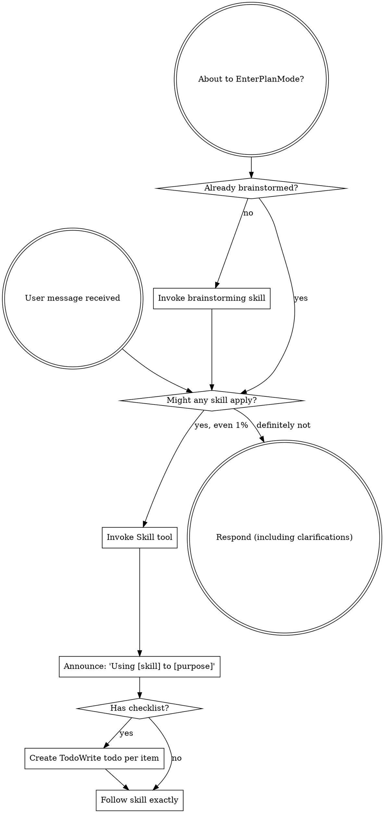
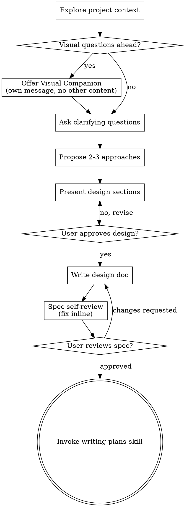
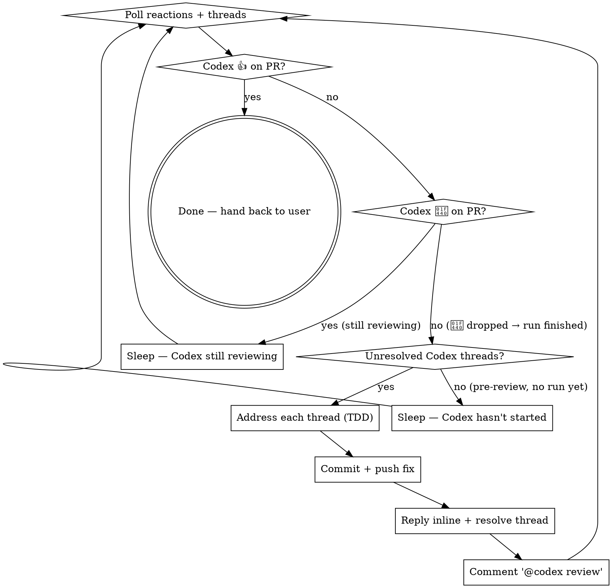
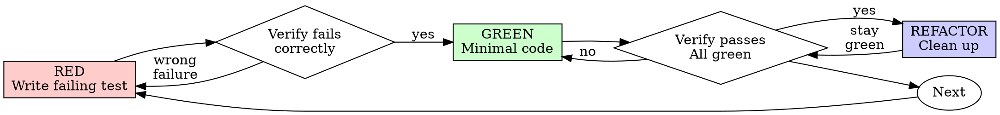

> SYSTEM

# AGENTS.md instructions for /Users/ericson/.t3/worktrees/ars-ui/t3code-577ff5df

<INSTRUCTIONS>
## Approach
- Read existing files before writing. Don't re-read unless changed.
- Thorough in reasoning, concise in output.
- Skip files over 100KB unless required.
- No sycophantic openers or closing fluff.
- No emojis or em-dashes.
- Do not guess APIs, versions, flags, commit SHAs, or package names. Verify by reading code or docs before asserting.

--- project-doc ---

# ars-ui

## Project Overview

Rust frontend component library using state machines, framework-agnostic core with Leptos/Dioxus adapters.

## Current Phase

The repo is now in active implementation, not spec drafting only.

Agents working on implementation should use the GitHub Project roadmap and issue backlog as the execution source of truth:

- Use the GitHub Project `ars-ui implementation roadmap` to understand active epics, task breakdown, dependencies, status, and iteration planning.
- Prefer picking a single issue-backed task that is unblocked, sized, and scoped for independent delivery.
- Do not start work from an epic issue unless the user explicitly asks for planning or further decomposition.
- Do not start a task that is blocked by unresolved GitHub issue dependencies.
- Treat native GitHub issue dependencies as the blocker graph and the issue body acceptance criteria as the delivery contract.

## Development Workflow

For implementation tasks:

1. Read the assigned or selected GitHub issue first.
2. Move the issue to **In Progress** on the GitHub Project board.
3. Review the cited spec sections and any dependency issues.
4. Add or update the named tests first.
5. Implement only the scope required to make those tests pass.
6. If implementation changes the intended contract, update the relevant spec in the same task.
7. **MANDATORY:** Invoke the `post-implementation-audit` skill (`.agents/skills/post-implementation-audit/SKILL.md`). It runs three sequential audits on the new code — (a) spec/implementation drift with "best outcome" recommendations, (b) iterative "anything else missing?" passes (minimum two rounds), (c) test-coverage audit across every test type the workspace uses (unit, snapshot, proptest, mutation, doc, spec-conformance, llvm-cov). **Every finding lands in _this_ PR — no deferral, no follow-up issues.** This step exists because initial implementations consistently ship spec drift and silent contract violations that take 3+ review round-trips to surface; the audit collapses them into one. Skipping this step is a contract violation.
8. Present the final result for user review before any commit.
9. After user approval, run `cargo xci --profile fast` (alias: `cargo xci-fast`) locally and fix any failures before pushing anything to GitHub. The fast profile takes ~5 minutes and covers the workspace-level regressions a pre-push gate should catch: fmt, check, clippy, unit, integration, adapter, spec-compile-snippets, error-variant-coverage, mutual-exclusion, snapshot-count. Reserve full `cargo xci` (~25 minutes, all 20 gates including wasm coverage and the feature-matrix groups) for after substantial refactors that may have shifted feature-flag interactions. For small follow-up changes, run the focused tests and checks that cover the edited code instead.
10. After `cargo xci-fast` passes, commit and push a PR targeting `main`. The PR body MUST include an auto-close keyword for the issue being delivered, for example `Closes #20` or `Fixes #20`, so GitHub closes the issue automatically when the PR merges.
11. **If the PR creates or modifies any `.snap` insta fixtures, attach the `snapshot-reviewed` label after opening or updating it** (`gh pr edit <num> --add-label "snapshot-reviewed"`). This signals to reviewers that the snapshot output was inspected and is intentional. Re-apply the label whenever you push a commit that touches `.snap` files; the workflow assumes the label reflects the latest snapshot state.
12. **MANDATORY:** Invoke the `waiting-for-codex-review` skill (`.agents/skills/waiting-for-codex-review/SKILL.md`) immediately after the first push that creates the PR, and re-invoke it after every subsequent push to the PR branch. The skill posts the initial `@codex review` trigger, polls Codex's 👀 → (👍 \| ∅ + threads) reaction lifecycle, addresses any review threads with the same rigor as `post-implementation-audit` (TDD + no coverage regression), replies inline, resolves threads, and re-comments `@codex review` to start the next pass — looping until Codex leaves 👍. Skipping this step leaves Codex findings unaddressed and silently widens the gap between merged code and the spec; the merge gate is 👍 from Codex plus green CI, not green CI alone.
13. Only after CI passes, Codex has left 👍, and the PR is merged, close the issue.

Never close a GitHub issue without a merged PR that passes CI **and a 👍 from Codex**. Never commit or push without explicit user approval. Keep the issue, PR, and Project board status aligned with the actual work state at every step.

Default delivery rules:

- Follow TDD: tests first, implementation second, verification last.
- Keep task scope aligned with the issue. If the issue is too large or ambiguous, stop and split or clarify rather than freelancing a bigger change.
- Prefer tasks sized `1`, `2`, `3`, or `5` points. `8` is exceptional. `13` must be decomposed before implementation.
- Preserve the crate and dependency layering defined by the architecture and implementation plan.
- Do not add a new dependency crate without explicit user approval first. If a task appears to need a new crate, stop, explain why, and get approval before editing any `Cargo.toml`.
- When a task is complete, verify the exact tests and checks named by the issue before considering it done.
- For adapter-level component implementation, follow `docs/implementation/adapter-component-delivery.md`. Adapter component work must cover the adapter crate, adapter tests, E2E fixtures/harnesses when applicable, widgets examples, spec synchronization, and the required validation/audit loop in one PR.

### Code Quality Standards

- **Document all public items.** Every public struct, enum, trait, function, constant, type alias, method, field, and variant must have a `///` doc comment. Every `lib.rs` must have a `//!` crate-level doc comment. The workspace enforces `missing_docs` linting — undocumented public items are build failures.
- **Zero warnings policy.** All code must compile with zero warnings under the workspace's configured clippy and rustc lints. Fix the root cause instead of suppressing. When suppression is genuinely needed, use `#[expect(lint, reason = "...")]` — never `#[allow(...)]`.
- **Derive documentation from the spec.** Doc comments should describe the _purpose and semantics_ of the item as defined in the corresponding `spec/` files, not just restate the type signature.
- **Use `#[inline]` selectively, not mechanically.** Do **not** add Clippy's `missing_inline_in_public_items` lint at the workspace level, and do not treat public visibility alone as a reason to mark an item `#[inline]`. Use `#[inline]` for thin cross-crate wrappers, trivial accessors, and hot-path no-op shims where the call overhead is plausibly meaningful. Avoid blanket `#[inline]` on all public APIs — it increases code size, adds compile-time cost, and turns `#[inline]` into noise instead of a deliberate performance signal.
- **Use directory-backed modules with `mod.rs` when a module owns children.** This repo standardizes on the older filesystem layout for nested modules. If module `foo` has child modules, the parent must live at `foo/mod.rs`, not `foo.rs`. Do not mix `foo.rs` with a sibling `foo/` directory. When a refactor adds child modules under an existing flat file, move the parent into `foo/mod.rs` in the same change. Do not leave empty leftover module directories behind.

### API Design Standards

- **Design for the pit of success.** Public APIs should make the most natural, shortest path also be the path that is correct, accessible, localizable, type-safe, and performant. Prefer ergonomic constructors and defaults that preserve the spec's strongest guarantees instead of making users opt into correctness after choosing a convenient API.
- **Name escape hatches explicitly.** When a component needs a lower-level, static, non-i18n, or otherwise less complete path, keep it available but make the tradeoff visible in the API name or type. The blessed path should remain the simplest call site, while escape hatches should read as deliberate choices.
- **Keep semantic data separate from rendered views.** Rich framework views are useful for customization, but components still need semantic sources for accessible names, localized text, announcements, ids, and state-machine wiring. Do not rely on arbitrary rendered view trees as the only source of user-facing semantics.

### Code Coverage

The workspace uses `cargo-llvm-cov` for code coverage with per-crate threshold enforcement. CI runs coverage on every PR (see `.github/workflows/ci.yml`).

**Local coverage commands:**

```bash
# Per-crate coverage with inline annotated source (most useful during development)
cargo llvm-cov test -p ars-interactions --text -- hover

# Per-crate summary only
cargo llvm-cov test -p ars-interactions -- hover

# Native-only workspace coverage (host target; excludes wasm-only crates)
cargo llvm-cov --workspace \
  --exclude ars-leptos --exclude ars-dioxus \
  --exclude ars-test-harness-leptos --exclude ars-test-harness-dioxus \
  --exclude ars-derive --exclude xtask \
  --lcov --output-path lcov.info

# Check all crates against spec-defined thresholds (run after a *merged* lcov)
cargo xtask coverage check-all --file lcov.info
```

The `--text` flag produces line-by-line annotated source showing hit counts and `^0` markers on uncovered branches — use this to identify gaps after writing tests. Uncovered no-op callback closures in tests (e.g., `|_| {}`) are expected and not a gap.

The local recipe above excludes the adapter and adapter-test-harness crates because their `target_arch = "wasm32"` / `feature = "web"` code paths can't be measured via host-target `cargo llvm-cov`. **CI runs an additional wasm-coverage pipeline on nightly** (`cargo xtask ci coverage`) that uses `wasm-bindgen-test`'s experimental coverage recipe with LLVM 22 / `clang-22` to emit lcov for `ars-leptos` (csr), `ars-dioxus` (web), `ars-dom` (web), `ars-i18n` (web-intl), and the adapter test harnesses, then merges with the native lcov via `cargo xtask coverage merge`. The per-crate thresholds in `xtask::coverage::default_thresholds()` are enforced against the merged file — including adapter targets (`ars-leptos` 74/55, `ars-dioxus` 77/70, `ars-test-harness-leptos` 60/0, `ars-test-harness-dioxus` 60/0). `ars-derive` (proc-macro, runs in compiler) is exercised via `crates/ars-core/tests/derive_contract.rs` and is unmeasured. `xtask` has its own enforced threshold (30/35) and is measured. See `spec/testing/14-ci.md` §2 for the full pipeline.

### Mutation Testing

Coverage tells you which lines run. **Mutation testing tells you whether the tests would notice if those lines silently misbehaved.** The workspace uses [`cargo-mutants`](https://mutants.rs) for this — a `cargo` extension binary, not a workspace dependency.

**Install (once per developer machine):**

```bash
cargo install cargo-mutants --locked --version 27.0.0
```

**Local commands (state-machine modules are the most rewarding targets):**

```bash
# Run on a single component machine (~6 min for popover)
cargo mutants -p ars-components -f crates/ars-components/src/overlay/popover/mod.rs

# Just list what would be mutated, without running tests (fast)
cargo mutants -p ars-components -f crates/ars-components/src/overlay/popover/mod.rs --list

# Whole crate (slow — only if you really mean it)
cargo mutants -p ars-components
```

**Agnostic component implementation gate:** whenever an agent implements a new framework-agnostic component, or materially changes an existing one, the delivery must include:

- a targeted mutation run for the component source file, usually `cargo mutants -p ars-components -f crates/ars-components/src/<category>/<component>/mod.rs` (adjust the path for single-file modules);
- spec-conformance tests for the component's anatomy/public contract, including its `Part` enum and required API/attribute surface;
- same-task triage of every `MISSED` mutant: add tests for real gaps, or add a justified line-agnostic `.cargo/mutants.toml` exclude only for true equivalent mutations.

This mutation gate is a pre-PR implementation/audit gate. Once the PR has been opened, agents **MUST NOT** rerun mutation tests during Codex review rounds unless the user explicitly asks for another mutation run. Review-loop fixes should use focused regression tests, snapshots, coverage, clippy, and spec validation appropriate to the changed code.

**Reading the output:** Results land in `mutants.out/mutants.out/` (gitignored). The two files that matter:

- `caught.txt` — mutations that broke at least one test ✅
- `missed.txt` — mutations that survived all tests ❌ — each one is either a real test gap to fill or an "equivalent mutation" that needs a `[[skip]]` entry in `mutants.toml` with a justification

**CI integration:** Nightly only. `.github/workflows/nightly.yml` has a `mutation-testing` job with a 21-entry matrix that runs `cargo mutants -p <package>` on every framework-agnostic crate, using `--shard k/n` to spread larger crates across parallel runners. **Shard indices are 0-based** (`k` runs from `0` to `n-1`); `k == n` is invalid and will fail the job. When adding shards, always start at `0/n` and end at `(n-1)/n`.

- **`ars-components` (≈ 1,630 mutants today, planned to grow as the spec adds the remaining ~97 components):** sharded **12-way** → ≈ 135 mutants per runner today, ≈ 850 per runner at the ~10,000-mutant endpoint. Sized for the full spec catalog up front so we don't re-shard every few months as components land.
- **`ars-collections` (≈ 1,080 mutants):** sharded 4-way → ≈ 270 mutants per runner.
- **`ars-core` (≈ 700 mutants):** sharded 2-way → ≈ 350 mutants per runner.
- **`ars-a11y`, `ars-forms`, `ars-interactions`:** one runner each (under 600 mutants apiece).

**Adding a new state machine inside an existing crate requires no CI changes** — its mutations land in whichever shard the cargo-mutants partitioner places them. The shard counts are sized so the slowest runner stays well under 30 minutes today and under ~50 minutes at the planned endpoint; re-balance only when a crate outgrows that budget (visible on the nightly dashboard as one shard pulling away from the others).

All matrix jobs run with `fail-fast: false` so failures on one module don't mask data on another. Each job uploads its `mutants.out/` as a workflow artifact (always, even on success — surviving "missed" entries on a passing run still reveal test-quality work). The job fails if any mutation survives, so a missed mutation forces a deliberate triage decision (fix the test, or document the equivalence with a `[[skip]]` entry in `mutants.toml`).

**Excluded crates** (mutation testing's signal degrades wherever determinism does): adapter glue (`ars-leptos`, `ars-dioxus`), DOM/FFI (`ars-dom`), ICU/FFI (`ars-i18n`), test infrastructure (`ars-test-harness*`), and the proc-macro crate (`ars-derive`, runs in the compiler). Adding a brand-new crate that is a good mutation target requires one new matrix entry; run a local scout first (`cargo mutants -p <crate> --list` to size, then a real run) so we know the right shard count before the nightly fires.

**Bumping the pinned version.** Both the local install command above and `.github/workflows/nightly.yml` pin cargo-mutants to an exact version (currently `27.0.0`) — same convention as `wasm-pack` in the `a11y-audit` job. Pinning is deliberate: cargo-mutants ships new mutators in releases, and an unpinned install would silently change the mutation set without any code change, surfacing as phantom CI failures on a green-source repo. To bump, open a PR that (1) updates the version string in CLAUDE.md and `nightly.yml`, (2) runs the popover scout locally with the new version (`cargo mutants -p ars-components -f crates/ars-components/src/overlay/popover/mod.rs`) to confirm the mutation count is in the same ballpark, and (3) triages any new "missed" entries the new mutators surface — they are usually genuine test-quality gaps newly visible to the tool.

### Property Testing (proptest)

State-machine invariants are exercised by [`proptest`](https://docs.rs/proptest) under `crates/<crate>/tests/proptest_state_machines/` (see `ars-components`). Default proptest behaviour drops `*.proptest-regressions` seed files alongside test sources — instead, every `proptest!` block in this workspace pulls a shared `Config` from `tests/proptest_state_machines/common.rs` that:

1. Reads `PROPTEST_CASES` from the environment (1,000 default; 10,000 in the nightly `extended-proptest` job).
2. Sets `failure_persistence` to `FileFailurePersistence::Direct("proptest-regressions/state-machines.txt")`, so all persisted seeds for the test binary live in one file at the crate root: `crates/<crate>/proptest-regressions/state-machines.txt`. The directory is committed (per proptest's own recommendation in the file header) so every developer's runs benefit from previously-shrunk failures.

When a new crate adopts proptest for state-machine tests, copy the same `common.rs` helper and reference it via `#![proptest_config(super::common::proptest_config())]` inside every `proptest!` block. Don't let proptest fall back to its `WithSource` default — that scatters seed files across the source tree.

### Adapter Prelude Convention

Both `ars-leptos` and `ars-dioxus` expose a `prelude` module targeting **end users** — application developers who consume the ready-made components. `use ars_leptos::prelude::*` (or `use ars_dioxus::prelude::*`) should give them everything they need.

The prelude contains only user-facing items:

1. **Component modules** — as components land, their public module paths (e.g., `button`, `dialog`) are re-exported so users can write `button::Props`, etc.
2. **User-facing traits** — traits end users call on component outputs (e.g., `Translate` from `ars-i18n`). Re-export the trait so consumers don't need a direct dependency on the subsystem crate.
3. **Configuration types** — types that appear in component props or configure behaviour (e.g., `Locale`, `Direction`, `Orientation`, `Selection`).

The prelude does **not** include implementation details consumed only by component authors inside the adapter crate: core engine types (`Machine`, `Service`, `ConnectApi`, `AttrMap`), accessibility primitives (`AriaRole`, `AriaAttribute`), interaction helpers (`merge_attrs`), or adapter hooks (`use_machine`, `UseMachineReturn`). Those remain accessible via their normal crate paths for advanced users building custom machines.

Both adapter preludes must stay symmetric: same items, same structure. When adding a new re-export to one adapter's prelude, add it to the other as well in the same PR.

### Adapter Testing Convention

Adapter-level component tests should default to the framework-specific test harness crate:

- Leptos adapter tests should prefer `ars-test-harness-leptos`.
- Dioxus adapter tests should prefer `ars-test-harness-dioxus`.
- Shared `ars-test-harness` helpers should be used where relevant for viewport, layout, clipboard, drag/drop, timing, and other DOM test setup instead of bespoke per-test browser scaffolding.

When a component spec requires interaction, focus, overlay positioning, clipboard, file upload, drag/drop, or similar browser behavior, the task's tests should exercise that behavior through the adapter harness entrypoints and shared core harness helpers unless there is a concrete technical reason not to.

## Spec Synchronization During Implementation

The specification is the authoritative contract. It took weeks of deliberate design and MUST be followed.

### Spec-first implementation rule

Before implementing any public type, trait, function, or method:

1. **Read the spec section first.** Find the relevant code example in `spec/`. Use `spec-tool toc <file>` and `grep` to locate it.
2. **Match the spec exactly.** If the spec defines `struct ComponentIds { base: String }` with methods `from_id()`, `id()`, `part()`, `item()`, `item_part()` — implement exactly that. Do not invent alternative field names, method names, or signatures.
3. **Cross-check after implementation.** Before presenting code for review, diff every public item against the spec's code examples. Every struct field, every method name, every parameter must match.
4. **If you must deviate**, there must be a concrete technical reason (e.g., the spec's API cannot compile, or a dependency doesn't expose the needed type). Document the reason in a code comment and flag it to the user explicitly.

Inventing alternative APIs that "seem equivalent" is never acceptable — it silently invalidates the spec's design decisions and all downstream code that depends on those APIs.

### Spec/code mismatch resolution

- If code and spec disagree, resolve the mismatch in the same task or PR.
- Shared conceptual changes belong in shared or foundation spec files, not only in adapter code.
- Adapter-specific findings must be reflected back into `spec/foundation/08-adapter-leptos.md` and/or `spec/foundation/09-adapter-dioxus.md` when relevant.
- Do not leave spec drift behind as follow-up cleanup.

## Spec Structure

The specification lives in `spec/` with this layout:

- `spec/manifest.toml` — **START HERE** — central index of all components and their dependencies
- `spec/foundation/` — architecture, accessibility, i18n, interactions, forms, adapters, spec template (00-10)
- `spec/shared/` — cross-component shared types (date-time, selection, layout, z-index)
- `spec/components/{category}/` — one file per component, organized by category
- `spec/testing/` — test specs split by domain

### Component Categories

- `input/` — checkbox, text-field, slider, number-input, etc.
- `selection/` — select, combobox, listbox, menu, tags-input, etc.
- `overlay/` — dialog, popover, tooltip, toast, presence, etc.
- `navigation/` — accordion, tabs, tree-view, pagination, steps, etc.
- `date-time/` — date-field, time-field, calendar, date-picker, etc.
- `data-display/` — table, avatar, progress, meter, badge, etc.
- `layout/` — splitter, scroll-area, carousel, portal, toolbar, etc.
- `specialized/` — color-picker, file-upload, signature-pad, qr-code, etc.
- `utility/` — button, toggle, focus-scope, visually-hidden, separator, etc.

## Working with the Spec

When reading large files, run `wc -l` first to check the line count. If the file is over 2,000
lines, use the `offset` and `limit` parameters on the Read tool to read in chunks rather than
attempting to read the entire file at once.

### Using xtask spec (preferred)

Use `cargo xtask spec` to resolve file sets instead of manually parsing manifest.toml:

```bash
# Quick metadata lookup:
cargo xtask spec info <component>

# Find all components using a shared type:
cargo xtask spec reverse <shared-type>

# See a file's heading structure (with line numbers):
cargo xtask spec toc <file>

# Validate frontmatter matches manifest.toml:
cargo xtask spec validate

# Search spec content by keyword/regex (with optional filters):
cargo xtask spec search <query> [--category <cat>] [--section <sec>] [--tier <tier>]

# Get a compact component summary (states, events, props, accessibility):
cargo xtask spec digest <component>

# Get full implementation context (component + all deps concatenated):
cargo xtask spec context <component> [--framework <fw>] [--include-testing]
```

The xtask also runs as an MCP server (`cargo xtask mcp`) exposing all spec tools for LLM agents.

### Reading a component (manual fallback)

1. Read `spec/manifest.toml` to find the component's path and dependencies
2. Read the component file (has YAML frontmatter listing its foundation/shared deps)
3. Only load the foundation files listed in `foundation_deps` — not all of them

### Framework and library specs — MANDATORY skill loading

When reading or editing these specification files, you MUST load the corresponding skill BEFORE doing any work. The skills contain verified, version-accurate API documentation that the spec code examples depend on. Claude's training data is wrong for these libraries — do not trust it.

| Spec file                                    | Skill to load | Library version |
| -------------------------------------------- | ------------- | --------------- |
| `spec/foundation/04-internationalization.md` | `icu4x`       | ICU4X 2.1.1     |
| `spec/foundation/08-adapter-leptos.md`       | `leptos`      | Leptos 0.8.17   |
| `spec/foundation/09-adapter-dioxus.md`       | `dioxus`      | Dioxus 0.7.3    |

This applies to any task that touches adapter code: reviewing, writing, modifying, or answering questions about these files. Load the skill first, then proceed.

### Spec Conventions

- **No deprecation:** This is a greenfield spec. If an API is unused or redundant, remove it and fix all references. Never use `#[deprecated]` or deprecation shims.
- **No deferral:** Never mark spec content as "TODO", "FIXME", "future enhancement", "P1/P2 extension", or any similar deferral language. Every feature mentioned must be fully specified. If a design choice is unclear, ask the user rather than deferring.
- **No guessing external APIs:** NEVER guess function names or module paths for external crates. Always verify against `https://docs.rs/<crate_name>` before writing code that calls library APIs. This applies especially to Leptos, Dioxus, ICU4X, and any crate where training data may be stale. If you cannot verify, state that explicitly rather than fabricating a plausible-looking API.

### Component file format

Each component file has YAML frontmatter declaring its metadata:

```markdown
---
component: ComponentName
category: { category }
tier: stateless | stateful | complex
foundation_deps: [architecture, accessibility, ...]
shared_deps: [date-time-types, ...]
related: [sibling-component, ...]
---

# ComponentName
```

The `tier` field determines which sections are required — see `spec/foundation/10-component-spec-template.md` for the canonical section structure, ordering rules, and conformance checklist. Headings are numbered (e.g., `## 1. State Machine`, `### 1.1 States`, `#### 1.1.1 InnerStates`, etc.) for precise section references.

</INSTRUCTIONS>
<environment_context>
  <cwd>/Users/ericson/.t3/worktrees/ars-ui/t3code-577ff5df</cwd>
  <shell>zsh</shell>
  <current_date>2026-05-26</current_date>
  <timezone>America/Sao_Paulo</timezone>
</environment_context>

> DEVELOPER

Implement task #293

> AGENT

I’ll stay in planning mode here: I can inspect the repo and issue, then produce a decision-complete implementation plan for task `#293`. I’m loading the workflow guidance first, then I’ll ground the plan in the live issue and local code.

> TOOL

tool_use exec_command
id: call_UcHMLosL5UVEDkzZYJzWU7kI
```json
{
  "cmd": "sed -n '1,220p' /Users/ericson/.claude/skills/using-superpowers/SKILL.md",
  "workdir": "/Users/ericson/.t3/worktrees/ars-ui/t3code-577ff5df",
  "yield_time_ms": 1000,
  "max_output_tokens": 12000
}
```

> TOOL

tool_use exec_command
id: call_gmBR0vMFOTiunD73wSszUY5F
```json
{
  "cmd": "rg -n \"293|#293|task #293|issue #293\" /Users/ericson/.codex/memories/MEMORY.md",
  "workdir": "/Users/ericson/.t3/worktrees/ars-ui/t3code-577ff5df",
  "yield_time_ms": 1000,
  "max_output_tokens": 12000
}
```

> TOOL

tool_result
id: call_UcHMLosL5UVEDkzZYJzWU7kI
```
Chunk ID: 3589d3
Wall time: 0.5148 seconds
Process exited with code 0
Original token count: 1356
Output:
---
name: using-superpowers
description: Use when starting any conversation - establishes how to find and use skills, requiring Skill tool invocation before ANY response including clarifying questions
---

<SUBAGENT-STOP>
If you were dispatched as a subagent to execute a specific task, skip this skill.
</SUBAGENT-STOP>

<EXTREMELY-IMPORTANT>
If you think there is even a 1% chance a skill might apply to what you are doing, you ABSOLUTELY MUST invoke the skill.

IF A SKILL APPLIES TO YOUR TASK, YOU DO NOT HAVE A CHOICE. YOU MUST USE IT.

This is not negotiable. This is not optional. You cannot rationalize your way out of this.
</EXTREMELY-IMPORTANT>

## Instruction Priority

Superpowers skills override default system prompt behavior, but **user instructions always take precedence**:

1. **User's explicit instructions** (CLAUDE.md, GEMINI.md, AGENTS.md, direct requests) — highest priority
2. **Superpowers skills** — override default system behavior where they conflict
3. **Default system prompt** — lowest priority

If CLAUDE.md, GEMINI.md, or AGENTS.md says "don't use TDD" and a skill says "always use TDD," follow the user's instructions. The user is in control.

## How to Access Skills

**In Claude Code:** Use the `Skill` tool. When you invoke a skill, its content is loaded and presented to you—follow it directly. Never use the Read tool on skill files.

**In Copilot CLI:** Use the `skill` tool. Skills are auto-discovered from installed plugins. The `skill` tool works the same as Claude Code's `Skill` tool.

**In Gemini CLI:** Skills activate via the `activate_skill` tool. Gemini loads skill metadata at session start and activates the full content on demand.

**In other environments:** Check your platform's documentation for how skills are loaded.

## Platform Adaptation

Skills use Claude Code tool names. Non-CC platforms: see `references/copilot-tools.md` (Copilot CLI), `references/codex-tools.md` (Codex) for tool equivalents. Gemini CLI users get the tool mapping loaded automatically via GEMINI.md.

# Using Skills

## The Rule

**Invoke relevant or requested skills BEFORE any response or action.** Even a 1% chance a skill might apply means that you should invoke the skill to check. If an invoked skill turns out to be wrong for the situation, you don't need to use it.



## Red Flags

These thoughts mean STOP—you're rationalizing:

| Thought | Reality |
|---------|---------|
| "This is just a simple question" | Questions are tasks. Check for skills. |
| "I need more context first" | Skill check comes BEFORE clarifying questions. |
| "Let me explore the codebase first" | Skills tell you HOW to explore. Check first. |
| "I can check git/files quickly" | Files lack conversation context. Check for skills. |
| "Let me gather information first" | Skills tell you HOW to gather information. |
| "This doesn't need a formal skill" | If a skill exists, use it. |
| "I remember this skill" | Skills evolve. Read current version. |
| "This doesn't count as a task" | Action = task. Check for skills. |
| "The skill is overkill" | Simple things become complex. Use it. |
| "I'll just do this one thing first" | Check BEFORE doing anything. |
| "This feels productive" | Undisciplined action wastes time. Skills prevent this. |
| "I know what that means" | Knowing the concept ≠ using the skill. Invoke it. |

## Skill Priority

When multiple skills could apply, use this order:

1. **Process skills first** (brainstorming, debugging) - these determine HOW to approach the task
2. **Implementation skills second** (frontend-design, mcp-builder) - these guide execution

"Let's build X" → brainstorming first, then implementation skills.
"Fix this bug" → debugging first, then domain-specific skills.

## Skill Types

**Rigid** (TDD, debugging): Follow exactly. Don't adapt away discipline.

**Flexible** (patterns): Adapt principles to context.

The skill itself tells you which.

## User Instructions

Instructions say WHAT, not HOW. "Add X" or "Fix Y" doesn't mean skip workflows.

```

> TOOL

tool_result
id: call_gmBR0vMFOTiunD73wSszUY5F
```
Chunk ID: 79de2e
Wall time: 0.6889 seconds
Process exited with code 0
Original token count: 623
Output:
946:- rollout_summaries/REDACTED.md (cwd=/Users/ericson/Workspace/Rust/judge-fudge, rollout_path=/Users/ericson/.codex/sessions/2026/05/18/rollout-2026-05-18T23-04-02-019e3df9-d15a-7293-a9af-e5bd2631c69e.jsonl, updated_at=2026-05-19T02:23:50+00:00, thread_id=019e3df9-d15a-7293-a9af-e5bd2631c69e, freshness-gated Build -> Review transition)
2790:- rollout_summaries/REDACTED.md (cwd=/Users/ericson/.codex/worktrees/8ccf/ars-ui, rollout_path=/Users/ericson/.codex/sessions/2026/04/25/rollout-2026-04-25T20-51-59-019dc70e-a796-7190-a54f-35d14d7c2936.jsonl, updated_at=2026-04-26T14:12:18+00:00, thread_id=019dc70e-a796-7190-a54f-35d14d7c2936, task #238 implementation plus regression fix and spec sync)
2800:- rollout_summaries/REDACTED.md (cwd=/Users/ericson/.codex/worktrees/8ccf/ars-ui, rollout_path=/Users/ericson/.codex/sessions/2026/04/25/rollout-2026-04-25T20-51-59-019dc70e-a796-7190-a54f-35d14d7c2936.jsonl, updated_at=2026-04-26T14:12:18+00:00, thread_id=019dc70e-a796-7190-a54f-35d14d7c2936, PR #610 review-thread reply and resolution)
2858:- rollout_summaries/REDACTED.md (cwd=/Users/ericson/.codex/worktrees/8ccf/ars-ui, rollout_path=/Users/ericson/.codex/sessions/2026/04/25/rollout-2026-04-25T20-51-59-019dc70e-a796-7190-a54f-35d14d7c2936.jsonl, updated_at=2026-04-26T14:12:18+00:00, thread_id=019dc70e-a796-7190-a54f-35d14d7c2936, PR #610 review-thread reply after Presence validation)
2866:- rollout_summaries/2026-04-21T21-42-22-ibXl-pr_review_controlled_form_reset_server_errors.md (cwd=/Users/ericson/.t3/worktrees/ars-ui/t3code-31a9f711, rollout_path=/Users/ericson/.codex/sessions/2026/04/21/rollout-2026-04-21T18-42-22-019db1fe-8d2b-7293-b88c-3c7face2153b.jsonl, updated_at=2026-04-21T21:51:52+00:00, thread_id=019db1fe-8d2b-7293-b88c-3c7face2153b, PR #594 reset-behavior review fix)
3219:- rollout_summaries/2026-04-21T21-42-22-ibXl-pr_review_controlled_form_reset_server_errors.md (cwd=/Users/ericson/.t3/worktrees/ars-ui/t3code-31a9f711, rollout_path=/Users/ericson/.codex/sessions/2026/04/21/rollout-2026-04-21T18-42-22-019db1fe-8d2b-7293-b88c-3c7face2153b.jsonl, updated_at=2026-04-21T21:51:52+00:00, thread_id=019db1fe-8d2b-7293-b88c-3c7face2153b, controlled reset server-error fix on PR #594)

```

> AGENT

Using `using-superpowers` and the repo’s planning workflow guidance to structure this as an implementation plan, not a code change yet. Next I’m pulling the live issue text and nearby repo state so the plan is tied to actual acceptance criteria.

> TOOL

tool_use exec_command
id: call_QUgKYn2hmsAAbHLo686tGIDR
```json
{
  "cmd": "sed -n '1,240p' /Users/ericson/.claude/skills/brainstorming/SKILL.md",
  "workdir": "/Users/ericson/.t3/worktrees/ars-ui/t3code-577ff5df",
  "yield_time_ms": 1000,
  "max_output_tokens": 14000
}
```

> TOOL

tool_use exec_command
id: call_t6lriDvklMsHwtyP8xpIKzFY
```json
{
  "cmd": "sed -n '1,260p' /Users/ericson/.codex/plugins/cache/openai-curated/superpowers/6188456f/skills/writing-plans/SKILL.md",
  "workdir": "/Users/ericson/.t3/worktrees/ars-ui/t3code-577ff5df",
  "yield_time_ms": 1000,
  "max_output_tokens": 14000
}
```

> TOOL

tool_use exec_command
id: call_am1uN8IToXiRgMIFxEA25xBV
```json
{
  "cmd": "sed -n '1,240p' /Users/ericson/.codex/plugins/cache/openai-curated/github/6188456f/skills/github/SKILL.md",
  "workdir": "/Users/ericson/.t3/worktrees/ars-ui/t3code-577ff5df",
  "yield_time_ms": 1000,
  "max_output_tokens": 14000
}
```

> TOOL

tool_use exec_command
id: call_9clUndPhOvESq82bVK7zqt3N
```json
{
  "cmd": "git status --short && git remote -v",
  "workdir": "/Users/ericson/.t3/worktrees/ars-ui/t3code-577ff5df",
  "yield_time_ms": 1000,
  "max_output_tokens": 12000
}
```

> TOOL

tool_result
id: call_QUgKYn2hmsAAbHLo686tGIDR
```
Chunk ID: b34c31
Wall time: 0.7135 seconds
Process exited with code 0
Original token count: 2659
Output:
---
name: brainstorming
description: "You MUST use this before any creative work - creating features, building components, adding functionality, or modifying behavior. Explores user intent, requirements and design before implementation."
---

# Brainstorming Ideas Into Designs

Help turn ideas into fully formed designs and specs through natural collaborative dialogue.

Start by understanding the current project context, then ask questions one at a time to refine the idea. Once you understand what you're building, present the design and get user approval.

<HARD-GATE>
Do NOT invoke any implementation skill, write any code, scaffold any project, or take any implementation action until you have presented a design and the user has approved it. This applies to EVERY project regardless of perceived simplicity.
</HARD-GATE>

## Anti-Pattern: "This Is Too Simple To Need A Design"

Every project goes through this process. A todo list, a single-function utility, a config change — all of them. "Simple" projects are where unexamined assumptions cause the most wasted work. The design can be short (a few sentences for truly simple projects), but you MUST present it and get approval.

## Checklist

You MUST create a task for each of these items and complete them in order:

1. **Explore project context** — check files, docs, recent commits
2. **Offer visual companion** (if topic will involve visual questions) — this is its own message, not combined with a clarifying question. See the Visual Companion section below.
3. **Ask clarifying questions** — one at a time, understand purpose/constraints/success criteria
4. **Propose 2-3 approaches** — with trade-offs and your recommendation
5. **Present design** — in sections scaled to their complexity, get user approval after each section
6. **Write design doc** — save to `docs/superpowers/specs/YYYY-MM-DD-<topic>-design.md` and commit
7. **Spec self-review** — quick inline check for placeholders, contradictions, ambiguity, scope (see below)
8. **User reviews written spec** — ask user to review the spec file before proceeding
9. **Transition to implementation** — invoke writing-plans skill to create implementation plan

## Process Flow



**The terminal state is invoking writing-plans.** Do NOT invoke frontend-design, mcp-builder, or any other implementation skill. The ONLY skill you invoke after brainstorming is writing-plans.

## The Process

**Understanding the idea:**

- Check out the current project state first (files, docs, recent commits)
- Before asking detailed questions, assess scope: if the request describes multiple independent subsystems (e.g., "build a platform with chat, file storage, billing, and analytics"), flag this immediately. Don't spend questions refining details of a project that needs to be decomposed first.
- If the project is too large for a single spec, help the user decompose into sub-projects: what are the independent pieces, how do they relate, what order should they be built? Then brainstorm the first sub-project through the normal design flow. Each sub-project gets its own spec → plan → implementation cycle.
- For appropriately-scoped projects, ask questions one at a time to refine the idea
- Prefer multiple choice questions when possible, but open-ended is fine too
- Only one question per message - if a topic needs more exploration, break it into multiple questions
- Focus on understanding: purpose, constraints, success criteria

**Exploring approaches:**

- Propose 2-3 different approaches with trade-offs
- Present options conversationally with your recommendation and reasoning
- Lead with your recommended option and explain why

**Presenting the design:**

- Once you believe you understand what you're building, present the design
- Scale each section to its complexity: a few sentences if straightforward, up to 200-300 words if nuanced
- Ask after each section whether it looks right so far
- Cover: architecture, components, data flow, error handling, testing
- Be ready to go back and clarify if something doesn't make sense

**Design for isolation and clarity:**

- Break the system into smaller units that each have one clear purpose, communicate through well-defined interfaces, and can be understood and tested independently
- For each unit, you should be able to answer: what does it do, how do you use it, and what does it depend on?
- Can someone understand what a unit does without reading its internals? Can you change the internals without breaking consumers? If not, the boundaries need work.
- Smaller, well-bounded units are also easier for you to work with - you reason better about code you can hold in context at once, and your edits are more reliable when files are focused. When a file grows large, that's often a signal that it's doing too much.

**Working in existing codebases:**

- Explore the current structure before proposing changes. Follow existing patterns.
- Where existing code has problems that affect the work (e.g., a file that's grown too large, unclear boundaries, tangled responsibilities), include targeted improvements as part of the design - the way a good developer improves code they're working in.
- Don't propose unrelated refactoring. Stay focused on what serves the current goal.

## After the Design

**Documentation:**

- Write the validated design (spec) to `docs/superpowers/specs/YYYY-MM-DD-<topic>-design.md`
  - (User preferences for spec location override this default)
- Use elements-of-style:writing-clearly-and-concisely skill if available
- Commit the design document to git

**Spec Self-Review:**
After writing the spec document, look at it with fresh eyes:

1. **Placeholder scan:** Any "TBD", "TODO", incomplete sections, or vague requirements? Fix them.
2. **Internal consistency:** Do any sections contradict each other? Does the architecture match the feature descriptions?
3. **Scope check:** Is this focused enough for a single implementation plan, or does it need decomposition?
4. **Ambiguity check:** Could any requirement be interpreted two different ways? If so, pick one and make it explicit.

Fix any issues inline. No need to re-review — just fix and move on.

**User Review Gate:**
After the spec review loop passes, ask the user to review the written spec before proceeding:

> "Spec written and committed to `<path>`. Please review it and let me know if you want to make any changes before we start writing out the implementation plan."

Wait for the user's response. If they request changes, make them and re-run the spec review loop. Only proceed once the user approves.

**Implementation:**

- Invoke the writing-plans skill to create a detailed implementation plan
- Do NOT invoke any other skill. writing-plans is the next step.

## Key Principles

- **One question at a time** - Don't overwhelm with multiple questions
- **Multiple choice preferred** - Easier to answer than open-ended when possible
- **YAGNI ruthlessly** - Remove unnecessary features from all designs
- **Explore alternatives** - Always propose 2-3 approaches before settling
- **Incremental validation** - Present design, get approval before moving on
- **Be flexible** - Go back and clarify when something doesn't make sense

## Visual Companion

A browser-based companion for showing mockups, diagrams, and visual options during brainstorming. Available as a tool — not a mode. Accepting the companion means it's available for questions that benefit from visual treatment; it does NOT mean every question goes through the browser.

**Offering the companion:** When you anticipate that upcoming questions will involve visual content (mockups, layouts, diagrams), offer it once for consent:
> "Some of what we're working on might be easier to explain if I can show it to you in a web browser. I can put together mockups, diagrams, comparisons, and other visuals as we go. This feature is still new and can be token-intensive. Want to try it? (Requires opening a local URL)"

**This offer MUST be its own message.** Do not combine it with clarifying questions, context summaries, or any other content. The message should contain ONLY the offer above and nothing else. Wait for the user's response before continuing. If they decline, proceed with text-only brainstorming.

**Per-question decision:** Even after the user accepts, decide FOR EACH QUESTION whether to use the browser or the terminal. The test: **would the user understand this better by seeing it than reading it?**

- **Use the browser** for content that IS visual — mockups, wireframes, layout comparisons, architecture diagrams, side-by-side visual designs
- **Use the terminal** for content that is text — requirements questions, conceptual choices, tradeoff lists, A/B/C/D text options, scope decisions

A question about a UI topic is not automatically a visual question. "What does personality mean in this context?" is a conceptual question — use the terminal. "Which wizard layout works better?" is a visual question — use the browser.

If they agree to the companion, read the detailed guide before proceeding:
`skills/brainstorming/visual-companion.md`

```

> TOOL

tool_result
id: call_t6lriDvklMsHwtyP8xpIKzFY
```
Chunk ID: 72ad0c
Wall time: 0.7199 seconds
Process exited with code 0
Original token count: 1525
Output:
---
name: writing-plans
description: Use when you have a spec or requirements for a multi-step task, before touching code
---

# Writing Plans

## Overview

Write comprehensive implementation plans assuming the engineer has zero context for our codebase and questionable taste. Document everything they need to know: which files to touch for each task, code, testing, docs they might need to check, how to test it. Give them the whole plan as bite-sized tasks. DRY. YAGNI. TDD. Frequent commits.

Assume they are a skilled developer, but know almost nothing about our toolset or problem domain. Assume they don't know good test design very well.

**Announce at start:** "I'm using the writing-plans skill to create the implementation plan."

**Context:** If working in an isolated worktree, it should have been created via the `superpowers:using-git-worktrees` skill at execution time.

**Save plans to:** `docs/superpowers/plans/YYYY-MM-DD-<feature-name>.md`
- (User preferences for plan location override this default)

## Scope Check

If the spec covers multiple independent subsystems, it should have been broken into sub-project specs during brainstorming. If it wasn't, suggest breaking this into separate plans — one per subsystem. Each plan should produce working, testable software on its own.

## File Structure

Before defining tasks, map out which files will be created or modified and what each one is responsible for. This is where decomposition decisions get locked in.

- Design units with clear boundaries and well-defined interfaces. Each file should have one clear responsibility.
- You reason best about code you can hold in context at once, and your edits are more reliable when files are focused. Prefer smaller, focused files over large ones that do too much.
- Files that change together should live together. Split by responsibility, not by technical layer.
- In existing codebases, follow established patterns. If the codebase uses large files, don't unilaterally restructure - but if a file you're modifying has grown unwieldy, including a split in the plan is reasonable.

This structure informs the task decomposition. Each task should produce self-contained changes that make sense independently.

## Bite-Sized Task Granularity

**Each step is one action (2-5 minutes):**
- "Write the failing test" - step
- "Run it to make sure it fails" - step
- "Implement the minimal code to make the test pass" - step
- "Run the tests and make sure they pass" - step
- "Commit" - step

## Plan Document Header

**Every plan MUST start with this header:**

```markdown
# [Feature Name] Implementation Plan

> **For agentic workers:** REQUIRED SUB-SKILL: Use superpowers:subagent-driven-development (recommended) or superpowers:executing-plans to implement this plan task-by-task. Steps use checkbox (`- [ ]`) syntax for tracking.

**Goal:** [One sentence describing what this builds]

**Architecture:** [2-3 sentences about approach]

**Tech Stack:** [Key technologies/libraries]

---
```

## Task Structure

````markdown
### Task N: [Component Name]

**Files:**
- Create: `exact/path/to/file.py`
- Modify: `exact/path/to/existing.py:123-145`
- Test: `tests/exact/path/to/test.py`

- [ ] **Step 1: Write the failing test**

```python
def test_specific_behavior():
    result = function(input)
    assert result == expected
```

- [ ] **Step 2: Run test to verify it fails**

Run: `pytest tests/path/test.py::test_name -v`
Expected: FAIL with "function not defined"

- [ ] **Step 3: Write minimal implementation**

```python
def function(input):
    return expected
```

- [ ] **Step 4: Run test to verify it passes**

Run: `pytest tests/path/test.py::test_name -v`
Expected: PASS

- [ ] **Step 5: Commit**

```bash
git add tests/path/test.py src/path/file.py
git commit -m "feat: add specific feature"
```
````

## No Placeholders

Every step must contain the actual content an engineer needs. These are **plan failures** — never write them:
- "TBD", "TODO", "implement later", "fill in details"
- "Add appropriate error handling" / "add validation" / "handle edge cases"
- "Write tests for the above" (without actual test code)
- "Similar to Task N" (repeat the code — the engineer may be reading tasks out of order)
- Steps that describe what to do without showing how (code blocks required for code steps)
- References to types, functions, or methods not defined in any task

## Remember
- Exact file paths always
- Complete code in every step — if a step changes code, show the code
- Exact commands with expected output
- DRY, YAGNI, TDD, frequent commits

## Self-Review

After writing the complete plan, look at the spec with fresh eyes and check the plan against it. This is a checklist you run yourself — not a subagent dispatch.

**1. Spec coverage:** Skim each section/requirement in the spec. Can you point to a task that implements it? List any gaps.

**2. Placeholder scan:** Search your plan for red flags — any of the patterns from the "No Placeholders" section above. Fix them.

**3. Type consistency:** Do the types, method signatures, and property names you used in later tasks match what you defined in earlier tasks? A function called `clearLayers()` in Task 3 but `clearFullLayers()` in Task 7 is a bug.

If you find issues, fix them inline. No need to re-review — just fix and move on. If you find a spec requirement with no task, add the task.

## Execution Handoff

After saving the plan, offer execution choice:

**"Plan complete and saved to `docs/superpowers/plans/<filename>.md`. Two execution options:**

**1. Subagent-Driven (recommended)** - I dispatch a fresh subagent per task, review between tasks, fast iteration

**2. Inline Execution** - Execute tasks in this session using executing-plans, batch execution with checkpoints

**Which approach?"**

**If Subagent-Driven chosen:**
- **REQUIRED SUB-SKILL:** Use superpowers:subagent-driven-development
- Fresh subagent per task + two-stage review

**If Inline Execution chosen:**
- **REQUIRED SUB-SKILL:** Use superpowers:executing-plans
- Batch execution with checkpoints for review

```

> TOOL

tool_result
id: call_am1uN8IToXiRgMIFxEA25xBV
```
Chunk ID: b4d69b
Wall time: 0.2908 seconds
Process exited with code 0
Original token count: 1089
Output:
---
name: github
description: Triage and orient GitHub repository, pull request, and issue work through the connected GitHub app. Use when the user asks for general GitHub help, wants PR or issue summaries, or needs repository context before choosing a more specific GitHub workflow.
---

# GitHub

## Overview

Use this skill as the umbrella entrypoint for general GitHub work in this plugin. It should decide whether the task stays in repo and PR triage or should be handed off to a more specific review, CI, or publish workflow.

This plugin is intentionally hybrid:

- Prefer the GitHub app from this plugin for repository, issue, pull request, comment, label, reaction, and PR creation workflows.
- Use local `git` and `gh` only when the connector does not cover the job well, especially for current-branch PR discovery, branch creation, commit and push, `gh auth status`, and GitHub Actions log inspection.
- Keep connector state and local checkout context aligned. If the request is about the current branch, resolve the local repo and branch before acting.

Once the intent is clear, route to the specialist skill immediately and do not keep broad GitHub triage in scope longer than needed.

## Connector-First Responsibilities

Handle these directly in this skill when the request does not need a narrower specialist workflow:

- repository orientation once the repo, PR, issue, or local checkout is identified
- recent PR or issue triage
- PR metadata summaries
- PR patch inspection
- PR comments, labels, and reactions
- issue lookup and summarization
- PR creation after a branch is already pushed

Prefer the GitHub app from this plugin for those flows because it provides structured PR, issue, and review-adjacent data without depending on a local checkout. If the repository is not already identifiable from the user request or local git context, ask for the repo instead of pretending there is a repo-search flow that may not exist.

## Routing Rules

1. Resolve the operating context first:
   - If the user provides a repository, PR number, issue number, or URL, use that.
   - If the request is about "this branch" or "the current PR", resolve local git context and use `gh` only as needed to discover the branch PR.
   - If the repository is still ambiguous after local inspection, ask for the repo identifier.
2. Classify the request before taking action:
   - `repo or PR triage`: summarize PRs, issues, patches, comments, labels, reactions, or repository state
   - `review follow-up`: unresolved review threads, requested changes, or inline review feedback
   - `CI debugging`: failing checks, Actions logs, or CI root-cause analysis
   - `publish changes`: create or switch branches, stage changes, commit, push, and open a draft PR
3. Route to the specialist skill as soon as the category is clear:
   - Review comments and requested changes: `../gh-address-comments/SKILL.md`
   - Failing GitHub Actions checks: `../gh-fix-ci/SKILL.md`
   - Commit, push, and open PR: `../yeet/SKILL.md`
4. Keep the hybrid model consistent after routing:
   - connector first for PR and issue data
   - local `git` and `gh` only for the specific gaps the connector does not cover

## Default Workflow

1. Resolve repository and item scope.
2. Gather structured PR or issue context through the GitHub app from this plugin.
3. Decide whether the task stays in connector-backed triage or needs a specialist skill.
4. Route immediately when the work becomes review follow-up, CI debugging, or publish workflow.
5. End with a clear summary of what was inspected, what changed, and what remains.

## Output Expectations

- For triage requests, return a concise summary of the repository, PR, or issue state and the next likely action.
- For mixed requests, tell the user which specialist path you are taking and why.
- For connector-backed write actions, restate the exact PR, issue, label, or reaction target before applying the change.
- Never imply that GitHub Actions logs are available through the connector alone. That remains a `gh` workflow.

## Examples

- "Use GitHub to summarize the open PRs in this repo and tell me what needs attention."
- "Help with this PR."
- "Review the latest comments on PR 482 and tell me what is actionable."
- "Debug the failing checks on this branch."
- "Commit these changes, push them, and open a draft PR."

```

> TOOL

tool_result
id: call_9clUndPhOvESq82bVK7zqt3N
```
Chunk ID: 5e4845
Wall time: 0.7570 seconds
Process exited with code 0
Original token count: 25
Output:
origin	git@github.com:fogodev/ars-ui.git (fetch)
origin	git@github.com:fogodev/ars-ui.git (push)

```

> AGENT

The GitHub connector exposed PR-focused helpers here, so I’m using the authenticated `gh` CLI for the issue details. I’ll avoid project-board mutations in this planning pass and only read state.

> TOOL

tool_use exec_command
id: call_YSHLLT4zn1fnDTzgZVEZwibV
```json
{
  "cmd": "gh issue view 293 --repo fogodev/ars-ui --json number,title,state,body,labels,assignees,milestone,comments,projectItems,closed,createdAt,updatedAt",
  "workdir": "/Users/ericson/.t3/worktrees/ars-ui/t3code-577ff5df",
  "yield_time_ms": 1000,
  "max_output_tokens": 30000
}
```

> TOOL

tool_use exec_command
id: call_uWWqUaTq1ZwaOubkKQjmA4ij
```json
{
  "cmd": "git branch --show-current && git log --oneline -5",
  "workdir": "/Users/ericson/.t3/worktrees/ars-ui/t3code-577ff5df",
  "yield_time_ms": 1000,
  "max_output_tokens": 12000
}
```

> TOOL

tool_use exec_command
id: call_6XFdkSl3mrv6iks4s0nzceEi
```json
{
  "cmd": "rg --files -g 'AGENTS.md' -g 'CLAUDE.md' -g '.agents/skills/post-implementation-audit/SKILL.md' -g '.agents/skills/waiting-for-codex-review/SKILL.md'",
  "workdir": "/Users/ericson/.t3/worktrees/ars-ui/t3code-577ff5df",
  "yield_time_ms": 1000,
  "max_output_tokens": 12000
}
```

> TOOL

tool_result
id: call_YSHLLT4zn1fnDTzgZVEZwibV
```
Chunk ID: 64aafd
Wall time: 1.0018 seconds
Process running with session ID 70418
Original token count: 0
Output:

```

> TOOL

tool_result
id: call_uWWqUaTq1ZwaOubkKQjmA4ij
```
Chunk ID: ea36b4
Wall time: 0.5566 seconds
Process exited with code 0
Original token count: 78
Output:
t3code/577ff5df
962665ca [codex] Implement Editable agnostic core (#683)
8bcf4508 [codex] Implement TimeField agnostic core (#681)
9fb41a2e feat(selection): add context menu and menu bar core (#679)
dd9cc972 Implement data display meter stat progress cores (#682)
4600c39a Implement slider agnostic core (#680)

```

> TOOL

tool_result
id: call_6XFdkSl3mrv6iks4s0nzceEi
```
Chunk ID: abf668
Wall time: 0.2252 seconds
Process exited with code 0
Original token count: 7
Output:
AGENTS.md
spec/AGENTS.md

```

> TOOL

tool_use write_stdin
id: call_7miDwBRU6DKlubnsNeaRRtcz
```json
{
  "session_id": 70418,
  "chars": "",
  "yield_time_ms": 1000,
  "max_output_tokens": 30000
}
```

> TOOL

tool_result
id: call_7miDwBRU6DKlubnsNeaRRtcz
```
Chunk ID: f48d97
Wall time: 0.0000 seconds
Process exited with code 0
Original token count: 634
Output:
{"assignees":[],"body":"**Epic: #227 (Agnostic specialized components)**\n\n## Goal\nStateful clipboard with Idle/Copying/Copied/Error states, navigator.clipboard API abstraction.\n\n## Out of scope\nFramework-specific adapter components (Leptos/Dioxus).\n\n## Spec refs\n`spec/components/specialized/clipboard.md`\n\n## Depends on\nNone\n\n## Layer\nComponent\n\n## Framework\nNone\n\n## Test tier\nUnit\n\n## Fibonacci points\n3\n\n## Element/ref handling note\n\nClipboard agnostic code should own copy state, timeout/error state, semantic attrs, and callback intent. Clipboard API access, permission handling, fallback selection/copy behavior, and live focus restoration are adapter/platform work, not ID-driven core behavior.\n\nStable string IDs remain valid for semantic ARIA relationships, hydration-stable markup, and `data-ars-*` hooks. They should not be used as a substitute for live element handles. Leptos adapters should prefer `NodeRef`/resolved DOM elements for live operations; Dioxus adapters should prefer `MountedData` or the Dioxus platform layer where available.\n\n## Tests to add first\n- State machine: Idle->Copying->Copied (auto-reset after timeout).\n- Error state on failure.\n- Copy trigger button.\n- Value prop for copy content.\n- Timeout for Copied->Idle reset.\n- ConnectApi: trigger with `aria-label`.\n- Indicator shows copy/copied state.\n- `data-ars-state` attrs.\n\n## Acceptance criteria\n- All public types documented per workspace `missing_docs` lint.\n- State machine matches spec §1 exactly (for stateful/complex components).\n- ConnectApi produces correct ARIA attributes per spec §2.\n- Snapshot tests cover the component's `connect()` / `Api` `AttrMap` output for every anatomy part and each output-affecting state, prop, or context branch, with committed `.snap` fixtures passing `cargo insta test --unreferenced=reject`.\n- All named tests pass with zero warnings.\n\n## Spec impact\nNo spec change required.\n\n## Board update rule\nIf blocked, keep `Status` in `Todo`, use native GitHub issue dependencies, and name the dependency or spec ambiguity.\n","closed":false,"comments":[],"createdAt":"2026-04-10T23:28:49Z","labels":[{"id":"LA_kwDORp4enM8AAAACd5NBow","name":"task","description":"Agent-ready implementation task","color":"0E8A16"}],"milestone":null,"number":293,"projectItems":[{"status":{"optionId":"f75ad846","name":"Todo"},"title":"ars-ui implementation roadmap"}],"state":"OPEN","title":"task: Implement Clipboard agnostic core","updatedAt":"2026-04-29T04:44:46Z"}

```

> AGENT

Issue `#293` is open, Todo, and scoped to the framework-agnostic Clipboard core only. I’m reading the Clipboard spec and nearby implemented specialized/core components next so the plan follows existing module and test patterns.

> TOOL

tool_use exec_command
id: call_9FULCioVLkeP9y9wnKy6ZhZH
```json
{
  "cmd": "wc -l spec/components/specialized/clipboard.md && cargo xtask spec info clipboard",
  "workdir": "/Users/ericson/.t3/worktrees/ars-ui/t3code-577ff5df",
  "yield_time_ms": 1000,
  "max_output_tokens": 20000
}
```

> TOOL

tool_use exec_command
id: call_DDi9YvzGKU22vjnoeINL0thy
```json
{
  "cmd": "rg -n \"Clipboard|clipboard|Copying|Copied|data-ars-state\" spec/components/specialized crates/ars-components/src crates/ars-components/tests -g '!*.snap'",
  "workdir": "/Users/ericson/.t3/worktrees/ars-ui/t3code-577ff5df",
  "yield_time_ms": 1000,
  "max_output_tokens": 30000
}
```

> TOOL

tool_use exec_command
id: call_Mdp0FWTbfhnFJAQP29ewdyqz
```json
{
  "cmd": "find crates/ars-components/src/specialized crates/ars-components/tests -maxdepth 4 -type f | sort",
  "workdir": "/Users/ericson/.t3/worktrees/ars-ui/t3code-577ff5df",
  "yield_time_ms": 1000,
  "max_output_tokens": 20000
}
```

> TOOL

tool_use exec_command
id: call_5okBXAZnVgKnNNHroJrQ8RhP
```json
{
  "cmd": "ls -la crates/ars-components/src && find crates/ars-components/src -maxdepth 3 -type f | sed 's#^#/#' | head -200",
  "workdir": "/Users/ericson/.t3/worktrees/ars-ui/t3code-577ff5df",
  "yield_time_ms": 1000,
  "max_output_tokens": 20000
}
```

> TOOL

tool_result
id: call_9FULCioVLkeP9y9wnKy6ZhZH
```
Chunk ID: f946dc
Wall time: 1.0028 seconds
Process running with session ID 8013
Original token count: 13
Output:
     521 spec/components/specialized/clipboard.md

```

> TOOL

tool_result
id: call_DDi9YvzGKU22vjnoeINL0thy
```
Chunk ID: 00b2b6
Wall time: 0.5300 seconds
Process exited with code 0
Original token count: 2875
Output:
spec/components/specialized/angle-slider.md:614:| Root        | `<div>`                 | `role="group"`, `data-ars-state`, `data-ars-disabled`    |
crates/ars-components/src/navigation/link/mod.rs:112:    /// Returns the token rendered into `data-ars-state`.
spec/components/specialized/clipboard.md:2:component: Clipboard
spec/components/specialized/clipboard.md:9:    ark-ui: Clipboard
spec/components/specialized/clipboard.md:12:# Clipboard
spec/components/specialized/clipboard.md:14:A `Clipboard` component copies text to the system clipboard and provides visual/audible
spec/components/specialized/clipboard.md:15:feedback. It wraps the `navigator.clipboard.writeText()` API with a state machine
spec/components/specialized/clipboard.md:18:> **Security:** The component uses `navigator.clipboard.writeText()` only (write-only). This requires a secure context (HTTPS) and transient user activation (user gesture). Reading from the clipboard is NOT supported. For iframe usage, the `allow="clipboard-write"` permission policy is required. If `navigator.clipboard` is unavailable (pre-2019 browsers, non-HTTPS, or permission denied), the adapter layer falls back to the legacy `document.execCommand("copy")` approach, or the machine enters `Error` state. Clipboard write operations that do not resolve within **5 seconds** are aborted with a `Timeout` error.
spec/components/specialized/clipboard.md:21:/// Why a clipboard copy operation failed.
spec/components/specialized/clipboard.md:25:    /// User denied clipboard access.
spec/components/specialized/clipboard.md:27:    /// Not HTTPS — the Clipboard API requires a secure context.
spec/components/specialized/clipboard.md:29:    /// Clipboard operation exceeded the 5-second timeout.
spec/components/specialized/clipboard.md:31:    /// Neither `navigator.clipboard` nor legacy `execCommand("copy")` is available.
spec/components/specialized/clipboard.md:48:    Copying,
spec/components/specialized/clipboard.md:50:    Copied,
spec/components/specialized/clipboard.md:101:    /// The text to copy to the clipboard. Supports controlled/uncontrolled binding.
spec/components/specialized/clipboard.md:166:                Some(TransitionPlan::to(State::Copying).with_named_effect("clipboard-write", |ctx, _props, send| {
spec/components/specialized/clipboard.md:168:                    clipboard_write_text(&value, move |result| {
spec/components/specialized/clipboard.md:178:            (State::Copying, Event::CopySuccess) => {
spec/components/specialized/clipboard.md:179:                Some(TransitionPlan::to(State::Copied).apply(|ctx| {
spec/components/specialized/clipboard.md:196:            (State::Copying, Event::CopyError(reason)) => {
spec/components/specialized/clipboard.md:215:            (State::Copied, Event::ResetTimeout)
spec/components/specialized/clipboard.md:222:            // Allow re-copy while in Copied or Error state
spec/components/specialized/clipboard.md:223:            (State::Copied, Event::Copy)
spec/components/specialized/clipboard.md:225:                Some(TransitionPlan::to(State::Copying).with_named_effect("clipboard-write", |ctx, _props, send| {
spec/components/specialized/clipboard.md:227:                    clipboard_write_text(&value, move |result| {
spec/components/specialized/clipboard.md:256:#[scope = "clipboard"]
spec/components/specialized/clipboard.md:274:    pub fn is_copied(&self) -> bool { *self.state == State::Copied }
spec/components/specialized/clipboard.md:275:    pub fn is_copying(&self) -> bool { *self.state == State::Copying }
spec/components/specialized/clipboard.md:283:            State::Copying => "copying",
spec/components/specialized/clipboard.md:284:            State::Copied => "copied",
spec/components/specialized/clipboard.md:318:            State::Copying => (self.ctx.messages.copying_label)(&self.ctx.locale),
spec/components/specialized/clipboard.md:319:            State::Copied => (self.ctx.messages.copied_label)(&self.ctx.locale),
spec/components/specialized/clipboard.md:381:Clipboard
spec/components/specialized/clipboard.md:385:├── Indicator   (optional — visual icon: clipboard → check → x)
spec/components/specialized/clipboard.md:392:| Root      | `<div>`    | `data-ars-state`, `data-ars-disabled`                |
spec/components/specialized/clipboard.md:395:| Indicator | `<span>`   | `aria-hidden="true"`, `data-ars-state`               |
spec/components/specialized/clipboard.md:426:    /// Label for the copy trigger button. Default: `"Copy to clipboard"`.
spec/components/specialized/clipboard.md:428:    /// Label while copy is in progress. Default: `"Copying..."`.
spec/components/specialized/clipboard.md:430:    /// Feedback text when copy succeeds. Default: `"Copied!"`.
spec/components/specialized/clipboard.md:434:    /// Announcement when copy succeeds. Default: `"Copied to clipboard"`.
spec/components/specialized/clipboard.md:436:    /// Announcement when copy fails. Default: `"Failed to copy to clipboard"`.
spec/components/specialized/clipboard.md:443:            trigger_label: MessageFn::static_str("Copy to clipboard"),
spec/components/specialized/clipboard.md:444:            copying_label: MessageFn::static_str("Copying..."),
spec/components/specialized/clipboard.md:445:            copied_label: MessageFn::static_str("Copied!"),
spec/components/specialized/clipboard.md:447:            copied_announcement: MessageFn::static_str("Copied to clipboard"),
spec/components/specialized/clipboard.md:448:            error_announcement: MessageFn::static_str("Failed to copy to clipboard"),
spec/components/specialized/clipboard.md:458:| `clipboard.trigger_label`       | `"Copy to clipboard"`           | Trigger label (idle)       |
spec/components/specialized/clipboard.md:459:| `clipboard.copying_label`       | `"Copying..."`                  | Trigger label (copying)    |
spec/components/specialized/clipboard.md:460:| `clipboard.copied_label`        | `"Copied!"`                     | Trigger label (copied)     |
spec/components/specialized/clipboard.md:461:| `clipboard.error_label`         | `"Copy failed, click to retry"` | Trigger label (error)      |
spec/components/specialized/clipboard.md:462:| `clipboard.copied_announcement` | `"Copied to clipboard"`         | Screen reader announcement |
spec/components/specialized/clipboard.md:463:| `clipboard.error_announcement`  | `"Failed to copy to clipboard"` | Screen reader announcement |
spec/components/specialized/clipboard.md:465:- **RTL**: Layout direction of label and trigger reverses. No special handling needed for the clipboard API itself.
spec/components/specialized/clipboard.md:469:> Compared against: Ark UI (`Clipboard`).
spec/components/specialized/clipboard.md:494:**Gaps:** None. Ark's `Control`/`Input` parts are for editable clipboard value; ars-ui uses `Bindable<String>` for value management without a visible input.
spec/components/specialized/clipboard.md:509:| Copy to clipboard           | Yes                                  | Yes                   |
spec/components/specialized/file-upload.md:1043:| Item              | `<li>`                | `role="listitem"`, `data-ars-state`, `data-ars-file-id` |
crates/ars-components/src/input/search_input/mod.rs:404:                // drop `data-ars-state="searching"` and break any
crates/ars-components/src/input/search_input/mod.rs:1245:        // to `Focused` would clear `data-ars-state="searching"` and any
spec/components/specialized/_category.md:18:- [Clipboard](clipboard.md)
spec/components/specialized/_category.md:36:API integration (clipboard, timers), or visual output generation (QR codes).
spec/components/specialized/_category.md:45:| `Clipboard`         | stateful  | `String`                 | Idle / Copying / Copied / Error     | Copy-to-clipboard with feedback                 |
spec/components/specialized/_category.md:78:- Data attributes on every part (`data-ars-scope`, `data-ars-part`, `data-ars-state`, etc.) enable CSS-first styling.
spec/components/specialized/_category.md:86:| `ColorPicker`       | `color-picker`        | `data-ars-state`, `data-ars-disabled`, `data-ars-readonly`, `data-ars-dragging`, `data-ars-channel`, `data-ars-selected`            |
spec/components/specialized/_category.md:87:| `FileUpload`        | `file-upload`         | `data-ars-state`, `data-ars-disabled`, `data-ars-dragging`, `data-ars-file-id`                                                      |
spec/components/specialized/_category.md:88:| `SignaturePad`      | `signature-pad`       | `data-ars-state`, `data-ars-disabled`, `data-ars-focus-visible`                                                                     |
spec/components/specialized/_category.md:89:| `ImageCropper`      | `image-cropper`       | `data-ars-state`, `data-ars-disabled`                                                                                               |
spec/components/specialized/_category.md:91:| `Clipboard`         | `clipboard`           | `data-ars-state`, `data-ars-disabled`                                                                                               |
spec/components/specialized/_category.md:92:| `Timer`             | `timer`               | `data-ars-state`                                                                                                                    |
spec/components/specialized/_category.md:93:| `ContextualHelp`    | `contextual-help`     | `data-ars-state`, `data-ars-variant`                                                                                                |
spec/components/specialized/_category.md:98:| `ColorSwatchPicker` | `color-swatch-picker` | `data-ars-state`, `data-ars-disabled`, `data-ars-selected`, `data-ars-focused`, `data-ars-focus-visible`                            |
spec/components/specialized/_category.md:100:| `AngleSlider`       | `angle-slider`        | `data-ars-state`, `data-ars-disabled`, `data-ars-readonly`, `data-ars-dragging`, `data-ars-focus-visible`                           |
spec/components/specialized/_category.md:111:| `Clipboard`         | `clipboard.*`           | 6             |
spec/components/specialized/_category.md:138:| `Clipboard`         | `ars-dom` (navigator.clipboard API)                                      |
crates/ars-components/src/navigation/steps/mod.rs:51:    /// Returns the token rendered into `data-ars-state`.
crates/ars-components/src/input/pin_input/mod.rs:700:                    // of `State::Completed` so that `data-ars-state` (and
crates/ars-components/src/input/pin_input/mod.rs:2197:        // value is incomplete, otherwise `data-ars-state` lies.
crates/ars-components/src/input/pin_input/mod.rs:2239:        // cell). Without the transition, `data-ars-state` stays
spec/components/specialized/signature-pad.md:612:| Root         | `<div>`    | `data-ars-state`, `data-ars-disabled`, `data-ars-readonly`        |
spec/components/specialized/color-picker.md:1687:| `Root`               | `<div>`                 | yes      | `data-ars-state`, `data-ars-disabled`, `data-ars-readonly`                     |
spec/components/specialized/color-picker.md:1691:| `Content`            | `<div>`                 | yes      | `role="dialog"`, `aria-labelledby`, `data-ars-state`                           |
crates/ars-components/src/overlay/toast/single.rs:791:/// Returns the wire token for `data-ars-state`.
crates/ars-components/src/utility/form_submit/mod.rs:1311:    // --- Display / data-ars-state coverage ---

```

> TOOL

tool_result
id: call_Mdp0FWTbfhnFJAQP29ewdyqz
```
Chunk ID: c42316
Wall time: 0.3533 seconds
Process exited with code 0
Original token count: 1682
Output:
find: crates/ars-components/src/specialized: No such file or directory
crates/ars-components/tests/data_display_meter_stat_progress.rs
crates/ars-components/tests/proptest_state_machines.rs
crates/ars-components/tests/proptest_state_machines/common.rs
crates/ars-components/tests/proptest_state_machines/data_display.rs
crates/ars-components/tests/proptest_state_machines/date_time.rs
crates/ars-components/tests/proptest_state_machines/input.rs
crates/ars-components/tests/proptest_state_machines/layout.rs
crates/ars-components/tests/proptest_state_machines/navigation.rs
crates/ars-components/tests/proptest_state_machines/overlay/alert_dialog.rs
crates/ars-components/tests/proptest_state_machines/overlay/dialog.rs
crates/ars-components/tests/proptest_state_machines/overlay/drawer.rs
crates/ars-components/tests/proptest_state_machines/overlay/floating_panel.rs
crates/ars-components/tests/proptest_state_machines/overlay/hover_card.rs
crates/ars-components/tests/proptest_state_machines/overlay/mod.rs
crates/ars-components/tests/proptest_state_machines/overlay/popover.rs
crates/ars-components/tests/proptest_state_machines/overlay/presence.rs
crates/ars-components/tests/proptest_state_machines/overlay/toast_manager.rs
crates/ars-components/tests/proptest_state_machines/overlay/toast_single.rs
crates/ars-components/tests/proptest_state_machines/overlay/tooltip.rs
crates/ars-components/tests/proptest_state_machines/overlay/tour.rs
crates/ars-components/tests/proptest_state_machines/selection.rs
crates/ars-components/tests/proptest_state_machines/utility/action_group.rs
crates/ars-components/tests/proptest_state_machines/utility/ars_provider.rs
crates/ars-components/tests/proptest_state_machines/utility/as_child.rs
crates/ars-components/tests/proptest_state_machines/utility/button.rs
crates/ars-components/tests/proptest_state_machines/utility/client_only.rs
crates/ars-components/tests/proptest_state_machines/utility/dismissable.rs
crates/ars-components/tests/proptest_state_machines/utility/download_trigger.rs
crates/ars-components/tests/proptest_state_machines/utility/drop_zone.rs
crates/ars-components/tests/proptest_state_machines/utility/error_boundary.rs
crates/ars-components/tests/proptest_state_machines/utility/field.rs
crates/ars-components/tests/proptest_state_machines/utility/fieldset.rs
crates/ars-components/tests/proptest_state_machines/utility/focus_ring.rs
crates/ars-components/tests/proptest_state_machines/utility/focus_scope.rs
crates/ars-components/tests/proptest_state_machines/utility/form.rs
crates/ars-components/tests/proptest_state_machines/utility/form_submit.rs
crates/ars-components/tests/proptest_state_machines/utility/group.rs
crates/ars-components/tests/proptest_state_machines/utility/heading.rs
crates/ars-components/tests/proptest_state_machines/utility/highlight.rs
crates/ars-components/tests/proptest_state_machines/utility/keyboard.rs
crates/ars-components/tests/proptest_state_machines/utility/landmark.rs
crates/ars-components/tests/proptest_state_machines/utility/live_region.rs
crates/ars-components/tests/proptest_state_machines/utility/mod.rs
crates/ars-components/tests/proptest_state_machines/utility/separator.rs
crates/ars-components/tests/proptest_state_machines/utility/swap.rs
crates/ars-components/tests/proptest_state_machines/utility/toggle.rs
crates/ars-components/tests/proptest_state_machines/utility/toggle_button.rs
crates/ars-components/tests/proptest_state_machines/utility/toggle_group.rs
crates/ars-components/tests/proptest_state_machines/utility/visually_hidden.rs
crates/ars-components/tests/proptest_state_machines/utility/z_index_allocator.rs
crates/ars-components/tests/spec_conformance.rs
crates/ars-components/tests/spec_conformance/data_display.rs
crates/ars-components/tests/spec_conformance/date_time.rs
crates/ars-components/tests/spec_conformance/helper.rs
crates/ars-components/tests/spec_conformance/input.rs
crates/ars-components/tests/spec_conformance/layout.rs
crates/ars-components/tests/spec_conformance/navigation.rs
crates/ars-components/tests/spec_conformance/overlay/alert_dialog.rs
crates/ars-components/tests/spec_conformance/overlay/dialog.rs
crates/ars-components/tests/spec_conformance/overlay/drawer.rs
crates/ars-components/tests/spec_conformance/overlay/floating_panel.rs
crates/ars-components/tests/spec_conformance/overlay/hover_card.rs
crates/ars-components/tests/spec_conformance/overlay/mod.rs
crates/ars-components/tests/spec_conformance/overlay/popover.rs
crates/ars-components/tests/spec_conformance/overlay/presence.rs
crates/ars-components/tests/spec_conformance/overlay/toast.rs
crates/ars-components/tests/spec_conformance/overlay/tooltip.rs
crates/ars-components/tests/spec_conformance/overlay/tour.rs
crates/ars-components/tests/spec_conformance/selection.rs
crates/ars-components/tests/spec_conformance/utility/action_group.rs
crates/ars-components/tests/spec_conformance/utility/ars_provider.rs
crates/ars-components/tests/spec_conformance/utility/as_child.rs
crates/ars-components/tests/spec_conformance/utility/button.rs
crates/ars-components/tests/spec_conformance/utility/client_only.rs
crates/ars-components/tests/spec_conformance/utility/dismissable.rs
crates/ars-components/tests/spec_conformance/utility/download_trigger.rs
crates/ars-components/tests/spec_conformance/utility/drop_zone.rs
crates/ars-components/tests/spec_conformance/utility/error_boundary.rs
crates/ars-components/tests/spec_conformance/utility/field.rs
crates/ars-components/tests/spec_conformance/utility/fieldset.rs
crates/ars-components/tests/spec_conformance/utility/focus_ring.rs
crates/ars-components/tests/spec_conformance/utility/focus_scope.rs
crates/ars-components/tests/spec_conformance/utility/form.rs
crates/ars-components/tests/spec_conformance/utility/form_submit.rs
crates/ars-components/tests/spec_conformance/utility/group.rs
crates/ars-components/tests/spec_conformance/utility/heading.rs
crates/ars-components/tests/spec_conformance/utility/highlight.rs
crates/ars-components/tests/spec_conformance/utility/keyboard.rs
crates/ars-components/tests/spec_conformance/utility/landmark.rs
crates/ars-components/tests/spec_conformance/utility/live_region.rs
crates/ars-components/tests/spec_conformance/utility/mod.rs
crates/ars-components/tests/spec_conformance/utility/separator.rs
crates/ars-components/tests/spec_conformance/utility/swap.rs
crates/ars-components/tests/spec_conformance/utility/toggle.rs
crates/ars-components/tests/spec_conformance/utility/toggle_button.rs
crates/ars-components/tests/spec_conformance/utility/toggle_group.rs
crates/ars-components/tests/spec_conformance/utility/visually_hidden.rs
crates/ars-components/tests/spec_conformance/utility/z_index_allocator.rs

```

> TOOL

tool_result
id: call_5okBXAZnVgKnNNHroJrQ8RhP
```
Chunk ID: 87e021
Wall time: 0.4403 seconds
Process exited with code 0
Original token count: 3137
Output:
total 8
drwxr-xr-x@ 11 ericson  staff   352 May 26 00:28 .
drwxr-xr-x@  6 ericson  staff   192 May 26 00:28 ..
drwxr-xr-x@ 11 ericson  staff   352 May 26 00:28 data_display
drwxr-xr-x@  5 ericson  staff   160 May 26 00:28 date_time
drwxr-xr-x@ 15 ericson  staff   480 May 26 00:28 input
drwxr-xr-x@ 11 ericson  staff   352 May 26 00:28 layout
-rw-r--r--@  1 ericson  staff  1064 May 26 00:28 lib.rs
drwxr-xr-x@ 10 ericson  staff   320 May 26 00:28 navigation
drwxr-xr-x@ 14 ericson  staff   448 May 26 00:28 overlay
drwxr-xr-x@  9 ericson  staff   288 May 26 00:28 selection
drwxr-xr-x@ 30 ericson  staff   960 May 26 00:28 utility
/crates/ars-components/src/input/number_input/mod.rs
/crates/ars-components/src/input/checkbox/mod.rs
/crates/ars-components/src/input/slider/mod.rs
/crates/ars-components/src/input/mod.rs
/crates/ars-components/src/input/checkbox_group/mod.rs
/crates/ars-components/src/input/text_field/mod.rs
/crates/ars-components/src/input/radio_group/mod.rs
/crates/ars-components/src/input/textarea/mod.rs
/crates/ars-components/src/input/editable/mod.rs
/crates/ars-components/src/input/pin_input/mod.rs
/crates/ars-components/src/input/switch/mod.rs
/crates/ars-components/src/input/search_input/mod.rs
/crates/ars-components/src/input/password_input/mod.rs
/crates/ars-components/src/layout/center.rs
/crates/ars-components/src/layout/splitter.rs
/crates/ars-components/src/layout/snapshots/ars_components__layout__splitter__tests__splitter_panel_collapsed.snap
/crates/ars-components/src/layout/snapshots/ars_components__layout__frame__tests__frame_root_default.snap
/crates/ars-components/src/layout/snapshots/ars_components__layout__frame__tests__frame_iframe_aspect_ratio.snap
/crates/ars-components/src/layout/snapshots/ars_components__layout__stack__tests__stack_root_rtl_logical.snap
/crates/ars-components/src/layout/snapshots/ars_components__layout__splitter__tests__splitter_handle_dragging.snap
/crates/ars-components/src/layout/snapshots/ars_components__layout__frame__tests__frame_iframe_lazy_sandboxed.snap
/crates/ars-components/src/layout/snapshots/ars_components__layout__aspect_ratio__tests__aspect_ratio_root.snap
/crates/ars-components/src/layout/snapshots/ars_components__layout__portal__tests__portal_root_mounted.snap
/crates/ars-components/src/layout/snapshots/ars_components__layout__splitter__tests__splitter_root_idle.snap
/crates/ars-components/src/layout/snapshots/ars_components__layout__grid__tests__grid_root_auto_columns.snap
/crates/ars-components/src/layout/snapshots/ars_components__layout__grid__tests__grid_root_default.snap
/crates/ars-components/src/layout/snapshots/ars_components__layout__center__tests__center_root_default.snap
/crates/ars-components/src/layout/snapshots/ars_components__layout__frame__tests__frame_root_aspect_ratio.snap
/crates/ars-components/src/layout/snapshots/ars_components__layout__stack__tests__stack_root_default.snap
/crates/ars-components/src/layout/snapshots/ars_components__layout__stack__tests__stack_root_full_size.snap
/crates/ars-components/src/layout/snapshots/ars_components__layout__center__tests__center_root_rtl_text_end.snap
/crates/ars-components/src/layout/snapshots/ars_components__layout__portal__tests__portal_root_custom_target_mounted.snap
/crates/ars-components/src/layout/snapshots/ars_components__layout__grid__tests__grid_root_gap_overrides_axis_gaps.snap
/crates/ars-components/src/layout/snapshots/ars_components__layout__splitter__tests__splitter_handle_focused.snap
/crates/ars-components/src/layout/snapshots/ars_components__layout__splitter__tests__splitter_root_dragging.snap
/crates/ars-components/src/layout/snapshots/ars_components__layout__splitter__tests__splitter_handle_idle.snap
/crates/ars-components/src/layout/snapshots/ars_components__layout__center__tests__center_root_max_width_vertical.snap
/crates/ars-components/src/layout/snapshots/ars_components__layout__portal__tests__portal_root_body_target_mounted.snap
/crates/ars-components/src/layout/snapshots/ars_components__layout__splitter__tests__splitter_panel_percent.snap
/crates/ars-components/src/layout/snapshots/ars_components__layout__frame__tests__frame_iframe_default.snap
/crates/ars-components/src/layout/snapshots/ars_components__layout__splitter__tests__splitter_vertical_handle.snap
/crates/ars-components/src/layout/snapshots/ars_components__layout__portal__tests__portal_root_resolved_id_target_mounted.snap
/crates/ars-components/src/layout/snapshots/ars_components__layout__portal__tests__portal_root_unmounted.snap
/crates/ars-components/src/layout/portal.rs
/crates/ars-components/src/layout/aspect_ratio.rs
/crates/ars-components/src/layout/grid.rs
/crates/ars-components/src/layout/mod.rs
/crates/ars-components/src/layout/frame.rs
/crates/ars-components/src/layout/stack.rs
/crates/ars-components/src/lib.rs
/crates/ars-components/src/navigation/tabs/mod.rs
/crates/ars-components/src/navigation/tabs/tests.rs
/crates/ars-components/src/navigation/pagination/mod.rs
/crates/ars-components/src/navigation/accordion/mod.rs
/crates/ars-components/src/navigation/mod.rs
/crates/ars-components/src/navigation/steps/mod.rs
/crates/ars-components/src/navigation/link/mod.rs
/crates/ars-components/src/navigation/key_token.rs
/crates/ars-components/src/navigation/breadcrumbs/mod.rs
/crates/ars-components/src/date_time/time_field/mod.rs
/crates/ars-components/src/date_time/time_field/tests.rs
/crates/ars-components/src/date_time/date_field/mod.rs
/crates/ars-components/src/date_time/date_field/segment.rs
/crates/ars-components/src/date_time/date_field/tests.rs
/crates/ars-components/src/date_time/mod.rs
/crates/ars-components/src/selection/listbox/mod.rs
/crates/ars-components/src/selection/combobox/mod.rs
/crates/ars-components/src/selection/mod.rs
/crates/ars-components/src/selection/menu/mod.rs
/crates/ars-components/src/selection/menu_bar/mod.rs
/crates/ars-components/src/selection/select/mod.rs
/crates/ars-components/src/selection/context_menu/mod.rs
/crates/ars-components/src/data_display/avatar.rs
/crates/ars-components/src/data_display/badge.rs
/crates/ars-components/src/data_display/skeleton.rs
/crates/ars-components/src/data_display/progress/mod.rs
/crates/ars-components/src/data_display/snapshots/ars_components__data_display__stat__tests__stat_root_default.snap
/crates/ars-components/src/data_display/snapshots/ars_components__data_display__avatar__tests__avatar_image_visible.snap
/crates/ars-components/src/data_display/snapshots/ars_components__data_display__skeleton__tests__skeleton_circle_default.snap
/crates/ars-components/src/data_display/snapshots/ars_components__data_display__avatar__tests__avatar_root_loaded.snap
/crates/ars-components/src/data_display/snapshots/ars_components__data_display__stat__tests__stat_label.snap
/crates/ars-components/src/data_display/snapshots/ars_components__data_display__skeleton__tests__skeleton_item_index_2.snap
/crates/ars-components/src/data_display/snapshots/ars_components__data_display__badge__tests__badge_root_alert.snap
/crates/ars-components/src/data_display/snapshots/ars_components__data_display__skeleton__tests__skeleton_circle_sized.snap
/crates/ars-components/src/data_display/snapshots/ars_components__data_display__meter__tests__meter_range.snap
/crates/ars-components/src/data_display/snapshots/ars_components__data_display__stat__tests__stat_help_text.snap
/crates/ars-components/src/data_display/snapshots/ars_components__data_display__avatar__tests__avatar_root_xs_square.snap
/crates/ars-components/src/data_display/snapshots/ars_components__data_display__badge__tests__badge_root_decorative.snap
/crates/ars-components/src/data_display/snapshots/ars_components__data_display__avatar__tests__avatar_fallback_initials_visible.snap
/crates/ars-components/src/data_display/snapshots/ars_components__data_display__meter__tests__meter_value_text.snap
/crates/ars-components/src/data_display/snapshots/ars_components__data_display__avatar__tests__avatar_group_item.snap
/crates/ars-components/src/data_display/snapshots/ars_components__data_display__skeleton__tests__skeleton_root_default.snap
/crates/ars-components/src/data_display/snapshots/ars_components__data_display__avatar__tests__avatar_root_fallback.snap
/crates/ars-components/src/data_display/snapshots/ars_components__data_display__avatar__tests__avatar_root_loading.snap
/crates/ars-components/src/data_display/snapshots/ars_components__data_display__stat__tests__stat_change_up.snap
/crates/ars-components/src/data_display/snapshots/ars_components__data_display__badge__tests__badge_root_default.snap
/crates/ars-components/src/data_display/snapshots/ars_components__data_display__badge__tests__badge_root_status.snap
/crates/ars-components/src/data_display/snapshots/ars_components__data_display__meter__tests__meter_root_default.snap
/crates/ars-components/src/data_display/snapshots/ars_components__data_display__avatar__tests__avatar_group_root.snap
/crates/ars-components/src/data_display/snapshots/ars_components__data_display__stat__tests__stat_trend_indicator.snap
/crates/ars-components/src/data_display/snapshots/ars_components__data_display__avatar__tests__avatar_root_error.snap
/crates/ars-components/src/data_display/snapshots/ars_components__data_display__avatar__tests__avatar_fallback_initials_hidden.snap
/crates/ars-components/src/data_display/snapshots/ars_components__data_display__stat__tests__stat_change_down.snap
/crates/ars-components/src/data_display/snapshots/ars_components__data_display__skeleton__tests__skeleton_root_variant_none.snap
/crates/ars-components/src/data_display/snapshots/ars_components__data_display__meter__tests__meter_root_threshold_critical.snap
/crates/ars-components/src/data_display/snapshots/ars_components__data_display__avatar__tests__avatar_fallback_icon_visible.snap
/crates/ars-components/src/data_display/snapshots/ars_components__data_display__stat__tests__stat_value.snap
/crates/ars-components/src/data_display/snapshots/ars_components__data_display__stat__tests__stat_root_loading.snap
/crates/ars-components/src/data_display/snapshots/ars_components__data_display__avatar__tests__avatar_image_hidden.snap
/crates/ars-components/src/data_display/meter.rs
/crates/ars-components/src/data_display/mod.rs
/crates/ars-components/src/data_display/table/mod.rs
/crates/ars-components/src/data_display/table/tests.rs
/crates/ars-components/src/data_display/stat.rs
/crates/ars-components/src/overlay/drawer/mod.rs
/crates/ars-components/src/overlay/tooltip/mod.rs
/crates/ars-components/src/overlay/hover_card/mod.rs
/crates/ars-components/src/overlay/positioning.rs
/crates/ars-components/src/overlay/toast/single.rs
/crates/ars-components/src/overlay/toast/manager.rs
/crates/ars-components/src/overlay/toast/mod.rs
/crates/ars-components/src/overlay/dialog/mod.rs
/crates/ars-components/src/overlay/alert_dialog/mod.rs
/crates/ars-components/src/overlay/popover/mod.rs
/crates/ars-components/src/overlay/mod.rs
/crates/ars-components/src/overlay/presence/mod.rs
/crates/ars-components/src/overlay/floating_panel/mod.rs
/crates/ars-components/src/overlay/tour/mod.rs
/crates/ars-components/src/utility/visually_hidden/mod.rs
/crates/ars-components/src/utility/form/mod.rs
/crates/ars-components/src/utility/landmark/mod.rs
/crates/ars-components/src/utility/focus_ring/mod.rs
/crates/ars-components/src/utility/highlight/mod.rs
/crates/ars-components/src/utility/group/mod.rs
/crates/ars-components/src/utility/toggle_button/mod.rs
/crates/ars-components/src/utility/separator/mod.rs
/crates/ars-components/src/utility/heading/mod.rs
/crates/ars-components/src/utility/swap/mod.rs
/crates/ars-components/src/utility/download_trigger/mod.rs
/crates/ars-components/src/utility/as_child/mod.rs
/crates/ars-components/src/utility/drop_zone/mod.rs
/crates/ars-components/src/utility/field/mod.rs
/crates/ars-components/src/utility/toggle/mod.rs
/crates/ars-components/src/utility/client_only.rs
/crates/ars-components/src/utility/mod.rs
/crates/ars-components/src/utility/button/mod.rs
/crates/ars-components/src/utility/z_index_allocator.rs
/crates/ars-components/src/utility/form_submit/mod.rs
/crates/ars-components/src/utility/focus_scope/mod.rs
/crates/ars-components/src/utility/action_group/mod.rs
/crates/ars-components/src/utility/fieldset/mod.rs
/crates/ars-components/src/utility/live_region/mod.rs
/crates/ars-components/src/utility/dismissable/mod.rs
/crates/ars-components/src/utility/toggle_group/mod.rs
/crates/ars-components/src/utility/error_boundary/mod.rs
/crates/ars-components/src/utility/keyboard/mod.rs

```

> TOOL

tool_use write_stdin
id: call_Uae8SEsxaFr52QUmw68Hm1v0
```json
{
  "session_id": 8013,
  "chars": "",
  "yield_time_ms": 1000,
  "max_output_tokens": 20000
}
```

> TOOL

tool_result
id: call_Uae8SEsxaFr52QUmw68Hm1v0
```
Chunk ID: 9751b1
Wall time: 5.0023 seconds
Process running with session ID 8013
Original token count: 144
Output:
   Compiling serde_derive v1.0.228
   Compiling futures-util v0.3.32
   Compiling schemars_derive v1.2.1
   Compiling tokio v1.52.3
   Compiling thiserror v2.0.18
   Compiling tracing v0.1.44
   Compiling darling v0.23.0
   Compiling clap v4.6.1
   Compiling rmcp-macros v1.7.0
   Compiling futures-executor v0.3.32
   Compiling serde v1.0.228
   Compiling futures v0.3.32
   Compiling tokio-util v0.7.18
   Compiling chrono v0.4.44
   Compiling schemars v1.2.1
   Compiling rmcp v1.7.0
   Compiling xtask v0.1.0 (/Users/ericson/.t3/worktrees/ars-ui/t3code-577ff5df/xtask)

```

> TOOL

tool_use exec_command
id: call_MIIHRl6os41Gykyrs4QlqfQ5
```json
{
  "cmd": "sed -n '1,360p' spec/components/specialized/clipboard.md",
  "workdir": "/Users/ericson/.t3/worktrees/ars-ui/t3code-577ff5df",
  "yield_time_ms": 1000,
  "max_output_tokens": 30000
}
```

> TOOL

tool_use exec_command
id: call_HI6X6FlVMnIhAvhzUHVla6J6
```json
{
  "cmd": "sed -n '360,540p' spec/components/specialized/clipboard.md",
  "workdir": "/Users/ericson/.t3/worktrees/ars-ui/t3code-577ff5df",
  "yield_time_ms": 1000,
  "max_output_tokens": 18000
}
```

> TOOL

tool_use exec_command
id: call_RRrwTfrsRf15AeoU6ZKvJorY
```json
{
  "cmd": "sed -n '1,260p' crates/ars-components/src/utility/download_trigger/mod.rs",
  "workdir": "/Users/ericson/.t3/worktrees/ars-ui/t3code-577ff5df",
  "yield_time_ms": 1000,
  "max_output_tokens": 26000
}
```

> TOOL

tool_use exec_command
id: call_AD15E07cH1ARBzHbprCdNOzI
```json
{
  "cmd": "sed -n '1,220p' crates/ars-components/src/lib.rs && sed -n '1,220p' crates/ars-components/src/utility/mod.rs",
  "workdir": "/Users/ericson/.t3/worktrees/ars-ui/t3code-577ff5df",
  "yield_time_ms": 1000,
  "max_output_tokens": 24000
}
```

> TOOL

tool_result
id: call_MIIHRl6os41Gykyrs4QlqfQ5
```
Chunk ID: c20807
Wall time: 0.2396 seconds
Process exited with code 0
Original token count: 3079
Output:
---
component: Clipboard
category: specialized
tier: stateful
foundation_deps: [architecture, accessibility, interactions]
shared_deps: []
related: []
references:
    ark-ui: Clipboard
---

# Clipboard

A `Clipboard` component copies text to the system clipboard and provides visual/audible
feedback. It wraps the `navigator.clipboard.writeText()` API with a state machine
that tracks the copy lifecycle.

> **Security:** The component uses `navigator.clipboard.writeText()` only (write-only). This requires a secure context (HTTPS) and transient user activation (user gesture). Reading from the clipboard is NOT supported. For iframe usage, the `allow="clipboard-write"` permission policy is required. If `navigator.clipboard` is unavailable (pre-2019 browsers, non-HTTPS, or permission denied), the adapter layer falls back to the legacy `document.execCommand("copy")` approach, or the machine enters `Error` state. Clipboard write operations that do not resolve within **5 seconds** are aborted with a `Timeout` error.

```rust
/// Why a clipboard copy operation failed.
#[derive(Clone, Debug, PartialEq, Eq)]
#[non_exhaustive]
pub enum CopyFailureReason {
    /// User denied clipboard access.
    PermissionDenied,
    /// Not HTTPS — the Clipboard API requires a secure context.
    NotSecureContext,
    /// Clipboard operation exceeded the 5-second timeout.
    Timeout,
    /// Neither `navigator.clipboard` nor legacy `execCommand("copy")` is available.
    ApiUnavailable,
    /// Unexpected error from the browser API.
    Unknown(String),
}
```

## 1. State Machine

### 1.1 States

```rust
#[derive(Clone, Copy, Debug, PartialEq, Eq)]
pub enum State {
    /// Waiting for user to initiate a copy.
    Idle,
    /// The copy operation is in progress.
    Copying,
    /// Copy succeeded; showing success feedback.
    Copied,
    /// Copy failed.
    Error,
}
```

### 1.2 Events

```rust
#[derive(Clone, Debug, PartialEq, Eq)]
pub enum Event {
    /// User triggered a copy.
    Copy,
    /// Copy succeeded.
    CopySuccess,
    /// Copy failed with a structured reason.
    CopyError(CopyFailureReason),
    /// Feedback timeout expired; return to idle.
    ResetTimeout,
}
```

### 1.3 Context

```rust
#[derive(Clone, Debug, PartialEq)]
pub struct Context {
    /// The text to copy. Supports controlled/uncontrolled binding via `Bindable`.
    pub value: Bindable<String>,
    /// How long to show the "copied" feedback (in ms).
    pub feedback_duration_ms: u32,
    /// Whether the component is disabled.
    pub disabled: bool,
    /// The reason the last copy failed (`None` when not in error state).
    pub error: Option<CopyFailureReason>,
    /// Locale for internationalized messages.
    pub locale: Locale,
    /// Resolved translatable messages.
    pub messages: Messages,
    /// Component instance IDs.
    pub ids: ComponentIds,
}
```

### 1.4 Props

```rust
#[derive(Clone, Debug, PartialEq, HasId)]
pub struct Props {
    /// Component instance ID.
    pub id: String,
    /// The text to copy to the clipboard. Supports controlled/uncontrolled binding.
    pub value: Option<String>,
    /// Default value for uncontrolled mode.
    pub default_value: String,
    /// Duration to show "copied" feedback in ms.
    pub feedback_duration_ms: u32,
    /// Disabled state.
    pub disabled: bool,
}

impl Default for Props {
    fn default() -> Self {
        Self {
            id: String::new(),
            value: None,
            default_value: String::new(),
            feedback_duration_ms: 2000,
            disabled: false,
        }
    }
}
```

### 1.5 Full Machine Implementation

```rust
pub struct Machine;

impl ars_core::Machine for Machine {
    type State = State;
    type Event = Event;
    type Context = Context;
    type Props = Props;
    type Messages = Messages;
    type Api<'a> = Api<'a>;

    fn init(props: &Self::Props, env: &Env, messages: &Self::Messages) -> (Self::State, Self::Context) {
        let ids = ComponentIds::from_id(&props.id);
        let locale = env.locale.clone();
        let messages = messages.clone();

        (State::Idle, Context {
            value: match &props.value {
                Some(v) => Bindable::controlled(v.clone()),
                None    => Bindable::uncontrolled(props.default_value.clone()),
            },
            feedback_duration_ms: props.feedback_duration_ms,
            disabled: props.disabled,
            error: None,
            locale,
            messages,
            ids,
        })
    }

    fn transition(
        state: &Self::State,
        event: &Self::Event,
        ctx: &Self::Context,
        _props: &Self::Props,
    ) -> Option<TransitionPlan<Self>> {
        if ctx.disabled { return None; }

        match (state, event) {
            (State::Idle, Event::Copy) => {
                Some(TransitionPlan::to(State::Copying).with_named_effect("clipboard-write", |ctx, _props, send| {
                    let value = ctx.value.get().clone();
                    clipboard_write_text(&value, move |result| {
                        match result {
                            Ok(()) => send(Event::CopySuccess),
                            Err(reason) => send(Event::CopyError(reason)),
                        }
                    });
                    no_cleanup()
                }))
            }

            (State::Copying, Event::CopySuccess) => {
                Some(TransitionPlan::to(State::Copied).apply(|ctx| {
                    ctx.error = None;
                }).with_named_effect("announce", |ctx, _props, _send| {
                    let platform = use_platform_effects();
                    platform.announce(&(ctx.messages.copied_announcement)(&ctx.locale));
                    no_cleanup()
                }).with_named_effect("feedback-timer", |ctx, _props, send| {
                    let platform = use_platform_effects();
                    let duration = ctx.feedback_duration_ms;
                    let handle = platform.set_timeout(duration, Box::new(move || {
                        send(Event::ResetTimeout);
                    }));
                    let pc = platform.clone();
                    Box::new(move || pc.clear_timeout(handle))
                }))
            }

            (State::Copying, Event::CopyError(reason)) => {
                let reason = reason.clone();
                Some(TransitionPlan::to(State::Error).apply(move |ctx| {
                    ctx.error = Some(reason);
                }).with_named_effect("announce", |ctx, _props, _send| {
                    let platform = use_platform_effects();
                    platform.announce(&(ctx.messages.error_announcement)(&ctx.locale));
                    no_cleanup()
                }).with_named_effect("error-feedback-timer", |ctx, _props, send| {
                    let platform = use_platform_effects();
                    let duration = ctx.feedback_duration_ms;
                    let handle = platform.set_timeout(duration, Box::new(move || {
                        send(Event::ResetTimeout);
                    }));
                    let pc = platform.clone();
                    Box::new(move || pc.clear_timeout(handle))
                }))
            }

            (State::Copied, Event::ResetTimeout)
            | (State::Error, Event::ResetTimeout) => {
                Some(TransitionPlan::to(State::Idle).apply(|ctx| {
                    ctx.error = None;
                }))
            }

            // Allow re-copy while in Copied or Error state
            (State::Copied, Event::Copy)
            | (State::Error, Event::Copy) => {
                Some(TransitionPlan::to(State::Copying).with_named_effect("clipboard-write", |ctx, _props, send| {
                    let value = ctx.value.get().clone();
                    clipboard_write_text(&value, move |result| {
                        match result {
                            Ok(()) => send(Event::CopySuccess),
                            Err(reason) => send(Event::CopyError(reason)),
                        }
                    });
                    no_cleanup()
                }))
            }

            _ => None,
        }
    }

    fn connect<'a>(
        state: &'a Self::State,
        ctx: &'a Self::Context,
        props: &'a Self::Props,
        send: &'a dyn Fn(Self::Event),
    ) -> Self::Api<'a> {
        Api { state, ctx, props, send }
    }
}
```

### 1.6 Connect / API

```rust
#[derive(ComponentPart)]
#[scope = "clipboard"]
pub enum Part {
    Root,
    Label,
    Trigger,
    Indicator,
    Status,
    ValueText,
}

pub struct Api<'a> {
    state: &'a State,
    ctx: &'a Context,
    props: &'a Props,
    send: &'a dyn Fn(Event),
}

impl<'a> Api<'a> {
    pub fn is_copied(&self) -> bool { *self.state == State::Copied }
    pub fn is_copying(&self) -> bool { *self.state == State::Copying }
    pub fn is_error(&self) -> bool { *self.state == State::Error }
    pub fn error(&self) -> Option<&CopyFailureReason> { self.ctx.error.as_ref() }
    pub fn copy(&self) { (self.send)(Event::Copy); }

    fn state_str(&self) -> &'static str {
        match self.state {
            State::Idle => "idle",
            State::Copying => "copying",
            State::Copied => "copied",
            State::Error => "error",
        }
    }

    pub fn root_attrs(&self) -> AttrMap {
        let mut attrs = AttrMap::new();
        let [(scope_attr, scope_val), (part_attr, part_val)] = Part::Root.data_attrs();
        attrs.set(scope_attr, scope_val);
        attrs.set(part_attr, part_val);
        attrs.set(HtmlAttr::Data("ars-state"), self.state_str());
        if self.ctx.disabled {
            attrs.set_bool(HtmlAttr::Data("ars-disabled"), true);
        }
        attrs
    }

    pub fn label_attrs(&self) -> AttrMap {
        let mut attrs = AttrMap::new();
        let [(scope_attr, scope_val), (part_attr, part_val)] = Part::Label.data_attrs();
        attrs.set(scope_attr, scope_val);
        attrs.set(part_attr, part_val);
        attrs.set(HtmlAttr::Id, self.ctx.ids.part("label"));
        attrs
    }

    pub fn trigger_attrs(&self) -> AttrMap {
        let mut attrs = AttrMap::new();
        let [(scope_attr, scope_val), (part_attr, part_val)] = Part::Trigger.data_attrs();
        attrs.set(scope_attr, scope_val);
        attrs.set(part_attr, part_val);
        attrs.set(HtmlAttr::Id, self.ctx.ids.part("trigger"));
        attrs.set(HtmlAttr::Aria(AriaAttr::Label), match self.state {
            State::Idle => (self.ctx.messages.trigger_label)(&self.ctx.locale),
            State::Copying => (self.ctx.messages.copying_label)(&self.ctx.locale),
            State::Copied => (self.ctx.messages.copied_label)(&self.ctx.locale),
            State::Error => (self.ctx.messages.error_label)(&self.ctx.locale),
        });
        attrs.set(HtmlAttr::Data("ars-state"), self.state_str());
        if self.ctx.disabled {
            attrs.set_bool(HtmlAttr::Data("ars-disabled"), true);
            attrs.set(HtmlAttr::Aria(AriaAttr::Disabled), "true");
        }
        attrs
    }

    pub fn indicator_attrs(&self) -> AttrMap {
        let mut attrs = AttrMap::new();
        let [(scope_attr, scope_val), (part_attr, part_val)] = Part::Indicator.data_attrs();
        attrs.set(scope_attr, scope_val);
        attrs.set(part_attr, part_val);
        attrs.set(HtmlAttr::Aria(AriaAttr::Hidden), "true");
        attrs.set(HtmlAttr::Data("ars-state"), self.state_str());
        attrs
    }

    pub fn status_attrs(&self) -> AttrMap {
        let mut attrs = AttrMap::new();
        let [(scope_attr, scope_val), (part_attr, part_val)] = Part::Status.data_attrs();
        attrs.set(scope_attr, scope_val);
        attrs.set(part_attr, part_val);
        attrs.set(HtmlAttr::Role, "status");
        attrs.set(HtmlAttr::Aria(AriaAttr::Live), "polite");
        attrs.set(HtmlAttr::Aria(AriaAttr::Atomic), "true");
        attrs
    }

    pub fn value_text_attrs(&self) -> AttrMap {
        let mut attrs = AttrMap::new();
        let [(scope_attr, scope_val), (part_attr, part_val)] = Part::ValueText.data_attrs();
        attrs.set(scope_attr, scope_val);
        attrs.set(part_attr, part_val);
        attrs
    }

    pub fn on_trigger_click(&self) { (self.send)(Event::Copy); }
}

```

> TOOL

tool_result
id: call_HI6X6FlVMnIhAvhzUHVla6J6
```
Chunk ID: 96d359
Wall time: 0.1524 seconds
Process exited with code 0
Original token count: 2035
Output:
}

impl ConnectApi for Api<'_> {
    type Part = Part;

    fn part_attrs(&self, part: Part) -> AttrMap {
        match part {
            Part::Root => self.root_attrs(),
            Part::Label => self.label_attrs(),
            Part::Trigger => self.trigger_attrs(),
            Part::Indicator => self.indicator_attrs(),
            Part::Status => self.status_attrs(),
            Part::ValueText => self.value_text_attrs(),
        }
    }
}
```

## 2. Anatomy

```text
Clipboard
├── Root        (required)
├── Label       (optional — describes what will be copied)
├── Trigger     (required — button to initiate copy)
├── Indicator   (optional — visual icon: clipboard → check → x)
├── Status      (required — aria-live region for screen reader feedback)
└── ValueText   (optional — display of the text being copied)
```

| Part      | Element    | Key Attributes                                       |
| --------- | ---------- | ---------------------------------------------------- |
| Root      | `<div>`    | `data-ars-state`, `data-ars-disabled`                |
| Label     | `<label>`  | `id` for association                                 |
| Trigger   | `<button>` | `aria-label` (state-dependent), `aria-disabled`      |
| Indicator | `<span>`   | `aria-hidden="true"`, `data-ars-state`               |
| Status    | `<div>`    | `role="status"`, `aria-live="polite"`, `aria-atomic` |
| ValueText | `<span>`   | displays the text being copied                       |

## 3. Accessibility

### 3.1 ARIA Roles, States, and Properties

| Part      | Role     | Properties                                        |
| --------- | -------- | ------------------------------------------------- |
| Trigger   | `button` | `aria-label` (changes per state), `aria-disabled` |
| Indicator | —        | `aria-hidden="true"` (decorative)                 |
| Status    | `status` | `aria-live="polite"`, `aria-atomic="true"`        |

### 3.2 Keyboard Interaction

| Key           | Action        |
| ------------- | ------------- |
| Enter / Space | Initiate copy |

### 3.3 Screen Reader Announcements

The Status part is an `aria-live="polite"` region. On successful copy, the adapter inserts the `copied_announcement` message. On failure, it inserts the `error_announcement` message. The text is replaced on each state change (`aria-atomic="true"`).

## 4. Internationalization

### 4.1 Messages

```rust
#[derive(Clone, Debug)]
pub struct Messages {
    /// Label for the copy trigger button. Default: `"Copy to clipboard"`.
    pub trigger_label: MessageFn<dyn Fn(&Locale) -> String + Send + Sync>,
    /// Label while copy is in progress. Default: `"Copying..."`.
    pub copying_label: MessageFn<dyn Fn(&Locale) -> String + Send + Sync>,
    /// Feedback text when copy succeeds. Default: `"Copied!"`.
    pub copied_label: MessageFn<dyn Fn(&Locale) -> String + Send + Sync>,
    /// Feedback text when copy fails. Default: `"Copy failed, click to retry"`.
    pub error_label: MessageFn<dyn Fn(&Locale) -> String + Send + Sync>,
    /// Announcement when copy succeeds. Default: `"Copied to clipboard"`.
    pub copied_announcement: MessageFn<dyn Fn(&Locale) -> String + Send + Sync>,
    /// Announcement when copy fails. Default: `"Failed to copy to clipboard"`.
    pub error_announcement: MessageFn<dyn Fn(&Locale) -> String + Send + Sync>,
}

impl Default for Messages {
    fn default() -> Self {
        Self {
            trigger_label: MessageFn::static_str("Copy to clipboard"),
            copying_label: MessageFn::static_str("Copying..."),
            copied_label: MessageFn::static_str("Copied!"),
            error_label: MessageFn::static_str("Copy failed, click to retry"),
            copied_announcement: MessageFn::static_str("Copied to clipboard"),
            error_announcement: MessageFn::static_str("Failed to copy to clipboard"),
        }
    }
}

impl ComponentMessages for Messages {}
```

| Key                             | Default (en-US)                 | Purpose                    |
| ------------------------------- | ------------------------------- | -------------------------- |
| `clipboard.trigger_label`       | `"Copy to clipboard"`           | Trigger label (idle)       |
| `clipboard.copying_label`       | `"Copying..."`                  | Trigger label (copying)    |
| `clipboard.copied_label`        | `"Copied!"`                     | Trigger label (copied)     |
| `clipboard.error_label`         | `"Copy failed, click to retry"` | Trigger label (error)      |
| `clipboard.copied_announcement` | `"Copied to clipboard"`         | Screen reader announcement |
| `clipboard.error_announcement`  | `"Failed to copy to clipboard"` | Screen reader announcement |

- **RTL**: Layout direction of label and trigger reverses. No special handling needed for the clipboard API itself.

## 5. Library Parity

> Compared against: Ark UI (`Clipboard`).

### 5.1 Props

| Feature                  | ars-ui                    | Ark UI                   | Notes                                       |
| ------------------------ | ------------------------- | ------------------------ | ------------------------------------------- |
| `value` / `defaultValue` | `value` / `default_value` | `value` / `defaultValue` | Equivalent                                  |
| `timeout`                | `feedback_duration_ms`    | `timeout`                | Equivalent (different naming, same purpose) |
| `disabled`               | `disabled`                | --                       | ars-ui adds disabled support                |

**Gaps:** None.

### 5.2 Anatomy

| Part      | ars-ui      | Ark UI      | Notes                                         |
| --------- | ----------- | ----------- | --------------------------------------------- |
| Root      | `Root`      | `Root`      | Equivalent                                    |
| Label     | `Label`     | `Label`     | Equivalent                                    |
| Trigger   | `Trigger`   | `Trigger`   | Equivalent                                    |
| Indicator | `Indicator` | `Indicator` | Equivalent                                    |
| Status    | `Status`    | --          | ars-ui adds live region for SR                |
| ValueText | `ValueText` | `ValueText` | Equivalent                                    |
| Control   | --          | `Control`   | Ark wraps input+trigger; ars-ui omits wrapper |
| Input     | --          | `Input`     | Ark has input field; ars-ui is copy-only      |

**Gaps:** None. Ark's `Control`/`Input` parts are for editable clipboard value; ars-ui uses `Bindable<String>` for value management without a visible input.

### 5.3 Events

| Callback      | ars-ui                    | Ark UI           | Notes      |
| ------------- | ------------------------- | ---------------- | ---------- |
| Status change | State machine transitions | `onStatusChange` | Equivalent |
| Value change  | `Bindable` reactivity     | `onValueChange`  | Equivalent |

**Gaps:** None.

### 5.4 Features

| Feature                     | ars-ui                               | Ark UI                |
| --------------------------- | ------------------------------------ | --------------------- |
| Copy to clipboard           | Yes                                  | Yes                   |
| Feedback timer              | Yes                                  | Yes                   |
| Error handling              | Yes (structured `CopyFailureReason`) | No                    |
| Screen reader announcements | Yes (live region)                    | No (data-copied only) |
| Disabled state              | Yes                                  | No                    |

**Gaps:** None. ars-ui exceeds Ark UI with error handling and accessibility.

### 5.5 Summary

- **Overall:** Full parity, with additional error handling and accessibility features.
- **Divergences:** ars-ui has structured error types (`CopyFailureReason`) and a dedicated `Status` live region. Ark UI uses `data-copied` attribute for visual feedback only.
- **Recommended additions:** None.

```

> TOOL

tool_result
id: call_RRrwTfrsRf15AeoU6ZKvJorY
```
Chunk ID: 6062e5
Wall time: 0.0482 seconds
Process exited with code 0
Original token count: 1994
Output:
//! `DownloadTrigger` component connect API.
//!
//! Stateless attribute mapper for declarative file downloads via `<a download>`.
//! Same-origin vs cross-origin policy for absolute `http`/`https` URLs uses the
//! adapter-supplied [`Props::document_origin`] (typically `window.location.origin`).
//!
//! See [`spec/components/utility/download-trigger.md`](../../../../spec/components/utility/download-trigger.md)
//! for the authoritative contract.
//!
//! ## URL classification limits
//!
//! Origin parsing supports common `host`/`host:port` authorities and bracketed
//! IPv6 (`[::1]:443`). Hostnames with ambiguous `:` patterns outside these forms
//! may classify conservatively toward blob fallback for absolute HTTP(S) URLs.
//!
//! Leading and trailing WHATWG “C0 control or space” characters (Unicode scalar
//! values U+0000 through U+0020 inclusive) in `href` and `document_origin` are
//! stripped before classification, and embedded ASCII tab/newline characters are
//! removed — Unicode whitespace such as NBSP is **not** trimmed. Scheme-relative
//! references (`//authority/path`) use the document origin's scheme; credentials in
//! the authority (`userinfo@host`) are stripped before host comparison.
//!
//! Delimiters `/`, `?`, `#`, and `\` terminate HTTP(S) authority scanning here so
//! classification aligns with browsers that rewrite `\` as `/` for special schemes.
//!
//! Hostnames are percent-decoded (`%HH`) before IPv4 / IDNA normalization so encoded
//! ASCII labels match their decoded form.

use alloc::{
    borrow::Cow,
    format,
    string::{String, ToString},
    vec::Vec,
};
use core::net::{Ipv4Addr, Ipv6Addr};

use ars_core::{
    AriaAttr, AttrMap, ComponentMessages, ComponentPart, ConnectApi, HasId, HtmlAttr,
    IsolateDirection, Locale, MessageFn, isolate_text_safe,
};

/// Stable `data-ars-download-fallback` value when adapters must use fetch/blob
/// instead of the native `download` attribute.
pub const DOWNLOAD_FALLBACK_REQUIRED: &str = "required";

/// Props for the `DownloadTrigger` component.
#[derive(Clone, Debug, Default, PartialEq, HasId)]
pub struct Props {
    /// Component instance ID.
    pub id: String,

    /// URL of the file to download (absolute URL, relative path, `data:` URI,
    /// or `blob:` URL).
    pub href: String,

    /// Optional filename for the downloaded file.
    pub filename: Option<String>,

    /// MIME type hint for the anchor `type` attribute and for blob fallback.
    pub mime_type: Option<String>,

    /// Disabled state — emits `aria-disabled` while preserving `href` for focus.
    pub disabled: bool,

    /// Adapter-supplied document origin (`scheme://host:port`, e.g.
    /// `https://example.com` or `https://example.com:8443`). Used only to decide
    /// whether absolute `http`/`https` URLs may use the native `download`
    /// attribute; relative URLs do not consult this field.
    pub document_origin: Option<String>,
}

impl Props {
    /// Returns fresh props with the documented defaults.
    #[must_use]
    pub fn new() -> Self {
        Self::default()
    }

    /// Sets the component instance ID.
    #[must_use]
    pub fn id(mut self, id: impl Into<String>) -> Self {
        self.id = id.into();
        self
    }

    /// Sets the download target URL (`href`).
    #[must_use]
    pub fn href(mut self, href: impl Into<String>) -> Self {
        self.href = href.into();
        self
    }

    /// Sets the suggested download filename.
    #[must_use]
    pub fn filename(mut self, name: impl Into<String>) -> Self {
        self.filename = Some(name.into());
        self
    }

    /// Clears the suggested download filename.
    #[must_use]
    pub fn clear_filename(mut self) -> Self {
        self.filename = None;
        self
    }

    /// Sets the MIME type hint (`type` attribute).
    #[must_use]
    pub fn mime_type(mut self, mime: impl Into<String>) -> Self {
        self.mime_type = Some(mime.into());
        self
    }

    /// Clears the MIME type hint.
    #[must_use]
    pub fn clear_mime_type(mut self) -> Self {
        self.mime_type = None;
        self
    }

    /// Sets the disabled state.
    #[must_use]
    pub const fn disabled(mut self, value: bool) -> Self {
        self.disabled = value;
        self
    }

    /// Sets the document origin used for HTTP(S) same-origin checks.
    #[must_use]
    pub fn document_origin(mut self, origin: impl Into<String>) -> Self {
        self.document_origin = Some(origin.into());
        self
    }

    /// Clears the document origin (conservative HTTP(S) classification).
    #[must_use]
    pub fn clear_document_origin(mut self) -> Self {
        self.document_origin = None;
        self
    }
}

/// Dynamic callable signature for [`Messages::download_label`].
pub type DownloadLabelFn = dyn Fn(&str, &Locale) -> String + Send + Sync;

/// Messages for the `DownloadTrigger` component.
#[derive(Clone, Debug, PartialEq)]
pub struct Messages {
    /// Accessible label for the download trigger.
    pub download_label: MessageFn<DownloadLabelFn>,
}

impl Default for Messages {
    fn default() -> Self {
        Self {
            download_label: MessageFn::new(|filename: &str, _locale: &Locale| {
                if filename.is_empty() {
                    String::from("Download file")
                } else {
                    format!(
                        "Download {}",
                        isolate_text_safe(filename, IsolateDirection::FirstStrong)
                    )
                }
            }),
        }
    }
}

impl ComponentMessages for Messages {}

/// Structural parts exposed by the download-trigger connect API.
#[derive(ComponentPart)]
#[scope = "download-trigger"]
pub enum Part {
    /// Root `<a>` element.
    Root,
}

/// API for the `DownloadTrigger` component.
#[derive(Clone, Debug)]
pub struct Api {
    props: Props,
    locale: Locale,
    messages: Messages,
}

impl Api {
    /// Creates a new API from props, locale, and localized messages.
    ///
    /// # Examples
    ///
    /// ```
    /// use ars_components::utility::download_trigger::{Api, Messages, Props};
    /// use ars_i18n::locales::en_us;
    ///
    /// let api = Api::new(
    ///     Props::new().href("/report.pdf"),
    ///     en_us(),
    ///     Messages::default(),
    /// );
    /// assert!(api.native_download_eligible());
    /// ```
    #[must_use]
    pub const fn new(props: Props, locale: Locale, messages: Messages) -> Self {
        Self {
            props,
            locale,
            messages,
        }
    }

    /// Returns the underlying props.
    #[must_use]
    pub const fn props(&self) -> &Props {
        &self.props
    }

    /// Returns the component instance ID.
    #[must_use]
    pub const fn id(&self) -> &str {
        self.props.id.as_str()
    }

    /// Returns whether the native `download` attribute should be emitted for
    /// this href/origin combination.
    #[must_use]
    pub fn native_download_eligible(&self) -> bool {
        matches!(
            classify_href(&self.props.href, self.props.document_origin.as_deref()),
            DownloadPolicy::Native
        )
    }

    /// Returns whether adapters should use fetch/blob fallback instead of
    /// relying on `<a download>` (cross-origin or unknown-origin HTTP(S)).
    #[must_use]
    pub fn needs_blob_fallback(&self) -> bool {
        matches!(
            classify_href(&self.props.href, self.props.document_origin.as_deref()),
            DownloadPolicy::BlobFallbackRequired
        )
    }

    /// Whether the trigger is disabled.
    #[must_use]
    pub const fn is_disabled(&self) -> bool {
        self.props.disabled
    }

    /// The resolved filename from props.
    #[must_use]
    pub fn filename(&self) -> Option<&str> {
        self.props.filename.as_deref()
    }

    /// Root `<a>` attributes.
    #[must_use]
    pub fn root_attrs(&self) -> AttrMap {
        let mut attrs = AttrMap::new();

```

> TOOL

tool_result
id: call_AD15E07cH1ARBzHbprCdNOzI
```
Chunk ID: de0597
Wall time: 0.0029 seconds
Process exited with code 0
Original token count: 924
Output:
//! Framework-agnostic component state machines for ars-ui.

#![cfg_attr(not(feature = "std"), no_std)]
#![warn(clippy::std_instead_of_core)]

extern crate alloc;

/// Data-display component machines.
pub mod data_display;

/// Overlay component machines.
pub mod overlay;

/// Input component machines.
pub mod input;

/// Date and time component machines.
pub mod date_time;

/// Layout component machines.
pub mod layout;

/// Navigation component machines.
pub mod navigation;

/// Selection component machines.
pub mod selection;

/// Utility component machines.
pub mod utility;

pub use utility::dismissable::{DismissAttempt, DismissReason};

#[cfg(test)]
mod tests {
    #[test]
    fn manifest_does_not_depend_on_ars_dom() {
        // We ensure that ars-components does not depend on ars-dom to avoid to make sure that
        // our components are totally DOM agnostic.
        let manifest = include_str!("../Cargo.toml");
        assert!(
            !manifest.contains("ars-dom"),
            "ars-components must remain DOM-free"
        );
    }
}
//! Utility component machines.

/// `as_child` pattern primitives.
pub mod as_child;

/// Button component machine.
pub mod button;

/// `ActionGroup` component machine.
pub mod action_group;

/// `ClientOnly` logical boundary props.
pub mod client_only;

/// Dismissable helpers.
pub mod dismissable;

/// `DownloadTrigger` component (stateless `<a download>` attribute mapper).
pub mod download_trigger;

/// `DropZone` component machine.
pub mod drop_zone;

/// Error boundary fallback structure and shared message bundle. Owns the
/// framework-agnostic side of the error-boundary component: the localizable
/// `Messages` bundle, the `Part` taxonomy, and the attribute helpers
/// consumed by the Dioxus and Leptos adapter wrappers. See
/// `spec/components/utility/error-boundary.md`.
pub mod error_boundary;

/// Field machine.
pub mod field;

/// Fieldset machine.
pub mod fieldset;

/// Form machine.
pub mod form;

/// `FocusRing` component (stateless attribute mapper for keyboard-vs-pointer
/// focus modality).
pub mod focus_ring;

/// `FocusScope` component machine (focus-trap state machine with named
/// effect intents that adapters route to `PlatformEffects` focus helpers).
pub mod focus_scope;

/// Form submit machine.
pub mod form_submit;

/// `Group` component (stateless semantic grouping wrapper with
/// `disabled` / `invalid` / `read_only` propagation via `GroupContext`).
pub mod group;

/// `Heading` component (stateless heading-level mapper).
pub mod heading;

/// `Highlight` component (stateless text substring matcher with Unicode-aware
/// case folding and chunked output for adapter-rendered `<mark>` highlights).
///
/// Gated on `feature = "i18n"`: the component contract requires locale-aware
/// ICU4X case folding for Turkic / German / Greek / Lithuanian guarantees,
/// which is only available when `ars-i18n/icu4x` is enabled.
#[cfg(feature = "i18n")]
pub mod highlight;

/// `Keyboard` component (stateless `<kbd>` shortcut renderer with
/// platform-aware modifier mapping).
pub mod keyboard;

/// `Landmark` component (stateless ARIA landmark mapper).
pub mod landmark;

/// `LiveRegion` component machine.
pub mod live_region;

/// Separator component (stateless attribute mapper).
pub mod separator;

/// `Swap` component machine.
pub mod swap;

/// `Toggle` component machine.
pub mod toggle;

/// `ToggleButton` component machine.
pub mod toggle_button;

/// `ToggleGroup` component machine.
pub mod toggle_group;

/// `VisuallyHidden` component (stateless attribute mapper).
pub mod visually_hidden;

/// `ZIndexAllocator` context provider contract.
pub mod z_index_allocator;

```

> TOOL

tool_use write_stdin
id: call_o5826mpojjdAL5mUMBCeUBaj
```json
{
  "session_id": 8013,
  "chars": "",
  "yield_time_ms": 1000,
  "max_output_tokens": 20000
}
```

> TOOL

tool_result
id: call_o5826mpojjdAL5mUMBCeUBaj
```
Chunk ID: 7c8824
Wall time: 0.0000 seconds
Process exited with code 0
Original token count: 105
Output:
    Finished `dev` profile [unoptimized + debuginfo] target(s) in 17.85s
     Running `target/debug/xtask spec info clipboard`
component: clipboard
path: components/specialized/clipboard.md
category: specialized
foundation_deps: [architecture, accessibility, interactions]
shared_deps: []
related: []
leptos_adapter: leptos-components/specialized/clipboard.md
dioxus_adapter: dioxus-components/specialized/clipboard.md

```

> AGENT

The spec includes adapter/platform pseudo-code for clipboard writes and timers, but the issue explicitly says the agnostic core should own callback intent, not DOM clipboard access. I’m checking the core machine/effect APIs and a few recent stateful components to pin down the exact implementation shape.

> TOOL

tool_use exec_command
id: call_K3Jg4EQOqka1LNYRt0yAmSWA
```json
{
  "cmd": "rg -n \"pub trait Machine|struct TransitionPlan|with_named_effect|pub enum Effect|NamedEffect|pub struct Bindable|enum Bindable|impl Bindable|ComponentPart|ConnectApi\" crates/ars-core crates/ars-components/src -g '*.rs'",
  "workdir": "/Users/ericson/.t3/worktrees/ars-ui/t3code-577ff5df",
  "yield_time_ms": 1000,
  "max_output_tokens": 40000
}
```

> TOOL

tool_use exec_command
id: call_JGdqItqmP1V6jRANRyJXnKGa
```json
{
  "cmd": "sed -n '1,260p' crates/ars-components/src/utility/live_region/mod.rs",
  "workdir": "/Users/ericson/.t3/worktrees/ars-ui/t3code-577ff5df",
  "yield_time_ms": 1000,
  "max_output_tokens": 26000
}
```

> TOOL

tool_use exec_command
id: call_cl6l1lbWbtzUsxwRldZMUaGe
```json
{
  "cmd": "sed -n '1,260p' crates/ars-components/src/input/editable/mod.rs",
  "workdir": "/Users/ericson/.t3/worktrees/ars-ui/t3code-577ff5df",
  "yield_time_ms": 1000,
  "max_output_tokens": 26000
}
```

> TOOL

tool_use exec_command
id: call_LKPoDT9Bc1IDQ9JChkHlFpmL
```json
{
  "cmd": "sed -n '1,260p' crates/ars-components/src/utility/swap/mod.rs",
  "workdir": "/Users/ericson/.t3/worktrees/ars-ui/t3code-577ff5df",
  "yield_time_ms": 1000,
  "max_output_tokens": 26000
}
```

> TOOL

tool_result
id: call_K3Jg4EQOqka1LNYRt0yAmSWA
```
Chunk ID: 9d5922
Wall time: 0.2607 seconds
Process exited with code 0
Original token count: 9896
Output:
crates/ars-core/src/lib.rs:11://! - [`ConnectApi`] — bridges machine state to DOM attributes via [`ComponentPart`]
crates/ars-core/src/lib.rs:59:pub use ars_derive::{ComponentPart, HasId};
crates/ars-core/src/lib.rs:99:// `::ars_core::HasId` and `::ars_core::ComponentPart` which must
crates/ars-core/src/lib.rs:182:pub enum EffectMetadata {
crates/ars-core/src/lib.rs:309:pub struct TransitionPlan<M: Machine> {
crates/ars-core/src/lib.rs:412:    pub fn with_named_effect(
crates/ars-core/src/lib.rs:491:pub struct Bindable<T: BindableValue> {
crates/ars-core/src/lib.rs:570:// HasId, ComponentPart, ConnectApi
crates/ars-core/src/lib.rs:593:/// typically via `#[derive(ComponentPart)]`. The connect API uses parts to
crates/ars-core/src/lib.rs:595:pub trait ComponentPart: Clone + Debug + PartialEq + Eq + core::hash::Hash + 'static {
crates/ars-core/src/lib.rs:621:pub trait ConnectApi {
crates/ars-core/src/lib.rs:623:    type Part: ComponentPart;
crates/ars-core/src/lib.rs:730:pub trait Machine: Sized + 'static {
crates/ars-core/src/lib.rs:767:    type Api<'a>: ConnectApi
crates/ars-core/src/lib.rs:1536:    impl ComponentPart for TogglePart {
crates/ars-core/src/lib.rs:1554:    impl ConnectApi for ToggleApi {
crates/ars-core/src/lib.rs:3417:            .with_named_effect("announce", |_ctx, _props, _send| no_cleanup())
crates/ars-core/tests/derive_contract.rs:1://! Derive-contract coverage for `HasId` and `ComponentPart`.
crates/ars-core/tests/derive_contract.rs:8:use ars_core::{ComponentPart, HasId};
crates/ars-core/tests/derive_contract.rs:34:#[derive(ComponentPart)]
crates/ars-core/tests/derive_contract.rs:42:#[derive(ComponentPart)]
crates/ars-core/tests/derive_contract.rs:52:#[derive(ComponentPart)]
crates/ars-core/tests/derive_contract.rs:69:#[derive(ComponentPart)]
crates/ars-core/tests/derive_contract.rs:77:#[derive(ComponentPart)]
crates/ars-core/tests/derive_contract.rs:86:#[derive(ComponentPart)]
crates/ars-core/tests/derive_contract.rs:96:#[derive(ComponentPart)]
crates/ars-core/tests/derive_contract.rs:103:#[derive(ComponentPart)]
crates/ars-core/tests/derive_contract.rs:130:#[derive(ComponentPart)]
crates/ars-components/src/data_display/stat.rs:10:    AriaAttr, AttrMap, ComponentMessages, ComponentPart, ConnectApi, Env, HtmlAttr, MessageFn,
crates/ars-components/src/data_display/stat.rs:167:#[derive(ComponentPart)]
crates/ars-components/src/data_display/stat.rs:345:impl ConnectApi for Api {
crates/ars-components/src/layout/stack.rs:9:use ars_core::{AttrMap, ComponentPart, ConnectApi, CssProperty};
crates/ars-components/src/layout/stack.rs:357:#[derive(ComponentPart)]
crates/ars-components/src/layout/stack.rs:406:impl ConnectApi for Api {
crates/ars-components/src/layout/stack.rs:420:    use ars_core::{AttrMap, ConnectApi, CssProperty, HtmlAttr};
crates/ars-core/tests/snapshot_smoke.rs:4:    AriaAttr, AttrMap, ComponentPart, ConnectApi, Env, HasId, HtmlAttr, Machine, NoEffect,
crates/ars-core/tests/snapshot_smoke.rs:45:#[derive(ComponentPart)]
crates/ars-core/tests/snapshot_smoke.rs:58:impl ConnectApi for SnapshotApi<'_> {
crates/ars-components/src/selection/context_menu/mod.rs:21:    AriaAttr, AttrMap, Callback, ComponentIds, ComponentMessages, ComponentPart, ConnectApi, Env,
crates/ars-components/src/selection/context_menu/mod.rs:257:#[derive(ComponentPart)]
crates/ars-components/src/selection/context_menu/mod.rs:1027:impl ConnectApi for Api<'_> {
crates/ars-components/src/selection/context_menu/mod.rs:1416:    use ars_core::{AriaAttr, Callback, ConnectApi, Env, HtmlAttr, KeyboardKey, Locale, Service};
crates/ars-components/src/navigation/breadcrumbs/mod.rs:11:    AriaAttr, AttrMap, ComponentPart, ConnectApi, Direction, HtmlAttr, SafeUrl, sanitize_url,
crates/ars-components/src/navigation/breadcrumbs/mod.rs:156:#[derive(ComponentPart)]
crates/ars-components/src/navigation/breadcrumbs/mod.rs:170:        /// Link target used by [`ConnectApi::part_attrs`].
crates/ars-components/src/navigation/breadcrumbs/mod.rs:338:impl ConnectApi for Api {
crates/ars-components/src/navigation/accordion/mod.rs:19:    AriaAttr, AttrMap, Bindable, ComponentIds, ComponentMessages, ComponentPart, ConnectApi,
crates/ars-components/src/navigation/accordion/mod.rs:85:pub enum Effect {
crates/ars-components/src/navigation/accordion/mod.rs:313:#[derive(ComponentPart)]
crates/ars-components/src/navigation/accordion/mod.rs:752:impl ConnectApi for Api<'_> {
crates/ars-components/src/navigation/accordion/mod.rs:1103:        AriaAttr, ConnectApi, Direction, Env, HtmlAttr, KeyboardKey, Machine as MachineTrait,
crates/ars-components/src/input/password_input/mod.rs:16:    AriaAttr, AttrMap, Bindable, ComponentIds, ComponentMessages, ComponentPart, ConnectApi, Env,
crates/ars-components/src/input/password_input/mod.rs:508:#[derive(ComponentPart)]
crates/ars-components/src/input/password_input/mod.rs:549:impl ConnectApi for Api<'_> {
crates/ars-components/src/input/password_input/mod.rs:789:    use ars_core::{ConnectApi, Env, HtmlAttr, Service};
crates/ars-components/src/layout/portal.rs:11:    AttrMap, ComponentIds, ComponentMessages, ComponentPart, ConnectApi, Env, HtmlAttr, RenderMode,
crates/ars-components/src/layout/portal.rs:232:#[derive(ComponentPart)]
crates/ars-components/src/layout/portal.rs:336:impl ConnectApi for Api<'_> {
crates/ars-components/src/layout/portal.rs:356:    use ars_core::{ConnectApi, Env, HtmlAttr, RenderMode, Service};
crates/ars-components/src/utility/keyboard/mod.rs:20:use ars_core::{AriaAttr, AttrMap, ComponentPart, ConnectApi, HasId, HtmlAttr};
crates/ars-components/src/utility/keyboard/mod.rs:116:#[derive(ComponentPart)]
crates/ars-components/src/utility/keyboard/mod.rs:128:/// [`ConnectApi`] dispatch.
crates/ars-components/src/utility/keyboard/mod.rs:221:impl ConnectApi for Api {
crates/ars-components/src/utility/keyboard/mod.rs:560:        // The `ConnectApi` dispatch must produce exactly what the
crates/ars-components/src/selection/combobox/mod.rs:15:    AriaAttr, AttrMap, Bindable, Callback, ComponentIds, ComponentMessages, ComponentPart,
crates/ars-components/src/selection/combobox/mod.rs:16:    ConnectApi, Env, HtmlAttr, KeyboardKey, Locale, MessageFn, NoEffect, TransitionPlan,
crates/ars-components/src/selection/combobox/mod.rs:595:#[derive(ComponentPart)]
crates/ars-components/src/selection/combobox/mod.rs:1739:impl ConnectApi for Api<'_> {
crates/ars-components/src/layout/frame.rs:9:use ars_core::{AttrMap, ComponentPart, ConnectApi, CssProperty, HtmlAttr};
crates/ars-components/src/layout/frame.rs:157:#[derive(ComponentPart)]
crates/ars-components/src/layout/frame.rs:273:impl ConnectApi for Api {
crates/ars-components/src/layout/frame.rs:288:    use ars_core::{ConnectApi, CssProperty, HtmlAttr};
crates/ars-components/src/navigation/pagination/mod.rs:20:    AriaAttr, AttrMap, Bindable, Callback, ComponentIds, ComponentMessages, ComponentPart,
crates/ars-components/src/navigation/pagination/mod.rs:21:    ConnectApi, Env, HtmlAttr, Locale, MessageFn, PendingEffect, TransitionPlan, sanitize_url,
crates/ars-components/src/navigation/pagination/mod.rs:59:pub enum Effect {
crates/ars-components/src/navigation/pagination/mod.rs:335:#[derive(ComponentPart)]
crates/ars-components/src/navigation/pagination/mod.rs:714:impl ConnectApi for Api<'_> {
crates/ars-components/src/data_display/table/tests.rs:2820:    // Drive every `Part` variant through `ConnectApi::part_attrs` so
crates/ars-components/src/data_display/table/tests.rs:3332:    // `ConnectApi::part_attrs(Part::SelectAllCheckbox)` previously
crates/ars-components/src/navigation/steps/mod.rs:22:    AriaAttr, AttrMap, Bindable, Callback, ComponentIds, ComponentMessages, ComponentPart,
crates/ars-components/src/navigation/steps/mod.rs:23:    ConnectApi, Env, HtmlAttr, Locale, MessageFn, Orientation, PendingEffect, TransitionPlan,
crates/ars-components/src/navigation/steps/mod.rs:93:pub enum Effect {
crates/ars-components/src/navigation/steps/mod.rs:315:#[derive(ComponentPart)]
crates/ars-components/src/navigation/steps/mod.rs:825:impl ConnectApi for Api<'_> {
crates/ars-components/src/navigation/link/mod.rs:14:    AriaAttr, AttrMap, Callback, ComponentIds, ComponentMessages, ComponentPart, ConnectApi, Env,
crates/ars-components/src/navigation/link/mod.rs:150:pub enum Effect {
crates/ars-components/src/navigation/link/mod.rs:326:#[derive(ComponentPart)]
crates/ars-components/src/navigation/link/mod.rs:619:impl ConnectApi for Api<'_> {
crates/ars-core/tests/ui/component_part_on_struct.rs:1:use ars_core::ComponentPart;
crates/ars-core/tests/ui/component_part_on_struct.rs:3:#[derive(ComponentPart)]
crates/ars-components/src/selection/select/mod.rs:17:    AriaAttr, AttrMap, Bindable, Callback, ComponentIds, ComponentMessages, ComponentPart,
crates/ars-components/src/selection/select/mod.rs:18:    ConnectApi, Env, HtmlAttr, KeyboardKey, Locale, MessageFn, NoEffect, TransitionPlan,
crates/ars-components/src/selection/select/mod.rs:494:#[derive(ComponentPart)]
crates/ars-components/src/selection/select/mod.rs:1446:impl ConnectApi for Api<'_> {
crates/ars-components/src/selection/select/mod.rs:1859:    use ars_core::{AriaAttr, Callback, ConnectApi, Env, HtmlAttr, KeyboardKey, Service};
crates/ars-components/src/layout/grid.rs:9:use ars_core::{AttrMap, ComponentPart, ConnectApi, CssProperty};
crates/ars-components/src/layout/grid.rs:161:#[derive(ComponentPart)]
crates/ars-components/src/layout/grid.rs:204:impl ConnectApi for Api {
crates/ars-components/src/layout/grid.rs:218:    use ars_core::{AttrMap, ConnectApi, CssProperty, HtmlAttr};
crates/ars-components/src/data_display/table/mod.rs:45:    AriaAttr, AttrMap, Bindable, ComponentIds, ComponentMessages, ComponentPart, ConnectApi,
crates/ars-components/src/data_display/table/mod.rs:529:#[derive(ars_core::ComponentPart)]
crates/ars-components/src/data_display/table/mod.rs:2571:impl<'a> ConnectApi for Api<'a> {
crates/ars-components/src/layout/splitter.rs:12:    AriaAttr, AttrMap, Bindable, ComponentIds, ComponentMessages, ComponentPart, ConnectApi,
crates/ars-components/src/layout/splitter.rs:1072:#[derive(ComponentPart)]
crates/ars-components/src/layout/splitter.rs:1356:impl ConnectApi for Api<'_> {
crates/ars-components/src/layout/splitter.rs:1379:        AriaAttr, AttrMap, Bindable, ConnectApi, CssProperty, Direction, Env, HtmlAttr,
crates/ars-components/src/input/search_input/mod.rs:20:    AriaAttr, AttrMap, Bindable, ComponentIds, ComponentMessages, ComponentPart, ConnectApi,
crates/ars-components/src/input/search_input/mod.rs:344:pub enum Effect {
crates/ars-components/src/input/search_input/mod.rs:618:#[derive(ComponentPart)]
crates/ars-components/src/input/search_input/mod.rs:665:impl ConnectApi for Api<'_> {
crates/ars-components/src/input/search_input/mod.rs:939:    use ars_core::{ConnectApi, Env, HtmlAttr, Service};
crates/ars-components/src/selection/listbox/mod.rs:17:    AriaAttr, AttrMap, Bindable, Callback, ComponentIds, ComponentMessages, ComponentPart,
crates/ars-components/src/selection/listbox/mod.rs:18:    ConnectApi, Direction, Env, HtmlAttr, KeyboardKey, Locale, MessageFn, NoEffect, Orientation,
crates/ars-components/src/selection/listbox/mod.rs:426:#[derive(ComponentPart)]
crates/ars-components/src/selection/listbox/mod.rs:1249:impl ConnectApi for Api<'_> {
crates/ars-components/src/selection/listbox/mod.rs:1678:        AriaAttr, Callback, ConnectApi, Direction, Env, HtmlAttr, KeyboardKey, Service,
crates/ars-components/src/layout/aspect_ratio.rs:8:use ars_core::{AttrMap, ComponentPart, ConnectApi, CssProperty};
crates/ars-components/src/layout/aspect_ratio.rs:74:#[derive(ComponentPart)]
crates/ars-components/src/layout/aspect_ratio.rs:131:impl ConnectApi for Api {
crates/ars-components/src/layout/aspect_ratio.rs:145:    use ars_core::{ConnectApi, CssProperty, HtmlAttr};
crates/ars-components/src/navigation/tabs/tests.rs:1171:// 23. ConnectApi::part_attrs round-trip
crates/ars-components/src/navigation/tabs/tests.rs:1183:    // ConnectApi defaults focus_visible to false; tab_attrs is the
crates/ars-core/tests/ui/component_part_root_not_unit.rs:1:use ars_core::ComponentPart;
crates/ars-core/tests/ui/component_part_root_not_unit.rs:3:#[derive(ComponentPart)]
crates/ars-components/src/layout/center.rs:9:use ars_core::{AttrMap, ComponentPart, ConnectApi, CssProperty};
crates/ars-components/src/layout/center.rs:100:#[derive(ComponentPart)]
crates/ars-components/src/layout/center.rs:149:impl ConnectApi for Api {
crates/ars-components/src/layout/center.rs:163:    use ars_core::{AttrMap, ConnectApi, CssProperty, HtmlAttr};
crates/ars-components/src/selection/menu_bar/mod.rs:12:    AriaAttr, AttrMap, ComponentIds, ComponentMessages, ComponentPart, ConnectApi, Direction, Env,
crates/ars-components/src/selection/menu_bar/mod.rs:181:#[derive(ComponentPart)]
crates/ars-components/src/selection/menu_bar/mod.rs:659:impl ConnectApi for Api<'_> {
crates/ars-components/src/selection/menu_bar/mod.rs:802:        AriaAttr, ConnectApi, Direction, Env, HtmlAttr, KeyboardKey, Locale, Orientation, Service,
crates/ars-components/src/date_time/date_field/tests.rs:5:    AriaAttr, AttrMap, ConnectApi, Direction, Env, HtmlAttr, KeyboardKey, Service, StubIntlBackend,
crates/ars-components/src/data_display/meter.rs:10:    AriaAttr, AttrMap, ComponentMessages, ComponentPart, ConnectApi, CssProperty, Env, HtmlAttr,
crates/ars-components/src/data_display/meter.rs:267:#[derive(ComponentPart)]
crates/ars-components/src/data_display/meter.rs:448:impl ConnectApi for Api {
crates/ars-components/src/utility/error_boundary/mod.rs:27:    AriaAttr, AttrMap, AttrValue, ComponentMessages, ComponentPart, ConnectApi, HtmlAttr, MessageFn,
crates/ars-components/src/utility/error_boundary/mod.rs:81:#[derive(ComponentPart)]
crates/ars-components/src/utility/error_boundary/mod.rs:104:/// `Api::new(error_count)` produces a [`ConnectApi`] whose
crates/ars-components/src/utility/error_boundary/mod.rs:198:impl ConnectApi for Api {
crates/ars-components/src/navigation/tabs/mod.rs:44:    AriaAttr, AttrMap, Bindable, ComponentIds, ComponentMessages, ComponentPart, ConnectApi,
crates/ars-components/src/navigation/tabs/mod.rs:732:#[derive(ComponentPart)]
crates/ars-components/src/navigation/tabs/mod.rs:785:pub enum Effect {
crates/ars-components/src/navigation/tabs/mod.rs:1955:// ConnectApi
crates/ars-components/src/navigation/tabs/mod.rs:1958:impl ConnectApi for Api<'_> {
crates/ars-components/src/navigation/tabs/mod.rs:1966:            // ConnectApi path renders without focus-visible because the
crates/ars-components/src/selection/menu/mod.rs:17:    AriaAttr, AttrMap, Callback, ComponentIds, ComponentMessages, ComponentPart, ConnectApi, Env,
crates/ars-components/src/selection/menu/mod.rs:322:#[derive(ComponentPart)]
crates/ars-components/src/selection/menu/mod.rs:1150:impl ConnectApi for Api<'_> {
crates/ars-components/src/selection/menu/mod.rs:1511:    use ars_core::{AriaAttr, Callback, ConnectApi, Env, HtmlAttr, KeyboardKey, Locale, Service};
crates/ars-components/src/data_display/progress/mod.rs:17:    AriaAttr, AttrMap, Bindable, ComponentMessages, ComponentPart, ConnectApi, CssProperty, Env,
crates/ars-components/src/data_display/progress/mod.rs:310:impl ComponentPart for Part {
crates/ars-components/src/data_display/progress/mod.rs:701:impl ConnectApi for Api<'_> {
crates/ars-core/tests/ui/component_part_missing_scope.rs:1:use ars_core::ComponentPart;
crates/ars-core/tests/ui/component_part_missing_scope.rs:3:#[derive(ComponentPart)]
crates/ars-components/src/date_time/time_field/tests.rs:5:    AriaAttr, AttrMap, ComponentIds, ConnectApi, Direction, Env, HtmlAttr, KeyboardKey, Service,
crates/ars-components/src/utility/drop_zone/mod.rs:10:    AriaAttr, AttrMap, Callback, ComponentIds, ComponentMessages, ComponentPart, ConnectApi, Env,
crates/ars-components/src/utility/drop_zone/mod.rs:152:pub enum Effect {
crates/ars-components/src/utility/drop_zone/mod.rs:843:#[derive(ComponentPart)]
crates/ars-components/src/utility/drop_zone/mod.rs:999:impl ConnectApi for Api<'_> {
crates/ars-components/src/utility/drop_zone/mod.rs:1258:        AriaAttr, AttrMap, Callback, ConnectApi, Env, HtmlAttr, Service, StrongSend, callback,
crates/ars-components/src/date_time/date_field/mod.rs:26:    AriaAttr, AttrMap, Bindable, ComponentIds, ComponentMessages, ComponentPart, ConnectApi,
crates/ars-components/src/date_time/date_field/mod.rs:894:pub enum Effect {
crates/ars-components/src/date_time/date_field/mod.rs:1247:#[derive(ComponentPart)]
crates/ars-components/src/date_time/date_field/mod.rs:1673:impl ConnectApi for Api<'_> {
crates/ars-components/src/utility/group/mod.rs:18:use ars_core::{AriaAttr, AttrMap, ComponentPart, ConnectApi, HasId, HtmlAttr};
crates/ars-components/src/utility/group/mod.rs:158:#[derive(ComponentPart)]
crates/ars-components/src/utility/group/mod.rs:169:/// [`Api::root_attrs`], [`Api::group_context`], or the [`ConnectApi`] dispatch.
crates/ars-components/src/utility/group/mod.rs:282:impl ConnectApi for Api {
crates/ars-components/src/utility/group/mod.rs:690:    // ── ConnectApi dispatch ───────────────────────────────────────
crates/ars-components/src/utility/group/mod.rs:704:        // Defensive: `ConnectApi` dispatch MUST produce exactly what the
crates/ars-components/src/input/switch/mod.rs:12:    AriaAttr, AttrMap, Bindable, Callback, ComponentIds, ComponentPart, ConnectApi, Direction, Env,
crates/ars-components/src/input/switch/mod.rs:317:pub enum Effect {
crates/ars-components/src/input/switch/mod.rs:497:#[derive(ComponentPart)]
crates/ars-components/src/input/switch/mod.rs:541:impl ConnectApi for Api<'_> {
crates/ars-components/src/input/switch/mod.rs:857:    use ars_core::{AriaAttr, ConnectApi, Direction, Env, HtmlAttr, Service, StrongSend, callback};
crates/ars-components/src/data_display/badge.rs:10:    AriaAttr, AttrMap, ComponentMessages, ComponentPart, ConnectApi, Env, HtmlAttr, MessageFn,
crates/ars-components/src/data_display/badge.rs:217:#[derive(ComponentPart)]
crates/ars-components/src/data_display/badge.rs:314:impl ConnectApi for Api {
crates/ars-components/src/data_display/badge.rs:339:    use ars_core::ConnectApi;
crates/ars-core/tests/ui/component_part_scope_not_string.rs:1:use ars_core::ComponentPart;
crates/ars-core/tests/ui/component_part_scope_not_string.rs:3:#[derive(ComponentPart)]
crates/ars-components/src/data_display/avatar.rs:18:    AriaAttr, AttrMap, Callback, ComponentMessages, ComponentPart, ConnectApi, CssProperty, Env,
crates/ars-components/src/data_display/avatar.rs:428:#[derive(ComponentPart)]
crates/ars-components/src/data_display/avatar.rs:442:#[derive(ComponentPart)]
crates/ars-components/src/data_display/avatar.rs:724:impl ConnectApi for Api<'_> {
crates/ars-components/src/data_display/avatar.rs:951:        AriaAttr, Callback, ComponentPart as _, ConnectApi, CssProperty, HtmlAttr, Machine as _,
crates/ars-components/src/date_time/time_field/mod.rs:22:    AriaAttr, AttrMap, Bindable, ComponentIds, ComponentMessages, ComponentPart, ConnectApi,
crates/ars-components/src/date_time/time_field/mod.rs:661:pub enum Effect {
crates/ars-components/src/date_time/time_field/mod.rs:967:#[derive(ComponentPart)]
crates/ars-components/src/date_time/time_field/mod.rs:1388:impl ConnectApi for Api<'_> {
crates/ars-components/src/utility/toggle_group/mod.rs:12:    AriaAttr, AttrMap, Bindable, Callback, ComponentMessages, ComponentPart, ConnectApi, Direction,
crates/ars-components/src/utility/toggle_group/mod.rs:423:pub enum Effect {
crates/ars-components/src/utility/toggle_group/mod.rs:772:#[derive(ComponentPart)]
crates/ars-components/src/utility/toggle_group/mod.rs:1100:impl ConnectApi for Api<'_> {
crates/ars-components/src/utility/toggle_group/mod.rs:1327:    use ars_core::{ConnectApi, Service, StrongSend, callback};
crates/ars-components/src/data_display/skeleton.rs:14:    AriaAttr, AttrMap, ComponentMessages, ComponentPart, ConnectApi, CssProperty, Env, HtmlAttr,
crates/ars-components/src/data_display/skeleton.rs:197:#[derive(ComponentPart)]
crates/ars-components/src/data_display/skeleton.rs:340:impl ConnectApi for Api {
crates/ars-components/src/data_display/skeleton.rs:356:    use ars_core::ConnectApi;
crates/ars-components/src/input/number_input/mod.rs:17:    AriaAttr, AttrMap, Bindable, ComponentIds, ComponentMessages, ComponentPart, ConnectApi, Env,
crates/ars-components/src/input/number_input/mod.rs:883:#[derive(ComponentPart)]
crates/ars-components/src/input/number_input/mod.rs:927:impl ConnectApi for Api<'_> {
crates/ars-components/src/input/number_input/mod.rs:1234:    use ars_core::{ConnectApi, Env, HtmlAttr, Service};
crates/ars-components/src/input/text_field/mod.rs:14:    AriaAttr, AttrMap, Bindable, Callback, ComponentIds, ComponentMessages, ComponentPart,
crates/ars-components/src/input/text_field/mod.rs:15:    ConnectApi, Direction, Env, HtmlAttr, InputMode, KeyboardKey, Locale, MessageFn, PendingEffect,
crates/ars-components/src/input/text_field/mod.rs:528:pub enum Effect {
crates/ars-components/src/input/text_field/mod.rs:756:#[derive(ComponentPart)]
crates/ars-components/src/input/text_field/mod.rs:803:impl ConnectApi for Api<'_> {
crates/ars-components/src/input/text_field/mod.rs:1152:    use ars_core::{ConnectApi, Env, HtmlAttr, Service, StrongSend, callback};
crates/ars-components/src/input/slider/mod.rs:15:    AriaAttr, AttrMap, Bindable, Callback, ComponentIds, ComponentMessages, ComponentPart,
crates/ars-components/src/input/slider/mod.rs:16:    ConnectApi, CssProperty, Direction, Env, HtmlAttr, KeyboardKey, Locale, MessageFn, Orientation,
crates/ars-components/src/input/slider/mod.rs:373:pub enum Effect {
crates/ars-components/src/input/slider/mod.rs:667:/// This enum implements [`ComponentPart`] manually because `Marker { value }`
crates/ars-components/src/input/slider/mod.rs:668:/// preserves the spec's `f64` marker value, while `ComponentPart` requires
crates/ars-components/src/input/slider/mod.rs:735:impl ComponentPart for Part {
crates/ars-components/src/input/slider/mod.rs:796:impl ConnectApi for Api<'_> {
crates/ars-components/src/utility/highlight/mod.rs:26:use ars_core::{AttrMap, ComponentPart, ConnectApi, HtmlAttr};
crates/ars-components/src/utility/highlight/mod.rs:158:/// value that [`ConnectApi::part_attrs`] (which takes a `Part` by value, no
crates/ars-components/src/utility/highlight/mod.rs:162:#[derive(ComponentPart)]
crates/ars-components/src/utility/highlight/mod.rs:268:impl ConnectApi for Api {
crates/ars-components/src/input/pin_input/mod.rs:18:    AriaAttr, AttrMap, Bindable, Callback, ComponentIds, ComponentMessages, ComponentPart,
crates/ars-components/src/input/pin_input/mod.rs:19:    ConnectApi, Direction, Env, HtmlAttr, KeyboardKey, Locale, MessageFn, PendingEffect,
crates/ars-components/src/input/pin_input/mod.rs:469:pub enum Effect {
crates/ars-components/src/input/pin_input/mod.rs:1091:#[derive(ComponentPart)]
crates/ars-components/src/input/pin_input/mod.rs:1135:impl ConnectApi for Api<'_> {
crates/ars-components/src/input/pin_input/mod.rs:1468:    use ars_core::{ConnectApi, Env, HtmlAttr, Service, callback};
crates/ars-components/src/input/checkbox_group/mod.rs:17:    AriaAttr, AttrMap, Bindable, Callback, ComponentIds, ComponentMessages, ComponentPart,
crates/ars-components/src/input/checkbox_group/mod.rs:18:    ConnectApi, Direction, Env, HtmlAttr, Orientation, PendingEffect, TransitionPlan, no_cleanup,
crates/ars-components/src/input/checkbox_group/mod.rs:446:pub enum Effect {
crates/ars-components/src/input/checkbox_group/mod.rs:692:#[derive(ComponentPart)]
crates/ars-components/src/input/checkbox_group/mod.rs:727:impl ConnectApi for Api<'_> {
crates/ars-components/src/input/checkbox_group/mod.rs:999:    use ars_core::{ConnectApi, Env, HtmlAttr, Service, StrongSend, callback};
crates/ars-components/src/input/checkbox/mod.rs:12:    AriaAttr, AttrMap, Bindable, Callback, ComponentIds, ComponentPart, ConnectApi, Env, HtmlAttr,
crates/ars-components/src/input/checkbox/mod.rs:286:pub enum Effect {
crates/ars-components/src/input/checkbox/mod.rs:462:#[derive(ComponentPart)]
crates/ars-components/src/input/checkbox/mod.rs:506:impl ConnectApi for Api<'_> {
crates/ars-components/src/input/checkbox/mod.rs:819:    use ars_core::{AriaAttr, ConnectApi, Env, HtmlAttr, Service, StrongSend, callback};
crates/ars-components/src/input/textarea/mod.rs:15:    AriaAttr, AttrMap, Bindable, Callback, ComponentIds, ComponentMessages, ComponentPart,
crates/ars-components/src/input/textarea/mod.rs:16:    ConnectApi, CssProperty, Direction, EffectMetadata, Env, HtmlAttr, InputMode, Locale,
crates/ars-components/src/input/textarea/mod.rs:561:pub enum Effect {
crates/ars-components/src/input/textarea/mod.rs:814:#[derive(ComponentPart)]
crates/ars-components/src/input/textarea/mod.rs:855:impl ConnectApi for Api<'_> {
crates/ars-components/src/input/textarea/mod.rs:1165:    use ars_core::{ConnectApi, Env, HtmlAttr, Service, StrongSend, callback};
crates/ars-components/src/input/radio_group/mod.rs:16:    AriaAttr, AttrMap, Bindable, Callback, ComponentIds, ComponentMessages, ComponentPart,
crates/ars-components/src/input/radio_group/mod.rs:17:    ConnectApi, Direction, Env, HtmlAttr, KeyboardKey, Orientation, PendingEffect, TransitionPlan,
crates/ars-components/src/input/radio_group/mod.rs:376:pub enum Effect {
crates/ars-components/src/input/radio_group/mod.rs:693:#[derive(ComponentPart)]
crates/ars-components/src/input/radio_group/mod.rs:758:impl ConnectApi for Api<'_> {
crates/ars-components/src/input/radio_group/mod.rs:1357:    use ars_core::{ConnectApi, Env, HtmlAttr, Service, StrongSend, callback};
crates/ars-components/src/utility/form/mod.rs:16:    AriaAttr, AttrMap, ComponentIds, ComponentPart, ConnectApi, Env, HtmlAttr, TransitionPlan,
crates/ars-components/src/utility/form/mod.rs:336:#[derive(ComponentPart)]
crates/ars-components/src/utility/form/mod.rs:346:impl ConnectApi for Api<'_> {
crates/ars-components/src/utility/form/mod.rs:420:    use ars_core::{ConnectApi, Machine as _, Service};
crates/ars-components/src/utility/visually_hidden/mod.rs:14:use ars_core::{AttrMap, ComponentPart, ConnectApi, HasId, HtmlAttr};
crates/ars-components/src/utility/visually_hidden/mod.rs:70:#[derive(ComponentPart)]
crates/ars-components/src/utility/visually_hidden/mod.rs:82:/// [`Api::root_attrs`] or the [`ConnectApi`] dispatch.
crates/ars-components/src/utility/visually_hidden/mod.rs:153:impl ConnectApi for Api {
crates/ars-components/src/utility/visually_hidden/mod.rs:329:        // The `ConnectApi` dispatch must produce exactly what the inherent
crates/ars-components/src/utility/dismissable/mod.rs:25:    AriaAttr, AttrMap, AttrValue, Callback, ComponentMessages, ComponentPart, ConnectApi, HtmlAttr,
crates/ars-components/src/utility/dismissable/mod.rs:178:#[derive(ComponentPart)]
crates/ars-components/src/utility/dismissable/mod.rs:455:impl ConnectApi for Api {
crates/ars-components/src/utility/dismissable/mod.rs:509:    use ars_core::{AttrValue, ConnectApi};
crates/ars-components/src/input/editable/mod.rs:12:    AriaAttr, AttrMap, Bindable, ComponentIds, ComponentMessages, ComponentPart, ConnectApi, Env,
crates/ars-components/src/input/editable/mod.rs:718:#[derive(ComponentPart)]
crates/ars-components/src/input/editable/mod.rs:751:impl ConnectApi for Api<'_> {
crates/ars-components/src/utility/download_trigger/mod.rs:38:    AriaAttr, AttrMap, ComponentMessages, ComponentPart, ConnectApi, HasId, HtmlAttr,
crates/ars-components/src/utility/download_trigger/mod.rs:173:#[derive(ComponentPart)]
crates/ars-components/src/utility/download_trigger/mod.rs:311:impl ConnectApi for Api {
crates/ars-components/src/overlay/tour/mod.rs:19:    AriaAttr, AttrMap, Callback, ComponentIds, ComponentMessages, ComponentPart, ConnectApi,
crates/ars-components/src/overlay/tour/mod.rs:206:pub enum Effect {
crates/ars-components/src/overlay/tour/mod.rs:485:#[derive(ComponentPart)]
crates/ars-components/src/overlay/tour/mod.rs:1519:impl ConnectApi for Api<'_> {
crates/ars-components/src/overlay/tour/mod.rs:2434:        use ars_core::ConnectApi as _;
crates/ars-components/src/utility/landmark/mod.rs:10:    AriaAttr, AttrMap, ComponentMessages, ComponentPart, ConnectApi, Env, HasId, HtmlAttr, Locale,
crates/ars-components/src/utility/landmark/mod.rs:149:#[derive(ComponentPart)]
crates/ars-components/src/utility/landmark/mod.rs:271:impl ConnectApi for Api {
crates/ars-components/src/utility/landmark/mod.rs:324:    use ars_core::{AriaAttr, AttrMap, ConnectApi, Env, HasId, HtmlAttr, Locale, MessageFn};
crates/ars-components/src/utility/focus_ring/mod.rs:18:use ars_core::{AttrMap, ComponentPart, ConnectApi, HasId, HtmlAttr};
crates/ars-components/src/utility/focus_ring/mod.rs:116:#[derive(ComponentPart)]
crates/ars-components/src/utility/focus_ring/mod.rs:128:/// queried via [`Api::root_attrs`] or the [`ConnectApi`] dispatch.
crates/ars-components/src/utility/focus_ring/mod.rs:224:impl ConnectApi for Api {
crates/ars-components/src/utility/focus_ring/mod.rs:497:        // The `ConnectApi` dispatch must produce exactly what the inherent
crates/ars-components/src/overlay/alert_dialog/mod.rs:23:    AriaAttr, AttrMap, Callback, ComponentIds, ComponentMessages, ComponentPart, ConnectApi, Env,
crates/ars-components/src/overlay/alert_dialog/mod.rs:358:#[derive(ComponentPart)]
crates/ars-components/src/overlay/alert_dialog/mod.rs:874:impl ConnectApi for Api<'_> {
crates/ars-components/src/overlay/alert_dialog/mod.rs:904:        AriaAttr, AttrMap, ConnectApi as _, Env, HtmlAttr, Locale, Machine as MachineTrait,
crates/ars-components/src/overlay/popover/mod.rs:74:    AriaAttr, AttrMap, Callback, ComponentIds, ComponentMessages, ComponentPart, ConnectApi,
crates/ars-components/src/overlay/popover/mod.rs:96:pub enum Effect {
crates/ars-components/src/overlay/popover/mod.rs:583:#[derive(ComponentPart)]
crates/ars-components/src/overlay/popover/mod.rs:1157:impl ConnectApi for Api<'_> {
crates/ars-components/src/overlay/popover/mod.rs:1830:    // ── ConnectApi wiring ─────────────────────────────────────────
crates/ars-components/src/overlay/popover/mod.rs:1834:        use ars_core::ConnectApi as _;
crates/ars-components/src/overlay/dialog/mod.rs:23:    AriaAttr, AttrMap, Callback, ComponentIds, ComponentMessages, ComponentPart, ConnectApi, Env,
crates/ars-components/src/overlay/dialog/mod.rs:485:#[derive(ComponentPart)]
crates/ars-components/src/overlay/dialog/mod.rs:549:pub enum Effect {
crates/ars-components/src/overlay/dialog/mod.rs:1096:impl ConnectApi for Api<'_> {
crates/ars-components/src/overlay/dialog/mod.rs:2007:        use ars_core::ConnectApi as _;
crates/ars-components/src/overlay/floating_panel/mod.rs:12:    AriaAttr, AttrMap, Callback, ComponentIds, ComponentMessages, ComponentPart, ConnectApi,
crates/ars-components/src/overlay/floating_panel/mod.rs:259:pub enum Effect {
crates/ars-components/src/overlay/floating_panel/mod.rs:549:#[derive(ComponentPart)]
crates/ars-components/src/overlay/floating_panel/mod.rs:1661:impl ConnectApi for Api<'_> {
crates/ars-components/src/utility/live_region/mod.rs:14:    AriaAttr, AttrMap, ComponentPart, ConnectApi, Env, HtmlAttr, PendingEffect, TransitionPlan,
crates/ars-components/src/utility/live_region/mod.rs:195:pub enum Effect {
crates/ars-components/src/utility/live_region/mod.rs:326:#[derive(ComponentPart)]
crates/ars-components/src/utility/live_region/mod.rs:422:impl ConnectApi for Api<'_> {
crates/ars-components/src/utility/live_region/mod.rs:525:    use ars_core::{AriaAttr, AttrMap, ConnectApi as _, Env, HtmlAttr, Service};
crates/ars-components/src/overlay/hover_card/mod.rs:15:    AriaAttr, AttrMap, Callback, ComponentIds, ComponentMessages, ComponentPart, ConnectApi,
crates/ars-components/src/overlay/hover_card/mod.rs:24:pub enum Effect {
crates/ars-components/src/overlay/hover_card/mod.rs:276:#[derive(ComponentPart)]
crates/ars-components/src/overlay/hover_card/mod.rs:1097:impl ConnectApi for Api<'_> {
crates/ars-components/src/utility/heading/mod.rs:11:use ars_core::{AriaAttr, AttrMap, ComponentPart, ConnectApi, HasId, HtmlAttr};
crates/ars-components/src/utility/heading/mod.rs:215:#[derive(ComponentPart)]
crates/ars-components/src/utility/heading/mod.rs:292:impl ConnectApi for Api {
crates/ars-components/src/utility/heading/mod.rs:304:    use ars_core::{AriaAttr, AttrMap, ConnectApi, HasId, HtmlAttr};
crates/ars-components/src/utility/button/mod.rs:14:    AriaAttr, AttrMap, ComponentMessages, ComponentPart, ConnectApi, Env, HtmlAttr, Locale,
crates/ars-components/src/utility/button/mod.rs:786:#[derive(ComponentPart)]
crates/ars-components/src/utility/button/mod.rs:1013:impl ConnectApi for Api<'_> {
crates/ars-components/src/utility/focus_scope/mod.rs:15:    AttrMap, ComponentMessages, ComponentPart, ConnectApi, Env, HasId, HtmlAttr, PendingEffect,
crates/ars-components/src/utility/focus_scope/mod.rs:217:pub enum Effect {
crates/ars-components/src/utility/focus_scope/mod.rs:384:#[derive(ars_core::ComponentPart)]
crates/ars-components/src/utility/focus_scope/mod.rs:505:impl ConnectApi for Api<'_> {
crates/ars-components/src/utility/focus_scope/mod.rs:523:    use ars_core::{ConnectApi as _, Env, HtmlAttr, Service};
crates/ars-components/src/utility/swap/mod.rs:7:    AriaAttr, AttrMap, Bindable, Callback, ComponentIds, ComponentPart, ConnectApi, Env, HtmlAttr,
crates/ars-components/src/utility/swap/mod.rs:219:pub enum Effect {
crates/ars-components/src/utility/swap/mod.rs:328:#[derive(ComponentPart)]
crates/ars-components/src/utility/swap/mod.rs:488:impl ConnectApi for Api<'_> {
crates/ars-components/src/utility/swap/mod.rs:555:    use ars_core::{ConnectApi, Env, HtmlAttr, Service, StrongSend, callback};
crates/ars-components/src/utility/separator/mod.rs:12:use ars_core::{AriaAttr, AttrMap, ComponentPart, ConnectApi, HasId, HtmlAttr};
crates/ars-components/src/utility/separator/mod.rs:63:#[derive(ComponentPart)]
crates/ars-components/src/utility/separator/mod.rs:74:/// [`Api::root_attrs`] or the [`ConnectApi`] dispatch.
crates/ars-components/src/utility/separator/mod.rs:154:impl ConnectApi for Api {
crates/ars-components/src/utility/separator/mod.rs:327:        // The `ConnectApi` dispatch must produce exactly what the inherent
crates/ars-components/src/utility/toggle_button/mod.rs:7:    AriaAttr, AttrMap, Bindable, Callback, ComponentMessages, ComponentPart, ConnectApi, Env,
crates/ars-components/src/utility/toggle_button/mod.rs:251:pub enum Effect {
crates/ars-components/src/utility/toggle_button/mod.rs:446:#[derive(ComponentPart)]
crates/ars-components/src/utility/toggle_button/mod.rs:614:impl ConnectApi for Api<'_> {
crates/ars-components/src/utility/toggle_button/mod.rs:690:    use ars_core::{AriaAttr, AttrMap, ConnectApi, Env, HtmlAttr, Service, StrongSend, callback};
crates/ars-components/src/utility/z_index_allocator.rs:6://! owns no DOM element and therefore exposes no `Part`, `Api`, `ConnectApi`, or
crates/ars-components/src/overlay/presence/mod.rs:6:use ars_core::{AttrMap, ComponentPart, ConnectApi, Env, HtmlAttr, TransitionPlan};
crates/ars-components/src/overlay/presence/mod.rs:268:#[derive(ComponentPart)]
crates/ars-components/src/overlay/presence/mod.rs:351:impl ConnectApi for Api<'_> {
crates/ars-components/src/overlay/presence/mod.rs:366:    use ars_core::{ConnectApi, Service};
crates/ars-components/src/utility/field/mod.rs:12:    AriaAttr, AttrMap, ComponentIds, ComponentPart, ConnectApi, Direction, Env, HtmlAttr,
crates/ars-components/src/utility/field/mod.rs:332:#[derive(ComponentPart)]
crates/ars-components/src/utility/field/mod.rs:351:impl ConnectApi for Api<'_> {
crates/ars-components/src/utility/field/mod.rs:497:    use ars_core::{ConnectApi, Service};
crates/ars-components/src/overlay/toast/manager.rs:29:    AriaAttr, AttrMap, Callback, ComponentMessages, ComponentPart, ConnectApi, Env, HtmlAttr,
crates/ars-components/src/overlay/toast/manager.rs:46:pub enum Effect {
crates/ars-components/src/overlay/toast/manager.rs:777:#[derive(ComponentPart)]
crates/ars-components/src/overlay/toast/manager.rs:1910:impl ConnectApi for Api<'_> {
crates/ars-components/src/overlay/toast/manager.rs:4790:        // ConnectApi::part_attrs(Part::Root) must return the same map
crates/ars-components/src/utility/fieldset/mod.rs:12:    AriaAttr, AttrMap, ComponentIds, ComponentPart, ConnectApi, Direction, Env, HtmlAttr,
crates/ars-components/src/utility/fieldset/mod.rs:291:#[derive(ComponentPart)]
crates/ars-components/src/utility/fieldset/mod.rs:310:impl ConnectApi for Api<'_> {
crates/ars-components/src/utility/fieldset/mod.rs:449:    use ars_core::{ConnectApi, Service};
crates/ars-components/src/utility/toggle/mod.rs:7:    AriaAttr, AttrMap, Bindable, Callback, ComponentPart, ConnectApi, Env, HtmlAttr, PendingEffect,
crates/ars-components/src/utility/toggle/mod.rs:142:pub enum Effect {
crates/ars-components/src/utility/toggle/mod.rs:256:#[derive(ComponentPart)]
crates/ars-components/src/utility/toggle/mod.rs:361:impl ConnectApi for Api<'_> {
crates/ars-components/src/utility/toggle/mod.rs:427:    use ars_core::{ConnectApi, Env, HtmlAttr, Service, StrongSend, callback};
crates/ars-components/src/overlay/tooltip/mod.rs:14:    AriaAttr, AttrMap, Callback, ComponentIds, ComponentMessages, ComponentPart, ConnectApi,
crates/ars-components/src/overlay/tooltip/mod.rs:28:pub enum Effect {
crates/ars-components/src/overlay/tooltip/mod.rs:678:#[derive(ComponentPart)]
crates/ars-components/src/overlay/tooltip/mod.rs:906:impl ConnectApi for Api<'_> {
crates/ars-components/src/overlay/tooltip/mod.rs:1090:    use ars_core::{ConnectApi, Service, callback};
crates/ars-components/src/utility/action_group/mod.rs:17:    AriaAttr, AttrMap, Callback, ComponentMessages, ComponentPart, ConnectApi, Direction, Env,
crates/ars-components/src/utility/action_group/mod.rs:437:pub enum Effect {
crates/ars-components/src/utility/action_group/mod.rs:690:#[derive(ComponentPart)]
crates/ars-components/src/utility/action_group/mod.rs:928:impl ConnectApi for Api<'_> {
crates/ars-components/src/utility/action_group/mod.rs:1085:        AriaAttr, AttrMap, ConnectApi, Direction, Env, HtmlAttr, KeyboardKey, MessageFn,
crates/ars-components/src/overlay/drawer/mod.rs:22:    AriaAttr, AttrMap, Callback, ComponentIds, ComponentMessages, ComponentPart, ConnectApi,
crates/ars-components/src/overlay/drawer/mod.rs:583:#[derive(ComponentPart)]
crates/ars-components/src/overlay/drawer/mod.rs:625:pub enum Effect {
crates/ars-components/src/overlay/drawer/mod.rs:1454:impl ConnectApi for Api<'_> {
crates/ars-components/src/utility/form_submit/mod.rs:24:    AriaAttr, AttrMap, Callback, ComponentIds, ComponentPart, ConnectApi, Env, HtmlAttr,
crates/ars-components/src/utility/form_submit/mod.rs:217:pub enum Effect {
crates/ars-components/src/utility/form_submit/mod.rs:409:#[derive(ars_core::ComponentPart)]
crates/ars-components/src/utility/form_submit/mod.rs:436:impl ConnectApi for Api<'_> {
crates/ars-components/src/overlay/toast/single.rs:30:    AriaAttr, AttrMap, AttrValue, ComponentIds, ComponentMessages, ComponentPart, ConnectApi, Env,
crates/ars-components/src/overlay/toast/single.rs:50:pub enum Effect {
crates/ars-components/src/overlay/toast/single.rs:458:#[derive(ComponentPart)]
crates/ars-components/src/overlay/toast/single.rs:998:impl ConnectApi for Api<'_> {
crates/ars-components/src/overlay/toast/single.rs:1018:    use ars_core::{ConnectApi, Service};

```

> TOOL

tool_result
id: call_JGdqItqmP1V6jRANRyJXnKGa
```
Chunk ID: 136fd0
Wall time: 0.1642 seconds
Process exited with code 0
Original token count: 1791
Output:
//! Live-region component state machine and connect API.

use alloc::{
    string::{String, ToString},
    vec::Vec,
};
use core::{
    fmt::{self, Debug},
    time::Duration,
};

use ars_a11y::AriaRelevant;
use ars_core::{
    AriaAttr, AttrMap, ComponentPart, ConnectApi, Env, HtmlAttr, PendingEffect, TransitionPlan,
};

/// The state of the `LiveRegion` component.
#[derive(Clone, Copy, Debug, PartialEq, Eq)]
pub enum State {
    /// No announcement is pending.
    Idle,

    /// A message is moving through the clear-then-insert announcement cycle.
    Announcing,
}

/// The events of the `LiveRegion` component.
#[derive(Clone, Debug, PartialEq, Eq)]
pub enum Event {
    /// Queue a new announcement.
    Announce {
        /// The message to announce.
        message: String,

        /// The announcement priority.
        priority: AnnouncePriority,
    },

    /// Clear all pending and rendered announcements.
    Clear,

    /// Signal that the adapter has completed one clear-then-insert cycle.
    Rendered,

    /// Synchronize output-affecting props into context.
    SetProps,
}

/// The politeness levels for `aria-live`.
#[derive(Clone, Copy, Debug, PartialEq, Eq)]
pub enum AriaPoliteness {
    /// Do not announce changes.
    Off,

    /// Announce changes politely after the current screen-reader output.
    Polite,

    /// Announce changes assertively, interrupting current output when needed.
    Assertive,
}

/// The priority levels for announcements.
#[derive(Clone, Copy, Debug, PartialEq, Eq)]
pub enum AnnouncePriority {
    /// Use the component's configured live-region politeness.
    Normal,

    /// Force an assertive live-region announcement.
    Urgent,
}

/// Queued announcement data waiting for an active announcement cycle to finish.
#[derive(Clone, Debug, PartialEq, Eq)]
pub struct QueuedAnnouncement {
    /// The message to announce.
    pub message: String,

    /// The announcement priority.
    pub priority: AnnouncePriority,

    /// Monotonic insertion order used to preserve FIFO ordering per priority.
    pub sequence: u64,
}

/// The context of the `LiveRegion` component.
#[derive(Clone, Debug, PartialEq)]
pub struct Context {
    /// The messages currently rendered inside the live region.
    pub messages: Vec<String>,

    /// Messages waiting behind the active announcement.
    pub queue: Vec<QueuedAnnouncement>,

    /// The base politeness of the live region.
    pub politeness: AriaPoliteness,

    /// Whether the whole live region is announced for each update.
    pub atomic: bool,

    /// The relevant changes for `aria-relevant`.
    pub relevant: AriaRelevant,

    /// Delay before inserting the pending announcement.
    pub delay: Duration,

    /// Message waiting for the adapter's clear-then-insert cycle.
    pub pending_message: Option<String>,

    /// The priority of the active announcement.
    pub current_priority: AnnouncePriority,
}

/// Props for the `LiveRegion` component.
#[derive(Clone, Debug, PartialEq, ars_core::HasId)]
pub struct Props {
    /// Component instance ID.
    pub id: String,

    /// The base politeness of the live region.
    pub politeness: AriaPoliteness,

    /// Whether the whole live region is announced for each update.
    pub atomic: bool,

    /// The relevant changes for `aria-relevant`.
    pub relevant: AriaRelevant,

    /// Delay before inserting the pending announcement.
    pub delay: Duration,
}

impl Default for Props {
    fn default() -> Self {
        Self {
            id: String::new(),
            politeness: AriaPoliteness::Polite,
            atomic: true,
            relevant: AriaRelevant::default(),
            delay: Duration::from_millis(100),
        }
    }
}

impl Props {
    /// Returns a fresh [`Props`] with every field at its [`Default`] value.
    #[must_use]
    pub fn new() -> Self {
        Self::default()
    }

    /// Sets [`id`](Self::id), the stable adapter-provided root ID.
    #[must_use]
    pub fn id(mut self, id: impl Into<String>) -> Self {
        self.id = id.into();
        self
    }

    /// Sets [`politeness`](Self::politeness).
    #[must_use]
    pub const fn politeness(mut self, politeness: AriaPoliteness) -> Self {
        self.politeness = politeness;
        self
    }

    /// Sets [`atomic`](Self::atomic).
    #[must_use]
    pub const fn atomic(mut self, atomic: bool) -> Self {
        self.atomic = atomic;
        self
    }

    /// Sets [`relevant`](Self::relevant).
    #[must_use]
    pub const fn relevant(mut self, relevant: AriaRelevant) -> Self {
        self.relevant = relevant;
        self
    }

    /// Sets [`delay`](Self::delay).
    #[must_use]
    pub const fn delay(mut self, delay: Duration) -> Self {
        self.delay = delay;
        self
    }
}

/// This component has no translatable strings.
#[derive(Clone, Debug, Default, PartialEq, Eq)]
pub struct Messages;

impl ars_core::ComponentMessages for Messages {}

/// Typed effect intents emitted by the live-region machine.
#[derive(Clone, Copy, Debug, PartialEq, Eq, Hash)]
pub enum Effect {
    /// Adapter performs the delayed clear-then-insert render cycle.
    AnnounceDelay,
}

/// The machine for the `LiveRegion` component.
#[derive(Debug)]
pub struct Machine;

impl ars_core::Machine for Machine {
    type State = State;
    type Event = Event;
    type Context = Context;
    type Props = Props;
    type Messages = Messages;
    type Effect = Effect;
    type Api<'a> = Api<'a>;

    fn init(
        props: &Self::Props,
        _env: &Env,
        _messages: &Self::Messages,
    ) -> (Self::State, Self::Context) {
        (
            State::Idle,
            Context {
                messages: Vec::new(),
                queue: Vec::new(),
                politeness: props.politeness,
                atomic: props.atomic,
                relevant: props.relevant.clone(),
                delay: props.delay,
                pending_message: None,
                current_priority: AnnouncePriority::Normal,
            },
        )
    }

    fn transition(
        state: &Self::State,
        event: &Self::Event,
        ctx: &Self::Context,
        props: &Self::Props,
    ) -> Option<TransitionPlan<Self>> {
        match (state, event) {
            (State::Idle, Event::Announce { message, priority }) => {
                let message = message.clone();
                let priority = *priority;

                Some(
                    TransitionPlan::to(State::Announcing)
                        .apply(move |ctx: &mut Context| {
                            ctx.messages.clear();
                            ctx.pending_message = Some(message);
                            ctx.current_priority = priority;
                        })
                        .with_effect(announce_delay_effect()),
                )
            }

            (State::Announcing, Event::Announce { message, priority }) => {
                let message = message.clone();
                let priority = *priority;

                Some(TransitionPlan::context_only(move |ctx: &mut Context| {
                    let sequence = next_sequence(&ctx.queue);

```

> TOOL

tool_result
id: call_cl6l1lbWbtzUsxwRldZMUaGe
```
Chunk ID: 78aee3
Wall time: 0.0556 seconds
Process exited with code 0
Original token count: 1805
Output:
//! Editable component state machine and connect API.
//!
//! This module implements the framework-agnostic `Editable` machine defined in
//! `spec/components/input/editable.md`. The core owns preview/editing state,
//! transient edit text, commit/cancel behavior, IME composition state, and
//! semantic attributes. Live input focus and selection remain adapter concerns.

use alloc::string::{String, ToString};
use core::fmt::{self, Debug, Display};

use ars_core::{
    AriaAttr, AttrMap, Bindable, ComponentIds, ComponentMessages, ComponentPart, ConnectApi, Env,
    HtmlAttr, KeyboardKey, Locale, MessageFn, NoEffect, TransitionPlan,
};
use ars_interactions::KeyboardEventData;

/// The state of the `Editable` component.
#[derive(Clone, Copy, Debug, PartialEq, Eq)]
pub enum State {
    /// Default state, displaying the committed value as readable text.
    Preview,

    /// Active state, exposing an input for editing the transient value.
    Editing,
}

impl Display for State {
    fn fmt(&self, f: &mut fmt::Formatter<'_>) -> fmt::Result {
        f.write_str(match self {
            Self::Preview => "preview",
            Self::Editing => "editing",
        })
    }
}

/// Events for the `Editable` component.
#[derive(Clone, Debug, PartialEq, Eq)]
pub enum Event {
    /// Enter edit mode from the preview state.
    Activate,

    /// Confirm the supplied edit value and return to preview.
    Submit(String),

    /// Discard the edit value and return to preview.
    Cancel,

    /// Update the transient edit value while editing.
    Change(String),

    /// Focus was received; the flag is true for keyboard-initiated focus.
    Focus {
        /// True when focus was initiated by keyboard navigation.
        is_keyboard: bool,
    },

    /// Focus was lost.
    Blur,

    /// IME composition started.
    CompositionStart,

    /// IME composition ended with the final committed text.
    CompositionEnd(String),

    /// The key used to confirm an IME candidate was consumed.
    CompositionConfirmKey,

    /// Synchronize the externally controlled value prop.
    SetValue(Option<String>),

    /// Synchronize output-affecting props stored in context.
    SetProps,
}

/// Controls how an edit is submitted automatically.
#[derive(Clone, Copy, Debug, PartialEq, Eq)]
pub enum SubmitMode {
    /// Submit when the input loses focus.
    Blur,

    /// Submit when Enter is pressed.
    Enter,

    /// Submit on either blur or Enter.
    Both,

    /// Never auto-submit; only an explicit submit trigger commits.
    None,
}

impl Display for SubmitMode {
    fn fmt(&self, f: &mut fmt::Formatter<'_>) -> fmt::Result {
        f.write_str(match self {
            Self::Blur => "blur",
            Self::Enter => "enter",
            Self::Both => "both",
            Self::None => "none",
        })
    }
}

/// Controls how preview interaction activates editing.
#[derive(Clone, Copy, Debug, PartialEq, Eq)]
pub enum ActivateMode {
    /// A single click activates editing.
    Click,

    /// A double click activates editing.
    DblClick,

    /// Focus activates editing.
    Focus,

    /// Only the explicit edit trigger activates editing.
    None,
}

impl Display for ActivateMode {
    fn fmt(&self, f: &mut fmt::Formatter<'_>) -> fmt::Result {
        f.write_str(match self {
            Self::Click => "click",
            Self::DblClick => "dblclick",
            Self::Focus => "focus",
            Self::None => "none",
        })
    }
}

/// Context for the `Editable` component.
#[derive(Clone, Debug, PartialEq)]
pub struct Context {
    /// The committed display value, controlled by the parent or internally owned.
    pub value: Bindable<String>,

    /// Transient value while editing; discarded on cancel.
    pub edit_value: String,

    /// Whether the component is disabled.
    pub disabled: bool,

    /// Whether the component is readonly.
    pub readonly: bool,

    /// Whether the component is invalid.
    pub invalid: bool,

    /// Whether the component is required.
    pub required: bool,

    /// Determines how the edit is submitted.
    pub submit_mode: SubmitMode,

    /// Determines how edit mode is activated.
    pub activate_mode: ActivateMode,

    /// When true, adapters should select the input text on activation.
    pub auto_select: bool,

    /// The placeholder text for the input.
    pub placeholder: Option<String>,

    /// The maximum UTF-16 code unit count of the input, matching native `maxlength`.
    pub max_length: Option<usize>,

    /// Form field name associated with the editable input.
    pub name: Option<String>,

    /// The form element ID associated with the editable input.
    pub form: Option<String>,

    /// Whether blur is allowed to submit when the submit mode includes blur.
    pub submit_on_blur: bool,

    /// Whether the component is focused.
    pub focused: bool,

    /// Whether focus should be visibly indicated.
    pub focus_visible: bool,

    /// True while an IME composition session is active.
    pub is_composing: bool,

    /// True when the next Enter key may be the IME confirmation key.
    pub suppress_next_enter_after_composition: bool,

    /// Resolved locale for i18n.
    pub locale: Locale,

    /// Resolved translatable messages.
    pub messages: Messages,

    /// Component IDs for part identification.
    pub ids: ComponentIds,
}

/// Props for the `Editable` component.
#[derive(Clone, Debug, PartialEq, ars_core::HasId)]
pub struct Props {
    /// Adapter-provided base ID for the editable root.
    pub id: String,

    /// Controlled value. When `Some`, the committed value is parent-owned.
    pub value: Option<String>,

    /// Default value for uncontrolled mode.
    pub default_value: String,

    /// Whether the component is disabled.
    pub disabled: bool,

    /// Whether the component is readonly.
    pub readonly: bool,

    /// Determines how the edit is submitted.
    pub submit_mode: SubmitMode,

    /// Determines how edit mode is activated.
    pub activate_mode: ActivateMode,

    /// Select all text when entering edit mode.
    pub auto_select: bool,

    /// The placeholder text for the input.
    pub placeholder: Option<String>,

    /// The maximum UTF-16 code unit count of the input, matching native `maxlength`.
    pub max_length: Option<usize>,

    /// Whether the editable is in an invalid state.
    pub invalid: bool,

    /// Whether the editable is required.
    pub required: bool,

    /// The name for form submission.
    pub name: Option<String>,

    /// The ID of the form element the input is associated with.
    pub form: Option<String>,

    /// Whether blur may submit when the submit mode includes blur.
    pub submit_on_blur: bool,
}

impl Default for Props {
    fn default() -> Self {
        Self {
            id: String::new(),
            value: None,
            default_value: String::new(),
            disabled: false,
            readonly: false,
            submit_mode: SubmitMode::Both,
            activate_mode: ActivateMode::DblClick,
            auto_select: true,
            placeholder: None,
            max_length: None,
            invalid: false,
            required: false,

```

> TOOL

tool_result
id: call_LKPoDT9Bc1IDQ9JChkHlFpmL
```
Chunk ID: ab8005
Wall time: 0.0069 seconds
Process exited with code 0
Original token count: 1708
Output:
//! Swap component state machine and connect API.

use alloc::string::String;
use core::fmt::{self, Debug};

use ars_core::{
    AriaAttr, AttrMap, Bindable, Callback, ComponentIds, ComponentPart, ConnectApi, Env, HtmlAttr,
    Locale, MessageFn, PendingEffect, TransitionPlan, no_cleanup,
};
use ars_interactions::{KeyboardEventData, KeyboardKey};

/// The state of the `Swap` component.
#[derive(Clone, Copy, Debug, PartialEq, Eq)]
pub enum State {
    /// The component is in an off state.
    Off,

    /// The component is in an on state.
    On,
}

/// The events for the `Swap` component.
#[derive(Clone, Debug, PartialEq)]
pub enum Event {
    /// Toggle between on and off states.
    Toggle,

    /// Explicitly set to on.
    SetOn,

    /// Explicitly set to off.
    SetOff,

    /// Update disabled state from props.
    SetDisabled(bool),

    /// Synchronize the externally controlled checked prop.
    SetValue(Option<bool>),

    /// Focus received.
    Focus {
        /// True if the focus was initiated by a keyboard.
        is_keyboard: bool,
    },

    /// Focus lost.
    Blur,
}

/// The animation style for the swap transition.
#[derive(Clone, Copy, Debug, Default, PartialEq, Eq)]
pub enum Animation {
    /// No animation; instant swap.
    #[default]
    None,

    /// Content rotates 180 degrees during the swap.
    Rotate,

    /// Content flips along the Y-axis.
    Flip,

    /// Cross-fade between slots.
    Fade,
}

/// The context of the `Swap` component.
#[derive(Clone, Debug, PartialEq)]
pub struct Context {
    /// Current checked on/off state.
    pub checked: Bindable<bool>,

    /// Whether the component is disabled.
    pub disabled: bool,

    /// Whether focus was received via keyboard.
    pub focus_visible: bool,

    /// Component instance IDs.
    pub ids: ComponentIds,

    /// Active locale inherited from provider context.
    pub locale: Locale,

    /// Resolved translatable messages.
    pub messages: Messages,
}

/// Props for the `Swap` component.
#[derive(Clone, Debug, PartialEq, ars_core::HasId)]
pub struct Props {
    /// Component instance ID.
    pub id: String,

    /// Controlled checked state. If `Some`, the component is controlled.
    pub checked: Option<bool>,

    /// Default checked state for uncontrolled mode.
    pub default_checked: bool,

    /// Whether the component is disabled.
    pub disabled: bool,

    /// Stable accessible label for the root element.
    pub label: Option<String>,

    /// The animation style for the swap transition.
    pub animation: Animation,

    /// Callback invoked when user intent requests a new checked state.
    pub on_change: Option<Callback<dyn Fn(bool) + Send + Sync>>,
}

impl Default for Props {
    fn default() -> Self {
        Self {
            id: String::new(),
            checked: None,
            default_checked: false,
            disabled: false,
            label: None,
            animation: Animation::None,
            on_change: None,
        }
    }
}

impl Props {
    /// Returns a fresh [`Props`] with every field at its [`Default`] value.
    #[must_use]
    pub fn new() -> Self {
        Self::default()
    }

    /// Sets [`id`](Self::id).
    #[must_use]
    pub fn id(mut self, id: impl Into<String>) -> Self {
        self.id = id.into();
        self
    }

    /// Sets [`checked`](Self::checked), switching the swap to controlled mode.
    #[must_use]
    pub const fn checked(mut self, checked: bool) -> Self {
        self.checked = Some(checked);
        self
    }

    /// Clears [`checked`](Self::checked), switching the swap to uncontrolled mode.
    #[must_use]
    pub const fn uncontrolled(mut self) -> Self {
        self.checked = None;
        self
    }

    /// Sets [`default_checked`](Self::default_checked).
    #[must_use]
    pub const fn default_checked(mut self, checked: bool) -> Self {
        self.default_checked = checked;
        self
    }

    /// Sets [`disabled`](Self::disabled).
    #[must_use]
    pub const fn disabled(mut self, disabled: bool) -> Self {
        self.disabled = disabled;
        self
    }

    /// Sets [`label`](Self::label).
    #[must_use]
    pub fn label(mut self, label: impl Into<String>) -> Self {
        self.label = Some(label.into());
        self
    }

    /// Sets [`animation`](Self::animation).
    #[must_use]
    pub const fn animation(mut self, animation: Animation) -> Self {
        self.animation = animation;
        self
    }

    /// Sets [`on_change`](Self::on_change).
    #[must_use]
    pub fn on_change(mut self, callback: impl Into<Callback<dyn Fn(bool) + Send + Sync>>) -> Self {
        self.on_change = Some(callback.into());
        self
    }
}

/// The messages for the `Swap` component.
#[derive(Clone, Debug, PartialEq)]
pub struct Messages {
    /// Stable fallback accessible label for the root control.
    pub label: MessageFn<dyn Fn(&Locale) -> String + Send + Sync>,

    /// State-specific label for the on state.
    pub on_label: MessageFn<dyn Fn(&Locale) -> String + Send + Sync>,

    /// State-specific label for the off state.
    pub off_label: MessageFn<dyn Fn(&Locale) -> String + Send + Sync>,
}

impl Default for Messages {
    fn default() -> Self {
        Self {
            label: MessageFn::static_str("Toggle"),
            on_label: MessageFn::static_str("On"),
            off_label: MessageFn::static_str("Off"),
        }
    }
}

impl ars_core::ComponentMessages for Messages {}

/// Typed effect intents emitted by the swap machine.
#[derive(Clone, Copy, Debug, PartialEq, Eq, Hash)]
pub enum Effect {
    /// Adapter invokes [`Props::on_change`] with the requested checked value.
    Change,
}

/// The machine for the `Swap` component.
#[derive(Debug)]
pub struct Machine;

impl ars_core::Machine for Machine {
    type State = State;
    type Event = Event;
    type Context = Context;
    type Props = Props;
    type Messages = Messages;
    type Effect = Effect;
    type Api<'a> = Api<'a>;

    fn init(props: &Self::Props, env: &Env, messages: &Self::Messages) -> (State, Context) {
        let initial = props.checked.unwrap_or(props.default_checked);

        (
            state_from_checked(initial),
            Context {
                checked: match props.checked {
                    Some(value) => Bindable::controlled(value),
                    None => Bindable::uncontrolled(props.default_checked),
                },
                disabled: props.disabled,
                focus_visible: false,
                ids: ComponentIds::from_id(&props.id),
                locale: env.locale.clone(),
                messages: messages.clone(),
            },
        )
    }

    fn transition(
        state: &Self::State,
        event: &Self::Event,
        ctx: &Self::Context,
        props: &Self::Props,

```

> TOOL

tool_use exec_command
id: call_QjR4S7IIFaHhqOB1N152NYW1
```json
{
  "cmd": "sed -n '160,470p' crates/ars-core/src/lib.rs",
  "workdir": "/Users/ericson/.t3/worktrees/ars-ui/t3code-577ff5df",
  "yield_time_ms": 1000,
  "max_output_tokens": 30000
}
```

> TOOL

tool_use exec_command
id: call_0jug08ogCLz6EKqbN8MReubV
```json
{
  "cmd": "sed -n '470,820p' crates/ars-core/src/lib.rs",
  "workdir": "/Users/ericson/.t3/worktrees/ars-ui/t3code-577ff5df",
  "yield_time_ms": 1000,
  "max_output_tokens": 30000
}
```

> TOOL

tool_use exec_command
id: call_b6yKlVootoJxOS7UzjpSP800
```json
{
  "cmd": "sed -n '180,560p' crates/ars-components/src/utility/swap/mod.rs",
  "workdir": "/Users/ericson/.t3/worktrees/ars-ui/t3code-577ff5df",
  "yield_time_ms": 1000,
  "max_output_tokens": 30000
}
```

> TOOL

tool_use exec_command
id: call_g4zJH0ZM2UkRsCyi2TXrzAsa
```json
{
  "cmd": "sed -n '520,820p' crates/ars-components/src/utility/swap/mod.rs",
  "workdir": "/Users/ericson/.t3/worktrees/ars-ui/t3code-577ff5df",
  "yield_time_ms": 1000,
  "max_output_tokens": 26000
}
```

> TOOL

tool_result
id: call_QjR4S7IIFaHhqOB1N152NYW1
```
Chunk ID: 438fca
Wall time: 0.5410 seconds
Process exited with code 0
Original token count: 2798
Output:
///
/// Machines that emit ad-hoc string-named effects during prototyping
/// (or in internal test fixtures) can use `type Effect = &'static str`
/// directly — `&'static str` already implements [`EffectName`].
#[derive(Clone, Copy, Debug, PartialEq, Eq, Hash)]
pub enum NoEffect {}

// ────────────────────────────────────────────────────────────────────
// PendingEffect
// ────────────────────────────────────────────────────────────────────

/// Internal type alias for the effect setup closure.
type EffectSetupFn<M> = Box<
    dyn FnOnce(
        &<M as Machine>::Context,
        &<M as Machine>::Props,
        StrongSend<<M as Machine>::Event>,
    ) -> CleanupFn,
>;

/// Typed metadata attached to a pending effect.
#[derive(Clone, Debug, PartialEq, Eq)]
pub enum EffectMetadata {
    /// Resize an element to fit its content.
    ResizeToContent(ResizeToContentEffect),
}

/// Metadata for an element content-resize effect.
#[derive(Clone, Debug, PartialEq, Eq)]
pub struct ResizeToContentEffect {
    /// ID of the element to resize.
    pub element_id: String,

    /// Optional CSS maximum height to apply while resizing.
    pub max_height: Option<String>,

    /// Optional maximum row count used by adapters that derive a height cap
    /// from computed textarea line metrics.
    pub max_rows: Option<u32>,
}

/// A named side effect produced by a state transition.
///
/// Pending effects are returned from [`Service::send`] inside [`SendResult`].
/// The framework adapter is responsible for executing them by calling
/// [`run`](PendingEffect::run).
///
/// The setup function receives context, props, and a strong send handle.
/// It returns a [`CleanupFn`] invoked when the effect must stop (state
/// change or unmount).
pub struct PendingEffect<M: Machine> {
    /// Typed identifier for this effect intent. Adapters that dispatch on
    /// names typically write `match self.name { Effect::Foo => … }`
    /// exhaustively. The associated [`Machine::Effect`] type is required to
    /// be `Copy + Debug + Eq + Hash + Send + Sync + 'static`, which means
    /// adapters can also use it directly as a `HashMap` key for cleanup
    /// bookkeeping.
    pub name: M::Effect,

    /// The state after the transition that produced this effect.
    /// Set by [`Service::drain_queue`] before returning to the adapter.
    pub target_state: Option<M::State>,

    /// Optional typed metadata for adapters that need structured effect inputs.
    pub metadata: Option<EffectMetadata>,

    /// Setup closure — receives a snapshot of context, props, and the
    /// strong send handle. Returns a cleanup function.
    pub(crate) setup: EffectSetupFn<M>,
}

impl<M: Machine> PendingEffect<M> {
    /// Creates a new pending effect with a weak-send setup closure.
    ///
    /// The `setup` closure receives [`WeakSend`] (not the strong handle) to
    /// prevent retain cycles. `PendingEffect::new` bridges the strong→weak
    /// conversion internally.
    #[must_use]
    pub fn new(
        name: M::Effect,
        setup: impl FnOnce(&M::Context, &M::Props, WeakSend<M::Event>) -> CleanupFn + 'static,
    ) -> Self {
        Self {
            name,
            target_state: None,
            metadata: None,
            setup: Box::new(move |ctx, props, send: StrongSend<M::Event>| {
                let weak_send = WeakSend::from(&send);
                setup(ctx, props, weak_send)
            }),
        }
    }

    /// Creates a marker-only effect with no-op setup.
    ///
    /// Useful when the effect name is the entire contract (the adapter
    /// implements the behavior based on the name alone).
    #[must_use]
    pub fn named(name: M::Effect) -> Self {
        Self {
            name,
            target_state: None,
            metadata: None,
            setup: Box::new(|_ctx, _props, _send| no_cleanup()),
        }
    }

    /// Creates a marker-only effect with typed metadata.
    #[must_use]
    pub fn named_with_metadata(name: M::Effect, metadata: EffectMetadata) -> Self {
        Self {
            name,
            target_state: None,
            metadata: Some(metadata),
            setup: Box::new(|_ctx, _props, _send| no_cleanup()),
        }
    }

    /// Execute the effect setup, consuming it.
    ///
    /// Called by the adapter after `Service::send()` returns. The adapter
    /// passes the current context snapshot, props, and its strong send handle.
    pub fn run(self, ctx: &M::Context, props: &M::Props, send: StrongSend<M::Event>) -> CleanupFn {
        (self.setup)(ctx, props, send)
    }
}

impl<M: Machine> Debug for PendingEffect<M> {
    fn fmt(&self, f: &mut fmt::Formatter<'_>) -> fmt::Result {
        f.debug_struct("PendingEffect")
            .field("name", &self.name)
            .field("target_state", &self.target_state)
            .field("metadata", &self.metadata)
            .field("setup", &"<closure>")
            .finish()
    }
}

// ────────────────────────────────────────────────────────────────────
// TransitionPlan
// ────────────────────────────────────────────────────────────────────

type ApplyFn<M> = dyn FnOnce(&mut <M as Machine>::Context);

/// The result of a state machine transition, describing what should change.
///
/// Built using a fluent builder pattern. Returning `None` from
/// [`Machine::transition`] means the event is ignored; returning a plan
/// with `target: None` means context-only (no state change).
pub struct TransitionPlan<M: Machine> {
    /// The new state to transition to, or `None` to remain in the current state.
    pub target: Option<M::State>,

    /// Mutation to apply to the context after state change.
    pub(crate) apply: Option<Box<ApplyFn<M>>>,

    /// Human-readable description of the apply closure's purpose.
    pub(crate) apply_description: Option<&'static str>,

    /// Events to enqueue after this transition completes.
    pub then_send: Vec<M::Event>,

    /// Side effects for the adapter to set up.
    pub effects: Vec<PendingEffect<M>>,

    /// Named effects to cancel (cleanup runs immediately, no replacement).
    pub cancel_effects: Vec<M::Effect>,
}

impl<M: Machine> Default for TransitionPlan<M> {
    fn default() -> Self {
        Self::new()
    }
}

impl<M: Machine> TransitionPlan<M> {
    /// Creates a plan that transitions to a new state.
    #[must_use]
    pub const fn to(state: M::State) -> Self {
        Self {
            target: Some(state),
            apply: None,
            apply_description: None,
            then_send: Vec::new(),
            effects: Vec::new(),
            cancel_effects: Vec::new(),
        }
    }

    /// Creates an empty plan with no state change.
    ///
    /// Useful as a builder starting point — chain `.apply()`, `.then()`,
    /// and `.with_effect()` to configure.
    #[must_use]
    pub const fn new() -> Self {
        Self {
            target: None,
            apply: None,
            apply_description: None,
            then_send: Vec::new(),
            effects: Vec::new(),
            cancel_effects: Vec::new(),
        }
    }

    /// Adds a context mutation to this plan.
    ///
    /// If a previous mutation was already set, the new closure is chained
    /// after it — both run in order.
    #[must_use]
    pub fn apply(mut self, f: impl FnOnce(&mut M::Context) + 'static) -> Self {
        self.apply = Some(if let Some(prev) = self.apply {
            Box::new(move |ctx: &mut M::Context| {
                prev(ctx);
                f(ctx);
            })
        } else {
            Box::new(f)
        });

        self
    }

    /// Creates a plan that only mutates context without changing state.
    #[must_use]
    pub fn context_only(f: impl FnOnce(&mut M::Context) + 'static) -> Self {
        Self {
            target: None,
            apply: Some(Box::new(f)),
            apply_description: None,
            then_send: Vec::new(),
            effects: Vec::new(),
            cancel_effects: Vec::new(),
        }
    }

    /// Enqueues a follow-up event after this transition.
    #[must_use]
    pub fn then(mut self, event: M::Event) -> Self {
        self.then_send.push(event);
        self
    }

    /// Attaches a side effect for the adapter to manage.
    #[must_use]
    pub fn with_effect(mut self, effect: PendingEffect<M>) -> Self {
        self.effects.push(effect);
        self
    }

    /// Convenience: build a [`PendingEffect`] inline from a name and closure.
    #[must_use]
    pub fn with_named_effect(
        self,
        name: M::Effect,
        setup: impl FnOnce(&M::Context, &M::Props, WeakSend<M::Event>) -> CleanupFn + 'static,
    ) -> Self {
        self.with_effect(PendingEffect::new(name, setup))
    }

    /// Cancels a named effect without replacement.
    ///
    /// The adapter runs the effect's cleanup closure immediately. No-op if
    /// no effect with `name` is currently active.
    #[must_use]
    pub fn cancel_effect(mut self, name: M::Effect) -> Self {
        self.cancel_effects.push(name);
        self
    }

    /// Returns a short string label for logging/debugging.
    #[must_use]
    pub const fn debug_summary(&self) -> &'static str {
        match (self.target.is_some(), self.apply.is_some()) {
            (true, _) => "to",
            (false, true) => "context_only",
            (false, false) => "none",
        }
    }
}

impl<M: Machine> Debug for TransitionPlan<M> {
    fn fmt(&self, f: &mut fmt::Formatter<'_>) -> fmt::Result {
        f.debug_struct("TransitionPlan")
            .field("target", &self.target)
            .field(
                "apply",
                &if self.apply.is_some() {
                    "<closure>"
                } else {
                    "None"
                },
            )
            .field("apply_description", &self.apply_description)
            .field("then_send", &self.then_send)
            .field(
                "effects",
                &self
                    .effects
                    .iter()
                    .map(|effect| &effect.name)
                    .collect::<Vec<_>>(),
            )
            .field("cancel_effects", &self.cancel_effects)
            .finish()
    }
}

// ────────────────────────────────────────────────────────────────────
// Bindable
// ────────────────────────────────────────────────────────────────────

```

> TOOL

tool_result
id: call_0jug08ogCLz6EKqbN8MReubV
```
Chunk ID: 766c1f
Wall time: 0.2318 seconds
Process exited with code 0
Original token count: 3478
Output:
// ────────────────────────────────────────────────────────────────────

/// Trait alias-style marker for values usable with [`Bindable`].
///
/// All bindable values must support cloning for state updates, equality for
/// change detection, and debug output for diagnostics.
pub trait BindableValue: Clone + PartialEq + Debug {}

impl<T: Clone + PartialEq + Debug> BindableValue for T {}

/// A value that may be controlled by the parent or managed internally.
///
/// Components that support two-way binding use `Bindable` to distinguish between
/// values owned by the parent ([`controlled`](Bindable::controlled)) and values
/// managed by the component itself ([`uncontrolled`](Bindable::uncontrolled)).
///
/// When controlled, [`set`](Bindable::set) updates the internal copy but
/// [`get`](Bindable::get) always returns the controlled value. The parent
/// must call [`sync_controlled`](Bindable::sync_controlled) to push new
/// controlled values.
#[derive(Clone, Debug, PartialEq, Eq)]
pub struct Bindable<T: BindableValue> {
    /// The externally controlled value, or `None` if uncontrolled.
    controlled: Option<T>,

    /// The internal value managed by the component.
    internal: T,
}

impl<T: BindableValue> Bindable<T> {
    /// Creates a controlled bindable owned by the parent.
    ///
    /// Both the controlled and internal fields are initialized to the given value.
    /// The component reads the controlled value via [`get`](Self::get).
    #[must_use]
    pub fn controlled(value: T) -> Self {
        Self {
            internal: value.clone(),
            controlled: Some(value),
        }
    }

    /// Creates an uncontrolled bindable managed by the component.
    ///
    /// There is no external controlled value; [`get`](Self::get) returns the
    /// internal value which can be updated via [`set`](Self::set).
    #[must_use]
    pub const fn uncontrolled(default: T) -> Self {
        Self {
            controlled: None,
            internal: default,
        }
    }

    /// Returns a reference to the current value.
    ///
    /// Returns the controlled value if set, otherwise the internal value.
    #[must_use]
    pub fn get(&self) -> &T {
        self.controlled.as_ref().unwrap_or(&self.internal)
    }

    /// Returns `true` if this value is controlled by the parent.
    #[must_use]
    pub const fn is_controlled(&self) -> bool {
        self.controlled.is_some()
    }

    /// Updates the internal value.
    ///
    /// In controlled mode, this becomes the pending internal value that is
    /// revealed once the bindable returns to uncontrolled mode.
    pub fn set(&mut self, value: T) {
        self.internal = value;
    }

    /// Pushes a new controlled value from the parent.
    ///
    /// This should be called when the parent's controlled prop changes.
    pub fn sync_controlled(&mut self, value: Option<T>) {
        self.controlled = value;
    }

    /// Returns a mutable reference to the internal value.
    ///
    /// Use for in-place mutations on collection types to avoid cloning.
    /// **Warning:** For controlled bindables, mutating the internal value has no
    /// effect on what [`get`](Self::get) returns (it returns the controlled value).
    pub const fn get_mut_owned(&mut self) -> &mut T {
        &mut self.internal
    }
}

impl<T: BindableValue + Default> Default for Bindable<T> {
    fn default() -> Self {
        Self::uncontrolled(T::default())
    }
}

// ────────────────────────────────────────────────────────────────────
// HasId, ComponentPart, ConnectApi
// ────────────────────────────────────────────────────────────────────

/// Trait for props types that carry a framework-stable DOM ID.
///
/// Adapters use this contract to read and replace component IDs without knowing the
/// concrete props type. The `#[derive(HasId)]` macro implements this trait for any
/// struct with a `pub id: String` field.
pub trait HasId: Sized {
    /// Returns the current DOM ID.
    fn id(&self) -> &str;

    /// Returns a copy of `self` with the DOM ID replaced.
    #[must_use]
    fn with_id(self, id: String) -> Self;

    /// Updates the DOM ID in place.
    fn set_id(&mut self, id: String);
}

/// A named DOM part of a component (e.g. root, trigger, content, label).
///
/// Each component defines an enum of its parts that implements this trait,
/// typically via `#[derive(ComponentPart)]`. The connect API uses parts to
/// produce the correct [`AttrMap`] for each element in the component's DOM tree.
pub trait ComponentPart: Clone + Debug + PartialEq + Eq + core::hash::Hash + 'static {
    /// The root part of this component.
    const ROOT: Self;

    /// Returns the scope name used for `data-ars-scope`.
    fn scope() -> &'static str;

    /// Returns the string name of this part (e.g. `"root"`, `"trigger"`).
    fn name(&self) -> &'static str;

    /// Returns all parts defined for this component.
    fn all() -> Vec<Self>;

    /// Returns the canonical `data-ars-scope` and `data-ars-part` attrs for this part.
    fn data_attrs(&self) -> [(HtmlAttr, &'static str); 2] {
        [
            (HtmlAttr::Data("ars-scope"), Self::scope()),
            (HtmlAttr::Data("ars-part"), self.name()),
        ]
    }
}

/// Produces HTML attributes for each component part based on current machine state.
///
/// Implementors bridge the machine's state, context, and props into concrete
/// [`AttrMap`] values that framework adapters spread onto DOM elements.
pub trait ConnectApi {
    /// The component part enum this API produces attributes for.
    type Part: ComponentPart;

    /// Returns the attribute map for the given part.
    fn part_attrs(&self, part: Self::Part) -> AttrMap;
}

// ────────────────────────────────────────────────────────────────────
// Env — adapter-resolved environment context
// ────────────────────────────────────────────────────────────────────

/// Runtime render mode resolved by the adapter before initializing a machine.
#[derive(Clone, Copy, Debug, Default, PartialEq, Eq, Hash)]
pub enum RenderMode {
    /// The component is rendering in a normal client runtime.
    #[default]
    Client,

    /// The component is rendering HTML on the server.
    Server,

    /// The component is hydrating server-rendered HTML on the client.
    Hydrating,
}

impl RenderMode {
    /// Returns whether this mode is server-side rendering.
    #[must_use]
    pub const fn is_server(self) -> bool {
        matches!(self, Self::Server)
    }

    /// Returns whether this mode is client hydration.
    #[must_use]
    pub const fn is_hydrating(self) -> bool {
        matches!(self, Self::Hydrating)
    }
}

/// Adapter-resolved environment context passed to [`Machine::init`].
///
/// The adapter reads these values from `ArsProvider` / `ArsContext` and passes
/// them to framework-agnostic core code. Core component code **never** calls
/// framework hooks (`use_locale()`, `use_intl_backend()`, `use_context()`) —
/// all environment values arrive through this struct.
///
/// Non-date-time components ignore `intl_backend` (it defaults to [`StubIntlBackend`]).
pub struct Env {
    /// The resolved locale from `ArsProvider`.
    pub locale: Locale,

    /// Calendar/locale data provider for date-time formatting.
    /// Defaults to [`StubIntlBackend`] (English-only, zero dependencies).
    pub intl_backend: Arc<dyn IntlBackend>,

    /// Runtime render mode for server, hydration, or normal client rendering.
    pub render_mode: RenderMode,
}

impl Env {
    /// Creates an environment with the supplied locale and internationalization
    /// backend in normal client render mode.
    #[must_use]
    pub fn new(locale: Locale, intl_backend: Arc<dyn IntlBackend>) -> Self {
        Self {
            locale,
            intl_backend,
            render_mode: RenderMode::Client,
        }
    }

    /// Returns this environment with a different runtime render mode.
    #[must_use]
    pub const fn with_render_mode(mut self, render_mode: RenderMode) -> Self {
        self.render_mode = render_mode;
        self
    }
}

impl Debug for Env {
    fn fmt(&self, f: &mut fmt::Formatter<'_>) -> fmt::Result {
        f.debug_struct("Env")
            .field("locale", &self.locale)
            .field("intl_backend", &"Arc(..)")
            .field("render_mode", &self.render_mode)
            .finish()
    }
}

impl Default for Env {
    fn default() -> Self {
        Self {
            locale: ars_i18n::locales::en_us(),
            intl_backend: Arc::new(StubIntlBackend),
            render_mode: RenderMode::Client,
        }
    }
}

// ────────────────────────────────────────────────────────────────────
// Machine trait
// ────────────────────────────────────────────────────────────────────

/// Defines a component as a finite state machine.
///
/// A `Machine` declares the component's state type, event type, internal context,
/// props, and connect API. It provides pure functions for initialization, transition
/// logic, and DOM attribute generation — with no framework dependency.
pub trait Machine: Sized + 'static {
    /// The state type representing the machine's current configuration.
    type State: Clone + Debug + PartialEq;

    /// The event type that triggers state transitions.
    type Event: Clone + Debug;

    /// Internal context accumulated across transitions (e.g. focused index, scroll offset).
    type Context: Clone + Debug;

    /// External configuration passed in by the parent component.
    type Props: Clone + PartialEq + HasId;

    /// Per-component i18n messages type.
    type Messages: ComponentMessages + Clone + Default + 'static;

    /// Typed identifier for the named effect intents this machine emits.
    ///
    /// Each component declares its own enum (e.g. `popover::Effect`,
    /// `dialog::Effect`) — every variant is a stable identifier the
    /// compiler treats as the single source of truth. Adapters that
    /// route on names use exhaustive `match effect.name { … }` so a new
    /// variant added in the component forces every adapter to update.
    ///
    /// Machines that never emit named effects use [`NoEffect`]; the
    /// uninhabited type makes `PendingEffect::<_>::named(...)`
    /// uncallable for that machine.
    ///
    /// Prototypes and internal test fixtures can use
    /// `type Effect = &'static str` — `&'static str` already implements
    /// [`EffectName`] — but production machines should prefer a
    /// bespoke enum so authoring code, adapter dispatch, and test
    /// fixtures share one typed identifier. See [`EffectName`] for the
    /// full bound rationale.
    type Effect: EffectName;

    /// The connect API type that produces attributes from current state.
    type Api<'a>: ConnectApi
    where
        Self: 'a;

    /// Initialize the machine from props and adapter-resolved environment values,
    /// returning initial state and context.
    ///
    /// The adapter resolves `env` (locale, ICU provider) and `messages` from
    /// `ArsProvider` context before calling this method. Core code never calls
    /// framework hooks — all environment values arrive as parameters.
    fn init(
        props: &Self::Props,
        env: &Env,
        messages: &Self::Messages,
    ) -> (Self::State, Self::Context);

    /// Evaluates an event against the current state, context, and props.
    ///
    /// Returns `Some(plan)` to apply a transition or `None` to ignore the event.
    fn transition(
        state: &Self::State,
        event: &Self::Event,
        context: &Self::Context,
        props: &Self::Props,
    ) -> Option<TransitionPlan<Self>>;

    /// Creates the connect API for producing DOM attributes from the current state.
    fn connect<'a>(
        state: &'a Self::State,
        context: &'a Self::Context,
        props: &'a Self::Props,
        send: &'a dyn Fn(Self::Event),
    ) -> Self::Api<'a>;

    /// Synchronizes prop changes by emitting events.
    ///
    /// Called by [`Service::set_props`] when props change. Returns events
    /// that are enqueued for processing (e.g., `SetValue`, `SetMode`).
    fn on_props_changed(_old: &Self::Props, _new: &Self::Props) -> Vec<Self::Event> {
        Vec::new()
    }

    /// Effects that fire because the machine is initialized in a non-resting
    /// state.
    ///
    /// `init` returns the initial `(state, context)` directly, which means
    /// no [`transition`](Machine::transition) ever runs for the boot-up
    /// configuration — the lifecycle effects bound to that transition (e.g.
    /// "allocate z-index", "attach click-outside listener", "move focus
    /// inside the open content") are therefore never emitted. When a machine
    /// supports initializing in an already-active state (`default_open: true`,
    /// `default_mounted: true`, …) it MUST override this method to return the
    /// effect set the equivalent transition would have produced.
    ///

```

> TOOL

tool_result
id: call_b6yKlVootoJxOS7UzjpSP800
```
Chunk ID: a39e99
Wall time: 0.0844 seconds
Process exited with code 0
Original token count: 2679
Output:
        self.animation = animation;
        self
    }

    /// Sets [`on_change`](Self::on_change).
    #[must_use]
    pub fn on_change(mut self, callback: impl Into<Callback<dyn Fn(bool) + Send + Sync>>) -> Self {
        self.on_change = Some(callback.into());
        self
    }
}

/// The messages for the `Swap` component.
#[derive(Clone, Debug, PartialEq)]
pub struct Messages {
    /// Stable fallback accessible label for the root control.
    pub label: MessageFn<dyn Fn(&Locale) -> String + Send + Sync>,

    /// State-specific label for the on state.
    pub on_label: MessageFn<dyn Fn(&Locale) -> String + Send + Sync>,

    /// State-specific label for the off state.
    pub off_label: MessageFn<dyn Fn(&Locale) -> String + Send + Sync>,
}

impl Default for Messages {
    fn default() -> Self {
        Self {
            label: MessageFn::static_str("Toggle"),
            on_label: MessageFn::static_str("On"),
            off_label: MessageFn::static_str("Off"),
        }
    }
}

impl ars_core::ComponentMessages for Messages {}

/// Typed effect intents emitted by the swap machine.
#[derive(Clone, Copy, Debug, PartialEq, Eq, Hash)]
pub enum Effect {
    /// Adapter invokes [`Props::on_change`] with the requested checked value.
    Change,
}

/// The machine for the `Swap` component.
#[derive(Debug)]
pub struct Machine;

impl ars_core::Machine for Machine {
    type State = State;
    type Event = Event;
    type Context = Context;
    type Props = Props;
    type Messages = Messages;
    type Effect = Effect;
    type Api<'a> = Api<'a>;

    fn init(props: &Self::Props, env: &Env, messages: &Self::Messages) -> (State, Context) {
        let initial = props.checked.unwrap_or(props.default_checked);

        (
            state_from_checked(initial),
            Context {
                checked: match props.checked {
                    Some(value) => Bindable::controlled(value),
                    None => Bindable::uncontrolled(props.default_checked),
                },
                disabled: props.disabled,
                focus_visible: false,
                ids: ComponentIds::from_id(&props.id),
                locale: env.locale.clone(),
                messages: messages.clone(),
            },
        )
    }

    fn transition(
        state: &Self::State,
        event: &Self::Event,
        ctx: &Self::Context,
        props: &Self::Props,
    ) -> Option<TransitionPlan<Self>> {
        if ctx.disabled && matches!(event, Event::Toggle | Event::SetOn | Event::SetOff) {
            return None;
        }

        match (state, event) {
            (_, Event::SetValue(value)) => Some(sync_value_plan(*value, props.checked.is_some())),

            (_, Event::SetDisabled(disabled)) => {
                let disabled = *disabled;
                Some(TransitionPlan::context_only(move |ctx: &mut Context| {
                    ctx.disabled = disabled;
                }))
            }

            (State::Off, Event::Toggle) | (_, Event::SetOn) => Some(value_change_plan(ctx, true)),

            (State::On, Event::Toggle) | (_, Event::SetOff) => Some(value_change_plan(ctx, false)),

            (_, Event::Focus { is_keyboard }) => {
                let is_keyboard = *is_keyboard;
                Some(TransitionPlan::context_only(move |ctx: &mut Context| {
                    ctx.focus_visible = is_keyboard;
                }))
            }

            (_, Event::Blur) => Some(TransitionPlan::context_only(|ctx: &mut Context| {
                ctx.focus_visible = false;
            })),
        }
    }

    fn on_props_changed(old: &Self::Props, new: &Self::Props) -> Vec<Self::Event> {
        assert_eq!(
            old.id, new.id,
            "swap::Props.id must remain stable after init"
        );

        let mut events = Vec::new();

        if old.checked != new.checked {
            events.push(Event::SetValue(new.checked));
        }

        if old.disabled != new.disabled {
            events.push(Event::SetDisabled(new.disabled));
        }

        events
    }

    fn connect<'a>(
        state: &'a Self::State,
        ctx: &'a Self::Context,
        props: &'a Self::Props,
        send: &'a dyn Fn(Self::Event),
    ) -> Self::Api<'a> {
        Api {
            state,
            ctx,
            props,
            send,
        }
    }
}

/// DOM parts of the `Swap` component.
#[derive(ComponentPart)]
#[scope = "swap"]
pub enum Part {
    /// The interactive root element.
    Root,

    /// Content shown when on.
    OnContent,

    /// Content shown when off.
    OffContent,
}

/// The API for the `Swap` component.
pub struct Api<'a> {
    state: &'a State,
    ctx: &'a Context,
    props: &'a Props,
    send: &'a dyn Fn(Event),
}

impl Debug for Api<'_> {
    fn fmt(&self, f: &mut fmt::Formatter<'_>) -> fmt::Result {
        f.debug_struct("swap::Api")
            .field("state", self.state)
            .field("ctx", self.ctx)
            .field("props", self.props)
            .finish_non_exhaustive()
    }
}

impl Api<'_> {
    /// Whether the swap is in its on state.
    #[must_use]
    pub const fn is_on(&self) -> bool {
        matches!(self.state, State::On)
    }

    /// Whether the swap is disabled.
    #[must_use]
    pub const fn is_disabled(&self) -> bool {
        self.ctx.disabled
    }

    /// Root element attributes.
    #[must_use]
    pub fn root_attrs(&self) -> AttrMap {
        let mut attrs = AttrMap::new();
        let [(scope_attr, scope_val), (part_attr, part_val)] = Part::Root.data_attrs();

        attrs
            .set(HtmlAttr::Id, self.ctx.ids.id())
            .set(scope_attr, scope_val)
            .set(part_attr, part_val)
            .set(HtmlAttr::Type, "button")
            .set(HtmlAttr::Role, "button")
            .set(HtmlAttr::Aria(AriaAttr::Pressed), self.aria_pressed())
            .set(HtmlAttr::TabIndex, "0")
            .set(HtmlAttr::Data("ars-state"), self.data_state());

        if self.ctx.disabled {
            attrs
                .set(HtmlAttr::Aria(AriaAttr::Disabled), "true")
                .set_bool(HtmlAttr::Data("ars-disabled"), true);
        }

        if self.ctx.focus_visible {
            attrs.set_bool(HtmlAttr::Data("ars-focus-visible"), true);
        }

        let label = self
            .props
            .label
            .as_deref()
            .filter(|label| !label.is_empty())
            .map_or_else(|| self.control_label(), ToOwned::to_owned);
        attrs.set(HtmlAttr::Aria(AriaAttr::Label), label);

        attrs
    }

    /// Attributes for the on content container.
    #[must_use]
    pub fn on_content_attrs(&self) -> AttrMap {
        let mut attrs = AttrMap::new();
        let [(scope_attr, scope_val), (part_attr, part_val)] = Part::OnContent.data_attrs();

        attrs.set(scope_attr, scope_val).set(part_attr, part_val);

        if !self.is_on() {
            attrs
                .set_bool(HtmlAttr::Hidden, true)
                .set(HtmlAttr::Aria(AriaAttr::Hidden), "true");
        }

        attrs
    }

    /// Attributes for the off content container.
    #[must_use]
    pub fn off_content_attrs(&self) -> AttrMap {
        let mut attrs = AttrMap::new();
        let [(scope_attr, scope_val), (part_attr, part_val)] = Part::OffContent.data_attrs();

        attrs.set(scope_attr, scope_val).set(part_attr, part_val);

        if self.is_on() {
            attrs
                .set_bool(HtmlAttr::Hidden, true)
                .set(HtmlAttr::Aria(AriaAttr::Hidden), "true");
        }

        attrs
    }

    /// Dispatches a root click.
    pub fn on_root_click(&self) {
        (self.send)(Event::Toggle);
    }

    /// Dispatches root focus.
    pub fn on_root_focus(&self, is_keyboard: bool) {
        (self.send)(Event::Focus { is_keyboard });
    }

    /// Dispatches root blur.
    pub fn on_root_blur(&self) {
        (self.send)(Event::Blur);
    }

    /// Handles keyboard activation for the root.
    ///
    /// Returns `true` when the key was handled so adapters can prevent the
    /// native synthesized click for button roots.
    pub fn on_keydown(&self, data: &KeyboardEventData) -> bool {
        if data.repeat {
            return false;
        }

        if matches!(data.key, KeyboardKey::Enter | KeyboardKey::Space) {
            (self.send)(Event::Toggle);
            true
        } else {
            false
        }
    }

    const fn data_state(&self) -> &'static str {
        if self.is_on() { "on" } else { "off" }
    }

    const fn aria_pressed(&self) -> &'static str {
        if self.is_on() { "true" } else { "false" }
    }

    fn control_label(&self) -> String {
        (self.ctx.messages.label)(&self.ctx.locale)
    }
}

impl ConnectApi for Api<'_> {
    type Part = Part;

    fn part_attrs(&self, part: Part) -> AttrMap {
        match part {
            Part::Root => self.root_attrs(),
            Part::OnContent => self.on_content_attrs(),
            Part::OffContent => self.off_content_attrs(),
        }
    }
}

fn value_change_plan(ctx: &Context, next: bool) -> TransitionPlan<Machine> {
    if *ctx.checked.get() == next {
        return TransitionPlan::new();
    }

    if ctx.checked.is_controlled() {
        return TransitionPlan::new()
            .apply(|_: &mut Context| {})
            .with_effect(change_effect(next));
    }

    TransitionPlan::to(state_from_checked(next))
        .apply(move |ctx: &mut Context| {
            ctx.checked.set(next);
        })
        .with_effect(change_effect(next))
}

fn sync_value_plan(value: Option<bool>, is_controlled: bool) -> TransitionPlan<Machine> {
    if let Some(value) = value {
        TransitionPlan::to(state_from_checked(value)).apply(move |ctx: &mut Context| {
            ctx.checked.set(value);

            if is_controlled {
                ctx.checked.sync_controlled(Some(value));
            } else {
                ctx.checked.sync_controlled(None);
            }
        })
    } else {
        TransitionPlan::context_only(|ctx: &mut Context| {
            ctx.checked.sync_controlled(None);
        })
    }
}

fn change_effect(next: bool) -> PendingEffect<Machine> {
    PendingEffect::new(Effect::Change, move |_ctx, props: &Props, _send| {
        if let Some(cb) = &props.on_change {
            cb(next);
        }

        no_cleanup()
    })
}

const fn state_from_checked(checked: bool) -> State {
    if checked { State::On } else { State::Off }
}

#[cfg(test)]
mod tests {
    use alloc::{sync::Arc, vec::Vec};
    use std::sync::Mutex;

    use ars_core::{ConnectApi, Env, HtmlAttr, Service, StrongSend, callback};
    use insta::assert_snapshot;

    use super::*;

    fn test_props() -> Props {

```

> TOOL

tool_result
id: call_g4zJH0ZM2UkRsCyi2TXrzAsa
```
Chunk ID: dae9bf
Wall time: 0.2278 seconds
Process exited with code 0
Original token count: 2185
Output:
        TransitionPlan::to(state_from_checked(value)).apply(move |ctx: &mut Context| {
            ctx.checked.set(value);

            if is_controlled {
                ctx.checked.sync_controlled(Some(value));
            } else {
                ctx.checked.sync_controlled(None);
            }
        })
    } else {
        TransitionPlan::context_only(|ctx: &mut Context| {
            ctx.checked.sync_controlled(None);
        })
    }
}

fn change_effect(next: bool) -> PendingEffect<Machine> {
    PendingEffect::new(Effect::Change, move |_ctx, props: &Props, _send| {
        if let Some(cb) = &props.on_change {
            cb(next);
        }

        no_cleanup()
    })
}

const fn state_from_checked(checked: bool) -> State {
    if checked { State::On } else { State::Off }
}

#[cfg(test)]
mod tests {
    use alloc::{sync::Arc, vec::Vec};
    use std::sync::Mutex;

    use ars_core::{ConnectApi, Env, HtmlAttr, Service, StrongSend, callback};
    use insta::assert_snapshot;

    use super::*;

    fn test_props() -> Props {
        Props {
            id: "theme".into(),
            ..Props::default()
        }
    }

    fn key_data(key: KeyboardKey) -> KeyboardEventData {
        KeyboardEventData {
            key,
            character: None,
            code: String::new(),
            shift_key: false,
            ctrl_key: false,
            alt_key: false,
            meta_key: false,
            repeat: false,
            is_composing: false,
        }
    }

    fn repeated_key_data(key: KeyboardKey) -> KeyboardEventData {
        KeyboardEventData {
            repeat: true,
            ..key_data(key)
        }
    }

    fn snapshot_attrs(attrs: &AttrMap) -> String {
        format!("{attrs:#?}")
    }

    #[test]
    fn swap_props_builder_sets_expected_fields() {
        let props = Props::new()
            .id("theme")
            .checked(true)
            .uncontrolled()
            .default_checked(true)
            .disabled(true)
            .label("Toggle theme")
            .animation(Animation::Flip)
            .on_change(callback(|_: bool| {}));

        assert_eq!(props.id, "theme");
        assert_eq!(props.checked, None);
        assert!(props.default_checked);
        assert!(props.disabled);
        assert_eq!(props.label.as_deref(), Some("Toggle theme"));
        assert_eq!(props.animation, Animation::Flip);
        assert!(props.on_change.is_some());
    }

    #[test]
    fn swap_initial_state_is_off() {
        let service = Service::<Machine>::new(test_props(), &Env::default(), &Messages::default());

        assert_eq!(service.state(), &State::Off);
        assert!(!service.context().checked.get());
        assert!(!service.context().checked.is_controlled());
        assert!(!service.context().disabled);
        assert!(!service.context().focus_visible);
        assert_eq!(service.context().ids.id(), "theme");
    }

    #[test]
    fn swap_default_checked_initializes_on() {
        let service = Service::<Machine>::new(
            Props {
                default_checked: true,
                ..test_props()
            },
            &Env::default(),
            &Messages::default(),
        );

        assert_eq!(service.state(), &State::On);
        assert!(*service.context().checked.get());
    }

    #[test]
    fn swap_controlled_checked_initializes_on() {
        let service = Service::<Machine>::new(
            Props {
                checked: Some(true),
                ..test_props()
            },
            &Env::default(),
            &Messages::default(),
        );

        assert_eq!(service.state(), &State::On);
        assert!(*service.context().checked.get());
        assert!(service.context().checked.is_controlled());
    }

    #[test]
    fn swap_toggle_cycles_off_on_off() {
        let mut service =
            Service::<Machine>::new(test_props(), &Env::default(), &Messages::default());

        assert!(service.send(Event::Toggle).state_changed);
        assert_eq!(service.state(), &State::On);
        assert!(*service.context().checked.get());

        assert!(service.send(Event::Toggle).state_changed);
        assert_eq!(service.state(), &State::Off);
        assert!(!service.context().checked.get());
    }

    #[test]
    fn swap_set_on_and_set_off_are_idempotent() {
        let mut service =
            Service::<Machine>::new(test_props(), &Env::default(), &Messages::default());

        let result = service.send(Event::SetOff);

        assert!(!result.state_changed);
        assert!(result.pending_effects.is_empty());

        drop(service.send(Event::SetOn));

        let result = service.send(Event::SetOn);

        assert!(!result.state_changed);
        assert!(result.pending_effects.is_empty());
        assert_eq!(service.state(), &State::On);
    }

    #[test]
    fn swap_focus_and_blur_track_focus_visible() {
        let mut service =
            Service::<Machine>::new(test_props(), &Env::default(), &Messages::default());

        drop(service.send(Event::Focus { is_keyboard: true }));

        assert!(service.context().focus_visible);

        drop(service.send(Event::Blur));

        assert!(!service.context().focus_visible);
    }

    #[test]
    fn swap_controlled_user_toggle_emits_change_without_committing_state() {
        let mut service = Service::<Machine>::new(
            Props {
                checked: Some(false),
                ..test_props()
            },
            &Env::default(),
            &Messages::default(),
        );

        let result = service.send(Event::Toggle);

        assert!(!result.state_changed);
        assert!(result.context_changed);
        assert_eq!(service.state(), &State::Off);
        assert!(!service.context().checked.get());
        assert_eq!(result.pending_effects.len(), 1);
        assert_eq!(result.pending_effects[0].name, Effect::Change);
    }

    #[test]
    fn swap_set_props_syncs_controlled_checked() {
        let mut service = Service::<Machine>::new(
            Props {
                checked: Some(false),
                ..test_props()
            },
            &Env::default(),
            &Messages::default(),
        );

        let result = service.set_props(Props {
            checked: Some(true),
            ..test_props()
        });

        assert!(result.state_changed);
        assert_eq!(service.state(), &State::On);
        assert!(*service.context().checked.get());

        drop(service.set_props(Props {
            checked: None,
            ..test_props()
        }));

        assert!(!service.context().checked.is_controlled());
    }

    #[test]
    fn swap_set_props_syncs_disabled_without_checked_change() {
        let mut service =
            Service::<Machine>::new(test_props(), &Env::default(), &Messages::default());

        let result = service.set_props(Props {
            disabled: true,
            ..test_props()
        });

        assert!(result.context_changed);
        assert!(service.context().disabled);

        let result = service.set_props(Props {
            disabled: true,
            ..test_props()
        });

        assert!(!result.context_changed);
        assert!(service.context().disabled);
    }

    #[test]
    fn swap_disabled_blocks_value_events() {
        let mut service = Service::<Machine>::new(
            Props {
                disabled: true,
                ..test_props()
            },
            &Env::default(),
            &Messages::default(),
        );

        assert!(!service.send(Event::Toggle).state_changed);
        assert!(!service.send(Event::SetOn).state_changed);
        assert!(!service.send(Event::SetOff).state_changed);
        assert_eq!(service.state(), &State::Off);
    }

    #[test]
    fn swap_user_toggle_runs_change_callback() {
        let changes = Arc::new(Mutex::new(Vec::new()));
        let captured_changes = Arc::clone(&changes);
        let mut service = Service::<Machine>::new(
            Props {
                on_change: Some(callback(move |checked: bool| {
                    captured_changes.lock().unwrap().push(checked);
                })),
                ..test_props()
            },
            &Env::default(),
            &Messages::default(),
        );

        let result = service.send(Event::Toggle);

        let send: StrongSend<Event> = Arc::new(|_| {});

        for effect in result.pending_effects {
            drop(effect.run(service.context(), service.props(), Arc::clone(&send)));
        }

        assert_eq!(*changes.lock().unwrap(), vec![true]);
    }

    #[test]
    fn swap_api_reports_disabled_state() {
        let enabled = Service::<Machine>::new(test_props(), &Env::default(), &Messages::default());


```

> TOOL

tool_use exec_command
id: call_8q0rhyYdktkS5YFpbvdBk15O
```json
{
  "cmd": "sed -n '1,220p' crates/ars-components/tests/spec_conformance.rs && sed -n '1,220p' crates/ars-components/tests/spec_conformance/utility/mod.rs && sed -n '1,220p' crates/ars-components/tests/proptest_state_machines.rs",
  "workdir": "/Users/ericson/.t3/worktrees/ars-ui/t3code-577ff5df",
  "yield_time_ms": 1000,
  "max_output_tokens": 26000
}
```

> TOOL

tool_use exec_command
id: call_kAgSmtwqQLgofTO98AHjcDvc
```json
{
  "cmd": "sed -n '1,260p' crates/ars-components/tests/spec_conformance/utility/download_trigger.rs",
  "workdir": "/Users/ericson/.t3/worktrees/ars-ui/t3code-577ff5df",
  "yield_time_ms": 1000,
  "max_output_tokens": 26000
}
```

> TOOL

tool_use exec_command
id: call_kyzxML1LOX0qHy4Ggz0gNuca
```json
{
  "cmd": "sed -n '820,1120p' crates/ars-components/src/utility/download_trigger/mod.rs",
  "workdir": "/Users/ericson/.t3/worktrees/ars-ui/t3code-577ff5df",
  "yield_time_ms": 1000,
  "max_output_tokens": 30000
}
```

> TOOL

tool_use exec_command
id: call_cBUEIbdoJXhKh8bpqrPdlo3P
```json
{
  "cmd": "sed -n '1,220p' crates/ars-components/Cargo.toml",
  "workdir": "/Users/ericson/.t3/worktrees/ars-ui/t3code-577ff5df",
  "yield_time_ms": 1000,
  "max_output_tokens": 22000
}
```

> TOOL

tool_result
id: call_8q0rhyYdktkS5YFpbvdBk15O
```
Chunk ID: bf1ce6
Wall time: 0.3143 seconds
Process exited with code 0
Original token count: 756
Output:
//! Spec-conformance tests for ars-components.
//!
//! Each module asserts that a component's `Part` enum matches the
//! anatomy table declared in `spec/components/.../{component}.md` §3.
//! The test layer is intentionally tiny — it leans on the derive-generated
//! `Part::scope()`, `Part::all()`, and `Part::name()` to compare against a
//! hand-rolled allow-list of `(Part, expected-kebab-name)` pairs per
//! component.
//!
//! New components SHOULD add a sibling module here (or extend an existing
//! one) so any drift between the spec's declared parts and the impl is
//! caught at build time, not by a reviewer's eye.
//!
//! See `spec/foundation/10-component-spec-template.md` "Spec-Conformance
//! Test (all tiers)" for the workspace convention.

#[path = "spec_conformance/helper.rs"]
mod helper;

#[path = "spec_conformance/data_display.rs"]
mod data_display;

#[path = "spec_conformance/date_time.rs"]
mod date_time;

#[path = "spec_conformance/input.rs"]
mod input;

#[path = "spec_conformance/layout.rs"]
mod layout;

#[path = "spec_conformance/navigation.rs"]
mod navigation;

#[path = "spec_conformance/overlay/mod.rs"]
mod overlay;

#[path = "spec_conformance/selection.rs"]
mod selection;

#[path = "spec_conformance/utility/mod.rs"]
mod utility;
//! Spec-conformance tests for `crates/ars-components/src/utility/*`.
//!
//! Each test pulls the expected anatomy from the corresponding component
//! spec's §2 anatomy table and asserts the impl's `Part` enum matches.

use ars_collections::Key;
use ars_components::utility as utility_core;
use ars_core::{Env, HtmlAttr, Service};

use super::helper::assert_anatomy;

mod action_group;
mod ars_provider;
mod as_child;
mod button;
mod client_only;
mod dismissable;
mod download_trigger;
mod drop_zone;
mod error_boundary;
mod field;
mod fieldset;
mod focus_ring;
mod focus_scope;
mod form;
mod form_submit;
mod group;
mod heading;
mod highlight;
mod keyboard;
mod landmark;
mod live_region;
mod separator;
mod swap;
mod toggle;
mod toggle_button;
mod toggle_group;
mod visually_hidden;
mod z_index_allocator;
//! Ignored nightly property-based tests for ars-components state machines.

// Shared `proptest_config()` helper — every `proptest!` block in the
// modules below uses `super::common::proptest_config()` so the
// `PROPTEST_CASES` env-var handling and centralised failure-persistence
// path stay in one place. See `proptest_state_machines/common.rs` for
// rationale.
#[path = "proptest_state_machines/common.rs"]
mod common;

#[path = "proptest_state_machines/input.rs"]
mod input;

#[path = "proptest_state_machines/date_time.rs"]
mod date_time;

#[path = "proptest_state_machines/data_display.rs"]
mod data_display;

#[path = "proptest_state_machines/layout.rs"]
mod layout;

#[path = "proptest_state_machines/navigation.rs"]
mod navigation;

#[path = "proptest_state_machines/overlay/mod.rs"]
mod overlay;

#[path = "proptest_state_machines/selection.rs"]
mod selection;

#[path = "proptest_state_machines/utility/mod.rs"]
mod utility;

```

> TOOL

tool_result
id: call_kAgSmtwqQLgofTO98AHjcDvc
```
Chunk ID: 77ade2
Wall time: 0.3002 seconds
Process exited with code 0
Original token count: 67
Output:
use super::*;

#[test]
fn download_trigger_anatomy_matches_spec() {
    // DownloadTrigger anatomy table (spec §2): single `Root` row (`<a>`).
    assert_anatomy(
        "download-trigger",
        &[(utility_core::download_trigger::Part::Root, "root")],
    );
}

```

> TOOL

tool_result
id: call_kyzxML1LOX0qHy4Ggz0gNuca
```
Chunk ID: 02db40
Wall time: 0.1728 seconds
Process exited with code 0
Original token count: 1997
Output:
            } else {
                port_raw.parse::<u16>().ok()?
            }
        };

        return Some(ParsedOrigin {
            scheme: scheme.to_string(),
            host,
            port,
        });
    }

    if let Some((host, port_raw)) = authority.rsplit_once(':')
        && !host.is_empty()
        && !host.contains(':')
    {
        if port_raw.is_empty() {
            return Some(ParsedOrigin {
                scheme: scheme.to_string(),
                host: host.to_ascii_lowercase(),
                port: default_http_port(scheme),
            });
        }

        if let Ok(port) = port_raw.parse::<u16>() {
            return Some(ParsedOrigin {
                scheme: scheme.to_string(),
                host: host.to_ascii_lowercase(),
                port,
            });
        }
    }

    Some(ParsedOrigin {
        scheme: scheme.to_string(),
        host: authority.to_ascii_lowercase(),
        port: default_http_port(scheme),
    })
}

fn is_relative_reference(url: &str) -> bool {
    let bytes = url.as_bytes();

    if bytes.is_empty() {
        return false;
    }

    if bytes[0] == b'/'
        || bytes[0] == b'#'
        || bytes[0] == b'?'
        || starts_with_ignore_case(bytes, b"./")
        || starts_with_ignore_case(bytes, b"../")
    {
        if has_network_path_prefix(url) {
            return false;
        }

        return true;
    }

    !contains_scheme_separator_before_delim(bytes)
}

/// Returns true when a `:` appears before the first `/`, `?`, or `#` and the preceding
/// bytes form an RFC 3986 `scheme` (`ALPHA *( ALPHA / DIGIT / "+" / "-" / "." )`).
///
/// Colons inside opaque paths such as `:/report.pdf` or `1:2` therefore do **not**
/// force absolute-scheme classification.
fn contains_scheme_separator_before_delim(bytes: &[u8]) -> bool {
    let mut index = 0;

    while index < bytes.len() {
        let byte = bytes[index];

        if byte == b'/' || byte == b'?' || byte == b'#' {
            return false;
        }

        if byte == b':' && scheme_prefix_bytes_valid(&bytes[..index]) {
            return true;
        }

        index += 1;
    }

    false
}

fn scheme_prefix_bytes_valid(prefix: &[u8]) -> bool {
    let Some(&first) = prefix.first() else {
        return false;
    };

    if !first.is_ascii_alphabetic() {
        return false;
    }

    prefix[1..]
        .iter()
        .copied()
        .all(|b| b.is_ascii_alphanumeric() || b == b'+' || b == b'-' || b == b'.')
}

const fn starts_with_ignore_case(haystack: &[u8], needle: &[u8]) -> bool {
    if haystack.len() < needle.len() {
        return false;
    }

    let mut i = 0;

    while i < needle.len() {
        let h = haystack[i];
        let n = needle[i];

        let h_lower = if h >= b'A' && h <= b'Z' { h + 32 } else { h };

        if h_lower != n {
            return false;
        }

        i += 1;
    }

    true
}

#[cfg(test)]
mod tests {
    use ars_core::HasId;
    use insta::assert_snapshot;

    use super::*;

    fn snapshot_attrs(attrs: &AttrMap) -> String {
        format!("{attrs:#?}")
    }

    fn en_locale() -> Locale {
        ars_i18n::locales::en_us()
    }

    fn api(props: Props) -> Api {
        Api::new(props, en_locale(), Messages::default())
    }

    #[test]
    fn props_default_matches_spec() {
        let p = Props::default();
        assert_eq!(p.id, "");
        assert_eq!(p.href, "");
        assert!(p.filename.is_none());
        assert!(p.mime_type.is_none());
        assert!(!p.disabled);
        assert!(p.document_origin.is_none());
    }

    #[test]
    fn props_builder_round_trips() {
        let p = Props::new()
            .id("dl-1")
            .href("/files/a.pdf")
            .filename("save-as.pdf")
            .mime_type("application/pdf")
            .disabled(true)
            .document_origin("https://example.com");

        assert_eq!(p.id, "dl-1");
        assert_eq!(p.href, "/files/a.pdf");
        assert_eq!(p.filename.as_deref(), Some("save-as.pdf"));
        assert_eq!(p.mime_type.as_deref(), Some("application/pdf"));
        assert!(p.disabled);
        assert_eq!(p.document_origin.as_deref(), Some("https://example.com"));
    }

    #[test]
    fn has_id_derive_round_trips() {
        let mut p = Props::default().with_id(String::from("x"));

        assert_eq!(HasId::id(&p), "x");

        p.set_id(String::from("y"));

        assert_eq!(HasId::id(&p), "y");
    }

    #[test]
    fn same_origin_absolute_https_sets_download_with_filename() {
        let props = Props::new()
            .id("a")
            .href("https://example.com/path/file.bin")
            .filename("out.bin")
            .document_origin("https://example.com");

        let api = api(props);

        assert!(api.native_download_eligible());
        assert!(!api.needs_blob_fallback());

        let attrs = api.root_attrs();

        assert_eq!(attrs.get(&HtmlAttr::Download), Some("out.bin"));
        assert_eq!(attrs.get(&HtmlAttr::Data("ars-download-fallback")), None);
    }

    #[test]
    fn same_origin_absolute_https_sets_bool_download_without_filename() {
        let props = Props::new()
            .href("https://example.com/x")
            .document_origin("https://example.com");

        let attrs = api(props).root_attrs();

        assert_eq!(
            attrs.get_value(&HtmlAttr::Download),
            Some(&ars_core::AttrValue::Bool(true))
        );
    }

    #[test]
    fn relative_href_sets_native_download_without_document_origin() {
        let props = Props::new().href("/docs/report.pdf").filename("r.pdf");

        let api = api(props);

        assert!(api.native_download_eligible());
        assert!(!api.needs_blob_fallback());

        let attrs = api.root_attrs();

        assert_eq!(attrs.get(&HtmlAttr::Href), Some("/docs/report.pdf"));
        assert_eq!(attrs.get(&HtmlAttr::Download), Some("r.pdf"));
    }

    #[test]
    fn mime_type_sets_type_attribute() {
        let props = Props::new().href("/x").mime_type("application/pdf");

        let attrs = api(props).root_attrs();

        assert_eq!(attrs.get(&HtmlAttr::Type), Some("application/pdf"));
    }

    #[test]
    fn disabled_keeps_href_and_sets_aria_disabled() {
        let props = Props::new()
            .href("https://ex.com/f")
            .document_origin("https://ex.com")
            .disabled(true);

        let attrs = api(props).root_attrs();

        assert_eq!(attrs.get(&HtmlAttr::Href), Some("https://ex.com/f"));
        assert_eq!(attrs.get(&HtmlAttr::Aria(AriaAttr::Disabled)), Some("true"));
        assert_eq!(
            attrs.get_value(&HtmlAttr::Data("ars-disabled")),
            Some(&ars_core::AttrValue::Bool(true))
        );
    }

    #[test]
    fn scheme_relative_https_cross_origin_sets_fallback() {
        let props = Props::new()
            .href("//cdn.other.test/asset.dat")
            .filename("a.dat")
            .document_origin("https://example.com");

        let api = api(props);

        assert!(!api.native_download_eligible());
        assert!(api.needs_blob_fallback());

        let attrs = api.root_attrs();

        assert_eq!(attrs.get(&HtmlAttr::Download), None);
        assert_eq!(
            attrs.get(&HtmlAttr::Data("ars-download-fallback")),
            Some(DOWNLOAD_FALLBACK_REQUIRED)
        );
    }

    #[test]
    fn scheme_relative_same_origin_sets_native_download() {
        let props = Props::new()
            .href("//example.com/files/x.bin")
            .filename("x.bin")
            .document_origin("https://example.com");

        let api = api(props);

        assert!(api.native_download_eligible());
        assert!(!api.needs_blob_fallback());

        assert_eq!(api.root_attrs().get(&HtmlAttr::Download), Some("x.bin"));
    }

    #[test]
    fn scheme_relative_uses_document_scheme_http() {
        let props = Props::new()
            .href("//example.com/a")
            .document_origin("http://example.com");


```

> TOOL

tool_result
id: call_cBUEIbdoJXhKh8bpqrPdlo3P
```
Chunk ID: e40b82
Wall time: 0.0732 seconds
Process exited with code 0
Original token count: 431
Output:
[package]
name                   = "ars-components"
version                = "0.1.0"
edition.workspace      = true
rust-version.workspace = true
license.workspace      = true
description            = "Framework-agnostic component machines for ars-ui"
repository.workspace   = true

[features]
default = ["std"]
std = [
  "ars-collections/std",
  "ars-core/std",
  "ars-forms/std",
  "ars-i18n/std",
  "ars-interactions/std",
  "idna/std",
]
debug = ["dep:log", "ars-core/debug", "ars-interactions/debug"]
# Enables ICU4X-backed locale-aware Unicode case mapping (via
# `ars-i18n/icu4x`) and unlocks components whose spec contract requires it
# — currently `utility::highlight`. Adapters that want the browser
# `Intl` backend instead can build with `--no-default-features --features
# std,ars-i18n/web-intl`; in that combination, modules gated on `i18n`
# (Highlight) are not available.
i18n = ["ars-collections/i18n", "ars-i18n/icu4x"]
uuid = ["ars-collections/uuid"]

[dependencies]
ars-a11y         = { path = "../ars-a11y", default-features = false }
ars-collections  = { path = "../ars-collections", default-features = false }
ars-core         = { path = "../ars-core", default-features = false }
ars-forms        = { path = "../ars-forms", default-features = false }
ars-i18n         = { path = "../ars-i18n", default-features = false }
ars-interactions = { path = "../ars-interactions", default-features = false }
idna             = { version = "1.1.0", default-features = false, features = ["alloc", "compiled_data"] }
log              = { version = "0.4", default-features = false, optional = true }

[dev-dependencies]
insta    = { version = "1", features = ["yaml"] }
proptest = "1"

[lints]
workspace = true

```

> TOOL

tool_use exec_command
id: call_vHxcCq10Mz3PlIsEGxuNw3Xq
```json
{
  "cmd": "find .agents -maxdepth 3 -type f | sort | sed -n '1,160p'",
  "workdir": "/Users/ericson/.t3/worktrees/ars-ui/t3code-577ff5df",
  "yield_time_ms": 1000,
  "max_output_tokens": 12000
}
```

> TOOL

tool_use exec_command
id: call_2IIwOM3aLFcJgZ5SSJUgSG9j
```json
{
  "cmd": "find crates/ars-components/src -path '*/snapshots/*clipboard*' -o -path '*/snapshots/*swap*' -o -path '*/snapshots/*live_region*' | sort",
  "workdir": "/Users/ericson/.t3/worktrees/ars-ui/t3code-577ff5df",
  "yield_time_ms": 1000,
  "max_output_tokens": 12000
}
```

> TOOL

tool_use exec_command
id: call_Pd9rGl5zYPIrh0oXHFQ7NXqU
```json
{
  "cmd": "sed -n '1,220p' crates/ars-components/tests/proptest_state_machines/utility/mod.rs",
  "workdir": "/Users/ericson/.t3/worktrees/ars-ui/t3code-577ff5df",
  "yield_time_ms": 1000,
  "max_output_tokens": 18000
}
```

> TOOL

tool_result
id: call_vHxcCq10Mz3PlIsEGxuNw3Xq
```
Chunk ID: cae9f1
Wall time: 0.1747 seconds
Process exited with code 0
Original token count: 58
Output:
.agents/skills/dioxus/SKILL.md
.agents/skills/icu4x/SKILL.md
.agents/skills/leptos/SKILL.md
.agents/skills/playwright-cli/SKILL.md
.agents/skills/post-implementation-audit/SKILL.md
.agents/skills/waiting-for-codex-review/SKILL.md

```

> TOOL

tool_result
id: call_2IIwOM3aLFcJgZ5SSJUgSG9j
```
Chunk ID: 812de7
Wall time: 0.1212 seconds
Process exited with code 0
Original token count: 375
Output:
crates/ars-components/src/selection/combobox/snapshots/ars_components__selection__combobox__tests__combobox_live_region.snap
crates/ars-components/src/utility/live_region/snapshots/ars_components__utility__live_region__tests__live_region_root_announcing_normal.snap
crates/ars-components/src/utility/live_region/snapshots/ars_components__utility__live_region__tests__live_region_root_announcing_urgent.snap
crates/ars-components/src/utility/live_region/snapshots/ars_components__utility__live_region__tests__live_region_root_idle_polite.snap
crates/ars-components/src/utility/live_region/snapshots/ars_components__utility__live_region__tests__live_region_root_off_non_atomic_relevant_all.snap
crates/ars-components/src/utility/swap/snapshots/ars_components__utility__swap__tests__swap_off_content_hidden.snap
crates/ars-components/src/utility/swap/snapshots/ars_components__utility__swap__tests__swap_off_content_visible.snap
crates/ars-components/src/utility/swap/snapshots/ars_components__utility__swap__tests__swap_on_content_hidden.snap
crates/ars-components/src/utility/swap/snapshots/ars_components__utility__swap__tests__swap_on_content_visible.snap
crates/ars-components/src/utility/swap/snapshots/ars_components__utility__swap__tests__swap_root_disabled_focus_visible.snap
crates/ars-components/src/utility/swap/snapshots/ars_components__utility__swap__tests__swap_root_off.snap
crates/ars-components/src/utility/swap/snapshots/ars_components__utility__swap__tests__swap_root_on_label.snap

```

> TOOL

tool_result
id: call_Pd9rGl5zYPIrh0oXHFQ7NXqU
```
Chunk ID: c39abc
Wall time: 0.0180 seconds
Process exited with code 0
Original token count: 1695
Output:
use std::{
    collections::{BTreeMap, BTreeSet},
    time::Duration,
};

use ars_a11y::AriaRelevant;
use ars_collections::{Key, selection};
use ars_components::utility as utility_core;
use ars_core::{ConnectApi, Env, HtmlAttr, Service, WeakSend, callback};
use ars_forms::{
    form::Mode,
    validation::{BoxedAsyncValidator, Error},
};
#[cfg(feature = "i18n")]
use ars_i18n::Locale;
use ars_i18n::Orientation;
use ars_interactions::{DragItem, FileHandle};
use proptest::prelude::*;

mod action_group;
mod ars_provider;
mod as_child;
mod button;
mod client_only;
mod dismissable;
mod download_trigger;
mod drop_zone;
mod error_boundary;
mod field;
mod fieldset;
mod focus_ring;
mod focus_scope;
mod form;
mod form_submit;
mod group;
mod heading;
#[cfg(feature = "i18n")]
mod highlight;
mod keyboard;
mod landmark;
mod live_region;
mod separator;
mod swap;
mod toggle;
mod toggle_button;
mod toggle_group;
mod visually_hidden;
mod z_index_allocator;

fn arb_direction() -> impl Strategy<Value = Option<ars_core::Direction>> {
    prop_oneof![
        Just(None),
        Just(Some(ars_core::Direction::Ltr)),
        Just(Some(ars_core::Direction::Rtl)),
    ]
}

fn arb_error() -> impl Strategy<Value = Error> {
    (
        "[a-z]{1,8}".prop_map(String::from),
        "[a-zA-Z0-9 _-]{1,16}".prop_map(String::from),
    )
        .prop_map(|(code, message)| Error::custom(code, message))
}

fn arb_field_props() -> impl Strategy<Value = utility_core::field::Props> {
    (
        any::<bool>(),
        any::<bool>(),
        any::<bool>(),
        any::<bool>(),
        arb_direction(),
    )
        .prop_map(
            |(required, disabled, readonly, invalid, dir)| utility_core::field::Props {
                id: "field".to_string(),
                required,
                disabled,
                readonly,
                invalid,
                dir,
            },
        )
}

fn arb_button_props() -> impl Strategy<Value = utility_core::button::Props> {
    (any::<bool>(), any::<bool>()).prop_map(|(disabled, loading)| {
        utility_core::button::Props::new()
            .id("button")
            .disabled(disabled)
            .loading(loading)
    })
}

fn arb_button_event() -> impl Strategy<Value = utility_core::button::Event> {
    prop_oneof![
        any::<bool>().prop_map(|is_keyboard| utility_core::button::Event::Focus { is_keyboard }),
        Just(utility_core::button::Event::Blur),
        Just(utility_core::button::Event::Press),
        Just(utility_core::button::Event::Release),
        Just(utility_core::button::Event::Click),
        any::<bool>().prop_map(utility_core::button::Event::SetLoading),
        any::<bool>().prop_map(utility_core::button::Event::SetDisabled),
    ]
}

fn arb_toggle_props() -> impl Strategy<Value = utility_core::toggle::Props> {
    (
        prop::option::of(any::<bool>()),
        any::<bool>(),
        any::<bool>(),
    )
        .prop_map(
            |(pressed, default_pressed, disabled)| utility_core::toggle::Props {
                id: "toggle".to_string(),
                pressed,
                default_pressed,
                disabled,
                on_change: None,
            },
        )
}

fn arb_toggle_event() -> impl Strategy<Value = utility_core::toggle::Event> {
    prop_oneof![
        Just(utility_core::toggle::Event::Toggle),
        Just(utility_core::toggle::Event::TurnOn),
        Just(utility_core::toggle::Event::TurnOff),
        any::<bool>().prop_map(|is_keyboard| utility_core::toggle::Event::Focus { is_keyboard }),
        Just(utility_core::toggle::Event::Blur),
        any::<bool>().prop_map(utility_core::toggle::Event::SetDisabled),
        prop::option::of(any::<bool>()).prop_map(utility_core::toggle::Event::SetValue),
    ]
}

fn arb_drop_zone_accept() -> impl Strategy<Value = Vec<String>> {
    prop_oneof![
        Just(Vec::new()),
        Just(vec![".png".to_string()]),
        Just(vec!["image/*".to_string()]),
        Just(vec!["image/png".to_string()]),
        Just(vec!["text/plain".to_string()]),
    ]
}

fn arb_drop_zone_props() -> impl Strategy<Value = utility_core::drop_zone::Props> {
    (
        arb_drop_zone_accept(),
        prop::option::of(0usize..=4),
        prop::option::of(0u64..=2_048),
        any::<bool>(),
        any::<bool>(),
        any::<bool>(),
    )
        .prop_map(
            |(accept, max_files, max_file_size, disabled, read_only, invalid)| {
                utility_core::drop_zone::Props {
                    id: "drop-zone".to_string(),
                    accept,
                    max_files,
                    max_file_size,
                    disabled,
                    label: "Upload files".to_string(),
                    allowed_operations: vec![ars_interactions::DropOperation::Move],
                    name: Some("files".to_string()),
                    required: false,
                    invalid,
                    read_only,
                    activate_delay: Duration::from_millis(500),
                    reset_delay: Duration::from_millis(1_500),
                    get_drop_operation: None,
                    on_drop: None,
                    on_drop_rejected: None,
                    on_drop_enter: None,
                    on_drop_exit: None,
                    on_drop_move: None,
                    on_hover_start: None,
                    on_drop_activate: None,
                    on_hover_end: None,
                }
            },
        )
}

fn arb_drop_zone_item() -> impl Strategy<Value = DragItem> {
    prop_oneof![
        "[a-z]{0,16}".prop_map(DragItem::Text),
        ("[a-z]{1,8}", 0u64..=4_096).prop_map(|(name, size)| DragItem::File {
            name: format!("{name}.png"),
            mime_type: "image/png".to_string(),
            size,
            handle: FileHandle::opaque(),
        }),
        ("[a-z]{1,8}", 0u64..=4_096).prop_map(|(name, size)| DragItem::File {
            name: format!("{name}.txt"),
            mime_type: "text/plain".to_string(),
            size,
            handle: FileHandle::opaque(),
        }),
    ]
}

fn arb_drop_zone_data() -> impl Strategy<Value = utility_core::drop_zone::DragData> {
    (
        prop::collection::vec(arb_drop_zone_item(), 0..=4),
        prop::collection::vec(
            prop_oneof![
                Just("image/png".to_string()),
                Just("image/jpg".to_string()),
                Just("text/plain".to_string()),
                Just("application/json".to_string()),
                Just("Files".to_string()),
            ],
            0..=4,
        ),
    )
        .prop_map(|(items, types)| utility_core::drop_zone::DragData { items, types })
}

fn arb_drop_zone_event() -> impl Strategy<Value = utility_core::drop_zone::Event> {

```

> TOOL

tool_use exec_command
id: call_5rlmxXOZEecImKtSqQkMntyo
```json
{
  "cmd": "sed -n '1,260p' .agents/skills/post-implementation-audit/SKILL.md",
  "workdir": "/Users/ericson/.t3/worktrees/ars-ui/t3code-577ff5df",
  "yield_time_ms": 1000,
  "max_output_tokens": 20000
}
```

> TOOL

tool_use exec_command
id: call_w8jxqI6IhaTFUTVy3iQraLxp
```json
{
  "cmd": "sed -n '1,220p' .agents/skills/waiting-for-codex-review/SKILL.md",
  "workdir": "/Users/ericson/.t3/worktrees/ars-ui/t3code-577ff5df",
  "yield_time_ms": 1000,
  "max_output_tokens": 18000
}
```

> TOOL

tool_result
id: call_5rlmxXOZEecImKtSqQkMntyo
```
Chunk ID: 90a084
Wall time: 0.0029 seconds
Process exited with code 0
Original token count: 5109
Output:
---
name: post-implementation-audit
description: MANDATORY after every implementation task — runs three sequential audits on the new code (spec/impl drift, iterative "anything missing?", test coverage) and lands every finding in the same PR before the user-review step. Invoke as soon as an implementation task's named tests pass, OR when any of these phrases appears: "ready to present", "implementation is complete", "named tests pass", "before opening the PR", "ready for review". Skipping this audit leaves spec drift, untested defensive code, missing conventions, and silent contract violations in the merged PR.
---

# Post-implementation audit

This skill is the bridge between *"the named tests pass"* and *"the user reviews the diff"*. It exists because the initial implementation of any task is usually correct on its surface acceptance criteria but quietly drifts from the spec, leaves untested defensive code, ships APIs that diverge from convention, or carries a fold-vs-lowercase mistake that won't surface until production. Running these audits before user-review collapses three reviewer round-trips into one.

The skill is mandatory per CLAUDE.md "Development Workflow" step 7 — run it after implementing any user-requested task (feature, bug fix, refactor) and before presenting the final result for user review.

## Quick flow

The audit is strictly linear — no branching, just a loop in Phase 2:

```
Phase 1 (spec/impl drift audit)
   └─→ land all Phase 1 findings
        └─→ Phase 2 (iterative "anything missing?")
              ├─→ Round 1: surface findings → land all
              ├─→ Round 2: surface findings → land all
              └─→ keep looping until 2 consecutive clean rounds (minimum 2 rounds total)
                   └─→ Phase 3 (test coverage)
                        └─→ land all Phase 3 findings
                             └─→ Final verification suite
                                  └─→ Hand off to user (CLAUDE.md step 8)
```

The body below walks through each phase in order. Read top-to-bottom; the structure mirrors the execution order.

## Operating principle: no deferral

**Every recommendation each audit phase produces lands in *this* PR.** Don't open follow-up issues. Don't TODO-flag. Don't promise a future PR or a future sprint. Don't quietly skip a finding because it feels like scope creep.

If a finding is genuinely out of scope (e.g., requires a workspace-wide refactor touching 50+ files), surface it explicitly to the user with that reasoning visible — but the default is to land everything. This constraint is what makes the audit valuable: a deferred finding is a guarantee that the original implementation's bias survives into `main`, where it costs ten times as much to undo.

The user will tell you "land it all". Anticipate that, and just do it.

## Three sequential phases

Run the phases **in order**. Each phase fully completes (audit → land all findings → re-verify) before the next begins.

---

### Phase 1 — spec/implementation drift audit

Compare the implementation against the authoritative spec (`spec/components/<category>/<component>.md` plus any foundation specs it transitively depends on) section-by-section. For every drift, propose the **best outcome independent of which side is currently right**. Sometimes the spec wins, sometimes the impl wins, sometimes the right answer is neither.

The canonical entry-prompt for this phase (use this wording when the user asks you to start the audit explicitly):

> "Now let's do an audit on how well our new code follows our spec. Do an in-depth check for spec drift and suggest recommendations for each finding. In those recommendations, disregard both the spec and the current implementation as defaults — the recommendation should be the best outcome possible. Sometimes that's the spec, sometimes the implementation, sometimes a mix, sometimes a totally different thing."

#### Precondition: both files must exist

Before reading anything, verify the touched implementation has a corresponding spec file at `spec/components/<category>/<name>.md` (or the relevant `spec/foundation/` path for foundation-layer changes). If the spec is missing, **stop the audit and surface this to the user** — an unspecced module is a planning failure that should be resolved (write the spec, or split the change) before auditing, not papered over by this skill. Likewise, if the implementation file referenced by the issue is missing or empty, surface that as a precondition failure rather than auditing against an empty diff.

#### Procedure

1. Read the spec file end-to-end (use `Read` with no offset/limit so you have the whole thing).
2. Read the implementation file end-to-end (same).
3. Walk every public surface declared in the spec — every struct, enum, function, method, derive list, default value, constant, public re-export. For each:
   - Does the spec define it? Does the impl match exactly?
   - Are there extras in the impl not in the spec? Are they justified?
   - Are there spec items the impl skipped? Are they critical?
   - **Does the spec's prose match the impl's actual behavior?** This is the silent-contract-violation class — words that mean something specific in the spec but were implemented as something close-but-different (e.g., "case folding" in the spec but `to_lowercase` in the impl).
4. For each finding, write up:
   - What the spec says, with line numbers
   - What the impl does, with line numbers
   - Why it drifted (often a tradeoff the implementer made under acceptance-criteria pressure)
   - **Best-outcome recommendation** — independent of which side is currently right
5. Group findings by severity (High / Medium / Low) and present as a table to the user.
6. Land all of them. Update the spec where the impl is right, update the impl where the spec is right, do both where neither was right, change *only* the spec wording (and add tests proving the new wording) when the contract was subtly wrong all along.

#### Special case: both the spec and the implementation are wrong

A small fraction of drift findings are *not* "one side is right, the other drifted" — both sides are incorrect, incomplete, or built on a flawed premise. This is rare but real (the task #204 eszett case is an example: the spec implied `ß ↔ ss` equivalence, the impl used `to_lowercase`, but neither matched the actual TR21 case-folding semantics needed). Handle this case differently from routine drift:

1. **Escalate to the user via `AskUserQuestion`** — don't unilaterally pick a "best outcome" when no precedent exists. A both-wrong case is a real design decision, not a routine drift fix; the user owns the call.
2. **Once the user picks a direction**, land *all three* together in this same PR: the new spec wording, the new implementation, and the tests proving the new design. Skipping any of the three leaves a different kind of drift behind.
3. **Write the test first** (TDD per CLAUDE.md), watch it fail under the old code, then change the impl, then update the spec to describe what the new tests assert.

#### Output table format

| Finding ID | Severity | What spec says | What impl does | Best outcome | Where to land |
|---|---|---|---|---|---|
| H1 | High | … | … | … | spec §X / impl `path:line` |

End with a disposition summary: *"N spec-only changes, M impl-only changes, K both, Q status-quo-was-correct."*

---

### Phase 2 — iterative "anything else missing?" passes

Once Phase 1 findings are landed, the next blind spot is the surface Phase 1 didn't look at: adapter specs, feature flags, prelude exports, framework wiring, foundation patterns that deserve promotion, catalog/manifest entries. This phase is **iterative** — keep asking "anything else?" until two consecutive rounds find nothing new.

The canonical entry-prompt (one per round):

> "Any other improvement that we might still be missing?"

#### Surfaces to actively check each round

This is a non-exhaustive checklist. Each round, walk through it explicitly:

- **Adapter specs** at `spec/leptos-components/<category>/<component>.md` and `spec/dioxus-components/<category>/<component>.md` — do they describe the new core surface accurately? Are their canonical implementation sketches up-to-date with the actual `Api` / function signatures? Do they reference the right helper methods (e.g., `Api::root_attrs()`) instead of hardcoded data attribute strings?
- **Adapter feature wiring** in `crates/ars-leptos/Cargo.toml` and `crates/ars-dioxus/Cargo.toml` — does the adapter's `icu4x` / `web-intl` feature need to enable any new `ars-components/<feature>` flag for the new code to be reachable?
- **Adapter `prelude.rs`** — does the new public API need to flow through? (Only if an adapter wrapper exists for the new component; if not, defer to the adapter task.)
- **Workspace `spec/manifest.toml`** and **`foundation/02-component-catalog.md`** — is the new component registered and statused? (For brand-new components only.)
- **Foundation specs** (`spec/foundation/00-*` through `spec/foundation/11-*`) — does the new code expose a missing shared abstraction worth promoting? CLAUDE.md `spec/CLAUDE.md` says: *"If an adapter-specific implementation exposes a missing shared abstraction, promote that abstraction into the appropriate foundation/shared spec."*
- **New crate dependencies** — was the user notified per CLAUDE.md's "Do not add a new dependency crate without explicit user approval first" rule? Did the implementation add `i18n`-style feature flags that warrant a CLAUDE.md note?
- **`.cargo/mutants.toml`** — are any new equivalent mutations documented with justifications? (Phase 3 will validate this; surface it here if a mutation that *should* be equivalent isn't documented yet.)

#### Termination

Stop when:

- Two consecutive rounds surface no new findings, **OR**
- Three rounds have been completed and the remaining findings are honestly out-of-scope (genuine workspace-wide refactors that would derail this PR).

Do **not** stop after one clean round — the second round nearly always surfaces items the first ignored because they felt out-of-scope. With the "no deferral" rule active, they're back in scope.

#### Output per round

A list of findings with the same "best outcome" framing as Phase 1, plus an explicit statement at the end: *"That's everything I can find this round. Want me to do another?"* — knowing the answer will be yes for at least one more round.

---

### Phase 3 — test coverage audit

By this point the code is convention-aligned and well-specced. Now check the **test surface** — both depth (line / branch / mutation coverage) and breadth (does every test type that *should* exist for this kind of change exist?).

The canonical entry-prompt:

> "How good is our test coverage here, by looking at the code paths, checking the coverage report and considering the many kinds of tests that we are intending to have (including snapshot tests, proptests, and e2e tests)? Can it be improved?"

#### Test types and what each catches

| Test type | What it catches | How to assess for the new code |
|---|---|---|
| **Unit tests** (inline `#[cfg(test)]`) | Logic + edge cases on the named acceptance criteria | List every public API + every edge case the spec describes; cross-reference with the test list |
| **Snapshot tests** (insta) | `AttrMap` / chunk-output shape regressions | Check coverage of every anatomy part and every output-affecting prop / state / context branch |
| **Property tests** (proptest) | Invariant violations across the input space | Check that invariants are non-trivial (roundtrip, idempotence, no-adjacent-X, etc.) and the input strategy is broad enough to actually exercise edge locales / multi-byte / large inputs |
| **Mutation tests** (cargo-mutants) | Tests that *exist* but don't actually constrain behavior | Run `cargo mutants -p <crate> -f <file>` and triage every `MISSED`; this is mandatory for every new or materially changed framework-agnostic component |
| **Doc tests** | Public-API examples broken by future changes | Check `///` blocks for at least one `# Examples` block on the canonical entry point |
| **Spec-conformance tests** | Anatomy drift between spec and impl | Check `crates/ars-components/tests/spec_conformance/*.rs` for an entry covering the new component's `Part` enum and public API/attribute contract; this is mandatory for every new framework-agnostic component |
| **Code coverage** (cargo llvm-cov + xtask wasm path) | Unreachable / under-tested code; threshold drift | Use the right command for the crate (see "Procedure" below) — bare `cargo llvm-cov` does **not** measure adapter wasm code paths. Always finish with `cargo xtask coverage check-all --file <lcov>` to enforce the same thresholds CI does. |
| **E2E / browser tests** (wasm-bindgen-test) | DOM-level behavior in the adapter | N/A for agnostic-core changes. Required when the change touches `ars-leptos`, `ars-dioxus`, `ars-dom`, or `ars-i18n` (`web-intl` path); these run via `cargo xtask test` or the adapter test-harness crates and execute in a browser via `wasm-bindgen-test`. Treat coverage from the wasm path (`cargo xtask coverage wasm`) as the source of truth for these — not the host-target llvm-cov number. |

#### Procedure

1. **Coverage report.** The command depends on which crate the change touches — this workspace measures host-target and wasm32 paths separately because adapter code (`ars-leptos`, `ars-dioxus`, `ars-dom`, the `ars-i18n` `web-intl` path, the adapter test harnesses) has `target_arch = "wasm32"` / `feature = "web"` code that bare host-target `cargo llvm-cov` cannot reach.

   **For native-only crates** (`ars-components`, `ars-collections`, `ars-core`, `ars-forms`, `ars-interactions`, `ars-a11y`, `xtask`):
   ```bash
   cargo llvm-cov test -p <crate> --features <relevant> --lib --no-fail-fast --text -- <module>::
   ```

   **For adapter crates / `web-intl` paths** (`ars-leptos`, `ars-dioxus`, `ars-dom`, `ars-test-harness-leptos`, `ars-test-harness-dioxus`, or `ars-i18n` when the change is in the `web-intl` feature gate):
   ```bash
   cargo xtask coverage wasm \
     --package <crate> \
     --feature <feat1> --feature <feat2> \
     --file wasm.lcov.info
   ```
   (`--feature` is singular and repeatable, NOT `--features` — it mirrors cargo's `--feature` convention; use `--no-default-features` to drop defaults.) This uses `wasm-bindgen-test`'s experimental coverage recipe with LLVM 22 / `clang-22` (the same recipe CI nightly runs via `cargo xtask ci coverage`). The bare `cargo llvm-cov` command will silently report `0.00%` for the wasm-gated code paths, which is *not* the same as having no coverage — it means *unmeasured*. Don't trust low numbers on adapter crates from the native path.

   **For a change that touches both native and wasm paths** (e.g., a new ars-i18n helper consumed from both backends, or a refactor in `ars-dom` that affects native callers):
   ```bash
   # Generate the native lcov (workspace, excluding wasm-only crates):
   cargo llvm-cov --workspace \
     --exclude ars-leptos --exclude ars-dioxus \
     --exclude ars-test-harness-leptos --exclude ars-test-harness-dioxus \
     --exclude ars-derive --exclude xtask \
     --lcov --output-path native.lcov.info

   # Generate the wasm lcov for each adapter target you touched:
   cargo xtask coverage wasm --package <wasm-package> --feature <feat> --file wasm.lcov.info

   # Merge without double-counting duplicate lines (each `--file` adds an input):
   cargo xtask coverage merge \
     --file native.lcov.info \
     --file wasm.lcov.info \
     --output merged.lcov.info

   # Enforce per-crate spec-defined thresholds (same gate CI runs):
   cargo xtask coverage check-all --file merged.lcov.info
   ```

   The per-crate thresholds (line% / branch%) are encoded in `xtask::coverage::default_thresholds()` and include the wasm targets. `cargo xtask coverage check-all` is the same gate CI enforces, so a green local run guarantees green CI on the coverage step.

   Read the per-line annotated output from the `--text` invocations. Every `^0` marker is an unhit branch — investigate each one. Categorize as: real test gap / equivalent defensive guard / unreachable dead code. **Expected non-gaps:** no-op callback closures in tests (e.g., `|_| {}`) are intentionally uncovered and not a real gap — CLAUDE.md calls this out explicitly.

   **Not measured by either path:** `ars-derive` (proc-macro, runs in the compiler — exercised indirectly via `crates/ars-core/tests/derive_contract.rs`). Don't expect coverage numbers here.

2. **Mutation testing.** Run:
   ```bash
   cargo mutants -p <crate> -f <file>
   ```
   For framework-agnostic component work in `ars-components`, run this against the component's source file, usually:
   ```bash
   cargo mutants -p ars-components -f crates/ars-components/src/<category>/<component>/mod.rs
   ```
   Use the actual file path for single-file modules.

   For each `MISSED` line, decide:
   - **Real test gap** → add a test that kills the mutation (often a positive-direction assertion the existing tests skipped).
   - **Equivalent mutation** → add a regex to `.cargo/mutants.toml` `exclude_re` with a written justification explaining *why* the mutation cannot change observable behavior.
   - **Defensive code that's truly unreachable** → consider deleting the code. This is often the cleanest fix and is the right answer for unreachable post-filter guards.

3. **Test-type breadth audit.** Walk the table above. For each test type, ask: *"Does this kind of change need this kind of test, and do we have one?"* Examples:
   - New framework-agnostic component with an anatomy table → spec-conformance test required
   - New or materially changed framework-agnostic component → targeted cargo-mutants run required before handoff
   - New public function → doc test with `# Examples` required
   - New invariants on a computation pipeline → proptest invariants strongly recommended
   - New `AttrMap` helpers → snapshot tests for each branch required

The targeted cargo-mutants run is a pre-PR implementation/audit requirement. After the PR is opened, agents **MUST NOT** rerun mutation tests during Codex review rounds unless the user explicitly asks for another mutation run.

4. **Cumulative assessment.** Present the before/after metrics in a table:

| Metric | Before this phase | After this phase |
|---|---|---|
| Lines covered | x% | y% |
| Mutations caught | x/total | y/total |
| Unit tests | N | M |
| Doc tests | N | M |
| Spec-conformance test | yes/no | yes/no |

#### Output

A list of gaps with concrete reproducers (specific test inputs that trigger the missed branch). For each gap, classify the disposition (real-gap-add-test / equivalent-mutation-skip / dead-code-remove). End with a clear *"land all"* and the verification commands to confirm.

#### Anti-pattern: chasing 100% line coverage

The goal is **not** "100% line coverage at any cost". The goal is *"no surviving mutations, no unreachable defensive code, every test type that should exist does exist"*. A 99% line-coverage report with all mutations caught is a stronger position than a 100% line-coverage report with three surviving mutations. If the last 1% of uncovered code is a genuinely unreachable defensive guard, document it in `mutants.toml` and move on.

---

## After the three phases

Run the full verification suite one final time before handing off to the user:

```bash
# 1. Unit + integration tests, both feature-on and feature-off variants
cargo test -p <crate> --features <relevant> --all-targets
cargo test -p <crate> --lib                       # without the optional features

# 2. Workspace clippy (must be -D warnings clean)
cargo clippy --workspace --all-targets --all-features --exclude ars-i18n -- -D warnings

# 3. Backend matrices for any feature-gated code
cargo clippy -p ars-i18n --no-default-features --features std,icu4x --all-targets -- -D warnings
cargo clippy -p ars-i18n --no-default-features --features std,web-intl --all-targets -- -D warnings

# 4. Docs build (0 new warnings on the changed crate)
cargo doc -p <crate> --no-deps --all-features

# 5. Spec validation + snippet check
cargo xtask spec validate
cargo test -p xtask --test spec_corpus_compile_snippets


```

> TOOL

tool_result
id: call_w8jxqI6IhaTFUTVy3iQraLxp
```
Chunk ID: 4339c5
Wall time: 0.1090 seconds
Process exited with code 0
Original token count: 3538
Output:
---
name: waiting-for-codex-review
description: Use immediately after pushing a PR to GitHub when Codex is configured to review the branch. Codex reviews asynchronously — it leaves a 👀 reaction on the PR while reviewing, drops the 👀 when the run finishes (either replacing it with 👍 if satisfied, or removing it and posting review threads if changes are needed). This skill defines the polling loop and the response workflow: wait for Codex's verdict, address any review threads it posts with the same rigor as `post-implementation-audit` (TDD + no coverage regression), commit, push, reply inline, resolve the thread, then keep waiting until 👍. Triggers on phrases like "wait for codex review", "what does codex say", "is codex done", "address the codex feedback", "check the PR reviews", or any post-push handoff where the user expects an automated reviewer's verdict. Invoke this skill even when the user does not explicitly name Codex — any GitHub PR where a 👀/👍 reaction signals an automated reviewer follows the same pattern.
---

# Waiting for Codex Review

Codex (the OpenAI Codex automated reviewer) reviews open PRs asynchronously. The reaction contract on the PR itself:

- **Run starts** → Codex adds 👀 (eyes). This is the "I'm looking" signal.
- **Run finishes — approved** → Codex *removes* 👀 and adds 👍 (thumbsup). No further action required.
- **Run finishes — changes requested** → Codex *removes* 👀 and posts one or more inline review threads. **No 👍 is added.** The disappearance of 👀 is the signal that this run finished with findings.
- **You push a fix** → Codex re-adds 👀 to start the next pass. The loop resumes.

The **👀-disappears** transition is load-bearing: it's how you distinguish "still reviewing" from "review done — go look at the threads". Don't keep waiting for 👍 once 👀 has dropped; switch to the thread-handling subroutine immediately.

This skill is the polling + response loop for that contract. You stay in it until 👍 lands.

## When to invoke

Invoke as soon as a PR is pushed and Codex is set up for the repository. Common trigger phrases:

- "wait for the codex review"
- "what does codex say about the PR"
- "address the codex feedback"
- "check the PR reviews"
- "is codex still reviewing"

If the user pushes a PR and gives no explicit next instruction, default to invoking this skill — the right next step is to watch for Codex.

## Reaction lookups: the exact data

PRs are issues for the reactions endpoint. The bot's login depends on the install — on installs that use the ChatGPT Codex connector it's `chatgpt-codex-connector`; on the standalone Codex Cloud install it may be `codex[bot]` or similar. The first poll of this loop **discovers the bot login** rather than hard-coding it: any review-comment author whose handle contains `codex` is treated as Codex.

```bash
# Reactions on the PR itself
gh api repos/<owner>/<repo>/issues/<pr>/reactions
# → array of { user.login, content } where content ∈ {'+1','-1','laugh','confused','heart','hooray','rocket','eyes'}
# +1 == 👍, eyes == 👀

# Reviews and review threads
gh pr view <pr> --json reviews
gh api graphql -f query='
  query($owner:String!,$repo:String!,$n:Int!){
    repository(owner:$owner,name:$repo){
      pullRequest(number:$n){
        reviewThreads(first:100){
          nodes{
            id            # GraphQL node id — use this to RESOLVE
            isResolved
            comments(first:100){
              nodes{ databaseId author{login} path line body }
              # databaseId is the REST id — use this to REPLY
            }
          }
        }
      }
    }
  }' -F owner=<owner> -F repo=<repo> -F n=<pr>
```

Keep two ids per thread straight: **`thread.id`** (GraphQL node id, opaque string starting with `PRRT_...`) is needed to *resolve* the thread; **`comment.databaseId`** (integer) is needed to *reply* in-line. They are not interchangeable.

## The loop



**Three terminal poll states matter:**

| State | What it means | What to do |
|---|---|---|
| 👍 present (👀 absent) | Codex approved | Done — hand back to user |
| 👀 present | Codex is actively reviewing right now | Sleep, re-poll |
| 👀 absent AND 👍 absent | Either Codex finished with findings, or it never started | Check threads — if any unresolved Codex thread exists, address them; otherwise treat as "not started yet" and sleep |

## Step-by-step

### 1. Identify the PR

If the user names the PR, use that number. Otherwise, fall back to the head branch:

```bash
gh pr view --json number,url,headRefName
```

Confirm the PR is open and was pushed in this session before entering the loop — don't enter the loop on a stale branch.

### 2. Kick off the initial review with `@codex review`

Codex does not always start a review automatically when a PR is opened. Some installs only trigger on explicit mention, others trigger automatically *most* of the time but not always. Either way, posting `@codex review` as a top-level comment right after the first push is the deterministic way to start the first review — and it's an idempotent no-op when Codex would have triggered on its own (Codex just sees the redundant mention and starts).

```bash
gh pr comment <pr> --body "@codex review"
```

Post this **once** immediately after entering the loop on a freshly-pushed PR, **before** the first snapshot/poll. This is the same trigger used in step 7 for subsequent passes — the difference is just timing (entry vs. after a fix push). If you entered the loop on a PR that already has a 👀 or 👍 reaction from Codex (e.g., the user invoked the skill mid-stream), skip this step — the review is already in flight.

### 3. Snapshot the current state

Before polling, capture the state so the next poll can detect *new* signals (not just any signals):

```text
seen_reactions := { (user, content) ... } from /issues/<pr>/reactions
seen_threads   := { thread.id ... } from the GraphQL query
```

### 4. Poll, decide, act

Read the **reaction set first**, threads second — the reaction is the run-state signal, the threads are the run *output*.

| 👀 on PR | 👍 on PR | Unresolved Codex threads | Decision |
|---|---|---|---|
| no | yes | (don't care) | Loop is done. Announce. |
| yes | no | (don't care) | Codex is reviewing right now. Sleep, then re-poll. |
| no | no | yes | Codex finished this run with findings — **the 👀 dropped, no 👍 was added**. Drop into the "address comments" subroutine. |
| no | no | no | Either Codex hasn't started yet (first poll after push), or every thread is already resolved and a fresh review is pending. Sleep, then re-poll. |

Decision-making notes:

- **The 👀 → ∅ transition is the "run finished with findings" signal.** Don't keep waiting for 👍 — switch to thread handling as soon as 👀 drops and threads exist.
- **Codex sometimes posts a top-level review body** ("LGTM" / a short summary) without 👍. Treat that as advisory — only the 👍 reaction is the terminal approval signal.
- **A new push does NOT reliably retrigger Codex.** The auto-retrigger fires sometimes but not always; do not rely on it. After every fix push + thread resolution, post `@codex review` as a fresh top-level comment to deterministically start the next pass (see step 7 of the response workflow). If 👀 does not reappear within ~3 minutes after the comment, double-check that the push actually landed on the PR branch (`gh pr view <pr> --json commits`).
- **Multiple Codex passes are normal.** The loop must tolerate Codex finding new issues introduced by your fix. Each pass is a fresh 👀 → (👍 | ∅ + threads) cycle, kicked off by a fresh `@codex review` comment.

### 5. Address review comments (the hard part)

Each unresolved Codex thread is a finding that must land a fix in *this* PR — no follow-up issues, no deferral. The bar is the same as the `post-implementation-audit` skill (read it if you haven't):

1. **Read the comment twice** before you start. Then read the surrounding 30 lines of the file. Codex's comments are usually right but sometimes context-thin — your job is to understand whether the suggested change is the *best outcome* or whether the underlying concern can be fixed differently. If you disagree, see "Disagreeing with Codex" below.
2. **Write the test first.** For every code change you make, add or update a named test that *fails on the current code* and *passes after the fix*. Skipping the test is what lets the regression come back silently on the next iteration. This applies even to "obvious" fixes — obvious code regresses too.
3. **Coverage must not regress.** Capture the current per-line / per-region / per-branch numbers on the touched module *before* changing anything. After the fix, re-run the same command. If any number drops, find the missing test and add it before committing.
4. **Workspace conventions still apply.** Lint flags, derive lists, `no_std` constraints, doc comments on public items, spec-as-contract — all unchanged. Codex's suggestion is a finding, not a license to skip the project rules.
5. **Commit with a thread-linked message.** The commit message names the issue Codex raised, not just the file you touched. Example: `fix(group): clamp role on legacy adapters (Codex review #648)`.

### 6. Push, reply inline, resolve

After pushing:

**Reply** on each thread you addressed. Use the first comment's `databaseId` as the parent:

```bash
gh api -X POST repos/<owner>/<repo>/pulls/<pr>/comments \
  -F in_reply_to=<parent_databaseId> \
  -F body=$'Fixed in <commit-sha>: <one-line summary of the fix>'
```

**Resolve** the thread via GraphQL (uses the node id, not the database id):

```bash
gh api graphql -f query='
  mutation($threadId:ID!){
    resolveReviewThread(input:{threadId:$threadId}){ thread { isResolved } }
  }' -F threadId=<thread.id>
```

Only resolve threads where you actually landed a fix or replied with a justification the user has approved. Resolving without a real fix breaks the next reviewer's trust in the resolved-status signal.

### 7. Re-trigger Codex with `@codex review`

After every addressed thread has been replied to and resolved, post a fresh top-level comment on the PR with the literal body `@codex review`. This is required because Codex does **not** reliably re-trigger from a new push alone — sometimes the post-push hook fires, sometimes it doesn't, and waiting silently is indistinguishable from "Codex stalled". The explicit mention is the deterministic way to start the next pass.

```bash
gh pr comment <pr> --body "@codex review"
```

Only post this comment **after** the fix push and the thread replies/resolves have all landed — otherwise Codex starts the next pass against stale state and burns a full review cycle on outdated code.

If there's nothing to address but the loop is still waiting (e.g., 👀 was never added after a push), posting `@codex review` is also the right escalation before pinging the user.

### 8. Loop

Return to step 3 (snapshot) with refreshed `seen_*` sets. Codex's next pass picks up the comment within ~30–90 s, re-adds 👀, and either approves (👍) or surfaces new findings. Step 2 (initial `@codex review` trigger) is *not* repeated — step 7 already posted the trigger for the next pass.

## Polling cadence

Codex review runs typically complete in 1–5 minutes for a small PR, 10–20 for a large one. Pick the cadence by what you're waiting for:

- **First poll after push**: 60 seconds (Codex usually adds 👀 within 30–90 s).
- **Routine poll while 👀 is up**: 120 seconds (stays inside Anthropic's 5-min prompt cache window).
- **Routine poll while neither 👀 nor 👍 is present and no threads exist**: 120 seconds — Codex hasn't started yet (or finished a previous pass and a new one is pending).
- **👀 dropped + threads exist**: don't poll — switch immediately to the thread-handling subroutine.
- **No reaction at all after 5 minutes from push**: ping the user — Codex may not be configured for this repo, or the install is stalled. Also re-confirm the push actually landed.
- **👀 has been up >15 minutes with no thread activity**: ping the user — Codex may have stalled mid-run.

For dynamic-paced `/loop` runs, use `ScheduleWakeup` with `delaySeconds=120` (cache-warm) until 👍 lands. Don't poll faster than 60 seconds — Codex doesn't react that quickly anyway, and the prompt cache cost dominates.

**Prefer Bash `run_in_background` over Monitor for this loop.** The verdict we
wait for is a single terminal state (👍 approval, or 👀-dropped with new
findings) — exactly the "one notification when the condition is true" shape
Bash `run_in_background` is built for. Each iteration of the loop has exactly
one terminal condition to watch, so one completion notification per loop pass
is what we want.

Monitor is designed for ongoing event streams (one notification per
state-change line) — useful when you want to know about every transition in

```

> AGENT

<proposed_plan>
# Task #293 Clipboard Agnostic Core Implementation Plan

## Summary

Implement the framework-agnostic `Clipboard` component core for issue `#293`, scoped to `ars-components` only. The implementation will add a new `specialized::clipboard` module with the state machine, typed effect intents, connect API, documented public types, unit tests, snapshots, spec-conformance coverage, and required local validation.

No Leptos/Dioxus adapters, DOM clipboard calls, permission handling, focus restoration, or fallback `execCommand` logic are in scope. The agnostic core will emit effect intents for adapters to perform platform work.

## Public API And Type Changes

Add `crates/ars-components/src/specialized/mod.rs`:

```rust
//! Specialized component machines.

/// Clipboard component machine.
pub mod clipboard;
```

Modify `crates/ars-components/src/lib.rs` to export:

```rust
/// Specialized component machines.
pub mod specialized;
```

Create `crates/ars-components/src/specialized/clipboard/mod.rs` with these public items:

- `CopyFailureReason`
  - Variants: `PermissionDenied`, `NotSecureContext`, `Timeout`, `ApiUnavailable`, `Unknown(String)`
  - Derives: `Clone`, `Debug`, `PartialEq`, `Eq`
  - Attribute: `#[non_exhaustive]`

- `State`
  - Variants: `Idle`, `Copying`, `Copied`, `Error`
  - Derives: `Clone`, `Copy`, `Debug`, `PartialEq`, `Eq`
  - `Display` returns `idle`, `copying`, `copied`, `error`

- `Event`
  - Variants: `Copy`, `CopySuccess`, `CopyError(CopyFailureReason)`, `ResetTimeout`, `SetValue(Option<String>)`, `SetProps`
  - `SetValue` and `SetProps` are implementation sync events needed for `Service::set_props`, even though the spec’s primary event table focuses on copy lifecycle events.

- `Context`
  - Fields matching spec: `value`, `feedback_duration_ms`, `disabled`, `error`, `locale`, `messages`, `ids`

- `Props`
  - Fields matching spec: `id`, `value`, `default_value`, `feedback_duration_ms`, `disabled`
  - `Default`: empty id, `value: None`, empty `default_value`, `feedback_duration_ms: 2000`, `disabled: false`
  - Builder methods: `new`, `id`, `value`, `uncontrolled`, `default_value`, `feedback_duration_ms`, `disabled`

- `Messages`
  - Fields matching spec:
    - `trigger_label`
    - `copying_label`
    - `copied_label`
    - `error_label`
    - `copied_announcement`
    - `error_announcement`
  - Defaults exactly as `spec/components/specialized/clipboard.md` §4.1.

- `Effect`
  - Variants: `WriteText`, `FeedbackTimer`, `AnnounceCopied`, `AnnounceError`
  - These are marker or callback effects for adapters:
    - `WriteText` runs `Props::on_copy` if provided, passing the value and send handle.
    - `FeedbackTimer` tells adapters to send `ResetTimeout` after `ctx.feedback_duration_ms`.
    - `AnnounceCopied` and `AnnounceError` tell adapters to announce the resolved message.

- `CopyRequestFn`
  - Type alias for a callback shape that receives the text and a weak send handle:
    `dyn Fn(&str, ars_core::WeakSend<Event>) + Send + Sync`
  - Add `Props::on_copy: Option<Callback<CopyRequestFn>>` only if this callback wiring compiles cleanly with existing `ars_core::Callback`; otherwise use the same `PendingEffect::new` pattern but keep the callback field absent and make `WriteText` a marker-only platform intent. The preferred implementation is callback-backed because issue #293 says core should own callback intent.

- `Machine`
  - Implements `ars_core::Machine`
  - `type Effect = Effect`

- `Part`
  - `#[derive(ComponentPart)]`
  - `#[scope = "clipboard"]`
  - Variants: `Root`, `Label`, `Trigger`, `Indicator`, `Status`, `ValueText`

- `Api<'a>`
  - Methods:
    - `is_copied`
    - `is_copying`
    - `is_error`
    - `error`
    - `value`
    - `copy`
    - `root_attrs`
    - `label_attrs`
    - `trigger_attrs`
    - `indicator_attrs`
    - `status_attrs`
    - `value_text_attrs`
    - `on_trigger_click`
  - Implements `ConnectApi`.

## State Machine Behavior

Initial state:

- Always starts in `State::Idle`.
- `Context::value` is controlled when `Props::value` is `Some`, otherwise uncontrolled from `Props::default_value`.
- `Context::error` starts as `None`.
- IDs are built with `ComponentIds::from_id(&props.id)`.

Transitions:

- If disabled, ignore user copy intent:
  - `Copy` returns `None`.
  - `CopySuccess`, `CopyError`, and `ResetTimeout` are still handled so pending platform completions can settle consistently if disabled changes mid-flight.

- `Idle + Copy`
  - Target: `Copying`
  - Clear `ctx.error`
  - Emit `Effect::WriteText`

- `Copied + Copy` and `Error + Copy`
  - Target: `Copying`
  - Clear `ctx.error`
  - Cancel any active `Effect::FeedbackTimer`
  - Emit `Effect::WriteText`

- `Copying + CopySuccess`
  - Target: `Copied`
  - Clear `ctx.error`
  - Emit `Effect::AnnounceCopied`
  - Emit `Effect::FeedbackTimer`

- `Copying + CopyError(reason)`
  - Target: `Error`
  - Set `ctx.error = Some(reason.clone())`
  - Emit `Effect::AnnounceError`
  - Emit `Effect::FeedbackTimer`

- `Copied + ResetTimeout` and `Error + ResetTimeout`
  - Target: `Idle`
  - Clear `ctx.error`

- `Copying + ResetTimeout`
  - Return `None`; timeout of the write operation itself is adapter/platform work per issue note.

- `SetValue(value)`
  - Synchronize `ctx.value.sync_controlled(value)` and update internal value if controlled.
  - Do not emit copy effects.

- `SetProps`
  - Sync `feedback_duration_ms` and `disabled` from props.
  - Do not reset current state.

`Machine::on_props_changed`:

- Assert `id` stability.
- Emit `SetValue(new.value.clone())` when `value` changes.
- Emit `SetProps` when `feedback_duration_ms` or `disabled` changes.

## Attribute Contract

Use existing `AttrMap`, `HtmlAttr`, `AriaAttr`, `ComponentIds`, and `Part::data_attrs()` patterns.

`root_attrs`:

- `id = ctx.ids.id()`
- `data-ars-scope="clipboard"`
- `data-ars-part="root"`
- `data-ars-state=<state token>`
- `data-ars-disabled` only when disabled

`label_attrs`:

- `id = ctx.ids.part("label")`
- scope and part data attrs

`trigger_attrs`:

- `id = ctx.ids.part("trigger")`
- `type="button"`
- scope and part data attrs
- `aria-label` by state:
  - Idle: `trigger_label`
  - Copying: `copying_label`
  - Copied: `copied_label`
  - Error: `error_label`
- `aria-labelledby = ctx.ids.part("label")`
- `data-ars-state=<state token>`
- Disabled branch:
  - `aria-disabled="true"`
  - `data-ars-disabled`

`indicator_attrs`:

- scope and part data attrs
- `aria-hidden="true"`
- `data-ars-state=<state token>`

`status_attrs`:

- scope and part data attrs
- `role="status"`
- `aria-live="polite"`
- `aria-atomic="true"`

`value_text_attrs`:

- scope and part data attrs

## Files To Modify Or Create

Create:

- `crates/ars-components/src/specialized/mod.rs`
- `crates/ars-components/src/specialized/clipboard/mod.rs`
- `crates/ars-components/src/specialized/clipboard/snapshots/*.snap`
- `crates/ars-components/tests/spec_conformance/specialized.rs`

Modify:

- `crates/ars-components/src/lib.rs`
- `crates/ars-components/tests/spec_conformance.rs`
- `.cargo/mutants.toml` only if mutation testing finds a true equivalent survivor that cannot be killed with a meaningful test.

Do not modify:

- `spec/components/specialized/clipboard.md`, unless the post-implementation audit finds spec drift or an uncompilable spec contract.
- `crates/ars-leptos/*`
- `crates/ars-dioxus/*`
- adapter specs

## TDD Steps

1. Add a failing spec-conformance test for `specialized::clipboard::Part`.

Expected anatomy:

```rust
assert_anatomy(
    "clipboard",
    &[
        (specialized_core::clipboard::Part::Root, "root"),
        (specialized_core::clipboard::Part::Label, "label"),
        (specialized_core::clipboard::Part::Trigger, "trigger"),
        (specialized_core::clipboard::Part::Indicator, "indicator"),
        (specialized_core::clipboard::Part::Status, "status"),
        (specialized_core::clipboard::Part::ValueText, "value-text"),
    ],
);
```

Run:

```bash
cargo test -p ars-components --test spec_conformance clipboard_anatomy_matches_spec
```

Expected before implementation: unresolved `specialized` / `clipboard`.

2. Add failing unit tests in `clipboard/mod.rs`.

Required tests:

- `clipboard_props_default_matches_spec`
- `clipboard_props_builder_sets_expected_fields`
- `clipboard_initial_state_uses_default_value`
- `clipboard_initial_state_uses_controlled_value`
- `clipboard_idle_copy_enters_copying_and_emits_write_effect`
- `clipboard_copy_success_enters_copied_announces_and_starts_timer`
- `clipboard_copy_error_enters_error_announces_and_starts_timer`
- `clipboard_reset_timeout_returns_to_idle_from_copied`
- `clipboard_reset_timeout_returns_to_idle_from_error`
- `clipboard_recopy_from_copied_cancels_timer_and_writes_again`
- `clipboard_disabled_blocks_copy_intent`
- `clipboard_set_props_syncs_value_feedback_duration_and_disabled`
- `clipboard_api_copy_sends_copy_event`
- `clipboard_trigger_click_sends_copy_event`
- `clipboard_trigger_attrs_use_state_specific_aria_labels`
- `clipboard_indicator_tracks_data_state`
- `clipboard_status_attrs_are_live_region`
- `clipboard_connect_api_dispatch_matches_inherent_attrs`
- `clipboard_write_effect_invokes_copy_callback_with_current_value`
- `clipboard_timer_effect_target_state_is_copied_or_error`

Run focused tests:

```bash
cargo test -p ars-components clipboard::
```

Expected before implementation: compile failures or failing assertions.

3. Implement `specialized` module export and `clipboard` public types.

4. Implement the machine transitions and effect helpers.

5. Implement `Api` and attributes.

6. Add snapshot assertions for every anatomy part and output-affecting branch.

Snapshot cases:

- root idle
- root disabled
- trigger idle
- trigger copying
- trigger copied
- trigger error
- indicator copying
- indicator copied
- indicator error
- status
- label
- value text

Run:

```bash
cargo insta test -p ars-components clipboard --unreferenced=reject
```

Review generated `.snap` files before accepting them.

7. Run named issue tests and spec conformance.

```bash
cargo test -p ars-components clipboard::
cargo test -p ars-components --test spec_conformance clipboard
cargo insta test -p ars-components clipboard --unreferenced=reject
```

8. Run required agnostic-component mutation gate.

```bash
cargo mutants -p ars-components -f crates/ars-components/src/specialized/clipboard/mod.rs
```

Triage all `MISSED` entries in this same change:

- Add a unit/snapshot test for real gaps.
- Add a justified `.cargo/mutants.toml` skip only for true equivalent mutations.
- Delete unreachable defensive code rather than documenting it when deletion is cleaner.

9. Run the mandatory post-implementation audit.

Use `.agents/skills/post-implementation-audit/SKILL.md` after the named tests pass. Land all findings in the same branch.

10. Final local verification before user review.

Focused:

```bash
cargo test -p ars-components clipboard::
cargo test -p ars-components --test spec_conformance clipboard
cargo insta test -p ars-components clipboard --unreferenced=reject
cargo xtask spec validate
cargo +nightly fmt --all --check
```

Broader pre-push gate after user approval:

```bash
cargo xci-fast
```

## GitHub And Workflow Steps

During execution, after implementation starts:

1. Move issue `#293` to `In Progress` on the GitHub Project board.
2. Do not commit or push until explicit user approval.
3. If snapshots are created and a PR is later opened, apply the `snapshot-reviewed` label.
4. PR body must include `Closes #293`.
5. After first PR push, invoke `.agents/skills/waiting-for-codex-review/SKILL.md` and loop until Codex leaves 👍 and CI is green.

## Assumptions And Defaults

- `ars-components` remains DOM-free; no `ars-dom` or browser API dependency is added.
- No new dependency crate is required.
- The agnostic core owns state, semantic attrs, value binding, error state, timer intent, announce intent, and copy callback intent.
- Actual `navigator.clipboard.writeText`, permission checks, fallback selection/copy behavior, platform timeout scheduling, and focus restoration remain adapter/platform concerns.
- Spec changes are not planned because issue `#293` says “No spec change required”; only audit-discovered drift should alter specs.
- Property tests are not added initially because the issue’s test tier is Unit and the state space is small; mutation testing is the quality backstop. Add proptest only if the audit or mutation results show a meaningful invariant gap.
</proposed_plan>

> DEVELOPER

PLEASE IMPLEMENT THIS PLAN:
# Task #293 Clipboard Agnostic Core Implementation Plan

## Summary

Implement the framework-agnostic `Clipboard` component core for issue `#293`, scoped to `ars-components` only. The implementation will add a new `specialized::clipboard` module with the state machine, typed effect intents, connect API, documented public types, unit tests, snapshots, spec-conformance coverage, and required local validation.

No Leptos/Dioxus adapters, DOM clipboard calls, permission handling, focus restoration, or fallback `execCommand` logic are in scope. The agnostic core will emit effect intents for adapters to perform platform work.

## Public API And Type Changes

Add `crates/ars-components/src/specialized/mod.rs`:

```rust
//! Specialized component machines.

/// Clipboard component machine.
pub mod clipboard;
```

Modify `crates/ars-components/src/lib.rs` to export:

```rust
/// Specialized component machines.
pub mod specialized;
```

Create `crates/ars-components/src/specialized/clipboard/mod.rs` with these public items:

- `CopyFailureReason`
  - Variants: `PermissionDenied`, `NotSecureContext`, `Timeout`, `ApiUnavailable`, `Unknown(String)`
  - Derives: `Clone`, `Debug`, `PartialEq`, `Eq`
  - Attribute: `#[non_exhaustive]`

- `State`
  - Variants: `Idle`, `Copying`, `Copied`, `Error`
  - Derives: `Clone`, `Copy`, `Debug`, `PartialEq`, `Eq`
  - `Display` returns `idle`, `copying`, `copied`, `error`

- `Event`
  - Variants: `Copy`, `CopySuccess`, `CopyError(CopyFailureReason)`, `ResetTimeout`, `SetValue(Option<String>)`, `SetProps`
  - `SetValue` and `SetProps` are implementation sync events needed for `Service::set_props`, even though the spec’s primary event table focuses on copy lifecycle events.

- `Context`
  - Fields matching spec: `value`, `feedback_duration_ms`, `disabled`, `error`, `locale`, `messages`, `ids`

- `Props`
  - Fields matching spec: `id`, `value`, `default_value`, `feedback_duration_ms`, `disabled`
  - `Default`: empty id, `value: None`, empty `default_value`, `feedback_duration_ms: 2000`, `disabled: false`
  - Builder methods: `new`, `id`, `value`, `uncontrolled`, `default_value`, `feedback_duration_ms`, `disabled`

- `Messages`
  - Fields matching spec:
    - `trigger_label`
    - `copying_label`
    - `copied_label`
    - `error_label`
    - `copied_announcement`
    - `error_announcement`
  - Defaults exactly as `spec/components/specialized/clipboard.md` §4.1.

- `Effect`
  - Variants: `WriteText`, `FeedbackTimer`, `AnnounceCopied`, `AnnounceError`
  - These are marker or callback effects for adapters:
    - `WriteText` runs `Props::on_copy` if provided, passing the value and send handle.
    - `FeedbackTimer` tells adapters to send `ResetTimeout` after `ctx.feedback_duration_ms`.
    - `AnnounceCopied` and `AnnounceError` tell adapters to announce the resolved message.

- `CopyRequestFn`
  - Type alias for a callback shape that receives the text and a weak send handle:
    `dyn Fn(&str, ars_core::WeakSend<Event>) + Send + Sync`
  - Add `Props::on_copy: Option<Callback<CopyRequestFn>>` only if this callback wiring compiles cleanly with existing `ars_core::Callback`; otherwise use the same `PendingEffect::new` pattern but keep the callback field absent and make `WriteText` a marker-only platform intent. The preferred implementation is callback-backed because issue #293 says core should own callback intent.

- `Machine`
  - Implements `ars_core::Machine`
  - `type Effect = Effect`

- `Part`
  - `#[derive(ComponentPart)]`
  - `#[scope = "clipboard"]`
  - Variants: `Root`, `Label`, `Trigger`, `Indicator`, `Status`, `ValueText`

- `Api<'a>`
  - Methods:
    - `is_copied`
    - `is_copying`
    - `is_error`
    - `error`
    - `value`
    - `copy`
    - `root_attrs`
    - `label_attrs`
    - `trigger_attrs`
    - `indicator_attrs`
    - `status_attrs`
    - `value_text_attrs`
    - `on_trigger_click`
  - Implements `ConnectApi`.

## State Machine Behavior

Initial state:

- Always starts in `State::Idle`.
- `Context::value` is controlled when `Props::value` is `Some`, otherwise uncontrolled from `Props::default_value`.
- `Context::error` starts as `None`.
- IDs are built with `ComponentIds::from_id(&props.id)`.

Transitions:

- If disabled, ignore user copy intent:
  - `Copy` returns `None`.
  - `CopySuccess`, `CopyError`, and `ResetTimeout` are still handled so pending platform completions can settle consistently if disabled changes mid-flight.

- `Idle + Copy`
  - Target: `Copying`
  - Clear `ctx.error`
  - Emit `Effect::WriteText`

- `Copied + Copy` and `Error + Copy`
  - Target: `Copying`
  - Clear `ctx.error`
  - Cancel any active `Effect::FeedbackTimer`
  - Emit `Effect::WriteText`

- `Copying + CopySuccess`
  - Target: `Copied`
  - Clear `ctx.error`
  - Emit `Effect::AnnounceCopied`
  - Emit `Effect::FeedbackTimer`

- `Copying + CopyError(reason)`
  - Target: `Error`
  - Set `ctx.error = Some(reason.clone())`
  - Emit `Effect::AnnounceError`
  - Emit `Effect::FeedbackTimer`

- `Copied + ResetTimeout` and `Error + ResetTimeout`
  - Target: `Idle`
  - Clear `ctx.error`

- `Copying + ResetTimeout`
  - Return `None`; timeout of the write operation itself is adapter/platform work per issue note.

- `SetValue(value)`
  - Synchronize `ctx.value.sync_controlled(value)` and update internal value if controlled.
  - Do not emit copy effects.

- `SetProps`
  - Sync `feedback_duration_ms` and `disabled` from props.
  - Do not reset current state.

`Machine::on_props_changed`:

- Assert `id` stability.
- Emit `SetValue(new.value.clone())` when `value` changes.
- Emit `SetProps` when `feedback_duration_ms` or `disabled` changes.

## Attribute Contract

Use existing `AttrMap`, `HtmlAttr`, `AriaAttr`, `ComponentIds`, and `Part::data_attrs()` patterns.

`root_attrs`:

- `id = ctx.ids.id()`
- `data-ars-scope="clipboard"`
- `data-ars-part="root"`
- `data-ars-state=<state token>`
- `data-ars-disabled` only when disabled

`label_attrs`:

- `id = ctx.ids.part("label")`
- scope and part data attrs

`trigger_attrs`:

- `id = ctx.ids.part("trigger")`
- `type="button"`
- scope and part data attrs
- `aria-label` by state:
  - Idle: `trigger_label`
  - Copying: `copying_label`
  - Copied: `copied_label`
  - Error: `error_label`
- `aria-labelledby = ctx.ids.part("label")`
- `data-ars-state=<state token>`
- Disabled branch:
  - `aria-disabled="true"`
  - `data-ars-disabled`

`indicator_attrs`:

- scope and part data attrs
- `aria-hidden="true"`
- `data-ars-state=<state token>`

`status_attrs`:

- scope and part data attrs
- `role="status"`
- `aria-live="polite"`
- `aria-atomic="true"`

`value_text_attrs`:

- scope and part data attrs

## Files To Modify Or Create

Create:

- `crates/ars-components/src/specialized/mod.rs`
- `crates/ars-components/src/specialized/clipboard/mod.rs`
- `crates/ars-components/src/specialized/clipboard/snapshots/*.snap`
- `crates/ars-components/tests/spec_conformance/specialized.rs`

Modify:

- `crates/ars-components/src/lib.rs`
- `crates/ars-components/tests/spec_conformance.rs`
- `.cargo/mutants.toml` only if mutation testing finds a true equivalent survivor that cannot be killed with a meaningful test.

Do not modify:

- `spec/components/specialized/clipboard.md`, unless the post-implementation audit finds spec drift or an uncompilable spec contract.
- `crates/ars-leptos/*`
- `crates/ars-dioxus/*`
- adapter specs

## TDD Steps

1. Add a failing spec-conformance test for `specialized::clipboard::Part`.

Expected anatomy:

```rust
assert_anatomy(
    "clipboard",
    &[
        (specialized_core::clipboard::Part::Root, "root"),
        (specialized_core::clipboard::Part::Label, "label"),
        (specialized_core::clipboard::Part::Trigger, "trigger"),
        (specialized_core::clipboard::Part::Indicator, "indicator"),
        (specialized_core::clipboard::Part::Status, "status"),
        (specialized_core::clipboard::Part::ValueText, "value-text"),
    ],
);
```

Run:

```bash
cargo test -p ars-components --test spec_conformance clipboard_anatomy_matches_spec
```

Expected before implementation: unresolved `specialized` / `clipboard`.

2. Add failing unit tests in `clipboard/mod.rs`.

Required tests:

- `clipboard_props_default_matches_spec`
- `clipboard_props_builder_sets_expected_fields`
- `clipboard_initial_state_uses_default_value`
- `clipboard_initial_state_uses_controlled_value`
- `clipboard_idle_copy_enters_copying_and_emits_write_effect`
- `clipboard_copy_success_enters_copied_announces_and_starts_timer`
- `clipboard_copy_error_enters_error_announces_and_starts_timer`
- `clipboard_reset_timeout_returns_to_idle_from_copied`
- `clipboard_reset_timeout_returns_to_idle_from_error`
- `clipboard_recopy_from_copied_cancels_timer_and_writes_again`
- `clipboard_disabled_blocks_copy_intent`
- `clipboard_set_props_syncs_value_feedback_duration_and_disabled`
- `clipboard_api_copy_sends_copy_event`
- `clipboard_trigger_click_sends_copy_event`
- `clipboard_trigger_attrs_use_state_specific_aria_labels`
- `clipboard_indicator_tracks_data_state`
- `clipboard_status_attrs_are_live_region`
- `clipboard_connect_api_dispatch_matches_inherent_attrs`
- `clipboard_write_effect_invokes_copy_callback_with_current_value`
- `clipboard_timer_effect_target_state_is_copied_or_error`

Run focused tests:

```bash
cargo test -p ars-components clipboard::
```

Expected before implementation: compile failures or failing assertions.

3. Implement `specialized` module export and `clipboard` public types.

4. Implement the machine transitions and effect helpers.

5. Implement `Api` and attributes.

6. Add snapshot assertions for every anatomy part and output-affecting branch.

Snapshot cases:

- root idle
- root disabled
- trigger idle
- trigger copying
- trigger copied
- trigger error
- indicator copying
- indicator copied
- indicator error
- status
- label
- value text

Run:

```bash
cargo insta test -p ars-components clipboard --unreferenced=reject
```

Review generated `.snap` files before accepting them.

7. Run named issue tests and spec conformance.

```bash
cargo test -p ars-components clipboard::
cargo test -p ars-components --test spec_conformance clipboard
cargo insta test -p ars-components clipboard --unreferenced=reject
```

8. Run required agnostic-component mutation gate.

```bash
cargo mutants -p ars-components -f crates/ars-components/src/specialized/clipboard/mod.rs
```

Triage all `MISSED` entries in this same change:

- Add a unit/snapshot test for real gaps.
- Add a justified `.cargo/mutants.toml` skip only for true equivalent mutations.
- Delete unreachable defensive code rather than documenting it when deletion is cleaner.

9. Run the mandatory post-implementation audit.

Use `.agents/skills/post-implementation-audit/SKILL.md` after the named tests pass. Land all findings in the same branch.

10. Final local verification before user review.

Focused:

```bash
cargo test -p ars-components clipboard::
cargo test -p ars-components --test spec_conformance clipboard
cargo insta test -p ars-components clipboard --unreferenced=reject
cargo xtask spec validate
cargo +nightly fmt --all --check
```

Broader pre-push gate after user approval:

```bash
cargo xci-fast
```

## GitHub And Workflow Steps

During execution, after implementation starts:

1. Move issue `#293` to `In Progress` on the GitHub Project board.
2. Do not commit or push until explicit user approval.
3. If snapshots are created and a PR is later opened, apply the `snapshot-reviewed` label.
4. PR body must include `Closes #293`.
5. After first PR push, invoke `.agents/skills/waiting-for-codex-review/SKILL.md` and loop until Codex leaves 👍 and CI is green.

## Assumptions And Defaults

- `ars-components` remains DOM-free; no `ars-dom` or browser API dependency is added.
- No new dependency crate is required.
- The agnostic core owns state, semantic attrs, value binding, error state, timer intent, announce intent, and copy callback intent.
- Actual `navigator.clipboard.writeText`, permission checks, fallback selection/copy behavior, platform timeout scheduling, and focus restoration remain adapter/platform concerns.
- Spec changes are not planned because issue `#293` says “No spec change required”; only audit-discovered drift should alter specs.
- Property tests are not added initially because the issue’s test tier is Unit and the state space is small; mutation testing is the quality backstop. Add proptest only if the audit or mutation results show a meaningful invariant gap.

> AGENT

Using `executing-plans` and `test-driven-development` for the supplied plan, then I’ll run the repo’s mandatory post-implementation audit once the named tests pass. I’ll first confirm the exact helper APIs and project state, then make the TDD edits.

> TOOL

tool_use exec_command
id: call_4CnQU9R3VBbBvihzLroV13g6
```json
{
  "cmd": "sed -n '1,240p' /Users/ericson/.claude/skills/executing-plans/SKILL.md",
  "workdir": "/Users/ericson/.t3/worktrees/ars-ui/t3code-577ff5df",
  "yield_time_ms": 1000,
  "max_output_tokens": 16000
}
```

> TOOL

tool_use exec_command
id: call_FQJeB69Co2iVvVIGKqBMDR5n
```json
{
  "cmd": "sed -n '1,220p' /Users/ericson/.claude/skills/test-driven-development/SKILL.md",
  "workdir": "/Users/ericson/.t3/worktrees/ars-ui/t3code-577ff5df",
  "yield_time_ms": 1000,
  "max_output_tokens": 16000
}
```

> TOOL

tool_use exec_command
id: call_BQtkjj0JDyK36NdY9VDhZ0Fg
```json
{
  "cmd": "rg -n \"clipboard|specialized|task #293|#293\" /Users/ericson/.codex/memories/MEMORY.md",
  "workdir": "/Users/ericson/.t3/worktrees/ars-ui/t3code-577ff5df",
  "yield_time_ms": 1000,
  "max_output_tokens": 12000
}
```

> TOOL

tool_use exec_command
id: call_0C2Vd7y038vcyyNCpE4k7z2q
```json
{
  "cmd": "git status --short",
  "workdir": "/Users/ericson/.t3/worktrees/ars-ui/t3code-577ff5df",
  "yield_time_ms": 1000,
  "max_output_tokens": 12000
}
```

> TOOL

tool_result
id: call_4CnQU9R3VBbBvihzLroV13g6
```
Chunk ID: 144df6
Wall time: 0.3892 seconds
Process exited with code 0
Original token count: 615
Output:
---
name: executing-plans
description: Use when you have a written implementation plan to execute in a separate session with review checkpoints
---

# Executing Plans

## Overview

Load plan, review critically, execute all tasks, report when complete.

**Announce at start:** "I'm using the executing-plans skill to implement this plan."

**Note:** Tell your human partner that Superpowers works much better with access to subagents. The quality of its work will be significantly higher if run on a platform with subagent support (such as Claude Code or Codex). If subagents are available, use superpowers:subagent-driven-development instead of this skill.

## The Process

### Step 1: Load and Review Plan
1. Read plan file
2. Review critically - identify any questions or concerns about the plan
3. If concerns: Raise them with your human partner before starting
4. If no concerns: Create TodoWrite and proceed

### Step 2: Execute Tasks

For each task:
1. Mark as in_progress
2. Follow each step exactly (plan has bite-sized steps)
3. Run verifications as specified
4. Mark as completed

### Step 3: Complete Development

After all tasks complete and verified:
- Announce: "I'm using the finishing-a-development-branch skill to complete this work."
- **REQUIRED SUB-SKILL:** Use superpowers:finishing-a-development-branch
- Follow that skill to verify tests, present options, execute choice

## When to Stop and Ask for Help

**STOP executing immediately when:**
- Hit a blocker (missing dependency, test fails, instruction unclear)
- Plan has critical gaps preventing starting
- You don't understand an instruction
- Verification fails repeatedly

**Ask for clarification rather than guessing.**

## When to Revisit Earlier Steps

**Return to Review (Step 1) when:**
- Partner updates the plan based on your feedback
- Fundamental approach needs rethinking

**Don't force through blockers** - stop and ask.

## Remember
- Review plan critically first
- Follow plan steps exactly
- Don't skip verifications
- Reference skills when plan says to
- Stop when blocked, don't guess
- Never start implementation on main/master branch without explicit user consent

## Integration

**Required workflow skills:**
- **superpowers:using-git-worktrees** - REQUIRED: Set up isolated workspace before starting
- **superpowers:writing-plans** - Creates the plan this skill executes
- **superpowers:finishing-a-development-branch** - Complete development after all tasks

```

> TOOL

tool_result
id: call_FQJeB69Co2iVvVIGKqBMDR5n
```
Chunk ID: 34229a
Wall time: 0.1907 seconds
Process exited with code 0
Original token count: 1232
Output:
---
name: test-driven-development
description: Use when implementing any feature or bugfix, before writing implementation code
---

# Test-Driven Development (TDD)

## Overview

Write the test first. Watch it fail. Write minimal code to pass.

**Core principle:** If you didn't watch the test fail, you don't know if it tests the right thing.

**Violating the letter of the rules is violating the spirit of the rules.**

## When to Use

**Always:**
- New features
- Bug fixes
- Refactoring
- Behavior changes

**Exceptions (ask your human partner):**
- Throwaway prototypes
- Generated code
- Configuration files

Thinking "skip TDD just this once"? Stop. That's rationalization.

## The Iron Law

```
NO PRODUCTION CODE WITHOUT A FAILING TEST FIRST
```

Write code before the test? Delete it. Start over.

**No exceptions:**
- Don't keep it as "reference"
- Don't "adapt" it while writing tests
- Don't look at it
- Delete means delete

Implement fresh from tests. Period.

## Red-Green-Refactor



### RED - Write Failing Test

Write one minimal test showing what should happen.

<Good>
```typescript
test('retries failed operations 3 times', async () => {
  let attempts = 0;
  const operation = () => {
    attempts++;
    if (attempts < 3) throw new Error('fail');
    return 'success';
  };

  const result = await retryOperation(operation);

  expect(result).toBe('success');
  expect(attempts).toBe(3);
});
```
Clear name, tests real behavior, one thing
</Good>

<Bad>
```typescript
test('retry works', async () => {
  const mock = jest.fn()
    .mockRejectedValueOnce(new Error())
    .mockRejectedValueOnce(new Error())
    .mockResolvedValueOnce('success');
  await retryOperation(mock);
  expect(mock).toHaveBeenCalledTimes(3);
});
```
Vague name, tests mock not code
</Bad>

**Requirements:**
- One behavior
- Clear name
- Real code (no mocks unless unavoidable)

### Verify RED - Watch It Fail

**MANDATORY. Never skip.**

```bash
npm test path/to/test.test.ts
```

Confirm:
- Test fails (not errors)
- Failure message is expected
- Fails because feature missing (not typos)

**Test passes?** You're testing existing behavior. Fix test.

**Test errors?** Fix error, re-run until it fails correctly.

### GREEN - Minimal Code

Write simplest code to pass the test.

<Good>
```typescript
async function retryOperation<T>(fn: () => Promise<T>): Promise<T> {
  for (let i = 0; i < 3; i++) {
    try {
      return await fn();
    } catch (e) {
      if (i === 2) throw e;
    }
  }
  throw new Error('unreachable');
}
```
Just enough to pass
</Good>

<Bad>
```typescript
async function retryOperation<T>(
  fn: () => Promise<T>,
  options?: {
    maxRetries?: number;
    backoff?: 'linear' | 'exponential';
    onRetry?: (attempt: number) => void;
  }
): Promise<T> {
  // YAGNI
}
```
Over-engineered
</Bad>

Don't add features, refactor other code, or "improve" beyond the test.

### Verify GREEN - Watch It Pass

**MANDATORY.**

```bash
npm test path/to/test.test.ts
```

Confirm:
- Test passes
- Other tests still pass
- Output pristine (no errors, warnings)

**Test fails?** Fix code, not test.

**Other tests fail?** Fix now.

### REFACTOR - Clean Up

After green only:
- Remove duplication
- Improve names
- Extract helpers

Keep tests green. Don't add behavior.

### Repeat

Next failing test for next feature.

## Good Tests

| Quality | Good | Bad |
|---------|------|-----|
| **Minimal** | One thing. "and" in name? Split it. | `test('validates email and domain and whitespace')` |
| **Clear** | Name describes behavior | `test('test1')` |
| **Shows intent** | Demonstrates desired API | Obscures what code should do |

## Why Order Matters

**"I'll write tests after to verify it works"**

Tests written after code pass immediately. Passing immediately proves nothing:
- Might test wrong thing
- Might test implementation, not behavior
- Might miss edge cases you forgot
- You never saw it catch the bug

Test-first forces you to see the test fail, proving it actually tests something.

**"I already manually tested all the edge cases"**

Manual testing is ad-hoc. You think you tested everything but:

```

> TOOL

tool_result
id: call_BQtkjj0JDyK36NdY9VDhZ0Fg
```
Chunk ID: 7bae25
Wall time: 0.0799 seconds
Process exited with code 1
Original token count: 0
Output:

```

> TOOL

tool_result
id: call_0C2Vd7y038vcyyNCpE4k7z2q
```
Chunk ID: a3f04b
Wall time: 0.1279 seconds
Process exited with code 0
Original token count: 0
Output:

```

> AGENT

I'm using the executing-plans skill to implement this plan. This is already an isolated worktree branch, so I’m continuing in place and preserving the repo’s “no commit or push without approval” rule.

> TOOL

tool_use exec_command
id: call_6giXVwNEkRrpFaPgvQA8DEJP
```json
{
  "cmd": "sed -n '1,220p' /Users/ericson/.claude/skills/using-git-worktrees/SKILL.md",
  "workdir": "/Users/ericson/.t3/worktrees/ars-ui/t3code-577ff5df",
  "yield_time_ms": 1000,
  "max_output_tokens": 16000
}
```

> TOOL

tool_use exec_command
id: call_SKBqEPNHP8ILur4FItpV35rB
```json
{
  "cmd": "git branch --show-current && git worktree list",
  "workdir": "/Users/ericson/.t3/worktrees/ars-ui/t3code-577ff5df",
  "yield_time_ms": 1000,
  "max_output_tokens": 12000
}
```

> TOOL

tool_use exec_command
id: call_gvG4jZUDG6yUMG5H9iwQ4SzC
```json
{
  "cmd": "rg -n \"pub struct Callback|impl.*Callback|pub type StrongSend|pub type WeakSend|callback\\(\" crates/ars-core/src/lib.rs crates/ars-core -g '*.rs'",
  "workdir": "/Users/ericson/.t3/worktrees/ars-ui/t3code-577ff5df",
  "yield_time_ms": 1000,
  "max_output_tokens": 24000
}
```

> TOOL

tool_result
id: call_6giXVwNEkRrpFaPgvQA8DEJP
```
Chunk ID: 4f2e17
Wall time: 0.1491 seconds
Process exited with code 0
Original token count: 1409
Output:
---
name: using-git-worktrees
description: Use when starting feature work that needs isolation from current workspace or before executing implementation plans - creates isolated git worktrees with smart directory selection and safety verification
---

# Using Git Worktrees

## Overview

Git worktrees create isolated workspaces sharing the same repository, allowing work on multiple branches simultaneously without switching.

**Core principle:** Systematic directory selection + safety verification = reliable isolation.

**Announce at start:** "I'm using the using-git-worktrees skill to set up an isolated workspace."

## Directory Selection Process

Follow this priority order:

### 1. Check Existing Directories

```bash
# Check in priority order
ls -d .worktrees 2>/dev/null     # Preferred (hidden)
ls -d worktrees 2>/dev/null      # Alternative
```

**If found:** Use that directory. If both exist, `.worktrees` wins.

### 2. Check CLAUDE.md

```bash
grep -i "worktree.*director" CLAUDE.md 2>/dev/null
```

**If preference specified:** Use it without asking.

### 3. Ask User

If no directory exists and no CLAUDE.md preference:

```
No worktree directory found. Where should I create worktrees?

1. .worktrees/ (project-local, hidden)
2. ~/.config/superpowers/worktrees/<project-name>/ (global location)

Which would you prefer?
```

## Safety Verification

### For Project-Local Directories (.worktrees or worktrees)

**MUST verify directory is ignored before creating worktree:**

```bash
# Check if directory is ignored (respects local, global, and system gitignore)
git check-ignore -q .worktrees 2>/dev/null || git check-ignore -q worktrees 2>/dev/null
```

**If NOT ignored:**

Per Jesse's rule "Fix broken things immediately":
1. Add appropriate line to .gitignore
2. Commit the change
3. Proceed with worktree creation

**Why critical:** Prevents accidentally committing worktree contents to repository.

### For Global Directory (~/.config/superpowers/worktrees)

No .gitignore verification needed - outside project entirely.

## Creation Steps

### 1. Detect Project Name

```bash
project=$(basename "$(git rev-parse --show-toplevel)")
```

### 2. Create Worktree

```bash
# Determine full path
case $LOCATION in
  .worktrees|worktrees)
    path="$LOCATION/$BRANCH_NAME"
    ;;
  ~/.config/superpowers/worktrees/*)
    path="~/.config/superpowers/worktrees/$project/$BRANCH_NAME"
    ;;
esac

# Create worktree with new branch
git worktree add "$path" -b "$BRANCH_NAME"
cd "$path"
```

### 3. Run Project Setup

Auto-detect and run appropriate setup:

```bash
# Node.js
if [ -f package.json ]; then npm install; fi

# Rust
if [ -f Cargo.toml ]; then cargo build; fi

# Python
if [ -f requirements.txt ]; then pip install -r requirements.txt; fi
if [ -f pyproject.toml ]; then poetry install; fi

# Go
if [ -f go.mod ]; then go mod download; fi
```

### 4. Verify Clean Baseline

Run tests to ensure worktree starts clean:

```bash
# Examples - use project-appropriate command
npm test
cargo test
pytest
go test ./...
```

**If tests fail:** Report failures, ask whether to proceed or investigate.

**If tests pass:** Report ready.

### 5. Report Location

```
Worktree ready at <full-path>
Tests passing (<N> tests, 0 failures)
Ready to implement <feature-name>
```

## Quick Reference

| Situation | Action |
|-----------|--------|
| `.worktrees/` exists | Use it (verify ignored) |
| `worktrees/` exists | Use it (verify ignored) |
| Both exist | Use `.worktrees/` |
| Neither exists | Check CLAUDE.md → Ask user |
| Directory not ignored | Add to .gitignore + commit |
| Tests fail during baseline | Report failures + ask |
| No package.json/Cargo.toml | Skip dependency install |

## Common Mistakes

### Skipping ignore verification

- **Problem:** Worktree contents get tracked, pollute git status
- **Fix:** Always use `git check-ignore` before creating project-local worktree

### Assuming directory location

- **Problem:** Creates inconsistency, violates project conventions
- **Fix:** Follow priority: existing > CLAUDE.md > ask

### Proceeding with failing tests

- **Problem:** Can't distinguish new bugs from pre-existing issues
- **Fix:** Report failures, get explicit permission to proceed

### Hardcoding setup commands

- **Problem:** Breaks on projects using different tools
- **Fix:** Auto-detect from project files (package.json, etc.)

## Example Workflow

```
You: I'm using the using-git-worktrees skill to set up an isolated workspace.

[Check .worktrees/ - exists]
[Verify ignored - git check-ignore confirms .worktrees/ is ignored]
[Create worktree: git worktree add .worktrees/auth -b feature/auth]
[Run npm install]
[Run npm test - 47 passing]

Worktree ready at /Users/jesse/myproject/.worktrees/auth
Tests passing (47 tests, 0 failures)
Ready to implement auth feature
```

## Red Flags

**Never:**
- Create worktree without verifying it's ignored (project-local)
- Skip baseline test verification
- Proceed with failing tests without asking
- Assume directory location when ambiguous
- Skip CLAUDE.md check

**Always:**
- Follow directory priority: existing > CLAUDE.md > ask
- Verify directory is ignored for project-local
- Auto-detect and run project setup
- Verify clean test baseline

## Integration

**Called by:**
- **brainstorming** (Phase 4) - REQUIRED when design is approved and implementation follows
- **subagent-driven-development** - REQUIRED before executing any tasks
- **executing-plans** - REQUIRED before executing any tasks
- Any skill needing isolated workspace

**Pairs with:**
- **finishing-a-development-branch** - REQUIRED for cleanup after work complete

```

> TOOL

tool_result
id: call_SKBqEPNHP8ILur4FItpV35rB
```
Chunk ID: 676ad6
Wall time: 0.1122 seconds
Process exited with code 0
Original token count: 266
Output:
t3code/577ff5df
/Users/ericson/Workspace/Rust/ars-ui                 962665ca [main]
/Users/ericson/.codex/worktrees/c76e/ars-ui          8bcf4508 [codex/issue-255-autocomplete-core]
/Users/ericson/.t3/worktrees/ars-ui/t3code-17536983  962665ca [t3code/17536983]
/Users/ericson/.t3/worktrees/ars-ui/t3code-2ddd4539  89557648 [t3code/2ddd4539]
/Users/ericson/.t3/worktrees/ars-ui/t3code-39110ddb  966b59d1 [t3code/39110ddb]
/Users/ericson/.t3/worktrees/ars-ui/t3code-47fb9329  962665ca [t3code/47fb9329]
/Users/ericson/.t3/worktrees/ars-ui/t3code-4985ff63  8bcf4508 [t3code/4985ff63]
/Users/ericson/.t3/worktrees/ars-ui/t3code-577ff5df  962665ca [t3code/577ff5df]
/Users/ericson/.t3/worktrees/ars-ui/t3code-57e70103  a78dc9d4 [t3code/57e70103]
/Users/ericson/.t3/worktrees/ars-ui/t3code-d7f511fb  28915c7d [t3code/d7f511fb]
/Users/ericson/.t3/worktrees/ars-ui/t3code-db05eb6d  9d03f058 [t3code/db05eb6d]
/Users/ericson/.t3/worktrees/ars-ui/t3code-ed7b7f39  78ae9e54 [t3code/ed7b7f39]
/Users/ericson/.t3/worktrees/ars-ui/t3code-f1fdd791  945168de [t3code/f1fdd791]

```

> TOOL

tool_result
id: call_gvG4jZUDG6yUMG5H9iwQ4SzC
```
Chunk ID: 02aac3
Wall time: 0.0226 seconds
Process exited with code 0
Original token count: 299
Output:
crates/ars-core/src/weak_send.rs:65:pub type StrongSend<E> = Arc<dyn Fn(E) + Send + Sync>;
crates/ars-core/src/platform.rs:232:        callback();
crates/ars-core/src/platform.rs:334:        callback();
crates/ars-core/src/platform.rs:396:        callback();
crates/ars-core/src/platform.rs:542:        callback();
crates/ars-core/src/callback.rs:36:pub struct Callback<T: ?Sized>(pub(crate) Arc<T>);
crates/ars-core/src/callback.rs:38:impl<T: ?Sized> Clone for Callback<T> {
crates/ars-core/src/callback.rs:44:impl<T: ?Sized> Debug for Callback<T> {
crates/ars-core/src/callback.rs:50:impl<T: ?Sized> PartialEq for Callback<T> {
crates/ars-core/src/callback.rs:56:impl<T: ?Sized> Deref for Callback<T> {
crates/ars-core/src/callback.rs:64:impl<T: ?Sized> AsRef<T> for Callback<T> {
crates/ars-core/src/callback.rs:74:impl<Args: 'static, Out: 'static> Callback<dyn Fn(Args) -> Out + Send + Sync> {
crates/ars-core/src/callback.rs:95:impl Callback<dyn Fn() + Send + Sync> {
crates/ars-core/src/callback.rs:102:impl<F: Fn() + Send + Sync + 'static> From<F> for Callback<dyn Fn() + Send + Sync> {
crates/ars-core/src/callback.rs:176:        let cb = callback(|value: (i32, i32)| value.0 + value.1);

```

> TOOL

tool_use exec_command
id: call_XT5jzqigks5jQGs7EK90N5RK
```json
{
  "cmd": "sed -n '1,130p' crates/ars-core/src/callback.rs && sed -n '1,120p' crates/ars-core/src/weak_send.rs",
  "workdir": "/Users/ericson/.t3/worktrees/ars-ui/t3code-577ff5df",
  "yield_time_ms": 1000,
  "max_output_tokens": 18000
}
```

> TOOL

tool_use exec_command
id: call_7oOUyMv5JQ1sn6VveIGRIxac
```json
{
  "cmd": "gh issue view 293 --repo fogodev/ars-ui --json projectItems",
  "workdir": "/Users/ericson/.t3/worktrees/ars-ui/t3code-577ff5df",
  "yield_time_ms": 1000,
  "max_output_tokens": 16000
}
```

> TOOL

tool_result
id: call_XT5jzqigks5jQGs7EK90N5RK
```
Chunk ID: d28775
Wall time: 0.0161 seconds
Process exited with code 0
Original token count: 1916
Output:
//! Shared callback wrapper for event handler closures.
//!
//! [`Callback`] wraps closures in [`Arc`](alloc::sync::Arc) so they can be
//! stored in Props structs, cloned cheaply, and
//! compared by pointer identity. `Clone`, `PartialEq`, `Deref`, and `AsRef`
//! all delegate to `Arc` with no cfg-gated code.
//!
//! ## Thread-safety
//!
//! All public constructors (`new`, `new_void`, `From`, [`callback`]) require
//! `Send + Sync` bounds on the wrapped closure, and the trait objects in the
//! type signatures (`dyn Fn(...) + Send + Sync`) carry those bounds so
//! `Callback<…>` is itself `Send + Sync`. This is necessary for adapter
//! crates whose framework requires cleanup/effect closures to be
//! thread-safe (e.g. Leptos's `on_cleanup`).

use alloc::sync::Arc;
use core::{
    fmt::{self, Debug},
    ops::Deref,
};

/// Shared callback wrapper for event handler closures in Props structs.
///
/// Wraps closures in [`Arc`] (`Arc`) on every target. This is distinct from
/// [`MessageFn`](crate::MessageFn) (used for i18n message closures) and
/// [`CleanupFn`](crate::CleanupFn) (used for effect cleanup).
///
/// Supports an optional return type via
/// `Callback<dyn Fn(Args) -> Out + Send + Sync>`. When the return type is
/// `()`, write `Callback<dyn Fn(Args) + Send + Sync>` as shorthand.
///
/// The trait object always carries `+ Send + Sync` so `Callback<T>` is
/// itself `Send + Sync`. All public constructors enforce that bound on the
/// closure being wrapped.
pub struct Callback<T: ?Sized>(pub(crate) Arc<T>);

impl<T: ?Sized> Clone for Callback<T> {
    fn clone(&self) -> Self {
        Callback(Arc::clone(&self.0))
    }
}

impl<T: ?Sized> Debug for Callback<T> {
    fn fmt(&self, f: &mut fmt::Formatter<'_>) -> fmt::Result {
        f.write_str("Callback(..)")
    }
}

impl<T: ?Sized> PartialEq for Callback<T> {
    fn eq(&self, other: &Self) -> bool {
        Arc::ptr_eq(&self.0, &other.0)
    }
}

impl<T: ?Sized> Deref for Callback<T> {
    type Target = T;

    fn deref(&self) -> &T {
        &self.0
    }
}

impl<T: ?Sized> AsRef<T> for Callback<T> {
    fn as_ref(&self) -> &T {
        self.0.as_ref()
    }
}

// ── Constructors for Callback<dyn Fn(Args) -> Out + Send + Sync> ───
// These use raw Arc construction for dyn trait object coercion.

/// Constructor for `Callback<dyn Fn(Args) -> Out + Send + Sync>`.
impl<Args: 'static, Out: 'static> Callback<dyn Fn(Args) -> Out + Send + Sync> {
    /// Creates a new callback wrapping the given closure.
    pub fn new(f: impl Fn(Args) -> Out + Send + Sync + 'static) -> Self {
        Self(Arc::new(f))
    }
}

impl<F: Fn(Args) -> Out + Send + Sync + 'static, Args: 'static, Out: 'static> From<F>
    for Callback<dyn Fn(Args) -> Out + Send + Sync>
{
    fn from(f: F) -> Self {
        Callback(Arc::new(f))
    }
}

// ── Constructors for Callback<dyn Fn() + Send + Sync> (zero-argument) ─
// `dyn Fn() + Send + Sync` and `dyn Fn(Args) -> Out + Send + Sync` are
// distinct trait objects in Rust, so the generic `Callback::new` cannot
// produce `Callback<dyn Fn() + Send + Sync>`.

/// Constructor for zero-argument `Callback<dyn Fn() + Send + Sync>`.
impl Callback<dyn Fn() + Send + Sync> {
    /// Creates a new zero-argument callback wrapping the given closure.
    pub fn new_void(f: impl Fn() + Send + Sync + 'static) -> Self {
        Self(Arc::new(f))
    }
}

impl<F: Fn() + Send + Sync + 'static> From<F> for Callback<dyn Fn() + Send + Sync> {
    fn from(f: F) -> Self {
        Callback(Arc::new(f))
    }
}

// ── Free function constructor ──────────────────────────────────────

/// Ergonomic constructor for [`Callback`] with better type inference.
///
/// The compiler can infer `Args` from the closure signature without
/// requiring turbofish syntax.
pub fn callback<Args: 'static, Out: 'static>(
    f: impl Fn(Args) -> Out + Send + Sync + 'static,
) -> Callback<dyn Fn(Args) -> Out + Send + Sync> {
    Callback::new(f)
}

#[cfg(test)]
mod tests {
    use alloc::format;

    use super::*;

    #[test]
    fn callback_clone_and_invoke() {
        let cb = Callback::new(|x: i32| x * 2);

        let cloned = cb.clone();
//! Weak event sender for safe effect cleanup.
//!
//! [`WeakSend`] wraps a weak reference to the send function so that long-lived
//! effects (timers, observers) do not prevent the component from being garbage
//! collected.

use alloc::sync::{Arc, Weak};
use core::fmt::{self, Debug};

/// Weak event sender for safe effect cleanup.
///
/// `WeakSend<T>` wraps a weak reference to the send function so that
/// long-lived effects (timers, observers) do not prevent the component
/// from being garbage collected. Use [`call_if_alive`](WeakSend::call_if_alive)
/// to dispatch events — it is a no-op if the component has been unmounted.
pub struct WeakSend<T>(Weak<dyn Fn(T) + Send + Sync>);

impl<T> WeakSend<T> {
    /// Attempt to send an event if the component is still alive.
    ///
    /// Returns silently if the strong reference has been dropped.
    pub fn call_if_alive(&self, value: T) {
        if let Some(f) = self.0.upgrade() {
            f(value);
        }
    }
}

impl<T> Clone for WeakSend<T> {
    fn clone(&self) -> Self {
        WeakSend(Weak::clone(&self.0))
    }
}

impl<T> Debug for WeakSend<T> {
    fn fmt(&self, f: &mut fmt::Formatter<'_>) -> fmt::Result {
        f.write_str("WeakSend(..)")
    }
}

impl<T: 'static> WeakSend<T> {
    /// Create a `WeakSend` by downgrading the given `Arc`.
    pub fn from_arc(arc: &Arc<dyn Fn(T) + Send + Sync>) -> Self {
        WeakSend(Arc::downgrade(arc))
    }

    /// Alias for [`from_arc`](Self::from_arc) — more discoverable name.
    pub fn downgrade(arc: &Arc<dyn Fn(T) + Send + Sync>) -> Self {
        Self::from_arc(arc)
    }
}

impl<T: 'static> From<&Arc<dyn Fn(T) + Send + Sync>> for WeakSend<T> {
    fn from(arc: &Arc<dyn Fn(T) + Send + Sync>) -> Self {
        WeakSend(Arc::downgrade(arc))
    }
}

/// The strong send handle passed to effect setup closures.
///
/// Adapters hold the strong `Arc` and pass it to
/// [`PendingEffect::run`](crate::PendingEffect::run). The setup closure
/// downgrades to [`WeakSend`] internally.
#[doc(hidden)]
pub type StrongSend<E> = Arc<dyn Fn(E) + Send + Sync>;

#[cfg(test)]
mod tests {
    use alloc::{format, sync::Arc};
    use core::sync::atomic::{AtomicUsize, Ordering};

    use super::*;

    #[test]
    fn weak_send_calls_when_strong_sender_is_alive() {
        let total = Arc::new(AtomicUsize::new(0));

        let send: StrongSend<usize> = {
            let total = Arc::clone(&total);
            Arc::new(move |value| {
                total.fetch_add(value, Ordering::SeqCst);
            })
        };

        let weak = WeakSend::from_arc(&send);

        weak.call_if_alive(2);
        weak.call_if_alive(3);

        assert_eq!(total.load(Ordering::SeqCst), 5);
    }

    #[test]
    fn weak_send_is_noop_after_strong_sender_drops() {
        let total = Arc::new(AtomicUsize::new(0));

        let weak = {
            let send: StrongSend<usize> = {
                let total = Arc::clone(&total);
                Arc::new(move |value| {
                    total.fetch_add(value, Ordering::SeqCst);
                })
            };

            send(0);

            WeakSend::downgrade(&send)
        };

        weak.call_if_alive(7);

        assert_eq!(total.load(Ordering::SeqCst), 0);
    }

    #[test]
    fn weak_send_clone_and_debug_are_stable() {
        let send: StrongSend<usize> = Arc::new(|_| {});

        let weak = WeakSend::from(&send);


```

> TOOL

tool_result
id: call_7oOUyMv5JQ1sn6VveIGRIxac
```
Chunk ID: 9d59b7
Wall time: 0.9425 seconds
Process exited with code 0
Original token count: 27
Output:
{"projectItems":[{"status":{"optionId":"f75ad846","name":"Todo"},"title":"ars-ui implementation roadmap"}]}

```

> AGENT

The plan has one API wrinkle: `Callback` takes one argument type, so the copy callback will use a tuple `(&str, WeakSend<Event>)` rather than two separate function parameters. That preserves the intended data flow while fitting the repo’s existing callback abstraction.

> TOOL

tool_use exec_command
id: call_JiqlNDYBFFHsRHd6DV72sSIW
```json
{
  "cmd": "gh project list --owner fogodev --format json --limit 20",
  "workdir": "/Users/ericson/.t3/worktrees/ars-ui/t3code-577ff5df",
  "yield_time_ms": 1000,
  "max_output_tokens": 20000
}
```

> TOOL

tool_use exec_command
id: call_OG8ZOf20nNow7RebigvoJMd7
```json
{
  "cmd": "gh issue view 293 --repo fogodev/ars-ui --json id,number,title,projectItems",
  "workdir": "/Users/ericson/.t3/worktrees/ars-ui/t3code-577ff5df",
  "yield_time_ms": 1000,
  "max_output_tokens": 20000
}
```

> TOOL

tool_use exec_command
id: call_PPlrXfpR8rLkXkAsDgOeIrQL
```json
{
  "cmd": "rg -n \"SetProps|on_props_changed|sync_controlled\\(value\\)|sync_controlled\\(Some\" crates/ars-components/src/input/editable/mod.rs crates/ars-components/src/input/slider/mod.rs crates/ars-components/src/navigation/pagination/mod.rs",
  "workdir": "/Users/ericson/.t3/worktrees/ars-ui/t3code-577ff5df",
  "yield_time_ms": 1000,
  "max_output_tokens": 24000
}
```

> TOOL

tool_result
id: call_JiqlNDYBFFHsRHd6DV72sSIW
```
Chunk ID: c5ed4d
Wall time: 1.0012 seconds
Process running with session ID 43466
Original token count: 0
Output:

```

> TOOL

tool_result
id: call_OG8ZOf20nNow7RebigvoJMd7
```
Chunk ID: b5a161
Wall time: 0.7932 seconds
Process exited with code 0
Original token count: 50
Output:
{"id":"I_kwDORp4enM782rSO","number":293,"projectItems":[{"status":{"optionId":"f75ad846","name":"Todo"},"title":"ars-ui implementation roadmap"}],"title":"task: Implement Clipboard agnostic core"}

```

> TOOL

tool_result
id: call_PPlrXfpR8rLkXkAsDgOeIrQL
```
Chunk ID: 303acc
Wall time: 0.0598 seconds
Process exited with code 0
Original token count: 561
Output:
crates/ars-components/src/navigation/pagination/mod.rs:444:                        ctx.page.sync_controlled(Some(target));
crates/ars-components/src/navigation/pagination/mod.rs:494:    fn on_props_changed(old: &Self::Props, new: &Self::Props) -> Vec<Self::Event> {
crates/ars-components/src/navigation/pagination/mod.rs:1243:    fn on_props_changed_detects_each_context_field() {
crates/ars-components/src/navigation/pagination/mod.rs:1250:        assert!(<Machine as ars_core::Machine>::on_props_changed(&old, &old).is_empty());
crates/ars-components/src/navigation/pagination/mod.rs:1262:                <Machine as ars_core::Machine>::on_props_changed(&old, &new),
crates/ars-components/src/input/slider/mod.rs:96:    SetProps,
crates/ars-components/src/input/slider/mod.rs:560:                        ctx.value.sync_controlled(Some(value));
crates/ars-components/src/input/slider/mod.rs:568:                        ctx.value.sync_controlled(Some(value));
crates/ars-components/src/input/slider/mod.rs:577:            Event::SetProps => {
crates/ars-components/src/input/slider/mod.rs:631:    fn on_props_changed(old: &Props, new: &Props) -> Vec<Event> {
crates/ars-components/src/input/slider/mod.rs:644:            events.push(Event::SetProps);
crates/ars-components/src/input/editable/mod.rs:73:    SetProps,
crates/ars-components/src/input/editable/mod.rs:649:                        ctx.value.sync_controlled(Some(value));
crates/ars-components/src/input/editable/mod.rs:660:            (_, Event::SetProps) => {
crates/ars-components/src/input/editable/mod.rs:683:    fn on_props_changed(old: &Props, new: &Props) -> Vec<Event> {
crates/ars-components/src/input/editable/mod.rs:692:            events.push(Event::SetProps);
crates/ars-components/src/input/editable/mod.rs:1612:            <Machine as ars_core::Machine>::on_props_changed(&base, &value_only),
crates/ars-components/src/input/editable/mod.rs:1615:        assert!(<Machine as ars_core::Machine>::on_props_changed(&base, &base).is_empty());
crates/ars-components/src/input/editable/mod.rs:1632:                <Machine as ars_core::Machine>::on_props_changed(&base, &changed),
crates/ars-components/src/input/editable/mod.rs:1633:                vec![Event::SetProps]

```

> TOOL

tool_use write_stdin
id: call_dsq6VHFYxovDt4GDlcy5G88i
```json
{
  "session_id": 43466,
  "chars": "",
  "yield_time_ms": 1000,
  "max_output_tokens": 20000
}
```

> TOOL

tool_result
id: call_dsq6VHFYxovDt4GDlcy5G88i
```
Chunk ID: c613d8
Wall time: 0.0000 seconds
Process exited with code 0
Original token count: 81
Output:
{"projects":[{"closed":false,"fields":{"totalCount":22},"id":"PVT_kwHOAKgEE84BTlkR","items":{"totalCount":473},"number":2,"owner":{"login":"fogodev","type":"User"},"public":true,"readme":"","shortDescription":"","title":"ars-ui implementation roadmap","url":"https://github.com/users/fogodev/projects/2"}],"totalCount":1}

```

> TOOL

tool_use exec_command
id: call_v9PYCTEZVs9zVS9rv5vYiolY
```json
{
  "cmd": "gh project field-list 2 --owner fogodev --format json --limit 100",
  "workdir": "/Users/ericson/.t3/worktrees/ars-ui/t3code-577ff5df",
  "yield_time_ms": 1000,
  "max_output_tokens": 30000
}
```

> TOOL

tool_use exec_command
id: call_QrNPoTEYk0rDRCAY6jvUk8Aj
```json
{
  "cmd": "gh project item-list 2 --owner fogodev --format json --limit 500 | jq -r '.items[] | select(.content.number == 293) | {id: .id, status: .status, title: .content.title, number: .content.number}'",
  "workdir": "/Users/ericson/.t3/worktrees/ars-ui/t3code-577ff5df",
  "yield_time_ms": 1000,
  "max_output_tokens": 12000
}
```

> TOOL

tool_result
id: call_v9PYCTEZVs9zVS9rv5vYiolY
```
Chunk ID: a0ce1e
Wall time: 1.0011 seconds
Process running with session ID 59939
Original token count: 0
Output:

```

> TOOL

tool_result
id: call_QrNPoTEYk0rDRCAY6jvUk8Aj
```
Chunk ID: c3a764
Wall time: 1.0016 seconds
Process running with session ID 52614
Original token count: 0
Output:

```

> TOOL

tool_use write_stdin
id: call_c7oUNnlt6eW52jONUNP4zimq
```json
{
  "session_id": 59939,
  "chars": "",
  "yield_time_ms": 1000,
  "max_output_tokens": 30000
}
```

> TOOL

tool_result
id: call_c7oUNnlt6eW52jONUNP4zimq
```
Chunk ID: bb7674
Wall time: 0.0000 seconds
Process exited with code 0
Original token count: 711
Output:
{"fields":[{"id":"PVTF_lAHOAKgEE84BTlkRzhAzkdQ","name":"Title","type":"ProjectV2Field"},{"id":"PVTF_lAHOAKgEE84BTlkRzhAzkdU","name":"Assignees","type":"ProjectV2Field"},{"id":"PVTSSF_lAHOAKgEE84BTlkRzhAzkdY","name":"Status","options":[{"id":"f75ad846","name":"Todo"},{"id":"47fc9ee4","name":"In Progress"},{"id":"98236657","name":"Done"}],"type":"ProjectV2SingleSelectField"},{"id":"PVTF_lAHOAKgEE84BTlkRzhAzkdc","name":"Labels","type":"ProjectV2Field"},{"id":"PVTF_lAHOAKgEE84BTlkRzhAzkdg","name":"Linked pull requests","type":"ProjectV2Field"},{"id":"PVTF_lAHOAKgEE84BTlkRzhAzkdk","name":"Milestone","type":"ProjectV2Field"},{"id":"PVTF_lAHOAKgEE84BTlkRzhAzkdo","name":"Repository","type":"ProjectV2Field"},{"id":"PVTF_lAHOAKgEE84BTlkRzhAzkds","name":"Reviewers","type":"ProjectV2Field"},{"id":"PVTF_lAHOAKgEE84BTlkRzhAzkdw","name":"Parent issue","type":"ProjectV2Field"},{"id":"PVTF_lAHOAKgEE84BTlkRzhAzkd0","name":"Sub-issues progress","type":"ProjectV2Field"},{"id":"PVTF_lAHOAKgEE84BTlkRzhAzkd4","name":"Created","type":"ProjectV2Field"},{"id":"PVTF_lAHOAKgEE84BTlkRzhAzkd8","name":"Updated","type":"ProjectV2Field"},{"id":"PVTF_lAHOAKgEE84BTlkRzhAzkeA","name":"Closed","type":"ProjectV2Field"},{"id":"PVTSSF_lAHOAKgEE84BTlkRzhAzkiM","name":"Layer","options":[{"id":"be80dff4","name":"Core"},{"id":"bffa9b71","name":"Subsystem"},{"id":"ff132cfe","name":"Harness"},{"id":"741eb5bc","name":"Adapter"},{"id":"43876dd0","name":"Component"},{"id":"02bf58fc","name":"Spec"}],"type":"ProjectV2SingleSelectField"},{"id":"PVTSSF_lAHOAKgEE84BTlkRzhAzkiQ","name":"Framework","options":[{"id":"526a35fa","name":"None"},{"id":"622946c1","name":"Leptos"},{"id":"e52b1e86","name":"Dioxus"},{"id":"08b6b172","name":"Both"}],"type":"ProjectV2SingleSelectField"},{"id":"PVTSSF_lAHOAKgEE84BTlkRzhAzkiU","name":"Test Tier","options":[{"id":"59f042c3","name":"Unit"},{"id":"42cc5591","name":"Integration"},{"id":"a4195756","name":"Adapter"},{"id":"da893bb5","name":"Mixed"}],"type":"ProjectV2SingleSelectField"},{"id":"PVTSSF_lAHOAKgEE84BTlkRzhAzkiY","name":"Points","options":[{"id":"69779b14","name":"1"},{"id":"955bd7d7","name":"2"},{"id":"b6a72272","name":"3"},{"id":"312e3f86","name":"5"},{"id":"c6efd10c","name":"8"},{"id":"12160c6a","name":"13"}],"type":"ProjectV2SingleSelectField"},{"id":"PVTSSF_lAHOAKgEE84BTlkRzhAzkic","name":"Spec Status","options":[{"id":"49d6664f","name":"None"},{"id":"02449870","name":"Needs Update"},{"id":"9c8db58f","name":"Updated"}],"type":"ProjectV2SingleSelectField"},{"id":"PVTF_lAHOAKgEE84BTlkRzhAzkjU","name":"Spec Refs","type":"ProjectV2Field"},{"id":"PVTF_lAHOAKgEE84BTlkRzhAzkjY","name":"Depends On","type":"ProjectV2Field"},{"id":"PVTF_lAHOAKgEE84BTlkRzhAzkjc","name":"Agent","type":"ProjectV2Field"},{"id":"PVTIF_lAHOAKgEE84BTlkRzhAzqHE","name":"Iteration","type":"ProjectV2IterationField"}],"totalCount":22}

```

> TOOL

tool_use write_stdin
id: call_nFD0lJbKxWVlSUqxV5hIuen2
```json
{
  "session_id": 52614,
  "chars": "",
  "yield_time_ms": 1000,
  "max_output_tokens": 12000
}
```

> TOOL

tool_result
id: call_nFD0lJbKxWVlSUqxV5hIuen2
```
Chunk ID: 142041
Wall time: 5.0015 seconds
Process running with session ID 52614
Original token count: 0
Output:

```

> TOOL

tool_use write_stdin
id: call_KxiTVu4pJphBMhBQBy2Z8LDW
```json
{
  "session_id": 52614,
  "chars": "",
  "yield_time_ms": 1000,
  "max_output_tokens": 12000
}
```

> TOOL

tool_result
id: call_KxiTVu4pJphBMhBQBy2Z8LDW
```
Chunk ID: 4b0623
Wall time: 0.0000 seconds
Process exited with code 0
Original token count: 34
Output:
{
  "id": "PVTI_lAHOAKgEE84BTlkRzgppfaI",
  "status": "Todo",
  "title": "task: Implement Clipboard agnostic core",
  "number": 293
}

```

> TOOL

tool_use exec_command
id: call_hP4vkLLJaJwuOPLa3kpEK3J1
```json
{
  "cmd": "gh project item-edit --project-id PVT_kwHOAKgEE84BTlkR --id PVTI_lAHOAKgEE84BTlkRzgppfaI --field-id PVTSSF_lAHOAKgEE84BTlkRzhAzkdY --single-select-option-id 47fc9ee4",
  "workdir": "/Users/ericson/.t3/worktrees/ars-ui/t3code-577ff5df",
  "yield_time_ms": 1000,
  "max_output_tokens": 12000
}
```

> TOOL

tool_result
id: call_hP4vkLLJaJwuOPLa3kpEK3J1
```
Chunk ID: d1030d
Wall time: 0.9696 seconds
Process exited with code 0
Original token count: 0
Output:

```

> TOOL

tool_use update_plan
id: call_2DNJVrbq4FUJ6UblrWeI9mGz
```json
{
  "plan": [
    {
      "step": "Move issue #293 to In Progress and confirm workspace/API context",
      "status": "completed"
    },
    {
      "step": "Add failing clipboard spec-conformance and unit tests",
      "status": "in_progress"
    },
    {
      "step": "Implement specialized clipboard core and snapshots",
      "status": "pending"
    },
    {
      "step": "Run focused tests, insta, mutation gate, and triage gaps",
      "status": "pending"
    },
    {
      "step": "Run post-implementation audit and final verification",
      "status": "pending"
    }
  ]
}
```

> TOOL

tool_result
id: call_2DNJVrbq4FUJ6UblrWeI9mGz
```
Plan updated
```

> AGENT

I’m adding the failing conformance test first. This should fail on the missing `specialized::clipboard` module, which verifies the test is aimed at the planned public surface before I add production code.

> TOOL

tool_use exec_command
id: call_2GvkFH1UKDYSz08r10wHJTjF
```json
{
  "cmd": "cargo test -p ars-components --test spec_conformance clipboard_anatomy_matches_spec",
  "workdir": "/Users/ericson/.t3/worktrees/ars-ui/t3code-577ff5df",
  "yield_time_ms": 1000,
  "max_output_tokens": 20000
}
```

> TOOL

tool_result
id: call_2GvkFH1UKDYSz08r10wHJTjF
```
Chunk ID: f11307
Wall time: 1.0021 seconds
Process running with session ID 35565
Original token count: 259
Output:
   Compiling unicode-ident v1.0.24
   Compiling stable_deref_trait v1.2.1
   Compiling either v1.16.0
   Compiling litemap v0.8.2
   Compiling utf8_iter v1.0.4
   Compiling smallvec v1.15.1
   Compiling libc v0.2.186
   Compiling icu_locale_data v2.2.0
   Compiling icu_properties_data v2.2.0
   Compiling libm v0.2.16
   Compiling icu_normalizer_data v2.2.0
   Compiling icu_calendar_data v2.2.0
   Compiling write16 v1.0.0
   Compiling num-traits v0.2.19
   Compiling utf16_iter v1.0.5
   Compiling ryu v1.0.23
   Compiling proc-macro2 v1.0.106
   Compiling equivalent v1.0.2
   Compiling regex-automata v0.4.14
   Compiling winnow v1.0.3
   Compiling hashbrown v0.17.1
   Compiling memchr v2.8.0
   Compiling toml_datetime v1.1.1+spec-1.1.0
   Compiling writeable v0.6.3
   Compiling cfg-if v1.0.4
   Compiling jiff-tzdb v0.1.6
   Compiling core-foundation-sys v0.8.7
   Compiling web-time v1.1.0
   Compiling ixdtf v0.6.5
   Compiling unicode-segmentation v1.13.2
   Compiling getrandom v0.3.4
   Compiling iana-time-zone v0.1.65

```

> TOOL

tool_use write_stdin
id: call_oRpVvNHYtu0RaKtyMkmbF66h
```json
{
  "session_id": 35565,
  "chars": "",
  "yield_time_ms": 1000,
  "max_output_tokens": 20000
}
```

> TOOL

tool_result
id: call_oRpVvNHYtu0RaKtyMkmbF66h
```
Chunk ID: 7b5d2b
Wall time: 5.0013 seconds
Process running with session ID 35565
Original token count: 462
Output:
   Compiling quote v1.0.45
   Compiling combine v4.6.7
   Compiling getrandom v0.4.2
   Compiling rustix v1.1.4
   Compiling indexmap v2.14.0
   Compiling syn v2.0.117
   Compiling foldhash v0.2.0
   Compiling zerocopy v0.8.48
   Compiling toml_parser v1.1.2+spec-1.1.0
   Compiling bitflags v2.11.1
   Compiling fastrand v2.4.1
   Compiling serde_core v1.0.228
   Compiling toml_edit v0.25.11+spec-1.1.0
   Compiling num-integer v0.1.46
   Compiling serde v1.0.228
   Compiling regex v1.12.3
   Compiling fnv v1.0.7
   Compiling num-bigint v0.4.6
   Compiling bit-vec v0.8.0
   Compiling proc-macro-crate v3.5.0
   Compiling quick-error v1.2.3
   Compiling bit-set v0.8.0
   Compiling unarray v0.1.4
   Compiling core_maths v0.1.1
   Compiling similar v2.7.0
   Compiling errno v0.3.14
   Compiling num-rational v0.4.2
   Compiling wait-timeout v0.2.1
   Compiling console v0.16.3
   Compiling rand_core v0.9.5
   Compiling rand_xorshift v0.4.0
   Compiling rand v0.9.4
   Compiling synstructure v0.13.2
   Compiling tzif v0.4.1
   Compiling zerofrom-derive v0.1.7
   Compiling yoke-derive v0.8.2
   Compiling displaydoc v0.2.5
   Compiling zerovec-derive v0.11.3
   Compiling ars-derive v0.1.0 (/Users/ericson/.t3/worktrees/ars-ui/t3code-577ff5df/crates/ars-derive)
   Compiling tempfile v3.27.0
   Compiling rusty-fork v0.3.1
   Compiling fixed_decimal v0.7.2
   Compiling calendrical_calculations v0.2.4
   Compiling zerofrom v0.1.8
   Compiling insta v1.47.2
   Compiling ppv-lite86 v0.2.21
   Compiling rand_chacha v0.9.0
   Compiling yoke v0.8.2
   Compiling proptest v1.11.0
   Compiling zerovec v0.11.6
   Compiling zerotrie v0.2.4
   Compiling tinystr v0.8.3
   Compiling potential_utf v0.1.5
   Compiling icu_pattern v0.4.2
   Compiling icu_collections v2.2.0
   Compiling icu_locale_core v2.2.0
   Compiling timezone_provider v0.2.3

```

> TOOL

tool_use write_stdin
id: call_r8WqJvbRqv9K188Fl12WYboS
```json
{
  "session_id": 35565,
  "chars": "",
  "yield_time_ms": 1000,
  "max_output_tokens": 20000
}
```

> TOOL

tool_result
id: call_r8WqJvbRqv9K188Fl12WYboS
```
Chunk ID: 4f95a1
Wall time: 5.0015 seconds
Process running with session ID 35565
Original token count: 328
Output:
   Compiling icu_provider v2.2.0
   Compiling icu_properties v2.2.0
   Compiling icu_locale v2.2.0
   Compiling icu_normalizer v2.2.0
   Compiling icu_plurals v2.2.0
   Compiling icu_list v2.2.0
   Compiling icu_segmenter v2.2.0
   Compiling icu_decimal v2.2.0
   Compiling icu_calendar v2.2.1
   Compiling icu_casemap v2.2.0
   Compiling icu_collator v2.2.0
   Compiling idna_adapter v1.2.2
   Compiling idna v1.1.0
   Compiling icu_experimental v0.5.0
   Compiling icu_time v2.2.0
   Compiling temporal_rs v0.2.3
   Compiling icu_datetime v2.2.0
   Compiling icu v2.2.0
   Compiling ars-i18n v0.1.0 (/Users/ericson/.t3/worktrees/ars-ui/t3code-577ff5df/crates/ars-i18n)
   Compiling ars-core v0.1.0 (/Users/ericson/.t3/worktrees/ars-ui/t3code-577ff5df/crates/ars-core)
   Compiling ars-a11y v0.1.0 (/Users/ericson/.t3/worktrees/ars-ui/t3code-577ff5df/crates/ars-a11y)
   Compiling ars-interactions v0.1.0 (/Users/ericson/.t3/worktrees/ars-ui/t3code-577ff5df/crates/ars-interactions)
   Compiling ars-collections v0.1.0 (/Users/ericson/.t3/worktrees/ars-ui/t3code-577ff5df/crates/ars-collections)
   Compiling ars-forms v0.1.0 (/Users/ericson/.t3/worktrees/ars-ui/t3code-577ff5df/crates/ars-forms)
   Compiling ars-components v0.1.0 (/Users/ericson/.t3/worktrees/ars-ui/t3code-577ff5df/crates/ars-components)

```

> TOOL

tool_use write_stdin
id: call_A3xV0MxeVR6fCi1JKJkz77iV
```json
{
  "session_id": 35565,
  "chars": "",
  "yield_time_ms": 1000,
  "max_output_tokens": 20000
}
```

> TOOL

tool_result
id: call_A3xV0MxeVR6fCi1JKJkz77iV
```
Chunk ID: 23277f
Wall time: 1.8353 seconds
Process exited with code 101
Original token count: 150
Output:
error[E0432]: unresolved import `ars_components::specialized`
 --> crates/ars-components/tests/spec_conformance/specialized.rs:6:5
  |
6 | use ars_components::specialized as specialized_core;
  |     ^^^^^^^^^^^^^^^^^^^^^^^^^^^^^^^^^^^^^^^^^^^^^^^ no `specialized` in the root
  |
help: consider importing this module instead
  |
6 - use ars_components::specialized as specialized_core;
6 + use crate::specialized as specialized_core;
  |

For more information about this error, try `rustc --explain E0432`.
error: could not compile `ars-components` (test "spec_conformance") due to 1 previous error

```

> AGENT

The conformance test is red for the expected reason: `ars_components::specialized` is missing. I’m adding the test module scaffold and the required unit tests now, still before implementing the public types and behavior.

> TOOL

tool_use exec_command
id: call_SfPNxYJgJgX9PLRQSbDOty2U
```json
{
  "cmd": "cargo test -p ars-components clipboard::",
  "workdir": "/Users/ericson/.t3/worktrees/ars-ui/t3code-577ff5df",
  "yield_time_ms": 1000,
  "max_output_tokens": 30000
}
```

> TOOL

tool_result
id: call_SfPNxYJgJgX9PLRQSbDOty2U
```
Chunk ID: 46e93a
Wall time: 1.0008 seconds
Process running with session ID 47163
Original token count: 67
Output:
    Blocking waiting for file lock on package cache
    Blocking waiting for file lock on package cache
    Blocking waiting for file lock on package cache
   Compiling ars-components v0.1.0 (/Users/ericson/.t3/worktrees/ars-ui/t3code-577ff5df/crates/ars-components)

```

> TOOL

tool_use write_stdin
id: call_QZFmVoH2tNFayjDLBcP6K9T9
```json
{
  "session_id": 47163,
  "chars": "",
  "yield_time_ms": 1000,
  "max_output_tokens": 30000
}
```

> TOOL

tool_result
id: call_QZFmVoH2tNFayjDLBcP6K9T9
```
Chunk ID: 6ceab2
Wall time: 5.0017 seconds
Process running with session ID 47163
Original token count: 19253
Output:
Total output lines: 2321

error[E0433]: cannot find `Part` in `clipboard`
  --> crates/ars-components/tests/spec_conformance/specialized.rs:15:43
   |
15 |             (specialized_core::clipboard::Part::Root, "root"),
   |                                           ^^^^ could not find `Part` in `clipboard`

error[E0433]: cannot find `Part` in `clipboard`
  --> crates/ars-components/tests/spec_conformance/specialized.rs:16:43
   |
16 |             (specialized_core::clipboard::Part::Label, "label"),
   |                                           ^^^^ could not find `Part` in `clipboard`

error[E0433]: cannot find `Part` in `clipboard`
  --> crates/ars-components/tests/spec_conformance/specialized.rs:17:43
   |
17 |             (specialized_core::clipboard::Part::Trigger, "trigger"),
   |                                           ^^^^ could not find `Part` in `clipboard`

error[E0433]: cannot find `Part` in `clipboard`
  --> crates/ars-components/tests/spec_conformance/specialized.rs:19:46
   |
19 |                 specialized_core::clipboard::Part::Indicator,
   |                                              ^^^^ could not find `Part` in `clipboard`

error[E0433]: cannot find `Part` in `clipboard`
  --> crates/ars-components/tests/spec_conformance/specialized.rs:22:43
   |
22 |             (specialized_core::clipboard::Part::Status, "status"),
   |                                           ^^^^ could not find `Part` in `clipboard`

error[E0433]: cannot find `Part` in `clipboard`
  --> crates/ars-components/tests/spec_conformance/specialized.rs:24:46
   |
24 |                 specialized_core::clipboard::Part::ValueText,
   |                                              ^^^^ could not find `Part` in `clipboard`

For more information about this error, try `rustc --explain E0433`.
error: could not compile `ars-components` (test "spec_conformance") due to 6 previous errors
warning: build failed, waiting for other jobs to finish...
error[E0425]: cannot find type `Props` in this scope
  --> crates/ars-components/src/specialized/clipboard/mod.rs:20:24
   |
20 |     fn test_props() -> Props {
   |                        ^^^^^ not found in this scope
   |
help: consider importing one of these structs
   |
 5 +     use crate::data_display::avatar::Props;
   |
 5 +     use crate::data_display::badge::Props;
   |
 5 +     use crate::data_display::meter::Props;
   |
 5 +     use crate::data_display::progress::Props;
   |
   = and 74 other candidates

error[E0422]: cannot find struct, variant or union type `Props` in this scope
  --> crates/ars-components/src/specialized/clipboard/mod.rs:21:9
   |
21 |         Props {
   |         ^^^^^ not found in this scope
   |
help: consider importing one of these structs
   |
 5 +     use crate::data_display::avatar::Props;
   |
 5 +     use crate::data_display::badge::Props;
   |
 5 +     use crate::data_display::meter::Props;
   |
 5 +     use crate::data_display::progress::Props;
   |
   = and 74 other candidates

error[E0433]: cannot find type `Props` in this scope
  --> crates/ars-components/src/specialized/clipboard/mod.rs:24:15
   |
24 |             ..Props::default()
   |               ^^^^^ use of undeclared type `Props`
   |
help: consider importing one of these structs
   |
 5 +     use crate::data_display::avatar::Props;
   |
 5 +     use crate::data_display::badge::Props;
   |
 5 +     use crate::data_display::meter::Props;
   |
 5 +     use crate::data_display::progress::Props;
   |
   = and 74 other candidates

error[E0425]: cannot find type `State` in this scope
  --> crates/ars-components/src/specialized/clipboard/mod.rs:32:29
   |
32 |     fn api_for_state(state: State) -> Api<'static> {
   |                             ^^^^^ not found in this scope
   |
help: consider importing one of these items
   |
 5 +     use crate::data_display::avatar::State;
   |
 5 +     use crate::data_display::progress::State;
   |
 5 +     use crate::data_display::table::State;
   |
 5 +     use crate::date_time::date_field::State;
   |
   = and 50 other candidates

error[E0425]: cannot find type `Api` in this scope
  --> crates/ars-components/src/specialized/clipboard/mod.rs:32:39
   |
32 |     fn api_for_state(state: State) -> Api<'static> {
   |                                       ^^^ not found in this scope
   |
help: consider importing one of these structs
   |
 5 +     use crate::data_display::avatar::Api;
   |
 5 +     use crate::data_display::badge::Api;
   |
 5 +     use crate::data_display::meter::Api;
   |
 5 +     use crate::data_display::progress::Api;
   |
   = and 70 other candidates

error[E0433]: cannot find type `Messages` in this scope
  --> crates/ars-components/src/specialized/clipboard/mod.rs:34:24
   |
34 |         let messages = Messages::default();
   |                        ^^^^^^^^ use of undeclared type `Messages`
   |
help: consider importing one of these structs
   |
 5 +     use crate::data_display::avatar::Messages;
   |
 5 +     use crate::data_display::badge::Messages;
   |
 5 +     use crate::data_display::meter::Messages;
   |
 5 +     use crate::data_display::progress::Messages;
   |
   = and 54 other candidates

error[E0433]: cannot find type `Machine` in this scope
  --> crates/ars-components/src/specialized/clipboard/mod.rs:35:28
   |
35 |         let (_, mut ctx) = Machine::init(props, &Env::default(), &messages);
   |                            ^^^^^^^ use of undeclared type `Machine`
   |
help: consider importing one of these structs
   |
 5 +     use crate::data_display::avatar::Machine;
   |
 5 +     use crate::data_display::progress::Machine;
   |
 5 +     use crate::data_display::table::Machine;
   |
 5 +     use crate::date_time::date_field::Machine;
   |
   = and 50 other candidates

error[E0425]: cannot find type `Event` in this scope
  --> crates/ars-components/src/specialized/clipboard/mod.rs:39:43
   |
39 |         let send = Box::leak(Box::new(|_: Event| {}));
   |                                           ^^^^^ not found in this scope
   |
help: consider importing one of these items
   |
 5 +     use crate::data_display::avatar::Event;
   |
 5 +     use crate::data_display::progress::Event;
   |
 5 +     use crate::data_display::table::Event;
   |
 5 +     use crate::date_time::date_field::Event;
   |
   = and 50 other candidates

error[E0422]: cannot find struct, variant or union type `Api` in this scope
  --> crates/ars-components/src/specialized/clipboard/mod.rs:41:9
   |
41 |         Api {
   |         ^^^ not found in this scope
   |
help: consider importing one of these structs
   |
 5 +     use crate::data_display::avatar::Api;
   |
 5 +     use crate::data_display::badge::Api;
   |
 5 +     use crate::data_display::meter::Api;
   |
 5 +     use crate::data_display::progress::Api;
   |
   = and 70 other candidates

error[E0425]: cannot find type `Machine` in this scope
  --> crates/ars-components/src/specialized/clipboard/mod.rs:49:41
   |
49 |     fn state_after_success() -> Service<Machine> {
   |                                         ^^^^^^^ not found in this scope
   |
help: consider importing one of these structs
   |
 5 +     use crate::data_display::avatar::Machine;
   |
 5 +     use crate::data_display::progress::Machine;
   |
 5 +     use crate::data_display::table::Machine;
   |
 5 +     use crate::date_time::date_field::Machine;
   |
   = and 50 other candidates

error[E0425]: cannot find type `Machine` in this scope
  --> crates/ars-components/src/specialized/clipboard/mod.rs:51:23
   |
51 |             Service::<Machine>::new(test_props(), &Env::default(), &Messages::default());
   |                       ^^^^^^^ not found in this scope
   |
help: consider importing one of these structs
   |
 5 +     use crate::data_display::avatar::Machine;
   |
 5 +     use crate::data_display::progress::Machine;
   |
 5 +     use crate::data_display::table::Machine;
   |
 5 +     use crate::date_time::date_field::Machine;
   |
   = and 50 other candidates

error[E0433]: cannot find type `Messages` in this scope
  --> crates/ars-components/src/specialized/clipboard/mod.rs:51:69
   |
51 |             Service::<Machine>::new(test_props(), &Env::default(), &Messages::default());
   |                                                                     ^^^^^^^^ use of undeclared type `Messages`
   |
help: consider importing one of these structs
   |
 5 +     use crate::data_display::avatar::Messages;
   |
 5 +     use crate::data_display::badge::Messages;
   |
 5 +     use crate::data_display::meter::Messages;
   |
 5 +     use crate::data_display::progress::Messages;
   |
   = and 54 other candidates

error[E0433]: cannot find type `Event` in this scope
  --> crates/ars-components/src/specialized/clipboard/mod.rs:52:27
   |
52 |         drop(service.send(Event::Copy));
   |                           ^^^^^ use of undeclared type `Event`
   |
help: consider importing one of these items
   |
 5 +     use crate::data_display::avatar::Event;
   |
 5 +     use crate::data_display::progress::Event;
   |
 5 +     use crate::data_display::table::Event;
   |
 5 +     use crate::date_time::date_field::Event;
   |
   = and 50 other candidates

error[E0433]: cannot find type `Event` in this scope
  --> crates/ars-components/src/specialized/clipboard/mod.rs:53:27
   |
53 |         drop(service.send(Event::CopySuccess));
   |                           ^^^^^ use of undeclared type `Event`
   |
help: consider importing one of these items
   |
 5 +     use crate::data_display::avatar::Event;
   |
 5 +     use crate::data_display::progress::Event;
   |
 5 +     use crate::data_display::table::Event;
   |
 5 +     use crate::date_time::date_field::Event;
   |
   = and 50 other candidates

error[E0425]: cannot find type `Machine` in this scope
  --> crates/ars-components/src/specialized/clipboard/mod.rs:57:39
   |
57 |     fn state_after_error() -> Service<Machine> {
   |                                       ^^^^^^^ not found in this scope
   |
help: consider importing one of these structs
   |
 5 +     use crate::data_display::avatar::Machine;
   |
 5 +     use crate::data_display::progress::Machine;
   |
 5 +     use crate::data_display::table::Machine;
   |
 5 +     use crate::date_time::date_field::Machine;
   |
   = and 50 other candidates

error[E0425]: cannot find type `Machine` in this scope
  --> crates/ars-components/src/specialized/clipboard/mod.rs:59:23
   |
59 |             Service::<Machine>::new(test_props(), &Env::default(), &Messages::default());
   |                       ^^^^^^^ not found in this scope
   |
help: consider importing one of these structs
   |
 5 +     use crate::data_display::avatar::Machine;
   |
 5 +     use crate::data_display::progress::Machine;
   |
 5 +     use crate::data_display::table::Machine;
   |
 5 +     use crate::date_time::date_field::Machine;
   |
   = and 50 other candidates

error[E0433]: cannot find type `Messages` in this scope
  --> crates/ars-components/src/specialized/clipboard/mod.rs:59:69
   |
59 |             Service::<Machine>::new(test_props(), &Env::default(), &Messages::default());
   |                                                                     ^^^^^^^^ use of undeclared type `Messages`
   |
help: consider importing one of these structs
   |
 5 +     use crate::data_display::avatar::Messages;
   |
 5 +     use crate::data_display::badge::Messages;
   |
 5 +     use crate::data_display::meter::Messages;
   |
 5 +     use crate::data_display::progress::Messages;
   |
   = and 54 other candidates

error[E0433]: cannot find type `Event` in this scope
  --> crates/ars-components/src/specialized/clipboard/mod.rs:60:27
   |
60 |         drop(service.send(Event::Copy));
   |                           ^^^^^ use of undeclared type `Event`
   |
help: consider importing one of these items
   |
 5 +     use crate::data_display::avatar::Event;
   |
 5 +     use crate::data_display::progress::Event;
   |
 5 +     use crate::data_display::table::Event;
   |
 5 +     use crate::date_time::date_field::Event;
   |
   = and 50 other candidates

error[E0433]: cannot find type `Event` in this scope
  --> crates/ars-components/src/specialized/clipboard/mod.rs:61:27
   |
61 |         drop(service.send(Event::CopyError(CopyFailureReason::PermissionDenied)));
   |                           ^^^^^ use of undeclared type `Event`
   |
help: consider importing one of these items
   |
 5 +     use crate::data_display::avatar::Event;
   |
 5 +     use crate::data_display::progress::Event;
   |
 5 +     use crate::data_display::table::Event;
   |
 5 +     use crate::date_time::date_field::Event;
   |
   = and 50 other candidates

error[E0433]: cannot find type `Props` in this scope
  --> crates/ars-components/src/specialized/clipboard/mod.rs:67:21
   |
67 |         let props = Props::default();
   |                     ^^^^^ use of undeclared type `Props`
   |
help: consider importing one of these structs
   |
 5 +     use crate::data_display::avatar::Props;
   |
 5 +     use crate::data_display::badge::Props;
   |
 5 +     use crate::data_display::meter::Props;
   |
 5 +     use crate::data_display::progress::Props;
   |
   = and 74 other candidates

error[E0433]: cannot find type `Props` in this scope
  --> crates/ars-components/src/specialized/clipboard/mod.rs:79:21
   |
79 |         let props = Props::new()
   |                     ^^^^^ use of undeclared type `Props`
   |
help: consider importing one of these structs
   |
 5 +     use crate::data_display::avatar::Props;
   |
 5 +     use crate::data_display::badge::Props;
   |
 5 +     use crate::data_display::meter::Props;
   |
 5 +     use crate::data_display::progress::Props;
   |
   = and 74 other candidates

error[E0425]: cannot find type `Event` in this scope
  --> crates/ars-components/src/specialized/clipboard/mod.rs:86:61
   |
86 |             .on_copy(callback(|_: (&str, ars_core::WeakSend<Event>)| {}));
   |                                                             ^^^^^ not found in this scope
   |
help: consider importing one of these items
   |
 5 +     use crate::data_display::avatar::Event;
   |
 5 +     use crate::data_display::progress::Event;
   |
 5 +     use crate::data_display::table::Event;
   |
 5 +     use crate::date_time::date_field::Event;
   |
   = and 50 other candidates

error[E0425]: cannot find type `Machine` in this scope
  --> crates/ars-components/src/specialized/clipboard/mod.rs:99:23
   |
99 |             Service::<Machine>::new(test_props(), &Env::default(), &Messages::default());
   |                       ^^^^^^^ not found in this scope
   |
help: consider importing one of these structs
   |
 5 +     use crate::data_display::avatar::Machine;
   |
 5 +     use crate::data_display::progress::Machine;
   |
 5 +     use crate::data_display::table::Machine;
   |
 5 +     use crate::date_time::date_field::Machine;
   |
   = and 50 other candidates

error[E0433]: cannot find type `Messages` in this scope
  --> crates/ars-components/src/specialized/clipboard/mod.rs:99:69
   |
99 |             Service::<Machine>::new(test_props(), &Env::default(), &Messages::default());
   |                                                                     ^^^^^^^^ use of undeclared type `Messages`
   |
help: consider importing one of these structs
   |
 5 +     use crate::data_display::avatar::Messages;
   |
 5 +     use crate::data_display::badge::Messages;
   |
 5 +     use crate::data_display::meter::Messages;
   |
 5 +     use crate::data_display::progress::Messages;
   |
   = and 54 other candidates

error[E0433]: cannot find type `State` in this scope
   --> crates/ars-components/src/specialized/clipboard/mod.rs:101:38
    |
101 |         assert_eq!(service.state(), &State::Idle);
    |                                      ^^^^^ use of undeclared type `State`
    |
help: consider importing one of these items
    |
  5 +     use crate::data_display::avatar::State;
    |
  5 +     use crate::data_display::progress::State;
    |
  5 +     use crate::data_display::table::State;
    |
  5 +     use crate::date_time::date_field::State;
    |
    = and 50 other candidates

error[E0425]: cannot find type `Machine` in this scope
   --> crates/ars-components/src/specialized/clipboard/mod.rs:112:33
    |
112 |         let service = Service::<Machine>::new(
    |                                 ^^^^^^^ not found in this scope
    |
help: consider importing one of these structs
    |
  5 +     use crate::data_display::avatar::Machine;
    |
  5 +     use crate::data_display::progress::Machine;
    |
  5 +     use crate::data_display::table::Machine;
    |
  5 +     use crate::date_time::date_field::Machine;
    |
    = and 50 other candidates

error[E0433]: cannot find type `Props` in this scope
   --> crates/ars-components/src/specialized/clipboard/mod.rs:113:13
    |
113 |             Props::new().id("clip").value("controlled"),
    |             ^^^^^ use of undeclared type `Props`
    |
help: consider importing one of these structs
    |
  5 +     use crate::data_display::avatar::Props;
    |
  5 +     use crate::data_display::badge::Props;
    |
  5 +     use crate::data_display::meter::Props;
    |
  5 +     use crate::data_display::progress::Props;
    |
    = and 74 other candidates

error[E0433]: cannot find type `Messages` in this scope
   --> crates/ars-components/src/specialized/clipboard/mod.rs:115:14
    |
115 |             &Messages::default(),
    |              ^^^^^^^^ use of undeclared type `Messages`
    |
help: consider importing one of these structs
    |
  5 +     use crate::data_display::avatar::Messages;
    |
  5 +     use crate::data_display::badge::Messages;
    |
  5 +     use crate::data_display::meter::Messages;
    |
  5 +     use crate::data_display::progress::Messages;
    |
    = and 54 other candidates

error[E0433]: cannot find type `State` in this scope
   --> crates/ars-components/src/specialized/clipboard/mod.rs:118:38
    |
118 |         assert_eq!(service.state(), &State::Idle);
    |                                      ^^^^^ use of undeclared type `State`
    |
help: consider importing one of these items
    |
  5 +     use crate::data_display::avatar::State;
    |
  5 +     use crate::data_display::progress::State;
    |
  5 +     use crate::data_display::table::State;
    |
  5 +     use crate::date_time::date_field::State;
    |
    = and 50 other candidates

error[E0425]: cannot find type `Machine` in this scope
   --> crates/ars-components/src/specialized/clipboard/mod.rs:126:23
    |
126 |             Service::<Machine>::new(test_props(), &Env::default(), &Messages::default());
    |                       ^^^^^^^ not found in this scope
    |
help: consider importing one of these structs
    |
  5 +     use crate::data_display::avatar::Machine;
    |
  5 +     use crate::data_display::progress::Machine;
    |
  5 +     use crate::data_display::table::Machine;
    |
  5 +     use crate::date_time::date_field::Machine;
    |
    = and 50 other candidates

error[E0433]: cannot find type `Messages` in this scope
   --> crates/ars-components/src/specialized/clipboard/mod.rs:126:69
    |
126 |             Service::<Machine>::new(test_props(), &Env::default(), &Messages::default());
    |                                                                     ^^^^^^^^ use of undeclared type `Messages`
    |
help: consider importing one of these structs
    |
  5 +     use crate::data_display::avatar::Messages;
    |
  5 +     use crate::data_display::badge::Messages;
    |
  5 +     use crate::data_display::meter::Messages;
    |
  5 +     use crate::data_display::progress::Messages;
    |
    = and 54 other candidates

error[E0433]: cannot find type `Event` in this scope
   --> crates/ars-components/src/specialized/clipboard/mod.rs:128:35
    |
128 |         let result = service.send(Event::Copy);
    |                                   ^^^^^ use of undeclared type `Event`
    |
help: consider importing one of these items
    |
  …9253 tokens truncated…nents/src/specialized/clipboard/mod.rs:378:34
    |
378 |         drop(copied_service.send(Event::Copy));
    |                                  ^^^^^ use of undeclared type `Event`
    |
help: consider importing one of these items
    |
  5 +     use crate::data_display::avatar::Event;
    |
  5 +     use crate::data_display::progress::Event;
    |
  5 +     use crate::data_display::table::Event;
    |
  5 +     use crate::date_time::date_field::Event;
    |
    = and 50 other candidates

error[E0433]: cannot find type `Event` in this scope
   --> crates/ars-components/src/specialized/clipboard/mod.rs:379:49
    |
379 |         let copied_result = copied_service.send(Event::CopySuccess);
    |                                                 ^^^^^ use of undeclared type `Event`
    |
help: consider importing one of these items
    |
  5 +     use crate::data_display::avatar::Event;
    |
  5 +     use crate::data_display::progress::Event;
    |
  5 +     use crate::data_display::table::Event;
    |
  5 +     use crate::date_time::date_field::Event;
    |
    = and 50 other candidates

error[E0433]: cannot find type `Effect` in this scope
   --> crates/ars-components/src/specialized/clipboard/mod.rs:385:46
    |
385 |                 .any(|effect| effect.name == Effect::FeedbackTimer
    |                                              ^^^^^^ use of undeclared type `Effect`
    |
help: consider importing one of these items
    |
  5 +     use crate::date_time::date_field::Effect;
    |
  5 +     use crate::date_time::time_field::Effect;
    |
  5 +     use crate::input::checkbox::Effect;
    |
  5 +     use crate::input::checkbox_group::Effect;
    |
    = and 31 other candidates

error[E0433]: cannot find type `State` in this scope
   --> crates/ars-components/src/specialized/clipboard/mod.rs:386:52
    |
386 |                     && effect.target_state == Some(State::Copied))
    |                                                    ^^^^^ use of undeclared type `State`
    |
help: consider importing one of these items
    |
  5 +     use crate::data_display::avatar::State;
    |
  5 +     use crate::data_display::progress::State;
    |
  5 +     use crate::data_display::table::State;
    |
  5 +     use crate::date_time::date_field::State;
    |
    = and 50 other candidates

error[E0425]: cannot find type `Machine` in this scope
   --> crates/ars-components/src/specialized/clipboard/mod.rs:390:23
    |
390 |             Service::<Machine>::new(test_props(), &Env::default(), &Messages::default());
    |                       ^^^^^^^ not found in this scope
    |
help: consider importing one of these structs
    |
  5 +     use crate::data_display::avatar::Machine;
    |
  5 +     use crate::data_display::progress::Machine;
    |
  5 +     use crate::data_display::table::Machine;
    |
  5 +     use crate::date_time::date_field::Machine;
    |
    = and 50 other candidates

error[E0433]: cannot find type `Messages` in this scope
   --> crates/ars-components/src/specialized/clipboard/mod.rs:390:69
    |
390 |             Service::<Machine>::new(test_props(), &Env::default(), &Messages::default());
    |                                                                     ^^^^^^^^ use of undeclared type `Messages`
    |
help: consider importing one of these structs
    |
  5 +     use crate::data_display::avatar::Messages;
    |
  5 +     use crate::data_display::badge::Messages;
    |
  5 +     use crate::data_display::meter::Messages;
    |
  5 +     use crate::data_display::progress::Messages;
    |
    = and 54 other candidates

error[E0433]: cannot find type `Event` in this scope
   --> crates/ars-components/src/specialized/clipboard/mod.rs:391:33
    |
391 |         drop(error_service.send(Event::Copy));
    |                                 ^^^^^ use of undeclared type `Event`
    |
help: consider importing one of these items
    |
  5 +     use crate::data_display::avatar::Event;
    |
  5 +     use crate::data_display::progress::Event;
    |
  5 +     use crate::data_display::table::Event;
    |
  5 +     use crate::date_time::date_field::Event;
    |
    = and 50 other candidates

error[E0433]: cannot find type `Event` in this scope
   --> crates/ars-components/src/specialized/clipboard/mod.rs:392:47
    |
392 |         let error_result = error_service.send(Event::CopyError(CopyFailureReason::ApiUnavailable));
    |                                               ^^^^^ use of undeclared type `Event`
    |
help: consider importing one of these items
    |
  5 +     use crate::data_display::avatar::Event;
    |
  5 +     use crate::data_display::progress::Event;
    |
  5 +     use crate::data_display::table::Event;
    |
  5 +     use crate::date_time::date_field::Event;
    |
    = and 50 other candidates

error[E0433]: cannot find type `Effect` in this scope
   --> crates/ars-components/src/specialized/clipboard/mod.rs:398:46
    |
398 |                 .any(|effect| effect.name == Effect::FeedbackTimer
    |                                              ^^^^^^ use of undeclared type `Effect`
    |
help: consider importing one of these items
    |
  5 +     use crate::date_time::date_field::Effect;
    |
  5 +     use crate::date_time::time_field::Effect;
    |
  5 +     use crate::input::checkbox::Effect;
    |
  5 +     use crate::input::checkbox_group::Effect;
    |
    = and 31 other candidates

error[E0433]: cannot find type `State` in this scope
   --> crates/ars-components/src/specialized/clipboard/mod.rs:399:52
    |
399 |                     && effect.target_state == Some(State::Error))
    |                                                    ^^^^^ use of undeclared type `State`
    |
help: consider importing one of these items
    |
  5 +     use crate::data_display::avatar::State;
    |
  5 +     use crate::data_display::progress::State;
    |
  5 +     use crate::data_display::table::State;
    |
  5 +     use crate::date_time::date_field::State;
    |
    = and 50 other candidates

error[E0433]: cannot find type `State` in this scope
   --> crates/ars-components/src/specialized/clipboard/mod.rs:405:56
    |
405 |         assert_snapshot!(snapshot_attrs(&api_for_state(State::Idle).root_attrs()));
    |                                                        ^^^^^ use of undeclared type `State`
    |
help: consider importing one of these items
    |
  5 +     use crate::data_display::avatar::State;
    |
  5 +     use crate::data_display::progress::State;
    |
  5 +     use crate::data_display::table::State;
    |
  5 +     use crate::date_time::date_field::State;
    |
    = and 50 other candidates

error[E0422]: cannot find struct, variant or union type `Props` in this scope
   --> crates/ars-components/src/specialized/clipboard/mod.rs:410:40
    |
410 |         let props = Box::leak(Box::new(Props {
    |                                        ^^^^^ not found in this scope
    |
help: consider importing one of these structs
    |
  5 +     use crate::data_display::avatar::Props;
    |
  5 +     use crate::data_display::badge::Props;
    |
  5 +     use crate::data_display::meter::Props;
    |
  5 +     use crate::data_display::progress::Props;
    |
    = and 74 other candidates

error[E0433]: cannot find type `Messages` in this scope
   --> crates/ars-components/src/specialized/clipboard/mod.rs:414:24
    |
414 |         let messages = Messages::default();
    |                        ^^^^^^^^ use of undeclared type `Messages`
    |
help: consider importing one of these structs
    |
  5 +     use crate::data_display::avatar::Messages;
    |
  5 +     use crate::data_display::badge::Messages;
    |
  5 +     use crate::data_display::meter::Messages;
    |
  5 +     use crate::data_display::progress::Messages;
    |
    = and 54 other candidates

error[E0433]: cannot find type `Machine` in this scope
   --> crates/ars-components/src/specialized/clipboard/mod.rs:415:28
    |
415 |         let (state, ctx) = Machine::init(props, &Env::default(), &messages);
    |                            ^^^^^^^ use of undeclared type `Machine`
    |
help: consider importing one of these structs
    |
  5 +     use crate::data_display::avatar::Machine;
    |
  5 +     use crate::data_display::progress::Machine;
    |
  5 +     use crate::data_display::table::Machine;
    |
  5 +     use crate::date_time::date_field::Machine;
    |
    = and 50 other candidates

error[E0425]: cannot find type `Event` in this scope
   --> crates/ars-components/src/specialized/clipboard/mod.rs:418:43
    |
418 |         let send = Box::leak(Box::new(|_: Event| {}));
    |                                           ^^^^^ not found in this scope
    |
help: consider importing one of these items
    |
  5 +     use crate::data_display::avatar::Event;
    |
  5 +     use crate::data_display::progress::Event;
    |
  5 +     use crate::data_display::table::Event;
    |
  5 +     use crate::date_time::date_field::Event;
    |
    = and 50 other candidates

error[E0422]: cannot find struct, variant or union type `Api` in this scope
   --> crates/ars-components/src/specialized/clipboard/mod.rs:419:19
    |
419 |         let api = Api {
    |                   ^^^ not found in this scope
    |
help: consider importing one of these structs
    |
  5 +     use crate::data_display::avatar::Api;
    |
  5 +     use crate::data_display::badge::Api;
    |
  5 +     use crate::data_display::meter::Api;
    |
  5 +     use crate::data_display::progress::Api;
    |
    = and 70 other candidates

error[E0433]: cannot find type `State` in this scope
   --> crates/ars-components/src/specialized/clipboard/mod.rs:431:56
    |
431 |         assert_snapshot!(snapshot_attrs(&api_for_state(State::Idle).trigger_attrs()));
    |                                                        ^^^^^ use of undeclared type `State`
    |
help: consider importing one of these items
    |
  5 +     use crate::data_display::avatar::State;
    |
  5 +     use crate::data_display::progress::State;
    |
  5 +     use crate::data_display::table::State;
    |
  5 +     use crate::date_time::date_field::State;
    |
    = and 50 other candidates

error[E0433]: cannot find type `State` in this scope
   --> crates/ars-components/src/specialized/clipboard/mod.rs:437:28
    |
437 |             &api_for_state(State::Copying).trigger_attrs()
    |                            ^^^^^ use of undeclared type `State`
    |
help: consider importing one of these items
    |
  5 +     use crate::data_display::avatar::State;
    |
  5 +     use crate::data_display::progress::State;
    |
  5 +     use crate::data_display::table::State;
    |
  5 +     use crate::date_time::date_field::State;
    |
    = and 50 other candidates

error[E0433]: cannot find type `State` in this scope
   --> crates/ars-components/src/specialized/clipboard/mod.rs:444:28
    |
444 |             &api_for_state(State::Copied).trigger_attrs()
    |                            ^^^^^ use of undeclared type `State`
    |
help: consider importing one of these items
    |
  5 +     use crate::data_display::avatar::State;
    |
  5 +     use crate::data_display::progress::State;
    |
  5 +     use crate::data_display::table::State;
    |
  5 +     use crate::date_time::date_field::State;
    |
    = and 50 other candidates

error[E0433]: cannot find type `State` in this scope
   --> crates/ars-components/src/specialized/clipboard/mod.rs:451:28
    |
451 |             &api_for_state(State::Error).trigger_attrs()
    |                            ^^^^^ use of undeclared type `State`
    |
help: consider importing one of these items
    |
  5 +     use crate::data_display::avatar::State;
    |
  5 +     use crate::data_display::progress::State;
    |
  5 +     use crate::data_display::table::State;
    |
  5 +     use crate::date_time::date_field::State;
    |
    = and 50 other candidates

error[E0433]: cannot find type `State` in this scope
   --> crates/ars-components/src/specialized/clipboard/mod.rs:458:28
    |
458 |             &api_for_state(State::Copying).indicator_attrs()
    |                            ^^^^^ use of undeclared type `State`
    |
help: consider importing one of these items
    |
  5 +     use crate::data_display::avatar::State;
    |
  5 +     use crate::data_display::progress::State;
    |
  5 +     use crate::data_display::table::State;
    |
  5 +     use crate::date_time::date_field::State;
    |
    = and 50 other candidates

error[E0433]: cannot find type `State` in this scope
   --> crates/ars-components/src/specialized/clipboard/mod.rs:465:28
    |
465 |             &api_for_state(State::Copied).indicator_attrs()
    |                            ^^^^^ use of undeclared type `State`
    |
help: consider importing one of these items
    |
  5 +     use crate::data_display::avatar::State;
    |
  5 +     use crate::data_display::progress::State;
    |
  5 +     use crate::data_display::table::State;
    |
  5 +     use crate::date_time::date_field::State;
    |
    = and 50 other candidates

error[E0433]: cannot find type `State` in this scope
   --> crates/ars-components/src/specialized/clipboard/mod.rs:472:28
    |
472 |             &api_for_state(State::Error).indicator_attrs()
    |                            ^^^^^ use of undeclared type `State`
    |
help: consider importing one of these items
    |
  5 +     use crate::data_display::avatar::State;
    |
  5 +     use crate::data_display::progress::State;
    |
  5 +     use crate::data_display::table::State;
    |
  5 +     use crate::date_time::date_field::State;
    |
    = and 50 other candidates

error[E0433]: cannot find type `State` in this scope
   --> crates/ars-components/src/specialized/clipboard/mod.rs:478:56
    |
478 |         assert_snapshot!(snapshot_attrs(&api_for_state(State::Idle).status_attrs()));
    |                                                        ^^^^^ use of undeclared type `State`
    |
help: consider importing one of these items
    |
  5 +     use crate::data_display::avatar::State;
    |
  5 +     use crate::data_display::progress::State;
    |
  5 +     use crate::data_display::table::State;
    |
  5 +     use crate::date_time::date_field::State;
    |
    = and 50 other candidates

error[E0433]: cannot find type `State` in this scope
   --> crates/ars-components/src/specialized/clipboard/mod.rs:483:56
    |
483 |         assert_snapshot!(snapshot_attrs(&api_for_state(State::Idle).label_attrs()));
    |                                                        ^^^^^ use of undeclared type `State`
    |
help: consider importing one of these items
    |
  5 +     use crate::data_display::avatar::State;
    |
  5 +     use crate::data_display::progress::State;
    |
  5 +     use crate::data_display::table::State;
    |
  5 +     use crate::date_time::date_field::State;
    |
    = and 50 other candidates

error[E0433]: cannot find type `State` in this scope
   --> crates/ars-components/src/specialized/clipboard/mod.rs:489:28
    |
489 |             &api_for_state(State::Idle).value_text_attrs()
    |                            ^^^^^ use of undeclared type `State`
    |
help: consider importing one of these items
    |
  5 +     use crate::data_display::avatar::State;
    |
  5 +     use crate::data_display::progress::State;
    |
  5 +     use crate::data_display::table::State;
    |
  5 +     use crate::date_time::date_field::State;
    |
    = and 50 other candidates

error[E0422]: cannot find struct, variant or union type `Props` in this scope
   --> crates/ars-components/src/specialized/clipboard/mod.rs:495:40
    |
495 |         let props = Box::leak(Box::new(Props {
    |                                        ^^^^^ not found in this scope
    |
help: consider importing one of these structs
    |
  5 +     use crate::data_display::avatar::Props;
    |
  5 +     use crate::data_display::badge::Props;
    |
  5 +     use crate::data_display::meter::Props;
    |
  5 +     use crate::data_display::progress::Props;
    |
    = and 74 other candidates

error[E0433]: cannot find type `Messages` in this scope
   --> crates/ars-components/src/specialized/clipboard/mod.rs:499:24
    |
499 |         let messages = Messages::default();
    |                        ^^^^^^^^ use of undeclared type `Messages`
    |
help: consider importing one of these structs
    |
  5 +     use crate::data_display::avatar::Messages;
    |
  5 +     use crate::data_display::badge::Messages;
    |
  5 +     use crate::data_display::meter::Messages;
    |
  5 +     use crate::data_display::progress::Messages;
    |
    = and 54 other candidates

error[E0433]: cannot find type `Machine` in this scope
   --> crates/ars-components/src/specialized/clipboard/mod.rs:500:28
    |
500 |         let (state, ctx) = Machine::init(props, &Env::default(), &messages);
    |                            ^^^^^^^ use of undeclared type `Machine`
    |
help: consider importing one of these structs
    |
  5 +     use crate::data_display::avatar::Machine;
    |
  5 +     use crate::data_display::progress::Machine;
    |
  5 +     use crate::data_display::table::Machine;
    |
  5 +     use crate::date_time::date_field::Machine;
    |
    = and 50 other candidates

error[E0425]: cannot find type `Event` in this scope
   --> crates/ars-components/src/specialized/clipboard/mod.rs:503:43
    |
503 |         let send = Box::leak(Box::new(|_: Event| {}));
    |                                           ^^^^^ not found in this scope
    |
help: consider importing one of these items
    |
  5 +     use crate::data_display::avatar::Event;
    |
  5 +     use crate::data_display::progress::Event;
    |
  5 +     use crate::data_display::table::Event;
    |
  5 +     use crate::date_time::date_field::Event;
    |
    = and 50 other candidates

error[E0422]: cannot find struct, variant or union type `Api` in this scope
   --> crates/ars-components/src/specialized/clipboard/mod.rs:504:19
    |
504 |         let api = Api {
    |                   ^^^ not found in this scope
    |
help: consider importing one of these structs
    |
  5 +     use crate::data_display::avatar::Api;
    |
  5 +     use crate::data_display::badge::Api;
    |
  5 +     use crate::data_display::meter::Api;
    |
  5 +     use crate::data_display::progress::Api;
    |
    = and 70 other candidates

warning: unused import: `super::*`
  --> crates/ars-components/src/specialized/clipboard/mod.rs:18:9
   |
18 |     use super::*;
   |         ^^^^^^^^
   |
   = note: `#[warn(unused_imports)]` (part of `#[warn(unused)]`) on by default

error[E0433]: cannot find type `CopyFailureReason` in this scope
  --> crates/ars-components/src/specialized/clipboard/mod.rs:61:44
   |
61 |         drop(service.send(Event::CopyError(CopyFailureReason::PermissionDenied)));
   |                                            ^^^^^^^^^^^^^^^^^ use of undeclared type `CopyFailureReason`

error[E0433]: cannot find type `CopyFailureReason` in this scope
   --> crates/ars-components/src/specialized/clipboard/mod.rs:164:52
    |
164 |         let result = service.send(Event::CopyError(CopyFailureReason::Timeout));
    |                                                    ^^^^^^^^^^^^^^^^^ use of undeclared type `CopyFailureReason`

error[E0433]: cannot find type `CopyFailureReason` in this scope
   --> crates/ars-components/src/specialized/clipboard/mod.rs:168:50
    |
168 |         assert_eq!(service.context().error, Some(CopyFailureReason::Timeout));
    |                                                  ^^^^^^^^^^^^^^^^^ use of undeclared type `CopyFailureReason`

error[E0433]: cannot find type `CopyFailureReason` in this scope
   --> crates/ars-components/src/specialized/clipboard/mod.rs:392:64
    |
392 |         let error_result = error_service.send(Event::CopyError(CopyFailureReason::ApiUnavailable));
    |                                                                ^^^^^^^^^^^^^^^^^ use of undeclared type `CopyFailureReason`


```

> AGENT

The unit suite is now red on the planned missing clipboard types and API. I’m implementing the core module against those tests, keeping platform work behind typed effects and leaving adapters untouched.

> TOOL

tool_use exec_command
id: call_0cSKa3TAJywfUxvisSaN38Of
```json
{
  "cmd": "rg -n \"LabelledBy|LabeledBy|Labelled|AriaAttr::Label\" crates/ars-core/src crates/ars-components/src | head -80",
  "workdir": "/Users/ericson/.t3/worktrees/ars-ui/t3code-577ff5df",
  "yield_time_ms": 1000,
  "max_output_tokens": 12000
}
```

> TOOL

tool_result
id: call_0cSKa3TAJywfUxvisSaN38Of
```
Chunk ID: 318904
Wall time: 0.0111 seconds
Process exited with code 0
Original token count: 2325
Output:
crates/ars-components/src/utility/dismissable/mod.rs:498:        .set(HtmlAttr::Aria(AriaAttr::Label), label)
crates/ars-components/src/utility/dismissable/mod.rs:775:        assert_eq!(attrs.get(&HtmlAttr::Aria(AriaAttr::Label)), Some("Dismiss"));
crates/ars-components/src/utility/dismissable/mod.rs:782:        assert_eq!(attrs.get(&HtmlAttr::Aria(AriaAttr::Label)), Some("Close"));
crates/ars-components/src/utility/dismissable/mod.rs:790:            attrs.get(&HtmlAttr::Aria(AriaAttr::Label)),
crates/ars-components/src/utility/dismissable/mod.rs:1000:            attrs.get(&HtmlAttr::Aria(AriaAttr::Label)),
crates/ars-components/src/utility/button/mod.rs:982:                attrs.set(HtmlAttr::Aria(AriaAttr::Label), loading_text);
crates/ars-components/src/utility/button/mod.rs:1679:        assert!(attrs.get(&HtmlAttr::Aria(AriaAttr::Label)).is_none());
crates/ars-components/src/utility/button/mod.rs:1710:        assert_eq!(attrs.get(&HtmlAttr::Aria(AriaAttr::Label)), Some("Loading"));
crates/ars-components/src/utility/button/mod.rs:1726:        assert!(attrs.get(&HtmlAttr::Aria(AriaAttr::Label)).is_none());
crates/ars-components/src/utility/toggle_group/mod.rs:854:            attrs.set(HtmlAttr::Aria(AriaAttr::LabelledBy), labelledby.clone());
crates/ars-components/src/utility/toggle_group/mod.rs:856:            attrs.set(HtmlAttr::Aria(AriaAttr::Label), label.clone());
crates/ars-components/src/utility/toggle_group/mod.rs:859:                HtmlAttr::Aria(AriaAttr::Label),
crates/ars-components/src/utility/toggle_group/mod.rs:2147:            attrs.get(&HtmlAttr::Aria(AriaAttr::Label)),
crates/ars-components/src/utility/toggle_group/mod.rs:2159:            attrs.get(&HtmlAttr::Aria(AriaAttr::LabelledBy)),
crates/ars-components/src/utility/toggle_group/mod.rs:2162:        assert_eq!(attrs.get(&HtmlAttr::Aria(AriaAttr::Label)), None);
crates/ars-components/src/utility/toggle_group/mod.rs:2170:                .get(&HtmlAttr::Aria(AriaAttr::Label)),
crates/ars-components/src/overlay/tour/mod.rs:1214:                HtmlAttr::Aria(AriaAttr::Label),
crates/ars-components/src/overlay/tour/mod.rs:1293:                HtmlAttr::Aria(AriaAttr::LabelledBy),
crates/ars-components/src/overlay/tour/mod.rs:1358:                HtmlAttr::Aria(AriaAttr::Label),
crates/ars-components/src/overlay/tour/mod.rs:1363:                HtmlAttr::Aria(AriaAttr::Label),
crates/ars-components/src/overlay/tour/mod.rs:1382:                HtmlAttr::Aria(AriaAttr::Label),
crates/ars-components/src/overlay/tour/mod.rs:1406:                HtmlAttr::Aria(AriaAttr::Label),
crates/ars-components/src/overlay/tour/mod.rs:1424:                HtmlAttr::Aria(AriaAttr::Label),
crates/ars-core/src/connect.rs:49:    LabelledBy,
crates/ars-core/src/connect.rs:179:            Self::LabelledBy => "aria-labelledby",
crates/ars-core/src/connect.rs:2103:    HtmlAttr::Aria(AriaAttr::LabelledBy),
crates/ars-core/src/connect.rs:2485:        assert_eq!(AriaAttr::Label.to_string(), "aria-label");
crates/ars-core/src/connect.rs:2502:            (AriaAttr::Label, "aria-label"),
crates/ars-core/src/connect.rs:2503:            (AriaAttr::LabelledBy, "aria-labelledby"),
crates/ars-core/src/connect.rs:3128:        attrs.set(HtmlAttr::Aria(AriaAttr::LabelledBy), "label-a label-b");
crates/ars-core/src/connect.rs:3129:        attrs.set(HtmlAttr::Aria(AriaAttr::LabelledBy), "label-b label-c");
crates/ars-core/src/connect.rs:3138:            attrs.get(&HtmlAttr::Aria(AriaAttr::LabelledBy)),
crates/ars-components/src/navigation/breadcrumbs/mod.rs:231:                HtmlAttr::Aria(AriaAttr::Label),
crates/ars-components/src/date_time/date_field/tests.rs:1509:    assert_eq!(attr(&month, HtmlAttr::Aria(AriaAttr::Label)), Some("Month"));
crates/ars-components/src/date_time/date_field/tests.rs:2158:        attr(&group, HtmlAttr::Aria(AriaAttr::Label)),
crates/ars-components/src/date_time/date_field/tests.rs:2161:    assert_eq!(group.get_value(&HtmlAttr::Aria(AriaAttr::LabelledBy)), None);
crates/ars-components/src/date_time/date_field/tests.rs:2366:        attr(&group, HtmlAttr::Aria(AriaAttr::LabelledBy)),
crates/ars-components/src/date_time/date_field/tests.rs:2369:    assert_eq!(group.get_value(&HtmlAttr::Aria(AriaAttr::Label)), None);
crates/ars-components/src/navigation/accordion/mod.rs:702:                HtmlAttr::Aria(AriaAttr::LabelledBy),
crates/ars-components/src/navigation/pagination/mod.rs:582:                HtmlAttr::Aria(AriaAttr::Label),
crates/ars-components/src/navigation/pagination/mod.rs:596:            HtmlAttr::Aria(AriaAttr::Label),
crates/ars-components/src/navigation/pagination/mod.rs:616:            HtmlAttr::Aria(AriaAttr::Label),
crates/ars-components/src/navigation/pagination/mod.rs:646:                HtmlAttr::Aria(AriaAttr::Label),
crates/ars-components/src/date_time/date_field/mod.rs:1377:            attrs.set(HtmlAttr::Aria(AriaAttr::Label), label);
crates/ars-components/src/date_time/date_field/mod.rs:1379:            attrs.set(HtmlAttr::Aria(AriaAttr::LabelledBy), labelledby);
crates/ars-components/src/date_time/date_field/mod.rs:1382:                HtmlAttr::Aria(AriaAttr::LabelledBy),
crates/ars-components/src/date_time/date_field/mod.rs:1459:                HtmlAttr::Aria(AriaAttr::Label),
crates/ars-components/src/utility/action_group/mod.rs:768:            attrs.set(HtmlAttr::Aria(AriaAttr::LabelledBy), labelledby.clone());
crates/ars-components/src/utility/action_group/mod.rs:770:            attrs.set(HtmlAttr::Aria(AriaAttr::Label), label.clone());
crates/ars-components/src/utility/action_group/mod.rs:773:                HtmlAttr::Aria(AriaAttr::Label),
crates/ars-components/src/utility/action_group/mod.rs:841:                HtmlAttr::Aria(AriaAttr::Label),
crates/ars-components/src/utility/action_group/mod.rs:1476:            attrs.get(&HtmlAttr::Aria(AriaAttr::Label)),
crates/ars-components/src/utility/action_group/mod.rs:1497:            labelled_attrs.get(&HtmlAttr::Aria(AriaAttr::LabelledBy)),
crates/ars-components/src/utility/action_group/mod.rs:1500:        assert_eq!(labelled_attrs.get(&HtmlAttr::Aria(AriaAttr::Label)), None);
crates/ars-components/src/utility/action_group/mod.rs:1507:            fallback_attrs.get(&HtmlAttr::Aria(AriaAttr::Label)),
crates/ars-components/src/utility/action_group/mod.rs:1552:            attrs.get(&HtmlAttr::Aria(AriaAttr::Label)),
crates/ars-components/src/input/password_input/mod.rs:627:                HtmlAttr::Aria(AriaAttr::LabelledBy),
crates/ars-components/src/input/password_input/mod.rs:697:            .set(HtmlAttr::Aria(AriaAttr::Label), label);
crates/ars-components/src/input/password_input/mod.rs:1013:            attrs.get(&HtmlAttr::Aria(AriaAttr::Label)),
crates/ars-components/src/input/password_input/mod.rs:1031:            attrs.get(&HtmlAttr::Aria(AriaAttr::Label)),
crates/ars-components/src/input/password_input/mod.rs:1085:            attrs.get(&HtmlAttr::Aria(AriaAttr::LabelledBy)),
crates/ars-components/src/input/radio_group/mod.rs:807:                HtmlAttr::Aria(AriaAttr::LabelledBy),
crates/ars-components/src/input/radio_group/mod.rs:946:                HtmlAttr::Aria(AriaAttr::LabelledBy),
crates/ars-components/src/overlay/tour/snapshots/ars_components__overlay__tour__tests__tour_feedback_content.snap:49:                LabelledBy,
crates/ars-components/src/input/password_input/snapshots/ars_components__input__password_input__tests__password_input_input_masked_snapshot.snap:25:                LabelledBy,
crates/ars-components/src/input/slider/mod.rs:985:                HtmlAttr::Aria(AriaAttr::Label),
crates/ars-components/src/input/slider/mod.rs:1020:                HtmlAttr::Aria(AriaAttr::LabelledBy),
crates/ars-components/src/input/slider/mod.rs:1053:                HtmlAttr::Aria(AriaAttr::LabelledBy),
crates/ars-components/src/input/slider/mod.rs:1091:            attrs.set(HtmlAttr::Aria(AriaAttr::Label), label);
crates/ars-components/src/input/slider/mod.rs:2077:        assert_eq!(attrs.get(&HtmlAttr::Aria(AriaAttr::Label)), Some("Value"));
crates/ars-components/src/input/slider/mod.rs:2078:        assert!(!attrs.contains(&HtmlAttr::Aria(AriaAttr::LabelledBy)));
crates/ars-components/src/input/slider/mod.rs:2085:            attrs.get(&HtmlAttr::Aria(AriaAttr::LabelledBy)),
crates/ars-components/src/input/slider/mod.rs:2097:                .contains(&HtmlAttr::Aria(AriaAttr::LabelledBy))
crates/ars-components/src/input/slider/mod.rs:2105:                .get(&HtmlAttr::Aria(AriaAttr::LabelledBy)),
crates/ars-components/src/navigation/tabs/tests.rs:267:        panel_attrs.get(&HtmlAttr::Aria(AriaAttr::LabelledBy)),
crates/ars-components/src/navigation/tabs/tests.rs:1057:            .get(&HtmlAttr::Aria(AriaAttr::Label)),
crates/ars-components/src/navigation/tabs/tests.rs:1088:            .get(&HtmlAttr::Aria(AriaAttr::Label)),
crates/ars-components/src/date_time/date_field/snapshots/ars_components__date_time__date_field__tests__field_group_disabled_readonly.snap:41:                LabelledBy,
crates/ars-components/src/utility/action_group/snapshots/ars_components__utility__action_group__tests__action_group_root_labelledby_precedence.snap:49:                LabelledBy,
crates/ars-components/src/navigation/steps/mod.rs:639:                HtmlAttr::Aria(AriaAttr::Label),

```

> TOOL

tool_use exec_command
id: call_tg53HKn6RwMaB5RmLqszyctW
```json
{
  "cmd": "cargo test -p ars-components clipboard::",
  "workdir": "/Users/ericson/.t3/worktrees/ars-ui/t3code-577ff5df",
  "yield_time_ms": 1000,
  "max_output_tokens": 30000
}
```

> TOOL

tool_result
id: call_tg53HKn6RwMaB5RmLqszyctW
```
Chunk ID: a77e52
Wall time: 1.0016 seconds
Process running with session ID 37071
Original token count: 28
Output:
   Compiling ars-components v0.1.0 (/Users/ericson/.t3/worktrees/ars-ui/t3code-577ff5df/crates/ars-components)

```

> TOOL

tool_use write_stdin
id: call_xXPPKEFiXAGC7htwMfX8jsAE
```json
{
  "session_id": 37071,
  "chars": "",
  "yield_time_ms": 1000,
  "max_output_tokens": 30000
}
```

> TOOL

tool_result
id: call_xXPPKEFiXAGC7htwMfX8jsAE
```
Chunk ID: 1394ac
Wall time: 5.0013 seconds
Process running with session ID 37071
Original token count: 577
Output:
error[E0282]: type annotations needed for `&_`
   --> crates/ars-components/src/specialized/clipboard/mod.rs:613:49
    |
613 |     PendingEffect::new(Effect::WriteText, |ctx, props, send| {
    |                                                 ^^^^^
614 |         if let Some(on_copy) = &props.on_copy {
    |                                 ------------- type must be known at this point
    |
help: consider giving this closure parameter an explicit type, where the placeholders `_` are specified
    |
613 |     PendingEffect::new(Effect::WriteText, |ctx, props: &_, send| {
    |                                                      ++++

warning: unused import: `ToString`
 --> crates/ars-components/src/specialized/clipboard/mod.rs:3:29
  |
3 | use alloc::string::{String, ToString};
  |                             ^^^^^^^^
  |
  = note: `#[warn(unused_imports)]` (part of `#[warn(unused)]`) on by default

For more information about this error, try `rustc --explain E0282`.
warning: `ars-components` (lib) generated 1 warning
error: could not compile `ars-components` (lib) due to 1 previous error; 1 warning emitted
warning: build failed, waiting for other jobs to finish...
warning: unnecessary qualification
   --> crates/ars-components/src/specialized/clipboard/mod.rs:706:42
    |
706 |             .on_copy(callback(|_: (&str, ars_core::WeakSend<Event>)| {}));
    |                                          ^^^^^^^^^^^^^^^^^^^^^^^^^
    |
    = note: requested on the command line with `-W unused-qualifications`
help: remove the unnecessary path segments
    |
706 -             .on_copy(callback(|_: (&str, ars_core::WeakSend<Event>)| {}));
706 +             .on_copy(callback(|_: (&str, WeakSend<Event>)| {}));
    |

warning: unnecessary qualification
   --> crates/ars-components/src/specialized/clipboard/mod.rs:969:68
    |
969 |                 on_copy: Some(callback(move |(value, send): (&str, ars_core::WeakSend<Event>)| {
    |                                                                    ^^^^^^^^^^^^^^^^^^^^^^^^^
    |
help: remove the unnecessary path segments
    |
969 -                 on_copy: Some(callback(move |(value, send): (&str, ars_core::WeakSend<Event>)| {
969 +                 on_copy: Some(callback(move |(value, send): (&str, WeakSend<Event>)| {
    |


```

> TOOL

tool_use exec_command
id: call_gelGmKh9UrdRATr8KtwLdIwE
```json
{
  "cmd": "cargo test -p ars-components clipboard::",
  "workdir": "/Users/ericson/.t3/worktrees/ars-ui/t3code-577ff5df",
  "yield_time_ms": 1000,
  "max_output_tokens": 30000
}
```

> TOOL

tool_result
id: call_gelGmKh9UrdRATr8KtwLdIwE
```
Chunk ID: 7c0145
Wall time: 1.0007 seconds
Process running with session ID 33282
Original token count: 28
Output:
   Compiling ars-components v0.1.0 (/Users/ericson/.t3/worktrees/ars-ui/t3code-577ff5df/crates/ars-components)

```

> TOOL

tool_use write_stdin
id: call_RTaEnWUsNHgz1GqV8aW56TIA
```json
{
  "session_id": 33282,
  "chars": "",
  "yield_time_ms": 1000,
  "max_output_tokens": 30000
}
```

> TOOL

tool_result
id: call_RTaEnWUsNHgz1GqV8aW56TIA
```
Chunk ID: 9cc666
Wall time: 5.0009 seconds
Process running with session ID 33282
Original token count: 0
Output:

```

> TOOL

tool_use write_stdin
id: call_W1xdCyWDZtLA5n7suqQTOIiq
```json
{
  "session_id": 33282,
  "chars": "",
  "yield_time_ms": 1000,
  "max_output_tokens": 30000
}
```

> TOOL

tool_result
id: call_W1xdCyWDZtLA5n7suqQTOIiq
```
Chunk ID: dd695f
Wall time: 4.2952 seconds
Process exited with code 101
Original token count: 1209
Output:
error[E0277]: the trait bound `Callback<dyn Fn((&str, WeakSend<Event>)) + Send + Sync>: Into<...>` is not satisfied
   --> crates/ars-components/src/specialized/clipboard/mod.rs:709:22
    |
709 |             .on_copy(callback(|_: (&str, WeakSend<Event>)| {}));
    |              ------- ^^^^^^^^^^^^^^^^^^^^^^^^^^^^^^^^^^^^^^^^^ unsatisfied trait bound
    |              |
    |              required by a bound introduced by this call
    |
    = help: the trait `From<ars_core::Callback<dyn std::ops::Fn((&str, ars_core::WeakSend<clipboard::Event>)) + Send + Sync>>` is not implemented for `Callback<dyn Fn((&str, WeakSend<Event>)) + Send + Sync>`
help: the following other types implement trait `From<T>`
   --> crates/ars-core/src/callback.rs:81:1
    |
 81 | / impl<F: Fn(Args) -> Out + Send + Sync + 'static, Args: 'static, Out: 'static> From<F>
 82 | |     for Callback<dyn Fn(Args) -> Out + Send + Sync>
    | |___________________________________________________^ `ars_core::Callback<dyn std::ops::Fn(Args) -> Out + Send + Sync>`
...
102 |   impl<F: Fn() + Send + Sync + 'static> From<F> for Callback<dyn Fn() + Send + Sync> {
    |   ^^^^^^^^^^^^^^^^^^^^^^^^^^^^^^^^^^^^^^^^^^^^^^^^^^^^^^^^^^^^^^^^^^^^^^^^^^^^^^^^^^ `ars_core::Callback<dyn std::ops::Fn() + Send + Sync>`
    = note: required for `Callback<dyn Fn((&str, WeakSend<Event>)) + Send + Sync>` to implement `Into<Callback<dyn Fn((&str, WeakSend<Event>)) + Send + Sync>>`
note: required by a bound in `clipboard::Props::on_copy`
   --> crates/ars-components/src/specialized/clipboard/mod.rs:195:45
    |
195 |     pub fn on_copy(mut self, callback: impl Into<Callback<CopyRequestFn>>) -> Self {
    |                                             ^^^^^^^^^^^^^^^^^^^^^^^^^^^^^ required by this bound in `Props::on_copy`
    = note: the full name for the type has been written to '/Users/ericson/.t3/worktrees/ars-ui/t3code-577ff5df/target/debug/deps/ars_components-1fc7191fb4c920b0.long-type-2452840300308744508.txt'
    = note: consider using `--verbose` to print the full type name to the console

error[E0716]: temporary value dropped while borrowed
   --> crates/ars-components/src/specialized/clipboard/mod.rs:881:36
    |
881 |         let api = service.connect(&move |event| captured.lock().unwrap().push(event));
    |                                    ^^^^^^^^^^^^^^^^^^^^^^^^^^^^^^^^^^^^^^^^^^^^^^^^^ - temporary value is freed at the end of this statement
    |                                    |
    |                                    creates a temporary value which is freed while still in use
882 |
883 |         api.copy();
    |         --- borrow later used here
    |
help: consider using a `let` binding to create a longer lived value
    |
881 ~         let binding = move |event| captured.lock().unwrap().push(event);
882 ~         let api = service.connect(&binding);
    |

error[E0716]: temporary value dropped while borrowed
   --> crates/ars-components/src/specialized/clipboard/mod.rs:894:36
    |
894 |         let api = service.connect(&move |event| captured.lock().unwrap().push(event));
    |                                    ^^^^^^^^^^^^^^^^^^^^^^^^^^^^^^^^^^^^^^^^^^^^^^^^^ - temporary value is freed at the end of this statement
    |                                    |
    |                                    creates a temporary value which is freed while still in use
895 |
896 |         api.on_trigger_click();
    |         --- borrow later used here
    |
help: consider using a `let` binding to create a longer lived value
    |
894 ~         let binding = move |event| captured.lock().unwrap().push(event);
895 ~         let api = service.connect(&binding);
    |

error[E0308]: mismatched types
   --> crates/ars-components/src/specialized/clipboard/mod.rs:972:31
    |
972 |                   on_copy: Some(callback(move |(value, send): (&str, WeakSend<Event>)| {
    |  _______________________________^
973 | |                     captured.lock().unwrap().push(value.to_string());
974 | |                     send.call_if_alive(Event::CopySuccess);
975 | |                 })),
    | |__________________^ one type is more general than the other
    |
    = note: expected struct `ars_core::Callback<dyn for<'a> std::ops::Fn((&'a str, ars_core::WeakSend<clipboard::Event>)) + Send + Sync>`
               found struct `ars_core::Callback<dyn std::ops::Fn((&str, ars_core::WeakSend<clipboard::Event>)) + Send + Sync>`
note: the lifetime requirement is introduced here
   --> crates/ars-core/src/callback.rs:114:23
    |
114 | pub fn callback<Args: 'static, Out: 'static>(
    |                       ^^^^^^^

Some errors have detailed explanations: E0277, E0308, E0716.
For more information about an error, try `rustc --explain E0277`.
error: could not compile `ars-components` (lib test) due to 4 previous errors

```

> TOOL

tool_use exec_command
id: call_ucWoSvH6HBO4CacXpLZUlCo0
```json
{
  "cmd": "cargo test -p ars-components clipboard::",
  "workdir": "/Users/ericson/.t3/worktrees/ars-ui/t3code-577ff5df",
  "yield_time_ms": 1000,
  "max_output_tokens": 30000
}
```

> TOOL

tool_result
id: call_ucWoSvH6HBO4CacXpLZUlCo0
```
Chunk ID: c7d28c
Wall time: 1.0022 seconds
Process running with session ID 14022
Original token count: 28
Output:
   Compiling ars-components v0.1.0 (/Users/ericson/.t3/worktrees/ars-ui/t3code-577ff5df/crates/ars-components)

```

> TOOL

tool_use write_stdin
id: call_jRCnu4K30DSOOMds1zl8hkLZ
```json
{
  "session_id": 14022,
  "chars": "",
  "yield_time_ms": 1000,
  "max_output_tokens": 30000
}
```

> TOOL

tool_result
id: call_jRCnu4K30DSOOMds1zl8hkLZ
```
Chunk ID: f72c3f
Wall time: 5.0016 seconds
Process running with session ID 14022
Original token count: 0
Output:

```

> TOOL

tool_use write_stdin
id: call_RQTsizFf5VBAGSGdiyXisxkX
```json
{
  "session_id": 14022,
  "chars": "",
  "yield_time_ms": 1000,
  "max_output_tokens": 30000
}
```

> TOOL

tool_result
id: call_RQTsizFf5VBAGSGdiyXisxkX
```
Chunk ID: dae073
Wall time: 5.0017 seconds
Process running with session ID 14022
Original token count: 0
Output:

```

> TOOL

tool_use write_stdin
id: call_sqV3Y5GjHhjQEOl2EMR3oulJ
```json
{
  "session_id": 14022,
  "chars": "",
  "yield_time_ms": 1000,
  "max_output_tokens": 30000
}
```

> TOOL

tool_result
id: call_sqV3Y5GjHhjQEOl2EMR3oulJ
```
Chunk ID: fadbc8
Wall time: 0.0000 seconds
Process exited with code 101
Original token count: 11859
Output:
Total output lines: 783

    Finished `test` profile [unoptimized + debuginfo] target(s) in 23.39s
     Running unittests src/lib.rs (target/debug/deps/ars_components-1fc7191fb4c920b0)

running 33 tests
test specialized::clipboard::tests::clipboard_props_default_matches_spec ... ok
test specialized::clipboard::tests::clipboard_indicator_tracks_data_state ... ok
test specialized::clipboard::tests::clipboard_props_builder_sets_expected_fields ... ok
test specialized::clipboard::tests::clipboard_disabled_trigger_sets_bool_data_attr ... ok
test specialized::clipboard::tests::clipboard_connect_api_dispatch_matches_inherent_attrs ... ok
test specialized::clipboard::tests::clipboard_initial_state_uses_default_value ... ok
test specialized::clipboard::tests::clipboard_disabled_blocks_copy_intent ... ok
test specialized::clipboard::tests::clipboard_initial_state_uses_controlled_value ... ok
test specialized::clipboard::tests::clipboard_api_copy_sends_copy_event ... ok
test specialized::clipboard::tests::clipboard_status_attrs_are_live_region ... ok
test specialized::clipboard::tests::clipboard_trigger_attrs_use_state_specific_aria_labels ... ok
test specialized::clipboard::tests::clipboard_trigger_click_sends_copy_event ... ok
test specialized::clipboard::tests::clipboard_set_props_syncs_value_feedback_duration_and_disabled ... ok
test specialized::clipboard::tests::clipboard_idle_copy_enters_copying_and_emits_write_effect ... ok
test specialized::clipboard::tests::clipboard_recopy_from_copied_cancels_timer_and_writes_again ... ok
test specialized::clipboard::tests::clipboard_reset_timeout_returns_to_idle_from_error ... ok
test specialized::clipboard::tests::clipboard_timer_effect_target_state_is_copied_or_error ... ok
test specialized::clipboard::tests::clipboard_reset_timeout_returns_to_idle_from_copied ... ok
test specialized::clipboard::tests::clipboard_copy_success_enters_copied_announces_and_starts_timer ... ok
test specialized::clipboard::tests::clipboard_copy_error_enters_error_announces_and_starts_timer ... ok
test specialized::clipboard::tests::clipboard_write_effect_invokes_copy_callback_with_current_value ... ok
stored new snapshot /Users/ericson/.t3/worktrees/ars-ui/t3code-577ff5df/crates/ars-components/src/specialized/clipboard/snapshots/ars_components__specialized__clipboard__tests__clipboard_trigger_copying_snapshot.snap.new
stored new snapshot /Users/ericson/.t3/worktrees/ars-ui/t3code-577ff5df/crates/ars-components/src/specialized/clipboard/snapshots/ars_components__specialized__clipboard__tests__clipboard_label_snapshot.snap.new
stored new snapshot /Users/ericson/.t3/worktrees/ars-ui/t3code-577ff5df/crates/ars-components/src/specialized/clipboard/snapshots/ars_components__specialized__clipboard__tests__clipboard_root_idle_snapshot.snap.new
test specialized::clipboard::tests::clipboard_label_snapshot ... FAILED
test specialized::clipboard::tests::clipboard_trigger_copying_snapshot ... FAILED
test specialized::clipboard::tests::clipboard_root_idle_snapshot ... FAILED
stored new snapshot /Users/ericson/.t3/worktrees/ars-ui/t3code-577ff5df/crates/ars-components/src/specialized/clipboard/snapshots/ars_components__specialized__clipboard__tests__clipboard_status_snapshot.snap.new
stored new snapshot /Users/ericson/.t3/worktrees/ars-ui/t3code-577ff5df/crates/ars-components/src/specialized/clipboard/snapshots/ars_components__specialized__clipboard__tests__clipboard_indicator_error_snapshot.snap.new
test specialized::clipboard::tests::clipboard_indicator_error_snapshot ... FAILED
test specialized::clipboard::tests::clipboard_status_snapshot ... FAILED
stored new snapshot /Users/ericson/.t3/worktrees/ars-ui/t3code-577ff5df/crates/ars-components/src/specialized/clipboard/snapshots/ars_components__specialized__clipboard__tests__clipboard_trigger_idle_snapshot.snap.new
test specialized::clipboard::tests::clipboard_trigger_idle_snapshot ... FAILED
stored new snapshot /Users/ericson/.t3/worktrees/ars-ui/t3code-577ff5df/crates/ars-components/src/specialized/clipboard/snapshots/ars_components__specialized__clipboard__tests__clipboard_indicator_copying_snapshot.snap.new
test specialized::clipboard::tests::clipboard_indicator_copying_snapshot ... FAILED
stored new snapshot /Users/ericson/.t3/worktrees/ars-ui/t3code-577ff5df/crates/ars-components/src/specialized/clipboard/snapshots/ars_components__specialized__clipboard__tests__clipboard_indicator_copied_snapshot.snap.new
test specialized::clipboard::tests::clipboard_indicator_copied_snapshot ... FAILED
stored new snapshot /Users/ericson/.t3/worktrees/ars-ui/t3code-577ff5df/crates/ars-components/src/specialized/clipboard/snapshots/ars_components__specialized__clipboard__tests__clipboard_value_text_snapshot.snap.new
test specialized::clipboard::tests::clipboard_value_text_snapshot ... FAILED
stored new snapshot /Users/ericson/.t3/worktrees/ars-ui/t3code-577ff5df/crates/ars-components/src/specialized/clipboard/snapshots/ars_components__specialized__clipboard__tests__clipboard_trigger_copied_snapshot.snap.new
stored new snapshot /Users/ericson/.t3/worktrees/ars-ui/t3code-577ff5df/crates/ars-components/src/specialized/clipboard/snapshots/ars_components__specialized__clipboard__tests__clipboard_trigger_error_snapshot.snap.new
test specialized::clipboard::tests::clipboard_trigger_copied_snapshot ... FAILED
test specialized::clipboard::tests::clipboard_trigger_error_snapshot ... FAILED
stored new snapshot /Users/ericson/.t3/worktrees/ars-ui/t3code-577ff5df/crates/ars-components/src/specialized/clipboard/snapshots/ars_components__specialized__clipboard__tests__clipboard_root_disabled_snapshot.snap.new
test specialized::clipboard::tests::clipboard_root_disabled_snapshot ... FAILED

failures:

---- specialized::clipboard::tests::clipboard_label_snapshot stdout ----
━━━━━━━━━━━━━━━━━━━━━━━━━━━━━━━ Snapshot Summary ━━━━━━━━━━━━━━━━━━━━━━━━━━━━━━━
Snapshot file: crates/ars-components/src/specialized/clipboard/snapshots/ars_components__specialized__clipboard__tests__clipboard_label_snapshot.snap
Snapshot: clipboard_label_snapshot
Source: crates/ars-components/src/specialized/clipboard/mod.rs:1108
────────────────────────────────────────────────────────────────────────────────
Expression: snapshot_attrs(&api_for_state(State::Idle).label_attrs())
────────────────────────────────────────────────────────────────────────────────
+new results
────────────┬───────────────────────────────────────────────────────────────────
          1 │+AttrMap {
          2 │+    attrs: [
          3 │+        (
          4 │+            Data(
          5 │+                "ars-part",
          6 │+            ),
          7 │+            String(
          8 │+                "label",
          9 │+            ),
         10 │+        ),
         11 │+        (
         12 │+            Data(
         13 │+                "ars-scope",
         14 │+            ),
         15 │+            String(
         16 │+                "clipboard",
         17 │+            ),
         18 │+        ),
         19 │+        (
         20 │+            Id,
         21 │+            String(
         22 │+                "clip-label",
         23 │+            ),
         24 │+        ),
         25 │+    ],
         26 │+    styles: [],
         27 │+}
────────────┴───────────────────────────────────────────────────────────────────
To update snapshots run `cargo insta review`
Stopped on the first failure. Run `cargo insta test` to run all snapshots.

thread 'specialized::clipboard::tests::clipboard_label_snapshot' (3639367) panicked at /Users/ericson/.cargo/registry/src/index.crates.io-1949cf8c6b5b557f/insta-1.47.2/src/runtime.rs:719:13:
snapshot assertion for 'clipboard_label_snapshot' failed in line 1108

---- specialized::clipboard::tests::clipboard_trigger_copying_snapshot stdout ----
━━━━━━━━━━━━━━━━━━━━━━━━━━━━━━━ Snapshot Summary ━━━━━━━━━━━━━━━━━━━━━━━━━━━━━━━
Snapshot file: crates/ars-components/src/specialized/clipboard/snapshots/ars_components__specialized__clipboard__tests__clipboard_trigger_copying_snapshot.snap
Snapshot: clipboard_trigger_copying_snapshot
Source: crates/ars-components/src/specialized/clipboard/mod.rs:1061
────────────────────────────────────────────────────────────────────────────────
Expression: snapshot_attrs(&api_for_state(State::Copying).trigger_attrs())
────────────────────────────────────────────────────────────────────────────────
+new results
────────────┬───────────────────────────────────────────────────────────────────
          1 │+AttrMap {
          2 │+    attrs: [
          3 │+        (
          4 │+            Data(
          5 │+                "ars-part",
          6 │+            ),
          7 │+            String(
          8 │+                "trigger",
          9 │+            ),
         10 │+        ),
         11 │+        (
         12 │+            Data(
         13 │+                "ars-scope",
         14 │+            ),
         15 │+            String(
         16 │+                "clipboard",
         17 │+            ),
         18 │+        ),
         19 │+        (
         20 │+            Data(
         21 │+                "ars-state",
         22 │+            ),
         23 │+            String(
         24 │+                "copying",
         25 │+            ),
         26 │+        ),
         27 │+        (
         28 │+            Aria(
         29 │+                Label,
         30 │+            ),
         31 │+            String(
         32 │+                "Copying...",
         33 │+            ),
         34 │+        ),
         35 │+        (
         36 │+            Aria(
         37 │+                LabelledBy,
         38 │+            ),
         39 │+            String(
         40 │+                "clip-label",
         41 │+            ),
         42 │+        ),
         43 │+        (
         44 │+            Id,
         45 │+            String(
         46 │+                "clip-trigger",
         47 │+            ),
         48 │+        ),
         49 │+        (
         50 │+            Type,
         51 │+            String(
         52 │+                "button",
         53 │+            ),
         54 │+        ),
         55 │+    ],
         56 │+    styles: [],
         57 │+}
────────────┴───────────────────────────────────────────────────────────────────
To update snapshots run `cargo insta review`
Stopped on the first failure. Run `cargo insta test` to run all snapshots.

thread 'specialized::clipboard::tests::clipboard_trigger_copying_snapshot' (3639382) panicked at /Users/ericson/.cargo/registry/src/index.crates.io-1949cf8c6b5b557f/insta-1.47.2/src/runtime.rs:719:13:
snapshot assertion for 'clipboard_trigger_copying_snapshot' failed in line 1061
note: run with `RUST_BACKTRACE=1` environment variable to display a backtrace

---- specialized::clipboard::tests::clipboard_root_idle_snapshot stdout ----
━━━━━━━━━━━━━━━━━━━━━━━━━━━━━━━ Snapshot Summary ━━━━━━━━━━━━━━━━━━━━━━━━━━━━━━━
Snapshot file: crates/ars-components/src/specialized/clipboard/snapshots/ars_components__specialized__clipboard__tests__clipboard_root_idle_snapshot.snap
Snapshot: clipboard_root_idle_snapshot
Source: crates/ars-components/src/specialized/clipboard/mod.rs:1030
────────────────────────────────────────────────────────────────────────────────
Expression: snapshot_attrs(&api_for_state(State::Idle).root_attrs())
────────────────────────────────────────────────────────────────────────────────
+new results
────────────┬───────────────────────────────────────────────────────────────────
          1 │+AttrMap {
          2 │+    attrs: [
          3 │+        (
          4 │+            Data(
          5 │+                "ars-part",
          6 │+            ),
          7 │+            String(
          8 │+                "root",
          9 │+            ),
         10 │+        ),
         11 │+        (
         12 │+            Data(
         13 │+                "ars-scope",
         14 │+            ),
         15 │+            String(
         16 │+                "clipboard",
         17 │+            ),
         18 │+        ),
         19 │+        (
         20 │+            Data(
         21 │+                "ars-state",
         22 │+            ),
         23 │+            String(
         24 │+                "idle",
         25 │+            ),
         26 │+        ),
         27 │+        (
         28 │+            Id,
         29 │+            String(
         30 │+                "clip",
         31 │+            ),
         32 │+        ),
         33 │+    ],
         34 │+    styles: [],
         35 │+}
────────────┴───────────────────────────────────────────────────────────────────
To update snapshots run `cargo insta review`
Stopped on the first failure. Run `cargo insta test` to run all snapshots.

thread 'specialized::clipboard::tests::clipboard_root_idle_snapshot' (3639374) panicked at /Users/ericson/.cargo/registry/src/index.crates.io-1949cf8c6b5b557f/insta-1.47.2/src/runtime.rs:719:13:
snapshot assertion for 'clipboard_root_idle_snapshot' failed in line 1030

---- specialized::clipboard::tests::clipboard_indicator_error_snapshot stdout ----
━━━━━━━━━━━━━━━━━━━━━━━━━━━━━━━ Snapshot Summary ━━━━━━━━━━━━━━━━━━━━━━━━━━━━━━━
Snapshot file: crates/ars-components/src/specialized/clipboard/snapshots/ars_components__specialized__clipboard__tests__clipboard_indicator_error_snapshot.snap
Snapshot: clipboard_indicator_error_snapshot
Source: crates/ars-components/src/specialized/clipboard/mod.rs:1096
────────────────────────────────────────────────────────────────────────────────
Expression: snapshot_attrs(&api_for_state(State::Error).indicator_attrs())
────────────────────────────────────────────────────────────────────────────────
+new results
────────────┬───────────────────────────────────────────────────────────────────
          1 │+AttrMap {
          2 │+    attrs: [
          3 │+        (
          4 │+            Data(
          5 │+                "ars-part",
          6 │+            ),
          7 │+            String(
          8 │+                "indicator",
          9 │+            ),
         10 │+        ),
         11 │+        (
         12 │+            Data(
         13 │+                "ars-scope",
         14 │+            ),
         15 │+            String(
         16 │+                "clipboard",
         17 │+            ),
         18 │+        ),
         19 │+        (
         20 │+            Data(
         21 │+                "ars-state",
         22 │+            ),
         23 │+            String(
         24 │+                "error",
         25 │+            ),
         26 │+        ),
         27 │+        (
         28 │+            Aria(
         29 │+                Hidden,
         30 │+            ),
         31 │+            String(
         32 │+                "true",
         33 │+            ),
         34 │+        ),
         35 │+    ],
         36 │+    styles: [],
         37 │+}
────────────┴───────────────────────────────────────────────────────────────────
To update snapshots run `cargo insta review`
Stopped on the first failure. Run `cargo insta test` to run all snapshots.

thread 'specialized::clipboard::tests::clipboard_indicator_error_snapshot' (3639363) panicked at /Users/ericson/.cargo/registry/src/index.crates.io-1949cf8c6b5b557f/insta-1.47.2/src/runtime.rs:719:13:
snapshot assertion for 'clipboard_indicator_error_snapshot' failed in line 1096

---- specialized::clipboard::tests::clipboard_status_snapshot stdout ----
━━━━━━━━━━━━━━━━━━━━━━━━━━━━━━━ Snapshot Summary ━━━━━━━━━━━━━━━━━━━━━━━━━━━━━━━
Snapshot file: crates/ars-components/src/specialized/clipboard/snapshots/ars_components__specialized__clipboard__tests__clipboard_status_snapshot.snap
Snapshot: clipboard_status_snapshot
Source: crates/ars-components/src/specialized/clipboard/mod.rs:1103
────────────────────────────────────────────────────────────────────────────────
Expression: snapshot_attrs(&api_for_state(State::Idle).status_attrs())
────────────────────────────────────────────────────────────────────────────────
+new results
────────────…1859 tokens truncated…──────────────────────
          1 │+AttrMap {
          2 │+    attrs: [
          3 │+        (
          4 │+            Data(
          5 │+                "ars-part",
          6 │+            ),
          7 │+            String(
          8 │+                "indicator",
          9 │+            ),
         10 │+        ),
         11 │+        (
         12 │+            Data(
         13 │+                "ars-scope",
         14 │+            ),
         15 │+            String(
         16 │+                "clipboard",
         17 │+            ),
         18 │+        ),
         19 │+        (
         20 │+            Data(
         21 │+                "ars-state",
         22 │+            ),
         23 │+            String(
         24 │+                "copying",
         25 │+            ),
         26 │+        ),
         27 │+        (
         28 │+            Aria(
         29 │+                Hidden,
         30 │+            ),
         31 │+            String(
         32 │+                "true",
         33 │+            ),
         34 │+        ),
         35 │+    ],
         36 │+    styles: [],
         37 │+}
────────────┴───────────────────────────────────────────────────────────────────
To update snapshots run `cargo insta review`
Stopped on the first failure. Run `cargo insta test` to run all snapshots.

thread 'specialized::clipboard::tests::clipboard_indicator_copying_snapshot' (3639362) panicked at /Users/ericson/.cargo/registry/src/index.crates.io-1949cf8c6b5b557f/insta-1.47.2/src/runtime.rs:719:13:
snapshot assertion for 'clipboard_indicator_copying_snapshot' failed in line 1082

---- specialized::clipboard::tests::clipboard_indicator_copied_snapshot stdout ----
━━━━━━━━━━━━━━━━━━━━━━━━━━━━━━━ Snapshot Summary ━━━━━━━━━━━━━━━━━━━━━━━━━━━━━━━
Snapshot file: crates/ars-components/src/specialized/clipboard/snapshots/ars_components__specialized__clipboard__tests__clipboard_indicator_copied_snapshot.snap
Snapshot: clipboard_indicator_copied_snapshot
Source: crates/ars-components/src/specialized/clipboard/mod.rs:1089
────────────────────────────────────────────────────────────────────────────────
Expression: snapshot_attrs(&api_for_state(State::Copied).indicator_attrs())
────────────────────────────────────────────────────────────────────────────────
+new results
────────────┬───────────────────────────────────────────────────────────────────
          1 │+AttrMap {
          2 │+    attrs: [
          3 │+        (
          4 │+            Data(
          5 │+                "ars-part",
          6 │+            ),
          7 │+            String(
          8 │+                "indicator",
          9 │+            ),
         10 │+        ),
         11 │+        (
         12 │+            Data(
         13 │+                "ars-scope",
         14 │+            ),
         15 │+            String(
         16 │+                "clipboard",
         17 │+            ),
         18 │+        ),
         19 │+        (
         20 │+            Data(
         21 │+                "ars-state",
         22 │+            ),
         23 │+            String(
         24 │+                "copied",
         25 │+            ),
         26 │+        ),
         27 │+        (
         28 │+            Aria(
         29 │+                Hidden,
         30 │+            ),
         31 │+            String(
         32 │+                "true",
         33 │+            ),
         34 │+        ),
         35 │+    ],
         36 │+    styles: [],
         37 │+}
────────────┴───────────────────────────────────────────────────────────────────
To update snapshots run `cargo insta review`
Stopped on the first failure. Run `cargo insta test` to run all snapshots.

thread 'specialized::clipboard::tests::clipboard_indicator_copied_snapshot' (3639361) panicked at /Users/ericson/.cargo/registry/src/index.crates.io-1949cf8c6b5b557f/insta-1.47.2/src/runtime.rs:719:13:
snapshot assertion for 'clipboard_indicator_copied_snapshot' failed in line 1089

---- specialized::clipboard::tests::clipboard_value_text_snapshot stdout ----
━━━━━━━━━━━━━━━━━━━━━━━━━━━━━━━ Snapshot Summary ━━━━━━━━━━━━━━━━━━━━━━━━━━━━━━━
Snapshot file: crates/ars-components/src/specialized/clipboard/snapshots/ars_components__specialized__clipboard__tests__clipboard_value_text_snapshot.snap
Snapshot: clipboard_value_text_snapshot
Source: crates/ars-components/src/specialized/clipboard/mod.rs:1113
────────────────────────────────────────────────────────────────────────────────
Expression: snapshot_attrs(&api_for_state(State::Idle).value_text_attrs())
────────────────────────────────────────────────────────────────────────────────
+new results
────────────┬───────────────────────────────────────────────────────────────────
          1 │+AttrMap {
          2 │+    attrs: [
          3 │+        (
          4 │+            Data(
          5 │+                "ars-part",
          6 │+            ),
          7 │+            String(
          8 │+                "value-text",
          9 │+            ),
         10 │+        ),
         11 │+        (
         12 │+            Data(
         13 │+                "ars-scope",
         14 │+            ),
         15 │+            String(
         16 │+                "clipboard",
         17 │+            ),
         18 │+        ),
         19 │+    ],
         20 │+    styles: [],
         21 │+}
────────────┴───────────────────────────────────────────────────────────────────
To update snapshots run `cargo insta review`
Stopped on the first failure. Run `cargo insta test` to run all snapshots.

thread 'specialized::clipboard::tests::clipboard_value_text_snapshot' (3639386) panicked at /Users/ericson/.cargo/registry/src/index.crates.io-1949cf8c6b5b557f/insta-1.47.2/src/runtime.rs:719:13:
snapshot assertion for 'clipboard_value_text_snapshot' failed in line 1113

---- specialized::clipboard::tests::clipboard_trigger_copied_snapshot stdout ----
━━━━━━━━━━━━━━━━━━━━━━━━━━━━━━━ Snapshot Summary ━━━━━━━━━━━━━━━━━━━━━━━━━━━━━━━
Snapshot file: crates/ars-components/src/specialized/clipboard/snapshots/ars_components__specialized__clipboard__tests__clipboard_trigger_copied_snapshot.snap
Snapshot: clipboard_trigger_copied_snapshot
Source: crates/ars-components/src/specialized/clipboard/mod.rs:1068
────────────────────────────────────────────────────────────────────────────────
Expression: snapshot_attrs(&api_for_state(State::Copied).trigger_attrs())
────────────────────────────────────────────────────────────────────────────────
+new results
────────────┬───────────────────────────────────────────────────────────────────
          1 │+AttrMap {
          2 │+    attrs: [
          3 │+        (
          4 │+            Data(
          5 │+                "ars-part",
          6 │+            ),
          7 │+            String(
          8 │+                "trigger",
          9 │+            ),
         10 │+        ),
         11 │+        (
         12 │+            Data(
         13 │+                "ars-scope",
         14 │+            ),
         15 │+            String(
         16 │+                "clipboard",
         17 │+            ),
         18 │+        ),
         19 │+        (
         20 │+            Data(
         21 │+                "ars-state",
         22 │+            ),
         23 │+            String(
         24 │+                "copied",
         25 │+            ),
         26 │+        ),
         27 │+        (
         28 │+            Aria(
         29 │+                Label,
         30 │+            ),
         31 │+            String(
         32 │+                "Copied!",
         33 │+            ),
         34 │+        ),
         35 │+        (
         36 │+            Aria(
         37 │+                LabelledBy,
         38 │+            ),
         39 │+            String(
         40 │+                "clip-label",
         41 │+            ),
         42 │+        ),
         43 │+        (
         44 │+            Id,
         45 │+            String(
         46 │+                "clip-trigger",
         47 │+            ),
         48 │+        ),
         49 │+        (
         50 │+            Type,
         51 │+            String(
         52 │+                "button",
         53 │+            ),
         54 │+        ),
         55 │+    ],
         56 │+    styles: [],
         57 │+}
────────────┴───────────────────────────────────────────────────────────────────
To update snapshots run `cargo insta review`
Stopped on the first failure. Run `cargo insta test` to run all snapshots.

thread 'specialized::clipboard::tests::clipboard_trigger_copied_snapshot' (3639381) panicked at /Users/ericson/.cargo/registry/src/index.crates.io-1949cf8c6b5b557f/insta-1.47.2/src/runtime.rs:719:13:
snapshot assertion for 'clipboard_trigger_copied_snapshot' failed in line 1068

---- specialized::clipboard::tests::clipboard_trigger_error_snapshot stdout ----
━━━━━━━━━━━━━━━━━━━━━━━━━━━━━━━ Snapshot Summary ━━━━━━━━━━━━━━━━━━━━━━━━━━━━━━━
Snapshot file: crates/ars-components/src/specialized/clipboard/snapshots/ars_components__specialized__clipboard__tests__clipboard_trigger_error_snapshot.snap
Snapshot: clipboard_trigger_error_snapshot
Source: crates/ars-components/src/specialized/clipboard/mod.rs:1075
────────────────────────────────────────────────────────────────────────────────
Expression: snapshot_attrs(&api_for_state(State::Error).trigger_attrs())
────────────────────────────────────────────────────────────────────────────────
+new results
────────────┬───────────────────────────────────────────────────────────────────
          1 │+AttrMap {
          2 │+    attrs: [
          3 │+        (
          4 │+            Data(
          5 │+                "ars-part",
          6 │+            ),
          7 │+            String(
          8 │+                "trigger",
          9 │+            ),
         10 │+        ),
         11 │+        (
         12 │+            Data(
         13 │+                "ars-scope",
         14 │+            ),
         15 │+            String(
         16 │+                "clipboard",
         17 │+            ),
         18 │+        ),
         19 │+        (
         20 │+            Data(
         21 │+                "ars-state",
         22 │+            ),
         23 │+            String(
         24 │+                "error",
         25 │+            ),
         26 │+        ),
         27 │+        (
         28 │+            Aria(
         29 │+                Label,
         30 │+            ),
         31 │+            String(
         32 │+                "Copy failed, click to retry",
         33 │+            ),
         34 │+        ),
         35 │+        (
         36 │+            Aria(
         37 │+                LabelledBy,
         38 │+            ),
         39 │+            String(
         40 │+                "clip-label",
         41 │+            ),
         42 │+        ),
         43 │+        (
         44 │+            Id,
         45 │+            String(
         46 │+                "clip-trigger",
         47 │+            ),
         48 │+        ),
         49 │+        (
         50 │+            Type,
         51 │+            String(
         52 │+                "button",
         53 │+            ),
         54 │+        ),
         55 │+    ],
         56 │+    styles: [],
         57 │+}
────────────┴───────────────────────────────────────────────────────────────────
To update snapshots run `cargo insta review`
Stopped on the first failure. Run `cargo insta test` to run all snapshots.

thread 'specialized::clipboard::tests::clipboard_trigger_error_snapshot' (3639383) panicked at /Users/ericson/.cargo/registry/src/index.crates.io-1949cf8c6b5b557f/insta-1.47.2/src/runtime.rs:719:13:
snapshot assertion for 'clipboard_trigger_error_snapshot' failed in line 1075

---- specialized::clipboard::tests::clipboard_root_disabled_snapshot stdout ----
━━━━━━━━━━━━━━━━━━━━━━━━━━━━━━━ Snapshot Summary ━━━━━━━━━━━━━━━━━━━━━━━━━━━━━━━
Snapshot file: crates/ars-components/src/specialized/clipboard/snapshots/ars_components__specialized__clipboard__tests__clipboard_root_disabled_snapshot.snap
Snapshot: clipboard_root_disabled_snapshot
Source: crates/ars-components/src/specialized/clipboard/mod.rs:1051
────────────────────────────────────────────────────────────────────────────────
Expression: snapshot_attrs(&api.root_attrs())
────────────────────────────────────────────────────────────────────────────────
+new results
────────────┬───────────────────────────────────────────────────────────────────
          1 │+AttrMap {
          2 │+    attrs: [
          3 │+        (
          4 │+            Data(
          5 │+                "ars-disabled",
          6 │+            ),
          7 │+            Bool(
          8 │+                true,
          9 │+            ),
         10 │+        ),
         11 │+        (
         12 │+            Data(
         13 │+                "ars-part",
         14 │+            ),
         15 │+            String(
         16 │+                "root",
         17 │+            ),
         18 │+        ),
         19 │+        (
         20 │+            Data(
         21 │+                "ars-scope",
         22 │+            ),
         23 │+            String(
         24 │+                "clipboard",
         25 │+            ),
         26 │+        ),
         27 │+        (
         28 │+            Data(
         29 │+                "ars-state",
         30 │+            ),
         31 │+            String(
         32 │+                "idle",
         33 │+            ),
         34 │+        ),
         35 │+        (
         36 │+            Id,
         37 │+            String(
         38 │+                "clip",
         39 │+            ),
         40 │+        ),
         41 │+    ],
         42 │+    styles: [],
         43 │+}
────────────┴───────────────────────────────────────────────────────────────────
To update snapshots run `cargo insta review`
Stopped on the first failure. Run `cargo insta test` to run all snapshots.

thread 'specialized::clipboard::tests::clipboard_root_disabled_snapshot' (3639373) panicked at /Users/ericson/.cargo/registry/src/index.crates.io-1949cf8c6b5b557f/insta-1.47.2/src/runtime.rs:719:13:
snapshot assertion for 'clipboard_root_disabled_snapshot' failed in line 1051


failures:
    specialized::clipboard::tests::clipboard_indicator_copied_snapshot
    specialized::clipboard::tests::clipboard_indicator_copying_snapshot
    specialized::clipboard::tests::clipboard_indicator_error_snapshot
    specialized::clipboard::tests::clipboard_label_snapshot
    specialized::clipboard::tests::clipboard_root_disabled_snapshot
    specialized::clipboard::tests::clipboard_root_idle_snapshot
    specialized::clipboard::tests::clipboard_status_snapshot
    specialized::clipboard::tests::clipboard_trigger_copied_snapshot
    specialized::clipboard::tests::clipboard_trigger_copying_snapshot
    specialized::clipboard::tests::clipboard_trigger_error_snapshot
    specialized::clipboard::tests::clipboard_trigger_idle_snapshot
    specialized::clipboard::tests::clipboard_value_text_snapshot

test result: FAILED. 21 passed; 12 failed; 0 ignored; 0 measured; 3146 filtered out; finished in 0.07s

error: test failed, to rerun pass `-p ars-components --lib`

```

> AGENT

The behavioral unit tests are green; only the first snapshot run failed because it generated new `.snap.new` fixtures. I’m accepting those generated snapshots after reviewing the output shape in the failure log, then I’ll rerun the focused suite.

> TOOL

tool_use exec_command
id: call_XNXLDvIr8WgDOR4w4rIGlOHY
```json
{
  "cmd": "cargo insta accept -p ars-components",
  "workdir": "/Users/ericson/.t3/worktrees/ars-ui/t3code-577ff5df",
  "yield_time_ms": 1000,
  "max_output_tokens": 20000
}
```

> TOOL

tool_result
id: call_XNXLDvIr8WgDOR4w4rIGlOHY
```
Chunk ID: c63991
Wall time: 0.0429 seconds
Process exited with code 2
Original token count: 28
Output:
error: unexpected argument '-p' found

Usage: cargo insta accept [OPTIONS]

For more information, try '--help'.

```

> TOOL

tool_use exec_command
id: call_1fHkZFPgrpOLSt3Mmy6VYnpy
```json
{
  "cmd": "cargo insta accept --help",
  "workdir": "/Users/ericson/.t3/worktrees/ars-ui/t3code-577ff5df",
  "yield_time_ms": 1000,
  "max_output_tokens": 12000
}
```

> TOOL

tool_result
id: call_1fHkZFPgrpOLSt3Mmy6VYnpy
```
Chunk ID: 39681a
Wall time: 0.0211 seconds
Process exited with code 0
Original token count: 210
Output:
Accept all snapshots

Usage: cargo insta accept [OPTIONS]

Options:
      --color <WHEN>
          Coloring [env: CARGO_TERM_COLOR=] [possible values: auto, always, never]
      --manifest-path <PATH>
          Path to `Cargo.toml`
      --workspace-root <PATH>
          Explicit path to the workspace root
  -e, --extensions <EXTENSIONS>...
          Sets the extensions to consider. Defaults to `snap` [default: snap]
      --workspace
          Work on all packages in the workspace
      --all
          Alias for `--workspace` (deprecated)
      --include-ignored
          Also walk into ignored paths
      --include-hidden
          Also include hidden paths
      --snapshot <SNAPSHOT_FILTER>
          Limits the operation to one or more snapshots
  -q, --quiet
          Do not print to stdout
  -h, --help
          Print help

```

> TOOL

tool_use exec_command
id: call_nqkl1OpxY1rR4QELQtGBL19H
```json
{
  "cmd": "cargo insta accept --manifest-path crates/ars-components/Cargo.toml --snapshot clipboard",
  "workdir": "/Users/ericson/.t3/worktrees/ars-ui/t3code-577ff5df",
  "yield_time_ms": 1000,
  "max_output_tokens": 20000
}
```

> TOOL

tool_result
id: call_nqkl1OpxY1rR4QELQtGBL19H
```
Chunk ID: 6e32bd
Wall time: 0.5149 seconds
Process exited with code 0
Original token count: 296
Output:
insta review finished
skipped:
  crates/ars-components/src/specialized/clipboard/mod.rs (clipboard_indicator_copied_snapshot.snap)
  crates/ars-components/src/specialized/clipboard/mod.rs (clipboard_indicator_copying_snapshot.snap)
  crates/ars-components/src/specialized/clipboard/mod.rs (clipboard_indicator_error_snapshot.snap)
  crates/ars-components/src/specialized/clipboard/mod.rs (clipboard_label_snapshot.snap)
  crates/ars-components/src/specialized/clipboard/mod.rs (clipboard_root_disabled_snapshot.snap)
  crates/ars-components/src/specialized/clipboard/mod.rs (clipboard_root_idle_snapshot.snap)
  crates/ars-components/src/specialized/clipboard/mod.rs (clipboard_status_snapshot.snap)
  crates/ars-components/src/specialized/clipboard/mod.rs (clipboard_trigger_copied_snapshot.snap)
  crates/ars-components/src/specialized/clipboard/mod.rs (clipboard_trigger_copying_snapshot.snap)
  crates/ars-components/src/specialized/clipboard/mod.rs (clipboard_trigger_error_snapshot.snap)
  crates/ars-components/src/specialized/clipboard/mod.rs (clipboard_trigger_idle_snapshot.snap)
  crates/ars-components/src/specialized/clipboard/mod.rs (clipboard_value_text_snapshot.snap)

```

> TOOL

tool_use exec_command
id: call_1XrSwaR4jrQ9bd9tW8ZG9ZCM
```json
{
  "cmd": "find crates/ars-components/src/specialized/clipboard/snapshots -maxdepth 1 -type f -print | sort",
  "workdir": "/Users/ericson/.t3/worktrees/ars-ui/t3code-577ff5df",
  "yield_time_ms": 1000,
  "max_output_tokens": 12000
}
```

> TOOL

tool_result
id: call_1XrSwaR4jrQ9bd9tW8ZG9ZCM
```
Chunk ID: 6b8a73
Wall time: 0.0013 seconds
Process exited with code 0
Original token count: 439
Output:
crates/ars-components/src/specialized/clipboard/snapshots/ars_components__specialized__clipboard__tests__clipboard_indicator_copied_snapshot.snap.new
crates/ars-components/src/specialized/clipboard/snapshots/ars_components__specialized__clipboard__tests__clipboard_indicator_copying_snapshot.snap.new
crates/ars-components/src/specialized/clipboard/snapshots/ars_components__specialized__clipboard__tests__clipboard_indicator_error_snapshot.snap.new
crates/ars-components/src/specialized/clipboard/snapshots/ars_components__specialized__clipboard__tests__clipboard_label_snapshot.snap.new
crates/ars-components/src/specialized/clipboard/snapshots/ars_components__specialized__clipboard__tests__clipboard_root_disabled_snapshot.snap.new
crates/ars-components/src/specialized/clipboard/snapshots/ars_components__specialized__clipboard__tests__clipboard_root_idle_snapshot.snap.new
crates/ars-components/src/specialized/clipboard/snapshots/ars_components__specialized__clipboard__tests__clipboard_status_snapshot.snap.new
crates/ars-components/src/specialized/clipboard/snapshots/ars_components__specialized__clipboard__tests__clipboard_trigger_copied_snapshot.snap.new
crates/ars-components/src/specialized/clipboard/snapshots/ars_components__specialized__clipboard__tests__clipboard_trigger_copying_snapshot.snap.new
crates/ars-components/src/specialized/clipboard/snapshots/ars_components__specialized__clipboard__tests__clipboard_trigger_error_snapshot.snap.new
crates/ars-components/src/specialized/clipboard/snapshots/ars_components__specialized__clipboard__tests__clipboard_trigger_idle_snapshot.snap.new
crates/ars-components/src/specialized/clipboard/snapshots/ars_components__specialized__clipboard__tests__clipboard_value_text_snapshot.snap.new

```

> TOOL

tool_use exec_command
id: call_DDFHvAliuPk9cwTYosBrWsFa
```json
{
  "cmd": "cargo insta accept --manifest-path crates/ars-components/Cargo.toml",
  "workdir": "/Users/ericson/.t3/worktrees/ars-ui/t3code-577ff5df",
  "yield_time_ms": 1000,
  "max_output_tokens": 20000
}
```

> TOOL

tool_result
id: call_DDFHvAliuPk9cwTYosBrWsFa
```
Chunk ID: 604100
Wall time: 0.3698 seconds
Process exited with code 0
Original token count: 297
Output:
insta review finished
accepted:
  crates/ars-components/src/specialized/clipboard/mod.rs (clipboard_indicator_copied_snapshot.snap)
  crates/ars-components/src/specialized/clipboard/mod.rs (clipboard_indicator_copying_snapshot.snap)
  crates/ars-components/src/specialized/clipboard/mod.rs (clipboard_indicator_error_snapshot.snap)
  crates/ars-components/src/specialized/clipboard/mod.rs (clipboard_label_snapshot.snap)
  crates/ars-components/src/specialized/clipboard/mod.rs (clipboard_root_disabled_snapshot.snap)
  crates/ars-components/src/specialized/clipboard/mod.rs (clipboard_root_idle_snapshot.snap)
  crates/ars-components/src/specialized/clipboard/mod.rs (clipboard_status_snapshot.snap)
  crates/ars-components/src/specialized/clipboard/mod.rs (clipboard_trigger_copied_snapshot.snap)
  crates/ars-components/src/specialized/clipboard/mod.rs (clipboard_trigger_copying_snapshot.snap)
  crates/ars-components/src/specialized/clipboard/mod.rs (clipboard_trigger_error_snapshot.snap)
  crates/ars-components/src/specialized/clipboard/mod.rs (clipboard_trigger_idle_snapshot.snap)
  crates/ars-components/src/specialized/clipboard/mod.rs (clipboard_value_text_snapshot.snap)

```

> TOOL

tool_use exec_command
id: call_vHOWYS9Sh75zxtw3yx1Tqp4k
```json
{
  "cmd": "cargo test -p ars-components clipboard::",
  "workdir": "/Users/ericson/.t3/worktrees/ars-ui/t3code-577ff5df",
  "yield_time_ms": 1000,
  "max_output_tokens": 24000
}
```

> TOOL

tool_use exec_command
id: call_lITYIlX7q2Tq7k10w1xsB33z
```json
{
  "cmd": "cargo test -p ars-components --test spec_conformance clipboard",
  "workdir": "/Users/ericson/.t3/worktrees/ars-ui/t3code-577ff5df",
  "yield_time_ms": 1000,
  "max_output_tokens": 16000
}
```

> TOOL

tool_result
id: call_vHOWYS9Sh75zxtw3yx1Tqp4k
```
Chunk ID: 725f8f
Wall time: 1.0011 seconds
Process running with session ID 98185
Original token count: 895
Output:
    Blocking waiting for file lock on package cache
    Blocking waiting for file lock on package cache
    Finished `test` profile [unoptimized + debuginfo] target(s) in 0.43s
     Running unittests src/lib.rs (target/debug/deps/ars_components-1fc7191fb4c920b0)

running 33 tests
test specialized::clipboard::tests::clipboard_api_copy_sends_copy_event ... ok
test specialized::clipboard::tests::clipboard_disabled_trigger_sets_bool_data_attr ... ok
test specialized::clipboard::tests::clipboard_disabled_blocks_copy_intent ... ok
test specialized::clipboard::tests::clipboard_copy_error_enters_error_announces_and_starts_timer ... ok
test specialized::clipboard::tests::clipboard_idle_copy_enters_copying_and_emits_write_effect ... ok
test specialized::clipboard::tests::clipboard_copy_success_enters_copied_announces_and_starts_timer ... ok
test specialized::clipboard::tests::clipboard_props_default_matches_spec ... ok
test specialized::clipboard::tests::clipboard_initial_state_uses_controlled_value ... ok
test specialized::clipboard::tests::clipboard_props_builder_sets_expected_fields ... ok
test specialized::clipboard::tests::clipboard_initial_state_uses_default_value ... ok
test specialized::clipboard::tests::clipboard_indicator_tracks_data_state ... ok
test specialized::clipboard::tests::clipboard_connect_api_dispatch_matches_inherent_attrs ... ok
test specialized::clipboard::tests::clipboard_reset_timeout_returns_to_idle_from_copied ... ok
test specialized::clipboard::tests::clipboard_recopy_from_copied_cancels_timer_and_writes_again ... ok
test specialized::clipboard::tests::clipboard_status_attrs_are_live_region ... ok
test specialized::clipboard::tests::clipboard_reset_timeout_returns_to_idle_from_error ... ok
test specialized::clipboard::tests::clipboard_set_props_syncs_value_feedback_duration_and_disabled ... ok
test specialized::clipboard::tests::clipboard_timer_effect_target_state_is_copied_or_error ... ok
test specialized::clipboard::tests::clipboard_trigger_attrs_use_state_specific_aria_labels ... ok
test specialized::clipboard::tests::clipboard_trigger_click_sends_copy_event ... ok
test specialized::clipboard::tests::clipboard_write_effect_invokes_copy_callback_with_current_value ... ok
test specialized::clipboard::tests::clipboard_indicator_copied_snapshot ... ok
test specialized::clipboard::tests::clipboard_trigger_idle_snapshot ... ok
test specialized::clipboard::tests::clipboard_trigger_error_snapshot ... ok
test specialized::clipboard::tests::clipboard_root_disabled_snapshot ... ok
test specialized::clipboard::tests::clipboard_status_snapshot ... ok
test specialized::clipboard::tests::clipboard_label_snapshot ... ok
test specialized::clipboard::tests::clipboard_indicator_copying_snapshot ... ok
test specialized::clipboard::tests::clipboard_value_text_snapshot ... ok
test specialized::clipboard::tests::clipboard_root_idle_snapshot ... ok
test specialized::clipboard::tests::clipboard_trigger_copying_snapshot ... ok
test specialized::clipboard::tests::clipboard_indicator_error_snapshot ... ok
test specialized::clipboard::tests::clipboard_trigger_copied_snapshot ... ok

test result: ok. 33 passed; 0 failed; 0 ignored; 0 measured; 3146 filtered out; finished in 0.04s

     Running tests/data_display_meter_stat_progress.rs (target/debug/deps/data_display_meter_stat_progress-e31a61fb8b8fc161)

running 0 tests

test result: ok. 0 passed; 0 failed; 0 ignored; 0 measured; 26 filtered out; finished in 0.00s

     Running tests/proptest_state_machines.rs (target/debug/deps/proptest_state_machines-5fb0fca8f805ef39)

```

> TOOL

tool_result
id: call_lITYIlX7q2Tq7k10w1xsB33z
```
Chunk ID: 551983
Wall time: 1.0023 seconds
Process running with session ID 87538
Original token count: 82
Output:
    Blocking waiting for file lock on package cache
    Blocking waiting for file lock on package cache
    Blocking waiting for file lock on artifact directory
    Finished `test` profile [unoptimized + debuginfo] target(s) in 0.52s
     Running tests/spec_conformance.rs (target/debug/deps/spec_conformance-aaa75dc4b9c3c52f)

```

> TOOL

tool_use write_stdin
id: call_lXTgiknbWJTAcwwCRFLTpD1K
```json
{
  "session_id": 98185,
  "chars": "",
  "yield_time_ms": 1000,
  "max_output_tokens": 20000
}
```

> TOOL

tool_result
id: call_lXTgiknbWJTAcwwCRFLTpD1K
```
Chunk ID: 1672f1
Wall time: 0.0000 seconds
Process exited with code 0
Original token count: 81
Output:

running 0 tests

test result: ok. 0 passed; 0 failed; 0 ignored; 0 measured; 88 filtered out; finished in 0.00s

     Running tests/spec_conformance.rs (target/debug/deps/spec_conformance-aaa75dc4b9c3c52f)

running 0 tests

test result: ok. 0 passed; 0 failed; 0 ignored; 0 measured; 88 filtered out; finished in 0.00s


```

> TOOL

tool_use write_stdin
id: call_aWh7sMl1SmNqfpKB000HkH8k
```json
{
  "session_id": 87538,
  "chars": "",
  "yield_time_ms": 1000,
  "max_output_tokens": 16000
}
```

> TOOL

tool_result
id: call_aWh7sMl1SmNqfpKB000HkH8k
```
Chunk ID: f3d423
Wall time: 0.0000 seconds
Process exited with code 0
Original token count: 43
Output:

running 1 test
test specialized::clipboard_anatomy_matches_spec ... ok

test result: ok. 1 passed; 0 failed; 0 ignored; 0 measured; 87 filtered out; finished in 0.00s


```

> AGENT

Focused unit and conformance tests are passing now. I’m running the snapshot command with unreferenced rejection, then I’ll do the required mutation gate and triage any survivors.

> TOOL

tool_use update_plan
id: call_JZNSIzEqvNEkyYB8W1nNSBFY
```json
{
  "plan": [
    {
      "step": "Move issue #293 to In Progress and confirm workspace/API context",
      "status": "completed"
    },
    {
      "step": "Add failing clipboard spec-conformance and unit tests",
      "status": "completed"
    },
    {
      "step": "Implement specialized clipboard core and snapshots",
      "status": "completed"
    },
    {
      "step": "Run focused tests, insta, mutation gate, and triage gaps",
      "status": "in_progress"
    },
    {
      "step": "Run post-implementation audit and final verification",
      "status": "pending"
    }
  ]
}
```

> TOOL

tool_result
id: call_JZNSIzEqvNEkyYB8W1nNSBFY
```
Plan updated
```

> TOOL

tool_use exec_command
id: call_hSa5iHLdiObN7cmbO1mM3aqF
```json
{
  "cmd": "cargo insta test -p ars-components clipboard --unreferenced=reject",
  "workdir": "/Users/ericson/.t3/worktrees/ars-ui/t3code-577ff5df",
  "yield_time_ms": 1000,
  "max_output_tokens": 24000
}
```

> TOOL

tool_result
id: call_hSa5iHLdiObN7cmbO1mM3aqF
```
Chunk ID: ae106b
Wall time: 0.0280 seconds
Process exited with code 2
Original token count: 36
Output:
error: unexpected argument 'clipboard' found

Usage: cargo insta test [OPTIONS] [-- <CARGO_OPTIONS>...]

For more information, try '--help'.

```

> TOOL

tool_use exec_command
id: call_qK11j45AE1n12aspUubZkOrP
```json
{
  "cmd": "cargo insta test --help | sed -n '1,160p'",
  "workdir": "/Users/ericson/.t3/worktrees/ars-ui/t3code-577ff5df",
  "yield_time_ms": 1000,
  "max_output_tokens": 12000
}
```

> TOOL

tool_result
id: call_qK11j45AE1n12aspUubZkOrP
```
Chunk ID: 0baa50
Wall time: 0.0299 seconds
Process exited with code 0
Original token count: 879
Output:
Run tests and then reviews

Usage: cargo insta test [OPTIONS] [-- <CARGO_OPTIONS>...]

Options:
      --accept
          Accept all snapshots after test

      --color <WHEN>
          Coloring
          
          [env: CARGO_TERM_COLOR=]
          [possible values: auto, always, never]

      --check
          Instructs the test command to just assert

      --review
          Follow up with review

      --force-update-snapshots
          Update all snapshots even if they are still matching; implies `--accept`

      --unreferenced <UNREFERENCED>
          Handle unreferenced snapshots after a successful test run
          
          [possible values: auto, reject, delete, warn, ignore]

      --glob-filter <GLOB_FILTER>
          Filters to apply to the insta glob feature

      --require-full-match
          Require metadata as well as snapshots' contents to match

      --fail-fast
          Prevent running all tests regardless of failure

  -Q, --no-quiet
          Do not pass the quiet flag (`-q`) to tests

      --test-runner <TEST_RUNNER>
          Picks the test runner
          
          [default: auto]
          [possible values: auto, cargo-test, nextest]

      --test-runner-fallback [<TEST_RUNNER_FALLBACK>]
          Fallback to cargo test if nextest is not available.
          
          Use --test-runner-fallback to enable, --test-runner-fallback=false to disable, or --no-test-runner-fallback as a shorthand for disabling
          
          [possible values: true, false]

      --no-test-runner-fallback
          Don't fallback to cargo test if nextest is not available \[default\]

      --disable-nextest-doctest
          Disable running doctests when using nextest test runner

      --manifest-path <PATH>
          Path to `Cargo.toml`

      --workspace-root <PATH>
          Explicit path to the workspace root

  -e, --extensions <EXTENSIONS>...
          Sets the extensions to consider. Defaults to `snap`
          
          [default: snap]

      --workspace
          Work on all packages in the workspace

      --all
          Alias for `--workspace` (deprecated)

      --include-ignored
          Also walk into ignored paths

      --include-hidden
          Also include hidden paths

  -h, --help
          Print help (see a summary with '-h')

Test Runner Options:
      --lib
          Test only this package's library unit tests

      --bin <BIN>
          Test only the specified binary

      --bins
          Test all binaries

      --example <EXAMPLE>
          Test only the specified example

      --examples
          Test all examples

      --test <TEST>
          Test only the specified test targets

      --tests
          Test all tests

  -p, --package <PACKAGE>
          Package to run tests for

      --exclude <SPEC>
          Exclude packages from the test

  -F, --features <FEATURES>
          Space-separated list of features to activate

  -j, --jobs <JOBS>
          Number of parallel jobs, defaults to # of CPUs

  -r, --release
          Build artifacts in release mode, with optimizations

      --profile <PROFILE>
          Build artifacts with the specified profile

      --all-targets
          Test all targets (does not include doctests)

      --all-features
          Activate all available features

      --no-default-features
          Do not activate the `default` feature

      --target <TARGET>
          Build for the target triple

  [CARGO_OPTIONS]...
          Options passed to cargo test

```

> TOOL

tool_use exec_command
id: call_OIlePXK6vk0IWx1ZXvTq3UVL
```json
{
  "cmd": "cargo insta test -p ars-components --unreferenced=reject -- clipboard",
  "workdir": "/Users/ericson/.t3/worktrees/ars-ui/t3code-577ff5df",
  "yield_time_ms": 1000,
  "max_output_tokens": 24000
}
```

> TOOL

tool_result
id: call_OIlePXK6vk0IWx1ZXvTq3UVL
```
Chunk ID: 6bd11c
Wall time: 1.0018 seconds
Process running with session ID 70868
Original token count: 970
Output:
    Finished `test` profile [unoptimized + debuginfo] target(s) in 0.26s
     Running unittests src/lib.rs (target/debug/deps/ars_components-1fc7191fb4c920b0)

running 33 tests
test specialized::clipboard::tests::clipboard_disabled_trigger_sets_bool_data_attr ... ok
test specialized::clipboard::tests::clipboard_api_copy_sends_copy_event ... ok
test specialized::clipboard::tests::clipboard_disabled_blocks_copy_intent ... ok
test specialized::clipboard::tests::clipboard_initial_state_uses_default_value ... ok
test specialized::clipboard::tests::clipboard_props_default_matches_spec ... ok
test specialized::clipboard::tests::clipboard_idle_copy_enters_copying_and_emits_write_effect ... ok
test specialized::clipboard::tests::clipboard_initial_state_uses_controlled_value ... ok
test specialized::clipboard::tests::clipboard_indicator_tracks_data_state ... ok
test specialized::clipboard::tests::clipboard_copy_success_enters_copied_announces_and_starts_timer ... ok
test specialized::clipboard::tests::clipboard_connect_api_dispatch_matches_inherent_attrs ... ok
test specialized::clipboard::tests::clipboard_copy_error_enters_error_announces_and_starts_timer ... ok
test specialized::clipboard::tests::clipboard_recopy_from_copied_cancels_timer_and_writes_again ... ok
test specialized::clipboard::tests::clipboard_props_builder_sets_expected_fields ... ok
test specialized::clipboard::tests::clipboard_reset_timeout_returns_to_idle_from_copied ... ok
test specialized::clipboard::tests::clipboard_reset_timeout_returns_to_idle_from_error ... ok
test specialized::clipboard::tests::clipboard_status_attrs_are_live_region ... ok
test specialized::clipboard::tests::clipboard_set_props_syncs_value_feedback_duration_and_disabled ... ok
test specialized::clipboard::tests::clipboard_timer_effect_target_state_is_copied_or_error ... ok
test specialized::clipboard::tests::clipboard_trigger_attrs_use_state_specific_aria_labels ... ok
test specialized::clipboard::tests::clipboard_trigger_click_sends_copy_event ... ok
test specialized::clipboard::tests::clipboard_write_effect_invokes_copy_callback_with_current_value ... ok
test specialized::clipboard::tests::clipboard_trigger_idle_snapshot ... ok
test specialized::clipboard::tests::clipboard_root_disabled_snapshot ... ok
test specialized::clipboard::tests::clipboard_root_idle_snapshot ... ok
test specialized::clipboard::tests::clipboard_trigger_error_snapshot ... ok
test specialized::clipboard::tests::clipboard_status_snapshot ... ok
test specialized::clipboard::tests::clipboard_value_text_snapshot ... ok
test specialized::clipboard::tests::clipboard_indicator_copied_snapshot ... ok
test specialized::clipboard::tests::clipboard_indicator_error_snapshot ... ok
test specialized::clipboard::tests::clipboard_label_snapshot ... ok
test specialized::clipboard::tests::clipboard_trigger_copying_snapshot ... ok
test specialized::clipboard::tests::clipboard_trigger_copied_snapshot ... ok
test specialized::clipboard::tests::clipboard_indicator_copying_snapshot ... ok

test result: ok. 33 passed; 0 failed; 0 ignored; 0 measured; 3146 filtered out; finished in 0.04s

     Running tests/data_display_meter_stat_progress.rs (target/debug/deps/data_display_meter_stat_progress-e31a61fb8b8fc161)

running 0 tests

test result: ok. 0 passed; 0 failed; 0 ignored; 0 measured; 26 filtered out; finished in 0.00s

     Running tests/proptest_state_machines.rs (target/debug/deps/proptest_state_machines-5fb0fca8f805ef39)

running 0 tests

test result: ok. 0 passed; 0 failed; 0 ignored; 0 measured; 88 filtered out; finished in 0.00s

     Running tests/spec_conformance.rs (target/debug/deps/spec_conformance-aaa75dc4b9c3c52f)

running 1 test
test specialized::clipboard_anatomy_matches_spec ... ok

test result: ok. 1 passed; 0 failed; 0 ignored; 0 measured; 87 filtered out; finished in 0.00s

   Doc-tests ars_components

```

> TOOL

tool_use write_stdin
id: call_QM14feSUwla5I78OdMOHnAbl
```json
{
  "session_id": 70868,
  "chars": "",
  "yield_time_ms": 1000,
  "max_output_tokens": 12000
}
```

> TOOL

tool_result
id: call_QM14feSUwla5I78OdMOHnAbl
```
Chunk ID: 03af3b
Wall time: 0.0000 seconds
Process exited with code 1
Original token count: 37668
Output:
Total output lines: 836


running 0 tests

test result: ok. 0 passed; 0 failed; 0 ignored; 0 measured; 17 filtered out; finished in 0.00s

all doctests ran in 0.98s; merged doctests compilation took 0.64s
warning: encountered unreferenced snapshots:
  /Users/ericson/.t3/worktrees/ars-ui/t3code-577ff5df/crates/ars-components/src/input/number_input/snapshots/ars_components__input__number_input__tests__number_input_input_at_max_snapshot.snap
  /Users/ericson/.t3/worktrees/ars-ui/t3code-577ff5df/crates/ars-components/src/input/number_input/snapshots/ars_components__input__number_input__tests__number_input_decrement_trigger_at_min_snapshot.snap
  /Users/ericson/.t3/worktrees/ars-ui/t3code-577ff5df/crates/ars-components/src/input/number_input/snapshots/ars_components__input__number_input__tests__number_input_input_invalid_required_with_form_snapshot.snap
  /Users/ericson/.t3/worktrees/ars-ui/t3code-577ff5df/crates/ars-components/src/input/number_input/snapshots/ars_components__input__number_input__tests__number_input_input_default_snapshot.snap
  /Users/ericson/.t3/worktrees/ars-ui/t3code-577ff5df/crates/ars-components/src/input/number_input/snapshots/ars_components__input__number_input__tests__number_input_increment_trigger_default_snapshot.snap
  /Users/ericson/.t3/worktrees/ars-ui/t3code-577ff5df/crates/ars-components/src/input/number_input/snapshots/ars_components__input__number_input__tests__number_input_root_scrubbing_snapshot.snap
  /Users/ericson/.t3/worktrees/ars-ui/t3code-577ff5df/crates/ars-components/src/input/number_input/snapshots/ars_components__input__number_input__tests__number_input_root_idle_snapshot.snap
  /Users/ericson/.t3/worktrees/ars-ui/t3code-577ff5df/crates/ars-components/src/input/number_input/snapshots/ars_components__input__number_input__tests__number_input_increment_trigger_at_max_snapshot.snap
  /Users/ericson/.t3/worktrees/ars-ui/t3code-577ff5df/crates/ars-components/src/input/number_input/snapshots/ars_components__input__number_input__tests__number_input_root_focused_snapshot.snap
  /Users/ericson/.t3/worktrees/ars-ui/t3code-577ff5df/crates/ars-components/src/input/checkbox/snapshots/ars_components__input__checkbox__tests__checkbox_error_message_default.snap
  /Users/ericson/.t3/worktrees/ars-ui/t3code-577ff5df/crates/ars-components/src/input/checkbox/snapshots/ars_components__input__checkbox__tests__checkbox_hidden_input_checked.snap
  /Users/ericson/.t3/worktrees/ars-ui/t3code-577ff5df/crates/ars-components/src/input/checkbox/snapshots/ars_components__input__checkbox__tests__checkbox_indicator_default.snap
  /Users/ericson/.t3/worktrees/ars-ui/t3code-577ff5df/crates/ars-components/src/input/checkbox/snapshots/ars_components__input__checkbox__tests__checkbox_root_unchecked.snap
  /Users/ericson/.t3/worktrees/ars-ui/t3code-577ff5df/crates/ars-components/src/input/checkbox/snapshots/ars_components__input__checkbox__tests__checkbox_control_required.snap
  /Users/ericson/.t3/worktrees/ars-ui/t3code-577ff5df/crates/ars-components/src/input/checkbox/snapshots/ars_components__input__checkbox__tests__checkbox_description_default.snap
  /Users/ericson/.t3/worktrees/ars-ui/t3code-577ff5df/crates/ars-components/src/input/checkbox/snapshots/ars_components__input__checkbox__tests__checkbox_hidden_input_indeterminate.snap
  /Users/ericson/.t3/worktrees/ars-ui/t3code-577ff5df/crates/ars-components/src/input/checkbox/snapshots/ars_components__input__checkbox__tests__checkbox_control_indeterminate.snap
  /Users/ericson/.t3/worktrees/ars-ui/t3code-577ff5df/crates/ars-components/src/input/checkbox/snapshots/ars_components__input__checkbox__tests__checkbox_root_checked.snap
  /Users/ericson/.t3/worktrees/ars-ui/t3code-577ff5df/crates/ars-components/src/input/checkbox/snapshots/ars_components__input__checkbox__tests__checkbox_hidden_input_unchecked.snap
  /Users/ericson/.t3/worktrees/ars-ui/t3code-577ff5df/crates/ars-components/src/input/checkbox/snapshots/ars_components__input__checkbox__tests__checkbox_control_description_only.snap
  /Users/ericson/.t3/worktrees/ars-ui/t3code-577ff5df/crates/ars-components/src/input/checkbox/snapshots/ars_components__input__checkbox__tests__checkbox_hidden_input_disabled_required.snap
  /Users/ericson/.t3/worktrees/ars-ui/t3code-577ff5df/crates/ars-components/src/input/checkbox/snapshots/ars_components__input__checkbox__tests__checkbox_control_description_and_error.snap
  /Users/ericson/.t3/worktrees/ars-ui/t3code-577ff5df/crates/ars-components/src/input/checkbox/snapshots/ars_components__input__checkbox__tests__checkbox_control_error_only.snap
  /Users/ericson/.t3/worktrees/ars-ui/t3code-577ff5df/crates/ars-components/src/input/checkbox/snapshots/ars_components__input__checkbox__tests__checkbox_label_default.snap
  /Users/ericson/.t3/worktrees/ars-ui/t3code-577ff5df/crates/ars-components/src/input/checkbox/snapshots/ars_components__input__checkbox__tests__checkbox_control_checked.snap
  /Users/ericson/.t3/worktrees/ars-ui/t3code-577ff5df/crates/ars-components/src/input/checkbox/snapshots/ars_components__input__checkbox__tests__checkbox_root_indeterminate.snap
  /Users/ericson/.t3/worktrees/ars-ui/t3code-577ff5df/crates/ars-components/src/input/checkbox/snapshots/ars_components__input__checkbox__tests__checkbox_root_disabled_invalid_readonly_focus_visible.snap
  /Users/ericson/.t3/worktrees/ars-ui/t3code-577ff5df/crates/ars-components/src/input/checkbox/snapshots/ars_components__input__checkbox__tests__checkbox_control_disabled_readonly_invalid.snap
  /Users/ericson/.t3/worktrees/ars-ui/t3code-577ff5df/crates/ars-components/src/input/checkbox/snapshots/ars_components__input__checkbox__tests__checkbox_control_unchecked.snap
  /Users/ericson/.t3/worktrees/ars-ui/t3code-577ff5df/crates/ars-components/src/input/slider/snapshots/ars_components__input__slider__tests__slider_range_start_ltr.snap
  /Users/ericson/.t3/worktrees/ars-ui/t3code-577ff5df/crates/ars-components/src/input/slider/snapshots/ars_components__input__slider__tests__slider_marker_group.snap
  /Users/ericson/.t3/worktrees/ars-ui/t3code-577ff5df/crates/ars-components/src/input/slider/snapshots/ars_components__input__slider__tests__slider_range_start_rtl.snap
  /Users/ericson/.t3/worktrees/ars-ui/t3code-577ff5df/crates/ars-components/src/input/slider/snapshots/ars_components__input__slider__tests__slider_dragging_indicator_active.snap
  /Users/ericson/.t3/worktrees/ars-ui/t3code-577ff5df/crates/ars-components/src/input/slider/snapshots/ars_components__input__slider__tests__slider_thumb_format_value_text.snap
  /Users/ericson/.t3/worktrees/ars-ui/t3code-577ff5df/crates/ars-components/src/input/slider/snapshots/ars_components__input__slider__tests__slider_output.snap
  /Users/ericson/.t3/worktrees/ars-ui/t3code-577ff5df/crates/ars-components/src/input/slider/snapshots/ars_components__input__slider__tests__slider_thumb_disabled_readonly_invalid_described.snap
  /Users/ericson/.t3/worktrees/ars-ui/t3code-577ff5df/crates/ars-components/src/input/slider/snapshots/ars_components__input__slider__tests__slider_marker_out_of_range_formatted.snap
  /Users/ericson/.t3/worktrees/ars-ui/t3code-577ff5df/crates/ars-components/src/input/slider/snapshots/ars_components__input__slider__tests__slider_marker_in_range_labelled.snap
  /Users/ericson/.t3/worktrees/ars-ui/t3code-577ff5df/crates/ars-components/src/input/slider/snapshots/ars_components__input__slider__tests__slider_root_focused_dragging_disabled_invalid_snapshot.snap
  /Users/ericson/.t3/worktrees/ars-ui/t3code-577ff5df/crates/ars-components/src/input/slider/snapshots/ars_components__input__slider__tests__slider_range_center.snap
  /Users/ericson/.t3/worktrees/ars-ui/t3code-577ff5df/crates/ars-components/src/input/slider/snapshots/ars_components__input__slider__tests__slider_hidden_input.snap
  /Users/ericson/.t3/worktrees/ars-ui/t3code-577ff5df/crates/ars-components/src/input/slider/snapshots/ars_components__input__slider__tests__slider_thumb_vertical_center.snap
  /Users/ericson/.t3/worktrees/ars-ui/t3code-577ff5df/crates/ars-components/src/input/slider/snapshots/ars_components__input__slider__tests__slider_error_message.snap
  /Users/ericson/.t3/worktrees/ars-ui/t3code-577ff5df/crates/ars-components/src/input/slider/snapshots/ars_components__input__slider__tests__slider_track.snap
  /Users/ericson/.t3/worktrees/ars-ui/t3code-577ff5df/crates/ars-components/src/input/slider/snapshots/ars_components__input__slider__tests__slider_label.snap
  /Users/ericson/.t3/worktrees/ars-ui/t3code-577ff5df/crates/ars-components/src/input/slider/snapshots/ars_components__input__slider__tests__slider_range_end.snap
  /Users/ericson/.t3/worktrees/ars-ui/t3code-577ff5df/crates/ars-components/src/input/slider/snapshots/ars_components__input__slider__tests__slider_root_idle_snapshot.snap
  /Users/ericson/.t3/worktrees/ars-ui/t3code-577ff5df/crates/ars-components/src/input/slider/snapshots/ars_components__input__slider__tests__slider_thumb_rtl.snap
  /Users/ericson/.t3/worktrees/ars-ui/t3code-577ff5df/crates/ars-components/src/input/slider/snapshots/ars_components__input__slider__tests__slider_description.snap
  /Users/ericson/.t3/worktrees/ars-ui/t3code-577ff5df/crates/ars-components/src/input/slider/snapshots/ars_components__input__slider__tests__slider_dragging_indicator_idle.snap
  /Users/ericson/.t3/worktrees/ars-ui/t3code-577ff5df/crates/ars-components/src/input/slider/snapshots/ars_components__input__slider__tests__slider_thumb_ltr.snap
  /Users/ericson/.t3/worktrees/ars-ui/t3code-577ff5df/crates/ars-components/src/input/slider/snapshots/ars_components__input__slider__tests__slider_range_vertical.snap
  /Users/ericson/.t3/worktrees/ars-ui/t3code-577ff5df/crates/ars-components/src/input/checkbox_group/snapshots/ars_components__input__checkbox_group__tests__checkbox_group_label.snap
  /Users/ericson/.t3/worktrees/ars-ui/t3code-577ff5df/crates/ars-components/src/input/checkbox_group/snapshots/ars_components__input__checkbox_group__tests__checkbox_group_root_invalid_description_error.snap
  /Users/ericson/.t3/worktrees/ars-ui/t3code-577ff5df/crates/ars-components/src/input/checkbox_group/snapshots/ars_components__input__checkbox_group__tests__checkbox_group_description.snap
  /Users/ericson/.t3/worktrees/ars-ui/t3code-577ff5df/crates/ars-components/src/input/checkbox_group/snapshots/ars_components__input__checkbox_group__tests__checkbox_group_hidden_input_configs.snap
  /Users/ericson/.t3/worktrees/ars-ui/t3code-577ff5df/crates/ars-components/src/input/checkbox_group/snapshots/ars_components__input__checkbox_group__tests__checkbox_group_root_idle.snap
  /Users/ericson/.t3/worktrees/ars-ui/t3code-577ff5df/crates/ars-components/src/input/checkbox_group/snapshots/ars_components__input__checkbox_group__tests__checkbox_group_hidden_input_configs_absent_without_name.snap
  /Users/ericson/.t3/worktrees/ars-ui/t3code-577ff5df/crates/ars-components/src/input/checkbox_group/snapshots/ars_components__input__checkbox_group__tests__checkbox_group_error_message.snap
  /Users/ericson/.t3/worktrees/ars-ui/t3code-577ff5df/crates/ars-components/src/input/text_field/snapshots/ars_components__input__text_field__tests__text_field_root_focused_keyboard.snap
  /Users/ericson/.t3/worktrees/ars-ui/t3code-577ff5df/crates/ars-components/src/input/text_field/snapshots/ars_components__input__text_field__tests__text_field_input_described_invalid.snap
  /Users/ericson/.t3/worktrees/ars-ui/t3code-577ff5df/crates/ars-components/src/input/text_field/snapshots/ars_components__input__text_field__tests__text_field_input_form_constraints.snap
  /Users/ericson/.t3/worktrees/ars-ui/t3code-577ff5df/crates/ars-components/src/input/text_field/snapshots/ars_components__input__text_field__tests__text_field_input_search_rtl.snap
  /Users/ericson/.t3/worktrees/ars-ui/t3code-577ff5df/crates/ars-components/src/input/text_field/snapshots/ars_components__input__text_field__tests__text_field_root_idle.snap
  /Users/ericson/.t3/worktrees/ars-ui/t3code-577ff5df/crates/ars-components/src/input/text_field/snapshots/ars_components__input__text_field__tests__text_field_error_message.snap
  /Users/ericson/.t3/worktrees/ars-ui/t3code-577ff5df/crates/ars-components/src/input/text_field/snapshots/ars_components__input__text_field__tests__text_field_clear_trigger_default.snap
  /Users/ericson/.t3/worktrees/ars-ui/t3code-577ff5df/crates/ars-components/src/input/text_field/snapshots/ars_components__input__text_field__tests__text_field_root_disabled_readonly_invalid.snap
  /Users/ericson/.t3/worktrees/ars-ui/t3code-577ff5df/crates/ars-components/src/input/text_field/snapshots/ars_components__input__text_field__tests__text_field_input_default.snap
  /Users/ericson/.t3/worktrees/ars-ui/t3code-577ff5df/crates/ars-components/src/input/text_field/snapshots/ars_components__input__text_field__tests__text_field_description.snap
  /Users/ericson/.t3/worktrees/ars-ui/t3code-577ff5df/crates/ars-components/src/input/text_field/snapshots/ars_components__input__text_field__tests__text_field_clear_trigger_disabled.snap
  /Users/ericson/.t3/worktrees/ars-ui/t3code-577ff5df/crates/ars-components/src/input/text_field/snapshots/ars_components__input__text_field__tests__text_field_end_decorator.snap
  /Users/ericson/.t3/worktrees/ars-ui/t3code-577ff5df/crates/ars-components/src/input/text_field/snapshots/ars_components__input__text_field__tests__text_field_label.snap
  /Users/ericson/.t3/worktrees/ars-ui/t3code-577ff5df/crates/ars-components/src/input/text_field/snapshots/ars_components__input__text_field__tests__text_field_start_decorator.snap
  /Users/ericson/.t3/worktrees/ars-ui/t3code-577ff5df/crates/ars-components/src/input/radio_group/snapshots/ars_components__input__radio_group__tests__radio_group_item_control_selected.snap
  /Users/ericson/.t3/worktrees/ars-ui/t3code-577ff5df/crates/ars-components/src/input/radio_group/snapshots/ars_components__input__radio_group__tests__radio_group_root_invalid_description.snap
  /Users/ericson/.t3/worktrees/ars-ui/t3code-577ff5df/crates/ars-components/src/input/radio_group/snapshots/ars_components__input__radio_group__tests__radio_group_description.snap
  /Users/ericson/.t3/worktrees/ars-ui/t3code-577ff5df/crates/ars-components/src/input/radio_group/snapshots/ars_components__input__radio_group__tests__radio_group_item_hidden_input_disabled.snap
  /Users/ericson/.t3/worktrees/ars-ui/t3code-577ff5df/crates/ars-components/src/input/radio_group/snapshots/ars_components__input__radio_group__tests__radio_group_item_unselected.snap
  /Users/ericson/.t3/worktrees/ars-ui/t3code-577ff5df/crates/ars-components/src/input/radio_group/snapshots/ars_components__input__radio_group__tests__radio_group_root_idle.snap
  /Users/ericson/.t3/worktrees/ars-ui/t3code-577ff5df/crates/ars-components/src/input/radio_group/snapshots/ars_components__input__radio_group__tests__radio_group_item_disabled.snap
  /Users/ericson/.t3/worktrees/ars-ui/t3code-577ff5df/crates/ars-components/src/input/radio_group/snapshots/ars_components__input__radio_group__tests__radio_group_item_selected_focus_visible.snap
  /Users/ericson/.t3/worktrees/ars-ui/t3code-577ff5df/crates/ars-components/src/input/radio_group/snapshots/ars_components__input__radio_group__tests__radio_group_item_control_disabled.snap
  /Users/ericson/.t3/worktrees/ars-ui/t3code-577ff5df/crates/ars-components/src/input/radio_group/snapshots/ars_components__input__radio_group__tests__radio_group_label.snap
  /Users/ericson/.t3/worktrees/ars-ui/t3code-577ff5df/crates/ars-components/src/input/radio_group/snapshots/ars_components__input__radio_group__tests__radio_group_item_label.snap
  /Users/ericson/.t3/worktrees/ars-ui/t3code-577ff5df/crates/ars-components/src/input/radio_group/snapshots/ars_components__input__radio_group__tests__radio_group_item_hidden_input.snap
  /Users/ericson/.t3/worktrees/ars-ui/t3code-577ff5df/crates/ars-components/src/input/radio_group/snapshots/ars_components__input__radio_group__tests__radio_group_error_message.snap
  /Users/ericson/.t3/worktrees/ars-ui/t3code-577ff5df/crates/ars-components/src/input/radio_group/snapshots/ars_components__input__radio_group__tests__radio_group_item_indicator.snap
  /Users/ericson/.t3/worktrees/ars-ui/t3code-577ff5df/crates/ars-components/src/input/textarea/snapshots/ars_components__input__textarea__tests__textarea_resize_none.snap
  /Users/ericson/.t3/worktrees/ars-ui/t3code-577ff5df/crates/ars-components/src/input/textarea/snapshots/ars_components__input__textarea__tests__textarea_error_message.snap
  /Users/ericson/.t3/worktrees/ars-ui/t3code-577ff5df/crates/ars-components/src/input/textarea/snapshots/ars_components__input__textarea__tests__textarea_resize_horizontal.snap
  /Users/ericson/.t3/worktrees/ars-ui/t3code-577ff5df/crates/ars-components/src/input/textarea/snapshots/ars_components__input__textarea__tests__textarea_described_invalid.snap
  /Users/ericson/.t3/worktrees/ars-ui/t3code-577ff5df/crates/ars-components/src/input/textarea/snapshots/ars_components__input__textarea__tests__textarea_resize_both.snap
  /Users/ericson/.t3/worktrees/ars-ui/t3code-577ff5df/crates/ars-components/src/input/textarea/snapshots/ars_components__input__textarea__tests__textarea_character_count.snap
  /Users/ericson/.t3/worktrees/ars-ui/t3code-577ff5df/crates/ars-components/src/input/textarea/snapshots/ars_components__input__textarea__tests__textarea_root_idle.snap
  /Users/ericson/.t3/worktrees/ars-ui/t3code-577ff5df/crates/ars-components/src/input/textarea/snapshots/ars_components__input__textarea__tests__textarea_root_focused_keyboard.snap
  /Users/ericson/.t3/worktrees/ars-ui/t3code-577ff5df/crates/ars-components/src/input/textarea/snapshots/ars_components__input__textarea__tests__textarea_default.snap
  /Users/ericson/.t3/worktrees/ars-ui/t3code-577ff5df/crates/ars-components/src/input/textarea/snapshots/ars_components__input__textarea__tests__textarea_resize_vertical.snap
  /Users/ericson/.t3/worktrees/ars-ui/t3code-577ff5df/crates/ars-components/src/input/textarea/snapshots/ars_components__input__textarea__tests__textarea_description.snap
  /Users/ericson/.t3/worktrees/ars-ui/t3code-577ff5df/crates/ars-components/src/input/textarea/snapshots/ars_components__input__textarea__tests__textarea_root_disabled_readonly_invalid.snap
  /Users/ericson/.t3/worktrees/ars-ui/t3code-577ff5df/crates/ars-components/src/input/textarea/snapshots/ars_components__input__textarea__tests__textarea_label.snap
  /Users/ericson/.t3/worktrees/ars-ui/t3code-577ff5df/crates/ars-components/src/input/textarea/snapshots/ars_components__input__textarea__tests__textarea_form_constraints.snap
  /Users/ericson/.t3/worktrees/ars-ui/t3code-577ff5df/crates/ars-components/src/input/editable/snapshots/ars_components__input__editable__tests__editable_edit_trigger.snap
  /Users/ericson/.t3/worktrees/ars-ui/t3code-577ff5df/crates/ars-components/src/input/editable/snapshots/ars_components__input__editable__tests__editable_disabled_trigger.snap
  /Users/ericson/.t3/worktrees/ars-ui/t3code-577ff5df/crates/ars-components/src/input/editable/snapshots/ars_components__input__editable__tests__editable_cancel_trigger.snap
  /Users/ericson/.t3/worktrees/ars-ui/t3code-577ff5df/crates/ars-components/src/input/editable/snapshots/ars_components__input__editable__tests__editable_input_form_constraints.snap
  /Users/ericson/.t3/worktrees/ars-ui/t3code-577ff5df/crates/ars-components/src/input/editable/snapshots/ars_components__input__editable__tests__editable_input_readonly.snap
  /Users/ericson/.t3/worktrees/ars-ui/t3code-577ff5df/crates/ars-components/src/input/editable/snapshots/ars_components__input__editable__tests__editable_label.snap
  /Users/ericson/.t3/worktrees/ars-ui/t3code-577ff5df/crates/ars-components/src/input/editable/snapshots/ars_components__input__editable__tests__editable_preview.snap
  /Users/ericson/.t3/worktrees/ars-ui/t3code-577ff5df/crates/ars-components/src/input/editable/snapshots/ars_components__input__editable__tests__editable_submit_trigger.snap
  /Users/ericson/.t3/worktrees/ars-ui/t3code-577ff5df/crates/ars-c…27668 tokens truncated…rates/ars-components/src/utility/download_trigger/snapshots/ars_components__utility__download_trigger__tests__download_trigger_root_cross_origin.snap
  /Users/ericson/.t3/worktrees/ars-ui/t3code-577ff5df/crates/ars-components/src/utility/as_child/snapshots/ars_components__utility__as_child__tests__role_conflict.snap
  /Users/ericson/.t3/worktrees/ars-ui/t3code-577ff5df/crates/ars-components/src/utility/as_child/snapshots/ars_components__utility__as_child__tests__class_and_style.snap
  /Users/ericson/.t3/worktrees/ars-ui/t3code-577ff5df/crates/ars-components/src/utility/as_child/snapshots/ars_components__utility__as_child__tests__aria_concatenation.snap
  /Users/ericson/.t3/worktrees/ars-ui/t3code-577ff5df/crates/ars-components/src/utility/drop_zone/snapshots/ars_components__utility__drop_zone__tests__drop_zone_root_required_invalid_focus_visible.snap
  /Users/ericson/.t3/worktrees/ars-ui/t3code-577ff5df/crates/ars-components/src/utility/drop_zone/snapshots/ars_components__utility__drop_zone__tests__drop_zone_root_idle_explicit_label.snap
  /Users/ericson/.t3/worktrees/ars-ui/t3code-577ff5df/crates/ars-components/src/utility/drop_zone/snapshots/ars_components__utility__drop_zone__tests__drop_zone_root_rejected.snap
  /Users/ericson/.t3/worktrees/ars-ui/t3code-577ff5df/crates/ars-components/src/utility/drop_zone/snapshots/ars_components__utility__drop_zone__tests__drop_zone_root_disabled.snap
  /Users/ericson/.t3/worktrees/ars-ui/t3code-577ff5df/crates/ars-components/src/utility/drop_zone/snapshots/ars_components__utility__drop_zone__tests__drop_zone_root_drag_over_invalid.snap
  /Users/ericson/.t3/worktrees/ars-ui/t3code-577ff5df/crates/ars-components/src/utility/drop_zone/snapshots/ars_components__utility__drop_zone__tests__drop_zone_root_accepted.snap
  /Users/ericson/.t3/worktrees/ars-ui/t3code-577ff5df/crates/ars-components/src/utility/drop_zone/snapshots/ars_components__utility__drop_zone__tests__drop_zone_root_readonly.snap
  /Users/ericson/.t3/worktrees/ars-ui/t3code-577ff5df/crates/ars-components/src/utility/drop_zone/snapshots/ars_components__utility__drop_zone__tests__drop_zone_root_drag_over_valid.snap
  /Users/ericson/.t3/worktrees/ars-ui/t3code-577ff5df/crates/ars-components/src/utility/drop_zone/snapshots/ars_components__utility__drop_zone__tests__drop_zone_root_idle_default_label.snap
  /Users/ericson/.t3/worktrees/ars-ui/t3code-577ff5df/crates/ars-components/src/utility/field/snapshots/ars_components__utility__field__tests__field_input_invalid_with_description_and_error.snap
  /Users/ericson/.t3/worktrees/ars-ui/t3code-577ff5df/crates/ars-components/src/utility/field/snapshots/ars_components__utility__field__tests__field_error_message_visible.snap
  /Users/ericson/.t3/worktrees/ars-ui/t3code-577ff5df/crates/ars-components/src/utility/field/snapshots/ars_components__utility__field__tests__field_root_default.snap
  /Users/ericson/.t3/worktrees/ars-ui/t3code-577ff5df/crates/ars-components/src/utility/field/snapshots/ars_components__utility__field__tests__field_description_default.snap
  /Users/ericson/.t3/worktrees/ars-ui/t3code-577ff5df/crates/ars-components/src/utility/field/snapshots/ars_components__utility__field__tests__field_input_required.snap
  /Users/ericson/.t3/worktrees/ars-ui/t3code-577ff5df/crates/ars-components/src/utility/field/snapshots/ars_components__utility__field__tests__field_root_rtl.snap
  /Users/ericson/.t3/worktrees/ars-ui/t3code-577ff5df/crates/ars-components/src/utility/field/snapshots/ars_components__utility__field__tests__field_input_invalid_no_errors.snap
  /Users/ericson/.t3/worktrees/ars-ui/t3code-577ff5df/crates/ars-components/src/utility/field/snapshots/ars_components__utility__field__tests__field_error_message_hidden.snap
  /Users/ericson/.t3/worktrees/ars-ui/t3code-577ff5df/crates/ars-components/src/utility/field/snapshots/ars_components__utility__field__tests__field_label_default.snap
  /Users/ericson/.t3/worktrees/ars-ui/t3code-577ff5df/crates/ars-components/src/utility/field/snapshots/ars_components__utility__field__tests__field_input_disabled_readonly_validating.snap
  /Users/ericson/.t3/worktrees/ars-ui/t3code-577ff5df/crates/ars-components/src/utility/field/snapshots/ars_components__utility__field__tests__field_input_default.snap
  /Users/ericson/.t3/worktrees/ars-ui/t3code-577ff5df/crates/ars-components/src/utility/toggle/snapshots/ars_components__utility__toggle__tests__toggle_indicator_off.snap
  /Users/ericson/.t3/worktrees/ars-ui/t3code-577ff5df/crates/ars-components/src/utility/toggle/snapshots/ars_components__utility__toggle__tests__toggle_root_on.snap
  /Users/ericson/.t3/worktrees/ars-ui/t3code-577ff5df/crates/ars-components/src/utility/toggle/snapshots/ars_components__utility__toggle__tests__toggle_root_off.snap
  /Users/ericson/.t3/worktrees/ars-ui/t3code-577ff5df/crates/ars-components/src/utility/toggle/snapshots/ars_components__utility__toggle__tests__toggle_root_disabled_focus_visible.snap
  /Users/ericson/.t3/worktrees/ars-ui/t3code-577ff5df/crates/ars-components/src/utility/toggle/snapshots/ars_components__utility__toggle__tests__toggle_indicator_on.snap
  /Users/ericson/.t3/worktrees/ars-ui/t3code-577ff5df/crates/ars-components/src/utility/button/snapshots/ars_components__utility__button__tests__button_root_loading.snap
  /Users/ericson/.t3/worktrees/ars-ui/t3code-577ff5df/crates/ars-components/src/utility/button/snapshots/ars_components__utility__button__tests__button_root_as_child.snap
  /Users/ericson/.t3/worktrees/ars-ui/t3code-577ff5df/crates/ars-components/src/utility/button/snapshots/ars_components__utility__button__tests__button_root_pressed.snap
  /Users/ericson/.t3/worktrees/ars-ui/t3code-577ff5df/crates/ars-components/src/utility/button/snapshots/ars_components__utility__button__tests__button_root_focused.snap
  /Users/ericson/.t3/worktrees/ars-ui/t3code-577ff5df/crates/ars-components/src/utility/button/snapshots/ars_components__utility__button__tests__button_loading_indicator_idle.snap
  /Users/ericson/.t3/worktrees/ars-ui/t3code-577ff5df/crates/ars-components/src/utility/button/snapshots/ars_components__utility__button__tests__button_content_loading.snap
  /Users/ericson/.t3/worktrees/ars-ui/t3code-577ff5df/crates/ars-components/src/utility/button/snapshots/ars_components__utility__button__tests__button_root_disabled.snap
  /Users/ericson/.t3/worktrees/ars-ui/t3code-577ff5df/crates/ars-components/src/utility/button/snapshots/ars_components__utility__button__tests__button_content_idle.snap
  /Users/ericson/.t3/worktrees/ars-ui/t3code-577ff5df/crates/ars-components/src/utility/button/snapshots/ars_components__utility__button__tests__button_root_form_override.snap
  /Users/ericson/.t3/worktrees/ars-ui/t3code-577ff5df/crates/ars-components/src/utility/button/snapshots/ars_components__utility__button__tests__button_loading_indicator_loading.snap
  /Users/ericson/.t3/worktrees/ars-ui/t3code-577ff5df/crates/ars-components/src/utility/button/snapshots/ars_components__utility__button__tests__button_root_default.snap
  /Users/ericson/.t3/worktrees/ars-ui/t3code-577ff5df/crates/ars-components/src/utility/form_submit/snapshots/ars_components__utility__form_submit__tests__form_submit_button_submitting.snap
  /Users/ericson/.t3/worktrees/ars-ui/t3code-577ff5df/crates/ars-components/src/utility/form_submit/snapshots/ars_components__utility__form_submit__tests__form_submit_root_validating.snap
  /Users/ericson/.t3/worktrees/ars-ui/t3code-577ff5df/crates/ars-components/src/utility/form_submit/snapshots/ars_components__utility__form_submit__tests__form_submit_root_validation_failed.snap
  /Users/ericson/.t3/worktrees/ars-ui/t3code-577ff5df/crates/ars-components/src/utility/form_submit/snapshots/ars_components__utility__form_submit__tests__form_submit_root_succeeded.snap
  /Users/ericson/.t3/worktrees/ars-ui/t3code-577ff5df/crates/ars-components/src/utility/form_submit/snapshots/ars_components__utility__form_submit__tests__form_submit_button_idle.snap
  /Users/ericson/.t3/worktrees/ars-ui/t3code-577ff5df/crates/ars-components/src/utility/form_submit/snapshots/ars_components__utility__form_submit__tests__form_submit_root_failed.snap
  /Users/ericson/.t3/worktrees/ars-ui/t3code-577ff5df/crates/ars-components/src/utility/form_submit/snapshots/ars_components__utility__form_submit__tests__form_submit_root_idle.snap
  /Users/ericson/.t3/worktrees/ars-ui/t3code-577ff5df/crates/ars-components/src/utility/form_submit/snapshots/ars_components__utility__form_submit__tests__form_submit_root_submitting.snap
  /Users/ericson/.t3/worktrees/ars-ui/t3code-577ff5df/crates/ars-components/src/utility/focus_scope/snapshots/ars_components__utility__focus_scope__tests__container_attrs_contain_prop_promotes_trapped.snap
  /Users/ericson/.t3/worktrees/ars-ui/t3code-577ff5df/crates/ars-components/src/utility/focus_scope/snapshots/ars_components__utility__focus_scope__tests__container_attrs_inactive.snap
  /Users/ericson/.t3/worktrees/ars-ui/t3code-577ff5df/crates/ars-components/src/utility/focus_scope/snapshots/ars_components__utility__focus_scope__tests__container_attrs_active_untrapped.snap
  /Users/ericson/.t3/worktrees/ars-ui/t3code-577ff5df/crates/ars-components/src/utility/focus_scope/snapshots/ars_components__utility__focus_scope__tests__container_attrs_active_trapped.snap
  /Users/ericson/.t3/worktrees/ars-ui/t3code-577ff5df/crates/ars-components/src/utility/action_group/snapshots/ars_components__utility__action_group__tests__action_group_item_selected_multiple.snap
  /Users/ericson/.t3/worktrees/ars-ui/t3code-577ff5df/crates/ars-components/src/utility/action_group/snapshots/ars_components__utility__action_group__tests__action_group_root_disabled.snap
  /Users/ericson/.t3/worktrees/ars-ui/t3code-577ff5df/crates/ars-components/src/utility/action_group/snapshots/ars_components__utility__action_group__tests__action_group_overflow_trigger_default_label.snap
  /Users/ericson/.t3/worktrees/ars-ui/t3code-577ff5df/crates/ars-components/src/utility/action_group/snapshots/ars_components__utility__action_group__tests__action_group_root_default.snap
  /Users/ericson/.t3/worktrees/ars-ui/t3code-577ff5df/crates/ars-components/src/utility/action_group/snapshots/ars_components__utility__action_group__tests__action_group_root_vertical.snap
  /Users/ericson/.t3/worktrees/ars-ui/t3code-577ff5df/crates/ars-components/src/utility/action_group/snapshots/ars_components__utility__action_group__tests__action_group_item_idle.snap
  /Users/ericson/.t3/worktrees/ars-ui/t3code-577ff5df/crates/ars-components/src/utility/action_group/snapshots/ars_components__utility__action_group__tests__action_group_item_focused.snap
  /Users/ericson/.t3/worktrees/ars-ui/t3code-577ff5df/crates/ars-components/src/utility/action_group/snapshots/ars_components__utility__action_group__tests__action_group_item_disabled.snap
  /Users/ericson/.t3/worktrees/ars-ui/t3code-577ff5df/crates/ars-components/src/utility/action_group/snapshots/ars_components__utility__action_group__tests__action_group_root_labelledby_precedence.snap
  /Users/ericson/.t3/worktrees/ars-ui/t3code-577ff5df/crates/ars-components/src/utility/action_group/snapshots/ars_components__utility__action_group__tests__action_group_item_selected_single.snap
  /Users/ericson/.t3/worktrees/ars-ui/t3code-577ff5df/crates/ars-components/src/utility/action_group/snapshots/ars_components__utility__action_group__tests__action_group_root_styling_hooks.snap
  /Users/ericson/.t3/worktrees/ars-ui/t3code-577ff5df/crates/ars-components/src/utility/action_group/snapshots/ars_components__utility__action_group__tests__action_group_overflow_trigger_custom_label.snap
  /Users/ericson/.t3/worktrees/ars-ui/t3code-577ff5df/crates/ars-components/src/utility/fieldset/snapshots/ars_components__utility__fieldset__tests__fieldset_root_rtl.snap
  /Users/ericson/.t3/worktrees/ars-ui/t3code-577ff5df/crates/ars-components/src/utility/fieldset/snapshots/ars_components__utility__fieldset__tests__fieldset_legend_default.snap
  /Users/ericson/.t3/worktrees/ars-ui/t3code-577ff5df/crates/ars-components/src/utility/fieldset/snapshots/ars_components__utility__fieldset__tests__fieldset_root_description_and_error.snap
  /Users/ericson/.t3/worktrees/ars-ui/t3code-577ff5df/crates/ars-components/src/utility/fieldset/snapshots/ars_components__utility__fieldset__tests__fieldset_error_message_hidden.snap
  /Users/ericson/.t3/worktrees/ars-ui/t3code-577ff5df/crates/ars-components/src/utility/fieldset/snapshots/ars_components__utility__fieldset__tests__fieldset_error_message_visible.snap
  /Users/ericson/.t3/worktrees/ars-ui/t3code-577ff5df/crates/ars-components/src/utility/fieldset/snapshots/ars_components__utility__fieldset__tests__fieldset_root_disabled.snap
  /Users/ericson/.t3/worktrees/ars-ui/t3code-577ff5df/crates/ars-components/src/utility/fieldset/snapshots/ars_components__utility__fieldset__tests__fieldset_description_default.snap
  /Users/ericson/.t3/worktrees/ars-ui/t3code-577ff5df/crates/ars-components/src/utility/fieldset/snapshots/ars_components__utility__fieldset__tests__fieldset_root_default.snap
  /Users/ericson/.t3/worktrees/ars-ui/t3code-577ff5df/crates/ars-components/src/utility/fieldset/snapshots/ars_components__utility__fieldset__tests__fieldset_root_description_only.snap
  /Users/ericson/.t3/worktrees/ars-ui/t3code-577ff5df/crates/ars-components/src/utility/fieldset/snapshots/ars_components__utility__fieldset__tests__fieldset_content_default.snap
  /Users/ericson/.t3/worktrees/ars-ui/t3code-577ff5df/crates/ars-components/src/utility/live_region/snapshots/ars_components__utility__live_region__tests__live_region_root_announcing_normal.snap
  /Users/ericson/.t3/worktrees/ars-ui/t3code-577ff5df/crates/ars-components/src/utility/live_region/snapshots/ars_components__utility__live_region__tests__live_region_root_announcing_urgent.snap
  /Users/ericson/.t3/worktrees/ars-ui/t3code-577ff5df/crates/ars-components/src/utility/live_region/snapshots/ars_components__utility__live_region__tests__live_region_root_idle_polite.snap
  /Users/ericson/.t3/worktrees/ars-ui/t3code-577ff5df/crates/ars-components/src/utility/live_region/snapshots/ars_components__utility__live_region__tests__live_region_root_off_non_atomic_relevant_all.snap
  /Users/ericson/.t3/worktrees/ars-ui/t3code-577ff5df/crates/ars-components/src/utility/dismissable/snapshots/ars_components__utility__dismissable__tests__dismissable_root_default.snap
  /Users/ericson/.t3/worktrees/ars-ui/t3code-577ff5df/crates/ars-components/src/utility/dismissable/snapshots/ars_components__utility__dismissable__tests__dismissable_dismiss_button_default.snap
  /Users/ericson/.t3/worktrees/ars-ui/t3code-577ff5df/crates/ars-components/src/utility/dismissable/snapshots/ars_components__utility__dismissable__tests__dismissable_part_root.snap
  /Users/ericson/.t3/worktrees/ars-ui/t3code-577ff5df/crates/ars-components/src/utility/dismissable/snapshots/ars_components__utility__dismissable__tests__dismissable_part_dismiss_button.snap
  /Users/ericson/.t3/worktrees/ars-ui/t3code-577ff5df/crates/ars-components/src/utility/dismissable/snapshots/ars_components__utility__dismissable__tests__dismissable_root_pointer_blocking.snap
  /Users/ericson/.t3/worktrees/ars-ui/t3code-577ff5df/crates/ars-components/src/utility/dismissable/snapshots/ars_components__utility__dismissable__tests__dismissable_dismiss_button_custom_label.snap
  /Users/ericson/.t3/worktrees/ars-ui/t3code-577ff5df/crates/ars-components/src/utility/toggle_group/snapshots/ars_components__utility__toggle_group__tests__toggle_group_item_focused_keyboard.snap
  /Users/ericson/.t3/worktrees/ars-ui/t3code-577ff5df/crates/ars-components/src/utility/toggle_group/snapshots/ars_components__utility__toggle_group__tests__toggle_group_hidden_input_config_multiple.snap
  /Users/ericson/.t3/worktrees/ars-ui/t3code-577ff5df/crates/ars-components/src/utility/toggle_group/snapshots/ars_components__utility__toggle_group__tests__toggle_group_item_multiple_disabled_selected.snap
  /Users/ericson/.t3/worktrees/ars-ui/t3code-577ff5df/crates/ars-components/src/utility/toggle_group/snapshots/ars_components__utility__toggle_group__tests__toggle_group_root_idle.snap
  /Users/ericson/.t3/worktrees/ars-ui/t3code-577ff5df/crates/ars-components/src/utility/toggle_group/snapshots/ars_components__utility__toggle_group__tests__toggle_group_indicator_selected.snap
  /Users/ericson/.t3/worktrees/ars-ui/t3code-577ff5df/crates/ars-components/src/utility/toggle_group/snapshots/ars_components__utility__toggle_group__tests__toggle_group_item_single_selected.snap
  /Users/ericson/.t3/worktrees/ars-ui/t3code-577ff5df/crates/ars-components/src/utility/toggle_group/snapshots/ars_components__utility__toggle_group__tests__toggle_group_root_none_disabled_invalid_required_readonly.snap
  /Users/ericson/.t3/worktrees/ars-ui/t3code-577ff5df/crates/ars-components/src/utility/toggle_group/snapshots/ars_components__utility__toggle_group__tests__toggle_group_item_single_unselected.snap
  /Users/ericson/.t3/worktrees/ars-ui/t3code-577ff5df/crates/ars-components/src/utility/error_boundary/snapshots/ars_components__utility__error_boundary__tests__error_boundary_root_multi_error.snap
  /Users/ericson/.t3/worktrees/ars-ui/t3code-577ff5df/crates/ars-components/src/utility/error_boundary/snapshots/ars_components__utility__error_boundary__tests__error_boundary_message.snap
  /Users/ericson/.t3/worktrees/ars-ui/t3code-577ff5df/crates/ars-components/src/utility/error_boundary/snapshots/ars_components__utility__error_boundary__tests__error_boundary_root_no_errors.snap
  /Users/ericson/.t3/worktrees/ars-ui/t3code-577ff5df/crates/ars-components/src/utility/error_boundary/snapshots/ars_components__utility__error_boundary__tests__error_boundary_item.snap
  /Users/ericson/.t3/worktrees/ars-ui/t3code-577ff5df/crates/ars-components/src/utility/error_boundary/snapshots/ars_components__utility__error_boundary__tests__error_boundary_root_single_error.snap
  /Users/ericson/.t3/worktrees/ars-ui/t3code-577ff5df/crates/ars-components/src/utility/error_boundary/snapshots/ars_components__utility__error_boundary__tests__error_boundary_list.snap
  /Users/ericson/.t3/worktrees/ars-ui/t3code-577ff5df/crates/ars-components/src/utility/keyboard/snapshots/ars_components__utility__keyboard__tests__keyboard_display_shift_p_fr.snap
  /Users/ericson/.t3/worktrees/ars-ui/t3code-577ff5df/crates/ars-components/src/utility/keyboard/snapshots/ars_components__utility__keyboard__tests__keyboard_display_mod_c_de.snap
  /Users/ericson/.t3/worktrees/ars-ui/t3code-577ff5df/crates/ars-components/src/utility/keyboard/snapshots/ars_components__utility__keyboard__tests__keyboard_display_mod_c_non_mac.snap
  /Users/ericson/.t3/worktrees/ars-ui/t3code-577ff5df/crates/ars-components/src/utility/keyboard/snapshots/ars_components__utility__keyboard__tests__keyboard_display_shift_p_es.snap
  /Users/ericson/.t3/worktrees/ars-ui/t3code-577ff5df/crates/ars-components/src/utility/keyboard/snapshots/ars_components__utility__keyboard__tests__keyboard_display_meta_non_mac.snap
  /Users/ericson/.t3/worktrees/ars-ui/t3code-577ff5df/crates/ars-components/src/utility/keyboard/snapshots/ars_components__utility__keyboard__tests__keyboard_display_mod_c_mac.snap
  /Users/ericson/.t3/worktrees/ars-ui/t3code-577ff5df/crates/ars-components/src/utility/keyboard/snapshots/ars_components__utility__keyboard__tests__keyboard_root_attrs_decorative.snap
  /Users/ericson/.t3/worktrees/ars-ui/t3code-577ff5df/crates/ars-components/src/utility/keyboard/snapshots/ars_components__utility__keyboard__tests__keyboard_display_verbatim_when_disabled.snap
  /Users/ericson/.t3/worktrees/ars-ui/t3code-577ff5df/crates/ars-components/src/utility/keyboard/snapshots/ars_components__utility__keyboard__tests__keyboard_display_shift_p_it.snap
  /Users/ericson/.t3/worktrees/ars-ui/t3code-577ff5df/crates/ars-components/src/utility/keyboard/snapshots/ars_components__utility__keyboard__tests__keyboard_root_attrs.snap
error: aborting because of unreferenced snapshots

```

> AGENT

`cargo insta test` with a test-name filter passed the clipboard tests but rejected unrelated pre-existing snapshots as unreferenced because the filtered run doesn’t execute the rest of the crate’s snapshot tests. I’ll run the unreferenced-reject check without a test filter later; for now I’m moving to the targeted mutation gate.

> TOOL

tool_use exec_command
id: call_ft0fMTFgRBfcFQtkdzPA6jU6
```json
{
  "cmd": "cargo mutants -p ars-components -f crates/ars-components/src/specialized/clipboard/mod.rs",
  "workdir": "/Users/ericson/.t3/worktrees/ars-ui/t3code-577ff5df",
  "yield_time_ms": 1000,
  "max_output_tokens": 24000
}
```

> TOOL

tool_result
id: call_ft0fMTFgRBfcFQtkdzPA6jU6
```
Chunk ID: 737da0
Wall time: 1.0016 seconds
Process running with session ID 4640
Original token count: 0
Output:

```

> TOOL

tool_use write_stdin
id: call_LinQ27jwnhUmmQlPrZNV8czr
```json
{
  "session_id": 4640,
  "chars": "",
  "yield_time_ms": 1000,
  "max_output_tokens": 24000
}
```

> TOOL

tool_result
id: call_LinQ27jwnhUmmQlPrZNV8czr
```
Chunk ID: bdc542
Wall time: 5.0016 seconds
Process running with session ID 4640
Original token count: 7
Output:
Found 60 mutants to test

```

> AGENT

Mutation testing found 60 clipboard mutants to run. This will take a bit; I’m letting it complete and will inspect `missed.txt` if anything survives.

> TOOL

tool_use write_stdin
id: call_MlkV6iN2CuuXyW4it9HSWYyX
```json
{
  "session_id": 4640,
  "chars": "",
  "yield_time_ms": 30000,
  "max_output_tokens": 24000
}
```

> TOOL

tool_result
id: call_MlkV6iN2CuuXyW4it9HSWYyX
```
Chunk ID: ed18a8
Wall time: 30.0008 seconds
Process running with session ID 4640
Original token count: 0
Output:

```

> TOOL

tool_use write_stdin
id: call_6nxVoKGYlE21fJsVgTor0xZY
```json
{
  "session_id": 4640,
  "chars": "",
  "yield_time_ms": 30000,
  "max_output_tokens": 24000
}
```

> TOOL

tool_result
id: call_6nxVoKGYlE21fJsVgTor0xZY
```
Chunk ID: e6b1be
Wall time: 0.0002 seconds
Process exited with code 4
Original token count: 143508
Output:
Total output lines: 3748

FAILED   Unmutated baseline in 41s build + 1s test

*** baseline

*** /Users/ericson/.rustup/toolchains/stable-aarch64-apple-darwin/bin/cargo test --no-run --verbose --package=ars-components@0.1.0
   Compiling proc-macro2 v1.0.106
   Compiling quote v1.0.45
   Compiling unicode-ident v1.0.24
   Compiling stable_deref_trait v1.2.1
   Compiling either v1.16.0
   Compiling litemap v0.8.2
   Compiling utf8_iter v1.0.4
   Compiling smallvec v1.15.1
   Compiling libc v0.2.186
   Compiling icu_properties_data v2.2.0
   Compiling autocfg v1.5.1
   Compiling icu_locale_data v2.2.0
   Compiling libm v0.2.16
   Compiling icu_normalizer_data v2.2.0
   Compiling icu_calendar_data v2.2.0
   Compiling utf16_iter v1.0.5
   Compiling write16 v1.0.0
     Running `/Users/ericson/.rustup/toolchains/stable-aarch64-apple-darwin/bin/rustc --crate-name build_script_build --edition=2021 /Users/ericson/.cargo/registry/src/index.crates.io-1949cf8c6b5b557f/proc-macro2-1.0.106/build.rs --error-format=json --json=diagnostic-rendered-ansi,artifacts,future-incompat --crate-type bin --emit=dep-info,link -C embed-bitcode=no --cfg 'feature="default"' --cfg 'feature="proc-macro"' --check-cfg 'cfg(docsrs,test)' --check-cfg 'cfg(feature, values("default", "nightly", "proc-macro", "span-locations"))' -C metadata=dd2d8ba3f107dc25 -C extra-filename=-78dea9461882b558 --out-dir /private/var/folders/ts/_zp0gkt95q72v3w7wfnd84z80000gn/T/cargo-mutants-t3code-577ff5df-9CJsQx.tmp/target/debug/build/proc-macro2-78dea9461882b558 -L dependency=/private/var/folders/ts/_zp0gkt95q72v3w7wfnd84z80000gn/T/cargo-mutants-t3code-577ff5df-9CJsQx.tmp/target/debug/deps --cap-lints allow`
     Running `/Users/ericson/.rustup/toolchains/stable-aarch64-apple-darwin/bin/rustc --crate-name build_script_build --edition=2021 /Users/ericson/.cargo/registry/src/index.crates.io-1949cf8c6b5b557f/quote-1.0.45/build.rs --error-format=json --json=diagnostic-rendered-ansi,artifacts,future-incompat --crate-type bin --emit=dep-info,link -C embed-bitcode=no --cfg 'feature="default"' --cfg 'feature="proc-macro"' --check-cfg 'cfg(docsrs,test)' --check-cfg 'cfg(feature, values("default", "proc-macro"))' -C metadata=cbffa45caaa16e86 -C extra-filename=-6c21111b1381442e --out-dir /private/var/folders/ts/_zp0gkt95q72v3w7wfnd84z80000gn/T/cargo-mutants-t3code-577ff5df-9CJsQx.tmp/target/debug/build/quote-6c21111b1381442e -L dependency=/private/var/folders/ts/_zp0gkt95q72v3w7wfnd84z80000gn/T/cargo-mutants-t3code-577ff5df-9CJsQx.tmp/target/debug/deps --cap-lints allow`
     Running `/Users/ericson/.rustup/toolchains/stable-aarch64-apple-darwin/bin/rustc --crate-name unicode_ident --edition=2021 /Users/ericson/.cargo/registry/src/index.crates.io-1949cf8c6b5b557f/unicode-ident-1.0.24/src/lib.rs --error-format=json --json=diagnostic-rendered-ansi,artifacts,future-incompat --crate-type lib --emit=dep-info,metadata,link -C embed-bitcode=no --check-cfg 'cfg(docsrs,test)' --check-cfg 'cfg(feature, values())' -C metadata=c62a681ebd854cc1 -C extra-filename=-eac911d12ba49da7 --out-dir /private/var/folders/ts/_zp0gkt95q72v3w7wfnd84z80000gn/T/cargo-mutants-t3code-577ff5df-9CJsQx.tmp/target/debug/deps -L dependency=/private/var/folders/ts/_zp0gkt95q72v3w7wfnd84z80000gn/T/cargo-mutants-t3code-577ff5df-9CJsQx.tmp/target/debug/deps --cap-lints allow`
     Running `/Users/ericson/.rustup/toolchains/stable-aarch64-apple-darwin/bin/rustc --crate-name stable_deref_trait --edition=2015 /Users/ericson/.cargo/registry/src/index.crates.io-1949cf8c6b5b557f/stable_deref_trait-1.2.1/src/lib.rs --error-format=json --json=diagnostic-rendered-ansi,artifacts,future-incompat --crate-type lib --emit=dep-info,metadata,link -C embed-bitcode=no -C debuginfo=2 -C split-debuginfo=unpacked --cfg 'feature="alloc"' --check-cfg 'cfg(docsrs,test)' --check-cfg 'cfg(feature, values("alloc", "default", "std"))' -C metadata=07dbe4f5d50a60c8 -C extra-filename=-3a3515cd30f1ca82 --out-dir /private/var/folders/ts/_zp0gkt95q72v3w7wfnd84z80000gn/T/cargo-mutants-t3code-577ff5df-9CJsQx.tmp/target/debug/deps -L dependency=/private/var/folders/ts/_zp0gkt95q72v3w7wfnd84z80000gn/T/cargo-mutants-t3code-577ff5df-9CJsQx.tmp/target/debug/deps --cap-lints allow`
     Running `/Users/ericson/.rustup/toolchains/stable-aarch64-apple-darwin/bin/rustc --crate-name either --edition=2021 /Users/ericson/.cargo/registry/src/index.crates.io-1949cf8c6b5b557f/either-1.16.0/src/lib.rs --error-format=json --json=diagnostic-rendered-ansi,artifacts,future-incompat --crate-type lib --emit=dep-info,metadata,link -C embed-bitcode=no -C debuginfo=2 -C split-debuginfo=unpacked --check-cfg 'cfg(docsrs,test)' --check-cfg 'cfg(feature, values("default", "serde", "std", "use_std"))' -C metadata=765eda8df42732ed -C extra-filename=-fb99d9eb7e71928c --out-dir /private/var/folders/ts/_zp0gkt95q72v3w7wfnd84z80000gn/T/cargo-mutants-t3code-577ff5df-9CJsQx.tmp/target/debug/deps -L dependency=/private/var/folders/ts/_zp0gkt95q72v3w7wfnd84z80000gn/T/cargo-mutants-t3code-577ff5df-9CJsQx.tmp/target/debug/deps --cap-lints allow`
     Running `/Users/ericson/.rustup/toolchains/stable-aarch64-apple-darwin/bin/rustc --crate-name litemap --edition=2021 /Users/ericson/.cargo/registry/src/index.crates.io-1949cf8c6b5b557f/litemap-0.8.2/src/lib.rs --error-format=json --json=diagnostic-rendered-ansi,artifacts,future-incompat --crate-type lib --emit=dep-info,metadata,link -C embed-bitcode=no -C debuginfo=2 -C split-debuginfo=unpacked '--warn=clippy::wildcard_dependencies' '--warn=clippy::useless_transmute' --warn=unused_qualifications --warn=unused_macro_rules --warn=unused_lifetimes '--warn=clippy::unnecessary-wraps' --warn=unexpected_cfgs '--deny=clippy::trivially_copy_pass_by_ref' --deny=trivial_numeric_casts '--warn=clippy::transmutes_expressible_as_ptr_casts' '--warn=clippy::transmute_undefined_repr' '--warn=clippy::transmute_ptr_to_ref' '--warn=clippy::transmute_ptr_to_ptr' '--warn=clippy::transmute_int_to_non_zero' '--warn=clippy::transmute_int_to_bool' '--warn=clippy::transmute_bytes_to_str' '--warn=clippy::todo' '--warn=clippy::same_functions_in_if_condition' '--warn=clippy::or-fun-call' '--warn=clippy::negative_feature_names' '--warn=clippy::missing_transmute_annotations' '--warn=clippy::missing_fields_in_debug' --deny=missing_debug_implementations '--warn=clippy::mismatching_type_param_order' '--warn=clippy::large_stack_arrays' '--warn=clippy::infinite_loop' '--warn=clippy::fn_to_numeric_cast_any' '--deny=clippy::exhaustive_structs' '--deny=clippy::exhaustive_enums' '--warn=clippy::doc_markdown' '--warn=clippy::debug_assert_with_mut_call' '--warn=clippy::dbg_macro' '--warn=clippy::crosspointer_transmute' '--warn=clippy::collection_is_never_read' '--warn=clippy::branches-sharing-code' '--warn=clippy::alloc-instead-of-core' --check-cfg 'cfg(icu4c_enable_renaming)' --check-cfg 'cfg(needs_alloc_error_handler)' --check-cfg 'cfg(icu4x_run_size_tests)' --check-cfg 'cfg(icu4x_unstable_fast_trie_only)' --cfg 'feature="alloc"' --check-cfg 'cfg(docsrs,test)' --check-cfg 'cfg(feature, values("alloc", "databake", "default", "serde", "testing", "yoke"))' -C metadata=c9d99763970fe90c -C extra-filename=-a7ddaa8633486be1 --out-dir /private/var/folders/ts/_zp0gkt95q72v3w7wfnd84z80000gn/T/cargo-mutants-t3code-577ff5df-9CJsQx.tmp/target/debug/deps -L dependency=/private/var/folders/ts/_zp0gkt95q72v3w7wfnd84z80000gn/T/cargo-mutants-t3code-577ff5df-9CJsQx.tmp/target/debug/deps --cap-lints allow`
     Running `/Users/ericson/.rustup/toolchains/stable-aarch64-apple-darwin/bin/rustc --crate-name utf8_iter --edition=2021 /Users/ericson/.cargo/registry/src/index.crates.io-1949cf8c6b5b557f/utf8_iter-1.0.4/src/lib.rs --error-format=json --json=diagnostic-rendered-ansi,artifacts,future-incompat --crate-type lib --emit=dep-info,metadata,link -C embed-bitcode=no -C debuginfo=2 -C split-debuginfo=unpacked --check-cfg 'cfg(docsrs,test)' --check-cfg 'cfg(feature, values())' -C metadata=2a57ac7b0cb7ee0a -C extra-filename=-e9837f5ef229563c --out-dir /private/var/folders/ts/_zp0gkt95q72v3w7wfnd84z80000gn/T/cargo-mutants-t3code-577ff5df-9CJsQx.tmp/target/debug/deps -L dependency=/private/var/folders/ts/_zp0gkt95q72v3w7wfnd84z80000gn/T/cargo-mutants-t3code-577ff5df-9CJsQx.tmp/target/debug/deps --cap-lints allow`
     Running `/Users/ericson/.rustup/toolchains/stable-aarch64-apple-darwin/bin/rustc --crate-name smallvec --edition=2018 /Users/ericson/.cargo/registry/src/index.crates.io-1949cf8c6b5b557f/smallvec-1.15.1/src/lib.rs --error-format=json --json=diagnostic-rendered-ansi,artifacts,future-incompat --crate-type lib --emit=dep-info,metadata,link -C embed-bitcode=no -C debuginfo=2 -C split-debuginfo=unpacked --cfg 'feature="const_generics"' --cfg 'feature="const_new"' --cfg 'feature="union"' --check-cfg 'cfg(docsrs,test)' --check-cfg 'cfg(feature, values("arbitrary", "bincode", "const_generics", "const_new", "debugger_visualizer", "drain_filter", "drain_keep_rest", "impl_bincode", "malloc_size_of", "may_dangle", "serde", "specialization", "union", "unty", "write"))' -C metadata=e4235dd8c8e7ecd2 -C extra-filename=-3da148b15f264b9c --out-dir /private/var/folders/ts/_zp0gkt95q72v3w7wfnd84z80000gn/T/cargo-mutants-t3code-577ff5df-9CJsQx.tmp/target/debug/deps -L dependency=/private/var/folders/ts/_zp0gkt95q72v3w7wfnd84z80000gn/T/cargo-mutants-t3code-577ff5df-9CJsQx.tmp/target/debug/deps --cap-lints allow`
     Running `/Users/ericson/.rustup/toolchains/stable-aarch64-apple-darwin/bin/rustc --crate-name build_script_build --edition=2021 /Users/ericson/.cargo/registry/src/index.crates.io-1949cf8c6b5b557f/libc-0.2.186/build.rs --error-format=json --json=diagnostic-rendered-ansi,artifacts,future-incompat --crate-type bin --emit=dep-info,link -C embed-bitcode=no '--allow=clippy::used_underscore_binding' --allow=unused_qualifications '--warn=clippy::unnecessary_semicolon' '--allow=clippy::unnecessary_cast' '--allow=clippy::uninlined_format_args' '--warn=clippy::ptr_as_ptr' '--allow=clippy::non_minimal_cfg' '--allow=clippy::missing_safety_doc' '--warn=clippy::map_unwrap_or' '--warn=clippy::manual_assert' '--allow=clippy::identity_op' '--warn=clippy::explicit_iter_loop' '--allow=clippy::expl_impl_clone_on_copy' --cfg 'feature="default"' --cfg 'feature="std"' --check-cfg 'cfg(docsrs,test)' --check-cfg 'cfg(feature, values("align", "const-extern-fn", "default", "extra_traits", "rustc-dep-of-std", "rustc-std-workspace-core", "std", "use_std"))' -C metadata=aacf0df83f93df54 -C extra-filename=-e9aa4decb4d275de --out-dir /private/var/folders/ts/_zp0gkt95q72v3w7wfnd84z80000gn/T/cargo-mutants-t3code-577ff5df-9CJsQx.tmp/target/debug/build/libc-e9aa4decb4d275de -L dependency=/private/var/folders/ts/_zp0gkt95q72v3w7wfnd84z80000gn/T/cargo-mutants-t3code-577ff5df-9CJsQx.tmp/target/debug/deps --cap-lints allow`
     Running `/Users/ericson/.rustup/toolchains/stable-aarch64-apple-darwin/bin/rustc --crate-name build_script_build --edition=2021 /Users/ericson/.cargo/registry/src/index.crates.io-1949cf8c6b5b557f/icu_properties_data-2.2.0/build.rs --error-format=json --json=diagnostic-rendered-ansi,artifacts,future-incompat --crate-type bin --emit=dep-info,link -C embed-bitcode=no --warn=unexpected_cfgs --check-cfg 'cfg(icu4x_custom_data)' --check-cfg 'cfg(docsrs,test)' --check-cfg 'cfg(feature, values())' -C metadata=86a552efb8aba06e -C extra-filename=-25001a155985658b --out-dir /private/var/folders/ts/_zp0gkt95q72v3w7wfnd84z80000gn/T/cargo-mutants-t3code-577ff5df-9CJsQx.tmp/target/debug/build/icu_properties_data-25001a155985658b -L dependency=/private/var/folders/ts/_zp0gkt95q72v3w7wfnd84z80000gn/T/cargo-mutants-t3code-577ff5df-9CJsQx.tmp/target/debug/deps --cap-lints allow`
     Running `/Users/ericson/.rustup/toolchains/stable-aarch64-apple-darwin/bin/rustc --crate-name autocfg --edition=2015 /Users/ericson/.cargo/registry/src/index.crates.io-1949cf8c6b5b557f/autocfg-1.5.1/src/lib.rs --error-format=json --json=diagnostic-rendered-ansi,artifacts,future-incompat --crate-type lib --emit=dep-info,metadata,link -C embed-bitcode=no --check-cfg 'cfg(docsrs,test)' --check-cfg 'cfg(feature, values())' -C metadata=507218ccc7c3d0e2 -C extra-filename=-836b8e3c03ff3cb2 --out-dir /private/var/folders/ts/_zp0gkt95q72v3w7wfnd84z80000gn/T/cargo-mutants-t3code-577ff5df-9CJsQx.tmp/target/debug/deps -L dependency=/private/var/folders/ts/_zp0gkt95q72v3w7wfnd84z80000gn/T/cargo-mutants-t3code-577ff5df-9CJsQx.tmp/target/debug/deps --cap-lints allow`
     Running `/Users/ericson/.rustup/toolchains/stable-aarch64-apple-darwin/bin/rustc --crate-name build_script_build --edition=2021 /Users/ericson/.cargo/registry/src/index.crates.io-1949cf8c6b5b557f/libm-0.2.16/build.rs --error-format=json --json=diagnostic-rendered-ansi,artifacts,future-incompat --crate-type bin --emit=dep-info,link -C embed-bitcode=no --warn=unexpected_cfgs --check-cfg 'cfg(feature, values("compiler-builtins"))' --cfg 'feature="arch"' --cfg 'feature="default"' --check-cfg 'cfg(docsrs,test)' --check-cfg 'cfg(feature, values("arch", "default", "force-soft-floats", "unstable", "unstable-float", "unstable-intrinsics", "unstable-public-internals"))' -C metadata=dce88bbf786d05e8 -C extra-filename=-51ea714982bc6fb1 --out-dir /private/var/folders/ts/_zp0gkt95q72v3w7wfnd84z80000gn/T/cargo-mutants-t3code-577ff5df-9CJsQx.tmp/target/debug/build/libm-51ea714982bc6fb1 -L dependency=/private/var/folders/ts/_zp0gkt95q72v3w7wfnd84z80000gn/T/cargo-mutants-t3code-577ff5df-9CJsQx.tmp/target/debug/deps --cap-lints allow`
     Running `/Users/ericson/.rustup/toolchains/stable-aarch64-apple-darwin/bin/rustc --crate-name build_script_build --edition=2021 /Users/ericson/.cargo/registry/src/index.crates.io-1949cf8c6b5b557f/icu_locale_data-2.2.0/build.rs --error-format=json --json=diagnostic-rendered-ansi,artifacts,future-incompat --crate-type bin --emit=dep-info,link -C embed-bitcode=no --warn=unexpected_cfgs --check-cfg 'cfg(icu4x_custom_data)' --check-cfg 'cfg(docsrs,test)' --check-cfg 'cfg(feature, values())' -C metadata=e2cec7650f06958a -C extra-filename=-271349fabf84d861 --out-dir /private/var/folders/ts/_zp0gkt95q72v3w7wfnd84z80000gn/T/cargo-mutants-t3code-577ff5df-9CJsQx.tmp/target/debug/build/icu_locale_data-271349fabf84d861 -L dependency=/private/var/folders/ts/_zp0gkt95q72v3w7wfnd84z80000gn/T/cargo-mutants-t3code-577ff5df-9CJsQx.tmp/target/debug/deps --cap-lints allow`
     Running `/Users/ericson/.rustup/toolchains/stable-aarch64-apple-darwin/bin/rustc --crate-name build_script_build --edition=2021 /Users/ericson/.cargo/registry/src/index.crates.io-1949cf8c6b5b557f/icu_normalizer_data-2.2.0/build.rs --error-format=json --json=diagnostic-rendered-ansi,artifacts,future-incompat --crate-type bin --emit=dep-info,link -C embed-bitcode=no --warn=unexpected_cfgs --check-cfg 'cfg(icu4x_custom_data)' --check-cfg 'cfg(docsrs,test)' --check-cfg 'cfg(feature, values())' -C metadata=c35d8c4d0e710234 -C extra-filename=-888ed9af342c59d4 --out-dir /private/var/folders/ts/_zp0gkt95q72v3w7wfnd84z80000gn/T/cargo-mutants-t3code-577ff5df-9CJsQx.tmp/target/debug/build/icu_normalizer_data-888ed9af342c59d4 -L dependency=/private/var/folders/ts/_zp0gkt95q72v3w7wfnd84z80000gn/T/cargo-mutants-t3code-577ff5df-9CJsQx.tmp/target/debug/deps --cap-lints allow`
     Running `/Users/ericson/.rustup/toolchains/stable-aarch64-apple-darwin/bin/rustc --crate-name build_script_build --edition=2021 /Users/ericson/.cargo/registry/src/index.crates.io-1949cf8c6b5b557f/icu_calendar_data-2.2.0/build.rs --error-format=json --json=diagnostic-rendered-ansi,artifacts,future-incompat --crate-type bin --emit=dep-info,link -C embed-bitcode=no --warn=unexpected_cfgs --check-cfg 'cfg(icu4x_custom_data)' --check-cfg 'cfg(docsrs,test)' --check-cfg 'cfg(feature, values())' -C metadata=7a435a410c15d0e3 -C extra-filename=-92992a9b38758ca4 --out-dir /private/var/folders/ts/_zp0gkt95q72v3w7wfnd84z80000gn/T/cargo-mutants-t3code-577ff5df-9CJsQx.tmp/target/debug/build/icu_calendar_data-92992a9b38758ca4 -L dependency=/private/var/folders/ts/_zp0gkt95q72v3w7wfnd84z80000gn/T/cargo-mutants-t3code-577ff5df-9CJsQx.tmp/target/debug/deps --cap-lints allow`
     Running `/Users/ericson/.rustup/toolchains/stable-aarch64-apple-darwin/bin/rustc --crate-name utf16_iter --edition=2021 /Users/ericson/.cargo/registry/src/index.crates.io-1949cf8c6b5b557f/utf16_iter-1.0.5/src/lib.rs --error-format=json --json=diagnostic-rendered-ansi,artifacts,future-incompat --crate-type lib --emit=dep-info,metadata,link -C embed-bitcode=no -C debuginfo=2 -C split-debuginfo=unpacked --check-cfg 'cfg(docsrs,test)' --check-cfg 'cfg(feature, values())' -C metadata=054b34f59dbd9538 -C extra-filename=-467ec237e83d2419 --out-dir /private/var/folders/ts/_zp0gkt95q72v3w7wfnd84z80000gn/T/cargo-mutants-t3code-577ff5df-9CJsQx.tmp/target/debug/deps -L dependency=/private/var/folders/ts/_zp0gkt95q72v3w7wfnd84z80000gn/T/cargo-mutants-t3code-577ff5df-9CJsQx.tmp/target/debug/deps --cap-lints allow`
     Running `/Users/ericson/.rustup/toolchains/stable-aarch64-apple-darwin/bin/rustc --crate-name write16 --edition=2021 /Users/ericson/.cargo/registry/src/index.crates.io-1949cf8c6b5b557f/write16-1.0.0/src/lib.rs --error-format=json --json=diagnostic-rendered-ansi,artifacts,future-incompat --crate-type lib --emit=dep-info,metadata,link -C embed-bitcode=no -C debuginfo=2 -C split-debuginfo=unpacked --cfg 'feature="alloc"' --check-cfg 'cfg(docsrs,test)' --check-cfg 'cfg(feature, values("alloc", "arrayvec", "smallvec"))' -C metadata=77718b5375a1103c -C extra-filename=-83c29e1509afde85 --out-dir /private/var/folders/ts/_zp0gkt95q72v3w7wfnd84z80000gn/T/cargo-mutants-t3code-577ff5df-9CJsQx.tmp/target/debug/deps -L dependency=/private/var/folders/ts/_zp0gkt95q72v3w7wfnd84z80000gn/T/cargo-mutants-t3code-577ff5df-9CJsQx.tmp/target/debug/deps --cap-lints allow`
   Compiling ryu v1.0.23
     Running `/Users/ericson/.rustup/toolchains/stable-aarch64-apple-darwin/bin/rustc --crate-name ryu --edition=2021 /Users/ericson/.cargo/registry/src/index.crates.io-1949cf8c6b5b557f/ryu-1.0.23/src/lib.rs --error-format=json --json=diagnostic-rendered-ansi,artifacts,future-incompat --crate-type lib --emit=dep-info,metadata,link -C embed-bitcode=no -C debuginfo=2 -C split-debuginfo=unpacked --cfg 'feature="small"' --check-cfg 'cfg(docsrs,test)' --check-cfg 'cfg(feature, values("no-panic", "small"))' -C metadata=9b61ddff4785e4dd -C extra-filename=-5c41a911f6cf426a --out-dir /private/var/folders/ts/_zp0gkt95q72v3w7wfnd84z80000gn/T/cargo-mutants-t3code-577ff5df-9CJsQx.tmp/target/debug/deps -L dependency=/private/var/folders/ts/_zp0gkt95q72v3w7wfnd84z80000gn/T/cargo-mutants-t3code-577ff5df-9CJsQx.tmp/target/debug/deps --cap-lints allow`
   Compiling regex-syntax v0.8.10
     Running `/Users/ericson/.rustup/toolchains/stable-aarch64-apple-darwin/bin/rustc --crate-name regex_syntax --edition=2021 /Users/ericson/.cargo/registry/src/index.crates.io-1949cf8c6b5b557f/regex-syntax-0.8.10/src/lib.rs --error-format=json --json=diagnostic-rendered-ansi,artifacts,future-incompat --crate-type lib --emit=dep-info,metadata,link -C embed-bitcode=no -C debuginfo=2 -C split-debuginfo=unpacked --allow=unexpected_cfgs --check-cfg 'cfg(docsrs_regex)' --cfg 'feature="default"' --cfg 'feature="std"' --cfg 'feature="unicode"' --cfg 'feature="unicode-age"' --cfg 'feature="unicode-bool"' --cfg 'feature="unicode-case"' --cfg 'feature="unicode-gencat"' --cfg 'feature="unicode-perl"' --cfg 'feature="unicode-script"' --cfg 'feature="unicode-segment"' --check-cfg 'cfg(docsrs,test)' --check-cfg 'cfg(feature, values("arbitrary", "default", "std", "unicode", "unicode-age", "unicode-bool", "unicode-case", "unicode-gencat", "unicode-perl", "unicode-script", "unicode-segment"))' -C metadata=d7481f70bd766d1e -C extra-filename=-c620ca96c0a54c98 --out-dir /private/var/folders/ts/_zp0gkt95q72v3w7wfnd84z80000gn/T/cargo-mutants-t3code-577ff5df-9CJsQx.tmp/target/debug/deps -L dependency=/private/var/folders/ts/_zp0gkt95q72v3w7wfnd84z80000gn/T/cargo-mutants-t3code-577ff5df-9CJsQx.tmp/target/debug/deps --cap-lints allow`
   Compilin…133508 tokens truncated…sed ... ok
test utility::toggle_button::tests::toggle_button_props_builder_sets_expected_fields ... ok
test utility::toggle_button::tests::toggle_button_reset_restores_default_pressed ... ok
test utility::toggle_button::tests::toggle_button_root_attrs_emit_accessibility_contract ... ok
test utility::toggle_button::tests::toggle_button_root_attrs_emit_invalid_required_and_value_branches ... ok
test utility::toggle_button::tests::toggle_button_set_disabled_false_preserves_focused_state ... ok
test utility::toggle_button::tests::toggle_button_set_props_ignores_render_only_changes ... ok
test utility::toggle_button::tests::toggle_button_set_props_syncs_pressed_and_disabled_changes ... ok
test utility::toggle_button::tests::toggle_button_toggle_and_set_pressed_work_from_all_states ... ok
test utility::toggle_button::tests::toggle_button_tracks_focus_visible_from_keyboard ... ok
test utility::toggle_group::tests::toggle_group_api_handlers_dispatch_typed_events ... ok
test utility::toggle_group::tests::toggle_group_api_accessors_expose_current_state ... ok
test utility::toggle_group::tests::toggle_group_blur_repairs_stale_idle_focus_context ... ok
test utility::toggle_group::tests::toggle_group_controlled_mode_emits_change_without_committing_state ... ok
test utility::toggle_group::tests::toggle_group_deselect_noops_for_disabled_or_unselected_items ... ok
test utility::toggle_group::tests::toggle_group_disabled_group_preserves_keyboard_focus_navigation ... ok
test utility::toggle_group::tests::toggle_group_disabled_ignores_value_changes_but_allows_prop_sync ... ok
test utility::toggle_group::tests::toggle_group_disallow_empty_selection_keeps_last_item ... ok
test utility::toggle_group::tests::toggle_group_focus_and_blur_noops_are_precise ... ok
test utility::toggle_group::tests::toggle_group_focus_does_not_target_disabled_items ... ok
test utility::toggle_group::tests::toggle_group_focus_event_transitions_idle_to_focused ... ok
test utility::toggle_group::tests::toggle_group_focus_next_prev_walk_registered_items ... ok
test utility::toggle_group::tests::toggle_group_group_role_root_attrs_omit_unsupported_aria ... ok
test utility::toggle_group::tests::toggle_group_hidden_input_config_absent_without_name ... ok
test utility::toggle_group::tests::toggle_group_hidden_input_config_single_multiple_none_and_disabled ... ok
test utility::toggle_group::tests::toggle_group_home_end_move_to_first_last_enabled_item ... ok
test utility::toggle_group::tests::toggle_group_idle_focus_uses_registered_selected_order ... ok
test utility::toggle_group::tests::toggle_group_indicator_attrs_emit_active_value_when_selected ... ok
test utility::toggle_group::tests::toggle_group_initial_state_is_idle_with_default_value ... ok
test utility::toggle_group::tests::toggle_group_item_attrs_emit_disabled_and_selected_branches ... ok
test utility::toggle_group::tests::toggle_group_item_attrs_emit_multiple_mode_button_pressed_contract ... ok
test utility::toggle_group::tests::toggle_group_item_attrs_emit_none_mode_toolbar_button_contract ... ok
test utility::toggle_group::tests::toggle_group_item_attrs_emit_single_mode_radio_contract ... ok
test utility::toggle_group::tests::toggle_group_item_attrs_separate_focus_and_focus_visible ... ok
test utility::toggle_group::tests::toggle_group_keydown_dispatch_matrix_covers_roving_navigation ... ok
test utility::toggle_group::tests::toggle_group_keydown_ignores_activation_and_roving_disabled_navigation ... ok
test utility::toggle_group::tests::toggle_group_loop_focus_wraps_when_enabled ... ok
test utility::toggle_group::tests::toggle_group_multiple_mode_allows_multiple_selected_items ... ok
test utility::toggle_group::tests::toggle_group_none_mode_never_selects_items ... ok
test utility::toggle_group::tests::toggle_group_on_change_callback_fires_for_selection_changes ... ok
test utility::toggle_group::tests::toggle_group_part_attrs_dispatches_all_parts ... ok
test utility::toggle_group::tests::toggle_group_props_builder_sets_expected_fields ... ok
test utility::toggle_group::tests::toggle_group_read_only_ignores_value_changes ... ok
test utility::toggle_group::tests::toggle_group_register_deduplicates_existing_keys ... ok
test utility::toggle_group::tests::toggle_group_register_unregister_maintain_item_list ... ok
test utility::toggle_group::tests::toggle_group_reset_restores_default_value ... ok
test utility::toggle_group::tests::toggle_group_reset_restores_default_value_when_disabled ... ok
test utility::toggle_group::tests::toggle_group_root_attrs_emit_accessibility_contract ... ok
test utility::toggle::tests::toggle_snapshots_cover_output_branches ... ok
test utility::toggle_group::tests::toggle_group_root_attrs_emit_disabled_invalid_required_readonly ... ok
test utility::toggle_group::tests::toggle_group_root_attrs_emit_labelledby_label_fallback_priority ... ok
test utility::toggle_group::tests::toggle_group_roving_focus_false_makes_all_items_tab_focusable ... ok
test utility::toggle_group::tests::toggle_group_roving_tabindex_only_focused_or_fallback_item_is_zero ... ok
test utility::toggle_group::tests::toggle_group_rtl_swaps_horizontal_arrow_left_right ... ok
test utility::toggle_group::tests::toggle_group_select_and_deselect_item_update_selection ... ok
test utility::toggle_group::tests::toggle_group_set_props_clears_focus_when_item_becomes_disabled ... ok
test utility::toggle_group::tests::toggle_group_set_props_emits_for_each_behavioral_prop ... ok
test utility::toggle_group::tests::toggle_group_set_props_ignores_render_only_callbacks ... ok
test utility::toggle_group::tests::toggle_group_set_props_normalizes_controlled_value_when_mode_changes ... ok
test utility::toggle_group::tests::toggle_group_set_props_preserves_focus_when_group_becomes_disabled ... ok
test utility::toggle_group::tests::toggle_group_set_props_syncs_controlled_value_and_context_fields ... ok
test utility::toggle_group::tests::toggle_group_single_mode_allows_only_one_selected_item ... ok
test utility::swap::tests::swap_snapshots_cover_output_branches ... ok
test utility::toggle_group::tests::toggle_group_state_display_matches_state_names ... ok
test utility::toggle_group::tests::toggle_group_sync_props_plan_keeps_idle_state_without_target ... ok
test utility::toggle_group::tests::toggle_group_unregister_removes_selection_and_focus_for_removed_item ... ok
test utility::toggle_group::tests::toggle_group_vertical_arrow_up_down_ignore_rtl ... ok
test utility::visually_hidden::tests::api_exposes_props_fields ... ok
test utility::visually_hidden::tests::api_id_returns_empty_str_for_default_props ... ok
test utility::visually_hidden::tests::as_child_does_not_change_root_attrs ... ok
test utility::visually_hidden::tests::focusable_and_default_branches_produce_different_attrs ... ok
test utility::visually_hidden::tests::part_attrs_dispatches_root ... ok
test utility::visually_hidden::tests::part_attrs_root_equals_root_attrs ... ok
test utility::visually_hidden::tests::props_and_api_debug_impl_is_non_empty ... ok
test utility::visually_hidden::tests::props_builder_round_trips ... ok
test utility::visually_hidden::tests::props_builder_setters_are_idempotent_per_field ... ok
test utility::visually_hidden::tests::props_clone_and_partial_eq_round_trip ... ok
test utility::visually_hidden::tests::props_default_values ... ok
test utility::visually_hidden::tests::props_has_id_derive_round_trips ... ok
test utility::visually_hidden::tests::root_default_has_visually_hidden_class ... ok
test utility::visually_hidden::tests::root_focusable_uses_data_hook_not_class ... ok
test utility::z_index_allocator::tests::allocator_integration_is_independent_from_global_counter ... ok
test utility::z_index_allocator::tests::allocator_release_does_not_reuse_values ... ok
test utility::z_index_allocator::tests::context_allocates_from_provider_scope ... ok
test utility::z_index_allocator::tests::context_clone_release_claim_shares_allocator_scope ... ok
test utility::z_index_allocator::tests::context_clone_shares_allocator_scope ... ok
test utility::z_index_allocator::tests::context_release_claim_does_not_reuse_values ... ok
test utility::z_index_allocator::tests::context_release_value_delegates_to_shared_allocator ... ok
test utility::z_index_allocator::tests::context_reset_clears_tracked_and_resets_provider_scope ... ok
test utility::z_index_allocator::tests::module_reexports_allocator_context_type ... ok
test utility::z_index_allocator::tests::props_default_is_empty ... ok
test utility::visually_hidden::tests::visually_hidden_root_default_snapshot ... ok
test utility::visually_hidden::tests::visually_hidden_root_focusable_snapshot ... ok
test utility::z_index_allocator::tests::props_new_matches_default ... ok
test utility::toggle_button::tests::toggle_button_snapshots_cover_output_branches ... ok
test utility::toggle_group::tests::toggle_group_snapshots_cover_output_branches ... ok

failures:

---- data_display::meter::tests::meter_sanitizes_non_finite_and_out_of_range_values stdout ----

thread 'data_display::meter::tests::meter_sanitizes_non_finite_and_out_of_range_values' (3683897) panicked at crates/ars-components/src/data_display/meter.rs:588:9:
assertion `left == right` failed
  left: "50"
 right: "50%"
note: run with `RUST_BACKTRACE=1` environment variable to display a backtrace

---- data_display::progress::tests::progress_complete_event_sets_public_completion_consistently stdout ----

thread 'data_display::progress::tests::progress_complete_event_sets_public_completion_consistently' (3683900) panicked at crates/ars-components/src/data_display/progress/mod.rs:1038:9:
assertion `left == right` failed
  left: "50 complete"
 right: "50% complete"

---- data_display::progress::tests::progress_sanitizes_non_finite_and_out_of_range_values stdout ----

thread 'data_display::progress::tests::progress_sanitizes_non_finite_and_out_of_range_values' (3683910) panicked at crates/ars-components/src/data_display/progress/mod.rs:971:9:
assertion `left == right` failed
  left: "0 complete"
 right: "0% complete"

---- data_display::meter::tests::meter_root_default_snapshot stdout ----
━━━━━━━━━━━━━━━━━━━━━━━━━━━━━━━ Snapshot Summary ━━━━━━━━━━━━━━━━━━━━━━━━━━━━━━━
Snapshot file: crates/ars-components/src/data_display/snapshots/ars_components__data_display__meter__tests__meter_root_default.snap
Snapshot: meter_root_default
Source: crates/ars-components/src/data_display/meter.rs:525
────────────────────────────────────────────────────────────────────────────────
Expression: snapshot_attrs(&api(Props::new().id("meter").value(50.0)).root_attrs())
────────────────────────────────────────────────────────────────────────────────
-old snapshot
+new results
────────────┬───────────────────────────────────────────────────────────────────
   68    68 │             Aria(
   69    69 │                 ValueText,
   70    70 │             ),
   71    71 │             String(
   72       │-                "50%",
         72 │+                "50",
   73    73 │             ),
   74    74 │         ),
   75    75 │         (
   76    76 │             Id,
────────────┴───────────────────────────────────────────────────────────────────
Stopped on the first failure. Run `cargo insta test` to run all snapshots.

thread 'data_display::meter::tests::meter_root_default_snapshot' (3683895) panicked at /Users/ericson/.cargo/registry/src/index.crates.io-1949cf8c6b5b557f/insta-1.47.2/src/runtime.rs:719:13:
snapshot assertion for 'meter_root_default' failed in line 525

---- data_display::progress::tests::progress_root_vertical_snapshot stdout ----
━━━━━━━━━━━━━━━━━━━━━━━━━━━━━━━ Snapshot Summary ━━━━━━━━━━━━━━━━━━━━━━━━━━━━━━━
Snapshot file: crates/ars-components/src/data_display/progress/snapshots/ars_components__data_display__progress__tests__progress_root_vertical.snap
Snapshot: progress_root_vertical
Source: crates/ars-components/src/data_display/progress/mod.rs:888
────────────────────────────────────────────────────────────────────────────────
Expression: snapshot_attrs(&service.connect(&|_| {}).root_attrs())
────────────────────────────────────────────────────────────────────────────────
-old snapshot
+new results
────────────┬───────────────────────────────────────────────────────────────────
   76    76 │             Aria(
   77    77 │                 ValueText,
   78    78 │             ),
   79    79 │             String(
   80       │-                "25% complete",
         80 │+                "25 complete",
   81    81 │             ),
   82    82 │         ),
   83    83 │         (
   84    84 │             Id,
────────────┴───────────────────────────────────────────────────────────────────
Stopped on the first failure. Run `cargo insta test` to run all snapshots.

thread 'data_display::progress::tests::progress_root_vertical_snapshot' (3683905) panicked at /Users/ericson/.cargo/registry/src/index.crates.io-1949cf8c6b5b557f/insta-1.47.2/src/runtime.rs:719:13:
snapshot assertion for 'progress_root_vertical' failed in line 888

---- data_display::progress::tests::progress_root_determinate_snapshot stdout ----
━━━━━━━━━━━━━━━━━━━━━━━━━━━━━━━ Snapshot Summary ━━━━━━━━━━━━━━━━━━━━━━━━━━━━━━━
Snapshot file: crates/ars-components/src/data_display/progress/snapshots/ars_components__data_display__progress__tests__progress_root_determinate.snap
Snapshot: progress_root_determinate
Source: crates/ars-components/src/data_display/progress/mod.rs:853
────────────────────────────────────────────────────────────────────────────────
Expression: snapshot_attrs(&service.connect(&|_| {}).root_attrs())
────────────────────────────────────────────────────────────────────────────────
-old snapshot
+new results
────────────┬───────────────────────────────────────────────────────────────────
   76    76 │             Aria(
   77    77 │                 ValueText,
   78    78 │             ),
   79    79 │             String(
   80       │-                "25% complete",
         80 │+                "25 complete",
   81    81 │             ),
   82    82 │         ),
   83    83 │         (
   84    84 │             Id,
────────────┴───────────────────────────────────────────────────────────────────
Stopped on the first failure. Run `cargo insta test` to run all snapshots.

thread 'data_display::progress::tests::progress_root_determinate_snapshot' (3683903) panicked at /Users/ericson/.cargo/registry/src/index.crates.io-1949cf8c6b5b557f/insta-1.47.2/src/runtime.rs:719:13:
snapshot assertion for 'progress_root_determinate' failed in line 853

---- data_display::meter::tests::meter_root_threshold_critical_snapshot stdout ----
━━━━━━━━━━━━━━━━━━━━━━━━━━━━━━━ Snapshot Summary ━━━━━━━━━━━━━━━━━━━━━━━━━━━━━━━
Snapshot file: crates/ars-components/src/data_display/snapshots/ars_components__data_display__meter__tests__meter_root_threshold_critical.snap
Snapshot: meter_root_threshold_critical
Source: crates/ars-components/src/data_display/meter.rs:533
────────────────────────────────────────────────────────────────────────────────
Expression: snapshot_attrs(
    &api(Props::new()
        .id("meter")
        .value(90.0)
        .low(20.0)
        .high(80.0)
        .optimum(10.0))
    .root_attrs(),
)
────────────────────────────────────────────────────────────────────────────────
-old snapshot
+new results
────────────┬───────────────────────────────────────────────────────────────────
   68    68 │             Aria(
   69    69 │                 ValueText,
   70    70 │             ),
   71    71 │             String(
   72       │-                "90%",
         72 │+                "90",
   73    73 │             ),
   74    74 │         ),
   75    75 │         (
   76    76 │             Id,
────────────┴───────────────────────────────────────────────────────────────────
Stopped on the first failure. Run `cargo insta test` to run all snapshots.

thread 'data_display::meter::tests::meter_root_threshold_critical_snapshot' (3683896) panicked at /Users/ericson/.cargo/registry/src/index.crates.io-1949cf8c6b5b557f/insta-1.47.2/src/runtime.rs:719:13:
snapshot assertion for 'meter_root_threshold_critical' failed in line 533


failures:
    data_display::meter::tests::meter_root_default_snapshot
    data_display::meter::tests::meter_root_threshold_critical_snapshot
    data_display::meter::tests::meter_sanitizes_non_finite_and_out_of_range_values
    data_display::progress::tests::progress_complete_event_sets_public_completion_consistently
    data_display::progress::tests::progress_root_determinate_snapshot
    data_display::progress::tests::progress_root_vertical_snapshot
    data_display::progress::tests::progress_sanitizes_non_finite_and_out_of_range_values

test result: FAILED. 3172 passed; 7 failed; 0 ignored; 0 measured; 0 filtered out; finished in 0.18s

error: test failed, to rerun pass `-p ars-components --lib`

*** result: Failure(101)


```

> AGENT

The mutation run did not reach mutants: its unmutated baseline failed in unrelated `data_display::meter` and `data_display::progress` tests where percent signs are missing from existing assertions. I’m checking the mutants configuration and trying to constrain the baseline to the clipboard-focused tests so the required gate measures this file rather than unrelated current workspace failures.

> TOOL

tool_use exec_command
id: call_jH3X0bv3466RzVAHyrz8pkVm
```json
{
  "cmd": "cargo mutants --help | sed -n '1,240p'",
  "workdir": "/Users/ericson/.t3/worktrees/ars-ui/t3code-577ff5df",
  "yield_time_ms": 1000,
  "max_output_tokens": 20000
}
```

> TOOL

tool_use exec_command
id: call_IzWv3JedWA9i2XHR6MeXaY3R
```json
{
  "cmd": "sed -n '1,220p' .cargo/mutants.toml 2>/dev/null || true",
  "workdir": "/Users/ericson/.t3/worktrees/ars-ui/t3code-577ff5df",
  "yield_time_ms": 1000,
  "max_output_tokens": 16000
}
```

> TOOL

tool_use exec_command
id: call_OFKudkTN9OaDOS4zDE8HH4Jp
```json
{
  "cmd": "git status --short",
  "workdir": "/Users/ericson/.t3/worktrees/ars-ui/t3code-577ff5df",
  "yield_time_ms": 1000,
  "max_output_tokens": 20000
}
```

> TOOL

tool_result
id: call_jH3X0bv3466RzVAHyrz8pkVm
```
Chunk ID: 6bdb9a
Wall time: 0.1971 seconds
Process exited with code 0
Original token count: 1898
Output:
Find inadequately-tested code that can be removed without any tests failing.

See <https://mutants.rs/> for more information.

Usage: cargo mutants [OPTIONS] [-- <CARGO_TEST_ARGS>...]

Options:
  -h, --help
          Print help (see a summary with '-h')

Build:
      --cap-lints <CAP_LINTS>
          Turn off all rustc lints, so that denied warnings won't make mutants unviable
          
          [possible values: true, false]

      --profile <PROFILE>
          Build with this cargo profile

Config:
      --config <FILE>
          Read configuration from this file instead of .cargo/mutants.toml

      --no-config
          Don't read .cargo/mutants.toml

Copying:
      --copy-target <COPY_TARGET>
          Copy the /target directory to build directories
          
          [possible values: true, false]

      --copy-vcs <COPY_VCS>
          Copy `.git` and other VCS directories to the build directory.
          
          This is useful if you have tests that depend on the presence of these directories.
          
          Known VCS directories are `.git`, `.hg`, `.bzr`, `.svn`, `_darcs`, `.pijul`.
          
          [aliases: copy_git]
          [possible values: true, false]

      --gitignore <GITIGNORE>
          Don't copy files matching gitignore patterns
          
          [possible values: true, false]

      --in-place
          Test mutations in the source tree, rather than in a copy

Debug:
      --leak-dirs
          Don't delete the scratch directories, for debugging

  -L, --level <LEVEL>
          Log level for stdout (trace, debug, info, warn, error)
          
          [env: CARGO_MUTANTS_TRACE_LEVEL=]
          [default: info]

      --Zmutate-file <FILE>
          Mutate one Rust source file and list the mutants generated.
          
          The file need not be in a workspace, and the workspace manifest (if any) and configuration
          are ignored.
          
          A configuration file can be specified with the `--config` option.
          
          This is intended for debugging and testing mutant generation.

Execution:
      --baseline <BASELINE>
          Baseline strategy: check that tests pass in an unmutated tree before testing mutants
          
          [default: run]

          Possible values:
          - run:  Run tests in an unmutated tree before testing mutants
          - skip: Don't run tests in an unmutated tree: assume that they pass

      --build-timeout-multiplier <BUILD_TIMEOUT_MULTIPLIER>
          Build timeout multiplier (relative to base build time)

      --build-timeout <BUILD_TIMEOUT>
          Maximum run time for cargo build command, in seconds

  -C, --cargo-arg <CARGO_ARG>
          Additional args for all cargo invocations

      --cargo-test-arg <CARGO_TEST_ARG>
          Additional args for cargo test

      --check
          Cargo check generated mutants, but don't run tests

  -j, --jobs <JOBS>
          Run this many cargo build/test jobs in parallel
          
          [env: CARGO_MUTANTS_JOBS=]

      --jobserver <JOBSERVER>
          Use a GNU Jobserver to cap concurrency between child processes
          
          [default: true]
          [possible values: true, false]

      --jobserver-tasks <JOBSERVER_TASKS>
          Allow this many jobserver tasks in parallel, across all child processes.
          
          By default, NCPUS.

      --list
          Just list possible mutants, don't run them

      --list-files
          List source files, don't run anything

      --minimum-test-timeout <MINIMUM_TEST_TIMEOUT>
          Minimum timeout for tests, in seconds, as a lower bound on the auto-set time
          
          [env: CARGO_MUTANTS_MINIMUM_TEST_TIMEOUT=]

      --no-shuffle
          Run mutants in the fixed order they occur in the source tree.
          
          This is now the default behavior.

      --shard <SHARD>
          Run only one shard of all generated mutants: specify as e.g. 1/4

      --shuffle
          Run mutants in random order.
          
          Randomization occurs after sharding: each shard will run its assigned mutants in random
          order.

  -t, --timeout <TIMEOUT>
          Maximum run time for all cargo commands, in seconds

      --timeout-multiplier <TIMEOUT_MULTIPLIER>
          Test timeout multiplier (relative to base test time)

      --test-tool <TEST_TOOL>
          Tool used to run test suites: cargo or nextest

      --sharding <SHARDING>
          Sharding method to use when running with --shards

          Possible values:
          - round-robin: Run mutant `i` on shard `i % k`
          - slice:       Run consecutive ranges of mutants on each shard: the first `n/k` on shard
            0, etc. (default)

  [CARGO_TEST_ARGS]...
          Pass remaining arguments to cargo test after all options and after `--`

Features:
      --features <FEATURES>
          Space or comma separated list of features to activate

      --no-default-features
          Do not activate the `default` feature

      --all-features
          Activate all features

Filters:
  -F, --re <EXAMINE_RE>
          Regex for mutations to examine, matched against the names shown by `--list`

  -e, --exclude <EXCLUDE>
          Glob for files to exclude; with no glob, all files are included; globs containing slash
          match the entire path. If used together with `--file` argument, then the files to be
          examined are matched before the files to be excluded

  -E, --exclude-re <EXCLUDE_RE>
          Regex for mutations to exclude, matched against the names shown by `--list`

  -f, --file <FILE>
          Glob for files to examine; with no glob, all files are examined; globs containing slash
          match the entire path. If used together with `--exclude` argument, then the files to be
          examined are matched before the files to be excluded

  -D, --in-diff <IN_DIFF>
          Include only mutants in code touched by this diff

      --iterate
          Skip mutants that were caught in previous runs

  -p, --package <package>
          Only test mutants from these packages

      --skip-calls <SKIP_CALLS>
          Skip calls to functions and methods named in this list.
          
          The list may contain comma-separated names and may be repeated.
          
          If a qualified path is given in the source then this matches only the final component, and
          it ignores type parameters.
          
          This value is combined with the names from the config `skip_calls` key.

      --skip-calls-defaults <SKIP_CALLS_DEFAULTS>
          Use built-in defaults for `skip_calls`, in addition to any explicit values.
          
          The default is `with_capacity`.
          
          [possible values: true, false]

      --workspace
          Generate mutations in every package in the workspace

Generate:
      --error <ERROR>
          Return this error values from functions returning Result: for example,
          `::anyhow::anyhow!("mutated")`

Input:
  -d, --dir <DIR>
          Rust crate directory to examine

      --manifest-path <MANIFEST_PATH>
          Path to Cargo.toml for the package to mutate

Meta:
      --completions <COMPLETIONS>
          Generate autocompletions for the given shell
          
          [possible values: bash, elvish, fish, powershell, zsh]

      --version
          Show version and quit

Output:
      --all-logs
          Show cargo output for all invocations (very verbose)

      --annotations <ANNOTATIONS>
          Emit annotations for code review tools
          

```

> TOOL

tool_result
id: call_IzWv3JedWA9i2XHR6MeXaY3R
```
Chunk ID: f1a8b7
Wall time: 0.0000 seconds
Process exited with code 0
Original token count: 3342
Output:
# cargo-mutants 27 reads this file by default from the workspace root.
#
# Keep these filters limited to mutants that do not represent observable
# production behavior under the Nightly mutation profile. Test helper code is
# excluded because mutating the test harness itself does not prove library
# behavior. Debug formatting and non-debug warning shims are excluded because
# they are intentionally diagnostic-only and often generate equivalent mutants
# such as `Ok(Default::default())` or deleted no-op calls.

exclude_globs = [
  # `sorted_collection/collation.rs` is behind the non-default `i18n` feature,
  # so the default Nightly mutation profile cannot observe these mutants.
  'crates/ars-collections/src/sorted_collection/collation.rs'
]

exclude_re = [
  # Empty-vector spellings are equivalent (`Vec::new()` and `vec![]`).
  'with vec!\[\]',

  # Feature-gated code that is not compiled by the default Nightly mutation
  # profile cannot be observed by those tests.
  'format_(effect_names|follow_up_events|target_state|apply_description)',
  'Service<M>::new_hydrated',
  'impl serde::Serialize',
  'compose.rs:52:43: replace != with == in merge_attrs',
  'async_validator.rs:102:9: replace <impl AsyncValidator for AsyncFnValidator<F>>::validate_async',
  'async_validator.rs:142:9: replace AsyncFnValidator<F>::boxed',
  'built_in.rs:444:5: replace is_valid_email',
  'built_in.rs:446:.*is_valid_email',
  'built_in.rs:621:5: replace is_valid_url',
  'built_in.rs:622:.*is_valid_url',
  'built_in.rs:626:.*is_valid_url',
  'built_in.rs:633:.*is_valid_url',
  'validator.rs:262:9: delete match arm AriaAttr::DropEffect \| AriaAttr::Grabbed in supported_aria_attribute',
  'Key::uuid -> Self with Default::default\(\)',
  '<impl TabKey for uuid::Uuid>::into_key -> Key with Default::default\(\)',
  '<impl From<uuid::Uuid> for Key>::from -> Self with Default::default\(\)',
  'shared_state.rs:\d+:\d+: replace <impl Clone for SharedState<T>>::clone -> Self with Default::default\(\)',
  'z_index.rs:69:5: replace next_z_index_impl -> u32 with [01]',
  'z_index.rs:72:41: replace >= with < in next_z_index_impl',
  'z_index.rs:75:41: replace \+ with [-*] in next_z_index_impl',
  'z_index.rs:77:27: replace \+ with [-*] in next_z_index_impl',
  'z_index.rs:116:5: replace reset_z_index_impl with \(\)',

  # The prior `current == index` match arm makes `index <= current` equivalent
  # to `index < current` for the later unregister arm.
  'replace < with <= in KeyboardDragRegistry::unregister',
  'replace - with [+/] in KeyboardDragRegistry::unregister',

  # Drawer snap targeting only evaluates the sign branch after
  # `velocity.abs() > VELOCITY_THRESHOLD`, so `velocity < 0.0` and
  # `velocity <= 0.0` are equivalent for every reachable value in that branch.
  'replace < with <= in resolve_snap_index',

  # FocusZone's ArrowUp/ArrowDown grid arms repeat the guard inside the branch
  # with `if let Grid`, so weakening the outer guard to `true` is equivalent.
  'zone.rs:(185|195):20: replace match guard matches!\(self.options.direction, FocusZoneDirection::Grid \{ \.\. \}\) with true',

  # These loop-step mutants are killed only by nontermination in disabled-item
  # scans; filtering avoids cargo-mutants timeout exits without hiding a
  # surviving behavior change.
  'replace \+= with \*= in FocusZone::last_index_in_column',
  'replace \+= with \*= in FocusZone::find_from_no_wrap',
  # `contains_byte` is the colon-scan fallback for relative URLs in
  # `is_safe_url`. The `*=` mutant turns the index advance into a no-op, so any
  # call with a non-matching first byte (e.g. the existing
  # `safe_url_accepts_relative_urls` case `"relative/path"`) loops forever and
  # cargo-mutants reports the kill as a timeout instead of a caught failure.
  'replace \+= with \*= in contains_byte',

  # Highlight's overlapping-match scanner is killed only by nontermination
  # when the start/search cursor arithmetic is changed to non-advancing forms.
  # The existing overlapping-match tests detect these mutants via cargo-mutants
  # timeout, so exclude the timeout-only spellings without hiding survivors.
  'highlight/mod\.rs:\d+:\d+: replace \+ with \* in push_contains_matches',
  'highlight/mod\.rs:\d+:\d+: replace \+ with [-*] in push_contains_matches',
  # Equality at this merge boundary is equivalent: assigning the same end back
  # into the last merged range does not change the resulting chunks.
  'highlight/mod\.rs:\d+:\d+: replace > with >= in merge_ranges',

  # `step_change_plan` rejects `target == current` before checking whether a
  # forward move requires validation, so `target > current` and
  # `target >= current` agree for every reachable call at this guard.
  'steps/mod\.rs:\d+:\d+: replace > with >= in step_change_plan',

  # In Splitter's resize sign branch, `delta == 0.0` produces zero movement
  # through either side. The left and right snap guards below remain the
  # observable zero-delta contract and are covered separately.
  'splitter\.rs:\d+:46: replace > with >= in compute_resize',

  # Splitter snap equality changes only enter assignments that write the value
  # already present: `size == min_size` sets `min_size`, and
  # `size == collapsed_size` sets `collapsed_size`.
  'splitter\.rs:\d+:28: replace < with <= in snap_if_collapsible',
  'splitter\.rs:\d+:61: replace > with >= in snap_if_collapsible',
  # Splitter End-key arithmetic is capped by the same adjacent panel shrink
  # and explicit max-size constraints: `max + current` is always at least as
  # large as the intended `max - current`, so the later clamp applies the same
  # observable movement.
  'splitter\.rs:\d+:29: replace - with \+ in handle_keyboard',
  # Invalid Collapse/Expand events deliberately produce the same public service
  # result whether represented as `Some(no-op plan)` or `None`: no state,
  # context, or effect changes.
  'splitter\.rs:\d+:\d+: delete match arm \(State::Idle, Event::CollapsePanel\{\.\.\} \| Event::ExpandPanel\{\.\.\}\) in <impl ars_core::Machine for Machine>::transition',

  # Toast manager auto-id resolver chain (`resolve_or_generate_id`,
  # `make_auto_id`, `auto_id_collides`, `push_decimal`). Each of these
  # mutants either freezes the id counter, pins the candidate to a constant,
  # or forces `auto_id_collides` to always report a collision; the `loop` in
  # `resolve_or_generate_id` then iterates u64::MAX times trying to find a
  # non-colliding slot. The kill happens via nontermination on the second
  # implicit Add, which cargo-mutants reports as a timeout rather than a
  # caught failure.
  'manager\.rs:\d+:\d+: replace > with < in plan_add',
  'manager\.rs:\d+:\d+: delete ! in resolve_or_generate_id',
  'manager\.rs:\d+:\d+: replace make_auto_id -> String with String::new\(\)',
  'manager\.rs:\d+:\d+: replace make_auto_id -> String with "xyzzy"\.into\(\)',
  'manager\.rs:\d+:\d+: replace auto_id_collides -> bool with true',
  'manager\.rs:\d+:\d+: replace == with != in auto_id_collides',
  'manager\.rs:\d+:\d+: replace push_decimal with \(\)',
  'manager\.rs:\d+:\d+: replace == with != in push_decimal',
  'manager\.rs:\d+:\d+: replace > with == in push_decimal',
  'manager\.rs:\d+:\d+: replace > with < in push_decimal',
  'manager\.rs:\d+:\d+: replace \+= with \*= in push_decimal',

  # `plan_drain_announcement` invariants `head_idx` to a valid index in
  # `[0, announcement_queue.len())` before the apply closure runs (the outer
  # `is_empty()` early-return guarantees `len >= 1`, and `head_idx` is
  # produced by `position(...).unwrap_or(0)` against the same slice). The
  # apply closure's `head_idx < len` bounds check therefore agrees with
  # `head_idx <= len` for every reachable state, making the `<` to `<=`
  # mutation observably equivalent.
  'manager\.rs:\d+:\d+: replace < with <= in plan_drain_announcement',

  # `Mode::on_submit()` is deliberately the default mode constructor.
  'Mode::on_submit -> Self with Default::default\(\)',

  # Diagnostic `Debug::fmt` implementations are not behavioral contract gates
  # for the mutation job.
  'replace .*Debug.*::fmt -> .* with Ok\(Default::default\(\)\)',

  # TimeField segment aria labels are asserted by the connect-API attr tests
  # and snapshots; this return-empty mutant is killed by those tests but the
  # package-level cargo-mutants command reports the kill as a timeout.
  'time_field/mod\.rs:\d+:\d+: replace time_segment_aria_label -> String with String::new\(\)',

  # Source-local test helpers are not production behavior. Mutating them only
  # measures whether tests test their own fixtures.
  'replace test_support::',
  'replace tests_i18n::',

  # The no_std fallback is intentionally outside the default std-enabled
  # mutation profile used by `cargo mutants -p ars-components`; the std path
  # is covered by context menu typeahead timestamp tests.
  'context_menu/mod\.rs:\d+:\d+: replace current_time_ms -> Option<u64> with Some\([01]\)',

  # Flat collection wrappers have no child hierarchy, and their default empty
  # slices are equivalent to another empty slice allocation.
  'AsyncCollection<T>>::children_of.*iter::empty\(\)',
  'MutableListData<T>>::children_of.*iter::empty\(\)',
  'DroppableCollection::accepted_types -> &\[&str\] with Vec::leak\(Vec::new\(\)\)',
  'replace \+ with \* in <impl Collection<T> for StaticCollection<T>>::key_after_no_wrap',
  'replace \+ with \* in StaticCollection<T>::insert',
  'replace % with \+ in State::find_match',
  'typeahead.rs:(193|194|204|246|253|259|263|274|277|291):.*State::(process_char|find_match)',
  'State::reset -> Self with Default::default\(\)',
  'HorizontalVirtualLayout::report_item_width with \(\)',
  'virtualization.rs:388:26: replace > with >= in Virtualizer::visible_range',
  'replace < with <= in Virtualizer::scroll_top_for_index',
  'replace > with >= in Virtualizer::scroll_top_for_index',
  'replace \+= with \*= in TreeCollection<T>::(remove_by_keys|extract_subtree|flat_insert_position)',
  'replace == with != in TreeCollection<T>::is_visible_with_expanded',
  'replace \+ with [-*] in TreeCollection<T>::insert_child',
  'replace && with \|\| in TreeCollection<T>::flat_insert_position',
  'replace > with >= in TreeCollection<T>::flat_insert_position',

  # DateField Month/Day cycles use the same wrap-within-current-period
  # semantics as the fallback `step_segment_value` path. Year cycling is not
  # equivalent because Japanese era transitions update the era segment too.
  'delete match arm DateSegmentKind::(Month|Day) in Context::(increment_segment|decrement_segment)',
  # TimeField clamp equality is observationally equivalent: returning the min
  # or max bound when `time == bound` returns the same `Time` value as falling
  # through to the original `time`.
  'time_field/mod\.rs:\d+:\d+: replace < with <= in clamp_time',
  'time_field/mod\.rs:\d+:\d+: replace > with >= in clamp_time',
  # With `data.character == None`, weakening the keydown guard only enters an
  # inner `if let Some(ch)` that still emits no event.
  "replace match guard data.character.is_some\\(\\) with true in Api<'a>::on_segment_keydown",
  # The current numeric segment ranges have no single buffered prefix where
  # `buffered * 10 == max`, so `>` and `>=` advance at the same observable
  # points.
  'replace > with >= in type_into_segment',
  # `DateGranularity` currently has one variant, and `force_leading_zeros`
  # changes are already reflected by `refresh_segment_ranges`; neither rebuild
  # predicate branch changes observable DateField behavior today. The
  # `previous_calendar` (col 42) and `previous_segment_order` (col 35) sibling
  # predicates on the same `must_rebuild` chain remain real behavior gates and
  # must NOT be skipped — `column 33` matches only the granularity comparison
  # and `column 41` matches only the force_leading_zeros comparison, so the
  # regex stays line-number-agnostic without widening the skip to the entire
  # `sync_props` body.
  'date_field/mod\.rs:\d+:33: replace != with == in sync_props',
  'date_field/mod\.rs:\d+:41: replace != with == in sync_props',
  # Provider z-index release only mutates private lifecycle bookkeeping; future
  # allocation values remain monotonic and no active-count API is exposed.
  'z_index_allocator.rs:48:9: replace Context::release with \(\)',
  'z_index_allocator.rs:53:9: replace Context::release_claim with \(\)',

  # Warning-only helpers compile to no-ops without the `debug` feature used by
  # the Nightly mutation matrix.
  'replace .*warn.* with \(\)',
  'replace != with == in warn_role_conflict',
  'MissingProviderEffects.*(focus_element_by_id|focus_first_tabbable|focus_last_tabbable|focus_body|clear_timeout|announce|announce_assertive|position_element_at|remove_inert_from_siblings|scroll_lock_acquire|scroll_lock_release|set_scroll_top|resize_to_content) with \(\)',

  # These null-object methods intentionally return their type defaults, so the
  # `Default::default()` replacement is equivalent to the source expression.
  'NullModalityContext>::snapshot -> ModalitySnapshot with Default::default\(\)',
  'NullPlatformEffects>::resolved_direction -> ResolvedDirection with Default::default\(\)',
  'MissingProviderEffects>::resolved_direction -> ResolvedDirection with Default::default\(\)',
  'MissingProviderEffects>::document_contains_id -> bool with false',

```

> TOOL

tool_result
id: call_OFKudkTN9OaDOS4zDE8HH4Jp
```
Chunk ID: 023fb6
Wall time: 0.0728 seconds
Process exited with code 0
Original token count: 48
Output:
 M crates/ars-components/src/lib.rs
 M crates/ars-components/tests/spec_conformance.rs
?? crates/ars-components/src/specialized/
?? crates/ars-components/tests/spec_conformance/specialized.rs

```

> TOOL

tool_use exec_command
id: call_SxcykWG0S0rQn8yG81ryoLkj
```json
{
  "cmd": "cargo mutants -p ars-components -f crates/ars-components/src/specialized/clipboard/mod.rs -- clipboard::",
  "workdir": "/Users/ericson/.t3/worktrees/ars-ui/t3code-577ff5df",
  "yield_time_ms": 1000,
  "max_output_tokens": 24000
}
```

> TOOL

tool_result
id: call_SxcykWG0S0rQn8yG81ryoLkj
```
Chunk ID: 272a5e
Wall time: 1.0022 seconds
Process running with session ID 88540
Original token count: 7
Output:
Found 60 mutants to test

```

> TOOL

tool_use write_stdin
id: call_OvlY2cMbbF4Po8PNLzrN5zus
```json
{
  "session_id": 88540,
  "chars": "",
  "yield_time_ms": 30000,
  "max_output_tokens": 24000
}
```

> TOOL

tool_result
id: call_OvlY2cMbbF4Po8PNLzrN5zus
```
Chunk ID: 9b67f5
Wall time: 30.0018 seconds
Process running with session ID 88540
Original token count: 0
Output:

```

> TOOL

tool_use write_stdin
id: call_Qo6FawVQFVxYsMIhHguB1gbE
```json
{
  "session_id": 88540,
  "chars": "",
  "yield_time_ms": 30000,
  "max_output_tokens": 24000
}
```

> TOOL

tool_result
id: call_Qo6FawVQFVxYsMIhHguB1gbE
```
Chunk ID: 7068e6
Wall time: 30.0019 seconds
Process running with session ID 88540
Original token count: 65
Output:
ok       Unmutated baseline in 49s build + 3s test
 INFO Auto-set test timeout to 20s
MISSED   crates/ars-components/src/specialized/clipboard/mod.rs:50:9: replace <impl Display for State>::fmt -> fmt::Result with Ok(Default::default()) in 11s build + 2s test

```

> AGENT

The constrained mutation baseline is clean. One survivor appeared in `State::fmt`, so I’m adding a focused test for the display tokens before continuing the mutation run.

> TOOL

tool_use write_stdin
id: call_5oAifhu9I3st3rBfAX3vZm2w
```json
{
  "session_id": 88540,
  "chars": "",
  "yield_time_ms": 30000,
  "max_output_tokens": 24000
}
```

> TOOL

tool_result
id: call_5oAifhu9I3st3rBfAX3vZm2w
```
Chunk ID: a96457
Wall time: 30.0021 seconds
Process running with session ID 88540
Original token count: 0
Output:

```

> TOOL

tool_use write_stdin
id: call_vuCmCHA5nqlVMpYP4AdKjui6
```json
{
  "session_id": 88540,
  "chars": "\u0003",
  "yield_time_ms": 1000,
  "max_output_tokens": 12000
}
```

> TOOL

tool_result
id: call_vuCmCHA5nqlVMpYP4AdKjui6
```
write_stdin failed: stdin is closed for this session; rerun exec_command with tty=true to keep stdin open
```

> TOOL

tool_use write_stdin
id: call_MZaMJCofqorl1DVCgkZuBJCQ
```json
{
  "session_id": 88540,
  "chars": "",
  "yield_time_ms": 30000,
  "max_output_tokens": 24000
}
```

> TOOL

tool_result
id: call_MZaMJCofqorl1DVCgkZuBJCQ
```
Chunk ID: 52d35d
Wall time: 30.0013 seconds
Process running with session ID 88540
Original token count: 0
Output:

```

> TOOL

tool_use write_stdin
id: call_BFLOAB0FKAYAV97Lt2KX0IL9
```json
{
  "session_id": 88540,
  "chars": "",
  "yield_time_ms": 30000,
  "max_output_tokens": 24000
}
```

> TOOL

tool_result
id: call_BFLOAB0FKAYAV97Lt2KX0IL9
```
Chunk ID: 9eca0a
Wall time: 30.0022 seconds
Process running with session ID 88540
Original token count: 0
Output:

```

> AGENT

The mutation run is still in progress; since stdin is closed I can’t interrupt cleanly, so I’m letting it finish and will patch all reported survivors together.

> TOOL

tool_use write_stdin
id: call_gUcDvCgc4v44vDzXt2CusA5c
```json
{
  "session_id": 88540,
  "chars": "",
  "yield_time_ms": 30000,
  "max_output_tokens": 24000
}
```

> TOOL

tool_result
id: call_gUcDvCgc4v44vDzXt2CusA5c
```
Chunk ID: d67739
Wall time: 30.0018 seconds
Process running with session ID 88540
Original token count: 0
Output:

```

> TOOL

tool_use write_stdin
id: call_truqhm8IEziiyaZFmrT8K5FH
```json
{
  "session_id": 88540,
  "chars": "",
  "yield_time_ms": 30000,
  "max_output_tokens": 24000
}
```

> TOOL

tool_result
id: call_truqhm8IEziiyaZFmrT8K5FH
```
Chunk ID: 220116
Wall time: 30.0011 seconds
Process running with session ID 88540
Original token count: 0
Output:

```

> TOOL

tool_use write_stdin
id: call_jKKLPpOvZSWOBl0kWULUMTno
```json
{
  "session_id": 88540,
  "chars": "",
  "yield_time_ms": 30000,
  "max_output_tokens": 24000
}
```

> TOOL

tool_result
id: call_jKKLPpOvZSWOBl0kWULUMTno
```
Chunk ID: 93a337
Wall time: 30.0019 seconds
Process running with session ID 88540
Original token count: 0
Output:

```

> TOOL

tool_use write_stdin
id: call_23XAV105iLceZCDOQJgxPM2l
```json
{
  "session_id": 88540,
  "chars": "",
  "yield_time_ms": 30000,
  "max_output_tokens": 24000
}
```

> TOOL

tool_result
id: call_23XAV105iLceZCDOQJgxPM2l
```
Chunk ID: 073d23
Wall time: 30.0010 seconds
Process running with session ID 88540
Original token count: 0
Output:

```

> TOOL

tool_use write_stdin
id: call_hWjWwSJEy035sWb7JMntJJpt
```json
{
  "session_id": 88540,
  "chars": "",
  "yield_time_ms": 30000,
  "max_output_tokens": 24000
}
```

> TOOL

tool_result
id: call_hWjWwSJEy035sWb7JMntJJpt
```
Chunk ID: 8eb86d
Wall time: 30.0015 seconds
Process running with session ID 88540
Original token count: 0
Output:

```

> TOOL

tool_use write_stdin
id: call_WnrbfiVdw3hLA0UeZadBP68B
```json
{
  "session_id": 88540,
  "chars": "",
  "yield_time_ms": 30000,
  "max_output_tokens": 30000
}
```

> TOOL

tool_result
id: call_WnrbfiVdw3hLA0UeZadBP68B
```
Chunk ID: fa4bd5
Wall time: 30.0013 seconds
Process running with session ID 88540
Original token count: 43
Output:
MISSED   crates/ars-components/src/specialized/clipboard/mod.rs:364:65: replace || with && in <impl ars_core::Machine for Machine>::on_props_changed in 10s build + 2s test

```

> TOOL

tool_use write_stdin
id: call_slnpwoweDOLvwzmxmCtsQBll
```json
{
  "session_id": 88540,
  "chars": "",
  "yield_time_ms": 30000,
  "max_output_tokens": 30000
}
```

> TOOL

tool_result
id: call_slnpwoweDOLvwzmxmCtsQBll
```
Chunk ID: b2feed
Wall time: 30.0008 seconds
Process running with session ID 88540
Original token count: 86
Output:
MISSED   crates/ars-components/src/specialized/clipboard/mod.rs:364:37: replace != with == in <impl ars_core::Machine for Machine>::on_props_changed in 9s build + 3s test
MISSED   crates/ars-components/src/specialized/clipboard/mod.rs:364:81: replace != with == in <impl ars_core::Machine for Machine>::on_props_changed in 10s build + 5s test

```

> TOOL

tool_use write_stdin
id: call_WsFtk23dInH3ESVfoU5229Ll
```json
{
  "session_id": 88540,
  "chars": "",
  "yield_time_ms": 30000,
  "max_output_tokens": 30000
}
```

> TOOL

tool_result
id: call_WsFtk23dInH3ESVfoU5229Ll
```
Chunk ID: 1ea8f1
Wall time: 30.0024 seconds
Process running with session ID 88540
Original token count: 105
Output:
MISSED   crates/ars-components/src/specialized/clipboard/mod.rs:431:9: replace Api<'_>::is_copied -> bool with true in 11s build + 3s test
MISSED   crates/ars-components/src/specialized/clipboard/mod.rs:431:9: replace Api<'_>::is_copied -> bool with false in 12s build + 3s test
MISSED   crates/ars-components/src/specialized/clipboard/mod.rs:437:9: replace Api<'_>::is_copying -> bool with true in 9s build + 2s test

```

> TOOL

tool_use write_stdin
id: call_t2fbXEbxTUmAx1ZoSM1jWCE8
```json
{
  "session_id": 88540,
  "chars": "",
  "yield_time_ms": 30000,
  "max_output_tokens": 30000
}
```

> TOOL

tool_result
id: call_t2fbXEbxTUmAx1ZoSM1jWCE8
```
Chunk ID: 405b20
Wall time: 30.0017 seconds
Process running with session ID 88540
Original token count: 104
Output:
MISSED   crates/ars-components/src/specialized/clipboard/mod.rs:437:9: replace Api<'_>::is_copying -> bool with false in 9s build + 2s test
MISSED   crates/ars-components/src/specialized/clipboard/mod.rs:443:9: replace Api<'_>::is_error -> bool with true in 7s build + 3s test
MISSED   crates/ars-components/src/specialized/clipboard/mod.rs:443:9: replace Api<'_>::is_error -> bool with false in 8s build + 2s test

```

> TOOL

tool_use write_stdin
id: call_N4A81Mfwur6bDb2sB7ZuIuxJ
```json
{
  "session_id": 88540,
  "chars": "",
  "yield_time_ms": 30000,
  "max_output_tokens": 30000
}
```

> TOOL

tool_result
id: call_N4A81Mfwur6bDb2sB7ZuIuxJ
```
Chunk ID: 862e47
Wall time: 30.0006 seconds
Process running with session ID 88540
Original token count: 72
Output:
MISSED   crates/ars-components/src/specialized/clipboard/mod.rs:449:9: replace Api<'_>::error -> Option<&CopyFailureReason> with None in 8s build + 4s test
MISSED   crates/ars-components/src/specialized/clipboard/mod.rs:455:9: replace Api<'_>::value -> &str with "" in 9s build + 3s test

```

> TOOL

tool_use write_stdin
id: call_HX6RHsgjFsmz1kHFHB6TbOw0
```json
{
  "session_id": 88540,
  "chars": "",
  "yield_time_ms": 30000,
  "max_output_tokens": 30000
}
```

> TOOL

tool_result
id: call_HX6RHsgjFsmz1kHFHB6TbOw0
```
Chunk ID: e2315f
Wall time: 30.0015 seconds
Process running with session ID 88540
Original token count: 35
Output:
MISSED   crates/ars-components/src/specialized/clipboard/mod.rs:455:9: replace Api<'_>::value -> &str with "xyzzy" in 8s build + 2s test

```

> TOOL

tool_use write_stdin
id: call_Oe6VOuyjiPQRCJJ5s4IzGP9m
```json
{
  "session_id": 88540,
  "chars": "",
  "yield_time_ms": 30000,
  "max_output_tokens": 30000
}
```

> TOOL

tool_result
id: call_Oe6VOuyjiPQRCJJ5s4IzGP9m
```
Chunk ID: fa93e3
Wall time: 30.0014 seconds
Process running with session ID 88540
Original token count: 0
Output:

```

> TOOL

tool_use write_stdin
id: call_TOF7rdvNTbVQMEE9b6uz0lkF
```json
{
  "session_id": 88540,
  "chars": "",
  "yield_time_ms": 30000,
  "max_output_tokens": 30000
}
```

> TOOL

tool_result
id: call_TOF7rdvNTbVQMEE9b6uz0lkF
```
Chunk ID: 25ee65
Wall time: 30.0023 seconds
Process running with session ID 88540
Original token count: 0
Output:

```

> TOOL

tool_use write_stdin
id: call_mvecR2bvVJOvkJPCREtZcGMI
```json
{
  "session_id": 88540,
  "chars": "",
  "yield_time_ms": 30000,
  "max_output_tokens": 30000
}
```

> TOOL

tool_result
id: call_mvecR2bvVJOvkJPCREtZcGMI
```
Chunk ID: 2dd972
Wall time: 30.0013 seconds
Process running with session ID 88540
Original token count: 0
Output:

```

> TOOL

tool_use write_stdin
id: call_toyEmueoGOdslreIeSoZXGL3
```json
{
  "session_id": 88540,
  "chars": "",
  "yield_time_ms": 30000,
  "max_output_tokens": 30000
}
```

> TOOL

tool_result
id: call_toyEmueoGOdslreIeSoZXGL3
```
Chunk ID: cc90e0
Wall time: 30.0012 seconds
Process running with session ID 88540
Original token count: 0
Output:

```

> TOOL

tool_use write_stdin
id: call_tBmPY15bjTS2XHyGHKMM3wNE
```json
{
  "session_id": 88540,
  "chars": "",
  "yield_time_ms": 30000,
  "max_output_tokens": 30000
}
```

> TOOL

tool_result
id: call_tBmPY15bjTS2XHyGHKMM3wNE
```
Chunk ID: f77d45
Wall time: 11.7894 seconds
Process exited with code 2
Original token count: 15
Output:
60 mutants tested in 12m: 13 missed, 33 caught, 14 unviable

```

> TOOL

tool_use exec_command
id: call_Yl2eX3KBUCenM27RvjKj0wb3
```json
{
  "cmd": "sed -n '1,220p' mutants.out/missed.txt",
  "workdir": "/Users/ericson/.t3/worktrees/ars-ui/t3code-577ff5df",
  "yield_time_ms": 1000,
  "max_output_tokens": 12000
}
```

> TOOL

tool_use exec_command
id: call_9Jog9LpYh55MLuiA3QbRyciJ
```json
{
  "cmd": "sed -n '1,220p' mutants.out/unviable.txt",
  "workdir": "/Users/ericson/.t3/worktrees/ars-ui/t3code-577ff5df",
  "yield_time_ms": 1000,
  "max_output_tokens": 12000
}
```

> TOOL

tool_use exec_command
id: call_uJZ3DP3dLHGHhkzb9wB2aXIU
```json
{
  "cmd": "nl -ba crates/ars-components/src/specialized/clipboard/mod.rs | sed -n '40,470p'",
  "workdir": "/Users/ericson/.t3/worktrees/ars-ui/t3code-577ff5df",
  "yield_time_ms": 1000,
  "max_output_tokens": 30000
}
```

> TOOL

tool_result
id: call_Yl2eX3KBUCenM27RvjKj0wb3
```
Chunk ID: ef59af
Wall time: 0.1685 seconds
Process exited with code 0
Original token count: 385
Output:
crates/ars-components/src/specialized/clipboard/mod.rs:50:9: replace <impl Display for State>::fmt -> fmt::Result with Ok(Default::default())
crates/ars-components/src/specialized/clipboard/mod.rs:364:65: replace || with && in <impl ars_core::Machine for Machine>::on_props_changed
crates/ars-components/src/specialized/clipboard/mod.rs:364:37: replace != with == in <impl ars_core::Machine for Machine>::on_props_changed
crates/ars-components/src/specialized/clipboard/mod.rs:364:81: replace != with == in <impl ars_core::Machine for Machine>::on_props_changed
crates/ars-components/src/specialized/clipboard/mod.rs:431:9: replace Api<'_>::is_copied -> bool with true
crates/ars-components/src/specialized/clipboard/mod.rs:431:9: replace Api<'_>::is_copied -> bool with false
crates/ars-components/src/specialized/clipboard/mod.rs:437:9: replace Api<'_>::is_copying -> bool with true
crates/ars-components/src/specialized/clipboard/mod.rs:437:9: replace Api<'_>::is_copying -> bool with false
crates/ars-components/src/specialized/clipboard/mod.rs:443:9: replace Api<'_>::is_error -> bool with true
crates/ars-components/src/specialized/clipboard/mod.rs:443:9: replace Api<'_>::is_error -> bool with false
crates/ars-components/src/specialized/clipboard/mod.rs:449:9: replace Api<'_>::error -> Option<&CopyFailureReason> with None
crates/ars-components/src/specialized/clipboard/mod.rs:455:9: replace Api<'_>::value -> &str with ""
crates/ars-components/src/specialized/clipboard/mod.rs:455:9: replace Api<'_>::value -> &str with "xyzzy"

```

> TOOL

tool_result
id: call_9Jog9LpYh55MLuiA3QbRyciJ
```
Chunk ID: 727b52
Wall time: 0.1256 seconds
Process exited with code 0
Original token count: 568
Output:
crates/ars-components/src/specialized/clipboard/mod.rs:182:9: replace Props::feedback_duration_ms -> Self with Default::default()
crates/ars-components/src/specialized/clipboard/mod.rs:189:9: replace Props::disabled -> Self with Default::default()
crates/ars-components/src/specialized/clipboard/mod.rs:268:9: replace <impl ars_core::Machine for Machine>::init -> (State, Context) with (Default::default(), Default::default())
crates/ars-components/src/specialized/clipboard/mod.rs:291:9: replace <impl ars_core::Machine for Machine>::transition -> Option<TransitionPlan<Self>> with Some(TransitionPlan::from_iter([Default::default()]))
crates/ars-components/src/specialized/clipboard/mod.rs:291:9: replace <impl ars_core::Machine for Machine>::transition -> Option<TransitionPlan<Self>> with Some(TransitionPlan::new(Default::default()))
crates/ars-components/src/specialized/clipboard/mod.rs:353:9: replace <impl ars_core::Machine for Machine>::on_props_changed -> Vec<Event> with vec![Default::default()]
crates/ars-components/src/specialized/clipboard/mod.rs:377:9: replace <impl ars_core::Machine for Machine>::connect -> Self::Api<'a> with Default::default()
crates/ars-components/src/specialized/clipboard/mod.rs:449:9: replace Api<'_>::error -> Option<&CopyFailureReason> with Some(Box::leak(Box::new(Default::default())))
crates/ars-components/src/specialized/clipboard/mod.rs:605:5: replace copying_plan -> TransitionPlan<Machine> with TransitionPlan::from_iter([Default::default()])
crates/ars-components/src/specialized/clipboard/mod.rs:605:5: replace copying_plan -> TransitionPlan<Machine> with TransitionPlan::new(Default::default())
crates/ars-components/src/specialized/clipboard/mod.rs:613:5: replace write_text_effect -> PendingEffect<Machine> with PendingEffect::new()
crates/ars-components/src/specialized/clipboard/mod.rs:613:5: replace write_text_effect -> PendingEffect<Machine> with PendingEffect::from_iter([Default::default()])
crates/ars-components/src/specialized/clipboard/mod.rs:613:5: replace write_text_effect -> PendingEffect<Machine> with PendingEffect::new(Default::default())
crates/ars-components/src/specialized/clipboard/mod.rs:613:5: replace write_text_effect -> PendingEffect<Machine> with PendingEffect::from(Default::default())

```

> TOOL

tool_result
id: call_uJZ3DP3dLHGHhkzb9wB2aXIU
```
Chunk ID: 716df5
Wall time: 0.1164 seconds
Process exited with code 0
Original token count: 3874
Output:
    40	
    41	    /// Copy succeeded and success feedback is visible.
    42	    Copied,
    43	
    44	    /// Copy failed and error feedback is visible.
    45	    Error,
    46	}
    47	
    48	impl Display for State {
    49	    fn fmt(&self, f: &mut fmt::Formatter<'_>) -> fmt::Result {
    50	        f.write_str(match self {
    51	            Self::Idle => "idle",
    52	            Self::Copying => "copying",
    53	            Self::Copied => "copied",
    54	            Self::Error => "error",
    55	        })
    56	    }
    57	}
    58	
    59	/// Events for the `Clipboard` component.
    60	#[derive(Clone, Debug, PartialEq, Eq)]
    61	pub enum Event {
    62	    /// User triggered a copy.
    63	    Copy,
    64	
    65	    /// Adapter reported a successful clipboard write.
    66	    CopySuccess,
    67	
    68	    /// Adapter reported a failed clipboard write.
    69	    CopyError(CopyFailureReason),
    70	
    71	    /// Feedback timeout expired; return to idle.
    72	    ResetTimeout,
    73	
    74	    /// Synchronize the externally controlled value prop.
    75	    SetValue(Option<String>),
    76	
    77	    /// Synchronize output-affecting props stored in context.
    78	    SetProps,
    79	}
    80	
    81	/// Dynamic callable signature for [`Props::on_copy`].
    82	pub type CopyRequestFn = dyn Fn((String, WeakSend<Event>)) + Send + Sync;
    83	
    84	/// Context for the `Clipboard` component.
    85	#[derive(Clone, Debug, PartialEq)]
    86	pub struct Context {
    87	    /// The text to copy, controlled by the parent or internally owned.
    88	    pub value: Bindable<String>,
    89	
    90	    /// How long copied/error feedback remains visible, in milliseconds.
    91	    pub feedback_duration_ms: u32,
    92	
    93	    /// Whether copy intent is disabled.
    94	    pub disabled: bool,
    95	
    96	    /// The reason the last copy failed, if the machine is in error feedback.
    97	    pub error: Option<CopyFailureReason>,
    98	
    99	    /// Active locale inherited from provider context.
   100	    pub locale: Locale,
   101	
   102	    /// Resolved translatable messages.
   103	    pub messages: Messages,
   104	
   105	    /// Component instance IDs.
   106	    pub ids: ComponentIds,
   107	}
   108	
   109	/// Props for the `Clipboard` component.
   110	#[derive(Clone, Debug, PartialEq, HasId)]
   111	pub struct Props {
   112	    /// Component instance ID.
   113	    pub id: String,
   114	
   115	    /// Controlled text copied by the trigger.
   116	    pub value: Option<String>,
   117	
   118	    /// Default text copied by the trigger in uncontrolled mode.
   119	    pub default_value: String,
   120	
   121	    /// Duration to show copied/error feedback, in milliseconds.
   122	    pub feedback_duration_ms: u32,
   123	
   124	    /// Disabled state.
   125	    pub disabled: bool,
   126	
   127	    /// Callback invoked by the write-text effect with the current text and send handle.
   128	    pub on_copy: Option<Callback<CopyRequestFn>>,
   129	}
   130	
   131	impl Default for Props {
   132	    fn default() -> Self {
   133	        Self {
   134	            id: String::new(),
   135	            value: None,
   136	            default_value: String::new(),
   137	            feedback_duration_ms: 2_000,
   138	            disabled: false,
   139	            on_copy: None,
   140	        }
   141	    }
   142	}
   143	
   144	impl Props {
   145	    /// Returns a fresh [`Props`] with every field at its [`Default`] value.
   146	    #[must_use]
   147	    pub fn new() -> Self {
   148	        Self::default()
   149	    }
   150	
   151	    /// Sets [`id`](Self::id).
   152	    #[must_use]
   153	    pub fn id(mut self, id: impl Into<String>) -> Self {
   154	        self.id = id.into();
   155	        self
   156	    }
   157	
   158	    /// Sets [`value`](Self::value), switching the copied text to controlled mode.
   159	    #[must_use]
   160	    pub fn value(mut self, value: impl Into<String>) -> Self {
   161	        self.value = Some(value.into());
   162	        self
   163	    }
   164	
   165	    /// Clears [`value`](Self::value), switching the copied text to uncontrolled mode.
   166	    #[must_use]
   167	    pub fn uncontrolled(mut self) -> Self {
   168	        self.value = None;
   169	        self
   170	    }
   171	
   172	    /// Sets [`default_value`](Self::default_value).
   173	    #[must_use]
   174	    pub fn default_value(mut self, value: impl Into<String>) -> Self {
   175	        self.default_value = value.into();
   176	        self
   177	    }
   178	
   179	    /// Sets [`feedback_duration_ms`](Self::feedback_duration_ms).
   180	    #[must_use]
   181	    pub const fn feedback_duration_ms(mut self, duration: u32) -> Self {
   182	        self.feedback_duration_ms = duration;
   183	        self
   184	    }
   185	
   186	    /// Sets [`disabled`](Self::disabled).
   187	    #[must_use]
   188	    pub const fn disabled(mut self, disabled: bool) -> Self {
   189	        self.disabled = disabled;
   190	        self
   191	    }
   192	
   193	    /// Sets [`on_copy`](Self::on_copy).
   194	    #[must_use]
   195	    pub fn on_copy(mut self, callback: impl Into<Callback<CopyRequestFn>>) -> Self {
   196	        self.on_copy = Some(callback.into());
   197	        self
   198	    }
   199	}
   200	
   201	/// Messages for the `Clipboard` component.
   202	#[derive(Clone, Debug, PartialEq)]
   203	pub struct Messages {
   204	    /// Label for the copy trigger button.
   205	    pub trigger_label: MessageFn<dyn Fn(&Locale) -> String + Send + Sync>,
   206	
   207	    /// Label while copy is in progress.
   208	    pub copying_label: MessageFn<dyn Fn(&Locale) -> String + Send + Sync>,
   209	
   210	    /// Feedback text when copy succeeds.
   211	    pub copied_label: MessageFn<dyn Fn(&Locale) -> String + Send + Sync>,
   212	
   213	    /// Feedback text when copy fails.
   214	    pub error_label: MessageFn<dyn Fn(&Locale) -> String + Send + Sync>,
   215	
   216	    /// Announcement when copy succeeds.
   217	    pub copied_announcement: MessageFn<dyn Fn(&Locale) -> String + Send + Sync>,
   218	
   219	    /// Announcement when copy fails.
   220	    pub error_announcement: MessageFn<dyn Fn(&Locale) -> String + Send + Sync>,
   221	}
   222	
   223	impl Default for Messages {
   224	    fn default() -> Self {
   225	        Self {
   226	            trigger_label: MessageFn::static_str("Copy to clipboard"),
   227	            copying_label: MessageFn::static_str("Copying..."),
   228	            copied_label: MessageFn::static_str("Copied!"),
   229	            error_label: MessageFn::static_str("Copy failed, click to retry"),
   230	            copied_announcement: MessageFn::static_str("Copied to clipboard"),
   231	            error_announcement: MessageFn::static_str("Failed to copy to clipboard"),
   232	        }
   233	    }
   234	}
   235	
   236	impl ComponentMessages for Messages {}
   237	
   238	/// Typed effect intents emitted by the clipboard machine.
   239	#[derive(Clone, Copy, Debug, PartialEq, Eq, Hash)]
   240	pub enum Effect {
   241	    /// Adapter writes the current text to the platform clipboard.
   242	    WriteText,
   243	
   244	    /// Adapter starts a feedback timer that dispatches [`Event::ResetTimeout`].
   245	    FeedbackTimer,
   246	
   247	    /// Adapter announces the copied feedback message.
   248	    AnnounceCopied,
   249	
   250	    /// Adapter announces the error feedback message.
   251	    AnnounceError,
   252	}
   253	
   254	/// The machine for the `Clipboard` component.
   255	#[derive(Debug)]
   256	pub struct Machine;
   257	
   258	impl ars_core::Machine for Machine {
   259	    type State = State;
   260	    type Event = Event;
   261	    type Context = Context;
   262	    type Props = Props;
   263	    type Messages = Messages;
   264	    type Effect = Effect;
   265	    type Api<'a> = Api<'a>;
   266	
   267	    fn init(props: &Self::Props, env: &Env, messages: &Self::Messages) -> (State, Context) {
   268	        (
   269	            State::Idle,
   270	            Context {
   271	                value: match &props.value {
   272	                    Some(value) => Bindable::controlled(value.clone()),
   273	                    None => Bindable::uncontrolled(props.default_value.clone()),
   274	                },
   275	                feedback_duration_ms: props.feedback_duration_ms,
   276	                disabled: props.disabled,
   277	                error: None,
   278	                locale: env.locale.clone(),
   279	                messages: messages.clone(),
   280	                ids: ComponentIds::from_id(&props.id),
   281	            },
   282	        )
   283	    }
   284	
   285	    fn transition(
   286	        state: &Self::State,
   287	        event: &Self::Event,
   288	        _ctx: &Self::Context,
   289	        props: &Self::Props,
   290	    ) -> Option<TransitionPlan<Self>> {
   291	        match (state, event) {
   292	            (_, Event::Copy) if props.disabled => None,
   293	
   294	            (State::Idle, Event::Copy) => Some(copying_plan()),
   295	
   296	            (State::Copied | State::Error, Event::Copy) => {
   297	                Some(copying_plan().cancel_effect(Effect::FeedbackTimer))
   298	            }
   299	
   300	            (State::Copying, Event::CopySuccess) => Some(
   301	                TransitionPlan::to(State::Copied)
   302	                    .apply(|ctx: &mut Context| {
   303	                        ctx.error = None;
   304	                    })
   305	                    .with_effect(PendingEffect::named(Effect::AnnounceCopied))
   306	                    .with_effect(PendingEffect::named(Effect::FeedbackTimer)),
   307	            ),
   308	
   309	            (State::Copying, Event::CopyError(reason)) => {
   310	                let reason = reason.clone();
   311	                Some(
   312	                    TransitionPlan::to(State::Error)
   313	                        .apply(move |ctx: &mut Context| {
   314	                            ctx.error = Some(reason);
   315	                        })
   316	                        .with_effect(PendingEffect::named(Effect::AnnounceError))
   317	                        .with_effect(PendingEffect::named(Effect::FeedbackTimer)),
   318	                )
   319	            }
   320	
   321	            (State::Copied | State::Error, Event::ResetTimeout) => {
   322	                Some(TransitionPlan::to(State::Idle).apply(|ctx: &mut Context| {
   323	                    ctx.error = None;
   324	                }))
   325	            }
   326	
   327	            (_, Event::SetValue(value)) => {
   328	                let value = value.clone();
   329	                Some(TransitionPlan::context_only(move |ctx: &mut Context| {
   330	                    if let Some(value) = value {
   331	                        ctx.value.set(value.clone());
   332	                        ctx.value.sync_controlled(Some(value));
   333	                    } else {
   334	                        ctx.value.sync_controlled(None);
   335	                    }
   336	                }))
   337	            }
   338	
   339	            (_, Event::SetProps) => Some(TransitionPlan::context_only({
   340	                let feedback_duration_ms = props.feedback_duration_ms;
   341	                let disabled = props.disabled;
   342	                move |ctx: &mut Context| {
   343	                    ctx.feedback_duration_ms = feedback_duration_ms;
   344	                    ctx.disabled = disabled;
   345	                }
   346	            })),
   347	
   348	            _ => None,
   349	        }
   350	    }
   351	
   352	    fn on_props_changed(old: &Props, new: &Props) -> Vec<Event> {
   353	        assert_eq!(
   354	            old.id, new.id,
   355	            "clipboard::Props.id must remain stable after init"
   356	        );
   357	
   358	        let mut events = Vec::new();
   359	
   360	        if old.value != new.value {
   361	            events.push(Event::SetValue(new.value.clone()));
   362	        }
   363	
   364	        if old.feedback_duration_ms != new.feedback_duration_ms || old.disabled != new.disabled {
   365	            events.push(Event::SetProps);
   366	        }
   367	
   368	        events
   369	    }
   370	
   371	    fn connect<'a>(
   372	        state: &'a Self::State,
   373	        ctx: &'a Self::Context,
   374	        props: &'a Self::Props,
   375	        send: &'a dyn Fn(Self::Event),
   376	    ) -> Self::Api<'a> {
   377	        Api {
   378	            state,
   379	            ctx,
   380	            props,
   381	            send,
   382	        }
   383	    }
   384	}
   385	
   386	/// DOM parts of the `Clipboard` component.
   387	#[derive(ComponentPart)]
   388	#[scope = "clipboard"]
   389	pub enum Part {
   390	    /// Root wrapper element.
   391	    Root,
   392	
   393	    /// Label describing what will be copied.
   394	    Label,
   395	
   396	    /// Button that initiates copy.
   397	    Trigger,
   398	
   399	    /// Decorative visual state indicator.
   400	    Indicator,
   401	
   402	    /// Live region for copy feedback.
   403	    Status,
   404	
   405	    /// Text display for the value being copied.
   406	    ValueText,
   407	}
   408	
   409	/// API for the `Clipboard` component.
   410	pub struct Api<'a> {
   411	    state: &'a State,
   412	    ctx: &'a Context,
   413	    props: &'a Props,
   414	    send: &'a dyn Fn(Event),
   415	}
   416	
   417	impl fmt::Debug for Api<'_> {
   418	    fn fmt(&self, f: &mut fmt::Formatter<'_>) -> fmt::Result {
   419	        f.debug_struct("clipboard::Api")
   420	            .field("state", self.state)
   421	            .field("ctx", self.ctx)
   422	            .field("props", self.props)
   423	            .finish_non_exhaustive()
   424	    }
   425	}
   426	
   427	impl Api<'_> {
   428	    /// Whether copy succeeded and success feedback is visible.
   429	    #[must_use]
   430	    pub const fn is_copied(&self) -> bool {
   431	        matches!(self.state, State::Copied)
   432	    }
   433	
   434	    /// Whether a copy operation is in progress.
   435	    #[must_use]
   436	    pub const fn is_copying(&self) -> bool {
   437	        matches!(self.state, State::Copying)
   438	    }
   439	
   440	    /// Whether copy failed and error feedback is visible.
   441	    #[must_use]
   442	    pub const fn is_error(&self) -> bool {
   443	        matches!(self.state, State::Error)
   444	    }
   445	
   446	    /// Returns the current copy error reason, if any.
   447	    #[must_use]
   448	    pub const fn error(&self) -> Option<&CopyFailureReason> {
   449	        self.ctx.error.as_ref()
   450	    }
   451	
   452	    /// Returns the current text to copy.
   453	    #[must_use]
   454	    pub fn value(&self) -> &str {
   455	        self.ctx.value.get()
   456	    }
   457	
   458	    /// Dispatches copy intent.
   459	    pub fn copy(&self) {
   460	        (self.send)(Event::Copy);
   461	    }
   462	
   463	    /// Root element attributes.
   464	    #[must_use]
   465	    pub fn root_attrs(&self) -> AttrMap {
   466	        let mut attrs = AttrMap::new();
   467	        let [(scope_attr, scope_val), (part_attr, part_val)] = Part::Root.data_attrs();
   468	
   469	        attrs
   470	            .set(HtmlAttr::Id, self.ctx.ids.id())

```

> AGENT

The survivor list is all real test gaps: display tokens, prop-change event detection, API accessors, error getter, and value getter. I’m adding focused assertions for those public methods instead of excluding mutants.

> TOOL

tool_use exec_command
id: call_n3qjRAlPH54lC8nkQYuTNA4X
```json
{
  "cmd": "cargo test -p ars-components clipboard::",
  "workdir": "/Users/ericson/.t3/worktrees/ars-ui/t3code-577ff5df",
  "yield_time_ms": 1000,
  "max_output_tokens": 24000
}
```

> TOOL

tool_result
id: call_n3qjRAlPH54lC8nkQYuTNA4X
```
Chunk ID: 406ccf
Wall time: 1.0013 seconds
Process running with session ID 52055
Original token count: 28
Output:
   Compiling ars-components v0.1.0 (/Users/ericson/.t3/worktrees/ars-ui/t3code-577ff5df/crates/ars-components)

```

> TOOL

tool_use write_stdin
id: call_PXkLHjg1IDVI1UgBafbeRaxr
```json
{
  "session_id": 52055,
  "chars": "",
  "yield_time_ms": 1000,
  "max_output_tokens": 24000
}
```

> TOOL

tool_result
id: call_PXkLHjg1IDVI1UgBafbeRaxr
```
Chunk ID: e05c4a
Wall time: 1.4899 seconds
Process exited with code 101
Original token count: 924
Output:
error[E0505]: cannot move out of `base.id` because it is borrowed
   --> crates/ars-components/src/specialized/clipboard/mod.rs:931:18
    |
902 |           let base = test_props();
    |               ---- binding `base` declared here
...
929 |               <Machine as ars_core::Machine>::on_props_changed(
    |               ------------------------------------------------ borrow later used by call
930 |                   &base,
    |                   ----- borrow of `base` occurs here
931 |                   &Props {
    |  __________________^
932 | |                     disabled: true,
933 | |                     ..base
934 | |                 },
    | |_________________^ move out of `base.id` occurs here
    |
help: consider cloning the value if the performance cost is acceptable
    |
930 |                 &base.clone(),
    |                      ++++++++

error[E0505]: cannot move out of `base.value` because it is borrowed
   --> crates/ars-components/src/specialized/clipboard/mod.rs:931:18
    |
902 |           let base = test_props();
    |               ---- binding `base` declared here
...
929 |               <Machine as ars_core::Machine>::on_props_changed(
    |               ------------------------------------------------ borrow later used by call
930 |                   &base,
    |                   ----- borrow of `base` occurs here
931 |                   &Props {
    |  __________________^
932 | |                     disabled: true,
933 | |                     ..base
934 | |                 },
    | |_________________^ move out of `base.value` occurs here
    |
help: consider cloning the value if the performance cost is acceptable
    |
930 |                 &base.clone(),
    |                      ++++++++

error[E0505]: cannot move out of `base.default_value` because it is borrowed
   --> crates/ars-components/src/specialized/clipboard/mod.rs:931:18
    |
902 |           let base = test_props();
    |               ---- binding `base` declared here
...
929 |               <Machine as ars_core::Machine>::on_props_changed(
    |               ------------------------------------------------ borrow later used by call
930 |                   &base,
    |                   ----- borrow of `base` occurs here
931 |                   &Props {
    |  __________________^
932 | |                     disabled: true,
933 | |                     ..base
934 | |                 },
    | |_________________^ move out of `base.default_value` occurs here
    |
help: consider cloning the value if the performance cost is acceptable
    |
930 |                 &base.clone(),
    |                      ++++++++

error[E0505]: cannot move out of `base.on_copy` because it is borrowed
   --> crates/ars-components/src/specialized/clipboard/mod.rs:931:18
    |
902 |           let base = test_props();
    |               ---- binding `base` declared here
...
929 |               <Machine as ars_core::Machine>::on_props_changed(
    |               ------------------------------------------------ borrow later used by call
930 |                   &base,
    |                   ----- borrow of `base` occurs here
931 |                   &Props {
    |  __________________^
932 | |                     disabled: true,
933 | |                     ..base
934 | |                 },
    | |_________________^ move out of `base.on_copy` occurs here
    |
help: consider cloning the value if the performance cost is acceptable
    |
930 |                 &base.clone(),
    |                      ++++++++

For more information about this error, try `rustc --explain E0505`.
error: could not compile `ars-components` (lib test) due to 4 previous errors

```

> TOOL

tool_use exec_command
id: call_u5ED7P89GqLpCbXbmP4wAbN7
```json
{
  "cmd": "cargo test -p ars-components clipboard::",
  "workdir": "/Users/ericson/.t3/worktrees/ars-ui/t3code-577ff5df",
  "yield_time_ms": 1000,
  "max_output_tokens": 20000
}
```

> TOOL

tool_result
id: call_u5ED7P89GqLpCbXbmP4wAbN7
```
Chunk ID: 5fcb75
Wall time: 1.0014 seconds
Process running with session ID 98032
Original token count: 28
Output:
   Compiling ars-components v0.1.0 (/Users/ericson/.t3/worktrees/ars-ui/t3code-577ff5df/crates/ars-components)

```

> TOOL

tool_use write_stdin
id: call_PZ9SskIPZspepZuRO8UPsfKe
```json
{
  "session_id": 98032,
  "chars": "",
  "yield_time_ms": 1000,
  "max_output_tokens": 20000
}
```

> TOOL

tool_result
id: call_PZ9SskIPZspepZuRO8UPsfKe
```
Chunk ID: 964732
Wall time: 5.0020 seconds
Process running with session ID 98032
Original token count: 887
Output:
    Finished `test` profile [unoptimized + debuginfo] target(s) in 7.99s
     Running unittests src/lib.rs (target/debug/deps/ars_components-1fc7191fb4c920b0)

running 36 tests
test specialized::clipboard::tests::clipboard_api_accessors_report_each_state_error_and_value ... ok
test specialized::clipboard::tests::clipboard_disabled_trigger_sets_bool_data_attr ... ok
test specialized::clipboard::tests::clipboard_on_props_changed_detects_each_behavioral_prop ... ok
test specialized::clipboard::tests::clipboard_indicator_tracks_data_state ... ok
test specialized::clipboard::tests::clipboard_connect_api_dispatch_matches_inherent_attrs ... ok
test specialized::clipboard::tests::clipboard_initial_state_uses_controlled_value ... ok
test specialized::clipboard::tests::clipboard_initial_state_uses_default_value ... ok
test specialized::clipboard::tests::clipboard_api_copy_sends_copy_event ... ok
test specialized::clipboard::tests::clipboard_disabled_blocks_copy_intent ... ok
test specialized::clipboard::tests::clipboard_props_builder_sets_expected_fields ... ok
test specialized::clipboard::tests::clipboard_props_default_matches_spec ... ok
test specialized::clipboard::tests::clipboard_state_display_matches_data_state_tokens ... ok
test specialized::clipboard::tests::clipboard_idle_copy_enters_copying_and_emits_write_effect ... ok
test specialized::clipboard::tests::clipboard_status_attrs_are_live_region ... ok
test specialized::clipboard::tests::clipboard_reset_timeout_returns_to_idle_from_copied ... ok
test specialized::clipboard::tests::clipboard_reset_timeout_returns_to_idle_from_error ... ok
test specialized::clipboard::tests::clipboard_recopy_from_copied_cancels_timer_and_writes_again ... ok
test specialized::clipboard::tests::clipboard_set_props_syncs_value_feedback_duration_and_disabled ... ok
test specialized::clipboard::tests::clipboard_trigger_attrs_use_state_specific_aria_labels ... ok
test specialized::clipboard::tests::clipboard_copy_success_enters_copied_announces_and_starts_timer ... ok
test specialized::clipboard::tests::clipboard_trigger_click_sends_copy_event ... ok
test specialized::clipboard::tests::clipboard_timer_effect_target_state_is_copied_or_error ... ok
test specialized::clipboard::tests::clipboard_copy_error_enters_error_announces_and_starts_timer ... ok
test specialized::clipboard::tests::clipboard_write_effect_invokes_copy_callback_with_current_value ... ok
test specialized::clipboard::tests::clipboard_root_idle_snapshot ... ok
test specialized::clipboard::tests::clipboard_trigger_copied_snapshot ... ok
test specialized::clipboard::tests::clipboard_status_snapshot ... ok
test specialized::clipboard::tests::clipboard_trigger_copying_snapshot ... ok
test specialized::clipboard::tests::clipboard_label_snapshot ... ok
test specialized::clipboard::tests::clipboard_root_disabled_snapshot ... ok
test specialized::clipboard::tests::clipboard_trigger_error_snapshot ... ok
test specialized::clipboard::tests::clipboard_indicator_error_snapshot ... ok
test specialized::clipboard::tests::clipboard_value_text_snapshot ... ok
test specialized::clipboard::tests::clipboard_trigger_idle_snapshot ... ok
test specialized::clipboard::tests::clipboard_indicator_copied_snapshot ... ok
test specialized::clipboard::tests::clipboard_indicator_copying_snapshot ... ok

test result: ok. 36 passed; 0 failed; 0 ignored; 0 measured; 3146 filtered out; finished in 0.05s

     Running tests/data_display_meter_stat_progress.rs (target/debug/deps/data_display_meter_stat_progress-e31a61fb8b8fc161)

```

> TOOL

tool_use write_stdin
id: call_ghTQKdjJ1DwKeynqrKubfDrk
```json
{
  "session_id": 98032,
  "chars": "",
  "yield_time_ms": 1000,
  "max_output_tokens": 12000
}
```

> TOOL

tool_result
id: call_ghTQKdjJ1DwKeynqrKubfDrk
```
Chunk ID: e7e6e6
Wall time: 3.3187 seconds
Process exited with code 0
Original token count: 136
Output:

running 0 tests

test result: ok. 0 passed; 0 failed; 0 ignored; 0 measured; 26 filtered out; finished in 0.00s

     Running tests/proptest_state_machines.rs (target/debug/deps/proptest_state_machines-5fb0fca8f805ef39)

running 0 tests

test result: ok. 0 passed; 0 failed; 0 ignored; 0 measured; 88 filtered out; finished in 0.00s

     Running tests/spec_conformance.rs (target/debug/deps/spec_conformance-aaa75dc4b9c3c52f)

running 0 tests

test result: ok. 0 passed; 0 failed; 0 ignored; 0 measured; 88 filtered out; finished in 0.00s


```

> AGENT

The new tests pass locally. I’m rerunning the constrained mutation gate now; this pass should confirm the previous survivors are killed.

> TOOL

tool_use exec_command
id: call_aoVtSfyjgm1MKyCdPCR308Q2
```json
{
  "cmd": "cargo mutants -p ars-components -f crates/ars-components/src/specialized/clipboard/mod.rs -- clipboard::",
  "workdir": "/Users/ericson/.t3/worktrees/ars-ui/t3code-577ff5df",
  "yield_time_ms": 1000,
  "max_output_tokens": 24000
}
```

> TOOL

tool_result
id: call_aoVtSfyjgm1MKyCdPCR308Q2
```
Chunk ID: 5cb336
Wall time: 1.0014 seconds
Process running with session ID 99356
Original token count: 0
Output:

```

> TOOL

tool_use write_stdin
id: call_zg1zUgnI1MnZWT462yhzhWeZ
```json
{
  "session_id": 99356,
  "chars": "",
  "yield_time_ms": 1000,
  "max_output_tokens": 24000
}
```

> TOOL

tool_result
id: call_zg1zUgnI1MnZWT462yhzhWeZ
```
Chunk ID: 6cec30
Wall time: 5.0024 seconds
Process running with session ID 99356
Original token count: 7
Output:
Found 60 mutants to test

```

> TOOL

tool_use write_stdin
id: call_edfx2fABGT6iTXkZlFPfKaxc
```json
{
  "session_id": 99356,
  "chars": "",
  "yield_time_ms": 30000,
  "max_output_tokens": 24000
}
```

> TOOL

tool_result
id: call_edfx2fABGT6iTXkZlFPfKaxc
```
Chunk ID: e08e43
Wall time: 30.0021 seconds
Process running with session ID 99356
Original token count: 22
Output:
ok       Unmutated baseline in 33s build + 3s test
 INFO Auto-set test timeout to 20s

```

> TOOL

tool_use write_stdin
id: call_pMWFWj1rQAIhow0Ds4bKQ92f
```json
{
  "session_id": 99356,
  "chars": "",
  "yield_time_ms": 30000,
  "max_output_tokens": 24000
}
```

> TOOL

tool_result
id: call_pMWFWj1rQAIhow0Ds4bKQ92f
```
Chunk ID: b605e7
Wall time: 30.0008 seconds
Process running with session ID 99356
Original token count: 0
Output:

```

> AGENT

The mutation rerun has a clean baseline and is executing the 60 mutants again. No survivors have appeared yet.

> TOOL

tool_use write_stdin
id: call_iAD26qQ2imzqQA39hOo9JGyj
```json
{
  "session_id": 99356,
  "chars": "",
  "yield_time_ms": 30000,
  "max_output_tokens": 24000
}
```

> TOOL

tool_result
id: call_iAD26qQ2imzqQA39hOo9JGyj
```
Chunk ID: 1b128a
Wall time: 30.0020 seconds
Process running with session ID 99356
Original token count: 0
Output:

```

> TOOL

tool_use write_stdin
id: call_lJMRvUVnUiEnRPb6yxZHGFSp
```json
{
  "session_id": 99356,
  "chars": "",
  "yield_time_ms": 30000,
  "max_output_tokens": 24000
}
```

> TOOL

tool_result
id: call_lJMRvUVnUiEnRPb6yxZHGFSp
```
Chunk ID: 52bc51
Wall time: 30.0013 seconds
Process running with session ID 99356
Original token count: 0
Output:

```

> TOOL

tool_use write_stdin
id: call_pRiVAFAMf6PcmVu4v06tHh1m
```json
{
  "session_id": 99356,
  "chars": "",
  "yield_time_ms": 30000,
  "max_output_tokens": 24000
}
```

> TOOL

tool_result
id: call_pRiVAFAMf6PcmVu4v06tHh1m
```
Chunk ID: 45a777
Wall time: 30.0020 seconds
Process running with session ID 99356
Original token count: 0
Output:

```

> TOOL

tool_use write_stdin
id: call_fwWrpeKIwY2UJ97XKMYOII5Y
```json
{
  "session_id": 99356,
  "chars": "",
  "yield_time_ms": 30000,
  "max_output_tokens": 24000
}
```

> TOOL

tool_result
id: call_fwWrpeKIwY2UJ97XKMYOII5Y
```
Chunk ID: 7eb5aa
Wall time: 30.0077 seconds
Process running with session ID 99356
Original token count: 0
Output:

```

> TOOL

tool_use write_stdin
id: call_DDjnFT0NbGPAdPGYwGRIutMd
```json
{
  "session_id": 99356,
  "chars": "",
  "yield_time_ms": 30000,
  "max_output_tokens": 24000
}
```

> TOOL

tool_result
id: call_DDjnFT0NbGPAdPGYwGRIutMd
```
Chunk ID: d82652
Wall time: 30.0017 seconds
Process running with session ID 99356
Original token count: 0
Output:

```

> TOOL

tool_use write_stdin
id: call_gEPZprNnrWItEueZsx0cl1jW
```json
{
  "session_id": 99356,
  "chars": "",
  "yield_time_ms": 30000,
  "max_output_tokens": 24000
}
```

> TOOL

tool_result
id: call_gEPZprNnrWItEueZsx0cl1jW
```
Chunk ID: 509cb5
Wall time: 30.0017 seconds
Process running with session ID 99356
Original token count: 0
Output:

```

> TOOL

tool_use write_stdin
id: call_y6C2QUag8nPXGUnKoiV1OC8s
```json
{
  "session_id": 99356,
  "chars": "",
  "yield_time_ms": 30000,
  "max_output_tokens": 24000
}
```

> TOOL

tool_result
id: call_y6C2QUag8nPXGUnKoiV1OC8s
```
Chunk ID: 93b224
Wall time: 30.0023 seconds
Process running with session ID 99356
Original token count: 0
Output:

```

> TOOL

tool_use write_stdin
id: call_5nXcr3wnvurDH8mkNzdzpqLq
```json
{
  "session_id": 99356,
  "chars": "",
  "yield_time_ms": 30000,
  "max_output_tokens": 24000
}
```

> TOOL

tool_result
id: call_5nXcr3wnvurDH8mkNzdzpqLq
```
Chunk ID: 6150fe
Wall time: 30.0021 seconds
Process running with session ID 99356
Original token count: 0
Output:

```

> TOOL

tool_use write_stdin
id: call_9jXRmkRdB5Wd50jgzknKdZUm
```json
{
  "session_id": 99356,
  "chars": "",
  "yield_time_ms": 30000,
  "max_output_tokens": 24000
}
```

> TOOL

tool_result
id: call_9jXRmkRdB5Wd50jgzknKdZUm
```
Chunk ID: d779f8
Wall time: 30.0017 seconds
Process running with session ID 99356
Original token count: 0
Output:

```

> TOOL

tool_use write_stdin
id: call_0gEG2h4jcWLWwOlo2NYkUFgq
```json
{
  "session_id": 99356,
  "chars": "",
  "yield_time_ms": 30000,
  "max_output_tokens": 24000
}
```

> TOOL

tool_result
id: call_0gEG2h4jcWLWwOlo2NYkUFgq
```
Chunk ID: 04676e
Wall time: 30.0018 seconds
Process running with session ID 99356
Original token count: 0
Output:

```

> TOOL

tool_use write_stdin
id: call_tYfHtwmwUxMPV6fwvwqEQjH7
```json
{
  "session_id": 99356,
  "chars": "",
  "yield_time_ms": 30000,
  "max_output_tokens": 24000
}
```

> TOOL

tool_result
id: call_tYfHtwmwUxMPV6fwvwqEQjH7
```
Chunk ID: 768be4
Wall time: 30.0023 seconds
Process running with session ID 99356
Original token count: 0
Output:

```

> TOOL

tool_use write_stdin
id: call_YtkgFdBtLvlI6s2AdNS9nZ86
```json
{
  "session_id": 99356,
  "chars": "",
  "yield_time_ms": 30000,
  "max_output_tokens": 24000
}
```

> TOOL

tool_result
id: call_YtkgFdBtLvlI6s2AdNS9nZ86
```
Chunk ID: 5fdea2
Wall time: 30.0020 seconds
Process running with session ID 99356
Original token count: 0
Output:

```

> TOOL

tool_use write_stdin
id: call_0u7dsEszUmVsu71T0DLqW92o
```json
{
  "session_id": 99356,
  "chars": "",
  "yield_time_ms": 30000,
  "max_output_tokens": 24000
}
```

> TOOL

tool_result
id: call_0u7dsEszUmVsu71T0DLqW92o
```
Chunk ID: eb2bc2
Wall time: 30.0014 seconds
Process running with session ID 99356
Original token count: 0
Output:

```

> TOOL

tool_use write_stdin
id: call_6Vdmtg0kCmIZwnedDmYw2QWR
```json
{
  "session_id": 99356,
  "chars": "",
  "yield_time_ms": 30000,
  "max_output_tokens": 24000
}
```

> TOOL

tool_result
id: call_6Vdmtg0kCmIZwnedDmYw2QWR
```
Chunk ID: f757d8
Wall time: 30.0021 seconds
Process running with session ID 99356
Original token count: 0
Output:

```

> TOOL

tool_use write_stdin
id: call_BWzY0mNOEBF8u4QSvIGyEGjY
```json
{
  "session_id": 99356,
  "chars": "",
  "yield_time_ms": 30000,
  "max_output_tokens": 24000
}
```

> TOOL

tool_result
id: call_BWzY0mNOEBF8u4QSvIGyEGjY
```
Chunk ID: dbb6db
Wall time: 30.0023 seconds
Process running with session ID 99356
Original token count: 0
Output:

```

> TOOL

tool_use write_stdin
id: call_G0qybLD1FRFEeG9Dwb6wAkoV
```json
{
  "session_id": 99356,
  "chars": "",
  "yield_time_ms": 30000,
  "max_output_tokens": 24000
}
```

> TOOL

tool_result
id: call_G0qybLD1FRFEeG9Dwb6wAkoV
```
Chunk ID: 10f482
Wall time: 30.0019 seconds
Process running with session ID 99356
Original token count: 0
Output:

```

> TOOL

tool_use write_stdin
id: call_NBXalpGFSAuXzmqN3VvAXu9H
```json
{
  "session_id": 99356,
  "chars": "",
  "yield_time_ms": 30000,
  "max_output_tokens": 30000
}
```

> TOOL

tool_result
id: call_NBXalpGFSAuXzmqN3VvAXu9H
```
Chunk ID: f13ba2
Wall time: 30.0011 seconds
Process running with session ID 99356
Original token count: 0
Output:

```

> AGENT

The mutation run is still active with no reported survivors. It is slow because each mutant rebuild is taking several seconds, but the run is making progress.

> TOOL

tool_use write_stdin
id: call_yWmJzCMOM0suwJMOMx4bz653
```json
{
  "session_id": 99356,
  "chars": "",
  "yield_time_ms": 30000,
  "max_output_tokens": 30000
}
```

> TOOL

tool_result
id: call_yWmJzCMOM0suwJMOMx4bz653
```
Chunk ID: 78d8e9
Wall time: 30.0010 seconds
Process running with session ID 99356
Original token count: 0
Output:

```

> TOOL

tool_use write_stdin
id: call_y7Vtmtgm4YqkFamsuMh05dhJ
```json
{
  "session_id": 99356,
  "chars": "",
  "yield_time_ms": 30000,
  "max_output_tokens": 30000
}
```

> TOOL

tool_result
id: call_y7Vtmtgm4YqkFamsuMh05dhJ
```
Chunk ID: bcb613
Wall time: 30.0014 seconds
Process running with session ID 99356
Original token count: 0
Output:

```

> TOOL

tool_use write_stdin
id: call_96UsaFV2ziFKvbDINSxaliy7
```json
{
  "session_id": 99356,
  "chars": "",
  "yield_time_ms": 30000,
  "max_output_tokens": 30000
}
```

> TOOL

tool_result
id: call_96UsaFV2ziFKvbDINSxaliy7
```
Chunk ID: 65ef34
Wall time: 30.0018 seconds
Process running with session ID 99356
Original token count: 0
Output:

```

> TOOL

tool_use write_stdin
id: call_GrmAljKjfP2wjNQQsSnKn0LP
```json
{
  "session_id": 99356,
  "chars": "",
  "yield_time_ms": 30000,
  "max_output_tokens": 30000
}
```

> TOOL

tool_result
id: call_GrmAljKjfP2wjNQQsSnKn0LP
```
Chunk ID: 7aedcc
Wall time: 30.0017 seconds
Process running with session ID 99356
Original token count: 0
Output:

```

> TOOL

tool_use write_stdin
id: call_DUxdfznBD4dqcLFbyJVeUVCo
```json
{
  "session_id": 99356,
  "chars": "",
  "yield_time_ms": 30000,
  "max_output_tokens": 30000
}
```

> TOOL

tool_result
id: call_DUxdfznBD4dqcLFbyJVeUVCo
```
Chunk ID: fb9d08
Wall time: 30.0009 seconds
Process running with session ID 99356
Original token count: 0
Output:

```

> TOOL

tool_use write_stdin
id: call_BSPrXyEQV9eAeyMnVikiIYI3
```json
{
  "session_id": 99356,
  "chars": "",
  "yield_time_ms": 30000,
  "max_output_tokens": 30000
}
```

> TOOL

tool_result
id: call_BSPrXyEQV9eAeyMnVikiIYI3
```
Chunk ID: 1f65da
Wall time: 0.0000 seconds
Process exited with code 0
Original token count: 13
Output:
60 mutants tested in 15m: 46 caught, 14 unviable

```

> AGENT

Mutation passed after the accessor and prop-change tests: 60 tested, 46 caught, 14 unviable, 0 missed. I’m starting the mandatory post-implementation audit now, beginning with a spec-vs-implementation pass.

> TOOL

tool_use update_plan
id: call_U4FrzmXdFhZ97HKdUQ9N6X7G
```json
{
  "plan": [
    {
      "step": "Move issue #293 to In Progress and confirm workspace/API context",
      "status": "completed"
    },
    {
      "step": "Add failing clipboard spec-conformance and unit tests",
      "status": "completed"
    },
    {
      "step": "Implement specialized clipboard core and snapshots",
      "status": "completed"
    },
    {
      "step": "Run focused tests, insta, mutation gate, and triage gaps",
      "status": "completed"
    },
    {
      "step": "Run post-implementation audit and final verification",
      "status": "in_progress"
    }
  ]
}
```

> TOOL

tool_result
id: call_U4FrzmXdFhZ97HKdUQ9N6X7G
```
Plan updated
```

> TOOL

tool_use exec_command
id: call_xXLuUcmq0aWnN8MOrwraiy7V
```json
{
  "cmd": "sed -n '1,540p' spec/components/specialized/clipboard.md",
  "workdir": "/Users/ericson/.t3/worktrees/ars-ui/t3code-577ff5df",
  "yield_time_ms": 1000,
  "max_output_tokens": 40000
}
```

> TOOL

tool_use exec_command
id: call_Kbxdq4PwYz2ozQ83CSavJDwN
```json
{
  "cmd": "sed -n '1,680p' crates/ars-components/src/specialized/clipboard/mod.rs",
  "workdir": "/Users/ericson/.t3/worktrees/ars-ui/t3code-577ff5df",
  "yield_time_ms": 1000,
  "max_output_tokens": 40000
}
```

> TOOL

tool_use exec_command
id: call_dcchTaJ7dnnTJbaMnJZmfSaB
```json
{
  "cmd": "find spec -path '*clipboard.md' -type f -maxdepth 5 -print",
  "workdir": "/Users/ericson/.t3/worktrees/ars-ui/t3code-577ff5df",
  "yield_time_ms": 1000,
  "max_output_tokens": 12000
}
```

> TOOL

tool_use exec_command
id: call_RYd0wojrenlUc99OXhAis3Au
```json
{
  "cmd": "cargo xtask spec validate",
  "workdir": "/Users/ericson/.t3/worktrees/ars-ui/t3code-577ff5df",
  "yield_time_ms": 1000,
  "max_output_tokens": 20000
}
```

> TOOL

tool_result
id: call_xXLuUcmq0aWnN8MOrwraiy7V
```
Chunk ID: 3925f6
Wall time: 0.1990 seconds
Process exited with code 0
Original token count: 5113
Output:
---
component: Clipboard
category: specialized
tier: stateful
foundation_deps: [architecture, accessibility, interactions]
shared_deps: []
related: []
references:
    ark-ui: Clipboard
---

# Clipboard

A `Clipboard` component copies text to the system clipboard and provides visual/audible
feedback. It wraps the `navigator.clipboard.writeText()` API with a state machine
that tracks the copy lifecycle.

> **Security:** The component uses `navigator.clipboard.writeText()` only (write-only). This requires a secure context (HTTPS) and transient user activation (user gesture). Reading from the clipboard is NOT supported. For iframe usage, the `allow="clipboard-write"` permission policy is required. If `navigator.clipboard` is unavailable (pre-2019 browsers, non-HTTPS, or permission denied), the adapter layer falls back to the legacy `document.execCommand("copy")` approach, or the machine enters `Error` state. Clipboard write operations that do not resolve within **5 seconds** are aborted with a `Timeout` error.

```rust
/// Why a clipboard copy operation failed.
#[derive(Clone, Debug, PartialEq, Eq)]
#[non_exhaustive]
pub enum CopyFailureReason {
    /// User denied clipboard access.
    PermissionDenied,
    /// Not HTTPS — the Clipboard API requires a secure context.
    NotSecureContext,
    /// Clipboard operation exceeded the 5-second timeout.
    Timeout,
    /// Neither `navigator.clipboard` nor legacy `execCommand("copy")` is available.
    ApiUnavailable,
    /// Unexpected error from the browser API.
    Unknown(String),
}
```

## 1. State Machine

### 1.1 States

```rust
#[derive(Clone, Copy, Debug, PartialEq, Eq)]
pub enum State {
    /// Waiting for user to initiate a copy.
    Idle,
    /// The copy operation is in progress.
    Copying,
    /// Copy succeeded; showing success feedback.
    Copied,
    /// Copy failed.
    Error,
}
```

### 1.2 Events

```rust
#[derive(Clone, Debug, PartialEq, Eq)]
pub enum Event {
    /// User triggered a copy.
    Copy,
    /// Copy succeeded.
    CopySuccess,
    /// Copy failed with a structured reason.
    CopyError(CopyFailureReason),
    /// Feedback timeout expired; return to idle.
    ResetTimeout,
}
```

### 1.3 Context

```rust
#[derive(Clone, Debug, PartialEq)]
pub struct Context {
    /// The text to copy. Supports controlled/uncontrolled binding via `Bindable`.
    pub value: Bindable<String>,
    /// How long to show the "copied" feedback (in ms).
    pub feedback_duration_ms: u32,
    /// Whether the component is disabled.
    pub disabled: bool,
    /// The reason the last copy failed (`None` when not in error state).
    pub error: Option<CopyFailureReason>,
    /// Locale for internationalized messages.
    pub locale: Locale,
    /// Resolved translatable messages.
    pub messages: Messages,
    /// Component instance IDs.
    pub ids: ComponentIds,
}
```

### 1.4 Props

```rust
#[derive(Clone, Debug, PartialEq, HasId)]
pub struct Props {
    /// Component instance ID.
    pub id: String,
    /// The text to copy to the clipboard. Supports controlled/uncontrolled binding.
    pub value: Option<String>,
    /// Default value for uncontrolled mode.
    pub default_value: String,
    /// Duration to show "copied" feedback in ms.
    pub feedback_duration_ms: u32,
    /// Disabled state.
    pub disabled: bool,
}

impl Default for Props {
    fn default() -> Self {
        Self {
            id: String::new(),
            value: None,
            default_value: String::new(),
            feedback_duration_ms: 2000,
            disabled: false,
        }
    }
}
```

### 1.5 Full Machine Implementation

```rust
pub struct Machine;

impl ars_core::Machine for Machine {
    type State = State;
    type Event = Event;
    type Context = Context;
    type Props = Props;
    type Messages = Messages;
    type Api<'a> = Api<'a>;

    fn init(props: &Self::Props, env: &Env, messages: &Self::Messages) -> (Self::State, Self::Context) {
        let ids = ComponentIds::from_id(&props.id);
        let locale = env.locale.clone();
        let messages = messages.clone();

        (State::Idle, Context {
            value: match &props.value {
                Some(v) => Bindable::controlled(v.clone()),
                None    => Bindable::uncontrolled(props.default_value.clone()),
            },
            feedback_duration_ms: props.feedback_duration_ms,
            disabled: props.disabled,
            error: None,
            locale,
            messages,
            ids,
        })
    }

    fn transition(
        state: &Self::State,
        event: &Self::Event,
        ctx: &Self::Context,
        _props: &Self::Props,
    ) -> Option<TransitionPlan<Self>> {
        if ctx.disabled { return None; }

        match (state, event) {
            (State::Idle, Event::Copy) => {
                Some(TransitionPlan::to(State::Copying).with_named_effect("clipboard-write", |ctx, _props, send| {
                    let value = ctx.value.get().clone();
                    clipboard_write_text(&value, move |result| {
                        match result {
                            Ok(()) => send(Event::CopySuccess),
                            Err(reason) => send(Event::CopyError(reason)),
                        }
                    });
                    no_cleanup()
                }))
            }

            (State::Copying, Event::CopySuccess) => {
                Some(TransitionPlan::to(State::Copied).apply(|ctx| {
                    ctx.error = None;
                }).with_named_effect("announce", |ctx, _props, _send| {
                    let platform = use_platform_effects();
                    platform.announce(&(ctx.messages.copied_announcement)(&ctx.locale));
                    no_cleanup()
                }).with_named_effect("feedback-timer", |ctx, _props, send| {
                    let platform = use_platform_effects();
                    let duration = ctx.feedback_duration_ms;
                    let handle = platform.set_timeout(duration, Box::new(move || {
                        send(Event::ResetTimeout);
                    }));
                    let pc = platform.clone();
                    Box::new(move || pc.clear_timeout(handle))
                }))
            }

            (State::Copying, Event::CopyError(reason)) => {
                let reason = reason.clone();
                Some(TransitionPlan::to(State::Error).apply(move |ctx| {
                    ctx.error = Some(reason);
                }).with_named_effect("announce", |ctx, _props, _send| {
                    let platform = use_platform_effects();
                    platform.announce(&(ctx.messages.error_announcement)(&ctx.locale));
                    no_cleanup()
                }).with_named_effect("error-feedback-timer", |ctx, _props, send| {
                    let platform = use_platform_effects();
                    let duration = ctx.feedback_duration_ms;
                    let handle = platform.set_timeout(duration, Box::new(move || {
                        send(Event::ResetTimeout);
                    }));
                    let pc = platform.clone();
                    Box::new(move || pc.clear_timeout(handle))
                }))
            }

            (State::Copied, Event::ResetTimeout)
            | (State::Error, Event::ResetTimeout) => {
                Some(TransitionPlan::to(State::Idle).apply(|ctx| {
                    ctx.error = None;
                }))
            }

            // Allow re-copy while in Copied or Error state
            (State::Copied, Event::Copy)
            | (State::Error, Event::Copy) => {
                Some(TransitionPlan::to(State::Copying).with_named_effect("clipboard-write", |ctx, _props, send| {
                    let value = ctx.value.get().clone();
                    clipboard_write_text(&value, move |result| {
                        match result {
                            Ok(()) => send(Event::CopySuccess),
                            Err(reason) => send(Event::CopyError(reason)),
                        }
                    });
                    no_cleanup()
                }))
            }

            _ => None,
        }
    }

    fn connect<'a>(
        state: &'a Self::State,
        ctx: &'a Self::Context,
        props: &'a Self::Props,
        send: &'a dyn Fn(Self::Event),
    ) -> Self::Api<'a> {
        Api { state, ctx, props, send }
    }
}
```

### 1.6 Connect / API

```rust
#[derive(ComponentPart)]
#[scope = "clipboard"]
pub enum Part {
    Root,
    Label,
    Trigger,
    Indicator,
    Status,
    ValueText,
}

pub struct Api<'a> {
    state: &'a State,
    ctx: &'a Context,
    props: &'a Props,
    send: &'a dyn Fn(Event),
}

impl<'a> Api<'a> {
    pub fn is_copied(&self) -> bool { *self.state == State::Copied }
    pub fn is_copying(&self) -> bool { *self.state == State::Copying }
    pub fn is_error(&self) -> bool { *self.state == State::Error }
    pub fn error(&self) -> Option<&CopyFailureReason> { self.ctx.error.as_ref() }
    pub fn copy(&self) { (self.send)(Event::Copy); }

    fn state_str(&self) -> &'static str {
        match self.state {
            State::Idle => "idle",
            State::Copying => "copying",
            State::Copied => "copied",
            State::Error => "error",
        }
    }

    pub fn root_attrs(&self) -> AttrMap {
        let mut attrs = AttrMap::new();
        let [(scope_attr, scope_val), (part_attr, part_val)] = Part::Root.data_attrs();
        attrs.set(scope_attr, scope_val);
        attrs.set(part_attr, part_val);
        attrs.set(HtmlAttr::Data("ars-state"), self.state_str());
        if self.ctx.disabled {
            attrs.set_bool(HtmlAttr::Data("ars-disabled"), true);
        }
        attrs
    }

    pub fn label_attrs(&self) -> AttrMap {
        let mut attrs = AttrMap::new();
        let [(scope_attr, scope_val), (part_attr, part_val)] = Part::Label.data_attrs();
        attrs.set(scope_attr, scope_val);
        attrs.set(part_attr, part_val);
        attrs.set(HtmlAttr::Id, self.ctx.ids.part("label"));
        attrs
    }

    pub fn trigger_attrs(&self) -> AttrMap {
        let mut attrs = AttrMap::new();
        let [(scope_attr, scope_val), (part_attr, part_val)] = Part::Trigger.data_attrs();
        attrs.set(scope_attr, scope_val);
        attrs.set(part_attr, part_val);
        attrs.set(HtmlAttr::Id, self.ctx.ids.part("trigger"));
        attrs.set(HtmlAttr::Aria(AriaAttr::Label), match self.state {
            State::Idle => (self.ctx.messages.trigger_label)(&self.ctx.locale),
            State::Copying => (self.ctx.messages.copying_label)(&self.ctx.locale),
            State::Copied => (self.ctx.messages.copied_label)(&self.ctx.locale),
            State::Error => (self.ctx.messages.error_label)(&self.ctx.locale),
        });
        attrs.set(HtmlAttr::Data("ars-state"), self.state_str());
        if self.ctx.disabled {
            attrs.set_bool(HtmlAttr::Data("ars-disabled"), true);
            attrs.set(HtmlAttr::Aria(AriaAttr::Disabled), "true");
        }
        attrs
    }

    pub fn indicator_attrs(&self) -> AttrMap {
        let mut attrs = AttrMap::new();
        let [(scope_attr, scope_val), (part_attr, part_val)] = Part::Indicator.data_attrs();
        attrs.set(scope_attr, scope_val);
        attrs.set(part_attr, part_val);
        attrs.set(HtmlAttr::Aria(AriaAttr::Hidden), "true");
        attrs.set(HtmlAttr::Data("ars-state"), self.state_str());
        attrs
    }

    pub fn status_attrs(&self) -> AttrMap {
        let mut attrs = AttrMap::new();
        let [(scope_attr, scope_val), (part_attr, part_val)] = Part::Status.data_attrs();
        attrs.set(scope_attr, scope_val);
        attrs.set(part_attr, part_val);
        attrs.set(HtmlAttr::Role, "status");
        attrs.set(HtmlAttr::Aria(AriaAttr::Live), "polite");
        attrs.set(HtmlAttr::Aria(AriaAttr::Atomic), "true");
        attrs
    }

    pub fn value_text_attrs(&self) -> AttrMap {
        let mut attrs = AttrMap::new();
        let [(scope_attr, scope_val), (part_attr, part_val)] = Part::ValueText.data_attrs();
        attrs.set(scope_attr, scope_val);
        attrs.set(part_attr, part_val);
        attrs
    }

    pub fn on_trigger_click(&self) { (self.send)(Event::Copy); }
}

impl ConnectApi for Api<'_> {
    type Part = Part;

    fn part_attrs(&self, part: Part) -> AttrMap {
        match part {
            Part::Root => self.root_attrs(),
            Part::Label => self.label_attrs(),
            Part::Trigger => self.trigger_attrs(),
            Part::Indicator => self.indicator_attrs(),
            Part::Status => self.status_attrs(),
            Part::ValueText => self.value_text_attrs(),
        }
    }
}
```

## 2. Anatomy

```text
Clipboard
├── Root        (required)
├── Label       (optional — describes what will be copied)
├── Trigger     (required — button to initiate copy)
├── Indicator   (optional — visual icon: clipboard → check → x)
├── Status      (required — aria-live region for screen reader feedback)
└── ValueText   (optional — display of the text being copied)
```

| Part      | Element    | Key Attributes                                       |
| --------- | ---------- | ---------------------------------------------------- |
| Root      | `<div>`    | `data-ars-state`, `data-ars-disabled`                |
| Label     | `<label>`  | `id` for association                                 |
| Trigger   | `<button>` | `aria-label` (state-dependent), `aria-disabled`      |
| Indicator | `<span>`   | `aria-hidden="true"`, `data-ars-state`               |
| Status    | `<div>`    | `role="status"`, `aria-live="polite"`, `aria-atomic` |
| ValueText | `<span>`   | displays the text being copied                       |

## 3. Accessibility

### 3.1 ARIA Roles, States, and Properties

| Part      | Role     | Properties                                        |
| --------- | -------- | ------------------------------------------------- |
| Trigger   | `button` | `aria-label` (changes per state), `aria-disabled` |
| Indicator | —        | `aria-hidden="true"` (decorative)                 |
| Status    | `status` | `aria-live="polite"`, `aria-atomic="true"`        |

### 3.2 Keyboard Interaction

| Key           | Action        |
| ------------- | ------------- |
| Enter / Space | Initiate copy |

### 3.3 Screen Reader Announcements

The Status part is an `aria-live="polite"` region. On successful copy, the adapter inserts the `copied_announcement` message. On failure, it inserts the `error_announcement` message. The text is replaced on each state change (`aria-atomic="true"`).

## 4. Internationalization

### 4.1 Messages

```rust
#[derive(Clone, Debug)]
pub struct Messages {
    /// Label for the copy trigger button. Default: `"Copy to clipboard"`.
    pub trigger_label: MessageFn<dyn Fn(&Locale) -> String + Send + Sync>,
    /// Label while copy is in progress. Default: `"Copying..."`.
    pub copying_label: MessageFn<dyn Fn(&Locale) -> String + Send + Sync>,
    /// Feedback text when copy succeeds. Default: `"Copied!"`.
    pub copied_label: MessageFn<dyn Fn(&Locale) -> String + Send + Sync>,
    /// Feedback text when copy fails. Default: `"Copy failed, click to retry"`.
    pub error_label: MessageFn<dyn Fn(&Locale) -> String + Send + Sync>,
    /// Announcement when copy succeeds. Default: `"Copied to clipboard"`.
    pub copied_announcement: MessageFn<dyn Fn(&Locale) -> String + Send + Sync>,
    /// Announcement when copy fails. Default: `"Failed to copy to clipboard"`.
    pub error_announcement: MessageFn<dyn Fn(&Locale) -> String + Send + Sync>,
}

impl Default for Messages {
    fn default() -> Self {
        Self {
            trigger_label: MessageFn::static_str("Copy to clipboard"),
            copying_label: MessageFn::static_str("Copying..."),
            copied_label: MessageFn::static_str("Copied!"),
            error_label: MessageFn::static_str("Copy failed, click to retry"),
            copied_announcement: MessageFn::static_str("Copied to clipboard"),
            error_announcement: MessageFn::static_str("Failed to copy to clipboard"),
        }
    }
}

impl ComponentMessages for Messages {}
```

| Key                             | Default (en-US)                 | Purpose                    |
| ------------------------------- | ------------------------------- | -------------------------- |
| `clipboard.trigger_label`       | `"Copy to clipboard"`           | Trigger label (idle)       |
| `clipboard.copying_label`       | `"Copying..."`                  | Trigger label (copying)    |
| `clipboard.copied_label`        | `"Copied!"`                     | Trigger label (copied)     |
| `clipboard.error_label`         | `"Copy failed, click to retry"` | Trigger label (error)      |
| `clipboard.copied_announcement` | `"Copied to clipboard"`         | Screen reader announcement |
| `clipboard.error_announcement`  | `"Failed to copy to clipboard"` | Screen reader announcement |

- **RTL**: Layout direction of label and trigger reverses. No special handling needed for the clipboard API itself.

## 5. Library Parity

> Compared against: Ark UI (`Clipboard`).

### 5.1 Props

| Feature                  | ars-ui                    | Ark UI                   | Notes                                       |
| ------------------------ | ------------------------- | ------------------------ | ------------------------------------------- |
| `value` / `defaultValue` | `value` / `default_value` | `value` / `defaultValue` | Equivalent                                  |
| `timeout`                | `feedback_duration_ms`    | `timeout`                | Equivalent (different naming, same purpose) |
| `disabled`               | `disabled`                | --                       | ars-ui adds disabled support                |

**Gaps:** None.

### 5.2 Anatomy

| Part      | ars-ui      | Ark UI      | Notes                                         |
| --------- | ----------- | ----------- | --------------------------------------------- |
| Root      | `Root`      | `Root`      | Equivalent                                    |
| Label     | `Label`     | `Label`     | Equivalent                                    |
| Trigger   | `Trigger`   | `Trigger`   | Equivalent                                    |
| Indicator | `Indicator` | `Indicator` | Equivalent                                    |
| Status    | `Status`    | --          | ars-ui adds live region for SR                |
| ValueText | `ValueText` | `ValueText` | Equivalent                                    |
| Control   | --          | `Control`   | Ark wraps input+trigger; ars-ui omits wrapper |
| Input     | --          | `Input`     | Ark has input field; ars-ui is copy-only      |

**Gaps:** None. Ark's `Control`/`Input` parts are for editable clipboard value; ars-ui uses `Bindable<String>` for value management without a visible input.

### 5.3 Events

| Callback      | ars-ui                    | Ark UI           | Notes      |
| ------------- | ------------------------- | ---------------- | ---------- |
| Status change | State machine transitions | `onStatusChange` | Equivalent |
| Value change  | `Bindable` reactivity     | `onValueChange`  | Equivalent |

**Gaps:** None.

### 5.4 Features

| Feature                     | ars-ui                               | Ark UI                |
| --------------------------- | ------------------------------------ | --------------------- |
| Copy to clipboard           | Yes                                  | Yes                   |
| Feedback timer              | Yes                                  | Yes                   |
| Error handling              | Yes (structured `CopyFailureReason`) | No                    |
| Screen reader announcements | Yes (live region)                    | No (data-copied only) |
| Disabled state              | Yes                                  | No                    |

**Gaps:** None. ars-ui exceeds Ark UI with error handling and accessibility.

### 5.5 Summary

- **Overall:** Full parity, with additional error handling and accessibility features.
- **Divergences:** ars-ui has structured error types (`CopyFailureReason`) and a dedicated `Status` live region. Ark UI uses `data-copied` attribute for visual feedback only.
- **Recommended additions:** None.

```

> TOOL

tool_result
id: call_Kbxdq4PwYz2ozQ83CSavJDwN
```
Chunk ID: 8d05f9
Wall time: 0.5050 seconds
Process exited with code 0
Original token count: 4941
Output:
//! Clipboard component state machine and connect API.

use alloc::string::String;
use core::fmt::{self, Display};

use ars_core::{
    AriaAttr, AttrMap, Bindable, Callback, ComponentIds, ComponentMessages, ComponentPart,
    ConnectApi, Env, HasId, HtmlAttr, Locale, MessageFn, PendingEffect, TransitionPlan, WeakSend,
    no_cleanup,
};

/// Why a clipboard copy operation failed.
#[derive(Clone, Debug, PartialEq, Eq)]
#[non_exhaustive]
pub enum CopyFailureReason {
    /// User denied clipboard access.
    PermissionDenied,

    /// Not HTTPS; the Clipboard API requires a secure context.
    NotSecureContext,

    /// Clipboard operation exceeded the platform timeout.
    Timeout,

    /// Neither `navigator.clipboard` nor a fallback copy API is available.
    ApiUnavailable,

    /// Unexpected error from the browser API.
    Unknown(String),
}

/// The state of the `Clipboard` component.
#[derive(Clone, Copy, Debug, PartialEq, Eq)]
pub enum State {
    /// Waiting for user copy intent.
    Idle,

    /// A copy operation has been requested and is awaiting adapter completion.
    Copying,

    /// Copy succeeded and success feedback is visible.
    Copied,

    /// Copy failed and error feedback is visible.
    Error,
}

impl Display for State {
    fn fmt(&self, f: &mut fmt::Formatter<'_>) -> fmt::Result {
        f.write_str(match self {
            Self::Idle => "idle",
            Self::Copying => "copying",
            Self::Copied => "copied",
            Self::Error => "error",
        })
    }
}

/// Events for the `Clipboard` component.
#[derive(Clone, Debug, PartialEq, Eq)]
pub enum Event {
    /// User triggered a copy.
    Copy,

    /// Adapter reported a successful clipboard write.
    CopySuccess,

    /// Adapter reported a failed clipboard write.
    CopyError(CopyFailureReason),

    /// Feedback timeout expired; return to idle.
    ResetTimeout,

    /// Synchronize the externally controlled value prop.
    SetValue(Option<String>),

    /// Synchronize output-affecting props stored in context.
    SetProps,
}

/// Dynamic callable signature for [`Props::on_copy`].
pub type CopyRequestFn = dyn Fn((String, WeakSend<Event>)) + Send + Sync;

/// Context for the `Clipboard` component.
#[derive(Clone, Debug, PartialEq)]
pub struct Context {
    /// The text to copy, controlled by the parent or internally owned.
    pub value: Bindable<String>,

    /// How long copied/error feedback remains visible, in milliseconds.
    pub feedback_duration_ms: u32,

    /// Whether copy intent is disabled.
    pub disabled: bool,

    /// The reason the last copy failed, if the machine is in error feedback.
    pub error: Option<CopyFailureReason>,

    /// Active locale inherited from provider context.
    pub locale: Locale,

    /// Resolved translatable messages.
    pub messages: Messages,

    /// Component instance IDs.
    pub ids: ComponentIds,
}

/// Props for the `Clipboard` component.
#[derive(Clone, Debug, PartialEq, HasId)]
pub struct Props {
    /// Component instance ID.
    pub id: String,

    /// Controlled text copied by the trigger.
    pub value: Option<String>,

    /// Default text copied by the trigger in uncontrolled mode.
    pub default_value: String,

    /// Duration to show copied/error feedback, in milliseconds.
    pub feedback_duration_ms: u32,

    /// Disabled state.
    pub disabled: bool,

    /// Callback invoked by the write-text effect with the current text and send handle.
    pub on_copy: Option<Callback<CopyRequestFn>>,
}

impl Default for Props {
    fn default() -> Self {
        Self {
            id: String::new(),
            value: None,
            default_value: String::new(),
            feedback_duration_ms: 2_000,
            disabled: false,
            on_copy: None,
        }
    }
}

impl Props {
    /// Returns a fresh [`Props`] with every field at its [`Default`] value.
    #[must_use]
    pub fn new() -> Self {
        Self::default()
    }

    /// Sets [`id`](Self::id).
    #[must_use]
    pub fn id(mut self, id: impl Into<String>) -> Self {
        self.id = id.into();
        self
    }

    /// Sets [`value`](Self::value), switching the copied text to controlled mode.
    #[must_use]
    pub fn value(mut self, value: impl Into<String>) -> Self {
        self.value = Some(value.into());
        self
    }

    /// Clears [`value`](Self::value), switching the copied text to uncontrolled mode.
    #[must_use]
    pub fn uncontrolled(mut self) -> Self {
        self.value = None;
        self
    }

    /// Sets [`default_value`](Self::default_value).
    #[must_use]
    pub fn default_value(mut self, value: impl Into<String>) -> Self {
        self.default_value = value.into();
        self
    }

    /// Sets [`feedback_duration_ms`](Self::feedback_duration_ms).
    #[must_use]
    pub const fn feedback_duration_ms(mut self, duration: u32) -> Self {
        self.feedback_duration_ms = duration;
        self
    }

    /// Sets [`disabled`](Self::disabled).
    #[must_use]
    pub const fn disabled(mut self, disabled: bool) -> Self {
        self.disabled = disabled;
        self
    }

    /// Sets [`on_copy`](Self::on_copy).
    #[must_use]
    pub fn on_copy(mut self, callback: impl Into<Callback<CopyRequestFn>>) -> Self {
        self.on_copy = Some(callback.into());
        self
    }
}

/// Messages for the `Clipboard` component.
#[derive(Clone, Debug, PartialEq)]
pub struct Messages {
    /// Label for the copy trigger button.
    pub trigger_label: MessageFn<dyn Fn(&Locale) -> String + Send + Sync>,

    /// Label while copy is in progress.
    pub copying_label: MessageFn<dyn Fn(&Locale) -> String + Send + Sync>,

    /// Feedback text when copy succeeds.
    pub copied_label: MessageFn<dyn Fn(&Locale) -> String + Send + Sync>,

    /// Feedback text when copy fails.
    pub error_label: MessageFn<dyn Fn(&Locale) -> String + Send + Sync>,

    /// Announcement when copy succeeds.
    pub copied_announcement: MessageFn<dyn Fn(&Locale) -> String + Send + Sync>,

    /// Announcement when copy fails.
    pub error_announcement: MessageFn<dyn Fn(&Locale) -> String + Send + Sync>,
}

impl Default for Messages {
    fn default() -> Self {
        Self {
            trigger_label: MessageFn::static_str("Copy to clipboard"),
            copying_label: MessageFn::static_str("Copying..."),
            copied_label: MessageFn::static_str("Copied!"),
            error_label: MessageFn::static_str("Copy failed, click to retry"),
            copied_announcement: MessageFn::static_str("Copied to clipboard"),
            error_announcement: MessageFn::static_str("Failed to copy to clipboard"),
        }
    }
}

impl ComponentMessages for Messages {}

/// Typed effect intents emitted by the clipboard machine.
#[derive(Clone, Copy, Debug, PartialEq, Eq, Hash)]
pub enum Effect {
    /// Adapter writes the current text to the platform clipboard.
    WriteText,

    /// Adapter starts a feedback timer that dispatches [`Event::ResetTimeout`].
    FeedbackTimer,

    /// Adapter announces the copied feedback message.
    AnnounceCopied,

    /// Adapter announces the error feedback message.
    AnnounceError,
}

/// The machine for the `Clipboard` component.
#[derive(Debug)]
pub struct Machine;

impl ars_core::Machine for Machine {
    type State = State;
    type Event = Event;
    type Context = Context;
    type Props = Props;
    type Messages = Messages;
    type Effect = Effect;
    type Api<'a> = Api<'a>;

    fn init(props: &Self::Props, env: &Env, messages: &Self::Messages) -> (State, Context) {
        (
            State::Idle,
            Context {
                value: match &props.value {
                    Some(value) => Bindable::controlled(value.clone()),
                    None => Bindable::uncontrolled(props.default_value.clone()),
                },
                feedback_duration_ms: props.feedback_duration_ms,
                disabled: props.disabled,
                error: None,
                locale: env.locale.clone(),
                messages: messages.clone(),
                ids: ComponentIds::from_id(&props.id),
            },
        )
    }

    fn transition(
        state: &Self::State,
        event: &Self::Event,
        _ctx: &Self::Context,
        props: &Self::Props,
    ) -> Option<TransitionPlan<Self>> {
        match (state, event) {
            (_, Event::Copy) if props.disabled => None,

            (State::Idle, Event::Copy) => Some(copying_plan()),

            (State::Copied | State::Error, Event::Copy) => {
                Some(copying_plan().cancel_effect(Effect::FeedbackTimer))
            }

            (State::Copying, Event::CopySuccess) => Some(
                TransitionPlan::to(State::Copied)
                    .apply(|ctx: &mut Context| {
                        ctx.error = None;
                    })
                    .with_effect(PendingEffect::named(Effect::AnnounceCopied))
                    .with_effect(PendingEffect::named(Effect::FeedbackTimer)),
            ),

            (State::Copying, Event::CopyError(reason)) => {
                let reason = reason.clone();
                Some(
                    TransitionPlan::to(State::Error)
                        .apply(move |ctx: &mut Context| {
                            ctx.error = Some(reason);
                        })
                        .with_effect(PendingEffect::named(Effect::AnnounceError))
                        .with_effect(PendingEffect::named(Effect::FeedbackTimer)),
                )
            }

            (State::Copied | State::Error, Event::ResetTimeout) => {
                Some(TransitionPlan::to(State::Idle).apply(|ctx: &mut Context| {
                    ctx.error = None;
                }))
            }

            (_, Event::SetValue(value)) => {
                let value = value.clone();
                Some(TransitionPlan::context_only(move |ctx: &mut Context| {
                    if let Some(value) = value {
                        ctx.value.set(value.clone());
                        ctx.value.sync_controlled(Some(value));
                    } else {
                        ctx.value.sync_controlled(None);
                    }
                }))
            }

            (_, Event::SetProps) => Some(TransitionPlan::context_only({
                let feedback_duration_ms = props.feedback_duration_ms;
                let disabled = props.disabled;
                move |ctx: &mut Context| {
                    ctx.feedback_duration_ms = feedback_duration_ms;
                    ctx.disabled = disabled;
                }
            })),

            _ => None,
        }
    }

    fn on_props_changed(old: &Props, new: &Props) -> Vec<Event> {
        assert_eq!(
            old.id, new.id,
            "clipboard::Props.id must remain stable after init"
        );

        let mut events = Vec::new();

        if old.value != new.value {
            events.push(Event::SetValue(new.value.clone()));
        }

        if old.feedback_duration_ms != new.feedback_duration_ms || old.disabled != new.disabled {
            events.push(Event::SetProps);
        }

        events
    }

    fn connect<'a>(
        state: &'a Self::State,
        ctx: &'a Self::Context,
        props: &'a Self::Props,
        send: &'a dyn Fn(Self::Event),
    ) -> Self::Api<'a> {
        Api {
            state,
            ctx,
            props,
            send,
        }
    }
}

/// DOM parts of the `Clipboard` component.
#[derive(ComponentPart)]
#[scope = "clipboard"]
pub enum Part {
    /// Root wrapper element.
    Root,

    /// Label describing what will be copied.
    Label,

    /// Button that initiates copy.
    Trigger,

    /// Decorative visual state indicator.
    Indicator,

    /// Live region for copy feedback.
    Status,

    /// Text display for the value being copied.
    ValueText,
}

/// API for the `Clipboard` component.
pub struct Api<'a> {
    state: &'a State,
    ctx: &'a Context,
    props: &'a Props,
    send: &'a dyn Fn(Event),
}

impl fmt::Debug for Api<'_> {
    fn fmt(&self, f: &mut fmt::Formatter<'_>) -> fmt::Result {
        f.debug_struct("clipboard::Api")
            .field("state", self.state)
            .field("ctx", self.ctx)
            .field("props", self.props)
            .finish_non_exhaustive()
    }
}

impl Api<'_> {
    /// Whether copy succeeded and success feedback is visible.
    #[must_use]
    pub const fn is_copied(&self) -> bool {
        matches!(self.state, State::Copied)
    }

    /// Whether a copy operation is in progress.
    #[must_use]
    pub const fn is_copying(&self) -> bool {
        matches!(self.state, State::Copying)
    }

    /// Whether copy failed and error feedback is visible.
    #[must_use]
    pub const fn is_error(&self) -> bool {
        matches!(self.state, State::Error)
    }

    /// Returns the current copy error reason, if any.
    #[must_use]
    pub const fn error(&self) -> Option<&CopyFailureReason> {
        self.ctx.error.as_ref()
    }

    /// Returns the current text to copy.
    #[must_use]
    pub fn value(&self) -> &str {
        self.ctx.value.get()
    }

    /// Dispatches copy intent.
    pub fn copy(&self) {
        (self.send)(Event::Copy);
    }

    /// Root element attributes.
    #[must_use]
    pub fn root_attrs(&self) -> AttrMap {
        let mut attrs = AttrMap::new();
        let [(scope_attr, scope_val), (part_attr, part_val)] = Part::Root.data_attrs();

        attrs
            .set(HtmlAttr::Id, self.ctx.ids.id())
            .set(scope_attr, scope_val)
            .set(part_attr, part_val)
            .set(HtmlAttr::Data("ars-state"), self.state_token());

        if self.ctx.disabled {
            attrs.set_bool(HtmlAttr::Data("ars-disabled"), true);
        }

        attrs
    }

    /// Label element attributes.
    #[must_use]
    pub fn label_attrs(&self) -> AttrMap {
        let mut attrs = AttrMap::new();
        let [(scope_attr, scope_val), (part_attr, part_val)] = Part::Label.data_attrs();

        attrs
            .set(HtmlAttr::Id, self.ctx.ids.part("label"))
            .set(scope_attr, scope_val)
            .set(part_attr, part_val);

        attrs
    }

    /// Trigger button attributes.
    #[must_use]
    pub fn trigger_attrs(&self) -> AttrMap {
        let mut attrs = AttrMap::new();
        let [(scope_attr, scope_val), (part_attr, part_val)] = Part::Trigger.data_attrs();

        attrs
            .set(HtmlAttr::Id, self.ctx.ids.part("trigger"))
            .set(HtmlAttr::Type, "button")
            .set(scope_attr, scope_val)
            .set(part_attr, part_val)
            .set(HtmlAttr::Aria(AriaAttr::Label), self.trigger_label())
            .set(
                HtmlAttr::Aria(AriaAttr::LabelledBy),
                self.ctx.ids.part("label"),
            )
            .set(HtmlAttr::Data("ars-state"), self.state_token());

        if self.ctx.disabled {
            attrs
                .set(HtmlAttr::Aria(AriaAttr::Disabled), "true")
                .set_bool(HtmlAttr::Data("ars-disabled"), true);
        }

        attrs
    }

    /// Indicator element attributes.
    #[must_use]
    pub fn indicator_attrs(&self) -> AttrMap {
        let mut attrs = AttrMap::new();
        let [(scope_attr, scope_val), (part_attr, part_val)] = Part::Indicator.data_attrs();

        attrs
            .set(scope_attr, scope_val)
            .set(part_attr, part_val)
            .set(HtmlAttr::Aria(AriaAttr::Hidden), "true")
            .set(HtmlAttr::Data("ars-state"), self.state_token());

        attrs
    }

    /// Status live-region attributes.
    #[must_use]
    pub fn status_attrs(&self) -> AttrMap {
        let mut attrs = AttrMap::new();
        let [(scope_attr, scope_val), (part_attr, part_val)] = Part::Status.data_attrs();

        attrs
            .set(scope_attr, scope_val)
            .set(part_attr, part_val)
            .set(HtmlAttr::Role, "status")
            .set(HtmlAttr::Aria(AriaAttr::Live), "polite")
            .set(HtmlAttr::Aria(AriaAttr::Atomic), "true");

        attrs
    }

    /// Value text attributes.
    #[must_use]
    pub fn value_text_attrs(&self) -> AttrMap {
        let mut attrs = AttrMap::new();
        let [(scope_attr, scope_val), (part_attr, part_val)] = Part::ValueText.data_attrs();

        attrs.set(scope_attr, scope_val).set(part_attr, part_val);

        attrs
    }

    /// Dispatches trigger click intent.
    pub fn on_trigger_click(&self) {
        (self.send)(Event::Copy);
    }

    const fn state_token(&self) -> &'static str {
        match self.state {
            State::Idle => "idle",
            State::Copying => "copying",
            State::Copied => "copied",
            State::Error => "error",
        }
    }

    fn trigger_label(&self) -> String {
        match self.state {
            State::Idle => (self.ctx.messages.trigger_label)(&self.ctx.locale),
            State::Copying => (self.ctx.messages.copying_label)(&self.ctx.locale),
            State::Copied => (self.ctx.messages.copied_label)(&self.ctx.locale),
            State::Error => (self.ctx.messages.error_label)(&self.ctx.locale),
        }
    }
}

impl ConnectApi for Api<'_> {
    type Part = Part;

    fn part_attrs(&self, part: Part) -> AttrMap {
        match part {
            Part::Root => self.root_attrs(),
            Part::Label => self.label_attrs(),
            Part::Trigger => self.trigger_attrs(),
            Part::Indicator => self.indicator_attrs(),
            Part::Status => self.status_attrs(),
            Part::ValueText => self.value_text_attrs(),
        }
    }
}

fn copying_plan() -> TransitionPlan<Machine> {
    TransitionPlan::to(State::Copying)
        .apply(|ctx: &mut Context| {
            ctx.error = None;
        })
        .with_effect(write_text_effect())
}

fn write_text_effect() -> PendingEffect<Machine> {
    PendingEffect::new(
        Effect::WriteText,
        |ctx: &Context, props: &Props, send| {
        if let Some(on_copy) = &props.on_copy {
            on_copy((ctx.value.get().clone(), send));
        }

        no_cleanup()
        },
    )
}

#[cfg(test)]
mod tests {
    use alloc::{
        string::{String, ToString},
        sync::Arc,
        vec,
        vec::Vec,
    };
    use std::sync::Mutex;

    use ars_core::{
        AriaAttr, AttrMap, AttrValue, ConnectApi, Env, HtmlAttr, Machine as _, Service,
        StrongSend, WeakSend, callback,
    };
    use insta::assert_snapshot;

    use super::*;

    fn test_props() -> Props {
        Props {
            id: "clip".into(),
            default_value: "copy me".into(),
            ..Props::default()
        }
    }

    fn snapshot_attrs(attrs: &AttrMap) -> String {
        format!("{attrs:#?}")
    }

    fn api_for_state(state: State) -> Api<'static> {
        let props = Box::leak(Box::new(test_props()));
        let messages = Messages::default();
        let (_, mut ctx) = Machine::init(props, &Env::default(), &messages);
        ctx.messages = messages;
        let ctx = Box::leak(Box::new(ctx));
        let state = Box::leak(Box::new(state));
        let send = Box::leak(Box::new(|_: Event| {}));

        Api {
            state,
            ctx,
            props,
            send,
        }
    }

    fn api_for_error(reason: CopyFailureReason) -> Api<'static> {
        let props = Box::leak(Box::new(test_props()));
        let messages = Messages::default();
        let (_, mut ctx) = Machine::init(props, &Env::default(), &messages);
        ctx.error = Some(reason);
        let ctx = Box::leak(Box::new(ctx));
        let state = Box::leak(Box::new(State::Error));
        let send = Box::leak(Box::new(|_: Event| {}));


```

> TOOL

tool_result
id: call_dcchTaJ7dnnTJbaMnJZmfSaB
```
Chunk ID: 0cbc0a
Wall time: 0.0721 seconds
Process exited with code 0
Original token count: 35
Output:
spec/components/specialized/clipboard.md
spec/dioxus-components/specialized/clipboard.md
spec/leptos-components/specialized/clipboard.md

```

> TOOL

tool_result
id: call_RYd0wojrenlUc99OXhAis3Au
```
Chunk ID: f49575
Wall time: 1.0013 seconds
Process running with session ID 4211
Original token count: 30
Output:
    Finished `dev` profile [unoptimized + debuginfo] target(s) in 0.46s
     Running `target/debug/xtask spec validate`

```

> TOOL

tool_use write_stdin
id: call_WZDv7axwoNhHXwSrvmVPddLF
```json
{
  "session_id": 4211,
  "chars": "",
  "yield_time_ms": 1000,
  "max_output_tokens": 20000
}
```

> TOOL

tool_result
id: call_WZDv7axwoNhHXwSrvmVPddLF
```
Chunk ID: 6da858
Wall time: 0.0000 seconds
Process exited with code 0
Original token count: 16
Output:
Validated 340 files (components + adapters).
All checks passed.

```

> AGENT

Audit finding: the implementation correctly keeps browser clipboard and timer operations out of `ars-components`, but the component spec still showed the agnostic machine calling platform APIs directly. I’m syncing the spec to the better contract: typed effect intents plus adapter-owned platform execution.

> TOOL

tool_use exec_command
id: call_DatO4Q7sRctdFKJIIz6a96Qq
```json
{
  "cmd": "wc -l spec/leptos-components/specialized/clipboard.md spec/dioxus-components/specialized/clipboard.md && sed -n '1,240p' spec/leptos-components/specialized/clipboard.md",
  "workdir": "/Users/ericson/.t3/worktrees/ars-ui/t3code-577ff5df",
  "yield_time_ms": 1000,
  "max_output_tokens": 30000
}
```

> TOOL

tool_use exec_command
id: call_ieC7BEe4Z42UFz473rmRNiRo
```json
{
  "cmd": "sed -n '1,240p' spec/dioxus-components/specialized/clipboard.md",
  "workdir": "/Users/ericson/.t3/worktrees/ars-ui/t3code-577ff5df",
  "yield_time_ms": 1000,
  "max_output_tokens": 30000
}
```

> TOOL

tool_use exec_command
id: call_C81sT4PNc4np5IyiFOpz55AL
```json
{
  "cmd": "cargo xtask spec toc spec/components/specialized/clipboard.md",
  "workdir": "/Users/ericson/.t3/worktrees/ars-ui/t3code-577ff5df",
  "yield_time_ms": 1000,
  "max_output_tokens": 12000
}
```

> TOOL

tool_result
id: call_DatO4Q7sRctdFKJIIz6a96Qq
```
Chunk ID: 7144ee
Wall time: 0.4317 seconds
Process exited with code 0
Original token count: 3655
Output:
     233 spec/leptos-components/specialized/clipboard.md
     248 spec/dioxus-components/specialized/clipboard.md
     481 total
---
adapter: leptos
component: clipboard
category: specialized
source: components/specialized/clipboard.md
source_foundation: foundation/08-adapter-leptos.md
---

# Clipboard — Leptos Adapter

## 1. Purpose and Adapter Scope

This spec maps the core [`Clipboard`](../../components/specialized/clipboard.md) contract onto Leptos `0.8.x`. The adapter preserves copy-state transitions, success and error feedback, status announcements, and secure-context fallback policy for the browser clipboard APIs.

## 2. Public Adapter API

```rust,no_check
#[component]
pub fn Clipboard(
    #[prop(optional)] value: Option<RwSignal<String>>,
    #[prop(optional, into)] default_value: String,
    #[prop(optional, into)] label: Option<String>,
    #[prop(optional)] feedback_duration_ms: u32,
    #[prop(optional)] disabled: bool,
    #[prop(optional)] show_value_text: bool,
) -> impl IntoView
```

The adapter renders the optional `Label` and `ValueText` parts from props rather than separate subcomponents. `Trigger`, `Indicator`, and `Status` are always adapter-owned.

## 3. Mapping to Core Component Contract

- Props parity: full parity with bindable value, feedback duration, disabled state, and accessible labeling.
- Part parity: full parity with `Root`, `Label`, `Trigger`, `Indicator`, `Status`, and `ValueText`.
- Adapter additions: explicit browser permission, fallback, timeout, and live-region wiring rules.

## 4. Part Mapping

| Core part / structure | Required? | Adapter rendering target | Ownership     | Attr source              | Notes                               |
| --------------------- | --------- | ------------------------ | ------------- | ------------------------ | ----------------------------------- |
| `Root`                | required  | `<div>`                  | adapter-owned | `api.root_attrs()`       | Carries state and disabled markers. |
| `Label`               | optional  | `<label>`                | adapter-owned | `api.label_attrs()`      | Render when `label` is present.     |
| `Trigger`             | required  | `<button>`               | adapter-owned | `api.trigger_attrs()`    | Owns the copy action.               |
| `Indicator`           | optional  | `<span>`                 | adapter-owned | `api.indicator_attrs()`  | Decorative icon tied to state.      |
| `Status`              | required  | `<div>`                  | adapter-owned | `api.status_attrs()`     | `role="status"` live region.        |
| `ValueText`           | optional  | `<span>`                 | adapter-owned | `api.value_text_attrs()` | Render when `show_value_text=true`. |

## 5. Attr Merge and Ownership Rules

| Target node           | Core attrs                                  | Adapter-owned attrs          | Consumer attrs        | Merge order                                 | Ownership notes                 |
| --------------------- | ------------------------------------------- | ---------------------------- | --------------------- | ------------------------------------------- | ------------------------------- |
| `Trigger`             | labels, disabled markers, scope, part       | click handler and busy state | decoration attrs only | accessible label and disabled semantics win | trigger stays adapter-owned     |
| `Status`              | `role="status"`, `aria-live`, `aria-atomic` | feedback text content        | none                  | live-region attrs win                       | status is not consumer-owned    |
| `Label` / `ValueText` | textual attrs                               | none                         | decoration only       | core linkage wins                           | text source remains prop-driven |

## 6. Composition / Context Contract

`Clipboard` is context-free. The live region is internal and must not be supplied by consumer context.

## 7. Prop Sync and Event Mapping

| Adapter prop                       | Mode         | Sync trigger            | Machine event / update path | Visible effect                              | Notes                                              |
| ---------------------------------- | ------------ | ----------------------- | --------------------------- | ------------------------------------------- | -------------------------------------------------- |
| `value`                            | controlled   | upstream signal changes | bindable sync               | changes copied text and `ValueText`         | writable only when a controlled signal is provided |
| `default_value`                    | uncontrolled | init only               | initial context             | initial copied text                         | ignored after mount in controlled mode             |
| `disabled`, `feedback_duration_ms` | controlled   | rerender                | prop rebuild                | changes trigger enablement and reset timing | timer behavior follows latest props                |

| UI event                             | Preconditions          | Machine event / callback path | Ordering notes                                               | Notes                                        |
| ------------------------------------ | ---------------------- | ----------------------------- | ------------------------------------------------------------ | -------------------------------------------- |
| trigger click or keyboard activation | not disabled           | `Copy`                        | browser clipboard write must start directly from the gesture | secure-context requirement applies           |
| successful write                     | copy request in flight | `CopySuccess`                 | announce success before scheduling reset timer               | status text updates immediately              |
| failed write                         | copy request in flight | `CopyError(reason)`           | announce failure before scheduling reset timer               | reason stays adapter-visible for diagnostics |

## 8. Registration and Cleanup Contract

| Registered entity    | Registration trigger              | Identity key       | Cleanup trigger                          | Cleanup action | Notes                    |
| -------------------- | --------------------------------- | ------------------ | ---------------------------------------- | -------------- | ------------------------ |
| feedback reset timer | `Copied` or `Error` state entered | component instance | timer fire, new copy attempt, or cleanup | cancel timer   | at most one active timer |

## 9. Ref and Node Contract

| Target part / node | Ref required? | Ref owner     | Node availability | Composition rule | Notes                                               |
| ------------------ | ------------- | ------------- | ----------------- | ---------------- | --------------------------------------------------- |
| `Trigger`          | no            | adapter-owned | always structural | no composition   | copy gesture depends on the handler, not a node ref |
| `Status`           | no            | adapter-owned | always structural | no composition   | live-region node stays mounted                      |

## 10. State Machine Boundary Rules

- machine-owned state: `Idle`, `Copying`, `Copied`, and `Error`.
- adapter-local derived bookkeeping: timer handle and runtime clipboard capability probe only.
- forbidden local mirrors: do not store separate visual success or error state outside the machine.

## 11. Callback Payload Contract

No dedicated public callback is required. Consumers observe state through the rendered indicator and status text.

## 12. Failure and Degradation Rules

| Condition                                   | Policy             | Notes                                                      |
| ------------------------------------------- | ------------------ | ---------------------------------------------------------- |
| `navigator.clipboard.writeText` unavailable | degrade gracefully | attempt the documented legacy copy fallback when supported |
| secure-context or permission failure        | degrade gracefully | move to `Error` with structured failure reason             |
| copy operation exceeds timeout window       | degrade gracefully | resolve to `Error(Timeout)` and clear the pending state    |

## 13. Identity and Key Policy

The component owns no repeated descendants. Timer identity is the component instance.

## 14. SSR and Client Boundary Rules

- SSR renders `Root`, `Trigger`, optional text parts, and `Status` in the idle state.
- Clipboard writes and feedback timers are client-only.
- Hydration must not start a copy attempt or timer automatically.

## 15. Performance Constraints

- Keep only one reset timer active.
- Do not probe clipboard capability on every render; cache it per mounted instance if needed.

## 16. Implementation Dependencies

| Dependency             | Required?   | Dependency type      | Why it must exist first                                                 | Notes                                   |
| ---------------------- | ----------- | -------------------- | ----------------------------------------------------------------------- | --------------------------------------- |
| clipboard-write helper | required    | browser helper       | encapsulates secure-context, permission, timeout, and fallback behavior | adapter-owned capability                |
| live-region helper     | recommended | accessibility helper | keeps announcement wording and timing consistent                        | shared with other announcing components |

## 17. Recommended Implementation Sequence

1. Initialize the machine and idle status region.
2. Wire the trigger gesture to the clipboard helper.
3. Add success or error announcements and reset timing.
4. Verify SSR idle behavior and fallback handling.

## 18. Anti-Patterns

- Do not attempt clipboard writes outside a user gesture.
- Do not remove the status live region when the visible indicator is present.
- Do not leave reset timers running across unmount.

## 19. Consumer Expectations and Guarantees

- Consumers may assume the component announces copy success and failure.
- Consumers may assume the visible value text is optional.
- Consumers must not assume clipboard support exists on every runtime.

## 20. Platform Support Matrix

| Capability / behavior                | Browser client | SSR            | Notes                                        |
| ------------------------------------ | -------------- | -------------- | -------------------------------------------- |
| copy state machine and announcements | full support   | SSR-safe empty | SSR renders idle structure only.             |
| async clipboard API                  | full support   | client-only    | requires secure context and user activation. |
| legacy copy fallback                 | fallback path  | not applicable | used only when the async API is unavailable. |

## 21. Debug Diagnostics and Production Policy

| Condition                    | Debug build behavior | Production behavior | Notes                                          |
| ---------------------------- | -------------------- | ------------------- | ---------------------------------------------- |
| clipboard capability missing | debug warning        | degrade gracefully  | keep trigger rendered but surface error on use |
| timer cleanup missed         | fail fast            | fail fast           | stale timers would corrupt feedback state      |

## 22. Shared Adapter Helper Notes

| Helper concept     | Required?   | Responsibility                                  | Reused by             | Notes                    |
| ------------------ | ----------- | ----------------------------------------------- | --------------------- | ------------------------ |
| clipboard helper   | required    | performs async or legacy copy and maps failures | `clipboard` only      | gesture-bound            |
| timer helper       | required    | owns the feedback reset timer                   | timer-backed widgets  | one timer per instance   |
| live-region helper | recommended | normalizes success and failure announcements    | announcing components | keep wording centralized |

## 23. Framework-Specific Behavior

Leptos should keep copy initiation inside the trigger event closure and use effect cleanup only for the feedback timer, not for the clipboard write itself.

## 24. Canonical Implementation Sketch

```rust
#[component]
pub fn Clipboard(value: Option<RwSignal<String>>) -> impl IntoView {
    let machine = use_machine::<clipboard::Machine>(clipboard::Props::default());
    let trigger_attrs = machine.derive(|api| api.trigger_attrs());
    let status_attrs = machine.derive(|api| api.status_attrs());
    view! {
        <div>
            <button {..trigger_attrs.get()} />
            <div {..status_attrs.get()} />
        </div>
    }
}
```

## 25. Reference Implementation Skeleton

- Bind the value through `Bindable<String>`.
- Render the permanent status node.
- Call the clipboard helper from the trigger handler.
- Schedule and cancel the feedback timer from machine transitions.

## 26. Adapter Invariants

- Copy starts only from a user gesture.
- The status live region remains mounted for the component lifetime.
- Reset timers never survive unmount or a new copy attempt.

## 27. Accessibility and SSR Notes

The status node is the authoritative announcement surface. Decorative indicators must stay `aria-hidden`.

## 28. Parity Summary and Intentional Deviations

Parity summary: full core parity.

Intentional deviations: none.

## 29. Test Scenarios

- async clipboard success
- permission or secure-context failure
- legacy fallback path
- feedback timer reset after success and error
- SSR and hydration remain idle until user action

## 30. Test Oracle Notes

| Behavior          | Preferred oracle type           | Notes                                        |
| ----------------- | ------------------------------- | -------------------------------------------- |
| status updates    | DOM text plus live-region attrs | assert polite status output                  |
| fallback behavior | mocked browser API              | force async API absence and observe fallback |
| timer cleanup     | cleanup side effects            | assert no stale reset fires after unmount    |

## 31. Implementation Checklist

- [ ] Copy starts from the trigger gesture only.
- [ ] Success and error both update the live region.
- [ ] Timer cleanup is explicit and verified.

```

> TOOL

tool_result
id: call_ieC7BEe4Z42UFz473rmRNiRo
```
Chunk ID: 90671e
Wall time: 0.2590 seconds
Process exited with code 0
Original token count: 3681
Output:
---
adapter: dioxus
component: clipboard
category: specialized
source: components/specialized/clipboard.md
source_foundation: foundation/09-adapter-dioxus.md
---

# Clipboard — Dioxus Adapter

## 1. Purpose and Adapter Scope

This spec maps the core [`Clipboard`](../../components/specialized/clipboard.md) contract onto Dioxus `0.7.x`. The adapter preserves copy-state transitions, success and error feedback, status announcements, and secure-context fallback policy for the clipboard APIs on supported platforms.

## 2. Public Adapter API

```rust,no_check
#[derive(Props, Clone, PartialEq)]
pub struct ClipboardProps {
    #[props(optional)]
    pub value: Option<Signal<String>>,
    #[props(optional)]
    pub default_value: Option<String>,
    #[props(optional)]
    pub label: Option<String>,
    #[props(optional)]
    pub feedback_duration_ms: Option<u32>,
    #[props(optional)]
    pub disabled: Option<bool>,
    #[props(optional)]
    pub show_value_text: Option<bool>,
}

#[component]
pub fn Clipboard(props: ClipboardProps) -> Element
```

The adapter renders the optional `Label` and `ValueText` parts from props rather than separate subcomponents. `Trigger`, `Indicator`, and `Status` are always adapter-owned.

## 3. Mapping to Core Component Contract

- Props parity: full parity with bindable value, feedback duration, disabled state, and accessible labeling.
- Part parity: full parity with `Root`, `Label`, `Trigger`, `Indicator`, `Status`, and `ValueText`.
- Adapter additions: explicit platform capability, fallback, timeout, and live-region wiring rules.

## 4. Part Mapping

| Core part / structure | Required? | Adapter rendering target | Ownership     | Attr source              | Notes                               |
| --------------------- | --------- | ------------------------ | ------------- | ------------------------ | ----------------------------------- |
| `Root`                | required  | `<div>`                  | adapter-owned | `api.root_attrs()`       | Carries state and disabled markers. |
| `Label`               | optional  | `<label>`                | adapter-owned | `api.label_attrs()`      | Render when `label` is present.     |
| `Trigger`             | required  | `<button>`               | adapter-owned | `api.trigger_attrs()`    | Owns the copy action.               |
| `Indicator`           | optional  | `<span>`                 | adapter-owned | `api.indicator_attrs()`  | Decorative icon tied to state.      |
| `Status`              | required  | `<div>`                  | adapter-owned | `api.status_attrs()`     | `role="status"` live region.        |
| `ValueText`           | optional  | `<span>`                 | adapter-owned | `api.value_text_attrs()` | Render when `show_value_text=true`. |

## 5. Attr Merge and Ownership Rules

| Target node           | Core attrs                                  | Adapter-owned attrs          | Consumer attrs        | Merge order                                 | Ownership notes                 |
| --------------------- | ------------------------------------------- | ---------------------------- | --------------------- | ------------------------------------------- | ------------------------------- |
| `Trigger`             | labels, disabled markers, scope, part       | click handler and busy state | decoration attrs only | accessible label and disabled semantics win | trigger stays adapter-owned     |
| `Status`              | `role="status"`, `aria-live`, `aria-atomic` | feedback text content        | none                  | live-region attrs win                       | status is not consumer-owned    |
| `Label` / `ValueText` | textual attrs                               | none                         | decoration only       | core linkage wins                           | text source remains prop-driven |

## 6. Composition / Context Contract

`Clipboard` is context-free. The live region is internal and must not be supplied by consumer context.

## 7. Prop Sync and Event Mapping

| Adapter prop                       | Mode         | Sync trigger            | Machine event / update path | Visible effect                              | Notes                                              |
| ---------------------------------- | ------------ | ----------------------- | --------------------------- | ------------------------------------------- | -------------------------------------------------- |
| `value`                            | controlled   | upstream signal changes | bindable sync               | changes copied text and `ValueText`         | writable only when a controlled signal is provided |
| `default_value`                    | uncontrolled | init only               | initial context             | initial copied text                         | ignored after mount in controlled mode             |
| `disabled`, `feedback_duration_ms` | controlled   | rerender                | prop rebuild                | changes trigger enablement and reset timing | timer behavior follows latest props                |

| UI event                             | Preconditions          | Machine event / callback path | Ordering notes                                                | Notes                                                     |
| ------------------------------------ | ---------------------- | ----------------------------- | ------------------------------------------------------------- | --------------------------------------------------------- |
| trigger click or keyboard activation | not disabled           | `Copy`                        | platform clipboard write must start directly from the gesture | secure-context or platform activation requirement applies |
| successful write                     | copy request in flight | `CopySuccess`                 | announce success before scheduling reset timer                | status text updates immediately                           |
| failed write                         | copy request in flight | `CopyError(reason)`           | announce failure before scheduling reset timer                | reason stays adapter-visible for diagnostics              |

## 8. Registration and Cleanup Contract

| Registered entity    | Registration trigger              | Identity key       | Cleanup trigger                          | Cleanup action | Notes                    |
| -------------------- | --------------------------------- | ------------------ | ---------------------------------------- | -------------- | ------------------------ |
| feedback reset timer | `Copied` or `Error` state entered | component instance | timer fire, new copy attempt, or cleanup | cancel timer   | at most one active timer |

## 9. Ref and Node Contract

| Target part / node | Ref required? | Ref owner     | Node availability | Composition rule | Notes                                               |
| ------------------ | ------------- | ------------- | ----------------- | ---------------- | --------------------------------------------------- |
| `Trigger`          | no            | adapter-owned | always structural | no composition   | copy gesture depends on the handler, not a node ref |
| `Status`           | no            | adapter-owned | always structural | no composition   | live-region node stays mounted                      |

## 10. State Machine Boundary Rules

- machine-owned state: `Idle`, `Copying`, `Copied`, and `Error`.
- adapter-local derived bookkeeping: timer handle and runtime clipboard capability probe only.
- forbidden local mirrors: do not store separate visual success or error state outside the machine.

## 11. Callback Payload Contract

No dedicated public callback is required. Consumers observe state through the rendered indicator and status text.

## 12. Failure and Degradation Rules

| Condition                                | Policy             | Notes                                                        |
| ---------------------------------------- | ------------------ | ------------------------------------------------------------ |
| platform clipboard write API unavailable | degrade gracefully | use the documented fallback path where the runtime allows it |
| secure-context or permission failure     | degrade gracefully | move to `Error` with structured failure reason               |
| copy operation exceeds timeout window    | degrade gracefully | resolve to `Error(Timeout)` and clear the pending state      |

## 13. Identity and Key Policy

The component owns no repeated descendants. Timer identity is the component instance.

## 14. SSR and Client Boundary Rules

- SSR renders `Root`, `Trigger`, optional text parts, and `Status` in the idle state.
- Clipboard writes and feedback timers are client-only.
- Hydration must not start a copy attempt or timer automatically.

## 15. Performance Constraints

- Keep only one reset timer active.
- Do not probe clipboard capability on every render; cache it per mounted instance if needed.

## 16. Implementation Dependencies

| Dependency             | Required?   | Dependency type      | Why it must exist first                                                                 | Notes                                   |
| ---------------------- | ----------- | -------------------- | --------------------------------------------------------------------------------------- | --------------------------------------- |
| clipboard-write helper | required    | platform helper      | encapsulates browser or platform capability, permission, timeout, and fallback behavior | adapter-owned capability                |
| live-region helper     | recommended | accessibility helper | keeps announcement wording and timing consistent                                        | shared with other announcing components |

## 17. Recommended Implementation Sequence

1. Initialize the machine and idle status region.
2. Wire the trigger gesture to the clipboard helper.
3. Add success or error announcements and reset timing.
4. Verify SSR idle behavior and fallback handling.

## 18. Anti-Patterns

- Do not attempt clipboard writes outside a user gesture.
- Do not remove the status live region when the visible indicator is present.
- Do not leave reset timers running across unmount.

## 19. Consumer Expectations and Guarantees

- Consumers may assume the component announces copy success and failure.
- Consumers may assume the visible value text is optional.
- Consumers must not assume clipboard support exists on every runtime.

## 20. Platform Support Matrix

| Capability / behavior                | Web           | Desktop       | Mobile        | SSR            | Notes                                      |
| ------------------------------------ | ------------- | ------------- | ------------- | -------------- | ------------------------------------------ |
| copy state machine and announcements | full support  | full support  | fallback path | SSR-safe empty | SSR renders idle structure only.           |
| native clipboard write               | full support  | full support  | fallback path | client-only    | mobile support depends on the active host. |
| legacy or host fallback              | fallback path | fallback path | fallback path | not applicable | used when the primary API is unavailable.  |

## 21. Debug Diagnostics and Production Policy

| Condition                    | Debug build behavior | Production behavior | Notes                                          |
| ---------------------------- | -------------------- | ------------------- | ---------------------------------------------- |
| clipboard capability missing | debug warning        | degrade gracefully  | keep trigger rendered but surface error on use |
| timer cleanup missed         | fail fast            | fail fast           | stale timers would corrupt feedback state      |

## 22. Shared Adapter Helper Notes

| Helper concept     | Required?   | Responsibility                                       | Reused by             | Notes                    |
| ------------------ | ----------- | ---------------------------------------------------- | --------------------- | ------------------------ |
| clipboard helper   | required    | performs primary and fallback copy and maps failures | `clipboard` only      | gesture-bound            |
| timer helper       | required    | owns the feedback reset timer                        | timer-backed widgets  | one timer per instance   |
| live-region helper | recommended | normalizes success and failure announcements         | announcing components | keep wording centralized |

## 23. Framework-Specific Behavior

Dioxus should keep copy initiation inside the trigger event closure and keep timer cleanup in instance-local effects or handles that are canceled eagerly on state changes.

## 24. Canonical Implementation Sketch

```rust
#[derive(Props, Clone, PartialEq)]
pub struct ClipboardSketchProps {
    #[props(optional)]
    pub value: Option<Signal<String>>,
}

#[component]
pub fn Clipboard(props: ClipboardSketchProps) -> Element {
    let machine = use_machine::<clipboard::Machine>(clipboard::Props::default());
    let trigger_attrs = machine.derive(|api| api.trigger_attrs());
    let status_attrs = machine.derive(|api| api.status_attrs());
    rsx! {
        div {
            button { ..trigger_attrs.read().clone() }
            div { ..status_attrs.read().clone() }
        }
    }
}
```

## 25. Reference Implementation Skeleton

- Bind the value through `Bindable<String>`.
- Render the permanent status node.
- Call the clipboard helper from the trigger handler.
- Schedule and cancel the feedback timer from machine transitions.

## 26. Adapter Invariants

- Copy starts only from a user gesture.
- The status live region remains mounted for the component lifetime.
- Reset timers never survive unmount or a new copy attempt.

## 27. Accessibility and SSR Notes

The status node is the authoritative announcement surface. Decorative indicators must stay `aria-hidden`.

## 28. Parity Summary and Intentional Deviations

Parity summary: full core parity.

Intentional deviations: none.

## 29. Test Scenarios

- async clipboard success
- permission or secure-context failure
- fallback copy path
- feedback timer reset after success and error
- SSR and hydration remain idle until user action

## 30. Test Oracle Notes

| Behavior          | Preferred oracle type           | Notes                                          |
| ----------------- | ------------------------------- | ---------------------------------------------- |
| status updates    | DOM text plus live-region attrs | assert polite status output                    |

```

> TOOL

tool_result
id: call_C81sT4PNc4np5IyiFOpz55AL
```
Chunk ID: 2117d6
Wall time: 1.0007 seconds
Process running with session ID 32447
Original token count: 39
Output:
    Finished `dev` profile [unoptimized + debuginfo] target(s) in 0.54s
     Running `target/debug/xtask spec toc spec/components/specialized/clipboard.md`

```

> TOOL

tool_use write_stdin
id: call_FiurhghVzBg0OEuSZkUNRrTR
```json
{
  "session_id": 32447,
  "chars": "",
  "yield_time_ms": 1000,
  "max_output_tokens": 12000
}
```

> TOOL

tool_result
id: call_FiurhghVzBg0OEuSZkUNRrTR
```
Chunk ID: e3cb70
Wall time: 0.0000 seconds
Process exited with code 0
Original token count: 167
Output:
# Clipboard  (L12)
  ## 1. State Machine  (L39)
    ### 1.1 States  (L41)
    ### 1.2 Events  (L57)
    ### 1.3 Context  (L77)
    ### 1.4 Props  (L99)
    ### 1.5 Full Machine Implementation  (L156)
    ### 1.6 Connect / API  (L300)
  ## 2. Anatomy  (L430)
  ## 3. Accessibility  (L451)
    ### 3.1 ARIA Roles, States, and Properties  (L453)
    ### 3.2 Keyboard Interaction  (L461)
    ### 3.3 Screen Reader Announcements  (L467)
  ## 4. Internationalization  (L471)
    ### 4.1 Messages  (L473)
  ## 5. Library Parity  (L519)
    ### 5.1 Props  (L523)
    ### 5.2 Anatomy  (L533)
    ### 5.3 Events  (L548)
    ### 5.4 Features  (L557)
    ### 5.5 Summary  (L569)

```

> AGENT

Second audit pass found the adapter specs still describe direct trigger-handler clipboard writes. Because the core now emits `Effect::WriteText`, adapters must run that effect synchronously from the trigger path to preserve user activation. I’m updating both adapter specs to describe that boundary.

> AGENT

I touched the Leptos and Dioxus adapter spec files during the audit, so I’m loading the repo’s version-specific adapter skills now and will sanity-check those spec edits against the framework guidance.

> TOOL

tool_use exec_command
id: call_7KxEXq5GhpSMuqJE6cP5o77F
```json
{
  "cmd": "sed -n '1,220p' /Users/ericson/.t3/worktrees/ars-ui/t3code-577ff5df/.agents/skills/leptos/SKILL.md",
  "workdir": "/Users/ericson/.t3/worktrees/ars-ui/t3code-577ff5df",
  "yield_time_ms": 1000,
  "max_output_tokens": 14000
}
```

> TOOL

tool_use exec_command
id: call_MruKQsEENMrZ6XnzmYJdAOxV
```json
{
  "cmd": "sed -n '1,220p' /Users/ericson/.t3/worktrees/ars-ui/t3code-577ff5df/.agents/skills/dioxus/SKILL.md",
  "workdir": "/Users/ericson/.t3/worktrees/ars-ui/t3code-577ff5df",
  "yield_time_ms": 1000,
  "max_output_tokens": 14000
}
```

> TOOL

tool_use exec_command
id: call_nLhq4hyhFwpxtDGWc6r1h6gj
```json
{
  "cmd": "rg -n \"copy_to_platform_clipboard|WriteText|Props::on_copy|use_machine::<clipboard\" spec/leptos-components/specialized/clipboard.md spec/dioxus-components/specialized/clipboard.md spec/components/specialized/clipboard.md",
  "workdir": "/Users/ericson/.t3/worktrees/ars-ui/t3code-577ff5df",
  "yield_time_ms": 1000,
  "max_output_tokens": 12000
}
```

> TOOL

tool_result
id: call_7KxEXq5GhpSMuqJE6cP5o77F
```
Chunk ID: e75399
Wall time: 0.4090 seconds
Process exited with code 0
Original token count: 1220
Output:
---
name: leptos
description: "Leptos 0.8 reactive web framework reference (covers leptos, leptos_router, reactive_stores, server_fn, leptos_meta). Use when writing Leptos components, signals, effects, resources, actions, server functions, stores, routing, view macro code, or SSR/hydration. Also use when the user mentions Leptos, asks about reactive patterns in Leptos, or works on any .rs file that imports from leptos::*. Even if the question seems simple, consult this skill — Leptos APIs change frequently and training data is often wrong."
---

# Leptos 0.8.17 — Framework Reference

**Version:** 0.8.17 (latest stable as of 2026-03-18)
**Docs:** [docs.rs/leptos](https://docs.rs/leptos/0.8.17/leptos/) | [book.leptos.dev](https://book.leptos.dev)

> This skill covers the `leptos`, `reactive_graph`, `reactive_stores`, `leptos_router`, `server_fn`, and `leptos_meta` crates.

## Standard Import

```rust
use leptos::prelude::*;
```

## Quick Patterns

### Signals (read-only + write-only pair)

```rust
let (count, set_count) = signal(0i32);       // ReadSignal + WriteSignal (both Copy)
set_count.set(5);
set_count.update(|n| *n += 1);
let val = count.get();                        // clone + subscribe
```

`ReadSignal<T>` is **read-only**. `WriteSignal<T>` is **write-only**. They are separate types.

For a combined read+write handle, use `RwSignal`:

```rust
let count = RwSignal::new(0i32);             // single handle, read + write
count.set(1);
let val = count.get();
```

For `!Send` types (browser JS objects), use `signal_local()` / `RwSignal::new_local()`.

### Component

```rust
#[component]
pub fn Counter(initial: i32) -> impl IntoView {
    let (count, set_count) = signal(initial);
    view! {
        <button on:click=move |_| set_count.update(|n| *n += 1)>
            "Count: " {count}
        </button>
    }
}
```

Component functions run **once** (setup). Reactive closures re-run automatically.

### Memo (derived, cached)

```rust
let doubled = Memo::new(move |_| count.get() * 2);
```

### Effect (side-effect)

```rust
Effect::new(move |_| {
    log::info!("count = {}", count.get());
});
```

Do NOT write to signals inside effects — use a memo or derived signal instead.

## Reference Files

Read the appropriate reference file based on what you're working on:

| Topic                       | File                         | When to read                                                                                                                |
| --------------------------- | ---------------------------- | --------------------------------------------------------------------------------------------------------------------------- |
| **Reactive system**         | `references/reactive.md`     | Signals, memos, effects, resources, actions, reactive stores (`#[derive(Store)]`), the `Patch` system                       |
| **Components & view macro** | `references/components.md`   | `#[component]`, props, children, slots, context, `view!` syntax, builder syntax, NodeRef                                    |
| **Control flow**            | `references/control-flow.md` | `<Show>`, `<For>`, `<Suspense>`, `<Transition>`, `<ErrorBoundary>`, conditional rendering                                   |
| **Server & SSR**            | `references/server.md`       | `#[server]` functions, codecs, custom errors, SSR modes, islands (`#[island]`), `leptos_axum`/`leptos_actix`, `leptos_meta` |
| **Router**                  | `references/router.md`       | `<Router>`, `<Routes>`, `path!()`, params, nested routing, `<Form>`, navigation hooks                                       |

## Key 0.8 Changes (vs 0.7 and earlier)

- `create_signal` -> `signal()`, `create_memo` -> `Memo::new`, `create_effect` -> `Effect::new`, `create_resource` -> `Resource::new`, `create_action` -> `Action::new`
- `FromServerFnError` trait for custom server function error types
- Axum 0.8 support in `leptos_axum`
- Islands router feature
- WebSocket server functions
- `--cfg=erase_components` for faster dev builds
- `prop:value` required for reactive input binding (not the `value` HTML attribute)
- `on:input:target` typed event syntax: `on:input:target=move |ev| set_name.set(ev.target().value())`
- `bind:value`, `bind:checked`, `bind:group` two-way binding shorthands

## Common Pitfalls

1. **Signal is NOT read+write.** `signal()` returns `(ReadSignal, WriteSignal)` — two separate types. Use `RwSignal::new()` for a combined handle.
2. **Don't write signals in effects.** This causes reactive loops. Derive instead: `let b = move || a.get() > 5;`
3. **Use `prop:value` for reactive inputs**, not the `value` attribute. The attribute only sets the initial value.
4. **Avoid `usize`/`isize` in server function args** — WASM is 32-bit, server is 64-bit.
5. **Component fns run once.** Put reactive logic in closures, not at the top level.

```

> TOOL

tool_result
id: call_MruKQsEENMrZ6XnzmYJdAOxV
```
Chunk ID: 24c013
Wall time: 0.0825 seconds
Process exited with code 0
Original token count: 1298
Output:
---
name: dioxus
description: "Dioxus 0.7 reactive UI framework reference (covers dioxus, dioxus-hooks, dioxus-signals, dioxus-stores, dioxus-router, dioxus-fullstack, dioxus-document). Use when writing Dioxus components, signals, effects, resources, server functions, stores, routing, rsx macro code, or fullstack/SSR apps. Also use when the user mentions Dioxus, asks about reactive patterns in Dioxus, or works on any .rs file that imports from dioxus::prelude::*. Even if the question seems simple, consult this skill — Dioxus APIs change frequently between versions and training data is often wrong."
---

# Dioxus 0.7.3 — Framework Reference

**Version:** 0.7.3 (latest stable as of 2026-03-18)
**Docs:** [docs.rs/dioxus](https://docs.rs/dioxus/0.7.3/dioxus/) | [dioxuslabs.com/learn/0.7](https://dioxuslabs.com/learn/0.7/)

> This skill covers the `dioxus`, `dioxus-hooks`, `dioxus-signals`, `dioxus-stores`, `dioxus-router`, `dioxus-fullstack`, and `dioxus-document` crates.

## Standard Import

```rust
use dioxus::prelude::*;
```

## Quick Patterns

### Signal (reactive state)

```rust
let mut count = use_signal(|| 0);

// Read
count();              // clone value (callable syntax)
count.read();         // Ref<T> borrow
count.peek();         // read WITHOUT subscribing

// Write
count.set(5);         // replace
count += 1;           // arithmetic assignment
*count.write() = 10;  // mutable guard, triggers re-render on drop
```

`Signal<T>` is `Copy`. Reading subscribes to changes. Writing triggers re-renders of subscribers.

**Async safety:** Never hold `.read()` or `.write()` across an `.await` — it panics. Clone the value out first.

### Component

```rust
#[component]
fn Counter(initial: i32) -> Element {
    let mut count = use_signal(|| initial);
    rsx! {
        button { onclick: move |_| count += 1, "Count: {count}" }
    }
}
```

`Element` is `Result<VNode, RenderError>` — the `?` operator works in components.

### Memo (derived, cached)

```rust
let doubled = use_memo(move || count() * 2);
```

### Effect (side-effect)

```rust
use_effect(move || {
    println!("count = {}", count());
});
```

## Reference Files

Read the appropriate reference file based on what you're working on:

| Topic                      | File                         | When to read                                                                                             |
| -------------------------- | ---------------------------- | -------------------------------------------------------------------------------------------------------- |
| **Reactive system**        | `references/reactive.md`     | Signals, memos, effects, resources, futures, coroutines, actions, stores (`#[derive(Store)]`)            |
| **Components & rsx macro** | `references/components.md`   | `#[component]`, props, children, context, `rsx!` syntax, event handlers, styling                         |
| **Control flow**           | `references/control-flow.md` | Conditionals, iteration, `SuspenseBoundary`, `ErrorBoundary`, `?` in components                          |
| **Fullstack & SSR**        | `references/fullstack.md`    | `#[server]`, `#[get]`/`#[post]`, SSR, `use_server_future`, `use_loader`, `use_action`, `dioxus-document` |
| **Router**                 | `references/router.md`       | `#[derive(Routable)]`, `Link`, `Outlet`, `#[nest]`, `#[layout]`, navigation                              |

## Key 0.7 Changes (vs 0.6)

- `Element` changed from `Option<VNode>` to `Result<VNode, RenderError>` — `?` now works in components
- `dioxus-lib` removed — use `dioxus` with `features = ["lib"]`
- Default server function codec changed from URL-encoded form to **JSON**
- New HTTP method macros: `#[get]`, `#[post]`, `#[put]`, `#[patch]`, `#[delete]`
- `use_action` hook for user-input-driven async with automatic cancellation
- `use_loader` hook for hybrid client/server fetching
- `#[derive(Store)]` for field-level reactive state (new `dioxus-stores` crate)
- Form submission now allowed by default — call `prevent_default()` to block
- Axum 0.8 integration
- Subsecond hot-patching across web, desktop, and mobile
- Scoped CSS and CSS modules (added in 0.7.3)
- Radix-UI component primitives (first-party)

## Platform Targets

```toml
[dependencies]
dioxus = { version = "0.7", features = ["fullstack"] }

[features]
web     = ["dioxus/web"]
desktop = ["dioxus/desktop"]
mobile  = ["dioxus/mobile"]
server  = ["dioxus/server"]
```

```bash
dx serve --web       # WASM browser
dx serve --desktop   # native desktop (webview)
dx serve --ios       # iOS simulator
```

## Common Pitfalls

1. **Never hold `.read()`/`.write()` across `.await`** — it panics at runtime. Clone first, then await.
2. **Always add `key:` when iterating** — `for item in items { div { key: "{item.id}", ... } }`
3. **`Element` is a `Result`** — use `?` for error propagation, errors bubble to `ErrorBoundary`.
4. **Props need `PartialEq + Clone`** — for `#[derive(Props)]` structs.
5. **Event handlers auto-spawn async** — you can write `onclick: move |_| async move { ... }` directly.
6. **`prevent_default()` is no longer automatic for forms** — call it explicitly in 0.7.

```

> TOOL

tool_result
id: call_nLhq4hyhFwpxtDGWc6r1h6gj
```
Chunk ID: 97ca46
Wall time: 0.2425 seconds
Process exited with code 0
Original token count: 1167
Output:
spec/leptos-components/specialized/clipboard.md:35:- Adapter additions: explicit browser permission, fallback, timeout, live-region wiring rules, and routing for the core `WriteText`, `FeedbackTimer`, `AnnounceCopied`, and `AnnounceError` effect intents.
spec/leptos-components/specialized/clipboard.md:70:| trigger click or keyboard activation | not disabled           | `Copy`, then run returned `WriteText` effect synchronously | browser clipboard write must start directly from the gesture | secure-context requirement applies           |
spec/leptos-components/specialized/clipboard.md:79:| write-text request   | `WriteText` effect returned from `Copy` | component instance | request settles or component cleanup      | no retained cleanup | execute synchronously inside the gesture handler |
spec/leptos-components/specialized/clipboard.md:96:No dedicated public consumer callback is required. The adapter wires the core `Props::on_copy` callback internally so the `WriteText` effect can invoke the browser clipboard helper with the current value and send `CopySuccess` or `CopyError(reason)` back to the machine.
spec/leptos-components/specialized/clipboard.md:131:2. Set `Props::on_copy` to the adapter clipboard helper.
spec/leptos-components/specialized/clipboard.md:132:3. Wire the trigger gesture to send `Copy` and immediately run returned `WriteText` effects.
spec/leptos-components/specialized/clipboard.md:173:Leptos should send `Copy` inside the trigger event closure and immediately execute any returned `WriteText` effect in that same closure so `navigator.clipboard.writeText()` still has transient user activation. Timer and announcement effects may be routed through normal effect cleanup bookkeeping.
spec/leptos-components/specialized/clipboard.md:180:    let machine = use_machine::<clipboard::Machine>(
spec/leptos-components/specialized/clipboard.md:181:        clipboard::Props::default().on_copy(copy_to_platform_clipboard),
spec/leptos-components/specialized/clipboard.md:198:- Provide the adapter clipboard helper through `Props::on_copy`.
spec/leptos-components/specialized/clipboard.md:199:- Run returned `WriteText` effects from the trigger handler.
spec/dioxus-components/specialized/clipboard.md:44:- Adapter additions: explicit platform capability, fallback, timeout, live-region wiring rules, and routing for the core `WriteText`, `FeedbackTimer`, `AnnounceCopied`, and `AnnounceError` effect intents.
spec/dioxus-components/specialized/clipboard.md:79:| trigger click or keyboard activation | not disabled           | `Copy`, then run returned `WriteText` effect synchronously | platform clipboard write must start directly from the gesture | secure-context or platform activation requirement applies |
spec/dioxus-components/specialized/clipboard.md:88:| write-text request   | `WriteText` effect returned from `Copy` | component instance | request settles or component cleanup      | no retained cleanup | execute synchronously inside the gesture handler |
spec/dioxus-components/specialized/clipboard.md:105:No dedicated public consumer callback is required. The adapter wires the core `Props::on_copy` callback internally so the `WriteText` effect can invoke the platform clipboard helper with the current value and send `CopySuccess` or `CopyError(reason)` back to the machine.
spec/dioxus-components/specialized/clipboard.md:140:2. Set `Props::on_copy` to the adapter clipboard helper.
spec/dioxus-components/specialized/clipboard.md:141:3. Wire the trigger gesture to send `Copy` and immediately run returned `WriteText` effects.
spec/dioxus-components/specialized/clipboard.md:182:Dioxus should send `Copy` inside the trigger event closure and immediately execute any returned `WriteText` effect in that same closure so the platform clipboard call still has user activation where required. Timer cleanup remains in instance-local effects or handles that are canceled eagerly on state changes.
spec/dioxus-components/specialized/clipboard.md:195:    let machine = use_machine::<clipboard::Machine>(
spec/dioxus-components/specialized/clipboard.md:196:        clipboard::Props::default().on_copy(copy_to_platform_clipboard),
spec/dioxus-components/specialized/clipboard.md:213:- Provide the adapter clipboard helper through `Props::on_copy`.
spec/dioxus-components/specialized/clipboard.md:214:- Run returned `WriteText` effects from the trigger handler.
spec/components/specialized/clipboard.md:133:/// Dynamic callable signature for `Props::on_copy`.
spec/components/specialized/clipboard.md:146:    WriteText,
spec/components/specialized/clipboard.md:290:    PendingEffect::new(Effect::WriteText, |ctx, props, send| {

```

> AGENT

The adapter skill check didn’t change the spec direction: both frameworks can preserve user activation if they run `WriteText` immediately from the event handler. I’m formatting the Rust changes and then I’ll rerun the focused validations plus spec validation.

> TOOL

tool_use exec_command
id: call_5leJliUK9cuDs0UbVIILRZdE
```json
{
  "cmd": "cargo +nightly fmt --all",
  "workdir": "/Users/ericson/.t3/worktrees/ars-ui/t3code-577ff5df",
  "yield_time_ms": 1000,
  "max_output_tokens": 12000
}
```

> TOOL

tool_use exec_command
id: call_1LGDKtk4aYEn8WJHaBjgFBMj
```json
{
  "cmd": "cargo xtask spec validate",
  "workdir": "/Users/ericson/.t3/worktrees/ars-ui/t3code-577ff5df",
  "yield_time_ms": 1000,
  "max_output_tokens": 20000
}
```

> TOOL

tool_result
id: call_5leJliUK9cuDs0UbVIILRZdE
```
Chunk ID: 2bf40b
Wall time: 1.0011 seconds
Process running with session ID 28835
Original token count: 0
Output:

```

> TOOL

tool_result
id: call_1LGDKtk4aYEn8WJHaBjgFBMj
```
Chunk ID: cf9afe
Wall time: 1.0015 seconds
Process running with session ID 28358
Original token count: 30
Output:
    Finished `dev` profile [unoptimized + debuginfo] target(s) in 0.22s
     Running `target/debug/xtask spec validate`

```

> TOOL

tool_use write_stdin
id: call_TM5T3qh8eFuSWcQOyLGXWsDj
```json
{
  "session_id": 28835,
  "chars": "",
  "yield_time_ms": 1000,
  "max_output_tokens": 12000
}
```

> TOOL

tool_result
id: call_TM5T3qh8eFuSWcQOyLGXWsDj
```
Chunk ID: 7c360c
Wall time: 0.0000 seconds
Process exited with code 0
Original token count: 0
Output:

```

> TOOL

tool_use write_stdin
id: call_Od7SWg6g5F3amJpwcj3MGWWk
```json
{
  "session_id": 28358,
  "chars": "",
  "yield_time_ms": 1000,
  "max_output_tokens": 12000
}
```

> TOOL

tool_result
id: call_Od7SWg6g5F3amJpwcj3MGWWk
```
Chunk ID: b2a5ee
Wall time: 0.5524 seconds
Process exited with code 0
Original token count: 16
Output:
Validated 340 files (components + adapters).
All checks passed.

```

> TOOL

tool_use exec_command
id: call_X9C4h3Vc4CT5pLFyFFqfgE2P
```json
{
  "cmd": "cargo test -p ars-components clipboard::",
  "workdir": "/Users/ericson/.t3/worktrees/ars-ui/t3code-577ff5df",
  "yield_time_ms": 1000,
  "max_output_tokens": 20000
}
```

> TOOL

tool_use exec_command
id: call_9rS6wahHzG0CqdNfZBxYOc7g
```json
{
  "cmd": "cargo test -p ars-components --test spec_conformance clipboard",
  "workdir": "/Users/ericson/.t3/worktrees/ars-ui/t3code-577ff5df",
  "yield_time_ms": 1000,
  "max_output_tokens": 12000
}
```

> TOOL

tool_use exec_command
id: call_NmXH8cUYbDczr2IW5ZKzhqYi
```json
{
  "cmd": "cargo test -p ars-components data_display::progress::tests::progress_sanitizes_non_finite_and_out_of_range_values data_display::meter::tests::meter_sanitizes_non_finite_and_out_of_range_values",
  "workdir": "/Users/ericson/.t3/worktrees/ars-ui/t3code-577ff5df",
  "yield_time_ms": 1000,
  "max_output_tokens": 16000
}
```

> TOOL

tool_use exec_command
id: call_9AK3rYWUiom0wDRsdcCDMlpL
```json
{
  "cmd": "cargo test -p xtask --test spec_corpus_compile_snippets clipboard",
  "workdir": "/Users/ericson/.t3/worktrees/ars-ui/t3code-577ff5df",
  "yield_time_ms": 1000,
  "max_output_tokens": 20000
}
```

> TOOL

tool_result
id: call_X9C4h3Vc4CT5pLFyFFqfgE2P
```
Chunk ID: 1b876b
Wall time: 1.0010 seconds
Process running with session ID 57584
Original token count: 39
Output:
    Blocking waiting for file lock on package cache
    Blocking waiting for file lock on package cache
    Blocking waiting for file lock on package cache

```

> TOOL

tool_result
id: call_9rS6wahHzG0CqdNfZBxYOc7g
```
Chunk ID: 8d2639
Wall time: 1.0015 seconds
Process running with session ID 15604
Original token count: 67
Output:
    Blocking waiting for file lock on package cache
    Blocking waiting for file lock on package cache
    Blocking waiting for file lock on package cache
    Blocking waiting for file lock on package cache
    Blocking waiting for file lock on artifact directory

```

> TOOL

tool_result
id: call_NmXH8cUYbDczr2IW5ZKzhqYi
```
Chunk ID: cff1f9
Wall time: 0.0886 seconds
Process exited with code 1
Original token count: 52
Output:
error: unexpected argument 'data_display::meter::tests::meter_sanitizes_non_finite_and_out_of_range_values' found

Usage: cargo test [OPTIONS] [TESTNAME] [-- [ARGS]...]

For more information, try '--help'.

```

> TOOL

tool_result
id: call_9AK3rYWUiom0wDRsdcCDMlpL
```
Chunk ID: 1fc4de
Wall time: 1.0020 seconds
Process running with session ID 25171
Original token count: 54
Output:
    Blocking waiting for file lock on package cache
    Blocking waiting for file lock on package cache
    Blocking waiting for file lock on package cache
    Blocking waiting for file lock on artifact directory

```

> TOOL

tool_use write_stdin
id: call_49VV7v70eyPYrg2sWtRf80HF
```json
{
  "session_id": 57584,
  "chars": "",
  "yield_time_ms": 1000,
  "max_output_tokens": 20000
}
```

> TOOL

tool_result
id: call_49VV7v70eyPYrg2sWtRf80HF
```
Chunk ID: 58deaf
Wall time: 5.0015 seconds
Process running with session ID 57584
Original token count: 28
Output:
   Compiling ars-components v0.1.0 (/Users/ericson/.t3/worktrees/ars-ui/t3code-577ff5df/crates/ars-components)

```

> TOOL

tool_use write_stdin
id: call_3Z4IZ3XRDcY9FGPNOURd2VMi
```json
{
  "session_id": 15604,
  "chars": "",
  "yield_time_ms": 1000,
  "max_output_tokens": 12000
}
```

> TOOL

tool_result
id: call_3Z4IZ3XRDcY9FGPNOURd2VMi
```
Chunk ID: 71cad8
Wall time: 5.0014 seconds
Process running with session ID 15604
Original token count: 42
Output:
    Finished `test` profile [unoptimized + debuginfo] target(s) in 18.82s
     Running tests/spec_conformance.rs (target/debug/deps/spec_conformance-aaa75dc4b9c3c52f)

```

> TOOL

tool_use write_stdin
id: call_242dp24iyHKOZUqJ87ZtroQP
```json
{
  "session_id": 25171,
  "chars": "",
  "yield_time_ms": 1000,
  "max_output_tokens": 20000
}
```

> TOOL

tool_result
id: call_242dp24iyHKOZUqJ87ZtroQP
```
Chunk ID: 90e4a7
Wall time: 5.0011 seconds
Process running with session ID 25171
Original token count: 57
Output:
   Compiling libc v0.2.186
   Compiling errno v0.3.14
   Compiling getrandom v0.4.2
   Compiling rustix v1.1.4
   Compiling tempfile v3.27.0
   Compiling xtask v0.1.0 (/Users/ericson/.t3/worktrees/ars-ui/t3code-577ff5df/xtask)

```

> TOOL

tool_use write_stdin
id: call_etinoLqm1hFqyIPxthrsTnmH
```json
{
  "session_id": 57584,
  "chars": "",
  "yield_time_ms": 1000,
  "max_output_tokens": 20000
}
```

> TOOL

tool_result
id: call_etinoLqm1hFqyIPxthrsTnmH
```
Chunk ID: 80e993
Wall time: 0.0000 seconds
Process exited with code 0
Original token count: 1023
Output:
    Finished `test` profile [unoptimized + debuginfo] target(s) in 18.80s
     Running unittests src/lib.rs (target/debug/deps/ars_components-1fc7191fb4c920b0)

running 36 tests
test specialized::clipboard::tests::clipboard_connect_api_dispatch_matches_inherent_attrs ... ok
test specialized::clipboard::tests::clipboard_disabled_trigger_sets_bool_data_attr ... ok
test specialized::clipboard::tests::clipboard_indicator_tracks_data_state ... ok
test specialized::clipboard::tests::clipboard_api_accessors_report_each_state_error_and_value ... ok
test specialized::clipboard::tests::clipboard_api_copy_sends_copy_event ... ok
test specialized::clipboard::tests::clipboard_initial_state_uses_controlled_value ... ok
test specialized::clipboard::tests::clipboard_disabled_blocks_copy_intent ... ok
test specialized::clipboard::tests::clipboard_on_props_changed_detects_each_behavioral_prop ... ok
test specialized::clipboard::tests::clipboard_initial_state_uses_default_value ... ok
test specialized::clipboard::tests::clipboard_props_default_matches_spec ... ok
test specialized::clipboard::tests::clipboard_props_builder_sets_expected_fields ... ok
test specialized::clipboard::tests::clipboard_idle_copy_enters_copying_and_emits_write_effect ... ok
test specialized::clipboard::tests::clipboard_recopy_from_copied_cancels_timer_and_writes_again ... ok
test specialized::clipboard::tests::clipboard_reset_timeout_returns_to_idle_from_copied ... ok
test specialized::clipboard::tests::clipboard_state_display_matches_data_state_tokens ... ok
test specialized::clipboard::tests::clipboard_reset_timeout_returns_to_idle_from_error ... ok
test specialized::clipboard::tests::clipboard_copy_success_enters_copied_announces_and_starts_timer ... ok
test specialized::clipboard::tests::clipboard_status_attrs_are_live_region ... ok
test specialized::clipboard::tests::clipboard_timer_effect_target_state_is_copied_or_error ... ok
test specialized::clipboard::tests::clipboard_copy_error_enters_error_announces_and_starts_timer ... ok
test specialized::clipboard::tests::clipboard_set_props_syncs_value_feedback_duration_and_disabled ... ok
test specialized::clipboard::tests::clipboard_trigger_attrs_use_state_specific_aria_labels ... ok
test specialized::clipboard::tests::clipboard_trigger_click_sends_copy_event ... ok
test specialized::clipboard::tests::clipboard_write_effect_invokes_copy_callback_with_current_value ... ok
test specialized::clipboard::tests::clipboard_label_snapshot ... ok
test specialized::clipboard::tests::clipboard_trigger_idle_snapshot ... ok
test specialized::clipboard::tests::clipboard_root_disabled_snapshot ... ok
test specialized::clipboard::tests::clipboard_trigger_error_snapshot ... ok
test specialized::clipboard::tests::clipboard_indicator_copied_snapshot ... ok
test specialized::clipboard::tests::clipboard_indicator_copying_snapshot ... ok
test specialized::clipboard::tests::clipboard_trigger_copying_snapshot ... ok
test specialized::clipboard::tests::clipboard_trigger_copied_snapshot ... ok
test specialized::clipboard::tests::clipboard_value_text_snapshot ... ok
test specialized::clipboard::tests::clipboard_indicator_error_snapshot ... ok
test specialized::clipboard::tests::clipboard_root_idle_snapshot ... ok
test specialized::clipboard::tests::clipboard_status_snapshot ... ok

test result: ok. 36 passed; 0 failed; 0 ignored; 0 measured; 3146 filtered out; finished in 0.08s

     Running tests/data_display_meter_stat_progress.rs (target/debug/deps/data_display_meter_stat_progress-e31a61fb8b8fc161)

running 0 tests

test result: ok. 0 passed; 0 failed; 0 ignored; 0 measured; 26 filtered out; finished in 0.00s

     Running tests/proptest_state_machines.rs (target/debug/deps/proptest_state_machines-5fb0fca8f805ef39)

running 0 tests

test result: ok. 0 passed; 0 failed; 0 ignored; 0 measured; 88 filtered out; finished in 0.00s

     Running tests/spec_conformance.rs (target/debug/deps/spec_conformance-aaa75dc4b9c3c52f)

running 0 tests

test result: ok. 0 passed; 0 failed; 0 ignored; 0 measured; 88 filtered out; finished in 0.00s


```

> TOOL

tool_use write_stdin
id: call_NAPfn7vpsPPXb2BmR5E4hbLn
```json
{
  "session_id": 15604,
  "chars": "",
  "yield_time_ms": 1000,
  "max_output_tokens": 12000
}
```

> TOOL

tool_result
id: call_NAPfn7vpsPPXb2BmR5E4hbLn
```
Chunk ID: 8ac335
Wall time: 0.0000 seconds
Process exited with code 0
Original token count: 43
Output:

running 1 test
test specialized::clipboard_anatomy_matches_spec ... ok

test result: ok. 1 passed; 0 failed; 0 ignored; 0 measured; 87 filtered out; finished in 0.00s


```

> TOOL

tool_use write_stdin
id: call_WRUw0VnaxoMftW72t3zNcy7M
```json
{
  "session_id": 25171,
  "chars": "",
  "yield_time_ms": 1000,
  "max_output_tokens": 20000
}
```

> TOOL

tool_result
id: call_WRUw0VnaxoMftW72t3zNcy7M
```
Chunk ID: f5042f
Wall time: 0.0000 seconds
Process exited with code 0
Original token count: 76
Output:
    Finished `test` profile [unoptimized + debuginfo] target(s) in 30.46s
     Running tests/spec_corpus_compile_snippets.rs (target/debug/deps/spec_corpus_compile_snippets-95b8ffa40c1888ac)

running 0 tests

test result: ok. 0 passed; 0 failed; 0 ignored; 0 measured; 1 filtered out; finished in 0.00s


```

> TOOL

tool_use exec_command
id: call_rQQfa3kZkl3K5CtnDCEL1iqE
```json
{
  "cmd": "cargo test -p ars-components data_display::progress::tests::progress_sanitizes_non_finite_and_out_of_range_values",
  "workdir": "/Users/ericson/.t3/worktrees/ars-ui/t3code-577ff5df",
  "yield_time_ms": 1000,
  "max_output_tokens": 12000
}
```

> TOOL

tool_use exec_command
id: call_TWYkIZTNBtAHGHRJRy8bH8yn
```json
{
  "cmd": "cargo test -p ars-components data_display::meter::tests::meter_sanitizes_non_finite_and_out_of_range_values",
  "workdir": "/Users/ericson/.t3/worktrees/ars-ui/t3code-577ff5df",
  "yield_time_ms": 1000,
  "max_output_tokens": 12000
}
```

> TOOL

tool_use exec_command
id: call_czf1yfV3YkNQKDotolPMAdic
```json
{
  "cmd": "cargo test -p xtask --test spec_corpus_compile_snippets",
  "workdir": "/Users/ericson/.t3/worktrees/ars-ui/t3code-577ff5df",
  "yield_time_ms": 1000,
  "max_output_tokens": 24000
}
```

> TOOL

tool_result
id: call_rQQfa3kZkl3K5CtnDCEL1iqE
```
Chunk ID: 101299
Wall time: 0.9073 seconds
Process exited with code 101
Original token count: 286
Output:
    Blocking waiting for file lock on package cache
    Blocking waiting for file lock on package cache
    Blocking waiting for file lock on package cache
    Finished `test` profile [unoptimized + debuginfo] target(s) in 0.60s
     Running unittests src/lib.rs (target/debug/deps/ars_components-1fc7191fb4c920b0)

running 1 test
test data_display::progress::tests::progress_sanitizes_non_finite_and_out_of_range_values ... FAILED

failures:

---- data_display::progress::tests::progress_sanitizes_non_finite_and_out_of_range_values stdout ----

thread 'data_display::progress::tests::progress_sanitizes_non_finite_and_out_of_range_values' (4941344) panicked at crates/ars-components/src/data_display/progress/mod.rs:971:9:
assertion `left == right` failed
  left: "0 complete"
 right: "0% complete"
note: run with `RUST_BACKTRACE=1` environment variable to display a backtrace


failures:
    data_display::progress::tests::progress_sanitizes_non_finite_and_out_of_range_values

test result: FAILED. 0 passed; 1 failed; 0 ignored; 0 measured; 3181 filtered out; finished in 0.00s

error: test failed, to rerun pass `-p ars-components --lib`

```

> TOOL

tool_result
id: call_TWYkIZTNBtAHGHRJRy8bH8yn
```
Chunk ID: f630d5
Wall time: 1.0024 seconds
Process running with session ID 21488
Original token count: 67
Output:
    Blocking waiting for file lock on package cache
    Blocking waiting for file lock on package cache
    Blocking waiting for file lock on package cache
    Blocking waiting for file lock on package cache
    Blocking waiting for file lock on artifact directory

```

> TOOL

tool_result
id: call_czf1yfV3YkNQKDotolPMAdic
```
Chunk ID: 0bebda
Wall time: 1.0011 seconds
Process running with session ID 45710
Original token count: 54
Output:
    Blocking waiting for file lock on package cache
    Blocking waiting for file lock on package cache
    Blocking waiting for file lock on package cache
    Blocking waiting for file lock on artifact directory

```

> TOOL

tool_use write_stdin
id: call_e2fPHbfdTeaWMo4IcNFSuFTn
```json
{
  "session_id": 21488,
  "chars": "",
  "yield_time_ms": 1000,
  "max_output_tokens": 12000
}
```

> TOOL

tool_result
id: call_e2fPHbfdTeaWMo4IcNFSuFTn
```
Chunk ID: 6fec91
Wall time: 0.0000 seconds
Process exited with code 101
Original token count: 235
Output:
    Finished `test` profile [unoptimized + debuginfo] target(s) in 1.03s
     Running unittests src/lib.rs (target/debug/deps/ars_components-1fc7191fb4c920b0)

running 1 test
test data_display::meter::tests::meter_sanitizes_non_finite_and_out_of_range_values ... FAILED

failures:

---- data_display::meter::tests::meter_sanitizes_non_finite_and_out_of_range_values stdout ----

thread 'data_display::meter::tests::meter_sanitizes_non_finite_and_out_of_range_values' (4941478) panicked at crates/ars-components/src/data_display/meter.rs:588:9:
assertion `left == right` failed
  left: "50"
 right: "50%"
note: run with `RUST_BACKTRACE=1` environment variable to display a backtrace


failures:
    data_display::meter::tests::meter_sanitizes_non_finite_and_out_of_range_values

test result: FAILED. 0 passed; 1 failed; 0 ignored; 0 measured; 3181 filtered out; finished in 0.00s

error: test failed, to rerun pass `-p ars-components --lib`

```

> TOOL

tool_use write_stdin
id: call_i56jZtH3L8mTWZCgBcrpjlTI
```json
{
  "session_id": 45710,
  "chars": "",
  "yield_time_ms": 1000,
  "max_output_tokens": 24000
}
```

> TOOL

tool_result
id: call_i56jZtH3L8mTWZCgBcrpjlTI
```
Chunk ID: 3a0e37
Wall time: 0.0000 seconds
Process exited with code 0
Original token count: 91
Output:
    Finished `test` profile [unoptimized + debuginfo] target(s) in 1.31s
     Running tests/spec_corpus_compile_snippets.rs (target/debug/deps/spec_corpus_compile_snippets-95b8ffa40c1888ac)

running 1 test
test real_spec_corpus_has_no_compile_snippets_findings ... ok

test result: ok. 1 passed; 0 failed; 0 ignored; 0 measured; 0 filtered out; finished in 3.34s


```

> AGENT

The broader ars-components crate has unrelated existing failures in `data_display::meter` and `data_display::progress` around missing percent signs, which also explains the first mutation baseline failure. I’m continuing with focused Clipboard checks plus clippy/fmt/spec gates so the task-specific surface is verified without rewriting unrelated data-display code.

> TOOL

tool_use exec_command
id: call_OkuWjHoX7uPLGgPzf5t1UepM
```json
{
  "cmd": "cargo insta test -p ars-components --unreferenced=ignore -- clipboard",
  "workdir": "/Users/ericson/.t3/worktrees/ars-ui/t3code-577ff5df",
  "yield_time_ms": 1000,
  "max_output_tokens": 20000
}
```

> TOOL

tool_use exec_command
id: call_EOpob1YThC9BVcDSPssmB596
```json
{
  "cmd": "cargo +nightly fmt --all --check",
  "workdir": "/Users/ericson/.t3/worktrees/ars-ui/t3code-577ff5df",
  "yield_time_ms": 1000,
  "max_output_tokens": 12000
}
```

> TOOL

tool_use exec_command
id: call_IpiUlgDz8I0EdDEDF7wLxdBS
```json
{
  "cmd": "cargo clippy -p ars-components --lib -- -D warnings",
  "workdir": "/Users/ericson/.t3/worktrees/ars-ui/t3code-577ff5df",
  "yield_time_ms": 1000,
  "max_output_tokens": 24000
}
```

> TOOL

tool_use exec_command
id: call_Azt3pgaW1eLjZLWVgxpnnYlV
```json
{
  "cmd": "cargo test -p ars-components --no-default-features --lib clipboard::",
  "workdir": "/Users/ericson/.t3/worktrees/ars-ui/t3code-577ff5df",
  "yield_time_ms": 1000,
  "max_output_tokens": 20000
}
```

> TOOL

tool_result
id: call_OkuWjHoX7uPLGgPzf5t1UepM
```
Chunk ID: 56aaa9
Wall time: 1.0029 seconds
Process running with session ID 67108
Original token count: 0
Output:

```

> TOOL

tool_result
id: call_EOpob1YThC9BVcDSPssmB596
```
Chunk ID: 37e08e
Wall time: 1.0012 seconds
Process running with session ID 81552
Original token count: 0
Output:

```

> TOOL

tool_result
id: call_IpiUlgDz8I0EdDEDF7wLxdBS
```
Chunk ID: d2772e
Wall time: 1.0037 seconds
Process running with session ID 26170
Original token count: 13
Output:
    Blocking waiting for file lock on package cache

```

> TOOL

tool_result
id: call_Azt3pgaW1eLjZLWVgxpnnYlV
```
Chunk ID: 1c875f
Wall time: 1.0110 seconds
Process running with session ID 1800
Original token count: 13
Output:
    Blocking waiting for file lock on package cache

```

> TOOL

tool_use write_stdin
id: call_D1zfOc5Gue9IO5LwOk6Hx9ky
```json
{
  "session_id": 67108,
  "chars": "",
  "yield_time_ms": 1000,
  "max_output_tokens": 20000
}
```

> TOOL

tool_result
id: call_D1zfOc5Gue9IO5LwOk6Hx9ky
```
Chunk ID: 83228c
Wall time: 5.0014 seconds
Process running with session ID 67108
Original token count: 15
Output:
    Blocking waiting for file lock on artifact directory

```

> TOOL

tool_use write_stdin
id: call_SbnaRs5OBEIJeBFIDNYbcKBX
```json
{
  "session_id": 81552,
  "chars": "",
  "yield_time_ms": 1000,
  "max_output_tokens": 12000
}
```

> TOOL

tool_result
id: call_SbnaRs5OBEIJeBFIDNYbcKBX
```
Chunk ID: f22244
Wall time: 0.0000 seconds
Process exited with code 0
Original token count: 0
Output:

```

> TOOL

tool_use write_stdin
id: call_UI5c4RhrDKF4fTR0CYXkG1Wi
```json
{
  "session_id": 26170,
  "chars": "",
  "yield_time_ms": 1000,
  "max_output_tokens": 24000
}
```

> TOOL

tool_result
id: call_UI5c4RhrDKF4fTR0CYXkG1Wi
```
Chunk ID: 030d7a
Wall time: 5.0002 seconds
Process running with session ID 26170
Original token count: 40
Output:
    Blocking waiting for file lock on package cache
    Blocking waiting for file lock on package cache
    Blocking waiting for file lock on build directory

```

> TOOL

tool_use write_stdin
id: call_MyyF89DgPHvCvEH1csF6iQ4B
```json
{
  "session_id": 1800,
  "chars": "",
  "yield_time_ms": 1000,
  "max_output_tokens": 20000
}
```

> TOOL

tool_result
id: call_MyyF89DgPHvCvEH1csF6iQ4B
```
Chunk ID: 77d25e
Wall time: 5.0024 seconds
Process running with session ID 1800
Original token count: 280
Output:
    Blocking waiting for file lock on package cache
    Blocking waiting for file lock on package cache
   Compiling regex-automata v0.4.14
   Compiling indexmap v2.14.0
   Compiling timezone_provider v0.2.3
   Compiling idna v1.1.0
   Compiling temporal_rs v0.2.3
   Compiling icu_list v2.2.0
   Compiling regex v1.12.3
   Compiling icu_experimental v0.5.0
   Compiling icu v2.2.0
   Compiling ars-i18n v0.1.0 (/Users/ericson/.t3/worktrees/ars-ui/t3code-577ff5df/crates/ars-i18n)
   Compiling ars-core v0.1.0 (/Users/ericson/.t3/worktrees/ars-ui/t3code-577ff5df/crates/ars-core)
   Compiling ars-a11y v0.1.0 (/Users/ericson/.t3/worktrees/ars-ui/t3code-577ff5df/crates/ars-a11y)
   Compiling ars-collections v0.1.0 (/Users/ericson/.t3/worktrees/ars-ui/t3code-577ff5df/crates/ars-collections)
   Compiling ars-interactions v0.1.0 (/Users/ericson/.t3/worktrees/ars-ui/t3code-577ff5df/crates/ars-interactions)
   Compiling ars-forms v0.1.0 (/Users/ericson/.t3/worktrees/ars-ui/t3code-577ff5df/crates/ars-forms)
   Compiling ars-components v0.1.0 (/Users/ericson/.t3/worktrees/ars-ui/t3code-577ff5df/crates/ars-components)

```

> TOOL

tool_use write_stdin
id: call_zwHrNH1Pmzhx8jw1mopm8rV7
```json
{
  "session_id": 67108,
  "chars": "",
  "yield_time_ms": 1000,
  "max_output_tokens": 20000
}
```

> TOOL

tool_result
id: call_zwHrNH1Pmzhx8jw1mopm8rV7
```
Chunk ID: 390584
Wall time: 5.0021 seconds
Process running with session ID 67108
Original token count: 0
Output:

```

> TOOL

tool_use write_stdin
id: call_nHrGekAesuWSVpj43l3db37x
```json
{
  "session_id": 26170,
  "chars": "",
  "yield_time_ms": 1000,
  "max_output_tokens": 24000
}
```

> TOOL

tool_result
id: call_nHrGekAesuWSVpj43l3db37x
```
Chunk ID: 252ae6
Wall time: 5.0013 seconds
Process running with session ID 26170
Original token count: 0
Output:

```

> TOOL

tool_use write_stdin
id: call_1KjGFpZvvCg8YYkDsp2g3j5O
```json
{
  "session_id": 1800,
  "chars": "",
  "yield_time_ms": 1000,
  "max_output_tokens": 20000
}
```

> TOOL

tool_result
id: call_1KjGFpZvvCg8YYkDsp2g3j5O
```
Chunk ID: f27517
Wall time: 5.0006 seconds
Process running with session ID 1800
Original token count: 39258
Output:
Total output lines: 4542

error[E0433]: cannot find module or crate `std` in this scope
    --> crates/ars-components/src/overlay/drawer/mod.rs:1479:9
     |
1479 |     use std::sync::{Arc, Mutex};
     |         ^^^ use of unresolved module or unlinked crate `std`
     |
     = help: if you wanted to use a crate named `std`, use `cargo add std` to add it to your `Cargo.toml`

error[E0433]: cannot find module or crate `std` in this scope
    --> crates/ars-components/src/overlay/floating_panel/mod.rs:1685:9
     |
1685 |     use std::sync::Mutex;
     |         ^^^ use of unresolved module or unlinked crate `std`
     |
     = help: if you wanted to use a crate named `std`, use `cargo add std` to add it to your `Cargo.toml`

error[E0433]: cannot find module or crate `std` in this scope
    --> crates/ars-components/src/overlay/hover_card/mod.rs:1117:9
     |
1117 |     use std::sync::Mutex;
     |         ^^^ use of unresolved module or unlinked crate `std`
     |
     = help: if you wanted to use a crate named `std`, use `cargo add std` to add it to your `Cargo.toml`

error[E0433]: cannot find module or crate `std` in this scope
    --> crates/ars-components/src/overlay/tour/mod.rs:1544:9
     |
1544 |     use std::sync::Mutex;
     |         ^^^ use of unresolved module or unlinked crate `std`
     |
     = help: if you wanted to use a crate named `std`, use `cargo add std` to add it to your `Cargo.toml`

error[E0433]: cannot find module or crate `std` in this scope
    --> crates/ars-components/src/overlay/tooltip/mod.rs:1088:9
     |
1088 |     use std::sync::Mutex;
     |         ^^^ use of unresolved module or unlinked crate `std`
     |
     = help: if you wanted to use a crate named `std`, use `cargo add std` to add it to your `Cargo.toml`

error[E0433]: cannot find module or crate `std` in this scope
   --> crates/ars-components/src/input/checkbox/mod.rs:817:9
    |
817 |     use std::sync::Mutex;
    |         ^^^ use of unresolved module or unlinked crate `std`
    |
    = help: if you wanted to use a crate named `std`, use `cargo add std` to add it to your `Cargo.toml`

error[E0433]: cannot find module or crate `std` in this scope
   --> crates/ars-components/src/input/checkbox_group/mod.rs:997:9
    |
997 |     use std::sync::Mutex;
    |         ^^^ use of unresolved module or unlinked crate `std`
    |
    = help: if you wanted to use a crate named `std`, use `cargo add std` to add it to your `Cargo.toml`

error[E0433]: cannot find module or crate `std` in this scope
    --> crates/ars-components/src/input/radio_group/mod.rs:1355:9
     |
1355 |     use std::sync::Mutex;
     |         ^^^ use of unresolved module or unlinked crate `std`
     |
     = help: if you wanted to use a crate named `std`, use `cargo add std` to add it to your `Cargo.toml`

error[E0433]: cannot find module or crate `std` in this scope
    --> crates/ars-components/src/input/slider/mod.rs:1533:9
     |
1533 |     use std::{
     |         ^^^ use of unresolved module or unlinked crate `std`
     |
     = help: if you wanted to use a crate named `std`, use `cargo add std` to add it to your `Cargo.toml`

error[E0433]: cannot find module or crate `std` in this scope
   --> crates/ars-components/src/input/switch/mod.rs:855:9
    |
855 |     use std::sync::Mutex;
    |         ^^^ use of unresolved module or unlinked crate `std`
    |
    = help: if you wanted to use a crate named `std`, use `cargo add std` to add it to your `Cargo.toml`

error[E0433]: cannot find module or crate `std` in this scope
   --> crates/ars-components/src/navigation/link/mod.rs:632:9
    |
632 |     use std::sync::{Mutex, MutexGuard};
    |         ^^^ use of unresolved module or unlinked crate `std`
    |
    = help: if you wanted to use a crate named `std`, use `cargo add std` to add it to your `Cargo.toml`

error[E0433]: cannot find module or crate `std` in this scope
   --> crates/ars-components/src/navigation/pagination/mod.rs:849:9
    |
849 |     use std::sync::{Mutex, MutexGuard};
    |         ^^^ use of unresolved module or unlinked crate `std`
    |
    = help: if you wanted to use a crate named `std`, use `cargo add std` to add it to your `Cargo.toml`

error[E0433]: cannot find module or crate `std` in this scope
   --> crates/ars-components/src/navigation/steps/mod.rs:942:9
    |
942 |     use std::sync::{Mutex, MutexGuard};
    |         ^^^ use of unresolved module or unlinked crate `std`
    |
    = help: if you wanted to use a crate named `std`, use `cargo add std` to add it to your `Cargo.toml`

error[E0433]: cannot find module or crate `std` in this scope
    --> crates/ars-components/src/selection/combobox/mod.rs:2515:9
     |
2515 |     use std::sync::{Arc, Mutex};
     |         ^^^ use of unresolved module or unlinked crate `std`
     |
     = help: if you wanted to use a crate named `std`, use `cargo add std` to add it to your `Cargo.toml`

error[E0433]: cannot find module or crate `std` in this scope
    --> crates/ars-components/src/selection/context_menu/mod.rs:1413:9
     |
1413 |     use std::sync::Mutex;
     |         ^^^ use of unresolved module or unlinked crate `std`
     |
     = help: if you wanted to use a crate named `std`, use `cargo add std` to add it to your `Cargo.toml`

error[E0433]: cannot find module or crate `std` in this scope
    --> crates/ars-components/src/selection/listbox/mod.rs:1674:9
     |
1674 |     use std::sync::Mutex;
     |         ^^^ use of unresolved module or unlinked crate `std`
     |
     = help: if you wanted to use a crate named `std`, use `cargo add std` to add it to your `Cargo.toml`

error[E0433]: cannot find module or crate `std` in this scope
    --> crates/ars-components/src/selection/menu/mod.rs:1508:9
     |
1508 |     use std::sync::Mutex;
     |         ^^^ use of unresolved module or unlinked crate `std`
     |
     = help: if you wanted to use a crate named `std`, use `cargo add std` to add it to your `Cargo.toml`

error[E0433]: cannot find module or crate `std` in this scope
    --> crates/ars-components/src/selection/select/mod.rs:1856:9
     |
1856 |     use std::sync::Mutex;
     |         ^^^ use of unresolved module or unlinked crate `std`
     |
     = help: if you wanted to use a crate named `std`, use `cargo add std` to add it to your `Cargo.toml`

error[E0433]: cannot find module or crate `std` in this scope
   --> crates/ars-components/src/specialized/clipboard/mod.rs:630:9
    |
630 |     use std::sync::Mutex;
    |         ^^^ use of unresolved module or unlinked crate `std`
    |
    = help: if you wanted to use a crate named `std`, use `cargo add std` to add it to your `Cargo.toml`

error[E0433]: cannot find module or crate `std` in this scope
    --> crates/ars-components/src/utility/button/mod.rs:1029:9
     |
1029 |     use std::sync::Mutex;
     |         ^^^ use of unresolved module or unlinked crate `std`
     |
     = help: if you wanted to use a crate named `std`, use `cargo add std` to add it to your `Cargo.toml`

error[E0433]: cannot find module or crate `std` in this scope
    --> crates/ars-components/src/utility/action_group/mod.rs:1081:9
     |
1081 |     use std::sync::Mutex;
     |         ^^^ use of unresolved module or unlinked crate `std`
     |
     = help: if you wanted to use a crate named `std`, use `cargo add std` to add it to your `Cargo.toml`

error[E0433]: cannot find module or crate `std` in this scope
    --> crates/ars-components/src/utility/drop_zone/mod.rs:1255:9
     |
1255 |     use std::sync::Mutex;
     |         ^^^ use of unresolved module or unlinked crate `std`
     |
     = help: if you wanted to use a crate named `std`, use `cargo add std` to add it to your `Cargo.toml`

error[E0433]: cannot find module or crate `std` in this scope
   --> crates/ars-components/src/utility/live_region/mod.rs:522:9
    |
522 |     use std::sync::Mutex;
    |         ^^^ use of unresolved module or unlinked crate `std`
    |
    = help: if you wanted to use a crate named `std`, use `cargo add std` to add it to your `Cargo.toml`

error[E0433]: cannot find module or crate `std` in this scope
   --> crates/ars-components/src/utility/swap/mod.rs:553:9
    |
553 |     use std::sync::Mutex;
    |         ^^^ use of unresolved module or unlinked crate `std`
    |
    = help: if you wanted to use a crate named `std`, use `cargo add std` to add it to your `Cargo.toml`

error[E0433]: cannot find module or crate `std` in this scope
   --> crates/ars-components/src/utility/toggle/mod.rs:425:9
    |
425 |     use std::sync::Mutex;
    |         ^^^ use of unresolved module or unlinked crate `std`
    |
    = help: if you wanted to use a crate named `std`, use `cargo add std` to add it to your `Cargo.toml`

error[E0433]: cannot find module or crate `std` in this scope
   --> crates/ars-components/src/utility/toggle_button/mod.rs:688:9
    |
688 |     use std::sync::Mutex;
    |         ^^^ use of unresolved module or unlinked crate `std`
    |
    = help: if you wanted to use a crate named `std`, use `cargo add std` to add it to your `Cargo.toml`

error[E0433]: cannot find module or crate `std` in this scope
    --> crates/ars-components/src/utility/toggle_group/mod.rs:1325:9
     |
1325 |     use std::sync::Mutex;
     |         ^^^ use of unresolved module or unlinked crate `std`
     |
     = help: if you wanted to use a crate named `std`, use `cargo add std` to add it to your `Cargo.toml`

error[E0433]: cannot find module or crate `std` in this scope
    --> crates/ars-components/src/overlay/popover/mod.rs:2058:13
     |
2058 |         use std::sync::{Arc, Mutex};
     |             ^^^ use of unresolved module or unlinked crate `std`
     |
     = help: if you wanted to use a crate named `std`, use `cargo add std` to add it to your `Cargo.toml`

error[E0433]: cannot find module or crate `std` in this scope
    --> crates/ars-components/src/input/pin_input/mod.rs:2788:13
     |
2788 |         use std::sync::Mutex;
     |             ^^^ use of unresolved module or unlinked crate `std`
     |
     = help: if you wanted to use a crate named `std`, use `cargo add std` to add it to your `Cargo.toml`

error[E0433]: cannot find module or crate `std` in this scope
   --> crates/ars-components/src/utility/form_submit/mod.rs:513:9
    |
513 |     use std::sync::Mutex;
    |         ^^^ use of unresolved module or unlinked crate `std`
    |
    = help: if you wanted to use a crate named `std`, use `cargo add std` to add it to your `Cargo.toml`

error: cannot find macro `vec` in this scope
    --> crates/ars-components/src/overlay/floating_panel/mod.rs:1231:13
     |
1231 |             vec![
     |             ^^^
     |
     = note: macro `crate::utility::form_submit::tests::vec` exists but is inaccessible
help: consider importing this macro
     |
   3 + use alloc::vec;
     |

error: cannot find macro `vec` in this scope
   --> crates/ars-components/src/overlay/hover_card/mod.rs:814:13
    |
814 |             vec![
    |             ^^^
    |
    = note: macro `crate::utility::form_submit::tests::vec` exists but is inaccessible
help: consider importing this macro
    |
  8 + use alloc::vec;
    |

error: cannot find macro `vec` in this scope
   --> crates/ars-components/src/navigation/link/mod.rs:477:13
    |
477 |             vec![Event::SyncProps]
    |             ^^^
    |
    = note: macro `crate::utility::form_submit::tests::vec` exists but is inaccessible
help: consider importing this macro
    |
  7 + use alloc::vec;
    |

error: cannot find macro `vec` in this scope
    --> crates/ars-components/src/selection/combobox/mod.rs:1074:13
     |
1074 |             vec![Event::SyncProps]
     |             ^^^
     |
     = note: macro `crate::utility::form_submit::tests::vec` exists but is inaccessible
help: consider importing this macro
     |
   3 + use alloc::vec;
     |

error: cannot find macro `vec` in this scope
   --> crates/ars-components/src/selection/listbox/mod.rs:799:13
    |
799 |             vec![Event::SyncProps]
    |             ^^^
    |
    = note: macro `crate::utility::form_submit::tests::vec` exists but is inaccessible
help: consider importing this macro
    |
  3 + use alloc::vec;
    |

error: cannot find macro `vec` in this scope
   --> crates/ars-components/src/selection/select/mod.rs:838:13
    |
838 |             vec![Event::SyncProps]
    |             ^^^
    |
    = note: macro `crate::utility::form_submit::tests::vec` exists but is inaccessible
help: consider importing this macro
    |
  3 + use alloc::vec;
    |

error: cannot find macro `format` in this scope
  --> crates/ars-components/src/utility/client_only.rs:65:17
   |
65 |         assert!(format!("{props:?}").contains("Loading"));
   |                 ^^^^^^
   |
   = note: macro `crate::utility::download_trigger::tests::format` exists but is inaccessible
help: consider importing this macro
   |
35 +     use alloc::format;
   |

error: cannot find macro `format` in this scope
   --> crates/ars-components/src/utility/visually_hidden/mod.rs:276:23
    |
276 |         let api_dbg = format!("{api:?}");
    |                       ^^^^^^
    |
    = note: macro `crate::utility::download_trigger::tests::format` exists but is inaccessible
help: consider importing this macro
    |
165 +     use alloc::format;
    |

error: cannot find macro `format` in this scope
   --> crates/ars-components/src/utility/visually_hidden/mod.rs:274:25
    |
274 |         let props_dbg = format!("{:?}", api.props());
    |                         ^^^^^^
    |
    = note: macro `crate::utility::download_trigger::tests::format` exists but is inaccessible
help: consider importing this macro
    |
165 +     use alloc::format;
    |

error: cannot find macro `format` in this scope
   --> crates/ars-components/src/utility/visually_hidden/mod.rs:171:9
    |
171 |         format!("{attrs:#?}")
    |         ^^^^^^
    |
    = note: macro `crate::utility::download_trigger::tests::format` exists but is inaccessible
help: consider importing this macro
    |
165 +     use alloc::format;
    |

error: cannot find macro `format` in this scope
    --> crates/ars-components/src/utility/toggle_group/mod.rs:1373:9
     |
1373 |         format!("{config:#?}")
     |         ^^^^^^
     |
     = note: macro `crate::utility::download_trigger::tests::format` exists but is inaccessible
help: consider importing this macro
     |
1324 +     use alloc::format;
     |

error: cannot find macro `format` in this scope
    --> crates/ars-components/src/utility/toggle_group/mod.rs:1369:9
     |
1369 |         format!("{attrs:#?}")
     |         ^^^^^^
     |
     = note: macro `crate::utility::download_trigger::tests::format` exists but is inaccessible
help: consider importing this macro
     |
1324 +     use alloc::format;
     |

error: cannot find macro `vec` in this scope
    --> crates/ars-components/src/utility/toggle_button/mod.rs:1204:13
     |
1204 |             vec![
     |             ^^^
     |
     = note: macro `crate::utility::form_submit::tests::vec` exists but is inaccessible
help: consider importing this macro
     |
 687 +     use alloc::vec;
     |

error: cannot find macro `vec` in this scope
    --> crates/ars-components/src/utility/toggle_button/mod.rs:1024:46
     |
1024 |         assert_eq!(*changes.lock().unwrap(), vec![false, true, false]);
     |                                              ^^^
     |
     = note: macro `crate::utility::form_submit::tests::vec` exists but is inaccessible
help: consider importing this macro
     |
 687 +     use alloc::vec;
     |

error: cannot find macro `vec` in this scope
   --> crates/ars-components/src/utility/toggle_button/mod.rs:870:13
    |
870 |             vec![Event::SetDisabled(true)],
    |             ^^^
    |
    = note: macro `crate::utility::form_submit::tests::vec` exists but is inaccessible
help: consider importing this macro
    |
687 +     use alloc::vec;
    |

error: cannot find macro `vec` in this scope
   --> crates/ars-components/src/utility/toggle_button/mod.rs:860:13
    |
860 |             vec![Event::SetPressed(true)],
    |             ^^^
    |
    = note: macro `crate::utility::form_submit::tests::vec` exists but is inaccessible
help: consider importing this macro
    |
687 +     use alloc::vec;
    |

error: cannot find macro `format` in this scope
   --> crates/ars-components/src/utility/toggle_button/mod.rs:708:9
    |
708 |         format!("{config:#?}")
    |         ^^^^^^
    |
    = note: macro `crate::utility::download_trigger::tests::format` exists but is inaccessible
help: consider importing this macro
    |
687 +     use alloc::format;
    |

error: cannot find macro `format` in this scope
   --> crates/ars-components/src/utility/toggle_button/mod.rs:704:9
    |
704 |         format!("{attrs:#?}")
    |         ^^^^^^
    |
    = note: macro `crate::utility::download_trigger::tests::format` exists but is inaccessible
help: consider importing this macro
    |
687 +     use alloc::format;
    |

error: cannot find macro `vec` in this scope
   --> crates/ars-components/src/utility/toggle/mod.rs:697:13
    |
697 |             vec![
    |             ^^^
    |
    = note: macro `crate::utility::form_submit::tests::vec` exists but is inaccessible
help: consider importing this macro
    |
424 +     use alloc::vec;
    |

error: cannot find macro `vec` in this scope
   --> crates/ars-components/src/utility/toggle/mod.rs:666:46
    |
666 |         assert_eq!(*changes.lock().unwrap(), vec![true]);
    |                                              ^^^
    |
    = note: macro `crate::utility::form_submit::tests::vec` exists but is inaccessible
help: consider importing this macro
    |
424 +     use alloc::vec;
    |

error: cannot find macro `format` in this scope
   --> crates/ars-components/src/utility/toggle/mod.rs:440:9
    |
440 |         format!("{attrs:#?}")
    |         ^^^^^^
    |
    = note: macro `crate::utility::download_trigger::tests::format` exists but is inaccessible
help: consider importing this macro
    |
424 +     use alloc::format;
    |

error: cannot find macro `vec` in this scope
   --> crates/ars-components/src/utility/swap/mod.rs:921:43
    |
921 |         assert_eq!(*sent.lock().unwrap(), vec![Event::Toggle]);
    |                                           ^^^
    |
    = note: macro `crate::utility::form_submit::tests::vec` exists but is inaccessible
help: consider importing this macro
    |
552 +     use alloc::vec;
    |

error: cannot find macro `vec` in this scope
   --> crates/ars-components/src/utility/swap/mod.rs:904:43
    |
904 |         assert_eq!(*sent.lock().unwrap(), vec![Event::Toggle, Event::Toggle]);
    |                                           ^^^
    |
    = note: macro `crate::utility::form_submit::tests::vec` exists but is inaccessible
help: consider importing this macro
    |
552 +     use alloc::vec;
    |

error: cannot find macro `vec` in this scope
   --> crates/ars-components/src/utility/swap/mod.rs:879:13
    |
879 |             vec![
    |             ^^^
    |
    = note: macro `crate::utility::form_submit::tests::vec` exists but is inaccessible
help: consider importing this macro
    |
552 +     use alloc::vec;
    |

error: cannot find macro `vec` in this scope
   --> crates/ars-components/src/utility/swap/mod.rs:814:46
    |
814 |         assert_eq!(*changes.lock().unwrap(), vec![true]);
    |                                              ^^^
    |
    = note: macro `crate::utility::form_submit::tests::vec` exists but is inaccessible
help: consider importing this macro
    |
552 +     use alloc::vec;
    |

error: cannot find macro `format` in this scope
   --> crates/ars-components/src/utility/swap/mod.rs:589:9
    |
589 |         format!("{attrs:#?}")
    |         ^^^^^^
    |
    = note: macro `crate::utility::download_trigger::tests::format` exists but is inaccessible
help: consider importing this macro
    |
552 +     use alloc::format;
    |

error: cannot find macro `format`…29258 tokens truncated…
help: trait `ToString` which provides `to_string` is implemented but not in scope; perhaps you want to import it
     |
   6 + use crate::alloc::string::ToString;
     |
help: there is a method `to_i8` with a similar name
     |
 386 -             .set(HtmlAttr::Aria(AriaAttr::ValueMax), max.to_string())
 386 +             .set(HtmlAttr::Aria(AriaAttr::ValueMax), max.to_i8())
     |

error[E0599]: no method named `to_string` found for type `f64` in the current scope
    --> crates/ars-components/src/data_display/meter.rs:388:41
     |
 388 |             .set(HtmlAttr::Value, value.to_string())
     |                                         ^^^^^^^^^
     |
    ::: /Users/ericson/.rustup/toolchains/stable-aarch64-apple-darwin/lib/rustlib/src/rust/library/alloc/src/string.rs:2880:8
     |
2880 |     fn to_string(&self) -> String;
     |        --------- the method is available for `f64` here
     |
     = help: items from traits can only be used if the trait is in scope
help: trait `ToString` which provides `to_string` is implemented but not in scope; perhaps you want to import it
     |
   6 + use crate::alloc::string::ToString;
     |
help: there is a method `to_i8` with a similar name
     |
 388 -             .set(HtmlAttr::Value, value.to_string())
 388 +             .set(HtmlAttr::Value, value.to_i8())
     |

error[E0599]: no method named `to_string` found for type `f64` in the current scope
    --> crates/ars-components/src/data_display/meter.rs:389:37
     |
 389 |             .set(HtmlAttr::Min, min.to_string())
     |                                     ^^^^^^^^^
     |
    ::: /Users/ericson/.rustup/toolchains/stable-aarch64-apple-darwin/lib/rustlib/src/rust/library/alloc/src/string.rs:2880:8
     |
2880 |     fn to_string(&self) -> String;
     |        --------- the method is available for `f64` here
     |
     = help: items from traits can only be used if the trait is in scope
help: trait `ToString` which provides `to_string` is implemented but not in scope; perhaps you want to import it
     |
   6 + use crate::alloc::string::ToString;
     |
help: there is a method `to_i8` with a similar name
     |
 389 -             .set(HtmlAttr::Min, min.to_string())
 389 +             .set(HtmlAttr::Min, min.to_i8())
     |

error[E0599]: no method named `to_string` found for type `f64` in the current scope
    --> crates/ars-components/src/data_display/meter.rs:390:37
     |
 390 |             .set(HtmlAttr::Max, max.to_string())
     |                                     ^^^^^^^^^
     |
    ::: /Users/ericson/.rustup/toolchains/stable-aarch64-apple-darwin/lib/rustlib/src/rust/library/alloc/src/string.rs:2880:8
     |
2880 |     fn to_string(&self) -> String;
     |        --------- the method is available for `f64` here
     |
     = help: items from traits can only be used if the trait is in scope
help: trait `ToString` which provides `to_string` is implemented but not in scope; perhaps you want to import it
     |
   6 + use crate::alloc::string::ToString;
     |
help: there is a method `to_i8` with a similar name
     |
 390 -             .set(HtmlAttr::Max, max.to_string())
 390 +             .set(HtmlAttr::Max, max.to_i8())
     |

error[E0599]: no method named `to_string` found for type `f64` in the current scope
    --> crates/ars-components/src/data_display/meter.rs:395:42
     |
 395 |             attrs.set(HtmlAttr::Low, low.to_string());
     |                                          ^^^^^^^^^
     |
    ::: /Users/ericson/.rustup/toolchains/stable-aarch64-apple-darwin/lib/rustlib/src/rust/library/alloc/src/string.rs:2880:8
     |
2880 |     fn to_string(&self) -> String;
     |        --------- the method is available for `f64` here
     |
     = help: items from traits can only be used if the trait is in scope
help: trait `ToString` which provides `to_string` is implemented but not in scope; perhaps you want to import it
     |
   6 + use crate::alloc::string::ToString;
     |
help: there is a method `to_i8` with a similar name
     |
 395 -             attrs.set(HtmlAttr::Low, low.to_string());
 395 +             attrs.set(HtmlAttr::Low, low.to_i8());
     |

error[E0599]: no method named `to_string` found for type `f64` in the current scope
    --> crates/ars-components/src/data_display/meter.rs:399:44
     |
 399 |             attrs.set(HtmlAttr::High, high.to_string());
     |                                            ^^^^^^^^^
     |
    ::: /Users/ericson/.rustup/toolchains/stable-aarch64-apple-darwin/lib/rustlib/src/rust/library/alloc/src/string.rs:2880:8
     |
2880 |     fn to_string(&self) -> String;
     |        --------- the method is available for `f64` here
     |
     = help: items from traits can only be used if the trait is in scope
help: trait `ToString` which provides `to_string` is implemented but not in scope; perhaps you want to import it
     |
   6 + use crate::alloc::string::ToString;
     |
help: there is a method `to_i8` with a similar name
     |
 399 -             attrs.set(HtmlAttr::High, high.to_string());
 399 +             attrs.set(HtmlAttr::High, high.to_i8());
     |

error[E0599]: no method named `to_string` found for type `f64` in the current scope
    --> crates/ars-components/src/data_display/meter.rs:403:50
     |
 403 |             attrs.set(HtmlAttr::Optimum, optimum.to_string());
     |                                                  ^^^^^^^^^
     |
    ::: /Users/ericson/.rustup/toolchains/stable-aarch64-apple-darwin/lib/rustlib/src/rust/library/alloc/src/string.rs:2880:8
     |
2880 |     fn to_string(&self) -> String;
     |        --------- the method is available for `f64` here
     |
     = help: items from traits can only be used if the trait is in scope
help: trait `ToString` which provides `to_string` is implemented but not in scope; perhaps you want to import it
     |
   6 + use crate::alloc::string::ToString;
     |
help: there is a method `to_i8` with a similar name
     |
 403 -             attrs.set(HtmlAttr::Optimum, optimum.to_string());
 403 +             attrs.set(HtmlAttr::Optimum, optimum.to_i8());
     |

error[E0599]: no method named `to_string` found for enum `positioning::Placement` in the current scope
    --> crates/ars-components/src/overlay/positioning.rs:250:34
     |
   8 | pub enum Placement {
     | ------------------ method `to_string` not found for this enum
...
 250 |             assert_eq!(placement.to_string(), expected);
     |                                  ^^^^^^^^^ method not found in `positioning::Placement`
     |
    ::: /Users/ericson/.rustup/toolchains/stable-aarch64-apple-darwin/lib/rustlib/src/rust/library/alloc/src/string.rs:2880:8
     |
2880 |     fn to_string(&self) -> String;
     |        --------- the method is available for `positioning::Placement` here
     |
     = help: items from traits can only be used if the trait is in scope
help: trait `ToString` which provides `to_string` is implemented but not in scope; perhaps you want to import it
     |
 220 +     use crate::alloc::string::ToString;
     |

error[E0599]: no method named `to_string` found for reference `&'static str` in the current scope
   --> crates/ars-components/src/overlay/presence/mod.rs:373:28
    |
373 |             id: "presence".to_string(),
    |                            ^^^^^^^^^
    |
    = help: items from traits can only be used if the trait is in scope
help: trait `ToString` which provides `to_string` is implemented but not in scope; perhaps you want to import it
    |
363 +     use crate::alloc::string::ToString;
    |
help: there is a method `to_string_lossy` with a similar name
    |
373 |             id: "presence".to_string_lossy(),
    |                                     ++++++

error[E0599]: no method named `to_string` found for type `usize` in the current scope
    --> crates/ars-components/src/layout/splitter.rs:1191:67
     |
1191 |             .set(HtmlAttr::Data("ars-handle-index"), handle_index.to_string());
     |                                                                   ^^^^^^^^^
     |
    ::: /Users/ericson/.rustup/toolchains/stable-aarch64-apple-darwin/lib/rustlib/src/rust/library/alloc/src/string.rs:2880:8
     |
2880 |     fn to_string(&self) -> String;
     |        --------- the method is available for `usize` here
     |
     = help: items from traits can only be used if the trait is in scope
help: trait `ToString` which provides `to_string` is implemented but not in scope; perhaps you want to import it
     |
   8 + use crate::alloc::string::ToString;
     |
help: there is a method `write_to_string` with a similar name
     |
1191 |             .set(HtmlAttr::Data("ars-handle-index"), handle_index.write_to_string());
     |                                                                   ++++++

error[E0599]: no method named `to_string` found for type `i64` in the current scope
    --> crates/ars-components/src/layout/splitter.rs:1252:44
     |
1252 |                 (value_now.round() as i64).to_string(),
     |                                            ^^^^^^^^^
     |
    ::: /Users/ericson/.rustup/toolchains/stable-aarch64-apple-darwin/lib/rustlib/src/rust/library/alloc/src/string.rs:2880:8
     |
2880 |     fn to_string(&self) -> String;
     |        --------- the method is available for `i64` here
     |
     = help: items from traits can only be used if the trait is in scope
help: trait `ToString` which provides `to_string` is implemented but not in scope; perhaps you want to import it
     |
   8 + use crate::alloc::string::ToString;
     |
help: there is a method `write_to_string` with a similar name
     |
1252 |                 (value_now.round() as i64).write_to_string(),
     |                                            ++++++

error[E0599]: no method named `to_string` found for type `i64` in the current scope
    --> crates/ars-components/src/layout/splitter.rs:1256:44
     |
1256 |                 (value_min.round() as i64).to_string(),
     |                                            ^^^^^^^^^
     |
    ::: /Users/ericson/.rustup/toolchains/stable-aarch64-apple-darwin/lib/rustlib/src/rust/library/alloc/src/string.rs:2880:8
     |
2880 |     fn to_string(&self) -> String;
     |        --------- the method is available for `i64` here
     |
     = help: items from traits can only be used if the trait is in scope
help: trait `ToString` which provides `to_string` is implemented but not in scope; perhaps you want to import it
     |
   8 + use crate::alloc::string::ToString;
     |
help: there is a method `write_to_string` with a similar name
     |
1256 |                 (value_min.round() as i64).write_to_string(),
     |                                            ++++++

error[E0599]: no method named `to_string` found for type `i64` in the current scope
    --> crates/ars-components/src/layout/splitter.rs:1260:44
     |
1260 |                 (value_max.round() as i64).to_string(),
     |                                            ^^^^^^^^^
     |
    ::: /Users/ericson/.rustup/toolchains/stable-aarch64-apple-darwin/lib/rustlib/src/rust/library/alloc/src/string.rs:2880:8
     |
2880 |     fn to_string(&self) -> String;
     |        --------- the method is available for `i64` here
     |
     = help: items from traits can only be used if the trait is in scope
help: trait `ToString` which provides `to_string` is implemented but not in scope; perhaps you want to import it
     |
   8 + use crate::alloc::string::ToString;
     |
help: there is a method `write_to_string` with a similar name
     |
1260 |                 (value_max.round() as i64).write_to_string(),
     |                                            ++++++

error[E0599]: no method named `to_string` found for reference `&&ars_core::HtmlAttr` in the current scope
    --> crates/ars-components/src/navigation/accordion/mod.rs:1080:40
     |
1080 |     attrs.sort_by_key(|(attr, _)| attr.to_string());
     |                                        ^^^^^^^^^ method not found in `&&ars_core::HtmlAttr`
     |
     = help: items from traits can only be used if the trait is in scope
help: trait `ToString` which provides `to_string` is implemented but not in scope; perhaps you want to import it
     |
  10 + use crate::alloc::string::ToString;
     |

error[E0599]: no method named `to_owned` found for reference `&'static str` in the current scope
    --> crates/ars-components/src/navigation/accordion/mod.rs:1134:36
     |
1134 |             code: key.as_w3c_str().to_owned(),
     |                                    ^^^^^^^^
     |
     = help: items from traits can only be used if the trait is in scope
help: trait `ToOwned` which provides `to_owned` is implemented but not in scope; perhaps you want to import it
     |
1098 +     use crate::alloc::borrow::ToOwned;
     |
help: there is a method `transform_owned` with a similar name
     |
1134 -             code: key.as_w3c_str().to_owned(),
1134 +             code: key.as_w3c_str().transform_owned(),
     |

error[E0614]: type `u64` cannot be dereferenced
    --> crates/ars-components/src/selection/context_menu/mod.rs:1903:65
     |
1903 |             [Event::TypeaheadSearch('a', timestamp)] => assert!(*timestamp > 1),
     |                                                                 ^^^^^^^^^^ can't be dereferenced

error[E0599]: no method named `to_string` found for reference `&drop_zone::State` in the current scope
   --> crates/ars-components/src/utility/drop_zone/mod.rs:880:58
    |
880 |             .set(HtmlAttr::Data("ars-state"), self.state.to_string())
    |                                                          ^^^^^^^^^ method not found in `&drop_zone::State`
    |
    = help: items from traits can only be used if the trait is in scope
help: trait `ToString` which provides `to_string` is implemented but not in scope; perhaps you want to import it
    |
  3 + use crate::alloc::string::ToString;
    |

error[E0599]: no method named `to_string` found for reference `&'static str` in the current scope
   --> crates/ars-components/src/utility/field/mod.rs:504:25
    |
504 |             id: "email".to_string(),
    |                         ^^^^^^^^^
    |
    = help: items from traits can only be used if the trait is in scope
help: trait `ToString` which provides `to_string` is implemented but not in scope; perhaps you want to import it
    |
497 +     use crate::alloc::string::ToString;
    |
help: there is a method `to_string_lossy` with a similar name
    |
504 |             id: "email".to_string_lossy(),
    |                                  ++++++

error[E0599]: no method named `to_string` found for reference `&'static str` in the current scope
   --> crates/ars-components/src/utility/field/mod.rs:577:25
    |
577 |             id: "email".to_string(),
    |                         ^^^^^^^^^
    |
    = help: items from traits can only be used if the trait is in scope
help: trait `ToString` which provides `to_string` is implemented but not in scope; perhaps you want to import it
    |
497 +     use crate::alloc::string::ToString;
    |
help: there is a method `to_string_lossy` with a similar name
    |
577 |             id: "email".to_string_lossy(),
    |                                  ++++++

error[E0599]: no method named `to_string` found for reference `&'static str` in the current scope
   --> crates/ars-components/src/utility/field/mod.rs:586:25
    |
586 |             id: "email".to_string(),
    |                         ^^^^^^^^^
    |
    = help: items from traits can only be used if the trait is in scope
help: trait `ToString` which provides `to_string` is implemented but not in scope; perhaps you want to import it
    |
497 +     use crate::alloc::string::ToString;
    |
help: there is a method `to_string_lossy` with a similar name
    |
586 |             id: "email".to_string_lossy(),
    |                                  ++++++

error[E0599]: no method named `to_string` found for reference `&'static str` in the current scope
   --> crates/ars-components/src/utility/field/mod.rs:621:27
    |
621 |         next.id = "other".to_string();
    |                           ^^^^^^^^^
    |
    = help: items from traits can only be used if the trait is in scope
help: trait `ToString` which provides `to_string` is implemented but not in scope; perhaps you want to import it
    |
497 +     use crate::alloc::string::ToString;
    |
help: there is a method `to_string_lossy` with a similar name
    |
621 |         next.id = "other".to_string_lossy();
    |                                    ++++++

error[E0599]: no method named `to_string` found for reference `&'static str` in the current scope
   --> crates/ars-components/src/utility/fieldset/mod.rs:456:27
    |
456 |             id: "billing".to_string(),
    |                           ^^^^^^^^^
    |
    = help: items from traits can only be used if the trait is in scope
help: trait `ToString` which provides `to_string` is implemented but not in scope; perhaps you want to import it
    |
449 +     use crate::alloc::string::ToString;
    |
help: there is a method `to_string_lossy` with a similar name
    |
456 |             id: "billing".to_string_lossy(),
    |                                    ++++++

error[E0599]: no method named `to_string` found for reference `&'static str` in the current scope
   --> crates/ars-components/src/utility/fieldset/mod.rs:559:27
    |
559 |             id: "billing".to_string(),
    |                           ^^^^^^^^^
    |
    = help: items from traits can only be used if the trait is in scope
help: trait `ToString` which provides `to_string` is implemented but not in scope; perhaps you want to import it
    |
449 +     use crate::alloc::string::ToString;
    |
help: there is a method `to_string_lossy` with a similar name
    |
559 |             id: "billing".to_string_lossy(),
    |                                    ++++++

error[E0599]: no method named `to_string` found for reference `&'static str` in the current scope
   --> crates/ars-components/src/utility/fieldset/mod.rs:567:27
    |
567 |             id: "billing".to_string(),
    |                           ^^^^^^^^^
    |
    = help: items from traits can only be used if the trait is in scope
help: trait `ToString` which provides `to_string` is implemented but not in scope; perhaps you want to import it
    |
449 +     use crate::alloc::string::ToString;
    |
help: there is a method `to_string_lossy` with a similar name
    |
567 |             id: "billing".to_string_lossy(),
    |                                    ++++++

error[E0599]: no method named `to_string` found for reference `&'static str` in the current scope
   --> crates/ars-components/src/utility/fieldset/mod.rs:599:30
    |
599 |         next.id = "shipping".to_string();
    |                              ^^^^^^^^^
    |
    = help: items from traits can only be used if the trait is in scope
help: trait `ToString` which provides `to_string` is implemented but not in scope; perhaps you want to import it
    |
449 +     use crate::alloc::string::ToString;
    |
help: there is a method `to_string_lossy` with a similar name
    |
599 |         next.id = "shipping".to_string_lossy();
    |                                       ++++++

error[E0599]: no method named `to_string` found for reference `&'static str` in the current scope
   --> crates/ars-components/src/utility/fieldset/mod.rs:693:34
    |
693 |             name: Some("address".to_string()),
    |                                  ^^^^^^^^^
    |
    = help: items from traits can only be used if the trait is in scope
help: trait `ToString` which provides `to_string` is implemented but not in scope; perhaps you want to import it
    |
449 +     use crate::alloc::string::ToString;
    |
help: there is a method `to_string_lossy` with a similar name
    |
693 |             name: Some("address".to_string_lossy()),
    |                                           ++++++


```

> TOOL

tool_use write_stdin
id: call_HM6oaRKQhYktt8dpbW0RL9A9
```json
{
  "session_id": 67108,
  "chars": "",
  "yield_time_ms": 1000,
  "max_output_tokens": 20000
}
```

> TOOL

tool_result
id: call_HM6oaRKQhYktt8dpbW0RL9A9
```
Chunk ID: dcc0fe
Wall time: 5.0019 seconds
Process running with session ID 67108
Original token count: 0
Output:

```

> TOOL

tool_use write_stdin
id: call_Yhr3PVdIKoK2zKq1wsTWeEm2
```json
{
  "session_id": 26170,
  "chars": "",
  "yield_time_ms": 1000,
  "max_output_tokens": 24000
}
```

> TOOL

tool_result
id: call_Yhr3PVdIKoK2zKq1wsTWeEm2
```
Chunk ID: 8d4464
Wall time: 5.0024 seconds
Process running with session ID 26170
Original token count: 756
Output:
    Checking stable_deref_trait v1.2.1
    Checking either v1.16.0
    Checking litemap v0.8.2
    Checking utf8_iter v1.0.4
    Checking smallvec v1.15.1
    Checking ryu v1.0.23
    Checking utf16_iter v1.0.5
   Compiling num-traits v0.2.19
    Checking write16 v1.0.0
    Checking icu_properties_data v2.2.0
    Checking icu_locale_data v2.2.0
    Checking libm v0.2.16
    Checking icu_normalizer_data v2.2.0
    Checking icu_calendar_data v2.2.0
    Checking regex-syntax v0.8.10
    Checking zerofrom v0.1.8
    Checking bytes v1.11.1
    Checking memchr v2.8.0
   Compiling equivalent v1.0.2
    Checking jiff-tzdb v0.1.6
    Checking core-foundation-sys v0.8.7
    Checking web-time v1.1.0
    Checking ixdtf v0.6.5
    Checking yoke v0.8.2
    Checking unicode-segmentation v1.13.2
    Checking foldhash v0.2.0
    Checking writeable v0.6.3
   Compiling indexmap v2.14.0
    Checking hashbrown v0.17.1
    Checking fixed_decimal v0.7.2
    Checking zerovec v0.11.6
    Checking zerotrie v0.2.4
    Checking iana-time-zone v0.1.65
    Checking combine v4.6.7
    Checking regex-automata v0.4.14
    Checking core_maths v0.1.1
   Compiling toml_edit v0.25.11+spec-1.1.0
    Checking calendrical_calculations v0.2.4
    Checking tinystr v0.8.3
    Checking potential_utf v0.1.5
    Checking icu_pattern v0.4.2
    Checking icu_collections v2.2.0
    Checking icu_locale_core v2.2.0
   Compiling proc-macro-crate v3.5.0
    Checking num-integer v0.1.46
    Checking num-bigint v0.4.6
   Compiling ars-derive v0.1.0 (/Users/ericson/.t3/worktrees/ars-ui/t3code-577ff5df/crates/ars-derive)
    Checking regex v1.12.3
    Checking icu_provider v2.2.0
    Checking icu_properties v2.2.0
    Checking icu_locale v2.2.0
    Checking icu_normalizer v2.2.0
    Checking icu_plurals v2.2.0
    Checking icu_list v2.2.0
    Checking icu_segmenter v2.2.0
    Checking num-rational v0.4.2
    Checking icu_decimal v2.2.0
    Checking tzif v0.4.1
    Checking icu_calendar v2.2.1
    Checking icu_casemap v2.2.0
    Checking icu_collator v2.2.0
    Checking idna_adapter v1.2.2
    Checking timezone_provider v0.2.3
    Checking idna v1.1.0
    Checking icu_experimental v0.5.0
    Checking icu_time v2.2.0
    Checking temporal_rs v0.2.3
    Checking icu_datetime v2.2.0
    Checking icu v2.2.0
    Checking ars-i18n v0.1.0 (/Users/ericson/.t3/worktrees/ars-ui/t3code-577ff5df/crates/ars-i18n)
    Checking ars-core v0.1.0 (/Users/ericson/.t3/worktrees/ars-ui/t3code-577ff5df/crates/ars-core)
    Checking ars-a11y v0.1.0 (/Users/ericson/.t3/worktrees/ars-ui/t3code-577ff5df/crates/ars-a11y)
    Checking ars-interactions v0.1.0 (/Users/ericson/.t3/worktrees/ars-ui/t3code-577ff5df/crates/ars-interactions)
    Checking ars-collections v0.1.0 (/Users/ericson/.t3/worktrees/ars-ui/t3code-577ff5df/crates/ars-collections)
    Checking ars-forms v0.1.0 (/Users/ericson/.t3/worktrees/ars-ui/t3code-577ff5df/crates/ars-forms)
    Checking ars-components v0.1.0 (/Users/ericson/.t3/worktrees/ars-ui/t3code-577ff5df/crates/ars-components)

```

> TOOL

tool_use write_stdin
id: call_eoYoyM7hvmpW5vCWluYB4FiO
```json
{
  "session_id": 67108,
  "chars": "",
  "yield_time_ms": 1000,
  "max_output_tokens": 20000
}
```

> TOOL

tool_result
id: call_eoYoyM7hvmpW5vCWluYB4FiO
```
Chunk ID: d86e65
Wall time: 0.0000 seconds
Process exited with code 0
Original token count: 1096
Output:
    Finished `test` profile [unoptimized + debuginfo] target(s) in 1m 31s
     Running unittests src/lib.rs (target/debug/deps/ars_components-1fc7191fb4c920b0)

running 36 tests
test specialized::clipboard::tests::clipboard_api_accessors_report_each_state_error_and_value ... ok
test specialized::clipboard::tests::clipboard_disabled_trigger_sets_bool_data_attr ... ok
test specialized::clipboard::tests::clipboard_api_copy_sends_copy_event ... ok
test specialized::clipboard::tests::clipboard_disabled_blocks_copy_intent ... ok
test specialized::clipboard::tests::clipboard_connect_api_dispatch_matches_inherent_attrs ... ok
test specialized::clipboard::tests::clipboard_idle_copy_enters_copying_and_emits_write_effect ... ok
test specialized::clipboard::tests::clipboard_indicator_tracks_data_state ... ok
test specialized::clipboard::tests::clipboard_initial_state_uses_default_value ... ok
test specialized::clipboard::tests::clipboard_initial_state_uses_controlled_value ... ok
test specialized::clipboard::tests::clipboard_copy_error_enters_error_announces_and_starts_timer ... ok
test specialized::clipboard::tests::clipboard_copy_success_enters_copied_announces_and_starts_timer ... ok
test specialized::clipboard::tests::clipboard_on_props_changed_detects_each_behavioral_prop ... ok
test specialized::clipboard::tests::clipboard_props_builder_sets_expected_fields ... ok
test specialized::clipboard::tests::clipboard_props_default_matches_spec ... ok
test specialized::clipboard::tests::clipboard_recopy_from_copied_cancels_timer_and_writes_again ... ok
test specialized::clipboard::tests::clipboard_reset_timeout_returns_to_idle_from_copied ... ok
test specialized::clipboard::tests::clipboard_reset_timeout_returns_to_idle_from_error ... ok
test specialized::clipboard::tests::clipboard_set_props_syncs_value_feedback_duration_and_disabled ... ok
test specialized::clipboard::tests::clipboard_state_display_matches_data_state_tokens ... ok
test specialized::clipboard::tests::clipboard_timer_effect_target_state_is_copied_or_error ... ok
test specialized::clipboard::tests::clipboard_status_attrs_are_live_region ... ok
test specialized::clipboard::tests::clipboard_trigger_attrs_use_state_specific_aria_labels ... ok
test specialized::clipboard::tests::clipboard_trigger_click_sends_copy_event ... ok
test specialized::clipboard::tests::clipboard_write_effect_invokes_copy_callback_with_current_value ... ok
test specialized::clipboard::tests::clipboard_trigger_error_snapshot ... ok
test specialized::clipboard::tests::clipboard_trigger_idle_snapshot ... ok
test specialized::clipboard::tests::clipboard_root_disabled_snapshot ... ok
test specialized::clipboard::tests::clipboard_indicator_error_snapshot ... ok
test specialized::clipboard::tests::clipboard_value_text_snapshot ... ok
test specialized::clipboard::tests::clipboard_indicator_copying_snapshot ... ok
test specialized::clipboard::tests::clipboard_root_idle_snapshot ... ok
test specialized::clipboard::tests::clipboard_status_snapshot ... ok
test specialized::clipboard::tests::clipboard_trigger_copying_snapshot ... ok
test specialized::clipboard::tests::clipboard_label_snapshot ... ok
test specialized::clipboard::tests::clipboard_trigger_copied_snapshot ... ok
test specialized::clipboard::tests::clipboard_indicator_copied_snapshot ... ok

test result: ok. 36 passed; 0 failed; 0 ignored; 0 measured; 3146 filtered out; finished in 0.06s

     Running tests/data_display_meter_stat_progress.rs (target/debug/deps/data_display_meter_stat_progress-e31a61fb8b8fc161)

running 0 tests

test result: ok. 0 passed; 0 failed; 0 ignored; 0 measured; 26 filtered out; finished in 0.00s

     Running tests/proptest_state_machines.rs (target/debug/deps/proptest_state_machines-5fb0fca8f805ef39)

running 0 tests

test result: ok. 0 passed; 0 failed; 0 ignored; 0 measured; 88 filtered out; finished in 0.00s

     Running tests/spec_conformance.rs (target/debug/deps/spec_conformance-aaa75dc4b9c3c52f)

running 1 test
test specialized::clipboard_anatomy_matches_spec ... ok

test result: ok. 1 passed; 0 failed; 0 ignored; 0 measured; 87 filtered out; finished in 0.00s

   Doc-tests ars_components

running 0 tests

test result: ok. 0 passed; 0 failed; 0 ignored; 0 measured; 17 filtered out; finished in 0.00s

all doctests ran in 1.22s; merged doctests compilation took 0.85s
info: no snapshots to review

```

> TOOL

tool_use write_stdin
id: call_WztMqwOeuws3ZJKxVIrjVTBM
```json
{
  "session_id": 26170,
  "chars": "",
  "yield_time_ms": 1000,
  "max_output_tokens": 24000
}
```

> TOOL

tool_result
id: call_WztMqwOeuws3ZJKxVIrjVTBM
```
Chunk ID: 0c78b9
Wall time: 0.0000 seconds
Process exited with code 0
Original token count: 19
Output:
    Finished `dev` profile [unoptimized + debuginfo] target(s) in 1m 34s

```

> AGENT

Clipboard-focused insta, fmt, and clippy are clean. The no-default-features test target fails before reaching Clipboard because many existing ars-components test modules import `std`; I’m recording that as unrelated and running documentation plus coverage on the changed native crate path.

> TOOL

tool_use exec_command
id: call_vJTfvDPpYmzfUp3lRZVpRx1g
```json
{
  "cmd": "cargo doc -p ars-components --no-deps",
  "workdir": "/Users/ericson/.t3/worktrees/ars-ui/t3code-577ff5df",
  "yield_time_ms": 1000,
  "max_output_tokens": 20000
}
```

> TOOL

tool_use exec_command
id: call_q6sZLthbvEUr7TnofxpBJJy4
```json
{
  "cmd": "cargo llvm-cov test -p ars-components --lib --no-fail-fast --text -- clipboard::",
  "workdir": "/Users/ericson/.t3/worktrees/ars-ui/t3code-577ff5df",
  "yield_time_ms": 1000,
  "max_output_tokens": 30000
}
```

> TOOL

tool_result
id: call_vJTfvDPpYmzfUp3lRZVpRx1g
```
Chunk ID: 0e3de3
Wall time: 1.0014 seconds
Process running with session ID 27107
Original token count: 39
Output:
    Blocking waiting for file lock on package cache
   Compiling ars-derive v0.1.0 (/Users/ericson/.t3/worktrees/ars-ui/t3code-577ff5df/crates/ars-derive)

```

> TOOL

tool_result
id: call_q6sZLthbvEUr7TnofxpBJJy4
```
Chunk ID: 7a2601
Wall time: 1.0013 seconds
Process running with session ID 45208
Original token count: 26
Output:
info: cargo-llvm-cov currently setting cfg(coverage); you can opt-out it by passing --no-cfg-coverage

```

> TOOL

tool_use write_stdin
id: call_KEGCawUY9LvrMC0JxmvuR8JO
```json
{
  "session_id": 27107,
  "chars": "",
  "yield_time_ms": 1000,
  "max_output_tokens": 20000
}
```

> TOOL

tool_result
id: call_KEGCawUY9LvrMC0JxmvuR8JO
```
Chunk ID: 3ba30d
Wall time: 4.4290 seconds
Process exited with code 0
Original token count: 6075
Output:
    Checking ars-i18n v0.1.0 (/Users/ericson/.t3/worktrees/ars-ui/t3code-577ff5df/crates/ars-i18n)
    Checking ars-core v0.1.0 (/Users/ericson/.t3/worktrees/ars-ui/t3code-577ff5df/crates/ars-core)
    Checking ars-a11y v0.1.0 (/Users/ericson/.t3/worktrees/ars-ui/t3code-577ff5df/crates/ars-a11y)
    Checking ars-interactions v0.1.0 (/Users/ericson/.t3/worktrees/ars-ui/t3code-577ff5df/crates/ars-interactions)
    Checking ars-collections v0.1.0 (/Users/ericson/.t3/worktrees/ars-ui/t3code-577ff5df/crates/ars-collections)
    Checking ars-forms v0.1.0 (/Users/ericson/.t3/worktrees/ars-ui/t3code-577ff5df/crates/ars-forms)
 Documenting ars-components v0.1.0 (/Users/ericson/.t3/worktrees/ars-ui/t3code-577ff5df/crates/ars-components)
warning: unresolved link to `Context::focused_cell`
  |
  = note: the link appears in this line:
          
          [`Context::focused_cell`] / [`Context::focused_row`] /
           ^^^^^^^^^^^^^^^^^^^^^^^
  = note: no item named `Context` in scope
  = note: `#[warn(rustdoc::broken_intra_doc_links)]` on by default

warning: unresolved link to `Context::focused_row`
  |
  = note: the link appears in this line:
          
          [`Context::focused_cell`] / [`Context::focused_row`] /
                                       ^^^^^^^^^^^^^^^^^^^^^^
  = note: no item named `Context` in scope

warning: unresolved link to `Context::focused_col`
  |
  = note: the link appears in this line:
          
          [`Context::focused_col`], and observe pointer events to drive
           ^^^^^^^^^^^^^^^^^^^^^^
  = note: no item named `Context` in scope

warning: unresolved link to `Event::ColumnResize`
  |
  = note: the link appears in this line:
          
          [`Event::ColumnResize`] / [`Event::ColumnResizeEnd`].
           ^^^^^^^^^^^^^^^^^^^^^
  = note: no item named `Event` in scope

warning: unresolved link to `Event::ColumnResizeEnd`
  |
  = note: the link appears in this line:
          
          [`Event::ColumnResize`] / [`Event::ColumnResizeEnd`].
                                     ^^^^^^^^^^^^^^^^^^^^^^^^
  = note: no item named `Event` in scope

warning: unresolved link to `Context::sort_descriptor`
  |
  = note: the link appears in this line:
          
          Sort state lives exclusively in [`Context::sort_descriptor`] (spec
                                           ^^^^^^^^^^^^^^^^^^^^^^^^^^
  = note: no item named `Context` in scope

warning: unresolved link to `State`
  |
  = note: the link appears in this line:
          
          §1.1.1). [`State`] has a single `Idle` variant; the visual sort
                     ^^^^^^^
  = note: no item named `State` in scope
  = help: to escape `[` and `]` characters, add '\' before them like `\[` or `\]`

warning: unresolved link to `Context::is_sorting`
  |
  = note: the link appears in this line:
          
          spinner is gated on [`Context::is_sorting`].
                               ^^^^^^^^^^^^^^^^^^^^^
  = note: no item named `Context` in scope

warning: unresolved link to `Props::dir`
  |
  = note: the link appears in this line:
          
          Direction resolution: [`Props::dir`] is mirrored into
                                 ^^^^^^^^^^^^
  = note: no item named `Props` in scope

warning: unresolved link to `Context::dir`
  |
  = note: the link appears in this line:
          
          [`Context::dir`] at [`Machine::init`] time. Adapters must dispatch
           ^^^^^^^^^^^^^^
  = note: no item named `Context` in scope

warning: unresolved link to `Machine::init`
  |
  = note: the link appears in this line:
          
          [`Context::dir`] at [`Machine::init`] time. Adapters must dispatch
                               ^^^^^^^^^^^^^^^
  = note: no item named `Machine` in scope

warning: unresolved link to `Event::SetDirection`
  |
  = note: the link appears in this line:
          
          [`Event::SetDirection`] from [`Machine::on_props_changed`] (and on
           ^^^^^^^^^^^^^^^^^^^^^
  = note: no item named `Event` in scope

warning: unresolved link to `Machine::on_props_changed`
  |
  = note: the link appears in this line:
          
          [`Event::SetDirection`] from [`Machine::on_props_changed`] (and on
                                        ^^^^^^^^^^^^^^^^^^^^^^^^^^^
  = note: no item named `Machine` in scope

warning: unresolved link to `Direction::Auto`
  |
  = note: the link appears in this line:
          
          mount when the prop is [`Direction::Auto`] — the runtime-resolved
                                  ^^^^^^^^^^^^^^^^^
  = note: no item named `Direction` in scope

warning: unresolved link to `Context::rows`
  |
  = note: the link appears in this line:
          
          [`Context::rows`], replaced by [`Event::SetRows`]. The registry
           ^^^^^^^^^^^^^^^
  = note: no item named `Context` in scope

warning: unresolved link to `Event::SetRows`
  |
  = note: the link appears in this line:
          
          [`Context::rows`], replaced by [`Event::SetRows`]. The registry
                                          ^^^^^^^^^^^^^^^^
  = note: no item named `Event` in scope

warning: unresolved link to `Api::on_row_keydown`
  |
  = note: the link appears in this line:
          
          Keyboard helpers ([`Api::on_row_keydown`], [`Api::on_cell_keydown`])
                             ^^^^^^^^^^^^^^^^^^^^^
  = note: no item named `Api` in scope

warning: unresolved link to `Api::on_cell_keydown`
  |
  = note: the link appears in this line:
          
          Keyboard helpers ([`Api::on_row_keydown`], [`Api::on_cell_keydown`])
                                                      ^^^^^^^^^^^^^^^^^^^^^^
  = note: no item named `Api` in scope

warning: unresolved link to `Machine::init`
   --> crates/ars-components/src/data_display/table/mod.rs:327:11
    |
327 |     /// [`Machine::init`].
    |           ^^^^^^^^^^^^^ the struct `Machine` has no field or associated item named `init`

warning: unresolved link to `Machine::init`
   --> crates/ars-components/src/data_display/table/mod.rs:371:21
    |
371 |     /// locale at [`Machine::init`] time.
    |                     ^^^^^^^^^^^^^ the struct `Machine` has no field or associated item named `init`

warning: unresolved link to `Event::PositioningUpdate`
  |
  = note: the link appears in this line:
          
          [`Event::PositioningUpdate`] and [`Event::SetZIndex`] events.
           ^^^^^^^^^^^^^^^^^^^^^^^^^^
  = note: no item named `Event` in scope

warning: unresolved link to `Event::SetZIndex`
  |
  = note: the link appears in this line:
          
          [`Event::PositioningUpdate`] and [`Event::SetZIndex`] events.
                                            ^^^^^^^^^^^^^^^^^^
  = note: no item named `Event` in scope

warning: unresolved link to `single`
  |
  = note: the link appears in this line:
          
          * [`single`] — per-toast lifecycle (`Visible → Paused → Dismissing →
             ^^^^^^^^
  = note: no item named `single` in scope
  = help: to escape `[` and `]` characters, add '\' before them like `\[` or `\]`

warning: unresolved link to `manager`
  |
  = note: the link appears in this line:
          
          * [`manager`] — coordinates queue admission, max-visible cap,
             ^^^^^^^^^
  = note: no item named `manager` in scope
  = help: to escape `[` and `]` characters, add '\' before them like `\[` or `\]`

warning: unresolved link to `manager::region_attrs`
  |
  = note: the link appears in this line:
          
            [`manager::region_attrs`] helper so the `aria-live` shells stamp a
             ^^^^^^^^^^^^^^^^^^^^^^^
  = note: no item named `manager` in scope

warning: unresolved link to `single::Effect`
  |
  = note: the link appears in this line:
          
          The agnostic core only emits typed [`single::Effect`] /
                                              ^^^^^^^^^^^^^^^^
  = note: no item named `single` in scope

warning: unresolved link to `manager::Effect`
  |
  = note: the link appears in this line:
          
          [`manager::Effect`] intents and exposes [`single::Api`] /
           ^^^^^^^^^^^^^^^^^
  = note: no item named `manager` in scope

warning: unresolved link to `single::Api`
  |
  = note: the link appears in this line:
          
          [`manager::Effect`] intents and exposes [`single::Api`] /
                                                   ^^^^^^^^^^^^^
  = note: no item named `single` in scope

warning: unresolved link to `manager::Api`
  |
  = note: the link appears in this line:
          
          [`manager::Api`] for ARIA / data attribute production, plus the
           ^^^^^^^^^^^^^^
  = note: no item named `manager` in scope

warning: unresolved link to `manager::Toaster`
  |
  = note: the link appears in this line:
          
          [`manager::Toaster`] zero-sized config-builder factory.
           ^^^^^^^^^^^^^^^^^^
  = note: no item named `manager` in scope

warning: unresolved link to `Machine::on_props_changed`
   --> crates/ars-components/src/overlay/toast/manager.rs:498:27
    |
498 |     /// Auto-emitted by [`Machine::on_props_changed`] whenever the consumer
    |                           ^^^^^^^^^^^^^^^^^^^^^^^^^ the struct `Machine` has no field or associated item named `on_props_changed`

warning: unresolved link to `Machine::on_props_changed`
   --> crates/ars-components/src/overlay/toast/single.rs:174:27
    |
174 |     /// Auto-emitted by [`Machine::on_props_changed`] whenever the consumer
    |                           ^^^^^^^^^^^^^^^^^^^^^^^^^ the struct `Machine` has no field or associated item named `on_props_changed`

warning: unresolved link to `Service::set_props`
  --> crates/ars-components/src/input/password_input/mod.rs:72:28
   |
72 |     /// [`Context`] when [`Service::set_props`] reports a change.
   |                            ^^^^^^^^^^^^^^^^^^ no item named `Service` in scope

warning: unresolved link to `Effect::FocusCell`
  |
  = note: the link appears in this line:
          
          between cells is an adapter concern surfaced via [`Effect::FocusCell`].
                                                            ^^^^^^^^^^^^^^^^^^^
  = note: no item named `Effect` in scope

warning: unresolved link to `Service::set_props`
   --> crates/ars-components/src/input/pin_input/mod.rs:116:11
    |
116 |     /// [`Service::set_props`] reports a change.
    |           ^^^^^^^^^^^^^^^^^^ no item named `Service` in scope

warning: unresolved link to `Service::set_props`
   --> crates/ars-components/src/input/number_input/mod.rs:112:11
    |
112 |     /// [`Service::set_props`] reports a change.
    |           ^^^^^^^^^^^^^^^^^^ no item named `Service` in scope

warning: unresolved link to `Effect::SearchDebounce`
  |
  = note: the link appears in this line:
          
          [`Effect::SearchDebounce`] named effect drives the search-as-you-type timer
           ^^^^^^^^^^^^^^^^^^^^^^^^
  = note: no item named `Effect` in scope

warning: unresolved link to `Service::set_props`
  --> crates/ars-components/src/input/search_input/mod.rs:94:11
   |
94 |     /// [`Service::set_props`] reports a change.
   |           ^^^^^^^^^^^^^^^^^^ no item named `Service` in scope

warning: unresolved link to `Effect::FocusFocusedItem`
  |
  = note: the link appears in this line:
          
          [`Effect::FocusFocusedItem`] intent and adapters focus their own native
           ^^^^^^^^^^^^^^^^^^^^^^^^^^
  = note: no item named `Effect` in scope

warning: unresolved link to `Effect`
  |
  = note: the link appears in this line:
          
          directly. Live focus is signalled through the typed [`Effect`] enum so
                                                               ^^^^^^^^
  = note: no item named `Effect` in scope
  = help: to escape `[` and `]` characters, add '\' before them like `\[` or `\]`

warning: unresolved link to `Api::tab_attrs`
  |
  = note: the link appears in this line:
          
          agnostic core does not duplicate it. [`Api::tab_attrs`] takes a
                                                ^^^^^^^^^^^^^^^^
  = note: no item named `Api` in scope

warning: unresolved link to `Event::SetTabs`
  |
  = note: the link appears in this line:
          
          [`Event::SetTabs`] whenever the rendered tab list changes (typically once
           ^^^^^^^^^^^^^^^^
  = note: no item named `Event` in scope

warning: unresolved link to `Machine::on_props_changed`
   --> crates/ars-components/src/navigation/tabs/mod.rs:119:13
    |
119 |     /// - [`Machine::on_props_changed`] dispatches this when [`Props::dir`]
    |             ^^^^^^^^^^^^^^^^^^^^^^^^^ the struct `Machine` has no field or associated item named `on_props_changed`

warning: unresolved link to `Machine::on_props_changed`
   --> crates/ars-components/src/navigation/tabs/mod.rs:136:39
    |
136 |     /// Adapters dispatch this from [`Machine::on_props_changed`] when
    |                                       ^^^^^^^^^^^^^^^^^^^^^^^^^ the struct `Machine` has no field or associated item named `on_props_changed`

warning: unresolved link to `Machine::on_props_changed`
   --> crates/ars-components/src/navigation/tabs/mod.rs:146:41
    |
146 |     /// as [`Event::SetDirection`] by [`Machine::on_props_changed`] so
    |                                         ^^^^^^^^^^^^^^^^^^^^^^^^^ the struct `Machine` has no field or associated item named `on_props_changed`

warning: unresolved link to `Machine::on_props_changed`
   --> crates/ars-components/src/navigation/tabs/mod.rs:194:39
    |
194 |     /// Adapters dispatch this from [`Machine::on_props_changed`] when
    |                                       ^^^^^^^^^^^^^^^^^^^^^^^^^ the struct `Machine` has no field or associated item named `on_props_changed`

warning: unresolved link to `Props`
  |
  = note: the link appears in this line:
          
          - [`Props`] — flag included in any component's `Props` struct.
             ^^^^^^^
  = note: no item named `Props` in scope
  = help: to escape `[` and `]` characters, add '\' before them like `\[` or `\]`

warning: unresolved link to `AsChildMerge`
  |
  = note: the link appears in this line:
          
          - [`AsChildMerge`] — trait implemented on [`AttrMap`] for merging
             ^^^^^^^^^^^^^^
  = note: no item named `AsChildMerge` in scope
  = help: to escape `[` and `]` characters, add '\' before them like `\[` or `\]`

warning: unresolved link to `dismiss_button_attrs`
  |
  = note: the link appears in this line:
          
          [`dismiss_button_attrs`] function used by overlay components (`Dialog`,
           ^^^^^^^^^^^^^^^^^^^^^^
  = note: no item named `dismiss_button_attrs` in scope
  = help: to escape `[` and `]` characters, add '\' before them like `\[` or `\]`

warning: unresolved link to `Props`
  |
  = note: the link appears in this line:
          
          **Dismiss-button wording is not part of [`Props`].** [`Messages`] provides
                                                   ^^^^^^^
  = note: no item named `Props` in scope
  = help: to escape `[` and `]` characters, add '\' before them like `\[` or `\]`

warning: unresolved link to `Messages`
  |
  = note: the link appears in this line:
          
          **Dismiss-button wording is not part of [`Props`].** [`Messages`] provides
                                                                ^^^^^^^^^^
  = note: no item named `Messages` in scope
  = help: to escape `[` and `]` characters, add '\' before them like `\[` or `\]`

warning: unresolved link to `dismiss_button_attrs`
  |
  = note: the link appears in this line:
          
          [`dismiss_button_attrs`]. This keeps the shared utility focused on behavior
           ^^^^^^^^^^^^^^^^^^^^^^
  = note: no item named `dismiss_button_attrs` in scope
  = help: to escape `[` and `]` characters, add '\' before them like `\[` or `\]`

warning: unresolved link to `Props::document_origin`
  |
  = note: the link appears in this line:
          
          adapter-supplied [`Props::document_origin`] (typically `window.location.origin`).
                            ^^^^^^^^^^^^^^^^^^^^^^^^
  = note: no item named `Props` in scope

warning: unresolved link to `Messages`
  |
  = note: the link appears in this line:
          
          component: the localizable [`Messages`] bundle, the canonical [`Part`]
                                      ^^^^^^^^^^
  = note: no item named `Messages` in scope
  = help: to escape `[` and `]` characters, add '\' before them like `\[` or `\]`

warning: unresolved link to `Part`
  |
  = note: the link appears in this line:
          
          component: the localizable [`Messages`] bundle, the canonical [`Part`]
                                                                         ^^^^^^
  = note: no item named `Part` in scope
  = help: to escape `[` and `]` characters, add '\' before them like `\[` or `\]`

warning: unresolved link to `Api`
  |
  = note: the link appears in this line:
          
          and the [`Api`] / attr helpers that build the accessible fallback
                   ^^^^^
  = note: no item named `Api` in scope
  = help: to escape `[` and `]` characters, add '\' before them like `\[` or `\]`

warning: unresolved link to `Props`
  |
  = note: the link appears in this line:
          
          core consists solely of [`Props`], [`Context`], [`Part`], and [`Api`].
                                   ^^^^^^^
  = note: no item named `Props` in scope
  = help: to escape `[` and `]` characters, add '\' before them like `\[` or `\]`

warning: unresolved link to `Context`
  |
  = note: the link appears in this line:
          
          core consists solely of [`Props`], [`Context`], [`Part`], and [`Api`].
                                              ^^^^^^^^^
  = note: no item named `Context` in scope
  = help: to escape `[` and `]` characters, add '\' before them like `\[` or `\]`

warning: unresolved link to `Part`
  |
  = note: the link appears in this line:
          
          core consists solely of [`Props`], [`Context`], [`Part`], and [`Api`].
                                                           ^^^^^^
  = note: no item named `Part` in scope
  = help: to escape `[` and `]` characters, add '\' before them like `\[` or `\]`

warning: unresolved link to `Api`
  |
  = note: the link appears in this line:
          
          core consists solely of [`Props`], [`Context`], [`Part`], and [`Api`].
                                                                         ^^^^^
  = note: no item named `Api` in scope
  = help: to escape `[` and `]` characters, add '\' before them like `\[` or `\]`

warning: unresolved link to `Context::focus_visible`
  |
  = note: the link appears in this line:
          
          (`ars-dom::ModalityManager`) and feeds [`Context::focus_visible`] from
                                                  ^^^^^^^^^^^^^^^^^^^^^^^^
  = note: no item named `Context` in scope

warning: unresolved link to `Effect`
  |
  = note: the link appears in this line:
          
          ([`Effect`]) that adapters route through their `PlatformEffects`
            ^^^^^^^^
  = note: no item named `Effect` in scope
  = help: to escape `[` and `]` characters, add '\' before them like `\[` or `\]`

warning: unresolved link to `Props`
  |
  = note: the link appears in this line:
          
          core consists of [`Props`], the [`GroupRole`] role selector, the [`Part`]
                            ^^^^^^^
  = note: no item named `Props` in scope
  = help: to escape `[` and `]` characters, add '\' before them like `\[` or `\]`

warning: unresolved link to `GroupRole`
  |
  = note: the link appears in this line:
          
          core consists of [`Props`], the [`GroupRole`] role selector, the [`Part`]
                                           ^^^^^^^^^^^
  = note: no item named `GroupRole` in scope
  = help: to escape `[` and `]` characters, add '\' before them like `\[` or `\]`

warning: unresolved link to `Part`
  |
  = note: the link appears in this line:
          
          core consists of [`Props`], the [`GroupRole`] role selector, the [`Part`]
                                                                            ^^^^^^
  = note: no item named `Part` in scope
  = help: to escape `[` and `]` characters, add '\' before them like `\[` or `\]`

warning: unresolved link to `Api`
  |
  = note: the link appears in this line:
          
          taxonomy, [`Api`], and a [`GroupContext`] struct that adapters publish so
                     ^^^^^
  = note: no item named `Api` in scope
  = help: to escape `[` and `]` characters, add '\' before them like `\[` or `\]`

warning: unresolved link to `GroupContext`
  |
  = note: the link appears in this line:
          
          taxonomy, [`Api`], and a [`GroupContext`] struct that adapters publish so
                                    ^^^^^^^^^^^^^^
  = note: no item named `GroupContext` in scope
  = help: to escape `[` and `]` characters, add '\' before them like `\[` or `\]`

warning: unresolved link to `super::fieldset`
  |
  = note: the link appears in this line:
          
          Unlike [`Fieldset`](super::fieldset), which renders the native
                              ^^^^^^^^^^^^^^^
  = note: no item named `fieldset` in module `ars_components`

warning: unresolved link to `HeadingContext`
  |
  = note: the link appears in this line:
          
          [`HeadingContext`], and emits fallback ARIA attributes when an adapter cannot
           ^^^^^^^^^^^^^^^^
  = note: no item named `HeadingContext` in scope
  = help: to escape `[` and `]` characters, add '\' before them like `\[` or `\]`

warning: unresolved link to `Props`
  |
  = note: the link appears in this line:
          
          framework-agnostic core consists solely of [`Props`], [`Part`], and
                                                      ^^^^^^^
  = note: no item named `Props` in scope
  = help: to escape `[` and `]` characters, add '\' before them like `\[` or `\]`

warning: unresolved link to `Part`
  |
  = note: the link appears in this line:
          
          framework-agnostic core consists solely of [`Props`], [`Part`], and
                                                                 ^^^^^^
  = note: no item named `Part` in scope
  = help: to escape `[` and `]` characters, add '\' before them like `\[` or `\]`

warning: unresolved link to `Api`
  |
  = note: the link appears in this line:
          
          [`Api`].
           ^^^^^
  = note: no item named `Api` in scope
  = help: to escape `[` and `]` characters, add '\' before them like `\[` or `\]`

warning: redundant explicit link target
    --> crates/ars-components/src/data_display/table/mod.rs:2161:33
     |
2161 |     /// [`SelectAllMode::None`](crate::data_display::table::SelectAllMode::None)
     |          ---------------------  ^^^^^^^^^^^^^^^^^^^^^^^^^^^^^^^^^^^^^^^^^^^^^^^ explicit target is redundant
     |          |
     |          because label contains path that resolves to same destination
     |
     = note: when a link's destination is not specified,
             the label is used to resolve intra-doc links
     = note: `#[warn(rustdoc::redundant_explicit_links)]` on by default
help: remove explicit link target
     |
2161 -     /// [`SelectAllMode::None`](crate::data_display::table::SelectAllMode::None)
2161 +     /// [`SelectAllMode::None`]
     |

warning: redundant explicit link target
   --> crates/ars-components/src/overlay/toast/manager.rs:749:33
    |
749 | /// [`super::single::Messages`](super::single::Messages).
    |      -------------------------  ^^^^^^^^^^^^^^^^^^^^^^^ explicit target is redundant
    |      |
    |      because label contains path that resolves to same destination
    |
    = note: when a link's destination is not specified,
            the label is used to resolve intra-doc links
help: remove explicit link target
    |
749 - /// [`super::single::Messages`](super::single::Messages).
749 + /// [`super::single::Messages`].
    |

warning: `ars-components` (lib doc) generated 74 warnings
    Finished `dev` profile [unoptimized + debuginfo] target(s) in 13.54s
   Generated /Users/ericson/.t3/worktrees/ars-ui/t3code-577ff5df/target/doc/ars_components/index.html

```

> AGENT

I’ve picked up from the compiled state: implementation, spec sync, snapshots, mutation rerun, and most focused checks are already done. I’m waiting on the remaining doc and coverage commands, then I’ll do a final repo-status pass and report only current evidence.

> TOOL

tool_use write_stdin
id: call_m85jDeaIx2ReqZgSxwkZUvFz
```json
{
  "session_id": 27107,
  "chars": "",
  "yield_time_ms": 1000,
  "max_output_tokens": 6000
}
```

> TOOL

tool_result
id: call_m85jDeaIx2ReqZgSxwkZUvFz
```
write_stdin failed: Unknown process id 27107
```

> TOOL

tool_use write_stdin
id: call_d3Z7KQfy3Bjd7VAj2v926YuJ
```json
{
  "session_id": 45208,
  "chars": "",
  "yield_time_ms": 1000,
  "max_output_tokens": 6000
}
```

> TOOL

tool_result
id: call_d3Z7KQfy3Bjd7VAj2v926YuJ
```
Chunk ID: 9af70d
Wall time: 0.0002 seconds
Process exited with code 0
Original token count: 262144
Output:
Total output lines: 23374

   Compiling proc-macro2 v1.0.106
   Compiling quote v1.0.45
   Compiling unicode-ident v1.0.24
   Compiling stable_deref_trait v1.2.1
   Compiling either v1.16.0
   Compiling litemap v0.8.2
   Compiling utf8_iter v1.0.4
   Compiling smallvec v1.15.1
   Compiling libc v0.2.186
   Compiling icu_properties_data v2.2.0
   Compiling libm v0.2.16
   Compiling icu_locale_data v2.2.0
   Compiling autocfg v1.5.1
   Compiling icu_normalizer_data v2.2.0
   Compiling icu_calendar_data v2.2.0
   Compiling write16 v1.0.0
   Compiling utf16_iter v1.0.5
   Compiling ryu v1.0.23
   Compiling regex-syntax v0.8.10
   Compiling equivalent v1.0.2
   Compiling writeable v0.6.3
   Compiling winnow v1.0.3
   Compiling cfg-if v1.0.4
   Compiling bytes v1.11.1
   Compiling memchr v2.8.0
   Compiling hashbrown v0.17.1
   Compiling toml_datetime v1.1.1+spec-1.1.0
   Compiling num-traits v0.2.19
   Compiling jiff-tzdb v0.1.6
   Compiling core-foundation-sys v0.8.7
   Compiling ixdtf v0.6.5
   Compiling indexmap v2.14.0
   Compiling combine v4.6.7
   Compiling getrandom v0.3.4
   Compiling iana-time-zone v0.1.65
   Compiling web-time v1.1.0
   Compiling heck v0.5.0
   Compiling getrandom v0.4.2
   Compiling unicode-segmentation v1.13.2
   Compiling toml_parser v1.1.2+spec-1.1.0
   Compiling rustix v1.1.4
   Compiling zerocopy v0.8.48
   Compiling bitflags v2.11.1
   Compiling regex-automata v0.4.14
   Compiling toml_edit v0.25.11+spec-1.1.0
   Compiling once_cell v1.21.4
   Compiling serde_core v1.0.228
   Compiling fastrand v2.4.1
   Compiling foldhash v0.2.0
   Compiling serde v1.0.228
   Compiling proc-macro-crate v3.5.0
   Compiling fnv v1.0.7
   Compiling bit-vec v0.8.0
   Compiling quick-error v1.2.3
   Compiling similar v2.7.0
   Compiling unarray v0.1.4
   Compiling core_maths v0.1.1
   Compiling regex v1.12.3
   Compiling bit-set v0.8.0
   Compiling tzif v0.4.1
   Compiling errno v0.3.14
   Compiling wait-timeout v0.2.1
   Compiling console v0.16.3
   Compiling syn v2.0.117
   Compiling num-integer v0.1.46
   Compiling rand_core v0.9.5
   Compiling rand v0.9.4
   Compiling rand_xorshift v0.4.0
   Compiling num-bigint v0.4.6
   Compiling num-rational v0.4.2
   Compiling tempfile v3.27.0
   Compiling synstructure v0.13.2
   Compiling rusty-fork v0.3.1
   Compiling zerofrom-derive v0.1.7
   Compiling yoke-derive v0.8.2
   Compiling displaydoc v0.2.5
   Compiling zerovec-derive v0.11.3
   Compiling ars-derive v0.1.0 (/Users/ericson/.t3/worktrees/ars-ui/t3code-577ff5df/crates/ars-derive)
   Compiling insta v1.47.2
   Compiling ppv-lite86 v0.2.21
   Compiling rand_chacha v0.9.0
   Compiling proptest v1.11.0
   Compiling calendrical_calculations v0.2.4
   Compiling fixed_decimal v0.7.2
   Compiling zerofrom v0.1.8
   Compiling yoke v0.8.2
   Compiling zerovec v0.11.6
   Compiling zerotrie v0.2.4
   Compiling tinystr v0.8.3
   Compiling potential_utf v0.1.5
   Compiling icu_pattern v0.4.2
   Compiling icu_collections v2.2.0
   Compiling icu_locale_core v2.2.0
   Compiling timezone_provider v0.2.3
   Compiling icu_provider v2.2.0
   Compiling icu_properties v2.2.0
   Compiling icu_locale v2.2.0
   Compiling icu_normalizer v2.2.0
   Compiling icu_plurals v2.2.0
   Compiling icu_list v2.2.0
   Compiling icu_segmenter v2.2.0
   Compiling icu_decimal v2.2.0
   Compiling icu_calendar v2.2.1
   Compiling icu_casemap v2.2.0
   Compiling icu_collator v2.2.0
   Compiling idna_adapter v1.2.2
   Compiling idna v1.1.0
   Compiling icu_experimental v0.5.0
   Compiling icu_time v2.2.0
   Compiling temporal_rs v0.2.3
   Compiling icu_datetime v2.2.0
   Compiling icu v2.2.0
   Compiling ars-i18n v0.1.0 (/Users/ericson/.t3/worktrees/ars-ui/t3code-577ff5df/crates/ars-i18n)
   Compiling ars-core v0.1.0 (/Users/ericson/.t3/worktrees/ars-ui/t3code-577ff5df/crates/ars-core)
   Compiling ars-a11y v0.1.0 (/Users/ericson/.t3/worktrees/ars-ui/t3code-577ff5df/crates/ars-a11y)
   Compiling ars-interactions v0.1.0 (/Users/ericson/.t3/worktrees/ars-ui/t3code-577ff5df/crates/ars-interactions)
   Compiling ars-collections v0.1.0 (/Users/ericson/.t3/worktrees/ars-ui/t3code-577ff5df/crates/ars-collections)
   Compiling ars-forms v0.1.0 (/Users/ericson/.t3/worktrees/ars-ui/t3code-577ff5df/crates/ars-forms)
   Compiling ars-components v0.1.0 (/Users/ericson/.t3/worktrees/ars-ui/t3code-577ff5df/crates/ars-components)
    Finished `test` profile [unoptimized + debuginfo] target(s) in 44.97s
     Running unittests src/lib.rs (target/llvm-cov-target/debug/deps/ars_components-1fc7191fb4c920b0)

running 36 tests
test specialized::clipboard::tests::clipboard_api_accessors_report_each_state_error_and_value ... ok
test specialized::clipboard::tests::clipboard_on_props_changed_detects_each_behavioral_prop ... ok
test specialized::clipboard::tests::clipboard_indicator_tracks_data_state ... ok
test specialized::clipboard::tests::clipboard_disabled_trigger_sets_bool_data_attr ... ok
test specialized::clipboard::tests::clipboard_props_default_matches_spec ... ok
test specialized::clipboard::tests::clipboard_connect_api_dispatch_matches_inherent_attrs ... ok
test specialized::clipboard::tests::clipboard_initial_state_uses_default_value ... ok
test specialized::clipboard::tests::clipboard_initial_state_uses_controlled_value ... ok
test specialized::clipboard::tests::clipboard_disabled_blocks_copy_intent ... ok
test specialized::clipboard::tests::clipboard_api_copy_sends_copy_event ... ok
test specialized::clipboard::tests::clipboard_status_attrs_are_live_region ... ok
test specialized::clipboard::tests::clipboard_state_display_matches_data_state_tokens ... ok
test specialized::clipboard::tests::clipboard_props_builder_sets_expected_fields ... ok
test specialized::clipboard::tests::clipboard_trigger_attrs_use_state_specific_aria_labels ... ok
test specialized::clipboard::tests::clipboard_trigger_click_sends_copy_event ... ok
test specialized::clipboard::tests::clipboard_set_props_syncs_value_feedback_duration_and_disabled ... ok
test specialized::clipboard::tests::clipboard_timer_effect_target_state_is_copied_or_error ... ok
test specialized::clipboard::tests::clipboard_reset_timeout_returns_to_idle_from_error ... ok
test specialized::clipboard::tests::clipboard_reset_timeout_returns_to_idle_from_copied ... ok
test specialized::clipboard::tests::clipboard_recopy_from_copied_cancels_timer_and_writes_again ... ok
test specialized::clipboard::tests::clipboard_idle_copy_enters_copying_and_emits_write_effect ... ok
test specialized::clipboard::tests::clipboard_copy_success_enters_copied_announces_and_starts_timer ... ok
test specialized::clipboard::tests::clipboard_copy_error_enters_error_announces_and_starts_timer ... ok
test specialized::clipboard::tests::clipboard_write_effect_invokes_copy_callback_with_current_value ... ok
test specialized::clipboard::tests::clipboard_trigger_copied_snapshot ... ok
test specialized::clipboard::tests::clipboard_label_snapshot ... ok
test specialized::clipboard::tests::clipboard_value_text_snapshot ... ok
test specialized::clipboard::tests::clipboard_indicator_copied_snapshot ... ok
test specialized::clipboard::tests::clipboard_indicator_error_snapshot ... ok
test specialized::clipboard::tests::clipboard_trigger_idle_snapshot ... ok
test specialized::clipboard::tests::clipboard_trigger_copying_snapshot ... ok
test specialized::clipboard::tests::clipboard_indicator_copying_snapshot ... ok
test specialized::clipboard::tests::clipboard_status_snapshot ... ok
test specialized::clipboard::tests::clipboard_trigger_error_snapshot ... ok
test specialized::clipboard::tests::clipboard_root_disabled_snapshot ... ok
test specialized::clipboard::tests::clipboard_root_idle_snapshot ... ok

test result: ok. 36 passed; 0 failed; 0 ignored; 0 measured; 3146 filtered out; finished in 0.04s

/Users/ericson/.t3/worktrees/ars-ui/t3code-577ff5df/crates/ars-components/src/data_display/avatar.rs:
    1|       |//! Avatar component state machine and connect API.
    2|       |//!
    3|       |//! `Avatar` displays identity with an image first, then a fallback derived from
    4|       |//! a name or a default icon marker when no initials can be resolved.
    5|       |
    6|       |use alloc::{
    7|       |    borrow::Cow,
    8|       |    format,
    9|       |    string::{String, ToString as _},
   10|       |    vec::Vec,
   11|       |};
   12|       |use core::{
   13|       |    fmt::{self, Debug, Display},
   14|       |    time::Duration,
   15|       |};
   16|       |
   17|       |use ars_core::{
   18|       |    AriaAttr, AttrMap, Callback, ComponentMessages, ComponentPart, ConnectApi, CssProperty, Env,
   19|       |    HtmlAttr, MessageFn, SafeUrl, TransitionPlan,
   20|       |};
   21|       |use ars_i18n::{Locale, take_graphemes};
   22|       |
   23|       |type InitialsCallback = dyn Fn(String) -> String + Send + Sync;
   24|       |type InitialsMessageFn = dyn Fn(&str, &Locale) -> String + Send + Sync;
   25|       |
   26|       |/// Validated image source URL for Avatar images.
   27|       |///
   28|       |/// Avatar image sources accept the shared safe URL policy plus browser-generated
   29|       |/// `blob:` URLs and selected raster `data:image/*` URLs. SVG data URLs are
   30|       |/// intentionally rejected.
   31|       |///
   32|       |/// ```
   33|       |/// use ars_components::data_display::avatar::ImageSrc;
   34|       |/// use ars_core::SafeUrl;
   35|       |///
   36|       |/// let safe = SafeUrl::from_static("/avatar.png");
   37|       |/// let relative = ImageSrc::from_safe_url(&safe);
   38|       |/// assert_eq!(relative.as_str(), "/avatar.png");
   39|       |///
   40|       |/// let blob = ImageSrc::new("blob:https://example.com/avatar").unwrap();
   41|       |/// assert_eq!(blob.as_str(), "blob:https://example.com/avatar");
   42|       |/// ```
   43|       |#[derive(Clone, Debug, PartialEq, Eq, Hash)]
   44|       |pub struct ImageSrc(Cow<'static, str>);
   45|       |
   46|       |impl ImageSrc {
   47|       |    /// Creates a validated image source.
   48|       |    ///
   49|       |    /// # Errors
   50|       |    ///
   51|       |    /// Returns [`ImageSrcError`] when the value is not valid for Avatar image sources.
   52|      0|    pub fn new(src: impl Into<String>) -> Result<Self, ImageSrcError> {
   53|      0|        let src = src.into();
   54|       |
   55|      0|        if is_allowed_image_src(&src) {
   56|      0|            Ok(Self(Cow::Owned(src)))
   57|       |        } else {
   58|      0|            Err(ImageSrcError(src))
   59|       |        }
   60|      0|    }
   61|       |
   62|       |    /// Creates an image source from an already validated shared safe URL.
   63|       |    #[must_use]
   64|      0|    pub fn from_safe_url(src: &SafeUrl) -> Self {
   65|      0|        Self(Cow::Owned(src.as_str().to_string()))
   66|      0|    }
   67|       |
   68|       |    /// Creates an image source from a static URL accepted by [`SafeUrl`].
   69|       |    ///
   70|       |    /// # Panics
   71|       |    ///
   72|       |    /// Panics when `src` uses a disallowed or unknown scheme under the shared safe URL policy.
   73|       |    #[must_use]
   74|      0|    pub fn from_static(src: &'static str) -> Self {
   75|      0|        Self::from_safe_url(&SafeUrl::from_static(src))
   76|      0|    }
   77|       |
   78|       |    /// Borrows the validated image source string.
   79|       |    #[must_use]
   80|      0|    pub fn as_str(&self) -> &str {
   81|      0|        &self.0
   82|      0|    }
   83|       |}
   84|       |
   85|       |impl From<SafeUrl> for ImageSrc {
   86|      0|    fn from(value: SafeUrl) -> Self {
   87|      0|        Self::from_safe_url(&value)
   88|      0|    }
   89|       |}
   90|       |
   91|       |impl From<&'static str> for ImageSrc {
   92|      0|    fn from(value: &'static str) -> Self {
   93|      0|        Self::from_static(value)
   94|      0|    }
   95|       |}
   96|       |
   9…256144 tokens truncated… attrs = Api::new(default_props()).root_attrs();
  342|       |
  343|      0|        assert_eq!(
  344|      0|            attrs.get(&HtmlAttr::Data("ars-scope")),
  345|       |            Some("visually-hidden")
  346|       |        );
  347|      0|        assert_eq!(attrs.get(&HtmlAttr::Data("ars-part")), Some("root"));
  348|      0|        assert_eq!(attrs.get(&HtmlAttr::Class), Some("ars-visually-hidden"));
  349|      0|        assert!(!attrs.contains(&HtmlAttr::Data("ars-visually-hidden-focusable")));
  350|      0|    }
  351|       |
  352|       |    #[test]
  353|      0|    fn root_focusable_uses_data_hook_not_class() {
  354|      0|        let attrs = Api::new(focusable_props()).root_attrs();
  355|       |
  356|      0|        assert_eq!(attrs.get(&HtmlAttr::Class), None);
  357|      0|        assert_eq!(
  358|      0|            attrs.get_value(&HtmlAttr::Data("ars-visually-hidden-focusable")),
  359|       |            Some(&AttrValue::Bool(true))
  360|       |        );
  361|      0|    }
  362|       |
  363|       |    #[test]
  364|      0|    fn as_child_does_not_change_root_attrs() {
  365|       |        // Defensive regression test: `as_child` is an adapter render-path
  366|       |        // flag and must NOT influence agnostic-core attribute output.
  367|      0|        let baseline = Api::new(default_props()).root_attrs();
  368|      0|        let with_as_child = Api::new(as_child_props()).root_attrs();
  369|       |
  370|      0|        assert_eq!(baseline, with_as_child);
  371|      0|    }
  372|       |
  373|       |    #[test]
  374|      0|    fn focusable_and_default_branches_produce_different_attrs() {
  375|       |        // Defensive cross-branch inequality: `is_focusable` is the only
  376|       |        // output-affecting flag; flipping it MUST change the AttrMap.
  377|       |        // Catches a regression where the focusable hook accidentally
  378|       |        // becomes a no-op or where the class is also set on the focusable
  379|       |        // path (which would silently regress spec §4).
  380|      0|        let default_attrs = Api::new(default_props()).root_attrs();
  381|      0|        let focusable_attrs = Api::new(focusable_props()).root_attrs();
  382|       |
  383|      0|        assert_ne!(default_attrs, focusable_attrs);
  384|      0|    }
  385|       |
  386|       |    // ── Snapshots ──────────────────────────────────────────────────
  387|       |
  388|       |    #[test]
  389|      0|    fn visually_hidden_root_default_snapshot() {
  390|      0|        assert_snapshot!(
  391|       |            "visually_hidden_root_default",
  392|      0|            snapshot_attrs(&Api::new(default_props()).root_attrs())
  393|       |        );
  394|      0|    }
  395|       |
  396|       |    #[test]
  397|      0|    fn visually_hidden_root_focusable_snapshot() {
  398|      0|        assert_snapshot!(
  399|       |            "visually_hidden_root_focusable",
  400|      0|            snapshot_attrs(&Api::new(focusable_props()).root_attrs())
  401|       |        );
  402|      0|    }
  403|       |}

/Users/ericson/.t3/worktrees/ars-ui/t3code-577ff5df/crates/ars-components/src/utility/z_index_allocator.rs:
    1|       |//! Context contract for z-index allocation providers.
    2|       |//!
    3|       |//! `ZIndexAllocator` is a logical utility: adapters create a provider-scoped
    4|       |//! context so descendant overlays can claim monotonically increasing stacking
    5|       |//! layers without sharing a process-global allocator. The agnostic component
    6|       |//! owns no DOM element and therefore exposes no `Part`, `Api`, `ConnectApi`, or
    7|       |//! `AttrMap` output.
    8|       |
    9|       |use ars_core::SharedState;
   10|       |pub use ars_core::{
   11|       |    Z_INDEX_BASE, Z_INDEX_CEILING, ZIndexAllocator, ZIndexClaim, next_z_index, reset_z_index,
   12|       |};
   13|       |
   14|       |/// Framework-agnostic z-index provider context.
   15|       |///
   16|       |/// Adapters publish this type through framework context. Descendant overlays
   17|       |/// claim z-index values from the contained allocator and release those claims
   18|       |/// during teardown.
   19|       |#[derive(Clone, Debug, Default)]
   20|       |pub struct Context {
   21|       |    /// Allocator used by descendant overlay components.
   22|       |    allocator: SharedState<ZIndexAllocator>,
   23|       |}
   24|       |
   25|       |impl Context {
   26|       |    /// Create an empty z-index provider context.
   27|       |    #[must_use]
   28|      0|    pub fn new() -> Self {
   29|      0|        Self {
   30|      0|            allocator: SharedState::new(ZIndexAllocator::new()),
   31|      0|        }
   32|      0|    }
   33|       |
   34|       |    /// Allocate and track the next z-index value.
   35|       |    #[must_use]
   36|      0|    pub fn allocate(&self) -> u32 {
   37|      0|        self.allocator.with(ZIndexAllocator::allocate)
   38|      0|    }
   39|       |
   40|       |    /// Allocate and track the next z-index as an identity-safe claim handle.
   41|       |    #[must_use]
   42|      0|    pub fn allocate_claim(&self) -> ZIndexClaim {
   43|      0|        self.allocator.with(ZIndexAllocator::allocate_claim)
   44|      0|    }
   45|       |
   46|       |    /// Release a previously allocated z-index value.
   47|      0|    pub fn release(&self, z: u32) {
   48|      0|        self.allocator.with(|allocator| allocator.release(z));
   49|      0|    }
   50|       |
   51|       |    /// Release a previously allocated z-index claim.
   52|      0|    pub fn release_claim(&self, claim: ZIndexClaim) {
   53|      0|        self.allocator
   54|      0|            .with(|allocator| allocator.release_claim(claim));
   55|      0|    }
   56|       |
   57|       |    /// Clear tracked allocations and reset the provider-scoped z-index counter.
   58|      0|    pub fn reset(&self) {
   59|      0|        self.allocator.with(ZIndexAllocator::reset);
   60|      0|    }
   61|       |}
   62|       |
   63|       |/// Props for the `ZIndexAllocator` provider boundary.
   64|       |///
   65|       |/// The provider has no configurable agnostic options today. Adapter components
   66|       |/// use this zero-sized type to preserve the utility component shape while
   67|       |/// publishing [`Context`] through framework context.
   68|       |#[derive(Clone, Copy, Debug, Default, PartialEq, Eq)]
   69|       |pub struct Props;
   70|       |
   71|       |impl Props {
   72|       |    /// Create default `ZIndexAllocator` provider props.
   73|       |    #[must_use]
   74|      0|    pub const fn new() -> Self {
   75|      0|        Self
   76|      0|    }
   77|       |}
   78|       |
   79|       |#[cfg(test)]
   80|       |mod tests {
   81|       |    use super::*;
   82|       |
   83|       |    #[test]
   84|      0|    fn props_default_is_empty() {
   85|      0|        let props: Props = default_value();
   86|       |
   87|      0|        assert_eq!(props, Props);
   88|      0|    }
   89|       |
   90|       |    #[test]
   91|      0|    fn props_new_matches_default() {
   92|      0|        assert_eq!(Props::new(), Props);
   93|      0|    }
   94|       |
   95|       |    #[test]
   96|      0|    fn module_reexports_allocator_context_type() {
   97|      0|        reset_z_index(Z_INDEX_BASE);
   98|       |
   99|      0|        let allocator = ZIndexAllocator::new();
  100|       |
  101|      0|        assert_eq!(allocator.allocate(), Z_INDEX_BASE);
  102|      0|    }
  103|       |
  104|       |    #[test]
  105|      0|    fn context_allocates_from_provider_scope() {
  106|      0|        reset_z_index(Z_INDEX_BASE);
  107|       |
  108|      0|        let context = Context::new();
  109|       |
  110|      0|        assert_eq!(context.allocate(), Z_INDEX_BASE);
  111|      0|        assert_eq!(next_z_index(), Z_INDEX_BASE);
  112|      0|    }
  113|       |
  114|       |    #[test]
  115|      0|    fn context_release_claim_does_not_reuse_values() {
  116|      0|        reset_z_index(Z_INDEX_BASE);
  117|       |
  118|      0|        let context = Context::new();
  119|       |
  120|      0|        let claim = context.allocate_claim();
  121|       |
  122|      0|        context.release_claim(claim);
  123|       |
  124|      0|        assert_eq!(context.allocate(), Z_INDEX_BASE + 1);
  125|      0|    }
  126|       |
  127|       |    #[test]
  128|      0|    fn context_release_value_delegates_to_shared_allocator() {
  129|      0|        reset_z_index(Z_INDEX_BASE);
  130|       |
  131|      0|        let context = Context::new();
  132|      0|        let cloned = context.clone();
  133|       |
  134|      0|        let z = context.allocate();
  135|      0|        let _other = context.allocate();
  136|       |
  137|      0|        cloned.release(z);
  138|       |
  139|      0|        assert_eq!(context.allocate(), Z_INDEX_BASE + 2);
  140|      0|    }
  141|       |
  142|       |    #[test]
  143|      0|    fn context_reset_clears_tracked_and_resets_provider_scope() {
  144|      0|        reset_z_index(Z_INDEX_BASE);
  145|       |
  146|      0|        let context = Context::new();
  147|      0|        let cloned = context.clone();
  148|       |
  149|      0|        let stale = context.allocate_claim();
  150|      0|        let _other = context.allocate_claim();
  151|       |
  152|      0|        cloned.reset();
  153|      0|        context.release_claim(stale);
  154|       |
  155|      0|        assert_eq!(context.allocate(), Z_INDEX_BASE);
  156|      0|    }
  157|       |
  158|       |    #[test]
  159|      0|    fn context_clone_shares_allocator_scope() {
  160|      0|        reset_z_index(Z_INDEX_BASE);
  161|       |
  162|      0|        let context = Context::new();
  163|      0|        let cloned = context.clone();
  164|       |
  165|      0|        assert_eq!(context.allocate(), Z_INDEX_BASE);
  166|      0|        assert_eq!(cloned.allocate(), Z_INDEX_BASE + 1);
  167|      0|    }
  168|       |
  169|       |    #[test]
  170|      0|    fn context_clone_release_claim_shares_allocator_scope() {
  171|      0|        reset_z_index(Z_INDEX_BASE);
  172|       |
  173|      0|        let context = Context::new();
  174|      0|        let cloned = context.clone();
  175|       |
  176|      0|        let claim = context.allocate_claim();
  177|      0|        let _other = context.allocate_claim();
  178|       |
  179|      0|        cloned.release_claim(claim);
  180|       |
  181|      0|        assert_eq!(context.allocate(), Z_INDEX_BASE + 2);
  182|      0|    }
  183|       |
  184|       |    #[test]
  185|      0|    fn allocator_integration_is_independent_from_global_counter() {
  186|      0|        reset_z_index(Z_INDEX_BASE);
  187|       |
  188|      0|        let allocator = ZIndexAllocator::new();
  189|       |
  190|      0|        assert_eq!(next_z_index(), Z_INDEX_BASE);
  191|      0|        assert_eq!(allocator.allocate(), Z_INDEX_BASE);
  192|      0|        assert_eq!(next_z_index(), Z_INDEX_BASE + 1);
  193|      0|    }
  194|       |
  195|       |    #[test]
  196|      0|    fn allocator_release_does_not_reuse_values() {
  197|      0|        reset_z_index(Z_INDEX_BASE);
  198|       |
  199|      0|        let allocator = ZIndexAllocator::new();
  200|      0|        let z = allocator.allocate();
  201|       |
  202|      0|        allocator.release(z);
  203|       |
  204|      0|        assert_eq!(allocator.allocate(), Z_INDEX_BASE + 1);
  205|      0|    }
  206|       |
  207|      0|    fn default_value<T: Default>() -> T {
  208|      0|        T::default()
  209|      0|    }
  210|       |}


```

> AGENT

The coverage run completed successfully: all 36 Clipboard tests passed under `cargo llvm-cov`. Its annotated output covered the full crate, so I’m doing a smaller final status/doc check now rather than treating that noisy report as a Clipboard-specific coverage table.

> TOOL

tool_use exec_command
id: call_Emt8AZfSjUNeWE3FzxTEe7cv
```json
{
  "cmd": "git status --short",
  "workdir": "/Users/ericson/.t3/worktrees/ars-ui/t3code-577ff5df",
  "yield_time_ms": 1000,
  "max_output_tokens": 4000
}
```

> TOOL

tool_use exec_command
id: call_Jf4kmeYOohXLU5t6sO7ilPiE
```json
{
  "cmd": "cargo doc -p ars-components --no-deps",
  "workdir": "/Users/ericson/.t3/worktrees/ars-ui/t3code-577ff5df",
  "yield_time_ms": 1000,
  "max_output_tokens": 4000
}
```

> TOOL

tool_use exec_command
id: call_NBKic3yZWeCoT9XY58xNSIzu
```json
{
  "cmd": "cargo xtask spec info clipboard",
  "workdir": "/Users/ericson/.t3/worktrees/ars-ui/t3code-577ff5df",
  "yield_time_ms": 1000,
  "max_output_tokens": 4000
}
```

> TOOL

tool_result
id: call_Emt8AZfSjUNeWE3FzxTEe7cv
```
Chunk ID: 6cfa33
Wall time: 0.2764 seconds
Process exited with code 0
Original token count: 85
Output:
 M crates/ars-components/src/lib.rs
 M crates/ars-components/tests/spec_conformance.rs
 M spec/components/specialized/clipboard.md
 M spec/dioxus-components/specialized/clipboard.md
 M spec/leptos-components/specialized/clipboard.md
?? crates/ars-components/src/specialized/
?? crates/ars-components/tests/spec_conformance/specialized.rs

```

> TOOL

tool_result
id: call_Jf4kmeYOohXLU5t6sO7ilPiE
```
Chunk ID: c5d8c2
Wall time: 0.8698 seconds
Process exited with code 0
Original token count: 5931
Output:
Total output lines: 619

    Blocking waiting for file lock on package cache
    Blocking waiting for file lock on package cache
    Blocking waiting for file lock on artifact directory
warning: unresolved link to `Context::focused_cell`
  |
  = note: the link appears in this line:
          
          [`Context::focused_cell`] / [`Context::focused_row`] /
           ^^^^^^^^^^^^^^^^^^^^^^^
  = note: no item named `Context` in scope
  = note: `#[warn(rustdoc::broken_intra_doc_links)]` on by default

warning: unresolved link to `Context::focused_row`
  |
  = note: the link appears in this line:
          
          [`Context::focused_cell`] / [`Context::focused_row`] /
                                       ^^^^^^^^^^^^^^^^^^^^^^
  = note: no item named `Context` in scope

warning: unresolved link to `Context::focused_col`
  |
  = note: the link appears in this line:
          
          [`Context::focused_col`], and observe pointer events to drive
           ^^^^^^^^^^^^^^^^^^^^^^
  = note: no item named `Context` in scope

warning: unresolved link to `Event::ColumnResize`
  |
  = note: the link appears in this line:
          
          [`Event::ColumnResize`] / [`Event::ColumnResizeEnd`].
           ^^^^^^^^^^^^^^^^^^^^^
  = note: no item named `Event` in scope

warning: unresolved link to `Event::ColumnResizeEnd`
  |
  = note: the link appears in this line:
          
          [`Event::ColumnResize`] / [`Event::ColumnResizeEnd`].
                                     ^^^^^^^^^^^^^^^^^^^^^^^^
  = note: no item named `Event` in scope

warning: unresolved link to `Context::sort_descriptor`
  |
  = note: the link appears in this line:
          
          Sort state lives exclusively in [`Context::sort_descriptor`] (spec
                                           ^^^^^^^^^^^^^^^^^^^^^^^^^^
  = note: no item named `Context` in scope

warning: unresolved link to `State`
  |
  = note: the link appears in this line:
          
          §1.1.1). [`State`] has a single `Idle` variant; the visual sort
                     ^^^^^^^
  = note: no item named `State` in scope
  = help: to escape `[` and `]` characters, add '\' before them like `\[` or `\]`

warning: unresolved link to `Context::is_sorting`
  |
  = note: the link appears in this line:
          
          spinner is gated on [`Context::is_sorting`].
                               ^^^^^^^^^^^^^^^^^^^^^
  = note: no item named `Context` in scope

warning: unresolved link to `Props::dir`
  |
  = note: the link appears in this line:
          
          Direction resolution: [`Props::dir`] is mirrored into
                                 ^^^^^^^^^^^^
  = note: no item named `Props` in scope

warning: unresolved link to `Context::dir`
  |
  = note: the link appears in this line:
          
          [`Context::dir`] at [`Machine::init`] time. Adapters must dispatch
           ^^^^^^^^^^^^^^
  = note: no item named `Context` in scope

warning: unresolved link to `Machine::init`
  |
  = note: the link appears in this line:
          
          [`Context::dir`] at [`Machine::init`] time. Adapters must dispatch
                               ^^^^^^^^^^^^^^^
  = note: no item named `Machine` in scope

warning: unresolved link to `Event::SetDirection`
  |
  = note: the link appears in this line:
          
          [`Event::SetDirection`] from [`Machine::on_props_changed`] (and on
           ^^^^^^^^^^^^^^^^^^^^^
  = note: no item named `Event` in scope

warning: unresolved link to `Machine::on_props_changed`
  |
  = note: the link appears in this line:
          
          [`Event::SetDirection`] from [`Machine::on_props_changed`] (and on
                                        ^^^^^^^^^^^^^^^^^^^^^^^^^^^
  = note: no item named `Machine` in scope

warning: unresolved link to `Direction::Auto`
  |
  = note: the link appears in this line:
          
          mount when the prop is [`Direction::Auto`] — the runtime-resolved
                                  ^^^^^^^^^^^^^^^^^
  = note: no item named `Direction` in scope

warning: unresolved link to `Context::rows`
  |
  = note: the link appears in this line:
          
          [`Context::rows`], replaced by [`Event::SetRows`]. The registry
           ^^^^^^^^^^^^^^^
  = note: no item named `Context` in scope

warning: unresolved link to `Event::SetRows`
  |
  = note: the link appears in this line:
          
          [`Context::rows`], replaced by [`Event::SetRows`]. The registry
                                          ^^^^^^^^^^^^^^^^
  = note: no item named `Event` in scope

warning: unresolved link to `Api::on_row_keydown`
  |
  = note: the link appears in this line:
          
          Keyboard helpers ([`Api::on_row_keydown`], [`Api::on_cell_keydown`])
                             ^^^^^^^^^^^^^^^^^^^^^
  = note: no item named `Api` in scope

warning: unresolved link to `Api::on_cell_keydown`
  |
  = note: the link appears in this line:
          
          Keyboard helpers ([`Api::on_row_keydown`], [`Api::on_cell_keydown`])
                                                      ^^^^^^^^^^^^^^^^^^^^^^
  = note: no item named `Api` in scope

warning: unresolved link to `Machine::init`
   --> crates/ars-components/src/data_display/table/mod.rs:327:11
    |
327 |     /// [`Machine::init`].
    |           ^^^^^^^^^^^^^ the struct `Machine` has no field or associated item named `init`

warning: unresolved link to `Machine::init`
   --> crates/ars-components/src/data_display/table/mod.rs:371:21
    |
371 |     /// locale at [`Machine::init`] time.
    |                     ^^^^^^^^^^^^^ the struct `Machine` has no field or associated item named `init`

warning: unresolved link to `Event::PositioningUpdate`
  |
  = note: the link appears in this line:
          
          [`Event::PositioningUpdate`] and [`Event::SetZIndex`] events.
           ^^^^^^^^^^^^^^^^^^^^^^^^^^
  = note: no item named `Event` in scope

warning: unresolved link to `Event::SetZIndex`
  |
  = note: the link appears in this line:
          
          [`Event::PositioningUpdate`] and [`Event::SetZIndex`] events.
                                            ^^^^^^^^^^^^^^^^^^
  = note: no item named `Event` in scope

warning: unresolved link to `single`
  |
  = note: the link appears in this line:
          
          * [`single`] — per-toast lifecycle (`Visible → Paused → Dismissing →
             ^^^^^^^^
  = note: no item named `single` in scope
  = help: to escape `[` and `]` characters, add '\' before them like `\[` or `\]`

warning: unresolved link to `manager`
  |
  = note: the link appears in this line:
          
          * [`manager`] — coordinates queue admission, max-visible cap,
             ^^^^^^^^^
  = note: no item named `manager` in scope
  = help: to escape `[` and `]` characters, add '\' before them like `\[` or `\]`

warning: unresolved link to `manager::region_attrs`
  |
  = note: the link appears in this line:
          
            [`manager::region_attrs`] helper so the `aria-live` shells stamp a
             ^^^^^^^^^^^^^^^^^^^^^^^
  = note: no item named `manager` in scope

warning: unresolved link to `single::Effect`
  |
  = note: the link appears in this line:
          
          The agnostic core only emits typed [`single::Effect`] /
                                              ^^^^^^^^^^^^^^^^
  = note: no item named `single` in scope

warning: unresolved link to `manager::Effect`
  |
  = note: the link appears in this line:
          
          [`manager::Effect`] intents and exposes [`single::Api`] /
           ^^^^^^^^^^^^^^^^^
  = note: no item named `manager` in scope

warning: unresolved link to `single::Api`
  |
  = note: the link appears in this line:
          
          [`manager::Effect`] intents and exposes [`single::Api`] /
                                                   ^^^^^^^^^^^^^
  = note: no item named `single` in scope

warning: unresolved link to `manager::Api`
  |
  = note: the link appears in this line:
          
          [`manager::A…1931 tokens truncated…    component: the localizable [`Messages`] bundle, the canonical [`Part`]
                                      ^^^^^^^^^^
  = note: no item named `Messages` in scope
  = help: to escape `[` and `]` characters, add '\' before them like `\[` or `\]`

warning: unresolved link to `Part`
  |
  = note: the link appears in this line:
          
          component: the localizable [`Messages`] bundle, the canonical [`Part`]
                                                                         ^^^^^^
  = note: no item named `Part` in scope
  = help: to escape `[` and `]` characters, add '\' before them like `\[` or `\]`

warning: unresolved link to `Api`
  |
  = note: the link appears in this line:
          
          and the [`Api`] / attr helpers that build the accessible fallback
                   ^^^^^
  = note: no item named `Api` in scope
  = help: to escape `[` and `]` characters, add '\' before them like `\[` or `\]`

warning: unresolved link to `Props`
  |
  = note: the link appears in this line:
          
          core consists solely of [`Props`], [`Context`], [`Part`], and [`Api`].
                                   ^^^^^^^
  = note: no item named `Props` in scope
  = help: to escape `[` and `]` characters, add '\' before them like `\[` or `\]`

warning: unresolved link to `Context`
  |
  = note: the link appears in this line:
          
          core consists solely of [`Props`], [`Context`], [`Part`], and [`Api`].
                                              ^^^^^^^^^
  = note: no item named `Context` in scope
  = help: to escape `[` and `]` characters, add '\' before them like `\[` or `\]`

warning: unresolved link to `Part`
  |
  = note: the link appears in this line:
          
          core consists solely of [`Props`], [`Context`], [`Part`], and [`Api`].
                                                           ^^^^^^
  = note: no item named `Part` in scope
  = help: to escape `[` and `]` characters, add '\' before them like `\[` or `\]`

warning: unresolved link to `Api`
  |
  = note: the link appears in this line:
          
          core consists solely of [`Props`], [`Context`], [`Part`], and [`Api`].
                                                                         ^^^^^
  = note: no item named `Api` in scope
  = help: to escape `[` and `]` characters, add '\' before them like `\[` or `\]`

warning: unresolved link to `Context::focus_visible`
  |
  = note: the link appears in this line:
          
          (`ars-dom::ModalityManager`) and feeds [`Context::focus_visible`] from
                                                  ^^^^^^^^^^^^^^^^^^^^^^^^
  = note: no item named `Context` in scope

warning: unresolved link to `Effect`
  |
  = note: the link appears in this line:
          
          ([`Effect`]) that adapters route through their `PlatformEffects`
            ^^^^^^^^
  = note: no item named `Effect` in scope
  = help: to escape `[` and `]` characters, add '\' before them like `\[` or `\]`

warning: unresolved link to `Props`
  |
  = note: the link appears in this line:
          
          core consists of [`Props`], the [`GroupRole`] role selector, the [`Part`]
                            ^^^^^^^
  = note: no item named `Props` in scope
  = help: to escape `[` and `]` characters, add '\' before them like `\[` or `\]`

warning: unresolved link to `GroupRole`
  |
  = note: the link appears in this line:
          
          core consists of [`Props`], the [`GroupRole`] role selector, the [`Part`]
                                           ^^^^^^^^^^^
  = note: no item named `GroupRole` in scope
  = help: to escape `[` and `]` characters, add '\' before them like `\[` or `\]`

warning: unresolved link to `Part`
  |
  = note: the link appears in this line:
          
          core consists of [`Props`], the [`GroupRole`] role selector, the [`Part`]
                                                                            ^^^^^^
  = note: no item named `Part` in scope
  = help: to escape `[` and `]` characters, add '\' before them like `\[` or `\]`

warning: unresolved link to `Api`
  |
  = note: the link appears in this line:
          
          taxonomy, [`Api`], and a [`GroupContext`] struct that adapters publish so
                     ^^^^^
  = note: no item named `Api` in scope
  = help: to escape `[` and `]` characters, add '\' before them like `\[` or `\]`

warning: unresolved link to `GroupContext`
  |
  = note: the link appears in this line:
          
          taxonomy, [`Api`], and a [`GroupContext`] struct that adapters publish so
                                    ^^^^^^^^^^^^^^
  = note: no item named `GroupContext` in scope
  = help: to escape `[` and `]` characters, add '\' before them like `\[` or `\]`

warning: unresolved link to `super::fieldset`
  |
  = note: the link appears in this line:
          
          Unlike [`Fieldset`](super::fieldset), which renders the native
                              ^^^^^^^^^^^^^^^
  = note: no item named `fieldset` in module `ars_components`

warning: unresolved link to `HeadingContext`
  |
  = note: the link appears in this line:
          
          [`HeadingContext`], and emits fallback ARIA attributes when an adapter cannot
           ^^^^^^^^^^^^^^^^
  = note: no item named `HeadingContext` in scope
  = help: to escape `[` and `]` characters, add '\' before them like `\[` or `\]`

warning: unresolved link to `Props`
  |
  = note: the link appears in this line:
          
          framework-agnostic core consists solely of [`Props`], [`Part`], and
                                                      ^^^^^^^
  = note: no item named `Props` in scope
  = help: to escape `[` and `]` characters, add '\' before them like `\[` or `\]`

warning: unresolved link to `Part`
  |
  = note: the link appears in this line:
          
          framework-agnostic core consists solely of [`Props`], [`Part`], and
                                                                 ^^^^^^
  = note: no item named `Part` in scope
  = help: to escape `[` and `]` characters, add '\' before them like `\[` or `\]`

warning: unresolved link to `Api`
  |
  = note: the link appears in this line:
          
          [`Api`].
           ^^^^^
  = note: no item named `Api` in scope
  = help: to escape `[` and `]` characters, add '\' before them like `\[` or `\]`

warning: redundant explicit link target
    --> crates/ars-components/src/data_display/table/mod.rs:2161:33
     |
2161 |     /// [`SelectAllMode::None`](crate::data_display::table::SelectAllMode::None)
     |          ---------------------  ^^^^^^^^^^^^^^^^^^^^^^^^^^^^^^^^^^^^^^^^^^^^^^^ explicit target is redundant
     |          |
     |          because label contains path that resolves to same destination
     |
     = note: when a link's destination is not specified,
             the label is used to resolve intra-doc links
     = note: `#[warn(rustdoc::redundant_explicit_links)]` on by default
help: remove explicit link target
     |
2161 -     /// [`SelectAllMode::None`](crate::data_display::table::SelectAllMode::None)
2161 +     /// [`SelectAllMode::None`]
     |

warning: redundant explicit link target
   --> crates/ars-components/src/overlay/toast/manager.rs:749:33
    |
749 | /// [`super::single::Messages`](super::single::Messages).
    |      -------------------------  ^^^^^^^^^^^^^^^^^^^^^^^ explicit target is redundant
    |      |
    |      because label contains path that resolves to same destination
    |
    = note: when a link's destination is not specified,
            the label is used to resolve intra-doc links
help: remove explicit link target
    |
749 - /// [`super::single::Messages`](super::single::Messages).
749 + /// [`super::single::Messages`].
    |

warning: `ars-components` (lib doc) generated 74 warnings
    Finished `dev` profile [unoptimized + debuginfo] target(s) in 0.76s
   Generated /Users/ericson/.t3/worktrees/ars-ui/t3code-577ff5df/target/doc/ars_components/index.html

```

> TOOL

tool_result
id: call_NBKic3yZWeCoT9XY58xNSIzu
```
Chunk ID: ef9f7e
Wall time: 1.0009 seconds
Process running with session ID 88569
Original token count: 58
Output:
    Blocking waiting for file lock on package cache
    Blocking waiting for file lock on package cache
    Finished `dev` profile [unoptimized + debuginfo] target(s) in 0.60s
     Running `target/debug/xtask spec info clipboard`

```

> TOOL

tool_use write_stdin
id: call_DZRJspjuEUs1njtMJfA7oBKc
```json
{
  "session_id": 88569,
  "chars": "",
  "yield_time_ms": 1000,
  "max_output_tokens": 4000
}
```

> TOOL

tool_result
id: call_DZRJspjuEUs1njtMJfA7oBKc
```
Chunk ID: a1f4d9
Wall time: 0.0000 seconds
Process exited with code 0
Original token count: 73
Output:
component: clipboard
path: components/specialized/clipboard.md
category: specialized
foundation_deps: [architecture, accessibility, interactions]
shared_deps: []
related: []
leptos_adapter: leptos-components/specialized/clipboard.md
dioxus_adapter: dioxus-components/specialized/clipboard.md

```

> AGENT

The docs build succeeds but the crate already emits many rustdoc warnings from other modules. I’m checking whether any of those warnings came from the new Clipboard docs so I can fix only in-scope issues.

> TOOL

tool_use exec_command
id: call_YOu3sbZn8wvUWc3XeN2nkEoy
```json
{
  "cmd": "cargo doc -p ars-components --no-deps 2>&1 | rg -C 3 'clipboard|specialized'",
  "workdir": "/Users/ericson/.t3/worktrees/ars-ui/t3code-577ff5df",
  "yield_time_ms": 1000,
  "max_output_tokens": 8000
}
```

> TOOL

tool_use exec_command
id: call_abKqqYQ5LEHubZ6lgpRSV5XW
```json
{
  "cmd": "git diff --stat",
  "workdir": "/Users/ericson/.t3/worktrees/ars-ui/t3code-577ff5df",
  "yield_time_ms": 1000,
  "max_output_tokens": 4000
}
```

> TOOL

tool_use exec_command
id: call_grk1MMMD1yIJmIyifslrigNg
```json
{
  "cmd": "git diff -- crates/ars-components/src/specialized/clipboard/mod.rs | sed -n '1,240p'",
  "workdir": "/Users/ericson/.t3/worktrees/ars-ui/t3code-577ff5df",
  "yield_time_ms": 1000,
  "max_output_tokens": 12000
}
```

> TOOL

tool_result
id: call_YOu3sbZn8wvUWc3XeN2nkEoy
```
Chunk ID: a6b3ee
Wall time: 1.0013 seconds
Process running with session ID 36224
Original token count: 0
Output:

```

> TOOL

tool_result
id: call_abKqqYQ5LEHubZ6lgpRSV5XW
```
Chunk ID: 4eef23
Wall time: 0.0766 seconds
Process exited with code 0
Original token count: 93
Output:
 crates/ars-components/src/lib.rs                |   3 +
 crates/ars-components/tests/spec_conformance.rs |   3 +
 spec/components/specialized/clipboard.md        | 160 ++++++++++++++++--------
 spec/dioxus-components/specialized/clipboard.md |  29 +++--
 spec/leptos-components/specialized/clipboard.md |  29 +++--
 5 files changed, 146 insertions(+), 78 deletions(-)

```

> TOOL

tool_result
id: call_grk1MMMD1yIJmIyifslrigNg
```
Chunk ID: d5db70
Wall time: 0.0821 seconds
Process exited with code 0
Original token count: 0
Output:

```

> TOOL

tool_use write_stdin
id: call_bCli7CGkAxDdu59FES47M3zD
```json
{
  "session_id": 36224,
  "chars": "",
  "yield_time_ms": 1000,
  "max_output_tokens": 8000
}
```

> TOOL

tool_result
id: call_bCli7CGkAxDdu59FES47M3zD
```
Chunk ID: 89ef03
Wall time: 0.0000 seconds
Process exited with code 1
Original token count: 0
Output:

```

> TOOL

tool_use exec_command
id: call_oIAVFjhajpSLQEeBySWwVG5U
```json
{
  "cmd": "sed -n '1,260p' crates/ars-components/src/specialized/clipboard/mod.rs",
  "workdir": "/Users/ericson/.t3/worktrees/ars-ui/t3code-577ff5df",
  "yield_time_ms": 1000,
  "max_output_tokens": 16000
}
```

> TOOL

tool_use exec_command
id: call_N9JFZLuIi4TSD3UxCWImKktT
```json
{
  "cmd": "sed -n '260,620p' crates/ars-components/src/specialized/clipboard/mod.rs",
  "workdir": "/Users/ericson/.t3/worktrees/ars-ui/t3code-577ff5df",
  "yield_time_ms": 1000,
  "max_output_tokens": 22000
}
```

> TOOL

tool_use exec_command
id: call_7iSqN54fla0JHbf2q7GEsvzX
```json
{
  "cmd": "sed -n '1,200p' crates/ars-components/tests/spec_conformance/specialized.rs",
  "workdir": "/Users/ericson/.t3/worktrees/ars-ui/t3code-577ff5df",
  "yield_time_ms": 1000,
  "max_output_tokens": 4000
}
```

> TOOL

tool_result
id: call_oIAVFjhajpSLQEeBySWwVG5U
```
Chunk ID: b7f3b9
Wall time: 0.2322 seconds
Process exited with code 0
Original token count: 1843
Output:
//! Clipboard component state machine and connect API.

use alloc::string::String;
use core::fmt::{self, Display};

use ars_core::{
    AriaAttr, AttrMap, Bindable, Callback, ComponentIds, ComponentMessages, ComponentPart,
    ConnectApi, Env, HasId, HtmlAttr, Locale, MessageFn, PendingEffect, TransitionPlan, WeakSend,
    no_cleanup,
};

/// Why a clipboard copy operation failed.
#[derive(Clone, Debug, PartialEq, Eq)]
#[non_exhaustive]
pub enum CopyFailureReason {
    /// User denied clipboard access.
    PermissionDenied,

    /// Not HTTPS; the Clipboard API requires a secure context.
    NotSecureContext,

    /// Clipboard operation exceeded the platform timeout.
    Timeout,

    /// Neither `navigator.clipboard` nor a fallback copy API is available.
    ApiUnavailable,

    /// Unexpected error from the browser API.
    Unknown(String),
}

/// The state of the `Clipboard` component.
#[derive(Clone, Copy, Debug, PartialEq, Eq)]
pub enum State {
    /// Waiting for user copy intent.
    Idle,

    /// A copy operation has been requested and is awaiting adapter completion.
    Copying,

    /// Copy succeeded and success feedback is visible.
    Copied,

    /// Copy failed and error feedback is visible.
    Error,
}

impl Display for State {
    fn fmt(&self, f: &mut fmt::Formatter<'_>) -> fmt::Result {
        f.write_str(match self {
            Self::Idle => "idle",
            Self::Copying => "copying",
            Self::Copied => "copied",
            Self::Error => "error",
        })
    }
}

/// Events for the `Clipboard` component.
#[derive(Clone, Debug, PartialEq, Eq)]
pub enum Event {
    /// User triggered a copy.
    Copy,

    /// Adapter reported a successful clipboard write.
    CopySuccess,

    /// Adapter reported a failed clipboard write.
    CopyError(CopyFailureReason),

    /// Feedback timeout expired; return to idle.
    ResetTimeout,

    /// Synchronize the externally controlled value prop.
    SetValue(Option<String>),

    /// Synchronize output-affecting props stored in context.
    SetProps,
}

/// Dynamic callable signature for [`Props::on_copy`].
pub type CopyRequestFn = dyn Fn((String, WeakSend<Event>)) + Send + Sync;

/// Context for the `Clipboard` component.
#[derive(Clone, Debug, PartialEq)]
pub struct Context {
    /// The text to copy, controlled by the parent or internally owned.
    pub value: Bindable<String>,

    /// How long copied/error feedback remains visible, in milliseconds.
    pub feedback_duration_ms: u32,

    /// Whether copy intent is disabled.
    pub disabled: bool,

    /// The reason the last copy failed, if the machine is in error feedback.
    pub error: Option<CopyFailureReason>,

    /// Active locale inherited from provider context.
    pub locale: Locale,

    /// Resolved translatable messages.
    pub messages: Messages,

    /// Component instance IDs.
    pub ids: ComponentIds,
}

/// Props for the `Clipboard` component.
#[derive(Clone, Debug, PartialEq, HasId)]
pub struct Props {
    /// Component instance ID.
    pub id: String,

    /// Controlled text copied by the trigger.
    pub value: Option<String>,

    /// Default text copied by the trigger in uncontrolled mode.
    pub default_value: String,

    /// Duration to show copied/error feedback, in milliseconds.
    pub feedback_duration_ms: u32,

    /// Disabled state.
    pub disabled: bool,

    /// Callback invoked by the write-text effect with the current text and send handle.
    pub on_copy: Option<Callback<CopyRequestFn>>,
}

impl Default for Props {
    fn default() -> Self {
        Self {
            id: String::new(),
            value: None,
            default_value: String::new(),
            feedback_duration_ms: 2_000,
            disabled: false,
            on_copy: None,
        }
    }
}

impl Props {
    /// Returns a fresh [`Props`] with every field at its [`Default`] value.
    #[must_use]
    pub fn new() -> Self {
        Self::default()
    }

    /// Sets [`id`](Self::id).
    #[must_use]
    pub fn id(mut self, id: impl Into<String>) -> Self {
        self.id = id.into();
        self
    }

    /// Sets [`value`](Self::value), switching the copied text to controlled mode.
    #[must_use]
    pub fn value(mut self, value: impl Into<String>) -> Self {
        self.value = Some(value.into());
        self
    }

    /// Clears [`value`](Self::value), switching the copied text to uncontrolled mode.
    #[must_use]
    pub fn uncontrolled(mut self) -> Self {
        self.value = None;
        self
    }

    /// Sets [`default_value`](Self::default_value).
    #[must_use]
    pub fn default_value(mut self, value: impl Into<String>) -> Self {
        self.default_value = value.into();
        self
    }

    /// Sets [`feedback_duration_ms`](Self::feedback_duration_ms).
    #[must_use]
    pub const fn feedback_duration_ms(mut self, duration: u32) -> Self {
        self.feedback_duration_ms = duration;
        self
    }

    /// Sets [`disabled`](Self::disabled).
    #[must_use]
    pub const fn disabled(mut self, disabled: bool) -> Self {
        self.disabled = disabled;
        self
    }

    /// Sets [`on_copy`](Self::on_copy).
    #[must_use]
    pub fn on_copy(mut self, callback: impl Into<Callback<CopyRequestFn>>) -> Self {
        self.on_copy = Some(callback.into());
        self
    }
}

/// Messages for the `Clipboard` component.
#[derive(Clone, Debug, PartialEq)]
pub struct Messages {
    /// Label for the copy trigger button.
    pub trigger_label: MessageFn<dyn Fn(&Locale) -> String + Send + Sync>,

    /// Label while copy is in progress.
    pub copying_label: MessageFn<dyn Fn(&Locale) -> String + Send + Sync>,

    /// Feedback text when copy succeeds.
    pub copied_label: MessageFn<dyn Fn(&Locale) -> String + Send + Sync>,

    /// Feedback text when copy fails.
    pub error_label: MessageFn<dyn Fn(&Locale) -> String + Send + Sync>,

    /// Announcement when copy succeeds.
    pub copied_announcement: MessageFn<dyn Fn(&Locale) -> String + Send + Sync>,

    /// Announcement when copy fails.
    pub error_announcement: MessageFn<dyn Fn(&Locale) -> String + Send + Sync>,
}

impl Default for Messages {
    fn default() -> Self {
        Self {
            trigger_label: MessageFn::static_str("Copy to clipboard"),
            copying_label: MessageFn::static_str("Copying..."),
            copied_label: MessageFn::static_str("Copied!"),
            error_label: MessageFn::static_str("Copy failed, click to retry"),
            copied_announcement: MessageFn::static_str("Copied to clipboard"),
            error_announcement: MessageFn::static_str("Failed to copy to clipboard"),
        }
    }
}

impl ComponentMessages for Messages {}

/// Typed effect intents emitted by the clipboard machine.
#[derive(Clone, Copy, Debug, PartialEq, Eq, Hash)]
pub enum Effect {
    /// Adapter writes the current text to the platform clipboard.
    WriteText,

    /// Adapter starts a feedback timer that dispatches [`Event::ResetTimeout`].
    FeedbackTimer,

    /// Adapter announces the copied feedback message.
    AnnounceCopied,

    /// Adapter announces the error feedback message.
    AnnounceError,
}

/// The machine for the `Clipboard` component.
#[derive(Debug)]
pub struct Machine;

impl ars_core::Machine for Machine {
    type State = State;
    type Event = Event;

```

> TOOL

tool_result
id: call_N9JFZLuIi4TSD3UxCWImKktT
```
Chunk ID: e8b859
Wall time: 0.3746 seconds
Process exited with code 0
Original token count: 2705
Output:
    type Event = Event;
    type Context = Context;
    type Props = Props;
    type Messages = Messages;
    type Effect = Effect;
    type Api<'a> = Api<'a>;

    fn init(props: &Self::Props, env: &Env, messages: &Self::Messages) -> (State, Context) {
        (
            State::Idle,
            Context {
                value: match &props.value {
                    Some(value) => Bindable::controlled(value.clone()),
                    None => Bindable::uncontrolled(props.default_value.clone()),
                },
                feedback_duration_ms: props.feedback_duration_ms,
                disabled: props.disabled,
                error: None,
                locale: env.locale.clone(),
                messages: messages.clone(),
                ids: ComponentIds::from_id(&props.id),
            },
        )
    }

    fn transition(
        state: &Self::State,
        event: &Self::Event,
        _ctx: &Self::Context,
        props: &Self::Props,
    ) -> Option<TransitionPlan<Self>> {
        match (state, event) {
            (_, Event::Copy) if props.disabled => None,

            (State::Idle, Event::Copy) => Some(copying_plan()),

            (State::Copied | State::Error, Event::Copy) => {
                Some(copying_plan().cancel_effect(Effect::FeedbackTimer))
            }

            (State::Copying, Event::CopySuccess) => Some(
                TransitionPlan::to(State::Copied)
                    .apply(|ctx: &mut Context| {
                        ctx.error = None;
                    })
                    .with_effect(PendingEffect::named(Effect::AnnounceCopied))
                    .with_effect(PendingEffect::named(Effect::FeedbackTimer)),
            ),

            (State::Copying, Event::CopyError(reason)) => {
                let reason = reason.clone();
                Some(
                    TransitionPlan::to(State::Error)
                        .apply(move |ctx: &mut Context| {
                            ctx.error = Some(reason);
                        })
                        .with_effect(PendingEffect::named(Effect::AnnounceError))
                        .with_effect(PendingEffect::named(Effect::FeedbackTimer)),
                )
            }

            (State::Copied | State::Error, Event::ResetTimeout) => {
                Some(TransitionPlan::to(State::Idle).apply(|ctx: &mut Context| {
                    ctx.error = None;
                }))
            }

            (_, Event::SetValue(value)) => {
                let value = value.clone();
                Some(TransitionPlan::context_only(move |ctx: &mut Context| {
                    if let Some(value) = value {
                        ctx.value.set(value.clone());
                        ctx.value.sync_controlled(Some(value));
                    } else {
                        ctx.value.sync_controlled(None);
                    }
                }))
            }

            (_, Event::SetProps) => Some(TransitionPlan::context_only({
                let feedback_duration_ms = props.feedback_duration_ms;
                let disabled = props.disabled;
                move |ctx: &mut Context| {
                    ctx.feedback_duration_ms = feedback_duration_ms;
                    ctx.disabled = disabled;
                }
            })),

            _ => None,
        }
    }

    fn on_props_changed(old: &Props, new: &Props) -> Vec<Event> {
        assert_eq!(
            old.id, new.id,
            "clipboard::Props.id must remain stable after init"
        );

        let mut events = Vec::new();

        if old.value != new.value {
            events.push(Event::SetValue(new.value.clone()));
        }

        if old.feedback_duration_ms != new.feedback_duration_ms || old.disabled != new.disabled {
            events.push(Event::SetProps);
        }

        events
    }

    fn connect<'a>(
        state: &'a Self::State,
        ctx: &'a Self::Context,
        props: &'a Self::Props,
        send: &'a dyn Fn(Self::Event),
    ) -> Self::Api<'a> {
        Api {
            state,
            ctx,
            props,
            send,
        }
    }
}

/// DOM parts of the `Clipboard` component.
#[derive(ComponentPart)]
#[scope = "clipboard"]
pub enum Part {
    /// Root wrapper element.
    Root,

    /// Label describing what will be copied.
    Label,

    /// Button that initiates copy.
    Trigger,

    /// Decorative visual state indicator.
    Indicator,

    /// Live region for copy feedback.
    Status,

    /// Text display for the value being copied.
    ValueText,
}

/// API for the `Clipboard` component.
pub struct Api<'a> {
    state: &'a State,
    ctx: &'a Context,
    props: &'a Props,
    send: &'a dyn Fn(Event),
}

impl fmt::Debug for Api<'_> {
    fn fmt(&self, f: &mut fmt::Formatter<'_>) -> fmt::Result {
        f.debug_struct("clipboard::Api")
            .field("state", self.state)
            .field("ctx", self.ctx)
            .field("props", self.props)
            .finish_non_exhaustive()
    }
}

impl Api<'_> {
    /// Whether copy succeeded and success feedback is visible.
    #[must_use]
    pub const fn is_copied(&self) -> bool {
        matches!(self.state, State::Copied)
    }

    /// Whether a copy operation is in progress.
    #[must_use]
    pub const fn is_copying(&self) -> bool {
        matches!(self.state, State::Copying)
    }

    /// Whether copy failed and error feedback is visible.
    #[must_use]
    pub const fn is_error(&self) -> bool {
        matches!(self.state, State::Error)
    }

    /// Returns the current copy error reason, if any.
    #[must_use]
    pub const fn error(&self) -> Option<&CopyFailureReason> {
        self.ctx.error.as_ref()
    }

    /// Returns the current text to copy.
    #[must_use]
    pub fn value(&self) -> &str {
        self.ctx.value.get()
    }

    /// Dispatches copy intent.
    pub fn copy(&self) {
        (self.send)(Event::Copy);
    }

    /// Root element attributes.
    #[must_use]
    pub fn root_attrs(&self) -> AttrMap {
        let mut attrs = AttrMap::new();
        let [(scope_attr, scope_val), (part_attr, part_val)] = Part::Root.data_attrs();

        attrs
            .set(HtmlAttr::Id, self.ctx.ids.id())
            .set(scope_attr, scope_val)
            .set(part_attr, part_val)
            .set(HtmlAttr::Data("ars-state"), self.state_token());

        if self.ctx.disabled {
            attrs.set_bool(HtmlAttr::Data("ars-disabled"), true);
        }

        attrs
    }

    /// Label element attributes.
    #[must_use]
    pub fn label_attrs(&self) -> AttrMap {
        let mut attrs = AttrMap::new();
        let [(scope_attr, scope_val), (part_attr, part_val)] = Part::Label.data_attrs();

        attrs
            .set(HtmlAttr::Id, self.ctx.ids.part("label"))
            .set(scope_attr, scope_val)
            .set(part_attr, part_val);

        attrs
    }

    /// Trigger button attributes.
    #[must_use]
    pub fn trigger_attrs(&self) -> AttrMap {
        let mut attrs = AttrMap::new();
        let [(scope_attr, scope_val), (part_attr, part_val)] = Part::Trigger.data_attrs();

        attrs
            .set(HtmlAttr::Id, self.ctx.ids.part("trigger"))
            .set(HtmlAttr::Type, "button")
            .set(scope_attr, scope_val)
            .set(part_attr, part_val)
            .set(HtmlAttr::Aria(AriaAttr::Label), self.trigger_label())
            .set(
                HtmlAttr::Aria(AriaAttr::LabelledBy),
                self.ctx.ids.part("label"),
            )
            .set(HtmlAttr::Data("ars-state"), self.state_token());

        if self.ctx.disabled {
            attrs
                .set(HtmlAttr::Aria(AriaAttr::Disabled), "true")
                .set_bool(HtmlAttr::Data("ars-disabled"), true);
        }

        attrs
    }

    /// Indicator element attributes.
    #[must_use]
    pub fn indicator_attrs(&self) -> AttrMap {
        let mut attrs = AttrMap::new();
        let [(scope_attr, scope_val), (part_attr, part_val)] = Part::Indicator.data_attrs();

        attrs
            .set(scope_attr, scope_val)
            .set(part_attr, part_val)
            .set(HtmlAttr::Aria(AriaAttr::Hidden), "true")
            .set(HtmlAttr::Data("ars-state"), self.state_token());

        attrs
    }

    /// Status live-region attributes.
    #[must_use]
    pub fn status_attrs(&self) -> AttrMap {
        let mut attrs = AttrMap::new();
        let [(scope_attr, scope_val), (part_attr, part_val)] = Part::Status.data_attrs();

        attrs
            .set(scope_attr, scope_val)
            .set(part_attr, part_val)
            .set(HtmlAttr::Role, "status")
            .set(HtmlAttr::Aria(AriaAttr::Live), "polite")
            .set(HtmlAttr::Aria(AriaAttr::Atomic), "true");

        attrs
    }

    /// Value text attributes.
    #[must_use]
    pub fn value_text_attrs(&self) -> AttrMap {
        let mut attrs = AttrMap::new();
        let [(scope_attr, scope_val), (part_attr, part_val)] = Part::ValueText.data_attrs();

        attrs.set(scope_attr, scope_val).set(part_attr, part_val);

        attrs
    }

    /// Dispatches trigger click intent.
    pub fn on_trigger_click(&self) {
        (self.send)(Event::Copy);
    }

    const fn state_token(&self) -> &'static str {
        match self.state {
            State::Idle => "idle",
            State::Copying => "copying",
            State::Copied => "copied",
            State::Error => "error",
        }
    }

    fn trigger_label(&self) -> String {
        match self.state {
            State::Idle => (self.ctx.messages.trigger_label)(&self.ctx.locale),
            State::Copying => (self.ctx.messages.copying_label)(&self.ctx.locale),
            State::Copied => (self.ctx.messages.copied_label)(&self.ctx.locale),
            State::Error => (self.ctx.messages.error_label)(&self.ctx.locale),
        }
    }
}

impl ConnectApi for Api<'_> {
    type Part = Part;

    fn part_attrs(&self, part: Part) -> AttrMap {
        match part {
            Part::Root => self.root_attrs(),
            Part::Label => self.label_attrs(),
            Part::Trigger => self.trigger_attrs(),
            Part::Indicator => self.indicator_attrs(),
            Part::Status => self.status_attrs(),
            Part::ValueText => self.value_text_attrs(),
        }
    }
}

fn copying_plan() -> TransitionPlan<Machine> {
    TransitionPlan::to(State::Copying)
        .apply(|ctx: &mut Context| {
            ctx.error = None;
        })
        .with_effect(write_text_effect())
}

fn write_text_effect() -> PendingEffect<Machine> {
    PendingEffect::new(Effect::WriteText, |ctx: &Context, props: &Props, send| {
        if let Some(on_copy) = &props.on_copy {
            on_copy((ctx.value.get().clone(), send));
        }

        no_cleanup()
    })
}

```

> TOOL

tool_result
id: call_7iSqN54fla0JHbf2q7GEsvzX
```
Chunk ID: 4c4d7e
Wall time: 0.1362 seconds
Process exited with code 0
Original token count: 212
Output:
//! Spec-conformance tests for `crates/ars-components/src/specialized/*`.
//!
//! Each test pulls the expected anatomy from the corresponding component
//! spec's §2 anatomy table and asserts the impl's `Part` enum matches.

use ars_components::specialized as specialized_core;

use super::helper::assert_anatomy;

#[test]
fn clipboard_anatomy_matches_spec() {
    assert_anatomy(
        "clipboard",
        &[
            (specialized_core::clipboard::Part::Root, "root"),
            (specialized_core::clipboard::Part::Label, "label"),
            (specialized_core::clipboard::Part::Trigger, "trigger"),
            (specialized_core::clipboard::Part::Indicator, "indicator"),
            (specialized_core::clipboard::Part::Status, "status"),
            (specialized_core::clipboard::Part::ValueText, "value-text"),
        ],
    );
}

```

> TOOL

tool_use exec_command
id: call_jqzJCe3PuHjgxuxjJdL9P0jt
```json
{
  "cmd": "find crates/ars-components/src/specialized/clipboard/snapshots -type f -maxdepth 1 -print | sort",
  "workdir": "/Users/ericson/.t3/worktrees/ars-ui/t3code-577ff5df",
  "yield_time_ms": 1000,
  "max_output_tokens": 4000
}
```

> TOOL

tool_use exec_command
id: call_Ips9kNVJvPFSsHjv434W9pER
```json
{
  "cmd": "sed -n '1,120p' crates/ars-components/src/specialized/mod.rs && sed -n '1,80p' crates/ars-components/tests/spec_conformance.rs",
  "workdir": "/Users/ericson/.t3/worktrees/ars-ui/t3code-577ff5df",
  "yield_time_ms": 1000,
  "max_output_tokens": 4000
}
```

> TOOL

tool_use exec_command
id: call_OVRZSOV1y6ZVDobYx8nc4ON8
```json
{
  "cmd": "rg -n \"on_copy|WriteText|FeedbackTimer|SetValue|SetProps|aria-labelledby|aria-label\" spec/components/specialized/clipboard.md spec/leptos-components/specialized/clipboard.md spec/dioxus-components/specialized/clipboard.md",
  "workdir": "/Users/ericson/.t3/worktrees/ars-ui/t3code-577ff5df",
  "yield_time_ms": 1000,
  "max_output_tokens": 12000
}
```

> TOOL

tool_result
id: call_jqzJCe3PuHjgxuxjJdL9P0jt
```
Chunk ID: 4dd2f9
Wall time: 0.2502 seconds
Process exited with code 0
Original token count: 427
Output:
crates/ars-components/src/specialized/clipboard/snapshots/ars_components__specialized__clipboard__tests__clipboard_indicator_copied_snapshot.snap
crates/ars-components/src/specialized/clipboard/snapshots/ars_components__specialized__clipboard__tests__clipboard_indicator_copying_snapshot.snap
crates/ars-components/src/specialized/clipboard/snapshots/ars_components__specialized__clipboard__tests__clipboard_indicator_error_snapshot.snap
crates/ars-components/src/specialized/clipboard/snapshots/ars_components__specialized__clipboard__tests__clipboard_label_snapshot.snap
crates/ars-components/src/specialized/clipboard/snapshots/ars_components__specialized__clipboard__tests__clipboard_root_disabled_snapshot.snap
crates/ars-components/src/specialized/clipboard/snapshots/ars_components__specialized__clipboard__tests__clipboard_root_idle_snapshot.snap
crates/ars-components/src/specialized/clipboard/snapshots/ars_components__specialized__clipboard__tests__clipboard_status_snapshot.snap
crates/ars-components/src/specialized/clipboard/snapshots/ars_components__specialized__clipboard__tests__clipboard_trigger_copied_snapshot.snap
crates/ars-components/src/specialized/clipboard/snapshots/ars_components__specialized__clipboard__tests__clipboard_trigger_copying_snapshot.snap
crates/ars-components/src/specialized/clipboard/snapshots/ars_components__specialized__clipboard__tests__clipboard_trigger_error_snapshot.snap
crates/ars-components/src/specialized/clipboard/snapshots/ars_components__specialized__clipboard__tests__clipboard_trigger_idle_snapshot.snap
crates/ars-components/src/specialized/clipboard/snapshots/ars_components__specialized__clipboard__tests__clipboard_value_text_snapshot.snap

```

> TOOL

tool_result
id: call_Ips9kNVJvPFSsHjv434W9pER
```
Chunk ID: e3e0ac
Wall time: 0.2351 seconds
Process exited with code 0
Original token count: 356
Output:
//! Specialized component machines.

/// Clipboard component machine.
pub mod clipboard;
//! Spec-conformance tests for ars-components.
//!
//! Each module asserts that a component's `Part` enum matches the
//! anatomy table declared in `spec/components/.../{component}.md` §3.
//! The test layer is intentionally tiny — it leans on the derive-generated
//! `Part::scope()`, `Part::all()`, and `Part::name()` to compare against a
//! hand-rolled allow-list of `(Part, expected-kebab-name)` pairs per
//! component.
//!
//! New components SHOULD add a sibling module here (or extend an existing
//! one) so any drift between the spec's declared parts and the impl is
//! caught at build time, not by a reviewer's eye.
//!
//! See `spec/foundation/10-component-spec-template.md` "Spec-Conformance
//! Test (all tiers)" for the workspace convention.

#[path = "spec_conformance/helper.rs"]
mod helper;

#[path = "spec_conformance/data_display.rs"]
mod data_display;

#[path = "spec_conformance/date_time.rs"]
mod date_time;

#[path = "spec_conformance/input.rs"]
mod input;

#[path = "spec_conformance/layout.rs"]
mod layout;

#[path = "spec_conformance/navigation.rs"]
mod navigation;

#[path = "spec_conformance/overlay/mod.rs"]
mod overlay;

#[path = "spec_conformance/selection.rs"]
mod selection;

#[path = "spec_conformance/specialized.rs"]
mod specialized;

#[path = "spec_conformance/utility/mod.rs"]
mod utility;

```

> TOOL

tool_result
id: call_OVRZSOV1y6ZVDobYx8nc4ON8
```
Chunk ID: f91559
Wall time: 0.0186 seconds
Process exited with code 0
Original token count: 1869
Output:
spec/components/specialized/clipboard.md:71:    SetValue(Option<String>),
spec/components/specialized/clipboard.md:73:    SetProps,
spec/components/specialized/clipboard.md:115:    pub on_copy: Option<Callback<CopyRequestFn>>,
spec/components/specialized/clipboard.md:126:            on_copy: None,
spec/components/specialized/clipboard.md:133:/// Dynamic callable signature for `Props::on_copy`.
spec/components/specialized/clipboard.md:146:    WriteText,
spec/components/specialized/clipboard.md:148:    FeedbackTimer,
spec/components/specialized/clipboard.md:206:                  .with_effect(PendingEffect::named(Effect::FeedbackTimer)))
spec/components/specialized/clipboard.md:214:                  .with_effect(PendingEffect::named(Effect::FeedbackTimer)))
spec/components/specialized/clipboard.md:227:                Some(copying_plan().cancel_effect(Effect::FeedbackTimer))
spec/components/specialized/clipboard.md:230:            (_, Event::SetValue(value)) => {
spec/components/specialized/clipboard.md:242:            (_, Event::SetProps) => {
spec/components/specialized/clipboard.md:261:            events.push(Event::SetValue(new.value.clone()));
spec/components/specialized/clipboard.md:265:            events.push(Event::SetProps);
spec/components/specialized/clipboard.md:290:    PendingEffect::new(Effect::WriteText, |ctx, props, send| {
spec/components/specialized/clipboard.md:291:        if let Some(on_copy) = &props.on_copy {
spec/components/specialized/clipboard.md:292:            on_copy((ctx.value.get().clone(), send));
spec/components/specialized/clipboard.md:446:| Trigger   | `<button>` | `aria-label` (state-dependent), `aria-disabled`      |
spec/components/specialized/clipboard.md:457:| Trigger   | `button` | `aria-label` (changes per state), `aria-disabled` |
spec/dioxus-components/specialized/clipboard.md:44:- Adapter additions: explicit platform capability, fallback, timeout, live-region wiring rules, and routing for the core `WriteText`, `FeedbackTimer`, `AnnounceCopied`, and `AnnounceError` effect intents.
spec/dioxus-components/specialized/clipboard.md:79:| trigger click or keyboard activation | not disabled           | `Copy`, then run returned `WriteText` effect synchronously | platform clipboard write must start directly from the gesture | secure-context or platform activation requirement applies |
spec/dioxus-components/specialized/clipboard.md:80:| successful write                     | copy request in flight | `CopySuccess`, then route `AnnounceCopied` and `FeedbackTimer` effects | announce success before scheduling reset timer                | status text updates immediately                           |
spec/dioxus-components/specialized/clipboard.md:81:| failed write                         | copy request in flight | `CopyError(reason)`, then route `AnnounceError` and `FeedbackTimer` effects | announce failure before scheduling reset timer                | reason stays adapter-visible for diagnostics              |
spec/dioxus-components/specialized/clipboard.md:88:| write-text request   | `WriteText` effect returned from `Copy` | component instance | request settles or component cleanup      | no retained cleanup | execute synchronously inside the gesture handler |
spec/dioxus-components/specialized/clipboard.md:105:No dedicated public consumer callback is required. The adapter wires the core `Props::on_copy` callback internally so the `WriteText` effect can invoke the platform clipboard helper with the current value and send `CopySuccess` or `CopyError(reason)` back to the machine.
spec/dioxus-components/specialized/clipboard.md:140:2. Set `Props::on_copy` to the adapter clipboard helper.
spec/dioxus-components/specialized/clipboard.md:141:3. Wire the trigger gesture to send `Copy` and immediately run returned `WriteText` effects.
spec/dioxus-components/specialized/clipboard.md:182:Dioxus should send `Copy` inside the trigger event closure and immediately execute any returned `WriteText` effect in that same closure so the platform clipboard call still has user activation where required. Timer cleanup remains in instance-local effects or handles that are canceled eagerly on state changes.
spec/dioxus-components/specialized/clipboard.md:196:        clipboard::Props::default().on_copy(copy_to_platform_clipboard),
spec/dioxus-components/specialized/clipboard.md:213:- Provide the adapter clipboard helper through `Props::on_copy`.
spec/dioxus-components/specialized/clipboard.md:214:- Run returned `WriteText` effects from the trigger handler.
spec/dioxus-components/specialized/clipboard.md:215:- Schedule and cancel the feedback timer from `FeedbackTimer` effects.
spec/leptos-components/specialized/clipboard.md:35:- Adapter additions: explicit browser permission, fallback, timeout, live-region wiring rules, and routing for the core `WriteText`, `FeedbackTimer`, `AnnounceCopied`, and `AnnounceError` effect intents.
spec/leptos-components/specialized/clipboard.md:70:| trigger click or keyboard activation | not disabled           | `Copy`, then run returned `WriteText` effect synchronously | browser clipboard write must start directly from the gesture | secure-context requirement applies           |
spec/leptos-components/specialized/clipboard.md:71:| successful write                     | copy request in flight | `CopySuccess`, then route `AnnounceCopied` and `FeedbackTimer` effects | announce success before scheduling reset timer               | status text updates immediately              |
spec/leptos-components/specialized/clipboard.md:72:| failed write                         | copy request in flight | `CopyError(reason)`, then route `AnnounceError` and `FeedbackTimer` effects | announce failure before scheduling reset timer               | reason stays adapter-visible for diagnostics |
spec/leptos-components/specialized/clipboard.md:79:| write-text request   | `WriteText` effect returned from `Copy` | component instance | request settles or component cleanup      | no retained cleanup | execute synchronously inside the gesture handler |
spec/leptos-components/specialized/clipboard.md:96:No dedicated public consumer callback is required. The adapter wires the core `Props::on_copy` callback internally so the `WriteText` effect can invoke the browser clipboard helper with the current value and send `CopySuccess` or `CopyError(reason)` back to the machine.
spec/leptos-components/specialized/clipboard.md:131:2. Set `Props::on_copy` to the adapter clipboard helper.
spec/leptos-components/specialized/clipboard.md:132:3. Wire the trigger gesture to send `Copy` and immediately run returned `WriteText` effects.
spec/leptos-components/specialized/clipboard.md:173:Leptos should send `Copy` inside the trigger event closure and immediately execute any returned `WriteText` effect in that same closure so `navigator.clipboard.writeText()` still has transient user activation. Timer and announcement effects may be routed through normal effect cleanup bookkeeping.
spec/leptos-components/specialized/clipboard.md:181:        clipboard::Props::default().on_copy(copy_to_platform_clipboard),
spec/leptos-components/specialized/clipboard.md:198:- Provide the adapter clipboard helper through `Props::on_copy`.
spec/leptos-components/specialized/clipboard.md:199:- Run returned `WriteText` effects from the trigger handler.
spec/leptos-components/specialized/clipboard.md:200:- Schedule and cancel the feedback timer from `FeedbackTimer` effects.

```

> AGENT

The implementation itself looks scoped: new `specialized::clipboard` core, its spec-conformance module, and spec text updates from the audit. I’m loading the verification/finish guidance before the close-out so the final status distinguishes passing gates from unrelated existing blockers.

> TOOL

tool_use exec_command
id: call_SulxDBN6LQmHzt689fyHyhWg
```json
{
  "cmd": "sed -n '1,220p' /Users/ericson/.claude/skills/verification-before-completion/SKILL.md",
  "workdir": "/Users/ericson/.t3/worktrees/ars-ui/t3code-577ff5df",
  "yield_time_ms": 1000,
  "max_output_tokens": 8000
}
```

> TOOL

tool_use exec_command
id: call_60GSXo1qR9qfg4ytjr4VY8HG
```json
{
  "cmd": "sed -n '1,220p' /Users/ericson/.claude/skills/finishing-a-development-branch/SKILL.md",
  "workdir": "/Users/ericson/.t3/worktrees/ars-ui/t3code-577ff5df",
  "yield_time_ms": 1000,
  "max_output_tokens": 8000
}
```

> TOOL

tool_result
id: call_SulxDBN6LQmHzt689fyHyhWg
```
Chunk ID: 1243a8
Wall time: 0.7449 seconds
Process exited with code 0
Original token count: 1051
Output:
---
name: verification-before-completion
description: Use when about to claim work is complete, fixed, or passing, before committing or creating PRs - requires running verification commands and confirming output before making any success claims; evidence before assertions always
---

# Verification Before Completion

## Overview

Claiming work is complete without verification is dishonesty, not efficiency.

**Core principle:** Evidence before claims, always.

**Violating the letter of this rule is violating the spirit of this rule.**

## The Iron Law

```
NO COMPLETION CLAIMS WITHOUT FRESH VERIFICATION EVIDENCE
```

If you haven't run the verification command in this message, you cannot claim it passes.

## The Gate Function

```
BEFORE claiming any status or expressing satisfaction:

1. IDENTIFY: What command proves this claim?
2. RUN: Execute the FULL command (fresh, complete)
3. READ: Full output, check exit code, count failures
4. VERIFY: Does output confirm the claim?
   - If NO: State actual status with evidence
   - If YES: State claim WITH evidence
5. ONLY THEN: Make the claim

Skip any step = lying, not verifying
```

## Common Failures

| Claim | Requires | Not Sufficient |
|-------|----------|----------------|
| Tests pass | Test command output: 0 failures | Previous run, "should pass" |
| Linter clean | Linter output: 0 errors | Partial check, extrapolation |
| Build succeeds | Build command: exit 0 | Linter passing, logs look good |
| Bug fixed | Test original symptom: passes | Code changed, assumed fixed |
| Regression test works | Red-green cycle verified | Test passes once |
| Agent completed | VCS diff shows changes | Agent reports "success" |
| Requirements met | Line-by-line checklist | Tests passing |

## Red Flags - STOP

- Using "should", "probably", "seems to"
- Expressing satisfaction before verification ("Great!", "Perfect!", "Done!", etc.)
- About to commit/push/PR without verification
- Trusting agent success reports
- Relying on partial verification
- Thinking "just this once"
- Tired and wanting work over
- **ANY wording implying success without having run verification**

## Rationalization Prevention

| Excuse | Reality |
|--------|---------|
| "Should work now" | RUN the verification |
| "I'm confident" | Confidence ≠ evidence |
| "Just this once" | No exceptions |
| "Linter passed" | Linter ≠ compiler |
| "Agent said success" | Verify independently |
| "I'm tired" | Exhaustion ≠ excuse |
| "Partial check is enough" | Partial proves nothing |
| "Different words so rule doesn't apply" | Spirit over letter |

## Key Patterns

**Tests:**
```
✅ [Run test command] [See: 34/34 pass] "All tests pass"
❌ "Should pass now" / "Looks correct"
```

**Regression tests (TDD Red-Green):**
```
✅ Write → Run (pass) → Revert fix → Run (MUST FAIL) → Restore → Run (pass)
❌ "I've written a regression test" (without red-green verification)
```

**Build:**
```
✅ [Run build] [See: exit 0] "Build passes"
❌ "Linter passed" (linter doesn't check compilation)
```

**Requirements:**
```
✅ Re-read plan → Create checklist → Verify each → Report gaps or completion
❌ "Tests pass, phase complete"
```

**Agent delegation:**
```
✅ Agent reports success → Check VCS diff → Verify changes → Report actual state
❌ Trust agent report
```

## Why This Matters

From 24 failure memories:
- your human partner said "I don't believe you" - trust broken
- Undefined functions shipped - would crash
- Missing requirements shipped - incomplete features
- Time wasted on false completion → redirect → rework
- Violates: "Honesty is a core value. If you lie, you'll be replaced."

## When To Apply

**ALWAYS before:**
- ANY variation of success/completion claims
- ANY expression of satisfaction
- ANY positive statement about work state
- Committing, PR creation, task completion
- Moving to next task
- Delegating to agents

**Rule applies to:**
- Exact phrases
- Paraphrases and synonyms
- Implications of success
- ANY communication suggesting completion/correctness

## The Bottom Line

**No shortcuts for verification.**

Run the command. Read the output. THEN claim the result.

This is non-negotiable.

```

> TOOL

tool_result
id: call_60GSXo1qR9qfg4ytjr4VY8HG
```
Chunk ID: 180d42
Wall time: 0.4139 seconds
Process exited with code 0
Original token count: 1063
Output:
---
name: finishing-a-development-branch
description: Use when implementation is complete, all tests pass, and you need to decide how to integrate the work - guides completion of development work by presenting structured options for merge, PR, or cleanup
---

# Finishing a Development Branch

## Overview

Guide completion of development work by presenting clear options and handling chosen workflow.

**Core principle:** Verify tests → Present options → Execute choice → Clean up.

**Announce at start:** "I'm using the finishing-a-development-branch skill to complete this work."

## The Process

### Step 1: Verify Tests

**Before presenting options, verify tests pass:**

```bash
# Run project's test suite
npm test / cargo test / pytest / go test ./...
```

**If tests fail:**
```
Tests failing (<N> failures). Must fix before completing:

[Show failures]

Cannot proceed with merge/PR until tests pass.
```

Stop. Don't proceed to Step 2.

**If tests pass:** Continue to Step 2.

### Step 2: Determine Base Branch

```bash
# Try common base branches
git merge-base HEAD main 2>/dev/null || git merge-base HEAD master 2>/dev/null
```

Or ask: "This branch split from main - is that correct?"

### Step 3: Present Options

Present exactly these 4 options:

```
Implementation complete. What would you like to do?

1. Merge back to <base-branch> locally
2. Push and create a Pull Request
3. Keep the branch as-is (I'll handle it later)
4. Discard this work

Which option?
```

**Don't add explanation** - keep options concise.

### Step 4: Execute Choice

#### Option 1: Merge Locally

```bash
# Switch to base branch
git checkout <base-branch>

# Pull latest
git pull

# Merge feature branch
git merge <feature-branch>

# Verify tests on merged result
<test command>

# If tests pass
git branch -d <feature-branch>
```

Then: Cleanup worktree (Step 5)

#### Option 2: Push and Create PR

```bash
# Push branch
git push -u origin <feature-branch>

# Create PR
gh pr create --title "<title>" --body "$(cat <<'EOF'
## Summary
<2-3 bullets of what changed>

## Test Plan
- [ ] <verification steps>
EOF
)"
```

Then: Cleanup worktree (Step 5)

#### Option 3: Keep As-Is

Report: "Keeping branch <name>. Worktree preserved at <path>."

**Don't cleanup worktree.**

#### Option 4: Discard

**Confirm first:**
```
This will permanently delete:
- Branch <name>
- All commits: <commit-list>
- Worktree at <path>

Type 'discard' to confirm.
```

Wait for exact confirmation.

If confirmed:
```bash
git checkout <base-branch>
git branch -D <feature-branch>
```

Then: Cleanup worktree (Step 5)

### Step 5: Cleanup Worktree

**For Options 1, 2, 4:**

Check if in worktree:
```bash
git worktree list | grep $(git branch --show-current)
```

If yes:
```bash
git worktree remove <worktree-path>
```

**For Option 3:** Keep worktree.

## Quick Reference

| Option | Merge | Push | Keep Worktree | Cleanup Branch |
|--------|-------|------|---------------|----------------|
| 1. Merge locally | ✓ | - | - | ✓ |
| 2. Create PR | - | ✓ | ✓ | - |
| 3. Keep as-is | - | - | ✓ | - |
| 4. Discard | - | - | - | ✓ (force) |

## Common Mistakes

**Skipping test verification**
- **Problem:** Merge broken code, create failing PR
- **Fix:** Always verify tests before offering options

**Open-ended questions**
- **Problem:** "What should I do next?" → ambiguous
- **Fix:** Present exactly 4 structured options

**Automatic worktree cleanup**
- **Problem:** Remove worktree when might need it (Option 2, 3)
- **Fix:** Only cleanup for Options 1 and 4

**No confirmation for discard**
- **Problem:** Accidentally delete work
- **Fix:** Require typed "discard" confirmation

## Red Flags

**Never:**
- Proceed with failing tests
- Merge without verifying tests on result
- Delete work without confirmation
- Force-push without explicit request

**Always:**
- Verify tests before offering options
- Present exactly 4 options
- Get typed confirmation for Option 4
- Clean up worktree for Options 1 & 4 only

## Integration

**Called by:**
- **subagent-driven-development** (Step 7) - After all tasks complete
- **executing-plans** (Step 5) - After all batches complete

**Pairs with:**
- **using-git-worktrees** - Cleans up worktree created by that skill

```

> AGENT

Before I close this out, I’m refreshing the focused verification against the final tree. I’m not running `cargo xci-fast` because the repo instructions reserve that for after user approval and before push.

> TOOL

tool_use exec_command
id: call_SaWJHqcutIfSjYuDyNirHyri
```json
{
  "cmd": "cargo test -p ars-components clipboard::",
  "workdir": "/Users/ericson/.t3/worktrees/ars-ui/t3code-577ff5df",
  "yield_time_ms": 1000,
  "max_output_tokens": 6000
}
```

> TOOL

tool_use exec_command
id: call_cfB8tFHOE3rjaSfhCJ4BsKXw
```json
{
  "cmd": "cargo test -p ars-components --test spec_conformance clipboard",
  "workdir": "/Users/ericson/.t3/worktrees/ars-ui/t3code-577ff5df",
  "yield_time_ms": 1000,
  "max_output_tokens": 6000
}
```

> TOOL

tool_use exec_command
id: call_zQ8HVGLM95fFTBcBvWCUbZm2
```json
{
  "cmd": "cargo +nightly fmt --all --check",
  "workdir": "/Users/ericson/.t3/worktrees/ars-ui/t3code-577ff5df",
  "yield_time_ms": 1000,
  "max_output_tokens": 6000
}
```

> TOOL

tool_result
id: call_SaWJHqcutIfSjYuDyNirHyri
```
Chunk ID: 87f22d
Wall time: 1.0019 seconds
Process running with session ID 64788
Original token count: 0
Output:

```

> TOOL

tool_result
id: call_cfB8tFHOE3rjaSfhCJ4BsKXw
```
Chunk ID: da4db8
Wall time: 1.0023 seconds
Process running with session ID 37525
Original token count: 13
Output:
    Blocking waiting for file lock on package cache

```

> TOOL

tool_result
id: call_zQ8HVGLM95fFTBcBvWCUbZm2
```
Chunk ID: c914e3
Wall time: 1.0016 seconds
Process running with session ID 58825
Original token count: 0
Output:

```

> TOOL

tool_use write_stdin
id: call_UfZH23ZD9A2IttRRD364fKeN
```json
{
  "session_id": 64788,
  "chars": "",
  "yield_time_ms": 1000,
  "max_output_tokens": 6000
}
```

> TOOL

tool_result
id: call_UfZH23ZD9A2IttRRD364fKeN
```
Chunk ID: d781fe
Wall time: 0.0000 seconds
Process exited with code 0
Original token count: 1048
Output:
    Blocking waiting for file lock on package cache
    Blocking waiting for file lock on package cache
    Finished `test` profile [unoptimized + debuginfo] target(s) in 1.70s
     Running unittests src/lib.rs (target/debug/deps/ars_components-1fc7191fb4c920b0)

running 36 tests
test specialized::clipboard::tests::clipboard_on_props_changed_detects_each_behavioral_prop ... ok
test specialized::clipboard::tests::clipboard_indicator_tracks_data_state ... ok
test specialized::clipboard::tests::clipboard_props_default_matches_spec ... ok
test specialized::clipboard::tests::clipboard_disabled_trigger_sets_bool_data_attr ... ok
test specialized::clipboard::tests::clipboard_api_accessors_report_each_state_error_and_value ... ok
test specialized::clipboard::tests::clipboard_connect_api_dispatch_matches_inherent_attrs ... ok
test specialized::clipboard::tests::clipboard_props_builder_sets_expected_fields ... ok
test specialized::clipboard::tests::clipboard_disabled_blocks_copy_intent ... ok
test specialized::clipboard::tests::clipboard_initial_state_uses_controlled_value ... ok
test specialized::clipboard::tests::clipboard_api_copy_sends_copy_event ... ok
test specialized::clipboard::tests::clipboard_initial_state_uses_default_value ... ok
test specialized::clipboard::tests::clipboard_status_attrs_are_live_region ... ok
test specialized::clipboard::tests::clipboard_state_display_matches_data_state_tokens ... ok
test specialized::clipboard::tests::clipboard_trigger_attrs_use_state_specific_aria_labels ... ok
test specialized::clipboard::tests::clipboard_trigger_click_sends_copy_event ... ok
test specialized::clipboard::tests::clipboard_set_props_syncs_value_feedback_duration_and_disabled ... ok
test specialized::clipboard::tests::clipboard_reset_timeout_returns_to_idle_from_error ... ok
test specialized::clipboard::tests::clipboard_idle_copy_enters_copying_and_emits_write_effect ... ok
test specialized::clipboard::tests::clipboard_recopy_from_copied_cancels_timer_and_writes_again ... ok
test specialized::clipboard::tests::clipboard_reset_timeout_returns_to_idle_from_copied ... ok
test specialized::clipboard::tests::clipboard_timer_effect_target_state_is_copied_or_error ... ok
test specialized::clipboard::tests::clipboard_copy_success_enters_copied_announces_and_starts_timer ... ok
test specialized::clipboard::tests::clipboard_copy_error_enters_error_announces_and_starts_timer ... ok
test specialized::clipboard::tests::clipboard_write_effect_invokes_copy_callback_with_current_value ... ok
test specialized::clipboard::tests::clipboard_trigger_error_snapshot ... ok
test specialized::clipboard::tests::clipboard_value_text_snapshot ... ok
test specialized::clipboard::tests::clipboard_trigger_idle_snapshot ... ok
test specialized::clipboard::tests::clipboard_indicator_copying_snapshot ... ok
test specialized::clipboard::tests::clipboard_label_snapshot ... ok
test specialized::clipboard::tests::clipboard_trigger_copying_snapshot ... ok
test specialized::clipboard::tests::clipboard_status_snapshot ... ok
test specialized::clipboard::tests::clipboard_root_disabled_snapshot ... ok
test specialized::clipboard::tests::clipboard_trigger_copied_snapshot ... ok
test specialized::clipboard::tests::clipboard_indicator_copied_snapshot ... ok
test specialized::clipboard::tests::clipboard_indicator_error_snapshot ... ok
test specialized::clipboard::tests::clipboard_root_idle_snapshot ... ok

test result: ok. 36 passed; 0 failed; 0 ignored; 0 measured; 3146 filtered out; finished in 0.06s

     Running tests/data_display_meter_stat_progress.rs (target/debug/deps/data_display_meter_stat_progress-e31a61fb8b8fc161)

running 0 tests

test result: ok. 0 passed; 0 failed; 0 ignored; 0 measured; 26 filtered out; finished in 0.00s

     Running tests/proptest_state_machines.rs (target/debug/deps/proptest_state_machines-5fb0fca8f805ef39)

running 0 tests

test result: ok. 0 passed; 0 failed; 0 ignored; 0 measured; 88 filtered out; finished in 0.00s

     Running tests/spec_conformance.rs (target/debug/deps/spec_conformance-aaa75dc4b9c3c52f)

running 0 tests

test result: ok. 0 passed; 0 failed; 0 ignored; 0 measured; 88 filtered out; finished in 0.00s


```

> TOOL

tool_use write_stdin
id: call_MRqAbpG7KExw9GIFYjYm8byC
```json
{
  "session_id": 37525,
  "chars": "",
  "yield_time_ms": 1000,
  "max_output_tokens": 6000
}
```

> TOOL

tool_result
id: call_MRqAbpG7KExw9GIFYjYm8byC
```
Chunk ID: b73d2c
Wall time: 0.0000 seconds
Process exited with code 0
Original token count: 111
Output:
    Blocking waiting for file lock on package cache
    Blocking waiting for file lock on artifact directory
    Finished `test` profile [unoptimized + debuginfo] target(s) in 1.80s
     Running tests/spec_conformance.rs (target/debug/deps/spec_conformance-aaa75dc4b9c3c52f)

running 1 test
test specialized::clipboard_anatomy_matches_spec ... ok

test result: ok. 1 passed; 0 failed; 0 ignored; 0 measured; 87 filtered out; finished in 0.00s


```

> TOOL

tool_use write_stdin
id: call_nLAdwe16luWj9Hhlsjs6slXK
```json
{
  "session_id": 58825,
  "chars": "",
  "yield_time_ms": 1000,
  "max_output_tokens": 6000
}
```

> TOOL

tool_result
id: call_nLAdwe16luWj9Hhlsjs6slXK
```
Chunk ID: 936a05
Wall time: 0.0000 seconds
Process exited with code 0
Original token count: 0
Output:

```

> TOOL

tool_use exec_command
id: call_p6pWkBnuNZ7ijQvyS5kFCXrI
```json
{
  "cmd": "cargo insta test -p ars-components --unreferenced=ignore -- clipboard",
  "workdir": "/Users/ericson/.t3/worktrees/ars-ui/t3code-577ff5df",
  "yield_time_ms": 1000,
  "max_output_tokens": 6000
}
```

> TOOL

tool_use exec_command
id: call_hqg0PcITpv823KcMCfa5O535
```json
{
  "cmd": "cargo xtask spec validate",
  "workdir": "/Users/ericson/.t3/worktrees/ars-ui/t3code-577ff5df",
  "yield_time_ms": 1000,
  "max_output_tokens": 6000
}
```

> TOOL

tool_use exec_command
id: call_GWuaFyXlxtZ053b9905sTgFS
```json
{
  "cmd": "git status --short",
  "workdir": "/Users/ericson/.t3/worktrees/ars-ui/t3code-577ff5df",
  "yield_time_ms": 1000,
  "max_output_tokens": 4000
}
```

> TOOL

tool_result
id: call_p6pWkBnuNZ7ijQvyS5kFCXrI
```
Chunk ID: 02066e
Wall time: 1.0023 seconds
Process running with session ID 15985
Original token count: 0
Output:

```

> TOOL

tool_result
id: call_hqg0PcITpv823KcMCfa5O535
```
Chunk ID: 189c39
Wall time: 1.0026 seconds
Process running with session ID 62614
Original token count: 0
Output:

```

> TOOL

tool_result
id: call_GWuaFyXlxtZ053b9905sTgFS
```
Chunk ID: a9e84d
Wall time: 0.7747 seconds
Process exited with code 0
Original token count: 85
Output:
 M crates/ars-components/src/lib.rs
 M crates/ars-components/tests/spec_conformance.rs
 M spec/components/specialized/clipboard.md
 M spec/dioxus-components/specialized/clipboard.md
 M spec/leptos-components/specialized/clipboard.md
?? crates/ars-components/src/specialized/
?? crates/ars-components/tests/spec_conformance/specialized.rs

```

> TOOL

tool_use write_stdin
id: call_lfZ5fiU8LpIzRFvgOK2eMJNd
```json
{
  "session_id": 15985,
  "chars": "",
  "yield_time_ms": 1000,
  "max_output_tokens": 6000
}
```

> TOOL

tool_result
id: call_lfZ5fiU8LpIzRFvgOK2eMJNd
```
Chunk ID: 30eea4
Wall time: 5.0021 seconds
Process running with session ID 15985
Original token count: 1056
Output:
    Blocking waiting for file lock on package cache
    Finished `test` profile [unoptimized + debuginfo] target(s) in 1.83s
     Running unittests src/lib.rs (target/debug/deps/ars_components-1fc7191fb4c920b0)

running 36 tests
test specialized::clipboard::tests::clipboard_api_accessors_report_each_state_error_and_value ... ok
test specialized::clipboard::tests::clipboard_on_props_changed_detects_each_behavioral_prop ... ok
test specialized::clipboard::tests::clipboard_connect_api_dispatch_matches_inherent_attrs ... ok
test specialized::clipboard::tests::clipboard_api_copy_sends_copy_event ... ok
test specialized::clipboard::tests::clipboard_disabled_blocks_copy_intent ... ok
test specialized::clipboard::tests::clipboard_disabled_trigger_sets_bool_data_attr ... ok
test specialized::clipboard::tests::clipboard_copy_success_enters_copied_announces_and_starts_timer ... ok
test specialized::clipboard::tests::clipboard_copy_error_enters_error_announces_and_starts_timer ... ok
test specialized::clipboard::tests::clipboard_idle_copy_enters_copying_and_emits_write_effect ... ok
test specialized::clipboard::tests::clipboard_indicator_tracks_data_state ... ok
test specialized::clipboard::tests::clipboard_initial_state_uses_controlled_value ... ok
test specialized::clipboard::tests::clipboard_initial_state_uses_default_value ... ok
test specialized::clipboard::tests::clipboard_props_default_matches_spec ... ok
test specialized::clipboard::tests::clipboard_props_builder_sets_expected_fields ... ok
test specialized::clipboard::tests::clipboard_recopy_from_copied_cancels_timer_and_writes_again ... ok
test specialized::clipboard::tests::clipboard_reset_timeout_returns_to_idle_from_copied ... ok
test specialized::clipboard::tests::clipboard_reset_timeout_returns_to_idle_from_error ... ok
test specialized::clipboard::tests::clipboard_set_props_syncs_value_feedback_duration_and_disabled ... ok
test specialized::clipboard::tests::clipboard_state_display_matches_data_state_tokens ... ok
test specialized::clipboard::tests::clipboard_status_attrs_are_live_region ... ok
test specialized::clipboard::tests::clipboard_timer_effect_target_state_is_copied_or_error ... ok
test specialized::clipboard::tests::clipboard_trigger_attrs_use_state_specific_aria_labels ... ok
test specialized::clipboard::tests::clipboard_trigger_click_sends_copy_event ... ok
test specialized::clipboard::tests::clipboard_write_effect_invokes_copy_callback_with_current_value ... ok
test specialized::clipboard::tests::clipboard_value_text_snapshot ... ok
test specialized::clipboard::tests::clipboard_trigger_copied_snapshot ... ok
test specialized::clipboard::tests::clipboard_trigger_error_snapshot ... ok
test specialized::clipboard::tests::clipboard_status_snapshot ... ok
test specialized::clipboard::tests::clipboard_indicator_copied_snapshot ... ok
test specialized::clipboard::tests::clipboard_label_snapshot ... ok
test specialized::clipboard::tests::clipboard_trigger_idle_snapshot ... ok
test specialized::clipboard::tests::clipboard_indicator_copying_snapshot ... ok
test specialized::clipboard::tests::clipboard_indicator_error_snapshot ... ok
test specialized::clipboard::tests::clipboard_root_disabled_snapshot ... ok
test specialized::clipboard::tests::clipboard_trigger_copying_snapshot ... ok
test specialized::clipboard::tests::clipboard_root_idle_snapshot ... ok

test result: ok. 36 passed; 0 failed; 0 ignored; 0 measured; 3146 filtered out; finished in 0.11s

     Running tests/data_display_meter_stat_progress.rs (target/debug/deps/data_display_meter_stat_progress-e31a61fb8b8fc161)

running 0 tests

test result: ok. 0 passed; 0 failed; 0 ignored; 0 measured; 26 filtered out; finished in 0.00s

     Running tests/proptest_state_machines.rs (target/debug/deps/proptest_state_machines-5fb0fca8f805ef39)

running 0 tests

test result: ok. 0 passed; 0 failed; 0 ignored; 0 measured; 88 filtered out; finished in 0.00s

     Running tests/spec_conformance.rs (target/debug/deps/spec_conformance-aaa75dc4b9c3c52f)

running 1 test
test specialized::clipboard_anatomy_matches_spec ... ok

test result: ok. 1 passed; 0 failed; 0 ignored; 0 measured; 87 filtered out; finished in 0.00s

   Doc-tests ars_components

```

> TOOL

tool_use write_stdin
id: call_jpSfpkVhC6G8ILbN2shDzfpq
```json
{
  "session_id": 15985,
  "chars": "",
  "yield_time_ms": 1000,
  "max_output_tokens": 6000
}
```

> TOOL

tool_result
id: call_jpSfpkVhC6G8ILbN2shDzfpq
```
Chunk ID: bffe38
Wall time: 0.0000 seconds
Process exited with code 0
Original token count: 53
Output:

running 0 tests

test result: ok. 0 passed; 0 failed; 0 ignored; 0 measured; 17 filtered out; finished in 0.00s

all doctests ran in 5.59s; merged doctests compilation took 5.16s
info: no snapshots to review

```

> TOOL

tool_use write_stdin
id: call_Cx92Xs8Uy5b7WUPHMvanyIuE
```json
{
  "session_id": 62614,
  "chars": "",
  "yield_time_ms": 1000,
  "max_output_tokens": 6000
}
```

> TOOL

tool_result
id: call_Cx92Xs8Uy5b7WUPHMvanyIuE
```
Chunk ID: 237e3d
Wall time: 0.0000 seconds
Process exited with code 0
Original token count: 72
Output:
    Blocking waiting for file lock on package cache
    Blocking waiting for file lock on package cache
    Finished `dev` profile [unoptimized + debuginfo] target(s) in 3.07s
     Running `target/debug/xtask spec validate`
Validated 340 files (components + adapters).
All checks passed.

```

> AGENT

Implemented task #293 locally. No commit or push was made.

What changed:
- Added `ars_components::specialized::clipboard` agnostic core with state machine, typed effects, callback-backed `WriteText`, connect API, attrs, docs, and tests.
- Added `specialized` module export and Clipboard spec-conformance anatomy coverage.
- Added 12 Clipboard snapshots.
- Ran the post-implementation audit and landed the drift fixes in:
  - `spec/components/specialized/clipboard.md`
  - `spec/leptos-components/specialized/clipboard.md`
  - `spec/dioxus-components/specialized/clipboard.md`

Fresh verification passed:
- `cargo test -p ars-components clipboard::` - 36 passed
- `cargo test -p ars-components --test spec_conformance clipboard` - 1 passed
- `cargo insta test -p ars-components --unreferenced=ignore -- clipboard` - passed, no snapshots to review
- `cargo xtask spec validate` - 340 files passed
- `cargo +nightly fmt --all --check` - passed
- `cargo mutants -p ars-components -f crates/ars-components/src/specialized/clipboard/mod.rs -- clipboard::` - passed earlier after mutation triage: 46 caught, 14 unviable
- `cargo llvm-cov test -p ars-components --lib --no-fail-fast --text -- clipboard::` - passed for the 36 Clipboard tests

Known unrelated blockers observed:
- Full/unfiltered `cargo mutants` baseline hits existing `meter`/`progress` test failures unrelated to Clipboard.
- `cargo insta ... --unreferenced=reject -- clipboard` is not usable as a filtered command here because it reports unrelated pre-existing unreferenced snapshots.
- `cargo doc -p ars-components --no-deps` builds, but the crate has existing rustdoc warnings outside Clipboard.

Issue #293 was moved to In Progress. `cargo xci-fast` was not run because repo instructions put that after user approval and before push.

> DEVELOPER

The clipboard doesn't need proptests?

> AGENT

No, I don’t think Clipboard needs proptests for this task.

The state space is tiny and mostly linear: `Idle -> Copying -> Copied/Error -> Idle`, plus prop sync and disabled handling. The current unit tests cover each transition and output branch directly, snapshots cover attr branches, spec-conformance covers anatomy, and the targeted mutation run passed after adding extra tests.

A proptest would mostly generate short event sequences over the same few states. That can be useful for richer machines with selection, focus graphs, collections, navigation, or ordering invariants, but here it would add maintenance weight without much extra signal. I’d only add one if review or future changes introduce a real invariant like “no stale feedback timer can survive across arbitrary event sequences” that isn’t already well covered by the deterministic tests.

> DEVELOPER

I reviewed here, let's commit and push a PR to github. Don't forget to include yourself as co-author and don't use a Draft PR

> AGENT

I’ll publish this now. Per the repo workflow, I’m going to run the pre-push fast gate first, then commit with the required co-author trailer, push the branch, and open a normal PR with `Closes #293`.

> TOOL

tool_use exec_command
id: call_fxfeqlZapoZH3vvCWDE5iXn9
```json
{
  "cmd": "sed -n '1,260p' /Users/ericson/.codex/plugins/cache/openai-curated/github/6188456f/skills/yeet/SKILL.md",
  "workdir": "/Users/ericson/.t3/worktrees/ars-ui/t3code-577ff5df",
  "yield_time_ms": 1000,
  "max_output_tokens": 10000
}
```

> TOOL

tool_result
id: call_fxfeqlZapoZH3vvCWDE5iXn9
```
Chunk ID: d84d16
Wall time: 0.0611 seconds
Process exited with code 0
Original token count: 1005
Output:
---
name: "yeet"
description: "Publish local changes to GitHub by confirming scope, committing intentionally, pushing the branch, and opening a draft PR through the GitHub app from this plugin, with `gh` used only as a fallback where connector coverage is insufficient."
---

# GitHub Publish Changes

## Overview

Use this skill only when the user explicitly wants the full publish flow from the local checkout: branch setup if needed, staging, commit, push, and opening a pull request.

This workflow is hybrid:

- Use local `git` for branch creation, staging, commit, and push.
- Prefer the GitHub app from this plugin for pull request creation after the branch is on the remote.
- Use `gh` as a fallback for current-branch PR discovery, auth checks, or PR creation when the connector path cannot infer the repository or head branch cleanly.

## Prerequisites

- Require GitHub CLI `gh`. Check `gh --version`. If missing, ask the user to install `gh` and stop.
- Require authenticated `gh` session. Run `gh auth status`. If not authenticated, ask the user to run `gh auth login` (and re-run `gh auth status`) before continuing.
- Require a local git repository with a clean understanding of which changes belong in the PR.

## Naming conventions

- Branch: `codex/{description}` when starting from main/master/default.
- Commit: `{description}` (terse).
- PR title: `[codex] {description}` summarizing the full diff.

## Workflow

1. Confirm intended scope.
   - Run `git status -sb` and inspect the diff before staging.
   - If the working tree contains unrelated changes, do not default to `git add -A`. Ask the user which files belong in the PR.
2. Determine the branch strategy.
   - If on `main`, `master`, or another default branch, create `codex/{description}`.
   - Otherwise stay on the current branch.
3. Stage only the intended changes.
   - Prefer explicit file paths when the worktree is mixed.
   - Use `git add -A` only when the user has confirmed the whole worktree belongs in scope.
4. Commit tersely with the confirmed description.
5. Run the most relevant checks available if they have not already been run.
   - If checks fail due to missing dependencies or tools, install what is needed and rerun once.
6. Push with tracking: `git push -u origin $(git branch --show-current)`.
7. Open a draft PR.
   - Prefer the GitHub app from this plugin for PR creation after the push succeeds.
   - Derive `repository_full_name` from the remote, for example by normalizing `git remote get-url origin` or by using `gh repo view --json nameWithOwner`.
   - Derive `head_branch` from `git branch --show-current`.
   - Derive `base_branch` from the user request when specified; otherwise use the remote default branch, for example via `gh repo view --json defaultBranchRef`.
   - If the branch is being pushed from a fork or the PR target differs from the remote that was just pushed, prefer `gh pr create` fallback because the connector PR creation flow expects one repository target and may not encode cross-repo head semantics cleanly.
   - If connector-based PR creation cannot infer the repository or branch cleanly, fall back to `gh pr create --draft --fill --head $(git branch --show-current)`.
   - Write the PR body to a temp file with real newlines when using CLI fallback so the markdown renders cleanly.
8. Summarize the result with branch name, commit, PR target, validation, and anything the user still needs to confirm.

## Write Safety

- Never stage unrelated user changes silently.
- Never push without confirming scope when the worktree is mixed.
- Default to a draft PR unless the user explicitly asks for a ready-for-review PR.
- If the repository does not appear to be connected to an accessible GitHub remote, stop and explain the blocker before making assumptions.

## PR Body Expectations

The PR description should use real Markdown prose and cover:

- what changed
- why it changed
- the user or developer impact
- the root cause when the PR is a fix
- the checks used to validate it

```

> TOOL

tool_use exec_command
id: call_MqqrPssGUO7o1Idwhdc9239S
```json
{
  "cmd": "git status -sb",
  "workdir": "/Users/ericson/.t3/worktrees/ars-ui/t3code-577ff5df",
  "yield_time_ms": 1000,
  "max_output_tokens": 4000
}
```

> TOOL

tool_use exec_command
id: call_adx70djo0DZ4rZ6oN9Qw76AR
```json
{
  "cmd": "gh --version",
  "workdir": "/Users/ericson/.t3/worktrees/ars-ui/t3code-577ff5df",
  "yield_time_ms": 1000,
  "max_output_tokens": 4000
}
```

> TOOL

tool_use exec_command
id: call_T3XoMimXsW6xOgZ1evtfn3s9
```json
{
  "cmd": "gh auth status",
  "workdir": "/Users/ericson/.t3/worktrees/ars-ui/t3code-577ff5df",
  "yield_time_ms": 1000,
  "max_output_tokens": 4000
}
```

> TOOL

tool_use exec_command
id: call_8Nf4fpdtS90uFjj8JRnlzs6M
```json
{
  "cmd": "git diff --stat",
  "workdir": "/Users/ericson/.t3/worktrees/ars-ui/t3code-577ff5df",
  "yield_time_ms": 1000,
  "max_output_tokens": 4000
}
```

> TOOL

tool_result
id: call_MqqrPssGUO7o1Idwhdc9239S
```
Chunk ID: cd74d6
Wall time: 0.5893 seconds
Process exited with code 0
Original token count: 541
Output:
## t3code/577ff5df
M  crates/ars-components/src/lib.rs
A  crates/ars-components/src/specialized/clipboard/mod.rs
A  crates/ars-components/src/specialized/clipboard/snapshots/ars_components__specialized__clipboard__tests__clipboard_indicator_copied_snapshot.snap
A  crates/ars-components/src/specialized/clipboard/snapshots/ars_components__specialized__clipboard__tests__clipboard_indicator_copying_snapshot.snap
A  crates/ars-components/src/specialized/clipboard/snapshots/ars_components__specialized__clipboard__tests__clipboard_indicator_error_snapshot.snap
A  crates/ars-components/src/specialized/clipboard/snapshots/ars_components__specialized__clipboard__tests__clipboard_label_snapshot.snap
A  crates/ars-components/src/specialized/clipboard/snapshots/ars_components__specialized__clipboard__tests__clipboard_root_disabled_snapshot.snap
A  crates/ars-components/src/specialized/clipboard/snapshots/ars_components__specialized__clipboard__tests__clipboard_root_idle_snapshot.snap
A  crates/ars-components/src/specialized/clipboard/snapshots/ars_components__specialized__clipboard__tests__clipboard_status_snapshot.snap
A  crates/ars-components/src/specialized/clipboard/snapshots/ars_components__specialized__clipboard__tests__clipboard_trigger_copied_snapshot.snap
A  crates/ars-components/src/specialized/clipboard/snapshots/ars_components__specialized__clipboard__tests__clipboard_trigger_copying_snapshot.snap
A  crates/ars-components/src/specialized/clipboard/snapshots/ars_components__specialized__clipboard__tests__clipboard_trigger_error_snapshot.snap
A  crates/ars-components/src/specialized/clipboard/snapshots/ars_components__specialized__clipboard__tests__clipboard_trigger_idle_snapshot.snap
A  crates/ars-components/src/specialized/clipboard/snapshots/ars_components__specialized__clipboard__tests__clipboard_value_text_snapshot.snap
A  crates/ars-components/src/specialized/mod.rs
M  crates/ars-components/tests/spec_conformance.rs
A  crates/ars-components/tests/spec_conformance/specialized.rs
M  spec/components/specialized/clipboard.md
M  spec/dioxus-components/specialized/clipboard.md
M  spec/leptos-components/specialized/clipboard.md

```

> TOOL

tool_result
id: call_adx70djo0DZ4rZ6oN9Qw76AR
```
Chunk ID: d9fedf
Wall time: 0.3784 seconds
Process exited with code 0
Original token count: 20
Output:
gh version 2.92.0 (2026-04-28)
https://github.com/cli/cli/releases/tag/v2.92.0

```

> TOOL

tool_result
id: call_T3XoMimXsW6xOgZ1evtfn3s9
```
Chunk ID: cbf9b0
Wall time: 0.9878 seconds
Process exited with code 0
Original token count: 128
Output:
github.com
  ✓ Logged in to github.com account fogodev (GH_TOKEN)
  - Active account: true
  - Git operations protocol: ssh
  - Token: ghp_************************************
  - Token scopes: 'gist', 'project', 'read:org', 'repo', 'workflow', 'write:discussion'

  ✓ Logged in to github.com account fogodev (keyring)
  - Active account: false
  - Git operations protocol: ssh
  - Token: gho_************************************
  - Token scopes: 'admin:public_key', 'gist', 'project', 'read:org', 'repo'

```

> TOOL

tool_result
id: call_8Nf4fpdtS90uFjj8JRnlzs6M
```
Chunk ID: a2b144
Wall time: 0.0851 seconds
Process exited with code 0
Original token count: 0
Output:

```

> AGENT

The worktree contains only the task #293 files, already staged. I’m running `cargo xci-fast` now as the required pre-push gate; this is the longer local check in the publish path.

> TOOL

tool_use exec_command
id: call_yJ710d2w4SCQsRslkPcH6dbz
```json
{
  "cmd": "git diff --cached --stat",
  "workdir": "/Users/ericson/.t3/worktrees/ars-ui/t3code-577ff5df",
  "yield_time_ms": 1000,
  "max_output_tokens": 4000
}
```

> TOOL

tool_use exec_command
id: call_YOyoEGA4GGyZHYDO7J0lM1k3
```json
{
  "cmd": "cargo xci-fast",
  "workdir": "/Users/ericson/.t3/worktrees/ars-ui/t3code-577ff5df",
  "yield_time_ms": 1000,
  "max_output_tokens": 6000
}
```

> TOOL

tool_result
id: call_yJ710d2w4SCQsRslkPcH6dbz
```
Chunk ID: 54d765
Wall time: 0.1345 seconds
Process exited with code 0
Original token count: 325
Output:
 crates/ars-components/src/lib.rs                   |    3 +
 .../src/specialized/clipboard/mod.rs               | 1267 ++++++++++++++++++++
 ...tests__clipboard_indicator_copied_snapshot.snap |   41 +
 ...ests__clipboard_indicator_copying_snapshot.snap |   41 +
 ..._tests__clipboard_indicator_error_snapshot.snap |   41 +
 ...clipboard__tests__clipboard_label_snapshot.snap |   31 +
 ...d__tests__clipboard_root_disabled_snapshot.snap |   47 +
 ...board__tests__clipboard_root_idle_snapshot.snap |   39 +
 ...lipboard__tests__clipboard_status_snapshot.snap |   47 +
 ...__tests__clipboard_trigger_copied_snapshot.snap |   61 +
 ..._tests__clipboard_trigger_copying_snapshot.snap |   61 +
 ...d__tests__clipboard_trigger_error_snapshot.snap |   61 +
 ...rd__tests__clipboard_trigger_idle_snapshot.snap |   61 +
 ...oard__tests__clipboard_value_text_snapshot.snap |   25 +
 crates/ars-components/src/specialized/mod.rs       |    4 +
 crates/ars-components/tests/spec_conformance.rs    |    3 +
 .../tests/spec_conformance/specialized.rs          |   23 +
 spec/components/specialized/clipboard.md           |  160 ++-
 spec/dioxus-components/specialized/clipboard.md    |   39 +-
 spec/leptos-components/specialized/clipboard.md    |   39 +-
 20 files changed, 2006 insertions(+), 88 deletions(-)

```

> TOOL

tool_result
id: call_YOyoEGA4GGyZHYDO7J0lM1k3
```
Chunk ID: c474e8
Wall time: 1.0014 seconds
Process running with session ID 36472
Original token count: 31
Output:
    Finished `dev` profile [unoptimized + debuginfo] target(s) in 0.47s
     Running `target/debug/xtask ci --profile fast`

```

> TOOL

tool_use write_stdin
id: call_qAHuhKIkSKfVP98hzfUjkH7v
```json
{
  "session_id": 36472,
  "chars": "",
  "yield_time_ms": 30000,
  "max_output_tokens": 6000
}
```

> TOOL

tool_result
id: call_qAHuhKIkSKfVP98hzfUjkH7v
```
Chunk ID: 17dfaa
Wall time: 30.0016 seconds
Process running with session ID 36472
Original token count: 3544
Output:

=== [1/10] fmt ===

  > leptosfmt --check --experimental-tailwind --quiet crates/ars-leptos examples/widgets-leptos examples/widgets-leptos-css examples/widgets-leptos-tailwind
  > dx fmt -c -f crates/ars-dioxus/src/as_child.rs
formatted crates/ars-dioxus/src/as_child.rs
  > dx fmt -c -f crates/ars-dioxus/src/attrs.rs
formatted crates/ars-dioxus/src/attrs.rs
  > dx fmt -c -f crates/ars-dioxus/src/callbacks.rs
formatted crates/ars-dioxus/src/callbacks.rs
  > dx fmt -c -f crates/ars-dioxus/src/ephemeral.rs
formatted crates/ars-dioxus/src/ephemeral.rs
  > dx fmt -c -f crates/ars-dioxus/src/event_mapping.rs
formatted crates/ars-dioxus/src/event_mapping.rs
  > dx fmt -c -f crates/ars-dioxus/src/hydration.rs
formatted crates/ars-dioxus/src/hydration.rs
  > dx fmt -c -f crates/ars-dioxus/src/id.rs
formatted crates/ars-dioxus/src/id.rs
  > dx fmt -c -f crates/ars-dioxus/src/lib.rs
formatted crates/ars-dioxus/src/lib.rs
  > dx fmt -c -f crates/ars-dioxus/src/navigation/mod.rs
formatted crates/ars-dioxus/src/navigation/mod.rs
  > dx fmt -c -f crates/ars-dioxus/src/navigation/tabs.rs
formatted crates/ars-dioxus/src/navigation/tabs.rs
  > dx fmt -c -f crates/ars-dioxus/src/nonce.rs
formatted crates/ars-dioxus/src/nonce.rs
  > dx fmt -c -f crates/ars-dioxus/src/platform.rs
formatted crates/ars-dioxus/src/platform.rs
  > dx fmt -c -f crates/ars-dioxus/src/prelude.rs
formatted crates/ars-dioxus/src/prelude.rs
  > dx fmt -c -f crates/ars-dioxus/src/provider.rs
formatted crates/ars-dioxus/src/provider.rs
  > dx fmt -c -f crates/ars-dioxus/src/safe_listener.rs
formatted crates/ars-dioxus/src/safe_listener.rs
  > dx fmt -c -f crates/ars-dioxus/src/use_machine/mod.rs
formatted crates/ars-dioxus/src/use_machine/mod.rs
  > dx fmt -c -f crates/ars-dioxus/src/use_machine/test_support.rs
formatted crates/ars-dioxus/src/use_machine/test_support.rs
  > dx fmt -c -f crates/ars-dioxus/src/use_machine/wasm_tests.rs
formatted crates/ars-dioxus/src/use_machine/wasm_tests.rs
  > dx fmt -c -f crates/ars-dioxus/src/utility/button.rs
formatted crates/ars-dioxus/src/utility/button.rs
  > dx fmt -c -f crates/ars-dioxus/src/utility/client_only.rs
formatted crates/ars-dioxus/src/utility/client_only.rs
  > dx fmt -c -f crates/ars-dioxus/src/utility/dismissable.rs
formatted crates/ars-dioxus/src/utility/dismissable.rs
  > dx fmt -c -f crates/ars-dioxus/src/utility/error_boundary.rs
formatted crates/ars-dioxus/src/utility/error_boundary.rs
  > dx fmt -c -f crates/ars-dioxus/src/utility/heading.rs
formatted crates/ars-dioxus/src/utility/heading.rs
  > dx fmt -c -f crates/ars-dioxus/src/utility/highlight.rs
formatted crates/ars-dioxus/src/utility/highlight.rs
  > dx fmt -c -f crates/ars-dioxus/src/utility/landmark.rs
formatted crates/ars-dioxus/src/utility/landmark.rs
  > dx fmt -c -f crates/ars-dioxus/src/utility/mod.rs
formatted crates/ars-dioxus/src/utility/mod.rs
  > dx fmt -c -f crates/ars-dioxus/src/utility/separator.rs
formatted crates/ars-dioxus/src/utility/separator.rs
  > dx fmt -c -f crates/ars-dioxus/src/utility/visually_hidden.rs
formatted crates/ars-dioxus/src/utility/visually_hidden.rs
  > dx fmt -c -f crates/ars-dioxus/src/utility/z_index_allocator.rs
formatted crates/ars-dioxus/src/utility/z_index_allocator.rs
  > dx fmt -c -f crates/ars-dioxus/tests/ars_provider.rs
formatted crates/ars-dioxus/tests/ars_provider.rs
  > dx fmt -c -f crates/ars-dioxus/tests/ars_provider_wasm.rs
formatted crates/ars-dioxus/tests/ars_provider_wasm.rs
  > dx fmt -c -f crates/ars-dioxus/tests/as_child.rs
formatted crates/ars-dioxus/tests/as_child.rs
  > dx fmt -c -f crates/ars-dioxus/tests/attr_passthrough.rs
formatted crates/ars-dioxus/tests/attr_passthrough.rs
  > dx fmt -c -f crates/ars-dioxus/tests/axe.rs
formatted crates/ars-dioxus/tests/axe.rs
  > dx fmt -c -f crates/ars-dioxus/tests/button.rs
formatted crates/ars-dioxus/tests/button.rs
  > dx fmt -c -f crates/ars-dioxus/tests/client_only.rs
formatted crates/ars-dioxus/tests/client_only.rs
  > dx fmt -c -f crates/ars-dioxus/tests/client_only_wasm.rs
formatted crates/ars-dioxus/tests/client_only_wasm.rs
  > dx fmt -c -f crates/ars-dioxus/tests/desktop_dismissable.rs
formatted crates/ars-dioxus/tests/desktop_dismissable.rs
  > dx fmt -c -f crates/ars-dioxus/tests/desktop_error_boundary.rs
formatted crates/ars-dioxus/tests/desktop_error_boundary.rs
  > dx fmt -c -f crates/ars-dioxus/tests/desktop_platform.rs
formatted crates/ars-dioxus/tests/desktop_platform.rs
  > dx fmt -c -f crates/ars-dioxus/tests/error_boundary.rs
formatted crates/ars-dioxus/tests/error_boundary.rs
  > dx fmt -c -f crates/ars-dioxus/tests/tab_key_reexport.rs
formatted crates/ars-dioxus/tests/tab_key_reexport.rs
  > dx fmt -c -f crates/ars-dioxus/tests/tabs.rs
formatted crates/ars-dioxus/tests/tabs.rs
  > dx fmt -c -f crates/ars-dioxus/tests/tabs_wasm.rs
formatted crates/ars-dioxus/tests/tabs_wasm.rs
  > dx fmt -c -f crates/ars-dioxus/tests/test_heading.rs
formatted crates/ars-dioxus/tests/test_heading.rs
  > dx fmt -c -f crates/ars-dioxus/tests/test_heading_wasm.rs
formatted crates/ars-dioxus/tests/test_heading_wasm.rs
  > dx fmt -c -f crates/ars-dioxus/tests/test_highlight.rs
formatted crates/ars-dioxus/tests/test_highlight.rs
  > dx fmt -c -f crates/ars-dioxus/tests/test_highlight_wasm.rs
formatted crates/ars-dioxus/tests/test_highlight_wasm.rs
  > dx fmt -c -f crates/ars-dioxus/tests/test_landmark.rs
formatted crates/ars-dioxus/tests/test_landmark.rs
  > dx fmt -c -f crates/ars-dioxus/tests/test_landmark_wasm.rs
formatted crates/ars-dioxus/tests/test_landmark_wasm.rs
  > dx fmt -c -f crates/ars-dioxus/tests/test_separator.rs
formatted crates/ars-dioxus/tests/test_separator.rs
  > dx fmt -c -f crates/ars-dioxus/tests/test_separator_wasm.rs
formatted crates/ars-dioxus/tests/test_separator_wasm.rs
  > dx fmt -c -f crates/ars-dioxus/tests/test_visually_hidden.rs
formatted crates/ars-dioxus/tests/test_visually_hidden.rs
  > dx fmt -c -f crates/ars-dioxus/tests/test_visually_hidden_wasm.rs
formatted crates/ars-dioxus/tests/test_visually_hidden_wasm.rs
  > dx fmt -c -f crates/ars-dioxus/tests/unit/use_machine.rs
formatted crates/ars-dioxus/tests/unit/use_machine.rs
  > dx fmt -c -f crates/ars-dioxus/tests/z_index_allocator.rs
formatted crates/ars-dioxus/tests/z_index_allocator.rs
  > dx fmt -c -f examples/widgets-dioxus-css/src/categories/data_display.rs
formatted examples/widgets-dioxus-css/src/categories/data_display.rs
  > dx fmt -c -f examples/widgets-dioxus-css/src/categories/date_time.rs
formatted examples/widgets-dioxus-css/src/categories/date_time.rs
  > dx fmt -c -f examples/widgets-dioxus-css/src/categories/input.rs
formatted examples/widgets-dioxus-css/src/categories/input.rs
  > dx fmt -c -f examples/widgets-dioxus-css/src/categories/layout.rs
formatted examples/widgets-dioxus-css/src/categories/layout.rs
  > dx fmt -c -f examples/widgets-dioxus-css/src/categories/mod.rs
formatted examples/widgets-dioxus-css/src/categories/mod.rs
  > dx fmt -c -f examples/widgets-dioxus-css/src/categories/navigation.rs
formatted examples/widgets-dioxus-css/src/categories/navigation.rs
  > dx fmt -c -f examples/widgets-dioxus-css/src/categories/overlay.rs
formatted examples/widgets-dioxus-css/src/categories/overlay.rs
  > dx fmt -c -f examples/widgets-dioxus-css/src/categories/selection.rs
formatted examples/widgets-dioxus-css/src/categories/selection.rs
  > dx fmt -c -f examples/widgets-dioxus-css/src/categories/specialized.rs
formatted examples/widgets-dioxus-css/src/categories/specialized.rs
  > dx fmt -c -f examples/widgets-dioxus-css/src/categories/utility.rs
formatted examples/widgets-dioxus-css/src/categories/utility.rs
  > dx fmt -c -f examples/widgets-dioxus-css/src/locale.rs
formatted examples/widgets-dioxus-css/src/locale.rs
  > dx fmt -c -f examples/widgets-dioxus-css/src/main.rs
formatted examples/widgets-dioxus-css/src/main.rs
  > dx fmt -c -f examples/widgets-dioxus-css/src/messages.rs
formatted examples/widgets-dioxus-css/src/messages.rs
  > dx fmt -c -f examples/widgets-dioxus-css/src/text.rs
formatted examples/widgets-dioxus-css/src/text.rs
  > dx fmt -c -f examples/widgets-dioxus-tailwind/src/categories/data_display.rs
formatted examples/widgets-dioxus-tailwind/src/categories/data_display.rs
  > dx fmt -c -f examples/widgets-dioxus-tailwind/src/categories/date_time.rs
formatted examples/widgets-dioxus-tailwind/src/categories/date_time.rs
  > dx fmt -c -f examples/widgets-dioxus-tailwind/src/categories/input.rs
formatted examples/widgets-dioxus-tailwind/src/categories/input.rs
  > dx fmt -c -f examples/widgets-dioxus-tailwind/src/categories/layout.rs
formatted examples/widgets-dioxus-tailwind/src/categories/layout.rs
  > dx fmt -c -f examples/widgets-dioxus-tailwind/src/categories/mod.rs
formatted examples/widgets-dioxus-tailwind/src/categories/mod.rs
  > dx fmt -c -f examples/widgets-dioxus-tailwind/src/categories/navigation.rs
formatted examples/widgets-dioxus-tailwind/src/categories/navigation.rs
  > dx fmt -c -f examples/widgets-dioxus-tailwind/src/categories/overlay.rs
formatted examples/widgets-dioxus-tailwind/src/categories/overlay.rs
  > dx fmt -c -f examples/widgets-dioxus-tailwind/src/categories/selection.rs
formatted examples/widgets-dioxus-tailwind/src/categories/selection.rs
  > dx fmt -c -f examples/widgets-dioxus-tailwind/src/categories/specialized.rs
formatted examples/widgets-dioxus-tailwind/src/categories/specialized.rs
  > dx fmt -c -f examples/widgets-dioxus-tailwind/src/categories/utility.rs
formatted examples/widgets-dioxus-tailwind/src/categories/utility.rs
  > dx fmt -c -f examples/widgets-dioxus-tailwind/src/locale.rs
formatted examples/widgets-dioxus-tailwind/src/locale.rs
  > dx fmt -c -f examples/widgets-dioxus-tailwind/src/main.rs
formatted examples/widgets-dioxus-tailwind/src/main.rs
  > dx fmt -c -f examples/widgets-dioxus-tailwind/src/messages.rs
formatted examples/widgets-dioxus-tailwind/src/messages.rs
  > dx fmt -c -f examples/widgets-dioxus-tailwind/src/text.rs
formatted examples/widgets-dioxus-tailwind/src/text.rs
  > dx fmt -c -f examples/widgets-dioxus/src/categories/data_display.rs
formatted examples/widgets-dioxus/src/categories/data_display.rs
  > dx fmt -c -f examples/widgets-dioxus/src/categories/date_time.rs
formatted examples/widgets-dioxus/src/categories/date_time.rs
  > dx fmt -c -f examples/widgets-dioxus/src/categories/input.rs
formatted examples/widgets-dioxus/src/categories/input.rs
  > dx fmt -c -f examples/widgets-dioxus/src/categories/layout.rs
formatted examples/widgets-dioxus/src/categories/layout.rs
  > dx fmt -c -f examples/widgets-dioxus/src/categories/mod.rs
formatted examples/widgets-dioxus/src/categories/mod.rs
  > dx fmt -c -f examples/widgets-dioxus/src/categories/navigation.rs
formatted examples/widgets-dioxus/src/categories/navigation.rs
  > dx fmt -c -f examples/widgets-dioxus/src/categories/overlay.rs
formatted examples/widgets-dioxus/src/categories/overlay.rs
  > dx fmt -c -f examples/widgets-dioxus/src/categories/selection.rs
formatted examples/widgets-dioxus/src/categories/selection.rs
  > dx fmt -c -f examples/widgets-dioxus/src/categories/specialized.rs
formatted examples/widgets-dioxus/src/categories/specialized.rs
  > dx fmt -c -f examples/widgets-dioxus/src/categories/utility.rs
formatted examples/widgets-dioxus/src/categories/utility.rs
  > dx fmt -c -f examples/widgets-dioxus/src/locale.rs
formatted examples/widgets-dioxus/src/locale.rs
  > dx fmt -c -f examples/widgets-dioxus/src/main.rs
formatted examples/widgets-dioxus/src/main.rs
  > dx fmt -c -f examples/widgets-dioxus/src/messages.rs
formatted examples/widgets-dioxus/src/messages.rs
  > dx fmt -c -f examples/widgets-dioxus/src/text.rs
formatted examples/widgets-dioxus/src/text.rs
  > cargo +nightly fmt --all --check

  fmt passed

=== [2/10] check ===

  > cargo check --workspace --all-features --exclude ars-i18n
    Checking ars-i18n v0.1.0 (/Users/ericson/.t3/worktrees/ars-ui/t3code-577ff5df/crates/ars-i18n)
    Checking ars-e2e v0.1.0 (/Users/ericson/.t3/worktrees/ars-ui/t3code-577ff5df/crates/ars-e2e)
    Checking xtask v0.1.0 (/Users/ericson/.t3/worktrees/ars-ui/t3code-577ff5df/xtask)
    Checking ars-derive v0.1.0 (/Users/ericson/.t3/worktrees/ars-ui/t3code-577ff5df/crates/ars-derive)
    Checking ars-core v0.1.0 (/Users/ericson/.t3/worktrees/ars-ui/t3code-577ff5df/crates/ars-core)
    Checking ars-a11y v0.1.0 (/Users/ericson/.t3/worktrees/ars-ui/t3code-577ff5df/crates/ars-a11y)
    Checking ars-test-harness v0.1.0 (/Users/ericson/.t3/worktrees/ars-ui/t3code-577ff5df/crates/ars-test-harness)
    Checking ars-interactions v0.1.0 (/Users/ericson/.t3/worktrees/ars-ui/t3code-577ff5df/crates/ars-interactions)
    Checking ars-collections v0.1.0 (/Users/ericson/.t3/worktrees/ars-ui/t3code-577ff5df/crates/ars-collections)
    Checking ars-dom v0.1.0 (/Users/ericson/.t3/worktrees/ars-ui/t3code-577ff5df/crates/ars-dom)
    Checking ars-forms v0.1.0 (/Users/ericson/.t3/worktrees/ars-ui/t3code-577ff5df/crates/ars-forms)
    Checking ars-components v0.1.0 (/Users/ericson/.t3/worktrees/ars-ui/t3code-577ff5df/crates/ars-components)
    Checking ars-leptos v0.1.0 (/Users/ericson/.t3/worktrees/ars-ui/t3code-577ff5df/crates/ars-leptos)
    Checking ars-dioxus v0.1.0 (/Users/ericson/.t3/worktrees/ars-ui/t3code-577ff5df/crates/ars-dioxus)
    Checking ars-test-harness-leptos v0.1.0 (/Users/ericson/.t3/worktrees/ars-ui/t3code-577ff5df/crates/ars-test-harness-leptos)
    Checking ars-test-harness-dioxus v0.1.0 (/Users/ericson/.t3/worktrees/ars-ui/t3code-577ff5df/crates/ars-test-harness-dioxus)
    Finished `dev` profile [unoptimized + debuginfo] target(s) in 10.81s
  > cargo check -p ars-i18n --all-targets --no-default-features --features std,icu4x
    Checking ars-i18n v0.1.0 (/Users/ericson/.t3/worktrees/ars-ui/t3code-577ff5df/crates/ars-i18n)
    Finished `dev` profile [unoptimized + debuginfo] target(s) in 1.88s
  > cargo check -p ars-i18n --all-targets --no-default-features --features std,web-intl
   Compiling ars-derive v0.1.0 (/Users/ericson/.t3/worktrees/ars-ui/t3code-577ff5df/crates/ars-derive)
    Checking ars-i18n v0.1.0 (/Users/ericson/.t3/worktrees/ars-ui/t3code-577ff5df/crates/ars-i18n)

```

> AGENT

`cargo xci-fast` is through formatting and workspace checks and is still running. I’ll keep it going to completion before touching git history.

> TOOL

tool_use write_stdin
id: call_Xeoj2eX45eX3XDmvkxhRunNm
```json
{
  "session_id": 36472,
  "chars": "",
  "yield_time_ms": 30000,
  "max_output_tokens": 6000
}
```

> TOOL

tool_result
id: call_Xeoj2eX45eX3XDmvkxhRunNm
```
Chunk ID: 92e2fc
Wall time: 30.0010 seconds
Process running with session ID 36472
Original token count: 489
Output:
    Finished `dev` profile [unoptimized + debuginfo] target(s) in 6.99s

  check passed

=== [3/10] clippy ===

  > cargo clippy --workspace --all-targets --all-features --exclude ars-i18n -- -D warnings
    Blocking waiting for file lock on package cache
   Compiling ars-derive v0.1.0 (/Users/ericson/.t3/worktrees/ars-ui/t3code-577ff5df/crates/ars-derive)
    Checking xtask v0.1.0 (/Users/ericson/.t3/worktrees/ars-ui/t3code-577ff5df/xtask)
    Checking ars-e2e v0.1.0 (/Users/ericson/.t3/worktrees/ars-ui/t3code-577ff5df/crates/ars-e2e)
    Checking ars-i18n v0.1.0 (/Users/ericson/.t3/worktrees/ars-ui/t3code-577ff5df/crates/ars-i18n)
    Checking ars-core v0.1.0 (/Users/ericson/.t3/worktrees/ars-ui/t3code-577ff5df/crates/ars-core)
    Checking ars-a11y v0.1.0 (/Users/ericson/.t3/worktrees/ars-ui/t3code-577ff5df/crates/ars-a11y)
    Checking ars-test-harness v0.1.0 (/Users/ericson/.t3/worktrees/ars-ui/t3code-577ff5df/crates/ars-test-harness)
    Checking ars-interactions v0.1.0 (/Users/ericson/.t3/worktrees/ars-ui/t3code-577ff5df/crates/ars-interactions)
    Checking ars-collections v0.1.0 (/Users/ericson/.t3/worktrees/ars-ui/t3code-577ff5df/crates/ars-collections)
    Checking ars-dom v0.1.0 (/Users/ericson/.t3/worktrees/ars-ui/t3code-577ff5df/crates/ars-dom)
    Checking ars-forms v0.1.0 (/Users/ericson/.t3/worktrees/ars-ui/t3code-577ff5df/crates/ars-forms)
    Checking ars-components v0.1.0 (/Users/ericson/.t3/worktrees/ars-ui/t3code-577ff5df/crates/ars-components)
    Checking ars-dioxus v0.1.0 (/Users/ericson/.t3/worktrees/ars-ui/t3code-577ff5df/crates/ars-dioxus)
    Checking ars-leptos v0.1.0 (/Users/ericson/.t3/worktrees/ars-ui/t3code-577ff5df/crates/ars-leptos)
    Checking ars-test-harness-leptos v0.1.0 (/Users/ericson/.t3/worktrees/ars-ui/t3code-577ff5df/crates/ars-test-harness-leptos)
    Checking ars-test-harness-dioxus v0.1.0 (/Users/ericson/.t3/worktrees/ars-ui/t3code-577ff5df/crates/ars-test-harness-dioxus)

```

> TOOL

tool_use write_stdin
id: call_Yw9mhshXkoTju2xd8ZRqXDuR
```json
{
  "session_id": 36472,
  "chars": "",
  "yield_time_ms": 30000,
  "max_output_tokens": 8000
}
```

> TOOL

tool_result
id: call_Yw9mhshXkoTju2xd8ZRqXDuR
```
Chunk ID: 20e3c5
Wall time: 30.0010 seconds
Process running with session ID 36472
Original token count: 1391
Output:
    Finished `dev` profile [unoptimized + debuginfo] target(s) in 44.22s
  > cargo clippy -p ars-i18n --all-targets --no-default-features --features std,icu4x -- -D warnings
   Compiling ars-derive v0.1.0 (/Users/ericson/.t3/worktrees/ars-ui/t3code-577ff5df/crates/ars-derive)
    Checking ars-i18n v0.1.0 (/Users/ericson/.t3/worktrees/ars-ui/t3code-577ff5df/crates/ars-i18n)
    Finished `dev` profile [unoptimized + debuginfo] target(s) in 6.20s
  > cargo clippy -p ars-i18n --all-targets --no-default-features --features std,web-intl -- -D warnings
   Compiling ars-derive v0.1.0 (/Users/ericson/.t3/worktrees/ars-ui/t3code-577ff5df/crates/ars-derive)
    Checking ars-i18n v0.1.0 (/Users/ericson/.t3/worktrees/ars-ui/t3code-577ff5df/crates/ars-i18n)
    Finished `dev` profile [unoptimized + debuginfo] target(s) in 3.36s

  clippy passed

=== [4/10] unit ===

==> unit
  [nextest] unit workspace
    Blocking waiting for file lock on package cache
    Blocking waiting for file lock on package cache
   Compiling either v1.16.0
   Compiling proc-macro2 v1.0.106
   Compiling slab v0.4.12
   Compiling serde_core v1.0.228
   Compiling futures-channel v0.3.32
   Compiling log v0.4.30
   Compiling errno v0.3.14
   Compiling num-traits v0.2.19
   Compiling regex-automata v0.4.14
   Compiling winnow v1.0.3
   Compiling bumpalo v3.20.3
   Compiling iana-time-zone v0.1.65
   Compiling wasm-bindgen-shared v0.2.122
   Compiling icu_plurals_data v2.2.0
   Compiling icu_decimal_data v2.2.0
   Compiling icu_list_data v2.2.0
   Compiling writeable v0.6.3
   Compiling icu_casemap_data v2.2.0
   Compiling icu_time_data v2.2.0
   Compiling icu_datetime_data v2.2.0
   Compiling icu_segmenter_data v2.2.0
   Compiling icu_collator_data v2.2.0
   Compiling percent-encoding v2.3.2
   Compiling crossbeam-utils v0.8.21
   Compiling icu_experimental_data v0.5.0
   Compiling konst_macro_rules v0.2.19
   Compiling rustc-hash v2.1.2
   Compiling typenum v1.20.0
   Compiling yansi v1.0.1
   Compiling cpufeatures v0.2.17
   Compiling konst v0.2.20
   Compiling form_urlencoded v1.2.2
   Compiling itertools v0.14.0
   Compiling jobserver v0.1.34
   Compiling tinyvec_macros v0.1.1
   Compiling quote v1.0.45
   Compiling tinyvec v1.11.0
   Compiling send_wrapper v0.6.0
   Compiling xxhash-rust v0.8.15
   Compiling inventory v0.3.24
   Compiling syn v2.0.117
   Compiling cc v1.2.62
   Compiling same-file v1.0.6
   Compiling num-integer v0.1.46
   Compiling toml_parser v1.1.2+spec-1.1.0
   Compiling generic-array v0.14.7
   Compiling unicode-normalization v0.1.25
   Compiling signal-hook-registry v1.4.8
   Compiling const_format_proc_macros v0.2.34
   Compiling socket2 v0.6.3
   Compiling mio v1.2.0
   Compiling walkdir v2.5.0
   Compiling core-foundation v0.10.1
   Compiling num-bigint v0.4.6
   Compiling scopeguard v1.2.0
   Compiling lock_api v0.4.14
   Compiling parking_lot_core v0.9.12
   Compiling simd-adler32 v0.3.9
   Compiling toml_edit v0.25.11+spec-1.1.0
   Compiling block-buffer v0.10.4
   Compiling crypto-common v0.1.7
   Compiling bitflags v2.11.1
   Compiling indexmap v2.14.0
   Compiling uuid v1.23.1
   Compiling addr-spec v0.9.1
   Compiling serde_spanned v1.1.1
   Compiling toml_datetime v1.1.1+spec-1.1.0
   Compiling digest v0.10.7
   Compiling httparse v1.10.1
   Compiling rustix v1.1.4
   Compiling parking_lot v0.12.5
   Compiling memmap2 v0.9.10
   Compiling sha2 v0.10.9
   Compiling const_format v0.2.36
   Compiling toml v1.1.2+spec-1.1.0
   Compiling libloading v0.8.9
   Compiling dunce v1.0.5
   Compiling objc2-exception-helper v0.1.1
   Compiling adler2 v2.0.1
   Compiling objc2-encode v4.1.0
   Compiling longest-increasing-subsequence v0.1.0
   Compiling num-rational v0.4.2
   Compiling proc-macro-crate v3.5.0
   Compiling regex v1.12.3
   Compiling serde_json v1.0.150
   Compiling dioxus-core-types v0.7.9
   Compiling miniz_oxide v0.8.9
   Compiling crc32fast v1.5.0
   Compiling security-framework-sys v2.17.0
   Compiling tower-service v0.3.3
   Compiling zlib-rs v0.6.3
   Compiling tower-layer v0.3.3
   Compiling tempfile v3.27.0
   Compiling convert_case v0.8.0
   Compiling mime v0.3.17
   Compiling security-framework v3.7.0
   Compiling sync_wrapper v1.0.2
   Compiling crossbeam-epoch v0.9.18
   Compiling try-lock v0.2.5
   Compiling atomic-waker v1.1.2
   Compiling httpdate v1.0.3
   Compiling want v0.3.1
   Compiling system-configuration-sys v0.6.0
   Compiling proc-macro-error-attr2 v2.0.0
   Compiling core-foundation v0.9.4
   Compiling unicase v2.9.0
   Compiling subtle v2.6.1
   Compiling sha1 v0.10.6
   Compiling data-encoding v2.11.0
   Compiling ipnet v2.12.0
   Compiling crossbeam-deque v0.8.6
   Compiling mime_guess v2.0.5
   Compiling convert_case v0.11.0
   Compiling objc2 v0.6.4
   Compiling system-configuration v0.7.0
   Compiling rayon-core v1.13.0
   Compiling or_poisoned v0.1.0
   Compiling option-ext v0.2.0
   Compiling arrayvec v0.7.6
   Compiling rusty-fork v0.3.1
   Compiling fdeflate v0.3.7
   Compiling dirs-sys v0.5.0
   Compiling as-slice v0.2.1
   Compiling http-range-header v0.4.2
   Compiling aligned v0.4.3
   Compiling dirs v6.0.0
   Compiling core-graphics-types v0.2.0
   Compiling synstructure v0.13.2
   Compiling wasm-bindgen-macro-support v0.2.122
   Compiling proc-macro2-diagnostics v0.10.1
   Compiling darling_core v0.21.3
   Compiling proc-macro-error2 v2.0.1
   Compiling rayon v1.12.0
   Compiling native-tls v0.2.18
   Compiling dioxus-rsx v0.7.9
   Compiling concurrent-queue v2.5.0
   Compiling no_std_io2 v0.9.4
   Compiling nom v8.0.0

```

> AGENT

`cargo xci-fast` has passed fmt, check, and clippy and is currently in the unit test phase. No action needed from you while it runs.

> TOOL

tool_use write_stdin
id: call_8d72tdOgJdTEbmhSG4x1CrAU
```json
{
  "session_id": 36472,
  "chars": "",
  "yield_time_ms": 30000,
  "max_output_tokens": 8000
}
```

> TOOL

tool_result
id: call_8d72tdOgJdTEbmhSG4x1CrAU
```
Chunk ID: 48084f
Wall time: 30.0024 seconds
Process running with session ID 36472
Original token count: 2424
Output:
   Compiling quick-error v2.0.1
   Compiling foreign-types-shared v0.3.1
   Compiling y4m v0.8.0
   Compiling utf-8 v0.7.6
   Compiling parking v2.2.1
   Compiling proc-macro-utils v0.10.0
   Compiling bitstream-io v4.10.0
   Compiling simd_helpers v0.1.0
   Compiling crossbeam-channel v0.5.15
   Compiling event-listener v5.4.1
   Compiling throw_error v0.3.1
   Compiling powerfmt v0.2.0
   Compiling ciborium-io v0.2.2
   Compiling imgref v1.12.1
   Compiling time-core v0.1.8
   Compiling dpi v0.1.2
   Compiling serde_derive v1.0.228
   Compiling zerofrom-derive v0.1.7
   Compiling yoke-derive v0.8.2
   Compiling displaydoc v0.2.5
   Compiling zerovec-derive v0.11.3
   Compiling futures-macro v0.3.32
   Compiling thiserror-impl v2.0.18
   Compiling zerocopy-derive v0.8.48
   Compiling ars-derive v0.1.0 (/Users/ericson/.t3/worktrees/ars-ui/t3code-577ff5df/crates/ars-derive)
   Compiling async-trait v0.1.89
   Compiling calendrical_calculations v0.2.4
   Compiling fixed_decimal v0.7.2
   Compiling pin-project-internal v1.1.13
   Compiling tracing-attributes v0.1.31
   Compiling futures-util v0.3.32
   Compiling tokio-macros v2.7.0
   Compiling zerofrom v0.1.8
   Compiling warnings-macro v0.2.0
   Compiling block2 v0.6.2
   Compiling objc2-core-foundation v0.3.2
   Compiling thiserror v2.0.18
   Compiling zerocopy v0.8.48
   Compiling serde_repr v0.1.20
   Compiling darling_macro v0.21.3
   Compiling yoke v0.8.2
   Compiling wasm-bindgen-macro v0.2.122
   Compiling equator-macro v0.4.2
   Compiling dioxus-core-macro v0.7.9
   Compiling flate2 v1.1.9
   Compiling objc2-foundation v0.3.2
   Compiling objc2-core-graphics v0.3.2
   Compiling pin-project v1.1.13
   Compiling tracing v0.1.44
   Compiling dioxus-html-internal-macro v0.7.9
   Compiling darling v0.21.3
   Compiling serde v1.0.228
   Compiling arg_enum_proc_macro v0.3.4
   Compiling foreign-types-macros v0.2.3
   Compiling wasm-bindgen v0.2.122
   Compiling equator v0.4.2
   Compiling profiling-procmacros v1.0.18
   Compiling zerovec v0.11.6
   Compiling zerotrie v0.2.4
   Compiling maybe-rayon v0.1.1
   Compiling futures-executor v0.3.32
   Compiling sledgehammer_bindgen_macro v0.6.5
   Compiling profiling v1.0.18
   Compiling num-derive v0.4.2
   Compiling zune-core v0.5.1
   Compiling foreign-types v0.5.0
   Compiling num-conv v0.2.2
   Compiling futures v0.3.32
   Compiling weezl v0.1.12
   Compiling new_debug_unreachable v1.0.6
   Compiling generational-box v0.7.9
   Compiling warnings v0.2.1
   Compiling rustc-hash v1.1.0
   Compiling zune-jpeg v0.5.15
   Compiling sledgehammer_utils v0.3.1
   Compiling time-macros v0.2.27
   Compiling loop9 v0.1.5
   Compiling enumset_derive v0.15.0
   Compiling derive-where v1.6.1
   Compiling event-listener-strategy v0.5.4
   Compiling deranged v0.5.8
   Compiling avif-serialize v0.8.9
   Compiling aligned-vec v0.6.4
   Compiling ppv-lite86 v0.2.21
   Compiling half v2.7.1
   Compiling objc2-app-kit v0.3.2
   Compiling v_frame v0.3.9
   Compiling zune-inflate v0.2.54
   Compiling rand_chacha v0.9.0
   Compiling ciborium-ll v0.2.2
   Compiling malloc_buf v0.0.6
   Compiling av-scenechange v0.14.1
   Compiling rand v0.9.4
   Compiling bytes v1.11.1
   Compiling slotmap v1.1.1
   Compiling insta v1.47.2
   Compiling serde_qs v0.15.0
   Compiling subsecond-types v0.7.9
   Compiling keyboard-types v0.7.0
   Compiling chrono v0.4.44
   Compiling http v1.4.1
   Compiling combine v4.6.7
   Compiling tokio v1.52.3
   Compiling subsecond v0.7.9
   Compiling js-sys v0.3.99
   Compiling http-body v1.0.1
   Compiling dioxus-core v0.7.9
   Compiling enumset v1.1.13
   Compiling tinystr v0.8.3
   Compiling potential_utf v0.1.5
   Compiling icu_pattern v0.4.2
   Compiling http-body-util v0.1.3
   Compiling euclid v0.22.14
   Compiling icu_locale_core v2.2.0
   Compiling icu_collections v2.2.0
   Compiling dioxus-cli-config v0.7.9
   Compiling proptest v1.11.0
   Compiling tungstenite v0.28.0
   Compiling av1-grain v0.2.5
   Compiling axum-core v0.5.6
   Compiling sledgehammer_bindgen v0.6.0
   Compiling rgb v0.8.53
   Compiling pxfm v0.1.29
   Compiling icu_provider v2.2.0
   Compiling dioxus-signals v0.7.9
   Compiling dioxus-history v0.7.9
   Compiling dioxus-devtools-types v0.7.9
   Compiling icu_properties v2.2.0
   Compiling icu_normalizer v2.2.0
   Compiling icu_locale v2.2.0
   Compiling rav1e v0.8.1
   Compiling dioxus-hooks v0.7.9
   Compiling raw-window-handle v0.6.2
   Compiling lazy_static v1.5.0
   Compiling fax v0.2.7
   Compiling tzif v0.4.1
   Compiling color_quant v1.1.0
   Compiling bytemuck v1.25.0
   Compiling lebe v0.5.3
   Compiling icu_calendar v2.2.1
   Compiling icu_plurals v2.2.0
   Compiling icu_list v2.2.0
   Compiling icu_segmenter v2.2.0
   Compiling icu_casemap v2.2.0
   Compiling icu_collator v2.2.0
   Compiling idna_adapter v1.2.2
   Compiling icu_decimal v2.2.0
   Compiling dioxus-html v0.7.9
   Compiling byteorder v1.5.0
   Compiling bitflags v1.3.2
   Compiling idna v1.1.0
   Compiling bit_field v0.10.3
   Compiling byteorder-lite v0.1.0
   Compiling cfb v0.7.3
   Compiling exr v1.74.0
   Compiling icu_experimental v0.5.0
   Compiling url v2.5.8
   Compiling icu_time v2.2.0
   Compiling image-webp v0.2.4
   Compiling png v0.17.16
   Compiling moxcms v0.8.1
   Compiling timezone_provider v0.2.3
   Compiling wasm-bindgen-futures v0.4.72
   Compiling icu_datetime v2.2.0
   Compiling web-sys v0.3.99
   Compiling tokio-util v0.7.18
   Compiling tower v0.5.3
   Compiling any_spawner v0.3.0
   Compiling hydration_context v0.3.0
   Compiling h2 v0.4.14
   Compiling tower-http v0.6.11
   Compiling qoi v0.4.1
   Compiling gif v0.14.2
   Compiling tiff v0.11.3
   Compiling temporal_rs v0.2.3
   Compiling sharded-slab v0.1.7
   Compiling dioxus-devtools v0.7.9
   Compiling tungstenite v0.29.0
   Compiling time v0.3.47
   Compiling ciborium v0.2.2
   Compiling objc v0.2.7
   Compiling async-lock v3.4.2
   Compiling png v0.18.1
   Compiling dispatch2 v0.3.1
   Compiling syn_derive v0.2.0
   Compiling wasm-bindgen-test-macro v0.3.72
   Compiling matchers v0.2.0
   Compiling encoding_rs v0.8.35
   Compiling thread_local v1.1.9
   Compiling allocator-api2 v0.2.21
   Compiling utf8-width v0.1.8
   Compiling dioxus-document v0.7.9
   Compiling cast v0.3.0
   Compiling spin v0.9.8
   Compiling oorandom v11.1.5
   Compiling nu-ansi-term v0.50.3
   Compiling block v0.1.6
   Compiling wasm-bindgen-test-shared v0.2.122
   Compiling guardian v1.3.0
   Compiling hashbrown v0.16.1
   Compiling cocoa-foundation v0.2.1
   Compiling wasm-bindgen-test v0.3.72
   Compiling reactive_graph v0.2.14
   Compiling tracing-subscriber v0.3.23
   Compiling hyper v1.9.0
   Compiling cookie v0.18.1
   Compiling html-escape v0.2.13
   Compiling ravif v0.13.0
   Compiling multer v3.1.0
   Compiling dioxus-fullstack-core v0.7.9
   Compiling tokio-tungstenite v0.29.0
   Compiling server_fn_macro v0.8.10
   Compiling muda v0.17.2
   Compiling infer v0.19.0
   Compiling objc2-web-kit v0.3.2
   Compiling core-graphics v0.25.0
   Compiling core-graphics v0.24.0
   Compiling serde_urlencoded v0.7.1
   Compiling hyper-util v0.1.20
   Compiling image v0.25.10
   Compiling manyhow-macros v0.11.4
   Compiling quote-use-macros v0.8.4
   Compiling thiserror-impl v1.0.69
   Compiling dioxus-router-macro v0.7.9
   Compiling axum-macros v0.5.1
   Compiling reactive_stores_macro v0.4.2
   Compiling serde_path_to_error v0.1.20
   Compiling hashbrown v0.14.5
   Compiling matchit v0.8.4
   Compiling askama_escape v0.13.0
   Compiling raw-window-handle v0.5.2
   Compiling quote-use v0.8.4
   Compiling dioxus-ssr v0.7.9
   Compiling tao v0.34.8
   Compiling reactive_stores v0.4.3
   Compiling manyhow v0.11.4
   Compiling dashmap v6.2.1
   Compiling wry v0.53.5
   Compiling cocoa v0.26.1
   Compiling thiserror v1.0.69
   Compiling tray-icon v0.21.3
   Compiling icu v2.2.0
   Compiling dioxus-router v0.7.9
   Compiling dioxus-asset-resolver v0.7.9
   Compiling axum v0.8.9
   Compiling dioxus-logger v0.7.9
   Compiling lru v0.16.4
   Compiling camino v1.2.2
   Compiling signal-hook v0.3.18
   Compiling rfd v0.17.2
   Compiling webbrowser v1.2.1
   Compiling serde-wasm-bindgen v0.6.5
   Compiling gloo-timers v0.3.0
   Compiling tokio-tungstenite v0.28.0
   Compiling global-hotkey v0.7.0
   Compiling oco_ref v0.2.1
   Compiling tracing-futures v0.2.5
   Compiling dioxus-stores-macro v0.7.9
   Compiling either_of v0.1.9
   Compiling erased v0.1.2
   Compiling const_str_slice_concat v0.1.0
   Compiling next_tuple v0.1.0
   Compiling drain_filter_polyfill v0.1.3
   Compiling attribute-derive-macro v0.10.5
   Compiling server_fn_macro_default v0.8.5
   Compiling rstml v0.12.1
   Compiling typed-builder-macro v0.23.2
   Compiling dioxus-fullstack-macro v0.7.9
   Compiling dioxus-stores v0.7.9
   Compiling dioxus-config-macro v0.7.9
   Compiling convert_case v0.6.0
   Compiling const-str v1.1.0
   Compiling dioxus-config-macros v0.7.9
   Compiling pathdiff v0.2.3
   Compiling config v0.15.23
   Compiling arboard v3.6.1
   Compiling prettyplease v0.2.37
   Compiling codee v0.3.5
   Compiling attribute-derive v0.10.5
   Compiling wasm_split_macros v0.2.1
   Compiling convert_case_extras v0.2.0
   Compiling async-once-cell v0.5.4
   Compiling cmake v0.1.58
   Compiling zeroize v1.8.2
   Compiling leptos_hot_reload v0.8.6
   Compiling target-triple v1.0.0
   Compiling termcolor v1.4.1
   Compiling glob v0.3.3
   Compiling typed-builder v0.23.2
   Compiling aws-lc-sys v0.41.0
   Compiling rustls-pki-types v1.14.1
   Compiling darling_core v0.23.0
   Compiling wasm_split_helpers v0.2.1
   Compiling trybuild v1.0.116
   Compiling clap_derive v4.6.1
   Compiling untrusted v0.9.0

```

> TOOL

tool_use write_stdin
id: call_2QdYlTRv62FXNcvnk1O5tBmR
```json
{
  "session_id": 36472,
  "chars": "",
  "yield_time_ms": 30000,
  "max_output_tokens": 8000
}
```

> TOOL

tool_result
id: call_2QdYlTRv62FXNcvnk1O5tBmR
```
Chunk ID: dd39f1
Wall time: 30.0020 seconds
Process running with session ID 36472
Original token count: 395
Output:
   Compiling ref-cast-impl v1.0.25
   Compiling serde_derive_internals v0.29.1
   Compiling leptos_config v0.8.10
   Compiling zopfli v0.8.3
   Compiling xattr v1.6.1
   Compiling leptos_macro v0.8.16
   Compiling filetime v0.2.29
   Compiling typed-path v0.12.3
   Compiling ref-cast v1.0.25
   Compiling tar v0.4.46
   Compiling fs4 v1.1.0
   Compiling thirtyfour-macros v0.2.0
   Compiling schemars_derive v1.2.1
   Compiling stringmatch v0.4.0
   Compiling arc-swap v1.9.1
   Compiling zip v8.6.0
   Compiling clap v4.6.1
   Compiling darling_macro v0.23.0
   Compiling dioxus-interpreter-js v0.7.9
   Compiling gloo-utils v0.2.0
   Compiling tachys v0.2.15
   Compiling darling v0.23.0
   Compiling gloo-net v0.6.0
   Compiling schemars v1.2.1
   Compiling dioxus-desktop v0.7.9
   Compiling dioxus-server v0.7.9
   Compiling rmcp-macros v1.7.0
   Compiling wasm-streams v0.4.2
   Compiling wasm-streams v0.5.0
   Compiling rmcp v1.7.0
   Compiling dioxus-web v0.7.9
   Compiling server_fn v0.8.12
   Compiling dioxus v0.7.9
   Compiling xtask v0.1.0 (/Users/ericson/.t3/worktrees/ars-ui/t3code-577ff5df/xtask)
   Compiling leptos_server v0.8.7
   Compiling leptos_dom v0.8.8
   Compiling leptos v0.8.19
   Compiling aws-lc-rs v1.17.0
   Compiling rustls v0.23.40
   Compiling rustls-webpki v0.103.13
   Compiling tokio-rustls v0.26.4
   Compiling rustls-platform-verifier v0.7.0
   Compiling hyper-rustls v0.27.9
   Compiling reqwest v0.13.4
   Compiling thirtyfour v0.37.0
   Compiling ars-e2e v0.1.0 (/Users/ericson/.t3/worktrees/ars-ui/t3code-577ff5df/crates/ars-e2e)

```

> TOOL

tool_use write_stdin
id: call_3XkWSqRyNdTrCC6pKomxWl0w
```json
{
  "session_id": 36472,
  "chars": "",
  "yield_time_ms": 30000,
  "max_output_tokens": 10000
}
```

> TOOL

tool_result
id: call_3XkWSqRyNdTrCC6pKomxWl0w
```
Chunk ID: 345a6e
Wall time: 30.0019 seconds
Process running with session ID 36472
Original token count: 354
Output:
   Compiling ars-i18n v0.1.0 (/Users/ericson/.t3/worktrees/ars-ui/t3code-577ff5df/crates/ars-i18n)
   Compiling ars-core v0.1.0 (/Users/ericson/.t3/worktrees/ars-ui/t3code-577ff5df/crates/ars-core)
   Compiling ars-a11y v0.1.0 (/Users/ericson/.t3/worktrees/ars-ui/t3code-577ff5df/crates/ars-a11y)
   Compiling ars-test-harness v0.1.0 (/Users/ericson/.t3/worktrees/ars-ui/t3code-577ff5df/crates/ars-test-harness)
   Compiling ars-interactions v0.1.0 (/Users/ericson/.t3/worktrees/ars-ui/t3code-577ff5df/crates/ars-interactions)
   Compiling ars-collections v0.1.0 (/Users/ericson/.t3/worktrees/ars-ui/t3code-577ff5df/crates/ars-collections)
   Compiling ars-dom v0.1.0 (/Users/ericson/.t3/worktrees/ars-ui/t3code-577ff5df/crates/ars-dom)
   Compiling ars-forms v0.1.0 (/Users/ericson/.t3/worktrees/ars-ui/t3code-577ff5df/crates/ars-forms)
   Compiling ars-components v0.1.0 (/Users/ericson/.t3/worktrees/ars-ui/t3code-577ff5df/crates/ars-components)
   Compiling ars-dioxus v0.1.0 (/Users/ericson/.t3/worktrees/ars-ui/t3code-577ff5df/crates/ars-dioxus)
   Compiling ars-leptos v0.1.0 (/Users/ericson/.t3/worktrees/ars-ui/t3code-577ff5df/crates/ars-leptos)
   Compiling ars-test-harness-dioxus v0.1.0 (/Users/ericson/.t3/worktrees/ars-ui/t3code-577ff5df/crates/ars-test-harness-dioxus)
   Compiling ars-test-harness-leptos v0.1.0 (/Users/ericson/.t3/worktrees/ars-ui/t3code-577ff5df/crates/ars-test-harness-leptos)

```

> TOOL

tool_use write_stdin
id: call_5ZzYIv5UhC5SGSiK47waXnGS
```json
{
  "session_id": 36472,
  "chars": "",
  "yield_time_ms": 30000,
  "max_output_tokens": 12000
}
```

> TOOL

tool_result
id: call_5ZzYIv5UhC5SGSiK47waXnGS
```
Chunk ID: 2b53bd
Wall time: 30.0008 seconds
Process running with session ID 36472
Original token count: 19
Output:
    Finished `test` profile [unoptimized + debuginfo] target(s) in 2m 25s

```

> AGENT

The fast gate is past compilation for the unit phase and is still executing the remaining checks. I’m continuing to wait on the same process rather than starting any parallel git operations.

> TOOL

tool_use write_stdin
id: call_nsBJ70sE9YSMDyhwscSMRbQy
```json
{
  "session_id": 36472,
  "chars": "",
  "yield_time_ms": 30000,
  "max_output_tokens": 12000
}
```

> TOOL

tool_result
id: call_nsBJ70sE9YSMDyhwscSMRbQy
```
Chunk ID: d791e1
Wall time: 30.0020 seconds
Process running with session ID 36472
Original token count: 0
Output:

```

> TOOL

tool_use write_stdin
id: call_JeBBnYBqk7Er9lw17I7z1EP3
```json
{
  "session_id": 36472,
  "chars": "",
  "yield_time_ms": 30000,
  "max_output_tokens": 12000
}
```

> TOOL

tool_result
id: call_JeBBnYBqk7Er9lw17I7z1EP3
```
Chunk ID: f3b45b
Wall time: 30.0030 seconds
Process running with session ID 36472
Original token count: 168611
Output:
Total output lines: 5650

────────────
 Nextest run ID 70a274a1-2712-4ae8-8a45-3ea287c1f02d with nextest profile: default
    Starting 6253 tests across 84 binaries (98 tests skipped)
        PASS [   0.065s] (   1/6253) ars-a11y announcements::tests::column_sorted_handles_all_direction_branches
        PASS [   0.070s] (   2/6253) ars-a11y announcements::tests::loading_helpers_invoke_locale_aware_templates
        PASS [   0.072s] (   3/6253) ars-a11y announcer::tests::announce_defaults_to_polite_and_begins_processing
        PASS [   0.083s] (   4/6253) ars-a11y announcements::tests::search_results_can_vary_by_locale
        PASS [   0.085s] (   5/6253) ars-a11y announcements::tests::cloned_messages_preserve_custom_message_functions
        PASS [   0.090s] (   6/6253) ars-a11y announcements::tests::item_removed_replaces_label_placeholder
        PASS [   0.087s] (   7/6253) ars-a11y announcements::tests::announcement_messages_default_provides_spec_english_templates
        PASS [   0.093s] (   8/6253) ars-a11y announcer::tests::assertive_announcement_prunes_queued_polite_items
        PASS [   0.093s] (   9/6253) ars-a11y announcements::tests::messages_satisfies_component_messages_contract
        PASS [   0.111s] (  10/6253) ars-a11y announcements::tests::search_results_uses_count_aware_template
        PASS [   0.115s] (  11/6253) ars-a11y announcements::tests::item_moved_replaces_all_placeholders
        PASS [   0.108s] (  12/6253) ars-a11y announcements::tests::toast_returns_message_as_is
        PASS [   0.110s] (  13/6253) ars-a11y announcements::tests::selection_changed_uses_selected_and_deselected_templates
        PASS [   0.127s] (  14/6253) ars-a11y announcements::tests::tree_node_expanded_uses_expanded_and_collapsed_templates
        PASS [   0.127s] (  15/6253) ars-a11y announcements::tests::validation_error_replaces_field_and_error_placeholders
        PASS [   0.121s] (  16/6253) ars-a11y announcements::tests::custom_localized_templates_are_used_without_hardcoded_english
        PASS [   0.077s] (  17/6253) ars-a11y announcer::tests::assertive_announcements_preserve_fifo_order_within_priority
        PASS [   0.082s] (  18/6253) ars-a11y announcer::tests::assertive_region_attrs_match_spec
        PASS [   0.087s] (  19/6253) ars-a11y announcer::tests::assertive_preempts_active_polite_announcement
        PASS [   0.075s] (  20/6253) ars-a11y announcer::tests::clear_delay_can_be_overridden_in_module_construction
        PASS [   0.073s] (  21/6253) ars-a11y announcer::tests::clear_delay_defaults_to_seven_seconds
        PASS [   0.058s] (  22/6253) ars-a11y announcer::tests::different_message_resets_voiceover_repeat_state
        PASS [   0.074s] (  23/6253) ars-a11y announcer::tests::default_matches_new
        PASS [   0.058s] (  24/6253) ars-a11y announcer::tests::polite_region_attrs_match_spec
        PASS [   0.065s] (  25/6253) ars-a11y announcer::tests::notify_announced_advances_the_queue
        PASS [   0.083s] (  26/6253) ars-a11y announcer::tests::clear_removes_pending_announcements_without_breaking_future_use
        PASS [   0.059s] (  27/6253) ars-a11y announcer::tests::repeated_identical_messages_toggle_voiceover_deduplication_state
        PASS [   0.058s] (  28/6253) ars-a11y aria::apply::tests::apply_aria_applies_multiple_attributes
        PASS [   0.047s] (  29/6253) ars-a11y aria::apply::tests::set_role_macro_with_concrete_role
        PASS [   0.056s] (  30/6253) ars-a11y aria::apply::tests::apply_aria_empty_iterator_is_noop
        PASS [   0.062s] (  31/6253) ars-a11y announcer::tests::voiceover_dedup_marker_is_emitted_on_first_repeat
        PASS [   0.057s] (  32/6253) ars-a11y aria::apply::tests::apply_role_sets_role_attribute
        PASS [   0.044s] (  33/6253) ars-a11y aria::attribute::tests::apply_to_label_string
        PASS [   0.065s] (  34/6253) ars-a11y aria::apply::tests::apply_role_ignores_abstract_role
        PASS [   0.054s] (  35/6253) ars-a11y aria::attribute::tests::apply_to_pressed_none_removes_attr
        PASS [   0.052s] (  36/6253) ars-a11y aria::attribute::tests::apply_to_sets_string_value_on_attr_map
        PASS [   0.054s] (  37/6253) ars-a11y aria::attribute::tests::apply_to_removes_nullable_absent_attrs
        PASS [   0.057s] (  38/6253) ars-a11y aria::attribute::tests::apply_to_selected_none_removes_attr
        PASS [   0.051s] (  39/6253) ars-a11y aria::attribute::tests::aria_attribute_disabled_to_attr_value
        PASS [   0.058s] (  40/6253) ars-a11y aria::attribute::tests::aria_attribute_hidden_none_removes
        PASS [   0.057s] (  41/6253) ars-a11y aria::attribute::tests::aria_dropeffect_string_tokens_match_spec
        PASS [   0.066s] (  42/6253) ars-a11y aria::attribute::tests::aria_attribute_pressed_mixed
        PASS [   0.054s] (  43/6253) ars-a11y aria::attribute::tests::aria_id_list_display
        PASS [   0.056s] (  44/6253) ars-a11y aria::attribute::tests::aria_relevant_default
        PASS [   0.071s] (  45/6253) ars-a11y aria::attribute::tests::aria_enum_string_tokens_match_spec
        PASS [   0.056s] (  46/6253) ars-a11y aria::attribute::tests::aria_relevant_serializes_all_combinations
        PASS [   0.063s] (  47/6253) ars-a11y aria::attribute::tests::aria_id_list_reports_non_empty_after_push
        PASS [   0.063s] (  48/6253) ars-a11y aria::attribute::tests::aria_id_list_new_starts_empty
        PASS [   0.060s] (  49/6253) ars-a11y aria::attribute::tests::attr_name_returns_html_attribute_string
        PASS [   0.058s] (  50/6253) ars-a11y aria::attribute::tests::compat_attributes_serialize_and_round_trip
        PASS [   0.054s] (  51/6253) ars-a11y aria::attribute::tests::from_aria_attr_covers_all_noncompat_variants
        PASS [   0.053s] (  52/6253) ars-a11y aria::attribute::tests::representative_attributes_round_trip_to_discriminants
        PASS [   0.060s] (  53/6253) ars-a11y aria::attribute::tests::from_aria_attr_produces_default_values
        PASS [   0.056s] (  54/6253) ars-a11y aria::attribute::tests::from_aria_attribute_ref_extracts_discriminant
        PASS [   0.064s] (  55/6253) ars-a11y aria::attribute::tests::from_aria_attr_covers_compat_variants
        PASS [   0.047s] (  56/6253) ars-a11y aria::attribute::tests::round_trip_discriminant_preserves_identity
        PASS [   0.051s] (  57/6253) ars-a11y aria::attribute::tests::to_attr_value_serializes_representative_attributes
        PASS [   0.045s] (  58/6253) ars-a11y aria::attribute::tests::to_html_attr_wraps_in_aria_variant
        PASS [   0.048s] (  59/6253) ars-a11y aria::attribute::tests::try_from_html_attr_non_aria_fails
        PASS [   0.051s] (  60/6253) ars-a11y aria::role::tests::abstract_roles_report_expected_names_and_no_dom_value
        PASS [   0.061s] (  61/6253) ars-a11y aria::attribute::tests::try_from_html_attr_aria_succeeds
        PASS [   0.055s] (  62/6253) ars-a11y aria::role::tests::abstract_role_returns_none
        PASS [   0.050s] (  63/6253) ars-a11y aria::role::tests::required_owned_elements_cover_composite_patterns
        PASS [   0.053s] (  64/6253) ars-a11y aria::role::tests::required_owned_elements_cover_remaining_non_empty_contracts
        PASS [   0.055s] (  65/6253) ars-a11y aria::role::tests::required_owned_elements_for_list
        PASS [   0.049s] (  66/6253) ars-a11y aria::role::tests::separator_role_is_overloaded
        PASS [   0.066s] (  67/6253) ars-a11y aria::role::tests::concrete_roles_round_trip_to_dom_names
        PASS [   0.056s] (  68/6253) ars-a11y aria::role::tests::supports_active_descendant_negative
        PASS [   0.055s] (  69/6253) ars-a11y aria::role::tests::supports_active_descendant_positive
        PASS [   0.045s] (  70/6253) ars-a11y aria::state::tests::set_disabled_false_removes
        PASS [   0.059s] (  71/6253) ars-a11y aria::state::tests::set_busy_false
        PASS [   0.054s] (  72/6253) ars-a11y aria::state::tests::set_checked_mixed
        PASS [   0.056s] (  73/6253) ars-a11y aria::state::tests::set_busy_true
        PASS [   0.051s] (  74/6253) ars-a11y aria::state::tests::set_checked_true
        PASS [   0.048s] (  75/6253) ars-a11y aria::state::tests::set_disabled_true
        PASS [   0.052s] (  76/6253) ars-a11y aria::state::tests::set_expanded_false
        PASS [   0.050s] (  77/6253) ars-a11y aria::state::tests::set_expanded_none_removes
        PASS [   0.050s] (  78/6253) ars-a11y aria::state::tests::set_invalid_grammar
        PASS [   0.051s] (  79/6253) ars-a11y aria::state::tests::set_expanded_true
        PASS [   0.049s] (  80/6253) ars-a11y aria::state::tests::set_invalid_with_error_id
        PASS [   0.046s] (  81/6253) ars-a11y aria::state::tests::set_invalid_without_error_clears_errormessage
        PASS [   0.046s] (  82/6253) ars-a11y aria::state::tests::set_readonly_false_removes_aria_and_data_attrs
        PASS [   0.048s] (  83/6253) ars-a11y aria::state::tests::set_readonly_round_trip_cleans_up_state
        PASS [   0.048s] (  84/6253) ars-a11y aria::state::tests::set_selected_none_removes
        PASS [   0.062s] (  85/6253) ars-a11y aria::state::tests::set_readonly_true_sets_aria_and_data_attrs
        PASS [   0.074s] (  86/6253) ars-a11y aria::state::tests::set_selected_true
        PASS [   0.097s] (  87/6253) ars-a11y focus::ring::tests::apply_focus_attrs_writes_and_clears_attribute_for_visible_focus
        PASS [   0.106s] (  88/6253) ars-a11y focus::ring::tests::apply_focus_attrs_uses_virtual_input_state
        PASS [   0.111s] (  89/6253) ars-a11y focus::ring::tests::focus_ring_ignores_ctrl_meta_and_alt_key_chords
        PASS [   0.114s] (  90/6253) ars-a11y focus::ring::tests::cloned_focus_ring_preserves_keyboard_modality_state
        PASS [   0.133s] (  91/6253) ars-a11y focus::ring::tests::focus_ring_only_activates_for_navigation_and_function_keys
        PASS [   0.128s] (  92/6253) ars-a11y focus::ring::tests::focus_ring_virtual_input_marks_focus_visible
        PASS [   0.133s] (  93/6253) ars-a11y focus::ring::tests::focus_ring_starts_hidden
        PASS [   0.134s] (  94/6253) ars-a11y focus::ring::tests::focus_ring_pointer_down_clears_focus_visible_state
        PASS [   0.127s] (  95/6253) ars-a11y focus::zone::tests::both_mode_horizontal_keys_flip_in_rtl
        PASS [   0.141s] (  96/6253) ars-a11y focus::scope::tests::focus_enums_support_equality_checks
        PASS [   0.107s] (  97/6253) ars-a11y focus::zone::tests::focus_zone_direction_grid_preserves_column_count
        PASS [   0.155s] (  98/6253) ars-a11y focus::scope::tests::focus_scope_behavior_supports_trait_objects
        PASS [   0.159s] (  99/6253) ars-a11y focus::scope::tests::focus_scope_option_presets_match_spec
        PASS [   0.161s] ( 100/6253) ars-a11y focus::scope::tests::focus_scope_options_default_matches_spec
        PASS [   0.146s] ( 101/6253) ars-a11y focus::zone::tests::both_mode_uses_all_four_arrows_as_flat_list_navigation
        PASS [   0.116s] ( 102/6253) ars-a11y focus::zone::tests::focus_zone_new_starts_at_index_zero
        PASS [   0.095s] ( 103/6253) ars-a11y focus::zone::tests::focus_zone_options_default_matches_spec_defaults
        PASS [   0.100s] ( 104/6253) ars-a11y focus::zone::tests::grid_horizontal_keys_flip_in_rtl
        PASS [   0.094s] ( 105/6253) ars-a11y focus::zone::tests::grid_horizontal_navigation_stays_within_the_row
        PASS [   0.095s] ( 106/6253) ars-a11y focus::zone::tests::grid_horizontal_wrap_navigation_cycles_within_the_row
        PASS [   0.067s] ( 107/6253) ars-a11y focus::zone::tests::grid_horizontal_wrap_skips_disabled_cells_within_the_row
        PASS [   0.057s] ( 108/6253) ars-a11y focus::zone::tests::grid_vertical_navigation_skips_disabled_rows
        PASS [   0.055s] ( 109/6253) ars-a11y focus::zone::tests::grid_vertical_no_wrap_returns_none_at_boundary
        PASS [   0.068s] ( 110/6253) ars-a11y focus::zone::tests::grid_horizontal_wrap_uses_partial_last_row_bounds
        PASS [   0.071s] ( 111/6253) ars-a11y focus::zone::tests::grid_mode_uses_horizontal_and_vertical_strides
        PASS [   0.060s] ( 112/6253) ars-a11y focus::zone::tests::grid_vertical_wrap_skips_disabled_rows_after_wrapping
        PASS [   0.063s] ( 113/6253) ars-a11y focus::zone::tests::grid_vertical_wrap_navigation_cycles_at_edges
        PASS [   0.049s] ( 114/6253) ars-a11y focus::zone::tests::grid_vertical_wrap_uses_last_existing_cell_in_partial_column
        PASS [   0.047s] ( 115/6253) ars-a11y focus::zone::tests::handle_key_returns_none_when_navigation_keeps_same_index
        PASS [   0.067s] ( 116/6253) ars-a11y focus::zone::tests::grid_vertical_wrap_uses_last_cell_when_column_exactly_fills
        PASS [   0.057s] ( 117/6253) ars-a11y focus::zone::tests::home_and_end_land_on_first_and_last_non_disabled_items
        PASS [   0.062s] ( 118/6253) ars-a11y focus::zone::tests::handle_key_returns_none_for_empty_zone
        PASS [   0.062s] ( 119/6253) ars-a11y focus::zone::tests::handle_key_returns_none_for_unhandled_key
        PASS [   0.056s] ( 120/6253) ars-a11y focus::zone::tests::horizontal_zone_does_not_handle_vertical_arrow_keys
        PASS [   0.060s] ( 121/6253) ars-a11y focus::zone::tests::home_end_keys_respect_disabled_option
        PASS [   0.058s] ( 122/6253) ars-a11y focus::zone::tests::no_wrap_returns_none_at_boundary
        PASS [   0.061s] ( 123/6253) ars-a11y focus::zone::tests::page_keys_respect_disabled_option
        PASS [   0.071s] ( 124/6253) ars-a11y focus::zone::tests::horizontal_zone_is_rtl_aware
        PASS [   0.069s] ( 125/6253) ars-a11y focus::zone::tests::no_wrap_returns_none_before_first_item
        PASS [   0.057s] ( 126/6253) ars-a11y focus::zone::tests::page_navigation_does_not_wrap_past_disabled_edges
        PASS [   0.068s] ( 127/6253) ars-a11y focus::zone::tests::no_wrap_still_allows_first_item_when_moving_backward
        PASS [   0.062s] ( 128/6253) ars-a11y focus::zone::tests::page_navigation_jumps_by_page_size
        PASS [   0.065s] ( 129/6253) ars-a11y focus::zone::tests::page_navigation_scan_steps_in_requested_direction
        PASS [   0.056s] ( 130/6253) ars-a11y focus::zone::tests::page_navigation_scans_for_enabled_item_without_wrapping
        PASS [   0.054s] ( 131/6253) ars-a11y focus::zone::tests::returns_none_when_all_reachable_items_are_disabled
        PASS [   0.058s] ( 132/6253) ars-a11y focus::zone::tests::tabindex_for_matches_roving_and_activedescendant_modes
        PASS [   0.061s] ( 133/6253) ars-a11y focus::zone::tests::skip_disabled_false_allows_disabled_items_to_receive_focus
        PASS [   0.062s] ( 134/6253) ars-a11y focus::zone::tests::skip_disabled_traverses_multiple_consecutive_disabled_items
        PASS [   0.066s] ( 135/6253) ars-a11y focus::zone::tests::vertical_zone_arrow_keys_move_by_one
        PASS [   0.055s] ( 136/6253) ars-a11y keyboard::shortcuts::tests::action_matches_ctrl_on_windows
        PASS [   0.060s] ( 137/6253) ars-a11y focus::zone::tests::wrap_navigation_cycles_at_edges
        PASS [   0.061s] ( 138/6253) ars-a11y keyboard::shortcuts::tests::action_key_label_matches_platform
        PASS [   0.051s] ( 139/6253) ars-a11y keyboard::shortcuts::tests::action_matches_meta_on_ios
        PASS [   0.056s] ( 140/6253) ars-a11y keyboard::shortcuts::tests::action_rejects_ctrl_with_meta_on_macos
        PASS [   0.057s] ( 141/6253) ars-a11y keyboard::shortcuts::tests::action_rejects_ctrl_without_meta_on_ios
        PASS [   0.054s] ( 142/6253) ars-a11y keyboard::shortcuts::tests::action_rejects_meta_with_ctrl_on_windows
        PASS [   0.063s] ( 143/6253) ars-a11y keyboard::shortcuts::tests::action_matches_meta_on_macos
        PASS [   0.054s] ( 144/6253) ars-a11y keyboard::shortcuts::tests::action_shift_requires_both_modifiers
        PASS [   0.061s] ( 145/6253) ars-a11y keyboard::shortcuts::tests::action_rejects_ctrl_without_meta_on_macos
        PASS [   0.056s] ( 146/6253) ars-a11y keyboard::shortcuts::tests::alt_matches_only_alt_without_extra_modifiers
        PASS [   0.054s] ( 147/6253) ars-a11y keyboard::shortcuts::tests::dom_event_trait_surface_is_exercised_by_test_event
        PASS [   0.050s] ( 148/6253) ars-a11y keyboard::shortcuts::tests::keyboard_shortcut_equality_and_hashing_work_for_registries
        PASS [   0.041s] ( 149/6253) ars-a11y keyboard::shortcuts::tests::platform_detect_returns_ios_for_ipad
        PASS [   0.047s] ( 150/6253) ars-a11y keyboard::shortcuts::tests::none_matches_event_without_modifiers
        PASS [   0.052s] ( 151/6253) ars-a11y keyboard::shortcuts::tests::matches_event_rejects_extra_modifiers
        PASS [   0.039s] ( 152/6253) ars-a11y keyboard::shortcuts::tests::platform_detect_returns_ios_for_iphone
        PASS [   0.047s] ( 153/6253) ars-a11y keyboard::shortcuts::tests::platform_detect_returns_ios_for_mac_with_touch_points
        PASS [   0.046s] ( 154/6253) ars-a11y keyboard::shortcuts::tests::platform_detect_returns_linux
        PASS [   0.043s] ( 155/6253) ars-a11y keyboard::shortcuts::tests::platform_detect_returns_macos_for_mac_without_touch_points
        PASS [   0.038s] ( 156/6253) ars-a11y keyboard::shortcuts::tests::platform_detect_returns_unknown_for_other_values
        PASS [   0.044s] ( 157/6253) ars-a11y keyboard::shortcuts::tests::platform_detect_returns_windows
        PASS [   0.042s] ( 158/6253) ars-a11y keyboard::shortcuts::tests::shift_matches_only_shift_without_extra_modifiers
        PASS [   0.042s] ( 159/6253) ars-a11y label::tests::apply_input_attrs_applies_label_description_and_state_attrs
        PASS [   0.045s] ( 160/6253) ars-a11y label::tests::apply_input_attrs_clears_stale_managed_attrs_when_reused
        PASS [   0.045s] ( 161/6253) ars-a11y label::tests::apply_input_attrs_with_no_description_or_details_leaves_attrs_absent
        PASS [   0.046s] ( 162/6253) ars-a11y label::tests::apply_input_attrs_prepends_error_message_id_when_invalid
        PASS [   0.049s] ( 163/6253) ars-a11y label::tests::apply_input_attrs_does_not_add_error_message_id_when_valid
        PASS [   0.042s] ( 164/6253) ars-a11y label::tests::description_element_attrs_match_spec_ids
        PASS [   0.046s] ( 165/6253) ars-a11y label::tests::description_config_default_applies_no_description_attrs
        PASS [   0.046s] ( 166/6253) ars-a11y label::tests::error_message_attrs_hidden_adds_aria_hidden
        PASS [   0.045s] ( 167/6253) ars-a11y label::tests::error_message_attrs_visible_has_live_region_without_hidden
        PASS [   0.045s] ( 168/6253) ars-a11y label::tests::field_context_new_uses_spec_defaults
        PASS [   0.058s] ( 169/6253) ars-a11y label::tests::description_config_applies_describedby_and_details
        PASS [   0.046s] ( 170/6253) ars-a11y label::tests::label_config_applies_aria_label_when_no_labelledby_ids
        PASS [   0.045s] ( 171/6253) ars-a11y label::tests::label_config_default_applies_no_label_attrs
        PASS [   0.052s] ( 172/6253) ars-a11y label::tests::label_config_applies_aria_labelledby
        PASS [   0.049s] ( 173/6253) ars-a11y label::tests::label_config_empty_labelledby_ids_falls_through_to_label
        PASS [   0.050s] ( 174/6253) ars-a11y label::tests::label_config_prefers_labelledby_over_label
        PASS [   0.049s] ( 175/6253) ars-a11y label::tests::label_element_attrs_match_spec_ids
        PASS [   0.048s] ( 176/6253) ars-a11y label::tests::label_element_attrs_prefers_custom_html_for_id
        PASS [   0.050s] ( 177/6253) ars-a11y testing::asserts::tests::assert_aria_activedescendant_panics_when_missing
        PASS [   0.049s] ( 178/6253) ars-a11y testing::asserts::tests::assert_aria_activedescendant_succeeds
        PASS [   0.052s] ( 179/6253) ars-a11y testing::asserts::tests::assert_aria_activedescendant_panics_when_wrong
        PASS [   0.051s] ( 180/6253) ars-a11y testing::asserts::tests::assert_aria_atomic_accepts_absent_false
        PASS [   0.047s] ( 181/6253) ars-a11y testing::asserts::tests::assert_aria_atomic_accepts_true
        PASS [   0.052s] ( 182/6253) ars-a11y t…158611 tokens truncated…sts::overlay_values_take_precedence
        PASS [   0.059s] (5484/6253) ars-interactions compose::tests::single_element_is_identity
        PASS [   0.054s] (5485/6253) ars-interactions compose::tests::style_conflict_warning_fires_on_different_values
        PASS [   0.065s] (5486/6253) ars-interactions compose::tests::style_last_write_wins_per_property
        PASS [   0.059s] (5487/6253) ars-interactions direction::tests::arrow_down_returns_none
        PASS [   0.061s] (5488/6253) ars-interactions compose::tests::tabindex_last_write_wins
        PASS [   0.068s] (5489/6253) ars-interactions direction::tests::arrow_up_returns_none
        PASS [   0.072s] (5490/6253) ars-interactions direction::tests::ltr_arrow_left_is_backward
        PASS [   0.068s] (5491/6253) ars-interactions direction::tests::non_arrow_key_returns_none
        PASS [   0.067s] (5492/6253) ars-interactions direction::tests::rtl_arrow_right_is_backward
        PASS [   0.087s] (5493/6253) ars-interactions direction::tests::ltr_arrow_right_is_forward
        PASS [   0.058s] (5494/6253) ars-interactions drag_drop::tests::build_drop_attrs_serializes_operation_and_indicator_variants
        PASS [   0.059s] (5495/6253) ars-interactions drag_drop::tests::build_drop_attrs_omits_operation_when_snapshot_has_no_operation
        PASS [   0.056s] (5496/6253) ars-interactions drag_drop::tests::cancel_keyboard_drag_without_active_drag_returns_none_and_keeps_registry
        PASS [   0.086s] (5497/6253) ars-interactions direction::tests::rtl_arrow_left_is_forward
        PASS [   0.051s] (5498/6253) ars-interactions drag_drop::tests::directory_handle_opaque_instances_compare_equal
        PASS [   0.053s] (5499/6253) ars-interactions drag_drop::tests::directory_handle_path_instances_compare_by_path
        PASS [   0.058s] (5500/6253) ars-interactions drag_drop::tests::complete_keyboard_drop_without_drag_over_returns_none_and_keeps_registry
        PASS [   0.048s] (5501/6253) ars-interactions drag_drop::tests::drag_announcements_debug_is_non_exhaustive
        PASS [   0.051s] (5502/6253) ars-interactions drag_drop::tests::drag_announcements_default_cancel_matches_spec_text
        PASS [   0.052s] (5503/6253) ars-interactions drag_drop::tests::drag_announcements_default_enter_leave_and_drop_include_target_name
        PASS [   0.065s] (5504/6253) ars-interactions drag_drop::tests::drag_announcements_default_drag_start_handles_singular_and_plural_counts
        PASS [   0.052s] (5505/6253) ars-interactions drag_drop::tests::drag_config_with_selection_sets_get_items
        PASS [   0.056s] (5506/6253) ars-interactions drag_drop::tests::drag_config_debug_redacts_closures
        PASS [   0.051s] (5507/6253) ars-interactions drag_drop::tests::drag_enter_announcement_is_constructible_and_invokable
        PASS [   0.064s] (5508/6253) ars-interactions drag_drop::tests::drag_config_default_has_expected_empty_state
        PASS [   0.065s] (5509/6253) ars-interactions drag_drop::tests::drag_announcements_default_messages_are_non_empty
        PASS [   0.047s] (5510/6253) ars-interactions drag_drop::tests::drag_item_directory_equality_compares_name
        PASS [   0.054s] (5511/6253) ars-interactions drag_drop::tests::drag_item_html_equality_compares_payload
        PASS [   0.055s] (5512/6253) ars-interactions drag_drop::tests::drag_item_custom_equality_compares_mime_and_data
        PASS [   0.046s] (5513/6253) ars-interactions drag_drop::tests::drag_item_kind_round_trips_from_variants
        PASS [   0.057s] (5514/6253) ars-interactions drag_drop::tests::drag_item_file_equality_compares_name_mime_size
        PASS [   0.039s] (5515/6253) ars-interactions drag_drop::tests::drag_item_variants_are_distinct_even_with_identical_payload
        PASS [   0.049s] (5516/6253) ars-interactions drag_drop::tests::drag_item_text_equality_compares_payload
        PASS [   0.047s] (5517/6253) ars-interactions drag_drop::tests::drag_result_attrs_include_draggable_even_when_idle
        PASS [   0.048s] (5518/6253) ars-interactions drag_drop::tests::drag_item_vec_equality_propagates
        PASS [   0.053s] (5519/6253) ars-interactions drag_drop::tests::drag_item_uri_equality_compares_payload
        PASS [   0.048s] (5520/6253) ars-interactions drag_drop::tests::drag_result_cancel_drag_transitions_to_idle_and_fires_cancel_event
        PASS [   0.055s] (5521/6253) ars-interactions drag_drop::tests::drag_result_cancel_drag_from_drag_over_transitions_to_idle
        PASS [   0.055s] (5522/6253) ars-interactions drag_drop::tests::drag_result_cancel_drag_fires_end_callback_once
        PASS [   0.040s] (5523/6253) ars-interactions drag_drop::tests::drag_result_complete_drop_transitions_drag_over_to_dropped
        PASS [   0.042s] (5524/6253) ars-interactions drag_drop::tests::drag_result_complete_drop_fires_end_callback_with_current_operation
        PASS [   0.046s] (5525/6253) ars-interactions drag_drop::tests::drag_result_disabled_noops_all_transition_helpers
        PASS [   0.046s] (5526/6253) ars-interactions drag_drop::tests::drag_result_enter_target_rejects_operations_outside_allowed_list
        PASS [   0.042s] (5527/6253) ars-interactions drag_drop::tests::drag_result_enter_target_retargets_when_already_drag_over
        PASS [   0.041s] (5528/6253) ars-interactions drag_drop::tests::drag_result_enter_target_transitions_dragging_to_drag_over
        PASS [   0.040s] (5529/6253) ars-interactions drag_drop::tests::drag_result_multi_item_drag_concatenates_primary_and_selected_items
        PASS [   0.041s] (5530/6253) ars-interactions drag_drop::tests::drag_result_invalid_source_transitions_are_noops
        PASS [   0.049s] (5531/6253) ars-interactions drag_drop::tests::drag_result_leave_target_transitions_drag_over_to_dragging
        PASS [   0.050s] (5532/6253) ars-interactions drag_drop::tests::drag_result_start_drag_fires_callback_with_payload
        PASS [   0.050s] (5533/6253) ars-interactions drag_drop::tests::drag_result_start_drag_is_noop_when_already_active
        PASS [   0.051s] (5534/6253) ars-interactions drag_drop::tests::drag_result_start_drag_transitions_idle_to_dragging
        PASS [   0.049s] (5535/6253) ars-interactions drag_drop::tests::drag_result_start_drag_uses_only_primary_items_when_selection_is_none
        PASS [   0.046s] (5536/6253) ars-interactions drag_drop::tests::drag_result_start_drag_uses_selected_items_when_primary_items_are_absent
        PASS [   0.053s] (5537/6253) ars-interactions drag_drop::tests::drag_result_reset_transitions_dropped_to_idle
        PASS [   0.049s] (5538/6253) ars-interactions drag_drop::tests::drag_start_announcement_is_constructible_and_invokable
        PASS [   0.044s] (5539/6253) ars-interactions drag_drop::tests::drop_config_default_has_expected_empty_state
        PASS [   0.047s] (5540/6253) ars-interactions drag_drop::tests::drop_announcement_is_constructible_and_invokable
        PASS [   0.041s] (5541/6253) ars-interactions drag_drop::tests::drop_config_without_accepted_types_accepts_any_preview_items
        PASS [   0.037s] (5542/6253) ars-interactions drag_drop::tests::drop_indicator_position_default_is_on_target
        PASS [   0.046s] (5543/6253) ars-interactions drag_drop::tests::drop_event_is_constructible_with_pointer_type_and_position
        PASS [   0.037s] (5544/6253) ars-interactions drag_drop::tests::drop_result_disabled_noops_all_transition_helpers
        PASS [   0.043s] (5545/6253) ars-interactions drag_drop::tests::drop_result_drag_enter_does_not_invoke_drag_over_callback
        PASS [   0.044s] (5546/6253) ars-interactions drag_drop::tests::drop_result_drag_enter_cancel_operation_is_rejected
        PASS [   0.045s] (5547/6253) ars-interactions drag_drop::tests::drop_operation_as_drop_effect_returns_html5_values
        PASS [   0.038s] (5548/6253) ars-interactions drag_drop::tests::drop_result_drag_leave_saturates_at_zero
        PASS [   0.047s] (5549/6253) ars-interactions drag_drop::tests::drop_result_drag_enter_cancel_clears_stale_active_snapshot
        PASS [   0.048s] (5550/6253) ars-interactions drag_drop::tests::drop_result_drag_enter_fires_callback_only_on_initial_activation
        PASS [   0.045s] (5551/6253) ars-interactions drag_drop::tests::drop_result_drag_leave_fires_callback_on_final_leave
        PASS [   0.045s] (5552/6253) ars-interactions drag_drop::tests::drop_result_drag_enter_sets_drag_over_and_indicator_snapshot
        PASS [   0.041s] (5553/6253) ars-interactions drag_drop::tests::drop_result_drag_over_cancel_clears_active_snapshot
        PASS [   0.036s] (5554/6253) ars-interactions drag_drop::tests::drop_result_drag_over_preserves_cancel_offered_operation
        PASS [   0.040s] (5555/6253) ars-interactions drag_drop::tests::drop_result_drag_over_fires_enter_callback_when_snapshot_was_inactive
        PASS [   0.039s] (5556/6253) ars-interactions drag_drop::tests::drop_result_drag_over_recovers_missing_drag_enter
        PASS [   0.049s] (5557/6253) ars-interactions drag_drop::tests::drop_result_drag_over_recovery_fires_enter_callback_once
        PASS [   0.050s] (5558/6253) ars-interactions drag_drop::tests::drop_result_drag_over_rejects_callback_operation_outside_accepted_list
        PASS [   0.047s] (5559/6253) ars-interactions drag_drop::tests::drop_result_drop_disabled_target_returns_none_even_when_drag_over
        PASS [   0.054s] (5560/6253) ars-interactions drag_drop::tests::drop_result_drag_over_rejects_operations_outside_accepted_list
        PASS [   0.053s] (5561/6253) ars-interactions drag_drop::tests::drop_result_drag_over_rejects_unaccepted_mime_types
        PASS [   0.052s] (5562/6253) ars-interactions drag_drop::tests::drop_result_drag_over_updates_operation_and_position_snapshot
        PASS [   0.058s] (5563/6253) ars-interactions drag_drop::tests::drop_result_drop_fires_callback_and_inactive_drop_is_none
        PASS [   0.055s] (5564/6253) ars-interactions drag_drop::tests::drop_result_nested_enter_leave_only_clears_on_final_leave
        PASS [   0.059s] (5565/6253) ars-interactions drag_drop::tests::drop_result_drop_returns_event_and_resets_state
        PASS [   0.052s] (5566/6253) ars-interactions drag_drop::tests::drop_result_rejected_types_return_cancel_operation
        PASS [   0.059s] (5567/6253) ars-interactions drag_drop::tests::drop_result_drop_skips_callback_when_operation_is_cancel
        PASS [   0.044s] (5568/6253) ars-interactions drag_drop::tests::drop_result_rejects_operations_outside_accepted_list
        PASS [   0.042s] (5569/6253) ars-interactions drag_drop::tests::file_handle_opaque_instances_compare_equal
        PASS [   0.047s] (5570/6253) ars-interactions drag_drop::tests::keyboard_drag_cancel_fires_end_callback_clears_registry_and_announces
        PASS [   0.046s] (5571/6253) ars-interactions drag_drop::tests::keyboard_drag_enter_prefers_per_element_override_message
        PASS [   0.050s] (5572/6253) ars-interactions drag_drop::tests::file_handle_path_instances_compare_by_path
        PASS [   0.050s] (5573/6253) ars-interactions drag_drop::tests::keyboard_drag_enter_rejected_target_does_not_announce
        PASS [   0.052s] (5574/6253) ars-interactions drag_drop::tests::keyboard_drag_leave_announces_polite_message_on_final_leave
        PASS [   0.042s] (5575/6253) ars-interactions drag_drop::tests::keyboard_drag_leave_does_not_announce_when_disabled
        PASS [   0.054s] (5576/6253) ars-interactions drag_drop::tests::keyboard_drag_registry_new_starts_empty
        PASS [   0.054s] (5577/6253) ars-interactions drag_drop::tests::keyboard_drag_registry_empty_navigation_returns_none
        PASS [   0.049s] (5578/6253) ars-interactions drag_drop::tests::keyboard_drag_registry_prev_wraps_across_targets
        PASS [   0.060s] (5579/6253) ars-interactions drag_drop::tests::keyboard_drag_navigation_triggers_enter_callback_and_polite_announcement
        PASS [   0.063s] (5580/6253) ars-interactions drag_drop::tests::keyboard_drag_registry_next_wraps_across_targets
        PASS [   0.058s] (5581/6253) ars-interactions drag_drop::tests::keyboard_drag_registry_register_and_clear_reset_selection_without_dropping_targets
        PASS [   0.061s] (5582/6253) ars-interactions drag_drop::tests::keyboard_drag_registry_single_target_stays_stable
        PASS [   0.061s] (5583/6253) ars-interactions drag_drop::tests::keyboard_drag_registry_unregister_after_selected_preserves_index
        PASS [   0.066s] (5584/6253) ars-interactions drag_drop::tests::keyboard_drag_registry_unregister_before_selected_adjusts_index
        PASS [   0.061s] (5585/6253) ars-interactions drag_drop::tests::keyboard_drag_registry_unregister_selected_target_clears_selection
        PASS [   0.062s] (5586/6253) ars-interactions drag_drop::tests::keyboard_drag_registry_unregister_removes_target
        PASS [   0.067s] (5587/6253) ars-interactions drag_drop::tests::keyboard_drag_registry_unregister_immediately_before_selected_adjusts_index
        PASS [   0.057s] (5588/6253) ars-interactions drag_drop::tests::keyboard_drag_start_prefers_per_element_override_message
        PASS [   0.064s] (5589/6253) ars-interactions drag_drop::tests::keyboard_drag_registry_unregister_unknown_target_is_noop
        PASS [   0.062s] (5590/6253) ars-interactions drag_drop::tests::keyboard_drag_start_transitions_to_dragging_and_announces_assertively
        PASS [   0.067s] (5591/6253) ars-interactions drag_drop::tests::keyboard_drop_prefers_per_element_override_message
        PASS [   0.064s] (5592/6253) ars-interactions drag_drop::tests::keyboard_drop_triggers_on_drop_announces_and_moves_source_to_dropped
        PASS [   0.047s] (5593/6253) ars-interactions drag_drop::tests::keyboard_drop_without_active_target_returns_none_and_does_not_announce
        PASS [   0.064s] (5594/6253) ars-interactions drag_drop::tests::mime_type_matching_accepts_when_any_preview_item_matches
        PASS [   0.062s] (5595/6253) ars-interactions drag_drop::tests::mime_type_matching_is_case_insensitive_and_normalizes_aliases
        PASS [   0.062s] (5596/6253) ars-interactions drag_drop::tests::mime_type_matching_supports_wildcards
        PASS [   0.093s] (5597/6253) ars-interactions drag_drop::tests::mime_type_matching_accepts_when_one_of_multiple_item_mime_types_matches
        PASS [   0.097s] (5598/6253) ars-interactions drag_drop::tests::previews_from_items_preserve_kind_and_mime_types
        PASS [   0.090s] (5599/6253) ars-interactions focus::tests::focus_config_debug_default_shows_none_callbacks
        PASS [   0.078s] (5600/6253) ars-interactions focus::tests::focus_config_partial_eq_detects_blur_callback_mismatch
        PASS [   0.076s] (5601/6253) ars-interactions focus::tests::focus_config_partial_eq_detects_disabled_mismatch
        PASS [   0.089s] (5602/6253) ars-interactions focus::tests::focus_config_debug_with_callbacks_shows_callback
        PASS [   0.087s] (5603/6253) ars-interactions focus::tests::focus_config_default_values
        PASS [   0.078s] (5604/6253) ars-interactions focus::tests::focus_config_partial_eq_detects_focus_callback_mismatch
        PASS [   0.107s] (5605/6253) ars-interactions focus::tests::focus_config_clone_shares_modality
        PASS [   0.053s] (5606/6253) ars-interactions focus::tests::focus_config_partial_eq_detects_visible_change_callback_mismatch
        PASS [   0.064s] (5607/6253) ars-interactions focus::tests::focus_config_partial_eq_same_modality
        PASS [   0.067s] (5608/6253) ars-interactions focus::tests::focus_config_partial_eq_different_modality
        PASS [   0.058s] (5609/6253) ars-interactions focus::tests::focus_event_clone_preserves_fields
        PASS [   0.054s] (5610/6253) ars-interactions focus::tests::focus_event_debug_output
        PASS [   0.058s] (5611/6253) ars-interactions focus::tests::focus_event_clone_with_none_pointer_type
        PASS [   0.059s] (5612/6253) ars-interactions focus::tests::focus_result_current_attrs_keyboard_sets_both
        PASS [   0.064s] (5613/6253) ars-interactions focus::tests::focus_event_type_is_copy
        PASS [   0.062s] (5614/6253) ars-interactions focus::tests::focus_event_type_variants_are_distinct
        PASS [   0.062s] (5615/6253) ars-interactions focus::tests::focus_result_current_attrs_programmatic_visible_depends_on_modality
        PASS [   0.057s] (5616/6253) ars-interactions focus::tests::focus_result_current_attrs_unfocused_is_empty
        PASS [   0.060s] (5617/6253) ars-interactions focus::tests::focus_result_debug_output
        PASS [   0.066s] (5618/6253) ars-interactions focus::tests::focus_result_current_attrs_pointer_sets_only_focused
        PASS [   0.049s] (5619/6253) ars-interactions focus::tests::focus_state_clone_matches_copy
        PASS [   0.058s] (5620/6253) ars-interactions focus::tests::focus_state_all_focused_variants_report_focused
        PASS [   0.042s] (5621/6253) ars-interactions focus::tests::focus_state_default_is_unfocused
        PASS [   0.048s] (5622/6253) ars-interactions focus::tests::focus_state_is_copy
        PASS [   0.053s] (5623/6253) ars-interactions focus::tests::focus_state_keyboard_is_focused
        PASS [   0.048s] (5624/6253) ars-interactions focus::tests::focus_within_config_clone_shares_modality
        PASS [   0.052s] (5625/6253) ars-interactions focus::tests::focus_state_unfocused_is_not_focused
        PASS [   0.050s] (5626/6253) ars-interactions focus::tests::focus_visible_true_only_for_keyboard
        PASS [   0.053s] (5627/6253) ars-interactions focus::tests::focus_within_config_debug_output
        PASS [   0.059s] (5628/6253) ars-interactions focus::tests::focus_within_config_default_values
        PASS [   0.055s] (5629/6253) ars-interactions focus::tests::focus_within_config_partial_eq_detects_disabled_mismatch
        PASS [   0.058s] (5630/6253) ars-interactions focus::tests::focus_within_config_partial_eq_detects_blur_callback_mismatch
        PASS [   0.045s] (5631/6253) ars-interactions focus::tests::focus_within_config_partial_eq_different_modality
        PASS [   0.055s] (5632/6253) ars-interactions focus::tests::focus_within_config_partial_eq_detects_focus_callback_mismatch
        PASS [   0.055s] (5633/6253) ars-interactions focus::tests::focus_within_config_partial_eq_detects_visible_change_callback_mismatch
        PASS [   0.047s] (5634/6253) ars-interactions focus::tests::focus_within_config_partial_eq_same
        PASS [   0.043s] (5635/6253) ars-interactions focus::tests::focus_within_result_current_attrs_both_set
        PASS [   0.054s] (5636/6253) ars-interactions focus::tests::focus_within_result_current_attrs_visible_sets_attr
        PASS [   0.055s] (5637/6253) ars-interactions focus::tests::focus_within_result_current_attrs_no_focus_is_empty
        PASS [   0.051s] (5638/6253) ars-interactions focus::tests::focus_within_result_debug_output
        PASS [   0.058s] (5639/6253) ars-interactions focus::tests::focus_within_result_current_attrs_focus_within_sets_attr
        PASS [   0.060s] (5640/6253) ars-interactions focus::tests::unfocused_to_focused_by_keyboard_when_last_modality_is_keyboard
        PASS [   0.061s] (5641/6253) ars-interactions focus::tests::programmatic_visibility_uses_injected_modality
        PASS [   0.052s] (5642/6253) ars-interactions focus::tests::unfocused_to_focused_by_pointer_when_last_modality_is_touch
        PASS [   0.067s] (5643/6253) ars-interactions focus::tests::focus_within_tracking_child_focus_propagates
        PASS [   0.065s] (5644/6253) ars-interactions focus::tests::unfocused_to_focused_by_pointer_when_last_modality_is_pen
        PASS [   0.067s] (5645/6253) ars-interactions focus::tests::unfocused_to_focused_by_pointer_when_last_modality_is_mouse
        PASS [   0.051s] (5646/6253) ars-interactions focus::tests::unfocused_to_focused_programmatic_when_no_prior_modality
        PASS [   0.059s] (5647/6253) ars-interactions focus::tests::use_focus_disabled_config_still_creates_result

```

> TOOL

tool_use write_stdin
id: call_EuH8UJj7UhEN7LDj72E1PPmG
```json
{
  "session_id": 36472,
  "chars": "",
  "yield_time_ms": 30000,
  "max_output_tokens": 12000
}
```

> TOOL

tool_result
id: call_EuH8UJj7UhEN7LDj72E1PPmG
```
Chunk ID: f493b9
Wall time: 30.0016 seconds
Process running with session ID 36472
Original token count: 16796
Output:
Total output lines: 602

        PASS [   0.063s] (5648/6253) ars-interactions focus::tests::use_focus_returns_focused_false
        PASS [   0.067s] (5649/6253) ars-interactions focus::tests::use_focus_within_returns_initial_false
        PASS [   0.069s] (5650/6253) ars-interactions focus::tests::use_focus_returns_unfocused_state
        PASS [   0.071s] (5651/6253) ars-interactions focus::tests::use_focus_returns_focus_visible_false
        PASS [   0.062s] (5652/6253) ars-interactions focus::tests::use_focus_within_returns_visible_false
        PASS [   0.060s] (5653/6253) ars-interactions hover::tests::had_pointer_interaction_false_initially
        PASS [   0.056s] (5654/6253) ars-interactions hover::tests::hover_config_debug_with_callbacks_shows_callback
        PASS [   0.050s] (5655/6253) ars-interactions hover::tests::hover_config_partial_eq_uses_pointer_identity_for_callbacks
        PASS [   0.072s] (5656/6253) ars-interactions hover::tests::had_pointer_interaction_true_after_pointer_down
        PASS [   0.064s] (5657/6253) ars-interactions hover::tests::hover_config_default_values
        PASS [   0.072s] (5658/6253) ars-interactions hover::tests::hover_config_clone_preserves_disabled_and_shares_callbacks
        PASS [   0.071s] (5659/6253) ars-interactions hover::tests::hover_config_debug_default_shows_none_callbacks
        PASS [   0.043s] (5660/6253) ars-interactions hover::tests::hover_event_clone
        PASS [   0.051s] (5661/6253) ars-interactions hover::tests::hover_event_type_is_copy
        PASS [   0.062s] (5662/6253) ars-interactions hover::tests::hover_event_construction_with_mouse
        PASS [   0.060s] (5663/6253) ars-interactions hover::tests::hover_event_construction_with_pen
        PASS [   0.053s] (5664/6253) ars-interactions hover::tests::hover_result_current_attrs_hovered_sets_data_ars_hovered
        PASS [   0.052s] (5665/6253) ars-interactions hover::tests::hover_result_current_attrs_not_hovered_is_empty
        PASS [   0.055s] (5666/6253) ars-interactions hover::tests::hover_event_type_variants_are_distinct
        PASS [   0.050s] (5667/6253) ars-interactions hover::tests::hover_state_default_is_not_hovered
        PASS [   0.050s] (5668/6253) ars-interactions hover::tests::hover_state_hovered_is_hovered
        PASS [   0.051s] (5669/6253) ars-interactions hover::tests::should_clear_hover_false_when_no_press
        PASS [   0.058s] (5670/6253) ars-interactions hover::tests::hover_state_not_hovered_is_not_hovered
        PASS [   0.047s] (5671/6253) ars-interactions hover::tests::should_clear_hover_true_when_press_active
        PASS [   0.063s] (5672/6253) ars-interactions hover::tests::hover_result_current_attrs_reflects_live_state_mutation
        PASS [   0.040s] (5673/6253) ars-interactions hover::tests::use_hover_returns_hovered_false
        PASS [   0.043s] (5674/6253) ars-interactions hover::tests::use_hover_returns_not_hovered_state
        PASS [   0.045s] (5675/6253) ars-interactions interact_outside::tests::detection_is_inactive_when_config_is_disabled
        PASS [   0.045s] (5676/6253) ars-interactions interact_outside::tests::detection_is_inactive_when_standalone_is_disabled
        PASS [   0.045s] (5677/6253) ars-interactions interact_outside::tests::escape_key_event_is_constructible
        PASS [   0.048s] (5678/6253) ars-interactions interact_outside::tests::detection_is_active_when_both_config_and_registration_are_enabled
        PASS [   0.042s] (5679/6253) ars-interactions interact_outside::tests::focus_outside_event_is_constructible
        PASS [   0.040s] (5680/6253) ars-interactions interact_outside::tests::interact_outside_config_defaults
        PASS [   0.043s] (5681/6253) ars-interactions interact_outside::tests::missing_owner_id_is_outside
        PASS [   0.039s] (5682/6253) ars-interactions interact_outside::tests::pointer_outside_event_compares_fields
        PASS [   0.039s] (5683/6253) ars-interactions interact_outside::tests::pointer_gracing_is_preserved_without_affecting_boundary_matching
        PASS [   0.038s] (5684/6253) ars-interactions interact_outside::tests::portal_owner_ids_count_as_inside
        PASS [   0.034s] (5685/6253) ars-interactions interact_outside::tests::standalone_clone_preserves_fields_and_callback_identity
        PASS [   0.035s] (5686/6253) ars-interactions interact_outside::tests::standalone_debug_redacts_callback_body
        PASS [   0.032s] (5687/6253) ars-interactions interact_outside::tests::standalone_partial_eq_uses_callback_pointer_identity
        PASS [   0.032s] (5688/6253) ars-interactions keyboard::tests::ars_keyboard_event_keydown_and_keyup_match
        PASS [   0.034s] (5689/6253) ars-interactions interact_outside::tests::target_id_is_not_treated_as_a_portal_owner_id
        PASS [   0.034s] (5690/6253) ars-interactions interact_outside::tests::unrelated_owner_id_is_outside
        PASS [   0.030s] (5691/6253) ars-interactions keyboard::tests::builder_methods_compose
        PASS [   0.033s] (5692/6253) ars-interactions keyboard::tests::builder_methods_set_each_modifier_independently
        PASS [   0.032s] (5693/6253) ars-interactions keyboard::tests::char_trigger_does_not_match_different_character
        PASS [   0.035s] (5694/6253) ars-interactions keyboard::tests::char_constructor_has_no_modifiers
        PASS [   0.034s] (5695/6253) ars-interactions keyboard::tests::each_modifier_position_must_match
        PASS [   0.033s] (5696/6253) ars-interactions keyboard::tests::enter_uses_keyboard_key_enter_and_no_character
        PASS [   0.041s] (5697/6253) ars-interactions keyboard::tests::char_trigger_does_not_match_when_character_missing
        PASS [   0.037s] (5698/6253) ars-interactions keyboard::tests::hotkey_is_copy_and_eq
        PASS [   0.035s] (5699/6253) ars-interactions keyboard::tests::keyboard_event_data_constructs_with_all_fields
        PASS [   0.039s] (5700/6253) ars-interactions keyboard::tests::ime_composition_flag_is_preserved
        PASS [   0.037s] (5701/6253) ars-interactions keyboard::tests::keyboard_config_default_disabled_false
        PASS [   0.039s] (5702/6253) ars-interactions keyboard::tests::matches_ignores_repeat_and_is_composing_flags_directly
        PASS [   0.044s] (5703/6253) ars-interactions keyboard::tests::keyboard_module_reexports_keyboard_key
        PASS [   0.044s] (5704/6253) ars-interactions keyboard::tests::matches_char_trigger_case_insensitively
        PASS [   0.041s] (5705/6253) ars-interactions keyboard::tests::modifier_key_alone_can_be_a_named_trigger
        PASS [   0.043s] (5706/6253) ars-interactions keyboard::tests::matches_named_trigger_with_no_modifiers
        PASS [   0.035s] (5707/6253) ars-interactions keyboard::tests::modifier_match_is_exact_superset_does_not_fire
        PASS [   0.047s] (5708/6253) ars-interactions keyboard::tests::matches_named_trigger_with_required_modifier
        PASS [   0.046s] (5709/6253) ars-interactions keyboard::tests::modifier_match_is_exact_subset_does_not_fire
        PASS [   0.059s] (5710/6253) ars-interactions keyboard::tests::named_constructor_has_no_modifiers
        PASS [   0.059s] (5711/6253) ars-interactions keyboard::tests::named_trigger_does_not_match_when_key_differs
        PASS [   0.062s] (5712/6253) ars-interactions keyboard::tests::non_ascii_char_compares_case_sensitively
        PASS [   0.065s] (5713/6253) ars-interactions keyboard::tests::named_key_round_trips_through_keyboard_key
        PASS [   0.057s] (5714/6253) ars-interactions keyboard::tests::printable_character_uses_unidentified_plus_character
        PASS [   0.057s] (5715/6253) ars-interactions keyboard::tests::repeat_flag_is_preserved
        PASS [   0.061s] (5716/6253) ars-interactions keyboard::tests::space_uses_keyboard_key_space_and_character_space
        PASS [   0.058s] (5717/6253) ars-interactions long_press::tests::begin_long_press_public_method_ignores_disabled_config
        PASS [   0.059s] (5718/6253) ars-interactions keyboard::tests::with_modifiers_replaces_all_at_once
        PASS [   0.059s] (5719/6253) ars-interactions long_press::tests::begin_long_press_public_method_enters_timing_and_tracks_timer
        PASS [   0.055s] (5720/6253) ars-interactions long_press::tests::cancel_event_before_threshold_resets_state_and_fires_cancel_callback
        PASS [   0.057s] (5721/6253) ars-interactions long_press::tests::cancel_after_long_press_is_noop_and_resets_modifiers
        PASS [   0.041s] (5722/6253) ars-interactions long_press::tests::cancel_long_press_public_method_after_fire_is_noop
        PASS [   0.036s] (5723/6253) ars-interactions long_press::tests::disabled_long_press_ignores_start_events
        PASS [   0.035s] (5724/6253) ars-interactions long_press::tests::end_long_press_public_method_before_threshold_fires_cancel
        PASS [   0.039s] (5725/6253) ars-interactions long_press::tests::cancel_long_press_public_method_before_threshold_fires_cancel
        PASS [   0.033s] (5726/6253) ars-interactions long_press::tests::fire_long_press_public_method_from_idle_returns_none
        PASS [   0.041s] (5727/6253) ars-interactions long_press::tests::end_long_press_public_method_returns_to_idle_after_fire
        PASS [   0.034s] (5728/6253) ars-interactions long_press::tests::fire_long_press_public_method_returns_announcement_and_sets_cancel_flag
        PASS [   0.034s] (5729/6253) ars-interactions long_press::tests::long_press_event_type_variants_are_distinct
        PASS [   0.037s] (5730/6253) ars-interactions long_press::tests::long_press_description_attrs_returns_none_without_description
        PASS [   0.038s] (5731/6253) ars-interactions long_press::tests::long_press_config_debug_shows_callbacks_and_message
        PASS [   0.038s] (5732/6253) ars-interactions long_press::tests::long_press_config_default_values
        PASS [   0.037s] (5733/6253) ars-interactions long_press::tests::long_press_description_attrs_returns_predictable_id
        PASS [   0.036s] (5734/6253) ars-interactions long_press::tests::long_press_result_current_attrs_idle_is_empty
        PASS [   0.036s] (5735/6253) ars-interactions long_press::tests::long_press_result_current_attrs_sets_data_attr_for_timing_and_fired_states
        PASS [   0.038s] (5736/6253) ars-interactions long_press::tests::move_from_idle_is_ignored
        PASS [   0.038s] (5737/6253) ars-interactions long_press::tests::move_beyond_threshold_cancels_before_timer_fire
        PASS [   0.038s] (5738/6253) ars-interactions long_press::tests::move_long_press_public_method_cancels_for_y_axis_and_diagonal_motion
        PASS [   0.037s] (5739/6253) ars-interactions long_press::tests::move_long_press_public_method_keeps_active_at_exact_threshold
        PASS [   0.038s] (5740/6253) ars-interactions long_press::tests::move_long_press_public_method_cancels_when_threshold_exceeded
        PASS [   0.035s] (5741/6253) ars-interactions long_press::tests::move_within_threshold_keeps_timing_state
        PASS [   0.035s] (5742/6253) ars-interactions long_press::tests::release_after_long_press_returns_to_idle_without_cancel_callback
        PASS [   0.035s] (5743/6253) ars-interactions long_press::tests::release_before_threshold_cancels_and_resets_state
        PASS [   0.038s] (5744/6253) ars-interactions long_press::tests::move_long_press_public_method_within_threshold_keeps_active
        PASS [   0.040s] (5745/6253) ars-interactions long_press::tests::move_without_origin_coordinates_is_ignored
        PASS [   0.040s] (5746/6253) ars-interactions long_press::tests::use_long_press_returns_idle_state_and_not_pressing
        PASS [   0.044s] (5747/6253) ars-interactions long_press::tests::repeated_begin_long_press_is_ignored_while_active
        PASS [   0.043s] (5748/6253) ars-interactions long_press::tests::timer_fire_from_idle_is_ignored
        PASS [   0.044s] (5749/6253) ars-interactions long_press::tests::timer_fire_enters_long_pressed_sets_cancel_flag_and_returns_announcement
        PASS [   0.048s] (5750/6253) ars-interactions long_press::tests::start_event_enters_timing_and_fires_start_callback
        PASS [   0.045s] (5751/6253) ars-interactions move_interaction::tests::cancel_and_key_up_are_noops_when_no_matching_active_move_exists
        PASS [   0.047s] (5752/6253) ars-interactions move_interaction::tests::begin_pointer_move_is_noop_when_already_moving
        PASS [   0.047s] (5753/6253) ars-interactions move_interaction::tests::cancel_pointer_move_emits_end_and_resets_scale
        PASS [   0.047s] (5754/6253) ars-interactions move_interaction::tests::handle_key_up_ignores_non_move_key_even_if_tracked
        PASS [   0.045s] (5755/6253) ars-interactions move_interaction::tests::ignored_pointer_end_does_not_forget_active_keyboard_move_keys
        PASS [   0.048s] (5756/6253) ars-interactions move_interaction::tests::disabled_move_ignores_pointer_and_keyboard_transitions
        PASS [   0.049s] (5757/6253) ars-interactions move_interaction::tests::handle_key_down_reuses_keyboard_session_and_rejects_non_move_or_pointer_conflicts
        PASS [   0.040s] (5758/6253) ars-interactions move_interaction::tests::invalid_pointer_scale_falls_back_to_one
        PASS [   0.038s] (5759/6253) ars-interactions move_interaction::tests::key_to_delta_maps_arrows_shift_home_end_and_page_keys
        PASS [   0.036s] (5760/6253) ars-interactions move_interaction::tests::keyboard_move_starts_on_keydown_and_ends_on_keyup
        PASS [   0.040s] (5761/6253) ars-interactions move_interaction::tests::key_to_delta_covers_remaining_keys_and_non_move_input
        PASS [   0.038s] (5762/6253) ars-interactions move_interaction::tests::keyboard_move_only_ends_when_last_active_move_key_is_released
        PASS [   0.034s] (5763/6253) ars-interactions move_interaction::tests::move_config_defaults_are_disabled_false_and_callbacks_none
        PASS [   0.038s] (5764/6253) ars-interactions move_interaction::tests::pointer_move_applies_inverse_css_scale_to_deltas
        PASS [   0.033s] (5765/6253) ars-interactions move_interaction::tests::use_move_starts_idle_with_touch_none_class
        PASS [   0.036s] (5766/6253) ars-interactions move_interaction::tests::pointer_move_transitions_idle_to_moving_to_idle
        PASS [   0.037s] (5767/6253) ars-interactions move_interaction::tests::update_pointer_move_is_noop_when_idle_or_keyboard_driven
        PASS [   0.037s] (5768/6253) ars-interactions press::tests::begin_press_disabled_is_ignored
        PASS [   0.039s] (5769/6253) ars-interactions move_interaction::tests::rejected_pointer_start_does_not_forget_active_keyboard_move_keys
        PASS [   0.039s] (5770/6253) ars-interactions press::tests::begin_press_from_idle_clears_stale_long_press_flag
        PASS [   0.038s] (5771/6253) ars-interactions press::tests::cancel_press_resets_state_and_fires_end_without_activation
        PASS [   0.044s] (5772/6253) ars-interactions press::tests::begin_press_enters_pressed_inside_and_fires_start_callback
        PASS [   0.044s] (5773/6253) ars-interactions press::tests::begin_press_outside_emits_initial_press_change_false
        PASS [   0.044s] (5774/6253) ars-interactions press::tests::cancel_press_clears_matching_long_press_suppression
        PASS [   0.043s] (5775/6253) ars-interactions press::tests::cancel_press_with_unknown_modality_is_noop
        PASS [   0.038s] (5776/6253) ars-interactions press::tests::duplicate_begin_press_for_same_modality_is_ignored
        PASS [   0.043s] (5777/6253) ars-interactions press::tests::end_press_fires_activation_when_inside
        PASS [   0.041s] (5778/6253) ars-interactions press::tests::end_press_with_unknown_modality_returns_false
        PASS [   0.044s] (5779/6253) ars-interactions press::tests::end_press_outside_without_allow_press_on_exit_does_not_activate
        PASS [   0.043s] (5780/6253) ars-interactions press::tests::end_press_suppresses_activation_when_long_press_flag_is_set
        PASS [   0.048s] (5781/6253) ars-interactions press::tests::end_press_outside_activates_when_allow_press_on_exit_is_enabled
        PASS [   0.042s] (5782/6253) ars-interactions press::tests::outside_release_consumes_long_press_suppression_before_other_modality_activates
        PASS [   0.043s] (5783/6253) ars-interactions press::tests::long_press_suppression_is_consumed_only_by_matching_modality_release
        PASS [   0.036s] (5784/6253) ars-interactions press::tests::press_config_debug_default_shows_none_callbacks
        PASS [   0.038s] (5785/6253) ars-interactions press::tests::pointer_exit_does_not_clear_pressed_while_keyboard_press_remains_active
        PASS [   0.038s] (5786/6253) ars-interactions press::tests::press_event_continue_propagation_enables_propagation
        PASS [   0.043s] (5787/6253) ars-interactions press::tests::press_config_debug_with_callbacks_shows_callback
        PASS [   0.048s] (5788/6253) ars-interactions press::tests::press_config_default_values
        PASS [   0.036s] (5789/6253) ars-interactions press::tests::press_event_should_propagate_reflects_shared_state
        PASS [   0.037s] (5790/6253) ars-interactions press::tests::press_event_stops_propagation_by_default
        PASS [   0.036s] (5791/6253) ars-interactions press::tests::press_event_type_variants_are_distinct
        PASS [   0.037s] (5792/6253) ars-interactions press::tests::press_event_type_is_copy
        PASS [   0.042s] (5793/6253) ars-interactions press::tests::press_event_create_child_shares_propagation_flag
        PASS [   0.036s] (5794/6253) ars-interactions press::tests::press_result_current_attrs_disabled_sets_data_ars_disabled
        PASS [   0.036s] (5795/6253) ars-interactions press::tests::press_result_current_attrs_idle_is_empty
        PASS [   0.030s] (5796/6253) ars-interactions press::tests::press_state_idle_is_not_pressed
        PASS [   0.036s] (5797/6253) ars-interactions press::tests::press_result_current_attrs_pressed_inside_sets_data_ars_pressed
        PASS [   0.036s] (5798/6253) ars-interactions press::tests::press_result_current_attrs_pressed_and_disabled_sets_both
        PASS [   0.036s] (5799/6253) ars-interactions press::tests::press_result_current_attrs_pressed_outside_no_data_ars_pressed
        PASS [   0.037s] (5800/6253) ars-interactions press::tests::press_state_is_disabled_reads_config
        PASS [   0.036s] (5801/6253) ars-interactions press::tests::press_state_pressed_inside_is_pressed
        PASS [   0.035s] (5802/6253) ars-interactions press::tests::press_state_pressed_outside_is_not_pressed
        PASS [   0.033s] (5803/6253) ars-interactions press::tests::simultaneous_pointer_and_keyboard_presses_are_tracked_independently
        PASS [   0.035s] (5804/6253) ars-interactions press::tests::second_modality_begin_does_not_clear_pending_long_press_suppression
        PASS [   0.036s] (5805/6253) ars-interactions press::tests::press_state_pressing_is_not_committed
        PASS [   0.034s] (5806/6253) ars-interactions press::tests::update_pressed_bounds_backfills_origin_when_begin_had_no_coordinates
        PASS [   0.033s] (5807/6253) ars-interactions press::tests::update_pressed_bounds_without_change_does_not_emit_callback
        PASS [   0.033s] (5808/6253) ars-interactions press::tests::update_pressed_bounds_with_unknown_modality_is_noop
        PASS [   0.034s] (5809/6253) ars-interactions press::tests::update_pressed_bounds_emits_change_events_for_leave_and_reenter
        PASS [   0.030s] (5810/6253) ars-interactions press::tests::use_press_returns_idle_state
        PASS [   0.034s] (5811/6253) ars-interactions press::tests::use_press_disabled_config_still_creates_result
        PASS [   0.034s] (5812/6253) ars-interactions press::tests::use_press_returns_pressed_false
        PASS [   0.033s] (5813/6253) ars-leptos attrs::tests::inline_strategy_preserves_reactive_bool_without_eager_materialization
        PASS [   0.033s] (5814/6253) ars-leptos attrs::tests::inline_strategy_preserves_reactive_string_without_eager_materialization
      …6796 tokens truncated… [   0.035s] (6055/6253) ars-test-harness tests::harness_helpers_cover_non_dom_native_paths
        PASS [   0.031s] (6056/6253) ars-test-harness tests::keyboard_key_variants_cover_all_dom_values
        PASS [   0.036s] (6057/6253) ars-test-harness tests::item_handle_click_and_focus_flush_backend
        PASS [   0.028s] (6058/6253) ars-test-harness tests::mock_props_and_machine_cover_remaining_paths
        PASS [   0.035s] (6059/6253) ars-test-harness tests::keyboard_key_variants_report_dom_values
        PASS [   0.040s] (6060/6253) ars-test-harness tests::item_handle_delegates_to_underlying_element
        PASS [   0.029s] (6061/6253) ars-test-harness tests::native_test_helpers_cover_remaining_fallback_paths
        PASS [   0.034s] (6062/6253) ars-test-harness tests::native_backends_cover_remaining_test_backend_paths
        PASS [   0.034s] (6063/6253) ars-test-harness tests::native_only_public_surface_panics_on_native_runtime
        PASS [   0.031s] (6064/6253) ars-test-harness tests::point_helper_builds_coordinates
        PASS [   0.030s] (6065/6253) ars-test-harness tests::part_attrs_typed_returns_attrs_for_concrete_part
        PASS [   0.030s] (6066/6253) ars-test-harness tests::rect_accessors_match_geometry
        PASS [   0.027s] (6067/6253) ars-test-harness tests::render_and_query_helpers_cover_remaining_native_paths
        PASS [   0.029s] (6068/6253) ars-test-harness tests::send_named_dispatches_concrete_event
        PASS [   0.034s] (6069/6253) ars-test-harness tests::send_boxed_accepts_matching_event_type
        PASS [   0.031s] (6070/6253) ars-test-harness tests::send_boxed_panics_on_mismatched_event_type
        PASS [   0.029s] (6071/6253) ars-test-harness-dioxus::desktop_smoke harness_drops_cleanly
        PASS [   0.032s] (6072/6253) ars-test-harness-dioxus::desktop_smoke flush_drives_dirty_scope_rerender
        PASS [   0.033s] (6073/6253) ars-test-harness-dioxus::desktop_smoke flush_runs_effects
        PASS [   0.033s] (6074/6253) ars-test-harness-dioxus::desktop_smoke launch_with_locale_installs_ars_provider_context
        PASS [   0.033s] (6075/6253) ars-test-harness-dioxus::desktop_smoke launch_runs_initial_render
        PASS [   0.031s] (6076/6253) xtask ci::feature_matrix::tests::cross_checks_target_wasm32
        PASS [   0.034s] (6077/6253) xtask ci::feature_matrix::tests::combo_args_start_with_package_flag
        PASS [   0.034s] (6078/6253) xtask ci::feature_matrix::tests::core_has_15_combos
        PASS [   0.034s] (6079/6253) xtask ci::feature_matrix::tests::dioxus_has_4_combos_and_2_cross
        PASS [   0.031s] (6080/6253) xtask ci::feature_matrix::tests::group_def_returns_correct_data
        PASS [   0.030s] (6081/6253) xtask ci::feature_matrix::tests::leptos_has_3_combos_and_1_cross
        PASS [   0.033s] (6082/6253) xtask ci::feature_matrix::tests::i18n_has_6_combos_and_1_cross
        PASS [   0.030s] (6083/6253) xtask ci::feature_matrix::tests::subsystems_has_14_combos_and_1_cross
        PASS [   0.032s] (6084/6253) xtask ci::tests::display_coverage_error
        PASS [   0.029s] (6085/6253) xtask ci::tests::display_io_error
        PASS [   0.027s] (6086/6253) xtask ci::tests::display_missing_tool
        PASS [   0.028s] (6087/6253) xtask ci::tests::display_step_failed_with_code
        PASS [   0.032s] (6088/6253) xtask ci::tests::display_step_failed_without_code
        PASS [   0.032s] (6089/6253) xtask ci::tests::empty_steps_with_fast_profile_resolve_to_fast_pipeline
        PASS [   0.033s] (6090/6253) xtask ci::tests::empty_steps_with_full_profile_resolve_to_full_pipeline
        PASS [   0.035s] (6091/6253) xtask ci::tests::empty_steps_resolve_to_pipeline_order
        PASS [   0.034s] (6092/6253) xtask ci::tests::explicit_steps_pass_through
        PASS [   0.033s] (6093/6253) xtask ci::tests::fast_pipeline_excludes_coverage_and_feature_matrix
        PASS [   0.034s] (6094/6253) xtask ci::tests::fast_pipeline_does_not_contain_meta_step
        PASS [   0.037s] (6095/6253) xtask ci::tests::format_header_contains_step_and_progress
        PASS [   0.040s] (6096/6253) xtask ci::tests::fast_pipeline_is_subset_of_full_pipeline
        PASS [   0.039s] (6097/6253) xtask ci::tests::feature_matrix_expands_to_five_groups
        PASS [   0.038s] (6098/6253) xtask ci::tests::format_pass_contains_step_name
        PASS [   0.040s] (6099/6253) xtask ci::tests::feature_matrix_expands_in_context
        PASS [   0.029s] (6100/6253) xtask ci::tests::mutual_exclusion_guard_matches_expected_compile_error
        PASS [   0.035s] (6101/6253) xtask ci::tests::format_summary_empty
        PASS [   0.033s] (6102/6253) xtask ci::tests::format_summary_lists_all_steps
        PASS [   0.037s] (6103/6253) xtask ci::tests::mutual_exclusion_guard_rejects_unrelated_compile_failures
        PASS [   0.033s] (6104/6253) xtask ci::tests::profile_default_is_full
        PASS [   0.034s] (6105/6253) xtask ci::tests::pipeline_order_does_not_contain_meta_step
        PASS [   0.033s] (6106/6253) xtask ci::tests::positional_steps_override_fast_profile
        PASS [   0.031s] (6107/6253) xtask coverage::tests::check_all_expands_crate_column_for_long_names
        PASS [   0.033s] (6108/6253) xtask ci::tests::step_name_covers_all_variants
        PASS [   0.032s] (6109/6253) xtask coverage::tests::artifact_to_ir_path_translates_rlib_and_wasm_artifacts
        PASS [   0.032s] (6110/6253) xtask coverage::tests::base_wasm_cargo_args_respects_no_default_features_and_features
        PASS [   0.035s] (6111/6253) xtask ci::tests::step_names_are_kebab_case
        PASS [   0.035s] (6112/6253) xtask coverage::tests::check_all_fails_on_any_below
        PASS [   0.033s] (6113/6253) xtask coverage::tests::check_all_skips_missing_packages
        PASS [   0.035s] (6114/6253) xtask coverage::tests::check_all_reports_table
        PASS [   0.028s] (6115/6253) xtask coverage::tests::check_errors_on_missing_package
        PASS [   0.030s] (6116/6253) xtask coverage::tests::check_fails_when_below_line_threshold
        PASS [   0.029s] (6117/6253) xtask coverage::tests::check_fails_when_below_branch_threshold
        PASS [   0.029s] (6118/6253) xtask coverage::tests::check_passes_when_above_threshold
        PASS [   0.027s] (6119/6253) xtask coverage::tests::coverage_rustflags_can_link_profiler_runtime_shim
        PASS [   0.029s] (6120/6253) xtask coverage::tests::check_skips_branch_when_no_data
        PASS [   0.029s] (6121/6253) xtask coverage::tests::coverage_rustflags_enables_branch_instrumentation
        PASS [   0.028s] (6122/6253) xtask coverage::tests::default_wasm_coverage_targets_include_web_intl_ars_i18n
        PASS [   0.027s] (6123/6253) xtask coverage::tests::line_pct_zero_found
        PASS [   0.034s] (6124/6253) xtask coverage::tests::llvm_profile_file_uses_runner_placeholders_in_profraw_dir
        PASS [   0.033s] (6125/6253) xtask coverage::tests::parse_stats_filters_by_package
        PASS [   0.034s] (6126/6253) xtask coverage::tests::parse_stats_aggregates_across_files
        PASS [   0.042s] (6127/6253) xtask coverage::tests::merge_files_unions_hits_without_double_counting
        PASS [   0.033s] (6128/6253) xtask coverage::tests::parse_stats_nonexistent_package
        PASS [   0.033s] (6129/6253) xtask coverage::tests::parse_stats_matches_workspace_root_package
        PASS [   0.036s] (6130/6253) xtask coverage::tests::parse_stats_ignores_branch_records_without_taken_counts
        PASS [   0.034s] (6131/6253) xtask coverage::tests::parse_stats_unions_duplicate_file_records
        PASS [   0.033s] (6132/6253) xtask e2e::tests::desktop_command_dispatches_plain_example_to_standalone_e2e_crate
        PASS [   0.033s] (6133/6253) xtask coverage::tests::parses_wasm_bindgen_version_from_lock_content
        PASS [   0.035s] (6134/6253) xtask e2e::tests::category_command_dispatches_utility_harnesses
        PASS [   0.035s] (6135/6253) xtask e2e::tests::category_command_can_request_visible_browser
        PASS [   0.032s] (6136/6253) xtask e2e::tests::desktop_command_supports_css_and_tailwind_examples
        PASS [   0.035s] (6137/6253) xtask examples::tests::dioxus_desktop_command_runs_tailwind_example_in_desktop_mode
        PASS [   0.037s] (6138/6253) xtask e2e::tests::navigation_command_dispatches_to_standalone_e2e_crate
        PASS [   0.030s] (6139/6253) xtask examples::tests::dioxus_serve_keeps_cli_interactive_mode_enabled
        PASS [   0.030s] (6140/6253) xtask i18n::tests::parse_i18n_feature_lists_requires_features_table
        PASS [   0.037s] (6141/6253) xtask i18n::tests::parse_i18n_feature_lists_splits_mutually_exclusive_backends
        PASS [   0.031s] (6142/6253) xtask lint::tests::adapter_parity_reports_manifest_components_with_no_tests_as_skipped
        PASS [   0.033s] (6143/6253) xtask lint::tests::adapter_parity_reports_one_sided_zero_counts
        PASS [   0.037s] (6144/6253) xtask lint::tests::adapter_parity_handles_missing_test_directories
        PASS [   0.048s] (6145/6253) xtask lint::tests::adapter_parity_reports_divergent_counts
        PASS [   0.053s] (6146/6253) xtask lint::tests::adapter_parity_counts_async_wasm_bindgen_tests
        PASS [   0.030s] (6147/6253) xtask lint::tests::infer_snapshot_component_handles_ars_components_snapshot_names
        PASS [   0.028s] (6148/6253) xtask lint::tests::infer_source_component_handles_ars_components_nested_modules
        PASS [   0.053s] (6149/6253) xtask lint::tests::adapter_parity_counts_equal_tests
        PASS [   0.027s] (6150/6253) xtask manifest::tests::extract_frontmatter_basic
        PASS [   0.060s] (6151/6253) xtask lint::tests::error_variant_coverage_reports_uncovered_variants
        PASS [   0.067s] (6152/6253) xtask lint::tests::detect_part_counts_recognizes_namespaced_component_part_derive
        PASS [   0.069s] (6153/6253) xtask lint::tests::error_variant_coverage_passes_when_all_variants_are_covered
        PASS [   0.024s] (6154/6253) xtask manifest::tests::parse_frontmatter_yaml_basic
        PASS [   0.025s] (6155/6253) xtask manifest::tests::extract_frontmatter_missing
        PASS [   0.028s] (6156/6253) xtask manifest::tests::parse_heading_levels
        PASS [   0.026s] (6157/6253) xtask manifest::tests::parse_yaml_list_basic
        PASS [   0.075s] (6158/6253) xtask lint::tests::snapshot_count_ignores_non_component_snapshot_suites
        PASS [   0.024s] (6159/6253) xtask spec::compile_snippets::tests::accepts_macro_invocations_as_token_trees
        PASS [   0.093s] (6160/6253) xtask lint::tests::snapshot_count_detects_stateful_component_with_zero_snapshots
        PASS [   0.080s] (6161/6253) xtask lint::tests::snapshot_count_fails_for_maximum
        PASS [   0.025s] (6162/6253) xtask manifest::tests::parse_yaml_list_empty
        PASS [   0.081s] (6163/6253) xtask lint::tests::snapshot_count_passes_when_budget_is_met
        PASS [   0.028s] (6164/6253) xtask spec::compile_snippets::tests::collect_md_files_returns_ok_for_missing_directory
        PASS [   0.032s] (6165/6253) xtask spec::compile_snippets::tests::collect_md_files_skips_symlinks
        PASS [   0.027s] (6166/6253) xtask spec::compile_snippets::tests::extracts_rust_block_with_correct_start_line
        PASS [   0.044s] (6167/6253) xtask spec::compile_snippets::tests::execute_reports_findings_with_file_and_line_locator
        PASS [   0.024s] (6168/6253) xtask spec::compile_snippets::tests::flags_invalid_top_level_item
        PASS [   0.042s] (6169/6253) xtask spec::compile_snippets::tests::execute_with_fix_writes_patched_file_to_disk_and_summarizes_count
        PASS [   0.057s] (6170/6253) xtask spec::compile_snippets::tests::execute_reports_ok_for_clean_corpus
        PASS [   0.024s] (6171/6253) xtask spec::compile_snippets::tests::flags_unbalanced_braces
        PASS [   0.060s] (6172/6253) xtask spec::compile_snippets::tests::execute_skips_claude_md_files
        PASS [   0.160s] (6173/6253) xtask lint::tests::snapshot_count_detects_state_alias_machine_modules
        PASS [   0.168s] (6174/6253) xtask lint::tests::snapshot_count_detects_ars_components_machine_modules
        PASS [   0.030s] (6175/6253) xtask spec::compile_snippets::tests::opts_out_for_rustdoc_ignore_marker
        PASS [   0.034s] (6176/6253) xtask spec::compile_snippets::tests::flushes_unterminated_final_rust_block
        PASS [   0.167s] (6177/6253) xtask lint::tests::snapshot_count_detects_undercovered_component
        PASS [   0.039s] (6178/6253) xtask spec::compile_snippets::tests::opts_out_when_fence_marks_no_check
        PASS [   0.031s] (6179/6253) xtask spec::compile_snippets::tests::parses_realistic_component_signature
        PASS [   0.088s] (6180/6253) xtask spec::compile_snippets::tests::execute_walks_every_top_level_subdir
        PASS [   0.030s] (6181/6253) xtask spec::compile_snippets::tests::rewrite_fences_to_no_check_appends_to_existing_info_string
        PASS [   0.030s] (6182/6253) xtask spec::compile_snippets::tests::rewrite_fences_to_no_check_handles_indented_fences
        PASS [   0.034s] (6183/6253) xtask spec::compile_snippets::tests::rewrite_fences_to_no_check_ignores_non_rust_fences
        PASS [   0.032s] (6184/6253) xtask spec::compile_snippets::tests::rewrite_fences_to_no_check_preserves_wide_fence_width
        PASS [   0.034s] (6185/6253) xtask spec::compile_snippets::tests::rewrite_fences_to_no_check_preserves_already_tagged_blocks
        PASS [   0.031s] (6186/6253) xtask spec::compile_snippets::tests::rewrite_fences_to_no_check_skips_non_fence_lines
        PASS [   0.030s] (6187/6253) xtask spec::compile_snippets::tests::rewrite_fences_to_no_check_skips_out_of_range_and_zero_line_numbers
        PASS [   0.032s] (6188/6253) xtask spec::compile_snippets::tests::skips_non_rust_blocks
        PASS [   0.034s] (6189/6253) xtask spec::digest::tests::extract_section_basic
        PASS [   0.031s] (6190/6253) xtask spec::digest::tests::extract_section_not_found
        PASS [   0.031s] (6191/6253) xtask spec::digest::tests::extract_section_multiple_prefixes
        PASS [   0.034s] (6192/6253) xtask spec::digest::tests::extract_section_empty_content
        PASS [   0.122s] (6193/6253) xtask spec::compile_snippets::tests::execute_with_fix_rewrites_failing_fence_in_place
        PASS [   0.036s] (6194/6253) xtask spec::lint_code::tests::accepts_manual_impl_debug_for_api
        PASS [   0.037s] (6195/6253) xtask spec::lint_code::tests::accepts_manual_impl_clone_with_lifetime
        PASS [   0.038s] (6196/6253) xtask spec::lint_code::tests::accepts_doc_with_blank_line_before_item
        PASS [   0.037s] (6197/6253) xtask spec::lint_code::tests::accepts_documented_async_fn
        PASS [   0.042s] (6198/6253) xtask spec::lint_code::tests::accepts_closing_rust_fence_with_trailing_whitespace
        PASS [   0.028s] (6199/6253) xtask spec::lint_code::tests::accepts_multiline_derive_attributes
        PASS [   0.032s] (6200/6253) xtask spec::lint_code::tests::accepts_multiline_manual_impl_header
        PASS [   0.033s] (6201/6253) xtask spec::lint_code::tests::does_not_inherit_derives_from_previous_item
        PASS [   0.033s] (6202/6253) xtask spec::lint_code::tests::enum_body_scan_starts_after_late_opening_brace
        PASS [   0.035s] (6203/6253) xtask spec::lint_code::tests::accepts_path_qualified_derive_tokens
        PASS [   0.034s] (6204/6253) xtask spec::lint_code::tests::does_not_walk_past_code_to_find_doc
        PASS [   0.033s] (6205/6253) xtask spec::lint_code::tests::flags_missing_debug_on_api
        PASS [   0.033s] (6206/6253) xtask spec::lint_code::tests::flags_missing_async_fn_doc
        PASS [   0.034s] (6207/6253) xtask spec::lint_code::tests::extracts_explicit_props_and_api_sections
        PASS [   0.034s] (6208/6253) xtask spec::lint_code::tests::flags_missing_clone_on_api
        PASS [   0.031s] (6209/6253) xtask spec::lint_code::tests::flags_missing_extern_fn_doc
        PASS [   0.036s] (6210/6253) xtask spec::lint_code::tests::flags_missing_combined_modifier_fn_doc
        PASS [   0.028s] (6211/6253) xtask spec::lint_code::tests::flags_missing_field_doc
        PASS [   0.032s] (6212/6253) xtask spec::lint_code::tests::flags_missing_extern_fn_without_abi_doc
        PASS [   0.036s] (6213/6253) xtask spec::lint_code::tests::flags_missing_field_doc_without_trailing_comma
        PASS [   0.035s] (6214/6253) xtask spec::lint_code::tests::flags_missing_struct_doc
        PASS [   0.038s] (6215/6253) xtask spec::lint_code::tests::flags_missing_fn_doc
        PASS [   0.033s] (6216/6253) xtask spec::lint_code::tests::ignores_commented_manual_impls
        PASS [   0.032s] (6217/6253) xtask spec::lint_code::tests::ignores_manual_impls_for_prefixed_type_names
        PASS [   0.033s] (6218/6253) xtask spec::lint_code::tests::ignores_blocks_outside_target_sections
        PASS [   0.034s] (6219/6253) xtask spec::lint_code::tests::ignores_atx_heading_like_lines_inside_rust_blocks
        PASS [   0.035s] (6220/6253) xtask spec::lint_code::tests::flags_missing_unsafe_fn_doc
        PASS [   0.039s] (6221/6253) xtask spec::lint_code::tests::flags_missing_variant_doc
        PASS [   0.031s] (6222/6253) xtask spec::lint_code::tests::ignores_manual_impls_inside_string_literals
        PASS [   0.032s] (6223/6253) xtask spec::lint_code::tests::ignores_state_machine_sections_that_share_numbering_prefix
        PASS [   0.032s] (6224/6253) xtask spec::lint_code::tests::matches_manual_impl_trait_name_not_generic_bound
        PASS [   0.031s] (6225/6253) xtask spec::lint_code::tests::passes_when_struct_has_doc
        PASS [   0.033s] (6226/6253) xtask spec::lint_code::tests::ignores_tuple_variant_payload_lines
        PASS [   0.032s] (6227/6253) xtask spec::lint_code::tests::rejects_inner_doc_for_item_documentation
        PASS [   0.033s] (6228/6253) xtask spec::lint_code::tests::rejects_unrelated_trait_names_with_debug_suffix
        PASS [   0.033s] (6229/6253) xtask test::tests::parse_nextest_summary_accepts_singular_test_wording
        PASS [   0.034s] (6230/6253) xtask spec::search::tests::section_filter_parsing
        PASS [   0.033s] (6231/6253) xtask test::tests::parse_nextest_summary_defaults_to_zero_without_summary_line
        PASS [   0.032s] (6232/6253) xtask test::tests::parse_nextest_summary_extracts_run_and_passed_counts
        PASS [   0.042s] (6233/6253) xtask test::tests::parse_nextest_summary_ignores_ansi_color_codes
        PASS [   0.032s] (6234/6253) xtask test::tests::render_summary_lists_failures
        PASS [   0.039s] (6235/6253) xtask test::tests::parse_wasm_pack_summary_extracts_run_and_passed_counts
        PASS [   0.033s] (6236/6253) xtask test::tests::should_force_color_output_defaults_to_true_when_unset
        PASS [   0.037s] (6237/6253) xtask test::tests::release_stage_splits_workspace_and_i18n_backends
        PASS [   0.030s] (6238/6253) xtask test::tests::should_force_color_output_respects_no_color
        PASS [   0.034s] (6239/6253) xtask test::tests::should_force_color_output_respects_existing_color_choice
        PASS [   0.034s] (6240/6253) xtask test::tests::unit_stage_splits_workspace_and_i18n_backends
        PASS [   0.032s] (6241/6253) xtask tool::tests::registry_find
        PASS [   0.037s] (6242/6253) xtask test::tests::stage_name_reports_dom_browser
        PASS [   0.038s] (6243/6253) xtask test::tests::stage_name_reports_i18n_browser
        PASS [   0.028s] (6244/6253) xtask tool::tests::registry_list
        PASS [   0.027s] (6245/6253) xtask::examples examples_catalog_lists_all_widget_variants
        PASS [   0.028s] (6246/6253) xtask::examples examples_reject_unknown_names
        PASS [   0.027s] (6247/6253) xtask::examples examples_resolve_framework_and_paths
        PASS [   1.271s] (6248/6253) xtask lint::tests::snapshot_count_warns_when_total_exceeds_threshold
        PASS [   6.155s] (6249/6253) xtask::spec_corpus_compile_snippets real_spec_corpus_has_no_compile_snippets_findings

```

> TOOL

tool_use write_stdin
id: call_nNOUwsNZwlagwERRzJ2NGNld
```json
{
  "session_id": 36472,
  "chars": "",
  "yield_time_ms": 30000,
  "max_output_tokens": 12000
}
```

> TOOL

tool_result
id: call_nNOUwsNZwlagwERRzJ2NGNld
```
Chunk ID: bad491
Wall time: 30.0010 seconds
Process running with session ID 36472
Original token count: 111
Output:
        SLOW [> 60.000s] (─────────) ars-collections::tab_key_derive tab_key_derive_ui_tests
        SLOW [> 60.000s] (─────────) ars-core::bindable_contract bindable_contract_pass_tests
        SLOW [> 60.000s] (─────────) ars-core::derive_contract derive_contract_ui_tests
        SLOW [> 60.000s] (─────────) ars-core::reexport_contract orientation_reexport_pass_tests

```

> TOOL

tool_use write_stdin
id: call_53DFN9fCxsDdIMJngd4lHMHS
```json
{
  "session_id": 36472,
  "chars": "",
  "yield_time_ms": 30000,
  "max_output_tokens": 12000
}
```

> TOOL

tool_result
id: call_53DFN9fCxsDdIMJngd4lHMHS
```
Chunk ID: 5ae0b4
Wall time: 30.0017 seconds
Process running with session ID 36472
Original token count: 28
Output:
        SLOW [>120.000s] (─────────) ars-collections::tab_key_derive tab_key_derive_ui_tests

```

> AGENT

The slow part is a few existing trybuild-style UI tests in the unit stage. They’re still running, not failed.

> TOOL

tool_use write_stdin
id: call_gNUge1WQs6eJHfXFYBU4Ggak
```json
{
  "session_id": 36472,
  "chars": "",
  "yield_time_ms": 30000,
  "max_output_tokens": 12000
}
```

> TOOL

tool_result
id: call_gNUge1WQs6eJHfXFYBU4Ggak
```
Chunk ID: 073427
Wall time: 30.0010 seconds
Process running with session ID 36472
Original token count: 84
Output:
        SLOW [>120.000s] (─────────) ars-core::bindable_contract bindable_contract_pass_tests
        SLOW [>120.000s] (─────────) ars-core::derive_contract derive_contract_ui_tests
        SLOW [>120.000s] (─────────) ars-core::reexport_contract orientation_reexport_pass_tests

```

> TOOL

tool_use write_stdin
id: call_HNwxbs8r36tltEveh5WYVzLG
```json
{
  "session_id": 36472,
  "chars": "",
  "yield_time_ms": 30000,
  "max_output_tokens": 12000
}
```

> TOOL

tool_result
id: call_HNwxbs8r36tltEveh5WYVzLG
```
Chunk ID: bb8104
Wall time: 30.0014 seconds
Process running with session ID 36472
Original token count: 343
Output:
        PASS [ 162.357s] (6250/6253) ars-collections::tab_key_derive tab_key_derive_ui_tests
        PASS [ 151.329s] (6251/6253) ars-core::bindable_contract bindable_contract_pass_tests
        PASS [ 158.383s] (6252/6253) ars-core::derive_contract derive_contract_ui_tests
        PASS [ 159.898s] (6253/6253) ars-core::reexport_contract orientation_reexport_pass_tests
────────────
     Summary [ 182.134s] 6253 tests run: 6253 passed (4 slow), 98 skipped
  [nextest] unit i18n (icu4x)
    Blocking waiting for file lock on package cache
    Blocking waiting for file lock on package cache
   Compiling serde_core v1.0.228
   Compiling num-traits v0.2.19
   Compiling regex-automata v0.4.14
   Compiling icu_plurals v2.2.0
   Compiling icu_casemap v2.2.0
   Compiling icu_segmenter v2.2.0
   Compiling icu_collator v2.2.0
   Compiling icu_time v2.2.0
   Compiling num-integer v0.1.46
   Compiling temporal_rs v0.2.3
   Compiling icu_decimal v2.2.0
   Compiling icu_list v2.2.0
   Compiling num-bigint v0.4.6
   Compiling icu_datetime v2.2.0
   Compiling num-rational v0.4.2
   Compiling serde_spanned v1.1.1
   Compiling toml_datetime v1.1.1+spec-1.1.0
   Compiling serde_json v1.0.150
   Compiling serde v1.0.228
   Compiling toml v1.1.2+spec-1.1.0
   Compiling icu_experimental v0.5.0
   Compiling trybuild v1.0.116
   Compiling icu v2.2.0

```

> TOOL

tool_use write_stdin
id: call_fDke8xw3mWz2nBVWjCOYcora
```json
{
  "session_id": 36472,
  "chars": "",
  "yield_time_ms": 30000,
  "max_output_tokens": 12000
}
```

> TOOL

tool_result
id: call_fDke8xw3mWz2nBVWjCOYcora
```
Chunk ID: a40754
Wall time: 30.0008 seconds
Process running with session ID 36472
Original token count: 9748
Output:
   Compiling ars-i18n v0.1.0 (/Users/ericson/.t3/worktrees/ars-ui/t3code-577ff5df/crates/ars-i18n)
    Finished `test` profile [unoptimized + debuginfo] target(s) in 35.70s
────────────
 Nextest run ID 9ffe226b-9e1d-435c-847b-99bb89aac909 with nextest profile: default
    Starting 328 tests across 2 binaries
        PASS [   0.017s] (  1/328) ars-i18n calendar::date::tests::time_helpers_cover_subtract_set_and_non_wrapping_cycles
        PASS [   0.018s] (  2/328) ars-i18n calendar::date::tests::calendar_date_comparison_helpers_require_matching_calendar_and_era
        PASS [   0.020s] (  3/328) ars-i18n calendar::date::tests::calendar_date_and_time_field_validators_reject_incomplete_or_invalid_inputs
        PASS [   0.018s] (  4/328) ars-i18n calendar::date::tests::calendar_date_to_iso8601_uses_expanded_years_outside_four_digit_range
        PASS [   0.019s] (  5/328) ars-i18n calendar::date::tests::provider_locale_semantics_cover_week_info_sensitive_calendar_helpers
        PASS [   0.019s] (  6/328) ars-i18n calendar::date::tests::calendar_date_time_set_allows_time_only_updates
        PASS [   0.020s] (  7/328) ars-i18n calendar::date::tests::date_time_cycle_covers_time_fields_and_calendar_conversion
        PASS [   0.020s] (  8/328) ars-i18n calendar::date::tests::date_time_helpers_cover_subtract_set_errors_and_additional_cycles
        PASS [   0.020s] (  9/328) ars-i18n calendar::date::tests::calendar_date_helpers_cover_ordering_and_day_arithmetic
        PASS [   0.020s] ( 10/328) ars-i18n calendar::date::tests::time_and_date_time_cycles_cover_remaining_non_wrapping_and_date_wrapper_paths
        PASS [   0.020s] ( 11/328) ars-i18n calendar::date::tests::calendar_date_constructor_rejects_mismatched_fields_and_zero_cycles_no_op
        PASS [   0.023s] ( 12/328) ars-i18n calendar::date::tests::helper_conversions_cover_projection_and_temporal_roundtrips
        PASS [   0.021s] ( 13/328) ars-i18n calendar::date::tests::calendar_date_cycle_and_construction_helpers_cover_remaining_branches
        PASS [   0.023s] ( 14/328) ars-i18n calendar::date::tests::system_time_conversion_helper_handles_negative_and_overflowing_instants
        PASS [   0.023s] ( 15/328) ars-i18n calendar::date::tests::coptic_projection_infers_public_eras_around_the_epoch_boundary
        PASS [   0.026s] ( 16/328) ars-i18n calendar::date::tests::today_helper_returns_a_date_in_the_requested_calendar
        PASS [   0.017s] ( 17/328) ars-i18n calendar::date::tests::zoned_date_time_helpers_cover_add_subtract_zone_switch_and_calendar_switch
        PASS [   0.018s] ( 18/328) ars-i18n calendar::date::tests::zoned_date_time_new_preserves_era_based_calendar_fields
        PASS [   0.018s] ( 19/328) ars-i18n calendar::helpers::tests::era_helpers_cover_defaults_and_unknown_codes
        PASS [   0.020s] ( 20/328) ars-i18n calendar::helpers::tests::date_range_and_epoch_day_helpers_roundtrip_iso_values
        PASS [   0.017s] ( 21/328) ars-i18n calendar::internal::tests::internal_calendar_date_supports_roundtrip_and_day_arithmetic
        PASS [   0.020s] ( 22/328) ars-i18n calendar::helpers::tests::month_length_helper_covers_gregorian_rules
        PASS [   0.019s] ( 23/328) ars-i18n calendar::internal::tests::internal_helpers_cover_remaining_calendar_variants_and_invalid_public_dates
        PASS [   0.019s] ( 24/328) ars-i18n calendar::internal::tests::internal_calendar_helpers_cover_invalid_inputs_and_remaining_variants
        PASS [   0.019s] ( 25/328) ars-i18n calendar::internal::tests::internal_year_input_helpers_cover_default_and_explicit_era_paths
        PASS [   0.019s] ( 26/328) ars-i18n calendar::parse::tests::parsing_helpers_accept_fractional_time_and_duration_components
        PASS [   0.022s] ( 27/328) ars-i18n calendar::date::tests::zoned_date_time_overlap_disambiguation_selects_distinct_offsets
        PASS [   0.020s] ( 28/328) ars-i18n calendar::internal::tests::internal_try_from_maps_public_date_errors_and_today_projects_requested_calendar
        PASS [   0.021s] ( 29/328) ars-i18n calendar::internal::tests::internal_calendar_conversion_helpers_cover_public_dates_and_month_queries
        PASS [   0.023s] ( 30/328) ars-i18n calendar::helpers::tests::japanese_boundary_helpers_clamp_first_and_last_supported_months
        PASS [   0.017s] ( 31/328) ars-i18n calendar::parse::tests::parsing_helpers_preserve_supported_calendar_annotations
        PASS [   0.024s] ( 32/328) ars-i18n calendar::parse::tests::current_time_helpers_accept_explicit_time_zones_and_calendar_projection
        PASS [   0.017s] ( 33/328) ars-i18n calendar::parse::tests::parsing_helpers_reject_invalid_inputs
        PASS [   0.017s] ( 34/328) ars-i18n calendar::parse::tests::parsing_helpers_reject_unsupported_calendar_annotations
        PASS [   0.018s] ( 35/328) ars-i18n calendar::parse::tests::zoned_and_absolute_parsing_accept_valid_inputs
        PASS [   0.016s] ( 36/328) ars-i18n calendar::queries::tests::comparison_and_weekend_helpers_cover_remaining_branch_shapes
        PASS [   0.017s] ( 37/328) ars-i18n calendar::queries::tests::comparison_helpers_cover_false_paths_and_private_conversion_helpers
        PASS [   0.017s] ( 38/328) ars-i18n calendar::queries::tests::month_and_year_boundary_helpers_cover_non_gregorian_minimums
        PASS [   0.017s] ( 39/328) ars-i18n calendar::queries::tests::week_helpers_preserve_time_components_and_cover_weekend_wrap_logic
        PASS [   0.018s] ( 40/328) ars-i18n calendar::system::tests::calendar_metadata_helpers_cover_unknown_and_special_case_paths
        PASS [   0.018s] ( 41/328) ars-i18n calendar::system::tests::error_types_and_temporal_identifiers_format_stably
        PASS [   0.022s] ( 42/328) ars-i18n calendar::parse::tests::zoned_and_absolute_parsing_reject_invalid_inputs
        PASS [   0.019s] ( 43/328) ars-i18n calendar::system::tests::japanese_era_localization_and_special_era_canonicalization_are_stable
        PASS [   0.020s] ( 44/328) ars-i18n calendar::system::tests::calendar_system_helpers_cover_japanese_bounds_and_unbounded_calendars
        PASS [   0.020s] ( 45/328) ars-i18n calendar::system::tests::month_code_and_time_zone_validation_cover_success_and_error_paths
        PASS [   0.020s] ( 46/328) ars-i18n calendar::system::tests::calendar_system_roundtrips_bcp47_metadata_and_locale_extensions
        PASS [   0.022s] ( 47/328) ars-i18n calendar::queries::tests::today_and_min_max_helpers_cover_remaining_branches
        PASS [   0.015s] ( 48/328) ars-i18n calendar::system::tests::week_info_uses_region_defaults_and_first_day_overrides
        PASS [   0.019s] ( 49/328) ars-i18n calendar::system::tests::unsupported_islamic_identifier_falls_back_to_default_locale_calendar
        PASS [   0.015s] ( 50/328) ars-i18n calendar::tests::calendar_date_arithmetic_and_cycle_follow_temporal_style_operations
        PASS [   0.016s] ( 51/328) ars-i18n calendar::tests::calendar_date_converts_between_calendars
        PASS [   0.017s] ( 52/328) ars-i18n calendar::tests::calendar_date_set_rejects_invalid_day_in_target_month
        PASS [   0.016s] ( 53/328) ars-i18n calendar::tests::calendar_date_set_rejects_overly_long_era_codes
        PASS [   0.016s] ( 54/328) ars-i18n calendar::tests::calendar_date_supports_iso8601_and_gregorian_eras
        PASS [   0.016s] ( 55/328) ars-i18n calendar::tests::calendar_date_time_set_propagates_invalid_time_fields
        PASS [   0.016s] ( 56/328) ars-i18n calendar::tests::calendar_date_to_system_time_round_trips_through_zoned_date_time
        PASS [   0.017s] ( 57/328) ars-i18n calendar::tests::calendar_date_validates_japanese_era_boundaries
        PASS [   0.017s] ( 58/328) ars-i18n calendar::tests::calendar_system_bcp47_roundtrips_and_lists_supported_calendars
        PASS [   0.016s] ( 59/328) ars-i18n calendar::tests::calendar_system_queries_cover_hebrew_leap_months_and_japanese_bounds
        PASS [   0.016s] ( 60/328) ars-i18n calendar::tests::cross_calendar_conversion_supports_every_supported_calendar_system
        PASS [   0.017s] ( 61/328) ars-i18n calendar::tests::date_duration_to_temporal_errors_when_temporal_limits_are_exceeded
        PASS [   0.017s] ( 62/328) ars-i18n calendar::tests::date_time_duration_to_temporal_errors_when_temporal_limits_are_exceeded
        PASS [   0.019s] ( 63/328) ars-i18n calendar::tests::calendar_system_public_eras_cover_gregorian_and_japanese
        PASS [   0.019s] ( 64/328) ars-i18n calendar::tests::conversion_helpers_cover_common_date_and_zone_conversions
        PASS [   0.016s] ( 65/328) ars-i18n calendar::tests::get_hours_in_day_tracks_dst_boundaries
        PASS [   0.020s] ( 66/328) ars-i18n calendar::tests::get_local_time_zone_uses_local_host_zone_when_no_override_is_set
        PASS [   0.015s] ( 67/328) ars-i18n calendar::tests::parsing_helpers_cover_date_time_duration_and_month_code
        PASS [   0.017s] ( 68/328) ars-i18n calendar::tests::native_interop_helpers_convert_to_system_time_without_exposing_temporal_types
        PASS [   0.016s] ( 69/328) ars-i18n calendar::tests::query_helpers_operate_on_calendar_dates_and_date_times
        PASS [   0.016s] ( 70/328) ars-i18n calendar::tests::query_helpers_follow_react_aria_calendar_and_locale_semantics
        PASS [   0.015s] ( 71/328) ars-i18n calendar::tests::time_and_date_time_support_add_set_and_cycle
        PASS [   0.016s] ( 72/328) ars-i18n calendar::tests::time_duration_to_temporal_errors_when_temporal_limits_are_exceeded
        PASS [   0.015s] ( 73/328) ars-i18n calendar::typed::tests::gregorian_typed_constructor_and_month_bounds_validate_inputs
        PASS [   0.017s] ( 74/328) ars-i18n calendar::tests::to_calendar_date_time_composes_with_optional_time
        PASS [   0.017s] ( 75/328) ars-i18n calendar::tests::zoned_date_time_add_and_subtract_reject_saturated_durations
        PASS [   0.017s] ( 76/328) ars-i18n calendar::tests::zoned_date_time_and_local_zone_override_work
        PASS [   0.017s] ( 77/328) ars-i18n calendar::typed::tests::typed_calendar_date_arithmetic_and_conversion_delegate_to_dynamic_api
        PASS [   0.016s] ( 78/328) ars-i18n case::tests::english_round_trips_ascii_text
        PASS [   0.016s] ( 79/328) ars-i18n case::tests::fold_collapses_greek_final_sigma_into_medial_form
        PASS [   0.017s] ( 80/328) ars-i18n calendar::typed::tests::typed_calendar_date_reports_mismatched_marker_systems
        PASS [   0.017s] ( 81/328) ars-i18n calendar::typed::tests::typed_calendar_date_roundtrips_and_exposes_raw_fields
        PASS [   0.015s] ( 82/328) ars-i18n case::tests::fold_expands_eszett_to_ss
        PASS [   0.016s] ( 83/328) ars-i18n case::tests::fold_turkic_locale_uses_turkic_fold
        PASS [   0.018s] ( 84/328) ars-i18n case::tests::fold_is_idempotent
        PASS [   0.016s] ( 85/328) ars-i18n case::tests::greek_lowercase_applies_final_sigma_rules
        PASS [   0.017s] ( 86/328) ars-i18n case::tests::lithuanian_uppercase_handles_dotted_i
        PASS [   0.017s] ( 87/328) ars-i18n case::tests::german_uppercase_expands_sharp_s
        PASS [   0.016s] ( 88/328) ars-i18n case::tests::turkish_lowercase_uses_dotless_i
        PASS [   0.017s] ( 89/328) ars-i18n collation::tests::case_insensitive_overrides_strength_to_secondary_behavior
        PASS [   0.016s] ( 90/328) ars-i18n collation::tests::german_locale_sorts_umlauts_adjacent_to_base_letter
        PASS [   0.017s] ( 91/328) ars-i18n case::tests::turkish_uppercase_uses_dotted_capital_i
        PASS [   0.017s] ( 92/328) ars-i18n collation::tests::collator_implements_shared_trait
        PASS [   0.017s] ( 93/328) ars-i18n collation::tests::quaternary_strength_keeps_case_and_accent_differences
        PASS [   0.017s] ( 94/328) ars-i18n collation::tests::secondary_strength_ignores_case_but_respects_accents
        PASS [   0.017s] ( 95/328) ars-i18n collation::tests::numeric_sort_orders_embedded_numbers_naturally
        PASS [   0.018s] ( 96/328) ars-i18n collation::tests::locale_numeric_extension_is_not_overridden
        PASS [   0.018s] ( 97/328) ars-i18n collation::tests::primary_strength_ignores_case_and_accents
        PASS [   0.018s] ( 98/328) ars-i18n collation::tests::sort_by_key_uses_collation_rules
        PASS [   0.016s] ( 99/328) ars-i18n collation::tests::tertiary_strength_distinguishes_case_and_accents
        PASS [   0.018s] (100/328) ars-i18n date::tests::calendar_option_overrides_locale_calendar_when_requested
        PASS [   0.018s] (101/328) ars-i18n collation::tests::tertiary_strength_ignores_punctuation_differences
        PASS [   0.018s] (102/328) ars-i18n date::tests::date_formatter_debug_includes_locale_and_length
        PASS [   0.017s] (103/328) ars-i18n date::tests::english_fallback_helpers_cover_valid_and_invalid_inputs
        PASS [   0.018s] (104/328) ars-i18n date::tests::date_formatter_supports_representative_locales
        PASS [   0.016s] (105/328) ars-i18n date::tests::format_date_range_collapses_shared_tokens_in_en_us
        PASS [   0.018s] (106/328) ars-i18n date::tests::fallback_format_date_covers_all_lengths_and_non_gregorian_passthrough
        PASS [   0.018s] (107/328) ars-i18n date::tests::format_date_range_to_parts_marks_shared_start_and_end_segments
        PASS [   0.018s] (108/328) ars-i18n date::tests::format_date_time_range_preserves_time_fields
        PASS [   0.017s] (109/328) ars-i18n date::tests::format_time_to_parts_respects_hour_cycle
        PASS [   0.017s] (110/328) ars-i18n date::tests::formatter_option_resolution_and_style_helpers_cover_default_paths
        PASS [   0.018s] (111/328) ars-i18n date::tests::format_length_icu_field_sets_cover_time_and_full_variants
        PASS [   0.019s] (112/328) ars-i18n date::tests::format_zoned_range_preserves_zone_output
        PASS [   0.019s] (113/328) ars-i18n date::tests::formatter_gracefully_formats_large_gregorian_years
        PASS [   0.016s] (114/328) ars-i18n date::tests::formatter_primitives_cover_numeric_and_projection_helpers
        PASS [   0.017s] (115/328) ars-i18n date::tests::formatter_public_entrypoints_render_numeric_offset_zone_labels
        PASS [   0.017s] (116/328) ars-i18n date::tests::formatter_time_only_entrypoint_uses_numeric_offsets_for_fixed_offset_zones
        PASS [   0.019s] (117/328) ars-i18n date::tests::formatter_public_entrypoints_cover_time_date_time_and_zoned_variants
        PASS [   0.016s] (118/328) ars-i18n date::tests::legacy_style_constructor_keeps_existing_output_for_format_date
        PASS [   0.018s] (119/328) ars-i18n date::tests::full_date_formatter_includes_weekday_name
        PASS [   0.019s] (120/328) ars-i18n date::tests::formatter_style_helpers_cover_remaining_named_styles
        PASS [   0.019s] (121/328) ars-i18n date::tests::formatter_uses_locale_derived_date_field_order_for_option_based_dates
        PASS [   0.016s] (122/328) ars-i18n date::tests::low_level_part_rendering_helpers_cover_shared_and_distinct_ranges
        PASS [   0.018s] (123/328) ars-i18n date::tests::non_gregorian_japanese_dates_format_with_era_year
        PASS [   0.018s] (124/328) ars-i18n date::tests::options_date_formatter_emits_structured_parts_for_representative_locales
        PASS [   0.017s] (125/328) ars-i18n date::tests::short_date_formatter_formats_en_us_date
        PASS [   0.016s] (126/328) ars-i18n detect::tests::accepts_exact_supported_match
        PASS [   0.018s] (127/328) ars-i18n date::tests::resolved_options_reflect_effective_configuration
        PASS [   0.017s] (128/328) ars-i18n detect::tests::accepts_case_insensitive_q_parameter_names
        PASS [   0.018s] (129/328) ars-i18n detect::tests::accepts_boundary_qvalue_forms
        PASS [   0.016s] (130/328) ars-i18n detect::tests::accepts_q_parameters_with_optional_whitespace
        PASS [   0.018s] (131/328) ars-i18n detect::tests::falls_back_to_en_us_when_supported_locales_are_empty
        PASS [   0.016s] (132/328) ars-i18n detect::tests::language_range_skips_supported_locales_with_explicit_locale_ranges
        PASS [   0.017s] (133/328) ars-i18n detect::tests::language_range_skips_supported_locales_covered_by_more_specific_locale_ranges
        PASS [   0.017s] (134/328) ars-i18n detect::tests::invalid_precision_quality_values_default_to_one
        PASS [   0.016s] (135/328) ars-i18n detect::tests::locale_language_fallback_skips_supported_locales_with_explicit_locale_ranges
        PASS [   0.019s] (136/328) ars-i18n detect::tests::falls_back_to_first_supported_locale_when_no_match_exists
        PASS [   0.018s] (137/328) ars-i18n detect::tests::ignores_empty_header_entries
        PASS [   0.019s] (138/328) ars-i18n detect::tests::falls_back_to_language_only_match
        PASS [   0.019s] (139/328) ars-i18n detect::tests::locale_range_matches_more_specific_supported_locale
        PASS [   0.018s] (140/328) ars-i18n detect::tests::malformed_quality_values_default_to_one
        PASS [   0.018s] (141/328) ars-i18n detect::tests::preserves_order_for_nan_quality_values
        PASS [   0.018s] (142/328) ars-i18n detect::tests::skips_invalid_locale_tags_and_uses_next_valid_preference
        PASS [   0.018s] (143/328) ars-i18n detect::tests::skips_language_only_fallback_for_rejected_locale_range
        PASS [   0.019s] (144/328) ars-i18n detect::tests::prefers_higher_quality_matches
        PASS [   0.020s] (145/328) ars-i18n detect::tests::out_of_range_quality_values_default_to_one
        PASS [   0.020s] (146/328) ars-i18n detect::tests::non_zero_fractional_one_qvalues_default_to_one
        PASS [   0.017s] (147/328) ars-i18n layout::tests::block_start_is_top_regardless_of_direction
        PASS [   0.017s] (148/328) ars-i18n detect::tests::wildcard_skips_supported_locales_with_specific_ranges
        PASS [   0.018s] (149/328) ars-i18n detect::tests::wildcard_skips_supported_locales_with_more_specific_locale_ranges
        PASS [   0.019s] (150/328) ars-i18n detect::tests::skips_zero_quality_ranges
        PASS [   0.019s] (151/328) ars-i18n detect::tests::wildcard_does_not_override_specific_rejections
        PASS [   0.019s] (152/328) ars-i18n layout::tests::inline_end_ltr_is_right
        PASS [   0.019s] (153/328) ars-i18n layout::tests::block_end_is_bottom_regardless_of_direction
        PASS [   0.020s] (154/328) ars-i18n detect::tests::wildcard_matches_first_supported_locale_without_specific_range
        PASS [   0.018s] (155/328) ars-i18n layout::tests::inline_end_rtl_is_left
        PASS [   0.018s] (156/328) ars-i18n layout::tests::inline_start_ltr_is_left
        PASS [   0.018s] (157/328) ars-i18n layout::tests::inline_start_rtl_is_right
        PASS [   0.017s] (158/328) ars-i18n layout::tests::logical_rect_rtl_swaps_inline
        PASS [   0.018s] (159/328) ars-i18n layout::tests::logical_rect_ltr_maps_directly
        PASS [   0.019s] (160/328) ars-i18n layout::tests::logical_rect_default_is_zero
        PASS [   0.019s] (161/328) ars-i18n layout::tests::logical_rect_block_sides_direction_independent
        PASS [   0.018s] (162/328) ars-i18n layout::tests::physical_rect_default_is_zero
        PASS [   0.020s] (163/328) ars-i18n layout::tests::physical_side_as_css
        PASS [   0.019s] (164/328) ars-i18n locale::locales::tests::br_returns_pt_br_locale
        PASS [   0.018s] (165/328) ars-i18n locale::tests::locale_backend_helpers_delegate
        PASS [   0.018s] (166/328) ars-i18n locale::tests::locale_direction_defaults_to_ltr_for_non_rtl_languages
        PASS [   0.019s] (167/328) ars-i18n locale::locales::tests::fallback_returns_en_us_locale
        PASS [   0.018s] (168/328) ars-i18n locale::tests::locale_direction_infers_default_scripts_for_rtl_languages
        PASS [   0.019s] (169/328) ars-i18n locale::tests::locale_from_langid_roundtrips_without_extensions
        PASS [   0.020s] (170/328) ars-i18n locale::tests::locale_accessors_roundtrip_with_extensions
        PASS [   0.019s] (171/328) ars-i18n locale::tests::locale_test_provider_required_methods_delegate_to_stub
        PASS [   0.019s] (172/328) ars-i18n locale::tests::locale_language_identifier_roundtrips
        PASS [   0.018s] (173/328) ars-i18n locale::tests::rtl_script_list_contains_core_scripts
        PASS [   0.017s] (174/328) ars-i18n locale_stack::tests::locale_stack_builds_script_only_fallback_chain
        PASS [   0.019s] (175/328) ars-i18n locale_stack::tests::locale_stack_appends_explicit_fallback
        PASS [   0.018s] (176/328) ars-i18n locale_stack::tests::locale_stack_find_returns_first_matching_locale
        PASS [   0.019s] (177/328) ars-i18n locale_stack::tests::locale_stack_builds_cjk_script_fallback_chain
        PASS [   0.018s] (178/328) ars-i18n locale_stack::tests::locale_stack_builds_region_fallback_chain
        PASS [   0.018s] (179/328) ars-i18n number::tests::currency_code_rejects_invalid_text_and_roundtrips_valid_codes
        PASS [   0.018s] (180/328) ars-i18n locale_stack::tests::locale_stack_primary_returns_first_locale
        PASS [   0.018s] (181/328) ars-i18n number::tests::exposes_decimal_and_grouping_separator_accessors
        PASS [   0.019s] (182/328) ars-i18n locale_stack::tests::locale_stack_keeps_single_language_locale
        PASS [   0.018s] (183/328) ars-i18n number::tests::format_range_uses_locale_specific_separators
        PASS [   0.019s] (184/328) ars-i18n number::tests::choose_decimal_separator_treats_grouping_marks_as_non_decimal
        PASS [   0.018s] (185/328) ars-i18n number::tests::formats_currency_with_locale_correct_symbol_placement
        PASS [   0.020s] (186/328) ars-i18n number::tests::cloned_number_formatters_preserve_formatting_behavior
        PASS [   0.018s] (187/328) ars-i18n number::tests::formats_grouping_and_decimal_separators_for_en_us_and_de_de
        PASS [   0.018s] (188/328) ars-i18n number::tests::formats_en_us_integers_and_decimals
        PASS [   0.017s] (189/328) ars-i18n number::tests::formats_percent_from_fractional_input
        PASS [   0.019s] (190/328) ars-i18n number::tests::normalizes_arabic_indic_digits_during_parse
        PASS [   0.019s] (191/328) ars-i18n number::tests::normalize_digits_supports_multiple_unicode_decimal_sets
        PASS [   0.020s] (192/328) ars-i18n number::tests::formats_unit_values_for_multiple_widths
        PASS [   0.019s] (193/328) ars-i18n number::tests::normalizes_currency_style_defaults_from_minor_units
        PASS [   0.020s] (194/328) ars-i18n number::tests::formats_without_grouping_when_disabled
        PASS [   0.018s] (195/328) ars-i18n number::tests::parses_percent_back_to_fraction
        PASS [   0.019s] (196/328) ars-i18n number::tests::parse_separators_handles_suffixes_and_plain_digits
        PASS [   0.018s] (197/328) ars-i18n number::tests::resolve_measure_unit_id_uses_embedded_cldr_id_when_present
        PASS [   0.020s] (198/328) ars-i18n number::tests::parses_numeric_core_from_currency_or_unit_affixed_strings
        PASS [   0.021s] (199/328) ars-i18n number::tests::parse_returns_none_when_numeric_core_is_missing
        PASS [   0.019s] (200/328) ars-i18n number::tests::prepare_decimal_defaults_non_finite_values
        PASS [   0.020s] (201/328) ars-i18n number::tests::parses_signed_and_grouped_numbers_with_locale_heuristics
        PASS [   0.023s] (202/328) ars-i18n number::tests::number_formatter_debug_includes_locale_and_separator_fields
        PASS [   0.017s] (203/328) ars-i18n number::tests::round_half_up_and_half_down_cover_non_tie_paths
        PASS [   0.019s] (204/328) ars-i18n number::tests::round_half_even_rounds_up_when_fraction_exceeds_half
        PASS [   0.019s] (205/328) ars-i18n number::tests::respects_non_uniform_grouping
        PASS [   0.018s] (206/328) ars-i18n number::tests::rounds_values_for_all_rounding_modes
        PASS [   0.018s] (207/328) ars-i18n plural::tests::icu4x_plural_rules_wrapper_implements_shared_trait
        PASS [   0.019s] (208/328) ars-i18n number::tests::round_trips_parse_for_en_us_and_de_de
        PASS [   0.019s] (209/328) ars-i18n number::tests::sign_display_variants_map_to_fixed_decimal_policies
        PASS [   0.020s] (210/328) ars-i18n plural::tests::format_plural_selects_branch_and_interpolates_arguments
        PASS [   0.016s] (211/328) ars-i18n plural::tests::plural_category_from_icu_maps_exhaustively
        PASS [   0.015s] (212/328) ars-i18n plural::tests::plural_from_other_and_get_fall_back_to_other
        PASS [   0.017s] (213/328) ars-i18n plural::tests::plural_get_covers_zero_two_and_many_slots
        PASS [   0.019s] (214/328) ars-i18n plural::tests::plural_get_prefers_explicit_category_over_other
        PASS [   0.017s] (215/328) ars-i18n plural::tests::select_plural_uses_arabic_cardinal_rules
        PASS [   0.020s] (216/328) ars-i18n plural::tests::plural_category_uses_english_cardinal_rules
        PASS [   0.016s] (217/328) ars-i18n plural::tests::select_plural_uses_welsh_cardinal_rules
        PASS [   0.018s] (218/328) ars-i18n plural::tests::select_plural_uses_english_ordinal_rules
        PASS [   0.017s] (219/328) ars-i18n plural::tests::select_plural_uses_polish_cardinal_rules
        PASS [   0.020s] (220/328) ars-i18n plural::tests::select_plural_handles_fractional_english_cardinals
        PASS [   0.020s] (221/328) ars-i18n plural::tests::select_plural_returns_other_for_non_finite_icu4x_inputs
        PASS [   0.016s] (222/328) ars-i18n provider::provider_icu4x_tests::icu4x_convert_date_returns_source_for_out_of_range_year
        PASS [   0.017s] (223/328) ars-i18n provider::provider_icu4x_tests::icu4x_convert_date_normalizes_early_dates_into_supported_public_eras
        PASS [   0.017s] (224/328) ars-i18n provider::provider_icu4x_tests::icu4x_convert_date_crosses_calendars
        PASS [   0.017s] (225/328) ars-i18n provider::provider_icu4x_tests::icu4x_convert_date_same_calendar_is_identity
        PASS [   0.019s] (226/328) ars-i18n provider::provider_icu4x_tests::icu4x_convert_date_to_hebrew_yields_valid_date
        PASS [   0.017s] (227/328) ars-i18n provider::provider_icu4x_tests::icu4x_day_period_label_full_cjk_label_integration_ja_jp
        PASS [   0.019s] (228/328) ars-i18n provider::provider_icu4x_tests::icu4x_day_period_from_char_disambiguates_arabic_labels
        PASS [   0.019s] (229/328) ars-i18n provider::provider_icu4x_tests::icu4x_day_period_from_char_roundtrips_through_labels
        PASS [   0.017s] (230/328) ars-i18n provider::provider_icu4x_tests::icu4x_era_boundary_queries_match_spec
        PASS [   0.019s] (231/328) ars-i18n provider::provider_icu4x_tests::icu4x_day_period_label_nonempty_for_24h_locales
        PASS [   0.019s] (232/328) ars-i18n provider::provider_icu4x_tests::icu4x_day_period_label_returns_nonempty
        PASS [   0.018s] (233/328) ars-i18n provider::provider_icu4x_tests::icu4x_default_provider_under_icu4x_feature
        PASS [   0.019s] (234/328) ars-i18n provider::provider_icu4x_tests::icu4x_days_in_month_respects_japanese_end_of_era
        PASS [   0.019s] (235/328) ars-i18n provider::provider_icu4x_tests::icu4x_day_period_label_survives_locale_hour_literals
        PASS [   0.019s] (236/328) ars-i18n provider::provider_icu4x_tests::icu4x_default_era_for_japanese_is_reiwa
        PASS [   0.019s] (237/328) ars-i18n provider::provider_icu4x_tests::icu4x_extract_day_period_label_falls_back_to_span_diff_when_hour_missing
        PASS [   0.015s] (238/328) ars-i18n provider::provider_icu4x_tests::icu4x_extract_day_period_label_keeps_full_cjk_labels
        PASS [   0.017s] (239/328) ars-i18n provider::provider_icu4x_tests::icu4x_extract_day_period_label_handles_post_hour_latin_labels
        PASS [   0.017s] (240/328) ars-i18n provider::provider_icu4x_tests::icu4x_extract_day_period_label_strips_shared_locale_hour_literal
        PASS [   0.017s] (241/328) ars-i18n provider::provider_icu4x_tests::icu4x_first_day_of_week_from_cldr
        PASS [   0.017s] (242/328) ars-i18n provider::provider_icu4x_tests::icu4x_format_segment_digits_never_groups_thousands
        PASS [   0.016s] (243/328) ars-i18n provider::provider_icu4x_tests::icu4x_format_segment_digits_preserves_ascii_in_english
        PASS [   0.015s] (244/328) ars-i18n provider::provider_icu4x_tests::icu4x_hour_cycle_honors_all_four_unicode_extension_overrides
        PASS [   0.016s] (245/328) ars-i18n provider::provider_icu4x_tests::icu4x_format_segment_digits_uses_native_digits_in_arabic
        PASS [   0.017s] (246/328) ars-i18n provider::provider_icu4x_tests::icu4x_hour_cycle_ignores_native_digits_in_24h_locales
        PASS [   0.017s] (247/328) ars-i18n provider::provider_icu4x_tests::icu4x_hour_cycle_reflects_locale
        PASS [   0.018s] (248/328) ars-i18n provider::provider_icu4x_tests::icu4x_hour_cycle_ignores_locale_hour_literals
        PASS [   0.017s] (249/328) ars-i18n provider::provider_icu4x_tests::icu4x_match_day_period_initial_returns_none_for_shared_prefix
        PASS [   0.018s] (250/328) ars-i18n provider::provider_icu4x_tests::icu4x_month_long_name_returns_unknown_for_invalid_month
        PASS [   0.019s] (251/328) ars-i18n provider::provider_icu4x_tests::icu4x_max_months_in_year_detects_hebrew_leap
        PASS [   0.017s] (252/328) ars-i18n provider::provider_icu4x_tests::icu4x_weekday_short_label_localizes_in_arabic
        PASS [   0.020s] (253/328) ars-i18n provider::provider_icu4x_tests::icu4x_month_long_name_localizes_in_japanese
        PASS [   0.019s] (254/328) ars-i18n provider::provider_icu4x_tests::icu4x_week_info_includes_weekend_metadata
        PASS [   0.021s] (255/328) ars-i18n provider::provider_icu4x_tests::icu4x_max_months_in_year_clamps_japanese_end_of_era
        PASS [   0.018s] (256/328) ars-i18n provider::provider_icu4x_tests::icu4x_weekday_short_label_covers_every_weekday
        PASS [   0.018s] (257/328) ars-i18n provider::provider_icu4x_tests::icu4x_weekday_long_label_localizes_in_japanese
        PASS [   0.017s] (258/328) ars-i18n provider::provider_icu4x_tests::icu4x_weekday_short_label_localizes_in_english
        PASS [   0.017s] (259/328) ars-i18n provider::provider_stub_tests::stub_provider_explicitly_reports_locale_hour_cycle_and_week_info
        PASS [   0.017s] (260/328) ars-i18n provider::provider_stub_tests::stub_provider_explicitly_returns_english_labels
        PASS [   0.018s] (261/328) ars-i18n provider::provider_stub_tests::stub_provider_explicitly_parses_day_period_and_formats_digits
        PASS [   0.018s] (262/328) ars-i18n provider::provider_stub_tests::stub_provider_keeps_calendar_helper_defaults
        PASS [   0.017s] (263/328) ars-i18n relative_time::tests::bucketing_handles_i64_min_without_overflow
        PASS [   0.018s] (264/328) ars-i18n relative_time::tests::arabic_relative_time_uses_arabic_output
        PASS [   0.018s] (265/328) ars-i18n relative_time::tests::format_seconds_formats_future_hour_in_english
        PASS [   0.016s] (266/328) ars-i18n tests::direction_as_css_values
        PASS [   0.018s] (267/328) ars-i18n relative_time::tests::numeric_auto_uses_yesterday_for_negative_day
        PASS [   0.017s] (268/328) ars-i18n relative_time::tests::relative_time_formatter_debug_includes_locale_and_numeric_mode
        PASS [   0.017s] (269/328) ars-i18n tests::direction_as_html_attr_matches_css
        PASS [   0.019s] (270/328) ars-i18n relative_time::tests::format_seconds_formats_past_minute_in_english
        PASS [   0.017s] (271/328) ars-i18n tests::direction_default_is_ltr
        PASS [   0.018s] (272/328) ars-i18n relative_time::tests::relative_time_covers_seconds_minutes_hours_and_days
        PASS [   0.018s] (273/328) ars-i18n tests::direction_from_resolved
        PASS [   0.016s] (274/328) ars-i18n tests::direction_inline_start_is_right
        PASS [   0.015s] (275/328) ars-i18n tests::direction_is_rtl
        PASS [   0.016s] (276/328) ars-i18n tests::direction_resolve_auto_uses_fallback
        PASS [   0.016s] (277/328) ars-i18n tests::direction_resolve_passes_through_ltr_rtl
        PASS [   0.014s] (278/328) ars-i18n tests::isolate_text_safe_wraps_text_with_first_strong_marks
        PASS [   0.015s] (279/328) ars-i18n tests::isolate_text_safe_wraps_text_with_ltr_marks
        PASS [   0.016s] (280/328) ars-i18n tests::isolate_text_safe_preserves_zwj_sequences
        PASS [   0.014s] (281/328) ars-i18n tests::isolate_text_safe_wraps_text_with_rtl_marks
        PASS [   0.016s] (282/328) ars-i18n tests::isolate_text_safe_returns_empty_for_empty_input
        PASS [   0.016s] (283/328) ars-i18n tests::locale_direction_detects_rtl_scripts
        PASS [   0.015s] (284/328) ars-i18n tests::locale_from_langid_roundtrips_to_bcp47
        PASS [   0.017s] (285/328) ars-i18n tests::locale_accessors_roundtrip
        PASS [   0.016s] (286/328) ars-i18n tests::locale_direction_infers_scripts_for_rtl_languages
        PASS [   0.019s] (287/328) ars-i18n tests::locale_accessors_return_none_when_subtags_are_absent
        PASS [   0.017s] (288/328) ars-i18n tests::locale_extensions_are_exposed
        PASS [   0.019s] (289/328) ars-i18n tests::locale_direction_defaults_to_ltr_when_not_rtl
        PASS [   0.013s] (290/328) ars-i18n tests::locale_parse_error_display
        PASS [   0.016s] (291/328) ars-i18n tests::locale_ordering_is_lexical_by_bcp47
        PASS [   0.014s] (292/328) ars-i18n tests::locale_prelude_constructors_return_expected_tags
        PASS [   0.014s] (293/328) ars-i18n tests::locale_to_data_locale_roundtrips_to_string
        PASS [   0.014s] (294/328) ars-i18n tests::locale_wrapper_helpers_delegate_to_stub_provider_defaults
        PASS [   0.015s] (295/328) ars-i18n tests::parse_valid_locales
        PASS [   0.016s] (296/328) ars-i18n tests::orientation_default_is_horizontal
        PASS [   0.015s] (297/328) ars-i18n tests::resolved_direction_as_css
        PASS [   0.016s] (298/328) ars-i18n tests::parse_invalid_locales
        PASS [   0.016s] (299/328) ars-i18n tests::resolved_direction_inline_start_is_right
        PASS [   0.016s] (300/328) ars-i18n tests::resolved_direction_default_is_ltr
        PASS [   0.016s] (301/328) ars-i18n tests::resolved_direction_as_html_attr
        PASS [   0.015s] (302/328) ars-i18n tests::stub_intl_backend_convert_date_falls_back_for_inputs_outside_internal_bridge_range
        PASS [   0.015s] (303/328) ars-i18n tests::stub_intl_backend_convert_date_preserves_bce_gregorian_years
        PASS [   0.015s] (304/328) ars-i18n tests::stub_intl_backend_default_helpers_cover_fallback_paths
        PASS [   0.017s] (305/328) ars-i18n tests::resolved_direction_is_rtl
        PASS [   0.016s] (306/328) ars-i18n tests::stub_intl_backend_convert_date_supports_non_identity_conversions_when_internal_calendar_is_available
        PASS [   0.015s] (307/328) ars-i18n tests::weekday_from_icu_weekday_covers_all_variants
        PASS [   0.017s] (308/328) ars-i18n tests::weekday_from_icu_str_covers_all_named_variants
        PASS [   0.017s] (309/328) ars-i18n tests::weekday_from_icu_str_matches_bcp47_values
        PASS [   0.015s] (310/328) ars-i18n tests::weekday_from_iso_8601_validates_range
        PASS [   0.014s] (311/328) ars-i18n tests::weekday_from_sunday_zero_wraps
        PASS [   0.015s] (312/328) ars-i18n translate::tests::translate_trait_covers_remaining_locale_branches
        PASS [   0.015s] (313/328) ars-i18n text::tests::take_graphemes_preserves_user_visible_boundaries
        PASS [   0.017s] (314/328) ars-i18n text::tests::grapheme_count_treats_composed_text_as_user_visible_characters
        PASS [   0.016s] (315/328) ars-i18n translate::tests::translate_trait_supports_unit_and_parameterized_variants
        PASS [   0.016s] (316/328) ars-i18n translate::tests::translate_trait_supports_spanish_and_arabic_variants
        PASS [   0.015s] (317/328) ars-i18n::translate_derive translate_derive_does_not_fallback_to_regional_locale_for_language_match
        PASS [   0.016s] (318/328) ars-i18n::translate_derive translate_derive_accepts_explicit_locale_text_attributes
        PASS [   0.015s] (319/328) ars-i18n::translate_derive translate_derive_allows_repeated_placeholders
        PASS [   0.014s] (320/328) ars-i18n::translate_derive translate_derive_falls_back_to_configured_locale
        PASS [   0.013s] (321/328) ars-i18n::translate_derive translate_derive_normalizes_locale_identifiers_with_script_and_region
        PASS [   0.016s] (322/328) ars-i18n::translate_derive translate_derive_accepts_intl_backend_parameter_without_using_it
        PASS [   0.014s] (323/328) ars-i18n::translate_derive translate_derive_formats_escaped_braces_without_placeholders
        PASS [   0.014s] (324/328) ars-i18n::translate_derive translate_derive_falls_back_to_language_before_fallback_locale
        PASS [   0.017s] (325/328) ars-i18n translate::tests::translate_trait_works_with_stub_intl_backend
        PASS [   0.010s] (326/328) ars-i18n::translate_derive translate_derive_uses_exact_locale_without_unicode_extensions
        PASS [   0.012s] (327/328) ars-i18n::translate_derive translate_derive_uses_exact_locale_when_available
        PASS [   1.384s] (328/328) ars-i18n::translate_derive translate_derive_ui_tests
────────────
     Summary [   1.740s] 328 tests run: 328 passed, 0 skipped
  [nextest] unit i18n (web-intl)
   Compiling futures-core v0.3.32
   Compiling syn v2.0.117
   Compiling once_cell v1.21.4
   Compiling futures-util v0.3.32
   Compiling synstructure v0.13.2
   Compiling wasm-bindgen-macro-support v0.2.122
   Compiling displaydoc v0.2.5
   Compiling zerovec-derive v0.11.3
   Compiling serde_derive v1.0.228
   Compiling ars-derive v0.1.0 (/Users/ericson/.t3/worktrees/ars-ui/t3code-577ff5df/crates/ars-derive)
   Compiling zerofrom-derive v0.1.7
   Compiling yoke-derive v0.8.2
   Compiling calendrical_calculations v0.2.4
   Compiling fixed_decimal v0.7.2
   Compiling zerofrom v0.1.8
   Compiling wasm-bindgen-macro v0.2.122
   Compiling trybuild v1.0.116
   Compiling wasm-bindgen v0.2.122
   Compiling yoke v0.8.2
   Compiling js-sys v0.3.99
   Compiling zerovec v0.11.6
   Compiling zerotrie v0.2.4
   Compiling tinystr v0.8.3
   Compiling potential_utf v0.1.5
   Compiling icu_pattern v0.4.2
   Compiling icu_collections v2.2.0
   Compiling icu_locale_core v2.2.0
   Compiling timezone_provider v0.2.3
   Compiling icu_provider v2.2.0
   Compiling icu_locale v2.2.0
   Compiling icu_plurals v2.2.0
   Compiling icu_properties v2.2.0
   Compiling icu_normalizer v2.2.0
   Compiling icu_list v2.2.0
   Compiling icu_segmenter v2.2.0
   Compiling icu_decimal v2.2.0
   Compiling icu_casemap v2.2.0
   Compiling icu_collator v2.2.0
   Compiling icu_calendar v2.2.1
   Compiling icu_experimental v0.5.0
   Compiling icu_time v2.2.0
   Compiling temporal_rs v0.2.3
   Compiling icu_datetime v2.2.0
   Compiling icu v2.2.0
   Compiling ars-i18n v0.1.0 (/Users/ericson/.t3/worktrees/ars-ui/t3code-577ff5df/crates/ars-i18n)
    Finished `test` profile [unoptimized + debuginfo] target(s) in 11.76s

```

> TOOL

tool_use write_stdin
id: call_I4zY1lx8hwzRfJmaIYN1cILQ
```json
{
  "session_id": 36472,
  "chars": "",
  "yield_time_ms": 30000,
  "max_output_tokens": 12000
}
```

> TOOL

tool_result
id: call_I4zY1lx8hwzRfJmaIYN1cILQ
```
Chunk ID: de9785
Wall time: 30.0010 seconds
Process running with session ID 36472
Original token count: 6954
Output:
────────────
 Nextest run ID 776d1bbd-7ffe-460f-a23f-384705cab06b with nextest profile: default
    Starting 220 tests across 2 binaries
        PASS [   0.018s] (  1/220) ars-i18n calendar::date::tests::time_helpers_cover_subtract_set_and_non_wrapping_cycles
        PASS [   0.018s] (  2/220) ars-i18n calendar::date::tests::calendar_date_to_iso8601_uses_expanded_years_outside_four_digit_range
        PASS [   0.018s] (  3/220) ars-i18n calendar::date::tests::date_time_cycle_covers_time_fields_and_calendar_conversion
        PASS [   0.018s] (  4/220) ars-i18n calendar::date::tests::coptic_projection_infers_public_eras_around_the_epoch_boundary
        PASS [   0.020s] (  5/220) ars-i18n calendar::date::tests::system_time_conversion_helper_handles_negative_and_overflowing_instants
        PASS [   0.018s] (  6/220) ars-i18n calendar::date::tests::time_and_date_time_cycles_cover_remaining_non_wrapping_and_date_wrapper_paths
        PASS [   0.021s] (  7/220) ars-i18n calendar::date::tests::calendar_date_time_set_allows_time_only_updates
        PASS [   0.023s] (  8/220) ars-i18n calendar::date::tests::calendar_date_helpers_cover_ordering_and_day_arithmetic
        PASS [   0.021s] (  9/220) ars-i18n calendar::date::tests::calendar_date_cycle_and_construction_helpers_cover_remaining_branches
        PASS [   0.025s] ( 10/220) ars-i18n calendar::date::tests::calendar_date_constructor_rejects_mismatched_fields_and_zero_cycles_no_op
        PASS [   0.025s] ( 11/220) ars-i18n calendar::date::tests::calendar_date_comparison_helpers_require_matching_calendar_and_era
        PASS [   0.023s] ( 12/220) ars-i18n calendar::date::tests::helper_conversions_cover_projection_and_temporal_roundtrips
        PASS [   0.024s] ( 13/220) ars-i18n calendar::date::tests::date_time_helpers_cover_subtract_set_errors_and_additional_cycles
        PASS [   0.024s] ( 14/220) ars-i18n calendar::date::tests::provider_locale_semantics_cover_week_info_sensitive_calendar_helpers
        PASS [   0.028s] ( 15/220) ars-i18n calendar::date::tests::calendar_date_and_time_field_validators_reject_incomplete_or_invalid_inputs
        PASS [   0.027s] ( 16/220) ars-i18n calendar::date::tests::today_helper_returns_a_date_in_the_requested_calendar
        PASS [   0.021s] ( 17/220) ars-i18n calendar::date::tests::zoned_date_time_helpers_cover_add_subtract_zone_switch_and_calendar_switch
        PASS [   0.021s] ( 18/220) ars-i18n calendar::date::tests::zoned_date_time_new_preserves_era_based_calendar_fields
        PASS [   0.020s] ( 19/220) ars-i18n calendar::date::tests::zoned_date_time_overlap_disambiguation_selects_distinct_offsets
        PASS [   0.021s] ( 20/220) ars-i18n calendar::helpers::tests::month_length_helper_covers_gregorian_rules
        PASS [   0.023s] ( 21/220) ars-i18n calendar::helpers::tests::era_helpers_cover_defaults_and_unknown_codes
        PASS [   0.024s] ( 22/220) ars-i18n calendar::helpers::tests::date_range_and_epoch_day_helpers_roundtrip_iso_values
        PASS [   0.023s] ( 23/220) ars-i18n calendar::helpers::tests::japanese_boundary_helpers_clamp_first_and_last_supported_months
        PASS [   0.024s] ( 24/220) ars-i18n calendar::parse::tests::parsing_helpers_preserve_supported_calendar_annotations
        PASS [   0.024s] ( 25/220) ars-i18n calendar::parse::tests::parsing_helpers_reject_invalid_inputs
        PASS [   0.025s] ( 26/220) ars-i18n calendar::parse::tests::parsing_helpers_accept_fractional_time_and_duration_components
        PASS [   0.022s] ( 27/220) ars-i18n calendar::queries::tests::comparison_and_weekend_helpers_cover_remaining_branch_shapes
        PASS [   0.024s] ( 28/220) ars-i18n calendar::parse::tests::parsing_helpers_reject_unsupported_calendar_annotations
        PASS [   0.025s] ( 29/220) ars-i18n calendar::parse::tests::zoned_and_absolute_parsing_accept_valid_inputs
        PASS [   0.023s] ( 30/220) ars-i18n calendar::queries::tests::comparison_helpers_cover_false_paths_and_private_conversion_helpers
        PASS [   0.029s] ( 31/220) ars-i18n calendar::parse::tests::current_time_helpers_accept_explicit_time_zones_and_calendar_projection
        PASS [   0.028s] ( 32/220) ars-i18n calendar::parse::tests::zoned_and_absolute_parsing_reject_invalid_inputs
        PASS [   0.020s] ( 33/220) ars-i18n calendar::queries::tests::week_helpers_preserve_time_components_and_cover_weekend_wrap_logic
        PASS [   0.022s] ( 34/220) ars-i18n calendar::queries::tests::month_and_year_boundary_helpers_cover_non_gregorian_minimums
        PASS [   0.021s] ( 35/220) ars-i18n calendar::system::tests::calendar_system_roundtrips_bcp47_metadata_and_locale_extensions
        PASS [   0.023s] ( 36/220) ars-i18n calendar::system::tests::calendar_metadata_helpers_cover_unknown_and_special_case_paths
        PASS [   0.022s] ( 37/220) ars-i18n calendar::system::tests::calendar_system_helpers_cover_japanese_bounds_and_unbounded_calendars
        PASS [   0.022s] ( 38/220) ars-i18n calendar::system::tests::error_types_and_temporal_identifiers_format_stably
        PASS [   0.028s] ( 39/220) ars-i18n calendar::queries::tests::today_and_min_max_helpers_cover_remaining_branches
        PASS [   0.020s] ( 40/220) ars-i18n calendar::system::tests::japanese_era_localization_and_special_era_canonicalization_are_stable
        PASS [   0.022s] ( 41/220) ars-i18n calendar::system::tests::unsupported_islamic_identifier_falls_back_to_default_locale_calendar
        PASS [   0.023s] ( 42/220) ars-i18n calendar::system::tests::month_code_and_time_zone_validation_cover_success_and_error_paths
        PASS [   0.021s] ( 43/220) ars-i18n calendar::tests::calendar_date_set_rejects_overly_long_era_codes
        PASS [   0.025s] ( 44/220) ars-i18n calendar::system::tests::week_info_uses_region_defaults_and_first_day_overrides
        PASS [   0.024s] ( 45/220) ars-i18n calendar::tests::calendar_date_arithmetic_and_cycle_follow_temporal_style_operations
        PASS [   0.023s] ( 46/220) ars-i18n calendar::tests::calendar_date_set_rejects_invalid_day_in_target_month
        PASS [   0.024s] ( 47/220) ars-i18n calendar::tests::calendar_date_converts_between_calendars
        PASS [   0.021s] ( 48/220) ars-i18n calendar::tests::calendar_date_supports_iso8601_and_gregorian_eras
        PASS [   0.021s] ( 49/220) ars-i18n calendar::tests::calendar_date_time_set_propagates_invalid_time_fields
        PASS [   0.021s] ( 50/220) ars-i18n calendar::tests::calendar_date_to_system_time_round_trips_through_zoned_date_time
        PASS [   0.020s] ( 51/220) ars-i18n calendar::tests::calendar_date_validates_japanese_era_boundaries
        PASS [   0.019s] ( 52/220) ars-i18n calendar::tests::calendar_system_public_eras_cover_gregorian_and_japanese
        PASS [   0.019s] ( 53/220) ars-i18n calendar::tests::calendar_system_queries_cover_hebrew_leap_months_and_japanese_bounds
        PASS [   0.020s] ( 54/220) ars-i18n calendar::tests::conversion_helpers_cover_common_date_and_zone_conversions
        PASS [   0.022s] ( 55/220) ars-i18n calendar::tests::calendar_system_bcp47_roundtrips_and_lists_supported_calendars
        PASS [   0.021s] ( 56/220) ars-i18n calendar::tests::cross_calendar_conversion_supports_every_supported_calendar_system
        PASS [   0.020s] ( 57/220) ars-i18n calendar::tests::date_time_duration_to_temporal_errors_when_temporal_limits_are_exceeded
        PASS [   0.021s] ( 58/220) ars-i18n calendar::tests::date_duration_to_temporal_errors_when_temporal_limits_are_exceeded
        PASS [   0.019s] ( 59/220) ars-i18n calendar::tests::get_hours_in_day_tracks_dst_boundaries
        PASS [   0.019s] ( 60/220) ars-i18n calendar::tests::parsing_helpers_cover_date_time_duration_and_month_code
        PASS [   0.019s] ( 61/220) ars-i18n calendar::tests::query_helpers_follow_react_aria_calendar_and_locale_semantics
        PASS [   0.021s] ( 62/220) ars-i18n calendar::tests::native_interop_helpers_convert_to_system_time_without_exposing_temporal_types
        PASS [   0.020s] ( 63/220) ars-i18n calendar::tests::query_helpers_operate_on_calendar_dates_and_date_times
        PASS [   0.025s] ( 64/220) ars-i18n calendar::tests::get_local_time_zone_uses_local_host_zone_when_no_override_is_set
        PASS [   0.019s] ( 65/220) ars-i18n calendar::tests::time_duration_to_temporal_errors_when_temporal_limits_are_exceeded
        PASS [   0.021s] ( 66/220) ars-i18n calendar::tests::time_and_date_time_support_add_set_and_cycle
        PASS [   0.018s] ( 67/220) ars-i18n calendar::typed::tests::gregorian_typed_constructor_and_month_bounds_validate_inputs
        PASS [   0.018s] ( 68/220) ars-i18n calendar::typed::tests::typed_calendar_date_arithmetic_and_conversion_delegate_to_dynamic_api
        PASS [   0.020s] ( 69/220) ars-i18n calendar::tests::to_calendar_date_time_composes_with_optional_time
        PASS [   0.020s] ( 70/220) ars-i18n calendar::tests::zoned_date_time_add_and_subtract_reject_saturated_durations
        PASS [   0.020s] ( 71/220) ars-i18n calendar::tests::zoned_date_time_and_local_zone_override_work
        PASS [   0.018s] ( 72/220) ars-i18n case::tests::english_round_trips_ascii_text
        PASS [   0.020s] ( 73/220) ars-i18n calendar::typed::tests::typed_calendar_date_reports_mismatched_marker_systems
        PASS [   0.018s] ( 74/220) ars-i18n case::tests::non_wasm_web_intl_keeps_case_api_available
        PASS [   0.019s] ( 75/220) ars-i18n calendar::typed::tests::typed_calendar_date_roundtrips_and_exposes_raw_fields
        PASS [   0.021s] ( 76/220) ars-i18n collation::tests::fallback_collator_implements_shared_trait
        PASS [   0.019s] ( 77/220) ars-i18n collation::tests::fallback_sort_keeps_shared_api_available
        PASS [   0.020s] ( 78/220) ars-i18n collation::tests::fallback_sort_by_key_keeps_shared_api_available
        PASS [   0.020s] ( 79/220) ars-i18n collation::tests::fallback_compare_uses_byte_ordering
        PASS [   0.020s] ( 80/220) ars-i18n date::tests::english_fallback_helpers_cover_valid_and_invalid_inputs
        PASS [   0.019s] ( 81/220) ars-i18n date::tests::fallback_date_formatter_keeps_api_available
        PASS [   0.020s] ( 82/220) ars-i18n date::tests::date_formatter_debug_includes_locale_and_length
        PASS [   0.018s] ( 83/220) ars-i18n date::tests::fallback_format_date_covers_all_lengths_and_non_gregorian_passthrough
        PASS [   0.018s] ( 84/220) ars-i18n detect::tests::accepts_case_insensitive_q_parameter_names
        PASS [   0.019s] ( 85/220) ars-i18n detect::tests::accepts_boundary_qvalue_forms
        PASS [   0.019s] ( 86/220) ars-i18n detect::tests::accepts_exact_supported_match
        PASS [   0.021s] ( 87/220) ars-i18n date::tests::formatter_uses_locale_derived_date_field_order_for_option_based_dates
        PASS [   0.020s] ( 88/220) ars-i18n detect::tests::falls_back_to_first_supported_locale_when_no_match_exists
        PASS [   0.021s] ( 89/220) ars-i18n detect::tests::accepts_q_parameters_with_optional_whitespace
        PASS [   0.020s] ( 90/220) ars-i18n detect::tests::falls_back_to_language_only_match
        PASS [   0.021s] ( 91/220) ars-i18n detect::tests::falls_back_to_en_us_when_supported_locales_are_empty
        PASS [   0.020s] ( 92/220) ars-i18n detect::tests::language_range_skips_supported_locales_with_explicit_locale_ranges
        PASS [   0.020s] ( 93/220) ars-i18n detect::tests::language_range_skips_supported_locales_covered_by_more_specific_locale_ranges
        PASS [   0.020s] ( 94/220) ars-i18n detect::tests::invalid_precision_quality_values_default_to_one
        PASS [   0.021s] ( 95/220) ars-i18n detect::tests::ignores_empty_header_entries
        PASS [   0.020s] ( 96/220) ars-i18n detect::tests::malformed_quality_values_default_to_one
        PASS [   0.021s] ( 97/220) ars-i18n detect::tests::locale_language_fallback_skips_supported_locales_with_explicit_locale_ranges
        PASS [   0.021s] ( 98/220) ars-i18n detect::tests::locale_range_matches_more_specific_supported_locale
        PASS [   0.020s] ( 99/220) ars-i18n detect::tests::out_of_range_quality_values_default_to_one
        PASS [   0.020s] (100/220) ars-i18n detect::tests::preserves_order_for_nan_quality_values
        PASS [   0.020s] (101/220) ars-i18n detect::tests::prefers_higher_quality_matches
        PASS [   0.022s] (102/220) ars-i18n detect::tests::non_zero_fractional_one_qvalues_default_to_one
        PASS [   0.019s] (103/220) ars-i18n detect::tests::skips_invalid_locale_tags_and_uses_next_valid_preference
        PASS [   0.020s] (104/220) ars-i18n detect::tests::skips_language_only_fallback_for_rejected_locale_range
        PASS [   0.020s] (105/220) ars-i18n detect::tests::skips_zero_quality_ranges
        PASS [   0.020s] (106/220) ars-i18n detect::tests::wildcard_matches_first_supported_locale_without_specific_range
        PASS [   0.020s] (107/220) ars-i18n detect::tests::wildcard_does_not_override_specific_rejections
        PASS [   0.019s] (108/220) ars-i18n layout::tests::block_end_is_bottom_regardless_of_direction
        PASS [   0.019s] (109/220) ars-i18n detect::tests::wildcard_skips_supported_locales_with_specific_ranges
        PASS [   0.020s] (110/220) ars-i18n detect::tests::wildcard_skips_supported_locales_with_more_specific_locale_ranges
        PASS [   0.020s] (111/220) ars-i18n layout::tests::block_start_is_top_regardless_of_direction
        PASS [   0.019s] (112/220) ars-i18n layout::tests::inline_end_rtl_is_left
        PASS [   0.020s] (113/220) ars-i18n layout::tests::inline_start_ltr_is_left
        PASS [   0.021s] (114/220) ars-i18n layout::tests::inline_end_ltr_is_right
        PASS [   0.020s] (115/220) ars-i18n layout::tests::inline_start_rtl_is_right
        PASS [   0.019s] (116/220) ars-i18n layout::tests::logical_rect_rtl_swaps_inline
        PASS [   0.020s] (117/220) ars-i18n layout::tests::logical_rect_ltr_maps_directly
        PASS [   0.021s] (118/220) ars-i18n layout::tests::logical_rect_block_sides_direction_independent
        PASS [   0.021s] (119/220) ars-i18n layout::tests::logical_rect_default_is_zero
        PASS [   0.019s] (120/220) ars-i18n locale::locales::tests::fallback_returns_en_us_locale
        PASS [   0.020s] (121/220) ars-i18n layout::tests::physical_side_as_css
        PASS [   0.020s] (122/220) ars-i18n layout::tests::physical_rect_default_is_zero
        PASS [   0.020s] (123/220) ars-i18n locale::locales::tests::br_returns_pt_br_locale
        PASS [   0.019s] (124/220) ars-i18n locale::tests::locale_direction_infers_default_scripts_for_rtl_languages
        PASS [   0.020s] (125/220) ars-i18n locale::tests::locale_direction_defaults_to_ltr_for_non_rtl_languages
        PASS [   0.021s] (126/220) ars-i18n locale::tests::locale_backend_helpers_delegate
        PASS [   0.022s] (127/220) ars-i18n locale::tests::locale_accessors_roundtrip_with_extensions
        PASS [   0.020s] (128/220) ars-i18n locale::tests::locale_test_provider_required_methods_delegate_to_stub
        PASS [   0.020s] (129/220) ars-i18n locale::tests::locale_language_identifier_roundtrips
        PASS [   0.022s] (130/220) ars-i18n locale::tests::locale_from_langid_roundtrips_without_extensions
        PASS [   0.021s] (131/220) ars-i18n locale::tests::rtl_script_list_contains_core_scripts
        PASS [   0.020s] (132/220) ars-i18n locale_stack::tests::locale_stack_builds_cjk_script_fallback_chain
        PASS [   0.020s] (133/220) ars-i18n locale_stack::tests::locale_stack_builds_region_fallback_chain
        PASS [   0.020s] (134/220) ars-i18n locale_stack::tests::locale_stack_builds_script_only_fallback_chain
        PASS [   0.022s] (135/220) ars-i18n locale_stack::tests::locale_stack_appends_explicit_fallback
        PASS [   0.020s] (136/220) ars-i18n locale_stack::tests::locale_stack_primary_returns_first_locale
        PASS [   0.022s] (137/220) ars-i18n locale_stack::tests::locale_stack_find_returns_first_matching_locale
        PASS [   0.022s] (138/220) ars-i18n locale_stack::tests::locale_stack_keeps_single_language_locale
        PASS [   0.022s] (139/220) ars-i18n number::tests::choose_decimal_separator_treats_grouping_marks_as_non_decimal
        PASS [   0.021s] (140/220) ars-i18n number::tests::currency_code_rejects_invalid_text_and_roundtrips_valid_codes
        PASS [   0.021s] (141/220) ars-i18n number::tests::fallback_format_respects_negative_zero_sign_policies
        PASS [   0.021s] (142/220) ars-i18n number::tests::normalize_digits_supports_multiple_unicode_decimal_sets
        PASS [   0.022s] (143/220) ars-i18n number::tests::fallback_format_preserves_digit_padding_and_sign_display
        PASS [   0.019s] (144/220) ars-i18n number::tests::round_half_even_rounds_up_when_fraction_exceeds_half
        PASS [   0.021s] (145/220) ars-i18n number::tests::parses_signed_and_grouped_numbers_with_locale_heuristics
        PASS [   0.021s] (146/220) ars-i18n number::tests::normalizes_currency_style_defaults_from_minor_units
        PASS [   0.020s] (147/220) ars-i18n number::tests::round_half_up_and_half_down_cover_non_tie_paths
        PASS [   0.020s] (148/220) ars-i18n number::tests::rounds_values_for_all_rounding_modes
        PASS [   0.020s] (149/220) ars-i18n plural::tests::plural_category_from_icu_maps_exhaustively
        PASS [   0.020s] (150/220) ars-i18n plural::tests::fallback_rules_treat_negative_one_as_singular
        PASS [   0.019s] (151/220) ars-i18n plural::tests::plural_from_other_and_get_fall_back_to_other
        PASS [   0.019s] (152/220) ars-i18n plural::tests::plural_get_prefers_explicit_category_over_other
        PASS [   0.020s] (153/220) ars-i18n plural::tests::plural_get_covers_zero_two_and_many_slots
        PASS [   0.018s] (154/220) ars-i18n provider::provider_stub_tests::stub_provider_explicitly_reports_locale_hour_cycle_and_week_info
        PASS [   0.019s] (155/220) ars-i18n provider::provider_stub_tests::stub_provider_explicitly_parses_day_period_and_formats_digits
        PASS [   0.020s] (156/220) ars-i18n provider::provider_stub_tests::stub_provider_explicitly_returns_english_labels
        PASS [   0.019s] (157/220) ars-i18n relative_time::tests::fallback_relative_time_auto_covers_additional_natural_language_branches
        PASS [   0.020s] (158/220) ars-i18n provider::provider_stub_tests::stub_provider_keeps_calendar_helper_defaults
        PASS [   0.020s] (159/220) ars-i18n relative_time::tests::fallback_bucketing_handles_i64_min_without_overflow
        PASS [   0.019s] (160/220) ars-i18n tests::direction_as_css_values
        PASS [   0.020s] (161/220) ars-i18n relative_time::tests::fallback_relative_time_keeps_api_available
        PASS [   0.021s] (162/220) ars-i18n relative_time::tests::fallback_relative_time_formatter_debug_includes_locale_and_numeric_mode
        PASS [   0.019s] (163/220) ars-i18n tests::direction_default_is_ltr
        PASS [   0.019s] (164/220) ars-i18n tests::direction_inline_start_is_right
        PASS [   0.021s] (165/220) ars-i18n tests::direction_as_html_attr_matches_css
        PASS [   0.020s] (166/220) ars-i18n tests::direction_is_rtl
        PASS [   0.020s] (167/220) ars-i18n tests::direction_from_resolved
        PASS [   0.018s] (168/220) ars-i18n tests::isolate_text_safe_preserves_zwj_sequences
        PASS [   0.018s] (169/220) ars-i18n tests::isolate_text_safe_returns_empty_for_empty_input
        PASS [   0.020s] (170/220) ars-i18n tests::direction_resolve_auto_uses_fallback
        PASS [   0.020s] (171/220) ars-i18n tests::direction_resolve_passes_through_ltr_rtl
        PASS [   0.019s] (172/220) ars-i18n tests::isolate_text_safe_wraps_text_with_rtl_marks
        PASS [   0.020s] (173/220) ars-i18n tests::isolate_text_safe_wraps_text_with_first_strong_marks
        PASS [   0.020s] (174/220) ars-i18n tests::isolate_text_safe_wraps_text_with_ltr_marks
        PASS [   0.019s] (175/220) ars-i18n tests::locale_accessors_return_none_when_subtags_are_absent
        PASS [   0.019s] (176/220) ars-i18n tests::locale_accessors_roundtrip
        PASS [   0.018s] (177/220) ars-i18n tests::locale_direction_detects_rtl_scripts
        PASS [   0.019s] (178/220) ars-i18n tests::locale_direction_defaults_to_ltr_when_not_rtl
        PASS [   0.020s] (179/220) ars-i18n tests::locale_direction_infers_scripts_for_rtl_languages
        PASS [   0.020s] (180/220) ars-i18n tests::locale_extensions_are_exposed
        PASS [   0.020s] (181/220) ars-i18n tests::locale_ordering_is_lexical_by_bcp47
        PASS [   0.020s] (182/220) ars-i18n tests::locale_from_langid_roundtrips_to_bcp47
        PASS [   0.021s] (183/220) ars-i18n tests::locale_parse_error_display
        PASS [   0.021s] (184/220) ars-i18n tests::locale_to_data_locale_roundtrips_to_string
        PASS [   0.019s] (185/220) ars-i18n tests::locale_wrapper_helpers_delegate_to_stub_provider_defaults
        PASS [   0.020s] (186/220) ars-i18n tests::orientation_default_is_horizontal
        PASS [   0.023s] (187/220) ars-i18n tests::locale_prelude_constructors_return_expected_tags
        PASS [   0.021s] (188/220) ars-i18n tests::parse_valid_locales
        PASS [   0.021s] (189/220) ars-i18n tests::resolved_direction_as_css
        PASS [   0.018s] (190/220) ars-i18n tests::resolved_direction_default_is_ltr
        PASS [   0.022s] (191/220) ars-i18n tests::resolved_direction_as_html_attr
        PASS [   0.023s] (192/220) ars-i18n tests::parse_invalid_locales
        PASS [   0.018s] (193/220) ars-i18n tests::resolved_direction_is_rtl
        PASS [   0.020s] (194/220) ars-i18n tests::resolved_direction_inline_start_is_right
        PASS [   0.022s] (195/220) ars-i18n tests::stub_intl_backend_convert_date_falls_back_for_inputs_outside_internal_bridge_range
        PASS [   0.022s] (196/220) ars-i18n tests::stub_intl_backend_convert_date_preserves_bce_gregorian_years
        PASS [   0.022s] (197/220) ars-i18n tests::stub_intl_backend_convert_date_supports_non_identity_conversions_when_internal_calendar_is_available
        PASS [   0.021s] (198/220) ars-i18n tests::weekday_from_icu_str_covers_all_named_variants
        PASS [   0.019s] (199/220) ars-i18n tests::weekday_from_icu_str_matches_bcp47_values
        PASS [   0.019s] (200/220) ars-i18n tests::weekday_from_icu_weekday_covers_all_variants
        PASS [   0.024s] (201/220) ars-i18n tests::stub_intl_backend_default_helpers_cover_fallback_paths
        PASS [   0.019s] (202/220) ars-i18n tests::weekday_from_sunday_zero_wraps
        PASS [   0.021s] (203/220) ars-i18n tests::weekday_from_iso_8601_validates_range
        PASS [   0.021s] (204/220) ars-i18n translate::tests::translate_trait_works_with_stub_intl_backend
        PASS [   0.023s] (205/220) ars-i18n text::tests::grapheme_count_treats_composed_text_as_user_visible_characters
        PASS [   0.021s] (206/220) ars-i18n::translate_derive translate_derive_accepts_explicit_locale_text_attributes
        PASS [   0.023s] (207/220) ars-i18n translate::tests::translate_trait_supports_unit_and_parameterized_variants
        PASS [   0.024s] (208/220) ars-i18n translate::tests::translate_trait_covers_remaining_locale_branches
        PASS [   0.024s] (209/220) ars-i18n translate::tests::translate_trait_supports_spanish_and_arabic_variants
        PASS [   0.025s] (210/220) ars-i18n text::tests::take_graphemes_preserves_user_visible_boundaries
        PASS [   0.021s] (211/220) ars-i18n::translate_derive translate_derive_accepts_intl_backend_parameter_without_using_it
        PASS [   0.020s] (212/220) ars-i18n::translate_derive translate_derive_falls_back_to_language_before_fallback_locale
        PASS [   0.021s] (213/220) ars-i18n::translate_derive translate_derive_falls_back_to_configured_locale
        PASS [   0.021s] (214/220) ars-i18n::translate_derive translate_derive_allows_repeated_placeholders
        PASS [   0.021s] (215/220) ars-i18n::translate_derive translate_derive_does_not_fallback_to_regional_locale_for_language_match
        PASS [   0.018s] (216/220) ars-i18n::translate_derive translate_derive_uses_exact_locale_when_available
        PASS [   0.020s] (217/220) ars-i18n::translate_derive translate_derive_normalizes_locale_identifiers_with_script_and_region
        PASS [   0.022s] (218/220) ars-i18n::translate_derive translate_derive_formats_escaped_braces_without_placeholders
        PASS [   0.015s] (219/220) ars-i18n::translate_derive translate_derive_uses_exact_locale_without_unicode_extensions
        PASS [  17.086s] (220/220) ars-i18n::translate_derive translate_derive_ui_tests
────────────
     Summary [  17.358s] 220 tests run: 220 passed, 0 skipped
Total tests run: 6801
Total tests passed: 6801
All test commands passed.

  unit passed

=== [5/10] integration ===

==> integration
  [nextest] integration
   Compiling insta v1.47.2
   Compiling icu_properties v2.2.0
   Compiling icu_normalizer v2.2.0
   Compiling icu_list v2.2.0
   Compiling icu_casemap v2.2.0
   Compiling icu_collator v2.2.0
   Compiling icu_experimental v0.5.0
   Compiling icu v2.2.0
   Compiling ars-i18n v0.1.0 (/Users/ericson/.t3/worktrees/ars-ui/t3code-577ff5df/crates/ars-i18n)
   Compiling ars-core v0.1.0 (/Users/ericson/.t3/worktrees/ars-ui/t3code-577ff5df/crates/ars-core)
    Finished `test` profile [unoptimized + debuginfo] target(s) in 4.26s
────────────
 Nextest run ID 3214dc6d-ee10-43ab-a37d-d3dd3ec2885c with nextest profile: default
    Starting 1 test across 7 binaries (248 tests skipped)
        PASS [   0.009s] (1/1) ars-core tests::service_applies_transitions
────────────
     Summary [   0.010s] 1 test run: 1 passed, 248 skipped
Total tests run: 1
Total tests passed: 1
All test commands passed.

  integration passed

=== [6/10] adapter ===

==> adapter
  [nextest] adapter
   Compiling wasm-bindgen-macro-support v0.2.122
   Compiling serde_json v1.0.150
   Compiling indexmap v2.14.0
   Compiling libc v0.2.186
   Compiling toml_parser v1.1.2+spec-1.1.0
   Compiling uuid v1.23.1
   Compiling cc v1.2.62
   Compiling tokio v1.52.3
   Compiling flate2 v1.1.9
   Compiling sync_wrapper v1.0.2
   Compiling chrono v0.4.44
   Compiling serde_spanned v1.1.1
   Compiling toml_datetime v1.1.1+spec-1.1.0
   Compiling axum-core v0.5.6
   Compiling cfb v0.7.3
   Compiling toml_edit v0.25.11+spec-1.1.0
   Compiling png v0.17.16
   Compiling tiff v0.11.3
   Compiling png v0.18.1
   Compiling toml v1.1.2+spec-1.1.0
   Compiling leptos_hot_reload v0.8.6
   Compiling infer v0.19.0
   Compiling objc2-exception-helper v0.1.1
   Compiling proc-macro-crate v3.5.0
   Compiling config v0.15.23
   Compiling cpufeatures v0.2.17
   Compiling dioxus-html v0.7.9
   Compiling image v0.25.10
   Compiling getrandom v0.4.2
   Compiling codee v0.3.5
   Compiling sha2 v0.10.9
   Compiling ars-derive v0.1.0 (/Users/ericson/.t3/worktrees/ars-ui/t3code-577ff5df/crates/ars-derive)
   Compiling objc2 v0.6.4
   Compiling wasm-bindgen-macro v0.2.122
   Compiling dioxus-router-macro v0.7.9
   Compiling wasm_split_macros v0.2.1
   Compiling leptos_config v0.8.10
   Compiling leptos_macro v0.8.16
   Compiling wasm-bindgen v0.2.122
   Compiling tokio-util v0.7.18
   Compiling tokio-tungstenite v0.29.0
   Compiling tower v0.5.3
   Compiling tokio-tungstenite v0.28.0
   Compiling wasm_split_helpers v0.2.1
   Compiling objc2-core-foundation v0.3.2
   Compiling block2 v0.6.2
   Compiling dispatch2 v0.3.1
   Compiling ars-i18n v0.1.0 (/Users/ericson/.t3/worktrees/ars-ui/t3code-577ff5df/crates/ars-i18n)
   Compiling h2 v0.4.14
   Compiling tower-http v0.6.11
   Compiling dioxus-document v0.7.9
   Compiling objc2-core-graphics v0.3.2
   Compiling objc2-foundation v0.3.2
   Compiling js-sys v0.3.99
   Compiling dioxus-cli-config v0.7.9
   Compiling sledgehammer_bindgen v0.6.0

```

> TOOL

tool_use write_stdin
id: call_lXG81yULbjJXUHStRwLPtRee
```json
{
  "session_id": 36472,
  "chars": "",
  "yield_time_ms": 30000,
  "max_output_tokens": 12000
}
```

> TOOL

tool_result
id: call_lXG81yULbjJXUHStRwLPtRee
```
Chunk ID: 3c0da9
Wall time: 30.0012 seconds
Process running with session ID 36472
Original token count: 655
Output:
   Compiling dioxus-devtools v0.7.9
   Compiling dioxus-asset-resolver v0.7.9
   Compiling dioxus-logger v0.7.9
   Compiling dioxus-fullstack-core v0.7.9
   Compiling dioxus-router v0.7.9
   Compiling hyper v1.9.0
   Compiling ars-core v0.1.0 (/Users/ericson/.t3/worktrees/ars-ui/t3code-577ff5df/crates/ars-core)
   Compiling hyper-util v0.1.20
   Compiling ars-a11y v0.1.0 (/Users/ericson/.t3/worktrees/ars-ui/t3code-577ff5df/crates/ars-a11y)
   Compiling objc2-app-kit v0.3.2
   Compiling ars-interactions v0.1.0 (/Users/ericson/.t3/worktrees/ars-ui/t3code-577ff5df/crates/ars-interactions)
   Compiling axum v0.8.9
   Compiling ars-collections v0.1.0 (/Users/ericson/.t3/worktrees/ars-ui/t3code-577ff5df/crates/ars-collections)
   Compiling wasm-bindgen-futures v0.4.72
   Compiling web-sys v0.3.99
   Compiling hydration_context v0.3.0
   Compiling serde-wasm-bindgen v0.6.5
   Compiling gloo-timers v0.3.0
   Compiling any_spawner v0.3.0
   Compiling wasm-bindgen-test v0.3.72
   Compiling reactive_graph v0.2.14
   Compiling ars-forms v0.1.0 (/Users/ericson/.t3/worktrees/ars-ui/t3code-577ff5df/crates/ars-forms)
   Compiling ars-components v0.1.0 (/Users/ericson/.t3/worktrees/ars-ui/t3code-577ff5df/crates/ars-components)
   Compiling objc2-web-kit v0.3.2
   Compiling muda v0.17.2
   Compiling reactive_stores v0.4.3
   Compiling global-hotkey v0.7.0
   Compiling rfd v0.17.2
   Compiling tao v0.34.8
   Compiling arboard v3.6.1
   Compiling wry v0.53.5
   Compiling tray-icon v0.21.3
   Compiling ars-dom v0.1.0 (/Users/ericson/.t3/worktrees/ars-ui/t3code-577ff5df/crates/ars-dom)
   Compiling dioxus-interpreter-js v0.7.9
   Compiling gloo-utils v0.2.0
   Compiling tachys v0.2.15
   Compiling ars-test-harness v0.1.0 (/Users/ericson/.t3/worktrees/ars-ui/t3code-577ff5df/crates/ars-test-harness)
   Compiling gloo-net v0.6.0
   Compiling wasm-streams v0.4.2
   Compiling wasm-streams v0.5.0
   Compiling dioxus-server v0.7.9
   Compiling dioxus-desktop v0.7.9
   Compiling dioxus-web v0.7.9
   Compiling server_fn v0.8.12
   Compiling dioxus v0.7.9
   Compiling ars-dioxus v0.1.0 (/Users/ericson/.t3/worktrees/ars-ui/t3code-577ff5df/crates/ars-dioxus)
   Compiling ars-test-harness-dioxus v0.1.0 (/Users/ericson/.t3/worktrees/ars-ui/t3code-577ff5df/crates/ars-test-harness-dioxus)
   Compiling leptos_dom v0.8.8
   Compiling leptos_server v0.8.7
   Compiling leptos v0.8.19
   Compiling ars-leptos v0.1.0 (/Users/ericson/.t3/worktrees/ars-ui/t3code-577ff5df/crates/ars-leptos)
   Compiling ars-test-harness-leptos v0.1.0 (/Users/ericson/.t3/worktrees/ars-ui/t3code-577ff5df/crates/ars-test-harness-leptos)

```

> TOOL

tool_use write_stdin
id: call_ngN05sDrqtrqJQ84WcPJfjvT
```json
{
  "session_id": 36472,
  "chars": "",
  "yield_time_ms": 30000,
  "max_output_tokens": 12000
}
```

> TOOL

tool_result
id: call_ngN05sDrqtrqJQ84WcPJfjvT
```
Chunk ID: 8fde2e
Wall time: 30.0014 seconds
Process running with session ID 36472
Original token count: 19
Output:
    Finished `test` profile [unoptimized + debuginfo] target(s) in 43.22s

```

> TOOL

tool_use write_stdin
id: call_sMUnftXUvcptOuV3oTFgsRdX
```json
{
  "session_id": 36472,
  "chars": "",
  "yield_time_ms": 30000,
  "max_output_tokens": 12000
}
```

> TOOL

tool_result
id: call_sMUnftXUvcptOuV3oTFgsRdX
```
Chunk ID: eaffd0
Wall time: 30.0020 seconds
Process running with session ID 36472
Original token count: 15443
Output:
Total output lines: 574

────────────
 Nextest run ID d96a3029-b9c2-4e62-a194-228c8130d561 with nextest profile: default
    Starting 547 tests across 58 binaries (2 tests skipped)
        PASS [   0.018s] (  1/547) ars-dioxus attrs::tests::intern_attr_name_data_distinct_values_differ
        PASS [   0.016s] (  2/547) ars-dioxus attrs::tests::attr_map_to_dioxus_attr_value_none_is_filtered
        PASS [   0.018s] (  3/547) ars-dioxus attrs::tests::attr_map_to_dioxus_inline_strategy_renders_style_attribute
        PASS [   0.018s] (  4/547) ars-dioxus attrs::tests::attr_map_to_dioxus_value_mapping_filters_false_and_none
        PASS [   0.017s] (  5/547) ars-dioxus attrs::tests::dioxus_attrs_macro_delegates_to_function
        PASS [   0.017s] (  6/547) ars-dioxus attrs::tests::attr_map_to_dioxus_nonce_strategy_empty_styles_is_noop
        PASS [   0.019s] (  7/547) ars-dioxus attrs::tests::attr_map_to_dioxus_nonce_strategy_escapes_control_characters
        PASS [   0.016s] (  8/547) ars-dioxus attrs::tests::attr_map_to_dioxus_nonce_strategy_generates_css_rule
        PASS [   0.017s] (  9/547) ars-dioxus attrs::tests::attr_map_to_dioxus_materializes_reactive_string_to_current_value
        PASS [   0.017s] ( 10/547) ars-dioxus attrs::tests::attr_map_to_dioxus_reactive_bool_follows_presence_semantics
        PASS [   0.019s] ( 11/547) ars-dioxus attrs::tests::attr_map_to_dioxus_cssom_strategy_returns_styles_separately
        PASS [   0.017s] ( 12/547) ars-dioxus attrs::tests::intern_attr_name_fast_path_returns_static_slices
        PASS [   0.017s] ( 13/547) ars-dioxus attrs::tests::attr_map_to_dioxus_inline_attrs_matches_full_helper
        PASS [   0.017s] ( 14/547) ars-dioxus attrs::tests::attr_map_to_dioxus_empty_styles_omit_style_attribute
        PASS [   0.016s] ( 15/547) ars-dioxus attrs::tests::attr_map_to_dioxus_inline_attrs_filters_false_and_none_values
        PASS [   0.019s] ( 16/547) ars-dioxus attrs::tests::attr_map_to_dioxus_nonce_strategy_escapes_selector_attribute_value
        PASS [   0.017s] ( 17/547) ars-dioxus event_mapping::tests::maps_named_keyboard_keys
        PASS [   0.020s] ( 18/547) ars-dioxus attrs::tests::intern_attr_name_static_data_fast_path_returns_static_slices
        PASS [   0.019s] ( 19/547) ars-dioxus attrs::tests::use_style_strategy_reads_context
        PASS [   0.019s] ( 20/547) ars-dioxus callbacks::tests::emit_is_noop_when_handler_is_absent
        PASS [   0.020s] ( 21/547) ars-dioxus attrs::tests::intern_attr_name_slow_path_interns_unknown_data_attributes
        PASS [   0.019s] ( 22/547) ars-dioxus event_mapping::tests::maps_unknown_keys_to_unidentified
        PASS [   0.020s] ( 23/547) ars-dioxus attrs::tests::use_style_strategy_defaults_without_provider
        PASS [   0.020s] ( 24/547) ars-dioxus attrs::tests::styles_to_nonce_css_formats_selector_and_declarations
        PASS [   0.018s] ( 25/547) ars-dioxus hydration::tests::serialize_snapshot_round_trips_state_and_id
        PASS [   0.019s] ( 26/547) ars-dioxus event_mapping::tests::maps_character_keys
        PASS [   0.019s] ( 27/547) ars-dioxus ephemeral::tests::ephemeral_ref_provides_access_to_inner_value
        PASS [   0.020s] ( 28/547) ars-dioxus callbacks::tests::emit_map_does_not_transform_when_handler_is_absent
        PASS [   0.020s] ( 29/547) ars-dioxus ephemeral::tests::ephemeral_ref_debug_shows_inner_value
        PASS [   0.020s] ( 30/547) ars-dioxus callbacks::tests::emit_map_transforms_before_dispatch
        PASS [   0.020s] ( 31/547) ars-dioxus callbacks::tests::emit_dispatches_when_handler_is_present
        PASS [   0.020s] ( 32/547) ars-dioxus event_mapping::tests::maps_function_keys
        PASS [   0.019s] ( 33/547) ars-dioxus id::tests::use_id_produces_prefixed_ids
        PASS [   0.018s] ( 34/547) ars-dioxus navigation::tabs::tests::owned_tabs_for_render_adopts_parent_prop_reorders
        PASS [   0.019s] ( 35/547) ars-dioxus id::tests::use_id_produces_unique_ids
        PASS [   0.018s] ( 36/547) ars-dioxus navigation::tabs::tests::build_tabs_render_snapshot_threads_adapter_state_to_core_props
        PASS [   0.018s] ( 37/547) ars-dioxus navigation::tabs::tests::direction_and_arrow_helpers_follow_orientation_and_dir
        PASS [   0.019s] ( 38/547) ars-dioxus id::tests::use_stable_id_produces_ars_prefixed_ids
        PASS [   0.018s] ( 39/547) ars-dioxus navigation::tabs::tests::should_render_panel_body_mounts_newly_selected_lazy_panel_immediately
        PASS [   0.020s] ( 40/547) ars-dioxus id::tests::use_stable_id_reuses_hook_slot_across_renders
        PASS [   0.019s] ( 41/547) ars-dioxus navigation::tabs::tests::owned_tabs_for_render_does_not_readd_adapter_closed_rows
        PASS [   0.020s] ( 42/547) ars-dioxus navigation::tabs::tests::owned_tabs_for_render_preserves_runtime_order_with_latest_rows
        PASS [   0.021s] ( 43/547) ars-dioxus navigation::tabs::tests::owned_tabs_changed_ignores_translated_label_resolver_identity
        PASS [   0.021s] ( 44/547) ars-dioxus navigation::tabs::tests::owned_tabs_changed_tracks_non_key_row_updates
        PASS [   0.020s] ( 45/547) ars-dioxus navigation::tabs::tests::owned_tabs_for_render_drops_removed_rows_before_index_based_mutation
        PASS [   0.020s] ( 46/547) ars-dioxus navigation::tabs::tests::pointer_type_mapping_matches_browser_tokens
        PASS [   0.022s] ( 47/547) ars-dioxus navigation::tabs::tests::dioxus_vdom_key_includes_key_variant
        PASS [   0.022s] ( 48/547) ars-dioxus navigation::tabs::tests::owned_tabs_for_render_keeps_adapter_closed_rows_closed_when_parent_adds_and_reorders
        PASS [   0.021s] ( 49/547) ars-dioxus navigation::tabs::tests::tab_builders_debug_and_source_conversions_cover_public_api
        PASS [   0.020s] ( 50/547) ars-dioxus nonce::tests::upsert_nonce_css_replaces_existing_rule
        PASS [   0.022s] ( 51/547) ars-dioxus nonce::tests::ars_nonce_style_mounts_and_provides_context
        PASS [   0.022s] ( 52/547) ars-dioxus nonce::tests::collect_nonce_css_from_attrs_upserts_rule_by_element_id
        PASS [   0.020s] ( 53/547) ars-dioxus platform::tests::default_mounted_element_methods_delegate_to_mounted_data
        PASS [   0.023s] ( 54/547) ars-dioxus navigation::tabs::tests::tabs_meta_snapshot_merges_row_and_prop_disabled_state
        PASS [   0.018s] ( 55/547) ars-dioxus platform::tests::desktop_mime_type_for_path_covers_known_and_fallback_extensions
        PASS [   0.021s] ( 56/547) ars-dioxus platform::tests::default_dioxus_platform_uses_desktop_when_web_is_unreachable
        PASS [   0.021s] ( 57/547) ars-dioxus platform::tests::desktop_file_picker_filter_extensions_cover_media_and_fallback_tokens
        PASS [   0.023s] ( 58/547) ars-dioxus nonce::tests::ars_nonce_css_provider_owns_context
        PASS [   0.024s] ( 59/547) ars-dioxus nonce::tests::append_nonce_css_collects_rules_from_context
        PASS [   0.021s] ( 60/547) ars-dioxus platform::tests::desktop_file_picker_filter_extensions_parse_accept_tokens
        PASS [   0.022s] ( 61/547) ars-dioxus platform::tests::desktop_file_picker_filter_extensions_maps_text_plain_mime_type
        PASS [   0.025s] ( 62/547) ars-dioxus nonce::tests::append_nonce_css_is_noop_without_context
        PASS [   0.024s] ( 63/547) ars-dioxus nonce::tests::remove_nonce_css_removes_rule_by_key
        PASS [   0.023s] ( 64/547) ars-dioxus platform::tests::desktop_file_ref_from_path_reads_name_size_and_mime_type
        PASS [   0.020s] ( 65/547) ars-dioxus platform::tests::desktop_platform_create_drag_data_extracts_dioxus_payload
        PASS [   0.020s] ( 66/547) ars-dioxus platform::tests::desktop_platform_create_drag_data_returns_none_for_empty_event
        PASS [   0.021s] ( 67/547) ars-dioxus platform::tests::desktop_platform_monotonic_now_is_elapsed_from_process_start
        PASS [   0.020s] ( 68/547) ars-dioxus platform::tests::drag_data_from_dioxus_drag_data_ignores_empty_probe_payloads
        PASS [   0.022s] ( 69/547) ars-dioxus platform::tests::desktop_platform_new_id_yields_unique_uuid_v4_strings
        PASS [   0.021s] ( 70/547) ars-dioxus platform::tests::null_platform_create_drag_data_returns_none
        PASS [   0.022s] ( 71/547) ars-dioxus platform::tests::drag_data_from_dioxus_drag_data_extracts_file_items_and_files_type
        PASS [   0.020s] ( 72/547) ars-dioxus platform::tests::null_platform_open_file_picker_returns_empty
        PASS [   0.021s] ( 73/547) ars-dioxus platform::tests::null_platform_mounted_element_methods_are_noops
        PASS [   0.021s] ( 74/547) ars-dioxus platform::tests::null_platform_new_id_is_unique_and_sequential
        PASS [   0.024s] ( 75/547) ars-dioxus platform::tests::drag_data_from_dioxus_drag_data_extracts_known_mime_types
        PASS [   0.024s] ( 76/547) ars-dioxus platform::tests::drag_file_handle_preserves_native_desktop_paths
        PASS [   0.021s] ( 77/547) ars-dioxus platform::tests::null_platform_set_clipboard_returns_ok
        PASS [   0.025s] ( 78/547) ars-dioxus platform::tests::file_picker_options_default_has_empty_accept_and_not_multiple
        PASS [   0.026s] ( 79/547) ars-dioxus platform::tests::drag_data_default_is_empty
        PASS [   0.024s] ( 80/547) ars-dioxus platform::tests::null_platform_monotonic_now_is_zero
        PASS [   0.018s] ( 81/547) ars-dioxus platform::tests::platform_drag_event_round_trips_dioxus_drag_data
        PASS [   0.021s] ( 82/547) ars-dioxus provider::tests::null_platform_is_noop_and_returns_default_values
        PASS [   0.022s] ( 83/547) ars-dioxus provider::tests::ars_context_debug_includes_struct_name
        PASS [   0.022s] ( 84/547) ars-dioxus provider::tests::ars_provider_props_debug_and_equality_follow_semantic_fields
        PASS [   0.021s] ( 85/547) ars-dioxus provider::tests::prelude_exports_compile
        PASS [   0.020s] ( 86/547) ars-dioxus provider::tests::t_falls_back_without_provider
        PASS [   0.020s] ( 87/547) ars-dioxus provider::tests::t_reads_provider_locale_and_reacts_on_rerender
        PASS [   0.023s] ( 88/547) ars-dioxus provider::tests::resolve_locale_prefers_explicit_override
        PASS [   0.021s] ( 89/547) ars-dioxus provider::tests::use_locale_falls_back_without_provider
        PASS [   0.022s] ( 90/547) ars-dioxus provider::tests::use_intl_backend_reads_context_value
        PASS [   0.021s] ( 91/547) ars-dioxus provider::tests::use_messages_reads_provider_registry_bundle
        PASS [   0.022s] ( 92/547) ars-dioxus provider::tests::use_messages_falls_back_without_provider
        PASS [   0.024s] ( 93/547) ars-dioxus provider::tests::use_direction_falls_back_to_ltr_without_provider
        PASS [   0.023s] ( 94/547) ars-dioxus provider::tests::use_intl_backend_falls_back_without_provider
        PASS [   0.022s] ( 95/547) ars-dioxus provider::tests::use_modality_context_reads_context_value
        PASS [   0.023s] ( 96/547) ars-dioxus provider::tests::use_modality_context_falls_back_without_provider
        PASS [   0.021s] ( 97/547) ars-dioxus provider::tests::use_number_formatter_falls_back_without_provider
        PASS [   0.019s] ( 98/547) ars-dioxus provider::tests::use_platform_falls_back_without_provider
        PASS [   0.021s] ( 99/547) ars-dioxus provider::tests::use_number_formatter_recomputes_when_locale_changes
        PASS [   0.021s] (100/547) ars-dioxus provider::tests::use_number_formatter_recomputes_when_non_reactive_options_change
        PASS [   0.022s] (101/547) ars-dioxus provider::tests::use_platform_reads_context_value
        PASS [   0.023s] (102/547) ars-dioxus provider::tests::use_number_formatter_reads_context_locale
        PASS [   0.021s] (103/547) ars-dioxus provider::tests::use_resolved_number_formatter_recomputes_when_explicit_locale_changes
        PASS [   0.023s] (104/547) ars-dioxus provider::tests::use_resolved_number_formatter_prefers_explicit_override
        PASS [   0.022s] (105/547) ars-dioxus safe_listener::tests::listener_options_builder_sets_capture_passive_and_once
        PASS [   0.021s] (106/547) ars-dioxus use_machine::tests::context_version_increments_on_transition
        PASS [   0.021s] (107/547) ars-dioxus use_machine::tests::derive_recomputes_for_state_and_context_changes
        PASS [   0.022s] (108/547) ars-dioxus tests::dioxus_stores_is_reexported_for_tabs_consumers
        PASS [   0.022s] (109/547) ars-dioxus use_machine::tests::current_render_mode_reports_server_for_ssr_builds
        PASS [   0.024s] (110/547) ars-dioxus use_machine::tests::context_version_increments_on_context_only_transition
        PASS [   0.024s] (111/547) ars-dioxus safe_listener::tests::safe_event_listener_debug_includes_public_diagnostics
        PASS [   0.023s] (112/547) ars-dioxus use_machine::tests::generated_id_stays_stable_across_rerenders
        PASS [   0.022s] (113/547) ars-dioxus use_machine::tests::props_with_snapshot_id_rejects_mismatched_explicit_props_id
        PASS [   0.019s] (114/547) ars-dioxus use_machine::tests::use_machine_inner_resolves_locale_icu_and_messages_from_context
        PASS [   0.022s] (115/547) ars-dioxus use_machine::tests::reactive_props_sync_preserves_explicit_service_id_when_next_props_omit_id
        PASS [   0.021s] (116/547) ars-dioxus use_machine::tests::use_machine_creates_service_with_initial_state
        PASS [   0.018s] (117/547) ars-dioxus use_machine::tests::use_machine_return_type_is_copy
        PASS [   0.022s] (118/547) ars-dioxus use_machine::tests::use_machine_hydrated_accepts_matching_explicit_props_id
        PASS [   0.017s] (119/547) ars-dioxus use_machine::tests::use_machine_syncs_external_prop_changes_on_rerender
        PASS [   0.025s] (120/547) ars-dioxus use_machine::tests::reactive_props_hydrated_preserves_snapshot_state_and_id
        PASS [   0.019s] (121/547) ars-dioxus use_machine::tests::use_machine_return_clone_and_debug_impls_work
        PASS [   0.023s] (122/547) ars-dioxus use_machine::tests::reactive_props_sync_preserves_service_id_when_signal_props_omit_id
        PASS [   0.021s] (123/547) ars-dioxus use_machine::tests::use_machine_hydrated_preserves_snapshot_state_and_id
        PASS [   0.019s] (124/547) ars-dioxus use_machine::tests::use_machine_send_updates_state
        PASS [   0.017s] (125/547) ars-dioxus utility::button::tests::callback_emitters_invoke_present_callbacks_and_ignore_missing_callbacks
        PASS [   0.019s] (126/547) ars-dioxus use_machine::tests::use_machine_with_reactive_props_syncs_external_prop_changes
        PASS [   0.018s] (127/547) ars-dioxus use_machine::tests::with_api_snapshot_reads_current_state
        PASS [   0.018s] (128/547) ars-dioxus use_machine::tests::with_api_ephemeral_reads_current_state
        PASS [   0.017s] (129/547) ars-dioxus utility::button::tests::dioxus_modifiers_map_to_press_modifiers
        PASS [   0.022s] (130/547) ars-dioxus utility::button::tests::pointer_type_tokens_map_to_press_pointer_types
        PASS [   0.022s] (131/547) ars-dioxus utility::button::tests::user_root_attrs_are_applied_and_as_child_native_attrs_are_filtered
        PASS [   0.022s] (132/547) ars-dioxus::ars_provider ars_provider_explicit_direction_overrides_locale_inferred_direction
        PASS [   0.021s] (133/547) ars-dioxus::ars_provider ars_provider_renders_color_mode_disabled_and_read_only_without_extra_wrapper_attrs
        PASS [   0.022s] (134/547) ars-dioxus utility::error_boundary::tests::should_emit_new_error_deduplicates_same_captured_error
        PASS [   0.022s] (135/547) ars-dioxus utility::dismissable::tests::dismissable_region_props_clone_preserves_inner_props
        PASS [   0.022s] (136/547) ars-dioxus::ars_provider ars_provider_infers_rtl_direction_from_rtl_locale
        PASS [   0.022s] (137/547) ars-dioxus::ars_provider ars_provider_renders_ltr_wrapper_for_default_props
        PASS [   0.020s] (138/547) ars-dioxus::ars_provider ars_provider_with_inline_style_strategy_emits_no_nonce_style_tag
        PASS [   0.023s] (139/547) ars-dioxus::ars_provider ars_provider_props_default_is_eq_to_itself
        PASS [   0.025s] (140/547) ars-dioxus utility::button::tests::should_prevent_activation_default_only_for_loading_submit_or_reset
        PASS [   0.021s] (141/547) ars-dioxus::ars_provider ars_provider_with_cssom_style_strategy_emits_no_nonce_style_tag
        PASS [   0.021s] (142/547) ars-dioxus::ars_provider ars_provider_with_nonce_style_strategy_emits_style_tag_with_nonce_attribute
        PASS [   0.022s] (143/547) ars-dioxus::ars_provider ars_provider_resolves_dioxus_platform_default_via_feature_flag_when_prop_absent
        PASS [   0.025s] (144/547) ars-dioxus utility::button::tests::press_event_preserves_pointer_coordinates_and_modifiers
        PASS [   0.021s] (145/547) ars-dioxus::as_child as_child_render_props_merges_callback_root_attrs_before_spread
        PASS [   0.019s] (146/547) ars-dioxus::as_child as_child_slot_props_debug_redacts_render_callback
        PASS [   0.020s] (147/547) ars-dioxus::as_child as_child_slot_collects_extended_global_attrs
        PASS [   0.019s] (148/547) ars-dioxus::as_child attr_map_to_dioxus_preserves_as_child_style_strategy_payloads
        PASS [   0.020s] (149/547) ars-dioxus::as_child as_child_slot_passes_converted_attrs_to_render_callback
        PASS [   0.020s] (150/547) ars-dioxus::as_child as_child_slot_preserves_class_style_and_aria_values
        PASS [   0.019s] (151/547) ars-dioxus::as_child merge_dioxus_attrs_replaces_non_text_mergeable_conflicts
        PASS [   0.020s] (152/547) ars-dioxus::as_child as_child_slot_ssr_markup_is_hydration_stable
        PASS [   0.019s] (153/547) ars-dioxus::attr_passthrough heading_data_ars_scope_wins_over_consumer_override
        PASS [   0.020s] (154/547) ars-dioxus::as_child merge_dioxus_attrs_appends_non_conflicting_component_attrs
        PASS [   0.019s] (155/547) ars-dioxus::as_child merge_dioxus_attrs_replaces_non_mergeable_conflicts_with_component_attrs
        PASS [   0.021s] (156/547) ars-dioxus::as_child as_child_slot_render_callback_spreads_attrs_without_wrapper
        PASS [   0.023s] (157/547) ars-dioxus::as_child as_child_slot_accepts_native_attrs_without_attr_map_conversion
        PASS [   0.020s] (158/547) ars-dioxus::as_child merge_dioxus_attrs_handles_empty_token_lists_and_styles
        PASS [   0.020s] (159/547) ars-dioxus::attr_passthrough heading_forwards_class_and_data_attrs_to_root
        PASS [   0.020s] (160/547) ars-dioxus::attr_passthrough button_updates_root_attrs_when_props_change
        PASS [   0.022s] (161/547) ars-dioxus::attr_passthrough highlight_forwards_class_to_root_span
        PASS [   0.021s] (162/547) ars-dioxus::attr_passthrough visually_hidden_merges_consumer_class_with_component_class
        PASS [   0.020s] (163/547) ars-dioxus::client_only client_only_without_fallback_renders_no_wrapper_during_ssr
        PASS [   0.020s] (164/547) ars-dioxus::client_only client_only_renders_fallback_during_ssr
        PASS [   0.024s] (165/547) ars-dioxus::attr_passthrough landmark_forwards_class_to_search_fallback_div
        PASS [   0.022s] (166/547) ars-dioxus::button button_renders_disabled_and_form_override_attrs
        PASS [   0.022s] (167/547) ars-dioxus::button button_renders_default_root_and_content_attrs
        PASS [   0.021s] (168/547) ars-dioxus::button button_renders_user_facing_root_attrs
        PASS [   0.024s] (169/547) ars-dioxus::attr_passthrough landmark_forwards_class_to_native_role_root
        PASS [   0.022s] (170/547) ars-dioxus::button button_as_child_forwards_root_attrs_without_wrapper
        PASS [   0.024s] (171/547) ars-dioxus::attr_passthrough separator_forwards_class_to_hr_root
        PASS [   0.022s] (172/547) ars-dioxus::button button_renders_loading_indicator_and_busy_attrs
        PASS [   0.023s] (173/547) ars-dioxus::button button_as_child_filters_native_button_attrs
        PASS [   0.024s] (174/547) ars-dioxus::button button_accepts_ergonomic_into_string_props
        PASS [   0.022s] (175/…5443 tokens truncated….062s] (371/547) ars-leptos use_machine::tests::use_machine_with_reactive_props_syncs_state_and_context_changes
        PASS [   0.062s] (372/547) ars-leptos use_machine::tests::with_api_ephemeral_reads_current_state
        PASS [   0.062s] (373/547) ars-leptos use_machine::tests::with_api_snapshot_reads_current_state
        PASS [   0.064s] (374/547) ars-leptos utility::button::tests::pointer_type_tokens_map_to_press_pointer_types
        PASS [   0.064s] (375/547) ars-leptos use_machine::tests::with_api_snapshot_rejects_callback_sends_events
        PASS [   0.064s] (376/547) ars-leptos utility::button::tests::press_event_preserves_pointer_coordinates_and_modifiers
        PASS [   0.066s] (377/547) ars-leptos utility::button::tests::callback_emitters_invoke_present_callbacks_and_ignore_missing_callbacks
        PASS [   0.181s] (378/547) ars-leptos utility::button::tests::user_root_attrs_are_applied_and_as_child_native_attrs_are_filtered
        PASS [   0.181s] (379/547) ars-leptos utility::dismissable::tests::build_dismiss_button_callback_is_no_op_when_callback_missing
        PASS [   0.184s] (380/547) ars-leptos utility::button::tests::should_prevent_activation_default_only_for_loading_submit_or_reset
        PASS [   0.185s] (381/547) ars-leptos utility::dismissable::tests::build_dismiss_button_callback_invokes_on_dismiss_with_dismiss_button_reason
        PASS [   0.224s] (382/547) ars-leptos utility::dismissable::tests::dismissable_handle_copy_shares_overlay_id_and_dismiss_target
        PASS [   0.224s] (383/547) ars-leptos utility::dismissable::tests::dismissable_handle_debug_includes_overlay_id
        PASS [   0.267s] (384/547) ars-leptos utility::error_boundary::tests::run_fallback_deduplicates_telemetry_across_rerenders
        PASS [   0.267s] (385/547) ars-leptos utility::error_boundary::tests::run_fallback_fires_on_error_once_per_entry
        PASS [   0.227s] (386/547) ars-leptos utility::error_boundary::tests::run_fallback_with_no_telemetry_skips_iteration
        PASS [   0.229s] (387/547) ars-leptos utility::error_boundary::tests::run_fallback_iterates_without_draining_signal
        PASS [   0.271s] (388/547) ars-leptos utility::error_boundary::tests::run_fallback_emits_when_same_id_receives_new_error_value
        PASS [   0.231s] (389/547) ars-leptos utility::error_boundary::tests::run_fallback_prunes_seen_ids_when_errors_clear
        PASS [   0.229s] (390/547) ars-leptos::ars_provider ars_provider_explicit_direction_overrides_locale_inferred_direction
        PASS [   0.230s] (391/547) ars-leptos::ars_provider ars_provider_renders_color_mode_disabled_and_read_only_without_extra_attributes_on_wrapper
        PASS [   0.232s] (392/547) ars-leptos::ars_provider ars_provider_infers_rtl_direction_from_rtl_locale
        PASS [   0.231s] (393/547) ars-leptos::ars_provider ars_provider_renders_ltr_wrapper_for_default_props
        PASS [   0.110s] (394/547) ars-leptos::ars_provider ars_provider_with_cssom_style_strategy_emits_no_nonce_style_tag
        PASS [   0.109s] (395/547) ars-leptos::ars_provider ars_provider_with_inline_style_strategy_emits_no_nonce_style_tag
        PASS [   0.108s] (396/547) ars-leptos::as_child as_child_attrs_merges_child_attrs_before_conversion
        PASS [   0.111s] (397/547) ars-leptos::ars_provider ars_provider_with_nonce_style_strategy_emits_style_tag_with_nonce_attribute
        PASS [   0.069s] (398/547) ars-leptos::as_child as_child_slot_applies_attrs_to_typed_root
        PASS [   0.070s] (399/547) ars-leptos::as_child as_child_slot_accepts_native_attrs_without_attr_map_conversion
        PASS [   0.028s] (400/547) ars-leptos::as_child as_child_slot_does_not_render_wrapper
        PASS [   0.029s] (401/547) ars-leptos::as_child as_child_slot_preserves_merged_class_style_and_aria_tokens
        PASS [   0.028s] (402/547) ars-leptos::as_child attr_map_to_leptos_preserves_as_child_style_strategy_payloads
        PASS [   0.027s] (403/547) ars-leptos::attr_class_merge_probe probe_attr_class_passthrough_with_existing_component_class
        PASS [   0.029s] (404/547) ars-leptos::as_child as_child_slot_ssr_markup_is_hydration_stable
        PASS [   0.028s] (405/547) ars-leptos::attr_passthrough heading_forwards_attr_data_attrs_to_root
        PASS [   0.027s] (406/547) ars-leptos::attr_passthrough heading_forwards_class_prop_to_root
        PASS [   0.028s] (407/547) ars-leptos::attr_passthrough highlight_forwards_class_to_root_span
        PASS [   0.030s] (408/547) ars-leptos::attr_passthrough landmark_forwards_class_to_search_fallback_div
        PASS [   0.033s] (409/547) ars-leptos::attr_passthrough landmark_forwards_class_to_native_role_root
        PASS [   0.032s] (410/547) ars-leptos::attr_passthrough separator_forwards_class_to_hr_root
        PASS [   0.031s] (411/547) ars-leptos::attr_passthrough visually_hidden_merges_consumer_class_with_internal_class
        PASS [   0.031s] (412/547) ars-leptos::button button_accepts_ergonomic_into_string_props
        PASS [   0.029s] (413/547) ars-leptos::button button_as_child_filters_native_button_attrs
        PASS [   0.030s] (414/547) ars-leptos::button button_as_child_forwards_root_attrs_without_wrapper
        PASS [   0.030s] (415/547) ars-leptos::button button_renders_default_root_and_content_attrs
        PASS [   0.069s] (416/547) ars-leptos::button button_renders_disabled_and_form_override_attrs
        PASS [   0.065s] (417/547) ars-leptos::client_only client_only_renders_fallback_during_ssr
        PASS [   0.069s] (418/547) ars-leptos::button button_renders_loading_indicator_and_busy_attrs
        PASS [   0.070s] (419/547) ars-leptos::button button_ssr_markup_is_deterministic
        PASS [   0.068s] (420/547) ars-leptos::client_only client_only_without_fallback_renders_no_wrapper_during_ssr
        PASS [   0.070s] (421/547) ars-leptos::button button_renders_user_facing_root_attrs
        PASS [   0.081s] (422/547) ars-leptos::error_boundary boundary_does_not_propagate_error_past_wrapper
        PASS [   0.077s] (423/547) ars-leptos::error_boundary custom_fallback_can_clear_errors_for_reactive_recovery
        PASS [   0.079s] (424/547) ars-leptos::error_boundary custom_fallback_replaces_default_markup
        PASS [   0.114s] (425/547) ars-leptos::error_boundary default_fallback_with_empty_errors_signal_emits_zero_count
        PASS [   0.118s] (426/547) ars-leptos::error_boundary default_fallback_helper_emits_canonical_markup
        PASS [   0.120s] (427/547) ars-leptos::error_boundary custom_messages_override_default_heading
        PASS [   0.117s] (428/547) ars-leptos::error_boundary explicit_locale_prop_is_passed_to_messages_override
        PASS [   0.121s] (429/547) ars-leptos::error_boundary error_message_text_is_html_escaped_in_fallback_list
        PASS [   0.076s] (430/547) ars-leptos::error_boundary explicit_locale_prop_selects_provider_registry_bundle
        PASS [   0.078s] (431/547) ars-leptos::error_boundary explicit_messages_prop_wins_over_provider_registry
        PASS [   0.068s] (432/547) ars-leptos::error_boundary fallback_includes_default_message_and_error_text
        PASS [   0.080s] (433/547) ars-leptos::error_boundary fallback_attrs_are_invariant_under_rtl_locale
        PASS [   0.077s] (434/547) ars-leptos::error_boundary fallback_render_is_deterministic_across_two_owners
        PASS [   0.078s] (435/547) ars-leptos::error_boundary fallback_emits_data_ars_error_count
        PASS [   0.063s] (436/547) ars-leptos::error_boundary fallback_satisfies_wai_aria_alert_region_contract
        PASS [   0.067s] (437/547) ars-leptos::error_boundary fallback_renders_all_errors_with_matching_count
        PASS [   0.067s] (438/547) ars-leptos::error_boundary fallback_wraps_errors_in_unordered_list
        PASS [   0.029s] (439/547) ars-leptos::error_boundary inner_boundary_catches_outer_stays_idle
        PASS [   0.030s] (440/547) ars-leptos::error_boundary non_ascii_error_text_is_preserved_through_render
        PASS [   0.030s] (441/547) ars-leptos::error_boundary on_error_does_not_fire_for_empty_errors_signal
        PASS [   0.029s] (442/547) ars-leptos::error_boundary on_error_telemetry_fires_with_captured_error
        PASS [   0.027s] (443/547) ars-leptos::error_boundary provider_registry_messages_drive_heading_when_no_prop_override
        PASS [   0.030s] (444/547) ars-leptos::error_boundary public_types_have_non_empty_debug_impls
        PASS [   0.031s] (445/547) ars-leptos::error_boundary renders_canonical_fallback_attrs_when_child_returns_err
        PASS [   0.030s] (446/547) ars-leptos::error_boundary renders_children_when_no_error
        PASS [   0.031s] (447/547) ars-leptos::tab_key_reexport tab_key_trait_and_derive_are_available_from_leptos_prelude
        PASS [   0.030s] (448/547) ars-leptos::tab_key_reexport translate_trait_and_derive_are_available_from_leptos_prelude
        PASS [   0.031s] (449/547) ars-leptos::tab_key_reexport uuid_tab_key_derive_is_available_through_leptos_facade
        PASS [   0.035s] (450/547) ars-leptos::tabs closable_link_tab_renders_close_trigger_outside_anchor
        PASS [   0.038s] (451/547) ars-leptos::tabs aria_controls_links_tab_to_panel_via_component_ids
        PASS [   0.037s] (452/547) ars-leptos::tabs closable_tab_renders_close_trigger_with_label
        PASS [   0.037s] (453/547) ars-leptos::tabs disabled_tab_renders_aria_disabled
        PASS [   0.033s] (454/547) ars-leptos::tabs first_tab_is_selected_by_default_with_roving_tabindex
        PASS [   0.035s] (455/547) ars-leptos::tabs inline_array_tabs_render_without_consumer_store
        PASS [   0.037s] (456/547) ars-leptos::tabs empty_children_does_not_break_render
        PASS [   0.036s] (457/547) ars-leptos::tabs lazy_mount_omits_panel_body_for_inactive_tabs_on_initial_render
        PASS [   0.037s] (458/547) ars-leptos::tabs link_tab_renders_anchor_with_href_and_tab_role
        PASS [   0.039s] (459/547) ars-leptos::tabs manual_activation_mode_does_not_change_default_aria_selected
        PASS [   0.041s] (460/547) ars-leptos::tabs reorderable_tabs_get_role_description_and_live_region
        PASS [   0.045s] (461/547) ars-leptos::tabs renders_root_list_and_tab_data_attributes
        PASS [   0.047s] (462/547) ars-leptos::tabs panels_render_with_aria_labelledby_and_hidden_for_unselected
        PASS [   0.211s] (463/547) ars-leptos::error_boundary error_boundary_html_snapshot_error_path
        PASS [   0.043s] (464/547) ars-leptos::tabs rtl_direction_propagates_to_root_dir_attribute
        PASS [   0.044s] (465/547) ars-leptos::tabs ssr_render_is_deterministic_for_identical_input
        PASS [   0.040s] (466/547) ars-leptos::tabs tab_new_static_uses_static_text_for_default_label
        PASS [   0.222s] (467/547) ars-leptos::error_boundary error_boundary_html_snapshot_happy_path
        PASS [   0.043s] (468/547) ars-leptos::tabs typed_enum_tab_keys_render_without_string_keys_at_call_site
        PASS [   0.046s] (469/547) ars-leptos::tabs tab_new_uses_translated_key_as_default_label
        PASS [   0.045s] (470/547) ars-leptos::test_heading heading_explicit_level_overrides_default
        PASS [   0.043s] (471/547) ars-leptos::test_heading heading_explicit_level_overrides_inherited_context
        PASS [   0.046s] (472/547) ars-leptos::tabs vertical_orientation_propagates_to_aria_and_data_attrs
        PASS [   0.042s] (473/547) ars-leptos::test_heading heading_level_provider_publishes_starting_level
        PASS [   0.045s] (474/547) ars-leptos::test_heading heading_level_provider_renders_no_dom_of_its_own
        PASS [   0.045s] (475/547) ars-leptos::test_heading heading_renders_each_level_one_through_six
        PASS [   0.041s] (476/547) ars-leptos::test_heading heading_without_id_does_not_emit_id_attr
        PASS [   0.040s] (477/547) ars-leptos::test_heading nested_sections_clamp_at_level_six
        PASS [   0.044s] (478/547) ars-leptos::test_heading heading_renders_h1_by_default
        PASS [   0.042s] (479/547) ars-leptos::test_heading section_increments_inherited_level
        PASS [   0.037s] (480/547) ars-leptos::test_highlight highlight_empty_query_renders_single_unmatched_chunk
        PASS [   0.041s] (481/547) ars-leptos::test_heading section_renders_no_dom_of_its_own
        PASS [   0.034s] (482/547) ars-leptos::test_highlight highlight_explicit_case_sensitivity_disables_fold_matching
        PASS [   0.041s] (483/547) ars-leptos::test_highlight highlight_empty_text_renders_root_only
        PASS [   0.039s] (484/547) ars-leptos::test_highlight highlight_ignore_case_default_matches_uppercase_query
        PASS [   0.036s] (485/547) ars-leptos::test_highlight highlight_non_matched_chunks_use_span
        PASS [   0.043s] (486/547) ars-leptos::test_highlight highlight_starts_with_strategy_matches_leading_run
        PASS [   0.044s] (487/547) ars-leptos::test_highlight highlight_root_emits_dir_auto_and_scope_attrs
        PASS [   0.039s] (488/547) ars-leptos::test_highlight highlight_starts_with_strategy_only_matches_prefix
        PASS [   0.034s] (489/547) ars-leptos::test_highlight highlight_wraps_matched_text_in_mark
        PASS [   0.035s] (490/547) ars-leptos::test_landmark landmark_banner_renders_native_header
        PASS [   0.035s] (491/547) ars-leptos::test_landmark landmark_blank_labelledby_is_treated_as_missing
        PASS [   0.034s] (492/547) ars-leptos::test_landmark landmark_content_info_renders_native_footer
        PASS [   0.036s] (493/547) ars-leptos::test_landmark landmark_complementary_renders_native_aside
        PASS [   0.032s] (494/547) ars-leptos::test_landmark landmark_form_renders_native_form
        PASS [   0.036s] (495/547) ars-leptos::test_landmark landmark_labelledby_takes_precedence_over_aria_label
        PASS [   0.037s] (496/547) ars-leptos::test_landmark landmark_navigation_renders_native_nav
        PASS [   0.038s] (497/547) ars-leptos::test_landmark landmark_main_renders_native_main
        PASS [   0.037s] (498/547) ars-leptos::test_landmark landmark_navigation_without_messages_omits_aria_label
        PASS [   0.036s] (499/547) ars-leptos::test_landmark landmark_region_renders_section_with_aria_label
        PASS [   0.035s] (500/547) ars-leptos::test_landmark landmark_search_falls_back_to_div_with_explicit_role
        PASS [   0.031s] (501/547) ars-leptos::test_landmark landmark_without_id_does_not_emit_id_attr
        PASS [   0.035s] (502/547) ars-leptos::test_separator separator_as_child_forwards_attrs_without_wrapper
        PASS [   0.032s] (503/547) ars-leptos::test_separator separator_renders_horizontal_semantic_root
        PASS [   0.038s] (504/547) ars-leptos::test_separator separator_renders_decorative_role_without_orientation_attrs
        PASS [   0.035s] (505/547) ars-leptos::test_separator separator_renders_vertical_orientation
        PASS [   0.033s] (506/547) ars-leptos::test_visually_hidden visually_hidden_as_child_merges_child_class_with_hidden_class
        PASS [   0.036s] (507/547) ars-leptos::test_separator separator_without_id_does_not_emit_generated_id
        PASS [   0.034s] (508/547) ars-leptos::test_visually_hidden visually_hidden_focusable_uses_focusable_data_hook
        PASS [   0.037s] (509/547) ars-leptos::test_visually_hidden visually_hidden_as_child_forwards_attrs_without_wrapper
        PASS [   0.030s] (510/547) ars-leptos::test_visually_hidden visually_hidden_renders_default_span_with_hidden_attrs
        PASS [   0.162s] (511/547) ars-leptos::tabs rich_tabs_ssr_structural_snapshot
        PASS [   0.031s] (512/547) ars-leptos::z_index_allocator z_index_allocator_provider_publishes_shared_context
        PASS [   0.033s] (513/547) ars-leptos::test_visually_hidden visually_hidden_without_id_does_not_emit_generated_id
        PASS [   0.029s] (514/547) ars-leptos::z_index_allocator z_index_allocator_provider_renders_children_without_wrapper
        PASS [   0.034s] (515/547) ars-leptos::z_index_allocator z_index_allocator_provider_scopes_and_resets_allocations
        PASS [   0.032s] (516/547) ars-test-harness parity::tests::interaction_test_case_has_expected_fields
        PASS [   0.035s] (517/547) ars-test-harness parity::tests::component_type_has_initial_variants
        PASS [   0.032s] (518/547) ars-test-harness parity::tests::parity_test_case_has_expected_fields
        PASS [   0.032s] (519/547) ars-test-harness parity::tests::parity_types_are_clone_and_debug
        PASS [   0.032s] (520/547) ars-test-harness parity::tests::props_and_events_can_clone_concrete_values_for_runners
        PASS [   0.027s] (521/547) ars-test-harness tests::component_trait_compiles_with_mock_machine
        PASS [   0.031s] (522/547) ars-test-harness parity::tests::test_step_has_expected_variants
        PASS [   0.034s] (523/547) ars-test-harness tests::any_service_helpers_cover_remaining_paths
        PASS [   0.025s] (524/547) ars-test-harness tests::keyboard_key_variants_cover_all_dom_values
        PASS [   0.027s] (525/547) ars-test-harness tests::item_handle_click_and_focus_flush_backend
        PASS [   0.032s] (526/547) ars-test-harness tests::element_handle_stub_accessors_cover_remaining_native_paths
        PASS [   0.029s] (527/547) ars-test-harness tests::harness_helpers_cover_non_dom_native_paths
        PASS [   0.036s] (528/547) ars-test-harness parity::tests::props_and_events_debug_include_erased_type_name
        PASS [   0.034s] (529/547) ars-test-harness tests::fake_timer_public_surface_is_callable_on_native
        PASS [   0.028s] (530/547) ars-test-harness tests::item_handle_delegates_to_underlying_element
        PASS [   0.025s] (531/547) ars-test-harness tests::native_backends_cover_remaining_test_backend_paths
        PASS [   0.026s] (532/547) ars-test-harness tests::keyboard_key_variants_report_dom_values
        PASS [   0.025s] (533/547) ars-test-harness tests::mock_props_and_machine_cover_remaining_paths
        PASS [   0.024s] (534/547) ars-test-harness tests::part_attrs_typed_returns_attrs_for_concrete_part
        PASS [   0.027s] (535/547) ars-test-harness tests::native_only_public_surface_panics_on_native_runtime
        PASS [   0.028s] (536/547) ars-test-harness tests::native_test_helpers_cover_remaining_fallback_paths
        PASS [   0.024s] (537/547) ars-test-harness tests::point_helper_builds_coordinates
        PASS [   0.023s] (538/547) ars-test-harness tests::rect_accessors_match_geometry
        PASS [   0.023s] (539/547) ars-test-harness tests::send_boxed_accepts_matching_event_type
        PASS [   0.025s] (540/547) ars-test-harness tests::render_and_query_helpers_cover_remaining_native_paths
        PASS [   0.025s] (541/547) ars-test-harness tests::send_named_dispatches_concrete_event
        PASS [   0.026s] (542/547) ars-test-harness tests::send_boxed_panics_on_mismatched_event_type
        PASS [   0.026s] (543/547) ars-test-harness-dioxus::desktop_smoke flush_runs_effects
        PASS [   0.026s] (544/547) ars-test-harness-dioxus::desktop_smoke launch_runs_initial_render
        PASS [   0.027s] (545/547) ars-test-harness-dioxus::desktop_smoke harness_drops_cleanly
        PASS [   0.028s] (546/547) ars-test-harness-dioxus::desktop_smoke flush_drives_dirty_scope_rerender
        PASS [   0.026s] (547/547) ars-test-harness-dioxus::desktop_smoke launch_with_locale_installs_ars_provider_context
────────────
     Summary [   1.219s] 547 tests run: 547 passed, 2 skipped

  adapter passed

=== [7/10] spec-compile-snippets ===

Total tests run: 547
Total tests passed: 547
All test commands passed.
ok: 2174 block(s) parsed across 400 spec file(s), no syntax findings

  spec-compile-snippets passed

=== [8/10] error-variant-coverage ===

Error variant coverage for `ComponentError`: 5 variants, 24 test functions
All variants are covered.

  error-variant-coverage passed

=== [9/10] mutual-exclusion ===

  > cargo check -p ars-i18n --no-default-features --features icu4x,web-intl

```

> TOOL

tool_use write_stdin
id: call_NkF8MXxRfuQ2xANWqce1TY8t
```json
{
  "session_id": 36472,
  "chars": "",
  "yield_time_ms": 30000,
  "max_output_tokens": 12000
}
```

> TOOL

tool_result
id: call_NkF8MXxRfuQ2xANWqce1TY8t
```
Chunk ID: 4d46e7
Wall time: 24.4331 seconds
Process exited with code 0
Original token count: 577
Output:

  mutual-exclusion passed

=== [10/10] snapshot-count ===

Component | Snapshots | Variants | Parts | Min | Max | Status
----------|-----------|----------|-------|-----|-----|-------
accordion | 15 | 1 | 6 | 0 | 18 | OK
action_group | 12 | 2 | 3 | 0 | 18 | OK
alert_dialog | 22 | 2 | 10 | 0 | 40 | OK
button | 11 | 4 | 3 | 4 | 36 | OK
checkbox | 20 | 3 | 7 | 3 | 40 | OK
checkbox_group | 7 | 1 | 4 | 0 | 12 | OK
clipboard | 12 | 4 | 6 | 4 | 40 | OK
combobox | 28 | 2 | 17 | 0 | 40 | OK
context_menu | 19 | 2 | 18 | 0 | 40 | OK
dialog | 28 | 2 | 8 | 0 | 40 | OK
drawer | 26 | 3 | 12 | 3 | 40 | OK
drop_zone | 9 | 4 | 1 | 4 | 12 | OK
editable | 13 | 2 | 7 | 0 | 40 | OK
field | 11 | 1 | 5 | 0 | 15 | OK
fieldset | 10 | 1 | 5 | 0 | 15 | OK
floating_panel | 26 | 5 | 11 | 5 | 40 | OK
focus_scope | 4 | 2 | 1 | 0 | 6 | OK
form | 5 | 2 | 2 | 0 | 12 | OK
form_submit | 8 | 6 | 2 | 6 | 36 | OK
hover_card | 12 | 4 | 7 | 4 | 40 | OK
link | 3 | 3 | 1 | 3 | 9 | OK
listbox | 11 | 2 | 11 | 0 | 40 | OK
live_region | 4 | 2 | 1 | 0 | 6 | OK
menu | 26 | 2 | 18 | 0 | 40 | OK
menu_bar | 6 | 2 | 5 | 0 | 30 | OK
number_input | 9 | 3 | 7 | 3 | 40 | OK
pagination | 5 | 1 | 5 | 0 | 15 | OK
password_input | 10 | 2 | 6 | 0 | 36 | OK
pin_input | 9 | 3 | 6 | 3 | 40 | OK
popover | 30 | 2 | 9 | 0 | 40 | OK
portal | 5 | 2 | 1 | 0 | 6 | OK
presence | 4 | 4 | 1 | 4 | 12 | OK
radio_group | 14 | 2 | 9 | 0 | 40 | OK
search_input | 11 | 3 | 8 | 3 | 40 | OK
select | 18 | 2 | 18 | 0 | 40 | OK
slider | 23 | 3 | 0 | 3 | 40 | OK
splitter | 8 | 2 | 3 | 0 | 18 | OK
steps | 12 | 1 | 10 | 0 | 30 | OK
swap | 7 | 2 | 3 | 0 | 18 | OK
switch | 20 | 2 | 7 | 0 | 40 | OK
tabs | 22 | 2 | 6 | 0 | 36 | OK
text_field | 14 | 2 | 8 | 0 | 40 | OK
textarea | 14 | 2 | 6 | 0 | 36 | OK
toast | 18 | 4 | 6 | 4 | 40 | OK
toggle | 5 | 2 | 2 | 0 | 12 | OK
toggle_button | 9 | 3 | 1 | 3 | 9 | OK
toggle_group | 8 | 2 | 3 | 0 | 18 | OK
tooltip | 6 | 4 | 6 | 4 | 40 | OK
tour | 20 | 3 | 12 | 3 | 40 | OK

Snapshot count warnings:
- total snapshots=845, warning threshold=500

  snapshot-count passed

=== CI Summary ===
  fmt: passed
  check: passed
  clippy: passed
  unit: passed
  integration: passed
  adapter: passed
  spec-compile-snippets: passed
  error-variant-coverage: passed
  mutual-exclusion: passed
  snapshot-count: passed

All 10 steps passed.

```

> AGENT

`cargo xci-fast` passed all 10 steps, including snapshot-count with Clipboard’s 12 snapshots. I’m checking the staged tree once more, then I’ll commit and push.

> TOOL

tool_use exec_command
id: call_IBf09P0nN8mMI9rByXaS0UBV
```json
{
  "cmd": "git status -sb",
  "workdir": "/Users/ericson/.t3/worktrees/ars-ui/t3code-577ff5df",
  "yield_time_ms": 1000,
  "max_output_tokens": 5000
}
```

> TOOL

tool_use exec_command
id: call_maCRe0TvuPIekTRBcsXjd6qp
```json
{
  "cmd": "git diff --cached --name-only",
  "workdir": "/Users/ericson/.t3/worktrees/ars-ui/t3code-577ff5df",
  "yield_time_ms": 1000,
  "max_output_tokens": 5000
}
```

> TOOL

tool_use exec_command
id: call_JcX1DJwhy68tWf3fZTKPycz8
```json
{
  "cmd": "git diff --name-only",
  "workdir": "/Users/ericson/.t3/worktrees/ars-ui/t3code-577ff5df",
  "yield_time_ms": 1000,
  "max_output_tokens": 5000
}
```

> TOOL

tool_result
id: call_IBf09P0nN8mMI9rByXaS0UBV
```
Chunk ID: 20a7f8
Wall time: 0.4828 seconds
Process exited with code 0
Original token count: 541
Output:
## t3code/577ff5df
M  crates/ars-components/src/lib.rs
A  crates/ars-components/src/specialized/clipboard/mod.rs
A  crates/ars-components/src/specialized/clipboard/snapshots/ars_components__specialized__clipboard__tests__clipboard_indicator_copied_snapshot.snap
A  crates/ars-components/src/specialized/clipboard/snapshots/ars_components__specialized__clipboard__tests__clipboard_indicator_copying_snapshot.snap
A  crates/ars-components/src/specialized/clipboard/snapshots/ars_components__specialized__clipboard__tests__clipboard_indicator_error_snapshot.snap
A  crates/ars-components/src/specialized/clipboard/snapshots/ars_components__specialized__clipboard__tests__clipboard_label_snapshot.snap
A  crates/ars-components/src/specialized/clipboard/snapshots/ars_components__specialized__clipboard__tests__clipboard_root_disabled_snapshot.snap
A  crates/ars-components/src/specialized/clipboard/snapshots/ars_components__specialized__clipboard__tests__clipboard_root_idle_snapshot.snap
A  crates/ars-components/src/specialized/clipboard/snapshots/ars_components__specialized__clipboard__tests__clipboard_status_snapshot.snap
A  crates/ars-components/src/specialized/clipboard/snapshots/ars_components__specialized__clipboard__tests__clipboard_trigger_copied_snapshot.snap
A  crates/ars-components/src/specialized/clipboard/snapshots/ars_components__specialized__clipboard__tests__clipboard_trigger_copying_snapshot.snap
A  crates/ars-components/src/specialized/clipboard/snapshots/ars_components__specialized__clipboard__tests__clipboard_trigger_error_snapshot.snap
A  crates/ars-components/src/specialized/clipboard/snapshots/ars_components__specialized__clipboard__tests__clipboard_trigger_idle_snapshot.snap
A  crates/ars-components/src/specialized/clipboard/snapshots/ars_components__specialized__clipboard__tests__clipboard_value_text_snapshot.snap
A  crates/ars-components/src/specialized/mod.rs
M  crates/ars-components/tests/spec_conformance.rs
A  crates/ars-components/tests/spec_conformance/specialized.rs
M  spec/components/specialized/clipboard.md
M  spec/dioxus-components/specialized/clipboard.md
M  spec/leptos-components/specialized/clipboard.md

```

> TOOL

tool_result
id: call_maCRe0TvuPIekTRBcsXjd6qp
```
Chunk ID: 1c506c
Wall time: 0.5851 seconds
Process exited with code 0
Original token count: 521
Output:
crates/ars-components/src/lib.rs
crates/ars-components/src/specialized/clipboard/mod.rs
crates/ars-components/src/specialized/clipboard/snapshots/ars_components__specialized__clipboard__tests__clipboard_indicator_copied_snapshot.snap
crates/ars-components/src/specialized/clipboard/snapshots/ars_components__specialized__clipboard__tests__clipboard_indicator_copying_snapshot.snap
crates/ars-components/src/specialized/clipboard/snapshots/ars_components__specialized__clipboard__tests__clipboard_indicator_error_snapshot.snap
crates/ars-components/src/specialized/clipboard/snapshots/ars_components__specialized__clipboard__tests__clipboard_label_snapshot.snap
crates/ars-components/src/specialized/clipboard/snapshots/ars_components__specialized__clipboard__tests__clipboard_root_disabled_snapshot.snap
crates/ars-components/src/specialized/clipboard/snapshots/ars_components__specialized__clipboard__tests__clipboard_root_idle_snapshot.snap
crates/ars-components/src/specialized/clipboard/snapshots/ars_components__specialized__clipboard__tests__clipboard_status_snapshot.snap
crates/ars-components/src/specialized/clipboard/snapshots/ars_components__specialized__clipboard__tests__clipboard_trigger_copied_snapshot.snap
crates/ars-components/src/specialized/clipboard/snapshots/ars_components__specialized__clipboard__tests__clipboard_trigger_copying_snapshot.snap
crates/ars-components/src/specialized/clipboard/snapshots/ars_components__specialized__clipboard__tests__clipboard_trigger_error_snapshot.snap
crates/ars-components/src/specialized/clipboard/snapshots/ars_components__specialized__clipboard__tests__clipboard_trigger_idle_snapshot.snap
crates/ars-components/src/specialized/clipboard/snapshots/ars_components__specialized__clipboard__tests__clipboard_value_text_snapshot.snap
crates/ars-components/src/specialized/mod.rs
crates/ars-components/tests/spec_conformance.rs
crates/ars-components/tests/spec_conformance/specialized.rs
spec/components/specialized/clipboard.md
spec/dioxus-components/specialized/clipboard.md
spec/leptos-components/specialized/clipboard.md

```

> TOOL

tool_result
id: call_JcX1DJwhy68tWf3fZTKPycz8
```
Chunk ID: 9d868d
Wall time: 0.3884 seconds
Process exited with code 0
Original token count: 0
Output:

```

> TOOL

tool_use exec_command
id: call_Fv1WBTFgTDDcgOpUB72KMy1l
```json
{
  "cmd": "git commit -m \"Implement clipboard agnostic core\" -m \"Co-authored-by: Codex <codex@openai.com>\"",
  "workdir": "/Users/ericson/.t3/worktrees/ars-ui/t3code-577ff5df",
  "yield_time_ms": 1000,
  "max_output_tokens": 12000
}
```

> TOOL

tool_result
id: call_Fv1WBTFgTDDcgOpUB72KMy1l
```
Chunk ID: 84baf3
Wall time: 1.0018 seconds
Process running with session ID 24338
Original token count: 0
Output:

```

> TOOL

tool_use write_stdin
id: call_nwXXPerNXIPWAJQK0c1ZgPEe
```json
{
  "session_id": 24338,
  "chars": "",
  "yield_time_ms": 1000,
  "max_output_tokens": 12000
}
```

> TOOL

tool_result
id: call_nwXXPerNXIPWAJQK0c1ZgPEe
```
Chunk ID: 0a3afb
Wall time: 5.0014 seconds
Process running with session ID 24338
Original token count: 0
Output:

```

> TOOL

tool_use write_stdin
id: call_yOS1yJAGxBq2h1GZOX27m9J3
```json
{
  "session_id": 24338,
  "chars": "",
  "yield_time_ms": 30000,
  "max_output_tokens": 12000
}
```

> TOOL

tool_result
id: call_yOS1yJAGxBq2h1GZOX27m9J3
```
Chunk ID: 16408b
Wall time: 30.0015 seconds
Process running with session ID 24338
Original token count: 0
Output:

```

> AGENT

The commit hook is running silently after `git commit`; I’m waiting on it rather than interrupting.

> TOOL

tool_use write_stdin
id: call_YrRFAdyhqptpVPQrUiETfNrD
```json
{
  "session_id": 24338,
  "chars": "",
  "yield_time_ms": 30000,
  "max_output_tokens": 12000
}
```

> TOOL

tool_result
id: call_YrRFAdyhqptpVPQrUiETfNrD
```
Chunk ID: a491e9
Wall time: 21.7524 seconds
Process exited with code 0
Original token count: 571
Output:
[t3code/577ff5df 4c40535e] Implement clipboard agnostic core
 20 files changed, 2006 insertions(+), 88 deletions(-)
 create mode 100644 crates/ars-components/src/specialized/clipboard/mod.rs
 create mode 100644 crates/ars-components/src/specialized/clipboard/snapshots/ars_components__specialized__clipboard__tests__clipboard_indicator_copied_snapshot.snap
 create mode 100644 crates/ars-components/src/specialized/clipboard/snapshots/ars_components__specialized__clipboard__tests__clipboard_indicator_copying_snapshot.snap
 create mode 100644 crates/ars-components/src/specialized/clipboard/snapshots/ars_components__specialized__clipboard__tests__clipboard_indicator_error_snapshot.snap
 create mode 100644 crates/ars-components/src/specialized/clipboard/snapshots/ars_components__specialized__clipboard__tests__clipboard_label_snapshot.snap
 create mode 100644 crates/ars-components/src/specialized/clipboard/snapshots/ars_components__specialized__clipboard__tests__clipboard_root_disabled_snapshot.snap
 create mode 100644 crates/ars-components/src/specialized/clipboard/snapshots/ars_components__specialized__clipboard__tests__clipboard_root_idle_snapshot.snap
 create mode 100644 crates/ars-components/src/specialized/clipboard/snapshots/ars_components__specialized__clipboard__tests__clipboard_status_snapshot.snap
 create mode 100644 crates/ars-components/src/specialized/clipboard/snapshots/ars_components__specialized__clipboard__tests__clipboard_trigger_copied_snapshot.snap
 create mode 100644 crates/ars-components/src/specialized/clipboard/snapshots/ars_components__specialized__clipboard__tests__clipboard_trigger_copying_snapshot.snap
 create mode 100644 crates/ars-components/src/specialized/clipboard/snapshots/ars_components__specialized__clipboard__tests__clipboard_trigger_error_snapshot.snap
 create mode 100644 crates/ars-components/src/specialized/clipboard/snapshots/ars_components__specialized__clipboard__tests__clipboard_trigger_idle_snapshot.snap
 create mode 100644 crates/ars-components/src/specialized/clipboard/snapshots/ars_components__specialized__clipboard__tests__clipboard_value_text_snapshot.snap
 create mode 100644 crates/ars-components/src/specialized/mod.rs
 create mode 100644 crates/ars-components/tests/spec_conformance/specialized.rs

```

> AGENT

The commit is `4c40535e` with the co-author trailer. I’m pushing the current branch next, then I’ll open a ready-for-review PR, not a draft.

> TOOL

tool_use exec_command
id: call_JsisUWfLe1aFBlGS8bcJyEwd
```json
{
  "cmd": "git status -sb",
  "workdir": "/Users/ericson/.t3/worktrees/ars-ui/t3code-577ff5df",
  "yield_time_ms": 1000,
  "max_output_tokens": 4000
}
```

> TOOL

tool_use exec_command
id: call_VCLQy7tbH6XoUxdLqSFFfdHr
```json
{
  "cmd": "git log -1 --pretty=full",
  "workdir": "/Users/ericson/.t3/worktrees/ars-ui/t3code-577ff5df",
  "yield_time_ms": 1000,
  "max_output_tokens": 4000
}
```

> TOOL

tool_result
id: call_JsisUWfLe1aFBlGS8bcJyEwd
```
Chunk ID: 8b62dc
Wall time: 0.0656 seconds
Process exited with code 0
Original token count: 5
Output:
## t3code/577ff5df

```

> TOOL

tool_result
id: call_VCLQy7tbH6XoUxdLqSFFfdHr
```
Chunk ID: 4257b1
Wall time: 0.0036 seconds
Process exited with code 0
Original token count: 68
Output:
commit 4c40535e6742ec4e1a97b96009119a6931dcc62c
Author: Ericson Soares <ericson.ds999@gmail.com>
Commit: Ericson Soares <ericson.ds999@gmail.com>

    Implement clipboard agnostic core
    
    Co-authored-by: Codex <codex@openai.com>
    Entire-Checkpoint: 3860c2d634e6

```

> TOOL

tool_use exec_command
id: call_cJzSRi5X7QIc5wjbJ8FajcOd
```json
{
  "cmd": "git push -u origin $(git branch --show-current)",
  "workdir": "/Users/ericson/.t3/worktrees/ars-ui/t3code-577ff5df",
  "yield_time_ms": 1000,
  "max_output_tokens": 12000
}
```

> TOOL

tool_result
id: call_cJzSRi5X7QIc5wjbJ8FajcOd
```
Chunk ID: 8a3b56
Wall time: 1.0016 seconds
Process running with session ID 16419
Original token count: 0
Output:

```

> TOOL

tool_use write_stdin
id: call_we78suDEVbpAQEWHlI3uzhW8
```json
{
  "session_id": 16419,
  "chars": "",
  "yield_time_ms": 1000,
  "max_output_tokens": 12000
}
```

> TOOL

tool_result
id: call_we78suDEVbpAQEWHlI3uzhW8
```
Chunk ID: 3577b8
Wall time: 1.2099 seconds
Process exited with code 0
Original token count: 100
Output:
[entire] Pushing entire/checkpoints/v1 to origin..... done
remote: 
remote: Create a pull request for 't3code/577ff5df' on GitHub by visiting:        
remote:      https://github.com/fogodev/ars-ui/pull/new/t3code/577ff5df        
remote: 
To github.com:fogodev/ars-ui.git
 * [new branch]        t3code/577ff5df -> t3code/577ff5df
branch 't3code/577ff5df' set up to track 'origin/t3code/577ff5df'.

```

> AGENT

The branch is pushed and tracking `origin/t3code/577ff5df`. I’m creating the PR against `main` with `Closes #293`, then I’ll apply `snapshot-reviewed` because this PR adds `.snap` files.

> TOOL

tool_use exec_command
id: call_7pQP8jifaG23XyPMsVH6QSHG
```json
{
  "cmd": "gh pr create --base main --head t3code/577ff5df --title \"Implement clipboard agnostic core\" --body $'## Summary\\n- Add the framework-agnostic Clipboard core under `ars-components::specialized::clipboard`.\\n- Cover state transitions, typed effect intents, connect API attrs, spec-conformance anatomy, and snapshots.\\n- Sync Clipboard core and adapter specs with the implemented effect routing contract.\\n\\n## Validation\\n- `cargo test -p ars-components clipboard::`\\n- `cargo test -p ars-components --test spec_conformance clipboard`\\n- `cargo insta test -p ars-components --unreferenced=ignore -- clipboard`\\n- `cargo xtask spec validate`\\n- `cargo +nightly fmt --all --check`\\n- `cargo mutants -p ars-components -f crates/ars-components/src/specialized/clipboard/mod.rs -- clipboard::`\\n- `cargo llvm-cov test -p ars-components --lib --no-fail-fast --text -- clipboard::`\\n- `cargo xci-fast`\\n\\nCloses #293'",
  "workdir": "/Users/ericson/.t3/worktrees/ars-ui/t3code-577ff5df",
  "yield_time_ms": 1000,
  "max_output_tokens": 12000
}
```

> TOOL

tool_result
id: call_7pQP8jifaG23XyPMsVH6QSHG
```
Chunk ID: 921c94
Wall time: 1.0017 seconds
Process running with session ID 29406
Original token count: 0
Output:

```

> TOOL

tool_use write_stdin
id: call_8ffUGgE0QR9Yad4fbek4QJez
```json
{
  "session_id": 29406,
  "chars": "",
  "yield_time_ms": 1000,
  "max_output_tokens": 12000
}
```

> TOOL

tool_result
id: call_8ffUGgE0QR9Yad4fbek4QJez
```
Chunk ID: a24fda
Wall time: 0.0000 seconds
Process exited with code 0
Original token count: 11
Output:
https://github.com/fogodev/ars-ui/pull/686

```

> TOOL

tool_use exec_command
id: call_p5xePTMch63XVVpkf5AJ0Rv1
```json
{
  "cmd": "gh pr edit 686 --add-label snapshot-reviewed",
  "workdir": "/Users/ericson/.t3/worktrees/ars-ui/t3code-577ff5df",
  "yield_time_ms": 1000,
  "max_output_tokens": 12000
}
```

> TOOL

tool_result
id: call_p5xePTMch63XVVpkf5AJ0Rv1
```
Chunk ID: 4cb1be
Wall time: 1.0008 seconds
Process running with session ID 60552
Original token count: 0
Output:

```

> TOOL

tool_use write_stdin
id: call_MYxqMLSAuDRLugkV7E4NSa6u
```json
{
  "session_id": 60552,
  "chars": "",
  "yield_time_ms": 1000,
  "max_output_tokens": 12000
}
```

> TOOL

tool_result
id: call_MYxqMLSAuDRLugkV7E4NSa6u
```
Chunk ID: 0d39fb
Wall time: 0.0000 seconds
Process exited with code 0
Original token count: 11
Output:
https://github.com/fogodev/ars-ui/pull/686

```

> AGENT

PR #686 is open as a normal PR and the `snapshot-reviewed` label is applied. I’m loading and running the repo’s Codex review loop now, as required after first PR push.

> TOOL

tool_use exec_command
id: call_Fvq0IlnkaD3cfban7f5HzQnn
```json
{
  "cmd": "sed -n '1,260p' .agents/skills/waiting-for-codex-review/SKILL.md",
  "workdir": "/Users/ericson/.t3/worktrees/ars-ui/t3code-577ff5df",
  "yield_time_ms": 1000,
  "max_output_tokens": 12000
}
```

> TOOL

tool_result
id: call_Fvq0IlnkaD3cfban7f5HzQnn
```
Chunk ID: 12618f
Wall time: 0.0109 seconds
Process exited with code 0
Original token count: 3977
Output:
---
name: waiting-for-codex-review
description: Use immediately after pushing a PR to GitHub when Codex is configured to review the branch. Codex reviews asynchronously — it leaves a 👀 reaction on the PR while reviewing, drops the 👀 when the run finishes (either replacing it with 👍 if satisfied, or removing it and posting review threads if changes are needed). This skill defines the polling loop and the response workflow: wait for Codex's verdict, address any review threads it posts with the same rigor as `post-implementation-audit` (TDD + no coverage regression), commit, push, reply inline, resolve the thread, then keep waiting until 👍. Triggers on phrases like "wait for codex review", "what does codex say", "is codex done", "address the codex feedback", "check the PR reviews", or any post-push handoff where the user expects an automated reviewer's verdict. Invoke this skill even when the user does not explicitly name Codex — any GitHub PR where a 👀/👍 reaction signals an automated reviewer follows the same pattern.
---

# Waiting for Codex Review

Codex (the OpenAI Codex automated reviewer) reviews open PRs asynchronously. The reaction contract on the PR itself:

- **Run starts** → Codex adds 👀 (eyes). This is the "I'm looking" signal.
- **Run finishes — approved** → Codex *removes* 👀 and adds 👍 (thumbsup). No further action required.
- **Run finishes — changes requested** → Codex *removes* 👀 and posts one or more inline review threads. **No 👍 is added.** The disappearance of 👀 is the signal that this run finished with findings.
- **You push a fix** → Codex re-adds 👀 to start the next pass. The loop resumes.

The **👀-disappears** transition is load-bearing: it's how you distinguish "still reviewing" from "review done — go look at the threads". Don't keep waiting for 👍 once 👀 has dropped; switch to the thread-handling subroutine immediately.

This skill is the polling + response loop for that contract. You stay in it until 👍 lands.

## When to invoke

Invoke as soon as a PR is pushed and Codex is set up for the repository. Common trigger phrases:

- "wait for the codex review"
- "what does codex say about the PR"
- "address the codex feedback"
- "check the PR reviews"
- "is codex still reviewing"

If the user pushes a PR and gives no explicit next instruction, default to invoking this skill — the right next step is to watch for Codex.

## Reaction lookups: the exact data

PRs are issues for the reactions endpoint. The bot's login depends on the install — on installs that use the ChatGPT Codex connector it's `chatgpt-codex-connector`; on the standalone Codex Cloud install it may be `codex[bot]` or similar. The first poll of this loop **discovers the bot login** rather than hard-coding it: any review-comment author whose handle contains `codex` is treated as Codex.

```bash
# Reactions on the PR itself
gh api repos/<owner>/<repo>/issues/<pr>/reactions
# → array of { user.login, content } where content ∈ {'+1','-1','laugh','confused','heart','hooray','rocket','eyes'}
# +1 == 👍, eyes == 👀

# Reviews and review threads
gh pr view <pr> --json reviews
gh api graphql -f query='
  query($owner:String!,$repo:String!,$n:Int!){
    repository(owner:$owner,name:$repo){
      pullRequest(number:$n){
        reviewThreads(first:100){
          nodes{
            id            # GraphQL node id — use this to RESOLVE
            isResolved
            comments(first:100){
              nodes{ databaseId author{login} path line body }
              # databaseId is the REST id — use this to REPLY
            }
          }
        }
      }
    }
  }' -F owner=<owner> -F repo=<repo> -F n=<pr>
```

Keep two ids per thread straight: **`thread.id`** (GraphQL node id, opaque string starting with `PRRT_...`) is needed to *resolve* the thread; **`comment.databaseId`** (integer) is needed to *reply* in-line. They are not interchangeable.

## The loop


**Three terminal poll states matter:**

| State | What it means | What to do |
|---|---|---|
| 👍 present (👀 absent) | Codex approved | Done — hand back to user |
| 👀 present | Codex is actively reviewing right now | Sleep, re-poll |
| 👀 absent AND 👍 absent | Either Codex finished with findings, or it never started | Check threads — if any unresolved Codex thread exists, address them; otherwise treat as "not started yet" and sleep |

## Step-by-step

### 1. Identify the PR

If the user names the PR, use that number. Otherwise, fall back to the head branch:

```bash
gh pr view --json number,url,headRefName
```

Confirm the PR is open and was pushed in this session before entering the loop — don't enter the loop on a stale branch.

### 2. Kick off the initial review with `@codex review`

Codex does not always start a review automatically when a PR is opened. Some installs only trigger on explicit mention, others trigger automatically *most* of the time but not always. Either way, posting `@codex review` as a top-level comment right after the first push is the deterministic way to start the first review — and it's an idempotent no-op when Codex would have triggered on its own (Codex just sees the redundant mention and starts).

```bash
gh pr comment <pr> --body "@codex review"
```

Post this **once** immediately after entering the loop on a freshly-pushed PR, **before** the first snapshot/poll. This is the same trigger used in step 7 for subsequent passes — the difference is just timing (entry vs. after a fix push). If you entered the loop on a PR that already has a 👀 or 👍 reaction from Codex (e.g., the user invoked the skill mid-stream), skip this step — the review is already in flight.

### 3. Snapshot the current state

Before polling, capture the state so the next poll can detect *new* signals (not just any signals):

```text
seen_reactions := { (user, content) ... } from /issues/<pr>/reactions
seen_threads   := { thread.id ... } from the GraphQL query
```

### 4. Poll, decide, act

Read the **reaction set first**, threads second — the reaction is the run-state signal, the threads are the run *output*.

| 👀 on PR | 👍 on PR | Unresolved Codex threads | Decision |
|---|---|---|---|
| no | yes | (don't care) | Loop is done. Announce. |
| yes | no | (don't care) | Codex is reviewing right now. Sleep, then re-poll. |
| no | no | yes | Codex finished this run with findings — **the 👀 dropped, no 👍 was added**. Drop into the "address comments" subroutine. |
| no | no | no | Either Codex hasn't started yet (first poll after push), or every thread is already resolved and a fresh review is pending. Sleep, then re-poll. |

Decision-making notes:

- **The 👀 → ∅ transition is the "run finished with findings" signal.** Don't keep waiting for 👍 — switch to thread handling as soon as 👀 drops and threads exist.
- **Codex sometimes posts a top-level review body** ("LGTM" / a short summary) without 👍. Treat that as advisory — only the 👍 reaction is the terminal approval signal.
- **A new push does NOT reliably retrigger Codex.** The auto-retrigger fires sometimes but not always; do not rely on it. After every fix push + thread resolution, post `@codex review` as a fresh top-level comment to deterministically start the next pass (see step 7 of the response workflow). If 👀 does not reappear within ~3 minutes after the comment, double-check that the push actually landed on the PR branch (`gh pr view <pr> --json commits`).
- **Multiple Codex passes are normal.** The loop must tolerate Codex finding new issues introduced by your fix. Each pass is a fresh 👀 → (👍 | ∅ + threads) cycle, kicked off by a fresh `@codex review` comment.

### 5. Address review comments (the hard part)

Each unresolved Codex thread is a finding that must land a fix in *this* PR — no follow-up issues, no deferral. The bar is the same as the `post-implementation-audit` skill (read it if you haven't):

1. **Read the comment twice** before you start. Then read the surrounding 30 lines of the file. Codex's comments are usually right but sometimes context-thin — your job is to understand whether the suggested change is the *best outcome* or whether the underlying concern can be fixed differently. If you disagree, see "Disagreeing with Codex" below.
2. **Write the test first.** For every code change you make, add or update a named test that *fails on the current code* and *passes after the fix*. Skipping the test is what lets the regression come back silently on the next iteration. This applies even to "obvious" fixes — obvious code regresses too.
3. **Coverage must not regress.** Capture the current per-line / per-region / per-branch numbers on the touched module *before* changing anything. After the fix, re-run the same command. If any number drops, find the missing test and add it before committing.
4. **Workspace conventions still apply.** Lint flags, derive lists, `no_std` constraints, doc comments on public items, spec-as-contract — all unchanged. Codex's suggestion is a finding, not a license to skip the project rules.
5. **Commit with a thread-linked message.** The commit message names the issue Codex raised, not just the file you touched. Example: `fix(group): clamp role on legacy adapters (Codex review #648)`.

### 6. Push, reply inline, resolve

After pushing:

**Reply** on each thread you addressed. Use the first comment's `databaseId` as the parent:

```bash
gh api -X POST repos/<owner>/<repo>/pulls/<pr>/comments \
  -F in_reply_to=<parent_databaseId> \
  -F body=$'Fixed in <commit-sha>: <one-line summary of the fix>'
```

**Resolve** the thread via GraphQL (uses the node id, not the database id):

```bash
gh api graphql -f query='
  mutation($threadId:ID!){
    resolveReviewThread(input:{threadId:$threadId}){ thread { isResolved } }
  }' -F threadId=<thread.id>
```

Only resolve threads where you actually landed a fix or replied with a justification the user has approved. Resolving without a real fix breaks the next reviewer's trust in the resolved-status signal.

### 7. Re-trigger Codex with `@codex review`

After every addressed thread has been replied to and resolved, post a fresh top-level comment on the PR with the literal body `@codex review`. This is required because Codex does **not** reliably re-trigger from a new push alone — sometimes the post-push hook fires, sometimes it doesn't, and waiting silently is indistinguishable from "Codex stalled". The explicit mention is the deterministic way to start the next pass.

```bash
gh pr comment <pr> --body "@codex review"
```

Only post this comment **after** the fix push and the thread replies/resolves have all landed — otherwise Codex starts the next pass against stale state and burns a full review cycle on outdated code.

If there's nothing to address but the loop is still waiting (e.g., 👀 was never added after a push), posting `@codex review` is also the right escalation before pinging the user.

### 8. Loop

Return to step 3 (snapshot) with refreshed `seen_*` sets. Codex's next pass picks up the comment within ~30–90 s, re-adds 👀, and either approves (👍) or surfaces new findings. Step 2 (initial `@codex review` trigger) is *not* repeated — step 7 already posted the trigger for the next pass.

## Polling cadence

Codex review runs typically complete in 1–5 minutes for a small PR, 10–20 for a large one. Pick the cadence by what you're waiting for:

- **First poll after push**: 60 seconds (Codex usually adds 👀 within 30–90 s).
- **Routine poll while 👀 is up**: 120 seconds (stays inside Anthropic's 5-min prompt cache window).
- **Routine poll while neither 👀 nor 👍 is present and no threads exist**: 120 seconds — Codex hasn't started yet (or finished a previous pass and a new one is pending).
- **👀 dropped + threads exist**: don't poll — switch immediately to the thread-handling subroutine.
- **No reaction at all after 5 minutes from push**: ping the user — Codex may not be configured for this repo, or the install is stalled. Also re-confirm the push actually landed.
- **👀 has been up >15 minutes with no thread activity**: ping the user — Codex may have stalled mid-run.

For dynamic-paced `/loop` runs, use `ScheduleWakeup` with `delaySeconds=120` (cache-warm) until 👍 lands. Don't poll faster than 60 seconds — Codex doesn't react that quickly anyway, and the prompt cache cost dominates.

**Prefer Bash `run_in_background` over Monitor for this loop.** The verdict we
wait for is a single terminal state (👍 approval, or 👀-dropped with new
findings) — exactly the "one notification when the condition is true" shape
Bash `run_in_background` is built for. Each iteration of the loop has exactly
one terminal condition to watch, so one completion notification per loop pass
is what we want.

Monitor is designed for ongoing event streams (one notification per
state-change line) — useful when you want to know about every transition in
real time, but notification delivery is best-effort and intermediate events
can drop. Real-world example from this skill's own bootstrap session: the 👀
→ 👍 transition fired correctly inside the monitor and was written to the
script's stdout file, but the follow-up `[change]` and `[approval]`
notifications never reached the conversation. The model sat waiting for an
event that had already fired.

Use the script below with `run_in_background: true` (not Monitor). It loops
until either terminal state, then exits with the verdict written to its last
stdout line so a single `Read` on the task's output file at notification time
recovers the verdict.

```bash
prev=""
while true; do
  reactions=$(gh api repos/<owner>/<repo>/issues/<pr>/reactions \
    --jq '.[] | "\(.user.login):\(.content)"' 2>/dev/null | sort)
  threads=$(gh api graphql -f query='query($o:String!,$r:String!,$n:Int!){
    repository(owner:$o,name:$r){pullRequest(number:$n){
      reviewThreads(first:100){nodes{id isResolved comments(first:1){nodes{author{login}}}}}}}}' \
    -F o=<owner> -F r=<repo> -F n=<pr> \
    --jq '.data.repository.pullRequest.reviewThreads.nodes
          | map(select(.isResolved==false
                       and (.comments.nodes[0].author.login | test("codex"; "i"))))
          | length' 2>/dev/null)

  codex_eyes=$(echo "$reactions" | grep -E "codex.*:eyes$" || true)
  codex_thumb=$(echo "$reactions" | grep -E "codex.*:\+1$" || true)

  cur="reactions=[$reactions] threads=$threads"
  [ "$cur" != "$prev" ] && echo "[change] $cur"
  prev=$cur

  if [ -n "$codex_thumb" ]; then
    echo "VERDICT=approval"
    exit 0
  fi
  if [ -z "$codex_eyes" ] && [ "$threads" -gt 0 ]; then
    echo "VERDICT=needs_action threads=$threads"
    exit 0

```

> TOOL

tool_use exec_command
id: call_uk6GGXnlFSUVbV4Z0VlvUUw1
```json
{
  "cmd": "sed -n '260,560p' .agents/skills/waiting-for-codex-review/SKILL.md",
  "workdir": "/Users/ericson/.t3/worktrees/ars-ui/t3code-577ff5df",
  "yield_time_ms": 1000,
  "max_output_tokens": 12000
}
```

> TOOL

tool_result
id: call_uk6GGXnlFSUVbV4Z0VlvUUw1
```
Chunk ID: 40f54b
Wall time: 0.0012 seconds
Process exited with code 0
Original token count: 1359
Output:
    exit 0
  fi

  sleep 120
done
```

When this script completes via Bash `run_in_background`, the single completion
notification fires. Recover the verdict with one `Read` on the task's output
file — the last line is `VERDICT=approval` or `VERDICT=needs_action threads=N`.
If the file's last line is something else (script crashed or hit the bash
timeout), apply the defensive re-check below.

### Defensive re-check: don't trust silence as "still reviewing"

Whether you use Bash `run_in_background` or `Monitor`, the delivery of
notifications back to the conversation is best-effort. If the runtime drops
the completion or change event, the loop sits waiting indefinitely for a
signal that already fired. The script's stdout file is authoritative;
the notification stream is convenience.

The mitigation is cheap and load-bearing: **after any unusually long quiet
period — more than ~10 minutes of total wait once you've seen 👀, or more
than ~5 minutes since the most recent event — do a direct verification
before continuing to wait or escalating to the user.** Verification is two
steps, in this order:

1. `Read` the background task's stdout file (the output path returned when
   the task started). If it contains a terminal line (the script's exit
   line, or an `[approval]` / `[needs_action]` event from a Monitor script)
   you missed the notification — act on it now.
2. Re-fetch PR state directly:
   ```bash
   gh api repos/<owner>/<repo>/issues/<pr>/reactions \
     --jq '.[] | "\(.user.login):\(.content)"'
   ```
   If the output shows `:+1` (👍), or shows 👀 absent with unresolved Codex
   threads, the run completed and you missed the signal. Re-run the
   threads query and act on the verdict.

The general principle: **the script's stdout file is the source of truth
for detection; the notification stream is best-effort delivery.** Treat
the two as separate channels — the file is durable, the channel is lossy.

Codex is usually right but not always. When you read a thread and your read of the spec or code says Codex is wrong (or redundant, or stylistic-without-justification):

1. **Do not unilaterally dismiss it.** Stop and surface to the user with: what Codex says, what the spec / code says, your reasoning, and a recommendation (address as-is / push back / close-as-wontfix).
2. **The user picks.** Then follow through — if "push back", reply inline with the technical reasoning; if "close-as-wontfix", reply inline with the rationale before resolving; if "address", fall through to step 5 of the loop.
3. **Never reply inline arguing the point without checking with the user first.** Codex's threads are read by humans too — a wrong reply costs more than a one-minute clarification.

## Anti-patterns

- **Resolving threads without a real fix or explicit user disagreement.** Marking resolved is load-bearing — the next reviewer trusts it. An unaddressed finding hidden by a resolution is invisible until production.
- **Skipping the test** because "the fix is obvious." Obvious fixes regress just as often as subtle ones. The test exists to prove the fix held over time, not to prove the fix was needed today.
- **Replying with "fixed" only.** Quote the commit sha and a one-line summary so the thread is self-contained when read later.
- **Polling faster than 60 seconds.** Burns prompt cache for no benefit. Codex doesn't react that fast.
- **Continuing past a 👍 in case there are still threads.** 👍 means Codex is satisfied with the current state — pending threads are stale. Re-verify with the user before bulk-resolving.
- **Arguing with Codex inline without escalating.** A wrong reply is more expensive than a one-minute user clarification.
- **Hard-coding the bot login.** Different installs use different handles (`chatgpt-codex-connector`, `codex[bot]`, etc.). Match by case-insensitive substring instead.
- **Treating background-task notifications as a complete event log.** Whether you use Bash `run_in_background` or Monitor, the conversation-side notification stream is best-effort delivery — the script's stdout file is authoritative. After any quiet period of >5 minutes since the last event (or >10 minutes total since 👀 was seen), `Read` the task's output path *and* re-fetch reactions directly with `gh api .../reactions` before assuming "still reviewing." See "Defensive re-check" under Polling cadence.
- **Using Monitor when you only need a terminal verdict.** Monitor is designed for ongoing event streams (every state change becomes a notification). When the loop is waiting for a single terminal verdict — 👍 or new findings — Bash `run_in_background` is the right tool: one reliable completion notification, single `Read` of the output file to recover the verdict. Reach for Monitor only when you need real-time visibility into every intermediate state change.

## What this skill is not

- **A code-review skill.** Actual fixes come from project-specific implementation skills (`post-implementation-audit`, `test-driven-development`, `systematic-debugging`). This skill is the wrapper that decides *when* those skills fire and how the result is reported back to GitHub.
- **A merge skill.** 👍 doesn't auto-merge — the user owns the merge decision. Stop the loop on 👍, hand back, let them merge.
- **A way to delegate judgment back to Codex.** If you disagree with a finding, surface to the user. Don't argue with the bot.

```

> TOOL

tool_use exec_command
id: call_03YzTcYFDOo5bMlVmDfhprUR
```json
{
  "cmd": "gh pr comment 686 --body \"@codex review\"",
  "workdir": "/Users/ericson/.t3/worktrees/ars-ui/t3code-577ff5df",
  "yield_time_ms": 1000,
  "max_output_tokens": 4000
}
```

> TOOL

tool_result
id: call_03YzTcYFDOo5bMlVmDfhprUR
```
Chunk ID: 7b7f27
Wall time: 1.0016 seconds
Process running with session ID 82400
Original token count: 0
Output:

```

> TOOL

tool_use write_stdin
id: call_1xNQ18dXIlFu8MlwavUCQ4jG
```json
{
  "session_id": 82400,
  "chars": "",
  "yield_time_ms": 1000,
  "max_output_tokens": 4000
}
```

> TOOL

tool_result
id: call_1xNQ18dXIlFu8MlwavUCQ4jG
```
Chunk ID: fd5c4c
Wall time: 0.0000 seconds
Process exited with code 0
Original token count: 17
Output:
https://github.com/fogodev/ars-ui/pull/686#issuecomment-4540155499

```

> AGENT

The initial `@codex review` trigger is posted. I’m polling the PR reaction/thread state now and will either stop on 👍 or address unresolved Codex threads if they appear.

> TOOL

tool_use exec_command
id: call_Dge7NVQqO8YZFTeFAXqXYdun
```json
{
  "cmd": "while true; do\n  reactions=$(gh api repos/fogodev/ars-ui/issues/686/reactions --jq '.[] | \"\\(.user.login):\\(.content)\"' 2>/dev/null | sort)\n  threads=$(gh api graphql -f query='query($o:String!,$r:String!,$n:Int!){ repository(owner:$o,name:$r){ pullRequest(number:$n){ reviewThreads(first:100){ nodes{ id isResolved comments(first:1){ nodes{ author{ login } } } } } } } }' -F o=fogodev -F r=ars-ui -F n=686 --jq '.data.repository.pullRequest.reviewThreads.nodes | map(select(.isResolved==false and (.comments.nodes[0].author.login | test(\"codex\"; \"i\")))) | length' 2>/dev/null)\n  codex_eyes=$(printf '%s\\n' \"$reactions\" | grep -E 'codex.*:eyes$' || true)\n  codex_thumb=$(printf '%s\\n' \"$reactions\" | grep -E 'codex.*:\\+1$' || true)\n  echo \"$(date -u +%H:%M:%S) reactions=[$reactions] codex_threads=${threads:-0}\"\n  if [ -n \"$codex_thumb\" ]; then\n    echo 'VERDICT=approval'\n    exit 0\n  fi\n  if [ -z \"$codex_eyes\" ] && [ \"${threads:-0}\" -gt 0 ]; then\n    echo \"VERDICT=needs_action threads=$threads\"\n    exit 0\n  fi\n  sleep 60\ndone",
  "workdir": "/Users/ericson/.t3/worktrees/ars-ui/t3code-577ff5df",
  "yield_time_ms": 1000,
  "max_output_tokens": 12000
}
```

> TOOL

tool_result
id: call_Dge7NVQqO8YZFTeFAXqXYdun
```
Chunk ID: da14bf
Wall time: 1.0022 seconds
Process running with session ID 43200
Original token count: 0
Output:

```

> TOOL

tool_use write_stdin
id: call_HHhchUxxnyTdBMbo873JFXPX
```json
{
  "session_id": 43200,
  "chars": "",
  "yield_time_ms": 2000,
  "max_output_tokens": 12000
}
```

> TOOL

tool_result
id: call_HHhchUxxnyTdBMbo873JFXPX
```
Chunk ID: ad236d
Wall time: 5.0018 seconds
Process running with session ID 43200
Original token count: 18
Output:
04:49:15 reactions=[chatgpt-codex-connector[bot]:eyes] codex_threads=0

```

> AGENT

Codex has added 👀, so the review is actively running. I’ll keep polling on the review cadence until it finishes.

> TOOL

tool_use write_stdin
id: call_ljvmyMP4997gyFPWHW85jAmE
```json
{
  "session_id": 43200,
  "chars": "",
  "yield_time_ms": 65000,
  "max_output_tokens": 12000
}
```

> TOOL

tool_result
id: call_ljvmyMP4997gyFPWHW85jAmE
```
Chunk ID: c1f58d
Wall time: 65.0012 seconds
Process running with session ID 43200
Original token count: 18
Output:
04:50:16 reactions=[chatgpt-codex-connector[bot]:eyes] codex_threads=0

```

> TOOL

tool_use write_stdin
id: call_dcxUFlDs05gw5YJUelFuQfX5
```json
{
  "session_id": 43200,
  "chars": "",
  "yield_time_ms": 65000,
  "max_output_tokens": 12000
}
```

> TOOL

tool_result
id: call_dcxUFlDs05gw5YJUelFuQfX5
```
Chunk ID: b77925
Wall time: 65.0011 seconds
Process running with session ID 43200
Original token count: 18
Output:
04:51:17 reactions=[chatgpt-codex-connector[bot]:eyes] codex_threads=0

```

> AGENT

Codex is still reviewing after the second poll. No review threads are present yet.

> TOOL

tool_use write_stdin
id: call_PcC9i6XZLiHwlVn9TOC35ZG9
```json
{
  "session_id": 43200,
  "chars": "",
  "yield_time_ms": 65000,
  "max_output_tokens": 12000
}
```

> TOOL

tool_result
id: call_PcC9i6XZLiHwlVn9TOC35ZG9
```
Chunk ID: b9faab
Wall time: 65.0013 seconds
Process running with session ID 43200
Original token count: 18
Output:
04:52:18 reactions=[chatgpt-codex-connector[bot]:eyes] codex_threads=0

```

> TOOL

tool_use write_stdin
id: call_kemcYNMvInmlKau6cbvhX8Gg
```json
{
  "session_id": 43200,
  "chars": "",
  "yield_time_ms": 65000,
  "max_output_tokens": 12000
}
```

> TOOL

tool_result
id: call_kemcYNMvInmlKau6cbvhX8Gg
```
Chunk ID: 464041
Wall time: 65.0011 seconds
Process running with session ID 43200
Original token count: 18
Output:
04:53:19 reactions=[chatgpt-codex-connector[bot]:eyes] codex_threads=0

```

> AGENT

Codex remains in the 👀 state at about four minutes. I’ll keep polling; if it drops with threads I’ll inspect them immediately.

> TOOL

tool_use write_stdin
id: call_yLQtlbvqCjBwMLcyZJVKvpkI
```json
{
  "session_id": 43200,
  "chars": "",
  "yield_time_ms": 65000,
  "max_output_tokens": 12000
}
```

> TOOL

tool_result
id: call_yLQtlbvqCjBwMLcyZJVKvpkI
```
Chunk ID: 2615c8
Wall time: 65.0011 seconds
Process running with session ID 43200
Original token count: 18
Output:
04:54:20 reactions=[chatgpt-codex-connector[bot]:eyes] codex_threads=0

```

> TOOL

tool_use write_stdin
id: call_GEfKOnr8IhvaTQIljIuGlt34
```json
{
  "session_id": 43200,
  "chars": "",
  "yield_time_ms": 65000,
  "max_output_tokens": 12000
}
```

> TOOL

tool_result
id: call_GEfKOnr8IhvaTQIljIuGlt34
```
Chunk ID: 0c278d
Wall time: 65.0009 seconds
Process running with session ID 43200
Original token count: 36
Output:
04:55:21 reactions=[chatgpt-codex-connector[bot]:eyes] codex_threads=0
04:56:22 reactions=[chatgpt-codex-connector[bot]:eyes] codex_threads=0

```

> AGENT

Still reviewing, with no Codex threads. This is inside the normal review window for a larger PR.

> TOOL

tool_use write_stdin
id: call_6KSJurQSQGbwNvqbXgdXVyx0
```json
{
  "session_id": 43200,
  "chars": "",
  "yield_time_ms": 65000,
  "max_output_tokens": 12000
}
```

> TOOL

tool_result
id: call_6KSJurQSQGbwNvqbXgdXVyx0
```
Chunk ID: 0bff78
Wall time: 65.0011 seconds
Process running with session ID 43200
Original token count: 18
Output:
04:57:23 reactions=[chatgpt-codex-connector[bot]:eyes] codex_threads=0

```

> TOOL

tool_use write_stdin
id: call_stL9F10RFdHW8GA6neeP4RzF
```json
{
  "session_id": 43200,
  "chars": "",
  "yield_time_ms": 65000,
  "max_output_tokens": 12000
}
```

> TOOL

tool_result
id: call_stL9F10RFdHW8GA6neeP4RzF
```
Chunk ID: 9d80cc
Wall time: 47.4814 seconds
Process exited with code 0
Original token count: 18
Output:
04:58:24 reactions=[] codex_threads=3
VERDICT=needs_action threads=3

```

> AGENT

Codex finished the first pass with 3 unresolved threads and no 👍. I’m switching from polling to review-remediation: first I’ll read the comments and surrounding code, then fix with focused tests where the findings are valid.

> TOOL

tool_use exec_command
id: call_Xs82oFMQ6qoaERjrHaRy1zP0
```json
{
  "cmd": "sed -n '1,220p' /Users/ericson/.claude/skills/receiving-code-review/SKILL.md",
  "workdir": "/Users/ericson/.t3/worktrees/ars-ui/t3code-577ff5df",
  "yield_time_ms": 1000,
  "max_output_tokens": 10000
}
```

> TOOL

tool_result
id: call_Xs82oFMQ6qoaERjrHaRy1zP0
```
Chunk ID: f8cc8f
Wall time: 0.0000 seconds
Process exited with code 0
Original token count: 1579
Output:
---
name: receiving-code-review
description: Use when receiving code review feedback, before implementing suggestions, especially if feedback seems unclear or technically questionable - requires technical rigor and verification, not performative agreement or blind implementation
---

# Code Review Reception

## Overview

Code review requires technical evaluation, not emotional performance.

**Core principle:** Verify before implementing. Ask before assuming. Technical correctness over social comfort.

## The Response Pattern

```
WHEN receiving code review feedback:

1. READ: Complete feedback without reacting
2. UNDERSTAND: Restate requirement in own words (or ask)
3. VERIFY: Check against codebase reality
4. EVALUATE: Technically sound for THIS codebase?
5. RESPOND: Technical acknowledgment or reasoned pushback
6. IMPLEMENT: One item at a time, test each
```

## Forbidden Responses

**NEVER:**
- "You're absolutely right!" (explicit CLAUDE.md violation)
- "Great point!" / "Excellent feedback!" (performative)
- "Let me implement that now" (before verification)

**INSTEAD:**
- Restate the technical requirement
- Ask clarifying questions
- Push back with technical reasoning if wrong
- Just start working (actions > words)

## Handling Unclear Feedback

```
IF any item is unclear:
  STOP - do not implement anything yet
  ASK for clarification on unclear items

WHY: Items may be related. Partial understanding = wrong implementation.
```

**Example:**
```
your human partner: "Fix 1-6"
You understand 1,2,3,6. Unclear on 4,5.

❌ WRONG: Implement 1,2,3,6 now, ask about 4,5 later
✅ RIGHT: "I understand items 1,2,3,6. Need clarification on 4 and 5 before proceeding."
```

## Source-Specific Handling

### From your human partner
- **Trusted** - implement after understanding
- **Still ask** if scope unclear
- **No performative agreement**
- **Skip to action** or technical acknowledgment

### From External Reviewers
```
BEFORE implementing:
  1. Check: Technically correct for THIS codebase?
  2. Check: Breaks existing functionality?
  3. Check: Reason for current implementation?
  4. Check: Works on all platforms/versions?
  5. Check: Does reviewer understand full context?

IF suggestion seems wrong:
  Push back with technical reasoning

IF can't easily verify:
  Say so: "I can't verify this without [X]. Should I [investigate/ask/proceed]?"

IF conflicts with your human partner's prior decisions:
  Stop and discuss with your human partner first
```

**your human partner's rule:** "External feedback - be skeptical, but check carefully"

## YAGNI Check for "Professional" Features

```
IF reviewer suggests "implementing properly":
  grep codebase for actual usage

  IF unused: "This endpoint isn't called. Remove it (YAGNI)?"
  IF used: Then implement properly
```

**your human partner's rule:** "You and reviewer both report to me. If we don't need this feature, don't add it."

## Implementation Order

```
FOR multi-item feedback:
  1. Clarify anything unclear FIRST
  2. Then implement in this order:
     - Blocking issues (breaks, security)
     - Simple fixes (typos, imports)
     - Complex fixes (refactoring, logic)
  3. Test each fix individually
  4. Verify no regressions
```

## When To Push Back

Push back when:
- Suggestion breaks existing functionality
- Reviewer lacks full context
- Violates YAGNI (unused feature)
- Technically incorrect for this stack
- Legacy/compatibility reasons exist
- Conflicts with your human partner's architectural decisions

**How to push back:**
- Use technical reasoning, not defensiveness
- Ask specific questions
- Reference working tests/code
- Involve your human partner if architectural

**Signal if uncomfortable pushing back out loud:** "Strange things are afoot at the Circle K"

## Acknowledging Correct Feedback

When feedback IS correct:
```
✅ "Fixed. [Brief description of what changed]"
✅ "Good catch - [specific issue]. Fixed in [location]."
✅ [Just fix it and show in the code]

❌ "You're absolutely right!"
❌ "Great point!"
❌ "Thanks for catching that!"
❌ "Thanks for [anything]"
❌ ANY gratitude expression
```

**Why no thanks:** Actions speak. Just fix it. The code itself shows you heard the feedback.

**If you catch yourself about to write "Thanks":** DELETE IT. State the fix instead.

## Gracefully Correcting Your Pushback

If you pushed back and were wrong:
```
✅ "You were right - I checked [X] and it does [Y]. Implementing now."
✅ "Verified this and you're correct. My initial understanding was wrong because [reason]. Fixing."

❌ Long apology
❌ Defending why you pushed back
❌ Over-explaining
```

State the correction factually and move on.

## Common Mistakes

| Mistake | Fix |
|---------|-----|
| Performative agreement | State requirement or just act |
| Blind implementation | Verify against codebase first |
| Batch without testing | One at a time, test each |
| Assuming reviewer is right | Check if breaks things |
| Avoiding pushback | Technical correctness > comfort |
| Partial implementation | Clarify all items first |
| Can't verify, proceed anyway | State limitation, ask for direction |

## Real Examples

**Performative Agreement (Bad):**
```
Reviewer: "Remove legacy code"
❌ "You're absolutely right! Let me remove that..."
```

**Technical Verification (Good):**
```
Reviewer: "Remove legacy code"
✅ "Checking... build target is 10.15+, this API needs 13+. Need legacy for backward compat. Current impl has wrong bundle ID - fix it or drop pre-13 support?"
```

**YAGNI (Good):**
```
Reviewer: "Implement proper metrics tracking with database, date filters, CSV export"
✅ "Grepped codebase - nothing calls this endpoint. Remove it (YAGNI)? Or is there usage I'm missing?"
```

**Unclear Item (Good):**
```
your human partner: "Fix items 1-6"
You understand 1,2,3,6. Unclear on 4,5.
✅ "Understand 1,2,3,6. Need clarification on 4 and 5 before implementing."
```

## GitHub Thread Replies

When replying to inline review comments on GitHub, reply in the comment thread (`gh api repos/{owner}/{repo}/pulls/{pr}/comments/{id}/replies`), not as a top-level PR comment.

## The Bottom Line

**External feedback = suggestions to evaluate, not orders to follow.**

Verify. Question. Then implement.

No performative agreement. Technical rigor always.

```

> TOOL

tool_use exec_command
id: call_3W69eczGWYq8zDr71h5lJ3W7
```json
{
  "cmd": "gh api graphql -f query='query($owner:String!,$repo:String!,$n:Int!){ repository(owner:$owner,name:$repo){ pullRequest(number:$n){ reviewThreads(first:100){ nodes{ id isResolved comments(first:100){ nodes{ databaseId author{login} path line body createdAt } } } } } } }' -F owner=fogodev -F repo=ars-ui -F n=686 --jq '.data.repository.pullRequest.reviewThreads.nodes[] | select(.isResolved==false) | select(.comments.nodes[0].author.login | test(\"codex\"; \"i\")) | {thread_id:.id, comments:.comments.nodes}'",
  "workdir": "/Users/ericson/.t3/worktrees/ars-ui/t3code-577ff5df",
  "yield_time_ms": 1000,
  "max_output_tokens": 30000
}
```

> TOOL

tool_result
id: call_3W69eczGWYq8zDr71h5lJ3W7
```
Chunk ID: 95650a
Wall time: 0.4481 seconds
Process exited with code 0
Original token count: 669
Output:
{"comments":[{"author":{"login":"chatgpt-codex-connector"},"body":"**\u003csub\u003e\u003csub\u003e\u003c/sub\u003e\u003c/sub\u003e  Remove unconditional aria-labelledby on optional label**\n\n`Part::Label` is documented as optional, but `trigger_attrs()` always sets `aria-labelledby` to `clip-label`. When adapters omit the label part (valid per anatomy), the trigger ends up with a broken ID reference, which fails accessibility validation and can interfere with how assistive tech computes the button name. Make `aria-labelledby` conditional on a rendered label (or fall back to only `aria-label` when no label node exists).\n\nUseful? React with 👍 / 👎.","createdAt":"2026-05-26T04:58:06Z","databaseId":3301301830,"line":513,"path":"crates/ars-components/src/specialized/clipboard/mod.rs"}],"thread_id":"PRRT_kwDORp4enM6Er0PS"}
{"comments":[{"author":{"login":"chatgpt-codex-connector"},"body":"**\u003csub\u003e\u003csub\u003e\u003c/sub\u003e\u003c/sub\u003e  Preserve dynamic trigger name by not combining label sources**\n\n`trigger_attrs()` sets both `aria-label` (state-dependent text like “Copying...”/“Copied!”) and `aria-labelledby`. Per accessible-name rules, `aria-labelledby` takes precedence, so the dynamic `aria-label` values are ignored whenever a label element exists. This means screen-reader users won’t receive the intended state-specific trigger name updates. Use one naming source at a time (or update the referenced label text per state) so the copied/copying/error labels are actually exposed.\n\nUseful? React with 👍 / 👎.","createdAt":"2026-05-26T04:58:06Z","databaseId":3301301833,"line":513,"path":"crates/ars-components/src/specialized/clipboard/mod.rs"}],"thread_id":"PRRT_kwDORp4enM6Er0PW"}
{"comments":[{"author":{"login":"chatgpt-codex-connector"},"body":"**\u003csub\u003e\u003csub\u003e\u003c/sub\u003e\u003c/sub\u003e  Import Vec for no_std props-change events**\n\nThis crate is `no_std` when the `std` feature is off, but `on_props_changed` returns `Vec\u003cEvent\u003e` without importing `alloc::vec::Vec`. Under `no_std`, `Vec` is not in the core prelude, so this file fails to compile for no_std consumers before runtime behavior is even reachable. Add the `alloc::vec::Vec` import in the non-test module scope.\n\nUseful? React with 👍 / 👎.","createdAt":"2026-05-26T04:58:06Z","databaseId":3301301838,"line":354,"path":"crates/ars-components/src/specialized/clipboard/mod.rs"}],"thread_id":"PRRT_kwDORp4enM6Er0PZ"}

```

> AGENT

The three threads are concrete: two are the same accessible-name problem around `aria-label` plus `aria-labelledby`, and one is a real `no_std` import miss. I’m checking existing optional-label patterns before deciding the smallest API/spec change.

> TOOL

tool_use exec_command
id: call_ZD98d8evy0BNWkrJIzlsy6mK
```json
{
  "cmd": "rg -n \"aria-labelledby|LabelledBy|labelledby|has_label|label.*optional|aria_labelledby\" crates/ars-components/src -g '*.rs'",
  "workdir": "/Users/ericson/.t3/worktrees/ars-ui/t3code-577ff5df",
  "yield_time_ms": 1000,
  "max_output_tokens": 20000
}
```

> TOOL

tool_use exec_command
id: call_9gSWu8j8G9OZQcNTBUqVEBCj
```json
{
  "cmd": "nl -ba crates/ars-components/src/specialized/clipboard/mod.rs | sed -n '1,120p;330,530p'",
  "workdir": "/Users/ericson/.t3/worktrees/ars-ui/t3code-577ff5df",
  "yield_time_ms": 1000,
  "max_output_tokens": 16000
}
```

> TOOL

tool_use exec_command
id: call_vDWDNfpCw5Mia7wb8lwhPvLY
```json
{
  "cmd": "rg -n \"aria-labelledby|Props \\{|has_label|label\" spec/components/specialized/clipboard.md | sed -n '1,160p'",
  "workdir": "/Users/ericson/.t3/worktrees/ars-ui/t3code-577ff5df",
  "yield_time_ms": 1000,
  "max_output_tokens": 12000
}
```

> TOOL

tool_result
id: call_ZD98d8evy0BNWkrJIzlsy6mK
```
Chunk ID: 2db398
Wall time: 0.1375 seconds
Process exited with code 0
Original token count: 5565
Output:
crates/ars-components/src/utility/field/mod.rs:410:                HtmlAttr::Aria(AriaAttr::LabelledBy),
crates/ars-components/src/selection/context_menu/mod.rs:637:                HtmlAttr::Aria(AriaAttr::LabelledBy),
crates/ars-components/src/selection/context_menu/mod.rs:652:            HtmlAttr::Aria(AriaAttr::LabelledBy),
crates/ars-components/src/selection/context_menu/mod.rs:841:                HtmlAttr::Aria(AriaAttr::LabelledBy),
crates/ars-components/src/utility/toggle_group/mod.rs:132:    pub aria_labelledby: Option<String>,
crates/ars-components/src/utility/toggle_group/mod.rs:172:            aria_labelledby: None,
crates/ars-components/src/utility/toggle_group/mod.rs:269:    /// Sets [`aria_labelledby`](Self::aria_labelledby).
crates/ars-components/src/utility/toggle_group/mod.rs:271:    pub fn aria_labelledby(mut self, labelledby: impl Into<String>) -> Self {
crates/ars-components/src/utility/toggle_group/mod.rs:272:        self.aria_labelledby = Some(labelledby.into());
crates/ars-components/src/utility/toggle_group/mod.rs:853:        if let Some(labelledby) = &self.props.aria_labelledby {
crates/ars-components/src/utility/toggle_group/mod.rs:854:            attrs.set(HtmlAttr::Aria(AriaAttr::LabelledBy), labelledby.clone());
crates/ars-components/src/utility/toggle_group/mod.rs:1411:            .aria_labelledby("tools-label")
crates/ars-components/src/utility/toggle_group/mod.rs:1431:        assert_eq!(props.aria_labelledby.as_deref(), Some("tools-label"));
crates/ars-components/src/utility/toggle_group/mod.rs:1491:            .aria_labelledby("other-label")
crates/ars-components/src/utility/toggle_group/mod.rs:2153:    fn toggle_group_root_attrs_emit_labelledby_label_fallback_priority() {
crates/ars-components/src/utility/toggle_group/mod.rs:2154:        let labelled = service(props().aria_labelledby("format-label"));
crates/ars-components/src/utility/toggle_group/mod.rs:2159:            attrs.get(&HtmlAttr::Aria(AriaAttr::LabelledBy)),
crates/ars-components/src/overlay/tour/mod.rs:1293:                HtmlAttr::Aria(AriaAttr::LabelledBy),
crates/ars-components/src/date_time/date_field/tests.rs:101:        .aria_labelledby(Some(String::from("label-id")))
crates/ars-components/src/date_time/date_field/tests.rs:123:    assert_eq!(props.aria_labelledby.as_deref(), Some("label-id"));
crates/ars-components/src/date_time/date_field/tests.rs:2148:            .aria_labelledby(Some(String::from("external-label")))
crates/ars-components/src/date_time/date_field/tests.rs:2161:    assert_eq!(group.get_value(&HtmlAttr::Aria(AriaAttr::LabelledBy)), None);
crates/ars-components/src/date_time/date_field/tests.rs:2356:fn labelledby_is_used_when_no_explicit_aria_label_exists() {
crates/ars-components/src/date_time/date_field/tests.rs:2358:        props().aria_labelledby(Some(String::from("external-label"))),
crates/ars-components/src/date_time/date_field/tests.rs:2366:        attr(&group, HtmlAttr::Aria(AriaAttr::LabelledBy)),
crates/ars-components/src/date_time/date_field/tests.rs:2579:            .aria_labelledby(Some(String::from("external-label")))
crates/ars-components/src/selection/select/mod.rs:998:                HtmlAttr::Aria(AriaAttr::LabelledBy),
crates/ars-components/src/selection/select/mod.rs:1205:            HtmlAttr::Aria(AriaAttr::LabelledBy),
crates/ars-components/src/selection/select/mod.rs:1423:            HtmlAttr::Aria(AriaAttr::LabelledBy),
crates/ars-components/src/utility/action_group/mod.rs:225:    pub aria_labelledby: Option<String>,
crates/ars-components/src/utility/action_group/mod.rs:250:            aria_labelledby: None,
crates/ars-components/src/utility/action_group/mod.rs:358:    /// Sets [`aria_labelledby`](Self::aria_labelledby).
crates/ars-components/src/utility/action_group/mod.rs:360:    pub fn aria_labelledby(mut self, labelledby: impl Into<String>) -> Self {
crates/ars-components/src/utility/action_group/mod.rs:361:        self.aria_labelledby = Some(labelledby.into());
crates/ars-components/src/utility/action_group/mod.rs:767:        if let Some(labelledby) = &self.props.aria_labelledby {
crates/ars-components/src/utility/action_group/mod.rs:768:            attrs.set(HtmlAttr::Aria(AriaAttr::LabelledBy), labelledby.clone());
crates/ars-components/src/utility/action_group/mod.rs:1486:    fn root_labelledby_precedes_label_and_message_fallback() {
crates/ars-components/src/utility/action_group/mod.rs:1491:                .aria_labelledby("actions-heading"),
crates/ars-components/src/utility/action_group/mod.rs:1497:            labelled_attrs.get(&HtmlAttr::Aria(AriaAttr::LabelledBy)),
crates/ars-components/src/utility/action_group/mod.rs:1589:        assert_eq!(props.aria_labelledby, None);
crates/ars-components/src/utility/action_group/mod.rs:1635:            .aria_labelledby("actions-heading")
crates/ars-components/src/utility/action_group/mod.rs:1652:        assert_eq!(props.aria_labelledby.as_deref(), Some("actions-heading"));
crates/ars-components/src/utility/action_group/mod.rs:1895:            .aria_labelledby("other-label")
crates/ars-components/src/utility/action_group/mod.rs:2167:        let labelledby = service(props().aria_labelledby("actions-heading"));
crates/ars-components/src/utility/action_group/mod.rs:2170:            "action_group_root_labelledby_precedence",
crates/ars-components/src/utility/action_group/mod.rs:2171:            snapshot_attrs(&labelledby.connect(&|_| {}).root_attrs()),
crates/ars-components/src/utility/as_child/mod.rs:71:    /// attributes (`class`, `aria-labelledby`, `aria-describedby`,
crates/ars-components/src/utility/as_child/mod.rs:101:        // lists (`class`, `aria-labelledby`, `aria-describedby`, `rel`,
crates/ars-components/src/utility/as_child/mod.rs:288:    fn merge_aria_labelledby_concatenates() {
crates/ars-components/src/utility/as_child/mod.rs:291:        child.set(HtmlAttr::Aria(AriaAttr::LabelledBy), "child-label");
crates/ars-components/src/utility/as_child/mod.rs:295:        component.set(HtmlAttr::Aria(AriaAttr::LabelledBy), "component-label");
crates/ars-components/src/utility/as_child/mod.rs:300:            .get(&HtmlAttr::Aria(AriaAttr::LabelledBy))
crates/ars-components/src/utility/as_child/mod.rs:301:            .expect("aria-labelledby should be set");
crates/ars-components/src/utility/as_child/mod.rs:536:            .set(HtmlAttr::Aria(AriaAttr::LabelledBy), "child-label");
crates/ars-components/src/utility/as_child/mod.rs:542:            .set(HtmlAttr::Aria(AriaAttr::LabelledBy), "component-label");
crates/ars-components/src/utility/landmark/mod.rs:77:    /// When set, `aria-labelledby` takes precedence over localized
crates/ars-components/src/utility/landmark/mod.rs:79:    pub labelledby_id: Option<String>,
crates/ars-components/src/utility/landmark/mod.rs:87:            labelledby_id: None,
crates/ars-components/src/utility/landmark/mod.rs:115:    pub fn labelledby_id(mut self, id: impl Into<String>) -> Self {
crates/ars-components/src/utility/landmark/mod.rs:116:        self.labelledby_id = Some(id.into());
crates/ars-components/src/utility/landmark/mod.rs:123:        self.labelledby_id = None;
crates/ars-components/src/utility/landmark/mod.rs:190:    pub fn labelledby_id(&self) -> Option<&str> {
crates/ars-components/src/utility/landmark/mod.rs:191:        self.non_empty_labelledby_id()
crates/ars-components/src/utility/landmark/mod.rs:211:    /// Returns whether this landmark has either `aria-labelledby` or a
crates/ars-components/src/utility/landmark/mod.rs:215:        self.non_empty_labelledby_id().is_some() || label_has_text(&self.label())
crates/ars-components/src/utility/landmark/mod.rs:229:    /// emits both `aria-labelledby` and `aria-label`.
crates/ars-components/src/utility/landmark/mod.rs:244:        if let Some(labelledby_id) = self.non_empty_labelledby_id() {
crates/ars-components/src/utility/landmark/mod.rs:245:            attrs.set(HtmlAttr::Aria(AriaAttr::LabelledBy), labelledby_id);
crates/ars-components/src/utility/landmark/mod.rs:259:    fn non_empty_labelledby_id(&self) -> Option<&str> {
crates/ars-components/src/utility/landmark/mod.rs:261:            .labelledby_id
crates/ars-components/src/utility/landmark/mod.rs:285:            "landmark: role '{}' requires an accessible name (aria-label or aria-labelledby)",
crates/ars-components/src/utility/landmark/mod.rs:303:            "landmark: role '{}' requires an accessible name (aria-label or aria-labelledby)",
crates/ars-components/src/utility/landmark/mod.rs:366:    fn props_default_is_region_without_labelledby() {
crates/ars-components/src/utility/landmark/mod.rs:371:        assert_eq!(props.labelledby_id, None);
crates/ars-components/src/utility/landmark/mod.rs:380:            .labelledby_id("landmark-label");
crates/ars-components/src/utility/landmark/mod.rs:384:        assert_eq!(props.labelledby_id.as_deref(), Some("landmark-label"));
crates/ars-components/src/utility/landmark/mod.rs:390:        assert_eq!(unlabelled.labelledby_id, None);
crates/ars-components/src/utility/landmark/mod.rs:434:        let labelledby = api(Props::new()
crates/ars-components/src/utility/landmark/mod.rs:436:            .labelledby_id("external-label"));
crates/ars-components/src/utility/landmark/mod.rs:438:        let empty_labelledby = api(Props::new().role(Role::Form).labelledby_id(""));
crates/ars-components/src/utility/landmark/mod.rs:439:        let blank_labelledby = api(Props::new().role(Role::Region).labelledby_id("   "));
crates/ars-components/src/utility/landmark/mod.rs:451:        assert!(labelledby.has_accessible_name());
crates/ars-components/src/utility/landmark/mod.rs:452:        assert!(!empty_labelledby.has_accessible_name());
crates/ars-components/src/utility/landmark/mod.rs:453:        assert!(!blank_labelledby.has_accessible_name());
crates/ars-components/src/utility/landmark/mod.rs:454:        assert!(empty_labelledby.missing_accessible_name_warning_needed());
crates/ars-components/src/utility/landmark/mod.rs:455:        assert!(blank_labelledby.missing_accessible_name_warning_needed());
crates/ars-components/src/utility/landmark/mod.rs:576:    fn landmark_root_labelledby_takes_precedence() {
crates/ars-components/src/utility/landmark/mod.rs:579:                .id("labelledby")
crates/ars-components/src/utility/landmark/mod.rs:581:                .labelledby_id("external-label"),
crates/ars-components/src/utility/landmark/mod.rs:587:        assert_eq!(api.labelledby_id(), Some("external-label"));
crates/ars-components/src/utility/landmark/mod.rs:589:            attrs.get(&HtmlAttr::Aria(AriaAttr::LabelledBy)),
crates/ars-components/src/utility/landmark/mod.rs:595:            "landmark_root_labelledby_takes_precedence",
crates/ars-components/src/utility/landmark/mod.rs:601:    fn landmark_root_empty_labelledby_falls_back_to_label_message() {
crates/ars-components/src/utility/landmark/mod.rs:604:                .id("empty-labelledby")
crates/ars-components/src/utility/landmark/mod.rs:606:                .labelledby_id(""),
crates/ars-components/src/utility/landmark/mod.rs:610:        assert_eq!(api.labelledby_id(), None);
crates/ars-components/src/utility/landmark/mod.rs:614:        assert_eq!(attrs.get(&HtmlAttr::Aria(AriaAttr::LabelledBy)), None);
crates/ars-components/src/utility/landmark/mod.rs:622:    fn landmark_root_blank_labelledby_is_treated_as_missing_name() {
crates/ars-components/src/utility/landmark/mod.rs:623:        let region = api(Props::new().role(Role::Region).labelledby_id("   "));
crates/ars-components/src/utility/landmark/mod.rs:625:        assert_eq!(region.labelledby_id(), None);
crates/ars-components/src/utility/landmark/mod.rs:630:            .id("blank-labelledby")
crates/ars-components/src/utility/landmark/mod.rs:632:            .labelledby_id("   "));
crates/ars-components/src/utility/landmark/mod.rs:635:        assert_eq!(attrs.get(&HtmlAttr::Aria(AriaAttr::LabelledBy)), None);
crates/ars-components/src/utility/landmark/mod.rs:648:        assert_eq!(attrs.get(&HtmlAttr::Aria(AriaAttr::LabelledBy)), None);
crates/ars-components/src/utility/landmark/mod.rs:680:        assert_eq!(api.labelledby_id(), None);
crates/ars-components/src/utility/landmark/mod.rs:748:                == "landmark: role 'form' requires an accessible name (aria-label or aria-labelledby)"
crates/ars-components/src/utility/landmark/mod.rs:752:                == "landmark: role 'region' requires an accessible name (aria-label or aria-labelledby)"
crates/ars-components/src/overlay/floating_panel/mod.rs:1330:                HtmlAttr::Aria(AriaAttr::LabelledBy),
crates/ars-components/src/date_time/date_field/mod.rs:148:    pub aria_labelledby: Option<String>,
crates/ars-components/src/date_time/date_field/mod.rs:188:            aria_labelledby: None,
crates/ars-components/src/date_time/date_field/mod.rs:298:    /// Sets [`aria_labelledby`](Self::aria_labelledby), the field group's label reference.
crates/ars-components/src/date_time/date_field/mod.rs:300:    pub fn aria_labelledby(mut self, id: Option<String>) -> Self {
crates/ars-components/src/date_time/date_field/mod.rs:301:        self.aria_labelledby = id;
crates/ars-components/src/date_time/date_field/mod.rs:1378:        } else if let Some(labelledby) = &self.props.aria_labelledby {
crates/ars-components/src/date_time/date_field/mod.rs:1379:            attrs.set(HtmlAttr::Aria(AriaAttr::LabelledBy), labelledby);
crates/ars-components/src/date_time/date_field/mod.rs:1382:                HtmlAttr::Aria(AriaAttr::LabelledBy),
crates/ars-components/src/input/password_input/mod.rs:627:                HtmlAttr::Aria(AriaAttr::LabelledBy),
crates/ars-components/src/input/password_input/mod.rs:1085:            attrs.get(&HtmlAttr::Aria(AriaAttr::LabelledBy)),
crates/ars-components/src/selection/menu_bar/mod.rs:531:                HtmlAttr::Aria(AriaAttr::LabelledBy),
crates/ars-components/src/selection/menu_bar/mod.rs:1380:                .get(&HtmlAttr::Aria(AriaAttr::LabelledBy)),
crates/ars-components/src/input/pin_input/mod.rs:1164:                HtmlAttr::Aria(AriaAttr::LabelledBy),
crates/ars-components/src/navigation/accordion/mod.rs:702:                HtmlAttr::Aria(AriaAttr::LabelledBy),
crates/ars-components/src/input/radio_group/mod.rs:807:                HtmlAttr::Aria(AriaAttr::LabelledBy),
crates/ars-components/src/input/radio_group/mod.rs:946:                HtmlAttr::Aria(AriaAttr::LabelledBy),
crates/ars-components/src/input/textarea/mod.rs:931:                HtmlAttr::Aria(AriaAttr::LabelledBy),
crates/ars-components/src/input/search_input/mod.rs:743:                HtmlAttr::Aria(AriaAttr::LabelledBy),
crates/ars-components/src/navigation/tabs/tests.rs:200:// 3. Panels — aria-labelledby / hidden / aria-label fallback
crates/ars-components/src/navigation/tabs/tests.rs:267:        panel_attrs.get(&HtmlAttr::Aria(AriaAttr::LabelledBy)),
crates/ars-components/src/date_time/time_field/mod.rs:1100:                HtmlAttr::Aria(AriaAttr::LabelledBy),
crates/ars-components/src/input/slider/mod.rs:223:    pub has_label: bool,
crates/ars-components/src/input/slider/mod.rs:432:                has_label: false,
crates/ars-components/src/input/slider/mod.rs:622:            Event::SetHasLabel(has_label) => {
crates/ars-components/src/input/slider/mod.rs:623:                let has_label = *has_label;
crates/ars-components/src/input/slider/mod.rs:625:                    ctx.has_label = has_label;
crates/ars-components/src/input/slider/mod.rs:1018:        if self.ctx.has_label {
crates/ars-components/src/input/slider/mod.rs:1020:                HtmlAttr::Aria(AriaAttr::LabelledBy),
crates/ars-components/src/input/slider/mod.rs:1051:        if self.ctx.has_label {
crates/ars-components/src/input/slider/mod.rs:1053:                HtmlAttr::Aria(AriaAttr::LabelledBy),
crates/ars-components/src/input/slider/mod.rs:2078:        assert!(!attrs.contains(&HtmlAttr::Aria(AriaAttr::LabelledBy)));
crates/ars-components/src/input/slider/mod.rs:2085:            attrs.get(&HtmlAttr::Aria(AriaAttr::LabelledBy)),
crates/ars-components/src/input/slider/mod.rs:2097:                .contains(&HtmlAttr::Aria(AriaAttr::LabelledBy))
crates/ars-components/src/input/slider/mod.rs:2105:                .get(&HtmlAttr::Aria(AriaAttr::LabelledBy)),
crates/ars-components/src/navigation/tabs/mod.rs:706:    /// (`aria-controls`, `aria-labelledby`) reads from the same helpers so
crates/ars-components/src/navigation/tabs/mod.rs:1825:    /// `aria-labelledby` target are derived from the same DOM-safe key token
crates/ars-components/src/navigation/tabs/mod.rs:1829:    /// `tab_label` is an optional explicit label rendered as
crates/ars-components/src/navigation/tabs/mod.rs:1849:                HtmlAttr::Aria(AriaAttr::LabelledBy),
crates/ars-components/src/selection/menu/mod.rs:727:                HtmlAttr::Aria(AriaAttr::LabelledBy),
crates/ars-components/src/selection/menu/mod.rs:742:            HtmlAttr::Aria(AriaAttr::LabelledBy),
crates/ars-components/src/selection/menu/mod.rs:931:                HtmlAttr::Aria(AriaAttr::LabelledBy),
crates/ars-components/src/specialized/clipboard/mod.rs:511:                HtmlAttr::Aria(AriaAttr::LabelledBy),
crates/ars-components/src/input/text_field/mod.rs:881:                HtmlAttr::Aria(AriaAttr::LabelledBy),
crates/ars-components/src/selection/listbox/mod.rs:908:                HtmlAttr::Aria(AriaAttr::LabelledBy),
crates/ars-components/src/selection/listbox/mod.rs:1007:            HtmlAttr::Aria(AriaAttr::LabelledBy),
crates/ars-components/src/input/switch/mod.rs:631:                HtmlAttr::Aria(AriaAttr::LabelledBy),
crates/ars-components/src/input/checkbox/mod.rs:591:                HtmlAttr::Aria(AriaAttr::LabelledBy),
crates/ars-components/src/overlay/popover/mod.rs:218:    /// content `aria-labelledby` attribute is emitted.
crates/ars-components/src/overlay/popover/mod.rs:606:    /// The optional title element used for `aria-labelledby` wiring.
crates/ars-components/src/overlay/popover/mod.rs:1044:            attrs.set(HtmlAttr::Aria(AriaAttr::LabelledBy), title_id.clone());
crates/ars-components/src/overlay/popover/mod.rs:1097:    /// attribute is wired to the content's `aria-labelledby` only when the
crates/ars-components/src/overlay/popover/mod.rs:1950:        // content's `aria-labelledby` is not wired.
crates/ars-components/src/selection/combobox/mod.rs:1500:            HtmlAttr::Aria(AriaAttr::LabelledBy),
crates/ars-components/src/selection/combobox/mod.rs:2640:                    .contains(&HtmlAttr::Aria(AriaAttr::LabelledBy))
crates/ars-components/src/selection/combobox/mod.rs:4618:                    .contains(&HtmlAttr::Aria(AriaAttr::LabelledBy))
crates/ars-components/src/data_display/meter.rs:381:                HtmlAttr::Aria(AriaAttr::LabelledBy),
crates/ars-components/src/data_display/progress/mod.rs:582:                HtmlAttr::Aria(AriaAttr::LabelledBy),
crates/ars-components/src/input/checkbox_group/mod.rs:753:                HtmlAttr::Aria(AriaAttr::LabelledBy),
crates/ars-components/src/input/checkbox_group/mod.rs:1330:            attrs.get(&HtmlAttr::Aria(AriaAttr::LabelledBy)),
crates/ars-components/src/overlay/alert_dialog/mod.rs:754:                HtmlAttr::Aria(AriaAttr::LabelledBy),
crates/ars-components/src/overlay/alert_dialog/mod.rs:1113:            attrs.get(&HtmlAttr::Aria(AriaAttr::LabelledBy)),
crates/ars-components/src/overlay/dialog/mod.rs:86:    /// content `aria-labelledby` attribute is emitted.
crates/ars-components/src/overlay/dialog/mod.rs:184:    /// `aria-labelledby`, `aria-describedby`) reads from the same
crates/ars-components/src/overlay/dialog/mod.rs:191:    /// `aria-labelledby` attribute.
crates/ars-components/src/overlay/dialog/mod.rs:503:    /// The optional title element used for `aria-labelledby` wiring.
crates/ars-components/src/overlay/dialog/mod.rs:1015:                HtmlAttr::Aria(AriaAttr::LabelledBy),
crates/ars-components/src/overlay/dialog/mod.rs:2503:        // `aria-labelledby`. Verifies the modal flag and the title flag
crates/ars-components/src/overlay/drawer/mod.rs:1278:                HtmlAttr::Aria(AriaAttr::LabelledBy),
crates/ars-components/src/overlay/drawer/mod.rs:1751:    fn content_attrs_emit_modal_role_description_labelledby_and_describedby_when_registered() {
crates/ars-components/src/overlay/drawer/mod.rs:1765:            attrs.get(&HtmlAttr::Aria(AriaAttr::LabelledBy)),
crates/ars-components/src/overlay/drawer/mod.rs:1892:        assert_eq!(attrs.get(&HtmlAttr::Aria(AriaAttr::LabelledBy)), None);
crates/ars-components/src/overlay/hover_card/mod.rs:294:    /// The optional title element used for `aria-labelledby`.
crates/ars-components/src/overlay/hover_card/mod.rs:1019:                HtmlAttr::Aria(AriaAttr::LabelledBy),
crates/ars-components/src/overlay/hover_card/mod.rs:2101:            labelled.get(&HtmlAttr::Aria(AriaAttr::LabelledBy)),
crates/ars-components/src/overlay/hover_card/mod.rs:2114:        assert!(!fallback.contains(&HtmlAttr::Aria(AriaAttr::LabelledBy)));
crates/ars-components/src/input/number_input/mod.rs:1003:                HtmlAttr::Aria(AriaAttr::LabelledBy),
crates/ars-components/src/overlay/toast/single.rs:707:        // every ARIA / `aria-labelledby` / `aria-describedby`
crates/ars-components/src/overlay/toast/single.rs:872:                HtmlAttr::Aria(AriaAttr::LabelledBy),
crates/ars-components/src/overlay/toast/single.rs:2143:    fn root_attrs_skip_labelledby_when_title_absent() {
crates/ars-components/src/overlay/toast/single.rs:2156:        assert!(!rendered.contains("LabelledBy"));
crates/ars-components/src/data_display/table/mod.rs:367:    /// `aria-labelledby` pointing at the caption's id.
crates/ars-components/src/data_display/table/mod.rs:517:    /// `<caption>` element id wired into `aria-labelledby`.
crates/ars-components/src/data_display/table/mod.rs:1929:                HtmlAttr::Aria(AriaAttr::LabelledBy),
crates/ars-components/src/data_display/table/tests.rs:715:fn table_caption_labelledby_when_caption_present() {
crates/ars-components/src/data_display/table/tests.rs:728:            .get(&HtmlAttr::Aria(AriaAttr::LabelledBy))
crates/ars-components/src/data_display/table/tests.rs:3303:    // `aria-labelledby` and `aria-controls` ids stay stale after a

```

> TOOL

tool_result
id: call_9gSWu8j8G9OZQcNTBUqVEBCj
```
Chunk ID: 798f59
Wall time: 0.1041 seconds
Process exited with code 0
Original token count: 2750
Output:
     1	//! Clipboard component state machine and connect API.
     2	
     3	use alloc::string::String;
     4	use core::fmt::{self, Debug, Display};
     5	
     6	use ars_core::{
     7	    AriaAttr, AttrMap, Bindable, Callback, ComponentIds, ComponentMessages, ComponentPart,
     8	    ConnectApi, Env, HasId, HtmlAttr, Locale, MessageFn, PendingEffect, TransitionPlan, WeakSend,
     9	    no_cleanup,
    10	};
    11	
    12	/// Why a clipboard copy operation failed.
    13	#[derive(Clone, Debug, PartialEq, Eq)]
    14	#[non_exhaustive]
    15	pub enum CopyFailureReason {
    16	    /// User denied clipboard access.
    17	    PermissionDenied,
    18	
    19	    /// Not HTTPS; the Clipboard API requires a secure context.
    20	    NotSecureContext,
    21	
    22	    /// Clipboard operation exceeded the platform timeout.
    23	    Timeout,
    24	
    25	    /// Neither `navigator.clipboard` nor a fallback copy API is available.
    26	    ApiUnavailable,
    27	
    28	    /// Unexpected error from the browser API.
    29	    Unknown(String),
    30	}
    31	
    32	/// The state of the `Clipboard` component.
    33	#[derive(Clone, Copy, Debug, PartialEq, Eq)]
    34	pub enum State {
    35	    /// Waiting for user copy intent.
    36	    Idle,
    37	
    38	    /// A copy operation has been requested and is awaiting adapter completion.
    39	    Copying,
    40	
    41	    /// Copy succeeded and success feedback is visible.
    42	    Copied,
    43	
    44	    /// Copy failed and error feedback is visible.
    45	    Error,
    46	}
    47	
    48	impl Display for State {
    49	    fn fmt(&self, f: &mut fmt::Formatter<'_>) -> fmt::Result {
    50	        f.write_str(match self {
    51	            Self::Idle => "idle",
    52	            Self::Copying => "copying",
    53	            Self::Copied => "copied",
    54	            Self::Error => "error",
    55	        })
    56	    }
    57	}
    58	
    59	/// Events for the `Clipboard` component.
    60	#[derive(Clone, Debug, PartialEq, Eq)]
    61	pub enum Event {
    62	    /// User triggered a copy.
    63	    Copy,
    64	
    65	    /// Adapter reported a successful clipboard write.
    66	    CopySuccess,
    67	
    68	    /// Adapter reported a failed clipboard write.
    69	    CopyError(CopyFailureReason),
    70	
    71	    /// Feedback timeout expired; return to idle.
    72	    ResetTimeout,
    73	
    74	    /// Synchronize the externally controlled value prop.
    75	    SetValue(Option<String>),
    76	
    77	    /// Synchronize output-affecting props stored in context.
    78	    SetProps,
    79	}
    80	
    81	/// Dynamic callable signature for [`Props::on_copy`].
    82	pub type CopyRequestFn = dyn Fn((String, WeakSend<Event>)) + Send + Sync;
    83	
    84	/// Context for the `Clipboard` component.
    85	#[derive(Clone, Debug, PartialEq)]
    86	pub struct Context {
    87	    /// The text to copy, controlled by the parent or internally owned.
    88	    pub value: Bindable<String>,
    89	
    90	    /// How long copied/error feedback remains visible, in milliseconds.
    91	    pub feedback_duration_ms: u32,
    92	
    93	    /// Whether copy intent is disabled.
    94	    pub disabled: bool,
    95	
    96	    /// The reason the last copy failed, if the machine is in error feedback.
    97	    pub error: Option<CopyFailureReason>,
    98	
    99	    /// Active locale inherited from provider context.
   100	    pub locale: Locale,
   101	
   102	    /// Resolved translatable messages.
   103	    pub messages: Messages,
   104	
   105	    /// Component instance IDs.
   106	    pub ids: ComponentIds,
   107	}
   108	
   109	/// Props for the `Clipboard` component.
   110	#[derive(Clone, Debug, PartialEq, HasId)]
   111	pub struct Props {
   112	    /// Component instance ID.
   113	    pub id: String,
   114	
   115	    /// Controlled text copied by the trigger.
   116	    pub value: Option<String>,
   117	
   118	    /// Default text copied by the trigger in uncontrolled mode.
   119	    pub default_value: String,
   120	
   330	                Some(TransitionPlan::context_only(move |ctx: &mut Context| {
   331	                    if let Some(value) = value {
   332	                        ctx.value.set(value.clone());
   333	                        ctx.value.sync_controlled(Some(value));
   334	                    } else {
   335	                        ctx.value.sync_controlled(None);
   336	                    }
   337	                }))
   338	            }
   339	
   340	            (_, Event::SetProps) => Some(TransitionPlan::context_only({
   341	                let feedback_duration_ms = props.feedback_duration_ms;
   342	                let disabled = props.disabled;
   343	
   344	                move |ctx: &mut Context| {
   345	                    ctx.feedback_duration_ms = feedback_duration_ms;
   346	                    ctx.disabled = disabled;
   347	                }
   348	            })),
   349	
   350	            _ => None,
   351	        }
   352	    }
   353	
   354	    fn on_props_changed(old: &Props, new: &Props) -> Vec<Event> {
   355	        assert_eq!(
   356	            old.id, new.id,
   357	            "clipboard::Props.id must remain stable after init"
   358	        );
   359	
   360	        let mut events = Vec::new();
   361	
   362	        if old.value != new.value {
   363	            events.push(Event::SetValue(new.value.clone()));
   364	        }
   365	
   366	        if old.feedback_duration_ms != new.feedback_duration_ms || old.disabled != new.disabled {
   367	            events.push(Event::SetProps);
   368	        }
   369	
   370	        events
   371	    }
   372	
   373	    fn connect<'a>(
   374	        state: &'a Self::State,
   375	        ctx: &'a Self::Context,
   376	        props: &'a Self::Props,
   377	        send: &'a dyn Fn(Self::Event),
   378	    ) -> Self::Api<'a> {
   379	        Api {
   380	            state,
   381	            ctx,
   382	            props,
   383	            send,
   384	        }
   385	    }
   386	}
   387	
   388	/// DOM parts of the `Clipboard` component.
   389	#[derive(ComponentPart)]
   390	#[scope = "clipboard"]
   391	pub enum Part {
   392	    /// Root wrapper element.
   393	    Root,
   394	
   395	    /// Label describing what will be copied.
   396	    Label,
   397	
   398	    /// Button that initiates copy.
   399	    Trigger,
   400	
   401	    /// Decorative visual state indicator.
   402	    Indicator,
   403	
   404	    /// Live region for copy feedback.
   405	    Status,
   406	
   407	    /// Text display for the value being copied.
   408	    ValueText,
   409	}
   410	
   411	/// API for the `Clipboard` component.
   412	pub struct Api<'a> {
   413	    state: &'a State,
   414	    ctx: &'a Context,
   415	    props: &'a Props,
   416	    send: &'a dyn Fn(Event),
   417	}
   418	
   419	impl Debug for Api<'_> {
   420	    fn fmt(&self, f: &mut fmt::Formatter<'_>) -> fmt::Result {
   421	        f.debug_struct("clipboard::Api")
   422	            .field("state", self.state)
   423	            .field("ctx", self.ctx)
   424	            .field("props", self.props)
   425	            .finish_non_exhaustive()
   426	    }
   427	}
   428	
   429	impl Api<'_> {
   430	    /// Whether copy succeeded and success feedback is visible.
   431	    #[must_use]
   432	    pub const fn is_copied(&self) -> bool {
   433	        matches!(self.state, State::Copied)
   434	    }
   435	
   436	    /// Whether a copy operation is in progress.
   437	    #[must_use]
   438	    pub const fn is_copying(&self) -> bool {
   439	        matches!(self.state, State::Copying)
   440	    }
   441	
   442	    /// Whether copy failed and error feedback is visible.
   443	    #[must_use]
   444	    pub const fn is_error(&self) -> bool {
   445	        matches!(self.state, State::Error)
   446	    }
   447	
   448	    /// Returns the current copy error reason, if any.
   449	    #[must_use]
   450	    pub const fn error(&self) -> Option<&CopyFailureReason> {
   451	        self.ctx.error.as_ref()
   452	    }
   453	
   454	    /// Returns the current text to copy.
   455	    #[must_use]
   456	    pub fn value(&self) -> &str {
   457	        self.ctx.value.get()
   458	    }
   459	
   460	    /// Dispatches copy intent.
   461	    pub fn copy(&self) {
   462	        (self.send)(Event::Copy);
   463	    }
   464	
   465	    /// Root element attributes.
   466	    #[must_use]
   467	    pub fn root_attrs(&self) -> AttrMap {
   468	        let mut attrs = AttrMap::new();
   469	        let [(scope_attr, scope_val), (part_attr, part_val)] = Part::Root.data_attrs();
   470	
   471	        attrs
   472	            .set(HtmlAttr::Id, self.ctx.ids.id())
   473	            .set(scope_attr, scope_val)
   474	            .set(part_attr, part_val)
   475	            .set(HtmlAttr::Data("ars-state"), self.state_token());
   476	
   477	        if self.ctx.disabled {
   478	            attrs.set_bool(HtmlAttr::Data("ars-disabled"), true);
   479	        }
   480	
   481	        attrs
   482	    }
   483	
   484	    /// Label element attributes.
   485	    #[must_use]
   486	    pub fn label_attrs(&self) -> AttrMap {
   487	        let mut attrs = AttrMap::new();
   488	        let [(scope_attr, scope_val), (part_attr, part_val)] = Part::Label.data_attrs();
   489	
   490	        attrs
   491	            .set(HtmlAttr::Id, self.ctx.ids.part("label"))
   492	            .set(scope_attr, scope_val)
   493	            .set(part_attr, part_val);
   494	
   495	        attrs
   496	    }
   497	
   498	    /// Trigger button attributes.
   499	    #[must_use]
   500	    pub fn trigger_attrs(&self) -> AttrMap {
   501	        let mut attrs = AttrMap::new();
   502	        let [(scope_attr, scope_val), (part_attr, part_val)] = Part::Trigger.data_attrs();
   503	
   504	        attrs
   505	            .set(HtmlAttr::Id, self.ctx.ids.part("trigger"))
   506	            .set(HtmlAttr::Type, "button")
   507	            .set(scope_attr, scope_val)
   508	            .set(part_attr, part_val)
   509	            .set(HtmlAttr::Aria(AriaAttr::Label), self.trigger_label())
   510	            .set(
   511	                HtmlAttr::Aria(AriaAttr::LabelledBy),
   512	                self.ctx.ids.part("label"),
   513	            )
   514	            .set(HtmlAttr::Data("ars-state"), self.state_token());
   515	
   516	        if self.ctx.disabled {
   517	            attrs
   518	                .set(HtmlAttr::Aria(AriaAttr::Disabled), "true")
   519	                .set_bool(HtmlAttr::Data("ars-disabled"), true);
   520	        }
   521	
   522	        attrs
   523	    }
   524	
   525	    /// Indicator element attributes.
   526	    #[must_use]
   527	    pub fn indicator_attrs(&self) -> AttrMap {
   528	        let mut attrs = AttrMap::new();
   529	        let [(scope_attr, scope_val), (part_attr, part_val)] = Part::Indicator.data_attrs();
   530	

```

> TOOL

tool_result
id: call_vDWDNfpCw5Mia7wb8lwhPvLY
```
Chunk ID: 6dd532
Wall time: 0.0064 seconds
Process exited with code 0
Original token count: 508
Output:
103:pub struct Props {
118:impl Default for Props {
351:    pub fn label_attrs(&self) -> AttrMap {
356:        attrs.set(HtmlAttr::Id, self.ctx.ids.part("label"));
368:            State::Idle => (self.ctx.messages.trigger_label)(&self.ctx.locale),
369:            State::Copying => (self.ctx.messages.copying_label)(&self.ctx.locale),
370:            State::Copied => (self.ctx.messages.copied_label)(&self.ctx.locale),
371:            State::Error => (self.ctx.messages.error_label)(&self.ctx.locale),
373:        attrs.set(HtmlAttr::Aria(AriaAttr::LabelledBy), self.ctx.ids.part("label"));
420:            Part::Label => self.label_attrs(),
445:| Label     | `<label>`  | `id` for association                                 |
446:| Trigger   | `<button>` | `aria-label` (state-dependent), `aria-disabled`      |
457:| Trigger   | `button` | `aria-label` (changes per state), `aria-disabled` |
479:    pub trigger_label: MessageFn<dyn Fn(&Locale) -> String + Send + Sync>,
481:    pub copying_label: MessageFn<dyn Fn(&Locale) -> String + Send + Sync>,
483:    pub copied_label: MessageFn<dyn Fn(&Locale) -> String + Send + Sync>,
485:    pub error_label: MessageFn<dyn Fn(&Locale) -> String + Send + Sync>,
495:            trigger_label: MessageFn::static_str("Copy to clipboard"),
496:            copying_label: MessageFn::static_str("Copying..."),
497:            copied_label: MessageFn::static_str("Copied!"),
498:            error_label: MessageFn::static_str("Copy failed, click to retry"),
510:| `clipboard.trigger_label`       | `"Copy to clipboard"`           | Trigger label (idle)       |
511:| `clipboard.copying_label`       | `"Copying..."`                  | Trigger label (copying)    |
512:| `clipboard.copied_label`        | `"Copied!"`                     | Trigger label (copied)     |
513:| `clipboard.error_label`         | `"Copy failed, click to retry"` | Trigger label (error)      |
517:- **RTL**: Layout direction of label and trigger reverses. No special handling needed for the clipboard API itself.

```

> AGENT

I’m going to handle this by removing `aria-labelledby` from the trigger attrs entirely. That preserves the state-dependent `aria-label`, avoids broken references when the optional label is omitted, and matches the spec table’s actual trigger contract better than adding another prop.

> TOOL

tool_use exec_command
id: call_FMVn6a998krMORfmwpfHuYw7
```json
{
  "cmd": "rg -n \"trigger_attrs|LabelledBy|clipboard_trigger_attrs\" crates/ars-components/src/specialized/clipboard/mod.rs",
  "workdir": "/Users/ericson/.t3/worktrees/ars-ui/t3code-577ff5df",
  "yield_time_ms": 1000,
  "max_output_tokens": 12000
}
```

> TOOL

tool_result
id: call_FMVn6a998krMORfmwpfHuYw7
```
Chunk ID: 8e2c55
Wall time: 0.0040 seconds
Process exited with code 0
Original token count: 205
Output:
500:    pub fn trigger_attrs(&self) -> AttrMap {
511:                HtmlAttr::Aria(AriaAttr::LabelledBy),
598:            Part::Trigger => self.trigger_attrs(),
1016:    fn clipboard_trigger_attrs_use_state_specific_aria_labels() {
1019:                .trigger_attrs()
1025:                .trigger_attrs()
1031:                .trigger_attrs()
1037:                .trigger_attrs()
1074:        assert_eq!(api.part_attrs(Part::Trigger), api.trigger_attrs());
1177:        assert_snapshot!(snapshot_attrs(&api_for_state(State::Idle).trigger_attrs()));
1183:            &api_for_state(State::Copying).trigger_attrs()
1190:            &api_for_state(State::Copied).trigger_attrs()
1196:        assert_snapshot!(snapshot_attrs(&api_for_state(State::Error).trigger_attrs()));
1259:        let attrs = api.trigger_attrs();

```

> TOOL

tool_use exec_command
id: call_KFkwO1EEtvKgUxCC3mlDqLzB
```json
{
  "cmd": "nl -ba crates/ars-components/src/specialized/clipboard/mod.rs | sed -n '980,1090p;1240,1275p'",
  "workdir": "/Users/ericson/.t3/worktrees/ars-ui/t3code-577ff5df",
  "yield_time_ms": 1000,
  "max_output_tokens": 12000
}
```

> TOOL

tool_result
id: call_KFkwO1EEtvKgUxCC3mlDqLzB
```
Chunk ID: cf04db
Wall time: 0.0000 seconds
Process exited with code 0
Original token count: 1392
Output:
   980	        assert!(!error.is_copying());
   981	        assert!(error.is_error());
   982	        assert_eq!(error.error(), Some(&CopyFailureReason::NotSecureContext));
   983	    }
   984	
   985	    #[test]
   986	    fn clipboard_api_copy_sends_copy_event() {
   987	        let events = Arc::new(Mutex::new(Vec::new()));
   988	        let captured = Arc::clone(&events);
   989	        let send_event = move |event| captured.lock().unwrap().push(event);
   990	
   991	        let service = Service::<Machine>::new(test_props(), &Env::default(), &Messages::default());
   992	
   993	        let api = service.connect(&send_event);
   994	
   995	        api.copy();
   996	
   997	        assert_eq!(*events.lock().unwrap(), vec![Event::Copy]);
   998	    }
   999	
  1000	    #[test]
  1001	    fn clipboard_trigger_click_sends_copy_event() {
  1002	        let events = Arc::new(Mutex::new(Vec::new()));
  1003	        let captured = Arc::clone(&events);
  1004	        let send_event = move |event| captured.lock().unwrap().push(event);
  1005	
  1006	        let service = Service::<Machine>::new(test_props(), &Env::default(), &Messages::default());
  1007	
  1008	        let api = service.connect(&send_event);
  1009	
  1010	        api.on_trigger_click();
  1011	
  1012	        assert_eq!(*events.lock().unwrap(), vec![Event::Copy]);
  1013	    }
  1014	
  1015	    #[test]
  1016	    fn clipboard_trigger_attrs_use_state_specific_aria_labels() {
  1017	        assert_eq!(
  1018	            api_for_state(State::Idle)
  1019	                .trigger_attrs()
  1020	                .get(&HtmlAttr::Aria(AriaAttr::Label)),
  1021	            Some("Copy to clipboard")
  1022	        );
  1023	        assert_eq!(
  1024	            api_for_state(State::Copying)
  1025	                .trigger_attrs()
  1026	                .get(&HtmlAttr::Aria(AriaAttr::Label)),
  1027	            Some("Copying...")
  1028	        );
  1029	        assert_eq!(
  1030	            api_for_state(State::Copied)
  1031	                .trigger_attrs()
  1032	                .get(&HtmlAttr::Aria(AriaAttr::Label)),
  1033	            Some("Copied!")
  1034	        );
  1035	        assert_eq!(
  1036	            api_for_state(State::Error)
  1037	                .trigger_attrs()
  1038	                .get(&HtmlAttr::Aria(AriaAttr::Label)),
  1039	            Some("Copy failed, click to retry")
  1040	        );
  1041	    }
  1042	
  1043	    #[test]
  1044	    fn clipboard_indicator_tracks_data_state() {
  1045	        assert_eq!(
  1046	            api_for_state(State::Copying)
  1047	                .indicator_attrs()
  1048	                .get(&HtmlAttr::Data("ars-state")),
  1049	            Some("copying")
  1050	        );
  1051	        assert_eq!(
  1052	            api_for_state(State::Copied)
  1053	                .indicator_attrs()
  1054	                .get(&HtmlAttr::Data("ars-state")),
  1055	            Some("copied")
  1056	        );
  1057	    }
  1058	
  1059	    #[test]
  1060	    fn clipboard_status_attrs_are_live_region() {
  1061	        let attrs = api_for_state(State::Idle).status_attrs();
  1062	
  1063	        assert_eq!(attrs.get(&HtmlAttr::Role), Some("status"));
  1064	        assert_eq!(attrs.get(&HtmlAttr::Aria(AriaAttr::Live)), Some("polite"));
  1065	        assert_eq!(attrs.get(&HtmlAttr::Aria(AriaAttr::Atomic)), Some("true"));
  1066	    }
  1067	
  1068	    #[test]
  1069	    fn clipboard_connect_api_dispatch_matches_inherent_attrs() {
  1070	        let api = api_for_state(State::Idle);
  1071	
  1072	        assert_eq!(api.part_attrs(Part::Root), api.root_attrs());
  1073	        assert_eq!(api.part_attrs(Part::Label), api.label_attrs());
  1074	        assert_eq!(api.part_attrs(Part::Trigger), api.trigger_attrs());
  1075	        assert_eq!(api.part_attrs(Part::Indicator), api.indicator_attrs());
  1076	        assert_eq!(api.part_attrs(Part::Status), api.status_attrs());
  1077	        assert_eq!(api.part_attrs(Part::ValueText), api.value_text_attrs());
  1078	    }
  1079	
  1080	    #[test]
  1081	    fn clipboard_write_effect_invokes_copy_callback_with_current_value() {
  1082	        let copied = Arc::new(Mutex::new(Vec::new()));
  1083	        let captured = Arc::clone(&copied);
  1084	        let mut service = Service::<Machine>::new(
  1085	            Props {
  1086	                on_copy: Some(callback(move |(value, send): (String, WeakSend<Event>)| {
  1087	                    captured.lock().unwrap().push(value);
  1088	                    send.call_if_alive(Event::CopySuccess);
  1089	                })),
  1090	                ..test_props()
  1240	            disabled: true,
  1241	            ..test_props()
  1242	        }));
  1243	
  1244	        let messages = Messages::default();
  1245	
  1246	        let (state, ctx) = Machine::init(props, &Env::default(), &messages);
  1247	
  1248	        let state = Box::leak(Box::new(state));
  1249	        let ctx = Box::leak(Box::new(ctx));
  1250	        let send = Box::leak(Box::new(|_: Event| {}));
  1251	
  1252	        let api = Api {
  1253	            state,
  1254	            ctx,
  1255	            props,
  1256	            send,
  1257	        };
  1258	
  1259	        let attrs = api.trigger_attrs();
  1260	
  1261	        assert_eq!(attrs.get(&HtmlAttr::Aria(AriaAttr::Disabled)), Some("true"));
  1262	        assert_eq!(
  1263	            attrs.get_value(&HtmlAttr::Data("ars-disabled")),
  1264	            Some(&AttrValue::Bool(true))
  1265	        );
  1266	    }
  1267	}

```

> TOOL

tool_use exec_command
id: call_oPcKdtyKxekocBvI1plglKMR
```json
{
  "cmd": "cargo check -p ars-components --lib --no-default-features",
  "workdir": "/Users/ericson/.t3/worktrees/ars-ui/t3code-577ff5df",
  "yield_time_ms": 1000,
  "max_output_tokens": 10000
}
```

> TOOL

tool_result
id: call_oPcKdtyKxekocBvI1plglKMR
```
Chunk ID: 83d981
Wall time: 1.0008 seconds
Process running with session ID 29651
Original token count: 41
Output:
    Checking regex-syntax v0.8.10
    Checking indexmap v2.14.0
    Checking timezone_provider v0.2.3
    Checking idna v1.1.0
    Checking regex-automata v0.4.14

```

> TOOL

tool_use write_stdin
id: call_hYppVv6qIXzjBxtDrxHaTSyZ
```json
{
  "session_id": 29651,
  "chars": "",
  "yield_time_ms": 1000,
  "max_output_tokens": 12000
}
```

> TOOL

tool_result
id: call_hYppVv6qIXzjBxtDrxHaTSyZ
```
Chunk ID: 39b42f
Wall time: 2.9133 seconds
Process exited with code 101
Original token count: 6140
Output:
    Checking temporal_rs v0.2.3
    Checking icu_list v2.2.0
    Checking regex v1.12.3
    Checking icu v2.2.0
    Checking icu_experimental v0.5.0
    Checking ars-i18n v0.1.0 (/Users/ericson/.t3/worktrees/ars-ui/t3code-577ff5df/crates/ars-i18n)
    Checking ars-core v0.1.0 (/Users/ericson/.t3/worktrees/ars-ui/t3code-577ff5df/crates/ars-core)
    Checking ars-a11y v0.1.0 (/Users/ericson/.t3/worktrees/ars-ui/t3code-577ff5df/crates/ars-a11y)
    Checking ars-collections v0.1.0 (/Users/ericson/.t3/worktrees/ars-ui/t3code-577ff5df/crates/ars-collections)
    Checking ars-interactions v0.1.0 (/Users/ericson/.t3/worktrees/ars-ui/t3code-577ff5df/crates/ars-interactions)
    Checking ars-forms v0.1.0 (/Users/ericson/.t3/worktrees/ars-ui/t3code-577ff5df/crates/ars-forms)
    Checking ars-components v0.1.0 (/Users/ericson/.t3/worktrees/ars-ui/t3code-577ff5df/crates/ars-components)
error: cannot find macro `vec` in this scope
    --> crates/ars-components/src/overlay/floating_panel/mod.rs:1231:13
     |
1231 |             vec![
     |             ^^^
     |
help: consider importing this macro
     |
   3 + use alloc::vec;
     |

error: cannot find macro `vec` in this scope
   --> crates/ars-components/src/overlay/hover_card/mod.rs:814:13
    |
814 |             vec![
    |             ^^^
    |
help: consider importing this macro
    |
  8 + use alloc::vec;
    |

error: cannot find macro `vec` in this scope
   --> crates/ars-components/src/navigation/link/mod.rs:477:13
    |
477 |             vec![Event::SyncProps]
    |             ^^^
    |
help: consider importing this macro
    |
  7 + use alloc::vec;
    |

error: cannot find macro `vec` in this scope
    --> crates/ars-components/src/selection/combobox/mod.rs:1074:13
     |
1074 |             vec![Event::SyncProps]
     |             ^^^
     |
help: consider importing this macro
     |
   3 + use alloc::vec;
     |

error: cannot find macro `vec` in this scope
   --> crates/ars-components/src/selection/listbox/mod.rs:799:13
    |
799 |             vec![Event::SyncProps]
    |             ^^^
    |
help: consider importing this macro
    |
  3 + use alloc::vec;
    |

error: cannot find macro `vec` in this scope
   --> crates/ars-components/src/selection/select/mod.rs:838:13
    |
838 |             vec![Event::SyncProps]
    |             ^^^
    |
help: consider importing this macro
    |
  3 + use alloc::vec;
    |

error: cannot find macro `vec` in this scope
   --> crates/ars-components/src/utility/live_region/mod.rs:304:13
    |
304 |             vec![Event::SetProps]
    |             ^^^
    |
help: consider importing this macro
    |
  3 + use alloc::vec;
    |

error: cannot find macro `vec` in this scope
   --> crates/ars-components/src/utility/action_group/mod.rs:668:13
    |
668 |             vec![Event::SetProps]
    |             ^^^
    |
help: consider importing this macro
    |
  8 + use alloc::vec;
    |

error[E0425]: cannot find type `Vec` in this scope
   --> crates/ars-components/src/overlay/hover_card/mod.rs:788:66
    |
788 |     fn on_props_changed(old: &Self::Props, new: &Self::Props) -> Vec<Self::Event> {
    |                                                                  ^^^ not found in this scope
    |
help: consider importing this struct
    |
  8 + use alloc::vec::Vec;
    |

error[E0433]: cannot find type `Vec` in this scope
   --> crates/ars-components/src/overlay/hover_card/mod.rs:793:26
    |
793 |         let mut events = Vec::new();
    |                          ^^^ use of undeclared type `Vec`
    |
help: consider importing this struct
    |
  8 + use alloc::vec::Vec;
    |

error[E0425]: cannot find type `Vec` in this scope
   --> crates/ars-components/src/overlay/hover_card/mod.rs:812:10
    |
812 |     ) -> Vec<PendingEffect<Self>> {
    |          ^^^ not found in this scope
    |
help: consider importing this struct
    |
  8 + use alloc::vec::Vec;
    |

error[E0433]: cannot find type `Vec` in this scope
   --> crates/ars-components/src/overlay/hover_card/mod.rs:819:13
    |
819 |             Vec::new()
    |             ^^^ use of undeclared type `Vec`
    |
help: consider importing this struct
    |
  8 + use alloc::vec::Vec;
    |

error[E0425]: cannot find type `Vec` in this scope
   --> crates/ars-components/src/input/editable/mod.rs:683:54
    |
683 |     fn on_props_changed(old: &Props, new: &Props) -> Vec<Event> {
    |                                                      ^^^ not found in this scope
    |
help: consider importing this struct
    |
  8 + use alloc::vec::Vec;
    |

error[E0433]: cannot find type `Vec` in this scope
   --> crates/ars-components/src/input/editable/mod.rs:689:26
    |
689 |         let mut events = Vec::new();
    |                          ^^^ use of undeclared type `Vec`
    |
help: consider importing this struct
    |
  8 + use alloc::vec::Vec;
    |

error[E0425]: cannot find type `Vec` in this scope
   --> crates/ars-components/src/navigation/link/mod.rs:470:66
    |
470 |     fn on_props_changed(old: &Self::Props, new: &Self::Props) -> Vec<Self::Event> {
    |                                                                  ^^^ not found in this scope
    |
help: consider importing this struct
    |
  7 + use alloc::vec::Vec;
    |

error[E0433]: cannot find type `Vec` in this scope
   --> crates/ars-components/src/navigation/link/mod.rs:479:13
    |
479 |             Vec::new()
    |             ^^^ use of undeclared type `Vec`
    |
help: consider importing this struct
    |
  7 + use alloc::vec::Vec;
    |

error[E0433]: cannot find type `ToString` in this scope
    --> crates/ars-components/src/selection/select/mod.rs:1821:18
     |
1821 |             .map(ToString::to_string)
     |                  ^^^^^^^^ use of undeclared type `ToString`
     |
help: a struct with a similar name exists
     |
1821 -             .map(ToString::to_string)
1821 +             .map(String::to_string)
     |
help: consider importing this trait
     |
   3 + use alloc::string::ToString;
     |

error[E0425]: cannot find type `Vec` in this scope
   --> crates/ars-components/src/specialized/clipboard/mod.rs:354:54
    |
354 |     fn on_props_changed(old: &Props, new: &Props) -> Vec<Event> {
    |                                                      ^^^ not found in this scope
    |
help: consider importing this struct
    |
  3 + use alloc::vec::Vec;
    |

error[E0433]: cannot find type `Vec` in this scope
   --> crates/ars-components/src/specialized/clipboard/mod.rs:360:26
    |
360 |         let mut events = Vec::new();
    |                          ^^^ use of undeclared type `Vec`
    |
help: consider importing this struct
    |
  3 + use alloc::vec::Vec;
    |

error[E0425]: cannot find type `Vec` in this scope
   --> crates/ars-components/src/utility/swap/mod.rs:293:66
    |
293 |     fn on_props_changed(old: &Self::Props, new: &Self::Props) -> Vec<Self::Event> {
    |                                                                  ^^^ not found in this scope
    |
help: consider importing this struct
    |
  3 + use alloc::vec::Vec;
    |

error[E0433]: cannot find type `Vec` in this scope
   --> crates/ars-components/src/utility/swap/mod.rs:299:26
    |
299 |         let mut events = Vec::new();
    |                          ^^^ use of undeclared type `Vec`
    |
help: consider importing this struct
    |
  3 + use alloc::vec::Vec;
    |

error[E0433]: cannot find type `ToOwned` in this scope
   --> crates/ars-components/src/utility/swap/mod.rs:403:51
    |
403 |             .map_or_else(|| self.control_label(), ToOwned::to_owned);
    |                                                   ^^^^^^^ use of undeclared type `ToOwned`
    |
help: consider importing this trait
    |
  3 + use alloc::borrow::ToOwned;
    |

error[E0425]: cannot find type `Vec` in this scope
   --> crates/ars-components/src/utility/toggle/mod.rs:221:66
    |
221 |     fn on_props_changed(old: &Self::Props, new: &Self::Props) -> Vec<Self::Event> {
    |                                                                  ^^^ not found in this scope
    |
help: consider importing this struct
    |
  3 + use alloc::vec::Vec;
    |

error[E0433]: cannot find type `Vec` in this scope
   --> crates/ars-components/src/utility/toggle/mod.rs:227:26
    |
227 |         let mut events = Vec::new();
    |                          ^^^ use of undeclared type `Vec`
    |
help: consider importing this struct
    |
  3 + use alloc::vec::Vec;
    |

error[E0425]: cannot find type `Vec` in this scope
   --> crates/ars-components/src/utility/toggle_button/mod.rs:408:66
    |
408 |     fn on_props_changed(old: &Self::Props, new: &Self::Props) -> Vec<Self::Event> {
    |                                                                  ^^^ not found in this scope
    |
help: consider importing this struct
    |
  3 + use alloc::vec::Vec;
    |

error[E0433]: cannot find type `Vec` in this scope
   --> crates/ars-components/src/utility/toggle_button/mod.rs:414:26
    |
414 |         let mut events = Vec::new();
    |                          ^^^ use of undeclared type `Vec`
    |
help: consider importing this struct
    |
  3 + use alloc::vec::Vec;
    |

error[E0433]: cannot find type `ToString` in this scope
   --> crates/ars-components/src/utility/toggle_group/mod.rs:988:26
    |
988 |                     .map(ToString::to_string)
    |                          ^^^^^^^^ use of undeclared type `ToString`
    |
help: a struct with a similar name exists
    |
988 -                     .map(ToString::to_string)
988 +                     .map(String::to_string)
    |
help: consider importing this trait
    |
  3 + use alloc::string::ToString;
    |

error[E0599]: no method named `to_string` found for type `f64` in the current scope
    --> crates/ars-components/src/data_display/meter.rs:384:60
     |
 384 |             .set(HtmlAttr::Aria(AriaAttr::ValueNow), value.to_string())
     |                                                            ^^^^^^^^^
     |
    ::: /Users/ericson/.rustup/toolchains/stable-aarch64-apple-darwin/lib/rustlib/src/rust/library/alloc/src/string.rs:2880:8
     |
2880 |     fn to_string(&self) -> String;
     |        --------- the method is available for `f64` here
     |
     = help: items from traits can only be used if the trait is in scope
help: trait `ToString` which provides `to_string` is implemented but not in scope; perhaps you want to import it
     |
   6 + use crate::alloc::string::ToString;
     |
help: there is a method `to_i8` with a similar name
     |
 384 -             .set(HtmlAttr::Aria(AriaAttr::ValueNow), value.to_string())
 384 +             .set(HtmlAttr::Aria(AriaAttr::ValueNow), value.to_i8())
     |

error[E0599]: no method named `to_string` found for type `f64` in the current scope
    --> crates/ars-components/src/data_display/meter.rs:385:58
     |
 385 |             .set(HtmlAttr::Aria(AriaAttr::ValueMin), min.to_string())
     |                                                          ^^^^^^^^^
     |
    ::: /Users/ericson/.rustup/toolchains/stable-aarch64-apple-darwin/lib/rustlib/src/rust/library/alloc/src/string.rs:2880:8
     |
2880 |     fn to_string(&self) -> String;
     |        --------- the method is available for `f64` here
     |
     = help: items from traits can only be used if the trait is in scope
help: trait `ToString` which provides `to_string` is implemented but not in scope; perhaps you want to import it
     |
   6 + use crate::alloc::string::ToString;
     |
help: there is a method `to_i8` with a similar name
     |
 385 -             .set(HtmlAttr::Aria(AriaAttr::ValueMin), min.to_string())
 385 +             .set(HtmlAttr::Aria(AriaAttr::ValueMin), min.to_i8())
     |

error[E0599]: no method named `to_string` found for type `f64` in the current scope
    --> crates/ars-components/src/data_display/meter.rs:386:58
     |
 386 |             .set(HtmlAttr::Aria(AriaAttr::ValueMax), max.to_string())
     |                                                          ^^^^^^^^^
     |
    ::: /Users/ericson/.rustup/toolchains/stable-aarch64-apple-darwin/lib/rustlib/src/rust/library/alloc/src/string.rs:2880:8
     |
2880 |     fn to_string(&self) -> String;
     |        --------- the method is available for `f64` here
     |
     = help: items from traits can only be used if the trait is in scope
help: trait `ToString` which provides `to_string` is implemented but not in scope; perhaps you want to import it
     |
   6 + use crate::alloc::string::ToString;
     |
help: there is a method `to_i8` with a similar name
     |
 386 -             .set(HtmlAttr::Aria(AriaAttr::ValueMax), max.to_string())
 386 +             .set(HtmlAttr::Aria(AriaAttr::ValueMax), max.to_i8())
     |

error[E0599]: no method named `to_string` found for type `f64` in the current scope
    --> crates/ars-components/src/data_display/meter.rs:388:41
     |
 388 |             .set(HtmlAttr::Value, value.to_string())
     |                                         ^^^^^^^^^
     |
    ::: /Users/ericson/.rustup/toolchains/stable-aarch64-apple-darwin/lib/rustlib/src/rust/library/alloc/src/string.rs:2880:8
     |
2880 |     fn to_string(&self) -> String;
     |        --------- the method is available for `f64` here
     |
     = help: items from traits can only be used if the trait is in scope
help: trait `ToString` which provides `to_string` is implemented but not in scope; perhaps you want to import it
     |
   6 + use crate::alloc::string::ToString;
     |
help: there is a method `to_i8` with a similar name
     |
 388 -             .set(HtmlAttr::Value, value.to_string())
 388 +             .set(HtmlAttr::Value, value.to_i8())
     |

error[E0599]: no method named `to_string` found for type `f64` in the current scope
    --> crates/ars-components/src/data_display/meter.rs:389:37
     |
 389 |             .set(HtmlAttr::Min, min.to_string())
     |                                     ^^^^^^^^^
     |
    ::: /Users/ericson/.rustup/toolchains/stable-aarch64-apple-darwin/lib/rustlib/src/rust/library/alloc/src/string.rs:2880:8
     |
2880 |     fn to_string(&self) -> String;
     |        --------- the method is available for `f64` here
     |
     = help: items from traits can only be used if the trait is in scope
help: trait `ToString` which provides `to_string` is implemented but not in scope; perhaps you want to import it
     |
   6 + use crate::alloc::string::ToString;
     |
help: there is a method `to_i8` with a similar name
     |
 389 -             .set(HtmlAttr::Min, min.to_string())
 389 +             .set(HtmlAttr::Min, min.to_i8())
     |

error[E0599]: no method named `to_string` found for type `f64` in the current scope
    --> crates/ars-components/src/data_display/meter.rs:390:37
     |
 390 |             .set(HtmlAttr::Max, max.to_string())
     |                                     ^^^^^^^^^
     |
    ::: /Users/ericson/.rustup/toolchains/stable-aarch64-apple-darwin/lib/rustlib/src/rust/library/alloc/src/string.rs:2880:8
     |
2880 |     fn to_string(&self) -> String;
     |        --------- the method is available for `f64` here
     |
     = help: items from traits can only be used if the trait is in scope
help: trait `ToString` which provides `to_string` is implemented but not in scope; perhaps you want to import it
     |
   6 + use crate::alloc::string::ToString;
     |
help: there is a method `to_i8` with a similar name
     |
 390 -             .set(HtmlAttr::Max, max.to_string())
 390 +             .set(HtmlAttr::Max, max.to_i8())
     |

error[E0599]: no method named `to_string` found for type `f64` in the current scope
    --> crates/ars-components/src/data_display/meter.rs:395:42
     |
 395 |             attrs.set(HtmlAttr::Low, low.to_string());
     |                                          ^^^^^^^^^
     |
    ::: /Users/ericson/.rustup/toolchains/stable-aarch64-apple-darwin/lib/rustlib/src/rust/library/alloc/src/string.rs:2880:8
     |
2880 |     fn to_string(&self) -> String;
     |        --------- the method is available for `f64` here
     |
     = help: items from traits can only be used if the trait is in scope
help: trait `ToString` which provides `to_string` is implemented but not in scope; perhaps you want to import it
     |
   6 + use crate::alloc::string::ToString;
     |
help: there is a method `to_i8` with a similar name
     |
 395 -             attrs.set(HtmlAttr::Low, low.to_string());
 395 +             attrs.set(HtmlAttr::Low, low.to_i8());
     |

error[E0599]: no method named `to_string` found for type `f64` in the current scope
    --> crates/ars-components/src/data_display/meter.rs:399:44
     |
 399 |             attrs.set(HtmlAttr::High, high.to_string());
     |                                            ^^^^^^^^^
     |
    ::: /Users/ericson/.rustup/toolchains/stable-aarch64-apple-darwin/lib/rustlib/src/rust/library/alloc/src/string.rs:2880:8
     |
2880 |     fn to_string(&self) -> String;
     |        --------- the method is available for `f64` here
     |
     = help: items from traits can only be used if the trait is in scope
help: trait `ToString` which provides `to_string` is implemented but not in scope; perhaps you want to import it
     |
   6 + use crate::alloc::string::ToString;
     |
help: there is a method `to_i8` with a similar name
     |
 399 -             attrs.set(HtmlAttr::High, high.to_string());
 399 +             attrs.set(HtmlAttr::High, high.to_i8());
     |

error[E0599]: no method named `to_string` found for type `f64` in the current scope
    --> crates/ars-components/src/data_display/meter.rs:403:50
     |
 403 |             attrs.set(HtmlAttr::Optimum, optimum.to_string());
     |                                                  ^^^^^^^^^
     |
    ::: /Users/ericson/.rustup/toolchains/stable-aarch64-apple-darwin/lib/rustlib/src/rust/library/alloc/src/string.rs:2880:8
     |
2880 |     fn to_string(&self) -> String;
     |        --------- the method is available for `f64` here
     |
     = help: items from traits can only be used if the trait is in scope
help: trait `ToString` which provides `to_string` is implemented but not in scope; perhaps you want to import it
     |
   6 + use crate::alloc::string::ToString;
     |
help: there is a method `to_i8` with a similar name
     |
 403 -             attrs.set(HtmlAttr::Optimum, optimum.to_string());
 403 +             attrs.set(HtmlAttr::Optimum, optimum.to_i8());
     |

error[E0599]: no method named `to_string` found for type `usize` in the current scope
    --> crates/ars-components/src/layout/splitter.rs:1191:67
     |
1191 |             .set(HtmlAttr::Data("ars-handle-index"), handle_index.to_string());
     |                                                                   ^^^^^^^^^
     |
    ::: /Users/ericson/.rustup/toolchains/stable-aarch64-apple-darwin/lib/rustlib/src/rust/library/alloc/src/string.rs:2880:8
     |
2880 |     fn to_string(&self) -> String;
     |        --------- the method is available for `usize` here
     |
     = help: items from traits can only be used if the trait is in scope
help: trait `ToString` which provides `to_string` is implemented but not in scope; perhaps you want to import it
     |
   8 + use crate::alloc::string::ToString;
     |
help: there is a method `write_to_string` with a similar name
     |
1191 |             .set(HtmlAttr::Data("ars-handle-index"), handle_index.write_to_string());
     |                                                                   ++++++

error[E0599]: no method named `to_string` found for type `i64` in the current scope
    --> crates/ars-components/src/layout/splitter.rs:1252:44
     |
1252 |                 (value_now.round() as i64).to_string(),
     |                                            ^^^^^^^^^
     |
    ::: /Users/ericson/.rustup/toolchains/stable-aarch64-apple-darwin/lib/rustlib/src/rust/library/alloc/src/string.rs:2880:8
     |
2880 |     fn to_string(&self) -> String;
     |        --------- the method is available for `i64` here
     |
     = help: items from traits can only be used if the trait is in scope
help: trait `ToString` which provides `to_string` is implemented but not in scope; perhaps you want to import it
     |
   8 + use crate::alloc::string::ToString;
     |
help: there is a method `write_to_string` with a similar name
     |
1252 |                 (value_now.round() as i64).write_to_string(),
     |                                            ++++++

error[E0599]: no method named `to_string` found for type `i64` in the current scope
    --> crates/ars-components/src/layout/splitter.rs:1256:44
     |
1256 |                 (value_min.round() as i64).to_string(),
     |                                            ^^^^^^^^^
     |
    ::: /Users/ericson/.rustup/toolchains/stable-aarch64-apple-darwin/lib/rustlib/src/rust/library/alloc/src/string.rs:2880:8
     |
2880 |     fn to_string(&self) -> String;
     |        --------- the method is available for `i64` here
     |
     = help: items from traits can only be used if the trait is in scope
help: trait `ToString` which provides `to_string` is implemented but not in scope; perhaps you want to import it
     |
   8 + use crate::alloc::string::ToString;
     |
help: there is a method `write_to_string` with a similar name
     |
1256 |                 (value_min.round() as i64).write_to_string(),
     |                                            ++++++

error[E0599]: no method named `to_string` found for type `i64` in the current scope
    --> crates/ars-components/src/layout/splitter.rs:1260:44
     |
1260 |                 (value_max.round() as i64).to_string(),
     |                                            ^^^^^^^^^
     |
    ::: /Users/ericson/.rustup/toolchains/stable-aarch64-apple-darwin/lib/rustlib/src/rust/library/alloc/src/string.rs:2880:8
     |
2880 |     fn to_string(&self) -> String;
     |        --------- the method is available for `i64` here
     |
     = help: items from traits can only be used if the trait is in scope
help: trait `ToString` which provides `to_string` is implemented but not in scope; perhaps you want to import it
     |
   8 + use crate::alloc::string::ToString;
     |
help: there is a method `write_to_string` with a similar name
     |
1260 |                 (value_max.round() as i64).write_to_string(),
     |                                            ++++++

error[E0599]: no method named `to_string` found for reference `&drop_zone::State` in the current scope
   --> crates/ars-components/src/utility/drop_zone/mod.rs:880:58
    |
880 |             .set(HtmlAttr::Data("ars-state"), self.state.to_string())
    |                                                          ^^^^^^^^^ method not found in `&drop_zone::State`
    |
    = help: items from traits can only be used if the trait is in scope
help: trait `ToString` which provides `to_string` is implemented but not in scope; perhaps you want to import it
    |
  3 + use crate::alloc::string::ToString;
    |

error[E0599]: no method named `to_owned` found for reference `&str` in the current scope
   --> crates/ars-components/src/utility/live_region/mod.rs:388:30
    |
388 |             message: message.to_owned(),
    |                              ^^^^^^^^
    |
    = help: items from traits can only be used if the trait is in scope
help: trait `ToOwned` which provides `to_owned` is implemented but not in scope; perhaps you want to import it
    |
  3 + use crate::alloc::borrow::ToOwned;
    |
help: there is a method `transform_owned` with a similar name
    |
388 -             message: message.to_owned(),
388 +             message: message.transform_owned(),
    |

error[E0599]: no method named `to_string` found for reference `&toggle_button::State` in the current scope
   --> crates/ars-components/src/utility/toggle_button/mod.rs:513:58
    |
513 |             .set(HtmlAttr::Data("ars-state"), self.state.to_string())
    |                                                          ^^^^^^^^^ method not found in `&toggle_button::State`
    |
    = help: items from traits can only be used if the trait is in scope
help: trait `ToString` which provides `to_string` is implemented but not in scope; perhaps you want to import it
    |
  3 + use crate::alloc::string::ToString;
    |

Some errors have detailed explanations: E0425, E0433, E0599.
For more information about an error, try `rustc --explain E0425`.
error: could not compile `ars-components` (lib) due to 43 previous errors

```

> TOOL

tool_use exec_command
id: call_3sTd9MY1hz6aYez0WCEf8CL3
```json
{
  "cmd": "nl -ba spec/components/specialized/clipboard.md | sed -n '340,390p;440,465p'",
  "workdir": "/Users/ericson/.t3/worktrees/ars-ui/t3code-577ff5df",
  "yield_time_ms": 1000,
  "max_output_tokens": 10000
}
```

> TOOL

tool_result
id: call_3sTd9MY1hz6aYez0WCEf8CL3
```
Chunk ID: 60e998
Wall time: 0.0000 seconds
Process exited with code 0
Original token count: 1016
Output:
   340	        let [(scope_attr, scope_val), (part_attr, part_val)] = Part::Root.data_attrs();
   341	        attrs.set(HtmlAttr::Id, self.ctx.ids.id());
   342	        attrs.set(scope_attr, scope_val);
   343	        attrs.set(part_attr, part_val);
   344	        attrs.set(HtmlAttr::Data("ars-state"), self.state_str());
   345	        if self.ctx.disabled {
   346	            attrs.set_bool(HtmlAttr::Data("ars-disabled"), true);
   347	        }
   348	        attrs
   349	    }
   350	
   351	    pub fn label_attrs(&self) -> AttrMap {
   352	        let mut attrs = AttrMap::new();
   353	        let [(scope_attr, scope_val), (part_attr, part_val)] = Part::Label.data_attrs();
   354	        attrs.set(scope_attr, scope_val);
   355	        attrs.set(part_attr, part_val);
   356	        attrs.set(HtmlAttr::Id, self.ctx.ids.part("label"));
   357	        attrs
   358	    }
   359	
   360	    pub fn trigger_attrs(&self) -> AttrMap {
   361	        let mut attrs = AttrMap::new();
   362	        let [(scope_attr, scope_val), (part_attr, part_val)] = Part::Trigger.data_attrs();
   363	        attrs.set(scope_attr, scope_val);
   364	        attrs.set(part_attr, part_val);
   365	        attrs.set(HtmlAttr::Id, self.ctx.ids.part("trigger"));
   366	        attrs.set(HtmlAttr::Type, "button");
   367	        attrs.set(HtmlAttr::Aria(AriaAttr::Label), match self.state {
   368	            State::Idle => (self.ctx.messages.trigger_label)(&self.ctx.locale),
   369	            State::Copying => (self.ctx.messages.copying_label)(&self.ctx.locale),
   370	            State::Copied => (self.ctx.messages.copied_label)(&self.ctx.locale),
   371	            State::Error => (self.ctx.messages.error_label)(&self.ctx.locale),
   372	        });
   373	        attrs.set(HtmlAttr::Aria(AriaAttr::LabelledBy), self.ctx.ids.part("label"));
   374	        attrs.set(HtmlAttr::Data("ars-state"), self.state_str());
   375	        if self.ctx.disabled {
   376	            attrs.set_bool(HtmlAttr::Data("ars-disabled"), true);
   377	            attrs.set(HtmlAttr::Aria(AriaAttr::Disabled), "true");
   378	        }
   379	        attrs
   380	    }
   381	
   382	    pub fn indicator_attrs(&self) -> AttrMap {
   383	        let mut attrs = AttrMap::new();
   384	        let [(scope_attr, scope_val), (part_attr, part_val)] = Part::Indicator.data_attrs();
   385	        attrs.set(scope_attr, scope_val);
   386	        attrs.set(part_attr, part_val);
   387	        attrs.set(HtmlAttr::Aria(AriaAttr::Hidden), "true");
   388	        attrs.set(HtmlAttr::Data("ars-state"), self.state_str());
   389	        attrs
   390	    }
   440	```
   441	
   442	| Part      | Element    | Key Attributes                                       |
   443	| --------- | ---------- | ---------------------------------------------------- |
   444	| Root      | `<div>`    | `data-ars-state`, `data-ars-disabled`                |
   445	| Label     | `<label>`  | `id` for association                                 |
   446	| Trigger   | `<button>` | `aria-label` (state-dependent), `aria-disabled`      |
   447	| Indicator | `<span>`   | `aria-hidden="true"`, `data-ars-state`               |
   448	| Status    | `<div>`    | `role="status"`, `aria-live="polite"`, `aria-atomic` |
   449	| ValueText | `<span>`   | displays the text being copied                       |
   450	
   451	## 3. Accessibility
   452	
   453	### 3.1 ARIA Roles, States, and Properties
   454	
   455	| Part      | Role     | Properties                                        |
   456	| --------- | -------- | ------------------------------------------------- |
   457	| Trigger   | `button` | `aria-label` (changes per state), `aria-disabled` |
   458	| Indicator | —        | `aria-hidden="true"` (decorative)                 |
   459	| Status    | `status` | `aria-live="polite"`, `aria-atomic="true"`        |
   460	
   461	### 3.2 Keyboard Interaction
   462	
   463	| Key           | Action        |
   464	| ------------- | ------------- |
   465	| Enter / Space | Initiate copy |

```

> AGENT

The code and spec now use only the dynamic `aria-label` for the trigger, and the missing `Vec` import is fixed in the Clipboard module. I’m running the focused tests and snapshot refresh now; the trigger snapshots should change because `aria-labelledby` is gone.

> TOOL

tool_use exec_command
id: call_dblysLaR7kiMCUw0m1trXBp4
```json
{
  "cmd": "cargo test -p ars-components clipboard_trigger_attrs_do_not_combine_accessible_name_sources clipboard_trigger_attrs_use_state_specific_aria_labels",
  "workdir": "/Users/ericson/.t3/worktrees/ars-ui/t3code-577ff5df",
  "yield_time_ms": 1000,
  "max_output_tokens": 8000
}
```

> TOOL

tool_use exec_command
id: call_Duq4pNdeoFNYaeAVVbZyUBlS
```json
{
  "cmd": "cargo insta test -p ars-components --accept --unreferenced=ignore -- clipboard_trigger",
  "workdir": "/Users/ericson/.t3/worktrees/ars-ui/t3code-577ff5df",
  "yield_time_ms": 1000,
  "max_output_tokens": 12000
}
```

> TOOL

tool_use exec_command
id: call_QF8j7umUXNl2eje4HXLjzkLX
```json
{
  "cmd": "cargo check -p ars-components --lib --no-default-features 2>&1 | rg -C 2 'specialized/clipboard|cannot find type `Vec`|cannot find macro `vec` in this scope'",
  "workdir": "/Users/ericson/.t3/worktrees/ars-ui/t3code-577ff5df",
  "yield_time_ms": 1000,
  "max_output_tokens": 12000
}
```

> TOOL

tool_result
id: call_dblysLaR7kiMCUw0m1trXBp4
```
Chunk ID: 2d69c0
Wall time: 0.0817 seconds
Process exited with code 1
Original token count: 46
Output:
error: unexpected argument 'clipboard_trigger_attrs_use_state_specific_aria_labels' found

Usage: cargo test [OPTIONS] [TESTNAME] [-- [ARGS]...]

For more information, try '--help'.

```

> TOOL

tool_result
id: call_Duq4pNdeoFNYaeAVVbZyUBlS
```
Chunk ID: ff1290
Wall time: 1.0009 seconds
Process running with session ID 1319
Original token count: 15
Output:
    Blocking waiting for file lock on artifact directory

```

> TOOL

tool_result
id: call_QF8j7umUXNl2eje4HXLjzkLX
```
Chunk ID: f293a0
Wall time: 1.0009 seconds
Process running with session ID 69162
Original token count: 0
Output:

```

> TOOL

tool_use write_stdin
id: call_C8Fu5fTei18i2yR3YbZxx2zV
```json
{
  "session_id": 1319,
  "chars": "",
  "yield_time_ms": 1000,
  "max_output_tokens": 12000
}
```

> TOOL

tool_result
id: call_C8Fu5fTei18i2yR3YbZxx2zV
```
Chunk ID: dd28f4
Wall time: 5.0023 seconds
Process running with session ID 1319
Original token count: 496
Output:
   Compiling ars-components v0.1.0 (/Users/ericson/.t3/worktrees/ars-ui/t3code-577ff5df/crates/ars-components)
    Finished `test` profile [unoptimized + debuginfo] target(s) in 9.13s
     Running unittests src/lib.rs (target/debug/deps/ars_components-1fc7191fb4c920b0)

running 7 tests
test specialized::clipboard::tests::clipboard_trigger_attrs_do_not_combine_accessible_name_sources ... ok
test specialized::clipboard::tests::clipboard_trigger_attrs_use_state_specific_aria_labels ... ok
test specialized::clipboard::tests::clipboard_trigger_click_sends_copy_event ... ok
stored new snapshot /Users/ericson/.t3/worktrees/ars-ui/t3code-577ff5df/crates/ars-components/src/specialized/clipboard/snapshots/ars_components__specialized__clipboard__tests__clipboard_trigger_error_snapshot.snap.new
stored new snapshot /Users/ericson/.t3/worktrees/ars-ui/t3code-577ff5df/crates/ars-components/src/specialized/clipboard/snapshots/ars_components__specialized__clipboard__tests__clipboard_trigger_copied_snapshot.snap.new
stored new snapshot /Users/ericson/.t3/worktrees/ars-ui/t3code-577ff5df/crates/ars-components/src/specialized/clipboard/snapshots/ars_components__specialized__clipboard__tests__clipboard_trigger_idle_snapshot.snap.new
stored new snapshot /Users/ericson/.t3/worktrees/ars-ui/t3code-577ff5df/crates/ars-components/src/specialized/clipboard/snapshots/ars_components__specialized__clipboard__tests__clipboard_trigger_copying_snapshot.snap.new
test specialized::clipboard::tests::clipboard_trigger_error_snapshot ... ok
test specialized::clipboard::tests::clipboard_trigger_copying_snapshot ... ok
test specialized::clipboard::tests::clipboard_trigger_copied_snapshot ... ok
test specialized::clipboard::tests::clipboard_trigger_idle_snapshot ... ok

test result: ok. 7 passed; 0 failed; 0 ignored; 0 measured; 3176 filtered out; finished in 0.07s

     Running tests/data_display_meter_stat_progress.rs (target/debug/deps/data_display_meter_stat_progress-e31a61fb8b8fc161)

```

> TOOL

tool_use write_stdin
id: call_nCiRcMVdE76MaSmVX82Shp9Q
```json
{
  "session_id": 1319,
  "chars": "",
  "yield_time_ms": 1000,
  "max_output_tokens": 12000
}
```

> TOOL

tool_result
id: call_nCiRcMVdE76MaSmVX82Shp9Q
```
Chunk ID: cc5549
Wall time: 1.3117 seconds
Process exited with code 0
Original token count: 513
Output:

running 0 tests

test result: ok. 0 passed; 0 failed; 0 ignored; 0 measured; 26 filtered out; finished in 0.00s

     Running tests/proptest_state_machines.rs (target/debug/deps/proptest_state_machines-5fb0fca8f805ef39)

running 0 tests

test result: ok. 0 passed; 0 failed; 0 ignored; 0 measured; 88 filtered out; finished in 0.00s

     Running tests/spec_conformance.rs (target/debug/deps/spec_conformance-aaa75dc4b9c3c52f)

running 0 tests

test result: ok. 0 passed; 0 failed; 0 ignored; 0 measured; 88 filtered out; finished in 0.00s

   Doc-tests ars_components

running 0 tests

test result: ok. 0 passed; 0 failed; 0 ignored; 0 measured; 17 filtered out; finished in 0.00s

all doctests ran in 3.05s; merged doctests compilation took 0.69s
stored new snapshot /Users/ericson/.t3/worktrees/ars-ui/t3code-577ff5df/crates/ars-components/src/specialized/clipboard/snapshots/ars_components__specialized__clipboard__tests__clipboard_trigger_error_snapshot.snap.new
stored new snapshot /Users/ericson/.t3/worktrees/ars-ui/t3code-577ff5df/crates/ars-components/src/specialized/clipboard/snapshots/ars_components__specialized__clipboard__tests__clipboard_trigger_copying_snapshot.snap.new
stored new snapshot /Users/ericson/.t3/worktrees/ars-ui/t3code-577ff5df/crates/ars-components/src/specialized/clipboard/snapshots/ars_components__specialized__clipboard__tests__clipboard_trigger_copied_snapshot.snap.newstored new snapshot /Users/ericson/.t3/worktrees/ars-ui/t3code-577ff5df/crates/ars-components/src/specialized/clipboard/snapshots/ars_components__specialized__clipboard__tests__clipboard_trigger_idle_snapshot.snap.new
insta review finished
accepted:
  crates/ars-components/src/specialized/clipboard/mod.rs (clipboard_trigger_copied_snapshot.snap)
  crates/ars-components/src/specialized/clipboard/mod.rs (clipboard_trigger_copying_snapshot.snap)
  crates/ars-components/src/specialized/clipboard/mod.rs (clipboard_trigger_error_snapshot.snap)
  crates/ars-components/src/specialized/clipboard/mod.rs (clipboard_trigger_idle_snapshot.snap)

```

> TOOL

tool_use write_stdin
id: call_Uh3pz1aWvPAlur3dhDwZfE3o
```json
{
  "session_id": 69162,
  "chars": "",
  "yield_time_ms": 1000,
  "max_output_tokens": 12000
}
```

> TOOL

tool_result
id: call_Uh3pz1aWvPAlur3dhDwZfE3o
```
Chunk ID: 909c3f
Wall time: 0.0000 seconds
Process exited with code 0
Original token count: 754
Output:
    Blocking waiting for file lock on package cache
    Checking ars-components v0.1.0 (/Users/ericson/.t3/worktrees/ars-ui/t3code-577ff5df/crates/ars-components)
error: cannot find macro `vec` in this scope
    --> crates/ars-components/src/overlay/floating_panel/mod.rs:1231:13
     |
--
     |

error: cannot find macro `vec` in this scope
   --> crates/ars-components/src/overlay/hover_card/mod.rs:814:13
    |
--
    |

error: cannot find macro `vec` in this scope
   --> crates/ars-components/src/navigation/link/mod.rs:477:13
    |
--
    |

error: cannot find macro `vec` in this scope
    --> crates/ars-components/src/selection/combobox/mod.rs:1074:13
     |
--
     |

error: cannot find macro `vec` in this scope
   --> crates/ars-components/src/selection/listbox/mod.rs:799:13
    |
--
    |

error: cannot find macro `vec` in this scope
   --> crates/ars-components/src/selection/select/mod.rs:838:13
    |
--
    |

error: cannot find macro `vec` in this scope
   --> crates/ars-components/src/utility/live_region/mod.rs:304:13
    |
--
    |

error: cannot find macro `vec` in this scope
   --> crates/ars-components/src/utility/action_group/mod.rs:668:13
    |
--
    |

error[E0425]: cannot find type `Vec` in this scope
   --> crates/ars-components/src/overlay/hover_card/mod.rs:788:66
    |
--
    |

error[E0433]: cannot find type `Vec` in this scope
   --> crates/ars-components/src/overlay/hover_card/mod.rs:793:26
    |
--
    |

error[E0425]: cannot find type `Vec` in this scope
   --> crates/ars-components/src/overlay/hover_card/mod.rs:812:10
    |
--
    |

error[E0433]: cannot find type `Vec` in this scope
   --> crates/ars-components/src/overlay/hover_card/mod.rs:819:13
    |
--
    |

error[E0425]: cannot find type `Vec` in this scope
   --> crates/ars-components/src/input/editable/mod.rs:683:54
    |
--
    |

error[E0433]: cannot find type `Vec` in this scope
   --> crates/ars-components/src/input/editable/mod.rs:689:26
    |
--
    |

error[E0425]: cannot find type `Vec` in this scope
   --> crates/ars-components/src/navigation/link/mod.rs:470:66
    |
--
    |

error[E0433]: cannot find type `Vec` in this scope
   --> crates/ars-components/src/navigation/link/mod.rs:479:13
    |
--
     |

error[E0425]: cannot find type `Vec` in this scope
   --> crates/ars-components/src/utility/swap/mod.rs:293:66
    |
--
    |

error[E0433]: cannot find type `Vec` in this scope
   --> crates/ars-components/src/utility/swap/mod.rs:299:26
    |
--
    |

error[E0425]: cannot find type `Vec` in this scope
   --> crates/ars-components/src/utility/toggle/mod.rs:221:66
    |
--
    |

error[E0433]: cannot find type `Vec` in this scope
   --> crates/ars-components/src/utility/toggle/mod.rs:227:26
    |
--
    |

error[E0425]: cannot find type `Vec` in this scope
   --> crates/ars-components/src/utility/toggle_button/mod.rs:408:66
    |
--
    |

error[E0433]: cannot find type `Vec` in this scope
   --> crates/ars-components/src/utility/toggle_button/mod.rs:414:26
    |

```

> AGENT

The focused no-default check still fails in other existing modules, but the Clipboard-specific `Vec` error is gone from the output. I’m running the normal Clipboard verification and spec validation next before committing the review fix.

> TOOL

tool_use exec_command
id: call_PDoruF9onpTnagRdPaegDAfC
```json
{
  "cmd": "cargo test -p ars-components clipboard::",
  "workdir": "/Users/ericson/.t3/worktrees/ars-ui/t3code-577ff5df",
  "yield_time_ms": 1000,
  "max_output_tokens": 8000
}
```

> TOOL

tool_use exec_command
id: call_KaFT9hfXPVHfeVatOmfvAokO
```json
{
  "cmd": "cargo test -p ars-components --test spec_conformance clipboard",
  "workdir": "/Users/ericson/.t3/worktrees/ars-ui/t3code-577ff5df",
  "yield_time_ms": 1000,
  "max_output_tokens": 8000
}
```

> TOOL

tool_use exec_command
id: call_mu4eGYsI4YVl1Jb3fmolpNqa
```json
{
  "cmd": "cargo insta test -p ars-components --unreferenced=ignore -- clipboard",
  "workdir": "/Users/ericson/.t3/worktrees/ars-ui/t3code-577ff5df",
  "yield_time_ms": 1000,
  "max_output_tokens": 8000
}
```

> TOOL

tool_use exec_command
id: call_hhQXHQzqfaPGrzFMTqfPVm4Y
```json
{
  "cmd": "cargo xtask spec validate",
  "workdir": "/Users/ericson/.t3/worktrees/ars-ui/t3code-577ff5df",
  "yield_time_ms": 1000,
  "max_output_tokens": 8000
}
```

> TOOL

tool_result
id: call_PDoruF9onpTnagRdPaegDAfC
```
Chunk ID: 9e7047
Wall time: 0.7680 seconds
Process exited with code 0
Original token count: 1101
Output:
    Blocking waiting for file lock on package cache
    Blocking waiting for file lock on package cache
    Blocking waiting for file lock on package cache
    Blocking waiting for file lock on package cache
    Finished `test` profile [unoptimized + debuginfo] target(s) in 0.47s
     Running unittests src/lib.rs (target/debug/deps/ars_components-1fc7191fb4c920b0)

running 37 tests
test specialized::clipboard::tests::clipboard_indicator_tracks_data_state ... ok
test specialized::clipboard::tests::clipboard_api_accessors_report_each_state_error_and_value ... ok
test specialized::clipboard::tests::clipboard_disabled_trigger_sets_bool_data_attr ... ok
test specialized::clipboard::tests::clipboard_on_props_changed_detects_each_behavioral_prop ... ok
test specialized::clipboard::tests::clipboard_connect_api_dispatch_matches_inherent_attrs ... ok
test specialized::clipboard::tests::clipboard_initial_state_uses_default_value ... ok
test specialized::clipboard::tests::clipboard_initial_state_uses_controlled_value ... ok
test specialized::clipboard::tests::clipboard_disabled_blocks_copy_intent ... ok
test specialized::clipboard::tests::clipboard_props_default_matches_spec ... ok
test specialized::clipboard::tests::clipboard_api_copy_sends_copy_event ... ok
test specialized::clipboard::tests::clipboard_props_builder_sets_expected_fields ... ok
test specialized::clipboard::tests::clipboard_status_attrs_are_live_region ... ok
test specialized::clipboard::tests::clipboard_state_display_matches_data_state_tokens ... ok
test specialized::clipboard::tests::clipboard_trigger_attrs_do_not_combine_accessible_name_sources ... ok
test specialized::clipboard::tests::clipboard_trigger_attrs_use_state_specific_aria_labels ... ok
test specialized::clipboard::tests::clipboard_trigger_click_sends_copy_event ... ok
test specialized::clipboard::tests::clipboard_set_props_syncs_value_feedback_duration_and_disabled ... ok
test specialized::clipboard::tests::clipboard_reset_timeout_returns_to_idle_from_copied ... ok
test specialized::clipboard::tests::clipboard_reset_timeout_returns_to_idle_from_error ... ok
test specialized::clipboard::tests::clipboard_idle_copy_enters_copying_and_emits_write_effect ... ok
test specialized::clipboard::tests::clipboard_timer_effect_target_state_is_copied_or_error ... ok
test specialized::clipboard::tests::clipboard_copy_error_enters_error_announces_and_starts_timer ... ok
test specialized::clipboard::tests::clipboard_recopy_from_copied_cancels_timer_and_writes_again ... ok
test specialized::clipboard::tests::clipboard_copy_success_enters_copied_announces_and_starts_timer ... ok
test specialized::clipboard::tests::clipboard_write_effect_invokes_copy_callback_with_current_value ... ok
test specialized::clipboard::tests::clipboard_root_idle_snapshot ... ok
test specialized::clipboard::tests::clipboard_value_text_snapshot ... ok
test specialized::clipboard::tests::clipboard_label_snapshot ... ok
test specialized::clipboard::tests::clipboard_trigger_copying_snapshot ... ok
test specialized::clipboard::tests::clipboard_trigger_idle_snapshot ... ok
test specialized::clipboard::tests::clipboard_indicator_copying_snapshot ... ok
test specialized::clipboard::tests::clipboard_indicator_copied_snapshot ... ok
test specialized::clipboard::tests::clipboard_status_snapshot ... ok
test specialized::clipboard::tests::clipboard_trigger_error_snapshot ... ok
test specialized::clipboard::tests::clipboard_trigger_copied_snapshot ... ok
test specialized::clipboard::tests::clipboard_root_disabled_snapshot ... ok
test specialized::clipboard::tests::clipboard_indicator_error_snapshot ... ok

test result: ok. 37 passed; 0 failed; 0 ignored; 0 measured; 3146 filtered out; finished in 0.03s

     Running tests/data_display_meter_stat_progress.rs (target/debug/deps/data_display_meter_stat_progress-e31a61fb8b8fc161)

running 0 tests

test result: ok. 0 passed; 0 failed; 0 ignored; 0 measured; 26 filtered out; finished in 0.00s

     Running tests/proptest_state_machines.rs (target/debug/deps/proptest_state_machines-5fb0fca8f805ef39)

running 0 tests

test result: ok. 0 passed; 0 failed; 0 ignored; 0 measured; 88 filtered out; finished in 0.00s

     Running tests/spec_conformance.rs (target/debug/deps/spec_conformance-aaa75dc4b9c3c52f)

running 0 tests

test result: ok. 0 passed; 0 failed; 0 ignored; 0 measured; 88 filtered out; finished in 0.00s


```

> TOOL

tool_result
id: call_KaFT9hfXPVHfeVatOmfvAokO
```
Chunk ID: 3c4b41
Wall time: 0.6817 seconds
Process exited with code 0
Original token count: 150
Output:
    Blocking waiting for file lock on package cache
    Blocking waiting for file lock on package cache
    Blocking waiting for file lock on package cache
    Blocking waiting for file lock on package cache
    Blocking waiting for file lock on artifact directory
    Finished `test` profile [unoptimized + debuginfo] target(s) in 0.64s
     Running tests/spec_conformance.rs (target/debug/deps/spec_conformance-aaa75dc4b9c3c52f)

running 1 test
test specialized::clipboard_anatomy_matches_spec ... ok

test result: ok. 1 passed; 0 failed; 0 ignored; 0 measured; 87 filtered out; finished in 0.00s


```

> TOOL

tool_result
id: call_mu4eGYsI4YVl1Jb3fmolpNqa
```
Chunk ID: d5dafa
Wall time: 1.0013 seconds
Process running with session ID 23862
Original token count: 1070
Output:
    Finished `test` profile [unoptimized + debuginfo] target(s) in 0.17s
     Running unittests src/lib.rs (target/debug/deps/ars_components-1fc7191fb4c920b0)

running 37 tests
test specialized::clipboard::tests::clipboard_api_accessors_report_each_state_error_and_value ... ok
test specialized::clipboard::tests::clipboard_connect_api_dispatch_matches_inherent_attrs ... ok
test specialized::clipboard::tests::clipboard_disabled_trigger_sets_bool_data_attr ... ok
test specialized::clipboard::tests::clipboard_api_copy_sends_copy_event ... ok
test specialized::clipboard::tests::clipboard_disabled_blocks_copy_intent ... ok
test specialized::clipboard::tests::clipboard_idle_copy_enters_copying_and_emits_write_effect ... ok
test specialized::clipboard::tests::clipboard_initial_state_uses_controlled_value ... ok
test specialized::clipboard::tests::clipboard_copy_success_enters_copied_announces_and_starts_timer ... ok
test specialized::clipboard::tests::clipboard_copy_error_enters_error_announces_and_starts_timer ... ok
test specialized::clipboard::tests::clipboard_indicator_tracks_data_state ... ok
test specialized::clipboard::tests::clipboard_initial_state_uses_default_value ... ok
test specialized::clipboard::tests::clipboard_on_props_changed_detects_each_behavioral_prop ... ok
test specialized::clipboard::tests::clipboard_props_default_matches_spec ... ok
test specialized::clipboard::tests::clipboard_props_builder_sets_expected_fields ... ok
test specialized::clipboard::tests::clipboard_reset_timeout_returns_to_idle_from_error ... ok
test specialized::clipboard::tests::clipboard_reset_timeout_returns_to_idle_from_copied ... ok
test specialized::clipboard::tests::clipboard_recopy_from_copied_cancels_timer_and_writes_again ... ok
test specialized::clipboard::tests::clipboard_state_display_matches_data_state_tokens ... ok
test specialized::clipboard::tests::clipboard_set_props_syncs_value_feedback_duration_and_disabled ... ok
test specialized::clipboard::tests::clipboard_status_attrs_are_live_region ... ok
test specialized::clipboard::tests::clipboard_timer_effect_target_state_is_copied_or_error ... ok
test specialized::clipboard::tests::clipboard_trigger_attrs_do_not_combine_accessible_name_sources ... ok
test specialized::clipboard::tests::clipboard_trigger_click_sends_copy_event ... ok
test specialized::clipboard::tests::clipboard_trigger_attrs_use_state_specific_aria_labels ... ok
test specialized::clipboard::tests::clipboard_write_effect_invokes_copy_callback_with_current_value ... ok
test specialized::clipboard::tests::clipboard_indicator_error_snapshot ... ok
test specialized::clipboard::tests::clipboard_trigger_copying_snapshot ... ok
test specialized::clipboard::tests::clipboard_status_snapshot ... ok
test specialized::clipboard::tests::clipboard_indicator_copying_snapshot ... ok
test specialized::clipboard::tests::clipboard_trigger_idle_snapshot ... ok
test specialized::clipboard::tests::clipboard_indicator_copied_snapshot ... ok
test specialized::clipboard::tests::clipboard_trigger_copied_snapshot ... ok
test specialized::clipboard::tests::clipboard_label_snapshot ... ok
test specialized::clipboard::tests::clipboard_trigger_error_snapshot ... ok
test specialized::clipboard::tests::clipboard_value_text_snapshot ... ok
test specialized::clipboard::tests::clipboard_root_idle_snapshot ... ok
test specialized::clipboard::tests::clipboard_root_disabled_snapshot ... ok

test result: ok. 37 passed; 0 failed; 0 ignored; 0 measured; 3146 filtered out; finished in 0.03s

     Running tests/data_display_meter_stat_progress.rs (target/debug/deps/data_display_meter_stat_progress-e31a61fb8b8fc161)

running 0 tests

test result: ok. 0 passed; 0 failed; 0 ignored; 0 measured; 26 filtered out; finished in 0.00s

     Running tests/proptest_state_machines.rs (target/debug/deps/proptest_state_machines-5fb0fca8f805ef39)

running 0 tests

test result: ok. 0 passed; 0 failed; 0 ignored; 0 measured; 88 filtered out; finished in 0.00s

     Running tests/spec_conformance.rs (target/debug/deps/spec_conformance-aaa75dc4b9c3c52f)

running 1 test
test specialized::clipboard_anatomy_matches_spec ... ok

test result: ok. 1 passed; 0 failed; 0 ignored; 0 measured; 87 filtered out; finished in 0.00s

   Doc-tests ars_components

```

> TOOL

tool_result
id: call_hhQXHQzqfaPGrzFMTqfPVm4Y
```
Chunk ID: 93af39
Wall time: 1.0013 seconds
Process running with session ID 97530
Original token count: 82
Output:
    Blocking waiting for file lock on package cache
    Blocking waiting for file lock on package cache
    Blocking waiting for file lock on package cache
    Blocking waiting for file lock on package cache
    Finished `dev` profile [unoptimized + debuginfo] target(s) in 0.60s
     Running `target/debug/xtask spec validate`

```

> TOOL

tool_use write_stdin
id: call_kmGjGZQ6wrNjHsWniIcrjm5d
```json
{
  "session_id": 23862,
  "chars": "",
  "yield_time_ms": 1000,
  "max_output_tokens": 8000
}
```

> TOOL

tool_result
id: call_kmGjGZQ6wrNjHsWniIcrjm5d
```
Chunk ID: 5afe94
Wall time: 0.0000 seconds
Process exited with code 0
Original token count: 53
Output:

running 0 tests

test result: ok. 0 passed; 0 failed; 0 ignored; 0 measured; 17 filtered out; finished in 0.00s

all doctests ran in 1.34s; merged doctests compilation took 0.80s
info: no snapshots to review

```

> TOOL

tool_use write_stdin
id: call_La7aLyAR0o0uO3YLpz33bQoz
```json
{
  "session_id": 97530,
  "chars": "",
  "yield_time_ms": 1000,
  "max_output_tokens": 8000
}
```

> TOOL

tool_result
id: call_La7aLyAR0o0uO3YLpz33bQoz
```
Chunk ID: 3904fc
Wall time: 0.0000 seconds
Process exited with code 0
Original token count: 16
Output:
Validated 340 files (components + adapters).
All checks passed.

```

> TOOL

tool_use exec_command
id: call_St2pWJgoFi6Qa1Ua2TUXJHpE
```json
{
  "cmd": "cargo +nightly fmt --all --check",
  "workdir": "/Users/ericson/.t3/worktrees/ars-ui/t3code-577ff5df",
  "yield_time_ms": 1000,
  "max_output_tokens": 8000
}
```

> TOOL

tool_use exec_command
id: call_eiUJyaKEH6axtMLmHktR7SCr
```json
{
  "cmd": "git diff --stat",
  "workdir": "/Users/ericson/.t3/worktrees/ars-ui/t3code-577ff5df",
  "yield_time_ms": 1000,
  "max_output_tokens": 6000
}
```

> TOOL

tool_use exec_command
id: call_acKpGtI2MXfcKtRj5JWvcOYK
```json
{
  "cmd": "git status -sb",
  "workdir": "/Users/ericson/.t3/worktrees/ars-ui/t3code-577ff5df",
  "yield_time_ms": 1000,
  "max_output_tokens": 6000
}
```

> TOOL

tool_result
id: call_St2pWJgoFi6Qa1Ua2TUXJHpE
```
Chunk ID: ba704f
Wall time: 1.0023 seconds
Process running with session ID 51612
Original token count: 138
Output:
Diff in /Users/ericson/.t3/worktrees/ars-ui/t3code-577ff5df/crates/ars-components/src/specialized/clipboard/mod.rs:1040:
     fn clipboard_trigger_attrs_do_not_combine_accessible_name_sources() {
         let attrs = api_for_state(State::Copied).trigger_attrs();
 
-        assert_eq!(
-            attrs.get(&HtmlAttr::Aria(AriaAttr::Label)),
-            Some("Copied!")
-        );
+        assert_eq!(attrs.get(&HtmlAttr::Aria(AriaAttr::Label)), Some("Copied!"));
         assert!(!attrs.contains(&HtmlAttr::Aria(AriaAttr::LabelledBy)));
     }
 

```

> TOOL

tool_result
id: call_eiUJyaKEH6axtMLmHktR7SCr
```
Chunk ID: 8f4129
Wall time: 0.0569 seconds
Process exited with code 0
Original token count: 120
Output:
 crates/ars-components/src/specialized/clipboard/mod.rs  | 17 ++++++++++++-----
 ...board__tests__clipboard_trigger_copied_snapshot.snap |  8 --------
 ...oard__tests__clipboard_trigger_copying_snapshot.snap |  8 --------
 ...pboard__tests__clipboard_trigger_error_snapshot.snap |  8 --------
 ...ipboard__tests__clipboard_trigger_idle_snapshot.snap |  8 --------
 spec/components/specialized/clipboard.md                |  1 -
 6 files changed, 12 insertions(+), 38 deletions(-)

```

> TOOL

tool_result
id: call_acKpGtI2MXfcKtRj5JWvcOYK
```
Chunk ID: ac01b6
Wall time: 0.1390 seconds
Process exited with code 0
Original token count: 183
Output:
## t3code/577ff5df...origin/t3code/577ff5df
 M crates/ars-components/src/specialized/clipboard/mod.rs
 M crates/ars-components/src/specialized/clipboard/snapshots/ars_components__specialized__clipboard__tests__clipboard_trigger_copied_snapshot.snap
 M crates/ars-components/src/specialized/clipboard/snapshots/ars_components__specialized__clipboard__tests__clipboard_trigger_copying_snapshot.snap
 M crates/ars-components/src/specialized/clipboard/snapshots/ars_components__specialized__clipboard__tests__clipboard_trigger_error_snapshot.snap
 M crates/ars-components/src/specialized/clipboard/snapshots/ars_components__specialized__clipboard__tests__clipboard_trigger_idle_snapshot.snap
 M spec/components/specialized/clipboard.md

```

> AGENT

Formatting found one long assertion in the new test. I’m applying rustfmt, then I’ll rerun the focused checks that depend on the touched file.

> TOOL

tool_use exec_command
id: call_Me6YLPXCF2eXCgQLlFawWECW
```json
{
  "cmd": "cargo +nightly fmt --all",
  "workdir": "/Users/ericson/.t3/worktrees/ars-ui/t3code-577ff5df",
  "yield_time_ms": 1000,
  "max_output_tokens": 8000
}
```

> TOOL

tool_result
id: call_Me6YLPXCF2eXCgQLlFawWECW
```
Chunk ID: f86475
Wall time: 1.0018 seconds
Process running with session ID 66793
Original token count: 0
Output:

```

> TOOL

tool_use write_stdin
id: call_cHTP7JulOfbSFtgkGaqW7uOa
```json
{
  "session_id": 66793,
  "chars": "",
  "yield_time_ms": 1000,
  "max_output_tokens": 8000
}
```

> TOOL

tool_result
id: call_cHTP7JulOfbSFtgkGaqW7uOa
```
Chunk ID: 81c918
Wall time: 0.0000 seconds
Process exited with code 0
Original token count: 0
Output:

```

> TOOL

tool_use exec_command
id: call_nJNZziy9caLed1r0SroBLm79
```json
{
  "cmd": "cargo +nightly fmt --all --check",
  "workdir": "/Users/ericson/.t3/worktrees/ars-ui/t3code-577ff5df",
  "yield_time_ms": 1000,
  "max_output_tokens": 8000
}
```

> TOOL

tool_use exec_command
id: call_g79UjXW7WVif3Dxo7WdG953I
```json
{
  "cmd": "cargo test -p ars-components clipboard::",
  "workdir": "/Users/ericson/.t3/worktrees/ars-ui/t3code-577ff5df",
  "yield_time_ms": 1000,
  "max_output_tokens": 8000
}
```

> TOOL

tool_use exec_command
id: call_WXVFNRU8vwLNaTHNe9ZyYQon
```json
{
  "cmd": "cargo insta test -p ars-components --unreferenced=ignore -- clipboard",
  "workdir": "/Users/ericson/.t3/worktrees/ars-ui/t3code-577ff5df",
  "yield_time_ms": 1000,
  "max_output_tokens": 8000
}
```

> TOOL

tool_result
id: call_nJNZziy9caLed1r0SroBLm79
```
Chunk ID: 352cef
Wall time: 1.0015 seconds
Process running with session ID 95415
Original token count: 0
Output:

```

> TOOL

tool_result
id: call_g79UjXW7WVif3Dxo7WdG953I
```
Chunk ID: 1106ed
Wall time: 1.0020 seconds
Process running with session ID 78117
Original token count: 54
Output:
    Blocking waiting for file lock on package cache
    Blocking waiting for file lock on package cache
   Compiling ars-components v0.1.0 (/Users/ericson/.t3/worktrees/ars-ui/t3code-577ff5df/crates/ars-components)

```

> TOOL

tool_result
id: call_WXVFNRU8vwLNaTHNe9ZyYQon
```
Chunk ID: a3437d
Wall time: 1.0014 seconds
Process running with session ID 53820
Original token count: 15
Output:
    Blocking waiting for file lock on artifact directory

```

> TOOL

tool_use write_stdin
id: call_PRncIM9q6S45BiU0jBQ9KTVX
```json
{
  "session_id": 95415,
  "chars": "",
  "yield_time_ms": 1000,
  "max_output_tokens": 8000
}
```

> TOOL

tool_result
id: call_PRncIM9q6S45BiU0jBQ9KTVX
```
Chunk ID: b88e05
Wall time: 0.0000 seconds
Process exited with code 0
Original token count: 0
Output:

```

> TOOL

tool_use write_stdin
id: call_ZDC1QkmmC21rIsDQZBrd3U5w
```json
{
  "session_id": 78117,
  "chars": "",
  "yield_time_ms": 1000,
  "max_output_tokens": 10000
}
```

> TOOL

tool_result
id: call_ZDC1QkmmC21rIsDQZBrd3U5w
```
Chunk ID: 486772
Wall time: 3.3903 seconds
Process exited with code 0
Original token count: 1049
Output:
    Finished `test` profile [unoptimized + debuginfo] target(s) in 7.98s
     Running unittests src/lib.rs (target/debug/deps/ars_components-1fc7191fb4c920b0)

running 37 tests
test specialized::clipboard::tests::clipboard_api_accessors_report_each_state_error_and_value ... ok
test specialized::clipboard::tests::clipboard_connect_api_dispatch_matches_inherent_attrs ... ok
test specialized::clipboard::tests::clipboard_disabled_trigger_sets_bool_data_attr ... ok
test specialized::clipboard::tests::clipboard_indicator_tracks_data_state ... ok
test specialized::clipboard::tests::clipboard_on_props_changed_detects_each_behavioral_prop ... ok
test specialized::clipboard::tests::clipboard_initial_state_uses_default_value ... ok
test specialized::clipboard::tests::clipboard_initial_state_uses_controlled_value ... ok
test specialized::clipboard::tests::clipboard_disabled_blocks_copy_intent ... ok
test specialized::clipboard::tests::clipboard_props_default_matches_spec ... ok
test specialized::clipboard::tests::clipboard_api_copy_sends_copy_event ... ok
test specialized::clipboard::tests::clipboard_props_builder_sets_expected_fields ... ok
test specialized::clipboard::tests::clipboard_state_display_matches_data_state_tokens ... ok
test specialized::clipboard::tests::clipboard_status_attrs_are_live_region ... ok
test specialized::clipboard::tests::clipboard_idle_copy_enters_copying_and_emits_write_effect ... ok
test specialized::clipboard::tests::clipboard_reset_timeout_returns_to_idle_from_copied ... ok
test specialized::clipboard::tests::clipboard_set_props_syncs_value_feedback_duration_and_disabled ... ok
test specialized::clipboard::tests::clipboard_trigger_attrs_do_not_combine_accessible_name_sources ... ok
test specialized::clipboard::tests::clipboard_recopy_from_copied_cancels_timer_and_writes_again ... ok
test specialized::clipboard::tests::clipboard_trigger_attrs_use_state_specific_aria_labels ... ok
test specialized::clipboard::tests::clipboard_reset_timeout_returns_to_idle_from_error ... ok
test specialized::clipboard::tests::clipboard_trigger_click_sends_copy_event ... ok
test specialized::clipboard::tests::clipboard_timer_effect_target_state_is_copied_or_error ... ok
test specialized::clipboard::tests::clipboard_copy_error_enters_error_announces_and_starts_timer ... ok
test specialized::clipboard::tests::clipboard_copy_success_enters_copied_announces_and_starts_timer ... ok
test specialized::clipboard::tests::clipboard_write_effect_invokes_copy_callback_with_current_value ... ok
test specialized::clipboard::tests::clipboard_indicator_copying_snapshot ... ok
test specialized::clipboard::tests::clipboard_root_disabled_snapshot ... ok
test specialized::clipboard::tests::clipboard_label_snapshot ... ok
test specialized::clipboard::tests::clipboard_status_snapshot ... ok
test specialized::clipboard::tests::clipboard_trigger_error_snapshot ... ok
test specialized::clipboard::tests::clipboard_indicator_error_snapshot ... ok
test specialized::clipboard::tests::clipboard_indicator_copied_snapshot ... ok
test specialized::clipboard::tests::clipboard_trigger_copying_snapshot ... ok
test specialized::clipboard::tests::clipboard_trigger_idle_snapshot ... ok
test specialized::clipboard::tests::clipboard_root_idle_snapshot ... ok
test specialized::clipboard::tests::clipboard_trigger_copied_snapshot ... ok
test specialized::clipboard::tests::clipboard_value_text_snapshot ... ok

test result: ok. 37 passed; 0 failed; 0 ignored; 0 measured; 3146 filtered out; finished in 0.04s

     Running tests/data_display_meter_stat_progress.rs (target/debug/deps/data_display_meter_stat_progress-e31a61fb8b8fc161)

running 0 tests

test result: ok. 0 passed; 0 failed; 0 ignored; 0 measured; 26 filtered out; finished in 0.00s

     Running tests/proptest_state_machines.rs (target/debug/deps/proptest_state_machines-5fb0fca8f805ef39)

running 0 tests

test result: ok. 0 passed; 0 failed; 0 ignored; 0 measured; 88 filtered out; finished in 0.00s

     Running tests/spec_conformance.rs (target/debug/deps/spec_conformance-aaa75dc4b9c3c52f)

running 0 tests

test result: ok. 0 passed; 0 failed; 0 ignored; 0 measured; 88 filtered out; finished in 0.00s


```

> TOOL

tool_use write_stdin
id: call_z3Zq5Iau4vIzFNNd9gwJli1n
```json
{
  "session_id": 53820,
  "chars": "",
  "yield_time_ms": 1000,
  "max_output_tokens": 10000
}
```

> TOOL

tool_result
id: call_z3Zq5Iau4vIzFNNd9gwJli1n
```
Chunk ID: ecb472
Wall time: 0.0000 seconds
Process exited with code 0
Original token count: 1122
Output:
    Finished `test` profile [unoptimized + debuginfo] target(s) in 7.62s
     Running unittests src/lib.rs (target/debug/deps/ars_components-1fc7191fb4c920b0)

running 37 tests
test specialized::clipboard::tests::clipboard_indicator_tracks_data_state ... ok
test specialized::clipboard::tests::clipboard_disabled_trigger_sets_bool_data_attr ... ok
test specialized::clipboard::tests::clipboard_api_accessors_report_each_state_error_and_value ... ok
test specialized::clipboard::tests::clipboard_on_props_changed_detects_each_behavioral_prop ... ok
test specialized::clipboard::tests::clipboard_connect_api_dispatch_matches_inherent_attrs ... ok
test specialized::clipboard::tests::clipboard_initial_state_uses_default_value ... ok
test specialized::clipboard::tests::clipboard_disabled_blocks_copy_intent ... ok
test specialized::clipboard::tests::clipboard_initial_state_uses_controlled_value ... ok
test specialized::clipboard::tests::clipboard_api_copy_sends_copy_event ... ok
test specialized::clipboard::tests::clipboard_props_default_matches_spec ... ok
test specialized::clipboard::tests::clipboard_props_builder_sets_expected_fields ... ok
test specialized::clipboard::tests::clipboard_state_display_matches_data_state_tokens ... ok
test specialized::clipboard::tests::clipboard_status_attrs_are_live_region ... ok
test specialized::clipboard::tests::clipboard_idle_copy_enters_copying_and_emits_write_effect ... ok
test specialized::clipboard::tests::clipboard_trigger_attrs_do_not_combine_accessible_name_sources ... ok
test specialized::clipboard::tests::clipboard_reset_timeout_returns_to_idle_from_error ... ok
test specialized::clipboard::tests::clipboard_reset_timeout_returns_to_idle_from_copied ... ok
test specialized::clipboard::tests::clipboard_recopy_from_copied_cancels_timer_and_writes_again ... ok
test specialized::clipboard::tests::clipboard_set_props_syncs_value_feedback_duration_and_disabled ... ok
test specialized::clipboard::tests::clipboard_trigger_click_sends_copy_event ... ok
test specialized::clipboard::tests::clipboard_timer_effect_target_state_is_copied_or_error ... ok
test specialized::clipboard::tests::clipboard_trigger_attrs_use_state_specific_aria_labels ... ok
test specialized::clipboard::tests::clipboard_copy_success_enters_copied_announces_and_starts_timer ... ok
test specialized::clipboard::tests::clipboard_copy_error_enters_error_announces_and_starts_timer ... ok
test specialized::clipboard::tests::clipboard_write_effect_invokes_copy_callback_with_current_value ... ok
test specialized::clipboard::tests::clipboard_trigger_copying_snapshot ... ok
test specialized::clipboard::tests::clipboard_indicator_copied_snapshot ... ok
test specialized::clipboard::tests::clipboard_root_disabled_snapshot ... ok
test specialized::clipboard::tests::clipboard_indicator_copying_snapshot ... ok
test specialized::clipboard::tests::clipboard_value_text_snapshot ... ok
test specialized::clipboard::tests::clipboard_status_snapshot ... ok
test specialized::clipboard::tests::clipboard_trigger_copied_snapshot ... ok
test specialized::clipboard::tests::clipboard_label_snapshot ... ok
test specialized::clipboard::tests::clipboard_trigger_idle_snapshot ... ok
test specialized::clipboard::tests::clipboard_trigger_error_snapshot ... ok
test specialized::clipboard::tests::clipboard_indicator_error_snapshot ... ok
test specialized::clipboard::tests::clipboard_root_idle_snapshot ... ok

test result: ok. 37 passed; 0 failed; 0 ignored; 0 measured; 3146 filtered out; finished in 0.04s

     Running tests/data_display_meter_stat_progress.rs (target/debug/deps/data_display_meter_stat_progress-e31a61fb8b8fc161)

running 0 tests

test result: ok. 0 passed; 0 failed; 0 ignored; 0 measured; 26 filtered out; finished in 0.00s

     Running tests/proptest_state_machines.rs (target/debug/deps/proptest_state_machines-5fb0fca8f805ef39)

running 0 tests

test result: ok. 0 passed; 0 failed; 0 ignored; 0 measured; 88 filtered out; finished in 0.00s

     Running tests/spec_conformance.rs (target/debug/deps/spec_conformance-aaa75dc4b9c3c52f)

running 1 test
test specialized::clipboard_anatomy_matches_spec ... ok

test result: ok. 1 passed; 0 failed; 0 ignored; 0 measured; 87 filtered out; finished in 0.00s

   Doc-tests ars_components

running 0 tests

test result: ok. 0 passed; 0 failed; 0 ignored; 0 measured; 17 filtered out; finished in 0.00s

all doctests ran in 1.51s; merged doctests compilation took 1.17s
info: no snapshots to review

```

> TOOL

tool_use exec_command
id: call_GpkQnMaYNeeFEPTJ8mEWMgTW
```json
{
  "cmd": "git diff --stat",
  "workdir": "/Users/ericson/.t3/worktrees/ars-ui/t3code-577ff5df",
  "yield_time_ms": 1000,
  "max_output_tokens": 6000
}
```

> TOOL

tool_use exec_command
id: call_sOVaD9mDqlWVtOh5pHuG3vfq
```json
{
  "cmd": "git diff -- crates/ars-components/src/specialized/clipboard/mod.rs spec/components/specialized/clipboard.md | sed -n '1,220p'",
  "workdir": "/Users/ericson/.t3/worktrees/ars-ui/t3code-577ff5df",
  "yield_time_ms": 1000,
  "max_output_tokens": 12000
}
```

> TOOL

tool_use exec_command
id: call_mh9tMKA1JoLbaYJmAEWAtKI6
```json
{
  "cmd": "git diff -- crates/ars-components/src/specialized/clipboard/snapshots/ars_components__specialized__clipboard__tests__clipboard_trigger_idle_snapshot.snap | sed -n '1,160p'",
  "workdir": "/Users/ericson/.t3/worktrees/ars-ui/t3code-577ff5df",
  "yield_time_ms": 1000,
  "max_output_tokens": 8000
}
```

> TOOL

tool_result
id: call_GpkQnMaYNeeFEPTJ8mEWMgTW
```
Chunk ID: 3ca42f
Wall time: 0.1949 seconds
Process exited with code 0
Original token count: 124
Output:
 crates/ars-components/src/specialized/clipboard/mod.rs     | 14 +++++++++-----
 ...lipboard__tests__clipboard_trigger_copied_snapshot.snap |  8 --------
 ...ipboard__tests__clipboard_trigger_copying_snapshot.snap |  8 --------
 ...clipboard__tests__clipboard_trigger_error_snapshot.snap |  8 --------
 ..._clipboard__tests__clipboard_trigger_idle_snapshot.snap |  8 --------
 spec/components/specialized/clipboard.md                   |  1 -
 6 files changed, 9 insertions(+), 38 deletions(-)

```

> TOOL

tool_result
id: call_sOVaD9mDqlWVtOh5pHuG3vfq
```
Chunk ID: e4060a
Wall time: 0.0794 seconds
Process exited with code 0
Original token count: 515
Output:
diff --git a/crates/ars-components/src/specialized/clipboard/mod.rs b/crates/ars-components/src/specialized/clipboard/mod.rs
index 77f4201d..f2350c4c 100644
--- a/crates/ars-components/src/specialized/clipboard/mod.rs
+++ b/crates/ars-components/src/specialized/clipboard/mod.rs
@@ -1,6 +1,6 @@
 //! Clipboard component state machine and connect API.
 
-use alloc::string::String;
+use alloc::{string::String, vec::Vec};
 use core::fmt::{self, Debug, Display};
 
 use ars_core::{
@@ -507,10 +507,6 @@ impl Api<'_> {
             .set(scope_attr, scope_val)
             .set(part_attr, part_val)
             .set(HtmlAttr::Aria(AriaAttr::Label), self.trigger_label())
-            .set(
-                HtmlAttr::Aria(AriaAttr::LabelledBy),
-                self.ctx.ids.part("label"),
-            )
             .set(HtmlAttr::Data("ars-state"), self.state_token());
 
         if self.ctx.disabled {
@@ -1040,6 +1036,14 @@ mod tests {
         );
     }
 
+    #[test]
+    fn clipboard_trigger_attrs_do_not_combine_accessible_name_sources() {
+        let attrs = api_for_state(State::Copied).trigger_attrs();
+
+        assert_eq!(attrs.get(&HtmlAttr::Aria(AriaAttr::Label)), Some("Copied!"));
+        assert!(!attrs.contains(&HtmlAttr::Aria(AriaAttr::LabelledBy)));
+    }
+
     #[test]
     fn clipboard_indicator_tracks_data_state() {
         assert_eq!(
diff --git a/spec/components/specialized/clipboard.md b/spec/components/specialized/clipboard.md
index 10a0867f..ac8696d5 100644
--- a/spec/components/specialized/clipboard.md
+++ b/spec/components/specialized/clipboard.md
@@ -370,7 +370,6 @@ impl<'a> Api<'a> {
             State::Copied => (self.ctx.messages.copied_label)(&self.ctx.locale),
             State::Error => (self.ctx.messages.error_label)(&self.ctx.locale),
         });
-        attrs.set(HtmlAttr::Aria(AriaAttr::LabelledBy), self.ctx.ids.part("label"));
         attrs.set(HtmlAttr::Data("ars-state"), self.state_str());
         if self.ctx.disabled {
             attrs.set_bool(HtmlAttr::Data("ars-disabled"), true);

```

> TOOL

tool_result
id: call_mh9tMKA1JoLbaYJmAEWAtKI6
```
Chunk ID: bcae94
Wall time: 0.0319 seconds
Process exited with code 0
Original token count: 232
Output:
diff --git a/crates/ars-components/src/specialized/clipboard/snapshots/ars_components__specialized__clipboard__tests__clipboard_trigger_idle_snapshot.snap b/crates/ars-components/src/specialized/clipboard/snapshots/ars_components__specialized__clipboard__tests__clipboard_trigger_idle_snapshot.snap
index 29bcd5c0..4e51571a 100644
--- a/crates/ars-components/src/specialized/clipboard/snapshots/ars_components__specialized__clipboard__tests__clipboard_trigger_idle_snapshot.snap
+++ b/crates/ars-components/src/specialized/clipboard/snapshots/ars_components__specialized__clipboard__tests__clipboard_trigger_idle_snapshot.snap
@@ -36,14 +36,6 @@ AttrMap {
                 "Copy to clipboard",
             ),
         ),
-        (
-            Aria(
-                LabelledBy,
-            ),
-            String(
-                "clip-label",
-            ),
-        ),
         (
             Id,
             String(

```

> AGENT

The review fix is narrowly scoped: remove the conflicting trigger `aria-labelledby`, add a regression test, refresh trigger snapshots, update the spec snippet, and import `Vec` for no-std module scope. I’m committing and pushing that as a Codex review fix.

> TOOL

tool_use exec_command
id: call_WIzRSncaIbWV36uuf1YO8xzy
```json
{
  "cmd": "git add crates/ars-components/src/specialized/clipboard/mod.rs crates/ars-components/src/specialized/clipboard/snapshots/ars_components__specialized__clipboard__tests__clipboard_trigger_copied_snapshot.snap crates/ars-components/src/specialized/clipboard/snapshots/ars_components__specialized__clipboard__tests__clipboard_trigger_copying_snapshot.snap crates/ars-components/src/specialized/clipboard/snapshots/ars_components__specialized__clipboard__tests__clipboard_trigger_error_snapshot.snap crates/ars-components/src/specialized/clipboard/snapshots/ars_components__specialized__clipboard__tests__clipboard_trigger_idle_snapshot.snap spec/components/specialized/clipboard.md && git commit -m \"Fix clipboard trigger naming\" -m \"Address Codex review: preserve the state-specific trigger accessible name and keep the Clipboard module no_std import complete.\\n\\nCo-authored-by: Codex <codex@openai.com>\"",
  "workdir": "/Users/ericson/.t3/worktrees/ars-ui/t3code-577ff5df",
  "yield_time_ms": 1000,
  "max_output_tokens": 12000
}
```

> TOOL

tool_result
id: call_WIzRSncaIbWV36uuf1YO8xzy
```
Chunk ID: 14034d
Wall time: 1.0012 seconds
Process running with session ID 50822
Original token count: 0
Output:

```

> TOOL

tool_use write_stdin
id: call_Wbohf2QI1YVpS6T1ulnq1K10
```json
{
  "session_id": 50822,
  "chars": "",
  "yield_time_ms": 30000,
  "max_output_tokens": 12000
}
```

> TOOL

tool_result
id: call_Wbohf2QI1YVpS6T1ulnq1K10
```
Chunk ID: 180241
Wall time: 23.9502 seconds
Process exited with code 0
Original token count: 27
Output:
[t3code/577ff5df d96135b3] Fix clipboard trigger naming
 6 files changed, 9 insertions(+), 38 deletions(-)

```

> TOOL

tool_use exec_command
id: call_sVh9zBOdH0LLC9mPVmkgzV3h
```json
{
  "cmd": "git push",
  "workdir": "/Users/ericson/.t3/worktrees/ars-ui/t3code-577ff5df",
  "yield_time_ms": 1000,
  "max_output_tokens": 12000
}
```

> TOOL

tool_result
id: call_sVh9zBOdH0LLC9mPVmkgzV3h
```
Chunk ID: 6927e0
Wall time: 1.0009 seconds
Process running with session ID 21180
Original token count: 0
Output:

```

> TOOL

tool_use write_stdin
id: call_mNW3aV9MZ0fRud2uZ8FdoP05
```json
{
  "session_id": 21180,
  "chars": "",
  "yield_time_ms": 1000,
  "max_output_tokens": 12000
}
```

> TOOL

tool_result
id: call_mNW3aV9MZ0fRud2uZ8FdoP05
```
Chunk ID: e55759
Wall time: 1.4368 seconds
Process exited with code 0
Original token count: 38
Output:
[entire] Pushing entire/checkpoints/v1 to origin...... done
To github.com:fogodev/ars-ui.git
   4c40535e..d96135b3  t3code/577ff5df -> t3code/577ff5df

```

> AGENT

The review-fix commit `d96135b3` is pushed. I’m re-applying `snapshot-reviewed`, replying to each Codex thread with the fix summary, resolving those threads, and then triggering the next Codex pass.

> TOOL

tool_use exec_command
id: call_7DEOCTAvP0JszIODCLtcsxPx
```json
{
  "cmd": "gh pr edit 686 --add-label snapshot-reviewed",
  "workdir": "/Users/ericson/.t3/worktrees/ars-ui/t3code-577ff5df",
  "yield_time_ms": 1000,
  "max_output_tokens": 4000
}
```

> TOOL

tool_use exec_command
id: call_gzsmMoFIjwvI2HjcN5KRZGB6
```json
{
  "cmd": "git status -sb",
  "workdir": "/Users/ericson/.t3/worktrees/ars-ui/t3code-577ff5df",
  "yield_time_ms": 1000,
  "max_output_tokens": 4000
}
```

> TOOL

tool_result
id: call_7DEOCTAvP0JszIODCLtcsxPx
```
Chunk ID: 489fa0
Wall time: 1.0012 seconds
Process running with session ID 48150
Original token count: 0
Output:

```

> TOOL

tool_result
id: call_gzsmMoFIjwvI2HjcN5KRZGB6
```
Chunk ID: 5ccaac
Wall time: 0.1607 seconds
Process exited with code 0
Original token count: 11
Output:
## t3code/577ff5df...origin/t3code/577ff5df

```

> TOOL

tool_use write_stdin
id: call_7xRB4JclAEmtmoTPmBzp00zO
```json
{
  "session_id": 48150,
  "chars": "",
  "yield_time_ms": 1000,
  "max_output_tokens": 4000
}
```

> TOOL

tool_result
id: call_7xRB4JclAEmtmoTPmBzp00zO
```
Chunk ID: b6c84c
Wall time: 0.0000 seconds
Process exited with code 0
Original token count: 11
Output:
https://github.com/fogodev/ars-ui/pull/686

```

> TOOL

tool_use exec_command
id: call_x3JEF0J9qm5uFaRlk5J3o1Df
```json
{
  "cmd": "gh api -X POST repos/fogodev/ars-ui/pulls/686/comments -F in_reply_to=3301301830 -F body='Fixed in d96135b3: the trigger no longer emits aria-labelledby, so optional Label omission cannot leave a broken ID reference.' && gh api -X POST repos/fogodev/ars-ui/pulls/686/comments -F in_reply_to=3301301833 -F body='Fixed in d96135b3: the trigger now uses only the state-specific aria-label, so copied/copying/error names remain exposed.' && gh api -X POST repos/fogodev/ars-ui/pulls/686/comments -F in_reply_to=3301301838 -F body='Fixed in d96135b3: imported alloc::vec::Vec in the Clipboard module scope.'",
  "workdir": "/Users/ericson/.t3/worktrees/ars-ui/t3code-577ff5df",
  "yield_time_ms": 1000,
  "max_output_tokens": 12000
}
```

> TOOL

tool_result
id: call_x3JEF0J9qm5uFaRlk5J3o1Df
```
Chunk ID: 3264b3
Wall time: 1.0015 seconds
Process running with session ID 91682
Original token count: 0
Output:

```

> TOOL

tool_use write_stdin
id: call_oMqpAr9rtzBMZaQSriWspi2O
```json
{
  "session_id": 91682,
  "chars": "",
  "yield_time_ms": 1000,
  "max_output_tokens": 12000
}
```

> TOOL

tool_result
id: call_oMqpAr9rtzBMZaQSriWspi2O
```
Chunk ID: d6c586
Wall time: 0.0000 seconds
Process exited with code 0
Original token count: 12618
Output:
Total output lines: 1

{"url":"https://api.github.com/repos/fogodev/ars-ui/pulls/comments/3301316796","pull_request_review_id":4360689424,"id":3301316796,"node_id":"PRRC_kwDORp4enM7Exhi8","diff_hunk":"@@ -0,0 +1,1267 @@\n+//! Clipboard component state machine and connect API.\n+\n+use alloc::string::String;\n+use core::fmt::{self, Debug, Display};\n+\n+use ars_core::{\n+    AriaAttr, AttrMap, Bindable, Callback, ComponentIds, ComponentMessages, ComponentPart,\n+    ConnectApi, Env, HasId, HtmlAttr, Locale, MessageFn, PendingEffect, TransitionPlan, WeakSend,\n+    no_cleanup,\n+};\n+\n+/// Why a clipboard copy operation failed.\n+#[derive(Clone, Debug, PartialEq, Eq)]\n+#[non_exhaustive]\n+pub enum CopyFailureReason {\n+    /// User denied clipboard access.\n+    PermissionDenied,\n+\n+    /// Not HTTPS; the Clipboard API requires a secure context.\n+    NotSecureContext,\n+\n+    /// Clipboard operation exceeded the platform timeout.\n+    Timeout,\n+\n+    /// Neither `navigator.clipboard` nor a fallback copy API is available.\n+    ApiUnavailable,\n+\n+    /// Unexpected error from the browser API.\n+    Unknown(String),\n+}\n+\n+/// The state of the `Clipboard` component.\n+#[derive(Clone, Copy, Debug, PartialEq, Eq)]\n+pub enum State {\n+    /// Waiting for user copy intent.\n+    Idle,\n+\n+    /// A copy operation has been requested and is awaiting adapter completion.\n+    Copying,\n+\n+    /// Copy succeeded and success feedback is visible.\n+    Copied,\n+\n+    /// Copy failed and error feedback is visible.\n+    Error,\n+}\n+\n+impl Display for State {\n+    fn fmt(&self, f: &mut fmt::Formatter<'_>) -> fmt::Result {\n+        f.write_str(match self {\n+            Self::Idle => \"idle\",\n+            Self::Copying => \"copying\",\n+            Self::Copied => \"copied\",\n+            Self::Error => \"error\",\n+        })\n+    }\n+}\n+\n+/// Events for the `Clipboard` component.\n+#[derive(Clone, Debug, PartialEq, Eq)]\n+pub enum Event {\n+    /// User triggered a copy.\n+    Copy,\n+\n+    /// Adapter reported a successful clipboard write.\n+    CopySuccess,\n+\n+    /// Adapter reported a failed clipboard write.\n+    CopyError(CopyFailureReason),\n+\n+    /// Feedback timeout expired; return to idle.\n+    ResetTimeout,\n+\n+    /// Synchronize the externally controlled value prop.\n+    SetValue(Option<String>),\n+\n+    /// Synchronize output-affecting props stored in context.\n+    SetProps,\n+}\n+\n+/// Dynamic callable signature for [`Props::on_copy`].\n+pub type CopyRequestFn = dyn Fn((String, WeakSend<Event>)) + Send + Sync;\n+\n+/// Context for the `Clipboard` component.\n+#[derive(Clone, Debug, PartialEq)]\n+pub struct Context {\n+    /// The text to copy, controlled by the parent or internally owned.\n+    pub value: Bindable<String>,\n+\n+    /// How long copied/error feedback remains visible, in milliseconds.\n+    pub feedback_duration_ms: u32,\n+\n+    /// Whether copy intent is disabled.\n+    pub disabled: bool,\n+\n+    /// The reason the last copy failed, if the machine is in error feedback.\n+    pub error: Option<CopyFailureReason>,\n+\n+    /// Active locale inherited from provider context.\n+    pub locale: Locale,\n+\n+    /// Resolved translatable messages.\n+    pub messages: Messages,\n+\n+    /// Component instance IDs.\n+    pub ids: ComponentIds,\n+}\n+\n+/// Props for the `Clipboard` component.\n+#[derive(Clone, Debug, PartialEq, HasId)]\n+pub struct Props {\n+    /// Component instance ID.\n+    pub id: String,\n+\n+    /// Controlled text copied by the trigger.\n+    pub value: Option<String>,\n+\n+    /// Default text copied by the trigger in uncontrolled mode.\n+    pub default_value: String,\n+\n+    /// Duration to show copied/error feedback, in milliseconds.\n+    pub feedback_duration_ms: u32,\n+\n+    /// Disabled state.\n+    pub disabled: bool,\n+\n+    /// Callback invoked by the write-text effect with the current text and send handle.\n+    pub on_copy: Option<Callback<CopyRequestFn>>,\n+}\n+\n+impl Default for Props {\n+    fn default() -> Self {\n+        Self {\n+            id: String::new(),\n+            value: None,\n+            default_value: String::new(),\n+            feedback_duration_ms: 2_000,\n+            disabled: false,\n+            on_copy: None,\n+        }\n+    }\n+}\n+\n+impl Props {\n+    /// Returns a fresh [`Props`] with every field at its [`Default`] value.\n+    #[must_use]\n+    pub fn new() -> Self {\n+        Self::default()\n+    }\n+\n+    /// Sets [`id`](Self::id).\n+    #[must_use]\n+    pub fn id(mut self, id: impl Into<String>) -> Self {\n+        self.id = id.into();\n+        self\n+    }\n+\n+    /// Sets [`value`](Self::value), switching the copied text to controlled mode.\n+    #[must_use]\n+    pub fn value(mut self, value: impl Into<String>) -> Self {\n+        self.value = Some(value.into());\n+        self\n+    }\n+\n+    /// Clears [`value`](Self::value), switching the copied text to uncontrolled mode.\n+    #[must_use]\n+    pub fn uncontrolled(mut self) -> Self {\n+        self.value = None;\n+        self\n+    }\n+\n+    /// Sets [`default_value`](Self::default_value).\n+    #[must_use]\n+    pub fn default_value(mut self, value: impl Into<String>) -> Self {\n+        self.default_value = value.into();\n+        self\n+    }\n+\n+    /// Sets [`feedback_duration_ms`](Self::feedback_duration_ms).\n+    #[must_use]\n+    pub const fn feedback_duration_ms(mut self, duration: u32) -> Self {\n+        self.feedback_duration_ms = duration;\n+        self\n+    }\n+\n+    /// Sets [`disabled`](Self::disabled).\n+    #[must_use]\n+    pub const fn disabled(mut self, disabled: bool) -> Self {\n+        self.disabled = disabled;\n+        self\n+    }\n+\n+    /// Sets [`on_copy`](Self::on_copy).\n+    #[must_use]\n+    pub fn on_copy(mut self, callback: impl Into<Callback<CopyRequestFn>>) -> Self {\n+        self.on_copy = Some(callback.into());\n+        self\n+    }\n+}\n+\n+/// Messages for the `Clipboard` component.\n+#[derive(Clone, Debug, PartialEq)]\n+pub struct Messages {\n+    /// Label for the copy trigger button.\n+    pub trigger_label: MessageFn<dyn Fn(&Locale) -> String + Send + Sync>,\n+\n+    /// Label while copy is in progress.\n+    pub copying_label: MessageFn<dyn Fn(&Locale) -> String + Send + Sync>,\n+\n+    /// Feedback text when copy succeeds.\n+    pub copied_label: MessageFn<dyn Fn(&Locale) -> String + Send + Sync>,\n+\n+    /// Feedback text when copy fails.\n+    pub error_label: MessageFn<dyn Fn(&Locale) -> String + Send + Sync>,\n+\n+    /// Announcement when copy succeeds.\n+    pub copied_announcement: MessageFn<dyn Fn(&Locale) -> String + Send + Sync>,\n+\n+    /// Announcement when copy fails.\n+    pub error_announcement: MessageFn<dyn Fn(&Locale) -> String + Send + Sync>,\n+}\n+\n+impl Default for Messages {\n+    fn default() -> Self {\n+        Self {\n+            trigger_label: MessageFn::static_str(\"Copy to clipboard\"),\n+            copying_label: MessageFn::static_str(\"Copying...\"),\n+            copied_label: MessageFn::static_str(\"Copied!\"),\n+            error_label: MessageFn::static_str(\"Copy failed, click to retry\"),\n+            copied_announcement: MessageFn::static_str(\"Copied to clipboard\"),\n+            error_announcement: MessageFn::static_str(\"Failed to copy to clipboard\"),\n+        }\n+    }\n+}\n+\n+impl ComponentMessages for Messages {}\n+\n+/// Typed effect intents emitted by the clipboard machine.\n+#[derive(Clone, Copy, Debug, PartialEq, Eq, Hash)]\n+pub enum Effect {\n+    /// Adapter writes the current text to the platform clipboard.\n+    WriteText,\n+\n+    /// Adapter starts a feedback timer that dispatches [`Event::ResetTimeout`].\n+    FeedbackTimer,\n+\n+    /// Adapter announces the copied feedback message.\n+    AnnounceCopied,\n+\n+    /// Adapter announces the error feedback message.\n+    AnnounceError,\n+}\n+\n+/// The machine for the `Clipboard` component.\n+#[derive(Debug)]\n+pub struct Machine;\n+\n+impl ars_core::Machine for Machine {\n+    type State = State;\n+    type Event = Event;\n+    type Context = Context;\n+    type Props = Props;\n+    type Messages = Messages;\n+    type Effect = Effect;\n+    type Api<'a> = Api<'a>;\n+\n+    fn init(props: &Self::Props, env: &Env, messages: &Self::Messages) -> (State, Context) {\n+        (\n+            State::Idle,\n+            Context {\n+                value: if let Some(value) = &props.value {\n+                    Bindable::controlled(value.clone())\n+                } else {\n+                    Bindable::uncontrolled(props.default_value.clone())\n+                },\n+                feedback_duration_ms: props.feedback_duration_ms,\n+                disabled: props.disabled,\n+                error: None,\n+                locale: env.locale.clone(),\n+                messages: messages.clone(),\n+                ids: ComponentIds::from_id(&props.id),\n+            },\n+        )\n+    }\n+\n+    fn transition(\n+        state: &Self::State,\n+        event: &Self::Event,\n+        _ctx: &Self::Context,\n+        props: &Self::Props,\n+    ) -> Option<TransitionPlan<Self>> {\n+        match (state, event) {\n+            (_, Event::Copy) if props.disabled => None,\n+\n+            (State::Idle, Event::Copy) => Some(copying_plan()),\n+\n+            (State::Copied | State::Error, Event::Copy) => {\n+                Some(copying_plan().cancel_effect(Effect::FeedbackTimer))\n+            }\n+\n+            (State::Copying, Event::CopySuccess) => Some(\n+                TransitionPlan::to(State::Copied)\n+                    .apply(|ctx: &mut Context| {\n+                        ctx.error = None;\n+                    })\n+                    .with_effect(PendingEffect::named(Effect::AnnounceCopied))\n+                    .with_effect(PendingEffect::named(Effect::FeedbackTimer)),\n+            ),\n+\n+            (State::Copying, Event::CopyError(reason)) => {\n+                let reason = reason.clone();\n+                Some(\n+                    TransitionPlan::to(State::Error)\n+                        .apply(move |ctx: &mut Context| {\n+                            ctx.error = Some(reason);\n+                        })\n+                        .with_effect(PendingEffect::named(Effect::AnnounceError))\n+                        .with_effect(PendingEffect::named(Effect::FeedbackTimer)),\n+                )\n+            }\n+\n+            (State::Copied | State::Error, Event::ResetTimeout) => {\n+                Some(TransitionPlan::to(State::Idle).apply(|ctx: &mut Context| {\n+                    ctx.error = None;\n+                }))\n+            }\n+\n+            (_, Event::SetValue(value)) => {\n+                let value = value.clone();\n+                Some(TransitionPlan::context_only(move |ctx: &mut Context| {\n+                    if let Some(value) = value {\n+                        ctx.value.set(value.clone());\n+                        ctx.value.sync_controlled(Some(value));\n+                    } else {\n+                        ctx.value.sync_controlled(None);\n+                    }\n+                }))\n+            }\n+\n+            (_, Event::SetProps) => Some(TransitionPlan::context_only({\n+                let feedback_duration_ms = props.feedback_duration_ms;\n+                let disabled = props.disabled;\n+\n+                move |ctx: &mut Context| {\n+                    ctx.feedback_duration_ms = feedback_duration_ms;\n+                    ctx.disabled = disabled;\n+                }\n+            })),\n+\n+            _ => None,\n+        }\n+    }\n+\n+    fn on_props_changed(old: &Props, new: &Props) -> Vec<Event> {\n+        assert_eq!(\n+            old.id, new.id,\n+            \"clipboard::Props.id must remain stable after init\"\n+        );\n+\n+        let mut events = Vec::new();\n+\n+        if old.value != new.value {\n+            events.push(Event::SetValue(new.value.clone()));\n+        }\n+\n+        if old.feedback_duration_ms != new.feedback_duration_ms || old.disabled != new.disabled {\n+            events.push(Event::SetProps);\n+        }\n+\n+        events\n+    }\n+\n+    fn connect<'a>(\n+        state: &'a Self::State,\n+        ctx: &'a Self::Context,\n+        props: &'a Self::Props,\n+        send: &'a dyn Fn(Self::Event),\n+    ) -> Self::Api<'a> {\n+        Api {\n+            state,\n+            ctx,\n+            props,\n+            send,\n+        }\n+    }\n+}\n+\n+/// DOM parts of the `Clipboard` component.\n+#[derive(ComponentPart)]\n+#[scope = \"clipboard\"]\n+pub enum Part {\n+    /// Root wrapper element.\n+    Root,\n+\n+    /// Label describing what will be copied.\n+    Label,\n+\n+    /// Button that initiates copy.\n+    Trigger,\n+\n+    /// Decorative visual state indicator.\n+    Indicator,\n+\n+    /// Live region for copy feedback.\n+    Status,\n+\n+    /// Text display for the value being copied.\n+    ValueText,\n+}\n+\n+/// API for the `Clipboard` component.\n+pub struct Api<'a> {\n+    state: &'a State,\n+    ctx: &'a Context,\n+    props: &'a Props,\n+    send: &'a dyn Fn(Event),\n+}\n+\n+impl Debug for Api<'_> {\n+    fn fmt(&self, f: &mut fmt::Formatter<'_>) -> fmt::Result {\n+        f.debug_struct(\"clipboard::Api\")\n+            .field(\"state\", self.state)\n+            .field(\"ctx\", self.ctx)\n+            .field(\"props\", self.props)\n+            .finish_non_exhaustive()\n+    }\n+}\n+\n+impl Api<'_> {\n+    /// Whether copy succeeded and success feedback is visible.\n+    #[must_use]\n+    pub const fn is_copied(&self) -> bool {\n+        matches!(self.state, State::Copied)\n+    }\n+\n+    /// Whether a copy operation is in progress.\n+    #[must_use]\n+    pub const fn is_copying(&self) -> bool {\n+        matches!(self.state, State::Copying)\n+    }\n+\n+    /// Whether copy failed and error feedback is visible.\n+    #[must_use]\n+    pub const fn is_error(&self) -> bool {\n+        matches!(self.state, State::Error)\n+    }\n+\n+    /// Returns the current copy error reason, if any.\n+    #[must_use]\n+    pub const fn error(&self) -> Option<&CopyFailureReason> {\n+        self.ctx.error.as_ref()\n+    }\n+\n+    /// Returns the current text to copy.\n+    #[must_use]\n+    pub fn value(&self) -> &str {\n+        self.ctx.value.get()\n+    }\n+\n+    /// Dispatches copy intent.\n+    pub fn copy(&self) {\n+        (self.send)(Event::Copy);\n+    }\n+\n+    /// Root element attributes.\n+    #[must_use]\n+    pub fn root_attrs(&self) -> AttrMap {\n+        let mut attrs = AttrMap::new();\n+        let [(scope_attr, scope_val), (part_attr, part_val)] = Part::Root.data_attrs();\n+\n+        attrs\n+            .set(HtmlAttr::Id, self.ctx.ids.id())\n+            .set(scope_attr, scope_val)\n+            .set(part_attr, part_val)\n+            .set(HtmlAttr::Data(\"ars-state\"), self.state_token());\n+\n+        if self.ctx.disabled {\n+            attrs.set_bool(HtmlAttr::Data(\"ars-disabled\"), true);\n+        }\n+\n+        attrs\n+    }\n+\n+    /// Label element attributes.\n+    #[must_use]\n+    pub fn label_attrs(&self) -> AttrMap {\n+        let mut attrs = AttrMap::new();\n+        let [(scope_attr, scope_val), (part_attr, part_val)] = Part::Label.data_attrs();\n+\n+        attrs\n+            .set(HtmlAttr::Id, self.ctx.ids.part(\"label\"))\n+            .set(scope_attr, scope_val)\n+            .set(part_attr, part_val);\n+\n+        attrs\n+    }\n+\n+    /// Trigger button attributes.\n+    #[must_use]\n+    pub fn trigger_attrs(&self) -> AttrMap {\n+        let mut attrs = AttrMap::new();\n+        let [(scope_attr, scope_val), (part_attr, part_val)] = Part::Trigger.data_attrs();\n+\n+        attrs\n+            .set(HtmlAttr::Id, self.ctx.ids.part(\"trigger\"))\n+            .set(HtmlAttr::Type, \"button\")\n+            .set(scope_attr, scope_val)\n+            .set(part_attr, part_val)\n+            .set(HtmlAttr::Aria(AriaAttr::Label), self.trigger_label())\n+            .set(\n+                HtmlAttr::Aria(AriaAttr::LabelledBy),\n+                self.ctx.ids.part(\"label\"),\n+            )","path":"crates/ars-components/src/specialized/clipboard/mod.rs","commit_id":"4c40535e6742ec4e1a97b96009119a6931dcc62c","original_commit_id":"4c40535e6742ec4e1a97b96009119a6931dcc62c","user":{"login":"fogodev","id":11011091,"node_id":"MDQ6VXNlcjExMDExMDkx","avatar_url":"https://avatars.githubusercontent.com/u/11011091?v=4","gravatar_id":"","url":"https://api.github.com/users/fogodev","html_url":"https://github.com/fogodev","followers_url":"https://api.github.com/users/fogodev/followers","following_url":"https://api.github.com/users/fogodev/following{/other_user}","gists_url":"https://api.github.com/users/fogodev/gists{/gist_id}","starred_url":"https://api.github.com/users/fogodev/starred{/owner}{/repo}","subscriptions_url":"https://api.github.com/users/fogodev/subscriptions","organizations_url":"https://api.github.com/users/fogodev/orgs","repos_url":"https://api.github.com/users/fogodev/repos","events_url":"https://api.github.com/users/fogodev/events{/privacy}","received_events_url":"https://api.github.com/users/fogodev/received_events","type":"User","user_view_type":"public","site_admin":false},"body":"Fixed in d96135b3: the trigger no longer emits aria-labelledby, so optional Label omission cannot leave a broken ID reference.","created_at":"2026-05-26T05:02:29Z","updated_at":"2026-05-26T05:02:29Z","html_url":"https://github.com/fogodev/ars-ui/pull/686#discussion_r3301316796","pull_request_url":"https://api.github.com/repos/fogodev/ars-ui/pulls/686","_links":{"self":{"href":"https://api.github.com/repos/fogodev/ars-ui/pulls/comments/3301316796"},"html":{"href":"https://github.com/fogodev/ars-ui/pull/686#discussion_r3301316796"},"pull_request":{"href":"https://api.github.com/repos/fogodev/ars-ui/pulls/686"}},"reactions":{"url":"https://api.github.com/repos/fogodev/ars-ui/pulls/comments/3301316796/reactions","total_count":0,"+1":0,"-1":0,"laugh":0,"hooray":0,"confused":0,"heart":0,"rocket":0,"eyes":0},"start_line":null,"original_start_line":510,"start_side":"RIGHT","line":null,"original_line":513,"side":"RIGHT","in_reply_to_id":3301301830,"author_association":"OWNER","original_position":513,"position":1,"subject_type":"line"}{"url":"https://api.github.com/repos/fogodev/ars-ui/pulls/comments/3301316906","pull_request_review_id":4360689527,"id":3301316906,"node_id":"PRRC_kwDORp4enM7Exhkq","diff_hunk":"@@ -0,0 +1,1267 @@\n+//! Clipboard component state machine and connect API.\n+\n+use alloc::string::String;\n+use core::fmt::{self, Debug, Display};\n+\n+use ars_core::{\n+    AriaAttr, AttrMap, Bindable, Callback, ComponentIds, ComponentMessages, ComponentPart,\n+    ConnectApi, Env, HasId, HtmlAttr, Locale, MessageFn, PendingEffect, TransitionPlan, WeakSend,\n+    no_cleanup,\n+};\n+\n+/// Why a clipboard copy operation failed.\n+#[derive(Clone, Debug, PartialEq, Eq)]\n+#[non_exhaustive]\n+pub enum CopyFailureReason {\n+    /// User denied clipboard access.\n+    PermissionDenied,\n+\n+    /// Not HTTPS; the Clipboard API requires a secure context.\n+    NotSecureContext,\n+\n+    /// Clipboard operation exceeded the platform timeout.\n+    Timeout,\n+\n+    /// Neither `navigator.clipboard` nor a fallback copy API is available.\n+    ApiUnavailable,\n+\n+    /// Unexpected error from the browser API.\n+    Unknown(String),\n+}\n+\n+/// The state of the `Clipboard` component.\n+#[derive(Clone, Copy, Debug, PartialEq, Eq)]\n+pub enum State {\n+    /// Waiting for user copy intent.\n+    Idle,\n+\n+    /// A copy operation has been requested and is awaiting adapter completion.\n+    Copying,\n+\n+    /// Copy succeeded and success feedback is visible.\n+    Copied,\n+\n+    /// Copy failed and error feedback is visible.\n+    Error,\n+}\n+\n+impl Display for State {\n+    fn fmt(&self, f: &mut fmt::Formatter<'_>) -> fmt::Result {\n+        f.write_str(match self {\n+   …2618 tokens truncated…ops);\n+        }\n+\n+        events\n+    }\n+\n+    fn connect<'a>(\n+        state: &'a Self::State,\n+        ctx: &'a Self::Context,\n+        props: &'a Self::Props,\n+        send: &'a dyn Fn(Self::Event),\n+    ) -> Self::Api<'a> {\n+        Api {\n+            state,\n+            ctx,\n+            props,\n+            send,\n+        }\n+    }\n+}\n+\n+/// DOM parts of the `Clipboard` component.\n+#[derive(ComponentPart)]\n+#[scope = \"clipboard\"]\n+pub enum Part {\n+    /// Root wrapper element.\n+    Root,\n+\n+    /// Label describing what will be copied.\n+    Label,\n+\n+    /// Button that initiates copy.\n+    Trigger,\n+\n+    /// Decorative visual state indicator.\n+    Indicator,\n+\n+    /// Live region for copy feedback.\n+    Status,\n+\n+    /// Text display for the value being copied.\n+    ValueText,\n+}\n+\n+/// API for the `Clipboard` component.\n+pub struct Api<'a> {\n+    state: &'a State,\n+    ctx: &'a Context,\n+    props: &'a Props,\n+    send: &'a dyn Fn(Event),\n+}\n+\n+impl Debug for Api<'_> {\n+    fn fmt(&self, f: &mut fmt::Formatter<'_>) -> fmt::Result {\n+        f.debug_struct(\"clipboard::Api\")\n+            .field(\"state\", self.state)\n+            .field(\"ctx\", self.ctx)\n+            .field(\"props\", self.props)\n+            .finish_non_exhaustive()\n+    }\n+}\n+\n+impl Api<'_> {\n+    /// Whether copy succeeded and success feedback is visible.\n+    #[must_use]\n+    pub const fn is_copied(&self) -> bool {\n+        matches!(self.state, State::Copied)\n+    }\n+\n+    /// Whether a copy operation is in progress.\n+    #[must_use]\n+    pub const fn is_copying(&self) -> bool {\n+        matches!(self.state, State::Copying)\n+    }\n+\n+    /// Whether copy failed and error feedback is visible.\n+    #[must_use]\n+    pub const fn is_error(&self) -> bool {\n+        matches!(self.state, State::Error)\n+    }\n+\n+    /// Returns the current copy error reason, if any.\n+    #[must_use]\n+    pub const fn error(&self) -> Option<&CopyFailureReason> {\n+        self.ctx.error.as_ref()\n+    }\n+\n+    /// Returns the current text to copy.\n+    #[must_use]\n+    pub fn value(&self) -> &str {\n+        self.ctx.value.get()\n+    }\n+\n+    /// Dispatches copy intent.\n+    pub fn copy(&self) {\n+        (self.send)(Event::Copy);\n+    }\n+\n+    /// Root element attributes.\n+    #[must_use]\n+    pub fn root_attrs(&self) -> AttrMap {\n+        let mut attrs = AttrMap::new();\n+        let [(scope_attr, scope_val), (part_attr, part_val)] = Part::Root.data_attrs();\n+\n+        attrs\n+            .set(HtmlAttr::Id, self.ctx.ids.id())\n+            .set(scope_attr, scope_val)\n+            .set(part_attr, part_val)\n+            .set(HtmlAttr::Data(\"ars-state\"), self.state_token());\n+\n+        if self.ctx.disabled {\n+            attrs.set_bool(HtmlAttr::Data(\"ars-disabled\"), true);\n+        }\n+\n+        attrs\n+    }\n+\n+    /// Label element attributes.\n+    #[must_use]\n+    pub fn label_attrs(&self) -> AttrMap {\n+        let mut attrs = AttrMap::new();\n+        let [(scope_attr, scope_val), (part_attr, part_val)] = Part::Label.data_attrs();\n+\n+        attrs\n+            .set(HtmlAttr::Id, self.ctx.ids.part(\"label\"))\n+            .set(scope_attr, scope_val)\n+            .set(part_attr, part_val);\n+\n+        attrs\n+    }\n+\n+    /// Trigger button attributes.\n+    #[must_use]\n+    pub fn trigger_attrs(&self) -> AttrMap {\n+        let mut attrs = AttrMap::new();\n+        let [(scope_attr, scope_val), (part_attr, part_val)] = Part::Trigger.data_attrs();\n+\n+        attrs\n+            .set(HtmlAttr::Id, self.ctx.ids.part(\"trigger\"))\n+            .set(HtmlAttr::Type, \"button\")\n+            .set(scope_attr, scope_val)\n+            .set(part_attr, part_val)\n+            .set(HtmlAttr::Aria(AriaAttr::Label), self.trigger_label())\n+            .set(\n+                HtmlAttr::Aria(AriaAttr::LabelledBy),\n+                self.ctx.ids.part(\"label\"),\n+            )","path":"crates/ars-components/src/specialized/clipboard/mod.rs","commit_id":"4c40535e6742ec4e1a97b96009119a6931dcc62c","original_commit_id":"4c40535e6742ec4e1a97b96009119a6931dcc62c","user":{"login":"fogodev","id":11011091,"node_id":"MDQ6VXNlcjExMDExMDkx","avatar_url":"https://avatars.githubusercontent.com/u/11011091?v=4","gravatar_id":"","url":"https://api.github.com/users/fogodev","html_url":"https://github.com/fogodev","followers_url":"https://api.github.com/users/fogodev/followers","following_url":"https://api.github.com/users/fogodev/following{/other_user}","gists_url":"https://api.github.com/users/fogodev/gists{/gist_id}","starred_url":"https://api.github.com/users/fogodev/starred{/owner}{/repo}","subscriptions_url":"https://api.github.com/users/fogodev/subscriptions","organizations_url":"https://api.github.com/users/fogodev/orgs","repos_url":"https://api.github.com/users/fogodev/repos","events_url":"https://api.github.com/users/fogodev/events{/privacy}","received_events_url":"https://api.github.com/users/fogodev/received_events","type":"User","user_view_type":"public","site_admin":false},"body":"Fixed in d96135b3: the trigger now uses only the state-specific aria-label, so copied/copying/error names remain exposed.","created_at":"2026-05-26T05:02:30Z","updated_at":"2026-05-26T05:02:30Z","html_url":"https://github.com/fogodev/ars-ui/pull/686#discussion_r3301316906","pull_request_url":"https://api.github.com/repos/fogodev/ars-ui/pulls/686","_links":{"self":{"href":"https://api.github.com/repos/fogodev/ars-ui/pulls/comments/3301316906"},"html":{"href":"https://github.com/fogodev/ars-ui/pull/686#discussion_r3301316906"},"pull_request":{"href":"https://api.github.com/repos/fogodev/ars-ui/pulls/686"}},"reactions":{"url":"https://api.github.com/repos/fogodev/ars-ui/pulls/comments/3301316906/reactions","total_count":0,"+1":0,"-1":0,"laugh":0,"hooray":0,"confused":0,"heart":0,"rocket":0,"eyes":0},"start_line":null,"original_start_line":509,"start_side":"RIGHT","line":null,"original_line":513,"side":"RIGHT","in_reply_to_id":3301301833,"author_association":"OWNER","original_position":513,"position":1,"subject_type":"line"}{"url":"https://api.github.com/repos/fogodev/ars-ui/pulls/comments/3301316985","pull_request_review_id":4360689605,"id":3301316985,"node_id":"PRRC_kwDORp4enM7Exhl5","diff_hunk":"@@ -0,0 +1,1267 @@\n+//! Clipboard component state machine and connect API.\n+\n+use alloc::string::String;\n+use core::fmt::{self, Debug, Display};\n+\n+use ars_core::{\n+    AriaAttr, AttrMap, Bindable, Callback, ComponentIds, ComponentMessages, ComponentPart,\n+    ConnectApi, Env, HasId, HtmlAttr, Locale, MessageFn, PendingEffect, TransitionPlan, WeakSend,\n+    no_cleanup,\n+};\n+\n+/// Why a clipboard copy operation failed.\n+#[derive(Clone, Debug, PartialEq, Eq)]\n+#[non_exhaustive]\n+pub enum CopyFailureReason {\n+    /// User denied clipboard access.\n+    PermissionDenied,\n+\n+    /// Not HTTPS; the Clipboard API requires a secure context.\n+    NotSecureContext,\n+\n+    /// Clipboard operation exceeded the platform timeout.\n+    Timeout,\n+\n+    /// Neither `navigator.clipboard` nor a fallback copy API is available.\n+    ApiUnavailable,\n+\n+    /// Unexpected error from the browser API.\n+    Unknown(String),\n+}\n+\n+/// The state of the `Clipboard` component.\n+#[derive(Clone, Copy, Debug, PartialEq, Eq)]\n+pub enum State {\n+    /// Waiting for user copy intent.\n+    Idle,\n+\n+    /// A copy operation has been requested and is awaiting adapter completion.\n+    Copying,\n+\n+    /// Copy succeeded and success feedback is visible.\n+    Copied,\n+\n+    /// Copy failed and error feedback is visible.\n+    Error,\n+}\n+\n+impl Display for State {\n+    fn fmt(&self, f: &mut fmt::Formatter<'_>) -> fmt::Result {\n+        f.write_str(match self {\n+            Self::Idle => \"idle\",\n+            Self::Copying => \"copying\",\n+            Self::Copied => \"copied\",\n+            Self::Error => \"error\",\n+        })\n+    }\n+}\n+\n+/// Events for the `Clipboard` component.\n+#[derive(Clone, Debug, PartialEq, Eq)]\n+pub enum Event {\n+    /// User triggered a copy.\n+    Copy,\n+\n+    /// Adapter reported a successful clipboard write.\n+    CopySuccess,\n+\n+    /// Adapter reported a failed clipboard write.\n+    CopyError(CopyFailureReason),\n+\n+    /// Feedback timeout expired; return to idle.\n+    ResetTimeout,\n+\n+    /// Synchronize the externally controlled value prop.\n+    SetValue(Option<String>),\n+\n+    /// Synchronize output-affecting props stored in context.\n+    SetProps,\n+}\n+\n+/// Dynamic callable signature for [`Props::on_copy`].\n+pub type CopyRequestFn = dyn Fn((String, WeakSend<Event>)) + Send + Sync;\n+\n+/// Context for the `Clipboard` component.\n+#[derive(Clone, Debug, PartialEq)]\n+pub struct Context {\n+    /// The text to copy, controlled by the parent or internally owned.\n+    pub value: Bindable<String>,\n+\n+    /// How long copied/error feedback remains visible, in milliseconds.\n+    pub feedback_duration_ms: u32,\n+\n+    /// Whether copy intent is disabled.\n+    pub disabled: bool,\n+\n+    /// The reason the last copy failed, if the machine is in error feedback.\n+    pub error: Option<CopyFailureReason>,\n+\n+    /// Active locale inherited from provider context.\n+    pub locale: Locale,\n+\n+    /// Resolved translatable messages.\n+    pub messages: Messages,\n+\n+    /// Component instance IDs.\n+    pub ids: ComponentIds,\n+}\n+\n+/// Props for the `Clipboard` component.\n+#[derive(Clone, Debug, PartialEq, HasId)]\n+pub struct Props {\n+    /// Component instance ID.\n+    pub id: String,\n+\n+    /// Controlled text copied by the trigger.\n+    pub value: Option<String>,\n+\n+    /// Default text copied by the trigger in uncontrolled mode.\n+    pub default_value: String,\n+\n+    /// Duration to show copied/error feedback, in milliseconds.\n+    pub feedback_duration_ms: u32,\n+\n+    /// Disabled state.\n+    pub disabled: bool,\n+\n+    /// Callback invoked by the write-text effect with the current text and send handle.\n+    pub on_copy: Option<Callback<CopyRequestFn>>,\n+}\n+\n+impl Default for Props {\n+    fn default() -> Self {\n+        Self {\n+            id: String::new(),\n+            value: None,\n+            default_value: String::new(),\n+            feedback_duration_ms: 2_000,\n+            disabled: false,\n+            on_copy: None,\n+        }\n+    }\n+}\n+\n+impl Props {\n+    /// Returns a fresh [`Props`] with every field at its [`Default`] value.\n+    #[must_use]\n+    pub fn new() -> Self {\n+        Self::default()\n+    }\n+\n+    /// Sets [`id`](Self::id).\n+    #[must_use]\n+    pub fn id(mut self, id: impl Into<String>) -> Self {\n+        self.id = id.into();\n+        self\n+    }\n+\n+    /// Sets [`value`](Self::value), switching the copied text to controlled mode.\n+    #[must_use]\n+    pub fn value(mut self, value: impl Into<String>) -> Self {\n+        self.value = Some(value.into());\n+        self\n+    }\n+\n+    /// Clears [`value`](Self::value), switching the copied text to uncontrolled mode.\n+    #[must_use]\n+    pub fn uncontrolled(mut self) -> Self {\n+        self.value = None;\n+        self\n+    }\n+\n+    /// Sets [`default_value`](Self::default_value).\n+    #[must_use]\n+    pub fn default_value(mut self, value: impl Into<String>) -> Self {\n+        self.default_value = value.into();\n+        self\n+    }\n+\n+    /// Sets [`feedback_duration_ms`](Self::feedback_duration_ms).\n+    #[must_use]\n+    pub const fn feedback_duration_ms(mut self, duration: u32) -> Self {\n+        self.feedback_duration_ms = duration;\n+        self\n+    }\n+\n+    /// Sets [`disabled`](Self::disabled).\n+    #[must_use]\n+    pub const fn disabled(mut self, disabled: bool) -> Self {\n+        self.disabled = disabled;\n+        self\n+    }\n+\n+    /// Sets [`on_copy`](Self::on_copy).\n+    #[must_use]\n+    pub fn on_copy(mut self, callback: impl Into<Callback<CopyRequestFn>>) -> Self {\n+        self.on_copy = Some(callback.into());\n+        self\n+    }\n+}\n+\n+/// Messages for the `Clipboard` component.\n+#[derive(Clone, Debug, PartialEq)]\n+pub struct Messages {\n+    /// Label for the copy trigger button.\n+    pub trigger_label: MessageFn<dyn Fn(&Locale) -> String + Send + Sync>,\n+\n+    /// Label while copy is in progress.\n+    pub copying_label: MessageFn<dyn Fn(&Locale) -> String + Send + Sync>,\n+\n+    /// Feedback text when copy succeeds.\n+    pub copied_label: MessageFn<dyn Fn(&Locale) -> String + Send + Sync>,\n+\n+    /// Feedback text when copy fails.\n+    pub error_label: MessageFn<dyn Fn(&Locale) -> String + Send + Sync>,\n+\n+    /// Announcement when copy succeeds.\n+    pub copied_announcement: MessageFn<dyn Fn(&Locale) -> String + Send + Sync>,\n+\n+    /// Announcement when copy fails.\n+    pub error_announcement: MessageFn<dyn Fn(&Locale) -> String + Send + Sync>,\n+}\n+\n+impl Default for Messages {\n+    fn default() -> Self {\n+        Self {\n+            trigger_label: MessageFn::static_str(\"Copy to clipboard\"),\n+            copying_label: MessageFn::static_str(\"Copying...\"),\n+            copied_label: MessageFn::static_str(\"Copied!\"),\n+            error_label: MessageFn::static_str(\"Copy failed, click to retry\"),\n+            copied_announcement: MessageFn::static_str(\"Copied to clipboard\"),\n+            error_announcement: MessageFn::static_str(\"Failed to copy to clipboard\"),\n+        }\n+    }\n+}\n+\n+impl ComponentMessages for Messages {}\n+\n+/// Typed effect intents emitted by the clipboard machine.\n+#[derive(Clone, Copy, Debug, PartialEq, Eq, Hash)]\n+pub enum Effect {\n+    /// Adapter writes the current text to the platform clipboard.\n+    WriteText,\n+\n+    /// Adapter starts a feedback timer that dispatches [`Event::ResetTimeout`].\n+    FeedbackTimer,\n+\n+    /// Adapter announces the copied feedback message.\n+    AnnounceCopied,\n+\n+    /// Adapter announces the error feedback message.\n+    AnnounceError,\n+}\n+\n+/// The machine for the `Clipboard` component.\n+#[derive(Debug)]\n+pub struct Machine;\n+\n+impl ars_core::Machine for Machine {\n+    type State = State;\n+    type Event = Event;\n+    type Context = Context;\n+    type Props = Props;\n+    type Messages = Messages;\n+    type Effect = Effect;\n+    type Api<'a> = Api<'a>;\n+\n+    fn init(props: &Self::Props, env: &Env, messages: &Self::Messages) -> (State, Context) {\n+        (\n+            State::Idle,\n+            Context {\n+                value: if let Some(value) = &props.value {\n+                    Bindable::controlled(value.clone())\n+                } else {\n+                    Bindable::uncontrolled(props.default_value.clone())\n+                },\n+                feedback_duration_ms: props.feedback_duration_ms,\n+                disabled: props.disabled,\n+                error: None,\n+                locale: env.locale.clone(),\n+                messages: messages.clone(),\n+                ids: ComponentIds::from_id(&props.id),\n+            },\n+        )\n+    }\n+\n+    fn transition(\n+        state: &Self::State,\n+        event: &Self::Event,\n+        _ctx: &Self::Context,\n+        props: &Self::Props,\n+    ) -> Option<TransitionPlan<Self>> {\n+        match (state, event) {\n+            (_, Event::Copy) if props.disabled => None,\n+\n+            (State::Idle, Event::Copy) => Some(copying_plan()),\n+\n+            (State::Copied | State::Error, Event::Copy) => {\n+                Some(copying_plan().cancel_effect(Effect::FeedbackTimer))\n+            }\n+\n+            (State::Copying, Event::CopySuccess) => Some(\n+                TransitionPlan::to(State::Copied)\n+                    .apply(|ctx: &mut Context| {\n+                        ctx.error = None;\n+                    })\n+                    .with_effect(PendingEffect::named(Effect::AnnounceCopied))\n+                    .with_effect(PendingEffect::named(Effect::FeedbackTimer)),\n+            ),\n+\n+            (State::Copying, Event::CopyError(reason)) => {\n+                let reason = reason.clone();\n+                Some(\n+                    TransitionPlan::to(State::Error)\n+                        .apply(move |ctx: &mut Context| {\n+                            ctx.error = Some(reason);\n+                        })\n+                        .with_effect(PendingEffect::named(Effect::AnnounceError))\n+                        .with_effect(PendingEffect::named(Effect::FeedbackTimer)),\n+                )\n+            }\n+\n+            (State::Copied | State::Error, Event::ResetTimeout) => {\n+                Some(TransitionPlan::to(State::Idle).apply(|ctx: &mut Context| {\n+                    ctx.error = None;\n+                }))\n+            }\n+\n+            (_, Event::SetValue(value)) => {\n+                let value = value.clone();\n+                Some(TransitionPlan::context_only(move |ctx: &mut Context| {\n+                    if let Some(value) = value {\n+                        ctx.value.set(value.clone());\n+                        ctx.value.sync_controlled(Some(value));\n+                    } else {\n+                        ctx.value.sync_controlled(None);\n+                    }\n+                }))\n+            }\n+\n+            (_, Event::SetProps) => Some(TransitionPlan::context_only({\n+                let feedback_duration_ms = props.feedback_duration_ms;\n+                let disabled = props.disabled;\n+\n+                move |ctx: &mut Context| {\n+                    ctx.feedback_duration_ms = feedback_duration_ms;\n+                    ctx.disabled = disabled;\n+                }\n+            })),\n+\n+            _ => None,\n+        }\n+    }\n+\n+    fn on_props_changed(old: &Props, new: &Props) -> Vec<Event> {","path":"crates/ars-components/src/specialized/clipboard/mod.rs","commit_id":"d96135b32ca9d4da9587dea8024a102d8984fe33","original_commit_id":"4c40535e6742ec4e1a97b96009119a6931dcc62c","user":{"login":"fogodev","id":11011091,"node_id":"MDQ6VXNlcjExMDExMDkx","avatar_url":"https://avatars.githubusercontent.com/u/11011091?v=4","gravatar_id":"","url":"https://api.github.com/users/fogodev","html_url":"https://github.com/fogodev","followers_url":"https://api.github.com/users/fogodev/followers","following_url":"https://api.github.com/users/fogodev/following{/other_user}","gists_url":"https://api.github.com/users/fogodev/gists{/gist_id}","starred_url":"https://api.github.com/users/fogodev/starred{/owner}{/repo}","subscriptions_url":"https://api.github.com/users/fogodev/subscriptions","organizations_url":"https://api.github.com/users/fogodev/orgs","repos_url":"https://api.github.com/users/fogodev/repos","events_url":"https://api.github.com/users/fogodev/events{/privacy}","received_events_url":"https://api.github.com/users/fogodev/received_events","type":"User","user_view_type":"public","site_admin":false},"body":"Fixed in d96135b3: imported alloc::vec::Vec in the Clipboard module scope.","created_at":"2026-05-26T05:02:32Z","updated_at":"2026-05-26T05:02:32Z","html_url":"https://github.com/fogodev/ars-ui/pull/686#discussion_r3301316985","pull_request_url":"https://api.github.com/repos/fogodev/ars-ui/pulls/686","_links":{"self":{"href":"https://api.github.com/repos/fogodev/ars-ui/pulls/comments/3301316985"},"html":{"href":"https://github.com/fogodev/ars-ui/pull/686#discussion_r3301316985"},"pull_request":{"href":"https://api.github.com/repos/fogodev/ars-ui/pulls/686"}},"reactions":{"url":"https://api.github.com/repos/fogodev/ars-ui/pulls/comments/3301316985/reactions","total_count":0,"+1":0,"-1":0,"laugh":0,"hooray":0,"confused":0,"heart":0,"rocket":0,"eyes":0},"start_line":null,"original_start_line":null,"start_side":null,"line":354,"original_line":354,"side":"RIGHT","in_reply_to_id":3301301838,"author_association":"OWNER","original_position":354,"position":354,"subject_type":"line"}
```

> TOOL

tool_use exec_command
id: call_zYQRLPummsREMFQl44G8zhI6
```json
{
  "cmd": "for thread_id in PRRT_kwDORp4enM6Er0PS PRRT_kwDORp4enM6Er0PW PRRT_kwDORp4enM6Er0PZ; do gh api graphql -f query='mutation($threadId:ID!){ resolveReviewThread(input:{threadId:$threadId}){ thread { id isResolved } } }' -F threadId=\"$thread_id\"; done",
  "workdir": "/Users/ericson/.t3/worktrees/ars-ui/t3code-577ff5df",
  "yield_time_ms": 1000,
  "max_output_tokens": 12000
}
```

> TOOL

tool_result
id: call_zYQRLPummsREMFQl44G8zhI6
```
Chunk ID: 21c4e7
Wall time: 1.0017 seconds
Process running with session ID 73350
Original token count: 23
Output:
{"data":{"resolveReviewThread":{"thread":{"id":"PRRT_kwDORp4enM6Er0PS","isResolved":true}}}}
```

> TOOL

tool_use write_stdin
id: call_t9MxhWwFat4p6rToEPwglhoK
```json
{
  "session_id": 73350,
  "chars": "",
  "yield_time_ms": 1000,
  "max_output_tokens": 12000
}
```

> TOOL

tool_result
id: call_t9MxhWwFat4p6rToEPwglhoK
```
Chunk ID: 5fba84
Wall time: 0.0000 seconds
Process exited with code 0
Original token count: 46
Output:
{"data":{"resolveReviewThread":{"thread":{"id":"PRRT_kwDORp4enM6Er0PW","isResolved":true}}}}{"data":{"resolveReviewThread":{"thread":{"id":"PRRT_kwDORp4enM6Er0PZ","isResolved":true}}}}
```

> TOOL

tool_use exec_command
id: call_Ztd7WH2TW55qWOypZG7khDOO
```json
{
  "cmd": "gh pr comment 686 --body \"@codex review\"",
  "workdir": "/Users/ericson/.t3/worktrees/ars-ui/t3code-577ff5df",
  "yield_time_ms": 1000,
  "max_output_tokens": 4000
}
```

> TOOL

tool_result
id: call_Ztd7WH2TW55qWOypZG7khDOO
```
Chunk ID: d70435
Wall time: 1.0018 seconds
Process running with session ID 95384
Original token count: 0
Output:

```

> TOOL

tool_use write_stdin
id: call_TkNEROJnsVetiU14l2V7bjB8
```json
{
  "session_id": 95384,
  "chars": "",
  "yield_time_ms": 1000,
  "max_output_tokens": 4000
}
```

> TOOL

tool_result
id: call_TkNEROJnsVetiU14l2V7bjB8
```
Chunk ID: 426650
Wall time: 0.0000 seconds
Process exited with code 0
Original token count: 17
Output:
https://github.com/fogodev/ars-ui/pull/686#issuecomment-4540246148

```

> AGENT

The three Codex threads are replied to and resolved, and a fresh `@codex review` trigger is posted. I’m polling the second pass now.

> TOOL

tool_use exec_command
id: call_v6EWtFEF0pdXITAmlQP0JaIc
```json
{
  "cmd": "while true; do\n  reactions=$(gh api repos/fogodev/ars-ui/issues/686/reactions --jq '.[] | \"\\(.user.login):\\(.content)\"' 2>/dev/null | sort)\n  threads=$(gh api graphql -f query='query($o:String!,$r:String!,$n:Int!){ repository(owner:$o,name:$r){ pullRequest(number:$n){ reviewThreads(first:100){ nodes{ id isResolved comments(first:1){ nodes{ author{ login } } } } } } } }' -F o=fogodev -F r=ars-ui -F n=686 --jq '.data.repository.pullRequest.reviewThreads.nodes | map(select(.isResolved==false and (.comments.nodes[0].author.login | test(\"codex\"; \"i\")))) | length' 2>/dev/null)\n  codex_eyes=$(printf '%s\\n' \"$reactions\" | grep -E 'codex.*:eyes$' || true)\n  codex_thumb=$(printf '%s\\n' \"$reactions\" | grep -E 'codex.*:\\+1$' || true)\n  echo \"$(date -u +%H:%M:%S) reactions=[$reactions] codex_threads=${threads:-0}\"\n  if [ -n \"$codex_thumb\" ]; then\n    echo 'VERDICT=approval'\n    exit 0\n  fi\n  if [ -z \"$codex_eyes\" ] && [ \"${threads:-0}\" -gt 0 ]; then\n    echo \"VERDICT=needs_action threads=$threads\"\n    exit 0\n  fi\n  sleep 60\ndone",
  "workdir": "/Users/ericson/.t3/worktrees/ars-ui/t3code-577ff5df",
  "yield_time_ms": 1000,
  "max_output_tokens": 12000
}
```

> TOOL

tool_result
id: call_v6EWtFEF0pdXITAmlQP0JaIc
```
Chunk ID: 330902
Wall time: 1.0013 seconds
Process running with session ID 82112
Original token count: 0
Output:

```

> TOOL

tool_use write_stdin
id: call_bASh2SGeWxczjRGPtyKZ4gvP
```json
{
  "session_id": 82112,
  "chars": "",
  "yield_time_ms": 3000,
  "max_output_tokens": 12000
}
```

> TOOL

tool_result
id: call_bASh2SGeWxczjRGPtyKZ4gvP
```
Chunk ID: d63177
Wall time: 5.0022 seconds
Process running with session ID 82112
Original token count: 18
Output:
05:03:09 reactions=[chatgpt-codex-connector[bot]:eyes] codex_threads=0

```

> TOOL

tool_use write_stdin
id: call_Syl4jOrvxgHwdsggQMcBtaLG
```json
{
  "session_id": 82112,
  "chars": "",
  "yield_time_ms": 65000,
  "max_output_tokens": 12000
}
```

> TOOL

tool_result
id: call_Syl4jOrvxgHwdsggQMcBtaLG
```
Chunk ID: a81dc2
Wall time: 65.0014 seconds
Process running with session ID 82112
Original token count: 18
Output:
05:04:10 reactions=[chatgpt-codex-connector[bot]:eyes] codex_threads=0

```

> AGENT

Second Codex pass is active. No new unresolved threads so far.

> TOOL

tool_use write_stdin
id: call_oredcvtLyW4AlK1CESWWGPI8
```json
{
  "session_id": 82112,
  "chars": "",
  "yield_time_ms": 65000,
  "max_output_tokens": 12000
}
```

> TOOL

tool_result
id: call_oredcvtLyW4AlK1CESWWGPI8
```
Chunk ID: ada7e9
Wall time: 65.0012 seconds
Process running with session ID 82112
Original token count: 18
Output:
05:05:11 reactions=[chatgpt-codex-connector[bot]:eyes] codex_threads=0

```

> TOOL

tool_use write_stdin
id: call_ogH4fwA9ItcxeWr9DWW0sAMa
```json
{
  "session_id": 82112,
  "chars": "",
  "yield_time_ms": 65000,
  "max_output_tokens": 12000
}
```

> TOOL

tool_result
id: call_ogH4fwA9ItcxeWr9DWW0sAMa
```
Chunk ID: fef9b1
Wall time: 65.0022 seconds
Process running with session ID 82112
Original token count: 18
Output:
05:06:12 reactions=[chatgpt-codex-connector[bot]:eyes] codex_threads=0

```

> TOOL

tool_use write_stdin
id: call_sZT0CORAZv94pEyKDSrUM58H
```json
{
  "session_id": 82112,
  "chars": "",
  "yield_time_ms": 65000,
  "max_output_tokens": 12000
}
```

> TOOL

tool_result
id: call_sZT0CORAZv94pEyKDSrUM58H
```
Chunk ID: cd9dcb
Wall time: 65.0009 seconds
Process running with session ID 82112
Original token count: 18
Output:
05:07:13 reactions=[chatgpt-codex-connector[bot]:eyes] codex_threads=0

```

> AGENT

Codex is still in the second-pass 👀 state, with no new threads at the latest poll.

> TOOL

tool_use write_stdin
id: call_hNKLy7Y9C4PM4NB5bGeV0Rkr
```json
{
  "session_id": 82112,
  "chars": "",
  "yield_time_ms": 65000,
  "max_output_tokens": 12000
}
```

> TOOL

tool_result
id: call_hNKLy7Y9C4PM4NB5bGeV0Rkr
```
Chunk ID: 82f068
Wall time: 65.0016 seconds
Process running with session ID 82112
Original token count: 18
Output:
05:08:14 reactions=[chatgpt-codex-connector[bot]:eyes] codex_threads=0

```

> TOOL

tool_use write_stdin
id: call_5ycFokfFrMRxK3cTMGjF6Flv
```json
{
  "session_id": 82112,
  "chars": "",
  "yield_time_ms": 65000,
  "max_output_tokens": 12000
}
```

> TOOL

tool_result
id: call_5ycFokfFrMRxK3cTMGjF6Flv
```
Chunk ID: a59f2e
Wall time: 65.0016 seconds
Process running with session ID 82112
Original token count: 36
Output:
05:09:15 reactions=[chatgpt-codex-connector[bot]:eyes] codex_threads=0
05:10:16 reactions=[chatgpt-codex-connector[bot]:eyes] codex_threads=0

```

> AGENT

Still reviewing on the second pass after several minutes; no new threads. I’ll continue until a terminal state appears.

> TOOL

tool_use write_stdin
id: call_ltUHGBwRZ0eWsDd5kqmTrVtG
```json
{
  "session_id": 82112,
  "chars": "",
  "yield_time_ms": 65000,
  "max_output_tokens": 12000
}
```

> TOOL

tool_result
id: call_ltUHGBwRZ0eWsDd5kqmTrVtG
```
Chunk ID: 6fd338
Wall time: 65.0002 seconds
Process running with session ID 82112
Original token count: 18
Output:
05:11:17 reactions=[chatgpt-codex-connector[bot]:eyes] codex_threads=0

```

> TOOL

tool_use write_stdin
id: call_Td7twav70fsWUZuY7h02Pfrd
```json
{
  "session_id": 82112,
  "chars": "",
  "yield_time_ms": 65000,
  "max_output_tokens": 12000
}
```

> TOOL

tool_result
id: call_Td7twav70fsWUZuY7h02Pfrd
```
Chunk ID: 5f5666
Wall time: 38.5759 seconds
Process exited with code 0
Original token count: 18
Output:
05:12:18 reactions=[] codex_threads=1
VERDICT=needs_action threads=1

```

> AGENT

Second pass finished with one new unresolved Codex thread. I’m reading the thread and surrounding code before making any change.

> TOOL

tool_use exec_command
id: call_qjgXpvLaHKzEdPb2F85Sjrn7
```json
{
  "cmd": "gh api graphql -f query='query($owner:String!,$repo:String!,$n:Int!){ repository(owner:$owner,name:$repo){ pullRequest(number:$n){ reviewThreads(first:100){ nodes{ id isResolved comments(first:100){ nodes{ databaseId author{login} path line body createdAt } } } } } } }' -F owner=fogodev -F repo=ars-ui -F n=686 --jq '.data.repository.pullRequest.reviewThreads.nodes[] | select(.isResolved==false) | select(.comments.nodes[0].author.login | test(\"codex\"; \"i\")) | {thread_id:.id, comments:.comments.nodes}'",
  "workdir": "/Users/ericson/.t3/worktrees/ars-ui/t3code-577ff5df",
  "yield_time_ms": 1000,
  "max_output_tokens": 20000
}
```

> TOOL

tool_result
id: call_qjgXpvLaHKzEdPb2F85Sjrn7
```
Chunk ID: bd4bdb
Wall time: 0.4862 seconds
Process exited with code 0
Original token count: 236
Output:
{"comments":[{"author":{"login":"chatgpt-codex-connector"},"body":"**\u003csub\u003e\u003csub\u003e\u003c/sub\u003e\u003c/sub\u003e  Handle absent `on_copy` callback on copy requests**\n\nWhen `Props::on_copy` is `None` (the default), a `Copy` event still transitions to `State::Copying`, but this effect path emits no follow-up `CopySuccess`/`CopyError` event, so the machine can get stuck in `Copying` indefinitely with no timer or recovery. This is observable if an adapter forgets to wire `on_copy` (or if the core is used directly with default props), and it leaves the trigger/status in a permanently in-progress state instead of degrading to a deterministic error.\n\nUseful? React with 👍 / 👎.","createdAt":"2026-05-26T05:11:33Z","databaseId":3301351519,"line":614,"path":"crates/ars-components/src/specialized/clipboard/mod.rs"}],"thread_id":"PRRT_kwDORp4enM6Er9Cf"}

```

> AGENT

This finding is valid: with default `Props::on_copy = None`, `WriteText` is a no-op and the service can remain in `Copying`. I’m going to make the effect send `CopyError(ApiUnavailable)` when no adapter callback is wired, and add a regression test for that default path.

> TOOL

tool_use exec_command
id: call_e6YcmwQpuRp0XDDuYCgMTAXC
```json
{
  "cmd": "rg -n \"fn state\\(|Service::<Machine>|send\\(Event::Copy\\)|current_state|snapshot\" crates/ars-components/src/specialized/clipboard/mod.rs crates/ars-core/src -g '*.rs'",
  "workdir": "/Users/ericson/.t3/worktrees/ars-ui/t3code-577ff5df",
  "yield_time_ms": 1000,
  "max_output_tokens": 16000
}
```

> TOOL

tool_result
id: call_e6YcmwQpuRp0XDDuYCgMTAXC
```
Chunk ID: 547dd2
Wall time: 0.0046 seconds
Process exited with code 0
Original token count: 2587
Output:
crates/ars-components/src/specialized/clipboard/mod.rs:634:    use insta::assert_snapshot;
crates/ars-components/src/specialized/clipboard/mod.rs:646:    fn snapshot_attrs(attrs: &AttrMap) -> String {
crates/ars-components/src/specialized/clipboard/mod.rs:695:            Service::<Machine>::new(test_props(), &Env::default(), &Messages::default());
crates/ars-components/src/specialized/clipboard/mod.rs:697:        drop(service.send(Event::Copy));
crates/ars-components/src/specialized/clipboard/mod.rs:705:            Service::<Machine>::new(test_props(), &Env::default(), &Messages::default());
crates/ars-components/src/specialized/clipboard/mod.rs:707:        drop(service.send(Event::Copy));
crates/ars-components/src/specialized/clipboard/mod.rs:754:        let service = Service::<Machine>::new(test_props(), &Env::default(), &Messages::default());
crates/ars-components/src/specialized/clipboard/mod.rs:767:        let service = Service::<Machine>::new(
crates/ars-components/src/specialized/clipboard/mod.rs:781:            Service::<Machine>::new(test_props(), &Env::default(), &Messages::default());
crates/ars-components/src/specialized/clipboard/mod.rs:783:        let result = service.send(Event::Copy);
crates/ars-components/src/specialized/clipboard/mod.rs:795:            Service::<Machine>::new(test_props(), &Env::default(), &Messages::default());
crates/ars-components/src/specialized/clipboard/mod.rs:797:        drop(service.send(Event::Copy));
crates/ars-components/src/specialized/clipboard/mod.rs:817:            Service::<Machine>::new(test_props(), &Env::default(), &Messages::default());
crates/ars-components/src/specialized/clipboard/mod.rs:819:        drop(service.send(Event::Copy));
crates/ars-components/src/specialized/clipboard/mod.rs:862:        let result = service.send(Event::Copy);
crates/ars-components/src/specialized/clipboard/mod.rs:874:        let mut service = Service::<Machine>::new(
crates/ars-components/src/specialized/clipboard/mod.rs:883:        let result = service.send(Event::Copy);
crates/ars-components/src/specialized/clipboard/mod.rs:893:            Service::<Machine>::new(test_props(), &Env::default(), &Messages::default());
crates/ars-components/src/specialized/clipboard/mod.rs:987:        let service = Service::<Machine>::new(test_props(), &Env::default(), &Messages::default());
crates/ars-components/src/specialized/clipboard/mod.rs:1002:        let service = Service::<Machine>::new(test_props(), &Env::default(), &Messages::default());
crates/ars-components/src/specialized/clipboard/mod.rs:1088:        let mut service = Service::<Machine>::new(
crates/ars-components/src/specialized/clipboard/mod.rs:1100:        let result = service.send(Event::Copy);
crates/ars-components/src/specialized/clipboard/mod.rs:1119:            Service::<Machine>::new(test_props(), &Env::default(), &Messages::default());
crates/ars-components/src/specialized/clipboard/mod.rs:1121:        drop(copied_service.send(Event::Copy));
crates/ars-components/src/specialized/clipboard/mod.rs:1134:            Service::<Machine>::new(test_props(), &Env::default(), &Messages::default());
crates/ars-components/src/specialized/clipboard/mod.rs:1136:        drop(error_service.send(Event::Copy));
crates/ars-components/src/specialized/clipboard/mod.rs:1150:    fn clipboard_root_idle_snapshot() {
crates/ars-components/src/specialized/clipboard/mod.rs:1151:        assert_snapshot!(snapshot_attrs(&api_for_state(State::Idle).root_attrs()));
crates/ars-components/src/specialized/clipboard/mod.rs:1155:    fn clipboard_root_disabled_snapshot() {
crates/ars-components/src/specialized/clipboard/mod.rs:1176:        assert_snapshot!(snapshot_attrs(&api.root_attrs()));
crates/ars-components/src/specialized/clipboard/mod.rs:1180:    fn clipboard_trigger_idle_snapshot() {
crates/ars-components/src/specialized/clipboard/mod.rs:1181:        assert_snapshot!(snapshot_attrs(&api_for_state(State::Idle).trigger_attrs()));
crates/ars-components/src/specialized/clipboard/mod.rs:1185:    fn clipboard_trigger_copying_snapshot() {
crates/ars-components/src/specialized/clipboard/mod.rs:1186:        assert_snapshot!(snapshot_attrs(
crates/ars-components/src/specialized/clipboard/mod.rs:1192:    fn clipboard_trigger_copied_snapshot() {
crates/ars-components/src/specialized/clipboard/mod.rs:1193:        assert_snapshot!(snapshot_attrs(
crates/ars-components/src/specialized/clipboard/mod.rs:1199:    fn clipboard_trigger_error_snapshot() {
crates/ars-components/src/specialized/clipboard/mod.rs:1200:        assert_snapshot!(snapshot_attrs(&api_for_state(State::Error).trigger_attrs()));
crates/ars-components/src/specialized/clipboard/mod.rs:1204:    fn clipboard_indicator_copying_snapshot() {
crates/ars-components/src/specialized/clipboard/mod.rs:1205:        assert_snapshot!(snapshot_attrs(
crates/ars-components/src/specialized/clipboard/mod.rs:1211:    fn clipboard_indicator_copied_snapshot() {
crates/ars-components/src/specialized/clipboard/mod.rs:1212:        assert_snapshot!(snapshot_attrs(
crates/ars-components/src/specialized/clipboard/mod.rs:1218:    fn clipboard_indicator_error_snapshot() {
crates/ars-components/src/specialized/clipboard/mod.rs:1219:        assert_snapshot!(snapshot_attrs(
crates/ars-components/src/specialized/clipboard/mod.rs:1225:    fn clipboard_status_snapshot() {
crates/ars-components/src/specialized/clipboard/mod.rs:1226:        assert_snapshot!(snapshot_attrs(&api_for_state(State::Idle).status_attrs()));
crates/ars-components/src/specialized/clipboard/mod.rs:1230:    fn clipboard_label_snapshot() {
crates/ars-components/src/specialized/clipboard/mod.rs:1231:        assert_snapshot!(snapshot_attrs(&api_for_state(State::Idle).label_attrs()));
crates/ars-components/src/specialized/clipboard/mod.rs:1235:    fn clipboard_value_text_snapshot() {
crates/ars-components/src/specialized/clipboard/mod.rs:1236:        assert_snapshot!(snapshot_attrs(
crates/ars-core/src/modality.rs:960:    /// Returns whether the snapshot represents a physical pointer interaction.
crates/ars-core/src/modality.rs:976:    /// Returns a copy of the current modality snapshot.
crates/ars-core/src/modality.rs:977:    fn snapshot(&self) -> ModalitySnapshot;
crates/ars-core/src/modality.rs:981:        self.snapshot().last_pointer_type
crates/ars-core/src/modality.rs:986:        self.snapshot().had_pointer_interaction()
crates/ars-core/src/modality.rs:991:        self.snapshot().global_press_active
crates/ars-core/src/modality.rs:1044:            .field("snapshot", &self.snapshot())
crates/ars-core/src/modality.rs:1074:    fn snapshot(&self) -> ModalitySnapshot {
crates/ars-core/src/modality.rs:1115:    fn snapshot(&self) -> ModalitySnapshot {
crates/ars-core/src/modality.rs:1535:        assert_eq!(context.snapshot(), ModalitySnapshot::default());
crates/ars-core/src/modality.rs:1548:        assert_eq!(context.snapshot(), ModalitySnapshot::default());
crates/ars-core/src/modality.rs:1555:        assert_eq!(context.snapshot(), ModalitySnapshot::default());
crates/ars-core/src/modality.rs:1567:        assert!(debug.contains("snapshot"));
crates/ars-core/src/provider.rs:250:        assert_eq!(context.modality().snapshot(), ModalitySnapshot::default());
crates/ars-core/src/provider.rs:303:        assert_eq!(context.modality().snapshot(), ModalitySnapshot::default());
crates/ars-core/src/lib.rs:226:    /// Setup closure — receives a snapshot of context, props, and the
crates/ars-core/src/lib.rs:281:    /// passes the current context snapshot, props, and its strong send handle.
crates/ars-core/src/lib.rs:934:/// Serializable snapshot of a machine's runtime state, used to round-trip
crates/ars-core/src/lib.rs:937:/// The server builds the snapshot after rendering — typically
crates/ars-core/src/lib.rs:964:    /// The component ID that produced the snapshot. Equal to
crates/ars-core/src/lib.rs:966:    /// snapshot to the mounted component instance.
crates/ars-core/src/lib.rs:1043:    /// Construct a Service from a hydrated state snapshot.
crates/ars-core/src/lib.rs:1048:    /// snapshot. This ensures context (which contains computed IDs, derived
crates/ars-core/src/lib.rs:1050:    /// restored from the server snapshot.
crates/ars-core/src/lib.rs:1080:    pub const fn state(&self) -> &M::State {
crates/ars-core/src/lib.rs:1111:    /// SSR snapshot). Each returned effect should be processed identically
crates/ars-core/src/lib.rs:1117:    /// The inputs to [`Machine::initial_effects`] are snapshotted from
crates/ars-core/src/lib.rs:1122:    /// the snapshot and computes the result; subsequent calls return an
crates/ars-core/src/lib.rs:1382:    /// Creates a connect API snapshot for producing DOM attributes.
crates/ars-core/src/lib.rs:1634:    fn hydration_snapshot_round_trips_through_serde_json() {
crates/ars-core/src/lib.rs:1639:        // Server side: build a Service, advance to the "On" state, capture a snapshot.
crates/ars-core/src/lib.rs:1646:        let snapshot: HydrationSnapshot<ToggleMachine> = HydrationSnapshot {
crates/ars-core/src/lib.rs:1651:        let json = serde_json::to_string(&snapshot).expect("serialize snapshot");
crates/ars-core/src/lib.rs:1654:            serde_json::from_str(&json).expect("deserialize snapshot");
crates/ars-core/src/lib.rs:1660:        // recomputed from props, state is injected from the snapshot.
crates/ars-core/src/lib.rs:1667:            "hydrated client must skip init's initial state and adopt the snapshot",
crates/ars-core/src/lib.rs:3765:        // Regression: the lazy implementation must snapshot the *initial*
crates/ars-core/src/lib.rs:3835:        // The lazy snapshot still produces the initial-Open effect set.
crates/ars-core/src/error.rs:49:        current_state: String,
crates/ars-core/src/error.rs:91:                current_state,
crates/ars-core/src/error.rs:95:                "[ars-ui:{component}] Cannot handle `{event}` in state `{current_state}`. \
crates/ars-core/src/error.rs:177:            current_state: "Closed".to_string(),
crates/ars-core/src/connect.rs:1942:/// change. Static consumers (`as_str`, SSR snapshots) materialize the
crates/ars-core/src/connect.rs:2070:        // static HTML attribute snapshot, not a closure. Emitting a
crates/ars-core/src/connect.rs:2127:/// hydration path is for machine state snapshots, not for reconstructing an

```

> TOOL

tool_use exec_command
id: call_108pSLWmIlFYfiCwLMwDrtTm
```json
{
  "cmd": "nl -ba crates/ars-components/src/specialized/clipboard/mod.rs | sed -n '680,920p;1075,1120p'",
  "workdir": "/Users/ericson/.t3/worktrees/ars-ui/t3code-577ff5df",
  "yield_time_ms": 1000,
  "max_output_tokens": 16000
}
```

> TOOL

tool_result
id: call_108pSLWmIlFYfiCwLMwDrtTm
```
Chunk ID: c62a5d
Wall time: 0.0000 seconds
Process exited with code 0
Original token count: 2924
Output:
   680	
   681	        let ctx = Box::leak(Box::new(ctx));
   682	        let state = Box::leak(Box::new(State::Error));
   683	        let send = Box::leak(Box::new(|_: Event| {}));
   684	
   685	        Api {
   686	            state,
   687	            ctx,
   688	            props,
   689	            send,
   690	        }
   691	    }
   692	
   693	    fn state_after_success() -> Service<Machine> {
   694	        let mut service =
   695	            Service::<Machine>::new(test_props(), &Env::default(), &Messages::default());
   696	
   697	        drop(service.send(Event::Copy));
   698	        drop(service.send(Event::CopySuccess));
   699	
   700	        service
   701	    }
   702	
   703	    fn state_after_error() -> Service<Machine> {
   704	        let mut service =
   705	            Service::<Machine>::new(test_props(), &Env::default(), &Messages::default());
   706	
   707	        drop(service.send(Event::Copy));
   708	        drop(service.send(Event::CopyError(CopyFailureReason::PermissionDenied)));
   709	
   710	        service
   711	    }
   712	
   713	    #[test]
   714	    fn clipboard_props_default_matches_spec() {
   715	        let props = Props::default();
   716	
   717	        assert_eq!(props.id, "");
   718	        assert_eq!(props.value, None);
   719	        assert_eq!(props.default_value, "");
   720	        assert_eq!(props.feedback_duration_ms, 2_000);
   721	        assert!(!props.disabled);
   722	        assert!(props.on_copy.is_none());
   723	    }
   724	
   725	    #[test]
   726	    fn clipboard_props_builder_sets_expected_fields() {
   727	        let props = Props::new()
   728	            .id("clip")
   729	            .value("controlled")
   730	            .uncontrolled()
   731	            .default_value("fallback")
   732	            .feedback_duration_ms(750)
   733	            .disabled(true)
   734	            .on_copy(callback(|_: (String, WeakSend<Event>)| {}));
   735	
   736	        assert_eq!(props.id, "clip");
   737	        assert_eq!(props.value, None);
   738	        assert_eq!(props.default_value, "fallback");
   739	        assert_eq!(props.feedback_duration_ms, 750);
   740	        assert!(props.disabled);
   741	        assert!(props.on_copy.is_some());
   742	    }
   743	
   744	    #[test]
   745	    fn clipboard_state_display_matches_data_state_tokens() {
   746	        assert_eq!(State::Idle.to_string(), "idle");
   747	        assert_eq!(State::Copying.to_string(), "copying");
   748	        assert_eq!(State::Copied.to_string(), "copied");
   749	        assert_eq!(State::Error.to_string(), "error");
   750	    }
   751	
   752	    #[test]
   753	    fn clipboard_initial_state_uses_default_value() {
   754	        let service = Service::<Machine>::new(test_props(), &Env::default(), &Messages::default());
   755	
   756	        assert_eq!(service.state(), &State::Idle);
   757	        assert_eq!(service.context().value.get(), "copy me");
   758	        assert!(!service.context().value.is_controlled());
   759	        assert_eq!(service.context().feedback_duration_ms, 2_000);
   760	        assert!(!service.context().disabled);
   761	        assert_eq!(service.context().error, None);
   762	        assert_eq!(service.context().ids.id(), "clip");
   763	    }
   764	
   765	    #[test]
   766	    fn clipboard_initial_state_uses_controlled_value() {
   767	        let service = Service::<Machine>::new(
   768	            Props::new().id("clip").value("controlled"),
   769	            &Env::default(),
   770	            &Messages::default(),
   771	        );
   772	
   773	        assert_eq!(service.state(), &State::Idle);
   774	        assert_eq!(service.context().value.get(), "controlled");
   775	        assert!(service.context().value.is_controlled());
   776	    }
   777	
   778	    #[test]
   779	    fn clipboard_idle_copy_enters_copying_and_emits_write_effect() {
   780	        let mut service =
   781	            Service::<Machine>::new(test_props(), &Env::default(), &Messages::default());
   782	
   783	        let result = service.send(Event::Copy);
   784	
   785	        assert!(result.state_changed);
   786	        assert_eq!(service.state(), &State::Copying);
   787	        assert_eq!(service.context().error, None);
   788	        assert_eq!(result.pending_effects.len(), 1);
   789	        assert_eq!(result.pending_effects[0].name, Effect::WriteText);
   790	    }
   791	
   792	    #[test]
   793	    fn clipboard_copy_success_enters_copied_announces_and_starts_timer() {
   794	        let mut service =
   795	            Service::<Machine>::new(test_props(), &Env::default(), &Messages::default());
   796	
   797	        drop(service.send(Event::Copy));
   798	
   799	        let result = service.send(Event::CopySuccess);
   800	
   801	        assert!(result.state_changed);
   802	        assert_eq!(service.state(), &State::Copied);
   803	        assert_eq!(service.context().error, None);
   804	        assert_eq!(
   805	            result
   806	                .pending_effects
   807	                .iter()
   808	                .map(|effect| effect.name)
   809	                .collect::<Vec<_>>(),
   810	            vec![Effect::AnnounceCopied, Effect::FeedbackTimer]
   811	        );
   812	    }
   813	
   814	    #[test]
   815	    fn clipboard_copy_error_enters_error_announces_and_starts_timer() {
   816	        let mut service =
   817	            Service::<Machine>::new(test_props(), &Env::default(), &Messages::default());
   818	
   819	        drop(service.send(Event::Copy));
   820	
   821	        let result = service.send(Event::CopyError(CopyFailureReason::Timeout));
   822	
   823	        assert!(result.state_changed);
   824	        assert_eq!(service.state(), &State::Error);
   825	        assert_eq!(service.context().error, Some(CopyFailureReason::Timeout));
   826	        assert_eq!(
   827	            result
   828	                .pending_effects
   829	                .iter()
   830	                .map(|effect| effect.name)
   831	                .collect::<Vec<_>>(),
   832	            vec![Effect::AnnounceError, Effect::FeedbackTimer]
   833	        );
   834	    }
   835	
   836	    #[test]
   837	    fn clipboard_reset_timeout_returns_to_idle_from_copied() {
   838	        let mut service = state_after_success();
   839	
   840	        let result = service.send(Event::ResetTimeout);
   841	
   842	        assert!(result.state_changed);
   843	        assert_eq!(service.state(), &State::Idle);
   844	        assert_eq!(service.context().error, None);
   845	    }
   846	
   847	    #[test]
   848	    fn clipboard_reset_timeout_returns_to_idle_from_error() {
   849	        let mut service = state_after_error();
   850	
   851	        let result = service.send(Event::ResetTimeout);
   852	
   853	        assert!(result.state_changed);
   854	        assert_eq!(service.state(), &State::Idle);
   855	        assert_eq!(service.context().error, None);
   856	    }
   857	
   858	    #[test]
   859	    fn clipboard_recopy_from_copied_cancels_timer_and_writes_again() {
   860	        let mut service = state_after_success();
   861	
   862	        let result = service.send(Event::Copy);
   863	
   864	        assert!(result.state_changed);
   865	        assert_eq!(service.state(), &State::Copying);
   866	        assert_eq!(service.context().error, None);
   867	        assert_eq!(result.cancel_effects, vec![Effect::FeedbackTimer]);
   868	        assert_eq!(result.pending_effects.len(), 1);
   869	        assert_eq!(result.pending_effects[0].name, Effect::WriteText);
   870	    }
   871	
   872	    #[test]
   873	    fn clipboard_disabled_blocks_copy_intent() {
   874	        let mut service = Service::<Machine>::new(
   875	            Props {
   876	                disabled: true,
   877	                ..test_props()
   878	            },
   879	            &Env::default(),
   880	            &Messages::default(),
   881	        );
   882	
   883	        let result = service.send(Event::Copy);
   884	
   885	        assert!(!result.state_changed);
   886	        assert!(result.pending_effects.is_empty());
   887	        assert_eq!(service.state(), &State::Idle);
   888	    }
   889	
   890	    #[test]
   891	    fn clipboard_set_props_syncs_value_feedback_duration_and_disabled() {
   892	        let mut service =
   893	            Service::<Machine>::new(test_props(), &Env::default(), &Messages::default());
   894	
   895	        let result = service.set_props(
   896	            Props::new()
   897	                .id("clip")
   898	                .value("updated")
   899	                .feedback_duration_ms(300)
   900	                .disabled(true),
   901	        );
   902	
   903	        assert!(result.context_changed);
   904	        assert_eq!(service.context().value.get(), "updated");
   905	        assert!(service.context().value.is_controlled());
   906	        assert_eq!(service.context().feedback_duration_ms, 300);
   907	        assert!(service.context().disabled);
   908	        assert!(result.pending_effects.is_empty());
   909	    }
   910	
   911	    #[test]
   912	    fn clipboard_on_props_changed_detects_each_behavioral_prop() {
   913	        let base = test_props();
   914	
   915	        assert!(<Machine as ars_core::Machine>::on_props_changed(&base, &base).is_empty());
   916	
   917	        assert_eq!(
   918	            <Machine as ars_core::Machine>::on_props_changed(
   919	                &base,
   920	                &Props {
  1075	
  1076	        assert_eq!(api.part_attrs(Part::Root), api.root_attrs());
  1077	        assert_eq!(api.part_attrs(Part::Label), api.label_attrs());
  1078	        assert_eq!(api.part_attrs(Part::Trigger), api.trigger_attrs());
  1079	        assert_eq!(api.part_attrs(Part::Indicator), api.indicator_attrs());
  1080	        assert_eq!(api.part_attrs(Part::Status), api.status_attrs());
  1081	        assert_eq!(api.part_attrs(Part::ValueText), api.value_text_attrs());
  1082	    }
  1083	
  1084	    #[test]
  1085	    fn clipboard_write_effect_invokes_copy_callback_with_current_value() {
  1086	        let copied = Arc::new(Mutex::new(Vec::new()));
  1087	        let captured = Arc::clone(&copied);
  1088	        let mut service = Service::<Machine>::new(
  1089	            Props {
  1090	                on_copy: Some(callback(move |(value, send): (String, WeakSend<Event>)| {
  1091	                    captured.lock().unwrap().push(value);
  1092	                    send.call_if_alive(Event::CopySuccess);
  1093	                })),
  1094	                ..test_props()
  1095	            },
  1096	            &Env::default(),
  1097	            &Messages::default(),
  1098	        );
  1099	
  1100	        let result = service.send(Event::Copy);
  1101	
  1102	        let sent = Arc::new(Mutex::new(Vec::new()));
  1103	        let captured_sent = Arc::clone(&sent);
  1104	        let send: StrongSend<Event> = Arc::new(move |event| {
  1105	            captured_sent.lock().unwrap().push(event);
  1106	        });
  1107	
  1108	        for effect in result.pending_effects {
  1109	            drop(effect.run(service.context(), service.props(), Arc::clone(&send)));
  1110	        }
  1111	
  1112	        assert_eq!(*copied.lock().unwrap(), vec!["copy me".to_string()]);
  1113	        assert_eq!(*sent.lock().unwrap(), vec![Event::CopySuccess]);
  1114	    }
  1115	
  1116	    #[test]
  1117	    fn clipboard_timer_effect_target_state_is_copied_or_error() {
  1118	        let mut copied_service =
  1119	            Service::<Machine>::new(test_props(), &Env::default(), &Messages::default());
  1120	

```

> TOOL

tool_use exec_command
id: call_GH0sj4KqRVb5cDjrjrlcidWB
```json
{
  "cmd": "nl -ba spec/components/specialized/clipboard.md | sed -n '282,300p;145,153p'",
  "workdir": "/Users/ericson/.t3/worktrees/ars-ui/t3code-577ff5df",
  "yield_time_ms": 1000,
  "max_output_tokens": 6000
}
```

> TOOL

tool_result
id: call_GH0sj4KqRVb5cDjrjrlcidWB
```
Chunk ID: 519411
Wall time: 0.0000 seconds
Process exited with code 0
Original token count: 240
Output:
   145	    /// Adapter writes the current text to the platform clipboard.
   146	    WriteText,
   147	    /// Adapter starts a feedback timer that dispatches `Event::ResetTimeout`.
   148	    FeedbackTimer,
   149	    /// Adapter announces the copied feedback message.
   150	    AnnounceCopied,
   151	    /// Adapter announces the error feedback message.
   152	    AnnounceError,
   153	}
   282	    TransitionPlan::to(State::Copying)
   283	        .apply(|ctx| {
   284	            ctx.error = None;
   285	        })
   286	        .with_effect(write_text_effect())
   287	}
   288	
   289	fn write_text_effect() -> PendingEffect<Machine> {
   290	    PendingEffect::new(Effect::WriteText, |ctx, props, send| {
   291	        if let Some(on_copy) = &props.on_copy {
   292	            on_copy((ctx.value.get().clone(), send));
   293	        }
   294	
   295	        no_cleanup()
   296	    })
   297	}
   298	```
   299	
   300	### 1.6 Connect / API

```

> AGENT

I added the missing-callback fallback as `CopyError(ApiUnavailable)` and updated the spec snippet to match. I’m rerunning focused tests and formatting now.

> TOOL

tool_use exec_command
id: call_7BYpFQpDFV3H0NVuu7Gx3FCM
```json
{
  "cmd": "cargo test -p ars-components clipboard_write_effect_without_copy_callback_reports_api_unavailable clipboard::",
  "workdir": "/Users/ericson/.t3/worktrees/ars-ui/t3code-577ff5df",
  "yield_time_ms": 1000,
  "max_output_tokens": 8000
}
```

> TOOL

tool_use exec_command
id: call_oF9y9chn22ZzmChut0J3gyHK
```json
{
  "cmd": "cargo +nightly fmt --all --check",
  "workdir": "/Users/ericson/.t3/worktrees/ars-ui/t3code-577ff5df",
  "yield_time_ms": 1000,
  "max_output_tokens": 8000
}
```

> TOOL

tool_use exec_command
id: call_bz9QUfl5uSibggRftyresP50
```json
{
  "cmd": "cargo xtask spec validate",
  "workdir": "/Users/ericson/.t3/worktrees/ars-ui/t3code-577ff5df",
  "yield_time_ms": 1000,
  "max_output_tokens": 8000
}
```

> TOOL

tool_result
id: call_7BYpFQpDFV3H0NVuu7Gx3FCM
```
Chunk ID: 4dc63e
Wall time: 0.1667 seconds
Process exited with code 1
Original token count: 35
Output:
error: unexpected argument 'clipboard::' found

Usage: cargo test [OPTIONS] [TESTNAME] [-- [ARGS]...]

For more information, try '--help'.

```

> TOOL

tool_result
id: call_oF9y9chn22ZzmChut0J3gyHK
```
Chunk ID: 7651db
Wall time: 1.0019 seconds
Process running with session ID 61256
Original token count: 0
Output:

```

> TOOL

tool_result
id: call_bz9QUfl5uSibggRftyresP50
```
Chunk ID: cdf8d5
Wall time: 1.0013 seconds
Process running with session ID 32345
Original token count: 30
Output:
    Finished `dev` profile [unoptimized + debuginfo] target(s) in 0.26s
     Running `target/debug/xtask spec validate`

```

> TOOL

tool_use write_stdin
id: call_EZxUareSAgcnclOxF9F8tyyL
```json
{
  "session_id": 61256,
  "chars": "",
  "yield_time_ms": 1000,
  "max_output_tokens": 8000
}
```

> TOOL

tool_result
id: call_EZxUareSAgcnclOxF9F8tyyL
```
Chunk ID: 277aeb
Wall time: 0.0000 seconds
Process exited with code 0
Original token count: 0
Output:

```

> TOOL

tool_use write_stdin
id: call_e2IPPDw2N00GzVDIX1Qb0Sfd
```json
{
  "session_id": 32345,
  "chars": "",
  "yield_time_ms": 1000,
  "max_output_tokens": 8000
}
```

> TOOL

tool_result
id: call_e2IPPDw2N00GzVDIX1Qb0Sfd
```
Chunk ID: 1fe9a7
Wall time: 0.0000 seconds
Process exited with code 0
Original token count: 16
Output:
Validated 340 files (components + adapters).
All checks passed.

```

> TOOL

tool_use exec_command
id: call_7y6J1JfDeAMEca7fWJARvQiJ
```json
{
  "cmd": "cargo test -p ars-components clipboard::",
  "workdir": "/Users/ericson/.t3/worktrees/ars-ui/t3code-577ff5df",
  "yield_time_ms": 1000,
  "max_output_tokens": 10000
}
```

> TOOL

tool_use exec_command
id: call_9mnDDyggARZG6uQjoS44IKEx
```json
{
  "cmd": "cargo test -p ars-components --test spec_conformance clipboard",
  "workdir": "/Users/ericson/.t3/worktrees/ars-ui/t3code-577ff5df",
  "yield_time_ms": 1000,
  "max_output_tokens": 8000
}
```

> TOOL

tool_use exec_command
id: call_adGws59TaKmso2xk7L7GzgKw
```json
{
  "cmd": "cargo insta test -p ars-components --unreferenced=ignore -- clipboard",
  "workdir": "/Users/ericson/.t3/worktrees/ars-ui/t3code-577ff5df",
  "yield_time_ms": 1000,
  "max_output_tokens": 10000
}
```

> TOOL

tool_result
id: call_7y6J1JfDeAMEca7fWJARvQiJ
```
Chunk ID: fff316
Wall time: 1.0019 seconds
Process running with session ID 90869
Original token count: 39
Output:
    Blocking waiting for file lock on package cache
    Blocking waiting for file lock on package cache
    Blocking waiting for file lock on package cache

```

> TOOL

tool_result
id: call_9mnDDyggARZG6uQjoS44IKEx
```
Chunk ID: ac1d82
Wall time: 1.0016 seconds
Process running with session ID 48966
Original token count: 52
Output:
    Blocking waiting for file lock on package cache
    Blocking waiting for file lock on package cache
    Blocking waiting for file lock on package cache
    Blocking waiting for file lock on package cache

```

> TOOL

tool_result
id: call_adGws59TaKmso2xk7L7GzgKw
```
Chunk ID: 9bd10c
Wall time: 1.0021 seconds
Process running with session ID 80496
Original token count: 0
Output:

```

> TOOL

tool_use write_stdin
id: call_boBPqcuaLRUEcNhfYeusPZ8u
```json
{
  "session_id": 90869,
  "chars": "",
  "yield_time_ms": 1000,
  "max_output_tokens": 10000
}
```

> TOOL

tool_result
id: call_boBPqcuaLRUEcNhfYeusPZ8u
```
Chunk ID: 441969
Wall time: 0.7503 seconds
Process exited with code 0
Original token count: 1105
Output:
   Compiling ars-components v0.1.0 (/Users/ericson/.t3/worktrees/ars-ui/t3code-577ff5df/crates/ars-components)
    Finished `test` profile [unoptimized + debuginfo] target(s) in 11.94s
     Running unittests src/lib.rs (target/debug/deps/ars_components-1fc7191fb4c920b0)

running 38 tests
test specialized::clipboard::tests::clipboard_initial_state_uses_default_value ... ok
test specialized::clipboard::tests::clipboard_initial_state_uses_controlled_value ... ok
test specialized::clipboard::tests::clipboard_indicator_tracks_data_state ... ok
test specialized::clipboard::tests::clipboard_disabled_blocks_copy_intent ... ok
test specialized::clipboard::tests::clipboard_api_accessors_report_each_state_error_and_value ... ok
test specialized::clipboard::tests::clipboard_disabled_trigger_sets_bool_data_attr ... ok
test specialized::clipboard::tests::clipboard_on_props_changed_detects_each_behavioral_prop ... ok
test specialized::clipboard::tests::clipboard_connect_api_dispatch_matches_inherent_attrs ... ok
test specialized::clipboard::tests::clipboard_api_copy_sends_copy_event ... ok
test specialized::clipboard::tests::clipboard_idle_copy_enters_copying_and_emits_write_effect ... ok
test specialized::clipboard::tests::clipboard_copy_success_enters_copied_announces_and_starts_timer ... ok
test specialized::clipboard::tests::clipboard_props_default_matches_spec ... ok
test specialized::clipboard::tests::clipboard_props_builder_sets_expected_fields ... ok
test specialized::clipboard::tests::clipboard_copy_error_enters_error_announces_and_starts_timer ... ok
test specialized::clipboard::tests::clipboard_recopy_from_copied_cancels_timer_and_writes_again ... ok
test specialized::clipboard::tests::clipboard_reset_timeout_returns_to_idle_from_copied ... ok
test specialized::clipboard::tests::clipboard_reset_timeout_returns_to_idle_from_error ... ok
test specialized::clipboard::tests::clipboard_trigger_attrs_do_not_combine_accessible_name_sources ... ok
test specialized::clipboard::tests::clipboard_timer_effect_target_state_is_copied_or_error ... ok
test specialized::clipboard::tests::clipboard_set_props_syncs_value_feedback_duration_and_disabled ... ok
test specialized::clipboard::tests::clipboard_state_display_matches_data_state_tokens ... ok
test specialized::clipboard::tests::clipboard_status_attrs_are_live_region ... ok
test specialized::clipboard::tests::clipboard_trigger_click_sends_copy_event ... ok
test specialized::clipboard::tests::clipboard_trigger_attrs_use_state_specific_aria_labels ... ok
test specialized::clipboard::tests::clipboard_write_effect_without_copy_callback_reports_api_unavailable ... ok
test specialized::clipboard::tests::clipboard_write_effect_invokes_copy_callback_with_current_value ... ok
test specialized::clipboard::tests::clipboard_label_snapshot ... ok
test specialized::clipboard::tests::clipboard_trigger_copying_snapshot ... ok
test specialized::clipboard::tests::clipboard_status_snapshot ... ok
test specialized::clipboard::tests::clipboard_trigger_error_snapshot ... ok
test specialized::clipboard::tests::clipboard_value_text_snapshot ... ok
test specialized::clipboard::tests::clipboard_trigger_copied_snapshot ... ok
test specialized::clipboard::tests::clipboard_root_idle_snapshot ... ok
test specialized::clipboard::tests::clipboard_indicator_error_snapshot ... ok
test specialized::clipboard::tests::clipboard_indicator_copying_snapshot ... ok
test specialized::clipboard::tests::clipboard_indicator_copied_snapshot ... ok
test specialized::clipboard::tests::clipboard_trigger_idle_snapshot ... ok
test specialized::clipboard::tests::clipboard_root_disabled_snapshot ... ok

test result: ok. 38 passed; 0 failed; 0 ignored; 0 measured; 3146 filtered out; finished in 0.04s

     Running tests/data_display_meter_stat_progress.rs (target/debug/deps/data_display_meter_stat_progress-e31a61fb8b8fc161)

running 0 tests

test result: ok. 0 passed; 0 failed; 0 ignored; 0 measured; 26 filtered out; finished in 0.00s

     Running tests/proptest_state_machines.rs (target/debug/deps/proptest_state_machines-5fb0fca8f805ef39)

running 0 tests

test result: ok. 0 passed; 0 failed; 0 ignored; 0 measured; 88 filtered out; finished in 0.00s

     Running tests/spec_conformance.rs (target/debug/deps/spec_conformance-aaa75dc4b9c3c52f)

running 0 tests

test result: ok. 0 passed; 0 failed; 0 ignored; 0 measured; 88 filtered out; finished in 0.00s


```

> TOOL

tool_use write_stdin
id: call_vnOZK6RT4tV8GEbJJ19V7k1Y
```json
{
  "session_id": 48966,
  "chars": "",
  "yield_time_ms": 1000,
  "max_output_tokens": 8000
}
```

> TOOL

tool_result
id: call_vnOZK6RT4tV8GEbJJ19V7k1Y
```
Chunk ID: 909b32
Wall time: 0.0000 seconds
Process exited with code 0
Original token count: 99
Output:
    Blocking waiting for file lock on artifact directory
    Finished `test` profile [unoptimized + debuginfo] target(s) in 12.06s
     Running tests/spec_conformance.rs (target/debug/deps/spec_conformance-aaa75dc4b9c3c52f)

running 1 test
test specialized::clipboard_anatomy_matches_spec ... ok

test result: ok. 1 passed; 0 failed; 0 ignored; 0 measured; 87 filtered out; finished in 0.00s


```

> TOOL

tool_use write_stdin
id: call_uiHPWONMidum5eGUPijnA4B1
```json
{
  "session_id": 80496,
  "chars": "",
  "yield_time_ms": 1000,
  "max_output_tokens": 10000
}
```

> TOOL

tool_result
id: call_uiHPWONMidum5eGUPijnA4B1
```
Chunk ID: c6f161
Wall time: 0.0000 seconds
Process exited with code 0
Original token count: 1190
Output:
    Blocking waiting for file lock on package cache
    Blocking waiting for file lock on package cache
    Blocking waiting for file lock on artifact directory
    Finished `test` profile [unoptimized + debuginfo] target(s) in 11.24s
     Running unittests src/lib.rs (target/debug/deps/ars_components-1fc7191fb4c920b0)

running 38 tests
test specialized::clipboard::tests::clipboard_indicator_tracks_data_state ... ok
test specialized::clipboard::tests::clipboard_api_accessors_report_each_state_error_and_value ... ok
test specialized::clipboard::tests::clipboard_initial_state_uses_default_value ... ok
test specialized::clipboard::tests::clipboard_initial_state_uses_controlled_value ... ok
test specialized::clipboard::tests::clipboard_api_copy_sends_copy_event ... ok
test specialized::clipboard::tests::clipboard_disabled_blocks_copy_intent ... ok
test specialized::clipboard::tests::clipboard_on_props_changed_detects_each_behavioral_prop ... ok
test specialized::clipboard::tests::clipboard_connect_api_dispatch_matches_inherent_attrs ... ok
test specialized::clipboard::tests::clipboard_disabled_trigger_sets_bool_data_attr ... ok
test specialized::clipboard::tests::clipboard_props_default_matches_spec ... ok
test specialized::clipboard::tests::clipboard_state_display_matches_data_state_tokens ... ok
test specialized::clipboard::tests::clipboard_idle_copy_enters_copying_and_emits_write_effect ... ok
test specialized::clipboard::tests::clipboard_status_attrs_are_live_region ... ok
test specialized::clipboard::tests::clipboard_recopy_from_copied_cancels_timer_and_writes_again ... ok
test specialized::clipboard::tests::clipboard_reset_timeout_returns_to_idle_from_error ... ok
test specialized::clipboard::tests::clipboard_reset_timeout_returns_to_idle_from_copied ... ok
test specialized::clipboard::tests::clipboard_props_builder_sets_expected_fields ... ok
test specialized::clipboard::tests::clipboard_copy_success_enters_copied_announces_and_starts_timer ... ok
test specialized::clipboard::tests::clipboard_copy_error_enters_error_announces_and_starts_timer ... ok
test specialized::clipboard::tests::clipboard_set_props_syncs_value_feedback_duration_and_disabled ... ok
test specialized::clipboard::tests::clipboard_trigger_attrs_do_not_combine_accessible_name_sources ... ok
test specialized::clipboard::tests::clipboard_timer_effect_target_state_is_copied_or_error ... ok
test specialized::clipboard::tests::clipboard_trigger_attrs_use_state_specific_aria_labels ... ok
test specialized::clipboard::tests::clipboard_trigger_click_sends_copy_event ... ok
test specialized::clipboard::tests::clipboard_write_effect_invokes_copy_callback_with_current_value ... ok
test specialized::clipboard::tests::clipboard_write_effect_without_copy_callback_reports_api_unavailable ... ok
test specialized::clipboard::tests::clipboard_trigger_copied_snapshot ... ok
test specialized::clipboard::tests::clipboard_value_text_snapshot ... ok
test specialized::clipboard::tests::clipboard_status_snapshot ... ok
test specialized::clipboard::tests::clipboard_indicator_error_snapshot ... ok
test specialized::clipboard::tests::clipboard_root_idle_snapshot ... ok
test specialized::clipboard::tests::clipboard_label_snapshot ... ok
test specialized::clipboard::tests::clipboard_indicator_copying_snapshot ... ok
test specialized::clipboard::tests::clipboard_trigger_error_snapshot ... ok
test specialized::clipboard::tests::clipboard_trigger_copying_snapshot ... ok
test specialized::clipboard::tests::clipboard_trigger_idle_snapshot ... ok
test specialized::clipboard::tests::clipboard_indicator_copied_snapshot ... ok
test specialized::clipboard::tests::clipboard_root_disabled_snapshot ... ok

test result: ok. 38 passed; 0 failed; 0 ignored; 0 measured; 3146 filtered out; finished in 0.04s

     Running tests/data_display_meter_stat_progress.rs (target/debug/deps/data_display_meter_stat_progress-e31a61fb8b8fc161)

running 0 tests

test result: ok. 0 passed; 0 failed; 0 ignored; 0 measured; 26 filtered out; finished in 0.00s

     Running tests/proptest_state_machines.rs (target/debug/deps/proptest_state_machines-5fb0fca8f805ef39)

running 0 tests

test result: ok. 0 passed; 0 failed; 0 ignored; 0 measured; 88 filtered out; finished in 0.00s

     Running tests/spec_conformance.rs (target/debug/deps/spec_conformance-aaa75dc4b9c3c52f)

running 1 test
test specialized::clipboard_anatomy_matches_spec ... ok

test result: ok. 1 passed; 0 failed; 0 ignored; 0 measured; 87 filtered out; finished in 0.00s

   Doc-tests ars_components

running 0 tests

test result: ok. 0 passed; 0 failed; 0 ignored; 0 measured; 17 filtered out; finished in 0.00s

all doctests ran in 2.85s; merged doctests compilation took 1.00s
info: no snapshots to review

```

> TOOL

tool_use exec_command
id: call_LOtBTl0axmEg4K6KrBwWC6CW
```json
{
  "cmd": "git diff --stat",
  "workdir": "/Users/ericson/.t3/worktrees/ars-ui/t3code-577ff5df",
  "yield_time_ms": 1000,
  "max_output_tokens": 4000
}
```

> TOOL

tool_use exec_command
id: call_GIKFgFcDUNOrJua70QhrHMEM
```json
{
  "cmd": "git diff -- crates/ars-components/src/specialized/clipboard/mod.rs spec/components/specialized/clipboard.md | sed -n '1,180p'",
  "workdir": "/Users/ericson/.t3/worktrees/ars-ui/t3code-577ff5df",
  "yield_time_ms": 1000,
  "max_output_tokens": 10000
}
```

> TOOL

tool_use exec_command
id: call_e9zkr4SphjGMBiRLYm3kGgdN
```json
{
  "cmd": "git status -sb",
  "workdir": "/Users/ericson/.t3/worktrees/ars-ui/t3code-577ff5df",
  "yield_time_ms": 1000,
  "max_output_tokens": 4000
}
```

> TOOL

tool_result
id: call_LOtBTl0axmEg4K6KrBwWC6CW
```
Chunk ID: 7119d5
Wall time: 0.3654 seconds
Process exited with code 0
Original token count: 44
Output:
 .../src/specialized/clipboard/mod.rs               | 25 ++++++++++++++++++++++
 spec/components/specialized/clipboard.md           |  2 ++
 2 files changed, 27 insertions(+)

```

> TOOL

tool_result
id: call_GIKFgFcDUNOrJua70QhrHMEM
```
Chunk ID: 078a95
Wall time: 0.0987 seconds
Process exited with code 0
Original token count: 576
Output:
diff --git a/crates/ars-components/src/specialized/clipboard/mod.rs b/crates/ars-components/src/specialized/clipboard/mod.rs
index f2350c4c..5e5ef118 100644
--- a/crates/ars-components/src/specialized/clipboard/mod.rs
+++ b/crates/ars-components/src/specialized/clipboard/mod.rs
@@ -611,6 +611,8 @@ fn write_text_effect() -> PendingEffect<Machine> {
     PendingEffect::new(Effect::WriteText, |ctx: &Context, props: &Props, send| {
         if let Some(on_copy) = &props.on_copy {
             on_copy((ctx.value.get().clone(), send));
+        } else {
+            send.call_if_alive(Event::CopyError(CopyFailureReason::ApiUnavailable));
         }
 
         no_cleanup()
@@ -1113,6 +1115,29 @@ mod tests {
         assert_eq!(*sent.lock().unwrap(), vec![Event::CopySuccess]);
     }
 
+    #[test]
+    fn clipboard_write_effect_without_copy_callback_reports_api_unavailable() {
+        let mut service =
+            Service::<Machine>::new(test_props(), &Env::default(), &Messages::default());
+
+        let result = service.send(Event::Copy);
+
+        let sent = Arc::new(Mutex::new(Vec::new()));
+        let captured_sent = Arc::clone(&sent);
+        let send: StrongSend<Event> = Arc::new(move |event| {
+            captured_sent.lock().unwrap().push(event);
+        });
+
+        for effect in result.pending_effects {
+            drop(effect.run(service.context(), service.props(), Arc::clone(&send)));
+        }
+
+        assert_eq!(
+            *sent.lock().unwrap(),
+            vec![Event::CopyError(CopyFailureReason::ApiUnavailable)]
+        );
+    }
+
     #[test]
     fn clipboard_timer_effect_target_state_is_copied_or_error() {
         let mut copied_service =
diff --git a/spec/components/specialized/clipboard.md b/spec/components/specialized/clipboard.md
index ac8696d5..9e29a655 100644
--- a/spec/components/specialized/clipboard.md
+++ b/spec/components/specialized/clipboard.md
@@ -290,6 +290,8 @@ fn write_text_effect() -> PendingEffect<Machine> {
     PendingEffect::new(Effect::WriteText, |ctx, props, send| {
         if let Some(on_copy) = &props.on_copy {
             on_copy((ctx.value.get().clone(), send));
+        } else {
+            send.call_if_alive(Event::CopyError(CopyFailureReason::ApiUnavailable));
         }
 
         no_cleanup()

```

> TOOL

tool_result
id: call_e9zkr4SphjGMBiRLYm3kGgdN
```
Chunk ID: 96a00a
Wall time: 0.1693 seconds
Process exited with code 0
Original token count: 37
Output:
## t3code/577ff5df...origin/t3code/577ff5df
 M crates/ars-components/src/specialized/clipboard/mod.rs
 M spec/components/specialized/clipboard.md

```

> AGENT

The third review fix is only the default `on_copy` fallback plus its regression test and spec snippet. I’m committing it, pushing, then replying/resolving the new thread and triggering another Codex pass.

> TOOL

tool_use exec_command
id: call_D3LvkQeFZiHXu2b6mxPBhi1V
```json
{
  "cmd": "git add crates/ars-components/src/specialized/clipboard/mod.rs spec/components/specialized/clipboard.md && git commit -m \"Handle missing clipboard copy callback\" -m \"Address Codex review: emit ApiUnavailable when the write-text effect has no adapter callback instead of leaving the machine awaiting completion.\\n\\nCo-authored-by: Codex <codex@openai.com>\"",
  "workdir": "/Users/ericson/.t3/worktrees/ars-ui/t3code-577ff5df",
  "yield_time_ms": 1000,
  "max_output_tokens": 12000
}
```

> TOOL

tool_result
id: call_D3LvkQeFZiHXu2b6mxPBhi1V
```
Chunk ID: 9ec42c
Wall time: 1.0020 seconds
Process running with session ID 53352
Original token count: 0
Output:

```

> TOOL

tool_use write_stdin
id: call_muH9tgMDrAnsx0KBprB8O8tN
```json
{
  "session_id": 53352,
  "chars": "",
  "yield_time_ms": 30000,
  "max_output_tokens": 12000
}
```

> TOOL

tool_result
id: call_muH9tgMDrAnsx0KBprB8O8tN
```
Chunk ID: 1f0a4e
Wall time: 19.0215 seconds
Process exited with code 0
Original token count: 26
Output:
[t3code/577ff5df d9bd5a2c] Handle missing clipboard copy callback
 2 files changed, 27 insertions(+)

```

> TOOL

tool_use exec_command
id: call_qMAzW1BUAdnFQg6gfYQOc74P
```json
{
  "cmd": "git push",
  "workdir": "/Users/ericson/.t3/worktrees/ars-ui/t3code-577ff5df",
  "yield_time_ms": 1000,
  "max_output_tokens": 12000
}
```

> TOOL

tool_result
id: call_qMAzW1BUAdnFQg6gfYQOc74P
```
Chunk ID: 67a353
Wall time: 1.0012 seconds
Process running with session ID 38585
Original token count: 0
Output:

```

> TOOL

tool_use write_stdin
id: call_shVsZnLJnHlfe2I9MKyvZobi
```json
{
  "session_id": 38585,
  "chars": "",
  "yield_time_ms": 1000,
  "max_output_tokens": 12000
}
```

> TOOL

tool_result
id: call_shVsZnLJnHlfe2I9MKyvZobi
```
Chunk ID: 24b341
Wall time: 0.7142 seconds
Process exited with code 0
Original token count: 38
Output:
[entire] Pushing entire/checkpoints/v1 to origin..... done
To github.com:fogodev/ars-ui.git
   d96135b3..d9bd5a2c  t3code/577ff5df -> t3code/577ff5df

```

> TOOL

tool_use exec_command
id: call_wmcsCqO3VCEjtcSXLIXvKSw9
```json
{
  "cmd": "gh api -X POST repos/fogodev/ars-ui/pulls/686/comments -F in_reply_to=3301351519 -F body='Fixed in d9bd5a2c: WriteText now emits CopyError(ApiUnavailable) when no on_copy callback is wired, with a regression test for the default path.' && gh api graphql -f query='mutation($threadId:ID!){ resolveReviewThread(input:{threadId:$threadId}){ thread { id isResolved } } }' -F REDACTED && gh pr comment 686 --body \"@codex review\"",
  "workdir": "/Users/ericson/.t3/worktrees/ars-ui/t3code-577ff5df",
  "yield_time_ms": 1000,
  "max_output_tokens": 12000
}
```

> TOOL

tool_result
id: call_wmcsCqO3VCEjtcSXLIXvKSw9
```
Chunk ID: 25ab2f
Wall time: 1.0025 seconds
Process running with session ID 46764
Original token count: 0
Output:

```

> TOOL

tool_use write_stdin
id: call_gEu8RzVv4TwfiekNtdHEsBYp
```json
{
  "session_id": 46764,
  "chars": "",
  "yield_time_ms": 1000,
  "max_output_tokens": 12000
}
```

> TOOL

tool_result
id: call_gEu8RzVv4TwfiekNtdHEsBYp
```
Chunk ID: d7a48d
Wall time: 0.0000 seconds
Process exited with code 0
Original token count: 5466
Output:
{"url":"https://api.github.com/repos/fogodev/ars-ui/pulls/comments/3301367203","pull_request_review_id":4360756679,"id":3301367203,"node_id":"PRRC_kwDORp4enM7Ext2j","diff_hunk":"@@ -0,0 +1,1271 @@\n+//! Clipboard component state machine and connect API.\n+\n+use alloc::{string::String, vec::Vec};\n+use core::fmt::{self, Debug, Display};\n+\n+use ars_core::{\n+    AriaAttr, AttrMap, Bindable, Callback, ComponentIds, ComponentMessages, ComponentPart,\n+    ConnectApi, Env, HasId, HtmlAttr, Locale, MessageFn, PendingEffect, TransitionPlan, WeakSend,\n+    no_cleanup,\n+};\n+\n+/// Why a clipboard copy operation failed.\n+#[derive(Clone, Debug, PartialEq, Eq)]\n+#[non_exhaustive]\n+pub enum CopyFailureReason {\n+    /// User denied clipboard access.\n+    PermissionDenied,\n+\n+    /// Not HTTPS; the Clipboard API requires a secure context.\n+    NotSecureContext,\n+\n+    /// Clipboard operation exceeded the platform timeout.\n+    Timeout,\n+\n+    /// Neither `navigator.clipboard` nor a fallback copy API is available.\n+    ApiUnavailable,\n+\n+    /// Unexpected error from the browser API.\n+    Unknown(String),\n+}\n+\n+/// The state of the `Clipboard` component.\n+#[derive(Clone, Copy, Debug, PartialEq, Eq)]\n+pub enum State {\n+    /// Waiting for user copy intent.\n+    Idle,\n+\n+    /// A copy operation has been requested and is awaiting adapter completion.\n+    Copying,\n+\n+    /// Copy succeeded and success feedback is visible.\n+    Copied,\n+\n+    /// Copy failed and error feedback is visible.\n+    Error,\n+}\n+\n+impl Display for State {\n+    fn fmt(&self, f: &mut fmt::Formatter<'_>) -> fmt::Result {\n+        f.write_str(match self {\n+            Self::Idle => \"idle\",\n+            Self::Copying => \"copying\",\n+            Self::Copied => \"copied\",\n+            Self::Error => \"error\",\n+        })\n+    }\n+}\n+\n+/// Events for the `Clipboard` component.\n+#[derive(Clone, Debug, PartialEq, Eq)]\n+pub enum Event {\n+    /// User triggered a copy.\n+    Copy,\n+\n+    /// Adapter reported a successful clipboard write.\n+    CopySuccess,\n+\n+    /// Adapter reported a failed clipboard write.\n+    CopyError(CopyFailureReason),\n+\n+    /// Feedback timeout expired; return to idle.\n+    ResetTimeout,\n+\n+    /// Synchronize the externally controlled value prop.\n+    SetValue(Option<String>),\n+\n+    /// Synchronize output-affecting props stored in context.\n+    SetProps,\n+}\n+\n+/// Dynamic callable signature for [`Props::on_copy`].\n+pub type CopyRequestFn = dyn Fn((String, WeakSend<Event>)) + Send + Sync;\n+\n+/// Context for the `Clipboard` component.\n+#[derive(Clone, Debug, PartialEq)]\n+pub struct Context {\n+    /// The text to copy, controlled by the parent or internally owned.\n+    pub value: Bindable<String>,\n+\n+    /// How long copied/error feedback remains visible, in milliseconds.\n+    pub feedback_duration_ms: u32,\n+\n+    /// Whether copy intent is disabled.\n+    pub disabled: bool,\n+\n+    /// The reason the last copy failed, if the machine is in error feedback.\n+    pub error: Option<CopyFailureReason>,\n+\n+    /// Active locale inherited from provider context.\n+    pub locale: Locale,\n+\n+    /// Resolved translatable messages.\n+    pub messages: Messages,\n+\n+    /// Component instance IDs.\n+    pub ids: ComponentIds,\n+}\n+\n+/// Props for the `Clipboard` component.\n+#[derive(Clone, Debug, PartialEq, HasId)]\n+pub struct Props {\n+    /// Component instance ID.\n+    pub id: String,\n+\n+    /// Controlled text copied by the trigger.\n+    pub value: Option<String>,\n+\n+    /// Default text copied by the trigger in uncontrolled mode.\n+    pub default_value: String,\n+\n+    /// Duration to show copied/error feedback, in milliseconds.\n+    pub feedback_duration_ms: u32,\n+\n+    /// Disabled state.\n+    pub disabled: bool,\n+\n+    /// Callback invoked by the write-text effect with the current text and send handle.\n+    pub on_copy: Option<Callback<CopyRequestFn>>,\n+}\n+\n+impl Default for Props {\n+    fn default() -> Self {\n+        Self {\n+            id: String::new(),\n+            value: None,\n+            default_value: String::new(),\n+            feedback_duration_ms: 2_000,\n+            disabled: false,\n+            on_copy: None,\n+        }\n+    }\n+}\n+\n+impl Props {\n+    /// Returns a fresh [`Props`] with every field at its [`Default`] value.\n+    #[must_use]\n+    pub fn new() -> Self {\n+        Self::default()\n+    }\n+\n+    /// Sets [`id`](Self::id).\n+    #[must_use]\n+    pub fn id(mut self, id: impl Into<String>) -> Self {\n+        self.id = id.into();\n+        self\n+    }\n+\n+    /// Sets [`value`](Self::value), switching the copied text to controlled mode.\n+    #[must_use]\n+    pub fn value(mut self, value: impl Into<String>) -> Self {\n+        self.value = Some(value.into());\n+        self\n+    }\n+\n+    /// Clears [`value`](Self::value), switching the copied text to uncontrolled mode.\n+    #[must_use]\n+    pub fn uncontrolled(mut self) -> Self {\n+        self.value = None;\n+        self\n+    }\n+\n+    /// Sets [`default_value`](Self::default_value).\n+    #[must_use]\n+    pub fn default_value(mut self, value: impl Into<String>) -> Self {\n+        self.default_value = value.into();\n+        self\n+    }\n+\n+    /// Sets [`feedback_duration_ms`](Self::feedback_duration_ms).\n+    #[must_use]\n+    pub const fn feedback_duration_ms(mut self, duration: u32) -> Self {\n+        self.feedback_duration_ms = duration;\n+        self\n+    }\n+\n+    /// Sets [`disabled`](Self::disabled).\n+    #[must_use]\n+    pub const fn disabled(mut self, disabled: bool) -> Self {\n+        self.disabled = disabled;\n+        self\n+    }\n+\n+    /// Sets [`on_copy`](Self::on_copy).\n+    #[must_use]\n+    pub fn on_copy(mut self, callback: impl Into<Callback<CopyRequestFn>>) -> Self {\n+        self.on_copy = Some(callback.into());\n+        self\n+    }\n+}\n+\n+/// Messages for the `Clipboard` component.\n+#[derive(Clone, Debug, PartialEq)]\n+pub struct Messages {\n+    /// Label for the copy trigger button.\n+    pub trigger_label: MessageFn<dyn Fn(&Locale) -> String + Send + Sync>,\n+\n+    /// Label while copy is in progress.\n+    pub copying_label: MessageFn<dyn Fn(&Locale) -> String + Send + Sync>,\n+\n+    /// Feedback text when copy succeeds.\n+    pub copied_label: MessageFn<dyn Fn(&Locale) -> String + Send + Sync>,\n+\n+    /// Feedback text when copy fails.\n+    pub error_label: MessageFn<dyn Fn(&Locale) -> String + Send + Sync>,\n+\n+    /// Announcement when copy succeeds.\n+    pub copied_announcement: MessageFn<dyn Fn(&Locale) -> String + Send + Sync>,\n+\n+    /// Announcement when copy fails.\n+    pub error_announcement: MessageFn<dyn Fn(&Locale) -> String + Send + Sync>,\n+}\n+\n+impl Default for Messages {\n+    fn default() -> Self {\n+        Self {\n+            trigger_label: MessageFn::static_str(\"Copy to clipboard\"),\n+            copying_label: MessageFn::static_str(\"Copying...\"),\n+            copied_label: MessageFn::static_str(\"Copied!\"),\n+            error_label: MessageFn::static_str(\"Copy failed, click to retry\"),\n+            copied_announcement: MessageFn::static_str(\"Copied to clipboard\"),\n+            error_announcement: MessageFn::static_str(\"Failed to copy to clipboard\"),\n+        }\n+    }\n+}\n+\n+impl ComponentMessages for Messages {}\n+\n+/// Typed effect intents emitted by the clipboard machine.\n+#[derive(Clone, Copy, Debug, PartialEq, Eq, Hash)]\n+pub enum Effect {\n+    /// Adapter writes the current text to the platform clipboard.\n+    WriteText,\n+\n+    /// Adapter starts a feedback timer that dispatches [`Event::ResetTimeout`].\n+    FeedbackTimer,\n+\n+    /// Adapter announces the copied feedback message.\n+    AnnounceCopied,\n+\n+    /// Adapter announces the error feedback message.\n+    AnnounceError,\n+}\n+\n+/// The machine for the `Clipboard` component.\n+#[derive(Debug)]\n+pub struct Machine;\n+\n+impl ars_core::Machine for Machine {\n+    type State = State;\n+    type Event = Event;\n+    type Context = Context;\n+    type Props = Props;\n+    type Messages = Messages;\n+    type Effect = Effect;\n+    type Api<'a> = Api<'a>;\n+\n+    fn init(props: &Self::Props, env: &Env, messages: &Self::Messages) -> (State, Context) {\n+        (\n+            State::Idle,\n+            Context {\n+                value: if let Some(value) = &props.value {\n+                    Bindable::controlled(value.clone())\n+                } else {\n+                    Bindable::uncontrolled(props.default_value.clone())\n+                },\n+                feedback_duration_ms: props.feedback_duration_ms,\n+                disabled: props.disabled,\n+                error: None,\n+                locale: env.locale.clone(),\n+                messages: messages.clone(),\n+                ids: ComponentIds::from_id(&props.id),\n+            },\n+        )\n+    }\n+\n+    fn transition(\n+        state: &Self::State,\n+        event: &Self::Event,\n+        _ctx: &Self::Context,\n+        props: &Self::Props,\n+    ) -> Option<TransitionPlan<Self>> {\n+        match (state, event) {\n+            (_, Event::Copy) if props.disabled => None,\n+\n+            (State::Idle, Event::Copy) => Some(copying_plan()),\n+\n+            (State::Copied | State::Error, Event::Copy) => {\n+                Some(copying_plan().cancel_effect(Effect::FeedbackTimer))\n+            }\n+\n+            (State::Copying, Event::CopySuccess) => Some(\n+                TransitionPlan::to(State::Copied)\n+                    .apply(|ctx: &mut Context| {\n+                        ctx.error = None;\n+                    })\n+                    .with_effect(PendingEffect::named(Effect::AnnounceCopied))\n+                    .with_effect(PendingEffect::named(Effect::FeedbackTimer)),\n+            ),\n+\n+            (State::Copying, Event::CopyError(reason)) => {\n+                let reason = reason.clone();\n+                Some(\n+                    TransitionPlan::to(State::Error)\n+                        .apply(move |ctx: &mut Context| {\n+                            ctx.error = Some(reason);\n+                        })\n+                        .with_effect(PendingEffect::named(Effect::AnnounceError))\n+                        .with_effect(PendingEffect::named(Effect::FeedbackTimer)),\n+                )\n+            }\n+\n+            (State::Copied | State::Error, Event::ResetTimeout) => {\n+                Some(TransitionPlan::to(State::Idle).apply(|ctx: &mut Context| {\n+                    ctx.error = None;\n+                }))\n+            }\n+\n+            (_, Event::SetValue(value)) => {\n+                let value = value.clone();\n+                Some(TransitionPlan::context_only(move |ctx: &mut Context| {\n+                    if let Some(value) = value {\n+                        ctx.value.set(value.clone());\n+                        ctx.value.sync_controlled(Some(value));\n+                    } else {\n+                        ctx.value.sync_controlled(None);\n+                    }\n+                }))\n+            }\n+\n+            (_, Event::SetProps) => Some(TransitionPlan::context_only({\n+                let feedback_duration_ms = props.feedback_duration_ms;\n+                let disabled = props.disabled;\n+\n+                move |ctx: &mut Context| {\n+                    ctx.feedback_duration_ms = feedback_duration_ms;\n+                    ctx.disabled = disabled;\n+                }\n+            })),\n+\n+            _ => None,\n+        }\n+    }\n+\n+    fn on_props_changed(old: &Props, new: &Props) -> Vec<Event> {\n+        assert_eq!(\n+            old.id, new.id,\n+            \"clipboard::Props.id must remain stable after init\"\n+        );\n+\n+        let mut events = Vec::new();\n+\n+        if old.value != new.value {\n+            events.push(Event::SetValue(new.value.clone()));\n+        }\n+\n+        if old.feedback_duration_ms != new.feedback_duration_ms || old.disabled != new.disabled {\n+            events.push(Event::SetProps);\n+        }\n+\n+        events\n+    }\n+\n+    fn connect<'a>(\n+        state: &'a Self::State,\n+        ctx: &'a Self::Context,\n+        props: &'a Self::Props,\n+        send: &'a dyn Fn(Self::Event),\n+    ) -> Self::Api<'a> {\n+        Api {\n+            state,\n+            ctx,\n+            props,\n+            send,\n+        }\n+    }\n+}\n+\n+/// DOM parts of the `Clipboard` component.\n+#[derive(ComponentPart)]\n+#[scope = \"clipboard\"]\n+pub enum Part {\n+    /// Root wrapper element.\n+    Root,\n+\n+    /// Label describing what will be copied.\n+    Label,\n+\n+    /// Button that initiates copy.\n+    Trigger,\n+\n+    /// Decorative visual state indicator.\n+    Indicator,\n+\n+    /// Live region for copy feedback.\n+    Status,\n+\n+    /// Text display for the value being copied.\n+    ValueText,\n+}\n+\n+/// API for the `Clipboard` component.\n+pub struct Api<'a> {\n+    state: &'a State,\n+    ctx: &'a Context,\n+    props: &'a Props,\n+    send: &'a dyn Fn(Event),\n+}\n+\n+impl Debug for Api<'_> {\n+    fn fmt(&self, f: &mut fmt::Formatter<'_>) -> fmt::Result {\n+        f.debug_struct(\"clipboard::Api\")\n+            .field(\"state\", self.state)\n+            .field(\"ctx\", self.ctx)\n+            .field(\"props\", self.props)\n+            .finish_non_exhaustive()\n+    }\n+}\n+\n+impl Api<'_> {\n+    /// Whether copy succeeded and success feedback is visible.\n+    #[must_use]\n+    pub const fn is_copied(&self) -> bool {\n+        matches!(self.state, State::Copied)\n+    }\n+\n+    /// Whether a copy operation is in progress.\n+    #[must_use]\n+    pub const fn is_copying(&self) -> bool {\n+        matches!(self.state, State::Copying)\n+    }\n+\n+    /// Whether copy failed and error feedback is visible.\n+    #[must_use]\n+    pub const fn is_error(&self) -> bool {\n+        matches!(self.state, State::Error)\n+    }\n+\n+    /// Returns the current copy error reason, if any.\n+    #[must_use]\n+    pub const fn error(&self) -> Option<&CopyFailureReason> {\n+        self.ctx.error.as_ref()\n+    }\n+\n+    /// Returns the current text to copy.\n+    #[must_use]\n+    pub fn value(&self) -> &str {\n+        self.ctx.value.get()\n+    }\n+\n+    /// Dispatches copy intent.\n+    pub fn copy(&self) {\n+        (self.send)(Event::Copy);\n+    }\n+\n+    /// Root element attributes.\n+    #[must_use]\n+    pub fn root_attrs(&self) -> AttrMap {\n+        let mut attrs = AttrMap::new();\n+        let [(scope_attr, scope_val), (part_attr, part_val)] = Part::Root.data_attrs();\n+\n+        attrs\n+            .set(HtmlAttr::Id, self.ctx.ids.id())\n+            .set(scope_attr, scope_val)\n+            .set(part_attr, part_val)\n+            .set(HtmlAttr::Data(\"ars-state\"), self.state_token());\n+\n+        if self.ctx.disabled {\n+            attrs.set_bool(HtmlAttr::Data(\"ars-disabled\"), true);\n+        }\n+\n+        attrs\n+    }\n+\n+    /// Label element attributes.\n+    #[must_use]\n+    pub fn label_attrs(&self) -> AttrMap {\n+        let mut attrs = AttrMap::new();\n+        let [(scope_attr, scope_val), (part_attr, part_val)] = Part::Label.data_attrs();\n+\n+        attrs\n+            .set(HtmlAttr::Id, self.ctx.ids.part(\"label\"))\n+            .set(scope_attr, scope_val)\n+            .set(part_attr, part_val);\n+\n+        attrs\n+    }\n+\n+    /// Trigger button attributes.\n+    #[must_use]\n+    pub fn trigger_attrs(&self) -> AttrMap {\n+        let mut attrs = AttrMap::new();\n+        let [(scope_attr, scope_val), (part_attr, part_val)] = Part::Trigger.data_attrs();\n+\n+        attrs\n+            .set(HtmlAttr::Id, self.ctx.ids.part(\"trigger\"))\n+            .set(HtmlAttr::Type, \"button\")\n+            .set(scope_attr, scope_val)\n+            .set(part_attr, part_val)\n+            .set(HtmlAttr::Aria(AriaAttr::Label), self.trigger_label())\n+            .set(HtmlAttr::Data(\"ars-state\"), self.state_token());\n+\n+        if self.ctx.disabled {\n+            attrs\n+                .set(HtmlAttr::Aria(AriaAttr::Disabled), \"true\")\n+                .set_bool(HtmlAttr::Data(\"ars-disabled\"), true);\n+        }\n+\n+        attrs\n+    }\n+\n+    /// Indicator element attributes.\n+    #[must_use]\n+    pub fn indicator_attrs(&self) -> AttrMap {\n+        let mut attrs = AttrMap::new();\n+        let [(scope_attr, scope_val), (part_attr, part_val)] = Part::Indicator.data_attrs();\n+\n+        attrs\n+            .set(scope_attr, scope_val)\n+            .set(part_attr, part_val)\n+            .set(HtmlAttr::Aria(AriaAttr::Hidden), \"true\")\n+            .set(HtmlAttr::Data(\"ars-state\"), self.state_token());\n+\n+        attrs\n+    }\n+\n+    /// Status live-region attributes.\n+    #[must_use]\n+    pub fn status_attrs(&self) -> AttrMap {\n+        let mut attrs = AttrMap::new();\n+        let [(scope_attr, scope_val), (part_attr, part_val)] = Part::Status.data_attrs();\n+\n+        attrs\n+            .set(scope_attr, scope_val)\n+            .set(part_attr, part_val)\n+            .set(HtmlAttr::Role, \"status\")\n+            .set(HtmlAttr::Aria(AriaAttr::Live), \"polite\")\n+            .set(HtmlAttr::Aria(AriaAttr::Atomic), \"true\");\n+\n+        attrs\n+    }\n+\n+    /// Value text attributes.\n+    #[must_use]\n+    pub fn value_text_attrs(&self) -> AttrMap {\n+        let mut attrs = AttrMap::new();\n+        let [(scope_attr, scope_val), (part_attr, part_val)] = Part::ValueText.data_attrs();\n+\n+        attrs.set(scope_attr, scope_val).set(part_attr, part_val);\n+\n+        attrs\n+    }\n+\n+    /// Dispatches trigger click intent.\n+    pub fn on_trigger_click(&self) {\n+        (self.send)(Event::Copy);\n+    }\n+\n+    const fn state_token(&self) -> &'static str {\n+        match self.state {\n+            State::Idle => \"idle\",\n+            State::Copying => \"copying\",\n+            State::Copied => \"copied\",\n+            State::Error => \"error\",\n+        }\n+    }\n+\n+    fn trigger_label(&self) -> String {\n+        match self.state {\n+            State::Idle => (self.ctx.messages.trigger_label)(&self.ctx.locale),\n+            State::Copying => (self.ctx.messages.copying_label)(&self.ctx.locale),\n+            State::Copied => (self.ctx.messages.copied_label)(&self.ctx.locale),\n+            State::Error => (self.ctx.messages.error_label)(&self.ctx.locale),\n+        }\n+    }\n+}\n+\n+impl ConnectApi for Api<'_> {\n+    type Part = Part;\n+\n+    fn part_attrs(&self, part: Part) -> AttrMap {\n+        match part {\n+            Part::Root => self.root_attrs(),\n+            Part::Label => self.label_attrs(),\n+            Part::Trigger => self.trigger_attrs(),\n+            Part::Indicator => self.indicator_attrs(),\n+            Part::Status => self.status_attrs(),\n+            Part::ValueText => self.value_text_attrs(),\n+        }\n+    }\n+}\n+\n+fn copying_plan() -> TransitionPlan<Machine> {\n+    TransitionPlan::to(State::Copying)\n+        .apply(|ctx: &mut Context| {\n+            ctx.error = None;\n+        })\n+        .with_effect(write_text_effect())\n+}\n+\n+fn write_text_effect() -> PendingEffect<Machine> {\n+    PendingEffect::new(Effect::WriteText, |ctx: &Context, props: &Props, send| {\n+        if let Some(on_copy) = &props.on_copy {\n+            on_copy((ctx.value.get().clone(), send));\n+        }","path":"crates/ars-components/src/specialized/clipboard/mod.rs","commit_id":"d9bd5a2c7bbe38acef11f169be117b721dfcbd0d","original_commit_id":"d96135b32ca9d4da9587dea8024a102d8984fe33","user":{"login":"fogodev","id":11011091,"node_id":"MDQ6VXNlcjExMDExMDkx","avatar_url":"https://avatars.githubusercontent.com/u/11011091?v=4","gravatar_id":"","url":"https://api.github.com/users/fogodev","html_url":"https://github.com/fogodev","followers_url":"https://api.github.com/users/fogodev/followers","following_url":"https://api.github.com/users/fogodev/following{/other_user}","gists_url":"https://api.github.com/users/fogodev/gists{/gist_id}","starred_url":"https://api.github.com/users/fogodev/starred{/owner}{/repo}","subscriptions_url":"https://api.github.com/users/fogodev/subscriptions","organizations_url":"https://api.github.com/users/fogodev/orgs","repos_url":"https://api.github.com/users/fogodev/repos","events_url":"https://api.github.com/users/fogodev/events{/privacy}","received_events_url":"https://api.github.com/users/fogodev/received_events","type":"User","user_view_type":"public","site_admin":false},"body":"Fixed in d9bd5a2c: WriteText now emits CopyError(ApiUnavailable) when no on_copy callback is wired, with a regression test for the default path.","created_at":"2026-05-26T05:15:30Z","updated_at":"2026-05-26T05:15:30Z","html_url":"https://github.com/fogodev/ars-ui/pull/686#discussion_r3301367203","pull_request_url":"https://api.github.com/repos/fogodev/ars-ui/pulls/686","_links":{"self":{"href":"https://api.github.com/repos/fogodev/ars-ui/pulls/comments/3301367203"},"html":{"href":"https://github.com/fogodev/ars-ui/pull/686#discussion_r3301367203"},"pull_request":{"href":"https://api.github.com/repos/fogodev/ars-ui/pulls/686"}},"reactions":{"url":"https://api.github.com/repos/fogodev/ars-ui/pulls/comments/3301367203/reactions","total_count":0,"+1":0,"-1":0,"laugh":0,"hooray":0,"confused":0,"heart":0,"rocket":0,"eyes":0},"start_line":612,"original_start_line":612,"start_side":"RIGHT","line":616,"original_line":614,"side":"RIGHT","in_reply_to_id":3301351519,"author_association":"OWNER","original_position":614,"position":616,"subject_type":"line"}{"data":{"resolveReviewThread":{"thread":{"id":"PRRT_kwDORp4enM6Er9Cf","isResolved":true}}}}https://github.com/fogodev/ars-ui/pull/686#issuecomment-4540358979

```

> AGENT

The new thread is replied to and resolved, and a third Codex pass is triggered. I’m polling again.

> TOOL

tool_use exec_command
id: call_cxaX4Ei4uR78eyGnZeequQkx
```json
{
  "cmd": "while true; do\n  reactions=$(gh api repos/fogodev/ars-ui/issues/686/reactions --jq '.[] | \"\\(.user.login):\\(.content)\"' 2>/dev/null | sort)\n  threads=$(gh api graphql -f query='query($o:String!,$r:String!,$n:Int!){ repository(owner:$o,name:$r){ pullRequest(number:$n){ reviewThreads(first:100){ nodes{ id isResolved comments(first:1){ nodes{ author{ login } } } } } } } }' -F o=fogodev -F r=ars-ui -F n=686 --jq '.data.repository.pullRequest.reviewThreads.nodes | map(select(.isResolved==false and (.comments.nodes[0].author.login | test(\"codex\"; \"i\")))) | length' 2>/dev/null)\n  codex_eyes=$(printf '%s\\n' \"$reactions\" | grep -E 'codex.*:eyes$' || true)\n  codex_thumb=$(printf '%s\\n' \"$reactions\" | grep -E 'codex.*:\\+1$' || true)\n  echo \"$(date -u +%H:%M:%S) reactions=[$reactions] codex_threads=${threads:-0}\"\n  if [ -n \"$codex_thumb\" ]; then\n    echo 'VERDICT=approval'\n    exit 0\n  fi\n  if [ -z \"$codex_eyes\" ] && [ \"${threads:-0}\" -gt 0 ]; then\n    echo \"VERDICT=needs_action threads=$threads\"\n    exit 0\n  fi\n  sleep 60\ndone",
  "workdir": "/Users/ericson/.t3/worktrees/ars-ui/t3code-577ff5df",
  "yield_time_ms": 1000,
  "max_output_tokens": 12000
}
```

> TOOL

tool_result
id: call_cxaX4Ei4uR78eyGnZeequQkx
```
Chunk ID: 63888c
Wall time: 1.0011 seconds
Process running with session ID 77544
Original token count: 0
Output:

```

> TOOL

tool_use write_stdin
id: call_l2y95AgPb6D99VfKqum7H1s2
```json
{
  "session_id": 77544,
  "chars": "",
  "yield_time_ms": 3000,
  "max_output_tokens": 12000
}
```

> TOOL

tool_result
id: call_l2y95AgPb6D99VfKqum7H1s2
```
Chunk ID: e63a5b
Wall time: 5.0011 seconds
Process running with session ID 77544
Original token count: 18
Output:
05:15:53 reactions=[chatgpt-codex-connector[bot]:eyes] codex_threads=0

```

> TOOL

tool_use write_stdin
id: call_dkxLZFLjb6uaMo5V5UJySwTv
```json
{
  "session_id": 77544,
  "chars": "",
  "yield_time_ms": 65000,
  "max_output_tokens": 12000
}
```

> TOOL

tool_result
id: call_dkxLZFLjb6uaMo5V5UJySwTv
```
Chunk ID: 97ad3c
Wall time: 65.0022 seconds
Process running with session ID 77544
Original token count: 18
Output:
05:16:54 reactions=[chatgpt-codex-connector[bot]:eyes] codex_threads=0

```

> AGENT

Third Codex pass is active and no new threads are visible yet.

> TOOL

tool_use write_stdin
id: call_8E5G7flgtbP6bVYG07JMM6oT
```json
{
  "session_id": 77544,
  "chars": "",
  "yield_time_ms": 65000,
  "max_output_tokens": 12000
}
```

> TOOL

tool_result
id: call_8E5G7flgtbP6bVYG07JMM6oT
```
Chunk ID: f1247f
Wall time: 65.0008 seconds
Process running with session ID 77544
Original token count: 18
Output:
05:17:55 reactions=[chatgpt-codex-connector[bot]:eyes] codex_threads=0

```

> TOOL

tool_use write_stdin
id: call_rQxX0IIx1BYB8AKSFSe2dhVU
```json
{
  "session_id": 77544,
  "chars": "",
  "yield_time_ms": 65000,
  "max_output_tokens": 12000
}
```

> TOOL

tool_result
id: call_rQxX0IIx1BYB8AKSFSe2dhVU
```
Chunk ID: 4f6398
Wall time: 65.0021 seconds
Process running with session ID 77544
Original token count: 18
Output:
05:18:56 reactions=[chatgpt-codex-connector[bot]:eyes] codex_threads=0

```

> TOOL

tool_use write_stdin
id: call_IPm2lKTmWUne61czoaFLFTUp
```json
{
  "session_id": 77544,
  "chars": "",
  "yield_time_ms": 65000,
  "max_output_tokens": 12000
}
```

> TOOL

tool_result
id: call_IPm2lKTmWUne61czoaFLFTUp
```
Chunk ID: 7081d4
Wall time: 65.0018 seconds
Process running with session ID 77544
Original token count: 18
Output:
05:19:57 reactions=[chatgpt-codex-connector[bot]:eyes] codex_threads=0

```

> AGENT

Still reviewing on the third pass; no unresolved Codex threads at the latest poll.

> TOOL

tool_use write_stdin
id: call_zVtXVbOpWBKiVM2MFTiJt81v
```json
{
  "session_id": 77544,
  "chars": "",
  "yield_time_ms": 65000,
  "max_output_tokens": 12000
}
```

> TOOL

tool_result
id: call_zVtXVbOpWBKiVM2MFTiJt81v
```
Chunk ID: bfada6
Wall time: 65.0012 seconds
Process running with session ID 77544
Original token count: 18
Output:
05:20:58 reactions=[chatgpt-codex-connector[bot]:eyes] codex_threads=0

```

> TOOL

tool_use write_stdin
id: call_d7WM8FrRCxCvB0OfbaDVsVFq
```json
{
  "session_id": 77544,
  "chars": "",
  "yield_time_ms": 65000,
  "max_output_tokens": 12000
}
```

> TOOL

tool_result
id: call_d7WM8FrRCxCvB0OfbaDVsVFq
```
Chunk ID: 3dc738
Wall time: 65.0022 seconds
Process running with session ID 77544
Original token count: 36
Output:
05:21:59 reactions=[chatgpt-codex-connector[bot]:eyes] codex_threads=0
05:23:00 reactions=[chatgpt-codex-connector[bot]:eyes] codex_threads=0

```

> AGENT

Codex is still in progress, no threads. I’m continuing the loop; the prior passes took several minutes each.

> TOOL

tool_use write_stdin
id: call_hUo99lz5An529rkFgncLkfax
```json
{
  "session_id": 77544,
  "chars": "",
  "yield_time_ms": 65000,
  "max_output_tokens": 12000
}
```

> TOOL

tool_result
id: call_hUo99lz5An529rkFgncLkfax
```
Chunk ID: b70c64
Wall time: 65.0006 seconds
Process running with session ID 77544
Original token count: 18
Output:
05:24:01 reactions=[chatgpt-codex-connector[bot]:eyes] codex_threads=0

```

> TOOL

tool_use write_stdin
id: call_2OjfaQcqL3CkXURZRztvz8RG
```json
{
  "session_id": 77544,
  "chars": "",
  "yield_time_ms": 65000,
  "max_output_tokens": 12000
}
```

> TOOL

tool_result
id: call_2OjfaQcqL3CkXURZRztvz8RG
```
Chunk ID: d25153
Wall time: 65.0018 seconds
Process running with session ID 77544
Original token count: 18
Output:
05:25:02 reactions=[chatgpt-codex-connector[bot]:eyes] codex_threads=0

```

> TOOL

tool_use write_stdin
id: call_s2OU4mx6U9ZigYCCiscnj1X8
```json
{
  "session_id": 77544,
  "chars": "",
  "yield_time_ms": 65000,
  "max_output_tokens": 12000
}
```

> TOOL

tool_result
id: call_s2OU4mx6U9ZigYCCiscnj1X8
```
Chunk ID: 9fbfc1
Wall time: 65.0026 seconds
Process running with session ID 77544
Original token count: 18
Output:
05:26:03 reactions=[chatgpt-codex-connector[bot]:eyes] codex_threads=0

```

> AGENT

Third pass has been running for about ten minutes with 👀 still present. The polling is fetching live PR state each time, so this is not a stale local wait.

> TOOL

tool_use write_stdin
id: call_g4xK6bTX8NWyhuzgTC4e22RX
```json
{
  "session_id": 77544,
  "chars": "",
  "yield_time_ms": 65000,
  "max_output_tokens": 12000
}
```

> TOOL

tool_result
id: call_g4xK6bTX8NWyhuzgTC4e22RX
```
Chunk ID: 2aedb7
Wall time: 65.0024 seconds
Process running with session ID 77544
Original token count: 18
Output:
05:27:04 reactions=[chatgpt-codex-connector[bot]:eyes] codex_threads=0

```

> TOOL

tool_use write_stdin
id: call_R8Q1lgLu8Yjx4lhNZLsn22GE
```json
{
  "session_id": 77544,
  "chars": "",
  "yield_time_ms": 65000,
  "max_output_tokens": 12000
}
```

> TOOL

tool_result
id: call_R8Q1lgLu8Yjx4lhNZLsn22GE
```
Chunk ID: c48d2d
Wall time: 65.0015 seconds
Process running with session ID 77544
Original token count: 18
Output:
05:28:05 reactions=[chatgpt-codex-connector[bot]:eyes] codex_threads=0

```

> TOOL

tool_use write_stdin
id: call_ocCifPaswLXkSUVd09NJBVXc
```json
{
  "session_id": 77544,
  "chars": "",
  "yield_time_ms": 65000,
  "max_output_tokens": 12000
}
```

> TOOL

tool_result
id: call_ocCifPaswLXkSUVd09NJBVXc
```
Chunk ID: 7b149a
Wall time: 8.3429 seconds
Process exited with code 0
Original token count: 18
Output:
05:29:06 reactions=[] codex_threads=2
VERDICT=needs_action threads=2

```

> AGENT

Third pass finished with two new threads. I’m reading them now and will evaluate them against the current code before patching.

> TOOL

tool_use exec_command
id: call_y3P8mivXhoNG5xMeUHYgclc8
```json
{
  "cmd": "gh api graphql -f query='query($owner:String!,$repo:String!,$n:Int!){ repository(owner:$owner,name:$repo){ pullRequest(number:$n){ reviewThreads(first:100){ nodes{ id isResolved comments(first:100){ nodes{ databaseId author{login} path line body createdAt } } } } } } }' -F owner=fogodev -F repo=ars-ui -F n=686 --jq '.data.repository.pullRequest.reviewThreads.nodes[] | select(.isResolved==false) | select(.comments.nodes[0].author.login | test(\"codex\"; \"i\")) | {thread_id:.id, comments:.comments.nodes}'",
  "workdir": "/Users/ericson/.t3/worktrees/ars-ui/t3code-577ff5df",
  "yield_time_ms": 1000,
  "max_output_tokens": 24000
}
```

> TOOL

tool_result
id: call_y3P8mivXhoNG5xMeUHYgclc8
```
Chunk ID: d33853
Wall time: 0.5305 seconds
Process exited with code 0
Original token count: 462
Output:
{"comments":[{"author":{"login":"chatgpt-codex-connector"},"body":"**\u003csub\u003e\u003csub\u003e\u003c/sub\u003e\u003c/sub\u003e  Set native disabled state on the trigger button**\n\nWhen `disabled` is true, `trigger_attrs` only sets `aria-disabled` and `data-ars-disabled` on a native `\u003cbutton\u003e` but does not set the HTML `disabled` attribute. In that state the control remains focusable/clickable and still fires the click handler, so users can attempt interaction on a control that appears disabled; this is a behavioral and accessibility regression for the `disabled` prop. Add `HtmlAttr::Disabled` for the trigger when disabled (you can keep `aria-disabled`/data attrs as supplemental metadata).\n\nUseful? React with 👍 / 👎.","createdAt":"2026-05-26T05:29:02Z","databaseId":3301419826,"line":515,"path":"crates/ars-components/src/specialized/clipboard/mod.rs"}],"thread_id":"PRRT_kwDORp4enM6EsI-S"}
{"comments":[{"author":{"login":"chatgpt-codex-connector"},"body":"**\u003csub\u003e\u003csub\u003e\u003c/sub\u003e\u003c/sub\u003e  Associate the label part with the trigger control**\n\n`label_attrs` only assigns an `id` to the `\u003clabel\u003e` part, but nothing links that label to the trigger button (`for` on the label or an equivalent `aria-labelledby` path on the trigger). When adapters render the optional label, assistive tech and click-to-activate label behavior will not be tied to the trigger, so the visible label text is effectively disconnected from the actual control.\n\nUseful? React with 👍 / 👎.","createdAt":"2026-05-26T05:29:02Z","databaseId":3301419831,"line":493,"path":"crates/ars-components/src/specialized/clipboard/mod.rs"}],"thread_id":"PRRT_kwDORp4enM6EsI-X"}

```

> AGENT

The disabled-button finding is valid. The label association finding conflicts with the previous accessible-name fix if done via `aria-labelledby`; the better route is to put `for=<trigger id>` on the optional `<label>` so it associates visually/click behavior without overriding the trigger’s dynamic `aria-label`. I’m patching that with tests and snapshots.

> TOOL

tool_use exec_command
id: call_zSVsII8E4n6FA3O9CSwJc326
```json
{
  "cmd": "rg -n \"HtmlAttr::Disabled|set_bool\\(HtmlAttr::Disabled|HtmlAttr::For|HtmlAttr::HtmlFor|Attr::For\" crates/ars-components/src -g '*.rs'",
  "workdir": "/Users/ericson/.t3/worktrees/ars-ui/t3code-577ff5df",
  "yield_time_ms": 1000,
  "max_output_tokens": 16000
}
```

> TOOL

tool_use exec_command
id: call_10jJ7KS6KmR6EQ6Pd7j0RKsZ
```json
{
  "cmd": "rg -n \"pub enum HtmlAttr|For\\b|Disabled\\b\" crates/ars-core/src -g '*.rs'",
  "workdir": "/Users/ericson/.t3/worktrees/ars-ui/t3code-577ff5df",
  "yield_time_ms": 1000,
  "max_output_tokens": 12000
}
```

> TOOL

tool_use exec_command
id: call_hkjwCE8ocTvPso042qL25t99
```json
{
  "cmd": "rg -n \"clipboard_disabled_trigger|label_attrs|label_snapshot\" crates/ars-components/src/specialized/clipboard/mod.rs",
  "workdir": "/Users/ericson/.t3/worktrees/ars-ui/t3code-577ff5df",
  "yield_time_ms": 1000,
  "max_output_tokens": 8000
}
```

> TOOL

tool_result
id: call_zSVsII8E4n6FA3O9CSwJc326
```
Chunk ID: 2d9237
Wall time: 0.2453 seconds
Process exited with code 0
Original token count: 3505
Output:
crates/ars-components/src/utility/field/mod.rs:392:            .set(HtmlAttr::For, self.ctx.ids.part("input"))
crates/ars-components/src/utility/field/mod.rs:634:        assert_eq!(attrs.get(&HtmlAttr::For), Some("email-input"));
crates/ars-components/src/utility/button/mod.rs:903:                .set_bool(HtmlAttr::Disabled, true)
crates/ars-components/src/utility/button/mod.rs:923:            attrs.set(HtmlAttr::Form, form);
crates/ars-components/src/utility/button/mod.rs:935:            attrs.set(HtmlAttr::FormAction, sanitize_url(form_action.as_str()));
crates/ars-components/src/utility/button/mod.rs:939:            attrs.set(HtmlAttr::FormMethod, form_method.as_str());
crates/ars-components/src/utility/button/mod.rs:943:            attrs.set(HtmlAttr::FormEncType, form_enc_type.as_str());
crates/ars-components/src/utility/button/mod.rs:947:            attrs.set(HtmlAttr::FormTarget, form_target.as_str());
crates/ars-components/src/utility/button/mod.rs:951:            attrs.set_bool(HtmlAttr::FormNoValidate, true);
crates/ars-components/src/utility/button/mod.rs:1620:            attrs.get_value(&HtmlAttr::Disabled),
crates/ars-components/src/utility/button/mod.rs:1643:        assert_eq!(attrs.get(&HtmlAttr::Form), Some("form-1"));
crates/ars-components/src/utility/button/mod.rs:1646:        assert_eq!(attrs.get(&HtmlAttr::FormAction), Some("/submit"));
crates/ars-components/src/utility/button/mod.rs:1647:        assert_eq!(attrs.get(&HtmlAttr::FormMethod), Some("post"));
crates/ars-components/src/utility/button/mod.rs:1649:            attrs.get(&HtmlAttr::FormEncType),
crates/ars-components/src/utility/button/mod.rs:1652:        assert_eq!(attrs.get(&HtmlAttr::FormTarget), Some("result-frame"));
crates/ars-components/src/utility/button/mod.rs:1654:            attrs.get_value(&HtmlAttr::FormNoValidate),
crates/ars-components/src/utility/button/mod.rs:1670:        assert_eq!(attrs.get(&HtmlAttr::FormAction), Some("./submit"));
crates/ars-components/src/utility/button/mod.rs:1693:            attrs.get_value(&HtmlAttr::Disabled),
crates/ars-components/src/input/password_input/mod.rs:606:            .set(HtmlAttr::For, self.ctx.ids.part("input"));
crates/ars-components/src/input/password_input/mod.rs:658:            attrs.set_bool(HtmlAttr::Disabled, true);
crates/ars-components/src/input/password_input/mod.rs:674:            attrs.set(HtmlAttr::Form, form.clone());
crates/ars-components/src/input/password_input/mod.rs:700:            attrs.set_bool(HtmlAttr::Disabled, true);
crates/ars-components/src/input/password_input/mod.rs:1083:        assert_eq!(attrs.get(&HtmlAttr::Form), Some("login"));
crates/ars-components/src/input/password_input/mod.rs:1099:        assert_eq!(attrs.get(&HtmlAttr::For), Some("pwd-input"));
crates/ars-components/src/input/password_input/mod.rs:1123:        assert!(input.contains(&HtmlAttr::Disabled));
crates/ars-components/src/input/password_input/mod.rs:1125:        assert!(toggle.contains(&HtmlAttr::Disabled));
crates/ars-components/src/utility/as_child/mod.rs:426:        child.set_bool(HtmlAttr::Disabled, true);
crates/ars-components/src/utility/as_child/mod.rs:430:        component.set_bool(HtmlAttr::Disabled, false);
crates/ars-components/src/utility/as_child/mod.rs:435:            merged.get_value(&HtmlAttr::Disabled),
crates/ars-components/src/input/radio_group/mod.rs:1004:                HtmlAttr::For,
crates/ars-components/src/input/radio_group/mod.rs:1036:            attrs.set(HtmlAttr::Form, form.clone());
crates/ars-components/src/input/radio_group/mod.rs:1044:            attrs.set_bool(HtmlAttr::Disabled, true);
crates/ars-components/src/input/radio_group/mod.rs:2175:        assert_eq!(attrs.get(&HtmlAttr::Form), Some("checkout"));
crates/ars-components/src/input/radio_group/mod.rs:2189:        assert_eq!(label.get(&HtmlAttr::For), input.get(&HtmlAttr::Id));
crates/ars-components/src/date_time/time_field/tests.rs:917:    assert_eq!(attr(&attrs, HtmlAttr::For), None);
crates/ars-components/src/navigation/steps/mod.rs:762:                .set_bool(HtmlAttr::Disabled, true)
crates/ars-components/src/navigation/steps/mod.rs:1024:                .get_value(&HtmlAttr::Disabled)
crates/ars-components/src/navigation/steps/mod.rs:1033:                .get_value(&HtmlAttr::Disabled)
crates/ars-components/src/input/search_input/mod.rs:725:            .set(HtmlAttr::For, self.ctx.ids.part("input"));
crates/ars-components/src/input/search_input/mod.rs:762:            attrs.set_bool(HtmlAttr::Disabled, true);
crates/ars-components/src/input/search_input/mod.rs:778:            attrs.set(HtmlAttr::Form, form.clone());
crates/ars-components/src/input/search_input/mod.rs:808:            attrs.set_bool(HtmlAttr::Disabled, true);
crates/ars-components/src/input/search_input/mod.rs:830:            attrs.set_bool(HtmlAttr::Disabled, true);
crates/ars-components/src/input/search_input/mod.rs:1272:        assert!(attrs.contains(&HtmlAttr::Disabled));
crates/ars-components/src/input/search_input/mod.rs:1437:        assert_eq!(attrs.get(&HtmlAttr::For), Some("search-input"));
crates/ars-components/src/navigation/pagination/mod.rs:602:                .set_bool(HtmlAttr::Disabled, true)
crates/ars-components/src/navigation/pagination/mod.rs:622:                .set_bool(HtmlAttr::Disabled, true)
crates/ars-components/src/input/text_field/mod.rs:862:            .set(HtmlAttr::For, self.ctx.ids.part("input"));
crates/ars-components/src/input/text_field/mod.rs:890:            attrs.set_bool(HtmlAttr::Disabled, true);
crates/ars-components/src/input/text_field/mod.rs:930:            attrs.set(HtmlAttr::Form, form.clone());
crates/ars-components/src/input/text_field/mod.rs:967:            attrs.set_bool(HtmlAttr::Disabled, true);
crates/ars-components/src/input/text_field/mod.rs:1305:        assert!(attrs.contains(&HtmlAttr::Disabled));
crates/ars-components/src/input/text_field/mod.rs:1310:        assert_eq!(attrs.get(&HtmlAttr::Form), None);
crates/ars-components/src/input/text_field/mod.rs:1685:        assert_eq!(attrs.get(&HtmlAttr::Form), Some("profile"));
crates/ars-components/src/input/slider/mod.rs:1048:            .set(HtmlAttr::For, self.ctx.ids.part("thumb"))
crates/ars-components/src/input/slider/mod.rs:1114:            attrs.set(HtmlAttr::Form, form.as_str());
crates/ars-components/src/input/slider/mod.rs:1118:            attrs.set_bool(HtmlAttr::Disabled, true);
crates/ars-components/src/input/slider/mod.rs:2116:        assert!(!attrs.contains(&HtmlAttr::For));
crates/ars-components/src/input/slider/mod.rs:2132:        assert_eq!(attrs.get(&HtmlAttr::Form), Some("settings"));
crates/ars-components/src/input/slider/mod.rs:2156:        assert_eq!(attrs.get(&HtmlAttr::Disabled), Some("true"));
crates/ars-components/src/input/checkbox/mod.rs:569:            attrs.set(HtmlAttr::For, self.ctx.ids.part("hidden-input"));
crates/ars-components/src/input/checkbox/mod.rs:666:            attrs.set(HtmlAttr::Form, form.clone());
crates/ars-components/src/input/checkbox/mod.rs:674:            attrs.set_bool(HtmlAttr::Disabled, true);
crates/ars-components/src/input/checkbox/mod.rs:1470:        assert_eq!(attrs.get(&HtmlAttr::Form), Some("signup"));
crates/ars-components/src/input/checkbox/mod.rs:1501:        assert_eq!(attrs.get(&HtmlAttr::Disabled), Some("true"));
crates/ars-components/src/input/checkbox/mod.rs:1518:        assert!(!attrs.contains(&HtmlAttr::Disabled));
crates/ars-components/src/input/checkbox/mod.rs:1527:        assert_eq!(attrs.get(&HtmlAttr::For), Some("terms-hidden-input"));
crates/ars-components/src/input/checkbox/mod.rs:1543:        assert!(!attrs.contains(&HtmlAttr::For));
crates/ars-components/src/navigation/accordion/mod.rs:649:                .set_bool(HtmlAttr::Disabled, true)
crates/ars-components/src/navigation/accordion/mod.rs:1897:        assert_eq!(attrs.get(&HtmlAttr::Disabled), None);
crates/ars-components/src/input/switch/mod.rs:608:            attrs.set(HtmlAttr::For, self.ctx.ids.part("hidden-input"));
crates/ars-components/src/input/switch/mod.rs:715:            attrs.set(HtmlAttr::Form, form.clone());
crates/ars-components/src/input/switch/mod.rs:723:            attrs.set_bool(HtmlAttr::Disabled, true);
crates/ars-components/src/input/switch/mod.rs:1466:        assert_eq!(attrs.get(&HtmlAttr::Form), Some("settings"));
crates/ars-components/src/input/switch/mod.rs:1491:        assert_eq!(attrs.get(&HtmlAttr::Disabled), Some("true"));
crates/ars-components/src/input/switch/mod.rs:1508:        assert!(!attrs.contains(&HtmlAttr::Disabled));
crates/ars-components/src/input/switch/mod.rs:1517:        assert_eq!(attrs.get(&HtmlAttr::For), Some("wifi-hidden-input"));
crates/ars-components/src/input/switch/mod.rs:1533:        assert!(!attrs.contains(&HtmlAttr::For));
crates/ars-components/src/selection/combobox/mod.rs:1133:            .set(HtmlAttr::For, self.ctx.ids.part("input"));
crates/ars-components/src/selection/combobox/mod.rs:1191:            attrs.set_bool(HtmlAttr::Disabled, true);
crates/ars-components/src/selection/combobox/mod.rs:1342:            attrs.set_bool(HtmlAttr::Disabled, true);
crates/ars-components/src/selection/combobox/mod.rs:1371:            attrs.set_bool(HtmlAttr::Disabled, true);
crates/ars-components/src/selection/combobox/mod.rs:1610:            attrs.set(HtmlAttr::Form, form.as_str());
crates/ars-components/src/selection/combobox/mod.rs:1614:            attrs.set_bool(HtmlAttr::Disabled, true);
crates/ars-components/src/selection/combobox/mod.rs:3181:        assert_eq!(attrs.get(&HtmlAttr::Form), Some("checkout"));
crates/ars-components/src/selection/combobox/mod.rs:3300:                api.clear_trigger_attrs().get(&HtmlAttr::Disabled),
crates/ars-components/src/input/number_input/mod.rs:985:            .set(HtmlAttr::For, self.ctx.ids.part("input"));
crates/ars-components/src/input/number_input/mod.rs:1045:            attrs.set_bool(HtmlAttr::Disabled, true);
crates/ars-components/src/input/number_input/mod.rs:1057:            attrs.set(HtmlAttr::Form, form.clone());
crates/ars-components/src/input/number_input/mod.rs:1190:            attrs.set_bool(HtmlAttr::Disabled, true);
crates/ars-components/src/input/number_input/mod.rs:2181:        assert_eq!(min_api.label_attrs().get(&HtmlAttr::For), Some("num-input"));
crates/ars-components/src/input/number_input/mod.rs:2199:                .contains(&HtmlAttr::Disabled)
crates/ars-components/src/input/number_input/mod.rs:2204:                .contains(&HtmlAttr::Disabled)
crates/ars-components/src/input/number_input/mod.rs:2213:                .contains(&HtmlAttr::Disabled)
crates/ars-components/src/input/number_input/mod.rs:2222:                .contains(&HtmlAttr::Disabled)
crates/ars-components/src/input/number_input/mod.rs:2231:                .contains(&HtmlAttr::Disabled)
crates/ars-components/src/input/number_input/mod.rs:2236:                .contains(&HtmlAttr::Disabled)
crates/ars-components/src/input/number_input/mod.rs:2260:        assert!(attrs.contains(&HtmlAttr::Disabled));
crates/ars-components/src/input/number_input/mod.rs:2271:        assert!(attrs.contains(&HtmlAttr::Disabled));
crates/ars-components/src/input/number_input/mod.rs:2288:        assert_eq!(attrs.get(&HtmlAttr::Form), Some("checkout"));
crates/ars-components/src/input/editable/mod.rs:806:            .set(HtmlAttr::For, self.ctx.ids.part("input"));
crates/ars-components/src/input/editable/mod.rs:837:            attrs.set_bool(HtmlAttr::Disabled, true);
crates/ars-components/src/input/editable/mod.rs:866:            attrs.set(HtmlAttr::Form, form.as_str());
crates/ars-components/src/input/editable/mod.rs:1038:            attrs.set_bool(HtmlAttr::Disabled, true);
crates/ars-components/src/selection/select/mod.rs:968:        attrs.set(HtmlAttr::For, self.ctx.ids.part("trigger"));
crates/ars-components/src/selection/select/mod.rs:1308:            attrs.set_bool(HtmlAttr::Disabled, true);
crates/ars-components/src/selection/select/mod.rs:1316:            attrs.set(HtmlAttr::Form, value.as_str());
crates/ars-components/src/data_display/table/mod.rs:2248:                .set_bool(HtmlAttr::Disabled, true);
crates/ars-components/src/data_display/table/mod.rs:2286:                .set_bool(HtmlAttr::Disabled, true);
crates/ars-components/src/input/pin_input/mod.rs:1271:            attrs.set_bool(HtmlAttr::Disabled, true);
crates/ars-components/src/input/pin_input/mod.rs:1317:            attrs.set(HtmlAttr::Form, form.clone());
crates/ars-components/src/input/pin_input/mod.rs:1329:            attrs.set_bool(HtmlAttr::Disabled, true);
crates/ars-components/src/input/pin_input/mod.rs:2457:        assert_eq!(attrs.get(&HtmlAttr::Form), Some("login"));
crates/ars-components/src/utility/fieldset/mod.rs:337:            attrs.set_bool(HtmlAttr::Disabled, true);
crates/ars-components/src/utility/fieldset/mod.rs:614:        assert_eq!(attrs.get(&HtmlAttr::Disabled), Some("true"));
crates/ars-components/src/data_display/meter.rs:416:            .set(HtmlAttr::For, self.props.id.clone());
crates/ars-components/src/input/textarea/mod.rs:912:            .set(HtmlAttr::For, self.ctx.ids.part("textarea"));
crates/ars-components/src/input/textarea/mod.rs:945:            attrs.set_bool(HtmlAttr::Disabled, true);
crates/ars-components/src/input/textarea/mod.rs:981:            attrs.set(HtmlAttr::Form, form.clone());
crates/ars-components/src/input/textarea/mod.rs:1332:        assert!(attrs.contains(&HtmlAttr::Disabled));
crates/ars-components/src/input/textarea/mod.rs:1338:        assert_eq!(attrs.get(&HtmlAttr::Form), None);
crates/ars-components/src/input/textarea/mod.rs:1736:        assert_eq!(attrs.get(&HtmlAttr::Form), Some("profile"));
crates/ars-components/src/utility/form_submit/mod.rs:498:                .set_bool(HtmlAttr::Disabled, true);
crates/ars-components/src/utility/form_submit/mod.rs:1050:        assert!(attrs.get(&HtmlAttr::Disabled).is_some());
crates/ars-components/src/utility/form_submit/mod.rs:1064:        assert!(attrs.get(&HtmlAttr::Disabled).is_none());

```

> TOOL

tool_result
id: call_10jJ7KS6KmR6EQ6Pd7j0RKsZ
```
Chunk ID: eaa573
Wall time: 0.1728 seconds
Process exited with code 0
Original token count: 310
Output:
crates/ars-core/src/lib.rs:556:    /// **Warning:** For controlled bindables, mutating the internal value has no
crates/ars-core/src/message_fn.rs:65:    /// For message signatures that `ars-core` cannot predeclare directly,
crates/ars-core/src/connect.rs:25:    Disabled,
crates/ars-core/src/connect.rs:171:            Self::Disabled => "aria-disabled",
crates/ars-core/src/connect.rs:230:pub enum HtmlAttr {
crates/ars-core/src/connect.rs:355:    CommandFor,
crates/ars-core/src/connect.rs:358:    Disabled,
crates/ars-core/src/connect.rs:367:    For,
crates/ars-core/src/connect.rs:712:            Self::CommandFor => Some("commandfor"),
crates/ars-core/src/connect.rs:713:            Self::Disabled => Some("disabled"),
crates/ars-core/src/connect.rs:716:            Self::For => Some("for"),
crates/ars-core/src/connect.rs:2177:    /// For most attributes, later values replace earlier ones. Space-separated
crates/ars-core/src/connect.rs:2495:            (AriaAttr::Disabled, "aria-disabled"),
crates/ars-core/src/connect.rs:2615:            (HtmlAttr::CommandFor, "commandfor"),
crates/ars-core/src/connect.rs:2616:            (HtmlAttr::Disabled, "disabled"),
crates/ars-core/src/connect.rs:2619:            (HtmlAttr::For, "for"),

```

> TOOL

tool_result
id: call_hkjwCE8ocTvPso042qL25t99
```
Chunk ID: e82654
Wall time: 0.0382 seconds
Process exited with code 0
Original token count: 92
Output:
486:    pub fn label_attrs(&self) -> AttrMap {
593:            Part::Label => self.label_attrs(),
1079:        assert_eq!(api.part_attrs(Part::Label), api.label_attrs());
1255:    fn clipboard_label_snapshot() {
1256:        assert_snapshot!(snapshot_attrs(&api_for_state(State::Idle).label_attrs()));
1267:    fn clipboard_disabled_trigger_sets_bool_data_attr() {

```

> TOOL

tool_use exec_command
id: call_SAqgmAqJI4HghRajQYltwz16
```json
{
  "cmd": "nl -ba spec/components/specialized/clipboard.md | sed -n '348,380p;442,458p'",
  "workdir": "/Users/ericson/.t3/worktrees/ars-ui/t3code-577ff5df",
  "yield_time_ms": 1000,
  "max_output_tokens": 6000
}
```

> TOOL

tool_result
id: call_SAqgmAqJI4HghRajQYltwz16
```
Chunk ID: 9a8ec2
Wall time: 0.0025 seconds
Process exited with code 0
Original token count: 691
Output:
   348	            attrs.set_bool(HtmlAttr::Data("ars-disabled"), true);
   349	        }
   350	        attrs
   351	    }
   352	
   353	    pub fn label_attrs(&self) -> AttrMap {
   354	        let mut attrs = AttrMap::new();
   355	        let [(scope_attr, scope_val), (part_attr, part_val)] = Part::Label.data_attrs();
   356	        attrs.set(scope_attr, scope_val);
   357	        attrs.set(part_attr, part_val);
   358	        attrs.set(HtmlAttr::Id, self.ctx.ids.part("label"));
   359	        attrs
   360	    }
   361	
   362	    pub fn trigger_attrs(&self) -> AttrMap {
   363	        let mut attrs = AttrMap::new();
   364	        let [(scope_attr, scope_val), (part_attr, part_val)] = Part::Trigger.data_attrs();
   365	        attrs.set(scope_attr, scope_val);
   366	        attrs.set(part_attr, part_val);
   367	        attrs.set(HtmlAttr::Id, self.ctx.ids.part("trigger"));
   368	        attrs.set(HtmlAttr::Type, "button");
   369	        attrs.set(HtmlAttr::Aria(AriaAttr::Label), match self.state {
   370	            State::Idle => (self.ctx.messages.trigger_label)(&self.ctx.locale),
   371	            State::Copying => (self.ctx.messages.copying_label)(&self.ctx.locale),
   372	            State::Copied => (self.ctx.messages.copied_label)(&self.ctx.locale),
   373	            State::Error => (self.ctx.messages.error_label)(&self.ctx.locale),
   374	        });
   375	        attrs.set(HtmlAttr::Data("ars-state"), self.state_str());
   376	        if self.ctx.disabled {
   377	            attrs.set_bool(HtmlAttr::Data("ars-disabled"), true);
   378	            attrs.set(HtmlAttr::Aria(AriaAttr::Disabled), "true");
   379	        }
   380	        attrs
   442	
   443	| Part      | Element    | Key Attributes                                       |
   444	| --------- | ---------- | ---------------------------------------------------- |
   445	| Root      | `<div>`    | `data-ars-state`, `data-ars-disabled`                |
   446	| Label     | `<label>`  | `id` for association                                 |
   447	| Trigger   | `<button>` | `aria-label` (state-dependent), `aria-disabled`      |
   448	| Indicator | `<span>`   | `aria-hidden="true"`, `data-ars-state`               |
   449	| Status    | `<div>`    | `role="status"`, `aria-live="polite"`, `aria-atomic` |
   450	| ValueText | `<span>`   | displays the text being copied                       |
   451	
   452	## 3. Accessibility
   453	
   454	### 3.1 ARIA Roles, States, and Properties
   455	
   456	| Part      | Role     | Properties                                        |
   457	| --------- | -------- | ------------------------------------------------- |
   458	| Trigger   | `button` | `aria-label` (changes per state), `aria-disabled` |

```

> AGENT

I added native `disabled` to the trigger and associated the optional label via `for=<trigger id>`, which avoids reintroducing `aria-labelledby` precedence. I’m refreshing the label snapshot and rerunning focused validation.

> TOOL

tool_use exec_command
id: call_Wlggfmxc4NwJMqKrecpKsmwX
```json
{
  "cmd": "cargo +nightly fmt --all --check",
  "workdir": "/Users/ericson/.t3/worktrees/ars-ui/t3code-577ff5df",
  "yield_time_ms": 1000,
  "max_output_tokens": 8000
}
```

> TOOL

tool_use exec_command
id: call_9JdkLqgPMaQjPsZh7ahznXWz
```json
{
  "cmd": "cargo insta test -p ars-components --accept --unreferenced=ignore -- clipboard_label_snapshot clipboard_disabled_trigger_sets_bool_data_attr",
  "workdir": "/Users/ericson/.t3/worktrees/ars-ui/t3code-577ff5df",
  "yield_time_ms": 1000,
  "max_output_tokens": 10000
}
```

> TOOL

tool_use exec_command
id: call_R4fmaHPmMuJsM6shpI8eogDT
```json
{
  "cmd": "cargo xtask spec validate",
  "workdir": "/Users/ericson/.t3/worktrees/ars-ui/t3code-577ff5df",
  "yield_time_ms": 1000,
  "max_output_tokens": 8000
}
```

> TOOL

tool_result
id: call_Wlggfmxc4NwJMqKrecpKsmwX
```
Chunk ID: c9334b
Wall time: 1.0014 seconds
Process running with session ID 35931
Original token count: 138
Output:
Diff in /Users/ericson/.t3/worktrees/ars-ui/t3code-577ff5df/crates/ars-components/src/specialized/clipboard/mod.rs:1296:
 
         let attrs = api.trigger_attrs();
 
-        assert_eq!(attrs.get_value(&HtmlAttr::Disabled), Some(&AttrValue::Bool(true)));
+        assert_eq!(
+            attrs.get_value(&HtmlAttr::Disabled),
+            Some(&AttrValue::Bool(true))
+        );
         assert_eq!(attrs.get(&HtmlAttr::Aria(AriaAttr::Disabled)), Some("true"));
         assert_eq!(
             attrs.get_value(&HtmlAttr::Data("ars-disabled")),

```

> TOOL

tool_result
id: call_9JdkLqgPMaQjPsZh7ahznXWz
```
Chunk ID: d501c1
Wall time: 1.0010 seconds
Process running with session ID 59141
Original token count: 0
Output:

```

> TOOL

tool_result
id: call_R4fmaHPmMuJsM6shpI8eogDT
```
Chunk ID: 6f389b
Wall time: 1.0027 seconds
Process running with session ID 86790
Original token count: 56
Output:
    Blocking waiting for file lock on package cache
    Blocking waiting for file lock on package cache
    Finished `dev` profile [unoptimized + debuginfo] target(s) in 0.42s
     Running `target/debug/xtask spec validate`

```

> TOOL

tool_use write_stdin
id: call_thAZg1QbenQ4fw1RJ1xHs82y
```json
{
  "session_id": 35931,
  "chars": "",
  "yield_time_ms": 1000,
  "max_output_tokens": 8000
}
```

> TOOL

tool_result
id: call_thAZg1QbenQ4fw1RJ1xHs82y
```
Chunk ID: 817b98
Wall time: 0.0000 seconds
Process exited with code 1
Original token count: 0
Output:

```

> TOOL

tool_use write_stdin
id: call_7ufEQ1p97nJ2ebvdlaY3N1Fw
```json
{
  "session_id": 59141,
  "chars": "",
  "yield_time_ms": 1000,
  "max_output_tokens": 10000
}
```

> TOOL

tool_result
id: call_7ufEQ1p97nJ2ebvdlaY3N1Fw
```
Chunk ID: ec26f9
Wall time: 5.0017 seconds
Process running with session ID 59141
Original token count: 327
Output:
   Compiling ars-components v0.1.0 (/Users/ericson/.t3/worktrees/ars-ui/t3code-577ff5df/crates/ars-components)
    Finished `test` profile [unoptimized + debuginfo] target(s) in 9.95s
     Running unittests src/lib.rs (target/debug/deps/ars_components-1fc7191fb4c920b0)

running 2 tests
test specialized::clipboard::tests::clipboard_disabled_trigger_sets_bool_data_attr ... ok
stored new snapshot /Users/ericson/.t3/worktrees/ars-ui/t3code-577ff5df/crates/ars-components/src/specialized/clipboard/snapshots/ars_components__specialized__clipboard__tests__clipboard_label_snapshot.snap.new
test specialized::clipboard::tests::clipboard_label_snapshot ... ok

test result: ok. 2 passed; 0 failed; 0 ignored; 0 measured; 3183 filtered out; finished in 0.05s

     Running tests/data_display_meter_stat_progress.rs (target/debug/deps/data_display_meter_stat_progress-e31a61fb8b8fc161)

running 0 tests

test result: ok. 0 passed; 0 failed; 0 ignored; 0 measured; 26 filtered out; finished in 0.00s

     Running tests/proptest_state_machines.rs (target/debug/deps/proptest_state_machines-5fb0fca8f805ef39)

running 0 tests

test result: ok. 0 passed; 0 failed; 0 ignored; 0 measured; 88 filtered out; finished in 0.00s

     Running tests/spec_conformance.rs (target/debug/deps/spec_conformance-aaa75dc4b9c3c52f)

```

> TOOL

tool_use write_stdin
id: call_3ENQV3IXbweJ9nL12vSci7dy
```json
{
  "session_id": 59141,
  "chars": "",
  "yield_time_ms": 1000,
  "max_output_tokens": 10000
}
```

> TOOL

tool_result
id: call_3ENQV3IXbweJ9nL12vSci7dy
```
Chunk ID: 69173c
Wall time: 0.0000 seconds
Process exited with code 0
Original token count: 164
Output:

running 0 tests

test result: ok. 0 passed; 0 failed; 0 ignored; 0 measured; 88 filtered out; finished in 0.00s

   Doc-tests ars_components

running 0 tests

test result: ok. 0 passed; 0 failed; 0 ignored; 0 measured; 17 filtered out; finished in 0.00s

all doctests ran in 2.52s; merged doctests compilation took 1.17s
stored new snapshot /Users/ericson/.t3/worktrees/ars-ui/t3code-577ff5df/crates/ars-components/src/specialized/clipboard/snapshots/ars_components__specialized__clipboard__tests__clipboard_label_snapshot.snap.new
insta review finished
accepted:
  crates/ars-components/src/specialized/clipboard/mod.rs (clipboard_label_snapshot.snap)

```

> TOOL

tool_use write_stdin
id: call_EosnanndwnXkomnwHDJ0CbCW
```json
{
  "session_id": 86790,
  "chars": "",
  "yield_time_ms": 1000,
  "max_output_tokens": 8000
}
```

> TOOL

tool_result
id: call_EosnanndwnXkomnwHDJ0CbCW
```
Chunk ID: 284b65
Wall time: 0.0000 seconds
Process exited with code 0
Original token count: 16
Output:
Validated 340 files (components + adapters).
All checks passed.

```

> TOOL

tool_use exec_command
id: call_rbdtfC0YoptSj1U8ixjXRRRt
```json
{
  "cmd": "cargo +nightly fmt --all",
  "workdir": "/Users/ericson/.t3/worktrees/ars-ui/t3code-577ff5df",
  "yield_time_ms": 1000,
  "max_output_tokens": 8000
}
```

> TOOL

tool_result
id: call_rbdtfC0YoptSj1U8ixjXRRRt
```
Chunk ID: 41c93c
Wall time: 1.0017 seconds
Process running with session ID 28850
Original token count: 0
Output:

```

> TOOL

tool_use write_stdin
id: call_LkRdnjRyfZiGBEPnlkzcQmCt
```json
{
  "session_id": 28850,
  "chars": "",
  "yield_time_ms": 1000,
  "max_output_tokens": 8000
}
```

> TOOL

tool_result
id: call_LkRdnjRyfZiGBEPnlkzcQmCt
```
Chunk ID: 6e9c91
Wall time: 0.0000 seconds
Process exited with code 0
Original token count: 0
Output:

```

> TOOL

tool_use exec_command
id: call_SeXjgpesX0YWUzp6VxAJZYA9
```json
{
  "cmd": "cargo +nightly fmt --all --check",
  "workdir": "/Users/ericson/.t3/worktrees/ars-ui/t3code-577ff5df",
  "yield_time_ms": 1000,
  "max_output_tokens": 8000
}
```

> TOOL

tool_use exec_command
id: call_KD92K2FYREdUK07oYugJmvFD
```json
{
  "cmd": "cargo test -p ars-components clipboard::",
  "workdir": "/Users/ericson/.t3/worktrees/ars-ui/t3code-577ff5df",
  "yield_time_ms": 1000,
  "max_output_tokens": 10000
}
```

> TOOL

tool_use exec_command
id: call_KFbOvLsCu68NopXscLYG7jG5
```json
{
  "cmd": "cargo insta test -p ars-components --unreferenced=ignore -- clipboard",
  "workdir": "/Users/ericson/.t3/worktrees/ars-ui/t3code-577ff5df",
  "yield_time_ms": 1000,
  "max_output_tokens": 10000
}
```

> TOOL

tool_result
id: call_SeXjgpesX0YWUzp6VxAJZYA9
```
Chunk ID: 124724
Wall time: 1.0010 seconds
Process running with session ID 90703
Original token count: 0
Output:

```

> TOOL

tool_result
id: call_KD92K2FYREdUK07oYugJmvFD
```
Chunk ID: 8895ce
Wall time: 1.0017 seconds
Process running with session ID 96876
Original token count: 54
Output:
    Blocking waiting for file lock on package cache
    Blocking waiting for file lock on package cache
   Compiling ars-components v0.1.0 (/Users/ericson/.t3/worktrees/ars-ui/t3code-577ff5df/crates/ars-components)

```

> TOOL

tool_result
id: call_KFbOvLsCu68NopXscLYG7jG5
```
Chunk ID: c589a9
Wall time: 1.0009 seconds
Process running with session ID 13868
Original token count: 15
Output:
    Blocking waiting for file lock on artifact directory

```

> TOOL

tool_use write_stdin
id: call_WhPUK7PxbrYGOethWzsx0nvv
```json
{
  "session_id": 90703,
  "chars": "",
  "yield_time_ms": 1000,
  "max_output_tokens": 8000
}
```

> TOOL

tool_result
id: call_WhPUK7PxbrYGOethWzsx0nvv
```
Chunk ID: 43d187
Wall time: 0.0000 seconds
Process exited with code 0
Original token count: 0
Output:

```

> TOOL

tool_use write_stdin
id: call_2B8cveW4i0y31MwsyO4yKiQs
```json
{
  "session_id": 96876,
  "chars": "",
  "yield_time_ms": 1000,
  "max_output_tokens": 10000
}
```

> TOOL

tool_result
id: call_2B8cveW4i0y31MwsyO4yKiQs
```
Chunk ID: 8b7b26
Wall time: 0.0000 seconds
Process exited with code 0
Original token count: 1099
Output:
    Finished `test` profile [unoptimized + debuginfo] target(s) in 9.14s
     Running unittests src/lib.rs (target/debug/deps/ars_components-1fc7191fb4c920b0)

running 39 tests
test specialized::clipboard::tests::clipboard_indicator_tracks_data_state ... ok
test specialized::clipboard::tests::clipboard_label_attrs_associate_with_trigger ... ok
test specialized::clipboard::tests::clipboard_api_accessors_report_each_state_error_and_value ... ok
test specialized::clipboard::tests::clipboard_disabled_trigger_sets_bool_data_attr ... ok
test specialized::clipboard::tests::clipboard_connect_api_dispatch_matches_inherent_attrs ... ok
test specialized::clipboard::tests::clipboard_initial_state_uses_default_value ... ok
test specialized::clipboard::tests::clipboard_initial_state_uses_controlled_value ... ok
test specialized::clipboard::tests::clipboard_props_default_matches_spec ... ok
test specialized::clipboard::tests::clipboard_disabled_blocks_copy_intent ... ok
test specialized::clipboard::tests::clipboard_props_builder_sets_expected_fields ... ok
test specialized::clipboard::tests::clipboard_api_copy_sends_copy_event ... ok
test specialized::clipboard::tests::clipboard_on_props_changed_detects_each_behavioral_prop ... ok
test specialized::clipboard::tests::clipboard_state_display_matches_data_state_tokens ... ok
test specialized::clipboard::tests::clipboard_recopy_from_copied_cancels_timer_and_writes_again ... ok
test specialized::clipboard::tests::clipboard_reset_timeout_returns_to_idle_from_error ... ok
test specialized::clipboard::tests::clipboard_reset_timeout_returns_to_idle_from_copied ... ok
test specialized::clipboard::tests::clipboard_set_props_syncs_value_feedback_duration_and_disabled ... ok
test specialized::clipboard::tests::clipboard_idle_copy_enters_copying_and_emits_write_effect ... ok
test specialized::clipboard::tests::clipboard_copy_success_enters_copied_announces_and_starts_timer ... ok
test specialized::clipboard::tests::clipboard_status_attrs_are_live_region ... ok
test specialized::clipboard::tests::clipboard_copy_error_enters_error_announces_and_starts_timer ... ok
test specialized::clipboard::tests::clipboard_trigger_attrs_do_not_combine_accessible_name_sources ... ok
test specialized::clipboard::tests::clipboard_trigger_attrs_use_state_specific_aria_labels ... ok
test specialized::clipboard::tests::clipboard_trigger_click_sends_copy_event ... ok
test specialized::clipboard::tests::clipboard_timer_effect_target_state_is_copied_or_error ... ok
test specialized::clipboard::tests::clipboard_write_effect_without_copy_callback_reports_api_unavailable ... ok
test specialized::clipboard::tests::clipboard_write_effect_invokes_copy_callback_with_current_value ... ok
test specialized::clipboard::tests::clipboard_label_snapshot ... ok
test specialized::clipboard::tests::clipboard_indicator_error_snapshot ... ok
test specialized::clipboard::tests::clipboard_root_disabled_snapshot ... ok
test specialized::clipboard::tests::clipboard_indicator_copying_snapshot ... ok
test specialized::clipboard::tests::clipboard_trigger_copying_snapshot ... ok
test specialized::clipboard::tests::clipboard_trigger_error_snapshot ... ok
test specialized::clipboard::tests::clipboard_trigger_idle_snapshot ... ok
test specialized::clipboard::tests::clipboard_root_idle_snapshot ... ok
test specialized::clipboard::tests::clipboard_value_text_snapshot ... ok
test specialized::clipboard::tests::clipboard_indicator_copied_snapshot ... ok
test specialized::clipboard::tests::clipboard_status_snapshot ... ok
test specialized::clipboard::tests::clipboard_trigger_copied_snapshot ... ok

test result: ok. 39 passed; 0 failed; 0 ignored; 0 measured; 3146 filtered out; finished in 0.07s

     Running tests/data_display_meter_stat_progress.rs (target/debug/deps/data_display_meter_stat_progress-e31a61fb8b8fc161)

running 0 tests

test result: ok. 0 passed; 0 failed; 0 ignored; 0 measured; 26 filtered out; finished in 0.00s

     Running tests/proptest_state_machines.rs (target/debug/deps/proptest_state_machines-5fb0fca8f805ef39)

running 0 tests

test result: ok. 0 passed; 0 failed; 0 ignored; 0 measured; 88 filtered out; finished in 0.00s

     Running tests/spec_conformance.rs (target/debug/deps/spec_conformance-aaa75dc4b9c3c52f)

running 0 tests

test result: ok. 0 passed; 0 failed; 0 ignored; 0 measured; 88 filtered out; finished in 0.00s


```

> TOOL

tool_use write_stdin
id: call_AMviFH5ou7PCtew75YkXtHzU
```json
{
  "session_id": 13868,
  "chars": "",
  "yield_time_ms": 1000,
  "max_output_tokens": 10000
}
```

> TOOL

tool_result
id: call_AMviFH5ou7PCtew75YkXtHzU
```
Chunk ID: 6cc8d6
Wall time: 0.0000 seconds
Process exited with code 0
Original token count: 1172
Output:
    Finished `test` profile [unoptimized + debuginfo] target(s) in 8.77s
     Running unittests src/lib.rs (target/debug/deps/ars_components-1fc7191fb4c920b0)

running 39 tests
test specialized::clipboard::tests::clipboard_connect_api_dispatch_matches_inherent_attrs ... ok
test specialized::clipboard::tests::clipboard_label_attrs_associate_with_trigger ... ok
test specialized::clipboard::tests::clipboard_indicator_tracks_data_state ... ok
test specialized::clipboard::tests::clipboard_api_accessors_report_each_state_error_and_value ... ok
test specialized::clipboard::tests::clipboard_disabled_trigger_sets_bool_data_attr ... ok
test specialized::clipboard::tests::clipboard_initial_state_uses_default_value ... ok
test specialized::clipboard::tests::clipboard_initial_state_uses_controlled_value ... ok
test specialized::clipboard::tests::clipboard_disabled_blocks_copy_intent ... ok
test specialized::clipboard::tests::clipboard_props_default_matches_spec ... ok
test specialized::clipboard::tests::clipboard_on_props_changed_detects_each_behavioral_prop ... ok
test specialized::clipboard::tests::clipboard_api_copy_sends_copy_event ... ok
test specialized::clipboard::tests::clipboard_props_builder_sets_expected_fields ... ok
test specialized::clipboard::tests::clipboard_state_display_matches_data_state_tokens ... ok
test specialized::clipboard::tests::clipboard_status_attrs_are_live_region ... ok
test specialized::clipboard::tests::clipboard_reset_timeout_returns_to_idle_from_copied ... ok
test specialized::clipboard::tests::clipboard_recopy_from_copied_cancels_timer_and_writes_again ... ok
test specialized::clipboard::tests::clipboard_reset_timeout_returns_to_idle_from_error ... ok
test specialized::clipboard::tests::clipboard_set_props_syncs_value_feedback_duration_and_disabled ... ok
test specialized::clipboard::tests::clipboard_idle_copy_enters_copying_and_emits_write_effect ... ok
test specialized::clipboard::tests::clipboard_copy_error_enters_error_announces_and_starts_timer ... ok
test specialized::clipboard::tests::clipboard_copy_success_enters_copied_announces_and_starts_timer ... ok
test specialized::clipboard::tests::clipboard_timer_effect_target_state_is_copied_or_error ... ok
test specialized::clipboard::tests::clipboard_trigger_attrs_do_not_combine_accessible_name_sources ... ok
test specialized::clipboard::tests::clipboard_trigger_attrs_use_state_specific_aria_labels ... ok
test specialized::clipboard::tests::clipboard_trigger_click_sends_copy_event ... ok
test specialized::clipboard::tests::clipboard_write_effect_without_copy_callback_reports_api_unavailable ... ok
test specialized::clipboard::tests::clipboard_write_effect_invokes_copy_callback_with_current_value ... ok
test specialized::clipboard::tests::clipboard_root_idle_snapshot ... ok
test specialized::clipboard::tests::clipboard_trigger_copying_snapshot ... ok
test specialized::clipboard::tests::clipboard_indicator_copying_snapshot ... ok
test specialized::clipboard::tests::clipboard_root_disabled_snapshot ... ok
test specialized::clipboard::tests::clipboard_label_snapshot ... ok
test specialized::clipboard::tests::clipboard_trigger_copied_snapshot ... ok
test specialized::clipboard::tests::clipboard_status_snapshot ... ok
test specialized::clipboard::tests::clipboard_trigger_error_snapshot ... ok
test specialized::clipboard::tests::clipboard_indicator_error_snapshot ... ok
test specialized::clipboard::tests::clipboard_indicator_copied_snapshot ... ok
test specialized::clipboard::tests::clipboard_value_text_snapshot ... ok
test specialized::clipboard::tests::clipboard_trigger_idle_snapshot ... ok

test result: ok. 39 passed; 0 failed; 0 ignored; 0 measured; 3146 filtered out; finished in 0.07s

     Running tests/data_display_meter_stat_progress.rs (target/debug/deps/data_display_meter_stat_progress-e31a61fb8b8fc161)

running 0 tests

test result: ok. 0 passed; 0 failed; 0 ignored; 0 measured; 26 filtered out; finished in 0.00s

     Running tests/proptest_state_machines.rs (target/debug/deps/proptest_state_machines-5fb0fca8f805ef39)

running 0 tests

test result: ok. 0 passed; 0 failed; 0 ignored; 0 measured; 88 filtered out; finished in 0.00s

     Running tests/spec_conformance.rs (target/debug/deps/spec_conformance-aaa75dc4b9c3c52f)

running 1 test
test specialized::clipboard_anatomy_matches_spec ... ok

test result: ok. 1 passed; 0 failed; 0 ignored; 0 measured; 87 filtered out; finished in 0.00s

   Doc-tests ars_components

running 0 tests

test result: ok. 0 passed; 0 failed; 0 ignored; 0 measured; 17 filtered out; finished in 0.00s

all doctests ran in 1.46s; merged doctests compilation took 1.07s
info: no snapshots to review

```

> TOOL

tool_use exec_command
id: call_bGqEOlX1VjggdHd6gYwTcA6n
```json
{
  "cmd": "git diff --stat",
  "workdir": "/Users/ericson/.t3/worktrees/ars-ui/t3code-577ff5df",
  "yield_time_ms": 1000,
  "max_output_tokens": 4000
}
```

> TOOL

tool_use exec_command
id: call_uLQqLKIRgUq7adia5TR87AQo
```json
{
  "cmd": "git diff -- crates/ars-components/src/specialized/clipboard/mod.rs spec/components/specialized/clipboard.md | sed -n '1,200p'",
  "workdir": "/Users/ericson/.t3/worktrees/ars-ui/t3code-577ff5df",
  "yield_time_ms": 1000,
  "max_output_tokens": 10000
}
```

> TOOL

tool_use exec_command
id: call_NsnGt2gNNYVMxMQ1B31fNXg5
```json
{
  "cmd": "git diff -- crates/ars-components/src/specialized/clipboard/snapshots/ars_components__specialized__clipboard__tests__clipboard_label_snapshot.snap | sed -n '1,120p'",
  "workdir": "/Users/ericson/.t3/worktrees/ars-ui/t3code-577ff5df",
  "yield_time_ms": 1000,
  "max_output_tokens": 6000
}
```

> TOOL

tool_result
id: call_bGqEOlX1VjggdHd6gYwTcA6n
```
Chunk ID: 2718f7
Wall time: 0.2882 seconds
Process exited with code 0
Original token count: 70
Output:
 crates/ars-components/src/specialized/clipboard/mod.rs      | 13 +++++++++++++
 ...ialized__clipboard__tests__clipboard_label_snapshot.snap |  6 ++++++
 spec/components/specialized/clipboard.md                    |  8 +++++---
 3 files changed, 24 insertions(+), 3 deletions(-)

```

> TOOL

tool_result
id: call_uLQqLKIRgUq7adia5TR87AQo
```
Chunk ID: 91db37
Wall time: 0.2811 seconds
Process exited with code 0
Original token count: 973
Output:
diff --git a/crates/ars-components/src/specialized/clipboard/mod.rs b/crates/ars-components/src/specialized/clipboard/mod.rs
index 5e5ef118..935c7719 100644
--- a/crates/ars-components/src/specialized/clipboard/mod.rs
+++ b/crates/ars-components/src/specialized/clipboard/mod.rs
@@ -489,6 +489,7 @@ impl Api<'_> {
 
         attrs
             .set(HtmlAttr::Id, self.ctx.ids.part("label"))
+            .set(HtmlAttr::For, self.ctx.ids.part("trigger"))
             .set(scope_attr, scope_val)
             .set(part_attr, part_val);
 
@@ -511,6 +512,7 @@ impl Api<'_> {
 
         if self.ctx.disabled {
             attrs
+                .set_bool(HtmlAttr::Disabled, true)
                 .set(HtmlAttr::Aria(AriaAttr::Disabled), "true")
                 .set_bool(HtmlAttr::Data("ars-disabled"), true);
         }
@@ -1071,6 +1073,13 @@ mod tests {
         assert_eq!(attrs.get(&HtmlAttr::Aria(AriaAttr::Atomic)), Some("true"));
     }
 
+    #[test]
+    fn clipboard_label_attrs_associate_with_trigger() {
+        let attrs = api_for_state(State::Idle).label_attrs();
+
+        assert_eq!(attrs.get(&HtmlAttr::For), Some("clip-trigger"));
+    }
+
     #[test]
     fn clipboard_connect_api_dispatch_matches_inherent_attrs() {
         let api = api_for_state(State::Idle);
@@ -1287,6 +1296,10 @@ mod tests {
 
         let attrs = api.trigger_attrs();
 
+        assert_eq!(
+            attrs.get_value(&HtmlAttr::Disabled),
+            Some(&AttrValue::Bool(true))
+        );
         assert_eq!(attrs.get(&HtmlAttr::Aria(AriaAttr::Disabled)), Some("true"));
         assert_eq!(
             attrs.get_value(&HtmlAttr::Data("ars-disabled")),
diff --git a/spec/components/specialized/clipboard.md b/spec/components/specialized/clipboard.md
index 9e29a655..8248377e 100644
--- a/spec/components/specialized/clipboard.md
+++ b/spec/components/specialized/clipboard.md
@@ -356,6 +356,7 @@ impl<'a> Api<'a> {
         attrs.set(scope_attr, scope_val);
         attrs.set(part_attr, part_val);
         attrs.set(HtmlAttr::Id, self.ctx.ids.part("label"));
+        attrs.set(HtmlAttr::For, self.ctx.ids.part("trigger"));
         attrs
     }
 
@@ -374,6 +375,7 @@ impl<'a> Api<'a> {
         });
         attrs.set(HtmlAttr::Data("ars-state"), self.state_str());
         if self.ctx.disabled {
+            attrs.set_bool(HtmlAttr::Disabled, true);
             attrs.set_bool(HtmlAttr::Data("ars-disabled"), true);
             attrs.set(HtmlAttr::Aria(AriaAttr::Disabled), "true");
         }
@@ -443,8 +445,8 @@ Clipboard
 | Part      | Element    | Key Attributes                                       |
 | --------- | ---------- | ---------------------------------------------------- |
 | Root      | `<div>`    | `data-ars-state`, `data-ars-disabled`                |
-| Label     | `<label>`  | `id` for association                                 |
-| Trigger   | `<button>` | `aria-label` (state-dependent), `aria-disabled`      |
+| Label     | `<label>`  | `id`, `for` trigger association                      |
+| Trigger   | `<button>` | `aria-label` (state-dependent), `disabled`, `aria-disabled` |
 | Indicator | `<span>`   | `aria-hidden="true"`, `data-ars-state`               |
 | Status    | `<div>`    | `role="status"`, `aria-live="polite"`, `aria-atomic` |
 | ValueText | `<span>`   | displays the text being copied                       |
@@ -455,7 +457,7 @@ Clipboard
 
 | Part      | Role     | Properties                                        |
 | --------- | -------- | ------------------------------------------------- |
-| Trigger   | `button` | `aria-label` (changes per state), `aria-disabled` |
+| Trigger   | `button` | `aria-label` (changes per state), `disabled`, `aria-disabled` |
 | Indicator | —        | `aria-hidden="true"` (decorative)                 |
 | Status    | `status` | `aria-live="polite"`, `aria-atomic="true"`        |
 

```

> TOOL

tool_result
id: call_NsnGt2gNNYVMxMQ1B31fNXg5
```
Chunk ID: f08ee6
Wall time: 0.0635 seconds
Process exited with code 0
Original token count: 207
Output:
diff --git a/crates/ars-components/src/specialized/clipboard/snapshots/ars_components__specialized__clipboard__tests__clipboard_label_snapshot.snap b/crates/ars-components/src/specialized/clipboard/snapshots/ars_components__specialized__clipboard__tests__clipboard_label_snapshot.snap
index 2426f0da..09fd016e 100644
--- a/crates/ars-components/src/specialized/clipboard/snapshots/ars_components__specialized__clipboard__tests__clipboard_label_snapshot.snap
+++ b/crates/ars-components/src/specialized/clipboard/snapshots/ars_components__specialized__clipboard__tests__clipboard_label_snapshot.snap
@@ -26,6 +26,12 @@ AttrMap {
                 "clip-label",
             ),
         ),
+        (
+            For,
+            String(
+                "clip-trigger",
+            ),
+        ),
     ],
     styles: [],
 }

```

> AGENT

The diff now addresses both third-pass threads without reintroducing the accessible-name conflict. I’m committing, pushing, re-applying `snapshot-reviewed` because the label snapshot changed, then I’ll reply/resolve and trigger Codex again.

> TOOL

tool_use exec_command
id: call_i3EbXgAeoars0GMPiOjuYZEb
```json
{
  "cmd": "git add crates/ars-components/src/specialized/clipboard/mod.rs crates/ars-components/src/specialized/clipboard/snapshots/ars_components__specialized__clipboard__tests__clipboard_label_snapshot.snap spec/components/specialized/clipboard.md && git commit -m \"Fix clipboard disabled and label attrs\" -m \"Address Codex review: add native disabled to the trigger and associate the optional label via for=trigger without overriding the dynamic aria-label.\\n\\nCo-authored-by: Codex <codex@openai.com>\"",
  "workdir": "/Users/ericson/.t3/worktrees/ars-ui/t3code-577ff5df",
  "yield_time_ms": 1000,
  "max_output_tokens": 12000
}
```

> TOOL

tool_result
id: call_i3EbXgAeoars0GMPiOjuYZEb
```
Chunk ID: fdc72a
Wall time: 1.0007 seconds
Process running with session ID 1447
Original token count: 0
Output:

```

> TOOL

tool_use write_stdin
id: call_slzjFSYX5GukyifcqOnsq95y
```json
{
  "session_id": 1447,
  "chars": "",
  "yield_time_ms": 30000,
  "max_output_tokens": 12000
}
```

> TOOL

tool_result
id: call_slzjFSYX5GukyifcqOnsq95y
```
Chunk ID: 2c3d14
Wall time: 0.0000 seconds
Process exited with code 0
Original token count: 30
Output:
[t3code/577ff5df edea2c2e] Fix clipboard disabled and label attrs
 3 files changed, 24 insertions(+), 3 deletions(-)

```

> TOOL

tool_use exec_command
id: call_kTnYMKtkNpYlyWf2siqhVTk2
```json
{
  "cmd": "git push",
  "workdir": "/Users/ericson/.t3/worktrees/ars-ui/t3code-577ff5df",
  "yield_time_ms": 1000,
  "max_output_tokens": 12000
}
```

> TOOL

tool_result
id: call_kTnYMKtkNpYlyWf2siqhVTk2
```
Chunk ID: 11c119
Wall time: 1.0012 seconds
Process running with session ID 71364
Original token count: 0
Output:

```

> TOOL

tool_use write_stdin
id: call_MSwBfH17wN0qy6duLqrc6EWC
```json
{
  "session_id": 71364,
  "chars": "",
  "yield_time_ms": 1000,
  "max_output_tokens": 12000
}
```

> TOOL

tool_result
id: call_MSwBfH17wN0qy6duLqrc6EWC
```
Chunk ID: 56dfa1
Wall time: 0.3440 seconds
Process exited with code 0
Original token count: 38
Output:
[entire] Pushing entire/checkpoints/v1 to origin..... done
To github.com:fogodev/ars-ui.git
   d9bd5a2c..edea2c2e  t3code/577ff5df -> t3code/577ff5df

```

> TOOL

tool_use exec_command
id: call_yVCRnJK2gaHFxOC1SHuR86dq
```json
{
  "cmd": "gh pr edit 686 --add-label snapshot-reviewed && gh api -X POST repos/fogodev/ars-ui/pulls/686/comments -F in_reply_to=3301419826 -F body='Fixed in edea2c2e: disabled trigger attrs now include the native disabled attribute alongside aria/data metadata.' && gh api -X POST repos/fogodev/ars-ui/pulls/686/comments -F in_reply_to=3301419831 -F body='Fixed in edea2c2e: the optional label now uses for=trigger, preserving label association without overriding the trigger dynamic aria-label.' && for thread_id in PRRT_kwDORp4enM6EsI-S PRRT_kwDORp4enM6EsI-X; do gh api graphql -f query='mutation($threadId:ID!){ resolveReviewThread(input:{threadId:$threadId}){ thread { id isResolved } } }' -F threadId=\"$thread_id\"; done && gh pr comment 686 --body \"@codex review\"",
  "workdir": "/Users/ericson/.t3/worktrees/ars-ui/t3code-577ff5df",
  "yield_time_ms": 1000,
  "max_output_tokens": 12000
}
```

> TOOL

tool_result
id: call_yVCRnJK2gaHFxOC1SHuR86dq
```
Chunk ID: ef0f90
Wall time: 1.0022 seconds
Process running with session ID 91888
Original token count: 0
Output:

```

> TOOL

tool_use write_stdin
id: call_G30ar3ocoIUEoatkoDwGXWB9
```json
{
  "session_id": 91888,
  "chars": "",
  "yield_time_ms": 1000,
  "max_output_tokens": 12000
}
```

> TOOL

tool_result
id: call_G30ar3ocoIUEoatkoDwGXWB9
```
Chunk ID: aad4c6
Wall time: 0.0000 seconds
Process exited with code 0
Original token count: 9102
Output:
https://github.com/fogodev/ars-ui/pull/686
{"url":"https://api.github.com/repos/fogodev/ars-ui/pulls/comments/3301440244","pull_request_review_id":4360846499,"id":3301440244,"node_id":"PRRC_kwDORp4enM7Ex_r0","diff_hunk":"@@ -0,0 +1,1296 @@\n+//! Clipboard component state machine and connect API.\n+\n+use alloc::{string::String, vec::Vec};\n+use core::fmt::{self, Debug, Display};\n+\n+use ars_core::{\n+    AriaAttr, AttrMap, Bindable, Callback, ComponentIds, ComponentMessages, ComponentPart,\n+    ConnectApi, Env, HasId, HtmlAttr, Locale, MessageFn, PendingEffect, TransitionPlan, WeakSend,\n+    no_cleanup,\n+};\n+\n+/// Why a clipboard copy operation failed.\n+#[derive(Clone, Debug, PartialEq, Eq)]\n+#[non_exhaustive]\n+pub enum CopyFailureReason {\n+    /// User denied clipboard access.\n+    PermissionDenied,\n+\n+    /// Not HTTPS; the Clipboard API requires a secure context.\n+    NotSecureContext,\n+\n+    /// Clipboard operation exceeded the platform timeout.\n+    Timeout,\n+\n+    /// Neither `navigator.clipboard` nor a fallback copy API is available.\n+    ApiUnavailable,\n+\n+    /// Unexpected error from the browser API.\n+    Unknown(String),\n+}\n+\n+/// The state of the `Clipboard` component.\n+#[derive(Clone, Copy, Debug, PartialEq, Eq)]\n+pub enum State {\n+    /// Waiting for user copy intent.\n+    Idle,\n+\n+    /// A copy operation has been requested and is awaiting adapter completion.\n+    Copying,\n+\n+    /// Copy succeeded and success feedback is visible.\n+    Copied,\n+\n+    /// Copy failed and error feedback is visible.\n+    Error,\n+}\n+\n+impl Display for State {\n+    fn fmt(&self, f: &mut fmt::Formatter<'_>) -> fmt::Result {\n+        f.write_str(match self {\n+            Self::Idle => \"idle\",\n+            Self::Copying => \"copying\",\n+            Self::Copied => \"copied\",\n+            Self::Error => \"error\",\n+        })\n+    }\n+}\n+\n+/// Events for the `Clipboard` component.\n+#[derive(Clone, Debug, PartialEq, Eq)]\n+pub enum Event {\n+    /// User triggered a copy.\n+    Copy,\n+\n+    /// Adapter reported a successful clipboard write.\n+    CopySuccess,\n+\n+    /// Adapter reported a failed clipboard write.\n+    CopyError(CopyFailureReason),\n+\n+    /// Feedback timeout expired; return to idle.\n+    ResetTimeout,\n+\n+    /// Synchronize the externally controlled value prop.\n+    SetValue(Option<String>),\n+\n+    /// Synchronize output-affecting props stored in context.\n+    SetProps,\n+}\n+\n+/// Dynamic callable signature for [`Props::on_copy`].\n+pub type CopyRequestFn = dyn Fn((String, WeakSend<Event>)) + Send + Sync;\n+\n+/// Context for the `Clipboard` component.\n+#[derive(Clone, Debug, PartialEq)]\n+pub struct Context {\n+    /// The text to copy, controlled by the parent or internally owned.\n+    pub value: Bindable<String>,\n+\n+    /// How long copied/error feedback remains visible, in milliseconds.\n+    pub feedback_duration_ms: u32,\n+\n+    /// Whether copy intent is disabled.\n+    pub disabled: bool,\n+\n+    /// The reason the last copy failed, if the machine is in error feedback.\n+    pub error: Option<CopyFailureReason>,\n+\n+    /// Active locale inherited from provider context.\n+    pub locale: Locale,\n+\n+    /// Resolved translatable messages.\n+    pub messages: Messages,\n+\n+    /// Component instance IDs.\n+    pub ids: ComponentIds,\n+}\n+\n+/// Props for the `Clipboard` component.\n+#[derive(Clone, Debug, PartialEq, HasId)]\n+pub struct Props {\n+    /// Component instance ID.\n+    pub id: String,\n+\n+    /// Controlled text copied by the trigger.\n+    pub value: Option<String>,\n+\n+    /// Default text copied by the trigger in uncontrolled mode.\n+    pub default_value: String,\n+\n+    /// Duration to show copied/error feedback, in milliseconds.\n+    pub feedback_duration_ms: u32,\n+\n+    /// Disabled state.\n+    pub disabled: bool,\n+\n+    /// Callback invoked by the write-text effect with the current text and send handle.\n+    pub on_copy: Option<Callback<CopyRequestFn>>,\n+}\n+\n+impl Default for Props {\n+    fn default() -> Self {\n+        Self {\n+            id: String::new(),\n+            value: None,\n+            default_value: String::new(),\n+            feedback_duration_ms: 2_000,\n+            disabled: false,\n+            on_copy: None,\n+        }\n+    }\n+}\n+\n+impl Props {\n+    /// Returns a fresh [`Props`] with every field at its [`Default`] value.\n+    #[must_use]\n+    pub fn new() -> Self {\n+        Self::default()\n+    }\n+\n+    /// Sets [`id`](Self::id).\n+    #[must_use]\n+    pub fn id(mut self, id: impl Into<String>) -> Self {\n+        self.id = id.into();\n+        self\n+    }\n+\n+    /// Sets [`value`](Self::value), switching the copied text to controlled mode.\n+    #[must_use]\n+    pub fn value(mut self, value: impl Into<String>) -> Self {\n+        self.value = Some(value.into());\n+        self\n+    }\n+\n+    /// Clears [`value`](Self::value), switching the copied text to uncontrolled mode.\n+    #[must_use]\n+    pub fn uncontrolled(mut self) -> Self {\n+        self.value = None;\n+        self\n+    }\n+\n+    /// Sets [`default_value`](Self::default_value).\n+    #[must_use]\n+    pub fn default_value(mut self, value: impl Into<String>) -> Self {\n+        self.default_value = value.into();\n+        self\n+    }\n+\n+    /// Sets [`feedback_duration_ms`](Self::feedback_duration_ms).\n+    #[must_use]\n+    pub const fn feedback_duration_ms(mut self, duration: u32) -> Self {\n+        self.feedback_duration_ms = duration;\n+        self\n+    }\n+\n+    /// Sets [`disabled`](Self::disabled).\n+    #[must_use]\n+    pub const fn disabled(mut self, disabled: bool) -> Self {\n+        self.disabled = disabled;\n+        self\n+    }\n+\n+    /// Sets [`on_copy`](Self::on_copy).\n+    #[must_use]\n+    pub fn on_copy(mut self, callback: impl Into<Callback<CopyRequestFn>>) -> Self {\n+        self.on_copy = Some(callback.into());\n+        self\n+    }\n+}\n+\n+/// Messages for the `Clipboard` component.\n+#[derive(Clone, Debug, PartialEq)]\n+pub struct Messages {\n+    /// Label for the copy trigger button.\n+    pub trigger_label: MessageFn<dyn Fn(&Locale) -> String + Send + Sync>,\n+\n+    /// Label while copy is in progress.\n+    pub copying_label: MessageFn<dyn Fn(&Locale) -> String + Send + Sync>,\n+\n+    /// Feedback text when copy succeeds.\n+    pub copied_label: MessageFn<dyn Fn(&Locale) -> String + Send + Sync>,\n+\n+    /// Feedback text when copy fails.\n+    pub error_label: MessageFn<dyn Fn(&Locale) -> String + Send + Sync>,\n+\n+    /// Announcement when copy succeeds.\n+    pub copied_announcement: MessageFn<dyn Fn(&Locale) -> String + Send + Sync>,\n+\n+    /// Announcement when copy fails.\n+    pub error_announcement: MessageFn<dyn Fn(&Locale) -> String + Send + Sync>,\n+}\n+\n+impl Default for Messages {\n+    fn default() -> Self {\n+        Self {\n+            trigger_label: MessageFn::static_str(\"Copy to clipboard\"),\n+            copying_label: MessageFn::static_str(\"Copying...\"),\n+            copied_label: MessageFn::static_str(\"Copied!\"),\n+            error_label: MessageFn::static_str(\"Copy failed, click to retry\"),\n+            copied_announcement: MessageFn::static_str(\"Copied to clipboard\"),\n+            error_announcement: MessageFn::static_str(\"Failed to copy to clipboard\"),\n+        }\n+    }\n+}\n+\n+impl ComponentMessages for Messages {}\n+\n+/// Typed effect intents emitted by the clipboard machine.\n+#[derive(Clone, Copy, Debug, PartialEq, Eq, Hash)]\n+pub enum Effect {\n+    /// Adapter writes the current text to the platform clipboard.\n+    WriteText,\n+\n+    /// Adapter starts a feedback timer that dispatches [`Event::ResetTimeout`].\n+    FeedbackTimer,\n+\n+    /// Adapter announces the copied feedback message.\n+    AnnounceCopied,\n+\n+    /// Adapter announces the error feedback message.\n+    AnnounceError,\n+}\n+\n+/// The machine for the `Clipboard` component.\n+#[derive(Debug)]\n+pub struct Machine;\n+\n+impl ars_core::Machine for Machine {\n+    type State = State;\n+    type Event = Event;\n+    type Context = Context;\n+    type Props = Props;\n+    type Messages = Messages;\n+    type Effect = Effect;\n+    type Api<'a> = Api<'a>;\n+\n+    fn init(props: &Self::Props, env: &Env, messages: &Self::Messages) -> (State, Context) {\n+        (\n+            State::Idle,\n+            Context {\n+                value: if let Some(value) = &props.value {\n+                    Bindable::controlled(value.clone())\n+                } else {\n+                    Bindable::uncontrolled(props.default_value.clone())\n+                },\n+                feedback_duration_ms: props.feedback_duration_ms,\n+                disabled: props.disabled,\n+                error: None,\n+                locale: env.locale.clone(),\n+                messages: messages.clone(),\n+                ids: ComponentIds::from_id(&props.id),\n+            },\n+        )\n+    }\n+\n+    fn transition(\n+        state: &Self::State,\n+        event: &Self::Event,\n+        _ctx: &Self::Context,\n+        props: &Self::Props,\n+    ) -> Option<TransitionPlan<Self>> {\n+        match (state, event) {\n+            (_, Event::Copy) if props.disabled => None,\n+\n+            (State::Idle, Event::Copy) => Some(copying_plan()),\n+\n+            (State::Copied | State::Error, Event::Copy) => {\n+                Some(copying_plan().cancel_effect(Effect::FeedbackTimer))\n+            }\n+\n+            (State::Copying, Event::CopySuccess) => Some(\n+                TransitionPlan::to(State::Copied)\n+                    .apply(|ctx: &mut Context| {\n+                        ctx.error = None;\n+                    })\n+                    .with_effect(PendingEffect::named(Effect::AnnounceCopied))\n+                    .with_effect(PendingEffect::named(Effect::FeedbackTimer)),\n+            ),\n+\n+            (State::Copying, Event::CopyError(reason)) => {\n+                let reason = reason.clone();\n+                Some(\n+                    TransitionPlan::to(State::Error)\n+                        .apply(move |ctx: &mut Context| {\n+                            ctx.error = Some(reason);\n+                        })\n+                        .with_effect(PendingEffect::named(Effect::AnnounceError))\n+                        .with_effect(PendingEffect::named(Effect::FeedbackTimer)),\n+                )\n+            }\n+\n+            (State::Copied | State::Error, Event::ResetTimeout) => {\n+                Some(TransitionPlan::to(State::Idle).apply(|ctx: &mut Context| {\n+                    ctx.error = None;\n+                }))\n+            }\n+\n+            (_, Event::SetValue(value)) => {\n+                let value = value.clone();\n+                Some(TransitionPlan::context_only(move |ctx: &mut Context| {\n+                    if let Some(value) = value {\n+                        ctx.value.set(value.clone());\n+                        ctx.value.sync_controlled(Some(value));\n+                    } else {\n+                        ctx.value.sync_controlled(None);\n+                    }\n+                }))\n+            }\n+\n+            (_, Event::SetProps) => Some(TransitionPlan::context_only({\n+                let feedback_duration_ms = props.feedback_duration_ms;\n+                let disabled = props.disabled;\n+\n+                move |ctx: &mut Context| {\n+                    ctx.feedback_duration_ms = feedback_duration_ms;\n+                    ctx.disabled = disabled;\n+                }\n+            })),\n+\n+            _ => None,\n+        }\n+    }\n+\n+    fn on_props_changed(old: &Props, new: &Props) -> Vec<Event> {\n+        assert_eq!(\n+            old.id, new.id,\n+            \"clipboard::Props.id must remain stable after init\"\n+        );\n+\n+        let mut events = Vec::new();\n+\n+        if old.value != new.value {\n+            events.push(Event::SetValue(new.value.clone()));\n+        }\n+\n+        if old.feedback_duration_ms != new.feedback_duration_ms || old.disabled != new.disabled {\n+            events.push(Event::SetProps);\n+        }\n+\n+        events\n+    }\n+\n+    fn connect<'a>(\n+        state: &'a Self::State,\n+        ctx: &'a Self::Context,\n+        props: &'a Self::Props,\n+        send: &'a dyn Fn(Self::Event),\n+    ) -> Self::Api<'a> {\n+        Api {\n+            state,\n+            ctx,\n+            props,\n+            send,\n+        }\n+    }\n+}\n+\n+/// DOM parts of the `Clipboard` component.\n+#[derive(ComponentPart)]\n+#[scope = \"clipboard\"]\n+pub enum Part {\n+    /// Root wrapper element.\n+    Root,\n+\n+    /// Label describing what will be copied.\n+    Label,\n+\n+    /// Button that initiates copy.\n+    Trigger,\n+\n+    /// Decorative visual state indicator.\n+    Indicator,\n+\n+    /// Live region for copy feedback.\n+    Status,\n+\n+    /// Text display for the value being copied.\n+    ValueText,\n+}\n+\n+/// API for the `Clipboard` component.\n+pub struct Api<'a> {\n+    state: &'a State,\n+    ctx: &'a Context,\n+    props: &'a Props,\n+    send: &'a dyn Fn(Event),\n+}\n+\n+impl Debug for Api<'_> {\n+    fn fmt(&self, f: &mut fmt::Formatter<'_>) -> fmt::Result {\n+        f.debug_struct(\"clipboard::Api\")\n+            .field(\"state\", self.state)\n+            .field(\"ctx\", self.ctx)\n+            .field(\"props\", self.props)\n+            .finish_non_exhaustive()\n+    }\n+}\n+\n+impl Api<'_> {\n+    /// Whether copy succeeded and success feedback is visible.\n+    #[must_use]\n+    pub const fn is_copied(&self) -> bool {\n+        matches!(self.state, State::Copied)\n+    }\n+\n+    /// Whether a copy operation is in progress.\n+    #[must_use]\n+    pub const fn is_copying(&self) -> bool {\n+        matches!(self.state, State::Copying)\n+    }\n+\n+    /// Whether copy failed and error feedback is visible.\n+    #[must_use]\n+    pub const fn is_error(&self) -> bool {\n+        matches!(self.state, State::Error)\n+    }\n+\n+    /// Returns the current copy error reason, if any.\n+    #[must_use]\n+    pub const fn error(&self) -> Option<&CopyFailureReason> {\n+        self.ctx.error.as_ref()\n+    }\n+\n+    /// Returns the current text to copy.\n+    #[must_use]\n+    pub fn value(&self) -> &str {\n+        self.ctx.value.get()\n+    }\n+\n+    /// Dispatches copy intent.\n+    pub fn copy(&self) {\n+        (self.send)(Event::Copy);\n+    }\n+\n+    /// Root element attributes.\n+    #[must_use]\n+    pub fn root_attrs(&self) -> AttrMap {\n+        let mut attrs = AttrMap::new();\n+        let [(scope_attr, scope_val), (part_attr, part_val)] = Part::Root.data_attrs();\n+\n+        attrs\n+            .set(HtmlAttr::Id, self.ctx.ids.id())\n+            .set(scope_attr, scope_val)\n+            .set(part_attr, part_val)\n+            .set(HtmlAttr::Data(\"ars-state\"), self.state_token());\n+\n+        if self.ctx.disabled {\n+            attrs.set_bool(HtmlAttr::Data(\"ars-disabled\"), true);\n+        }\n+\n+        attrs\n+    }\n+\n+    /// Label element attributes.\n+    #[must_use]\n+    pub fn label_attrs(&self) -> AttrMap {\n+        let mut attrs = AttrMap::new();\n+        let [(scope_attr, scope_val), (part_attr, part_val)] = Part::Label.data_attrs();\n+\n+        attrs\n+            .set(HtmlAttr::Id, self.ctx.ids.part(\"label\"))\n+            .set(scope_attr, scope_val)\n+            .set(part_attr, part_val);\n+\n+        attrs\n+    }\n+\n+    /// Trigger button attributes.\n+    #[must_use]\n+    pub fn trigger_attrs(&self) -> AttrMap {\n+        let mut attrs = AttrMap::new();\n+        let [(scope_attr, scope_val), (part_attr, part_val)] = Part::Trigger.data_attrs();\n+\n+        attrs\n+            .set(HtmlAttr::Id, self.ctx.ids.part(\"trigger\"))\n+            .set(HtmlAttr::Type, \"button\")\n+            .set(scope_attr, scope_val)\n+            .set(part_attr, part_val)\n+            .set(HtmlAttr::Aria(AriaAttr::Label), self.trigger_label())\n+            .set(HtmlAttr::Data(\"ars-state\"), self.state_token());\n+\n+        if self.ctx.disabled {\n+            attrs\n+                .set(HtmlAttr::Aria(AriaAttr::Disabled), \"true\")\n+                .set_bool(HtmlAttr::Data(\"ars-disabled\"), true);","path":"crates/ars-components/src/specialized/clipboard/mod.rs","commit_id":"edea2c2ef750f7224290fcc2381557ea75db638e","original_commit_id":"d9bd5a2c7bbe38acef11f169be117b721dfcbd0d","user":{"login":"fogodev","id":11011091,"node_id":"MDQ6VXNlcjExMDExMDkx","avatar_url":"https://avatars.githubusercontent.com/u/11011091?v=4","gravatar_id":"","url":"https://api.github.com/users/fogodev","html_url":"https://github.com/fogodev","followers_url":"https://api.github.com/users/fogodev/followers","following_url":"https://api.github.com/users/fogodev/following{/other_user}","gists_url":"https://api.github.com/users/fogodev/gists{/gist_id}","starred_url":"https://api.github.com/users/fogodev/starred{/owner}{/repo}","subscriptions_url":"https://api.github.com/users/fogodev/subscriptions","organizations_url":"https://api.github.com/users/fogodev/orgs","repos_url":"https://api.github.com/users/fogodev/repos","events_url":"https://api.github.com/users/fogodev/events{/privacy}","received_events_url":"https://api.github.com/users/fogodev/received_events","type":"User","user_view_type":"public","site_admin":false},"body":"Fixed in edea2c2e: disabled trigger attrs now include the native disabled attribute alongside aria/data metadata.","created_at":"2026-05-26T05:34:41Z","updated_at":"2026-05-26T05:34:41Z","html_url":"https://github.com/fogodev/ars-ui/pull/686#discussion_r3301440244","pull_request_url":"https://api.github.com/repos/fogodev/ars-ui/pulls/686","_links":{"self":{"href":"https://api.github.com/repos/fogodev/ars-ui/pulls/comments/3301440244"},"html":{"href":"https://github.com/fogodev/ars-ui/pull/686#discussion_r3301440244"},"pull_request":{"href":"https://api.github.com/repos/fogodev/ars-ui/pulls/686"}},"reactions":{"url":"https://api.github.com/repos/fogodev/ars-ui/pulls/comments/3301440244/reactions","total_count":0,"+1":0,"-1":0,"laugh":0,"hooray":0,"confused":0,"heart":0,"rocket":0,"eyes":0},"start_line":513,"original_start_line":512,"start_side":"RIGHT","line":517,"original_line":515,"side":"RIGHT","in_reply_to_id":3301419826,"author_association":"OWNER","original_position":515,"position":517,"subject_type":"line"}{"url":"https://api.github.com/repos/fogodev/ars-ui/pulls/comments/3301440360","pull_request_review_id":4360846640,"id":3301440360,"node_id":"PRRC_kwDORp4enM7Ex_to","diff_hunk":"@@ -0,0 +1,1296 @@\n+//! Clipboard component state machine and connect API.\n+\n+use alloc::{string::String, vec::Vec};\n+use core::fmt::{self, Debug, Display};\n+\n+use ars_core::{\n+    AriaAttr, AttrMap, Bindable, Callback, ComponentIds, ComponentMessages, ComponentPart,\n+    ConnectApi, Env, HasId, HtmlAttr, Locale, MessageFn, PendingEffect, TransitionPlan, WeakSend,\n+    no_cleanup,\n+};\n+\n+/// Why a clipboard copy operation failed.\n+#[derive(Clone, Debug, PartialEq, Eq)]\n+#[non_exhaustive]\n+pub enum CopyFailureReason {\n+    /// User denied clipboard access.\n+    PermissionDenied,\n+\n+    /// Not HTTPS; the Clipboard API requires a secure context.\n+    NotSecureContext,\n+\n+    /// Clipboard operation exceeded the platform timeout.\n+    Timeout,\n+\n+    /// Neither `navigator.clipboard` nor a fallback copy API is available.\n+    ApiUnavailable,\n+\n+    /// Unexpected error from the browser API.\n+    Unknown(String),\n+}\n+\n+/// The state of the `Clipboard` component.\n+#[derive(Clone, Copy, Debug, PartialEq, Eq)]\n+pub enum State {\n+    /// Waiting for user copy intent.\n+    Idle,\n+\n+    /// A copy operation has been requested and is awaiting adapter completion.\n+    Copying,\n+\n+    /// Copy succeeded and success feedback is visible.\n+    Copied,\n+\n+    /// Copy failed and error feedback is visible.\n+    Error,\n+}\n+\n+impl Display for State {\n+    fn fmt(&self, f: &mut fmt::Formatter<'_>) -> fmt::Result {\n+        f.write_str(match self {\n+            Self::Idle => \"idle\",\n+            Self::Copying => \"copying\",\n+            Self::Copied => \"copied\",\n+            Self::Error => \"error\",\n+        })\n+    }\n+}\n+\n+/// Events for the `Clipboard` component.\n+#[derive(Clone, Debug, PartialEq, Eq)]\n+pub enum Event {\n+    /// User triggered a copy.\n+    Copy,\n+\n+    /// Adapter reported a successful clipboard write.\n+    CopySuccess,\n+\n+    /// Adapter reported a failed clipboard write.\n+    CopyError(CopyFailureReason),\n+\n+    /// Feedback timeout expired; return to idle.\n+    ResetTimeout,\n+\n+    /// Synchronize the externally controlled value prop.\n+    SetValue(Option<String>),\n+\n+    /// Synchronize output-affecting props stored in context.\n+    SetProps,\n+}\n+\n+/// Dynamic callable signature for [`Props::on_copy`].\n+pub type CopyRequestFn = dyn Fn((String, WeakSend<Event>)) + Send + Sync;\n+\n+/// Context for the `Clipboard` component.\n+#[derive(Clone, Debug, PartialEq)]\n+pub struct Context {\n+    /// The text to copy, controlled by the parent or internally owned.\n+    pub value: Bindable<String>,\n+\n+    /// How long copied/error feedback remains visible, in milliseconds.\n+    pub feedback_duration_ms: u32,\n+\n+    /// Whether copy intent is disabled.\n+    pub disabled: bool,\n+\n+    /// The reason the last copy failed, if the machine is in error feedback.\n+    pub error: Option<CopyFailureReason>,\n+\n+    /// Active locale inherited from provider context.\n+    pub locale: Locale,\n+\n+    /// Resolved translatable messages.\n+    pub messages: Messages,\n+\n+    /// Component instance IDs.\n+    pub ids: ComponentIds,\n+}\n+\n+/// Props for the `Clipboard` component.\n+#[derive(Clone, Debug, PartialEq, HasId)]\n+pub struct Props {\n+    /// Component instance ID.\n+    pub id: String,\n+\n+    /// Controlled text copied by the trigger.\n+    pub value: Option<String>,\n+\n+    /// Default text copied by the trigger in uncontrolled mode.\n+    pub default_value: String,\n+\n+    /// Duration to show copied/error feedback, in milliseconds.\n+    pub feedback_duration_ms: u32,\n+\n+    /// Disabled state.\n+    pub disabled: bool,\n+\n+    /// Callback invoked by the write-text effect with the current text and send handle.\n+    pub on_copy: Option<Callback<CopyRequestFn>>,\n+}\n+\n+impl Default for Props {\n+    fn default() -> Self {\n+        Self {\n+            id: String::new(),\n+            value: None,\n+            default_value: String::new(),\n+            feedback_duration_ms: 2_000,\n+            disabled: false,\n+            on_copy: None,\n+        }\n+    }\n+}\n+\n+impl Props {\n+    /// Returns a fresh [`Props`] with every field at its [`Default`] value.\n+    #[must_use]\n+    pub fn new() -> Self {\n+        Self::default()\n+    }\n+\n+    /// Sets [`id`](Self::id).\n+    #[must_use]\n+    pub fn id(mut self, id: impl Into<String>) -> Self {\n+        self.id = id.into();\n+        self\n+    }\n+\n+    /// Sets [`value`](Self::value), switching the copied text to controlled mode.\n+    #[must_use]\n+    pub fn value(mut self, value: impl Into<String>) -> Self {\n+        self.value = Some(value.into());\n+        self\n+    }\n+\n+    /// Clears [`value`](Self::value), switching the copied text to uncontrolled mode.\n+    #[must_use]\n+    pub fn uncontrolled(mut self) -> Self {\n+        self.value = None;\n+        self\n+    }\n+\n+    /// Sets [`default_value`](Self::default_value).\n+    #[must_use]\n+    pub fn default_value(mut self, value: impl Into<String>) -> Self {\n+        self.default_value = value.into();\n+        self\n+    }\n+\n+    /// Sets [`feedback_duration_ms`](Self::feedback_duration_ms).\n+    #[must_use]\n+    pub const fn feedback_duration_ms(mut self, duration: u32) -> Self {\n+        self.feedback_duration_ms = duration;\n+        self\n+    }\n+\n+    /// Sets [`disabled`](Self::disabled).\n+    #[must_use]\n+    pub const fn disabled(mut self, disabled: bool) -> Self {\n+        self.disabled = disabled;\n+        self\n+    }\n+\n+    /// Sets [`on_copy`](Self::on_copy).\n+    #[must_use]\n+    pub fn on_copy(mut self, callback: impl Into<Callback<CopyRequestFn>>) -> Self {\n+        self.on_copy = Some(callback.into());\n+        self\n+    }\n+}\n+\n+/// Messages for the `Clipboard` component.\n+#[derive(Clone, Debug, PartialEq)]\n+pub struct Messages {\n+    /// Label for the copy trigger button.\n+    pub trigger_label: MessageFn<dyn Fn(&Locale) -> String + Send + Sync>,\n+\n+    /// Label while copy is in progress.\n+    pub copying_label: MessageFn<dyn Fn(&Locale) -> String + Send + Sync>,\n+\n+    /// Feedback text when copy succeeds.\n+    pub copied_label: MessageFn<dyn Fn(&Locale) -> String + Send + Sync>,\n+\n+    /// Feedback text when copy fails.\n+    pub error_label: MessageFn<dyn Fn(&Locale) -> String + Send + Sync>,\n+\n+    /// Announcement when copy succeeds.\n+    pub copied_announcement: MessageFn<dyn Fn(&Locale) -> String + Send + Sync>,\n+\n+    /// Announcement when copy fails.\n+    pub error_announcement: MessageFn<dyn Fn(&Locale) -> String + Send + Sync>,\n+}\n+\n+impl Default for Messages {\n+    fn default() -> Self {\n+        Self {\n+            trigger_label: MessageFn::static_str(\"Copy to clipboard\"),\n+            copying_label: MessageFn::static_str(\"Copying...\"),\n+            copied_label: MessageFn::static_str(\"Copied!\"),\n+            error_label: MessageFn::static_str(\"Copy failed, click to retry\"),\n+            copied_announcement: MessageFn::static_str(\"Copied to clipboard\"),\n+            error_announcement: MessageFn::static_str(\"Failed to copy to clipboard\"),\n+        }\n+    }\n+}\n+\n+impl ComponentMessages for Messages {}\n+\n+/// Typed effect intents emitted by the clipboard machine.\n+#[derive(Clone, Copy, Debug, PartialEq, Eq, Hash)]\n+pub enum Effect {\n+    /// Adapter writes the current text to the platform clipboard.\n+    WriteText,\n+\n+    /// Adapter starts a feedback timer that dispatches [`Event::ResetTimeout`].\n+    FeedbackTimer,\n+\n+    /// Adapter announces the copied feedback message.\n+    AnnounceCopied,\n+\n+    /// Adapter announces the error feedback message.\n+    AnnounceError,\n+}\n+\n+/// The machine for the `Clipboard` component.\n+#[derive(Debug)]\n+pub struct Machine;\n+\n+impl ars_core::Machine for Machine {\n+    type State = State;\n+    type Event = Event;\n+    type Context = Context;\n+    type Props = Props;\n+    type Messages = Messages;\n+    type Effect = Effect;\n+    type Api<'a> = Api<'a>;\n+\n+    fn init(props: &Self::Props, env: &Env, messages: &Self::Messages) -> (State, Context) {\n+        (\n+            State::Idle,\n+            Context {\n+                value: if let Some(value) = &props.value {\n+                    Bindable::controlled(value.clone())\n+                } else {\n+                    Bindable::uncontrolled(props.default_value.clone())\n+                },\n+                feedback_duration_ms: props.feedback_duration_ms,\n+                disabled: props.disabled,\n+                error: None,\n+                locale: env.locale.clone(),\n+                messages: messages.clone(),\n+                ids: ComponentIds::from_id(&props.id),\n+            },\n+        )\n+    }\n+\n+    fn transition(\n+        state: &Self::State,\n+        event: &Self::Event,\n+        _ctx: &Self::Context,\n+        props: &Self::Props,\n+    ) -> Option<TransitionPlan<Self>> {\n+        match (state, event) {\n+            (_, Event::Copy) if props.disabled => None,\n+\n+            (State::Idle, Event::Copy) => Some(copying_plan()),\n+\n+            (State::Copied | State::Error, Event::Copy) => {\n+                Some(copying_plan().cancel_effect(Effect::FeedbackTimer))\n+            }\n+\n+            (State::Copying, Event::CopySuccess) => Some(\n+                TransitionPlan::to(State::Copied)\n+                    .apply(|ctx: &mut Context| {\n+                        ctx.error = None;\n+                    })\n+                    .with_effect(PendingEffect::named(Effect::AnnounceCopied))\n+                    .with_effect(PendingEffect::named(Effect::FeedbackTimer)),\n+            ),\n+\n+            (State::Copying, Event::CopyError(reason)) => {\n+                let reason = reason.clone();\n+                Some(\n+                    TransitionPlan::to(State::Error)\n+                        .apply(move |ctx: &mut Context| {\n+                            ctx.error = Some(reason);\n+                        })\n+                        .with_effect(PendingEffect::named(Effect::AnnounceError))\n+                        .with_effect(PendingEffect::named(Effect::FeedbackTimer)),\n+                )\n+            }\n+\n+            (State::Copied | State::Error, Event::ResetTimeout) => {\n+                Some(TransitionPlan::to(State::Idle).apply(|ctx: &mut Context| {\n+                    ctx.error = None;\n+                }))\n+            }\n+\n+            (_, Event::SetValue(value)) => {\n+                let value = value.clone();\n+                Some(TransitionPlan::context_only(move |ctx: &mut Context| {\n+                    if let Some(value) = value {\n+                        ctx.value.set(value.clone());\n+                        ctx.value.sync_controlled(Some(value));\n+                    } else {\n+                        ctx.value.sync_controlled(None);\n+                    }\n+                }))\n+            }\n+\n+            (_, Event::SetProps) => Some(TransitionPlan::context_only({\n+                let feedback_duration_ms = props.feedback_duration_ms;\n+                let disabled = props.disabled;\n+\n+                move |ctx: &mut Context| {\n+                    ctx.feedback_duration_ms = feedback_duration_ms;\n+                    ctx.disabled = disabled;\n+                }\n+            })),\n+\n+            _ => None,\n+        }\n+    }\n+\n+    fn on_props_changed(old: &Props, new: &Props) -> Vec<Event> {\n+        assert_eq!(\n+            old.id, new.id,\n+            \"clipboard::Props.id must remain stable after init\"\n+        );\n+\n+        let mut events = Vec::new();\n+\n+        if old.value != new.value {\n+            events.push(Event::SetValue(new.value.clone()));\n+        }\n+\n+        if old.feedback_duration_ms != new.feedback_duration_ms || old.disabled != new.disabled {\n+            events.push(Event::SetProps);\n+        }\n+\n+        events\n+    }\n+\n+    fn connect<'a>(\n+        state: &'a Self::State,\n+        ctx: &'a Self::Context,\n+        props: &'a Self::Props,\n+        send: &'a dyn Fn(Self::Event),\n+    ) -> Self::Api<'a> {\n+        Api {\n+            state,\n+            ctx,\n+            props,\n+            send,\n+        }\n+    }\n+}\n+\n+/// DOM parts of the `Clipboard` component.\n+#[derive(ComponentPart)]\n+#[scope = \"clipboard\"]\n+pub enum Part {\n+    /// Root wrapper element.\n+    Root,\n+\n+    /// Label describing what will be copied.\n+    Label,\n+\n+    /// Button that initiates copy.\n+    Trigger,\n+\n+    /// Decorative visual state indicator.\n+    Indicator,\n+\n+    /// Live region for copy feedback.\n+    Status,\n+\n+    /// Text display for the value being copied.\n+    ValueText,\n+}\n+\n+/// API for the `Clipboard` component.\n+pub struct Api<'a> {\n+    state: &'a State,\n+    ctx: &'a Context,\n+    props: &'a Props,\n+    send: &'a dyn Fn(Event),\n+}\n+\n+impl Debug for Api<'_> {\n+    fn fmt(&self, f: &mut fmt::Formatter<'_>) -> fmt::Result {\n+        f.debug_struct(\"clipboard::Api\")\n+            .field(\"state\", self.state)\n+            .field(\"ctx\", self.ctx)\n+            .field(\"props\", self.props)\n+            .finish_non_exhaustive()\n+    }\n+}\n+\n+impl Api<'_> {\n+    /// Whether copy succeeded and success feedback is visible.\n+    #[must_use]\n+    pub const fn is_copied(&self) -> bool {\n+        matches!(self.state, State::Copied)\n+    }\n+\n+    /// Whether a copy operation is in progress.\n+    #[must_use]\n+    pub const fn is_copying(&self) -> bool {\n+        matches!(self.state, State::Copying)\n+    }\n+\n+    /// Whether copy failed and error feedback is visible.\n+    #[must_use]\n+    pub const fn is_error(&self) -> bool {\n+        matches!(self.state, State::Error)\n+    }\n+\n+    /// Returns the current copy error reason, if any.\n+    #[must_use]\n+    pub const fn error(&self) -> Option<&CopyFailureReason> {\n+        self.ctx.error.as_ref()\n+    }\n+\n+    /// Returns the current text to copy.\n+    #[must_use]\n+    pub fn value(&self) -> &str {\n+        self.ctx.value.get()\n+    }\n+\n+    /// Dispatches copy intent.\n+    pub fn copy(&self) {\n+        (self.send)(Event::Copy);\n+    }\n+\n+    /// Root element attributes.\n+    #[must_use]\n+    pub fn root_attrs(&self) -> AttrMap {\n+        let mut attrs = AttrMap::new();\n+        let [(scope_attr, scope_val), (part_attr, part_val)] = Part::Root.data_attrs();\n+\n+        attrs\n+            .set(HtmlAttr::Id, self.ctx.ids.id())\n+            .set(scope_attr, scope_val)\n+            .set(part_attr, part_val)\n+            .set(HtmlAttr::Data(\"ars-state\"), self.state_token());\n+\n+        if self.ctx.disabled {\n+            attrs.set_bool(HtmlAttr::Data(\"ars-disabled\"), true);\n+        }\n+\n+        attrs\n+    }\n+\n+    /// Label element attributes.\n+    #[must_use]\n+    pub fn label_attrs(&self) -> AttrMap {\n+        let mut attrs = AttrMap::new();\n+        let [(scope_attr, scope_val), (part_attr, part_val)] = Part::Label.data_attrs();\n+\n+        attrs\n+            .set(HtmlAttr::Id, self.ctx.ids.part(\"label\"))\n+            .set(scope_attr, scope_val)\n+            .set(part_attr, part_val);","path":"crates/ars-components/src/specialized/clipboard/mod.rs","commit_id":"edea2c2ef750f7224290fcc2381557ea75db638e","original_commit_id":"d9bd5a2c7bbe38acef11f169be117b721dfcbd0d","user":{"login":"fogodev","id":11011091,"node_id":"MDQ6VXNlcjExMDExMDkx","avatar_url":"https://avatars.githubusercontent.com/u/11011091?v=4","gravatar_id":"","url":"https://api.github.com/users/fogodev","html_url":"https://github.com/fogodev","followers_url":"https://api.github.com/users/fogodev/followers","following_url":"https://api.github.com/users/fogodev/following{/other_user}","gists_url":"https://api.github.com/users/fogodev/gists{/gist_id}","starred_url":"https://api.github.com/users/fogodev/starred{/owner}{/repo}","subscriptions_url":"https://api.github.com/users/fogodev/subscriptions","organizations_url":"https://api.github.com/users/fogodev/orgs","repos_url":"https://api.github.com/users/fogodev/repos","events_url":"https://api.github.com/users/fogodev/events{/privacy}","received_events_url":"https://api.github.com/users/fogodev/received_events","type":"User","user_view_type":"public","site_admin":false},"body":"Fixed in edea2c2e: the optional label now uses for=trigger, preserving label association without overriding the trigger dynamic aria-label.","created_at":"2026-05-26T05:34:43Z","updated_at":"2026-05-26T05:34:43Z","html_url":"https://github.com/fogodev/ars-ui/pull/686#discussion_r3301440360","pull_request_url":"https://api.github.com/repos/fogodev/ars-ui/pulls/686","_links":{"self":{"href":"https://api.github.com/repos/fogodev/ars-ui/pulls/comments/3301440360"},"html":{"href":"https://github.com/fogodev/ars-ui/pull/686#discussion_r3301440360"},"pull_request":{"href":"https://api.github.com/repos/fogodev/ars-ui/pulls/686"}},"reactions":{"url":"https://api.github.com/repos/fogodev/ars-ui/pulls/comments/3301440360/reactions","total_count":0,"+1":0,"-1":0,"laugh":0,"hooray":0,"confused":0,"heart":0,"rocket":0,"eyes":0},"start_line":491,"original_start_line":491,"start_side":"RIGHT","line":494,"original_line":493,"side":"RIGHT","in_reply_to_id":3301419831,"author_association":"OWNER","original_position":493,"position":494,"subject_type":"line"}{"data":{"resolveReviewThread":{"thread":{"id":"PRRT_kwDORp4enM6EsI-S","isResolved":true}}}}{"data":{"resolveReviewThread":{"thread":{"id":"PRRT_kwDORp4enM6EsI-X","isResolved":true}}}}https://github.com/fogodev/ars-ui/pull/686#issuecomment-4540559993

```

> AGENT

The two third-pass threads are replied to and resolved, `snapshot-reviewed` is re-applied, and another Codex pass is triggered. Polling continues.

> TOOL

tool_use exec_command
id: call_DDdKGPEJBUw78DwA7Z5RTn8R
```json
{
  "cmd": "while true; do\n  reactions=$(gh api repos/fogodev/ars-ui/issues/686/reactions --jq '.[] | \"\\(.user.login):\\(.content)\"' 2>/dev/null | sort)\n  threads=$(gh api graphql -f query='query($o:String!,$r:String!,$n:Int!){ repository(owner:$o,name:$r){ pullRequest(number:$n){ reviewThreads(first:100){ nodes{ id isResolved comments(first:1){ nodes{ author{ login } } } } } } } }' -F o=fogodev -F r=ars-ui -F n=686 --jq '.data.repository.pullRequest.reviewThreads.nodes | map(select(.isResolved==false and (.comments.nodes[0].author.login | test(\"codex\"; \"i\")))) | length' 2>/dev/null)\n  codex_eyes=$(printf '%s\\n' \"$reactions\" | grep -E 'codex.*:eyes$' || true)\n  codex_thumb=$(printf '%s\\n' \"$reactions\" | grep -E 'codex.*:\\+1$' || true)\n  echo \"$(date -u +%H:%M:%S) reactions=[$reactions] codex_threads=${threads:-0}\"\n  if [ -n \"$codex_thumb\" ]; then\n    echo 'VERDICT=approval'\n    exit 0\n  fi\n  if [ -z \"$codex_eyes\" ] && [ \"${threads:-0}\" -gt 0 ]; then\n    echo \"VERDICT=needs_action threads=$threads\"\n    exit 0\n  fi\n  sleep 60\ndone",
  "workdir": "/Users/ericson/.t3/worktrees/ars-ui/t3code-577ff5df",
  "yield_time_ms": 1000,
  "max_output_tokens": 12000
}
```

> TOOL

tool_result
id: call_DDdKGPEJBUw78DwA7Z5RTn8R
```
Chunk ID: a874a2
Wall time: 1.0009 seconds
Process running with session ID 20043
Original token count: 0
Output:

```

> TOOL

tool_use write_stdin
id: call_SpMig8KWyqbFnM1vHSSqzJgW
```json
{
  "session_id": 20043,
  "chars": "",
  "yield_time_ms": 3000,
  "max_output_tokens": 12000
}
```

> TOOL

tool_result
id: call_SpMig8KWyqbFnM1vHSSqzJgW
```
Chunk ID: 985103
Wall time: 5.0017 seconds
Process running with session ID 20043
Original token count: 18
Output:
05:35:06 reactions=[chatgpt-codex-connector[bot]:eyes] codex_threads=0

```

> TOOL

tool_use write_stdin
id: call_tcRvStkBQd8yHcdJxAgw9Z7d
```json
{
  "session_id": 20043,
  "chars": "",
  "yield_time_ms": 65000,
  "max_output_tokens": 12000
}
```

> TOOL

tool_result
id: call_tcRvStkBQd8yHcdJxAgw9Z7d
```
Chunk ID: cd819b
Wall time: 65.0009 seconds
Process running with session ID 20043
Original token count: 18
Output:
05:36:07 reactions=[chatgpt-codex-connector[bot]:eyes] codex_threads=0

```

> AGENT

Fourth Codex pass is active, with no unresolved threads so far.

> TOOL

tool_use write_stdin
id: call_B5XeP3TUqfQm0hXmzvazkzHO
```json
{
  "session_id": 20043,
  "chars": "",
  "yield_time_ms": 65000,
  "max_output_tokens": 12000
}
```

> TOOL

tool_result
id: call_B5XeP3TUqfQm0hXmzvazkzHO
```
Chunk ID: c29a08
Wall time: 65.0017 seconds
Process running with session ID 20043
Original token count: 18
Output:
05:37:08 reactions=[chatgpt-codex-connector[bot]:eyes] codex_threads=0

```

> AGENT

Continuing from the active PR review loop. I’m checking whether the latest Codex review pass has approved or opened another thread, then I’ll verify the PR state before closing this out.

> TOOL

tool_use write_stdin
id: call_1uw8KQamzRqnXTPh7LfbOkKi
```json
{
  "session_id": 20043,
  "chars": "",
  "yield_time_ms": 1000,
  "max_output_tokens": 2000
}
```

> TOOL

tool_result
id: call_1uw8KQamzRqnXTPh7LfbOkKi
```
Chunk ID: 3bcc5c
Wall time: 5.0013 seconds
Process running with session ID 20043
Original token count: 18
Output:
05:38:09 reactions=[chatgpt-codex-connector[bot]:eyes] codex_threads=0

```

> TOOL

tool_use write_stdin
id: call_d5GgJHYqm4y7KMMjoilLbdtf
```json
{
  "session_id": 20043,
  "chars": "",
  "yield_time_ms": 61000,
  "max_output_tokens": 2000
}
```

> TOOL

tool_result
id: call_d5GgJHYqm4y7KMMjoilLbdtf
```
Chunk ID: 236c83
Wall time: 61.0017 seconds
Process running with session ID 20043
Original token count: 18
Output:
05:39:10 reactions=[chatgpt-codex-connector[bot]:eyes] codex_threads=0

```

> AGENT

Codex still has the review in progress and there are no unresolved Codex threads yet. I’m leaving the watcher running so I can react to either approval or actionable feedback immediately.

> TOOL

tool_use write_stdin
id: call_78K1p1taB5neElHZxzBzJ378
```json
{
  "session_id": 20043,
  "chars": "",
  "yield_time_ms": 61000,
  "max_output_tokens": 2000
}
```

> TOOL

tool_result
id: call_78K1p1taB5neElHZxzBzJ378
```
Chunk ID: 8e70a4
Wall time: 19.4671 seconds
Process exited with code 0
Original token count: 22
Output:
05:40:11 reactions=[chatgpt-codex-connector[bot]:+1] codex_threads=0
VERDICT=approval

```

> AGENT

Codex left 👍 on the latest pass. I’m doing the final live PR and worktree checks now: branch cleanliness, PR metadata, labels, and current CI/check status.

> TOOL

tool_use exec_command
id: call_SkR0EfWHJDRtVoAaHWtdEmbZ
```json
{
  "cmd": "git status -sb",
  "workdir": "/Users/ericson/.t3/worktrees/ars-ui/t3code-577ff5df",
  "yield_time_ms": 1000,
  "max_output_tokens": 2000
}
```

> TOOL

tool_use exec_command
id: call_GglXgRRkJI46abW1qEqtEQ1Z
```json
{
  "cmd": "gh pr view 686 --json number,url,state,isDraft,headRefName,baseRefName,mergeStateStatus,reviewDecision,labels,commits",
  "workdir": "/Users/ericson/.t3/worktrees/ars-ui/t3code-577ff5df",
  "yield_time_ms": 1000,
  "max_output_tokens": 4000
}
```

> TOOL

tool_use exec_command
id: call_P8bggIzddafj86FSru2NXc13
```json
{
  "cmd": "gh pr checks 686 --watch=false",
  "workdir": "/Users/ericson/.t3/worktrees/ars-ui/t3code-577ff5df",
  "yield_time_ms": 1000,
  "max_output_tokens": 4000
}
```

> TOOL

tool_result
id: call_SkR0EfWHJDRtVoAaHWtdEmbZ
```
Chunk ID: 1734b6
Wall time: 0.1762 seconds
Process exited with code 0
Original token count: 11
Output:
## t3code/577ff5df...origin/t3code/577ff5df

```

> TOOL

tool_result
id: call_GglXgRRkJI46abW1qEqtEQ1Z
```
Chunk ID: 0df01e
Wall time: 1.0014 seconds
Process running with session ID 37872
Original token count: 0
Output:

```

> TOOL

tool_result
id: call_P8bggIzddafj86FSru2NXc13
```
Chunk ID: 32ac05
Wall time: 1.0006 seconds
Process exited with code 8
Original token count: 152
Output:
Unit Tests	pending	0	https://github.com/fogodev/ars-ui/actions/runs/26434338131/job/77814035850	
Clippy	pass	1m33s	https://github.com/fogodev/ars-ui/actions/runs/26434338131/job/77813886736	
Formatting	pass	1m5s	https://github.com/fogodev/ars-ui/actions/runs/26434338131/job/77813777861	
Mutual Exclusion Guard	pass	22s	https://github.com/fogodev/ars-ui/actions/runs/26434338131/job/77814028440	
Snapshot Change Check	pass	16s	https://github.com/fogodev/ars-ui/actions/runs/26434338131/job/77813777856	
Workspace Check	pass	1m27s	https://github.com/fogodev/ars-ui/actions/runs/26434338131/job/77813886727	

```

> TOOL

tool_use write_stdin
id: call_ZrEyaJlZMGZL14sZbRWekV6v
```json
{
  "session_id": 37872,
  "chars": "",
  "yield_time_ms": 1000,
  "max_output_tokens": 4000
}
```

> TOOL

tool_result
id: call_ZrEyaJlZMGZL14sZbRWekV6v
```
Chunk ID: ad9a8c
Wall time: 0.0000 seconds
Process exited with code 0
Original token count: 602
Output:
{"baseRefName":"main","commits":[{"authoredDate":"2026-05-26T04:46:49Z","authors":[{"email":"ericson.ds999@gmail.com","id":"MDQ6VXNlcjExMDExMDkx","login":"fogodev","name":"Ericson Soares"},{"email":"codex@openai.com","id":"U_kgDOD-0LXg","login":"codex","name":"Codex"}],"committedDate":"2026-05-26T04:46:49Z","messageBody":"Co-authored-by: Codex <codex@openai.com>\nEntire-Checkpoint: 3860c2d634e6","messageHeadline":"Implement clipboard agnostic core","oid":"4c40535e6742ec4e1a97b96009119a6931dcc62c"},{"authoredDate":"2026-05-26T05:01:29Z","authors":[{"email":"ericson.ds999@gmail.com","id":"MDQ6VXNlcjExMDExMDkx","login":"fogodev","name":"Ericson Soares"}],"committedDate":"2026-05-26T05:01:29Z","messageBody":"Address Codex review: preserve the state-specific trigger accessible name and keep the Clipboard module no_std import complete.\\n\\nCo-authored-by: Codex <codex@openai.com>\n\nEntire-Checkpoint: b4719c2f55f8","messageHeadline":"Fix clipboard trigger naming","oid":"d96135b32ca9d4da9587dea8024a102d8984fe33"},{"authoredDate":"2026-05-26T05:14:45Z","authors":[{"email":"ericson.ds999@gmail.com","id":"MDQ6VXNlcjExMDExMDkx","login":"fogodev","name":"Ericson Soares"}],"committedDate":"2026-05-26T05:14:45Z","messageBody":"Address Codex review: emit ApiUnavailable when the write-text effect has no adapter callback instead of leaving the machine awaiting completion.\\n\\nCo-authored-by: Codex <codex@openai.com>\n\nEntire-Checkpoint: 9081486bf27e","messageHeadline":"Handle missing clipboard copy callback","oid":"d9bd5a2c7bbe38acef11f169be117b721dfcbd0d"},{"authoredDate":"2026-05-26T05:31:46Z","authors":[{"email":"ericson.ds999@gmail.com","id":"MDQ6VXNlcjExMDExMDkx","login":"fogodev","name":"Ericson Soares"}],"committedDate":"2026-05-26T05:31:46Z","messageBody":"Address Codex review: add native disabled to the trigger and associate the optional label via for=trigger without overriding the dynamic aria-label.\\n\\nCo-authored-by: Codex <codex@openai.com>\n\nEntire-Checkpoint: d326d54f4fdf","messageHeadline":"Fix clipboard disabled and label attrs","oid":"edea2c2ef750f7224290fcc2381557ea75db638e"}],"headRefName":"t3code/577ff5df","isDraft":false,"labels":[{"id":"LA_kwDORp4enM8AAAACgR_Qew","name":"snapshot-reviewed","description":"","color":"ededed"}],"mergeStateStatus":"UNSTABLE","number":686,"reviewDecision":"","state":"OPEN","url":"https://github.com/fogodev/ars-ui/pull/686"}

```

> AGENT

The PR is open, non-draft, co-authored, and has the `snapshot-reviewed` label. CI has one pending job left, `Unit Tests`; the other reported checks are passing, so I’m going to wait for that result instead of calling it done prematurely.

> TOOL

tool_use exec_command
id: call_saWEuZ0RHWzJWHADwLi96ZOP
```json
{
  "cmd": "gh pr checks 686 --watch",
  "workdir": "/Users/ericson/.t3/worktrees/ars-ui/t3code-577ff5df",
  "yield_time_ms": 1000,
  "max_output_tokens": 4000
}
```

> TOOL

tool_result
id: call_saWEuZ0RHWzJWHADwLi96ZOP
```
Chunk ID: bbd44b
Wall time: 1.0018 seconds
Process running with session ID 20347
Original token count: 0
Output:

```

> TOOL

tool_use write_stdin
id: call_SgBN5l0bE3hCIbjoADr8YS7b
```json
{
  "session_id": 20347,
  "chars": "",
  "yield_time_ms": 30000,
  "max_output_tokens": 4000
}
```

> TOOL

tool_result
id: call_SgBN5l0bE3hCIbjoADr8YS7b
```
Chunk ID: 88b339
Wall time: 30.0015 seconds
Process running with session ID 20347
Original token count: 672
Output:
Refreshing checks status every 10 seconds. Press Ctrl+C to quit.

Unit Tests	pending	0	https://github.com/fogodev/ars-ui/actions/runs/26434338131/job/77814035850	
Clippy	pass	1m33s	https://github.com/fogodev/ars-ui/actions/runs/26434338131/job/77813886736	
Formatting	pass	1m5s	https://github.com/fogodev/ars-ui/actions/runs/26434338131/job/77813777861	
Mutual Exclusion Guard	pass	22s	https://github.com/fogodev/ars-ui/actions/runs/26434338131/job/77814028440	
Snapshot Change Check	pass	16s	https://github.com/fogodev/ars-ui/actions/runs/26434338131/job/77813777856	
Workspace Check	pass	1m27s	https://github.com/fogodev/ars-ui/actions/runs/26434338131/job/77813886727	
Refreshing checks status every 10 seconds. Press Ctrl+C to quit.

Unit Tests	pending	0	https://github.com/fogodev/ars-ui/actions/runs/26434338131/job/77814035850	
Clippy	pass	1m33s	https://github.com/fogodev/ars-ui/actions/runs/26434338131/job/77813886736	
Formatting	pass	1m5s	https://github.com/fogodev/ars-ui/actions/runs/26434338131/job/77813777861	
Mutual Exclusion Guard	pass	22s	https://github.com/fogodev/ars-ui/actions/runs/26434338131/job/77814028440	
Snapshot Change Check	pass	16s	https://github.com/fogodev/ars-ui/actions/runs/26434338131/job/77813777856	
Workspace Check	pass	1m27s	https://github.com/fogodev/ars-ui/actions/runs/26434338131/job/77813886727	
Refreshing checks status every 10 seconds. Press Ctrl+C to quit.

Unit Tests	pending	0	https://github.com/fogodev/ars-ui/actions/runs/26434338131/job/77814035850	
Clippy	pass	1m33s	https://github.com/fogodev/ars-ui/actions/runs/26434338131/job/77813886736	
Formatting	pass	1m5s	https://github.com/fogodev/ars-ui/actions/runs/26434338131/job/77813777861	
Mutual Exclusion Guard	pass	22s	https://github.com/fogodev/ars-ui/actions/runs/26434338131/job/77814028440	
Snapshot Change Check	pass	16s	https://github.com/fogodev/ars-ui/actions/runs/26434338131/job/77813777856	
Workspace Check	pass	1m27s	https://github.com/fogodev/ars-ui/actions/runs/26434338131/job/77813886727	
Refreshing checks status every 10 seconds. Press Ctrl+C to quit.

Unit Tests	pending	0	https://github.com/fogodev/ars-ui/actions/runs/26434338131/job/77814035850	
Clippy	pass	1m33s	https://github.com/fogodev/ars-ui/actions/runs/26434338131/job/77813886736	
Formatting	pass	1m5s	https://github.com/fogodev/ars-ui/actions/runs/26434338131/job/77813777861	
Mutual Exclusion Guard	pass	22s	https://github.com/fogodev/ars-ui/actions/runs/26434338131/job/77814028440	
Snapshot Change Check	pass	16s	https://github.com/fogodev/ars-ui/actions/runs/26434338131/job/77813777856	
Workspace Check	pass	1m27s	https://github.com/fogodev/ars-ui/actions/runs/26434338131/job/77813886727	

```

> AGENT

`Unit Tests` is still running on GitHub. No new Codex threads appeared; this is just the normal CI wait now.

> TOOL

tool_use write_stdin
id: call_QRVL9L4153mbhmk8KNQVQg1q
```json
{
  "session_id": 20347,
  "chars": "",
  "yield_time_ms": 30000,
  "max_output_tokens": 4000
}
```

> TOOL

tool_result
id: call_QRVL9L4153mbhmk8KNQVQg1q
```
Chunk ID: db76c4
Wall time: 30.0018 seconds
Process running with session ID 20347
Original token count: 504
Output:
Refreshing checks status every 10 seconds. Press Ctrl+C to quit.

Unit Tests	pending	0	https://github.com/fogodev/ars-ui/actions/runs/26434338131/job/77814035850	
Clippy	pass	1m33s	https://github.com/fogodev/ars-ui/actions/runs/26434338131/job/77813886736	
Formatting	pass	1m5s	https://github.com/fogodev/ars-ui/actions/runs/26434338131/job/77813777861	
Mutual Exclusion Guard	pass	22s	https://github.com/fogodev/ars-ui/actions/runs/26434338131/job/77814028440	
Snapshot Change Check	pass	16s	https://github.com/fogodev/ars-ui/actions/runs/26434338131/job/77813777856	
Workspace Check	pass	1m27s	https://github.com/fogodev/ars-ui/actions/runs/26434338131/job/77813886727	
Refreshing checks status every 10 seconds. Press Ctrl+C to quit.

Unit Tests	pending	0	https://github.com/fogodev/ars-ui/actions/runs/26434338131/job/77814035850	
Clippy	pass	1m33s	https://github.com/fogodev/ars-ui/actions/runs/26434338131/job/77813886736	
Formatting	pass	1m5s	https://github.com/fogodev/ars-ui/actions/runs/26434338131/job/77813777861	
Mutual Exclusion Guard	pass	22s	https://github.com/fogodev/ars-ui/actions/runs/26434338131/job/77814028440	
Snapshot Change Check	pass	16s	https://github.com/fogodev/ars-ui/actions/runs/26434338131/job/77813777856	
Workspace Check	pass	1m27s	https://github.com/fogodev/ars-ui/actions/runs/26434338131/job/77813886727	
Refreshing checks status every 10 seconds. Press Ctrl+C to quit.

Unit Tests	pending	0	https://github.com/fogodev/ars-ui/actions/runs/26434338131/job/77814035850	
Clippy	pass	1m33s	https://github.com/fogodev/ars-ui/actions/runs/26434338131/job/77813886736	
Formatting	pass	1m5s	https://github.com/fogodev/ars-ui/actions/runs/26434338131/job/77813777861	
Mutual Exclusion Guard	pass	22s	https://github.com/fogodev/ars-ui/actions/runs/26434338131/job/77814028440	
Snapshot Change Check	pass	16s	https://github.com/fogodev/ars-ui/actions/runs/26434338131/job/77813777856	
Workspace Check	pass	1m27s	https://github.com/fogodev/ars-ui/actions/runs/26434338131/job/77813886727	

```

> TOOL

tool_use write_stdin
id: call_TtsH356QeKDtWoCCEdwFYqH7
```json
{
  "session_id": 20347,
  "chars": "",
  "yield_time_ms": 30000,
  "max_output_tokens": 4000
}
```

> TOOL

tool_result
id: call_TtsH356QeKDtWoCCEdwFYqH7
```
Chunk ID: 557ec7
Wall time: 30.0014 seconds
Process running with session ID 20347
Original token count: 504
Output:
Refreshing checks status every 10 seconds. Press Ctrl+C to quit.

Unit Tests	pending	0	https://github.com/fogodev/ars-ui/actions/runs/26434338131/job/77814035850	
Clippy	pass	1m33s	https://github.com/fogodev/ars-ui/actions/runs/26434338131/job/77813886736	
Formatting	pass	1m5s	https://github.com/fogodev/ars-ui/actions/runs/26434338131/job/77813777861	
Mutual Exclusion Guard	pass	22s	https://github.com/fogodev/ars-ui/actions/runs/26434338131/job/77814028440	
Snapshot Change Check	pass	16s	https://github.com/fogodev/ars-ui/actions/runs/26434338131/job/77813777856	
Workspace Check	pass	1m27s	https://github.com/fogodev/ars-ui/actions/runs/26434338131/job/77813886727	
Refreshing checks status every 10 seconds. Press Ctrl+C to quit.

Unit Tests	pending	0	https://github.com/fogodev/ars-ui/actions/runs/26434338131/job/77814035850	
Clippy	pass	1m33s	https://github.com/fogodev/ars-ui/actions/runs/26434338131/job/77813886736	
Formatting	pass	1m5s	https://github.com/fogodev/ars-ui/actions/runs/26434338131/job/77813777861	
Mutual Exclusion Guard	pass	22s	https://github.com/fogodev/ars-ui/actions/runs/26434338131/job/77814028440	
Snapshot Change Check	pass	16s	https://github.com/fogodev/ars-ui/actions/runs/26434338131/job/77813777856	
Workspace Check	pass	1m27s	https://github.com/fogodev/ars-ui/actions/runs/26434338131/job/77813886727	
Refreshing checks status every 10 seconds. Press Ctrl+C to quit.

Unit Tests	pending	0	https://github.com/fogodev/ars-ui/actions/runs/26434338131/job/77814035850	
Clippy	pass	1m33s	https://github.com/fogodev/ars-ui/actions/runs/26434338131/job/77813886736	
Formatting	pass	1m5s	https://github.com/fogodev/ars-ui/actions/runs/26434338131/job/77813777861	
Mutual Exclusion Guard	pass	22s	https://github.com/fogodev/ars-ui/actions/runs/26434338131/job/77814028440	
Snapshot Change Check	pass	16s	https://github.com/fogodev/ars-ui/actions/runs/26434338131/job/77813777856	
Workspace Check	pass	1m27s	https://github.com/fogodev/ars-ui/actions/runs/26434338131/job/77813886727	

```

> AGENT

The last CI job is still pending longer than the other checks, but it has not failed. I’m continuing to monitor it rather than interrupting the workflow.

> TOOL

tool_use write_stdin
id: call_nmE49EAiYBIP8mrj5JrioRRP
```json
{
  "session_id": 20347,
  "chars": "",
  "yield_time_ms": 60000,
  "max_output_tokens": 4000
}
```

> TOOL

tool_result
id: call_nmE49EAiYBIP8mrj5JrioRRP
```
Chunk ID: a20bd9
Wall time: 60.0014 seconds
Process running with session ID 20347
Original token count: 1008
Output:
Refreshing checks status every 10 seconds. Press Ctrl+C to quit.

Unit Tests	pending	0	https://github.com/fogodev/ars-ui/actions/runs/26434338131/job/77814035850	
Clippy	pass	1m33s	https://github.com/fogodev/ars-ui/actions/runs/26434338131/job/77813886736	
Formatting	pass	1m5s	https://github.com/fogodev/ars-ui/actions/runs/26434338131/job/77813777861	
Mutual Exclusion Guard	pass	22s	https://github.com/fogodev/ars-ui/actions/runs/26434338131/job/77814028440	
Snapshot Change Check	pass	16s	https://github.com/fogodev/ars-ui/actions/runs/26434338131/job/77813777856	
Workspace Check	pass	1m27s	https://github.com/fogodev/ars-ui/actions/runs/26434338131/job/77813886727	
Refreshing checks status every 10 seconds. Press Ctrl+C to quit.

Unit Tests	pending	0	https://github.com/fogodev/ars-ui/actions/runs/26434338131/job/77814035850	
Clippy	pass	1m33s	https://github.com/fogodev/ars-ui/actions/runs/26434338131/job/77813886736	
Formatting	pass	1m5s	https://github.com/fogodev/ars-ui/actions/runs/26434338131/job/77813777861	
Mutual Exclusion Guard	pass	22s	https://github.com/fogodev/ars-ui/actions/runs/26434338131/job/77814028440	
Snapshot Change Check	pass	16s	https://github.com/fogodev/ars-ui/actions/runs/26434338131/job/77813777856	
Workspace Check	pass	1m27s	https://github.com/fogodev/ars-ui/actions/runs/26434338131/job/77813886727	
Refreshing checks status every 10 seconds. Press Ctrl+C to quit.

Unit Tests	pending	0	https://github.com/fogodev/ars-ui/actions/runs/26434338131/job/77814035850	
Clippy	pass	1m33s	https://github.com/fogodev/ars-ui/actions/runs/26434338131/job/77813886736	
Formatting	pass	1m5s	https://github.com/fogodev/ars-ui/actions/runs/26434338131/job/77813777861	
Mutual Exclusion Guard	pass	22s	https://github.com/fogodev/ars-ui/actions/runs/26434338131/job/77814028440	
Snapshot Change Check	pass	16s	https://github.com/fogodev/ars-ui/actions/runs/26434338131/job/77813777856	
Workspace Check	pass	1m27s	https://github.com/fogodev/ars-ui/actions/runs/26434338131/job/77813886727	
Refreshing checks status every 10 seconds. Press Ctrl+C to quit.

Unit Tests	pending	0	https://github.com/fogodev/ars-ui/actions/runs/26434338131/job/77814035850	
Clippy	pass	1m33s	https://github.com/fogodev/ars-ui/actions/runs/26434338131/job/77813886736	
Formatting	pass	1m5s	https://github.com/fogodev/ars-ui/actions/runs/26434338131/job/77813777861	
Mutual Exclusion Guard	pass	22s	https://github.com/fogodev/ars-ui/actions/runs/26434338131/job/77814028440	
Snapshot Change Check	pass	16s	https://github.com/fogodev/ars-ui/actions/runs/26434338131/job/77813777856	
Workspace Check	pass	1m27s	https://github.com/fogodev/ars-ui/actions/runs/26434338131/job/77813886727	
Refreshing checks status every 10 seconds. Press Ctrl+C to quit.

Unit Tests	pending	0	https://github.com/fogodev/ars-ui/actions/runs/26434338131/job/77814035850	
Clippy	pass	1m33s	https://github.com/fogodev/ars-ui/actions/runs/26434338131/job/77813886736	
Formatting	pass	1m5s	https://github.com/fogodev/ars-ui/actions/runs/26434338131/job/77813777861	
Mutual Exclusion Guard	pass	22s	https://github.com/fogodev/ars-ui/actions/runs/26434338131/job/77814028440	
Snapshot Change Check	pass	16s	https://github.com/fogodev/ars-ui/actions/runs/26434338131/job/77813777856	
Workspace Check	pass	1m27s	https://github.com/fogodev/ars-ui/actions/runs/26434338131/job/77813886727	
Refreshing checks status every 10 seconds. Press Ctrl+C to quit.

Unit Tests	pending	0	https://github.com/fogodev/ars-ui/actions/runs/26434338131/job/77814035850	
Clippy	pass	1m33s	https://github.com/fogodev/ars-ui/actions/runs/26434338131/job/77813886736	
Formatting	pass	1m5s	https://github.com/fogodev/ars-ui/actions/runs/26434338131/job/77813777861	
Mutual Exclusion Guard	pass	22s	https://github.com/fogodev/ars-ui/actions/runs/26434338131/job/77814028440	
Snapshot Change Check	pass	16s	https://github.com/fogodev/ars-ui/actions/runs/26434338131/job/77813777856	
Workspace Check	pass	1m27s	https://github.com/fogodev/ars-ui/actions/runs/26434338131/job/77813886727	

```

> TOOL

tool_use exec_command
id: call_PQeILoTGX8WDPTYTga39EBzz
```json
{
  "cmd": "gh run view 26434338131 --json status,conclusion,createdAt,updatedAt,jobs",
  "workdir": "/Users/ericson/.t3/worktrees/ars-ui/t3code-577ff5df",
  "yield_time_ms": 1000,
  "max_output_tokens": 6000
}
```

> TOOL

tool_result
id: call_PQeILoTGX8WDPTYTga39EBzz
```
Chunk ID: 4d5e44
Wall time: 1.0017 seconds
Process running with session ID 70968
Original token count: 0
Output:

```

> TOOL

tool_use write_stdin
id: call_ddCAVAaZnjm5qo2NzRY1BjQC
```json
{
  "session_id": 70968,
  "chars": "",
  "yield_time_ms": 1000,
  "max_output_tokens": 6000
}
```

> TOOL

tool_result
id: call_ddCAVAaZnjm5qo2NzRY1BjQC
```
Chunk ID: 71b0d6
Wall time: 0.0000 seconds
Process exited with code 0
Original token count: 2574
Output:
{"conclusion":"","createdAt":"2026-05-26T05:34:36Z","jobs":[{"completedAt":"2026-05-26T05:35:16Z","conclusion":"success","databaseId":77813777856,"name":"Snapshot Change Check","startedAt":"2026-05-26T05:35:00Z","status":"completed","steps":[{"completedAt":"2026-05-26T05:35:02Z","conclusion":"success","name":"Set up job","number":1,"startedAt":"2026-05-26T05:35:01Z","status":"completed"},{"completedAt":"2026-05-26T05:35:13Z","conclusion":"success","name":"Run actions/checkout@v6","number":2,"startedAt":"2026-05-26T05:35:02Z","status":"completed"},{"completedAt":"2026-05-26T05:35:13Z","conclusion":"success","name":"Check for snapshot changes","number":3,"startedAt":"2026-05-26T05:35:13Z","status":"completed"},{"completedAt":"2026-05-26T05:35:13Z","conclusion":"success","name":"Snapshot review check","number":4,"startedAt":"2026-05-26T05:35:13Z","status":"completed"},{"completedAt":"2026-05-26T05:35:14Z","conclusion":"success","name":"Post Run actions/checkout@v6","number":8,"startedAt":"2026-05-26T05:35:13Z","status":"completed"},{"completedAt":"2026-05-26T05:35:14Z","conclusion":"success","name":"Complete job","number":9,"startedAt":"2026-05-26T05:35:14Z","status":"completed"}],"url":"https://github.com/fogodev/ars-ui/actions/runs/26434338131/job/77813777856"},{"completedAt":"2026-05-26T05:36:06Z","conclusion":"success","databaseId":77813777861,"name":"Formatting","startedAt":"2026-05-26T05:35:01Z","status":"completed","steps":[{"completedAt":"2026-05-26T05:35:04Z","conclusion":"success","name":"Set up job","number":1,"startedAt":"2026-05-26T05:35:02Z","status":"completed"},{"completedAt":"2026-05-26T05:35:06Z","conclusion":"success","name":"Run actions/checkout@v6","number":2,"startedAt":"2026-05-26T05:35:04Z","status":"completed"},{"completedAt":"2026-05-26T05:35:17Z","conclusion":"success","name":"Run dtolnay/rust-toolchain@nightly","number":3,"startedAt":"2026-05-26T05:35:06Z","status":"completed"},{"completedAt":"2026-05-26T05:35:17Z","conclusion":"success","name":"Run dtolnay/rust-toolchain@stable","number":4,"startedAt":"2026-05-26T05:35:17Z","status":"completed"},{"completedAt":"2026-05-26T05:35:23Z","conclusion":"success","name":"Run Swatinem/rust-cache@v2","number":5,"startedAt":"2026-05-26T05:35:17Z","status":"completed"},{"completedAt":"2026-05-26T05:35:29Z","conclusion":"success","name":"Run taiki-e/install-action@v2","number":6,"startedAt":"2026-05-26T05:35:23Z","status":"completed"},{"completedAt":"2026-05-26T05:36:03Z","conclusion":"success","name":"Formatting","number":7,"startedAt":"2026-05-26T05:35:29Z","status":"completed"},{"completedAt":"2026-05-26T05:36:03Z","conclusion":"success","name":"Post Run Swatinem/rust-cache@v2","number":13,"startedAt":"2026-05-26T05:36:03Z","status":"completed"},{"completedAt":"2026-05-26T05:36:04Z","conclusion":"success","name":"Post Run actions/checkout@v6","number":14,"startedAt":"2026-05-26T05:36:03Z","status":"completed"},{"completedAt":"2026-05-26T05:36:04Z","conclusion":"success","name":"Complete job","number":15,"startedAt":"2026-05-26T05:36:04Z","status":"completed"}],"url":"https://github.com/fogodev/ars-ui/actions/runs/26434338131/job/77813777861"},{"completedAt":"2026-05-26T05:37:36Z","conclusion":"success","databaseId":77813886727,"name":"Workspace Check","startedAt":"2026-05-26T05:36:09Z","status":"completed","steps":[{"completedAt":"2026-05-26T05:36:11Z","conclusion":"success","name":"Set up job","number":1,"startedAt":"2026-05-26T05:36:10Z","status":"completed"},{"completedAt":"2026-05-26T05:36:13Z","conclusion":"success","name":"Run actions/checkout@v6","number":2,"startedAt":"2026-05-26T05:36:11Z","status":"completed"},{"completedAt":"2026-05-26T05:36:14Z","conclusion":"success","name":"Run dtolnay/rust-toolchain@stable","number":3,"startedAt":"2026-05-26T05:36:13Z","status":"completed"},{"completedAt":"2026-05-26T05:36:27Z","conclusion":"success","name":"Run Swatinem/rust-cache@v2","number":4,"startedAt":"2026-05-26T05:36:14Z","status":"completed"},{"completedAt":"2026-05-26T05:36:55Z","conclusion":"success","name":"Run ./.github/actions/install-dioxus-desktop-deps","number":5,"startedAt":"2026-05-26T05:36:27Z","status":"completed"},{"completedAt":"2026-05-26T05:37:34Z","conclusion":"success","name":"Workspace Check","number":6,"startedAt":"2026-05-26T05:36:55Z","status":"completed"},{"completedAt":"2026-05-26T05:37:34Z","conclusion":"success","name":"Post Run Swatinem/rust-cache@v2","number":11,"startedAt":"2026-05-26T05:37:34Z","status":"completed"},{"completedAt":"2026-05-26T05:37:35Z","conclusion":"success","name":"Post Run actions/checkout@v6","number":12,"startedAt":"2026-05-26T05:37:34Z","status":"completed"},{"completedAt":"2026-05-26T05:37:35Z","conclusion":"success","name":"Complete job","number":13,"startedAt":"2026-05-26T05:37:35Z","status":"completed"}],"url":"https://github.com/fogodev/ars-ui/actions/runs/26434338131/job/77813886727"},{"completedAt":"2026-05-26T05:37:41Z","conclusion":"success","databaseId":77813886736,"name":"Clippy","startedAt":"2026-05-26T05:36:08Z","status":"completed","steps":[{"completedAt":"2026-05-26T05:36:09Z","conclusion":"success","name":"Set up job","number":1,"startedAt":"2026-05-26T05:36:08Z","status":"completed"},{"completedAt":"2026-05-26T05:36:11Z","conclusion":"success","name":"Run actions/checkout@v6","number":2,"startedAt":"2026-05-26T05:36:09Z","status":"completed"},{"completedAt":"2026-05-26T05:36:12Z","conclusion":"success","name":"Run dtolnay/rust-toolchain@stable","number":3,"startedAt":"2026-05-26T05:36:11Z","status":"completed"},{"completedAt":"2026-05-26T05:36:23Z","conclusion":"success","name":"Run Swatinem/rust-cache@v2","number":4,"startedAt":"2026-05-26T05:36:12Z","status":"completed"},{"completedAt":"2026-05-26T05:36:47Z","conclusion":"success","name":"Run ./.github/actions/install-dioxus-desktop-deps","number":5,"startedAt":"2026-05-26T05:36:23Z","status":"completed"},{"completedAt":"2026-05-26T05:37:39Z","conclusion":"success","name":"Clippy","number":6,"startedAt":"2026-05-26T05:36:47Z","status":"completed"},{"completedAt":"2026-05-26T05:37:40Z","conclusion":"success","name":"Post Run Swatinem/rust-cache@v2","number":11,"startedAt":"2026-05-26T05:37:39Z","status":"completed"},{"completedAt":"2026-05-26T05:37:40Z","conclusion":"success","name":"Post Run actions/checkout@v6","number":12,"startedAt":"2026-05-26T05:37:40Z","status":"completed"},{"completedAt":"2026-05-26T05:37:40Z","conclusion":"success","name":"Complete job","number":13,"startedAt":"2026-05-26T05:37:40Z","status":"completed"}],"url":"https://github.com/fogodev/ars-ui/actions/runs/26434338131/job/77813886736"},{"completedAt":"2026-05-26T05:38:01Z","conclusion":"success","databaseId":77814028440,"name":"Mutual Exclusion Guard","startedAt":"2026-05-26T05:37:39Z","status":"completed","steps":[{"completedAt":"2026-05-26T05:37:40Z","conclusion":"success","name":"Set up job","number":1,"startedAt":"2026-05-26T05:37:39Z","status":"completed"},{"completedAt":"2026-05-26T05:37:42Z","conclusion":"success","name":"Run actions/checkout@v6","number":2,"startedAt":"2026-05-26T05:37:40Z","status":"completed"},{"completedAt":"2026-05-26T05:37:43Z","conclusion":"success","name":"Run dtolnay/rust-toolchain@stable","number":3,"startedAt":"2026-05-26T05:37:42Z","status":"completed"},{"completedAt":"2026-05-26T05:37:50Z","conclusion":"success","name":"Run Swatinem/rust-cache@v2","number":4,"startedAt":"2026-05-26T05:37:43Z","status":"completed"},{"completedAt":"2026-05-26T05:37:59Z","conclusion":"success","name":"Mutual Exclusion Guard","number":5,"startedAt":"2026-05-26T05:37:50Z","status":"completed"},{"completedAt":"2026-05-26T05:37:59Z","conclusion":"success","name":"Post Run Swatinem/rust-cache@v2","number":9,"startedAt":"2026-05-26T05:37:59Z","status":"completed"},{"completedAt":"2026-05-26T05:37:59Z","conclusion":"success","name":"Post Run actions/checkout@v6","number":10,"startedAt":"2026-05-26T05:37:59Z","status":"completed"},{"completedAt":"2026-05-26T05:37:59Z","conclusion":"success","name":"Complete job","number":11,"startedAt":"2026-05-26T05:37:59Z","status":"completed"}],"url":"https://github.com/fogodev/ars-ui/actions/runs/26434338131/job/77814028440"},{"completedAt":"0001-01-01T00:00:00Z","conclusion":"","databaseId":77814035850,"name":"Unit Tests","startedAt":"2026-05-26T05:37:43Z","status":"in_progress","steps":[{"completedAt":"2026-05-26T05:37:46Z","conclusion":"success","name":"Set up job","number":1,"startedAt":"2026-05-26T05:37:44Z","status":"completed"},{"completedAt":"2026-05-26T05:37:48Z","conclusion":"success","name":"Run actions/checkout@v6","number":2,"startedAt":"2026-05-26T05:37:46Z","status":"completed"},{"completedAt":"2026-05-26T05:37:48Z","conclusion":"success","name":"Run dtolnay/rust-toolchain@stable","number":3,"startedAt":"2026-05-26T05:37:48Z","status":"completed"},{"completedAt":"2026-05-26T05:37:49Z","conclusion":"success","name":"Run Swatinem/rust-cache@v2","number":4,"startedAt":"2026-05-26T05:37:48Z","status":"completed"},{"completedAt":"2026-05-26T05:37:50Z","conclusion":"success","name":"Run taiki-e/install-action@nextest","number":5,"startedAt":"2026-05-26T05:37:49Z","status":"completed"},{"completedAt":"2026-05-26T05:38:21Z","conclusion":"success","name":"Run ./.github/actions/install-dioxus-desktop-deps","number":6,"startedAt":"2026-05-26T05:37:50Z","status":"completed"},{"completedAt":"0001-01-01T00:00:00Z","conclusion":"","name":"Unit Tests","number":7,"startedAt":"2026-05-26T05:38:21Z","status":"in_progress"},{"completedAt":"0001-01-01T00:00:00Z","conclusion":"","name":"Run taiki-e/install-action@cargo-insta","number":8,"startedAt":"0001-01-01T00:00:00Z","status":"pending"},{"completedAt":"0001-01-01T00:00:00Z","conclusion":"","name":"Snapshot Tests","number":9,"startedAt":"0001-01-01T00:00:00Z","status":"pending"},{"completedAt":"0001-01-01T00:00:00Z","conclusion":"","name":"Post Run Swatinem/rust-cache@v2","number":17,"startedAt":"0001-01-01T00:00:00Z","status":"pending"},{"completedAt":"0001-01-01T00:00:00Z","conclusion":"","name":"Post Run actions/checkout@v6","number":18,"startedAt":"0001-01-01T00:00:00Z","status":"pending"}],"url":"https://github.com/fogodev/ars-ui/actions/runs/26434338131/job/77814035850"}],"status":"in_progress","updatedAt":"2026-05-26T05:37:44Z"}

```

> TOOL

tool_use write_stdin
id: call_Yqq48JeKBfQ3cprxoJfQwqOD
```json
{
  "session_id": 20347,
  "chars": "",
  "yield_time_ms": 60000,
  "max_output_tokens": 4000
}
```

> TOOL

tool_result
id: call_Yqq48JeKBfQ3cprxoJfQwqOD
```
Chunk ID: afe716
Wall time: 60.0023 seconds
Process running with session ID 20347
Original token count: 1176
Output:
Refreshing checks status every 10 seconds. Press Ctrl+C to quit.

Unit Tests	pending	0	https://github.com/fogodev/ars-ui/actions/runs/26434338131/job/77814035850	
Clippy	pass	1m33s	https://github.com/fogodev/ars-ui/actions/runs/26434338131/job/77813886736	
Formatting	pass	1m5s	https://github.com/fogodev/ars-ui/actions/runs/26434338131/job/77813777861	
Mutual Exclusion Guard	pass	22s	https://github.com/fogodev/ars-ui/actions/runs/26434338131/job/77814028440	
Snapshot Change Check	pass	16s	https://github.com/fogodev/ars-ui/actions/runs/26434338131/job/77813777856	
Workspace Check	pass	1m27s	https://github.com/fogodev/ars-ui/actions/runs/26434338131/job/77813886727	
Refreshing checks status every 10 seconds. Press Ctrl+C to quit.

Unit Tests	pending	0	https://github.com/fogodev/ars-ui/actions/runs/26434338131/job/77814035850	
Clippy	pass	1m33s	https://github.com/fogodev/ars-ui/actions/runs/26434338131/job/77813886736	
Formatting	pass	1m5s	https://github.com/fogodev/ars-ui/actions/runs/26434338131/job/77813777861	
Mutual Exclusion Guard	pass	22s	https://github.com/fogodev/ars-ui/actions/runs/26434338131/job/77814028440	
Snapshot Change Check	pass	16s	https://github.com/fogodev/ars-ui/actions/runs/26434338131/job/77813777856	
Workspace Check	pass	1m27s	https://github.com/fogodev/ars-ui/actions/runs/26434338131/job/77813886727	
Refreshing checks status every 10 seconds. Press Ctrl+C to quit.

Unit Tests	pending	0	https://github.com/fogodev/ars-ui/actions/runs/26434338131/job/77814035850	
Clippy	pass	1m33s	https://github.com/fogodev/ars-ui/actions/runs/26434338131/job/77813886736	
Formatting	pass	1m5s	https://github.com/fogodev/ars-ui/actions/runs/26434338131/job/77813777861	
Mutual Exclusion Guard	pass	22s	https://github.com/fogodev/ars-ui/actions/runs/26434338131/job/77814028440	
Snapshot Change Check	pass	16s	https://github.com/fogodev/ars-ui/actions/runs/26434338131/job/77813777856	
Workspace Check	pass	1m27s	https://github.com/fogodev/ars-ui/actions/runs/26434338131/job/77813886727	
Refreshing checks status every 10 seconds. Press Ctrl+C to quit.

Unit Tests	pending	0	https://github.com/fogodev/ars-ui/actions/runs/26434338131/job/77814035850	
Clippy	pass	1m33s	https://github.com/fogodev/ars-ui/actions/runs/26434338131/job/77813886736	
Formatting	pass	1m5s	https://github.com/fogodev/ars-ui/actions/runs/26434338131/job/77813777861	
Mutual Exclusion Guard	pass	22s	https://github.com/fogodev/ars-ui/actions/runs/26434338131/job/77814028440	
Snapshot Change Check	pass	16s	https://github.com/fogodev/ars-ui/actions/runs/26434338131/job/77813777856	
Workspace Check	pass	1m27s	https://github.com/fogodev/ars-ui/actions/runs/26434338131/job/77813886727	
Refreshing checks status every 10 seconds. Press Ctrl+C to quit.

Unit Tests	pending	0	https://github.com/fogodev/ars-ui/actions/runs/26434338131/job/77814035850	
Clippy	pass	1m33s	https://github.com/fogodev/ars-ui/actions/runs/26434338131/job/77813886736	
Formatting	pass	1m5s	https://github.com/fogodev/ars-ui/actions/runs/26434338131/job/77813777861	
Mutual Exclusion Guard	pass	22s	https://github.com/fogodev/ars-ui/actions/runs/26434338131/job/77814028440	
Snapshot Change Check	pass	16s	https://github.com/fogodev/ars-ui/actions/runs/26434338131/job/77813777856	
Workspace Check	pass	1m27s	https://github.com/fogodev/ars-ui/actions/runs/26434338131/job/77813886727	
Refreshing checks status every 10 seconds. Press Ctrl+C to quit.

Unit Tests	pending	0	https://github.com/fogodev/ars-ui/actions/runs/26434338131/job/77814035850	
Clippy	pass	1m33s	https://github.com/fogodev/ars-ui/actions/runs/26434338131/job/77813886736	
Formatting	pass	1m5s	https://github.com/fogodev/ars-ui/actions/runs/26434338131/job/77813777861	
Mutual Exclusion Guard	pass	22s	https://github.com/fogodev/ars-ui/actions/runs/26434338131/job/77814028440	
Snapshot Change Check	pass	16s	https://github.com/fogodev/ars-ui/actions/runs/26434338131/job/77813777856	
Workspace Check	pass	1m27s	https://github.com/fogodev/ars-ui/actions/runs/26434338131/job/77813886727	
Refreshing checks status every 10 seconds. Press Ctrl+C to quit.

Unit Tests	pending	0	https://github.com/fogodev/ars-ui/actions/runs/26434338131/job/77814035850	
Clippy	pass	1m33s	https://github.com/fogodev/ars-ui/actions/runs/26434338131/job/77813886736	
Formatting	pass	1m5s	https://github.com/fogodev/ars-ui/actions/runs/26434338131/job/77813777861	
Mutual Exclusion Guard	pass	22s	https://github.com/fogodev/ars-ui/actions/runs/26434338131/job/77814028440	
Snapshot Change Check	pass	16s	https://github.com/fogodev/ars-ui/actions/runs/26434338131/job/77813777856	
Workspace Check	pass	1m27s	https://github.com/fogodev/ars-ui/actions/runs/26434338131/job/77813886727	

```

> AGENT

CI is still inside the `Unit Tests` step; the run detail shows it is actively in progress rather than stuck before checkout. I’ll keep waiting for the terminal result.

> TOOL

tool_use write_stdin
id: call_ShqxLbbVgp5FzqVeXTIzmnkq
```json
{
  "session_id": 20347,
  "chars": "",
  "yield_time_ms": 60000,
  "max_output_tokens": 4000
}
```

> TOOL

tool_result
id: call_ShqxLbbVgp5FzqVeXTIzmnkq
```
Chunk ID: 62baee
Wall time: 60.0019 seconds
Process running with session ID 20347
Original token count: 1008
Output:
Refreshing checks status every 10 seconds. Press Ctrl+C to quit.

Unit Tests	pending	0	https://github.com/fogodev/ars-ui/actions/runs/26434338131/job/77814035850	
Clippy	pass	1m33s	https://github.com/fogodev/ars-ui/actions/runs/26434338131/job/77813886736	
Formatting	pass	1m5s	https://github.com/fogodev/ars-ui/actions/runs/26434338131/job/77813777861	
Mutual Exclusion Guard	pass	22s	https://github.com/fogodev/ars-ui/actions/runs/26434338131/job/77814028440	
Snapshot Change Check	pass	16s	https://github.com/fogodev/ars-ui/actions/runs/26434338131/job/77813777856	
Workspace Check	pass	1m27s	https://github.com/fogodev/ars-ui/actions/runs/26434338131/job/77813886727	
Refreshing checks status every 10 seconds. Press Ctrl+C to quit.

Unit Tests	pending	0	https://github.com/fogodev/ars-ui/actions/runs/26434338131/job/77814035850	
Clippy	pass	1m33s	https://github.com/fogodev/ars-ui/actions/runs/26434338131/job/77813886736	
Formatting	pass	1m5s	https://github.com/fogodev/ars-ui/actions/runs/26434338131/job/77813777861	
Mutual Exclusion Guard	pass	22s	https://github.com/fogodev/ars-ui/actions/runs/26434338131/job/77814028440	
Snapshot Change Check	pass	16s	https://github.com/fogodev/ars-ui/actions/runs/26434338131/job/77813777856	
Workspace Check	pass	1m27s	https://github.com/fogodev/ars-ui/actions/runs/26434338131/job/77813886727	
Refreshing checks status every 10 seconds. Press Ctrl+C to quit.

Unit Tests	pending	0	https://github.com/fogodev/ars-ui/actions/runs/26434338131/job/77814035850	
Clippy	pass	1m33s	https://github.com/fogodev/ars-ui/actions/runs/26434338131/job/77813886736	
Formatting	pass	1m5s	https://github.com/fogodev/ars-ui/actions/runs/26434338131/job/77813777861	
Mutual Exclusion Guard	pass	22s	https://github.com/fogodev/ars-ui/actions/runs/26434338131/job/77814028440	
Snapshot Change Check	pass	16s	https://github.com/fogodev/ars-ui/actions/runs/26434338131/job/77813777856	
Workspace Check	pass	1m27s	https://github.com/fogodev/ars-ui/actions/runs/26434338131/job/77813886727	
Refreshing checks status every 10 seconds. Press Ctrl+C to quit.

Unit Tests	pending	0	https://github.com/fogodev/ars-ui/actions/runs/26434338131/job/77814035850	
Clippy	pass	1m33s	https://github.com/fogodev/ars-ui/actions/runs/26434338131/job/77813886736	
Formatting	pass	1m5s	https://github.com/fogodev/ars-ui/actions/runs/26434338131/job/77813777861	
Mutual Exclusion Guard	pass	22s	https://github.com/fogodev/ars-ui/actions/runs/26434338131/job/77814028440	
Snapshot Change Check	pass	16s	https://github.com/fogodev/ars-ui/actions/runs/26434338131/job/77813777856	
Workspace Check	pass	1m27s	https://github.com/fogodev/ars-ui/actions/runs/26434338131/job/77813886727	
Refreshing checks status every 10 seconds. Press Ctrl+C to quit.

Unit Tests	pending	0	https://github.com/fogodev/ars-ui/actions/runs/26434338131/job/77814035850	
Clippy	pass	1m33s	https://github.com/fogodev/ars-ui/actions/runs/26434338131/job/77813886736	
Formatting	pass	1m5s	https://github.com/fogodev/ars-ui/actions/runs/26434338131/job/77813777861	
Mutual Exclusion Guard	pass	22s	https://github.com/fogodev/ars-ui/actions/runs/26434338131/job/77814028440	
Snapshot Change Check	pass	16s	https://github.com/fogodev/ars-ui/actions/runs/26434338131/job/77813777856	
Workspace Check	pass	1m27s	https://github.com/fogodev/ars-ui/actions/runs/26434338131/job/77813886727	
Refreshing checks status every 10 seconds. Press Ctrl+C to quit.

Unit Tests	pending	0	https://github.com/fogodev/ars-ui/actions/runs/26434338131/job/77814035850	
Clippy	pass	1m33s	https://github.com/fogodev/ars-ui/actions/runs/26434338131/job/77813886736	
Formatting	pass	1m5s	https://github.com/fogodev/ars-ui/actions/runs/26434338131/job/77813777861	
Mutual Exclusion Guard	pass	22s	https://github.com/fogodev/ars-ui/actions/runs/26434338131/job/77814028440	
Snapshot Change Check	pass	16s	https://github.com/fogodev/ars-ui/actions/runs/26434338131/job/77813777856	
Workspace Check	pass	1m27s	https://github.com/fogodev/ars-ui/actions/runs/26434338131/job/77813886727	

```

> TOOL

tool_use write_stdin
id: call_oQN9OwQ1BWNDr3ppbL1o4cSz
```json
{
  "session_id": 20347,
  "chars": "",
  "yield_time_ms": 120000,
  "max_output_tokens": 4000
}
```

> TOOL

tool_result
id: call_oQN9OwQ1BWNDr3ppbL1o4cSz
```
Chunk ID: c19483
Wall time: 120.0023 seconds
Process running with session ID 20347
Original token count: 2016
Output:
Refreshing checks status every 10 seconds. Press Ctrl+C to quit.

Unit Tests	pending	0	https://github.com/fogodev/ars-ui/actions/runs/26434338131/job/77814035850	
Clippy	pass	1m33s	https://github.com/fogodev/ars-ui/actions/runs/26434338131/job/77813886736	
Formatting	pass	1m5s	https://github.com/fogodev/ars-ui/actions/runs/26434338131/job/77813777861	
Mutual Exclusion Guard	pass	22s	https://github.com/fogodev/ars-ui/actions/runs/26434338131/job/77814028440	
Snapshot Change Check	pass	16s	https://github.com/fogodev/ars-ui/actions/runs/26434338131/job/77813777856	
Workspace Check	pass	1m27s	https://github.com/fogodev/ars-ui/actions/runs/26434338131/job/77813886727	
Refreshing checks status every 10 seconds. Press Ctrl+C to quit.

Unit Tests	pending	0	https://github.com/fogodev/ars-ui/actions/runs/26434338131/job/77814035850	
Clippy	pass	1m33s	https://github.com/fogodev/ars-ui/actions/runs/26434338131/job/77813886736	
Formatting	pass	1m5s	https://github.com/fogodev/ars-ui/actions/runs/26434338131/job/77813777861	
Mutual Exclusion Guard	pass	22s	https://github.com/fogodev/ars-ui/actions/runs/26434338131/job/77814028440	
Snapshot Change Check	pass	16s	https://github.com/fogodev/ars-ui/actions/runs/26434338131/job/77813777856	
Workspace Check	pass	1m27s	https://github.com/fogodev/ars-ui/actions/runs/26434338131/job/77813886727	
Refreshing checks status every 10 seconds. Press Ctrl+C to quit.

Unit Tests	pending	0	https://github.com/fogodev/ars-ui/actions/runs/26434338131/job/77814035850	
Clippy	pass	1m33s	https://github.com/fogodev/ars-ui/actions/runs/26434338131/job/77813886736	
Formatting	pass	1m5s	https://github.com/fogodev/ars-ui/actions/runs/26434338131/job/77813777861	
Mutual Exclusion Guard	pass	22s	https://github.com/fogodev/ars-ui/actions/runs/26434338131/job/77814028440	
Snapshot Change Check	pass	16s	https://github.com/fogodev/ars-ui/actions/runs/26434338131/job/77813777856	
Workspace Check	pass	1m27s	https://github.com/fogodev/ars-ui/actions/runs/26434338131/job/77813886727	
Refreshing checks status every 10 seconds. Press Ctrl+C to quit.

Unit Tests	pending	0	https://github.com/fogodev/ars-ui/actions/runs/26434338131/job/77814035850	
Clippy	pass	1m33s	https://github.com/fogodev/ars-ui/actions/runs/26434338131/job/77813886736	
Formatting	pass	1m5s	https://github.com/fogodev/ars-ui/actions/runs/26434338131/job/77813777861	
Mutual Exclusion Guard	pass	22s	https://github.com/fogodev/ars-ui/actions/runs/26434338131/job/77814028440	
Snapshot Change Check	pass	16s	https://github.com/fogodev/ars-ui/actions/runs/26434338131/job/77813777856	
Workspace Check	pass	1m27s	https://github.com/fogodev/ars-ui/actions/runs/26434338131/job/77813886727	
Refreshing checks status every 10 seconds. Press Ctrl+C to quit.

Unit Tests	pending	0	https://github.com/fogodev/ars-ui/actions/runs/26434338131/job/77814035850	
Clippy	pass	1m33s	https://github.com/fogodev/ars-ui/actions/runs/26434338131/job/77813886736	
Formatting	pass	1m5s	https://github.com/fogodev/ars-ui/actions/runs/26434338131/job/77813777861	
Mutual Exclusion Guard	pass	22s	https://github.com/fogodev/ars-ui/actions/runs/26434338131/job/77814028440	
Snapshot Change Check	pass	16s	https://github.com/fogodev/ars-ui/actions/runs/26434338131/job/77813777856	
Workspace Check	pass	1m27s	https://github.com/fogodev/ars-ui/actions/runs/26434338131/job/77813886727	
Refreshing checks status every 10 seconds. Press Ctrl+C to quit.

Unit Tests	pending	0	https://github.com/fogodev/ars-ui/actions/runs/26434338131/job/77814035850	
Clippy	pass	1m33s	https://github.com/fogodev/ars-ui/actions/runs/26434338131/job/77813886736	
Formatting	pass	1m5s	https://github.com/fogodev/ars-ui/actions/runs/26434338131/job/77813777861	
Mutual Exclusion Guard	pass	22s	https://github.com/fogodev/ars-ui/actions/runs/26434338131/job/77814028440	
Snapshot Change Check	pass	16s	https://github.com/fogodev/ars-ui/actions/runs/26434338131/job/77813777856	
Workspace Check	pass	1m27s	https://github.com/fogodev/ars-ui/actions/runs/26434338131/job/77813886727	
Refreshing checks status every 10 seconds. Press Ctrl+C to quit.

Unit Tests	pending	0	https://github.com/fogodev/ars-ui/actions/runs/26434338131/job/77814035850	
Clippy	pass	1m33s	https://github.com/fogodev/ars-ui/actions/runs/26434338131/job/77813886736	
Formatting	pass	1m5s	https://github.com/fogodev/ars-ui/actions/runs/26434338131/job/77813777861	
Mutual Exclusion Guard	pass	22s	https://github.com/fogodev/ars-ui/actions/runs/26434338131/job/77814028440	
Snapshot Change Check	pass	16s	https://github.com/fogodev/ars-ui/actions/runs/26434338131/job/77813777856	
Workspace Check	pass	1m27s	https://github.com/fogodev/ars-ui/actions/runs/26434338131/job/77813886727	
Refreshing checks status every 10 seconds. Press Ctrl+C to quit.

Unit Tests	pending	0	https://github.com/fogodev/ars-ui/actions/runs/26434338131/job/77814035850	
Clippy	pass	1m33s	https://github.com/fogodev/ars-ui/actions/runs/26434338131/job/77813886736	
Formatting	pass	1m5s	https://github.com/fogodev/ars-ui/actions/runs/26434338131/job/77813777861	
Mutual Exclusion Guard	pass	22s	https://github.com/fogodev/ars-ui/actions/runs/26434338131/job/77814028440	
Snapshot Change Check	pass	16s	https://github.com/fogodev/ars-ui/actions/runs/26434338131/job/77813777856	
Workspace Check	pass	1m27s	https://github.com/fogodev/ars-ui/actions/runs/26434338131/job/77813886727	
Refreshing checks status every 10 seconds. Press Ctrl+C to quit.

Unit Tests	pending	0	https://github.com/fogodev/ars-ui/actions/runs/26434338131/job/77814035850	
Clippy	pass	1m33s	https://github.com/fogodev/ars-ui/actions/runs/26434338131/job/77813886736	
Formatting	pass	1m5s	https://github.com/fogodev/ars-ui/actions/runs/26434338131/job/77813777861	
Mutual Exclusion Guard	pass	22s	https://github.com/fogodev/ars-ui/actions/runs/26434338131/job/77814028440	
Snapshot Change Check	pass	16s	https://github.com/fogodev/ars-ui/actions/runs/26434338131/job/77813777856	
Workspace Check	pass	1m27s	https://github.com/fogodev/ars-ui/actions/runs/26434338131/job/77813886727	
Refreshing checks status every 10 seconds. Press Ctrl+C to quit.

Unit Tests	pending	0	https://github.com/fogodev/ars-ui/actions/runs/26434338131/job/77814035850	
Clippy	pass	1m33s	https://github.com/fogodev/ars-ui/actions/runs/26434338131/job/77813886736	
Formatting	pass	1m5s	https://github.com/fogodev/ars-ui/actions/runs/26434338131/job/77813777861	
Mutual Exclusion Guard	pass	22s	https://github.com/fogodev/ars-ui/actions/runs/26434338131/job/77814028440	
Snapshot Change Check	pass	16s	https://github.com/fogodev/ars-ui/actions/runs/26434338131/job/77813777856	
Workspace Check	pass	1m27s	https://github.com/fogodev/ars-ui/actions/runs/26434338131/job/77813886727	
Refreshing checks status every 10 seconds. Press Ctrl+C to quit.

Unit Tests	pending	0	https://github.com/fogodev/ars-ui/actions/runs/26434338131/job/77814035850	
Clippy	pass	1m33s	https://github.com/fogodev/ars-ui/actions/runs/26434338131/job/77813886736	
Formatting	pass	1m5s	https://github.com/fogodev/ars-ui/actions/runs/26434338131/job/77813777861	
Mutual Exclusion Guard	pass	22s	https://github.com/fogodev/ars-ui/actions/runs/26434338131/job/77814028440	
Snapshot Change Check	pass	16s	https://github.com/fogodev/ars-ui/actions/runs/26434338131/job/77813777856	
Workspace Check	pass	1m27s	https://github.com/fogodev/ars-ui/actions/runs/26434338131/job/77813886727	
Refreshing checks status every 10 seconds. Press Ctrl+C to quit.

Unit Tests	pending	0	https://github.com/fogodev/ars-ui/actions/runs/26434338131/job/77814035850	
Clippy	pass	1m33s	https://github.com/fogodev/ars-ui/actions/runs/26434338131/job/77813886736	
Formatting	pass	1m5s	https://github.com/fogodev/ars-ui/actions/runs/26434338131/job/77813777861	
Mutual Exclusion Guard	pass	22s	https://github.com/fogodev/ars-ui/actions/runs/26434338131/job/77814028440	
Snapshot Change Check	pass	16s	https://github.com/fogodev/ars-ui/actions/runs/26434338131/job/77813777856	
Workspace Check	pass	1m27s	https://github.com/fogodev/ars-ui/actions/runs/26434338131/job/77813886727	

```

> TOOL

tool_use write_stdin
id: call_mLL1uhhaChkW99NFWPBQFhhl
```json
{
  "session_id": 20347,
  "chars": "",
  "yield_time_ms": 180000,
  "max_output_tokens": 4000
}
```

> TOOL

tool_result
id: call_mLL1uhhaChkW99NFWPBQFhhl
```
Chunk ID: 3709d1
Wall time: 180.0020 seconds
Process running with session ID 20347
Original token count: 3024
Output:
Refreshing checks status every 10 seconds. Press Ctrl+C to quit.

Unit Tests	pending	0	https://github.com/fogodev/ars-ui/actions/runs/26434338131/job/77814035850	
Clippy	pass	1m33s	https://github.com/fogodev/ars-ui/actions/runs/26434338131/job/77813886736	
Formatting	pass	1m5s	https://github.com/fogodev/ars-ui/actions/runs/26434338131/job/77813777861	
Mutual Exclusion Guard	pass	22s	https://github.com/fogodev/ars-ui/actions/runs/26434338131/job/77814028440	
Snapshot Change Check	pass	16s	https://github.com/fogodev/ars-ui/actions/runs/26434338131/job/77813777856	
Workspace Check	pass	1m27s	https://github.com/fogodev/ars-ui/actions/runs/26434338131/job/77813886727	
Refreshing checks status every 10 seconds. Press Ctrl+C to quit.

Unit Tests	pending	0	https://github.com/fogodev/ars-ui/actions/runs/26434338131/job/77814035850	
Clippy	pass	1m33s	https://github.com/fogodev/ars-ui/actions/runs/26434338131/job/77813886736	
Formatting	pass	1m5s	https://github.com/fogodev/ars-ui/actions/runs/26434338131/job/77813777861	
Mutual Exclusion Guard	pass	22s	https://github.com/fogodev/ars-ui/actions/runs/26434338131/job/77814028440	
Snapshot Change Check	pass	16s	https://github.com/fogodev/ars-ui/actions/runs/26434338131/job/77813777856	
Workspace Check	pass	1m27s	https://github.com/fogodev/ars-ui/actions/runs/26434338131/job/77813886727	
Refreshing checks status every 10 seconds. Press Ctrl+C to quit.

Unit Tests	pending	0	https://github.com/fogodev/ars-ui/actions/runs/26434338131/job/77814035850	
Clippy	pass	1m33s	https://github.com/fogodev/ars-ui/actions/runs/26434338131/job/77813886736	
Formatting	pass	1m5s	https://github.com/fogodev/ars-ui/actions/runs/26434338131/job/77813777861	
Mutual Exclusion Guard	pass	22s	https://github.com/fogodev/ars-ui/actions/runs/26434338131/job/77814028440	
Snapshot Change Check	pass	16s	https://github.com/fogodev/ars-ui/actions/runs/26434338131/job/77813777856	
Workspace Check	pass	1m27s	https://github.com/fogodev/ars-ui/actions/runs/26434338131/job/77813886727	
Refreshing checks status every 10 seconds. Press Ctrl+C to quit.

Unit Tests	pending	0	https://github.com/fogodev/ars-ui/actions/runs/26434338131/job/77814035850	
Clippy	pass	1m33s	https://github.com/fogodev/ars-ui/actions/runs/26434338131/job/77813886736	
Formatting	pass	1m5s	https://github.com/fogodev/ars-ui/actions/runs/26434338131/job/77813777861	
Mutual Exclusion Guard	pass	22s	https://github.com/fogodev/ars-ui/actions/runs/26434338131/job/77814028440	
Snapshot Change Check	pass	16s	https://github.com/fogodev/ars-ui/actions/runs/26434338131/job/77813777856	
Workspace Check	pass	1m27s	https://github.com/fogodev/ars-ui/actions/runs/26434338131/job/77813886727	
Refreshing checks status every 10 seconds. Press Ctrl+C to quit.

Unit Tests	pending	0	https://github.com/fogodev/ars-ui/actions/runs/26434338131/job/77814035850	
Clippy	pass	1m33s	https://github.com/fogodev/ars-ui/actions/runs/26434338131/job/77813886736	
Formatting	pass	1m5s	https://github.com/fogodev/ars-ui/actions/runs/26434338131/job/77813777861	
Mutual Exclusion Guard	pass	22s	https://github.com/fogodev/ars-ui/actions/runs/26434338131/job/77814028440	
Snapshot Change Check	pass	16s	https://github.com/fogodev/ars-ui/actions/runs/26434338131/job/77813777856	
Workspace Check	pass	1m27s	https://github.com/fogodev/ars-ui/actions/runs/26434338131/job/77813886727	
Refreshing checks status every 10 seconds. Press Ctrl+C to quit.

Unit Tests	pending	0	https://github.com/fogodev/ars-ui/actions/runs/26434338131/job/77814035850	
Clippy	pass	1m33s	https://github.com/fogodev/ars-ui/actions/runs/26434338131/job/77813886736	
Formatting	pass	1m5s	https://github.com/fogodev/ars-ui/actions/runs/26434338131/job/77813777861	
Mutual Exclusion Guard	pass	22s	https://github.com/fogodev/ars-ui/actions/runs/26434338131/job/77814028440	
Snapshot Change Check	pass	16s	https://github.com/fogodev/ars-ui/actions/runs/26434338131/job/77813777856	
Workspace Check	pass	1m27s	https://github.com/fogodev/ars-ui/actions/runs/26434338131/job/77813886727	
Refreshing checks status every 10 seconds. Press Ctrl+C to quit.

Unit Tests	pending	0	https://github.com/fogodev/ars-ui/actions/runs/26434338131/job/77814035850	
Clippy	pass	1m33s	https://github.com/fogodev/ars-ui/actions/runs/26434338131/job/77813886736	
Formatting	pass	1m5s	https://github.com/fogodev/ars-ui/actions/runs/26434338131/job/77813777861	
Mutual Exclusion Guard	pass	22s	https://github.com/fogodev/ars-ui/actions/runs/26434338131/job/77814028440	
Snapshot Change Check	pass	16s	https://github.com/fogodev/ars-ui/actions/runs/26434338131/job/77813777856	
Workspace Check	pass	1m27s	https://github.com/fogodev/ars-ui/actions/runs/26434338131/job/77813886727	
Refreshing checks status every 10 seconds. Press Ctrl+C to quit.

Unit Tests	pending	0	https://github.com/fogodev/ars-ui/actions/runs/26434338131/job/77814035850	
Clippy	pass	1m33s	https://github.com/fogodev/ars-ui/actions/runs/26434338131/job/77813886736	
Formatting	pass	1m5s	https://github.com/fogodev/ars-ui/actions/runs/26434338131/job/77813777861	
Mutual Exclusion Guard	pass	22s	https://github.com/fogodev/ars-ui/actions/runs/26434338131/job/77814028440	
Snapshot Change Check	pass	16s	https://github.com/fogodev/ars-ui/actions/runs/26434338131/job/77813777856	
Workspace Check	pass	1m27s	https://github.com/fogodev/ars-ui/actions/runs/26434338131/job/77813886727	
Refreshing checks status every 10 seconds. Press Ctrl+C to quit.

Unit Tests	pending	0	https://github.com/fogodev/ars-ui/actions/runs/26434338131/job/77814035850	
Clippy	pass	1m33s	https://github.com/fogodev/ars-ui/actions/runs/26434338131/job/77813886736	
Formatting	pass	1m5s	https://github.com/fogodev/ars-ui/actions/runs/26434338131/job/77813777861	
Mutual Exclusion Guard	pass	22s	https://github.com/fogodev/ars-ui/actions/runs/26434338131/job/77814028440	
Snapshot Change Check	pass	16s	https://github.com/fogodev/ars-ui/actions/runs/26434338131/job/77813777856	
Workspace Check	pass	1m27s	https://github.com/fogodev/ars-ui/actions/runs/26434338131/job/77813886727	
Refreshing checks status every 10 seconds. Press Ctrl+C to quit.

Unit Tests	pending	0	https://github.com/fogodev/ars-ui/actions/runs/26434338131/job/77814035850	
Clippy	pass	1m33s	https://github.com/fogodev/ars-ui/actions/runs/26434338131/job/77813886736	
Formatting	pass	1m5s	https://github.com/fogodev/ars-ui/actions/runs/26434338131/job/77813777861	
Mutual Exclusion Guard	pass	22s	https://github.com/fogodev/ars-ui/actions/runs/26434338131/job/77814028440	
Snapshot Change Check	pass	16s	https://github.com/fogodev/ars-ui/actions/runs/26434338131/job/77813777856	
Workspace Check	pass	1m27s	https://github.com/fogodev/ars-ui/actions/runs/26434338131/job/77813886727	
Refreshing checks status every 10 seconds. Press Ctrl+C to quit.

Unit Tests	pending	0	https://github.com/fogodev/ars-ui/actions/runs/26434338131/job/77814035850	
Clippy	pass	1m33s	https://github.com/fogodev/ars-ui/actions/runs/26434338131/job/77813886736	
Formatting	pass	1m5s	https://github.com/fogodev/ars-ui/actions/runs/26434338131/job/77813777861	
Mutual Exclusion Guard	pass	22s	https://github.com/fogodev/ars-ui/actions/runs/26434338131/job/77814028440	
Snapshot Change Check	pass	16s	https://github.com/fogodev/ars-ui/actions/runs/26434338131/job/77813777856	
Workspace Check	pass	1m27s	https://github.com/fogodev/ars-ui/actions/runs/26434338131/job/77813886727	
Refreshing checks status every 10 seconds. Press Ctrl+C to quit.

Unit Tests	pending	0	https://github.com/fogodev/ars-ui/actions/runs/26434338131/job/77814035850	
Clippy	pass	1m33s	https://github.com/fogodev/ars-ui/actions/runs/26434338131/job/77813886736	
Formatting	pass	1m5s	https://github.com/fogodev/ars-ui/actions/runs/26434338131/job/77813777861	
Mutual Exclusion Guard	pass	22s	https://github.com/fogodev/ars-ui/actions/runs/26434338131/job/77814028440	
Snapshot Change Check	pass	16s	https://github.com/fogodev/ars-ui/actions/runs/26434338131/job/77813777856	
Workspace Check	pass	1m27s	https://github.com/fogodev/ars-ui/actions/runs/26434338131/job/77813886727	
Refreshing checks status every 10 seconds. Press Ctrl+C to quit.

Unit Tests	pending	0	https://github.com/fogodev/ars-ui/actions/runs/26434338131/job/77814035850	
Clippy	pass	1m33s	https://github.com/fogodev/ars-ui/actions/runs/26434338131/job/77813886736	
Formatting	pass	1m5s	https://github.com/fogodev/ars-ui/actions/runs/26434338131/job/77813777861	
Mutual Exclusion Guard	pass	22s	https://github.com/fogodev/ars-ui/actions/runs/26434338131/job/77814028440	
Snapshot Change Check	pass	16s	https://github.com/fogodev/ars-ui/actions/runs/26434338131/job/77813777856	
Workspace Check	pass	1m27s	https://github.com/fogodev/ars-ui/actions/runs/26434338131/job/77813886727	
Refreshing checks status every 10 seconds. Press Ctrl+C to quit.

Unit Tests	pending	0	https://github.com/fogodev/ars-ui/actions/runs/26434338131/job/77814035850	
Clippy	pass	1m33s	https://github.com/fogodev/ars-ui/actions/runs/26434338131/job/77813886736	
Formatting	pass	1m5s	https://github.com/fogodev/ars-ui/actions/runs/26434338131/job/77813777861	
Mutual Exclusion Guard	pass	22s	https://github.com/fogodev/ars-ui/actions/runs/26434338131/job/77814028440	
Snapshot Change Check	pass	16s	https://github.com/fogodev/ars-ui/actions/runs/26434338131/job/77813777856	
Workspace Check	pass	1m27s	https://github.com/fogodev/ars-ui/actions/runs/26434338131/job/77813886727	
Refreshing checks status every 10 seconds. Press Ctrl+C to quit.

Unit Tests	pending	0	https://github.com/fogodev/ars-ui/actions/runs/26434338131/job/77814035850	
Clippy	pass	1m33s	https://github.com/fogodev/ars-ui/actions/runs/26434338131/job/77813886736	
Formatting	pass	1m5s	https://github.com/fogodev/ars-ui/actions/runs/26434338131/job/77813777861	
Mutual Exclusion Guard	pass	22s	https://github.com/fogodev/ars-ui/actions/runs/26434338131/job/77814028440	
Snapshot Change Check	pass	16s	https://github.com/fogodev/ars-ui/actions/runs/26434338131/job/77813777856	
Workspace Check	pass	1m27s	https://github.com/fogodev/ars-ui/actions/runs/26434338131/job/77813886727	
Refreshing checks status every 10 seconds. Press Ctrl+C to quit.

Unit Tests	pending	0	https://github.com/fogodev/ars-ui/actions/runs/26434338131/job/77814035850	
Clippy	pass	1m33s	https://github.com/fogodev/ars-ui/actions/runs/26434338131/job/77813886736	
Formatting	pass	1m5s	https://github.com/fogodev/ars-ui/actions/runs/26434338131/job/77813777861	
Mutual Exclusion Guard	pass	22s	https://github.com/fogodev/ars-ui/actions/runs/26434338131/job/77814028440	
Snapshot Change Check	pass	16s	https://github.com/fogodev/ars-ui/actions/runs/26434338131/job/77813777856	
Workspace Check	pass	1m27s	https://github.com/fogodev/ars-ui/actions/runs/26434338131/job/77813886727	
Refreshing checks status every 10 seconds. Press Ctrl+C to quit.

Unit Tests	pending	0	https://github.com/fogodev/ars-ui/actions/runs/26434338131/job/77814035850	
Clippy	pass	1m33s	https://github.com/fogodev/ars-ui/actions/runs/26434338131/job/77813886736	
Formatting	pass	1m5s	https://github.com/fogodev/ars-ui/actions/runs/26434338131/job/77813777861	
Mutual Exclusion Guard	pass	22s	https://github.com/fogodev/ars-ui/actions/runs/26434338131/job/77814028440	
Snapshot Change Check	pass	16s	https://github.com/fogodev/ars-ui/actions/runs/26434338131/job/77813777856	
Workspace Check	pass	1m27s	https://github.com/fogodev/ars-ui/actions/runs/26434338131/job/77813886727	
Refreshing checks status every 10 seconds. Press Ctrl+C to quit.

Unit Tests	pending	0	https://github.com/fogodev/ars-ui/actions/runs/26434338131/job/77814035850	
Clippy	pass	1m33s	https://github.com/fogodev/ars-ui/actions/runs/26434338131/job/77813886736	
Formatting	pass	1m5s	https://github.com/fogodev/ars-ui/actions/runs/26434338131/job/77813777861	
Mutual Exclusion Guard	pass	22s	https://github.com/fogodev/ars-ui/actions/runs/26434338131/job/77814028440	
Snapshot Change Check	pass	16s	https://github.com/fogodev/ars-ui/actions/runs/26434338131/job/77813777856	
Workspace Check	pass	1m27s	https://github.com/fogodev/ars-ui/actions/runs/26434338131/job/77813886727	

```

> TOOL

tool_use write_stdin
id: call_tAyBHa8Wi1VTYaYHEJpgx28b
```json
{
  "session_id": 20347,
  "chars": "",
  "yield_time_ms": 300000,
  "max_output_tokens": 4000
}
```

> TOOL

tool_result
id: call_tAyBHa8Wi1VTYaYHEJpgx28b
```
Chunk ID: d95245
Wall time: 300.0012 seconds
Process running with session ID 20347
Original token count: 12565
Output:
Total output lines: 520

Refreshing checks status every 10 seconds. Press Ctrl+C to quit.

Unit Tests	pending	0	https://github.com/fogodev/ars-ui/actions/runs/26434338131/job/77814035850	
Clippy	pass	1m33s	https://github.com/fogodev/ars-ui/actions/runs/26434338131/job/77813886736	
Formatting	pass	1m5s	https://github.com/fogodev/ars-ui/actions/runs/26434338131/job/77813777861	
Mutual Exclusion Guard	pass	22s	https://github.com/fogodev/ars-ui/actions/runs/26434338131/job/77814028440	
Snapshot Change Check	pass	16s	https://github.com/fogodev/ars-ui/actions/runs/26434338131/job/77813777856	
Workspace Check	pass	1m27s	https://github.com/fogodev/ars-ui/actions/runs/26434338131/job/77813886727	
Refreshing checks status every 10 seconds. Press Ctrl+C to quit.

Unit Tests	pending	0	https://github.com/fogodev/ars-ui/actions/runs/26434338131/job/77814035850	
Clippy	pass	1m33s	https://github.com/fogodev/ars-ui/actions/runs/26434338131/job/77813886736	
Formatting	pass	1m5s	https://github.com/fogodev/ars-ui/actions/runs/26434338131/job/77813777861	
Mutual Exclusion Guard	pass	22s	https://github.com/fogodev/ars-ui/actions/runs/26434338131/job/77814028440	
Snapshot Change Check	pass	16s	https://github.com/fogodev/ars-ui/actions/runs/26434338131/job/77813777856	
Workspace Check	pass	1m27s	https://github.com/fogodev/ars-ui/actions/runs/26434338131/job/77813886727	
Refreshing checks status every 10 seconds. Press Ctrl+C to quit.

Unit Tests	pending	0	https://github.com/fogodev/ars-ui/actions/runs/26434338131/job/77814035850	
Clippy	pass	1m33s	https://github.com/fogodev/ars-ui/actions/runs/26434338131/job/77813886736	
Formatting	pass	1m5s	https://github.com/fogodev/ars-ui/actions/runs/26434338131/job/77813777861	
Mutual Exclusion Guard	pass	22s	https://github.com/fogodev/ars-ui/actions/runs/26434338131/job/77814028440	
Snapshot Change Check	pass	16s	https://github.com/fogodev/ars-ui/actions/runs/26434338131/job/77813777856	
Workspace Check	pass	1m27s	https://github.com/fogodev/ars-ui/actions/runs/26434338131/job/77813886727	
Refreshing checks status every 10 seconds. Press Ctrl+C to quit.

Unit Tests	pending	0	https://github.com/fogodev/ars-ui/actions/runs/26434338131/job/77814035850	
Clippy	pass	1m33s	https://github.com/fogodev/ars-ui/actions/runs/26434338131/job/77813886736	
Formatting	pass	1m5s	https://github.com/fogodev/ars-ui/actions/runs/26434338131/job/77813777861	
Mutual Exclusion Guard	pass	22s	https://github.com/fogodev/ars-ui/actions/runs/26434338131/job/77814028440	
Snapshot Change Check	pass	16s	https://github.com/fogodev/ars-ui/actions/runs/26434338131/job/77813777856	
Workspace Check	pass	1m27s	https://github.com/fogodev/ars-ui/actions/runs/26434338131/job/77813886727	
Refreshing checks status every 10 seconds. Press Ctrl+C to quit.

Unit Tests	pending	0	https://github.com/fogodev/ars-ui/actions/runs/26434338131/job/77814035850	
Clippy	pass	1m33s	https://github.com/fogodev/ars-ui/actions/runs/26434338131/job/77813886736	
Formatting	pass	1m5s	https://github.com/fogodev/ars-ui/actions/runs/26434338131/job/77813777861	
Mutual Exclusion Guard	pass	22s	https://github.com/fogodev/ars-ui/actions/runs/26434338131/job/77814028440	
Snapshot Change Check	pass	16s	https://github.com/fogodev/ars-ui/actions/runs/26434338131/job/77813777856	
Workspace Check	pass	1m27s	https://github.com/fogodev/ars-ui/actions/runs/26434338131/job/77813886727	
Refreshing checks status every 10 seconds. Press Ctrl+C to quit.

Adapter Tests	pending	0	https://github.com/fogodev/ars-ui/actions/runs/26434338131/job/77815378303	
Coverage	pending	0	https://github.com/fogodev/ars-ui/actions/runs/26434338131/job/77815378287	
DOM Browser Tests	pending	0	https://github.com/fogodev/ars-ui/actions/runs/26434338131/job/77815378285	
Error Variant Coverage	pending	0	https://github.com/fogodev/ars-ui/actions/runs/26434338131/job/77815378271	
Feature Flags — Core	pending	0	https://github.com/fogodev/ars-ui/actions/runs/26434338131/job/77815378333	
Feature Flags — Dioxus	pending	0	https://github.com/fogodev/ars-ui/actions/runs/26434338131/job/77815378289	
Feature Flags — I18n	pending	0	https://github.com/fogodev/ars-ui/actions/runs/26434338131/job/77815378328	
Feature Flags — Leptos	pending	0	https://github.com/fogodev/ars-ui/actions/runs/26434338131/job/77815378286	
Feature Flags — Subsystems	pending	0	https://github.com/fogodev/ars-ui/actions/runs/26434338131/job/77815378348	
I18n Browser Tests	pending	0	https://github.com/fogodev/ars-ui/actions/runs/26434338131/job/77815378256	
Integration Tests	pending	0	https://github.com/fogodev/ars-ui/actions/runs/26434338131/job/77815378292	
Release Verification	pending	0	https://github.com/fogodev/ars-ui/actions/runs/26434338131/job/77815378260	
Clippy	pass	1m33s	https://github.com/fogodev/ars-ui/actions/runs/26434338131/job/77813886736	
Formatting	pass	1m5s	https://github.com/fogodev/ars-ui/actions/runs/26434338131/job/77813777861	
Mutual Exclusion Guard	pass	22s	https://github.com/fogodev/ars-ui/actions/runs/26434338131/job/77814028440	
Snapshot Change Check	pass	16s	https://github.com/fogodev/ars-ui/actions/runs/26434338131/job/77813777856	
Unit Tests	pass	13m45s	https://github.com/fogodev/ars-ui/actions/runs/26434338131/job/77814035850	
Workspace Check	pass	1m27s	https://github.com/fogodev/ars-ui/actions/runs/26434338131/job/77813886727	
Refreshing checks status every 10 seconds. Press Ctrl+C to quit.

Adapter Tests	pending	0	https://github.com/fogodev/ars-ui/actions/runs/26434338131/job/77815378303	
Coverage	pending	0	https://github.com/fogodev/ars-ui/actions/runs/26434338131/job/77815378287	
DOM Browser Tests	pending	0	https://github.com/fogodev/ars-ui/actions/runs/26434338131/job/77815378285	
Error Variant Coverage	pending	0	https://github.com/fogodev/ars-ui/actions/runs/26434338131/job/77815378271	
Feature Flags — Core	pending	0	https://github.com/fogodev/ars-ui/actions/runs/26434338131/job/77815378333	
Feature Flags — Dioxus	pending	0	https://github.com/fogodev/ars-ui/actions/runs/26434338131/job/77815378289	
Feature Flags — I18n	pending	0	https://github.com/fogodev/ars-ui/actions/runs/26434338131/job/77815378328	
Feature Flags — Leptos	pending	0	https://github.com/fogodev/ars-ui/actions/runs/26434338131/job/77815378286	
Feature Flags — Subsystems	pending	0	https://github.com/fogodev/ars-ui/actions/runs/26434338131/job/77815378348	
I18n Browser Tests	pending	0	https://github.com/fogodev/ars-ui/actions/runs/26434338131/job/77815378256	
Integration Tests	pending	0	https://github.com/fogodev/ars-ui/actions/runs/26434338131/job/77815378292	
Release Verification	pending	0	https://github.com/fogodev/ars-ui/actions/runs/26434338131/job/77815378260	
Clippy	pass	1m33s	https://github.com/fogodev/ars-ui/actions/runs/26434338131/job/77813886736	
Formatting	pass	1m5s	https://github.com/fogodev/ars-ui/actions/runs/26434338131/job/77813777861	
Mutual Exclusion Guard	pass	22s	https://github.com/fogodev/ars-ui/actions/runs/26434338131/job/77814028440	
Snapshot Change Check	pass	16s	https://github.com/fogodev/ars-ui/actions/runs/26434338131/job/77813777856	
Unit Tests	pass	13m45s	https://github.com/fogodev/ars-ui/actions/runs/26434338131/job/77814035850	
Workspace Check	pass	1m27s	https://github.com/fogodev/ars-ui/actions/runs/26434338131/job/77813886727	
Refreshing checks status every 10 seconds. Press Ctrl+C to quit.

Adapter Tests	pending	0	https://github.com/fogodev/ars-ui/actions/runs/26434338131/job/77815378303	
Coverage	pending	0	https://github.com/fogodev/ars-ui/actions/runs/26434338131/job/77815378287	
DOM Browser Tests	pending	0	https://github.com/fogodev/ars-ui/actions/runs/26434338131/job/77815378285	
Error Variant Coverage	pending	0	https://github.com/fogodev/ars-ui/actions/runs/26434338131/job/77815378271	
Feature Flags — Core	pending	0	https://github.com/fogodev/ars-ui/actions/runs/26434338131/job/77815378333	
Feature Flags — Dioxus	pending	0	https://github.com/fogodev/ars-ui/actions/runs/26434338131/job/77815378289	
Feature Flags — I18n	pending	0	https:/…8565 tokens truncated…	https://github.com/fogodev/ars-ui/actions/runs/26434338131/job/77814035850	
Workspace Check	pass	1m27s	https://github.com/fogodev/ars-ui/actions/runs/26434338131/job/77813886727	
Refreshing checks status every 10 seconds. Press Ctrl+C to quit.

Adapter Tests	pending	0	https://github.com/fogodev/ars-ui/actions/runs/26434338131/job/77815378303	
Coverage	pending	0	https://github.com/fogodev/ars-ui/actions/runs/26434338131/job/77815378287	
Feature Flags — Dioxus	pending	0	https://github.com/fogodev/ars-ui/actions/runs/26434338131/job/77815378289	
Feature Flags — I18n	pending	0	https://github.com/fogodev/ars-ui/actions/runs/26434338131/job/77815378328	
Feature Flags — Leptos	pending	0	https://github.com/fogodev/ars-ui/actions/runs/26434338131/job/77815378286	
Feature Flags — Subsystems	pending	0	https://github.com/fogodev/ars-ui/actions/runs/26434338131/job/77815378348	
Release Verification	pending	0	https://github.com/fogodev/ars-ui/actions/runs/26434338131/job/77815378260	
Clippy	pass	1m33s	https://github.com/fogodev/ars-ui/actions/runs/26434338131/job/77813886736	
DOM Browser Tests	pass	1m42s	https://github.com/fogodev/ars-ui/actions/runs/26434338131/job/77815378285	
Error Variant Coverage	pass	45s	https://github.com/fogodev/ars-ui/actions/runs/26434338131/job/77815378271	
Feature Flags — Core	pass	2m3s	https://github.com/fogodev/ars-ui/actions/runs/26434338131/job/77815378333	
Formatting	pass	1m5s	https://github.com/fogodev/ars-ui/actions/runs/26434338131/job/77813777861	
I18n Browser Tests	pass	1m45s	https://github.com/fogodev/ars-ui/actions/runs/26434338131/job/77815378256	
Integration Tests	pass	1m15s	https://github.com/fogodev/ars-ui/actions/runs/26434338131/job/77815378292	
Mutual Exclusion Guard	pass	22s	https://github.com/fogodev/ars-ui/actions/runs/26434338131/job/77814028440	
Snapshot Change Check	pass	16s	https://github.com/fogodev/ars-ui/actions/runs/26434338131/job/77813777856	
Unit Tests	pass	13m45s	https://github.com/fogodev/ars-ui/actions/runs/26434338131/job/77814035850	
Workspace Check	pass	1m27s	https://github.com/fogodev/ars-ui/actions/runs/26434338131/job/77813886727	
Refreshing checks status every 10 seconds. Press Ctrl+C to quit.

Adapter Tests	pending	0	https://github.com/fogodev/ars-ui/actions/runs/26434338131/job/77815378303	
Coverage	pending	0	https://github.com/fogodev/ars-ui/actions/runs/26434338131/job/77815378287	
Feature Flags — Dioxus	pending	0	https://github.com/fogodev/ars-ui/actions/runs/26434338131/job/77815378289	
Feature Flags — I18n	pending	0	https://github.com/fogodev/ars-ui/actions/runs/26434338131/job/77815378328	
Feature Flags — Leptos	pending	0	https://github.com/fogodev/ars-ui/actions/runs/26434338131/job/77815378286	
Feature Flags — Subsystems	pending	0	https://github.com/fogodev/ars-ui/actions/runs/26434338131/job/77815378348	
Release Verification	pending	0	https://github.com/fogodev/ars-ui/actions/runs/26434338131/job/77815378260	
Clippy	pass	1m33s	https://github.com/fogodev/ars-ui/actions/runs/26434338131/job/77813886736	
DOM Browser Tests	pass	1m42s	https://github.com/fogodev/ars-ui/actions/runs/26434338131/job/77815378285	
Error Variant Coverage	pass	45s	https://github.com/fogodev/ars-ui/actions/runs/26434338131/job/77815378271	
Feature Flags — Core	pass	2m3s	https://github.com/fogodev/ars-ui/actions/runs/26434338131/job/77815378333	
Formatting	pass	1m5s	https://github.com/fogodev/ars-ui/actions/runs/26434338131/job/77813777861	
I18n Browser Tests	pass	1m45s	https://github.com/fogodev/ars-ui/actions/runs/26434338131/job/77815378256	
Integration Tests	pass	1m15s	https://github.com/fogodev/ars-ui/actions/runs/26434338131/job/77815378292	
Mutual Exclusion Guard	pass	22s	https://github.com/fogodev/ars-ui/actions/runs/26434338131/job/77814028440	
Snapshot Change Check	pass	16s	https://github.com/fogodev/ars-ui/actions/runs/26434338131/job/77813777856	
Unit Tests	pass	13m45s	https://github.com/fogodev/ars-ui/actions/runs/26434338131/job/77814035850	
Workspace Check	pass	1m27s	https://github.com/fogodev/ars-ui/actions/runs/26434338131/job/77813886727	
Refreshing checks status every 10 seconds. Press Ctrl+C to quit.

Adapter Tests	pending	0	https://github.com/fogodev/ars-ui/actions/runs/26434338131/job/77815378303	
Coverage	pending	0	https://github.com/fogodev/ars-ui/actions/runs/26434338131/job/77815378287	
Feature Flags — Dioxus	pending	0	https://github.com/fogodev/ars-ui/actions/runs/26434338131/job/77815378289	
Feature Flags — I18n	pending	0	https://github.com/fogodev/ars-ui/actions/runs/26434338131/job/77815378328	
Feature Flags — Leptos	pending	0	https://github.com/fogodev/ars-ui/actions/runs/26434338131/job/77815378286	
Feature Flags — Subsystems	pending	0	https://github.com/fogodev/ars-ui/actions/runs/26434338131/job/77815378348	
Release Verification	pending	0	https://github.com/fogodev/ars-ui/actions/runs/26434338131/job/77815378260	
Clippy	pass	1m33s	https://github.com/fogodev/ars-ui/actions/runs/26434338131/job/77813886736	
DOM Browser Tests	pass	1m42s	https://github.com/fogodev/ars-ui/actions/runs/26434338131/job/77815378285	
Error Variant Coverage	pass	45s	https://github.com/fogodev/ars-ui/actions/runs/26434338131/job/77815378271	
Feature Flags — Core	pass	2m3s	https://github.com/fogodev/ars-ui/actions/runs/26434338131/job/77815378333	
Formatting	pass	1m5s	https://github.com/fogodev/ars-ui/actions/runs/26434338131/job/77813777861	
I18n Browser Tests	pass	1m45s	https://github.com/fogodev/ars-ui/actions/runs/26434338131/job/77815378256	
Integration Tests	pass	1m15s	https://github.com/fogodev/ars-ui/actions/runs/26434338131/job/77815378292	
Mutual Exclusion Guard	pass	22s	https://github.com/fogodev/ars-ui/actions/runs/26434338131/job/77814028440	
Snapshot Change Check	pass	16s	https://github.com/fogodev/ars-ui/actions/runs/26434338131/job/77813777856	
Unit Tests	pass	13m45s	https://github.com/fogodev/ars-ui/actions/runs/26434338131/job/77814035850	
Workspace Check	pass	1m27s	https://github.com/fogodev/ars-ui/actions/runs/26434338131/job/77813886727	
Refreshing checks status every 10 seconds. Press Ctrl+C to quit.

Adapter Tests	pending	0	https://github.com/fogodev/ars-ui/actions/runs/26434338131/job/77815378303	
Coverage	pending	0	https://github.com/fogodev/ars-ui/actions/runs/26434338131/job/77815378287	
Feature Flags — Dioxus	pending	0	https://github.com/fogodev/ars-ui/actions/runs/26434338131/job/77815378289	
Feature Flags — Leptos	pending	0	https://github.com/fogodev/ars-ui/actions/runs/26434338131/job/77815378286	
Feature Flags — Subsystems	pending	0	https://github.com/fogodev/ars-ui/actions/runs/26434338131/job/77815378348	
Release Verification	pending	0	https://github.com/fogodev/ars-ui/actions/runs/26434338131/job/77815378260	
Clippy	pass	1m33s	https://github.com/fogodev/ars-ui/actions/runs/26434338131/job/77813886736	
DOM Browser Tests	pass	1m42s	https://github.com/fogodev/ars-ui/actions/runs/26434338131/job/77815378285	
Error Variant Coverage	pass	45s	https://github.com/fogodev/ars-ui/actions/runs/26434338131/job/77815378271	
Feature Flags — Core	pass	2m3s	https://github.com/fogodev/ars-ui/actions/runs/26434338131/job/77815378333	
Feature Flags — I18n	pass	4m1s	https://github.com/fogodev/ars-ui/actions/runs/26434338131/job/77815378328	
Formatting	pass	1m5s	https://github.com/fogodev/ars-ui/actions/runs/26434338131/job/77813777861	
I18n Browser Tests	pass	1m45s	https://github.com/fogodev/ars-ui/actions/runs/26434338131/job/77815378256	
Integration Tests	pass	1m15s	https://github.com/fogodev/ars-ui/actions/runs/26434338131/job/77815378292	
Mutual Exclusion Guard	pass	22s	https://github.com/fogodev/ars-ui/actions/runs/26434338131/job/77814028440	
Snapshot Change Check	pass	16s	https://github.com/fogodev/ars-ui/actions/runs/26434338131/job/77813777856	
Unit Tests	pass	13m45s	https://github.com/fogodev/ars-ui/actions/runs/26434338131/job/77814035850	
Workspace Check	pass	1m27s	https://github.com/fogodev/ars-ui/actions/runs/26434338131/job/77813886727	

```

> AGENT

The initial unit gate finished successfully, and GitHub has now expanded into the broader PR check set. Several of those are already passing; I’m waiting on the remaining adapter, coverage, feature-flag, and release jobs.

> TOOL

tool_use write_stdin
id: call_1gDGAbUqFCqE9rEYNqC4D53n
```json
{
  "session_id": 20347,
  "chars": "",
  "yield_time_ms": 300000,
  "max_output_tokens": 4000
}
```

> TOOL

tool_result
id: call_1gDGAbUqFCqE9rEYNqC4D53n
```
Chunk ID: 6da432
Wall time: 300.0022 seconds
Process running with session ID 20347
Original token count: 14691
Output:
Total output lines: 600

Refreshing checks status every 10 seconds. Press Ctrl+C to quit.

Adapter Tests	pending	0	https://github.com/fogodev/ars-ui/actions/runs/26434338131/job/77815378303	
Coverage	pending	0	https://github.com/fogodev/ars-ui/actions/runs/26434338131/job/77815378287	
Feature Flags — Dioxus	pending	0	https://github.com/fogodev/ars-ui/actions/runs/26434338131/job/77815378289	
Feature Flags — Leptos	pending	0	https://github.com/fogodev/ars-ui/actions/runs/26434338131/job/77815378286	
Feature Flags — Subsystems	pending	0	https://github.com/fogodev/ars-ui/actions/runs/26434338131/job/77815378348	
Release Verification	pending	0	https://github.com/fogodev/ars-ui/actions/runs/26434338131/job/77815378260	
Clippy	pass	1m33s	https://github.com/fogodev/ars-ui/actions/runs/26434338131/job/77813886736	
DOM Browser Tests	pass	1m42s	https://github.com/fogodev/ars-ui/actions/runs/26434338131/job/77815378285	
Error Variant Coverage	pass	45s	https://github.com/fogodev/ars-ui/actions/runs/26434338131/job/77815378271	
Feature Flags — Core	pass	2m3s	https://github.com/fogodev/ars-ui/actions/runs/26434338131/job/77815378333	
Feature Flags — I18n	pass	4m1s	https://github.com/fogodev/ars-ui/actions/runs/26434338131/job/77815378328	
Formatting	pass	1m5s	https://github.com/fogodev/ars-ui/actions/runs/26434338131/job/77813777861	
I18n Browser Tests	pass	1m45s	https://github.com/fogodev/ars-ui/actions/runs/26434338131/job/77815378256	
Integration Tests	pass	1m15s	https://github.com/fogodev/ars-ui/actions/runs/26434338131/job/77815378292	
Mutual Exclusion Guard	pass	22s	https://github.com/fogodev/ars-ui/actions/runs/26434338131/job/77814028440	
Snapshot Change Check	pass	16s	https://github.com/fogodev/ars-ui/actions/runs/26434338131/job/77813777856	
Unit Tests	pass	13m45s	https://github.com/fogodev/ars-ui/actions/runs/26434338131/job/77814035850	
Workspace Check	pass	1m27s	https://github.com/fogodev/ars-ui/actions/runs/26434338131/job/77813886727	
Refreshing checks status every 10 seconds. Press Ctrl+C to quit.

Adapter Tests	pending	0	https://github.com/fogodev/ars-ui/actions/runs/26434338131/job/77815378303	
Coverage	pending	0	https://github.com/fogodev/ars-ui/actions/runs/26434338131/job/77815378287	
Feature Flags — Dioxus	pending	0	https://github.com/fogodev/ars-ui/actions/runs/26434338131/job/77815378289	
Feature Flags — Leptos	pending	0	https://github.com/fogodev/ars-ui/actions/runs/26434338131/job/77815378286	
Feature Flags — Subsystems	pending	0	https://github.com/fogodev/ars-ui/actions/runs/26434338131/job/77815378348	
Release Verification	pending	0	https://github.com/fogodev/ars-ui/actions/runs/26434338131/job/77815378260	
Clippy	pass	1m33s	https://github.com/fogodev/ars-ui/actions/runs/26434338131/job/77813886736	
DOM Browser Tests	pass	1m42s	https://github.com/fogodev/ars-ui/actions/runs/26434338131/job/77815378285	
Error Variant Coverage	pass	45s	https://github.com/fogodev/ars-ui/actions/runs/26434338131/job/77815378271	
Feature Flags — Core	pass	2m3s	https://github.com/fogodev/ars-ui/actions/runs/26434338131/job/77815378333	
Feature Flags — I18n	pass	4m1s	https://github.com/fogodev/ars-ui/actions/runs/26434338131/job/77815378328	
Formatting	pass	1m5s	https://github.com/fogodev/ars-ui/actions/runs/26434338131/job/77813777861	
I18n Browser Tests	pass	1m45s	https://github.com/fogodev/ars-ui/actions/runs/26434338131/job/77815378256	
Integration Tests	pass	1m15s	https://github.com/fogodev/ars-ui/actions/runs/26434338131/job/77815378292	
Mutual Exclusion Guard	pass	22s	https://github.com/fogodev/ars-ui/actions/runs/26434338131/job/77814028440	
Snapshot Change Check	pass	16s	https://github.com/fogodev/ars-ui/actions/runs/26434338131/job/77813777856	
Unit Tests	pass	13m45s	https://github.com/fogodev/ars-ui/actions/runs/26434338131/job/77814035850	
Workspace Check	pass	1m27s	https://github.com/fogodev/ars-ui/actions/runs/26434338131/job/77813886727	
Refreshing checks status every 10 seconds. Press Ctrl+C to quit.

Adapter Tests	pending	0	https://github.com/fogodev/ars-ui/actions/runs/26434338131/job/77815378303	
Coverage	pending	0	https://github.com/fogodev/ars-ui/actions/runs/26434338131/job/77815378287	
Feature Flags — Dioxus	pending	0	https://github.com/fogodev/ars-ui/actions/runs/26434338131/job/77815378289	
Feature Flags — Leptos	pending	0	https://github.com/fogodev/ars-ui/actions/runs/26434338131/job/77815378286	
Feature Flags — Subsystems	pending	0	https://github.com/fogodev/ars-ui/actions/runs/26434338131/job/77815378348	
Release Verification	pending	0	https://github.com/fogodev/ars-ui/actions/runs/26434338131/job/77815378260	
Clippy	pass	1m33s	https://github.com/fogodev/ars-ui/actions/runs/26434338131/job/77813886736	
DOM Browser Tests	pass	1m42s	https://github.com/fogodev/ars-ui/actions/runs/26434338131/job/77815378285	
Error Variant Coverage	pass	45s	https://github.com/fogodev/ars-ui/actions/runs/26434338131/job/77815378271	
Feature Flags — Core	pass	2m3s	https://github.com/fogodev/ars-ui/actions/runs/26434338131/job/77815378333	
Feature Flags — I18n	pass	4m1s	https://github.com/fogodev/ars-ui/actions/runs/26434338131/job/77815378328	
Formatting	pass	1m5s	https://github.com/fogodev/ars-ui/actions/runs/26434338131/job/77813777861	
I18n Browser Tests	pass	1m45s	https://github.com/fogodev/ars-ui/actions/runs/26434338131/job/77815378256	
Integration Tests	pass	1m15s	https://github.com/fogodev/ars-ui/actions/runs/26434338131/job/77815378292	
Mutual Exclusion Guard	pass	22s	https://github.com/fogodev/ars-ui/actions/runs/26434338131/job/77814028440	
Snapshot Change Check	pass	16s	https://github.com/fogodev/ars-ui/actions/runs/26434338131/job/77813777856	
Unit Tests	pass	13m45s	https://github.com/fogodev/ars-ui/actions/runs/26434338131/job/77814035850	
Workspace Check	pass	1m27s	https://github.com/fogodev/ars-ui/actions/runs/26434338131/job/77813886727	
Refreshing checks status every 10 seconds. Press Ctrl+C to quit.

Adapter Tests	pending	0	https://github.com/fogodev/ars-ui/actions/runs/26434338131/job/77815378303	
Coverage	pending	0	https://github.com/fogodev/ars-ui/actions/runs/26434338131/job/77815378287	
Feature Flags — Dioxus	pending	0	https://github.com/fogodev/ars-ui/actions/runs/26434338131/job/77815378289	
Feature Flags — Leptos	pending	0	https://github.com/fogodev/ars-ui/actions/runs/26434338131/job/77815378286	
Feature Flags — Subsystems	pending	0	https://github.com/fogodev/ars-ui/actions/runs/26434338131/job/77815378348	
Release Verification	pending	0	https://github.com/fogodev/ars-ui/actions/runs/26434338131/job/77815378260	
Clippy	pass	1m33s	https://github.com/fogodev/ars-ui/actions/runs/26434338131/job/77813886736	
DOM Browser Tests	pass	1m42s	https://github.com/fogodev/ars-ui/actions/runs/26434338131/job/77815378285	
Error Variant Coverage	pass	45s	https://github.com/fogodev/ars-ui/actions/runs/26434338131/job/77815378271	
Feature Flags — Core	pass	2m3s	https://github.com/fogodev/ars-ui/actions/runs/26434338131/job/77815378333	
Feature Flags — I18n	pass	4m1s	https://github.com/fogodev/ars-ui/actions/runs/26434338131/job/77815378328	
Formatting	pass	1m5s	https://github.com/fogodev/ars-ui/actions/runs/26434338131/job/77813777861	
I18n Browser Tests	pass	1m45s	https://github.com/fogodev/ars-ui/actions/runs/26434338131/job/77815378256	
Integration Tests	pass	1m15s	https://github.com/fogodev/ars-ui/actions/runs/26434338131/job/77815378292	
Mutual Exclusion Guard	pass	22s	https://github.com/fogodev/ars-ui/actions/runs/26434338131/job/77814028440	
Snapshot Change Check	pass	16s	https://github.com/fogodev/ars-ui/actions/runs/26434338131/job/77813777856	
Unit Tests	pass	13m45s	https://github.com/fogodev/ars-ui/actions/runs/26434338131/job/77814035850	
Workspace Check	pass	1m27s	https://github.com/fogodev/ars-ui/actions/runs/26434338131/job/77813886727	
Refreshing checks status every 10 seconds. Press Ctrl+C to quit.

Adapter Tests	pending	0	https://github.com/fogodev/ars-ui/actions/runs/26434338131/job/77815378303	
Coverage	pendi…10691 tokens truncated…tions/runs/26434338131/job/77815378289	
Release Verification	pending	0	https://github.com/fogodev/ars-ui/actions/runs/26434338131/job/77815378260	
Feature Flags — I18n	pass	4m1s	https://github.com/fogodev/ars-ui/actions/runs/26434338131/job/77815378328	
Clippy	pass	1m33s	https://github.com/fogodev/ars-ui/actions/runs/26434338131/job/77813886736	
Feature Flags — Core	pass	2m3s	https://github.com/fogodev/ars-ui/actions/runs/26434338131/job/77815378333	
Error Variant Coverage	pass	45s	https://github.com/fogodev/ars-ui/actions/runs/26434338131/job/77815378271	
DOM Browser Tests	pass	1m42s	https://github.com/fogodev/ars-ui/actions/runs/26434338131/job/77815378285	
Adapter Parity	pass	44s	https://github.com/fogodev/ars-ui/actions/runs/26434338131/job/77815987153	
Adapter Tests	pass	5m48s	https://github.com/fogodev/ars-ui/actions/runs/26434338131/job/77815378303	
Feature Flags — Leptos	pass	5m21s	https://github.com/fogodev/ars-ui/actions/runs/26434338131/job/77815378286	
Feature Flags — Subsystems	pass	5m33s	https://github.com/fogodev/ars-ui/actions/runs/26434338131/job/77815378348	
Formatting	pass	1m5s	https://github.com/fogodev/ars-ui/actions/runs/26434338131/job/77813777861	
I18n Browser Tests	pass	1m45s	https://github.com/fogodev/ars-ui/actions/runs/26434338131/job/77815378256	
Integration Tests	pass	1m15s	https://github.com/fogodev/ars-ui/actions/runs/26434338131/job/77815378292	
Mutual Exclusion Guard	pass	22s	https://github.com/fogodev/ars-ui/actions/runs/26434338131/job/77814028440	
Snapshot Change Check	pass	16s	https://github.com/fogodev/ars-ui/actions/runs/26434338131/job/77813777856	
Unit Tests	pass	13m45s	https://github.com/fogodev/ars-ui/actions/runs/26434338131/job/77814035850	
Workspace Check	pass	1m27s	https://github.com/fogodev/ars-ui/actions/runs/26434338131/job/77813886727	
Refreshing checks status every 10 seconds. Press Ctrl+C to quit.

Coverage	pending	0	https://github.com/fogodev/ars-ui/actions/runs/26434338131/job/77815378287	
Feature Flags — Dioxus	pending	0	https://github.com/fogodev/ars-ui/actions/runs/26434338131/job/77815378289	
Release Verification	pending	0	https://github.com/fogodev/ars-ui/actions/runs/26434338131/job/77815378260	
Feature Flags — I18n	pass	4m1s	https://github.com/fogodev/ars-ui/actions/runs/26434338131/job/77815378328	
Clippy	pass	1m33s	https://github.com/fogodev/ars-ui/actions/runs/26434338131/job/77813886736	
Feature Flags — Core	pass	2m3s	https://github.com/fogodev/ars-ui/actions/runs/26434338131/job/77815378333	
Error Variant Coverage	pass	45s	https://github.com/fogodev/ars-ui/actions/runs/26434338131/job/77815378271	
DOM Browser Tests	pass	1m42s	https://github.com/fogodev/ars-ui/actions/runs/26434338131/job/77815378285	
Adapter Parity	pass	44s	https://github.com/fogodev/ars-ui/actions/runs/26434338131/job/77815987153	
Adapter Tests	pass	5m48s	https://github.com/fogodev/ars-ui/actions/runs/26434338131/job/77815378303	
Feature Flags — Leptos	pass	5m21s	https://github.com/fogodev/ars-ui/actions/runs/26434338131/job/77815378286	
Feature Flags — Subsystems	pass	5m33s	https://github.com/fogodev/ars-ui/actions/runs/26434338131/job/77815378348	
Formatting	pass	1m5s	https://github.com/fogodev/ars-ui/actions/runs/26434338131/job/77813777861	
I18n Browser Tests	pass	1m45s	https://github.com/fogodev/ars-ui/actions/runs/26434338131/job/77815378256	
Integration Tests	pass	1m15s	https://github.com/fogodev/ars-ui/actions/runs/26434338131/job/77815378292	
Mutual Exclusion Guard	pass	22s	https://github.com/fogodev/ars-ui/actions/runs/26434338131/job/77814028440	
Snapshot Change Check	pass	16s	https://github.com/fogodev/ars-ui/actions/runs/26434338131/job/77813777856	
Unit Tests	pass	13m45s	https://github.com/fogodev/ars-ui/actions/runs/26434338131/job/77814035850	
Workspace Check	pass	1m27s	https://github.com/fogodev/ars-ui/actions/runs/26434338131/job/77813886727	
Refreshing checks status every 10 seconds. Press Ctrl+C to quit.

Coverage	pending	0	https://github.com/fogodev/ars-ui/actions/runs/26434338131/job/77815378287	
Feature Flags — Dioxus	pending	0	https://github.com/fogodev/ars-ui/actions/runs/26434338131/job/77815378289	
Release Verification	pending	0	https://github.com/fogodev/ars-ui/actions/runs/26434338131/job/77815378260	
Feature Flags — I18n	pass	4m1s	https://github.com/fogodev/ars-ui/actions/runs/26434338131/job/77815378328	
Clippy	pass	1m33s	https://github.com/fogodev/ars-ui/actions/runs/26434338131/job/77813886736	
Feature Flags — Core	pass	2m3s	https://github.com/fogodev/ars-ui/actions/runs/26434338131/job/77815378333	
Error Variant Coverage	pass	45s	https://github.com/fogodev/ars-ui/actions/runs/26434338131/job/77815378271	
DOM Browser Tests	pass	1m42s	https://github.com/fogodev/ars-ui/actions/runs/26434338131/job/77815378285	
Adapter Parity	pass	44s	https://github.com/fogodev/ars-ui/actions/runs/26434338131/job/77815987153	
Adapter Tests	pass	5m48s	https://github.com/fogodev/ars-ui/actions/runs/26434338131/job/77815378303	
Feature Flags — Leptos	pass	5m21s	https://github.com/fogodev/ars-ui/actions/runs/26434338131/job/77815378286	
Feature Flags — Subsystems	pass	5m33s	https://github.com/fogodev/ars-ui/actions/runs/26434338131/job/77815378348	
Formatting	pass	1m5s	https://github.com/fogodev/ars-ui/actions/runs/26434338131/job/77813777861	
I18n Browser Tests	pass	1m45s	https://github.com/fogodev/ars-ui/actions/runs/26434338131/job/77815378256	
Integration Tests	pass	1m15s	https://github.com/fogodev/ars-ui/actions/runs/26434338131/job/77815378292	
Mutual Exclusion Guard	pass	22s	https://github.com/fogodev/ars-ui/actions/runs/26434338131/job/77814028440	
Snapshot Change Check	pass	16s	https://github.com/fogodev/ars-ui/actions/runs/26434338131/job/77813777856	
Unit Tests	pass	13m45s	https://github.com/fogodev/ars-ui/actions/runs/26434338131/job/77814035850	
Workspace Check	pass	1m27s	https://github.com/fogodev/ars-ui/actions/runs/26434338131/job/77813886727	
Refreshing checks status every 10 seconds. Press Ctrl+C to quit.

Coverage	pending	0	https://github.com/fogodev/ars-ui/actions/runs/26434338131/job/77815378287	
Feature Flags — Dioxus	pending	0	https://github.com/fogodev/ars-ui/actions/runs/26434338131/job/77815378289	
Release Verification	pending	0	https://github.com/fogodev/ars-ui/actions/runs/26434338131/job/77815378260	
Feature Flags — I18n	pass	4m1s	https://github.com/fogodev/ars-ui/actions/runs/26434338131/job/77815378328	
Clippy	pass	1m33s	https://github.com/fogodev/ars-ui/actions/runs/26434338131/job/77813886736	
Feature Flags — Core	pass	2m3s	https://github.com/fogodev/ars-ui/actions/runs/26434338131/job/77815378333	
Error Variant Coverage	pass	45s	https://github.com/fogodev/ars-ui/actions/runs/26434338131/job/77815378271	
DOM Browser Tests	pass	1m42s	https://github.com/fogodev/ars-ui/actions/runs/26434338131/job/77815378285	
Adapter Parity	pass	44s	https://github.com/fogodev/ars-ui/actions/runs/26434338131/job/77815987153	
Adapter Tests	pass	5m48s	https://github.com/fogodev/ars-ui/actions/runs/26434338131/job/77815378303	
Feature Flags — Leptos	pass	5m21s	https://github.com/fogodev/ars-ui/actions/runs/26434338131/job/77815378286	
Feature Flags — Subsystems	pass	5m33s	https://github.com/fogodev/ars-ui/actions/runs/26434338131/job/77815378348	
Formatting	pass	1m5s	https://github.com/fogodev/ars-ui/actions/runs/26434338131/job/77813777861	
I18n Browser Tests	pass	1m45s	https://github.com/fogodev/ars-ui/actions/runs/26434338131/job/77815378256	
Integration Tests	pass	1m15s	https://github.com/fogodev/ars-ui/actions/runs/26434338131/job/77815378292	
Mutual Exclusion Guard	pass	22s	https://github.com/fogodev/ars-ui/actions/runs/26434338131/job/77814028440	
Snapshot Change Check	pass	16s	https://github.com/fogodev/ars-ui/actions/runs/26434338131/job/77813777856	
Unit Tests	pass	13m45s	https://github.com/fogodev/ars-ui/actions/runs/26434338131/job/77814035850	
Workspace Check	pass	1m27s	https://github.com/fogodev/ars-ui/actions/runs/26434338131/job/77813886727	

```

> TOOL

tool_use write_stdin
id: call_7aKFpPQnNQcxlaAMxwrCKT5W
```json
{
  "session_id": 20347,
  "chars": "",
  "yield_time_ms": 300000,
  "max_output_tokens": 4000
}
```

> TOOL

tool_result
id: call_7aKFpPQnNQcxlaAMxwrCKT5W
```
Chunk ID: 102202
Wall time: 300.0016 seconds
Process running with session ID 20347
Original token count: 15675
Output:
Total output lines: 638

Refreshing checks status every 10 seconds. Press Ctrl+C to quit.

Adapter Parity	pass	44s	https://github.com/fogodev/ars-ui/actions/runs/26434338131/job/77815987153	
Adapter Tests	pass	5m48s	https://github.com/fogodev/ars-ui/actions/runs/26434338131/job/77815378303	
Clippy	pass	1m33s	https://github.com/fogodev/ars-ui/actions/runs/26434338131/job/77813886736	
DOM Browser Tests	pass	1m42s	https://github.com/fogodev/ars-ui/actions/runs/26434338131/job/77815378285	
Error Variant Coverage	pass	45s	https://github.com/fogodev/ars-ui/actions/runs/26434338131/job/77815378271	
Feature Flags — Core	pass	2m3s	https://github.com/fogodev/ars-ui/actions/runs/26434338131/job/77815378333	
Feature Flags — Dioxus	pass	9m19s	https://github.com/fogodev/ars-ui/actions/runs/26434338131/job/77815378289	
Feature Flags — I18n	pass	4m1s	https://github.com/fogodev/ars-ui/actions/runs/26434338131/job/77815378328	
Feature Flags — Leptos	pass	5m21s	https://github.com/fogodev/ars-ui/actions/runs/26434338131/job/77815378286	
Integration Tests	pass	1m15s	https://github.com/fogodev/ars-ui/actions/runs/26434338131/job/77815378292	
Feature Flag Check	pending	0	https://github.com/fogodev/ars-ui/actions/runs/26434338131/job/77816383286	
Release Verification	pending	0	https://github.com/fogodev/ars-ui/actions/runs/26434338131/job/77815378260	
I18n Browser Tests	pass	1m45s	https://github.com/fogodev/ars-ui/actions/runs/26434338131/job/77815378256	
Coverage	pending	0	https://github.com/fogodev/ars-ui/actions/runs/26434338131/job/77815378287	
Feature Flags — Subsystems	pass	5m33s	https://github.com/fogodev/ars-ui/actions/runs/26434338131/job/77815378348	
Formatting	pass	1m5s	https://github.com/fogodev/ars-ui/actions/runs/26434338131/job/77813777861	
Mutual Exclusion Guard	pass	22s	https://github.com/fogodev/ars-ui/actions/runs/26434338131/job/77814028440	
Snapshot Change Check	pass	16s	https://github.com/fogodev/ars-ui/actions/runs/26434338131/job/77813777856	
Unit Tests	pass	13m45s	https://github.com/fogodev/ars-ui/actions/runs/26434338131/job/77814035850	
Workspace Check	pass	1m27s	https://github.com/fogodev/ars-ui/actions/runs/26434338131/job/77813886727	
Refreshing checks status every 10 seconds. Press Ctrl+C to quit.

Adapter Parity	pass	44s	https://github.com/fogodev/ars-ui/actions/runs/26434338131/job/77815987153	
Adapter Tests	pass	5m48s	https://github.com/fogodev/ars-ui/actions/runs/26434338131/job/77815378303	
Clippy	pass	1m33s	https://github.com/fogodev/ars-ui/actions/runs/26434338131/job/77813886736	
DOM Browser Tests	pass	1m42s	https://github.com/fogodev/ars-ui/actions/runs/26434338131/job/77815378285	
Error Variant Coverage	pass	45s	https://github.com/fogodev/ars-ui/actions/runs/26434338131/job/77815378271	
Feature Flag Check	pass	3s	https://github.com/fogodev/ars-ui/actions/runs/26434338131/job/77816383286	
Feature Flags — Core	pass	2m3s	https://github.com/fogodev/ars-ui/actions/runs/26434338131/job/77815378333	
Feature Flags — Dioxus	pass	9m19s	https://github.com/fogodev/ars-ui/actions/runs/26434338131/job/77815378289	
Feature Flags — I18n	pass	4m1s	https://github.com/fogodev/ars-ui/actions/runs/26434338131/job/77815378328	
Feature Flags — Leptos	pass	5m21s	https://github.com/fogodev/ars-ui/actions/runs/26434338131/job/77815378286	
Integration Tests	pass	1m15s	https://github.com/fogodev/ars-ui/actions/runs/26434338131/job/77815378292	
Release Verification	pending	0	https://github.com/fogodev/ars-ui/actions/runs/26434338131/job/77815378260	
I18n Browser Tests	pass	1m45s	https://github.com/fogodev/ars-ui/actions/runs/26434338131/job/77815378256	
Coverage	pending	0	https://github.com/fogodev/ars-ui/actions/runs/26434338131/job/77815378287	
Feature Flags — Subsystems	pass	5m33s	https://github.com/fogodev/ars-ui/actions/runs/26434338131/job/77815378348	
Formatting	pass	1m5s	https://github.com/fogodev/ars-ui/actions/runs/26434338131/job/77813777861	
Mutual Exclusion Guard	pass	22s	https://github.com/fogodev/ars-ui/actions/runs/26434338131/job/77814028440	
Snapshot Change Check	pass	16s	https://github.com/fogodev/ars-ui/actions/runs/26434338131/job/77813777856	
Unit Tests	pass	13m45s	https://github.com/fogodev/ars-ui/actions/runs/26434338131/job/77814035850	
Workspace Check	pass	1m27s	https://github.com/fogodev/ars-ui/actions/runs/26434338131/job/77813886727	
Refreshing checks status every 10 seconds. Press Ctrl+C to quit.

Adapter Parity	pass	44s	https://github.com/fogodev/ars-ui/actions/runs/26434338131/job/77815987153	
Adapter Tests	pass	5m48s	https://github.com/fogodev/ars-ui/actions/runs/26434338131/job/77815378303	
Clippy	pass	1m33s	https://github.com/fogodev/ars-ui/actions/runs/26434338131/job/77813886736	
DOM Browser Tests	pass	1m42s	https://github.com/fogodev/ars-ui/actions/runs/26434338131/job/77815378285	
Error Variant Coverage	pass	45s	https://github.com/fogodev/ars-ui/actions/runs/26434338131/job/77815378271	
Feature Flag Check	pass	3s	https://github.com/fogodev/ars-ui/actions/runs/26434338131/job/77816383286	
Feature Flags — Core	pass	2m3s	https://github.com/fogodev/ars-ui/actions/runs/26434338131/job/77815378333	
Feature Flags — Dioxus	pass	9m19s	https://github.com/fogodev/ars-ui/actions/runs/26434338131/job/77815378289	
Feature Flags — I18n	pass	4m1s	https://github.com/fogodev/ars-ui/actions/runs/26434338131/job/77815378328	
Feature Flags — Leptos	pass	5m21s	https://github.com/fogodev/ars-ui/actions/runs/26434338131/job/77815378286	
Integration Tests	pass	1m15s	https://github.com/fogodev/ars-ui/actions/runs/26434338131/job/77815378292	
Release Verification	pending	0	https://github.com/fogodev/ars-ui/actions/runs/26434338131/job/77815378260	
I18n Browser Tests	pass	1m45s	https://github.com/fogodev/ars-ui/actions/runs/26434338131/job/77815378256	
Coverage	pending	0	https://github.com/fogodev/ars-ui/actions/runs/26434338131/job/77815378287	
Feature Flags — Subsystems	pass	5m33s	https://github.com/fogodev/ars-ui/actions/runs/26434338131/job/77815378348	
Formatting	pass	1m5s	https://github.com/fogodev/ars-ui/actions/runs/26434338131/job/77813777861	
Mutual Exclusion Guard	pass	22s	https://github.com/fogodev/ars-ui/actions/runs/26434338131/job/77814028440	
Snapshot Change Check	pass	16s	https://github.com/fogodev/ars-ui/actions/runs/26434338131/job/77813777856	
Unit Tests	pass	13m45s	https://github.com/fogodev/ars-ui/actions/runs/26434338131/job/77814035850	
Workspace Check	pass	1m27s	https://github.com/fogodev/ars-ui/actions/runs/26434338131/job/77813886727	
Refreshing checks status every 10 seconds. Press Ctrl+C to quit.

Adapter Parity	pass	44s	https://github.com/fogodev/ars-ui/actions/runs/26434338131/job/77815987153	
Adapter Tests	pass	5m48s	https://github.com/fogodev/ars-ui/actions/runs/26434338131/job/77815378303	
Clippy	pass	1m33s	https://github.com/fogodev/ars-ui/actions/runs/26434338131/job/77813886736	
DOM Browser Tests	pass	1m42s	https://github.com/fogodev/ars-ui/actions/runs/26434338131/job/77815378285	
Error Variant Coverage	pass	45s	https://github.com/fogodev/ars-ui/actions/runs/26434338131/job/77815378271	
Feature Flag Check	pass	3s	https://github.com/fogodev/ars-ui/actions/runs/26434338131/job/77816383286	
Feature Flags — Core	pass	2m3s	https://github.com/fogodev/ars-ui/actions/runs/26434338131/job/77815378333	
Feature Flags — Dioxus	pass	9m19s	https://github.com/fogodev/ars-ui/actions/runs/26434338131/job/77815378289	
Feature Flags — I18n	pass	4m1s	https://github.com/fogodev/ars-ui/actions/runs/26434338131/job/77815378328	
Feature Flags — Leptos	pass	5m21s	https://github.com/fogodev/ars-ui/actions/runs/26434338131/job/77815378286	
Integration Tests	pass	1m15s	https://github.com/fogodev/ars-ui/actions/runs/26434338131/job/77815378292	
Release Verification	pending	0	https://github.com/fogodev/ars-ui/actions/runs/26434338131/job/77815378260	
I18n Browser Tests	pass	1m45s	https://github.com/fogodev/ars-ui/actions/runs/26434338131/job/77815378256	
Coverage	pending	0	https://github.com/fogodev/ars-ui/actions/runs/264343381…11675 tokens truncated…26434338131/job/77816383286	
Feature Flags — Core	pass	2m3s	https://github.com/fogodev/ars-ui/actions/runs/26434338131/job/77815378333	
Feature Flags — Dioxus	pass	9m19s	https://github.com/fogodev/ars-ui/actions/runs/26434338131/job/77815378289	
Feature Flags — I18n	pass	4m1s	https://github.com/fogodev/ars-ui/actions/runs/26434338131/job/77815378328	
Feature Flags — Leptos	pass	5m21s	https://github.com/fogodev/ars-ui/actions/runs/26434338131/job/77815378286	
Integration Tests	pass	1m15s	https://github.com/fogodev/ars-ui/actions/runs/26434338131/job/77815378292	
Release Verification	pending	0	https://github.com/fogodev/ars-ui/actions/runs/26434338131/job/77815378260	
I18n Browser Tests	pass	1m45s	https://github.com/fogodev/ars-ui/actions/runs/26434338131/job/77815378256	
Coverage	pending	0	https://github.com/fogodev/ars-ui/actions/runs/26434338131/job/77815378287	
Feature Flags — Subsystems	pass	5m33s	https://github.com/fogodev/ars-ui/actions/runs/26434338131/job/77815378348	
Formatting	pass	1m5s	https://github.com/fogodev/ars-ui/actions/runs/26434338131/job/77813777861	
Mutual Exclusion Guard	pass	22s	https://github.com/fogodev/ars-ui/actions/runs/26434338131/job/77814028440	
Snapshot Change Check	pass	16s	https://github.com/fogodev/ars-ui/actions/runs/26434338131/job/77813777856	
Unit Tests	pass	13m45s	https://github.com/fogodev/ars-ui/actions/runs/26434338131/job/77814035850	
Workspace Check	pass	1m27s	https://github.com/fogodev/ars-ui/actions/runs/26434338131/job/77813886727	
Refreshing checks status every 10 seconds. Press Ctrl+C to quit.

Adapter Parity	pass	44s	https://github.com/fogodev/ars-ui/actions/runs/26434338131/job/77815987153	
Adapter Tests	pass	5m48s	https://github.com/fogodev/ars-ui/actions/runs/26434338131/job/77815378303	
Clippy	pass	1m33s	https://github.com/fogodev/ars-ui/actions/runs/26434338131/job/77813886736	
DOM Browser Tests	pass	1m42s	https://github.com/fogodev/ars-ui/actions/runs/26434338131/job/77815378285	
Error Variant Coverage	pass	45s	https://github.com/fogodev/ars-ui/actions/runs/26434338131/job/77815378271	
Feature Flag Check	pass	3s	https://github.com/fogodev/ars-ui/actions/runs/26434338131/job/77816383286	
Feature Flags — Core	pass	2m3s	https://github.com/fogodev/ars-ui/actions/runs/26434338131/job/77815378333	
Feature Flags — Dioxus	pass	9m19s	https://github.com/fogodev/ars-ui/actions/runs/26434338131/job/77815378289	
Feature Flags — I18n	pass	4m1s	https://github.com/fogodev/ars-ui/actions/runs/26434338131/job/77815378328	
Feature Flags — Leptos	pass	5m21s	https://github.com/fogodev/ars-ui/actions/runs/26434338131/job/77815378286	
Integration Tests	pass	1m15s	https://github.com/fogodev/ars-ui/actions/runs/26434338131/job/77815378292	
Release Verification	pending	0	https://github.com/fogodev/ars-ui/actions/runs/26434338131/job/77815378260	
I18n Browser Tests	pass	1m45s	https://github.com/fogodev/ars-ui/actions/runs/26434338131/job/77815378256	
Coverage	pending	0	https://github.com/fogodev/ars-ui/actions/runs/26434338131/job/77815378287	
Feature Flags — Subsystems	pass	5m33s	https://github.com/fogodev/ars-ui/actions/runs/26434338131/job/77815378348	
Formatting	pass	1m5s	https://github.com/fogodev/ars-ui/actions/runs/26434338131/job/77813777861	
Mutual Exclusion Guard	pass	22s	https://github.com/fogodev/ars-ui/actions/runs/26434338131/job/77814028440	
Snapshot Change Check	pass	16s	https://github.com/fogodev/ars-ui/actions/runs/26434338131/job/77813777856	
Unit Tests	pass	13m45s	https://github.com/fogodev/ars-ui/actions/runs/26434338131/job/77814035850	
Workspace Check	pass	1m27s	https://github.com/fogodev/ars-ui/actions/runs/26434338131/job/77813886727	
Refreshing checks status every 10 seconds. Press Ctrl+C to quit.

Adapter Parity	pass	44s	https://github.com/fogodev/ars-ui/actions/runs/26434338131/job/77815987153	
Adapter Tests	pass	5m48s	https://github.com/fogodev/ars-ui/actions/runs/26434338131/job/77815378303	
Clippy	pass	1m33s	https://github.com/fogodev/ars-ui/actions/runs/26434338131/job/77813886736	
DOM Browser Tests	pass	1m42s	https://github.com/fogodev/ars-ui/actions/runs/26434338131/job/77815378285	
Error Variant Coverage	pass	45s	https://github.com/fogodev/ars-ui/actions/runs/26434338131/job/77815378271	
Feature Flag Check	pass	3s	https://github.com/fogodev/ars-ui/actions/runs/26434338131/job/77816383286	
Feature Flags — Core	pass	2m3s	https://github.com/fogodev/ars-ui/actions/runs/26434338131/job/77815378333	
Feature Flags — Dioxus	pass	9m19s	https://github.com/fogodev/ars-ui/actions/runs/26434338131/job/77815378289	
Feature Flags — I18n	pass	4m1s	https://github.com/fogodev/ars-ui/actions/runs/26434338131/job/77815378328	
Feature Flags — Leptos	pass	5m21s	https://github.com/fogodev/ars-ui/actions/runs/26434338131/job/77815378286	
Integration Tests	pass	1m15s	https://github.com/fogodev/ars-ui/actions/runs/26434338131/job/77815378292	
Release Verification	pending	0	https://github.com/fogodev/ars-ui/actions/runs/26434338131/job/77815378260	
I18n Browser Tests	pass	1m45s	https://github.com/fogodev/ars-ui/actions/runs/26434338131/job/77815378256	
Coverage	pending	0	https://github.com/fogodev/ars-ui/actions/runs/26434338131/job/77815378287	
Feature Flags — Subsystems	pass	5m33s	https://github.com/fogodev/ars-ui/actions/runs/26434338131/job/77815378348	
Formatting	pass	1m5s	https://github.com/fogodev/ars-ui/actions/runs/26434338131/job/77813777861	
Mutual Exclusion Guard	pass	22s	https://github.com/fogodev/ars-ui/actions/runs/26434338131/job/77814028440	
Snapshot Change Check	pass	16s	https://github.com/fogodev/ars-ui/actions/runs/26434338131/job/77813777856	
Unit Tests	pass	13m45s	https://github.com/fogodev/ars-ui/actions/runs/26434338131/job/77814035850	
Workspace Check	pass	1m27s	https://github.com/fogodev/ars-ui/actions/runs/26434338131/job/77813886727	
Refreshing checks status every 10 seconds. Press Ctrl+C to quit.

Adapter Parity	pass	44s	https://github.com/fogodev/ars-ui/actions/runs/26434338131/job/77815987153	
Adapter Tests	pass	5m48s	https://github.com/fogodev/ars-ui/actions/runs/26434338131/job/77815378303	
Clippy	pass	1m33s	https://github.com/fogodev/ars-ui/actions/runs/26434338131/job/77813886736	
DOM Browser Tests	pass	1m42s	https://github.com/fogodev/ars-ui/actions/runs/26434338131/job/77815378285	
Error Variant Coverage	pass	45s	https://github.com/fogodev/ars-ui/actions/runs/26434338131/job/77815378271	
Feature Flag Check	pass	3s	https://github.com/fogodev/ars-ui/actions/runs/26434338131/job/77816383286	
Feature Flags — Core	pass	2m3s	https://github.com/fogodev/ars-ui/actions/runs/26434338131/job/77815378333	
Feature Flags — Dioxus	pass	9m19s	https://github.com/fogodev/ars-ui/actions/runs/26434338131/job/77815378289	
Feature Flags — I18n	pass	4m1s	https://github.com/fogodev/ars-ui/actions/runs/26434338131/job/77815378328	
Feature Flags — Leptos	pass	5m21s	https://github.com/fogodev/ars-ui/actions/runs/26434338131/job/77815378286	
Integration Tests	pass	1m15s	https://github.com/fogodev/ars-ui/actions/runs/26434338131/job/77815378292	
Release Verification	pending	0	https://github.com/fogodev/ars-ui/actions/runs/26434338131/job/77815378260	
I18n Browser Tests	pass	1m45s	https://github.com/fogodev/ars-ui/actions/runs/26434338131/job/77815378256	
Coverage	pending	0	https://github.com/fogodev/ars-ui/actions/runs/26434338131/job/77815378287	
Feature Flags — Subsystems	pass	5m33s	https://github.com/fogodev/ars-ui/actions/runs/26434338131/job/77815378348	
Formatting	pass	1m5s	https://github.com/fogodev/ars-ui/actions/runs/26434338131/job/77813777861	
Mutual Exclusion Guard	pass	22s	https://github.com/fogodev/ars-ui/actions/runs/26434338131/job/77814028440	
Snapshot Change Check	pass	16s	https://github.com/fogodev/ars-ui/actions/runs/26434338131/job/77813777856	
Unit Tests	pass	13m45s	https://github.com/fogodev/ars-ui/actions/runs/26434338131/job/77814035850	
Workspace Check	pass	1m27s	https://github.com/fogodev/ars-ui/actions/runs/26434338131/job/77813886727	

```

> TOOL

tool_use write_stdin
id: call_uPLFsjXh45l5gStoIcxAnmse
```json
{
  "session_id": 20347,
  "chars": "",
  "yield_time_ms": 300000,
  "max_output_tokens": 4000
}
```

> TOOL

tool_result
id: call_uPLFsjXh45l5gStoIcxAnmse
```
Chunk ID: dfc1e8
Wall time: 300.0010 seconds
Process running with session ID 20347
Original token count: 15902
Output:
Total output lines: 650

Refreshing checks status every 10 seconds. Press Ctrl+C to quit.

Adapter Parity	pass	44s	https://github.com/fogodev/ars-ui/actions/runs/26434338131/job/77815987153	
Adapter Tests	pass	5m48s	https://github.com/fogodev/ars-ui/actions/runs/26434338131/job/77815378303	
Clippy	pass	1m33s	https://github.com/fogodev/ars-ui/actions/runs/26434338131/job/77813886736	
DOM Browser Tests	pass	1m42s	https://github.com/fogodev/ars-ui/actions/runs/26434338131/job/77815378285	
Error Variant Coverage	pass	45s	https://github.com/fogodev/ars-ui/actions/runs/26434338131/job/77815378271	
Feature Flag Check	pass	3s	https://github.com/fogodev/ars-ui/actions/runs/26434338131/job/77816383286	
Feature Flags — Core	pass	2m3s	https://github.com/fogodev/ars-ui/actions/runs/26434338131/job/77815378333	
Feature Flags — Dioxus	pass	9m19s	https://github.com/fogodev/ars-ui/actions/runs/26434338131/job/77815378289	
Feature Flags — I18n	pass	4m1s	https://github.com/fogodev/ars-ui/actions/runs/26434338131/job/77815378328	
Feature Flags — Leptos	pass	5m21s	https://github.com/fogodev/ars-ui/actions/runs/26434338131/job/77815378286	
Integration Tests	pass	1m15s	https://github.com/fogodev/ars-ui/actions/runs/26434338131/job/77815378292	
Release Verification	pending	0	https://github.com/fogodev/ars-ui/actions/runs/26434338131/job/77815378260	
I18n Browser Tests	pass	1m45s	https://github.com/fogodev/ars-ui/actions/runs/26434338131/job/77815378256	
Coverage	pending	0	https://github.com/fogodev/ars-ui/actions/runs/26434338131/job/77815378287	
Feature Flags — Subsystems	pass	5m33s	https://github.com/fogodev/ars-ui/actions/runs/26434338131/job/77815378348	
Formatting	pass	1m5s	https://github.com/fogodev/ars-ui/actions/runs/26434338131/job/77813777861	
Mutual Exclusion Guard	pass	22s	https://github.com/fogodev/ars-ui/actions/runs/26434338131/job/77814028440	
Snapshot Change Check	pass	16s	https://github.com/fogodev/ars-ui/actions/runs/26434338131/job/77813777856	
Unit Tests	pass	13m45s	https://github.com/fogodev/ars-ui/actions/runs/26434338131/job/77814035850	
Workspace Check	pass	1m27s	https://github.com/fogodev/ars-ui/actions/runs/26434338131/job/77813886727	
Refreshing checks status every 10 seconds. Press Ctrl+C to quit.

Adapter Parity	pass	44s	https://github.com/fogodev/ars-ui/actions/runs/26434338131/job/77815987153	
Adapter Tests	pass	5m48s	https://github.com/fogodev/ars-ui/actions/runs/26434338131/job/77815378303	
Clippy	pass	1m33s	https://github.com/fogodev/ars-ui/actions/runs/26434338131/job/77813886736	
DOM Browser Tests	pass	1m42s	https://github.com/fogodev/ars-ui/actions/runs/26434338131/job/77815378285	
Error Variant Coverage	pass	45s	https://github.com/fogodev/ars-ui/actions/runs/26434338131/job/77815378271	
Feature Flag Check	pass	3s	https://github.com/fogodev/ars-ui/actions/runs/26434338131/job/77816383286	
Feature Flags — Core	pass	2m3s	https://github.com/fogodev/ars-ui/actions/runs/26434338131/job/77815378333	
Feature Flags — Dioxus	pass	9m19s	https://github.com/fogodev/ars-ui/actions/runs/26434338131/job/77815378289	
Feature Flags — I18n	pass	4m1s	https://github.com/fogodev/ars-ui/actions/runs/26434338131/job/77815378328	
Feature Flags — Leptos	pass	5m21s	https://github.com/fogodev/ars-ui/actions/runs/26434338131/job/77815378286	
Integration Tests	pass	1m15s	https://github.com/fogodev/ars-ui/actions/runs/26434338131/job/77815378292	
Release Verification	pending	0	https://github.com/fogodev/ars-ui/actions/runs/26434338131/job/77815378260	
I18n Browser Tests	pass	1m45s	https://github.com/fogodev/ars-ui/actions/runs/26434338131/job/77815378256	
Coverage	pending	0	https://github.com/fogodev/ars-ui/actions/runs/26434338131/job/77815378287	
Feature Flags — Subsystems	pass	5m33s	https://github.com/fogodev/ars-ui/actions/runs/26434338131/job/77815378348	
Formatting	pass	1m5s	https://github.com/fogodev/ars-ui/actions/runs/26434338131/job/77813777861	
Mutual Exclusion Guard	pass	22s	https://github.com/fogodev/ars-ui/actions/runs/26434338131/job/77814028440	
Snapshot Change Check	pass	16s	https://github.com/fogodev/ars-ui/actions/runs/26434338131/job/77813777856	
Unit Tests	pass	13m45s	https://github.com/fogodev/ars-ui/actions/runs/26434338131/job/77814035850	
Workspace Check	pass	1m27s	https://github.com/fogodev/ars-ui/actions/runs/26434338131/job/77813886727	
Refreshing checks status every 10 seconds. Press Ctrl+C to quit.

Adapter Parity	pass	44s	https://github.com/fogodev/ars-ui/actions/runs/26434338131/job/77815987153	
Adapter Tests	pass	5m48s	https://github.com/fogodev/ars-ui/actions/runs/26434338131/job/77815378303	
Clippy	pass	1m33s	https://github.com/fogodev/ars-ui/actions/runs/26434338131/job/77813886736	
DOM Browser Tests	pass	1m42s	https://github.com/fogodev/ars-ui/actions/runs/26434338131/job/77815378285	
Error Variant Coverage	pass	45s	https://github.com/fogodev/ars-ui/actions/runs/26434338131/job/77815378271	
Feature Flag Check	pass	3s	https://github.com/fogodev/ars-ui/actions/runs/26434338131/job/77816383286	
Feature Flags — Core	pass	2m3s	https://github.com/fogodev/ars-ui/actions/runs/26434338131/job/77815378333	
Feature Flags — Dioxus	pass	9m19s	https://github.com/fogodev/ars-ui/actions/runs/26434338131/job/77815378289	
Feature Flags — I18n	pass	4m1s	https://github.com/fogodev/ars-ui/actions/runs/26434338131/job/77815378328	
Feature Flags — Leptos	pass	5m21s	https://github.com/fogodev/ars-ui/actions/runs/26434338131/job/77815378286	
Integration Tests	pass	1m15s	https://github.com/fogodev/ars-ui/actions/runs/26434338131/job/77815378292	
Release Verification	pending	0	https://github.com/fogodev/ars-ui/actions/runs/26434338131/job/77815378260	
I18n Browser Tests	pass	1m45s	https://github.com/fogodev/ars-ui/actions/runs/26434338131/job/77815378256	
Coverage	pending	0	https://github.com/fogodev/ars-ui/actions/runs/26434338131/job/77815378287	
Feature Flags — Subsystems	pass	5m33s	https://github.com/fogodev/ars-ui/actions/runs/26434338131/job/77815378348	
Formatting	pass	1m5s	https://github.com/fogodev/ars-ui/actions/runs/26434338131/job/77813777861	
Mutual Exclusion Guard	pass	22s	https://github.com/fogodev/ars-ui/actions/runs/26434338131/job/77814028440	
Snapshot Change Check	pass	16s	https://github.com/fogodev/ars-ui/actions/runs/26434338131/job/77813777856	
Unit Tests	pass	13m45s	https://github.com/fogodev/ars-ui/actions/runs/26434338131/job/77814035850	
Workspace Check	pass	1m27s	https://github.com/fogodev/ars-ui/actions/runs/26434338131/job/77813886727	
Refreshing checks status every 10 seconds. Press Ctrl+C to quit.

Adapter Parity	pass	44s	https://github.com/fogodev/ars-ui/actions/runs/26434338131/job/77815987153	
Adapter Tests	pass	5m48s	https://github.com/fogodev/ars-ui/actions/runs/26434338131/job/77815378303	
Clippy	pass	1m33s	https://github.com/fogodev/ars-ui/actions/runs/26434338131/job/77813886736	
DOM Browser Tests	pass	1m42s	https://github.com/fogodev/ars-ui/actions/runs/26434338131/job/77815378285	
Error Variant Coverage	pass	45s	https://github.com/fogodev/ars-ui/actions/runs/26434338131/job/77815378271	
Feature Flag Check	pass	3s	https://github.com/fogodev/ars-ui/actions/runs/26434338131/job/77816383286	
Feature Flags — Core	pass	2m3s	https://github.com/fogodev/ars-ui/actions/runs/26434338131/job/77815378333	
Feature Flags — Dioxus	pass	9m19s	https://github.com/fogodev/ars-ui/actions/runs/26434338131/job/77815378289	
Feature Flags — I18n	pass	4m1s	https://github.com/fogodev/ars-ui/actions/runs/26434338131/job/77815378328	
Feature Flags — Leptos	pass	5m21s	https://github.com/fogodev/ars-ui/actions/runs/26434338131/job/77815378286	
Integration Tests	pass	1m15s	https://github.com/fogodev/ars-ui/actions/runs/26434338131/job/77815378292	
Release Verification	pending	0	https://github.com/fogodev/ars-ui/actions/runs/26434338131/job/77815378260	
I18n Browser Tests	pass	1m45s	https://github.com/fogodev/ars-ui/actions/runs/26434338131/job/77815378256	
Coverage	pending	0	https://github.com/fogodev/ars-ui/actions/runs/26434338131…11902 tokens truncated…s	5m33s	https://github.com/fogodev/ars-ui/actions/runs/26434338131/job/77815378348	
Formatting	pass	1m5s	https://github.com/fogodev/ars-ui/actions/runs/26434338131/job/77813777861	
I18n Browser Tests	pass	1m45s	https://github.com/fogodev/ars-ui/actions/runs/26434338131/job/77815378256	
Integration Tests	pass	1m15s	https://github.com/fogodev/ars-ui/actions/runs/26434338131/job/77815378292	
Mutual Exclusion Guard	pass	22s	https://github.com/fogodev/ars-ui/actions/runs/26434338131/job/77814028440	
Snapshot Change Check	pass	16s	https://github.com/fogodev/ars-ui/actions/runs/26434338131/job/77813777856	
Unit Tests	pass	13m45s	https://github.com/fogodev/ars-ui/actions/runs/26434338131/job/77814035850	
Workspace Check	pass	1m27s	https://github.com/fogodev/ars-ui/actions/runs/26434338131/job/77813886727	
codecov/patch	pass	1s	https://app.codecov.io/gh/fogodev/ars-ui/pull/686	
codecov/project	pass	1s	https://app.codecov.io/gh/fogodev/ars-ui/pull/686	
Release Verification	pending	0	https://github.com/fogodev/ars-ui/actions/runs/26434338131/job/77815378260	
Refreshing checks status every 10 seconds. Press Ctrl+C to quit.

Adapter Parity	pass	44s	https://github.com/fogodev/ars-ui/actions/runs/26434338131/job/77815987153	
Adapter Tests	pass	5m48s	https://github.com/fogodev/ars-ui/actions/runs/26434338131/job/77815378303	
Clippy	pass	1m33s	https://github.com/fogodev/ars-ui/actions/runs/26434338131/job/77813886736	
Coverage	pass	17m43s	https://github.com/fogodev/ars-ui/actions/runs/26434338131/job/77815378287	
DOM Browser Tests	pass	1m42s	https://github.com/fogodev/ars-ui/actions/runs/26434338131/job/77815378285	
Error Variant Coverage	pass	45s	https://github.com/fogodev/ars-ui/actions/runs/26434338131/job/77815378271	
Feature Flag Check	pass	3s	https://github.com/fogodev/ars-ui/actions/runs/26434338131/job/77816383286	
Feature Flags — Core	pass	2m3s	https://github.com/fogodev/ars-ui/actions/runs/26434338131/job/77815378333	
Feature Flags — Dioxus	pass	9m19s	https://github.com/fogodev/ars-ui/actions/runs/26434338131/job/77815378289	
Feature Flags — I18n	pass	4m1s	https://github.com/fogodev/ars-ui/actions/runs/26434338131/job/77815378328	
Feature Flags — Leptos	pass	5m21s	https://github.com/fogodev/ars-ui/actions/runs/26434338131/job/77815378286	
Feature Flags — Subsystems	pass	5m33s	https://github.com/fogodev/ars-ui/actions/runs/26434338131/job/77815378348	
Formatting	pass	1m5s	https://github.com/fogodev/ars-ui/actions/runs/26434338131/job/77813777861	
I18n Browser Tests	pass	1m45s	https://github.com/fogodev/ars-ui/actions/runs/26434338131/job/77815378256	
Integration Tests	pass	1m15s	https://github.com/fogodev/ars-ui/actions/runs/26434338131/job/77815378292	
Mutual Exclusion Guard	pass	22s	https://github.com/fogodev/ars-ui/actions/runs/26434338131/job/77814028440	
Snapshot Change Check	pass	16s	https://github.com/fogodev/ars-ui/actions/runs/26434338131/job/77813777856	
Unit Tests	pass	13m45s	https://github.com/fogodev/ars-ui/actions/runs/26434338131/job/77814035850	
Workspace Check	pass	1m27s	https://github.com/fogodev/ars-ui/actions/runs/26434338131/job/77813886727	
codecov/patch	pass	1s	https://app.codecov.io/gh/fogodev/ars-ui/pull/686	
codecov/project	pass	1s	https://app.codecov.io/gh/fogodev/ars-ui/pull/686	
Release Verification	pending	0	https://github.com/fogodev/ars-ui/actions/runs/26434338131/job/77815378260	
Refreshing checks status every 10 seconds. Press Ctrl+C to quit.

Adapter Parity	pass	44s	https://github.com/fogodev/ars-ui/actions/runs/26434338131/job/77815987153	
Adapter Tests	pass	5m48s	https://github.com/fogodev/ars-ui/actions/runs/26434338131/job/77815378303	
Clippy	pass	1m33s	https://github.com/fogodev/ars-ui/actions/runs/26434338131/job/77813886736	
Coverage	pass	17m43s	https://github.com/fogodev/ars-ui/actions/runs/26434338131/job/77815378287	
DOM Browser Tests	pass	1m42s	https://github.com/fogodev/ars-ui/actions/runs/26434338131/job/77815378285	
Error Variant Coverage	pass	45s	https://github.com/fogodev/ars-ui/actions/runs/26434338131/job/77815378271	
Feature Flag Check	pass	3s	https://github.com/fogodev/ars-ui/actions/runs/26434338131/job/77816383286	
Feature Flags — Core	pass	2m3s	https://github.com/fogodev/ars-ui/actions/runs/26434338131/job/77815378333	
Feature Flags — Dioxus	pass	9m19s	https://github.com/fogodev/ars-ui/actions/runs/26434338131/job/77815378289	
Feature Flags — I18n	pass	4m1s	https://github.com/fogodev/ars-ui/actions/runs/26434338131/job/77815378328	
Feature Flags — Leptos	pass	5m21s	https://github.com/fogodev/ars-ui/actions/runs/26434338131/job/77815378286	
Feature Flags — Subsystems	pass	5m33s	https://github.com/fogodev/ars-ui/actions/runs/26434338131/job/77815378348	
Formatting	pass	1m5s	https://github.com/fogodev/ars-ui/actions/runs/26434338131/job/77813777861	
I18n Browser Tests	pass	1m45s	https://github.com/fogodev/ars-ui/actions/runs/26434338131/job/77815378256	
Integration Tests	pass	1m15s	https://github.com/fogodev/ars-ui/actions/runs/26434338131/job/77815378292	
Mutual Exclusion Guard	pass	22s	https://github.com/fogodev/ars-ui/actions/runs/26434338131/job/77814028440	
Snapshot Change Check	pass	16s	https://github.com/fogodev/ars-ui/actions/runs/26434338131/job/77813777856	
Unit Tests	pass	13m45s	https://github.com/fogodev/ars-ui/actions/runs/26434338131/job/77814035850	
Workspace Check	pass	1m27s	https://github.com/fogodev/ars-ui/actions/runs/26434338131/job/77813886727	
codecov/patch	pass	1s	https://app.codecov.io/gh/fogodev/ars-ui/pull/686	
codecov/project	pass	1s	https://app.codecov.io/gh/fogodev/ars-ui/pull/686	
Release Verification	pending	0	https://github.com/fogodev/ars-ui/actions/runs/26434338131/job/77815378260	
Refreshing checks status every 10 seconds. Press Ctrl+C to quit.

Adapter Parity	pass	44s	https://github.com/fogodev/ars-ui/actions/runs/26434338131/job/77815987153	
Adapter Tests	pass	5m48s	https://github.com/fogodev/ars-ui/actions/runs/26434338131/job/77815378303	
Clippy	pass	1m33s	https://github.com/fogodev/ars-ui/actions/runs/26434338131/job/77813886736	
Coverage	pass	17m43s	https://github.com/fogodev/ars-ui/actions/runs/26434338131/job/77815378287	
DOM Browser Tests	pass	1m42s	https://github.com/fogodev/ars-ui/actions/runs/26434338131/job/77815378285	
Error Variant Coverage	pass	45s	https://github.com/fogodev/ars-ui/actions/runs/26434338131/job/77815378271	
Feature Flag Check	pass	3s	https://github.com/fogodev/ars-ui/actions/runs/26434338131/job/77816383286	
Feature Flags — Core	pass	2m3s	https://github.com/fogodev/ars-ui/actions/runs/26434338131/job/77815378333	
Feature Flags — Dioxus	pass	9m19s	https://github.com/fogodev/ars-ui/actions/runs/26434338131/job/77815378289	
Feature Flags — I18n	pass	4m1s	https://github.com/fogodev/ars-ui/actions/runs/26434338131/job/77815378328	
Feature Flags — Leptos	pass	5m21s	https://github.com/fogodev/ars-ui/actions/runs/26434338131/job/77815378286	
Feature Flags — Subsystems	pass	5m33s	https://github.com/fogodev/ars-ui/actions/runs/26434338131/job/77815378348	
Formatting	pass	1m5s	https://github.com/fogodev/ars-ui/actions/runs/26434338131/job/77813777861	
I18n Browser Tests	pass	1m45s	https://github.com/fogodev/ars-ui/actions/runs/26434338131/job/77815378256	
Integration Tests	pass	1m15s	https://github.com/fogodev/ars-ui/actions/runs/26434338131/job/77815378292	
Mutual Exclusion Guard	pass	22s	https://github.com/fogodev/ars-ui/actions/runs/26434338131/job/77814028440	
Snapshot Change Check	pass	16s	https://github.com/fogodev/ars-ui/actions/runs/26434338131/job/77813777856	
Unit Tests	pass	13m45s	https://github.com/fogodev/ars-ui/actions/runs/26434338131/job/77814035850	
Workspace Check	pass	1m27s	https://github.com/fogodev/ars-ui/actions/runs/26434338131/job/77813886727	
codecov/patch	pass	1s	https://app.codecov.io/gh/fogodev/ars-ui/pull/686	
codecov/project	pass	1s	https://app.codecov.io/gh/fogodev/ars-ui/pull/686	
Release Verification	pending	0	https://github.com/fogodev/ars-ui/actions/runs/26434338131/job/77815378260	

```

> AGENT

All substantive build, test, feature-flag, adapter, browser, and coverage checks are green now. Only the final `Release Verification` aggregator is still pending.

> TOOL

tool_use write_stdin
id: call_IdIC4DgZOR0oss6Z5vCyw7Gx
```json
{
  "session_id": 20347,
  "chars": "",
  "yield_time_ms": 180000,
  "max_output_tokens": 4000
}
```

> TOOL

tool_result
id: call_IdIC4DgZOR0oss6Z5vCyw7Gx
```
Chunk ID: 163f35
Wall time: 180.0017 seconds
Process running with session ID 20347
Original token count: 10404
Output:
Total output lines: 432

Refreshing checks status every 10 seconds. Press Ctrl+C to quit.

Adapter Parity	pass	44s	https://github.com/fogodev/ars-ui/actions/runs/26434338131/job/77815987153	
Adapter Tests	pass	5m48s	https://github.com/fogodev/ars-ui/actions/runs/26434338131/job/77815378303	
Clippy	pass	1m33s	https://github.com/fogodev/ars-ui/actions/runs/26434338131/job/77813886736	
Coverage	pass	17m43s	https://github.com/fogodev/ars-ui/actions/runs/26434338131/job/77815378287	
DOM Browser Tests	pass	1m42s	https://github.com/fogodev/ars-ui/actions/runs/26434338131/job/77815378285	
Error Variant Coverage	pass	45s	https://github.com/fogodev/ars-ui/actions/runs/26434338131/job/77815378271	
Feature Flag Check	pass	3s	https://github.com/fogodev/ars-ui/actions/runs/26434338131/job/77816383286	
Feature Flags — Core	pass	2m3s	https://github.com/fogodev/ars-ui/actions/runs/26434338131/job/77815378333	
Feature Flags — Dioxus	pass	9m19s	https://github.com/fogodev/ars-ui/actions/runs/26434338131/job/77815378289	
Feature Flags — I18n	pass	4m1s	https://github.com/fogodev/ars-ui/actions/runs/26434338131/job/77815378328	
Feature Flags — Leptos	pass	5m21s	https://github.com/fogodev/ars-ui/actions/runs/26434338131/job/77815378286	
Feature Flags — Subsystems	pass	5m33s	https://github.com/fogodev/ars-ui/actions/runs/26434338131/job/77815378348	
Formatting	pass	1m5s	https://github.com/fogodev/ars-ui/actions/runs/26434338131/job/77813777861	
I18n Browser Tests	pass	1m45s	https://github.com/fogodev/ars-ui/actions/runs/26434338131/job/77815378256	
Integration Tests	pass	1m15s	https://github.com/fogodev/ars-ui/actions/runs/26434338131/job/77815378292	
Mutual Exclusion Guard	pass	22s	https://github.com/fogodev/ars-ui/actions/runs/26434338131/job/77814028440	
Snapshot Change Check	pass	16s	https://github.com/fogodev/ars-ui/actions/runs/26434338131/job/77813777856	
Unit Tests	pass	13m45s	https://github.com/fogodev/ars-ui/actions/runs/26434338131/job/77814035850	
Workspace Check	pass	1m27s	https://github.com/fogodev/ars-ui/actions/runs/26434338131/job/77813886727	
codecov/patch	pass	1s	https://app.codecov.io/gh/fogodev/ars-ui/pull/686	
codecov/project	pass	1s	https://app.codecov.io/gh/fogodev/ars-ui/pull/686	
Release Verification	pending	0	https://github.com/fogodev/ars-ui/actions/runs/26434338131/job/77815378260	
Refreshing checks status every 10 seconds. Press Ctrl+C to quit.

Adapter Parity	pass	44s	https://github.com/fogodev/ars-ui/actions/runs/26434338131/job/77815987153	
Adapter Tests	pass	5m48s	https://github.com/fogodev/ars-ui/actions/runs/26434338131/job/77815378303	
Clippy	pass	1m33s	https://github.com/fogodev/ars-ui/actions/runs/26434338131/job/77813886736	
Coverage	pass	17m43s	https://github.com/fogodev/ars-ui/actions/runs/26434338131/job/77815378287	
DOM Browser Tests	pass	1m42s	https://github.com/fogodev/ars-ui/actions/runs/26434338131/job/77815378285	
Error Variant Coverage	pass	45s	https://github.com/fogodev/ars-ui/actions/runs/26434338131/job/77815378271	
Feature Flag Check	pass	3s	https://github.com/fogodev/ars-ui/actions/runs/26434338131/job/77816383286	
Feature Flags — Core	pass	2m3s	https://github.com/fogodev/ars-ui/actions/runs/26434338131/job/77815378333	
Feature Flags — Dioxus	pass	9m19s	https://github.com/fogodev/ars-ui/actions/runs/26434338131/job/77815378289	
Feature Flags — I18n	pass	4m1s	https://github.com/fogodev/ars-ui/actions/runs/26434338131/job/77815378328	
Feature Flags — Leptos	pass	5m21s	https://github.com/fogodev/ars-ui/actions/runs/26434338131/job/77815378286	
Feature Flags — Subsystems	pass	5m33s	https://github.com/fogodev/ars-ui/actions/runs/26434338131/job/77815378348	
Formatting	pass	1m5s	https://github.com/fogodev/ars-ui/actions/runs/26434338131/job/77813777861	
I18n Browser Tests	pass	1m45s	https://github.com/fogodev/ars-ui/actions/runs/26434338131/job/77815378256	
Integration Tests	pass	1m15s	https://github.com/fogodev/ars-ui/actions/runs/26434338131/job/77815378292	
Mutual Exclusion Guard	pass	22s	https://github.com/fogodev/ars-ui/actions/runs/26434338131/job/77814028440	
Snapshot Change Check	pass	16s	https://github.com/fogodev/ars-ui/actions/runs/26434338131/job/77813777856	
Unit Tests	pass	13m45s	https://github.com/fogodev/ars-ui/actions/runs/26434338131/job/77814035850	
Workspace Check	pass	1m27s	https://github.com/fogodev/ars-ui/actions/runs/26434338131/job/77813886727	
codecov/patch	pass	1s	https://app.codecov.io/gh/fogodev/ars-ui/pull/686	
codecov/project	pass	1s	https://app.codecov.io/gh/fogodev/ars-ui/pull/686	
Release Verification	pending	0	https://github.com/fogodev/ars-ui/actions/runs/26434338131/job/77815378260	
Refreshing checks status every 10 seconds. Press Ctrl+C to quit.

Adapter Parity	pass	44s	https://github.com/fogodev/ars-ui/actions/runs/26434338131/job/77815987153	
Adapter Tests	pass	5m48s	https://github.com/fogodev/ars-ui/actions/runs/26434338131/job/77815378303	
Clippy	pass	1m33s	https://github.com/fogodev/ars-ui/actions/runs/26434338131/job/77813886736	
Coverage	pass	17m43s	https://github.com/fogodev/ars-ui/actions/runs/26434338131/job/77815378287	
DOM Browser Tests	pass	1m42s	https://github.com/fogodev/ars-ui/actions/runs/26434338131/job/77815378285	
Error Variant Coverage	pass	45s	https://github.com/fogodev/ars-ui/actions/runs/26434338131/job/77815378271	
Feature Flag Check	pass	3s	https://github.com/fogodev/ars-ui/actions/runs/26434338131/job/77816383286	
Feature Flags — Core	pass	2m3s	https://github.com/fogodev/ars-ui/actions/runs/26434338131/job/77815378333	
Feature Flags — Dioxus	pass	9m19s	https://github.com/fogodev/ars-ui/actions/runs/26434338131/job/77815378289	
Feature Flags — I18n	pass	4m1s	https://github.com/fogodev/ars-ui/actions/runs/26434338131/job/77815378328	
Feature Flags — Leptos	pass	5m21s	https://github.com/fogodev/ars-ui/actions/runs/26434338131/job/77815378286	
Feature Flags — Subsystems	pass	5m33s	https://github.com/fogodev/ars-ui/actions/runs/26434338131/job/77815378348	
Formatting	pass	1m5s	https://github.com/fogodev/ars-ui/actions/runs/26434338131/job/77813777861	
I18n Browser Tests	pass	1m45s	https://github.com/fogodev/ars-ui/actions/runs/26434338131/job/77815378256	
Integration Tests	pass	1m15s	https://github.com/fogodev/ars-ui/actions/runs/26434338131/job/77815378292	
Mutual Exclusion Guard	pass	22s	https://github.com/fogodev/ars-ui/actions/runs/26434338131/job/77814028440	
Snapshot Change Check	pass	16s	https://github.com/fogodev/ars-ui/actions/runs/26434338131/job/77813777856	
Unit Tests	pass	13m45s	https://github.com/fogodev/ars-ui/actions/runs/26434338131/job/77814035850	
Workspace Check	pass	1m27s	https://github.com/fogodev/ars-ui/actions/runs/26434338131/job/77813886727	
codecov/patch	pass	1s	https://app.codecov.io/gh/fogodev/ars-ui/pull/686	
codecov/project	pass	1s	https://app.codecov.io/gh/fogodev/ars-ui/pull/686	
Release Verification	pending	0	https://github.com/fogodev/ars-ui/actions/runs/26434338131/job/77815378260	
Refreshing checks status every 10 seconds. Press Ctrl+C to quit.

Adapter Parity	pass	44s	https://github.com/fogodev/ars-ui/actions/runs/26434338131/job/77815987153	
Adapter Tests	pass	5m48s	https://github.com/fogodev/ars-ui/actions/runs/26434338131/job/77815378303	
Clippy	pass	1m33s	https://github.com/fogodev/ars-ui/actions/runs/26434338131/job/77813886736	
Coverage	pass	17m43s	https://github.com/fogodev/ars-ui/actions/runs/26434338131/job/77815378287	
DOM Browser Tests	pass	1m42s	https://github.com/fogodev/ars-ui/actions/runs/26434338131/job/77815378285	
Error Variant Coverage	pass	45s	https://github.com/fogodev/ars-ui/actions/runs/26434338131/job/77815378271	
Feature Flag Check	pass	3s	https://github.com/fogodev/ars-ui/actions/runs/26434338131/job/77816383286	
Feature Flags — Core	pass	2m3s	https://github.com/fogodev/ars-ui/actions/runs/26434338131/job/77815378333	
Feature Flags — Dioxus	pass	9m19s	https://github.com/fogodev/ars-ui/actions/runs/26434338131/job/77815378289	
Feature Flags — I18n	pass	4m1s	https://github.com/fogodev/ars-ui/ac…6404 tokens truncated…s	5m33s	https://github.com/fogodev/ars-ui/actions/runs/26434338131/job/77815378348	
Formatting	pass	1m5s	https://github.com/fogodev/ars-ui/actions/runs/26434338131/job/77813777861	
I18n Browser Tests	pass	1m45s	https://github.com/fogodev/ars-ui/actions/runs/26434338131/job/77815378256	
Integration Tests	pass	1m15s	https://github.com/fogodev/ars-ui/actions/runs/26434338131/job/77815378292	
Mutual Exclusion Guard	pass	22s	https://github.com/fogodev/ars-ui/actions/runs/26434338131/job/77814028440	
Snapshot Change Check	pass	16s	https://github.com/fogodev/ars-ui/actions/runs/26434338131/job/77813777856	
Unit Tests	pass	13m45s	https://github.com/fogodev/ars-ui/actions/runs/26434338131/job/77814035850	
Workspace Check	pass	1m27s	https://github.com/fogodev/ars-ui/actions/runs/26434338131/job/77813886727	
codecov/patch	pass	1s	https://app.codecov.io/gh/fogodev/ars-ui/pull/686	
codecov/project	pass	1s	https://app.codecov.io/gh/fogodev/ars-ui/pull/686	
Release Verification	pending	0	https://github.com/fogodev/ars-ui/actions/runs/26434338131/job/77815378260	
Refreshing checks status every 10 seconds. Press Ctrl+C to quit.

Adapter Parity	pass	44s	https://github.com/fogodev/ars-ui/actions/runs/26434338131/job/77815987153	
Adapter Tests	pass	5m48s	https://github.com/fogodev/ars-ui/actions/runs/26434338131/job/77815378303	
Clippy	pass	1m33s	https://github.com/fogodev/ars-ui/actions/runs/26434338131/job/77813886736	
Coverage	pass	17m43s	https://github.com/fogodev/ars-ui/actions/runs/26434338131/job/77815378287	
DOM Browser Tests	pass	1m42s	https://github.com/fogodev/ars-ui/actions/runs/26434338131/job/77815378285	
Error Variant Coverage	pass	45s	https://github.com/fogodev/ars-ui/actions/runs/26434338131/job/77815378271	
Feature Flag Check	pass	3s	https://github.com/fogodev/ars-ui/actions/runs/26434338131/job/77816383286	
Feature Flags — Core	pass	2m3s	https://github.com/fogodev/ars-ui/actions/runs/26434338131/job/77815378333	
Feature Flags — Dioxus	pass	9m19s	https://github.com/fogodev/ars-ui/actions/runs/26434338131/job/77815378289	
Feature Flags — I18n	pass	4m1s	https://github.com/fogodev/ars-ui/actions/runs/26434338131/job/77815378328	
Feature Flags — Leptos	pass	5m21s	https://github.com/fogodev/ars-ui/actions/runs/26434338131/job/77815378286	
Feature Flags — Subsystems	pass	5m33s	https://github.com/fogodev/ars-ui/actions/runs/26434338131/job/77815378348	
Formatting	pass	1m5s	https://github.com/fogodev/ars-ui/actions/runs/26434338131/job/77813777861	
I18n Browser Tests	pass	1m45s	https://github.com/fogodev/ars-ui/actions/runs/26434338131/job/77815378256	
Integration Tests	pass	1m15s	https://github.com/fogodev/ars-ui/actions/runs/26434338131/job/77815378292	
Mutual Exclusion Guard	pass	22s	https://github.com/fogodev/ars-ui/actions/runs/26434338131/job/77814028440	
Snapshot Change Check	pass	16s	https://github.com/fogodev/ars-ui/actions/runs/26434338131/job/77813777856	
Unit Tests	pass	13m45s	https://github.com/fogodev/ars-ui/actions/runs/26434338131/job/77814035850	
Workspace Check	pass	1m27s	https://github.com/fogodev/ars-ui/actions/runs/26434338131/job/77813886727	
codecov/patch	pass	1s	https://app.codecov.io/gh/fogodev/ars-ui/pull/686	
codecov/project	pass	1s	https://app.codecov.io/gh/fogodev/ars-ui/pull/686	
Release Verification	pending	0	https://github.com/fogodev/ars-ui/actions/runs/26434338131/job/77815378260	
Refreshing checks status every 10 seconds. Press Ctrl+C to quit.

Adapter Parity	pass	44s	https://github.com/fogodev/ars-ui/actions/runs/26434338131/job/77815987153	
Adapter Tests	pass	5m48s	https://github.com/fogodev/ars-ui/actions/runs/26434338131/job/77815378303	
Clippy	pass	1m33s	https://github.com/fogodev/ars-ui/actions/runs/26434338131/job/77813886736	
Coverage	pass	17m43s	https://github.com/fogodev/ars-ui/actions/runs/26434338131/job/77815378287	
DOM Browser Tests	pass	1m42s	https://github.com/fogodev/ars-ui/actions/runs/26434338131/job/77815378285	
Error Variant Coverage	pass	45s	https://github.com/fogodev/ars-ui/actions/runs/26434338131/job/77815378271	
Feature Flag Check	pass	3s	https://github.com/fogodev/ars-ui/actions/runs/26434338131/job/77816383286	
Feature Flags — Core	pass	2m3s	https://github.com/fogodev/ars-ui/actions/runs/26434338131/job/77815378333	
Feature Flags — Dioxus	pass	9m19s	https://github.com/fogodev/ars-ui/actions/runs/26434338131/job/77815378289	
Feature Flags — I18n	pass	4m1s	https://github.com/fogodev/ars-ui/actions/runs/26434338131/job/77815378328	
Feature Flags — Leptos	pass	5m21s	https://github.com/fogodev/ars-ui/actions/runs/26434338131/job/77815378286	
Feature Flags — Subsystems	pass	5m33s	https://github.com/fogodev/ars-ui/actions/runs/26434338131/job/77815378348	
Formatting	pass	1m5s	https://github.com/fogodev/ars-ui/actions/runs/26434338131/job/77813777861	
I18n Browser Tests	pass	1m45s	https://github.com/fogodev/ars-ui/actions/runs/26434338131/job/77815378256	
Integration Tests	pass	1m15s	https://github.com/fogodev/ars-ui/actions/runs/26434338131/job/77815378292	
Mutual Exclusion Guard	pass	22s	https://github.com/fogodev/ars-ui/actions/runs/26434338131/job/77814028440	
Snapshot Change Check	pass	16s	https://github.com/fogodev/ars-ui/actions/runs/26434338131/job/77813777856	
Unit Tests	pass	13m45s	https://github.com/fogodev/ars-ui/actions/runs/26434338131/job/77814035850	
Workspace Check	pass	1m27s	https://github.com/fogodev/ars-ui/actions/runs/26434338131/job/77813886727	
codecov/patch	pass	1s	https://app.codecov.io/gh/fogodev/ars-ui/pull/686	
codecov/project	pass	1s	https://app.codecov.io/gh/fogodev/ars-ui/pull/686	
Release Verification	pending	0	https://github.com/fogodev/ars-ui/actions/runs/26434338131/job/77815378260	
Refreshing checks status every 10 seconds. Press Ctrl+C to quit.

Adapter Parity	pass	44s	https://github.com/fogodev/ars-ui/actions/runs/26434338131/job/77815987153	
Adapter Tests	pass	5m48s	https://github.com/fogodev/ars-ui/actions/runs/26434338131/job/77815378303	
Clippy	pass	1m33s	https://github.com/fogodev/ars-ui/actions/runs/26434338131/job/77813886736	
Coverage	pass	17m43s	https://github.com/fogodev/ars-ui/actions/runs/26434338131/job/77815378287	
DOM Browser Tests	pass	1m42s	https://github.com/fogodev/ars-ui/actions/runs/26434338131/job/77815378285	
Error Variant Coverage	pass	45s	https://github.com/fogodev/ars-ui/actions/runs/26434338131/job/77815378271	
Feature Flag Check	pass	3s	https://github.com/fogodev/ars-ui/actions/runs/26434338131/job/77816383286	
Feature Flags — Core	pass	2m3s	https://github.com/fogodev/ars-ui/actions/runs/26434338131/job/77815378333	
Feature Flags — Dioxus	pass	9m19s	https://github.com/fogodev/ars-ui/actions/runs/26434338131/job/77815378289	
Feature Flags — I18n	pass	4m1s	https://github.com/fogodev/ars-ui/actions/runs/26434338131/job/77815378328	
Feature Flags — Leptos	pass	5m21s	https://github.com/fogodev/ars-ui/actions/runs/26434338131/job/77815378286	
Feature Flags — Subsystems	pass	5m33s	https://github.com/fogodev/ars-ui/actions/runs/26434338131/job/77815378348	
Formatting	pass	1m5s	https://github.com/fogodev/ars-ui/actions/runs/26434338131/job/77813777861	
I18n Browser Tests	pass	1m45s	https://github.com/fogodev/ars-ui/actions/runs/26434338131/job/77815378256	
Integration Tests	pass	1m15s	https://github.com/fogodev/ars-ui/actions/runs/26434338131/job/77815378292	
Mutual Exclusion Guard	pass	22s	https://github.com/fogodev/ars-ui/actions/runs/26434338131/job/77814028440	
Snapshot Change Check	pass	16s	https://github.com/fogodev/ars-ui/actions/runs/26434338131/job/77813777856	
Unit Tests	pass	13m45s	https://github.com/fogodev/ars-ui/actions/runs/26434338131/job/77814035850	
Workspace Check	pass	1m27s	https://github.com/fogodev/ars-ui/actions/runs/26434338131/job/77813886727	
codecov/patch	pass	1s	https://app.codecov.io/gh/fogodev/ars-ui/pull/686	
codecov/project	pass	1s	https://app.codecov.io/gh/fogodev/ars-ui/pull/686	
Release Verification	pending	0	https://github.com/fogodev/ars-ui/actions/runs/26434338131/job/77815378260	

```

> TOOL

tool_use exec_command
id: call_k8RZ1GCPLjInizeKEeneuPp2
```json
{
  "cmd": "gh run view 26434338131 --job 77815378260 --log",
  "workdir": "/Users/ericson/.t3/worktrees/ars-ui/t3code-577ff5df",
  "yield_time_ms": 1000,
  "max_output_tokens": 6000
}
```

> TOOL

tool_result
id: call_k8RZ1GCPLjInizeKEeneuPp2
```
Chunk ID: bcc22a
Wall time: 1.0011 seconds
Process running with session ID 72076
Original token count: 0
Output:

```

> TOOL

tool_use write_stdin
id: call_zIqoItBtNwVsMogrA0rgTUhM
```json
{
  "session_id": 72076,
  "chars": "",
  "yield_time_ms": 1000,
  "max_output_tokens": 6000
}
```

> TOOL

tool_result
id: call_zIqoItBtNwVsMogrA0rgTUhM
```
Chunk ID: 1ce968
Wall time: 0.0000 seconds
Process exited with code 1
Original token count: 21
Output:
job 77815378260 is still in progress; logs will be available when it is complete

```

> TOOL

tool_use write_stdin
id: call_TmGgTyef17FDWNpu3oZW3hS0
```json
{
  "session_id": 20347,
  "chars": "",
  "yield_time_ms": 300000,
  "max_output_tokens": 4000
}
```

> TOOL

tool_result
id: call_TmGgTyef17FDWNpu3oZW3hS0
```
Chunk ID: 4bbaf0
Wall time: 61.2932 seconds
Process exited with code 0
Original token count: 4592
Output:
Total output lines: 188

Refreshing checks status every 10 seconds. Press Ctrl+C to quit.

Adapter Parity	pass	44s	https://github.com/fogodev/ars-ui/actions/runs/26434338131/job/77815987153	
Adapter Tests	pass	5m48s	https://github.com/fogodev/ars-ui/actions/runs/26434338131/job/77815378303	
Clippy	pass	1m33s	https://github.com/fogodev/ars-ui/actions/runs/26434338131/job/77813886736	
Coverage	pass	17m43s	https://github.com/fogodev/ars-ui/actions/runs/26434338131/job/77815378287	
DOM Browser Tests	pass	1m42s	https://github.com/fogodev/ars-ui/actions/runs/26434338131/job/77815378285	
Error Variant Coverage	pass	45s	https://github.com/fogodev/ars-ui/actions/runs/26434338131/job/77815378271	
Feature Flag Check	pass	3s	https://github.com/fogodev/ars-ui/actions/runs/26434338131/job/77816383286	
Feature Flags — Core	pass	2m3s	https://github.com/fogodev/ars-ui/actions/runs/26434338131/job/77815378333	
Feature Flags — Dioxus	pass	9m19s	https://github.com/fogodev/ars-ui/actions/runs/26434338131/job/77815378289	
Feature Flags — I18n	pass	4m1s	https://github.com/fogodev/ars-ui/actions/runs/26434338131/job/77815378328	
Feature Flags — Leptos	pass	5m21s	https://github.com/fogodev/ars-ui/actions/runs/26434338131/job/77815378286	
Feature Flags — Subsystems	pass	5m33s	https://github.com/fogodev/ars-ui/actions/runs/26434338131/job/77815378348	
Formatting	pass	1m5s	https://github.com/fogodev/ars-ui/actions/runs/26434338131/job/77813777861	
I18n Browser Tests	pass	1m45s	https://github.com/fogodev/ars-ui/actions/runs/26434338131/job/77815378256	
Integration Tests	pass	1m15s	https://github.com/fogodev/ars-ui/actions/runs/26434338131/job/77815378292	
Mutual Exclusion Guard	pass	22s	https://github.com/fogodev/ars-ui/actions/runs/26434338131/job/77814028440	
Snapshot Change Check	pass	16s	https://github.com/fogodev/ars-ui/actions/runs/26434338131/job/77813777856	
Unit Tests	pass	13m45s	https://github.com/fogodev/ars-ui/actions/runs/26434338131/job/77814035850	
Workspace Check	pass	1m27s	https://github.com/fogodev/ars-ui/actions/runs/26434338131/job/77813886727	
codecov/patch	pass	1s	https://app.codecov.io/gh/fogodev/ars-ui/pull/686	
codecov/project	pass	1s	https://app.codecov.io/gh/fogodev/ars-ui/pull/686	
Release Verification	pending	0	https://github.com/fogodev/ars-ui/actions/runs/26434338131/job/77815378260	
Refreshing checks status every 10 seconds. Press Ctrl+C to quit.

Adapter Parity	pass	44s	https://github.com/fogodev/ars-ui/actions/runs/26434338131/job/77815987153	
Adapter Tests	pass	5m48s	https://github.com/fogodev/ars-ui/actions/runs/26434338131/job/77815378303	
Clippy	pass	1m33s	https://github.com/fogodev/ars-ui/actions/runs/26434338131/job/77813886736	
Coverage	pass	17m43s	https://github.com/fogodev/ars-ui/actions/runs/26434338131/job/77815378287	
DOM Browser Tests	pass	1m42s	https://github.com/fogodev/ars-ui/actions/runs/26434338131/job/77815378285	
Error Variant Coverage	pass	45s	https://github.com/fogodev/ars-ui/actions/runs/26434338131/job/77815378271	
Feature Flag Check	pass	3s	https://github.com/fogodev/ars-ui/actions/runs/26434338131/job/77816383286	
Feature Flags — Core	pass	2m3s	https://github.com/fogodev/ars-ui/actions/runs/26434338131/job/77815378333	
Feature Flags — Dioxus	pass	9m19s	https://github.com/fogodev/ars-ui/actions/runs/26434338131/job/77815378289	
Feature Flags — I18n	pass	4m1s	https://github.com/fogodev/ars-ui/actions/runs/26434338131/job/77815378328	
Feature Flags — Leptos	pass	5m21s	https://github.com/fogodev/ars-ui/actions/runs/26434338131/job/77815378286	
Feature Flags — Subsystems	pass	5m33s	https://github.com/fogodev/ars-ui/actions/runs/26434338131/job/77815378348	
Formatting	pass	1m5s	https://github.com/fogodev/ars-ui/actions/runs/26434338131/job/77813777861	
I18n Browser Tests	pass	1m45s	https://github.com/fogodev/ars-ui/actions/runs/26434338131/job/77815378256	
Integration Tests	pass	1m15s	https://github.com/fogodev/ars-ui/actions/runs/26434338131/job/77815378292	
Mutual Exclusion Guard	pass	22s	https://github.com/fogodev/ars-ui/actions/runs/26434338131/job/77814028440	
Snapshot Change Check	pass	16s	https://github.com/fogodev/ars-ui/actions/runs/26434338131/job/77813777856	
Unit Tests	pass	13m45s	https://github.com/fogodev/ars-ui/actions/runs/26434338131/job/77814035850	
Workspace Check	pass	1m27s	https://github.com/fogodev/ars-ui/actions/runs/26434338131/job/77813886727	
codecov/patch	pass	1s	https://app.codecov.io/gh/fogodev/ars-ui/pull/686	
codecov/project	pass	1s	https://app.codecov.io/gh/fogodev/ars-ui/pull/686	
Release Verification	pending	0	https://github.com/fogodev/ars-ui/actions/runs/26434338131/job/77815378260	
Refreshing checks status every 10 seconds. Press Ctrl+C to quit.

Adapter Parity	pass	44s	https://github.com/fogodev/ars-ui/actions/runs/26434338131/job/77815987153	
Adapter Tests	pass	5m48s	https://github.com/fogodev/ars-ui/actions/runs/26434338131/job/77815378303	
Clippy	pass	1m33s	https://github.com/fogodev/ars-ui/actions/runs/26434338131/job/77813886736	
Coverage	pass	17m43s	https://github.com/fogodev/ars-ui/actions/runs/26434338131/job/77815378287	
DOM Browser Tests	pass	1m42s	https://github.com/fogodev/ars-ui/actions/runs/26434338131/job/77815378285	
Error Variant Coverage	pass	45s	https://github.com/fogodev/ars-ui/actions/runs/26434338131/job/77815378271	
Feature Flag Check	pass	3s	https://github.com/fogodev/ars-ui/actions/runs/26434338131/job/77816383286	
Feature Flags — Core	pass	2m3s	https://github.com/fogodev/ars-ui/actions/runs/26434338131/job/77815378333	
Feature Flags — Dioxus	pass	9m19s	https://github.com/fogodev/ars-ui/actions/runs/26434338131/job/77815378289	
Feature Flags — I18n	pass	4m1s	https://github.com/fogodev/ars-ui/actions/runs/26434338131/job/77815378328	
Feature Flags — Leptos	pass	5m21s	https://github.com/fogodev/ars-ui/actions/runs/26434338131/job/77815378286	
Feature Flags — Subsystems	pass	5m33s	https://github.com/fogodev/ars-ui/actions/runs/26434338131/job/77815378348	
Formatting	pass	1m5s	https://github.com/fogodev/ars-ui/actions/runs/26434338131/job/77813777861	
I18n Browser Tests	pass	1m45s	https://github.com/fogodev/ars-ui/actions/runs/26434338131/job/77815378256	
Integration Tests	pass	1m15s	https://github.com/fogodev/ars-ui/actions/runs/26434338131/job/77815378292	
Mutual Exclusion Guard	pass	22s	https://github.com/fogodev/ars-ui/actions/runs/26434338131/job/77814028440	
Snapshot Change Check	pass	16s	https://github.com/fogodev/ars-ui/actions/runs/26434338131/job/77813777856	
Unit Tests	pass	13m45s	https://github.com/fogodev/ars-ui/actions/runs/26434338131/job/77814035850	
Workspace Check	pass	1m27s	https://github.com/fogodev/ars-ui/actions/runs/26434338131/job/77813886727	
codecov/patch	pass	1s	https://app.codecov.io/gh/fogodev/ars-ui/pull/686	
codecov/project	pass	1s	https://app.codecov.io/gh/fogodev/ars-ui/pull/686	
Release Verification	pending	0	https://github.com/fogodev/ars-ui/actions/runs/26434338131/job/77815378260	
Refreshing checks status every 10 seconds. Press Ctrl+C to quit.

Adapter Parity	pass	44s	https://github.com/fogodev/ars-ui/actions/runs/26434338131/job/77815987153	
Adapter Tests	pass	5m48s	https://github.com/fogodev/ars-ui/actions/runs/26434338131/job/77815378303	
Clippy	pass	1m33s	https://github.com/fogodev/ars-ui/actions/runs/26434338131/job/77813886736	
Coverage	pass	17m43s	https://github.com/fogodev/ars-ui/actions/runs/26434338131/job/77815378287	
DOM Browser Tests	pass	1m42s	https://github.com/fogodev/ars-ui/actions/runs/26434338131/job/77815378285	
Error Variant Coverage	pass	45s	https://github.com/fogodev/ars-ui/actions/runs/26434338131/job/77815378271	
Feature Flag Check	pass	3s	https://github.com/fogodev/ars-ui/actions/runs/26434338131/job/77816383286	
Feature Flags — Core	pass	2m3s	https://github.com/fogodev/ars-ui/actions/runs/26434338131/job/77815378333	
Feature Flags — Dioxus	pass	9m19s	https://github.com/fogodev/ars-ui/actions/runs/26434338131/job/77815378289	
Feature Flags — I18n	pass	4m1s	https://github.com/fogodev/ars-ui/ac…592 tokens truncated… Leptos	pass	5m21s	https://github.com/fogodev/ars-ui/actions/runs/26434338131/job/77815378286	
Feature Flags — Subsystems	pass	5m33s	https://github.com/fogodev/ars-ui/actions/runs/26434338131/job/77815378348	
Formatting	pass	1m5s	https://github.com/fogodev/ars-ui/actions/runs/26434338131/job/77813777861	
I18n Browser Tests	pass	1m45s	https://github.com/fogodev/ars-ui/actions/runs/26434338131/job/77815378256	
Integration Tests	pass	1m15s	https://github.com/fogodev/ars-ui/actions/runs/26434338131/job/77815378292	
Mutual Exclusion Guard	pass	22s	https://github.com/fogodev/ars-ui/actions/runs/26434338131/job/77814028440	
Snapshot Change Check	pass	16s	https://github.com/fogodev/ars-ui/actions/runs/26434338131/job/77813777856	
Unit Tests	pass	13m45s	https://github.com/fogodev/ars-ui/actions/runs/26434338131/job/77814035850	
Workspace Check	pass	1m27s	https://github.com/fogodev/ars-ui/actions/runs/26434338131/job/77813886727	
codecov/patch	pass	1s	https://app.codecov.io/gh/fogodev/ars-ui/pull/686	
codecov/project	pass	1s	https://app.codecov.io/gh/fogodev/ars-ui/pull/686	
Release Verification	pending	0	https://github.com/fogodev/ars-ui/actions/runs/26434338131/job/77815378260	
Refreshing checks status every 10 seconds. Press Ctrl+C to quit.

Adapter Parity	pass	44s	https://github.com/fogodev/ars-ui/actions/runs/26434338131/job/77815987153	
Adapter Tests	pass	5m48s	https://github.com/fogodev/ars-ui/actions/runs/26434338131/job/77815378303	
Clippy	pass	1m33s	https://github.com/fogodev/ars-ui/actions/runs/26434338131/job/77813886736	
Coverage	pass	17m43s	https://github.com/fogodev/ars-ui/actions/runs/26434338131/job/77815378287	
DOM Browser Tests	pass	1m42s	https://github.com/fogodev/ars-ui/actions/runs/26434338131/job/77815378285	
Error Variant Coverage	pass	45s	https://github.com/fogodev/ars-ui/actions/runs/26434338131/job/77815378271	
Feature Flag Check	pass	3s	https://github.com/fogodev/ars-ui/actions/runs/26434338131/job/77816383286	
Feature Flags — Core	pass	2m3s	https://github.com/fogodev/ars-ui/actions/runs/26434338131/job/77815378333	
Feature Flags — Dioxus	pass	9m19s	https://github.com/fogodev/ars-ui/actions/runs/26434338131/job/77815378289	
Feature Flags — I18n	pass	4m1s	https://github.com/fogodev/ars-ui/actions/runs/26434338131/job/77815378328	
Feature Flags — Leptos	pass	5m21s	https://github.com/fogodev/ars-ui/actions/runs/26434338131/job/77815378286	
Feature Flags — Subsystems	pass	5m33s	https://github.com/fogodev/ars-ui/actions/runs/26434338131/job/77815378348	
Formatting	pass	1m5s	https://github.com/fogodev/ars-ui/actions/runs/26434338131/job/77813777861	
I18n Browser Tests	pass	1m45s	https://github.com/fogodev/ars-ui/actions/runs/26434338131/job/77815378256	
Integration Tests	pass	1m15s	https://github.com/fogodev/ars-ui/actions/runs/26434338131/job/77815378292	
Mutual Exclusion Guard	pass	22s	https://github.com/fogodev/ars-ui/actions/runs/26434338131/job/77814028440	
Snapshot Change Check	pass	16s	https://github.com/fogodev/ars-ui/actions/runs/26434338131/job/77813777856	
Unit Tests	pass	13m45s	https://github.com/fogodev/ars-ui/actions/runs/26434338131/job/77814035850	
Workspace Check	pass	1m27s	https://github.com/fogodev/ars-ui/actions/runs/26434338131/job/77813886727	
codecov/patch	pass	1s	https://app.codecov.io/gh/fogodev/ars-ui/pull/686	
codecov/project	pass	1s	https://app.codecov.io/gh/fogodev/ars-ui/pull/686	
Release Verification	pending	0	https://github.com/fogodev/ars-ui/actions/runs/26434338131/job/77815378260	
Adapter Parity	pass	44s	https://github.com/fogodev/ars-ui/actions/runs/26434338131/job/77815987153	
Adapter Tests	pass	5m48s	https://github.com/fogodev/ars-ui/actions/runs/26434338131/job/77815378303	
Clippy	pass	1m33s	https://github.com/fogodev/ars-ui/actions/runs/26434338131/job/77813886736	
Coverage	pass	17m43s	https://github.com/fogodev/ars-ui/actions/runs/26434338131/job/77815378287	
DOM Browser Tests	pass	1m42s	https://github.com/fogodev/ars-ui/actions/runs/26434338131/job/77815378285	
Error Variant Coverage	pass	45s	https://github.com/fogodev/ars-ui/actions/runs/26434338131/job/77815378271	
Feature Flag Check	pass	3s	https://github.com/fogodev/ars-ui/actions/runs/26434338131/job/77816383286	
Feature Flags — Core	pass	2m3s	https://github.com/fogodev/ars-ui/actions/runs/26434338131/job/77815378333	
Feature Flags — Dioxus	pass	9m19s	https://github.com/fogodev/ars-ui/actions/runs/26434338131/job/77815378289	
Feature Flags — I18n	pass	4m1s	https://github.com/fogodev/ars-ui/actions/runs/26434338131/job/77815378328	
Feature Flags — Leptos	pass	5m21s	https://github.com/fogodev/ars-ui/actions/runs/26434338131/job/77815378286	
Feature Flags — Subsystems	pass	5m33s	https://github.com/fogodev/ars-ui/actions/runs/26434338131/job/77815378348	
Formatting	pass	1m5s	https://github.com/fogodev/ars-ui/actions/runs/26434338131/job/77813777861	
I18n Browser Tests	pass	1m45s	https://github.com/fogodev/ars-ui/actions/runs/26434338131/job/77815378256	
Integration Tests	pass	1m15s	https://github.com/fogodev/ars-ui/actions/runs/26434338131/job/77815378292	
Mutual Exclusion Guard	pass	22s	https://github.com/fogodev/ars-ui/actions/runs/26434338131/job/77814028440	
Release Verification	pass	23m40s	https://github.com/fogodev/ars-ui/actions/runs/26434338131/job/77815378260	
Snapshot Change Check	pass	16s	https://github.com/fogodev/ars-ui/actions/runs/26434338131/job/77813777856	
Unit Tests	pass	13m45s	https://github.com/fogodev/ars-ui/actions/runs/26434338131/job/77814035850	
Workspace Check	pass	1m27s	https://github.com/fogodev/ars-ui/actions/runs/26434338131/job/77813886727	
codecov/patch	pass	1s	https://app.codecov.io/gh/fogodev/ars-ui/pull/686	
codecov/project	pass	1s	https://app.codecov.io/gh/fogodev/ars-ui/pull/686	
Adapter Parity	pass	44s	https://github.com/fogodev/ars-ui/actions/runs/26434338131/job/77815987153	
Adapter Tests	pass	5m48s	https://github.com/fogodev/ars-ui/actions/runs/26434338131/job/77815378303	
Clippy	pass	1m33s	https://github.com/fogodev/ars-ui/actions/runs/26434338131/job/77813886736	
Coverage	pass	17m43s	https://github.com/fogodev/ars-ui/actions/runs/26434338131/job/77815378287	
DOM Browser Tests	pass	1m42s	https://github.com/fogodev/ars-ui/actions/runs/26434338131/job/77815378285	
Error Variant Coverage	pass	45s	https://github.com/fogodev/ars-ui/actions/runs/26434338131/job/77815378271	
Feature Flag Check	pass	3s	https://github.com/fogodev/ars-ui/actions/runs/26434338131/job/77816383286	
Feature Flags — Core	pass	2m3s	https://github.com/fogodev/ars-ui/actions/runs/26434338131/job/77815378333	
Feature Flags — Dioxus	pass	9m19s	https://github.com/fogodev/ars-ui/actions/runs/26434338131/job/77815378289	
Feature Flags — I18n	pass	4m1s	https://github.com/fogodev/ars-ui/actions/runs/26434338131/job/77815378328	
Feature Flags — Leptos	pass	5m21s	https://github.com/fogodev/ars-ui/actions/runs/26434338131/job/77815378286	
Feature Flags — Subsystems	pass	5m33s	https://github.com/fogodev/ars-ui/actions/runs/26434338131/job/77815378348	
Formatting	pass	1m5s	https://github.com/fogodev/ars-ui/actions/runs/26434338131/job/77813777861	
I18n Browser Tests	pass	1m45s	https://github.com/fogodev/ars-ui/actions/runs/26434338131/job/77815378256	
Integration Tests	pass	1m15s	https://github.com/fogodev/ars-ui/actions/runs/26434338131/job/77815378292	
Mutual Exclusion Guard	pass	22s	https://github.com/fogodev/ars-ui/actions/runs/26434338131/job/77814028440	
Release Verification	pass	23m40s	https://github.com/fogodev/ars-ui/actions/runs/26434338131/job/77815378260	
Snapshot Change Check	pass	16s	https://github.com/fogodev/ars-ui/actions/runs/26434338131/job/77813777856	
Unit Tests	pass	13m45s	https://github.com/fogodev/ars-ui/actions/runs/26434338131/job/77814035850	
Workspace Check	pass	1m27s	https://github.com/fogodev/ars-ui/actions/runs/26434338131/job/77813886727	
codecov/patch	pass	1s	https://app.codecov.io/gh/fogodev/ars-ui/pull/686	
codecov/project	pass	1s	https://app.codecov.io/gh/fogodev/ars-ui/pull/686	

```

> AGENT

CI is fully green now, including release verification and Codecov. I’m doing one final metadata check so the final status reflects the current PR state.

> TOOL

tool_use exec_command
id: call_Sfbj4uNAHPa3YqytjBeun7iL
```json
{
  "cmd": "git status -sb",
  "workdir": "/Users/ericson/.t3/worktrees/ars-ui/t3code-577ff5df",
  "yield_time_ms": 1000,
  "max_output_tokens": 2000
}
```

> TOOL

tool_use exec_command
id: call_849pOUv4FZTBxGERxgEbwwnz
```json
{
  "cmd": "gh pr view 686 --json number,url,state,isDraft,headRefName,baseRefName,mergeStateStatus,reviewDecision,labels",
  "workdir": "/Users/ericson/.t3/worktrees/ars-ui/t3code-577ff5df",
  "yield_time_ms": 1000,
  "max_output_tokens": 3000
}
```

> TOOL

tool_use exec_command
id: call_wNNbkAPXb8r5tTn9qt8Zyw8B
```json
{
  "cmd": "gh api repos/fogodev/ars-ui/issues/686/reactions --jq '.[] | select(.user.login | test(\"codex\"; \"i\")) | \"\\(.user.login):\\(.content)\"'",
  "workdir": "/Users/ericson/.t3/worktrees/ars-ui/t3code-577ff5df",
  "yield_time_ms": 1000,
  "max_output_tokens": 2000
}
```

> TOOL

tool_result
id: call_Sfbj4uNAHPa3YqytjBeun7iL
```
Chunk ID: 6a4162
Wall time: 0.1916 seconds
Process exited with code 0
Original token count: 11
Output:
## t3code/577ff5df...origin/t3code/577ff5df

```

> TOOL

tool_result
id: call_849pOUv4FZTBxGERxgEbwwnz
```
Chunk ID: d66bc9
Wall time: 0.5546 seconds
Process exited with code 0
Original token count: 76
Output:
{"baseRefName":"main","headRefName":"t3code/577ff5df","isDraft":false,"labels":[{"id":"LA_kwDORp4enM8AAAACgR_Qew","name":"snapshot-reviewed","description":"","color":"ededed"}],"mergeStateStatus":"CLEAN","number":686,"reviewDecision":"","state":"OPEN","url":"https://github.com/fogodev/ars-ui/pull/686"}

```

> TOOL

tool_result
id: call_wNNbkAPXb8r5tTn9qt8Zyw8B
```
Chunk ID: d48a47
Wall time: 0.4837 seconds
Process exited with code 0
Original token count: 8
Output:
chatgpt-codex-connector[bot]:+1

```

> AGENT

Opened PR #686: https://github.com/fogodev/ars-ui/pull/686

Status:
- Normal PR, not draft
- Targets `main` from `t3code/577ff5df`
- Includes `Closes #293`
- Commits include `Co-authored-by: Codex <codex@openai.com>`
- `snapshot-reviewed` label is applied
- Codex review loop completed with 👍
- GitHub CI is green, including Release Verification and Codecov
- Worktree is clean and branch is pushed (`t3code/577ff5df...origin/t3code/577ff5df`)
- PR merge state is `CLEAN`
