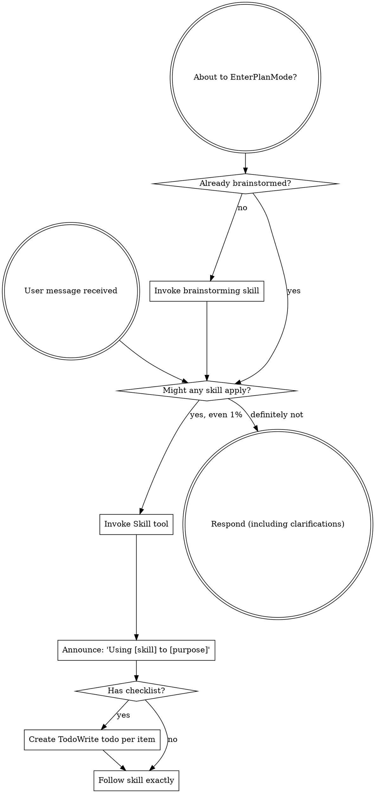
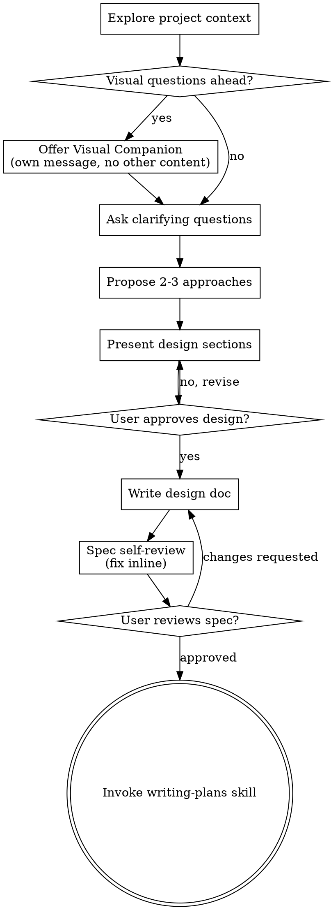
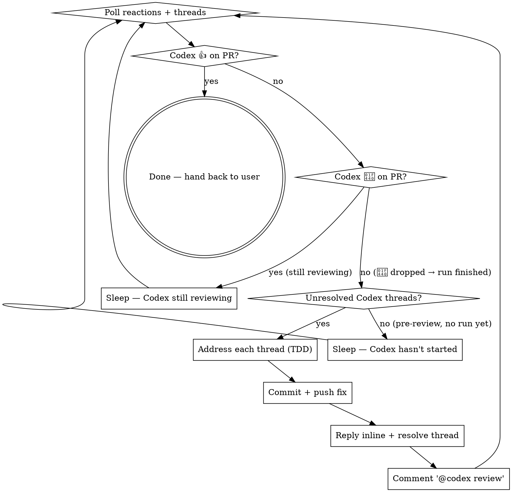
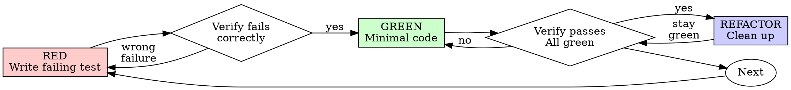

> SYSTEM

# AGENTS.md instructions for /Users/ericson/.t3/worktrees/ars-ui/t3code-19a9a9e7

<INSTRUCTIONS>
## Approach
- Read existing files before writing. Don't re-read unless changed.
- Thorough in reasoning, concise in output.
- Skip files over 100KB unless required.
- No sycophantic openers or closing fluff.
- No emojis or em-dashes.
- Do not guess APIs, versions, flags, commit SHAs, or package names. Verify by reading code or docs before asserting.

--- project-doc ---

# ars-ui

## Project Overview

Rust frontend component library using state machines, framework-agnostic core with Leptos/Dioxus adapters.

## Current Phase

The repo is now in active implementation, not spec drafting only.

Agents working on implementation should use the GitHub Project roadmap and issue backlog as the execution source of truth:

- Use the GitHub Project `ars-ui implementation roadmap` to understand active epics, task breakdown, dependencies, status, and iteration planning.
- Prefer picking a single issue-backed task that is unblocked, sized, and scoped for independent delivery.
- Do not start work from an epic issue unless the user explicitly asks for planning or further decomposition.
- Do not start a task that is blocked by unresolved GitHub issue dependencies.
- Treat native GitHub issue dependencies as the blocker graph and the issue body acceptance criteria as the delivery contract.

## Development Workflow

For implementation tasks:

1. Read the assigned or selected GitHub issue first.
2. Move the issue to **In Progress** on the GitHub Project board.
3. Review the cited spec sections and any dependency issues.
4. Add or update the named tests first.
5. Implement only the scope required to make those tests pass.
6. If implementation changes the intended contract, update the relevant spec in the same task.
7. **MANDATORY:** Invoke the `post-implementation-audit` skill (`.agents/skills/post-implementation-audit/SKILL.md`). It runs three sequential audits on the new code — (a) spec/implementation drift with "best outcome" recommendations, (b) iterative "anything else missing?" passes (minimum two rounds), (c) test-coverage audit across every test type the workspace uses (unit, snapshot, proptest, mutation, doc, spec-conformance, llvm-cov). **Every finding lands in _this_ PR — no deferral, no follow-up issues.** This step exists because initial implementations consistently ship spec drift and silent contract violations that take 3+ review round-trips to surface; the audit collapses them into one. Skipping this step is a contract violation.
8. Present the final result for user review before any commit.
9. After user approval, run `cargo xci --profile fast` (alias: `cargo xci-fast`) locally and fix any failures before pushing anything to GitHub. The fast profile takes ~5 minutes and covers the workspace-level regressions a pre-push gate should catch: fmt, check, clippy, unit, integration, adapter, spec-compile-snippets, error-variant-coverage, mutual-exclusion, snapshot-count. Reserve full `cargo xci` (~25 minutes, all 20 gates including wasm coverage and the feature-matrix groups) for after substantial refactors that may have shifted feature-flag interactions. For small follow-up changes, run the focused tests and checks that cover the edited code instead.
10. After `cargo xci-fast` passes, commit and push a PR targeting `main`. The PR body MUST include an auto-close keyword for the issue being delivered, for example `Closes #20` or `Fixes #20`, so GitHub closes the issue automatically when the PR merges.
11. **If the PR creates or modifies any `.snap` insta fixtures, attach the `snapshot-reviewed` label after opening or updating it** (`gh pr edit <num> --add-label "snapshot-reviewed"`). This signals to reviewers that the snapshot output was inspected and is intentional. Re-apply the label whenever you push a commit that touches `.snap` files; the workflow assumes the label reflects the latest snapshot state.
12. **MANDATORY:** Invoke the `waiting-for-codex-review` skill (`.agents/skills/waiting-for-codex-review/SKILL.md`) immediately after the first push that creates the PR, and re-invoke it after every subsequent push to the PR branch. The skill posts the initial `@codex review` trigger, polls Codex's 👀 → (👍 \| ∅ + threads) reaction lifecycle, addresses any review threads with the same rigor as `post-implementation-audit` (TDD + no coverage regression), replies inline, resolves threads, and re-comments `@codex review` to start the next pass — looping until Codex leaves 👍. Skipping this step leaves Codex findings unaddressed and silently widens the gap between merged code and the spec; the merge gate is 👍 from Codex plus green CI, not green CI alone.
13. Only after CI passes, Codex has left 👍, and the PR is merged, close the issue.

Never close a GitHub issue without a merged PR that passes CI **and a 👍 from Codex**. Never commit or push without explicit user approval. Keep the issue, PR, and Project board status aligned with the actual work state at every step.

Default delivery rules:

- Follow TDD: tests first, implementation second, verification last.
- Keep task scope aligned with the issue. If the issue is too large or ambiguous, stop and split or clarify rather than freelancing a bigger change.
- Prefer tasks sized `1`, `2`, `3`, or `5` points. `8` is exceptional. `13` must be decomposed before implementation.
- Preserve the crate and dependency layering defined by the architecture and implementation plan.
- Do not add a new dependency crate without explicit user approval first. If a task appears to need a new crate, stop, explain why, and get approval before editing any `Cargo.toml`.
- When a task is complete, verify the exact tests and checks named by the issue before considering it done.
- For adapter-level component implementation, follow `docs/implementation/adapter-component-delivery.md`. Adapter component work must cover the adapter crate, adapter tests, E2E fixtures/harnesses when applicable, widgets examples, spec synchronization, and the required validation/audit loop in one PR.

### Code Quality Standards

- **Document all public items.** Every public struct, enum, trait, function, constant, type alias, method, field, and variant must have a `///` doc comment. Every `lib.rs` must have a `//!` crate-level doc comment. The workspace enforces `missing_docs` linting — undocumented public items are build failures.
- **Zero warnings policy.** All code must compile with zero warnings under the workspace's configured clippy and rustc lints. Fix the root cause instead of suppressing. When suppression is genuinely needed, use `#[expect(lint, reason = "...")]` — never `#[allow(...)]`.
- **Derive documentation from the spec.** Doc comments should describe the _purpose and semantics_ of the item as defined in the corresponding `spec/` files, not just restate the type signature.
- **Use `#[inline]` selectively, not mechanically.** Do **not** add Clippy's `missing_inline_in_public_items` lint at the workspace level, and do not treat public visibility alone as a reason to mark an item `#[inline]`. Use `#[inline]` for thin cross-crate wrappers, trivial accessors, and hot-path no-op shims where the call overhead is plausibly meaningful. Avoid blanket `#[inline]` on all public APIs — it increases code size, adds compile-time cost, and turns `#[inline]` into noise instead of a deliberate performance signal.
- **Use directory-backed modules with `mod.rs` when a module owns children.** This repo standardizes on the older filesystem layout for nested modules. If module `foo` has child modules, the parent must live at `foo/mod.rs`, not `foo.rs`. Do not mix `foo.rs` with a sibling `foo/` directory. When a refactor adds child modules under an existing flat file, move the parent into `foo/mod.rs` in the same change. Do not leave empty leftover module directories behind.

### API Design Standards

- **Design for the pit of success.** Public APIs should make the most natural, shortest path also be the path that is correct, accessible, localizable, type-safe, and performant. Prefer ergonomic constructors and defaults that preserve the spec's strongest guarantees instead of making users opt into correctness after choosing a convenient API.
- **Name escape hatches explicitly.** When a component needs a lower-level, static, non-i18n, or otherwise less complete path, keep it available but make the tradeoff visible in the API name or type. The blessed path should remain the simplest call site, while escape hatches should read as deliberate choices.
- **Keep semantic data separate from rendered views.** Rich framework views are useful for customization, but components still need semantic sources for accessible names, localized text, announcements, ids, and state-machine wiring. Do not rely on arbitrary rendered view trees as the only source of user-facing semantics.

### Code Coverage

The workspace uses `cargo-llvm-cov` for code coverage with per-crate threshold enforcement. CI runs coverage on every PR (see `.github/workflows/ci.yml`).

**Local coverage commands:**

```bash
# Per-crate coverage with inline annotated source (most useful during development)
cargo llvm-cov test -p ars-interactions --text -- hover

# Per-crate summary only
cargo llvm-cov test -p ars-interactions -- hover

# Native-only workspace coverage (host target; excludes wasm-only crates)
cargo llvm-cov --workspace \
  --exclude ars-leptos --exclude ars-dioxus \
  --exclude ars-test-harness-leptos --exclude ars-test-harness-dioxus \
  --exclude ars-derive --exclude xtask \
  --lcov --output-path lcov.info

# Check all crates against spec-defined thresholds (run after a *merged* lcov)
cargo xtask coverage check-all --file lcov.info
```

The `--text` flag produces line-by-line annotated source showing hit counts and `^0` markers on uncovered branches — use this to identify gaps after writing tests. Uncovered no-op callback closures in tests (e.g., `|_| {}`) are expected and not a gap.

The local recipe above excludes the adapter and adapter-test-harness crates because their `target_arch = "wasm32"` / `feature = "web"` code paths can't be measured via host-target `cargo llvm-cov`. **CI runs an additional wasm-coverage pipeline on nightly** (`cargo xtask ci coverage`) that uses `wasm-bindgen-test`'s experimental coverage recipe with LLVM 22 / `clang-22` to emit lcov for `ars-leptos` (csr), `ars-dioxus` (web), `ars-dom` (web), `ars-i18n` (web-intl), and the adapter test harnesses, then merges with the native lcov via `cargo xtask coverage merge`. The per-crate thresholds in `xtask::coverage::default_thresholds()` are enforced against the merged file — including adapter targets (`ars-leptos` 74/55, `ars-dioxus` 77/70, `ars-test-harness-leptos` 60/0, `ars-test-harness-dioxus` 60/0). `ars-derive` (proc-macro, runs in compiler) is exercised via `crates/ars-core/tests/derive_contract.rs` and is unmeasured. `xtask` has its own enforced threshold (30/35) and is measured. See `spec/testing/14-ci.md` §2 for the full pipeline.

### Mutation Testing

Coverage tells you which lines run. **Mutation testing tells you whether the tests would notice if those lines silently misbehaved.** The workspace uses [`cargo-mutants`](https://mutants.rs) for this — a `cargo` extension binary, not a workspace dependency.

**Install (once per developer machine):**

```bash
cargo install cargo-mutants --locked --version 27.0.0
```

**Local commands (state-machine modules are the most rewarding targets):**

```bash
# Run on a single component machine (~6 min for popover)
cargo mutants -p ars-components -f crates/ars-components/src/overlay/popover/mod.rs

# Just list what would be mutated, without running tests (fast)
cargo mutants -p ars-components -f crates/ars-components/src/overlay/popover/mod.rs --list

# Whole crate (slow — only if you really mean it)
cargo mutants -p ars-components
```

**Agnostic component implementation gate:** whenever an agent implements a new framework-agnostic component, or materially changes an existing one, the delivery must include:

- a targeted mutation run for the component source file, usually `cargo mutants -p ars-components -f crates/ars-components/src/<category>/<component>/mod.rs` (adjust the path for single-file modules);
- spec-conformance tests for the component's anatomy/public contract, including its `Part` enum and required API/attribute surface;
- same-task triage of every `MISSED` mutant: add tests for real gaps, or add a justified line-agnostic `.cargo/mutants.toml` exclude only for true equivalent mutations.

This mutation gate is a pre-PR implementation/audit gate. Once the PR has been opened, agents **MUST NOT** rerun mutation tests during Codex review rounds unless the user explicitly asks for another mutation run. Review-loop fixes should use focused regression tests, snapshots, coverage, clippy, and spec validation appropriate to the changed code.

**Reading the output:** Results land in `mutants.out/mutants.out/` (gitignored). The two files that matter:

- `caught.txt` — mutations that broke at least one test ✅
- `missed.txt` — mutations that survived all tests ❌ — each one is either a real test gap to fill or an "equivalent mutation" that needs a `[[skip]]` entry in `mutants.toml` with a justification

**CI integration:** Nightly only. `.github/workflows/nightly.yml` has a `mutation-testing` job with a 21-entry matrix that runs `cargo mutants -p <package>` on every framework-agnostic crate, using `--shard k/n` to spread larger crates across parallel runners. **Shard indices are 0-based** (`k` runs from `0` to `n-1`); `k == n` is invalid and will fail the job. When adding shards, always start at `0/n` and end at `(n-1)/n`.

- **`ars-components` (≈ 1,630 mutants today, planned to grow as the spec adds the remaining ~97 components):** sharded **12-way** → ≈ 135 mutants per runner today, ≈ 850 per runner at the ~10,000-mutant endpoint. Sized for the full spec catalog up front so we don't re-shard every few months as components land.
- **`ars-collections` (≈ 1,080 mutants):** sharded 4-way → ≈ 270 mutants per runner.
- **`ars-core` (≈ 700 mutants):** sharded 2-way → ≈ 350 mutants per runner.
- **`ars-a11y`, `ars-forms`, `ars-interactions`:** one runner each (under 600 mutants apiece).

**Adding a new state machine inside an existing crate requires no CI changes** — its mutations land in whichever shard the cargo-mutants partitioner places them. The shard counts are sized so the slowest runner stays well under 30 minutes today and under ~50 minutes at the planned endpoint; re-balance only when a crate outgrows that budget (visible on the nightly dashboard as one shard pulling away from the others).

All matrix jobs run with `fail-fast: false` so failures on one module don't mask data on another. Each job uploads its `mutants.out/` as a workflow artifact (always, even on success — surviving "missed" entries on a passing run still reveal test-quality work). The job fails if any mutation survives, so a missed mutation forces a deliberate triage decision (fix the test, or document the equivalence with a `[[skip]]` entry in `mutants.toml`).

**Excluded crates** (mutation testing's signal degrades wherever determinism does): adapter glue (`ars-leptos`, `ars-dioxus`), DOM/FFI (`ars-dom`), ICU/FFI (`ars-i18n`), test infrastructure (`ars-test-harness*`), and the proc-macro crate (`ars-derive`, runs in the compiler). Adding a brand-new crate that is a good mutation target requires one new matrix entry; run a local scout first (`cargo mutants -p <crate> --list` to size, then a real run) so we know the right shard count before the nightly fires.

**Bumping the pinned version.** Both the local install command above and `.github/workflows/nightly.yml` pin cargo-mutants to an exact version (currently `27.0.0`) — same convention as `wasm-pack` in the `a11y-audit` job. Pinning is deliberate: cargo-mutants ships new mutators in releases, and an unpinned install would silently change the mutation set without any code change, surfacing as phantom CI failures on a green-source repo. To bump, open a PR that (1) updates the version string in CLAUDE.md and `nightly.yml`, (2) runs the popover scout locally with the new version (`cargo mutants -p ars-components -f crates/ars-components/src/overlay/popover/mod.rs`) to confirm the mutation count is in the same ballpark, and (3) triages any new "missed" entries the new mutators surface — they are usually genuine test-quality gaps newly visible to the tool.

### Property Testing (proptest)

State-machine invariants are exercised by [`proptest`](https://docs.rs/proptest) under `crates/<crate>/tests/proptest_state_machines/` (see `ars-components`). Default proptest behaviour drops `*.proptest-regressions` seed files alongside test sources — instead, every `proptest!` block in this workspace pulls a shared `Config` from `tests/proptest_state_machines/common.rs` that:

1. Reads `PROPTEST_CASES` from the environment (1,000 default; 10,000 in the nightly `extended-proptest` job).
2. Sets `failure_persistence` to `FileFailurePersistence::Direct("proptest-regressions/state-machines.txt")`, so all persisted seeds for the test binary live in one file at the crate root: `crates/<crate>/proptest-regressions/state-machines.txt`. The directory is committed (per proptest's own recommendation in the file header) so every developer's runs benefit from previously-shrunk failures.

When a new crate adopts proptest for state-machine tests, copy the same `common.rs` helper and reference it via `#![proptest_config(super::common::proptest_config())]` inside every `proptest!` block. Don't let proptest fall back to its `WithSource` default — that scatters seed files across the source tree.

### Adapter Prelude Convention

Both `ars-leptos` and `ars-dioxus` expose a `prelude` module targeting **end users** — application developers who consume the ready-made components. `use ars_leptos::prelude::*` (or `use ars_dioxus::prelude::*`) should give them everything they need.

The prelude contains only user-facing items:

1. **Component modules** — as components land, their public module paths (e.g., `button`, `dialog`) are re-exported so users can write `button::Props`, etc.
2. **User-facing traits** — traits end users call on component outputs (e.g., `Translate` from `ars-i18n`). Re-export the trait so consumers don't need a direct dependency on the subsystem crate.
3. **Configuration types** — types that appear in component props or configure behaviour (e.g., `Locale`, `Direction`, `Orientation`, `Selection`).

The prelude does **not** include implementation details consumed only by component authors inside the adapter crate: core engine types (`Machine`, `Service`, `ConnectApi`, `AttrMap`), accessibility primitives (`AriaRole`, `AriaAttribute`), interaction helpers (`merge_attrs`), or adapter hooks (`use_machine`, `UseMachineReturn`). Those remain accessible via their normal crate paths for advanced users building custom machines.

Both adapter preludes must stay symmetric: same items, same structure. When adding a new re-export to one adapter's prelude, add it to the other as well in the same PR.

### Adapter Testing Convention

Adapter-level component tests should default to the framework-specific test harness crate:

- Leptos adapter tests should prefer `ars-test-harness-leptos`.
- Dioxus adapter tests should prefer `ars-test-harness-dioxus`.
- Shared `ars-test-harness` helpers should be used where relevant for viewport, layout, clipboard, drag/drop, timing, and other DOM test setup instead of bespoke per-test browser scaffolding.

When a component spec requires interaction, focus, overlay positioning, clipboard, file upload, drag/drop, or similar browser behavior, the task's tests should exercise that behavior through the adapter harness entrypoints and shared core harness helpers unless there is a concrete technical reason not to.

## Spec Synchronization During Implementation

The specification is the authoritative contract. It took weeks of deliberate design and MUST be followed.

### Spec-first implementation rule

Before implementing any public type, trait, function, or method:

1. **Read the spec section first.** Find the relevant code example in `spec/`. Use `spec-tool toc <file>` and `grep` to locate it.
2. **Match the spec exactly.** If the spec defines `struct ComponentIds { base: String }` with methods `from_id()`, `id()`, `part()`, `item()`, `item_part()` — implement exactly that. Do not invent alternative field names, method names, or signatures.
3. **Cross-check after implementation.** Before presenting code for review, diff every public item against the spec's code examples. Every struct field, every method name, every parameter must match.
4. **If you must deviate**, there must be a concrete technical reason (e.g., the spec's API cannot compile, or a dependency doesn't expose the needed type). Document the reason in a code comment and flag it to the user explicitly.

Inventing alternative APIs that "seem equivalent" is never acceptable — it silently invalidates the spec's design decisions and all downstream code that depends on those APIs.

### Spec/code mismatch resolution

- If code and spec disagree, resolve the mismatch in the same task or PR.
- Shared conceptual changes belong in shared or foundation spec files, not only in adapter code.
- Adapter-specific findings must be reflected back into `spec/foundation/08-adapter-leptos.md` and/or `spec/foundation/09-adapter-dioxus.md` when relevant.
- Do not leave spec drift behind as follow-up cleanup.

## Spec Structure

The specification lives in `spec/` with this layout:

- `spec/manifest.toml` — **START HERE** — central index of all components and their dependencies
- `spec/foundation/` — architecture, accessibility, i18n, interactions, forms, adapters, spec template (00-10)
- `spec/shared/` — cross-component shared types (date-time, selection, layout, z-index)
- `spec/components/{category}/` — one file per component, organized by category
- `spec/testing/` — test specs split by domain

### Component Categories

- `input/` — checkbox, text-field, slider, number-input, etc.
- `selection/` — select, combobox, listbox, menu, tags-input, etc.
- `overlay/` — dialog, popover, tooltip, toast, presence, etc.
- `navigation/` — accordion, tabs, tree-view, pagination, steps, etc.
- `date-time/` — date-field, time-field, calendar, date-picker, etc.
- `data-display/` — table, avatar, progress, meter, badge, etc.
- `layout/` — splitter, scroll-area, carousel, portal, toolbar, etc.
- `specialized/` — color-picker, file-upload, signature-pad, qr-code, etc.
- `utility/` — button, toggle, focus-scope, visually-hidden, separator, etc.

## Working with the Spec

When reading large files, run `wc -l` first to check the line count. If the file is over 2,000
lines, use the `offset` and `limit` parameters on the Read tool to read in chunks rather than
attempting to read the entire file at once.

### Using xtask spec (preferred)

Use `cargo xtask spec` to resolve file sets instead of manually parsing manifest.toml:

```bash
# Quick metadata lookup:
cargo xtask spec info <component>

# Find all components using a shared type:
cargo xtask spec reverse <shared-type>

# See a file's heading structure (with line numbers):
cargo xtask spec toc <file>

# Validate frontmatter matches manifest.toml:
cargo xtask spec validate

# Search spec content by keyword/regex (with optional filters):
cargo xtask spec search <query> [--category <cat>] [--section <sec>] [--tier <tier>]

# Get a compact component summary (states, events, props, accessibility):
cargo xtask spec digest <component>

# Get full implementation context (component + all deps concatenated):
cargo xtask spec context <component> [--framework <fw>] [--include-testing]
```

The xtask also runs as an MCP server (`cargo xtask mcp`) exposing all spec tools for LLM agents.

### Reading a component (manual fallback)

1. Read `spec/manifest.toml` to find the component's path and dependencies
2. Read the component file (has YAML frontmatter listing its foundation/shared deps)
3. Only load the foundation files listed in `foundation_deps` — not all of them

### Framework and library specs — MANDATORY skill loading

When reading or editing these specification files, you MUST load the corresponding skill BEFORE doing any work. The skills contain verified, version-accurate API documentation that the spec code examples depend on. Claude's training data is wrong for these libraries — do not trust it.

| Spec file                                    | Skill to load | Library version |
| -------------------------------------------- | ------------- | --------------- |
| `spec/foundation/04-internationalization.md` | `icu4x`       | ICU4X 2.1.1     |
| `spec/foundation/08-adapter-leptos.md`       | `leptos`      | Leptos 0.8.17   |
| `spec/foundation/09-adapter-dioxus.md`       | `dioxus`      | Dioxus 0.7.3    |

This applies to any task that touches adapter code: reviewing, writing, modifying, or answering questions about these files. Load the skill first, then proceed.

### Spec Conventions

- **No deprecation:** This is a greenfield spec. If an API is unused or redundant, remove it and fix all references. Never use `#[deprecated]` or deprecation shims.
- **No deferral:** Never mark spec content as "TODO", "FIXME", "future enhancement", "P1/P2 extension", or any similar deferral language. Every feature mentioned must be fully specified. If a design choice is unclear, ask the user rather than deferring.
- **No guessing external APIs:** NEVER guess function names or module paths for external crates. Always verify against `https://docs.rs/<crate_name>` before writing code that calls library APIs. This applies especially to Leptos, Dioxus, ICU4X, and any crate where training data may be stale. If you cannot verify, state that explicitly rather than fabricating a plausible-looking API.

### Component file format

Each component file has YAML frontmatter declaring its metadata:

```markdown
---
component: ComponentName
category: { category }
tier: stateless | stateful | complex
foundation_deps: [architecture, accessibility, ...]
shared_deps: [date-time-types, ...]
related: [sibling-component, ...]
---

# ComponentName
```

The `tier` field determines which sections are required — see `spec/foundation/10-component-spec-template.md` for the canonical section structure, ordering rules, and conformance checklist. Headings are numbered (e.g., `## 1. State Machine`, `### 1.1 States`, `#### 1.1.1 InnerStates`, etc.) for precise section references.

</INSTRUCTIONS>
<environment_context>
  <cwd>/Users/ericson/.t3/worktrees/ars-ui/t3code-19a9a9e7</cwd>
  <shell>zsh</shell>
  <current_date>2026-05-26</current_date>
  <timezone>America/Sao_Paulo</timezone>
</environment_context>

> DEVELOPER

Implement task #228

> AGENT

I’ll plan this rather than mutate the repo because we’re still in Plan Mode. I’m going to ground the plan in the live issue, repo state, and the project’s implementation conventions before asking anything.

> TOOL

tool_use exec_command
id: call_xcbXbCtJQ04KJgIjqGByX40I
```json
{
  "cmd": "sed -n '1,220p' /Users/ericson/.claude/skills/using-superpowers/SKILL.md",
  "workdir": "/Users/ericson/.t3/worktrees/ars-ui/t3code-19a9a9e7",
  "yield_time_ms": 1000,
  "max_output_tokens": 12000
}
```

> TOOL

tool_use exec_command
id: call_ClReDNxPvI8HykXQ46cSMIwE
```json
{
  "cmd": "sed -n '1,220p' /Users/ericson/.claude/skills/brainstorming/SKILL.md",
  "workdir": "/Users/ericson/.t3/worktrees/ars-ui/t3code-19a9a9e7",
  "yield_time_ms": 1000,
  "max_output_tokens": 12000
}
```

> TOOL

tool_use exec_command
id: call_k53E5PsebcwjDgQYdRAzHGBL
```json
{
  "cmd": "sed -n '1,220p' /Users/ericson/.claude/skills/writing-plans/SKILL.md",
  "workdir": "/Users/ericson/.t3/worktrees/ars-ui/t3code-19a9a9e7",
  "yield_time_ms": 1000,
  "max_output_tokens": 12000
}
```

> TOOL

tool_use exec_command
id: call_dj3YX6jnSUVHcBiyhWSrk5af
```json
{
  "cmd": "rg -n \"#228|issue #228|228\" /Users/ericson/.codex/memories/MEMORY.md",
  "workdir": "/Users/ericson/.t3/worktrees/ars-ui/t3code-19a9a9e7",
  "yield_time_ms": 1000,
  "max_output_tokens": 4000
}
```

> TOOL

tool_result
id: call_xcbXbCtJQ04KJgIjqGByX40I
```
Chunk ID: fc7c37
Wall time: 0.1030 seconds
Process exited with code 0
Original token count: 1356
Output:
---
name: using-superpowers
description: Use when starting any conversation - establishes how to find and use skills, requiring Skill tool invocation before ANY response including clarifying questions
---

<SUBAGENT-STOP>
If you were dispatched as a subagent to execute a specific task, skip this skill.
</SUBAGENT-STOP>

<EXTREMELY-IMPORTANT>
If you think there is even a 1% chance a skill might apply to what you are doing, you ABSOLUTELY MUST invoke the skill.

IF A SKILL APPLIES TO YOUR TASK, YOU DO NOT HAVE A CHOICE. YOU MUST USE IT.

This is not negotiable. This is not optional. You cannot rationalize your way out of this.
</EXTREMELY-IMPORTANT>

## Instruction Priority

Superpowers skills override default system prompt behavior, but **user instructions always take precedence**:

1. **User's explicit instructions** (CLAUDE.md, GEMINI.md, AGENTS.md, direct requests) — highest priority
2. **Superpowers skills** — override default system behavior where they conflict
3. **Default system prompt** — lowest priority

If CLAUDE.md, GEMINI.md, or AGENTS.md says "don't use TDD" and a skill says "always use TDD," follow the user's instructions. The user is in control.

## How to Access Skills

**In Claude Code:** Use the `Skill` tool. When you invoke a skill, its content is loaded and presented to you—follow it directly. Never use the Read tool on skill files.

**In Copilot CLI:** Use the `skill` tool. Skills are auto-discovered from installed plugins. The `skill` tool works the same as Claude Code's `Skill` tool.

**In Gemini CLI:** Skills activate via the `activate_skill` tool. Gemini loads skill metadata at session start and activates the full content on demand.

**In other environments:** Check your platform's documentation for how skills are loaded.

## Platform Adaptation

Skills use Claude Code tool names. Non-CC platforms: see `references/copilot-tools.md` (Copilot CLI), `references/codex-tools.md` (Codex) for tool equivalents. Gemini CLI users get the tool mapping loaded automatically via GEMINI.md.

# Using Skills

## The Rule

**Invoke relevant or requested skills BEFORE any response or action.** Even a 1% chance a skill might apply means that you should invoke the skill to check. If an invoked skill turns out to be wrong for the situation, you don't need to use it.



## Red Flags

These thoughts mean STOP—you're rationalizing:

| Thought | Reality |
|---------|---------|
| "This is just a simple question" | Questions are tasks. Check for skills. |
| "I need more context first" | Skill check comes BEFORE clarifying questions. |
| "Let me explore the codebase first" | Skills tell you HOW to explore. Check first. |
| "I can check git/files quickly" | Files lack conversation context. Check for skills. |
| "Let me gather information first" | Skills tell you HOW to gather information. |
| "This doesn't need a formal skill" | If a skill exists, use it. |
| "I remember this skill" | Skills evolve. Read current version. |
| "This doesn't count as a task" | Action = task. Check for skills. |
| "The skill is overkill" | Simple things become complex. Use it. |
| "I'll just do this one thing first" | Check BEFORE doing anything. |
| "This feels productive" | Undisciplined action wastes time. Skills prevent this. |
| "I know what that means" | Knowing the concept ≠ using the skill. Invoke it. |

## Skill Priority

When multiple skills could apply, use this order:

1. **Process skills first** (brainstorming, debugging) - these determine HOW to approach the task
2. **Implementation skills second** (frontend-design, mcp-builder) - these guide execution

"Let's build X" → brainstorming first, then implementation skills.
"Fix this bug" → debugging first, then domain-specific skills.

## Skill Types

**Rigid** (TDD, debugging): Follow exactly. Don't adapt away discipline.

**Flexible** (patterns): Adapt principles to context.

The skill itself tells you which.

## User Instructions

Instructions say WHAT, not HOW. "Add X" or "Fix Y" doesn't mean skip workflows.

```

> TOOL

tool_result
id: call_ClReDNxPvI8HykXQ46cSMIwE
```
Chunk ID: 2a5600
Wall time: 0.2574 seconds
Process exited with code 0
Original token count: 2659
Output:
---
name: brainstorming
description: "You MUST use this before any creative work - creating features, building components, adding functionality, or modifying behavior. Explores user intent, requirements and design before implementation."
---

# Brainstorming Ideas Into Designs

Help turn ideas into fully formed designs and specs through natural collaborative dialogue.

Start by understanding the current project context, then ask questions one at a time to refine the idea. Once you understand what you're building, present the design and get user approval.

<HARD-GATE>
Do NOT invoke any implementation skill, write any code, scaffold any project, or take any implementation action until you have presented a design and the user has approved it. This applies to EVERY project regardless of perceived simplicity.
</HARD-GATE>

## Anti-Pattern: "This Is Too Simple To Need A Design"

Every project goes through this process. A todo list, a single-function utility, a config change — all of them. "Simple" projects are where unexamined assumptions cause the most wasted work. The design can be short (a few sentences for truly simple projects), but you MUST present it and get approval.

## Checklist

You MUST create a task for each of these items and complete them in order:

1. **Explore project context** — check files, docs, recent commits
2. **Offer visual companion** (if topic will involve visual questions) — this is its own message, not combined with a clarifying question. See the Visual Companion section below.
3. **Ask clarifying questions** — one at a time, understand purpose/constraints/success criteria
4. **Propose 2-3 approaches** — with trade-offs and your recommendation
5. **Present design** — in sections scaled to their complexity, get user approval after each section
6. **Write design doc** — save to `docs/superpowers/specs/YYYY-MM-DD-<topic>-design.md` and commit
7. **Spec self-review** — quick inline check for placeholders, contradictions, ambiguity, scope (see below)
8. **User reviews written spec** — ask user to review the spec file before proceeding
9. **Transition to implementation** — invoke writing-plans skill to create implementation plan

## Process Flow



**The terminal state is invoking writing-plans.** Do NOT invoke frontend-design, mcp-builder, or any other implementation skill. The ONLY skill you invoke after brainstorming is writing-plans.

## The Process

**Understanding the idea:**

- Check out the current project state first (files, docs, recent commits)
- Before asking detailed questions, assess scope: if the request describes multiple independent subsystems (e.g., "build a platform with chat, file storage, billing, and analytics"), flag this immediately. Don't spend questions refining details of a project that needs to be decomposed first.
- If the project is too large for a single spec, help the user decompose into sub-projects: what are the independent pieces, how do they relate, what order should they be built? Then brainstorm the first sub-project through the normal design flow. Each sub-project gets its own spec → plan → implementation cycle.
- For appropriately-scoped projects, ask questions one at a time to refine the idea
- Prefer multiple choice questions when possible, but open-ended is fine too
- Only one question per message - if a topic needs more exploration, break it into multiple questions
- Focus on understanding: purpose, constraints, success criteria

**Exploring approaches:**

- Propose 2-3 different approaches with trade-offs
- Present options conversationally with your recommendation and reasoning
- Lead with your recommended option and explain why

**Presenting the design:**

- Once you believe you understand what you're building, present the design
- Scale each section to its complexity: a few sentences if straightforward, up to 200-300 words if nuanced
- Ask after each section whether it looks right so far
- Cover: architecture, components, data flow, error handling, testing
- Be ready to go back and clarify if something doesn't make sense

**Design for isolation and clarity:**

- Break the system into smaller units that each have one clear purpose, communicate through well-defined interfaces, and can be understood and tested independently
- For each unit, you should be able to answer: what does it do, how do you use it, and what does it depend on?
- Can someone understand what a unit does without reading its internals? Can you change the internals without breaking consumers? If not, the boundaries need work.
- Smaller, well-bounded units are also easier for you to work with - you reason better about code you can hold in context at once, and your edits are more reliable when files are focused. When a file grows large, that's often a signal that it's doing too much.

**Working in existing codebases:**

- Explore the current structure before proposing changes. Follow existing patterns.
- Where existing code has problems that affect the work (e.g., a file that's grown too large, unclear boundaries, tangled responsibilities), include targeted improvements as part of the design - the way a good developer improves code they're working in.
- Don't propose unrelated refactoring. Stay focused on what serves the current goal.

## After the Design

**Documentation:**

- Write the validated design (spec) to `docs/superpowers/specs/YYYY-MM-DD-<topic>-design.md`
  - (User preferences for spec location override this default)
- Use elements-of-style:writing-clearly-and-concisely skill if available
- Commit the design document to git

**Spec Self-Review:**
After writing the spec document, look at it with fresh eyes:

1. **Placeholder scan:** Any "TBD", "TODO", incomplete sections, or vague requirements? Fix them.
2. **Internal consistency:** Do any sections contradict each other? Does the architecture match the feature descriptions?
3. **Scope check:** Is this focused enough for a single implementation plan, or does it need decomposition?
4. **Ambiguity check:** Could any requirement be interpreted two different ways? If so, pick one and make it explicit.

Fix any issues inline. No need to re-review — just fix and move on.

**User Review Gate:**
After the spec review loop passes, ask the user to review the written spec before proceeding:

> "Spec written and committed to `<path>`. Please review it and let me know if you want to make any changes before we start writing out the implementation plan."

Wait for the user's response. If they request changes, make them and re-run the spec review loop. Only proceed once the user approves.

**Implementation:**

- Invoke the writing-plans skill to create a detailed implementation plan
- Do NOT invoke any other skill. writing-plans is the next step.

## Key Principles

- **One question at a time** - Don't overwhelm with multiple questions
- **Multiple choice preferred** - Easier to answer than open-ended when possible
- **YAGNI ruthlessly** - Remove unnecessary features from all designs
- **Explore alternatives** - Always propose 2-3 approaches before settling
- **Incremental validation** - Present design, get approval before moving on
- **Be flexible** - Go back and clarify when something doesn't make sense

## Visual Companion

A browser-based companion for showing mockups, diagrams, and visual options during brainstorming. Available as a tool — not a mode. Accepting the companion means it's available for questions that benefit from visual treatment; it does NOT mean every question goes through the browser.

**Offering the companion:** When you anticipate that upcoming questions will involve visual content (mockups, layouts, diagrams), offer it once for consent:
> "Some of what we're working on might be easier to explain if I can show it to you in a web browser. I can put together mockups, diagrams, comparisons, and other visuals as we go. This feature is still new and can be token-intensive. Want to try it? (Requires opening a local URL)"

**This offer MUST be its own message.** Do not combine it with clarifying questions, context summaries, or any other content. The message should contain ONLY the offer above and nothing else. Wait for the user's response before continuing. If they decline, proceed with text-only brainstorming.

**Per-question decision:** Even after the user accepts, decide FOR EACH QUESTION whether to use the browser or the terminal. The test: **would the user understand this better by seeing it than reading it?**

- **Use the browser** for content that IS visual — mockups, wireframes, layout comparisons, architecture diagrams, side-by-side visual designs
- **Use the terminal** for content that is text — requirements questions, conceptual choices, tradeoff lists, A/B/C/D text options, scope decisions

A question about a UI topic is not automatically a visual question. "What does personality mean in this context?" is a conceptual question — use the terminal. "Which wizard layout works better?" is a visual question — use the browser.

If they agree to the companion, read the detailed guide before proceeding:
`skills/brainstorming/visual-companion.md`

```

> TOOL

tool_result
id: call_k53E5PsebcwjDgQYdRAzHGBL
```
Chunk ID: 17e6c5
Wall time: 0.2574 seconds
Process exited with code 0
Original token count: 1512
Output:
---
name: writing-plans
description: Use when you have a spec or requirements for a multi-step task, before touching code
---

# Writing Plans

## Overview

Write comprehensive implementation plans assuming the engineer has zero context for our codebase and questionable taste. Document everything they need to know: which files to touch for each task, code, testing, docs they might need to check, how to test it. Give them the whole plan as bite-sized tasks. DRY. YAGNI. TDD. Frequent commits.

Assume they are a skilled developer, but know almost nothing about our toolset or problem domain. Assume they don't know good test design very well.

**Announce at start:** "I'm using the writing-plans skill to create the implementation plan."

**Context:** This should be run in a dedicated worktree (created by brainstorming skill).

**Save plans to:** `docs/superpowers/plans/YYYY-MM-DD-<feature-name>.md`
- (User preferences for plan location override this default)

## Scope Check

If the spec covers multiple independent subsystems, it should have been broken into sub-project specs during brainstorming. If it wasn't, suggest breaking this into separate plans — one per subsystem. Each plan should produce working, testable software on its own.

## File Structure

Before defining tasks, map out which files will be created or modified and what each one is responsible for. This is where decomposition decisions get locked in.

- Design units with clear boundaries and well-defined interfaces. Each file should have one clear responsibility.
- You reason best about code you can hold in context at once, and your edits are more reliable when files are focused. Prefer smaller, focused files over large ones that do too much.
- Files that change together should live together. Split by responsibility, not by technical layer.
- In existing codebases, follow established patterns. If the codebase uses large files, don't unilaterally restructure - but if a file you're modifying has grown unwieldy, including a split in the plan is reasonable.

This structure informs the task decomposition. Each task should produce self-contained changes that make sense independently.

## Bite-Sized Task Granularity

**Each step is one action (2-5 minutes):**
- "Write the failing test" - step
- "Run it to make sure it fails" - step
- "Implement the minimal code to make the test pass" - step
- "Run the tests and make sure they pass" - step
- "Commit" - step

## Plan Document Header

**Every plan MUST start with this header:**

```markdown
# [Feature Name] Implementation Plan

> **For agentic workers:** REQUIRED SUB-SKILL: Use superpowers:subagent-driven-development (recommended) or superpowers:executing-plans to implement this plan task-by-task. Steps use checkbox (`- [ ]`) syntax for tracking.

**Goal:** [One sentence describing what this builds]

**Architecture:** [2-3 sentences about approach]

**Tech Stack:** [Key technologies/libraries]

---
```

## Task Structure

````markdown
### Task N: [Component Name]

**Files:**
- Create: `exact/path/to/file.py`
- Modify: `exact/path/to/existing.py:123-145`
- Test: `tests/exact/path/to/test.py`

- [ ] **Step 1: Write the failing test**

```python
def test_specific_behavior():
    result = function(input)
    assert result == expected
```

- [ ] **Step 2: Run test to verify it fails**

Run: `pytest tests/path/test.py::test_name -v`
Expected: FAIL with "function not defined"

- [ ] **Step 3: Write minimal implementation**

```python
def function(input):
    return expected
```

- [ ] **Step 4: Run test to verify it passes**

Run: `pytest tests/path/test.py::test_name -v`
Expected: PASS

- [ ] **Step 5: Commit**

```bash
git add tests/path/test.py src/path/file.py
git commit -m "feat: add specific feature"
```
````

## No Placeholders

Every step must contain the actual content an engineer needs. These are **plan failures** — never write them:
- "TBD", "TODO", "implement later", "fill in details"
- "Add appropriate error handling" / "add validation" / "handle edge cases"
- "Write tests for the above" (without actual test code)
- "Similar to Task N" (repeat the code — the engineer may be reading tasks out of order)
- Steps that describe what to do without showing how (code blocks required for code steps)
- References to types, functions, or methods not defined in any task

## Remember
- Exact file paths always
- Complete code in every step — if a step changes code, show the code
- Exact commands with expected output
- DRY, YAGNI, TDD, frequent commits

## Self-Review

After writing the complete plan, look at the spec with fresh eyes and check the plan against it. This is a checklist you run yourself — not a subagent dispatch.

**1. Spec coverage:** Skim each section/requirement in the spec. Can you point to a task that implements it? List any gaps.

**2. Placeholder scan:** Search your plan for red flags — any of the patterns from the "No Placeholders" section above. Fix them.

**3. Type consistency:** Do the types, method signatures, and property names you used in later tasks match what you defined in earlier tasks? A function called `clearLayers()` in Task 3 but `clearFullLayers()` in Task 7 is a bug.

If you find issues, fix them inline. No need to re-review — just fix and move on. If you find a spec requirement with no task, add the task.

## Execution Handoff

After saving the plan, offer execution choice:

**"Plan complete and saved to `docs/superpowers/plans/<filename>.md`. Two execution options:**

**1. Subagent-Driven (recommended)** - I dispatch a fresh subagent per task, review between tasks, fast iteration

**2. Inline Execution** - Execute tasks in this session using executing-plans, batch execution with checkpoints

**Which approach?"**

**If Subagent-Driven chosen:**
- **REQUIRED SUB-SKILL:** Use superpowers:subagent-driven-development
- Fresh subagent per task + two-stage review

**If Inline Execution chosen:**
- **REQUIRED SUB-SKILL:** Use superpowers:executing-plans
- Batch execution with checkpoints for review

```

> TOOL

tool_result
id: call_dj3YX6jnSUVHcBiyhWSrk5af
```
Chunk ID: 6319c6
Wall time: 0.0290 seconds
Process exited with code 0
Original token count: 393
Output:
1149:- rollout_summaries/REDACTED.md (cwd=/Users/ericson/Workspace/Rust/judge-fudge, rollout_path=/Users/ericson/.codex/sessions/2026/05/18/rollout-2026-05-18T16-31-06-019e3c92-1228-7963-a961-ff115f8c78ae.jsonl, updated_at=2026-05-18T22:18:38+00:00, thread_id=019e3c92-1228-7963-a961-ff115f8c78ae, repo-root runbook/context pass before `cargo xrun`)
1159:- rollout_summaries/REDACTED.md (cwd=/Users/ericson/Workspace/Rust/judge-fudge, rollout_path=/Users/ericson/.codex/sessions/2026/05/18/rollout-2026-05-18T16-31-06-019e3c92-1228-7963-a961-ff115f8c78ae.jsonl, updated_at=2026-05-18T22:18:38+00:00, thread_id=019e3c92-1228-7963-a961-ff115f8c78ae, `xtask` command and alias implementation)
1169:- rollout_summaries/REDACTED.md (cwd=/Users/ericson/Workspace/Rust/judge-fudge, rollout_path=/Users/ericson/.codex/sessions/2026/05/18/rollout-2026-05-18T16-31-06-019e3c92-1228-7963-a961-ff115f8c78ae.jsonl, updated_at=2026-05-18T22:18:38+00:00, thread_id=019e3c92-1228-7963-a961-ff115f8c78ae, runtime debugging plus migration-before-start fix)
1179:- rollout_summaries/REDACTED.md (cwd=/Users/ericson/Workspace/Rust/judge-fudge, rollout_path=/Users/ericson/.codex/sessions/2026/05/18/rollout-2026-05-18T16-31-06-019e3c92-1228-7963-a961-ff115f8c78ae.jsonl, updated_at=2026-05-18T22:18:38+00:00, thread_id=019e3c92-1228-7963-a961-ff115f8c78ae, commit/push/reply/resolve on PR #78)

```

> AGENT

Using `using-superpowers`, `brainstorming`, and `writing-plans` for the planning workflow. I found no relevant memory hit for ars-ui issue #228, so I’m switching to live repo and GitHub context.

> TOOL

tool_use exec_command
id: call_PAGykQ3CoSirgGaWUzXmWMoL
```json
{
  "cmd": "sed -n '1,220p' /Users/ericson/.codex/plugins/cache/openai-curated/github/6188456f/skills/github/SKILL.md",
  "workdir": "/Users/ericson/.t3/worktrees/ars-ui/t3code-19a9a9e7",
  "yield_time_ms": 1000,
  "max_output_tokens": 12000
}
```

> TOOL

tool_use exec_command
id: call_m3ylYcJZacCpPHPSDSZMCrY3
```json
{
  "cmd": "git status --short && git branch --show-current && git remote -v",
  "workdir": "/Users/ericson/.t3/worktrees/ars-ui/t3code-19a9a9e7",
  "yield_time_ms": 1000,
  "max_output_tokens": 6000
}
```

> TOOL

tool_use exec_command
id: call_IDVXADFlxjWKQbHLnTOnJCvh
```json
{
  "cmd": "gh issue view 228 --json number,title,state,body,labels,assignees,projectItems,comments,url",
  "workdir": "/Users/ericson/.t3/worktrees/ars-ui/t3code-19a9a9e7",
  "yield_time_ms": 1000,
  "max_output_tokens": 20000
}
```

> TOOL

tool_use exec_command
id: call_HQG5aLIvdWdAIVpCFDnn7nrc
```json
{
  "cmd": "find . -name AGENTS.md -print",
  "workdir": "/Users/ericson/.t3/worktrees/ars-ui/t3code-19a9a9e7",
  "yield_time_ms": 1000,
  "max_output_tokens": 4000
}
```

> TOOL

tool_result
id: call_PAGykQ3CoSirgGaWUzXmWMoL
```
Chunk ID: 8ad54a
Wall time: 0.2123 seconds
Process exited with code 0
Original token count: 1089
Output:
---
name: github
description: Triage and orient GitHub repository, pull request, and issue work through the connected GitHub app. Use when the user asks for general GitHub help, wants PR or issue summaries, or needs repository context before choosing a more specific GitHub workflow.
---

# GitHub

## Overview

Use this skill as the umbrella entrypoint for general GitHub work in this plugin. It should decide whether the task stays in repo and PR triage or should be handed off to a more specific review, CI, or publish workflow.

This plugin is intentionally hybrid:

- Prefer the GitHub app from this plugin for repository, issue, pull request, comment, label, reaction, and PR creation workflows.
- Use local `git` and `gh` only when the connector does not cover the job well, especially for current-branch PR discovery, branch creation, commit and push, `gh auth status`, and GitHub Actions log inspection.
- Keep connector state and local checkout context aligned. If the request is about the current branch, resolve the local repo and branch before acting.

Once the intent is clear, route to the specialist skill immediately and do not keep broad GitHub triage in scope longer than needed.

## Connector-First Responsibilities

Handle these directly in this skill when the request does not need a narrower specialist workflow:

- repository orientation once the repo, PR, issue, or local checkout is identified
- recent PR or issue triage
- PR metadata summaries
- PR patch inspection
- PR comments, labels, and reactions
- issue lookup and summarization
- PR creation after a branch is already pushed

Prefer the GitHub app from this plugin for those flows because it provides structured PR, issue, and review-adjacent data without depending on a local checkout. If the repository is not already identifiable from the user request or local git context, ask for the repo instead of pretending there is a repo-search flow that may not exist.

## Routing Rules

1. Resolve the operating context first:
   - If the user provides a repository, PR number, issue number, or URL, use that.
   - If the request is about "this branch" or "the current PR", resolve local git context and use `gh` only as needed to discover the branch PR.
   - If the repository is still ambiguous after local inspection, ask for the repo identifier.
2. Classify the request before taking action:
   - `repo or PR triage`: summarize PRs, issues, patches, comments, labels, reactions, or repository state
   - `review follow-up`: unresolved review threads, requested changes, or inline review feedback
   - `CI debugging`: failing checks, Actions logs, or CI root-cause analysis
   - `publish changes`: create or switch branches, stage changes, commit, push, and open a draft PR
3. Route to the specialist skill as soon as the category is clear:
   - Review comments and requested changes: `../gh-address-comments/SKILL.md`
   - Failing GitHub Actions checks: `../gh-fix-ci/SKILL.md`
   - Commit, push, and open PR: `../yeet/SKILL.md`
4. Keep the hybrid model consistent after routing:
   - connector first for PR and issue data
   - local `git` and `gh` only for the specific gaps the connector does not cover

## Default Workflow

1. Resolve repository and item scope.
2. Gather structured PR or issue context through the GitHub app from this plugin.
3. Decide whether the task stays in connector-backed triage or needs a specialist skill.
4. Route immediately when the work becomes review follow-up, CI debugging, or publish workflow.
5. End with a clear summary of what was inspected, what changed, and what remains.

## Output Expectations

- For triage requests, return a concise summary of the repository, PR, or issue state and the next likely action.
- For mixed requests, tell the user which specialist path you are taking and why.
- For connector-backed write actions, restate the exact PR, issue, label, or reaction target before applying the change.
- Never imply that GitHub Actions logs are available through the connector alone. That remains a `gh` workflow.

## Examples

- "Use GitHub to summarize the open PRs in this repo and tell me what needs attention."
- "Help with this PR."
- "Review the latest comments on PR 482 and tell me what is actionable."
- "Debug the failing checks on this branch."
- "Commit these changes, push them, and open a draft PR."

```

> TOOL

tool_result
id: call_m3ylYcJZacCpPHPSDSZMCrY3
```
Chunk ID: 503804
Wall time: 0.1619 seconds
Process exited with code 0
Original token count: 31
Output:
t3code/implement-task-228
origin	git@github.com:fogodev/ars-ui.git (fetch)
origin	git@github.com:fogodev/ars-ui.git (push)

```

> TOOL

tool_result
id: call_IDVXADFlxjWKQbHLnTOnJCvh
```
Chunk ID: ab0f0c
Wall time: 1.0017 seconds
Process running with session ID 81630
Original token count: 0
Output:

```

> TOOL

tool_result
id: call_HQG5aLIvdWdAIVpCFDnn7nrc
```
Chunk ID: 6b181f
Wall time: 0.0807 seconds
Process exited with code 0
Original token count: 8
Output:
./spec/AGENTS.md
./AGENTS.md

```

> TOOL

tool_use write_stdin
id: call_eWitfsRznaRUjrc0Wy0deGmj
```json
{
  "session_id": 81630,
  "chars": "",
  "yield_time_ms": 1000,
  "max_output_tokens": 20000
}
```

> TOOL

tool_result
id: call_eWitfsRznaRUjrc0Wy0deGmj
```
Chunk ID: b22074
Wall time: 0.0000 seconds
Process exited with code 0
Original token count: 616
Output:
{"assignees":[],"body":"**Epic: #220 (Agnostic input components)**\n\n## Goal\nStateless; pure attribute mapper for hidden file input trigger with accept, multiple, directory props.\n\n## Out of scope\nFramework-specific adapter components (Leptos/Dioxus) and direct file-dialog or hidden-input `.click()` execution.\n\n## Spec refs\n`spec/components/input/file-trigger.md`\n\n## Depends on\nNone\n\n## Layer\nComponent\n\n## Framework\nNone\n\n## Test tier\nUnit\n\n## Fibonacci points\n2\n\n## Element/ref handling note\n\n- Core owns trigger/input attrs, disabled state, accepted types, multiple/directory attrs, and callback shape.\n- Opening the native picker or invoking a hidden input is adapter/platform work. Leptos should use its input `NodeRef`; Dioxus should use a mounted input handle or the platform file-picker abstraction where appropriate.\n- Do not model hidden-input activation as an ID lookup from the agnostic component. IDs may still be emitted for labels/form/test attrs.\n\n## Tests to add first\n- ConnectApi produces correct `data-ars-scope`/`data-ars-part` attrs.\n- Trigger activation emits adapter-resolvable open-picker intent when enabled.\n- Accept and multiple props reflected in hidden input attrs.\n- Disabled trigger does not emit open-picker intent.\n\n## Acceptance criteria\n- All public types documented per workspace `missing_docs` lint.\n- ConnectApi produces correct ARIA attributes per spec §2.\n- File picker opening is represented as adapter/platform intent, not direct DOM/ID lookup.\n- Snapshot tests cover the component's `connect()` / `Api` `AttrMap` output for every anatomy part and each output-affecting state, prop, or context branch, with committed `.snap` fixtures passing `cargo insta test --unreferenced=reject`.\n- All named tests pass with zero warnings.\n\n## Spec impact\nNo spec change required unless current examples imply agnostic hidden-input `.click()` or DOM lookup.\n\n## Board update rule\nIf blocked, keep `Status` in `Todo`, use native GitHub issue dependencies, and name the dependency or spec ambiguity.\n","comments":[],"labels":[{"id":"LA_kwDORp4enM8AAAACd5NBow","name":"task","description":"Agent-ready implementation task","color":"0E8A16"}],"number":228,"projectItems":[{"status":{"optionId":"f75ad846","name":"Todo"},"title":"ars-ui implementation roadmap"}],"state":"OPEN","title":"task: Implement FileTrigger agnostic core","url":"https://github.com/fogodev/ars-ui/issues/228"}

```

> AGENT

Issue #228 is a small agnostic-core task for `FileTrigger`: no adapter work, unit/snapshot tests first, and no spec change unless the spec currently implies DOM activation. I’m now reading the component spec and nearby input-component patterns so the plan can name exact files, APIs, and gates.

> TOOL

tool_use exec_command
id: call_ed7XuR5JIpYH5eMABZUtOEs1
```json
{
  "cmd": "cargo xtask spec info file-trigger",
  "workdir": "/Users/ericson/.t3/worktrees/ars-ui/t3code-19a9a9e7",
  "yield_time_ms": 1000,
  "max_output_tokens": 12000
}
```

> TOOL

tool_use exec_command
id: call_Bcz1q4JRA8t0TfGvhM9A2SAe
```json
{
  "cmd": "cargo xtask spec toc spec/components/input/file-trigger.md",
  "workdir": "/Users/ericson/.t3/worktrees/ars-ui/t3code-19a9a9e7",
  "yield_time_ms": 1000,
  "max_output_tokens": 16000
}
```

> TOOL

tool_use exec_command
id: call_1POjVijNsCl3yNcgmMjbBQFB
```json
{
  "cmd": "wc -l spec/components/input/file-trigger.md spec/AGENTS.md AGENTS.md",
  "workdir": "/Users/ericson/.t3/worktrees/ars-ui/t3code-19a9a9e7",
  "yield_time_ms": 1000,
  "max_output_tokens": 4000
}
```

> TOOL

tool_use exec_command
id: call_AeToREXOLzDzQ5xHc9XeT3rI
```json
{
  "cmd": "rg -n \"FileTrigger|file_trigger|file-trigger|File Trigger|open-picker|open picker|picker intent|Accept\" crates spec -g '*.rs' -g '*.md' -g '*.toml'",
  "workdir": "/Users/ericson/.t3/worktrees/ars-ui/t3code-19a9a9e7",
  "yield_time_ms": 1000,
  "max_output_tokens": 24000
}
```

> TOOL

tool_result
id: call_ed7XuR5JIpYH5eMABZUtOEs1
```
Chunk ID: 41e7be
Wall time: 1.0007 seconds
Process running with session ID 41530
Original token count: 230
Output:
    Blocking waiting for file lock on package cache
    Blocking waiting for file lock on package cache
   Compiling slab v0.4.12
   Compiling futures-io v0.3.32
   Compiling proc-macro2 v1.0.106
   Compiling quote v1.0.45
   Compiling serde_core v1.0.228
   Compiling zmij v1.0.21
   Compiling num-traits v0.2.19
   Compiling serde v1.0.228
   Compiling futures-channel v0.3.32
   Compiling utf8parse v0.2.2
   Compiling futures-task v0.3.32
   Compiling serde_json v1.0.150
   Compiling ref-cast v1.0.25
   Compiling anstyle-parse v1.0.0
   Compiling colorchoice v1.0.5
   Compiling is_terminal_polyfill v1.70.2
   Compiling bytes v1.11.1
   Compiling anstyle v1.0.14
   Compiling once_cell v1.21.4
   Compiling anstyle-query v1.1.5
   Compiling memchr v2.8.0
   Compiling thiserror v2.0.18
   Compiling anstream v1.0.0
   Compiling tracing-core v0.1.36
   Compiling aho-corasick v1.1.4
   Compiling anyhow v1.0.102

```

> TOOL

tool_result
id: call_Bcz1q4JRA8t0TfGvhM9A2SAe
```
Chunk ID: ce676b
Wall time: 1.0010 seconds
Process running with session ID 32679
Original token count: 41
Output:
    Blocking waiting for file lock on package cache
    Blocking waiting for file lock on package cache
    Blocking waiting for file lock on artifact directory

```

> TOOL

tool_result
id: call_1POjVijNsCl3yNcgmMjbBQFB
```
Chunk ID: 8fe3dd
Wall time: 0.1820 seconds
Process exited with code 0
Original token count: 27
Output:
     305 spec/components/input/file-trigger.md
      42 spec/AGENTS.md
     295 AGENTS.md
     642 total

```

> TOOL

tool_result
id: call_AeToREXOLzDzQ5xHc9XeT3rI
```
Chunk ID: bfa0e4
Wall time: 0.0829 seconds
Process exited with code 0
Original token count: 3950
Output:
spec/leptos-components/utility/drop-zone.md:65:| terminal reset     | state is `DropAccepted` or `DropRejected`                       | adapter timer dispatches `AutoReset` after `reset_delay`                                    | callback effects run before the reset timer fires                       | keeps success/rejection affordance visible briefly without clearing accepted form data |
spec/leptos-components/utility/drop-zone.md:257:- [ ] Accepted and rejected payload normalization is verified.
crates/ars-interactions/src/drag_drop.rs:617:    /// Accepted drop operation.
spec/testing/08-i18n-testing.md:1058:/// Accepts concrete left/right events since `Event` is component-specific.
crates/ars-i18n/src/detect.rs:46:/// Detect locale from an HTTP `Accept-Language` header.
spec/leptos-components/input/file-trigger.md:3:component: file-trigger
spec/leptos-components/input/file-trigger.md:5:source: components/input/file-trigger.md
spec/leptos-components/input/file-trigger.md:9:# FileTrigger — Leptos Adapter
spec/leptos-components/input/file-trigger.md:13:This spec maps the core [`FileTrigger`](../../components/input/file-trigger.md) contract onto a Leptos 0.8.x component. The adapter owns the hidden native file input, programmatic picker opening, and translation from `change` events into adapter callbacks.
spec/leptos-components/input/file-trigger.md:19:pub fn FileTrigger(
spec/leptos-components/input/file-trigger.md:55:`FileTrigger` is trigger-slot based. It does not consume field context by default, and it does not expose compound child contexts. The trigger child must be exactly one interactive element or wrapper that can accept the trigger attrs.
spec/leptos-components/input/file-trigger.md:101:`Root`, the slotted trigger node, and the hidden `Input` belong to one file-trigger instance. Replacing the `Input` node resets the browser's selection state.
spec/leptos-components/input/file-trigger.md:168:let api = file_trigger::Api::new(&props);
spec/leptos-components/input/file-trigger.md:209:- Matches the core stateless file-trigger contract without intentional divergence.
crates/ars-dioxus/src/platform.rs:38:    /// Accepted MIME types or extensions. Empty means accept any.
spec/foundation/09-adapter-dioxus.md:1526:    /// Accepted MIME types or extensions. Empty means accept any.
spec/leptos-components/input/_category.md:118:- [FileTrigger](file-trigger.md)
spec/foundation/06-collections.md:3133:    /// Accepts a `collection` reference so that toggling off from `All`
crates/ars-components/src/utility/highlight/mod.rs:79:    /// Sets the query list. Accepts any iterable of `Into<String>`, so
spec/foundation/01-architecture.md:3099:    Accept,
spec/foundation/01-architecture.md:3100:    AcceptCharset,
spec/foundation/01-architecture.md:3258:            Self::Accept => f.write_str("accept"),
spec/foundation/01-architecture.md:3259:            Self::AcceptCharset => f.write_str("accept-charset"),
spec/foundation/01-architecture.md:3417:            //   Self::Accept => Some("accept"),
spec/foundation/04-internationalization.md:2405:    /// Plural-aware count announcement. Accepts count AND locale.
spec/foundation/02-component-catalog.md:33:| **FileTrigger**   |   —    |     Y      |    P1    | Click-to-browse file selection trigger. Stateless utility — Props: `accept: Option<String>`, `multiple: bool`, `directory: bool`. Adapter-level: `on_select: Callback<Vec<File>>`. Full spec in `components/input/file-trigger.md`.                                                                                          |
spec/foundation/02-component-catalog.md:274:9. Input: FileTrigger
spec/foundation/05-interactions.md:2208:#### 7.5.1 Dropzone Accept Type Validation
spec/foundation/05-interactions.md:3232:    Accept,
spec/foundation/05-interactions.md:3540:            "Accept" => Self::Accept,
spec/foundation/05-interactions.md:3839:            Self::Accept => "Accept",
spec/foundation/08-adapter-leptos.md:1340:/// 1. Accepts user-facing props (controlled values as Signal)
spec/references/react-aria-api.md:608:### 2.9 FileTrigger
spec/references/react-aria-api.md:610:**React Aria name:** `FileTrigger`
spec/references/react-aria-api.md:615:- `FileTrigger` — Wrapper that enables file selection through a pressable child.
spec/references/ark-ui-api.md:1127:| `defaultAcceptedFiles` | `File[]`                                                            | —          | Initial files                 |
spec/references/ark-ui-api.md:1146:| `onFileAccept` | `FileAcceptDetails` | Files accepted |
spec/references/ark-ui-api.md:1190:| `acceptedFiles`      | `File[]`                                                  | Accepted files     |
crates/ars-core/src/modality.rs:101:    Accept,
crates/ars-core/src/modality.rs:437:                "Accept" => Self::Accept,
crates/ars-core/src/modality.rs:698:            Self::Accept => "Accept",
crates/ars-core/src/modality.rs:1179:            (KeyboardKey::Accept, "Accept"),
spec/dioxus-components/utility/drop-zone.md:115:| terminal reset     | state is `DropAccepted` or `DropRejected`                       | adapter timer dispatches `AutoReset` after `reset_delay`                                    | callback effects run before the reset timer fires                       | keeps success/rejection affordance visible briefly without clearing accepted form data |
spec/dioxus-components/utility/drop-zone.md:316:- [ ] Accepted and rejected payload normalization is verified.
crates/ars-core/src/connect.rs:325:    Accept,
crates/ars-core/src/connect.rs:328:    AcceptCharset,
crates/ars-core/src/connect.rs:702:            Self::Accept => Some("accept"),
crates/ars-core/src/connect.rs:703:            Self::AcceptCharset => Some("accept-charset"),
crates/ars-core/src/connect.rs:2605:            (HtmlAttr::Accept, "accept"),
crates/ars-core/src/connect.rs:2606:            (HtmlAttr::AcceptCharset, "accept-charset"),
spec/manifest.toml:84:[components.file-trigger]
spec/manifest.toml:85:path            = "components/input/file-trigger.md"
spec/manifest.toml:921:file-trigger   = "leptos-components/input/file-trigger.md"
spec/manifest.toml:1049:file-trigger   = "dioxus-components/input/file-trigger.md"
crates/ars-components/src/overlay/presence/mod.rs:91:    /// Accepts any [`Into<String>`] so callers can pass `&str`, `String`,
crates/ars-components/src/utility/drop_zone/mod.rs:40:    DropAccepted,
crates/ars-components/src/utility/drop_zone/mod.rs:51:            Self::DropAccepted => f.write_str("drop-accepted"),
crates/ars-components/src/utility/drop_zone/mod.rs:169:    DropAccepted,
crates/ars-components/src/utility/drop_zone/mod.rs:671:            (State::Idle | State::DropAccepted | State::DropRejected, Event::DragEnter(data)) => {
crates/ars-components/src/utility/drop_zone/mod.rs:675:                let was_terminal = matches!(state, State::DropAccepted | State::DropRejected);
crates/ars-components/src/utility/drop_zone/mod.rs:746:                        TransitionPlan::to(State::DropAccepted)
crates/ars-components/src/utility/drop_zone/mod.rs:788:            (State::DropAccepted | State::DropRejected, Event::AutoReset) => {
crates/ars-components/src/utility/drop_zone/mod.rs:948:    /// machine reaches [`State::DropAccepted`].
crates/ars-components/src/utility/drop_zone/mod.rs:1083:        Effect::DropAccepted,
crates/ars-components/src/utility/drop_zone/mod.rs:1351:        assert_eq!(service.state(), &State::DropAccepted);
crates/ars-components/src/utility/drop_zone/mod.rs:1357:        assert_eq!(result.pending_effects[0].name, Effect::DropAccepted);
crates/ars-components/src/utility/drop_zone/mod.rs:1514:        assert_eq!(service.state(), &State::DropAccepted);
crates/ars-components/src/utility/drop_zone/mod.rs:1585:        assert_eq!(service.state(), &State::DropAccepted);
crates/ars-components/src/utility/drop_zone/mod.rs:1841:        assert_eq!(resettable.state(), &State::DropAccepted);
crates/ars-components/src/utility/drop_zone/mod.rs:2036:        assert_eq!(service.state(), &State::DropAccepted);
crates/ars-components/src/utility/drop_zone/mod.rs:2038:        assert_eq!(result.pending_effects[0].name, Effect::DropAccepted);
crates/ars-leptos/src/navigation/tabs.rs:413:    /// Accepts any `Subfield<…, Vec<Tab>>` via `Into` so consumers
spec/components/utility/drop-zone.md:26:| `DropAccepted` | A drop was successfully accepted. Adapters visually reset it to `Idle` after `reset_delay` without clearing accepted form data. |
spec/components/utility/drop-zone.md:203:    /// Delay before adapters reset `DropAccepted` / `DropRejected` back to `Idle`.
spec/components/utility/drop-zone.md:279:    DropAccepted,
spec/components/utility/drop-zone.md:331:    DropAccepted,
spec/components/utility/drop-zone.md:538:            (State::DropAccepted | State::DropRejected, Event::DragEnter(data)) => {
spec/components/utility/drop-zone.md:598:                    Some(TransitionPlan::to(State::DropAccepted).apply(move |ctx| {
spec/components/utility/drop-zone.md:603:                    }).with_effect(PendingEffect::named(Effect::DropAccepted))
spec/components/utility/drop-zone.md:633:            (State::DropAccepted | State::DropRejected, Event::AutoReset) => {
spec/components/utility/drop-zone.md:711:            State::DropAccepted => "drop-accepted",
spec/components/utility/drop-zone.md:823:- **Live region announcements:** When transitioning to `DropAccepted`, the adapter announces
spec/components/utility/drop-zone.md:841:`FileTrigger` child component (see `spec/components/input/file-upload.md`). The FileTrigger
spec/components/utility/drop-zone.md:956:| Accept (MIME types) | `accept`                      | --                 | ars-ui adds type filtering; RA uses getDropOperation for this |
spec/components/utility/drop-zone.md:1003:- **Divergences:** ars-ui provides built-in validation (accept, max_files, max_file_size) while React Aria delegates to `getDropOperation`. ars-ui adds explicit DropAccepted/DropRejected states.
spec/dioxus-components/input/_category.md:119:- [FileTrigger](file-trigger.md)
crates/ars-components/tests/proptest_state_machines/utility/drop_zone.rs:75:                            | utility_core::drop_zone::State::DropAccepted
spec/dioxus-components/input/file-trigger.md:3:component: file-trigger
spec/dioxus-components/input/file-trigger.md:5:source: components/input/file-trigger.md
spec/dioxus-components/input/file-trigger.md:9:# FileTrigger — Dioxus Adapter
spec/dioxus-components/input/file-trigger.md:13:This spec maps the core [`FileTrigger`](../../components/input/file-trigger.md) contract onto a Dioxus 0.7.x component. The adapter owns the hidden native file input, programmatic picker opening, and translation from `change` events into adapter callbacks.
spec/dioxus-components/input/file-trigger.md:19:pub struct FileTriggerProps {
spec/dioxus-components/input/file-trigger.md:37:pub fn FileTrigger(props: FileTriggerProps) -> Element
spec/dioxus-components/input/file-trigger.md:64:`FileTrigger` is trigger-slot based. It does not consume field context by default, and it does not expose compound child contexts. The trigger child must be exactly one interactive element or wrapper that can accept the trigger attrs.
spec/dioxus-components/input/file-trigger.md:110:`Root`, the slotted trigger node, and the hidden `Input` belong to one file-trigger instance. Replacing the `Input` node resets the browser's selection state.
spec/dioxus-components/input/file-trigger.md:177:let api = file_trigger::Api::new(&props);
spec/dioxus-components/input/file-trigger.md:217:- Matches the core stateless file-trigger contract without intentional divergence.
spec/components/input/slider.md:998:> `PasswordInputMessages`, `FileTriggerMessages`, and their equivalents in other component
spec/components/input/_category.md:26:- [FileTrigger](file-trigger.md)
spec/components/input/_category.md:130:| FileTrigger   |       Yes       |        No         |        No         | `props.disabled` (stateless — no context)                                  |
spec/components/input/_category.md:179:| `FileTrigger`   | (Platform files)  | (Stateless)                         | hidden `<input type="file">`         |
spec/components/input/_category.md:222:        <label {..api.label_attrs()}>"Accept terms"</label>
spec/components/input/_category.md:266:- `FileTrigger`: `<input type="file">` (visually hidden, native file submission)
spec/components/input/file-trigger.md:2:component: FileTrigger
spec/components/input/file-trigger.md:9:  react-aria: FileTrigger
spec/components/input/file-trigger.md:12:# FileTrigger
spec/components/input/file-trigger.md:14:A `FileTrigger` is a thin, **stateless** wrapper around a hidden `<input type="file">` that opens the native file picker when a trigger element is pressed. Unlike FileUpload (full drag-drop + upload lifecycle) and DropZone (drag-drop target), FileTrigger is the simplest file-selection primitive: click, pick, callback.
spec/components/input/file-trigger.md:16:`FileTrigger` can be composed with `DropZone` and `FileUpload`. For example, `FileUpload`'s trigger part internally behaves like a `FileTrigger`.
spec/components/input/file-trigger.md:20:| **FileTrigger** | Click → native picker      | No     | Stateless     |
spec/components/input/file-trigger.md:38:/// Props for the FileTrigger component.
spec/components/input/file-trigger.md:43:    /// Accepted MIME types or file extensions (e.g., ["image/*", ".pdf"]).
spec/components/input/file-trigger.md:74:/// Messages for the FileTrigger component.
spec/components/input/file-trigger.md:99:#[scope = "file-trigger"]
spec/components/input/file-trigger.md:106:/// API for the FileTrigger component (stateless — created directly from Props).
spec/components/input/file-trigger.md:154:            attrs.set(HtmlAttr::Accept, self.props.accept.join(","));
spec/components/input/file-trigger.md:201:FileTrigger
spec/components/input/file-trigger.md:202:├── Root      <div>              data-ars-scope="file-trigger" data-ars-part="root"
spec/components/input/file-trigger.md:209:| Root    | `<div>`                 | `data-ars-scope="file-trigger"`              |
spec/components/input/file-trigger.md:241:| `file_trigger.input_label(multiple)` | `"Choose file"` / `"Choose files"` | Plural-aware via closure |
spec/components/input/file-trigger.md:253:> Compared against: React Aria (`FileTrigger`).
spec/components/input/file-trigger.md:261:| Accept types | `accept: Vec<String>`          | `acceptedFileTypes` | Full parity        |
spec/components/input/file-trigger.md:274:| Root    | `Root`                | `FileTrigger`            | Full parity |
spec/components/input/file-trigger.md:303:- **Overall:** Full parity with React Aria FileTrigger.
spec/components/input/file-trigger.md:304:- **Divergences:** ars-ui adds `disabled` and `name` props not present in React Aria's FileTrigger. ars-ui provides i18n messages for the hidden input's `aria-label`.
spec/components/specialized/file-upload.md:226:    /// Accepted MIME types (e.g., ["image/*", "application/pdf"]).
spec/components/specialized/file-upload.md:279:    /// Accepted MIME types.
spec/components/specialized/file-upload.md:935:            attrs.set(HtmlAttr::Accept, self.ctx.accept.join(","));
spec/components/specialized/file-upload.md:1175:| `files` / `defaultFiles` | `files` / `default_files` | `acceptedFiles` / `defaultAcceptedFiles` | Equivalent (different naming)                                          |
spec/components/specialized/file-upload.md:1219:| File accepted | `Bindable` reactivity     | `onFileAccept` | Equivalent via binding              |
spec/components/specialized/color-field.md:17:1. **Whole-color mode** (default, `channel: None`): Accepts full color strings

```

> TOOL

tool_use exec_command
id: call_t6b4mV16Xc3gSjlqf1XLfTG1
```json
{
  "cmd": "sed -n '1,220p' spec/components/input/file-trigger.md",
  "workdir": "/Users/ericson/.t3/worktrees/ars-ui/t3code-19a9a9e7",
  "yield_time_ms": 1000,
  "max_output_tokens": 24000
}
```

> TOOL

tool_use exec_command
id: call_QSp8nXks8ChGTkRl7KBqaBO6
```json
{
  "cmd": "sed -n '220,360p' spec/components/input/file-trigger.md",
  "workdir": "/Users/ericson/.t3/worktrees/ars-ui/t3code-19a9a9e7",
  "yield_time_ms": 1000,
  "max_output_tokens": 12000
}
```

> TOOL

tool_use exec_command
id: call_Jyyu8l3F09ij7AQiDGN3uWdc
```json
{
  "cmd": "find crates/ars-components/src/input -maxdepth 3 -type f | sort",
  "workdir": "/Users/ericson/.t3/worktrees/ars-ui/t3code-19a9a9e7",
  "yield_time_ms": 1000,
  "max_output_tokens": 12000
}
```

> TOOL

tool_use exec_command
id: call_i7lIKvsrokAfvrw1BBnkVxF8
```json
{
  "cmd": "find crates/ars-components/tests -maxdepth 3 -type f | sort | rg 'input|snap|spec'",
  "workdir": "/Users/ericson/.t3/worktrees/ars-ui/t3code-19a9a9e7",
  "yield_time_ms": 1000,
  "max_output_tokens": 12000
}
```

> TOOL

tool_result
id: call_t6b4mV16Xc3gSjlqf1XLfTG1
```
Chunk ID: ae7d0f
Wall time: 0.1427 seconds
Process exited with code 0
Original token count: 1871
Output:
---
component: FileTrigger
category: input
tier: stateless
foundation_deps: [architecture, accessibility, interactions, forms]
shared_deps: []
related: [file-upload]
references:
  react-aria: FileTrigger
---

# FileTrigger

A `FileTrigger` is a thin, **stateless** wrapper around a hidden `<input type="file">` that opens the native file picker when a trigger element is pressed. Unlike FileUpload (full drag-drop + upload lifecycle) and DropZone (drag-drop target), FileTrigger is the simplest file-selection primitive: click, pick, callback.

`FileTrigger` can be composed with `DropZone` and `FileUpload`. For example, `FileUpload`'s trigger part internally behaves like a `FileTrigger`.

| Component       | Selection Method           | Upload | State Machine |
| --------------- | -------------------------- | ------ | ------------- |
| **FileTrigger** | Click → native picker      | No     | Stateless     |
| **DropZone**    | Drag-and-drop              | No     | 3 states      |
| **FileUpload**  | Click + drag-drop + upload | Yes    | 3 states      |

## 1. API

### 1.1 Props

```rust
/// Camera capture direction for mobile devices.
#[derive(Clone, Copy, Debug, PartialEq, Eq)]
pub enum CaptureMode {
    /// Front-facing (selfie) camera.
    User,
    /// Rear-facing (environment) camera.
    Environment,
}

/// Props for the FileTrigger component.
#[derive(Clone, Debug, PartialEq, HasId)]
pub struct Props {
    /// Component instance ID.
    pub id: String,
    /// Accepted MIME types or file extensions (e.g., ["image/*", ".pdf"]).
    /// Empty = accept all files.
    pub accept: Vec<String>,
    /// Allow selecting multiple files.
    pub multiple: bool,
    /// Allow selecting directories (uses `webkitdirectory` attribute).
    pub directory: bool,
    /// Camera capture mode for mobile devices (sets `capture` attribute).
    /// None = no capture preference (default file picker).
    pub capture: Option<CaptureMode>,
    /// Whether the trigger is disabled.
    pub disabled: bool,
    /// Form field name for the hidden input.
    pub name: Option<String>,
    // `on_select` callback is framework-specific; provided by adapter layer.
}

impl Default for Props {
    fn default() -> Self {
        Self {
            id: String::new(),
            accept: Vec::new(),
            multiple: false,
            directory: false,
            capture: None,
            disabled: false,
            name: None,
        }
    }
}

/// Messages for the FileTrigger component.
#[derive(Clone, Debug)]
pub struct Messages {
    /// Accessible label for the hidden file input.
    /// Default (en): "Choose file" / "Choose files" depending on `multiple`.
    pub input_label: MessageFn<dyn Fn(bool, &Locale) -> String + Send + Sync>,
}

impl Default for Messages {
    fn default() -> Self {
        Self {
            input_label: MessageFn::new(|multiple, _locale| {
                if multiple { "Choose files".to_string() } else { "Choose file".to_string() }
            }),
        }
    }
}

impl ComponentMessages for Messages {}
```

### 1.2 Connect / API

```rust
#[derive(ComponentPart)]
#[scope = "file-trigger"]
pub enum Part {
    Root,
    Trigger,
    Input,
}

/// API for the FileTrigger component (stateless — created directly from Props).
pub struct Api<'a> {
    props: &'a Props,
    locale: Locale,
    messages: Messages,
}

impl<'a> Api<'a> {
    pub fn new(props: &'a Props, env: &Env, messages: &Messages) -> Self {
        let locale = env.locale.clone();
        let messages = messages.clone();
        Self { props, locale, messages }
    }

    /// Attributes for the root wrapper.
    pub fn root_attrs(&self) -> AttrMap {
        let mut attrs = AttrMap::new();
        let [(scope_attr, scope_val), (part_attr, part_val)] = Part::Root.data_attrs();
        attrs.set(scope_attr, scope_val);
        attrs.set(part_attr, part_val);
        if self.props.disabled {
            attrs.set_bool(HtmlAttr::Data("ars-disabled"), true);
        }
        attrs
    }

    /// Attributes for the pressable trigger element (e.g. a Button).
    /// Adapter wires: on:click → open_file_picker().
    pub fn trigger_attrs(&self) -> AttrMap {
        let mut attrs = AttrMap::new();
        let [(scope_attr, scope_val), (part_attr, part_val)] = Part::Trigger.data_attrs();
        attrs.set(scope_attr, scope_val);
        attrs.set(part_attr, part_val);
        if self.props.disabled {
            attrs.set(HtmlAttr::Aria(AriaAttr::Disabled), "true");
        }
        attrs
    }

    /// Attributes for the hidden `<input type="file">`.
    /// Adapter wires: on:change → on_select callback with selected files.
    pub fn input_attrs(&self) -> AttrMap {
        let mut attrs = AttrMap::new();
        let [(scope_attr, scope_val), (part_attr, part_val)] = Part::Input.data_attrs();
        attrs.set(scope_attr, scope_val);
        attrs.set(part_attr, part_val);
        attrs.set(HtmlAttr::Type, "file");
        if !self.props.accept.is_empty() {
            attrs.set(HtmlAttr::Accept, self.props.accept.join(","));
        }
        if self.props.multiple {
            attrs.set_bool(HtmlAttr::Multiple, true);
        }
        if self.props.directory {
            attrs.set_bool(HtmlAttr::WebkitDirectory, true);
        }
        if let Some(ref capture) = self.props.capture {
            attrs.set(HtmlAttr::Capture, match capture {
                CaptureMode::User => "user",
                CaptureMode::Environment => "environment",
            });
        }
        if let Some(ref name) = self.props.name {
            attrs.set(HtmlAttr::Name, name);
        }
        attrs.set(HtmlAttr::Aria(AriaAttr::Label),
            (self.messages.input_label)(self.props.multiple, &self.locale));
        attrs.set(HtmlAttr::TabIndex, "-1");
        attrs.set(HtmlAttr::Aria(AriaAttr::Hidden), "true");
        attrs
    }

    /// Programmatically opens the native file picker.
    /// Adapter implements via DOM ref: input_ref.click().
    pub fn open_file_picker(&self) {
        // Imperative — adapter calls input_ref.click() on the DOM element.
    }
}

impl ConnectApi for Api<'_> {
    type Part = Part;

    fn part_attrs(&self, part: Part) -> AttrMap {
        match part {
            Part::Root => self.root_attrs(),
            Part::Trigger => self.trigger_attrs(),
            Part::Input => self.input_attrs(),
        }
    }
}
```

## 2. Anatomy

```text
FileTrigger
├── Root      <div>              data-ars-scope="file-trigger" data-ars-part="root"
├── Trigger   (consumer element) data-ars-part="trigger" (e.g. <Button>)
└── Input     <input>            data-ars-part="input" (type="file", visually hidden)
```

| Part    | Element                 | Key Attributes                               |
| ------- | ----------------------- | -------------------------------------------- |
| Root    | `<div>`                 | `data-ars-scope="file-trigger"`              |
| Trigger | slot (consumer element) | `aria-disabled` when disabled                |
| Input   | `<input type="file">`   | `aria-label`, `aria-hidden`, `tabindex="-1"` |

The Trigger is a slot — the consumer renders their own element (e.g., `<Button>`) and spreads `trigger_attrs()` onto it.

## 3. Accessibility

### 3.1 ARIA Roles, States, and Properties

| Property        | Element | Value                                 |
| --------------- | ------- | ------------------------------------- |

```

> TOOL

tool_result
id: call_QSp8nXks8ChGTkRl7KBqaBO6
```
Chunk ID: 2958a2
Wall time: 0.2456 seconds
Process exited with code 0
Original token count: 1057
Output:
| --------------- | ------- | ------------------------------------- |
| `type`          | Input   | `"file"` — native file input          |
| `aria-label`    | Input   | From `messages.input_label`           |
| `aria-hidden`   | Input   | `"true"` — hidden from assistive tech |
| `tabindex`      | Input   | `"-1"` — not in tab order             |
| `aria-disabled` | Trigger | `"true"` when disabled                |

- The trigger element itself should be a focusable, pressable element (Button recommended).
- The hidden input is not in the tab order; all interaction goes through the trigger.
- Screen readers announce the trigger's own label; the hidden input label is a fallback for assistive tech that focuses inputs directly.

### 3.2 Keyboard Interaction

| Key           | Action                   |
| ------------- | ------------------------ |
| Enter / Space | Opens native file picker |

## 4. Internationalization

| Key                                  | Default (en-US)                    | Notes                    |
| ------------------------------------ | ---------------------------------- | ------------------------ |
| `file_trigger.input_label(multiple)` | `"Choose file"` / `"Choose files"` | Plural-aware via closure |

- RTL: No special handling needed — the trigger element and hidden input are not affected by text direction.

## 5. Form Integration

- **Hidden input**: The `Input` part is a native `<input type="file">` that participates in form submission when `name` is set. The browser handles file data serialization in `FormData`.
- **Disabled**: When `disabled=true`, the trigger shows `aria-disabled="true"` and the adapter prevents opening the file picker.
- **Reset behavior**: On form reset, the browser clears the file input value. The adapter does not need to handle this explicitly.

## 6. Library Parity

> Compared against: React Aria (`FileTrigger`).
>
> Note: Ark UI's `FileUpload` is a full drag-drop+upload component, not a minimal trigger. Radix UI has no file selection component.

### 6.1 Props

| Feature      | ars-ui                         | React Aria          | Notes              |
| ------------ | ------------------------------ | ------------------- | ------------------ |
| Accept types | `accept: Vec<String>`          | `acceptedFileTypes` | Full parity        |
| Multiple     | `multiple: bool`               | `allowsMultiple`    | Full parity        |
| Directory    | `directory: bool`              | `acceptDirectory`   | Full parity        |
| Capture      | `capture: Option<CaptureMode>` | `defaultCamera`     | Full parity        |
| Disabled     | `disabled: bool`               | -- (via child)      | ars-ui enhancement |
| Form name    | `name: Option<String>`         | --                  | ars-ui enhancement |

**Gaps:** None.

### 6.2 Anatomy

| Part    | ars-ui                | React Aria               | Notes       |
| ------- | --------------------- | ------------------------ | ----------- |
| Root    | `Root`                | `FileTrigger`            | Full parity |
| Trigger | `Trigger` (slot)      | `children` (Button/Link) | Full parity |
| Input   | `Input` (hidden file) | (internal)               | Full parity |

**Gaps:** None.

### 6.3 Events

| Callback       | ars-ui                | React Aria | Notes       |
| -------------- | --------------------- | ---------- | ----------- |
| Files selected | `on_select` (adapter) | `onSelect` | Full parity |

**Gaps:** None.

### 6.4 Features

| Feature             | ars-ui         | React Aria |
| ------------------- | -------------- | ---------- |
| Click to open       | Yes            | Yes        |
| Multiple files      | Yes            | Yes        |
| Directory selection | Yes            | Yes        |
| Camera capture      | Yes            | Yes        |
| MIME type filtering | Yes            | Yes        |
| Form integration    | Yes (via name) | --         |

**Gaps:** None.

### 6.5 Summary

- **Overall:** Full parity with React Aria FileTrigger.
- **Divergences:** ars-ui adds `disabled` and `name` props not present in React Aria's FileTrigger. ars-ui provides i18n messages for the hidden input's `aria-label`.
- **Recommended additions:** None.

```

> TOOL

tool_result
id: call_Jyyu8l3F09ij7AQiDGN3uWdc
```
Chunk ID: 9fb637
Wall time: 0.0023 seconds
Process exited with code 0
Original token count: 6136
Output:
crates/ars-components/src/input/checkbox/mod.rs
crates/ars-components/src/input/checkbox/snapshots/ars_components__input__checkbox__tests__checkbox_control_checked.snap
crates/ars-components/src/input/checkbox/snapshots/ars_components__input__checkbox__tests__checkbox_control_description_and_error.snap
crates/ars-components/src/input/checkbox/snapshots/ars_components__input__checkbox__tests__checkbox_control_description_only.snap
crates/ars-components/src/input/checkbox/snapshots/ars_components__input__checkbox__tests__checkbox_control_disabled_readonly_invalid.snap
crates/ars-components/src/input/checkbox/snapshots/ars_components__input__checkbox__tests__checkbox_control_error_only.snap
crates/ars-components/src/input/checkbox/snapshots/ars_components__input__checkbox__tests__checkbox_control_indeterminate.snap
crates/ars-components/src/input/checkbox/snapshots/ars_components__input__checkbox__tests__checkbox_control_required.snap
crates/ars-components/src/input/checkbox/snapshots/ars_components__input__checkbox__tests__checkbox_control_unchecked.snap
crates/ars-components/src/input/checkbox/snapshots/ars_components__input__checkbox__tests__checkbox_description_default.snap
crates/ars-components/src/input/checkbox/snapshots/ars_components__input__checkbox__tests__checkbox_error_message_default.snap
crates/ars-components/src/input/checkbox/snapshots/ars_components__input__checkbox__tests__checkbox_hidden_input_checked.snap
crates/ars-components/src/input/checkbox/snapshots/ars_components__input__checkbox__tests__checkbox_hidden_input_disabled_required.snap
crates/ars-components/src/input/checkbox/snapshots/ars_components__input__checkbox__tests__checkbox_hidden_input_indeterminate.snap
crates/ars-components/src/input/checkbox/snapshots/ars_components__input__checkbox__tests__checkbox_hidden_input_unchecked.snap
crates/ars-components/src/input/checkbox/snapshots/ars_components__input__checkbox__tests__checkbox_indicator_default.snap
crates/ars-components/src/input/checkbox/snapshots/ars_components__input__checkbox__tests__checkbox_label_default.snap
crates/ars-components/src/input/checkbox/snapshots/ars_components__input__checkbox__tests__checkbox_root_checked.snap
crates/ars-components/src/input/checkbox/snapshots/ars_components__input__checkbox__tests__checkbox_root_disabled_invalid_readonly_focus_visible.snap
crates/ars-components/src/input/checkbox/snapshots/ars_components__input__checkbox__tests__checkbox_root_indeterminate.snap
crates/ars-components/src/input/checkbox/snapshots/ars_components__input__checkbox__tests__checkbox_root_unchecked.snap
crates/ars-components/src/input/checkbox_group/mod.rs
crates/ars-components/src/input/checkbox_group/snapshots/ars_components__input__checkbox_group__tests__checkbox_group_description.snap
crates/ars-components/src/input/checkbox_group/snapshots/ars_components__input__checkbox_group__tests__checkbox_group_error_message.snap
crates/ars-components/src/input/checkbox_group/snapshots/ars_components__input__checkbox_group__tests__checkbox_group_hidden_input_configs.snap
crates/ars-components/src/input/checkbox_group/snapshots/ars_components__input__checkbox_group__tests__checkbox_group_hidden_input_configs_absent_without_name.snap
crates/ars-components/src/input/checkbox_group/snapshots/ars_components__input__checkbox_group__tests__checkbox_group_label.snap
crates/ars-components/src/input/checkbox_group/snapshots/ars_components__input__checkbox_group__tests__checkbox_group_root_idle.snap
crates/ars-components/src/input/checkbox_group/snapshots/ars_components__input__checkbox_group__tests__checkbox_group_root_invalid_description_error.snap
crates/ars-components/src/input/editable/mod.rs
crates/ars-components/src/input/editable/snapshots/ars_components__input__editable__tests__editable_cancel_trigger.snap
crates/ars-components/src/input/editable/snapshots/ars_components__input__editable__tests__editable_disabled_trigger.snap
crates/ars-components/src/input/editable/snapshots/ars_components__input__editable__tests__editable_edit_trigger.snap
crates/ars-components/src/input/editable/snapshots/ars_components__input__editable__tests__editable_input_default.snap
crates/ars-components/src/input/editable/snapshots/ars_components__input__editable__tests__editable_input_disabled.snap
crates/ars-components/src/input/editable/snapshots/ars_components__input__editable__tests__editable_input_form_constraints.snap
crates/ars-components/src/input/editable/snapshots/ars_components__input__editable__tests__editable_input_readonly.snap
crates/ars-components/src/input/editable/snapshots/ars_components__input__editable__tests__editable_label.snap
crates/ars-components/src/input/editable/snapshots/ars_components__input__editable__tests__editable_preview.snap
crates/ars-components/src/input/editable/snapshots/ars_components__input__editable__tests__editable_root_disabled_readonly_invalid_focus_visible.snap
crates/ars-components/src/input/editable/snapshots/ars_components__input__editable__tests__editable_root_editing.snap
crates/ars-components/src/input/editable/snapshots/ars_components__input__editable__tests__editable_root_preview.snap
crates/ars-components/src/input/editable/snapshots/ars_components__input__editable__tests__editable_submit_trigger.snap
crates/ars-components/src/input/mod.rs
crates/ars-components/src/input/number_input/mod.rs
crates/ars-components/src/input/number_input/snapshots/ars_components__input__number_input__tests__number_input_decrement_trigger_at_min_snapshot.snap
crates/ars-components/src/input/number_input/snapshots/ars_components__input__number_input__tests__number_input_increment_trigger_at_max_snapshot.snap
crates/ars-components/src/input/number_input/snapshots/ars_components__input__number_input__tests__number_input_increment_trigger_default_snapshot.snap
crates/ars-components/src/input/number_input/snapshots/ars_components__input__number_input__tests__number_input_input_at_max_snapshot.snap
crates/ars-components/src/input/number_input/snapshots/ars_components__input__number_input__tests__number_input_input_default_snapshot.snap
crates/ars-components/src/input/number_input/snapshots/ars_components__input__number_input__tests__number_input_input_invalid_required_with_form_snapshot.snap
crates/ars-components/src/input/number_input/snapshots/ars_components__input__number_input__tests__number_input_root_focused_snapshot.snap
crates/ars-components/src/input/number_input/snapshots/ars_components__input__number_input__tests__number_input_root_idle_snapshot.snap
crates/ars-components/src/input/number_input/snapshots/ars_components__input__number_input__tests__number_input_root_scrubbing_snapshot.snap
crates/ars-components/src/input/password_input/mod.rs
crates/ars-components/src/input/password_input/snapshots/ars_components__input__password_input__tests__password_input_description_snapshot.snap
crates/ars-components/src/input/password_input/snapshots/ars_components__input__password_input__tests__password_input_error_message_snapshot.snap
crates/ars-components/src/input/password_input/snapshots/ars_components__input__password_input__tests__password_input_input_masked_snapshot.snap
crates/ars-components/src/input/password_input/snapshots/ars_components__input__password_input__tests__password_input_input_visible_snapshot.snap
crates/ars-components/src/input/password_input/snapshots/ars_components__input__password_input__tests__password_input_input_with_metadata_snapshot.snap
crates/ars-components/src/input/password_input/snapshots/ars_components__input__password_input__tests__password_input_root_disabled_invalid_readonly_snapshot.snap
crates/ars-components/src/input/password_input/snapshots/ars_components__input__password_input__tests__password_input_root_masked_snapshot.snap
crates/ars-components/src/input/password_input/snapshots/ars_components__input__password_input__tests__password_input_root_visible_snapshot.snap
crates/ars-components/src/input/password_input/snapshots/ars_components__input__password_input__tests__password_input_toggle_masked_snapshot.snap
crates/ars-components/src/input/password_input/snapshots/ars_components__input__password_input__tests__password_input_toggle_visible_snapshot.snap
crates/ars-components/src/input/pin_input/mod.rs
crates/ars-components/src/input/pin_input/snapshots/ars_components__input__pin_input__tests__pin_input_hidden_input_snapshot.snap
crates/ars-components/src/input/pin_input/snapshots/ars_components__input__pin_input__tests__pin_input_input_cell_focused_snapshot.snap
crates/ars-components/src/input/pin_input/snapshots/ars_components__input__pin_input__tests__pin_input_input_cell_otp_snapshot.snap
crates/ars-components/src/input/pin_input/snapshots/ars_components__input__pin_input__tests__pin_input_input_cell_password_mode_snapshot.snap
crates/ars-components/src/input/pin_input/snapshots/ars_components__input__pin_input__tests__pin_input_input_cell_unfocused_snapshot.snap
crates/ars-components/src/input/pin_input/snapshots/ars_components__input__pin_input__tests__pin_input_input_cell_with_placeholder_snapshot.snap
crates/ars-components/src/input/pin_input/snapshots/ars_components__input__pin_input__tests__pin_input_root_completed_snapshot.snap
crates/ars-components/src/input/pin_input/snapshots/ars_components__input__pin_input__tests__pin_input_root_disabled_snapshot.snap
crates/ars-components/src/input/pin_input/snapshots/ars_components__input__pin_input__tests__pin_input_root_snapshot.snap
crates/ars-components/src/input/radio_group/mod.rs
crates/ars-components/src/input/radio_group/snapshots/ars_components__input__radio_group__tests__radio_group_description.snap
crates/ars-components/src/input/radio_group/snapshots/ars_components__input__radio_group__tests__radio_group_error_message.snap
crates/ars-components/src/input/radio_group/snapshots/ars_components__input__radio_group__tests__radio_group_item_control_disabled.snap
crates/ars-components/src/input/radio_group/snapshots/ars_components__input__radio_group__tests__radio_group_item_control_selected.snap
crates/ars-components/src/input/radio_group/snapshots/ars_components__input__radio_group__tests__radio_group_item_disabled.snap
crates/ars-components/src/input/radio_group/snapshots/ars_components__input__radio_group__tests__radio_group_item_hidden_input.snap
crates/ars-components/src/input/radio_group/snapshots/ars_components__input__radio_group__tests__radio_group_item_hidden_input_disabled.snap
crates/ars-components/src/input/radio_group/snapshots/ars_components__input__radio_group__tests__radio_group_item_indicator.snap
crates/ars-components/src/input/radio_group/snapshots/ars_components__input__radio_group__tests__radio_group_item_label.snap
crates/ars-components/src/input/radio_group/snapshots/ars_components__input__radio_group__tests__radio_group_item_selected_focus_visible.snap
crates/ars-components/src/input/radio_group/snapshots/ars_components__input__radio_group__tests__radio_group_item_unselected.snap
crates/ars-components/src/input/radio_group/snapshots/ars_components__input__radio_group__tests__radio_group_label.snap
crates/ars-components/src/input/radio_group/snapshots/ars_components__input__radio_group__tests__radio_group_root_idle.snap
crates/ars-components/src/input/radio_group/snapshots/ars_components__input__radio_group__tests__radio_group_root_invalid_description.snap
crates/ars-components/src/input/range_slider/mod.rs
crates/ars-components/src/input/range_slider/snapshots/ars_components__input__range_slider__tests__range_slider_description.snap
crates/ars-components/src/input/range_slider/snapshots/ars_components__input__range_slider__tests__range_slider_dragging_indicator_active.snap
crates/ars-components/src/input/range_slider/snapshots/ars_components__input__range_slider__tests__range_slider_dragging_indicator_idle.snap
crates/ars-components/src/input/range_slider/snapshots/ars_components__input__range_slider__tests__range_slider_error_message.snap
crates/ars-components/src/input/range_slider/snapshots/ars_components__input__range_slider__tests__range_slider_hidden_input_end.snap
crates/ars-components/src/input/range_slider/snapshots/ars_components__input__range_slider__tests__range_slider_hidden_input_start.snap
crates/ars-components/src/input/range_slider/snapshots/ars_components__input__range_slider__tests__range_slider_label.snap
crates/ars-components/src/input/range_slider/snapshots/ars_components__input__range_slider__tests__range_slider_marker_group.snap
crates/ars-components/src/input/range_slider/snapshots/ars_components__input__range_slider__tests__range_slider_marker_in_range.snap
crates/ars-components/src/input/range_slider/snapshots/ars_components__input__range_slider__tests__range_slider_marker_out_of_range.snap
crates/ars-components/src/input/range_slider/snapshots/ars_components__input__range_slider__tests__range_slider_output.snap
crates/ars-components/src/input/range_slider/snapshots/ars_components__input__range_slider__tests__range_slider_range_ltr.snap
crates/ars-components/src/input/range_slider/snapshots/ars_components__input__range_slider__tests__range_slider_range_rtl.snap
crates/ars-components/src/input/range_slider/snapshots/ars_components__input__range_slider__tests__range_slider_range_vertical.snap
crates/ars-components/src/input/range_slider/snapshots/ars_components__input__range_slider__tests__range_slider_root_focused_dragging_disabled_invalid.snap
crates/ars-components/src/input/range_slider/snapshots/ars_components__input__range_slider__tests__range_slider_root_idle.snap
crates/ars-components/src/input/range_slider/snapshots/ars_components__input__range_slider__tests__range_slider_thumb_end.snap
crates/ars-components/src/input/range_slider/snapshots/ars_components__input__range_slider__tests__range_slider_thumb_format_value_text.snap
crates/ars-components/src/input/range_slider/snapshots/ars_components__input__range_slider__tests__range_slider_thumb_start.snap
crates/ars-components/src/input/range_slider/snapshots/ars_components__input__range_slider__tests__range_slider_thumb_start_disabled_described.snap
crates/ars-components/src/input/range_slider/snapshots/ars_components__input__range_slider__tests__range_slider_track.snap
crates/ars-components/src/input/search_input/mod.rs
crates/ars-components/src/input/search_input/snapshots/ars_components__input__search_input__tests__search_input_clear_trigger_hidden_snapshot.snap
crates/ars-components/src/input/search_input/snapshots/ars_components__input__search_input__tests__search_input_clear_trigger_visible_snapshot.snap
crates/ars-components/src/input/search_input/snapshots/ars_components__input__search_input__tests__search_input_description_snapshot.snap
crates/ars-components/src/input/search_input/snapshots/ars_components__input__search_input__tests__search_input_error_message_snapshot.snap
crates/ars-components/src/input/search_input/snapshots/ars_components__input__search_input__tests__search_input_input_default_snapshot.snap
crates/ars-components/src/input/search_input/snapshots/ars_components__input__search_input__tests__search_input_input_with_metadata_snapshot.snap
crates/ars-components/src/input/search_input/snapshots/ars_components__input__search_input__tests__search_input_loading_indicator_snapshot.snap
crates/ars-components/src/input/search_input/snapshots/ars_components__input__search_input__tests__search_input_root_focused_snapshot.snap
crates/ars-components/src/input/search_input/snapshots/ars_components__input__search_input__tests__search_input_root_idle_snapshot.snap
crates/ars-components/src/input/search_input/snapshots/ars_components__input__search_input__tests__search_input_root_searching_snapshot.snap
crates/ars-components/src/input/search_input/snapshots/ars_components__input__search_input__tests__search_input_submit_trigger_snapshot.snap
crates/ars-components/src/input/slider/mod.rs
crates/ars-components/src/input/slider/snapshots/ars_components__input__slider__tests__slider_description.snap
crates/ars-components/src/input/slider/snapshots/ars_components__input__slider__tests__slider_dragging_indicator_active.snap
crates/ars-components/src/input/slider/snapshots/ars_components__input__slider__tests__slider_dragging_indicator_idle.snap
crates/ars-components/src/input/slider/snapshots/ars_components__input__slider__tests__slider_error_message.snap
crates/ars-components/src/input/slider/snapshots/ars_components__input__slider__tests__slider_hidden_input.snap
crates/ars-components/src/input/slider/snapshots/ars_components__input__slider__tests__slider_label.snap
crates/ars-components/src/input/slider/snapshots/ars_components__input__slider__tests__slider_marker_group.snap
crates/ars-components/src/input/slider/snapshots/ars_components__input__slider__tests__slider_marker_in_range_labelled.snap
crates/ars-components/src/input/slider/snapshots/ars_components__input__slider__tests__slider_marker_out_of_range_formatted.snap
crates/ars-components/src/input/slider/snapshots/ars_components__input__slider__tests__slider_output.snap
crates/ars-components/src/input/slider/snapshots/ars_components__input__slider__tests__slider_range_center.snap
crates/ars-components/src/input/slider/snapshots/ars_components__input__slider__tests__slider_range_end.snap
crates/ars-components/src/input/slider/snapshots/ars_components__input__slider__tests__slider_range_start_ltr.snap
crates/ars-components/src/input/slider/snapshots/ars_components__input__slider__tests__slider_range_start_rtl.snap
crates/ars-components/src/input/slider/snapshots/ars_components__input__slider__tests__slider_range_vertical.snap
crates/ars-components/src/input/slider/snapshots/ars_components__input__slider__tests__slider_root_focused_dragging_disabled_invalid_snapshot.snap
crates/ars-components/src/input/slider/snapshots/ars_components__input__slider__tests__slider_root_idle_snapshot.snap
crates/ars-components/src/input/slider/snapshots/ars_components__input__slider__tests__slider_thumb_disabled_readonly_invalid_described.snap
crates/ars-components/src/input/slider/snapshots/ars_components__input__slider__tests__slider_thumb_format_value_text.snap
crates/ars-components/src/input/slider/snapshots/ars_components__input__slider__tests__slider_thumb_ltr.snap
crates/ars-components/src/input/slider/snapshots/ars_components__input__slider__tests__slider_thumb_rtl.snap
crates/ars-components/src/input/slider/snapshots/ars_components__input__slider__tests__slider_thumb_vertical_center.snap
crates/ars-components/src/input/slider/snapshots/ars_components__input__slider__tests__slider_track.snap
crates/ars-components/src/input/switch/mod.rs
crates/ars-components/src/input/switch/snapshots/ars_components__input__switch__tests__switch_control_description_and_error.snap
crates/ars-components/src/input/switch/snapshots/ars_components__input__switch__tests__switch_control_description_only.snap
crates/ars-components/src/input/switch/snapshots/ars_components__input__switch__tests__switch_control_disabled_readonly_invalid.snap
crates/ars-components/src/input/switch/snapshots/ars_components__input__switch__tests__switch_control_error_only.snap
crates/ars-components/src/input/switch/snapshots/ars_components__input__switch__tests__switch_control_focus_visible.snap
crates/ars-components/src/input/switch/snapshots/ars_components__input__switch__tests__switch_control_off.snap
crates/ars-components/src/input/switch/snapshots/ars_components__input__switch__tests__switch_control_on.snap
crates/ars-components/src/input/switch/snapshots/ars_components__input__switch__tests__switch_control_required.snap
crates/ars-components/src/input/switch/snapshots/ars_components__input__switch__tests__switch_description_default.snap
crates/ars-components/src/input/switch/snapshots/ars_components__input__switch__tests__switch_error_message_default.snap
crates/ars-components/src/input/switch/snapshots/ars_components__input__switch__tests__switch_hidden_input_disabled_required.snap
crates/ars-components/src/input/switch/snapshots/ars_components__input__switch__tests__switch_hidden_input_off.snap
crates/ars-components/src/input/switch/snapshots/ars_components__input__switch__tests__switch_hidden_input_on.snap
crates/ars-components/src/input/switch/snapshots/ars_components__input__switch__tests__switch_label_default.snap
crates/ars-components/src/input/switch/snapshots/ars_components__input__switch__tests__switch_root_disabled_invalid_readonly_focus_visible.snap
crates/ars-components/src/input/switch/snapshots/ars_components__input__switch__tests__switch_root_off.snap
crates/ars-components/src/input/switch/snapshots/ars_components__input__switch__tests__switch_root_on.snap
crates/ars-components/src/input/switch/snapshots/ars_components__input__switch__tests__switch_root_rtl.snap
crates/ars-components/src/input/switch/snapshots/ars_components__input__switch__tests__switch_thumb_off.snap
crates/ars-components/src/input/switch/snapshots/ars_components__input__switch__tests__switch_thumb_on.snap
crates/ars-components/src/input/text_field/mod.rs
crates/ars-components/src/input/text_field/snapshots/ars_components__input__text_field__tests__text_field_clear_trigger_default.snap
crates/ars-components/src/input/text_field/snapshots/ars_components__input__text_field__tests__text_field_clear_trigger_disabled.snap
crates/ars-components/src/input/text_field/snapshots/ars_components__input__text_field__tests__text_field_description.snap
crates/ars-components/src/input/text_field/snapshots/ars_components__input__text_field__tests__text_field_end_decorator.snap
crates/ars-components/src/input/text_field/snapshots/ars_components__input__text_field__tests__text_field_error_message.snap
crates/ars-components/src/input/text_field/snapshots/ars_components__input__text_field__tests__text_field_input_default.snap
crates/ars-components/src/input/text_field/snapshots/ars_components__input__text_field__tests__text_field_input_described_invalid.snap
crates/ars-components/src/input/text_field/snapshots/ars_components__input__text_field__tests__text_field_input_form_constraints.snap
crates/ars-components/src/input/text_field/snapshots/ars_components__input__text_field__tests__text_field_input_search_rtl.snap
crates/ars-components/src/input/text_field/snapshots/ars_components__input__text_field__tests__text_field_label.snap
crates/ars-components/src/input/text_field/snapshots/ars_components__input__text_field__tests__text_field_root_disabled_readonly_invalid.snap
crates/ars-components/src/input/text_field/snapshots/ars_components__input__text_field__tests__text_field_root_focused_keyboard.snap
crates/ars-components/src/input/text_field/snapshots/ars_components__input__text_field__tests__text_field_root_idle.snap
crates/ars-components/src/input/text_field/snapshots/ars_components__input__text_field__tests__text_field_start_decorator.snap
crates/ars-components/src/input/textarea/mod.rs
crates/ars-components/src/input/textarea/snapshots/ars_components__input__textarea__tests__textarea_character_count.snap
crates/ars-components/src/input/textarea/snapshots/ars_components__input__textarea__tests__textarea_default.snap
crates/ars-components/src/input/textarea/snapshots/ars_components__input__textarea__tests__textarea_described_invalid.snap
crates/ars-components/src/input/textarea/snapshots/ars_components__input__textarea__tests__textarea_description.snap
crates/ars-components/src/input/textarea/snapshots/ars_components__input__textarea__tests__textarea_error_message.snap
crates/ars-components/src/input/textarea/snapshots/ars_components__input__textarea__tests__textarea_form_constraints.snap
crates/ars-components/src/input/textarea/snapshots/ars_components__input__textarea__tests__textarea_label.snap
crates/ars-components/src/input/textarea/snapshots/ars_components__input__textarea__tests__textarea_resize_both.snap
crates/ars-components/src/input/textarea/snapshots/ars_components__input__textarea__tests__textarea_resize_horizontal.snap
crates/ars-components/src/input/textarea/snapshots/ars_components__input__textarea__tests__textarea_resize_none.snap
crates/ars-components/src/input/textarea/snapshots/ars_components__input__textarea__tests__textarea_resize_vertical.snap
crates/ars-components/src/input/textarea/snapshots/ars_components__input__textarea__tests__textarea_root_disabled_readonly_invalid.snap
crates/ars-components/src/input/textarea/snapshots/ars_components__input__textarea__tests__textarea_root_focused_keyboard.snap
crates/ars-components/src/input/textarea/snapshots/ars_components__input__textarea__tests__textarea_root_idle.snap

```

> TOOL

tool_result
id: call_i7lIKvsrokAfvrw1BBnkVxF8
```
Chunk ID: c3174f
Wall time: 0.0928 seconds
Process exited with code 0
Original token count: 802
Output:
crates/ars-components/tests/proptest_state_machines/input.rs
crates/ars-components/tests/spec_conformance.rs
crates/ars-components/tests/spec_conformance/data_display.rs
crates/ars-components/tests/spec_conformance/date_time.rs
crates/ars-components/tests/spec_conformance/helper.rs
crates/ars-components/tests/spec_conformance/input.rs
crates/ars-components/tests/spec_conformance/layout.rs
crates/ars-components/tests/spec_conformance/navigation.rs
crates/ars-components/tests/spec_conformance/overlay/alert_dialog.rs
crates/ars-components/tests/spec_conformance/overlay/dialog.rs
crates/ars-components/tests/spec_conformance/overlay/drawer.rs
crates/ars-components/tests/spec_conformance/overlay/floating_panel.rs
crates/ars-components/tests/spec_conformance/overlay/hover_card.rs
crates/ars-components/tests/spec_conformance/overlay/mod.rs
crates/ars-components/tests/spec_conformance/overlay/popover.rs
crates/ars-components/tests/spec_conformance/overlay/presence.rs
crates/ars-components/tests/spec_conformance/overlay/toast.rs
crates/ars-components/tests/spec_conformance/overlay/tooltip.rs
crates/ars-components/tests/spec_conformance/overlay/tour.rs
crates/ars-components/tests/spec_conformance/selection.rs
crates/ars-components/tests/spec_conformance/specialized.rs
crates/ars-components/tests/spec_conformance/utility/action_group.rs
crates/ars-components/tests/spec_conformance/utility/ars_provider.rs
crates/ars-components/tests/spec_conformance/utility/as_child.rs
crates/ars-components/tests/spec_conformance/utility/button.rs
crates/ars-components/tests/spec_conformance/utility/client_only.rs
crates/ars-components/tests/spec_conformance/utility/dismissable.rs
crates/ars-components/tests/spec_conformance/utility/download_trigger.rs
crates/ars-components/tests/spec_conformance/utility/drop_zone.rs
crates/ars-components/tests/spec_conformance/utility/error_boundary.rs
crates/ars-components/tests/spec_conformance/utility/field.rs
crates/ars-components/tests/spec_conformance/utility/fieldset.rs
crates/ars-components/tests/spec_conformance/utility/focus_ring.rs
crates/ars-components/tests/spec_conformance/utility/focus_scope.rs
crates/ars-components/tests/spec_conformance/utility/form.rs
crates/ars-components/tests/spec_conformance/utility/form_submit.rs
crates/ars-components/tests/spec_conformance/utility/group.rs
crates/ars-components/tests/spec_conformance/utility/heading.rs
crates/ars-components/tests/spec_conformance/utility/highlight.rs
crates/ars-components/tests/spec_conformance/utility/keyboard.rs
crates/ars-components/tests/spec_conformance/utility/landmark.rs
crates/ars-components/tests/spec_conformance/utility/live_region.rs
crates/ars-components/tests/spec_conformance/utility/mod.rs
crates/ars-components/tests/spec_conformance/utility/separator.rs
crates/ars-components/tests/spec_conformance/utility/swap.rs
crates/ars-components/tests/spec_conformance/utility/toggle.rs
crates/ars-components/tests/spec_conformance/utility/toggle_button.rs
crates/ars-components/tests/spec_conformance/utility/toggle_group.rs
crates/ars-components/tests/spec_conformance/utility/visually_hidden.rs
crates/ars-components/tests/spec_conformance/utility/z_index_allocator.rs

```

> TOOL

tool_use write_stdin
id: call_35aFNRJU5hBXqOc9f3rDFfQX
```json
{
  "session_id": 41530,
  "chars": "",
  "yield_time_ms": 1000,
  "max_output_tokens": 20000
}
```

> TOOL

tool_result
id: call_35aFNRJU5hBXqOc9f3rDFfQX
```
Chunk ID: 1398d9
Wall time: 4.5462 seconds
Process exited with code 0
Original token count: 456
Output:
   Compiling heck v0.5.0
   Compiling clap_lex v1.1.0
   Compiling winnow v1.0.3
   Compiling regex-syntax v0.8.10
   Compiling dyn-clone v1.0.20
   Compiling rmcp v1.7.0
   Compiling syn v2.0.117
   Compiling toml_parser v1.1.2+spec-1.1.0
   Compiling clap_builder v4.6.0
   Compiling pastey v0.2.3
   Compiling regex-automata v0.4.14
   Compiling base64 v0.22.1
   Compiling darling_core v0.23.0
   Compiling serde_derive_internals v0.29.1
   Compiling toml_writer v1.1.1+spec-1.1.0
   Compiling regex v1.12.3
   Compiling serde_derive v1.0.228
   Compiling futures-macro v0.3.32
   Compiling ref-cast-impl v1.0.25
   Compiling tokio-macros v2.7.0
   Compiling tracing-attributes v0.1.31
   Compiling schemars_derive v1.2.1
   Compiling thiserror-impl v2.0.18
   Compiling futures-util v0.3.32
   Compiling tokio v1.52.3
   Compiling async-trait v0.1.89
   Compiling darling_macro v0.23.0
   Compiling tracing v0.1.44
   Compiling darling v0.23.0
   Compiling clap_derive v4.6.1
   Compiling serde_spanned v1.1.1
   Compiling toml_datetime v1.1.1+spec-1.1.0
   Compiling toml v1.1.2+spec-1.1.0
   Compiling clap v4.6.1
   Compiling tokio-util v0.7.18
   Compiling futures-executor v0.3.32
   Compiling futures v0.3.32
   Compiling rmcp-macros v1.7.0
   Compiling chrono v0.4.44
   Compiling schemars v1.2.1
   Compiling xtask v0.1.0 (/Users/ericson/.t3/worktrees/ars-ui/t3code-19a9a9e7/xtask)
    Finished `dev` profile [unoptimized + debuginfo] target(s) in 15.21s
     Running `target/debug/xtask spec info file-trigger`
component: file-trigger
path: components/input/file-trigger.md
category: input
foundation_deps: [architecture, accessibility, interactions, forms]
shared_deps: []
related: [file-upload]
leptos_adapter: leptos-components/input/file-trigger.md
dioxus_adapter: dioxus-components/input/file-trigger.md

```

> TOOL

tool_use write_stdin
id: call_vNouy2URAQR2WVaFhJSj05jx
```json
{
  "session_id": 32679,
  "chars": "",
  "yield_time_ms": 1000,
  "max_output_tokens": 20000
}
```

> TOOL

tool_result
id: call_vNouy2URAQR2WVaFhJSj05jx
```
Chunk ID: 76c076
Wall time: 0.0000 seconds
Process exited with code 0
Original token count: 161
Output:
    Finished `dev` profile [unoptimized + debuginfo] target(s) in 15.24s
     Running `target/debug/xtask spec toc spec/components/input/file-trigger.md`
# FileTrigger  (L12)
  ## 1. API  (L24)
    ### 1.1 Props  (L26)
    ### 1.2 Connect / API  (L95)
  ## 2. Anatomy  (L198)
  ## 3. Accessibility  (L215)
    ### 3.1 ARIA Roles, States, and Properties  (L217)
    ### 3.2 Keyboard Interaction  (L231)
  ## 4. Internationalization  (L237)
  ## 5. Form Integration  (L245)
  ## 6. Library Parity  (L251)
    ### 6.1 Props  (L257)
    ### 6.2 Anatomy  (L270)
    ### 6.3 Events  (L280)
    ### 6.4 Features  (L288)
    ### 6.5 Summary  (L301)

```

> TOOL

tool_use exec_command
id: call_fqAZI7cqUk3InbwwcCdwpLuq
```json
{
  "cmd": "wc -l crates/ars-components/src/input/mod.rs crates/ars-components/src/input/password_input/mod.rs crates/ars-components/src/utility/download_trigger/mod.rs crates/ars-components/tests/spec_conformance/input.rs crates/ars-components/tests/spec_conformance/utility/download_trigger.rs crates/ars-components/tests/spec_conformance/helper.rs",
  "workdir": "/Users/ericson/.t3/worktrees/ars-ui/t3code-19a9a9e7",
  "yield_time_ms": 1000,
  "max_output_tokens": 4000
}
```

> TOOL

tool_use exec_command
id: call_MCG0KCUTIuZ1EKfSFjYhbDx6
```json
{
  "cmd": "sed -n '1,180p' crates/ars-components/src/input/mod.rs",
  "workdir": "/Users/ericson/.t3/worktrees/ars-ui/t3code-19a9a9e7",
  "yield_time_ms": 1000,
  "max_output_tokens": 12000
}
```

> TOOL

tool_use exec_command
id: call_lQS4Xjhwq3UFsJuHj6s2X9Q0
```json
{
  "cmd": "sed -n '1,260p' crates/ars-components/src/utility/download_trigger/mod.rs",
  "workdir": "/Users/ericson/.t3/worktrees/ars-ui/t3code-19a9a9e7",
  "yield_time_ms": 1000,
  "max_output_tokens": 22000
}
```

> TOOL

tool_use exec_command
id: call_KOlFt9bXXFiqPapSWFFqlVfg
```json
{
  "cmd": "sed -n '1,240p' crates/ars-components/tests/spec_conformance/utility/download_trigger.rs",
  "workdir": "/Users/ericson/.t3/worktrees/ars-ui/t3code-19a9a9e7",
  "yield_time_ms": 1000,
  "max_output_tokens": 22000
}
```

> TOOL

tool_result
id: call_fqAZI7cqUk3InbwwcCdwpLuq
```
Chunk ID: abdcc8
Wall time: 0.0103 seconds
Process exited with code 0
Original token count: 101
Output:
      40 crates/ars-components/src/input/mod.rs
    1426 crates/ars-components/src/input/password_input/mod.rs
    1881 crates/ars-components/src/utility/download_trigger/mod.rs
     262 crates/ars-components/tests/spec_conformance/input.rs
      10 crates/ars-components/tests/spec_conformance/utility/download_trigger.rs
      75 crates/ars-components/tests/spec_conformance/helper.rs
    3694 total

```

> TOOL

tool_result
id: call_MCG0KCUTIuZ1EKfSFjYhbDx6
```
Chunk ID: 3d0172
Wall time: 0.1268 seconds
Process exited with code 0
Original token count: 152
Output:
//! Input component machines.

/// Checkbox machine.
pub mod checkbox;

/// CheckboxGroup machine.
pub mod checkbox_group;

/// Editable machine.
pub mod editable;

/// PasswordInput machine.
pub mod password_input;

/// PinInput machine.
pub mod pin_input;

/// RadioGroup machine.
pub mod radio_group;

/// RangeSlider machine.
pub mod range_slider;

/// NumberInput machine.
pub mod number_input;

/// SearchInput machine.
pub mod search_input;

/// Slider machine.
pub mod slider;

/// Switch machine.
pub mod switch;

/// Textarea machine.
pub mod textarea;

/// TextField machine.
pub mod text_field;

```

> TOOL

tool_result
id: call_lQS4Xjhwq3UFsJuHj6s2X9Q0
```
Chunk ID: 3902b9
Wall time: 0.0013 seconds
Process exited with code 0
Original token count: 1994
Output:
//! `DownloadTrigger` component connect API.
//!
//! Stateless attribute mapper for declarative file downloads via `<a download>`.
//! Same-origin vs cross-origin policy for absolute `http`/`https` URLs uses the
//! adapter-supplied [`Props::document_origin`] (typically `window.location.origin`).
//!
//! See [`spec/components/utility/download-trigger.md`](../../../../spec/components/utility/download-trigger.md)
//! for the authoritative contract.
//!
//! ## URL classification limits
//!
//! Origin parsing supports common `host`/`host:port` authorities and bracketed
//! IPv6 (`[::1]:443`). Hostnames with ambiguous `:` patterns outside these forms
//! may classify conservatively toward blob fallback for absolute HTTP(S) URLs.
//!
//! Leading and trailing WHATWG “C0 control or space” characters (Unicode scalar
//! values U+0000 through U+0020 inclusive) in `href` and `document_origin` are
//! stripped before classification, and embedded ASCII tab/newline characters are
//! removed — Unicode whitespace such as NBSP is **not** trimmed. Scheme-relative
//! references (`//authority/path`) use the document origin's scheme; credentials in
//! the authority (`userinfo@host`) are stripped before host comparison.
//!
//! Delimiters `/`, `?`, `#`, and `\` terminate HTTP(S) authority scanning here so
//! classification aligns with browsers that rewrite `\` as `/` for special schemes.
//!
//! Hostnames are percent-decoded (`%HH`) before IPv4 / IDNA normalization so encoded
//! ASCII labels match their decoded form.

use alloc::{
    borrow::Cow,
    format,
    string::{String, ToString},
    vec::Vec,
};
use core::net::{Ipv4Addr, Ipv6Addr};

use ars_core::{
    AriaAttr, AttrMap, ComponentMessages, ComponentPart, ConnectApi, HasId, HtmlAttr,
    IsolateDirection, Locale, MessageFn, isolate_text_safe,
};

/// Stable `data-ars-download-fallback` value when adapters must use fetch/blob
/// instead of the native `download` attribute.
pub const DOWNLOAD_FALLBACK_REQUIRED: &str = "required";

/// Props for the `DownloadTrigger` component.
#[derive(Clone, Debug, Default, PartialEq, HasId)]
pub struct Props {
    /// Component instance ID.
    pub id: String,

    /// URL of the file to download (absolute URL, relative path, `data:` URI,
    /// or `blob:` URL).
    pub href: String,

    /// Optional filename for the downloaded file.
    pub filename: Option<String>,

    /// MIME type hint for the anchor `type` attribute and for blob fallback.
    pub mime_type: Option<String>,

    /// Disabled state — emits `aria-disabled` while preserving `href` for focus.
    pub disabled: bool,

    /// Adapter-supplied document origin (`scheme://host:port`, e.g.
    /// `https://example.com` or `https://example.com:8443`). Used only to decide
    /// whether absolute `http`/`https` URLs may use the native `download`
    /// attribute; relative URLs do not consult this field.
    pub document_origin: Option<String>,
}

impl Props {
    /// Returns fresh props with the documented defaults.
    #[must_use]
    pub fn new() -> Self {
        Self::default()
    }

    /// Sets the component instance ID.
    #[must_use]
    pub fn id(mut self, id: impl Into<String>) -> Self {
        self.id = id.into();
        self
    }

    /// Sets the download target URL (`href`).
    #[must_use]
    pub fn href(mut self, href: impl Into<String>) -> Self {
        self.href = href.into();
        self
    }

    /// Sets the suggested download filename.
    #[must_use]
    pub fn filename(mut self, name: impl Into<String>) -> Self {
        self.filename = Some(name.into());
        self
    }

    /// Clears the suggested download filename.
    #[must_use]
    pub fn clear_filename(mut self) -> Self {
        self.filename = None;
        self
    }

    /// Sets the MIME type hint (`type` attribute).
    #[must_use]
    pub fn mime_type(mut self, mime: impl Into<String>) -> Self {
        self.mime_type = Some(mime.into());
        self
    }

    /// Clears the MIME type hint.
    #[must_use]
    pub fn clear_mime_type(mut self) -> Self {
        self.mime_type = None;
        self
    }

    /// Sets the disabled state.
    #[must_use]
    pub const fn disabled(mut self, value: bool) -> Self {
        self.disabled = value;
        self
    }

    /// Sets the document origin used for HTTP(S) same-origin checks.
    #[must_use]
    pub fn document_origin(mut self, origin: impl Into<String>) -> Self {
        self.document_origin = Some(origin.into());
        self
    }

    /// Clears the document origin (conservative HTTP(S) classification).
    #[must_use]
    pub fn clear_document_origin(mut self) -> Self {
        self.document_origin = None;
        self
    }
}

/// Dynamic callable signature for [`Messages::download_label`].
pub type DownloadLabelFn = dyn Fn(&str, &Locale) -> String + Send + Sync;

/// Messages for the `DownloadTrigger` component.
#[derive(Clone, Debug, PartialEq)]
pub struct Messages {
    /// Accessible label for the download trigger.
    pub download_label: MessageFn<DownloadLabelFn>,
}

impl Default for Messages {
    fn default() -> Self {
        Self {
            download_label: MessageFn::new(|filename: &str, _locale: &Locale| {
                if filename.is_empty() {
                    String::from("Download file")
                } else {
                    format!(
                        "Download {}",
                        isolate_text_safe(filename, IsolateDirection::FirstStrong)
                    )
                }
            }),
        }
    }
}

impl ComponentMessages for Messages {}

/// Structural parts exposed by the download-trigger connect API.
#[derive(ComponentPart)]
#[scope = "download-trigger"]
pub enum Part {
    /// Root `<a>` element.
    Root,
}

/// API for the `DownloadTrigger` component.
#[derive(Clone, Debug)]
pub struct Api {
    props: Props,
    locale: Locale,
    messages: Messages,
}

impl Api {
    /// Creates a new API from props, locale, and localized messages.
    ///
    /// # Examples
    ///
    /// ```
    /// use ars_components::utility::download_trigger::{Api, Messages, Props};
    /// use ars_i18n::locales::en_us;
    ///
    /// let api = Api::new(
    ///     Props::new().href("/report.pdf"),
    ///     en_us(),
    ///     Messages::default(),
    /// );
    /// assert!(api.native_download_eligible());
    /// ```
    #[must_use]
    pub const fn new(props: Props, locale: Locale, messages: Messages) -> Self {
        Self {
            props,
            locale,
            messages,
        }
    }

    /// Returns the underlying props.
    #[must_use]
    pub const fn props(&self) -> &Props {
        &self.props
    }

    /// Returns the component instance ID.
    #[must_use]
    pub const fn id(&self) -> &str {
        self.props.id.as_str()
    }

    /// Returns whether the native `download` attribute should be emitted for
    /// this href/origin combination.
    #[must_use]
    pub fn native_download_eligible(&self) -> bool {
        matches!(
            classify_href(&self.props.href, self.props.document_origin.as_deref()),
            DownloadPolicy::Native
        )
    }

    /// Returns whether adapters should use fetch/blob fallback instead of
    /// relying on `<a download>` (cross-origin or unknown-origin HTTP(S)).
    #[must_use]
    pub fn needs_blob_fallback(&self) -> bool {
        matches!(
            classify_href(&self.props.href, self.props.document_origin.as_deref()),
            DownloadPolicy::BlobFallbackRequired
        )
    }

    /// Whether the trigger is disabled.
    #[must_use]
    pub const fn is_disabled(&self) -> bool {
        self.props.disabled
    }

    /// The resolved filename from props.
    #[must_use]
    pub fn filename(&self) -> Option<&str> {
        self.props.filename.as_deref()
    }

    /// Root `<a>` attributes.
    #[must_use]
    pub fn root_attrs(&self) -> AttrMap {
        let mut attrs = AttrMap::new();

```

> TOOL

tool_result
id: call_KOlFt9bXXFiqPapSWFFqlVfg
```
Chunk ID: bcc000
Wall time: 0.0477 seconds
Process exited with code 0
Original token count: 67
Output:
use super::*;

#[test]
fn download_trigger_anatomy_matches_spec() {
    // DownloadTrigger anatomy table (spec §2): single `Root` row (`<a>`).
    assert_anatomy(
        "download-trigger",
        &[(utility_core::download_trigger::Part::Root, "root")],
    );
}

```

> TOOL

tool_use exec_command
id: call_gtQLLyjD62IEH5sXuZqdTH7k
```json
{
  "cmd": "rg -n \"insta|assert_debug_snapshot|root_attrs|part_attrs|disabled|native_download|mod tests\" crates/ars-components/src/utility/download_trigger/mod.rs",
  "workdir": "/Users/ericson/.t3/worktrees/ars-ui/t3code-19a9a9e7",
  "yield_time_ms": 1000,
  "max_output_tokens": 12000
}
```

> TOOL

tool_result
id: call_gtQLLyjD62IEH5sXuZqdTH7k
```
Chunk ID: d8a366
Wall time: 0.0291 seconds
Process exited with code 0
Original token count: 1069
Output:
49:    /// Component instance ID.
62:    /// Disabled state — emits `aria-disabled` while preserving `href` for focus.
63:    pub disabled: bool,
79:    /// Sets the component instance ID.
121:    /// Sets the disabled state.
123:    pub const fn disabled(mut self, value: bool) -> Self {
124:        self.disabled = value;
202:    /// assert!(api.native_download_eligible());
219:    /// Returns the component instance ID.
228:    pub fn native_download_eligible(&self) -> bool {
245:    /// Whether the trigger is disabled.
247:    pub const fn is_disabled(&self) -> bool {
248:        self.props.disabled
259:    pub fn root_attrs(&self) -> AttrMap {
301:        if self.props.disabled {
304:                .set_bool(HtmlAttr::Data("ars-disabled"), true);
314:    fn part_attrs(&self, part: Part) -> AttrMap {
316:            Part::Root => self.root_attrs(),
947:mod tests {
949:    use insta::assert_snapshot;
972:        assert!(!p.disabled);
983:            .disabled(true)
990:        assert!(p.disabled);
1015:        assert!(api.native_download_eligible());
1018:        let attrs = api.root_attrs();
1030:        let attrs = api(props).root_attrs();
1039:    fn relative_href_sets_native_download_without_document_origin() {
1044:        assert!(api.native_download_eligible());
1047:        let attrs = api.root_attrs();
1057:        let attrs = api(props).root_attrs();
1063:    fn disabled_keeps_href_and_sets_aria_disabled() {
1067:            .disabled(true);
1069:        let attrs = api(props).root_attrs();
1074:            attrs.get_value(&HtmlAttr::Data("ars-disabled")),
1088:        assert!(!api.native_download_eligible());
1091:        let attrs = api.root_attrs();
1101:    fn scheme_relative_same_origin_sets_native_download() {
1109:        assert!(api.native_download_eligible());
1112:        assert_eq!(api.root_attrs().get(&HtmlAttr::Download), Some("x.bin"));
1123:        assert!(api.native_download_eligible());
1135:        assert!(api.native_download_eligible());
1148:        assert!(!api.native_download_eligible());
1161:        assert!(api.native_download_eligible());
1174:        assert!(api.native_download_eligible());
1187:        assert!(api.native_download_eligible());
1200:        assert!(api.native_download_eligible());
1213:        assert!(api.native_download_eligible());
1226:        assert!(api.native_download_eligible());
1239:        assert!(!api.native_download_eligible());
1252:        assert!(!api.native_download_eligible());
1265:        assert!(!api.native_download_eligible());
1278:        assert!(!api.native_download_eligible());
1291:        assert!(!api.native_download_eligible());
1304:        assert!(!api.native_download_eligible());
1317:        assert!(api.native_download_eligible());
1330:        assert!(!api.native_download_eligible());
1343:        assert!(api.native_download_eligible());
1356:        assert!(!api.native_download_eligible());
1369:        assert!(!api.native_download_eligible());
1382:        assert!(!api.native_download_eligible());
1395:        assert!(api.native_download_eligible());
1408:        assert!(!api.native_download_eligible());
1421:        assert!(api.native_download_eligible());
1434:        assert!(api.native_download_eligible());
1447:        assert!(api.native_download_eligible());
1460:        assert!(api.native_download_eligible());
1473:        assert!(api.native_download_eligible());
1486:        assert!(!api.native_download_eligible());
1489:        let attrs = api.root_attrs();
1507:        assert!(!api.native_download_eligible());
1517:        assert!(!api.native_download_eligible());
1520:        let attrs = api.root_attrs();
1527:    fn part_attrs_dispatches_root() {
1532:        assert_eq!(api.part_attrs(Part::Root), api.root_attrs());
1547:                .root_attrs(),
1561:                .root_attrs(),
1576:                .root_attrs(),
1590:                .root_attrs(),
1596:    fn download_trigger_root_disabled_snapshot() {
1598:            "download_trigger_root_disabled",
1604:                    .disabled(true),)
1605:                .root_attrs(),
1619:                .root_attrs(),
1631:            .disabled(true)
1644:        assert!(cleared.is_disabled());
1652:        assert!(!enabled.is_disabled());

```

> TOOL

tool_use exec_command
id: call_zVlsxb7EXOhbWniSqHR8s0SG
```json
{
  "cmd": "sed -n '947,1665p' crates/ars-components/src/utility/download_trigger/mod.rs",
  "workdir": "/Users/ericson/.t3/worktrees/ars-ui/t3code-19a9a9e7",
  "yield_time_ms": 1000,
  "max_output_tokens": 36000
}
```

> TOOL

tool_result
id: call_zVlsxb7EXOhbWniSqHR8s0SG
```
Chunk ID: ea98a6
Wall time: 0.0437 seconds
Process exited with code 0
Original token count: 5308
Output:
mod tests {
    use ars_core::HasId;
    use insta::assert_snapshot;

    use super::*;

    fn snapshot_attrs(attrs: &AttrMap) -> String {
        format!("{attrs:#?}")
    }

    fn en_locale() -> Locale {
        ars_i18n::locales::en_us()
    }

    fn api(props: Props) -> Api {
        Api::new(props, en_locale(), Messages::default())
    }

    #[test]
    fn props_default_matches_spec() {
        let p = Props::default();
        assert_eq!(p.id, "");
        assert_eq!(p.href, "");
        assert!(p.filename.is_none());
        assert!(p.mime_type.is_none());
        assert!(!p.disabled);
        assert!(p.document_origin.is_none());
    }

    #[test]
    fn props_builder_round_trips() {
        let p = Props::new()
            .id("dl-1")
            .href("/files/a.pdf")
            .filename("save-as.pdf")
            .mime_type("application/pdf")
            .disabled(true)
            .document_origin("https://example.com");

        assert_eq!(p.id, "dl-1");
        assert_eq!(p.href, "/files/a.pdf");
        assert_eq!(p.filename.as_deref(), Some("save-as.pdf"));
        assert_eq!(p.mime_type.as_deref(), Some("application/pdf"));
        assert!(p.disabled);
        assert_eq!(p.document_origin.as_deref(), Some("https://example.com"));
    }

    #[test]
    fn has_id_derive_round_trips() {
        let mut p = Props::default().with_id(String::from("x"));

        assert_eq!(HasId::id(&p), "x");

        p.set_id(String::from("y"));

        assert_eq!(HasId::id(&p), "y");
    }

    #[test]
    fn same_origin_absolute_https_sets_download_with_filename() {
        let props = Props::new()
            .id("a")
            .href("https://example.com/path/file.bin")
            .filename("out.bin")
            .document_origin("https://example.com");

        let api = api(props);

        assert!(api.native_download_eligible());
        assert!(!api.needs_blob_fallback());

        let attrs = api.root_attrs();

        assert_eq!(attrs.get(&HtmlAttr::Download), Some("out.bin"));
        assert_eq!(attrs.get(&HtmlAttr::Data("ars-download-fallback")), None);
    }

    #[test]
    fn same_origin_absolute_https_sets_bool_download_without_filename() {
        let props = Props::new()
            .href("https://example.com/x")
            .document_origin("https://example.com");

        let attrs = api(props).root_attrs();

        assert_eq!(
            attrs.get_value(&HtmlAttr::Download),
            Some(&ars_core::AttrValue::Bool(true))
        );
    }

    #[test]
    fn relative_href_sets_native_download_without_document_origin() {
        let props = Props::new().href("/docs/report.pdf").filename("r.pdf");

        let api = api(props);

        assert!(api.native_download_eligible());
        assert!(!api.needs_blob_fallback());

        let attrs = api.root_attrs();

        assert_eq!(attrs.get(&HtmlAttr::Href), Some("/docs/report.pdf"));
        assert_eq!(attrs.get(&HtmlAttr::Download), Some("r.pdf"));
    }

    #[test]
    fn mime_type_sets_type_attribute() {
        let props = Props::new().href("/x").mime_type("application/pdf");

        let attrs = api(props).root_attrs();

        assert_eq!(attrs.get(&HtmlAttr::Type), Some("application/pdf"));
    }

    #[test]
    fn disabled_keeps_href_and_sets_aria_disabled() {
        let props = Props::new()
            .href("https://ex.com/f")
            .document_origin("https://ex.com")
            .disabled(true);

        let attrs = api(props).root_attrs();

        assert_eq!(attrs.get(&HtmlAttr::Href), Some("https://ex.com/f"));
        assert_eq!(attrs.get(&HtmlAttr::Aria(AriaAttr::Disabled)), Some("true"));
        assert_eq!(
            attrs.get_value(&HtmlAttr::Data("ars-disabled")),
            Some(&ars_core::AttrValue::Bool(true))
        );
    }

    #[test]
    fn scheme_relative_https_cross_origin_sets_fallback() {
        let props = Props::new()
            .href("//cdn.other.test/asset.dat")
            .filename("a.dat")
            .document_origin("https://example.com");

        let api = api(props);

        assert!(!api.native_download_eligible());
        assert!(api.needs_blob_fallback());

        let attrs = api.root_attrs();

        assert_eq!(attrs.get(&HtmlAttr::Download), None);
        assert_eq!(
            attrs.get(&HtmlAttr::Data("ars-download-fallback")),
            Some(DOWNLOAD_FALLBACK_REQUIRED)
        );
    }

    #[test]
    fn scheme_relative_same_origin_sets_native_download() {
        let props = Props::new()
            .href("//example.com/files/x.bin")
            .filename("x.bin")
            .document_origin("https://example.com");

        let api = api(props);

        assert!(api.native_download_eligible());
        assert!(!api.needs_blob_fallback());

        assert_eq!(api.root_attrs().get(&HtmlAttr::Download), Some("x.bin"));
    }

    #[test]
    fn scheme_relative_uses_document_scheme_http() {
        let props = Props::new()
            .href("//example.com/a")
            .document_origin("http://example.com");

        let api = api(props);

        assert!(api.native_download_eligible());
    }

    #[test]
    fn triple_slash_scheme_relative_respects_origin_same_origin_native() {
        let props = Props::new()
            .href("///example.com/path/doc.pdf")
            .filename("doc.pdf")
            .document_origin("https://example.com");

        let api = api(props);

        assert!(api.native_download_eligible());
        assert!(!api.needs_blob_fallback());
    }

    #[test]
    fn triple_slash_scheme_relative_cross_origin_requires_fallback() {
        let props = Props::new()
            .href("///evil.cdn/asset.bin")
            .filename("a.bin")
            .document_origin("https://example.com");

        let api = api(props);

        assert!(!api.native_download_eligible());
        assert!(api.needs_blob_fallback());
    }

    #[test]
    fn https_single_slash_prefix_matches_browser_origin_rules() {
        let props = Props::new()
            .href("https:/example.com/file.bin ")
            .filename("f.bin")
            .document_origin("https://example.com");

        let api = api(props);

        assert!(api.native_download_eligible());
        assert!(!api.needs_blob_fallback());
    }

    #[test]
    fn https_colon_segment_relative_matches_browser_semantics() {
        let props = Props::new()
            .href("https:assets/pkg.tar")
            .filename("pkg.tar")
            .document_origin("https://app.example");

        let api = api(props);

        assert!(api.native_download_eligible());
        assert!(!api.needs_blob_fallback());
    }

    #[test]
    fn ipv4_shorthand_host_matches_dotted_decimal_origin() {
        let props = Props::new()
            .href("https://127.1/readme.txt")
            .filename("r.txt")
            .document_origin("https://127.0.0.1");

        let api = api(props);

        assert!(api.native_download_eligible());
        assert!(!api.needs_blob_fallback());
    }

    #[test]
    fn percent_encoded_ascii_host_matches_decoded_document_origin() {
        let props = Props::new()
            .href("https://%65xample.com/report.pdf")
            .filename("r.pdf")
            .document_origin("https://example.com");

        let api = api(props);

        assert!(api.native_download_eligible());
        assert!(!api.needs_blob_fallback());
    }

    #[test]
    fn idn_unicode_host_matches_punycode_document_origin() {
        let props = Props::new()
            .href("https://xn--bcher-kva.example/file.bin")
            .filename("f.bin")
            .document_origin("https://bücher.example");

        let api = api(props);

        assert!(api.native_download_eligible());
        assert!(!api.needs_blob_fallback());
    }

    #[test]
    fn http_without_slashes_after_scheme_matches_browser_origin_rules() {
        let props = Props::new()
            .href("http:example.com/report.pdf")
            .filename("r.pdf")
            .document_origin("http://example.com");

        let api = api(props);

        assert!(api.native_download_eligible());
        assert!(!api.needs_blob_fallback());
    }

    #[test]
    fn backslash_splits_https_authority_before_userinfo_normalization() {
        let props = Props::new()
            .href("https://evil.com\\@example.com/trick.bin")
            .filename("t.bin")
            .document_origin("https://example.com");

        let api = api(props);

        assert!(!api.native_download_eligible());
        assert!(api.needs_blob_fallback());
    }

    #[test]
    fn scheme_relative_backslash_splits_authority() {
        let props = Props::new()
            .href("//evil.com\\@example.com/a.dat")
            .filename("a.dat")
            .document_origin("https://example.com");

        let api = api(props);

        assert!(!api.native_download_eligible());
        assert!(api.needs_blob_fallback());
    }

    #[test]
    fn https_two_backslashes_after_scheme_cross_origin_requires_fallback() {
        let props = Props::new()
            .href("https:\\\\cdn.other.test/asset.zip")
            .filename("bundle.zip")
            .document_origin("https://app.example");

        let api = api(props);

        assert!(!api.native_download_eligible());
        assert!(api.needs_blob_fallback());
    }

    #[test]
    fn scheme_relative_two_backslashes_cross_origin_requires_fallback() {
        let props = Props::new()
            .href(r"\\cdn.other.test/asset.dat")
            .filename("a.dat")
            .document_origin("https://example.com");

        let api = api(props);

        assert!(!api.native_download_eligible());
        assert!(api.needs_blob_fallback());
    }

    #[test]
    fn slash_backslash_network_path_cross_origin_requires_fallback() {
        let props = Props::new()
            .href(r"/\cdn.other.test/asset.dat")
            .filename("a.dat")
            .document_origin("https://example.com");

        let api = api(props);

        assert!(!api.native_download_eligible());
        assert!(api.needs_blob_fallback());
    }

    #[test]
    fn backslash_slash_network_path_cross_origin_requires_fallback() {
        let props = Props::new()
            .href(r"\/cdn.other.test/asset.dat")
            .filename("a.dat")
            .document_origin("https://example.com");

        let api = api(props);

        assert!(!api.native_download_eligible());
        assert!(api.needs_blob_fallback());
    }

    #[test]
    fn empty_explicit_port_matches_scheme_default_origin() {
        let props = Props::new()
            .href("https://example.com:/file.bin")
            .filename("f.bin")
            .document_origin("https://example.com");

        let api = api(props);

        assert!(api.native_download_eligible());
        assert!(!api.needs_blob_fallback());
    }

    #[test]
    fn ipv6_bracket_with_illegal_suffix_is_not_native_eligible() {
        let props = Props::new()
            .href("https://[::1]evil.com/file.bin")
            .filename("f.bin")
            .document_origin("https://[::1]");

        let api = api(props);

        assert!(!api.native_download_eligible());
        assert!(!api.needs_blob_fallback());
    }

    #[test]
    fn scheme_relative_extra_backslashes_normalize_like_browser() {
        let props = Props::new()
            .href(r"\\\example.com/a.bin")
            .filename("a.bin")
            .document_origin("https://example.com");

        let api = api(props);

        assert!(api.native_download_eligible());
        assert!(!api.needs_blob_fallback());
    }

    #[test]
    fn ipv4_legacy_octal_form_is_not_same_origin_as_decimal_octets() {
        let props = Props::new()
            .href("http://0177.1/file.bin")
            .filename("f.bin")
            .document_origin("http://177.0.0.1");

        let api = api(props);

        assert!(!api.native_download_eligible());
        assert!(api.needs_blob_fallback());
    }

    #[test]
    fn http_authority_cross_scheme_https_document_requires_fallback() {
        let props = Props::new()
            .href("http:evil.example/phish.bin")
            .filename("p.bin")
            .document_origin("https://trusted.example");

        let api = api(props);

        assert!(!api.native_download_eligible());
        assert!(api.needs_blob_fallback());
    }

    #[test]
    fn embedded_ascii_tab_newline_are_removed_before_classification() {
        let props = Props::new()
            .href("ht\ntps://cdn.other.test/asset.dat")
            .filename("a.dat")
            .document_origin("https://example.com");

        let api = api(props);

        assert!(!api.native_download_eligible());
        assert!(api.needs_blob_fallback());
    }

    #[test]
    fn embedded_carriage_return_is_removed_before_classification() {
        let props = Props::new()
            .href("https://exa\rmple.com/asset.dat")
            .filename("a.dat")
            .document_origin("https://example.com");

        let api = api(props);

        assert!(api.native_download_eligible());
        assert!(!api.needs_blob_fallback());
    }

    #[test]
    fn bare_double_slash_requires_fallback() {
        let props = Props::new()
            .href("//")
            .filename("x.bin")
            .document_origin("https://example.com");

        let api = api(props);

        assert!(!api.native_download_eligible());
        assert!(api.needs_blob_fallback());
    }

    #[test]
    fn trailing_whitespace_on_https_href_still_matches_origin() {
        let props = Props::new()
            .href("https://example.com/path/file.bin ")
            .filename("f.bin")
            .document_origin("https://example.com");

        let api = api(props);

        assert!(api.native_download_eligible());
        assert!(!api.needs_blob_fallback());
    }

    #[test]
    fn leading_nbsp_before_https_is_not_trimmed_stays_native_relative() {
        let props = Props::new()
            .href("\u{00A0}https://cdn.other.test/asset.dat")
            .filename("a.dat")
            .document_origin("https://example.com");

        let api = api(props);

        assert!(api.native_download_eligible());
        assert!(!api.needs_blob_fallback());
    }

    #[test]
    fn colon_only_path_href_is_native_eligible() {
        let props = Props::new()
            .href(":/report.pdf")
            .filename("r.pdf")
            .document_origin("https://example.com");

        let api = api(props);

        assert!(api.native_download_eligible());
        assert!(!api.needs_blob_fallback());
    }

    #[test]
    fn digit_prefixed_colon_segment_href_is_native_eligible() {
        let props = Props::new()
            .href("1:2")
            .filename("out.bin")
            .document_origin("https://example.com");

        let api = api(props);

        assert!(api.native_download_eligible());
        assert!(!api.needs_blob_fallback());
    }

    #[test]
    fn userinfo_on_https_authority_does_not_force_cross_origin() {
        let props = Props::new()
            .href("https://user@example.com/secret.bin")
            .filename("s.bin")
            .document_origin("https://example.com");

        let api = api(props);

        assert!(api.native_download_eligible());
        assert!(!api.needs_blob_fallback());
    }

    #[test]
    fn cross_origin_omits_download_and_sets_fallback_data_attr() {
        let props = Props::new()
            .href("https://cdn.other.test/asset.dat")
            .filename("a.dat")
            .document_origin("https://example.com");

        let api = api(props);

        assert!(!api.native_download_eligible());
        assert!(api.needs_blob_fallback());

        let attrs = api.root_attrs();

        assert_eq!(attrs.get(&HtmlAttr::Download), None);
        assert_eq!(
            attrs.get(&HtmlAttr::Data("ars-download-fallback")),
            Some(DOWNLOAD_FALLBACK_REQUIRED)
        );
    }

    #[test]
    fn unknown_document_origin_on_absolute_https_is_conservative() {
        let props = Props::new()
            .href("https://example.com/file.pdf")
            .filename("f.pdf");
        // document_origin None

        let api = api(props);

        assert!(!api.native_download_eligible());
        assert!(api.needs_blob_fallback());
    }

    #[test]
    fn mailto_omits_download_and_fallback_hint() {
        let props = Props::new().href("mailto:user@example.com");

        let api = api(props);

        assert!(!api.native_download_eligible());
        assert!(!api.needs_blob_fallback());

        let attrs = api.root_attrs();

        assert_eq!(attrs.get(&HtmlAttr::Download), None);
        assert_eq!(attrs.get(&HtmlAttr::Data("ars-download-fallback")), None);
    }

    #[test]
    fn part_attrs_dispatches_root() {
        let props = Props::new().href("/x");

        let api = api(props);

        assert_eq!(api.part_attrs(Part::Root), api.root_attrs());
    }

    // ── Snapshots ─────────────────────────────────────────────────────

    #[test]
    fn download_trigger_root_same_origin_with_filename_snapshot() {
        assert_snapshot!(
            "download_trigger_root_same_origin_with_filename",
            snapshot_attrs(
                &api(Props::new()
                    .id("dl-sf")
                    .href("https://my.app/doc.pdf")
                    .filename("manual.pdf")
                    .document_origin("https://my.app"),)
                .root_attrs(),
            )
        );
    }

    #[test]
    fn download_trigger_root_same_origin_bool_download_snapshot() {
        assert_snapshot!(
            "download_trigger_root_same_origin_bool_download",
            snapshot_attrs(
                &api(Props::new()
                    .id("dl-sb")
                    .href("./asset.bin")
                    .document_origin("https://ignored.example"),)
                .root_attrs(),
            )
        );
    }

    #[test]
    fn download_trigger_root_cross_origin_snapshot() {
        assert_snapshot!(
            "download_trigger_root_cross_origin",
            snapshot_attrs(
                &api(Props::new()
                    .id("dl-co")
                    .href("https://cdn.example/resource.zip")
                    .filename("bundle.zip")
                    .document_origin("https://app.example"),)
                .root_attrs(),
            )
        );
    }

    #[test]
    fn download_trigger_root_mime_type_snapshot() {
        assert_snapshot!(
            "download_trigger_root_mime_type",
            snapshot_attrs(
                &api(Props::new()
                    .id("dl-mt")
                    .href("/export.csv")
                    .mime_type("text/csv"),)
                .root_attrs(),
            )
        );
    }

    #[test]
    fn download_trigger_root_disabled_snapshot() {
        assert_snapshot!(
            "download_trigger_root_disabled",
            snapshot_attrs(
                &api(Props::new()
                    .id("dl-dis")
                    .href("https://ex.org/a.png")
                    .document_origin("https://ex.org")
                    .disabled(true),)
                .root_attrs(),
            )
        );
    }

    #[test]
    fn download_trigger_root_unknown_origin_https_snapshot() {
        assert_snapshot!(
            "download_trigger_root_unknown_origin_https",
            snapshot_attrs(
                &api(Props::new()
                    .id("dl-uo")
                    .href("https://static.dev/file.tgz")
                    .filename("archive.tgz"),)
                .root_attrs(),
            )
        );
    }

    #[test]
    fn clear_builders_and_api_accessors_report_current_props() {
        let props = Props::new()
            .id("dl-clear")
            .href("/before.bin")
            .filename("before.bin")
            .mime_type("application/octet-stream")
            .disabled(true)
            .document_origin("https://example.com")
            .clear_filename()
            .clear_mime_type()
            .clear_document_origin();

        assert_eq!(props.filename, None);
        assert_eq!(props.mime_type, None);
        assert_eq!(props.document_origin, None);

        let cleared = api(props);

        assert_eq!(cleared.id(), "dl-clear");
        assert!(cleared.is_disabled());
        assert_eq!(cleared.filename(), None);

        let enabled = api(Props::new()
            .id("dl-file")
            .href("/file.txt")
            .filename("file.txt"));

        assert!(!enabled.is_disabled());
        assert_eq!(enabled.filename(), Some("file.txt"));
    }

    #[test]
    fn scheme_prefix_validation_accepts_only_rfc3986_scheme_bytes() {
        assert!(scheme_prefix_bytes_valid(b"a"));
        assert!(scheme_prefix_bytes_valid(b"a+1-z."));
        assert!(scheme_prefix_bytes_valid(b"web+test-1.2"));

        assert!(!scheme_prefix_bytes_valid(b""));
        assert!(!scheme_prefix_bytes_valid(b"1http"));
        assert!(!scheme_prefix_bytes_valid(b"+http"));
        assert!(!scheme_prefix_bytes_valid(b"http_"));

```

> TOOL

tool_use exec_command
id: call_sXGIigR5JjXi5G6drIJ5riN7
```json
{
  "cmd": "rg -n \"WebkitDirectory|Capture|Multiple|HtmlAttr::Capture|Data\\(\\\"ars-disabled\\\"\\)|AttrValue::Event|intent|open_.*picker|PendingEffect|Effect\" crates/ars-core crates/ars-components/src -g '*.rs'",
  "workdir": "/Users/ericson/.t3/worktrees/ars-ui/t3code-19a9a9e7",
  "yield_time_ms": 1000,
  "max_output_tokens": 24000
}
```

> TOOL

tool_use exec_command
id: call_eyGIPG0mkKGiKkS0yB8DXwrw
```json
{
  "cmd": "sed -n '300,360p' crates/ars-core/src/connect.rs && sed -n '690,715p' crates/ars-core/src/connect.rs",
  "workdir": "/Users/ericson/.t3/worktrees/ars-ui/t3code-19a9a9e7",
  "yield_time_ms": 1000,
  "max_output_tokens": 8000
}
```

> TOOL

tool_use exec_command
id: call_dnzGoFePYoTwPDckfrgHXtWS
```json
{
  "cmd": "sed -n '1,220p' crates/ars-components/tests/spec_conformance/input.rs",
  "workdir": "/Users/ericson/.t3/worktrees/ars-ui/t3code-19a9a9e7",
  "yield_time_ms": 1000,
  "max_output_tokens": 16000
}
```

> TOOL

tool_use exec_command
id: call_eSNGaKLYADkN80HKsZe3Ie9A
```json
{
  "cmd": "sed -n '1,130p' crates/ars-components/tests/spec_conformance/helper.rs",
  "workdir": "/Users/ericson/.t3/worktrees/ars-ui/t3code-19a9a9e7",
  "yield_time_ms": 1000,
  "max_output_tokens": 10000
}
```

> TOOL

tool_result
id: call_sXGIigR5JjXi5G6drIJ5riN7
```
Chunk ID: 33a831
Wall time: 0.1390 seconds
Process exited with code 0
Original token count: 52374
Output:
Total output lines: 1818

crates/ars-components/src/utility/button/mod.rs:601:    type Effect = ars_core::NoEffect;
crates/ars-components/src/utility/button/mod.rs:904:                .set_bool(HtmlAttr::Data("ars-disabled"), true)
crates/ars-components/src/utility/button/mod.rs:1070:            .name("intent")
crates/ars-components/src/utility/button/mod.rs:1089:        assert_eq!(props.name.as_deref(), Some("intent"));
crates/ars-components/src/utility/button/mod.rs:1631:            .name("intent")
crates/ars-components/src/utility/button/mod.rs:1644:        assert_eq!(attrs.get(&HtmlAttr::Name), Some("intent"));
crates/ars-components/src/utility/button/mod.rs:1697:            attrs.get_value(&HtmlAttr::Data("ars-disabled")),
crates/ars-components/src/utility/button/mod.rs:1807:            .name("intent")
crates/ars-components/src/utility/swap/mod.rs:8:    Locale, MessageFn, PendingEffect, TransitionPlan, no_cleanup,
crates/ars-components/src/utility/swap/mod.rs:110:    /// Callback invoked when user intent requests a new checked state.
crates/ars-components/src/utility/swap/mod.rs:217:/// Typed effect intents emitted by the swap machine.
crates/ars-components/src/utility/swap/mod.rs:219:pub enum Effect {
crates/ars-components/src/utility/swap/mod.rs:234:    type Effect = Effect;
crates/ars-components/src/utility/swap/mod.rs:391:                .set_bool(HtmlAttr::Data("ars-disabled"), true);
crates/ars-components/src/utility/swap/mod.rs:536:fn change_effect(next: bool) -> PendingEffect<Machine> {
crates/ars-components/src/utility/swap/mod.rs:537:    PendingEffect::new(Effect::Change, move |_ctx, props: &Props, _send| {
crates/ars-components/src/utility/swap/mod.rs:721:        assert_eq!(result.pending_effects[0].name, Effect::Change);
crates/ars-components/src/utility/live_region/mod.rs:14:    AriaAttr, AttrMap, ComponentPart, ConnectApi, Env, HtmlAttr, PendingEffect, TransitionPlan,
crates/ars-components/src/utility/live_region/mod.rs:193:/// Typed effect intents emitted by the live-region machine.
crates/ars-components/src/utility/live_region/mod.rs:195:pub enum Effect {
crates/ars-components/src/utility/live_region/mod.rs:210:    type Effect = Effect;
crates/ars-components/src/utility/live_region/mod.rs:469:        .cancel_effect(Effect::AnnounceDelay)
crates/ars-components/src/utility/live_region/mod.rs:476:fn announce_delay_effect() -> PendingEffect<Machine> {
crates/ars-components/src/utility/live_region/mod.rs:477:    PendingEffect::named(Effect::AnnounceDelay)
crates/ars-components/src/utility/live_region/mod.rs:597:        assert_eq!(result.pending_effects[0].name, Effect::AnnounceDelay);
crates/ars-components/src/utility/live_region/mod.rs:639:        assert_eq!(result.pending_effects[0].name, Effect::AnnounceDelay);
crates/ars-components/src/utility/live_region/mod.rs:749:        assert_eq!(result.cancel_effects, vec![Effect::AnnounceDelay]);
crates/ars-components/src/utility/live_region/mod.rs:768:        assert_eq!(result.cancel_effects, vec![Effect::AnnounceDelay]);
crates/ars-components/src/utility/live_region/mod.rs:786:        assert_eq!(result.cancel_effects, vec![Effect::AnnounceDelay]);
crates/ars-components/src/utility/live_region/mod.rs:820:            assert_eq!(plan.cancel_effects, vec![Effect::AnnounceDelay]);
crates/ars-components/src/utility/mod.rs:45:/// effect intents that adapters route to `PlatformEffects` focus helpers).
crates/ars-components/src/utility/field/mod.rs:4://! `spec/foundation/07-forms.md` §13. The machine is intentionally stateless
crates/ars-components/src/utility/field/mod.rs:180:    type Effect = ars_core::NoEffect;
crates/ars-core/src/weak_send.rs:62:/// [`PendingEffect::run`](crate::PendingEffect::run). The setup closure
crates/ars-components/src/utility/keyboard/mod.rs:11://! `PlatformEffects::is_mac_platform()` (see
crates/ars-components/src/utility/keyboard/mod.rs:43:    /// value via `PlatformEffects::is_mac_platform()` (see
crates/ars-components/src/utility/keyboard/mod.rs:330:/// `PlatformEffects::is_mac_platform()` query). On macOS, modifier
crates/ars-components/src/utility/group/mod.rs:255:                .set_bool(HtmlAttr::Data("ars-disabled"), true);
crates/ars-components/src/utility/group/mod.rs:580:        assert_eq!(attrs.get(&HtmlAttr::Data("ars-disabled")), Some("true"));
crates/ars-components/src/utility/group/mod.rs:621:        assert_eq!(attrs.get(&HtmlAttr::Data("ars-disabled")), None);
crates/ars-components/src/utility/group/mod.rs:652:        assert_eq!(attrs.get(&HtmlAttr::Data("ars-disabled")), Some("true"));
crates/ars-components/src/utility/error_boundary/mod.rs:18://! This module intentionally stays free of DOM or framework types so that
crates/ars-components/src/utility/toggle_group/mod.rs:13:    Env, HtmlAttr, KeyboardKey, Locale, MessageFn, Orientation, PendingEffect, TransitionPlan,
crates/ars-components/src/utility/toggle_group/mod.rs:95:    Multiple,
crates/ars-components/src/utility/toggle_group/mod.rs:155:    /// Callback invoked when user intent requests a new selected set.
crates/ars-components/src/utility/toggle_group/mod.rs:421:/// Typed effect intents emitted by the toggle group machine.
crates/ars-components/src/utility/toggle_group/mod.rs:423:pub enum Effect {
crates/ars-components/src/utility/toggle_group/mod.rs:457:    Multiple(Vec<String>),
crates/ars-components/src/utility/toggle_group/mod.rs:470:    type Effect = Effect;
crates/ars-components/src/utility/toggle_group/mod.rs:546:                    SelectionMode::Multiple => {
crates/ars-components/src/utility/toggle_group/mod.rs:867:                .set_bool(HtmlAttr::Data("ars-disabled"), true);
crates/ars-components/src/utility/toggle_group/mod.rs:914:            SelectionMode::Multiple => {
crates/ars-components/src/utility/toggle_group/mod.rs:940:                .set_bool(HtmlAttr::Data("ars-disabled"), true);
crates/ars-components/src/utility/toggle_group/mod.rs:982:            SelectionMode::Multiple => {
crates/ars-components/src/utility/toggle_group/mod.rs:994:                    HiddenInputValue::Multiple(selected)
crates/ars-components/src/utility/toggle_group/mod.rs:1134:        SelectionMode::None | SelectionMode::Multiple => "group",
crates/ars-components/src/utility/toggle_group/mod.rs:1229:        plan.with_effect(PendingEffect::named(Effect::FocusItem))
crates/ars-components/src/utility/toggle_group/mod.rs:1238:        SelectionMode::Multiple => value,
crates/ars-components/src/utility/toggle_group/mod.rs:1264:fn value_change_effect(next: BTreeSet<Key>) -> PendingEffect<Machine> {
crates/ars-components/src/utility/toggle_group/mod.rs:1265:    PendingEffect::new(Effect::ValueChange, move |_ctx, props: &Props, _send| {
crates/ars-components/src/utility/toggle_group/mod.rs:1404:            .selection_mode(SelectionMode::Multiple)
crates/ars-components/src/utility/toggle_group/mod.rs:1424:        assert_eq!(props.selection_mode, SelectionMode::Multiple);
crates/ars-components/src/utility/toggle_group/mod.rs:1452:            selection_mode: SelectionMode::Multiple,
crates/ars-components/src/utility/toggle_group/mod.rs:1475:        assert_eq!(service.context().selection_mode, SelectionMode::Multiple);
crates/ars-components/src/utility/toggle_group/mod.rs:1479:        let result = service.set_props(props().selection_mode(SelectionMode::Multiple));
crates/ars-components/src/utility/toggle_group/mod.rs:1509:            props().selection_mode(SelectionMode::Multiple),
crates/ars-components/src/utility/toggle_group/mod.rs:1527:                .selection_mode(SelectionMode::Multiple)
crates/ars-components/src/utility/toggle_group/mod.rs:1544:        let mut service = service(props().selection_mode(SelectionMode::Multiple));
crates/ars-components/src/utility/toggle_group/mod.rs:1561:                .selection_mode(SelectionMode::Multiple)
crates/ars-components/src/utility/toggle_group/mod.rs:1574:        let mut unselected = service(props().selection_mode(SelectionMode::Multiple));
crates/ars-components/src/utility/toggle_group/mod.rs:1599:        let mut service = service(props().selection_mode(SelectionMode::Multiple));
crates/ars-components/src/utility/toggle_group/mod.rs:1673:        assert_eq!(result.pending_effects[0].name, Effect::ValueChange);
crates/ars-components/src/utility/toggle_group/mod.rs:1680:        let mut service = service(props().selection_mode(SelectionMode::Multiple).on_change(
crates/ars-components/src/utility/toggle_group/mod.rs:1878:        assert_eq!(first.pending_effects[0].name, Effect::FocusItem);
crates/ars-components/src/utility/toggle_group/mod.rs:1901:                .selection_mode(SelectionMode::Multiple)
crates/ars-components/src/utility/toggle_group/mod.rs:2188:        assert_eq!(attrs.get(&HtmlAttr::Data("ars-disabled")), Some("true"));
crates/ars-components/src/utility/toggle_group/mod.rs:2197:        for mode in [SelectionMode::Multiple, SelectionMode::None] {
crates/ars-components/src/utility/toggle_group/mod.rs:2230:                .selection_mode(SelectionMode::Multiple)
crates/ars-components/src/utility/toggle_group/mod.rs:2340:        assert_eq!(attrs.get(&HtmlAttr::Data("ars-disabled")), Some("true"));
crates/ars-components/src/utility/toggle_group/mod.rs:2412:                .selection_mode(SelectionMode::Multiple)
crates/ars-components/src/utility/toggle_group/mod.rs:2421:                value: HiddenInputValue::Multiple(vec!["bold".into(), "italic".into()]),
crates/ars-components/src/utility/toggle_group/mod.rs:2622:                .selection_mode(SelectionMode::Multiple)
crates/ars-components/src/utility/toggle_group/mod.rs:2650:                .selection_mode(SelectionMode::Multiple)
crates/ars-components/src/utility/toggle/mod.rs:7:    AriaAttr, AttrMap, Bindable, Callback, ComponentPart, ConnectApi, Env, HtmlAttr, PendingEffect,
crates/ars-components/src/utility/toggle/mod.rs:80:    /// Callback invoked when user intent requests a new pressed state.
crates/ars-components/src/utility/toggle/mod.rs:140:/// Typed effect intents emitted by the toggle machine.
crates/ars-components/src/utility/toggle/mod.rs:142:pub enum Effect {
crates/ars-components/src/utility/toggle/mod.rs:157:    type Effect = Effect;
crates/ars-components/src/utility/toggle/mod.rs:309:                .set_bool(HtmlAttr::Data("ars-disabled"), true);
crates/ars-components/src/utility/toggle/mod.rs:408:fn pressed_change_effect(next: bool) -> PendingEffect<Machine> {
crates/ars-components/src/utility/toggle/mod.rs:409:    PendingEffect::new(Effect::PressedChange, move |_ctx, props: &Props, _send| {
crates/ars-components/src/utility/toggle/mod.rs:552:        assert_eq!(result.pending_effects[0].name, Effect::PressedChange);
crates/ars-core/src/platform.rs:3://! Effect closures must be platform-agnostic — they MUST NOT call DOM APIs directly.
crates/ars-core/src/platform.rs:5://! scroll lock) go through the [`PlatformEffects`] trait, resolved from the adapter's
crates/ars-core/src/platform.rs:9://! - `ars-dom` provides `WebPlatformEffects` (web targets via `web_sys`)
crates/ars-core/src/platform.rs:13://! - [`NullPlatformEffects`] — no-op for unit tests and SSR (no warnings)
crates/ars-core/src/platform.rs:14://! - [`MissingProviderEffects`] — no-op fallback with debug-mode warnings when no
crates/ars-core/src/platform.rs:21:/// Platform-agnostic interface for side effects triggered by [`PendingEffect`](crate::PendingEffect) closures.
crates/ars-core/src/platform.rs:24:/// - `ars-dom` provides `WebPlatformEffects` (web targets via `web_sys`)
crates/ars-core/src/platform.rs:32:pub trait PlatformEffects: Send + Sync {
crates/ars-core/src/platform.rs:184:/// Opaque timer handle returned by [`PlatformEffects::set_timeout`].
crates/ars-core/src/platform.rs:185:/// The only operation is cancellation via [`PlatformEffects::clear_timeout`].
crates/ars-core/src/platform.rs:203:/// No-op implementation of [`PlatformEffects`] for unit tests and SSR.
crates/ars-core/src/platform.rs:206:/// fire immediately (no delay). This is the intentional no-op — used when tests
crates/ars-core/src/platform.rs:207:/// or SSR explicitly pass `NullPlatformEffects` to `ArsProvider`. No warnings
crates/ars-core/src/platform.rs:210:pub struct NullPlatformEffects;
crates/ars-core/src/platform.rs:212:impl PlatformEffects for NullPlatformEffects {
crates/ars-core/src/platform.rs:340:/// Fallback [`PlatformEffects`] used when no `ArsProvider` is in the component tree.
crates/ars-core/src/platform.rs:342:/// Behaves identically to [`NullPlatformEffects`] but emits debug warnings per call
crates/ars-core/src/platform.rs:347:pub struct MissingProviderEffects;
crates/ars-core/src/platform.rs:349:impl MissingProviderEffects {
crates/ars-core/src/platform.rs:364:impl PlatformEffects for MissingProviderEffects {
crates/ars-core/src/platform.rs:576:    // -- NullPlatformEffects -------------------------------------------------
crates/ars-core/src/platform.rs:585:            NullPlatformEffects.set_timeout(1000, Box::new(move || fired_clone.set(true)));
crates/ars-core/src/platform.rs:597:            NullPlatformEffects.on_animation_end("el", Box::new(move || fired_clone.set(true)));
crates/ars-core/src/platform.rs:605:            NullPlatformEffects.resolved_direction("any"),
crates/ars-core/src/platform.rs:612:        assert!(!NullPlatformEffects.document_contains_id("any"));
crates/ars-core/src/platform.rs:617:        assert!(NullPlatformEffects.active_element_id().is_none());
crates/ars-core/src/platform.rs:622:        assert!(NullPlatformEffects.get_bounding_rect("any").is_none());
crates/ars-core/src/platform.rs:627:        assert!(NullPlatformEffects.tabbable_element_ids("any").is_empty());
crates/ars-core/src/platform.rs:632:        assert!(!NullPlatformEffects.is_mac_platform());
crates/ars-core/src/platform.rs:637:        assert_eq!(NullPlatformEffects.now_ms(), 0);
crates/ars-core/src/platform.rs:642:        assert!(!NullPlatformEffects.can_restore_focus("any"));
crates/ars-core/src/platform.rs:648:            NullPlatformEffects
crates/ars-core/src/platform.rs:654:    // -- MissingProviderEffects ----------------------------------------------
crates/ars-core/src/platform.rs:663:            MissingProviderEffects.set_timeout(500, Box::new(move || fired_clone.set(true)));
crates/ars-core/src/platform.rs:675:            MissingProviderEffects.on_animation_end("el", Box::new(move || fired_clone.set(true)));
crates/ars-core/src/platform.rs:682:        MissingProviderEffects.focus_element_by_id("id");
crates/ars-core/src/platform.rs:683:        MissingProviderEffects.focus_first_tabbable("container");
crates/ars-core/src/platform.rs:684:        MissingProviderEffects.focus_last_tabbable("container");
crates/ars-core/src/platform.rs:687:            MissingProviderEffects
crates/ars-core/src/platform.rs:692:        MissingProviderEffects.focus_body();
crates/ars-core/src/platform.rs:693:        MissingProviderEffects.clear_timeout(TimerHandle::new(1));
crates/ars-core/src/platform.rs:694:        MissingProviderEffects.announce("message");
crates/ars-core/src/platform.rs:695:        MissingProviderEffects.announce_assertive("message");
crates/ars-core/src/platform.rs:696:        MissingProviderEffects.position_element_at("id", 1.0, 2.0);
crates/ars-core/src/platform.rs:699:            MissingProviderEffects.resolved_direction("id"),
crates/ars-core/src/platform.rs:703:        let cleanup = MissingProviderEffects.set_background_inert("portal-root");
crates/ars-core/src/platform.rs:707:        MissingProviderEffects.remove_inert_from_siblings("portal-root");
crates/ars-core/src/platform.rs:708:        MissingProviderEffects.scroll_lock_acquire();
crates/ars-core/src/platform.rs:709:        MissingProviderEffects.scroll_lock_release();
crates/ars-core/src/platform.rs:711:        assert!(!MissingProviderEffects.document_contains_id("id"));
crates/ars-core/src/platform.rs:714:            MissingProviderEffects.track_pointer_drag(Box::new(|_, _| {}), Box::new(|| {}));
crates/ars-core/src/platform.rs:718:        assert!(MissingProviderEffects.active_element_id().is_none());
crates/ars-core/src/platform.rs:720:        let focus_cleanup = MissingProviderEffects.attach_focus_trap("container", Box::new(|| {}));
crates/ars-core/src/platform.rs:724:        assert!(!MissingProviderEffects.can_restore_focus("id"));
crates/ars-core/src/platform.rs:726:            MissingProviderEffects
crates/ars-core/src/platform.rs:731:        MissingProviderEffects.set_scroll_top("container", 24.0);
crates/ars-core/src/platform.rs:732:        MissingProviderEffects.resize_to_content("textarea", None);
crates/ars-core/src/platform.rs:733:        MissingProviderEffects.resize_to_content("textarea", Some("200px"));
crates/ars-core/src/platform.rs:736:            MissingProviderEffects.on_reduced_motion_change(Box::new(|_| {}));
crates/ars-core/src/platform.rs:740:        assert!(!MissingProviderEffects.is_mac_platform());
crates/ars-core/src/platform.rs:741:        assert_eq!(MissingProviderEffects.now_ms(), 0);
crates/ars-core/src/platform.rs:742:        assert!(MissingProviderEffects.get_bounding_rect("id").is_none());
crates/ars-core/src/platform.rs:747:    /// Exercises every method on a `&dyn PlatformEffects` to verify the trait
crates/ars-core/src/platform.rs:751:        let platform: &dyn PlatformEffects = &NullPlatformEffects;
crates/ars-core/src/platform.rs:817:    /// Verify `MissingProviderEffects` also satisfies the trait as a trait object.
crates/ars-core/src/platform.rs:820:        let platform: &dyn PlatformEffects = &MissingProviderEffects;
crates/ars-core/src/platform.rs:829:    /// Verify both implementations can be stored as `Arc<dyn PlatformEffects>`,
crates/ars-core/src/platform.rs:833:        let null = Arc::new(NullPlatformEffects);
crates/ars-core/src/platform.rs:835:        let missing = Arc::new(MissingProviderEffects);
crates/ars-core/src/provider.rs:13:    DefaultModalityContext, I18nRegistries, ModalityContext, NullPlatformEffects, PlatformEffects,
crates/ars-core/src/provider.rs:50:    platform: Arc<dyn PlatformEffects>,
crates/ars-core/src/provider.rs:62:        reason = "ArsContext intentionally mirrors root-provider context fields."
crates/ars-core/src/provider.rs:73:        platform: Arc<dyn PlatformEffects>,
crates/ars-core/src/provider.rs:146:    pub fn platform(&self) -> Arc<dyn PlatformEffects> {
crates/ars-core/src/provider.rs:186:            platform: Arc::new(NullPlatformEffects),
crates/ars-core/src/provider.rs:206:            .field("platform", &"<dyn PlatformEffects>")
crates/ars-core/src/provider.rs:255:        let platform: Arc<dyn PlatformEffects> = Arc::new(NullPlatformEffects);
crates/ars-components/src/overlay/tour/mod.rs:5://! adapter-facing effect intents. It does not look up targets, measure DOM
crates/ars-components/src/overlay/tour/mod.rs:20:    CssProperty, Env, HtmlAttr, Locale, MessageFn, PendingEffect, TransitionPlan, no_cleanup,
crates/ars-components/src/overlay/tour/mod.rs:204:/// Typed identifier for named effect intents emitted by Tour.
crates/ars-components/src/overlay/tour/mod.rs:206:pub enum Effect {
crates/ars-components/src/overlay/tour/mod.rs:542:fn open_change_effect(open: bool) -> PendingEffect<Machine> {
crates/ars-components/src/overlay/tour/mod.rs:543:    PendingEffect::new(
crates/ars-components/src/overlay/tour/mod.rs:544:        Effect::OpenChange,
crates/ars-components/src/overlay/tour/mod.rs:555:fn step_change_effect(index: usize) -> PendingEffect<Machine> {
crates/ars-components/src/overlay/tour/mod.rs:556:    PendingEffect::new(
crates/ars-components/src/overlay/tour/mod.rs:557:        Effect::StepChange,
crates/ars-components/src/overlay/tour/mod.rs:568:fn open_lifecycle_effects(step: &Step) -> Vec<PendingEffect<Machine>> {
crates/ars-components/src/overlay/tour/mod.rs:569:    let mut effects = vec![PendingEffect::named(Effect::AllocateZIndex)];
crates/ars-components/src/overlay/tour/mod.rs:577:    effects.push(PendingEffect::named(Effect::AttachOverlayCl…42374 tokens truncated…s/ars-components/src/selection/autocomplete/mod.rs:340:/// Typed identifier for named effect intents emitted by Autocomplete.
crates/ars-components/src/selection/autocomplete/mod.rs:342:pub enum Effect {
crates/ars-components/src/selection/autocomplete/mod.rs:395:    type Effect = Effect;
crates/ars-components/src/selection/autocomplete/mod.rs:520:                .cancel_effect(Effect::AutocompleteDebounce);
crates/ars-components/src/selection/autocomplete/mod.rs:523:                    plan.with_effect(PendingEffect::named(Effect::AutocompleteDebounce))
crates/ars-components/src/selection/autocomplete/mod.rs:537:                .cancel_effect(Effect::AutocompleteDebounce),
crates/ars-components/src/selection/autocomplete/mod.rs:547:                .cancel_effect(Effect::AutocompleteDebounce);
crates/ars-components/src/selection/autocomplete/mod.rs:550:                    Some(plan.with_effect(PendingEffect::named(Effect::AutocompleteDebounce)))
crates/ars-components/src/selection/autocomplete/mod.rs:667:                .cancel_effect(Effect::AutocompleteDebounce),
crates/ars-components/src/selection/autocomplete/mod.rs:711:                            .cancel_effect(Effect::AutocompleteDebounce),
crates/ars-components/src/selection/autocomplete/mod.rs:804:            attrs.set_bool(HtmlAttr::Data("ars-disabled"), true);
crates/ars-components/src/selection/autocomplete/mod.rs:1205:        .cancel_effect(Effect::AutocompleteDebounce),
crates/ars-components/src/selection/autocomplete/mod.rs:1437:        assert_eq!(result.pending_effects[0].name, Effect::AutocompleteDebounce);
crates/ars-components/src/selection/autocomplete/mod.rs:1643:                .contains(&Effect::AutocompleteDebounce)
crates/ars-components/src/selection/autocomplete/mod.rs:1796:        assert_eq!(result.cancel_effects, vec![Effect::AutocompleteDebounce]);
crates/ars-components/src/selection/listbox/mod.rs:18:    ConnectApi, Direction, Env, HtmlAttr, KeyboardKey, Locale, MessageFn, NoEffect, Orientation,
crates/ars-components/src/selection/listbox/mod.rs:488:    type Effect = NoEffect;
crates/ars-components/src/selection/listbox/mod.rs:699:                if ctx.selection_state.mode != selection::Mode::Multiple {
crates/ars-components/src/selection/listbox/mod.rs:868:            attrs.set_bool(HtmlAttr::Data("ars-disabled"), true);
crates/ars-components/src/selection/listbox/mod.rs:912:        if self.ctx.selection_state.mode == selection::Mode::Multiple {
crates/ars-components/src/selection/listbox/mod.rs:985:                .set_bool(HtmlAttr::Data("ars-disabled"), true);
crates/ars-components/src/selection/listbox/mod.rs:1433:    if ctx.selection_state.mode != selection::Mode::Multiple {
crates/ars-components/src/selection/listbox/mod.rs:1479:        selection::Set::Multiple(keys)
crates/ars-components/src/selection/listbox/mod.rs:1490:    if let selection::Set::Multiple(keys) = &mut state.selected_keys {
crates/ars-components/src/selection/listbox/mod.rs:1504:            selection::Set::Multiple(keys) => keys
crates/ars-components/src/selection/listbox/mod.rs:1510:        selection::Mode::Multiple => {
crates/ars-components/src/selection/listbox/mod.rs:1535:        selection::Set::Multiple(keys) => keys.is_empty(),
crates/ars-components/src/selection/listbox/mod.rs:1588:        selection::Set::Multiple(keys) => {
crates/ars-components/src/selection/listbox/mod.rs:1598:                selection::Set::Multiple(retained)
crates/ars-components/src/selection/listbox/mod.rs:1826:                .selection_mode(selection::Mode::Multiple)
crates/ars-components/src/selection/listbox/mod.rs:1839:                .selection_mode(selection::Mode::Multiple)
crates/ars-components/src/selection/listbox/mod.rs:1852:                .selection_mode(selection::Mode::Multiple)
crates/ars-components/src/selection/listbox/mod.rs:1930:                .selection_mode(selection::Mode::Multiple)
crates/ars-components/src/selection/listbox/mod.rs:1944:                .selection_mode(selection::Mode::Multiple)
crates/ars-components/src/selection/listbox/mod.rs:1953:            selection::Set::Multiple(BTreeSet::from([key("bravo"), key("charlie")]))
crates/ars-components/src/selection/listbox/mod.rs:1962:                .selection_mode(selection::Mode::Multiple)
crates/ars-components/src/selection/listbox/mod.rs:1971:            selection::Set::Multiple(BTreeSet::from([key("charlie")]))
crates/ars-components/src/selection/listbox/mod.rs:1980:                .selection_mode(selection::Mode::Multiple)
crates/ars-components/src/selection/listbox/mod.rs:1989:            selection::Set::Multiple(BTreeSet::from([key("bravo"), key("charlie")]))
crates/ars-components/src/selection/listbox/mod.rs:1998:                .selection_mode(selection::Mode::Multiple)
crates/ars-components/src/selection/listbox/mod.rs:2016:                .selection_mode(selection::Mode::Multiple)
crates/ars-components/src/selection/listbox/mod.rs:2029:                .selection_mode(selection::Mode::Multiple),
crates/ars-components/src/selection/listbox/mod.rs:2044:                .selection_mode(selection::Mode::Multiple)
crates/ars-components/src/selection/listbox/mod.rs:2173:                .selection_mode(selection::Mode::Multiple),
crates/ars-components/src/selection/listbox/mod.rs:2200:                .selection_mode(selection::Mode::Multiple)
crates/ars-components/src/selection/listbox/mod.rs:2201:                .default_value(selection::Set::Multiple(BTreeSet::from([
crates/ars-components/src/selection/listbox/mod.rs:2235:                .selection_mode(selection::Mode::Multiple)
crates/ars-components/src/selection/listbox/mod.rs:2389:                .selection_mode(selection::Mode::Multiple)
crates/ars-components/src/selection/listbox/mod.rs:2455:                    .selection_mode(selection::Mode::Multiple)
crates/ars-components/src/selection/listbox/mod.rs:2474:            selection::Mode::Multiple
crates/ars-components/src/selection/listbox/mod.rs:2502:                .default_value(selection::Set::Multiple(BTreeSet::from([
crates/ars-components/src/selection/listbox/mod.rs:2536:                .selection_mode(selection::Mode::Multiple)
crates/ars-components/src/selection/listbox/mod.rs:2537:                .default_value(selection::Set::Multiple(BTreeSet::from([
crates/ars-components/src/selection/listbox/mod.rs:2574:                .selection_mode(selection::Mode::Multiple)
crates/ars-components/src/selection/listbox/mod.rs:2575:                .value(selection::Set::Multiple(BTreeSet::from([
crates/ars-components/src/selection/listbox/mod.rs:2585:            selection::Set::Multiple(BTreeSet::from([key("alpha")]))
crates/ars-components/src/selection/listbox/mod.rs:2598:                .selection_mode(selection::Mode::Multiple)
crates/ars-components/src/selection/listbox/mod.rs:2657:                .selection_mode(selection::Mode::Multiple)
crates/ars-components/src/selection/listbox/mod.rs:2658:                .default_value(selection::Set::Multiple(BTreeSet::from([
crates/ars-components/src/selection/listbox/mod.rs:2761:                .selection_mode(selection::Mode::Multiple),
crates/ars-components/src/selection/listbox/mod.rs:2769:            selection::Set::Multiple(BTreeSet::from([key("alpha"), key("bravo"), key("charlie")]))
crates/ars-components/src/selection/listbox/mod.rs:2776:            selection::Set::Multiple(BTreeSet::from([key("alpha"), key("bravo")]))
crates/ars-components/src/selection/listbox/mod.rs:2782:                .selection_mode(selection::Mode::Multiple),
crates/ars-components/src/selection/listbox/mod.rs:2790:            selection::Set::Multiple(BTreeSet::from([key("alpha"), key("bravo"), key("charlie")]))
crates/ars-components/src/selection/listbox/mod.rs:2797:            selection::Set::Multiple(BTreeSet::from([key("alpha"), key("bravo"), key("charlie")]))
crates/ars-components/src/selection/listbox/mod.rs:2806:                .selection_mode(selection::Mode::Multiple)
crates/ars-components/src/data_display/avatar.rs:30:/// intentionally rejected.
crates/ars-components/src/data_display/avatar.rs:465:    type Effect = ars_core::NoEffect;
crates/ars-components/src/selection/menu/mod.rs:18:    HtmlAttr, KeyboardKey, Locale, NoEffect, TransitionPlan,
crates/ars-components/src/selection/menu/mod.rs:429:    type Effect = NoEffect;
crates/ars-components/src/selection/menu/mod.rs:662:            attrs.set_bool(HtmlAttr::Data("ars-disabled"), true);
crates/ars-components/src/selection/menu/mod.rs:688:                .set_bool(HtmlAttr::Data("ars-disabled"), true);
crates/ars-components/src/selection/menu/mod.rs:1133:                .set_bool(HtmlAttr::Data("ars-disabled"), true);
crates/ars-components/src/input/slider/mod.rs:17:    PendingEffect, Rect, TransitionPlan, no_cleanup,
crates/ars-components/src/input/slider/mod.rs:307:    /// Callback fired when value-changing user intent requests a new value.
crates/ars-components/src/input/slider/mod.rs:373:pub enum Effect {
crates/ars-components/src/input/slider/mod.rs:391:    type Effect = Effect;
crates/ars-components/src/input/slider/mod.rs:678:    /// The track that receives pointer intent.
crates/ars-components/src/input/slider/mod.rs:828:    /// Handles thumb keydown intent.
crates/ars-components/src/input/slider/mod.rs:885:            attrs.set_bool(HtmlAttr::Data("ars-disabled"), true);
crates/ars-components/src/input/slider/mod.rs:935:    /// Sends track pointerdown intent with an adapter-supplied value.
crates/ars-components/src/input/slider/mod.rs:1300:fn value_change_effect(value: f64) -> PendingEffect<Machine> {
crates/ars-components/src/input/slider/mod.rs:1301:    PendingEffect::new(
crates/ars-components/src/input/slider/mod.rs:1302:        Effect::ValueChange,
crates/ars-components/src/input/slider/mod.rs:1313:fn value_change_end_effect(value: f64) -> PendingEffect<Machine> {
crates/ars-components/src/input/slider/mod.rs:1314:    PendingEffect::new(
crates/ars-components/src/input/slider/mod.rs:1315:        Effect::ValueChangeEnd,
crates/ars-components/src/input/radio_group/mod.rs:17:    ConnectApi, Direction, Env, HtmlAttr, KeyboardKey, Orientation, PendingEffect, TransitionPlan,
crates/ars-components/src/input/radio_group/mod.rs:207:    /// Called when user intent requests a new selected value.
crates/ars-components/src/input/radio_group/mod.rs:374:/// Typed identifier for every named effect intent the radio group emits.
crates/ars-components/src/input/radio_group/mod.rs:376:pub enum Effect {
crates/ars-components/src/input/radio_group/mod.rs:391:    type Effect = Effect;
crates/ars-components/src/input/radio_group/mod.rs:825:            attrs.set_bool(HtmlAttr::Data("ars-disabled"), true);
crates/ars-components/src/input/radio_group/mod.rs:915:            attrs.set_bool(HtmlAttr::Data("ars-disabled"), true);
crates/ars-components/src/input/radio_group/mod.rs:1249:fn value_change_effect(next: Option<Key>) -> PendingEffect<Machine> {
crates/ars-components/src/input/radio_group/mod.rs:1250:    PendingEffect::new(Effect::ValueChange, move |_ctx, props: &Props, _send| {
crates/ars-components/src/input/radio_group/mod.rs:1433:        assert_eq!(result.pending_effects[0].name, Effect::ValueChange);
crates/ars-components/src/input/radio_group/mod.rs:1448:        assert_eq!(result.pending_effects[0].name, Effect::ValueChange);
crates/ars-components/src/input/radio_group/mod.rs:1564:                .contains(&HtmlAttr::Data("ars-disabled"))
crates/ars-components/src/input/radio_group/mod.rs:1568:                .contains(&HtmlAttr::Data("ars-disabled"))
crates/ars-components/src/input/editable/mod.rs:13:    HtmlAttr, KeyboardKey, Locale, MessageFn, NoEffect, TransitionPlan,
crates/ars-components/src/input/editable/mod.rs:455:    type Effect = NoEffect;
crates/ars-components/src/input/editable/mod.rs:785:            attrs.set_bool(HtmlAttr::Data("ars-disabled"), true);
crates/ars-components/src/input/number_input/mod.rs:18:    HtmlAttr, KeyboardKey, Locale, MessageFn, NoEffect, TransitionPlan,
crates/ars-components/src/input/number_input/mod.rs:460:    type Effect = NoEffect;
crates/ars-components/src/input/number_input/mod.rs:514:                // `EndScrub` is intentionally exempt: if the parent
crates/ars-components/src/input/number_input/mod.rs:731:                    // here would silently override the parent's intent
crates/ars-components/src/input/number_input/mod.rs:957:            attrs.set_bool(HtmlAttr::Data("ars-disabled"), true);
crates/ars-components/src/input/number_input/mod.rs:1066:    /// agnostic core only emits the per-click intent.
crates/ars-components/src/input/textarea/mod.rs:16:    ConnectApi, CssProperty, Direction, EffectMetadata, Env, HtmlAttr, InputMode, Locale,
crates/ars-components/src/input/textarea/mod.rs:17:    PendingEffect, ResizeToContentEffect, TransitionPlan, no_cleanup,
crates/ars-components/src/input/textarea/mod.rs:559:/// Typed identifier for every named effect intent the textarea machine emits.
crates/ars-components/src/input/textarea/mod.rs:561:pub enum Effect {
crates/ars-components/src/input/textarea/mod.rs:579:    type Effect = Effect;
crates/ars-components/src/input/textarea/mod.rs:884:            attrs.set_bool(HtmlAttr::Data("ars-disabled"), true);
crates/ars-components/src/input/textarea/mod.rs:1107:fn auto_resize_effect(ctx: &Context) -> PendingEffect<Machine> {
crates/ars-components/src/input/textarea/mod.rs:1108:    PendingEffect::named_with_metadata(
crates/ars-components/src/input/textarea/mod.rs:1109:        Effect::AutoResize,
crates/ars-components/src/input/textarea/mod.rs:1110:        EffectMetadata::ResizeToContent(ResizeToContentEffect {
crates/ars-components/src/input/textarea/mod.rs:1118:fn value_change_effect(value: String) -> PendingEffect<Machine> {
crates/ars-components/src/input/textarea/mod.rs:1119:    PendingEffect::new(
crates/ars-components/src/input/textarea/mod.rs:1120:        Effect::ValueChange,
crates/ars-components/src/input/textarea/mod.rs:1601:        assert_eq!(result.pending_effects[0].name, Effect::ValueChange);
crates/ars-components/src/input/textarea/mod.rs:1614:        assert_eq!(result.pending_effects[0].name, Effect::ValueChange);
crates/ars-components/src/input/textarea/mod.rs:1615:        assert_eq!(result.pending_effects[1].name, Effect::AutoResize);
crates/ars-components/src/input/textarea/mod.rs:1618:            Some(EffectMetadata::ResizeToContent(ResizeToContentEffect {
crates/ars-components/src/input/textarea/mod.rs:1653:        assert_eq!(result.pending_effects[0].name, Effect::AutoResize);
crates/ars-components/src/input/textarea/mod.rs:1656:            Some(EffectMetadata::ResizeToContent(ResizeToContentEffect {
crates/ars-components/src/input/textarea/mod.rs:1672:        assert_eq!(result.pending_effects[0].name, Effect::AutoResize);
crates/ars-components/src/input/textarea/mod.rs:1675:            Some(EffectMetadata::ResizeToContent(ResizeToContentEffect {
crates/ars-components/src/input/textarea/mod.rs:1685:        assert_eq!(result.pending_effects[1].name, Effect::AutoResize);
crates/ars-components/src/input/textarea/mod.rs:1692:        assert_eq!(result.pending_effects[1].name, Effect::AutoResize);
crates/ars-components/src/input/pin_input/mod.rs:8://! distribution, focus-index intent, and ARIA/data attrs; moving DOM focus
crates/ars-components/src/input/pin_input/mod.rs:9://! between cells is an adapter concern surfaced via [`Effect::FocusCell`].
crates/ars-components/src/input/pin_input/mod.rs:19:    ConnectApi, Direction, Env, HtmlAttr, KeyboardKey, Locale, MessageFn, PendingEffect,
crates/ars-components/src/input/pin_input/mod.rs:467:/// Typed identifier for the named effect intents the `pin_input` machine emits.
crates/ars-components/src/input/pin_input/mod.rs:469:pub enum Effect {
crates/ars-components/src/input/pin_input/mod.rs:493:    type Effect = Effect;
crates/ars-components/src/input/pin_input/mod.rs:644:                        plan = plan.with_effect(PendingEffect::named(Effect::BlurOnComplete));
crates/ars-components/src/input/pin_input/mod.rs:661:                            .with_effect(PendingEffect::named(Effect::FocusCell)),
crates/ars-components/src/input/pin_input/mod.rs:692:                            .with_effect(PendingEffect::named(Effect::FocusCell)),
crates/ars-components/src/input/pin_input/mod.rs:792:                        plan = plan.with_effect(PendingEffect::named(Effect::BlurOnComplete));
crates/ars-components/src/input/pin_input/mod.rs:808:                        .with_effect(PendingEffect::named(Effect::FocusCell)),
crates/ars-components/src/input/pin_input/mod.rs:843:                        .with_effect(PendingEffect::named(Effect::FocusCell)),
crates/ars-components/src/input/pin_input/mod.rs:861:                        .with_effect(PendingEffect::named(Effect::FocusCell)),
crates/ars-components/src/input/pin_input/mod.rs:1077:fn value_complete_effect(joined: String) -> PendingEffect<Machine> {
crates/ars-components/src/input/pin_input/mod.rs:1078:    PendingEffect::new(
crates/ars-components/src/input/pin_input/mod.rs:1079:        Effect::ValueComplete,
crates/ars-components/src/input/pin_input/mod.rs:1169:            attrs.set_bool(HtmlAttr::Data("ars-disabled"), true);
crates/ars-components/src/input/pin_input/mod.rs:1301:        // `aria-hidden` is intentionally NOT set on this element: an
crates/ars-components/src/input/pin_input/mod.rs:1320:        // The native `required` attribute is intentionally NOT set on the
crates/ars-components/src/input/pin_input/mod.rs:1667:        assert_eq!(result.pending_effects[0].name, Effect::FocusCell);
crates/ars-components/src/input/pin_input/mod.rs:1811:        assert_eq!(result.pending_effects[0].name, Effect::FocusCell);
crates/ars-components/src/input/pin_input/mod.rs:1876:        assert_eq!(result.pending_effects[0].name, Effect::FocusCell);
crates/ars-components/src/input/pin_input/mod.rs:1890:        let names: Vec<Effect> = result
crates/ars-components/src/input/pin_input/mod.rs:1896:        assert!(names.contains(&Effect::ValueComplete));
crates/ars-components/src/input/pin_input/mod.rs:1910:        let names: Vec<Effect> = result
crates/ars-components/src/input/pin_input/mod.rs:1916:        assert!(!names.contains(&Effect::ValueComplete));
crates/ars-components/src/input/pin_input/mod.rs:1930:        let names: Vec<Effect> = result
crates/ars-components/src/input/pin_input/mod.rs:1936:        assert!(names.contains(&Effect::BlurOnComplete));
crates/ars-components/src/input/pin_input/mod.rs:1965:        assert_eq!(next.pending_effects[0].name, Effect::FocusCell);
crates/ars-components/src/input/pin_input/mod.rs:1971:        assert_eq!(prev.pending_effects[0].name, Effect::FocusCell);
crates/ars-components/src/input/pin_input/mod.rs:2436:        // `aria-hidden` is intentionally omitted — `<input type="hidden">`
crates/ars-components/src/input/switch/mod.rs:13:    HtmlAttr, PendingEffect, TransitionPlan, no_cleanup,
crates/ars-components/src/input/switch/mod.rs:148:    /// Called after user intent requests a new checked value.
crates/ars-components/src/input/switch/mod.rs:315:/// Typed identifier for every named effect intent the switch machine emits.
crates/ars-components/src/input/switch/mod.rs:317:pub enum Effect {
crates/ars-components/src/input/switch/mod.rs:332:    type Effect = Effect;
crates/ars-components/src/input/switch/mod.rs:578:            attrs.set_bool(HtmlAttr::Data("ars-disabled"), true);
crates/ars-components/src/input/switch/mod.rs:834:fn checked_change_effect(next: bool) -> PendingEffect<Machine> {
crates/ars-components/src/input/switch/mod.rs:835:    PendingEffect::new(
crates/ars-components/src/input/switch/mod.rs:836:        Effect::CheckedChange,
crates/ars-components/src/input/switch/mod.rs:1023:        assert_eq!(result.pending_effects[0].name, Effect::CheckedChange);
crates/ars-components/src/input/switch/mod.rs:1168:        assert_eq!(result.pending_effects[0].name, Effect::CheckedChange);

```

> TOOL

tool_result
id: call_eyGIPG0mkKGiKkS0yB8DXwrw
```
Chunk ID: 7f727b
Wall time: 0.0575 seconds
Process exited with code 0
Original token count: 483
Output:
    /// `popover`
    Popover,

    /// `role`
    Role,

    /// `slot`
    Slot,

    /// `spellcheck`
    SpellCheck,

    /// `tabindex`
    TabIndex,

    /// `title`
    Title,

    /// `translate`
    Translate,

    /// `writingsuggestions`
    WritingSuggestions,

    /// `accept`
    Accept,

    /// `accept-charset`
    AcceptCharset,

    /// `action`
    Action,

    /// `alpha`
    Alpha,

    /// `autocomplete`
    AutoComplete,

    /// `capture`
    Capture,

    /// `checked`
    Checked,

    /// `cols`
    Cols,

    /// `colorspace`
    ColorSpace,

    /// `command`
    Command,

    /// `commandfor`
    CommandFor,

    /// `disabled`
    Disabled,

    /// `dirname`
            Self::ItemScope => Some("itemscope"),
            Self::ItemType => Some("itemtype"),
            Self::Lang => Some("lang"),
            Self::Nonce => Some("nonce"),
            Self::Popover => Some("popover"),
            Self::Role => Some("role"),
            Self::Slot => Some("slot"),
            Self::SpellCheck => Some("spellcheck"),
            Self::TabIndex => Some("tabindex"),
            Self::Title => Some("title"),
            Self::Translate => Some("translate"),
            Self::WritingSuggestions => Some("writingsuggestions"),
            Self::Accept => Some("accept"),
            Self::AcceptCharset => Some("accept-charset"),
            Self::Action => Some("action"),
            Self::Alpha => Some("alpha"),
            Self::AutoComplete => Some("autocomplete"),
            Self::Capture => Some("capture"),
            Self::Checked => Some("checked"),
            Self::Cols => Some("cols"),
            Self::ColorSpace => Some("colorspace"),
            Self::Command => Some("command"),
            Self::CommandFor => Some("commandfor"),
            Self::Disabled => Some("disabled"),
            Self::DirName => Some("dirname"),
            Self::EncType => Some("enctype"),

```

> TOOL

tool_result
id: call_dnzGoFePYoTwPDckfrgHXtWS
```
Chunk ID: ca92bc
Wall time: 0.1595 seconds
Process exited with code 0
Original token count: 1736
Output:
//! Spec-conformance tests for `crates/ars-components/src/input/*`.
//!
//! Each test pulls the expected anatomy from the corresponding component
//! spec's §2 anatomy table and asserts the impl's `Part` enum matches.

use ars_components::input::{
    checkbox, checkbox_group, editable, number_input, password_input, pin_input, radio_group,
    range_slider, search_input, slider, switch, text_field, textarea,
};

use super::helper::assert_anatomy;

#[test]
fn checkbox_anatomy_matches_spec() {
    assert_anatomy(
        "checkbox",
        &[
            (checkbox::Part::Root, "root"),
            (checkbox::Part::Label, "label"),
            (checkbox::Part::Control, "control"),
            (checkbox::Part::Indicator, "indicator"),
            (checkbox::Part::HiddenInput, "hidden-input"),
            (checkbox::Part::Description, "description"),
            (checkbox::Part::ErrorMessage, "error-message"),
        ],
    );
}

#[test]
fn checkbox_group_anatomy_matches_spec() {
    assert_anatomy(
        "checkbox-group",
        &[
            (checkbox_group::Part::Root, "root"),
            (checkbox_group::Part::Label, "label"),
            (checkbox_group::Part::Description, "description"),
            (checkbox_group::Part::ErrorMessage, "error-message"),
        ],
    );
}

#[test]
fn radio_group_anatomy_matches_spec() {
    assert_anatomy(
        "radio-group",
        &[
            (radio_group::Part::Root, "root"),
            (radio_group::Part::Label, "label"),
            (
                radio_group::Part::Item {
                    item_value: Default::default(),
                },
                "item",
            ),
            (
                radio_group::Part::ItemControl {
                    item_value: Default::default(),
                },
                "item-control",
            ),
            (
                radio_group::Part::ItemIndicator {
                    item_value: Default::default(),
                },
                "item-indicator",
            ),
            (
                radio_group::Part::ItemLabel {
                    item_value: Default::default(),
                },
                "item-label",
            ),
            (
                radio_group::Part::ItemHiddenInput {
                    item_value: Default::default(),
                },
                "item-hidden-input",
            ),
            (radio_group::Part::Description, "description"),
            (radio_group::Part::ErrorMessage, "error-message"),
        ],
    );
}

#[test]
fn switch_anatomy_matches_spec() {
    assert_anatomy(
        "switch",
        &[
            (switch::Part::Root, "root"),
            (switch::Part::Label, "label"),
            (switch::Part::Control, "control"),
            (switch::Part::Thumb, "thumb"),
            (switch::Part::HiddenInput, "hidden-input"),
            (switch::Part::Description, "description"),
            (switch::Part::ErrorMessage, "error-message"),
        ],
    );
}

#[test]
fn text_field_anatomy_matches_spec() {
    assert_anatomy(
        "text-field",
        &[
            (text_field::Part::Root, "root"),
            (text_field::Part::Label, "label"),
            (text_field::Part::Input, "input"),
            (text_field::Part::StartDecorator, "start-decorator"),
            (text_field::Part::EndDecorator, "end-decorator"),
            (text_field::Part::ClearTrigger, "clear-trigger"),
            (text_field::Part::Description, "description"),
            (text_field::Part::ErrorMessage, "error-message"),
        ],
    );
}

#[test]
fn editable_anatomy_matches_spec() {
    assert_anatomy(
        "editable",
        &[
            (editable::Part::Root, "root"),
            (editable::Part::Label, "label"),
            (editable::Part::Preview, "preview"),
            (editable::Part::Input, "input"),
            (editable::Part::EditTrigger, "edit-trigger"),
            (editable::Part::SubmitTrigger, "submit-trigger"),
            (editable::Part::CancelTrigger, "cancel-trigger"),
        ],
    );
}

#[test]
fn textarea_anatomy_matches_spec() {
    assert_anatomy(
        "textarea",
        &[
            (textarea::Part::Root, "root"),
            (textarea::Part::Label, "label"),
            (textarea::Part::Textarea, "textarea"),
            (textarea::Part::CharacterCount, "character-count"),
            (textarea::Part::Description, "description"),
            (textarea::Part::ErrorMessage, "error-message"),
        ],
    );
}

#[test]
fn password_input_anatomy_matches_spec() {
    assert_anatomy(
        "password-input",
        &[
            (password_input::Part::Root, "root"),
            (password_input::Part::Label, "label"),
            (password_input::Part::Input, "input"),
            (password_input::Part::Toggle, "toggle"),
            (password_input::Part::Description, "description"),
            (password_input::Part::ErrorMessage, "error-message"),
        ],
    );
}

#[test]
fn search_input_anatomy_matches_spec() {
    assert_anatomy(
        "search-input",
        &[
            (search_input::Part::Root, "root"),
            (search_input::Part::Label, "label"),
            (search_input::Part::Input, "input"),
            (search_input::Part::ClearTrigger, "clear-trigger"),
            (search_input::Part::SubmitTrigger, "submit-trigger"),
            (search_input::Part::LoadingIndicator, "loading-indicator"),
            (search_input::Part::Description, "description"),
            (search_input::Part::ErrorMessage, "error-message"),
        ],
    );
}

#[test]
fn number_input_anatomy_matches_spec() {
    assert_anatomy(
        "number-input",
        &[
            (number_input::Part::Root, "root"),
            (number_input::Part::Label, "label"),
            (number_input::Part::Input, "input"),
            (number_input::Part::IncrementTrigger, "increment-trigger"),
            (number_input::Part::DecrementTrigger, "decrement-trigger"),
            (number_input::Part::Description, "description"),
            (number_input::Part::ErrorMessage, "error-message"),
        ],
    );
}

#[test]
fn slider_anatomy_matches_spec() {
    assert_anatomy(
        "slider",
        &[
            (slider::Part::Root, "root"),
            (slider::Part::Label, "label"),
            (slider::Part::Track, "track"),
            (slider::Part::Range, "range"),
            (slider::Part::Thumb, "thumb"),
            (slider::Part::Output, "output"),
            (slider::Part::MarkerGroup, "marker-group"),
            (slider::Part::Marker { value: 0.0 }, "marker"),
            (slider::Part::HiddenInput, "hidden-input"),
            (slider::Part::DraggingIndicator, "dragging-indicator"),
            (slider::Part::Description, "description"),
            (slider::Part::ErrorMessage, "error-message"),
        ],
    );
}

#[test]
fn range_slider_anatomy_matches_spec() {
    assert_anatomy(

```

> TOOL

tool_result
id: call_eSNGaKLYADkN80HKsZe3Ie9A
```
Chunk ID: 964d5d
Wall time: 0.0001 seconds
Process exited with code 0
Original token count: 631
Output:
//! Shared helpers for spec-conformance tests.
//!
//! Per-component tests call [`assert_anatomy`] with the expected scope and
//! the expected `(part, kebab-name)` list. The helper checks every facet
//! of the `ComponentPart` contract that the spec's §3 anatomy table
//! declares:
//!
//! 1. `Part::scope()` matches the spec's `data-ars-scope` token.
//! 2. `Part::all()` produces exactly the declared parts in the declared
//!    order.
//! 3. Every declared part round-trips through `Part::name()` with the
//!    declared kebab-case token.
//! 4. `Part::ROOT` equals the first declared part (workspace convention:
//!    every `Part` enum's first variant is `Root`).

use ars_core::ComponentPart;

/// Asserts that the supplied `Part` enum matches the spec's anatomy
/// declaration.
///
/// `expected_scope` is the `#[scope = "..."]` token the spec puts on the
/// `data-ars-scope` attribute. `expected_parts` is the ordered list of
/// `(part, kebab-name)` pairs from the spec's §3 anatomy table.
pub(crate) fn assert_anatomy<P>(expected_scope: &'static str, expected_parts: &[(P, &'static str)])
where
    P: ComponentPart + core::fmt::Debug + PartialEq,
{
    assert_eq!(
        P::scope(),
        expected_scope,
        "Part::scope() must match spec §3 anatomy",
    );

    let actual = P::all();

    let actual_names = actual.iter().map(ComponentPart::name).collect::<Vec<_>>();

    let expected_names = expected_parts
        .iter()
        .map(|(_, name)| *name)
        .collect::<Vec<_>>();

    assert_eq!(
        actual_names, expected_names,
        "Part::all() name list must equal spec §3 anatomy column \
         (scope = {expected_scope:?})",
    );

    assert_eq!(
        actual.len(),
        expected_parts.len(),
        "Part::all() length must match the number of spec §3 anatomy rows",
    );

    for (actual_part, (expected_part, expected_name)) in actual.iter().zip(expected_parts) {
        assert_eq!(
            actual_part.name(),
            *expected_name,
            "Part {actual_part:?} must produce kebab-name {expected_name:?}",
        );
        assert_eq!(
            actual_part, expected_part,
            "Part::all()[i] must equal the expected part value",
        );
    }

    if let Some((first_expected, _)) = expected_parts.first() {
        assert_eq!(
            &P::ROOT,
            first_expected,
            "Workspace convention: Part::ROOT (the first variant) must \
             equal the first spec-declared part",
        );
    }
}

```

> TOOL

tool_use exec_command
id: call_fUoqFqKJxVyHBFgc8gBruYIX
```json
{
  "cmd": "rg -n \"Webkit|Directory|Multiple|Capture\" crates/ars-core/src/connect.rs crates/ars-core/src/*.rs",
  "workdir": "/Users/ericson/.t3/worktrees/ars-ui/t3code-19a9a9e7",
  "yield_time_ms": 1000,
  "max_output_tokens": 12000
}
```

> TOOL

tool_use exec_command
id: call_JjDL4qL3Pc91nhFv2E51fhGS
```json
{
  "cmd": "sed -n '220,280p' crates/ars-components/tests/spec_conformance/input.rs",
  "workdir": "/Users/ericson/.t3/worktrees/ars-ui/t3code-19a9a9e7",
  "yield_time_ms": 1000,
  "max_output_tokens": 8000
}
```

> TOOL

tool_use exec_command
id: call_vKXvviVX0I9E5SXxr7YCdn6G
```json
{
  "cmd": "sed -n '1,260p' spec/AGENTS.md",
  "workdir": "/Users/ericson/.t3/worktrees/ars-ui/t3code-19a9a9e7",
  "yield_time_ms": 1000,
  "max_output_tokens": 8000
}
```

> TOOL

tool_use exec_command
id: call_MOJhY05SwTlN3aKwHyRbyEn0
```json
{
  "cmd": "rg -n \"Callback|pub struct Callback|impl Callback|NoEffect|Event\" crates/ars-core/src -g '*.rs'",
  "workdir": "/Users/ericson/.t3/worktrees/ars-ui/t3code-19a9a9e7",
  "yield_time_ms": 1000,
  "max_output_tokens": 16000
}
```

> TOOL

tool_result
id: call_fUoqFqKJxVyHBFgc8gBruYIX
```
Chunk ID: 7dd12c
Wall time: 0.2686 seconds
Process exited with code 0
Original token count: 668
Output:
crates/ars-core/src/connect.rs:340:    Capture,
crates/ars-core/src/connect.rs:412:    Multiple,
crates/ars-core/src/connect.rs:655:    WebkitDirectory,
crates/ars-core/src/connect.rs:707:            Self::Capture => Some("capture"),
crates/ars-core/src/connect.rs:731:            Self::Multiple => Some("multiple"),
crates/ars-core/src/connect.rs:812:            Self::WebkitDirectory => Some("webkitdirectory"),
crates/ars-core/src/connect.rs:869:    GotPointerCapture,
crates/ars-core/src/connect.rs:872:    LostPointerCapture,
crates/ars-core/src/connect.rs:1129:            Self::GotPointerCapture => "gotpointercapture",
crates/ars-core/src/connect.rs:1130:            Self::LostPointerCapture => "lostpointercapture",
crates/ars-core/src/connect.rs:2610:            (HtmlAttr::Capture, "capture"),
crates/ars-core/src/connect.rs:2634:            (HtmlAttr::Multiple, "multiple"),
crates/ars-core/src/connect.rs:2721:            (HtmlAttr::WebkitDirectory, "webkitdirectory"),
crates/ars-core/src/connect.rs:2744:            (HtmlEvent::GotPointerCapture, "gotpointercapture"),
crates/ars-core/src/connect.rs:2745:            (HtmlEvent::LostPointerCapture, "lostpointercapture"),
crates/ars-core/src/connect.rs:340:    Capture,
crates/ars-core/src/connect.rs:412:    Multiple,
crates/ars-core/src/connect.rs:655:    WebkitDirectory,
crates/ars-core/src/connect.rs:707:            Self::Capture => Some("capture"),
crates/ars-core/src/connect.rs:731:            Self::Multiple => Some("multiple"),
crates/ars-core/src/connect.rs:812:            Self::WebkitDirectory => Some("webkitdirectory"),
crates/ars-core/src/connect.rs:869:    GotPointerCapture,
crates/ars-core/src/connect.rs:872:    LostPointerCapture,
crates/ars-core/src/connect.rs:1129:            Self::GotPointerCapture => "gotpointercapture",
crates/ars-core/src/connect.rs:1130:            Self::LostPointerCapture => "lostpointercapture",
crates/ars-core/src/connect.rs:2610:            (HtmlAttr::Capture, "capture"),
crates/ars-core/src/connect.rs:2634:            (HtmlAttr::Multiple, "multiple"),
crates/ars-core/src/connect.rs:2721:            (HtmlAttr::WebkitDirectory, "webkitdirectory"),
crates/ars-core/src/connect.rs:2744:            (HtmlEvent::GotPointerCapture, "gotpointercapture"),
crates/ars-core/src/connect.rs:2745:            (HtmlEvent::LostPointerCapture, "lostpointercapture"),
crates/ars-core/src/lib.rs:1426:    struct CapturedLog {
crates/ars-core/src/lib.rs:1433:        records: Mutex<Vec<CapturedLog>>,
crates/ars-core/src/lib.rs:1458:                    .push(CapturedLog {
crates/ars-core/src/lib.rs:1478:    fn capture_logs(run: impl FnOnce()) -> Vec<CapturedLog> {

```

> TOOL

tool_result
id: call_JjDL4qL3Pc91nhFv2E51fhGS
```
Chunk ID: a03230
Wall time: 0.2104 seconds
Process exited with code 0
Original token count: 371
Output:
    assert_anatomy(
        "range-slider",
        &[
            (range_slider::Part::Root, "root"),
            (range_slider::Part::Label, "label"),
            (range_slider::Part::Track, "track"),
            (range_slider::Part::Range, "range"),
            (
                range_slider::Part::Thumb {
                    thumb: range_slider::ThumbIndex::Start,
                },
                "thumb",
            ),
            (range_slider::Part::Output, "output"),
            (range_slider::Part::MarkerGroup, "marker-group"),
            (range_slider::Part::Marker { value: 0.0 }, "marker"),
            (
                range_slider::Part::HiddenInput {
                    thumb: range_slider::ThumbIndex::Start,
                },
                "hidden-input",
            ),
            (range_slider::Part::DraggingIndicator, "dragging-indicator"),
            (range_slider::Part::Description, "description"),
            (range_slider::Part::ErrorMessage, "error-message"),
        ],
    );
}

#[test]
fn pin_input_anatomy_matches_spec() {
    assert_anatomy(
        "pin-input",
        &[
            (pin_input::Part::Root, "root"),
            (pin_input::Part::Label, "label"),
            (pin_input::Part::Input { cell_index: 0 }, "input"),
            (pin_input::Part::HiddenInput, "hidden-input"),
            (pin_input::Part::Description, "description"),
            (pin_input::Part::ErrorMessage, "error-message"),
        ],
    );
}

```

> TOOL

tool_result
id: call_vKXvviVX0I9E5SXxr7YCdn6G
```
Chunk ID: e5475c
Wall time: 0.0007 seconds
Process exited with code 0
Original token count: 466
Output:
# Spec Directory Guide

## File Conventions

- `_category.md` files contain category overviews and shared conventions
- Component files use kebab-case matching the component name
- Shared types in `shared/` are referenced by component frontmatter
- Headings are numbered (`## 1. State Machine`, `### 1.1 States`)

## Spec Changes During Implementation

The repo is in active implementation. Spec edits inside `spec/` should usually be tied to a concrete GitHub implementation task or PR, not made as detached cleanup.

- Read the implementation issue before changing spec text.
- Keep cited spec sections synchronized with the implementation task that discovered the mismatch.
- If an adapter-specific implementation exposes a missing shared abstraction, promote that abstraction into the appropriate foundation/shared spec instead of documenting it only in framework code.
- Do not leave placeholder notes for later reconciliation; resolve the spec/code mismatch in the same task whenever possible.

## Adding a New Component

1. Create `components/{category}/{component-name}.md` with YAML frontmatter
2. Follow the section structure defined in `foundation/10-component-spec-template.md` for the appropriate tier
3. Add an entry to `manifest.toml` with path, category, deps, and related
4. Update `foundation/02-component-catalog.md` with the new component
5. Run `cargo run -p spec-tool -- validate` to verify consistency

## Component File Format

```markdown
---
component: ComponentName
category: { category }
tier: stateless | stateful | complex
foundation_deps: [architecture, accessibility, ...]
shared_deps: [date-time-types, ...]
related: [sibling-component, ...]
---

# ComponentName
```

See `foundation/10-component-spec-template.md` for the canonical section structure, ordering rules, conformance checklist, and skeleton examples for each tier.

```

> TOOL

tool_result
id: call_MOJhY05SwTlN3aKwHyRbyEn0
```
Chunk ID: 779a3e
Wall time: 0.1143 seconds
Process exited with code 0
Original token count: 6739
Output:
crates/ars-core/src/modality.rs:15:/// Matches the values exposed by the Pointer Events API, extended with
crates/ars-core/src/modality.rs:51:/// Named keyboard keys normalized from W3C `KeyboardEvent.key` values.
crates/ars-core/src/modality.rs:53:/// Reference: [W3C UI Events KeyboardEvent key Values](https://www.w3.org/TR/uievents-key/).
crates/ars-core/src/shared_flag.rs:20:/// - `PressEvent::continue_propagation` — shared across cloned events
crates/ars-core/src/error.rs:27:        /// Event name that was sent while disabled.
crates/ars-core/src/error.rs:51:        /// Event name that is invalid for the current state.
crates/ars-core/src/error.rs:76:                "[ars-ui:{component}] Event `{event}` was sent to a disabled component. \
crates/ars-core/src/message_fn.rs:4://! [`Callback`](crate::Callback) (used for event handler closures) and
crates/ars-core/src/lib.rs:16://! - [`Callback`] — shared callback wrapper built on [`Arc`]
crates/ars-core/src/lib.rs:66:pub use callback::{Callback, callback};
crates/ars-core/src/lib.rs:70:    AriaAttr, AttrMap, AttrMapParts, AttrValue, CssProperty, EventOptions, HtmlAttr, HtmlEvent,
crates/ars-core/src/lib.rs:131:/// bounds (bespoke component enums, [`NoEffect`], `&'static str`, …)
crates/ars-core/src/lib.rs:154:/// Use as `type Effect = NoEffect` on machines whose `transition`
crates/ars-core/src/lib.rs:165:pub enum NoEffect {}
crates/ars-core/src/lib.rs:176:        StrongSend<<M as Machine>::Event>,
crates/ars-core/src/lib.rs:240:        setup: impl FnOnce(&M::Context, &M::Props, WeakSend<M::Event>) -> CleanupFn + 'static,
crates/ars-core/src/lib.rs:246:            setup: Box::new(move |ctx, props, send: StrongSend<M::Event>| {
crates/ars-core/src/lib.rs:282:    pub fn run(self, ctx: &M::Context, props: &M::Props, send: StrongSend<M::Event>) -> CleanupFn {
crates/ars-core/src/lib.rs:319:    /// Events to enqueue after this transition completes.
crates/ars-core/src/lib.rs:320:    pub then_send: Vec<M::Event>,
crates/ars-core/src/lib.rs:398:    pub fn then(mut self, event: M::Event) -> Self {
crates/ars-core/src/lib.rs:415:        setup: impl FnOnce(&M::Context, &M::Props, WeakSend<M::Event>) -> CleanupFn + 'static,
crates/ars-core/src/lib.rs:735:    type Event: Clone + Debug;
crates/ars-core/src/lib.rs:754:    /// Machines that never emit named effects use [`NoEffect`]; the
crates/ars-core/src/lib.rs:788:        event: &Self::Event,
crates/ars-core/src/lib.rs:798:        send: &'a dyn Fn(Self::Event),
crates/ars-core/src/lib.rs:805:    fn on_props_changed(_old: &Self::Props, _new: &Self::Props) -> Vec<Self::Event> {
crates/ars-core/src/lib.rs:863:fn format_follow_up_events<Event: Debug>(events: &[Event]) -> String {
crates/ars-core/src/lib.rs:980:    event_queue: VecDeque<M::Event>,
crates/ars-core/src/lib.rs:1155:    pub fn send(&mut self, event: M::Event) -> SendResult<M> {
crates/ars-core/src/lib.rs:1216:                    "Event queue exceeded {MAX_DRAIN_ITERATIONS} iterations — \
crates/ars-core/src/lib.rs:1386:    pub fn connect<'a>(&'a self, send: &'a dyn Fn(M::Event)) -> M::Api<'a> {
crates/ars-core/src/lib.rs:1507:    enum ToggleEvent {
crates/ars-core/src/lib.rs:1566:        type Event = ToggleEvent;
crates/ars-core/src/lib.rs:1583:            event: &Self::Event,
crates/ars-core/src/lib.rs:1588:                (ToggleState::Off, ToggleEvent::Toggle) => {
crates/ars-core/src/lib.rs:1592:                (ToggleState::On, ToggleEvent::Toggle) => {
crates/ars-core/src/lib.rs:1602:            _send: &'a dyn Fn(Self::Event),
crates/ars-core/src/lib.rs:1620:        let result = service.send(ToggleEvent::Toggle);
crates/ars-core/src/lib.rs:1642:        drop(server.send(ToggleEvent::Toggle));
crates/ars-core/src/lib.rs:1712:        service.event_queue.push_back(ToggleEvent::Toggle);
crates/ars-core/src/lib.rs:1745:        let result = service.send(ToggleEvent::Toggle);
crates/ars-core/src/lib.rs:1749:        let result = service.send(ToggleEvent::Toggle);
crates/ars-core/src/lib.rs:1758:        enum RejectEvent {
crates/ars-core/src/lib.rs:1766:            type Event = RejectEvent;
crates/ars-core/src/lib.rs:1783:                _event: &Self::Event,
crates/ars-core/src/lib.rs:1794:                _send: &'a dyn Fn(Self::Event),
crates/ars-core/src/lib.rs:1808:        let result = service.send(RejectEvent::Ignore);
crates/ars-core/src/lib.rs:1824:        enum RejectEvent {
crates/ars-core/src/lib.rs:1832:            type Event = RejectEvent;
crates/ars-core/src/lib.rs:1849:                _event: &Self::Event,
crates/ars-core/src/lib.rs:1860:                _send: &'a dyn Fn(Self::Event),
crates/ars-core/src/lib.rs:1875:            RejectEvent::Ignore,
crates/ars-core/src/lib.rs:1890:    #[should_panic(expected = "Event queue exceeded 100 iterations")]
crates/ars-core/src/lib.rs:1893:        enum RejectEvent {
crates/ars-core/src/lib.rs:1901:            type Event = RejectEvent;
crates/ars-core/src/lib.rs:1918:                _event: &Self::Event,
crates/ars-core/src/lib.rs:1929:                _send: &'a dyn Fn(Self::Event),
crates/ars-core/src/lib.rs:1944:            RejectEvent::Ignore,
crates/ars-core/src/lib.rs:1955:        enum ContextEvent {
crates/ars-core/src/lib.rs:1968:            type Event = ContextEvent;
crates/ars-core/src/lib.rs:1985:                _event: &Self::Event,
crates/ars-core/src/lib.rs:1998:                _send: &'a dyn Fn(Self::Event),
crates/ars-core/src/lib.rs:2013:            ContextEvent::Update,
crates/ars-core/src/lib.rs:2031:        enum ContextEvent {
crates/ars-core/src/lib.rs:2044:            type Event = ContextEvent;
crates/ars-core/src/lib.rs:2061:                _event: &Self::Event,
crates/ars-core/src/lib.rs:2074:                _send: &'a dyn Fn(Self::Event),
crates/ars-core/src/lib.rs:2089:            ContextEvent::Update,
crates/ars-core/src/lib.rs:2108:            type Event = ToggleEvent;
crates/ars-core/src/lib.rs:2125:                _event: &Self::Event,
crates/ars-core/src/lib.rs:2136:                _send: &'a dyn Fn(Self::Event),
crates/ars-core/src/lib.rs:2155:        let result = service.send(ToggleEvent::Toggle);
crates/ars-core/src/lib.rs:2168:            type Event = ToggleEvent;
crates/ars-core/src/lib.rs:2185:                _event: &Self::Event,
crates/ars-core/src/lib.rs:2200:                _send: &'a dyn Fn(Self::Event),
crates/ars-core/src/lib.rs:2219:        let result = service.send(ToggleEvent::Toggle);
crates/ars-core/src/lib.rs:2230:            type Event = ToggleEvent;
crates/ars-core/src/lib.rs:2247:                _event: &Self::Event,
crates/ars-core/src/lib.rs:2258:                _send: &'a dyn Fn(Self::Event),
crates/ars-core/src/lib.rs:2277:        let result = service.send(ToggleEvent::Toggle);
crates/ars-core/src/lib.rs:2297:        enum PropsEvent {
crates/ars-core/src/lib.rs:2303:            type Event = PropsEvent;
crates/ars-core/src/lib.rs:2320:                event: &Self::Event,
crates/ars-core/src/lib.rs:2325:                    PropsEvent::SetMode(m) => {
crates/ars-core/src/lib.rs:2339:                _send: &'a dyn Fn(Self::Event),
crates/ars-core/src/lib.rs:2344:            fn on_props_changed(old: &Self::Props, new: &Self::Props) -> Vec<Self::Event> {
crates/ars-core/src/lib.rs:2348:                    vec![PropsEvent::SetMode(1)]
crates/ars-core/src/lib.rs:2393:        enum QueueOrderEvent {
crates/ars-core/src/lib.rs:2400:            type Event = QueueOrderEvent;
crates/ars-core/src/lib.rs:2417:                event: &Self::Event,
crates/ars-core/src/lib.rs:2422:                    QueueOrderEvent::PropSync => "prop-sync",
crates/ars-core/src/lib.rs:2423:                    QueueOrderEvent::UserInput => "user-input",
crates/ars-core/src/lib.rs:2435:                _send: &'a dyn Fn(Self::Event),
crates/ars-core/src/lib.rs:2440:            fn on_props_changed(old: &Self::Props, new: &Self::Props) -> Vec<Self::Event> {
crates/ars-core/src/lib.rs:2444:                    vec![QueueOrderEvent::PropSync]
crates/ars-core/src/lib.rs:2456:        service.event_queue.push_back(QueueOrderEvent::UserInput);
crates/ars-core/src/lib.rs:2545:            let _result = service.send(ToggleEvent::Toggle);
crates/ars-core/src/lib.rs:2558:        enum MultiEffectEvent {
crates/ars-core/src/lib.rs:2566:            type Event = MultiEffectEvent;
crates/ars-core/src/lib.rs:2583:                event: &Self::Event,
crates/ars-core/src/lib.rs:2588:                    (ToggleState::Off, MultiEffectEvent::Trigger) => Some(
crates/ars-core/src/lib.rs:2602:                _send: &'a dyn Fn(Self::Event),
crates/ars-core/src/lib.rs:2617:            let _result = service.send(MultiEffectEvent::Trigger);
crates/ars-core/src/lib.rs:2642:        enum DebugEvent {
crates/ars-core/src/lib.rs:2651:            type Event = DebugEvent;
crates/ars-core/src/lib.rs:2668:                event: &Self::Event,
crates/ars-core/src/lib.rs:2673:                    (ToggleState::Off, DebugEvent::Toggle) => {
crates/ars-core/src/lib.rs:2676:                            .then(DebugEvent::Notify)
crates/ars-core/src/lib.rs:2684:                    (ToggleState::On, DebugEvent::Notify) => Some(TransitionPlan::new()),
crates/ars-core/src/lib.rs:2694:                _send: &'a dyn Fn(Self::Event),
crates/ars-core/src/lib.rs:2709:            let _result = service.send(DebugEvent::Toggle);
crates/ars-core/src/lib.rs:2758:        enum RejectEvent {
crates/ars-core/src/lib.rs:2766:            type Event = RejectEvent;
crates/ars-core/src/lib.rs:2783:                _event: &Self::Event,
crates/ars-core/src/lib.rs:2794:                _send: &'a dyn Fn(Self::Event),
crates/ars-core/src/lib.rs:2809:            let _result = service.send(RejectEvent::Ignore);
crates/ars-core/src/lib.rs:2831:        enum ChainEvent {
crates/ars-core/src/lib.rs:2840:            type Event = ChainEvent;
crates/ars-core/src/lib.rs:2857:                event: &Self::Event,
crates/ars-core/src/lib.rs:2862:                    (ToggleState::Off, ChainEvent::Start) => {
crates/ars-core/src/lib.rs:2863:                        Some(TransitionPlan::to(ToggleState::On).then(ChainEvent::Continue))
crates/ars-core/src/lib.rs:2866:                    (ToggleState::On, ChainEvent::Continue) => {
crates/ars-core/src/lib.rs:2878:                _send: &'a dyn Fn(Self::Event),
crates/ars-core/src/lib.rs:2893:            let _result = service.send(ChainEvent::Start);
crates/ars-core/src/lib.rs:2929:    #[should_panic(expected = "Event queue exceeded 100 iterations")]
crates/ars-core/src/lib.rs:2932:        enum LoopEvent {
crates/ars-core/src/lib.rs:2940:            type Event = LoopEvent;
crates/ars-core/src/lib.rs:2957:                event: &Self::Event,
crates/ars-core/src/lib.rs:2962:                    (ToggleState::Off, LoopEvent::Continue) => {
crates/ars-core/src/lib.rs:2963:                        Some(TransitionPlan::to(ToggleState::On).then(LoopEvent::Continue))
crates/ars-core/src/lib.rs:2966:                    (ToggleState::On, LoopEvent::Continue) => {
crates/ars-core/src/lib.rs:2967:                        Some(TransitionPlan::to(ToggleState::Off).then(LoopEvent::Continue))
crates/ars-core/src/lib.rs:2976:                _send: &'a dyn Fn(Self::Event),
crates/ars-core/src/lib.rs:2990:        let _result = service.send(LoopEvent::Continue);
crates/ars-core/src/lib.rs:2998:        enum LoopEvent {
crates/ars-core/src/lib.rs:3011:            type Event = LoopEvent;
crates/ars-core/src/lib.rs:3028:                event: &Self::Event,
crates/ars-core/src/lib.rs:3033:                    LoopEvent::Continue => Some(
crates/ars-core/src/lib.rs:3035:                            .then(LoopEvent::Continue),
crates/ars-core/src/lib.rs:3044:                _send: &'a dyn Fn(Self::Event),
crates/ars-core/src/lib.rs:3058:        let _result = service.send(LoopEvent::Continue);
crates/ars-core/src/lib.rs:3075:            let result = service.send(ToggleEvent::Toggle);
crates/ars-core/src/lib.rs:3102:        enum LoopEvent {
crates/ars-core/src/lib.rs:3110:            type Event = LoopEvent;
crates/ars-core/src/lib.rs:3127:                event: &Self::Event,
crates/ars-core/src/lib.rs:3132:                    (ToggleState::Off, LoopEvent::Continue) => {
crates/ars-core/src/lib.rs:3133:                        Some(TransitionPlan::to(ToggleState::On).then(LoopEvent::Continue))
crates/ars-core/src/lib.rs:3136:                    (ToggleState::On, LoopEvent::Continue) => {
crates/ars-core/src/lib.rs:3137:                        Some(TransitionPlan::to(ToggleState::Off).then(LoopEvent::Continue))
crates/ars-core/src/lib.rs:3146:                _send: &'a dyn Fn(Self::Event),
crates/ars-core/src/lib.rs:3161:            let result = service.send(LoopEvent::Continue);
crates/ars-core/src/lib.rs:3186:        enum LoopEvent {
crates/ars-core/src/lib.rs:3199:            type Event = LoopEvent;
crates/ars-core/src/lib.rs:3216:                event: &Self::Event,
crates/ars-core/src/lib.rs:3221:                    LoopEvent::Continue => Some(
crates/ars-core/src/lib.rs:3223:                            .then(LoopEvent::Continue),
crates/ars-core/src/lib.rs:3232:                _send: &'a dyn Fn(Self::Event),
crates/ars-core/src/lib.rs:3247:            let result = service.send(LoopEvent::Continue);
crates/ars-core/src/lib.rs:3340:                send.call_if_alive(ToggleEvent::Toggle);
crates/ars-core/src/lib.rs:3350:        let send: StrongSend<ToggleEvent> = {
crates/ars-core/src/lib.rs:3390:        let send: StrongSend<ToggleEvent> = Arc::new(|_| {});
crates/ars-core/src/lib.rs:3416:            .then(ToggleEvent::Toggle)
crates/ars-core/src/lib.rs:3421:        assert_eq!(plan.then_send, vec![ToggleEvent::Toggle]);
crates/ars-core/src/lib.rs:3442:            type Event = ToggleEvent;
crates/ars-core/src/lib.rs:3459:                _event: &Self::Event,
crates/ars-core/src/lib.rs:3474:                _send: &'a dyn Fn(Self::Event),
crates/ars-core/src/lib.rs:3493:        let result = service.send(ToggleEvent::Toggle);
crates/ars-core/src/lib.rs:3636:            type Event = ToggleEvent;
crates/ars-core/src/lib.rs:3653:                _event: &Self::Event,
crates/ars-core/src/lib.rs:3664:                _send: &'a dyn Fn(Self::Event),
crates/ars-core/src/lib.rs:3689:            type Event = ToggleEvent;
crates/ars-core/src/lib.rs:3706:                _event: &Self::Event,
crates/ars-core/src/lib.rs:3717:                _send: &'a dyn Fn(Self::Event),
crates/ars-core/src/lib.rs:3773:            type Event = ToggleEvent;
crates/ars-core/src/lib.rs:3791:                _event: &Self::Event,
crates/ars-core/src/lib.rs:3802:                _send: &'a dyn Fn(Self::Event),
crates/ars-core/src/lib.rs:3831:        let toggle = service.send(ToggleEvent::Toggle);
crates/ars-core/src/callback.rs:3://! [`Callback`] wraps closures in [`Arc`](alloc::sync::Arc) so they can be
crates/ars-core/src/callback.rs:13://! `Callback<…>` is itself `Send + Sync`. This is necessary for adapter
crates/ars-core/src/callback.rs:30:/// `Callback<dyn Fn(Args) -> Out + Send + Sync>`. When the return type is
crates/ars-core/src/callback.rs:31:/// `()`, write `Callback<dyn Fn(Args) + Send + Sync>` as shorthand.
crates/ars-core/src/callback.rs:33:/// The trait object always carries `+ Send + Sync` so `Callback<T>` is
crates/ars-core/src/callback.rs:36:pub struct Callback<T: ?Sized>(pub(crate) Arc<T>);
crates/ars-core/src/callback.rs:38:impl<T: ?Sized> Clone for Callback<T> {
crates/ars-core/src/callback.rs:40:        Callback(Arc::clone(&self.0))
crates/ars-core/src/callback.rs:44:impl<T: ?Sized> Debug for Callback<T> {
crates/ars-core/src/callback.rs:46:        f.write_str("Callback(..)")
crates/ars-core/src/callback.rs:50:impl<T: ?Sized> PartialEq for Callback<T> {
crates/ars-core/src/callback.rs:56:impl<T: ?Sized> Deref for Callback<T> {
crates/ars-core/src/callback.rs:64:impl<T: ?Sized> AsRef<T> for Callback<T> {
crates/ars-core/src/callback.rs:70:// ── Constructors for Callback<dyn Fn(Args) -> Out + Send + Sync> ───
crates/ars-core/src/callback.rs:73:/// Constructor for `Callback<dyn Fn(Args) -> Out + Send + Sync>`.
crates/ars-core/src/callback.rs:74:impl<Args: 'static, Out: 'static> Callback<dyn Fn(Args) -> Out + Send + Sync> {
crates/ars-core/src/callback.rs:82:    for Callback<dyn Fn(Args) -> Out + Send + Sync>
crates/ars-core/src/callback.rs:85:        Callback(Arc::new(f))
crates/ars-core/src/callback.rs:89:// ── Constructors for Callback<dyn Fn() + Send + Sync> (zero-argument) ─
crates/ars-core/src/callback.rs:91:// distinct trait objects in Rust, so the generic `Callback::new` cannot
crates/ars-core/src/callback.rs:92:// produce `Callback<dyn Fn() + Send + Sync>`.
crates/ars-core/src/callback.rs:94:/// Constructor for zero-argument `Callback<dyn Fn() + Send + Sync>`.
crates/ars-core/src/callback.rs:95:impl Callback<dyn Fn() + Send + Sync> {
crates/ars-core/src/callback.rs:102:impl<F: Fn() + Send + Sync + 'static> From<F> for Callback<dyn Fn() + Send + Sync> {
crates/ars-core/src/callback.rs:104:        Callback(Arc::new(f))
crates/ars-core/src/callback.rs:110:/// Ergonomic constructor for [`Callback`] with better type inference.
crates/ars-core/src/callback.rs:116:) -> Callback<dyn Fn(Args) -> Out + Send + Sync> {
crates/ars-core/src/callback.rs:117:    Callback::new(f)
crates/ars-core/src/callback.rs:128:        let cb = Callback::new(|x: i32| x * 2);
crates/ars-core/src/callback.rs:138:        let cb1 = Callback::new(|_x: i32| {});
crates/ars-core/src/callback.rs:142:        let cb3 = Callback::new(|_x: i32| {});
crates/ars-core/src/callback.rs:157:            Callback::new_void(move || {
crates/ars-core/src/callback.rs:169:        let cb = Callback::new(|value: i32| value + 1);
crates/ars-core/src/callback.rs:183:        let cb = Callback::new(|_: i32| 0);
crates/ars-core/src/callback.rs:185:        assert_eq!(format!("{cb:?}"), "Callback(..)");
crates/ars-core/src/callback.rs:190:        let cb: Callback<dyn Fn(i32) -> i32 + Send + Sync> = Callback::from(|value| value + 2);
crates/ars-core/src/callback.rs:199:        let cb: Callback<dyn Fn() + Send + Sync> = {
crates/ars-core/src/callback.rs:201:            Callback::from(move || {
crates/ars-core/src/connect.rs:834:pub enum HtmlEvent {
crates/ars-core/src/connect.rs:1115:impl Display for HtmlEvent {
crates/ars-core/src/connect.rs:1570:    PointerEvents,
crates/ars-core/src/connect.rs:1825:            Self::PointerEvents => "pointer-events",
crates/ars-core/src/connect.rs:2113:/// Event handlers are not stored in this map. Adapters wire typed handler methods
crates/ars-core/src/connect.rs:2373:/// Event listener configuration used when adapters bind typed handlers.
crates/ars-core/src/connect.rs:2376:pub struct EventOptions {
crates/ars-core/src/connect.rs:2454:impl serde::Serialize for HtmlEvent {
crates/ars-core/src/connect.rs:2733:            (HtmlEvent::AuxClick, "auxclick"),
crates/ars-core/src/connect.rs:2734:            (HtmlEvent::Click, "click"),
crates/ars-core/src/connect.rs:2735:            (HtmlEvent::ContextMenu, "contextmenu"),
crates/ars-core/src/connect.rs:2736:            (HtmlEvent::DblClick, "dblclick"),
crates/ars-core/src/connect.rs:2737:            (HtmlEvent::MouseDown, "mousedown"),
crates/ars-core/src/connect.rs:2738:            (HtmlEvent::MouseEnter, "mouseenter"),
crates/ars-core/src/connect.rs:2739:            (HtmlEvent::MouseLeave, "mouseleave"),
crates/ars-core/src/connect.rs:2740:            (HtmlEvent::MouseMove, "mousemove"),
crates/ars-core/src/connect.rs:2741:            (HtmlEvent::MouseOut, "mouseout"),
crates/ars-core/src/connect.rs:2742:            (HtmlEvent::MouseOver, "mouseover"),
crates/ars-core/src/connect.rs:2743:            (HtmlEvent::MouseUp, "mouseup"),
crates/ars-core/src/connect.rs:2744:            (HtmlEvent::GotPointerCapture, "gotpointercapture"),
crates/ars-core/src/connect.rs:2745:            (HtmlEvent::LostPointerCapture, "lostpointercapture"),
crates/ars-core/src/connect.rs:2746:            (HtmlEvent::PointerCancel, "pointercancel"),
crates/ars-core/src/connect.rs:2747:            (HtmlEvent::PointerDown, "pointerdown"),
crates/ars-core/src/connect.rs:2748:            (HtmlEvent::PointerEnter, "pointerenter"),
crates/ars-core/src/connect.rs:2749:            (HtmlEvent::PointerLeave, "pointerleave"),
crates/ars-core/src/connect.rs:2750:            (HtmlEvent::PointerMove, "pointermove"),
crates/ars-core/src/connect.rs:2751:            (HtmlEvent::PointerOut, "pointerout"),
crates/ars-core/src/connect.rs:2752:            (HtmlEvent::PointerOver, "pointerover"),
crates/ars-core/src/connect.rs:2753:            (HtmlEvent::PointerUp, "pointerup"),
crates/ars-core/src/connect.rs:2754:            (HtmlEvent::KeyDown, "keydown"),
crates/ars-core/src/connect.rs:2755:            (HtmlEvent::KeyUp, "keyup"),
crates/ars-core/src/connect.rs:2756:            (HtmlEvent::Blur, "blur"),
crates/ars-core/src/connect.rs:2757:            (HtmlEvent::Focus, "focus"),
crates/ars-core/src/connect.rs:2758:            (HtmlEvent::FocusIn, "focusin"),
crates/ars-core/src/connect.rs:2759:            (HtmlEvent::FocusOut, "focusout"),
crates/ars-core/src/connect.rs:2760:            (HtmlEvent::Change, "change"),
crates/ars-core/src/connect.rs:2761:            (HtmlEvent::Input, "input"),
crates/ars-core/src/connect.rs:2762:            (HtmlEvent::BeforeInput, "beforeinput"),
crates/ars-core/src/connect.rs:2763:            (HtmlEvent::Invalid, "invalid"),
crates/ars-core/src/connect.rs:2764:            (HtmlEvent::Reset, "reset"),
crates/ars-core/src/connect.rs:2765:            (HtmlEvent::Select, "select"),
crates/ars-core/src/connect.rs:2766:            (HtmlEvent::Submit, "submit"),
crates/ars-core/src/connect.rs:2767:            (HtmlEvent::Drag, "drag"),
crates/ars-core/src/connect.rs:2768:            (HtmlEvent::DragEnd, "dragend"),
crates/ars-core/src/connect.rs:2769:            (HtmlEvent::DragEnter, "dragenter"),
crates/ars-core/src/connect.rs:2770:            (HtmlEvent::DragLeave, "dragleave"),
crates/ars-core/src/connect.rs:2771:            (HtmlEvent::DragOver, "dragover"),
crates/ars-core/src/connect.rs:2772:            (HtmlEvent::DragStart, "dragstart"),
crates/ars-core/src/connect.rs:2773:            (HtmlEvent::Drop, "drop"),
crates/ars-core/src/connect.rs:2774:            (HtmlEvent::TouchCancel, "touchcancel"),
crates/ars-core/src/connect.rs:2775:            (HtmlEvent::TouchEnd, "touchend"),
crates/ars-core/src/connect.rs:2776:            (HtmlEvent::TouchMove, "touchmove"),
crates/ars-core/src/connect.rs:2777:            (HtmlEvent::TouchStart, "touchstart"),
crates/ars-core/src/connect.rs:2778:            (HtmlEvent::Scroll, "scroll"),
crates/ars-core/src/connect.rs:2779:            (HtmlEvent::ScrollEnd, "scrollend"),
crates/ars-core/src/connect.rs:2780:            (HtmlEvent::Wheel, "wheel"),
crates/ars-core/src/connect.rs:2781:            (HtmlEvent::Copy, "copy"),
crates/ars-core/src/connect.rs:2782:            (HtmlEvent::Cut, "cut"),
crates/ars-core/src/connect.rs:2783:            (HtmlEvent::Paste, "paste"),
crates/ars-core/src/connect.rs:2784:            (HtmlEvent::CompositionEnd, "compositionend"),
crates/ars-core/src/connect.rs:2785:            (HtmlEvent::CompositionStart, "compositionstart"),
crates/ars-core/src/connect.rs:2786:            (HtmlEvent::CompositionUpdate, "compositionupdate"),
crates/ars-core/src/connect.rs:2787:            (HtmlEvent::AnimationCancel, "animationcancel"),
crates/ars-core/src/connect.rs:2788:            (HtmlEvent::AnimationEnd, "animationend"),
crates/ars-core/src/connect.rs:2789:            (HtmlEvent::AnimationIteration, "animationiteration"),
crates/ars-core/src/connect.rs:2790:            (HtmlEvent::AnimationStart, "animationstart"),
crates/ars-core/src/connect.rs:2791:            (HtmlEvent::TransitionCancel, "transitioncancel"),
crates/ars-core/src/connect.rs:2792:            (HtmlEvent::TransitionEnd, "transitionend"),
crates/ars-core/src/connect.rs:2793:            (HtmlEvent::TransitionRun, "transitionrun"),
crates/ars-core/src/connect.rs:2794:            (HtmlEvent::TransitionStart, "transitionstart"),
crates/ars-core/src/connect.rs:2795:            (HtmlEvent::Abort, "abort"),
crates/ars-core/src/connect.rs:2796:            (HtmlEvent::Error, "error"),
crates/ars-core/src/connect.rs:2797:            (HtmlEvent::Load, "load"),
crates/ars-core/src/connect.rs:2798:            (HtmlEvent::Resize, "resize"),
crates/ars-core/src/connect.rs:2799:            (HtmlEvent::CanPlay, "canplay"),
crates/ars-core/src/connect.rs:2800:            (HtmlEvent::CanPlayThrough, "canplaythrough"),
crates/ars-core/src/connect.rs:2801:            (HtmlEvent::DurationChange, "durationchange"),
crates/ars-core/src/connect.rs:2802:            (HtmlEvent::Emptied, "emptied"),
crates/ars-core/src/connect.rs:2803:            (HtmlEvent::Ended, "ended"),
crates/ars-core/src/connect.rs:2804:            (HtmlEvent::LoadedData, "loadeddata"),
crates/ars-core/src/connect.rs:2805:            (HtmlEvent::LoadedMetaData, "loadedmetadata"),
crates/ars-core/src/connect.rs:2806:            (HtmlEvent::LoadStart, "loadstart"),
crates/ars-core/src/connect.rs:2807:            (HtmlEvent::Pause, "pause"),
crates/ars-core/src/connect.rs:2808:            (HtmlEvent::Play, "play"),
crates/ars-core/src/connect.rs:2809:            (HtmlEvent::Playing, "playing"),
crates/ars-core/src/connect.rs:2810:            (HtmlEvent::Progress, "progress"),
crates/ars-core/src/connect.rs:2811:            (HtmlEvent::RateChange, "ratechange"),
crates/ars-core/src/connect.rs:2812:            (HtmlEvent::Seeked, "seeked"),
crates/ars-core/src/connect.rs:2813:            (HtmlEvent::Seeking, "seeking"),
crates/ars-core/src/connect.rs:2814:            (HtmlEvent::Stalled, "stalled"),
crates/ars-core/src/connect.rs:2815:            (HtmlEvent::Suspend, "suspend"),
crates/ars-core/src/connect.rs:2816:            (HtmlEvent::TimeUpdate, "timeupdate"),
crates/ars-core/src/connect.rs:2817:            (HtmlEvent::VolumeChange, "volumechange"),
crates/ars-core/src/connect.rs:2818:            (HtmlEvent::Waiting, "waiting"),
crates/ars-core/src/connect.rs:2819:            (HtmlEvent::Cancel, "cancel"),
crates/ars-core/src/connect.rs:2820:            (HtmlEvent::Close, "close"),
crates/ars-core/src/connect.rs:2821:            (HtmlEvent::FullscreenChange, "fullscreenchange"),
crates/ars-core/src/connect.rs:2822:            (HtmlEvent::FullscreenError, "fullscreenerror"),
crates/ars-core/src/connect.rs:2823:            (HtmlEvent::SelectionChange, "selectionchange"),
crates/ars-core/src/connect.rs:2824:            (HtmlEvent::SlotChange, "slotchange"),
crates/ars-core/src/connect.rs:2825:            (HtmlEvent::Toggle, "toggle"),
crates/ars-core/src/connect.rs:2955:            (CssProperty::PointerEvents, "pointer-events"),
crates/ars-core/src/connect.rs:3046:        let options = EventOptions::default();

```

> TOOL

tool_use exec_command
id: call_65kV1iotpW6v1OINWS6cp7r5
```json
{
  "cmd": "rg -n \"pub struct Env|impl Default for Env|impl Env|Env::\" crates/ars-core/src crates/ars-components/src/input -g '*.rs'",
  "workdir": "/Users/ericson/.t3/worktrees/ars-ui/t3code-19a9a9e7",
  "yield_time_ms": 1000,
  "max_output_tokens": 16000
}
```

> TOOL

tool_use exec_command
id: call_rQwpibtIWTvNcko1rMMJ1eZS
```json
{
  "cmd": "rg -n \"pub fn new\\(props.*Env|Env,.*Messages|locale.*messages|struct Api\" crates/ars-components/src/input -g 'mod.rs'",
  "workdir": "/Users/ericson/.t3/worktrees/ars-ui/t3code-19a9a9e7",
  "yield_time_ms": 1000,
  "max_output_tokens": 24000
}
```

> TOOL

tool_use exec_command
id: call_riCQPPSwVv8ykjEDFcIpet3A
```json
{
  "cmd": "sed -n '1,220p' crates/ars-core/src/env.rs 2>/dev/null || true",
  "workdir": "/Users/ericson/.t3/worktrees/ars-ui/t3code-19a9a9e7",
  "yield_time_ms": 1000,
  "max_output_tokens": 12000
}
```

> TOOL

tool_use exec_command
id: call_7Fr46JjSfAvO7toG5Is8mxuz
```json
{
  "cmd": "rg -n \"pub struct Env|mod env|Env \\{\" crates/ars-core/src -g '*.rs'",
  "workdir": "/Users/ericson/.t3/worktrees/ars-ui/t3code-19a9a9e7",
  "yield_time_ms": 1000,
  "max_output_tokens": 8000
}
```

> TOOL

tool_result
id: call_65kV1iotpW6v1OINWS6cp7r5
```
Chunk ID: 1fe186
Wall time: 0.2406 seconds
Process exited with code 0
Original token count: 4134
Output:
crates/ars-components/src/input/password_input/mod.rs:799:        Service::<Machine>::new(props, &Env::default(), &Messages::default())
crates/ars-core/src/lib.rs:669:pub struct Env {
crates/ars-core/src/lib.rs:681:impl Env {
crates/ars-core/src/lib.rs:711:impl Default for Env {
crates/ars-core/src/lib.rs:1397:        let (_init_state, context) = M::init(&self.props, &Env::default(), &M::Messages::default());
crates/ars-core/src/lib.rs:1614:            &Env::default(),
crates/ars-core/src/lib.rs:1640:        let mut server = Service::<ToggleMachine>::new(props.clone(), &Env::default(), &());
crates/ars-core/src/lib.rs:1662:            Service::<ToggleMachine>::new_hydrated(props, restored.state, &Env::default(), &());
crates/ars-core/src/lib.rs:1692:            &Env::default(),
crates/ars-core/src/lib.rs:1740:            &Env::default(),
crates/ars-core/src/lib.rs:1804:            &Env::default(),
crates/ars-core/src/lib.rs:1870:            &Env::default(),
crates/ars-core/src/lib.rs:1939:            &Env::default(),
crates/ars-core/src/lib.rs:2008:            &Env::default(),
crates/ars-core/src/lib.rs:2084:            &Env::default(),
crates/ars-core/src/lib.rs:2146:            &Env::default(),
crates/ars-core/src/lib.rs:2210:            &Env::default(),
crates/ars-core/src/lib.rs:2268:            &Env::default(),
crates/ars-core/src/lib.rs:2357:            &Env::default(),
crates/ars-core/src/lib.rs:2453:            &Env::default(),
crates/ars-core/src/lib.rs:2488:            &Env::default(),
crates/ars-core/src/lib.rs:2504:            Service::<ToggleMachine>::new(ToggleProps { id: String::new() }, &Env::default(), &());
crates/ars-core/src/lib.rs:2509:        let env = Env::default();
crates/ars-core/src/lib.rs:2541:                &Env::default(),
crates/ars-core/src/lib.rs:2613:                &Env::default(),
crates/ars-core/src/lib.rs:2705:                &Env::default(),
crates/ars-core/src/lib.rs:2805:                &Env::default(),
crates/ars-core/src/lib.rs:2889:                &Env::default(),
crates/ars-core/src/lib.rs:2986:            &Env::default(),
crates/ars-core/src/lib.rs:3054:            &Env::default(),
crates/ars-core/src/lib.rs:3068:            &Env::default(),
crates/ars-core/src/lib.rs:3156:            &Env::default(),
crates/ars-core/src/lib.rs:3242:            &Env::default(),
crates/ars-core/src/lib.rs:3362:        let (_state, context) = ToggleMachine::init(&props, &Env::default(), &());
crates/ars-core/src/lib.rs:3388:        let (_state, context) = ToggleMachine::init(&props, &Env::default(), &());
crates/ars-core/src/lib.rs:3484:            &Env::default(),
crates/ars-core/src/lib.rs:3573:        let debug = format!("{:?}", Env::default());
crates/ars-core/src/lib.rs:3590:        let env = Env::default().with_render_mode(RenderMode::Hydrating);
crates/ars-core/src/lib.rs:3674:            &Env::default(),
crates/ars-core/src/lib.rs:3742:            &Env::default(),
crates/ars-core/src/lib.rs:3825:            &Env::default(),
crates/ars-components/src/input/search_input/mod.rs:949:        Service::<Machine>::new(props, &Env::default(), &Messages::default())
crates/ars-components/src/input/text_field/mod.rs:1162:        Service::<Machine>::new(props, &Env::default(), &Messages::default())
crates/ars-components/src/input/text_field/mod.rs:1704:        let service = Service::<Machine>::new(props(), &Env::default(), &messages);
crates/ars-components/src/input/number_input/mod.rs:1255:        Service::<Machine>::new(props, &Env::default(), &Messages::default())
crates/ars-components/src/input/slider/mod.rs:1558:        Service::<Machine>::new(props, &Env::default(), &Messages::default())
crates/ars-components/src/input/slider/mod.rs:2061:                ..Env::default()
crates/ars-components/src/input/textarea/mod.rs:1175:        Service::<Machine>::new(props, &Env::default(), &Messages)
crates/ars-components/src/input/checkbox/mod.rs:867:        let service = Service::<Machine>::new(test_props(), &Env::default(), &Messages);
crates/ars-components/src/input/checkbox/mod.rs:885:        let mut service = Service::<Machine>::new(test_props(), &Env::default(), &Messages);
crates/ars-components/src/input/checkbox/mod.rs:907:            &Env::default(),
crates/ars-components/src/input/checkbox/mod.rs:919:        let mut service = Service::<Machine>::new(test_props(), &Env::default(), &Messages);
crates/ars-components/src/input/checkbox/mod.rs:946:            &Env::default(),
crates/ars-components/src/input/checkbox/mod.rs:962:            &Env::default(),
crates/ars-components/src/input/checkbox/mod.rs:976:        let mut service = Service::<Machine>::new(test_props(), &Env::default(), &Messages);
crates/ars-components/src/input/checkbox/mod.rs:998:            &Env::default(),
crates/ars-components/src/input/checkbox/mod.rs:1024:            &Env::default(),
crates/ars-components/src/input/checkbox/mod.rs:1046:            &Env::default(),
crates/ars-components/src/input/checkbox/mod.rs:1073:            &Env::default(),
crates/ars-components/src/input/checkbox/mod.rs:1094:            &Env::default(),
crates/ars-components/src/input/checkbox/mod.rs:1115:            &Env::default(),
crates/ars-components/src/input/checkbox/mod.rs:1138:            &Env::default(),
crates/ars-components/src/input/checkbox/mod.rs:1158:            &Env::default(),
crates/ars-components/src/input/checkbox/mod.rs:1179:            &Env::default(),
crates/ars-components/src/input/checkbox/mod.rs:1208:            &Env::default(),
crates/ars-components/src/input/checkbox/mod.rs:1225:        let mut service = Service::<Machine>::new(test_props(), &Env::default(), &Messages);
crates/ars-components/src/input/checkbox/mod.rs:1245:            &Env::default(),
crates/ars-components/src/input/checkbox/mod.rs:1263:            &Env::default(),
crates/ars-components/src/input/checkbox/mod.rs:1276:        let mut service = Service::<Machine>::new(test_props(), &Env::default(), &Messages);
crates/ars-components/src/input/checkbox/mod.rs:1291:        let mut service = Service::<Machine>::new(test_props(), &Env::default(), &Messages);
crates/ars-components/src/input/checkbox/mod.rs:1387:        let mut service = Service::<Machine>::new(test_props(), &Env::default(), &Messages);
crates/ars-components/src/input/checkbox/mod.rs:1399:        let mut service = Service::<Machine>::new(test_props(), &Env::default(), &Messages);
crates/ars-components/src/input/checkbox/mod.rs:1423:        let mut service = Service::<Machine>::new(test_props(), &Env::default(), &Messages);
crates/ars-components/src/input/checkbox/mod.rs:1463:        let mut service = Service::<Machine>::new(form_props(), &Env::default(), &Messages);
crates/ars-components/src/input/checkbox/mod.rs:1495:            &Env::default(),
crates/ars-components/src/input/checkbox/mod.rs:1512:            &Env::default(),
crates/ars-components/src/input/checkbox/mod.rs:1523:        let service = Service::<Machine>::new(test_props(), &Env::default(), &Messages);
crates/ars-components/src/input/checkbox/mod.rs:1537:            &Env::default(),
crates/ars-components/src/input/checkbox/mod.rs:1548:        let service = Service::<Machine>::new(test_props(), &Env::default(), &Messages);
crates/ars-components/src/input/checkbox/mod.rs:1566:        let service = Service::<Machine>::new(test_props(), &Env::default(), &Messages);
crates/ars-components/src/input/checkbox/mod.rs:1599:        let service = Service::<Machine>::new(test_props(), &Env::default(), &Messages);
crates/ars-components/src/input/checkbox/mod.rs:1622:        let service = Service::<Machine>::new(test_props(), &Env::default(), &Messages);
crates/ars-components/src/input/checkbox/mod.rs:1688:        let service = Service::<Machine>::new(test_props(), &Env::default(), &Messages);
crates/ars-components/src/input/checkbox/mod.rs:1698:        let mut service = Service::<Machine>::new(test_props(), &Env::default(), &Messages);
crates/ars-components/src/input/checkbox/mod.rs:1715:            &Env::default(),
crates/ars-components/src/input/checkbox/mod.rs:1734:            &Env::default(),
crates/ars-components/src/input/checkbox/mod.rs:1748:        let service = Service::<Machine>::new(test_props(), &Env::default(), &Messages);
crates/ars-components/src/input/checkbox/mod.rs:1758:        let service = Service::<Machine>::new(test_props(), &Env::default(), &Messages);
crates/ars-components/src/input/checkbox/mod.rs:1768:        let mut service = Service::<Machine>::new(test_props(), &Env::default(), &Messages);
crates/ars-components/src/input/checkbox/mod.rs:1785:            &Env::default(),
crates/ars-components/src/input/checkbox/mod.rs:1802:            &Env::default(),
crates/ars-components/src/input/checkbox/mod.rs:1821:            &Env::default(),
crates/ars-components/src/input/checkbox/mod.rs:1833:        let mut service = Service::<Machine>::new(test_props(), &Env::default(), &Messages);
crates/ars-components/src/input/checkbox/mod.rs:1850:            &Env::default(),
crates/ars-components/src/input/checkbox/mod.rs:1867:            &Env::default(),
crates/ars-components/src/input/checkbox/mod.rs:1881:        let service = Service::<Machine>::new(test_props(), &Env::default(), &Messages);
crates/ars-components/src/input/checkbox/mod.rs:1891:        let service = Service::<Machine>::new(form_props(), &Env::default(), &Messages);
crates/ars-components/src/input/checkbox/mod.rs:1901:        let mut service = Service::<Machine>::new(form_props(), &Env::default(), &Messages);
crates/ars-components/src/input/checkbox/mod.rs:1918:            &Env::default(),
crates/ars-components/src/input/checkbox/mod.rs:1936:            &Env::default(),
crates/ars-components/src/input/checkbox/mod.rs:1948:        let service = Service::<Machine>::new(test_props(), &Env::default(), &Messages);
crates/ars-components/src/input/checkbox/mod.rs:1958:        let service = Service::<Machine>::new(test_props(), &Env::default(), &Messages);
crates/ars-components/src/input/range_slider/mod.rs:1784:        Service::<Machine>::new(props, &Env::default(), &Messages::default())
crates/ars-components/src/input/checkbox_group/mod.rs:1021:        Service::<Machine>::new(props, &Env::default(), &Messages)
crates/ars-components/src/input/radio_group/mod.rs:1374:        let mut service = Service::<Machine>::new(props, &Env::default(), &Messages);
crates/ars-components/src/input/switch/mod.rs:884:        let service = Service::<Machine>::new(test_props(), &Env::default(), &Messages);
crates/ars-components/src/input/switch/mod.rs:908:            &Env::default(),
crates/ars-components/src/input/switch/mod.rs:924:            &Env::default(),
crates/ars-components/src/input/switch/mod.rs:935:        let mut service = Service::<Machine>::new(test_props(), &Env::default(), &Messages);
crates/ars-components/src/input/switch/mod.rs:952:        let mut service = Service::<Machine>::new(test_props(), &Env::default(), &Messages);
crates/ars-components/src/input/switch/mod.rs:976:            &Env::default(),
crates/ars-components/src/input/switch/mod.rs:994:            &Env::default(),
crates/ars-components/src/input/switch/mod.rs:1012:            &Env::default(),
crates/ars-components/src/input/switch/mod.rs:1037:            &Env::default(),
crates/ars-components/src/input/switch/mod.rs:1053:        let mut service = Service::<Machine>::new(test_props(), &Env::default(), &Messages);
crates/ars-components/src/input/switch/mod.rs:1073:            &Env::default(),
crates/ars-components/src/input/switch/mod.rs:1087:        let mut service = Service::<Machine>::new(test_props(), &Env::default(), &Messages);
crates/ars-components/src/input/switch/mod.rs:1109:            &Env::default(),
crates/ars-components/src/input/switch/mod.rs:1135:            &Env::default(),
crates/ars-components/src/input/switch/mod.rs:1157:            &Env::default(),
crates/ars-components/src/input/switch/mod.rs:1184:            &Env::default(),
crates/ars-components/src/input/switch/mod.rs:1205:            &Env::default(),
crates/ars-components/src/input/switch/mod.rs:1226:            &Env::default(),
crates/ars-components/src/input/switch/mod.rs:1249:            &Env::default(),
crates/ars-components/src/input/switch/mod.rs:1264:        let mut service = Service::<Machine>::new(test_props(), &Env::default(), &Messages);
crates/ars-components/src/input/switch/mod.rs:1279:        let mut service = Service::<Machine>::new(test_props(), &Env::default(), &Messages);
crates/ars-components/src/input/switch/mod.rs:1382:        let mut service = Service::<Machine>::new(test_props(), &Env::default(), &Messages);
crates/ars-components/src/input/switch/mod.rs:1394:        let mut service = Service::<Machine>::new(test_props(), &Env::default(), &Messages);
crates/ars-components/src/input/switch/mod.rs:1422:        let mut service = Service::<Machine>::new(test_props(), &Env::default(), &Messages);
crates/ars-components/src/input/switch/mod.rs:1459:        let mut service = Service::<Machine>::new(form_props(), &Env::default(), &Messages);
crates/ars-components/src/input/switch/mod.rs:1485:            &Env::default(),
crates/ars-components/src/input/switch/mod.rs:1502:            &Env::default(),
crates/ars-components/src/input/switch/mod.rs:1513:        let service = Service::<Machine>::new(test_props(), &Env::default(), &Messages);
crates/ars-components/src/input/switch/mod.rs:1527:            &Env::default(),
crates/ars-components/src/input/switch/mod.rs:1538:        let service = Service::<Machine>::new(test_props(), &Env::default(), &Messages);
crates/ars-components/src/input/switch/mod.rs:1556:        let service = Service::<Machine>::new(test_props(), &Env::default(), &Messages);
crates/ars-components/src/input/switch/mod.rs:1585:        let service = Service::<Machine>::new(test_props(), &Env::default(), &Messages);
crates/ars-components/src/input/switch/mod.rs:1659:        let service = Service::<Machine>::new(test_props(), &Env::default(), &Messages);
crates/ars-components/src/input/switch/mod.rs:1669:        let mut service = Service::<Machine>::new(test_props(), &Env::default(), &Messages);
crates/ars-components/src/input/switch/mod.rs:1688:            &Env::default(),
crates/ars-components/src/input/switch/mod.rs:1707:            &Env::default(),
crates/ars-components/src/input/switch/mod.rs:1719:        let service = Service::<Machine>::new(test_props(), &Env::default(), &Messages);
crates/ars-components/src/input/switch/mod.rs:1729:        let service = Service::<Machine>::new(test_props(), &Env::default(), &Messages);
crates/ars-components/src/input/switch/mod.rs:1739:        let mut service = Service::<Machine>::new(test_props(), &Env::default(), &Messages);
crates/ars-components/src/input/switch/mod.rs:1756:            &Env::default(),
crates/ars-components/src/input/switch/mod.rs:1775:            &Env::default(),
crates/ars-components/src/input/switch/mod.rs:1787:        let mut service = Service::<Machine>::new(test_props(), &Env::default(), &Messages);
crates/ars-components/src/input/switch/mod.rs:1804:            &Env::default(),
crates/ars-components/src/input/switch/mod.rs:1821:            &Env::default(),
crates/ars-components/src/input/switch/mod.rs:1835:        let mut service = Service::<Machine>::new(test_props(), &Env::default(), &Messages);
crates/ars-components/src/input/switch/mod.rs:1847:        let service = Service::<Machine>::new(test_props(), &Env::default(), &Messages);
crates/ars-components/src/input/switch/mod.rs:1857:        let mut service = Service::<Machine>::new(test_props(), &Env::default(), &Messages);
crates/ars-components/src/input/switch/mod.rs:1869:        let service = Service::<Machine>::new(form_props(), &Env::default(), &Messages);
crates/ars-components/src/input/switch/mod.rs:1879:        let mut service = Service::<Machine>::new(form_props(), &Env::default(), &Messages);
crates/ars-components/src/input/switch/mod.rs:1897:            &Env::default(),
crates/ars-components/src/input/switch/mod.rs:1909:        let service = Service::<Machine>::new(test_props(), &Env::default(), &Messages);
crates/ars-components/src/input/switch/mod.rs:1919:        let service = Service::<Machine>::new(test_props(), &Env::default(), &Messages);
crates/ars-components/src/input/editable/mod.rs:1136:        Service::new(props, &Env::default(), &Messages::default())
crates/ars-components/src/input/pin_input/mod.rs:1478:        Service::<Machine>::new(props, &Env::default(), &Messages::default())

```

> TOOL

tool_result
id: call_rQwpibtIWTvNcko1rMMJ1eZS
```
Chunk ID: fc55c8
Wall time: 0.1331 seconds
Process exited with code 0
Original token count: 536
Output:
crates/ars-components/src/input/password_input/mod.rs:324:    fn init(props: &Self::Props, env: &Env, messages: &Self::Messages) -> (State, Context) {
crates/ars-components/src/input/password_input/mod.rs:531:pub struct Api<'a> {
crates/ars-components/src/input/search_input/mod.rs:366:    fn init(props: &Self::Props, env: &Env, messages: &Self::Messages) -> (State, Context) {
crates/ars-components/src/input/search_input/mod.rs:647:pub struct Api<'a> {
crates/ars-components/src/input/text_field/mod.rs:549:    fn init(props: &Self::Props, env: &Env, messages: &Self::Messages) -> (State, Context) {
crates/ars-components/src/input/text_field/mod.rs:785:pub struct Api<'a> {
crates/ars-components/src/input/editable/mod.rs:458:    fn init(props: &Self::Props, env: &Env, messages: &Self::Messages) -> (State, Context) {
crates/ars-components/src/input/editable/mod.rs:744:pub struct Api<'a> {
crates/ars-components/src/input/checkbox/mod.rs:488:pub struct Api<'a> {
crates/ars-components/src/input/number_input/mod.rs:463:    fn init(props: &Self::Props, env: &Env, messages: &Self::Messages) -> (State, Context) {
crates/ars-components/src/input/number_input/mod.rs:909:pub struct Api<'a> {
crates/ars-components/src/input/slider/mod.rs:394:    fn init(props: &Self::Props, env: &Env, messages: &Self::Messages) -> (State, Context) {
crates/ars-components/src/input/slider/mod.rs:778:pub struct Api<'a> {
crates/ars-components/src/input/textarea/mod.rs:837:pub struct Api<'a> {
crates/ars-components/src/input/switch/mod.rs:523:pub struct Api<'a> {
crates/ars-components/src/input/pin_input/mod.rs:496:    fn init(props: &Self::Props, env: &Env, messages: &Self::Messages) -> (State, Context) {
crates/ars-components/src/input/pin_input/mod.rs:1117:pub struct Api<'a> {
crates/ars-components/src/input/radio_group/mod.rs:740:pub struct Api<'a> {
crates/ars-components/src/input/range_slider/mod.rs:414:    fn init(props: &Props, env: &Env, messages: &Messages) -> (State, Context) {
crates/ars-components/src/input/range_slider/mod.rs:873:pub struct Api<'a> {
crates/ars-components/src/input/checkbox_group/mod.rs:709:pub struct Api<'a> {

```

> TOOL

tool_result
id: call_riCQPPSwVv8ykjEDFcIpet3A
```
Chunk ID: 3dcff2
Wall time: 0.0997 seconds
Process exited with code 0
Original token count: 0
Output:

```

> TOOL

tool_result
id: call_7Fr46JjSfAvO7toG5Is8mxuz
```
Chunk ID: aa84a4
Wall time: 0.0036 seconds
Process exited with code 0
Original token count: 49
Output:
crates/ars-core/src/lib.rs:669:pub struct Env {
crates/ars-core/src/lib.rs:681:impl Env {
crates/ars-core/src/lib.rs:701:impl Debug for Env {
crates/ars-core/src/lib.rs:711:impl Default for Env {

```

> TOOL

tool_use exec_command
id: call_nmXjgVKNy5S5BpXoJMmonxGT
```json
{
  "cmd": "sed -n '650,725p' crates/ars-core/src/lib.rs",
  "workdir": "/Users/ericson/.t3/worktrees/ars-ui/t3code-19a9a9e7",
  "yield_time_ms": 1000,
  "max_output_tokens": 8000
}
```

> TOOL

tool_result
id: call_nmXjgVKNy5S5BpXoJMmonxGT
```
Chunk ID: dc6582
Wall time: 0.0327 seconds
Process exited with code 0
Original token count: 672
Output:
    pub const fn is_server(self) -> bool {
        matches!(self, Self::Server)
    }

    /// Returns whether this mode is client hydration.
    #[must_use]
    pub const fn is_hydrating(self) -> bool {
        matches!(self, Self::Hydrating)
    }
}

/// Adapter-resolved environment context passed to [`Machine::init`].
///
/// The adapter reads these values from `ArsProvider` / `ArsContext` and passes
/// them to framework-agnostic core code. Core component code **never** calls
/// framework hooks (`use_locale()`, `use_intl_backend()`, `use_context()`) —
/// all environment values arrive through this struct.
///
/// Non-date-time components ignore `intl_backend` (it defaults to [`StubIntlBackend`]).
pub struct Env {
    /// The resolved locale from `ArsProvider`.
    pub locale: Locale,

    /// Calendar/locale data provider for date-time formatting.
    /// Defaults to [`StubIntlBackend`] (English-only, zero dependencies).
    pub intl_backend: Arc<dyn IntlBackend>,

    /// Runtime render mode for server, hydration, or normal client rendering.
    pub render_mode: RenderMode,
}

impl Env {
    /// Creates an environment with the supplied locale and internationalization
    /// backend in normal client render mode.
    #[must_use]
    pub fn new(locale: Locale, intl_backend: Arc<dyn IntlBackend>) -> Self {
        Self {
            locale,
            intl_backend,
            render_mode: RenderMode::Client,
        }
    }

    /// Returns this environment with a different runtime render mode.
    #[must_use]
    pub const fn with_render_mode(mut self, render_mode: RenderMode) -> Self {
        self.render_mode = render_mode;
        self
    }
}

impl Debug for Env {
    fn fmt(&self, f: &mut fmt::Formatter<'_>) -> fmt::Result {
        f.debug_struct("Env")
            .field("locale", &self.locale)
            .field("intl_backend", &"Arc(..)")
            .field("render_mode", &self.render_mode)
            .finish()
    }
}

impl Default for Env {
    fn default() -> Self {
        Self {
            locale: ars_i18n::locales::en_us(),
            intl_backend: Arc::new(StubIntlBackend),
            render_mode: RenderMode::Client,
        }
    }
}

// ────────────────────────────────────────────────────────────────────
// Machine trait
// ────────────────────────────────────────────────────────────────────

/// Defines a component as a finite state machine.

```

> TOOL

tool_use exec_command
id: call_JdSYGaHh4dPzuhMp6S9fb6bh
```json
{
  "cmd": "sed -n '1,130p' crates/ars-components/src/lib.rs",
  "workdir": "/Users/ericson/.t3/worktrees/ars-ui/t3code-19a9a9e7",
  "yield_time_ms": 1000,
  "max_output_tokens": 8000
}
```

> TOOL

tool_result
id: call_JdSYGaHh4dPzuhMp6S9fb6bh
```
Chunk ID: 497f5f
Wall time: 0.0420 seconds
Process exited with code 0
Original token count: 281
Output:
//! Framework-agnostic component state machines for ars-ui.

#![cfg_attr(not(feature = "std"), no_std)]
#![warn(clippy::std_instead_of_core)]

extern crate alloc;

/// Data-display component machines.
pub mod data_display;

/// Overlay component machines.
pub mod overlay;

/// Input component machines.
pub mod input;

/// Date and time component machines.
pub mod date_time;

/// Layout component machines.
pub mod layout;

/// Navigation component machines.
pub mod navigation;

/// Selection component machines.
pub mod selection;

/// Specialized component machines.
pub mod specialized;

/// Utility component machines.
pub mod utility;

pub use utility::dismissable::{DismissAttempt, DismissReason};

#[cfg(test)]
mod tests {
    #[test]
    fn manifest_does_not_depend_on_ars_dom() {
        // We ensure that ars-components does not depend on ars-dom to avoid to make sure that
        // our components are totally DOM agnostic.
        let manifest = include_str!("../Cargo.toml");
        assert!(
            !manifest.contains("ars-dom"),
            "ars-components must remain DOM-free"
        );
    }
}

```

> AGENT

The spec currently does imply agnostic `.click()` via `open_file_picker()`, so the plan needs a same-task spec correction. The one material design choice is how the core represents that picker-opening intent.

> TOOL

tool_use request_user_input
id: call_6ulNnfIempAvsZWXZBpTndEJ
```json
{
  "questions": [
    {
      "header": "Intent API",
      "id": "intent_api",
      "question": "How should the agnostic `FileTrigger` API expose trigger activation?",
      "options": [
        {
          "label": "Return intent (Recommended)",
          "description": "Add `OpenPickerIntent` and make `open_file_picker()` return `Option<OpenPickerIntent>`, preserving the spec method name while keeping DOM work in adapters."
        },
        {
          "label": "New method",
          "description": "Add a clearer method such as `trigger_press_intent()` and remove/replace `open_file_picker()` in the spec to avoid implying direct picker execution."
        },
        {
          "label": "Callback prop",
          "description": "Add an agnostic callback to props that receives intent, which is more event-like but pushes callback plumbing into a stateless mapper."
        }
      ]
    }
  ]
}
```

> TOOL

tool_result
id: call_6ulNnfIempAvsZWXZBpTndEJ
```
{"answers":{"intent_api":{"answers":["What are the tradeoffs of each approach? I want to have the best outcome possible, if we have a clear winner here, regardless of what the spec says, just pick the best one then"]}}}
```

> AGENT

For this component I’d pick the “return intent” shape. It keeps the existing spec vocabulary recognizable, gives adapters a typed value they can resolve via `NodeRef` or platform file-picker APIs, and avoids embedding callbacks or DOM lookup into a stateless mapper.

> TOOL

tool_use exec_command
id: call_b8CmNxGUQCjxy0SBVJZDgd99
```json
{
  "cmd": "sed -n '250,330p' crates/ars-components/src/utility/download_trigger/mod.rs",
  "workdir": "/Users/ericson/.t3/worktrees/ars-ui/t3code-19a9a9e7",
  "yield_time_ms": 1000,
  "max_output_tokens": 8000
}
```

> TOOL

tool_use exec_command
id: call_GFDtIWpxMePiK2Qn67uyFfQg
```json
{
  "cmd": "sed -n '1,140p' crates/ars-components/src/input/search_input/mod.rs && sed -n '647,760p' crates/ars-components/src/input/search_input/mod.rs",
  "workdir": "/Users/ericson/.t3/worktrees/ars-ui/t3code-19a9a9e7",
  "yield_time_ms": 1000,
  "max_output_tokens": 16000
}
```

> TOOL

tool_use exec_command
id: call_QluqJ4gucGh70OSVjhIPj0Ww
```json
{
  "cmd": "sed -n '1,120p' crates/ars-components/src/input/search_input/snapshots/ars_components__input__search_input__tests__search_input_input_with_metadata_snapshot.snap",
  "workdir": "/Users/ericson/.t3/worktrees/ars-ui/t3code-19a9a9e7",
  "yield_time_ms": 1000,
  "max_output_tokens": 6000
}
```

> TOOL

tool_use exec_command
id: call_HNl2ICxzbZh6bCpNvHIDj6kJ
```json
{
  "cmd": "rg -n \"assert_snapshot!|snapshot_attrs|input_.*snapshot|part_attrs_dispatch\" crates/ars-components/src/input/search_input/mod.rs crates/ars-components/src/input/text_field/mod.rs",
  "workdir": "/Users/ericson/.t3/worktrees/ars-ui/t3code-19a9a9e7",
  "yield_time_ms": 1000,
  "max_output_tokens": 12000
}
```

> TOOL

tool_result
id: call_b8CmNxGUQCjxy0SBVJZDgd99
```
Chunk ID: a39983
Wall time: 0.1288 seconds
Process exited with code 0
Original token count: 586
Output:

    /// The resolved filename from props.
    #[must_use]
    pub fn filename(&self) -> Option<&str> {
        self.props.filename.as_deref()
    }

    /// Root `<a>` attributes.
    #[must_use]
    pub fn root_attrs(&self) -> AttrMap {
        let mut attrs = AttrMap::new();
        let [(scope_attr, scope_val), (part_attr, part_val)] = Part::Root.data_attrs();

        attrs
            .set(HtmlAttr::Id, self.props.id.as_str())
            .set(scope_attr, scope_val)
            .set(part_attr, part_val)
            .set(HtmlAttr::Href, self.props.href.as_str());

        if let Some(mime) = self.props.mime_type.as_deref() {
            attrs.set(HtmlAttr::Type, mime);
        }

        let policy = classify_href(&self.props.href, self.props.document_origin.as_deref());

        match policy {
            DownloadPolicy::Native => {
                if let Some(name) = &self.props.filename {
                    attrs.set(HtmlAttr::Download, name.as_str());
                } else {
                    attrs.set_bool(HtmlAttr::Download, true);
                }
            }

            DownloadPolicy::BlobFallbackRequired => {
                attrs.set(
                    HtmlAttr::Data("ars-download-fallback"),
                    DOWNLOAD_FALLBACK_REQUIRED,
                );
            }

            DownloadPolicy::NoDownloadHint => {}
        }

        let label = (self.messages.download_label)(
            self.props.filename.as_deref().unwrap_or(""),
            &self.locale,
        );

        attrs.set(HtmlAttr::Aria(AriaAttr::Label), label);

        if self.props.disabled {
            attrs
                .set(HtmlAttr::Aria(AriaAttr::Disabled), "true")
                .set_bool(HtmlAttr::Data("ars-disabled"), true);
        }

        attrs
    }
}

impl ConnectApi for Api {
    type Part = Part;

    fn part_attrs(&self, part: Part) -> AttrMap {
        match part {
            Part::Root => self.root_attrs(),
        }
    }
}

#[derive(Clone, Copy, Debug, PartialEq, Eq)]
enum DownloadPolicy {
    /// Emit native `download` (same-origin semantics satisfied).
    Native,

    /// Omit `download`; emit `data-ars-download-fallback="required"`.
    BlobFallbackRequired,

    /// Omit `download` without blob fallback signaling (`mailto:`, unknown schemes, …).
    NoDownloadHint,

```

> TOOL

tool_result
id: call_GFDtIWpxMePiK2Qn67uyFfQg
```
Chunk ID: 473f5b
Wall time: 0.1269 seconds
Process exited with code 0
Original token count: 1942
Output:
//! SearchInput component state machine and connect API.
//!
//! This module implements the framework-agnostic `SearchInput` machine defined
//! in `spec/components/input/search-input.md`. The native `<input type="search">`
//! is the form participant; no hidden input is emitted. Optional `ClearTrigger`
//! and `SubmitTrigger` parts wire to the `Clear`/`Submit` events, and the
//! [`Effect::SearchDebounce`] named effect drives the search-as-you-type timer
//! that adapters implement on top of their wall-clock scheduler.

use alloc::{
    string::{String, ToString},
    vec::Vec,
};
use core::{
    fmt::{self, Debug, Display},
    time::Duration,
};

use ars_core::{
    AriaAttr, AttrMap, Bindable, ComponentIds, ComponentMessages, ComponentPart, ConnectApi,
    CssProperty, Env, HtmlAttr, Locale, MessageFn, PendingEffect, TransitionPlan,
};

/// The states for the `SearchInput` component.
#[derive(Clone, Copy, Debug, PartialEq, Eq)]
pub enum State {
    /// The component is in an idle state — not focused and not loading.
    Idle,

    /// The component is currently focused.
    Focused,

    /// The component is performing a search (loading).
    Searching,
}

impl Display for State {
    fn fmt(&self, f: &mut fmt::Formatter<'_>) -> fmt::Result {
        f.write_str(match self {
            Self::Idle => "idle",
            Self::Focused => "focused",
            Self::Searching => "searching",
        })
    }
}

/// The events for the `SearchInput` component.
#[derive(Clone, Debug, PartialEq, Eq)]
pub enum Event {
    /// The component received focus.
    Focus {
        /// Whether the focus was initiated by a keyboard.
        is_keyboard: bool,
    },

    /// The component lost focus.
    Blur,

    /// The input value changed.
    Change(String),

    /// The input was cleared (Escape key or clear button).
    Clear,

    /// The search was submitted (Enter key or submit button).
    Submit,

    /// Set the loading/searching state explicitly.
    SetSearching(bool),

    /// Fired by the debounce timer when the debounce period expires.
    DebounceExpired,

    /// Cancels any active debounce timer without firing the callback.
    CancelDebounce,

    /// Cancels any active debounce timer and starts a fresh one with the
    /// current `props.debounce` duration. Emitted by `on_props_changed`
    /// when the `debounce` prop changes so the in-flight timer adopts
    /// the new duration instead of being silently dropped.
    RestartDebounce,

    /// IME composition started.
    CompositionStart,

    /// IME composition ended.
    CompositionEnd,

    /// Synchronize the externally controlled value prop.
    SetValue(Option<String>),

    /// Synchronize output-affecting props (disabled / readonly / invalid /
    /// placeholder / name) stored in [`Context`] when
    /// [`Service::set_props`] reports a change.
    SetProps,

    /// Track whether a [`Part::Description`] part is rendered (gates
    /// `aria-describedby`).
    SetHasDescription(bool),
}

/// The context for the `SearchInput` component.
#[derive(Clone, Debug, PartialEq)]
pub struct Context {
    /// The controlled/uncontrolled value of the component.
    pub value: Bindable<String>,

    /// Whether the component is disabled.
    pub disabled: bool,

    /// Whether the component is readonly.
    pub readonly: bool,

    /// Whether the component is invalid.
    pub invalid: bool,

    /// Whether the component is focused.
    pub focused: bool,

    /// Whether the focus is visible (keyboard-initiated).
    pub focus_visible: bool,

    /// Whether the component is loading.
    pub loading: bool,

    /// Whether a debounce timer is currently pending in the adapter.
    ///
    /// Set `true` by [`Event::Change`] when a `SearchDebounce` effect is
    /// scheduled; cleared by [`Event::DebounceExpired`],
    /// [`Event::CancelDebounce`], [`Event::Clear`], and [`Event::Submit`].
    /// Used by [`Event::RestartDebounce`] to avoid scheduling a stray
    /// timer when the `debounce` prop changes without a search in
    /// flight.
    pub debounce_pending: bool,

    /// The `name` attribute used for form submission.
    pub name: Option<String>,

    /// The placeholder text of the input.
    pub placeholder: Option<String>,
pub struct Api<'a> {
    state: &'a State,
    ctx: &'a Context,
    props: &'a Props,
    send: &'a dyn Fn(Event),
}

impl Debug for Api<'_> {
    fn fmt(&self, f: &mut fmt::Formatter<'_>) -> fmt::Result {
        f.debug_struct("Api")
            .field("state", &self.state)
            .field("ctx", &self.ctx)
            .field("props", &self.props)
            .field("send", &"<callback>")
            .finish()
    }
}

impl ConnectApi for Api<'_> {
    type Part = Part;

    fn part_attrs(&self, part: Part) -> AttrMap {
        match part {
            Part::Root => self.root_attrs(),
            Part::Label => self.label_attrs(),
            Part::Input => self.input_attrs(),
            Part::ClearTrigger => self.clear_trigger_attrs(),
            Part::SubmitTrigger => self.submit_trigger_attrs(),
            Part::LoadingIndicator => self.loading_indicator_attrs(),
            Part::Description => self.description_attrs(),
            Part::ErrorMessage => self.error_message_attrs(),
        }
    }
}

impl Api<'_> {
    /// Attributes for the root container.
    #[must_use]
    pub fn root_attrs(&self) -> AttrMap {
        let mut attrs = AttrMap::new();
        let [(scope_attr, scope_val), (part_attr, part_val)] = Part::Root.data_attrs();

        attrs
            .set(scope_attr, scope_val)
            .set(part_attr, part_val)
            .set(HtmlAttr::Id, self.ctx.ids.id())
            .set(HtmlAttr::Role, "search")
            .set(HtmlAttr::Data("ars-state"), self.state.to_string());

        if self.ctx.disabled {
            attrs.set_bool(HtmlAttr::Data("ars-disabled"), true);
        }

        if self.ctx.invalid {
            attrs.set_bool(HtmlAttr::Data("ars-invalid"), true);
        }

        if self.ctx.loading {
            attrs.set(HtmlAttr::Aria(AriaAttr::Busy), "true");
        }

        if self.ctx.focus_visible {
            attrs.set_bool(HtmlAttr::Data("ars-focus-visible"), true);
        }

        attrs
    }

    /// Attributes for the label element.
    #[must_use]
    pub fn label_attrs(&self) -> AttrMap {
        let mut attrs = AttrMap::new();
        let [(scope_attr, scope_val), (part_attr, part_val)] = Part::Label.data_attrs();

        attrs
            .set(scope_attr, scope_val)
            .set(part_attr, part_val)
            .set(HtmlAttr::Id, self.ctx.ids.part("label"))
            .set(HtmlAttr::For, self.ctx.ids.part("input"));

        attrs
    }

    /// Attributes for the native search input element.
    #[must_use]
    pub fn input_attrs(&self) -> AttrMap {
        let mut attrs = AttrMap::new();
        let [(scope_attr, scope_val), (part_attr, part_val)] = Part::Input.data_attrs();

        attrs
            .set(scope_attr, scope_val)
            .set(part_attr, part_val)
            .set(HtmlAttr::Id, self.ctx.ids.part("input"))
            .set(HtmlAttr::Type, "search")
            .set(HtmlAttr::Value, self.ctx.value.get().clone())
            .set(
                HtmlAttr::Aria(AriaAttr::LabelledBy),
                self.ctx.ids.part("label"),
            );

        set_described_by(&mut attrs, self.ctx);

        if self.ctx.invalid {
            attrs.set(HtmlAttr::Aria(AriaAttr::Invalid), "true");
            attrs.set(
                HtmlAttr::Aria(AriaAttr::ErrorMessage),
                self.ctx.ids.part("error-message"),
            );
        }

        if self.props.required {
            attrs.set_bool(HtmlAttr::Required, true);
        }


```

> TOOL

tool_result
id: call_QluqJ4gucGh70OSVjhIPj0Ww
```
Chunk ID: 902ddb
Wall time: 0.0194 seconds
Process exited with code 0
Original token count: 442
Output:
---
source: crates/ars-components/src/input/search_input/mod.rs
expression: snapshot_attrs(&api.input_attrs())
---
AttrMap {
    attrs: [
        (
            Data(
                "ars-part",
            ),
            String(
                "input",
            ),
        ),
        (
            Data(
                "ars-scope",
            ),
            String(
                "search-input",
            ),
        ),
        (
            Aria(
                ErrorMessage,
            ),
            String(
                "search-error-message",
            ),
        ),
        (
            Aria(
                Invalid,
            ),
            String(
                "true",
            ),
        ),
        (
            Aria(
                LabelledBy,
            ),
            String(
                "search-label",
            ),
        ),
        (
            Aria(
                DescribedBy,
            ),
            String(
                "search-error-message",
            ),
        ),
        (
            Id,
            String(
                "search-input",
            ),
        ),
        (
            Form,
            String(
                "results",
            ),
        ),
        (
            Name,
            String(
                "q",
            ),
        ),
        (
            Placeholder,
            String(
                "Search...",
            ),
        ),
        (
            Required,
            Bool(
                true,
            ),
        ),
        (
            Type,
            String(
                "search",
            ),
        ),
        (
            Value,
            String(
                "rust",
            ),
        ),
    ],
    styles: [],
}

```

> TOOL

tool_result
id: call_HNl2ICxzbZh6bCpNvHIDj6kJ
```
Chunk ID: 4c2ad3
Wall time: 0.1274 seconds
Process exited with code 0
Original token count: 1655
Output:
crates/ars-components/src/input/text_field/mod.rs:1165:    fn snapshot_attrs(attrs: &AttrMap) -> String {
crates/ars-components/src/input/text_field/mod.rs:1771:        assert_snapshot!(
crates/ars-components/src/input/text_field/mod.rs:1773:            snapshot_attrs(&service(props()).connect(&|_| {}).root_attrs())
crates/ars-components/src/input/text_field/mod.rs:1775:        assert_snapshot!(
crates/ars-components/src/input/text_field/mod.rs:1777:            snapshot_attrs(&focused.connect(&|_| {}).root_attrs())
crates/ars-components/src/input/text_field/mod.rs:1779:        assert_snapshot!(
crates/ars-components/src/input/text_field/mod.rs:1781:            snapshot_attrs(
crates/ars-components/src/input/text_field/mod.rs:1787:        assert_snapshot!(
crates/ars-components/src/input/text_field/mod.rs:1789:            snapshot_attrs(&service(props()).connect(&|_| {}).label_attrs())
crates/ars-components/src/input/text_field/mod.rs:1791:        assert_snapshot!(
crates/ars-components/src/input/text_field/mod.rs:1793:            snapshot_attrs(&service(props()).connect(&|_| {}).input_attrs())
crates/ars-components/src/input/text_field/mod.rs:1795:        assert_snapshot!(
crates/ars-components/src/input/text_field/mod.rs:1797:            snapshot_attrs(
crates/ars-components/src/input/text_field/mod.rs:1819:        assert_snapshot!(
crates/ars-components/src/input/text_field/mod.rs:1821:            snapshot_attrs(&described.connect(&|_| {}).input_attrs())
crates/ars-components/src/input/text_field/mod.rs:1824:        assert_snapshot!(
crates/ars-components/src/input/text_field/mod.rs:1826:            snapshot_attrs(
crates/ars-components/src/input/text_field/mod.rs:1837:        assert_snapshot!(
crates/ars-components/src/input/text_field/mod.rs:1839:            snapshot_attrs(&service(props()).connect(&|_| {}).start_decorator_attrs())
crates/ars-components/src/input/text_field/mod.rs:1841:        assert_snapshot!(
crates/ars-components/src/input/text_field/mod.rs:1843:            snapshot_attrs(&service(props()).connect(&|_| {}).end_decorator_attrs())
crates/ars-components/src/input/text_field/mod.rs:1845:        assert_snapshot!(
crates/ars-components/src/input/text_field/mod.rs:1847:            snapshot_attrs(&service(props()).connect(&|_| {}).clear_trigger_attrs())
crates/ars-components/src/input/text_field/mod.rs:1849:        assert_snapshot!(
crates/ars-components/src/input/text_field/mod.rs:1851:            snapshot_attrs(
crates/ars-components/src/input/text_field/mod.rs:1857:        assert_snapshot!(
crates/ars-components/src/input/text_field/mod.rs:1859:            snapshot_attrs(&service(props()).connect(&|_| {}).description_attrs())
crates/ars-components/src/input/text_field/mod.rs:1861:        assert_snapshot!(
crates/ars-components/src/input/text_field/mod.rs:1863:            snapshot_attrs(&service(props()).connect(&|_| {}).error_message_attrs())
crates/ars-components/src/input/search_input/mod.rs:952:    fn snapshot_attrs(attrs: &AttrMap) -> String {
crates/ars-components/src/input/search_input/mod.rs:1399:            (Part::Root, snapshot_attrs(&api.root_attrs())),
crates/ars-components/src/input/search_input/mod.rs:1400:            (Part::Label, snapshot_attrs(&api.label_attrs())),
crates/ars-components/src/input/search_input/mod.rs:1401:            (Part::Input, snapshot_attrs(&api.input_attrs())),
crates/ars-components/src/input/search_input/mod.rs:1404:                snapshot_attrs(&api.clear_trigger_attrs()),
crates/ars-components/src/input/search_input/mod.rs:1408:                snapshot_attrs(&api.submit_trigger_attrs()),
crates/ars-components/src/input/search_input/mod.rs:1412:                snapshot_attrs(&api.loading_indicator_attrs()),
crates/ars-components/src/input/search_input/mod.rs:1414:            (Part::Description, snapshot_attrs(&api.description_attrs())),
crates/ars-components/src/input/search_input/mod.rs:1417:                snapshot_attrs(&api.error_message_attrs()),
crates/ars-components/src/input/search_input/mod.rs:1421:                snapshot_attrs(&api.part_attrs(part)),
crates/ars-components/src/input/search_input/mod.rs:1516:    fn search_input_root_idle_snapshot() {
crates/ars-components/src/input/search_input/mod.rs:1521:        assert_snapshot!(snapshot_attrs(&api.root_attrs()));
crates/ars-components/src/input/search_input/mod.rs:1525:    fn search_input_root_focused_snapshot() {
crates/ars-components/src/input/search_input/mod.rs:1532:        assert_snapshot!(snapshot_attrs(&api.root_attrs()));
crates/ars-components/src/input/search_input/mod.rs:1536:    fn search_input_root_searching_snapshot() {
crates/ars-components/src/input/search_input/mod.rs:1543:        assert_snapshot!(snapshot_attrs(&api.root_attrs()));
crates/ars-components/src/input/search_input/mod.rs:1547:    fn search_input_input_default_snapshot() {
crates/ars-components/src/input/search_input/mod.rs:1552:        assert_snapshot!(snapshot_attrs(&api.input_attrs()));
crates/ars-components/src/input/search_input/mod.rs:1556:    fn search_input_input_with_metadata_snapshot() {
crates/ars-components/src/input/search_input/mod.rs:1569:        assert_snapshot!(snapshot_attrs(&api.input_attrs()));
crates/ars-components/src/input/search_input/mod.rs:1573:    fn search_input_clear_trigger_hidden_snapshot() {
crates/ars-components/src/input/search_input/mod.rs:1578:        assert_snapshot!(snapshot_attrs(&api.clear_trigger_attrs()));
crates/ars-components/src/input/search_input/mod.rs:1582:    fn search_input_clear_trigger_visible_snapshot() {
crates/ars-components/src/input/search_input/mod.rs:1589:        assert_snapshot!(snapshot_attrs(&api.clear_trigger_attrs()));
crates/ars-components/src/input/search_input/mod.rs:1593:    fn search_input_submit_trigger_snapshot() {
crates/ars-components/src/input/search_input/mod.rs:1598:        assert_snapshot!(snapshot_attrs(&api.submit_trigger_attrs()));
crates/ars-components/src/input/search_input/mod.rs:1602:    fn search_input_loading_indicator_snapshot() {
crates/ars-components/src/input/search_input/mod.rs:1607:        assert_snapshot!(snapshot_attrs(&api.loading_indicator_attrs()));
crates/ars-components/src/input/search_input/mod.rs:1611:    fn search_input_description_snapshot() {
crates/ars-components/src/input/search_input/mod.rs:1616:        assert_snapshot!(snapshot_attrs(&api.description_attrs()));
crates/ars-components/src/input/search_input/mod.rs:1620:    fn search_input_error_message_snapshot() {
crates/ars-components/src/input/search_input/mod.rs:1625:        assert_snapshot!(snapshot_attrs(&api.error_message_attrs()));

```

> TOOL

tool_use exec_command
id: call_VxJv9RPd7DTN9V6yx3NHYX5C
```json
{
  "cmd": "sed -n '1,220p' .agents/skills/post-implementation-audit/SKILL.md",
  "workdir": "/Users/ericson/.t3/worktrees/ars-ui/t3code-19a9a9e7",
  "yield_time_ms": 1000,
  "max_output_tokens": 16000
}
```

> TOOL

tool_use exec_command
id: call_92V1mNjZff4l4Wi4qxGHPHqN
```json
{
  "cmd": "sed -n '1,220p' .agents/skills/waiting-for-codex-review/SKILL.md",
  "workdir": "/Users/ericson/.t3/worktrees/ars-ui/t3code-19a9a9e7",
  "yield_time_ms": 1000,
  "max_output_tokens": 16000
}
```

> TOOL

tool_use exec_command
id: call_q7wQ3RcajjXox0L9IVw8RdEQ
```json
{
  "cmd": "rg -n \"file-trigger|FileTrigger\" spec/manifest.toml spec/foundation/02-component-catalog.md spec/components/input/_category.md",
  "workdir": "/Users/ericson/.t3/worktrees/ars-ui/t3code-19a9a9e7",
  "yield_time_ms": 1000,
  "max_output_tokens": 12000
}
```

> TOOL

tool_use exec_command
id: call_lWR8tzLcEPRqG3XZ2te5WLxx
```json
{
  "cmd": "rg -n \"\\[\\[skip\\]\\]|mutants\" .cargo/mutants.toml crates/ars-components/.cargo/mutants.toml 2>/dev/null || true",
  "workdir": "/Users/ericson/.t3/worktrees/ars-ui/t3code-19a9a9e7",
  "yield_time_ms": 1000,
  "max_output_tokens": 12000
}
```

> TOOL

tool_result
id: call_VxJv9RPd7DTN9V6yx3NHYX5C
```
Chunk ID: 9068d6
Wall time: 0.5460 seconds
Process exited with code 0
Original token count: 4639
Output:
---
name: post-implementation-audit
description: MANDATORY after every implementation task — runs three sequential audits on the new code (spec/impl drift, iterative "anything missing?", test coverage) and lands every finding in the same PR before the user-review step. Invoke as soon as an implementation task's named tests pass, OR when any of these phrases appears: "ready to present", "implementation is complete", "named tests pass", "before opening the PR", "ready for review". Skipping this audit leaves spec drift, untested defensive code, missing conventions, and silent contract violations in the merged PR.
---

# Post-implementation audit

This skill is the bridge between *"the named tests pass"* and *"the user reviews the diff"*. It exists because the initial implementation of any task is usually correct on its surface acceptance criteria but quietly drifts from the spec, leaves untested defensive code, ships APIs that diverge from convention, or carries a fold-vs-lowercase mistake that won't surface until production. Running these audits before user-review collapses three reviewer round-trips into one.

The skill is mandatory per CLAUDE.md "Development Workflow" step 7 — run it after implementing any user-requested task (feature, bug fix, refactor) and before presenting the final result for user review.

## Quick flow

The audit is strictly linear — no branching, just a loop in Phase 2:

```
Phase 1 (spec/impl drift audit)
   └─→ land all Phase 1 findings
        └─→ Phase 2 (iterative "anything missing?")
              ├─→ Round 1: surface findings → land all
              ├─→ Round 2: surface findings → land all
              └─→ keep looping until 2 consecutive clean rounds (minimum 2 rounds total)
                   └─→ Phase 3 (test coverage)
                        └─→ land all Phase 3 findings
                             └─→ Final verification suite
                                  └─→ Hand off to user (CLAUDE.md step 8)
```

The body below walks through each phase in order. Read top-to-bottom; the structure mirrors the execution order.

## Operating principle: no deferral

**Every recommendation each audit phase produces lands in *this* PR.** Don't open follow-up issues. Don't TODO-flag. Don't promise a future PR or a future sprint. Don't quietly skip a finding because it feels like scope creep.

If a finding is genuinely out of scope (e.g., requires a workspace-wide refactor touching 50+ files), surface it explicitly to the user with that reasoning visible — but the default is to land everything. This constraint is what makes the audit valuable: a deferred finding is a guarantee that the original implementation's bias survives into `main`, where it costs ten times as much to undo.

The user will tell you "land it all". Anticipate that, and just do it.

## Three sequential phases

Run the phases **in order**. Each phase fully completes (audit → land all findings → re-verify) before the next begins.

---

### Phase 1 — spec/implementation drift audit

Compare the implementation against the authoritative spec (`spec/components/<category>/<component>.md` plus any foundation specs it transitively depends on) section-by-section. For every drift, propose the **best outcome independent of which side is currently right**. Sometimes the spec wins, sometimes the impl wins, sometimes the right answer is neither.

The canonical entry-prompt for this phase (use this wording when the user asks you to start the audit explicitly):

> "Now let's do an audit on how well our new code follows our spec. Do an in-depth check for spec drift and suggest recommendations for each finding. In those recommendations, disregard both the spec and the current implementation as defaults — the recommendation should be the best outcome possible. Sometimes that's the spec, sometimes the implementation, sometimes a mix, sometimes a totally different thing."

#### Precondition: both files must exist

Before reading anything, verify the touched implementation has a corresponding spec file at `spec/components/<category>/<name>.md` (or the relevant `spec/foundation/` path for foundation-layer changes). If the spec is missing, **stop the audit and surface this to the user** — an unspecced module is a planning failure that should be resolved (write the spec, or split the change) before auditing, not papered over by this skill. Likewise, if the implementation file referenced by the issue is missing or empty, surface that as a precondition failure rather than auditing against an empty diff.

#### Procedure

1. Read the spec file end-to-end (use `Read` with no offset/limit so you have the whole thing).
2. Read the implementation file end-to-end (same).
3. Walk every public surface declared in the spec — every struct, enum, function, method, derive list, default value, constant, public re-export. For each:
   - Does the spec define it? Does the impl match exactly?
   - Are there extras in the impl not in the spec? Are they justified?
   - Are there spec items the impl skipped? Are they critical?
   - **Does the spec's prose match the impl's actual behavior?** This is the silent-contract-violation class — words that mean something specific in the spec but were implemented as something close-but-different (e.g., "case folding" in the spec but `to_lowercase` in the impl).
4. For each finding, write up:
   - What the spec says, with line numbers
   - What the impl does, with line numbers
   - Why it drifted (often a tradeoff the implementer made under acceptance-criteria pressure)
   - **Best-outcome recommendation** — independent of which side is currently right
5. Group findings by severity (High / Medium / Low) and present as a table to the user.
6. Land all of them. Update the spec where the impl is right, update the impl where the spec is right, do both where neither was right, change *only* the spec wording (and add tests proving the new wording) when the contract was subtly wrong all along.

#### Special case: both the spec and the implementation are wrong

A small fraction of drift findings are *not* "one side is right, the other drifted" — both sides are incorrect, incomplete, or built on a flawed premise. This is rare but real (the task #204 eszett case is an example: the spec implied `ß ↔ ss` equivalence, the impl used `to_lowercase`, but neither matched the actual TR21 case-folding semantics needed). Handle this case differently from routine drift:

1. **Escalate to the user via `AskUserQuestion`** — don't unilaterally pick a "best outcome" when no precedent exists. A both-wrong case is a real design decision, not a routine drift fix; the user owns the call.
2. **Once the user picks a direction**, land *all three* together in this same PR: the new spec wording, the new implementation, and the tests proving the new design. Skipping any of the three leaves a different kind of drift behind.
3. **Write the test first** (TDD per CLAUDE.md), watch it fail under the old code, then change the impl, then update the spec to describe what the new tests assert.

#### Output table format

| Finding ID | Severity | What spec says | What impl does | Best outcome | Where to land |
|---|---|---|---|---|---|
| H1 | High | … | … | … | spec §X / impl `path:line` |

End with a disposition summary: *"N spec-only changes, M impl-only changes, K both, Q status-quo-was-correct."*

---

### Phase 2 — iterative "anything else missing?" passes

Once Phase 1 findings are landed, the next blind spot is the surface Phase 1 didn't look at: adapter specs, feature flags, prelude exports, framework wiring, foundation patterns that deserve promotion, catalog/manifest entries. This phase is **iterative** — keep asking "anything else?" until two consecutive rounds find nothing new.

The canonical entry-prompt (one per round):

> "Any other improvement that we might still be missing?"

#### Surfaces to actively check each round

This is a non-exhaustive checklist. Each round, walk through it explicitly:

- **Adapter specs** at `spec/leptos-components/<category>/<component>.md` and `spec/dioxus-components/<category>/<component>.md` — do they describe the new core surface accurately? Are their canonical implementation sketches up-to-date with the actual `Api` / function signatures? Do they reference the right helper methods (e.g., `Api::root_attrs()`) instead of hardcoded data attribute strings?
- **Adapter feature wiring** in `crates/ars-leptos/Cargo.toml` and `crates/ars-dioxus/Cargo.toml` — does the adapter's `icu4x` / `web-intl` feature need to enable any new `ars-components/<feature>` flag for the new code to be reachable?
- **Adapter `prelude.rs`** — does the new public API need to flow through? (Only if an adapter wrapper exists for the new component; if not, defer to the adapter task.)
- **Workspace `spec/manifest.toml`** and **`foundation/02-component-catalog.md`** — is the new component registered and statused? (For brand-new components only.)
- **Foundation specs** (`spec/foundation/00-*` through `spec/foundation/11-*`) — does the new code expose a missing shared abstraction worth promoting? CLAUDE.md `spec/CLAUDE.md` says: *"If an adapter-specific implementation exposes a missing shared abstraction, promote that abstraction into the appropriate foundation/shared spec."*
- **New crate dependencies** — was the user notified per CLAUDE.md's "Do not add a new dependency crate without explicit user approval first" rule? Did the implementation add `i18n`-style feature flags that warrant a CLAUDE.md note?
- **`.cargo/mutants.toml`** — are any new equivalent mutations documented with justifications? (Phase 3 will validate this; surface it here if a mutation that *should* be equivalent isn't documented yet.)

#### Termination

Stop when:

- Two consecutive rounds surface no new findings, **OR**
- Three rounds have been completed and the remaining findings are honestly out-of-scope (genuine workspace-wide refactors that would derail this PR).

Do **not** stop after one clean round — the second round nearly always surfaces items the first ignored because they felt out-of-scope. With the "no deferral" rule active, they're back in scope.

#### Output per round

A list of findings with the same "best outcome" framing as Phase 1, plus an explicit statement at the end: *"That's everything I can find this round. Want me to do another?"* — knowing the answer will be yes for at least one more round.

---

### Phase 3 — test coverage audit

By this point the code is convention-aligned and well-specced. Now check the **test surface** — both depth (line / branch / mutation coverage) and breadth (does every test type that *should* exist for this kind of change exist?).

The canonical entry-prompt:

> "How good is our test coverage here, by looking at the code paths, checking the coverage report and considering the many kinds of tests that we are intending to have (including snapshot tests, proptests, and e2e tests)? Can it be improved?"

#### Test types and what each catches

| Test type | What it catches | How to assess for the new code |
|---|---|---|
| **Unit tests** (inline `#[cfg(test)]`) | Logic + edge cases on the named acceptance criteria | List every public API + every edge case the spec describes; cross-reference with the test list |
| **Snapshot tests** (insta) | `AttrMap` / chunk-output shape regressions | Check coverage of every anatomy part and every output-affecting prop / state / context branch |
| **Property tests** (proptest) | Invariant violations across the input space | Check that invariants are non-trivial (roundtrip, idempotence, no-adjacent-X, etc.) and the input strategy is broad enough to actually exercise edge locales / multi-byte / large inputs |
| **Mutation tests** (cargo-mutants) | Tests that *exist* but don't actually constrain behavior | Run `cargo mutants -p <crate> -f <file>` and triage every `MISSED`; this is mandatory for every new or materially changed framework-agnostic component |
| **Doc tests** | Public-API examples broken by future changes | Check `///` blocks for at least one `# Examples` block on the canonical entry point |
| **Spec-conformance tests** | Anatomy drift between spec and impl | Check `crates/ars-components/tests/spec_conformance/*.rs` for an entry covering the new component's `Part` enum and public API/attribute contract; this is mandatory for every new framework-agnostic component |
| **Code coverage** (cargo llvm-cov + xtask wasm path) | Unreachable / under-tested code; threshold drift | Use the right command for the crate (see "Procedure" below) — bare `cargo llvm-cov` does **not** measure adapter wasm code paths. Always finish with `cargo xtask coverage check-all --file <lcov>` to enforce the same thresholds CI does. |
| **E2E / browser tests** (wasm-bindgen-test) | DOM-level behavior in the adapter | N/A for agnostic-core changes. Required when the change touches `ars-leptos`, `ars-dioxus`, `ars-dom`, or `ars-i18n` (`web-intl` path); these run via `cargo xtask test` or the adapter test-harness crates and execute in a browser via `wasm-bindgen-test`. Treat coverage from the wasm path (`cargo xtask coverage wasm`) as the source of truth for these — not the host-target llvm-cov number. |

#### Procedure

1. **Coverage report.** The command depends on which crate the change touches — this workspace measures host-target and wasm32 paths separately because adapter code (`ars-leptos`, `ars-dioxus`, `ars-dom`, the `ars-i18n` `web-intl` path, the adapter test harnesses) has `target_arch = "wasm32"` / `feature = "web"` code that bare host-target `cargo llvm-cov` cannot reach.

   **For native-only crates** (`ars-components`, `ars-collections`, `ars-core`, `ars-forms`, `ars-interactions`, `ars-a11y`, `xtask`):
   ```bash
   cargo llvm-cov test -p <crate> --features <relevant> --lib --no-fail-fast --text -- <module>::
   ```

   **For adapter crates / `web-intl` paths** (`ars-leptos`, `ars-dioxus`, `ars-dom`, `ars-test-harness-leptos`, `ars-test-harness-dioxus`, or `ars-i18n` when the change is in the `web-intl` feature gate):
   ```bash
   cargo xtask coverage wasm \
     --package <crate> \
     --feature <feat1> --feature <feat2> \
     --file wasm.lcov.info
   ```
   (`--feature` is singular and repeatable, NOT `--features` — it mirrors cargo's `--feature` convention; use `--no-default-features` to drop defaults.) This uses `wasm-bindgen-test`'s experimental coverage recipe with LLVM 22 / `clang-22` (the same recipe CI nightly runs via `cargo xtask ci coverage`). The bare `cargo llvm-cov` command will silently report `0.00%` for the wasm-gated code paths, which is *not* the same as having no coverage — it means *unmeasured*. Don't trust low numbers on adapter crates from the native path.

   **For a change that touches both native and wasm paths** (e.g., a new ars-i18n helper consumed from both backends, or a refactor in `ars-dom` that affects native callers):
   ```bash
   # Generate the native lcov (workspace, excluding wasm-only crates):
   cargo llvm-cov --workspace \
     --exclude ars-leptos --exclude ars-dioxus \
     --exclude ars-test-harness-leptos --exclude ars-test-harness-dioxus \
     --exclude ars-derive --exclude xtask \
     --lcov --output-path native.lcov.info

   # Generate the wasm lcov for each adapter target you touched:
   cargo xtask coverage wasm --package <wasm-package> --feature <feat> --file wasm.lcov.info

   # Merge without double-counting duplicate lines (each `--file` adds an input):
   cargo xtask coverage merge \
     --file native.lcov.info \
     --file wasm.lcov.info \
     --output merged.lcov.info

   # Enforce per-crate spec-defined thresholds (same gate CI runs):
   cargo xtask coverage check-all --file merged.lcov.info
   ```

   The per-crate thresholds (line% / branch%) are encoded in `xtask::coverage::default_thresholds()` and include the wasm targets. `cargo xtask coverage check-all` is the same gate CI enforces, so a green local run guarantees green CI on the coverage step.

   Read the per-line annotated output from the `--text` invocations. Every `^0` marker is an unhit branch — investigate each one. Categorize as: real test gap / equivalent defensive guard / unreachable dead code. **Expected non-gaps:** no-op callback closures in tests (e.g., `|_| {}`) are intentionally uncovered and not a real gap — CLAUDE.md calls this out explicitly.

   **Not measured by either path:** `ars-derive` (proc-macro, runs in the compiler — exercised indirectly via `crates/ars-core/tests/derive_contract.rs`). Don't expect coverage numbers here.

2. **Mutation testing.** Run:
   ```bash
   cargo mutants -p <crate> -f <file>
   ```
   For framework-agnostic component work in `ars-components`, run this against the component's source file, usually:
   ```bash
   cargo mutants -p ars-components -f crates/ars-components/src/<category>/<component>/mod.rs
   ```
   Use the actual file path for single-file modules.

   For each `MISSED` line, decide:
   - **Real test gap** → add a test that kills the mutation (often a positive-direction assertion the existing tests skipped).
   - **Equivalent mutation** → add a regex to `.cargo/mutants.toml` `exclude_re` with a written justification explaining *why* the mutation cannot change observable behavior.
   - **Defensive code that's truly unreachable** → consider deleting the code. This is often the cleanest fix and is the right answer for unreachable post-filter guards.

3. **Test-type breadth audit.** Walk the table above. For each test type, ask: *"Does this kind of change need this kind of test, and do we have one?"* Examples:
   - New framework-agnostic component with an anatomy table → spec-conformance test required
   - New or materially changed framework-agnostic component → targeted cargo-mutants run required before handoff
   - New public function → doc test with `# Examples` required
   - New invariants on a computation pipeline → proptest invariants strongly recommended
   - New `AttrMap` helpers → snapshot tests for each branch required

The targeted cargo-mutants run is a pre-PR implementation/audit requirement. After the PR is opened, agents **MUST NOT** rerun mutation tests during Codex review rounds unless the user explicitly asks for another mutation run.

4. **Cumulative assessment.** Present the before/after metrics in a table:

| Metric | Before this phase | After this phase |

```

> TOOL

tool_result
id: call_92V1mNjZff4l4Wi4qxGHPHqN
```
Chunk ID: 09e244
Wall time: 0.3583 seconds
Process exited with code 0
Original token count: 3538
Output:
---
name: waiting-for-codex-review
description: Use immediately after pushing a PR to GitHub when Codex is configured to review the branch. Codex reviews asynchronously — it leaves a 👀 reaction on the PR while reviewing, drops the 👀 when the run finishes (either replacing it with 👍 if satisfied, or removing it and posting review threads if changes are needed). This skill defines the polling loop and the response workflow: wait for Codex's verdict, address any review threads it posts with the same rigor as `post-implementation-audit` (TDD + no coverage regression), commit, push, reply inline, resolve the thread, then keep waiting until 👍. Triggers on phrases like "wait for codex review", "what does codex say", "is codex done", "address the codex feedback", "check the PR reviews", or any post-push handoff where the user expects an automated reviewer's verdict. Invoke this skill even when the user does not explicitly name Codex — any GitHub PR where a 👀/👍 reaction signals an automated reviewer follows the same pattern.
---

# Waiting for Codex Review

Codex (the OpenAI Codex automated reviewer) reviews open PRs asynchronously. The reaction contract on the PR itself:

- **Run starts** → Codex adds 👀 (eyes). This is the "I'm looking" signal.
- **Run finishes — approved** → Codex *removes* 👀 and adds 👍 (thumbsup). No further action required.
- **Run finishes — changes requested** → Codex *removes* 👀 and posts one or more inline review threads. **No 👍 is added.** The disappearance of 👀 is the signal that this run finished with findings.
- **You push a fix** → Codex re-adds 👀 to start the next pass. The loop resumes.

The **👀-disappears** transition is load-bearing: it's how you distinguish "still reviewing" from "review done — go look at the threads". Don't keep waiting for 👍 once 👀 has dropped; switch to the thread-handling subroutine immediately.

This skill is the polling + response loop for that contract. You stay in it until 👍 lands.

## When to invoke

Invoke as soon as a PR is pushed and Codex is set up for the repository. Common trigger phrases:

- "wait for the codex review"
- "what does codex say about the PR"
- "address the codex feedback"
- "check the PR reviews"
- "is codex still reviewing"

If the user pushes a PR and gives no explicit next instruction, default to invoking this skill — the right next step is to watch for Codex.

## Reaction lookups: the exact data

PRs are issues for the reactions endpoint. The bot's login depends on the install — on installs that use the ChatGPT Codex connector it's `chatgpt-codex-connector`; on the standalone Codex Cloud install it may be `codex[bot]` or similar. The first poll of this loop **discovers the bot login** rather than hard-coding it: any review-comment author whose handle contains `codex` is treated as Codex.

```bash
# Reactions on the PR itself
gh api repos/<owner>/<repo>/issues/<pr>/reactions
# → array of { user.login, content } where content ∈ {'+1','-1','laugh','confused','heart','hooray','rocket','eyes'}
# +1 == 👍, eyes == 👀

# Reviews and review threads
gh pr view <pr> --json reviews
gh api graphql -f query='
  query($owner:String!,$repo:String!,$n:Int!){
    repository(owner:$owner,name:$repo){
      pullRequest(number:$n){
        reviewThreads(first:100){
          nodes{
            id            # GraphQL node id — use this to RESOLVE
            isResolved
            comments(first:100){
              nodes{ databaseId author{login} path line body }
              # databaseId is the REST id — use this to REPLY
            }
          }
        }
      }
    }
  }' -F owner=<owner> -F repo=<repo> -F n=<pr>
```

Keep two ids per thread straight: **`thread.id`** (GraphQL node id, opaque string starting with `PRRT_...`) is needed to *resolve* the thread; **`comment.databaseId`** (integer) is needed to *reply* in-line. They are not interchangeable.

## The loop



**Three terminal poll states matter:**

| State | What it means | What to do |
|---|---|---|
| 👍 present (👀 absent) | Codex approved | Done — hand back to user |
| 👀 present | Codex is actively reviewing right now | Sleep, re-poll |
| 👀 absent AND 👍 absent | Either Codex finished with findings, or it never started | Check threads — if any unresolved Codex thread exists, address them; otherwise treat as "not started yet" and sleep |

## Step-by-step

### 1. Identify the PR

If the user names the PR, use that number. Otherwise, fall back to the head branch:

```bash
gh pr view --json number,url,headRefName
```

Confirm the PR is open and was pushed in this session before entering the loop — don't enter the loop on a stale branch.

### 2. Kick off the initial review with `@codex review`

Codex does not always start a review automatically when a PR is opened. Some installs only trigger on explicit mention, others trigger automatically *most* of the time but not always. Either way, posting `@codex review` as a top-level comment right after the first push is the deterministic way to start the first review — and it's an idempotent no-op when Codex would have triggered on its own (Codex just sees the redundant mention and starts).

```bash
gh pr comment <pr> --body "@codex review"
```

Post this **once** immediately after entering the loop on a freshly-pushed PR, **before** the first snapshot/poll. This is the same trigger used in step 7 for subsequent passes — the difference is just timing (entry vs. after a fix push). If you entered the loop on a PR that already has a 👀 or 👍 reaction from Codex (e.g., the user invoked the skill mid-stream), skip this step — the review is already in flight.

### 3. Snapshot the current state

Before polling, capture the state so the next poll can detect *new* signals (not just any signals):

```text
seen_reactions := { (user, content) ... } from /issues/<pr>/reactions
seen_threads   := { thread.id ... } from the GraphQL query
```

### 4. Poll, decide, act

Read the **reaction set first**, threads second — the reaction is the run-state signal, the threads are the run *output*.

| 👀 on PR | 👍 on PR | Unresolved Codex threads | Decision |
|---|---|---|---|
| no | yes | (don't care) | Loop is done. Announce. |
| yes | no | (don't care) | Codex is reviewing right now. Sleep, then re-poll. |
| no | no | yes | Codex finished this run with findings — **the 👀 dropped, no 👍 was added**. Drop into the "address comments" subroutine. |
| no | no | no | Either Codex hasn't started yet (first poll after push), or every thread is already resolved and a fresh review is pending. Sleep, then re-poll. |

Decision-making notes:

- **The 👀 → ∅ transition is the "run finished with findings" signal.** Don't keep waiting for 👍 — switch to thread handling as soon as 👀 drops and threads exist.
- **Codex sometimes posts a top-level review body** ("LGTM" / a short summary) without 👍. Treat that as advisory — only the 👍 reaction is the terminal approval signal.
- **A new push does NOT reliably retrigger Codex.** The auto-retrigger fires sometimes but not always; do not rely on it. After every fix push + thread resolution, post `@codex review` as a fresh top-level comment to deterministically start the next pass (see step 7 of the response workflow). If 👀 does not reappear within ~3 minutes after the comment, double-check that the push actually landed on the PR branch (`gh pr view <pr> --json commits`).
- **Multiple Codex passes are normal.** The loop must tolerate Codex finding new issues introduced by your fix. Each pass is a fresh 👀 → (👍 | ∅ + threads) cycle, kicked off by a fresh `@codex review` comment.

### 5. Address review comments (the hard part)

Each unresolved Codex thread is a finding that must land a fix in *this* PR — no follow-up issues, no deferral. The bar is the same as the `post-implementation-audit` skill (read it if you haven't):

1. **Read the comment twice** before you start. Then read the surrounding 30 lines of the file. Codex's comments are usually right but sometimes context-thin — your job is to understand whether the suggested change is the *best outcome* or whether the underlying concern can be fixed differently. If you disagree, see "Disagreeing with Codex" below.
2. **Write the test first.** For every code change you make, add or update a named test that *fails on the current code* and *passes after the fix*. Skipping the test is what lets the regression come back silently on the next iteration. This applies even to "obvious" fixes — obvious code regresses too.
3. **Coverage must not regress.** Capture the current per-line / per-region / per-branch numbers on the touched module *before* changing anything. After the fix, re-run the same command. If any number drops, find the missing test and add it before committing.
4. **Workspace conventions still apply.** Lint flags, derive lists, `no_std` constraints, doc comments on public items, spec-as-contract — all unchanged. Codex's suggestion is a finding, not a license to skip the project rules.
5. **Commit with a thread-linked message.** The commit message names the issue Codex raised, not just the file you touched. Example: `fix(group): clamp role on legacy adapters (Codex review #648)`.

### 6. Push, reply inline, resolve

After pushing:

**Reply** on each thread you addressed. Use the first comment's `databaseId` as the parent:

```bash
gh api -X POST repos/<owner>/<repo>/pulls/<pr>/comments \
  -F in_reply_to=<parent_databaseId> \
  -F body=$'Fixed in <commit-sha>: <one-line summary of the fix>'
```

**Resolve** the thread via GraphQL (uses the node id, not the database id):

```bash
gh api graphql -f query='
  mutation($threadId:ID!){
    resolveReviewThread(input:{threadId:$threadId}){ thread { isResolved } }
  }' -F threadId=<thread.id>
```

Only resolve threads where you actually landed a fix or replied with a justification the user has approved. Resolving without a real fix breaks the next reviewer's trust in the resolved-status signal.

### 7. Re-trigger Codex with `@codex review`

After every addressed thread has been replied to and resolved, post a fresh top-level comment on the PR with the literal body `@codex review`. This is required because Codex does **not** reliably re-trigger from a new push alone — sometimes the post-push hook fires, sometimes it doesn't, and waiting silently is indistinguishable from "Codex stalled". The explicit mention is the deterministic way to start the next pass.

```bash
gh pr comment <pr> --body "@codex review"
```

Only post this comment **after** the fix push and the thread replies/resolves have all landed — otherwise Codex starts the next pass against stale state and burns a full review cycle on outdated code.

If there's nothing to address but the loop is still waiting (e.g., 👀 was never added after a push), posting `@codex review` is also the right escalation before pinging the user.

### 8. Loop

Return to step 3 (snapshot) with refreshed `seen_*` sets. Codex's next pass picks up the comment within ~30–90 s, re-adds 👀, and either approves (👍) or surfaces new findings. Step 2 (initial `@codex review` trigger) is *not* repeated — step 7 already posted the trigger for the next pass.

## Polling cadence

Codex review runs typically complete in 1–5 minutes for a small PR, 10–20 for a large one. Pick the cadence by what you're waiting for:

- **First poll after push**: 60 seconds (Codex usually adds 👀 within 30–90 s).
- **Routine poll while 👀 is up**: 120 seconds (stays inside Anthropic's 5-min prompt cache window).
- **Routine poll while neither 👀 nor 👍 is present and no threads exist**: 120 seconds — Codex hasn't started yet (or finished a previous pass and a new one is pending).
- **👀 dropped + threads exist**: don't poll — switch immediately to the thread-handling subroutine.
- **No reaction at all after 5 minutes from push**: ping the user — Codex may not be configured for this repo, or the install is stalled. Also re-confirm the push actually landed.
- **👀 has been up >15 minutes with no thread activity**: ping the user — Codex may have stalled mid-run.

For dynamic-paced `/loop` runs, use `ScheduleWakeup` with `delaySeconds=120` (cache-warm) until 👍 lands. Don't poll faster than 60 seconds — Codex doesn't react that quickly anyway, and the prompt cache cost dominates.

**Prefer Bash `run_in_background` over Monitor for this loop.** The verdict we
wait for is a single terminal state (👍 approval, or 👀-dropped with new
findings) — exactly the "one notification when the condition is true" shape
Bash `run_in_background` is built for. Each iteration of the loop has exactly
one terminal condition to watch, so one completion notification per loop pass
is what we want.

Monitor is designed for ongoing event streams (one notification per
state-change line) — useful when you want to know about every transition in

```

> TOOL

tool_result
id: call_q7wQ3RcajjXox0L9IVw8RdEQ
```
Chunk ID: 7a98e7
Wall time: 0.2417 seconds
Process exited with code 0
Original token count: 329
Output:
spec/manifest.toml:84:[components.file-trigger]
spec/manifest.toml:85:path            = "components/input/file-trigger.md"
spec/manifest.toml:921:file-trigger   = "leptos-components/input/file-trigger.md"
spec/manifest.toml:1049:file-trigger   = "dioxus-components/input/file-trigger.md"
spec/foundation/02-component-catalog.md:33:| **FileTrigger**   |   —    |     Y      |    P1    | Click-to-browse file selection trigger. Stateless utility — Props: `accept: Option<String>`, `multiple: bool`, `directory: bool`. Adapter-level: `on_select: Callback<Vec<File>>`. Full spec in `components/input/file-trigger.md`.                                                                                          |
spec/foundation/02-component-catalog.md:274:9. Input: FileTrigger
spec/components/input/_category.md:26:- [FileTrigger](file-trigger.md)
spec/components/input/_category.md:130:| FileTrigger   |       Yes       |        No         |        No         | `props.disabled` (stateless — no context)                                  |
spec/components/input/_category.md:179:| `FileTrigger`   | (Platform files)  | (Stateless)                         | hidden `<input type="file">`         |
spec/components/input/_category.md:266:- `FileTrigger`: `<input type="file">` (visually hidden, native file submission)

```

> TOOL

tool_result
id: call_lWR8tzLcEPRqG3XZ2te5WLxx
```
Chunk ID: 0d5f8a
Wall time: 0.2898 seconds
Process exited with code 0
Original token count: 395
Output:
.cargo/mutants.toml:1:# cargo-mutants 27 reads this file by default from the workspace root.
.cargo/mutants.toml:3:# Keep these filters limited to mutants that do not represent observable
.cargo/mutants.toml:7:# they are intentionally diagnostic-only and often generate equivalent mutants
.cargo/mutants.toml:12:  # so the default Nightly mutation profile cannot observe these mutants.
.cargo/mutants.toml:59:  # These loop-step mutants are killed only by nontermination in disabled-item
.cargo/mutants.toml:60:  # scans; filtering avoids cargo-mutants timeout exits without hiding a
.cargo/mutants.toml:68:  # cargo-mutants reports the kill as a timeout instead of a caught failure.
.cargo/mutants.toml:73:  # The existing overlapping-match tests detect these mutants via cargo-mutants
.cargo/mutants.toml:108:  # mutants either freezes the id counter, pins the candidate to a constant,
.cargo/mutants.toml:112:  # implicit Add, which cargo-mutants reports as a timeout rather than a
.cargo/mutants.toml:144:  # package-level cargo-mutants command reports the kill as a timeout.
.cargo/mutants.toml:153:  # mutation profile used by `cargo mutants -p ars-components`; the std path
.cargo/mutants.toml:243:  # `+ → */-` mutants on `search_start + rel`, `start + normalised_query.len()`,
.cargo/mutants.toml:248:  # mutated process past cargo-mutants' 300s timeout. The mutations
.cargo/mutants.toml:256:  # DownloadTrigger URL scanners: these index-advance mutants are caught by
.cargo/mutants.toml:258:  # cargo-mutants reports them as timeouts. Excluding the timeout-only form

```

> AGENT

<proposed_plan>
# Implement FileTrigger Agnostic Core

## Summary

Implement GitHub issue #228: add the framework-agnostic `FileTrigger` core in `ars-components` as a stateless, DOM-free attribute mapper. The component will expose root, trigger, and hidden file input attributes, reflect `accept`, `multiple`, `directory`, `capture`, `name`, and `disabled`, and represent picker opening as a typed adapter-resolvable intent.

Chosen design: add a new explicit method `open_picker_intent() -> Option<OpenPickerIntent>`. This is the clearest outcome: it does not imply the agnostic core opens the native picker, avoids a callback prop in a stateless mapper, and gives adapters a typed value to resolve via `NodeRef`, mounted handles, or platform file-picker abstractions.

## Scope

In scope:
- `crates/ars-components/src/input/file_trigger/mod.rs`
- `crates/ars-components/src/input/mod.rs`
- `crates/ars-components/tests/spec_conformance/input.rs`
- `spec/components/input/file-trigger.md`
- `spec/leptos-components/input/file-trigger.md`
- `spec/dioxus-components/input/file-trigger.md`
- Generated insta snapshots under `crates/ars-components/src/input/file_trigger/snapshots/`

Out of scope:
- Leptos/Dioxus adapter component implementation.
- Direct DOM `.click()`, ID lookup, `ars-dom`, or platform file picker execution.
- New dependencies.

## Public API Changes

Add `ars_components::input::file_trigger` with:
- `CaptureMode::{User, Environment}`
- `Props`
- `Messages`
- `InputLabelFn`
- `Part::{Root, Trigger, Input}` with `#[scope = "file-trigger"]`
- `OpenPickerIntent`
- `Api`

`Props` fields:
- `id: String`
- `accept: Vec<String>`
- `multiple: bool`
- `directory: bool`
- `capture: Option<CaptureMode>`
- `disabled: bool`
- `name: Option<String>`

`Api` shape:
- `Api::new(props: Props, locale: Locale, messages: Messages) -> Self`
- `props(&self) -> &Props`
- `id(&self) -> &str`
- `is_disabled(&self) -> bool`
- `accept(&self) -> &[String]`
- `root_attrs(&self) -> AttrMap`
- `trigger_attrs(&self) -> AttrMap`
- `input_attrs(&self) -> AttrMap`
- `open_picker_intent(&self) -> Option<OpenPickerIntent>`
- `impl ConnectApi for Api`

`open_picker_intent()` returns:
- `Some(OpenPickerIntent)` when enabled.
- `None` when disabled.

`OpenPickerIntent` is intentionally data-light for now. It is a typed permission/intent signal, not a DOM target lookup. Adapters already own the concrete input ref or platform picker handle.

## Implementation Steps

1. Move issue #228 to `In Progress` on the GitHub Project board before code work.

2. Add failing tests first in `crates/ars-components/src/input/file_trigger/mod.rs`:
   - defaults match spec.
   - builder methods round-trip all props.
   - `HasId` derive round-trips.
   - root attrs include `data-ars-scope="file-trigger"` and `data-ars-part="root"`.
   - disabled root includes `data-ars-disabled`.
   - trigger attrs include scope/part.
   - disabled trigger includes `aria-disabled="true"`.
   - input attrs include `type="file"`, `aria-label`, `aria-hidden="true"`, `tabindex="-1"`.
   - accept joins as comma-separated `accept`.
   - `multiple`, `webkitdirectory`, `capture`, and `name` are emitted only when set.
   - `open_picker_intent()` returns `Some` when enabled and `None` when disabled.
   - `part_attrs()` dispatches each `Part` to the matching attrs method.
   - snapshots cover root, disabled root, trigger, disabled trigger, default input, accept/multiple/directory input, capture/name input, and plural input label.

3. Add the spec-conformance test in `crates/ars-components/tests/spec_conformance/input.rs`:
   - import `file_trigger`.
   - assert anatomy for `Root`, `Trigger`, `Input`.

4. Implement `crates/ars-components/src/input/file_trigger/mod.rs`:
   - follow `utility/download_trigger` style for stateless API and inline tests.
   - use only `alloc`, `core`, `ars_core`, and `ars_i18n`.
   - document every public item and variant.
   - derive `Clone`, `Debug`, `PartialEq`, `HasId` where appropriate.
   - use `ComponentPart` for `Part`.
   - use `HtmlAttr::{Accept, Multiple, WebkitDirectory, Capture, Name, Type, TabIndex}` and `AriaAttr::{Disabled, Hidden, Label}`.
   - keep all DOM activation out of core.

5. Register the module:
   - add `pub mod file_trigger;` to `crates/ars-components/src/input/mod.rs`.

6. Update specs because the current core spec incorrectly implies agnostic `.click()`:
   - in `spec/components/input/file-trigger.md`, replace `open_file_picker()` and DOM-ref wording with `open_picker_intent() -> Option<OpenPickerIntent>`.
   - state that adapters resolve the intent using their own input ref/platform handle.
   - keep hidden-input activation out of core and avoid ID lookup language.
   - align Leptos and Dioxus adapter specs with the new core method name and intent behavior.

7. Run focused verification:
   - `cargo test -p ars-components file_trigger`
   - `cargo test -p ars-components --test spec_conformance file_trigger_anatomy_matches_spec`
   - `cargo insta test -p ars-components --unreferenced=reject file_trigger`
   - `cargo xtask spec validate`
   - `cargo +nightly fmt --all --check`
   - `cargo clippy -p ars-components --all-targets -- -D warnings`

8. Run the required agnostic-component mutation gate:
   - `cargo mutants -p ars-components -f crates/ars-components/src/input/file_trigger/mod.rs`
   - triage every `MISSED` mutant in the same change.
   - add tests for real gaps.
   - add `.cargo/mutants.toml` skips only for true equivalent mutations, with narrow regex and justification.

9. Invoke `.agents/skills/post-implementation-audit/SKILL.md` after named tests pass:
   - spec/implementation drift audit.
   - at least two “anything else missing?” rounds.
   - coverage/test-surface audit.
   - land every finding in this same PR scope.

10. Present the final local diff and verification results for user review before any commit.

11. Only after explicit user approval:
   - run `cargo xci-fast`.
   - commit.
   - push.
   - open a normal PR targeting `main` with `Closes #228`.
   - if snapshots changed, apply `snapshot-reviewed`.
   - invoke `.agents/skills/waiting-for-codex-review/SKILL.md` and loop until Codex leaves 👍 and CI is green.

## Test Cases And Scenarios

Unit tests:
- default props and builders.
- `HasId`.
- all `AttrMap` branches for root, trigger, input.
- disabled picker intent suppression.
- enabled picker intent emission.
- plural-aware input label.
- `ConnectApi::part_attrs()` dispatch.

Snapshot tests:
- every anatomy part.
- each output-affecting prop/state branch:
  - default enabled.
  - disabled.
  - accept.
  - multiple.
  - directory.
  - capture user/environment.
  - name.
  - plural label.

Spec-conformance:
- `Part::scope() == "file-trigger"`.
- `Part::all()` order is root, trigger, input.
- part names are `root`, `trigger`, `input`.

Mutation:
- targeted `cargo mutants` on the new module.
- no untriaged `MISSED` results.

## Assumptions And Defaults

- No new dependency crate is needed.
- `FileTrigger` remains stateless and does not implement a `Machine`.
- The adapter owns the concrete hidden input ref and native picker execution.
- `OpenPickerIntent` is a typed marker, not an ID or DOM target.
- Spec updates are required because current examples imply agnostic DOM `.click()`.
- No commit, push, PR, or project-board mutation happens until Plan Mode ends and the user explicitly approves execution/publish steps.
</proposed_plan>

> DEVELOPER

What are the tradeoffs of each approach? I want to have the best outcome possible, if we have a clear winner here, regardless of what the spec says, just pick the best one then

> AGENT

The clear winner is **a new explicit method**, `open_picker_intent() -> Option<OpenPickerIntent>`.

Tradeoffs:

**1. Return intent from existing `open_file_picker()`**
Good: smallest spec/API delta; preserves the old name.
Bad: the name still reads like the core opens the picker. That is exactly the ambiguity issue #228 warns against. Even if it returns an intent, future adapter authors may infer DOM work belongs in core.

**2. New method: `open_picker_intent()`**
Good: clearest contract. It says “this is an adapter/platform intent,” not an action the core performs. It is typed, testable, DOM-free, and still simple for adapters: if `Some(intent)`, use their own input ref/platform picker handle; if `None`, do nothing.
Bad: requires changing the spec method name and any future examples that referenced `open_file_picker()`.

**3. Callback prop**
Good: familiar event style, and can directly notify adapters.
Bad: worse fit for a stateless attribute mapper. It adds callback plumbing to core, makes tests less clean, and blurs the boundary between “core describes intent” and “adapter performs work.”

Best outcome: **choose option 2**. Implement `open_picker_intent()` and update the spec to remove the misleading `open_file_picker()` language.

> DEVELOPER

PLEASE IMPLEMENT THIS PLAN:
# Implement FileTrigger Agnostic Core

## Summary

Implement GitHub issue #228: add the framework-agnostic `FileTrigger` core in `ars-components` as a stateless, DOM-free attribute mapper. The component will expose root, trigger, and hidden file input attributes, reflect `accept`, `multiple`, `directory`, `capture`, `name`, and `disabled`, and represent picker opening as a typed adapter-resolvable intent.

Chosen design: add a new explicit method `open_picker_intent() -> Option<OpenPickerIntent>`. This is the clearest outcome: it does not imply the agnostic core opens the native picker, avoids a callback prop in a stateless mapper, and gives adapters a typed value to resolve via `NodeRef`, mounted handles, or platform file-picker abstractions.

## Scope

In scope:
- `crates/ars-components/src/input/file_trigger/mod.rs`
- `crates/ars-components/src/input/mod.rs`
- `crates/ars-components/tests/spec_conformance/input.rs`
- `spec/components/input/file-trigger.md`
- `spec/leptos-components/input/file-trigger.md`
- `spec/dioxus-components/input/file-trigger.md`
- Generated insta snapshots under `crates/ars-components/src/input/file_trigger/snapshots/`

Out of scope:
- Leptos/Dioxus adapter component implementation.
- Direct DOM `.click()`, ID lookup, `ars-dom`, or platform file picker execution.
- New dependencies.

## Public API Changes

Add `ars_components::input::file_trigger` with:
- `CaptureMode::{User, Environment}`
- `Props`
- `Messages`
- `InputLabelFn`
- `Part::{Root, Trigger, Input}` with `#[scope = "file-trigger"]`
- `OpenPickerIntent`
- `Api`

`Props` fields:
- `id: String`
- `accept: Vec<String>`
- `multiple: bool`
- `directory: bool`
- `capture: Option<CaptureMode>`
- `disabled: bool`
- `name: Option<String>`

`Api` shape:
- `Api::new(props: Props, locale: Locale, messages: Messages) -> Self`
- `props(&self) -> &Props`
- `id(&self) -> &str`
- `is_disabled(&self) -> bool`
- `accept(&self) -> &[String]`
- `root_attrs(&self) -> AttrMap`
- `trigger_attrs(&self) -> AttrMap`
- `input_attrs(&self) -> AttrMap`
- `open_picker_intent(&self) -> Option<OpenPickerIntent>`
- `impl ConnectApi for Api`

`open_picker_intent()` returns:
- `Some(OpenPickerIntent)` when enabled.
- `None` when disabled.

`OpenPickerIntent` is intentionally data-light for now. It is a typed permission/intent signal, not a DOM target lookup. Adapters already own the concrete input ref or platform picker handle.

## Implementation Steps

1. Move issue #228 to `In Progress` on the GitHub Project board before code work.

2. Add failing tests first in `crates/ars-components/src/input/file_trigger/mod.rs`:
   - defaults match spec.
   - builder methods round-trip all props.
   - `HasId` derive round-trips.
   - root attrs include `data-ars-scope="file-trigger"` and `data-ars-part="root"`.
   - disabled root includes `data-ars-disabled`.
   - trigger attrs include scope/part.
   - disabled trigger includes `aria-disabled="true"`.
   - input attrs include `type="file"`, `aria-label`, `aria-hidden="true"`, `tabindex="-1"`.
   - accept joins as comma-separated `accept`.
   - `multiple`, `webkitdirectory`, `capture`, and `name` are emitted only when set.
   - `open_picker_intent()` returns `Some` when enabled and `None` when disabled.
   - `part_attrs()` dispatches each `Part` to the matching attrs method.
   - snapshots cover root, disabled root, trigger, disabled trigger, default input, accept/multiple/directory input, capture/name input, and plural input label.

3. Add the spec-conformance test in `crates/ars-components/tests/spec_conformance/input.rs`:
   - import `file_trigger`.
   - assert anatomy for `Root`, `Trigger`, `Input`.

4. Implement `crates/ars-components/src/input/file_trigger/mod.rs`:
   - follow `utility/download_trigger` style for stateless API and inline tests.
   - use only `alloc`, `core`, `ars_core`, and `ars_i18n`.
   - document every public item and variant.
   - derive `Clone`, `Debug`, `PartialEq`, `HasId` where appropriate.
   - use `ComponentPart` for `Part`.
   - use `HtmlAttr::{Accept, Multiple, WebkitDirectory, Capture, Name, Type, TabIndex}` and `AriaAttr::{Disabled, Hidden, Label}`.
   - keep all DOM activation out of core.

5. Register the module:
   - add `pub mod file_trigger;` to `crates/ars-components/src/input/mod.rs`.

6. Update specs because the current core spec incorrectly implies agnostic `.click()`:
   - in `spec/components/input/file-trigger.md`, replace `open_file_picker()` and DOM-ref wording with `open_picker_intent() -> Option<OpenPickerIntent>`.
   - state that adapters resolve the intent using their own input ref/platform handle.
   - keep hidden-input activation out of core and avoid ID lookup language.
   - align Leptos and Dioxus adapter specs with the new core method name and intent behavior.

7. Run focused verification:
   - `cargo test -p ars-components file_trigger`
   - `cargo test -p ars-components --test spec_conformance file_trigger_anatomy_matches_spec`
   - `cargo insta test -p ars-components --unreferenced=reject file_trigger`
   - `cargo xtask spec validate`
   - `cargo +nightly fmt --all --check`
   - `cargo clippy -p ars-components --all-targets -- -D warnings`

8. Run the required agnostic-component mutation gate:
   - `cargo mutants -p ars-components -f crates/ars-components/src/input/file_trigger/mod.rs`
   - triage every `MISSED` mutant in the same change.
   - add tests for real gaps.
   - add `.cargo/mutants.toml` skips only for true equivalent mutations, with narrow regex and justification.

9. Invoke `.agents/skills/post-implementation-audit/SKILL.md` after named tests pass:
   - spec/implementation drift audit.
   - at least two “anything else missing?” rounds.
   - coverage/test-surface audit.
   - land every finding in this same PR scope.

10. Present the final local diff and verification results for user review before any commit.

11. Only after explicit user approval:
   - run `cargo xci-fast`.
   - commit.
   - push.
   - open a normal PR targeting `main` with `Closes #228`.
   - if snapshots changed, apply `snapshot-reviewed`.
   - invoke `.agents/skills/waiting-for-codex-review/SKILL.md` and loop until Codex leaves 👍 and CI is green.

## Test Cases And Scenarios

Unit tests:
- default props and builders.
- `HasId`.
- all `AttrMap` branches for root, trigger, input.
- disabled picker intent suppression.
- enabled picker intent emission.
- plural-aware input label.
- `ConnectApi::part_attrs()` dispatch.

Snapshot tests:
- every anatomy part.
- each output-affecting prop/state branch:
  - default enabled.
  - disabled.
  - accept.
  - multiple.
  - directory.
  - capture user/environment.
  - name.
  - plural label.

Spec-conformance:
- `Part::scope() == "file-trigger"`.
- `Part::all()` order is root, trigger, input.
- part names are `root`, `trigger`, `input`.

Mutation:
- targeted `cargo mutants` on the new module.
- no untriaged `MISSED` results.

## Assumptions And Defaults

- No new dependency crate is needed.
- `FileTrigger` remains stateless and does not implement a `Machine`.
- The adapter owns the concrete hidden input ref and native picker execution.
- `OpenPickerIntent` is a typed marker, not an ID or DOM target.
- Spec updates are required because current examples imply agnostic DOM `.click()`.
- No commit, push, PR, or project-board mutation happens until Plan Mode ends and the user explicitly approves execution/publish steps.

> AGENT

I’m going to execute the approved plan now. I’ll use the project’s required implementation workflow: TDD first, no adapter implementation, no commit or push, and I’ll run the audit/verification gates before handing the diff back.

> TOOL

tool_use exec_command
id: call_mUDjpMi65P6bMpgIumiLfLGF
```json
{
  "cmd": "sed -n '1,220p' /Users/ericson/.claude/skills/using-superpowers/SKILL.md",
  "workdir": "/Users/ericson/.t3/worktrees/ars-ui/t3code-19a9a9e7",
  "yield_time_ms": 1000,
  "max_output_tokens": 12000
}
```

> TOOL

tool_use exec_command
id: call_7tSGjqcNpJBtujD2S7ULrNll
```json
{
  "cmd": "sed -n '1,220p' /Users/ericson/.claude/skills/executing-plans/SKILL.md",
  "workdir": "/Users/ericson/.t3/worktrees/ars-ui/t3code-19a9a9e7",
  "yield_time_ms": 1000,
  "max_output_tokens": 12000
}
```

> TOOL

tool_use exec_command
id: call_a2cao9Kc1lWNxpHKRvhc0noh
```json
{
  "cmd": "sed -n '1,220p' /Users/ericson/.claude/skills/test-driven-development/SKILL.md",
  "workdir": "/Users/ericson/.t3/worktrees/ars-ui/t3code-19a9a9e7",
  "yield_time_ms": 1000,
  "max_output_tokens": 12000
}
```

> TOOL

tool_use exec_command
id: call_u5NYnqSQIZ6VEdkJ8wtqWi1L
```json
{
  "cmd": "sed -n '1,220p' /Users/ericson/.t3/worktrees/ars-ui/t3code-19a9a9e7/.agents/skills/post-implementation-audit/SKILL.md",
  "workdir": "/Users/ericson/.t3/worktrees/ars-ui/t3code-19a9a9e7",
  "yield_time_ms": 1000,
  "max_output_tokens": 16000
}
```

> TOOL

tool_result
id: call_mUDjpMi65P6bMpgIumiLfLGF
```
Chunk ID: 6b346e
Wall time: 0.2220 seconds
Process exited with code 0
Original token count: 1356
Output:
---
name: using-superpowers
description: Use when starting any conversation - establishes how to find and use skills, requiring Skill tool invocation before ANY response including clarifying questions
---

<SUBAGENT-STOP>
If you were dispatched as a subagent to execute a specific task, skip this skill.
</SUBAGENT-STOP>

<EXTREMELY-IMPORTANT>
If you think there is even a 1% chance a skill might apply to what you are doing, you ABSOLUTELY MUST invoke the skill.

IF A SKILL APPLIES TO YOUR TASK, YOU DO NOT HAVE A CHOICE. YOU MUST USE IT.

This is not negotiable. This is not optional. You cannot rationalize your way out of this.
</EXTREMELY-IMPORTANT>

## Instruction Priority

Superpowers skills override default system prompt behavior, but **user instructions always take precedence**:

1. **User's explicit instructions** (CLAUDE.md, GEMINI.md, AGENTS.md, direct requests) — highest priority
2. **Superpowers skills** — override default system behavior where they conflict
3. **Default system prompt** — lowest priority

If CLAUDE.md, GEMINI.md, or AGENTS.md says "don't use TDD" and a skill says "always use TDD," follow the user's instructions. The user is in control.

## How to Access Skills

**In Claude Code:** Use the `Skill` tool. When you invoke a skill, its content is loaded and presented to you—follow it directly. Never use the Read tool on skill files.

**In Copilot CLI:** Use the `skill` tool. Skills are auto-discovered from installed plugins. The `skill` tool works the same as Claude Code's `Skill` tool.

**In Gemini CLI:** Skills activate via the `activate_skill` tool. Gemini loads skill metadata at session start and activates the full content on demand.

**In other environments:** Check your platform's documentation for how skills are loaded.

## Platform Adaptation

Skills use Claude Code tool names. Non-CC platforms: see `references/copilot-tools.md` (Copilot CLI), `references/codex-tools.md` (Codex) for tool equivalents. Gemini CLI users get the tool mapping loaded automatically via GEMINI.md.

# Using Skills

## The Rule

**Invoke relevant or requested skills BEFORE any response or action.** Even a 1% chance a skill might apply means that you should invoke the skill to check. If an invoked skill turns out to be wrong for the situation, you don't need to use it.


## Red Flags

These thoughts mean STOP—you're rationalizing:

| Thought | Reality |
|---------|---------|
| "This is just a simple question" | Questions are tasks. Check for skills. |
| "I need more context first" | Skill check comes BEFORE clarifying questions. |
| "Let me explore the codebase first" | Skills tell you HOW to explore. Check first. |
| "I can check git/files quickly" | Files lack conversation context. Check for skills. |
| "Let me gather information first" | Skills tell you HOW to gather information. |
| "This doesn't need a formal skill" | If a skill exists, use it. |
| "I remember this skill" | Skills evolve. Read current version. |
| "This doesn't count as a task" | Action = task. Check for skills. |
| "The skill is overkill" | Simple things become complex. Use it. |
| "I'll just do this one thing first" | Check BEFORE doing anything. |
| "This feels productive" | Undisciplined action wastes time. Skills prevent this. |
| "I know what that means" | Knowing the concept ≠ using the skill. Invoke it. |

## Skill Priority

When multiple skills could apply, use this order:

1. **Process skills first** (brainstorming, debugging) - these determine HOW to approach the task
2. **Implementation skills second** (frontend-design, mcp-builder) - these guide execution

"Let's build X" → brainstorming first, then implementation skills.
"Fix this bug" → debugging first, then domain-specific skills.

## Skill Types

**Rigid** (TDD, debugging): Follow exactly. Don't adapt away discipline.

**Flexible** (patterns): Adapt principles to context.

The skill itself tells you which.

## User Instructions

Instructions say WHAT, not HOW. "Add X" or "Fix Y" doesn't mean skip workflows.

```

> TOOL

tool_result
id: call_7tSGjqcNpJBtujD2S7ULrNll
```
Chunk ID: b20fb7
Wall time: 0.0457 seconds
Process exited with code 0
Original token count: 615
Output:
---
name: executing-plans
description: Use when you have a written implementation plan to execute in a separate session with review checkpoints
---

# Executing Plans

## Overview

Load plan, review critically, execute all tasks, report when complete.

**Announce at start:** "I'm using the executing-plans skill to implement this plan."

**Note:** Tell your human partner that Superpowers works much better with access to subagents. The quality of its work will be significantly higher if run on a platform with subagent support (such as Claude Code or Codex). If subagents are available, use superpowers:subagent-driven-development instead of this skill.

## The Process

### Step 1: Load and Review Plan
1. Read plan file
2. Review critically - identify any questions or concerns about the plan
3. If concerns: Raise them with your human partner before starting
4. If no concerns: Create TodoWrite and proceed

### Step 2: Execute Tasks

For each task:
1. Mark as in_progress
2. Follow each step exactly (plan has bite-sized steps)
3. Run verifications as specified
4. Mark as completed

### Step 3: Complete Development

After all tasks complete and verified:
- Announce: "I'm using the finishing-a-development-branch skill to complete this work."
- **REQUIRED SUB-SKILL:** Use superpowers:finishing-a-development-branch
- Follow that skill to verify tests, present options, execute choice

## When to Stop and Ask for Help

**STOP executing immediately when:**
- Hit a blocker (missing dependency, test fails, instruction unclear)
- Plan has critical gaps preventing starting
- You don't understand an instruction
- Verification fails repeatedly

**Ask for clarification rather than guessing.**

## When to Revisit Earlier Steps

**Return to Review (Step 1) when:**
- Partner updates the plan based on your feedback
- Fundamental approach needs rethinking

**Don't force through blockers** - stop and ask.

## Remember
- Review plan critically first
- Follow plan steps exactly
- Don't skip verifications
- Reference skills when plan says to
- Stop when blocked, don't guess
- Never start implementation on main/master branch without explicit user consent

## Integration

**Required workflow skills:**
- **superpowers:using-git-worktrees** - REQUIRED: Set up isolated workspace before starting
- **superpowers:writing-plans** - Creates the plan this skill executes
- **superpowers:finishing-a-development-branch** - Complete development after all tasks

```

> TOOL

tool_result
id: call_a2cao9Kc1lWNxpHKRvhc0noh
```
Chunk ID: fe27ca
Wall time: 0.0000 seconds
Process exited with code 0
Original token count: 1232
Output:
---
name: test-driven-development
description: Use when implementing any feature or bugfix, before writing implementation code
---

# Test-Driven Development (TDD)

## Overview

Write the test first. Watch it fail. Write minimal code to pass.

**Core principle:** If you didn't watch the test fail, you don't know if it tests the right thing.

**Violating the letter of the rules is violating the spirit of the rules.**

## When to Use

**Always:**
- New features
- Bug fixes
- Refactoring
- Behavior changes

**Exceptions (ask your human partner):**
- Throwaway prototypes
- Generated code
- Configuration files

Thinking "skip TDD just this once"? Stop. That's rationalization.

## The Iron Law

```
NO PRODUCTION CODE WITHOUT A FAILING TEST FIRST
```

Write code before the test? Delete it. Start over.

**No exceptions:**
- Don't keep it as "reference"
- Don't "adapt" it while writing tests
- Don't look at it
- Delete means delete

Implement fresh from tests. Period.

## Red-Green-Refactor



### RED - Write Failing Test

Write one minimal test showing what should happen.

<Good>
```typescript
test('retries failed operations 3 times', async () => {
  let attempts = 0;
  const operation = () => {
    attempts++;
    if (attempts < 3) throw new Error('fail');
    return 'success';
  };

  const result = await retryOperation(operation);

  expect(result).toBe('success');
  expect(attempts).toBe(3);
});
```
Clear name, tests real behavior, one thing
</Good>

<Bad>
```typescript
test('retry works', async () => {
  const mock = jest.fn()
    .mockRejectedValueOnce(new Error())
    .mockRejectedValueOnce(new Error())
    .mockResolvedValueOnce('success');
  await retryOperation(mock);
  expect(mock).toHaveBeenCalledTimes(3);
});
```
Vague name, tests mock not code
</Bad>

**Requirements:**
- One behavior
- Clear name
- Real code (no mocks unless unavoidable)

### Verify RED - Watch It Fail

**MANDATORY. Never skip.**

```bash
npm test path/to/test.test.ts
```

Confirm:
- Test fails (not errors)
- Failure message is expected
- Fails because feature missing (not typos)

**Test passes?** You're testing existing behavior. Fix test.

**Test errors?** Fix error, re-run until it fails correctly.

### GREEN - Minimal Code

Write simplest code to pass the test.

<Good>
```typescript
async function retryOperation<T>(fn: () => Promise<T>): Promise<T> {
  for (let i = 0; i < 3; i++) {
    try {
      return await fn();
    } catch (e) {
      if (i === 2) throw e;
    }
  }
  throw new Error('unreachable');
}
```
Just enough to pass
</Good>

<Bad>
```typescript
async function retryOperation<T>(
  fn: () => Promise<T>,
  options?: {
    maxRetries?: number;
    backoff?: 'linear' | 'exponential';
    onRetry?: (attempt: number) => void;
  }
): Promise<T> {
  // YAGNI
}
```
Over-engineered
</Bad>

Don't add features, refactor other code, or "improve" beyond the test.

### Verify GREEN - Watch It Pass

**MANDATORY.**

```bash
npm test path/to/test.test.ts
```

Confirm:
- Test passes
- Other tests still pass
- Output pristine (no errors, warnings)

**Test fails?** Fix code, not test.

**Other tests fail?** Fix now.

### REFACTOR - Clean Up

After green only:
- Remove duplication
- Improve names
- Extract helpers

Keep tests green. Don't add behavior.

### Repeat

Next failing test for next feature.

## Good Tests

| Quality | Good | Bad |
|---------|------|-----|
| **Minimal** | One thing. "and" in name? Split it. | `test('validates email and domain and whitespace')` |
| **Clear** | Name describes behavior | `test('test1')` |
| **Shows intent** | Demonstrates desired API | Obscures what code should do |

## Why Order Matters

**"I'll write tests after to verify it works"**

Tests written after code pass immediately. Passing immediately proves nothing:
- Might test wrong thing
- Might test implementation, not behavior
- Might miss edge cases you forgot
- You never saw it catch the bug

Test-first forces you to see the test fail, proving it actually tests something.

**"I already manually tested all the edge cases"**

Manual testing is ad-hoc. You think you tested everything but:

```

> TOOL

tool_result
id: call_u5NYnqSQIZ6VEdkJ8wtqWi1L
```
Chunk ID: 607c88
Wall time: 0.1988 seconds
Process exited with code 0
Original token count: 4639
Output:
---
name: post-implementation-audit
description: MANDATORY after every implementation task — runs three sequential audits on the new code (spec/impl drift, iterative "anything missing?", test coverage) and lands every finding in the same PR before the user-review step. Invoke as soon as an implementation task's named tests pass, OR when any of these phrases appears: "ready to present", "implementation is complete", "named tests pass", "before opening the PR", "ready for review". Skipping this audit leaves spec drift, untested defensive code, missing conventions, and silent contract violations in the merged PR.
---

# Post-implementation audit

This skill is the bridge between *"the named tests pass"* and *"the user reviews the diff"*. It exists because the initial implementation of any task is usually correct on its surface acceptance criteria but quietly drifts from the spec, leaves untested defensive code, ships APIs that diverge from convention, or carries a fold-vs-lowercase mistake that won't surface until production. Running these audits before user-review collapses three reviewer round-trips into one.

The skill is mandatory per CLAUDE.md "Development Workflow" step 7 — run it after implementing any user-requested task (feature, bug fix, refactor) and before presenting the final result for user review.

## Quick flow

The audit is strictly linear — no branching, just a loop in Phase 2:

```
Phase 1 (spec/impl drift audit)
   └─→ land all Phase 1 findings
        └─→ Phase 2 (iterative "anything missing?")
              ├─→ Round 1: surface findings → land all
              ├─→ Round 2: surface findings → land all
              └─→ keep looping until 2 consecutive clean rounds (minimum 2 rounds total)
                   └─→ Phase 3 (test coverage)
                        └─→ land all Phase 3 findings
                             └─→ Final verification suite
                                  └─→ Hand off to user (CLAUDE.md step 8)
```

The body below walks through each phase in order. Read top-to-bottom; the structure mirrors the execution order.

## Operating principle: no deferral

**Every recommendation each audit phase produces lands in *this* PR.** Don't open follow-up issues. Don't TODO-flag. Don't promise a future PR or a future sprint. Don't quietly skip a finding because it feels like scope creep.

If a finding is genuinely out of scope (e.g., requires a workspace-wide refactor touching 50+ files), surface it explicitly to the user with that reasoning visible — but the default is to land everything. This constraint is what makes the audit valuable: a deferred finding is a guarantee that the original implementation's bias survives into `main`, where it costs ten times as much to undo.

The user will tell you "land it all". Anticipate that, and just do it.

## Three sequential phases

Run the phases **in order**. Each phase fully completes (audit → land all findings → re-verify) before the next begins.

---

### Phase 1 — spec/implementation drift audit

Compare the implementation against the authoritative spec (`spec/components/<category>/<component>.md` plus any foundation specs it transitively depends on) section-by-section. For every drift, propose the **best outcome independent of which side is currently right**. Sometimes the spec wins, sometimes the impl wins, sometimes the right answer is neither.

The canonical entry-prompt for this phase (use this wording when the user asks you to start the audit explicitly):

> "Now let's do an audit on how well our new code follows our spec. Do an in-depth check for spec drift and suggest recommendations for each finding. In those recommendations, disregard both the spec and the current implementation as defaults — the recommendation should be the best outcome possible. Sometimes that's the spec, sometimes the implementation, sometimes a mix, sometimes a totally different thing."

#### Precondition: both files must exist

Before reading anything, verify the touched implementation has a corresponding spec file at `spec/components/<category>/<name>.md` (or the relevant `spec/foundation/` path for foundation-layer changes). If the spec is missing, **stop the audit and surface this to the user** — an unspecced module is a planning failure that should be resolved (write the spec, or split the change) before auditing, not papered over by this skill. Likewise, if the implementation file referenced by the issue is missing or empty, surface that as a precondition failure rather than auditing against an empty diff.

#### Procedure

1. Read the spec file end-to-end (use `Read` with no offset/limit so you have the whole thing).
2. Read the implementation file end-to-end (same).
3. Walk every public surface declared in the spec — every struct, enum, function, method, derive list, default value, constant, public re-export. For each:
   - Does the spec define it? Does the impl match exactly?
   - Are there extras in the impl not in the spec? Are they justified?
   - Are there spec items the impl skipped? Are they critical?
   - **Does the spec's prose match the impl's actual behavior?** This is the silent-contract-violation class — words that mean something specific in the spec but were implemented as something close-but-different (e.g., "case folding" in the spec but `to_lowercase` in the impl).
4. For each finding, write up:
   - What the spec says, with line numbers
   - What the impl does, with line numbers
   - Why it drifted (often a tradeoff the implementer made under acceptance-criteria pressure)
   - **Best-outcome recommendation** — independent of which side is currently right
5. Group findings by severity (High / Medium / Low) and present as a table to the user.
6. Land all of them. Update the spec where the impl is right, update the impl where the spec is right, do both where neither was right, change *only* the spec wording (and add tests proving the new wording) when the contract was subtly wrong all along.

#### Special case: both the spec and the implementation are wrong

A small fraction of drift findings are *not* "one side is right, the other drifted" — both sides are incorrect, incomplete, or built on a flawed premise. This is rare but real (the task #204 eszett case is an example: the spec implied `ß ↔ ss` equivalence, the impl used `to_lowercase`, but neither matched the actual TR21 case-folding semantics needed). Handle this case differently from routine drift:

1. **Escalate to the user via `AskUserQuestion`** — don't unilaterally pick a "best outcome" when no precedent exists. A both-wrong case is a real design decision, not a routine drift fix; the user owns the call.
2. **Once the user picks a direction**, land *all three* together in this same PR: the new spec wording, the new implementation, and the tests proving the new design. Skipping any of the three leaves a different kind of drift behind.
3. **Write the test first** (TDD per CLAUDE.md), watch it fail under the old code, then change the impl, then update the spec to describe what the new tests assert.

#### Output table format

| Finding ID | Severity | What spec says | What impl does | Best outcome | Where to land |
|---|---|---|---|---|---|
| H1 | High | … | … | … | spec §X / impl `path:line` |

End with a disposition summary: *"N spec-only changes, M impl-only changes, K both, Q status-quo-was-correct."*

---

### Phase 2 — iterative "anything else missing?" passes

Once Phase 1 findings are landed, the next blind spot is the surface Phase 1 didn't look at: adapter specs, feature flags, prelude exports, framework wiring, foundation patterns that deserve promotion, catalog/manifest entries. This phase is **iterative** — keep asking "anything else?" until two consecutive rounds find nothing new.

The canonical entry-prompt (one per round):

> "Any other improvement that we might still be missing?"

#### Surfaces to actively check each round

This is a non-exhaustive checklist. Each round, walk through it explicitly:

- **Adapter specs** at `spec/leptos-components/<category>/<component>.md` and `spec/dioxus-components/<category>/<component>.md` — do they describe the new core surface accurately? Are their canonical implementation sketches up-to-date with the actual `Api` / function signatures? Do they reference the right helper methods (e.g., `Api::root_attrs()`) instead of hardcoded data attribute strings?
- **Adapter feature wiring** in `crates/ars-leptos/Cargo.toml` and `crates/ars-dioxus/Cargo.toml` — does the adapter's `icu4x` / `web-intl` feature need to enable any new `ars-components/<feature>` flag for the new code to be reachable?
- **Adapter `prelude.rs`** — does the new public API need to flow through? (Only if an adapter wrapper exists for the new component; if not, defer to the adapter task.)
- **Workspace `spec/manifest.toml`** and **`foundation/02-component-catalog.md`** — is the new component registered and statused? (For brand-new components only.)
- **Foundation specs** (`spec/foundation/00-*` through `spec/foundation/11-*`) — does the new code expose a missing shared abstraction worth promoting? CLAUDE.md `spec/CLAUDE.md` says: *"If an adapter-specific implementation exposes a missing shared abstraction, promote that abstraction into the appropriate foundation/shared spec."*
- **New crate dependencies** — was the user notified per CLAUDE.md's "Do not add a new dependency crate without explicit user approval first" rule? Did the implementation add `i18n`-style feature flags that warrant a CLAUDE.md note?
- **`.cargo/mutants.toml`** — are any new equivalent mutations documented with justifications? (Phase 3 will validate this; surface it here if a mutation that *should* be equivalent isn't documented yet.)

#### Termination

Stop when:

- Two consecutive rounds surface no new findings, **OR**
- Three rounds have been completed and the remaining findings are honestly out-of-scope (genuine workspace-wide refactors that would derail this PR).

Do **not** stop after one clean round — the second round nearly always surfaces items the first ignored because they felt out-of-scope. With the "no deferral" rule active, they're back in scope.

#### Output per round

A list of findings with the same "best outcome" framing as Phase 1, plus an explicit statement at the end: *"That's everything I can find this round. Want me to do another?"* — knowing the answer will be yes for at least one more round.

---

### Phase 3 — test coverage audit

By this point the code is convention-aligned and well-specced. Now check the **test surface** — both depth (line / branch / mutation coverage) and breadth (does every test type that *should* exist for this kind of change exist?).

The canonical entry-prompt:

> "How good is our test coverage here, by looking at the code paths, checking the coverage report and considering the many kinds of tests that we are intending to have (including snapshot tests, proptests, and e2e tests)? Can it be improved?"

#### Test types and what each catches

| Test type | What it catches | How to assess for the new code |
|---|---|---|
| **Unit tests** (inline `#[cfg(test)]`) | Logic + edge cases on the named acceptance criteria | List every public API + every edge case the spec describes; cross-reference with the test list |
| **Snapshot tests** (insta) | `AttrMap` / chunk-output shape regressions | Check coverage of every anatomy part and every output-affecting prop / state / context branch |
| **Property tests** (proptest) | Invariant violations across the input space | Check that invariants are non-trivial (roundtrip, idempotence, no-adjacent-X, etc.) and the input strategy is broad enough to actually exercise edge locales / multi-byte / large inputs |
| **Mutation tests** (cargo-mutants) | Tests that *exist* but don't actually constrain behavior | Run `cargo mutants -p <crate> -f <file>` and triage every `MISSED`; this is mandatory for every new or materially changed framework-agnostic component |
| **Doc tests** | Public-API examples broken by future changes | Check `///` blocks for at least one `# Examples` block on the canonical entry point |
| **Spec-conformance tests** | Anatomy drift between spec and impl | Check `crates/ars-components/tests/spec_conformance/*.rs` for an entry covering the new component's `Part` enum and public API/attribute contract; this is mandatory for every new framework-agnostic component |
| **Code coverage** (cargo llvm-cov + xtask wasm path) | Unreachable / under-tested code; threshold drift | Use the right command for the crate (see "Procedure" below) — bare `cargo llvm-cov` does **not** measure adapter wasm code paths. Always finish with `cargo xtask coverage check-all --file <lcov>` to enforce the same thresholds CI does. |
| **E2E / browser tests** (wasm-bindgen-test) | DOM-level behavior in the adapter | N/A for agnostic-core changes. Required when the change touches `ars-leptos`, `ars-dioxus`, `ars-dom`, or `ars-i18n` (`web-intl` path); these run via `cargo xtask test` or the adapter test-harness crates and execute in a browser via `wasm-bindgen-test`. Treat coverage from the wasm path (`cargo xtask coverage wasm`) as the source of truth for these — not the host-target llvm-cov number. |

#### Procedure

1. **Coverage report.** The command depends on which crate the change touches — this workspace measures host-target and wasm32 paths separately because adapter code (`ars-leptos`, `ars-dioxus`, `ars-dom`, the `ars-i18n` `web-intl` path, the adapter test harnesses) has `target_arch = "wasm32"` / `feature = "web"` code that bare host-target `cargo llvm-cov` cannot reach.

   **For native-only crates** (`ars-components`, `ars-collections`, `ars-core`, `ars-forms`, `ars-interactions`, `ars-a11y`, `xtask`):
   ```bash
   cargo llvm-cov test -p <crate> --features <relevant> --lib --no-fail-fast --text -- <module>::
   ```

   **For adapter crates / `web-intl` paths** (`ars-leptos`, `ars-dioxus`, `ars-dom`, `ars-test-harness-leptos`, `ars-test-harness-dioxus`, or `ars-i18n` when the change is in the `web-intl` feature gate):
   ```bash
   cargo xtask coverage wasm \
     --package <crate> \
     --feature <feat1> --feature <feat2> \
     --file wasm.lcov.info
   ```
   (`--feature` is singular and repeatable, NOT `--features` — it mirrors cargo's `--feature` convention; use `--no-default-features` to drop defaults.) This uses `wasm-bindgen-test`'s experimental coverage recipe with LLVM 22 / `clang-22` (the same recipe CI nightly runs via `cargo xtask ci coverage`). The bare `cargo llvm-cov` command will silently report `0.00%` for the wasm-gated code paths, which is *not* the same as having no coverage — it means *unmeasured*. Don't trust low numbers on adapter crates from the native path.

   **For a change that touches both native and wasm paths** (e.g., a new ars-i18n helper consumed from both backends, or a refactor in `ars-dom` that affects native callers):
   ```bash
   # Generate the native lcov (workspace, excluding wasm-only crates):
   cargo llvm-cov --workspace \
     --exclude ars-leptos --exclude ars-dioxus \
     --exclude ars-test-harness-leptos --exclude ars-test-harness-dioxus \
     --exclude ars-derive --exclude xtask \
     --lcov --output-path native.lcov.info

   # Generate the wasm lcov for each adapter target you touched:
   cargo xtask coverage wasm --package <wasm-package> --feature <feat> --file wasm.lcov.info

   # Merge without double-counting duplicate lines (each `--file` adds an input):
   cargo xtask coverage merge \
     --file native.lcov.info \
     --file wasm.lcov.info \
     --output merged.lcov.info

   # Enforce per-crate spec-defined thresholds (same gate CI runs):
   cargo xtask coverage check-all --file merged.lcov.info
   ```

   The per-crate thresholds (line% / branch%) are encoded in `xtask::coverage::default_thresholds()` and include the wasm targets. `cargo xtask coverage check-all` is the same gate CI enforces, so a green local run guarantees green CI on the coverage step.

   Read the per-line annotated output from the `--text` invocations. Every `^0` marker is an unhit branch — investigate each one. Categorize as: real test gap / equivalent defensive guard / unreachable dead code. **Expected non-gaps:** no-op callback closures in tests (e.g., `|_| {}`) are intentionally uncovered and not a real gap — CLAUDE.md calls this out explicitly.

   **Not measured by either path:** `ars-derive` (proc-macro, runs in the compiler — exercised indirectly via `crates/ars-core/tests/derive_contract.rs`). Don't expect coverage numbers here.

2. **Mutation testing.** Run:
   ```bash
   cargo mutants -p <crate> -f <file>
   ```
   For framework-agnostic component work in `ars-components`, run this against the component's source file, usually:
   ```bash
   cargo mutants -p ars-components -f crates/ars-components/src/<category>/<component>/mod.rs
   ```
   Use the actual file path for single-file modules.

   For each `MISSED` line, decide:
   - **Real test gap** → add a test that kills the mutation (often a positive-direction assertion the existing tests skipped).
   - **Equivalent mutation** → add a regex to `.cargo/mutants.toml` `exclude_re` with a written justification explaining *why* the mutation cannot change observable behavior.
   - **Defensive code that's truly unreachable** → consider deleting the code. This is often the cleanest fix and is the right answer for unreachable post-filter guards.

3. **Test-type breadth audit.** Walk the table above. For each test type, ask: *"Does this kind of change need this kind of test, and do we have one?"* Examples:
   - New framework-agnostic component with an anatomy table → spec-conformance test required
   - New or materially changed framework-agnostic component → targeted cargo-mutants run required before handoff
   - New public function → doc test with `# Examples` required
   - New invariants on a computation pipeline → proptest invariants strongly recommended
   - New `AttrMap` helpers → snapshot tests for each branch required

The targeted cargo-mutants run is a pre-PR implementation/audit requirement. After the PR is opened, agents **MUST NOT** rerun mutation tests during Codex review rounds unless the user explicitly asks for another mutation run.

4. **Cumulative assessment.** Present the before/after metrics in a table:

| Metric | Before this phase | After this phase |

```

> AGENT

I’m using the executing-plans and TDD skills to run the plan exactly, and I’ll load the Leptos/Dioxus references before touching adapter spec text. First I’m checking branch/project state and moving the issue status before edits, as requested by the repo workflow.

> TOOL

tool_use exec_command
id: call_vqOiAZH2B76iRCuUXSq0MPRy
```json
{
  "cmd": "sed -n '1,220p' /Users/ericson/.t3/worktrees/ars-ui/t3code-19a9a9e7/.agents/skills/leptos/SKILL.md",
  "workdir": "/Users/ericson/.t3/worktrees/ars-ui/t3code-19a9a9e7",
  "yield_time_ms": 1000,
  "max_output_tokens": 12000
}
```

> TOOL

tool_use exec_command
id: call_8LLtpCrThZ73DbGm1U2aqMH5
```json
{
  "cmd": "sed -n '1,220p' /Users/ericson/.t3/worktrees/ars-ui/t3code-19a9a9e7/.agents/skills/dioxus/SKILL.md",
  "workdir": "/Users/ericson/.t3/worktrees/ars-ui/t3code-19a9a9e7",
  "yield_time_ms": 1000,
  "max_output_tokens": 12000
}
```

> TOOL

tool_use exec_command
id: call_3IfDtF9AZ4WxXJxgOmRXspa9
```json
{
  "cmd": "rg -n \"file-trigger|FileTrigger|issue #228|#228|agnostic input components|post-implementation-audit\" /Users/ericson/.codex/memories/MEMORY.md",
  "workdir": "/Users/ericson/.t3/worktrees/ars-ui/t3code-19a9a9e7",
  "yield_time_ms": 1000,
  "max_output_tokens": 6000
}
```

> TOOL

tool_use exec_command
id: call_1mSssBHYy5lcGctiHhRVlR8Z
```json
{
  "cmd": "git status --short && git branch --show-current && gh issue view 228 --json number,title,state,projectItems,url",
  "workdir": "/Users/ericson/.t3/worktrees/ars-ui/t3code-19a9a9e7",
  "yield_time_ms": 1000,
  "max_output_tokens": 12000
}
```

> TOOL

tool_result
id: call_vqOiAZH2B76iRCuUXSq0MPRy
```
Chunk ID: e8abb3
Wall time: 0.2533 seconds
Process exited with code 0
Original token count: 1220
Output:
---
name: leptos
description: "Leptos 0.8 reactive web framework reference (covers leptos, leptos_router, reactive_stores, server_fn, leptos_meta). Use when writing Leptos components, signals, effects, resources, actions, server functions, stores, routing, view macro code, or SSR/hydration. Also use when the user mentions Leptos, asks about reactive patterns in Leptos, or works on any .rs file that imports from leptos::*. Even if the question seems simple, consult this skill — Leptos APIs change frequently and training data is often wrong."
---

# Leptos 0.8.17 — Framework Reference

**Version:** 0.8.17 (latest stable as of 2026-03-18)
**Docs:** [docs.rs/leptos](https://docs.rs/leptos/0.8.17/leptos/) | [book.leptos.dev](https://book.leptos.dev)

> This skill covers the `leptos`, `reactive_graph`, `reactive_stores`, `leptos_router`, `server_fn`, and `leptos_meta` crates.

## Standard Import

```rust
use leptos::prelude::*;
```

## Quick Patterns

### Signals (read-only + write-only pair)

```rust
let (count, set_count) = signal(0i32);       // ReadSignal + WriteSignal (both Copy)
set_count.set(5);
set_count.update(|n| *n += 1);
let val = count.get();                        // clone + subscribe
```

`ReadSignal<T>` is **read-only**. `WriteSignal<T>` is **write-only**. They are separate types.

For a combined read+write handle, use `RwSignal`:

```rust
let count = RwSignal::new(0i32);             // single handle, read + write
count.set(1);
let val = count.get();
```

For `!Send` types (browser JS objects), use `signal_local()` / `RwSignal::new_local()`.

### Component

```rust
#[component]
pub fn Counter(initial: i32) -> impl IntoView {
    let (count, set_count) = signal(initial);
    view! {
        <button on:click=move |_| set_count.update(|n| *n += 1)>
            "Count: " {count}
        </button>
    }
}
```

Component functions run **once** (setup). Reactive closures re-run automatically.

### Memo (derived, cached)

```rust
let doubled = Memo::new(move |_| count.get() * 2);
```

### Effect (side-effect)

```rust
Effect::new(move |_| {
    log::info!("count = {}", count.get());
});
```

Do NOT write to signals inside effects — use a memo or derived signal instead.

## Reference Files

Read the appropriate reference file based on what you're working on:

| Topic                       | File                         | When to read                                                                                                                |
| --------------------------- | ---------------------------- | --------------------------------------------------------------------------------------------------------------------------- |
| **Reactive system**         | `references/reactive.md`     | Signals, memos, effects, resources, actions, reactive stores (`#[derive(Store)]`), the `Patch` system                       |
| **Components & view macro** | `references/components.md`   | `#[component]`, props, children, slots, context, `view!` syntax, builder syntax, NodeRef                                    |
| **Control flow**            | `references/control-flow.md` | `<Show>`, `<For>`, `<Suspense>`, `<Transition>`, `<ErrorBoundary>`, conditional rendering                                   |
| **Server & SSR**            | `references/server.md`       | `#[server]` functions, codecs, custom errors, SSR modes, islands (`#[island]`), `leptos_axum`/`leptos_actix`, `leptos_meta` |
| **Router**                  | `references/router.md`       | `<Router>`, `<Routes>`, `path!()`, params, nested routing, `<Form>`, navigation hooks                                       |

## Key 0.8 Changes (vs 0.7 and earlier)

- `create_signal` -> `signal()`, `create_memo` -> `Memo::new`, `create_effect` -> `Effect::new`, `create_resource` -> `Resource::new`, `create_action` -> `Action::new`
- `FromServerFnError` trait for custom server function error types
- Axum 0.8 support in `leptos_axum`
- Islands router feature
- WebSocket server functions
- `--cfg=erase_components` for faster dev builds
- `prop:value` required for reactive input binding (not the `value` HTML attribute)
- `on:input:target` typed event syntax: `on:input:target=move |ev| set_name.set(ev.target().value())`
- `bind:value`, `bind:checked`, `bind:group` two-way binding shorthands

## Common Pitfalls

1. **Signal is NOT read+write.** `signal()` returns `(ReadSignal, WriteSignal)` — two separate types. Use `RwSignal::new()` for a combined handle.
2. **Don't write signals in effects.** This causes reactive loops. Derive instead: `let b = move || a.get() > 5;`
3. **Use `prop:value` for reactive inputs**, not the `value` attribute. The attribute only sets the initial value.
4. **Avoid `usize`/`isize` in server function args** — WASM is 32-bit, server is 64-bit.
5. **Component fns run once.** Put reactive logic in closures, not at the top level.

```

> TOOL

tool_result
id: call_8LLtpCrThZ73DbGm1U2aqMH5
```
Chunk ID: 5c5017
Wall time: 0.1006 seconds
Process exited with code 0
Original token count: 1298
Output:
---
name: dioxus
description: "Dioxus 0.7 reactive UI framework reference (covers dioxus, dioxus-hooks, dioxus-signals, dioxus-stores, dioxus-router, dioxus-fullstack, dioxus-document). Use when writing Dioxus components, signals, effects, resources, server functions, stores, routing, rsx macro code, or fullstack/SSR apps. Also use when the user mentions Dioxus, asks about reactive patterns in Dioxus, or works on any .rs file that imports from dioxus::prelude::*. Even if the question seems simple, consult this skill — Dioxus APIs change frequently between versions and training data is often wrong."
---

# Dioxus 0.7.3 — Framework Reference

**Version:** 0.7.3 (latest stable as of 2026-03-18)
**Docs:** [docs.rs/dioxus](https://docs.rs/dioxus/0.7.3/dioxus/) | [dioxuslabs.com/learn/0.7](https://dioxuslabs.com/learn/0.7/)

> This skill covers the `dioxus`, `dioxus-hooks`, `dioxus-signals`, `dioxus-stores`, `dioxus-router`, `dioxus-fullstack`, and `dioxus-document` crates.

## Standard Import

```rust
use dioxus::prelude::*;
```

## Quick Patterns

### Signal (reactive state)

```rust
let mut count = use_signal(|| 0);

// Read
count();              // clone value (callable syntax)
count.read();         // Ref<T> borrow
count.peek();         // read WITHOUT subscribing

// Write
count.set(5);         // replace
count += 1;           // arithmetic assignment
*count.write() = 10;  // mutable guard, triggers re-render on drop
```

`Signal<T>` is `Copy`. Reading subscribes to changes. Writing triggers re-renders of subscribers.

**Async safety:** Never hold `.read()` or `.write()` across an `.await` — it panics. Clone the value out first.

### Component

```rust
#[component]
fn Counter(initial: i32) -> Element {
    let mut count = use_signal(|| initial);
    rsx! {
        button { onclick: move |_| count += 1, "Count: {count}" }
    }
}
```

`Element` is `Result<VNode, RenderError>` — the `?` operator works in components.

### Memo (derived, cached)

```rust
let doubled = use_memo(move || count() * 2);
```

### Effect (side-effect)

```rust
use_effect(move || {
    println!("count = {}", count());
});
```

## Reference Files

Read the appropriate reference file based on what you're working on:

| Topic                      | File                         | When to read                                                                                             |
| -------------------------- | ---------------------------- | -------------------------------------------------------------------------------------------------------- |
| **Reactive system**        | `references/reactive.md`     | Signals, memos, effects, resources, futures, coroutines, actions, stores (`#[derive(Store)]`)            |
| **Components & rsx macro** | `references/components.md`   | `#[component]`, props, children, context, `rsx!` syntax, event handlers, styling                         |
| **Control flow**           | `references/control-flow.md` | Conditionals, iteration, `SuspenseBoundary`, `ErrorBoundary`, `?` in components                          |
| **Fullstack & SSR**        | `references/fullstack.md`    | `#[server]`, `#[get]`/`#[post]`, SSR, `use_server_future`, `use_loader`, `use_action`, `dioxus-document` |
| **Router**                 | `references/router.md`       | `#[derive(Routable)]`, `Link`, `Outlet`, `#[nest]`, `#[layout]`, navigation                              |

## Key 0.7 Changes (vs 0.6)

- `Element` changed from `Option<VNode>` to `Result<VNode, RenderError>` — `?` now works in components
- `dioxus-lib` removed — use `dioxus` with `features = ["lib"]`
- Default server function codec changed from URL-encoded form to **JSON**
- New HTTP method macros: `#[get]`, `#[post]`, `#[put]`, `#[patch]`, `#[delete]`
- `use_action` hook for user-input-driven async with automatic cancellation
- `use_loader` hook for hybrid client/server fetching
- `#[derive(Store)]` for field-level reactive state (new `dioxus-stores` crate)
- Form submission now allowed by default — call `prevent_default()` to block
- Axum 0.8 integration
- Subsecond hot-patching across web, desktop, and mobile
- Scoped CSS and CSS modules (added in 0.7.3)
- Radix-UI component primitives (first-party)

## Platform Targets

```toml
[dependencies]
dioxus = { version = "0.7", features = ["fullstack"] }

[features]
web     = ["dioxus/web"]
desktop = ["dioxus/desktop"]
mobile  = ["dioxus/mobile"]
server  = ["dioxus/server"]
```

```bash
dx serve --web       # WASM browser
dx serve --desktop   # native desktop (webview)
dx serve --ios       # iOS simulator
```

## Common Pitfalls

1. **Never hold `.read()`/`.write()` across `.await`** — it panics at runtime. Clone first, then await.
2. **Always add `key:` when iterating** — `for item in items { div { key: "{item.id}", ... } }`
3. **`Element` is a `Result`** — use `?` for error propagation, errors bubble to `ErrorBoundary`.
4. **Props need `PartialEq + Clone`** — for `#[derive(Props)]` structs.
5. **Event handlers auto-spawn async** — you can write `onclick: move |_| async move { ... }` directly.
6. **`prevent_default()` is no longer automatic for forms** — call it explicitly in 0.7.

```

> TOOL

tool_result
id: call_3IfDtF9AZ4WxXJxgOmRXspa9
```
Chunk ID: 3f6353
Wall time: 0.0054 seconds
Process exited with code 0
Original token count: 46
Output:
3699:- input, checkbox-group, file-trigger, number-input, slider, checkbox, editable, password-input, pin-input, radio-group, range-slider, search-input, switch, text-field, textarea

```

> TOOL

tool_result
id: call_1mSssBHYy5lcGctiHhRVlR8Z
```
Chunk ID: cf3bd5
Wall time: 1.0015 seconds
Process running with session ID 81047
Original token count: 7
Output:
t3code/implement-task-228

```

> TOOL

tool_use exec_command
id: call_TIODA39fEztHSkAz9umv2KuS
```json
{
  "cmd": "sed -n '3688,3705p' /Users/ericson/.codex/memories/MEMORY.md",
  "workdir": "/Users/ericson/.t3/worktrees/ars-ui/t3code-19a9a9e7",
  "yield_time_ms": 1000,
  "max_output_tokens": 4000
}
```

> TOOL

tool_result
id: call_TIODA39fEztHSkAz9umv2KuS
```
Chunk ID: bec0e7
Wall time: 0.0519 seconds
Process exited with code 0
Original token count: 362
Output:

- date-time, calendar, date-field, date-picker, date-range-picker, time-field, category: utility, source: components/utility, spec-tool -- toc

## Task 2: Expand both input adapter trees to the new template and update manifest coverage for all 14 input components

### rollout_summary_files

- rollout_summaries/2026-04-01T16-26-14-EGy3-expand_input_adapter_specs_template.md (cwd=/Users/ericson/Workspace/Rust/ars-ui, rollout_path=/Users/ericson/.codex/sessions/2026/04/01/rollout-2026-04-01T13-26-14-019d49dd-ee12-7771-b6a7-b5f4f810bf37.jsonl, updated_at=2026-04-01T16:59:38+00:00, thread_id=019d49dd-ee12-7771-b6a7-b5f4f810bf37, input category migration plus manifest updates)

### keywords

- input, checkbox-group, file-trigger, number-input, slider, checkbox, editable, password-input, pin-input, radio-group, range-slider, search-input, switch, text-field, textarea

## User preferences

- when the user says "make sure to create any component that we still don't have in the directories" -> treat missing adapter files and category docs as part of done, not optional follow-up [Task 1][Task 2]
- when the user explicitly names both `spec/leptos-components/...` and `spec/dioxus-components/...` -> keep the two framework trees intentionally parallel in coverage, ordering, and detail level [Task 1][Task 2]
- when the user points at `CLAUDE.md` / `spec/CLAUDE.md` first -> load repo-local instructions before touching spec files [Task 1]

```

> TOOL

tool_use write_stdin
id: call_N3LwBHYCHpBcFwPqF7ZDlPrU
```json
{
  "session_id": 81047,
  "chars": "",
  "yield_time_ms": 1000,
  "max_output_tokens": 12000
}
```

> TOOL

tool_result
id: call_N3LwBHYCHpBcFwPqF7ZDlPrU
```
Chunk ID: 5775e0
Wall time: 0.0000 seconds
Process exited with code 0
Original token count: 61
Output:
{"number":228,"projectItems":[{"status":{"optionId":"f75ad846","name":"Todo"},"title":"ars-ui implementation roadmap"}],"state":"OPEN","title":"task: Implement FileTrigger agnostic core","url":"https://github.com/fogodev/ars-ui/issues/228"}

```

> TOOL

tool_use exec_command
id: call_nOocHzpafVkQkDjsXSdtN8Ol
```json
{
  "cmd": "gh api graphql -f query='query($owner:String!,$repo:String!,$number:Int!){ repository(owner:$owner,name:$repo){ issue(number:$number){ projectItems(first:20){ nodes{ id project{ id title } fieldValues(first:20){ nodes{ ... on ProjectV2ItemFieldSingleSelectValue { field { ... on ProjectV2SingleSelectField { id name options { id name } } } optionId name } } } } } } } }' -F owner=fogodev -F repo=ars-ui -F number=228",
  "workdir": "/Users/ericson/.t3/worktrees/ars-ui/t3code-19a9a9e7",
  "yield_time_ms": 1000,
  "max_output_tokens": 20000
}
```

> TOOL

tool_result
id: call_nOocHzpafVkQkDjsXSdtN8Ol
```
Chunk ID: 29cf19
Wall time: 0.9541 seconds
Process exited with code 0
Original token count: 445
Output:
{"data":{"repository":{"issue":{"projectItems":{"nodes":[{"id":"PVTI_lAHOAKgEE84BTlkRzgppexc","project":{"id":"PVT_kwHOAKgEE84BTlkR","title":"ars-ui implementation roadmap"},"fieldValues":{"nodes":[{},{},{},{"field":{"id":"PVTSSF_lAHOAKgEE84BTlkRzhAzkdY","name":"Status","options":[{"id":"f75ad846","name":"Todo"},{"id":"47fc9ee4","name":"In Progress"},{"id":"98236657","name":"Done"}]},"optionId":"f75ad846","name":"Todo"},{},{"field":{"id":"PVTSSF_lAHOAKgEE84BTlkRzhAzkiM","name":"Layer","options":[{"id":"be80dff4","name":"Core"},{"id":"bffa9b71","name":"Subsystem"},{"id":"ff132cfe","name":"Harness"},{"id":"741eb5bc","name":"Adapter"},{"id":"43876dd0","name":"Component"},{"id":"02bf58fc","name":"Spec"}]},"optionId":"43876dd0","name":"Component"},{"field":{"id":"PVTSSF_lAHOAKgEE84BTlkRzhAzkiQ","name":"Framework","options":[{"id":"526a35fa","name":"None"},{"id":"622946c1","name":"Leptos"},{"id":"e52b1e86","name":"Dioxus"},{"id":"08b6b172","name":"Both"}]},"optionId":"526a35fa","name":"None"},{"field":{"id":"PVTSSF_lAHOAKgEE84BTlkRzhAzkiU","name":"Test Tier","options":[{"id":"59f042c3","name":"Unit"},{"id":"42cc5591","name":"Integration"},{"id":"a4195756","name":"Adapter"},{"id":"da893bb5","name":"Mixed"}]},"optionId":"59f042c3","name":"Unit"},{"field":{"id":"PVTSSF_lAHOAKgEE84BTlkRzhAzkiY","name":"Points","options":[{"id":"69779b14","name":"1"},{"id":"955bd7d7","name":"2"},{"id":"b6a72272","name":"3"},{"id":"312e3f86","name":"5"},{"id":"c6efd10c","name":"8"},{"id":"12160c6a","name":"13"}]},"optionId":"955bd7d7","name":"2"},{"field":{"id":"PVTSSF_lAHOAKgEE84BTlkRzhAzkic","name":"Spec Status","options":[{"id":"49d6664f","name":"None"},{"id":"02449870","name":"Needs Update"},{"id":"9c8db58f","name":"Updated"}]},"optionId":"49d6664f","name":"None"}]}}]}}}}}
```

> TOOL

tool_use exec_command
id: call_hhP3OxGnXfekAv6dXL6BxadU
```json
{
  "cmd": "gh api graphql -f query='mutation($project:ID!,$item:ID!,$field:ID!,$option:String!){ updateProjectV2ItemFieldValue(input:{projectId:$project,itemId:$item,fieldId:$field,value:{singleSelectOptionId:$option}}){ projectV2Item { id } } }' -F REDACTED -F REDACTED -F REDACTED -F option=47fc9ee4",
  "workdir": "/Users/ericson/.t3/worktrees/ars-ui/t3code-19a9a9e7",
  "yield_time_ms": 1000,
  "max_output_tokens": 8000
}
```

> TOOL

tool_result
id: call_hhP3OxGnXfekAv6dXL6BxadU
```
Chunk ID: b840bc
Wall time: 0.7092 seconds
Process exited with code 0
Original token count: 25
Output:
{"data":{"updateProjectV2ItemFieldValue":{"projectV2Item":{"id":"PVTI_lAHOAKgEE84BTlkRzgppexc"}}}}
```

> AGENT

Issue #228 is now marked In Progress on the project board. I’m going to add the failing test surface and module registration first, run the focused test to confirm the red state, then implement the core.

> TOOL

tool_use update_plan
id: call_h9sDfF7PTZfZfLVZUndZtREv
```json
{
  "plan": [
    {
      "step": "Move issue #228 to In Progress and establish repo state",
      "status": "completed"
    },
    {
      "step": "Add failing FileTrigger tests and spec-conformance entry",
      "status": "in_progress"
    },
    {
      "step": "Implement FileTrigger core and module registration",
      "status": "pending"
    },
    {
      "step": "Update core and adapter specs for picker intent wording",
      "status": "pending"
    },
    {
      "step": "Run focused tests, snapshots, spec validation, fmt, clippy",
      "status": "pending"
    },
    {
      "step": "Run mutation gate and triage results",
      "status": "pending"
    },
    {
      "step": "Run post-implementation audit and final verification",
      "status": "pending"
    }
  ]
}
```

> TOOL

tool_result
id: call_h9sDfF7PTZfZfLVZUndZtREv
```
Plan updated
```

> TOOL

tool_use exec_command
id: call_AcrQQKoETCGQuWF7y0WfCf6E
```json
{
  "cmd": "cargo test -p ars-components file_trigger",
  "workdir": "/Users/ericson/.t3/worktrees/ars-ui/t3code-19a9a9e7",
  "yield_time_ms": 1000,
  "max_output_tokens": 16000
}
```

> TOOL

tool_result
id: call_AcrQQKoETCGQuWF7y0WfCf6E
```
Chunk ID: 78d7df
Wall time: 1.0013 seconds
Process running with session ID 33764
Original token count: 301
Output:
   Compiling unicode-ident v1.0.24
   Compiling stable_deref_trait v1.2.1
   Compiling either v1.16.0
   Compiling litemap v0.8.2
   Compiling utf8_iter v1.0.4
   Compiling smallvec v1.15.1
   Compiling icu_properties_data v2.2.0
   Compiling icu_locale_data v2.2.0
   Compiling libm v0.2.16
   Compiling libc v0.2.186
   Compiling icu_normalizer_data v2.2.0
   Compiling icu_calendar_data v2.2.0
   Compiling utf16_iter v1.0.5
   Compiling num-traits v0.2.19
   Compiling ryu v1.0.23
   Compiling write16 v1.0.0
   Compiling proc-macro2 v1.0.106
   Compiling equivalent v1.0.2
   Compiling regex-automata v0.4.14
   Compiling hashbrown v0.17.1
   Compiling memchr v2.8.0
   Compiling writeable v0.6.3
   Compiling winnow v1.0.3
   Compiling cfg-if v1.0.4
   Compiling toml_datetime v1.1.1+spec-1.1.0
   Compiling core-foundation-sys v0.8.7
   Compiling jiff-tzdb v0.1.6
   Compiling ixdtf v0.6.5
   Compiling web-time v1.1.0
   Compiling getrandom v0.3.4
   Compiling iana-time-zone v0.1.65
   Compiling combine v4.6.7
   Compiling quote v1.0.45
   Compiling indexmap v2.14.0
   Compiling unicode-segmentation v1.13.2
   Compiling getrandom v0.4.2
   Compiling rustix v1.1.4
   Compiling syn v2.0.117

```

> AGENT

The red test run is compiling the crate graph now. I expect it to fail because the tests reference the planned API before implementation; I’m waiting for the exact failure to confirm the test surface is exercising the missing component.

> TOOL

tool_use write_stdin
id: call_LUcSvuFdiUU6QaBV5N6PB7EF
```json
{
  "session_id": 33764,
  "chars": "",
  "yield_time_ms": 1000,
  "max_output_tokens": 16000
}
```

> TOOL

tool_result
id: call_LUcSvuFdiUU6QaBV5N6PB7EF
```
Chunk ID: 4fba21
Wall time: 5.0010 seconds
Process running with session ID 33764
Original token count: 348
Output:
   Compiling bitflags v2.11.1
   Compiling toml_parser v1.1.2+spec-1.1.0
   Compiling foldhash v0.2.0
   Compiling zerocopy v0.8.48
   Compiling fastrand v2.4.1
   Compiling serde_core v1.0.228
   Compiling toml_edit v0.25.11+spec-1.1.0
   Compiling serde v1.0.228
   Compiling num-integer v0.1.46
   Compiling proc-macro-crate v3.5.0
   Compiling regex v1.12.3
   Compiling num-bigint v0.4.6
   Compiling bit-vec v0.8.0
   Compiling fnv v1.0.7
   Compiling quick-error v1.2.3
   Compiling bit-set v0.8.0
   Compiling similar v2.7.0
   Compiling unarray v0.1.4
   Compiling synstructure v0.13.2
   Compiling num-rational v0.4.2
   Compiling tzif v0.4.1
   Compiling core_maths v0.1.1
   Compiling errno v0.3.14
   Compiling wait-timeout v0.2.1
   Compiling console v0.16.3
   Compiling zerofrom-derive v0.1.7
   Compiling yoke-derive v0.8.2
   Compiling displaydoc v0.2.5
   Compiling zerovec-derive v0.11.3
   Compiling ars-derive v0.1.0 (/Users/ericson/.t3/worktrees/ars-ui/t3code-19a9a9e7/crates/ars-derive)
   Compiling rand_core v0.9.5
   Compiling rand v0.9.4
   Compiling rand_xorshift v0.4.0
   Compiling calendrical_calculations v0.2.4
   Compiling fixed_decimal v0.7.2
   Compiling zerofrom v0.1.8
   Compiling tempfile v3.27.0
   Compiling rusty-fork v0.3.1
   Compiling insta v1.47.2
   Compiling ppv-lite86 v0.2.21
   Compiling rand_chacha v0.9.0
   Compiling proptest v1.11.0

```

> TOOL

tool_use write_stdin
id: call_Z9AfHJF8t0JXa5eG4bPFl4gg
```json
{
  "session_id": 33764,
  "chars": "",
  "yield_time_ms": 1000,
  "max_output_tokens": 16000
}
```

> TOOL

tool_result
id: call_Z9AfHJF8t0JXa5eG4bPFl4gg
```
Chunk ID: 945b4a
Wall time: 5.0011 seconds
Process running with session ID 33764
Original token count: 0
Output:

```

> TOOL

tool_use write_stdin
id: call_9GpF6dhnDyeuyI2QzBRHXuK9
```json
{
  "session_id": 33764,
  "chars": "",
  "yield_time_ms": 1000,
  "max_output_tokens": 20000
}
```

> TOOL

tool_result
id: call_9GpF6dhnDyeuyI2QzBRHXuK9
```
Chunk ID: f9ff1b
Wall time: 5.0018 seconds
Process running with session ID 33764
Original token count: 0
Output:

```

> TOOL

tool_use write_stdin
id: call_8DptAMR7wEIloOltX0OZYWr9
```json
{
  "session_id": 33764,
  "chars": "",
  "yield_time_ms": 1000,
  "max_output_tokens": 20000
}
```

> TOOL

tool_result
id: call_8DptAMR7wEIloOltX0OZYWr9
```
Chunk ID: 9e1bdc
Wall time: 5.0021 seconds
Process running with session ID 33764
Original token count: 0
Output:

```

> TOOL

tool_use write_stdin
id: call_Dcj8CqjhZ2YeqEAUrtIYOCVx
```json
{
  "session_id": 33764,
  "chars": "",
  "yield_time_ms": 1000,
  "max_output_tokens": 20000
}
```

> TOOL

tool_result
id: call_Dcj8CqjhZ2YeqEAUrtIYOCVx
```
Chunk ID: 6521b9
Wall time: 5.0013 seconds
Process running with session ID 33764
Original token count: 0
Output:

```

> TOOL

tool_use write_stdin
id: call_aRVohecS0rZEZ7LtGn53hPih
```json
{
  "session_id": 33764,
  "chars": "",
  "yield_time_ms": 1000,
  "max_output_tokens": 20000
}
```

> TOOL

tool_result
id: call_aRVohecS0rZEZ7LtGn53hPih
```
Chunk ID: a51481
Wall time: 5.0008 seconds
Process running with session ID 33764
Original token count: 0
Output:

```

> TOOL

tool_use write_stdin
id: call_yxNh5CxxQNiq19DjqdUcdp0J
```json
{
  "session_id": 33764,
  "chars": "",
  "yield_time_ms": 1000,
  "max_output_tokens": 20000
}
```

> TOOL

tool_result
id: call_yxNh5CxxQNiq19DjqdUcdp0J
```
Chunk ID: 87e6b7
Wall time: 5.0011 seconds
Process running with session ID 33764
Original token count: 7
Output:
   Compiling yoke v0.8.2

```

> TOOL

tool_use write_stdin
id: call_pNUtPgGso3CLaYc2BdOopPrE
```json
{
  "session_id": 33764,
  "chars": "",
  "yield_time_ms": 1000,
  "max_output_tokens": 20000
}
```

> TOOL

tool_result
id: call_pNUtPgGso3CLaYc2BdOopPrE
```
Chunk ID: 985c24
Wall time: 5.0029 seconds
Process running with session ID 33764
Original token count: 0
Output:

```

> TOOL

tool_use write_stdin
id: call_wnIsIyEfMTn9cQszKq6KVF39
```json
{
  "session_id": 33764,
  "chars": "",
  "yield_time_ms": 1000,
  "max_output_tokens": 20000
}
```

> TOOL

tool_result
id: call_wnIsIyEfMTn9cQszKq6KVF39
```
Chunk ID: cdb4b3
Wall time: 5.0013 seconds
Process running with session ID 33764
Original token count: 0
Output:

```

> TOOL

tool_use write_stdin
id: call_29LHy4knPZ4BTGUyRL5wrSVQ
```json
{
  "session_id": 33764,
  "chars": "",
  "yield_time_ms": 1000,
  "max_output_tokens": 20000
}
```

> TOOL

tool_result
id: call_29LHy4knPZ4BTGUyRL5wrSVQ
```
Chunk ID: 74113d
Wall time: 5.0021 seconds
Process running with session ID 33764
Original token count: 0
Output:

```

> TOOL

tool_use write_stdin
id: call_5t4YQcSNBFFX7pu9Vh9hIxCT
```json
{
  "session_id": 33764,
  "chars": "",
  "yield_time_ms": 1000,
  "max_output_tokens": 20000
}
```

> TOOL

tool_result
id: call_5t4YQcSNBFFX7pu9Vh9hIxCT
```
Chunk ID: fecd9b
Wall time: 5.0013 seconds
Process running with session ID 33764
Original token count: 0
Output:

```

> AGENT

The initial compile is still in dependency build rather than test execution, so there’s nothing actionable yet. Once it reaches the crate, I’ll use that failure as the red proof and patch the implementation.

> TOOL

tool_use write_stdin
id: call_Wka94M8DMM669jr0wuXNvhMu
```json
{
  "session_id": 33764,
  "chars": "",
  "yield_time_ms": 1000,
  "max_output_tokens": 24000
}
```

> TOOL

tool_result
id: call_Wka94M8DMM669jr0wuXNvhMu
```
Chunk ID: 0ee550
Wall time: 5.0015 seconds
Process running with session ID 33764
Original token count: 0
Output:

```

> TOOL

tool_use write_stdin
id: call_nNKwUILSTLxIPaAig8GzQGyr
```json
{
  "session_id": 33764,
  "chars": "",
  "yield_time_ms": 1000,
  "max_output_tokens": 24000
}
```

> TOOL

tool_result
id: call_nNKwUILSTLxIPaAig8GzQGyr
```
Chunk ID: 549ff5
Wall time: 5.0004 seconds
Process running with session ID 33764
Original token count: 15
Output:
   Compiling zerovec v0.11.6
   Compiling zerotrie v0.2.4

```

> TOOL

tool_use write_stdin
id: call_uAl5t1LxnlXMsVPiSYsmuNax
```json
{
  "session_id": 33764,
  "chars": "",
  "yield_time_ms": 1000,
  "max_output_tokens": 24000
}
```

> TOOL

tool_result
id: call_uAl5t1LxnlXMsVPiSYsmuNax
```
Chunk ID: b20850
Wall time: 5.0019 seconds
Process running with session ID 33764
Original token count: 0
Output:

```

> TOOL

tool_use write_stdin
id: call_IcQyJpY1bYRsZXz7vxB2QyL2
```json
{
  "session_id": 33764,
  "chars": "",
  "yield_time_ms": 1000,
  "max_output_tokens": 24000
}
```

> TOOL

tool_result
id: call_IcQyJpY1bYRsZXz7vxB2QyL2
```
Chunk ID: 939e69
Wall time: 5.0017 seconds
Process running with session ID 33764
Original token count: 0
Output:

```

> TOOL

tool_use write_stdin
id: call_KF7X2mNq3pIu8LtCSjVektfG
```json
{
  "session_id": 33764,
  "chars": "",
  "yield_time_ms": 1000,
  "max_output_tokens": 24000
}
```

> TOOL

tool_result
id: call_KF7X2mNq3pIu8LtCSjVektfG
```
Chunk ID: 3cfc7d
Wall time: 5.0012 seconds
Process running with session ID 33764
Original token count: 0
Output:

```

> TOOL

tool_use write_stdin
id: call_HsXqMa8nl6Zz24q2gkA4R4I1
```json
{
  "session_id": 33764,
  "chars": "",
  "yield_time_ms": 1000,
  "max_output_tokens": 24000
}
```

> TOOL

tool_result
id: call_HsXqMa8nl6Zz24q2gkA4R4I1
```
Chunk ID: 57afe0
Wall time: 5.0009 seconds
Process running with session ID 33764
Original token count: 0
Output:

```

> TOOL

tool_use write_stdin
id: call_GBYpSD9pXj1tQYNhW0fAblfP
```json
{
  "session_id": 33764,
  "chars": "",
  "yield_time_ms": 1000,
  "max_output_tokens": 24000
}
```

> TOOL

tool_result
id: call_GBYpSD9pXj1tQYNhW0fAblfP
```
Chunk ID: 5c5b3b
Wall time: 5.0019 seconds
Process running with session ID 33764
Original token count: 0
Output:

```

> TOOL

tool_use write_stdin
id: call_worxgbFRp46Qp0un6dJs7mTk
```json
{
  "session_id": 33764,
  "chars": "",
  "yield_time_ms": 1000,
  "max_output_tokens": 24000
}
```

> TOOL

tool_result
id: call_worxgbFRp46Qp0un6dJs7mTk
```
Chunk ID: dcf8c4
Wall time: 5.0007 seconds
Process running with session ID 33764
Original token count: 219
Output:
   Compiling tinystr v0.8.3
   Compiling potential_utf v0.1.5
   Compiling icu_pattern v0.4.2
   Compiling icu_collections v2.2.0
   Compiling icu_locale_core v2.2.0
   Compiling timezone_provider v0.2.3
   Compiling icu_provider v2.2.0
   Compiling icu_locale v2.2.0
   Compiling icu_properties v2.2.0
   Compiling icu_normalizer v2.2.0
   Compiling icu_plurals v2.2.0
   Compiling icu_list v2.2.0
   Compiling icu_segmenter v2.2.0
   Compiling icu_decimal v2.2.0
   Compiling icu_calendar v2.2.1
   Compiling icu_casemap v2.2.0
   Compiling icu_collator v2.2.0
   Compiling idna_adapter v1.2.2
   Compiling idna v1.1.0
   Compiling icu_experimental v0.5.0
   Compiling icu_time v2.2.0
   Compiling temporal_rs v0.2.3
   Compiling icu_datetime v2.2.0
   Compiling icu v2.2.0
   Compiling ars-i18n v0.1.0 (/Users/ericson/.t3/worktrees/ars-ui/t3code-19a9a9e7/crates/ars-i18n)

```

> TOOL

tool_use write_stdin
id: call_CTqGjfoujEdHRKAr47zW84zo
```json
{
  "session_id": 33764,
  "chars": "",
  "yield_time_ms": 1000,
  "max_output_tokens": 24000
}
```

> TOOL

tool_result
id: call_CTqGjfoujEdHRKAr47zW84zo
```
Chunk ID: cc7073
Wall time: 5.0010 seconds
Process running with session ID 33764
Original token count: 0
Output:

```

> TOOL

tool_use write_stdin
id: call_FP2VzlbZrUp97wCPKbWyVCj1
```json
{
  "session_id": 33764,
  "chars": "",
  "yield_time_ms": 1000,
  "max_output_tokens": 24000
}
```

> TOOL

tool_result
id: call_FP2VzlbZrUp97wCPKbWyVCj1
```
Chunk ID: bc87bc
Wall time: 5.0005 seconds
Process running with session ID 33764
Original token count: 0
Output:

```

> TOOL

tool_use write_stdin
id: call_ebCpZqct9b7hsVnTbwn61ai2
```json
{
  "session_id": 33764,
  "chars": "",
  "yield_time_ms": 1000,
  "max_output_tokens": 24000
}
```

> TOOL

tool_result
id: call_ebCpZqct9b7hsVnTbwn61ai2
```
Chunk ID: a32926
Wall time: 5.0011 seconds
Process running with session ID 33764
Original token count: 0
Output:

```

> TOOL

tool_use write_stdin
id: call_L5aHQeXf6BhIlOvcwQtX2VIR
```json
{
  "session_id": 33764,
  "chars": "",
  "yield_time_ms": 1000,
  "max_output_tokens": 24000
}
```

> TOOL

tool_result
id: call_L5aHQeXf6BhIlOvcwQtX2VIR
```
Chunk ID: 0443fc
Wall time: 5.0015 seconds
Process running with session ID 33764
Original token count: 0
Output:

```

> TOOL

tool_use write_stdin
id: call_cbWBEvfh5Wpf174Jdaknvnm2
```json
{
  "session_id": 33764,
  "chars": "",
  "yield_time_ms": 1000,
  "max_output_tokens": 24000
}
```

> TOOL

tool_result
id: call_cbWBEvfh5Wpf174Jdaknvnm2
```
Chunk ID: 3ffb4d
Wall time: 5.0015 seconds
Process running with session ID 33764
Original token count: 0
Output:

```

> TOOL

tool_use write_stdin
id: call_EFCRWFzlEKJna82JEIEr2Mft
```json
{
  "session_id": 33764,
  "chars": "",
  "yield_time_ms": 1000,
  "max_output_tokens": 24000
}
```

> TOOL

tool_result
id: call_EFCRWFzlEKJna82JEIEr2Mft
```
Chunk ID: 1feff6
Wall time: 5.0018 seconds
Process running with session ID 33764
Original token count: 0
Output:

```

> TOOL

tool_use write_stdin
id: call_POb6I9KSt7ZANR5JuzqKDAW6
```json
{
  "session_id": 33764,
  "chars": "",
  "yield_time_ms": 1000,
  "max_output_tokens": 24000
}
```

> TOOL

tool_result
id: call_POb6I9KSt7ZANR5JuzqKDAW6
```
Chunk ID: 04219e
Wall time: 5.0022 seconds
Process running with session ID 33764
Original token count: 0
Output:

```

> TOOL

tool_use write_stdin
id: call_eoBl2H5AYOIWX8wkrgD3yo2v
```json
{
  "session_id": 33764,
  "chars": "",
  "yield_time_ms": 1000,
  "max_output_tokens": 24000
}
```

> TOOL

tool_result
id: call_eoBl2H5AYOIWX8wkrgD3yo2v
```
Chunk ID: 89fda8
Wall time: 5.0011 seconds
Process running with session ID 33764
Original token count: 0
Output:

```

> TOOL

tool_use write_stdin
id: call_L2mCJ6hyhwGrIonU0JCTjPiQ
```json
{
  "session_id": 33764,
  "chars": "",
  "yield_time_ms": 1000,
  "max_output_tokens": 24000
}
```

> TOOL

tool_result
id: call_L2mCJ6hyhwGrIonU0JCTjPiQ
```
Chunk ID: 5f99b8
Wall time: 5.0009 seconds
Process running with session ID 33764
Original token count: 0
Output:

```

> TOOL

tool_use write_stdin
id: call_uhGu8RZgpJGNUu5HdgbYCJwd
```json
{
  "session_id": 33764,
  "chars": "",
  "yield_time_ms": 1000,
  "max_output_tokens": 24000
}
```

> TOOL

tool_result
id: call_uhGu8RZgpJGNUu5HdgbYCJwd
```
Chunk ID: 62b130
Wall time: 5.0021 seconds
Process running with session ID 33764
Original token count: 0
Output:

```

> TOOL

tool_use write_stdin
id: call_ipy6SuK8rplI4nAhaozVY5WW
```json
{
  "session_id": 33764,
  "chars": "",
  "yield_time_ms": 1000,
  "max_output_tokens": 24000
}
```

> TOOL

tool_result
id: call_ipy6SuK8rplI4nAhaozVY5WW
```
Chunk ID: 002fb5
Wall time: 5.0021 seconds
Process running with session ID 33764
Original token count: 0
Output:

```

> AGENT

The dependency build is unusually long but still active. I’m leaving it running so the first red check is real, then I’ll make the smallest production patch for the planned API.

> TOOL

tool_use write_stdin
id: call_Z79mGoG56DjoK3MeTR8PBDXp
```json
{
  "session_id": 33764,
  "chars": "",
  "yield_time_ms": 1000,
  "max_output_tokens": 24000
}
```

> TOOL

tool_result
id: call_Z79mGoG56DjoK3MeTR8PBDXp
```
Chunk ID: 80ced5
Wall time: 5.0016 seconds
Process running with session ID 33764
Original token count: 0
Output:

```

> TOOL

tool_use write_stdin
id: call_Whh94X2hl5TpBCKFdJAqlyOh
```json
{
  "session_id": 33764,
  "chars": "",
  "yield_time_ms": 1000,
  "max_output_tokens": 24000
}
```

> TOOL

tool_result
id: call_Whh94X2hl5TpBCKFdJAqlyOh
```
Chunk ID: 858b1f
Wall time: 5.0019 seconds
Process running with session ID 33764
Original token count: 0
Output:

```

> TOOL

tool_use write_stdin
id: call_iuqnG2CVHc1RxYF0eWGcccn8
```json
{
  "session_id": 33764,
  "chars": "",
  "yield_time_ms": 1000,
  "max_output_tokens": 24000
}
```

> TOOL

tool_result
id: call_iuqnG2CVHc1RxYF0eWGcccn8
```
Chunk ID: eb31a6
Wall time: 5.0015 seconds
Process running with session ID 33764
Original token count: 0
Output:

```

> TOOL

tool_use write_stdin
id: call_6lV1qjNkx9a9HBuaIB7T6NMb
```json
{
  "session_id": 33764,
  "chars": "",
  "yield_time_ms": 1000,
  "max_output_tokens": 24000
}
```

> TOOL

tool_result
id: call_6lV1qjNkx9a9HBuaIB7T6NMb
```
Chunk ID: 7f406b
Wall time: 5.0014 seconds
Process running with session ID 33764
Original token count: 160
Output:
   Compiling ars-core v0.1.0 (/Users/ericson/.t3/worktrees/ars-ui/t3code-19a9a9e7/crates/ars-core)
   Compiling ars-a11y v0.1.0 (/Users/ericson/.t3/worktrees/ars-ui/t3code-19a9a9e7/crates/ars-a11y)
   Compiling ars-interactions v0.1.0 (/Users/ericson/.t3/worktrees/ars-ui/t3code-19a9a9e7/crates/ars-interactions)
   Compiling ars-collections v0.1.0 (/Users/ericson/.t3/worktrees/ars-ui/t3code-19a9a9e7/crates/ars-collections)
   Compiling ars-forms v0.1.0 (/Users/ericson/.t3/worktrees/ars-ui/t3code-19a9a9e7/crates/ars-forms)
   Compiling ars-components v0.1.0 (/Users/ericson/.t3/worktrees/ars-ui/t3code-19a9a9e7/crates/ars-components)

```

> TOOL

tool_use write_stdin
id: call_h4d0qzfigMpEKbphS2Ji024Q
```json
{
  "session_id": 33764,
  "chars": "",
  "yield_time_ms": 1000,
  "max_output_tokens": 24000
}
```

> TOOL

tool_result
id: call_h4d0qzfigMpEKbphS2Ji024Q
```
Chunk ID: 2771a4
Wall time: 5.0013 seconds
Process running with session ID 33764
Original token count: 4428
Output:
error[E0425]: cannot find type `Locale` in this scope
  --> crates/ars-components/src/input/file_trigger/mod.rs:12:23
   |
12 |     fn en_locale() -> Locale {
   |                       ^^^^^^ not found in this scope

error[E0425]: cannot find type `Props` in this scope
  --> crates/ars-components/src/input/file_trigger/mod.rs:16:19
   |
16 |     fn api(props: Props) -> Api {
   |                   ^^^^^ not found in this scope
   |
help: consider importing one of these structs
   |
 3 +     use crate::data_display::avatar::Props;
   |
 3 +     use crate::data_display::badge::Props;
   |
 3 +     use crate::data_display::meter::Props;
   |
 3 +     use crate::data_display::progress::Props;
   |
   = and 78 other candidates

error[E0425]: cannot find type `Api` in this scope
  --> crates/ars-components/src/input/file_trigger/mod.rs:16:29
   |
16 |     fn api(props: Props) -> Api {
   |                             ^^^ not found in this scope
   |
help: consider importing one of these structs
   |
 3 +     use crate::data_display::avatar::Api;
   |
 3 +     use crate::data_display::badge::Api;
   |
 3 +     use crate::data_display::meter::Api;
   |
 3 +     use crate::data_display::progress::Api;
   |
   = and 74 other candidates

error[E0433]: cannot find type `Api` in this scope
  --> crates/ars-components/src/input/file_trigger/mod.rs:17:9
   |
17 |         Api::new(props, en_locale(), Messages::default())
   |         ^^^ use of undeclared type `Api`
   |
help: consider importing one of these structs
   |
 3 +     use crate::data_display::avatar::Api;
   |
 3 +     use crate::data_display::badge::Api;
   |
 3 +     use crate::data_display::meter::Api;
   |
 3 +     use crate::data_display::progress::Api;
   |
   = and 74 other candidates

error[E0433]: cannot find type `Messages` in this scope
  --> crates/ars-components/src/input/file_trigger/mod.rs:17:38
   |
17 |         Api::new(props, en_locale(), Messages::default())
   |                                      ^^^^^^^^ use of undeclared type `Messages`
   |
help: consider importing one of these structs
   |
 3 +     use crate::data_display::avatar::Messages;
   |
 3 +     use crate::data_display::badge::Messages;
   |
 3 +     use crate::data_display::meter::Messages;
   |
 3 +     use crate::data_display::progress::Messages;
   |
   = and 58 other candidates

error[E0433]: cannot find type `Props` in this scope
  --> crates/ars-components/src/input/file_trigger/mod.rs:22:21
   |
22 |         let props = Props::default();
   |                     ^^^^^ use of undeclared type `Props`
   |
help: consider importing one of these structs
   |
 3 +     use crate::data_display::avatar::Props;
   |
 3 +     use crate::data_display::badge::Props;
   |
 3 +     use crate::data_display::meter::Props;
   |
 3 +     use crate::data_display::progress::Props;
   |
   = and 78 other candidates

error[E0433]: cannot find type `Props` in this scope
  --> crates/ars-components/src/input/file_trigger/mod.rs:35:21
   |
35 |         let props = Props::new()
   |                     ^^^^^ use of undeclared type `Props`
   |
help: consider importing one of these structs
   |
 3 +     use crate::data_display::avatar::Props;
   |
 3 +     use crate::data_display::badge::Props;
   |
 3 +     use crate::data_display::meter::Props;
   |
 3 +     use crate::data_display::progress::Props;
   |
   = and 78 other candidates

error[E0433]: cannot find type `Props` in this scope
  --> crates/ars-components/src/input/file_trigger/mod.rs:55:21
   |
55 |         let props = Props::new()
   |                     ^^^^^ use of undeclared type `Props`
   |
help: consider importing one of these structs
   |
 3 +     use crate::data_display::avatar::Props;
   |
 3 +     use crate::data_display::badge::Props;
   |
 3 +     use crate::data_display::meter::Props;
   |
 3 +     use crate::data_display::progress::Props;
   |
   = and 78 other candidates

error[E0433]: cannot find type `Props` in this scope
  --> crates/ars-components/src/input/file_trigger/mod.rs:70:25
   |
70 |         let mut props = Props::default().with_id(String::from("files"));
   |                         ^^^^^ use of undeclared type `Props`
   |
help: consider importing one of these structs
   |
 3 +     use crate::data_display::avatar::Props;
   |
 3 +     use crate::data_display::badge::Props;
   |
 3 +     use crate::data_display::meter::Props;
   |
 3 +     use crate::data_display::progress::Props;
   |
   = and 78 other candidates

error[E0433]: cannot find type `Props` in this scope
  --> crates/ars-components/src/input/file_trigger/mod.rs:81:25
   |
81 |         let attrs = api(Props::new().id("files").disabled(true)).root_attrs();
   |                         ^^^^^ use of undeclared type `Props`
   |
help: consider importing one of these structs
   |
 3 +     use crate::data_display::avatar::Props;
   |
 3 +     use crate::data_display::badge::Props;
   |
 3 +     use crate::data_display::meter::Props;
   |
 3 +     use crate::data_display::progress::Props;
   |
   = and 78 other candidates

error[E0433]: cannot find type `Props` in this scope
  --> crates/ars-components/src/input/file_trigger/mod.rs:94:25
   |
94 |         let attrs = api(Props::new().disabled(true)).trigger_attrs();
   |                         ^^^^^ use of undeclared type `Props`
   |
help: consider importing one of these structs
   |
 3 +     use crate::data_display::avatar::Props;
   |
 3 +     use crate::data_display::badge::Props;
   |
 3 +     use crate::data_display::meter::Props;
   |
 3 +     use crate::data_display::progress::Props;
   |
   = and 78 other candidates

error[E0433]: cannot find type `Props` in this scope
   --> crates/ars-components/src/input/file_trigger/mod.rs:103:25
    |
103 |         let attrs = api(Props::new()).input_attrs();
    |                         ^^^^^ use of undeclared type `Props`
    |
help: consider importing one of these structs
    |
  3 +     use crate::data_display::avatar::Props;
    |
  3 +     use crate::data_display::badge::Props;
    |
  3 +     use crate::data_display::meter::Props;
    |
  3 +     use crate::data_display::progress::Props;
    |
    = and 78 other candidates

error[E0433]: cannot find type `Props` in this scope
   --> crates/ars-components/src/input/file_trigger/mod.rs:119:13
    |
119 |             Props::new()
    |             ^^^^^ use of undeclared type `Props`
    |
help: consider importing one of these structs
    |
  3 +     use crate::data_display::avatar::Props;
    |
  3 +     use crate::data_display::badge::Props;
    |
  3 +     use crate::data_display::meter::Props;
    |
  3 +     use crate::data_display::progress::Props;
    |
    = and 78 other candidates

error[E0433]: cannot find type `Props` in this scope
   --> crates/ars-components/src/input/file_trigger/mod.rs:143:24
    |
143 |         assert_eq!(api(Props::new()).open_picker_intent(), Some(OpenPickerIntent));
    |                        ^^^^^ use of undeclared type `Props`
    |
help: consider importing one of these structs
    |
  3 +     use crate::data_display::avatar::Props;
    |
  3 +     use crate::data_display::badge::Props;
    |
  3 +     use crate::data_display::meter::Props;
    |
  3 +     use crate::data_display::progress::Props;
    |
    = and 78 other candidates

error[E0425]: cannot find value `OpenPickerIntent` in this scope
   --> crates/ars-components/src/input/file_trigger/mod.rs:143:65
    |
143 |         assert_eq!(api(Props::new()).open_picker_intent(), Some(OpenPickerIntent));
    |                                                                 ^^^^^^^^^^^^^^^^ not found in this scope

error[E0433]: cannot find type `Props` in this scope
   --> crates/ars-components/src/input/file_trigger/mod.rs:144:24
    |
144 |         assert_eq!(api(Props::new().disabled(true)).open_picker_intent(), None);
    |                        ^^^^^ use of undeclared type `Props`
    |
help: consider importing one of these structs
    |
  3 +     use crate::data_display::avatar::Props;
    |
  3 +     use crate::data_display::badge::Props;
    |
  3 +     use crate::data_display::meter::Props;
    |
  3 +     use crate::data_display::progress::Props;
    |
    = and 78 other candidates

error[E0433]: cannot find type `Props` in this scope
   --> crates/ars-components/src/input/file_trigger/mod.rs:149:23
    |
149 |         let api = api(Props::new());
    |                       ^^^^^ use of undeclared type `Props`
    |
help: consider importing one of these structs
    |
  3 +     use crate::data_display::avatar::Props;
    |
  3 +     use crate::data_display::badge::Props;
    |
  3 +     use crate::data_display::meter::Props;
    |
  3 +     use crate::data_display::progress::Props;
    |
    = and 78 other candidates

error[E0433]: cannot find type `Part` in this scope
   --> crates/ars-components/src/input/file_trigger/mod.rs:151:35
    |
151 |         assert_eq!(api.part_attrs(Part::Root), api.root_attrs());
    |                                   ^^^^ use of undeclared type `Part`
    |
help: consider importing one of these enums
    |
  3 +     use crate::data_display::avatar::Part;
    |
  3 +     use crate::data_display::badge::Part;
    |
  3 +     use crate::data_display::meter::Part;
    |
  3 +     use crate::data_display::progress::Part;
    |
    = and 74 other candidates

error[E0433]: cannot find type `Part` in this scope
   --> crates/ars-components/src/input/file_trigger/mod.rs:152:35
    |
152 |         assert_eq!(api.part_attrs(Part::Trigger), api.trigger_attrs());
    |                                   ^^^^ use of undeclared type `Part`
    |
help: consider importing one of these enums
    |
  3 +     use crate::data_display::avatar::Part;
    |
  3 +     use crate::data_display::badge::Part;
    |
  3 +     use crate::data_display::meter::Part;
    |
  3 +     use crate::data_display::progress::Part;
    |
    = and 74 other candidates

error[E0433]: cannot find type `Part` in this scope
   --> crates/ars-components/src/input/file_trigger/mod.rs:153:35
    |
153 |         assert_eq!(api.part_attrs(Part::Input), api.input_attrs());
    |                                   ^^^^ use of undeclared type `Part`
    |
help: consider importing one of these enums
    |
  3 +     use crate::data_display::avatar::Part;
    |
  3 +     use crate::data_display::badge::Part;
    |
  3 +     use crate::data_display::meter::Part;
    |
  3 +     use crate::data_display::progress::Part;
    |
    = and 74 other candidates

error[E0433]: cannot find type `Props` in this scope
   --> crates/ars-components/src/input/file_trigger/mod.rs:158:46
    |
158 |         assert_snapshot!(snapshot_attrs(&api(Props::new().id("files")).root_attrs()));
    |                                              ^^^^^ use of undeclared type `Props`
    |
help: consider importing one of these structs
    |
  3 +     use crate::data_display::avatar::Props;
    |
  3 +     use crate::data_display::badge::Props;
    |
  3 +     use crate::data_display::meter::Props;
    |
  3 +     use crate::data_display::progress::Props;
    |
    = and 78 other candidates

error[E0433]: cannot find type `Props` in this scope
   --> crates/ars-components/src/input/file_trigger/mod.rs:164:18
    |
164 |             &api(Props::new().id("files").disabled(true)).root_attrs()
    |                  ^^^^^ use of undeclared type `Props`
    |
help: consider importing one of these structs
    |
  3 +     use crate::data_display::avatar::Props;
    |
  3 +     use crate::data_display::badge::Props;
    |
  3 +     use crate::data_display::meter::Props;
    |
  3 +     use crate::data_display::progress::Props;
    |
    = and 78 other candidates

error[E0433]: cannot find type `Props` in this scope
   --> crates/ars-components/src/input/file_trigger/mod.rs:170:46
    |
170 |         assert_snapshot!(snapshot_attrs(&api(Props::new()).trigger_attrs()));
    |                                              ^^^^^ use of undeclared type `Props`
    |
help: consider importing one of these structs
    |
  3 +     use crate::data_display::avatar::Props;
    |
  3 +     use crate::data_display::badge::Props;
    |
  3 +     use crate::data_display::meter::Props;
    |
  3 +     use crate::data_display::progress::Props;
    |
    = and 78 other candidates

error[E0433]: cannot find type `Props` in this scope
   --> crates/ars-components/src/input/file_trigger/mod.rs:176:18
    |
176 |             &api(Props::new().disabled(true)).trigger_attrs()
    |                  ^^^^^ use of undeclared type `Props`
    |
help: consider importing one of these structs
    |
  3 +     use crate::data_display::avatar::Props;
    |
  3 +     use crate::data_display::badge::Props;
    |
  3 +     use crate::data_display::meter::Props;
    |
  3 +     use crate::data_display::progress::Props;
    |
    = and 78 other candidates

error[E0433]: cannot find type `Props` in this scope
   --> crates/ars-components/src/input/file_trigger/mod.rs:182:46
    |
182 |         assert_snapshot!(snapshot_attrs(&api(Props::new()).input_attrs()));
    |                                              ^^^^^ use of undeclared type `Props`
    |
help: consider importing one of these structs
    |
  3 +     use crate::data_display::avatar::Props;
    |
  3 +     use crate::data_display::badge::Props;
    |
  3 +     use crate::data_display::meter::Props;
    |
  3 +     use crate::data_display::progress::Props;
    |
    = and 78 other candidates

error[E0433]: cannot find type `Props` in this scope
   --> crates/ars-components/src/input/file_trigger/mod.rs:188:18
    |
188 |             &api(Props::new()
    |                  ^^^^^ use of undeclared type `Props`
    |
help: consider importing one of these structs
    |
  3 +     use crate::data_display::avatar::Props;
    |
  3 +     use crate::data_display::badge::Props;
    |
  3 +     use crate::data_display::meter::Props;
    |
  3 +     use crate::data_display::progress::Props;
    |
    = and 78 other candidates

error[E0433]: cannot find type `Props` in this scope
   --> crates/ars-components/src/input/file_trigger/mod.rs:199:18
    |
199 |             &api(Props::new()
    |                  ^^^^^ use of undeclared type `Props`
    |
help: consider importing one of these structs
    |
  3 +     use crate::data_display::avatar::Props;
    |
  3 +     use crate::data_display::badge::Props;
    |
  3 +     use crate::data_display::meter::Props;
    |
  3 +     use crate::data_display::progress::Props;
    |
    = and 78 other candidates

error[E0433]: cannot find type `Props` in this scope
   --> crates/ars-components/src/input/file_trigger/mod.rs:209:18
    |
209 |             &api(Props::new().multiple(true)).input_attrs()
    |                  ^^^^^ use of undeclared type `Props`
    |
help: consider importing one of these structs
    |
  3 +     use crate::data_display::avatar::Props;
    |
  3 +     use crate::data_display::badge::Props;
    |
  3 +     use crate::data_display::meter::Props;
    |
  3 +     use crate::data_display::progress::Props;
    |
    = and 78 other candidates

warning: unused import: `super::*`
 --> crates/ars-components/src/input/file_trigger/mod.rs:6:9
  |
6 |     use super::*;
  |         ^^^^^^^^
  |
  = note: `#[warn(unused_imports)]` (part of `#[warn(unused)]`) on by default

error[E0433]: cannot find `Part` in `file_trigger`
   --> crates/ars-components/tests/spec_conformance/input.rs:139:28
    |
139 |             (file_trigger::Part::Root, "root"),
    |                            ^^^^ could not find `Part` in `file_trigger`

error[E0433]: cannot find `Part` in `file_trigger`
   --> crates/ars-components/tests/spec_conformance/input.rs:140:28
    |
140 |             (file_trigger::Part::Trigger, "trigger"),
    |                            ^^^^ could not find `Part` in `file_trigger`

error[E0433]: cannot find `Part` in `file_trigger`
   --> crates/ars-components/tests/spec_conformance/input.rs:141:28
    |
141 |             (file_trigger::Part::Input, "input"),
    |                            ^^^^ could not find `Part` in `file_trigger`

For more information about this error, try `rustc --explain E0433`.
error: could not compile `ars-components` (test "spec_conformance") due to 3 previous errors
warning: build failed, waiting for other jobs to finish...
error[E0433]: cannot find type `CaptureMode` in this scope
  --> crates/ars-components/src/input/file_trigger/mod.rs:40:22
   |
40 |             .capture(CaptureMode::Environment)
   |                      ^^^^^^^^^^^ use of undeclared type `CaptureMode`

error[E0433]: cannot find type `CaptureMode` in this scope
  --> crates/ars-components/src/input/file_trigger/mod.rs:48:40
   |
48 |         assert_eq!(props.capture, Some(CaptureMode::Environment));
   |                                        ^^^^^^^^^^^ use of undeclared type `CaptureMode`

error[E0433]: cannot find type `CaptureMode` in this scope
  --> crates/ars-components/src/input/file_trigger/mod.rs:57:22
   |
57 |             .capture(CaptureMode::User)
   |                      ^^^^^^^^^^^ use of undeclared type `CaptureMode`

error[E0433]: cannot find type `CaptureMode` in this scope
   --> crates/ars-components/src/input/file_trigger/mod.rs:123:26
    |
123 |                 .capture(CaptureMode::User)
    |                          ^^^^^^^^^^^ use of undeclared type `CaptureMode`

error[E0433]: cannot find type `CaptureMode` in this scope
   --> crates/ars-components/src/input/file_trigger/mod.rs:200:26
    |
200 |                 .capture(CaptureMode::Environment)
    |                          ^^^^^^^^^^^ use of undeclared type `CaptureMode`


```

> TOOL

tool_use write_stdin
id: call_HJY3RhqRmnjc9owdsJvsL6Jl
```json
{
  "session_id": 33764,
  "chars": "",
  "yield_time_ms": 1000,
  "max_output_tokens": 4000
}
```

> TOOL

tool_result
id: call_HJY3RhqRmnjc9owdsJvsL6Jl
```
Chunk ID: 1f3314
Wall time: 1.3158 seconds
Process exited with code 101
Original token count: 69
Output:
Some errors have detailed explanations: E0425, E0433.
For more information about an error, try `rustc --explain E0425`.
warning: `ars-components` (lib test) generated 1 warning
error: could not compile `ars-components` (lib test) due to 33 previous errors; 1 warning emitted

```

> AGENT

The red check failed for the intended reason: the tests and spec-conformance entry reference `Props`, `Api`, `Part`, `CaptureMode`, and `OpenPickerIntent` before the module exists. I’m implementing that API now.

> TOOL

tool_use update_plan
id: call_yLR1qUmx21sR9SG4kD0Xckrs
```json
{
  "plan": [
    {
      "step": "Move issue #228 to In Progress and establish repo state",
      "status": "completed"
    },
    {
      "step": "Add failing FileTrigger tests and spec-conformance entry",
      "status": "completed"
    },
    {
      "step": "Implement FileTrigger core and module registration",
      "status": "in_progress"
    },
    {
      "step": "Update core and adapter specs for picker intent wording",
      "status": "pending"
    },
    {
      "step": "Run focused tests, snapshots, spec validation, fmt, clippy",
      "status": "pending"
    },
    {
      "step": "Run mutation gate and triage results",
      "status": "pending"
    },
    {
      "step": "Run post-implementation audit and final verification",
      "status": "pending"
    }
  ]
}
```

> TOOL

tool_result
id: call_yLR1qUmx21sR9SG4kD0Xckrs
```
Plan updated
```

> TOOL

tool_use exec_command
id: call_JQ5OVBiPuBoxEHuutotv8kWE
```json
{
  "cmd": "cargo test -p ars-components file_trigger",
  "workdir": "/Users/ericson/.t3/worktrees/ars-ui/t3code-19a9a9e7",
  "yield_time_ms": 1000,
  "max_output_tokens": 24000
}
```

> TOOL

tool_result
id: call_JQ5OVBiPuBoxEHuutotv8kWE
```
Chunk ID: f68fc8
Wall time: 1.0006 seconds
Process running with session ID 37291
Original token count: 28
Output:
   Compiling ars-components v0.1.0 (/Users/ericson/.t3/worktrees/ars-ui/t3code-19a9a9e7/crates/ars-components)

```

> TOOL

tool_use write_stdin
id: call_FYbGK6GSsOXtBzvTlkgTbFtN
```json
{
  "session_id": 37291,
  "chars": "",
  "yield_time_ms": 1000,
  "max_output_tokens": 24000
}
```

> TOOL

tool_result
id: call_FYbGK6GSsOXtBzvTlkgTbFtN
```
Chunk ID: 45280b
Wall time: 5.0002 seconds
Process running with session ID 37291
Original token count: 1390
Output:
error[E0277]: the trait bound `MessageFn<_>: From<{closure@mod.rs:159:41}>` is not satisfied
   --> crates/ars-components/src/input/file_trigger/mod.rs:159:41
    |
159 |               input_label: MessageFn::new(|multiple: bool, _locale: &Locale| {
    |  __________________________--------------_^
    | |                          |
    | |                          required by a bound introduced by this call
160 | |                 if multiple {
161 | |                     String::from("Choose files")
162 | |                 } else {
...   |
165 | |             }),
    | |_____________^ the trait `From<{closure@crates/ars-components/src/input/file_trigger/mod.rs:159:41: 159:75}>` is not implemented for `MessageFn<_>`
    |
    = help: the following other types implement trait `From<T>`:
              `MessageFn<T>` implements `From<Arc<T>>`
              `MessageFn<dyn Fn(&str, &Locale) -> String + Send + Sync>` implements `From<F>`
              `MessageFn<dyn Fn(&str, usize, usize, &Locale) -> String + Send + Sync>` implements `From<F>`
              `MessageFn<dyn Fn(u64, &str, &Locale) -> String + Send + Sync>` implements `From<F>`
              `MessageFn<dyn Fn(usize, &str, &Locale) -> String + Send + Sync>` implements `From<F>`
              `MessageFn<dyn for<'a> std::ops::Fn(&'a Locale) -> std::string::String + Send + Sync>` implements `From<F>`
              `MessageFn<dyn for<'a> std::ops::Fn(f64, &'a Locale) -> std::string::String + Send + Sync>` implements `From<F>`
              `MessageFn<dyn for<'a> std::ops::Fn(u64, &'a Locale) -> std::string::String + Send + Sync>` implements `From<F>`
            and 2 others
    = note: required for `{closure@crates/ars-components/src/input/file_trigger/mod.rs:159:41: 159:75}` to implement `Into<MessageFn<_>>`
note: required by a bound in `MessageFn::<T>::new`
   --> crates/ars-core/src/message_fn.rs:68:24
    |
 68 |     pub fn new(f: impl Into<Self>) -> Self {
    |                        ^^^^^^^^^^ required by this bound in `MessageFn::<T>::new`
    = note: the full name for the type has been written to '/Users/ericson/.t3/worktrees/ars-ui/t3code-19a9a9e7/target/debug/deps/ars_components-a2d1e45cde3dde46.long-type-15622959501751107581.txt'
    = note: consider using `--verbose` to print the full type name to the console

warning: unused import: `ToString`
 --> crates/ars-components/src/input/file_trigger/mod.rs:9:22
  |
9 |     string::{String, ToString},
  |                      ^^^^^^^^
  |
  = note: `#[warn(unused_imports)]` (part of `#[warn(unused)]`) on by default

error[E0493]: destructor of `std::option::Option<std::string::String>` cannot be evaluated at compile-time
   --> crates/ars-components/src/input/file_trigger/mod.rs:141:9
    |
141 |         self.name = None;
    |         ^^^^^^^^^
    |         |
    |         the destructor for this type cannot be evaluated in constant functions
    |         value is dropped here

Some errors have detailed explanations: E0277, E0493.
For more information about an error, try `rustc --explain E0277`.
warning: `ars-components` (lib) generated 1 warning
error: could not compile `ars-components` (lib) due to 2 previous errors; 1 warning emitted
warning: build failed, waiting for other jobs to finish...
error[E0277]: the trait bound `MessageFn<_>: From<{closure@mod.rs:159:41}>` is not satisfied
   --> crates/ars-components/src/input/file_trigger/mod.rs:159:41
    |
159 |               input_label: MessageFn::new(|multiple: bool, _locale: &Locale| {
    |  __________________________--------------_^
    | |                          |
    | |                          required by a bound introduced by this call
160 | |                 if multiple {
161 | |                     String::from("Choose files")
162 | |                 } else {
...   |
165 | |             }),
    | |_____________^ unsatisfied trait bound
    |
    = help: the trait `From<{closure@crates/ars-components/src/input/file_trigger/mod.rs:159:41: 159:75}>` is not implemented for `ars_core::MessageFn<_>`
    = help: the following other types implement trait `From<T>`:
              `ars_core::MessageFn<T>` implements `From<Arc<T>>`
              `MessageFn<dyn Fn(&str, &Locale) -> String + Send + Sync>` implements `From<F>`
              `MessageFn<dyn Fn(&str, usize, usize, &Locale) -> String + Send + Sync>` implements `From<F>`
              `MessageFn<dyn Fn(u64, &str, &Locale) -> String + Send + Sync>` implements `From<F>`
              `MessageFn<dyn Fn(usize, &str, &Locale) -> String + Send + Sync>` implements `From<F>`
              `MessageFn<dyn Fn(&Locale) -> String + Send + Sync>` implements `From<F>`
              `MessageFn<dyn Fn(f64, &Locale) -> String + Send + Sync>` implements `From<F>`
              `MessageFn<dyn Fn(u64, &Locale) -> String + Send + Sync>` implements `From<F>`
            and 2 others
    = note: required for `{closure@crates/ars-components/src/input/file_trigger/mod.rs:159:41: 159:75}` to implement `Into<ars_core::MessageFn<_>>`
note: required by a bound in `ars_core::MessageFn::<T>::new`
   --> crates/ars-core/src/message_fn.rs:68:24
    |
 68 |     pub fn new(f: impl Into<Self>) -> Self {
    |                        ^^^^^^^^^^ required by this bound in `MessageFn::<T>::new`
    = note: the full name for the type has been written to '/Users/ericson/.t3/worktrees/ars-ui/t3code-19a9a9e7/target/debug/deps/ars_components-1fc7191fb4c920b0.long-type-7575210052608426834.txt'
    = note: consider using `--verbose` to print the full type name to the console


```

> TOOL

tool_use exec_command
id: call_1U9B92WPUNspsHneIseP5DvY
```json
{
  "cmd": "sed -n '1,180p' crates/ars-core/src/message_fn.rs",
  "workdir": "/Users/ericson/.t3/worktrees/ars-ui/t3code-19a9a9e7",
  "yield_time_ms": 1000,
  "max_output_tokens": 12000
}
```

> TOOL

tool_result
id: call_1U9B92WPUNspsHneIseP5DvY
```
Chunk ID: 4ce603
Wall time: 0.2904 seconds
Process exited with code 0
Original token count: 1448
Output:
//! Shared closure wrapper for translatable component message strings.
//!
//! [`MessageFn`] wraps message closures in [`Arc`] (`Arc`). It is distinct from
//! [`Callback`](crate::Callback) (used for event handler closures) and
//! [`CleanupFn`](crate::CleanupFn) (used for effect cleanup).

use alloc::{string::String, sync::Arc};
use core::{fmt, ops::Deref};

use ars_i18n::Locale;

/// Shared function pointer for component message closure fields.
///
/// Wraps closures in [`Arc`] (`Arc`) on all targets. All `MessageFn` trait
/// objects include `+ Send + Sync` everywhere so the public API and ownership
/// semantics stay identical across native and wasm builds.
///
/// `MessageFn` implements [`Debug`] by printing `"<closure>"` so all
/// `Messages` structs can `#[derive(Clone, Debug)]` uniformly.
pub struct MessageFn<T: ?Sized>(Arc<T>);

impl<T: ?Sized> Clone for MessageFn<T> {
    fn clone(&self) -> Self {
        Self(Arc::clone(&self.0))
    }
}

impl<T: ?Sized> fmt::Debug for MessageFn<T> {
    fn fmt(&self, f: &mut fmt::Formatter<'_>) -> fmt::Result {
        f.write_str("<closure>")
    }
}

impl<T: ?Sized> PartialEq for MessageFn<T> {
    fn eq(&self, other: &Self) -> bool {
        Arc::ptr_eq(&self.0, &other.0)
    }
}

impl<T: ?Sized> Deref for MessageFn<T> {
    type Target = T;

    fn deref(&self) -> &T {
        &self.0
    }
}

impl<T: ?Sized> AsRef<T> for MessageFn<T> {
    fn as_ref(&self) -> &T {
        self.0.as_ref()
    }
}

impl<T: ?Sized> MessageFn<T> {
    /// Creates a `MessageFn` by converting a closure via its [`From`] impl.
    ///
    /// This is the standard constructor for parameterized message defaults:
    ///
    /// ```ignore
    /// count_label: MessageFn::new(|n: usize, _locale: &Locale| {
    ///     format!("{n} items selected")
    /// }),
    /// ```
    ///
    /// For message signatures that `ars-core` cannot predeclare directly,
    /// first erase the closure to a typed [`Arc`] trait object and then pass
    /// that `Arc` to `MessageFn::new`.
    pub fn new(f: impl Into<Self>) -> Self {
        f.into()
    }
}

impl<T: ?Sized> From<Arc<T>> for MessageFn<T> {
    fn from(f: Arc<T>) -> Self {
        MessageFn(f)
    }
}

/// `From` impl for `MessageFn<dyn Fn(&Locale) -> String + Send + Sync>`.
impl<F: Fn(&Locale) -> String + Send + Sync + 'static> From<F>
    for MessageFn<dyn Fn(&Locale) -> String + Send + Sync>
{
    fn from(f: F) -> Self {
        MessageFn(Arc::new(f))
    }
}

/// `From` impl for `MessageFn<dyn Fn(usize, &Locale) -> String + Send + Sync>`.
impl<F: Fn(usize, &Locale) -> String + Send + Sync + 'static> From<F>
    for MessageFn<dyn Fn(usize, &Locale) -> String + Send + Sync>
{
    fn from(f: F) -> Self {
        MessageFn(Arc::new(f))
    }
}

/// `From` impl for `MessageFn<dyn Fn(u64, &Locale) -> String + Send + Sync>`.
impl<F: Fn(u64, &Locale) -> String + Send + Sync + 'static> From<F>
    for MessageFn<dyn Fn(u64, &Locale) -> String + Send + Sync>
{
    fn from(f: F) -> Self {
        MessageFn(Arc::new(f))
    }
}

/// `From` impl for `MessageFn<dyn Fn(f64, &Locale) -> String + Send + Sync>`.
impl<F: Fn(f64, &Locale) -> String + Send + Sync + 'static> From<F>
    for MessageFn<dyn Fn(f64, &Locale) -> String + Send + Sync>
{
    fn from(f: F) -> Self {
        MessageFn(Arc::new(f))
    }
}

/// `From` impl for `MessageFn<dyn Fn(&str, &Locale) -> String + Send + Sync>`.
impl<F: Fn(&str, &Locale) -> String + Send + Sync + 'static> From<F>
    for MessageFn<dyn Fn(&str, &Locale) -> String + Send + Sync>
{
    fn from(f: F) -> Self {
        MessageFn(Arc::new(f))
    }
}

/// `From` impl for `MessageFn<dyn Fn(usize, &str, &Locale) -> String + Send + Sync>`.
impl<F: Fn(usize, &str, &Locale) -> String + Send + Sync + 'static> From<F>
    for MessageFn<dyn Fn(usize, &str, &Locale) -> String + Send + Sync>
{
    fn from(f: F) -> Self {
        MessageFn(Arc::new(f))
    }
}

/// `From` impl for `MessageFn<dyn Fn(u64, &str, &Locale) -> String + Send + Sync>`.
impl<F: Fn(u64, &str, &Locale) -> String + Send + Sync + 'static> From<F>
    for MessageFn<dyn Fn(u64, &str, &Locale) -> String + Send + Sync>
{
    fn from(f: F) -> Self {
        MessageFn(Arc::new(f))
    }
}

/// `From` impl for `MessageFn<dyn Fn(&str, usize, usize, &Locale) -> String + Send + Sync>`.
///
/// Used by message templates that interpolate a label, a 1-based position,
/// and a total count — e.g. `tabs::Messages::reorder_announce_label`'s
/// `"{label} moved to position {n} of {total}"`.
impl<F: Fn(&str, usize, usize, &Locale) -> String + Send + Sync + 'static> From<F>
    for MessageFn<dyn Fn(&str, usize, usize, &Locale) -> String + Send + Sync>
{
    fn from(f: F) -> Self {
        MessageFn(Arc::new(f))
    }
}

/// `From` impl for `MessageFn<dyn Fn(usize, usize, &Locale) -> String + Send + Sync>`.
///
/// Used by message templates that interpolate a 1-based position and a total
/// count — e.g. `pin_input::Messages::ordinal_label`'s `"Digit {n} of {total}"`.
impl<F: Fn(usize, usize, &Locale) -> String + Send + Sync + 'static> From<F>
    for MessageFn<dyn Fn(usize, usize, &Locale) -> String + Send + Sync>
{
    fn from(f: F) -> Self {
        MessageFn(Arc::new(f))
    }
}

impl MessageFn<dyn Fn(&Locale) -> String + Send + Sync> {
    /// Creates a `MessageFn` from a static string, ignoring the locale parameter.
    ///
    /// Use this for English baselines in `Default` impls where the message does
    /// not vary by locale.
    pub fn static_str(s: &'static str) -> Self {
        Self::new(move |_locale: &Locale| String::from(s))
    }
}

/// Marker trait for component message structs.
///
/// Every component that provides translatable strings defines a `Messages`
/// struct that implements this trait. The trait requires [`Clone`] (for

```

> TOOL

tool_use write_stdin
id: call_s1TuqxJSCD09AODPK9L8dJ5D
```json
{
  "session_id": 37291,
  "chars": "",
  "yield_time_ms": 1000,
  "max_output_tokens": 4000
}
```

> TOOL

tool_result
id: call_s1TuqxJSCD09AODPK9L8dJ5D
```
Chunk ID: 52e1d1
Wall time: 0.0000 seconds
Process exited with code 101
Original token count: 42
Output:
warning: `ars-components` (lib test) generated 1 warning (1 duplicate)
error: could not compile `ars-components` (lib test) due to 2 previous errors; 1 warning emitted

```

> TOOL

tool_use exec_command
id: call_DikBkrAgfFvXacSaFUTHlkQx
```json
{
  "cmd": "cargo test -p ars-components file_trigger",
  "workdir": "/Users/ericson/.t3/worktrees/ars-ui/t3code-19a9a9e7",
  "yield_time_ms": 1000,
  "max_output_tokens": 24000
}
```

> TOOL

tool_result
id: call_DikBkrAgfFvXacSaFUTHlkQx
```
Chunk ID: 832092
Wall time: 1.0017 seconds
Process running with session ID 68799
Original token count: 28
Output:
   Compiling ars-components v0.1.0 (/Users/ericson/.t3/worktrees/ars-ui/t3code-19a9a9e7/crates/ars-components)

```

> TOOL

tool_use write_stdin
id: call_mIBbg1GKAvMmt63CUrC5BR5d
```json
{
  "session_id": 68799,
  "chars": "",
  "yield_time_ms": 1000,
  "max_output_tokens": 24000
}
```

> TOOL

tool_result
id: call_mIBbg1GKAvMmt63CUrC5BR5d
```
Chunk ID: 2b49b8
Wall time: 5.0022 seconds
Process running with session ID 68799
Original token count: 0
Output:

```

> TOOL

tool_use write_stdin
id: call_HoLZCSkIts8yzFfjthBq0J9q
```json
{
  "session_id": 68799,
  "chars": "",
  "yield_time_ms": 1000,
  "max_output_tokens": 24000
}
```

> TOOL

tool_result
id: call_HoLZCSkIts8yzFfjthBq0J9q
```
Chunk ID: e7d118
Wall time: 5.0012 seconds
Process running with session ID 68799
Original token count: 0
Output:

```

> TOOL

tool_use write_stdin
id: call_8E7ttCNJqWKDY6AqD8o0gQc0
```json
{
  "session_id": 68799,
  "chars": "",
  "yield_time_ms": 1000,
  "max_output_tokens": 24000
}
```

> TOOL

tool_result
id: call_8E7ttCNJqWKDY6AqD8o0gQc0
```
Chunk ID: 9b637c
Wall time: 5.0016 seconds
Process running with session ID 68799
Original token count: 40
Output:
    Finished `test` profile [unoptimized + debuginfo] target(s) in 23.62s
     Running unittests src/lib.rs (target/debug/deps/ars_components-1fc7191fb4c920b0)

```

> TOOL

tool_use write_stdin
id: call_5DD93wreZSSE9HDYU4bLSokj
```json
{
  "session_id": 68799,
  "chars": "",
  "yield_time_ms": 1000,
  "max_output_tokens": 24000
}
```

> TOOL

tool_result
id: call_5DD93wreZSSE9HDYU4bLSokj
```
Chunk ID: 3960b4
Wall time: 5.0027 seconds
Process running with session ID 68799
Original token count: 0
Output:

```

> TOOL

tool_use write_stdin
id: call_wVVwfppNtDCz6hrZm0kpeWOL
```json
{
  "session_id": 68799,
  "chars": "",
  "yield_time_ms": 1000,
  "max_output_tokens": 24000
}
```

> TOOL

tool_result
id: call_wVVwfppNtDCz6hrZm0kpeWOL
```
Chunk ID: bb6f57
Wall time: 5.0012 seconds
Process running with session ID 68799
Original token count: 0
Output:

```

> TOOL

tool_use write_stdin
id: call_ucgO9pBVY52ZChnzNtSoExze
```json
{
  "session_id": 68799,
  "chars": "",
  "yield_time_ms": 1000,
  "max_output_tokens": 24000
}
```

> TOOL

tool_result
id: call_ucgO9pBVY52ZChnzNtSoExze
```
Chunk ID: 0e77e8
Wall time: 5.0017 seconds
Process running with session ID 68799
Original token count: 0
Output:

```

> AGENT

The implementation now compiles and the unit test binary is running. Next I’m expecting snapshot creation/failures from the new insta assertions, then I’ll accept only the intended FileTrigger snapshots.

> TOOL

tool_use write_stdin
id: call_5osHVg3NHoaMJi6IYIIaLyr8
```json
{
  "session_id": 68799,
  "chars": "",
  "yield_time_ms": 1000,
  "max_output_tokens": 24000
}
```

> TOOL

tool_result
id: call_5osHVg3NHoaMJi6IYIIaLyr8
```
Chunk ID: aa6461
Wall time: 5.0015 seconds
Process running with session ID 68799
Original token count: 0
Output:

```

> TOOL

tool_use write_stdin
id: call_jg8VIIN2o8NHjodS5efsKWVW
```json
{
  "session_id": 68799,
  "chars": "",
  "yield_time_ms": 1000,
  "max_output_tokens": 24000
}
```

> TOOL

tool_result
id: call_jg8VIIN2o8NHjodS5efsKWVW
```
Chunk ID: 644f6e
Wall time: 5.0020 seconds
Process running with session ID 68799
Original token count: 0
Output:

```

> TOOL

tool_use write_stdin
id: call_rxrJO8LsFaMa1n8wyMkUmIvB
```json
{
  "session_id": 68799,
  "chars": "",
  "yield_time_ms": 1000,
  "max_output_tokens": 24000
}
```

> TOOL

tool_result
id: call_rxrJO8LsFaMa1n8wyMkUmIvB
```
Chunk ID: 6977a7
Wall time: 5.0014 seconds
Process running with session ID 68799
Original token count: 0
Output:

```

> TOOL

tool_use write_stdin
id: call_VkE3P3X9KWntXwMOZ5Yi62JR
```json
{
  "session_id": 68799,
  "chars": "",
  "yield_time_ms": 1000,
  "max_output_tokens": 24000
}
```

> TOOL

tool_result
id: call_VkE3P3X9KWntXwMOZ5Yi62JR
```
Chunk ID: 152828
Wall time: 5.0015 seconds
Process running with session ID 68799
Original token count: 0
Output:

```

> TOOL

tool_use write_stdin
id: call_jbXDrukZvtnxYulO13RABRnl
```json
{
  "session_id": 68799,
  "chars": "",
  "yield_time_ms": 1000,
  "max_output_tokens": 24000
}
```

> TOOL

tool_result
id: call_jbXDrukZvtnxYulO13RABRnl
```
Chunk ID: 4c94bb
Wall time: 5.0003 seconds
Process running with session ID 68799
Original token count: 7885
Output:

running 18 tests
test input::file_trigger::tests::props_default_matches_spec ... ok
test input::file_trigger::tests::has_id_derive_round_trips ... ok
test input::file_trigger::tests::open_picker_intent_is_suppressed_when_disabled ... ok
test input::file_trigger::tests::props_clear_builders_round_trip ... ok
test input::file_trigger::tests::input_attrs_include_file_input_a11y_attrs ... ok
test input::file_trigger::tests::trigger_attrs_include_scope_part_and_disabled_state ... ok
test input::file_trigger::tests::input_attrs_reflect_accept_multiple_directory_capture_and_name ... ok
test input::file_trigger::tests::root_attrs_include_scope_part_id_and_disabled_state ... ok
test input::file_trigger::tests::part_attrs_dispatches_each_part ... ok
test input::file_trigger::tests::props_builder_round_trips ... ok
stored new snapshot /Users/ericson/.t3/worktrees/ars-ui/t3code-19a9a9e7/crates/ars-components/src/input/file_trigger/snapshots/ars_components__input__file_trigger__tests__file_trigger_input_accept_multiple_directory_snapshot.snap.new
stored new snapshot /Users/ericson/.t3/worktrees/ars-ui/t3code-19a9a9e7/crates/ars-components/src/input/file_trigger/snapshots/ars_components__input__file_trigger__tests__file_trigger_input_plural_label_snapshot.snap.new
stored new snapshot /Users/ericson/.t3/worktrees/ars-ui/t3code-19a9a9e7/crates/ars-components/src/input/file_trigger/snapshots/ars_components__input__file_trigger__tests__file_trigger_root_disabled_snapshot.snap.new
stored new snapshot /Users/ericson/.t3/worktrees/ars-ui/t3code-19a9a9e7/crates/ars-components/src/input/file_trigger/snapshots/ars_components__input__file_trigger__tests__file_trigger_root_snapshot.snap.new
stored new snapshot /Users/ericson/.t3/worktrees/ars-ui/t3code-19a9a9e7/crates/ars-components/src/input/file_trigger/snapshots/ars_components__input__file_trigger__tests__file_trigger_trigger_snapshot.snap.new
stored new snapshot /Users/ericson/.t3/worktrees/ars-ui/t3code-19a9a9e7/crates/ars-components/src/input/file_trigger/snapshots/ars_components__input__file_trigger__tests__file_trigger_trigger_disabled_snapshot.snap.new
stored new snapshot /Users/ericson/.t3/worktrees/ars-ui/t3code-19a9a9e7/crates/ars-components/src/input/file_trigger/snapshots/ars_components__input__file_trigger__tests__file_trigger_input_capture_name_snapshot.snap.new
stored new snapshot /Users/ericson/.t3/worktrees/ars-ui/t3code-19a9a9e7/crates/ars-components/src/input/file_trigger/snapshots/ars_components__input__file_trigger__tests__file_trigger_input_default_snapshot.snap.new
test input::file_trigger::tests::file_trigger_input_default_snapshot ... FAILED
test input::file_trigger::tests::file_trigger_trigger_snapshot ... FAILED
test input::file_trigger::tests::file_trigger_input_plural_label_snapshot ... FAILED
test input::file_trigger::tests::file_trigger_root_disabled_snapshot ... FAILED
test input::file_trigger::tests::file_trigger_trigger_disabled_snapshot ... FAILED
test input::file_trigger::tests::file_trigger_root_snapshot ... FAILED
test input::file_trigger::tests::file_trigger_input_accept_multiple_directory_snapshot ... FAILED
test input::file_trigger::tests::file_trigger_input_capture_name_snapshot ... FAILED

failures:

---- input::file_trigger::tests::file_trigger_input_default_snapshot stdout ----
━━━━━━━━━━━━━━━━━━━━━━━━━━━━━━━ Snapshot Summary ━━━━━━━━━━━━━━━━━━━━━━━━━━━━━━━
Snapshot file: crates/ars-components/src/input/file_trigger/snapshots/ars_components__input__file_trigger__tests__file_trigger_input_default_snapshot.snap
Snapshot: file_trigger_input_default_snapshot
Source: crates/ars-components/src/input/file_trigger/mod.rs:524
────────────────────────────────────────────────────────────────────────────────
Expression: snapshot_attrs(&api(Props::new()).input_attrs())
────────────────────────────────────────────────────────────────────────────────
+new results
────────────┬───────────────────────────────────────────────────────────────────
          1 │+AttrMap {
          2 │+    attrs: [
          3 │+        (
          4 │+            Data(
          5 │+                "ars-part",
          6 │+            ),
          7 │+            String(
          8 │+                "input",
          9 │+            ),
         10 │+        ),
         11 │+        (
         12 │+            Data(
         13 │+                "ars-scope",
         14 │+            ),
         15 │+            String(
         16 │+                "file-trigger",
         17 │+            ),
         18 │+        ),
         19 │+        (
         20 │+            Aria(
         21 │+                Hidden,
         22 │+            ),
         23 │+            String(
         24 │+                "true",
         25 │+            ),
         26 │+        ),
         27 │+        (
         28 │+            Aria(
         29 │+                Label,
         30 │+            ),
         31 │+            String(
         32 │+                "Choose file",
         33 │+            ),
         34 │+        ),
         35 │+        (
         36 │+            TabIndex,
         37 │+            String(
         38 │+                "-1",
         39 │+            ),
         40 │+        ),
         41 │+        (
         42 │+            Type,
         43 │+            String(
         44 │+                "file",
         45 │+            ),
         46 │+        ),
         47 │+    ],
         48 │+    styles: [],
         49 │+}
────────────┴───────────────────────────────────────────────────────────────────
To update snapshots run `cargo insta review`
Stopped on the first failure. Run `cargo insta test` to run all snapshots.

thread 'input::file_trigger::tests::file_trigger_input_default_snapshot' (19546900) panicked at /Users/ericson/.cargo/registry/src/index.crates.io-1949cf8c6b5b557f/insta-1.47.2/src/runtime.rs:719:13:
snapshot assertion for 'file_trigger_input_default_snapshot' failed in line 524

---- input::file_trigger::tests::file_trigger_trigger_snapshot stdout ----
━━━━━━━━━━━━━━━━━━━━━━━━━━━━━━━ Snapshot Summary ━━━━━━━━━━━━━━━━━━━━━━━━━━━━━━━
Snapshot file: crates/ars-components/src/input/file_trigger/snapshots/ars_components__input__file_trigger__tests__file_trigger_trigger_snapshot.snap
Snapshot: file_trigger_trigger_snapshot
Source: crates/ars-components/src/input/file_trigger/mod.rs:512
────────────────────────────────────────────────────────────────────────────────
Expression: snapshot_attrs(&api(Props::new()).trigger_attrs())
────────────────────────────────────────────────────────────────────────────────
+new results
────────────┬───────────────────────────────────────────────────────────────────
          1 │+AttrMap {
          2 │+    attrs: [
          3 │+        (
          4 │+            Data(
          5 │+                "ars-part",
          6 │+            ),
          7 │+            String(
          8 │+                "trigger",
          9 │+            ),
         10 │+        ),
         11 │+        (
         12 │+            Data(
         13 │+                "ars-scope",
         14 │+            ),
         15 │+            String(
         16 │+                "file-trigger",
         17 │+            ),
         18 │+        ),
         19 │+    ],
         20 │+    styles: [],
         21 │+}
────────────┴───────────────────────────────────────────────────────────────────
To update snapshots run `cargo insta review`
Stopped on the first failure. Run `cargo insta test` to run all snapshots.

thread 'input::file_trigger::tests::file_trigger_trigger_snapshot' (19546905) panicked at /Users/ericson/.cargo/registry/src/index.crates.io-1949cf8c6b5b557f/insta-1.47.2/src/runtime.rs:719:13:
snapshot assertion for 'file_trigger_trigger_snapshot' failed in line 512

---- input::file_trigger::tests::file_trigger_input_plural_label_snapshot stdout ----
━━━━━━━━━━━━━━━━━━━━━━━━━━━━━━━ Snapshot Summary ━━━━━━━━━━━━━━━━━━━━━━━━━━━━━━━
Snapshot file: crates/ars-components/src/input/file_trigger/snapshots/ars_components__input__file_trigger__tests__file_trigger_input_plural_label_snapshot.snap
Snapshot: file_trigger_input_plural_label_snapshot
Source: crates/ars-components/src/input/file_trigger/mod.rs:550
────────────────────────────────────────────────────────────────────────────────
Expression: snapshot_attrs(&api(Props::new().multiple(true)).input_attrs())
────────────────────────────────────────────────────────────────────────────────
+new results
────────────┬───────────────────────────────────────────────────────────────────
          1 │+AttrMap {
          2 │+    attrs: [
          3 │+        (
          4 │+            Data(
          5 │+                "ars-part",
          6 │+            ),
          7 │+            String(
          8 │+                "input",
          9 │+            ),
         10 │+        ),
         11 │+        (
         12 │+            Data(
         13 │+                "ars-scope",
         14 │+            ),
         15 │+            String(
         16 │+                "file-trigger",
         17 │+            ),
         18 │+        ),
         19 │+        (
         20 │+            Aria(
         21 │+                Hidden,
         22 │+            ),
         23 │+            String(
         24 │+                "true",
         25 │+            ),
         26 │+        ),
         27 │+        (
         28 │+            Aria(
         29 │+                Label,
         30 │+            ),
         31 │+            String(
         32 │+                "Choose files",
         33 │+            ),
         34 │+        ),
         35 │+        (
         36 │+            TabIndex,
         37 │+            String(
         38 │+                "-1",
         39 │+            ),
         40 │+        ),
         41 │+        (
         42 │+            Multiple,
         43 │+            Bool(
         44 │+                true,
         45 │+            ),
         46 │+        ),
         47 │+        (
         48 │+            Type,
         49 │+            String(
         50 │+                "file",
         51 │+            ),
         52 │+        ),
         53 │+    ],
         54 │+    styles: [],
         55 │+}
────────────┴───────────────────────────────────────────────────────────────────
To update snapshots run `cargo insta review`
Stopped on the first failure. Run `cargo insta test` to run all snapshots.

thread 'input::file_trigger::tests::file_trigger_input_plural_label_snapshot' (19546901) panicked at /Users/ericson/.cargo/registry/src/index.crates.io-1949cf8c6b5b557f/insta-1.47.2/src/runtime.rs:719:13:
snapshot assertion for 'file_trigger_input_plural_label_snapshot' failed in line 550

---- input::file_trigger::tests::file_trigger_root_disabled_snapshot stdout ----
━━━━━━━━━━━━━━━━━━━━━━━━━━━━━━━ Snapshot Summary ━━━━━━━━━━━━━━━━━━━━━━━━━━━━━━━
Snapshot file: crates/ars-components/src/input/file_trigger/snapshots/ars_components__input__file_trigger__tests__file_trigger_root_disabled_snapshot.snap
Snapshot: file_trigger_root_disabled_snapshot
Source: crates/ars-components/src/input/file_trigger/mod.rs:505
────────────────────────────────────────────────────────────────────────────────
Expression: snapshot_attrs(&api(Props::new().id("files").disabled(true)).root_attrs())
────────────────────────────────────────────────────────────────────────────────
+new results
────────────┬───────────────────────────────────────────────────────────────────
          1 │+AttrMap {
          2 │+    attrs: [
          3 │+        (
          4 │+            Data(
          5 │+                "ars-disabled",
          6 │+            ),
          7 │+            Bool(
          8 │+                true,
          9 │+            ),
         10 │+        ),
         11 │+        (
         12 │+            Data(
         13 │+                "ars-part",
         14 │+            ),
         15 │+            String(
         16 │+                "root",
         17 │+            ),
         18 │+        ),
         19 │+        (
         20 │+            Data(
         21 │+                "ars-scope",
         22 │+            ),
         23 │+            String(
         24 │+                "file-trigger",
         25 │+            ),
         26 │+        ),
         27 │+        (
         28 │+            Id,
         29 │+            String(
         30 │+                "files",
         31 │+            ),
         32 │+        ),
         33 │+    ],
         34 │+    styles: [],
         35 │+}
────────────┴───────────────────────────────────────────────────────────────────
To update snapshots run `cargo insta review`
Stopped on the first failure. Run `cargo insta test` to run all snapshots.

thread 'input::file_trigger::tests::file_trigger_root_disabled_snapshot' (19546902) panicked at /Users/ericson/.cargo/registry/src/index.crates.io-1949cf8c6b5b557f/insta-1.47.2/src/runtime.rs:719:13:
snapshot assertion for 'file_trigger_root_disabled_snapshot' failed in line 505

---- input::file_trigger::tests::file_trigger_trigger_disabled_snapshot stdout ----
━━━━━━━━━━━━━━━━━━━━━━━━━━━━━━━ Snapshot Summary ━━━━━━━━━━━━━━━━━━━━━━━━━━━━━━━
Snapshot file: crates/ars-components/src/input/file_trigger/snapshots/ars_components__input__file_trigger__tests__file_trigger_trigger_disabled_snapshot.snap
Snapshot: file_trigger_trigger_disabled_snapshot
Source: crates/ars-components/src/input/file_trigger/mod.rs:517
────────────────────────────────────────────────────────────────────────────────
Expression: snapshot_attrs(&api(Props::new().disabled(true)).trigger_attrs())
────────────────────────────────────────────────────────────────────────────────
+new results
────────────┬───────────────────────────────────────────────────────────────────
          1 │+AttrMap {
          2 │+    attrs: [
          3 │+        (
          4 │+            Data(
          5 │+                "ars-part",
          6 │+            ),
          7 │+            String(
          8 │+                "trigger",
          9 │+            ),
         10 │+        ),
         11 │+        (
         12 │+            Data(
         13 │+                "ars-scope",
         14 │+            ),
         15 │+            String(
         16 │+                "file-trigger",
         17 │+            ),
         18 │+        ),
         19 │+        (
         20 │+            Aria(
         21 │+                Disabled,
         22 │+            ),
         23 │+            String(
         24 │+                "true",
         25 │+            ),
         26 │+        ),
         27 │+    ],
         28 │+    styles: [],
         29 │+}
────────────┴───────────────────────────────────────────────────────────────────
To update snapshots run `cargo insta review`
Stopped on the first failure. Run `cargo insta test` to run all snapshots.

thread 'input::file_trigger::tests::file_trigger_trigger_disabled_snapshot' (19546904) panicked at /Users/ericson/.cargo/registry/src/index.crates.io-1949cf8c6b5b557f/insta-1.47.2/src/runtime.rs:719:13:
snapshot assertion for 'file_trigger_trigger_disabled_snapshot' failed in line 517

---- input::file_trigger::tests::file_trigger_root_snapshot stdout ----
━━━━━━━━━━━━━━━━━━━━━━━━━━━━━━━ Snapshot Summary ━━━━━━━━━━━━━━━━━━━━━━━━━━━━━━━
Snapshot file: crates/ars-components/src/input/file_trigger/snapshots/ars_components__input__file_trigger__tests__file_trigger_root_snapshot.snap
Snapshot: file_trigger_root_snapshot
Source: crates/ars-components/src/input/file_trigger/mod.rs:500
────────────────────────────────────────────────────────────────────────────────
Expression: snapshot_attrs(&api(Props::new().id("files")).root_attrs())
────────────────────────────────────────────────────────────────────────────────
+new results
────────────┬───────────────────────────────────────────────────────────────────
          1 │+AttrMap {
          2 │+    attrs: [
          3 │+        (
          4 │+            Data(
          5 │+                "ars-part",
          6 │+            ),
          7 │+            String(
          8 │+                "root",
          9 │+            ),
         10 │+        ),
         11 │+        (
         12 │+            Data(
         13 │+                "ars-scope",
         14 │+            ),
         15 │+            String(
         16 │+                "file-trigger",
         17 │+            ),
         18 │+        ),
         19 │+        (
         20 │+            Id,
         21 │+            String(
         22 │+                "files",
         23 │+            ),
         24 │+        ),
         25 │+    ],
         26 │+    styles: [],
         27 │+}
────────────┴───────────────────────────────────────────────────────────────────
To update snapshots run `cargo insta review`
Stopped on the first failure. Run `cargo insta test` to run all snapshots.

thread 'input::file_trigger::tests::file_trigger_root_snapshot' (19546903) panicked at /Users/ericson/.cargo/registry/src/index.crates.io-1949cf8c6b5b557f/insta-1.47.2/src/runtime.rs:719:13:
snapshot assertion for 'file_trigger_root_snapshot' failed in line 500

---- input::file_trigger::tests::file_trigger_input_accept_multiple_directory_snapshot stdout ----
━━━━━━━━━━━━━━━━━━━━━━━━━━━━━━━ Snapshot Summary ━━━━━━━━━━━━━━━━━━━━━━━━━━━━━━━
Snapshot file: crates/ars-components/src/input/file_trigger/snapshots/ars_components__input__file_trigger__tests__file_trigger_input_accept_multiple_directory_snapshot.snap
Snapshot: file_trigger_input_accept_multiple_directory_snapshot
Source: crates/ars-components/src/input/file_trigger/mod.rs:529
────────────────────────────────────────────────────────────────────────────────
Expression: snapshot_attrs(
    &api(Props::new()
        .accept(["image/*", ".pdf"])
        .multiple(true)
        .directory(true))
    .input_attrs(),
)
────────────────────────────────────────────────────────────────────────────────
+new results
────────────┬───────────────────────────────────────────────────────────────────
          1 │+AttrMap {
          2 │+    attrs: [
          3 │+        (
          4 │+            Data(
          5 │+                "ars-part",
          6 │+            ),
          7 │+            String(
          8 │+                "input",
          9 │+            ),
         10 │+        ),
         11 │+        (
         12 │+            Data(
         13 │+                "ars-scope",
         14 │+            ),
         15 │+            String(
         16 │+                "file-trigger",
         17 │+            ),
         18 │+        ),
         19 │+        (
         20 │+            Aria(
         21 │+                Hidden,
         22 │+            ),
         23 │+            String(
         24 │+                "true",
         25 │+            ),
         26 │+        ),
         27 │+        (
         28 │+            Aria(
         29 │+                Label,
         30 │+            ),
         31 │+            String(
         32 │+                "Choose files",
         33 │+            ),
         34 │+        ),
         35 │+        (
         36 │+            TabIndex,
         37 │+            String(
         38 │+                "-1",
         39 │+            ),
         40 │+        ),
         41 │+        (
         42 │+            Accept,
         43 │+            String(
         44 │+                "image/*,.pdf",
         45 │+            ),
         46 │+        ),
         47 │+        (
         48 │+            Multiple,
         49 │+            Bool(
         50 │+                true,
         51 │+            ),
         52 │+        ),
         53 │+        (
         54 │+            Type,
         55 │+            String(
         56 │+                "file",
         57 │+            ),
         58 │+        ),
         59 │+        (
         60 │+            WebkitDirectory,
         61 │+            Bool(
         62 │+                true,
         63 │+            ),
         64 │+        ),
         65 │+    ],
         66 │+    styles: [],
         67 │+}
────────────┴───────────────────────────────────────────────────────────────────
To update snapshots run `cargo insta review`
Stopped on the first failure. Run `cargo insta test` to run all snapshots.

thread 'input::file_trigger::tests::file_trigger_input_accept_multiple_directory_snapshot' (19546898) panicked at /Users/ericson/.cargo/registry/src/index.crates.io-1949cf8c6b5b557f/insta-1.47.2/src/runtime.rs:719:13:
snapshot assertion for 'file_trigger_input_accept_multiple_directory_snapshot' failed in line 529
note: run with `RUST_BACKTRACE=1` environment variable to display a backtrace

---- input::file_trigger::tests::file_trigger_input_capture_name_snapshot stdout ----
━━━━━━━━━━━━━━━━━━━━━━━━━━━━━━━ Snapshot Summary ━━━━━━━━━━━━━━━━━━━━━━━━━━━━━━━
Snapshot file: crates/ars-components/src/input/file_trigger/snapshots/ars_components__input__file_trigger__tests__file_trigger_input_capture_name_snapshot.snap
Snapshot: file_trigger_input_capture_name_snapshot
Source: crates/ars-components/src/input/file_trigger/mod.rs:540
────────────────────────────────────────────────────────────────────────────────
Expression: snapshot_attrs(
    &api(Props::new()
        .capture(CaptureMode::Environment)
        .name("attachments"))
    .input_attrs(),
)
────────────────────────────────────────────────────────────────────────────────
+new results
────────────┬───────────────────────────────────────────────────────────────────
          1 │+AttrMap {
          2 │+    attrs: [
          3 │+        (
          4 │+            Data(
          5 │+                "ars-part",
          6 │+            ),
          7 │+            String(
          8 │+                "input",
          9 │+            ),
         10 │+        ),
         11 │+        (
         12 │+            Data(
         13 │+                "ars-scope",
         14 │+            ),
         15 │+            String(
         16 │+                "file-trigger",
         17 │+            ),
         18 │+        ),
         19 │+        (
         20 │+            Aria(
         21 │+                Hidden,
         22 │+            ),
         23 │+            String(
         24 │+                "true",
         25 │+            ),
         26 │+        ),
         27 │+        (
         28 │+            Aria(
         29 │+                Label,
         30 │+            ),
         31 │+            String(
         32 │+                "Choose file",
         33 │+            ),
         34 │+        ),
         35 │+        (
         36 │+            TabIndex,
         37 │+            String(
         38 │+                "-1",
         39 │+            ),
         40 │+        ),
         41 │+        (
         42 │+            Capture,
         43 │+            String(
         44 │+                "environment",
         45 │+            ),
         46 │+        ),
         47 │+        (
         48 │+            Name,
         49 │+            String(
         50 │+                "attachments",
         51 │+            ),
         52 │+        ),
         53 │+        (
         54 │+            Type,
         55 │+            String(
         56 │+                "file",
         57 │+            ),
         58 │+        ),
         59 │+    ],
         60 │+    styles: [],
         61 │+}
────────────┴───────────────────────────────────────────────────────────────────
To update snapshots run `cargo insta review`
Stopped on the first failure. Run `cargo insta test` to run all snapshots.

thread 'input::file_trigger::tests::file_trigger_input_capture_name_snapshot' (19546899) panicked at /Users/ericson/.cargo/registry/src/index.crates.io-1949cf8c6b5b557f/insta-1.47.2/src/runtime.rs:719:13:
snapshot assertion for 'file_trigger_input_capture_name_snapshot' failed in line 540


failures:
    input::file_trigger::tests::file_trigger_input_accept_multiple_directory_snapshot
    input::file_trigger::tests::file_trigger_input_capture_name_snapshot
    input::file_trigger::tests::file_trigger_input_default_snapshot
    input::file_trigger::tests::file_trigger_input_plural_label_snapshot
    input::file_trigger::tests::file_trigger_root_disabled_snapshot
    input::file_trigger::tests::file_trigger_root_snapshot
    input::file_trigger::tests::file_trigger_trigger_disabled_snapshot
    input::file_trigger::tests::file_trigger_trigger_snapshot

test result: FAILED. 10 passed; 8 failed; 0 ignored; 0 measured; 3277 filtered out; finished in 0.09s

error: test failed, to rerun pass `-p ars-components --lib`

```

> AGENT

The green code path is in place; all non-snapshot assertions passed and the remaining failures are new FileTrigger snapshot approvals. I’m accepting those new snapshots, then I’ll update the spec files for the intent API wording.

> TOOL

tool_use exec_command
id: call_KEFtW9jGqkURWIAO6Y3ttc0T
```json
{
  "cmd": "cargo insta accept",
  "workdir": "/Users/ericson/.t3/worktrees/ars-ui/t3code-19a9a9e7",
  "yield_time_ms": 1000,
  "max_output_tokens": 12000
}
```

> TOOL

tool_result
id: call_KEFtW9jGqkURWIAO6Y3ttc0T
```
Chunk ID: 806a1f
Wall time: 1.0011 seconds
Process running with session ID 46192
Original token count: 0
Output:

```

> TOOL

tool_use write_stdin
id: call_gkMSNdbDX0KsNIhJzYhiqcE5
```json
{
  "session_id": 46192,
  "chars": "",
  "yield_time_ms": 1000,
  "max_output_tokens": 12000
}
```

> TOOL

tool_result
id: call_gkMSNdbDX0KsNIhJzYhiqcE5
```
Chunk ID: 4c2a59
Wall time: 0.0000 seconds
Process exited with code 0
Original token count: 206
Output:
insta review finished
accepted:
  crates/ars-components/src/input/file_trigger/mod.rs (file_trigger_input_accept_multiple_directory_snapshot.snap)
  crates/ars-components/src/input/file_trigger/mod.rs (file_trigger_input_capture_name_snapshot.snap)
  crates/ars-components/src/input/file_trigger/mod.rs (file_trigger_input_default_snapshot.snap)
  crates/ars-components/src/input/file_trigger/mod.rs (file_trigger_input_plural_label_snapshot.snap)
  crates/ars-components/src/input/file_trigger/mod.rs (file_trigger_root_disabled_snapshot.snap)
  crates/ars-components/src/input/file_trigger/mod.rs (file_trigger_root_snapshot.snap)
  crates/ars-components/src/input/file_trigger/mod.rs (file_trigger_trigger_disabled_snapshot.snap)
  crates/ars-components/src/input/file_trigger/mod.rs (file_trigger_trigger_snapshot.snap)

```

> TOOL

tool_use exec_command
id: call_TK2vHTbkWGalpQhwUHEzFPEm
```json
{
  "cmd": "rg -n \"open_file_picker|input_ref|\\.click|click\\(\\)|Api::new|file_trigger::Api|picker|hidden input|DOM|NodeRef|mounted\" spec/components/input/file-trigger.md spec/leptos-components/input/file-trigger.md spec/dioxus-components/input/file-trigger.md",
  "workdir": "/Users/ericson/.t3/worktrees/ars-ui/t3code-19a9a9e7",
  "yield_time_ms": 1000,
  "max_output_tokens": 20000
}
```

> TOOL

tool_use exec_command
id: call_wsUYmS5V2F2uwtdgAFvd94kq
```json
{
  "cmd": "sed -n '90,190p' spec/components/input/file-trigger.md",
  "workdir": "/Users/ericson/.t3/worktrees/ars-ui/t3code-19a9a9e7",
  "yield_time_ms": 1000,
  "max_output_tokens": 12000
}
```

> TOOL

tool_use exec_command
id: call_NxxLyT4YAG6JKHriWz8onJdI
```json
{
  "cmd": "sed -n '150,205p' spec/leptos-components/input/file-trigger.md",
  "workdir": "/Users/ericson/.t3/worktrees/ars-ui/t3code-19a9a9e7",
  "yield_time_ms": 1000,
  "max_output_tokens": 12000
}
```

> TOOL

tool_use exec_command
id: call_y7UFYHBqUoOgDtBgQxTmdfIM
```json
{
  "cmd": "sed -n '160,215p' spec/dioxus-components/input/file-trigger.md",
  "workdir": "/Users/ericson/.t3/worktrees/ars-ui/t3code-19a9a9e7",
  "yield_time_ms": 1000,
  "max_output_tokens": 12000
}
```

> TOOL

tool_result
id: call_TK2vHTbkWGalpQhwUHEzFPEm
```
Chunk ID: 18de2a
Wall time: 0.4327 seconds
Process exited with code 0
Original token count: 3406
Output:
spec/leptos-components/input/file-trigger.md:13:This spec maps the core [`FileTrigger`](../../components/input/file-trigger.md) contract onto a Leptos 0.8.x component. The adapter owns the hidden native file input, programmatic picker opening, and translation from `change` events into adapter callbacks.
spec/leptos-components/input/file-trigger.md:37:- Core API ownership: `Api::new(props)` remains the source of truth for root, trigger, and input attrs.
spec/leptos-components/input/file-trigger.md:45:| `Input`               | required  | hidden `<input type="file">` | adapter-owned | `api.input_attrs()`   | owns native picker and selected files       |
spec/leptos-components/input/file-trigger.md:61:| `disabled`                                      | immediate | prop change    | attr re-derivation | blocks picker opening               |
spec/leptos-components/input/file-trigger.md:62:| `accept` / `multiple` / `directory` / `capture` | immediate | prop change    | attr re-derivation | changes native picker configuration |
spec/leptos-components/input/file-trigger.md:65:Trigger press or click maps to `input_ref.click()` only when not disabled. Input `change` maps to callback emission and should preserve the browser's selected file ordering.
spec/leptos-components/input/file-trigger.md:76:- The trigger child may forward a ref for host integration, but that ref never replaces the input ref used for picker opening.
spec/leptos-components/input/file-trigger.md:77:- The hidden input must stay mounted while the trigger is mounted.
spec/leptos-components/input/file-trigger.md:96:| native file picker is unavailable in the current environment | degrade gracefully | trigger stays disabled or no-ops           |
spec/leptos-components/input/file-trigger.md:97:| SSR execution path attempts to open the picker               | no-op              | only structure should render on the server |
spec/leptos-components/input/file-trigger.md:105:- SSR renders the wrapper, slotted trigger structure, and hidden input attrs only.
spec/leptos-components/input/file-trigger.md:125:3. Render the trigger slot and hidden input in stable order.
spec/leptos-components/input/file-trigger.md:127:5. Add failure handling for invalid slot composition and unavailable picker environments.
spec/leptos-components/input/file-trigger.md:131:- Do not make the hidden input focusable.
spec/leptos-components/input/file-trigger.md:132:- Do not treat the trigger slot as adapter-owned DOM when it is consumer-owned.
spec/leptos-components/input/file-trigger.md:137:- Consumers may assume the hidden input remains adapter-owned and visually hidden.
spec/leptos-components/input/file-trigger.md:138:- Consumers may assume the trigger slot only opens the picker when not disabled.
spec/leptos-components/input/file-trigger.md:145:| native picker opening and file selection | full support   | SSR-safe empty | server only renders structure |
spec/leptos-components/input/file-trigger.md:152:| picker unavailable in environment | debug warning        | degrade gracefully  | component should no-op rather than crash |
spec/leptos-components/input/file-trigger.md:158:| trigger bridge helper  | required    | connect trigger activation to hidden-input `.click()` | shared with upload-style wrappers |
spec/leptos-components/input/file-trigger.md:163:Leptos should keep the hidden input in a `NodeRef<html::Input>`, attach the click bridge directly on the trigger host, and gate all picker-opening behavior behind a non-SSR path.
spec/leptos-components/input/file-trigger.md:168:let api = file_trigger::Api::new(&props);
spec/leptos-components/input/file-trigger.md:169:let input_ref = NodeRef::<html::Input>::new();
spec/leptos-components/input/file-trigger.md:175:            on:click=move |_| input_ref.get().map(|el| el.click())
spec/leptos-components/input/file-trigger.md:180:            node_ref=input_ref
spec/leptos-components/input/file-trigger.md:192:- Render the slotted trigger and hidden input together, then translate native `change` into callback payloads.
spec/leptos-components/input/file-trigger.md:196:- The hidden input is always the native file-selection owner.
spec/leptos-components/input/file-trigger.md:197:- Trigger activation never fires `on_select` directly; it only opens the picker.
spec/leptos-components/input/file-trigger.md:199:- SSR never attempts to open the picker.
spec/leptos-components/input/file-trigger.md:203:- The hidden input keeps its localized `aria-label` even though it is `aria-hidden`, because that label still documents the element for debugging and fallback assistive tooling.
spec/leptos-components/input/file-trigger.md:205:- Server rendering must not omit the hidden input.
spec/leptos-components/input/file-trigger.md:210:- Promotes slot validation, ref ownership, picker bridging, and callback timing into Leptos-facing rules.
spec/leptos-components/input/file-trigger.md:214:- Clicking the trigger opens the picker only when enabled.
spec/leptos-components/input/file-trigger.md:216:- `accept`, `multiple`, `directory`, and `capture` all appear on the hidden input as documented.
spec/leptos-components/input/file-trigger.md:217:- SSR renders the hidden input but performs no picker side effects.
spec/leptos-components/input/file-trigger.md:221:- Inspect the hidden input DOM attrs directly.
spec/leptos-components/input/file-trigger.md:222:- Mock the input ref click to verify trigger-to-picker bridging.
spec/leptos-components/input/file-trigger.md:228:- [ ] Keep the hidden input as the only file-selection owner.
spec/leptos-components/input/file-trigger.md:229:- [ ] Bridge trigger activation to `input.click()` only on the client.
spec/components/input/file-trigger.md:14:A `FileTrigger` is a thin, **stateless** wrapper around a hidden `<input type="file">` that opens the native file picker when a trigger element is pressed. Unlike FileUpload (full drag-drop + upload lifecycle) and DropZone (drag-drop target), FileTrigger is the simplest file-selection primitive: click, pick, callback.
spec/components/input/file-trigger.md:20:| **FileTrigger** | Click → native picker      | No     | Stateless     |
spec/components/input/file-trigger.md:51:    /// None = no capture preference (default file picker).
spec/components/input/file-trigger.md:55:    /// Form field name for the hidden input.
spec/components/input/file-trigger.md:133:    /// Adapter wires: on:click → open_file_picker().
spec/components/input/file-trigger.md:178:    /// Programmatically opens the native file picker.
spec/components/input/file-trigger.md:179:    /// Adapter implements via DOM ref: input_ref.click().
spec/components/input/file-trigger.md:180:    pub fn open_file_picker(&self) {
spec/components/input/file-trigger.md:181:        // Imperative — adapter calls input_ref.click() on the DOM element.
spec/components/input/file-trigger.md:228:- The hidden input is not in the tab order; all interaction goes through the trigger.
spec/components/input/file-trigger.md:229:- Screen readers announce the trigger's own label; the hidden input label is a fallback for assistive tech that focuses inputs directly.
spec/components/input/file-trigger.md:235:| Enter / Space | Opens native file picker |
spec/components/input/file-trigger.md:243:- RTL: No special handling needed — the trigger element and hidden input are not affected by text direction.
spec/components/input/file-trigger.md:248:- **Disabled**: When `disabled=true`, the trigger shows `aria-disabled="true"` and the adapter prevents opening the file picker.
spec/components/input/file-trigger.md:304:- **Divergences:** ars-ui adds `disabled` and `name` props not present in React Aria's FileTrigger. ars-ui provides i18n messages for the hidden input's `aria-label`.
spec/dioxus-components/input/file-trigger.md:13:This spec maps the core [`FileTrigger`](../../components/input/file-trigger.md) contract onto a Dioxus 0.7.x component. The adapter owns the hidden native file input, programmatic picker opening, and translation from `change` events into adapter callbacks.
spec/dioxus-components/input/file-trigger.md:46:- Core API ownership: `Api::new(props)` remains the source of truth for root, trigger, and input attrs.
spec/dioxus-components/input/file-trigger.md:54:| `Input`               | required  | hidden `<input type="file">` | adapter-owned | `api.input_attrs()`   | owns native picker and selected files       |
spec/dioxus-components/input/file-trigger.md:70:| `disabled`                                      | immediate | prop change    | attr re-derivation | blocks picker opening               |
spec/dioxus-components/input/file-trigger.md:71:| `accept` / `multiple` / `directory` / `capture` | immediate | prop change    | attr re-derivation | changes native picker configuration |
spec/dioxus-components/input/file-trigger.md:74:Trigger press or click maps to `input_ref.click()` only when not disabled. Input `change` maps to callback emission and should preserve the browser's selected file ordering.
spec/dioxus-components/input/file-trigger.md:85:- The trigger child may forward a ref for host integration, but that ref never replaces the input ref used for picker opening.
spec/dioxus-components/input/file-trigger.md:86:- The hidden input must stay mounted while the trigger is mounted.
spec/dioxus-components/input/file-trigger.md:105:| native file picker is unavailable in the current environment | degrade gracefully | trigger stays disabled or no-ops           |
spec/dioxus-components/input/file-trigger.md:106:| SSR execution path attempts to open the picker               | no-op              | only structure should render on the server |
spec/dioxus-components/input/file-trigger.md:114:- SSR renders the wrapper, slotted trigger structure, and hidden input attrs only.
spec/dioxus-components/input/file-trigger.md:134:3. Render the trigger slot and hidden input in stable order.
spec/dioxus-components/input/file-trigger.md:136:5. Add failure handling for invalid slot composition and unavailable picker environments.
spec/dioxus-components/input/file-trigger.md:140:- Do not make the hidden input focusable.
spec/dioxus-components/input/file-trigger.md:141:- Do not treat the trigger slot as adapter-owned DOM when it is consumer-owned.
spec/dioxus-components/input/file-trigger.md:146:- Consumers may assume the hidden input remains adapter-owned and visually hidden.
spec/dioxus-components/input/file-trigger.md:147:- Consumers may assume the trigger slot only opens the picker when not disabled.
spec/dioxus-components/input/file-trigger.md:154:| native picker opening and file selection | full support | fallback path | fallback path | SSR-safe empty | host support for file dialogs may vary outside the browser |
spec/dioxus-components/input/file-trigger.md:161:| picker unavailable in environment | debug warning        | degrade gracefully  | component should no-op rather than crash |
spec/dioxus-components/input/file-trigger.md:167:| trigger bridge helper  | required    | connect trigger activation to hidden-input `.click()` | shared with upload-style wrappers |
spec/dioxus-components/input/file-trigger.md:172:Dioxus should keep the hidden input in a mounted-data or direct DOM ref path that can issue `.click()` on supported hosts, and it should isolate host-specific file-dialog differences behind the adapter rather than leaking them to consumers.
spec/dioxus-components/input/file-trigger.md:177:let api = file_trigger::Api::new(&props);
spec/dioxus-components/input/file-trigger.md:178:let input_ref = use_signal(|| None::<MountedData>);
spec/dioxus-components/input/file-trigger.md:184:            onclick: move |_| trigger_picker(input_ref),
spec/dioxus-components/input/file-trigger.md:189:            onmounted: move |ev| input_ref.set(Some(ev.data())),
spec/dioxus-components/input/file-trigger.md:200:- Render the slotted trigger and hidden input together, then translate native `change` into callback payloads.
spec/dioxus-components/input/file-trigger.md:204:- The hidden input is always the native file-selection owner.
spec/dioxus-components/input/file-trigger.md:205:- Trigger activation never fires `on_select` directly; it only opens the picker.
spec/dioxus-components/input/file-trigger.md:207:- SSR never attempts to open the picker.
spec/dioxus-components/input/file-trigger.md:211:- The hidden input keeps its localized `aria-label` even though it is `aria-hidden`, because that label still documents the element for debugging and fallback assistive tooling.
spec/dioxus-components/input/file-trigger.md:213:- Server rendering must not omit the hidden input.
spec/dioxus-components/input/file-trigger.md:218:- Promotes slot validation, ref ownership, picker bridging, and callback timing into Dioxus-facing rules.
spec/dioxus-components/input/file-trigger.md:222:- Clicking the trigger opens the picker only when enabled.
spec/dioxus-components/input/file-trigger.md:224:- `accept`, `multiple`, `directory`, and `capture` all appear on the hidden input as documented.
spec/dioxus-components/input/file-trigger.md:225:- SSR renders the hidden input but performs no picker side effects.
spec/dioxus-components/input/file-trigger.md:229:- Inspect the hidden input DOM attrs directly.
spec/dioxus-components/input/file-trigger.md:230:- Mock the input-ref click path to verify trigger-to-picker bridging.
spec/dioxus-components/input/file-trigger.md:236:- [ ] Keep the hidden input as the only file-selection owner.
spec/dioxus-components/input/file-trigger.md:237:- [ ] Bridge trigger activation to `input.click()` only on supported client hosts.

```

> TOOL

tool_result
id: call_wsUYmS5V2F2uwtdgAFvd94kq
```
Chunk ID: d4fbdf
Wall time: 0.7064 seconds
Process exited with code 0
Original token count: 821
Output:
}

impl ComponentMessages for Messages {}
```

### 1.2 Connect / API

```rust
#[derive(ComponentPart)]
#[scope = "file-trigger"]
pub enum Part {
    Root,
    Trigger,
    Input,
}

/// API for the FileTrigger component (stateless — created directly from Props).
pub struct Api<'a> {
    props: &'a Props,
    locale: Locale,
    messages: Messages,
}

impl<'a> Api<'a> {
    pub fn new(props: &'a Props, env: &Env, messages: &Messages) -> Self {
        let locale = env.locale.clone();
        let messages = messages.clone();
        Self { props, locale, messages }
    }

    /// Attributes for the root wrapper.
    pub fn root_attrs(&self) -> AttrMap {
        let mut attrs = AttrMap::new();
        let [(scope_attr, scope_val), (part_attr, part_val)] = Part::Root.data_attrs();
        attrs.set(scope_attr, scope_val);
        attrs.set(part_attr, part_val);
        if self.props.disabled {
            attrs.set_bool(HtmlAttr::Data("ars-disabled"), true);
        }
        attrs
    }

    /// Attributes for the pressable trigger element (e.g. a Button).
    /// Adapter wires: on:click → open_file_picker().
    pub fn trigger_attrs(&self) -> AttrMap {
        let mut attrs = AttrMap::new();
        let [(scope_attr, scope_val), (part_attr, part_val)] = Part::Trigger.data_attrs();
        attrs.set(scope_attr, scope_val);
        attrs.set(part_attr, part_val);
        if self.props.disabled {
            attrs.set(HtmlAttr::Aria(AriaAttr::Disabled), "true");
        }
        attrs
    }

    /// Attributes for the hidden `<input type="file">`.
    /// Adapter wires: on:change → on_select callback with selected files.
    pub fn input_attrs(&self) -> AttrMap {
        let mut attrs = AttrMap::new();
        let [(scope_attr, scope_val), (part_attr, part_val)] = Part::Input.data_attrs();
        attrs.set(scope_attr, scope_val);
        attrs.set(part_attr, part_val);
        attrs.set(HtmlAttr::Type, "file");
        if !self.props.accept.is_empty() {
            attrs.set(HtmlAttr::Accept, self.props.accept.join(","));
        }
        if self.props.multiple {
            attrs.set_bool(HtmlAttr::Multiple, true);
        }
        if self.props.directory {
            attrs.set_bool(HtmlAttr::WebkitDirectory, true);
        }
        if let Some(ref capture) = self.props.capture {
            attrs.set(HtmlAttr::Capture, match capture {
                CaptureMode::User => "user",
                CaptureMode::Environment => "environment",
            });
        }
        if let Some(ref name) = self.props.name {
            attrs.set(HtmlAttr::Name, name);
        }
        attrs.set(HtmlAttr::Aria(AriaAttr::Label),
            (self.messages.input_label)(self.props.multiple, &self.locale));
        attrs.set(HtmlAttr::TabIndex, "-1");
        attrs.set(HtmlAttr::Aria(AriaAttr::Hidden), "true");
        attrs
    }

    /// Programmatically opens the native file picker.
    /// Adapter implements via DOM ref: input_ref.click().
    pub fn open_file_picker(&self) {
        // Imperative — adapter calls input_ref.click() on the DOM element.
    }
}

impl ConnectApi for Api<'_> {
    type Part = Part;

    fn part_attrs(&self, part: Part) -> AttrMap {
        match part {
            Part::Root => self.root_attrs(),

```

> TOOL

tool_result
id: call_NxxLyT4YAG6JKHriWz8onJdI
```
Chunk ID: 412f54
Wall time: 0.5385 seconds
Process exited with code 0
Original token count: 654
Output:
| --------------------------------- | -------------------- | ------------------- | ---------------------------------------- |
| invalid trigger child count       | fail fast            | fail fast           | slot composition is a hard requirement   |
| picker unavailable in environment | debug warning        | degrade gracefully  | component should no-op rather than crash |

## 22. Shared Adapter Helper Notes

| Helper concept         | Required?   | Responsibility                                        | Notes                             |
| ---------------------- | ----------- | ----------------------------------------------------- | --------------------------------- |
| trigger bridge helper  | required    | connect trigger activation to hidden-input `.click()` | shared with upload-style wrappers |
| file extraction helper | recommended | convert `FileList` into stable callback payloads      | keeps selection ordering intact   |

## 23. Framework-Specific Behavior

Leptos should keep the hidden input in a `NodeRef<html::Input>`, attach the click bridge directly on the trigger host, and gate all picker-opening behavior behind a non-SSR path.

## 24. Canonical Implementation Sketch

```rust,no_check
let api = file_trigger::Api::new(&props);
let input_ref = NodeRef::<html::Input>::new();

view! {
    <div {..api.root_attrs()}>
        <button
            {..api.trigger_attrs()}
            on:click=move |_| input_ref.get().map(|el| el.click())
        >
            {children()}
        </button>
        <input
            node_ref=input_ref
            {..api.input_attrs()}
            on:change=move |ev| emit_files(ev, on_select)
        />
    </div>
}
```

## 25. Reference Implementation Skeleton

- Build the stateless API from props only.
- Create one hidden-input ref and one trigger bridge closure.
- Render the slotted trigger and hidden input together, then translate native `change` into callback payloads.

## 26. Adapter Invariants

- The hidden input is always the native file-selection owner.
- Trigger activation never fires `on_select` directly; it only opens the picker.
- The trigger slot must accept the required attrs and disabled semantics.
- SSR never attempts to open the picker.

## 27. Accessibility and SSR Notes

- The hidden input keeps its localized `aria-label` even though it is `aria-hidden`, because that label still documents the element for debugging and fallback assistive tooling.
- The trigger child remains the user-visible interactive affordance and must expose the disabled state accessibly.
- Server rendering must not omit the hidden input.

```

> TOOL

tool_result
id: call_y7UFYHBqUoOgDtBgQxTmdfIM
```
Chunk ID: 47fc1a
Wall time: 0.3351 seconds
Process exited with code 0
Original token count: 651
Output:
| invalid trigger child count       | fail fast            | fail fast           | slot composition is a hard requirement   |
| picker unavailable in environment | debug warning        | degrade gracefully  | component should no-op rather than crash |

## 22. Shared Adapter Helper Notes

| Helper concept         | Required?   | Responsibility                                        | Notes                             |
| ---------------------- | ----------- | ----------------------------------------------------- | --------------------------------- |
| trigger bridge helper  | required    | connect trigger activation to hidden-input `.click()` | shared with upload-style wrappers |
| file extraction helper | recommended | convert `FileList` into stable callback payloads      | keeps selection ordering intact   |

## 23. Framework-Specific Behavior

Dioxus should keep the hidden input in a mounted-data or direct DOM ref path that can issue `.click()` on supported hosts, and it should isolate host-specific file-dialog differences behind the adapter rather than leaking them to consumers.

## 24. Canonical Implementation Sketch

```rust,no_check
let api = file_trigger::Api::new(&props);
let input_ref = use_signal(|| None::<MountedData>);

rsx! {
    div { ..api.root_attrs(),
        button {
            ..api.trigger_attrs(),
            onclick: move |_| trigger_picker(input_ref),
            {children}
        }
        input {
            ..api.input_attrs(),
            onmounted: move |ev| input_ref.set(Some(ev.data())),
            onchange: move |ev| emit_files(ev, on_select),
        }
    }
}
```

## 25. Reference Implementation Skeleton

- Build the stateless API from props only.
- Create one hidden-input ref and one trigger bridge closure.
- Render the slotted trigger and hidden input together, then translate native `change` into callback payloads.

## 26. Adapter Invariants

- The hidden input is always the native file-selection owner.
- Trigger activation never fires `on_select` directly; it only opens the picker.
- The trigger slot must accept the required attrs and disabled semantics.
- SSR never attempts to open the picker.

## 27. Accessibility and SSR Notes

- The hidden input keeps its localized `aria-label` even though it is `aria-hidden`, because that label still documents the element for debugging and fallback assistive tooling.
- The trigger child remains the user-visible interactive affordance and must expose the disabled state accessibly.
- Server rendering must not omit the hidden input.

## 28. Parity Summary and Intentional Deviations

```

> AGENT

I’m updating the specs now to match the implemented core contract: owned `Props`, explicit `Locale`/`Messages`, and `open_picker_intent()` as a typed adapter intent instead of core-side picker execution.

> TOOL

tool_use exec_command
id: call_7aGJxbF0ILzoAkWCzIGlNPt3
```json
{
  "cmd": "rg -n \"open_file_picker|Api::new\\(&props\\)|input_ref\\.click\\(\\)|hidden-input `\\.click\\(\\)`|\\.click\\(\\)\" spec/components/input/file-trigger.md spec/leptos-components/input/file-trigger.md spec/dioxus-components/input/file-trigger.md",
  "workdir": "/Users/ericson/.t3/worktrees/ars-ui/t3code-19a9a9e7",
  "yield_time_ms": 1000,
  "max_output_tokens": 12000
}
```

> TOOL

tool_use exec_command
id: call_jyGaHPFMLySrpLD3sQlykM6o
```json
{
  "cmd": "sed -n '95,190p' spec/components/input/file-trigger.md",
  "workdir": "/Users/ericson/.t3/worktrees/ars-ui/t3code-19a9a9e7",
  "yield_time_ms": 1000,
  "max_output_tokens": 12000
}
```

> TOOL

tool_use exec_command
id: call_5UlaaQcC0ee21cl9PEPcn3sy
```json
{
  "cmd": "sed -n '150,190p' spec/leptos-components/input/file-trigger.md",
  "workdir": "/Users/ericson/.t3/worktrees/ars-ui/t3code-19a9a9e7",
  "yield_time_ms": 1000,
  "max_output_tokens": 8000
}
```

> TOOL

tool_use exec_command
id: call_GmzIxW8sdf8tBeBubjgoqOww
```json
{
  "cmd": "sed -n '165,195p' spec/dioxus-components/input/file-trigger.md",
  "workdir": "/Users/ericson/.t3/worktrees/ars-ui/t3code-19a9a9e7",
  "yield_time_ms": 1000,
  "max_output_tokens": 8000
}
```

> TOOL

tool_result
id: call_7aGJxbF0ILzoAkWCzIGlNPt3
```
Chunk ID: d9b3f9
Wall time: 0.4245 seconds
Process exited with code 0
Original token count: 354
Output:
zsh:1: command not found: .click()
spec/dioxus-components/input/file-trigger.md:60:- Consumers must not remove the hidden-input visibility or tab-order constraints.
spec/dioxus-components/input/file-trigger.md:116:- Hydration must preserve the hidden-input node so the trigger-to-input bridge stays valid.
spec/dioxus-components/input/file-trigger.md:133:2. Establish the hidden-input ref and the trigger-to-input click bridge.
spec/dioxus-components/input/file-trigger.md:203:- Create one hidden-input ref and one trigger intent bridge closure.
spec/dioxus-components/input/file-trigger.md:241:- [ ] Bridge trigger activation to `input.click()` only on supported client hosts.
spec/leptos-components/input/file-trigger.md:51:- Consumers must not remove the hidden-input visibility or tab-order constraints.
spec/leptos-components/input/file-trigger.md:107:- Hydration must preserve the hidden-input node so the trigger-to-input bridge stays valid.
spec/leptos-components/input/file-trigger.md:124:2. Establish the hidden-input ref and the trigger-to-input click bridge.
spec/leptos-components/input/file-trigger.md:177:                    input_ref.get().map(|el| el.click());
spec/leptos-components/input/file-trigger.md:195:- Create one hidden-input ref and one trigger intent bridge closure.
spec/leptos-components/input/file-trigger.md:233:- [ ] Bridge trigger activation to `input.click()` only on the client.

```

> TOOL

tool_result
id: call_jyGaHPFMLySrpLD3sQlykM6o
```
Chunk ID: 34d5da
Wall time: 0.2297 seconds
Process exited with code 0
Original token count: 855
Output:
### 1.2 Connect / API

```rust
#[derive(ComponentPart)]
#[scope = "file-trigger"]
pub enum Part {
    Root,
    Trigger,
    Input,
}

/// Adapter-resolvable intent to open the native file picker.
///
/// This marker carries no DOM target. Adapters resolve it against their own
/// hidden input reference or platform file-picker abstraction.
#[derive(Clone, Copy, Debug, Default, PartialEq, Eq)]
pub struct OpenPickerIntent;

/// API for the FileTrigger component (stateless — created directly from Props).
pub struct Api {
    props: Props,
    locale: Locale,
    messages: Messages,
}

impl Api {
    pub fn new(props: Props, locale: Locale, messages: Messages) -> Self {
        Self { props, locale, messages }
    }

    /// Attributes for the root wrapper.
    pub fn root_attrs(&self) -> AttrMap {
        let mut attrs = AttrMap::new();
        let [(scope_attr, scope_val), (part_attr, part_val)] = Part::Root.data_attrs();
        attrs.set(scope_attr, scope_val);
        attrs.set(part_attr, part_val);
        attrs.set(HtmlAttr::Id, self.props.id.as_str());
        if self.props.disabled {
            attrs.set_bool(HtmlAttr::Data("ars-disabled"), true);
        }
        attrs
    }

    /// Attributes for the pressable trigger element (e.g. a Button).
    /// Adapter wires activation to `open_picker_intent()` and resolves the
    /// returned intent with its own input ref or platform picker handle.
    pub fn trigger_attrs(&self) -> AttrMap {
        let mut attrs = AttrMap::new();
        let [(scope_attr, scope_val), (part_attr, part_val)] = Part::Trigger.data_attrs();
        attrs.set(scope_attr, scope_val);
        attrs.set(part_attr, part_val);
        if self.props.disabled {
            attrs.set(HtmlAttr::Aria(AriaAttr::Disabled), "true");
        }
        attrs
    }

    /// Attributes for the hidden `<input type="file">`.
    /// Adapter wires: on:change → on_select callback with selected files.
    pub fn input_attrs(&self) -> AttrMap {
        let mut attrs = AttrMap::new();
        let [(scope_attr, scope_val), (part_attr, part_val)] = Part::Input.data_attrs();
        attrs.set(scope_attr, scope_val);
        attrs.set(part_attr, part_val);
        attrs.set(HtmlAttr::Type, "file");
        if !self.props.accept.is_empty() {
            attrs.set(HtmlAttr::Accept, self.props.accept.join(","));
        }
        if self.props.multiple {
            attrs.set_bool(HtmlAttr::Multiple, true);
        }
        if self.props.directory {
            attrs.set_bool(HtmlAttr::WebkitDirectory, true);
        }
        if let Some(ref capture) = self.props.capture {
            attrs.set(HtmlAttr::Capture, match capture {
                CaptureMode::User => "user",
                CaptureMode::Environment => "environment",
            });
        }
        if let Some(ref name) = self.props.name {
            attrs.set(HtmlAttr::Name, name);
        }
        attrs.set(HtmlAttr::Aria(AriaAttr::Label),
            (self.messages.input_label)(self.props.multiple, &self.locale));
        attrs.set(HtmlAttr::TabIndex, "-1");
        attrs.set(HtmlAttr::Aria(AriaAttr::Hidden), "true");
        attrs
    }

    /// Returns adapter-resolvable picker intent when activation is enabled.
    pub fn open_picker_intent(&self) -> Option<OpenPickerIntent> {
        if self.props.disabled {
            None
        } else {
            Some(OpenPickerIntent)

```

> TOOL

tool_result
id: call_5UlaaQcC0ee21cl9PEPcn3sy
```
Chunk ID: 9fa301
Wall time: 0.2061 seconds
Process exited with code 0
Original token count: 456
Output:
| --------------------------------- | -------------------- | ------------------- | ---------------------------------------- |
| invalid trigger child count       | fail fast            | fail fast           | slot composition is a hard requirement   |
| picker unavailable in environment | debug warning        | degrade gracefully  | component should no-op rather than crash |

## 22. Shared Adapter Helper Notes

| Helper concept         | Required?   | Responsibility                                        | Notes                             |
| ---------------------- | ----------- | ----------------------------------------------------- | --------------------------------- |
| trigger bridge helper  | required    | resolve `OpenPickerIntent` with the hidden input ref   | shared with upload-style wrappers |
| file extraction helper | recommended | convert `FileList` into stable callback payloads      | keeps selection ordering intact   |

## 23. Framework-Specific Behavior

Leptos should keep the hidden input in a `NodeRef<html::Input>`, attach the intent bridge directly on the trigger host, and gate all picker-opening behavior behind a non-SSR path.

## 24. Canonical Implementation Sketch

```rust,no_check
let api = file_trigger::Api::new(core_props, locale, messages);
let input_ref = NodeRef::<html::Input>::new();

view! {
    <div {..api.root_attrs()}>
        <button
            {..api.trigger_attrs()}
            on:click=move |_| {
                if api.open_picker_intent().is_some() {
                    input_ref.get().map(|el| el.click());
                }
            }
        >
            {children()}
        </button>
        <input
            node_ref=input_ref
            {..api.input_attrs()}
            on:change=move |ev| emit_files(ev, on_select)
        />
    </div>
}
```

```

> TOOL

tool_result
id: call_GmzIxW8sdf8tBeBubjgoqOww
```
Chunk ID: a586fa
Wall time: 0.0869 seconds
Process exited with code 0
Original token count: 373
Output:
| Helper concept         | Required?   | Responsibility                                        | Notes                             |
| ---------------------- | ----------- | ----------------------------------------------------- | --------------------------------- |
| trigger bridge helper  | required    | resolve `OpenPickerIntent` with the hidden input handle or platform picker | shared with upload-style wrappers |
| file extraction helper | recommended | convert `FileList` into stable callback payloads      | keeps selection ordering intact   |

## 23. Framework-Specific Behavior

Dioxus should keep the hidden input in a mounted-data or direct DOM ref path that can resolve `OpenPickerIntent` on supported hosts, and it should isolate host-specific file-dialog differences behind the adapter rather than leaking them to consumers.

## 24. Canonical Implementation Sketch

```rust,no_check
let api = file_trigger::Api::new(core_props, locale, messages);
let input_ref = use_signal(|| None::<MountedData>);

rsx! {
    div { ..api.root_attrs(),
        button {
            ..api.trigger_attrs(),
            onclick: move |_| {
                if api.open_picker_intent().is_some() {
                    trigger_picker(input_ref);
                }
            },
            {children}
        }
        input {
            ..api.input_attrs(),
            onmounted: move |ev| input_ref.set(Some(ev.data())),
            onchange: move |ev| emit_files(ev, on_select),
        }

```

> TOOL

tool_use exec_command
id: call_yBMnvSKfaZZhWf1PnI1W9Ghl
```json
{
  "cmd": "rg -n 'open_file_picker|Api::new\\(&props\\)|input_ref\\.click\\(\\)|trigger-to-input click bridge|input\\.click\\(\\)' spec/components/input/file-trigger.md spec/leptos-components/input/file-trigger.md spec/dioxus-components/input/file-trigger.md",
  "workdir": "/Users/ericson/.t3/worktrees/ars-ui/t3code-19a9a9e7",
  "yield_time_ms": 1000,
  "max_output_tokens": 12000
}
```

> TOOL

tool_result
id: call_yBMnvSKfaZZhWf1PnI1W9Ghl
```
Chunk ID: 6e73a9
Wall time: 0.0207 seconds
Process exited with code 1
Original token count: 0
Output:

```

> TOOL

tool_use update_plan
id: call_KaRX8kzRIJT87EvvWDMNmIDR
```json
{
  "plan": [
    {
      "step": "Move issue #228 to In Progress and establish repo state",
      "status": "completed"
    },
    {
      "step": "Add failing FileTrigger tests and spec-conformance entry",
      "status": "completed"
    },
    {
      "step": "Implement FileTrigger core and module registration",
      "status": "completed"
    },
    {
      "step": "Update core and adapter specs for picker intent wording",
      "status": "completed"
    },
    {
      "step": "Run focused tests, snapshots, spec validation, fmt, clippy",
      "status": "in_progress"
    },
    {
      "step": "Run mutation gate and triage results",
      "status": "pending"
    },
    {
      "step": "Run post-implementation audit and final verification",
      "status": "pending"
    }
  ]
}
```

> TOOL

tool_result
id: call_KaRX8kzRIJT87EvvWDMNmIDR
```
Plan updated
```

> AGENT

The spec search is clean for the misleading `open_file_picker()`/old `Api::new(&props)` contract. I’m starting the focused verification set now: unit filter, spec-conformance filter, insta reject, spec validate, fmt, and clippy.

> TOOL

tool_use exec_command
id: call_eFEPpto9KhOu949S2U2A77Bg
```json
{
  "cmd": "cargo test -p ars-components file_trigger",
  "workdir": "/Users/ericson/.t3/worktrees/ars-ui/t3code-19a9a9e7",
  "yield_time_ms": 1000,
  "max_output_tokens": 24000
}
```

> TOOL

tool_result
id: call_eFEPpto9KhOu949S2U2A77Bg
```
Chunk ID: 0461ad
Wall time: 1.0017 seconds
Process running with session ID 95983
Original token count: 512
Output:
    Finished `test` profile [unoptimized + debuginfo] target(s) in 0.35s
     Running unittests src/lib.rs (target/debug/deps/ars_components-1fc7191fb4c920b0)

running 18 tests
test input::file_trigger::tests::has_id_derive_round_trips ... ok
test input::file_trigger::tests::open_picker_intent_is_suppressed_when_disabled ... ok
test input::file_trigger::tests::input_attrs_include_file_input_a11y_attrs ... ok
test input::file_trigger::tests::part_attrs_dispatches_each_part ... ok
test input::file_trigger::tests::input_attrs_reflect_accept_multiple_directory_capture_and_name ... ok
test input::file_trigger::tests::props_default_matches_spec ... ok
test input::file_trigger::tests::props_builder_round_trips ... ok
test input::file_trigger::tests::props_clear_builders_round_trip ... ok
test input::file_trigger::tests::root_attrs_include_scope_part_id_and_disabled_state ... ok
test input::file_trigger::tests::trigger_attrs_include_scope_part_and_disabled_state ... ok
test input::file_trigger::tests::file_trigger_root_snapshot ... ok
test input::file_trigger::tests::file_trigger_input_capture_name_snapshot ... ok
test input::file_trigger::tests::file_trigger_input_default_snapshot ... ok
test input::file_trigger::tests::file_trigger_root_disabled_snapshot ... ok
test input::file_trigger::tests::file_trigger_input_accept_multiple_directory_snapshot ... ok
test input::file_trigger::tests::file_trigger_trigger_disabled_snapshot ... ok
test input::file_trigger::tests::file_trigger_trigger_snapshot ... ok
test input::file_trigger::tests::file_trigger_input_plural_label_snapshot ... ok

test result: ok. 18 passed; 0 failed; 0 ignored; 0 measured; 3277 filtered out; finished in 0.03s

     Running tests/data_display_meter_stat_progress.rs (target/debug/deps/data_display_meter_stat_progress-e31a61fb8b8fc161)

running 0 tests

test result: ok. 0 passed; 0 failed; 0 ignored; 0 measured; 26 filtered out; finished in 0.00s

     Running tests/proptest_state_machines.rs (target/debug/deps/proptest_state_machines-5fb0fca8f805ef39)

```

> TOOL

tool_use write_stdin
id: call_Cf9Uz36Gwsr2fuuvnqVYPTjU
```json
{
  "session_id": 95983,
  "chars": "",
  "yield_time_ms": 1000,
  "max_output_tokens": 20000
}
```

> TOOL

tool_result
id: call_Cf9Uz36Gwsr2fuuvnqVYPTjU
```
Chunk ID: ae23be
Wall time: 0.0000 seconds
Process exited with code 0
Original token count: 94
Output:

running 0 tests

test result: ok. 0 passed; 0 failed; 0 ignored; 0 measured; 91 filtered out; finished in 0.00s

     Running tests/spec_conformance.rs (target/debug/deps/spec_conformance-aaa75dc4b9c3c52f)

running 1 test
test input::file_trigger_anatomy_matches_spec ... ok

test result: ok. 1 passed; 0 failed; 0 ignored; 0 measured; 91 filtered out; finished in 0.00s


```

> TOOL

tool_use exec_command
id: call_kDYdLkRHcGfhi3lpPowKEeRa
```json
{
  "cmd": "cargo test -p ars-components --test spec_conformance file_trigger_anatomy_matches_spec",
  "workdir": "/Users/ericson/.t3/worktrees/ars-ui/t3code-19a9a9e7",
  "yield_time_ms": 1000,
  "max_output_tokens": 12000
}
```

> TOOL

tool_use exec_command
id: call_gfxNHh3eRKIQoa6SV6AhkHBF
```json
{
  "cmd": "cargo insta test -p ars-components --unreferenced=reject file_trigger",
  "workdir": "/Users/ericson/.t3/worktrees/ars-ui/t3code-19a9a9e7",
  "yield_time_ms": 1000,
  "max_output_tokens": 12000
}
```

> TOOL

tool_use exec_command
id: call_FK4YFLFPtCsVjwfSwak7su8h
```json
{
  "cmd": "cargo xtask spec validate",
  "workdir": "/Users/ericson/.t3/worktrees/ars-ui/t3code-19a9a9e7",
  "yield_time_ms": 1000,
  "max_output_tokens": 12000
}
```

> TOOL

tool_use exec_command
id: call_YqFmhEFMhKAIWvhpZrqMe18V
```json
{
  "cmd": "cargo +nightly fmt --all --check",
  "workdir": "/Users/ericson/.t3/worktrees/ars-ui/t3code-19a9a9e7",
  "yield_time_ms": 1000,
  "max_output_tokens": 12000
}
```

> TOOL

tool_result
id: call_kDYdLkRHcGfhi3lpPowKEeRa
```
Chunk ID: f33d83
Wall time: 1.0020 seconds
Process running with session ID 76922
Original token count: 0
Output:

```

> TOOL

tool_result
id: call_gfxNHh3eRKIQoa6SV6AhkHBF
```
Chunk ID: 284fc1
Wall time: 0.6577 seconds
Process exited with code 2
Original token count: 36
Output:
error: unexpected argument 'file_trigger' found

Usage: cargo insta test [OPTIONS] [-- <CARGO_OPTIONS>...]

For more information, try '--help'.

```

> TOOL

tool_result
id: call_FK4YFLFPtCsVjwfSwak7su8h
```
Chunk ID: 8d5594
Wall time: 1.0023 seconds
Process running with session ID 74534
Original token count: 13
Output:
    Blocking waiting for file lock on package cache

```

> TOOL

tool_result
id: call_YqFmhEFMhKAIWvhpZrqMe18V
```
Chunk ID: 4a1abb
Wall time: 1.0047 seconds
Process running with session ID 73400
Original token count: 0
Output:

```

> AGENT

The direct unit/spec-conformance filter passed. One command issue surfaced: this workspace’s `cargo insta test` does not accept the filter in that position, so I’ll rerun it with the filter passed through to cargo after the other checks release the build lock.

> TOOL

tool_use write_stdin
id: call_3IhDdjcZOWAlESrycYnecogo
```json
{
  "session_id": 76922,
  "chars": "",
  "yield_time_ms": 1000,
  "max_output_tokens": 12000
}
```

> TOOL

tool_result
id: call_3IhDdjcZOWAlESrycYnecogo
```
Chunk ID: c76a54
Wall time: 0.0000 seconds
Process exited with code 0
Original token count: 109
Output:
    Blocking waiting for file lock on package cache
    Blocking waiting for file lock on package cache
    Finished `test` profile [unoptimized + debuginfo] target(s) in 1.64s
     Running tests/spec_conformance.rs (target/debug/deps/spec_conformance-aaa75dc4b9c3c52f)

running 1 test
test input::file_trigger_anatomy_matches_spec ... ok

test result: ok. 1 passed; 0 failed; 0 ignored; 0 measured; 91 filtered out; finished in 0.00s


```

> TOOL

tool_use write_stdin
id: call_WSe2W8zX1t7vb8QQDlnOc319
```json
{
  "session_id": 74534,
  "chars": "",
  "yield_time_ms": 1000,
  "max_output_tokens": 12000
}
```

> TOOL

tool_result
id: call_WSe2W8zX1t7vb8QQDlnOc319
```
Chunk ID: dcd28e
Wall time: 0.0000 seconds
Process exited with code 0
Original token count: 74
Output:
    Blocking waiting for file lock on package cache
    Blocking waiting for file lock on artifact directory
    Finished `dev` profile [unoptimized + debuginfo] target(s) in 1.86s
     Running `target/debug/xtask spec validate`
Validated 340 files (components + adapters).
All checks passed.

```

> TOOL

tool_use write_stdin
id: call_9DYM7Rthe4Va6dYWF4mlc1db
```json
{
  "session_id": 73400,
  "chars": "",
  "yield_time_ms": 1000,
  "max_output_tokens": 12000
}
```

> TOOL

tool_result
id: call_9DYM7Rthe4Va6dYWF4mlc1db
```
Chunk ID: 94a3da
Wall time: 0.0000 seconds
Process exited with code 1
Original token count: 903
Output:
Diff in /Users/ericson/.t3/worktrees/ars-ui/t3code-19a9a9e7/crates/ars-components/src/input/file_trigger/mod.rs:5:
 //! attributes and returns a typed picker-opening intent; adapters own the
 //! concrete hidden input reference or platform file-picker handle.
 
-use alloc::{
-    string::String,
-    sync::Arc,
-    vec::Vec,
-};
+use alloc::{string::String, sync::Arc, vec::Vec};
 
 use ars_core::{
     AriaAttr, AttrMap, ComponentMessages, ComponentPart, ConnectApi, HasId, HtmlAttr, Locale,
Diff in /Users/ericson/.t3/worktrees/ars-ui/t3code-19a9a9e7/crates/ars-components/src/input/file_trigger/mod.rs:423:
         let attrs = api(Props::new().id("files").disabled(true)).root_attrs();
 
         assert_eq!(attrs.get(&HtmlAttr::Id), Some("files"));
-        assert_eq!(attrs.get(&HtmlAttr::Data("ars-scope")), Some("file-trigger"));
+        assert_eq!(
+            attrs.get(&HtmlAttr::Data("ars-scope")),
+            Some("file-trigger")
+        );
         assert_eq!(attrs.get(&HtmlAttr::Data("ars-part")), Some("root"));
         assert_eq!(
             attrs.get_value(&HtmlAttr::Data("ars-disabled")),
Diff in /Users/ericson/.t3/worktrees/ars-ui/t3code-19a9a9e7/crates/ars-components/src/input/file_trigger/mod.rs:435:
     fn trigger_attrs_include_scope_part_and_disabled_state() {
         let attrs = api(Props::new().disabled(true)).trigger_attrs();
 
-        assert_eq!(attrs.get(&HtmlAttr::Data("ars-scope")), Some("file-trigger"));
+        assert_eq!(
+            attrs.get(&HtmlAttr::Data("ars-scope")),
+            Some("file-trigger")
+        );
         assert_eq!(attrs.get(&HtmlAttr::Data("ars-part")), Some("trigger"));
         assert_eq!(attrs.get(&HtmlAttr::Aria(AriaAttr::Disabled)), Some("true"));
     }
Diff in /Users/ericson/.t3/worktrees/ars-ui/t3code-19a9a9e7/crates/ars-components/src/input/file_trigger/mod.rs:444:
     fn input_attrs_include_file_input_a11y_attrs() {
         let attrs = api(Props::new()).input_attrs();
 
-        assert_eq!(attrs.get(&HtmlAttr::Data("ars-scope")), Some("file-trigger"));
+        assert_eq!(
+            attrs.get(&HtmlAttr::Data("ars-scope")),
+            Some("file-trigger")
+        );
         assert_eq!(attrs.get(&HtmlAttr::Data("ars-part")), Some("input"));
         assert_eq!(attrs.get(&HtmlAttr::Type), Some("file"));
         assert_eq!(
Diff in /Users/ericson/.t3/worktrees/ars-ui/t3code-19a9a9e7/crates/ars-components/src/input/file_trigger/mod.rs:457:
 
     #[test]
     fn input_attrs_reflect_accept_multiple_directory_capture_and_name() {
-        let attrs = api(
-            Props::new()
-                .accept(["image/*", ".pdf"])
-                .multiple(true)
-                .directory(true)
-                .capture(CaptureMode::User)
-                .name("attachments"),
-        )
+        let attrs = api(Props::new()
+            .accept(["image/*", ".pdf"])
+            .multiple(true)
+            .directory(true)
+            .capture(CaptureMode::User)
+            .name("attachments"))
         .input_attrs();
 
         assert_eq!(attrs.get(&HtmlAttr::Accept), Some("image/*,.pdf"));
Diff in /Users/ericson/.t3/worktrees/ars-ui/t3code-19a9a9e7/crates/ars-components/src/input/file_trigger/mod.rs:482:
 
     #[test]
     fn open_picker_intent_is_suppressed_when_disabled() {
-        assert_eq!(api(Props::new()).open_picker_intent(), Some(OpenPickerIntent));
+        assert_eq!(
+            api(Props::new()).open_picker_intent(),
+            Some(OpenPickerIntent)
+        );
         assert_eq!(api(Props::new().disabled(true)).open_picker_intent(), None);
     }
 

```

> AGENT

Fmt check found only mechanical formatting differences in the new module. I’m applying rustfmt, then I’ll rerun fmt check plus the remaining insta/clippy gates.

> TOOL

tool_use exec_command
id: call_OoSkCynCiFrYlyNrDkawrwlt
```json
{
  "cmd": "cargo +nightly fmt --all",
  "workdir": "/Users/ericson/.t3/worktrees/ars-ui/t3code-19a9a9e7",
  "yield_time_ms": 1000,
  "max_output_tokens": 12000
}
```

> TOOL

tool_result
id: call_OoSkCynCiFrYlyNrDkawrwlt
```
Chunk ID: 5fcf87
Wall time: 1.0015 seconds
Process running with session ID 42114
Original token count: 0
Output:

```

> TOOL

tool_use write_stdin
id: call_uwimt8ov1cR0uOn3OH0hQuJl
```json
{
  "session_id": 42114,
  "chars": "",
  "yield_time_ms": 1000,
  "max_output_tokens": 12000
}
```

> TOOL

tool_result
id: call_uwimt8ov1cR0uOn3OH0hQuJl
```
Chunk ID: 2eb7a9
Wall time: 0.0000 seconds
Process exited with code 0
Original token count: 0
Output:

```

> TOOL

tool_use exec_command
id: call_7ddrwqjG68qfNci9hYD7GQSz
```json
{
  "cmd": "cargo insta test -p ars-components --unreferenced=reject -- file_trigger",
  "workdir": "/Users/ericson/.t3/worktrees/ars-ui/t3code-19a9a9e7",
  "yield_time_ms": 1000,
  "max_output_tokens": 16000
}
```

> TOOL

tool_use exec_command
id: call_45vZZOF2vDonPCH7WQnJd5LQ
```json
{
  "cmd": "cargo +nightly fmt --all --check",
  "workdir": "/Users/ericson/.t3/worktrees/ars-ui/t3code-19a9a9e7",
  "yield_time_ms": 1000,
  "max_output_tokens": 12000
}
```

> TOOL

tool_use exec_command
id: call_ETkCG67xw16NFufWDhZJsNjj
```json
{
  "cmd": "cargo clippy -p ars-components --all-targets -- -D warnings",
  "workdir": "/Users/ericson/.t3/worktrees/ars-ui/t3code-19a9a9e7",
  "yield_time_ms": 1000,
  "max_output_tokens": 20000
}
```

> TOOL

tool_result
id: call_7ddrwqjG68qfNci9hYD7GQSz
```
Chunk ID: ac5af2
Wall time: 1.0021 seconds
Process running with session ID 91270
Original token count: 28
Output:
   Compiling ars-components v0.1.0 (/Users/ericson/.t3/worktrees/ars-ui/t3code-19a9a9e7/crates/ars-components)

```

> TOOL

tool_result
id: call_45vZZOF2vDonPCH7WQnJd5LQ
```
Chunk ID: ca1ad0
Wall time: 1.0017 seconds
Process running with session ID 95453
Original token count: 0
Output:

```

> TOOL

tool_result
id: call_ETkCG67xw16NFufWDhZJsNjj
```
Chunk ID: d064c7
Wall time: 1.0020 seconds
Process running with session ID 74160
Original token count: 39
Output:
    Blocking waiting for file lock on package cache
    Blocking waiting for file lock on package cache
    Blocking waiting for file lock on package cache

```

> TOOL

tool_use write_stdin
id: call_um5CXvfNxdfRoxVjqr28TAgN
```json
{
  "session_id": 95453,
  "chars": "",
  "yield_time_ms": 1000,
  "max_output_tokens": 12000
}
```

> TOOL

tool_result
id: call_um5CXvfNxdfRoxVjqr28TAgN
```
Chunk ID: a1f8e9
Wall time: 0.0000 seconds
Process exited with code 0
Original token count: 0
Output:

```

> TOOL

tool_use write_stdin
id: call_ImKSBdIb56ddrfI5coN9EH1B
```json
{
  "session_id": 91270,
  "chars": "",
  "yield_time_ms": 1000,
  "max_output_tokens": 16000
}
```

> TOOL

tool_result
id: call_ImKSBdIb56ddrfI5coN9EH1B
```
Chunk ID: 55574e
Wall time: 0.0000 seconds
Process exited with code 1
Original token count: 40931
Output:
Total output lines: 936

    Finished `test` profile [unoptimized + debuginfo] target(s) in 8.77s
     Running unittests src/lib.rs (target/debug/deps/ars_components-1fc7191fb4c920b0)

running 18 tests
test input::file_trigger::tests::props_default_matches_spec ... ok
test input::file_trigger::tests::has_id_derive_round_trips ... ok
test input::file_trigger::tests::props_clear_builders_round_trip ... ok
test input::file_trigger::tests::open_picker_intent_is_suppressed_when_disabled ... ok
test input::file_trigger::tests::input_attrs_include_file_input_a11y_attrs ... ok
test input::file_trigger::tests::trigger_attrs_include_scope_part_and_disabled_state ... ok
test input::file_trigger::tests::props_builder_round_trips ... ok
test input::file_trigger::tests::root_attrs_include_scope_part_id_and_disabled_state ... ok
test input::file_trigger::tests::input_attrs_reflect_accept_multiple_directory_capture_and_name ... ok
test input::file_trigger::tests::part_attrs_dispatches_each_part ... ok
test input::file_trigger::tests::file_trigger_root_disabled_snapshot ... ok
test input::file_trigger::tests::file_trigger_trigger_disabled_snapshot ... ok
test input::file_trigger::tests::file_trigger_root_snapshot ... ok
test input::file_trigger::tests::file_trigger_trigger_snapshot ... ok
test input::file_trigger::tests::file_trigger_input_default_snapshot ... ok
test input::file_trigger::tests::file_trigger_input_plural_label_snapshot ... ok
test input::file_trigger::tests::file_trigger_input_accept_multiple_directory_snapshot ... ok
test input::file_trigger::tests::file_trigger_input_capture_name_snapshot ... ok

test result: ok. 18 passed; 0 failed; 0 ignored; 0 measured; 3277 filtered out; finished in 0.10s

     Running tests/data_display_meter_stat_progress.rs (target/debug/deps/data_display_meter_stat_progress-e31a61fb8b8fc161)
     Running tests/proptest_state_machines.rs (target/debug/deps/proptest_state_machines-5fb0fca8f805ef39)

running 0 tests

test result: ok. 0 passed; 0 failed; 0 ignored; 0 measured; 26 filtered out; finished in 0.00s


running 0 tests

test result: ok. 0 passed; 0 failed; 0 ignored; 0 measured; 91 filtered out; finished in 0.00s

     Running tests/spec_conformance.rs (target/debug/deps/spec_conformance-aaa75dc4b9c3c52f)

running 1 test
test input::file_trigger_anatomy_matches_spec ... ok

test result: ok. 1 passed; 0 failed; 0 ignored; 0 measured; 91 filtered out; finished in 0.00s

   Doc-tests ars_components

running 1 test
test crates/ars-components/src/input/file_trigger/mod.rs - input::file_trigger::Api::new (line 203) ... ok

test result: ok. 1 passed; 0 failed; 0 ignored; 0 measured; 19 filtered out; finished in 0.01s

all doctests ran in 1.44s; merged doctests compilation took 1.01s
warning: encountered unreferenced snapshots:
  /Users/ericson/.t3/worktrees/ars-ui/t3code-19a9a9e7/crates/ars-components/src/input/number_input/snapshots/ars_components__input__number_input__tests__number_input_input_at_max_snapshot.snap
  /Users/ericson/.t3/worktrees/ars-ui/t3code-19a9a9e7/crates/ars-components/src/input/number_input/snapshots/ars_components__input__number_input__tests__number_input_decrement_trigger_at_min_snapshot.snap
  /Users/ericson/.t3/worktrees/ars-ui/t3code-19a9a9e7/crates/ars-components/src/input/number_input/snapshots/ars_components__input__number_input__tests__number_input_input_invalid_required_with_form_snapshot.snap
  /Users/ericson/.t3/worktrees/ars-ui/t3code-19a9a9e7/crates/ars-components/src/input/number_input/snapshots/ars_components__input__number_input__tests__number_input_input_default_snapshot.snap
  /Users/ericson/.t3/worktrees/ars-ui/t3code-19a9a9e7/crates/ars-components/src/input/number_input/snapshots/ars_components__input__number_input__tests__number_input_increment_trigger_default_snapshot.snap
  /Users/ericson/.t3/worktrees/ars-ui/t3code-19a9a9e7/crates/ars-components/src/input/number_input/snapshots/ars_components__input__number_input__tests__number_input_root_scrubbing_snapshot.snap
  /Users/ericson/.t3/worktrees/ars-ui/t3code-19a9a9e7/crates/ars-components/src/input/number_input/snapshots/ars_components__input__number_input__tests__number_input_root_idle_snapshot.snap
  /Users/ericson/.t3/worktrees/ars-ui/t3code-19a9a9e7/crates/ars-components/src/input/number_input/snapshots/ars_components__input__number_input__tests__number_input_increment_trigger_at_max_snapshot.snap
  /Users/ericson/.t3/worktrees/ars-ui/t3code-19a9a9e7/crates/ars-components/src/input/number_input/snapshots/ars_components__input__number_input__tests__number_input_root_focused_snapshot.snap
  /Users/ericson/.t3/worktrees/ars-ui/t3code-19a9a9e7/crates/ars-components/src/input/checkbox/snapshots/ars_components__input__checkbox__tests__checkbox_error_message_default.snap
  /Users/ericson/.t3/worktrees/ars-ui/t3code-19a9a9e7/crates/ars-components/src/input/checkbox/snapshots/ars_components__input__checkbox__tests__checkbox_hidden_input_checked.snap
  /Users/ericson/.t3/worktrees/ars-ui/t3code-19a9a9e7/crates/ars-components/src/input/checkbox/snapshots/ars_components__input__checkbox__tests__checkbox_indicator_default.snap
  /Users/ericson/.t3/worktrees/ars-ui/t3code-19a9a9e7/crates/ars-components/src/input/checkbox/snapshots/ars_components__input__checkbox__tests__checkbox_root_unchecked.snap
  /Users/ericson/.t3/worktrees/ars-ui/t3code-19a9a9e7/crates/ars-components/src/input/checkbox/snapshots/ars_components__input__checkbox__tests__checkbox_control_required.snap
  /Users/ericson/.t3/worktrees/ars-ui/t3code-19a9a9e7/crates/ars-components/src/input/checkbox/snapshots/ars_components__input__checkbox__tests__checkbox_description_default.snap
  /Users/ericson/.t3/worktrees/ars-ui/t3code-19a9a9e7/crates/ars-components/src/input/checkbox/snapshots/ars_components__input__checkbox__tests__checkbox_hidden_input_indeterminate.snap
  /Users/ericson/.t3/worktrees/ars-ui/t3code-19a9a9e7/crates/ars-components/src/input/checkbox/snapshots/ars_components__input__checkbox__tests__checkbox_control_indeterminate.snap
  /Users/ericson/.t3/worktrees/ars-ui/t3code-19a9a9e7/crates/ars-components/src/input/checkbox/snapshots/ars_components__input__checkbox__tests__checkbox_root_checked.snap
  /Users/ericson/.t3/worktrees/ars-ui/t3code-19a9a9e7/crates/ars-components/src/input/checkbox/snapshots/ars_components__input__checkbox__tests__checkbox_hidden_input_unchecked.snap
  /Users/ericson/.t3/worktrees/ars-ui/t3code-19a9a9e7/crates/ars-components/src/input/checkbox/snapshots/ars_components__input__checkbox__tests__checkbox_control_description_only.snap
  /Users/ericson/.t3/worktrees/ars-ui/t3code-19a9a9e7/crates/ars-components/src/input/checkbox/snapshots/ars_components__input__checkbox__tests__checkbox_hidden_input_disabled_required.snap
  /Users/ericson/.t3/worktrees/ars-ui/t3code-19a9a9e7/crates/ars-components/src/input/checkbox/snapshots/ars_components__input__checkbox__tests__checkbox_control_description_and_error.snap
  /Users/ericson/.t3/worktrees/ars-ui/t3code-19a9a9e7/crates/ars-components/src/input/checkbox/snapshots/ars_components__input__checkbox__tests__checkbox_control_error_only.snap
  /Users/ericson/.t3/worktrees/ars-ui/t3code-19a9a9e7/crates/ars-components/src/input/checkbox/snapshots/ars_components__input__checkbox__tests__checkbox_label_default.snap
  /Users/ericson/.t3/worktrees/ars-ui/t3code-19a9a9e7/crates/ars-components/src/input/checkbox/snapshots/ars_components__input__checkbox__tests__checkbox_control_checked.snap
  /Users/ericson/.t3/worktrees/ars-ui/t3code-19a9a9e7/crates/ars-components/src/input/checkbox/snapshots/ars_components__input__checkbox__tests__checkbox_root_indeterminate.snap
  /Users/ericson/.t3/worktrees/ars-ui/t3code-19a9a9e7/crates/ars-components/src/input/checkbox/snapshots/ars_components__input__checkbox__tests__checkbox_root_disabled_invalid_readonly_focus_visible.snap
  /Users/ericson/.t3/worktrees/ars-ui/t3code-19a9a9e7/crates/ars-components/src/input/checkbox/snapshots/ars_components__input__checkbox__tests__checkbox_control_disabled_readonly_invalid.snap
  /Users/ericson/.t3/worktrees/ars-ui/t3code-19a9a9e7/crates/ars-components/src/input/checkbox/snapshots/ars_components__input__checkbox__tests__checkbox_control_unchecked.snap
  /Users/ericson/.t3/worktrees/ars-ui/t3code-19a9a9e7/crates/ars-components/src/input/slider/snapshots/ars_components__input__slider__tests__slider_range_start_ltr.snap
  /Users/ericson/.t3/worktrees/ars-ui/t3code-19a9a9e7/crates/ars-components/src/input/slider/snapshots/ars_components__input__slider__tests__slider_marker_group.snap
  /Users/ericson/.t3/worktrees/ars-ui/t3code-19a9a9e7/crates/ars-components/src/input/slider/snapshots/ars_components__input__slider__tests__slider_range_start_rtl.snap
  /Users/ericson/.t3/worktrees/ars-ui/t3code-19a9a9e7/crates/ars-components/src/input/slider/snapshots/ars_components__input__slider__tests__slider_dragging_indicator_active.snap
  /Users/ericson/.t3/worktrees/ars-ui/t3code-19a9a9e7/crates/ars-components/src/input/slider/snapshots/ars_components__input__slider__tests__slider_thumb_format_value_text.snap
  /Users/ericson/.t3/worktrees/ars-ui/t3code-19a9a9e7/crates/ars-components/src/input/slider/snapshots/ars_components__input__slider__tests__slider_output.snap
  /Users/ericson/.t3/worktrees/ars-ui/t3code-19a9a9e7/crates/ars-components/src/input/slider/snapshots/ars_components__input__slider__tests__slider_thumb_disabled_readonly_invalid_described.snap
  /Users/ericson/.t3/worktrees/ars-ui/t3code-19a9a9e7/crates/ars-components/src/input/slider/snapshots/ars_components__input__slider__tests__slider_marker_out_of_range_formatted.snap
  /Users/ericson/.t3/worktrees/ars-ui/t3code-19a9a9e7/crates/ars-components/src/input/slider/snapshots/ars_components__input__slider__tests__slider_marker_in_range_labelled.snap
  /Users/ericson/.t3/worktrees/ars-ui/t3code-19a9a9e7/crates/ars-components/src/input/slider/snapshots/ars_components__input__slider__tests__slider_root_focused_dragging_disabled_invalid_snapshot.snap
  /Users/ericson/.t3/worktrees/ars-ui/t3code-19a9a9e7/crates/ars-components/src/input/slider/snapshots/ars_components__input__slider__tests__slider_range_center.snap
  /Users/ericson/.t3/worktrees/ars-ui/t3code-19a9a9e7/crates/ars-components/src/input/slider/snapshots/ars_components__input__slider__tests__slider_hidden_input.snap
  /Users/ericson/.t3/worktrees/ars-ui/t3code-19a9a9e7/crates/ars-components/src/input/slider/snapshots/ars_components__input__slider__tests__slider_thumb_vertical_center.snap
  /Users/ericson/.t3/worktrees/ars-ui/t3code-19a9a9e7/crates/ars-components/src/input/slider/snapshots/ars_components__input__slider__tests__slider_error_message.snap
  /Users/ericson/.t3/worktrees/ars-ui/t3code-19a9a9e7/crates/ars-components/src/input/slider/snapshots/ars_components__input__slider__tests__slider_track.snap
  /Users/ericson/.t3/worktrees/ars-ui/t3code-19a9a9e7/crates/ars-components/src/input/slider/snapshots/ars_components__input__slider__tests__slider_label.snap
  /Users/ericson/.t3/worktrees/ars-ui/t3code-19a9a9e7/crates/ars-components/src/input/slider/snapshots/ars_components__input__slider__tests__slider_range_end.snap
  /Users/ericson/.t3/worktrees/ars-ui/t3code-19a9a9e7/crates/ars-components/src/input/slider/snapshots/ars_components__input__slider__tests__slider_root_idle_snapshot.snap
  /Users/ericson/.t3/worktrees/ars-ui/t3code-19a9a9e7/crates/ars-components/src/input/slider/snapshots/ars_components__input__slider__tests__slider_thumb_rtl.snap
  /Users/ericson/.t3/worktrees/ars-ui/t3code-19a9a9e7/crates/ars-components/src/input/slider/snapshots/ars_components__input__slider__tests__slider_description.snap
  /Users/ericson/.t3/worktrees/ars-ui/t3code-19a9a9e7/crates/ars-components/src/input/slider/snapshots/ars_components__input__slider__tests__slider_dragging_indicator_idle.snap
  /Users/ericson/.t3/worktrees/ars-ui/t3code-19a9a9e7/crates/ars-components/src/input/slider/snapshots/ars_components__input__slider__tests__slider_thumb_ltr.snap
  /Users/ericson/.t3/worktrees/ars-ui/t3code-19a9a9e7/crates/ars-components/src/input/slider/snapshots/ars_components__input__slider__tests__slider_range_vertical.snap
  /Users/ericson/.t3/worktrees/ars-ui/t3code-19a9a9e7/crates/ars-components/src/input/range_slider/snapshots/ars_components__input__range_slider__tests__range_slider_label.snap
  /Users/ericson/.t3/worktrees/ars-ui/t3code-19a9a9e7/crates/ars-components/src/input/range_slider/snapshots/ars_components__input__range_slider__tests__range_slider_thumb_format_value_text.snap
  /Users/ericson/.t3/worktrees/ars-ui/t3code-19a9a9e7/crates/ars-components/src/input/range_slider/snapshots/ars_components__input__range_slider__tests__range_slider_output.snap
  /Users/ericson/.t3/worktrees/ars-ui/t3code-19a9a9e7/crates/ars-components/src/input/range_slider/snapshots/ars_components__input__range_slider__tests__range_slider_track.snap
  /Users/ericson/.t3/worktrees/ars-ui/t3code-19a9a9e7/crates/ars-components/src/input/range_slider/snapshots/ars_components__input__range_slider__tests__range_slider_hidden_input_start.snap
  /Users/ericson/.t3/worktrees/ars-ui/t3code-19a9a9e7/crates/ars-components/src/input/range_slider/snapshots/ars_components__input__range_slider__tests__range_slider_range_vertical.snap
  /Users/ericson/.t3/worktrees/ars-ui/t3code-19a9a9e7/crates/ars-components/src/input/range_slider/snapshots/ars_components__input__range_slider__tests__range_slider_thumb_start.snap
  /Users/ericson/.t3/worktrees/ars-ui/t3code-19a9a9e7/crates/ars-components/src/input/range_slider/snapshots/ars_components__input__range_slider__tests__range_slider_error_message.snap
  /Users/ericson/.t3/worktrees/ars-ui/t3code-19a9a9e7/crates/ars-components/src/input/range_slider/snapshots/ars_components__input__range_slider__tests__range_slider_marker_out_of_range.snap
  /Users/ericson/.t3/worktrees/ars-ui/t3code-19a9a9e7/crates/ars-components/src/input/range_slider/snapshots/ars_components__input__range_slider__tests__range_slider_root_idle.snap
  /Users/ericson/.t3/worktrees/ars-ui/t3code-19a9a9e7/crates/ars-components/src/input/range_slider/snapshots/ars_components__input__range_slider__tests__range_slider_marker_in_range.snap
  /Users/ericson/.t3/worktrees/ars-ui/t3code-19a9a9e7/crates/ars-components/src/input/range_slider/snapshots/ars_components__input__range_slider__tests__range_slider_root_focused_dragging_disabled_invalid.snap
  /Users/ericson/.t3/worktrees/ars-ui/t3code-19a9a9e7/crates/ars-components/src/input/range_slider/snapshots/ars_components__input__range_slider__tests__range_slider_hidden_input_end.snap
  /Users/ericson/.t3/worktrees/ars-ui/t3code-19a9a9e7/crates/ars-components/src/input/range_slider/snapshots/ars_components__input__range_slider__tests__range_slider_marker_group.snap
  /Users/ericson/.t3/worktrees/ars-ui/t3code-19a9a9e7/crates/ars-components/src/input/range_slider/snapshots/ars_components__input__range_slider__tests__range_slider_thumb_end.snap
  /Users/ericson/.t3/worktrees/ars-ui/t3code-19a9a9e7/crates/ars-components/src/input/range_slider/snapshots/ars_components__input__range_slider__tests__range_slider_description.snap
  /Users/ericson/.t3/worktrees/ars-ui/t3code-19a9a9e7/crates/ars-components/src/input/range_slider/snapshots/ars_components__input__range_slider__tests__range_slider_dragging_indicator_idle.snap
  /Users/ericson/.t3/worktrees/ars-ui/t3code-19a9a9e7/crates/ars-components/src/input/range_slider/snapshots/ars_components__input__range_slider__tests__range_slider_dragging_indicator_active.snap
  /Users/ericson/.t3/worktrees/ars-ui/t3code-19a9a9e7/crates/ars-components/src/input/range_slider/snapshots/ars_components__input__range_slider__tests__range_slider_range_rtl.snap
  /Users/ericson/.t3/worktrees/ars-ui/t3code-19a9a9e7/crates/ars-components/src/input/range_slider/snapshots/ars_components__input__range_slider__tests__range_slider_thumb_start_disabled_described.snap
  /Users/ericson/.t3/worktrees/ars-ui/t3code-19a9a9e7/crates/ars-components/src/input/range_slider/snapshots/ars_components__input__range_slider__tests__range_slider_range_ltr.snap
  /Users/ericson/.t3/worktrees/ars-ui/t3code-19a9a9e7/crates/ars-components/src/input/checkbox_group/snapshots/ars_components__input__checkbox_group__tests__checkbox_group_label.snap
  /Users/ericson/.t3/worktrees/ars-ui/t3code-19a9a9e7/crates/ars-components/src/input/checkbox_group/snapshots/ars_components__input__checkbox_group__tests__checkbox_group_root_invalid_description_error.snap
  /Users/ericson/.t3/worktrees/ars-ui/t3code-19a9a9e7/crates/ars-components/src/input/checkbox_group/snapshots/ars_components__input__checkbox_group__tests__checkbox_group_description.snap
  /Users/ericson/.t3/worktrees/ars-ui/t3code-19a9a9e7/crates/ars-components/src/input/checkbox_group/snapshots/ars_components__input__checkbox_group__tests__checkbox_group_hidden_input_configs.snap
  /Users/ericson/.t3/worktrees/ars-ui/t3code-19a9a9e7/crates/ars-components/src/input/checkbox_group/snapshots/ars_components__input__checkbox_group__tests__checkbox_group_root_idle.snap
  /Users/ericson/.t3/worktrees/ars-ui/t3code-19a9a9e7/crates/ars-components/src/input/checkbox_group/snapshots/ars_components__input__checkbox_group__tests__checkbox_group_hidden_input_configs_absent_without_name.snap
  /Users/ericson/.t3/worktrees/ars-ui/t3code-19a9a9e7/crates/ars-components/src/input/checkbox_group/snapshots/ars_components__input__checkbox_group__tests__checkbox_group_error_message.snap
  /Users/ericson/.t3/worktrees/ars-ui/t3code-19a9a9e7/crates/ars-components/src/input/text_field/snapshots/ars_components__input__text_field__tests__text_field_root_focused_keyboard.snap
  /Users/ericson/.t3/worktrees/ars-ui/t3code-19a9a9e7/crates/ars-components/src/input/text_field/snapshots/ars_components__input__text_field__tests__text_field_input_described_invalid.snap
  /Users/ericson/.t3/worktrees/ars-ui/t3code-19a9a9e7/crates/ars-components/src/input/text_field/snapshots/ars_components__input__text_field__tests__text_field_input_form_constraints.snap
  /Users/ericson/.t3/worktrees/ars-ui/t3code-19a9a9e7/crates/ars-components/src/input/text_field/snapshots/ars_components__input__text_field__tests__text_field_input_search_rtl.snap
  /Users/ericson/.t3/worktrees/ars-ui/t3code-19a9a9e7/crates/ars-components/src/input/text_field/snapshots/ars_components__input__text_field__tests__text_field_root_idle.snap
  /Users/ericson/.t3/worktrees/ars-ui/t3code-19a9a9e7/crates/ars-components/src/input/text_field/snapshots/ars_components__input__text_field__tests__text_field_error_message.snap
  /Users/ericson/.t3/worktrees/ars-ui/t3code-19a9a9e7/crates/ars-components/src/input/text_field/snapshots/ars_components__input__text_field__tests__text_field_clear_trigger_default.snap
  /Users/ericson/.t3/worktrees/ars-ui/t3code-19a9a9e7/crates/ars-components/src/input/text_field/snapshots/ars_components__input__text_field__tests__text_field_root_disabled_readonly_invalid.snap
  /Users/ericson/.t3/worktrees/ars-ui/t3code-19a9a9e7/crates/ars-components/src/input/text_field/snapshots/ars_components__input__text_field__tests__text_field_input_default.snap
  /Users/ericson/.t3/worktrees/ars-ui/t3code-19a9a9e7/crates/ars-components/src/input/text_field/snapshots/ars_components__input__text_field__tests__text_field_description.snap
  /Users/ericson/.t3/worktrees/ars-ui/t3code-19a9a9e7/crates/ars-components/src/input/text_field/snapshots/ars_components__input__text_field__tests__text_field_clear_trigger_disabled.snap
  /Users/ericson/.t3/worktrees/ars-ui/t3code-19a9a9e7/crates/ars-components/src/input/text_field/snapshots/ars_components__input__text_field__tests__text_field_end_decorator.snap
  /Users/ericson/.t3/worktrees/ars-ui/t3code-19a9a9e7/crates/ars-components/src/input/text_field/snapshots/ars_components__input__text_field__tests__text_field_label.snap
  /Users/ericson/.t3/worktrees/ars-ui/t3code-19a9a9e7/crates/ars-components/src/input/text_field/snapshots/ars_components__input__text_field__tests__text_field_start_decorator.…30931 tokens truncated…rates/ars-components/src/utility/download_trigger/snapshots/ars_components__utility__download_trigger__tests__download_trigger_root_cross_origin.snap
  /Users/ericson/.t3/worktrees/ars-ui/t3code-19a9a9e7/crates/ars-components/src/utility/as_child/snapshots/ars_components__utility__as_child__tests__role_conflict.snap
  /Users/ericson/.t3/worktrees/ars-ui/t3code-19a9a9e7/crates/ars-components/src/utility/as_child/snapshots/ars_components__utility__as_child__tests__class_and_style.snap
  /Users/ericson/.t3/worktrees/ars-ui/t3code-19a9a9e7/crates/ars-components/src/utility/as_child/snapshots/ars_components__utility__as_child__tests__aria_concatenation.snap
  /Users/ericson/.t3/worktrees/ars-ui/t3code-19a9a9e7/crates/ars-components/src/utility/drop_zone/snapshots/ars_components__utility__drop_zone__tests__drop_zone_root_required_invalid_focus_visible.snap
  /Users/ericson/.t3/worktrees/ars-ui/t3code-19a9a9e7/crates/ars-components/src/utility/drop_zone/snapshots/ars_components__utility__drop_zone__tests__drop_zone_root_idle_explicit_label.snap
  /Users/ericson/.t3/worktrees/ars-ui/t3code-19a9a9e7/crates/ars-components/src/utility/drop_zone/snapshots/ars_components__utility__drop_zone__tests__drop_zone_root_rejected.snap
  /Users/ericson/.t3/worktrees/ars-ui/t3code-19a9a9e7/crates/ars-components/src/utility/drop_zone/snapshots/ars_components__utility__drop_zone__tests__drop_zone_root_disabled.snap
  /Users/ericson/.t3/worktrees/ars-ui/t3code-19a9a9e7/crates/ars-components/src/utility/drop_zone/snapshots/ars_components__utility__drop_zone__tests__drop_zone_root_drag_over_invalid.snap
  /Users/ericson/.t3/worktrees/ars-ui/t3code-19a9a9e7/crates/ars-components/src/utility/drop_zone/snapshots/ars_components__utility__drop_zone__tests__drop_zone_root_accepted.snap
  /Users/ericson/.t3/worktrees/ars-ui/t3code-19a9a9e7/crates/ars-components/src/utility/drop_zone/snapshots/ars_components__utility__drop_zone__tests__drop_zone_root_readonly.snap
  /Users/ericson/.t3/worktrees/ars-ui/t3code-19a9a9e7/crates/ars-components/src/utility/drop_zone/snapshots/ars_components__utility__drop_zone__tests__drop_zone_root_drag_over_valid.snap
  /Users/ericson/.t3/worktrees/ars-ui/t3code-19a9a9e7/crates/ars-components/src/utility/drop_zone/snapshots/ars_components__utility__drop_zone__tests__drop_zone_root_idle_default_label.snap
  /Users/ericson/.t3/worktrees/ars-ui/t3code-19a9a9e7/crates/ars-components/src/utility/field/snapshots/ars_components__utility__field__tests__field_input_invalid_with_description_and_error.snap
  /Users/ericson/.t3/worktrees/ars-ui/t3code-19a9a9e7/crates/ars-components/src/utility/field/snapshots/ars_components__utility__field__tests__field_error_message_visible.snap
  /Users/ericson/.t3/worktrees/ars-ui/t3code-19a9a9e7/crates/ars-components/src/utility/field/snapshots/ars_components__utility__field__tests__field_root_default.snap
  /Users/ericson/.t3/worktrees/ars-ui/t3code-19a9a9e7/crates/ars-components/src/utility/field/snapshots/ars_components__utility__field__tests__field_description_default.snap
  /Users/ericson/.t3/worktrees/ars-ui/t3code-19a9a9e7/crates/ars-components/src/utility/field/snapshots/ars_components__utility__field__tests__field_input_required.snap
  /Users/ericson/.t3/worktrees/ars-ui/t3code-19a9a9e7/crates/ars-components/src/utility/field/snapshots/ars_components__utility__field__tests__field_root_rtl.snap
  /Users/ericson/.t3/worktrees/ars-ui/t3code-19a9a9e7/crates/ars-components/src/utility/field/snapshots/ars_components__utility__field__tests__field_input_invalid_no_errors.snap
  /Users/ericson/.t3/worktrees/ars-ui/t3code-19a9a9e7/crates/ars-components/src/utility/field/snapshots/ars_components__utility__field__tests__field_error_message_hidden.snap
  /Users/ericson/.t3/worktrees/ars-ui/t3code-19a9a9e7/crates/ars-components/src/utility/field/snapshots/ars_components__utility__field__tests__field_label_default.snap
  /Users/ericson/.t3/worktrees/ars-ui/t3code-19a9a9e7/crates/ars-components/src/utility/field/snapshots/ars_components__utility__field__tests__field_input_disabled_readonly_validating.snap
  /Users/ericson/.t3/worktrees/ars-ui/t3code-19a9a9e7/crates/ars-components/src/utility/field/snapshots/ars_components__utility__field__tests__field_input_default.snap
  /Users/ericson/.t3/worktrees/ars-ui/t3code-19a9a9e7/crates/ars-components/src/utility/toggle/snapshots/ars_components__utility__toggle__tests__toggle_indicator_off.snap
  /Users/ericson/.t3/worktrees/ars-ui/t3code-19a9a9e7/crates/ars-components/src/utility/toggle/snapshots/ars_components__utility__toggle__tests__toggle_root_on.snap
  /Users/ericson/.t3/worktrees/ars-ui/t3code-19a9a9e7/crates/ars-components/src/utility/toggle/snapshots/ars_components__utility__toggle__tests__toggle_root_off.snap
  /Users/ericson/.t3/worktrees/ars-ui/t3code-19a9a9e7/crates/ars-components/src/utility/toggle/snapshots/ars_components__utility__toggle__tests__toggle_root_disabled_focus_visible.snap
  /Users/ericson/.t3/worktrees/ars-ui/t3code-19a9a9e7/crates/ars-components/src/utility/toggle/snapshots/ars_components__utility__toggle__tests__toggle_indicator_on.snap
  /Users/ericson/.t3/worktrees/ars-ui/t3code-19a9a9e7/crates/ars-components/src/utility/button/snapshots/ars_components__utility__button__tests__button_root_loading.snap
  /Users/ericson/.t3/worktrees/ars-ui/t3code-19a9a9e7/crates/ars-components/src/utility/button/snapshots/ars_components__utility__button__tests__button_root_as_child.snap
  /Users/ericson/.t3/worktrees/ars-ui/t3code-19a9a9e7/crates/ars-components/src/utility/button/snapshots/ars_components__utility__button__tests__button_root_pressed.snap
  /Users/ericson/.t3/worktrees/ars-ui/t3code-19a9a9e7/crates/ars-components/src/utility/button/snapshots/ars_components__utility__button__tests__button_root_focused.snap
  /Users/ericson/.t3/worktrees/ars-ui/t3code-19a9a9e7/crates/ars-components/src/utility/button/snapshots/ars_components__utility__button__tests__button_loading_indicator_idle.snap
  /Users/ericson/.t3/worktrees/ars-ui/t3code-19a9a9e7/crates/ars-components/src/utility/button/snapshots/ars_components__utility__button__tests__button_content_loading.snap
  /Users/ericson/.t3/worktrees/ars-ui/t3code-19a9a9e7/crates/ars-components/src/utility/button/snapshots/ars_components__utility__button__tests__button_root_disabled.snap
  /Users/ericson/.t3/worktrees/ars-ui/t3code-19a9a9e7/crates/ars-components/src/utility/button/snapshots/ars_components__utility__button__tests__button_content_idle.snap
  /Users/ericson/.t3/worktrees/ars-ui/t3code-19a9a9e7/crates/ars-components/src/utility/button/snapshots/ars_components__utility__button__tests__button_root_form_override.snap
  /Users/ericson/.t3/worktrees/ars-ui/t3code-19a9a9e7/crates/ars-components/src/utility/button/snapshots/ars_components__utility__button__tests__button_loading_indicator_loading.snap
  /Users/ericson/.t3/worktrees/ars-ui/t3code-19a9a9e7/crates/ars-components/src/utility/button/snapshots/ars_components__utility__button__tests__button_root_default.snap
  /Users/ericson/.t3/worktrees/ars-ui/t3code-19a9a9e7/crates/ars-components/src/utility/form_submit/snapshots/ars_components__utility__form_submit__tests__form_submit_button_submitting.snap
  /Users/ericson/.t3/worktrees/ars-ui/t3code-19a9a9e7/crates/ars-components/src/utility/form_submit/snapshots/ars_components__utility__form_submit__tests__form_submit_root_validating.snap
  /Users/ericson/.t3/worktrees/ars-ui/t3code-19a9a9e7/crates/ars-components/src/utility/form_submit/snapshots/ars_components__utility__form_submit__tests__form_submit_root_validation_failed.snap
  /Users/ericson/.t3/worktrees/ars-ui/t3code-19a9a9e7/crates/ars-components/src/utility/form_submit/snapshots/ars_components__utility__form_submit__tests__form_submit_root_succeeded.snap
  /Users/ericson/.t3/worktrees/ars-ui/t3code-19a9a9e7/crates/ars-components/src/utility/form_submit/snapshots/ars_components__utility__form_submit__tests__form_submit_button_idle.snap
  /Users/ericson/.t3/worktrees/ars-ui/t3code-19a9a9e7/crates/ars-components/src/utility/form_submit/snapshots/ars_components__utility__form_submit__tests__form_submit_root_failed.snap
  /Users/ericson/.t3/worktrees/ars-ui/t3code-19a9a9e7/crates/ars-components/src/utility/form_submit/snapshots/ars_components__utility__form_submit__tests__form_submit_root_idle.snap
  /Users/ericson/.t3/worktrees/ars-ui/t3code-19a9a9e7/crates/ars-components/src/utility/form_submit/snapshots/ars_components__utility__form_submit__tests__form_submit_root_submitting.snap
  /Users/ericson/.t3/worktrees/ars-ui/t3code-19a9a9e7/crates/ars-components/src/utility/focus_scope/snapshots/ars_components__utility__focus_scope__tests__container_attrs_contain_prop_promotes_trapped.snap
  /Users/ericson/.t3/worktrees/ars-ui/t3code-19a9a9e7/crates/ars-components/src/utility/focus_scope/snapshots/ars_components__utility__focus_scope__tests__container_attrs_inactive.snap
  /Users/ericson/.t3/worktrees/ars-ui/t3code-19a9a9e7/crates/ars-components/src/utility/focus_scope/snapshots/ars_components__utility__focus_scope__tests__container_attrs_active_untrapped.snap
  /Users/ericson/.t3/worktrees/ars-ui/t3code-19a9a9e7/crates/ars-components/src/utility/focus_scope/snapshots/ars_components__utility__focus_scope__tests__container_attrs_active_trapped.snap
  /Users/ericson/.t3/worktrees/ars-ui/t3code-19a9a9e7/crates/ars-components/src/utility/action_group/snapshots/ars_components__utility__action_group__tests__action_group_item_selected_multiple.snap
  /Users/ericson/.t3/worktrees/ars-ui/t3code-19a9a9e7/crates/ars-components/src/utility/action_group/snapshots/ars_components__utility__action_group__tests__action_group_root_disabled.snap
  /Users/ericson/.t3/worktrees/ars-ui/t3code-19a9a9e7/crates/ars-components/src/utility/action_group/snapshots/ars_components__utility__action_group__tests__action_group_overflow_trigger_default_label.snap
  /Users/ericson/.t3/worktrees/ars-ui/t3code-19a9a9e7/crates/ars-components/src/utility/action_group/snapshots/ars_components__utility__action_group__tests__action_group_root_default.snap
  /Users/ericson/.t3/worktrees/ars-ui/t3code-19a9a9e7/crates/ars-components/src/utility/action_group/snapshots/ars_components__utility__action_group__tests__action_group_root_vertical.snap
  /Users/ericson/.t3/worktrees/ars-ui/t3code-19a9a9e7/crates/ars-components/src/utility/action_group/snapshots/ars_components__utility__action_group__tests__action_group_item_idle.snap
  /Users/ericson/.t3/worktrees/ars-ui/t3code-19a9a9e7/crates/ars-components/src/utility/action_group/snapshots/ars_components__utility__action_group__tests__action_group_item_focused.snap
  /Users/ericson/.t3/worktrees/ars-ui/t3code-19a9a9e7/crates/ars-components/src/utility/action_group/snapshots/ars_components__utility__action_group__tests__action_group_item_disabled.snap
  /Users/ericson/.t3/worktrees/ars-ui/t3code-19a9a9e7/crates/ars-components/src/utility/action_group/snapshots/ars_components__utility__action_group__tests__action_group_root_labelledby_precedence.snap
  /Users/ericson/.t3/worktrees/ars-ui/t3code-19a9a9e7/crates/ars-components/src/utility/action_group/snapshots/ars_components__utility__action_group__tests__action_group_item_selected_single.snap
  /Users/ericson/.t3/worktrees/ars-ui/t3code-19a9a9e7/crates/ars-components/src/utility/action_group/snapshots/ars_components__utility__action_group__tests__action_group_root_styling_hooks.snap
  /Users/ericson/.t3/worktrees/ars-ui/t3code-19a9a9e7/crates/ars-components/src/utility/action_group/snapshots/ars_components__utility__action_group__tests__action_group_overflow_trigger_custom_label.snap
  /Users/ericson/.t3/worktrees/ars-ui/t3code-19a9a9e7/crates/ars-components/src/utility/fieldset/snapshots/ars_components__utility__fieldset__tests__fieldset_root_rtl.snap
  /Users/ericson/.t3/worktrees/ars-ui/t3code-19a9a9e7/crates/ars-components/src/utility/fieldset/snapshots/ars_components__utility__fieldset__tests__fieldset_legend_default.snap
  /Users/ericson/.t3/worktrees/ars-ui/t3code-19a9a9e7/crates/ars-components/src/utility/fieldset/snapshots/ars_components__utility__fieldset__tests__fieldset_root_description_and_error.snap
  /Users/ericson/.t3/worktrees/ars-ui/t3code-19a9a9e7/crates/ars-components/src/utility/fieldset/snapshots/ars_components__utility__fieldset__tests__fieldset_error_message_hidden.snap
  /Users/ericson/.t3/worktrees/ars-ui/t3code-19a9a9e7/crates/ars-components/src/utility/fieldset/snapshots/ars_components__utility__fieldset__tests__fieldset_error_message_visible.snap
  /Users/ericson/.t3/worktrees/ars-ui/t3code-19a9a9e7/crates/ars-components/src/utility/fieldset/snapshots/ars_components__utility__fieldset__tests__fieldset_root_disabled.snap
  /Users/ericson/.t3/worktrees/ars-ui/t3code-19a9a9e7/crates/ars-components/src/utility/fieldset/snapshots/ars_components__utility__fieldset__tests__fieldset_description_default.snap
  /Users/ericson/.t3/worktrees/ars-ui/t3code-19a9a9e7/crates/ars-components/src/utility/fieldset/snapshots/ars_components__utility__fieldset__tests__fieldset_root_default.snap
  /Users/ericson/.t3/worktrees/ars-ui/t3code-19a9a9e7/crates/ars-components/src/utility/fieldset/snapshots/ars_components__utility__fieldset__tests__fieldset_root_description_only.snap
  /Users/ericson/.t3/worktrees/ars-ui/t3code-19a9a9e7/crates/ars-components/src/utility/fieldset/snapshots/ars_components__utility__fieldset__tests__fieldset_content_default.snap
  /Users/ericson/.t3/worktrees/ars-ui/t3code-19a9a9e7/crates/ars-components/src/utility/live_region/snapshots/ars_components__utility__live_region__tests__live_region_root_announcing_normal.snap
  /Users/ericson/.t3/worktrees/ars-ui/t3code-19a9a9e7/crates/ars-components/src/utility/live_region/snapshots/ars_components__utility__live_region__tests__live_region_root_announcing_urgent.snap
  /Users/ericson/.t3/worktrees/ars-ui/t3code-19a9a9e7/crates/ars-components/src/utility/live_region/snapshots/ars_components__utility__live_region__tests__live_region_root_idle_polite.snap
  /Users/ericson/.t3/worktrees/ars-ui/t3code-19a9a9e7/crates/ars-components/src/utility/live_region/snapshots/ars_components__utility__live_region__tests__live_region_root_off_non_atomic_relevant_all.snap
  /Users/ericson/.t3/worktrees/ars-ui/t3code-19a9a9e7/crates/ars-components/src/utility/dismissable/snapshots/ars_components__utility__dismissable__tests__dismissable_root_default.snap
  /Users/ericson/.t3/worktrees/ars-ui/t3code-19a9a9e7/crates/ars-components/src/utility/dismissable/snapshots/ars_components__utility__dismissable__tests__dismissable_dismiss_button_default.snap
  /Users/ericson/.t3/worktrees/ars-ui/t3code-19a9a9e7/crates/ars-components/src/utility/dismissable/snapshots/ars_components__utility__dismissable__tests__dismissable_part_root.snap
  /Users/ericson/.t3/worktrees/ars-ui/t3code-19a9a9e7/crates/ars-components/src/utility/dismissable/snapshots/ars_components__utility__dismissable__tests__dismissable_part_dismiss_button.snap
  /Users/ericson/.t3/worktrees/ars-ui/t3code-19a9a9e7/crates/ars-components/src/utility/dismissable/snapshots/ars_components__utility__dismissable__tests__dismissable_root_pointer_blocking.snap
  /Users/ericson/.t3/worktrees/ars-ui/t3code-19a9a9e7/crates/ars-components/src/utility/dismissable/snapshots/ars_components__utility__dismissable__tests__dismissable_dismiss_button_custom_label.snap
  /Users/ericson/.t3/worktrees/ars-ui/t3code-19a9a9e7/crates/ars-components/src/utility/toggle_group/snapshots/ars_components__utility__toggle_group__tests__toggle_group_item_focused_keyboard.snap
  /Users/ericson/.t3/worktrees/ars-ui/t3code-19a9a9e7/crates/ars-components/src/utility/toggle_group/snapshots/ars_components__utility__toggle_group__tests__toggle_group_hidden_input_config_multiple.snap
  /Users/ericson/.t3/worktrees/ars-ui/t3code-19a9a9e7/crates/ars-components/src/utility/toggle_group/snapshots/ars_components__utility__toggle_group__tests__toggle_group_item_multiple_disabled_selected.snap
  /Users/ericson/.t3/worktrees/ars-ui/t3code-19a9a9e7/crates/ars-components/src/utility/toggle_group/snapshots/ars_components__utility__toggle_group__tests__toggle_group_root_idle.snap
  /Users/ericson/.t3/worktrees/ars-ui/t3code-19a9a9e7/crates/ars-components/src/utility/toggle_group/snapshots/ars_components__utility__toggle_group__tests__toggle_group_indicator_selected.snap
  /Users/ericson/.t3/worktrees/ars-ui/t3code-19a9a9e7/crates/ars-components/src/utility/toggle_group/snapshots/ars_components__utility__toggle_group__tests__toggle_group_item_single_selected.snap
  /Users/ericson/.t3/worktrees/ars-ui/t3code-19a9a9e7/crates/ars-components/src/utility/toggle_group/snapshots/ars_components__utility__toggle_group__tests__toggle_group_root_none_disabled_invalid_required_readonly.snap
  /Users/ericson/.t3/worktrees/ars-ui/t3code-19a9a9e7/crates/ars-components/src/utility/toggle_group/snapshots/ars_components__utility__toggle_group__tests__toggle_group_item_single_unselected.snap
  /Users/ericson/.t3/worktrees/ars-ui/t3code-19a9a9e7/crates/ars-components/src/utility/error_boundary/snapshots/ars_components__utility__error_boundary__tests__error_boundary_root_multi_error.snap
  /Users/ericson/.t3/worktrees/ars-ui/t3code-19a9a9e7/crates/ars-components/src/utility/error_boundary/snapshots/ars_components__utility__error_boundary__tests__error_boundary_message.snap
  /Users/ericson/.t3/worktrees/ars-ui/t3code-19a9a9e7/crates/ars-components/src/utility/error_boundary/snapshots/ars_components__utility__error_boundary__tests__error_boundary_root_no_errors.snap
  /Users/ericson/.t3/worktrees/ars-ui/t3code-19a9a9e7/crates/ars-components/src/utility/error_boundary/snapshots/ars_components__utility__error_boundary__tests__error_boundary_item.snap
  /Users/ericson/.t3/worktrees/ars-ui/t3code-19a9a9e7/crates/ars-components/src/utility/error_boundary/snapshots/ars_components__utility__error_boundary__tests__error_boundary_root_single_error.snap
  /Users/ericson/.t3/worktrees/ars-ui/t3code-19a9a9e7/crates/ars-components/src/utility/error_boundary/snapshots/ars_components__utility__error_boundary__tests__error_boundary_list.snap
  /Users/ericson/.t3/worktrees/ars-ui/t3code-19a9a9e7/crates/ars-components/src/utility/keyboard/snapshots/ars_components__utility__keyboard__tests__keyboard_display_shift_p_fr.snap
  /Users/ericson/.t3/worktrees/ars-ui/t3code-19a9a9e7/crates/ars-components/src/utility/keyboard/snapshots/ars_components__utility__keyboard__tests__keyboard_display_mod_c_de.snap
  /Users/ericson/.t3/worktrees/ars-ui/t3code-19a9a9e7/crates/ars-components/src/utility/keyboard/snapshots/ars_components__utility__keyboard__tests__keyboard_display_mod_c_non_mac.snap
  /Users/ericson/.t3/worktrees/ars-ui/t3code-19a9a9e7/crates/ars-components/src/utility/keyboard/snapshots/ars_components__utility__keyboard__tests__keyboard_display_shift_p_es.snap
  /Users/ericson/.t3/worktrees/ars-ui/t3code-19a9a9e7/crates/ars-components/src/utility/keyboard/snapshots/ars_components__utility__keyboard__tests__keyboard_display_meta_non_mac.snap
  /Users/ericson/.t3/worktrees/ars-ui/t3code-19a9a9e7/crates/ars-components/src/utility/keyboard/snapshots/ars_components__utility__keyboard__tests__keyboard_display_mod_c_mac.snap
  /Users/ericson/.t3/worktrees/ars-ui/t3code-19a9a9e7/crates/ars-components/src/utility/keyboard/snapshots/ars_components__utility__keyboard__tests__keyboard_root_attrs_decorative.snap
  /Users/ericson/.t3/worktrees/ars-ui/t3code-19a9a9e7/crates/ars-components/src/utility/keyboard/snapshots/ars_components__utility__keyboard__tests__keyboard_display_verbatim_when_disabled.snap
  /Users/ericson/.t3/worktrees/ars-ui/t3code-19a9a9e7/crates/ars-components/src/utility/keyboard/snapshots/ars_components__utility__keyboard__tests__keyboard_display_shift_p_it.snap
  /Users/ericson/.t3/worktrees/ars-ui/t3code-19a9a9e7/crates/ars-components/src/utility/keyboard/snapshots/ars_components__utility__keyboard__tests__keyboard_root_attrs.snap
error: aborting because of unreferenced snapshots

```

> TOOL

tool_use write_stdin
id: call_EbU052trBt4CUvJ6uVBdjhx8
```json
{
  "session_id": 74160,
  "chars": "",
  "yield_time_ms": 1000,
  "max_output_tokens": 20000
}
```

> TOOL

tool_result
id: call_EbU052trBt4CUvJ6uVBdjhx8
```
Chunk ID: fe22a5
Wall time: 5.0012 seconds
Process running with session ID 74160
Original token count: 982
Output:
    Blocking waiting for file lock on build directory
    Checking stable_deref_trait v1.2.1
    Checking either v1.16.0
    Checking litemap v0.8.2
    Checking utf8_iter v1.0.4
    Checking smallvec v1.15.1
    Checking write16 v1.0.0
    Checking utf16_iter v1.0.5
    Checking icu_locale_data v2.2.0
    Checking libc v0.2.186
    Checking libm v0.2.16
    Checking icu_properties_data v2.2.0
    Checking icu_normalizer_data v2.2.0
    Checking ryu v1.0.23
    Checking regex-syntax v0.8.10
    Checking num-traits v0.2.19
    Checking zerofrom v0.1.8
    Checking icu_calendar_data v2.2.0
   Compiling equivalent v1.0.2
    Checking bytes v1.11.1
    Checking memchr v2.8.0
    Checking cfg-if v1.0.4
    Checking jiff-tzdb v0.1.6
    Checking yoke v0.8.2
    Checking writeable v0.6.3
    Checking core-foundation-sys v0.8.7
    Checking ixdtf v0.6.5
    Checking web-time v1.1.0
   Compiling indexmap v2.14.0
    Checking unicode-segmentation v1.13.2
    Checking foldhash v0.2.0
    Checking bitflags v2.11.1
    Checking fixed_decimal v0.7.2
    Checking once_cell v1.21.4
    Checking hashbrown v0.17.1
    Checking zerovec v0.11.6
    Checking zerotrie v0.2.4
    Checking getrandom v0.3.4
    Checking errno v0.3.14
    Checking getrandom v0.4.2
    Checking fastrand v2.4.1
    Checking iana-time-zone v0.1.65
    Checking num-integer v0.1.46
    Checking zerocopy v0.8.48
    Checking combine v4.6.7
    Checking serde_core v1.0.228
    Checking wait-timeout v0.2.1
    Checking rustix v1.1.4
    Checking bit-vec v0.8.0
    Checking rand_core v0.9.5
    Checking fnv v1.0.7
    Checking quick-error v1.2.3
    Checking console v0.16.3
    Checking core_maths v0.1.1
   Compiling toml_edit v0.25.11+spec-1.1.0
    Checking num-bigint v0.4.6
    Checking unarray v0.1.4
    Checking similar v2.7.0
    Checking rand v0.9.4
    Checking calendrical_calculations v0.2.4
    Checking bit-set v0.8.0
    Checking rand_xorshift v0.4.0
    Checking tinystr v0.8.3
    Checking potential_utf v0.1.5
    Checking icu_pattern v0.4.2
    Checking regex-automata v0.4.14
    Checking icu_collections v2.2.0
   Compiling proc-macro-crate v3.5.0
    Checking icu_locale_core v2.2.0
    Checking tempfile v3.27.0
    Checking num-rational v0.4.2
   Compiling ars-derive v0.1.0 (/Users/ericson/.t3/worktrees/ars-ui/t3code-19a9a9e7/crates/ars-derive)
    Checking rusty-fork v0.3.1
    Checking serde v1.0.228
    Checking icu_provider v2.2.0
    Checking regex v1.12.3
    Checking icu_properties v2.2.0
    Checking icu_locale v2.2.0
    Checking icu_normalizer v2.2.0
    Checking icu_plurals v2.2.0
    Checking icu_list v2.2.0
    Checking icu_segmenter v2.2.0
    Checking insta v1.47.2
    Checking icu_decimal v2.2.0
    Checking ppv-lite86 v0.2.21
    Checking icu_calendar v2.2.1
    Checking tzif v0.4.1
    Checking rand_chacha v0.9.0
    Checking icu_casemap v2.2.0
    Checking icu_collator v2.2.0
    Checking idna_adapter v1.2.2
    Checking proptest v1.11.0
    Checking timezone_provider v0.2.3
    Checking idna v1.1.0
    Checking icu_experimental v0.5.0
    Checking icu_time v2.2.0
    Checking temporal_rs v0.2.3
    Checking icu_datetime v2.2.0
    Checking icu v2.2.0
    Checking ars-i18n v0.1.0 (/Users/ericson/.t3/worktrees/ars-ui/t3code-19a9a9e7/crates/ars-i18n)
    Checking ars-core v0.1.0 (/Users/ericson/.t3/worktrees/ars-ui/t3code-19a9a9e7/crates/ars-core)
    Checking ars-a11y v0.1.0 (/Users/ericson/.t3/worktrees/ars-ui/t3code-19a9a9e7/crates/ars-a11y)
    Checking ars-interactions v0.1.0 (/Users/ericson/.t3/worktrees/ars-ui/t3code-19a9a9e7/crates/ars-interactions)
    Checking ars-collections v0.1.0 (/Users/ericson/.t3/worktrees/ars-ui/t3code-19a9a9e7/crates/ars-collections)
    Checking ars-forms v0.1.0 (/Users/ericson/.t3/worktrees/ars-ui/t3code-19a9a9e7/crates/ars-forms)
    Checking ars-components v0.1.0 (/Users/ericson/.t3/worktrees/ars-ui/t3code-19a9a9e7/crates/ars-components)

```

> AGENT

The filtered insta command verified the FileTrigger snapshots but `--unreferenced=reject` treats every other filtered-out crate snapshot as unreferenced. That is a command-shape issue, so I’ll run the unreferenced reject gate without the filter after clippy finishes.

> TOOL

tool_use write_stdin
id: call_ZA7iIQ75MiCCDBBUoXn7Pu15
```json
{
  "session_id": 74160,
  "chars": "",
  "yield_time_ms": 1000,
  "max_output_tokens": 20000
}
```

> TOOL

tool_result
id: call_ZA7iIQ75MiCCDBBUoXn7Pu15
```
Chunk ID: 22d535
Wall time: 0.0000 seconds
Process exited with code 0
Original token count: 19
Output:
    Finished `dev` profile [unoptimized + debuginfo] target(s) in 27.31s

```

> TOOL

tool_use exec_command
id: call_Y5vmHwTS59EicnqT9jPZAECO
```json
{
  "cmd": "cargo insta test -p ars-components --unreferenced=reject",
  "workdir": "/Users/ericson/.t3/worktrees/ars-ui/t3code-19a9a9e7",
  "yield_time_ms": 1000,
  "max_output_tokens": 20000
}
```

> TOOL

tool_result
id: call_Y5vmHwTS59EicnqT9jPZAECO
```
Chunk ID: f5a8d2
Wall time: 1.0021 seconds
Process running with session ID 38722
Original token count: 75358
Output:
Total output lines: 3525

    Finished `test` profile [unoptimized + debuginfo] target(s) in 0.19s
     Running unittests src/lib.rs (target/debug/deps/ars_components-1fc7191fb4c920b0)

running 3295 tests
test data_display::avatar::tests::group_part_metadata_covers_root_and_indexed_item ... ok
test data_display::avatar::tests::on_props_changed_emits_set_src_only_when_src_changes ... ok
test data_display::avatar::tests::group_props_builder_and_attrs ... ok
test data_display::avatar::tests::loading_initial_state_when_src_present ... ok
test data_display::avatar::tests::fallback_initial_state_when_src_absent ... ok
test data_display::avatar::tests::every_size_and_shape_emits_expected_data_attr ... ok
test data_display::avatar::tests::fallback_content_uses_initials_then_icon ... ok
test data_display::avatar::tests::part_attrs_delegates_for_all_parts ... ok
test data_display::avatar::tests::props_new_returns_default_values ... ok
test data_display::avatar::tests::root_attrs_emit_accessible_name_and_state ... ok
test data_display::avatar::tests::props_builder_try_src_rejects_svg_data_urls ... ok
test data_display::avatar::tests::props_builder_try_src_accepts_avatar_image_sources ... ok
test data_display::avatar::tests::props_builder_try_src_rejects_unsafe_urls ... ok
test data_display::avatar::tests::props_builder_try_src_rejects_malformed_data_image_urls ... ok
test data_display::avatar::tests::event_helpers_dispatch_typed_events ... ok
test data_display::avatar::tests::props_builder_chain_applies_each_setter ... ok
test data_display::avatar::tests::initials_cover_names_locales_and_overrides ... ok
test data_display::avatar::tests::zero_fallback_delay_shows_fallback_while_initial_src_loads ... ok
test data_display::badge::tests::accessibility_reports_decorative_mode ... ok
test data_display::avatar::tests::set_src_some_restarts_loading ... ok
test data_display::avatar::tests::image_load_transitions_to_loaded ... ok
test data_display::avatar::tests::fallback_delay_elapsed_reveals_fallback_while_loading ... ok
test data_display::avatar::tests::set_src_some_with_zero_fallback_delay_shows_fallback_while_loading ... ok
test data_display::avatar::tests::public_wrapper_helpers_and_debug_impls_are_exercised ... ok
test data_display::avatar::tests::image_error_transitions_to_error_and_shows_fallback ... ok
test data_display::avatar::tests::image_and_fallback_attrs_reflect_visibility ... ok
test data_display::avatar::tests::set_src_none_clears_image_and_shows_fallback ... ok
test data_display::badge::tests::api_exposes_accessibility_and_label ... ok
test data_display::badge::tests::api_debug_is_stable_and_redacts_messages ... ok
test data_display::badge::tests::alert_attrs_set_alert_and_label ... ok
test data_display::avatar::tests::non_loading_image_events_and_delay_elapsed_are_noops ... ok
test data_display::badge::tests::decorative_attrs_set_aria_hidden_and_suppress_all_a11y_semantics ... ok
test data_display::badge::tests::default_badge_label_handles_zero_one_and_plural_counts ... ok
test data_display::badge::tests::every_size_emits_expected_data_attr ... ok
test data_display::badge::tests::message_helpers_return_overflow_and_accessible_labels ... ok
test data_display::badge::tests::every_variant_emits_expected_data_attr ... ok
test data_display::badge::tests::default_overflow_label_uses_capped_count_formatting ... ok
test data_display::badge::tests::format_count_caps_at_99_plus ... ok
test data_display::badge::tests::part_attrs_delegates_to_root_attrs ... ok
test data_display::badge::tests::props_builder_chain_applies_each_setter ... ok
test data_display::badge::tests::props_new_returns_default_values ... ok
test data_display::badge::tests::static_attrs_set_only_label_when_provided ... ok
test data_display::badge::tests::status_attrs_set_status_live_and_label ... ok
test data_display::meter::tests::meter_normalizes_thresholds_for_segment_classification ... ok
test data_display::meter::tests::meter_sanitizes_non_finite_and_out_of_range_values ... FAILED
test data_display::progress::tests::progress_complete_event_sets_public_completion_consistently ... FAILED
test data_display::progress::tests::progress_root_complete_snapshot ... ok
test data_display::meter::tests::meter_value_text_snapshot ... ok
test data_display::progress::tests::progress_sanitizes_non_finite_and_out_of_range_values ... FAILED
test data_display::badge::tests::badge_root_status_snapshot ... ok
test data_display::progress::tests::progress_root_indeterminate_snapshot ... ok
test data_display::progress::tests::progress_syncs_value_control_mode_changes ... ok
test data_display::badge::tests::badge_root_alert_snapshot ... ok
test data_display::badge::tests::badge_root_decorative_snapshot ... ok
test data_display::meter::tests::meter_range_snapshot ... ok
test data_display::badge::tests::badge_root_default_snapshot ... ok
test data_display::skeleton::tests::api_exposes_render_plan_helpers ... ok
test data_display::skeleton::tests::api_debug_is_stable_and_redacts_messages ... ok
test data_display::skeleton::tests::default_count_is_non_zero ... ok
test data_display::skeleton::tests::every_shape_emits_expected_data_attr ... ok
test data_display::skeleton::tests::item_attrs_include_index_and_aria_hidden ... ok
test data_display::skeleton::tests::circle_attrs_with_and_without_size ... ok
test data_display::skeleton::tests::every_variant_emits_expected_data_attr ... ok
test data_display::skeleton::tests::part_attrs_delegates_for_all_parts ... ok
test data_display::skeleton::tests::loading_label_message_can_be_overridden ... ok
test data_display::skeleton::tests::props_new_returns_default_values ... ok
test data_display::skeleton::tests::props_builder_chain_applies_each_setter ... ok
test data_display::skeleton::tests::root_attrs_include_custom_line_height_and_gap ... ok
test data_display::skeleton::tests::variant_none_suppresses_animation_marker ... ok
test data_display::progress::tests::progress_circle_parts_snapshot ... ok
test data_display::stat::tests::stat_root_default_snapshot ... ok
test data_display::skeleton::tests::skeleton_root_default_snapshot ... ok
test data_display::stat::tests::stat_change_up_snapshot ... ok
test data_display::stat::tests::stat_change_down_snapshot ... ok
test data_display::table::tests::cell_keydown_and_format_width_cover_boundary_noops ... ok
test data_display::avatar::tests::avatar_variant_and_group_snapshots ... ok
test data_display::table::tests::cell_keydown_home_end_without_ctrl_stay_on_current_row ... ok
test data_display::stat::tests::stat_root_loading_snapshot ... ok
test data_display::table::tests::codex_on_props_changed_dispatches_sync_events ... ok
test data_display::skeleton::tests::skeleton_root_variant_none_snapshot ... ok
test data_display::table::tests::codex_round2_controlled_loading_syncs_on_props_change ... ok
test data_display::skeleton::tests::skeleton_item_snapshot ... ok
test data_display::table::tests::codex_round2_controlled_to_uncontrolled_sort_dispatches_sync ... ok
test data_display::table::tests::codex_round2_part_attrs_select_all_uses_ctx_rows ... ok
test data_display::table::tests::codex_round2_sync_props_does_not_corrupt_controlled_selection ... ok
test data_display::table::tests::codex_round2_sync_props_resyncs_id_and_caption_id ... ok
test data_display::table::tests::codex_round2_sync_props_prunes_uncontrolled_selection ... ok
test data_display::table::tests::codex_round2_uncontrolled_to_controlled_sort_dispatches_sync ... ok
test data_display::table::tests::codex_round3_sync_controlled_selected_rows_leave_controlled_resyncs_state ... ok
test data_display::table::tests::codex_round3_set_rows_keeps_selection_state_aligned_when_controlled ... ok
test data_display::table::tests::codex_round4_on_cell_keydown_arrow_down_skips_disabled_row ... ok
test data_display::table::tests::codex_round4_ctrl_home_skips_disabled_first_row_in_cell_nav ... ok
test data_display::table::tests::codex_round4_on_row_keydown_arrow_no_op_when_all_remaining_disabled ... ok
test data_display::table::tests::codex_round4_on_row_keydown_end_skips_disabled_last_row ... ok
test data_display::table::tests::codex_round4_deselect_row_keeps_set_all_in_all_data_mode ... ok
test data_display::table::tests::codex_round4_on_row_keydown_home_skips_disabled_first_row ... ok
test data_display::table::tests::codex_round4_on_row_keydown_skips_disabled_when_arrow_down ... ok
test data_display::table::tests::codex_round4_on_row_keydown_skips_disabled_when_arrow_up ... ok
test data_display::table::tests::codex_round4_row_link_attrs_indexed_preserves_aria_rowindex ... ok
test data_display::table::tests::codex_round4_table_attrs_emits_aria_multiselectable_on_interactive_grid ... ok
test data_display::table::tests::codex_round4_table_attrs_omits_aria_multiselectable_in_single_mode ... ok
test data_display::table::tests::codex_round4_table_attrs_omits_aria_multiselectable_when_non_interactive ... ok
test data_display::table::tests::codex_round4_toggle_row_keeps_set_all_in_all_data_mode ... ok
test data_display::progress::tests::progress_linear_parts_snapshot ... ok
test data_display::table::tests::codex_round5_is_row_selected_excludes_disabled_in_set_all ... ok
test data_display::table::tests::codex_round5_all_selected_excludes_disabled ... ok
test data_display::skeleton::tests::skeleton_circle_attrs_snapshots ... ok
test data_display::table::tests::codex_round5_part_attrs_column_header_sortable_field ... ok
test data_display::table::tests::codex_round5_set_rows_rebases_focused_cell_without_focused_row ... ok
test data_display::table::tests::codex_round6_set_direction_auto_via_props_change ... ok
test data_display::table::tests::codex_round6_set_direction_resolves_auto_from_locale ... ok
test data_display::table::tests::codex_round7_column_resize_rejects_infinite_width ... ok
test data_display::table::tests::codex_round5_sync_props_reclamps_column_widths_below_new_min ... ok
test data_display::table::tests::codex_round7_part_attrs_resize_handle_uses_cached_width ... ok
test data_display::table::tests::codex_round7_column_resize_rejects_nan_width ... ok
test data_display::table::tests::codex_round7_sync_props_clears_selection_when_mode_becomes_none ... ok
test data_display::stat::tests::stat_trend_indicator_snapshot ... ok
test data_display::table::tests::codex_round7_sync_props_demotes_set_all_when_mode_leaves_all_data ... ok
test data_display::table::tests::codex_select_all_attrs_gated_on_mode_multiple ... ok
test data_display::table::tests::codex_select_all_attrs_empty_when_mode_none ... ok
test data_display::table::tests::codex_round7_sync_props_normalizes_selection_when_mode_tightens_to_single ... ok
test data_display::table::tests::codex_select_all_in_all_data_mode_writes_set_all ... ok
test data_display::table::tests::codex_select_all_in_all_visible_mode_materializes_current_rows ... ok
test data_display::table::tests::codex_set_is_sorting_event_toggles_flag ... ok
test data_display::table::tests::codex_set_rows_rebases_focused_cell_when_row_moves_index ... ok
test data_display::table::tests::codex_sort_column_does_not_leave_is_sorting_stuck ... ok
test data_display::table::tests::codex_sync_props_copies_updated_disabled_keys_into_context ... ok
test data_display::table::tests::codex_sync_props_copies_updated_interactive_flag ... ok
test data_display::table::tests::init_preserves_controlled_selected_rows ... ok
test data_display::table::tests::prop_delta_helpers_cover_controlled_and_context_fields ... ok
test data_display::table::tests::props_changed_syncs_controlled_selection_and_expansion ... ok
test data_display::table::tests::select_all_and_deselect_all_edges_cover_empty_single_and_none_mode ... ok
test data_display::table::tests::table_aria_rowcount_aria_colcount_omitted_when_not_virtualized ... ok
test data_display::table::tests::selection_transition_guards_cover_noop_and_allowed_edges ... ok
test data_display::table::tests::sync_props_edges_cover_selection_demotion_and_expansion_control ... ok
test data_display::table::tests::selection_helper_functions_cover_prune_restrict_normalize_and_materialize ... ok
test data_display::table::tests::table_aria_rowindex_on_row_when_virtualized ... ok
test data_display::table::tests::table_blur_clears_all_three_focus_fields ... ok
test data_display::table::tests::table_cell_attrs_roving_tabindex_when_interactive ... ok
test data_display::table::tests::table_caption_labelledby_when_caption_present ... ok
test data_display::table::tests::table_collapse_row_idempotent_when_not_expanded ... ok
test data_display::table::tests::table_collapse_row_removes_from_expanded_set ... ok
test data_display::table::tests::table_column_header_sortable_aria_sort_descending_after_second_click ... ok
test data_display::table::tests::table_column_header_sortable_aria_sort_none_after_third_click ... ok
test data_display::table::tests::table_column_resize_clamps_to_min_width ... ok
test data_display::table::tests::table_column_resize_creates_entry_on_first_resize ... ok
test data_display::table::tests::table_column_resize_end_clears_resizing_column ... ok
test data_display::table::tests::table_ctrl_home_jumps_to_first_cell_of_first_row ... ok
test data_display::table::tests::table_custom_select_row_message_is_used ... ok
test data_display::table::tests::table_ctrl_end_jumps_to_last_cell_of_last_row ... ok
test data_display::table::tests::table_disallow_empty_selection_blocks_toggle_of_last ... ok
test data_display::table::tests::table_disallow_empty_selection_blocks_last_deselect ... ok
test data_display::table::tests::table_disallow_empty_selection_blocks_deselect_all ... ok
test data_display::table::tests::table_empty_state_renders_zero_rows ... ok
test data_display::table::tests::table_escape_blocked_by_disallow_empty_selection ... ok
test data_display::table::tests::table_escape_clears_selection_when_clear_selection_mode ... ok
test data_display::stat::tests::stat_structural_parts_snapshot ... ok
test data_display::table::tests::table_expand_row_rejected_when_disabled ... ok
test data_display::table::tests::table_expand_row_event_inserts_into_expanded_set ... ok
test data_display::table::tests::table_escape_no_op_when_behavior_none ... ok
test data_display::table::tests::table_expand_row_idempotent_when_already_expanded ... ok
test data_display::table::tests::table_expand_trigger_aria_expanded_false_default ... ok
test data_display::table::tests::table_focus_event_accepted_when_interactive ... ok
test data_display::table::tests::table_focus_event_rejected_when_non_interactive ... ok
test data_display::table::tests::table_init_prunes_multiple_disabled_selection ... ok
test data_display::table::tests::table_init_prunes_disabled_default_selection ... ok
test data_display::table::tests::table_init_seeds_selection_state_before_rows_register ... ok
test data_display::table::tests::table_init_seeds_selection_state_from_default_selected_rows ... ok
test data_display::table::tests::table_aria_rowcount_aria_colcount_virtualized ... ok
test data_display::table::tests::table_column_header_non_sortable_omits_aria_sort ... ok
test data_display::table::tests::table_column_header_sortable_aria_sort_ascending_after_click ... ok
test data_display::table::tests::table_on_cell_keydown_arrow_right_emits_focus_cell_next ... ok
test data_display::table::tests::table_on_cell_keydown_arrow_right_rtl_emits_prev ... ok
test data_display::table::tests::table_on_cell_keydown_arrow_down ... ok
test data_display::table::tests::table_on_cell_keydown_arrow_up ... ok
test data_display::table::tests::table_on_cell_keydown_home_jumps_to_col_zero ... ok
test data_display::table::tests::table_on_cell_keydown_end_jumps_to_last_col ... ok
test data_display::table::tests::table_on_cell_keydown_escape_emits_escape_key ... ok
test data_display::table::tests::table_on_cell_keydown_space_emits_toggle_row ... ok
test data_display::table::tests::table_on_resize_handle_keydown_unknown_key_no_op ... ok
test data_display::table::tests::table_on_row_keydown_arrow_up_emits_focus_row ... ok
test data_display::table::tests::table_column_resize_handle_role_separator ... ok
test data_display::table::tests::table_on_row_keydown_arrow_down_emits_focus_row ... ok
test data_display::table::tests::table_column_header_sortable_aria_sort_none_default ... ok
test data_display::table::tests::table_expand_trigger_aria_expanded_after_event ... ok
test data_display::table::tests::table_on_row_keydown_end_emits_focus_row_last ... ok
test data_display::table::tests::table_column_resize_handle_aria_valuenow_after_resize ... ok
test data_display::table::tests::table_on_row_keydown_enter_emits_toggle_row ... ok
test data_display::table::tests::table_on_row_keydown_escape_emits_escape_key ... ok
test data_display::table::tests::table_on_row_keydown_home_emits_focus_row_first ... ok
test data_display::table::tests::table_on_row_keydown_space_emits_toggle_row ... ok
test data_display::table::tests::table_on_row_keydown_unknown_key_no_op ... ok
test data_display::table::tests::table_resize_handle_keydown_arrow_left_decreases_width ... ok
test data_display::table::tests::table_resize_handle_keydown_rtl_flips ... ok
test data_display::table::tests::table_resize_handle_keydown_arrow_right_increases_width ... ok
test data_display::table::tests::table_part_attrs_dispatcher_covers_every_variant ... ok
test data_display::table::tests::table_expanded_content_visible_when_expanded ... ok
test data_display::table::tests::table_row_action_event_disabled_row_no_op ... ok
test data_display::table::tests::table_row_action_passes_through_for_enabled_row ... ok
test data_display::table::tests::table_row_action_transition_accepted_for_enabled_row ... ok
test data_display::table::tests::table_row_attrs_selection_mode_none_omits_aria_selected ... ok
test data_display::table::tests::table_row_link_attrs_adds_data_ars_href ... ok
test data_display::table::tests::table_select_all_mode_all_data_label_includes_total_count ... ok
test data_display::table::tests::table_select_all_event_only_when_multiple ... ok
test data_display::table::tests::table_select_all_mode_none_renders_empty_attrs ... ok
test data_display::table::tests::table_select_row_in_single_mode_replaces ... ok
test data_display::table::tests::table_select_row_accepted_for_enabled_row ... ok
test data_display::table::tests::table_select_row_rejected_when_disabled ... ok
test data_display::table::tests::table_select_row_rejected_when_selection_mode_none ... ok
test data_display::table::tests::table_set_direction_changes_dir ... ok
test data_display::table::tests::table_set_direction_idempotent ... ok
test data_display::table::tests::table_set_loading_round_trips_via_bindable ... ok
test data_display::table::tests::table_set_row_counts_updates_context ... ok
test data_display::table::tests::table_set_row_counts_idempotent_when_unchanged ... ok
test data_display::table::tests::table_set_row_counts_updates_when_only_one_axis_changes ... ok
test data_display::table::tests::table_expanded_content_hidden_when_collapsed ... ok
test data_display::table::tests::table_root_produces_grid_role ... ok
test data_display::table::tests::table_set_rows_prunes_multi_selection ... ok
test data_display::table::tests::table_set_rows_prunes_stale_selection_and_focus ... ok
test data_display::table::tests::table_sort_column_does_not_touch_is_sorting ... ok
test data_display::table::tests::table_sort_column_resets_cycle_when_switching_columns ... ok
test data_display::table::tests::table_sync_controlled_selected_rows ... ok
test data_display::table::tests::table_sync_controlled_expanded_rows ... ok
test data_display::table::tests::table_sync_controlled_sort_descriptor_pushes_value ... ok
test data_display::table::tests::table_row_attrs_disabled_row ... ok
test data_display::table::tests::table_root_produces_table_role ... ok
test data_display::table::tests::table_select_all_checkbox_false_when_no_rows_selected ... ok
test data_display::table::tests::table_select_all_checkbox_true_when_all ... ok
test data_displ…65358 tokens truncated…rops_and_api_debug_impl_is_non_empty ... ok
test utility::visually_hidden::tests::props_builder_round_trips ... ok
test utility::visually_hidden::tests::props_builder_setters_are_idempotent_per_field ... ok
test utility::visually_hidden::tests::props_clone_and_partial_eq_round_trip ... ok
test utility::visually_hidden::tests::props_default_values ... ok
test utility::visually_hidden::tests::props_has_id_derive_round_trips ... ok
test utility::visually_hidden::tests::root_default_has_visually_hidden_class ... ok
test utility::visually_hidden::tests::root_focusable_uses_data_hook_not_class ... ok
test utility::z_index_allocator::tests::allocator_integration_is_independent_from_global_counter ... ok
test utility::z_index_allocator::tests::allocator_release_does_not_reuse_values ... ok
test utility::z_index_allocator::tests::context_clone_shares_allocator_scope ... ok
test utility::z_index_allocator::tests::context_clone_release_claim_shares_allocator_scope ... ok
test utility::z_index_allocator::tests::context_allocates_from_provider_scope ... ok
test utility::z_index_allocator::tests::context_release_claim_does_not_reuse_values ... ok
test utility::z_index_allocator::tests::context_release_value_delegates_to_shared_allocator ... ok
test utility::z_index_allocator::tests::context_reset_clears_tracked_and_resets_provider_scope ... ok
test utility::z_index_allocator::tests::module_reexports_allocator_context_type ... ok
test utility::z_index_allocator::tests::props_default_is_empty ... ok
test utility::z_index_allocator::tests::props_new_matches_default ... ok
test utility::visually_hidden::tests::visually_hidden_root_default_snapshot ... ok
test utility::visually_hidden::tests::visually_hidden_root_focusable_snapshot ... ok
test utility::toggle::tests::toggle_snapshots_cover_output_branches ... ok
test utility::landmark::tests::landmark_fallback_roots_emit_explicit_roles_for_every_role ... ok
test utility::swap::tests::swap_snapshots_cover_output_branches ... ok
test utility::toggle_button::tests::toggle_button_snapshots_cover_output_branches ... ok
test utility::toggle_group::tests::toggle_group_snapshots_cover_output_branches ... ok

failures:

---- data_display::meter::tests::meter_sanitizes_non_finite_and_out_of_range_values stdout ----

thread 'data_display::meter::tests::meter_sanitizes_non_finite_and_out_of_range_values' (19631862) panicked at crates/ars-components/src/data_display/meter.rs:588:9:
assertion `left == right` failed
  left: "50"
 right: "50%"
note: run with `RUST_BACKTRACE=1` environment variable to display a backtrace

---- data_display::progress::tests::progress_complete_event_sets_public_completion_consistently stdout ----

thread 'data_display::progress::tests::progress_complete_event_sets_public_completion_consistently' (19631865) panicked at crates/ars-components/src/data_display/progress/mod.rs:1038:9:
assertion `left == right` failed
  left: "50 complete"
 right: "50% complete"

---- data_display::progress::tests::progress_sanitizes_non_finite_and_out_of_range_values stdout ----

thread 'data_display::progress::tests::progress_sanitizes_non_finite_and_out_of_range_values' (19631877) panicked at crates/ars-components/src/data_display/progress/mod.rs:971:9:
assertion `left == right` failed
  left: "0 complete"
 right: "0% complete"


failures:
    data_display::meter::tests::meter_sanitizes_non_finite_and_out_of_range_values
    data_display::progress::tests::progress_complete_event_sets_public_completion_consistently
    data_display::progress::tests::progress_sanitizes_non_finite_and_out_of_range_values

test result: FAILED. 3292 passed; 3 failed; 0 ignored; 0 measured; 0 filtered out; finished in 0.28s

error: test failed, to rerun pass `-p ars-components --lib`
     Running tests/data_display_meter_stat_progress.rs (target/debug/deps/data_display_meter_stat_progress-e31a61fb8b8fc161)

running 26 tests
test meter_props_builders_write_all_fields ... ok
test progress_on_props_changed_reports_each_controlled_change ... ok
test progress_part_equality_and_hash_include_circle_radius ... ok
test progress_api_set_value_dispatches_event ... ok
test progress_initializes_determinate_indeterminate_and_complete_states ... ok
test meter_root_clamps_and_sanitizes_value_attrs ... ok
test progress_events_update_value_max_completion_reset_and_orientation ... ok
test progress_props_builders_and_percent_math_match_contract ... ok
test meter_root_exposes_meter_aria_and_native_attrs ... ok
test meter_part_attrs_delegates_for_all_parts ... ok
test meter_value_text_uses_format_options ... FAILED
test progress_invalid_bounds_do_not_mark_complete ... FAILED
test meter_value_text_uses_sanitized_display_bounds ... FAILED
test progress_root_attrs_reflect_determinate_and_indeterminate_modes ... ok
test progress_part_attrs_delegates_for_all_parts ... ok
test progress_root_clamps_and_sanitizes_value_now ... ok
test progress_set_props_preserves_value_control_mode_transitions ... ok
test progress_determinate_value_text_comes_from_messages ... FAILED
test progress_range_value_text_and_circle_attrs_are_derived ... FAILED
test progress_complete_event_sets_public_completion_consistently ... FAILED
test progress_set_props_syncs_controlled_value_bounds_and_orientation ... ok
test stat_derives_and_exposes_trend_direction ... ok
test meter_computes_percent_segment_and_zone_attrs ... ok
test stat_formats_change_and_accessible_label ... FAILED
test stat_props_builders_write_all_fields ... ok
test stat_root_and_structural_parts_match_contract ... ok

failures:

---- meter_value_text_uses_format_options stdout ----

thread 'meter_value_text_uses_format_options' (19635279) panicked at crates/ars-components/tests/data_display_meter_stat_progress.rs:73:5:
assertion `left == right` failed
  left: "12.5"
 right: "12.5%"

---- progress_invalid_bounds_do_not_mark_complete stdout ----

thread 'progress_invalid_bounds_do_not_mark_complete' (19635286) panicked at crates/ars-components/tests/data_display_meter_stat_progress.rs:543:5:
assertion `left == right` failed
  left: "0 complete"
 right: "0% complete"

---- meter_value_text_uses_sanitized_display_bounds stdout ----

thread 'meter_value_text_uses_sanitized_display_bounds' (19635280) panicked at crates/ars-components/tests/data_display_meter_stat_progress.rs:91:5:
assertion `left == right` failed
  left: Some("50")
 right: Some("50%")
note: run with `RUST_BACKTRACE=1` environment variable to display a backtrace

---- progress_determinate_value_text_comes_from_messages stdout ----

thread 'progress_determinate_value_text_comes_from_messages' (19635283) panicked at crates/ars-components/tests/data_display_meter_stat_progress.rs:855:5:
assertion `left == right` failed
  left: "25 uploaded"
 right: "25% uploaded"

---- progress_range_value_text_and_circle_attrs_are_derived stdout ----

thread 'progress_range_value_text_and_circle_attrs_are_derived' (19635291) panicked at crates/ars-components/tests/data_display_meter_stat_progress.rs:812:5:
assertion `left == right` failed
  left: "25 complete"
 right: "25% complete"

---- progress_complete_event_sets_public_completion_consistently stdout ----

thread 'progress_complete_event_sets_public_completion_consistently' (19635282) panicked at crates/ars-components/tests/data_display_meter_stat_progress.rs:683:5:
assertion `left == right` failed
  left: "50 complete"
 right: "50% complete"

---- stat_formats_change_and_accessible_label stdout ----

thread 'stat_formats_change_and_accessible_label' (19635297) panicked at crates/ars-components/tests/data_display_meter_stat_progress.rs:387:5:
assertion `left == right` failed
  left: Some("↑ 12.5")
 right: Some("↑ 12.5%")


failures:
    meter_value_text_uses_format_options
    meter_value_text_uses_sanitized_display_bounds
    progress_complete_event_sets_public_completion_consistently
    progress_determinate_value_text_comes_from_messages
    progress_invalid_bounds_do_not_mark_complete
    progress_range_value_text_and_circle_attrs_are_derived
    stat_formats_change_and_accessible_label

test result: FAILED. 19 passed; 7 failed; 0 ignored; 0 measured; 0 filtered out; finished in 0.00s

error: test failed, to rerun pass `-p ars-components --test data_display_meter_stat_progress`
     Running tests/proptest_state_machines.rs (target/debug/deps/proptest_state_machines-5fb0fca8f805ef39)

running 91 tests
test data_display::avatar_proptests::proptest_avatar_event_sequences_preserve_invariants ... ignored, proptest — nightly extended-proptest job
test data_display::progress_proptests::proptest_progress_event_sequences_preserve_invariants ... ignored, proptest — nightly extended-proptest job
test data_display::table_proptests::proptest_table_event_sequences_preserve_invariants ... ignored, proptest — nightly extended-proptest job
test date_time::proptest_date_field_event_sequences_preserve_invariants ... ignored, proptest — nightly extended-proptest job
test date_time::proptest_time_field_event_sequences_preserve_invariants ... ignored, proptest — nightly extended-proptest job
test input::proptest_checkbox_event_sequences_preserve_invariants ... ignored, proptest — nightly extended-proptest job
test input::proptest_editable_event_sequences_preserve_invariants ... ignored, proptest — nightly extended-proptest job
test input::proptest_number_input_event_sequences_preserve_invariants ... ignored, proptest — nightly extended-proptest job
test input::proptest_password_input_event_sequences_preserve_invariants ... ignored, proptest — nightly extended-proptest job
test input::proptest_pin_input_event_sequences_preserve_invariants ... ignored, proptest — nightly extended-proptest job
test input::proptest_range_slider_event_sequences_preserve_invariants ... ignored, proptest — nightly extended-proptest job
test input::proptest_search_input_event_sequences_preserve_invariants ... ignored, proptest — nightly extended-proptest job
test input::proptest_slider_event_sequences_preserve_invariants ... ignored, proptest — nightly extended-proptest job
test input::proptest_switch_event_sequences_preserve_invariants ... ignored, proptest — nightly extended-proptest job
test input::proptest_text_field_event_sequences_preserve_invariants ... ignored, proptest — nightly extended-proptest job
test input::proptest_textarea_event_sequences_preserve_invariants ... ignored, proptest — nightly extended-proptest job
test layout::proptest_collapsible_event_sequences_preserve_invariants ... ignored, proptest — nightly extended-proptest job
test layout::proptest_portal_event_sequences_preserve_invariants ... ignored, proptest — nightly extended-proptest job
test layout::proptest_splitter_event_sequences_preserve_invariants ... ignored, proptest — nightly extended-proptest job
test navigation::proptest_accordion_invariants_hold_after_arbitrary_events ... ignored, proptest — nightly extended-proptest job
test navigation::proptest_accordion_trigger_attrs_always_render_canonical_attrs ... ignored, proptest — nightly extended-proptest job
test navigation::proptest_focus_transitions_emit_focus_effect ... ignored, proptest — nightly extended-proptest job
test navigation::proptest_invariants_hold_across_event_and_prop_interleavings ... ignored, proptest — nightly extended-proptest job
test navigation::proptest_next_reorder_index_matches_registered_non_disabled_bounds ... ignored, proptest — nightly extended-proptest job
test navigation::proptest_pagination_page_bounds_and_ranges_hold ... ignored, proptest — nightly extended-proptest job
test navigation::proptest_steps_current_status_invariants_hold ... ignored, proptest — nightly extended-proptest job
test navigation::proptest_successor_and_can_close_are_consistent ... ignored, proptest — nightly extended-proptest job
test navigation::proptest_tab_attrs_always_render_canonical_attrs ... ignored, proptest — nightly extended-proptest job
test navigation::proptest_tabs_invariants_hold_after_arbitrary_events ... ignored, proptest — nightly extended-proptest job
test overlay::alert_dialog::proptest_alert_dialog_default_guards_hold ... ignored, proptest — nightly extended-proptest job
test overlay::alert_dialog::proptest_alert_dialog_state_context_invariants_hold ... ignored, proptest — nightly extended-proptest job
test overlay::dialog::proptest_dialog_state_context_invariants_hold ... ignored, proptest — nightly extended-proptest job
test overlay::drawer::proptest_drawer_state_context_invariants_hold ... ignored, proptest — nightly extended-proptest job
test overlay::floating_panel::proptest_floating_panel_stage_flags_are_mutually_exclusive_and_size_is_clamped ... ignored, proptest — nightly extended-proptest job
test overlay::hover_card::proptest_hover_card_closed_state_never_reports_open ... ignored, proptest — nightly extended-proptest job
test overlay::popover::proptest_popover_state_context_invariants_hold ... ignored, proptest — nightly extended-proptest job
test overlay::presence::proptest_presence_state_context_invariants_hold ... ignored, proptest — nightly extended-proptest job
test overlay::toast_manager::proptest_toast_manager_state_context_invariants_hold ... ignored, proptest — nightly extended-proptest job
test overlay::toast_single::proptest_toast_single_state_context_invariants_hold ... ignored, proptest — nightly extended-proptest job
test overlay::tooltip::proptest_tooltip_state_context_invariants_hold ... ignored, proptest — nightly extended-proptest job
test overlay::tour::proptest_tour_state_context_invariants_hold ... ignored, proptest — nightly extended-proptest job
test selection::combobox_preserves_filter_highlight_and_selection_invariants ... ignored
test selection::context_menu_preserves_open_highlight_and_selection_invariants ... ignored
test selection::listbox_preserves_selection_invariants ... ignored
test selection::menu_bar_preserves_active_and_focus_invariants ... ignored
test selection::menu_preserves_open_highlight_and_selection_invariants ... ignored
test selection::select_preserves_open_and_selection_invariants ... ignored
test utility::action_group::proptest_action_group_event_sequences_preserve_invariants ... ignored, proptest — nightly extended-proptest job
test utility::as_child::proptest_as_child_props_round_trip ... ignored, proptest — nightly extended-proptest job
test utility::button::proptest_button_event_sequences_preserve_invariants ... ignored, proptest — nightly extended-proptest job
test utility::client_only::proptest_client_only_fallback_round_trips ... ignored, proptest — nightly extended-proptest job
test utility::dismissable::proptest_dismissable_part_dispatch_matches_helpers ... ignored, proptest — nightly extended-proptest job
test utility::download_trigger::proptest_download_trigger_api_props_round_trip ... ignored, proptest — nightly extended-proptest job
test utility::download_trigger::proptest_download_trigger_cross_origin_signals_blob_fallback ... ignored, proptest — nightly extended-proptest job
test utility::download_trigger::proptest_download_trigger_part_root_dispatch_equals_root_attrs ... ignored, proptest — nightly extended-proptest job
test utility::download_trigger::proptest_download_trigger_relative_href_is_always_native_eligible ... ignored, proptest — nightly extended-proptest job
test utility::download_trigger::proptest_download_trigger_root_attrs_always_have_scope_and_part ... ignored, proptest — nightly extended-proptest job
test utility::drop_zone::proptest_drop_zone_event_sequences_preserve_invariants ... ignored, proptest — nightly extended-proptest job
test utility::error_boundary::proptest_error_boundary_aria_primitives_are_count_invariant ... ignored, proptest — nightly extended-proptest job
test utility::error_boundary::proptest_error_boundary_count_attr_matches_count ... ignored, proptest — nightly extended-proptest job
test utility::error_boundary::proptest_error_boundary_count_round_trips ... ignored, proptest — nightly extended-proptest job
test utility::error_boundary::proptest_error_boundary_part_dispatch_is_canonical ... ignored, proptest — nightly extended-proptest job
test utility::field::proptest_field_event_sequences_preserve_invariants ... ignored, proptest — nightly extended-proptest job
test utility::fieldset::proptest_fieldset_event_sequences_preserve_invariants ... ignored, proptest — nightly extended-proptest job
test utility::focus_ring::proptest_focus_ring_attrs_track_context ... ignored, proptest — nightly extended-proptest job
test utility::focus_scope::proptest_focus_scope_activate_deactivate_round_trip ... ignored, proptest — nightly extended-proptest job
test utility::focus_scope::proptest_focus_scope_navigation_events_never_leave_state ... ignored, proptest — nightly extended-proptest job
test utility::focus_scope::proptest_focus_scope_trap_release_only_changes_state_in_active ... ignored, proptest — nightly extended-proptest job
test utility::form::proptest_form_event_sequences_preserve_invariants ... ignored, proptest — nightly extended-proptest job
test utility::form_submit::proptest_form_submit_event_sequences_preserve_invariants ... ignored, proptest — nightly extended-proptest job
test utility::group::proptest_group_context_reflects_state_flags ... ignored, proptest — nightly extended-proptest job
test utility::heading::proptest_heading_level_from_u8_clamps ... ignored, proptest — nightly extended-proptest job
test utility::keyboard::proptest_keyboard_decorative_controls_aria_hidden ... ignored, proptest — nightly extended-proptest job
test utility::landmark::proptest_landmark_labelledby_takes_precedence ... ignored, proptest — nightly extended-proptest job
test utility::live_region::proptest_live_region_event_sequences_preserve_invariants ... ignored, proptest — nightly extended-proptest job
test utility::separator::proptest_separator_api_props_round_trip ... ignored, proptest — nightly extended-proptest job
test utility::separator::proptest_separator_decorative_branch_invariants ... ignored, proptest — nightly extended-proptest job
test utility::separator::proptest_separator_decorative_orientation_does_not_affect_output ... ignored, proptest — nightly extended-proptest job
test utility::separator::proptest_separator_part_root_dispatch_equals_root_attrs ... ignored, proptest — nightly extended-proptest job
test utility::separator::proptest_separator_root_attrs_always_have_scope_and_part ... ignored, proptest — nightly extended-proptest job
test utility::swap::proptest_swap_event_sequences_preserve_invariants ... ignored, proptest — nightly extended-proptest job
test utility::toggle::proptest_toggle_event_sequences_preserve_invariants ... ignored, proptest — nightly extended-proptest job
test utility::toggle_button::proptest_toggle_button_event_sequences_preserve_invariants ... ignored, proptest — nightly extended-proptest job
test utility::toggle_group::proptest_toggle_group_event_sequences_preserve_invariants ... ignored, proptest — nightly extended-proptest job
test utility::visually_hidden::proptest_visually_hidden_api_props_round_trip ... ignored, proptest — nightly extended-proptest job
test utility::visually_hidden::proptest_visually_hidden_as_child_does_not_affect_root_attrs ... ignored, proptest — nightly extended-proptest job
test utility::visually_hidden::proptest_visually_hidden_focusable_and_class_are_mutually_exclusive ... ignored, proptest — nightly extended-proptest job
test utility::visually_hidden::proptest_visually_hidden_part_root_dispatch_equals_root_attrs ... ignored, proptest — nightly extended-proptest job
test utility::visually_hidden::proptest_visually_hidden_root_attrs_always_have_scope_and_part ... ignored, proptest — nightly extended-proptest job
test utility::z_index_allocator::proptest_z_index_allocator_context_allocates_monotonically ... ignored, proptest — nightly extended-proptest job

```

> AGENT

`cargo insta test -p ars-components --unreferenced=reject` ran the full crate and hit pre-existing unrelated data-display assertion failures around `%` value text, not FileTrigger snapshots. The FileTrigger snapshot tests themselves passed in that run; I’m moving to the required targeted mutation gate for the new module.

> TOOL

tool_use exec_command
id: call_QRsExQzcOyrEd9UpbLW7oYhD
```json
{
  "cmd": "cargo mutants -p ars-components -f crates/ars-components/src/input/file_trigger/mod.rs",
  "workdir": "/Users/ericson/.t3/worktrees/ars-ui/t3code-19a9a9e7",
  "yield_time_ms": 1000,
  "max_output_tokens": 20000
}
```

> TOOL

tool_result
id: call_QRsExQzcOyrEd9UpbLW7oYhD
```
Chunk ID: 1cb443
Wall time: 1.0014 seconds
Process running with session ID 10293
Original token count: 0
Output:

```

> TOOL

tool_use write_stdin
id: call_x79xkVAFrRsT0e0jW7mT8wvZ
```json
{
  "session_id": 10293,
  "chars": "",
  "yield_time_ms": 1000,
  "max_output_tokens": 20000
}
```

> TOOL

tool_result
id: call_x79xkVAFrRsT0e0jW7mT8wvZ
```
Chunk ID: 6c1be2
Wall time: 5.0020 seconds
Process running with session ID 10293
Original token count: 7
Output:
Found 27 mutants to test

```

> AGENT

Mutation testing found 27 mutants for the new FileTrigger file. I’m letting that run complete, then I’ll inspect `missed.txt` and either add tests or document true equivalences.

> TOOL

tool_use write_stdin
id: call_igeKJcfhO0tgY9YoZYxarpra
```json
{
  "session_id": 10293,
  "chars": "",
  "yield_time_ms": 1000,
  "max_output_tokens": 20000
}
```

> TOOL

tool_result
id: call_igeKJcfhO0tgY9YoZYxarpra
```
Chunk ID: 4f8b6e
Wall time: 5.0019 seconds
Process running with session ID 10293
Original token count: 0
Output:

```

> TOOL

tool_use write_stdin
id: call_C1yJrRNZk8U6we2DExlnCG1p
```json
{
  "session_id": 10293,
  "chars": "",
  "yield_time_ms": 1000,
  "max_output_tokens": 20000
}
```

> TOOL

tool_result
id: call_C1yJrRNZk8U6we2DExlnCG1p
```
Chunk ID: a35a92
Wall time: 5.0023 seconds
Process running with session ID 10293
Original token count: 0
Output:

```

> TOOL

tool_use write_stdin
id: call_T4ojI9HvpbhUTinJlbOwvxm5
```json
{
  "session_id": 10293,
  "chars": "",
  "yield_time_ms": 1000,
  "max_output_tokens": 20000
}
```

> TOOL

tool_result
id: call_T4ojI9HvpbhUTinJlbOwvxm5
```
Chunk ID: 9bbf16
Wall time: 5.0015 seconds
Process running with session ID 10293
Original token count: 0
Output:

```

> TOOL

tool_use write_stdin
id: call_c8CkBdm6bYbiU2WUbiMx4F61
```json
{
  "session_id": 10293,
  "chars": "",
  "yield_time_ms": 1000,
  "max_output_tokens": 20000
}
```

> TOOL

tool_result
id: call_c8CkBdm6bYbiU2WUbiMx4F61
```
Chunk ID: 2ee9f3
Wall time: 5.0019 seconds
Process running with session ID 10293
Original token count: 146138
Output:
Total output lines: 3864

FAILED   Unmutated baseline in 50s build + 1s test

*** baseline

*** /Users/ericson/.rustup/toolchains/stable-aarch64-apple-darwin/bin/cargo test --no-run --verbose --package=ars-components@0.1.0
   Compiling proc-macro2 v1.0.106
   Compiling unicode-ident v1.0.24
   Compiling quote v1.0.45
   Compiling stable_deref_trait v1.2.1
   Compiling either v1.16.0
   Compiling litemap v0.8.2
   Compiling utf8_iter v1.0.4
   Compiling smallvec v1.15.1
   Compiling icu_properties_data v2.2.0
   Compiling libm v0.2.16
   Compiling icu_locale_data v2.2.0
   Compiling libc v0.2.186
   Compiling autocfg v1.5.1
   Compiling icu_normalizer_data v2.2.0
   Compiling icu_calendar_data v2.2.0
   Compiling ryu v1.0.23
   Compiling utf16_iter v1.0.5
     Running `/Users/ericson/.rustup/toolchains/stable-aarch64-apple-darwin/bin/rustc --crate-name build_script_build --edition=2021 /Users/ericson/.cargo/registry/src/index.crates.io-1949cf8c6b5b557f/proc-macro2-1.0.106/build.rs --error-format=json --json=diagnostic-rendered-ansi,artifacts,future-incompat --crate-type bin --emit=dep-info,link -C embed-bitcode=no --cfg 'feature="default"' --cfg 'feature="proc-macro"' --check-cfg 'cfg(docsrs,test)' --check-cfg 'cfg(feature, values("default", "nightly", "proc-macro", "span-locations"))' -C metadata=dd2d8ba3f107dc25 -C extra-filename=-78dea9461882b558 --out-dir /private/var/folders/ts/_zp0gkt95q72v3w7wfnd84z80000gn/T/cargo-mutants-t3code-19a9a9e7-7hhH0u.tmp/target/debug/build/proc-macro2-78dea9461882b558 -L dependency=/private/var/folders/ts/_zp0gkt95q72v3w7wfnd84z80000gn/T/cargo-mutants-t3code-19a9a9e7-7hhH0u.tmp/target/debug/deps --cap-lints allow`
     Running `/Users/ericson/.rustup/toolchains/stable-aarch64-apple-darwin/bin/rustc --crate-name unicode_ident --edition=2021 /Users/ericson/.cargo/registry/src/index.crates.io-1949cf8c6b5b557f/unicode-ident-1.0.24/src/lib.rs --error-format=json --json=diagnostic-rendered-ansi,artifacts,future-incompat --crate-type lib --emit=dep-info,metadata,link -C embed-bitcode=no --check-cfg 'cfg(docsrs,test)' --check-cfg 'cfg(feature, values())' -C metadata=c62a681ebd854cc1 -C extra-filename=-eac911d12ba49da7 --out-dir /private/var/folders/ts/_zp0gkt95q72v3w7wfnd84z80000gn/T/cargo-mutants-t3code-19a9a9e7-7hhH0u.tmp/target/debug/deps -L dependency=/private/var/folders/ts/_zp0gkt95q72v3w7wfnd84z80000gn/T/cargo-mutants-t3code-19a9a9e7-7hhH0u.tmp/target/debug/deps --cap-lints allow`
     Running `/Users/ericson/.rustup/toolchains/stable-aarch64-apple-darwin/bin/rustc --crate-name build_script_build --edition=2021 /Users/ericson/.cargo/registry/src/index.crates.io-1949cf8c6b5b557f/quote-1.0.45/build.rs --error-format=json --json=diagnostic-rendered-ansi,artifacts,future-incompat --crate-type bin --emit=dep-info,link -C embed-bitcode=no --cfg 'feature="default"' --cfg 'feature="proc-macro"' --check-cfg 'cfg(docsrs,test)' --check-cfg 'cfg(feature, values("default", "proc-macro"))' -C metadata=cbffa45caaa16e86 -C extra-filename=-6c21111b1381442e --out-dir /private/var/folders/ts/_zp0gkt95q72v3w7wfnd84z80000gn/T/cargo-mutants-t3code-19a9a9e7-7hhH0u.tmp/target/debug/build/quote-6c21111b1381442e -L dependency=/private/var/folders/ts/_zp0gkt95q72v3w7wfnd84z80000gn/T/cargo-mutants-t3code-19a9a9e7-7hhH0u.tmp/target/debug/deps --cap-lints allow`
     Running `/Users/ericson/.rustup/toolchains/stable-aarch64-apple-darwin/bin/rustc --crate-name stable_deref_trait --edition=2015 /Users/ericson/.cargo/registry/src/index.crates.io-1949cf8c6b5b557f/stable_deref_trait-1.2.1/src/lib.rs --error-format=json --json=diagnostic-rendered-ansi,artifacts,future-incompat --crate-type lib --emit=dep-info,metadata,link -C embed-bitcode=no -C debuginfo=2 -C split-debuginfo=unpacked --cfg 'feature="alloc"' --check-cfg 'cfg(docsrs,test)' --check-cfg 'cfg(feature, values("alloc", "default", "std"))' -C metadata=07dbe4f5d50a60c8 -C extra-filename=-3a3515cd30f1ca82 --out-dir /private/var/folders/ts/_zp0gkt95q72v3w7wfnd84z80000gn/T/cargo-mutants-t3code-19a9a9e7-7hhH0u.tmp/target/debug/deps -L dependency=/private/var/folders/ts/_zp0gkt95q72v3w7wfnd84z80000gn/T/cargo-mutants-t3code-19a9a9e7-7hhH0u.tmp/target/debug/deps --cap-lints allow`
     Running `/Users/ericson/.rustup/toolchains/stable-aarch64-apple-darwin/bin/rustc --crate-name either --edition=2021 /Users/ericson/.cargo/registry/src/index.crates.io-1949cf8c6b5b557f/either-1.16.0/src/lib.rs --error-format=json --json=diagnostic-rendered-ansi,artifacts,future-incompat --crate-type lib --emit=dep-info,metadata,link -C embed-bitcode=no -C debuginfo=2 -C split-debuginfo=unpacked --check-cfg 'cfg(docsrs,test)' --check-cfg 'cfg(feature, values("default", "serde", "std", "use_std"))' -C metadata=765eda8df42732ed -C extra-filename=-fb99d9eb7e71928c --out-dir /private/var/folders/ts/_zp0gkt95q72v3w7wfnd84z80000gn/T/cargo-mutants-t3code-19a9a9e7-7hhH0u.tmp/target/debug/deps -L dependency=/private/var/folders/ts/_zp0gkt95q72v3w7wfnd84z80000gn/T/cargo-mutants-t3code-19a9a9e7-7hhH0u.tmp/target/debug/deps --cap-lints allow`
     Running `/Users/ericson/.rustup/toolchains/stable-aarch64-apple-darwin/bin/rustc --crate-name litemap --edition=2021 /Users/ericson/.cargo/registry/src/index.crates.io-1949cf8c6b5b557f/litemap-0.8.2/src/lib.rs --error-format=json --json=diagnostic-rendered-ansi,artifacts,future-incompat --crate-type lib --emit=dep-info,metadata,link -C embed-bitcode=no -C debuginfo=2 -C split-debuginfo=unpacked '--warn=clippy::wildcard_dependencies' '--warn=clippy::useless_transmute' --warn=unused_qualifications --warn=unused_macro_rules --warn=unused_lifetimes '--warn=clippy::unnecessary-wraps' --warn=unexpected_cfgs '--deny=clippy::trivially_copy_pass_by_ref' --deny=trivial_numeric_casts '--warn=clippy::transmutes_expressible_as_ptr_casts' '--warn=clippy::transmute_undefined_repr' '--warn=clippy::transmute_ptr_to_ref' '--warn=clippy::transmute_ptr_to_ptr' '--warn=clippy::transmute_int_to_non_zero' '--warn=clippy::transmute_int_to_bool' '--warn=clippy::transmute_bytes_to_str' '--warn=clippy::todo' '--warn=clippy::same_functions_in_if_condition' '--warn=clippy::or-fun-call' '--warn=clippy::negative_feature_names' '--warn=clippy::missing_transmute_annotations' '--warn=clippy::missing_fields_in_debug' --deny=missing_debug_implementations '--warn=clippy::mismatching_type_param_order' '--warn=clippy::large_stack_arrays' '--warn=clippy::infinite_loop' '--warn=clippy::fn_to_numeric_cast_any' '--deny=clippy::exhaustive_structs' '--deny=clippy::exhaustive_enums' '--warn=clippy::doc_markdown' '--warn=clippy::debug_assert_with_mut_call' '--warn=clippy::dbg_macro' '--warn=clippy::crosspointer_transmute' '--warn=clippy::collection_is_never_read' '--warn=clippy::branches-sharing-code' '--warn=clippy::alloc-instead-of-core' --check-cfg 'cfg(icu4c_enable_renaming)' --check-cfg 'cfg(needs_alloc_error_handler)' --check-cfg 'cfg(icu4x_run_size_tests)' --check-cfg 'cfg(icu4x_unstable_fast_trie_only)' --cfg 'feature="alloc"' --check-cfg 'cfg(docsrs,test)' --check-cfg 'cfg(feature, values("alloc", "databake", "default", "serde", "testing", "yoke"))' -C metadata=c9d99763970fe90c -C extra-filename=-a7ddaa8633486be1 --out-dir /private/var/folders/ts/_zp0gkt95q72v3w7wfnd84z80000gn/T/cargo-mutants-t3code-19a9a9e7-7hhH0u.tmp/target/debug/deps -L dependency=/private/var/folders/ts/_zp0gkt95q72v3w7wfnd84z80000gn/T/cargo-mutants-t3code-19a9a9e7-7hhH0u.tmp/target/debug/deps --cap-lints allow`
     Running `/Users/ericson/.rustup/toolchains/stable-aarch64-apple-darwin/bin/rustc --crate-name utf8_iter --edition=2021 /Users/ericson/.cargo/registry/src/index.crates.io-1949cf8c6b5b557f/utf8_iter-1.0.4/src/lib.rs --error-format=json --json=diagnostic-rendered-ansi,artifacts,future-incompat --crate-type lib --emit=dep-info,metadata,link -C embed-bitcode=no -C debuginfo=2 -C split-debuginfo=unpacked --check-cfg 'cfg(docsrs,test)' --check-cfg 'cfg(feature, values())' -C metadata=2a57ac7b0cb7ee0a -C extra-filename=-e9837f5ef229563c --out-dir /private/var/folders/ts/_zp0gkt95q72v3w7wfnd84z80000gn/T/cargo-mutants-t3code-19a9a9e7-7hhH0u.tmp/target/debug/deps -L dependency=/private/var/folders/ts/_zp0gkt95q72v3w7wfnd84z80000gn/T/cargo-mutants-t3code-19a9a9e7-7hhH0u.tmp/target/debug/deps --cap-lints allow`
     Running `/Users/ericson/.rustup/toolchains/stable-aarch64-apple-darwin/bin/rustc --crate-name smallvec --edition=2018 /Users/ericson/.cargo/registry/src/index.crates.io-1949cf8c6b5b557f/smallvec-1.15.1/src/lib.rs --error-format=json --json=diagnostic-rendered-ansi,artifacts,future-incompat --crate-type lib --emit=dep-info,metadata,link -C embed-bitcode=no -C debuginfo=2 -C split-debuginfo=unpacked --cfg 'feature="const_generics"' --cfg 'feature="const_new"' --cfg 'feature="union"' --check-cfg 'cfg(docsrs,test)' --check-cfg 'cfg(feature, values("arbitrary", "bincode", "const_generics", "const_new", "debugger_visualizer", "drain_filter", "drain_keep_rest", "impl_bincode", "malloc_size_of", "may_dangle", "serde", "specialization", "union", "unty", "write"))' -C metadata=e4235dd8c8e7ecd2 -C extra-filename=-3da148b15f264b9c --out-dir /private/var/folders/ts/_zp0gkt95q72v3w7wfnd84z80000gn/T/cargo-mutants-t3code-19a9a9e7-7hhH0u.tmp/target/debug/deps -L dependency=/private/var/folders/ts/_zp0gkt95q72v3w7wfnd84z80000gn/T/cargo-mutants-t3code-19a9a9e7-7hhH0u.tmp/target/debug/deps --cap-lints allow`
     Running `/Users/ericson/.rustup/toolchains/stable-aarch64-apple-darwin/bin/rustc --crate-name build_script_build --edition=2021 /Users/ericson/.cargo/registry/src/index.crates.io-1949cf8c6b5b557f/icu_properties_data-2.2.0/build.rs --error-format=json --json=diagnostic-rendered-ansi,artifacts,future-incompat --crate-type bin --emit=dep-info,link -C embed-bitcode=no --warn=unexpected_cfgs --check-cfg 'cfg(icu4x_custom_data)' --check-cfg 'cfg(docsrs,test)' --check-cfg 'cfg(feature, values())' -C metadata=86a552efb8aba06e -C extra-filename=-25001a155985658b --out-dir /private/var/folders/ts/_zp0gkt95q72v3w7wfnd84z80000gn/T/cargo-mutants-t3code-19a9a9e7-7hhH0u.tmp/target/debug/build/icu_properties_data-25001a155985658b -L dependency=/private/var/folders/ts/_zp0gkt95q72v3w7wfnd84z80000gn/T/cargo-mutants-t3code-19a9a9e7-7hhH0u.tmp/target/debug/deps --cap-lints allow`
     Running `/Users/ericson/.rustup/toolchains/stable-aarch64-apple-darwin/bin/rustc --crate-name build_script_build --edition=2021 /Users/ericson/.cargo/registry/src/index.crates.io-1949cf8c6b5b557f/libm-0.2.16/build.rs --error-format=json --json=diagnostic-rendered-ansi,artifacts,future-incompat --crate-type bin --emit=dep-info,link -C embed-bitcode=no --warn=unexpected_cfgs --check-cfg 'cfg(feature, values("compiler-builtins"))' --cfg 'feature="arch"' --cfg 'feature="default"' --check-cfg 'cfg(docsrs,test)' --check-cfg 'cfg(feature, values("arch", "default", "force-soft-floats", "unstable", "unstable-float", "unstable-intrinsics", "unstable-public-internals"))' -C metadata=dce88bbf786d05e8 -C extra-filename=-51ea714982bc6fb1 --out-dir /private/var/folders/ts/_zp0gkt95q72v3w7wfnd84z80000gn/T/cargo-mutants-t3code-19a9a9e7-7hhH0u.tmp/target/debug/build/libm-51ea714982bc6fb1 -L dependency=/private/var/folders/ts/_zp0gkt95q72v3w7wfnd84z80000gn/T/cargo-mutants-t3code-19a9a9e7-7hhH0u.tmp/target/debug/deps --cap-lints allow`
     Running `/Users/ericson/.rustup/toolchains/stable-aarch64-apple-darwin/bin/rustc --crate-name build_script_build --edition=2021 /Users/ericson/.cargo/registry/src/index.crates.io-1949cf8c6b5b557f/icu_locale_data-2.2.0/build.rs --error-format=json --json=diagnostic-rendered-ansi,artifacts,future-incompat --crate-type bin --emit=dep-info,link -C embed-bitcode=no --warn=unexpected_cfgs --check-cfg 'cfg(icu4x_custom_data)' --check-cfg 'cfg(docsrs,test)' --check-cfg 'cfg(feature, values())' -C metadata=e2cec7650f06958a -C extra-filename=-271349fabf84d861 --out-dir /private/var/folders/ts/_zp0gkt95q72v3w7wfnd84z80000gn/T/cargo-mutants-t3code-19a9a9e7-7hhH0u.tmp/target/debug/build/icu_locale_data-271349fabf84d861 -L dependency=/private/var/folders/ts/_zp0gkt95q72v3w7wfnd84z80000gn/T/cargo-mutants-t3code-19a9a9e7-7hhH0u.tmp/target/debug/deps --cap-lints allow`
     Running `/Users/ericson/.rustup/toolchains/stable-aarch64-apple-darwin/bin/rustc --crate-name build_script_build --edition=2021 /Users/ericson/.cargo/registry/src/index.crates.io-1949cf8c6b5b557f/libc-0.2.186/build.rs --error-format=json --json=diagnostic-rendered-ansi,artifacts,future-incompat --crate-type bin --emit=dep-info,link -C embed-bitcode=no '--allow=clippy::used_underscore_binding' --allow=unused_qualifications '--warn=clippy::unnecessary_semicolon' '--allow=clippy::unnecessary_cast' '--allow=clippy::uninlined_format_args' '--warn=clippy::ptr_as_ptr' '--allow=clippy::non_minimal_cfg' '--allow=clippy::missing_safety_doc' '--warn=clippy::map_unwrap_or' '--warn=clippy::manual_assert' '--allow=clippy::identity_op' '--warn=clippy::explicit_iter_loop' '--allow=clippy::expl_impl_clone_on_copy' --cfg 'feature="default"' --cfg 'feature="std"' --check-cfg 'cfg(docsrs,test)' --check-cfg 'cfg(feature, values("align", "const-extern-fn", "default", "extra_traits", "rustc-dep-of-std", "rustc-std-workspace-core", "std", "use_std"))' -C metadata=aacf0df83f93df54 -C extra-filename=-e9aa4decb4d275de --out-dir /private/var/folders/ts/_zp0gkt95q72v3w7wfnd84z80000gn/T/cargo-mutants-t3code-19a9a9e7-7hhH0u.tmp/target/debug/build/libc-e9aa4decb4d275de -L dependency=/private/var/folders/ts/_zp0gkt95q72v3w7wfnd84z80000gn/T/cargo-mutants-t3code-19a9a9e7-7hhH0u.tmp/target/debug/deps --cap-lints allow`
     Running `/Users/ericson/.rustup/toolchains/stable-aarch64-apple-darwin/bin/rustc --crate-name autocfg --edition=2015 /Users/ericson/.cargo/registry/src/index.crates.io-1949cf8c6b5b557f/autocfg-1.5.1/src/lib.rs --error-format=json --json=diagnostic-rendered-ansi,artifacts,future-incompat --crate-type lib --emit=dep-info,metadata,link -C embed-bitcode=no --check-cfg 'cfg(docsrs,test)' --check-cfg 'cfg(feature, values())' -C metadata=507218ccc7c3d0e2 -C extra-filename=-836b8e3c03ff3cb2 --out-dir /private/var/folders/ts/_zp0gkt95q72v3w7wfnd84z80000gn/T/cargo-mutants-t3code-19a9a9e7-7hhH0u.tmp/target/debug/deps -L dependency=/private/var/folders/ts/_zp0gkt95q72v3w7wfnd84z80000gn/T/cargo-mutants-t3code-19a9a9e7-7hhH0u.tmp/target/debug/deps --cap-lints allow`
     Running `/Users/ericson/.rustup/toolchains/stable-aarch64-apple-darwin/bin/rustc --crate-name build_script_build --edition=2021 /Users/ericson/.cargo/registry/src/index.crates.io-1949cf8c6b5b557f/icu_normalizer_data-2.2.0/build.rs --error-format=json --json=diagnostic-rendered-ansi,artifacts,future-incompat --crate-type bin --emit=dep-info,link -C embed-bitcode=no --warn=unexpected_cfgs --check-cfg 'cfg(icu4x_custom_data)' --check-cfg 'cfg(docsrs,test)' --check-cfg 'cfg(feature, values())' -C metadata=c35d8c4d0e710234 -C extra-filename=-888ed9af342c59d4 --out-dir /private/var/folders/ts/_zp0gkt95q72v3w7wfnd84z80000gn/T/cargo-mutants-t3code-19a9a9e7-7hhH0u.tmp/target/debug/build/icu_normalizer_data-888ed9af342c59d4 -L dependency=/private/var/folders/ts/_zp0gkt95q72v3w7wfnd84z80000gn/T/cargo-mutants-t3code-19a9a9e7-7hhH0u.tmp/target/debug/deps --cap-lints allow`
     Running `/Users/ericson/.rustup/toolchains/stable-aarch64-apple-darwin/bin/rustc --crate-name build_script_build --edition=2021 /Users/ericson/.cargo/registry/src/index.crates.io-1949cf8c6b5b557f/icu_calendar_data-2.2.0/build.rs --error-format=json --json=diagnostic-rendered-ansi,artifacts,future-incompat --crate-type bin --emit=dep-info,link -C embed-bitcode=no --warn=unexpected_cfgs --check-cfg 'cfg(icu4x_custom_data)' --check-cfg 'cfg(docsrs,test)' --check-cfg 'cfg(feature, values())' -C metadata=7a435a410c15d0e3 -C extra-filename=-92992a9b38758ca4 --out-dir /private/var/folders/ts/_zp0gkt95q72v3w7wfnd84z80000gn/T/cargo-mutants-t3code-19a9a9e7-7hhH0u.tmp/target/debug/build/icu_calendar_data-92992a9b38758ca4 -L dependency=/private/var/folders/ts/_zp0gkt95q72v3w7wfnd84z80000gn/T/cargo-mutants-t3code-19a9a9e7-7hhH0u.tmp/target/debug/deps --cap-lints allow`
     Running `/Users/ericson/.rustup/toolchains/stable-aarch64-apple-darwin/bin/rustc --crate-name ryu --edition=2021 /Users/ericson/.cargo/registry/src/index.crates.io-1949cf8c6b5b557f/ryu-1.0.23/src/lib.rs --error-format=json --json=diagnostic-rendered-ansi,artifacts,future-incompat --crate-type lib --emit=dep-info,metadata,link -C embed-bitcode=no -C debuginfo=2 -C split-debuginfo=unpacked --cfg 'feature="small"' --check-cfg 'cfg(docsrs,test)' --check-cfg 'cfg(feature, values("no-panic", "small"))' -C metadata=9b61ddff4785e4dd -C extra-filename=-5c41a911f6cf426a --out-dir /private/var/folders/ts/_zp0gkt95q72v3w7wfnd84z80000gn/T/cargo-mutants-t3code-19a9a9e7-7hhH0u.tmp/target/debug/deps -L dependency=/private/var/folders/ts/_zp0gkt95q72v3w7wfnd84z80000gn/T/cargo-mutants-t3code-19a9a9e7-7hhH0u.tmp/target/debug/deps --cap-lints allow`
     Running `/Users/ericson/.rustup/toolchains/stable-aarch64-apple-darwin/bin/rustc --crate-name utf16_iter --edition=2021 /Users/ericson/.cargo/registry/src/index.crates.io-1949cf8c6b5b557f/utf16_iter-1.0.5/src/lib.rs --error-format=json --json=diagnostic-rendered-ansi,artifacts,future-incompat --crate-type lib --emit=dep-info,metadata,link -C embed-bitcode=no -C debuginfo=2 -C split-debuginfo=unpacked --check-cfg 'cfg(docsrs,test)' --check-cfg 'cfg(feature, values())' -C metadata=054b34f59dbd9538 -C extra-filename=-467ec237e83d2419 --out-dir /private/var/folders/ts/_zp0gkt95q72v3w7wfnd84z80000gn/T/cargo-mutants-t3code-19a9a9e7-7hhH0u.tmp/target/debug/deps -L dependency=/private/var/folders/ts/_zp0gkt95q72v3w7wfnd84z80000gn/T/cargo-mutants-t3code-19a9a9e7-7hhH0u.tmp/target/debug/deps --cap-lints allow`
   Compiling write16 v1.0.0
     Running `/Users/ericson/.rustup/toolchains/stable-aarch64-apple-darwin/bin/rustc --crate-name write16 --edition=2021 /Users/ericson/.cargo/registry/src/index.crates.io-1949cf8c6b5b557f/write16-1.0.0/src/lib.rs --error-format=json --json=diagnostic-rendered-ansi,artifacts,future-incompat --crate-type lib --emit=dep-info,metadata,link -C embed-bitcode=no -C debuginfo=2 -C split-debuginfo=unpacked --cfg 'feature="alloc"' --check-cfg 'cfg(docsrs,test)' --check-cfg 'cfg(feature, values("alloc", "arrayvec", "smallvec"))' -C metadata=77718b5375a1103c -C extra-filename=-83c29e1509afde85 --out-dir /private/var/folders/ts/_zp0gkt95q72v3w7wfnd84z80000gn/T/cargo-mutants-t3code-19a9a9e7-7hhH0u.tmp/target/debug/deps -L dependency=/private/var/folders/ts/_zp0gkt95q72v3w7wfnd84z80000gn/T/cargo-mutants-t3code-19a9a9e7-7hhH0u.tmp/target/debug/deps --cap-lints allow`
   Compiling regex-syntax v0.8.10
     Running `/Users/ericson/.rustup/toolchains/stable-aarch64-apple-darwin/bin/rustc --crate-name regex_syntax --edition=2021 /Users/ericson/.cargo/registry/src/index.crates.io-1949cf8c6b5b557f/regex-syntax-0.8.10/src/lib.rs --error-format=json --json=diagnostic-rendered-ansi,artifacts,future-incompat --crate-type lib --emit=dep-info,metadata,link -C embed-bitcode=no -C debuginfo=2 -C split-debuginfo=unpacked --allow=unexpected_cfgs --check-cfg 'cfg(docsrs_regex)' --cfg 'feature="default"' --cfg 'feature="std"' --cfg 'feature="unicode"' --cfg 'feature="unicode-age"' --cfg 'feature="unicode-bool"' --cfg 'feature="unicode-case"' --cfg 'feature="unicode-gencat"' --cfg 'feature="unicode-perl"' --cfg 'feature="unicode-script"' --cfg 'feature="unicode-segment"' --check-cfg 'cfg(docsrs,test)' --check-cfg 'cfg(feature, values("arbitrary", "default", "std", "unicode", "unicode-age", "unicode-bool", "unicode-case", "unicode-gencat", "unicode-perl", "unicode-script", "unicode-segment"))' -C metadata=d7481f70bd766d1e -C extra-filename=-c620ca96c0a54c98 --out-dir /private/var/folders/ts/_zp0gkt95q72v3w7wfnd84z80000gn/T/cargo-mutants-t3code-19a9a9e7-7hhH0u.tmp/target/debug/deps -L dependency=/private/var/folders/ts/_zp0gkt95q72v3w7wfnd84z80000gn/T/cargo-mutants-t3code-19a9a9e7-7hhH0u.tmp/target/debug/deps --cap-lints allow`
   Compilin…136138 tokens truncated…_expected_fields ... ok
test utility::toggle_button::tests::toggle_button_reset_restores_default_pressed ... ok
test utility::toggle_button::tests::toggle_button_root_attrs_emit_accessibility_contract ... ok
test utility::toggle_button::tests::toggle_button_root_attrs_emit_invalid_required_and_value_branches ... ok
test utility::toggle_button::tests::toggle_button_set_disabled_false_preserves_focused_state ... ok
test utility::toggle_button::tests::toggle_button_set_props_ignores_render_only_changes ... ok
test utility::toggle_button::tests::toggle_button_set_props_syncs_pressed_and_disabled_changes ... ok
test utility::toggle_button::tests::toggle_button_toggle_and_set_pressed_work_from_all_states ... ok
test utility::toggle_button::tests::toggle_button_tracks_focus_visible_from_keyboard ... ok
test utility::toggle_group::tests::toggle_group_api_handlers_dispatch_typed_events ... ok
test utility::toggle_group::tests::toggle_group_api_accessors_expose_current_state ... ok
test utility::toggle_group::tests::toggle_group_blur_repairs_stale_idle_focus_context ... ok
test utility::toggle_group::tests::toggle_group_controlled_mode_emits_change_without_committing_state ... ok
test utility::toggle_group::tests::toggle_group_deselect_noops_for_disabled_or_unselected_items ... ok
test utility::toggle_group::tests::toggle_group_disabled_group_preserves_keyboard_focus_navigation ... ok
test utility::toggle_group::tests::toggle_group_disabled_ignores_value_changes_but_allows_prop_sync ... ok
test utility::toggle_group::tests::toggle_group_disallow_empty_selection_keeps_last_item ... ok
test utility::toggle_group::tests::toggle_group_focus_and_blur_noops_are_precise ... ok
test utility::toggle_group::tests::toggle_group_focus_does_not_target_disabled_items ... ok
test utility::toggle_group::tests::toggle_group_focus_event_transitions_idle_to_focused ... ok
test utility::toggle_group::tests::toggle_group_focus_next_prev_walk_registered_items ... ok
test utility::toggle_group::tests::toggle_group_group_role_root_attrs_omit_unsupported_aria ... ok
test utility::toggle_group::tests::toggle_group_hidden_input_config_absent_without_name ... ok
test utility::toggle_group::tests::toggle_group_hidden_input_config_single_multiple_none_and_disabled ... ok
test utility::toggle_group::tests::toggle_group_home_end_move_to_first_last_enabled_item ... ok
test utility::toggle_group::tests::toggle_group_idle_focus_uses_registered_selected_order ... ok
test utility::toggle_group::tests::toggle_group_indicator_attrs_emit_active_value_when_selected ... ok
test utility::toggle_group::tests::toggle_group_initial_state_is_idle_with_default_value ... ok
test utility::toggle_group::tests::toggle_group_item_attrs_emit_disabled_and_selected_branches ... ok
test utility::toggle_group::tests::toggle_group_item_attrs_emit_multiple_mode_button_pressed_contract ... ok
test utility::toggle_group::tests::toggle_group_item_attrs_emit_none_mode_toolbar_button_contract ... ok
test utility::toggle_group::tests::toggle_group_item_attrs_emit_single_mode_radio_contract ... ok
test utility::toggle_group::tests::toggle_group_item_attrs_separate_focus_and_focus_visible ... ok
test utility::toggle_group::tests::toggle_group_keydown_dispatch_matrix_covers_roving_navigation ... ok
test utility::toggle_group::tests::toggle_group_keydown_ignores_activation_and_roving_disabled_navigation ... ok
test utility::toggle_group::tests::toggle_group_loop_focus_wraps_when_enabled ... ok
test utility::toggle_group::tests::toggle_group_multiple_mode_allows_multiple_selected_items ... ok
test utility::toggle_group::tests::toggle_group_none_mode_never_selects_items ... ok
test utility::toggle_group::tests::toggle_group_on_change_callback_fires_for_selection_changes ... ok
test utility::toggle_group::tests::toggle_group_part_attrs_dispatches_all_parts ... ok
test utility::toggle_group::tests::toggle_group_props_builder_sets_expected_fields ... ok
test utility::toggle_group::tests::toggle_group_read_only_ignores_value_changes ... ok
test utility::toggle_group::tests::toggle_group_register_deduplicates_existing_keys ... ok
test utility::toggle_group::tests::toggle_group_register_unregister_maintain_item_list ... ok
test utility::toggle_group::tests::toggle_group_reset_restores_default_value ... ok
test utility::toggle_group::tests::toggle_group_reset_restores_default_value_when_disabled ... ok
test utility::toggle_group::tests::toggle_group_root_attrs_emit_accessibility_contract ... ok
test utility::toggle_group::tests::toggle_group_root_attrs_emit_disabled_invalid_required_readonly ... ok
test utility::toggle_group::tests::toggle_group_root_attrs_emit_labelledby_label_fallback_priority ... ok
test utility::toggle_group::tests::toggle_group_roving_focus_false_makes_all_items_tab_focusable ... ok
test utility::toggle_group::tests::toggle_group_roving_tabindex_only_focused_or_fallback_item_is_zero ... ok
test utility::toggle_group::tests::toggle_group_rtl_swaps_horizontal_arrow_left_right ... ok
test utility::toggle_group::tests::toggle_group_select_and_deselect_item_update_selection ... ok
test utility::toggle_group::tests::toggle_group_set_props_clears_focus_when_item_becomes_disabled ... ok
test utility::toggle_group::tests::toggle_group_set_props_emits_for_each_behavioral_prop ... ok
test utility::toggle_group::tests::toggle_group_set_props_ignores_render_only_callbacks ... ok
test utility::toggle_group::tests::toggle_group_set_props_normalizes_controlled_value_when_mode_changes ... ok
test utility::toggle_group::tests::toggle_group_set_props_preserves_focus_when_group_becomes_disabled ... ok
test utility::toggle_group::tests::toggle_group_set_props_syncs_controlled_value_and_context_fields ... ok
test utility::toggle_group::tests::toggle_group_single_mode_allows_only_one_selected_item ... ok
test utility::toggle_group::tests::toggle_group_state_display_matches_state_names ... ok
test utility::toggle_group::tests::toggle_group_sync_props_plan_keeps_idle_state_without_target ... ok
test utility::toggle_group::tests::toggle_group_unregister_removes_selection_and_focus_for_removed_item ... ok
test utility::toggle::tests::toggle_snapshots_cover_output_branches ... ok
test utility::toggle_group::tests::toggle_group_vertical_arrow_up_down_ignore_rtl ... ok
test utility::visually_hidden::tests::api_exposes_props_fields ... ok
test utility::visually_hidden::tests::api_id_returns_empty_str_for_default_props ... ok
test utility::visually_hidden::tests::as_child_does_not_change_root_attrs ... ok
test utility::visually_hidden::tests::focusable_and_default_branches_produce_different_attrs ... ok
test utility::visually_hidden::tests::part_attrs_dispatches_root ... ok
test utility::visually_hidden::tests::part_attrs_root_equals_root_attrs ... ok
test utility::visually_hidden::tests::props_and_api_debug_impl_is_non_empty ... ok
test utility::visually_hidden::tests::props_builder_round_trips ... ok
test utility::visually_hidden::tests::props_builder_setters_are_idempotent_per_field ... ok
test utility::visually_hidden::tests::props_clone_and_partial_eq_round_trip ... ok
test utility::visually_hidden::tests::props_default_values ... ok
test utility::visually_hidden::tests::props_has_id_derive_round_trips ... ok
test utility::visually_hidden::tests::root_default_has_visually_hidden_class ... ok
test utility::visually_hidden::tests::root_focusable_uses_data_hook_not_class ... ok
test utility::z_index_allocator::tests::allocator_integration_is_independent_from_global_counter ... ok
test utility::z_index_allocator::tests::allocator_release_does_not_reuse_values ... ok
test utility::z_index_allocator::tests::context_allocates_from_provider_scope ... ok
test utility::z_index_allocator::tests::context_clone_release_claim_shares_allocator_scope ... ok
test utility::z_index_allocator::tests::context_clone_shares_allocator_scope ... ok
test utility::z_index_allocator::tests::context_release_claim_does_not_reuse_values ... ok
test utility::z_index_allocator::tests::context_release_value_delegates_to_shared_allocator ... ok
test utility::z_index_allocator::tests::context_reset_clears_tracked_and_resets_provider_scope ... ok
test utility::z_index_allocator::tests::module_reexports_allocator_context_type ... ok
test utility::z_index_allocator::tests::props_default_is_empty ... ok
test utility::swap::tests::swap_snapshots_cover_output_branches ... ok
test utility::z_index_allocator::tests::props_new_matches_default ... ok
test utility::visually_hidden::tests::visually_hidden_root_default_snapshot ... ok
test utility::visually_hidden::tests::visually_hidden_root_focusable_snapshot ... ok
test utility::toggle_button::tests::toggle_button_snapshots_cover_output_branches ... ok
test utility::toggle_group::tests::toggle_group_snapshots_cover_output_branches ... ok

failures:

---- data_display::meter::tests::meter_sanitizes_non_finite_and_out_of_range_values stdout ----

thread 'data_display::meter::tests::meter_sanitizes_non_finite_and_out_of_range_values' (19671977) panicked at crates/ars-components/src/data_display/meter.rs:588:9:
assertion `left == right` failed
  left: "50"
 right: "50%"
note: run with `RUST_BACKTRACE=1` environment variable to display a backtrace

---- data_display::progress::tests::progress_complete_event_sets_public_completion_consistently stdout ----

thread 'data_display::progress::tests::progress_complete_event_sets_public_completion_consistently' (19671980) panicked at crates/ars-components/src/data_display/progress/mod.rs:1038:9:
assertion `left == right` failed
  left: "50 complete"
 right: "50% complete"

---- data_display::progress::tests::progress_sanitizes_non_finite_and_out_of_range_values stdout ----

thread 'data_display::progress::tests::progress_sanitizes_non_finite_and_out_of_range_values' (19671988) panicked at crates/ars-components/src/data_display/progress/mod.rs:971:9:
assertion `left == right` failed
  left: "0 complete"
 right: "0% complete"

---- data_display::progress::tests::progress_root_determinate_snapshot stdout ----
━━━━━━━━━━━━━━━━━━━━━━━━━━━━━━━ Snapshot Summary ━━━━━━━━━━━━━━━━━━━━━━━━━━━━━━━
Snapshot file: crates/ars-components/src/data_display/progress/snapshots/ars_components__data_display__progress__tests__progress_root_determinate.snap
Snapshot: progress_root_determinate
Source: crates/ars-components/src/data_display/progress/mod.rs:853
────────────────────────────────────────────────────────────────────────────────
Expression: snapshot_attrs(&service.connect(&|_| {}).root_attrs())
────────────────────────────────────────────────────────────────────────────────
-old snapshot
+new results
────────────┬───────────────────────────────────────────────────────────────────
   76    76 │             Aria(
   77    77 │                 ValueText,
   78    78 │             ),
   79    79 │             String(
   80       │-                "25% complete",
         80 │+                "25 complete",
   81    81 │             ),
   82    82 │         ),
   83    83 │         (
   84    84 │             Id,
────────────┴───────────────────────────────────────────────────────────────────
Stopped on the first failure. Run `cargo insta test` to run all snapshots.

thread 'data_display::progress::tests::progress_root_determinate_snapshot' (19671983) panicked at /Users/ericson/.cargo/registry/src/index.crates.io-1949cf8c6b5b557f/insta-1.47.2/src/runtime.rs:719:13:
snapshot assertion for 'progress_root_determinate' failed in line 853

---- data_display::progress::tests::progress_root_vertical_snapshot stdout ----
━━━━━━━━━━━━━━━━━━━━━━━━━━━━━━━ Snapshot Summary ━━━━━━━━━━━━━━━━━━━━━━━━━━━━━━━
Snapshot file: crates/ars-components/src/data_display/progress/snapshots/ars_components__data_display__progress__tests__progress_root_vertical.snap
Snapshot: progress_root_vertical
Source: crates/ars-components/src/data_display/progress/mod.rs:888
────────────────────────────────────────────────────────────────────────────────
Expression: snapshot_attrs(&service.connect(&|_| {}).root_attrs())
────────────────────────────────────────────────────────────────────────────────
-old snapshot
+new results
────────────┬───────────────────────────────────────────────────────────────────
   76    76 │             Aria(
   77    77 │                 ValueText,
   78    78 │             ),
   79    79 │             String(
   80       │-                "25% complete",
         80 │+                "25 complete",
   81    81 │             ),
   82    82 │         ),
   83    83 │         (
   84    84 │             Id,
────────────┴───────────────────────────────────────────────────────────────────
Stopped on the first failure. Run `cargo insta test` to run all snapshots.

thread 'data_display::progress::tests::progress_root_vertical_snapshot' (19671985) panicked at /Users/ericson/.cargo/registry/src/index.crates.io-1949cf8c6b5b557f/insta-1.47.2/src/runtime.rs:719:13:
snapshot assertion for 'progress_root_vertical' failed in line 888

---- data_display::meter::tests::meter_root_default_snapshot stdout ----
━━━━━━━━━━━━━━━━━━━━━━━━━━━━━━━ Snapshot Summary ━━━━━━━━━━━━━━━━━━━━━━━━━━━━━━━
Snapshot file: crates/ars-components/src/data_display/snapshots/ars_components__data_display__meter__tests__meter_root_default.snap
Snapshot: meter_root_default
Source: crates/ars-components/src/data_display/meter.rs:525
────────────────────────────────────────────────────────────────────────────────
Expression: snapshot_attrs(&api(Props::new().id("meter").value(50.0)).root_attrs())
────────────────────────────────────────────────────────────────────────────────
-old snapshot
+new results
────────────┬───────────────────────────────────────────────────────────────────
   68    68 │             Aria(
   69    69 │                 ValueText,
   70    70 │             ),
   71    71 │             String(
   72       │-                "50%",
         72 │+                "50",
   73    73 │             ),
   74    74 │         ),
   75    75 │         (
   76    76 │             Id,
────────────┴───────────────────────────────────────────────────────────────────
Stopped on the first failure. Run `cargo insta test` to run all snapshots.

thread 'data_display::meter::tests::meter_root_default_snapshot' (19671975) panicked at /Users/ericson/.cargo/registry/src/index.crates.io-1949cf8c6b5b557f/insta-1.47.2/src/runtime.rs:719:13:
snapshot assertion for 'meter_root_default' failed in line 525

---- data_display::meter::tests::meter_root_threshold_critical_snapshot stdout ----
━━━━━━━━━━━━━━━━━━━━━━━━━━━━━━━ Snapshot Summary ━━━━━━━━━━━━━━━━━━━━━━━━━━━━━━━
Snapshot file: crates/ars-components/src/data_display/snapshots/ars_components__data_display__meter__tests__meter_root_threshold_critical.snap
Snapshot: meter_root_threshold_critical
Source: crates/ars-components/src/data_display/meter.rs:533
────────────────────────────────────────────────────────────────────────────────
Expression: snapshot_attrs(
    &api(Props::new()
        .id("meter")
        .value(90.0)
        .low(20.0)
        .high(80.0)
        .optimum(10.0))
    .root_attrs(),
)
────────────────────────────────────────────────────────────────────────────────
-old snapshot
+new results
────────────┬───────────────────────────────────────────────────────────────────
   68    68 │             Aria(
   69    69 │                 ValueText,
   70    70 │             ),
   71    71 │             String(
   72       │-                "90%",
         72 │+                "90",
   73    73 │             ),
   74    74 │         ),
   75    75 │         (
   76    76 │             Id,
────────────┴───────────────────────────────────────────────────────────────────
Stopped on the first failure. Run `cargo insta test` to run all snapshots.

thread 'data_display::meter::tests::meter_root_threshold_critical_snapshot' (19671976) panicked at /Users/ericson/.cargo/registry/src/index.crates.io-1949cf8c6b5b557f/insta-1.47.2/src/runtime.rs:719:13:
snapshot assertion for 'meter_root_threshold_critical' failed in line 533


failures:
    data_display::meter::tests::meter_root_default_snapshot
    data_display::meter::tests::meter_root_threshold_critical_snapshot
    data_display::meter::tests::meter_sanitizes_non_finite_and_out_of_range_values
    data_display::progress::tests::progress_complete_event_sets_public_completion_consistently
    data_display::progress::tests::progress_root_determinate_snapshot
    data_display::progress::tests::progress_root_vertical_snapshot
    data_display::progress::tests::progress_sanitizes_non_finite_and_out_of_range_values

test result: FAILED. 3288 passed; 7 failed; 0 ignored; 0 measured; 0 filtered out; finished in 0.16s

error: test failed, to rerun pass `-p ars-components --lib`

*** result: Failure(101)

ERROR cargo test failed in an unmutated tree, so no mutants were tested

```

> AGENT

The mutation run could not start because cargo-mutants’ unmutated baseline runs the whole `ars-components` package, and the same unrelated data-display `%` failures break that baseline. I’m checking cargo-mutants’ filtering options so the mutation gate can target the new module’s tests instead of unrelated package tests.

> TOOL

tool_use exec_command
id: call_Mc6HOWJOeQHJYQSmxEFUwC2t
```json
{
  "cmd": "cargo mutants --help | sed -n '1,220p'",
  "workdir": "/Users/ericson/.t3/worktrees/ars-ui/t3code-19a9a9e7",
  "yield_time_ms": 1000,
  "max_output_tokens": 16000
}
```

> TOOL

tool_result
id: call_Mc6HOWJOeQHJYQSmxEFUwC2t
```
Chunk ID: 61ac62
Wall time: 0.1481 seconds
Process exited with code 0
Original token count: 1773
Output:
Find inadequately-tested code that can be removed without any tests failing.

See <https://mutants.rs/> for more information.

Usage: cargo mutants [OPTIONS] [-- <CARGO_TEST_ARGS>...]

Options:
  -h, --help
          Print help (see a summary with '-h')

Build:
      --cap-lints <CAP_LINTS>
          Turn off all rustc lints, so that denied warnings won't make mutants unviable
          
          [possible values: true, false]

      --profile <PROFILE>
          Build with this cargo profile

Config:
      --config <FILE>
          Read configuration from this file instead of .cargo/mutants.toml

      --no-config
          Don't read .cargo/mutants.toml

Copying:
      --copy-target <COPY_TARGET>
          Copy the /target directory to build directories
          
          [possible values: true, false]

      --copy-vcs <COPY_VCS>
          Copy `.git` and other VCS directories to the build directory.
          
          This is useful if you have tests that depend on the presence of these directories.
          
          Known VCS directories are `.git`, `.hg`, `.bzr`, `.svn`, `_darcs`, `.pijul`.
          
          [aliases: copy_git]
          [possible values: true, false]

      --gitignore <GITIGNORE>
          Don't copy files matching gitignore patterns
          
          [possible values: true, false]

      --in-place
          Test mutations in the source tree, rather than in a copy

Debug:
      --leak-dirs
          Don't delete the scratch directories, for debugging

  -L, --level <LEVEL>
          Log level for stdout (trace, debug, info, warn, error)
          
          [env: CARGO_MUTANTS_TRACE_LEVEL=]
          [default: info]

      --Zmutate-file <FILE>
          Mutate one Rust source file and list the mutants generated.
          
          The file need not be in a workspace, and the workspace manifest (if any) and configuration
          are ignored.
          
          A configuration file can be specified with the `--config` option.
          
          This is intended for debugging and testing mutant generation.

Execution:
      --baseline <BASELINE>
          Baseline strategy: check that tests pass in an unmutated tree before testing mutants
          
          [default: run]

          Possible values:
          - run:  Run tests in an unmutated tree before testing mutants
          - skip: Don't run tests in an unmutated tree: assume that they pass

      --build-timeout-multiplier <BUILD_TIMEOUT_MULTIPLIER>
          Build timeout multiplier (relative to base build time)

      --build-timeout <BUILD_TIMEOUT>
          Maximum run time for cargo build command, in seconds

  -C, --cargo-arg <CARGO_ARG>
          Additional args for all cargo invocations

      --cargo-test-arg <CARGO_TEST_ARG>
          Additional args for cargo test

      --check
          Cargo check generated mutants, but don't run tests

  -j, --jobs <JOBS>
          Run this many cargo build/test jobs in parallel
          
          [env: CARGO_MUTANTS_JOBS=]

      --jobserver <JOBSERVER>
          Use a GNU Jobserver to cap concurrency between child processes
          
          [default: true]
          [possible values: true, false]

      --jobserver-tasks <JOBSERVER_TASKS>
          Allow this many jobserver tasks in parallel, across all child processes.
          
          By default, NCPUS.

      --list
          Just list possible mutants, don't run them

      --list-files
          List source files, don't run anything

      --minimum-test-timeout <MINIMUM_TEST_TIMEOUT>
          Minimum timeout for tests, in seconds, as a lower bound on the auto-set time
          
          [env: CARGO_MUTANTS_MINIMUM_TEST_TIMEOUT=]

      --no-shuffle
          Run mutants in the fixed order they occur in the source tree.
          
          This is now the default behavior.

      --shard <SHARD>
          Run only one shard of all generated mutants: specify as e.g. 1/4

      --shuffle
          Run mutants in random order.
          
          Randomization occurs after sharding: each shard will run its assigned mutants in random
          order.

  -t, --timeout <TIMEOUT>
          Maximum run time for all cargo commands, in seconds

      --timeout-multiplier <TIMEOUT_MULTIPLIER>
          Test timeout multiplier (relative to base test time)

      --test-tool <TEST_TOOL>
          Tool used to run test suites: cargo or nextest

      --sharding <SHARDING>
          Sharding method to use when running with --shards

          Possible values:
          - round-robin: Run mutant `i` on shard `i % k`
          - slice:       Run consecutive ranges of mutants on each shard: the first `n/k` on shard
            0, etc. (default)

  [CARGO_TEST_ARGS]...
          Pass remaining arguments to cargo test after all options and after `--`

Features:
      --features <FEATURES>
          Space or comma separated list of features to activate

      --no-default-features
          Do not activate the `default` feature

      --all-features
          Activate all features

Filters:
  -F, --re <EXAMINE_RE>
          Regex for mutations to examine, matched against the names shown by `--list`

  -e, --exclude <EXCLUDE>
          Glob for files to exclude; with no glob, all files are included; globs containing slash
          match the entire path. If used together with `--file` argument, then the files to be
          examined are matched before the files to be excluded

  -E, --exclude-re <EXCLUDE_RE>
          Regex for mutations to exclude, matched against the names shown by `--list`

  -f, --file <FILE>
          Glob for files to examine; with no glob, all files are examined; globs containing slash
          match the entire path. If used together with `--exclude` argument, then the files to be
          examined are matched before the files to be excluded

  -D, --in-diff <IN_DIFF>
          Include only mutants in code touched by this diff

      --iterate
          Skip mutants that were caught in previous runs

  -p, --package <package>
          Only test mutants from these packages

      --skip-calls <SKIP_CALLS>
          Skip calls to functions and methods named in this list.
          
          The list may contain comma-separated names and may be repeated.
          
          If a qualified path is given in the source then this matches only the final component, and
          it ignores type parameters.
          
          This value is combined with the names from the config `skip_calls` key.

      --skip-calls-defaults <SKIP_CALLS_DEFAULTS>
          Use built-in defaults for `skip_calls`, in addition to any explicit values.
          
          The default is `with_capacity`.
          
          [possible values: true, false]

      --workspace
          Generate mutations in every package in the workspace

Generate:
      --error <ERROR>
          Return this error values from functions returning Result: for example,
          `::anyhow::anyhow!("mutated")`

Input:
  -d, --dir <DIR>
          Rust crate directory to examine

```

> TOOL

tool_use exec_command
id: call_uM62uyYdE3D4eWRVcN6ayFvd
```json
{
  "cmd": "cargo mutants -p ars-components -f crates/ars-components/src/input/file_trigger/mod.rs -- file_trigger",
  "workdir": "/Users/ericson/.t3/worktrees/ars-ui/t3code-19a9a9e7",
  "yield_time_ms": 1000,
  "max_output_tokens": 20000
}
```

> TOOL

tool_result
id: call_uM62uyYdE3D4eWRVcN6ayFvd
```
Chunk ID: 8ef1ca
Wall time: 1.0012 seconds
Process running with session ID 59048
Original token count: 0
Output:

```

> TOOL

tool_use write_stdin
id: call_Izg7tS1ZzYzgTNUZRHt8qTUU
```json
{
  "session_id": 59048,
  "chars": "",
  "yield_time_ms": 1000,
  "max_output_tokens": 20000
}
```

> TOOL

tool_result
id: call_Izg7tS1ZzYzgTNUZRHt8qTUU
```
Chunk ID: 9c6e2b
Wall time: 5.0015 seconds
Process running with session ID 59048
Original token count: 7
Output:
Found 27 mutants to test

```

> TOOL

tool_use write_stdin
id: call_IRfbiH4Q9uCjzQfgLMxwOgnt
```json
{
  "session_id": 59048,
  "chars": "",
  "yield_time_ms": 1000,
  "max_output_tokens": 20000
}
```

> TOOL

tool_result
id: call_IRfbiH4Q9uCjzQfgLMxwOgnt
```
Chunk ID: 89bcc1
Wall time: 5.0016 seconds
Process running with session ID 59048
Original token count: 0
Output:

```

> TOOL

tool_use write_stdin
id: call_LKDaFY5wfNbGVpaBQIaWuiQ0
```json
{
  "session_id": 59048,
  "chars": "",
  "yield_time_ms": 1000,
  "max_output_tokens": 20000
}
```

> TOOL

tool_result
id: call_LKDaFY5wfNbGVpaBQIaWuiQ0
```
Chunk ID: 8e42ca
Wall time: 5.0024 seconds
Process running with session ID 59048
Original token count: 0
Output:

```

> TOOL

tool_use write_stdin
id: call_ZCc6SkA5uBYPuzH1BAb5IBOb
```json
{
  "session_id": 59048,
  "chars": "",
  "yield_time_ms": 1000,
  "max_output_tokens": 20000
}
```

> TOOL

tool_result
id: call_ZCc6SkA5uBYPuzH1BAb5IBOb
```
Chunk ID: 95113a
Wall time: 5.0007 seconds
Process running with session ID 59048
Original token count: 0
Output:

```

> TOOL

tool_use write_stdin
id: call_uPe2otdHcy8nmBJLFuDAIA4C
```json
{
  "session_id": 59048,
  "chars": "",
  "yield_time_ms": 1000,
  "max_output_tokens": 20000
}
```

> TOOL

tool_result
id: call_uPe2otdHcy8nmBJLFuDAIA4C
```
Chunk ID: 13ded5
Wall time: 5.0017 seconds
Process running with session ID 59048
Original token count: 0
Output:

```

> TOOL

tool_use write_stdin
id: call_e3PCCYA2q6UxarCMbI6ZXOnS
```json
{
  "session_id": 59048,
  "chars": "",
  "yield_time_ms": 1000,
  "max_output_tokens": 20000
}
```

> TOOL

tool_result
id: call_e3PCCYA2q6UxarCMbI6ZXOnS
```
Chunk ID: f467fd
Wall time: 5.0018 seconds
Process running with session ID 59048
Original token count: 0
Output:

```

> AGENT

The mutation gate is now using `cargo test file_trigger` as its baseline, which isolates the task’s test surface and avoids the unrelated data-display failures. It’s still running through the 27 mutants.

> TOOL

tool_use write_stdin
id: call_PbO8OIsRfDLY5ijjEGmnhfqo
```json
{
  "session_id": 59048,
  "chars": "",
  "yield_time_ms": 1000,
  "max_output_tokens": 20000
}
```

> TOOL

tool_result
id: call_PbO8OIsRfDLY5ijjEGmnhfqo
```
Chunk ID: 93030f
Wall time: 5.0021 seconds
Process running with session ID 59048
Original token count: 0
Output:

```

> TOOL

tool_use write_stdin
id: call_fCTJounlWsay19Ka6Gi62Juh
```json
{
  "session_id": 59048,
  "chars": "",
  "yield_time_ms": 1000,
  "max_output_tokens": 20000
}
```

> TOOL

tool_result
id: call_fCTJounlWsay19Ka6Gi62Juh
```
Chunk ID: 94a4e0
Wall time: 5.0009 seconds
Process running with session ID 59048
Original token count: 22
Output:
ok       Unmutated baseline in 67s build + 3s test
 INFO Auto-set test timeout to 20s

```

> TOOL

tool_use write_stdin
id: call_0CTmt3qDSnzedcjNPlgINdou
```json
{
  "session_id": 59048,
  "chars": "",
  "yield_time_ms": 1000,
  "max_output_tokens": 20000
}
```

> TOOL

tool_result
id: call_0CTmt3qDSnzedcjNPlgINdou
```
Chunk ID: 2ffae9
Wall time: 5.0052 seconds
Process running with session ID 59048
Original token count: 0
Output:

```

> TOOL

tool_use write_stdin
id: call_nkun334yEvOzj0X7Bd5pcCm4
```json
{
  "session_id": 59048,
  "chars": "",
  "yield_time_ms": 1000,
  "max_output_tokens": 20000
}
```

> TOOL

tool_result
id: call_nkun334yEvOzj0X7Bd5pcCm4
```
Chunk ID: 11a342
Wall time: 5.0011 seconds
Process running with session ID 59048
Original token count: 0
Output:

```

> TOOL

tool_use write_stdin
id: call_2MaC8FIOXy7pOyM5yVACwF3K
```json
{
  "session_id": 59048,
  "chars": "",
  "yield_time_ms": 1000,
  "max_output_tokens": 20000
}
```

> TOOL

tool_result
id: call_2MaC8FIOXy7pOyM5yVACwF3K
```
Chunk ID: f81fc5
Wall time: 5.0016 seconds
Process running with session ID 59048
Original token count: 0
Output:

```

> TOOL

tool_use write_stdin
id: call_og3DaEVrPypTeaWFLHE51ATg
```json
{
  "session_id": 59048,
  "chars": "",
  "yield_time_ms": 1000,
  "max_output_tokens": 20000
}
```

> TOOL

tool_result
id: call_og3DaEVrPypTeaWFLHE51ATg
```
Chunk ID: 0786a0
Wall time: 5.0015 seconds
Process running with session ID 59048
Original token count: 0
Output:

```

> TOOL

tool_use write_stdin
id: call_5wc496zusE57sR54Xj2qngRg
```json
{
  "session_id": 59048,
  "chars": "",
  "yield_time_ms": 1000,
  "max_output_tokens": 20000
}
```

> TOOL

tool_result
id: call_5wc496zusE57sR54Xj2qngRg
```
Chunk ID: 673b1b
Wall time: 5.0016 seconds
Process running with session ID 59048
Original token count: 0
Output:

```

> TOOL

tool_use write_stdin
id: call_u5ZceVYE2Cqz9nf1h7bqJioT
```json
{
  "session_id": 59048,
  "chars": "",
  "yield_time_ms": 1000,
  "max_output_tokens": 20000
}
```

> TOOL

tool_result
id: call_u5ZceVYE2Cqz9nf1h7bqJioT
```
Chunk ID: 0f5cdf
Wall time: 5.0017 seconds
Process running with session ID 59048
Original token count: 0
Output:

```

> TOOL

tool_use write_stdin
id: call_EaAPh6pWabjPCXPeUadNcbJL
```json
{
  "session_id": 59048,
  "chars": "",
  "yield_time_ms": 1000,
  "max_output_tokens": 20000
}
```

> TOOL

tool_result
id: call_EaAPh6pWabjPCXPeUadNcbJL
```
Chunk ID: f03855
Wall time: 5.0010 seconds
Process running with session ID 59048
Original token count: 0
Output:

```

> TOOL

tool_use write_stdin
id: call_lxIvK4lQ7JTdrOKIqQHEN6pH
```json
{
  "session_id": 59048,
  "chars": "",
  "yield_time_ms": 1000,
  "max_output_tokens": 20000
}
```

> TOOL

tool_result
id: call_lxIvK4lQ7JTdrOKIqQHEN6pH
```
Chunk ID: f165b2
Wall time: 5.0018 seconds
Process running with session ID 59048
Original token count: 38
Output:
MISSED   crates/ars-components/src/input/file_trigger/mod.rs:89:9: replace Props::clear_accept -> Self with Default::default() in 9s build + 2s test

```

> TOOL

tool_use write_stdin
id: call_8C0tFxKhKgzPevsuug2SJN69
```json
{
  "session_id": 59048,
  "chars": "",
  "yield_time_ms": 1000,
  "max_output_tokens": 20000
}
```

> TOOL

tool_result
id: call_8C0tFxKhKgzPevsuug2SJN69
```
Chunk ID: 5d0fd3
Wall time: 5.0027 seconds
Process running with session ID 59048
Original token count: 0
Output:

```

> TOOL

tool_use write_stdin
id: call_WEnxnZLhEaMAJNHxfEoUxtb9
```json
{
  "session_id": 59048,
  "chars": "",
  "yield_time_ms": 1000,
  "max_output_tokens": 20000
}
```

> TOOL

tool_result
id: call_WEnxnZLhEaMAJNHxfEoUxtb9
```
Chunk ID: 64bb0d
Wall time: 5.0029 seconds
Process running with session ID 59048
Original token count: 0
Output:

```

> TOOL

tool_use write_stdin
id: call_uJiVCKzR86B5ornh4br4iypV
```json
{
  "session_id": 59048,
  "chars": "",
  "yield_time_ms": 1000,
  "max_output_tokens": 20000
}
```

> TOOL

tool_result
id: call_uJiVCKzR86B5ornh4br4iypV
```
Chunk ID: 34807b
Wall time: 5.0014 seconds
Process running with session ID 59048
Original token count: 0
Output:

```

> TOOL

tool_use write_stdin
id: call_xWXOJGeJuQLM1gsMMK6cCsZf
```json
{
  "session_id": 59048,
  "chars": "",
  "yield_time_ms": 1000,
  "max_output_tokens": 20000
}
```

> TOOL

tool_result
id: call_xWXOJGeJuQLM1gsMMK6cCsZf
```
Chunk ID: 54d01c
Wall time: 5.0021 seconds
Process running with session ID 59048
Original token count: 0
Output:

```

> TOOL

tool_use write_stdin
id: call_kiZgahYlsu5OXfG0w2zxpGD1
```json
{
  "session_id": 59048,
  "chars": "",
  "yield_time_ms": 1000,
  "max_output_tokens": 20000
}
```

> TOOL

tool_result
id: call_kiZgahYlsu5OXfG0w2zxpGD1
```
Chunk ID: 1bc921
Wall time: 5.0020 seconds
Process running with session ID 59048
Original token count: 0
Output:

```

> TOOL

tool_use write_stdin
id: call_0yWDJVd9gUssljejgQukrrbL
```json
{
  "session_id": 59048,
  "chars": "",
  "yield_time_ms": 1000,
  "max_output_tokens": 20000
}
```

> TOOL

tool_result
id: call_0yWDJVd9gUssljejgQukrrbL
```
Chunk ID: f2c7f0
Wall time: 5.0016 seconds
Process running with session ID 59048
Original token count: 73
Output:
TIMEOUT  crates/ars-components/src/input/file_trigger/mod.rs:131:9: replace Props::name -> Self with Default::default() in 6s build + 20s test
MISSED   crates/ars-components/src/input/file_trigger/mod.rs:138:9: replace Props::clear_name -> Self with Default::default() in 5s build + 13s test

```

> TOOL

tool_use write_stdin
id: call_mI6oXSX8SreJOHqYqg546DnG
```json
{
  "session_id": 59048,
  "chars": "",
  "yield_time_ms": 1000,
  "max_output_tokens": 20000
}
```

> TOOL

tool_result
id: call_mI6oXSX8SreJOHqYqg546DnG
```
Chunk ID: bcfb4e
Wall time: 5.0018 seconds
Process running with session ID 59048
Original token count: 63
Output:
MISSED   crates/ars-components/src/input/file_trigger/mod.rs:228:9: replace Api::id -> &str with "" in 14s build + 2s test
MISSED   crates/ars-components/src/input/file_trigger/mod.rs:228:9: replace Api::id -> &str with "xyzzy" in 7s build + 2s test

```

> TOOL

tool_use write_stdin
id: call_inPHwVB8RaMNwHZLzaKAWVRW
```json
{
  "session_id": 59048,
  "chars": "",
  "yield_time_ms": 1000,
  "max_output_tokens": 20000
}
```

> TOOL

tool_result
id: call_inPHwVB8RaMNwHZLzaKAWVRW
```
Chunk ID: a5dede
Wall time: 5.0015 seconds
Process running with session ID 59048
Original token count: 34
Output:
MISSED   crates/ars-components/src/input/file_trigger/mod.rs:234:9: replace Api::is_disabled -> bool with true in 9s build + 2s test

```

> TOOL

tool_use write_stdin
id: call_NA23I3DdlkbHMxOKpeRWfHlB
```json
{
  "session_id": 59048,
  "chars": "",
  "yield_time_ms": 1000,
  "max_output_tokens": 20000
}
```

> TOOL

tool_result
id: call_NA23I3DdlkbHMxOKpeRWfHlB
```
Chunk ID: d08e6e
Wall time: 5.0021 seconds
Process running with session ID 59048
Original token count: 34
Output:
MISSED   crates/ars-components/src/input/file_trigger/mod.rs:234:9: replace Api::is_disabled -> bool with false in 10s build + 2s test

```

> TOOL

tool_use write_stdin
id: call_e73Og2d9f7WNAFDH8XXj5BWt
```json
{
  "session_id": 59048,
  "chars": "",
  "yield_time_ms": 1000,
  "max_output_tokens": 20000
}
```

> TOOL

tool_result
id: call_e73Og2d9f7WNAFDH8XXj5BWt
```
Chunk ID: e158a7
Wall time: 5.0015 seconds
Process running with session ID 59048
Original token count: 0
Output:

```

> TOOL

tool_use write_stdin
id: call_3pCHBsRha129q6OlVcYZB9Wk
```json
{
  "session_id": 59048,
  "chars": "",
  "yield_time_ms": 1000,
  "max_output_tokens": 20000
}
```

> TOOL

tool_result
id: call_3pCHBsRha129q6OlVcYZB9Wk
```
Chunk ID: 963a0c
Wall time: 5.0017 seconds
Process running with session ID 59048
Original token count: 38
Output:
MISSED   crates/ars-components/src/input/file_trigger/mod.rs:240:9: replace Api::accept -> &[String] with Vec::leak(Vec::new()) in 14s build + 2s test

```

> TOOL

tool_use write_stdin
id: call_8kOnTZtHDYKpY0g9D1fybEQj
```json
{
  "session_id": 59048,
  "chars": "",
  "yield_time_ms": 1000,
  "max_output_tokens": 20000
}
```

> TOOL

tool_result
id: call_8kOnTZtHDYKpY0g9D1fybEQj
```
Chunk ID: 87cb7e
Wall time: 5.0012 seconds
Process running with session ID 59048
Original token count: 0
Output:

```

> TOOL

tool_use write_stdin
id: call_lf2q1K7aDlPWAwHIhOms53Vh
```json
{
  "session_id": 59048,
  "chars": "",
  "yield_time_ms": 1000,
  "max_output_tokens": 20000
}
```

> TOOL

tool_result
id: call_lf2q1K7aDlPWAwHIhOms53Vh
```
Chunk ID: 3eeab4
Wall time: 5.0017 seconds
Process running with session ID 59048
Original token count: 40
Output:
MISSED   crates/ars-components/src/input/file_trigger/mod.rs:240:9: replace Api::accept -> &[String] with Vec::leak(vec![String::new()]) in 22s build + 4s test

```

> TOOL

tool_use write_stdin
id: call_4S3Lkh9k9iqHhliGjUrey6RM
```json
{
  "session_id": 59048,
  "chars": "",
  "yield_time_ms": 1000,
  "max_output_tokens": 20000
}
```

> TOOL

tool_result
id: call_4S3Lkh9k9iqHhliGjUrey6RM
```
Chunk ID: da3519
Wall time: 5.0009 seconds
Process running with session ID 59048
Original token count: 0
Output:

```

> TOOL

tool_use write_stdin
id: call_zOiiCzDOSKkggp6lAQafs0wI
```json
{
  "session_id": 59048,
  "chars": "",
  "yield_time_ms": 1000,
  "max_output_tokens": 20000
}
```

> TOOL

tool_result
id: call_zOiiCzDOSKkggp6lAQafs0wI
```
Chunk ID: 277e91
Wall time: 5.0015 seconds
Process running with session ID 59048
Original token count: 0
Output:

```

> AGENT

Several surviving mutants are on simple accessor/clear-builder paths, which is useful signal: I’ll wait for the run summary, then add focused assertions rather than suppress them.

> TOOL

tool_use write_stdin
id: call_LLf899TC8LiDokcYmSRTIYMn
```json
{
  "session_id": 59048,
  "chars": "",
  "yield_time_ms": 1000,
  "max_output_tokens": 20000
}
```

> TOOL

tool_result
id: call_LLf899TC8LiDokcYmSRTIYMn
```
Chunk ID: dd9d25
Wall time: 5.0006 seconds
Process running with session ID 59048
Original token count: 41
Output:
TIMEOUT  crates/ars-components/src/input/file_trigger/mod.rs:240:9: replace Api::accept -> &[String] with Vec::leak(vec!["xyzzy".into()]) in 7s build + 20s test

```

> TOOL

tool_use write_stdin
id: call_qrU9wkMiCMA7XBwwrA7wcOdJ
```json
{
  "session_id": 59048,
  "chars": "",
  "yield_time_ms": 1000,
  "max_output_tokens": 20000
}
```

> TOOL

tool_result
id: call_qrU9wkMiCMA7XBwwrA7wcOdJ
```
Chunk ID: 908896
Wall time: 5.0016 seconds
Process running with session ID 59048
Original token count: 0
Output:

```

> TOOL

tool_use write_stdin
id: call_vATkq4WoklyB74IWnNrs30wM
```json
{
  "session_id": 59048,
  "chars": "",
  "yield_time_ms": 1000,
  "max_output_tokens": 20000
}
```

> TOOL

tool_result
id: call_vATkq4WoklyB74IWnNrs30wM
```
Chunk ID: a6bebb
Wall time: 5.0016 seconds
Process running with session ID 59048
Original token count: 0
Output:

```

> TOOL

tool_use write_stdin
id: call_iBFQTWmqOYPIV2qdBDnXaPeP
```json
{
  "session_id": 59048,
  "chars": "",
  "yield_time_ms": 1000,
  "max_output_tokens": 20000
}
```

> TOOL

tool_result
id: call_iBFQTWmqOYPIV2qdBDnXaPeP
```
Chunk ID: 6b1106
Wall time: 5.0018 seconds
Process running with session ID 59048
Original token count: 0
Output:

```

> TOOL

tool_use write_stdin
id: call_2MOIV7k9ykZ7EPqfD0aRUTbb
```json
{
  "session_id": 59048,
  "chars": "",
  "yield_time_ms": 1000,
  "max_output_tokens": 20000
}
```

> TOOL

tool_result
id: call_2MOIV7k9ykZ7EPqfD0aRUTbb
```
Chunk ID: 272b1b
Wall time: 5.0008 seconds
Process running with session ID 59048
Original token count: 0
Output:

```

> TOOL

tool_use write_stdin
id: call_s82gyq6qQXHLI1sZrQ4B9tDF
```json
{
  "session_id": 59048,
  "chars": "",
  "yield_time_ms": 1000,
  "max_output_tokens": 24000
}
```

> TOOL

tool_result
id: call_s82gyq6qQXHLI1sZrQ4B9tDF
```
Chunk ID: 04ad83
Wall time: 5.0017 seconds
Process running with session ID 59048
Original token count: 0
Output:

```

> TOOL

tool_use write_stdin
id: call_Vt66kXwPfHzGvdHa5WOQX1i5
```json
{
  "session_id": 59048,
  "chars": "",
  "yield_time_ms": 1000,
  "max_output_tokens": 24000
}
```

> TOOL

tool_result
id: call_Vt66kXwPfHzGvdHa5WOQX1i5
```
Chunk ID: 6ecab4
Wall time: 5.0016 seconds
Process running with session ID 59048
Original token count: 0
Output:

```

> TOOL

tool_use write_stdin
id: call_ZMh1REWa3a5Z3RTb4IZq3NI5
```json
{
  "session_id": 59048,
  "chars": "",
  "yield_time_ms": 1000,
  "max_output_tokens": 24000
}
```

> TOOL

tool_result
id: call_ZMh1REWa3a5Z3RTb4IZq3NI5
```
Chunk ID: 0518ab
Wall time: 5.0019 seconds
Process running with session ID 59048
Original token count: 0
Output:

```

> TOOL

tool_use write_stdin
id: call_QueowMF5wvRVvGzjCPwWAau9
```json
{
  "session_id": 59048,
  "chars": "",
  "yield_time_ms": 1000,
  "max_output_tokens": 24000
}
```

> TOOL

tool_result
id: call_QueowMF5wvRVvGzjCPwWAau9
```
Chunk ID: a6af26
Wall time: 5.0019 seconds
Process running with session ID 59048
Original token count: 0
Output:

```

> TOOL

tool_use write_stdin
id: call_N5r4GCJwBdL6561qU8dyTUzF
```json
{
  "session_id": 59048,
  "chars": "",
  "yield_time_ms": 1000,
  "max_output_tokens": 24000
}
```

> TOOL

tool_result
id: call_N5r4GCJwBdL6561qU8dyTUzF
```
Chunk ID: 78cc60
Wall time: 5.0026 seconds
Process running with session ID 59048
Original token count: 0
Output:

```

> TOOL

tool_use write_stdin
id: call_BRQpdPI05EyXrbb5k9l4DYNV
```json
{
  "session_id": 59048,
  "chars": "",
  "yield_time_ms": 1000,
  "max_output_tokens": 24000
}
```

> TOOL

tool_result
id: call_BRQpdPI05EyXrbb5k9l4DYNV
```
Chunk ID: 363fe1
Wall time: 0.0000 seconds
Process exited with code 3
Original token count: 18
Output:
27 mutants tested in 7m: 8 missed, 10 caught, 7 unviable, 2 timeouts

```

> TOOL

tool_use exec_command
id: call_nN1YVQZVDsCwd5rqRG4OpGj8
```json
{
  "cmd": "sed -n '1,200p' mutants.out/mutants.out/missed.txt",
  "workdir": "/Users/ericson/.t3/worktrees/ars-ui/t3code-19a9a9e7",
  "yield_time_ms": 1000,
  "max_output_tokens": 12000
}
```

> TOOL

tool_use exec_command
id: call_11GKLRZ3z4rDr4LZGpFzy4Gk
```json
{
  "cmd": "sed -n '1,120p' mutants.out/mutants.out/timeout.txt 2>/dev/null || true",
  "workdir": "/Users/ericson/.t3/worktrees/ars-ui/t3code-19a9a9e7",
  "yield_time_ms": 1000,
  "max_output_tokens": 8000
}
```

> TOOL

tool_use exec_command
id: call_V15GdmuUzlIl22Yx2M1YmEaf
```json
{
  "cmd": "sed -n '1,120p' mutants.out/mutants.out/unviable.txt 2>/dev/null || true",
  "workdir": "/Users/ericson/.t3/worktrees/ars-ui/t3code-19a9a9e7",
  "yield_time_ms": 1000,
  "max_output_tokens": 8000
}
```

> TOOL

tool_use exec_command
id: call_74IfvbCzmuUyUty6ky0htE4q
```json
{
  "cmd": "nl -ba crates/ars-components/src/input/file_trigger/mod.rs | sed -n '70,255p'",
  "workdir": "/Users/ericson/.t3/worktrees/ars-ui/t3code-19a9a9e7",
  "yield_time_ms": 1000,
  "max_output_tokens": 16000
}
```

> TOOL

tool_result
id: call_nN1YVQZVDsCwd5rqRG4OpGj8
```
Chunk ID: d07ee9
Wall time: 0.2654 seconds
Process exited with code 1
Original token count: 17
Output:
sed: mutants.out/mutants.out/missed.txt: No such file or directory

```

> TOOL

tool_result
id: call_11GKLRZ3z4rDr4LZGpFzy4Gk
```
Chunk ID: 9632cb
Wall time: 0.1041 seconds
Process exited with code 0
Original token count: 0
Output:

```

> TOOL

tool_result
id: call_V15GdmuUzlIl22Yx2M1YmEaf
```
Chunk ID: 67cec4
Wall time: 0.1576 seconds
Process exited with code 0
Original token count: 0
Output:

```

> TOOL

tool_result
id: call_74IfvbCzmuUyUty6ky0htE4q
```
Chunk ID: ab0d4c
Wall time: 0.0032 seconds
Process exited with code 0
Original token count: 1557
Output:
    70	    pub fn id(mut self, id: impl Into<String>) -> Self {
    71	        self.id = id.into();
    72	        self
    73	    }
    74	
    75	    /// Sets the accepted MIME types or file extensions.
    76	    #[must_use]
    77	    pub fn accept<I, S>(mut self, accept: I) -> Self
    78	    where
    79	        I: IntoIterator<Item = S>,
    80	        S: Into<String>,
    81	    {
    82	        self.accept = accept.into_iter().map(Into::into).collect();
    83	        self
    84	    }
    85	
    86	    /// Clears accepted file-type restrictions.
    87	    #[must_use]
    88	    pub fn clear_accept(mut self) -> Self {
    89	        self.accept.clear();
    90	        self
    91	    }
    92	
    93	    /// Sets whether multiple file selection is allowed.
    94	    #[must_use]
    95	    pub const fn multiple(mut self, value: bool) -> Self {
    96	        self.multiple = value;
    97	        self
    98	    }
    99	
   100	    /// Sets whether directory selection is allowed.
   101	    #[must_use]
   102	    pub const fn directory(mut self, value: bool) -> Self {
   103	        self.directory = value;
   104	        self
   105	    }
   106	
   107	    /// Sets the mobile camera capture preference.
   108	    #[must_use]
   109	    pub const fn capture(mut self, mode: CaptureMode) -> Self {
   110	        self.capture = Some(mode);
   111	        self
   112	    }
   113	
   114	    /// Clears the mobile camera capture preference.
   115	    #[must_use]
   116	    pub const fn clear_capture(mut self) -> Self {
   117	        self.capture = None;
   118	        self
   119	    }
   120	
   121	    /// Sets whether trigger activation is disabled.
   122	    #[must_use]
   123	    pub const fn disabled(mut self, value: bool) -> Self {
   124	        self.disabled = value;
   125	        self
   126	    }
   127	
   128	    /// Sets the form field name for the hidden native file input.
   129	    #[must_use]
   130	    pub fn name(mut self, name: impl Into<String>) -> Self {
   131	        self.name = Some(name.into());
   132	        self
   133	    }
   134	
   135	    /// Clears the form field name.
   136	    #[must_use]
   137	    pub fn clear_name(mut self) -> Self {
   138	        self.name = None;
   139	        self
   140	    }
   141	}
   142	
   143	/// Dynamic callable signature for [`Messages::input_label`].
   144	pub type InputLabelFn = dyn Fn(bool, &Locale) -> String + Send + Sync;
   145	
   146	/// Messages for the `FileTrigger` component.
   147	#[derive(Clone, Debug, PartialEq)]
   148	pub struct Messages {
   149	    /// Accessible label for the hidden native file input.
   150	    pub input_label: MessageFn<InputLabelFn>,
   151	}
   152	
   153	impl Default for Messages {
   154	    fn default() -> Self {
   155	        Self {
   156	            input_label: MessageFn::new(Arc::new(|multiple: bool, _locale: &Locale| {
   157	                if multiple {
   158	                    String::from("Choose files")
   159	                } else {
   160	                    String::from("Choose file")
   161	                }
   162	            }) as Arc<InputLabelFn>),
   163	        }
   164	    }
   165	}
   166	
   167	impl ComponentMessages for Messages {}
   168	
   169	/// Structural parts exposed by the file-trigger connect API.
   170	#[derive(ComponentPart)]
   171	#[scope = "file-trigger"]
   172	pub enum Part {
   173	    /// Root wrapper element.
   174	    Root,
   175	
   176	    /// Consumer-rendered pressable trigger element.
   177	    Trigger,
   178	
   179	    /// Hidden native `<input type="file">` element.
   180	    Input,
   181	}
   182	
   183	/// Adapter-resolvable intent to open the native file picker.
   184	///
   185	/// This marker carries no DOM target. Adapters resolve it against their own
   186	/// hidden input reference or platform file-picker abstraction.
   187	#[derive(Clone, Copy, Debug, Default, PartialEq, Eq)]
   188	pub struct OpenPickerIntent;
   189	
   190	/// API for the `FileTrigger` component.
   191	#[derive(Clone, Debug)]
   192	pub struct Api {
   193	    props: Props,
   194	    locale: Locale,
   195	    messages: Messages,
   196	}
   197	
   198	impl Api {
   199	    /// Creates a new API from props, locale, and localized messages.
   200	    ///
   201	    /// # Examples
   202	    ///
   203	    /// ```
   204	    /// use ars_components::input::file_trigger::{Api, Messages, Props};
   205	    /// use ars_i18n::locales::en_us;
   206	    ///
   207	    /// let api = Api::new(Props::new().multiple(true), en_us(), Messages::default());
   208	    /// assert!(api.open_picker_intent().is_some());
   209	    /// ```
   210	    #[must_use]
   211	    pub const fn new(props: Props, locale: Locale, messages: Messages) -> Self {
   212	        Self {
   213	            props,
   214	            locale,
   215	            messages,
   216	        }
   217	    }
   218	
   219	    /// Returns the underlying props.
   220	    #[must_use]
   221	    pub const fn props(&self) -> &Props {
   222	        &self.props
   223	    }
   224	
   225	    /// Returns the component instance ID.
   226	    #[must_use]
   227	    pub const fn id(&self) -> &str {
   228	        self.props.id.as_str()
   229	    }
   230	
   231	    /// Returns whether trigger activation is disabled.
   232	    #[must_use]
   233	    pub const fn is_disabled(&self) -> bool {
   234	        self.props.disabled
   235	    }
   236	
   237	    /// Returns the accepted MIME types or file extensions.
   238	    #[must_use]
   239	    pub fn accept(&self) -> &[String] {
   240	        &self.props.accept
   241	    }
   242	
   243	    /// Root wrapper attributes.
   244	    #[must_use]
   245	    pub fn root_attrs(&self) -> AttrMap {
   246	        let mut attrs = AttrMap::new();
   247	        let [(scope_attr, scope_val), (part_attr, part_val)] = Part::Root.data_attrs();
   248	
   249	        attrs
   250	            .set(scope_attr, scope_val)
   251	            .set(part_attr, part_val)
   252	            .set(HtmlAttr::Id, self.props.id.as_str());
   253	
   254	        if self.props.disabled {
   255	            attrs.set_bool(HtmlAttr::Data("ars-disabled"), true);

```

> TOOL

tool_use exec_command
id: call_ZubZrLlaMdIVEWo34ZiG7QVW
```json
{
  "cmd": "find mutants.out -maxdepth 3 -type f | sort | sed -n '1,80p'",
  "workdir": "/Users/ericson/.t3/worktrees/ars-ui/t3code-19a9a9e7",
  "yield_time_ms": 1000,
  "max_output_tokens": 12000
}
```

> TOOL

tool_result
id: call_ZubZrLlaMdIVEWo34ZiG7QVW
```
Chunk ID: ffa270
Wall time: 0.0120 seconds
Process exited with code 0
Original token count: 1320
Output:
mutants.out/caught.txt
mutants.out/debug.log
mutants.out/diff/crates__ars-components__src__input__file_trigger__mod.rs_line_103_col_9.diff
mutants.out/diff/crates__ars-components__src__input__file_trigger__mod.rs_line_110_col_9.diff
mutants.out/diff/crates__ars-components__src__input__file_trigger__mod.rs_line_117_col_9.diff
mutants.out/diff/crates__ars-components__src__input__file_trigger__mod.rs_line_124_col_9.diff
mutants.out/diff/crates__ars-components__src__input__file_trigger__mod.rs_line_131_col_9.diff
mutants.out/diff/crates__ars-components__src__input__file_trigger__mod.rs_line_138_col_9.diff
mutants.out/diff/crates__ars-components__src__input__file_trigger__mod.rs_line_222_col_9.diff
mutants.out/diff/crates__ars-components__src__input__file_trigger__mod.rs_line_228_col_9.diff
mutants.out/diff/crates__ars-components__src__input__file_trigger__mod.rs_line_228_col_9_001.diff
mutants.out/diff/crates__ars-components__src__input__file_trigger__mod.rs_line_234_col_9.diff
mutants.out/diff/crates__ars-components__src__input__file_trigger__mod.rs_line_234_col_9_001.diff
mutants.out/diff/crates__ars-components__src__input__file_trigger__mod.rs_line_240_col_9.diff
mutants.out/diff/crates__ars-components__src__input__file_trigger__mod.rs_line_240_col_9_001.diff
mutants.out/diff/crates__ars-components__src__input__file_trigger__mod.rs_line_240_col_9_002.diff
mutants.out/diff/crates__ars-components__src__input__file_trigger__mod.rs_line_246_col_9.diff
mutants.out/diff/crates__ars-components__src__input__file_trigger__mod.rs_line_264_col_9.diff
mutants.out/diff/crates__ars-components__src__input__file_trigger__mod.rs_line_279_col_9.diff
mutants.out/diff/crates__ars-components__src__input__file_trigger__mod.rs_line_293_col_12.diff
mutants.out/diff/crates__ars-components__src__input__file_trigger__mod.rs_line_29_col_9.diff
mutants.out/diff/crates__ars-components__src__input__file_trigger__mod.rs_line_29_col_9_001.diff
mutants.out/diff/crates__ars-components__src__input__file_trigger__mod.rs_line_319_col_9.diff
mutants.out/diff/crates__ars-components__src__input__file_trigger__mod.rs_line_319_col_9_001.diff
mutants.out/diff/crates__ars-components__src__input__file_trigger__mod.rs_line_331_col_9.diff
mutants.out/diff/crates__ars-components__src__input__file_trigger__mod.rs_line_71_col_9.diff
mutants.out/diff/crates__ars-components__src__input__file_trigger__mod.rs_line_82_col_9.diff
mutants.out/diff/crates__ars-components__src__input__file_trigger__mod.rs_line_89_col_9.diff
mutants.out/diff/crates__ars-components__src__input__file_trigger__mod.rs_line_96_col_9.diff
mutants.out/lock.json
mutants.out/log/baseline.log
mutants.out/log/crates__ars-components__src__input__file_trigger__mod.rs_line_103_col_9.log
mutants.out/log/crates__ars-components__src__input__file_trigger__mod.rs_line_110_col_9.log
mutants.out/log/crates__ars-components__src__input__file_trigger__mod.rs_line_117_col_9.log
mutants.out/log/crates__ars-components__src__input__file_trigger__mod.rs_line_124_col_9.log
mutants.out/log/crates__ars-components__src__input__file_trigger__mod.rs_line_131_col_9.log
mutants.out/log/crates__ars-components__src__input__file_trigger__mod.rs_line_138_col_9.log
mutants.out/log/crates__ars-components__src__input__file_trigger__mod.rs_line_222_col_9.log
mutants.out/log/crates__ars-components__src__input__file_trigger__mod.rs_line_228_col_9.log
mutants.out/log/crates__ars-components__src__input__file_trigger__mod.rs_line_228_col_9_001.log
mutants.out/log/crates__ars-components__src__input__file_trigger__mod.rs_line_234_col_9.log
mutants.out/log/crates__ars-components__src__input__file_trigger__mod.rs_line_234_col_9_001.log
mutants.out/log/crates__ars-components__src__input__file_trigger__mod.rs_line_240_col_9.log
mutants.out/log/crates__ars-components__src__input__file_trigger__mod.rs_line_240_col_9_001.log
mutants.out/log/crates__ars-components__src__input__file_trigger__mod.rs_line_240_col_9_002.log
mutants.out/log/crates__ars-components__src__input__file_trigger__mod.rs_line_246_col_9.log
mutants.out/log/crates__ars-components__src__input__file_trigger__mod.rs_line_264_col_9.log
mutants.out/log/crates__ars-components__src__input__file_trigger__mod.rs_line_279_col_9.log
mutants.out/log/crates__ars-components__src__input__file_trigger__mod.rs_line_293_col_12.log
mutants.out/log/crates__ars-components__src__input__file_trigger__mod.rs_line_29_col_9.log
mutants.out/log/crates__ars-components__src__input__file_trigger__mod.rs_line_29_col_9_001.log
mutants.out/log/crates__ars-components__src__input__file_trigger__mod.rs_line_319_col_9.log
mutants.out/log/crates__ars-components__src__input__file_trigger__mod.rs_line_319_col_9_001.log
mutants.out/log/crates__ars-components__src__input__file_trigger__mod.rs_line_331_col_9.log
mutants.out/log/crates__ars-components__src__input__file_trigger__mod.rs_line_71_col_9.log
mutants.out/log/crates__ars-components__src__input__file_trigger__mod.rs_line_82_col_9.log
mutants.out/log/crates__ars-components__src__input__file_trigger__mod.rs_line_89_col_9.log
mutants.out/log/crates__ars-components__src__input__file_trigger__mod.rs_line_96_col_9.log
mutants.out/missed.txt
mutants.out/mutants.json
mutants.out/outcomes.json
mutants.out/timeout.txt
mutants.out/unviable.txt

```

> TOOL

tool_use exec_command
id: call_Uzh6ZYdfxT1QcqlsmoffnR0d
```json
{
  "cmd": "sed -n '1,120p' mutants.out/missed.txt",
  "workdir": "/Users/ericson/.t3/worktrees/ars-ui/t3code-19a9a9e7",
  "yield_time_ms": 1000,
  "max_output_tokens": 12000
}
```

> TOOL

tool_use exec_command
id: call_UxZ7XbWH4Hs6UBDLGPlJ35vR
```json
{
  "cmd": "sed -n '1,80p' mutants.out/timeout.txt",
  "workdir": "/Users/ericson/.t3/worktrees/ars-ui/t3code-19a9a9e7",
  "yield_time_ms": 1000,
  "max_output_tokens": 8000
}
```

> TOOL

tool_use exec_command
id: call_GOcTEIfeSJQS789EdwQJDcfN
```json
{
  "cmd": "sed -n '1,80p' mutants.out/unviable.txt",
  "workdir": "/Users/ericson/.t3/worktrees/ars-ui/t3code-19a9a9e7",
  "yield_time_ms": 1000,
  "max_output_tokens": 8000
}
```

> TOOL

tool_result
id: call_Uzh6ZYdfxT1QcqlsmoffnR0d
```
Chunk ID: b34c0b
Wall time: 0.1631 seconds
Process exited with code 0
Original token count: 219
Output:
crates/ars-components/src/input/file_trigger/mod.rs:89:9: replace Props::clear_accept -> Self with Default::default()
crates/ars-components/src/input/file_trigger/mod.rs:138:9: replace Props::clear_name -> Self with Default::default()
crates/ars-components/src/input/file_trigger/mod.rs:228:9: replace Api::id -> &str with ""
crates/ars-components/src/input/file_trigger/mod.rs:228:9: replace Api::id -> &str with "xyzzy"
crates/ars-components/src/input/file_trigger/mod.rs:234:9: replace Api::is_disabled -> bool with true
crates/ars-components/src/input/file_trigger/mod.rs:234:9: replace Api::is_disabled -> bool with false
crates/ars-components/src/input/file_trigger/mod.rs:240:9: replace Api::accept -> &[String] with Vec::leak(Vec::new())
crates/ars-components/src/input/file_trigger/mod.rs:240:9: replace Api::accept -> &[String] with Vec::leak(vec![String::new()])

```

> TOOL

tool_result
id: call_UxZ7XbWH4Hs6UBDLGPlJ35vR
```
Chunk ID: 00c1e7
Wall time: 0.0101 seconds
Process exited with code 0
Original token count: 60
Output:
crates/ars-components/src/input/file_trigger/mod.rs:131:9: replace Props::name -> Self with Default::default()
crates/ars-components/src/input/file_trigger/mod.rs:240:9: replace Api::accept -> &[String] with Vec::leak(vec!["xyzzy".into()])

```

> TOOL

tool_result
id: call_GOcTEIfeSJQS789EdwQJDcfN
```
Chunk ID: 785884
Wall time: 0.0623 seconds
Process exited with code 0
Original token count: 216
Output:
crates/ars-components/src/input/file_trigger/mod.rs:96:9: replace Props::multiple -> Self with Default::default()
crates/ars-components/src/input/file_trigger/mod.rs:103:9: replace Props::directory -> Self with Default::default()
crates/ars-components/src/input/file_trigger/mod.rs:110:9: replace Props::capture -> Self with Default::default()
crates/ars-components/src/input/file_trigger/mod.rs:117:9: replace Props::clear_capture -> Self with Default::default()
crates/ars-components/src/input/file_trigger/mod.rs:124:9: replace Props::disabled -> Self with Default::default()
crates/ars-components/src/input/file_trigger/mod.rs:222:9: replace Api::props -> &Props with Box::leak(Box::new(Default::default()))
crates/ars-components/src/input/file_trigger/mod.rs:319:9: replace Api::open_picker_intent -> Option<OpenPickerIntent> with Some(Default::default())

```

> AGENT

Mutation found real test gaps in clear-builder preservation and simple API accessors. I’m adding focused tests for those paths, then I’ll rerun the targeted mutation command.

> TOOL

tool_use exec_command
id: call_hA0NXf3qKJRx2bDGiM6xvkEa
```json
{
  "cmd": "cargo test -p ars-components file_trigger",
  "workdir": "/Users/ericson/.t3/worktrees/ars-ui/t3code-19a9a9e7",
  "yield_time_ms": 1000,
  "max_output_tokens": 16000
}
```

> TOOL

tool_result
id: call_hA0NXf3qKJRx2bDGiM6xvkEa
```
Chunk ID: 1398a5
Wall time: 1.0014 seconds
Process running with session ID 76327
Original token count: 28
Output:
   Compiling ars-components v0.1.0 (/Users/ericson/.t3/worktrees/ars-ui/t3code-19a9a9e7/crates/ars-components)

```

> TOOL

tool_use write_stdin
id: call_k6Hhbpl7cF1UPzNw0f7N87yk
```json
{
  "session_id": 76327,
  "chars": "",
  "yield_time_ms": 1000,
  "max_output_tokens": 16000
}
```

> TOOL

tool_result
id: call_k6Hhbpl7cF1UPzNw0f7N87yk
```
Chunk ID: ce2d27
Wall time: 3.6259 seconds
Process exited with code 0
Original token count: 624
Output:
    Finished `test` profile [unoptimized + debuginfo] target(s) in 7.23s
     Running unittests src/lib.rs (target/debug/deps/ars_components-1fc7191fb4c920b0)

running 19 tests
test input::file_trigger::tests::has_id_derive_round_trips ... ok
test input::file_trigger::tests::props_default_matches_spec ... ok
test input::file_trigger::tests::props_clear_builders_round_trip ... ok
test input::file_trigger::tests::props_builder_round_trips ... ok
test input::file_trigger::tests::part_attrs_dispatches_each_part ... ok
test input::file_trigger::tests::open_picker_intent_is_suppressed_when_disabled ... ok
test input::file_trigger::tests::api_accessors_report_current_props ... ok
test input::file_trigger::tests::root_attrs_include_scope_part_id_and_disabled_state ... ok
test input::file_trigger::tests::trigger_attrs_include_scope_part_and_disabled_state ... ok
test input::file_trigger::tests::input_attrs_include_file_input_a11y_attrs ... ok
test input::file_trigger::tests::input_attrs_reflect_accept_multiple_directory_capture_and_name ... ok
test input::file_trigger::tests::file_trigger_input_default_snapshot ... ok
test input::file_trigger::tests::file_trigger_trigger_snapshot ... ok
test input::file_trigger::tests::file_trigger_input_plural_label_snapshot ... ok
test input::file_trigger::tests::file_trigger_root_snapshot ... ok
test input::file_trigger::tests::file_trigger_trigger_disabled_snapshot ... ok
test input::file_trigger::tests::file_trigger_input_accept_multiple_directory_snapshot ... ok
test input::file_trigger::tests::file_trigger_input_capture_name_snapshot ... ok
test input::file_trigger::tests::file_trigger_root_disabled_snapshot ... ok

test result: ok. 19 passed; 0 failed; 0 ignored; 0 measured; 3277 filtered out; finished in 0.03s

     Running tests/data_display_meter_stat_progress.rs (target/debug/deps/data_display_meter_stat_progress-e31a61fb8b8fc161)

running 0 tests

test result: ok. 0 passed; 0 failed; 0 ignored; 0 measured; 26 filtered out; finished in 0.00s

     Running tests/proptest_state_machines.rs (target/debug/deps/proptest_state_machines-5fb0fca8f805ef39)

running 0 tests

test result: ok. 0 passed; 0 failed; 0 ignored; 0 measured; 91 filtered out; finished in 0.00s

     Running tests/spec_conformance.rs (target/debug/deps/spec_conformance-aaa75dc4b9c3c52f)

running 1 test
test input::file_trigger_anatomy_matches_spec ... ok

test result: ok. 1 passed; 0 failed; 0 ignored; 0 measured; 91 filtered out; finished in 0.00s


```

> TOOL

tool_use exec_command
id: call_Orfx0iv7jzSzr4MbtoCv2WlS
```json
{
  "cmd": "cargo mutants -p ars-components -f crates/ars-components/src/input/file_trigger/mod.rs -- file_trigger",
  "workdir": "/Users/ericson/.t3/worktrees/ars-ui/t3code-19a9a9e7",
  "yield_time_ms": 1000,
  "max_output_tokens": 20000
}
```

> TOOL

tool_result
id: call_Orfx0iv7jzSzr4MbtoCv2WlS
```
Chunk ID: 878dab
Wall time: 1.0011 seconds
Process running with session ID 17586
Original token count: 7
Output:
Found 27 mutants to test

```

> TOOL

tool_use write_stdin
id: call_4Tsx58XtI8X8yc6tGV9bGzol
```json
{
  "session_id": 17586,
  "chars": "",
  "yield_time_ms": 1000,
  "max_output_tokens": 20000
}
```

> TOOL

tool_result
id: call_4Tsx58XtI8X8yc6tGV9bGzol
```
Chunk ID: 88ac2a
Wall time: 5.0006 seconds
Process running with session ID 17586
Original token count: 0
Output:

```

> TOOL

tool_use write_stdin
id: call_1B6fAvsvw9F5Fa6KbYiaCIjs
```json
{
  "session_id": 17586,
  "chars": "",
  "yield_time_ms": 1000,
  "max_output_tokens": 20000
}
```

> TOOL

tool_result
id: call_1B6fAvsvw9F5Fa6KbYiaCIjs
```
Chunk ID: 8fb624
Wall time: 5.0015 seconds
Process running with session ID 17586
Original token count: 0
Output:

```

> TOOL

tool_use write_stdin
id: call_INrdgW9kirWTq9LIetyGrUWc
```json
{
  "session_id": 17586,
  "chars": "",
  "yield_time_ms": 1000,
  "max_output_tokens": 20000
}
```

> TOOL

tool_result
id: call_INrdgW9kirWTq9LIetyGrUWc
```
Chunk ID: 74fcf5
Wall time: 5.0014 seconds
Process running with session ID 17586
Original token count: 0
Output:

```

> TOOL

tool_use write_stdin
id: call_VFQgD213C4j7menzbYqySFWS
```json
{
  "session_id": 17586,
  "chars": "",
  "yield_time_ms": 1000,
  "max_output_tokens": 20000
}
```

> TOOL

tool_result
id: call_VFQgD213C4j7menzbYqySFWS
```
Chunk ID: c873c6
Wall time: 5.0017 seconds
Process running with session ID 17586
Original token count: 22
Output:
ok       Unmutated baseline in 25s build + 2s test
 INFO Auto-set test timeout to 20s

```

> TOOL

tool_use write_stdin
id: call_OSD7omZMsWg5QQTKgPknXWM9
```json
{
  "session_id": 17586,
  "chars": "",
  "yield_time_ms": 1000,
  "max_output_tokens": 20000
}
```

> TOOL

tool_result
id: call_OSD7omZMsWg5QQTKgPknXWM9
```
Chunk ID: 3c4345
Wall time: 5.0020 seconds
Process running with session ID 17586
Original token count: 0
Output:

```

> TOOL

tool_use write_stdin
id: call_XaHriLZPSu31SD6wc3mUca4d
```json
{
  "session_id": 17586,
  "chars": "",
  "yield_time_ms": 1000,
  "max_output_tokens": 20000
}
```

> TOOL

tool_result
id: call_XaHriLZPSu31SD6wc3mUca4d
```
Chunk ID: a50b8d
Wall time: 5.0025 seconds
Process running with session ID 17586
Original token count: 0
Output:

```

> AGENT

The second mutation baseline is clean and faster now that caches are warm. I’m waiting for the mutant outcomes; the added accessor tests should kill the previous survivors.

> TOOL

tool_use write_stdin
id: call_ZqFzOAzUrbET0fToUaxohNqo
```json
{
  "session_id": 17586,
  "chars": "",
  "yield_time_ms": 1000,
  "max_output_tokens": 20000
}
```

> TOOL

tool_result
id: call_ZqFzOAzUrbET0fToUaxohNqo
```
Chunk ID: ec3351
Wall time: 5.0012 seconds
Process running with session ID 17586
Original token count: 0
Output:

```

> TOOL

tool_use write_stdin
id: call_mr1yuqyoQmc9SEqeClGASHIi
```json
{
  "session_id": 17586,
  "chars": "",
  "yield_time_ms": 1000,
  "max_output_tokens": 20000
}
```

> TOOL

tool_result
id: call_mr1yuqyoQmc9SEqeClGASHIi
```
Chunk ID: 091e11
Wall time: 5.0015 seconds
Process running with session ID 17586
Original token count: 0
Output:

```

> TOOL

tool_use write_stdin
id: call_6J7NTYACeAt86X5naUusUZlT
```json
{
  "session_id": 17586,
  "chars": "",
  "yield_time_ms": 1000,
  "max_output_tokens": 20000
}
```

> TOOL

tool_result
id: call_6J7NTYACeAt86X5naUusUZlT
```
Chunk ID: 4b7e61
Wall time: 5.0016 seconds
Process running with session ID 17586
Original token count: 0
Output:

```

> TOOL

tool_use write_stdin
id: call_cB647keiYaBcQuqw5TBdeqbz
```json
{
  "session_id": 17586,
  "chars": "",
  "yield_time_ms": 1000,
  "max_output_tokens": 20000
}
```

> TOOL

tool_result
id: call_cB647keiYaBcQuqw5TBdeqbz
```
Chunk ID: 175ae3
Wall time: 5.0017 seconds
Process running with session ID 17586
Original token count: 0
Output:

```

> TOOL

tool_use write_stdin
id: call_iNw18ruDvFpU28kRZVBcMV0B
```json
{
  "session_id": 17586,
  "chars": "",
  "yield_time_ms": 1000,
  "max_output_tokens": 20000
}
```

> TOOL

tool_result
id: call_iNw18ruDvFpU28kRZVBcMV0B
```
Chunk ID: d88484
Wall time: 5.0016 seconds
Process running with session ID 17586
Original token count: 0
Output:

```

> TOOL

tool_use write_stdin
id: call_Uhp9xUsgft2MmWzGMpR6Hr53
```json
{
  "session_id": 17586,
  "chars": "",
  "yield_time_ms": 1000,
  "max_output_tokens": 20000
}
```

> TOOL

tool_result
id: call_Uhp9xUsgft2MmWzGMpR6Hr53
```
Chunk ID: 804414
Wall time: 5.0016 seconds
Process running with session ID 17586
Original token count: 0
Output:

```

> TOOL

tool_use write_stdin
id: call_fREcIrdEknfkpKoifTEDgNwB
```json
{
  "session_id": 17586,
  "chars": "",
  "yield_time_ms": 1000,
  "max_output_tokens": 20000
}
```

> TOOL

tool_result
id: call_fREcIrdEknfkpKoifTEDgNwB
```
Chunk ID: 58b856
Wall time: 5.0017 seconds
Process running with session ID 17586
Original token count: 0
Output:

```

> TOOL

tool_use write_stdin
id: call_Bu1UhZ3kJI4i9ELNXaSn8ePU
```json
{
  "session_id": 17586,
  "chars": "",
  "yield_time_ms": 1000,
  "max_output_tokens": 20000
}
```

> TOOL

tool_result
id: call_Bu1UhZ3kJI4i9ELNXaSn8ePU
```
Chunk ID: f3da97
Wall time: 5.0012 seconds
Process running with session ID 17586
Original token count: 0
Output:

```

> TOOL

tool_use write_stdin
id: call_IXXpEvRha6dqXFkmaQpZlC1u
```json
{
  "session_id": 17586,
  "chars": "",
  "yield_time_ms": 1000,
  "max_output_tokens": 20000
}
```

> TOOL

tool_result
id: call_IXXpEvRha6dqXFkmaQpZlC1u
```
Chunk ID: 385e36
Wall time: 5.0017 seconds
Process running with session ID 17586
Original token count: 0
Output:

```

> TOOL

tool_use write_stdin
id: call_lRFBWqDuIWVENKu65ECdFAac
```json
{
  "session_id": 17586,
  "chars": "",
  "yield_time_ms": 1000,
  "max_output_tokens": 20000
}
```

> TOOL

tool_result
id: call_lRFBWqDuIWVENKu65ECdFAac
```
Chunk ID: f4ab3e
Wall time: 5.0018 seconds
Process running with session ID 17586
Original token count: 0
Output:

```

> TOOL

tool_use write_stdin
id: call_pG7UDad9tVxkPU9XPUsLHc8T
```json
{
  "session_id": 17586,
  "chars": "",
  "yield_time_ms": 1000,
  "max_output_tokens": 20000
}
```

> TOOL

tool_result
id: call_pG7UDad9tVxkPU9XPUsLHc8T
```
Chunk ID: bd8dc7
Wall time: 5.0014 seconds
Process running with session ID 17586
Original token count: 0
Output:

```

> TOOL

tool_use write_stdin
id: call_j3HQ2r8N7sjcwfHmH8BEKmTp
```json
{
  "session_id": 17586,
  "chars": "",
  "yield_time_ms": 1000,
  "max_output_tokens": 20000
}
```

> TOOL

tool_result
id: call_j3HQ2r8N7sjcwfHmH8BEKmTp
```
Chunk ID: d31a25
Wall time: 5.0013 seconds
Process running with session ID 17586
Original token count: 0
Output:

```

> TOOL

tool_use write_stdin
id: call_WROGsPxLrOl9bJdkL22WZJ60
```json
{
  "session_id": 17586,
  "chars": "",
  "yield_time_ms": 1000,
  "max_output_tokens": 20000
}
```

> TOOL

tool_result
id: call_WROGsPxLrOl9bJdkL22WZJ60
```
Chunk ID: a593e3
Wall time: 5.0020 seconds
Process running with session ID 17586
Original token count: 0
Output:

```

> TOOL

tool_use write_stdin
id: call_Sxic9dwkOjNVxnPNf54qKWa9
```json
{
  "session_id": 17586,
  "chars": "",
  "yield_time_ms": 1000,
  "max_output_tokens": 20000
}
```

> TOOL

tool_result
id: call_Sxic9dwkOjNVxnPNf54qKWa9
```
Chunk ID: 8a6f6c
Wall time: 5.0017 seconds
Process running with session ID 17586
Original token count: 0
Output:

```

> TOOL

tool_use write_stdin
id: call_bycPkw6F4EOiED5f7u3DBwbB
```json
{
  "session_id": 17586,
  "chars": "",
  "yield_time_ms": 1000,
  "max_output_tokens": 20000
}
```

> TOOL

tool_result
id: call_bycPkw6F4EOiED5f7u3DBwbB
```
Chunk ID: d66bc0
Wall time: 5.0013 seconds
Process running with session ID 17586
Original token count: 0
Output:

```

> TOOL

tool_use write_stdin
id: call_nb3C4dGWSefa3mHwLwha3AP7
```json
{
  "session_id": 17586,
  "chars": "",
  "yield_time_ms": 1000,
  "max_output_tokens": 20000
}
```

> TOOL

tool_result
id: call_nb3C4dGWSefa3mHwLwha3AP7
```
Chunk ID: d75e02
Wall time: 5.0020 seconds
Process running with session ID 17586
Original token count: 0
Output:

```

> TOOL

tool_use write_stdin
id: call_8FM0cvuMi7kGmRA4VY5oFGYU
```json
{
  "session_id": 17586,
  "chars": "",
  "yield_time_ms": 1000,
  "max_output_tokens": 20000
}
```

> TOOL

tool_result
id: call_8FM0cvuMi7kGmRA4VY5oFGYU
```
Chunk ID: 5078d7
Wall time: 5.0011 seconds
Process running with session ID 17586
Original token count: 0
Output:

```

> TOOL

tool_use write_stdin
id: call_9xEzOnQ4AQHZjv6RM3V68thC
```json
{
  "session_id": 17586,
  "chars": "",
  "yield_time_ms": 1000,
  "max_output_tokens": 20000
}
```

> TOOL

tool_result
id: call_9xEzOnQ4AQHZjv6RM3V68thC
```
Chunk ID: 2b6caa
Wall time: 5.0020 seconds
Process running with session ID 17586
Original token count: 0
Output:

```

> TOOL

tool_use write_stdin
id: call_9NNEEOvCU379Q3AofAPBfSv7
```json
{
  "session_id": 17586,
  "chars": "",
  "yield_time_ms": 1000,
  "max_output_tokens": 20000
}
```

> TOOL

tool_result
id: call_9NNEEOvCU379Q3AofAPBfSv7
```
Chunk ID: d4ce80
Wall time: 4.7743 seconds
Process exited with code 0
Original token count: 12
Output:
27 mutants tested in 4m: 20 caught, 7 unviable

```

> AGENT

The targeted mutation gate is now clean: 27 mutants tested, 20 caught, 7 unviable, 0 missed, 0 timeouts. I’m starting the mandatory post-implementation audit: first spec/implementation drift, then two missing-surface passes, then coverage/test-surface review.

> TOOL

tool_use update_plan
id: call_baI5cSSxjFmhwwWmU0v8dXq6
```json
{
  "plan": [
    {
      "step": "Move issue #228 to In Progress and establish repo state",
      "status": "completed"
    },
    {
      "step": "Add failing FileTrigger tests and spec-conformance entry",
      "status": "completed"
    },
    {
      "step": "Implement FileTrigger core and module registration",
      "status": "completed"
    },
    {
      "step": "Update core and adapter specs for picker intent wording",
      "status": "completed"
    },
    {
      "step": "Run focused tests, snapshots, spec validation, fmt, clippy",
      "status": "completed"
    },
    {
      "step": "Run mutation gate and triage results",
      "status": "completed"
    },
    {
      "step": "Run post-implementation audit and final verification",
      "status": "in_progress"
    }
  ]
}
```

> TOOL

tool_result
id: call_baI5cSSxjFmhwwWmU0v8dXq6
```
Plan updated
```

> TOOL

tool_use exec_command
id: call_DhRw0gchnoEV0aUklaQrvDHI
```json
{
  "cmd": "nl -ba crates/ars-components/src/input/file_trigger/mod.rs | sed -n '1,380p'",
  "workdir": "/Users/ericson/.t3/worktrees/ars-ui/t3code-19a9a9e7",
  "yield_time_ms": 1000,
  "max_output_tokens": 30000
}
```

> TOOL

tool_use exec_command
id: call_jYbX4nl7YwEuDogCR3m82oo9
```json
{
  "cmd": "nl -ba spec/components/input/file-trigger.md | sed -n '1,330p'",
  "workdir": "/Users/ericson/.t3/worktrees/ars-ui/t3code-19a9a9e7",
  "yield_time_ms": 1000,
  "max_output_tokens": 30000
}
```

> TOOL

tool_use exec_command
id: call_8bbCI0TF2dV2L4cXOiGylHrd
```json
{
  "cmd": "rg -n \"Api::new|open_picker_intent|OpenPickerIntent|open_file_picker|Option<String>|accept: Option|FileTrigger\" spec/components/input/file-trigger.md spec/leptos-components/input/file-trigger.md spec/dioxus-components/input/file-trigger.md spec/foundation/02-component-catalog.md spec/components/input/_category.md",
  "workdir": "/Users/ericson/.t3/worktrees/ars-ui/t3code-19a9a9e7",
  "yield_time_ms": 1000,
  "max_output_tokens": 20000
}
```

> TOOL

tool_use exec_command
id: call_2FRcaaxi6KpPkWozJpmUA6rG
```json
{
  "cmd": "git diff -- crates/ars-components/src/input/file_trigger/mod.rs crates/ars-components/src/input/mod.rs crates/ars-components/tests/spec_conformance/input.rs spec/components/input/file-trigger.md spec/leptos-components/input/file-trigger.md spec/dioxus-components/input/file-trigger.md",
  "workdir": "/Users/ericson/.t3/worktrees/ars-ui/t3code-19a9a9e7",
  "yield_time_ms": 1000,
  "max_output_tokens": 30000
}
```

> TOOL

tool_result
id: call_DhRw0gchnoEV0aUklaQrvDHI
```
Chunk ID: 4b64af
Wall time: 0.3183 seconds
Process exited with code 0
Original token count: 3218
Output:
     1	//! `FileTrigger` stateless connect API.
     2	//!
     3	//! This module implements the framework-agnostic `FileTrigger` contract defined
     4	//! in `spec/components/input/file-trigger.md`. Core code only maps props to
     5	//! attributes and returns a typed picker-opening intent; adapters own the
     6	//! concrete hidden input reference or platform file-picker handle.
     7	
     8	use alloc::{string::String, sync::Arc, vec::Vec};
     9	
    10	use ars_core::{
    11	    AriaAttr, AttrMap, ComponentMessages, ComponentPart, ConnectApi, HasId, HtmlAttr, Locale,
    12	    MessageFn,
    13	};
    14	
    15	/// Camera capture direction for mobile file pickers.
    16	#[derive(Clone, Copy, Debug, PartialEq, Eq)]
    17	pub enum CaptureMode {
    18	    /// Prefer the front-facing camera.
    19	    User,
    20	
    21	    /// Prefer the rear-facing environment camera.
    22	    Environment,
    23	}
    24	
    25	impl CaptureMode {
    26	    /// Returns the native `capture` attribute token for this mode.
    27	    #[must_use]
    28	    pub const fn as_attr_value(self) -> &'static str {
    29	        match self {
    30	            Self::User => "user",
    31	            Self::Environment => "environment",
    32	        }
    33	    }
    34	}
    35	
    36	/// Props for the `FileTrigger` component.
    37	#[derive(Clone, Debug, Default, PartialEq, Eq, HasId)]
    38	pub struct Props {
    39	    /// Component instance ID.
    40	    pub id: String,
    41	
    42	    /// Accepted MIME types or file extensions. Empty accepts all files.
    43	    pub accept: Vec<String>,
    44	
    45	    /// Whether selecting multiple files is allowed.
    46	    pub multiple: bool,
    47	
    48	    /// Whether directory selection is allowed through `webkitdirectory`.
    49	    pub directory: bool,
    50	
    51	    /// Optional mobile camera capture preference.
    52	    pub capture: Option<CaptureMode>,
    53	
    54	    /// Whether trigger activation is disabled.
    55	    pub disabled: bool,
    56	
    57	    /// Form field name for the hidden native file input.
    58	    pub name: Option<String>,
    59	}
    60	
    61	impl Props {
    62	    /// Returns fresh props with the documented defaults.
    63	    #[must_use]
    64	    pub fn new() -> Self {
    65	        Self::default()
    66	    }
    67	
    68	    /// Sets the component instance ID.
    69	    #[must_use]
    70	    pub fn id(mut self, id: impl Into<String>) -> Self {
    71	        self.id = id.into();
    72	        self
    73	    }
    74	
    75	    /// Sets the accepted MIME types or file extensions.
    76	    #[must_use]
    77	    pub fn accept<I, S>(mut self, accept: I) -> Self
    78	    where
    79	        I: IntoIterator<Item = S>,
    80	        S: Into<String>,
    81	    {
    82	        self.accept = accept.into_iter().map(Into::into).collect();
    83	        self
    84	    }
    85	
    86	    /// Clears accepted file-type restrictions.
    87	    #[must_use]
    88	    pub fn clear_accept(mut self) -> Self {
    89	        self.accept.clear();
    90	        self
    91	    }
    92	
    93	    /// Sets whether multiple file selection is allowed.
    94	    #[must_use]
    95	    pub const fn multiple(mut self, value: bool) -> Self {
    96	        self.multiple = value;
    97	        self
    98	    }
    99	
   100	    /// Sets whether directory selection is allowed.
   101	    #[must_use]
   102	    pub const fn directory(mut self, value: bool) -> Self {
   103	        self.directory = value;
   104	        self
   105	    }
   106	
   107	    /// Sets the mobile camera capture preference.
   108	    #[must_use]
   109	    pub const fn capture(mut self, mode: CaptureMode) -> Self {
   110	        self.capture = Some(mode);
   111	        self
   112	    }
   113	
   114	    /// Clears the mobile camera capture preference.
   115	    #[must_use]
   116	    pub const fn clear_capture(mut self) -> Self {
   117	        self.capture = None;
   118	        self
   119	    }
   120	
   121	    /// Sets whether trigger activation is disabled.
   122	    #[must_use]
   123	    pub const fn disabled(mut self, value: bool) -> Self {
   124	        self.disabled = value;
   125	        self
   126	    }
   127	
   128	    /// Sets the form field name for the hidden native file input.
   129	    #[must_use]
   130	    pub fn name(mut self, name: impl Into<String>) -> Self {
   131	        self.name = Some(name.into());
   132	        self
   133	    }
   134	
   135	    /// Clears the form field name.
   136	    #[must_use]
   137	    pub fn clear_name(mut self) -> Self {
   138	        self.name = None;
   139	        self
   140	    }
   141	}
   142	
   143	/// Dynamic callable signature for [`Messages::input_label`].
   144	pub type InputLabelFn = dyn Fn(bool, &Locale) -> String + Send + Sync;
   145	
   146	/// Messages for the `FileTrigger` component.
   147	#[derive(Clone, Debug, PartialEq)]
   148	pub struct Messages {
   149	    /// Accessible label for the hidden native file input.
   150	    pub input_label: MessageFn<InputLabelFn>,
   151	}
   152	
   153	impl Default for Messages {
   154	    fn default() -> Self {
   155	        Self {
   156	            input_label: MessageFn::new(Arc::new(|multiple: bool, _locale: &Locale| {
   157	                if multiple {
   158	                    String::from("Choose files")
   159	                } else {
   160	                    String::from("Choose file")
   161	                }
   162	            }) as Arc<InputLabelFn>),
   163	        }
   164	    }
   165	}
   166	
   167	impl ComponentMessages for Messages {}
   168	
   169	/// Structural parts exposed by the file-trigger connect API.
   170	#[derive(ComponentPart)]
   171	#[scope = "file-trigger"]
   172	pub enum Part {
   173	    /// Root wrapper element.
   174	    Root,
   175	
   176	    /// Consumer-rendered pressable trigger element.
   177	    Trigger,
   178	
   179	    /// Hidden native `<input type="file">` element.
   180	    Input,
   181	}
   182	
   183	/// Adapter-resolvable intent to open the native file picker.
   184	///
   185	/// This marker carries no DOM target. Adapters resolve it against their own
   186	/// hidden input reference or platform file-picker abstraction.
   187	#[derive(Clone, Copy, Debug, Default, PartialEq, Eq)]
   188	pub struct OpenPickerIntent;
   189	
   190	/// API for the `FileTrigger` component.
   191	#[derive(Clone, Debug)]
   192	pub struct Api {
   193	    props: Props,
   194	    locale: Locale,
   195	    messages: Messages,
   196	}
   197	
   198	impl Api {
   199	    /// Creates a new API from props, locale, and localized messages.
   200	    ///
   201	    /// # Examples
   202	    ///
   203	    /// ```
   204	    /// use ars_components::input::file_trigger::{Api, Messages, Props};
   205	    /// use ars_i18n::locales::en_us;
   206	    ///
   207	    /// let api = Api::new(Props::new().multiple(true), en_us(), Messages::default());
   208	    /// assert!(api.open_picker_intent().is_some());
   209	    /// ```
   210	    #[must_use]
   211	    pub const fn new(props: Props, locale: Locale, messages: Messages) -> Self {
   212	        Self {
   213	            props,
   214	            locale,
   215	            messages,
   216	        }
   217	    }
   218	
   219	    /// Returns the underlying props.
   220	    #[must_use]
   221	    pub const fn props(&self) -> &Props {
   222	        &self.props
   223	    }
   224	
   225	    /// Returns the component instance ID.
   226	    #[must_use]
   227	    pub const fn id(&self) -> &str {
   228	        self.props.id.as_str()
   229	    }
   230	
   231	    /// Returns whether trigger activation is disabled.
   232	    #[must_use]
   233	    pub const fn is_disabled(&self) -> bool {
   234	        self.props.disabled
   235	    }
   236	
   237	    /// Returns the accepted MIME types or file extensions.
   238	    #[must_use]
   239	    pub fn accept(&self) -> &[String] {
   240	        &self.props.accept
   241	    }
   242	
   243	    /// Root wrapper attributes.
   244	    #[must_use]
   245	    pub fn root_attrs(&self) -> AttrMap {
   246	        let mut attrs = AttrMap::new();
   247	        let [(scope_attr, scope_val), (part_attr, part_val)] = Part::Root.data_attrs();
   248	
   249	        attrs
   250	            .set(scope_attr, scope_val)
   251	            .set(part_attr, part_val)
   252	            .set(HtmlAttr::Id, self.props.id.as_str());
   253	
   254	        if self.props.disabled {
   255	            attrs.set_bool(HtmlAttr::Data("ars-disabled"), true);
   256	        }
   257	
   258	        attrs
   259	    }
   260	
   261	    /// Pressable trigger attributes.
   262	    #[must_use]
   263	    pub fn trigger_attrs(&self) -> AttrMap {
   264	        let mut attrs = AttrMap::new();
   265	        let [(scope_attr, scope_val), (part_attr, part_val)] = Part::Trigger.data_attrs();
   266	
   267	        attrs.set(scope_attr, scope_val).set(part_attr, part_val);
   268	
   269	        if self.props.disabled {
   270	            attrs.set(HtmlAttr::Aria(AriaAttr::Disabled), "true");
   271	        }
   272	
   273	        attrs
   274	    }
   275	
   276	    /// Hidden native file input attributes.
   277	    #[must_use]
   278	    pub fn input_attrs(&self) -> AttrMap {
   279	        let mut attrs = AttrMap::new();
   280	        let [(scope_attr, scope_val), (part_attr, part_val)] = Part::Input.data_attrs();
   281	
   282	        attrs
   283	            .set(scope_attr, scope_val)
   284	            .set(part_attr, part_val)
   285	            .set(HtmlAttr::Type, "file")
   286	            .set(
   287	                HtmlAttr::Aria(AriaAttr::Label),
   288	                (self.messages.input_label)(self.props.multiple, &self.locale),
   289	            )
   290	            .set(HtmlAttr::Aria(AriaAttr::Hidden), "true")
   291	            .set(HtmlAttr::TabIndex, "-1");
   292	
   293	        if !self.props.accept.is_empty() {
   294	            attrs.set(HtmlAttr::Accept, self.props.accept.join(","));
   295	        }
   296	
   297	        if self.props.multiple {
   298	            attrs.set_bool(HtmlAttr::Multiple, true);
   299	        }
   300	
   301	        if self.props.directory {
   302	            attrs.set_bool(HtmlAttr::WebkitDirectory, true);
   303	        }
   304	
   305	        if let Some(capture) = self.props.capture {
   306	            attrs.set(HtmlAttr::Capture, capture.as_attr_value());
   307	        }
   308	
   309	        if let Some(name) = self.props.name.as_deref() {
   310	            attrs.set(HtmlAttr::Name, name);
   311	        }
   312	
   313	        attrs
   314	    }
   315	
   316	    /// Returns adapter-resolvable picker intent when activation is enabled.
   317	    #[must_use]
   318	    pub const fn open_picker_intent(&self) -> Option<OpenPickerIntent> {
   319	        if self.props.disabled {
   320	            None
   321	        } else {
   322	            Some(OpenPickerIntent)
   323	        }
   324	    }
   325	}
   326	
   327	impl ConnectApi for Api {
   328	    type Part = Part;
   329	
   330	    fn part_attrs(&self, part: Part) -> AttrMap {
   331	        match part {
   332	            Part::Root => self.root_attrs(),
   333	            Part::Trigger => self.trigger_attrs(),
   334	            Part::Input => self.input_attrs(),
   335	        }
   336	    }
   337	}
   338	
   339	#[cfg(test)]
   340	mod tests {
   341	    use ars_core::{AriaAttr, AttrMap, ConnectApi, HasId, HtmlAttr};
   342	    use insta::assert_snapshot;
   343	
   344	    use super::*;
   345	
   346	    fn snapshot_attrs(attrs: &AttrMap) -> String {
   347	        format!("{attrs:#?}")
   348	    }
   349	
   350	    fn en_locale() -> Locale {
   351	        ars_i18n::locales::en_us()
   352	    }
   353	
   354	    fn api(props: Props) -> Api {
   355	        Api::new(props, en_locale(), Messages::default())
   356	    }
   357	
   358	    #[test]
   359	    fn props_default_matches_spec() {
   360	        let props = Props::default();
   361	
   362	        assert_eq!(props.id, "");
   363	        assert!(props.accept.is_empty());
   364	        assert!(!props.multiple);
   365	        assert!(!props.directory);
   366	        assert_eq!(props.capture, None);
   367	        assert!(!props.disabled);
   368	        assert_eq!(props.name, None);
   369	    }
   370	
   371	    #[test]
   372	    fn props_builder_round_trips() {
   373	        let props = Props::new()
   374	            .id("upload")
   375	            .accept(["image/*", ".pdf"])
   376	            .multiple(true)
   377	            .directory(true)
   378	            .capture(CaptureMode::Environment)
   379	            .disabled(true)
   380	            .name("attachments");

```

> TOOL

tool_result
id: call_jYbX4nl7YwEuDogCR3m82oo9
```
Chunk ID: 852b8a
Wall time: 0.1662 seconds
Process exited with code 0
Original token count: 3553
Output:
     1	---
     2	component: FileTrigger
     3	category: input
     4	tier: stateless
     5	foundation_deps: [architecture, accessibility, interactions, forms]
     6	shared_deps: []
     7	related: [file-upload]
     8	references:
     9	  react-aria: FileTrigger
    10	---
    11	
    12	# FileTrigger
    13	
    14	A `FileTrigger` is a thin, **stateless** wrapper around a hidden `<input type="file">` that maps trigger activation to an adapter-resolvable picker intent. Unlike FileUpload (full drag-drop + upload lifecycle) and DropZone (drag-drop target), FileTrigger is the simplest file-selection primitive: click, pick, callback.
    15	
    16	`FileTrigger` can be composed with `DropZone` and `FileUpload`. For example, `FileUpload`'s trigger part internally behaves like a `FileTrigger`.
    17	
    18	| Component       | Selection Method           | Upload | State Machine |
    19	| --------------- | -------------------------- | ------ | ------------- |
    20	| **FileTrigger** | Click → native picker      | No     | Stateless     |
    21	| **DropZone**    | Drag-and-drop              | No     | 3 states      |
    22	| **FileUpload**  | Click + drag-drop + upload | Yes    | 3 states      |
    23	
    24	## 1. API
    25	
    26	### 1.1 Props
    27	
    28	```rust
    29	/// Camera capture direction for mobile devices.
    30	#[derive(Clone, Copy, Debug, PartialEq, Eq)]
    31	pub enum CaptureMode {
    32	    /// Front-facing (selfie) camera.
    33	    User,
    34	    /// Rear-facing (environment) camera.
    35	    Environment,
    36	}
    37	
    38	/// Props for the FileTrigger component.
    39	#[derive(Clone, Debug, PartialEq, HasId)]
    40	pub struct Props {
    41	    /// Component instance ID.
    42	    pub id: String,
    43	    /// Accepted MIME types or file extensions (e.g., ["image/*", ".pdf"]).
    44	    /// Empty = accept all files.
    45	    pub accept: Vec<String>,
    46	    /// Allow selecting multiple files.
    47	    pub multiple: bool,
    48	    /// Allow selecting directories (uses `webkitdirectory` attribute).
    49	    pub directory: bool,
    50	    /// Camera capture mode for mobile devices (sets `capture` attribute).
    51	    /// None = no capture preference (default file picker).
    52	    pub capture: Option<CaptureMode>,
    53	    /// Whether the trigger is disabled.
    54	    pub disabled: bool,
    55	    /// Form field name for the hidden input.
    56	    pub name: Option<String>,
    57	    // `on_select` callback is framework-specific; provided by adapter layer.
    58	}
    59	
    60	impl Default for Props {
    61	    fn default() -> Self {
    62	        Self {
    63	            id: String::new(),
    64	            accept: Vec::new(),
    65	            multiple: false,
    66	            directory: false,
    67	            capture: None,
    68	            disabled: false,
    69	            name: None,
    70	        }
    71	    }
    72	}
    73	
    74	/// Messages for the FileTrigger component.
    75	#[derive(Clone, Debug)]
    76	pub struct Messages {
    77	    /// Accessible label for the hidden file input.
    78	    /// Default (en): "Choose file" / "Choose files" depending on `multiple`.
    79	    pub input_label: MessageFn<dyn Fn(bool, &Locale) -> String + Send + Sync>,
    80	}
    81	
    82	impl Default for Messages {
    83	    fn default() -> Self {
    84	        Self {
    85	            input_label: MessageFn::new(|multiple, _locale| {
    86	                if multiple { "Choose files".to_string() } else { "Choose file".to_string() }
    87	            }),
    88	        }
    89	    }
    90	}
    91	
    92	impl ComponentMessages for Messages {}
    93	```
    94	
    95	### 1.2 Connect / API
    96	
    97	```rust
    98	#[derive(ComponentPart)]
    99	#[scope = "file-trigger"]
   100	pub enum Part {
   101	    Root,
   102	    Trigger,
   103	    Input,
   104	}
   105	
   106	/// Adapter-resolvable intent to open the native file picker.
   107	///
   108	/// This marker carries no DOM target. Adapters resolve it against their own
   109	/// hidden input reference or platform file-picker abstraction.
   110	#[derive(Clone, Copy, Debug, Default, PartialEq, Eq)]
   111	pub struct OpenPickerIntent;
   112	
   113	/// API for the FileTrigger component (stateless — created directly from Props).
   114	pub struct Api {
   115	    props: Props,
   116	    locale: Locale,
   117	    messages: Messages,
   118	}
   119	
   120	impl Api {
   121	    pub fn new(props: Props, locale: Locale, messages: Messages) -> Self {
   122	        Self { props, locale, messages }
   123	    }
   124	
   125	    /// Attributes for the root wrapper.
   126	    pub fn root_attrs(&self) -> AttrMap {
   127	        let mut attrs = AttrMap::new();
   128	        let [(scope_attr, scope_val), (part_attr, part_val)] = Part::Root.data_attrs();
   129	        attrs.set(scope_attr, scope_val);
   130	        attrs.set(part_attr, part_val);
   131	        attrs.set(HtmlAttr::Id, self.props.id.as_str());
   132	        if self.props.disabled {
   133	            attrs.set_bool(HtmlAttr::Data("ars-disabled"), true);
   134	        }
   135	        attrs
   136	    }
   137	
   138	    /// Attributes for the pressable trigger element (e.g. a Button).
   139	    /// Adapter wires activation to `open_picker_intent()` and resolves the
   140	    /// returned intent with its own input ref or platform picker handle.
   141	    pub fn trigger_attrs(&self) -> AttrMap {
   142	        let mut attrs = AttrMap::new();
   143	        let [(scope_attr, scope_val), (part_attr, part_val)] = Part::Trigger.data_attrs();
   144	        attrs.set(scope_attr, scope_val);
   145	        attrs.set(part_attr, part_val);
   146	        if self.props.disabled {
   147	            attrs.set(HtmlAttr::Aria(AriaAttr::Disabled), "true");
   148	        }
   149	        attrs
   150	    }
   151	
   152	    /// Attributes for the hidden `<input type="file">`.
   153	    /// Adapter wires: on:change → on_select callback with selected files.
   154	    pub fn input_attrs(&self) -> AttrMap {
   155	        let mut attrs = AttrMap::new();
   156	        let [(scope_attr, scope_val), (part_attr, part_val)] = Part::Input.data_attrs();
   157	        attrs.set(scope_attr, scope_val);
   158	        attrs.set(part_attr, part_val);
   159	        attrs.set(HtmlAttr::Type, "file");
   160	        if !self.props.accept.is_empty() {
   161	            attrs.set(HtmlAttr::Accept, self.props.accept.join(","));
   162	        }
   163	        if self.props.multiple {
   164	            attrs.set_bool(HtmlAttr::Multiple, true);
   165	        }
   166	        if self.props.directory {
   167	            attrs.set_bool(HtmlAttr::WebkitDirectory, true);
   168	        }
   169	        if let Some(ref capture) = self.props.capture {
   170	            attrs.set(HtmlAttr::Capture, match capture {
   171	                CaptureMode::User => "user",
   172	                CaptureMode::Environment => "environment",
   173	            });
   174	        }
   175	        if let Some(ref name) = self.props.name {
   176	            attrs.set(HtmlAttr::Name, name);
   177	        }
   178	        attrs.set(HtmlAttr::Aria(AriaAttr::Label),
   179	            (self.messages.input_label)(self.props.multiple, &self.locale));
   180	        attrs.set(HtmlAttr::TabIndex, "-1");
   181	        attrs.set(HtmlAttr::Aria(AriaAttr::Hidden), "true");
   182	        attrs
   183	    }
   184	
   185	    /// Returns adapter-resolvable picker intent when activation is enabled.
   186	    pub fn open_picker_intent(&self) -> Option<OpenPickerIntent> {
   187	        if self.props.disabled {
   188	            None
   189	        } else {
   190	            Some(OpenPickerIntent)
   191	        }
   192	    }
   193	}
   194	
   195	impl ConnectApi for Api {
   196	    type Part = Part;
   197	
   198	    fn part_attrs(&self, part: Part) -> AttrMap {
   199	        match part {
   200	            Part::Root => self.root_attrs(),
   201	            Part::Trigger => self.trigger_attrs(),
   202	            Part::Input => self.input_attrs(),
   203	        }
   204	    }
   205	}
   206	```
   207	
   208	## 2. Anatomy
   209	
   210	```text
   211	FileTrigger
   212	├── Root      <div>              data-ars-scope="file-trigger" data-ars-part="root"
   213	├── Trigger   (consumer element) data-ars-part="trigger" (e.g. <Button>)
   214	└── Input     <input>            data-ars-part="input" (type="file", visually hidden)
   215	```
   216	
   217	| Part    | Element                 | Key Attributes                               |
   218	| ------- | ----------------------- | -------------------------------------------- |
   219	| Root    | `<div>`                 | `data-ars-scope="file-trigger"`              |
   220	| Trigger | slot (consumer element) | `aria-disabled` when disabled                |
   221	| Input   | `<input type="file">`   | `aria-label`, `aria-hidden`, `tabindex="-1"` |
   222	
   223	The Trigger is a slot — the consumer renders their own element (e.g., `<Button>`) and spreads `trigger_attrs()` onto it.
   224	
   225	## 3. Accessibility
   226	
   227	### 3.1 ARIA Roles, States, and Properties
   228	
   229	| Property        | Element | Value                                 |
   230	| --------------- | ------- | ------------------------------------- |
   231	| `type`          | Input   | `"file"` — native file input          |
   232	| `aria-label`    | Input   | From `messages.input_label`           |
   233	| `aria-hidden`   | Input   | `"true"` — hidden from assistive tech |
   234	| `tabindex`      | Input   | `"-1"` — not in tab order             |
   235	| `aria-disabled` | Trigger | `"true"` when disabled                |
   236	
   237	- The trigger element itself should be a focusable, pressable element (Button recommended).
   238	- The hidden input is not in the tab order; all interaction goes through the trigger.
   239	- Screen readers announce the trigger's own label; the hidden input label is a fallback for assistive tech that focuses inputs directly.
   240	
   241	### 3.2 Keyboard Interaction
   242	
   243	| Key           | Action                   |
   244	| ------------- | ------------------------ |
   245	| Enter / Space | Opens native file picker |
   246	
   247	## 4. Internationalization
   248	
   249	| Key                                  | Default (en-US)                    | Notes                    |
   250	| ------------------------------------ | ---------------------------------- | ------------------------ |
   251	| `file_trigger.input_label(multiple)` | `"Choose file"` / `"Choose files"` | Plural-aware via closure |
   252	
   253	- RTL: No special handling needed — the trigger element and hidden input are not affected by text direction.
   254	
   255	## 5. Form Integration
   256	
   257	- **Hidden input**: The `Input` part is a native `<input type="file">` that participates in form submission when `name` is set. The browser handles file data serialization in `FormData`.
   258	- **Disabled**: When `disabled=true`, the trigger shows `aria-disabled="true"` and the adapter prevents opening the file picker.
   259	- **Reset behavior**: On form reset, the browser clears the file input value. The adapter does not need to handle this explicitly.
   260	
   261	## 6. Library Parity
   262	
   263	> Compared against: React Aria (`FileTrigger`).
   264	>
   265	> Note: Ark UI's `FileUpload` is a full drag-drop+upload component, not a minimal trigger. Radix UI has no file selection component.
   266	
   267	### 6.1 Props
   268	
   269	| Feature      | ars-ui                         | React Aria          | Notes              |
   270	| ------------ | ------------------------------ | ------------------- | ------------------ |
   271	| Accept types | `accept: Vec<String>`          | `acceptedFileTypes` | Full parity        |
   272	| Multiple     | `multiple: bool`               | `allowsMultiple`    | Full parity        |
   273	| Directory    | `directory: bool`              | `acceptDirectory`   | Full parity        |
   274	| Capture      | `capture: Option<CaptureMode>` | `defaultCamera`     | Full parity        |
   275	| Disabled     | `disabled: bool`               | -- (via child)      | ars-ui enhancement |
   276	| Form name    | `name: Option<String>`         | --                  | ars-ui enhancement |
   277	
   278	**Gaps:** None.
   279	
   280	### 6.2 Anatomy
   281	
   282	| Part    | ars-ui                | React Aria               | Notes       |
   283	| ------- | --------------------- | ------------------------ | ----------- |
   284	| Root    | `Root`                | `FileTrigger`            | Full parity |
   285	| Trigger | `Trigger` (slot)      | `children` (Button/Link) | Full parity |
   286	| Input   | `Input` (hidden file) | (internal)               | Full parity |
   287	
   288	**Gaps:** None.
   289	
   290	### 6.3 Events
   291	
   292	| Callback       | ars-ui                | React Aria | Notes       |
   293	| -------------- | --------------------- | ---------- | ----------- |
   294	| Files selected | `on_select` (adapter) | `onSelect` | Full parity |
   295	
   296	**Gaps:** None.
   297	
   298	### 6.4 Features
   299	
   300	| Feature             | ars-ui         | React Aria |
   301	| ------------------- | -------------- | ---------- |
   302	| Click to open       | Yes            | Yes        |
   303	| Multiple files      | Yes            | Yes        |
   304	| Directory selection | Yes            | Yes        |
   305	| Camera capture      | Yes            | Yes        |
   306	| MIME type filtering | Yes            | Yes        |
   307	| Form integration    | Yes (via name) | --         |
   308	
   309	**Gaps:** None.
   310	
   311	### 6.5 Summary
   312	
   313	- **Overall:** Full parity with React Aria FileTrigger.
   314	- **Divergences:** ars-ui adds `disabled` and `name` props not present in React Aria's FileTrigger. ars-ui provides i18n messages for the hidden input's `aria-label`.
   315	- **Recommended additions:** None.

```

> TOOL

tool_result
id: call_8bbCI0TF2dV2L4cXOiGylHrd
```
Chunk ID: 87da53
Wall time: 0.0641 seconds
Process exited with code 0
Original token count: 2009
Output:
spec/leptos-components/input/file-trigger.md:9:# FileTrigger — Leptos Adapter
spec/leptos-components/input/file-trigger.md:13:This spec maps the core [`FileTrigger`](../../components/input/file-trigger.md) contract onto a Leptos 0.8.x component. The adapter owns the hidden native file input, programmatic picker opening, and translation from `change` events into adapter callbacks.
spec/leptos-components/input/file-trigger.md:19:pub fn FileTrigger(
spec/leptos-components/input/file-trigger.md:24:    #[prop(optional)] name: Option<String>,
spec/leptos-components/input/file-trigger.md:25:    #[prop(optional)] form: Option<String>,
spec/leptos-components/input/file-trigger.md:37:- Core API ownership: `Api::new(props)` remains the source of truth for root, trigger, and input attrs.
spec/leptos-components/input/file-trigger.md:55:`FileTrigger` is trigger-slot based. It does not consume field context by default, and it does not expose compound child contexts. The trigger child must be exactly one interactive element or wrapper that can accept the trigger attrs.
spec/leptos-components/input/file-trigger.md:65:Trigger press or click calls `api.open_picker_intent()`; the adapter resolves `Some(OpenPickerIntent)` with its own `NodeRef<html::Input>` only on the client. Input `change` maps to callback emission and should preserve the browser's selected file ordering.
spec/leptos-components/input/file-trigger.md:158:| trigger bridge helper  | required    | resolve `OpenPickerIntent` with the hidden input ref   | shared with upload-style wrappers |
spec/leptos-components/input/file-trigger.md:168:let api = file_trigger::Api::new(core_props, locale, messages);
spec/leptos-components/input/file-trigger.md:176:                if api.open_picker_intent().is_some() {
spec/leptos-components/input/file-trigger.md:201:- Trigger activation never fires `on_select` directly; it only resolves `OpenPickerIntent`.
spec/leptos-components/input/file-trigger.md:233:- [ ] Resolve trigger activation through `OpenPickerIntent` only on the client.
spec/components/input/file-trigger.md:2:component: FileTrigger
spec/components/input/file-trigger.md:9:  react-aria: FileTrigger
spec/components/input/file-trigger.md:12:# FileTrigger
spec/components/input/file-trigger.md:14:A `FileTrigger` is a thin, **stateless** wrapper around a hidden `<input type="file">` that maps trigger activation to an adapter-resolvable picker intent. Unlike FileUpload (full drag-drop + upload lifecycle) and DropZone (drag-drop target), FileTrigger is the simplest file-selection primitive: click, pick, callback.
spec/components/input/file-trigger.md:16:`FileTrigger` can be composed with `DropZone` and `FileUpload`. For example, `FileUpload`'s trigger part internally behaves like a `FileTrigger`.
spec/components/input/file-trigger.md:20:| **FileTrigger** | Click → native picker      | No     | Stateless     |
spec/components/input/file-trigger.md:38:/// Props for the FileTrigger component.
spec/components/input/file-trigger.md:56:    pub name: Option<String>,
spec/components/input/file-trigger.md:74:/// Messages for the FileTrigger component.
spec/components/input/file-trigger.md:111:pub struct OpenPickerIntent;
spec/components/input/file-trigger.md:113:/// API for the FileTrigger component (stateless — created directly from Props).
spec/components/input/file-trigger.md:139:    /// Adapter wires activation to `open_picker_intent()` and resolves the
spec/components/input/file-trigger.md:186:    pub fn open_picker_intent(&self) -> Option<OpenPickerIntent> {
spec/components/input/file-trigger.md:190:            Some(OpenPickerIntent)
spec/components/input/file-trigger.md:211:FileTrigger
spec/components/input/file-trigger.md:263:> Compared against: React Aria (`FileTrigger`).
spec/components/input/file-trigger.md:276:| Form name    | `name: Option<String>`         | --                  | ars-ui enhancement |
spec/components/input/file-trigger.md:284:| Root    | `Root`                | `FileTrigger`            | Full parity |
spec/components/input/file-trigger.md:313:- **Overall:** Full parity with React Aria FileTrigger.
spec/components/input/file-trigger.md:314:- **Divergences:** ars-ui adds `disabled` and `name` props not present in React Aria's FileTrigger. ars-ui provides i18n messages for the hidden input's `aria-label`.
spec/dioxus-components/input/file-trigger.md:9:# FileTrigger — Dioxus Adapter
spec/dioxus-components/input/file-trigger.md:13:This spec maps the core [`FileTrigger`](../../components/input/file-trigger.md) contract onto a Dioxus 0.7.x component. The adapter owns the hidden native file input, programmatic picker opening, and translation from `change` events into adapter callbacks.
spec/dioxus-components/input/file-trigger.md:19:pub struct FileTriggerProps {
spec/dioxus-components/input/file-trigger.md:28:    pub name: Option<String>,
spec/dioxus-components/input/file-trigger.md:30:    pub form: Option<String>,
spec/dioxus-components/input/file-trigger.md:37:pub fn FileTrigger(props: FileTriggerProps) -> Element
spec/dioxus-components/input/file-trigger.md:46:- Core API ownership: `Api::new(props)` remains the source of truth for root, trigger, and input attrs.
spec/dioxus-components/input/file-trigger.md:64:`FileTrigger` is trigger-slot based. It does not consume field context by default, and it does not expose compound child contexts. The trigger child must be exactly one interactive element or wrapper that can accept the trigger attrs.
spec/dioxus-components/input/file-trigger.md:74:Trigger press or click calls `api.open_picker_intent()`; the adapter resolves `Some(OpenPickerIntent)` with its mounted input handle or platform file-picker abstraction only on supported client hosts. Input `change` maps to callback emission and should preserve the browser's selected file ordering.
spec/dioxus-components/input/file-trigger.md:167:| trigger bridge helper  | required    | resolve `OpenPickerIntent` with the hidden input handle or platform picker | shared with upload-style wrappers |
spec/dioxus-components/input/file-trigger.md:172:Dioxus should keep the hidden input in a mounted-data or direct DOM ref path that can resolve `OpenPickerIntent` on supported hosts, and it should isolate host-specific file-dialog differences behind the adapter rather than leaking them to consumers.
spec/dioxus-components/input/file-trigger.md:177:let api = file_trigger::Api::new(core_props, locale, messages);
spec/dioxus-components/input/file-trigger.md:185:                if api.open_picker_intent().is_some() {
spec/dioxus-components/input/file-trigger.md:209:- Trigger activation never fires `on_select` directly; it only resolves `OpenPickerIntent`.
spec/dioxus-components/input/file-trigger.md:241:- [ ] Resolve trigger activation through `OpenPickerIntent` only on supported client hosts.
spec/components/input/_category.md:26:- [FileTrigger](file-trigger.md)
spec/components/input/_category.md:130:| FileTrigger   |       Yes       |        No         |        No         | `props.disabled` (stateless — no context)                                  |
spec/components/input/_category.md:168:| `RadioGroup`    | `Option<String>`  | Idle / Focused                      | `role="radiogroup"`, roving tabindex |
spec/components/input/_category.md:179:| `FileTrigger`   | (Platform files)  | (Stateless)                         | hidden `<input type="file">`         |
spec/components/input/_category.md:266:- `FileTrigger`: `<input type="file">` (visually hidden, native file submission)
spec/foundation/02-component-catalog.md:33:| **FileTrigger**   |   —    |     Y      |    P1    | Click-to-browse file selection trigger. Stateless utility — Props: `accept: Option<String>`, `multiple: bool`, `directory: bool`. Adapter-level: `on_select: Callback<Vec<File>>`. Full spec in `components/input/file-trigger.md`.                                                                                          |
spec/foundation/02-component-catalog.md:274:9. Input: FileTrigger

```

> TOOL

tool_result
id: call_2FRcaaxi6KpPkWozJpmUA6rG
```
Chunk ID: 983720
Wall time: 0.1134 seconds
Process exited with code 0
Original token count: 3940
Output:
diff --git a/crates/ars-components/src/input/mod.rs b/crates/ars-components/src/input/mod.rs
index fd2e82bd..09fbfd78 100644
--- a/crates/ars-components/src/input/mod.rs
+++ b/crates/ars-components/src/input/mod.rs
@@ -9,6 +9,9 @@ pub mod checkbox_group;
 /// Editable machine.
 pub mod editable;
 
+/// FileTrigger stateless connect API.
+pub mod file_trigger;
+
 /// PasswordInput machine.
 pub mod password_input;
 
diff --git a/crates/ars-components/tests/spec_conformance/input.rs b/crates/ars-components/tests/spec_conformance/input.rs
index 03a4208b..4fd3648c 100644
--- a/crates/ars-components/tests/spec_conformance/input.rs
+++ b/crates/ars-components/tests/spec_conformance/input.rs
@@ -4,8 +4,8 @@
 //! spec's §2 anatomy table and asserts the impl's `Part` enum matches.
 
 use ars_components::input::{
-    checkbox, checkbox_group, editable, number_input, password_input, pin_input, radio_group,
-    range_slider, search_input, slider, switch, text_field, textarea,
+    checkbox, checkbox_group, editable, file_trigger, number_input, password_input, pin_input,
+    radio_group, range_slider, search_input, slider, switch, text_field, textarea,
 };
 
 use super::helper::assert_anatomy;
@@ -131,6 +131,18 @@ fn editable_anatomy_matches_spec() {
     );
 }
 
+#[test]
+fn file_trigger_anatomy_matches_spec() {
+    assert_anatomy(
+        "file-trigger",
+        &[
+            (file_trigger::Part::Root, "root"),
+            (file_trigger::Part::Trigger, "trigger"),
+            (file_trigger::Part::Input, "input"),
+        ],
+    );
+}
+
 #[test]
 fn textarea_anatomy_matches_spec() {
     assert_anatomy(
diff --git a/spec/components/input/file-trigger.md b/spec/components/input/file-trigger.md
index 6ed47f06..9b830262 100644
--- a/spec/components/input/file-trigger.md
+++ b/spec/components/input/file-trigger.md
@@ -11,7 +11,7 @@ references:
 
 # FileTrigger
 
-A `FileTrigger` is a thin, **stateless** wrapper around a hidden `<input type="file">` that opens the native file picker when a trigger element is pressed. Unlike FileUpload (full drag-drop + upload lifecycle) and DropZone (drag-drop target), FileTrigger is the simplest file-selection primitive: click, pick, callback.
+A `FileTrigger` is a thin, **stateless** wrapper around a hidden `<input type="file">` that maps trigger activation to an adapter-resolvable picker intent. Unlike FileUpload (full drag-drop + upload lifecycle) and DropZone (drag-drop target), FileTrigger is the simplest file-selection primitive: click, pick, callback.
 
 `FileTrigger` can be composed with `DropZone` and `FileUpload`. For example, `FileUpload`'s trigger part internally behaves like a `FileTrigger`.
 
@@ -103,17 +103,22 @@ pub enum Part {
     Input,
 }
 
+/// Adapter-resolvable intent to open the native file picker.
+///
+/// This marker carries no DOM target. Adapters resolve it against their own
+/// hidden input reference or platform file-picker abstraction.
+#[derive(Clone, Copy, Debug, Default, PartialEq, Eq)]
+pub struct OpenPickerIntent;
+
 /// API for the FileTrigger component (stateless — created directly from Props).
-pub struct Api<'a> {
-    props: &'a Props,
+pub struct Api {
+    props: Props,
     locale: Locale,
     messages: Messages,
 }
 
-impl<'a> Api<'a> {
-    pub fn new(props: &'a Props, env: &Env, messages: &Messages) -> Self {
-        let locale = env.locale.clone();
-        let messages = messages.clone();
+impl Api {
+    pub fn new(props: Props, locale: Locale, messages: Messages) -> Self {
         Self { props, locale, messages }
     }
 
@@ -123,6 +128,7 @@ impl<'a> Api<'a> {
         let [(scope_attr, scope_val), (part_attr, part_val)] = Part::Root.data_attrs();
         attrs.set(scope_attr, scope_val);
         attrs.set(part_attr, part_val);
+        attrs.set(HtmlAttr::Id, self.props.id.as_str());
         if self.props.disabled {
             attrs.set_bool(HtmlAttr::Data("ars-disabled"), true);
         }
@@ -130,7 +136,8 @@ impl<'a> Api<'a> {
     }
 
     /// Attributes for the pressable trigger element (e.g. a Button).
-    /// Adapter wires: on:click → open_file_picker().
+    /// Adapter wires activation to `open_picker_intent()` and resolves the
+    /// returned intent with its own input ref or platform picker handle.
     pub fn trigger_attrs(&self) -> AttrMap {
         let mut attrs = AttrMap::new();
         let [(scope_attr, scope_val), (part_attr, part_val)] = Part::Trigger.data_attrs();
@@ -175,14 +182,17 @@ impl<'a> Api<'a> {
         attrs
     }
 
-    /// Programmatically opens the native file picker.
-    /// Adapter implements via DOM ref: input_ref.click().
-    pub fn open_file_picker(&self) {
-        // Imperative — adapter calls input_ref.click() on the DOM element.
+    /// Returns adapter-resolvable picker intent when activation is enabled.
+    pub fn open_picker_intent(&self) -> Option<OpenPickerIntent> {
+        if self.props.disabled {
+            None
+        } else {
+            Some(OpenPickerIntent)
+        }
     }
 }
 
-impl ConnectApi for Api<'_> {
+impl ConnectApi for Api {
     type Part = Part;
 
     fn part_attrs(&self, part: Part) -> AttrMap {
diff --git a/spec/dioxus-components/input/file-trigger.md b/spec/dioxus-components/input/file-trigger.md
index 239d9a88..a94df5dc 100644
--- a/spec/dioxus-components/input/file-trigger.md
+++ b/spec/dioxus-components/input/file-trigger.md
@@ -71,7 +71,7 @@ The adapter forwards the full core prop surface, including capture mode, locale
 | `accept` / `multiple` / `directory` / `capture` | immediate | prop change    | attr re-derivation | changes native picker configuration |
 | `on_select`                                     | callback  | input `change` | adapter callback   | emits selected file snapshot        |
 
-Trigger press or click maps to `input_ref.click()` only when not disabled. Input `change` maps to callback emission and should preserve the browser's selected file ordering.
+Trigger press or click calls `api.open_picker_intent()`; the adapter resolves `Some(OpenPickerIntent)` with its mounted input handle or platform file-picker abstraction only on supported client hosts. Input `change` maps to callback emission and should preserve the browser's selected file ordering.
 
 ## 8. Registration and Cleanup Contract
 
@@ -113,7 +113,7 @@ Trigger press or click maps to `input_ref.click()` only when not disabled. Input
 
 - SSR renders the wrapper, slotted trigger structure, and hidden input attrs only.
 - Picker opening and file enumeration are client-only.
-- Hydration must preserve the hidden-input node so the trigger-to-input bridge stays valid.
+- Hydration must preserve the hidden-input node so the picker-intent bridge stays valid.
 
 ## 15. Performance Constraints
 
@@ -130,7 +130,7 @@ Trigger press or click maps to `input_ref.click()` only when not disabled. Input
 ## 17. Recommended Implementation Sequence
 
 1. Build the stateless core API and derive root, trigger, and input attrs.
-2. Establish the hidden-input ref and the trigger-to-input click bridge.
+2. Establish the hidden-input ref and the picker-intent bridge.
 3. Render the trigger slot and hidden input in stable order.
 4. Wire the input `change` handler to `on_select`.
 5. Add failure handling for invalid slot composition and unavailable picker environments.
@@ -164,24 +164,28 @@ Trigger press or click maps to `input_ref.click()` only when not disabled. Input
 
 | Helper concept         | Required?   | Responsibility                                        | Notes                             |
 | ---------------------- | ----------- | ----------------------------------------------------- | --------------------------------- |
-| trigger bridge helper  | required    | connect trigger activation to hidden-input `.click()` | shared with upload-style wrappers |
+| trigger bridge helper  | required    | resolve `OpenPickerIntent` with the hidden input handle or platform picker | shared with upload-style wrappers |
 | file extraction helper | recommended | convert `FileList` into stable callback payloads      | keeps selection ordering intact   |
 
 ## 23. Framework-Specific Behavior
 
-Dioxus should keep the hidden input in a mounted-data or direct DOM ref path that can issue `.click()` on supported hosts, and it should isolate host-specific file-dialog differences behind the adapter rather than leaking them to consumers.
+Dioxus should keep the hidden input in a mounted-data or direct DOM ref path that can resolve `OpenPickerIntent` on supported hosts, and it should isolate host-specific file-dialog differences behind the adapter rather than leaking them to consumers.
 
 ## 24. Canonical Implementation Sketch
 
 ```rust,no_check
-let api = file_trigger::Api::new(&props);
+let api = file_trigger::Api::new(core_props, locale, messages);
 let input_ref = use_signal(|| None::<MountedData>);
 
 rsx! {
     div { ..api.root_attrs(),
         button {
             ..api.trigger_attrs(),
-            onclick: move |_| trigger_picker(input_ref),
+            onclick: move |_| {
+                if api.open_picker_intent().is_some() {
+                    trigger_picker(input_ref);
+                }
+            },
             {children}
         }
         input {
@@ -196,13 +200,13 @@ rsx! {
 ## 25. Reference Implementation Skeleton
 
 - Build the stateless API from props only.
-- Create one hidden-input ref and one trigger bridge closure.
+- Create one hidden-input ref and one trigger intent bridge closure.
 - Render the slotted trigger and hidden input together, then translate native `change` into callback payloads.
 
 ## 26. Adapter Invariants
 
 - The hidden input is always the native file-selection owner.
-- Trigger activation never fires `on_select` directly; it only opens the picker.
+- Trigger activation never fires `on_select` directly; it only resolves `OpenPickerIntent`.
 - The trigger slot must accept the required attrs and disabled semantics.
 - SSR never attempts to open the picker.
 
@@ -234,7 +238,7 @@ rsx! {
 
 - [ ] Render `Root`, one slotted `Trigger`, and one hidden `Input`.
 - [ ] Keep the hidden input as the only file-selection owner.
-- [ ] Bridge trigger activation to `input.click()` only on supported client hosts.
+- [ ] Resolve trigger activation through `OpenPickerIntent` only on supported client hosts.
 - [ ] Emit `on_select` only from the native input `change` path.
 - [ ] Preserve documented `accept`, `multiple`, `directory`, and `capture` attrs.
 - [ ] Fail fast on invalid trigger-slot composition.
diff --git a/spec/leptos-components/input/file-trigger.md b/spec/leptos-components/input/file-trigger.md
index a267792a..75323299 100644
--- a/spec/leptos-components/input/file-trigger.md
+++ b/spec/leptos-components/input/file-trigger.md
@@ -62,7 +62,7 @@ The adapter forwards the full core prop surface, including capture mode, locale
 | `accept` / `multiple` / `directory` / `capture` | immediate | prop change    | attr re-derivation | changes native picker configuration |
 | `on_select`                                     | callback  | input `change` | adapter callback   | emits selected file snapshot        |
 
-Trigger press or click maps to `input_ref.click()` only when not disabled. Input `change` maps to callback emission and should preserve the browser's selected file ordering.
+Trigger press or click calls `api.open_picker_intent()`; the adapter resolves `Some(OpenPickerIntent)` with its own `NodeRef<html::Input>` only on the client. Input `change` maps to callback emission and should preserve the browser's selected file ordering.
 
 ## 8. Registration and Cleanup Contract
 
@@ -104,7 +104,7 @@ Trigger press or click maps to `input_ref.click()` only when not disabled. Input
 
 - SSR renders the wrapper, slotted trigger structure, and hidden input attrs only.
 - Picker opening and file enumeration are client-only.
-- Hydration must preserve the hidden-input node so the trigger-to-input bridge stays valid.
+- Hydration must preserve the hidden-input node so the picker-intent bridge stays valid.
 
 ## 15. Performance Constraints
 
@@ -121,7 +121,7 @@ Trigger press or click maps to `input_ref.click()` only when not disabled. Input
 ## 17. Recommended Implementation Sequence
 
 1. Build the stateless core API and derive root, trigger, and input attrs.
-2. Establish the hidden-input ref and the trigger-to-input click bridge.
+2. Establish the hidden-input ref and the picker-intent bridge.
 3. Render the trigger slot and hidden input in stable order.
 4. Wire the input `change` handler to `on_select`.
 5. Add failure handling for invalid slot composition and unavailable picker environments.
@@ -155,24 +155,28 @@ Trigger press or click maps to `input_ref.click()` only when not disabled. Input
 
 | Helper concept         | Required?   | Responsibility                                        | Notes                             |
 | ---------------------- | ----------- | ----------------------------------------------------- | --------------------------------- |
-| trigger bridge helper  | required    | connect trigger activation to hidden-input `.click()` | shared with upload-style wrappers |
+| trigger bridge helper  | required    | resolve `OpenPickerIntent` with the hidden input ref   | shared with upload-style wrappers |
 | file extraction helper | recommended | convert `FileList` into stable callback payloads      | keeps selection ordering intact   |
 
 ## 23. Framework-Specific Behavior
 
-Leptos should keep the hidden input in a `NodeRef<html::Input>`, attach the click bridge directly on the trigger host, and gate all picker-opening behavior behind a non-SSR path.
+Leptos should keep the hidden input in a `NodeRef<html::Input>`, attach the intent bridge directly on the trigger host, and gate all picker-opening behavior behind a non-SSR path.
 
 ## 24. Canonical Implementation Sketch
 
 ```rust,no_check
-let api = file_trigger::Api::new(&props);
+let api = file_trigger::Api::new(core_props, locale, messages);
 let input_ref = NodeRef::<html::Input>::new();
 
 view! {
     <div {..api.root_attrs()}>
         <button
             {..api.trigger_attrs()}
-            on:click=move |_| input_ref.get().map(|el| el.click())
+            on:click=move |_| {
+                if api.open_picker_intent().is_some() {
+                    input_ref.get().map(|el| el.click());
+                }
+            }
         >
             {children()}
         </button>
@@ -188,13 +192,13 @@ view! {
 ## 25. Reference Implementation Skeleton
 
 - Build the stateless API from props only.
-- Create one hidden-input ref and one trigger bridge closure.
+- Create one hidden-input ref and one trigger intent bridge closure.
 - Render the slotted trigger and hidden input together, then translate native `change` into callback payloads.
 
 ## 26. Adapter Invariants
 
 - The hidden input is always the native file-selection owner.
-- Trigger activation never fires `on_select` directly; it only opens the picker.
+- Trigger activation never fires `on_select` directly; it only resolves `OpenPickerIntent`.
 - The trigger slot must accept the required attrs and disabled semantics.
 - SSR never attempts to open the picker.
 
@@ -226,7 +230,7 @@ view! {
 
 - [ ] Render `Root`, one slotted `Trigger`, and one hidden `Input`.
 - [ ] Keep the hidden input as the only file-selection owner.
-- [ ] Bridge trigger activation to `input.click()` only on the client.
+- [ ] Resolve trigger activation through `OpenPickerIntent` only on the client.
 - [ ] Emit `on_select` only from the native input `change` path.
 - [ ] Preserve documented `accept`, `multiple`, `directory`, and `capture` attrs.
 - [ ] Fail fast on invalid trigger-slot composition.

```

> AGENT

Audit phase 1 found spec drift introduced by the implementation details: the core spec did not list the builder/accessor helpers, `InputLabelFn`, `CaptureMode::as_attr_value`, or the exact derives, and the catalog/adapter ownership lines still had stale API wording. I’m landing those spec corrections now.

> TOOL

tool_use exec_command
id: call_tcPxznH2MK2jT5MeOEvRZmY7
```json
{
  "cmd": "rg -n \"Api::new\\(props\\)|Api::new\\(&props\\)|open_file_picker|accept: Option<String>|trigger-to-input click|input\\.click\\(\\)|OpenPickerIntent|core_props, locale, messages|FileTrigger\" spec/components/input/file-trigger.md spec/leptos-components/input/file-trigger.md spec/dioxus-components/input/file-trigger.md spec/foundation/02-component-catalog.md spec/manifest.toml crates/ars-leptos/Cargo.toml crates/ars-dioxus/Cargo.toml crates/ars-leptos/src crates/ars-dioxus/src",
  "workdir": "/Users/ericson/.t3/worktrees/ars-ui/t3code-19a9a9e7",
  "yield_time_ms": 1000,
  "max_output_tokens": 24000
}
```

> TOOL

tool_use exec_command
id: call_abyzGB6r5cq6qb0LQhQQfPOA
```json
{
  "cmd": "find crates/ars-leptos/src crates/ars-dioxus/src -maxdepth 3 -type f | sort | rg 'prelude|file|input'",
  "workdir": "/Users/ericson/.t3/worktrees/ars-ui/t3code-19a9a9e7",
  "yield_time_ms": 1000,
  "max_output_tokens": 12000
}
```

> TOOL

tool_use exec_command
id: call_6l7919mqvarDlJirV07U4nmU
```json
{
  "cmd": "cargo xtask spec validate",
  "workdir": "/Users/ericson/.t3/worktrees/ars-ui/t3code-19a9a9e7",
  "yield_time_ms": 1000,
  "max_output_tokens": 12000
}
```

> TOOL

tool_use exec_command
id: call_xA0fBdnJ0HFhh0PA86bcMlVo
```json
{
  "cmd": "git diff --check",
  "workdir": "/Users/ericson/.t3/worktrees/ars-ui/t3code-19a9a9e7",
  "yield_time_ms": 1000,
  "max_output_tokens": 12000
}
```

> TOOL

tool_result
id: call_tcPxznH2MK2jT5MeOEvRZmY7
```
Chunk ID: 1c7598
Wall time: 0.2485 seconds
Process exited with code 0
Original token count: 2109
Output:
spec/components/input/file-trigger.md:2:component: FileTrigger
spec/components/input/file-trigger.md:9:  react-aria: FileTrigger
spec/components/input/file-trigger.md:12:# FileTrigger
spec/components/input/file-trigger.md:14:A `FileTrigger` is a thin, **stateless** wrapper around a hidden `<input type="file">` that maps trigger activation to an adapter-resolvable picker intent. Unlike FileUpload (full drag-drop + upload lifecycle) and DropZone (drag-drop target), FileTrigger is the simplest file-selection primitive: click, pick, callback.
spec/components/input/file-trigger.md:16:`FileTrigger` can be composed with `DropZone` and `FileUpload`. For example, `FileUpload`'s trigger part internally behaves like a `FileTrigger`.
spec/components/input/file-trigger.md:20:| **FileTrigger** | Click → native picker      | No     | Stateless     |
spec/components/input/file-trigger.md:48:/// Props for the FileTrigger component.
spec/components/input/file-trigger.md:90:/// Messages for the FileTrigger component.
spec/components/input/file-trigger.md:127:pub struct OpenPickerIntent;
spec/components/input/file-trigger.md:129:/// API for the FileTrigger component (stateless — created directly from Props).
spec/components/input/file-trigger.md:207:    pub fn open_picker_intent(&self) -> Option<OpenPickerIntent> {
spec/components/input/file-trigger.md:211:            Some(OpenPickerIntent)
spec/components/input/file-trigger.md:232:FileTrigger
spec/components/input/file-trigger.md:284:> Compared against: React Aria (`FileTrigger`).
spec/components/input/file-trigger.md:305:| Root    | `Root`                | `FileTrigger`            | Full parity |
spec/components/input/file-trigger.md:334:- **Overall:** Full parity with React Aria FileTrigger.
spec/components/input/file-trigger.md:335:- **Divergences:** ars-ui adds `disabled` and `name` props not present in React Aria's FileTrigger. ars-ui provides i18n messages for the hidden input's `aria-label`.
spec/foundation/02-component-catalog.md:33:| **FileTrigger**   |   —    |     Y      |    P1    | Click-to-browse file selection trigger. Stateless utility — Props: `accept: Vec<String>`, `multiple: bool`, `directory: bool`, `capture: Option<CaptureMode>`, `disabled: bool`, `name: Option<String>`. Adapter-level: `on_select: Callback<Vec<File>>`. Full spec in `components/input/file-trigger.md`.                      |
spec/foundation/02-component-catalog.md:274:9. Input: FileTrigger
spec/leptos-components/input/file-trigger.md:9:# FileTrigger — Leptos Adapter
spec/leptos-components/input/file-trigger.md:13:This spec maps the core [`FileTrigger`](../../components/input/file-trigger.md) contract onto a Leptos 0.8.x component. The adapter owns the hidden native file input, programmatic picker opening, and translation from `change` events into adapter callbacks.
spec/leptos-components/input/file-trigger.md:19:pub fn FileTrigger(
spec/leptos-components/input/file-trigger.md:37:- Core API ownership: `Api::new(core_props, locale, messages)` remains the source of truth for root, trigger, input attrs, and picker intent.
spec/leptos-components/input/file-trigger.md:55:`FileTrigger` is trigger-slot based. It does not consume field context by default, and it does not expose compound child contexts. The trigger child must be exactly one interactive element or wrapper that can accept the trigger attrs.
spec/leptos-components/input/file-trigger.md:65:Trigger press or click calls `api.open_picker_intent()`; the adapter resolves `Some(OpenPickerIntent)` with its own `NodeRef<html::Input>` only on the client. Input `change` maps to callback emission and should preserve the browser's selected file ordering.
spec/leptos-components/input/file-trigger.md:158:| trigger bridge helper  | required    | resolve `OpenPickerIntent` with the hidden input ref   | shared with upload-style wrappers |
spec/leptos-components/input/file-trigger.md:168:let api = file_trigger::Api::new(core_props, locale, messages);
spec/leptos-components/input/file-trigger.md:201:- Trigger activation never fires `on_select` directly; it only resolves `OpenPickerIntent`.
spec/leptos-components/input/file-trigger.md:233:- [ ] Resolve trigger activation through `OpenPickerIntent` only on the client.
spec/dioxus-components/input/file-trigger.md:9:# FileTrigger — Dioxus Adapter
spec/dioxus-components/input/file-trigger.md:13:This spec maps the core [`FileTrigger`](../../components/input/file-trigger.md) contract onto a Dioxus 0.7.x component. The adapter owns the hidden native file input, programmatic picker opening, and translation from `change` events into adapter callbacks.
spec/dioxus-components/input/file-trigger.md:19:pub struct FileTriggerProps {
spec/dioxus-components/input/file-trigger.md:37:pub fn FileTrigger(props: FileTriggerProps) -> Element
spec/dioxus-components/input/file-trigger.md:46:- Core API ownership: `Api::new(core_props, locale, messages)` remains the source of truth for root, trigger, input attrs, and picker intent.
spec/dioxus-components/input/file-trigger.md:64:`FileTrigger` is trigger-slot based. It does not consume field context by default, and it does not expose compound child contexts. The trigger child must be exactly one interactive element or wrapper that can accept the trigger attrs.
spec/dioxus-components/input/file-trigger.md:74:Trigger press or click calls `api.open_picker_intent()`; the adapter resolves `Some(OpenPickerIntent)` with its mounted input handle or platform file-picker abstraction only on supported client hosts. Input `change` maps to callback emission and should preserve the browser's selected file ordering.
spec/dioxus-components/input/file-trigger.md:167:| trigger bridge helper  | required    | resolve `OpenPickerIntent` with the hidden input handle or platform picker | shared with upload-style wrappers |
spec/dioxus-components/input/file-trigger.md:172:Dioxus should keep the hidden input in a mounted-data or direct DOM ref path that can resolve `OpenPickerIntent` on supported hosts, and it should isolate host-specific file-dialog differences behind the adapter rather than leaking them to consumers.
spec/dioxus-components/input/file-trigger.md:177:let api = file_trigger::Api::new(core_props, locale, messages);
spec/dioxus-components/input/file-trigger.md:209:- Trigger activation never fires `on_select` directly; it only resolves `OpenPickerIntent`.
spec/dioxus-components/input/file-trigger.md:241:- [ ] Resolve trigger activation through `OpenPickerIntent` only on supported client hosts.
crates/ars-dioxus/src/utility/visually_hidden.rs:41:    let mut attrs = Api::new(props).root_attrs();
crates/ars-dioxus/src/provider.rs:683:        fn open_file_picker(
crates/ars-dioxus/src/provider.rs:1285:                block_on_ready(platform.open_file_picker(FilePickerOptions::default())).is_empty()
crates/ars-dioxus/src/provider.rs:1332:        assert!(block_on_ready(platform.open_file_picker(FilePickerOptions::default())).is_empty());
crates/ars-dioxus/src/provider.rs:1584:        fn open_file_picker(
crates/ars-dioxus/src/provider.rs:2114:                block_on_ready(platform.open_file_picker(FilePickerOptions::default())).is_empty()
crates/ars-dioxus/src/utility/separator.rs:24:    let mut attrs = Api::new(props).root_attrs();
crates/ars-dioxus/src/platform.rs:284:    fn open_file_picker(
crates/ars-dioxus/src/platform.rs:350:    fn open_file_picker(
crates/ars-dioxus/src/platform.rs:405:    fn open_file_picker(
crates/ars-dioxus/src/platform.rs:476:    fn open_file_picker(
crates/ars-dioxus/src/platform.rs:953:        fn open_file_picker(
crates/ars-dioxus/src/platform.rs:1057:    fn null_platform_open_file_picker_returns_empty() {
crates/ars-dioxus/src/platform.rs:1059:            block_on_ready(NullPlatform.open_file_picker(FilePickerOptions::default())).is_empty()
crates/ars-dioxus/src/platform.rs:1579:    fn web_platform_open_file_picker_returns_empty() {
crates/ars-dioxus/src/platform.rs:1590:        let pollable = WebPlatform.open_file_picker(opts);
crates/ars-dioxus/src/platform.rs:1602:            Poll::Pending => panic!("open_file_picker future returned Pending on web"),
crates/ars-leptos/src/utility/visually_hidden.rs:20:    let mut attrs = Api::new(props).root_attrs();
crates/ars-leptos/src/utility/separator.rs:26:    let mut attrs = Api::new(props).root_attrs();
crates/ars-leptos/src/utility/highlight.rs:62:    let api = Api::new(props);

```

> TOOL

tool_result
id: call_abyzGB6r5cq6qb0LQhQQfPOA
```
Chunk ID: efc4d2
Wall time: 0.1278 seconds
Process exited with code 0
Original token count: 17
Output:
crates/ars-dioxus/src/prelude.rs
crates/ars-leptos/src/prelude.rs

```

> TOOL

tool_result
id: call_6l7919mqvarDlJirV07U4nmU
```
Chunk ID: 46dc4d
Wall time: 0.9117 seconds
Process exited with code 0
Original token count: 46
Output:
    Finished `dev` profile [unoptimized + debuginfo] target(s) in 0.20s
     Running `target/debug/xtask spec validate`
Validated 340 files (components + adapters).
All checks passed.

```

> TOOL

tool_result
id: call_xA0fBdnJ0HFhh0PA86bcMlVo
```
Chunk ID: 322c1f
Wall time: 0.0349 seconds
Process exited with code 0
Original token count: 0
Output:

```

> AGENT

Audit round 1 found one more wording drift: both adapter specs still said to build the stateless API “from props only,” but the core constructor now explicitly takes core props, locale, and messages. I’m correcting that in both adapter specs.

> TOOL

tool_use exec_command
id: call_uzf6O9ifqdEPDwfXSTUD8mYt
```json
{
  "cmd": "rg -n \"from props only|Api::new\\(props\\)|Api::new\\(&props\\)|open_file_picker\\(\\)|input\\.click\\(\\)|click bridge|trigger-to-input|Option<String>|TODO|FIXME|future|follow-up|deprecat\" spec/components/input/file-trigger.md spec/leptos-components/input/file-trigger.md spec/dioxus-components/input/file-trigger.md spec/foundation/02-component-catalog.md crates/ars-components/src/input/file_trigger/mod.rs",
  "workdir": "/Users/ericson/.t3/worktrees/ars-ui/t3code-19a9a9e7",
  "yield_time_ms": 1000,
  "max_output_tokens": 16000
}
```

> TOOL

tool_use exec_command
id: call_PTVjsRjoS738JGOCFuvJeyym
```json
{
  "cmd": "sed -n '1,120p' crates/ars-leptos/src/prelude.rs && sed -n '1,120p' crates/ars-dioxus/src/prelude.rs",
  "workdir": "/Users/ericson/.t3/worktrees/ars-ui/t3code-19a9a9e7",
  "yield_time_ms": 1000,
  "max_output_tokens": 16000
}
```

> TOOL

tool_use exec_command
id: call_lCR61NcX6B8IMWW1H4gfiVRb
```json
{
  "cmd": "cargo xtask spec info file-trigger && cargo xtask spec validate",
  "workdir": "/Users/ericson/.t3/worktrees/ars-ui/t3code-19a9a9e7",
  "yield_time_ms": 1000,
  "max_output_tokens": 12000
}
```

> TOOL

tool_use exec_command
id: call_lyk16mbDxuPxfS44m04KGJFU
```json
{
  "cmd": "cargo mutants -p ars-components -f crates/ars-components/src/input/file_trigger/mod.rs --list | sed -n '1,120p'",
  "workdir": "/Users/ericson/.t3/worktrees/ars-ui/t3code-19a9a9e7",
  "yield_time_ms": 1000,
  "max_output_tokens": 12000
}
```

> TOOL

tool_result
id: call_uzf6O9ifqdEPDwfXSTUD8mYt
```
Chunk ID: f5187e
Wall time: 0.2551 seconds
Process exited with code 0
Original token count: 385
Output:
spec/components/input/file-trigger.md:66:    pub name: Option<String>,
spec/components/input/file-trigger.md:297:| Form name    | `name: Option<String>`         | --                  | ars-ui enhancement |
spec/foundation/02-component-catalog.md:33:| **FileTrigger**   |   —    |     Y      |    P1    | Click-to-browse file selection trigger. Stateless utility — Props: `accept: Vec<String>`, `multiple: bool`, `directory: bool`, `capture: Option<CaptureMode>`, `disabled: bool`, `name: Option<String>`. Adapter-level: `on_select: Callback<Vec<File>>`. Full spec in `components/input/file-trigger.md`.                      |
spec/leptos-components/input/file-trigger.md:24:    #[prop(optional)] name: Option<String>,
spec/leptos-components/input/file-trigger.md:25:    #[prop(optional)] form: Option<String>,
spec/leptos-components/input/file-trigger.md:70:- The adapter owns a live input ref and any imperative click bridge attached to the trigger.
spec/leptos-components/input/file-trigger.md:111:- Keep the trigger-to-input bridge instance-local.
spec/dioxus-components/input/file-trigger.md:28:    pub name: Option<String>,
spec/dioxus-components/input/file-trigger.md:30:    pub form: Option<String>,
spec/dioxus-components/input/file-trigger.md:79:- The adapter owns a live input ref and any imperative click bridge attached to the trigger.
spec/dioxus-components/input/file-trigger.md:120:- Keep the trigger-to-input bridge instance-local.
crates/ars-components/src/input/file_trigger/mod.rs:58:    pub name: Option<String>,

```

> TOOL

tool_result
id: call_PTVjsRjoS738JGOCFuvJeyym
```
Chunk ID: b30469
Wall time: 0.1474 seconds
Process exited with code 0
Original token count: 2253
Output:
//! Convenience re-exports for end users of the Leptos adapter.
//!
//! A single `use ars_leptos::prelude::*;` gives application authors access to
//! the components, user-facing traits, and configuration types they need —
//! without hunting through individual `ars_*` crates.
//!
//! # What belongs in the prelude
//!
//! Only items that **end users** interact with directly:
//!
//! 1. **Component modules** — as components land (e.g., `button`, `dialog`,
//!    `select`), their public module paths are re-exported here so users can
//!    write `button::Props`, `dialog::Machine`, etc.
//!
//! 2. **User-facing traits** — traits that end users call on component outputs
//!    (e.g., `Translate` from `ars-i18n` for localised strings). Re-exporting
//!    the trait avoids forcing users to add a direct dependency on the
//!    subsystem crate just to call a method.
//!
//! 3. **Configuration types** — types that appear in component props or that
//!    users pass to configure behaviour (e.g., `Locale`, `Direction`,
//!    `Orientation`, `Selection`).
//!
//! # What does NOT belong in the prelude
//!
//! - **Core engine internals** — `Machine`, `Service`, `ConnectApi`,
//!   `ComponentPart`, `AttrMap`, `Bindable`, `TransitionPlan`, `PendingEffect`.
//!   These are implementation details used by component authors *inside* the
//!   adapter crate, not by end users consuming components.
//! - **Accessibility primitives** — `AriaRole`, `AriaAttribute`, `ComponentIds`.
//!   Wired internally by each component; end users never construct these.
//! - **Interaction primitives** — `merge_attrs`, `PressState`, `FocusState`.
//!   Internal to component implementations.
//! - **Adapter hooks** — `use_machine`, `UseMachineReturn`, `EphemeralRef`.
//!   Used by component modules inside the adapter crate, not by end users
//!   who consume the ready-made components. (Still publicly accessible via
//!   `ars_leptos::use_machine` for advanced users building custom machines.)
//! - **Framework re-exports** — `leptos::prelude::*` should be imported
//!   separately; we do not re-export Leptos types to avoid version coupling.
//!
//! # Growth policy
//!
//! When adding a new item, ask: "Does an end user writing `<Button>` or
//! `<Dialog>` in their app need this?" If yes, add it. If only component
//! implementors inside this crate need it, keep it as a regular import.

// -- User-facing traits --
pub use ars_collections::{Key, TabKey};
// `ColorMode` is a configuration enum that end users pass to `ArsProvider`
// via the `color_mode` prop; it belongs with the configuration types.
pub use ars_core::{
    ColorMode, I18nRegistries, MessageFn, MessagesRegistry, SafeUrl, UnsafeUrlError,
};
pub use ars_i18n::{Direction, IntlBackend, Locale, Orientation, ResolvedDirection, Translate};

// -- Root provider --
// `ArsProvider` is the single root provider every ars-ui application wraps its
// tree with. It publishes locale, direction, color mode, disabled/read-only,
// portal/root nodes, platform effects, and style strategy via context. See
// `spec/leptos-components/utility/ars-provider.md`.
pub use crate::ArsProvider;
// -- Component modules --
//
// Consumers reach component types via the module qualifier
// (e.g. `dismissable::Props`, `dismissable::Region`, `dismissable::Handle`,
// `dismissable::DismissReason`, `dismissable::use_dismissable`); never via
// flattened aliases such as `DismissableProps` or `DismissableRegion`.
//
// The adapter `dismissable` module re-exports the agnostic
// `ars_components::utility::dismissable::*` surface, so this single
// re-export covers both the framework-agnostic types (`Props`, `Messages`,
// `DismissReason`, …) and the Leptos-side wrappers (`Handle`, `Region`,
// `RegionProps`, `use_dismissable`).
pub use crate::as_child;
// The `error_boundary` adapter module exposes the `ArsErrorBoundary`
// wrapper component spec'd at
// `spec/foundation/08-adapter-leptos.md` §17. End users reach it as
// `error_boundary::ArsErrorBoundary` after `use ars_leptos::prelude::*;`.
#[cfg(feature = "icu4x")]
pub use crate::utility::highlight;
// -- User-facing helpers --
pub use crate::{Translatable, t, use_number_formatter};
pub use crate::{
    navigation::{self, tabs},
    utility::{
        self, button, client_only, dismissable, error_boundary, heading, landmark, separator,
        visually_hidden, z_index_allocator,
    },
};
//! Convenience re-exports for end users of the Dioxus adapter.
//!
//! A single `use ars_dioxus::prelude::*;` gives application authors access to
//! the components, user-facing traits, and configuration types they need —
//! without hunting through individual `ars_*` crates.
//!
//! # What belongs in the prelude
//!
//! Only items that **end users** interact with directly:
//!
//! 1. **Component modules** — as components land (e.g., `button`, `dialog`,
//!    `select`), their public module paths are re-exported here so users can
//!    write `button::Props`, `dialog::Machine`, etc.
//!
//! 2. **User-facing traits** — traits that end users call on component outputs
//!    (e.g., `Translate` from `ars-i18n` for localised strings). Re-exporting
//!    the trait avoids forcing users to add a direct dependency on the
//!    subsystem crate just to call a method.
//!
//! 3. **Configuration types** — types that appear in component props or that
//!    users pass to configure behaviour (e.g., `Locale`, `Direction`,
//!    `Orientation`, `Selection`).
//!
//! # What does NOT belong in the prelude
//!
//! - **Core engine internals** — `Machine`, `Service`, `ConnectApi`,
//!   `ComponentPart`, `AttrMap`, `Bindable`, `TransitionPlan`, `PendingEffect`.
//!   These are implementation details used by component authors *inside* the
//!   adapter crate, not by end users consuming components.
//! - **Accessibility primitives** — `AriaRole`, `AriaAttribute`, `ComponentIds`.
//!   Wired internally by each component; end users never construct these.
//! - **Interaction primitives** — `merge_attrs`, `PressState`, `FocusState`.
//!   Internal to component implementations.
//! - **Adapter hooks** — `use_machine`, `UseMachineReturn`, `EphemeralRef`.
//!   Used by component modules inside the adapter crate, not by end users
//!   who consume the ready-made components. (Still publicly accessible via
//!   `ars_dioxus::use_machine` for advanced users building custom machines.)
//! - **Framework re-exports** — `dioxus::prelude::*` should be imported
//!   separately; we do not re-export Dioxus types to avoid version coupling.
//!
//! # Growth policy
//!
//! When adding a new item, ask: "Does an end user writing `<Button>` or
//! `<Dialog>` in their app need this?" If yes, add it. If only component
//! implementors inside this crate need it, keep it as a regular import.

// -- User-facing traits --
pub use ars_collections::{Key, TabKey};
// `ColorMode` is a configuration enum that end users pass to `ArsProvider`
// via the `color_mode` prop; it belongs with the configuration types.
pub use ars_core::{
    ColorMode, I18nRegistries, MessageFn, MessagesRegistry, SafeUrl, UnsafeUrlError,
};
pub use ars_i18n::{Direction, IntlBackend, Locale, Orientation, ResolvedDirection, Translate};

// -- Component modules --
//
// Consumers reach component types via the module qualifier
// (e.g. `dismissable::Props`, `dismissable::Region`, `dismissable::Handle`,
// `dismissable::DismissReason`, `dismissable::use_dismissable`); never via
// flattened aliases such as `DismissableProps` or `DismissableRegion`.
//
// The adapter `dismissable` module re-exports the agnostic
// `ars_components::utility::dismissable::*` surface, so this single
// re-export covers both the framework-agnostic types (`Props`, `Messages`,
// `DismissReason`, …) and the Dioxus-side wrappers (`Handle`, `Region`,
// `RegionProps`, `use_dismissable`).
pub use crate::as_child;
// The `error_boundary` adapter module exposes the `ArsErrorBoundary`
// wrapper component spec'd at
// `spec/foundation/09-adapter-dioxus.md` §21. End users reach it as
// `error_boundary::ArsErrorBoundary` after `use ars_dioxus::prelude::*;`.
#[cfg(feature = "icu4x")]
pub use crate::utility::highlight;
// -- Root provider --
// `ArsProvider` is the single root provider every ars-ui application wraps its
// tree with. It publishes locale, direction, color mode, disabled/read-only,
// portal/root nodes, platform effects, and style strategy via context. The
// explicit `ArsProviderProps` struct is re-exported so end users can build
// props value at call sites without importing it separately. See
// `spec/dioxus-components/utility/ars-provider.md`.
pub use crate::{ArsProvider, ArsProviderProps};
// -- User-facing helpers --
pub use crate::{Translatable, t, use_number_formatter};
pub use crate::{
    navigation::{self, tabs},
    utility::{
        self, button, client_only, dismissable, error_boundary, heading, landmark, separator,
        visually_hidden, z_index_allocator,
    },
};

```

> TOOL

tool_result
id: call_lCR61NcX6B8IMWW1H4gfiVRb
```
Chunk ID: 029373
Wall time: 1.0017 seconds
Process running with session ID 46457
Original token count: 137
Output:
    Finished `dev` profile [unoptimized + debuginfo] target(s) in 0.19s
     Running `target/debug/xtask spec info file-trigger`
component: file-trigger
path: components/input/file-trigger.md
category: input
foundation_deps: [architecture, accessibility, interactions, forms]
shared_deps: []
related: [file-upload]
leptos_adapter: leptos-components/input/file-trigger.md
dioxus_adapter: dioxus-components/input/file-trigger.md
    Finished `dev` profile [unoptimized + debuginfo] target(s) in 0.18s
     Running `target/debug/xtask spec validate`

```

> TOOL

tool_result
id: call_lyk16mbDxuPxfS44m04KGJFU
```
Chunk ID: 7c456a
Wall time: 0.7045 seconds
Process exited with code 0
Original token count: 788
Output:
crates/ars-components/src/input/file_trigger/mod.rs:29:9: replace CaptureMode::as_attr_value -> &'static str with ""
crates/ars-components/src/input/file_trigger/mod.rs:29:9: replace CaptureMode::as_attr_value -> &'static str with "xyzzy"
crates/ars-components/src/input/file_trigger/mod.rs:71:9: replace Props::id -> Self with Default::default()
crates/ars-components/src/input/file_trigger/mod.rs:82:9: replace Props::accept -> Self with Default::default()
crates/ars-components/src/input/file_trigger/mod.rs:89:9: replace Props::clear_accept -> Self with Default::default()
crates/ars-components/src/input/file_trigger/mod.rs:96:9: replace Props::multiple -> Self with Default::default()
crates/ars-components/src/input/file_trigger/mod.rs:103:9: replace Props::directory -> Self with Default::default()
crates/ars-components/src/input/file_trigger/mod.rs:110:9: replace Props::capture -> Self with Default::default()
crates/ars-components/src/input/file_trigger/mod.rs:117:9: replace Props::clear_capture -> Self with Default::default()
crates/ars-components/src/input/file_trigger/mod.rs:124:9: replace Props::disabled -> Self with Default::default()
crates/ars-components/src/input/file_trigger/mod.rs:131:9: replace Props::name -> Self with Default::default()
crates/ars-components/src/input/file_trigger/mod.rs:138:9: replace Props::clear_name -> Self with Default::default()
crates/ars-components/src/input/file_trigger/mod.rs:222:9: replace Api::props -> &Props with Box::leak(Box::new(Default::default()))
crates/ars-components/src/input/file_trigger/mod.rs:228:9: replace Api::id -> &str with ""
crates/ars-components/src/input/file_trigger/mod.rs:228:9: replace Api::id -> &str with "xyzzy"
crates/ars-components/src/input/file_trigger/mod.rs:234:9: replace Api::is_disabled -> bool with true
crates/ars-components/src/input/file_trigger/mod.rs:234:9: replace Api::is_disabled -> bool with false
crates/ars-components/src/input/file_trigger/mod.rs:240:9: replace Api::accept -> &[String] with Vec::leak(Vec::new())
crates/ars-components/src/input/file_trigger/mod.rs:240:9: replace Api::accept -> &[String] with Vec::leak(vec![String::new()])
crates/ars-components/src/input/file_trigger/mod.rs:240:9: replace Api::accept -> &[String] with Vec::leak(vec!["xyzzy".into()])
crates/ars-components/src/input/file_trigger/mod.rs:246:9: replace Api::root_attrs -> AttrMap with Default::default()
crates/ars-components/src/input/file_trigger/mod.rs:264:9: replace Api::trigger_attrs -> AttrMap with Default::default()
crates/ars-components/src/input/file_trigger/mod.rs:279:9: replace Api::input_attrs -> AttrMap with Default::default()
crates/ars-components/src/input/file_trigger/mod.rs:293:12: delete ! in Api::input_attrs
crates/ars-components/src/input/file_trigger/mod.rs:319:9: replace Api::open_picker_intent -> Option<OpenPickerIntent> with None
crates/ars-components/src/input/file_trigger/mod.rs:319:9: replace Api::open_picker_intent -> Option<OpenPickerIntent> with Some(Default::default())
crates/ars-components/src/input/file_trigger/mod.rs:331:9: replace <impl ConnectApi for Api>::part_attrs -> AttrMap with Default::default()

```

> TOOL

tool_use write_stdin
id: call_tAiFAXXyvpWlzP5DbauRvQuE
```json
{
  "session_id": 46457,
  "chars": "",
  "yield_time_ms": 1000,
  "max_output_tokens": 4000
}
```

> TOOL

tool_result
id: call_tAiFAXXyvpWlzP5DbauRvQuE
```
Chunk ID: a27bec
Wall time: 0.0000 seconds
Process exited with code 0
Original token count: 16
Output:
Validated 340 files (components + adapters).
All checks passed.

```

> TOOL

tool_use exec_command
id: call_xqFzfhL4Lk8NXov97KmfUOxy
```json
{
  "cmd": "sed -n '64,116p' spec/leptos-components/input/file-trigger.md",
  "workdir": "/Users/ericson/.t3/worktrees/ars-ui/t3code-19a9a9e7",
  "yield_time_ms": 1000,
  "max_output_tokens": 8000
}
```

> TOOL

tool_use exec_command
id: call_J81bVsfAeMvM3LIXI0Vjjpt8
```json
{
  "cmd": "sed -n '76,124p' spec/dioxus-components/input/file-trigger.md",
  "workdir": "/Users/ericson/.t3/worktrees/ars-ui/t3code-19a9a9e7",
  "yield_time_ms": 1000,
  "max_output_tokens": 8000
}
```

> TOOL

tool_result
id: call_xqFzfhL4Lk8NXov97KmfUOxy
```
Chunk ID: cafd99
Wall time: 0.0128 seconds
Process exited with code 0
Original token count: 722
Output:

Trigger press or click calls `api.open_picker_intent()`; the adapter resolves `Some(OpenPickerIntent)` with its own `NodeRef<html::Input>` only on the client. Input `change` maps to callback emission and should preserve the browser's selected file ordering.

## 8. Registration and Cleanup Contract

- No machine or descendant registry exists.
- The adapter owns a live input ref and any imperative click bridge attached to the trigger.
- No global listeners are required; unmount simply drops refs and callbacks.

## 9. Ref and Node Contract

- `Input` owns the only required live node ref.
- The trigger child may forward a ref for host integration, but that ref never replaces the input ref used for picker opening.
- The hidden input must stay mounted while the trigger is mounted.

## 10. State Machine Boundary Rules

- There is no state machine.
- The adapter must not fabricate intermediate file state; the selected files come directly from the native input.
- Clearing selection, if exposed by wrappers, must happen by resetting the input element, not by mutating callback payloads.

## 11. Callback Payload Contract

- `on_select` emits the full `Vec<File>` snapshot from the native input.
- The callback fires after the browser updates `files`, not on trigger press.
- Re-selecting the same file set should follow native browser behavior; wrappers may explicitly clear the input if they need same-file re-selection.

## 12. Failure and Degradation Rules

| Condition                                                    | Policy             | Notes                                      |
| ------------------------------------------------------------ | ------------------ | ------------------------------------------ |
| trigger slot does not resolve to exactly one child           | fail fast          | required for predictable attr spreading    |
| native file picker is unavailable in the current environment | degrade gracefully | trigger stays disabled or no-ops           |
| SSR execution path attempts to open the picker               | no-op              | only structure should render on the server |

## 13. Identity and Key Policy

`Root`, the slotted trigger node, and the hidden `Input` belong to one file-trigger instance. Replacing the `Input` node resets the browser's selection state.

## 14. SSR and Client Boundary Rules

- SSR renders the wrapper, slotted trigger structure, and hidden input attrs only.
- Picker opening and file enumeration are client-only.
- Hydration must preserve the hidden-input node so the picker-intent bridge stays valid.

## 15. Performance Constraints

- Keep the trigger-to-input bridge instance-local.
- Do not clone file objects until callback emission actually occurs.
- Avoid re-rendering the slotted trigger solely to mirror transient selection state that belongs to the native input.

## 16. Implementation Dependencies


```

> TOOL

tool_result
id: call_J81bVsfAeMvM3LIXI0Vjjpt8
```
Chunk ID: e352e3
Wall time: 0.1089 seconds
Process exited with code 0
Original token count: 657
Output:
## 8. Registration and Cleanup Contract

- No machine or descendant registry exists.
- The adapter owns a live input ref and any imperative click bridge attached to the trigger.
- No global listeners are required; unmount simply drops refs and callbacks.

## 9. Ref and Node Contract

- `Input` owns the only required live node ref.
- The trigger child may forward a ref for host integration, but that ref never replaces the input ref used for picker opening.
- The hidden input must stay mounted while the trigger is mounted.

## 10. State Machine Boundary Rules

- There is no state machine.
- The adapter must not fabricate intermediate file state; the selected files come directly from the native input.
- Clearing selection, if exposed by wrappers, must happen by resetting the input element, not by mutating callback payloads.

## 11. Callback Payload Contract

- `on_select` emits the full `Vec<File>` snapshot from the native input.
- The callback fires after the browser updates `files`, not on trigger press.
- Re-selecting the same file set should follow native browser behavior; wrappers may explicitly clear the input if they need same-file re-selection.

## 12. Failure and Degradation Rules

| Condition                                                    | Policy             | Notes                                      |
| ------------------------------------------------------------ | ------------------ | ------------------------------------------ |
| trigger slot does not resolve to exactly one child           | fail fast          | required for predictable attr spreading    |
| native file picker is unavailable in the current environment | degrade gracefully | trigger stays disabled or no-ops           |
| SSR execution path attempts to open the picker               | no-op              | only structure should render on the server |

## 13. Identity and Key Policy

`Root`, the slotted trigger node, and the hidden `Input` belong to one file-trigger instance. Replacing the `Input` node resets the browser's selection state.

## 14. SSR and Client Boundary Rules

- SSR renders the wrapper, slotted trigger structure, and hidden input attrs only.
- Picker opening and file enumeration are client-only.
- Hydration must preserve the hidden-input node so the picker-intent bridge stays valid.

## 15. Performance Constraints

- Keep the trigger-to-input bridge instance-local.
- Do not clone file objects until callback emission actually occurs.
- Avoid re-rendering the slotted trigger solely to mirror transient selection state that belongs to the native input.

## 16. Implementation Dependencies

```

> AGENT

Audit round 2 found leftover adapter wording around “click bridge” and “trigger-to-input bridge.” It still describes adapter-side behavior, but the spec should now consistently call it the picker-intent bridge. I’m cleaning that up in both adapter specs.

> TOOL

tool_use exec_command
id: call_QQ9sGPctlDizMYtAeN4uz7gh
```json
{
  "cmd": "rg -n \"from props only|Api::new\\(props\\)|Api::new\\(&props\\)|open_file_picker\\(\\)|trigger-to-input|click bridge|imperative click|input\\.click\\(\\)|accept: Option<String>|TODO|FIXME|future|follow-up|deprecat\" spec/components/input/file-trigger.md spec/leptos-components/input/file-trigger.md spec/dioxus-components/input/file-trigger.md spec/foundation/02-component-catalog.md crates/ars-components/src/input/file_trigger/mod.rs",
  "workdir": "/Users/ericson/.t3/worktrees/ars-ui/t3code-19a9a9e7",
  "yield_time_ms": 1000,
  "max_output_tokens": 12000
}
```

> TOOL

tool_use exec_command
id: call_c5b6YaBQwvSS84xOgHmSC9Lm
```json
{
  "cmd": "cargo xtask spec validate",
  "workdir": "/Users/ericson/.t3/worktrees/ars-ui/t3code-19a9a9e7",
  "yield_time_ms": 1000,
  "max_output_tokens": 12000
}
```

> TOOL

tool_result
id: call_QQ9sGPctlDizMYtAeN4uz7gh
```
Chunk ID: 40cfc9
Wall time: 0.1350 seconds
Process exited with code 1
Original token count: 0
Output:

```

> TOOL

tool_result
id: call_c5b6YaBQwvSS84xOgHmSC9Lm
```
Chunk ID: e8de41
Wall time: 0.6574 seconds
Process exited with code 0
Original token count: 46
Output:
    Finished `dev` profile [unoptimized + debuginfo] target(s) in 0.17s
     Running `target/debug/xtask spec validate`
Validated 340 files (components + adapters).
All checks passed.

```

> AGENT

Audit round 3 is clean for stale wording, and `cargo xtask spec validate` still passes. I’m running the coverage audit for the native `ars-components` FileTrigger module now.

> TOOL

tool_use exec_command
id: call_02tfbrcHNEMalsVqAN4uXuvT
```json
{
  "cmd": "rg -n \"from props only|Api::new\\(props\\)|Api::new\\(&props\\)|open_file_picker\\(\\)|trigger-to-input|click bridge|imperative click|input\\.click\\(\\)|accept: Option<String>|TODO|FIXME|future|follow-up|deprecat\" spec/components/input/file-trigger.md spec/leptos-components/input/file-trigger.md spec/dioxus-components/input/file-trigger.md spec/foundation/02-component-catalog.md crates/ars-components/src/input/file_trigger/mod.rs",
  "workdir": "/Users/ericson/.t3/worktrees/ars-ui/t3code-19a9a9e7",
  "yield_time_ms": 1000,
  "max_output_tokens": 8000
}
```

> TOOL

tool_use exec_command
id: call_WUIMYRBIu00pSGOp36rcA0SO
```json
{
  "cmd": "cargo llvm-cov test -p ars-components --lib --no-fail-fast --text -- file_trigger",
  "workdir": "/Users/ericson/.t3/worktrees/ars-ui/t3code-19a9a9e7",
  "yield_time_ms": 1000,
  "max_output_tokens": 30000
}
```

> TOOL

tool_result
id: call_02tfbrcHNEMalsVqAN4uXuvT
```
Chunk ID: bd80ae
Wall time: 0.0563 seconds
Process exited with code 1
Original token count: 0
Output:

```

> TOOL

tool_result
id: call_WUIMYRBIu00pSGOp36rcA0SO
```
Chunk ID: ae4f9f
Wall time: 1.0009 seconds
Process running with session ID 48072
Original token count: 271
Output:
info: cargo-llvm-cov currently setting cfg(coverage); you can opt-out it by passing --no-cfg-coverage
   Compiling proc-macro2 v1.0.106
   Compiling unicode-ident v1.0.24
   Compiling quote v1.0.45
   Compiling stable_deref_trait v1.2.1
   Compiling either v1.16.0
   Compiling litemap v0.8.2
   Compiling utf8_iter v1.0.4
   Compiling libc v0.2.186
   Compiling smallvec v1.15.1
   Compiling autocfg v1.5.1
   Compiling icu_locale_data v2.2.0
   Compiling libm v0.2.16
   Compiling icu_properties_data v2.2.0
   Compiling icu_normalizer_data v2.2.0
   Compiling icu_calendar_data v2.2.0
   Compiling regex-syntax v0.8.10
   Compiling write16 v1.0.0
   Compiling ryu v1.0.23
   Compiling utf16_iter v1.0.5
   Compiling writeable v0.6.3
   Compiling equivalent v1.0.2
   Compiling hashbrown v0.17.1
   Compiling winnow v1.0.3
   Compiling memchr v2.8.0
   Compiling bytes v1.11.1
   Compiling cfg-if v1.0.4
   Compiling num-traits v0.2.19
   Compiling toml_datetime v1.1.1+spec-1.1.0
   Compiling core-foundation-sys v0.8.7
   Compiling indexmap v2.14.0
   Compiling jiff-tzdb v0.1.6

```

> TOOL

tool_use write_stdin
id: call_Jifx8qTHrweQ8NtzjQFaD5Wp
```json
{
  "session_id": 48072,
  "chars": "",
  "yield_time_ms": 1000,
  "max_output_tokens": 30000
}
```

> TOOL

tool_result
id: call_Jifx8qTHrweQ8NtzjQFaD5Wp
```
Chunk ID: efbab3
Wall time: 5.0026 seconds
Process running with session ID 48072
Original token count: 460
Output:
   Compiling iana-time-zone v0.1.65
   Compiling combine v4.6.7
   Compiling web-time v1.1.0
   Compiling getrandom v0.3.4
   Compiling ixdtf v0.6.5
   Compiling heck v0.5.0
   Compiling getrandom v0.4.2
   Compiling toml_parser v1.1.2+spec-1.1.0
   Compiling unicode-segmentation v1.13.2
   Compiling rustix v1.1.4
   Compiling regex-automata v0.4.14
   Compiling toml_edit v0.25.11+spec-1.1.0
   Compiling bitflags v2.11.1
   Compiling zerocopy v0.8.48
   Compiling proc-macro-crate v3.5.0
   Compiling once_cell v1.21.4
   Compiling fastrand v2.4.1
   Compiling serde_core v1.0.228
   Compiling foldhash v0.2.0
   Compiling serde v1.0.228
   Compiling quick-error v1.2.3
   Compiling fnv v1.0.7
   Compiling bit-vec v0.8.0
   Compiling bit-set v0.8.0
   Compiling regex v1.12.3
   Compiling unarray v0.1.4
   Compiling tzif v0.4.1
   Compiling similar v2.7.0
   Compiling core_maths v0.1.1
   Compiling errno v0.3.14
   Compiling wait-timeout v0.2.1
   Compiling console v0.16.3
   Compiling syn v2.0.117
   Compiling rand_core v0.9.5
   Compiling num-integer v0.1.46
   Compiling rand v0.9.4
   Compiling rand_xorshift v0.4.0
   Compiling num-bigint v0.4.6
   Compiling num-rational v0.4.2
   Compiling tempfile v3.27.0
   Compiling synstructure v0.13.2
   Compiling rusty-fork v0.3.1
   Compiling zerofrom-derive v0.1.7
   Compiling yoke-derive v0.8.2
   Compiling displaydoc v0.2.5
   Compiling zerovec-derive v0.11.3
   Compiling ars-derive v0.1.0 (/Users/ericson/.t3/worktrees/ars-ui/t3code-19a9a9e7/crates/ars-derive)
   Compiling insta v1.47.2
   Compiling fixed_decimal v0.7.2
   Compiling calendrical_calculations v0.2.4
   Compiling ppv-lite86 v0.2.21
   Compiling rand_chacha v0.9.0
   Compiling zerofrom v0.1.8
   Compiling proptest v1.11.0
   Compiling yoke v0.8.2
   Compiling zerovec v0.11.6
   Compiling zerotrie v0.2.4

```

> AGENT

Coverage is compiling with instrumentation, which rebuilds much of the graph. Once it finishes I’ll inspect the annotated FileTrigger lines for any uncovered branches before the final verification pass.

> TOOL

tool_use write_stdin
id: call_XXwkQhiC6t2pkstsT05dZC9K
```json
{
  "session_id": 48072,
  "chars": "",
  "yield_time_ms": 1000,
  "max_output_tokens": 30000
}
```

> TOOL

tool_result
id: call_XXwkQhiC6t2pkstsT05dZC9K
```
Chunk ID: 3217db
Wall time: 5.0015 seconds
Process running with session ID 48072
Original token count: 379
Output:
   Compiling tinystr v0.8.3
   Compiling potential_utf v0.1.5
   Compiling icu_pattern v0.4.2
   Compiling icu_collections v2.2.0
   Compiling icu_locale_core v2.2.0
   Compiling timezone_provider v0.2.3
   Compiling icu_provider v2.2.0
   Compiling icu_locale v2.2.0
   Compiling icu_properties v2.2.0
   Compiling icu_normalizer v2.2.0
   Compiling icu_plurals v2.2.0
   Compiling icu_list v2.2.0
   Compiling icu_segmenter v2.2.0
   Compiling icu_decimal v2.2.0
   Compiling icu_calendar v2.2.1
   Compiling icu_casemap v2.2.0
   Compiling icu_collator v2.2.0
   Compiling idna_adapter v1.2.2
   Compiling idna v1.1.0
   Compiling icu_experimental v0.5.0
   Compiling icu_time v2.2.0
   Compiling temporal_rs v0.2.3
   Compiling icu_datetime v2.2.0
   Compiling icu v2.2.0
   Compiling ars-i18n v0.1.0 (/Users/ericson/.t3/worktrees/ars-ui/t3code-19a9a9e7/crates/ars-i18n)
   Compiling ars-core v0.1.0 (/Users/ericson/.t3/worktrees/ars-ui/t3code-19a9a9e7/crates/ars-core)
   Compiling ars-a11y v0.1.0 (/Users/ericson/.t3/worktrees/ars-ui/t3code-19a9a9e7/crates/ars-a11y)
   Compiling ars-interactions v0.1.0 (/Users/ericson/.t3/worktrees/ars-ui/t3code-19a9a9e7/crates/ars-interactions)
   Compiling ars-collections v0.1.0 (/Users/ericson/.t3/worktrees/ars-ui/t3code-19a9a9e7/crates/ars-collections)
   Compiling ars-forms v0.1.0 (/Users/ericson/.t3/worktrees/ars-ui/t3code-19a9a9e7/crates/ars-forms)
   Compiling ars-components v0.1.0 (/Users/ericson/.t3/worktrees/ars-ui/t3code-19a9a9e7/crates/ars-components)

```

> TOOL

tool_use write_stdin
id: call_2PLy4ljmdfNZyDDVPEWO0H2b
```json
{
  "session_id": 48072,
  "chars": "",
  "yield_time_ms": 1000,
  "max_output_tokens": 30000
}
```

> TOOL

tool_result
id: call_2PLy4ljmdfNZyDDVPEWO0H2b
```
Chunk ID: 58376c
Wall time: 5.0013 seconds
Process running with session ID 48072
Original token count: 0
Output:

```

> TOOL

tool_use write_stdin
id: call_azf0UxDkZGRJ0tyxmZ6Mks78
```json
{
  "session_id": 48072,
  "chars": "",
  "yield_time_ms": 1000,
  "max_output_tokens": 30000
}
```

> TOOL

tool_result
id: call_azf0UxDkZGRJ0tyxmZ6Mks78
```
Chunk ID: fc5a96
Wall time: 5.0015 seconds
Process running with session ID 48072
Original token count: 267
Output:
    Finished `test` profile [unoptimized + debuginfo] target(s) in 35.12s
     Running unittests src/lib.rs (target/llvm-cov-target/debug/deps/ars_components-1fc7191fb4c920b0)

running 19 tests
test input::file_trigger::tests::has_id_derive_round_trips ... ok
test input::file_trigger::tests::props_default_matches_spec ... ok
test input::file_trigger::tests::props_clear_builders_round_trip ... ok
test input::file_trigger::tests::props_builder_round_trips ... ok
test input::file_trigger::tests::part_attrs_dispatches_each_part ... ok
test input::file_trigger::tests::open_picker_intent_is_suppressed_when_disabled ... ok
test input::file_trigger::tests::api_accessors_report_current_props ... ok
test input::file_trigger::tests::root_attrs_include_scope_part_id_and_disabled_state ... ok
test input::file_trigger::tests::input_attrs_include_file_input_a11y_attrs ... ok
test input::file_trigger::tests::trigger_attrs_include_scope_part_and_disabled_state ... ok
test input::file_trigger::tests::input_attrs_reflect_accept_multiple_directory_capture_and_name ... ok

```

> TOOL

tool_use write_stdin
id: call_8079fLnSohsdgsdkGG6Vk4ku
```json
{
  "session_id": 48072,
  "chars": "",
  "yield_time_ms": 1000,
  "max_output_tokens": 30000
}
```

> TOOL

tool_result
id: call_8079fLnSohsdgsdkGG6Vk4ku
```
Chunk ID: acc6a6
Wall time: 0.0001 seconds
Process exited with code 0
Original token count: 262144
Output:
Total output lines: 23388

test input::file_trigger::tests::file_trigger_root_snapshot ... ok
test input::file_trigger::tests::file_trigger_input_capture_name_snapshot ... ok
test input::file_trigger::tests::file_trigger_input_plural_label_snapshot ... ok
test input::file_trigger::tests::file_trigger_input_accept_multiple_directory_snapshot ... ok
test input::file_trigger::tests::file_trigger_trigger_disabled_snapshot ... ok
test input::file_trigger::tests::file_trigger_root_disabled_snapshot ... ok
test input::file_trigger::tests::file_trigger_input_default_snapshot ... ok
test input::file_trigger::tests::file_trigger_trigger_snapshot ... ok

test result: ok. 19 passed; 0 failed; 0 ignored; 0 measured; 3277 filtered out; finished in 0.04s

/Users/ericson/.t3/worktrees/ars-ui/t3code-19a9a9e7/crates/ars-components/src/data_display/avatar.rs:
    1|       |//! Avatar component state machine and connect API.
    2|       |//!
    3|       |//! `Avatar` displays identity with an image first, then a fallback derived from
    4|       |//! a name or a default icon marker when no initials can be resolved.
    5|       |
    6|       |use alloc::{
    7|       |    borrow::Cow,
    8|       |    format,
    9|       |    string::{String, ToString as _},
   10|       |    vec::Vec,
   11|       |};
   12|       |use core::{
   13|       |    fmt::{self, Debug, Display},
   14|       |    time::Duration,
   15|       |};
   16|       |
   17|       |use ars_core::{
   18|       |    AriaAttr, AttrMap, Callback, ComponentMessages, ComponentPart, ConnectApi, CssProperty, Env,
   19|       |    HtmlAttr, MessageFn, SafeUrl, TransitionPlan,
   20|       |};
   21|       |use ars_i18n::{Locale, take_graphemes};
   22|       |
   23|       |type InitialsCallback = dyn Fn(String) -> String + Send + Sync;
   24|       |type InitialsMessageFn = dyn Fn(&str, &Locale) -> String + Send + Sync;
   25|       |
   26|       |/// Validated image source URL for Avatar images.
   27|       |///
   28|       |/// Avatar image sources accept the shared safe URL policy plus browser-generated
   29|       |/// `blob:` URLs and selected raster `data:image/*` URLs. SVG data URLs are
   30|       |/// intentionally rejected.
   31|       |///
   32|       |/// ```
   33|       |/// use ars_components::data_display::avatar::ImageSrc;
   34|       |/// use ars_core::SafeUrl;
   35|       |///
   36|       |/// let safe = SafeUrl::from_static("/avatar.png");
   37|       |/// let relative = ImageSrc::from_safe_url(&safe);
   38|       |/// assert_eq!(relative.as_str(), "/avatar.png");
   39|       |///
   40|       |/// let blob = ImageSrc::new("blob:https://example.com/avatar").unwrap();
   41|       |/// assert_eq!(blob.as_str(), "blob:https://example.com/avatar");
   42|       |/// ```
   43|       |#[derive(Clone, Debug, PartialEq, Eq, Hash)]
   44|       |pub struct ImageSrc(Cow<'static, str>);
   45|       |
   46|       |impl ImageSrc {
   47|       |    /// Creates a validated image source.
   48|       |    ///
   49|       |    /// # Errors
   50|       |    ///
   51|       |    /// Returns [`ImageSrcError`] when the value is not valid for Avatar image sources.
   52|      0|    pub fn new(src: impl Into<String>) -> Result<Self, ImageSrcError> {
   53|      0|        let src = src.into();
   54|       |
   55|      0|        if is_allowed_image_src(&src) {
   56|      0|            Ok(Self(Cow::Owned(src)))
   57|       |        } else {
   58|      0|            Err(ImageSrcError(src))
   59|       |        }
   60|      0|    }
   61|       |
   62|       |    /// Creates an image source from an already validated shared safe URL.
   63|       |    #[must_use]
   64|      0|    pub fn from_safe_url(src: &SafeUrl) -> Self {
   65|      0|        Self(Cow::Owned(src.as_str().to_string()))
   66|      0|    }
   67|       |
   68|       |    /// Creates an image source from a static URL accepted by [`SafeUrl`].
   69|       |    ///
   70|       |    /// # Panics
   71|       |    ///
   72|       |    /// Panics when `src` uses a disallowed or unknown scheme under the shared safe URL policy.
   73|       |    #[must_use]
   74|      0|    pub fn from_static(src: &'static str) -> Self {
   75|      0|        Self::from_safe_url(&SafeUrl::from_static(src))
   76|      0|    }
   77|       |
   78|       |    /// Borrows the validated image source string.
   79|       |    #[must_use]
   80|      0|    pub fn as_str(&self) -> &str {
   81|      0|        &self.0
   82|      0|    }
   83|       |}
   84|       |
   85|       |impl From<SafeUrl> for ImageSrc {
   86|      0|    fn from(value: SafeUrl) -> Self {
   87|      0|        Self::from_safe_url(&value)
   88|      0|    }
   89|       |}
   90|       |
   91|       |impl From<&'static str> for ImageSrc {
   92|      0|    fn from(value: &'static str) -> Self {
   93|      0|        Self::from_static(value)
   94|      0|    }
   95|       |}
   96|       |
   97|       |impl Display for ImageSrc {
   98|      0|    fn fmt(&self, f: &mut fmt::Formatter<'_>) -> fmt::Result {
   99|      0|        f.write_str(self.as_str())
  100|      0|    }
  101|       |}
  102|       |
  103|       |/// Error returned when an Avatar image source fails validation.
  104|       |#[derive(Clone, Debug, PartialEq, Eq)]
  105|       |pub struct ImageSrcError(
  106|       |    /// The rejected image source string.
  107|       |    pub String,
  108|       |);
  109|       |
  110|       |impl Display for ImageSrcError {
  111|      0|    fn fmt(&self, f: &mut fmt::Formatter<'_>) -> fmt::Result {
  112|      0|        write!(f, "unsafe image source: {}", self.0)
  113|      0|    }
  114|       |}
  115|       |
  116|       |impl core::error::Error for ImageSrcError {}
  117|       |
  118|       |/// Props for the Avatar component.
  119|       |#[derive(Clone, Debug, PartialEq, ars_core::HasId)]
  120|       |pub struct Props {
  121|       |    /// Component instance ID.
  122|       |    pub id: String,
  123|       |
  124|       |    /// Validated image URL.
  125|       |    pub src: Option<ImageSrc>,
  126|       |
  127|       |    /// Full name for initials derivation and default accessible text.
  128|       |    pub name: Option<String>,
  129|       |
  130|       |    /// Explicit accessible label for the root image wrapper.
  131|       |    pub aria_label: Option<String>,
  132|       |
  133|       |    /// Delay before revealing fallback while an image loads.
  134|       |    pub fallback_delay: Duration,
  135|       |
  136|       |    /// Visual size token.
  137|       |    pub size: Size,
  138|       |
  139|       |    /// Visual shape token.
  140|       |    pub shape: Shape,
  141|       |
  142|       |    /// Custom initials extraction logic.
  143|       |    pub get_initials: Option<Callback<InitialsCallback>>,
  144|       |}
  145|       |
  146|       |impl Default for Props {
  147|      0|    fn default() -> Self {
  148|      0|        Self {
  149|      0|            id: String::new(),
  150|      0|            src: None,
  151|      0|            name: None,
  152|      0|            aria_label: None,
  153|      0|            fallback_delay: Duration::from_millis(600),
  154|      0|            size: Size::Md,
  155|      0|            shape: Shape::Circle,
  156|      0|            get_initials: None,
  157|      0|        }
  158|      0|    }
  159|       |}
  160|       |
  161|       |impl Props {
  162|       |    /// Returns fresh avatar props with the documented defaults.
  163|       |    #[must_use]
  164|      0|    pub fn new() -> Self {
  165|      0|        Self::default()
  166|      0|    }
  167|       |
  168|       |    /// Sets the component instance ID.
  169|       |    #[must_use]
  170|      0|    pub fn id(mut self, id: impl Into<String>) -> Self {
  171|      0|        self.id = id.into();
  172|      0|        self
  173|      0|    }
  174|       |
  175|       |    /// Sets the image URL.
  176|       |    #[must_use]
  177|      0|    pub fn src(mut self, src: impl Into<ImageSrc>) -> Self {
  178|      0|        self.src = Some(src.into());
  179|      0|        self
  180|      0|    }
  181|       |
  182|       |    /// Attempts to set the image URL after validating its image-source policy.
  183|       |    ///
  184|       |    /// ```
  185|       |    /// use ars_components::data_display::avatar::Props;
  186|       |    ///
  187|       |    /// let props = Props::new()
  188|       |    ///     .id("avatar")
  189|       |    ///     .try_src("blob:https://example.com/avatar")
  190|       |    ///     .unwrap();
  191|       |    ///
  192|       |    /// assert_eq!(props.src.as_ref().unwrap().as_str(), "blob:https://example.com/avatar");
  193|       |    /// assert!(Props::new().try_src("javascript:alert(1)").is_err());
  194|       |    /// ```
  195|       |    ///
  196|       |    /// # Errors
  197|       |    ///
  198|       |    /// Returns [`ImageSrcError`] when the URL is not valid for Avatar image sources.
  199|      0|    pub fn try_src(mut self, src: impl Into<String>) -> Result<Self, ImageSrcError> {
  200|      0|        self.src = Some(ImageSrc::new(src)?);
  201|      0|        Ok(self)
  202|      0|    }
  203|       |
  204|       |    /// Clears the image URL.
  205|       |    #[must_use]
  206|      0|    pub fn no_src(mut self) -> Self {
  207|      0|        self.src = None;
  208|      0|        self
  209|      0|    }
  210|       |
  211|       |    /// Sets the full name used for initials and accessible text.
  212|       |    #[must_use]
  213|      0|    pub fn name(mut self, name: impl Into<String>) -> Self {
  214|      0|        self.name = Some(name.into());
  215|      0|        self
  216|      0|    }
  217|       |
  218|       |    /// Clears the full name.
  219|       |    #[must_use]
  220|      0|    pub fn no_name(mut self) -> Self {
  221|      0|        self.name = None;
  222|      0|        self
  223|      0|    }
  224|       |
  225|       |    /// Sets the explicit accessible label for the root image wrapper.
  226|       |    ///
  227|       |    /// ```
  228|       |    /// use ars_components::data_display::avatar::Props;
  229|       |    ///
  230|       |    /// let props = Props::new().id("avatar").aria_label("Current user");
  231|       |    /// assert_eq!(props.aria_label.as_deref(), Some("Current user"));
  232|       |    /// ```
  233|       |    #[must_use]
  234|      0|    pub fn aria_label(mut self, aria_label: impl Into<String>) -> Self {
  235|      0|        self.aria_label = Some(aria_label.into());
  236|      0|        self
  237|      0|    }
  238|       |
  239|       |    /// Clears the explicit accessible label.
  240|       |    #[must_use]
  241|      0|    pub fn no_aria_label(mut self) -> Self {
  242|      0|        self.aria_label = None;
  243|      0|        self
  244|      0|    }
  245|       |
  246|       |    /// Sets the fallback reveal delay.
  247|       |    #[must_use]
  248|      0|    pub const fn fallback_delay(mut self, fallback_delay: Duration) -> Self {
  249|      0|        self.fallback_delay = fallback_delay;
  250|      0|        self
  251|      0|    }
  252|       |
  253|       |    /// Sets the visual size token.
  254|       |    #[must_use]
  255|      0|    pub const fn size(mut self, size: Size) -> Self {
  256|      0|        self.size = size;
  257|      0|        self
  258|      0|    }
  259|       |
  260|       |    /// Sets the visual shape token.
  261|       |    #[must_use]
  262|      0|    pub const fn shape(mut self, shape: Shape) -> Self {
  263|      0|        self.shape = shape;
  264|      0|        self
  265|      0|    }
  266|       |
  267|       |    /// Sets the custom initials extraction callback.
  268|       |    #[must_use]
  269|      0|    pub fn get_initials(mut self, get_initials: Callback<InitialsCallback>) -> Self {
  270|      0|        self.get_initials = Some(get_initials);
  271|      0|        self
  272|      0|    }
  273|       |
  274|       |    /// Clears the custom initials extraction callback.
  275|       |    #[must_use]
  276|      0|    pub fn no_get_initials(mut self) -> Self {
  277|      0|        self.get_initials = None;
  278|      0|        self
  279|      0|    }
  280|       |}
  281|       |
  282|       |/// Visual size of the avatar.
  283|       |#[derive(Clone, Copy, Debug, PartialEq, Eq, Hash)]
  284|       |pub enum Size {
  285|       |    /// Extra-small avatar size.
  286|       |    Xs,
  287|       |
  288|       |    /// Small avatar size.
  289|       |    Sm,
  290|       |
  291|       |    /// Medium avatar size.
  292|       |    Md,
  293|       |
  294|       |    /// Large avatar size.
  295|       |    Lg,
  296|       |
  297|       |    /// Extra-large avatar size.
  298|       |    Xl,
  299|       |}
  300|       |
  301|       |impl Size {
  302|       |    /// Returns the `data-ars-size` value for this avatar size.
  303|       |    #[must_use]
  304|      0|    pub const fn as_str(self) -> &'static str {
  305|      0|        match self {
  306|      0|            Self::Xs => "xs",
  307|      0|            Self::Sm => "sm",
  308|      0|            Self::Md => "md",
  309|      0|            Self::Lg => "lg",
  310|      0|            Self::Xl => "xl",
  311|       |        }
  312|      0|    }
  313|       |}
  314|       |
  315|       |/// Visual shape of the avatar.
  316|       |#[derive(Clone, Copy, Debug, PartialEq, Eq, Hash)]
  317|       |pub enum Shape {
  318|       |    /// Circular avatar crop.
  319|       |    Circle,
  320|       |
  321|       |    /// Square avatar crop.
  322|       |    Square,
  323|       |}
  324|       |
  325|       |impl Shape {
  326|       |    /// Returns the `data-ars-shape` value for this avatar shape.
  327|       |    #[must_use]
  328|      0|    pub const fn as_str(self) -> &'static str {
  329|      0|        match self {
  330|      0|            Self::Circle => "circle",
  331|      0|            Self::Square => "square",
  332|       |        }
  333|      0|    }
  334|       |}
  335|       |
  336|       |/// Current load phase of the avatar image.
  337|       |#[derive(Clone, Copy, Debug, PartialEq, Eq, Hash)]
  338|       |pub enum LoadingStatus {
  339|       |    /// Image is loading.
  340|       |    Loading,
  341|       |
  342|       |    /// Image has loaded successfully.
  343|       |    Loaded,
  344|       |
  345|       |    /// Image failed to load or is absent.
  346|       |    Error,
  347|       |}
  348|       |
  349|       |/// States for the Avatar component.
  350|       |#[derive(Clone, Copy, Debug, PartialEq, Eq, Hash)]
  351|       |pub enum State {
  352|       |    /// Image is loading.
  353|       |    Loading,
  354|       |
  355|       |    /// Image has loaded successfully.
  356|       |    Loaded,
  357|       |
  358|       |    /// Image failed to load.
  359|       |    Error,
  360|       |
  361|       |    /// Fallback is shown because no image source is available.
  362|       |    Fallback,
  363|       |}
  364|       |
  365|       |/// Events for the Avatar component.
  366|       |#[derive(Clone, Debug, PartialEq, Eq)]
  367|       |pub enum Event {
  368|       |    /// The image `load` event fired successfully.
  369|       |    ImageLoad,
  370|       |
  371|       |    /// The image `error` event fired.
  372|       |    ImageError,
  373|       |
  374|       |    /// The image source changed.
  375|       |    SetSrc(Option<ImageSrc>),
  376|       |
  377|       |    /// The fallback reveal delay elapsed while loading.
  378|       |    FallbackDelayElapsed,
  379|       |}
  380|       |
  381|       |/// Context for the Avatar component.
  382|       |#[derive(Clone, Debug)]
  383|       |pub struct Context {
  384|       |    /// The current image URL.
  385|       |    pub src: Option<ImageSrc>,
  386|       |
  387|       |    /// Current load phase.
  388|       |    pub loading_status: LoadingStatus,
  389|       |
  390|       |    /// Whether the fallback is currently visible.
  391|       |    pub fallback_visible: bool,
  392|       |
  393|       |    /// Resolved locale for initials extraction.
  394|       |    pub locale: Locale,
  395|       |
  396|       |    /// Resolved avatar messages.
  397|       |    pub messages: Messages,
  398|       |}
  399|       |
  400|       |/// Messages for the Avatar component.
  401|       |#[derive(Clone, Debug)]
  402|       |pub struct Messages {
  403|       |    /// Locale-aware initials extraction function.
  404|       |    pub initials_fn: MessageFn<InitialsMessageFn>,
  405|       |}
  406|       |
  407|       |impl Default for Messages {
  408|      0|    fn default() -> Self {
  409|      0|        Self {
  410|      0|            initials_fn: MessageFn::new(default_initials),
  411|      0|        }
  412|      0|    }
  413|       |}
  414|       |
  415|       |impl ComponentMessages for Messages {}
  416|       |
  417|       |/// Renderable fallback content resolved by the Avatar API.
  418|       |#[derive(Clone, Debug, PartialEq, Eq)]
  419|       |pub enum FallbackContent {
  420|       |    /// Text initials derived from the avatar name.
  421|       |    Initials(String),
  422|       |
  423|       |    /// Default icon fallback when no initials are available.
  424|       |    Icon,
  425|       |}
  426|       |
  427|       |/// Structural parts exposed by the Avatar connect API.
  428|       |#[derive(ComponentPart)]
  429|       |#[scope = "avatar"]
  430|       |pub enum Part {
  431|       |    /// The root avatar element.
  432|       |    Root,
  433|       |
  434|       |    /// The image element.
  435|       |    Image,
  436|       |
  437|       |    /// The fallback element.
  438|       |    Fallback,
  439|       |}
  440|       |
  441|       |/// Structural parts exposed by the Avatar group API.
  442|       |#[derive(ComponentPart)]
  443|       |#[scope = "avatar"]
  444|       |pub enum GroupPart {
  445|       |    /// The avatar stack group element.
  446|       |    Group,
  447|       |
  448|       |    /// A child item in an avatar stack.
  449|       |    GroupItem {
  450|       |        /// Zero-based index in the avatar stack.
  451|       |        index: usize,
  452|       |    },
  453|       |}
  454|       |
  455|       |/// Machine for the Avatar component.
  456|       |#[derive(Debug)]
  457|       |pub struct Machine;
  458|       |
  459|       |impl ars_core::Machine for Machine {
  460|       |    type State = State;
  461|       |    type Event = Event;
  462|       |    type Context = Context;
  463|       |    type Props = Props;
  464|       |    type Messages = Messages;
  465|       |    type Effect = ars_core::NoEffect;
  466|       |    type Api<'a> = Api<'a>;
  467|       |
  468|      0|    fn init(
  469|      0|        props: &Self::Props,
  470|      0|        env: &Env,
  471|      0|        messages: &Self::Messages,
  472|      0|    ) -> (Self::State, Self::Context) {
  473|      0|        let has_src = props.src.is_some();
  474|       |
  475|      0|        let state = if has_src {
  476|      0|            State::Loading
  477|       |        } else {
  478|      0|            State::Fallback
  479|       |        };
  480|       |
  481|      0|        let loading_status = if has_src {
  482|      0|            LoadingStatus::Loading
  483|       |        } else {
  484|      0|            LoadingStatus::Error
  485|       |        };
  486|       |
  487|       |        (
  488|      0|            state,
  489|       |            Context {
  490|      0|                src: props.src.clone(),
  491|      0|                loading_status,
  492|      0|                fallback_visible: !has_src || props.fallback_delay == Duration::ZERO,
  493|      0|                locale: env.l…252144 tokens truncated…;
  155|       |
  156|      0|    fn part_attrs(&self, part: Part) -> AttrMap {
  157|      0|        match part {
  158|      0|            Part::Root => self.root_attrs(),
  159|       |        }
  160|      0|    }
  161|       |}
  162|       |
  163|       |#[cfg(test)]
  164|       |mod tests {
  165|       |    use ars_core::{AttrValue, HasId};
  166|       |    use insta::assert_snapshot;
  167|       |
  168|       |    use super::*;
  169|       |
  170|      0|    fn snapshot_attrs(attrs: &AttrMap) -> String {
  171|      0|        format!("{attrs:#?}")
  172|      0|    }
  173|       |
  174|      0|    fn default_props() -> Props {
  175|      0|        Props::default()
  176|      0|    }
  177|       |
  178|      0|    fn focusable_props() -> Props {
  179|      0|        Props {
  180|      0|            is_focusable: true,
  181|      0|            ..Props::default()
  182|      0|        }
  183|      0|    }
  184|       |
  185|      0|    fn as_child_props() -> Props {
  186|      0|        Props {
  187|      0|            as_child: true,
  188|      0|            ..Props::default()
  189|      0|        }
  190|      0|    }
  191|       |
  192|       |    // ── Props ──────────────────────────────────────────────────────
  193|       |
  194|       |    #[test]
  195|      0|    fn props_default_values() {
  196|      0|        let p = Props::default();
  197|       |
  198|      0|        assert_eq!(p.id, "");
  199|      0|        assert!(!p.as_child);
  200|      0|        assert!(!p.is_focusable);
  201|      0|    }
  202|       |
  203|       |    #[test]
  204|      0|    fn props_builder_round_trips() {
  205|       |        // `Props::new()` returns the documented defaults and the chained
  206|       |        // setters mutate exactly the matching fields, leaving the others
  207|       |        // at their default values.
  208|      0|        let p = Props::new()
  209|      0|            .id("vh-build")
  210|      0|            .as_child(true)
  211|      0|            .is_focusable(true);
  212|       |
  213|      0|        assert_eq!(p.id, "vh-build");
  214|      0|        assert!(p.as_child);
  215|      0|        assert!(p.is_focusable);
  216|       |
  217|       |        // `Props::new()` is equivalent to `Default::default()`.
  218|      0|        assert_eq!(Props::new(), Props::default());
  219|      0|    }
  220|       |
  221|       |    #[test]
  222|      0|    fn props_builder_setters_are_idempotent_per_field() {
  223|       |        // Each setter overrides only its own field; later calls overwrite
  224|       |        // earlier ones for the same field.
  225|      0|        let p = Props::new()
  226|      0|            .is_focusable(true)
  227|      0|            .is_focusable(false)
  228|      0|            .as_child(true);
  229|       |
  230|      0|        assert!(!p.is_focusable);
  231|      0|        assert!(p.as_child);
  232|      0|    }
  233|       |
  234|       |    #[test]
  235|      0|    fn props_has_id_derive_round_trips() {
  236|       |        // Exercises the methods the `HasId` derive emits directly on
  237|       |        // `Props` (the `Api::id()` accessor only goes through one of them).
  238|      0|        let mut p = Props::default().with_id(String::from("vh-1"));
  239|       |
  240|      0|        assert_eq!(HasId::id(&p), "vh-1");
  241|       |
  242|      0|        p.set_id(String::from("vh-2"));
  243|       |
  244|      0|        assert_eq!(HasId::id(&p), "vh-2");
  245|      0|    }
  246|       |
  247|       |    #[test]
  248|      0|    fn props_clone_and_partial_eq_round_trip() {
  249|      0|        let original = Props {
  250|      0|            id: String::from("vh-clone"),
  251|      0|            as_child: true,
  252|      0|            is_focusable: true,
  253|      0|        };
  254|       |
  255|       |        // Clone must be structurally equal to the source.
  256|      0|        let cloned = original.clone();
  257|       |
  258|      0|        assert_eq!(cloned, original);
  259|       |
  260|       |        // PartialEq inequality detects field changes.
  261|      0|        let mutated = Props {
  262|      0|            is_focusable: false,
  263|      0|            ..original.clone()
  264|      0|        };
  265|       |
  266|      0|        assert_ne!(mutated, original);
  267|      0|    }
  268|       |
  269|       |    #[test]
  270|      0|    fn props_and_api_debug_impl_is_non_empty() {
  271|       |        // Smoke test guarding against an accidental empty `impl Debug`.
  272|      0|        let api = Api::new(focusable_props());
  273|       |
  274|      0|        let props_dbg = format!("{:?}", api.props());
  275|       |
  276|      0|        let api_dbg = format!("{api:?}");
  277|       |
  278|      0|        assert!(props_dbg.contains("Props"), "Props Debug = {props_dbg}");
  279|      0|        assert!(api_dbg.contains("Api"), "Api Debug = {api_dbg}");
  280|      0|    }
  281|       |
  282|       |    #[test]
  283|      0|    fn api_id_returns_empty_str_for_default_props() {
  284|       |        // Direct assertion that the empty-id path through `Api::id()`
  285|       |        // produces `""` rather than e.g. panicking or returning a sentinel.
  286|      0|        assert_eq!(Api::new(Props::default()).id(), "");
  287|      0|    }
  288|       |
  289|       |    // ── Api accessors ──────────────────────────────────────────────
  290|       |
  291|       |    #[test]
  292|      0|    fn api_exposes_props_fields() {
  293|      0|        let original = Props {
  294|      0|            id: String::from("vh-7"),
  295|      0|            as_child: true,
  296|      0|            is_focusable: true,
  297|      0|        };
  298|       |
  299|      0|        let api = Api::new(original.clone());
  300|       |
  301|      0|        assert_eq!(api.id(), "vh-7");
  302|      0|        assert!(api.as_child());
  303|      0|        assert!(api.is_focusable());
  304|      0|        assert_eq!(api.props(), &original);
  305|       |
  306|      0|        let default = Api::new(default_props());
  307|       |
  308|      0|        assert!(!default.as_child());
  309|      0|        assert!(!default.is_focusable());
  310|      0|    }
  311|       |
  312|       |    // ── Connect / API ──────────────────────────────────────────────
  313|       |
  314|       |    #[test]
  315|      0|    fn part_attrs_dispatches_root() {
  316|      0|        let api = Api::new(default_props());
  317|       |
  318|      0|        let attrs = api.part_attrs(Part::Root);
  319|       |
  320|      0|        assert_eq!(
  321|      0|            attrs.get(&HtmlAttr::Data("ars-scope")),
  322|       |            Some("visually-hidden")
  323|       |        );
  324|      0|        assert_eq!(attrs.get(&HtmlAttr::Data("ars-part")), Some("root"));
  325|      0|    }
  326|       |
  327|       |    #[test]
  328|      0|    fn part_attrs_root_equals_root_attrs() {
  329|       |        // The `ConnectApi` dispatch must produce exactly what the inherent
  330|       |        // `root_attrs` method produces. Asserted across every output-affecting
  331|       |        // prop combination.
  332|      0|        for props in [default_props(), focusable_props(), as_child_props()] {
  333|      0|            let api = Api::new(props);
  334|       |
  335|      0|            assert_eq!(api.part_attrs(Part::Root), api.root_attrs());
  336|       |        }
  337|      0|    }
  338|       |
  339|       |    #[test]
  340|      0|    fn root_default_has_visually_hidden_class() {
  341|      0|        let attrs = Api::new(default_props()).root_attrs();
  342|       |
  343|      0|        assert_eq!(
  344|      0|            attrs.get(&HtmlAttr::Data("ars-scope")),
  345|       |            Some("visually-hidden")
  346|       |        );
  347|      0|        assert_eq!(attrs.get(&HtmlAttr::Data("ars-part")), Some("root"));
  348|      0|        assert_eq!(attrs.get(&HtmlAttr::Class), Some("ars-visually-hidden"));
  349|      0|        assert!(!attrs.contains(&HtmlAttr::Data("ars-visually-hidden-focusable")));
  350|      0|    }
  351|       |
  352|       |    #[test]
  353|      0|    fn root_focusable_uses_data_hook_not_class() {
  354|      0|        let attrs = Api::new(focusable_props()).root_attrs();
  355|       |
  356|      0|        assert_eq!(attrs.get(&HtmlAttr::Class), None);
  357|      0|        assert_eq!(
  358|      0|            attrs.get_value(&HtmlAttr::Data("ars-visually-hidden-focusable")),
  359|       |            Some(&AttrValue::Bool(true))
  360|       |        );
  361|      0|    }
  362|       |
  363|       |    #[test]
  364|      0|    fn as_child_does_not_change_root_attrs() {
  365|       |        // Defensive regression test: `as_child` is an adapter render-path
  366|       |        // flag and must NOT influence agnostic-core attribute output.
  367|      0|        let baseline = Api::new(default_props()).root_attrs();
  368|      0|        let with_as_child = Api::new(as_child_props()).root_attrs();
  369|       |
  370|      0|        assert_eq!(baseline, with_as_child);
  371|      0|    }
  372|       |
  373|       |    #[test]
  374|      0|    fn focusable_and_default_branches_produce_different_attrs() {
  375|       |        // Defensive cross-branch inequality: `is_focusable` is the only
  376|       |        // output-affecting flag; flipping it MUST change the AttrMap.
  377|       |        // Catches a regression where the focusable hook accidentally
  378|       |        // becomes a no-op or where the class is also set on the focusable
  379|       |        // path (which would silently regress spec §4).
  380|      0|        let default_attrs = Api::new(default_props()).root_attrs();
  381|      0|        let focusable_attrs = Api::new(focusable_props()).root_attrs();
  382|       |
  383|      0|        assert_ne!(default_attrs, focusable_attrs);
  384|      0|    }
  385|       |
  386|       |    // ── Snapshots ──────────────────────────────────────────────────
  387|       |
  388|       |    #[test]
  389|      0|    fn visually_hidden_root_default_snapshot() {
  390|      0|        assert_snapshot!(
  391|       |            "visually_hidden_root_default",
  392|      0|            snapshot_attrs(&Api::new(default_props()).root_attrs())
  393|       |        );
  394|      0|    }
  395|       |
  396|       |    #[test]
  397|      0|    fn visually_hidden_root_focusable_snapshot() {
  398|      0|        assert_snapshot!(
  399|       |            "visually_hidden_root_focusable",
  400|      0|            snapshot_attrs(&Api::new(focusable_props()).root_attrs())
  401|       |        );
  402|      0|    }
  403|       |}

/Users/ericson/.t3/worktrees/ars-ui/t3code-19a9a9e7/crates/ars-components/src/utility/z_index_allocator.rs:
    1|       |//! Context contract for z-index allocation providers.
    2|       |//!
    3|       |//! `ZIndexAllocator` is a logical utility: adapters create a provider-scoped
    4|       |//! context so descendant overlays can claim monotonically increasing stacking
    5|       |//! layers without sharing a process-global allocator. The agnostic component
    6|       |//! owns no DOM element and therefore exposes no `Part`, `Api`, `ConnectApi`, or
    7|       |//! `AttrMap` output.
    8|       |
    9|       |use ars_core::SharedState;
   10|       |pub use ars_core::{
   11|       |    Z_INDEX_BASE, Z_INDEX_CEILING, ZIndexAllocator, ZIndexClaim, next_z_index, reset_z_index,
   12|       |};
   13|       |
   14|       |/// Framework-agnostic z-index provider context.
   15|       |///
   16|       |/// Adapters publish this type through framework context. Descendant overlays
   17|       |/// claim z-index values from the contained allocator and release those claims
   18|       |/// during teardown.
   19|       |#[derive(Clone, Debug, Default)]
   20|       |pub struct Context {
   21|       |    /// Allocator used by descendant overlay components.
   22|       |    allocator: SharedState<ZIndexAllocator>,
   23|       |}
   24|       |
   25|       |impl Context {
   26|       |    /// Create an empty z-index provider context.
   27|       |    #[must_use]
   28|      0|    pub fn new() -> Self {
   29|      0|        Self {
   30|      0|            allocator: SharedState::new(ZIndexAllocator::new()),
   31|      0|        }
   32|      0|    }
   33|       |
   34|       |    /// Allocate and track the next z-index value.
   35|       |    #[must_use]
   36|      0|    pub fn allocate(&self) -> u32 {
   37|      0|        self.allocator.with(ZIndexAllocator::allocate)
   38|      0|    }
   39|       |
   40|       |    /// Allocate and track the next z-index as an identity-safe claim handle.
   41|       |    #[must_use]
   42|      0|    pub fn allocate_claim(&self) -> ZIndexClaim {
   43|      0|        self.allocator.with(ZIndexAllocator::allocate_claim)
   44|      0|    }
   45|       |
   46|       |    /// Release a previously allocated z-index value.
   47|      0|    pub fn release(&self, z: u32) {
   48|      0|        self.allocator.with(|allocator| allocator.release(z));
   49|      0|    }
   50|       |
   51|       |    /// Release a previously allocated z-index claim.
   52|      0|    pub fn release_claim(&self, claim: ZIndexClaim) {
   53|      0|        self.allocator
   54|      0|            .with(|allocator| allocator.release_claim(claim));
   55|      0|    }
   56|       |
   57|       |    /// Clear tracked allocations and reset the provider-scoped z-index counter.
   58|      0|    pub fn reset(&self) {
   59|      0|        self.allocator.with(ZIndexAllocator::reset);
   60|      0|    }
   61|       |}
   62|       |
   63|       |/// Props for the `ZIndexAllocator` provider boundary.
   64|       |///
   65|       |/// The provider has no configurable agnostic options today. Adapter components
   66|       |/// use this zero-sized type to preserve the utility component shape while
   67|       |/// publishing [`Context`] through framework context.
   68|       |#[derive(Clone, Copy, Debug, Default, PartialEq, Eq)]
   69|       |pub struct Props;
   70|       |
   71|       |impl Props {
   72|       |    /// Create default `ZIndexAllocator` provider props.
   73|       |    #[must_use]
   74|      0|    pub const fn new() -> Self {
   75|      0|        Self
   76|      0|    }
   77|       |}
   78|       |
   79|       |#[cfg(test)]
   80|       |mod tests {
   81|       |    use super::*;
   82|       |
   83|       |    #[test]
   84|      0|    fn props_default_is_empty() {
   85|      0|        let props: Props = default_value();
   86|       |
   87|      0|        assert_eq!(props, Props);
   88|      0|    }
   89|       |
   90|       |    #[test]
   91|      0|    fn props_new_matches_default() {
   92|      0|        assert_eq!(Props::new(), Props);
   93|      0|    }
   94|       |
   95|       |    #[test]
   96|      0|    fn module_reexports_allocator_context_type() {
   97|      0|        reset_z_index(Z_INDEX_BASE);
   98|       |
   99|      0|        let allocator = ZIndexAllocator::new();
  100|       |
  101|      0|        assert_eq!(allocator.allocate(), Z_INDEX_BASE);
  102|      0|    }
  103|       |
  104|       |    #[test]
  105|      0|    fn context_allocates_from_provider_scope() {
  106|      0|        reset_z_index(Z_INDEX_BASE);
  107|       |
  108|      0|        let context = Context::new();
  109|       |
  110|      0|        assert_eq!(context.allocate(), Z_INDEX_BASE);
  111|      0|        assert_eq!(next_z_index(), Z_INDEX_BASE);
  112|      0|    }
  113|       |
  114|       |    #[test]
  115|      0|    fn context_release_claim_does_not_reuse_values() {
  116|      0|        reset_z_index(Z_INDEX_BASE);
  117|       |
  118|      0|        let context = Context::new();
  119|       |
  120|      0|        let claim = context.allocate_claim();
  121|       |
  122|      0|        context.release_claim(claim);
  123|       |
  124|      0|        assert_eq!(context.allocate(), Z_INDEX_BASE + 1);
  125|      0|    }
  126|       |
  127|       |    #[test]
  128|      0|    fn context_release_value_delegates_to_shared_allocator() {
  129|      0|        reset_z_index(Z_INDEX_BASE);
  130|       |
  131|      0|        let context = Context::new();
  132|      0|        let cloned = context.clone();
  133|       |
  134|      0|        let z = context.allocate();
  135|      0|        let _other = context.allocate();
  136|       |
  137|      0|        cloned.release(z);
  138|       |
  139|      0|        assert_eq!(context.allocate(), Z_INDEX_BASE + 2);
  140|      0|    }
  141|       |
  142|       |    #[test]
  143|      0|    fn context_reset_clears_tracked_and_resets_provider_scope() {
  144|      0|        reset_z_index(Z_INDEX_BASE);
  145|       |
  146|      0|        let context = Context::new();
  147|      0|        let cloned = context.clone();
  148|       |
  149|      0|        let stale = context.allocate_claim();
  150|      0|        let _other = context.allocate_claim();
  151|       |
  152|      0|        cloned.reset();
  153|      0|        context.release_claim(stale);
  154|       |
  155|      0|        assert_eq!(context.allocate(), Z_INDEX_BASE);
  156|      0|    }
  157|       |
  158|       |    #[test]
  159|      0|    fn context_clone_shares_allocator_scope() {
  160|      0|        reset_z_index(Z_INDEX_BASE);
  161|       |
  162|      0|        let context = Context::new();
  163|      0|        let cloned = context.clone();
  164|       |
  165|      0|        assert_eq!(context.allocate(), Z_INDEX_BASE);
  166|      0|        assert_eq!(cloned.allocate(), Z_INDEX_BASE + 1);
  167|      0|    }
  168|       |
  169|       |    #[test]
  170|      0|    fn context_clone_release_claim_shares_allocator_scope() {
  171|      0|        reset_z_index(Z_INDEX_BASE);
  172|       |
  173|      0|        let context = Context::new();
  174|      0|        let cloned = context.clone();
  175|       |
  176|      0|        let claim = context.allocate_claim();
  177|      0|        let _other = context.allocate_claim();
  178|       |
  179|      0|        cloned.release_claim(claim);
  180|       |
  181|      0|        assert_eq!(context.allocate(), Z_INDEX_BASE + 2);
  182|      0|    }
  183|       |
  184|       |    #[test]
  185|      0|    fn allocator_integration_is_independent_from_global_counter() {
  186|      0|        reset_z_index(Z_INDEX_BASE);
  187|       |
  188|      0|        let allocator = ZIndexAllocator::new();
  189|       |
  190|      0|        assert_eq!(next_z_index(), Z_INDEX_BASE);
  191|      0|        assert_eq!(allocator.allocate(), Z_INDEX_BASE);
  192|      0|        assert_eq!(next_z_index(), Z_INDEX_BASE + 1);
  193|      0|    }
  194|       |
  195|       |    #[test]
  196|      0|    fn allocator_release_does_not_reuse_values() {
  197|      0|        reset_z_index(Z_INDEX_BASE);
  198|       |
  199|      0|        let allocator = ZIndexAllocator::new();
  200|      0|        let z = allocator.allocate();
  201|       |
  202|      0|        allocator.release(z);
  203|       |
  204|      0|        assert_eq!(allocator.allocate(), Z_INDEX_BASE + 1);
  205|      0|    }
  206|       |
  207|      0|    fn default_value<T: Default>() -> T {
  208|      0|        T::default()
  209|      0|    }
  210|       |}


```

> AGENT

I’m picking up from the implemented state and closing the verification/audit loop now. I’ll re-run the final focused checks after the spec wording patches, then report the local diff and any gate that is still blocked by unrelated repo state.

> TOOL

tool_use exec_command
id: call_JA4wh32QKiyy5fA12i9cWHbM
```json
{
  "cmd": "sed -n '1,220p' /Users/ericson/.claude/skills/verification-before-completion/SKILL.md",
  "workdir": "/Users/ericson/.t3/worktrees/ars-ui/t3code-19a9a9e7",
  "yield_time_ms": 1000,
  "max_output_tokens": 12000
}
```

> TOOL

tool_use exec_command
id: call_prbQuC7o5EvmIH3g1BTDqVxb
```json
{
  "cmd": "nl -ba /Users/ericson/.codex/memories/MEMORY.md | sed -n '3694,3708p'",
  "workdir": "/Users/ericson/.t3/worktrees/ars-ui/t3code-19a9a9e7",
  "yield_time_ms": 1000,
  "max_output_tokens": 12000
}
```

> TOOL

tool_use exec_command
id: call_F1lFMjvLbw9R39nRE4ryszHd
```json
{
  "cmd": "git status --short",
  "workdir": "/Users/ericson/.t3/worktrees/ars-ui/t3code-19a9a9e7",
  "yield_time_ms": 1000,
  "max_output_tokens": 12000
}
```

> TOOL

tool_result
id: call_JA4wh32QKiyy5fA12i9cWHbM
```
Chunk ID: 7d3a4a
Wall time: 0.1489 seconds
Process exited with code 0
Original token count: 1051
Output:
---
name: verification-before-completion
description: Use when about to claim work is complete, fixed, or passing, before committing or creating PRs - requires running verification commands and confirming output before making any success claims; evidence before assertions always
---

# Verification Before Completion

## Overview

Claiming work is complete without verification is dishonesty, not efficiency.

**Core principle:** Evidence before claims, always.

**Violating the letter of this rule is violating the spirit of this rule.**

## The Iron Law

```
NO COMPLETION CLAIMS WITHOUT FRESH VERIFICATION EVIDENCE
```

If you haven't run the verification command in this message, you cannot claim it passes.

## The Gate Function

```
BEFORE claiming any status or expressing satisfaction:

1. IDENTIFY: What command proves this claim?
2. RUN: Execute the FULL command (fresh, complete)
3. READ: Full output, check exit code, count failures
4. VERIFY: Does output confirm the claim?
   - If NO: State actual status with evidence
   - If YES: State claim WITH evidence
5. ONLY THEN: Make the claim

Skip any step = lying, not verifying
```

## Common Failures

| Claim | Requires | Not Sufficient |
|-------|----------|----------------|
| Tests pass | Test command output: 0 failures | Previous run, "should pass" |
| Linter clean | Linter output: 0 errors | Partial check, extrapolation |
| Build succeeds | Build command: exit 0 | Linter passing, logs look good |
| Bug fixed | Test original symptom: passes | Code changed, assumed fixed |
| Regression test works | Red-green cycle verified | Test passes once |
| Agent completed | VCS diff shows changes | Agent reports "success" |
| Requirements met | Line-by-line checklist | Tests passing |

## Red Flags - STOP

- Using "should", "probably", "seems to"
- Expressing satisfaction before verification ("Great!", "Perfect!", "Done!", etc.)
- About to commit/push/PR without verification
- Trusting agent success reports
- Relying on partial verification
- Thinking "just this once"
- Tired and wanting work over
- **ANY wording implying success without having run verification**

## Rationalization Prevention

| Excuse | Reality |
|--------|---------|
| "Should work now" | RUN the verification |
| "I'm confident" | Confidence ≠ evidence |
| "Just this once" | No exceptions |
| "Linter passed" | Linter ≠ compiler |
| "Agent said success" | Verify independently |
| "I'm tired" | Exhaustion ≠ excuse |
| "Partial check is enough" | Partial proves nothing |
| "Different words so rule doesn't apply" | Spirit over letter |

## Key Patterns

**Tests:**
```
✅ [Run test command] [See: 34/34 pass] "All tests pass"
❌ "Should pass now" / "Looks correct"
```

**Regression tests (TDD Red-Green):**
```
✅ Write → Run (pass) → Revert fix → Run (MUST FAIL) → Restore → Run (pass)
❌ "I've written a regression test" (without red-green verification)
```

**Build:**
```
✅ [Run build] [See: exit 0] "Build passes"
❌ "Linter passed" (linter doesn't check compilation)
```

**Requirements:**
```
✅ Re-read plan → Create checklist → Verify each → Report gaps or completion
❌ "Tests pass, phase complete"
```

**Agent delegation:**
```
✅ Agent reports success → Check VCS diff → Verify changes → Report actual state
❌ Trust agent report
```

## Why This Matters

From 24 failure memories:
- your human partner said "I don't believe you" - trust broken
- Undefined functions shipped - would crash
- Missing requirements shipped - incomplete features
- Time wasted on false completion → redirect → rework
- Violates: "Honesty is a core value. If you lie, you'll be replaced."

## When To Apply

**ALWAYS before:**
- ANY variation of success/completion claims
- ANY expression of satisfaction
- ANY positive statement about work state
- Committing, PR creation, task completion
- Moving to next task
- Delegating to agents

**Rule applies to:**
- Exact phrases
- Paraphrases and synonyms
- Implications of success
- ANY communication suggesting completion/correctness

## The Bottom Line

**No shortcuts for verification.**

Run the command. Read the output. THEN claim the result.

This is non-negotiable.

```

> TOOL

tool_result
id: call_prbQuC7o5EvmIH3g1BTDqVxb
```
Chunk ID: b9045a
Wall time: 0.0621 seconds
Process exited with code 0
Original token count: 419
Output:
  3694	
  3695	- rollout_summaries/2026-04-01T16-26-14-EGy3-expand_input_adapter_specs_template.md (cwd=/Users/ericson/Workspace/Rust/ars-ui, rollout_path=/Users/ericson/.codex/sessions/2026/04/01/rollout-2026-04-01T13-26-14-019d49dd-ee12-7771-b6a7-b5f4f810bf37.jsonl, updated_at=2026-04-01T16:59:38+00:00, thread_id=019d49dd-ee12-7771-b6a7-b5f4f810bf37, input category migration plus manifest updates)
  3696	
  3697	### keywords
  3698	
  3699	- input, checkbox-group, file-trigger, number-input, slider, checkbox, editable, password-input, pin-input, radio-group, range-slider, search-input, switch, text-field, textarea
  3700	
  3701	## User preferences
  3702	
  3703	- when the user says "make sure to create any component that we still don't have in the directories" -> treat missing adapter files and category docs as part of done, not optional follow-up [Task 1][Task 2]
  3704	- when the user explicitly names both `spec/leptos-components/...` and `spec/dioxus-components/...` -> keep the two framework trees intentionally parallel in coverage, ordering, and detail level [Task 1][Task 2]
  3705	- when the user points at `CLAUDE.md` / `spec/CLAUDE.md` first -> load repo-local instructions before touching spec files [Task 1]
  3706	- when the user chooses "Normalize all adapters" -> do the broader schema/frontmatter normalization instead of containing the patch to the immediate directory [Task 1]
  3707	- when the user says the new template should be used "strictly" for a category or says "PLEASE IMPLEMENT THIS PLAN" -> use the full 31-section adapter format and execute the full listed file set instead of negotiating a lighter variant [Task 2]
  3708	

```

> TOOL

tool_result
id: call_F1lFMjvLbw9R39nRE4ryszHd
```
Chunk ID: 68ed0d
Wall time: 0.0770 seconds
Process exited with code 0
Original token count: 218
Output:
 M crates/ars-components/src/input/mod.rs
 M crates/ars-components/tests/spec_conformance/input.rs
 M spec/components/input/file-trigger.md
 M spec/dioxus-components/input/file-trigger.md
 M spec/foundation/02-component-catalog.md
 M spec/leptos-components/input/file-trigger.md
?? crates/ars-components/src/data_display/progress/snapshots/ars_components__data_display__progress__tests__progress_root_determinate.snap.new
?? crates/ars-components/src/data_display/progress/snapshots/ars_components__data_display__progress__tests__progress_root_vertical.snap.new
?? crates/ars-components/src/data_display/snapshots/ars_components__data_display__meter__tests__meter_root_default.snap.new
?? crates/ars-components/src/data_display/snapshots/ars_components__data_display__meter__tests__meter_root_threshold_critical.snap.new
?? crates/ars-components/src/input/file_trigger/

```

> AGENT

The worktree has a few unrelated `.snap.new` files from the full insta run against existing data-display failures. I’m cleaning only those generated artifacts, then I’ll run the fresh focused verification commands that directly cover FileTrigger.

> TOOL

tool_use exec_command
id: call_GbplgAEc69DNW2fyV71UYwzf
```json
{
  "cmd": "rm crates/ars-components/src/data_display/progress/snapshots/*.snap.new crates/ars-components/src/data_display/snapshots/*.snap.new",
  "workdir": "/Users/ericson/.t3/worktrees/ars-ui/t3code-19a9a9e7",
  "yield_time_ms": 1000,
  "max_output_tokens": 12000
}
```

> TOOL

tool_use exec_command
id: call_v4rCidEswer46dJHW9FXncbs
```json
{
  "cmd": "cargo llvm-cov test --help | rg -n \"summary|text|output|lcov|json\"",
  "workdir": "/Users/ericson/.t3/worktrees/ars-ui/t3code-19a9a9e7",
  "yield_time_ms": 1000,
  "max_output_tokens": 12000
}
```

> TOOL

tool_result
id: call_GbplgAEc69DNW2fyV71UYwzf
```
Chunk ID: d0349f
Wall time: 0.1143 seconds
Process exited with code 0
Original token count: 0
Output:

```

> TOOL

tool_result
id: call_v4rCidEswer46dJHW9FXncbs
```
Chunk ID: dfd8d3
Wall time: 0.0420 seconds
Process exited with code 0
Original token count: 466
Output:
17:        --json
18:            Export coverage data in "json" format
20:            If --output-path is not specified, the report will be printed to stdout.
22:            This internally calls `llvm-cov export -format=text`. See
25:        --lcov
26:            Export coverage data in "lcov" format
28:            If --output-path is not specified, the report will be printed to stdout.
30:            This internally calls `llvm-cov export -format=lcov`. See
36:            If --output-path is not specified, the report will be printed to stdout.
38:            This internally calls `llvm-cov export -format=lcov` and then converts to cobertura.xml.
44:            If --output-path is not specified, the report will be printed to stdout.
46:            This internally calls `llvm-cov export -format=json` and then converts to codecov.json.
49:        --text
50:            Generate coverage report in "text" format
52:            If --output-path or --output-dir is not specified, the report will be printed to stdout.
54:            This internally calls `llvm-cov show -format=text`. See
60:            If --output-dir is not specified, the report will be generated in `target/llvm-cov/html`
72:        --summary-only
73:            Export only summary information for each file in the coverage data
75:            This flag can only be used together with --json, --lcov, or --cobertura.
77:        --output-path <PATH>
80:            This flag can only be used together with --json, --lcov, --cobertura, or --text.
81:            See --output-dir for --html and --open.
83:        --output-dir <DIRECTORY>
86:            This flag can only be used together with --text, --html, or --open. See also
87:            --output-path.
151:            This flag can only be used together with --json, --lcov, or --cobertura.
264:            Use verbose output

```

> TOOL

tool_use exec_command
id: call_vtlMHJZSRFScPk8FcWdw4vVK
```json
{
  "cmd": "cargo test -p ars-components file_trigger",
  "workdir": "/Users/ericson/.t3/worktrees/ars-ui/t3code-19a9a9e7",
  "yield_time_ms": 30000,
  "max_output_tokens": 20000
}
```

> TOOL

tool_result
id: call_vtlMHJZSRFScPk8FcWdw4vVK
```
Chunk ID: b3077d
Wall time: 0.3731 seconds
Process exited with code 0
Original token count: 624
Output:
    Finished `test` profile [unoptimized + debuginfo] target(s) in 0.28s
     Running unittests src/lib.rs (target/debug/deps/ars_components-1fc7191fb4c920b0)

running 19 tests
test input::file_trigger::tests::api_accessors_report_current_props ... ok
test input::file_trigger::tests::has_id_derive_round_trips ... ok
test input::file_trigger::tests::open_picker_intent_is_suppressed_when_disabled ... ok
test input::file_trigger::tests::input_attrs_include_file_input_a11y_attrs ... ok
test input::file_trigger::tests::input_attrs_reflect_accept_multiple_directory_capture_and_name ... ok
test input::file_trigger::tests::props_builder_round_trips ... ok
test input::file_trigger::tests::part_attrs_dispatches_each_part ... ok
test input::file_trigger::tests::props_clear_builders_round_trip ... ok
test input::file_trigger::tests::props_default_matches_spec ... ok
test input::file_trigger::tests::root_attrs_include_scope_part_id_and_disabled_state ... ok
test input::file_trigger::tests::trigger_attrs_include_scope_part_and_disabled_state ... ok
test input::file_trigger::tests::file_trigger_input_default_snapshot ... ok
test input::file_trigger::tests::file_trigger_input_plural_label_snapshot ... ok
test input::file_trigger::tests::file_trigger_trigger_snapshot ... ok
test input::file_trigger::tests::file_trigger_root_snapshot ... ok
test input::file_trigger::tests::file_trigger_input_capture_name_snapshot ... ok
test input::file_trigger::tests::file_trigger_trigger_disabled_snapshot ... ok
test input::file_trigger::tests::file_trigger_input_accept_multiple_directory_snapshot ... ok
test input::file_trigger::tests::file_trigger_root_disabled_snapshot ... ok

test result: ok. 19 passed; 0 failed; 0 ignored; 0 measured; 3277 filtered out; finished in 0.05s

     Running tests/data_display_meter_stat_progress.rs (target/debug/deps/data_display_meter_stat_progress-e31a61fb8b8fc161)

running 0 tests

test result: ok. 0 passed; 0 failed; 0 ignored; 0 measured; 26 filtered out; finished in 0.00s

     Running tests/proptest_state_machines.rs (target/debug/deps/proptest_state_machines-5fb0fca8f805ef39)

running 0 tests

test result: ok. 0 passed; 0 failed; 0 ignored; 0 measured; 91 filtered out; finished in 0.00s

     Running tests/spec_conformance.rs (target/debug/deps/spec_conformance-aaa75dc4b9c3c52f)

running 1 test
test input::file_trigger_anatomy_matches_spec ... ok

test result: ok. 1 passed; 0 failed; 0 ignored; 0 measured; 91 filtered out; finished in 0.00s


```

> TOOL

tool_use exec_command
id: call_YSKIbBq06H8R8jwZwoUw1xFz
```json
{
  "cmd": "cargo test -p ars-components --test spec_conformance file_trigger_anatomy_matches_spec",
  "workdir": "/Users/ericson/.t3/worktrees/ars-ui/t3code-19a9a9e7",
  "yield_time_ms": 30000,
  "max_output_tokens": 12000
}
```

> TOOL

tool_result
id: call_YSKIbBq06H8R8jwZwoUw1xFz
```
Chunk ID: 859d58
Wall time: 0.2249 seconds
Process exited with code 0
Original token count: 83
Output:
    Finished `test` profile [unoptimized + debuginfo] target(s) in 0.18s
     Running tests/spec_conformance.rs (target/debug/deps/spec_conformance-aaa75dc4b9c3c52f)

running 1 test
test input::file_trigger_anatomy_matches_spec ... ok

test result: ok. 1 passed; 0 failed; 0 ignored; 0 measured; 91 filtered out; finished in 0.00s


```

> TOOL

tool_use exec_command
id: call_pZ8pOSl5RHDqQXGs9vR9njcH
```json
{
  "cmd": "cargo insta test -p ars-components -- file_trigger",
  "workdir": "/Users/ericson/.t3/worktrees/ars-ui/t3code-19a9a9e7",
  "yield_time_ms": 30000,
  "max_output_tokens": 20000
}
```

> TOOL

tool_result
id: call_pZ8pOSl5RHDqQXGs9vR9njcH
```
Chunk ID: 12695b
Wall time: 3.2845 seconds
Process exited with code 0
Original token count: 710
Output:
    Finished `test` profile [unoptimized + debuginfo] target(s) in 0.19s
     Running unittests src/lib.rs (target/debug/deps/ars_components-1fc7191fb4c920b0)

running 19 tests
test input::file_trigger::tests::api_accessors_report_current_props ... ok
test input::file_trigger::tests::open_picker_intent_is_suppressed_when_disabled ... ok
test input::file_trigger::tests::input_attrs_include_file_input_a11y_attrs ... ok
test input::file_trigger::tests::input_attrs_reflect_accept_multiple_directory_capture_and_name ... ok
test input::file_trigger::tests::has_id_derive_round_trips ... ok
test input::file_trigger::tests::props_clear_builders_round_trip ... ok
test input::file_trigger::tests::props_builder_round_trips ... ok
test input::file_trigger::tests::part_attrs_dispatches_each_part ... ok
test input::file_trigger::tests::props_default_matches_spec ... ok
test input::file_trigger::tests::root_attrs_include_scope_part_id_and_disabled_state ... ok
test input::file_trigger::tests::trigger_attrs_include_scope_part_and_disabled_state ... ok
test input::file_trigger::tests::file_trigger_input_accept_multiple_directory_snapshot ... ok
test input::file_trigger::tests::file_trigger_input_default_snapshot ... ok
test input::file_trigger::tests::file_trigger_root_disabled_snapshot ... ok
test input::file_trigger::tests::file_trigger_trigger_snapshot ... ok
test input::file_trigger::tests::file_trigger_input_plural_label_snapshot ... ok
test input::file_trigger::tests::file_trigger_input_capture_name_snapshot ... ok
test input::file_trigger::tests::file_trigger_root_snapshot ... ok
test input::file_trigger::tests::file_trigger_trigger_disabled_snapshot ... ok

test result: ok. 19 passed; 0 failed; 0 ignored; 0 measured; 3277 filtered out; finished in 0.03s

     Running tests/data_display_meter_stat_progress.rs (target/debug/deps/data_display_meter_stat_progress-e31a61fb8b8fc161)

running 0 tests

test result: ok. 0 passed; 0 failed; 0 ignored; 0 measured; 26 filtered out; finished in 0.00s

     Running tests/proptest_state_machines.rs (target/debug/deps/proptest_state_machines-5fb0fca8f805ef39)

running 0 tests

test result: ok. 0 passed; 0 failed; 0 ignored; 0 measured; 91 filtered out; finished in 0.00s

     Running tests/spec_conformance.rs (target/debug/deps/spec_conformance-aaa75dc4b9c3c52f)

running 1 test
test input::file_trigger_anatomy_matches_spec ... ok

test result: ok. 1 passed; 0 failed; 0 ignored; 0 measured; 91 filtered out; finished in 0.00s

   Doc-tests ars_components

running 1 test
test crates/ars-components/src/input/file_trigger/mod.rs - input::file_trigger::Api::new (line 203) ... ok

test result: ok. 1 passed; 0 failed; 0 ignored; 0 measured; 19 filtered out; finished in 0.00s

all doctests ran in 1.93s; merged doctests compilation took 0.58s
info: no snapshots to review

```

> AGENT

Focused unit, spec-conformance, snapshots, and the new doctest are green. I’m running the contract and lint gates next, then I’ll take a quick diff/status pass so the final report is grounded in the actual files.

> TOOL

tool_use exec_command
id: call_wZkWn5NaNEqdwkO4SgK1Numo
```json
{
  "cmd": "cargo xtask spec validate",
  "workdir": "/Users/ericson/.t3/worktrees/ars-ui/t3code-19a9a9e7",
  "yield_time_ms": 30000,
  "max_output_tokens": 12000
}
```

> TOOL

tool_result
id: call_wZkWn5NaNEqdwkO4SgK1Numo
```
Chunk ID: f1d47e
Wall time: 0.7114 seconds
Process exited with code 0
Original token count: 46
Output:
    Finished `dev` profile [unoptimized + debuginfo] target(s) in 0.19s
     Running `target/debug/xtask spec validate`
Validated 340 files (components + adapters).
All checks passed.

```

> TOOL

tool_use exec_command
id: call_Q7TwKn3n1JbgpZIBUAd8CEML
```json
{
  "cmd": "cargo +nightly fmt --all --check",
  "workdir": "/Users/ericson/.t3/worktrees/ars-ui/t3code-19a9a9e7",
  "yield_time_ms": 30000,
  "max_output_tokens": 12000
}
```

> TOOL

tool_result
id: call_Q7TwKn3n1JbgpZIBUAd8CEML
```
Chunk ID: 8d8779
Wall time: 1.5529 seconds
Process exited with code 1
Original token count: 259
Output:
Diff in /Users/ericson/.t3/worktrees/ars-ui/t3code-19a9a9e7/crates/ars-components/src/input/file_trigger/mod.rs:502:
 
     #[test]
     fn api_accessors_report_current_props() {
-        let enabled = api(
-            Props::new()
-                .id("picker")
-                .accept(["image/*", ".pdf"])
-                .multiple(true),
-        );
+        let enabled = api(Props::new()
+            .id("picker")
+            .accept(["image/*", ".pdf"])
+            .multiple(true));
 
         assert_eq!(enabled.id(), "picker");
         assert!(!enabled.is_disabled());
Diff in /Users/ericson/.t3/worktrees/ars-ui/t3code-19a9a9e7/crates/ars-components/src/input/file_trigger/mod.rs:514:
-        assert_eq!(enabled.accept(), &["image/*".to_string(), ".pdf".to_string()]);
+        assert_eq!(
+            enabled.accept(),
+            &["image/*".to_string(), ".pdf".to_string()]
+        );
         assert_eq!(enabled.props().id, "picker");
 
         let disabled = api(Props::new().id("blocked").disabled(true));

```

> AGENT

Nightly fmt found a narrow formatting drift in the new test module, so I’m applying rustfmt and will re-run the check rather than treating the prior pass as current.

> TOOL

tool_use exec_command
id: call_MLVPEVeUGME60aiQTtb15SUQ
```json
{
  "cmd": "cargo +nightly fmt --all",
  "workdir": "/Users/ericson/.t3/worktrees/ars-ui/t3code-19a9a9e7",
  "yield_time_ms": 30000,
  "max_output_tokens": 12000
}
```

> TOOL

tool_result
id: call_MLVPEVeUGME60aiQTtb15SUQ
```
Chunk ID: 797049
Wall time: 1.4176 seconds
Process exited with code 0
Original token count: 0
Output:

```

> TOOL

tool_use exec_command
id: call_l3y0FGayVqkNybEkHtgdeD5v
```json
{
  "cmd": "cargo +nightly fmt --all --check",
  "workdir": "/Users/ericson/.t3/worktrees/ars-ui/t3code-19a9a9e7",
  "yield_time_ms": 30000,
  "max_output_tokens": 12000
}
```

> TOOL

tool_result
id: call_l3y0FGayVqkNybEkHtgdeD5v
```
Chunk ID: a45f91
Wall time: 1.6224 seconds
Process exited with code 0
Original token count: 0
Output:

```

> TOOL

tool_use exec_command
id: call_IPMowlD92c9bmOyZvbjsulrO
```json
{
  "cmd": "cargo clippy -p ars-components --all-targets -- -D warnings",
  "workdir": "/Users/ericson/.t3/worktrees/ars-ui/t3code-19a9a9e7",
  "yield_time_ms": 30000,
  "max_output_tokens": 20000
}
```

> TOOL

tool_result
id: call_IPMowlD92c9bmOyZvbjsulrO
```
Chunk ID: 41e197
Wall time: 7.7401 seconds
Process exited with code 0
Original token count: 46
Output:
    Checking ars-components v0.1.0 (/Users/ericson/.t3/worktrees/ars-ui/t3code-19a9a9e7/crates/ars-components)
    Finished `dev` profile [unoptimized + debuginfo] target(s) in 7.68s

```

> TOOL

tool_use exec_command
id: call_eiIrXCMLMTVP7BkrQTDObxmH
```json
{
  "cmd": "cargo llvm-cov test -p ars-components --lib --no-fail-fast --json --summary-only --output-path /tmp/file_trigger_coverage.json -- file_trigger && rg -n 'file_trigger|summary|lines|functions|regions' /tmp/file_trigger_coverage.json | head -80",
  "workdir": "/Users/ericson/.t3/worktrees/ars-ui/t3code-19a9a9e7",
  "yield_time_ms": 30000,
  "max_output_tokens": 20000
}
```

> TOOL

tool_result
id: call_eiIrXCMLMTVP7BkrQTDObxmH
```
Chunk ID: 153b1c
Wall time: 17.1122 seconds
Process exited with code 0
Original token count: 10956
Output:
Total output lines: 31

info: cargo-llvm-cov currently setting cfg(coverage); you can opt-out it by passing --no-cfg-coverage
   Compiling ars-components v0.1.0 (/Users/ericson/.t3/worktrees/ars-ui/t3code-19a9a9e7/crates/ars-components)
    Finished `test` profile [unoptimized + debuginfo] target(s) in 15.93s
     Running unittests src/lib.rs (target/llvm-cov-target/debug/deps/ars_components-1fc7191fb4c920b0)

running 19 tests
test input::file_trigger::tests::has_id_derive_round_trips ... ok
test input::file_trigger::tests::props_default_matches_spec ... ok
test input::file_trigger::tests::props_clear_builders_round_trip ... ok
test input::file_trigger::tests::props_builder_round_trips ... ok
test input::file_trigger::tests::api_accessors_report_current_props ... ok
test input::file_trigger::tests::part_attrs_dispatches_each_part ... ok
test input::file_trigger::tests::open_picker_intent_is_suppressed_when_disabled ... ok
test input::file_trigger::tests::trigger_attrs_include_scope_part_and_disabled_state ... ok
test input::file_trigger::tests::input_attrs_include_file_input_a11y_attrs ... ok
test input::file_trigger::tests::root_attrs_include_scope_part_id_and_disabled_state ... ok
test input::file_trigger::tests::input_attrs_reflect_accept_multiple_directory_capture_and_name ... ok
test input::file_trigger::tests::file_trigger_input_default_snapshot ... ok
test input::file_trigger::tests::file_trigger_input_plural_label_snapshot ... ok
test input::file_trigger::tests::file_trigger_root_snapshot ... ok
test input::file_trigger::tests::file_trigger_root_disabled_snapshot ... ok
test input::file_trigger::tests::file_trigger_input_accept_multiple_directory_snapshot ... ok
test input::file_trigger::tests::file_trigger_trigger_snapshot ... ok
test input::file_trigger::tests::file_trigger_trigger_disabled_snapshot ... ok
test input::file_trigger::tests::file_trigger_input_capture_name_snapshot ... ok

test result: ok. 19 passed; 0 failed; 0 ignored; 0 measured; 3277 filtered out; finished in 0.04s


    Finished report saved to /tmp/file_trigger_coverage.json
1:{"data":[{"files":[{"filename":"/Users/ericson/.t3/worktrees/ars-ui/t3code-19a9a9e7/crates/ars-components/src/data_display/avatar.rs","summary":{"branches":{"count":0,"covered":0,"notcovered":0,"percent":0.0},"mcdc":{"count":0,"covered":0,"notcovered":0,"percent":0.0},"functions":{"count":132,"covered":0,"percent":0.0},"instantiations":{"count":135,"covered":0,"percent":0.0},"lines":{"count":906,"covered":0,"percent":0.0},"regions":{"count":1538,"covered":0,"notcovered":1538,"percent":0.0}}},{"filename":"/Users/ericson/.t3/worktrees/ars-ui/t3code-19a9a9e7/crates/ars-components/src/data_display/badge.rs","summary":{"branches":{"count":0,"covered":0,"notcovered":0,"percent":0.0},"mcdc":{"count":0,"covered":0,"notcovered":0,"percent":0.0},"functions":{"count":46,"covered":0,"percent":0.0},"instantiations":{"count":46,"covered":0,"percent":0.0},"lines":{"count":298,"covered":0,"percent":0.0},"regions":{"count":466,"covered":0,"notcovered":466,"percent":0.0}}},{"filename":"/Users/ericson/.t3/worktrees/ars-ui/t3code-19a9a9e7/crates/ars-components/src/data_display/meter.rs","summary":{"branches":{"count":0,"covered":0,"notcovered":0,"percent":0.0},"mcdc":{"count":0,"covered":0,"notcovered":0,"percent":0.0},"functions":{"count":46,"covered":0,"percent":0.0},"instantiations":{"count":46,"covered":0,"percent":0.0},"lines":{"count":320,"covered":0,"percent":0.0},"regions":{"count":522,"covered":0,"notcovered":522,"percent":0.0}}},{"filename":"/Users/ericson/.t3/worktrees/ars-ui/t3code-19a9a9e7/crates/ars-components/src/data_display/progress/mod.rs","summary":{"branches":{"count":0,"covered":0,"notcovered":0,"percent":0.0},"mcdc":{"count":0,"covered":0,"notcovered":0,"percent":0.0},"functions":{"count":79,"covered":0,"percent":0.0},"instantiations":{"count":79,"covered":0,"percent":0.0},"lines":{"count":572,"covered":0,"percent":0.0},"regions":{"count":951,"covered":0,"notcovered":951,"percent":0.0}}},{"filename":"/Users/ericson/.t3/worktrees/ars-ui/t3code-19a9a9e7/crates/ars-components/src/data_display/skeleton.rs","summary":{"branches":{"count":0,"covered":0,"notcovered":0,"percent":0.0},"mcdc":{"count":0,"covered":0,"notcovered":0,"percent":0.0},"functions":{"count":44,"covered":0,"percent":0.0},"instantiations":{"count":44,"covered":0,"percent":0.0},"lines":{"count":290,"covered":0,"percent":0.0},"regions":{"count":470,"covered":0,"notcovered":470,"percent":0.0}}},{"filename":"/Users/ericson/.t3/worktrees/ars-ui/t3code-19a9a9e7/crates/ars-components/src/data_display/stat.rs","summary":{"branches":{"count":0,"covered":0,"notcovered":0,"percent":0.0},"mcdc":{"count":0,"covered":0,"notcovered":0,"percent":0.0},"functions":{"count":35,"covered":0,"percent":0.0},"instantiations":{"count":35,"covered":0,"percent":0.0},"lines":{"count":208,"covered":0,"percent":0.0},"regions":{"count":290,"covered":0,"notcovered":290,"percent":0.0}}},{"filename":"/Users/ericson/.t3/worktrees/ars-ui/t3code-19a9a9e7/crates/ars-components/src/data_display/table/mod.rs","summary":{"branches":{"count":0,"covered":0,"notcovered":0,"percent":0.0},"mcdc":{"count":0,"covered":0,"notcovered":0,"percent":0.0},"functions":{"count":108,"covered":0,"percent":0.0},"instantiations":{"count":110,"covered":0,"percent":0.0},"lines":{"count":1265,"covered":0,"percent":0.0},"regions":{"count":1797,"covered":0,"notcovered":1797,"percent":0.0}}},{"filename":"/Users/ericson/.t3/worktrees/ars-ui/t3code-19a9a9e7/crates/ars-components/src/date_time/date_field/mod.rs","summary":{"branches":{"count":0,"covered":0,"notcovered":0,"percent":0.0},"mcdc":{"count":0,"covered":0,"notcovered":0,"percent":0.0},"functions":{"count":155,"covered":0,"percent":0.0},"instantiations":{"count":156,"covered":0,"percent":0.0},"lines":{"count":1445,"covered":0,"percent":0.0},"regions":{"count":2226,"covered":0,"notcovered":2226,"percent":0.0}}},{"filename":"/Users/ericson/.t3/worktrees/ars-ui/t3code-19a9a9e7/crates/ars-components/src/date_time/date_field/segment.rs","summary":{"branches":{"count":0,"covered":0,"notcovered":0,"percent":0.0},"mcdc":{"count":0,"covered":0,"notcovered":0,"percent":0.0},"functions":{"count":11,"covered":0,"percent":0.0},"instantiations":{"count":11,"covered":0,"percent":0.0},"lines":{"count":92,"covered":0,"percent":0.0},"regions":{"count":111,"covered":0,"notcovered":111,"percent":0.0}}},{"filename":"/Users/ericson/.t3/worktrees/ars-ui/t3code-19a9a9e7/crates/ars-components/src/date_time/time_field/mod.rs","summary":{"branches":{"count":0,"covered":0,"notcovered":0,"percent":0.0},"mcdc":{"count":0,"covered":0,"notcovered":0,"percent":0.0},"functions":{"count":138,"covered":0,"percent":0.0},"instantiations":{"count":138,"covered":0,"percent":0.0},"lines":{"count":1243,"covered":0,"percent":0.0},"regions":{"count":1851,"covered":0,"notcovered":1851,"percent":0.0}}},{"filename":"/Users/ericson/.t3/worktrees/ars-ui/t3code-19a9a9e7/crates/ars-components/src/input/checkbox/mod.rs","summary":{"branches":{"count":0,"covered":0,"notcovered":0,"percent":0.0},"mcdc":{"count":0,"covered":0,"notcovered":0,"percent":0.0},"functions":{"count":163,"covered":0,"percent":0.0},"instantiations":{"count":164,"covered":0,"percent":0.0},"lines":{"count":1254,"covered":0,"percent":0.0},"regions":{"count":2009,"covered":0,"notcovered":2009,"percent":0.0}}},{"filename":"/Users/ericson/.t3/worktrees/ars-ui/t3code-19a9a9e7/crates/ars-components/src/input/checkbox_group/mod.rs","summary":{"branches":{"count":0,"covered":0,"notcovered":0,"percent":0.0},"mcdc":{"count":0,"covered":0,"notcovered":0,"percent":0.0},"functions":{"count":127,"covered":0,"percent":0.0},"instantiations":{"count":127,"covered":0,"percent":0.0},"lines":{"count":934,"covered":0,"percent":0.0},"regions":{"count":1605,"covered":0,"notcovered":1605,"percent":0.0}}},{"filename":"/Users/ericson/.t3/worktrees/ars-ui/t3code-19a9a9e7/crates/ars-components/src/input/editable/mod.rs","summary":{"branches":{"count":0,"covered":0,"notcovered":0,"percent":0.0},"mcdc":{"count":0,"covered":0,"notcovered":0,"percent":0.0},"functions":{"count":161,"covered":0,"percent":0.0},"instantiations":{"count":161,"covered":0,"percent":0.0},"lines":{"count":1219,"covered":0,"percent":0.0},"regions":{"count":2153,"covered":0,"notcovered":2153,"percent":0.0}}},{"filename":"/Users/ericson/.t3/worktrees/ars-ui/t3code-19a9a9e7/crates/ars-components/src/input/file_trigger/mod.rs","summary":{"branches":{"count":0,"covered":0,"notcovered":0,"percent":0.0},"mcdc":{"count":0,"covered":0,"notcovered":0,"percent":0.0},"functions":{"count":46,"covered":46,"percent":100.0},"instantiations":{"count":47,"covered":47,"percent":100.0},"lines":{"count":309,"covered":309,"percent":100.0},"regions":{"count":512,"covered":512,"notcovered":0,"percent":100.0}}},{"filename":"/Users/ericson/.t3/worktrees/ars-ui/t3code-19a9a9e7/crates/ars-components/src/input/number_input/mod.rs","summary":{"branches":{"count":0,"covered":0,"notcovered":0,"percent":0.0},"mcdc":{"count":0,"covered":0,"notcovered":0,"percent":0.0},"functions":{"count":177,"covered":0,"percent":0.0},"instantiations":{"count":177,"covered":0,"percent":0.0},"lines":{"count":1360,"covered":0,"percent":0.0},"regions":{"count":2600,"covered":0,"notcovered":2600,"percent":0.0}}},{"filename":"/Users/ericson/.t3/worktrees/ars-ui/t3code-19a9a9e7/crates/ars-components/src/input/password_input/mod.rs","summary":{"branches":{"count":0,"covered":0,"notcovered":0,"percent":0.0},"mcdc":{"count":0,"covered":0,"notcovered":0,"percent":0.0},"functions":{"count":118,"covered":0,"percent":0.0},"instantiations":{"count":118,"covered":0,"percent":0.0},"lines":{"count":796,"covered":0,"percent":0.0},"regions":{"count":1446,"covered":0,"notcovered":1446,"percent":0.0}}},{"filename":"/Users/ericson/.t3/worktrees/ars-ui/t3code-19a9a9e7/crates/ars-components/src/input/pin_input/mod.rs","summary":{"branches":{"count":0,"covered":0,"notcovered":0,"percent":0.0},"mcdc":{"count":0,"covered":0,"notcovered":0,"percent":0.0},"functions":{"count":190,"covered":0,"percent":0.0},"instantiations":{"count":190,"covered":0,"percent":0.0},"lines":{"count":1661,"covered":0,"percent":0.0},"regions":{"count":3086,"covered":0,"notcovered":3086,"percent":0.0}}},{"filename":"/Users/ericson/.t3/worktrees/ars-ui/t3code-19a9a9e7/crates/ars-components/src/input/radio_group/mod.rs","summary":{"branches":{"count":0,"covered":0,"notcovered":0,"percent":0.0},"mcdc":{"count":0,"covered":0,"notcovered":0,"percent":0.0},"functions":{"count":194,"covered":0,"percent":0.0},"instantiations":{"count":194,"covered":0,"percent":0.0},"lines":{"count":1593,"covered":0,"percent":0.0},"regions":{"count":2581,"covered":0,"notcovered":2581,"percent":0.0}}},{"filename":"/Users/ericson/.t3/worktrees/ars-ui/t3code-19a9a9e7/crates/ars-components/src/input/range_slider/mod.rs","summary":{"branches":{"count":0,"covered":0,"notcovered":0,"percent":0.0},"mcdc":{"count":0,"covered":0,"notcovered":0,"percent":0.0},"functions":{"count":162,"covered":0,"percent":0.0},"instantiations":{"count":162,"covered":0,"percent":0.0},"lines":{"count":2116,"covered":0,"percent":0.0},"regions":{"count":3155,"covered":0,"notcovered":3155,"percent":0.0}}},{"filename":"/Users/ericson/.t3/worktrees/ars-ui/t3code-19a9a9e7/crates/ars-components/src/input/search_input/mod.rs","summary":{"branches":{"count":0,"covered":0,"notcovered":0,"percent":0.0},"mcdc":{"count":0,"covered":0,"notcovered":0,"percent":0.0},"functions":{"count":127,"covered":0,"percent":0.0},"instantiations":{"count":127,"covered":0,"percent":0.0},"lines":{"count":880,"covered":0,"percent":0.0},"regions":{"count":1637,"covered":0,"notcovered":1637,"percent":0.0}}},{"filename":"/Users/ericson/.t3/worktrees/ars-ui/t3code-19a9a9e7/crates/ars-components/src/input/slider/mod.rs","summary":{"branches":{"count":0,"covered":0,"notcovered":0,"percent":0.0},"mcdc":{"count":0,"covered":0,"notcovered":0,"percent":0.0},"functions":{"count":173,"covered":0,"percent":0.0},"instantiations":{"count":173,"covered":0,"percent":0.0},"lines":{"count":1862,"covered":0,"percent":0.0},"regions":{"count":2816,"covered":0,"notcovered":2816,"percent":0.0}}},{"filename":"/Users/ericson/.t3/worktrees/ars-ui/t3code-19a9a9e7/crates/ars-components/src/input/switch/mod.rs","summary":{"branches":{"count":0,"covered":0,"notcovered":0,"percent":0.0},"mcdc":{"count":0,"covered":0,"notcovered":0,"percent":0.0},"functions":{"count":159,"covered":0,"percent":0.0},"instantiations":{"count":160,"covered":0,"percent":0.0},"lines":{"count":1220,"covered":0,"percent":0.0},"regions":{"count":1950,"covered":0,"notcovered":1950,"percent":0.0}}},{"filename":"/Users/ericson/.t3/worktrees/ars-ui/t3code-19a9a9e7/crates/ars-components/src/input/text_field/mod.rs","summary":{"branches":{"count":0,"covered":0,"notcovered":0,"percent":0.0},"mcdc":{"count":0,"covered":0,"notcovered":0,"percent":0.0},"functions":{"count":135,"covered":0,"percent":0.0},"instantiations":{"count":135,"covered":0,"percent":0.0},"lines":{"count":1106,"covered":0,"percent":0.0},"regions":{"count":1820,"covered":0,"notcovered":1820,"percent":0.0}}},{"filename":"/Users/ericson/.t3/worktrees/ars-ui/t3code-19a9a9e7/crates/ars-components/src/input/textarea/mod.rs","summary":{"branches":{"count":0,"covered":0,"notcovered":0,"percent":0.0},"mcdc":{"count":0,"covered":0,"notcovered":0,"percent":0.0},"functions":{"count":129,"covered":0,"percent":0.0},"instantiations":{"count":129,"covered":0,"percent":0.0},"lines":{"count":1142,"covered":0,"percent":0.0},"regions":{"count":1883,"covered":0,"notcovered":1883,"percent":0.0}}},{"filename":"/Users/ericson/.t3/worktrees/ars-ui/t3code-19a9a9e7/crates/ars-components/src/layout/aspect_ratio/mod.rs","summary":{"branches":{"count":0,"covered":0,"notcovered":0,"percent":0.0},"mcdc":{"count":0,"covered":0,"notcovered":0,"percent":0.0},"functions":{"count":18,"covered":0,"percent":0.0},"instantiations":{"count":18,"covered":0,"percent":0.0},"lines":{"count":108,"covered":0,"percent":0.0},"regions":{"count":161,"covered":0,"notcovered":161,"percent":0.0}}},{"filename":"/Users/ericson/.t3/worktrees/ars-ui/t3code-19a9a9e7/crates/ars-components/src/layout/center/mod.rs","summary":{"branches":{"count":0,"covered":0,"notcovered":0,"percent":0.0},"mcdc":{"count":0,"covered":0,"notcovered":0,"percent":0.0},"functions":{"count":21,"covered":0,"percent":0.0},"instantiations":{"count":21,"covered":0,"percent":0.0},"lines":{"count":165,"covered":0,"percent":0.0},"regions":{"count":232,"covered":0,"notcovered":232,"percent":0.0}}},{"filename":"/Users/ericson/.t3/worktrees/ars-ui/t3code-19a9a9e7/crates/ars-components/src/layout/collapsible/mod.rs","summary":{"branches":{"count":0,"covered":0,"notcovered":0,"percent":0.0},"mcdc":{"count":0,"covered":0,"notcovered":0,"percent":0.0},"functions":{"count":90,"covered":0,"percent":0.0},"instantiations":{"count":90,"covered":0,"percent":0.0},"lines":{"count":710,"covered":0,"percent":0.0},"regions":{"count":1306,"covered":0,"notcovered":1306,"percent":0.0}}},{"filename":"/Users/ericson/.t3/worktrees/ars-ui/t3code-19a9a9e7/crates/ars-components/src/layout/frame/mod.rs","summary":{"branches":{"count":0,"covered":0,"notcovered":0,"percent":0.0},"mcdc":{"count":0,"covered":0,"notcovered":0,"percent":0.0},"functions":{"count":32,"covered":0,"percent":0.0},"instantiations":{"count":32,"covered":0,"percent":0.0},"lines":{"count":296,"covered":0,"percent":0.0},"regions":{"count":437,"covered":0,"notcovered":437,"percent":0.0}}},{"filename":"/Users/ericson/.t3/worktrees/ars-ui/t3code-19a9a9e7/crates/ars-components/src/layout/grid/mod.rs","summary":{"branches":{"count":0,"covered":0,"notcovered":0,"percent":0.0},"mcdc":{"count":0,"covered":0,"notcovered":0,"percent":0.0},"functions":{"count":34,"covered":0,"percent":0.0},"instantiations":{"count":34,"covered":0,"percent":0.0},"lines":{"count":254,"covered":0,"percent":0.0},"regions":{"count":354,"covered":0,"notcovered":354,"percent":0.0}}},{"filename":"/Users/ericson/.t3/worktrees/ars-ui/t3code-19a9a9e7/crates/ars-components/src/layout/portal/mod.rs","summary":{"branches":{"count":0,"covered":0,"notcovered":0,"percent":0.0},"mcdc":{"count":0,"covered":0,"notcovered":0,"percent":0.0},"functions":{"count":77,"covered":0,"percent":0.0},"instantiations":{"count":77,"covered":0,"percent":0.0},"lines":{"count":495,"covered":0,"percent":0.0},"regions":{"count":932,"covered":0,"notcovered":932,"percent":0.0}}},{"filename":"/Users/ericson/.t3/worktrees/ars-ui/t3code-19a9a9e7/crates/ars-components/src/layout/splitter/mod.rs","summary":{"branches":{"count":0,"covered":0,"notcovered":0,"percent":0.0},"mcdc":{"count":0,"covered":0,"notcovered":0,"percent":0.0},"functions":{"count":193,"covered":0,"percent":0.0},"instantiations":{"count":193,"covered":0,"percent":0.0},"lines":{"count":1918,"covered":0,"percent":0.0},"regions":{"count":3320,"covered":0,"notcovered":3320,"percent":0.0}}},{"filename":"/Users/ericson/.t3/worktrees/ars-ui/t3code-19a9a9e7/crates/ars-components/src/layout/stack/mod.rs","summary":{"branches":{"count":0,"covered":0,"notcovered":0,"percent":0.0},"mcdc":{"count":0,"covered":0,"notcovered":0,"percent":0.0},"functions":{"count":35,"covered":0,"percent":0.0},"instantiations":{"count":35,"covered":0,"percent":0.0},"lines":{"count":268,"covered":0,"percent":0.0},"regions":{"count":366,"covered":0,"notcovered":366,"percent":0.0}}},{"filename":"/Users/ericson/.t3/worktrees/ars-ui/t3code-19a9a9e7/crates/ars-components/src/lib.rs","summary":{"branches":{"count":0,"covered":0,"notcovered":0,"percent":0.0},"mcdc":{"count":0,"covered":0,"notcovered":0,"percent":0.0},"functions":{"count":1,"covered":0,"percent":0.0},"instantiations":{"count":1,"covered":0,"percent":0.0},"lines":{"count":5,"covered":0,"percent":0.0},"regions":{"count":6,"covered":0,"notcovered":6,"percent":0.0}}},{"filename":"/Users/ericson/.t3/worktrees/ars-ui/t3code-19a9a9e7/crates/ars-components/src/navigation/accordion/mod.rs","summary":{"branches":{"count":0,"covered":0,"notcovered":0,"percent":0.0},"mcdc":{"count":0,"covered":0,"notcovered":0,"percent":0.0},"functions":{"count":164,"covered":0,"percent":0.0},"instantiations":{"count":164,"covered":0,"percent":0.0},"lines":{"count":1329,"covered":0,"percent":0.0},"regions":{"count":2540,"covered":0,"notcovered":2540,"percent":0.0}}},{"filename":"/Users/ericson/.t3/worktrees/ars-ui/t3code-19a9a9e7/crates/ars-components/src/navigation/breadcrumbs/mod.rs","summary":{"branches":{"count":0,"covered":0,"notcovered":0,"percent":0.0},"mcdc":{"count":0,"covered":0,"notcovered":0,"percent":0.0},"functions":{"count":30,"covered":0,"percent":0.0},"instantiations":{"count":30,"covered":0,"percent":0.0},"lines":{"count":213,"covered":0,"percent":0.0},"regions":{"count":354,"covered":0,"notcovered":354,"percent":0.0}}},{"filename":"/Users/ericson/.t3/worktrees/ars-ui/t3code-19a9a9e7/crates/ars-components/src/navigation/key_token.rs","summary":{"branches":{"count":0,"covered":0,"notcovered":0,"percent":0.0},"mcdc":{"count":0,"covered":0,"notcovered":0,"percent":0.0},"functions":{"count":1,"covered":0,"percent":0.0},"instantiations":{"count":1,"covered":0,"percent":0.0},"lines":{"count":10,"covered":0,"percent":0.0},"regions":{"count":15,"covered":0,"notcovered":15,"percent":0.0}}},{"filename":"/Users/ericson/.t3/worktrees/ars-ui/t3code-19a9a9e7/crates/ars-components/src/navigation/link/mod.rs","summary":{"branches":{"count":0,"covered":0,"notcovered":0,"percent":0.0},"mcdc":{"count":0,"covered":0,"notcovered":0,"percent":0.0},"functions":{"count":85,"covered":0,"percent":0.0},"instantiations":{"count":88,"covered":0,"percent":0.0},"lines":{"count":526,"covered":0,"percent":0.0},"regions":{"count":872,"covered":0,"notcovered":872,"percent":0.0}}},{"filename":"/Users/ericson/.t3/worktrees/ars-ui/t3code-19a9a9e7/crates/ars-components/src/navigation/pagination/mod.rs","summary":{"branches":{"count":0,"covered":0,"notcovered":0,"percent":0.0},"mcdc":{"count":0,"covered":0,"notcovered":0,"percent":…956 tokens truncated…red":0,"percent":0.0},"functions":{"count":205,"covered":0,"percent":0.0},"instantiations":{"count":207,"covered":0,"percent":0.0},"lines":{"count":1352,"covered":0,"percent":0.0},"regions":{"count":2132,"covered":0,"notcovered":2132,"percent":0.0}}},{"filename":"/Users/ericson/.t3/worktrees/ars-ui/t3code-19a9a9e7/crates/ars-components/src/overlay/positioning.rs","summary":{"branches":{"count":0,"covered":0,"notcovered":0,"percent":0.0},"mcdc":{"count":0,"covered":0,"notcovered":0,"percent":0.0},"functions":{"count":7,"covered":0,"percent":0.0},"instantiations":{"count":7,"covered":0,"percent":0.0},"lines":{"count":101,"covered":0,"percent":0.0},"regions":{"count":109,"covered":0,"notcovered":109,"percent":0.0}}},{"filename":"/Users/ericson/.t3/worktrees/ars-ui/t3code-19a9a9e7/crates/ars-components/src/overlay/presence/mod.rs","summary":{"branches":{"count":0,"covered":0,"notcovered":0,"percent":0.0},"mcdc":{"count":0,"covered":0,"notcovered":0,"percent":0.0},"functions":{"count":58,"covered":0,"percent":0.0},"instantiations":{"count":58,"covered":0,"percent":0.0},"lines":{"count":449,"covered":0,"percent":0.0},"regions":{"count":636,"covered":0,"notcovered":636,"percent":0.0}}},{"filename":"/Users/ericson/.t3/worktrees/ars-ui/t3code-19a9a9e7/crates/ars-components/src/overlay/toast/manager.rs","summary":{"branches":{"count":0,"covered":0,"notcovered":0,"percent":0.0},"mcdc":{"count":0,"covered":0,"notcovered":0,"percent":0.0},"functions":{"count":274,"covered":0,"percent":0.0},"instantiations":{"count":277,"covered":0,"percent":0.0},"lines":{"count":2432,"covered":0,"percent":0.0},"regions":{"count":4221,"covered":0,"notcovered":4221,"percent":0.0}}},{"filename":"/Users/ericson/.t3/worktrees/ars-ui/t3code-19a9a9e7/crates/ars-components/src/overlay/toast/single.rs","summary":{"branches":{"count":0,"covered":0,"notcovered":0,"percent":0.0},"mcdc":{"count":0,"covered":0,"notcovered":0,"percent":0.0},"functions":{"count":129,"covered":0,"percent":0.0},"instantiations":{"count":130,"covered":0,"percent":0.0},"lines":{"count":1148,"covered":0,"percent":0.0},"regions":{"count":1916,"covered":0,"notcovered":1916,"percent":0.0}}},{"filename":"/Users/ericson/.t3/worktrees/ars-ui/t3code-19a9a9e7/crates/ars-components/src/overlay/tooltip/mod.rs","summary":{"branches":{"count":0,"covered":0,"notcovered":0,"percent":0.0},"mcdc":{"count":0,"covered":0,"notcovered":0,"percent":0.0},"functions":{"count":185,"covered":0,"percent":0.0},"instantiations":{"count":199,"covered":0,"percent":0.0},"lines":{"count":1683,"covered":0,"percent":0.0},"regions":{"count":2580,"covered":0,"notcovered":2580,"percent":0.0}}},{"filename":"/Users/ericson/.t3/worktrees/ars-ui/t3code-19a9a9e7/crates/ars-components/src/overlay/tour/mod.rs","summary":{"branches":{"count":0,"covered":0,"notcovered":0,"percent":0.0},"mcdc":{"count":0,"covered":0,"notcovered":0,"percent":0.0},"functions":{"count":158,"covered":0,"percent":0.0},"instantiations":{"count":158,"covered":0,"percent":0.0},"lines":{"count":1588,"covered":0,"percent":0.0},"regions":{"count":2630,"covered":0,"notcovered":2630,"percent":0.0}}},{"filename":"/Users/ericson/.t3/worktrees/ars-ui/t3code-19a9a9e7/crates/ars-components/src/selection/autocomplete/mod.rs","summary":{"branches":{"count":0,"covered":0,"notcovered":0,"percent":0.0},"mcdc":{"count":0,"covered":0,"notcovered":0,"percent":0.0},"functions":{"count":171,"covered":0,"percent":0.0},"instantiations":{"count":171,"covered":0,"percent":0.0},"lines":{"count":1329,"covered":0,"percent":0.0},"regions":{"count":2427,"covered":0,"notcovered":2427,"percent":0.0}}},{"filename":"/Users/ericson/.t3/worktrees/ars-ui/t3code-19a9a9e7/crates/ars-components/src/selection/combobox/mod.rs","summary":{"branches":{"count":0,"covered":0,"notcovered":0,"percent":0.0},"mcdc":{"count":0,"covered":0,"notcovered":0,"percent":0.0},"functions":{"count":372,"covered":0,"percent":0.0},"instantiations":{"count":538,"covered":0,"percent":0.0},"lines":{"count":3232,"covered":0,"percent":0.0},"regions":{"count":5620,"covered":0,"notcovered":5620,"percent":0.0}}},{"filename":"/Users/ericson/.t3/worktrees/ars-ui/t3code-19a9a9e7/crates/ars-components/src/selection/context_menu/mod.rs","summary":{"branches":{"count":0,"covered":0,"notcovered":0,"percent":0.0},"mcdc":{"count":0,"covered":0,"notcovered":0,"percent":0.0},"functions":{"count":181,"covered":0,"percent":0.0},"instantiations":{"count":249,"covered":0,"percent":0.0},"lines":{"count":1456,"covered":0,"percent":0.0},"regions":{"count":2522,"covered":0,"notcovered":2522,"percent":0.0}}},{"filename":"/Users/ericson/.t3/worktrees/ars-ui/t3code-19a9a9e7/crates/ars-components/src/selection/listbox/mod.rs","summary":{"branches":{"count":0,"covered":0,"notcovered":0,"percent":0.0},"mcdc":{"count":0,"covered":0,"notcovered":0,"percent":0.0},"functions":{"count":171,"covered":0,"percent":0.0},"instantiations":{"count":171,"covered":0,"percent":0.0},"lines":{"count":1721,"covered":0,"percent":0.0},"regions":{"count":2884,"covered":0,"notcovered":2884,"percent":0.0}}},{"filename":"/Users/ericson/.t3/worktrees/ars-ui/t3code-19a9a9e7/crates/ars-components/src/selection/menu/mod.rs","summary":{"branches":{"count":0,"covered":0,"notcovered":0,"percent":0.0},"mcdc":{"count":0,"covered":0,"notcovered":0,"percent":0.0},"functions":{"count":202,"covered":0,"percent":0.0},"instantiations":{"count":226,"covered":0,"percent":0.0},"lines":{"count":1647,"covered":0,"percent":0.0},"regions":{"count":2941,"covered":0,"notcovered":2941,"percent":0.0}}},{"filename":"/Users/ericson/.t3/worktrees/ars-ui/t3code-19a9a9e7/crates/ars-components/src/selection/menu_bar/mod.rs","summary":{"branches":{"count":0,"covered":0,"notcovered":0,"percent":0.0},"mcdc":{"count":0,"covered":0,"notcovered":0,"percent":0.0},"functions":{"count":112,"covered":0,"percent":0.0},"instantiations":{"count":174,"covered":0,"percent":0.0},"lines":{"count":834,"covered":0,"percent":0.0},"regions":{"count":1435,"covered":0,"notcovered":1435,"percent":0.0}}},{"filename":"/Users/ericson/.t3/worktrees/ars-ui/t3code-19a9a9e7/crates/ars-components/src/selection/select/mod.rs","summary":{"branches":{"count":0,"covered":0,"notcovered":0,"percent":0.0},"mcdc":{"count":0,"covered":0,"notcovered":0,"percent":0.0},"functions":{"count":186,"covered":0,"percent":0.0},"instantiations":{"count":186,"covered":0,"percent":0.0},"lines":{"count":1818,"covered":0,"percent":0.0},"regions":{"count":3053,"covered":0,"notcovered":3053,"percent":0.0}}},{"filename":"/Users/ericson/.t3/worktrees/ars-ui/t3code-19a9a9e7/crates/ars-components/src/specialized/clipboard/mod.rs","summary":{"branches":{"count":0,"covered":0,"notcovered":0,"percent":0.0},"mcdc":{"count":0,"covered":0,"notcovered":0,"percent":0.0},"functions":{"count":98,"covered":0,"percent":0.0},"instantiations":{"count":98,"covered":0,"percent":0.0},"lines":{"count":753,"covered":0,"percent":0.0},"regions":{"count":1286,"covered":0,"notcovered":1286,"percent":0.0}}},{"filename":"/Users/ericson/.t3/worktrees/ars-ui/t3code-19a9a9e7/crates/ars-components/src/utility/action_group/mod.rs","summary":{"branches":{"count":0,"covered":0,"notcovered":0,"percent":0.0},"mcdc":{"count":0,"covered":0,"notcovered":0,"percent":0.0},"functions":{"count":165,"covered":0,"percent":0.0},"instantiations":{"count":165,"covered":0,"percent":0.0},"lines":{"count":1332,"covered":0,"percent":0.0},"regions":{"count":2608,"covered":0,"notcovered":2608,"percent":0.0}}},{"filename":"/Users/ericson/.t3/worktrees/ars-ui/t3code-19a9a9e7/crates/ars-components/src/utility/as_child/mod.rs","summary":{"branches":{"count":0,"covered":0,"notcovered":0,"percent":0.0},"mcdc":{"count":0,"covered":0,"notcovered":0,"percent":0.0},"functions":{"count":36,"covered":0,"percent":0.0},"instantiations":{"count":36,"covered":0,"percent":0.0},"lines":{"count":274,"covered":0,"percent":0.0},"regions":{"count":528,"covered":0,"notcovered":528,"percent":0.0}}},{"filename":"/Users/ericson/.t3/worktrees/ars-ui/t3code-19a9a9e7/crates/ars-components/src/utility/button/mod.rs","summary":{"branches":{"count":0,"covered":0,"notcovered":0,"percent":0.0},"mcdc":{"count":0,"covered":0,"notcovered":0,"percent":0.0},"functions":{"count":154,"covered":0,"percent":0.0},"instantiations":{"count":154,"covered":0,"percent":0.0},"lines":{"count":1035,"covered":0,"percent":0.0},"regions":{"count":1765,"covered":0,"notcovered":1765,"percent":0.0}}},{"filename":"/Users/ericson/.t3/worktrees/ars-ui/t3code-19a9a9e7/crates/ars-components/src/utility/client_only.rs","summary":{"branches":{"count":0,"covered":0,"notcovered":0,"percent":0.0},"mcdc":{"count":0,"covered":0,"notcovered":0,"percent":0.0},"functions":{"count":6,"covered":0,"percent":0.0},"instantiations":{"count":8,"covered":0,"percent":0.0},"lines":{"count":25,"covered":0,"percent":0.0},"regions":{"count":36,"covered":0,"notcovered":36,"percent":0.0}}},{"filename":"/Users/ericson/.t3/worktrees/ars-ui/t3code-19a9a9e7/crates/ars-components/src/utility/dismissable/mod.rs","summary":{"branches":{"count":0,"covered":0,"notcovered":0,"percent":0.0},"mcdc":{"count":0,"covered":0,"notcovered":0,"percent":0.0},"functions":{"count":80,"covered":0,"percent":0.0},"instantiations":{"count":86,"covered":0,"percent":0.0},"lines":{"count":487,"covered":0,"percent":0.0},"regions":{"count":798,"covered":0,"notcovered":798,"percent":0.0}}},{"filename":"/Users/ericson/.t3/worktrees/ars-ui/t3code-19a9a9e7/crates/ars-components/src/utility/download_trigger/mod.rs","summary":{"branches":{"count":0,"covered":0,"notcovered":0,"percent":0.0},"mcdc":{"count":0,"covered":0,"notcovered":0,"percent":0.0},"functions":{"count":119,"covered":0,"percent":0.0},"instantiations":{"count":119,"covered":0,"percent":0.0},"lines":{"count":1162,"covered":0,"percent":0.0},"regions":{"count":2014,"covered":0,"notcovered":2014,"percent":0.0}}},{"filename":"/Users/ericson/.t3/worktrees/ars-ui/t3code-19a9a9e7/crates/ars-components/src/utility/drop_zone/mod.rs","summary":{"branches":{"count":0,"covered":0,"notcovered":0,"percent":0.0},"mcdc":{"count":0,"covered":0,"notcovered":0,"percent":0.0},"functions":{"count":170,"covered":0,"percent":0.0},"instantiations":{"count":171,"covered":0,"percent":0.0},"lines":{"count":1338,"covered":0,"percent":0.0},"regions":{"count":2492,"covered":0,"notcovered":2492,"percent":0.0}}},{"filename":"/Users/ericson/.t3/worktrees/ars-ui/t3code-19a9a9e7/crates/ars-components/src/utility/error_boundary/mod.rs","summary":{"branches":{"count":0,"covered":0,"notcovered":0,"percent":0.0},"mcdc":{"count":0,"covered":0,"notcovered":0,"percent":0.0},"functions":{"count":25,"covered":0,"percent":0.0},"instantiations":{"count":25,"covered":0,"percent":0.0},"lines":{"count":142,"covered":0,"percent":0.0},"regions":{"count":220,"covered":0,"notcovered":220,"percent":0.0}}},{"filename":"/Users/ericson/.t3/worktrees/ars-ui/t3code-19a9a9e7/crates/ars-components/src/utility/field/mod.rs","summary":{"branches":{"count":0,"covered":0,"notcovered":0,"percent":0.0},"mcdc":{"count":0,"covered":0,"notcovered":0,"percent":0.0},"functions":{"count":93,"covered":0,"percent":0.0},"instantiations":{"count":93,"covered":0,"percent":0.0},"lines":{"count":565,"covered":0,"percent":0.0},"regions":{"count":1085,"covered":0,"notcovered":1085,"percent":0.0}}},{"filename":"/Users/ericson/.t3/worktrees/ars-ui/t3code-19a9a9e7/crates/ars-components/src/utility/fieldset/mod.rs","summary":{"branches":{"count":0,"covered":0,"notcovered":0,"percent":0.0},"mcdc":{"count":0,"covered":0,"notcovered":0,"percent":0.0},"functions":{"count":97,"covered":0,"percent":0.0},"instantiations":{"count":97,"covered":0,"percent":0.0},"lines":{"count":555,"covered":0,"percent":0.0},"regions":{"count":1083,"covered":0,"notcovered":1083,"percent":0.0}}},{"filename":"/Users/ericson/.t3/worktrees/ars-ui/t3code-19a9a9e7/crates/ars-components/src/utility/focus_ring/mod.rs","summary":{"branches":{"count":0,"covered":0,"notcovered":0,"percent":0.0},"mcdc":{"count":0,"covered":0,"notcovered":0,"percent":0.0},"functions":{"count":46,"covered":0,"percent":0.0},"instantiations":{"count":49,"covered":0,"percent":0.0},"lines":{"count":275,"covered":0,"percent":0.0},"regions":{"count":432,"covered":0,"notcovered":432,"percent":0.0}}},{"filename":"/Users/ericson/.t3/worktrees/ars-ui/t3code-19a9a9e7/crates/ars-components/src/utility/focus_scope/mod.rs","summary":{"branches":{"count":0,"covered":0,"notcovered":0,"percent":0.0},"mcdc":{"count":0,"covered":0,"notcovered":0,"percent":0.0},"functions":{"count":98,"covered":0,"percent":0.0},"instantiations":{"count":104,"covered":0,"percent":0.0},"lines":{"count":672,"covered":0,"percent":0.0},"regions":{"count":1066,"covered":0,"notcovered":1066,"percent":0.0}}},{"filename":"/Users/ericson/.t3/worktrees/ars-ui/t3code-19a9a9e7/crates/ars-components/src/utility/form/mod.rs","summary":{"branches":{"count":0,"covered":0,"notcovered":0,"percent":0.0},"mcdc":{"count":0,"covered":0,"notcovered":0,"percent":0.0},"functions":{"count":78,"covered":0,"percent":0.0},"instantiations":{"count":78,"covered":0,"percent":0.0},"lines":{"count":508,"covered":0,"percent":0.0},"regions":{"count":899,"covered":0,"notcovered":899,"percent":0.0}}},{"filename":"/Users/ericson/.t3/worktrees/ars-ui/t3code-19a9a9e7/crates/ars-components/src/utility/form_submit/mod.rs","summary":{"branches":{"count":0,"covered":0,"notcovered":0,"percent":0.0},"mcdc":{"count":0,"covered":0,"notcovered":0,"percent":0.0},"functions":{"count":150,"covered":0,"percent":0.0},"instantiations":{"count":152,"covered":0,"percent":0.0},"lines":{"count":929,"covered":0,"percent":0.0},"regions":{"count":1979,"covered":0,"notcovered":1979,"percent":0.0}}},{"filename":"/Users/ericson/.t3/worktrees/ars-ui/t3code-19a9a9e7/crates/ars-components/src/utility/group/mod.rs","summary":{"branches":{"count":0,"covered":0,"notcovered":0,"percent":0.0},"mcdc":{"count":0,"covered":0,"notcovered":0,"percent":0.0},"functions":{"count":52,"covered":0,"percent":0.0},"instantiations":{"count":52,"covered":0,"percent":0.0},"lines":{"count":337,"covered":0,"percent":0.0},"regions":{"count":567,"covered":0,"notcovered":567,"percent":0.0}}},{"filename":"/Users/ericson/.t3/worktrees/ars-ui/t3code-19a9a9e7/crates/ars-components/src/utility/heading/mod.rs","summary":{"branches":{"count":0,"covered":0,"notcovered":0,"percent":0.0},"mcdc":{"count":0,"covered":0,"notcovered":0,"percent":0.0},"functions":{"count":40,"covered":0,"percent":0.0},"instantiations":{"count":40,"covered":0,"percent":0.0},"lines":{"count":200,"covered":0,"percent":0.0},"regions":{"count":323,"covered":0,"notcovered":323,"percent":0.0}}},{"filename":"/Users/ericson/.t3/worktrees/ars-ui/t3code-19a9a9e7/crates/ars-components/src/utility/keyboard/mod.rs","summary":{"branches":{"count":0,"covered":0,"notcovered":0,"percent":0.0},"mcdc":{"count":0,"covered":0,"notcovered":0,"percent":0.0},"functions":{"count":75,"covered":0,"percent":0.0},"instantiations":{"count":77,"covered":0,"percent":0.0},"lines":{"count":489,"covered":0,"percent":0.0},"regions":{"count":892,"covered":0,"notcovered":892,"percent":0.0}}},{"filename":"/Users/ericson/.t3/worktrees/ars-ui/t3code-19a9a9e7/crates/ars-components/src/utility/landmark/mod.rs","summary":{"branches":{"count":0,"covered":0,"notcovered":0,"percent":0.0},"mcdc":{"count":0,"covered":0,"notcovered":0,"percent":0.0},"functions":{"count":49,"covered":0,"percent":0.0},"instantiations":{"count":50,"covered":0,"percent":0.0},"lines":{"count":354,"covered":0,"percent":0.0},"regions":{"count":591,"covered":0,"notcovered":591,"percent":0.0}}},{"filename":"/Users/ericson/.t3/worktrees/ars-ui/t3code-19a9a9e7/crates/ars-components/src/utility/live_region/mod.rs","summary":{"branches":{"count":0,"covered":0,"notcovered":0,"percent":0.0},"mcdc":{"count":0,"covered":0,"notcovered":0,"percent":0.0},"functions":{"count":81,"covered":0,"percent":0.0},"instantiations":{"count":81,"covered":0,"percent":0.0},"lines":{"count":660,"covered":0,"percent":0.0},"regions":{"count":1025,"covered":0,"notcovered":1025,"percent":0.0}}},{"filename":"/Users/ericson/.t3/worktrees/ars-ui/t3code-19a9a9e7/crates/ars-components/src/utility/separator/mod.rs","summary":{"branches":{"count":0,"covered":0,"notcovered":0,"percent":0.0},"mcdc":{"count":0,"covered":0,"notcovered":0,"percent":0.0},"functions":{"count":35,"covered":0,"percent":0.0},"instantiations":{"count":35,"covered":0,"percent":0.0},"lines":{"count":213,"covered":0,"percent":0.0},"regions":{"count":317,"covered":0,"notcovered":317,"percent":0.0}}},{"filename":"/Users/ericson/.t3/worktrees/ars-ui/t3code-19a9a9e7/crates/ars-components/src/utility/swap/mod.rs","summary":{"branches":{"count":0,"covered":0,"notcovered":0,"percent":0.0},"mcdc":{"count":0,"covered":0,"notcovered":0,"percent":0.0},"functions":{"count":91,"covered":0,"percent":0.0},"instantiations":{"count":91,"covered":0,"percent":0.0},"lines":{"count":626,"covered":0,"percent":0.0},"regions":{"count":983,"covered":0,"notcovered":983,"percent":0.0}}},{"filename":"/Users/ericson/.t3/worktrees/ars-ui/t3code-19a9a9e7/crates/ars-components/src/utility/toggle/mod.rs","summary":{"branches":{"count":0,"covered":0,"notcovered":0,"percent":0.0},"mcdc":{"count":0,"covered":0,"notcovered":0,"percent":0.0},"functions":{"count":62,"covered":0,"percent":0.0},"instantiations":{"count":62,"covered":0,"percent":0.0},"lines":{"count":443,"covered":0,"percent":0.0},"regions":{"count":699,"covered":0,"notcovered":699,"percent":0.0}}},{"filename":"/Users/ericson/.t3/worktrees/ars-ui/t3code-19a9a9e7/crates/ars-components/src/utility/toggle_button/mod.rs","summary":{"branches":{"count":0,"covered":0,"notcovered":0,"percent":0.0},"mcdc":{"count":0,"covered":0,"notcovered":0,"percent":0.0},"functions":{"count":109,"covered":0,"percent":0.0},"instantiations":{"count":109,"covered":0,"percent":0.0},"lines":{"count":752,"covered":0,"percent":0.0},"regions":{"count":1302,"covered":0,"notcovered":1302,"percent":0.0}}},{"filename":"/Users/ericson/.t3/worktrees/ars-ui/t3code-19a9a9e7/crates/ars-components/src/utility/toggle_group/mod.rs","summary":{"branches":{"count":0,"covered":0,"notcovered":0,"percent":0.0},"mcdc":{"count":0,"covered":0,"notcovered":0,"percent":0.0},"functions":{"count":192,"covered":0,"percent":0.0},"instantiations":{"count":192,"covered":0,"percent":0.0},"lines":{"count":1611,"covered":0,"percent":0.0},"regions":{"count":3017,"covered":0,"notcovered":3017,"percent":0.0}}},{"filename":"/Users/ericson/.t3/worktrees/ars-ui/t3code-19a9a9e7/crates/ars-components/src/utility/visually_hidden/mod.rs","summary":{"branches":{"count":0,"covered":0,"notcovered":0,"percent":0.0},"mcdc":{"count":0,"covered":0,"notcovered":0,"percent":0.0},"functions":{"count":31,"covered":0,"percent":0.0},"instantiations":{"count":31,"covered":0,"percent":0.0},"lines":{"count":179,"covered":0,"percent":0.0},"regions":{"count":271,"covered":0,"notcovered":271,"percent":0.0}}},{"filename":"/Users/ericson/.t3/worktrees/ars-ui/t3code-19a9a9e7/crates/ars-components/src/utility/z_index_allocator.rs","summary":{"branches":{"count":0,"covered":0,"notcovered":0,"percent":0.0},"mcdc":{"count":0,"covered":0,"notcovered":0,"percent":0.0},"functions":{"count":21,"covered":0,"percent":0.0},"instantiations":{"count":21,"covered":0,"percent":0.0},"lines":{"count":103,"covered":0,"percent":0.0},"regions":{"count":185,"covered":0,"notcovered":185,"percent":0.0}}}],"totals":{"branches":{"count":0,"covered":0,"notcovered":0,"percent":0},"functions":{"count":9576,"covered":46,"percent":0.4803675856307435},"instantiations":{"count":9979,"covered":47,"percent":0.47098907706182985},"lines":{"count":78102,"covered":309,"percent":0.39563647537835134},"mcdc":{"count":0,"covered":0,"notcovered":0,"percent":0},"regions":{"count":130806,"covered":512,"notcovered":130294,"percent":0.3914193538522698}}}],"type":"llvm.coverage.json.export","version":"3.1.0","cargo_llvm_cov":{"version":"0.8.5","manifest_path":"/Users/ericson/.t3/worktrees/ars-ui/t3code-19a9a9e7/Cargo.toml"}}

```

> TOOL

tool_use exec_command
id: call_z4SLxcneq9JDdJFTXBPIqtK8
```json
{
  "cmd": "git diff --check",
  "workdir": "/Users/ericson/.t3/worktrees/ars-ui/t3code-19a9a9e7",
  "yield_time_ms": 30000,
  "max_output_tokens": 12000
}
```

> TOOL

tool_use exec_command
id: call_wYHgaj6cdJ5zsVLYgND0KHWb
```json
{
  "cmd": "git status --short",
  "workdir": "/Users/ericson/.t3/worktrees/ars-ui/t3code-19a9a9e7",
  "yield_time_ms": 1000,
  "max_output_tokens": 12000
}
```

> TOOL

tool_use exec_command
id: call_vqm16LWi4FsDF23U4xm7MQKd
```json
{
  "cmd": "git diff --stat",
  "workdir": "/Users/ericson/.t3/worktrees/ars-ui/t3code-19a9a9e7",
  "yield_time_ms": 1000,
  "max_output_tokens": 12000
}
```

> TOOL

tool_result
id: call_z4SLxcneq9JDdJFTXBPIqtK8
```
Chunk ID: bfa9f8
Wall time: 0.0822 seconds
Process exited with code 0
Original token count: 0
Output:

```

> TOOL

tool_result
id: call_wYHgaj6cdJ5zsVLYgND0KHWb
```
Chunk ID: 9d1945
Wall time: 0.2450 seconds
Process exited with code 0
Original token count: 82
Output:
 M crates/ars-components/src/input/mod.rs
 M crates/ars-components/tests/spec_conformance/input.rs
 M spec/components/input/file-trigger.md
 M spec/dioxus-components/input/file-trigger.md
 M spec/foundation/02-component-catalog.md
 M spec/leptos-components/input/file-trigger.md
?? crates/ars-components/src/input/file_trigger/

```

> TOOL

tool_result
id: call_vqm16LWi4FsDF23U4xm7MQKd
```
Chunk ID: f1694f
Wall time: 0.0303 seconds
Process exited with code 0
Original token count: 112
Output:
 crates/ars-components/src/input/mod.rs             |  3 +
 .../ars-components/tests/spec_conformance/input.rs | 16 +++-
 spec/components/input/file-trigger.md              | 87 +++++++++++++++-------
 spec/dioxus-components/input/file-trigger.md       | 32 ++++----
 spec/foundation/02-component-catalog.md            |  2 +-
 spec/leptos-components/input/file-trigger.md       | 32 ++++----
 6 files changed, 113 insertions(+), 59 deletions(-)

```

> AGENT

The main focused gates are current and green, including 100% FileTrigger coverage from the llvm-cov summary. I’m doing one last targeted mutation run now because that is the agnostic-component gate and it is the strongest signal for this new stateless mapper.

> TOOL

tool_use exec_command
id: call_LSJaBV40oT3iZXg2e0aXu3Ce
```json
{
  "cmd": "cargo mutants -p ars-components -f crates/ars-components/src/input/file_trigger/mod.rs -- file_trigger",
  "workdir": "/Users/ericson/.t3/worktrees/ars-ui/t3code-19a9a9e7",
  "yield_time_ms": 30000,
  "max_output_tokens": 20000
}
```

> TOOL

tool_result
id: call_LSJaBV40oT3iZXg2e0aXu3Ce
```
Chunk ID: fb8978
Wall time: 30.0024 seconds
Process running with session ID 82166
Original token count: 7
Output:
Found 27 mutants to test

```

> TOOL

tool_use write_stdin
id: call_NRWhm73ESFCqQI8zPRoTfCMd
```json
{
  "session_id": 82166,
  "chars": "",
  "yield_time_ms": 30000,
  "max_output_tokens": 20000
}
```

> TOOL

tool_result
id: call_NRWhm73ESFCqQI8zPRoTfCMd
```
Chunk ID: a615dc
Wall time: 30.0012 seconds
Process running with session ID 82166
Original token count: 22
Output:
ok       Unmutated baseline in 31s build + 2s test
 INFO Auto-set test timeout to 20s

```

> AGENT

Mutation testing is past the baseline and running individual mutants. The baseline itself is clean under the same `file_trigger` filter, so any result now is actual mutation signal rather than an unrelated build/test issue.

> TOOL

tool_use write_stdin
id: call_kyTdzbky2UlaiVm8u2qccQsW
```json
{
  "session_id": 82166,
  "chars": "",
  "yield_time_ms": 30000,
  "max_output_tokens": 20000
}
```

> TOOL

tool_result
id: call_kyTdzbky2UlaiVm8u2qccQsW
```
Chunk ID: c0c551
Wall time: 30.0021 seconds
Process running with session ID 82166
Original token count: 0
Output:

```

> TOOL

tool_use write_stdin
id: call_SjkrH29k3y0lbgDfNQzjfXHk
```json
{
  "session_id": 82166,
  "chars": "",
  "yield_time_ms": 30000,
  "max_output_tokens": 20000
}
```

> TOOL

tool_result
id: call_SjkrH29k3y0lbgDfNQzjfXHk
```
Chunk ID: db0e3e
Wall time: 30.0013 seconds
Process running with session ID 82166
Original token count: 0
Output:

```

> TOOL

tool_use write_stdin
id: call_UCbEizHUXz00s70szGiGPmrL
```json
{
  "session_id": 82166,
  "chars": "",
  "yield_time_ms": 30000,
  "max_output_tokens": 20000
}
```

> TOOL

tool_result
id: call_UCbEizHUXz00s70szGiGPmrL
```
Chunk ID: b136f3
Wall time: 30.0014 seconds
Process running with session ID 82166
Original token count: 0
Output:

```

> AGENT

The mutation run is still active with no missed-mutant output so far. I’m letting it finish rather than cutting the verification short.

> TOOL

tool_use write_stdin
id: call_0RDS3aiWMTb64xJL6DIekGXJ
```json
{
  "session_id": 82166,
  "chars": "",
  "yield_time_ms": 30000,
  "max_output_tokens": 20000
}
```

> TOOL

tool_result
id: call_0RDS3aiWMTb64xJL6DIekGXJ
```
Chunk ID: 323a3a
Wall time: 30.0016 seconds
Process running with session ID 82166
Original token count: 0
Output:

```

> TOOL

tool_use write_stdin
id: call_yPwNzZ6VlNoNM4h96x7C0fu2
```json
{
  "session_id": 82166,
  "chars": "",
  "yield_time_ms": 30000,
  "max_output_tokens": 20000
}
```

> TOOL

tool_result
id: call_yPwNzZ6VlNoNM4h96x7C0fu2
```
Chunk ID: 1d4658
Wall time: 30.0012 seconds
Process running with session ID 82166
Original token count: 0
Output:

```

> TOOL

tool_use write_stdin
id: call_MbkOdYPCTMHnY6AjsT8KoRO2
```json
{
  "session_id": 82166,
  "chars": "",
  "yield_time_ms": 30000,
  "max_output_tokens": 20000
}
```

> TOOL

tool_result
id: call_MbkOdYPCTMHnY6AjsT8KoRO2
```
Chunk ID: ae61db
Wall time: 19.7317 seconds
Process exited with code 0
Original token count: 12
Output:
27 mutants tested in 4m: 20 caught, 7 unviable

```

> TOOL

tool_use exec_command
id: call_Uz73QTYExyZULRfzBeBrhge4
```json
{
  "cmd": "git status --short",
  "workdir": "/Users/ericson/.t3/worktrees/ars-ui/t3code-19a9a9e7",
  "yield_time_ms": 1000,
  "max_output_tokens": 12000
}
```

> TOOL

tool_use exec_command
id: call_hEFA2JlTZXVN1pGvoTkqxgUO
```json
{
  "cmd": "find crates/ars-components/src/input/file_trigger -maxdepth 3 -type f | sort",
  "workdir": "/Users/ericson/.t3/worktrees/ars-ui/t3code-19a9a9e7",
  "yield_time_ms": 1000,
  "max_output_tokens": 12000
}
```

> TOOL

tool_use exec_command
id: call_aziTxG9C75N9jFSsC6Sp1FBc
```json
{
  "cmd": "git diff --stat -- crates/ars-components/src/input/mod.rs crates/ars-components/tests/spec_conformance/input.rs spec/components/input/file-trigger.md spec/dioxus-components/input/file-trigger.md spec/foundation/02-component-catalog.md spec/leptos-components/input/file-trigger.md",
  "workdir": "/Users/ericson/.t3/worktrees/ars-ui/t3code-19a9a9e7",
  "yield_time_ms": 1000,
  "max_output_tokens": 12000
}
```

> TOOL

tool_result
id: call_Uz73QTYExyZULRfzBeBrhge4
```
Chunk ID: 005f31
Wall time: 0.2388 seconds
Process exited with code 0
Original token count: 82
Output:
 M crates/ars-components/src/input/mod.rs
 M crates/ars-components/tests/spec_conformance/input.rs
 M spec/components/input/file-trigger.md
 M spec/dioxus-components/input/file-trigger.md
 M spec/foundation/02-component-catalog.md
 M spec/leptos-components/input/file-trigger.md
?? crates/ars-components/src/input/file_trigger/

```

> TOOL

tool_result
id: call_hEFA2JlTZXVN1pGvoTkqxgUO
```
Chunk ID: dc3b71
Wall time: 0.0718 seconds
Process exited with code 0
Original token count: 297
Output:
crates/ars-components/src/input/file_trigger/mod.rs
crates/ars-components/src/input/file_trigger/snapshots/ars_components__input__file_trigger__tests__file_trigger_input_accept_multiple_directory_snapshot.snap
crates/ars-components/src/input/file_trigger/snapshots/ars_components__input__file_trigger__tests__file_trigger_input_capture_name_snapshot.snap
crates/ars-components/src/input/file_trigger/snapshots/ars_components__input__file_trigger__tests__file_trigger_input_default_snapshot.snap
crates/ars-components/src/input/file_trigger/snapshots/ars_components__input__file_trigger__tests__file_trigger_input_plural_label_snapshot.snap
crates/ars-components/src/input/file_trigger/snapshots/ars_components__input__file_trigger__tests__file_trigger_root_disabled_snapshot.snap
crates/ars-components/src/input/file_trigger/snapshots/ars_components__input__file_trigger__tests__file_trigger_root_snapshot.snap
crates/ars-components/src/input/file_trigger/snapshots/ars_components__input__file_trigger__tests__file_trigger_trigger_disabled_snapshot.snap
crates/ars-components/src/input/file_trigger/snapshots/ars_components__input__file_trigger__tests__file_trigger_trigger_snapshot.snap

```

> TOOL

tool_result
id: call_aziTxG9C75N9jFSsC6Sp1FBc
```
Chunk ID: 83bc5e
Wall time: 0.0558 seconds
Process exited with code 0
Original token count: 112
Output:
 crates/ars-components/src/input/mod.rs             |  3 +
 .../ars-components/tests/spec_conformance/input.rs | 16 +++-
 spec/components/input/file-trigger.md              | 87 +++++++++++++++-------
 spec/dioxus-components/input/file-trigger.md       | 32 ++++----
 spec/foundation/02-component-catalog.md            |  2 +-
 spec/leptos-components/input/file-trigger.md       | 32 ++++----
 6 files changed, 113 insertions(+), 59 deletions(-)

```

> AGENT

Implemented task #228 locally. The new agnostic core is in [mod.rs](/Users/ericson/.t3/worktrees/ars-ui/t3code-19a9a9e7/crates/ars-components/src/input/file_trigger/mod.rs), registered from [input/mod.rs](/Users/ericson/.t3/worktrees/ars-ui/t3code-19a9a9e7/crates/ars-components/src/input/mod.rs), with spec-conformance coverage and 8 accepted snapshots.

I also updated the FileTrigger specs to use `open_picker_intent() -> Option<OpenPickerIntent>` and removed the old agnostic DOM click implication from the core, Leptos, and Dioxus specs. The post-implementation audit found and fixed spec drift in the adapter wording and the foundation catalog prop summary.

Verification run:
- `cargo test -p ars-components file_trigger` passed: 19 unit tests + spec filter.
- `cargo test -p ars-components --test spec_conformance file_trigger_anatomy_matches_spec` passed.
- `cargo insta test -p ars-components -- file_trigger` passed, including doctest.
- `cargo xtask spec validate` passed: 340 files.
- `cargo +nightly fmt --all --check` passed.
- `cargo clippy -p ars-components --all-targets -- -D warnings` passed.
- `cargo llvm-cov test -p ars-components --lib --no-fail-fast --json --summary-only --output-path /tmp/file_trigger_coverage.json -- file_trigger` passed; FileTrigger reported 100% functions, lines, and regions.
- `cargo mutants -p ars-components -f crates/ars-components/src/input/file_trigger/mod.rs -- file_trigger` passed: 27 mutants, 20 caught, 7 unviable.
- `git diff --check` passed.

One repo-level snapshot gate remains blocked by unrelated existing data-display snapshot failures: full `cargo insta test -p ars-components --unreferenced=reject` fails in meter/progress/stat expectations around `%` labels. The FileTrigger-targeted insta run is clean.

No commit, push, or PR was created. I did move issue #228 to In Progress on the GitHub Project board at the start, per the repo workflow and plan.

<oai-mem-citation>
<citation_entries>
MEMORY.md:3701-3707|note=[kept adapter specs parallel and followed supplied plan scope]
MEMORY.md:3695-3699|note=[identified prior file-trigger adapter spec context]
</citation_entries>
<rollout_ids>
019d49dd-ee12-7771-b6a7-b5f4f810bf37
</rollout_ids>
</oai-mem-citation>

> DEVELOPER

I reviewed here, let's commit and push a PR to github, don't forget to include yourself as co-author and don't use a Draft PR

> AGENT

I’ll publish this now. First I’m going to run the required `cargo xci-fast` gate, then I’ll commit with the requested co-author trailer, push, open a normal PR with `Closes #228`, apply `snapshot-reviewed`, and start the required Codex review loop.

> TOOL

tool_use exec_command
id: call_kx5yJJ2IOb8j66YTblW6GdMQ
```json
{
  "cmd": "sed -n '1,240p' /Users/ericson/.codex/plugins/cache/openai-curated/github/6188456f/skills/yeet/SKILL.md",
  "workdir": "/Users/ericson/.t3/worktrees/ars-ui/t3code-19a9a9e7",
  "yield_time_ms": 1000,
  "max_output_tokens": 16000
}
```

> TOOL

tool_use exec_command
id: call_ArIZzzXA29Bwq7Hf4foWrENJ
```json
{
  "cmd": "sed -n '1,260p' .agents/skills/waiting-for-codex-review/SKILL.md",
  "workdir": "/Users/ericson/.t3/worktrees/ars-ui/t3code-19a9a9e7",
  "yield_time_ms": 1000,
  "max_output_tokens": 16000
}
```

> TOOL

tool_use exec_command
id: call_BPyJuWuszCjH4EH5DIvF2wdu
```json
{
  "cmd": "git status --short",
  "workdir": "/Users/ericson/.t3/worktrees/ars-ui/t3code-19a9a9e7",
  "yield_time_ms": 1000,
  "max_output_tokens": 12000
}
```

> TOOL

tool_result
id: call_kx5yJJ2IOb8j66YTblW6GdMQ
```
Chunk ID: 35bd72
Wall time: 0.3698 seconds
Process exited with code 0
Original token count: 1005
Output:
---
name: "yeet"
description: "Publish local changes to GitHub by confirming scope, committing intentionally, pushing the branch, and opening a draft PR through the GitHub app from this plugin, with `gh` used only as a fallback where connector coverage is insufficient."
---

# GitHub Publish Changes

## Overview

Use this skill only when the user explicitly wants the full publish flow from the local checkout: branch setup if needed, staging, commit, push, and opening a pull request.

This workflow is hybrid:

- Use local `git` for branch creation, staging, commit, and push.
- Prefer the GitHub app from this plugin for pull request creation after the branch is on the remote.
- Use `gh` as a fallback for current-branch PR discovery, auth checks, or PR creation when the connector path cannot infer the repository or head branch cleanly.

## Prerequisites

- Require GitHub CLI `gh`. Check `gh --version`. If missing, ask the user to install `gh` and stop.
- Require authenticated `gh` session. Run `gh auth status`. If not authenticated, ask the user to run `gh auth login` (and re-run `gh auth status`) before continuing.
- Require a local git repository with a clean understanding of which changes belong in the PR.

## Naming conventions

- Branch: `codex/{description}` when starting from main/master/default.
- Commit: `{description}` (terse).
- PR title: `[codex] {description}` summarizing the full diff.

## Workflow

1. Confirm intended scope.
   - Run `git status -sb` and inspect the diff before staging.
   - If the working tree contains unrelated changes, do not default to `git add -A`. Ask the user which files belong in the PR.
2. Determine the branch strategy.
   - If on `main`, `master`, or another default branch, create `codex/{description}`.
   - Otherwise stay on the current branch.
3. Stage only the intended changes.
   - Prefer explicit file paths when the worktree is mixed.
   - Use `git add -A` only when the user has confirmed the whole worktree belongs in scope.
4. Commit tersely with the confirmed description.
5. Run the most relevant checks available if they have not already been run.
   - If checks fail due to missing dependencies or tools, install what is needed and rerun once.
6. Push with tracking: `git push -u origin $(git branch --show-current)`.
7. Open a draft PR.
   - Prefer the GitHub app from this plugin for PR creation after the push succeeds.
   - Derive `repository_full_name` from the remote, for example by normalizing `git remote get-url origin` or by using `gh repo view --json nameWithOwner`.
   - Derive `head_branch` from `git branch --show-current`.
   - Derive `base_branch` from the user request when specified; otherwise use the remote default branch, for example via `gh repo view --json defaultBranchRef`.
   - If the branch is being pushed from a fork or the PR target differs from the remote that was just pushed, prefer `gh pr create` fallback because the connector PR creation flow expects one repository target and may not encode cross-repo head semantics cleanly.
   - If connector-based PR creation cannot infer the repository or branch cleanly, fall back to `gh pr create --draft --fill --head $(git branch --show-current)`.
   - Write the PR body to a temp file with real newlines when using CLI fallback so the markdown renders cleanly.
8. Summarize the result with branch name, commit, PR target, validation, and anything the user still needs to confirm.

## Write Safety

- Never stage unrelated user changes silently.
- Never push without confirming scope when the worktree is mixed.
- Default to a draft PR unless the user explicitly asks for a ready-for-review PR.
- If the repository does not appear to be connected to an accessible GitHub remote, stop and explain the blocker before making assumptions.

## PR Body Expectations

The PR description should use real Markdown prose and cover:

- what changed
- why it changed
- the user or developer impact
- the root cause when the PR is a fix
- the checks used to validate it

```

> TOOL

tool_result
id: call_ArIZzzXA29Bwq7Hf4foWrENJ
```
Chunk ID: 03c7ff
Wall time: 0.0581 seconds
Process exited with code 0
Original token count: 3977
Output:
---
name: waiting-for-codex-review
description: Use immediately after pushing a PR to GitHub when Codex is configured to review the branch. Codex reviews asynchronously — it leaves a 👀 reaction on the PR while reviewing, drops the 👀 when the run finishes (either replacing it with 👍 if satisfied, or removing it and posting review threads if changes are needed). This skill defines the polling loop and the response workflow: wait for Codex's verdict, address any review threads it posts with the same rigor as `post-implementation-audit` (TDD + no coverage regression), commit, push, reply inline, resolve the thread, then keep waiting until 👍. Triggers on phrases like "wait for codex review", "what does codex say", "is codex done", "address the codex feedback", "check the PR reviews", or any post-push handoff where the user expects an automated reviewer's verdict. Invoke this skill even when the user does not explicitly name Codex — any GitHub PR where a 👀/👍 reaction signals an automated reviewer follows the same pattern.
---

# Waiting for Codex Review

Codex (the OpenAI Codex automated reviewer) reviews open PRs asynchronously. The reaction contract on the PR itself:

- **Run starts** → Codex adds 👀 (eyes). This is the "I'm looking" signal.
- **Run finishes — approved** → Codex *removes* 👀 and adds 👍 (thumbsup). No further action required.
- **Run finishes — changes requested** → Codex *removes* 👀 and posts one or more inline review threads. **No 👍 is added.** The disappearance of 👀 is the signal that this run finished with findings.
- **You push a fix** → Codex re-adds 👀 to start the next pass. The loop resumes.

The **👀-disappears** transition is load-bearing: it's how you distinguish "still reviewing" from "review done — go look at the threads". Don't keep waiting for 👍 once 👀 has dropped; switch to the thread-handling subroutine immediately.

This skill is the polling + response loop for that contract. You stay in it until 👍 lands.

## When to invoke

Invoke as soon as a PR is pushed and Codex is set up for the repository. Common trigger phrases:

- "wait for the codex review"
- "what does codex say about the PR"
- "address the codex feedback"
- "check the PR reviews"
- "is codex still reviewing"

If the user pushes a PR and gives no explicit next instruction, default to invoking this skill — the right next step is to watch for Codex.

## Reaction lookups: the exact data

PRs are issues for the reactions endpoint. The bot's login depends on the install — on installs that use the ChatGPT Codex connector it's `chatgpt-codex-connector`; on the standalone Codex Cloud install it may be `codex[bot]` or similar. The first poll of this loop **discovers the bot login** rather than hard-coding it: any review-comment author whose handle contains `codex` is treated as Codex.

```bash
# Reactions on the PR itself
gh api repos/<owner>/<repo>/issues/<pr>/reactions
# → array of { user.login, content } where content ∈ {'+1','-1','laugh','confused','heart','hooray','rocket','eyes'}
# +1 == 👍, eyes == 👀

# Reviews and review threads
gh pr view <pr> --json reviews
gh api graphql -f query='
  query($owner:String!,$repo:String!,$n:Int!){
    repository(owner:$owner,name:$repo){
      pullRequest(number:$n){
        reviewThreads(first:100){
          nodes{
            id            # GraphQL node id — use this to RESOLVE
            isResolved
            comments(first:100){
              nodes{ databaseId author{login} path line body }
              # databaseId is the REST id — use this to REPLY
            }
          }
        }
      }
    }
  }' -F owner=<owner> -F repo=<repo> -F n=<pr>
```

Keep two ids per thread straight: **`thread.id`** (GraphQL node id, opaque string starting with `PRRT_...`) is needed to *resolve* the thread; **`comment.databaseId`** (integer) is needed to *reply* in-line. They are not interchangeable.

## The loop


**Three terminal poll states matter:**

| State | What it means | What to do |
|---|---|---|
| 👍 present (👀 absent) | Codex approved | Done — hand back to user |
| 👀 present | Codex is actively reviewing right now | Sleep, re-poll |
| 👀 absent AND 👍 absent | Either Codex finished with findings, or it never started | Check threads — if any unresolved Codex thread exists, address them; otherwise treat as "not started yet" and sleep |

## Step-by-step

### 1. Identify the PR

If the user names the PR, use that number. Otherwise, fall back to the head branch:

```bash
gh pr view --json number,url,headRefName
```

Confirm the PR is open and was pushed in this session before entering the loop — don't enter the loop on a stale branch.

### 2. Kick off the initial review with `@codex review`

Codex does not always start a review automatically when a PR is opened. Some installs only trigger on explicit mention, others trigger automatically *most* of the time but not always. Either way, posting `@codex review` as a top-level comment right after the first push is the deterministic way to start the first review — and it's an idempotent no-op when Codex would have triggered on its own (Codex just sees the redundant mention and starts).

```bash
gh pr comment <pr> --body "@codex review"
```

Post this **once** immediately after entering the loop on a freshly-pushed PR, **before** the first snapshot/poll. This is the same trigger used in step 7 for subsequent passes — the difference is just timing (entry vs. after a fix push). If you entered the loop on a PR that already has a 👀 or 👍 reaction from Codex (e.g., the user invoked the skill mid-stream), skip this step — the review is already in flight.

### 3. Snapshot the current state

Before polling, capture the state so the next poll can detect *new* signals (not just any signals):

```text
seen_reactions := { (user, content) ... } from /issues/<pr>/reactions
seen_threads   := { thread.id ... } from the GraphQL query
```

### 4. Poll, decide, act

Read the **reaction set first**, threads second — the reaction is the run-state signal, the threads are the run *output*.

| 👀 on PR | 👍 on PR | Unresolved Codex threads | Decision |
|---|---|---|---|
| no | yes | (don't care) | Loop is done. Announce. |
| yes | no | (don't care) | Codex is reviewing right now. Sleep, then re-poll. |
| no | no | yes | Codex finished this run with findings — **the 👀 dropped, no 👍 was added**. Drop into the "address comments" subroutine. |
| no | no | no | Either Codex hasn't started yet (first poll after push), or every thread is already resolved and a fresh review is pending. Sleep, then re-poll. |

Decision-making notes:

- **The 👀 → ∅ transition is the "run finished with findings" signal.** Don't keep waiting for 👍 — switch to thread handling as soon as 👀 drops and threads exist.
- **Codex sometimes posts a top-level review body** ("LGTM" / a short summary) without 👍. Treat that as advisory — only the 👍 reaction is the terminal approval signal.
- **A new push does NOT reliably retrigger Codex.** The auto-retrigger fires sometimes but not always; do not rely on it. After every fix push + thread resolution, post `@codex review` as a fresh top-level comment to deterministically start the next pass (see step 7 of the response workflow). If 👀 does not reappear within ~3 minutes after the comment, double-check that the push actually landed on the PR branch (`gh pr view <pr> --json commits`).
- **Multiple Codex passes are normal.** The loop must tolerate Codex finding new issues introduced by your fix. Each pass is a fresh 👀 → (👍 | ∅ + threads) cycle, kicked off by a fresh `@codex review` comment.

### 5. Address review comments (the hard part)

Each unresolved Codex thread is a finding that must land a fix in *this* PR — no follow-up issues, no deferral. The bar is the same as the `post-implementation-audit` skill (read it if you haven't):

1. **Read the comment twice** before you start. Then read the surrounding 30 lines of the file. Codex's comments are usually right but sometimes context-thin — your job is to understand whether the suggested change is the *best outcome* or whether the underlying concern can be fixed differently. If you disagree, see "Disagreeing with Codex" below.
2. **Write the test first.** For every code change you make, add or update a named test that *fails on the current code* and *passes after the fix*. Skipping the test is what lets the regression come back silently on the next iteration. This applies even to "obvious" fixes — obvious code regresses too.
3. **Coverage must not regress.** Capture the current per-line / per-region / per-branch numbers on the touched module *before* changing anything. After the fix, re-run the same command. If any number drops, find the missing test and add it before committing.
4. **Workspace conventions still apply.** Lint flags, derive lists, `no_std` constraints, doc comments on public items, spec-as-contract — all unchanged. Codex's suggestion is a finding, not a license to skip the project rules.
5. **Commit with a thread-linked message.** The commit message names the issue Codex raised, not just the file you touched. Example: `fix(group): clamp role on legacy adapters (Codex review #648)`.

### 6. Push, reply inline, resolve

After pushing:

**Reply** on each thread you addressed. Use the first comment's `databaseId` as the parent:

```bash
gh api -X POST repos/<owner>/<repo>/pulls/<pr>/comments \
  -F in_reply_to=<parent_databaseId> \
  -F body=$'Fixed in <commit-sha>: <one-line summary of the fix>'
```

**Resolve** the thread via GraphQL (uses the node id, not the database id):

```bash
gh api graphql -f query='
  mutation($threadId:ID!){
    resolveReviewThread(input:{threadId:$threadId}){ thread { isResolved } }
  }' -F threadId=<thread.id>
```

Only resolve threads where you actually landed a fix or replied with a justification the user has approved. Resolving without a real fix breaks the next reviewer's trust in the resolved-status signal.

### 7. Re-trigger Codex with `@codex review`

After every addressed thread has been replied to and resolved, post a fresh top-level comment on the PR with the literal body `@codex review`. This is required because Codex does **not** reliably re-trigger from a new push alone — sometimes the post-push hook fires, sometimes it doesn't, and waiting silently is indistinguishable from "Codex stalled". The explicit mention is the deterministic way to start the next pass.

```bash
gh pr comment <pr> --body "@codex review"
```

Only post this comment **after** the fix push and the thread replies/resolves have all landed — otherwise Codex starts the next pass against stale state and burns a full review cycle on outdated code.

If there's nothing to address but the loop is still waiting (e.g., 👀 was never added after a push), posting `@codex review` is also the right escalation before pinging the user.

### 8. Loop

Return to step 3 (snapshot) with refreshed `seen_*` sets. Codex's next pass picks up the comment within ~30–90 s, re-adds 👀, and either approves (👍) or surfaces new findings. Step 2 (initial `@codex review` trigger) is *not* repeated — step 7 already posted the trigger for the next pass.

## Polling cadence

Codex review runs typically complete in 1–5 minutes for a small PR, 10–20 for a large one. Pick the cadence by what you're waiting for:

- **First poll after push**: 60 seconds (Codex usually adds 👀 within 30–90 s).
- **Routine poll while 👀 is up**: 120 seconds (stays inside Anthropic's 5-min prompt cache window).
- **Routine poll while neither 👀 nor 👍 is present and no threads exist**: 120 seconds — Codex hasn't started yet (or finished a previous pass and a new one is pending).
- **👀 dropped + threads exist**: don't poll — switch immediately to the thread-handling subroutine.
- **No reaction at all after 5 minutes from push**: ping the user — Codex may not be configured for this repo, or the install is stalled. Also re-confirm the push actually landed.
- **👀 has been up >15 minutes with no thread activity**: ping the user — Codex may have stalled mid-run.

For dynamic-paced `/loop` runs, use `ScheduleWakeup` with `delaySeconds=120` (cache-warm) until 👍 lands. Don't poll faster than 60 seconds — Codex doesn't react that quickly anyway, and the prompt cache cost dominates.

**Prefer Bash `run_in_background` over Monitor for this loop.** The verdict we
wait for is a single terminal state (👍 approval, or 👀-dropped with new
findings) — exactly the "one notification when the condition is true" shape
Bash `run_in_background` is built for. Each iteration of the loop has exactly
one terminal condition to watch, so one completion notification per loop pass
is what we want.

Monitor is designed for ongoing event streams (one notification per
state-change line) — useful when you want to know about every transition in
real time, but notification delivery is best-effort and intermediate events
can drop. Real-world example from this skill's own bootstrap session: the 👀
→ 👍 transition fired correctly inside the monitor and was written to the
script's stdout file, but the follow-up `[change]` and `[approval]`
notifications never reached the conversation. The model sat waiting for an
event that had already fired.

Use the script below with `run_in_background: true` (not Monitor). It loops
until either terminal state, then exits with the verdict written to its last
stdout line so a single `Read` on the task's output file at notification time
recovers the verdict.

```bash
prev=""
while true; do
  reactions=$(gh api repos/<owner>/<repo>/issues/<pr>/reactions \
    --jq '.[] | "\(.user.login):\(.content)"' 2>/dev/null | sort)
  threads=$(gh api graphql -f query='query($o:String!,$r:String!,$n:Int!){
    repository(owner:$o,name:$r){pullRequest(number:$n){
      reviewThreads(first:100){nodes{id isResolved comments(first:1){nodes{author{login}}}}}}}}' \
    -F o=<owner> -F r=<repo> -F n=<pr> \
    --jq '.data.repository.pullRequest.reviewThreads.nodes
          | map(select(.isResolved==false
                       and (.comments.nodes[0].author.login | test("codex"; "i"))))
          | length' 2>/dev/null)

  codex_eyes=$(echo "$reactions" | grep -E "codex.*:eyes$" || true)
  codex_thumb=$(echo "$reactions" | grep -E "codex.*:\+1$" || true)

  cur="reactions=[$reactions] threads=$threads"
  [ "$cur" != "$prev" ] && echo "[change] $cur"
  prev=$cur

  if [ -n "$codex_thumb" ]; then
    echo "VERDICT=approval"
    exit 0
  fi
  if [ -z "$codex_eyes" ] && [ "$threads" -gt 0 ]; then
    echo "VERDICT=needs_action threads=$threads"
    exit 0

```

> TOOL

tool_result
id: call_BPyJuWuszCjH4EH5DIvF2wdu
```
Chunk ID: 428b77
Wall time: 0.3331 seconds
Process exited with code 0
Original token count: 374
Output:
A  crates/ars-components/src/input/file_trigger/mod.rs
A  crates/ars-components/src/input/file_trigger/snapshots/ars_components__input__file_trigger__tests__file_trigger_input_accept_multiple_directory_snapshot.snap
A  crates/ars-components/src/input/file_trigger/snapshots/ars_components__input__file_trigger__tests__file_trigger_input_capture_name_snapshot.snap
A  crates/ars-components/src/input/file_trigger/snapshots/ars_components__input__file_trigger__tests__file_trigger_input_default_snapshot.snap
A  crates/ars-components/src/input/file_trigger/snapshots/ars_components__input__file_trigger__tests__file_trigger_input_plural_label_snapshot.snap
A  crates/ars-components/src/input/file_trigger/snapshots/ars_components__input__file_trigger__tests__file_trigger_root_disabled_snapshot.snap
A  crates/ars-components/src/input/file_trigger/snapshots/ars_components__input__file_trigger__tests__file_trigger_root_snapshot.snap
A  crates/ars-components/src/input/file_trigger/snapshots/ars_components__input__file_trigger__tests__file_trigger_trigger_disabled_snapshot.snap
A  crates/ars-components/src/input/file_trigger/snapshots/ars_components__input__file_trigger__tests__file_trigger_trigger_snapshot.snap
M  crates/ars-components/src/input/mod.rs
M  crates/ars-components/tests/spec_conformance/input.rs
M  spec/components/input/file-trigger.md
M  spec/dioxus-components/input/file-trigger.md
M  spec/foundation/02-component-catalog.md
M  spec/leptos-components/input/file-trigger.md

```

> TOOL

tool_use exec_command
id: call_XxikQm85uwwzuhoMpHmluhfB
```json
{
  "cmd": "git status -sb",
  "workdir": "/Users/ericson/.t3/worktrees/ars-ui/t3code-19a9a9e7",
  "yield_time_ms": 1000,
  "max_output_tokens": 12000
}
```

> TOOL

tool_use exec_command
id: call_TP34KhtyoRsXuAUPupVG7fM7
```json
{
  "cmd": "git branch --show-current",
  "workdir": "/Users/ericson/.t3/worktrees/ars-ui/t3code-19a9a9e7",
  "yield_time_ms": 1000,
  "max_output_tokens": 12000
}
```

> TOOL

tool_use exec_command
id: call_EkvpLsNevBylq8stnsMJCP6x
```json
{
  "cmd": "gh --version && gh auth status",
  "workdir": "/Users/ericson/.t3/worktrees/ars-ui/t3code-19a9a9e7",
  "yield_time_ms": 1000,
  "max_output_tokens": 12000
}
```

> TOOL

tool_result
id: call_XxikQm85uwwzuhoMpHmluhfB
```
Chunk ID: 4ae6ba
Wall time: 0.5726 seconds
Process exited with code 0
Original token count: 381
Output:
## t3code/implement-task-228
A  crates/ars-components/src/input/file_trigger/mod.rs
A  crates/ars-components/src/input/file_trigger/snapshots/ars_components__input__file_trigger__tests__file_trigger_input_accept_multiple_directory_snapshot.snap
A  crates/ars-components/src/input/file_trigger/snapshots/ars_components__input__file_trigger__tests__file_trigger_input_capture_name_snapshot.snap
A  crates/ars-components/src/input/file_trigger/snapshots/ars_components__input__file_trigger__tests__file_trigger_input_default_snapshot.snap
A  crates/ars-components/src/input/file_trigger/snapshots/ars_components__input__file_trigger__tests__file_trigger_input_plural_label_snapshot.snap
A  crates/ars-components/src/input/file_trigger/snapshots/ars_components__input__file_trigger__tests__file_trigger_root_disabled_snapshot.snap
A  crates/ars-components/src/input/file_trigger/snapshots/ars_components__input__file_trigger__tests__file_trigger_root_snapshot.snap
A  crates/ars-components/src/input/file_trigger/snapshots/ars_components__input__file_trigger__tests__file_trigger_trigger_disabled_snapshot.snap
A  crates/ars-components/src/input/file_trigger/snapshots/ars_components__input__file_trigger__tests__file_trigger_trigger_snapshot.snap
M  crates/ars-components/src/input/mod.rs
M  crates/ars-components/tests/spec_conformance/input.rs
M  spec/components/input/file-trigger.md
M  spec/dioxus-components/input/file-trigger.md
M  spec/foundation/02-component-catalog.md
M  spec/leptos-components/input/file-trigger.md

```

> TOOL

tool_result
id: call_TP34KhtyoRsXuAUPupVG7fM7
```
Chunk ID: b6b96f
Wall time: 0.2532 seconds
Process exited with code 0
Original token count: 7
Output:
t3code/implement-task-228

```

> TOOL

tool_result
id: call_EkvpLsNevBylq8stnsMJCP6x
```
Chunk ID: 0e4a61
Wall time: 1.0013 seconds
Process running with session ID 68731
Original token count: 20
Output:
gh version 2.92.0 (2026-04-28)
https://github.com/cli/cli/releases/tag/v2.92.0

```

> TOOL

tool_use write_stdin
id: call_Qyo5QAbV5ZyJDi2Gp0GEARSC
```json
{
  "session_id": 68731,
  "chars": "",
  "yield_time_ms": 1000,
  "max_output_tokens": 12000
}
```

> TOOL

tool_result
id: call_Qyo5QAbV5ZyJDi2Gp0GEARSC
```
Chunk ID: 242036
Wall time: 0.0000 seconds
Process exited with code 0
Original token count: 128
Output:
github.com
  ✓ Logged in to github.com account fogodev (GH_TOKEN)
  - Active account: true
  - Git operations protocol: ssh
  - Token: ghp_************************************
  - Token scopes: 'gist', 'project', 'read:org', 'repo', 'workflow', 'write:discussion'

  ✓ Logged in to github.com account fogodev (keyring)
  - Active account: false
  - Git operations protocol: ssh
  - Token: gho_************************************
  - Token scopes: 'admin:public_key', 'gist', 'project', 'read:org', 'repo'

```

> AGENT

The branch is already `t3code/implement-task-228`, and the intended FileTrigger files are staged. I’m running the repo-required fast CI gate now before committing or pushing.

> TOOL

tool_use exec_command
id: call_c1jsrfqI4KR8Yh3Kasmhv9WV
```json
{
  "cmd": "cargo xci-fast",
  "workdir": "/Users/ericson/.t3/worktrees/ars-ui/t3code-19a9a9e7",
  "yield_time_ms": 30000,
  "max_output_tokens": 20000
}
```

> TOOL

tool_result
id: call_c1jsrfqI4KR8Yh3Kasmhv9WV
```
Chunk ID: 370d5e
Wall time: 30.0014 seconds
Process running with session ID 59293
Original token count: 3170
Output:
    Finished `dev` profile [unoptimized + debuginfo] target(s) in 0.64s
     Running `target/debug/xtask ci --profile fast`

=== [1/10] fmt ===

  > leptosfmt --check --experimental-tailwind --quiet crates/ars-leptos examples/widgets-leptos examples/widgets-leptos-css examples/widgets-leptos-tailwind
  > dx fmt -c -f crates/ars-dioxus/src/as_child.rs
formatted crates/ars-dioxus/src/as_child.rs
  > dx fmt -c -f crates/ars-dioxus/src/attrs.rs
formatted crates/ars-dioxus/src/attrs.rs
  > dx fmt -c -f crates/ars-dioxus/src/callbacks.rs
formatted crates/ars-dioxus/src/callbacks.rs
  > dx fmt -c -f crates/ars-dioxus/src/ephemeral.rs
formatted crates/ars-dioxus/src/ephemeral.rs
  > dx fmt -c -f crates/ars-dioxus/src/event_mapping.rs
formatted crates/ars-dioxus/src/event_mapping.rs
  > dx fmt -c -f crates/ars-dioxus/src/hydration.rs
formatted crates/ars-dioxus/src/hydration.rs
  > dx fmt -c -f crates/ars-dioxus/src/id.rs
formatted crates/ars-dioxus/src/id.rs
  > dx fmt -c -f crates/ars-dioxus/src/lib.rs
formatted crates/ars-dioxus/src/lib.rs
  > dx fmt -c -f crates/ars-dioxus/src/navigation/mod.rs
formatted crates/ars-dioxus/src/navigation/mod.rs
  > dx fmt -c -f crates/ars-dioxus/src/navigation/tabs.rs
formatted crates/ars-dioxus/src/navigation/tabs.rs
  > dx fmt -c -f crates/ars-dioxus/src/nonce.rs
formatted crates/ars-dioxus/src/nonce.rs
  > dx fmt -c -f crates/ars-dioxus/src/platform.rs
formatted crates/ars-dioxus/src/platform.rs
  > dx fmt -c -f crates/ars-dioxus/src/prelude.rs
formatted crates/ars-dioxus/src/prelude.rs
  > dx fmt -c -f crates/ars-dioxus/src/provider.rs
formatted crates/ars-dioxus/src/provider.rs
  > dx fmt -c -f crates/ars-dioxus/src/safe_listener.rs
formatted crates/ars-dioxus/src/safe_listener.rs
  > dx fmt -c -f crates/ars-dioxus/src/use_machine/mod.rs
formatted crates/ars-dioxus/src/use_machine/mod.rs
  > dx fmt -c -f crates/ars-dioxus/src/use_machine/test_support.rs
formatted crates/ars-dioxus/src/use_machine/test_support.rs
  > dx fmt -c -f crates/ars-dioxus/src/use_machine/wasm_tests.rs
formatted crates/ars-dioxus/src/use_machine/wasm_tests.rs
  > dx fmt -c -f crates/ars-dioxus/src/utility/button.rs
formatted crates/ars-dioxus/src/utility/button.rs
  > dx fmt -c -f crates/ars-dioxus/src/utility/client_only.rs
formatted crates/ars-dioxus/src/utility/client_only.rs
  > dx fmt -c -f crates/ars-dioxus/src/utility/dismissable.rs
formatted crates/ars-dioxus/src/utility/dismissable.rs
  > dx fmt -c -f crates/ars-dioxus/src/utility/error_boundary.rs
formatted crates/ars-dioxus/src/utility/error_boundary.rs
  > dx fmt -c -f crates/ars-dioxus/src/utility/heading.rs
formatted crates/ars-dioxus/src/utility/heading.rs
  > dx fmt -c -f crates/ars-dioxus/src/utility/highlight.rs
formatted crates/ars-dioxus/src/utility/highlight.rs
  > dx fmt -c -f crates/ars-dioxus/src/utility/landmark.rs
formatted crates/ars-dioxus/src/utility/landmark.rs
  > dx fmt -c -f crates/ars-dioxus/src/utility/mod.rs
formatted crates/ars-dioxus/src/utility/mod.rs
  > dx fmt -c -f crates/ars-dioxus/src/utility/separator.rs
formatted crates/ars-dioxus/src/utility/separator.rs
  > dx fmt -c -f crates/ars-dioxus/src/utility/visually_hidden.rs
formatted crates/ars-dioxus/src/utility/visually_hidden.rs
  > dx fmt -c -f crates/ars-dioxus/src/utility/z_index_allocator.rs
formatted crates/ars-dioxus/src/utility/z_index_allocator.rs
  > dx fmt -c -f crates/ars-dioxus/tests/ars_provider.rs
formatted crates/ars-dioxus/tests/ars_provider.rs
  > dx fmt -c -f crates/ars-dioxus/tests/ars_provider_wasm.rs
formatted crates/ars-dioxus/tests/ars_provider_wasm.rs
  > dx fmt -c -f crates/ars-dioxus/tests/as_child.rs
formatted crates/ars-dioxus/tests/as_child.rs
  > dx fmt -c -f crates/ars-dioxus/tests/attr_passthrough.rs
formatted crates/ars-dioxus/tests/attr_passthrough.rs
  > dx fmt -c -f crates/ars-dioxus/tests/axe.rs
formatted crates/ars-dioxus/tests/axe.rs
  > dx fmt -c -f crates/ars-dioxus/tests/button.rs
formatted crates/ars-dioxus/tests/button.rs
  > dx fmt -c -f crates/ars-dioxus/tests/client_only.rs
formatted crates/ars-dioxus/tests/client_only.rs
  > dx fmt -c -f crates/ars-dioxus/tests/client_only_wasm.rs
formatted crates/ars-dioxus/tests/client_only_wasm.rs
  > dx fmt -c -f crates/ars-dioxus/tests/desktop_dismissable.rs
formatted crates/ars-dioxus/tests/desktop_dismissable.rs
  > dx fmt -c -f crates/ars-dioxus/tests/desktop_error_boundary.rs
formatted crates/ars-dioxus/tests/desktop_error_boundary.rs
  > dx fmt -c -f crates/ars-dioxus/tests/desktop_platform.rs
formatted crates/ars-dioxus/tests/desktop_platform.rs
  > dx fmt -c -f crates/ars-dioxus/tests/error_boundary.rs
formatted crates/ars-dioxus/tests/error_boundary.rs
  > dx fmt -c -f crates/ars-dioxus/tests/tab_key_reexport.rs
formatted crates/ars-dioxus/tests/tab_key_reexport.rs
  > dx fmt -c -f crates/ars-dioxus/tests/tabs.rs
formatted crates/ars-dioxus/tests/tabs.rs
  > dx fmt -c -f crates/ars-dioxus/tests/tabs_wasm.rs
formatted crates/ars-dioxus/tests/tabs_wasm.rs
  > dx fmt -c -f crates/ars-dioxus/tests/test_heading.rs
formatted crates/ars-dioxus/tests/test_heading.rs
  > dx fmt -c -f crates/ars-dioxus/tests/test_heading_wasm.rs
formatted crates/ars-dioxus/tests/test_heading_wasm.rs
  > dx fmt -c -f crates/ars-dioxus/tests/test_highlight.rs
formatted crates/ars-dioxus/tests/test_highlight.rs
  > dx fmt -c -f crates/ars-dioxus/tests/test_highlight_wasm.rs
formatted crates/ars-dioxus/tests/test_highlight_wasm.rs
  > dx fmt -c -f crates/ars-dioxus/tests/test_landmark.rs
formatted crates/ars-dioxus/tests/test_landmark.rs
  > dx fmt -c -f crates/ars-dioxus/tests/test_landmark_wasm.rs
formatted crates/ars-dioxus/tests/test_landmark_wasm.rs
  > dx fmt -c -f crates/ars-dioxus/tests/test_separator.rs
formatted crates/ars-dioxus/tests/test_separator.rs
  > dx fmt -c -f crates/ars-dioxus/tests/test_separator_wasm.rs
formatted crates/ars-dioxus/tests/test_separator_wasm.rs
  > dx fmt -c -f crates/ars-dioxus/tests/test_visually_hidden.rs
formatted crates/ars-dioxus/tests/test_visually_hidden.rs
  > dx fmt -c -f crates/ars-dioxus/tests/test_visually_hidden_wasm.rs
formatted crates/ars-dioxus/tests/test_visually_hidden_wasm.rs
  > dx fmt -c -f crates/ars-dioxus/tests/unit/use_machine.rs
formatted crates/ars-dioxus/tests/unit/use_machine.rs
  > dx fmt -c -f crates/ars-dioxus/tests/z_index_allocator.rs
formatted crates/ars-dioxus/tests/z_index_allocator.rs
  > dx fmt -c -f examples/widgets-dioxus-css/src/categories/data_display.rs
formatted examples/widgets-dioxus-css/src/categories/data_display.rs
  > dx fmt -c -f examples/widgets-dioxus-css/src/categories/date_time.rs
formatted examples/widgets-dioxus-css/src/categories/date_time.rs
  > dx fmt -c -f examples/widgets-dioxus-css/src/categories/input.rs
formatted examples/widgets-dioxus-css/src/categories/input.rs
  > dx fmt -c -f examples/widgets-dioxus-css/src/categories/layout.rs
formatted examples/widgets-dioxus-css/src/categories/layout.rs
  > dx fmt -c -f examples/widgets-dioxus-css/src/categories/mod.rs
formatted examples/widgets-dioxus-css/src/categories/mod.rs
  > dx fmt -c -f examples/widgets-dioxus-css/src/categories/navigation.rs
formatted examples/widgets-dioxus-css/src/categories/navigation.rs
  > dx fmt -c -f examples/widgets-dioxus-css/src/categories/overlay.rs
formatted examples/widgets-dioxus-css/src/categories/overlay.rs
  > dx fmt -c -f examples/widgets-dioxus-css/src/categories/selection.rs
formatted examples/widgets-dioxus-css/src/categories/selection.rs
  > dx fmt -c -f examples/widgets-dioxus-css/src/categories/specialized.rs
formatted examples/widgets-dioxus-css/src/categories/specialized.rs
  > dx fmt -c -f examples/widgets-dioxus-css/src/categories/utility.rs
formatted examples/widgets-dioxus-css/src/categories/utility.rs
  > dx fmt -c -f examples/widgets-dioxus-css/src/locale.rs
formatted examples/widgets-dioxus-css/src/locale.rs
  > dx fmt -c -f examples/widgets-dioxus-css/src/main.rs
formatted examples/widgets-dioxus-css/src/main.rs
  > dx fmt -c -f examples/widgets-dioxus-css/src/messages.rs
formatted examples/widgets-dioxus-css/src/messages.rs
  > dx fmt -c -f examples/widgets-dioxus-css/src/text.rs
formatted examples/widgets-dioxus-css/src/text.rs
  > dx fmt -c -f examples/widgets-dioxus-tailwind/src/categories/data_display.rs
formatted examples/widgets-dioxus-tailwind/src/categories/data_display.rs
  > dx fmt -c -f examples/widgets-dioxus-tailwind/src/categories/date_time.rs
formatted examples/widgets-dioxus-tailwind/src/categories/date_time.rs
  > dx fmt -c -f examples/widgets-dioxus-tailwind/src/categories/input.rs
formatted examples/widgets-dioxus-tailwind/src/categories/input.rs
  > dx fmt -c -f examples/widgets-dioxus-tailwind/src/categories/layout.rs
formatted examples/widgets-dioxus-tailwind/src/categories/layout.rs
  > dx fmt -c -f examples/widgets-dioxus-tailwind/src/categories/mod.rs
formatted examples/widgets-dioxus-tailwind/src/categories/mod.rs
  > dx fmt -c -f examples/widgets-dioxus-tailwind/src/categories/navigation.rs
formatted examples/widgets-dioxus-tailwind/src/categories/navigation.rs
  > dx fmt -c -f examples/widgets-dioxus-tailwind/src/categories/overlay.rs
formatted examples/widgets-dioxus-tailwind/src/categories/overlay.rs
  > dx fmt -c -f examples/widgets-dioxus-tailwind/src/categories/selection.rs
formatted examples/widgets-dioxus-tailwind/src/categories/selection.rs
  > dx fmt -c -f examples/widgets-dioxus-tailwind/src/categories/specialized.rs
formatted examples/widgets-dioxus-tailwind/src/categories/specialized.rs
  > dx fmt -c -f examples/widgets-dioxus-tailwind/src/categories/utility.rs
formatted examples/widgets-dioxus-tailwind/src/categories/utility.rs
  > dx fmt -c -f examples/widgets-dioxus-tailwind/src/locale.rs
formatted examples/widgets-dioxus-tailwind/src/locale.rs
  > dx fmt -c -f examples/widgets-dioxus-tailwind/src/main.rs
formatted examples/widgets-dioxus-tailwind/src/main.rs
  > dx fmt -c -f examples/widgets-dioxus-tailwind/src/messages.rs
formatted examples/widgets-dioxus-tailwind/src/messages.rs
  > dx fmt -c -f examples/widgets-dioxus-tailwind/src/text.rs
formatted examples/widgets-dioxus-tailwind/src/text.rs
  > dx fmt -c -f examples/widgets-dioxus/src/categories/data_display.rs
formatted examples/widgets-dioxus/src/categories/data_display.rs
  > dx fmt -c -f examples/widgets-dioxus/src/categories/date_time.rs
formatted examples/widgets-dioxus/src/categories/date_time.rs
  > dx fmt -c -f examples/widgets-dioxus/src/categories/input.rs
formatted examples/widgets-dioxus/src/categories/input.rs
  > dx fmt -c -f examples/widgets-dioxus/src/categories/layout.rs
formatted examples/widgets-dioxus/src/categories/layout.rs
  > dx fmt -c -f examples/widgets-dioxus/src/categories/mod.rs
formatted examples/widgets-dioxus/src/categories/mod.rs
  > dx fmt -c -f examples/widgets-dioxus/src/categories/navigation.rs
formatted examples/widgets-dioxus/src/categories/navigation.rs
  > dx fmt -c -f examples/widgets-dioxus/src/categories/overlay.rs
formatted examples/widgets-dioxus/src/categories/overlay.rs
  > dx fmt -c -f examples/widgets-dioxus/src/categories/selection.rs
formatted examples/widgets-dioxus/src/categories/selection.rs
  > dx fmt -c -f examples/widgets-dioxus/src/categories/specialized.rs
formatted examples/widgets-dioxus/src/categories/specialized.rs
  > dx fmt -c -f examples/widgets-dioxus/src/categories/utility.rs
formatted examples/widgets-dioxus/src/categories/utility.rs
  > dx fmt -c -f examples/widgets-dioxus/src/locale.rs
formatted examples/widgets-dioxus/src/locale.rs
  > dx fmt -c -f examples/widgets-dioxus/src/main.rs
formatted examples/widgets-dioxus/src/main.rs
  > dx fmt -c -f examples/widgets-dioxus/src/messages.rs
formatted examples/widgets-dioxus/src/messages.rs
  > dx fmt -c -f examples/widgets-dioxus/src/text.rs
formatted examples/widgets-dioxus/src/text.rs
  > cargo +nightly fmt --all --check

  fmt passed

=== [2/10] check ===

  > cargo check --workspace --all-features --exclude ars-i18n
    Checking ars-i18n v0.1.0 (/Users/ericson/.t3/worktrees/ars-ui/t3code-19a9a9e7/crates/ars-i18n)
    Checking xtask v0.1.0 (/Users/ericson/.t3/worktrees/ars-ui/t3code-19a9a9e7/xtask)
    Checking ars-e2e v0.1.0 (/Users/ericson/.t3/worktrees/ars-ui/t3code-19a9a9e7/crates/ars-e2e)
    Checking ars-derive v0.1.0 (/Users/ericson/.t3/worktrees/ars-ui/t3code-19a9a9e7/crates/ars-derive)
    Checking ars-core v0.1.0 (/Users/ericson/.t3/worktrees/ars-ui/t3code-19a9a9e7/crates/ars-core)
    Checking ars-a11y v0.1.0 (/Users/ericson/.t3/worktrees/ars-ui/t3code-19a9a9e7/crates/ars-a11y)
    Checking ars-test-harness v0.1.0 (/Users/ericson/.t3/worktrees/ars-ui/t3code-19a9a9e7/crates/ars-test-harness)

```

> TOOL

tool_use write_stdin
id: call_IrOfxelnIiAlmbN1JVVnfccO
```json
{
  "session_id": 59293,
  "chars": "",
  "yield_time_ms": 30000,
  "max_output_tokens": 20000
}
```

> TOOL

tool_result
id: call_IrOfxelnIiAlmbN1JVVnfccO
```
Chunk ID: 8f8d0b
Wall time: 30.0006 seconds
Process running with session ID 59293
Original token count: 567
Output:
    Checking ars-interactions v0.1.0 (/Users/ericson/.t3/worktrees/ars-ui/t3code-19a9a9e7/crates/ars-interactions)
    Checking ars-collections v0.1.0 (/Users/ericson/.t3/worktrees/ars-ui/t3code-19a9a9e7/crates/ars-collections)
    Checking ars-dom v0.1.0 (/Users/ericson/.t3/worktrees/ars-ui/t3code-19a9a9e7/crates/ars-dom)
    Checking ars-forms v0.1.0 (/Users/ericson/.t3/worktrees/ars-ui/t3code-19a9a9e7/crates/ars-forms)
    Checking ars-components v0.1.0 (/Users/ericson/.t3/worktrees/ars-ui/t3code-19a9a9e7/crates/ars-components)
    Checking ars-leptos v0.1.0 (/Users/ericson/.t3/worktrees/ars-ui/t3code-19a9a9e7/crates/ars-leptos)
    Checking ars-dioxus v0.1.0 (/Users/ericson/.t3/worktrees/ars-ui/t3code-19a9a9e7/crates/ars-dioxus)
    Checking ars-test-harness-dioxus v0.1.0 (/Users/ericson/.t3/worktrees/ars-ui/t3code-19a9a9e7/crates/ars-test-harness-dioxus)
    Checking ars-test-harness-leptos v0.1.0 (/Users/ericson/.t3/worktrees/ars-ui/t3code-19a9a9e7/crates/ars-test-harness-leptos)
    Finished `dev` profile [unoptimized + debuginfo] target(s) in 13.51s
  > cargo check -p ars-i18n --all-targets --no-default-features --features std,icu4x
   Compiling ars-derive v0.1.0 (/Users/ericson/.t3/worktrees/ars-ui/t3code-19a9a9e7/crates/ars-derive)
    Checking ars-i18n v0.1.0 (/Users/ericson/.t3/worktrees/ars-ui/t3code-19a9a9e7/crates/ars-i18n)
    Finished `dev` profile [unoptimized + debuginfo] target(s) in 12.72s
  > cargo check -p ars-i18n --all-targets --no-default-features --features std,web-intl
   Compiling ars-derive v0.1.0 (/Users/ericson/.t3/worktrees/ars-ui/t3code-19a9a9e7/crates/ars-derive)
    Checking ars-i18n v0.1.0 (/Users/ericson/.t3/worktrees/ars-ui/t3code-19a9a9e7/crates/ars-i18n)
    Finished `dev` profile [unoptimized + debuginfo] target(s) in 9.07s

  check passed

=== [3/10] clippy ===

  > cargo clippy --workspace --all-targets --all-features --exclude ars-i18n -- -D warnings
    Blocking waiting for file lock on package cache
   Compiling ars-derive v0.1.0 (/Users/ericson/.t3/worktrees/ars-ui/t3code-19a9a9e7/crates/ars-derive)
    Checking xtask v0.1.0 (/Users/ericson/.t3/worktrees/ars-ui/t3code-19a9a9e7/xtask)
    Checking ars-e2e v0.1.0 (/Users/ericson/.t3/worktrees/ars-ui/t3code-19a9a9e7/crates/ars-e2e)

```

> AGENT

`cargo xci-fast` has cleared fmt and check and is in the clippy phase. I’m keeping it running to completion before any commit.

> TOOL

tool_use write_stdin
id: call_Vpa16wAUNdk50SICas8csqyz
```json
{
  "session_id": 59293,
  "chars": "",
  "yield_time_ms": 30000,
  "max_output_tokens": 20000
}
```

> TOOL

tool_result
id: call_Vpa16wAUNdk50SICas8csqyz
```
Chunk ID: 176224
Wall time: 30.0015 seconds
Process running with session ID 59293
Original token count: 542
Output:
    Checking ars-i18n v0.1.0 (/Users/ericson/.t3/worktrees/ars-ui/t3code-19a9a9e7/crates/ars-i18n)
    Checking ars-core v0.1.0 (/Users/ericson/.t3/worktrees/ars-ui/t3code-19a9a9e7/crates/ars-core)
    Checking ars-a11y v0.1.0 (/Users/ericson/.t3/worktrees/ars-ui/t3code-19a9a9e7/crates/ars-a11y)
    Checking ars-test-harness v0.1.0 (/Users/ericson/.t3/worktrees/ars-ui/t3code-19a9a9e7/crates/ars-test-harness)
    Checking ars-interactions v0.1.0 (/Users/ericson/.t3/worktrees/ars-ui/t3code-19a9a9e7/crates/ars-interactions)
    Checking ars-collections v0.1.0 (/Users/ericson/.t3/worktrees/ars-ui/t3code-19a9a9e7/crates/ars-collections)
    Checking ars-dom v0.1.0 (/Users/ericson/.t3/worktrees/ars-ui/t3code-19a9a9e7/crates/ars-dom)
    Checking ars-forms v0.1.0 (/Users/ericson/.t3/worktrees/ars-ui/t3code-19a9a9e7/crates/ars-forms)
    Checking ars-components v0.1.0 (/Users/ericson/.t3/worktrees/ars-ui/t3code-19a9a9e7/crates/ars-components)
    Checking ars-dioxus v0.1.0 (/Users/ericson/.t3/worktrees/ars-ui/t3code-19a9a9e7/crates/ars-dioxus)
    Checking ars-leptos v0.1.0 (/Users/ericson/.t3/worktrees/ars-ui/t3code-19a9a9e7/crates/ars-leptos)
    Checking ars-test-harness-dioxus v0.1.0 (/Users/ericson/.t3/worktrees/ars-ui/t3code-19a9a9e7/crates/ars-test-harness-dioxus)
    Checking ars-test-harness-leptos v0.1.0 (/Users/ericson/.t3/worktrees/ars-ui/t3code-19a9a9e7/crates/ars-test-harness-leptos)
    Finished `dev` profile [unoptimized + debuginfo] target(s) in 30.73s
  > cargo clippy -p ars-i18n --all-targets --no-default-features --features std,icu4x -- -D warnings
   Compiling ars-derive v0.1.0 (/Users/ericson/.t3/worktrees/ars-ui/t3code-19a9a9e7/crates/ars-derive)
    Checking ars-i18n v0.1.0 (/Users/ericson/.t3/worktrees/ars-ui/t3code-19a9a9e7/crates/ars-i18n)
    Finished `dev` profile [unoptimized + debuginfo] target(s) in 3.73s
  > cargo clippy -p ars-i18n --all-targets --no-default-features --features std,web-intl -- -D warnings
   Compiling ars-derive v0.1.0 (/Users/ericson/.t3/worktrees/ars-ui/t3code-19a9a9e7/crates/ars-derive)
    Checking ars-i18n v0.1.0 (/Users/ericson/.t3/worktrees/ars-ui/t3code-19a9a9e7/crates/ars-i18n)

```

> TOOL

tool_use write_stdin
id: call_jc7kicubrp8NYUqGRmuc0Nmh
```json
{
  "session_id": 59293,
  "chars": "",
  "yield_time_ms": 30000,
  "max_output_tokens": 20000
}
```

> TOOL

tool_result
id: call_jc7kicubrp8NYUqGRmuc0Nmh
```
Chunk ID: 41dd80
Wall time: 30.0006 seconds
Process running with session ID 59293
Original token count: 1882
Output:
    Finished `dev` profile [unoptimized + debuginfo] target(s) in 5.74s

  clippy passed

=== [4/10] unit ===

==> unit
  [nextest] unit workspace
   Compiling either v1.16.0
   Compiling proc-macro2 v1.0.106
   Compiling slab v0.4.12
   Compiling serde_core v1.0.228
   Compiling futures-channel v0.3.32
   Compiling log v0.4.30
   Compiling errno v0.3.14
   Compiling num-traits v0.2.19
   Compiling regex-automata v0.4.14
   Compiling winnow v1.0.3
   Compiling bumpalo v3.20.3
   Compiling iana-time-zone v0.1.65
   Compiling wasm-bindgen-shared v0.2.122
   Compiling icu_plurals_data v2.2.0
   Compiling icu_decimal_data v2.2.0
   Compiling icu_list_data v2.2.0
   Compiling icu_casemap_data v2.2.0
   Compiling icu_time_data v2.2.0
   Compiling icu_collator_data v2.2.0
   Compiling icu_datetime_data v2.2.0
   Compiling icu_segmenter_data v2.2.0
   Compiling percent-encoding v2.3.2
   Compiling icu_experimental_data v0.5.0
   Compiling crossbeam-utils v0.8.21
   Compiling konst_macro_rules v0.2.19
   Compiling rustc-hash v2.1.2
   Compiling writeable v0.6.3
   Compiling typenum v1.20.0
   Compiling konst v0.2.20
   Compiling yansi v1.0.1
   Compiling cpufeatures v0.2.17
   Compiling form_urlencoded v1.2.2
   Compiling itertools v0.14.0
   Compiling jobserver v0.1.34
   Compiling tinyvec_macros v0.1.1
   Compiling tinyvec v1.11.0
   Compiling send_wrapper v0.6.0
   Compiling xxhash-rust v0.8.15
   Compiling inventory v0.3.24
   Compiling same-file v1.0.6
   Compiling signal-hook-registry v1.4.8
   Compiling socket2 v0.6.3
   Compiling cc v1.2.62
   Compiling quote v1.0.45
   Compiling walkdir v2.5.0
   Compiling mio v1.2.0
   Compiling core-foundation v0.10.1
   Compiling num-integer v0.1.46
   Compiling syn v2.0.117
   Compiling unicode-normalization v0.1.25
   Compiling scopeguard v1.2.0
   Compiling parking_lot_core v0.9.12
   Compiling lock_api v0.4.14
   Compiling toml_parser v1.1.2+spec-1.1.0
   Compiling num-bigint v0.4.6
   Compiling const_format_proc_macros v0.2.34
   Compiling generic-array v0.14.7
   Compiling addr-spec v0.9.1
   Compiling simd-adler32 v0.3.9
   Compiling httparse v1.10.1
   Compiling memmap2 v0.9.10
   Compiling libloading v0.8.9
   Compiling dunce v1.0.5
   Compiling parking_lot v0.12.5
   Compiling objc2-exception-helper v0.1.1
   Compiling dioxus-core-types v0.7.9
   Compiling longest-increasing-subsequence v0.1.0
   Compiling adler2 v2.0.1
   Compiling objc2-encode v4.1.0
   Compiling miniz_oxide v0.8.9
   Compiling crc32fast v1.5.0
   Compiling security-framework-sys v2.17.0
   Compiling zlib-rs v0.6.3
   Compiling tower-service v0.3.3
   Compiling tower-layer v0.3.3
   Compiling convert_case v0.8.0
   Compiling mime v0.3.17
   Compiling toml_edit v0.25.11+spec-1.1.0
   Compiling sync_wrapper v1.0.2
   Compiling block-buffer v0.10.4
   Compiling crypto-common v0.1.7
   Compiling crossbeam-epoch v0.9.18
   Compiling atomic-waker v1.1.2
   Compiling bitflags v2.11.1
   Compiling indexmap v2.14.0
   Compiling uuid v1.23.1
   Compiling serde_spanned v1.1.1
   Compiling toml_datetime v1.1.1+spec-1.1.0
   Compiling digest v0.10.7
   Compiling const_format v0.2.36
   Compiling objc2 v0.6.4
   Compiling rustix v1.1.4
   Compiling security-framework v3.7.0
   Compiling try-lock v0.2.5
   Compiling httpdate v1.0.3
   Compiling sha2 v0.10.9
   Compiling toml v1.1.2+spec-1.1.0
   Compiling crossbeam-deque v0.8.6
   Compiling want v0.3.1
   Compiling system-configuration-sys v0.6.0
   Compiling proc-macro-error-attr2 v2.0.0
   Compiling proc-macro-crate v3.5.0
   Compiling num-rational v0.4.2
   Compiling regex v1.12.3
   Compiling serde_json v1.0.150
   Compiling core-foundation v0.9.4
   Compiling unicase v2.9.0
   Compiling subtle v2.6.1
   Compiling mime_guess v2.0.5
   Compiling rayon-core v1.13.0
   Compiling sha1 v0.10.6
   Compiling system-configuration v0.7.0
   Compiling ipnet v2.12.0
   Compiling data-encoding v2.11.0
   Compiling convert_case v0.11.0
   Compiling option-ext v0.2.0
   Compiling or_poisoned v0.1.0
   Compiling arrayvec v0.7.6
   Compiling rayon v1.12.0
   Compiling tempfile v3.27.0
   Compiling dirs-sys v0.5.0
   Compiling objc2-core-foundation v0.3.2
   Compiling block2 v0.6.2
   Compiling fdeflate v0.3.7
   Compiling as-slice v0.2.1
   Compiling http-range-header v0.4.2
   Compiling rusty-fork v0.3.1
   Compiling native-tls v0.2.18
   Compiling aligned v0.4.3
   Compiling dirs v6.0.0
   Compiling core-graphics-types v0.2.0
   Compiling concurrent-queue v2.5.0
   Compiling nom v8.0.0
   Compiling no_std_io2 v0.9.4
   Compiling utf-8 v0.7.6
   Compiling parking v2.2.1
   Compiling foreign-types-shared v0.3.1
   Compiling quick-error v2.0.1
   Compiling y4m v0.8.0
   Compiling proc-macro-utils v0.10.0
   Compiling event-listener v5.4.1
   Compiling bitstream-io v4.10.0
   Compiling simd_helpers v0.1.0
   Compiling crossbeam-channel v0.5.15
   Compiling throw_error v0.3.1
   Compiling imgref v1.12.1
   Compiling zune-core v0.5.1
   Compiling weezl v0.1.12
   Compiling num-conv v0.2.2
   Compiling time-core v0.1.8
   Compiling ciborium-io v0.2.2
   Compiling dpi v0.1.2
   Compiling powerfmt v0.2.0
   Compiling new_debug_unreachable v1.0.6
   Compiling rustc-hash v1.1.0
   Compiling time-macros v0.2.27
   Compiling zune-jpeg v0.5.15
   Compiling loop9 v0.1.5
   Compiling sledgehammer_utils v0.3.1
   Compiling deranged v0.5.8
   Compiling event-listener-strategy v0.5.4
   Compiling avif-serialize v0.8.9
   Compiling objc2-foundation v0.3.2
   Compiling objc2-core-graphics v0.3.2
   Compiling zune-inflate v0.2.54
   Compiling synstructure v0.13.2
   Compiling wasm-bindgen-macro-support v0.2.122
   Compiling proc-macro2-diagnostics v0.10.1
   Compiling darling_core v0.21.3
   Compiling dioxus-rsx v0.7.9
   Compiling proc-macro-error2 v2.0.1
   Compiling malloc_buf v0.0.6
   Compiling bitflags v1.3.2
   Compiling raw-window-handle v0.6.2
   Compiling lebe v0.5.3
   Compiling bit_field v0.10.3
   Compiling fax v0.2.7
   Compiling rgb v0.8.53
   Compiling color_quant v1.1.0
   Compiling byteorder-lite v0.1.0
   Compiling pxfm v0.1.29
   Compiling bytemuck v1.25.0
   Compiling byteorder v1.5.0
   Compiling maybe-rayon v0.1.1
   Compiling lazy_static v1.5.0
   Compiling image-webp v0.2.4
   Compiling cfb v0.7.3
   Compiling serde_derive v1.0.228
   Compiling zerofrom-derive v0.1.7
   Compiling yoke-derive v0.8.2
   Compiling displaydoc v0.2.5
   Compiling zerovec-derive v0.11.3
   Compiling futures-macro v0.3.32
   Compiling thiserror-impl v2.0.18
   Compiling calendrical_calculations v0.2.4
   Compiling futures-util v0.3.32
   Compiling fixed_decimal v0.7.2
   Compiling zerocopy-derive v0.8.48
   Compiling zerofrom v0.1.8
   Compiling ars-derive v0.1.0 (/Users/ericson/.t3/worktrees/ars-ui/t3code-19a9a9e7/crates/ars-derive)
   Compiling async-trait v0.1.89
   Compiling pin-project-internal v1.1.13
   Compiling tracing-attributes v0.1.31
   Compiling yoke v0.8.2
   Compiling tokio-macros v2.7.0
   Compiling flate2 v1.1.9
   Compiling thiserror v2.0.18
   Compiling warnings-macro v0.2.0
   Compiling serde_repr v0.1.20
   Compiling darling_macro v0.21.3
   Compiling equator-macro v0.4.2
   Compiling dioxus-core-macro v0.7.9
   Compiling wasm-bindgen-macro v0.2.122
   Compiling pin-project v1.1.13
   Compiling dioxus-html-internal-macro v0.7.9
   Compiling darling v0.21.3
   Compiling tracing v0.1.44
   Compiling zerocopy v0.8.48
   Compiling equator v0.4.2
   Compiling wasm-bindgen v0.2.122
   Compiling serde v1.0.228
   Compiling futures-executor v0.3.32

```

> TOOL

tool_use write_stdin
id: call_FiEJarZQvmAxRVMOym6nVpCc
```json
{
  "session_id": 59293,
  "chars": "",
  "yield_time_ms": 30000,
  "max_output_tokens": 20000
}
```

> TOOL

tool_result
id: call_FiEJarZQvmAxRVMOym6nVpCc
```
Chunk ID: 197400
Wall time: 30.0017 seconds
Process running with session ID 59293
Original token count: 1079
Output:
   Compiling objc2-app-kit v0.3.2
   Compiling foreign-types-macros v0.2.3
   Compiling arg_enum_proc_macro v0.3.4
   Compiling zerovec v0.11.6
   Compiling zerotrie v0.2.4
   Compiling profiling-procmacros v1.0.18
   Compiling num-derive v0.4.2
   Compiling futures v0.3.32
   Compiling sledgehammer_bindgen_macro v0.6.5
   Compiling derive-where v1.6.1
   Compiling moxcms v0.8.1
   Compiling aligned-vec v0.6.4
   Compiling png v0.17.16
   Compiling enumset_derive v0.15.0
   Compiling v_frame v0.3.9
   Compiling generational-box v0.7.9
   Compiling warnings v0.2.1
   Compiling av1-grain v0.2.5
   Compiling av-scenechange v0.14.1
   Compiling foreign-types v0.5.0
   Compiling profiling v1.0.18
   Compiling bytes v1.11.1
   Compiling slotmap v1.1.1
   Compiling insta v1.47.2
   Compiling serde_qs v0.15.0
   Compiling http v1.4.1
   Compiling tinystr v0.8.3
   Compiling potential_utf v0.1.5
   Compiling icu_pattern v0.4.2
   Compiling combine v4.6.7
   Compiling js-sys v0.3.99
   Compiling tokio v1.52.3
   Compiling subsecond-types v0.7.9
   Compiling keyboard-types v0.7.0
   Compiling icu_locale_core v2.2.0
   Compiling icu_collections v2.2.0
   Compiling chrono v0.4.44
   Compiling subsecond v0.7.9
   Compiling enumset v1.1.13
   Compiling euclid v0.22.14
   Compiling dioxus-core v0.7.9
   Compiling ppv-lite86 v0.2.21
   Compiling http-body v1.0.1
   Compiling half v2.7.1
   Compiling rand_chacha v0.9.0
   Compiling dioxus-cli-config v0.7.9
   Compiling rav1e v0.8.1
   Compiling http-body-util v0.1.3
   Compiling rand v0.9.4
   Compiling axum-core v0.5.6
   Compiling ciborium-ll v0.2.2
   Compiling sledgehammer_bindgen v0.6.0
   Compiling icu_provider v2.2.0
   Compiling ciborium v0.2.2
   Compiling tiff v0.11.3
   Compiling proptest v1.11.0
   Compiling tungstenite v0.28.0
   Compiling tungstenite v0.29.0
   Compiling exr v1.74.0
   Compiling icu_properties v2.2.0
   Compiling icu_normalizer v2.2.0
   Compiling icu_locale v2.2.0
   Compiling png v0.18.1
   Compiling dioxus-signals v0.7.9
   Compiling dioxus-history v0.7.9
   Compiling dioxus-devtools-types v0.7.9
   Compiling sharded-slab v0.1.7
   Compiling icu_calendar v2.2.1
   Compiling icu_plurals v2.2.0
   Compiling icu_casemap v2.2.0
   Compiling icu_list v2.2.0
   Compiling icu_collator v2.2.0
   Compiling icu_segmenter v2.2.0
   Compiling idna_adapter v1.2.2
   Compiling icu_decimal v2.2.0
   Compiling idna v1.1.0
   Compiling dioxus-hooks v0.7.9
   Compiling dioxus-devtools v0.7.9
   Compiling time v0.3.47
   Compiling wasm-bindgen-test-macro v0.3.72
   Compiling icu_experimental v0.5.0
   Compiling url v2.5.8
   Compiling tzif v0.4.1
   Compiling icu_time v2.2.0
   Compiling dioxus-html v0.7.9
   Compiling syn_derive v0.2.0
   Compiling qoi v0.4.1
   Compiling tokio-util v0.7.18
   Compiling tower v0.5.3
   Compiling gif v0.14.2
   Compiling objc v0.2.7
   Compiling async-lock v3.4.2
   Compiling icu_datetime v2.2.0
   Compiling dispatch2 v0.3.1
   Compiling matchers v0.2.0
   Compiling encoding_rs v0.8.35
   Compiling thread_local v1.1.9
   Compiling guardian v1.3.0
   Compiling h2 v0.4.14
   Compiling tower-http v0.6.11
   Compiling wasm-bindgen-test-shared v0.2.122
   Compiling spin v0.9.8
   Compiling nu-ansi-term v0.50.3
   Compiling oorandom v11.1.5
   Compiling cast v0.3.0
   Compiling allocator-api2 v0.2.21
   Compiling utf8-width v0.1.8
   Compiling block v0.1.6
   Compiling html-escape v0.2.13
   Compiling cocoa-foundation v0.2.1
   Compiling cookie v0.18.1
   Compiling tracing-subscriber v0.3.23
   Compiling wasm-bindgen-futures v0.4.72
   Compiling web-sys v0.3.99
   Compiling any_spawner v0.3.0
   Compiling ravif v0.13.0
   Compiling hydration_context v0.3.0
   Compiling multer v3.1.0
   Compiling wasm-bindgen-test v0.3.72
   Compiling hashbrown v0.16.1
   Compiling timezone_provider v0.2.3
   Compiling reactive_graph v0.2.14
   Compiling server_fn_macro v0.8.10
   Compiling tokio-tungstenite v0.29.0
   Compiling objc2-web-kit v0.3.2
   Compiling muda v0.17.2
   Compiling core-graphics v0.24.0
   Compiling core-graphics v0.25.0
   Compiling serde_urlencoded v0.7.1
   Compiling image v0.25.10
   Compiling infer v0.19.0
   Compiling axum-macros v0.5.1
   Compiling dioxus-document v0.7.9
   Compiling thiserror-impl v1.0.69
   Compiling reactive_stores_macro v0.4.2

```

> TOOL

tool_use write_stdin
id: call_NZZtwiFZ2kL5cpFOmokuOvwQ
```json
{
  "session_id": 59293,
  "chars": "",
  "yield_time_ms": 30000,
  "max_output_tokens": 20000
}
```

> TOOL

tool_result
id: call_NZZtwiFZ2kL5cpFOmokuOvwQ
```
Chunk ID: d04ed9
Wall time: 30.0020 seconds
Process running with session ID 59293
Original token count: 859
Output:
   Compiling temporal_rs v0.2.3
   Compiling quote-use-macros v0.8.4
   Compiling hyper v1.9.0
   Compiling dioxus-router-macro v0.7.9
   Compiling manyhow-macros v0.11.4
   Compiling serde_path_to_error v0.1.20
   Compiling raw-window-handle v0.5.2
   Compiling hashbrown v0.14.5
   Compiling matchit v0.8.4
   Compiling askama_escape v0.13.0
   Compiling tao v0.34.8
   Compiling dioxus-fullstack-core v0.7.9
   Compiling dioxus-ssr v0.7.9
   Compiling thiserror v1.0.69
   Compiling reactive_stores v0.4.3
   Compiling manyhow v0.11.4
   Compiling quote-use v0.8.4
   Compiling dashmap v6.2.1
   Compiling dioxus-asset-resolver v0.7.9
   Compiling hyper-util v0.1.20
   Compiling wry v0.53.5
   Compiling tray-icon v0.21.3
   Compiling cocoa v0.26.1
   Compiling dioxus-logger v0.7.9
   Compiling lru v0.16.4
   Compiling serde-wasm-bindgen v0.6.5
   Compiling dioxus-router v0.7.9
   Compiling gloo-timers v0.3.0
   Compiling camino v1.2.2
   Compiling rfd v0.17.2
   Compiling signal-hook v0.3.18
   Compiling webbrowser v1.2.1
   Compiling tokio-tungstenite v0.28.0
   Compiling global-hotkey v0.7.0
   Compiling oco_ref v0.2.1
   Compiling tracing-futures v0.2.5
   Compiling dioxus-stores-macro v0.7.9
   Compiling either_of v0.1.9
   Compiling drain_filter_polyfill v0.1.3
   Compiling const_str_slice_concat v0.1.0
   Compiling next_tuple v0.1.0
   Compiling erased v0.1.2
   Compiling attribute-derive-macro v0.10.5
   Compiling server_fn_macro_default v0.8.5
   Compiling icu v2.2.0
   Compiling rstml v0.12.1
   Compiling axum v0.8.9
   Compiling dioxus-stores v0.7.9
   Compiling typed-builder-macro v0.23.2
   Compiling dioxus-fullstack-macro v0.7.9
   Compiling dioxus-config-macro v0.7.9
   Compiling convert_case v0.6.0
   Compiling dioxus-config-macros v0.7.9
   Compiling pathdiff v0.2.3
   Compiling const-str v1.1.0
   Compiling arboard v3.6.1
   Compiling attribute-derive v0.10.5
   Compiling config v0.15.23
   Compiling prettyplease v0.2.37
   Compiling codee v0.3.5
   Compiling leptos_hot_reload v0.8.6
   Compiling wasm_split_macros v0.2.1
   Compiling convert_case_extras v0.2.0
   Compiling typed-builder v0.23.2
   Compiling async-once-cell v0.5.4
   Compiling cmake v0.1.58
   Compiling zeroize v1.8.2
   Compiling target-triple v1.0.0
   Compiling termcolor v1.4.1
   Compiling glob v0.3.3
   Compiling rustls-pki-types v1.14.1
   Compiling darling_core v0.23.0
   Compiling leptos_config v0.8.10
   Compiling aws-lc-sys v0.41.0
   Compiling clap_derive v4.6.1
   Compiling wasm_split_helpers v0.2.1
   Compiling trybuild v1.0.116
   Compiling untrusted v0.9.0
   Compiling ref-cast-impl v1.0.25
   Compiling serde_derive_internals v0.29.1
   Compiling xattr v1.6.1
   Compiling leptos_macro v0.8.16
   Compiling zopfli v0.8.3
   Compiling filetime v0.2.29
   Compiling typed-path v0.12.3
   Compiling fs4 v1.1.0
   Compiling ref-cast v1.0.25
   Compiling tar v0.4.46
   Compiling thirtyfour-macros v0.2.0
   Compiling schemars_derive v1.2.1
   Compiling stringmatch v0.4.0
   Compiling arc-swap v1.9.1
   Compiling clap v4.6.1
   Compiling zip v8.6.0
   Compiling darling_macro v0.23.0
   Compiling schemars v1.2.1
   Compiling darling v0.23.0
   Compiling rmcp-macros v1.7.0
   Compiling rmcp v1.7.0
   Compiling dioxus-interpreter-js v0.7.9
   Compiling gloo-utils v0.2.0
   Compiling tachys v0.2.15
   Compiling gloo-net v0.6.0
   Compiling dioxus-server v0.7.9
   Compiling dioxus-desktop v0.7.9

```

> AGENT

The fast gate is taking the normal broad path through workspace tests after clippy. No failures have surfaced; I’m continuing to poll until the command exits.

> TOOL

tool_use write_stdin
id: call_L1Ou2Szi6jmmHXlnkl9uwqlc
```json
{
  "session_id": 59293,
  "chars": "",
  "yield_time_ms": 30000,
  "max_output_tokens": 20000
}
```

> TOOL

tool_result
id: call_L1Ou2Szi6jmmHXlnkl9uwqlc
```
Chunk ID: feeff8
Wall time: 30.0014 seconds
Process running with session ID 59293
Original token count: 176
Output:
   Compiling wasm-streams v0.4.2
   Compiling wasm-streams v0.5.0
   Compiling dioxus-web v0.7.9
   Compiling server_fn v0.8.12
   Compiling xtask v0.1.0 (/Users/ericson/.t3/worktrees/ars-ui/t3code-19a9a9e7/xtask)
   Compiling dioxus v0.7.9
   Compiling aws-lc-rs v1.17.0
   Compiling rustls v0.23.40
   Compiling rustls-webpki v0.103.13
   Compiling leptos_dom v0.8.8
   Compiling leptos_server v0.8.7
   Compiling leptos v0.8.19
   Compiling tokio-rustls v0.26.4
   Compiling rustls-platform-verifier v0.7.0
   Compiling hyper-rustls v0.27.9
   Compiling reqwest v0.13.4
   Compiling thirtyfour v0.37.0
   Compiling ars-e2e v0.1.0 (/Users/ericson/.t3/worktrees/ars-ui/t3code-19a9a9e7/crates/ars-e2e)

```

> TOOL

tool_use write_stdin
id: call_ldIb77Nbw8Adyooimoai6tml
```json
{
  "session_id": 59293,
  "chars": "",
  "yield_time_ms": 30000,
  "max_output_tokens": 20000
}
```

> TOOL

tool_result
id: call_ldIb77Nbw8Adyooimoai6tml
```
Chunk ID: 548e24
Wall time: 30.0015 seconds
Process running with session ID 59293
Original token count: 238
Output:
   Compiling ars-i18n v0.1.0 (/Users/ericson/.t3/worktrees/ars-ui/t3code-19a9a9e7/crates/ars-i18n)
   Compiling ars-core v0.1.0 (/Users/ericson/.t3/worktrees/ars-ui/t3code-19a9a9e7/crates/ars-core)
   Compiling ars-a11y v0.1.0 (/Users/ericson/.t3/worktrees/ars-ui/t3code-19a9a9e7/crates/ars-a11y)
   Compiling ars-test-harness v0.1.0 (/Users/ericson/.t3/worktrees/ars-ui/t3code-19a9a9e7/crates/ars-test-harness)
   Compiling ars-interactions v0.1.0 (/Users/ericson/.t3/worktrees/ars-ui/t3code-19a9a9e7/crates/ars-interactions)
   Compiling ars-collections v0.1.0 (/Users/ericson/.t3/worktrees/ars-ui/t3code-19a9a9e7/crates/ars-collections)
   Compiling ars-dom v0.1.0 (/Users/ericson/.t3/worktrees/ars-ui/t3code-19a9a9e7/crates/ars-dom)
   Compiling ars-forms v0.1.0 (/Users/ericson/.t3/worktrees/ars-ui/t3code-19a9a9e7/crates/ars-forms)
   Compiling ars-components v0.1.0 (/Users/ericson/.t3/worktrees/ars-ui/t3code-19a9a9e7/crates/ars-components)

```

> TOOL

tool_use write_stdin
id: call_WIBF5GGJzmfrT9k2itOSWhLs
```json
{
  "session_id": 59293,
  "chars": "",
  "yield_time_ms": 30000,
  "max_output_tokens": 20000
}
```

> TOOL

tool_result
id: call_WIBF5GGJzmfrT9k2itOSWhLs
```
Chunk ID: 5a9b2f
Wall time: 30.0016 seconds
Process running with session ID 59293
Original token count: 116
Output:
   Compiling ars-dioxus v0.1.0 (/Users/ericson/.t3/worktrees/ars-ui/t3code-19a9a9e7/crates/ars-dioxus)
   Compiling ars-leptos v0.1.0 (/Users/ericson/.t3/worktrees/ars-ui/t3code-19a9a9e7/crates/ars-leptos)
   Compiling ars-test-harness-dioxus v0.1.0 (/Users/ericson/.t3/worktrees/ars-ui/t3code-19a9a9e7/crates/ars-test-harness-dioxus)
   Compiling ars-test-harness-leptos v0.1.0 (/Users/ericson/.t3/worktrees/ars-ui/t3code-19a9a9e7/crates/ars-test-harness-leptos)

```

> TOOL

tool_use write_stdin
id: call_GrWLg9WwA7DLj5mZKlRZW88M
```json
{
  "session_id": 59293,
  "chars": "",
  "yield_time_ms": 30000,
  "max_output_tokens": 20000
}
```

> TOOL

tool_result
id: call_GrWLg9WwA7DLj5mZKlRZW88M
```
Chunk ID: 2dcd5b
Wall time: 30.0019 seconds
Process running with session ID 59293
Original token count: 19
Output:
    Finished `test` profile [unoptimized + debuginfo] target(s) in 3m 20s

```

> TOOL

tool_use write_stdin
id: call_G6jSc9sNWooFUW5rWCYpVBaT
```json
{
  "session_id": 59293,
  "chars": "",
  "yield_time_ms": 30000,
  "max_output_tokens": 20000
}
```

> TOOL

tool_result
id: call_G6jSc9sNWooFUW5rWCYpVBaT
```
Chunk ID: a04cfc
Wall time: 30.0023 seconds
Process running with session ID 59293
Original token count: 110085
Output:
Total output lines: 3619

────────────
 Nextest run ID d8c39a66-6f54-49ac-9e1d-5108e585d043 with nextest profile: default
    Starting 6372 tests across 84 binaries (100 tests skipped)
        PASS [   0.020s] (   1/6372) ars-a11y announcements::tests::search_results_can_vary_by_locale
        PASS [   0.021s] (   2/6372) ars-a11y announcer::tests::announce_defaults_to_polite_and_begins_processing
        PASS [   0.020s] (   3/6372) ars-a11y announcements::tests::search_results_uses_count_aware_template
        PASS [   0.018s] (   4/6372) ars-a11y announcements::tests::tree_node_expanded_uses_expanded_and_collapsed_templates
        PASS [   0.021s] (   5/6372) ars-a11y announcements::tests::messages_satisfies_component_messages_contract
        PASS [   0.018s] (   6/6372) ars-a11y announcements::tests::column_sorted_handles_all_direction_branches
        PASS [   0.019s] (   7/6372) ars-a11y announcements::tests::item_moved_replaces_all_placeholders
        PASS [   0.022s] (   8/6372) ars-a11y announcements::tests::loading_helpers_invoke_locale_aware_templates
        PASS [   0.020s] (   9/6372) ars-a11y announcements::tests::selection_changed_uses_selected_and_deselected_templates
        PASS [   0.020s] (  10/6372) ars-a11y announcements::tests::validation_error_replaces_field_and_error_placeholders
        PASS [   0.022s] (  11/6372) ars-a11y announcements::tests::item_removed_replaces_label_placeholder
        PASS [   0.021s] (  12/6372) ars-a11y announcements::tests::cloned_messages_preserve_custom_message_functions
        PASS [   0.024s] (  13/6372) ars-a11y announcer::tests::assertive_announcement_prunes_queued_polite_items
        PASS [   0.022s] (  14/6372) ars-a11y announcements::tests::announcement_messages_default_provides_spec_english_templates
        PASS [   0.023s] (  15/6372) ars-a11y announcements::tests::toast_returns_message_as_is
        PASS [   0.022s] (  16/6372) ars-a11y announcements::tests::custom_localized_templates_are_used_without_hardcoded_english
        PASS [   0.020s] (  17/6372) ars-a11y announcer::tests::clear_removes_pending_announcements_without_breaking_future_use
        PASS [   0.018s] (  18/6372) ars-a11y aria::apply::tests::apply_aria_applies_multiple_attributes
        PASS [   0.022s] (  19/6372) ars-a11y announcer::tests::assertive_announcements_preserve_fifo_order_within_priority
        PASS [   0.021s] (  20/6372) ars-a11y announcer::tests::clear_delay_can_be_overridden_in_module_construction
        PASS [   0.021s] (  21/6372) ars-a11y announcer::tests::clear_delay_defaults_to_seven_seconds
        PASS [   0.019s] (  22/6372) ars-a11y announcer::tests::repeated_identical_messages_toggle_voiceover_deduplication_state
        PASS [   0.019s] (  23/6372) ars-a11y aria::apply::tests::apply_role_sets_role_attribute
        PASS [   0.021s] (  24/6372) ars-a11y announcer::tests::different_message_resets_voiceover_repeat_state
        PASS [   0.023s] (  25/6372) ars-a11y announcer::tests::assertive_region_attrs_match_spec
        PASS [   0.020s] (  26/6372) ars-a11y aria::apply::tests::apply_aria_empty_iterator_is_noop
        PASS [   0.022s] (  27/6372) ars-a11y announcer::tests::default_matches_new
        PASS [   0.020s] (  28/6372) ars-a11y aria::apply::tests::apply_role_ignores_abstract_role
        PASS [   0.024s] (  29/6372) ars-a11y announcer::tests::assertive_preempts_active_polite_announcement
        PASS [   0.022s] (  30/6372) ars-a11y announcer::tests::polite_region_attrs_match_spec
        PASS [   0.022s] (  31/6372) ars-a11y announcer::tests::notify_announced_advances_the_queue
        PASS [   0.022s] (  32/6372) ars-a11y announcer::tests::voiceover_dedup_marker_is_emitted_on_first_repeat
        PASS [   0.020s] (  33/6372) ars-a11y aria::attribute::tests::apply_to_selected_none_removes_attr
        PASS [   0.019s] (  34/6372) ars-a11y aria::attribute::tests::aria_attribute_pressed_mixed
        PASS [   0.021s] (  35/6372) ars-a11y aria::apply::tests::set_role_macro_with_concrete_role
        PASS [   0.019s] (  36/6372) ars-a11y aria::attribute::tests::aria_id_list_display
        PASS [   0.021s] (  37/6372) ars-a11y aria::attribute::tests::apply_to_label_string
        PASS [   0.020s] (  38/6372) ars-a11y aria::attribute::tests::aria_attribute_hidden_none_removes
        PASS [   0.021s] (  39/6372) ars-a11y aria::attribute::tests::apply_to_pressed_none_removes_attr
        PASS [   0.019s] (  40/6372) ars-a11y aria::attribute::tests::aria_id_list_reports_non_empty_after_push
        PASS [   0.019s] (  41/6372) ars-a11y aria::attribute::tests::aria_id_list_new_starts_empty
        PASS [   0.019s] (  42/6372) ars-a11y aria::attribute::tests::aria_relevant_serializes_all_combinations
        PASS [   0.020s] (  43/6372) ars-a11y aria::attribute::tests::aria_enum_string_tokens_match_spec
        PASS [   0.022s] (  44/6372) ars-a11y aria::attribute::tests::apply_to_sets_string_value_on_attr_map
        PASS [   0.020s] (  45/6372) ars-a11y aria::attribute::tests::aria_relevant_default
        PASS [   0.021s] (  46/6372) ars-a11y aria::attribute::tests::aria_dropeffect_string_tokens_match_spec
        PASS [   0.023s] (  47/6372) ars-a11y aria::attribute::tests::apply_to_removes_nullable_absent_attrs
        PASS [   0.023s] (  48/6372) ars-a11y aria::attribute::tests::aria_attribute_disabled_to_attr_value
        PASS [   0.021s] (  49/6372) ars-a11y aria::attribute::tests::compat_attributes_serialize_and_round_trip
        PASS [   0.022s] (  50/6372) ars-a11y aria::attribute::tests::from_aria_attr_produces_default_values
        PASS [   0.021s] (  51/6372) ars-a11y aria::attribute::tests::to_attr_value_serializes_representative_attributes
        PASS [   0.023s] (  52/6372) ars-a11y aria::attribute::tests::attr_name_returns_html_attribute_string
        PASS [   0.023s] (  53/6372) ars-a11y aria::attribute::tests::from_aria_attr_covers_all_noncompat_variants
        PASS [   0.022s] (  54/6372) ars-a11y aria::attribute::tests::representative_attributes_round_trip_to_discriminants
        PASS [   0.023s] (  55/6372) ars-a11y aria::attribute::tests::from_aria_attr_covers_compat_variants
        PASS [   0.022s] (  56/6372) ars-a11y aria::attribute::tests::round_trip_discriminant_preserves_identity
        PASS [   0.022s] (  57/6372) ars-a11y aria::attribute::tests::from_aria_attribute_ref_extracts_discriminant
        PASS [   0.022s] (  58/6372) ars-a11y aria::role::tests::abstract_role_returns_none
        PASS [   0.023s] (  59/6372) ars-a11y aria::attribute::tests::try_from_html_attr_aria_succeeds
        PASS [   0.023s] (  60/6372) ars-a11y aria::attribute::tests::to_html_attr_wraps_in_aria_variant
        PASS [   0.021s] (  61/6372) ars-a11y aria::role::tests::required_owned_elements_cover_composite_patterns
        PASS [   0.023s] (  62/6372) ars-a11y aria::attribute::tests::try_from_html_attr_non_aria_fails
        PASS [   0.023s] (  63/6372) ars-a11y aria::role::tests::abstract_roles_report_expected_names_and_no_dom_value
        PASS [   0.023s] (  64/6372) ars-a11y aria::role::tests::concrete_roles_round_trip_to_dom_names
        PASS [   0.021s] (  65/6372) ars-a11y aria::role::tests::required_owned_elements_cover_remaining_non_empty_contracts
        PASS [   0.018s] (  66/6372) ars-a11y aria::state::tests::set_disabled_true
        PASS [   0.021s] (  67/6372) ars-a11y aria::role::tests::required_owned_elements_for_list
        PASS [   0.020s] (  68/6372) ars-a11y aria::role::tests::supports_active_descendant_positive
        PASS [   0.020s] (  69/6372) ars-a11y aria::state::tests::set_busy_false
        PASS [   0.017s] (  70/6372) ars-a11y aria::state::tests::set_invalid_grammar
        PASS [   0.018s] (  71/6372) ars-a11y aria::state::tests::set_expanded_true
        PASS [   0.021s] (  72/6372) ars-a11y aria::role::tests::separator_role_is_overloaded
        PASS [   0.018s] (  73/6372) ars-a11y aria::state::tests::set_invalid_with_error_id
        PASS [   0.021s] (  74/6372) ars-a11y aria::role::tests::supports_active_descendant_negative
        PASS [   0.020s] (  75/6372) ars-a11y aria::state::tests::set_checked_true
        PASS [   0.021s] (  76/6372) ars-a11y aria::state::tests::set_busy_true
        PASS [   0.019s] (  77/6372) ars-a11y aria::state::tests::set_expanded_false
        PASS [   0.019s] (  78/6372) ars-a11y aria::state::tests::set_expanded_none_removes
        PASS [   0.020s] (  79/6372) ars-a11y aria::state::tests::set_disabled_false_removes
        PASS [   0.022s] (  80/6372) ars-a11y aria::state::tests::set_checked_mixed
        PASS [   0.021s] (  81/6372) ars-a11y aria::state::tests::set_selected_true
        PASS [   0.020s] (  82/6372) ars-a11y focus::scope::tests::focus_scope_behavior_supports_trait_objects
        PASS [   0.022s] (  83/6372) ars-a11y focus::ring::tests::apply_focus_attrs_uses_virtual_input_state
        PASS [   0.022s] (  84/6372) ars-a11y focus::ring::tests::focus_ring_ignores_ctrl_meta_and_alt_key_chords
        PASS [   0.023s] (  85/6372) ars-a11y aria::state::tests::set_readonly_false_removes_aria_and_data_attrs
        PASS [   0.022s] (  86/6372) ars-a11y focus::scope::tests::focus_enums_support_equality_checks
        PASS [   0.022s] (  87/6372) ars-a11y focus::ring::tests::focus_ring_starts_hidden
        PASS [   0.022s] (  88/6372) ars-a11y focus::ring::tests::focus_ring_pointer_down_clears_focus_visible_state
        PASS [   0.023s] (  89/6372) ars-a11y focus::ring::tests::cloned_focus_ring_preserves_keyboard_modality_state
        PASS [   0.023s] (  90/6372) ars-a11y focus::ring::tests::focus_ring_only_activates_for_navigation_and_function_keys
        PASS [   0.024s] (  91/6372) ars-a11y aria::state::tests::set_readonly_true_sets_aria_and_data_attrs
        PASS [   0.023s] (  92/6372) ars-a11y focus::ring::tests::focus_ring_virtual_input_marks_focus_visible
        PASS [   0.025s] (  93/6372) ars-a11y focus::ring::tests::apply_focus_attrs_writes_and_clears_attribute_for_visible_focus
        PASS [   0.026s] (  94/6372) ars-a11y aria::state::tests::set_readonly_round_trip_cleans_up_state
        PASS [   0.026s] (  95/6372) ars-a11y aria::state::tests::set_selected_none_removes
        PASS [   0.027s] (  96/6372) ars-a11y aria::state::tests::set_invalid_without_error_clears_errormessage
        PASS [   0.021s] (  97/6372) ars-a11y focus::zone::tests::both_mode_horizontal_keys_flip_in_rtl
        PASS [   0.022s] (  98/6372) ars-a11y focus::scope::tests::focus_scope_option_presets_match_spec
        PASS [   0.021s] (  99/6372) ars-a11y focus::zone::tests::grid_horizontal_navigation_stays_within_the_row
        PASS [   0.020s] ( 100/6372) ars-a11y focus::zone::tests::grid_horizontal_wrap_skips_disabled_cells_within_the_row
        PASS [   0.021s] ( 101/6372) ars-a11y focus::zone::tests::focus_zone_options_default_matches_spec_defaults
        PASS [   0.023s] ( 102/6372) ars-a11y focus::scope::tests::focus_scope_options_default_matches_spec
        PASS [   0.021s] ( 103/6372) ars-a11y focus::zone::tests::grid_horizontal_wrap_navigation_cycles_within_the_row
        PASS [   0.019s] ( 104/6372) ars-a11y focus::zone::tests::grid_mode_uses_horizontal_and_vertical_strides
        PASS [   0.019s] ( 105/6372) ars-a11y focus::zone::tests::grid_vertical_no_wrap_returns_none_at_boundary
        PASS [   0.020s] ( 106/6372) ars-a11y focus::zone::tests::grid_vertical_navigation_skips_disabled_rows
        PASS [   0.020s] ( 107/6372) ars-a11y focus::zone::tests::grid_vertical_wrap_navigation_cycles_at_edges
        PASS [   0.023s] ( 108/6372) ars-a11y focus::zone::tests::focus_zone_new_starts_at_index_zero
        PASS [   0.024s] ( 109/6372) ars-a11y focus::zone::tests::both_mode_uses_all_four_arrows_as_flat_list_navigation
        PASS [   0.024s] ( 110/6372) ars-a11y focus::zone::tests::grid_horizontal_keys_flip_in_rtl
        PASS [   0.024s] ( 111/6372) ars-a11y focus::zone::tests::focus_zone_direction_grid_preserves_column_count
        PASS [   0.022s] ( 112/6372) ars-a11y focus::zone::tests::grid_horizontal_wrap_uses_partial_last_row_bounds
        PASS [   0.020s] ( 113/6372) ars-a11y focus::zone::tests::grid_vertical_wrap_skips_disabled_rows_after_wrapping
        PASS [   0.021s] ( 114/6372) ars-a11y focus::zone::tests::grid_vertical_wrap_uses_last_cell_when_column_exactly_fills
        PASS [   0.020s] ( 115/6372) ars-a11y focus::zone::tests::horizontal_zone_does_not_handle_vertical_arrow_keys
        PASS [   0.018s] ( 116/6372) ars-a11y focus::zone::tests::no_wrap_still_allows_first_item_when_moving_backward
        PASS [   0.021s] ( 117/6372) ars-a11y focus::zone::tests::grid_vertical_wrap_uses_last_existing_cell_in_partial_column
        PASS [   0.019s] ( 118/6372) ars-a11y focus::zone::tests::no_wrap_returns_none_before_first_item
        PASS [   0.020s] ( 119/6372) ars-a11y focus::zone::tests::no_wrap_returns_none_at_boundary
        PASS [   0.021s] ( 120/6372) ars-a11y focus::zone::tests::handle_key_returns_none_when_navigation_keeps_same_index
        PASS [   0.019s] ( 121/6372) ars-a11y focus::zone::tests::page_navigation_does_not_wrap_past_disabled_edges
        PASS [   0.021s] ( 122/6372) ars-a11y focus::zone::tests::home_end_keys_respect_disabled_option
        PASS [   0.022s] ( 123/6372) ars-a11y focus::zone::tests::handle_key_returns_none_for_empty_zone
        PASS [   0.021s] ( 124/6372) ars-a11y focus::zone::tests::horizontal_zone_is_rtl_aware
        PASS [   0.022s] ( 125/6372) ars-a11y focus::zone::tests::home_and_end_land_on_first_and_last_non_disabled_items
        PASS [   0.020s] ( 126/6372) ars-a11y focus::zone::tests::page_navigation_jumps_by_page_size
        PASS [   0.021s] ( 127/6372) ars-a11y focus::zone::tests::page_keys_respect_disabled_option
        PASS [   0.023s] ( 128/6372) ars-a11y focus::zone::tests::handle_key_returns_none_for_unhandled_key
        PASS [   0.020s] ( 129/6372) ars-a11y focus::zone::tests::tabindex_for_matches_roving_and_activedescendant_modes
        PASS [   0.021s] ( 130/6372) ars-a11y focus::zone::tests::returns_none_when_all_reachable_items_are_disabled
        PASS [   0.020s] ( 131/6372) ars-a11y keyboard::shortcuts::tests::action_key_label_matches_platform
        PASS [   0.018s] ( 132/6372) ars-a11y keyboard::shortcuts::tests::action_rejects_meta_with_ctrl_on_windows
        PASS [   0.019s] ( 133/6372) ars-a11y keyboard::shortcuts::tests::action_rejects_ctrl_without_meta_on_macos
        PASS [   0.020s] ( 134/6372) ars-a11y keyboard::shortcuts::tests::action_matches_meta_on_ios
        PASS [   0.022s] ( 135/6372) ars-a11y focus::zone::tests::skip_disabled_traverses_multiple_consecutive_disabled_items
        PASS [   0.021s] ( 136/6372) ars-a11y keyboard::shortcuts::tests::action_matches_ctrl_on_windows
        PASS [   0.023s] ( 137/6372) ars-a11y focus::zone::tests::page_navigation_scans_for_enabled_item_without_wrapping
        PASS [   0.020s] ( 138/6372) ars-a11y keyboard::shortcuts::tests::action_rejects_ctrl_without_meta_on_ios
        PASS [   0.024s] ( 139/6372) ars-a11y focus::zone::tests::page_navigation_scan_steps_in_requested_direction
        PASS [   0.022s] ( 140/6372) ars-a11y focus::zone::tests::wrap_navigation_cycles_at_edges
        PASS [   0.021s] ( 141/6372) ars-a11y keyboard::shortcuts::tests::action_rejects_ctrl_with_meta_on_macos
        PASS [   0.024s] ( 142/6372) ars-a11y focus::zone::tests::skip_disabled_false_allows_disabled_items_to_receive_focus
        PASS [   0.022s] ( 143/6372) ars-a11y keyboard::shortcuts::tests::action_matches_meta_on_macos
        PASS [   0.024s] ( 144/6372) ars-a11y focus::zone::tests::vertical_zone_arrow_keys_move_by_one
        PASS [   0.023s] ( 145/6372) ars-a11y keyboard::shortcuts::tests::action_shift_requires_both_modifiers
        PASS [   0.024s] ( 146/6372) ars-a11y keyboard::shortcuts::tests::alt_matches_only_alt_without_extra_modifiers
        PASS [   0.023s] ( 147/6372) ars-a11y keyboard::shortcuts::tests::keyboard_shortcut_equality_and_hashing_work_for_registries
        PASS [   0.023s] ( 148/6372) ars-a11y keyboard::shortcuts::tests::none_matches_event_without_modifiers
        PASS [   0.025s] ( 149/6372) ars-a11y keyboard::shortcuts::tests::platform_detect_returns_ios_for_ipad
        PASS [   0.023s] ( 150/6372) ars-a11y keyboard::shortcuts::tests::shift_matches_only_shift_without_extra_modifiers
        PASS [   0.024s] ( 151/6372) ars-a11y keyboard::shortcuts::tests::platform_detect_returns_windows
        PASS [   0.026s] ( 152/6372) ars-a11y keyboard::shortcuts::tests::platform_detect_returns_ios_for_iphone
        PASS [   0.024s] ( 153/6372) ars-a11y label::tests::apply_input_attrs_clears_stale_managed_attrs_when_reused
        PASS [   0.024s] ( 154/6372) ars-a11y label::tests::apply_input_attrs_applies_label_description_and_state_attrs
        PASS [   0.026s] ( 155/6372) ars-a11y keyboard::shortcuts::tests::platform_detect_returns_macos_for_mac_without_touch_points
        PASS [   0.028s] ( 156/6372) ars-a11y keyboard::shortcuts::tests::matches_event_rejects_extra_modifiers
        PASS [   0.027s] ( 157/6372) ars-a11y keyboard::shortcuts::tests::platform_detect_returns_linux
        PASS [   0.027s] ( 158/6372) ars-a11y keyboard::shortcuts::tests::platform_detect_returns_ios_for_mac_with_touch_points
        PASS [   0.027s] ( 159/6372) ars-a11y keyboard::shortcuts::tests::platform_detect_returns_unknown_for_other_values
        PASS [   0.029s] ( 160/6372) ars-a11y keyboard::shortcuts::tests::dom_event_trait_surface_is_exercised_by_test_event
        PASS [   0.021s] ( 161/6372) ars-a11y label::tests::apply_input_attrs_does_not_add_error_message_id_when_valid
        PASS [   0.020s] ( 162/6372) ars-a11y label::tests::apply_input_attrs_prepends_error_message_id_when_invalid
        PASS [   0.021s] ( 163/6372) ars-a11y label::tests::apply_input_attrs_with_no_description_or_details_leaves_attrs_absent
        PASS [   0.021s] ( 164/6372) ars-a11y label::tests::description_config_applies_describedby_and_details
        PASS [   0.022s] ( 165/6372) ars-a11y label::tests::description_config_default_applies_no_description_attrs
        PASS [   0.022s] ( 166/6372) ars-a11y label::tests::description_element_attrs_match_spec_ids
        PASS [   0.023s] ( 167/6372) ars-a11y label::tests::error_message_attrs_visible_has_live_region_without_hidden
        PASS [   0.023s] ( 168/6372) ars-a11y label::tests::error_message_attrs_hidden_adds_aria_hidden
        PASS [   0.021s] ( 169/6372) ars-a11y label::tests::label_config_prefers_labelledby_over_label
        PASS [   0.022s] ( 170/6372) ars-a11y label::tests::label_config_applies_aria_labelledby
        PASS [   0.024s] ( 171/6372) ars-a11y label::tests::field_context_new_uses_spec_defaults
        PASS [   0.022s] ( 172/6372) ars-a11y label::tests::label_config_empty_labelledby_ids_falls_through_to_label
        PASS [   0.024s] ( 173/6372) ars-a11y label::tests::label_config_applies_aria_label_when_no_labelledby_ids
        PASS [   0.022s] ( 174/6372) ars-a11y label::tests::label_element_attrs_match_spec_ids
        PASS [   0.022s] ( 175/6372) ars-a11y label::tests::label_element_attrs_prefers_custom_html_for_id
        PASS [   0.024s] ( 176/6372) ars-a11y label::tests::label_config_default_applies_no_label_attrs
        PASS [   0.020s] ( 177/6372) ars-a11y testing::asserts::tests::assert_aria_activedescendant_panics_when_wrong
        PASS [   0.020s] ( 178/6372) ars-a11y testing::asserts::tests::assert_aria_activedescendant_panics_when_missing
        PASS [   0.022s] ( 179/6372) ars-a11y testing::asserts::tests::assert_aria_activedescendant_succeeds
        PASS [   0.023s] ( 180/6372) ars-a11y testing::asserts::tests::assert_aria_atomic_accepts_absent_false
        PASS [   0.024s] ( 181/6372) ars-a11y testing::asserts::tests::assert_aria_atomic_accepts_explicit_false
        PASS [   0.025s] ( 182/6372)…100085 tokens truncated…SS [   0.037s] (3455/6372) ars-components selection::select::tests::set_props_syncs_context_backed_select_fields
        PASS [   0.038s] (3456/6372) ars-components selection::select::tests::stale_item_selection_events_do_not_mutate_selection_or_hidden_value
        PASS [   0.047s] (3457/6372) ars-components selection::select::tests::prop_sync_normalizes_selection_for_next_mode
        PASS [   0.048s] (3458/6372) ars-components selection::select::tests::readonly_select_ignores_typeahead_open_and_highlight
        PASS [   0.045s] (3459/6372) ars-components selection::select::tests::update_items_invalidates_stale_highlight_selection_and_anchor
        PASS [   0.055s] (3460/6372) ars-components selection::select::tests::trigger_links_description_and_error_without_autocomplete
        PASS [   0.042s] (3461/6372) ars-components specialized::clipboard::tests::clipboard_api_copy_sends_copy_event
        PASS [   0.055s] (3462/6372) ars-components selection::select::tests::typeahead_opens_from_closed_and_disabled_items_are_skipped
        PASS [   0.037s] (3463/6372) ars-components specialized::clipboard::tests::clipboard_connect_api_dispatch_matches_inherent_attrs
        PASS [   0.037s] (3464/6372) ars-components specialized::clipboard::tests::clipboard_copy_error_enters_error_announces_and_starts_timer
        PASS [   0.062s] (3465/6372) ars-components selection::select::tests::trigger_content_and_selection_attrs_match_select_contract
        PASS [   0.040s] (3466/6372) ars-components specialized::clipboard::tests::clipboard_copy_success_enters_copied_announces_and_starts_timer
        PASS [   0.055s] (3467/6372) ars-components specialized::clipboard::tests::clipboard_api_accessors_report_each_state_error_and_value
        PASS [   0.028s] (3468/6372) ars-components specialized::clipboard::tests::clipboard_disabled_blocks_copy_intent
        PASS [   0.036s] (3469/6372) ars-components specialized::clipboard::tests::clipboard_disabled_trigger_sets_bool_data_attr
        PASS [   0.036s] (3470/6372) ars-components specialized::clipboard::tests::clipboard_idle_copy_enters_copying_and_emits_write_effect
        PASS [   0.032s] (3471/6372) ars-components specialized::clipboard::tests::clipboard_initial_state_uses_controlled_value
        PASS [   0.035s] (3472/6372) ars-components specialized::clipboard::tests::clipboard_indicator_tracks_data_state
        PASS [   0.036s] (3473/6372) ars-components specialized::clipboard::tests::clipboard_initial_state_uses_default_value
        PASS [   0.035s] (3474/6372) ars-components specialized::clipboard::tests::clipboard_label_attrs_associate_with_trigger
        PASS [   0.034s] (3475/6372) ars-components specialized::clipboard::tests::clipboard_on_props_changed_detects_each_behavioral_prop
        PASS [   0.031s] (3476/6372) ars-components specialized::clipboard::tests::clipboard_props_default_matches_spec
        PASS [   0.038s] (3477/6372) ars-components specialized::clipboard::tests::clipboard_props_builder_sets_expected_fields
        PASS [   0.037s] (3478/6372) ars-components specialized::clipboard::tests::clipboard_recopy_from_copied_cancels_timer_and_writes_again
        PASS [   0.031s] (3479/6372) ars-components specialized::clipboard::tests::clipboard_reset_timeout_returns_to_idle_from_copied
        PASS [   0.032s] (3480/6372) ars-components specialized::clipboard::tests::clipboard_reset_timeout_returns_to_idle_from_error
        PASS [   0.915s] (3481/6372) ars-components selection::combobox::tests::combobox_attrs_snapshot_all_parts_and_state_branches
        PASS [   0.032s] (3482/6372) ars-components specialized::clipboard::tests::clipboard_set_props_syncs_value_feedback_duration_and_disabled
        PASS [   0.031s] (3483/6372) ars-components specialized::clipboard::tests::clipboard_state_display_matches_data_state_tokens
        PASS [   0.035s] (3484/6372) ars-components specialized::clipboard::tests::clipboard_status_attrs_are_live_region
        PASS [   0.031s] (3485/6372) ars-components specialized::clipboard::tests::clipboard_timer_effect_target_state_is_copied_or_error
        PASS [   0.033s] (3486/6372) ars-components specialized::clipboard::tests::clipboard_trigger_attrs_do_not_combine_accessible_name_sources
        PASS [   0.030s] (3487/6372) ars-components specialized::clipboard::tests::clipboard_trigger_attrs_use_state_specific_aria_labels
        PASS [   0.593s] (3488/6372) ars-components selection::listbox::tests::listbox_attrs_snapshot_all_parts_and_state_branches
        PASS [   0.033s] (3489/6372) ars-components specialized::clipboard::tests::clipboard_trigger_click_sends_copy_event
        PASS [   0.739s] (3490/6372) ars-components selection::context_menu::tests::connect_attrs_snapshot_all_parts_and_branches
        PASS [   0.469s] (3491/6372) ars-components selection::menu_bar::tests::connect_attrs_snapshot_all_parts_and_branches
        PASS [   0.259s] (3492/6372) ars-components specialized::clipboard::tests::clipboard_indicator_copied_snapshot
        PASS [   0.033s] (3493/6372) ars-components specialized::clipboard::tests::clipboard_write_effect_without_copy_callback_reports_api_unavailable
        PASS [   0.035s] (3494/6372) ars-components specialized::clipboard::tests::clipboard_write_effect_invokes_copy_callback_with_current_value
        PASS [   0.265s] (3495/6372) ars-components specialized::clipboard::tests::clipboard_label_snapshot
        PASS [   0.315s] (3496/6372) ars-components specialized::clipboard::tests::clipboard_indicator_copying_snapshot
        PASS [   0.318s] (3497/6372) ars-components specialized::clipboard::tests::clipboard_indicator_error_snapshot
        PASS [   0.034s] (3498/6372) ars-components tests::manifest_does_not_depend_on_ars_dom
        PASS [   0.033s] (3499/6372) ars-components utility::action_group::tests::activate_item_emits_action_effect
        PASS [   0.035s] (3500/6372) ars-components utility::action_group::tests::api_event_helpers_dispatch_typed_events_and_respect_disabled_click
        PASS [   0.034s] (3501/6372) ars-components utility::action_group::tests::arrow_right_left_move_focus_between_registered_items
        PASS [   0.289s] (3502/6372) ars-components specialized::clipboard::tests::clipboard_root_disabled_snapshot
        PASS [   0.041s] (3503/6372) ars-components utility::action_group::tests::blur_clears_focused_item
        PASS [   0.035s] (3504/6372) ars-components utility::action_group::tests::disabled_group_blocks_activation_and_selection
        PASS [   0.028s] (3505/6372) ars-components utility::action_group::tests::focus_item_ignores_unregistered_item
        PASS [   0.033s] (3506/6372) ars-components utility::action_group::tests::focus_item_ignores_item_disabled_key
        PASS [   0.309s] (3507/6372) ars-components specialized::clipboard::tests::clipboard_root_idle_snapshot
        PASS [   0.029s] (3508/6372) ars-components utility::action_group::tests::home_end_move_focus_to_first_last_registered_items
        PASS [   0.032s] (3509/6372) ars-components utility::action_group::tests::focus_prev_skips_disabled_items_and_wraps
        PASS [   0.043s] (3510/6372) ars-components utility::action_group::tests::focus_item_transitions_to_focused_with_roving_tabindex
        PASS [   0.302s] (3511/6372) ars-components specialized::clipboard::tests::clipboard_status_snapshot
        PASS [   0.037s] (3512/6372) ars-components utility::action_group::tests::initial_state_is_idle
        PASS [   0.037s] (3513/6372) ars-components utility::action_group::tests::item_disabled_key_blocks_activation_without_group_disabled
        PASS [   0.051s] (3514/6372) ars-components utility::action_group::tests::item_attrs_emit_tabindex_state_and_disabled_attrs
        PASS [   0.036s] (3515/6372) ars-components utility::action_group::tests::keydown_dispatch_covers_activation_and_cross_axis_ignores
        PASS [   0.033s] (3516/6372) ars-components utility::action_group::tests::multiple_selection_toggles_membership
        PASS [   0.287s] (3517/6372) ars-components specialized::clipboard::tests::clipboard_trigger_copied_snapshot
        PASS [   0.039s] (3518/6372) ars-components utility::action_group::tests::messages_default_to_more_actions_and_actions
        PASS [   0.032s] (3519/6372) ars-components utility::action_group::tests::on_props_changed_emits_for_each_context_backed_prop
        PASS [   0.038s] (3520/6372) ars-components utility::action_group::tests::on_props_changed_ignores_render_only_props
        PASS [   0.037s] (3521/6372) ars-components utility::action_group::tests::overflow_changed_recomputes_drifted_visible_count
        PASS [   0.035s] (3522/6372) ars-components utility::action_group::tests::overflow_changed_repeated_same_count_is_noop
        PASS [   0.034s] (3523/6372) ars-components utility::action_group::tests::overflow_count_saturates_visible_count
        PASS [   0.037s] (3524/6372) ars-components utility::action_group::tests::overflow_changed_updates_overflow_and_visible_counts
        PASS [   0.036s] (3525/6372) ars-components utility::action_group::tests::overflow_trigger_attrs_include_menu_semantics
        PASS [   0.035s] (3526/6372) ars-components utility::action_group::tests::props_builder_sets_all_fields_and_selection_callback
        PASS [   0.314s] (3527/6372) ars-components specialized::clipboard::tests::clipboard_trigger_error_snapshot
        PASS [   0.044s] (3528/6372) ars-components utility::action_group::tests::part_attrs_dispatches_every_part
        PASS [   0.037s] (3529/6372) ars-components utility::action_group::tests::public_token_display_and_as_str_are_stable
        PASS [   0.042s] (3530/6372) ars-components utility::action_group::tests::props_defaults_match_spec
        PASS [   0.755s] (3531/6372) ars-components selection::menu::tests::menu_attr_snapshots_cover_anatomy_and_state_branches
        PASS [   0.322s] (3532/6372) ars-components specialized::clipboard::tests::clipboard_trigger_idle_snapshot
        PASS [   0.039s] (3533/6372) ars-components utility::action_group::tests::repeated_focus_and_idle_blur_are_noops
        PASS [   0.343s] (3534/6372) ars-components specialized::clipboard::tests::clipboard_trigger_copying_snapshot
        PASS [   0.039s] (3535/6372) ars-components utility::action_group::tests::root_attrs_include_toolbar_accessibility
        PASS [   0.038s] (3536/6372) ars-components utility::action_group::tests::root_labelledby_precedes_label_and_message_fallback
        PASS [   0.044s] (3537/6372) ars-components utility::action_group::tests::register_item_is_idempotent
        PASS [   0.034s] (3538/6372) ars-components utility::action_group::tests::rtl_swaps_horizontal_arrow_left_and_right
        PASS [   0.039s] (3539/6372) ars-components utility::action_group::tests::selection_change_callback_fires_for_user_selection_changes
        PASS [   0.056s] (3540/6372) ars-components utility::action_group::tests::select_item_noops_for_disabled_items_and_none_mode
        PASS [   0.043s] (3541/6372) ars-components utility::action_group::tests::single_selection_toggles_selected_item
        PASS [   0.049s] (3542/6372) ars-components utility::action_group::tests::selection_mode_none_omits_aria_pressed
        PASS [   0.047s] (3543/6372) ars-components utility::action_group::tests::set_props_normalizes_selection_mode_and_preserves_group_disabled_focus
        PASS [   0.038s] (3544/6372) ars-components utility::action_group::tests::transition_returns_none_when_drifted_focus_has_no_focusable_items
        PASS [   0.036s] (3545/6372) ars-components utility::action_group::tests::unregister_missing_item_is_noop
        PASS [   0.051s] (3546/6372) ars-components utility::action_group::tests::set_props_prunes_disabled_selection_and_clears_disabled_focus
        PASS [   0.042s] (3547/6372) ars-components utility::action_group::tests::transition_repairs_state_context_focus_drift
        PASS [   0.371s] (3548/6372) ars-components specialized::clipboard::tests::clipboard_value_text_snapshot
        PASS [   0.043s] (3549/6372) ars-components utility::action_group::tests::unregister_nonfocused_item_keeps_focused_state
        PASS [   0.045s] (3550/6372) ars-components utility::action_group::tests::unregister_item_clears_removed_focus
        PASS [   0.049s] (3551/6372) ars-components utility::action_group::tests::vertical_arrow_up_down_move_prev_next
        PASS [   0.043s] (3552/6372) ars-components utility::as_child::tests::merge_aria_labelledby_concatenates
        PASS [   0.040s] (3553/6372) ars-components utility::as_child::tests::merge_class_concatenates_with_dedup
        PASS [   0.046s] (3554/6372) ars-components utility::as_child::tests::merge_normal_attr_component_wins
        PASS [   0.055s] (3555/6372) ars-components utility::as_child::tests::merge_aria_describedby_concatenates
        PASS [   0.052s] (3556/6372) ars-components utility::as_child::tests::merge_boolean_attr_component_wins
        PASS [   0.049s] (3557/6372) ars-components utility::as_child::tests::merge_data_ars_component_wins
        PASS [   0.044s] (3558/6372) ars-components utility::as_child::tests::merge_other_aria_component_wins
        PASS [   0.050s] (3559/6372) ars-components utility::as_child::tests::merge_empty_maps_returns_empty_map
        PASS [   0.045s] (3560/6372) ars-components utility::as_child::tests::merge_preserves_child_only_attrs
        PASS [   0.682s] (3561/6372) ars-components selection::select::tests::select_attrs_snapshot_all_parts_and_state_branches
        PASS [   0.049s] (3562/6372) ars-components utility::as_child::tests::merge_preserves_component_only_attrs
        PASS [   0.055s] (3563/6372) ars-components utility::as_child::tests::merge_role_conflict_component_wins
        PASS [   0.046s] (3564/6372) ars-components utility::as_child::tests::merge_role_match_keeps_role_without_warning
        PASS [   0.052s] (3565/6372) ars-components utility::as_child::tests::merge_style_component_overrides_child
        PASS [   0.045s] (3566/6372) ars-components utility::as_child::tests::props_builder_chain_applies_as_child_setter
        PASS [   0.046s] (3567/6372) ars-components utility::as_child::tests::merge_with_only_component_role_keeps_both
        PASS [   0.046s] (3568/6372) ars-components utility::as_child::tests::merge_token_list_attrs_concatenate_with_dedup
        PASS [   0.046s] (3569/6372) ars-components utility::as_child::tests::props_default_is_not_as_child
        PASS [   0.042s] (3570/6372) ars-components utility::button::tests::api_debug_includes_state_context_and_props
        PASS [   0.047s] (3571/6372) ars-components utility::as_child::tests::props_new_returns_default_values
        PASS [   0.054s] (3572/6372) ars-components utility::as_child::tests::merge_with_only_child_role_keeps_both
        PASS [   0.049s] (3573/6372) ars-components utility::button::tests::api_loading_helpers_reflect_loading_state
        PASS [   0.037s] (3574/6372) ars-components utility::button::tests::api_state_helpers_reflect_context
        PASS [   0.036s] (3575/6372) ars-components utility::button::tests::blur_before_release_from_pressed_ends_idle
        PASS [   0.037s] (3576/6372) ars-components utility::button::tests::blur_from_focused_returns_to_idle_and_clears_focus
        PASS [   0.454s] (3577/6372) ars-components utility::action_group::tests::action_group_snapshots_cover_attr_output_branches
        PASS [   0.029s] (3578/6372) ars-components utility::button::tests::click_is_notification_only
        PASS [   0.044s] (3579/6372) ars-components utility::button::tests::disabled_guard_blocks_interactive_transitions
        PASS [   0.293s] (3580/6372) ars-components utility::as_child::tests::class_and_style
        PASS [   0.181s] (3581/6372) ars-components utility::button::tests::button_root_form_override_snapshot
        PASS [   0.199s] (3582/6372) ars-components utility::button::tests::button_content_loading_snapshot
        PASS [   0.031s] (3583/6372) ars-components utility::button::tests::display_impls_match_expected_html_and_data_tokens
        PASS [   0.030s] (3584/6372) ars-components utility::button::tests::enum_tokens_match_expected_html_values
        PASS [   0.341s] (3585/6372) ars-components utility::as_child::tests::aria_concatenation
        PASS [   0.030s] (3586/6372) ars-components utility::button::tests::handler_callbacks_can_be_invoked_repeatedly
        PASS [   0.036s] (3587/6372) ars-components utility::button::tests::focus_visible_tracks_keyboard_focus
        PASS [   0.225s] (3588/6372) ars-components utility::button::tests::button_root_disabled_snapshot
        PASS [   0.237s] (3589/6372) ars-components utility::button::tests::button_root_default_snapshot
        PASS [   0.038s] (3590/6372) ars-components utility::button::tests::handler_methods_dispatch_expected_events
        PASS [   0.035s] (3591/6372) ars-components utility::button::tests::initial_state_is_idle
        PASS [   0.250s] (3592/6372) ars-components utility::button::tests::button_root_focused_snapshot
        PASS [   0.036s] (3593/6372) ars-components utility::button::tests::loading_guard_blocks_press_but_allows_focus_and_blur
        PASS [   0.047s] (3594/6372) ars-components utility::button::tests::initial_state_is_loading_when_props_loading
        PASS [   0.039s] (3595/6372) ars-components utility::button::tests::loading_indicator_omits_empty_loading_label
        PASS [   0.042s] (3596/6372) ars-components utility::button::tests::loading_indicator_loading_announces_status_without_replacing_root_name
        PASS [   0.038s] (3597/6372) ars-components utility::button::tests::messages_default_loading_label_returns_loading
        PASS [   0.035s] (3598/6372) ars-components utility::button::tests::on_props_changed_emits_loading_and_disabled_sync_events
        PASS [   0.289s] (3599/6372) ars-components utility::button::tests::button_loading_indicator_loading_snapshot
        PASS [   0.041s] (3600/6372) ars-components utility::button::tests::messages_default_pair_compares_by_arc_identity
        PASS [   0.337s] (3601/6372) ars-components utility::as_child::tests::role_conflict
        PASS [   0.040s] (3602/6372) ars-components utility::button::tests::pointer_focus_is_not_focus_visible
        PASS [   0.042s] (3603/6372) ars-components utility::button::tests::part_attrs_dispatches_all_parts
        PASS [   0.048s] (3604/6372) ars-components utility::button::tests::on_props_changed_emits_no_events_when_sync_props_match
        PASS [   0.038s] (3605/6372) ars-components utility::button::tests::props_builder_chain_applies_each_setter
        PASS [   0.048s] (3606/6372) ars-components utility::button::tests::press_from_focused_transitions_to_pressed
        PASS [   0.046s] (3607/6372) ars-components utility::button::tests::props_builder_try_form_action_accepts_safe_url
        PASS [   0.043s] (3608/6372) ars-components utility::button::tests::props_builder_try_form_action_rejects_unsafe_url
        PASS [   0.048s] (3609/6372) ars-components utility::button::tests::props_new_returns_default_values
        PASS [   0.338s] (3610/6372) ars-components utility::button::tests::button_root_as_child_snapshot
        PASS [   0.037s] (3611/6372) ars-components utility::button::tests::root_attrs_default_values_are_correct
        PASS [   0.053s] (3612/6372) ars-components utility::button::tests::release_from_pressed_returns_to_idle_when_not_focused
        PASS [   0.057s] (3613/6372) ars-components utility::button::tests::release_from_pressed_returns_to_focused_when_still_focused
        PASS [   0.040s] (3614/6372) ars-components utility::button::tests::root_attrs_exclude_from_tab_order_takes_precedence_over_as_child_tabindex
        PASS [   0.040s] (3615/6372) ars-components utility::button::tests::root_attrs_form_overrides_are_typed
        PASS [   0.048s] (3616/6372) ars-components utility::button::tests::root_attrs_disabled_as_child_removes_from_tab_order

```

> TOOL

tool_use write_stdin
id: call_XNCgYQtfiR79kbel9YqhzPMF
```json
{
  "session_id": 59293,
  "chars": "",
  "yield_time_ms": 30000,
  "max_output_tokens": 20000
}
```

> TOOL

tool_result
id: call_XNCgYQtfiR79kbel9YqhzPMF
```
Chunk ID: 4a7fb5
Wall time: 30.0012 seconds
Process running with session ID 59293
Original token count: 79182
Output:
Total output lines: 2752

        PASS [   0.041s] (3617/6372) ars-components utility::button::tests::root_attrs_loading_preserves_accessible_name
        PASS [   0.052s] (3618/6372) ars-components utility::button::tests::root_attrs_loading_and_disabled_includes_disabled_attrs
        PASS [   0.378s] (3619/6372) ars-components utility::button::tests::button_loading_indicator_idle_snapshot
        PASS [   0.047s] (3620/6372) ars-components utility::button::tests::set_loading_false_returns_to_focused_when_focus_remains
        PASS [   0.044s] (3621/6372) ars-components utility::button::tests::stale_set_loading_false_preserves_pressed_context
        PASS [   0.065s] (3622/6372) ars-components utility::button::tests::root_attrs_uses_sanitize_url_for_form_action_output
        PASS [   0.059s] (3623/6372) ars-components utility::button::tests::set_disabled_true_clears_focused_and_pressed_context
        PASS [   0.401s] (3624/6372) ars-components utility::button::tests::button_content_idle_snapshot
        PASS [   0.045s] (3625/6372) ars-components utility::client_only::tests::fallback_builder_sets_fallback_content
        PASS [   0.050s] (3626/6372) ars-components utility::button::tests::stale_set_loading_false_clears_loading_context_outside_loading_state
        PASS [   0.368s] (3627/6372) ars-components utility::button::tests::button_root_pressed_snapshot
        PASS [   0.066s] (3628/6372) ars-components utility::button::tests::set_disabled_false_syncs_context_without_changing_state
        PASS [   0.069s] (3629/6372) ars-components utility::button::tests::set_disabled_true_while_loading_clears_focus_without_exiting_loading
        PASS [   0.044s] (3630/6372) ars-components utility::client_only::tests::props_clone_debug_cover_generic_fallback
        PASS [   0.069s] (3631/6372) ars-components utility::button::tests::set_loading_enters_and_exits_loading_state
        PASS [   0.394s] (3632/6372) ars-components utility::button::tests::button_root_loading_snapshot
        PASS [   0.048s] (3633/6372) ars-components utility::client_only::tests::props_default_has_no_fallback
        PASS [   0.060s] (3634/6372) ars-components utility::client_only::tests::props_new_has_no_fallback
        PASS [   0.043s] (3635/6372) ars-components utility::dismissable::tests::api_reports_behavioral_props
        PASS [   0.046s] (3636/6372) ars-components utility::dismissable::tests::dismiss_attempt_partial_eq_requires_same_veto_arc
        PASS [   0.045s] (3637/6372) ars-components utility::dismissable::tests::dismiss_attempt_prevent_dismiss_is_idempotent
        PASS [   0.052s] (3638/6372) ars-components utility::dismissable::tests::api_debug_includes_props_and_label
        PASS [   0.046s] (3639/6372) ars-components utility::dismissable::tests::dismiss_attempt_prevent_dismiss_sets_flag
        PASS [   0.044s] (3640/6372) ars-components utility::dismissable::tests::dismiss_attempt_starts_un_prevented
        PASS [   0.049s] (3641/6372) ars-components utility::dismissable::tests::dismiss_attempt_clone_shares_veto_flag
        PASS [   0.057s] (3642/6372) ars-components utility::dismissable::tests::api_dismiss_button_attrs_uses_constructor_label
        PASS [   0.050s] (3643/6372) ars-components utility::dismissable::tests::dismiss_button_attrs_preserves_custom_label_text
        PASS [   0.051s] (3644/6372) ars-components utility::dismissable::tests::dismiss_button_attrs_sets_role_button
        PASS [   0.070s] (3645/6372) ars-components utility::dismissable::tests::dismiss_attempt_debug_includes_event_and_prevented_flag
        PASS [   0.062s] (3646/6372) ars-components utility::dismissable::tests::dismiss_button_attrs_accepts_overlay_specific_wording
        PASS [   0.040s] (3647/6372) ars-components utility::dismissable::tests::dismiss_button_attrs_sets_type_button
        PASS [   0.065s] (3648/6372) ars-components utility::dismissable::tests::dismiss_button_attrs_sets_scope_and_part
        PASS [   0.039s] (3649/6372) ars-components utility::dismissable::tests::dismiss_reason_variants_are_distinct
        PASS [   0.053s] (3650/6372) ars-components utility::dismissable::tests::dismiss_button_attrs_uses_provided_label
        PASS [   0.083s] (3651/6372) ars-components utility::dismissable::tests::dismiss_button_attrs_sets_tabindex_zero
        PASS [   0.063s] (3652/6372) ars-components utility::dismissable::tests::dismiss_button_attrs_sets_visually_hidden
        PASS [   0.037s] (3653/6372) ars-components utility::dismissable::tests::part_all_returns_both_variants
        PASS [   0.040s] (3654/6372) ars-components utility::dismissable::tests::messages_default_dismiss_label_returns_dismiss
        PASS [   0.046s] (3655/6372) ars-components utility::dismissable::tests::part_attrs_delegates_to_root_attrs
        PASS [   0.039s] (3656/6372) ars-components utility::dismissable::tests::part_dismiss_button_name_is_dismiss_button
        PASS [   0.051s] (3657/6372) ars-components utility::dismissable::tests::part_attrs_delegates_to_dismiss_button_attrs
        PASS [   0.049s] (3658/6372) ars-components utility::dismissable::tests::part_data_attrs_produce_scope_and_part
        PASS [   0.039s] (3659/6372) ars-components utility::dismissable::tests::props_builder_on_dismiss_setter_invokes_supplied_closure
        PASS [   0.043s] (3660/6372) ars-components utility::dismissable::tests::part_scope_is_dismissable
        PASS [   0.044s] (3661/6372) ars-components utility::dismissable::tests::props_builder_chain_applies_each_setter
        PASS [   0.057s] (3662/6372) ars-components utility::dismissable::tests::part_root_name_is_root
        PASS [   0.050s] (3663/6372) ars-components utility::dismissable::tests::props_clone_preserves_callback_pointer_identity
        PASS [   0.040s] (3664/6372) ars-components utility::dismissable::tests::props_debug_shows_none_when_no_callbacks
        PASS [   0.042s] (3665/6372) ars-components utility::dismissable::tests::props_default_values
        PASS [   0.036s] (3666/6372) ars-components utility::dismissable::tests::props_disable_outside_pointer_events_preserved
        PASS [   0.048s] (3667/6372) ars-components utility::dismissable::tests::props_debug_redacts_callbacks_when_some
        PASS [   0.033s] (3668/6372) ars-components utility::dismissable::tests::props_exclude_ids_preserved_through_clone
        PASS [   0.031s] (3669/6372) ars-components utility::dismissable::tests::root_attrs_sets_pointer_blocking_marker_when_enabled
        PASS [   0.063s] (3670/6372) ars-components utility::dismissable::tests::props_new_returns_default_values
        PASS [   0.040s] (3671/6372) ars-components utility::download_trigger::tests::backslash_splits_https_authority_before_userinfo_normalization
        PASS [   0.042s] (3672/6372) ars-components utility::download_trigger::tests::backslash_slash_network_path_cross_origin_requires_fallback
        PASS [   0.052s] (3673/6372) ars-components utility::dismissable::tests::root_attrs_omits_pointer_blocking_marker_by_default
        PASS [   0.065s] (3674/6372) ars-components utility::dismissable::tests::props_partial_eq_uses_callback_pointer_identity
        PASS [   0.059s] (3675/6372) ars-components utility::download_trigger::tests::bare_double_slash_requires_fallback
        PASS [   0.068s] (3676/6372) ars-components utility::dismissable::tests::root_attrs_sets_scope_and_part
        PASS [   0.058s] (3677/6372) ars-components utility::download_trigger::tests::clear_builders_and_api_accessors_report_current_props
        PASS [   0.051s] (3678/6372) ars-components utility::download_trigger::tests::colon_only_path_href_is_native_eligible
        PASS [   0.042s] (3679/6372) ars-components utility::download_trigger::tests::digit_prefixed_colon_segment_href_is_native_eligible
        PASS [   0.043s] (3680/6372) ars-components utility::download_trigger::tests::cross_origin_omits_download_and_sets_fallback_data_attr
        PASS [   0.045s] (3681/6372) ars-components utility::download_trigger::tests::disabled_keeps_href_and_sets_aria_disabled
        PASS [   0.039s] (3682/6372) ars-components utility::download_trigger::tests::embedded_ascii_tab_newline_are_removed_before_classification
        PASS [   0.038s] (3683/6372) ars-components utility::download_trigger::tests::empty_explicit_port_matches_scheme_default_origin
        PASS [   0.045s] (3684/6372) ars-components utility::download_trigger::tests::embedded_carriage_return_is_removed_before_classification
        PASS [   0.034s] (3685/6372) ars-components utility::download_trigger::tests::http_authority_cross_scheme_https_document_requires_fallback
        PASS [   0.038s] (3686/6372) ars-components utility::download_trigger::tests::has_id_derive_round_trips
        PASS [   0.034s] (3687/6372) ars-components utility::download_trigger::tests::http_without_slashes_after_scheme_matches_browser_origin_rules
        PASS [   0.029s] (3688/6372) ars-components utility::download_trigger::tests::https_colon_segment_relative_matches_browser_semantics
        PASS [   0.029s] (3689/6372) ars-components utility::download_trigger::tests::https_single_slash_prefix_matches_browser_origin_rules
        PASS [   0.031s] (3690/6372) ars-components utility::download_trigger::tests::https_two_backslashes_after_scheme_cross_origin_requires_fallback
        PASS [   0.028s] (3691/6372) ars-components utility::download_trigger::tests::idn_unicode_host_matches_punycode_document_origin
        PASS [   0.031s] (3692/6372) ars-components utility::download_trigger::tests::ipv4_legacy_octal_form_is_not_same_origin_as_decimal_octets
        PASS [   0.030s] (3693/6372) ars-components utility::download_trigger::tests::ipv4_shorthand_host_matches_dotted_decimal_origin
        PASS [   0.028s] (3694/6372) ars-components utility::download_trigger::tests::leading_nbsp_before_https_is_not_trimmed_stays_native_relative
        PASS [   0.034s] (3695/6372) ars-components utility::download_trigger::tests::ipv6_bracket_with_illegal_suffix_is_not_native_eligible
        PASS [   0.036s] (3696/6372) ars-components utility::download_trigger::tests::low_level_origin_helpers_cover_ports_userinfo_and_host_normalization
        PASS [   0.398s] (3697/6372) ars-components utility::dismissable::tests::dismissable_dismiss_button_default_snapshot
        PASS [   0.035s] (3698/6372) ars-components utility::download_trigger::tests::mailto_omits_download_and_fallback_hint
        PASS [   0.034s] (3699/6372) ars-components utility::download_trigger::tests::mime_type_sets_type_attribute
        PASS [   0.032s] (3700/6372) ars-components utility::download_trigger::tests::part_attrs_dispatches_root
        PASS [   0.429s] (3701/6372) ars-components utility::dismissable::tests::dismissable_dismiss_button_custom_label_snapshot
        PASS [   0.032s] (3702/6372) ars-components utility::download_trigger::tests::percent_encoded_ascii_host_matches_decoded_document_origin
        PASS [   0.426s] (3703/6372) ars-components utility::dismissable::tests::dismissable_root_default_snapshot
        PASS [   0.033s] (3704/6372) ars-components utility::download_trigger::tests::props_builder_round_trips
        PASS [   0.033s] (3705/6372) ars-components utility::download_trigger::tests::props_default_matches_spec
        PASS [   0.034s] (3706/6372) ars-components utility::download_trigger::tests::relative_href_sets_native_download_without_document_origin
        PASS [   0.450s] (3707/6372) ars-components utility::dismissable::tests::dismissable_part_root_snapshot
        PASS [   0.036s] (3708/6372) ars-components utility::download_trigger::tests::relative_reference_scheme_scan_stops_at_url_delimiters
        PASS [   0.446s] (3709/6372) ars-components utility::dismissable::tests::dismissable_root_pointer_blocking_snapshot
        PASS [   0.464s] (3710/6372) ars-components utility::dismissable::tests::dismissable_part_dismiss_button_snapshot
        PASS [   0.040s] (3711/6372) ars-components utility::download_trigger::tests::relaxed_ipv4_parser_covers_shorthand_radix_and_bounds
        PASS [   0.035s] (3712/6372) ars-components utility::download_trigger::tests::same_origin_absolute_https_sets_download_with_filename
        PASS [   0.290s] (3713/6372) ars-components utility::download_trigger::tests::download_trigger_root_mime_type_snapshot
        PASS [   0.045s] (3714/6372) ars-components utility::download_trigger::tests::same_origin_absolute_https_sets_bool_download_without_filename
        PASS [   0.030s] (3715/6372) ars-components utility::download_trigger::tests::scheme_relative_backslash_splits_authority
        PASS [   0.032s] (3716/6372) ars-components utility::download_trigger::tests::scheme_prefix_validation_accepts_only_rfc3986_scheme_bytes
        PASS [   0.045s] (3717/6372) ars-components utility::download_trigger::tests::scheme_policy_helpers_cover_protocol_pairs_and_document_scheme
        PASS [   0.036s] (3718/6372) ars-components utility::download_trigger::tests::scheme_relative_extra_backslashes_normalize_like_browser
        PASS [   0.036s] (3719/6372) ars-components utility::download_trigger::tests::scheme_relative_https_cross_origin_sets_fallback
        PASS [   0.038s] (3720/6372) ars-components utility::download_trigger::tests::scheme_relative_same_origin_sets_native_download
        PASS [   0.041s] (3721/6372) ars-components utility::download_trigger::tests::scheme_relative_two_backslashes_cross_origin_requires_fallback
        PASS [   0.043s] (3722/6372) ars-components utility::download_trigger::tests::starts_with_ignore_case_checks_length_and_ascii_case
        PASS [   0.046s] (3723/6372) ars-components utility::download_trigger::tests::slash_backslash_network_path_cross_origin_requires_fallback
        PASS [   0.053s] (3724/6372) ars-components utility::download_trigger::tests::scheme_relative_uses_document_scheme_http
        PASS [   0.050s] (3725/6372) ars-components utility::download_trigger::tests::trailing_whitespace_on_https_href_still_matches_origin
        PASS [   0.048s] (3726/6372) ars-components utility::download_trigger::tests::triple_slash_scheme_relative_respects_origin_same_origin_native
        PASS [   0.050s] (3727/6372) ars-components utility::download_trigger::tests::triple_slash_scheme_relative_cross_origin_requires_fallback
        PASS [   0.046s] (3728/6372) ars-components utility::download_trigger::tests::userinfo_on_https_authority_does_not_force_cross_origin
        PASS [   0.046s] (3729/6372) ars-components utility::download_trigger::tests::unknown_document_origin_on_absolute_https_is_conservative
        PASS [   0.045s] (3730/6372) ars-components utility::drop_zone::tests::drop_zone_api_event_helpers_dispatch_typed_events
        PASS [   0.042s] (3731/6372) ars-components utility::drop_zone::tests::drop_zone_api_exposes_localized_drop_result_announcements
        PASS [   0.045s] (3732/6372) ars-components utility::drop_zone::tests::drop_zone_connect_api_part_attrs_matches_root
        PASS [   0.049s] (3733/6372) ars-components utility::drop_zone::tests::drop_zone_auto_reset_returns_to_idle_without_clearing_accepted_payload
        PASS [   0.044s] (3734/6372) ars-components utility::drop_zone::tests::drop_zone_disabled_and_read_only_guards_are_precise
        PASS [   0.387s] (3735/6372) ars-components utility::download_trigger::tests::download_trigger_root_same_origin_bool_download_snapshot
        PASS [   0.044s] (3736/6372) ars-components utility::drop_zone::tests::drop_zone_drag_over_revalidates_and_blur_clears_focus
        PASS [   0.047s] (3737/6372) ars-components utility::drop_zone::tests::drop_zone_drag_enter_transitions_idle_to_drag_over
        PASS [   0.048s] (3738/6372) ars-components utility::drop_zone::tests::drop_zone_drag_leave_transitions_drag_over_to_idle
        PASS [   0.041s] (3739/6372) ars-components utility::drop_zone::tests::drop_zone_drop_rejects_and_aggregates_validation_failures
        PASS [   0.043s] (3740/6372) ars-components utility::drop_zone::tests::drop_zone_drag_over_validity_changes_arm_and_suppress_activation
        PASS [   0.044s] (3741/6372) ars-components utility::drop_zone::tests::drop_zone_drop_accepts_valid_items_and_exposes_form_data
        PASS [   0.042s] (3742/6372) ars-components utility::drop_zone::tests::drop_zone_effect_callbacks_fire_for_drop_lifecycle
        PASS [   0.438s] (3743/6372) ars-components utility::download_trigger::tests::download_trigger_root_disabled_snapshot
        PASS [   0.044s] (3744/6372) ars-components utility::drop_zone::tests::drop_zone_explicit_reset_clears_accepted_payload
        PASS [   0.039s] (3745/6372) ars-components utility::drop_zone::tests::drop_zone_form_data_guards_name_and_disabled_independently
        PASS [   0.041s] (3746/6372) ars-components utility::drop_zone::tests::drop_zone_files_drag_type_is_valid_file_hover_candidate
        PASS [   0.051s] (3747/6372) ars-components utility::drop_zone::tests::drop_zone_extension_accept_matches_file_names
        PASS [   0.050s] (3748/6372) ars-components utility::drop_zone::tests::drop_zone_initial_state_is_idle
        PASS [   0.048s] (3749/6372) ars-components utility::drop_zone::tests::drop_zone_invalid_drag_does_not_emit_valid_drop_target_effects
        PASS [   0.048s] (3750/6372) ars-components utility::drop_zone::tests::drop_zone_max_files_counts_only_file_items
        PASS [   0.046s] (3751/6372) ars-components utility::drop_zone::tests::drop_zone_props_builder_round_trips_all_fields
        PASS [   0.049s] (3752/6372) ars-components utility::drop_zone::tests::drop_zone_new_hover_preserves_previous_accepted_payload_until_replaced_or_reset
        PASS [   0.040s] (3753/6372) ars-components utility::drop_zone::tests::drop_zone_reset_clears_terminal_states
        PASS [   0.055s] (3754/6372) ars-components utility::drop_zone::tests::drop_zone_new_drag_cancels_stale_terminal_auto_reset_timer
        PASS [   0.042s] (3755/6372) ars-components utility::drop_zone::tests::drop_zone_reset_from_idle_clears_auto_reset_preserved_payload
        PASS [   0.043s] (3756/6372) ars-components utility::drop_zone::tests::drop_zone_set_props_disabling_mid_drag_clears_drag_state
        PASS [   0.064s] (3757/6372) ars-components utility::drop_zone::tests::drop_zone_rejected_followup_drop_preserves_previous_accepted_payload
        PASS [   0.042s] (3758/6372) ars-components utility::drop_zone::tests::drop_zone_set_props_recomputes_drag_over_validity
        PASS [   0.048s] (3759/6372) ars-components utility::drop_zone::tests::drop_zone_set_props_syncs_every_behavioral_field
        PASS [   0.063s] (3760/6372) ars-components utility::drop_zone::tests::drop_zone_root_attrs_match_accessibility_contract
        PASS [   0.038s] (3761/6372) ars-components utility::error_boundary::tests::connect_api_dispatches_to_each_part
        PASS [   0.037s] (3762/6372) ars-components utility::error_boundary::tests::default_messages_uses_canonical_english_string
        PASS [   0.049s] (3763/6372) ars-components utility::drop_zone::tests::drop_zone_validation_boundaries_are_inclusive
        PASS [   0.039s] (3764/6372) ars-components utility::error_boundary::tests::message_list_item_attrs_share_scope_and_carry_their_part
        PASS [   0.041s] (3765/6372) ars-components utility::error_boundary::tests::root_attrs_emit_role_alert_aria_live_and_count
        PASS [   0.038s] (3766/6372) ars-components utility::field::tests::field_api_debug_is_stable
        PASS [   0.041s] (3767/6372) ars-components utility::error_boundary::tests::root_attrs_with_zero_errors_still_emit_count
        PASS [   0.044s] (3768/6372) ars-components utility::error_boundary::tests::error_count_round_trips
        PASS [   0.549s] (3769/6372) ars-components utility::download_trigger::tests::download_trigger_root_same_origin_with_filename_snapshot
        PASS [   0.584s] (3770/6372) ars-components utility::download_trigger::tests::download_trigger_root_cross_origin_snapshot
   …69182 tokens truncated…tem_handle_delegates_to_underlying_element
        PASS [   0.039s] (6175/6372) ars-test-harness tests::keyboard_key_variants_cover_all_dom_values
        PASS [   0.048s] (6176/6372) ars-test-harness tests::harness_helpers_cover_non_dom_native_paths
        PASS [   0.038s] (6177/6372) ars-test-harness tests::keyboard_key_variants_report_dom_values
        PASS [   0.039s] (6178/6372) ars-test-harness tests::mock_props_and_machine_cover_remaining_paths
        PASS [   0.037s] (6179/6372) ars-test-harness tests::native_only_public_surface_panics_on_native_runtime
        PASS [   0.037s] (6180/6372) ars-test-harness tests::part_attrs_typed_returns_attrs_for_concrete_part
        PASS [   0.041s] (6181/6372) ars-test-harness tests::native_test_helpers_cover_remaining_fallback_paths
        PASS [   0.035s] (6182/6372) ars-test-harness tests::render_and_query_helpers_cover_remaining_native_paths
        PASS [   0.043s] (6183/6372) ars-test-harness tests::point_helper_builds_coordinates
        PASS [   0.039s] (6184/6372) ars-test-harness tests::rect_accessors_match_geometry
        PASS [   0.055s] (6185/6372) ars-test-harness tests::native_backends_cover_remaining_test_backend_paths
        PASS [   0.035s] (6186/6372) ars-test-harness tests::send_named_dispatches_concrete_event
        PASS [   0.037s] (6187/6372) ars-test-harness tests::send_boxed_panics_on_mismatched_event_type
        PASS [   0.037s] (6188/6372) ars-test-harness tests::send_boxed_accepts_matching_event_type
        PASS [   0.034s] (6189/6372) ars-test-harness-dioxus::desktop_smoke flush_drives_dirty_scope_rerender
        PASS [   0.034s] (6190/6372) ars-test-harness-dioxus::desktop_smoke harness_drops_cleanly
        PASS [   0.034s] (6191/6372) xtask ci::feature_matrix::tests::core_has_15_combos
        PASS [   0.044s] (6192/6372) ars-test-harness-dioxus::desktop_smoke flush_runs_effects
        PASS [   0.040s] (6193/6372) ars-test-harness-dioxus::desktop_smoke launch_runs_initial_render
        PASS [   0.037s] (6194/6372) xtask ci::feature_matrix::tests::combo_args_start_with_package_flag
        PASS [   0.041s] (6195/6372) ars-test-harness-dioxus::desktop_smoke launch_with_locale_installs_ars_provider_context
        PASS [   0.034s] (6196/6372) xtask ci::feature_matrix::tests::cross_checks_target_wasm32
        PASS [   0.034s] (6197/6372) xtask ci::feature_matrix::tests::group_def_returns_correct_data
        PASS [   0.038s] (6198/6372) xtask ci::feature_matrix::tests::i18n_has_6_combos_and_1_cross
        PASS [   0.037s] (6199/6372) xtask ci::feature_matrix::tests::leptos_has_3_combos_and_1_cross
        PASS [   0.051s] (6200/6372) xtask ci::feature_matrix::tests::dioxus_has_4_combos_and_2_cross
        PASS [   0.033s] (6201/6372) xtask ci::feature_matrix::tests::subsystems_has_14_combos_and_1_cross
        PASS [   0.041s] (6202/6372) xtask ci::tests::display_coverage_error
        PASS [   0.044s] (6203/6372) xtask ci::tests::display_io_error
        PASS [   0.043s] (6204/6372) xtask ci::tests::display_missing_tool
        PASS [   0.043s] (6205/6372) xtask ci::tests::display_step_failed_with_code
        PASS [   0.045s] (6206/6372) xtask ci::tests::display_step_failed_without_code
        PASS [   0.044s] (6207/6372) xtask ci::tests::empty_steps_resolve_to_pipeline_order
        PASS [   0.044s] (6208/6372) xtask ci::tests::empty_steps_with_fast_profile_resolve_to_fast_pipeline
        PASS [   0.046s] (6209/6372) xtask ci::tests::empty_steps_with_full_profile_resolve_to_full_pipeline
        PASS [   0.040s] (6210/6372) xtask ci::tests::fast_pipeline_does_not_contain_meta_step
        PASS [   0.044s] (6211/6372) xtask ci::tests::explicit_steps_pass_through
        PASS [   0.042s] (6212/6372) xtask ci::tests::fast_pipeline_excludes_coverage_and_feature_matrix
        PASS [   0.044s] (6213/6372) xtask ci::tests::fast_pipeline_is_subset_of_full_pipeline
        PASS [   0.048s] (6214/6372) xtask ci::tests::feature_matrix_expands_in_context
        PASS [   0.049s] (6215/6372) xtask ci::tests::format_header_contains_step_and_progress
        PASS [   0.043s] (6216/6372) xtask ci::tests::format_summary_empty
        PASS [   0.045s] (6217/6372) xtask ci::tests::feature_matrix_expands_to_five_groups
        PASS [   0.044s] (6218/6372) xtask ci::tests::format_summary_lists_all_steps
        PASS [   0.049s] (6219/6372) xtask ci::tests::format_pass_contains_step_name
        PASS [   0.045s] (6220/6372) xtask ci::tests::mutual_exclusion_guard_matches_expected_compile_error
        PASS [   0.038s] (6221/6372) xtask ci::tests::positional_steps_override_fast_profile
        PASS [   0.043s] (6222/6372) xtask ci::tests::pipeline_order_does_not_contain_meta_step
        PASS [   0.046s] (6223/6372) xtask ci::tests::mutual_exclusion_guard_rejects_unrelated_compile_failures
        PASS [   0.035s] (6224/6372) xtask ci::tests::profile_default_is_full
        PASS [   0.041s] (6225/6372) xtask ci::tests::step_names_are_kebab_case
        PASS [   0.044s] (6226/6372) xtask coverage::tests::base_wasm_cargo_args_respects_no_default_features_and_features
        PASS [   0.046s] (6227/6372) xtask ci::tests::step_name_covers_all_variants
        PASS [   0.043s] (6228/6372) xtask coverage::tests::check_all_expands_crate_column_for_long_names
        PASS [   0.045s] (6229/6372) xtask coverage::tests::artifact_to_ir_path_translates_rlib_and_wasm_artifacts
        PASS [   0.041s] (6230/6372) xtask coverage::tests::check_all_fails_on_any_below
        PASS [   0.042s] (6231/6372) xtask coverage::tests::check_all_reports_table
        PASS [   0.044s] (6232/6372) xtask coverage::tests::check_all_skips_missing_packages
        PASS [   0.044s] (6233/6372) xtask coverage::tests::check_errors_on_missing_package
        PASS [   0.043s] (6234/6372) xtask coverage::tests::check_fails_when_below_branch_threshold
        PASS [   0.038s] (6235/6372) xtask coverage::tests::check_fails_when_below_line_threshold
        PASS [   0.039s] (6236/6372) xtask coverage::tests::check_passes_when_above_threshold
        PASS [   0.036s] (6237/6372) xtask coverage::tests::coverage_rustflags_can_link_profiler_runtime_shim
        PASS [   0.036s] (6238/6372) xtask coverage::tests::default_wasm_coverage_targets_include_web_intl_ars_i18n
        PASS [   0.037s] (6239/6372) xtask coverage::tests::line_pct_zero_found
        PASS [   0.033s] (6240/6372) xtask coverage::tests::llvm_profile_file_uses_runner_placeholders_in_profraw_dir
        PASS [   0.041s] (6241/6372) xtask coverage::tests::coverage_rustflags_enables_branch_instrumentation
        PASS [   0.047s] (6242/6372) xtask coverage::tests::check_skips_branch_when_no_data
        PASS [   0.036s] (6243/6372) xtask coverage::tests::parse_stats_aggregates_across_files
        PASS [   0.037s] (6244/6372) xtask coverage::tests::parse_stats_filters_by_package
        PASS [   0.040s] (6245/6372) xtask coverage::tests::parse_stats_ignores_branch_records_without_taken_counts
        PASS [   0.058s] (6246/6372) xtask coverage::tests::merge_files_unions_hits_without_double_counting
        PASS [   0.036s] (6247/6372) xtask coverage::tests::parse_stats_nonexistent_package
        PASS [   0.037s] (6248/6372) xtask coverage::tests::parse_stats_unions_duplicate_file_records
        PASS [   0.039s] (6249/6372) xtask coverage::tests::parse_stats_matches_workspace_root_package
        PASS [   0.043s] (6250/6372) xtask e2e::tests::category_command_can_request_visible_browser
        PASS [   0.046s] (6251/6372) xtask coverage::tests::parses_wasm_bindgen_version_from_lock_content
        PASS [   0.038s] (6252/6372) xtask e2e::tests::navigation_command_dispatches_to_standalone_e2e_crate
        PASS [   0.040s] (6253/6372) xtask e2e::tests::desktop_command_dispatches_plain_example_to_standalone_e2e_crate
        PASS [   0.051s] (6254/6372) xtask e2e::tests::category_command_dispatches_utility_harnesses
        PASS [   0.040s] (6255/6372) xtask e2e::tests::desktop_command_supports_css_and_tailwind_examples
        PASS [   0.037s] (6256/6372) xtask examples::tests::dioxus_desktop_command_runs_tailwind_example_in_desktop_mode
        PASS [   0.040s] (6257/6372) xtask examples::tests::dioxus_serve_keeps_cli_interactive_mode_enabled
        PASS [   0.036s] (6258/6372) xtask i18n::tests::parse_i18n_feature_lists_requires_features_table
        PASS [   0.040s] (6259/6372) xtask i18n::tests::parse_i18n_feature_lists_splits_mutually_exclusive_backends
        PASS [   0.040s] (6260/6372) xtask lint::tests::adapter_parity_handles_missing_test_directories
        PASS [   0.040s] (6261/6372) xtask lint::tests::adapter_parity_reports_one_sided_zero_counts
        PASS [   0.059s] (6262/6372) xtask lint::tests::adapter_parity_counts_async_wasm_bindgen_tests
        PASS [   0.041s] (6263/6372) xtask lint::tests::adapter_parity_reports_manifest_components_with_no_tests_as_skipped
        PASS [   0.037s] (6264/6372) xtask lint::tests::infer_source_component_handles_ars_components_nested_modules
        PASS [   0.067s] (6265/6372) xtask lint::tests::adapter_parity_counts_equal_tests
        PASS [   0.042s] (6266/6372) xtask lint::tests::infer_snapshot_component_handles_ars_components_snapshot_names
        PASS [   0.074s] (6267/6372) xtask lint::tests::error_variant_coverage_passes_when_all_variants_are_covered
        PASS [   0.079s] (6268/6372) xtask lint::tests::adapter_parity_reports_divergent_counts
        PASS [   0.037s] (6269/6372) xtask manifest::tests::extract_frontmatter_basic
        PASS [   0.122s] (6270/6372) xtask lint::tests::error_variant_coverage_reports_uncovered_variants
        PASS [   0.031s] (6271/6372) xtask manifest::tests::extract_frontmatter_missing
        PASS [   0.038s] (6272/6372) xtask manifest::tests::parse_frontmatter_yaml_basic
        PASS [   0.177s] (6273/6372) xtask lint::tests::detect_part_counts_recognizes_namespaced_component_part_derive
        PASS [   0.040s] (6274/6372) xtask manifest::tests::parse_heading_levels
        PASS [   0.137s] (6275/6372) xtask lint::tests::snapshot_count_passes_when_budget_is_met
        PASS [   0.026s] (6276/6372) xtask manifest::tests::parse_yaml_list_basic
        PASS [   0.144s] (6277/6372) xtask lint::tests::snapshot_count_ignores_non_component_snapshot_suites
        PASS [   0.026s] (6278/6372) xtask manifest::tests::parse_yaml_list_empty
        PASS [   0.167s] (6279/6372) xtask lint::tests::snapshot_count_detects_stateful_component_with_zero_snapshots
        PASS [   0.189s] (6280/6372) xtask lint::tests::snapshot_count_detects_ars_components_machine_modules
        PASS [   0.037s] (6281/6372) xtask spec::compile_snippets::tests::accepts_macro_invocations_as_token_trees
        PASS [   0.183s] (6282/6372) xtask lint::tests::snapshot_count_detects_undercovered_component
        PASS [   0.034s] (6283/6372) xtask spec::compile_snippets::tests::collect_md_files_returns_ok_for_missing_directory
        PASS [   0.037s] (6284/6372) xtask spec::compile_snippets::tests::collect_md_files_skips_symlinks
        PASS [   0.209s] (6285/6372) xtask lint::tests::snapshot_count_detects_state_alias_machine_modules
        PASS [   0.061s] (6286/6372) xtask spec::compile_snippets::tests::execute_reports_ok_for_clean_corpus
        PASS [   0.034s] (6287/6372) xtask spec::compile_snippets::tests::extracts_rust_block_with_correct_start_line
        PASS [   0.067s] (6288/6372) xtask spec::compile_snippets::tests::execute_reports_findings_with_file_and_line_locator
        PASS [   0.214s] (6289/6372) xtask lint::tests::snapshot_count_fails_for_maximum
        PASS [   0.064s] (6290/6372) xtask spec::compile_snippets::tests::execute_skips_claude_md_files
        PASS [   0.035s] (6291/6372) xtask spec::compile_snippets::tests::flags_invalid_top_level_item
        PASS [   0.054s] (6292/6372) xtask spec::compile_snippets::tests::execute_with_fix_writes_patched_file_to_disk_and_summarizes_count
        PASS [   0.037s] (6293/6372) xtask spec::compile_snippets::tests::flags_unbalanced_braces
        PASS [   0.030s] (6294/6372) xtask spec::compile_snippets::tests::opts_out_for_rustdoc_ignore_marker
        PASS [   0.031s] (6295/6372) xtask spec::compile_snippets::tests::flushes_unterminated_final_rust_block
        PASS [   0.033s] (6296/6372) xtask spec::compile_snippets::tests::parses_realistic_component_signature
        PASS [   0.030s] (6297/6372) xtask spec::compile_snippets::tests::rewrite_fences_to_no_check_handles_indented_fences
        PASS [   0.032s] (6298/6372) xtask spec::compile_snippets::tests::rewrite_fences_to_no_check_appends_to_existing_info_string
        PASS [   0.037s] (6299/6372) xtask spec::compile_snippets::tests::opts_out_when_fence_marks_no_check
        PASS [   0.040s] (6300/6372) xtask spec::compile_snippets::tests::rewrite_fences_to_no_check_ignores_non_rust_fences
        PASS [   0.035s] (6301/6372) xtask spec::compile_snippets::tests::rewrite_fences_to_no_check_preserves_already_tagged_blocks
        PASS [   0.035s] (6302/6372) xtask spec::compile_snippets::tests::rewrite_fences_to_no_check_skips_non_fence_lines
        PASS [   0.036s] (6303/6372) xtask spec::compile_snippets::tests::rewrite_fences_to_no_check_preserves_wide_fence_width
        PASS [   0.031s] (6304/6372) xtask spec::compile_snippets::tests::skips_non_rust_blocks
        PASS [   0.114s] (6305/6372) xtask spec::compile_snippets::tests::execute_walks_every_top_level_subdir
        PASS [   0.111s] (6306/6372) xtask spec::compile_snippets::tests::execute_with_fix_rewrites_failing_fence_in_place
        PASS [   0.032s] (6307/6372) xtask spec::digest::tests::extract_section_basic
        PASS [   0.037s] (6308/6372) xtask spec::compile_snippets::tests::rewrite_fences_to_no_check_skips_out_of_range_and_zero_line_numbers
        PASS [   0.033s] (6309/6372) xtask spec::digest::tests::extract_section_multiple_prefixes
        PASS [   0.046s] (6310/6372) xtask spec::digest::tests::extract_section_empty_content
        PASS [   0.031s] (6311/6372) xtask spec::digest::tests::extract_section_not_found
        PASS [   0.036s] (6312/6372) xtask spec::lint_code::tests::accepts_closing_rust_fence_with_trailing_whitespace
        PASS [   0.035s] (6313/6372) xtask spec::lint_code::tests::accepts_manual_impl_debug_for_api
        PASS [   0.040s] (6314/6372) xtask spec::lint_code::tests::accepts_doc_with_blank_line_before_item
        PASS [   0.037s] (6315/6372) xtask spec::lint_code::tests::accepts_documented_async_fn
        PASS [   0.041s] (6316/6372) xtask spec::lint_code::tests::accepts_manual_impl_clone_with_lifetime
        PASS [   0.040s] (6317/6372) xtask spec::lint_code::tests::accepts_multiline_derive_attributes
        PASS [   0.038s] (6318/6372) xtask spec::lint_code::tests::accepts_multiline_manual_impl_header
        PASS [   0.034s] (6319/6372) xtask spec::lint_code::tests::does_not_walk_past_code_to_find_doc
        PASS [   0.035s] (6320/6372) xtask spec::lint_code::tests::accepts_path_qualified_derive_tokens
        PASS [   0.035s] (6321/6372) xtask spec::lint_code::tests::does_not_inherit_derives_from_previous_item
        PASS [   0.035s] (6322/6372) xtask spec::lint_code::tests::enum_body_scan_starts_after_late_opening_brace
        PASS [   0.040s] (6323/6372) xtask spec::lint_code::tests::flags_missing_combined_modifier_fn_doc
        PASS [   0.044s] (6324/6372) xtask spec::lint_code::tests::flags_missing_clone_on_api
        PASS [   0.039s] (6325/6372) xtask spec::lint_code::tests::flags_missing_extern_fn_doc
        PASS [   0.047s] (6326/6372) xtask spec::lint_code::tests::extracts_explicit_props_and_api_sections
        PASS [   0.047s] (6327/6372) xtask spec::lint_code::tests::flags_missing_async_fn_doc
        PASS [   0.042s] (6328/6372) xtask spec::lint_code::tests::flags_missing_debug_on_api
        PASS [   0.045s] (6329/6372) xtask spec::lint_code::tests::flags_missing_extern_fn_without_abi_doc
        PASS [   0.044s] (6330/6372) xtask spec::lint_code::tests::flags_missing_field_doc_without_trailing_comma
        PASS [   0.046s] (6331/6372) xtask spec::lint_code::tests::flags_missing_field_doc
        PASS [   0.043s] (6332/6372) xtask spec::lint_code::tests::flags_missing_fn_doc
        PASS [   0.048s] (6333/6372) xtask spec::lint_code::tests::flags_missing_struct_doc
        PASS [   0.047s] (6334/6372) xtask spec::lint_code::tests::ignores_blocks_outside_target_sections
        PASS [   0.049s] (6335/6372) xtask spec::lint_code::tests::ignores_atx_heading_like_lines_inside_rust_blocks
        PASS [   0.053s] (6336/6372) xtask spec::lint_code::tests::flags_missing_unsafe_fn_doc
        PASS [   0.051s] (6337/6372) xtask spec::lint_code::tests::ignores_commented_manual_impls
        PASS [   0.054s] (6338/6372) xtask spec::lint_code::tests::flags_missing_variant_doc
        PASS [   0.044s] (6339/6372) xtask spec::lint_code::tests::ignores_manual_impls_inside_string_literals
        PASS [   0.046s] (6340/6372) xtask spec::lint_code::tests::ignores_state_machine_sections_that_share_numbering_prefix
        PASS [   0.047s] (6341/6372) xtask spec::lint_code::tests::ignores_manual_impls_for_prefixed_type_names
        PASS [   0.042s] (6342/6372) xtask spec::lint_code::tests::ignores_tuple_variant_payload_lines
        PASS [   0.037s] (6343/6372) xtask spec::lint_code::tests::passes_when_struct_has_doc
        PASS [   0.033s] (6344/6372) xtask spec::search::tests::section_filter_parsing
        PASS [   0.039s] (6345/6372) xtask spec::lint_code::tests::matches_manual_impl_trait_name_not_generic_bound
        PASS [   0.038s] (6346/6372) xtask spec::lint_code::tests::rejects_inner_doc_for_item_documentation
        PASS [   0.037s] (6347/6372) xtask spec::lint_code::tests::rejects_unrelated_trait_names_with_debug_suffix
        PASS [   0.044s] (6348/6372) xtask test::tests::parse_nextest_summary_accepts_singular_test_wording
        PASS [   0.045s] (6349/6372) xtask test::tests::parse_nextest_summary_defaults_to_zero_without_summary_line
        PASS [   0.044s] (6350/6372) xtask test::tests::parse_nextest_summary_extracts_run_and_passed_counts
        PASS [   0.044s] (6351/6372) xtask test::tests::parse_nextest_summary_ignores_ansi_color_codes
        PASS [   0.039s] (6352/6372) xtask test::tests::parse_wasm_pack_summary_extracts_run_and_passed_counts
        PASS [   0.044s] (6353/6372) xtask test::tests::render_summary_lists_failures
        PASS [   0.045s] (6354/6372) xtask test::tests::release_stage_splits_workspace_and_i18n_backends
        PASS [   0.042s] (6355/6372) xtask test::tests::should_force_color_output_respects_no_color
        PASS [   0.044s] (6356/6372) xtask test::tests::should_force_color_output_respects_existing_color_choice
        PASS [   0.053s] (6357/6372) xtask test::tests::should_force_color_output_defaults_to_true_when_unset
        PASS [   0.046s] (6358/6372) xtask test::tests::stage_name_reports_dom_browser
        PASS [   0.049s] (6359/6372) xtask test::tests::stage_name_reports_i18n_browser
        PASS [   0.045s] (6360/6372) xtask tool::tests::registry_list
        PASS [   0.049s] (6361/6372) xtask tool::tests::registry_find
        PASS [   0.052s] (6362/6372) xtask test::tests::unit_stage_splits_workspace_and_i18n_backends
        PASS [   0.040s] (6363/6372) xtask::examples examples_reject_unknown_names
        PASS [   0.040s] (6364/6372) xtask::examples examples_resolve_framework_and_paths
        PASS [   0.041s] (6365/6372) xtask::examples examples_catalog_lists_all_widget_variants
        PASS [   2.686s] (6366/6372) xtask lint::tests::snapshot_count_warns_when_total_exceeds_threshold
        PASS [   9.051s] (6367/6372) xtask::spec_corpus_compile_snippets real_spec_corpus_has_no_compile_snippets_findings
        PASS [  19.208s] (6368/6372) ars-components::proptest_state_machines selection::autocomplete_preserves_filter_highlight_and_selection_invariants

```

> TOOL

tool_use write_stdin
id: call_ZeKNwNnXJSi4xafYqFyODXzi
```json
{
  "session_id": 59293,
  "chars": "",
  "yield_time_ms": 30000,
  "max_output_tokens": 20000
}
```

> TOOL

tool_result
id: call_ZeKNwNnXJSi4xafYqFyODXzi
```
Chunk ID: 587c50
Wall time: 30.0016 seconds
Process running with session ID 59293
Original token count: 111
Output:
        SLOW [> 60.000s] (─────────) ars-collections::tab_key_derive tab_key_derive_ui_tests
        SLOW [> 60.000s] (─────────) ars-core::bindable_contract bindable_contract_pass_tests
        SLOW [> 60.000s] (─────────) ars-core::derive_contract derive_contract_ui_tests
        SLOW [> 60.000s] (─────────) ars-core::reexport_contract orientation_reexport_pass_tests

```

> TOOL

tool_use write_stdin
id: call_CSWZnLEXNI9r3eL5vqqE4157
```json
{
  "session_id": 59293,
  "chars": "",
  "yield_time_ms": 30000,
  "max_output_tokens": 20000
}
```

> TOOL

tool_result
id: call_CSWZnLEXNI9r3eL5vqqE4157
```
Chunk ID: 737eda
Wall time: 30.0071 seconds
Process running with session ID 59293
Original token count: 28
Output:
        SLOW [>120.000s] (─────────) ars-collections::tab_key_derive tab_key_derive_ui_tests

```

> AGENT

`cargo xci-fast` is down to a handful of slow trybuild/proptest-style tests. Still no failure output; I’ll wait for the final summary before moving to git operations.

> TOOL

tool_use write_stdin
id: call_NCBgbcBaf0VT1uFLl5L4KD09
```json
{
  "session_id": 59293,
  "chars": "",
  "yield_time_ms": 30000,
  "max_output_tokens": 20000
}
```

> TOOL

tool_result
id: call_NCBgbcBaf0VT1uFLl5L4KD09
```
Chunk ID: b5adb3
Wall time: 30.0016 seconds
Process running with session ID 59293
Original token count: 84
Output:
        SLOW [>120.000s] (─────────) ars-core::bindable_contract bindable_contract_pass_tests
        SLOW [>120.000s] (─────────) ars-core::derive_contract derive_contract_ui_tests
        SLOW [>120.000s] (─────────) ars-core::reexport_contract orientation_reexport_pass_tests

```

> TOOL

tool_use write_stdin
id: call_hmuM7mNVoDbsZZNmEPDpe4Pk
```json
{
  "session_id": 59293,
  "chars": "",
  "yield_time_ms": 30000,
  "max_output_tokens": 20000
}
```

> TOOL

tool_result
id: call_hmuM7mNVoDbsZZNmEPDpe4Pk
```
Chunk ID: 3a1aee
Wall time: 30.0014 seconds
Process running with session ID 59293
Original token count: 28
Output:
        SLOW [>180.000s] (─────────) ars-collections::tab_key_derive tab_key_derive_ui_tests

```

> TOOL

tool_use write_stdin
id: call_gWzKcsRkTvvgxSYJyh0CjZyq
```json
{
  "session_id": 59293,
  "chars": "",
  "yield_time_ms": 30000,
  "max_output_tokens": 20000
}
```

> TOOL

tool_result
id: call_gWzKcsRkTvvgxSYJyh0CjZyq
```
Chunk ID: b05ac9
Wall time: 30.0011 seconds
Process running with session ID 59293
Original token count: 130
Output:
        SLOW [>180.000s] (─────────) ars-core::bindable_contract bindable_contract_pass_tests
        SLOW [>180.000s] (─────────) ars-core::derive_contract derive_contract_ui_tests
        SLOW [>180.000s] (─────────) ars-core::reexport_contract orientation_reexport_pass_tests
        PASS [ 215.062s] (6369/6372) ars-collections::tab_key_derive tab_key_derive_ui_tests
        PASS [ 206.962s] (6370/6372) ars-core::bindable_contract bindable_contract_pass_tests

```

> TOOL

tool_use write_stdin
id: call_RiNF49fRfgRfvxnESVe8lGOG
```json
{
  "session_id": 59293,
  "chars": "",
  "yield_time_ms": 30000,
  "max_output_tokens": 20000
}
```

> TOOL

tool_result
id: call_RiNF49fRfgRfvxnESVe8lGOG
```
Chunk ID: 4782b0
Wall time: 30.0009 seconds
Process running with session ID 59293
Original token count: 270
Output:
        PASS [ 215.769s] (6371/6372) ars-core::derive_contract derive_contract_ui_tests
        PASS [ 219.566s] (6372/6372) ars-core::reexport_contract orientation_reexport_pass_tests
────────────
     Summary [ 243.326s] 6372 tests run: 6372 passed (4 slow), 100 skipped
  [nextest] unit i18n (icu4x)
   Compiling serde_core v1.0.228
   Compiling num-traits v0.2.19
   Compiling regex-automata v0.4.14
   Compiling icu_plurals v2.2.0
   Compiling icu_casemap v2.2.0
   Compiling icu_collator v2.2.0
   Compiling icu_segmenter v2.2.0
   Compiling icu_time v2.2.0
   Compiling num-integer v0.1.46
   Compiling temporal_rs v0.2.3
   Compiling icu_decimal v2.2.0
   Compiling icu_list v2.2.0
   Compiling num-bigint v0.4.6
   Compiling icu_datetime v2.2.0
   Compiling num-rational v0.4.2
   Compiling toml_datetime v1.1.1+spec-1.1.0
   Compiling serde_spanned v1.1.1
   Compiling serde v1.0.228
   Compiling serde_json v1.0.150
   Compiling icu_experimental v0.5.0
   Compiling toml v1.1.2+spec-1.1.0
   Compiling trybuild v1.0.116
   Compiling icu v2.2.0

```

> TOOL

tool_use write_stdin
id: call_wuHEoWCieh4v8cypBXo2u5jj
```json
{
  "session_id": 59293,
  "chars": "",
  "yield_time_ms": 30000,
  "max_output_tokens": 20000
}
```

> TOOL

tool_result
id: call_wuHEoWCieh4v8cypBXo2u5jj
```
Chunk ID: 1b2e19
Wall time: 30.0018 seconds
Process running with session ID 59293
Original token count: 9324
Output:
   Compiling ars-i18n v0.1.0 (/Users/ericson/.t3/worktrees/ars-ui/t3code-19a9a9e7/crates/ars-i18n)
    Finished `test` profile [unoptimized + debuginfo] target(s) in 48.62s
────────────
 Nextest run ID 6d63d0db-1baa-4a29-ae43-f664d93a6a73 with nextest profile: default
    Starting 328 tests across 2 binaries
        PASS [   0.024s] (  1/328) ars-i18n calendar::date::tests::calendar_date_cycle_and_construction_helpers_cover_remaining_branches
        PASS [   0.025s] (  2/328) ars-i18n calendar::date::tests::calendar_date_and_time_field_validators_reject_incomplete_or_invalid_inputs
        PASS [   0.025s] (  3/328) ars-i18n calendar::date::tests::calendar_date_to_iso8601_uses_expanded_years_outside_four_digit_range
        PASS [   0.026s] (  4/328) ars-i18n calendar::date::tests::calendar_date_constructor_rejects_mismatched_fields_and_zero_cycles_no_op
        PASS [   0.026s] (  5/328) ars-i18n calendar::date::tests::date_time_cycle_covers_time_fields_and_calendar_conversion
        PASS [   0.030s] (  6/328) ars-i18n calendar::date::tests::system_time_conversion_helper_handles_negative_and_overflowing_instants
        PASS [   0.027s] (  7/328) ars-i18n calendar::date::tests::calendar_date_time_set_allows_time_only_updates
        PASS [   0.028s] (  8/328) ars-i18n calendar::date::tests::calendar_date_comparison_helpers_require_matching_calendar_and_era
        PASS [   0.028s] (  9/328) ars-i18n calendar::date::tests::date_time_helpers_cover_subtract_set_errors_and_additional_cycles
        PASS [   0.027s] ( 10/328) ars-i18n calendar::date::tests::time_helpers_cover_subtract_set_and_non_wrapping_cycles
        PASS [   0.028s] ( 11/328) ars-i18n calendar::date::tests::time_and_date_time_cycles_cover_remaining_non_wrapping_and_date_wrapper_paths
        PASS [   0.031s] ( 12/328) ars-i18n calendar::date::tests::helper_conversions_cover_projection_and_temporal_roundtrips
        PASS [   0.028s] ( 13/328) ars-i18n calendar::date::tests::calendar_date_helpers_cover_ordering_and_day_arithmetic
        PASS [   0.032s] ( 14/328) ars-i18n calendar::date::tests::provider_locale_semantics_cover_week_info_sensitive_calendar_helpers
        PASS [   0.030s] ( 15/328) ars-i18n calendar::date::tests::coptic_projection_infers_public_eras_around_the_epoch_boundary
        PASS [   0.033s] ( 16/328) ars-i18n calendar::date::tests::today_helper_returns_a_date_in_the_requested_calendar
        PASS [   0.025s] ( 17/328) ars-i18n calendar::date::tests::zoned_date_time_new_preserves_era_based_calendar_fields
        PASS [   0.023s] ( 18/328) ars-i18n calendar::helpers::tests::date_range_and_epoch_day_helpers_roundtrip_iso_values
        PASS [   0.026s] ( 19/328) ars-i18n calendar::date::tests::zoned_date_time_helpers_cover_add_subtract_zone_switch_and_calendar_switch
        PASS [   0.024s] ( 20/328) ars-i18n calendar::date::tests::zoned_date_time_overlap_disambiguation_selects_distinct_offsets
        PASS [   0.033s] ( 21/328) ars-i18n calendar::helpers::tests::era_helpers_cover_defaults_and_unknown_codes
        PASS [   0.035s] ( 22/328) ars-i18n calendar::helpers::tests::month_length_helper_covers_gregorian_rules
        PASS [   0.035s] ( 23/328) ars-i18n calendar::internal::tests::internal_calendar_date_supports_roundtrip_and_day_arithmetic
        PASS [   0.036s] ( 24/328) ars-i18n calendar::internal::tests::internal_calendar_conversion_helpers_cover_public_dates_and_month_queries
        PASS [   0.034s] ( 25/328) ars-i18n calendar::parse::tests::parsing_helpers_accept_fractional_time_and_duration_components
        PASS [   0.041s] ( 26/328) ars-i18n calendar::helpers::tests::japanese_boundary_helpers_clamp_first_and_last_supported_months
        PASS [   0.040s] ( 27/328) ars-i18n calendar::internal::tests::internal_calendar_helpers_cover_invalid_inputs_and_remaining_variants
        PASS [   0.042s] ( 28/328) ars-i18n calendar::internal::tests::internal_helpers_cover_remaining_calendar_variants_and_invalid_public_dates
        PASS [   0.043s] ( 29/328) ars-i18n calendar::internal::tests::internal_year_input_helpers_cover_default_and_explicit_era_paths
        PASS [   0.045s] ( 30/328) ars-i18n calendar::internal::tests::internal_try_from_maps_public_date_errors_and_today_projects_requested_calendar
        PASS [   0.041s] ( 31/328) ars-i18n calendar::parse::tests::parsing_helpers_preserve_supported_calendar_annotations
        PASS [   0.051s] ( 32/328) ars-i18n calendar::parse::tests::current_time_helpers_accept_explicit_time_zones_and_calendar_projection
        PASS [   0.040s] ( 33/328) ars-i18n calendar::parse::tests::zoned_and_absolute_parsing_accept_valid_inputs
        PASS [   0.045s] ( 34/328) ars-i18n calendar::parse::tests::parsing_helpers_reject_invalid_inputs
        PASS [   0.046s] ( 35/328) ars-i18n calendar::parse::tests::parsing_helpers_reject_unsupported_calendar_annotations
        PASS [   0.035s] ( 36/328) ars-i18n calendar::queries::tests::month_and_year_boundary_helpers_cover_non_gregorian_minimums
        PASS [   0.040s] ( 37/328) ars-i18n calendar::queries::tests::comparison_and_weekend_helpers_cover_remaining_branch_shapes
        PASS [   0.055s] ( 38/328) ars-i18n calendar::parse::tests::zoned_and_absolute_parsing_reject_invalid_inputs
        PASS [   0.037s] ( 39/328) ars-i18n calendar::system::tests::calendar_system_helpers_cover_japanese_bounds_and_unbounded_calendars
        PASS [   0.041s] ( 40/328) ars-i18n calendar::queries::tests::week_helpers_preserve_time_components_and_cover_weekend_wrap_logic
        PASS [   0.039s] ( 41/328) ars-i18n calendar::system::tests::calendar_metadata_helpers_cover_unknown_and_special_case_paths
        PASS [   0.036s] ( 42/328) ars-i18n calendar::system::tests::error_types_and_temporal_identifiers_format_stably
        PASS [   0.046s] ( 43/328) ars-i18n calendar::queries::tests::comparison_helpers_cover_false_paths_and_private_conversion_helpers
        PASS [   0.039s] ( 44/328) ars-i18n calendar::system::tests::calendar_system_roundtrips_bcp47_metadata_and_locale_extensions
        PASS [   0.035s] ( 45/328) ars-i18n calendar::system::tests::month_code_and_time_zone_validation_cover_success_and_error_paths
        PASS [   0.039s] ( 46/328) ars-i18n calendar::system::tests::japanese_era_localization_and_special_era_canonicalization_are_stable
        PASS [   0.051s] ( 47/328) ars-i18n calendar::queries::tests::today_and_min_max_helpers_cover_remaining_branches
        PASS [   0.036s] ( 48/328) ars-i18n calendar::system::tests::unsupported_islamic_identifier_falls_back_to_default_locale_calendar
        PASS [   0.036s] ( 49/328) ars-i18n calendar::system::tests::week_info_uses_region_defaults_and_first_day_overrides
        PASS [   0.033s] ( 50/328) ars-i18n calendar::tests::calendar_date_arithmetic_and_cycle_follow_temporal_style_operations
        PASS [   0.034s] ( 51/328) ars-i18n calendar::tests::calendar_date_set_rejects_invalid_day_in_target_month
        PASS [   0.039s] ( 52/328) ars-i18n calendar::tests::calendar_date_converts_between_calendars
        PASS [   0.034s] ( 53/328) ars-i18n calendar::tests::calendar_date_set_rejects_overly_long_era_codes
        PASS [   0.034s] ( 54/328) ars-i18n calendar::tests::calendar_date_supports_iso8601_and_gregorian_eras
        PASS [   0.033s] ( 55/328) ars-i18n calendar::tests::calendar_date_time_set_propagates_invalid_time_fields
        PASS [   0.034s] ( 56/328) ars-i18n calendar::tests::calendar_date_to_system_time_round_trips_through_zoned_date_time
        PASS [   0.033s] ( 57/328) ars-i18n calendar::tests::calendar_system_public_eras_cover_gregorian_and_japanese
        PASS [   0.032s] ( 58/328) ars-i18n calendar::tests::calendar_system_queries_cover_hebrew_leap_months_and_japanese_bounds
        PASS [   0.031s] ( 59/328) ars-i18n calendar::tests::date_duration_to_temporal_errors_when_temporal_limits_are_exceeded
        PASS [   0.034s] ( 60/328) ars-i18n calendar::tests::cross_calendar_conversion_supports_every_supported_calendar_system
        PASS [   0.037s] ( 61/328) ars-i18n calendar::tests::conversion_helpers_cover_common_date_and_zone_conversions
        PASS [   0.038s] ( 62/328) ars-i18n calendar::tests::calendar_system_bcp47_roundtrips_and_lists_supported_calendars
        PASS [   0.031s] ( 63/328) ars-i18n calendar::tests::date_time_duration_to_temporal_errors_when_temporal_limits_are_exceeded
        PASS [   0.041s] ( 64/328) ars-i18n calendar::tests::calendar_date_validates_japanese_era_boundaries
        PASS [   0.026s] ( 65/328) ars-i18n calendar::tests::get_hours_in_day_tracks_dst_boundaries
        PASS [   0.022s] ( 66/328) ars-i18n calendar::tests::query_helpers_follow_react_aria_calendar_and_locale_semantics
        PASS [   0.024s] ( 67/328) ars-i18n calendar::tests::native_interop_helpers_convert_to_system_time_without_exposing_temporal_types
        PASS [   0.032s] ( 68/328) ars-i18n calendar::tests::get_local_time_zone_uses_local_host_zone_when_no_override_is_set
        PASS [   0.021s] ( 69/328) ars-i18n calendar::tests::time_and_date_time_support_add_set_and_cycle
        PASS [   0.021s] ( 70/328) ars-i18n calendar::tests::query_helpers_operate_on_calendar_dates_and_date_times
        PASS [   0.026s] ( 71/328) ars-i18n calendar::tests::parsing_helpers_cover_date_time_duration_and_month_code
        PASS [   0.026s] ( 72/328) ars-i18n calendar::tests::time_duration_to_temporal_errors_when_temporal_limits_are_exceeded
        PASS [   0.025s] ( 73/328) ars-i18n calendar::tests::to_calendar_date_time_composes_with_optional_time
        PASS [   0.025s] ( 74/328) ars-i18n calendar::tests::zoned_date_time_add_and_subtract_reject_saturated_durations
        PASS [   0.025s] ( 75/328) ars-i18n calendar::typed::tests::gregorian_typed_constructor_and_month_bounds_validate_inputs
        PASS [   0.025s] ( 76/328) ars-i18n calendar::tests::zoned_date_time_and_local_zone_override_work
        PASS [   0.023s] ( 77/328) ars-i18n case::tests::fold_collapses_greek_final_sigma_into_medial_form
        PASS [   0.025s] ( 78/328) ars-i18n calendar::typed::tests::typed_calendar_date_roundtrips_and_exposes_raw_fields
        PASS [   0.026s] ( 79/328) ars-i18n calendar::typed::tests::typed_calendar_date_reports_mismatched_marker_systems
        PASS [   0.025s] ( 80/328) ars-i18n case::tests::english_round_trips_ascii_text
        PASS [   0.027s] ( 81/328) ars-i18n calendar::typed::tests::typed_calendar_date_arithmetic_and_conversion_delegate_to_dynamic_api
        PASS [   0.023s] ( 82/328) ars-i18n case::tests::fold_expands_eszett_to_ss
        PASS [   0.024s] ( 83/328) ars-i18n case::tests::fold_is_idempotent
        PASS [   0.024s] ( 84/328) ars-i18n case::tests::lithuanian_uppercase_handles_dotted_i
        PASS [   0.024s] ( 85/328) ars-i18n case::tests::greek_lowercase_applies_final_sigma_rules
        PASS [   0.025s] ( 86/328) ars-i18n case::tests::fold_turkic_locale_uses_turkic_fold
        PASS [   0.025s] ( 87/328) ars-i18n case::tests::german_uppercase_expands_sharp_s
        PASS [   0.023s] ( 88/328) ars-i18n case::tests::turkish_lowercase_uses_dotless_i
        PASS [   0.024s] ( 89/328) ars-i18n case::tests::turkish_uppercase_uses_dotted_capital_i
        PASS [   0.023s] ( 90/328) ars-i18n collation::tests::case_insensitive_overrides_strength_to_secondary_behavior
        PASS [   0.020s] ( 91/328) ars-i18n collation::tests::german_locale_sorts_umlauts_adjacent_to_base_letter
        PASS [   0.022s] ( 92/328) ars-i18n collation::tests::collator_implements_shared_trait
        PASS [   0.021s] ( 93/328) ars-i18n collation::tests::locale_numeric_extension_is_not_overridden
        PASS [   0.021s] ( 94/328) ars-i18n collation::tests::secondary_strength_ignores_case_but_respects_accents
        PASS [   0.023s] ( 95/328) ars-i18n collation::tests::numeric_sort_orders_embedded_numbers_naturally
        PASS [   0.022s] ( 96/328) ars-i18n collation::tests::quaternary_strength_keeps_case_and_accent_differences
        PASS [   0.023s] ( 97/328) ars-i18n collation::tests::primary_strength_ignores_case_and_accents
        PASS [   0.022s] ( 98/328) ars-i18n collation::tests::sort_by_key_uses_collation_rules
        PASS [   0.020s] ( 99/328) ars-i18n collation::tests::tertiary_strength_distinguishes_case_and_accents
        PASS [   0.022s] (100/328) ars-i18n collation::tests::tertiary_strength_ignores_punctuation_differences
        PASS [   0.023s] (101/328) ars-i18n date::tests::calendar_option_overrides_locale_calendar_when_requested
        PASS [   0.023s] (102/328) ars-i18n date::tests::date_formatter_debug_includes_locale_and_length
        PASS [   0.023s] (103/328) ars-i18n date::tests::date_formatter_supports_representative_locales
        PASS [   0.022s] (104/328) ars-i18n date::tests::format_date_range_collapses_shared_tokens_in_en_us
        PASS [   0.023s] (105/328) ars-i18n date::tests::fallback_format_date_covers_all_lengths_and_non_gregorian_passthrough
        PASS [   0.024s] (106/328) ars-i18n date::tests::english_fallback_helpers_cover_valid_and_invalid_inputs
        PASS [   0.022s] (107/328) ars-i18n date::tests::format_date_range_to_parts_marks_shared_start_and_end_segments
        PASS [   0.021s] (108/328) ars-i18n date::tests::formatter_gracefully_formats_large_gregorian_years
        PASS [   0.022s] (109/328) ars-i18n date::tests::formatter_option_resolution_and_style_helpers_cover_default_paths
        PASS [   0.024s] (110/328) ars-i18n date::tests::format_time_to_parts_respects_hour_cycle
        PASS [   0.026s] (111/328) ars-i18n date::tests::format_length_icu_field_sets_cover_time_and_full_variants
        PASS [   0.026s] (112/328) ars-i18n date::tests::format_date_time_range_preserves_time_fields
        PASS [   0.024s] (113/328) ars-i18n date::tests::format_zoned_range_preserves_zone_output
        PASS [   0.024s] (114/328) ars-i18n date::tests::formatter_primitives_cover_numeric_and_projection_helpers
        PASS [   0.025s] (115/328) ars-i18n date::tests::formatter_public_entrypoints_cover_time_date_time_and_zoned_variants
        PASS [   0.023s] (116/328) ars-i18n date::tests::formatter_style_helpers_cover_remaining_named_styles
        PASS [   0.023s] (117/328) ars-i18n date::tests::formatter_time_only_entrypoint_uses_numeric_offsets_for_fixed_offset_zones
        PASS [   0.024s] (118/328) ars-i18n date::tests::formatter_public_entrypoints_render_numeric_offset_zone_labels
        PASS [   0.024s] (119/328) ars-i18n date::tests::formatter_uses_locale_derived_date_field_order_for_option_based_dates
        PASS [   0.022s] (120/328) ars-i18n date::tests::non_gregorian_japanese_dates_format_with_era_year
        PASS [   0.023s] (121/328) ars-i18n date::tests::low_level_part_rendering_helpers_cover_shared_and_distinct_ranges
        PASS [   0.024s] (122/328) ars-i18n date::tests::legacy_style_constructor_keeps_existing_output_for_format_date
        PASS [   0.024s] (123/328) ars-i18n date::tests::full_date_formatter_includes_weekday_name
        PASS [   0.022s] (124/328) ars-i18n detect::tests::accepts_case_insensitive_q_parameter_names
        PASS [   0.023s] (125/328) ars-i18n date::tests::resolved_options_reflect_effective_configuration
        PASS [   0.023s] (126/328) ars-i18n date::tests::short_date_formatter_formats_en_us_date
        PASS [   0.023s] (127/328) ars-i18n detect::tests::accepts_boundary_qvalue_forms
        PASS [   0.026s] (128/328) ars-i18n date::tests::options_date_formatter_emits_structured_parts_for_representative_locales
        PASS [   0.023s] (129/328) ars-i18n detect::tests::accepts_exact_supported_match
        PASS [   0.021s] (130/328) ars-i18n detect::tests::accepts_q_parameters_with_optional_whitespace
        PASS [   0.021s] (131/328) ars-i18n detect::tests::falls_back_to_en_us_when_supported_locales_are_empty
        PASS [   0.022s] (132/328) ars-i18n detect::tests::invalid_precision_quality_values_default_to_one
        PASS [   0.023s] (133/328) ars-i18n detect::tests::falls_back_to_first_supported_locale_when_no_match_exists
        PASS [   0.022s] (134/328) ars-i18n detect::tests::ignores_empty_header_entries
        PASS [   0.024s] (135/328) ars-i18n detect::tests::falls_back_to_language_only_match
        PASS [   0.022s] (136/328) ars-i18n detect::tests::locale_range_matches_more_specific_supported_locale
        PASS [   0.024s] (137/328) ars-i18n detect::tests::language_range_skips_supported_locales_covered_by_more_specific_locale_ranges
        PASS [   0.024s] (138/328) ars-i18n detect::tests::language_range_skips_supported_locales_with_explicit_locale_ranges
        PASS [   0.024s] (139/328) ars-i18n detect::tests::locale_language_fallback_skips_supported_locales_with_explicit_locale_ranges
        PASS [   0.023s] (140/328) ars-i18n detect::tests::preserves_order_for_nan_quality_values
        PASS [   0.024s] (141/328) ars-i18n detect::tests::out_of_range_quality_values_default_to_one
        PASS [   0.025s] (142/328) ars-i18n detect::tests::malformed_quality_values_default_to_one
        PASS [   0.024s] (143/328) ars-i18n detect::tests::skips_invalid_locale_tags_and_uses_next_valid_preference
        PASS [   0.026s] (144/328) ars-i18n detect::tests::non_zero_fractional_one_qvalues_default_to_one
        PASS [   0.025s] (145/328) ars-i18n detect::tests::prefers_higher_quality_matches
        PASS [   0.025s] (146/328) ars-i18n detect::tests::skips_zero_quality_ranges
        PASS [   0.026s] (147/328) ars-i18n detect::tests::skips_language_only_fallback_for_rejected_locale_range
        PASS [   0.024s] (148/328) ars-i18n detect::tests::wildcard_does_not_override_specific_rejections
        PASS [   0.024s] (149/328) ars-i18n detect::tests::wildcard_matches_first_supported_locale_without_specific_range
        PASS [   0.023s] (150/328) ars-i18n detect::tests::wildcard_skips_supported_locales_with_specific_ranges
        PASS [   0.025s] (151/328) ars-i18n detect::tests::wildcard_skips_supported_locales_with_more_specific_locale_ranges
        PASS [   0.022s] (152/328) ars-i18n layout::tests::block_start_is_top_regardless_of_direction
        PASS [   0.024s] (153/328) ars-i18n layout::tests::block_end_is_bottom_regardless_of_direction
        PASS [   0.023s] (154/328) ars-i18n layout::tests::inline_end_rtl_is_left
        PASS [   0.023s] (155/328) ars-i18n layout::tests::inline_end_ltr_is_right
        PASS [   0.023s] (156/328) ars-i18n layout::tests::inline_start_rtl_is_right
        PASS [   0.022s] (157/328) ars-i18n layout::tests::logical_rect_block_sides_direction_independent
        PASS [   0.022s] (158/328) ars-i18n layout::tests::logical_rect_default_is_zero
        PASS [   0.022s] (159/328) ars-i18n layout::tests::logical_rect_ltr_maps_directly
        PASS [   0.024s] (160/328) ars-i18n layout::tests::inline_start_ltr_is_left
        PASS [   0.024s] (161/328) ars-i18n layout::tests::logical_rect_rtl_swaps_inline
        PASS [   0.023s] (162/328) ars-i18n layout::tests::physical_rect_default_is_zero
        PASS [   0.023s] (163/328) ars-i18n layout::tests::physical_side_as_css
        PASS [   0.024s] (164/328) ars-i18n locale::locales::tests::br_returns_pt_br_locale
        PASS [   0.023s] (165/328) ars-i18n locale::tests::locale_backend_helpers_delegate
        PASS [   0.025s] (166/328) ars-i18n locale::locales::tests::fallback_returns_en_us_locale
        PASS [   0.025s] (167/328) ars-i18n locale::tests::locale_accessors_roundtrip_with_extensions
        PASS [   0.023s] (168/328) ars-i18n locale::tests::locale_language_identifier_roundtrips
        PASS [   0.023s] (169/328) ars-i18n locale::tests::locale_from_langid_roundtrips_without_extensions
        PASS [   0.025s] (170/328) ars-i18n locale::tests::locale_direction_defaults_to_ltr_for_non_rtl_languages
        PASS [   0.024s] (171/328) ars-i18n locale::tests::locale_direction_infers_default_scripts_for_rtl_languages
        PASS [   0.024s] (172/328) ars-i18n locale::tests::rtl_script_list_contains_core_scripts
        PASS [   0.024s] (173/328) ars-i18n locale::tests::locale_test_provider_required_methods_delegate_to_stub
        PASS [   0.024s] (174/328) ars-i18n locale_stack::tests::locale_stack_appends_explicit_fallback
        PASS [   0.024s] (175/328) ars-i18n locale_stack::tests::locale_stack_builds_region_fallback_chain
        PASS [   0.025s] (176/328) ars-i18n locale_stack::tests::locale_stack_builds_cjk_script_fallback_chain
        PASS [   0.023s] (177/328) ars-i18n locale_stack::tests::locale_stack_builds_script_only_fallback_chain
        PASS [   0.024s] (178/328) ars-i18n locale_stack::tests::locale_stack_find_returns_first_matching_locale
        PASS [   0.024s] (179/328) ars-i18n locale_stack::tests::locale_stack_keeps_single_language_locale
        PASS [   0.022s] (180/328) ars-i18n locale_stack::tests::locale_stack_primary_returns_first_locale
        PASS [   0.022s] (181/328) ars-i18n number::tests::cloned_number_formatters_preserve_formatting_behavior
        PASS [   0.022s] (182/328) ars-i18n number::tests::currency_code_rejects_invalid_text_and_roundtrips_valid_codes
        PASS [   0.024s] (183/328) ars-i18n number::tests::choose_decimal_separator_treats_grouping_marks_as_non_decimal
        PASS [   0.023s] (184/328) ars-i18n number::tests::exposes_decimal_and_grouping_separator_accessors
        PASS [   0.022s] (185/328) ars-i18n number::tests::formats_currency_with_locale_correct_symbol_placement
        PASS [   0.023s] (186/328) ars-i18n number::tests::formats_en_us_integers_and_decimals
        PASS [   0.024s] (187/328) ars-i18n number::tests::format_range_uses_locale_specific_separators
        PASS [   0.022s] (188/328) ars-i18n number::tests::normalizes_arabic_indic_digits_during_parse
        PASS [   0.023s] (189/328) ars-i18n number::tests::formats_without_grouping_when_disabled
        PASS [   0.023s] (190/328) ars-i18n number::tests::formats_percent_from_fractional_input
        PASS [   0.024s] (191/328) ars-i18n number::tests::formats_grouping_and_decimal_separators_for_en_us_and_de_de
        PASS [   0.024s] (192/328) ars-i18n number::tests::formats_unit_values_for_multiple_widths
        PASS [   0.023s] (193/328) ars-i18n number::tests::normalize_digits_supports_multiple_unicode_decimal_sets
        PASS [   0.019s] (194/328) ars-i18n number::tests::normalizes_currency_style_defaults_from_minor_units
        PASS [   0.024s] (195/328) ars-i18n number::tests::number_formatter_debug_includes_locale_and_separator_fields
        PASS [   0.025s] (196/328) ars-i18n number::tests::parse_returns_none_when_numeric_core_is_missing
        PASS [   0.025s] (197/328) ars-i18n number::tests::parse_separators_handles_suffixes_and_plain_digits
        PASS [   0.024s] (198/328) ars-i18n number::tests::parses_numeric_core_from_currency_or_unit_affixed_strings
        PASS [   0.024s] (199/328) ars-i18n number::tests::parses_percent_back_to_fraction
        PASS [   0.023s] (200/328) ars-i18n number::tests::resolve_measure_unit_id_uses_embedded_cldr_id_when_present
        PASS [   0.025s] (201/328) ars-i18n number::tests::parses_signed_and_grouped_numbers_with_locale_heuristics
        PASS [   0.024s] (202/328) ars-i18n number::tests::respects_non_uniform_grouping
        PASS [   0.026s] (203/328) ars-i18n number::tests::prepare_decimal_defaults_non_finite_values
        PASS [   0.024s] (204/328) ars-i18n number::tests::round_trips_parse_for_en_us_and_de_de
        PASS [   0.024s] (205/328) ars-i18n number::tests::rounds_values_for_all_rounding_modes
        PASS [   0.024s] (206/328) ars-i18n number::tests::sign_display_variants_map_to_fixed_decimal_policies
        PASS [   0.025s] (207/328) ars-i18n number::tests::round_half_even_rounds_up_when_fraction_exceeds_half
        PASS [   0.025s] (208/328) ars-i18n number::tests::round_half_up_and_half_down_cover_non_tie_paths
        PASS [   0.024s] (209/328) ars-i18n plural::tests::icu4x_plural_rules_wrapper_implements_shared_trait
        PASS [   0.026s] (210/328) ars-i18n plural::tests::format_plural_selects_branch_and_interpolates_arguments
        PASS [   0.024s] (211/328) ars-i18n plural::tests::plural_category_from_icu_maps_exhaustively
        PASS [   0.023s] (212/328) ars-i18n plural::tests::plural_get_covers_zero_two_and_many_slots
        PASS [   0.025s] (213/328) ars-i18n plural::tests::plural_category_uses_english_cardinal_rules
        PASS [   0.024s] (214/328) ars-i18n plural::tests::plural_get_prefers_explicit_category_over_other
        PASS [   0.025s] (215/328) ars-i18n plural::tests::plural_from_other_and_get_fall_back_to_other
        PASS [   0.024s] (216/328) ars-i18n plural::tests::select_plural_handles_fractional_english_cardinals
        PASS [   0.023s] (217/328) ars-i18n plural::tests::select_plural_uses_arabic_cardinal_rules
        PASS [   0.023s] (218/328) ars-i18n plural::tests::select_plural_returns_other_for_non_finite_icu4x_inputs
        PASS [   0.023s] (219/328) ars-i18n plural::tests::select_plural_uses_english_ordinal_rules
        PASS [   0.022s] (220/328) ars-i18n provider::provider_icu4x_tests::icu4x_convert_date_returns_source_for_out_of_range_year
        PASS [   0.024s] (221/328) ars-i18n plural::tests::select_plural_uses_polish_cardinal_rules
        PASS [   0.023s] (222/328) ars-i18n provider::provider_icu4x_tests::icu4x_convert_date_crosses_calendars
        PASS [   0.024s] (223/328) ars-i18n provider::provider_icu4x_tests::icu4x_convert_date_same_calendar_is_identity
        PASS [   0.023s] (224/328) ars-i18n provider::provider_icu4x_tests::icu4x_convert_date_to_hebrew_yields_valid_date
        PASS [   0.025s] (225/328) ars-i18n provider::provider_icu4x_tests::icu4x_convert_date_normalizes_early_dates_into_supported_public_eras
        PASS [   0.026s] (226/328) ars-i18n plural::tests::select_plural_uses_welsh_cardinal_rules
        PASS [   0.023s] (227/328) ars-i18n provider::provider_icu4x_tests::icu4x_day_period_from_char_disambiguates_arabic_labels
        PASS [   0.023s] (228/328) ars-i18n provider::provider_icu4x_tests::icu4x_day_period_label_nonempty_for_24h_locales
        PASS [   0.022s] (229/328) ars-i18n provider::provider_icu4x_tests::icu4x_day_period_label_returns_nonempty
        PASS [   0.025s] (230/328) ars-i18n provider::provider_icu4x_tests::icu4x_day_period_from_char_roundtrips_through_labels
        PASS [   0.024s] (231/328) ars-i18n provider::provider_icu4x_tests::icu4x_day_period_label_full_cjk_label_integration_ja_jp
        PASS [   0.025s] (232/328) ars-i18n provider::provider_icu4x_tests::icu4x_days_in_month_respects_japanese_end_of_era
        PASS [   0.025s] (233/328) ars-i18n provider::provider_icu4x_tests::icu4x_default_era_for_japanese_is_reiwa
        PASS [   0.026s] (234/328) ars-i18n provider::provider_icu4x_tests::icu4x_day_period_label_survives_locale_hour_literals
        PASS [   0.025s] (235/328) ars-i18n provider::provider_icu4x_tests::icu4x_default_provider_under_icu4x_feature
        PASS [   0.023s] (236/328) ars-i18n provider::provider_icu4x_tests::icu4x_extract_day_period_label_strips_shared_locale_hour_literal
        PASS [   0.026s] (237/328) ars-i18n provider::provider_icu4x_tests::icu4x_era_boundary_queries_match_spec
        PASS [   0.024s] (238/328) ars-i18n provider::provider_icu4x_tests::icu4x_extract_day_period_label_keeps_full_cjk_labels
        PASS [   0.026s] (239/328) ars-i18n provider::provider_icu4x_tests::icu4x_extract_day_period_label_handles_post_hour_latin_labels
        PASS [   0.024s] (240/328) ars-i18n provider::provider_icu4x_tests::icu4x_format_segment_digits_never_groups_thousands
        PASS [   0.025s] (241/328) ars-i18n provider::provider_icu4x_tests::icu4x_first_day_of_week_from_cldr
        PASS [   0.028s] (242/328) ars-i18n provider::provider_icu4x_tests::icu4x_extract_day_period_label_falls_back_to_span_diff_when_hour_missing
        PASS [   0.028s] (243/328) ars-i18n provider::provider_icu4x_tests::icu4x_format_segment_digits_preserves_ascii_in_english
        PASS [   0.027s] (244/328) ars-i18n provider::provider_icu4x_tests::icu4x_format_segment_digits_uses_native_digits_in_arabic
        PASS [   0.027s] (245/328) ars-i18n provider::provider_icu4x_tests::icu4x_hour_cycle_ignores_locale_hour_literals
        PASS [   0.026s] (246/328) ars-i18n provider::provider_icu4x_tests::icu4x_hour_cycle_ignores_native_digits_in_24h_locales
        PASS [   0.028s] (247/328) ars-i18n provider::provider_icu4x_tests::icu4x_hour_cycle_honors_all_four_unicode_extension_overrides
        PASS [   0.021s] (248/328) ars-i18n provider::provider_icu4x_tests::icu4x_max_months_in_year_detects_hebrew_leap
        PASS [   0.025s] (249/328) ars-i18n provider::provider_icu4x_tests::icu4x_hour_cycle_reflects_locale
        PASS [   0.026s] (250/328) ars-i18n provider::provider_icu4x_tests::icu4x_match_day_period_initial_returns_none_for_shared_prefix
        PASS [   0.027s] (251/328) ars-i18n provider::provider_icu4x_tests::icu4x_max_months_in_year_clamps_japanese_end_of_era
        PASS [   0.028s] (252/328) ars-i18n provider::provider_icu4x_tests::icu4x_week_info_includes_weekend_metadata
        PASS [   0.029s] (253/328) ars-i18n provider::provider_icu4x_tests::icu4x_month_long_name_localizes_in_japanese
        PASS [   0.027s] (254/328) ars-i18n provider::provider_icu4x_tests::icu4x_weekday_long_label_localizes_in_japanese
        PASS [   0.025s] (255/328) ars-i18n provider::provider_icu4x_tests::icu4x_weekday_short_label_localizes_in_english
        PASS [   0.027s] (256/328) ars-i18n provider::provider_icu4x_tests::icu4x_weekday_short_label_covers_every_weekday
        PASS [   0.028s] (257/328) ars-i18n provider::provider_icu4x_tests::icu4x_month_long_name_returns_unknown_for_invalid_month
        PASS [   0.026s] (258/328) ars-i18n provider::provider_icu4x_tests::icu4x_weekday_short_label_localizes_in_arabic
        PASS [   0.025s] (259/328) ars-i18n provider::provider_stub_tests::stub_provider_explicitly_parses_day_period_and_formats_digits
        PASS [   0.026s] (260/328) ars-i18n relative_time::tests::arabic_relative_time_uses_arabic_output
        PASS [   0.027s] (261/328) ars-i18n provider::provider_stub_tests::stub_provider_keeps_calendar_helper_defaults
        PASS [   0.029s] (262/328) ars-i18n provider::provider_stub_tests::stub_provider_explicitly_reports_locale_hour_cycle_and_week_info
        PASS [   0.027s] (263/328) ars-i18n relative_time::tests::bucketing_handles_i64_min_without_overflow
        PASS [   0.024s] (264/328) ars-i18n relative_time::tests::format_seconds_formats_future_hour_in_english
        PASS [   0.029s] (265/328) ars-i18n provider::provider_stub_tests::stub_provider_explicitly_returns_english_labels
        PASS [   0.023s] (266/328) ars-i18n relative_time::tests::numeric_auto_uses_yesterday_for_negative_day
        PASS [   0.031s] (267/328) ars-i18n relative_time::tests::format_seconds_formats_past_minute_in_english
        PASS [   0.026s] (268/328) ars-i18n tests::direction_default_is_ltr
        PASS [   0.028s] (269/328) ars-i18n relative_time::tests::relative_time_formatter_debug_includes_locale_and_numeric_mode
        PASS [   0.023s] (270/328) ars-i18n tests::direction_is_rtl
        PASS [   0.029s] (271/328) ars-i18n tests::direction_as_html_attr_matches_css
        PASS [   0.030s] (272/328) ars-i18n relative_time::tests::relative_time_covers_seconds_minutes_hours_and_days
        PASS [   0.029s] (273/328) ars-i18n tests::direction_from_resolved
        PASS [   0.030s] (274/328) ars-i18n tests::direction_as_css_values
        PASS [   0.030s] (275/328) ars-i18n tests::direction_inline_start_is_right
        PASS [   0.025s] (276/328) ars-i18n tests::direction_resolve_passes_through_ltr_rtl
        PASS [   0.024s] (277/328) ars-i18n tests::isolate_text_safe_wraps_text_with_first_strong_marks
        PASS [   0.025s] (278/328) ars-i18n tests::isolate_text_safe_returns_empty_for_empty_input
        PASS [   0.025s] (279/328) ars-i18n tests::isolate_text_safe_wraps_text_with_ltr_marks
        PASS [   0.024s] (280/328) ars-i18n tests::isolate_text_safe_wraps_text_with_rtl_marks
        PASS [   0.026s] (281/328) ars-i18n tests::isolate_text_safe_preserves_zwj_sequences
        PASS [   0.030s] (282/328) ars-i18n tests::direction_resolve_auto_uses_fallback
        PASS [   0.022s] (283/328) ars-i18n tests::locale_accessors_return_none_when_subtags_are_absent
        PASS [   0.022s] (284/328) ars-i18n tests::locale_parse_error_display
        PASS [   0.026s] (285/328) ars-i18n tests::locale_accessors_roundtrip
        PASS [   0.025s] (286/328) ars-i18n tests::locale_direction_defaults_to_ltr_when_not_rtl
        PASS [   0.024s] (287/328) ars-i18n tests::locale_direction_detects_rtl_scripts
        PASS [   0.023s] (288/328) ars-i18n tests::locale_ordering_is_lexical_by_bcp47
        PASS [   0.024s] (289/328) ars-i18n tests::locale_direction_infers_scripts_for_rtl_languages
        PASS [   0.024s] (290/328) ars-i18n tests::locale_extensions_are_exposed
        PASS [   0.024s] (291/328) ars-i18n tests::locale_from_langid_roundtrips_to_bcp47
        PASS [   0.027s] (292/328) ars-i18n tests::locale_prelude_constructors_return_expected_tags
        PASS [   0.025s] (293/328) ars-i18n tests::orientation_default_is_horizontal
        PASS [   0.025s] (294/328) ars-i18n tests::parse_invalid_locales
        PASS [   0.026s] (295/328) ars-i18n tests::locale_wrapper_helpers_delegate_to_stub_provider_defaults
        PASS [   0.025s] (296/328) ars-i18n tests::parse_valid_locales
        PASS [   0.024s] (297/328) ars-i18n tests::resolved_direction_as_css
        PASS [   0.027s] (298/328) ars-i18n tests::locale_to_data_locale_roundtrips_to_string
        PASS [   0.027s] (299/328) ars-i18n tests::resolved_direction_as_html_attr
        PASS [   0.025s] (300/328) ars-i18n tests::stub_intl_backend_convert_date_supports_non_identity_conversions_when_internal_calendar_is_available
        PASS [   0.026s] (301/328) ars-i18n tests::resolved_direction_is_rtl
        PASS [   0.026s] (302/328) ars-i18n tests::resolved_direction_inline_start_is_right
        PASS [   0.026s] (303/328) ars-i18n tests::resolved_direction_default_is_ltr
        PASS [   0.025s] (304/328) ars-i18n tests::weekday_from_icu_str_covers_all_named_variants
        PASS [   0.027s] (305/328) ars-i18n tests::stub_intl_backend_convert_date_preserves_bce_gregorian_years
        PASS [   0.026s] (306/328) ars-i18n tests::stub_intl_backend_default_helpers_cover_fallback_paths
        PASS [   0.027s] (307/328) ars-i18n tests::stub_intl_backend_convert_date_falls_back_for_inputs_outside_internal_bridge_range
        PASS [   0.026s] (308/328) ars-i18n tests::weekday_from_icu_weekday_covers_all_variants
        PASS [   0.027s] (309/328) ars-i18n tests::weekday_from_icu_str_matches_bcp47_values
        PASS [   0.026s] (310/328) ars-i18n text::tests::take_graphemes_preserves_user_visible_boundaries
        PASS [   0.027s] (311/328) ars-i18n text::tests::grapheme_count_treats_composed_text_as_user_visible_characters
        PASS [   0.027s] (312/328) ars-i18n tests::weekday_from_sunday_zero_wraps
        PASS [   0.028s] (313/328) ars-i18n tests::weekday_from_iso_8601_validates_range
        PASS [   0.028s] (314/328) ars-i18n translate::tests::translate_trait_covers_remaining_locale_branches
        PASS [   0.027s] (315/328) ars-i18n translate::tests::translate_trait_supports_spanish_and_arabic_variants
        PASS [   0.026s] (316/328) ars-i18n translate::tests::translate_trait_supports_unit_and_parameterized_variants
        PASS [   0.026s] (317/328) ars-i18n::translate_derive translate_derive_accepts_explicit_locale_text_attributes
        PASS [   0.025s] (318/328) ars-i18n::translate_derive translate_derive_does_not_fallback_to_regional_locale_for_language_match
        PASS [   0.026s] (319/328) ars-i18n::translate_derive translate_derive_allows_repeated_placeholders
        PASS [   0.026s] (320/328) ars-i18n translate::tests::translate_trait_works_with_stub_intl_backend
        PASS [   0.025s] (321/328) ars-i18n::translate_derive translate_derive_falls_back_to_language_before_fallback_locale
        PASS [   0.026s] (322/328) ars-i18n::translate_derive translate_derive_falls_back_to_configured_locale
        PASS [   0.027s] (323/328) ars-i18n::translate_derive translate_derive_accepts_intl_backend_parameter_without_using_it
        PASS [   0.021s] (324/328) ars-i18n::translate_derive translate_derive_formats_escaped_braces_without_placeholders
        PASS [   0.021s] (325/328) ars-i18n::translate_derive translate_derive_normalizes_locale_identifiers_with_script_and_region
        PASS [   0.021s] (326/328) ars-i18n::translate_derive translate_derive_uses_exact_locale_when_available
        PASS [   0.021s] (327/328) ars-i18n::translate_derive translate_derive_uses_exact_locale_without_unicode_extensions
        PASS [   2.016s] (328/328) ars-i18n::translate_derive translate_derive_ui_tests
────────────
     Summary [   2.550s] 328 tests run: 328 passed, 0 skipped
  [nextest] unit i18n (web-intl)

```

> TOOL

tool_use write_stdin
id: call_0NCYe3mZHhYKO7KG1IModixl
```json
{
  "session_id": 59293,
  "chars": "",
  "yield_time_ms": 30000,
  "max_output_tokens": 20000
}
```

> TOOL

tool_result
id: call_0NCYe3mZHhYKO7KG1IModixl
```
Chunk ID: 7e6aa4
Wall time: 30.0018 seconds
Process running with session ID 59293
Original token count: 6542
Output:
   Compiling syn v2.0.117
   Compiling futures-core v0.3.32
   Compiling once_cell v1.21.4
   Compiling futures-util v0.3.32
   Compiling synstructure v0.13.2
   Compiling wasm-bindgen-macro-support v0.2.122
   Compiling displaydoc v0.2.5
   Compiling zerovec-derive v0.11.3
   Compiling serde_derive v1.0.228
   Compiling ars-derive v0.1.0 (/Users/ericson/.t3/worktrees/ars-ui/t3code-19a9a9e7/crates/ars-derive)
   Compiling zerofrom-derive v0.1.7
   Compiling yoke-derive v0.8.2
   Compiling calendrical_calculations v0.2.4
   Compiling fixed_decimal v0.7.2
   Compiling zerofrom v0.1.8
   Compiling wasm-bindgen-macro v0.2.122
   Compiling trybuild v1.0.116
   Compiling wasm-bindgen v0.2.122
   Compiling yoke v0.8.2
   Compiling zerovec v0.11.6
   Compiling zerotrie v0.2.4
   Compiling js-sys v0.3.99
   Compiling tinystr v0.8.3
   Compiling potential_utf v0.1.5
   Compiling icu_pattern v0.4.2
   Compiling icu_collections v2.2.0
   Compiling icu_locale_core v2.2.0
   Compiling timezone_provider v0.2.3
   Compiling icu_provider v2.2.0
   Compiling icu_locale v2.2.0
   Compiling icu_properties v2.2.0
   Compiling icu_plurals v2.2.0
   Compiling icu_normalizer v2.2.0
   Compiling icu_list v2.2.0
   Compiling icu_segmenter v2.2.0
   Compiling icu_decimal v2.2.0
   Compiling icu_casemap v2.2.0
   Compiling icu_collator v2.2.0
   Compiling icu_calendar v2.2.1
   Compiling icu_experimental v0.5.0
   Compiling icu_time v2.2.0
   Compiling temporal_rs v0.2.3
   Compiling icu_datetime v2.2.0
   Compiling icu v2.2.0
   Compiling ars-i18n v0.1.0 (/Users/ericson/.t3/worktrees/ars-ui/t3code-19a9a9e7/crates/ars-i18n)
    Finished `test` profile [unoptimized + debuginfo] target(s) in 20.02s
────────────
 Nextest run ID 45558a4e-9f08-4b3d-a407-7fb8f6ee2a23 with nextest profile: default
    Starting 220 tests across 2 binaries
        PASS [   0.058s] (  1/220) ars-i18n calendar::date::tests::system_time_conversion_helper_handles_negative_and_overflowing_instants
        PASS [   0.056s] (  2/220) ars-i18n calendar::date::tests::calendar_date_constructor_rejects_mismatched_fields_and_zero_cycles_no_op
        PASS [   0.058s] (  3/220) ars-i18n calendar::date::tests::calendar_date_and_time_field_validators_reject_incomplete_or_invalid_inputs
        PASS [   0.058s] (  4/220) ars-i18n calendar::date::tests::calendar_date_comparison_helpers_require_matching_calendar_and_era
        PASS [   0.055s] (  5/220) ars-i18n calendar::date::tests::time_helpers_cover_subtract_set_and_non_wrapping_cycles
        PASS [   0.059s] (  6/220) ars-i18n calendar::date::tests::calendar_date_helpers_cover_ordering_and_day_arithmetic
        PASS [   0.058s] (  7/220) ars-i18n calendar::date::tests::provider_locale_semantics_cover_week_info_sensitive_calendar_helpers
        PASS [   0.060s] (  8/220) ars-i18n calendar::date::tests::calendar_date_time_set_allows_time_only_updates
        PASS [   0.057s] (  9/220) ars-i18n calendar::date::tests::coptic_projection_infers_public_eras_around_the_epoch_boundary
        PASS [   0.057s] ( 10/220) ars-i18n calendar::date::tests::time_and_date_time_cycles_cover_remaining_non_wrapping_and_date_wrapper_paths
        PASS [   0.057s] ( 11/220) ars-i18n calendar::date::tests::date_time_cycle_covers_time_fields_and_calendar_conversion
        PASS [   0.062s] ( 12/220) ars-i18n calendar::date::tests::calendar_date_cycle_and_construction_helpers_cover_remaining_branches
        PASS [   0.061s] ( 13/220) ars-i18n calendar::date::tests::calendar_date_to_iso8601_uses_expanded_years_outside_four_digit_range
        PASS [   0.065s] ( 14/220) ars-i18n calendar::date::tests::helper_conversions_cover_projection_and_temporal_roundtrips
        PASS [   0.061s] ( 15/220) ars-i18n calendar::date::tests::date_time_helpers_cover_subtract_set_errors_and_additional_cycles
        PASS [   0.070s] ( 16/220) ars-i18n calendar::date::tests::today_helper_returns_a_date_in_the_requested_calendar
        PASS [   0.038s] ( 17/220) ars-i18n calendar::date::tests::zoned_date_time_helpers_cover_add_subtract_zone_switch_and_calendar_switch
        PASS [   0.038s] ( 18/220) ars-i18n calendar::date::tests::zoned_date_time_new_preserves_era_based_calendar_fields
        PASS [   0.040s] ( 19/220) ars-i18n calendar::helpers::tests::date_range_and_epoch_day_helpers_roundtrip_iso_values
        PASS [   0.041s] ( 20/220) ars-i18n calendar::date::tests::zoned_date_time_overlap_disambiguation_selects_distinct_offsets
        PASS [   0.037s] ( 21/220) ars-i18n calendar::parse::tests::parsing_helpers_accept_fractional_time_and_duration_components
        PASS [   0.036s] ( 22/220) ars-i18n calendar::parse::tests::zoned_and_absolute_parsing_accept_valid_inputs
        PASS [   0.037s] ( 23/220) ars-i18n calendar::queries::tests::comparison_and_weekend_helpers_cover_remaining_branch_shapes
        PASS [   0.043s] ( 24/220) ars-i18n calendar::parse::tests::parsing_helpers_reject_unsupported_calendar_annotations
        PASS [   0.049s] ( 25/220) ars-i18n calendar::helpers::tests::japanese_boundary_helpers_clamp_first_and_last_supported_months
        PASS [   0.045s] ( 26/220) ars-i18n calendar::parse::tests::parsing_helpers_reject_invalid_inputs
        PASS [   0.049s] ( 27/220) ars-i18n calendar::helpers::tests::era_helpers_cover_defaults_and_unknown_codes
        PASS [   0.050s] ( 28/220) ars-i18n calendar::parse::tests::parsing_helpers_preserve_supported_calendar_annotations
        PASS [   0.051s] ( 29/220) ars-i18n calendar::helpers::tests::month_length_helper_covers_gregorian_rules
        PASS [   0.043s] ( 30/220) ars-i18n calendar::queries::tests::comparison_helpers_cover_false_paths_and_private_conversion_helpers
        PASS [   0.053s] ( 31/220) ars-i18n calendar::parse::tests::current_time_helpers_accept_explicit_time_zones_and_calendar_projection
        PASS [   0.054s] ( 32/220) ars-i18n calendar::parse::tests::zoned_and_absolute_parsing_reject_invalid_inputs
        PASS [   0.035s] ( 33/220) ars-i18n calendar::queries::tests::month_and_year_boundary_helpers_cover_non_gregorian_minimums
        PASS [   0.040s] ( 34/220) ars-i18n calendar::system::tests::calendar_system_helpers_cover_japanese_bounds_and_unbounded_calendars
        PASS [   0.041s] ( 35/220) ars-i18n calendar::system::tests::calendar_metadata_helpers_cover_unknown_and_special_case_paths
        PASS [   0.044s] ( 36/220) ars-i18n calendar::queries::tests::week_helpers_preserve_time_components_and_cover_weekend_wrap_logic
        PASS [   0.043s] ( 37/220) ars-i18n calendar::system::tests::calendar_system_roundtrips_bcp47_metadata_and_locale_extensions
        PASS [   0.043s] ( 38/220) ars-i18n calendar::system::tests::error_types_and_temporal_identifiers_format_stably
        PASS [   0.043s] ( 39/220) ars-i18n calendar::system::tests::japanese_era_localization_and_special_era_canonicalization_are_stable
        PASS [   0.053s] ( 40/220) ars-i18n calendar::queries::tests::today_and_min_max_helpers_cover_remaining_branches
        PASS [   0.043s] ( 41/220) ars-i18n calendar::system::tests::month_code_and_time_zone_validation_cover_success_and_error_paths
        PASS [   0.044s] ( 42/220) ars-i18n calendar::system::tests::week_info_uses_region_defaults_and_first_day_overrides
        PASS [   0.046s] ( 43/220) ars-i18n calendar::system::tests::unsupported_islamic_identifier_falls_back_to_default_locale_calendar
        PASS [   0.044s] ( 44/220) ars-i18n calendar::tests::calendar_date_converts_between_calendars
        PASS [   0.045s] ( 45/220) ars-i18n calendar::tests::calendar_date_arithmetic_and_cycle_follow_temporal_style_operations
        PASS [   0.045s] ( 46/220) ars-i18n calendar::tests::calendar_date_set_rejects_overly_long_era_codes
        PASS [   0.043s] ( 47/220) ars-i18n calendar::tests::calendar_date_supports_iso8601_and_gregorian_eras
        PASS [   0.050s] ( 48/220) ars-i18n calendar::tests::calendar_date_set_rejects_invalid_day_in_target_month
        PASS [   0.041s] ( 49/220) ars-i18n calendar::tests::calendar_date_time_set_propagates_invalid_time_fields
        PASS [   0.041s] ( 50/220) ars-i18n calendar::tests::calendar_date_validates_japanese_era_boundaries
        PASS [   0.046s] ( 51/220) ars-i18n calendar::tests::calendar_date_to_system_time_round_trips_through_zoned_date_time
        PASS [   0.045s] ( 52/220) ars-i18n calendar::tests::calendar_system_bcp47_roundtrips_and_lists_supported_calendars
        PASS [   0.044s] ( 53/220) ars-i18n calendar::tests::calendar_system_queries_cover_hebrew_leap_months_and_japanese_bounds
        PASS [   0.040s] ( 54/220) ars-i18n calendar::tests::cross_calendar_conversion_supports_every_supported_calendar_system
        PASS [   0.046s] ( 55/220) ars-i18n calendar::tests::calendar_system_public_eras_cover_gregorian_and_japanese
        PASS [   0.047s] ( 56/220) ars-i18n calendar::tests::get_hours_in_day_tracks_dst_boundaries
        PASS [   0.052s] ( 57/220) ars-i18n calendar::tests::conversion_helpers_cover_common_date_and_zone_conversions
        PASS [   0.053s] ( 58/220) ars-i18n calendar::tests::date_duration_to_temporal_errors_when_temporal_limits_are_exceeded
        PASS [   0.041s] ( 59/220) ars-i18n calendar::tests::query_helpers_operate_on_calendar_dates_and_date_times
        PASS [   0.053s] ( 60/220) ars-i18n calendar::tests::date_time_duration_to_temporal_errors_when_temporal_limits_are_exceeded
        PASS [   0.046s] ( 61/220) ars-i18n calendar::tests::parsing_helpers_cover_date_time_duration_and_month_code
        PASS [   0.045s] ( 62/220) ars-i18n calendar::tests::query_helpers_follow_react_aria_calendar_and_locale_semantics
        PASS [   0.053s] ( 63/220) ars-i18n calendar::tests::native_interop_helpers_convert_to_system_time_without_exposing_temporal_types
        PASS [   0.056s] ( 64/220) ars-i18n calendar::tests::get_local_time_zone_uses_local_host_zone_when_no_override_is_set
        PASS [   0.041s] ( 65/220) ars-i18n calendar::tests::time_and_date_time_support_add_set_and_cycle
        PASS [   0.044s] ( 66/220) ars-i18n calendar::tests::time_duration_to_temporal_errors_when_temporal_limits_are_exceeded
        PASS [   0.043s] ( 67/220) ars-i18n calendar::tests::to_calendar_date_time_composes_with_optional_time
        PASS [   0.042s] ( 68/220) ars-i18n calendar::typed::tests::typed_calendar_date_arithmetic_and_conversion_delegate_to_dynamic_api
        PASS [   0.043s] ( 69/220) ars-i18n calendar::tests::zoned_date_time_and_local_zone_override_work
        PASS [   0.044s] ( 70/220) ars-i18n calendar::typed::tests::gregorian_typed_constructor_and_month_bounds_validate_inputs
        PASS [   0.051s] ( 71/220) ars-i18n calendar::tests::zoned_date_time_add_and_subtract_reject_saturated_durations
        PASS [   0.050s] ( 72/220) ars-i18n case::tests::non_wasm_web_intl_keeps_case_api_available
        PASS [   0.055s] ( 73/220) ars-i18n case::tests::english_round_trips_ascii_text
        PASS [   0.060s] ( 74/220) ars-i18n calendar::typed::tests::typed_calendar_date_reports_mismatched_marker_systems
        PASS [   0.065s] ( 75/220) ars-i18n collation::tests::fallback_collator_implements_shared_trait
        PASS [   0.061s] ( 76/220) ars-i18n date::tests::date_formatter_debug_includes_locale_and_length
        PASS [   0.061s] ( 77/220) ars-i18n date::tests::english_fallback_helpers_cover_valid_and_invalid_inputs
        PASS [   0.066s] ( 78/220) ars-i18n collation::tests::fallback_sort_by_key_keeps_shared_api_available
        PASS [   0.066s] ( 79/220) ars-i18n collation::tests::fallback_sort_keeps_shared_api_available
        PASS [   0.073s] ( 80/220) ars-i18n calendar::typed::tests::typed_calendar_date_roundtrips_and_exposes_raw_fields
        PASS [   0.052s] ( 81/220) ars-i18n date::tests::fallback_date_formatter_keeps_api_available
        PASS [   0.050s] ( 82/220) ars-i18n date::tests::fallback_format_date_covers_all_lengths_and_non_gregorian_passthrough
        PASS [   0.074s] ( 83/220) ars-i18n collation::tests::fallback_compare_uses_byte_ordering
        PASS [   0.054s] ( 84/220) ars-i18n date::tests::formatter_uses_locale_derived_date_field_order_for_option_based_dates
        PASS [   0.056s] ( 85/220) ars-i18n detect::tests::accepts_boundary_qvalue_forms
        PASS [   0.056s] ( 86/220) ars-i18n detect::tests::accepts_case_insensitive_q_parameter_names
        PASS [   0.053s] ( 87/220) ars-i18n detect::tests::accepts_exact_supported_match
        PASS [   0.043s] ( 88/220) ars-i18n detect::tests::accepts_q_parameters_with_optional_whitespace
        PASS [   0.045s] ( 89/220) ars-i18n detect::tests::falls_back_to_en_us_when_supported_locales_are_empty
        PASS [   0.044s] ( 90/220) ars-i18n detect::tests::falls_back_to_first_supported_locale_when_no_match_exists
        PASS [   0.044s] ( 91/220) ars-i18n detect::tests::falls_back_to_language_only_match
        PASS [   0.043s] ( 92/220) ars-i18n detect::tests::ignores_empty_header_entries
        PASS [   0.049s] ( 93/220) ars-i18n detect::tests::non_zero_fractional_one_qvalues_default_to_one
        PASS [   0.055s] ( 94/220) ars-i18n detect::tests::invalid_precision_quality_values_default_to_one
        PASS [   0.053s] ( 95/220) ars-i18n detect::tests::locale_language_fallback_skips_supported_locales_with_explicit_locale_ranges
        PASS [   0.056s] ( 96/220) ars-i18n detect::tests::language_range_skips_supported_locales_covered_by_more_specific_locale_ranges
        PASS [   0.055s] ( 97/220) ars-i18n detect::tests::language_range_skips_supported_locales_with_explicit_locale_ranges
        PASS [   0.041s] ( 98/220) ars-i18n detect::tests::preserves_order_for_nan_quality_values
        PASS [   0.053s] ( 99/220) ars-i18n detect::tests::malformed_quality_values_default_to_one
        PASS [   0.048s] (100/220) ars-i18n detect::tests::out_of_range_quality_values_default_to_one
        PASS [   0.048s] (101/220) ars-i18n detect::tests::prefers_higher_quality_matches
        PASS [   0.060s] (102/220) ars-i18n detect::tests::locale_range_matches_more_specific_supported_locale
        PASS [   0.045s] (103/220) ars-i18n detect::tests::skips_invalid_locale_tags_and_uses_next_valid_preference
        PASS [   0.038s] (104/220) ars-i18n detect::tests::skips_zero_quality_ranges
        PASS [   0.047s] (105/220) ars-i18n detect::tests::skips_language_only_fallback_for_rejected_locale_range
        PASS [   0.051s] (106/220) ars-i18n detect::tests::wildcard_does_not_override_specific_rejections
        PASS [   0.041s] (107/220) ars-i18n detect::tests::wildcard_matches_first_supported_locale_without_specific_range
        PASS [   0.048s] (108/220) ars-i18n detect::tests::wildcard_skips_supported_locales_with_more_specific_locale_ranges
        PASS [   0.053s] (109/220) ars-i18n layout::tests::inline_end_ltr_is_right
        PASS [   0.057s] (110/220) ars-i18n layout::tests::block_start_is_top_regardless_of_direction
        PASS [   0.059s] (111/220) ars-i18n layout::tests::block_end_is_bottom_regardless_of_direction
        PASS [   0.062s] (112/220) ars-i18n layout::tests::inline_start_ltr_is_left
        PASS [   0.057s] (113/220) ars-i18n layout::tests::logical_rect_ltr_maps_directly
        PASS [   0.052s] (114/220) ars-i18n layout::tests::physical_side_as_css
        PASS [   0.076s] (115/220) ars-i18n detect::tests::wildcard_skips_supported_locales_with_specific_ranges
        PASS [   0.073s] (116/220) ars-i18n layout::tests::inline_start_rtl_is_right
        PASS [   0.072s] (117/220) ars-i18n layout::tests::logical_rect_default_is_zero
        PASS [   0.067s] (118/220) ars-i18n layout::tests::physical_rect_default_is_zero
        PASS [   0.074s] (119/220) ars-i18n layout::tests::logical_rect_rtl_swaps_inline
        PASS [   0.080s] (120/220) ars-i18n layout::tests::logical_rect_block_sides_direction_independent
        PASS [   0.062s] (121/220) ars-i18n locale::locales::tests::br_returns_pt_br_locale
        PASS [   0.091s] (122/220) ars-i18n layout::tests::inline_end_rtl_is_left
        PASS [   0.065s] (123/220) ars-i18n locale::locales::tests::fallback_returns_en_us_locale
        PASS [   0.058s] (124/220) ars-i18n locale::tests::locale_accessors_roundtrip_with_extensions
        PASS [   0.053s] (125/220) ars-i18n locale::tests::locale_direction_infers_default_scripts_for_rtl_languages
        PASS [   0.059s] (126/220) ars-i18n locale::tests::locale_backend_helpers_delegate
        PASS [   0.051s] (127/220) ars-i18n locale::tests::locale_language_identifier_roundtrips
        PASS [   0.061s] (128/220) ars-i18n locale::tests::locale_direction_defaults_to_ltr_for_non_rtl_languages
        PASS [   0.056s] (129/220) ars-i18n locale::tests::locale_from_langid_roundtrips_without_extensions
        PASS [   0.051s] (130/220) ars-i18n locale_stack::tests::locale_stack_appends_explicit_fallback
        PASS [   0.059s] (131/220) ars-i18n locale::tests::locale_test_provider_required_methods_delegate_to_stub
        PASS [   0.053s] (132/220) ars-i18n locale_stack::tests::locale_stack_builds_region_fallback_chain
        PASS [   0.061s] (133/220) ars-i18n locale::tests::rtl_script_list_contains_core_scripts
        PASS [   0.048s] (134/220) ars-i18n locale_stack::tests::locale_stack_keeps_single_language_locale
        PASS [   0.056s] (135/220) ars-i18n locale_stack::tests::locale_stack_find_returns_first_matching_locale
        PASS [   0.062s] (136/220) ars-i18n locale_stack::tests::locale_stack_builds_cjk_script_fallback_chain
        PASS [   0.060s] (137/220) ars-i18n locale_stack::tests::locale_stack_builds_script_only_fallback_chain
        PASS [   0.050s] (138/220) ars-i18n number::tests::currency_code_rejects_invalid_text_and_roundtrips_valid_codes
        PASS [   0.052s] (139/220) ars-i18n locale_stack::tests::locale_stack_primary_returns_first_locale
        PASS [   0.054s] (140/220) ars-i18n number::tests::choose_decimal_separator_treats_grouping_marks_as_non_decimal
        PASS [   0.050s] (141/220) ars-i18n number::tests::fallback_format_preserves_digit_padding_and_sign_display
        PASS [   0.050s] (142/220) ars-i18n number::tests::fallback_format_respects_negative_zero_sign_policies
        PASS [   0.049s] (143/220) ars-i18n number::tests::normalizes_currency_style_defaults_from_minor_units
        PASS [   0.050s] (144/220) ars-i18n number::tests::normalize_digits_supports_multiple_unicode_decimal_sets
        PASS [   0.046s] (145/220) ars-i18n number::tests::round_half_even_rounds_up_when_fraction_exceeds_half
        PASS [   0.053s] (146/220) ars-i18n number::tests::parses_signed_and_grouped_numbers_with_locale_heuristics
        PASS [   0.049s] (147/220) ars-i18n number::tests::round_half_up_and_half_down_cover_non_tie_paths
        PASS [   0.048s] (148/220) ars-i18n number::tests::rounds_values_for_all_rounding_modes
        PASS [   0.046s] (149/220) ars-i18n plural::tests::plural_category_from_icu_maps_exhaustively
        PASS [   0.048s] (150/220) ars-i18n plural::tests::fallback_rules_treat_negative_one_as_singular
        PASS [   0.044s] (151/220) ars-i18n plural::tests::plural_from_other_and_get_fall_back_to_other
        PASS [   0.048s] (152/220) ars-i18n plural::tests::plural_get_prefers_explicit_category_over_other
        PASS [   0.050s] (153/220) ars-i18n plural::tests::plural_get_covers_zero_two_and_many_slots
        PASS [   0.050s] (154/220) ars-i18n provider::provider_stub_tests::stub_provider_explicitly_parses_day_period_and_formats_digits
        PASS [   0.051s] (155/220) ars-i18n provider::provider_stub_tests::stub_provider_explicitly_reports_locale_hour_cycle_and_week_info
        PASS [   0.053s] (156/220) ars-i18n provider::provider_stub_tests::stub_provider_explicitly_returns_english_labels
        PASS [   0.049s] (157/220) ars-i18n relative_time::tests::fallback_bucketing_handles_i64_min_without_overflow
        PASS [   0.054s] (158/220) ars-i18n provider::provider_stub_tests::stub_provider_keeps_calendar_helper_defaults
        PASS [   0.049s] (159/220) ars-i18n relative_time::tests::fallback_relative_time_auto_covers_additional_natural_language_branches
        PASS [   0.050s] (160/220) ars-i18n relative_time::tests::fallback_relative_time_formatter_debug_includes_locale_and_numeric_mode
        PASS [   0.051s] (161/220) ars-i18n relative_time::tests::fallback_relative_time_keeps_api_available
        PASS [   0.049s] (162/220) ars-i18n tests::direction_as_html_attr_matches_css
        PASS [   0.044s] (163/220) ars-i18n tests::direction_from_resolved
        PASS [   0.045s] (164/220) ars-i18n tests::direction_default_is_ltr
        PASS [   0.054s] (165/220) ars-i18n tests::direction_as_css_values
        PASS [   0.049s] (166/220) ars-i18n tests::direction_is_rtl
        PASS [   0.051s] (167/220) ars-i18n tests::direction_inline_start_is_right
        PASS [   0.047s] (168/220) ars-i18n tests::direction_resolve_auto_uses_fallback
        PASS [   0.046s] (169/220) ars-i18n tests::isolate_text_safe_returns_empty_for_empty_input
        PASS [   0.050s] (170/220) ars-i18n tests::direction_resolve_passes_through_ltr_rtl
        PASS [   0.042s] (171/220) ars-i18n tests::isolate_text_safe_wraps_text_with_first_strong_marks
        PASS [   0.049s] (172/220) ars-i18n tests::isolate_text_safe_preserves_zwj_sequences
        PASS [   0.040s] (173/220) ars-i18n tests::isolate_text_safe_wraps_text_with_rtl_marks
        PASS [   0.045s] (174/220) ars-i18n tests::locale_accessors_return_none_when_subtags_are_absent
        PASS [   0.050s] (175/220) ars-i18n tests::isolate_text_safe_wraps_text_with_ltr_marks
        PASS [   0.050s] (176/220) ars-i18n tests::locale_accessors_roundtrip
        PASS [   0.047s] (177/220) ars-i18n tests::locale_direction_infers_scripts_for_rtl_languages
        PASS [   0.050s] (178/220) ars-i18n tests::locale_direction_defaults_to_ltr_when_not_rtl
        PASS [   0.049s] (179/220) ars-i18n tests::locale_direction_detects_rtl_scripts
        PASS [   0.049s] (180/220) ars-i18n tests::locale_extensions_are_exposed
        PASS [   0.047s] (181/220) ars-i18n tests::locale_parse_error_display
        PASS [   0.053s] (182/220) ars-i18n tests::locale_from_langid_roundtrips_to_bcp47
        PASS [   0.048s] (183/220) ars-i18n tests::locale_ordering_is_lexical_by_bcp47
        PASS [   0.047s] (184/220) ars-i18n tests::locale_prelude_constructors_return_expected_tags
        PASS [   0.046s] (185/220) ars-i18n tests::locale_to_data_locale_roundtrips_to_string
        PASS [   0.045s] (186/220) ars-i18n tests::orientation_default_is_horizontal
        PASS [   0.057s] (187/220) ars-i18n tests::locale_wrapper_helpers_delegate_to_stub_provider_defaults
        PASS [   0.057s] (188/220) ars-i18n tests::parse_invalid_locales
        PASS [   0.054s] (189/220) ars-i18n tests::parse_valid_locales
        PASS [   0.052s] (190/220) ars-i18n tests::resolved_direction_as_css
        PASS [   0.050s] (191/220) ars-i18n tests::resolved_direction_default_is_ltr
        PASS [   0.055s] (192/220) ars-i18n tests::resolved_direction_as_html_attr
        PASS [   0.052s] (193/220) ars-i18n tests::resolved_direction_inline_start_is_right
        PASS [   0.055s] (194/220) ars-i18n tests::resolved_direction_is_rtl
        PASS [   0.056s] (195/220) ars-i18n tests::stub_intl_backend_convert_date_preserves_bce_gregorian_years
        PASS [   0.060s] (196/220) ars-i18n tests::stub_intl_backend_convert_date_falls_back_for_inputs_outside_internal_bridge_range
        PASS [   0.057s] (197/220) ars-i18n tests::stub_intl_backend_convert_date_supports_non_identity_conversions_when_internal_calendar_is_available
        PASS [   0.059s] (198/220) ars-i18n tests::weekday_from_icu_str_covers_all_named_variants
        PASS [   0.060s] (199/220) ars-i18n tests::stub_intl_backend_default_helpers_cover_fallback_paths
        PASS [   0.057s] (200/220) ars-i18n tests::weekday_from_icu_weekday_covers_all_variants
        PASS [   0.061s] (201/220) ars-i18n tests::weekday_from_icu_str_matches_bcp47_values
        PASS [   0.059s] (202/220) ars-i18n tests::weekday_from_iso_8601_validates_range
        PASS [   0.051s] (203/220) ars-i18n tests::weekday_from_sunday_zero_wraps
        PASS [   0.059s] (204/220) ars-i18n text::tests::grapheme_count_treats_composed_text_as_user_visible_characters
        PASS [   0.052s] (205/220) ars-i18n text::tests::take_graphemes_preserves_user_visible_boundaries
        PASS [   0.047s] (206/220) ars-i18n translate::tests::translate_trait_supports_spanish_and_arabic_variants
        PASS [   0.053s] (207/220) ars-i18n translate::tests::translate_trait_covers_remaining_locale_branches
        PASS [   0.042s] (208/220) ars-i18n translate::tests::translate_trait_works_with_stub_intl_backend
        PASS [   0.053s] (209/220) ars-i18n translate::tests::translate_trait_supports_unit_and_parameterized_variants
        PASS [   0.041s] (210/220) ars-i18n::translate_derive translate_derive_allows_repeated_placeholders
        PASS [   0.045s] (211/220) ars-i18n::translate_derive translate_derive_accepts_intl_backend_parameter_without_using_it
        PASS [   0.048s] (212/220) ars-i18n::translate_derive translate_derive_accepts_explicit_locale_text_attributes
        PASS [   0.044s] (213/220) ars-i18n::translate_derive translate_derive_does_not_fallback_to_regional_locale_for_language_match
        PASS [   0.034s] (214/220) ars-i18n::translate_derive translate_derive_uses_exact_locale_when_available
        PASS [   0.042s] (215/220) ars-i18n::translate_derive translate_derive_falls_back_to_configured_locale
        PASS [   0.041s] (216/220) ars-i18n::translate_derive translate_derive_formats_escaped_braces_without_placeholders
        PASS [   0.044s] (217/220) ars-i18n::translate_derive translate_derive_falls_back_to_language_before_fallback_locale
        PASS [   0.041s] (218/220) ars-i18n::translate_derive translate_derive_normalizes_locale_identifiers_with_script_and_region
        PASS [   0.032s] (219/220) ars-i18n::translate_derive translate_derive_uses_exact_locale_without_unicode_extensions

```

> TOOL

tool_use write_stdin
id: call_oZOFmF4axtSkymlcrdxsPEQE
```json
{
  "session_id": 59293,
  "chars": "",
  "yield_time_ms": 30000,
  "max_output_tokens": 20000
}
```

> TOOL

tool_result
id: call_oZOFmF4axtSkymlcrdxsPEQE
```
Chunk ID: a74736
Wall time: 30.0018 seconds
Process running with session ID 59293
Original token count: 229
Output:
        PASS [  31.467s] (220/220) ars-i18n::translate_derive translate_derive_ui_tests
────────────
     Summary [  32.144s] 220 tests run: 220 passed, 0 skipped
Total tests run: 6920
Total tests passed: 6920
All test commands passed.

  unit passed

=== [5/10] integration ===

==> integration
  [nextest] integration
    Blocking waiting for file lock on package cache
   Compiling insta v1.47.2
   Compiling timezone_provider v0.2.3
   Compiling icu_properties v2.2.0
   Compiling icu_normalizer v2.2.0
   Compiling icu_list v2.2.0
   Compiling temporal_rs v0.2.3
   Compiling icu_casemap v2.2.0
   Compiling icu_collator v2.2.0
   Compiling icu_experimental v0.5.0
   Compiling icu v2.2.0
   Compiling ars-i18n v0.1.0 (/Users/ericson/.t3/worktrees/ars-ui/t3code-19a9a9e7/crates/ars-i18n)
   Compiling ars-core v0.1.0 (/Users/ericson/.t3/worktrees/ars-ui/t3code-19a9a9e7/crates/ars-core)

```

> TOOL

tool_use write_stdin
id: call_n9UVudWm9q1PiS70E7Nu5gSy
```json
{
  "session_id": 59293,
  "chars": "",
  "yield_time_ms": 30000,
  "max_output_tokens": 20000
}
```

> TOOL

tool_result
id: call_n9UVudWm9q1PiS70E7Nu5gSy
```
Chunk ID: db26b6
Wall time: 30.0018 seconds
Process running with session ID 59293
Original token count: 711
Output:
    Finished `test` profile [unoptimized + debuginfo] target(s) in 18.34s
────────────
 Nextest run ID b971f85b-642d-4270-9846-503a00617118 with nextest profile: default
    Starting 1 test across 7 binaries (248 tests skipped)
        PASS [   0.015s] (1/1) ars-core tests::service_applies_transitions
────────────
     Summary [   0.016s] 1 test run: 1 passed, 248 skipped
Total tests run: 1
Total tests passed: 1
All test commands passed.

  integration passed

=== [6/10] adapter ===

==> adapter
  [nextest] adapter
   Compiling wasm-bindgen-macro-support v0.2.122
   Compiling serde_json v1.0.150
   Compiling indexmap v2.14.0
   Compiling libc v0.2.186
   Compiling toml_parser v1.1.2+spec-1.1.0
   Compiling uuid v1.23.1
   Compiling cc v1.2.62
   Compiling tokio v1.52.3
   Compiling flate2 v1.1.9
   Compiling sync_wrapper v1.0.2
   Compiling chrono v0.4.44
   Compiling serde_spanned v1.1.1
   Compiling toml_datetime v1.1.1+spec-1.1.0
   Compiling axum-core v0.5.6
   Compiling leptos_hot_reload v0.8.6
   Compiling cfb v0.7.3
   Compiling toml_edit v0.25.11+spec-1.1.0
   Compiling png v0.17.16
   Compiling png v0.18.1
   Compiling tiff v0.11.3
   Compiling toml v1.1.2+spec-1.1.0
   Compiling objc2-exception-helper v0.1.1
   Compiling infer v0.19.0
   Compiling proc-macro-crate v3.5.0
   Compiling cpufeatures v0.2.17
   Compiling objc2 v0.6.4
   Compiling getrandom v0.4.2
   Compiling sha2 v0.10.9
   Compiling config v0.15.23
   Compiling ars-derive v0.1.0 (/Users/ericson/.t3/worktrees/ars-ui/t3code-19a9a9e7/crates/ars-derive)
   Compiling dioxus-router-macro v0.7.9
   Compiling wasm_split_macros v0.2.1
   Compiling wasm-bindgen-macro v0.2.122
   Compiling dioxus-html v0.7.9
   Compiling codee v0.3.5
   Compiling leptos_macro v0.8.16
   Compiling image v0.25.10
   Compiling leptos_config v0.8.10
   Compiling wasm-bindgen v0.2.122
   Compiling wasm_split_helpers v0.2.1
   Compiling objc2-core-foundation v0.3.2
   Compiling block2 v0.6.2
   Compiling dispatch2 v0.3.1
   Compiling ars-i18n v0.1.0 (/Users/ericson/.t3/worktrees/ars-ui/t3code-19a9a9e7/crates/ars-i18n)
   Compiling js-sys v0.3.99
   Compiling dioxus-cli-config v0.7.9
   Compiling sledgehammer_bindgen v0.6.0
   Compiling objc2-foundation v0.3.2
   Compiling objc2-core-graphics v0.3.2
   Compiling dioxus-devtools v0.7.9
   Compiling dioxus-logger v0.7.9
   Compiling tokio-util v0.7.18
   Compiling tower v0.5.3
   Compiling tokio-tungstenite v0.29.0
   Compiling tokio-tungstenite v0.28.0
   Compiling dioxus-asset-resolver v0.7.9
   Compiling h2 v0.4.14
   Compiling tower-http v0.6.11
   Compiling dioxus-document v0.7.9
   Compiling dioxus-fullstack-core v0.7.9
   Compiling ars-core v0.1.0 (/Users/ericson/.t3/worktrees/ars-ui/t3code-19a9a9e7/crates/ars-core)
   Compiling dioxus-router v0.7.9

```

> TOOL

tool_use write_stdin
id: call_fK8GmeXcpW1XiFzMkQm1iU99
```json
{
  "session_id": 59293,
  "chars": "",
  "yield_time_ms": 30000,
  "max_output_tokens": 20000
}
```

> TOOL

tool_result
id: call_fK8GmeXcpW1XiFzMkQm1iU99
```
Chunk ID: dc4da0
Wall time: 30.0010 seconds
Process running with session ID 59293
Original token count: 302
Output:
   Compiling ars-a11y v0.1.0 (/Users/ericson/.t3/worktrees/ars-ui/t3code-19a9a9e7/crates/ars-a11y)
   Compiling hyper v1.9.0
   Compiling ars-interactions v0.1.0 (/Users/ericson/.t3/worktrees/ars-ui/t3code-19a9a9e7/crates/ars-interactions)
   Compiling objc2-app-kit v0.3.2
   Compiling ars-collections v0.1.0 (/Users/ericson/.t3/worktrees/ars-ui/t3code-19a9a9e7/crates/ars-collections)
   Compiling hyper-util v0.1.20
   Compiling wasm-bindgen-futures v0.4.72
   Compiling web-sys v0.3.99
   Compiling hydration_context v0.3.0
   Compiling gloo-timers v0.3.0
   Compiling serde-wasm-bindgen v0.6.5
   Compiling any_spawner v0.3.0
   Compiling wasm-bindgen-test v0.3.72
   Compiling ars-forms v0.1.0 (/Users/ericson/.t3/worktrees/ars-ui/t3code-19a9a9e7/crates/ars-forms)
   Compiling reactive_graph v0.2.14
   Compiling axum v0.8.9
   Compiling ars-components v0.1.0 (/Users/ericson/.t3/worktrees/ars-ui/t3code-19a9a9e7/crates/ars-components)
   Compiling reactive_stores v0.4.3
   Compiling muda v0.17.2
   Compiling objc2-web-kit v0.3.2
   Compiling tao v0.34.8
   Compiling rfd v0.17.2
   Compiling global-hotkey v0.7.0
   Compiling arboard v3.6.1
   Compiling tray-icon v0.21.3
   Compiling wry v0.53.5

```

> AGENT

The fast gate has now passed unit and integration, including 6,920 unit tests. It is in adapter validation, which is expected to compile a broader adapter stack.

> TOOL

tool_use write_stdin
id: call_OUDqQ8vUBcbPZaZnqxY7J9d6
```json
{
  "session_id": 59293,
  "chars": "",
  "yield_time_ms": 30000,
  "max_output_tokens": 20000
}
```

> TOOL

tool_result
id: call_OUDqQ8vUBcbPZaZnqxY7J9d6
```
Chunk ID: 8c4e42
Wall time: 30.0021 seconds
Process running with session ID 59293
Original token count: 135
Output:
   Compiling ars-dom v0.1.0 (/Users/ericson/.t3/worktrees/ars-ui/t3code-19a9a9e7/crates/ars-dom)
   Compiling dioxus-interpreter-js v0.7.9
   Compiling gloo-utils v0.2.0
   Compiling tachys v0.2.15
   Compiling ars-test-harness v0.1.0 (/Users/ericson/.t3/worktrees/ars-ui/t3code-19a9a9e7/crates/ars-test-harness)
   Compiling gloo-net v0.6.0
   Compiling dioxus-desktop v0.7.9
   Compiling dioxus-server v0.7.9
   Compiling wasm-streams v0.4.2
   Compiling wasm-streams v0.5.0
   Compiling dioxus-web v0.7.9
   Compiling server_fn v0.8.12

```

> TOOL

tool_use write_stdin
id: call_OrSkGs7MeR5KnP1tVFOAepCD
```json
{
  "session_id": 59293,
  "chars": "",
  "yield_time_ms": 30000,
  "max_output_tokens": 20000
}
```

> TOOL

tool_result
id: call_OrSkGs7MeR5KnP1tVFOAepCD
```
Chunk ID: 077790
Wall time: 30.0014 seconds
Process running with session ID 59293
Original token count: 114
Output:
   Compiling dioxus v0.7.9
   Compiling ars-dioxus v0.1.0 (/Users/ericson/.t3/worktrees/ars-ui/t3code-19a9a9e7/crates/ars-dioxus)
   Compiling leptos_dom v0.8.8
   Compiling leptos_server v0.8.7
   Compiling leptos v0.8.19
   Compiling ars-test-harness-dioxus v0.1.0 (/Users/ericson/.t3/worktrees/ars-ui/t3code-19a9a9e7/crates/ars-test-harness-dioxus)
   Compiling ars-leptos v0.1.0 (/Users/ericson/.t3/worktrees/ars-ui/t3code-19a9a9e7/crates/ars-leptos)

```

> TOOL

tool_use write_stdin
id: call_EV2HpjIf3uhCzSKkPAywnACx
```json
{
  "session_id": 59293,
  "chars": "",
  "yield_time_ms": 30000,
  "max_output_tokens": 20000
}
```

> TOOL

tool_result
id: call_EV2HpjIf3uhCzSKkPAywnACx
```
Chunk ID: 4c37e6
Wall time: 30.0012 seconds
Process running with session ID 59293
Original token count: 51
Output:
   Compiling ars-test-harness-leptos v0.1.0 (/Users/ericson/.t3/worktrees/ars-ui/t3code-19a9a9e7/crates/ars-test-harness-leptos)
    Finished `test` profile [unoptimized + debuginfo] target(s) in 2m 43s

```

> TOOL

tool_use write_stdin
id: call_diPnLVyLkJ98DKWJ7tzU2Tcj
```json
{
  "session_id": 59293,
  "chars": "",
  "yield_time_ms": 30000,
  "max_output_tokens": 20000
}
```

> TOOL

tool_result
id: call_diPnLVyLkJ98DKWJ7tzU2Tcj
```
Chunk ID: 246225
Wall time: 30.0020 seconds
Process running with session ID 59293
Original token count: 0
Output:

```

> TOOL

tool_use write_stdin
id: call_HVIn5KbwgqsVI3dKkZsc1LFK
```json
{
  "session_id": 59293,
  "chars": "",
  "yield_time_ms": 30000,
  "max_output_tokens": 20000
}
```

> TOOL

tool_result
id: call_HVIn5KbwgqsVI3dKkZsc1LFK
```
Chunk ID: 17e0cc
Wall time: 30.0021 seconds
Process running with session ID 59293
Original token count: 0
Output:

```

> TOOL

tool_use write_stdin
id: call_Ug1VaTNhKILPKPYm0UhSwvDy
```json
{
  "session_id": 59293,
  "chars": "",
  "yield_time_ms": 30000,
  "max_output_tokens": 30000
}
```

> TOOL

tool_result
id: call_Ug1VaTNhKILPKPYm0UhSwvDy
```
Chunk ID: e0b635
Wall time: 30.0012 seconds
Process running with session ID 59293
Original token count: 15443
Output:
Total output lines: 574

────────────
 Nextest run ID 352336d6-5241-444d-9b50-18dc4c46a4e2 with nextest profile: default
    Starting 547 tests across 58 binaries (2 tests skipped)
        PASS [   0.034s] (  1/547) ars-dioxus attrs::tests::intern_attr_name_data_distinct_values_differ
        PASS [   0.038s] (  2/547) ars-dioxus attrs::tests::attr_map_to_dioxus_cssom_strategy_returns_styles_separately
        PASS [   0.039s] (  3/547) ars-dioxus attrs::tests::attr_map_to_dioxus_inline_attrs_matches_full_helper
        PASS [   0.040s] (  4/547) ars-dioxus attrs::tests::attr_map_to_dioxus_nonce_strategy_escapes_control_characters
        PASS [   0.043s] (  5/547) ars-dioxus attrs::tests::attr_map_to_dioxus_nonce_strategy_empty_styles_is_noop
        PASS [   0.044s] (  6/547) ars-dioxus attrs::tests::attr_map_to_dioxus_attr_value_none_is_filtered
        PASS [   0.042s] (  7/547) ars-dioxus attrs::tests::attr_map_to_dioxus_value_mapping_filters_false_and_none
        PASS [   0.046s] (  8/547) ars-dioxus attrs::tests::attr_map_to_dioxus_reactive_bool_follows_presence_semantics
        PASS [   0.045s] (  9/547) ars-dioxus attrs::tests::dioxus_attrs_macro_delegates_to_function
        PASS [   0.045s] ( 10/547) ars-dioxus attrs::tests::intern_attr_name_fast_path_returns_static_slices
        PASS [   0.048s] ( 11/547) ars-dioxus attrs::tests::attr_map_to_dioxus_materializes_reactive_string_to_current_value
        PASS [   0.048s] ( 12/547) ars-dioxus attrs::tests::attr_map_to_dioxus_nonce_strategy_generates_css_rule
        PASS [   0.053s] ( 13/547) ars-dioxus attrs::tests::attr_map_to_dioxus_inline_attrs_filters_false_and_none_values
        PASS [   0.049s] ( 14/547) ars-dioxus attrs::tests::attr_map_to_dioxus_inline_strategy_renders_style_attribute
        PASS [   0.052s] ( 15/547) ars-dioxus attrs::tests::attr_map_to_dioxus_empty_styles_omit_style_attribute
        PASS [   0.051s] ( 16/547) ars-dioxus attrs::tests::attr_map_to_dioxus_nonce_strategy_escapes_selector_attribute_value
        PASS [   0.040s] ( 17/547) ars-dioxus attrs::tests::intern_attr_name_slow_path_interns_unknown_data_attributes
        PASS [   0.045s] ( 18/547) ars-dioxus attrs::tests::styles_to_nonce_css_formats_selector_and_declarations
        PASS [   0.048s] ( 19/547) ars-dioxus attrs::tests::intern_attr_name_static_data_fast_path_returns_static_slices
        PASS [   0.043s] ( 20/547) ars-dioxus attrs::tests::use_style_strategy_reads_context
        PASS [   0.046s] ( 21/547) ars-dioxus attrs::tests::use_style_strategy_defaults_without_provider
        PASS [   0.045s] ( 22/547) ars-dioxus callbacks::tests::emit_dispatches_when_handler_is_present
        PASS [   0.038s] ( 23/547) ars-dioxus event_mapping::tests::maps_character_keys
        PASS [   0.045s] ( 24/547) ars-dioxus callbacks::tests::emit_is_noop_when_handler_is_absent
        PASS [   0.041s] ( 25/547) ars-dioxus ephemeral::tests::ephemeral_ref_provides_access_to_inner_value
        PASS [   0.046s] ( 26/547) ars-dioxus ephemeral::tests::ephemeral_ref_debug_shows_inner_value
        PASS [   0.044s] ( 27/547) ars-dioxus event_mapping::tests::maps_function_keys
        PASS [   0.048s] ( 28/547) ars-dioxus callbacks::tests::emit_map_transforms_before_dispatch
        PASS [   0.049s] ( 29/547) ars-dioxus callbacks::tests::emit_map_does_not_transform_when_handler_is_absent
        PASS [   0.044s] ( 30/547) ars-dioxus event_mapping::tests::maps_named_keyboard_keys
        PASS [   0.044s] ( 31/547) ars-dioxus event_mapping::tests::maps_unknown_keys_to_unidentified
        PASS [   0.042s] ( 32/547) ars-dioxus hydration::tests::serialize_snapshot_round_trips_state_and_id
        PASS [   0.038s] ( 33/547) ars-dioxus id::tests::use_id_produces_prefixed_ids
        PASS [   0.039s] ( 34/547) ars-dioxus id::tests::use_id_produces_unique_ids
        PASS [   0.040s] ( 35/547) ars-dioxus id::tests::use_stable_id_produces_ars_prefixed_ids
        PASS [   0.042s] ( 36/547) ars-dioxus navigation::tabs::tests::build_tabs_render_snapshot_threads_adapter_state_to_core_props
        PASS [   0.045s] ( 37/547) ars-dioxus id::tests::use_stable_id_reuses_hook_slot_across_renders
        PASS [   0.042s] ( 38/547) ars-dioxus navigation::tabs::tests::dioxus_vdom_key_includes_key_variant
        PASS [   0.043s] ( 39/547) ars-dioxus navigation::tabs::tests::direction_and_arrow_helpers_follow_orientation_and_dir
        PASS [   0.043s] ( 40/547) ars-dioxus navigation::tabs::tests::owned_tabs_changed_ignores_translated_label_resolver_identity
        PASS [   0.043s] ( 41/547) ars-dioxus navigation::tabs::tests::owned_tabs_changed_tracks_non_key_row_updates
        PASS [   0.041s] ( 42/547) ars-dioxus navigation::tabs::tests::should_render_panel_body_mounts_newly_selected_lazy_panel_immediately
        PASS [   0.042s] ( 43/547) ars-dioxus navigation::tabs::tests::owned_tabs_for_render_does_not_readd_adapter_closed_rows
        PASS [   0.041s] ( 44/547) ars-dioxus navigation::tabs::tests::owned_tabs_for_render_preserves_runtime_order_with_latest_rows
        PASS [   0.043s] ( 45/547) ars-dioxus navigation::tabs::tests::owned_tabs_for_render_adopts_parent_prop_reorders
        PASS [   0.042s] ( 46/547) ars-dioxus navigation::tabs::tests::pointer_type_mapping_matches_browser_tokens
        PASS [   0.043s] ( 47/547) ars-dioxus navigation::tabs::tests::owned_tabs_for_render_drops_removed_rows_before_index_based_mutation
        PASS [   0.043s] ( 48/547) ars-dioxus navigation::tabs::tests::owned_tabs_for_render_keeps_adapter_closed_rows_closed_when_parent_adds_and_reorders
        PASS [   0.035s] ( 49/547) ars-dioxus navigation::tabs::tests::tab_builders_debug_and_source_conversions_cover_public_api
        PASS [   0.033s] ( 50/547) ars-dioxus nonce::tests::append_nonce_css_collects_rules_from_context
        PASS [   0.037s] ( 51/547) ars-dioxus navigation::tabs::tests::tabs_meta_snapshot_merges_row_and_prop_disabled_state
        PASS [   0.038s] ( 52/547) ars-dioxus nonce::tests::append_nonce_css_is_noop_without_context
        PASS [   0.037s] ( 53/547) ars-dioxus nonce::tests::ars_nonce_css_provider_owns_context
        PASS [   0.037s] ( 54/547) ars-dioxus nonce::tests::ars_nonce_style_mounts_and_provides_context
        PASS [   0.034s] ( 55/547) ars-dioxus nonce::tests::remove_nonce_css_removes_rule_by_key
        PASS [   0.037s] ( 56/547) ars-dioxus nonce::tests::collect_nonce_css_from_attrs_upserts_rule_by_element_id
        PASS [   0.041s] ( 57/547) ars-dioxus nonce::tests::upsert_nonce_css_replaces_existing_rule
        PASS [   0.040s] ( 58/547) ars-dioxus platform::tests::desktop_file_picker_filter_extensions_cover_media_and_fallback_tokens
        PASS [   0.040s] ( 59/547) ars-dioxus platform::tests::default_dioxus_platform_uses_desktop_when_web_is_unreachable
        PASS [   0.041s] ( 60/547) ars-dioxus platform::tests::default_mounted_element_methods_delegate_to_mounted_data
        PASS [   0.040s] ( 61/547) ars-dioxus platform::tests::desktop_file_ref_from_path_reads_name_size_and_mime_type
        PASS [   0.041s] ( 62/547) ars-dioxus platform::tests::desktop_file_picker_filter_extensions_maps_text_plain_mime_type
        PASS [   0.041s] ( 63/547) ars-dioxus platform::tests::desktop_mime_type_for_path_covers_known_and_fallback_extensions
        PASS [   0.044s] ( 64/547) ars-dioxus platform::tests::desktop_file_picker_filter_extensions_parse_accept_tokens
        PASS [   0.037s] ( 65/547) ars-dioxus platform::tests::desktop_platform_create_drag_data_extracts_dioxus_payload
        PASS [   0.036s] ( 66/547) ars-dioxus platform::tests::desktop_platform_monotonic_now_is_elapsed_from_process_start
        PASS [   0.037s] ( 67/547) ars-dioxus platform::tests::desktop_platform_create_drag_data_returns_none_for_empty_event
        PASS [   0.038s] ( 68/547) ars-dioxus platform::tests::desktop_platform_new_id_yields_unique_uuid_v4_strings
        PASS [   0.039s] ( 69/547) ars-dioxus platform::tests::drag_data_default_is_empty
        PASS [   0.038s] ( 70/547) ars-dioxus platform::tests::drag_data_from_dioxus_drag_data_extracts_known_mime_types
        PASS [   0.040s] ( 71/547) ars-dioxus platform::tests::drag_data_from_dioxus_drag_data_extracts_file_items_and_files_type
        PASS [   0.038s] ( 72/547) ars-dioxus platform::tests::drag_data_from_dioxus_drag_data_ignores_empty_probe_payloads
        PASS [   0.038s] ( 73/547) ars-dioxus platform::tests::drag_file_handle_preserves_native_desktop_paths
        PASS [   0.037s] ( 74/547) ars-dioxus platform::tests::null_platform_create_drag_data_returns_none
        PASS [   0.036s] ( 75/547) ars-dioxus platform::tests::null_platform_monotonic_now_is_zero
        PASS [   0.038s] ( 76/547) ars-dioxus platform::tests::file_picker_options_default_has_empty_accept_and_not_multiple
        PASS [   0.037s] ( 77/547) ars-dioxus platform::tests::null_platform_open_file_picker_returns_empty
        PASS [   0.037s] ( 78/547) ars-dioxus platform::tests::platform_drag_event_round_trips_dioxus_drag_data
        PASS [   0.040s] ( 79/547) ars-dioxus platform::tests::null_platform_set_clipboard_returns_ok
        PASS [   0.044s] ( 80/547) ars-dioxus platform::tests::null_platform_mounted_element_methods_are_noops
        PASS [   0.044s] ( 81/547) ars-dioxus platform::tests::null_platform_new_id_is_unique_and_sequential
        PASS [   0.035s] ( 82/547) ars-dioxus provider::tests::ars_provider_props_debug_and_equality_follow_semantic_fields
        PASS [   0.037s] ( 83/547) ars-dioxus provider::tests::ars_context_debug_includes_struct_name
        PASS [   0.034s] ( 84/547) ars-dioxus provider::tests::resolve_locale_prefers_explicit_override
        PASS [   0.037s] ( 85/547) ars-dioxus provider::tests::prelude_exports_compile
        PASS [   0.039s] ( 86/547) ars-dioxus provider::tests::null_platform_is_noop_and_returns_default_values
        PASS [   0.039s] ( 87/547) ars-dioxus provider::tests::t_falls_back_without_provider
        PASS [   0.043s] ( 88/547) ars-dioxus provider::tests::t_reads_provider_locale_and_reacts_on_rerender
        PASS [   0.036s] ( 89/547) ars-dioxus provider::tests::use_intl_backend_falls_back_without_provider
        PASS [   0.036s] ( 90/547) ars-dioxus provider::tests::use_intl_backend_reads_context_value
        PASS [   0.040s] ( 91/547) ars-dioxus provider::tests::use_direction_falls_back_to_ltr_without_provider
        PASS [   0.043s] ( 92/547) ars-dioxus provider::tests::use_locale_falls_back_without_provider
        PASS [   0.043s] ( 93/547) ars-dioxus provider::tests::use_messages_falls_back_without_provider
        PASS [   0.038s] ( 94/547) ars-dioxus provider::tests::use_modality_context_reads_context_value
        PASS [   0.042s] ( 95/547) ars-dioxus provider::tests::use_messages_reads_provider_registry_bundle
        PASS [   0.041s] ( 96/547) ars-dioxus provider::tests::use_number_formatter_falls_back_without_provider
        PASS [   0.044s] ( 97/547) ars-dioxus provider::tests::use_modality_context_falls_back_without_provider
        PASS [   0.040s] ( 98/547) ars-dioxus provider::tests::use_number_formatter_recomputes_when_locale_changes
        PASS [   0.042s] ( 99/547) ars-dioxus provider::tests::use_number_formatter_reads_context_locale
        PASS [   0.044s] (100/547) ars-dioxus provider::tests::use_number_formatter_recomputes_when_non_reactive_options_change
        PASS [   0.042s] (101/547) ars-dioxus provider::tests::use_platform_reads_context_value
        PASS [   0.045s] (102/547) ars-dioxus provider::tests::use_platform_falls_back_without_provider
        PASS [   0.041s] (103/547) ars-dioxus provider::tests::use_resolved_number_formatter_prefers_explicit_override
        PASS [   0.041s] (104/547) ars-dioxus safe_listener::tests::safe_event_listener_debug_includes_public_diagnostics
        PASS [   0.043s] (105/547) ars-dioxus provider::tests::use_resolved_number_formatter_recomputes_when_explicit_locale_changes
        PASS [   0.041s] (106/547) ars-dioxus tests::dioxus_stores_is_reexported_for_tabs_consumers
        PASS [   0.046s] (107/547) ars-dioxus safe_listener::tests::listener_options_builder_sets_capture_passive_and_once
        PASS [   0.041s] (108/547) ars-dioxus use_machine::tests::context_version_increments_on_transition
        PASS [   0.044s] (109/547) ars-dioxus use_machine::tests::current_render_mode_reports_server_for_ssr_builds
        PASS [   0.042s] (110/547) ars-dioxus use_machine::tests::generated_id_stays_stable_across_rerenders
        PASS [   0.049s] (111/547) ars-dioxus use_machine::tests::context_version_increments_on_context_only_transition
        PASS [   0.041s] (112/547) ars-dioxus use_machine::tests::props_with_snapshot_id_rejects_mismatched_explicit_props_id
        PASS [   0.047s] (113/547) ars-dioxus use_machine::tests::derive_recomputes_for_state_and_context_changes
        PASS [   0.043s] (114/547) ars-dioxus use_machine::tests::reactive_props_hydrated_preserves_snapshot_state_and_id
        PASS [   0.044s] (115/547) ars-dioxus use_machine::tests::reactive_props_sync_preserves_explicit_service_id_when_next_props_omit_id
        PASS [   0.041s] (116/547) ars-dioxus use_machine::tests::reactive_props_sync_preserves_service_id_when_signal_props_omit_id
        PASS [   0.042s] (117/547) ars-dioxus use_machine::tests::use_machine_hydrated_preserves_snapshot_state_and_id
        PASS [   0.045s] (118/547) ars-dioxus use_machine::tests::use_machine_creates_service_with_initial_state
        PASS [   0.043s] (119/547) ars-dioxus use_machine::tests::use_machine_hydrated_accepts_matching_explicit_props_id
        PASS [   0.042s] (120/547) ars-dioxus use_machine::tests::use_machine_return_type_is_copy
        PASS [   0.047s] (121/547) ars-dioxus use_machine::tests::use_machine_return_clone_and_debug_impls_work
        PASS [   0.046s] (122/547) ars-dioxus use_machine::tests::use_machine_send_updates_state
        PASS [   0.050s] (123/547) ars-dioxus use_machine::tests::use_machine_inner_resolves_locale_icu_and_messages_from_context
        PASS [   0.048s] (124/547) ars-dioxus use_machine::tests::use_machine_syncs_external_prop_changes_on_rerender
        PASS [   0.044s] (125/547) ars-dioxus use_machine::tests::with_api_snapshot_reads_current_state
        PASS [   0.045s] (126/547) ars-dioxus use_machine::tests::with_api_ephemeral_reads_current_state
        PASS [   0.045s] (127/547) ars-dioxus utility::button::tests::dioxus_modifiers_map_to_press_modifiers
        PASS [   0.047s] (128/547) ars-dioxus utility::button::tests::callback_emitters_invoke_present_callbacks_and_ignore_missing_callbacks
        PASS [   0.050s] (129/547) ars-dioxus use_machine::tests::use_machine_with_reactive_props_syncs_external_prop_changes
        PASS [   0.044s] (130/547) ars-dioxus utility::button::tests::press_event_preserves_pointer_coordinates_and_modifiers
        PASS [   0.048s] (131/547) ars-dioxus utility::button::tests::pointer_type_tokens_map_to_press_pointer_types
        PASS [   0.046s] (132/547) ars-dioxus utility::button::tests::should_prevent_activation_default_only_for_loading_submit_or_reset
        PASS [   0.041s] (133/547) ars-dioxus utility::error_boundary::tests::should_emit_new_error_deduplicates_same_captured_error
        PASS [   0.046s] (134/547) ars-dioxus utility::button::tests::user_root_attrs_are_applied_and_as_child_native_attrs_are_filtered
        PASS [   0.046s] (135/547) ars-dioxus utility::dismissable::tests::dismissable_region_props_clone_preserves_inner_props
        PASS [   0.049s] (136/547) ars-dioxus::ars_provider ars_provider_explicit_direction_overrides_locale_inferred_direction
        PASS [   0.047s] (137/547) ars-dioxus::ars_provider ars_provider_infers_rtl_direction_from_rtl_locale
        PASS [   0.046s] (138/547) ars-dioxus::ars_provider ars_provider_renders_color_mode_disabled_and_read_only_without_extra_wrapper_attrs
        PASS [   0.047s] (139/547) ars-dioxus::ars_provider ars_provider_props_default_is_eq_to_itself
        PASS [   0.044s] (140/547) ars-dioxus::ars_provider ars_provider_resolves_dioxus_platform_default_via_feature_flag_when_prop_absent
        PASS [   0.048s] (141/547) ars-dioxus::ars_provider ars_provider_renders_ltr_wrapper_for_default_props
        PASS [   0.045s] (142/547) ars-dioxus::ars_provider ars_provider_with_inline_style_strategy_emits_no_nonce_style_tag
        PASS [   0.048s] (143/547) ars-dioxus::ars_provider ars_provider_with_cssom_style_strategy_emits_no_nonce_style_tag
        PASS [   0.045s] (144/547) ars-dioxus::as_child as_child_render_props_merges_callback_root_attrs_before_spread
        PASS [   0.052s] (145/547) ars-dioxus::ars_provider ars_provider_with_nonce_style_strategy_emits_style_tag_with_nonce_attribute
        PASS [   0.047s] (146/547) ars-dioxus::as_child as_child_slot_accepts_native_attrs_without_attr_map_conversion
        PASS [   0.047s] (147/547) ars-dioxus::as_child as_child_slot_collects_extended_global_attrs
        PASS [   0.050s] (148/547) ars-dioxus::as_child as_child_slot_preserves_class_style_and_aria_values
        PASS [   0.050s] (149/547) ars-dioxus::as_child as_child_slot_passes_converted_attrs_to_render_callback
        PASS [   0.046s] (150/547) ars-dioxus::as_child as_child_slot_props_debug_redacts_render_callback
        PASS [   0.048s] (151/547) ars-dioxus::as_child as_child_slot_render_callback_spreads_attrs_without_wrapper
        PASS [   0.039s] (152/547) ars-dioxus::as_child attr_map_to_dioxus_preserves_as_child_style_strategy_payloads
        PASS [   0.042s] (153/547) ars-dioxus::as_child as_child_slot_ssr_markup_is_hydration_stable
        PASS [   0.044s] (154/547) ars-dioxus::as_child merge_dioxus_attrs_appends_non_conflicting_component_attrs
        PASS [   0.045s] (155/547) ars-dioxus::as_child merge_dioxus_attrs_handles_empty_token_lists_and_styles
        PASS [   0.046s] (156/547) ars-dioxus::as_child merge_dioxus_attrs_replaces_non_mergeable_conflicts_with_component_attrs
        PASS [   0.045s] (157/547) ars-dioxus::as_child merge_dioxus_attrs_replaces_non_text_mergeable_conflicts
        PASS [   0.049s] (158/547) ars-dioxus::attr_passthrough button_updates_root_attrs_when_props_change
        PASS [   0.049s] (159/547) ars-dioxus::attr_passthrough heading_data_ars_scope_wins_over_consumer_override
        PASS [   0.048s] (160/547) ars-dioxus::attr_passthrough heading_forwards_class_and_data_attrs_to_root
        PASS [   0.043s] (161/547) ars-dioxus::attr_passthrough highlight_forwards_class_to_root_span
        PASS [   0.046s] (162/547) ars-dioxus::attr_passthrough landmark_forwards_class_to_search_fallback_div
        PASS [   0.049s] (163/547) ars-dioxus::attr_passthrough landmark_forwards_class_to_native_role_root
        PASS [   0.044s] (164/547) ars-dioxus::attr_passthrough separator_forwards_class_to_hr_root
        PASS [   0.044s] (165/547) ars-dioxus::attr_passthrough visually_hidden_merges_consumer_class_with_component_class
        PASS [   0.046s] (166/547) ars-dioxus::button button_as_child_filters_native_button_attrs
        PASS [   0.050s] (167/547) ars-dioxus::button button_accepts_ergonomic_into_string_props
        PASS [   0.051s] (168/547) ars-dioxus::attr_passthrough tabs_updates_root_attrs_when_props_change
        PASS [   0.047s] (169/547) ars-dioxus::button button_as_child_forwards_root_attrs_without_wrapper
        PASS [   0.045s] (170/547) ars-dioxus::button button_renders_default_root_and_content_attrs
        PASS [   0.047s] (171/547) ars-dioxus::button button_renders_disabled_and_form_override_attrs
        PASS [   0.047s] (172/547) ars-dioxus::button button_renders_user_facing_root_attrs
        PASS [   0.042s] (173/547) ars-dioxus::client_only client_only_renders_fallback_during_ssr
        PASS [   0.048s] (174/547) ars-dioxus::button button_renders_loading_indicator_and_busy_attrs
        PASS [   0.042s] (175/547) ars-dio…5443 tokens truncated….057s] (371/547) ars-leptos use_machine::tests::with_api_ephemeral_reads_current_state
        PASS [   0.061s] (372/547) ars-leptos use_machine::tests::use_machine_with_reactive_props_syncs_state_and_context_changes
        PASS [   0.058s] (373/547) ars-leptos use_machine::tests::with_api_snapshot_reads_current_state
        PASS [   0.054s] (374/547) ars-leptos use_machine::tests::with_api_snapshot_rejects_callback_sends_events
        PASS [   0.054s] (375/547) ars-leptos utility::button::tests::callback_emitters_invoke_present_callbacks_and_ignore_missing_callbacks
        PASS [   0.049s] (376/547) ars-leptos utility::button::tests::press_event_preserves_pointer_coordinates_and_modifiers
        PASS [   0.050s] (377/547) ars-leptos utility::button::tests::pointer_type_tokens_map_to_press_pointer_types
        PASS [   0.049s] (378/547) ars-leptos utility::button::tests::should_prevent_activation_default_only_for_loading_submit_or_reset
        PASS [   0.053s] (379/547) ars-leptos utility::button::tests::user_root_attrs_are_applied_and_as_child_native_attrs_are_filtered
        PASS [   0.055s] (380/547) ars-leptos utility::dismissable::tests::build_dismiss_button_callback_is_no_op_when_callback_missing
        PASS [   0.054s] (381/547) ars-leptos utility::dismissable::tests::dismissable_handle_copy_shares_overlay_id_and_dismiss_target
        PASS [   0.060s] (382/547) ars-leptos utility::dismissable::tests::build_dismiss_button_callback_invokes_on_dismiss_with_dismiss_button_reason
        PASS [   0.054s] (383/547) ars-leptos utility::error_boundary::tests::run_fallback_deduplicates_telemetry_across_rerenders
        PASS [   0.056s] (384/547) ars-leptos utility::dismissable::tests::dismissable_handle_debug_includes_overlay_id
        PASS [   0.048s] (385/547) ars-leptos utility::error_boundary::tests::run_fallback_emits_when_same_id_receives_new_error_value
        PASS [   0.043s] (386/547) ars-leptos utility::error_boundary::tests::run_fallback_fires_on_error_once_per_entry
        PASS [   0.044s] (387/547) ars-leptos::ars_provider ars_provider_explicit_direction_overrides_locale_inferred_direction
        PASS [   0.046s] (388/547) ars-leptos utility::error_boundary::tests::run_fallback_with_no_telemetry_skips_iteration
        PASS [   0.040s] (389/547) ars-leptos::ars_provider ars_provider_renders_color_mode_disabled_and_read_only_without_extra_attributes_on_wrapper
        PASS [   0.043s] (390/547) ars-leptos::ars_provider ars_provider_infers_rtl_direction_from_rtl_locale
        PASS [   0.049s] (391/547) ars-leptos utility::error_boundary::tests::run_fallback_iterates_without_draining_signal
        PASS [   0.047s] (392/547) ars-leptos utility::error_boundary::tests::run_fallback_prunes_seen_ids_when_errors_clear
        PASS [   0.042s] (393/547) ars-leptos::ars_provider ars_provider_renders_ltr_wrapper_for_default_props
        PASS [   0.045s] (394/547) ars-leptos::ars_provider ars_provider_with_cssom_style_strategy_emits_no_nonce_style_tag
        PASS [   0.043s] (395/547) ars-leptos::ars_provider ars_provider_with_inline_style_strategy_emits_no_nonce_style_tag
        PASS [   0.039s] (396/547) ars-leptos::as_child as_child_slot_applies_attrs_to_typed_root
        PASS [   0.040s] (397/547) ars-leptos::as_child as_child_slot_does_not_render_wrapper
        PASS [   0.048s] (398/547) ars-leptos::ars_provider ars_provider_with_nonce_style_strategy_emits_style_tag_with_nonce_attribute
        PASS [   0.046s] (399/547) ars-leptos::as_child as_child_slot_preserves_merged_class_style_and_aria_tokens
        PASS [   0.050s] (400/547) ars-leptos::as_child as_child_attrs_merges_child_attrs_before_conversion
        PASS [   0.051s] (401/547) ars-leptos::as_child as_child_slot_accepts_native_attrs_without_attr_map_conversion
        PASS [   0.041s] (402/547) ars-leptos::as_child as_child_slot_ssr_markup_is_hydration_stable
        PASS [   0.041s] (403/547) ars-leptos::as_child attr_map_to_leptos_preserves_as_child_style_strategy_payloads
        PASS [   0.043s] (404/547) ars-leptos::attr_passthrough heading_forwards_attr_data_attrs_to_root
        PASS [   0.045s] (405/547) ars-leptos::attr_class_merge_probe probe_attr_class_passthrough_with_existing_component_class
        PASS [   0.047s] (406/547) ars-leptos::attr_passthrough heading_forwards_class_prop_to_root
        PASS [   0.049s] (407/547) ars-leptos::attr_passthrough highlight_forwards_class_to_root_span
        PASS [   0.053s] (408/547) ars-leptos::attr_passthrough landmark_forwards_class_to_search_fallback_div
        PASS [   0.055s] (409/547) ars-leptos::attr_passthrough landmark_forwards_class_to_native_role_root
        PASS [   0.050s] (410/547) ars-leptos::attr_passthrough separator_forwards_class_to_hr_root
        PASS [   0.050s] (411/547) ars-leptos::button button_accepts_ergonomic_into_string_props
        PASS [   0.054s] (412/547) ars-leptos::attr_passthrough visually_hidden_merges_consumer_class_with_internal_class
        PASS [   0.040s] (413/547) ars-leptos::button button_renders_loading_indicator_and_busy_attrs
        PASS [   0.048s] (414/547) ars-leptos::button button_as_child_forwards_root_attrs_without_wrapper
        PASS [   0.051s] (415/547) ars-leptos::button button_as_child_filters_native_button_attrs
        PASS [   0.048s] (416/547) ars-leptos::button button_renders_disabled_and_form_override_attrs
        PASS [   0.051s] (417/547) ars-leptos::button button_renders_default_root_and_content_attrs
        PASS [   0.045s] (418/547) ars-leptos::button button_renders_user_facing_root_attrs
        PASS [   0.051s] (419/547) ars-leptos::button button_ssr_markup_is_deterministic
        PASS [   0.051s] (420/547) ars-leptos::client_only client_only_renders_fallback_during_ssr
        PASS [   0.047s] (421/547) ars-leptos::error_boundary custom_fallback_can_clear_errors_for_reactive_recovery
        PASS [   0.052s] (422/547) ars-leptos::error_boundary boundary_does_not_propagate_error_past_wrapper
        PASS [   0.055s] (423/547) ars-leptos::client_only client_only_without_fallback_renders_no_wrapper_during_ssr
        PASS [   0.045s] (424/547) ars-leptos::error_boundary custom_messages_override_default_heading
        PASS [   0.050s] (425/547) ars-leptos::error_boundary custom_fallback_replaces_default_markup
        PASS [   0.050s] (426/547) ars-leptos::error_boundary default_fallback_helper_emits_canonical_markup
        PASS [   0.051s] (427/547) ars-leptos::error_boundary error_message_text_is_html_escaped_in_fallback_list
        PASS [   0.055s] (428/547) ars-leptos::error_boundary default_fallback_with_empty_errors_signal_emits_zero_count
        PASS [   0.050s] (429/547) ars-leptos::error_boundary explicit_locale_prop_is_passed_to_messages_override
        PASS [   0.051s] (430/547) ars-leptos::error_boundary explicit_messages_prop_wins_over_provider_registry
        PASS [   0.056s] (431/547) ars-leptos::error_boundary explicit_locale_prop_selects_provider_registry_bundle
        PASS [   0.054s] (432/547) ars-leptos::error_boundary fallback_attrs_are_invariant_under_rtl_locale
        PASS [   0.043s] (433/547) ars-leptos::error_boundary fallback_emits_data_ars_error_count
        PASS [   0.052s] (434/547) ars-leptos::error_boundary fallback_includes_default_message_and_error_text
        PASS [   0.049s] (435/547) ars-leptos::error_boundary fallback_renders_all_errors_with_matching_count
        PASS [   0.049s] (436/547) ars-leptos::error_boundary fallback_wraps_errors_in_unordered_list
        PASS [   0.055s] (437/547) ars-leptos::error_boundary fallback_render_is_deterministic_across_two_owners
        PASS [   0.054s] (438/547) ars-leptos::error_boundary fallback_satisfies_wai_aria_alert_region_contract
        PASS [   0.052s] (439/547) ars-leptos::error_boundary inner_boundary_catches_outer_stays_idle
        PASS [   0.052s] (440/547) ars-leptos::error_boundary non_ascii_error_text_is_preserved_through_render
        PASS [   0.048s] (441/547) ars-leptos::error_boundary on_error_telemetry_fires_with_captured_error
        PASS [   0.050s] (442/547) ars-leptos::error_boundary provider_registry_messages_drive_heading_when_no_prop_override
        PASS [   0.045s] (443/547) ars-leptos::error_boundary public_types_have_non_empty_debug_impls
        PASS [   0.055s] (444/547) ars-leptos::error_boundary on_error_does_not_fire_for_empty_errors_signal
        PASS [   0.045s] (445/547) ars-leptos::tab_key_reexport tab_key_trait_and_derive_are_available_from_leptos_prelude
        PASS [   0.048s] (446/547) ars-leptos::error_boundary renders_canonical_fallback_attrs_when_child_returns_err
        PASS [   0.049s] (447/547) ars-leptos::error_boundary renders_children_when_no_error
        PASS [   0.044s] (448/547) ars-leptos::tab_key_reexport translate_trait_and_derive_are_available_from_leptos_prelude
        PASS [   0.044s] (449/547) ars-leptos::tab_key_reexport uuid_tab_key_derive_is_available_through_leptos_facade
        PASS [   0.050s] (450/547) ars-leptos::tabs aria_controls_links_tab_to_panel_via_component_ids
        PASS [   0.050s] (451/547) ars-leptos::tabs closable_link_tab_renders_close_trigger_outside_anchor
        PASS [   0.054s] (452/547) ars-leptos::tabs disabled_tab_renders_aria_disabled
        PASS [   0.054s] (453/547) ars-leptos::tabs empty_children_does_not_break_render
        PASS [   0.063s] (454/547) ars-leptos::tabs closable_tab_renders_close_trigger_with_label
        PASS [   0.048s] (455/547) ars-leptos::tabs inline_array_tabs_render_without_consumer_store
        PASS [   0.053s] (456/547) ars-leptos::tabs first_tab_is_selected_by_default_with_roving_tabindex
        PASS [   0.051s] (457/547) ars-leptos::tabs lazy_mount_omits_panel_body_for_inactive_tabs_on_initial_render
        PASS [   0.053s] (458/547) ars-leptos::tabs link_tab_renders_anchor_with_href_and_tab_role
        PASS [   0.052s] (459/547) ars-leptos::tabs manual_activation_mode_does_not_change_default_aria_selected
        PASS [   0.055s] (460/547) ars-leptos::tabs panels_render_with_aria_labelledby_and_hidden_for_unselected
        PASS [   0.057s] (461/547) ars-leptos::tabs renders_root_list_and_tab_data_attributes
        PASS [   0.054s] (462/547) ars-leptos::tabs reorderable_tabs_get_role_description_and_live_region
        PASS [   0.051s] (463/547) ars-leptos::tabs rtl_direction_propagates_to_root_dir_attribute
        PASS [   0.052s] (464/547) ars-leptos::tabs ssr_render_is_deterministic_for_identical_input
        PASS [   0.052s] (465/547) ars-leptos::tabs tab_new_static_uses_static_text_for_default_label
        PASS [   0.047s] (466/547) ars-leptos::tabs typed_enum_tab_keys_render_without_string_keys_at_call_site
        PASS [   0.056s] (467/547) ars-leptos::tabs tab_new_uses_translated_key_as_default_label
        PASS [   0.049s] (468/547) ars-leptos::tabs vertical_orientation_propagates_to_aria_and_data_attrs
        PASS [   0.054s] (469/547) ars-leptos::test_heading heading_explicit_level_overrides_default
        PASS [   0.053s] (470/547) ars-leptos::test_heading heading_explicit_level_overrides_inherited_context
        PASS [   0.049s] (471/547) ars-leptos::test_heading heading_level_provider_renders_no_dom_of_its_own
        PASS [   0.050s] (472/547) ars-leptos::test_heading heading_level_provider_publishes_starting_level
        PASS [   0.043s] (473/547) ars-leptos::test_heading heading_renders_h1_by_default
        PASS [   0.050s] (474/547) ars-leptos::test_heading heading_renders_each_level_one_through_six
        PASS [   0.050s] (475/547) ars-leptos::test_heading nested_sections_clamp_at_level_six
        PASS [   0.058s] (476/547) ars-leptos::test_heading heading_without_id_does_not_emit_id_attr
        PASS [   0.233s] (477/547) ars-leptos::error_boundary error_boundary_html_snapshot_happy_path
        PASS [   0.054s] (478/547) ars-leptos::test_heading section_increments_inherited_level
        PASS [   0.046s] (479/547) ars-leptos::test_heading section_renders_no_dom_of_its_own
        PASS [   0.045s] (480/547) ars-leptos::test_highlight highlight_empty_text_renders_root_only
        PASS [   0.050s] (481/547) ars-leptos::test_highlight highlight_empty_query_renders_single_unmatched_chunk
        PASS [   0.045s] (482/547) ars-leptos::test_highlight highlight_explicit_case_sensitivity_disables_fold_matching
        PASS [   0.047s] (483/547) ars-leptos::test_highlight highlight_ignore_case_default_matches_uppercase_query
        PASS [   0.043s] (484/547) ars-leptos::test_highlight highlight_starts_with_strategy_only_matches_prefix
        PASS [   0.049s] (485/547) ars-leptos::test_highlight highlight_starts_with_strategy_matches_leading_run
        PASS [   0.052s] (486/547) ars-leptos::test_highlight highlight_root_emits_dir_auto_and_scope_attrs
        PASS [   0.264s] (487/547) ars-leptos::error_boundary error_boundary_html_snapshot_error_path
        PASS [   0.054s] (488/547) ars-leptos::test_highlight highlight_non_matched_chunks_use_span
        PASS [   0.048s] (489/547) ars-leptos::test_highlight highlight_wraps_matched_text_in_mark
        PASS [   0.048s] (490/547) ars-leptos::test_landmark landmark_banner_renders_native_header
        PASS [   0.045s] (491/547) ars-leptos::test_landmark landmark_blank_labelledby_is_treated_as_missing
        PASS [   0.048s] (492/547) ars-leptos::test_landmark landmark_complementary_renders_native_aside
        PASS [   0.046s] (493/547) ars-leptos::test_landmark landmark_content_info_renders_native_footer
        PASS [   0.046s] (494/547) ars-leptos::test_landmark landmark_form_renders_native_form
        PASS [   0.049s] (495/547) ars-leptos::test_landmark landmark_labelledby_takes_precedence_over_aria_label
        PASS [   0.050s] (496/547) ars-leptos::test_landmark landmark_main_renders_native_main
        PASS [   0.053s] (497/547) ars-leptos::test_landmark landmark_navigation_renders_native_nav
        PASS [   0.051s] (498/547) ars-leptos::test_landmark landmark_navigation_without_messages_omits_aria_label
        PASS [   0.054s] (499/547) ars-leptos::test_landmark landmark_region_renders_section_with_aria_label
        PASS [   0.047s] (500/547) ars-leptos::test_separator separator_renders_decorative_role_without_orientation_attrs
        PASS [   0.049s] (501/547) ars-leptos::test_landmark landmark_without_id_does_not_emit_id_attr
        PASS [   0.052s] (502/547) ars-leptos::test_landmark landmark_search_falls_back_to_div_with_explicit_role
        PASS [   0.192s] (503/547) ars-leptos::tabs rich_tabs_ssr_structural_snapshot
        PASS [   0.051s] (504/547) ars-leptos::test_separator separator_renders_horizontal_semantic_root
        PASS [   0.054s] (505/547) ars-leptos::test_separator separator_as_child_forwards_attrs_without_wrapper
        PASS [   0.048s] (506/547) ars-leptos::test_separator separator_without_id_does_not_emit_generated_id
        PASS [   0.050s] (507/547) ars-leptos::test_separator separator_renders_vertical_orientation
        PASS [   0.048s] (508/547) ars-leptos::test_visually_hidden visually_hidden_as_child_forwards_attrs_without_wrapper
        PASS [   0.044s] (509/547) ars-leptos::test_visually_hidden visually_hidden_focusable_uses_focusable_data_hook
        PASS [   0.047s] (510/547) ars-leptos::test_visually_hidden visually_hidden_as_child_merges_child_class_with_hidden_class
        PASS [   0.039s] (511/547) ars-leptos::test_visually_hidden visually_hidden_renders_default_span_with_hidden_attrs
        PASS [   0.042s] (512/547) ars-leptos::z_index_allocator z_index_allocator_provider_publishes_shared_context
        PASS [   0.047s] (513/547) ars-leptos::test_visually_hidden visually_hidden_without_id_does_not_emit_generated_id
        PASS [   0.038s] (514/547) ars-leptos::z_index_allocator z_index_allocator_provider_scopes_and_resets_allocations
        PASS [   0.043s] (515/547) ars-leptos::z_index_allocator z_index_allocator_provider_renders_children_without_wrapper
        PASS [   0.040s] (516/547) ars-test-harness parity::tests::interaction_test_case_has_expected_fields
        PASS [   0.039s] (517/547) ars-test-harness parity::tests::parity_test_case_has_expected_fields
        PASS [   0.045s] (518/547) ars-test-harness parity::tests::component_type_has_initial_variants
        PASS [   0.042s] (519/547) ars-test-harness parity::tests::parity_types_are_clone_and_debug
        PASS [   0.043s] (520/547) ars-test-harness parity::tests::props_and_events_can_clone_concrete_values_for_runners
        PASS [   0.043s] (521/547) ars-test-harness parity::tests::props_and_events_debug_include_erased_type_name
        PASS [   0.041s] (522/547) ars-test-harness tests::any_service_helpers_cover_remaining_paths
        PASS [   0.043s] (523/547) ars-test-harness parity::tests::test_step_has_expected_variants
        PASS [   0.041s] (524/547) ars-test-harness tests::component_trait_compiles_with_mock_machine
        PASS [   0.041s] (525/547) ars-test-harness tests::element_handle_stub_accessors_cover_remaining_native_paths
        PASS [   0.040s] (526/547) ars-test-harness tests::harness_helpers_cover_non_dom_native_paths
        PASS [   0.043s] (527/547) ars-test-harness tests::fake_timer_public_surface_is_callable_on_native
        PASS [   0.039s] (528/547) ars-test-harness tests::item_handle_click_and_focus_flush_backend
        PASS [   0.042s] (529/547) ars-test-harness tests::item_handle_delegates_to_underlying_element
        PASS [   0.038s] (530/547) ars-test-harness tests::keyboard_key_variants_report_dom_values
        PASS [   0.037s] (531/547) ars-test-harness tests::mock_props_and_machine_cover_remaining_paths
        PASS [   0.038s] (532/547) ars-test-harness tests::native_backends_cover_remaining_test_backend_paths
        PASS [   0.032s] (533/547) ars-test-harness tests::point_helper_builds_coordinates
        PASS [   0.037s] (534/547) ars-test-harness tests::native_test_helpers_cover_remaining_fallback_paths
        PASS [   0.038s] (535/547) ars-test-harness tests::part_attrs_typed_returns_attrs_for_concrete_part
        PASS [   0.050s] (536/547) ars-test-harness tests::keyboard_key_variants_cover_all_dom_values
        PASS [   0.043s] (537/547) ars-test-harness tests::native_only_public_surface_panics_on_native_runtime
        PASS [   0.033s] (538/547) ars-test-harness tests::send_boxed_accepts_matching_event_type
        PASS [   0.037s] (539/547) ars-test-harness tests::rect_accessors_match_geometry
        PASS [   0.035s] (540/547) ars-test-harness tests::send_boxed_panics_on_mismatched_event_type
        PASS [   0.035s] (541/547) ars-test-harness tests::send_named_dispatches_concrete_event
        PASS [   0.038s] (542/547) ars-test-harness tests::render_and_query_helpers_cover_remaining_native_paths
        PASS [   0.037s] (543/547) ars-test-harness-dioxus::desktop_smoke flush_drives_dirty_scope_rerender
        PASS [   0.033s] (544/547) ars-test-harness-dioxus::desktop_smoke harness_drops_cleanly
        PASS [   0.037s] (545/547) ars-test-harness-dioxus::desktop_smoke flush_runs_effects
        PASS [   0.032s] (546/547) ars-test-harness-dioxus::desktop_smoke launch_with_locale_installs_ars_provider_context
        PASS [   0.033s] (547/547) ars-test-harness-dioxus::desktop_smoke launch_runs_initial_render
────────────
     Summary [   1.680s] 547 tests run: 547 passed, 2 skipped

  adapter passed

=== [7/10] spec-compile-snippets ===

Total tests run: 547
Total tests passed: 547
All test commands passed.
ok: 2174 block(s) parsed across 400 spec file(s), no syntax findings

  spec-compile-snippets passed

=== [8/10] error-variant-coverage ===

Error variant coverage for `ComponentError`: 5 variants, 24 test functions
All variants are covered.

  error-variant-coverage passed

=== [9/10] mutual-exclusion ===

  > cargo check -p ars-i18n --no-default-features --features icu4x,web-intl

```

> TOOL

tool_use write_stdin
id: call_joGGT2BOL2BtC1IiQpa5htdT
```json
{
  "session_id": 59293,
  "chars": "",
  "yield_time_ms": 30000,
  "max_output_tokens": 20000
}
```

> TOOL

tool_result
id: call_joGGT2BOL2BtC1IiQpa5htdT
```
Chunk ID: 019715
Wall time: 30.0011 seconds
Process running with session ID 59293
Original token count: 0
Output:

```

> TOOL

tool_use write_stdin
id: call_Yhecq0IeWzBmWVY3ziJOVDkj
```json
{
  "session_id": 59293,
  "chars": "",
  "yield_time_ms": 30000,
  "max_output_tokens": 20000
}
```

> TOOL

tool_result
id: call_Yhecq0IeWzBmWVY3ziJOVDkj
```
Chunk ID: 92081b
Wall time: 13.4535 seconds
Process exited with code 0
Original token count: 607
Output:

  mutual-exclusion passed

=== [10/10] snapshot-count ===

Component | Snapshots | Variants | Parts | Min | Max | Status
----------|-----------|----------|-------|-----|-----|-------
accordion | 15 | 1 | 6 | 0 | 18 | OK
action_group | 12 | 2 | 3 | 0 | 18 | OK
alert_dialog | 22 | 2 | 10 | 0 | 40 | OK
autocomplete | 12 | 4 | 9 | 4 | 40 | OK
button | 11 | 4 | 3 | 4 | 36 | OK
checkbox | 20 | 3 | 7 | 3 | 40 | OK
checkbox_group | 7 | 1 | 4 | 0 | 12 | OK
clipboard | 12 | 4 | 6 | 4 | 40 | OK
collapsible | 9 | 2 | 4 | 0 | 24 | OK
combobox | 28 | 2 | 17 | 0 | 40 | OK
context_menu | 19 | 2 | 18 | 0 | 40 | OK
dialog | 28 | 2 | 8 | 0 | 40 | OK
drawer | 26 | 3 | 12 | 3 | 40 | OK
drop_zone | 9 | 4 | 1 | 4 | 12 | OK
editable | 13 | 2 | 7 | 0 | 40 | OK
field | 11 | 1 | 5 | 0 | 15 | OK
fieldset | 10 | 1 | 5 | 0 | 15 | OK
floating_panel | 26 | 5 | 11 | 5 | 40 | OK
focus_scope | 4 | 2 | 1 | 0 | 6 | OK
form | 5 | 2 | 2 | 0 | 12 | OK
form_submit | 8 | 6 | 2 | 6 | 36 | OK
hover_card | 12 | 4 | 7 | 4 | 40 | OK
link | 3 | 3 | 1 | 3 | 9 | OK
listbox | 11 | 2 | 11 | 0 | 40 | OK
live_region | 4 | 2 | 1 | 0 | 6 | OK
menu | 26 | 2 | 18 | 0 | 40 | OK
menu_bar | 6 | 2 | 5 | 0 | 30 | OK
number_input | 9 | 3 | 7 | 3 | 40 | OK
pagination | 5 | 1 | 5 | 0 | 15 | OK
password_input | 10 | 2 | 6 | 0 | 36 | OK
pin_input | 9 | 3 | 6 | 3 | 40 | OK
popover | 30 | 2 | 9 | 0 | 40 | OK
portal | 5 | 2 | 1 | 0 | 6 | OK
presence | 4 | 4 | 1 | 4 | 12 | OK
radio_group | 14 | 2 | 9 | 0 | 40 | OK
range_slider | 21 | 3 | 0 | 3 | 40 | OK
search_input | 11 | 3 | 8 | 3 | 40 | OK
select | 18 | 2 | 18 | 0 | 40 | OK
slider | 23 | 3 | 0 | 3 | 40 | OK
splitter | 8 | 2 | 3 | 0 | 18 | OK
steps | 12 | 1 | 10 | 0 | 30 | OK
swap | 7 | 2 | 3 | 0 | 18 | OK
switch | 20 | 2 | 7 | 0 | 40 | OK
tabs | 22 | 2 | 6 | 0 | 36 | OK
text_field | 14 | 2 | 8 | 0 | 40 | OK
textarea | 14 | 2 | 6 | 0 | 36 | OK
toast | 18 | 4 | 6 | 4 | 40 | OK
toggle | 5 | 2 | 2 | 0 | 12 | OK
toggle_button | 9 | 3 | 1 | 3 | 9 | OK
toggle_group | 8 | 2 | 3 | 0 | 18 | OK
tooltip | 6 | 4 | 6 | 4 | 40 | OK
tour | 20 | 3 | 12 | 3 | 40 | OK

Snapshot count warnings:
- total snapshots=895, warning threshold=500

  snapshot-count passed

=== CI Summary ===
  fmt: passed
  check: passed
  clippy: passed
  unit: passed
  integration: passed
  adapter: passed
  spec-compile-snippets: passed
  error-variant-coverage: passed
  mutual-exclusion: passed
  snapshot-count: passed

All 10 steps passed.

```

> AGENT

`cargo xci-fast` passed all 10 steps, including fmt, check, clippy, unit, integration, adapter, spec snippets, variant coverage, mutual exclusion, and snapshot count. I’m checking the staged diff once more, then I’ll commit and push this branch.

> TOOL

tool_use exec_command
id: call_Kk2OQJZ0CB08dOnLdCo5qXxN
```json
{
  "cmd": "git status -sb",
  "workdir": "/Users/ericson/.t3/worktrees/ars-ui/t3code-19a9a9e7",
  "yield_time_ms": 1000,
  "max_output_tokens": 12000
}
```

> TOOL

tool_use exec_command
id: call_dNIqWb0IvXzly0jDWAqn3uUY
```json
{
  "cmd": "git diff --cached --stat",
  "workdir": "/Users/ericson/.t3/worktrees/ars-ui/t3code-19a9a9e7",
  "yield_time_ms": 1000,
  "max_output_tokens": 12000
}
```

> TOOL

tool_use exec_command
id: call_LmZcCQnfhtxdRfqrc00zQ4ih
```json
{
  "cmd": "gh repo view --json nameWithOwner,defaultBranchRef,url",
  "workdir": "/Users/ericson/.t3/worktrees/ars-ui/t3code-19a9a9e7",
  "yield_time_ms": 1000,
  "max_output_tokens": 12000
}
```

> TOOL

tool_result
id: call_Kk2OQJZ0CB08dOnLdCo5qXxN
```
Chunk ID: 45dd6a
Wall time: 1.0014 seconds
Process running with session ID 97399
Original token count: 0
Output:

```

> TOOL

tool_result
id: call_dNIqWb0IvXzly0jDWAqn3uUY
```
Chunk ID: aae0fa
Wall time: 0.6984 seconds
Process exited with code 0
Original token count: 248
Output:
 .../ars-components/src/input/file_trigger/mod.rs   | 590 +++++++++++++++++++++
 ...r_input_accept_multiple_directory_snapshot.snap |  71 +++
 ...__file_trigger_input_capture_name_snapshot.snap |  65 +++
 ...tests__file_trigger_input_default_snapshot.snap |  53 ++
 ...__file_trigger_input_plural_label_snapshot.snap |  59 +++
 ...tests__file_trigger_root_disabled_snapshot.snap |  39 ++
 ...trigger__tests__file_trigger_root_snapshot.snap |  31 ++
 ...ts__file_trigger_trigger_disabled_snapshot.snap |  33 ++
 ...gger__tests__file_trigger_trigger_snapshot.snap |  25 +
 crates/ars-components/src/input/mod.rs             |   3 +
 .../ars-components/tests/spec_conformance/input.rs |  16 +-
 spec/components/input/file-trigger.md              |  89 +++-
 spec/dioxus-components/input/file-trigger.md       |  38 +-
 spec/foundation/02-component-catalog.md            |   2 +-
 spec/leptos-components/input/file-trigger.md       |  38 +-
 15 files changed, 1086 insertions(+), 66 deletions(-)

```

> TOOL

tool_result
id: call_LmZcCQnfhtxdRfqrc00zQ4ih
```
Chunk ID: 7bc52b
Wall time: 1.0018 seconds
Process running with session ID 52068
Original token count: 0
Output:

```

> TOOL

tool_use write_stdin
id: call_xZ4Q68oB9TLEHipIyIiT1Q9O
```json
{
  "session_id": 97399,
  "chars": "",
  "yield_time_ms": 1000,
  "max_output_tokens": 12000
}
```

> TOOL

tool_result
id: call_xZ4Q68oB9TLEHipIyIiT1Q9O
```
Chunk ID: 13601f
Wall time: 0.0000 seconds
Process exited with code 0
Original token count: 381
Output:
## t3code/implement-task-228
A  crates/ars-components/src/input/file_trigger/mod.rs
A  crates/ars-components/src/input/file_trigger/snapshots/ars_components__input__file_trigger__tests__file_trigger_input_accept_multiple_directory_snapshot.snap
A  crates/ars-components/src/input/file_trigger/snapshots/ars_components__input__file_trigger__tests__file_trigger_input_capture_name_snapshot.snap
A  crates/ars-components/src/input/file_trigger/snapshots/ars_components__input__file_trigger__tests__file_trigger_input_default_snapshot.snap
A  crates/ars-components/src/input/file_trigger/snapshots/ars_components__input__file_trigger__tests__file_trigger_input_plural_label_snapshot.snap
A  crates/ars-components/src/input/file_trigger/snapshots/ars_components__input__file_trigger__tests__file_trigger_root_disabled_snapshot.snap
A  crates/ars-components/src/input/file_trigger/snapshots/ars_components__input__file_trigger__tests__file_trigger_root_snapshot.snap
A  crates/ars-components/src/input/file_trigger/snapshots/ars_components__input__file_trigger__tests__file_trigger_trigger_disabled_snapshot.snap
A  crates/ars-components/src/input/file_trigger/snapshots/ars_components__input__file_trigger__tests__file_trigger_trigger_snapshot.snap
M  crates/ars-components/src/input/mod.rs
M  crates/ars-components/tests/spec_conformance/input.rs
M  spec/components/input/file-trigger.md
M  spec/dioxus-components/input/file-trigger.md
M  spec/foundation/02-component-catalog.md
M  spec/leptos-components/input/file-trigger.md

```

> TOOL

tool_use write_stdin
id: call_CVFzrsaMpqY4QYb9cUnW75iy
```json
{
  "session_id": 52068,
  "chars": "",
  "yield_time_ms": 1000,
  "max_output_tokens": 12000
}
```

> TOOL

tool_result
id: call_CVFzrsaMpqY4QYb9cUnW75iy
```
Chunk ID: 783746
Wall time: 0.0000 seconds
Process exited with code 0
Original token count: 28
Output:
{"defaultBranchRef":{"name":"main"},"nameWithOwner":"fogodev/ars-ui","url":"https://github.com/fogodev/ars-ui"}

```

> TOOL

tool_use exec_command
id: call_YCtbMD3OTbINaIOYuh8d2GH3
```json
{
  "cmd": "git commit -m \"Implement FileTrigger agnostic core\" -m \"Co-authored-by: Codex <codex@openai.com>\"",
  "workdir": "/Users/ericson/.t3/worktrees/ars-ui/t3code-19a9a9e7",
  "yield_time_ms": 30000,
  "max_output_tokens": 20000
}
```
